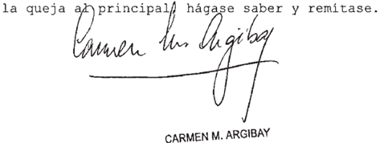
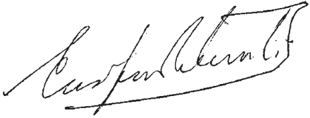
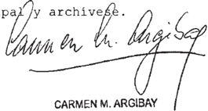
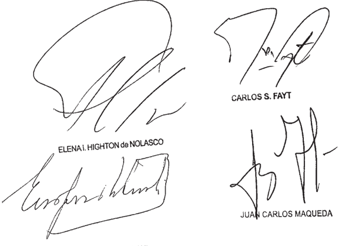
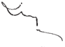

TOMO 336

Volumen 2

2013

FALLOS DE LA CORTE SUPREMA

336

DE JUSTICIA DE LA NACION 336

## FALLOS DE LA CORTE SUPREMA DE JUSTICIA DE LA NACION

## CONSULTA DE JURISPRUDENCIA DE LA CORTE SUPREMA DE JUSTICIA DE LA NACIÓN

En  la  Colección  'Fallos'  se  publican  solo  las  sentencias  más trascendentes que emite el Tribunal (acordada 37/2003).

En  el  sitio  de  Internet www.csjn.gov.ar , se  puede  consultar la totalidad  de  las  sentencias en  forma  inmediata  a  su  dictado  y mediante diversos parámetros de búsqueda.

Entre las bases disponibles, se hallan las siguientes:

- 1.- Base única de Sumarios de fallos (desde 1863 - a la fecha)
- 2.- Base de Fallos Completos (desde 1994 - a la fecha)
- 3.- La biblioteca completa de los Tomos de la colección 'Fallos' (desde el Tomo 1°)
- 4.- Búsqueda de precedente por la Cita de la colección 'Fallos'
- 5.Suplementos de Actualización Jurisprudencial
- 6.- Posibilidad de consultar todas las sentencias por Acuerdo
- 7.- Las Novedades más importantes sobre la jurisprudencia del Tribunal

## DE JUSTICIA DE LA NACION 336

## R E P U B L I C A   A R G E N T I N A

## FALLOS

DE LA

## Corte Suprema de JuStiCia de la NaCióN

PUBLICACION A CARGO DE LA SECRETARIA DE JURISPRUDENCIA DEL TRIBUNAL

TOMO 336 - VOLUMEN 2

AGOSTO - DICIEMBRE

2013

## FALLOS DE LA CORTE SUPREMA 336

## Corte Suprema de Justicia de la Nación

Fallos de la Corte Suprema de Justicia de la Nación 336 - II. 1a ed . - Secretaría de Jurisprudencia de la Corte Suprema de Justicia de la Nación - Ciudad Autónoma de Buenos Aires : Corte Suprema de Justicia de la Nación, 2016.

Libro digital, HTML

Archivo Digital: online ISBN 978-987-1625-33-8

1. Fallos de la Corte. I. Título. CDD 347.077

## DE JUSTICIA DE LA NACION 336

## ACORDADAS Y RESOLUCIONES

## AÑO 2013

## AGOSTO - DICIEMBRE

## ACORDADAS (*)

- 1. Presupuesto de la Corte Suprema de Justicia de la Nación Año 2014. -N° 21-.
- 2. Fijar el plazo de Inscripción o Reinscripción de Peritos ante la Corte Suprema de Justicia de la Nación para el Año 2014, del 1° al 29 de Noviembre de 2013 inclusive, en Lavalle 1429, Piso 6° en el horario de 9 a 13 horas.  -N° 22-.
- 3. Declarar que la operatividad de los recursos procesales que contempla la Ley 26.853 se halla supeditada a la instalación y funcionamiento de las cámaras federales y nacionales que crea. II. Hacer saber que oportunamente el Tribunal dictará las medidas conducentes para llevar a cabo la puesta en funcionamiento, instalación y habilitación de los nuevos tribunales que trata la presente. -N° 23-.
- 4. Aprobar el Protocolo de Registro de Sentencias, Acordadas y Resoluciones Administrativas. Disponer la creación de un Comité integrado por los Señores Presidentes de las distintas Cámaras Nacionales y Federales y de los Tribunales Orales, quienes tendrán la responsabilidad de implementar el presente régimen en sus respectivas jurisdicciones. Disponer que la publicación de las listas de causas en trámite en los distintos estrados a la que se refiere el artículo 2° de la Ley 26.856 se cumplirá, respecto de los Tribunales Inferiores, mediante el empleo del Sistema Informático de Gestión Judicial. Declarar inaplicable el artículo 4° de la Ley 26.856. -N° 24-.
- 5. Declarar que la Ley N° 26.857 es consistente con los principios de transparencia que aplica esta Corte Suprema desde el dictado de las respectivas acordadas. Declarar la inaplicabilidad del artículo 6° de la Ley N° 26.857, y establecer como autoridad responsable de la aplicación del régimen de recepción, custodia, registro y archivo de las Declaraciones Juradas de los Magistrados y Funcionarios de este Tribunal, a la Secretaría General y de Administración de la Corte Suprema de Justicia de la Nación. Disponer que las Declaraciones Juradas Públicas previstas en el artículo 4° de la Ley N° 26.857 serán publicadas en la página web del Tribunal. -N° 25-.
- 6. Establecer que la Corte Suprema de Justicia de la Nación, como autoridad de aplicación de la Ley N° 26.861, sancionará la reglamentación del procedimiento de concursos previsto para el ingreso al Poder Judicial de la Nación. Disponer que esta Corte Suprema dictará las medidas apropiadas que permitan una ordenada aplicación de la mencionada Ley. Declarar que, a partir del dictado de la presente acordada y hasta la confección de

876

las listas contempladas en los artículos 24 y 31 de la Ley N° 26.861, los cargos que deban cubrirse en el ámbito del Poder Judicial de la Nación  tendrán  carácter de transitorio, con las excepciones previstas. Disponer las áreas que quedan exceptuadas del procedimiento de concurso público en el ámbito del Consejo de la Magistratura. Excluir de lo dispuesto en el artículo 4° de la Ley 26.861 a los cargos de funcionarios para cuyo acceso no se requiera acreditar la condición de letrado. Invitar a constituir una Comisión Interpoderes con la finalidad de aplicar de modo general el principio de ingreso democrático e igualitario en todos los poderes del Estado. -N° 26-.

- 7. Fijar el Presupuesto de Gastos 2014 de la Corte Suprema de Justicia de la Nación y remitir  el Presupuesto de Gastos 2014 del Consejo de la Magistratura. -N° 27-.
- 8. Disponer la liquidación y pago de un incremento salarial del 10% a partir del 1° de Julio de  2013,  remunerativo  y  bonificable,  para  todas  las  categorías  del  escalafón  del  Poder Judicial de la Nación. -N° 28-.
- 9. Designar al Doctor Juan Octavio GAUNA y a la Doctora María Graciela REIRIZ como miembros titular y suplente respectivamente, del Tribunal de Enjuiciamiento del Ministerio Público de la Nación. -N° 29-.
- 10. Establecer la lista que figura en el Anexo del a presente como la lista de aspirantes a ingresar en los cargos que de acuerdo a las necesidades de la dependencia se asignen para integrar los equipos interdisciplinarios de la Oficina de Violencia Doméstica, la que tendrá una vigencia de 4 años. -N° 30-.
- 11. Designar Secretario de la Corte Suprema de Justicia de la Nación al Doctor Damián Ignacio FONT para desempeñarse como titular de la Secretaría Judicial N° 1. -N° 31-.
- 12. Crear 3 (tres) comisiones sobre Celeridad de los Procesos de la Justicia Penal, las que tendrán carácter institucional, las cuales deberán elaborar propuestas con el fin de acelerar los juicios penales, dentro de las respectivas jurisdicciones. -N° 32-.
- 13. Hacer saber al Señor Director Nacional del Servicio Penitenciario Federal que se emplaza a ese organismo para que adopte -y comunique al Tribunal- las medidas eficaces a fin de evitar el pernocte de internos por más de una noche en el Centro de Detención Judicial -Unidad 28- y garantizar las debidas condiciones de detención a cuyo efecto se le otorga un plazo de 30 días hábiles, bajo apercibimiento de decretar de oficio las medidas que correspondan. -N° 33-.
- 14. Crear el un Fondo Anticíclico - Corte Suprema de Justicia de la Nación - Obra Social del Poder Judicial de la Nación.  -N° 34-.
- 15. Establecer que el Sistema de Notificaciones por Medios Electrónicos será de aplicación obligatoria para todos los recursos ordinarios y, de ser denegados, los recursos de queja correspondientes, las denuncias por retardo o denegación de justicia y todas las presentaciones varias, que se interpusieran a partir del 14 de Octubre de 2013. -N° 35-.

- 16. Establecer que el Sistema de Notificaciones por Medios Electrónicos será de aplicación con relación a las notificaciones que deben efectuarse en las causas radicadas ante la jurisdicción prevista en el Artículo 117 de la Constitución Nacional, con arreglo a lo dispuesto en la Acordada N° 51/73. Disponer que el nuevo régimen entrará en vigencia a partir del primer día hábil de Noviembre de 2013 con relación a todas las causas que se promuevan desde esa fecha. Aprobar el plan de difusión y capacitación. -N° 36-.
- 17. Designar en la Secretaría creada por Acordada 10/90 al Doctor Marcelo Julio NAVARRO, Secretario Letrado de esta Corte, quien a los efectos pertinentes tendrá las atribuciones y funciones de los Secretarios Generales. -N° 37-.
- 18. Extender el ámbito de aplicación del Sistema de Notificación Electrónica establecido por Acordada 31/11 a todo el ámbito del Poder Judicial de la Nación de acuerdo al plan de implementación gradual que se establece. -N° 38-.
- 19. Designar Secretario de la Corte Suprema de Justicia de la Nación al Doctor Marcelo Julio NAVARRO para desempeñarse como titular de la Secretaría Judicial N° 6. -N° 39-.
- 20. Aprobar el Reglamente General del Cuerpo de Calígrafos Oficiales de la Justicia Nacional.  -N° 40-.
- 21. Disponer la habilitación del Juzgado Federal de Primera Instancia con asiento en la ciudad de Esquel, provincia del Chubut. -N° 41-.
- 22. Ordenar que los depósitos que se efectúen en el Banco de la Nación Argentina con motivo de la interposición de los recursos de queja por denegación del extraordinario, serán invertidos a plazo fijo. La parte podrá optar por que el depósito efectuado quede excluido de este régimen. -N° 42-.
- 23. Establecer que el Sistema de Notificaciones por Medios Electrónicos reglamentado por Acordada N° 31/11 será de aplicación obligatoria para todos los recursos de queja por denegación del extraordinario resueltos por los superiores tribunales de las provincias y de la Ciudad Autónoma de Buenos Aires que se presentaren a partir del primer día hábil posterior a la feria de enero de 2014. -N° 43-.
- 24. Disponer la liquidación y pago de un incremento salarial del 5% a partir del 1° de Diciembre de 2013, remunerativo y bonificable, para todas las categorías del escalafón del Poder Judicial de la Nación. -N° 44-.
- 25. Declarar feriado judicial los días 24, 26 y 31 de diciembre de 2013 e inhábil el día 02 de enero de 2014 para los tribunales nacionales y federales con asiento en la Capital e Interior del país.

-N° 45-.

- 26. Declarar asueto los días 24, 26 y 31 de diciembre de 2013 y 02 de enero de 2014 para la Oficina de Violencia Doméstica. -N° 46-.

878

- 27. Autoridades de Feria enero 2014. -N° 47-.
- 28.  Declarar asueto el día 23 de diciembre de 2013 a partir de las 12 horas, para los tribunales nacionales y federales con asiento en la Capital e Interior del país. -N° 48-.
- 29. Fijar que los cargos de ingreso, a los efectos establecidos en la ley 26861, serán los establecidos en el escalafón aprobado por la acordada 9/2005, a saber: de ayudante para el personal llamado de 'maestranza y oficios' en la ley (art. 19), de auxiliar para el personal denominado 'empleados' (art. 20) y de secretarios y prosecretarios que requieren título de abogado para los funcionarios 'letrados' (art. 28). Aprobar el 'formulario de inscripción como postulante a ingresar al PJN'. Establecer que los interesados en ingresar al PJN deberán cumplir los requisitos establecidos en los arts. 6, 7 y 8 de la ley 26.861, según el cargo para el cual se postulen, y no verificar los impedimentos previstos en el art. 17, ni el art. 12 del RJN. Disponer que los formularios de inscripción se realizará en el mes de marzo de 2014. Declarar que hasta que se produzca la efectiva puesta en funcionamiento del régimen de ingreso que contempla la ley 26.861, lo que dispondrá esta Corte como autoridad de aplicación, los tribunales mantendrán las atribuciones de la acordada de Fallos: 240:107 para la designación y promoción de empleados, efectivos o interinos, en cargos de planta, o contratados. -N° 49-.
- 30. Declarar asueto el día 30 de Diciembre de 2013 a partir de las 12 horas, para los tribunales nacionales y federales con asiento en la Capital e Interior del país.  -N° 50-.

\_\_\_\_\_\_\_\_\_\_\_\_\_\_\_\_

(*) Los documentos de la lista precedente se encuentran  disponibles en el sitio Web www. csjn.gov.ar - Administración General - Acordadas.

## RESOLUCION (*)

- 1. Rechaza recusación deducida por el Doctor Diego Carlos SANCHEZ - Separa al magistrado de determinadas causas - Art. 167 C.P.C.C.N. - Integración del Tribunal - Impone multa - Comunicación al Consejo de la Magistratura. -N° 3096/ 2013-.

\_\_\_\_\_\_\_\_\_\_\_\_\_\_\_\_

(*) El documento de la lista precedente se encuentra disponible en el Sitio Web www.csjn. gov.ar - Administración General - Resoluciones.

## DE JUSTICIA DE LA NACION 336

## FALLOS DE LA CORTE SUPREMA

## AGOSTO

## BARRANTES, JUAN MARTIN - MOLINAS DE BARRANTES TERE-

## SA - TEA S.R.L. C/ ARTE RADIOTELEVISIVO ARGENTINO S.A. S/ Sumario

## LIBERTAD DE PRENSA

Cabe confirmar la sentencia que modificó la suma concedida en concepto de daño moral, en el marco de la demanda de daños y perjuicios promovida por particulares en virtud de la difusión de un informe periodístico, pues no han aceptado un cargo público ni asumido un rol influyente en el ordenamiento de la sociedad, ni tampoco han adoptado acto voluntario alguno ni pretendido influenciar en la resolución de asuntos públicos de un modo incompatible con los mecanismos naturalmente democráticos, por lo cual no han renunciado a su interés en la protección de su buen nombre y cuentan con argumentos para acudir ante los tribunales a fin de obtener la reparación de los perjuicios producidos por falsedades difamatorias, lo que no implica desconocer el interés general que puede suscitar la discusión pública de cuestiones de relevancia social como la de la temática que informó la investigación cuestionada en las actuaciones.

-La jueza Argibay, en disidencia parcial, respecto a los agravios atinentes a que los montos concedidos en concepto de indemnización eran excesivos y constituían una censura encubierta, declaró inadmisible  el recurso (art. 280 del CPCC)-

## REAL MALICIA

El punto de partida de la doctrina de la real malicia está en el valor absoluto que tiene  que  tener  la  noticia  en  si,  en  su  relación  directa  con  un  interés  público  y su trascendencia para la vida social, política o institucional, a lo que se suma la misión de la prensa, su deber de informar a la opinión pública proporcionando el conocimiento de qué y cómo actúan sus representantes y administradores, si han cometido hechos que deben ser investigados o incurren en abusos, desviaciones o  excesos,  revelando  así    el  prioritario  valor  constitucional  según  el  cual  debe resguardarse el más amplio debate respecto de las cuestiones que involucran la discusión sobre asuntos públicos como garantía esencial del sistema republicano democrático.

-La jueza Argibay, en disidencia parcial, respecto a los agravios atinentes a que

880

## FALLOS DE LA CORTE SUPREMA 336

los montos concedidos en concepto de indemnización eran excesivos y constituían una censura encubierta, declaró inadmisible  el recurso (art. 280 del CPCC).

## LIBERTAD DE PRENSA

Para  obtener  la  reparación  pecuniaria  por  las  publicaciones  concernientes  a  la discusión sobre asuntos de interés público, los funcionarios (o figuras públicas) deben probar que la información fue efectuada a sabiendas de su falsedad o con total despreocupación acerca de tal circunstancia; en cambio, basta la 'negligencia precipitada' o 'simple culpa' en la propalación de una noticia de carácter difamatorio de un particular para generar la condigna responsabilidad de los medios de comunicación pertinentes.

(Doctrina del precedente 'Ramos' (Fallos: 319:3428), ratificada en 'Costa' (Fallos: 310:508).

-La jueza Argibay, en disidencia parcial, respecto a los agravios atinentes a que los montos concedidos en concepto de indemnización eran excesivos y constituían una censura encubierta, declaró inadmisible  el recurso (art. 280 del CPCC).

## LIBERTAD DE PRENSA

Cabe confirmar la sentencia que modificó la suma concedida en concepto de daño moral, en el marco de la demanda de daños y perjuicios promovida por particulares en virtud de la difusión de un informe periodístico, pues no corresponde aplicar a los actores -que no son funcionarios públicos ni figuras públicas- un estándar de 'protección atenuada' del honor, concebido sólo para los casos en que esos funcionarios (o esas figuras) están comprometidos en temas de interés general.

-Voto del juez Petracchi-

## LIBERTAD DE PRENSA

Cabe revocar la sentencia que modificó la suma concedida en concepto de daño moral, en el marco de la demanda de daños y perjuicios promovida por particulares en virtud de la difusión de un informe periodístico, pues las  opiniones, las ideas, los juicios de valor, los juicios hipotéticos o conjeturas, a diferencia de los hechos, dada su condición abstracta, no permiten predicar verdad o falsedad, no siendo adecuado aplicar un estándar de responsabilidad que las considera presupuesto, y sólo un interés público imperativo puede justificar la imposición de sanciones para el autor de ese juicio de valor cuando el afectado es un funcionario o una personalidad pública.

-Disidencia parcial de la jueza Highton de Nolasco, la que remitió al dictamen de la Procuración General y al precedente 'Patitó' (Fallos: 331:1530) respecto a la doctrina de la 'real malicia'-.

## DE JUSTICIA DE LA NACION 336

## diCtameN de la proCuraCióN GeNeral

## Suprema Corte:

La Corte de Justicia de la Provincia de Salta rechazó el recurso local de inconstitucionalidad que había sido   interpuesto por la parte demandada en la presente causa, Arte Radiotelevisivo Argentino S.A. (ARTEAR), contra la sentencia pronunciada por la Sala I de la Cámara de Apelaciones Civil y Comercial de esa los fines de este dictamen, en dicho resolutorio la cámara resolvió: 1) admitir parcialmente el recurso interpuesto por los actores T S.A., Juan M. B y Teresa M de B; modificando, de esa manera, la suma concedida en concepto de daño moral sufrido por ésta última; 2) hacer lugar al recurso introducido por el co-actor; Antonio P admitiendo su demanda que había  sido desestimada en la sentencia de primera instancia; y 3) denegar la apelación intentada contra la sentencia de por la parte demandada grado

En los autos, el matrimonio compuesto por Juan M. B Teresa

M actores en esta causa y propietarios de la empresa dedicada al turismo T S.A , y un empleado de ésta última, Antonio P: promovieron sendas demandas contra ARTEAR, reclamando daños y perjuicios en virtud de la difusión de un informe   periodístico que tuvo por objeto   indagar acerca dc actividades relacionadas con la   pornografía   infantil, el turismo sexual y la prostitución de menores en nuestro El mencionado informe habría sido emitido en el mes de noviembre de 1996, en el programa televisivo señal LS83 'TV Canal   13 (empresa licenciadora de ARTEAR) denominado 'Telenoche Investiga' sintiéndose los actores en la presente causa falsamente involucrados en él invocando la lesión de su derecho al honor país.

El Superior Tribunal rechazó el remedio intentado en el entendimiento de que éste no cumplía con el requisito de fundamentación autónoma, habida cuenta de que la recurrente no se habría hecho cargo de los argumentos en los que habría reposado el pronunciamiento de la cámata de apelaciones. En este sentido; afirmó que las críticas de la impugnante sólo habrían traducido diferencias de criterio con los juzgadores, y que habrían sido insuficientes para rebatir las consideraciones de

882 éstos.

Brevemente, en relación con la falta de fundamentación atribuida a la sentencia de la cámara, el qu0 recordó que en dicho resolutorio y con sustento las constancias de la causa penal iniciada contra empleados de la empresa T S.A en las declaraciones   testimoniales   recabadas y en el video del programa, se había establecido que la demandada divulgó una noticia obtenida mediante la actuación de periodistas; cuya inexactitud habría sido constatada previamente a su difusión. Señaló que la cámara sostuvo que el hecho denunciado por la investigación cuestionada sería inexistente respecto de T S.A., el matrimonio B P que constituía una 'burda invención? , lesionando; de esa manera; su derecho al honor y gencrando 'perjuicios no amparados por la libertad de información?\_ en y de

Contra estc pronunciamiento, la demandada interpuso recurso extraordinario federal (fs. 555/572), cuya   denegatoria (fs. 621/625) motivó la presente queja.

~II

La apelante  afirmó que las libertades de expresión y de prensa habrían sido violentadas por una interpretación errada de las normas constitucionales que las amparan (artículos. 14 y 32 de la Constitución Nacional) . Añadió que ello importaba el ejercicio de una censura posteriori que sería tan más perjudicial quc la censura previa:

En este sentido; la impugnante censuró la concesión de la indemnización solicitada por los accionantes ante la conducta 'de quien se presentó como A

'E M ofreciendo un 'catálogo' con niñas de 12 a 16 años, 0 de 18 0 20 años, fijando un 'precio' entre cien ciento cincuenta pesos   (i') por el 'servicio' asegurando que lo que uno quiera imaginar al respecto él lo consigue' Asimismo agregó   que habría sido efcctivamente el co-demandante en la prescnte causa, Pastrana, dentro del ámbito de la Agencia T' ante cl pedido de 'seis u ocho pibas   con disponibilidad de tres días' , lejos de extranarse de producir cualquier reacción negativa, respondió con absoluta seguridad: 'Usted dirá, tal hora, tal está. Lo que usted imagina; tiene. Hable conmigo' En consecuencia; sostuvo que sería impropio sostener que la investigación difundida  televisivamente; habría quien

## DE JUSTICIA DE LA NACION

sido inventada por el medio, en especial   habida cuenta de que 'culminó con la aparición, dentro de\_una\_camioncta de la agencia I dc de una menor 'dispuesta 'consciente de que Fa prostituirse?   (el subrayado pertenece al original)

En este orden de ideas, pues, la recurrente se refirió en primer lugar al contenido del informe periodístico cuestionado; y destacó que el tema sobre el cual versaba   poseía una nivel nacional como internacional, y aseveró, una vez que se refirió a un hecho verdadero; es decir, a la existencia en nuestro del tráfico de menores y de su explotación sexual en el turismo: Asimismo, la recurrente manifestó que no tuvo intención de injuriar ni de perjudicar actores. Concluyó, en suma, que la condena recaída en el expediente habría sido lesiva del derecho a la libertad de expresión. Citó en apoyo de su tesitura el precedente de V E publicado en Fallos: 314.1517 ((Vago; Jorge A. c/Ediciones de La Urraca $. A. y otros") más, país los todas maneras argumentó que aun cuando se insista en reputar inexacta la noticia de marras (no lo fue), ello no resultaría suficiente para generar responsabilidad,  porque dentro de las garantías la libertad de prensa existe un margen de ertor permisible que ameritaba, en última instancia, el rechazo de la acción En este sentido; la impugnante agregó que una manifestación inexacta errónea sería inevitable en los medios, pero que, no obstante ello, dicha manifestación debería ser protegida breathing space)) que la libertad de expresión necesita para existir En relación con esto último; invocó el precedente de la Corte Suprema de los Estados Unidos, Gertz Welch, Inc. (418 US. 323 [1974]), que, en materia de libertad de expresión; reconoció que en el supuesto de sentarse una regla de estricta responsabilidad que obligara un editor un radiodifusor garantizar la precisión de sus aserciones fácticas, ello conducir una 'intolerable censura= y que en consecuencia se necesita que alguna falsedad sea tolerada en aras de proteger el discurso que importa. De podría

Como corolario de lo anterior; la recurrente argumentó que una eventual inexactitud en la información difundida no podría por sí sola generar responsabilidad en cabeza de los medios de comunicación; sino que también sería necesario acreditar

el factor de atribución subjetivo; culpa 0 dolo, aspecto que demostrado en la causa.

En otro orden de ideas, la impugnante afirmó que el habría convalidado una 'doble contradicción y que ello ameritaría su anulación. Con ello se refirió que la Corte de Salta reconoció que el fallo de primera instancia habría sido contradictorio al afirmar que   la información difundida era inexacta respecto de la T pero no así respecto de P Sin embargo ~criticó la demandada no reconoció que posteriormente la cámara también habría incurrido en una contradicción al haccr la demanda interpuesta por P afirmando por ello que el informe tampoco habría sido veraz respecto de este último. agencia lugar

Por otra parte, ARTEAR denunció la violación de su derecho de defensa, habida cuenta de que el fundamento de la sentencia reposaría exclusivamente en la causa 75072/96 [iniciada en virtud de la difusión de la investigación cuestionada contra P y contra otro empleado de la empresa, cual ~manifestó - clla no habría sido parte, ni tenido oportunidad de participar controlar la   prueba   producida; en violación al   principio de contradicción de la prueba. penal aquí

Con relación la   valoración de la prueba alegó una vez más que los hechos cuestionados efectivamente habrían ocurrido, destacando que en la causa se habrían   valorado arbitrariamente las   pruebas, omitiendo considerar aquéllas   que proporcionaban sustento su pretensión y, por el contrario, teniendo por ciertos hechos relevantes que ~en su entendimiento - no habrían sido acreditados\_

En este punto la defensa letrada del medio periodístico hizo hincapié en la circunstancia de   que el sobreseimiento de   quienes fueran   imputados en la mencionada causa penal, en nada debería conmover la decisión acerca de la concesión 0 no de una indemnización por daños y perjuicios, habida cuenta de que expresó : ~P dentro de la agencia T se comprometió obtener los servicios sexualcs de una menor de edad, luego se contactó dentro de una camioneta de la empresa. nucstra legislación civil y también lo era para la ley penal al momento de los hechos) no fue 'inventada por mí   representada. Tiene nombre y apellido: G estaba según quien

## DE JUSTICIA DE LA NACION

dispuesta prostituirse gracias a la intermediación de su ex compañero de trabajo [se refiere P ] quien por al motivo fue desvinculado de la empresa de la familia B

Por que en la   investigación   cuestionada hubicra involucrado la Sra M de B y que se la hubiera considerado la "cabecilla de la organización? , afirmación que desprende de la noticia ni de la voz en off, que "en ningún momento la menciona Aseveró que sólo se podría inferir una relación entre aquélla y los hechos denunciados en razón de que los dependientes formularon sus manifestaciones dentro de la agencia T en ocasión de sus empleos. negó ~según

Finalmente, la   parte   demandada se de lo que consideró una excesiva incausada indemnización manifestó al respecto que ello habría constituido una censura indirecta (artículos. 14 y 32 de la Constitución Nacional) , así como también habría sido lesivo de sus derechos de propiedad y de defensa en juicio (artículos. 17 y 18 de la Constitución Nacional) , pues el monto concedido no tendría sustento en las constancias agregadas la causa\_ Tachó, en consecuencia, la sentencia recurrida de arbitraria. agravió

## ~III

primer lugar; antes de ingresar en el análisis de los agravios esgrimidos por la apelante en sustento de su cuestión principal debatida en el examine se relaciona con el alcance y los límites del derecho entrar en colisión con otros \_como el honor, en este caso\_ que, del mismo modo, merecen una amplia protección. En estos supuestos, se hace necesario analizar los alcances y límites de todos los derechos en pugna, ponderar   cuidadosamente cuál   debe prevalecet. En sub puede

En este sentido, aun cuando la recurrente no realizado una invocación expresa, tanto citas jurisprudenciales   contenidas en su escrito tecursivo como se en lo principal, el alejamiento del tribunal qu0 de las reglas que en ayuda de aquella labor de armonización del ejercicio de esos diversos derechos V.E. ha adoptado; es decir, haya

886

## FALLOS DE LA CORTE SUPREMA 336

la llamada doctrina de la *rcal malicia (Fallos: 310.508, 314.1517 y 319.3428; entre

Aclarado estimo que existe cuestión federal que habilita la instancia extraordinaria en los términos del artículo 14, inciso 3", de la 48, toda vez que se cncuentra en discusión la inteligencia de cláusulas de la Constitución Nacional, y la decisión impugnada es contraria al derecho que la recurrente pretende sustentar en aquéllas. Corresponde, asimismo; tratar en forma conjunta los agravios relativos supuesta arbitrariedad del   pronunciamiento en la consideración de argumentos planteados en la causa, pues ello se imputa la directa violación de los derechos constitucionales invocados; guardando; en conexidad entre sí (v. doctrina de Fallos: 327:789, entre otros) ello, ley

## ~IV\_

De esta manera, corresponde ingresar al análisis del fondo de la cuestión. Tal como se destacó en los párrafos anteriores; se discute en lo principal, la aplicación los hechos del caso del estándar emanado de reglas de la real malicia. XL. 'Patitó José Ángel y otro c /Diario La Nación y otros del 11 de abril de 2007 ~a la que me remito  por razones de brevedad , cabe   señalar brevemente que la   mencionada doctrina es una ponderación de los intereses del y la libertad de prensa, la cual, por razones de diseño de política constitucional, las reglas del derecho civil de daños no se aplican; aunque producto de una publicación existido un daño efectivo al honor, en aras de proteger la cantidad más amplia posible de libertad de expresión futura. La razón es clara: la doctrina intenta estimular el debate libre y desinhibido; como modo de garantizar un elemento esencial del sistema republicano democrático y, entonces, ello determina que la libertad de expresión no se agote en las meras   afirmaciones verdaderas opiniones: Por el contrario, una regla   que a los medios cerciorarse de la veracidad de todas sus afirmaciones podría desalentar la formulación de enunciados que, al momento de la publicación; sean considerados razonablemente ciertos que podrían efectivamente serlo) pero cuya veracidad no ser corroborada con exactitud. aquí, las honor según haya obligara pudo

En el caso sub examine; es menester senalar que ni en el fallo recurrido ni

## DE JUSTICIA DE LA NACION 336

en las sucesivas sentencias   pronunciadas en las  instancias anteriores se tuvo pot acreditado que los hechos denunciados por ARTEAR en el informe televisivo objeto de esta controversia hayan efectivamente  acaecido; circunstancia que, entre otras, provocó la   concesión de la indemnización pretendida  por los demandantes En efecto, allí sobre la base de pruebas colectadas en el expediente se concluyó que, a diferencia de lo informado en el progtama, no habría   existido una organización dedicada a la promoción del turismo sexual en la provincia de Salta; y que a pesar de las afirmaciones realizadas por dos empleados de la de turismo 1 en ese sentido, éstas propuestas habrían sido falsas que los supuestos encuentros con menores nunca se habrían producido. las agencia

Sin embargo, por el contrario, el medio demandado través de las distintas etapas recursivas afirmó la veracidad de los hechos difundidos, haciendo especial   hincapié en las circunstancias   (documentadas en la filmación) de que el propio co-demandante en esta causa; P junto con otro de los empleados de la empresa, manifestó ante los periodistas que efectivamente podían conseguir menores de edad dispuestas mantener rclaciones sexuales cambio de dincro y que inclusive se observar en el video a una menor puede

Paralelamente, la apelante destacó también el interés público que =a su juicio \_ revestía el informe cuestionado por los actores y la importancia de proteger su libre divulgación; aun cuando según un examen efectuado ex-post lo allí relatado pudiera ser calificado de erróneo u inexacto y lesivo del honor de aquéllos, pues, de otra manera, podría verse cercenado el margen futuro del ejercicio de la libertad de prensa

En este sentido ~y de conformidad con lo expuesto más artiba considero correcta la tesitura sostenida por la recurrente pues si bien en un análisis tealizado ex ~post no se comprobar que las afirmaciones contenidas en la investigación periodística se correspondieran con la realidad, la doctrina de la real malicia ampara, en principio, algunas falsedades en miras la protección del interés prioritario que representa la comunicación de informaciones. De otra manera; como se se correría el de que información vital para el debate democrático quedara sin ser comunicada por el temor que representa sufrir una sanción. Es por pudo dijo, riesgo

ello que sólo si el medio pcriodístico al momento de la difusión de la noticia conocía desconsideró temerariamente su posible falsedad se genera el deber de reparar.

Al respecto, no debe soslayase que se desprende tanto de la filmación cuestionada como de las declaraciones contenidas en el expediente que los propios

P y Q aseveraron poder conseguir menores para que formaran parte de los supuestos &lt;tours sexuales" inclusive ptocedieton la presentación de una menor quien también manifestó estar de acuerdo con la realización de tales encuentros; circunstancia que fuc soslayada por el qu0 mediante la afirmación de que, de conformidad con lo resuclto en las instancias anteriores, el hecho denunciado "sería inexistente respecto de T S.A., el matrimonio B y de

- P que constituía una 'burda invención

En este sentido; dejando de lado que de las pruebas recolectadas en el expediente no se desprende que el medio   periodístico hubiera conocido la inexistencia de los hechos difundidos en el informe periodístico; circunstancia que sería, de suyo, suficiente para revocar la sentencia sobre la base de la doctrina de la arbitrariedad (Fallos: 315.28, 318.652), lo cierto es que fueron propios empleados de la empresa los que con su comportamiento asumieron el riesgo de que se creyera que prostituían a jóvenes menores de edad y, por no parece correcto que sea la dcmandada en esta causa sobrc quien las consccuencias de obrar, aún cuando la magnitud de la difusión que alcanzó lo que posteriormente se tuvo por desacreditado hubiera sido insospechado por propios empleados de la empresa. Dicho en otras palabras; fucron los empleados quienes, mediante su su honra haciendo creer quienes   posteriormente resultaron periodistas que organizaban encuentros sexuales con menores de edad, y dicron lugar, de esta manera, al comportamiento que se concretó en el daño alegado los ello, recaigan aquél los aquí

Esta circunstancia relativa a la autorresponsabilidad de los dos empleados (uno de ellos ser expresada de otra manera en relación a lo que importa; es decir; a la construcción de la regla de cuál es el deber de diligencia en la comprobación de la veracidad de la información que recae sobre el medio que la hace pública. Y al respecto parece evidente que el propósito de la regla

## DE JUSTICIA DE LA NACION 336

de la real malicia ~esto es, constituir un parámetro destinado proteger y promover la información pública aun cuando pueda danarse el honor \_ se vería desvirtuado si el medio, con la premura inherente a la difusión de la información; tuviera siempre un estricto deber de corroboración ulterior aun cn los casos en los que los propios implicados en la conducta cuya difusión resultaría lesiva al honor son la fuente de la información Si un sujeto informa que él mismo realiza   conductas impropias, los deberes de comprobación del medio que hace la investigación han de ser menores en comparación con los deberes que surgen de la recepción de la información relativa que otro (diferente al informantc) es a cabo conductas de esa clase: No es temcrario en la publicación el medio que considera   posiblemente veraz una información dada por el mismo sujeto que la protagoniza; cuando del contexto en el que fue emitida la información no surgen evidencias de su falsedad que podrían ser fácilmente detectadas por el medio. Estatuir ulteriores deberes de comprobación en estos casos, salvo cuando de especiales circunstancias concomitantes (el desarrollo de una casuística no hacerse aquí) se desprenda evidentemente la falsedad de la información ~lo que no parece haberse dado en la especie - entraría en colisión con el parámetro estatuido en materia de real malicia. Se trata de una evaluación de política constitucional que no ser subvertida en los casos en los que, identidad entre la fuente de la información difamatoria y el sujeto que resulta difamado por la difusión de la información quien Ileva puede puede hay

No desconozco que estas consideraciones no son aplicables exactamente los co-actores, (a empresa S.A. Juan M B y Teresa de B quienes aseveraron ofrecer esos ilegales servicios. Pero lo cierto es que un parámetro parecido es aplicable. Se trata de empleados de la la información Y además aseveraron; como ya ~aun respecto de quienes no realizaron la manifestación y particularmente por la veracidad que otorga la pertenencia a la estructura y la autoinclusión en la conducta - un elemento de juicio que incide en la medida exigible del deber de comprobación habilita la publicación de la información en aras del interés general. En este supuesto también que descartar la existencia de desconsideración temeraria al emitir la quedó hay

890

información. En efecto, tal como señalé en mi dictamen en la causa S.CM 1126 L XLI, 'Melo, Leopoldo F. y otros c/Majul Luis Miguel el fundamento del deber de tolerar lesiones al honor provocadas por firmaciones de hecho falsas se vincula con una setie de factores\_ Uno de ellos radica en la preferencia de arriesgar que salgan la luz informaciones cuya certeza absoluta no ser alcanzada al momento de la publicación; en tanto el beneficio que la sociedad obtendría en caso de ser cierta la información supera el valor del este motivo, en el caso tratado en el que evidentemcnte la índole esencialmente pública de la cuestión, combinada con el perjuicio que cabría esperar de que la publicación se hubiera demorado más produce que el estándar de diligencia debida que demuestre que el medio   periodístico   cumplió con el requisito de no haber actuado de manera 'temerariamente desconsiderada sea menos exigente y se encuentre satisfecho la luz de las pruebas aportadas por cl medio periodístico en su sustento. puede aquí,

~V

Finalmente, en atención a las consideraciones expuestas en el acápite anterior; considero inoficioso pronunciarme acerca de los demás agravios contenidos en el presente recurso.

Por todo lo expuesto, opino que corresponde declarar  procedente la presente queja, admitir el recurso extraordinario interpuesto por la parte demandada y revocar la sentencia impugnada.

Buenos Aires, /8 de noviembre de 2008.

## ESTEBAN RIGHI

## FALLO DE LA CORTE SUPREMA

Vistos 10s autos: "Recurso de hecho deducido por la deman dada en la causa Barrantes, Juan Martín; Molinas de Barrantes Teresa TEA S .R.L. c/ Arte Radiotelevisivo Argentino pa ra decidir sobre su procedencia\_

Considerando:

Que los antecedentes de la causa están adecuada mente reseñados en 1os capítulos II Y III de] dictamen del señor Procurador General , 10s que se dan aquí por reproducidos brevitatis causae

Que con referencia cuestiór federal indicada en el capítulo III del citado dictamen ~invocada aplicación al caso de la doctrina de la Ilamada real malicia" \_ corresponde recordar que en el caso "Ramos (Fallos: 319:3428) , el Tribunal ratificó la doctrina que ya había expresado en el precedente "Costa (Fallos: 310:508 ) según la cual para obtener la reparación pecuniaria por las publicaciones concernientes la discusión sobre asuntos de interés público, funcionarios (0 ras públicas) deben probar que informaciór fue efectuada sabiendas de su falsedad con total despreocupación acerca de tal circunstancia; cambio, basta la "negligencia precipicada "simple culpa" en propalación de una noticia de carácter difamatorio de un particular para generar la condigna responsabilidad de los medios de comunicación pertinentes (Fallos 319:3428 , considerandos 9 ' 10 Y sus citas; "Melo, Leopoldo Felipe y otros c/ Majul, Luis Miguel disidencia de los jueces Lorenzetti, Maqueda Y Zaffaroni, Fallos: 334 :1722 , considerando 15 ) figu-

3 % ) Que conforme 10 expuesto este Tribunal ha establecido como principio un tratamiento diferenciado según la lidad del sujeto pasivo de la información. No debe olvidarse que la protección atenuada respecto de quienes ostentan calidad pública asume por fundamento principal el hecho de que éstas tíenen un mayor acceso 1os medios periodísticos para replicar las falsas imputaciones ~por su condición se han expuesto Voluntariamente un mayor riesgo de sufrir perjuicio por noticias difamatorias (conf Fallos 316:2416, voto de los jueces Fayt Belluscio Petracchi; entre otros) Ello obliga un criterio estricto en la ponderación de los presupuestos de 1a responsabi-

lidad, ya que contrario conspiraría contra la formación de una opinión pública vigorosa, en razón de la fuerza paralizadora Y disuasiva del deber de resarcir

El fundamento expresado ~siempre en el marco de la necesidad de garantizar un debate público robustoha permitido aludir la posible extensión de esta doctrina respecto de supuestos en 1os que el objeto de 1a presurta difamación haya sido un simple ciudadano mas bajo estrictas condicicnes que en ningún caso pueden desatender el origen de tal extensión ni 1a calidad del asunto

Que pese ello, la recurrente interpreta ~con cita del precedente registrado en Fallos 314 :1517, in re entre otros que el estándar que surge de la doctrina de la real malicia puede resultar de aplicación ~sin másrespecto de particulares que se encuentran "involucrad(0)s voluntaria involuntarianente en una cuestión de interés general público {cfr. fs . 177 vta. ; énfasis agregado) De este modo , la ape lante asigna la jurisprudencia del Tribunal un efecto igualador ~en cuanto la utilización de la doctrina citadaque no distingue entre los sujetos pasivos de la información presumiblemente difamatoria ni atiende al significado de 1a garantía; tampoco cuáles son intereses tutelados por ella (cfr. fs 178/178 vta.) \_ go "

Que lejos de poder colegirse del precedente citado esta aseveración, Corte ha delineado de otro modo siemcomo obiter respecto de particulares (Fallos: 320:1272 y Patitó, José Ángel Y otro c/ Diario La Nación Y otros" Fallos 331 :1530 , entre otros) el contexto en el cual podría privilegiarse la expresión por sobre el honor de determinadas personas Y en ciertas situaciones específicas que cabe adelantar, no se configuran en el sub\_lite pre

Es sabido que la mera alusión una nota de interés público general, en modo alguno basta ~tal como se verá continuaciónpara soslayar el principio que se ha establecido con

relación los casos efectivanente resueltos por el Tribunal; mucho menos para equiparar sin más los supuestos en 1os que el particular resulta implicado con aquellos otros en los que (1ibremente) interviene

Antes bien, recurrente debió en todo caso demos trar que vulnerabilidad característica de los simples ciudadanos ~que como tales se encuentran excluidos de la aludida "protección débil no se hallaba presente en la especie; cuanto menos , debió advertir si en conexión de sentido con ello, la dimensión de 105 asuntos discutidos (en térninos de debate público Y en tanto razón de ser de real nalicia) permitía absorber de alguna manera la condición de sujetos involucrados

6 Que en efecto Y tal como fuera afirmado en el mencionado caso "Vago" el punto de partida de la doctrina cuya aplicación al sub examine la recurrente pretende (real malicia) "está en el valor absoluto que tiene que tener la noticia en esto es su relación directa con un interés público y su trascendencia para la vida social, política institucional Se suma 1a misión de 1a prensa, su deber de informar la opinión pública proporcionandc el conocimiento de qué cómo actúan sus representantes adninistradores; si han cometido hechos que deben ser investigados incurren en abusos , desviaciones excesos

Dicha doctrina que ~como se dijosurge del aludido caso "Costa" revela el prioritario valor constitucional según el cual debe resguardarse ei más amplio debate respecto de las cuestiones que involucran la discusión sobre asuntos públicos como garantía esencial del sistema republicano democrático

En la interpretación, entonces , de esta Corte la prensa tiene por función política, mediante la información, transmitir voluntad de los ciudadanos 1os gobernantes por función social, mediante 1a crónica, informar de todo cuanto ocurre en el mundo que nos rodea que tenga interés público; permitir el control de los órganos sistema republicano, defender 1os derechos irdividuales Y hacer posible que cual quier

ciudadano participe en la acción de gobierno (Fallos: 312 : 916, disidencia del juez Fayt) , garantizándose así también su cuoza de influencia democrática Y alumnbrada , pues "por 1a libertad es decir por injerencia de los pueblos en la gestión de sus destinos hace pcsible la formación de una opinión { que todo ve Y todo juzga sin temcr" (cfr Juan Bautista Alberdi "El crimen de la guerra AZ editora, Serie testinonial, San Pa blo, 1994 , p . 71 )

De ahí que solo si en el contexto de dichos hechos han intervenido funciclarics figuras públicas\_ incluso particulares ~que han adquirido notoriedad suficiente para encontrarse involucrados voluntariamente en la cuestión pública de que trata 1a informaciónsu situación ( obliga [a tales sujetos] demostrar la falsedad de noticia, el dolo la inexcusable negligencia de la prensa (considerando 11 , in re "Vago énfasis agregado)

70 ) Que la garantía de libertad ostentan en nuestra Constituciór los discursos sobre asuntos de interés público atiende âsí fortalecer la discusión importa, entre otras cuestiones, hacer mérito de 1a doctrina tradicional de esta Corte según cual La prensa sigue siendo condición necesaria de la existencia de un gobierno que

Asimismo supone adoptar como criterio final de valoración de no acreditarse, real nalicia, deba asumirse la na tural molestia que la noticia considerada difamatoria pceda proaucir en intervinientes\_ Por ello tanbién, se ha nanifestado que dicho criterio no resulta aplicable cuando "la información no se refier (a) funcionarios figuras públicas, ni particulares que centren en su persona suficiente interés público" (Fallos in re "Sciamma voto de la mayoría voto concurrente del juez Fayt; énfasis agregado) que ro"

Que , sin embargo, la recurrente no solo omitió dar razones para sostener que la condición de los sujetos Juan Martín Barrantes Teresa María Molinas de Barrantes (propieta-

rios de 1a agencia de turismo TEA)   podía ceder en este caso, sino que tampoco demostró ~como era necesario fin de fundar su pretensión en contra de 10 sostenido por el quo\_ cuán vital resultaba los fines del debate público privilegiar la difusión de una imagen por sobre el honor de 1os particulares en cues tión

Asimisno y en contradicción con su propio punto de partida {el del interés superior que su entender tenía para comunidad toda noticia) lâ apelante no acreditó siquiera cómo imposibilidad de vincular ~por medio de una cámara ocul la imagen de la empresa de turismo con quienes aparecían co mo presuntamente implicados en un delito (sus empleados) impedía la discusión púplica acerca de temas tan trascendentes como "1a pornografía infantil, el turismo sexual Y la prostitución de me nores

En efecto 1a recurrente solo aludió en abstracto la innegable existencia de la problemática de explotación sexual infantil tanto nivel nacional como internacional y de allí derivó inopinadamente que el interés público se sostenía partir de ese contexto respecto incluso de los propietarios de la agencia de turismo (conf fs 174 vta./175)

Que por demás , resulta claro que las instancias de acceso la opinión pública con las que contaban los sujetos con quienes se vinculó una suerte de agent provocateur" eran prácticamente nulas Distinto, sería claramente el caso, si quienes hubiesen sido involucrados en una cuestión tan sensible como la "trata de personas hubieran sido funcionarios públicos ellos no podrían reclamar una mayor protección atento su rol inherente

Cono es sabido quien decide participar en política (argumento de voluntariedad) acepta que en esta arena (que no se circunscribe al de sesiones) recibirá golpes que cual quier otro ciudadano consideraría insoportables, pues el empla zamiento en combate público expone contendientes lesio-

896

nes su fama Y quien libremente decide una profesión solo asume sus reglas de juego Y consecuencias, sino también el papel que ha de representar para la sociedad (conf García Ferrer Juan José\_ El Político Su Honor y Vida Privada, ed\_ Edisofer, Madrid, 1998 , pág . 147) Del mismo modo se han expedido, tanto la Corte Suprema estadounidense como el Tribunal Constitucional alemán , que han utilizado el argumento de la voluntariedad de la participación política del individuo, según el cual\_ la decisión de entrar en política supone asumir la posibilidad de que el honor resulte más fácil Y frecuentemente dañado\_ no

Por dicha razón, medios de comunicación están legitimados para actuar asumiendo que los funcionarios públicos Y las figuras públicas, se han expuesto voluntariamente un riesgo agravado de por falsedades difamatorias concernientes ellos No se justifica tal suposición con respecto un particular (precisamente esta es la doctrina que se deriva del apartado III del fallo "Gertz V Robert Welch, Inc. 418 323 citado en forma sesgada por la recurrente)

Es claro que en el sub 1os particulares no han aceptado un cargo público ni asumido un rol influyente en el ordenamiento de la sociedad (conf doctrina de "Curtis Publishing Co Butts" 388 U . $ \_ 164 ) Tampoco han adoptado acto volunta rio alguno ni pretendido ~de seguirse alguno de 1os parámetros utilizados por la casuística de la jurisprudencia norteamericana cuyo acierto no cabe aquí considerarinfluenciar en la resolución de asuntos públicos de un incompatible con 1os me canismos naturalnente democráticos lite'

Por tanto, no han renunciado parte alguna de su interés en la protección de su buen nombre Y, consecuentenente cuentan con argumentos más concluyentes para acudir ante tribunales fin de obtener la reparación de los perjuicios producidos por falsedades difamatorias (caso "Gertz" apartado ci tado)

10 ) Que dicho hasta aquí no importa en modo alguno

## DE JUSTICIA DE LA NACION 336

desconocer el interés general que puede suscitar la discusión pública de cuestiones de relevancia social como la de la temática que informó la investigación cuestionada en estas actuaciones

Sin embargo, esta Corte considera que que el quo ha decidido con respecto este punto en nada afecta el pleno debate público en un Estado democrático, 1a que conjura el inconmensurable daño que podría causar 1os particulares antes nombrados la exposición de su imagen en un contexto difamatorio Desde esta perspectiva no se advierte que la nota difundida aparezca comO corolario del ánbito de discurso garantido por la Constitución Nacional Y necesario, por tanto, para proteger entre otras cuestiones autodeterminación colectiva (conf \_ Owen Fiss misión democrática de la prensa, trad de Roberto Saba Y Christian Courtis, en publicación "No hay Derecho" Año IV, Nro 10 , diciembre 1993 marzo 1994 ) Tampoco se trate de la única manera de exponer ideas que de otro modo faltarían en el debate público par que

Este simple cotejo demuestra que la extrema rigidez de posición del recurrente trasunta la aparente preserde dogma al referirse en términos absolutos la "libertad de expresión" y limitándose realizar citas que no guardan estricta relación con el caso de autos , olvidando la finalidad política que motiva 1a doctrina de la real malicia que como tal tuvo en cuenta el Iribunal al adoptar 1os criterios de ponderación que de ella surgen \_

Por último, ni siquiera puede aducirse que difama ción sea consecuencia de la instantaneidad que reguería el caso y que , por tanto, habría dificultado el logro de un más amplio margen de objetividad -

11) Que de tal modo Y aun considerando que frente difusión de asuntos de interés púb:ico, 1a posibilidad de reprimir los juicios que pudieran cener contenido difamatcrio sólo podría hallarse justificada en Ur muy estrecho marger, protección que merecen los particulares del caso en cuanto su

898

## FALLOS DE LA CORTE SUPREMA 336

honor , obligaba una prudencia, bastando la "neg]igencia precipitada "simple culpa la propalación de imágenes referencias de 10s demandantes antes nonbrados para generar la condigna respoasabilidad de la demandada yor

En consecuencia, lcs argunentos expresados rcsultan suficientes para recnazar la pretensión de 1a recurrente en cuanto la aplicación sin más de un estándar de "protección atencada respecto de simples particulares\_

12 ) Que tampoco han de acogerse 105 agravics de apelante relacionados con la supuesta arbitrariedad de la indemnización que 10s triounales de grado han reconocido favor de los senores Barranzes Y de TEA En este sentido, as con clusiones de aquélios respecto de los daños materiales Y morales causados los actcres remiten a1 examen de cuesliones de hecho prueba Y derecho comúr , materia propia de los tribunales de causa ajena ~como regla Y por su naturalezaal remedio del art 14 de la ley 48 máxime cuando lê decisión apelada se sustenta en argumentos suficientes que, más allá de su acierto error, bastan para exclcir la tacha dc arbitrariedad invocada

13) Que , en especial' resulta infundada pretensión de demandada de haber dejado al margen de la investigación señora Molinas ce Barrantes En efecto, del video surge que el locutor del programa afirmó que en la agencia TEA S .R.L. se habían "contratado servicios sexuales" se mostró la imagen de la mencionada señora se hizo 10 mismo con la imagen del logo de agencia en reiteradas oportunidades Resultaba lógico, en tonces que quienes vieran la emisión del programa concluyeran en vinculación de señora ~titular de la agenciacon las afirmaciones de que era en ese ánbito donde se contrataban servicios sexuales prestados por menores Las conclusiones del quo sobre la negligente actuación del medio no resultan, en este punto, arbitrarias

14 ) Que en cambio, no corresponde atribuir responsabilidad al medio periodístico por daños invocados por Anto-

## DE JUSTICIA DE LA NACION 336

nio Pastrana, pues 10 cierto es que ~como señala en su dictamen el señor Procurador Generalfueron los propios empleados de la agencia quienes con su comportamiento asumieron el riesgo de que se creyera que prostituían jóvenes menores de edad Y, por ello, no parece procedente que sea la demandada en esta causa sobre quien recaigan las consecuencias de aquel obrar\_ Dicho en otras palabras, fueron los chóferes de la agencia los que , con su conducta, expusieron su honra haciendo creer quienes posteriormente resultaron periodistas que organizaban encuentros sexuales con menores de edad Y dieron lugar, de esta manera, al comportamiento que se concretó en el daño aquí alegado

15) Que en el mencionado dictanen ~cuyas consideraciones se comparten en este aspecto se señala que si un sujeto informa que él mismo realiza conductas impropias, los deberes de comprobación del medio que hace la investigación han de ser nores en comparación con los que surgen de la recepción de la informa ón relativa que otra persona (diferente al informante) es quien lleva cabo conductas de esa clase En tales circunstancias, no es reprochable que el medio difunda una informa ción que considera posiblenente veraz si ha sido suministrada por el mismo sujeto que la protagonizó\_ ci

16) Que si bien en la causa penal se ha dictado el sobreseimiento de Antonio Pastrana, dicha circunstancia se verificó después de haberse difundido la noticia por televisión Y de haberse realizado una profusa investigación en sede criminal circunstancia que descarta ~en este aspectoun obrar imprudente por parte de la demandada El hecho de que ésta hubiese dado un tinte sensacionalista la noticia al hablar de una "organizaciór delictiva" dedicada al turismo sexual infantil que en rea lidad no existía, no legitima el reclamo de daño moral efectuado por una persona que admitió expresamente haber efectuado ofreci mientos de esa naturaleza, aunque después haya intentado justificar esa actitud 'para hacerse el canchero" y "para no por pajuerano" frente los empresarios porteños que querían hacerse los vivos (conf\_ declaración indagatoria obrante fs 42/45 de la causa penal)

900

## FALLOS DE LA CORTE SUPREMA 336

17) Que , por 1o demás cabe señalar que cuando el órgano de prensa se limita informar sobre hechos tal cual ellos ocurrieron reproduce la noticia divulgada por una fuente debidamente identificada, las dudas que pudieran generarse en la opinión pública sobre la conducta de sus protagonistas han de reputarse cono consecuencias inmediatas Y directas de l0 ocurrido Y no de la acción de informar, la cual, por demás ha de ser preservada al máximo fin de garantizar el pleno ejercicio del derecho de información

Por 10 expresado , habiendo dictaminado el señor Procurador General, se declara procedente queja, formalmente admisible el recurso extraordinaric deducido por la demandada se confirma el pronunciamiento apelado en 10 relacionado al progreso de la demanda deducida por Juan Martín Barrantes, Teresa Molinas de Barrantes TEA 5 .R.L. Con costas (art\_ 68 del Código Procesal Civil y Comercial de la Nación) Asimismo en uso de las atribuciones conferidas por el art. 16 , última parte, de la 48 se revoca el fallo apeladc en cuanto admite 1a demanda deducida por Antonio Pastrana, 1a que es rechazada Con costas al vencido en todas 1as instancias (art\_ 68 cit.) Reintégrese el depósito ley

Agréguese la quejaal principal Notifíquese y devuélvase

DEL SEÑOR MINISTRO DOCTOR DON ENRIQUE SANTIAGO PETRACCHI

Considerando

1 % ) Que los antecedentes de la causa están adecuada mente reseñados en los capitulos I, II III, del dictamen del señor Procurador General, los que se dan aquí por reproducidos brevitatis causae

Que con referencia la cuestión federal indicada en el cap \_ III del referido dictamen ~invocada aplicación al cade la doctrina de 1lamada real malicia corresponde recordar que en el caso "Ramos (Fallos: 319:3428) , el Tribunal ratificó la doctrina que ya había expresado en el precedente "Costa" (Fallos: 310:508) , según la cual para obtener a reparación pecuniaria por las publicaciones concernientes al ejercicio

902

de su ministerio, 1os funcionarios públicos (0 figuras públicas) deben probar que la información fue efectuada sabiendas de su falsedad con total despreocupación acerca de tal circunstancia; en cambio, basta la "negligencia precipitadasimple culpa" en la propalación de una noticia de carácter difamatorio de un particular para generar 1a condigna responsabilidad de los medios de comunicación pertinentes (Fallos: 319: 3428 , considerandos 9 10 Y sus citas)

Que , según 1o expuesto, cuando se trata ~como 1os actores en el sub lite\_ de ciudadanos comunes (en ningún monento se adujo que fueran funcionarios públicos ni figuras públicas) basta con la acreditación de la simple culpa , aun cuando se con sidere que el tema sobre el que versaba la nota era de interés Público general \_ Este criterio, que es también el de la jurisprudencia de la Suprema Corte Norteamericana ( "Gertz Robert Welch , Inc. 418 U . $ 323 , año 1974 ) ha sido reaf\_rmado por esta Corte en Fallos: 321:3170 (caso "Díaz" voto de los jueces Belluscio Y Bossert, considerando Fayt, considerando 10 ; Petracchi considerando 3 ' Boggiano considerando 13 ; Vázquez , considerando 12) ; en Fallos: 324:4433 (caso "Guazzoni voto de los jueces Fayt, considerando 11 Y Vázquez, considerando 13) en Fallos: 325 : 50 , (caso Spacarstel" voto de 1os jueces Petracchi y Boggiano considerando Fallos: 326:2491 (caso 'Menem , Amado Calixto" considerando 6" ) 4285 (caso Perini considerando 27) 8 " ) ;

Que , en consecuencia, no corresponde aplicar los actores ~que no son funcionarios públicos ni figuras públicasun estándar de "protección atenuada del honor, concebido sól0 para los casos en que esos funcionarios (0 esas figuras) están compronetidos en tenas de interés general (conf\_ Fallos: 316:2416, caso "Triacca" considerandc 12 Y Fallos: 319:3428 ca 50 "Ramos" considerando Esto resulta suficiente para rechazar este aspecto\_ pretensión de la recurrente

5 ' ) Que tampoco han de acogerse los agravios de la apelante relacionados con la supuesta arbitrariedad de la inden-

## DE JUSTICIA DE LA NACION 336

nización que los tribunales de grado han reconocido favor de señores Barrantes Y de TEA S .R.L En este sentido las conclusiones de aquéllos respecto de los daños materiales Y morales causados 1os actores remiten al examen de cuestiones de hecho , prueba derecho común , materia propia de 1os tribunales de la causa y ajena ~ccmo regla Y por su naturaleza\_ al remedio del art 14 de 1a ley 48 máxime cuando la decisión apelada se sus tenta en argumentos suficiences que más allá de 5u acierto error, bastan para excluir la tacha de arbitrariedad invocada

6 ' Que en especial, resulta infundada a pretensión de la demandada de haber dejado al margen de la irvestigación a señora Molinas Barrantes En efecto, del video surge que el locutor del prograra afirmó que en la agencia TEA se habían "contracado servicios sexuales" se mostró la imagen de mencionada señora se hizo 10 mismo con la imagen del logo de 1a agencia er reiteradas oportunidades Resultaba lógico, entonces , que quienes vieran la emisión del programa concluyeran en la vinculaciór de 1a señora ~titular de la agenciacon las afirmaciones de que era en ese ámbito donde se contrataban servicios sexuales prestados por menores Las conclusiones del quo sobre la negligente actuación del medio no resultan, en este punto, arbitrarias de

Que en cambic, no corresponde atribuir responsabilidad al medio periodístico por los daños invocados por Antonio Pastrana, pues cierto es que ~como señala en su dictamen el señor Procurador General\_ fueron los propios empleados de la agencia quienes con su comportaniento asumieron el riesgo de que se creyera prostituían jóvenes menores de edad Y, por ello, no parece procedente que sea la demandada en esta causa sobre quien recaigan las consecuencias de aquel obrar Dicho en otras palabras fueron los chóferes de la agencia los que , con su conducta, expusieron su honra haciendo creer enes posteriormente resultaron periodistas que organizaban encuentros sexuales con menores de edad Y dieron lugar' de esta manera, al comportamiento que se concretó en el daño aquí alegado \_ que qui

8 ' ) Que en el mencionado dictamen ~cuyas consideraciones se comparten en este aspecto\_ se señala que si un sujeto inforna que é1 misno realiza conductas impropias, los deberes de comprobación del medio que hace la investigación han de ser me nores en comparación con que surgen de 1a recepción de la infornación relativa que otra persona (diferente al irformante) es quien leva cabo conductas de esa clase En tales circunstancias, no es reprochable que el medio difunda una informa ciór que considera posiblemente veraz si ha sido suministrada por el mismo sujeto que la protagonizó

9 % ) Que si bien en la causa penal se ha dictado el sobreseiniento de Antonio Pastrana, dicha circunstancia se verificó después de haberse difundido noticia por televiszón Y de haberse realizado una profusa investigación en sede criminal circunstancia que descarta ~er un obrar imprudente por parte de la demandada El hecho de que ésta hubiese dado un tinte sensacionalista noticia al hablar de una "organiza ción delictiva dedicada al turismo sexual infantil que en rea lidad existía, no legitima el reclamo de daño moral efectuado por una persona que admitió expresamente haber efectuado ofrecimientos de esa naturaleza, aunque después haya intencado justificar esa actitud "para hacerse el canchero" Y "para no pasar por pajuerano" frente 1os empresarios porteños que "querían hacerse los vivos (conf \_ declaración indagatoria obrante fs 42/45 de la causa penal) no

10) Que , por 10 demás , cabe señalar que cuando el órgano de prensa se limita infornar sobre 1os hechos tal cual ellos ocurrieron ceproduce 1a noticia divulgada por una fuente debidamente identificada, las dudas pudieran generarse en opinión pública sobre la conducta de sus protagonistas han de reputarse como consecuencias inmediatas Y directas de 10 ocurrido Y no de 1a acciór de informar, la cual, por 10 demás , ha de ser preservada máximo fin de garantizar el pleno ejercicio del derecho de información que al

Por 10 expresado habiendo dictaninado el señor Procurador

## DE JUSTICIA DE LA NACION

General, se declara procedente queja, formalmente admisible el recurso extraordinario deducido por demandada Y se confirel pronunciamiento apelado en 10 relacionado al progreso de la demanda deducida por Juan Martín Barrantes, Teresa Molinas de Barrantes Y TEA Con costas (art 68 del Código Procesal Civil y Comercial de la Nación) Asimismo, en uso de las atribuciones conferidas el art 16 , última parte, de 48 se revoca el fallo apelado en cuanto admite demanda deducida por Antonio Pastrana, la es rechazada Con costas al vencido en todas las instancias (art 68 citado) Reintégrese el depósito Agréguese la queja al principalNotifíquese devuélvase por que

DISI-// -

~I/-DENCIA PARCIAL DE LA SEÑORA VICEPRESIDENIA DOCTORA DOÑA ELENA HIGHTON de

## Considerando

Que la suscripta comparte Y hace suyos los fundamen tos conclusiones del dictamen del señor Procurador General de la Nación Y remice sus consideraciones respecto la doctrina constitucional de la real malicia efectuadas en la causa Pa titó José Ángel otro c / Diario La Nación otros (Fallos 331 :1530)

Por ello, de conformidad con 10 dictaminado, se hace lugar al recurso interpuesto y se revoca sentencia apelada Con costas Reintégrese el depósito\_ Agréguese queja al princi-

906

pal Notifíquese Y devuélvase

DISI -// -

## PARCIAL DE LA SEÑORA MINISTRA DOCTORA DOÑA CARMEN M ARGIBAY

Considerando:

Que antecedentes de causa están adecuada mente reseñados en los capítulos I, II Y III del dictamen del señor Procurador General, los que se dan aquí por reproducidos brevitatis causae

2 % ) Que con referencia la cuestión federal indicada en el cap III del referido dictamen ~invocada aplicación al cas0 de la doctrina de llamada 'real malicia" corresponde re cordar que en el caso "Ramos (Fallos: 319:3428) el Tribunal ratificó la doctrina que ya había expresado en el precedente "Costa" (Fallos: 310:508) según la cual para obtener reparación pecuniaria por las publicaciones concernientes al ejercicio de su ministerio, los funcionarios públicos (0 figuras públicas) deben probar que 1a información fue efectuada sabiendas de su falsedad con total despreocupación acerca de tal circunstancia; en cambio, basta 1a "negligencia precipitada" "s imple culpa en 1a propalación de una noticia de carácter difamatorio de un particular para generar la condigna responsabilidad de 10s medios de comunicación pertinentes (Fallos: 319: 3428 , considerandos 9 10 y sus citas)

3 % ) Que según expuesto, cuando se trata ~como 1os actores en el sub\_lite-de ciudadanos comunes (en ningún monento

## DE JUSTICIA DE LA NACION 336

se adujo que fueran funcionarios públicos ni figuras públicas) basca con 1a acreditación de simple culpa , aun cuando se con sidere que el tema sobre el que versaba la nota era de interés público general Este criterio, que es tanbién el de jurisprudencia de la Suprema Corte Norteamericana ( "Gertz VS Robert Welch , Inc . 418 323 , año 1974 ) ha sido reafirmado por esta Ccrte en Fallos: 321:3170 (caso "Díaz" voto de lcs jueces Belluscio Y Bossert, considerando Fayt, considerardo 10 ; Petracchi considerando Boggiano, considerando 13 ; Y Vázquez , considerando 12) ; en Fallos: 324 : 4433 (caso "Guazzoni voto de los jueces Fayt, considerando 11 Y Vázquez, considerando 13) ; en Fallos: 325:50 (caso 'Spacarstel"voto de 105 jueces Petracchi Y Boggiano, considerando 8 " ) ; Fallos: 326:2491 {caso "Menen, Amado Calixto" considerando 6" ) Y 4285 (caso Perini" considerando 27)

Que, en consecuencia, nc corresponde aplicar 1os actores que nc son funcionarios públicos ni casun estándar de "protccción atenuada del honor, concebido sólo para casos en que esos funcionarios (0 esas figuras) están comprometidos en temas de interés general (conf Fallos 316:2416, caso "Triacca" considerancc 12 Fallos: 319:3428 , caRanos consideraado Estc reslta suf:ciente para re chazar ~en este aspecto la pretensión de la recurrente\_

Los denás agravios de apelante tales comO que 10s jueces de la causa no tuvieron en cuenta las grotescas inlervenciones de Pastrana de Quinteros ni la complaciente actitud de sus empleadores , que contrariamente lo que afirmaron jamás habían sindicado Teresa Moliaas Barrantes como cabe cilla integrante de una organ\_zación delictiva cedicada al comercio sexual con menores de edad, Y que montos concedidos en ccncepto de indemnización eran excesivos y constituían una censura encubierta, remiten cuestiones fácticas de derecho común ajenos 1a instancia del art 14 de la 48 por 1o que el recurso extraordinario, resulta inadnisible (art\_ 280 del Código Procesal Civil Y Comercial de la Nación) ley

908

Por 10 expresado , oído el señor Procurador General, se declara procedente a queja, formalmente admisible el recurso ex traordinario deducido por el demandado se confirma el pronunciamiento apelado Con costas (art\_ 68 del Código Procesal civil Comercial de Nación) Reintégrese el depósito\_ Agréguese la queja al principal Notifíquese Y devuélvase

Recurso de hecho interpuesto por Arte Radiotelevisivo Argentino S .A . representada por el Luis María Novillo Linareg Y patrocinada por el Nicolás Sergio Novoa Dr .

Tribunal de origen: Corte de Justicia de la Provincia de Salta

Tzibunal que inte-vino con anterior-dad: Sala de Cámara de Apelaciones Civil Conercial de Salta

## CLINICA MARINI S.A.

S/ QuieBra

## QUIEBRA

Cabe dejar sin efecto la sentencia que rechazó la petición de la Fiscal General de Cámara, de notificar personalmente o por cédula a los acreedores laborales el último proyecto de distribución en la quiebra y desestimó asimismo el planteo de inconstitucionalidad de los arts. 218 y 224 de la ley 24.522, en su aplicación a los acreedores laborales, dado que la propia ley autoriza la publicidad del proyecto de distribución de fondos por otros mecanismos alternativos -aunque en determinadas circunstancias- de modo que el tribunal debió examinar la incidencia de dicha cuestión a la luz de la normativa referida respecto de los acreedores laborales que cuentan con una especial tutela, a fin de procurarles la real satisfacción de los créditos adeudados que revisten carácter alimentario.

(Ver en igual sentido, sentencias de la misma fecha en causas D. 231. XLIV. Dolce Pasti S.A., A. 113. XLVI. AESA Aceros Especiales S.A. y C. 1011. XLIV. CASE S.A.C.I.F.I.E).

## QUIEBRA

Los efectos de la petición de notificar a los acreedores laborales el último proyecto de distribución de la quiebra y evaluar el planteo de inconstitucionalidad de los arts. 218 y 224 de la ley 24.522,  resulta imprescindible efectuar un análisis dife-

renciado, evaluando los respectivos intereses en juego, máxime cuando se trata de proteger la percepción de créditos laborales.

(Ver en igual sentido, sentencias de la misma fecha en causas D. 231. XLIV. Dolce Pasti S.A., A. 113. XLVI. AESA Aceros Especiales S.A. y C. 1011. XLIV. CASE S.A.C.I.F.I.E).

## QUIEBRA

Cabe dejar sin efecto la sentencia que rechazó la petición de la Fiscal General de Cámara, de notificar personalmente o por cédula a los acreedores laborales el último proyecto de distribución en la quiebra y desestimó asimismo el planteo de inconstitucionalidad de los arts. 218 y 224 de la ley 24.522, en su aplicación a los acreedores laborales, pues al declarar extemporánea la presentación del Ministerio Público, el tribunal prescindió de examinar su legitimación en orden a las normas constitucionales invocadas y a la ley que regula su actuación en juicio, extremos que revisten decisiva incidencia en la valoración de la tempestividad y alcance de su presentación, omitiendo analizar si las facultades constitucionales y legales de aquél lo autorizaban a actuar en defensa de la legalidad y de los intereses generales de la sociedad, y cuál sería, en tal caso, el marco de esa actuación.

(Ver en igual sentido, sentencias de la misma fecha en causas D. 231. XLIV. Dolce Pasti S.A., A. 113. XLVI. AESA Aceros Especiales S.A. y C. 1011. XLIV. CASE S.A.C.I.F.I.E).

## LEGITIMACION PROCESAL

El Fiscal de Cámara tiene legitimación para recurrir la sentencia por la vía federal, ya que tanto la Constitución Nacional en su art. 120, como la ley que rige su actuación, encomiendan al Ministerio Público la función de defender el orden jurídico en su integridad.

(Ver en igual sentido, sentencias de la misma fecha en causas D. 231. XLIV. Dolce Pasti S.A., A. 113. XLVI. AESA Aceros Especiales S.A. y C. 1011. XLIV. CASE S.A.C.I.F.I.E).

## FALLO DE LA CORTE SUPREMA

Vistos 106 autos: Recurso hecho deducido por Fiscal General ante la Cámara Nacional de Apelaciones en lo Conercial en la causa Clínica Marini s / quebra" para decidir sobre su procedencia

Corsiderando

Que la Fiscal General ante la Cámara Nacional de Apelaciones en 10 Comercial interpuso recurso extraordinario contra la sentencia dictada por la Sala B de ese tribunal , en cuanto rechazó su petición de notificar personalmente por cédula 1os acreedores laborales el último proyecto de distribución en la quiebra Y desestimó asinismo el planteo de incons titucionalidad de arts 218 Y 224 de la 24 . 522 , en su aplicación 1os acreedores laborales siendo el primero de ellos dispone la notificación por edictos de proyectos distributivos en quiebra y el segundo , la caducidad de os dividendos al año desde la aprobación de 1a distribución. ley que señora Procuradora Fiscal sostuvo recurso fs 50/51 La

Que el desestimó el remedio federal en razón de la falta de legitimación de la recurrente para articular dicho recurso Señaló que es improponible 1a vía recursiva del Ministerio Público en representación de acreedores laborales, en la medida en éstos no hayan deducidc recurso federal alguro en el cual el síndico sea parte, conforme al art 276 de la de concursos Y destacó que tales acreedores habían consentido el decisorio en cuestión quo que ley

Añadió la cámara que de todos modos , correspondía rechazar recurso por aplicación del art 14 de la 48 Y desestinó la procedencia de la apelación con fundamento en la índole de 1os agravios vertidos por Fiscal General ley

Que 1a recurrente acudió en queja ante este Tribunal, señalando que 1a cámara había confundido la actuación en defensa de las partes ~en el caso, 1os acreedores laboralescon la defensa del interés general facultad conferida por el art 120 de la Constitución Nacional por los incs a, b , f , 9 h , del art 25 de la Orgánica del Ministerio Público y 10 dispuesto por el art\_ 276 de la 24 522 , que reconoce el carácter de parte del Ministerio Público en el proceso de quiebra Controvirtió también los motivos de la denegatoria en tanto Ley ley

## DE JUSTICIA DE LA NACION 336

la cámara juzgó que las cuestiones en debate eran de hecho, de recho común Y de naturaleza no constitucional señalando que concurren dos cuestiones federales complejas, una directa Y otra indirecta En primer lugar, manifestó que existe un conflicto entre aplicación de los arts 218 Y 224 los créditos laborales Y 10 dispuesto en 10s arts 14 bis, 16, 17 Y 18 de Constitución Nacional Por otro lado, advirtió existencia de conflicto entre la aplicación de las normas mencionadas los acreedores laborales Y establecido por el Convenio 173 de la Organización Internacional del IrabajoMantuvo, además , la afirmación de que la sentencia apelada es arbitraria en tanto onite la consideración tratamiento de la inconstitucionalidad planteada por la Fiscalía

Que un orden lóg1co impone exaninar en primer térnino motivos de denegatoria del recurso extraordinario fundados en 1a falta de legitimación de la Fiscal General para deducirlo\_

En el punto, asiste razón la recurrente, pues ha decidido este Tribunal que el Fiscal de Cámara tiene legitima ción para recurrir la sentencia por 1a vía federal tantc la Constitución Nacional en su art 120 , como la ley que su actuación, encomiendan al Ministerio Público la función de de fender el orden jurídico en su integridad (Fallos: 319:1855 Y sus rige

Por consiguiente, en este aspecto la queja resulta procedente Y, en consecuencia, debe ser adicida la legitimación de la Fiscal General para interponer el presente recurso extraordinario

Que es doctrina reiterada de este Tribural que al alegarse en el recurso extraordinario tanto arbitrariedad co mo cuestión federal, corresponde examinar inicialmente primera dado que de existir esa tacha , en rigor no habría sentencia propiamente dicha (Fallos: 324 :3394 Y 3774 ; 325 :279 ; 327:2163 entre otros)

6 ' ) Que bien las cuestiones que se suscitan en torno los hechos , prueba , interpretación de derecho común procesal constituyen, por vía de principio, facultades de 1os jueces de la causa y no son susceptibles de revisión en 1a ins tancia extraordinaria (Fallos: 279:312 ; 292:564 ; 315:1574 , entre muchos otros) ello no es óbice para que 1a Corte pueda conocer en 10s casos cuyas particularidades hacen ex cepción a1 principio, con base en 1a doctrina de la arbitrariedad , toda vez que con ésta se tiende resguardar la garantía de la defensa en juicio Y el debido proceso, exigiendo que las sentencias sean furdadas constituyan una derivación razonada de1 derecho vigente con aplicación circunstancias comprobadas de la causa (Fallos: 315:1574 Y sus citas; 316:1141; 324 :2542 Y sus citas entre muchos otros)

7 0 ) Que 1a cámara de apelaciones rechazó la alegación de inconstitucionalidad de los arts 218 224 de 1a ley de cursos sosteniendo que el planteo del Ministerio Público había sido introducido tardíamente, er función de lâ fecha de publicaciór de 1os edictos haciendo saber la existencia del proyecto distributivo

Como sostiene la recurrente, al resolver de tal modo el quo incurrió en un doble error en fundamentación del fallo, al desvirtuar el eje del planteo Y la aplicación de las normas en juego -

Que , en efecto, la Fiscal General impugnó constitucionalidad de 10s arts 218 Y 224 de la ley de concursos en su aplicación acreedores laborales, en razón de la fal ta de idoneidad de publicación de edictos para hacer saber la existencia del proyecto distributivo tales acreedores, tenierdo en cuenta que usualmente trarscurren varios años entre la declaración de quiebra la distribución de fondos ~en el caso de autos , la falencia fue declarada el de octubre de 1984 \_ Y 1a dificultad que implica para trabajadores controlar el expediente Y aún mantener contacto con sus letrados siendo por de más evidente que la lectura sistenática de ] Boletín Oficial no

## DE JUSTICIA DE LA NACION 336

se encuentra a1 alcance de la mayoría de ellos Desde esa pers pectiva, considera la Fiscal General que el juego de esa norma con el brevísimo término de caducidad del ar: 124 de ey 24 522 ~que redujo un año el plazo de cinco años que establecía la 19 .551afecta gravemente los derechos de los trabajadores , que presumiblemente no habrán renunciado percibir sus créditos alimentarios, sino que no han tomado conocimiento de que los importes se encuentran su disposición. Se suna ello que la consecuencia de la caducidad es que esos créditos ~que en el caso alcanzan cuantiosas sumas de dinerose destinan al patrimonio estatal que la Fiscal General considera contrario al art 8 0 inc 10 del Convenio 173 de la OIT, ratificado por la 24 . 285 , que dispone que : "La legislación nacional deberá atribuir 1os créditos laborales un rango de privilegio superior al de mayoría de 10s demás créditos privilegiados Y en particular los del Estado Y de 1a Seguridad Social" por 1o que no resulta constitucionalmente admisible que tales fondos sean asignados al Estado por una presunción de abandono que se sus tenta en una ficción legal, no compatible con la situación des cripta ley ley

9 ' ) Que cámara interpretó erróneamente el planteo de Fiscal General al decidir que el plazo para su formulación se computaba desde la publicación de edictos haciendo saber el proyecto distributivo, ya no era éste el cuestionado, sino el dictado de una decisión declarando la caducidad de 1os dividendos , que había sido pronunciada en primera instancia Y se hallaba recurrida ante alzada También asiste razón recurrente cuando destaca que el quo no aplicó igual razonamiento los acreedores laborales que apelaron la rescluciór de pri mera instancia, quienes no exigió cuestionanierto alguno al proyecto distributivo para impugnar la declaración de caducidad del dividendo que

10) Que , al mismo tiempo, al declarar extemporánea la presentación del Vinisterio Público, el tribunal prescindió de examinar su legitimación en orden las normas constitucionales invocadas Y la Ley que regula su actuación en juicio, extremos

que revisten decisiva incidencia en la valoración de la tempes tividad alcance de su presentación \_ En tal aspecto, no analizó si las facultades constitucionales Y legales del Ministerio Público autorizaban actuar en defensa de la legalidad y de los intereses generales de la sociedad en la forma propuesta por la Fiscal General , ni cuál sería, en tal caso , el marco de esa actuación

11) Que razonamiento así seguido por la cámara la llevó omitir la consideraciór de planteos serios conducen tes , que refieren derechos especialmente protegidos por la Constitución Nacional Y tratados de igual jerarquía, invocados por 1a Fiscal General Este Iribunal ha señalado repetidas veces que la relación de trabajo reviste una especificidad que la distingue de muchos otros vínculos jurídicos puesto que la prestación del trabajador constituye una actividad inseparable indivisible de su persona Y , por tanto, de su dignidad cono tal El principio protectorio que establece 1a Ley Fundanental Y el plexo de derechos que de él derivan, así comO enunciados de las declaraciones Y tratados de jerarquía constitucional han hecho del trabajador un sujeto de "preferente tutela" (Fallos "Vizzoti 327:3677 ; "Aquino" 327:3753; 'Pérez, Aníbal Raúl c/ Disco S . A 332:2043) , por 10 que reviste especial trascendencia la omisión en verificar la compatibilidad de las normas concur sales aplicadas por el quo con la Constituciór Nacional Y con el Convenio 173 de a OIT ratificado por ley 24 . 285 , en la forma propuesta por la recurrente por

Además no debe soslayarse que la propia autoriza la publicidad del proyecto de distribución de fondos por otros mecanismos alternativos ~aunque en determinadas circunstancias {art de modo que el tribunal quo debió examinar cidencia de dicha cuestión la luz de nornativa referida respecto de los acreedores laborales que cuentan con una especial tutela, fin de procurarles real satisfacción de los créditos adeudados que revisten carácter Ello por cuanto no debe tomarse desde la misma perspectiva un trabajaley in-

## DE JUSTICIA DE LA NACION 336

dor como un acreedor financiero un acreedor conercial aunque los dos integren misma masa pasiva, dado el origen de cada crédito ~en el primer caso , derivado del producto íntegro de su trabajo\_ Y la disparidad de recursos con que cuentan unos y otros para seguir el proceso falencial hasta esta instancia Por es0 , resultaba imprescindible efectuar un análisis diferenciado, evaluando 1os respectivos intereses en juego, máxime cuando se trata de proteger la percepción de créditos laborales

Cabe añadir que la reciente reforma de la 24 . 522 mediante la sanción de la 26 . 684 , acentúa significativanente recaudos legales para asegurar el conociniento Y participa ción de 1os trabajadores en actos celebrados en procesos de concurso preventivo quiebra Forma parte de esas modificaciones incorporación de representantes de los trabajadores en los organismos de control del proceso universal (art\_ 14 inc 13 ; art 42 ) Asimismo, los efectos de la constitución del co mité de acreedores que actuará como controlador de la etapa quidatoria, se dispone 1a comunicación escrita no solamence 10s acreedores verificados sino la totalidad de trabajadores que integren la planta de personal de la empresa (art 201 ) inclusive se introduce como modo de notificación de la audiencia infornativa prevista en el art 14 , inc 10 la 'publicación medios visibles en todos establecimientos" que pertenezcan la deudora Resulta claro, de tal modo que la orientación de la reforma legislativa se dirige asegurar que los trabajadores de la empresa insolvente conozcan el trámite que les permitirá preservar fuente de trabajo percibir aunque sea parcialmente, sus créditos alimentarios, corrigiendo una marginación que muchas veces tiene su origen en la distancia temporal entre el inicio del proceso Y su culminación ley ley 1os por

12) Que severos defectos de fundamentación que presenta el fallo, puestos de relieve supra conducen su calificación por aplicación de la conocida doctrina de esta Corte en materia de arbicrariedad de sentencias, 10 que torna inoficioso pronunciarse acerca de 10s restantes agravios de Fiscal General des -

Por ello, se hace lugar la queja, se declara procedente el recurso extraordinario Y se deja sin efecto la sentencia Vuelvan los autos al tribunal de origen fin de que , por quien corresponda se dicte nuevo fallo con arreglo resuelto Agréguese la gueja Notifíquese\_

Recurso de hecho interpuesto por Alejandra Gils Carbó , Fiscal General ante la Cámara Nacional de Apelaciones en lo Comercial

Iribunal de origen: Cámara Nacional de Apelaciones en 1o Comercial\_ Sala B

Tribunales que intervinieron con anterioridad: Juzgado Nacional de Primera Instancia en 1o Comercial 22

## ESCOBAR, SILVINA Y OTROS S/ iNF. art. 181, iNC. 1° C.p.

## LEGITIMACION PROCESAL

El interés sustancial y directo que alega el asesor tutelar en términos de derecho a la vivienda adecuada no tiene nexo lógico con el reclamo que procura satisfacer

## DE JUSTICIA DE LA NACION 336

-evitar el desalojo- si la cuestión debatida viene delimitada por la regla que faculta al juez a disponer -como medida provisional- el reintegro inmediato de la posesión del inmueble al damnificado por una usurpación, cuando el derecho invocado fuere verosímil (art. 335 del Código Procesal Penal de la Ciudad de Buenos Aires) y ninguno de esos extremos atañe a relaciones jurídicas de titularidad de los menores. -Del dictamen de la Procuración General al que la Corte remite-.

## MENORES

Teniendo en cuenta que si existiera alguna afectación al derecho a la vivienda de los niños, ésta sería anterior al desalojo que se pretende resistir y no consecuencia de él, y de acuerdo a lo establecido en el art. 27 de la Convención sobre los Derechos del Niño, con relación al nivel de vida adecuado para el desarrollo físico, mental, espiritual, moral y social de aquél, corresponde disponer que los jueces de la causa iniciada por el delito de usurpación pongan en conocimiento de las autoridades competentes la situación de las niñas/os y/o adolescentes que pudieran verse afectados en autos, a los fines del pertinente resguardo de sus derechos de rango constitucional.

-De la mayoría, no adhirió el juez Petracchi, que sólo remite al Dictamen de la Procuración General-.

## LEGITIMACION PROCESAL

Ante la medida cautelar prevista en el art. 335 del Código Procesal Penal de la Ciudad de Buenos Aires que habilita al juez, en los casos en que se investiga la presunta comisión del delito de usurpación de inmuebles, a disponer provisionalmente el inmediato reintegro de la posesión o tenencia del inmueble cuando el derecho fuera verosímil, no es posible admitir la pretensión de la Asesora Tutelar de tomar intervención en el proceso penal a efectos de actuar como parte, cuando los niños, niñas o adolescentes no revisten la calidad de titulares de una relación jurídica real con el bien ni personal con el propietario ni son sujetos de la relación jurídica que representa la imputación del delito, sin que la intervención pueda justificarse en la mera circunstancia de que, de alguna manera indirecta, se pueda llegar a producir una afectación a los derechos o intereses de aquéllos por residir en el inmueble cuya restitución anticipada fuera solicitada (V oto del juez Juan Carlos Maqueda).

## MENORES

Si bien la Asesora Tutelar no es parte en el proceso de usurpación y por ello no se encuentra legitimada para efectuar planteos vinculados al objeto procesal ni a cuestionar las medidas cautelares que se dicten durante su transcurso, cuando se adopten decisiones de este tipo claramente debe asegurarse su anoticiamiento en el proceso con tiempo suficiente a fin de que, en salvaguarda de la protección integral de los derechos de los niños, niñas y adolescentes que pudieran resultar por ella afectados, pueda recurrir a los mecanismos que brinda el ordenamiento jurídico argentino para reducir, al máximo posible, el impacto negativo que pudiera, a todo

evento, generar la implementación de la medida de restitución anticipada solicitada (Voto del juez Juan Carlos Maqueda).

## diCtameN de la proCuraCióN GeNeral

## Suprema Corte:

EI 22 de septiembre 2009, Alejandra R se presentó ante la comisaría 24 de Ia Policía Federal Y, en carácter de copropictaria del inmueble de la calle Brandsen casa había sido ocupada por personas desconocidas-

En el curso del proceso por el delito de usurpación se acreditó tanto el carácter invocado por la denunciante como el hecho de ocupación de la vivienda por varias   familias entre cuyos integrantes había niños y adolescentes

Los intrusos pretendieron justificar la posesión mediante contratos falsos fueron fácilmente descalificados cono títulos legítimos para permanecer en el lugar. que

El fiscal a cargo consideró que se encontraban reunidas las condiciones que establece el último párrafo del artículo 335 del procesal local para hacer lugar la medida cautelar de restitución del inmueble Y, en consecuencia, solicitó al  juzgado interviniente desalojo de los ocupantes \_ código

La Asesoría Tutelar en lo Penal, Contravencional y de Faltas   tomó conocimiento de la existencia de ese pedido y al juez una vista de las actuaciones fin de emitir un dictamen en relación con los derechos intereses de [os menores de edad que residían en el inmueble que pudieren verse afectados por el desalojo. requirió

El juez resolvió que la Asesoría Tutelar carccía c legitimación para actuar en e] proceso, pues a tenor del articulo 40 dc la local n 2451 su intervención en causas penales estaba limitada supuestos en que menores de edad fueren testigos de delitos, condición que no revestían cn el caso.

El asesor tutelar la decisión por considerar que lesiva del derecho ser escuchado intervenir en todo procedimiento lo afecte en su persona, reconocido por normas tanto de nivel constitucional comno En ese sentido,   postuló que el d*1lojo podía menoscabar el derecho a la vivienda digna, en función del ;os intereses de los menores debían ser oídos apeló que

La apelación fue rechazada in limine por la alzada bajo el misno argumento de la ausencia de legitimación para ser parte en procesos penales en los que el menor no reviste la calidad de imputado, víctima testigo .

Contra ese pronunciamiento, se interpuso recurso de wsîitucionalidad ante el Tribunal Superior de la Ciudad, que no fue cvncedido\_ La queja por recurso denegado   fue, asimismo, desestimada for la mayoría del tribunal superior local por considerar, en lo sustancial, que Ia cuestión no era apta para ser conocida en esa instancia de excepción, pues versaba sobre la aplicación del derecho   procesal Y inmediata con las cláusulas constitucionales

Esa resolución fue objeto del recurso extraordinario , tcicgación motivó esta queja.

En la presentación directa, la Asesora Tutelar la interpretación del al insistir en que el caso versa el derecho de los niños a gozar de una vivienda digna en los de los artículos 11.1 del Pacto Internacional de Derechos aconómicos, Sociales y Culturales, 14 bis de la Constitución Nacional y de   la Constitución de Ciudad de Buenos Aires, puesto que tal dcrecho incluye el dc articular defensas contra una pretensión de Jcsalojo y tal oportunidad no fue provista por los jueces de la causa. poder

Señaló además que esa garantía venía ya reconocida en

en cuanto consagra el derecho dc los niños particlpar en todo proceso judicial que los afecte, ya sea directamente través de un órganp apropiado.

Destacó, por último, que la decisión apelada no respeta el criterio relativo al debido proceso adjetivo establecido por V.E. cn Fallos: 332:1115, scgún cl cual es descalificable toda sentencia que omita dar intervención al ministerio pupilar que ejerza la representación promiscua, si dicha resolución compromete en forma directa los intereses de un menor, pues ello importa desconocer el alto cometido que la ley le ha asignado dicho ministerio, y no sólo menoscaba su función institucional sino que acarrea invalidez de los   pronunciamientos dictados en esas condiciones pará

fojas   57 se dio vista de  las  actuaciones al señor Defensor Oficial ante la   Corte, quien   postuló que se haga al reclamo de  la Asesora Tutelar . Como fundamento de esa opinión, dijo quc os niños corresponden los mismos derechos que toda persona más un plus justificado por su condición vulnerable, tal como reconocen las   "Reglas de Brasilia sobre Acceso Justicia de Ias Personas en Condición de Vulnerabilidad" . Afirmó que ese estándar de protección calificada no fue cumplido al negar la intervención del asesor tutelar en el incidente de desalojo, y con ello también se frustró la doble finalidad tuitiva de la representación promiscua de velar por los intereses de los menores en caso de que entrasen en contradicción con los de Sus representantes legales, a la vez que eventual inacción 0 la falta de diligencia de éstos en procesos que afecten sus representados menores\_ lugar suplir

Para el Defensor   Oficial, esta causa se trata de un proceso que afecta claramente el derecho de los niños una vivienda digna Y, lo tanto, la intervención de éstos través del   órgano especializado es una exigencia tanto de reglas de derecho interno cono internacional (artículo 27 de la Derechos del Niño) por ley

## III

V.E. ha considerado que la legitimación sustancial es materia de derecho procesal, ajena en principio a la vía del artículo 14 de

En este sentido, cabe destacar que los tribunales de la causa a través de las sucesivas instancias rechazaron la pretensión de la Asesoría Tutelar por aplicación de  las normas procesales locales, cuya inteligencia no corresponde a la Corte examinar.

Sin embargo, n0 es menos cierto que la recurrente ha desde su primera intervención   que su legitimación en cl incidente de desalojo está prescripta directamente por desconocimiento por parte de los de la causa constituye cuestión federal suficiente para ser conocida por la vía del recurso extraordinario federal.

La asesora tutelar se refiere, en general, a las normas convencionales y constitucionales que garantizan todas las personas el cn juicio y la protección judicial Ftre todo acto que lesione sus derechos fundamentales (artículos 18 de Ia Constitución Nacional y 25 de la CADH); y en particular al artículo 12.2 de Ia Convención de los Derechos del Niño que establece que sc dará al niño oportunidad de ser escuchado en todo procedimiento judicial administrativo que lo afecte \_

Para el 9u0, 110 obstante, tales normas carecen de es un proceso que alguna relación jurídica sustantiva en cabeza de los niños. En las no se relaciona con el derecho la vivienda que tienen las personas menores de dieciocho años de edad (.) ni se discute el compromiso asumido por el Estado local de prcurar 0 garantizar tal derecho a todas las personas en general

El caso ha sido calificado por el tribunal como uno en el que la única cuestión a dilucidar es si corresponde restituir la posesión del innueble al titular del derecho de dominio que haber sido alega

despojado. Se afirmó que en el limitado marco de esa cuestión el derecho una vivienda digna no podría tener cabida como defensa frente la pretensión de recobrar del propietario legítimo, ni tal pretensión puede interpretarse como contradictoria con el derecho constitucional la vivienda. En otras   palabras, los niños no podrían repeler la acción de desalojo alegando la titularidad de un derecho la   vivienda adecuada, pues eso sería, por así decir, colocar en cabeza del propietario individual la obligación de satisfacer ese derecho a costa del suyo propio (conf. 1s\_ 7)

En el concepto del qu0, el impacto que el desalojo indudablemente tiene sobre la situación material de los niños que habitan casa por decisión de [os adultos responsables de ellos, no Cs equiparable a Ia afectación directa de estatus jurídico que se requiere para ser parte con legitimación autónoma Con un argumento que procede por reducción al absurdo, el tribunal señala de manera convincente si ello fuera así, la asesoría tutelar debería intervenir como parte necesaria en toda causa penal en que pudiera resultar sancionada una persona con hijos menores, puesto que siempre en tal caso los intereses de los niños podrían verse indirectamente comprometidos (ver fs. 8/9). que

IV

Desde el punto de vista de los requisitos formales de Ia apelación  federal, es menester señalar que los agravios del recurrcnte resultan ser la reiteración de asertos vertidos en las instancias anteriores quc ya fueron desechados sobre la base de los argumentos reseñados en el punto anterior y que, en mi opinión, no han sido rebatidos mediante una crítica eficaz. Al respecto, V.E. tiene dicho que los reclamos presentados en tales condiciones no con e] requisito de fundamcntación autónoma (Fallos: 324.4085; 326.2586; 330:1534).

la crítica parece obviar que en materia de procesal, Corle tiene establecido que la   parte debe dem"strar existencia de un interés   especial en el proceso, siendo

un nexo lógico entre el status afirmado pOr el litigante y el reclamo que se procura salisfacer , el cual resulta esencial para   garantizar que aquél sea una parte propia y apropiada que puede poder judicial federal. En síntesis, la "parte" debe demostrar 1 en forma concreta la determinación del derecho debatido y interés jurídico suficienle en la resolución de la controversia ha sostenido V.E., que los agravios expresados la afecten de forma suficicntemente directa" "substancial (Fallos: 306.1125; hay la inversa, la carencia de legitimación se configura que se repula  partc es titular dc la rclación jurídica cJ que sc sustcnta la prctensión, con prescindencia de que ésta

En el caso bajo examen, cuestión debatida viene delimitada normativamente por la quc faculta al jucz disponer medida   provisional el  reintegro inmediato de la   posesión   del uæbJe al damniticado por una usurpación, cuando el derecho invocado ' ve"Gsímil (conf. artículo 335 del Código Procesal Penal local) . Por 10 tanta- Jos hechos relevantes sobre los que habrá de versar la discusión por lado, la existencia usurpación Y por otro, demostración verosímil   del derecho   del reclamante sobre el inmueble. Ninguno de esos extremos atañe relaciones juridicas de titularidad de enores. En cuanto al primero, ciertamente los niños que ocupan la 81 s0n titulares de la relación jurídica representa la imputación 1 'eiito; cuanlo al segundo, 'ampoco son titulares de ninguna ación jurídica real con ese inmueble ni de alguna relación personal con propietario que pueda justificar la pretensión autónoma de resistir el desalojo. regla que

Por ello, podría decirse ~siguicndo la terminología de que el interés sustancial y directo que alega el asesor tutelar cn términos de derecho a la vivienda adecuada -el estatus de los niños como titulares de tal derecho - no tiene nexo lógico con el reclamo que procura

satisfacer ~i.e. evitar el desalojo-, por lo mismo que esa tampoco perseguir en este incidcntc la dcterminación concreta de 1al derecho. parte puede

Es digno de ser señalado que, si como razona el asesor lutelar, la legitimación para intervenir en representación de los menorcs viene dada porque este procedimiento   judicial de desalojo afecta derecho fundamental de los niños una vivienda adecuada, entonces se sigue, por contraposición, que no autorizar cl desalojo sería la obligación correlativa que exigiría en este caso el la vivienda. Estj permitiría inferir dos conclusiones. La primera es que tolerar ocupación ilegal de una casa eventualmente una manera de satisfacer el derecho vivienda. es que podría existir contradicción entre el derecho de propiedad privada del que reclama un desalojo y el derecho la vivienda de los que habitan la casa desalojar \_ puede

En mi   opinión, se trata de conclusiones insostenibles que muestran defectos del planteo como caso constituciona] . En primer porque como lo señala el señor Defensor   Oficial en su presentación de fs 58/65 , con cita de la Observación General n% 4 del Comité de Derechos Económicos, Sociales y Culturales , no hay   que entender el derecho la vivienda en un sentido "que lo   equipare al simple hecho dc tener un tejado cncima cabeza lo considece exlusivamente una comodidad. Debe considerarse como el derecho a vivir en seguridad, paz y dignidad en alguna (conf. $ 7). Así pues, entre los aspectos que atañen al concepto de vivienda adecuada figura la seguridad jurídica dc la tenencia (conf. $ 8), ausente en toda situación precaria. No se trata del mero estar en una casa sino de estar allí con derecho. Por tal motivo, considero que si en el caso existiera alguna afectación a] dcrecho la   vivienda de los niños, ésta sería slojo que se pretende resistir y no consecuencia de él. lugar , parte"

EI segundo defecto consiste haber formulado el €n términos de conflicto entre el derecho del propietario

individual el derecho de todos una vivienda adecuada, cuando es conocido el papel de administración de   justicia ~en especial las inatancigs superiores favor de la unidad del sistema de los derechos, ser interpretado sino cumo un todo coherente (vid. Fallos: 317:1195; 320:875, 2701; 324.4367). En el sub lite la resuelta, mi juicio acierlo, el nivel de Así , de todas las normas que podrían prima facie regir un supuesto gencral de "dcsalojo forzado" y quc conducirían solucioncs cpucstas\_ sól0 Ia   especificación lo más   completa   posible de este caso vidual es [a que   permite descartar con razones concluyentes ~ya del   dictamenque la garantía constitucional que derecho en consecuencia, que en función de esa regla exista 'egitinación sustancial para intervenir en el proceso como parte

En síntesis, las nornas constitucionales  invocadas en Ia apelación consagran favor del niño la oportunidad de ser escuchado ?rocedimicnto judicial 0 administrativo que lo afectc; pero mi 4 asiste la razón al 4u0 en cuanto a   que este proccso no : "anera dirccta inmediata intcreses de los niños, lo que no quiere decir que éstos merezcan una primordial tutela por del Estado través de las vías legales pertinentes, sino simplemente que el dereeho federal alegado carcce de rclación directa inmediata con la ] isión causa agravio parte que

En supuestos como el presente, VE siempre lu invocación de preceptos constitucionales con motivo de situaciones rcgidas por normas de inequívoca naturaleza 110 federal ~como !o son las normas de procedimiento local- no basta para demostrar la relación   directa inmediata con el objeto  debatido en la causa, y menos aún si la queja pretende reeditar en extraordinaria planteos ya resueltos por los jueces de la causa con suficientes fundamentos de derecho común, ya que de otro modo, la jurisdicción de 4ue

la Corte sería indebidamente privada de todo límite, pues no derecho que en definitiva no tenga raíz y fundamento en la Constitución Nacional (Fallos: 310.2306; 311:100; 320:1546). hay

En   consecuencia, que V.E. debe  desestimar Ia queja interpuesta. opino

<!-- formula-not-decoded -->

## EDUARDO EZEQUIEL CASAL

## FALLO DE LA CORTE SUPREMA

Vistos autos "Recurso de hecho deducido por la Asesora General Tutelar de la Ciudad Autónoma de Buenos Aires en la causa Escobar, Silvina otros inf art 181, inc. C . P . para decidir sobre su procedencia

## Considerando:

Que Corte comparte 10s fundamentos Y conclusiones expuestos en el dictamen del señor Procurador Fiscal, los que remite en razón de brevedad, especialmente en cuanto allí se expresa: "con cita de 1a Observación General n' del Conité de Derechos Econónicos Sociales Y Culturales no entender el derecho la vivienda en un sentido 'que 1o equipare al simple hecho de tener un tejado encima de 1a cabeza con sidere exclusivamente una comodidad\_ Debe considerarse como el derecho vivir en seguridad paz Y dignidad en alguna parte' (conf 7) Así pues entre los aspectos que atañen al concepto de vivienda adecuada figura la seguridad jurídica de la tenencia (conf\_ 8) ausente en toda situación precaria\_ No se trata del mero estar en una Casa sino de estar allí con derecho Por tal motivo considero que si en el Caso existiera alguna afectación al derecho 1a vivienda de os niños ésta sería anterior al hay que

## DE JUSTICIA DE LA NACION

desalojo que se pretende resistir no consecuencia de él" (apartado IV, párrafo 70 del mencionado dictamen; énfasis agregado)

Que , asinismo, corresponde atender 10 establecido en el art 27 de la Convención sobre Derechos del Niño con relación al nivel de vida adecuado para el desarrollo físico , mental, espiritual, moral Y social de aquél \_ La vivienda , en 1os términos antedichos, es de esencial importancia para que ese desenvolvimiento resulte efectivo y dotado de dignidad En tal sentido, e1 citado instrumento de jerarquía constitucional establece que (a) los padres otras personas encargadas del niño les incumbe la responsabilidad primordial de proporcionar dentro de sus posibilidades Y medios económicos , las condiciones de vida que sean necesarias para el desarrollo del niño" Seguidanente, señala que "1os Estados Partes, de acuerdo con las condiciones nacionales con arreglo sus medios , adoptarán medidas apropiadas para ayudar los padres Y otras personas res ponsables por el niño efectividad este derecho Y, en ca so necesario, proporcionarán asistencia material programas de apoyo, particularmente con respecto la nutrición, el vestuario y 1a vivienda"

30 ) Que , en línea con todo anterior, esta Corte que los jueces de la causa pongan en conocimiento de competentes la situación de 1as niñas/os y/o adolesque pudieran verse afectados en autos , fines del de sus derechos de constitucional

=/ / -Por de con por el señor Procurador Fiscal, se desestima la queja Devuélvanse los autos oportunamente requeridos con copia de la presente resolución, atento en el considerando precedente Notifíquese dispone las autoridades centes pertinente resguardo rango ello, conformidad dictaminado

## FALLOS DE LA CORTE SUPREMA 336

DEL SEÑOR MINISTRO DOCTOR DON ENRIQUE SANTIAGO PETRACCHI

Considerando

Que esta Corte comparte Y hace suyos los fundamentos y conclusiones expuestos en el dictamen del señor Procurador Fiscal, que cabe remitir en razón de brevedad

Por ello, y conforme con dictaminado en aquél, se desestima la queja. Notifíquese Y , previa devolución del expediente principal, archívese

## DE JUSTICIA DE LA NACION 336

## DEL SEÑOR MINISTRO DOCTOR DON JUAN CARLOS MAQUEDA

## Considerando

1 0 ) Que las actuaciones se iniciaron con motivo de 1a denuncia efectuada por 1a propietaria del inmueble sito en la calle Brandsen 227 de esta ciudad con sustento en que la casa había sido ocupada por personas desconocidas En el proceso por el delito de usurpación iniciado en consecuencia, una vez acreditada la titularidad del bien en cabeza de la denunciante que presuntos usurpadores carecían de título legítimo para per manecer en el lugar ~tras haber pretendido justificarlo con do cumentos falsos1a Fiscalía en 1o Penal , Contravencional Y de Faltas de la Ciudad de Buenos Aires consideró se hallaban reunidas las condiciones previstas en el art 335 del Código Procesal Penal de la ciudad Y solicitó al juez de 1a causa que se hiciera lugar la medida de restitución del inmueble, con la consecuente expedición de orden de desalojo de 1os ocupantes entre 1os que se encontraban niños Y adolescentes que

Que estando pendiente de resolución la decisión relativa medida solicitada por el fiscal, la Asesoría Tutelar en Penal Contravencional Y de Faltas tomó conocimiento de ese pedido y se presentó en el proceso, pidiendo vista de las actuaciones para emitir el correspondiente dictamen

Tanto primera instancia como la alzada rechazaron petición con fundamento en que carecía de legitimación para actuar en el proceso atento que por 2451 de Ciudad de Buenos Aires, su intervención en causas penales se encontraba limitada casos en que los niños fueran imputados, víctimas testigos de delitos Y , en el caso , no revestían ninguna de estas calidades\_ ley

Rechazado el recurso de inconstitucionalidad, el tribunal superior de justicia local resolvió denegar la correspon diente queja dado que en sustancial confirmó lo /resuelto viamente descartó que las normas convencionales invocadas por la parte obligaran reconocerle el carácter de parte Contra pre -

dicha decisión, Asesoría Tutelar planteó recurso extraordinario federal, también fue desestimado motivó la queja bajo examen . que

3 0 ) Que el recurso extraordinario interpuesto resulta formalmente procedente, ya que la sentencia impugnada es , por sus efectos, equiparable una sentencia definitiva en tanto origina la recurrente un agravio no susceptible de reparación ulterior al negarle legitimación para intervenir la causa

En efecto, si bien 1a legitimación sustancial es ma teria de derecho procesal, ajena ~como reglala vía del art 14 de la ley 48 , no puede dejar de tomarse en consideración que la recurrente ha fundado su pretensión, desde el inicio en normas constitucionales Y convencionales que cuentan con jerarquía constitucional (art 75 , 22 de Constitución Nacional) que suscita cuestión federal suficiente, Y la decisión del superior tribunal de la causa igual que las de las instancias anterioresha sido contraria al derecho fundado en ellas (art 14 , inc de la 48 ) inc. ley

Asimismo, cabe recordar, en este punto, que en 1a tarea de establecer la inteligencia de preceptos constitucionales Y de normas federales , el Tribunal no se encuentra limitado por las posiciones del quo ni 1os argumentos de las partes sino le incumbe efectuar una declaración sobre el punto dis putado, según interpretación que rectamente les otorgue (Fa llos: 326:2880 ; 328 :2694 ; 329:2876 Y 3666 , entre otros) por que

Que 1a Asesora Tutelar, con cita de diversas nor constitucionales Y convencionales invocando distintos pro nunciamientos emitidos por los órganos internacionales destinados controlar Y supervisar su aplicación, así como también 10 previsto en la ley sostiene que el desalojo por fuerpública que aparejaría la concesión de la medida solicitada por el fiscal represenca una franca violación de diversos derechos Y garantías constitucionales, cono el acceso pleno la jurisdicción, la defensa en juicio el debido proceso , el acceso 1a vivienda digna y la operatividad de la Convención sobre Dere-

chos del Niño Y por 10 tanto, alega que éste indiscutiblemente afectaría los niños, niñas Y adolescentes que residen en él ya que podría privarlos de la vivienda que habitan Además , mantiene que es un imperativo dar oportunidad al niño de ser oído ante cual quier situación que afecte, como sucedería en este caso, debiendo dar para ello oportuna intervención 1os órganos respectivos esos efectos (arts 18 14 bis de la Constitución Nacional; arts \_ Y 12 .2 de la Convención de los Derechos del Niño; 8 25 de Convención Americana de Derechos Humanos; art 11 del Pacto Internacional de Derechos Económicos Sociales Y Culturales; Observaciones Generales y del Comité de Derechos Económicos, Sociales Culcurales, Observación Gene ral 17 del Comité de Derechos Humanos Y Observación General n0 5 del Comité de 1os Derechos del Niño; Opiniones Consultivas nros 16 Y 17 de la Corre Interanericana de Derechos Humanos arts 2 , 3 , 24 Y 27 de la 26.061 ) n 0 ley

Que , sin embargo, esta Corte entiende que de las normas constitucionales y convencionales citadas, conforme la exégesis que de estas últimas efectuaran los órganos mencionados que constituyen su intérprete autorizado (Fallos: 331:2047 ; 332:709) =y de las previsiones de la 26.061 no se sigue en forna directa que deba reconocérsele legitimación la Asesoría Tutelar para intervenir en este proceso penal en calidad de parte cuando se da la circunstancia particular de que no niños niñas adolescentes que revistan la calidad de imputados\_ tes tigos de víctimas del delito en trato. ley hay

En efecto, como sostuviera el tribunal quo en un fundamento que no fue debidamente rebatido por 1a apelante, la cuestión suscitada en esta incidencia se halla centrada en el dictado de la medida cautelar prevista en el art 335 del Código Procesal Penal local que habilita al juez, en casos en que se investiga la presunta comisión del delito de usurpación de inmuebles, en cualquier estado del proceso Y aún sin el dictado de auto de elevación juicio, disponer provisionalmente el inmediatc reintegro de la posesión tenencia del inmueble,

cuando el derecho fuera verosímil Por tanto, la discusión necesariamente conducirá la demostración de 1a verosimilitud del derecho del reclanante del inmueble Y la existencia del delito de usurpación

Respecto de estas dos cuestiones, la situación en que se encuentran niños adolescentes que actualmente residen en ese lugar no importa de por sí su intervención en el proceso en calidad de parte En cuanto la primera, ellos no son titude una relación jurídica real con bien ni personal con el propietario que pudiera justificar una pretensión autónoma de oponerse al desalojo\_ En atinente la segunda , tampoco son sujetos de la relación jurídica representa 1a imputación del delito\_ que

Por estos motivos Y por fundamentos que en sen tido concordante se brindan, en pertinente, en el dictamen del señor Procurador Fiscal de fs 67/71 , no es posible admitir la pretensión de la recurrente de tomar intervención en este proceso penal efectos de actuar como parte cuando 10s niños niñas adolescentes no revisten ninguna de las calidades antes señaladas, sin que intervención en el carácter pretendido pueda justificarse en la mera circunstancia de que, de alguna manera indirecta, se pueda llegar producir una afectación derechos intereses de aquéllos por residir en el inmueble cuya restitución anticipada fuera solicitada

Que , no obstante 1o dicho precedentemente se de be señalar que la debida consideraciór al plexo constitucional convencional Y al correlativo marco infraconstitucional antes citados sí llevan reconocer que se debe garantizar la intervención de Asesoría Tutelar con el alcance que requieren las especiales circunstancias de este caso

En efecto, en perfecta concordancia ~en su aplicación al sub litecon 10 establecido en el art 3 . 3 de la Convención sobre los Derechos del Niño ya transcripto\_ esta Corte ha dicho en otras oportunidades que no solo los órganos judiciales sino toda institución estatal ha de aplicar el principio del interés superior del niño" analizando sistemáticamente cómo 1os derechos

Y intereses de éstos puedan verse afectados por las decisiones y medidas que se adopten (Fallos: 331:2047, cit. entre muchos otros)

En este sentido, es preciso enfatizar que si bien en este caso la Asesora Tutelar es parte Y por ello no se encuentra legitimada para efectuar planteos vinculados al objeto procesal ni cuestionar las medidas cautelares que se dicten durante su transcurso, cuando se adopten decisiones cono la requerida en el sub examine, claranente debe asegurarse su anoticiamiento en el proceso con tiempo suficiente fin de que, en salvaguarda de la protección integral de 10s derechos de los ni ños niñas Y adolescentes que pudieran resultar por ella afectados pueda recurrir mecanismos que brinda el ordenaniento jurídico argentino para reducir, al máximo posible, el impacto negativo que pudiera todo evento, generar 1a implementación de medida de restitución anticipada solicitada (cf\_ mu = tatis mutandi, Fallos: 333:927 ; considerando 9 0 )

Por ello, oído el señor Procurador Fiscal se hace lugar la queja, se declara admisible el recurso extraordinario se confirma la resolución recurrida con el alcance indicado Hágase saber, acumúlese 1a queja al principal remítase

JUAN CARLOS MAQUEDA

Recurso de hecho interpuesto por: la Dra Laura Cristina Musa , Asesora General Iutelar del Ministerio Público de la Ciudad Autónoma de Buenos Aires

Tribunal de origen: Tribunal Superior de Justicia de Ciudad Autónona de Buenos Airee \_

Iribunal intervino anterioridad: Sala de la Cámara de Apelacioneg en Penal Contravencional de Faltas de 1a Ciudad Autónoma de Buenos Aireg que

## EXCMA. CORTE SUPREMA DE JUSTICIA DE LA NACIÓN: diCtameN de la deFeNSoría oFiCial aNte la Corte Suprema

JULIÁN HORACIO LANGEVIN, en mi carácter de Defensor Oficial ante la Corte Suprema de Justicia de la Nación; constituyendo domicilio en la calle Paraguay No 1855, 1 piso (contrafrente)  Capital Federal; vengo a contestar la vista conferida a fs. 57 .

En atención a lo que surge de estos obrados; tomo intervención en autos en los términos de los arts. 59 CC y 54 de la Orgánica del Ministerio Público N? 24.946, respecto de los menores involucrados en el sub lite, (cf. los datos consignados en el mandamiento de intimación de desocupación fs. 43/44) Ley

En tal carácter; paso a expedirme con relación a la queja interpuesta denegación del recurso extraordinario federal (v. fs. 99/101 del expte. sobre queja por recurso de dictada el 14 de julio de 2010 por el Tribunal Superior de Justicia de la Ciudad de Buenos Aires (v. fs. 57/58 y su anexa de fs. 59/67).

Por medio de tal pronunciamiento el Tribunal resolvió rechazar el recurso de queja por recurso de inconstitucionalidad denegado; deducido por la Señora Asesora General Tutelar contra la sentencia de la Cámara de Apelaciones en lo Penal, recurso de inconstitucionalidad   interpuesto su turno;   contra   la resolución   que  denegó la   apelación intentada contra la sentencia de primera instancia; que desconoció la legitimación del Ministerio

## DE JUSTICIA DE LA NACION 336

Publico   Tutelar   para   intervenir en el sub  lite en nombre y representación   de los   niños involucrados .

IIL En cuanto a la procedencia   formal   del   recurso   directo  intentado; cabe destacar, tiene como presupuesto básico la resolución denegatoria atacada; la cual no constituye un   pronunciamiento   jurisdiccional   válido; en mérito que resulta violatoria de   las   garantías constitucionales de la defensa en juicio; derecho a la vivienda; derecho a la supervivencia y el desarrollo en la máxima medida posible (cf. arts. 17, 18 y 75 22, de nuestra Carta Magna) que inc.

Contrario sensu a lo sostenido por el tribunal superior de la causa en su juicio de admisibilidad, tal como se demostrará, la existencia de una cuestión federal y constitucional, resulta ser en mi opinión- la base del recurso extraordinario deducido -en razón de los derechos en juego-; los que han sido erróneamente interpretados y tutelados por los magistrados al disponer su rechazo .

En el sub lite, se ha venido privando a los menores involucrados del efectivo activamente en todo asunto que los afecta e involucra; con relación a un derecho fundamental; como lo es el derecho a una vivienda digna.

Se ha vulnerado claramente su derecho a participar de un proceso justo; de gozar de un recurso judicial efectivo sin discriminación por su condición de ser menor de edad y de obtener una tutela efectiva; pues como sujetos de derechos están amparados por la garantía del debido proceso legal consagrado en el artículo 18 de la Constitución Nacional:

En este orden de ideas, no cabe duda que se halla en tela de juicio la interpretación y aplicación de cláusulas contenidas en Nuestra Constitución Nacional y en Tratados Internacionales   suscriptos por nuestro   país como Estado   parte y que   integran el bloque   de

## FALLOS DE LA CORTE SUPREMA 336

Culturales-, Convención sobre los Derechos del Niño y lo resuelto contraría lo dicho por VE., en el sentido de que: a la Corte; como órgano supremo de uno de los poderes del Gobierno Federal, le corresponde aplicar ~en la medida de su jurisdicción- los tratados internacionales que el (Fallos: 318-1.514), fin de evitar que la responsabilidad internacional de la República quede comprometida por su incumplimiento; y en la convicción de que el ejercicio de la misión de los magistrados de observar el derecho vigente aplicable a los supuestos fácticos alegados; es la contribución propia del Poder Judicial a la realización del interés superior de la comunidad (Fallos: 318.1269).

al encontrarse en discusión el alcance que cabe asignar a normas de derecho federal; la Corte Suprema no se encuentra limitada en su decisión por los argumentos de las partes 0 del a quo; sino que le incumbe realizar una declaratoria sobre el punto disputado (Fallos: 325.114).

En prieta síntesis; se encuentran claramente involucradas las siguientes cuestiones federales: 1) la aplicación e interpretación de la Convención sobre los Derechos del Niño (art. 3 y 12 CDN), 2) la violación al debido proceso, derecho de defensa en juicio y accesos a la justicia y a una tutela efectiva y, toda vez que las garantías vulneradas guardan relación directa e inmediata con lo resuelto (conf. art. 15 de la 48); corresponde a VE. en su rol de intérprete efectuar el adecuado control de constitucionalidad y convencionalidad a la luz de las circunstancias fácticas que rodean a la causa y al interés superior en juego. ley

Por estos breves fundamentos solicito; que se decrete la apertura de la presentación directa incoada.

IV. A fin de poder expedirme sobre el fondo de la cuestión, me referiré en primer término y en forma sucinta a los hechos en que se funda la presente acción;

## otros sl infr. Arts. 181 inc. 1 s/ usurpación" .

Con fecha 26 de octubre de 2009, el Ministerio Público Fiscal de la Ciudad de Buenos Aires; dio inicio al proceso de restitución del inmueble de la calle Brandsen N' 227 de esta ciudad, con fundamento en que se encontraba debidamente acreditada la existencia del delito de usurpación previsto por el 181 del CP (v. fs. 50/51). art.

Al haber tomado conocimiento de en el inmueble en cuestión habitaban personas menores de edad, se presentó espontáneamente la Señora Asesora General Tutelar y solicitó que previo adoptar cualquier decisión que pudiera afectar los derechos de dichos niños; se le corra vista de las actuaciones (v. fs. 84) que

A su turno; el magistrado de decidió rechazar las peticiones efectuadas por la mencionada; por entender que carecía de legitimación para intervenir en el sub lite (v. fs. 113/vta.). grado

Contra dicho   pronunciamiento la Asesoría Penal Contravencional   interpuso recurso de apelación (v. fs. 115/120, el que fue rechazado por la Excma. Cámara de Apelaciones en lo Penal; Contravencional y de Faltas, por entender que carece de legitimación en tanto su intervención solo procede cuando el menor es víctima, testigo 0 imputado de un delito.

A fs. 131/144 la Asesora General Tutelar planteó recurso de inconstitucionalidad; el que fue declarado inadmisible a fs. 154/156vta.

IV.b) - Expte. Caratulado: Ministerio Público. Asesoría General Tutelar de la Ciudad Autónoma de Buenos Aires sl queja por recurso de inconstitucionalidad denegado"\_

Dicho pronunciamiento; fue impugnado por la representante promiscua; por la vía del recurso de queja por recurso de inconstitucionalidad denegado ante el Tribunal Superior de Justicia de la Ciudad de Buenos Aires, en el que asimismo peticionó la urgente suspensión del curso del proceso incidental iniciado por el pedido fiscal de allanamiento y desalojo (v. fs. 45/54vta.)

A fs. 57/67 el Tribunal Superior de Justicia de la Ciudad de Buenos Aires resolvió rechazar el recurso planteado remitiéndose a los argumentos vertidos en el caso "NN (Yerbal 2635) sl

## FALLOS DE LA CORTE SUPREMA 336

inf. desconoce la legitimación del Ministerio Público tutelar para intervenir en el proceso; bajo el argumento de que el menor que habita el inmueble está bajo la tutela de sus padres y se trata de un proceso penal en el que el menor no reviste ni la calidad de víctima, ni de imputado. El Tribunal entendió que admitir tales peticiones supone hacerlo también en todo expediente penal, contravencional 0 de faltas, en el cual la persona imputada tenga hijos, por cuanto toda decisión que se adopte en definitiva pude afectar indirectamente a sUS hijos menores, señalándose que en su caso podrán peticionar la medidas de protección pertinentes por la vías judiciales correspondientes

A fs. 70/92vta. la Asesora General Tutelar interpuso recurso extraordinario federal el que denegado a fs. 99/101 originó la presente queja.

V. Establecido ello; procederé a expresar los agravios que le ocasiona mis representados el decisorio en crisis que se critica -tal como se analizará seguidamente- se desconoció mi defendido: 1) su calidad de sujeto de derecho; 2) el interés superior en juego (eje rector de toda decisión judicial), 3) su derecho de defensa en juicio; 4) a acceder a la justicia, 5) derecho peticionar y participar activamente en todo asunto que lo afecta involucra ya sea en forma directa, a través de su representante promiscuo 0 de un abogado especializado; máxime   cuando la cuestión de fondo que se derecho un adecuado desarrollo psicofísico y a una vivienda digna; derechos reconocidos tanto en el orden nacional como internacional por los arts. 14bis y 75 inc. 22 de la C.N. art. Convención sobre los Derechos del Niño; art:. 25 de la Declaración Universal de los Derechos Humanos, art. 11 de la Declaración Americana de Derechos y Deberes del Hombre del Hombre.

No puede pasar por alto que los niños por su condición se les ha reconocido que gozan de los mismos derechos que corresponden a toda persona; más un plus

## DE JUSTICIA DE LA NACION 336

dado justamente por su realidad de personas en situación de vulnerabilidad (siendo esta su única especificidad) , pues conforme a las Reglas de Brasilia sobre Acceso a la Justicia de las Personas en Condición de Vulnerabilidad , XIV Cumbre Judicial Iberoamericana (Doc: presentado las que ese máximo tribunal adhirió mediante Acordada   05/09),  constituyen causas de vulnerabilidad , la pertenencia a comunidades indígenas 0 a minorías ; la victimización; la migración y el desplazamiento interno; la pobreza; el género y privación de libertad

En este orden de ideas a más de\_la especial\_atención que\_necesitan de\_quienes están directamente\_obliqados su cuidado del\_interés\_del\_niño\_que\_la\_Convención\_sobre\_los\_Derechos\_del\_Niño\_impone a\_toda\_autoridad nacional\_en\_los\_asuntos\_concernientes\_ a ellos viene tanto a orientar como (~Del dictamen de la Procuración General, al que remitió esa Corte-, Fallos: 326 (2): 2906).

Pero es evidente que tales extremos no fueron tenidos en cuenta a la hora de decidir del modo en que se lo en tanto se desconoció su calidad de sujetos de derecho\_ con posibilidades de peticionar ante el órgano jurisdiccional, en forma directa través de su representante promiscuo, al que se le negó su legitimación para intervenir en el proceso penal en defensa de los derechos de los niños, que junto a su grupo familiar habitaban en el inmueble que se intentaba desocupar. hizo,

V. c) - Legitimación   Resulta palmario; que en el sub examen la postura que viene sosteniendo el órgano jurisdiccional en las distintas instancias; de no admitir la participación de los   niños afectados través   de normas   de derecho   interno internacional (art. 75 inc. 22 CNy art. 3y 12 de la CDN).

Ello es así, en tanto al constatarse la existencia de ocupantes menores de edad, debió conferirse vista en forma inmediata a la Asesoría tutelar; garantizara el derecho de defensa en juicio y se exigiera, ante el supuesto de en definitiva el que

940

## FALLOS DE LA CORTE SUPREMA 336

desalojo debiera Ilevarse cabo, se cumpliera con los standars internacionales (Observaciones a los niños su alojamiento posterior en un lugar adecuado; con miras preservar y garantizar su derecho a gozar de una vivienda digna; y a su adecuado desarrollo psicofísico; evitando que se adopten medidas que puedan resultar en definitiva traumáticas\_ que

Pero ello no ocurrió.

Nótese; que no solo se omitió ordenar la vista de las actuaciones (de oficio); sino que al presentarse la Asesora General Tutelar en forma espontánea se le negó la posibilidad de intervenir, desconociéndose su legitimación.

No puede perderse de vista; que nuestro ordenamiento sanciona con la nulidad   aquellas decisiones que se adopten   sin la debida   intervención del   representante promiscuo y así lo ha resuelto esa Corte recientemente en dos precedentes; "Expte. 1123, XLIV" , sentencia del 03/05/2011 y "Expte. F, 501, XLV" , sentencia del 19/04/2011, entre otros actuado; por la falta de intervención del Defensor de Menores\_

Pero ello tampoco se tuvo presente a la hora de resolver .

Desde otra óptica; no puede pasar inadvertido; que su participación tiene una doble   finalidad, controlar que no exista   contraposición con los intereses de SUS representantes   legales;   quienes ~como se ve en innumerables casosno siempre actúan diligentemente, ya sea por falta de buena fe 0 bien por otras circunstancias no reprochables que pudieran impedírselo y, suplir la inacción de estos con su propia legitimación autónoma y directa que le permite peticionar y accionar en nombre del niño.

Ylo cierto es, que a la luz de la nueva normativa vigente (v. art 27 de la ley 26.061) y a las recomendaciones efectuadas por el Comité sobre los Derechos del Niño en su Observación   General No 12   (CRCICIGCI12-1/7/2009), no puede ya hoy

## DE JUSTICIA DE LA NACION 336

desconocerse el derecho todo niñola a peticionar y participar, en este caso a través de su representante promiscuo; en un proceso que claramente lo involucra y afecta, máxime teniendo en cuenta que la Convención sobre los los tribunales a atender primordialmente al interés del niño.

entendimiento cabe poner de resalto que el art. 12 de la Convención sobre los Derechos del Niño y su par de la ley 26.061 (arts. 19, 24 y 27) al consagrar el derecho a ser apuntan a aquel niño que esté en condiciones de formarse un juicio propio; es decir que haya alcanzado una edad especifica que tenga suficiente inteligencia y entendimiento para formarse un juicio sobre la cuestión oido,

En base a los datos incorporados a la causa, se encontrarían residiendo en el inmueble al menos 20 niños .

La idea de participación; implica -sin perjuicio del sistema de representación- que se incluya al niñolniña joven en la toma de las decisiones de las cuestiones que los afectan; pues como sujeto de derecho; tiene derecho a ser escuchado; a tener noticia fehaciente de cada uno de los actos y etapas del proceso; ofrecer y producir prueba.

Máxime, teniendo en cuenta, que si bien la lógica indica que los padres siempre actúan en interés de sus hijos , no siempre es así y prueba de ello es el caso de autos acciones de los adultos se encuentran inmersos en una contienda que hace tambalear su derecho a crecer en el seno de una familia en forma adecuada y gozando de una vivienda digna hoy

El interés superior de los niños reclama que las decisiones que los afectan no se tomen a suS espaldas \_ En tal sentido, no se le confiere intervención al niño como juez árbitro; para dirimir un conflicto muchas veces originado en la disputa de sus progenitores, de modo que tenga que sentirse responsable de la elección entre uno de ellos, sino que su participación es en su carácter de sujeto de derecho interesado en intervenir en procesos judiciales que afectan algún aspecto de su vida.

En ese entendimiento; la propia 26.061  establece desde el inicio de su ley

## FALLOS DE LA CORTE SUPREMA

942 336 que los derechos   reconocidos están   asegurados por su máxima   exigibilidad y sustentados en el principio del interés superior del niño (cf. Art. 19)

Por parte recientemente el Comité de los Derechos del Niño en la explicó las condiciones imprescindibles para que se haga realidad plenamente ese derecho; en particular en los procedimientos judiciales y administrativos (Sección A). En la sección B estudió la vinculación del artículo 12 con los otros tres principios generales de la Convención; así como su relación con y los efectos   delderecho del niño ser escuchado en diferentes situaciones y ámbitos se examinan en la sección € En la sección D se resumen las condiciones básicas para la observancia de este derecho; y en la sección E figuran las conclusiones .

La realización del derecho del niño a expresar sus opiniones exige que los responsables de escucharlo y los padres 0 tutores le informen de los asuntos, las opciones y las posibles decisiones que pueden adoptarse y sus consecuencias.  También debe estar informado sobre las condiciones en que se le pedirá que exprese sus opiniones El derecho a la información es fundamental; porque es condición imprescindible para que existan decisiones claras por parte del niño

Es necesario tener "debidamente en cuenta las opiniones del niño; en función de su edad y madurez" Estos términos hacen referencia a la capacidad del niño; que debe ser evaluada para tener debidamente en cuenta sus opiniones 0 para comunicar al niño la influencia que han tenido esas opiniones en el resultado del proceso.

AI exigir que se tengan debidamente en cuenta las opiniones, en función de su edad y madurez, el artículo 12 deja claro que la edad en sí misma no puede determinar la trascendencia de las opiniones del niño. Los niveles de comprensión de los niños no van ligados de manera uniforme su edad biológica. Se ha demostrado en

## DE JUSTICIA DE LA NACION 336

943

estudios que la información; la experiencia; el entorno; las expectativas sociales y culturales y el nivel de apoyo contribuyen al desarrollo de la capacidad del niño para formarse una opinión: Por ese motivo; las opiniones del niño tienen que evaluarse mediante un examen caso por caso\_

En tal sentido; el propio Comité hace hincapié en que el artículo 12 no Impone ningun Imite de edad al derecno del nino a expresar su opinion y desaconseja a IOS Estados partes que introduzcan por ley 0 en la práctica límites de edad que restrinjan el derecho del niño a ser escuchado en todos los asuntos que lo afectan.

La esencia del debido proceso radica en la oportunidad posibilidad suficiente de participar, 0 tomar parte con utilidad.

todo ello no fue posible en el sub lite, en tanto se viene negando tal participación del niño tanto en forma directa ante el   órgano  jurisdiccional   (principio de inmediación) quien no fue oído en forma directa por el órgano jurisdiccional, previo a resolver del modo en que se lo hizo, ni por intermedio de su representante promiscuo (la Señora Asesora Tutelar) quien se le negó legitimación para intervenir en autos, y mucho menos a través de la actuación de un abogado del   niño,  opción que ni   siquiera se barajó como posibilidad desconociéndose asimismo, el derecho del niño a contar con una defensa técnica eficaz de sus derechos en juego.

V. e) - Derecho auna vivienda digna Lo cierto es, que en el sub examen, se encuentran claramente comprometidos derechos fundamentales de mis defendidos, los que se vienen desconociendo y entre ellos se encuentran los derechos económicos, sociales y culturales , que tienen plena vigencia y la más alta jerarquía en el derecho positivo de la Ciudad de Buenos Aires (arts. 17, 20, 21,23, 26 y 31 CCABA) y en la Constitución Nacional; por ende, son exigibles judicialmente.

Al respecto resulta ilustrativo lo señalado por Ferrajoli en cuanto a que: "( Una constitución no sirve para representar la voluntad común de un pueblo; sino para garantizar   los derechos de todos; incluso frente a la voluntad popular" (v. Ferrajoli; Luigi "Pasado y futuro del derecho" en Revista Internacional de filosofía política; Madrid, UNEDIUniversidad Autónoma Metropolitana,

944

## FALLOS DE LA CORTE SUPREMA 336

2001).

tal como lo expresó el Comité de Derechos Económicos; Sociales y Culturales no hay que entender al derecho a la vivienda en un sentido limitado restrictivo que lo equipare al simple hecho de tener "un tejado por encima de la cabeza 0 lo considere exclusivamente como una comodidad. Debe considerarse más bien como el derecho a vivir en seguridad, paz y dignidad" (cf. Observación General No 4, art. 11 . Pár. 1, adoptada el 13 de diciembre de 1991 (v

Al respecto el Relator Especial sobre el derecho a la vivienda el Sr. Miloon Kothari destacó que: "el derecho humano una vivienda adecuada es el derecho de todo hombre; mujer; joven y niño a tener hogar y una comunidad seguros en que puedan vivir en paz y dignidad' . Asimismo subraya que, la realización del derecho a la vivienda está íntimamente ligado a la realización de otros derechos humanos fundamentales, como el derecho a la el derecho a la protección de su vida privada; de su familia y de su domicilio; el derecho a no estar sometido a tratos inhumanos 0 degradantes; el derecho a la salud y está unido al respeto de los principios fundamentales de la no discriminación y la igualdad entre hombres y mujeres (cf. El informe presentado por el relator especial sobre el derecho a la vivienda presentado en la 579 sesión de la Comisión de derechos Humanos; EICN.4/2001/51, parágrafo 8, del 25 de de enero de 2001). un vida;

El derecho la   vivienda está reconocido en numerosos documentos internacionales; siendo el primero de ellos la Declaración Universal de Derechos Humanos de 1948, en la que se proclama; que "Toda persona tiene derecho a un nivel de vida adecuado que le asegure; así como a Su y en especial la alimentación; el vestido; la vivienda (artículo 25). El Pacto Internacional de Derechos Económicos; Sociales , y Culturales (1966) , que en su 11 establece el compromiso de los Estados partes de tomar las medidas necesarias para realizar "el derecho de toda persona a un nivel de vida adecuado para sí y su familia, incluso ( vivienda   adecuados; una meiora continua condiciones de existencia \_ (el destacado me pertenece) art.

## DE JUSTICIA DE LA NACION 336

Por su parte, en la Convención sobre los Derechos del el estado se comprometió ayudar a los padres, u otras personas que tienen cargo al a dar efectividad al derecho de alojamiento y en caso necesario proporcionar asistencia material y programas de apoyo particularmente con respecto a la nutrición; vestuario y vivienda (art. 27). Niño, niño, que el derecho a la vivienda de los niños está interrelacionado y es  interdependiente con casi todos los demás derechos contenidos en la Convención. Esto pone de relieve el valor global y holístico de la Convención y de su proceso de aplicación y vigilancia" (informe sobre el 110 período de sesiones, enero de 1996, CRCICI5O) . 'Enesta declaración el\_Comité menciona expresamente el derecho del niño a participar\_en las decisiones relacionadas con la vivienda (artículo 12): esta consideración puede\_parecer\_un\_lujo\_para\_el\_niño\_que\_carece\_de\_hoqar pero,\_de\_hecho\_es\_importante\_que cualquier\_gobierno\_decidido meiorar\_las\_condiciones de\_alojamiento\_tenga\_en\_cuenta\_sus opiniones (cf. Manual de Aplicación de la convención sobre los derechos del Niño Unicef; Fondo de la Naciones Unidas para la infancia; Suiza; 2001 , p. 374, el destacado me pertenece) .

La Declaración de Vancouver de 1976 adoptada 'Disponer de una vivienda y de servicios suficientes es un derecho fundamental del hombre y los gobiernos tienen Ia obligación de procurar que todos sus residentes puedan ejercer este derecho; empezando por ayudar a las capas más desfavorecidas de la población instituyendo programas que alienten la iniciativa personal retrasan el alcance de sus objetivos. (Sección III (8)).

Obliqaciones\_mínimas\_de un\_Estado La Observación General No 4 sobre el derecho una vivienda adecuada; aprobada por el Comité de Derechos   Económicos;   Sociales y Culturales; el 13 de diciembre de 1991, reconoce al menos ciertas obligaciones, entre las cuales se

Un estado en el que un gran número de personas está privado del acceso a una

## FALLOS DE LA CORTE SUPREMA

946 336 0 al menos a un lugar de refugio temporal, viola prima facie su obligación de realizar el derecho de vivienda. Los paises más pobres, si no tienen los recursos suficientes para respetar esa obligación mínima; tienen que pedir ayuda a la cooperación internacional para poder solucionarlo .

Asimismo; la Observación General No 7 sobre "El derecho una vivienda adecuada (párrafo del artículo 11 del Pacto): los desalojos forzosos período de sesiones, 1997), U.N. Doc. E/1999/22, anexo IV (1997), establece que: "(). 10. de otro tipo; así como otrosindividuos y grupos   vulnerables; se ven afectados en medida discriminación del párrafo 2 del artículo 2 y del artículo 3 del Pacto imponen a los gobiernos la obligación adicional de velar por que; cuando se produzca un desalojo; se adopten medidas apropiadas para impedir toda forma de discriminación. 11. Aunque algunos desalojos pueden ser justificables; por ejemplo en caso de impago persistente del alquiler 0 de daños a la propiedad alquilada   sin causa   justificada; las autoridades\_competentes deberán\_qarantizar que los desalojos\_se\_lleven cabo\_de\_manera\_permitida\_por\_una\_legislación\_compatible\_con\_el\_Pacto Y (160

Ahora sin la adecuada participación del niño involucrado con la representación de la Asesora Tutelar 0 de un abogado especializado que los patrocine, tales standars internacionales no podrán ser exigidos ni verse garantizados.

## V. f) - Interés Superior del niño

Desde otra óptica, no puede tampoco pasarse por alto; que la protección del derecho a la vivienda adecuada y el derecho a la seguridad y no discriminación en los desalojos   forzosos no es, ni

## DE JUSTICIA DE LA NACION 336

947

comprometidos en el resultado de esta acción; entre otros el derecho de mi defendido al más alto nivel de vida, a su desarrollo adecuado y a su interés superior; máxime en la situación particular que presenta mi defendido; pues siguiendo las pautas dadas por VE. ~la regla jurídica que ordena sobreponer el interés del niño a cualesquiera otras consideraciones tiene; al menos en el plano de la función judicial donde se dirimen controversias, el efecto de separar conceptualmente aquel interés del niño como sujeto de derecho de los intereses de otros sujetos individuales 0 colectivos (Fallos: 328: 2870).

Así las cosas, al momento de resolver no debe perderse de vista que el interés superior no es más que la satisfacción integral de los derechos fundamentales del niño. En tal sentido la solución más contemplativa del interés superior es la que mejor satisfaga a todos ellos. Se trata de "bañar los derechos fundamentales de que debe gozar este último con las contingencias propias de cada vida en particular" (v. Rubén Santos Belandro "El interés superior del menor en el derecho Internacional Privado" , www asapmiorg.arlpublicacioneslarticulos jurídicos)

Sin embargo; lejos de todo ello, el Tribunal Superior de la Ciudad de Buenos Aires;   impidió a mis defendidos el acceso a la justicia ay a la tutela efectiva de los delicados derechos en juego; pasando por alto que el propio art. 4 de la CDN, establece que los Estados partes; adoptarán todas las medidas administrativas; legislativas y de otra índole apropiadas para dar efectividad a los derechos reconocidos en la convención.

Así, en base a la normativa invocada y ante el caso concreto planteado; debió el tribunal superior de la causa, admitir la participación activa de los niños afectados y de su representante promiscuo; de modo tal que pudieran peticionar en este proceso; las medidas pertinentes para garantizar la plena efectividad de sus derechos, mas no asumir la conducta obstaculizadora y poco tuitiva de delicados intereses en juego los

En ese marco; le compete ahora a esa Corte, en su rol de intérprete final y garante del efectivo cumplimiento de los derechos y principios que aquí se invocan; alcanzar una solución justa de modo que a los menores de autos, se le conceda con el grado de exigibilidad que establece el 29 de la ley de Protección Integral de los derechos de Niños; art.

948

## FALLOS DE LA CORTE SUPREMA 336

Niñas y Adolescentes Ley N? 26.061, su derecho a un debido proceso en el que se le garantice su derecho de defensa en juicio; a hacer oído y participar activamente en todo asunto que lo afecta involucra Y, fundamentalmente; se le tutele su derecho a crecer en el seno de una vivienda digna, haciendo operativo y efectivo su interés superior.

Por lo expresado; va de suyo; que el remedio federal deducido deberá prosperar.

Por ello;   solicito VE. que se   declare   procedente el recurso extraordinario interpuesto; se revoque la resolución apelada y se dé efectiva participación a los niños involucrados y a su tutela efectiva de sus derechos .

DEFENSORIA OFICIAL ANTE LA CORTE SUPREMA DE JUSTICIA DE LA NACIÓN, 9 de junio de 2011.

## HURTIG DE BÁRTOLI, IRENE C/ MURRAY DE PRILICK, SUSANA

S/ daÑoS Y perJuiCioS

## DAÑOS Y PERJUICIOS

Corresponde revocar la sentencia que sancionó civilmente a quien se limitó a plantear ante medios periodísticos las dudas que el asesinato de su amiga le generaba ya que, si bien los pronunciamientos penales no se encuentran firmes, lo cierto es que revelan que las dudas o sospechas que albergaba la demandada sobre el rol que les cupo a los familiares en el trágico acontecimiento tenían asidero suficiente para excluir la atribución de responsabilidad por formular comentarios al respecto y se minimizó el hecho de que en la causa penal los agentes fiscales hubieran imputado a la actora por considerarla prima facie coautora penalmente responsable.

## FALLO DE LA CORTE SUPREMA

## Buenos Aires,

Vistos autos: "Recurso de hecho interpuesto por 1a de mandada en la causa Hurtig de Bártoli, Irene c / Murray de Prilick, Susana daños Y perjuicios para decidir sobre su procedencia.

## Considerando:

Que esta Corte, mediante remisión al dictamen de la señora Procuradora Fiscal, con fecha 19 de abril de 2011 , Fa334: 405 , dejó sin efecto la decisión de Sala de 1a Cámara Nacional de Apelaciones en 10 Civil que había hecho parcialmente lugar la demanda de daños y perjuicios deducida por Irene Hurtig contra Susana Murray de Prilick, con sustento en que alzada no había tenido en cuenta los avances registrados en la causa penal en la que se investigaba el homicidio de María Marta García Belsunce, pesar de que la demandada había hecho notar que en dicho proceso fiscal actuante había requerido que se investigara la conducta de la actora en el luctuoso aconteciniento el

Que en el referido dictamen se indicó también que cámara había examinado algunas frases atribuídas la denan dada , para concluir que través de ellas se había transmitido de modo culpable una suerte de sospecha sobre la actuación de Irene Hurtig en muerte violenta de la hermana , mas no se había preguntado ~a la luz del curso de 1a causa penal sobre honi por la regularidad del ejercicio la libre manifestación del pensamiento, en función de la posible razonabilidad no de una sospecha cuya comunicación pública prestó asidero la condena

Que la Sala J de la referida cámara dictó un nue vo fallo en el que ~después de hacer una breve reseña de los tecedentes de la causa, de transcribir los fundamentos del dictamen de a señora Procuradora Fiscal Y de enunciar algunos principios generales atinentes al alcance que se debía asignar

al art 1089 del Código Civilhizo mérito de medida para me jor proveer ordenada , fin de establecer cuál era la situación procesal en que se encontrabâ la demandarte en los autos caratulados "García Belsunce de Carrascosa, María Karta homicidio"

Que tal fin señaló que el juez que llevaba ade lante la investigación del referido crimen, había informado que el 12 de mayo de 2011 1os fiscales habían solicitado 1a deten ción de Irene Hurtig por considerarla prima facie coautora pe nalnente responsable del delito de homicidio calificado en per juicic de María Marta García Belsunce y que dicho pedido había sido denegado el 17 de mayo de 2011 , sin que el Ministerio Público Fiscal hubiese adoptado temperamento alguno al respecto

Que sobre esa base 1a alzada estimó que pesar 1os casi nueve años transcurridos entre el hecho Y el aludido informe la situación procesal de 1a actora se encontraba enmarcada en la incertidumbre A renglón seguido, examinó las declaraciones que la demandada había efectuado en tres importantes medios gráficos para llegar la conclusión de que de esas de claraciones se desprenaía halo de duda , sospecha intriga que se había hecho recaer sobre Irene Hurtig 1a familia de la asesinada

6' Que , sentado ello, sostuvo que el principio de inocencia tiene jerarquía constitucional (conf\_ art 18 de nuestra Carta Magna) Y que nadie puede ser reputado como autor de un delito sin condena judicial previa; que era grave Y frecuente la condena social" que califica una persona como delincuente pesar de no mediar esclarecimiento jurisdiccional al respecto que las innecesarias expresiones empleadas por demandada en medios de gran difusión pública, no podían sino ser consideradas cuanto menos de una grave imprudencia generadoras de responsabilidad civil

70 ) Que contra ese pronunciamiento demandada dedu jo un nuevo recurso extraordinario que denegado , dio motivo la presente queja Aduce que su parte ha sido condenada porque

de sus declaraciones ante los medios periodisticos "se desprende un halo de duda , sospecha intriga que se hace recaer sobre familia de la asesinada, que como hermana, la señora Hurtig forparte empero, en el caso debe decidirse teniendo en cuenta las circunstancias comprobadas en causa, el contexto en que as declaraciones fueron formuladas Y los progresos obtenidos en la causa penal iniciada con motivo del honicidio de María Marta García Belsunce, si transmitir ese estado de sospecha constituyó no el ejercicio regular de la libertad de presión consagrada por el art 14 de Ley Fundamental

8 " ) Que la apelante afirma tambien que las sospechas as dudas que su parte pudo haber transmitido tenían un s6lido fundamento en los hechcs se nutrían de los acontecimientos que se iban conociendo en torno los movimientos de la familia Y de personas allegadas la víctima en 10s momentos inmediatamente posteriores su muerte, que dio lugar que se hicieran las más variadas conjeturas acerca de las circunstancias en que se había producido el deceso, sus responsables Y las causas del crimen .

9" ) Que tales declaraciones ~vinculadas con el homi cidio de una íntima amigafueron fornuladas mientras se estaba investigando diversos familiares Y allegados por el delito de encubrimiento el fallo apelado no ha ponderado adecuadamente ~como había ordenado la Corte en su intervención anteriorlos hechos ocurridos en las causas penales derivadas del asesinato\_

10) Que 1a recurrente señala también que el 18 de junio de 2009 , la Sala del Tribunal de Casación Penal de la provincia de Buenos Aires había condenado Carlos Carrascosa la pena de prisión perpetua, por resultar coautor penalnente res ponsable del delito de homicidio calificado por el vínculo en 1a persona de su cónyuge Y que en ese pronunciamiento se dispuso también que se remitiera copia de la sentencia 1a Unidad Funcional de Instrucción para que se investigara la eventual participación y coautoría funcional de al menos otras dos personas en el hecho investigado materia de acusación principal-

11) Que , según la demandada , esa circunstancia motivó que los agentes fiscales intervinientes imputaran Irene Hurtig cono coautora del homicidio Y solicitaran su detención . Agrega que el de noviembre de 2011 , el Tribunal en l0 Criminal n 1 de San Isidro condenó por encubrimiento agravado Guillermo Bártoli, Juan Hurtig Y Horacio García Belsunce , quienes pertenecían al círculo familiar de occisa, como también Juan Gauvry Gordon Y Rafael Binello.

12) Que la apelante sostiene que as sospechas las dudas que pudo transnitir en sus declaraciones gozaban de ra2onabilidad la fecha en que fueron efectuadas que después se vieron ampliamente confirmadas por imputaciones nucho más fuertes hechas en juicio por quienes tenían su cargo persecución penal, circunstancia que revela que su conducta se inscribe en el marco del ejercicio razonable de la libertad de expresión

13) Que los agravios planteados suscitan cuestión deral que justifican la apertura de esta instancia excepcional pues se ha controvertido la inteligencia de un pronunciamiento de esta Corte dictado con anterioridad en la misma causa Y 1a solución adoptada por el tribunal se aparta de resuelto Y desconoce lo esencial de su decisión (Fallos: 304 : 494 ; 307:483 ; Y 312:2187, entre otros) fe-

14) Que , en efecto, de lectura del dictamen de la señora Procuradora Fiscal cual el Tribunal se remitiósurge que los jueces estaban obligados abordar 10 relativo la veracidad de las manifestaciones consideradas injuriantes y que debían ponderar hallazgos adquiridos en las causas penales derivadas del crimen de María Marta García Belsunce ~al

15) Que en el fallo se hizo un examen superficial del tema La nueva sala interviniente nininizó el hecho de que en 1a causa penal os agentes fiscales hubieran imputado la actora

## DE JUSTICIA DE LA NACION 336

por considerarla prima facie 'coautora penalmente responsable del delito de homicidio calificado en perjuicio de Varía Marta García Belsunce" con el simple argumento de que el pedido de detención solicitado por los representantes del Ministerio Público Fiscal había sido rechazado dicha resolución no había sido recurrida, mas 1o cierto es que tal decisión no relevaba la actora de imputación realizada en su contra er la causa criminal

16) Que quo no ponderó tampoco que el de novienbre de 2011 , el Tribunal en Criminal 1 de San Isidro condenó por encubrimiento agravado Guillermo Bártoli, Juan Hurtig, Horacio García Belsunce, al médico Juan Gauvry Gordon y Rafael Binello, y si bien referidos pronunci entos pe nales no se encuentran firmes, 10 cierto es que revelan que las dudas sospechas que albergaba la demandada sobre el rol que les cupo 10s faniliares en este trágico acontecimiento, tenían asidero suficiente para excluir la atribución de responsabilidad por formular comentarios al respecto\_ ami

17) Que la demandada no imputó la actora ni al resto de familiares ser autores de un delito, se limitó señalar ~en ejercicio legítimo de su libertad de expresiónlas dudas sospechas que le generaba la conducta de 10s familiares de María Marta García Belsunse La eventual responsabilidad de la demandante ~que aún permanece involucrada en la causa penal \_ más allá de que se haya rechazado el pedido de detención formu lado por el Ministerio Público Fiscaldeberá ser dilucidada en el ánbito jurisdiccional correspondiente, pero ello no autoriza sancionar civilmente quien se limitó plantear las dudas que el asesinato de su amiga le generaba

18 ) Que al afectar en forma directa inmediata las garantías constitucionales invocadas , corresponde admitir el recurso, Y atento 10 dispuesto por el art 16 de 48 revocar la sentencia apelada Y rechazar la pretensión deducida ley

Por ello, resultando inoficioso que dictamine señor Procurador General, se declara formalmente admisible el recurso traordinario interpuesto por la demandada , se revoca la decisión apelada se rechaza la demanda , con costas (art\_ 68 del Código Procesal Civil Y Comercial de la Nación) Reintégrese el depósito de fs 2 Agréguese la queja al principal Notifíquese de -

ERAUL ZAFFARONI

Recurso de hecho interpuesto por Susana Murray de Prilick representada por e1 Dx Pablo Raúl Masud

Tribunal de origen: Sala de la Cámara Nacional de Apelaciones en 1o Civil

Tribunales intervinieron con anterioridad: Juzgado Nacional de Primera Instancia en Civil 11 que

## MARINCOVICH, JOSE ANTONIO C/ VARGAS, ABRAHAM LUIS

S/ RE SPONSABILIDAD CIVIL CONTRA  MA GISTRADO S

## INMUNIDAD DE JURISDICCION

Si bien resulta evidente que el reconocimiento de responsabilidad civil sujeta a

## DE JUSTICIA DE LA NACION 336

los jueces a una instancia de escrutinio de su desempeño profesional, ello por sí solo no alcanza para sostener que, en los términos en que ha sido cuestionada la constitucionalidad del art. 93, inc. 7° de la Constitución de Santa Fe, la ausencia de inmunidad de jurisdicción de los magistrados afecta la sustancia de su garantía de independencia judicial y, dada la conexión del planteo respecto del contenido del principio constitucional señalado en el art. 5°, no se advierte ninguna razón válida para considerar que la sustancia de la garantía se ve afectada por el reconocimiento de alguna forma de responsabilidad civil de los jueces en ejercicio de sus funciones.

## DERECHO PUBLICO LOCAL

El recurso extraordinario fue mal concedido  porque se circunscribió a la única cuestión -tema de competencia- que se ordena sustanciar en la Corte local y que fue resuelta con fundamento en disposiciones de derecho público local (Disidencia de los Dres. Enrique Santiago Petracchi y E. Raúl Zaffaroni).

diCtameN de la proCuraCióN GeNeral

Suprema Corte:

1

fs. 233/239, la Corte Suprema de Justicia de la Provincia de Santa Fe; por mayoría; al rechazar una excepción planteada por el demandado; declaró su competencia para conocer en esta causa por responsabilidad civil que se sigue contra un magistrado provincial.

así resolver, los   integrantes   que conformaron la posición mayoritaria del tribunal  consideraron que el demandado no se había hecho cargo de las previsiones de los arts. 5" y 70 de la 1486 ~que la Corte local declaró vigente; según lo había resuelto en otra causa-, ni tampoco tuvo en cuenta que en ese precedente se había tratado en forma pormenorizada la cuestión relativa la   competencia de ese   cucrpo para entender en las   acciones de responsabilidad civil contra magistrados . Para ley

Asimismo; uno de los jueces  amplió sus fundamentos y sostuvo que la interpretación que formula el demandado del art. 93, inc. 79), de la Constitución   Provincial, en el sentido de que dicho   precepto   legal   opera

únicamente en el caso de que el Estado pretenda del juez el reembolso de lo pagado en otro proceso en el que resultó condenado por la actuación irregular de en el ejercicio de su función, no tiene sustento alguno en la letra de la Constitución Provincial importa desconocer la responsabilidad   personal y directa de los funcionarios públicos por los hechos que ejecuten. aquél

## ~II-

Contra tal decisión; el demandado dedujo el recUrso extraordinario de fs. 242/294, que fue concedido por el a quo (fs. 318/322)

Sostiene   que a sentencia es arbitraria;   porque omite considerar las cuestiones federales propuestas cuales son: la coordinación de los arts. 18 93, inc. Provincial la inmunidad de jurisdicción reconocida en la jurisprudencia de la Corte Suprema de Justicia de la Nación. También dice que el precedente invocado por el a quo es inaplicable y que la ley   provincial   que sirve de fundamento la decisión no sólo es inconstitucional   por   vulnerar   la   disposición del art\_ Fundamental   nacional, sino que también está abrogada implícitamente por ser incompatible con la legislación común 0 de fondo.

Con relación a la inmunidad de jurisdicción que reclama y que la Corte local desconoció en la sentencia apelada, sostiene que, si bien las provincias conservan todo el poder que no delegaron en la Constitución Nacional Y se rigen por sus propias instituciones; deben hacerlo conforme a lo que aquélla dispone   en el art. Y constituciones   provinciales   deben   respetar se encuentran las   que aseguran independencia de los magistrados y; entre ellas, la inmunidad de jurisdicción. entonces; que si alguna constitución local no asegura esas garantías, evidentemente esos jueces no gozarán de la independencia que reclama el sistema republicano de gobierno. Alega,

Además; afirma que el fallo genera un supuesto de gravedad institucional, toda vez que la cuestión debatida en la causa transciende el mero interés de las   partes al estar comprometida la   garantía de inmunidad de

jurisdicción de los magistrados y, por último; reitera su postura en el sentido de que primero se debería promover una demanda contra el Estado provincial por la actuación de uno de sus órganos jurisdiccionales y luego, cuando el magistrado cesado en su cargo, debería iniciar un juicio de repetición: aquél haya

## ~III -

Ante todo; cabe señalar que, más allá de la índole aparentemente procesal y de derecho público estadual de la cuestión, el recurso tanto cuestionó la validez de la ley local 1486, por estimarla contraria a la Constitución Nacional y la decisión de la Corte Suprema de Justicia provincial de Fallos: 331:1755, entre otros) aquél

Asimismo, en cuanto al requisito de que el recurso extraordinario proceda contra una sentencia definitiva, pienso que también se halla satisfecho; toda vez que, si bien la resolución impugnada no pone fin al proceso; de todas formas   puede ser asimilada dicha   categoría, pOr las consecuencias que produce, en tanto ocasiona un gravamen actual de imposible reparación ulterior (doctrina de Fallos: 300.73; 327.45)

Ello es así, porque el apelante sostiene que la decisión que impugna desconoció su inmunidad jurisdiccional y, en tales condiciones; ésta en la única oportunidad en que el derecho constitucional  que invoca encontrar adecuada y oportuna tutela, dado que no podrá  subsanarse una vez convalidados los actos procesales cuestionados (Fallos: 326:1053). aquél puede

## IV-

Sentado lo   anterior; conviene recordar que mediante la decisión que ahora se cuestiona, el a quo se declaró competente y dio trámite a una causa en la que se demanda la responsabilidad   civil de un magistrado provincial por su actuación judicial y que, para resolver de este modo; la Corte Suprema de Justicia local se fundó en la disposición de la ley 1486 que contempla que tales causas pueden  seguirse sin necesidad de desafuero. Por su parte, el

958

Poder Judicial;, previstas en la Constitución Nacional y que, por formar parte del sistema republicano de   gobiemno; esa protección se extiende los jueces provinciales.

Con relación la   posibilidad de iniciar este tipo de acciones; del examen de una larga y pacífica jurisprudencia de la Corte Suprema; surge claramente que constituye un requisito indispensable para someter a un magistrado nacional a la jurisdicción de los tribunales ordinarios en procesos civiles penales que se por actos   realizados en ejercicio de suS funciones; la previa destitución de mediante el juicio político regulado en los arts. 42, 51 y 52 de la Constitución Nacional (anterior a la reforma de 1994, arts. 53,59 y 60)0 el cese de sus funciones por cualquier otra causa. aquél hoy

En efecto, ya en Fallos 1.302 el Tribunal desestimó entender en una demanda por responsabilidad civil que se intentaba contra un juez de sección; mientras no fuera apartado de su cargo mediante el procedimiento constitucionalmente previsto para ello. Esta posición se mantuvo en los otros\_

Asimismo; VE. se ha encargado de resaltar que el objetivo de la doctrina reseñada no ha sido el de impedir a los tribunales el conocimiento de las causas en las que se encuentran involucrados magistrados judiciales pues, tal como lo señaló el Procurador General, al dictaminar en Fallos: 113.317, no existe   impedimento   alguno una vez   cumplidas las formalidades del   juicio político; en someter ante la justicia a los funcionarios comprendidos en el art. 45 (anterior a la reforma) de la Ley Fundamental y tampoco la citada excepción tiende establecer un privilegio contrario al art. 16 del texto constitucional favor de los magistrados judiciales; toda vez que aquélla se funda en razones de orden público, relacionadas  con la marcha regular del gobierno creado por la Constitución Nacional. Por tal razón la   jurisprudencia de la Corte tiene establecido que la inmunidad contra proceso 0 arresto no es un privilegio que contemple a las personas sino a las instituciones y el libre ejercicio de los poderes (Fallos: 323.2114), privilegio que provincias pueden consagrar respecto de sus gobernadores;   legisladores y jueces y que debe ser respetado  dentro de sus las

respectivos territorios (Fallos: 252:184 y sus citas)

cabe añadir que si bien la existencia de inmunidad jurisdiccional constituye una fuerte restricción al derecho individual dicha   restricción se justifica por la necesidad de asegurar   el   libre y regular ejercicio de la función judicial, la cual seguramente se frustraría si los jueces estuviesen expuestos a las demandas de litigantes insatisfechos con sus decisiones (Fallos: 317.365).

Según mi parecer, si bien de modo indirecto, esta doctrina también se aplicó en casos en los que se pretendía hacer efectiva la responsabilidad de jueces provinciales; como se comprueba con la lectura  del precedente de Fallos: 252.184, 0 con la del más reciente de Fallos: 329.1881. En el primero de ellos, ante la pretensión de un juez federal de tomar declaración indagatoria a un juez de paz no letrado de una provincia, VE. señaló que, como medida   previa esa diligencia, el magistrado federal debía solicitar el correspondiente desafuero del juez local ante la autoridad competente (v. P: 186) mientras que, en el segundo de tales casos, en el que se juzgó acerca de la responsabilidad civil de un juez provincial, cabe señalar que ello fue posible, entre otros motivos, porque dicho magistrado manifestó expresamente voluntad de renunciar a la prerrogativa derivada de su condición de juez para ser sometido a los tribunales ordinarios (v. en especial, p. 1887).

En tales condiciones, puede afirmarse que la inmunidad de jurisdicción de los magistrados, en la medida en que impide que sean sometidos a juicio civil mientras permanezcan en sus cargos, es una garantía de independencia de los jueces que hace a la esencia del sistema republicano de gobierno y que, como tal, no sólo se encuentra asegurada en la Constitución Nacional, sino que también debe ser respetada por los ordenamientos provinciales.

La trascendencia de esta cuestión excede el marco del derecho público local y se proyecta en el ámbito de la vigencia de la Constitución Nacional, pues si bien está garantizada a las provincias el establecimiento de sus instituciones; el ejercicio de ellas y la elección de sus autoridades, aquélla les

960

impone expresamente el deber de asegurar su administración de justicia (art. 59) proclama su supremacía   sobre  las constituciones y leyes   locales (art. 31) y encomienda a la Corte Suprema de Justicia de la Nación su mantenimiento (art: 116)

Por ello, ante situaciones como la de autos, en las que se comprueba   que ha sido lesionada esa garantía   (inmunidad  de   jurisdicción) reconocida por expresas disposiciones constitucionales que hacen a la esencia de la forma republicana de gobierno; en el sentido de que constituye uno de los pilares   del edificio por ella construido con el fin irenunciable de afianzar la justicia; la intervención de VE. no avasalla las autonomías provinciales; sino que procura la   perfección de su funcionamiento;   asegurando el acatamiento de aquellos   principios   superiores   que las  provincias   han   acordado   respectar al concurrir al establecimiento de la Constitución Nacional (Fallos:   310.804; 322:1253)

En este contexto; la decisión del a quo colisiona con los principios y garantías consagrados en las constituciones nacional y provincial, en particular contra el régimen republicano de gobierno y, por lo tanto, corresponde hacer lugar a la pretensión del recurrente de que se respeten sus garantías.

Por l0 tanto; opino que corresponde declarar formalmente admisible el recurso extraordinario de fs. 242/294, revocar la sentencia apelada y devolver las actuaciones al tribunal de origen para que; por quien corresponda, dicte una nueva ajustada a derecho.

Buenos Aires, de septiembre de 2009. LAURA M. MONTI

## FALLO DE LA CORTE SUPREMA

Vistos autos: "Marincovich, José Antonio c/ Vargas,

## DE JUSTICIA DE LA NACION 336

Abraham Luis 5 / responsabilidad civil contra magistrados"

Considerando

1% ) Que un abogado del foro santafecino promovió de manda contra el juez de primera instancia en 10 Civil, Comercial Y Laboral del Distrito Judicial 15 esa provincia con el objeto de que se declare la responsabilidad civil del magistrado Y se 10 condene resarcir el daño moral causado por diversas actuaciones cumplidas en ejercicio de sus funciones judiciales\_

En su contestación, el magistrado peticionó el rechade la demanda por dos razones: por 1a incompetencia del superior tribunal para tranitar este asunto en su instancia crigina ria, Y por su falta de legitimación pasiva, sosteniendo que no podía ser demandado civilmente sin haber sido previanente removido de su Fundó este segundo argumento en las inmunidades funcionales que ~afirmasurgen para los jueces de 1os arts 1 5 &lt; 16 , 18 , 33 , 59 60 y 123 de la Constitución Nacional

Que respecto de la incompetencia planteada Corte Suprema de Justicia de Santa Fe resolvió en instancia ginaria que correspondía desechar el planteo, dado que la Cons titución provincial establece que ese tribunal compete exclu sivamente, el conociniento Y resolución de () Los juicios de responsabilidad civil contra magistrados judiciales" (art 93 , inc 70 )

En cuanto la excepción de falta de legitimación pa siva, el tribunal afirmó por remisión su precedente "González Echenique" (A y 81 , pág . 419) que aun cuando 1a mayoría de 1a jurisprudencia Y doctrina en el orden nacional exigía la previa remoción de os magistrados para poder reclamar su res ponsabilidad civil el artículo en cuestión de la Constitución de Santa Fe era claro Y disipaba toda duda en el sentido de que judiciales son enjuiciables por responsabilidad civil sin necesidad de suspensión remoción previa por juicio político jury de enjuicianiento\_ 5 . ,

También por remisión al precedente citado, el quo precisó que el constituyente de Santa Fe había tomado inequívo camente partido por un sistema de responsabilidad judicial que no reflejaba el sistema de la Constitución Federal , señaló que hay que estar en nuestro país en el orden nacional 1o esta blecido en a Constitución Nacional, Y en el orden provincial que las respectivas constituciones determinen"

3 0 ) Que contra esta decisión, el juez cemandado interpuso un recurso extraordinario, en el que , más de insistir con la alegación de incompetencia del superior tribunal esen cialmente sostiene no puede ser demandado por responsabilidad civil mientras no haya sido removido por enjuiciamiento político de su cargo de juez Reitera en este punto las prerrogativas funcionales que reconoce la Constitución Nacional 1os jueces ; afirma que el artículo citado de la Constitución de San ta Fe resulta contrario esas normas , que por esa razón cabe descalificarlo. que

Que 1a defensa relativa la incompetencia del tribunal quo debe ser desestimada, pues remite una cuestión de derecho público local que ha sido resuelta con fundamentos que más allá de su acierto error, la ponen resguardo de tacha de arbitrariedad invocada (art 280 del Código Procesal Civil Y Comercial de 1a Nación)

Que distinta suerte corre el agravio relativo la falta de legitimación pasiva, pues surge con claridad que el recurrente invoca en sustancia las garantías que en la Consticución Federal apuntan proteger 1a independencia de los jueces en el entendimiento de que constituyen uno de postulados esenciales del Estado constitucional, Y que son por 10 tanto aplicables las provincias Er ese marco se agravia de que Corte Suprema de Santa Fe se haya expedido favor de la validez de la norma local

Al rechazar este planteo, el citado tribunal ha clausurado de manera final el debate sobre 1a cuestión constituciotrazada de mnanera que se impone admitir el carácter defini nal

## DE JUSTICIA DE LA NACION 336

tivo de su decisión

Con esta extensión, corresponde declarar admisible el recurso extraordinario (art 14 , de la 48 ) inc ley

6 0 Que para dar tratamiento este asunto cabe delinear el alcance de las normas constitucionales que definen garantía de inmunidad jurisdiccional de 1os jueces y seguidamen te determinar de manera esas garantías resultarían aplicables las provincias la del sistena federal que organiza nuestra Constitución qué luz

70 ) Que en referencia al primer punto, en el Título Primero referido al "Gobierno Federal de la segunda parte de nuestra Constitución, se supedita cualquier tipo de juicio ante tribunales ordinarios al dictado previo de un juicio destitutorio por el órgano juzgador, precisando que el fallo, que será irrecurrible, tendrá más efecto que destituir al acusado quedando la parte condenada no obstante sujeta acusación, juicio Y castigo conforme las leyes ante los tribunales ordi narios" (art\_ 52 de 1a Constitución histórica Y arts 60 115 del texto refornado en 1994)

Que limitada entonces la inmunidad que prevé la Constitución Nacional la actuación de 10s jueces nacionales puede afirmarse que de sus normas no se desprende postura alguna respecto de la responsabilidad civil de l0s magistrados derivada de la actividad judicial que resulte igualnente aplicable jue ces provinciales: en estos términos, no hay fundamento para gir las provincias el respeto de una cláusula que la misma Constitución Nacional no estableció para ellas \_ exi

9 0 Que sentado ello, resta seguidamente examinar si la inmunidad de jurisdicción de l0s jueces que alega el recurrente viene impuesta por el compromiso asumido por cada provincia de dictar para sí una Constitución bajo el sistema repre sentativo republicano de acuerdo con los príncipios, declara ciones Y garantías de 1a Constitución Nacional que asegure su adninistración de justicia. en 1a medida en que son las obli-

964

gaciones sustanciales del 5 0 que ~en cuanto interesalas provincias acordaron respetar aquí

10) Que en base esta norma el Tribunal ha dicho que la Constitución Argentina no garantiza solamente división re publicana de l0s poderes en las provincias, sino también el goce ejercicio efectivo Y regular de las instituciones (Fallos 154 :192) entendiendo en todo caso que esa garantía debe ser provista por el gobierno federal cada provincia dentro del orden provincial respectivo, sin extender el imperio de las instituciones de una al territorio de otra (Fallos: 119:291 )

Es por ello que cabe considerar el principio republicano la luz de las adecuaciones propias de un Estado federal que reconoce inequívocamente la autonomía de sus provincias fundadoras Tales adecuaciones sintetizadas por Alberdi en la regla general de deslinde entre 1o nacional y consagra el actual art 121 , también fueron trazadas por Vélez Sarsfield durante Convención de Buenos Aires que prece dió 1a reforma constituyente de 1860 , partiendo de la prenisa que la nación pide aquellas formas que están en la Constitución; que tenga cuerpo legislativo; que tenga poder ejecutivo () [pero] no puede decirse que han de ser bajo tales cuales formas sino conforme 1a Constitución , con 1os poderes que la Constitución establece" (Intervención de Dalmacio Vélez Sarsfield, 4 a sesión ordinaria, abril 27 de 1860 , Convención del Estado de Buenos Aires) aquí que

11 ) Que en procura de lograr este equilibrio federal se ha considerado que 1a adecuación al principio republicano no implica que los alcances de las garantías que sustentan la inde pendencia de 1os jueces en el ámbito provincial deban ser idénticos que se traza en el esquema federal , sino más bien que la exigencia del artículo resulta suficientemente cumplida por esos Estados en 1a medida en que las normas locales pre serven la sustancia de la garantía (Fallos: 311:460)

La necesidad de armonía entre las provincias y el Es -

## DE JUSTICIA DE LA NACION 336

tado Nacional ~se explica en el precedente mencionado con cita de Joaquín V González debe conducir que las constituciones de Provincia sean , en 1o esencial de Gobierno, semejantes la naciona] Pero no exige, ni puede exigir que sean idénticas una copia literal mecáníca ni una reproducción mnás menos exacta igual de aquella Porque la Constitución de una Provincia es el código que condensa ordena Y da fuerza imperativa todo el derecho natural que 1a conunidad social posee para go bernarse, toda la suma originaria de soberanía inherente, no cedida para los propósitos más amplios extensos de fundar la Nación" (Manual de la Constitución Argentina, Bs As 1959, Ed Estrada , pp 648/649)

12) Que er 10 que se refiere administración de justicia, esto implica considerar el texto de arts. 31 y 123 que establecen en su conjunto el comproniso de las provincias de asegurar ese servicio conformemente al sistema republicano , de acuerdo al principio de supremacía de la Constitución Federal; más específicamente, éste principio de división de po deres apunta asegurar el reconocimiento de una amplia independencia judicial, con el objetivo de los jueces actúen sin quedar sometidos presiones de naturaleza alguna por la intromisión de los poderes políticos que

Para acreditar relación directa inmediata de tos artículos de 1a Constitución Nacional con 10 resuelto por el superior tribunal provincial era entonces necesario denostrar en forma precisa que el privilegio invocado resulta inherente al principio republicano de 1a separación de poderes, que su des conocimiento altera ~de alguna forma\_ el servicio de administración de justicia que la provincia de Santa Fe se comprometió proveer sus habitantes

En el sub examine, si bien es evidente que el reconociniento de responsabilidad civil sujeta los jueces una instancia de escrutinio de su desempeño profesional ello por sí solo no alcanza para sostener que , en 1os términos en que ha sido cuestonada constitucionalidad del art 93 , inc. 70 de 1a

966

Constitución de Santa Fe, 1a ausencia de inmunidad de jurisdicción de 1os magistrados afecta la sustancia de su garantía de independencia judicial\_

Dada la desconexión del planteo efectuado respecto del contenido del principio constitucional señalado en el art no se advierte por 1o tanto ninguna razón válida invocada por el recurrente para considerar que la sustancia de la garantía se ve afectada por el reconocimiento de alguna forma de res ponsabilidad civil de 1os jueces en ejercicio de sus funciones

13) Que frente este examen , que concluye en 1a inexistencia de confrontación entre el texto de Constitución Nacional Y la norma impugnada de a Provincia de Santa Fe debe primar el principio de autonomía que da sentido al federalismo argentino, en virtud del cual las provincias conservan todo el poder no delegaron (art 121) se dan sus propias instituciones se rigen por ellas eligiendo sus autoridades sin intervención del gobierno federal (art 122) De tal afirmación se deriva, entre otros principios fundacionales de la organización del   poder en 1a República Argentina que las cuestiones relativas estados provinciales no afectan los principios de 1a organización del Estado federal están reservadas tancias judiciales locales que que las ins

Tan amplia lectura del principio de autonomía provincial resulta abonada por la tesis de Juan Bautista Alberdi , que advertía en 1853 frente la oposición de Buenos Aires de incorporarse la República que sería incurrir en un grande Y capi tal error el creer que las provincias se desprenden enajenan el poder que delegan en el Gobierno nacional No abandonan un ápice de su poder en esa delegación En una parte de él abandonan una manera local de ejercerlo en canbio de otra manera na cional de ejercer ese mismo poder , que parecen abandonar Y en realidad () Delegando poderes las provincias no hacen má s que aunentar su (Derecho Público Provincial, Bs As 1956, Universidad de Buenos Aires Departamento Editorial

## DE JUSTICIA DE LA NACION 336

pág . 37/38 )

En clave de la normativa constitucional, esta lectura resulta respaldada por un momento constituyente de singular importancia en el proceso de formación del Estado argentino, resultó ser la decisión de la Convención Nacional de 1860 de abandonar la pretensión de unidad de las constituciones provinciales al suprimir del art la obligación que pesaba sobre cada provincia de remitir al Congreso Nacional sus textos cons titucionales para ser revisados antes de ponerlos en ejercicio ( Las constituciones provinciales serán revisadas por el Congreantes de su promulgación. Bajo de estas condiciones el Go bierno federal garante cada Provincia el goce ejercicio de sus instituciones" art 5 in fine de la Constitución de la Con federación Argentina de 1853 , también el art 103 del mismo tex to: Cada Provincia dicta su propia Constitución, antes de po nerla en ejercicio, la remite al Congreso para su examen , con forme 10 dispuesto en el artículo 50" [Las constituciones de Argentina, 1810/1972 , Recopilación, notas Y estudio preliminar de Arturo E Sampay , Tono I, EUDEBA , 1975 , pág \_ 359] ) \_

Las supresiones señaladas constituyen pautas de interpretación insoslayables al momento de evaluar las normas que ~con mayor fuerza tras la vigorización del esquema federal que surge de la reforma de 1994\_ gobiernan las relaciones de autononía, participación, coordinación subordinación al orden nacional de los sujetos firmantes del pacto constitucional argentino

Por ello, Y habiendo dictaminado la señora Procuradora Fiscal, se declara parcialmente admisible el recurso extraordinario ~M-y se confirma 1a sentencia apelada \_ Costas por su orden en atención las particularidades de causa y la complejidad de la cuestión debatida (art 68 del Código Procesal Civil Y Comer-

968

## FALLOS DE LA CORTE SUPREMA 336

cial de la Nación) Notifíquese Y devuélvase

ELENAI HIGHTON de\_ NOLASCO

ENRIQUE S. PETRACCHI

JUAN CARLOS MAQUEDA

Vo- / / -

DE LOS SEÑORES MINISTROS DOCTORES DON CARLOS FAYT Y DOÑA CARMEN M ARGIBAY

Considerando

Que 1os suscriptos adhieren al voto de jueces Ma queda Y Highton de Nolasco, en su totalidad por compartir la solución que en él se propone , así como las consideraciones que le sirven de fundamento Sin perjuicio de esta concordancia, es oportuno añadír una reflexión complenentaria

Que , si bien 1a decisión apelada es previa la sentencia de fondo , en ella se rechaza de manera final irreversible el derecho la inmunidad de jurisdicción invocada por el denandado En tales condiciones se impone admitir el carácter definitivo del pronuncianiento dictado por el quo , dada 1a si militud que , en este aspecto, guarda con el que esta Corte tuvo por tal en Fallos: 317:365\_

La inmunidad de jurisdicción ha sido tratada por esta Corte en diversos precedentes algunos de los cuales hacen la precisión de que dicha protección responde "razones de orden público, relacionadas con la marcha regular del gobierno, establecida para defender el principio de autoridad" (Fallos: 116:409 , 412 donde se utiliza el criterio sentado con anterioridad en Fallos: 113:317) , sin mencionar gue tales razones guarden un vínculo directo con la vigencia del sistema republicano adoptado por Constitución en su art Y garantizado las provincias en el art Estos precedentes fueron recordados ratificados en la decisión de Fallos: 317:365

En línea con estos conceptos , el Tribunal ha desestimado el intento de funcionarios provinciales por fundar su inmunidad jurisdicción en el citado art de la Constitución Así , ante la invocación de esa cláusula para fundar 1a inmunidad de arresto Y proceso criminal por parte de un senador provincial esta Corte dijo que "al reconocer 105 miembros del Con gresc el privilegio de no ser procesados en causa criminal sin previo desafuero" la Constitución 10 hizo 'por razones peculiares de nuestra sociabilidad Y motivos de alta política Y n0 porque fuera inherente al sistema representativo de gobierno (Fallos 119:291 ) Con mayor concisión, en Fallos: 139:64 , ex presó que "1os privilegios inmunidades de que puedan gozar 1os miembros de una legislatura provincial con relación la compe tencia de tribunales de la misma Provincia, están inmediatamente regidos por 1a Constitución Y leyes locales y no por el art. que se cita de Constitución Nacional de

Si como queda dicho, inmunidad de jurisdicción de

970

los funcionarios provinciales, no está regida inmediatamente" por el art. de la Constitución, ello solo tiene el efecto de descartar planteos comIO el de autos, fundados en premisa de que un régimen provincial, al admicir la exposición de 1os jueces procesos de responsabilidad civil, es , por ese solo hecho, violatorio de condiciones impuestas por 1a Constitución Na cional las provincias en citado art 5 0 No media, entonces impedimento alguno para que se demuestre en juicio, por parte interesada , la inconsistencia de un determinado régimen de responsabilidad con las garantías mínimas de jueces que si han sido asociadas la forma republicana Y que , por consiguiente, fornan parte de las obligaciones que el art 5 0 de la Cons titución impone las provincias (arg. Fallos 310:804 322 :1253)

Por ello, Y habiendo dictaminado 1a señora Procuradora Fiscal, se declara parcialmente admisible el recurso extraordinario Y se confirma la sentencia apelada \_ Costas por su orden en aten ción las particularidades de la causa Y 1a complejidad de la cuestión debatida (art 68 del Código Procesal Civil Y Comercial de Nación) Notifíquese Y devuélvase

CARLOS S. FAYT

DISI -/ / -

DE LOS SEÑORES MINISTROS DOCTORES DON ENRIQUE SANTIAGO PETRACCEI DON RAÚL ZAFEARONI

Considerando

Que frente al planteo de incompetencia introducido por el denandado en su contestación con fundamento en que con arreglo dispuesto por normas de derecho local, la causa

## DE JUSTICIA DE LA NACION 336

no correspondía la instancia originaria de la corte provincial sino que debía radicarse ante un Iribunal Colegiado de Responsa bilidad Extracontractual ante un Juzgado de Primera Instancia Civil Y Comercial, (punto IV.2; fs 216/217) , se corrió traslado la actora (fs 225 ) que contestó fs \_ 227/229 Y, en 10 interesa, mantuvo posición sostenida en la demanda con base en normas de derecho público provincial Y remitiendo al prece dente de la corte santafesina registrado en A y S \_ t 81, págs 419/444 que

Que la corte provincial ~con el voto concurrente de cinco de seis jueces que participaron de la decisión rechazó el acuse de incompetencia, para 1o cual sostuvo que eran aplicables las disposiciones contenidas en los arts 5 y 7 0 de 1a ley 1486 , cuya vigencia subsiste, la par que eran de aplicación las consideraciones efectuadas por ese mismo tribunal en la causa invocada por el demandante González Echenique" (A\_ 5 t 81 , pág . 419) , en que trató de manera pormenorizada cuestión relativa la competencia para entender en las acciones de responsabilidad civil contra magistrados, haciéndose eco de profusa doctrina Y jurisprudencia Y advirtiendo las diferencias con el sistema nacional (fs 233/239)

Que contra dicho pronunciamiento el juez demanda do interpuso recurso extraordinario en el cual, en medular, pronueve el examen de dos cuestiones federales Por un 1a arbitrariedad de 1o decidido en su planteo atinente la inconpetencia ~por las personas Y por materiadel superior tribunal para tramitar este asunto ante su instancia originaria Por el otro Y luz de 1o decidido por 1a corte local en el cedente cuyos desarrollos argumentativos conclusión reenvió sostiene la ausencia de legitimación pasiva para ser demandado mientras no haya sido removido ~mediante el pertinente enjuiciamiento político invocando para ello la inmunidad jurisdiccio\_ nal que le corresponde en su condición de magistrado, con arre glo 10 dispuesto en arts 1 0 5 ' 16 , 18 , 33 , 53 , 59 , 60 Y 123 de la Constitución Nacional, cuyas disposiciones mantienen prelos

972 336 sobre disposición la titucional toda de orden local que desconozca existencia alcance de 1a prerrogativa de la naturaleza ins que invoca en su favor (fs 242/294 )

El letrado demandante contestó el traslado corrido\_ expidiéndose tanto sobre la impugnación formulada con respecto la competencia del tribunal interviniente, como sobre el planteo concerniente la inmunidad de jurisdicción proclamado por el magistrado demandado (fs 301/306)

4 0 ) Que la Corte Suprema santafesina ~por decisión mayoritaria de cuatro de sus siete miembros\_ concedió el recurso extraordinario (fs 318/322) Tras señalar que si bien cues tión pareciera meramente procesal al tratarse de una cuestión de competencia local, 10 cierto era que se ventilaba una cuestión institucional de suficiente importancia que se proyectaba sobre 1a buena marcha del servicio de justicia, en 1a medida en que podría encontrarse afectada la inmunidad de jurisdicción de los magistrados Y, con ella, la independencia del poder judicial. La disidencia, en cambio, rechazó apertura de instancia fede ral en tanto consideró que no se observaba el recaudo de sentencia definitiva, pues al tratarse de una mera cuestión de tencia entre órganos provinciales no mediaba ningún supuesto de denegación del fuero federal, máxime cuando tampoco se demostraba el modo en que sentencia afectaba directamente la comu nidad en sus valores más sustanciales Y profundos

Que el recurso extraordinario ha sido concedido, pues de las constancias de la causa surge que la corte 1ocal solo ordenó substanciar el acuse de incompetencia introducido por el denandado en su contestación, no haciéndolo ~en cam biocon respecto la invocación efectuada en el responde acerca de la falta de legitimación pasiva; que 1a actora respondió el planteo postulando la competencia del órgano interviniente Y que en 1a sentencia recurrida se resolvió expresamente dicha cuestión de competencia con fundamento en disposiciones ~constitucionales Y legalesde derecho público local mal

Que con esta comprensión, al circunscribirse cuestión planteada en el recurso extraordinario única de fensa que en rigor, fue ordenada sustanciar por la corte local, el recurso federal es inadmisible con arreglo la reiterada doctrina de esta Corte según la cual las decisiones dictadas en materia de competencia no habilitan la instancia del art 14 de la 48 , mnenos que se hubiese denegado la intervención del fuero federal , se verificara un supuesto de privación de justicia se desconociera un privilegio federal invocado por alguna de las partes (Fallos: 311:522 ; 326:2479; 327 :1500 , 2950) Y es claro que ninguna de esas circunstancias de excepción concurre en el caso, pues el demandado planteó que la causa correspondía conocimiento de un tribunal inferior de la justicia provincial, introduciendo en este punto planteo de inconstituciona lidad entre normas locales que es igualnente ineficaz para habilitar instancia federal del art 14 de la 48 , que excluye 10 atinente la interpretación y compatibilidad de disposiciones locales (art 31 de la Constitución Nacional; arts\_ 14 incs 10 de la ley 48 ; Fallos: 316:842; 317:1798 ; 318 :1349; causa "Trova, Facundo Martín" Fallos: 332:2504 ) ley al un ley

Por ello Y habiendo dictaminado la señora Procuradora Fiscal se declara mal concedido el recurso extraordinario Con costas (art 68 del Código Procesal Civil Y Comercial de la Nâ ción) Notifíquese Y devuélvase

Recurso extraordinario interpuesto por Abraham Luis Vargas patrocinado por el Dr Miguel Piedecasas

Iraslado contestado por José Antonio Marincovich, patrocinado pox el Dr Ro berto A . Büsser

Iribunal de origen: Corte Suprena de Justicia de 1a Provincia de Santa Fe

## FALLOS DE LA CORTE SUPREMA 336

## OBRA SOCIAL BANCARIA ARGENTINA C/ SANTA FE, PROVINCIA DE

S/ aCCioN deClarativa de iNCoNStituCioNalidad (SoBre la leY 11854)

## OBRAS SOCIALES

Cabe rechazar la demanda mediante la cual la Obra Social Bancaria Argentina- en su  carácter  de  Obra  Social  Sindical  y  de  agente  natural  del  seguro  nacional  de salud, en los términos de la ley 23.661- plantea la inconstitucionalidad de la ley 11.854 de la Pcia. de Santa Fe y del decreto 1744/01, por cuanto ordena la incorporación como afiliados obligatorios al Instituto Autárquico Provincial de Obra Social ( I.A.P.O.S), de los jubilados bancarios de entidades públicas que pertenecían a O.S.B.A, toda vez que la reinserción al ente referido de los ex-agentes del sector bancario oficial de la provincia-jubilados ante la caja local-, no importó mas que la recuperación del ejercicio de facultades no delegadas en la Nación en lo que se refiere al ámbito del personal dependiente de su administración pública, sin que puedan ser excluidos de tal categoría quienes desde la función pública estatal desempeñaron actividades en la esfera bancaria.

## OBRAS SOCIALES

Cabe rechazar la demanda mediante la cual la Obra Social Bancaria Argentina- en su  carácter  de  Obra  Social  Sindical  y  de  agente  natural  del  seguro  nacional  de salud, en los términos de la ley 23.661- plantea la inconstitucionalidad de la ley 11.854 de la Pcia. de Santa Fe y del decreto 1744/01, por cuanto ordena la incorporación como afiliados obligatorios al Instituto Autárquico Provincial de Obra Social ( I.A.P.O.S), de los jubilados bancarios de entidades públicas que pertenecían a O.S.B.A, pues en el marco constitucional y legal aplicable al caso, no se advierte que el ejercicio razonable de las facultades locales con relación a agentes de la banca provincial, suscite una injerencia en el plexo federal, no habiendo acreditado el demandante el alegado exceso en el ejercicio de facultades provinciales.

## PROVINCIAS

El ejercicio correcto de las facultades reconocidas a las provincias en los artículos 121 y 125 de la Constitución Nacional -facultades no delegadas y facultades concurrentes- no implica enervar los ámbitos de actuación de ninguna órbita del gobierno, sino que importa la interrelación, cooperación y funcionalidad en una materia común de incumbencia compartida, como es el caso de la seguridad social, marco en el cual deben preservarse seriamente las facultades inherentes de la  administración provincial, en mérito al compromiso constitucional que exige conservar y vigorizar el federalismo; reconociendo y haciendo efectivo el poder de las provincias para gobernarse por si mismas, y para reglar, en todo lo no delegado a la Nación, cuanto concierne a su régimen, progreso y bienestar.

## DE JUSTICIA DE LA NACION 336

## SEGURIDAD SOCIAL

La necesidad de alcanzar los beneficios de la seguridad social, en sus diversos propósitos particulares, importa el reconocimiento de facultades concurrentes de la Nación y las provincias sin que pueda admitirse que la Constitución las haya centralizado exclusivamente en el gobierno nacional, sin que quepa desconocer la atribución de las provincias de crear, conforme al principio que emana del art.122 de la Constitución Nacional, sistemas de esa índole para los agentes de su administración pública, sin que el inc. 12 del art. 75 de la Ley Suprema -relativo al dictado de un código de la seguridad social por el legislador nacional-, signifique una delegación exclusiva y excluyente en favor del gobierno central, dado que la armonización de las diversas cláusulas constitucionales exige, por la igual imperatividad de sus preceptos, tener presente lo estatuido en el art. 14 nuevo que, en cuanto al vocablo ¨estado¨ se refiere tanto al estado nacional como a los provinciales.

## diCtameN de la proCuraCióN GeNeral

## Suprema Corte:

La Obra Social Bancaria Argentina (OSBA) interpone la acción previsla en el artículo 322 del Código Procesal Civil y Comercial de la Nación; contra la Provincia de Santa Fe, a fin de obtener que se declare la invalidez constitucional de la ley local n 11.854 promulgada por el decreto n' 1.744/01 .

La cuestiona, en cuanto modifica el artículo 3 del Estatuto Orgánico del Instituto Autárquico Provincial de Obra Social (IAPOS) 8.288, en la versión de la 10.553- e incorpora como afiliados obligatorios a dicha entidad a los jubilados y pensionados bancarios de la Caja de Jubilaciones y Pensiones de la Provincia de Santa Fe. Arguye que la preceptiva avanza de manera ilegal y arbitraria sobre asuntos de competencia exclusiva de las autoridades nacionales , como es lo referente al Sistema Nacional del Seguro de Salud de las leyes 1, 5, 14 bis, 28 31, 75, incisos 12. 23 y 32, 104, 108 y 126 de la Constitución Nacional (v. fs. 1/25) ley fojas 29, de conformidad con el parecer de esta Procuración General (fs. 27/28) , esa Corte confiere trámite ordinario a la cuestión en el ámbito de su competencia originaria

Corrido traslado del reclamo a la Provincia de Santa Fe, ésta lo evacúa

## fojas 57/65.

Además de una negativa pormenorizada de lo argüido por la accionante en el libelo introductorio, la requerida argumenta que esa parte no ha alegado ni fundado los requisitos de admisibilidad de la acción; en particular, el daño actual y la inexistencia de otros remedios procesales

Respecto del primer tema, se ha limitado el quiebre del principio de solidaridad sectorial sin cuantificar el número de jubilados y pensionados provinciales del sector bancario oficial afiliados a OSBA; el monto de los aportes y contribuciones dejados de percibir por la entidad; la incidencia en sus ingresos y el impacto global de la pérdida de esos afiliados en la ecuación económico-financiera de la asociación: argüir

Hace hincapié en que no se ha explicitado el nivel promedio de gastos generados por la masa de afiliados pasivos, normalmente superior al promedio de los gastos irrogados por los afiliados en actividad.

Respecto de la inexistencia de medios procesales más idóneos; señala que la reclamante no acreditó haber agotado la vía administrativa local ni haber acudido la instancia contencioso-administrativa provincial, ámbito donde correspondía debatir extremos referidos a la relación de empleo público -causa fuente de lo dispuesto en la 11,854- y al régimen previsional, propios por imperativo constitucional del derecho público de Santa Fe (arts. 19 y 21, C. Provincial) ley

Subraya que el artículo 14 bis de la Constitución Nacional autoriza que beneficios de la seguridad social se hallen cargo de entidades nacionales 0 provinciales con autonomía financiera y económica; y que constituye una potestad no delegada lo tocante a la relación de empleo público Jos

Enfatiza que lo debatido involucra jubilados y pensionados de la Previsional local que; como personal activo, prestaron servicios en la Administración Pública desempeñándose en los ex-bancos Provincial de Santa Fe, Municipal de Rosario y Municipal de Santa Fe, con sujeción al régimen administrativo provincial; y que razones por las que Caja las

## DE JUSTICIA DE LA NACION 336

la Provincia decidió implemuntar y luego suprimir el régimen excepcional de la n 10.553 , para el personal pasivo del sector bancario, constituye una cuestión política no revisable por Ja vía judicial. ley

Puntualiza que el IAPOS no es una obra social sindical sino una entidad autárquica local ~paraestatal- sometida al derecho público provincial, que no requiere para su funcionamiento una autorización nacional; y que la ley 11.854 ha sido dictada en el marco de facultades no delegadas inherentes de las consecuencias del vínculo como es asegurar las prestaciones médico-asistenciales de los agentes activos y pasivos de la Provincia

Invoca en respaldo de su postura que la ley n 23.660 no alcanza a los institutos autárquicos provinciales (art. 1 ); que el personal -activo y pasivo- dependiente de los estados provinciales no pertenece; sino a través de un convenio de adhesión, al sistema nacional del seguro de salud (art. 6, n' 23.661); y que la alegación por OSBA del decreto 292/95 -de libre elección- importa el reconocimiento de que el IAPOS no integra el régimen nacional de obras sociales ley

Defiende la razonabilidad de la ley n' 11.854 con fundamento en que, a través de su dictado; se regularizó la situación del único estamento 0 sector relacionado con la administración excluido del IAPOS: los jubilados y pensionados que habían pertenecido la banca oficial provincial 0 municipal.

respecto; explica que originariamente los agentes de la banca oficial no eran beneficiarios del IAPOS -lo que justificó el dictado de la ley n 10.553 que del instituto los pasivos del sector- y que. ulteriormente con la privatización de la banca oficial gran parte de sus empleados fueron reubicados en otros sectores de la administración y; por ende, fueron incorporados a la Obra Social. apartó

La ley n 11.854, argumenta, vino a refrendar y generalizar esa inclusión en el IAPOS de todos los ex-dependientes de los bancos públicos provinciales y municipales de Santa Fe, lo que importó reasumir la competencia transitoriamente abdicada por medio de la ley n 10.553

Dice, además, que la OSBA carece de legitimación para cuestionar las

978

## FALLOS DE LA CORTE SUPREMA 336

supuestas desventajas que depararía a los beneficiarios directos la 11,854 (periodo de carencia; aumento de cuotas, pérdida del derecho a la libre elección, etc.) aspectos que sólo incumbe ponderar a interesados Jey los

Subraya que, tanto en el sistema nacional como en el local; la afiliación obligatoria y solidaria es la regla y la libre alternativa es la excepción -a lo que se agrega que las obras sociales locales son ajenas al decreto n 292/95- y que el aumento del aporte no es sustancial y se compensa con la mayor calidad del servicio prestado por el IAPOS (cfse. fs. 57/65).

I

Abierta prueba la causa; obran agregados informes requeridos por la accionante distintas entidades médico-asistenciales (fs. 100, 101, 115 y 118), en tanto que el Alto Tribunal hizo lugar a la negligencia acusada respecto de la prueba informativa del Estado provincial (v. fs. 131).

Asimismo, fojas 142/144 y 146/147\_ obran agregados los alegatos de los litigantes fojas 151 videndi et probandi 192, L. XXXVII; "OSBA cl Provincia de Santa Fe sl acción de inconstitucionalidad" , radicada ante Ia Corte, en la que se sustanció una pretensión análoga al subexamine y en la que se declaró la caducidad de la instancia el 28/09/04 (cf. fs. 261 del adjuntado).

En este estado, se corre vista de lo actuado a esta Procuración General

IV

Previo a todo incumbe referir que, a través de la ley provincial n 8.288 (B.0. 19/09/78), se creó el Instituto Autárquico Provincial de Obra Social (IAPOS) , como una persona jurídica autárquica en el ámbito del Poder Ejecutivo de la Provincia de Santa Fe, con el fin de organizar y administrar un sistema de atención médico-asistencial para sus afiliados (v. arts. 1 y 2)

En el estatuto se estableció la afiliación obligatoria al IAPOS de: "a) Los

## DE JUSTICIA DE LA NACION 336

magistrados, funcionarios y agentes en actividad de los Poderes del Estado provincial y sus organismos descentralizados y autárquicos; b) Los beneficiarios de la Caja de Jubilaciones y Pensiones de la Provincia de Santa Fe; c) Los integrantes de los grupos familiares primarios de los afiliados comprendidos en los incisos anteriores (v. art. 3).

Se exceptuaba de la regla anterior a los agentes de los organismos autárquicos y descentralizados de la Administración Pública que por razón de su actividad se encuentren forzosamente comprendidos en otro régimen similar" (art. 4)

Más tarde, mediante la que interesa; el artículo 3, inciso b), de la ley n 8.288, excluyendo de la afiliación obligatoria a los beneficiarios de la Caja provincial pertenecientes al sector bancario, que hubieren Rosario y en el ex-Banco Municipal de la ciudad de Santa Fe" (v. art ley

Congruente con lo anterior; el artículo 2 de la 10.553 establecía, partir de su vigencia, la desafectación del régimen de la 8.288, de todos los jubilados y pensionados, y sus respectivos grupos primarios, que gozan de los beneficios de la Caja, en razón de haber prestado servicios en el Banco Provincial de Santa Fe, en el Banco Municipal de la ciudad de Rosario, y en el ex-Banco Municipal de la ciudad de Santa Fe, los que deberán quedar comprendidos en otro régimen similar correspondiente específica ley ley

La legislatura provincial , posteriormente retomó la cuestión y habilitó los jubilados y pensionados de la ex-banca oficial de Santa Fe; y grupos familiares primarios, por el plazo de ciento ochenta días, a reincorporarse voluntariamente al IAPOS (cf. arts. y 2 de la 11.854 del 30/11/00). ley

Dicha norma, no obstante; fue observada por el Poder Ejecutivo local sobre la base de que la opción establecida por la ley sancionada vulneraría los principios de solidaridad en Ios aportes y universalidad de cobertura que motivaron la creación de la obra social del Estado Provincial. Propuso por ello a la Legislatura la incorporación total del sector, sin condicionamientos de ningún tenor; salvo un período de carencia prestacional de noventa días, con pago de aportes (v. decreto ns 3.785 del 18/12/00)

## FALLOS DE LA CORTE SUPREMA 336

Admitido el veto por la Legislatura local con enmiendas propuestas el Ejecutivo promulgó la ley n 11.854. Determina finalmente la norma; a partir de su entrada en vigor, la incorporación al régimen de la 8.288 de todos los jubilados y pensionados de la Caja local y sus grupos familiares primarios; que hubieren prestado servicio en los ex bancos oficiales de la provincia mencionados. y que a esa fecha se hallaran comprendidos en otro régimen semejante por imperio de la ley n 10.553 (cfr. art. del decreto 1.744 del 20/07/01) las ley

La Obra Social Bancaria Argentina; por su lado, conforme quedó dicho, cuestiona la anterior disposición fundada en que: altera el sistema nacional de obras sociales al exceder el límite de los poderes delegados; le ocasiona un grave perjuicio en su calidad de obra socíal nacional del sector y contradice el régimen constitucional federal (cfse. fs. 11/25 y 142/144)

V

El interesado en la declaración de inconstitucionalidad de un precepto\_ configura la ultima ratio del orden jurídico, debe acreditar clara y fehacientemente de qué forma contraría la Ley Fundamental, causándole un gravamen; y que esa circunstancia acontece en el caso concreto (cfse. Fallos: 327:1899; 328:1416; 4282; entre otros)

Dicho extremo implica una estimación siquiera provisoria aproximada de los eventuales perjuicios; así como elementos serios que permitan justipreciarlos (Fallos: 324:754; etc.). En ausencia de tal demostración; ha dicho asimismo V.E. , se torna abstracto cualquier pronunciamiento acerca de la constitucionalidad de la norma (cfr. Fallos: 312.2530, entre otros)

En el supuesto; aprecio que asiste razón a la accionada en punto a que no se acredita conforme es menester el concreto perjuicio que afecta a la demandante (cf. fs. 59/60 y 146vta.).

En efecto, la accionante se limita argüir un daño actual, concretamente\_ la afectación del principio de solidaridad, 'base y fundamento del sistema de obras sociales"

## DE JUSTICIA DE LA NACION 336

Ese extremo -afirma- le impide cumplir su mandato legal y agrava la crisis que atraviesan las obras sociales como la actora (v. fs. 15, 20 y 143vta./144)

Su empeño probatorio; no obstante, se dirige mayormente a acreditar la existencia de cobertura prestacional de la OSBA en la Provincia de Santa Fe (cf. informativas de "G y D SA" "ACE" Asociación Médica del Dpto. de General Obligado" , "Clínica Privada Banfield" y "CFA", a fs. 98, 100, 101 115 y 118).

La omisión, por otro lado, no se suple con la remisión a la causa S.C 0 192, L. XXXVII , pues tampoco allí se deja de resalto el número de jubilados y pensionados del sector bancario oficial de la Provincia de Santa Fe afiliados a OSBA, el monto de aportes dejados de percibir, su incidencia en los ingresos y en la ecuación financiera de la entidad, el nivel promedio de los gastos de salud en pasividad, etc. Lo anterior ni siquiera se acredita en ocasión de fundar la actora su solicitud cautelar en dichas actuaciones (v. fs. 86/90 y 96/98) , denegada por V.E. (v. fs. 94 y 99 del expte. adjuntado)

La informativa del IAPOS que obra fojas 137/197, además del detalle de cobertura prestacional del Instituto da cuenta de reclamaciones de personal jubilado de la banca provincial motivadas por la insuficiencia prestacional de la parte actora; mientras que el informe del Centro de Asistencia Médica para Obras Sociales ("CAMOS"). expresa que no hubo períodos de interrupción de servicios a los beneficiarios de IAPOS (v. fs. 199 del expte adjuntado).

Los informes de la Superintendencia de Servicios de Salud del Ministerio de Salud y del Ministerio de Trabajo tampoco abonan las afirmaciones de la OSBA\_ en tanto que se limitan a acompañar documentación administrativa y laboral referente a dicha entidad (estatuto; resolución registral, nómina de autoridades, legajo de la entidad, fs. 235/256 y 265/278) . etc:

En las condiciones antedichas, las aserciones de la reclamante acerca de la vulneración de su derecho devienen dogmáticas, a lo que se agrega que, como apunta la contraria, carece de legitimación para alegar afectaciones de derechos que en todo caso, concernirían a los afiliados -es decir, terceros cuya representación no se acredita (cf. doctrina de Fallos: 307:813; 312:1149; 326.3285, etc ) - tales como las vinculadas con la privación del

## FALLOS DE LA CORTE SUPREMA

982 19/20 336

Por lo demás, se discurre acerca de los agravios constitucionales derivados de la reincorporación al Instituto Autárquico Provincial de Obra Social de Santa Fe (IAPOS) de los jubilados y pensionados bancarios de la Caja de Jubilaciones y Pensiones dicha Provincia y sus grupos familiares primarios , es decir, de agentes en retiro de la banca oficial local, privatizada aqui de hoy

Dista, por ende, de asimilarse a la situación valorada por VE. en Fallos: 319,408 y 331:1262. Si bien, como en esos casos, el asunto involucra aquí a una obra social nacional agente del seguro de salud; víctima de una supuesta desafiliación forzosa por parte de la autoridad local, se debatía allí la situación de docentes de establecimientos transferidos a la órbita provincial. En el primer supuesto; el tenor privado del vínculo de empleo obsta a la asimilación; y en el otro; la existencia de un convenio interjurisdiccional que garantizaba a los docentes transferidos el derecho de optar entre la obra social nacional, a la que se hallaban afiliados; y la local.

En el sublite, insisto , se trata de la reinserción de ex-agentes del sector bancario oficial de la Provincia, jubilados ante la Caja local, en el Instituto Provincial de Obra Social; personal. y 6 de la ley n" 23.661).

Sobre el tema ha expresado V.E. que la facultad de legislar en materia de seguridad y previsión social compete a la Nación (art. 75, inc 12, C ya las provincias por cuanto la obligación que impone el artículo 14 bis de la Carta Fundamental se extiende los estados provinciales en lo concerniente a la administración pública local, los magistrados y funcionarios de sus tribunales; los integrantes de las legislaturas y al propio del ejercicio del poder de policia sobre la práctica de las profesiones liberales (cfr. Fallos: 312:418; 319.791; 322.2817; 323.1995; 330:1927; etc ) N)

En tales términos, no advierto acreditado, una vez más, el exceso en el ejercicio de las potestades provinciales reprochado por la actora, lo que autoriza descartar su presentación federal.

Por lo dicho; entiendo que procede desestimar el planteo constitucional de la actora, referido a los articulos 1 y 2 de la provincial n 11.854, con las enmiendas propuestas por el articulo 2' del decreto n 3.785/00, aprobadas por la Honorable Legislatura local (v. dec. 1.744/01). ley

Buenos Aires, de noviembre de 2010.

Suprema

## FALLO DE LA CORTE SUPREMA

## Buenos Aires, 4 20/3 2fo k

Vistos 10s autos "Obra Social Bancaria Argentina Santa Fe, Provincia de 5 / acción declarativa de inconstitucionalidad" de los que

## Resulta:

I) fs 11/25 , la Obra Social Bancaria Argentina (0.S .B.A.) , institución de carácter sindical inscripta en el Registro Nacional de Obras Sociales bajo el N 1-26304 , que agrupa los trabajadores bancarios Y de entidades financieras de todo el país ~según arguye sobre la base de las cláusulas 19 y 3a de su Estatuto-, en su condición de agente natural del seguro nacional de salud , según el artículo 15 de la 23 . 661 , promueve la acción prevista en el artículo 322 del Código Procesal civil Comercial de la Nación, contra la Provincia de Santa Fe, fin de obtener que se declare a inconstitucionalidad de 1a local 11.854 , promulgada por el decreto 1744/01 \_ ley ley

Cuestiona dicha norma en cuanto modifica el artículo de 8288 ~que creó el Instituto Autárquico Provincial ley

de Obra Social (en adelante t.0 según la ley 10 .553 , incorpora como afiliados obligatorios esa entidad 10s jubilados Y pensionados bancarios que pertenecían 0 . S . B .A

Relaciona las leyes nacionales 23 . 660 23. 661 , en tanto regulan la seguridad social nivel federal, y observa que el régimen de 1a ley 23 . 660 patentiza la inconstitucionalidad de la norma local que objeta.

Añade , en ese contexto, que el decreto 292/95 es una reafirmación de la competencia federal en la materia, ya que reconoce todos 1os trabajadores afiliados la facultad de elegir al respecto

Argumenta que el al no revestir el carácter de obra social de jubilados bancarios, no es ni siquiera una opción posible dentro del régimen de libre elección, conforme las disposiciones nacionales vigentes

Sostiene que con la normativa que impugna se ha invadidc el ámbito personal Y de actuación establecido por disposi ciones legales de carácter superior, al transferir compulsiva ilegítimamente, su criterio, os beneficiarios de 1a 0 .S .B.A . jubilados de entidades públicas de Provincia de Santa al I.A.P.0.S\_ Aduce , así, que provincia avanza ~de manera ilegal arbitrariasobre âsuntos de competencia exclusiva de las autoridades federales , como es el Sistema Nacional del Seguro de Salud, del cual e5 agente, regido por las leyes nacionales citadas Y , en consecuencia, viola artículos 14 bis, 31 , 75 , inc. 12 , 104 108 de la Constitución Nacional

II) A fs\_ 27/28 obra el dictamen del señor Procurador Fiscal subrogante, sobre base del cual se dio curso la demanda por vía de 1a instancia originaria de la Corte (fs 29)

III) fs . 57/65 , se presenta Provincia de Santa Fe Y contesta la demanda Tras las negativas de rigor, argumenta que actora no ha alegado ni fundado de admisibilidad de la acción, en particular, el daño actual Y inexis-

tencia de otros remedios procesales Respecto al primer argunen to, objeta que se haya linitado argüir el quiebre del principio de solidaridad sectorial sin cuantificar el núnero de jubilados Y pensionados provinciales del sector bancario oficial afiliados 0 .S .B.A\_ el monto de los aportes Y contribuciones dejados de percibir por la entidad, la incidencia en sus ingresos Y el impacto global que la pérdida de afiliados genera en la ecuación económico-financiera de 1a asociación\_ Asimismo indica que no se ha explicitado el nivel promedio de gastos nerados por la masa de afiliados pasivos, normalnente superior al promedio de los gastos irrogados por 10s afiliados en actividad ge

En orden la segunda defensa planteada , señala que la derandante no acreditó haber agotado la vía administrativa local ni haber acudido la instancia contencioso-administrativa provincial, ámbito donde correspondía debatir extremos referidos la relación de empleo público ~causa fuente de lo dispuesto en la 11.854\_ Y al régimen previsional, propios por imperativo constitucional del derecho público de Santa Fe (arts 19 Y 21 de la Constituciór provincial) ley

Recuerda que el artículo 14 bis de la Constitución Nacional reconoce el derecho de que beneficios de la seguridad social se hallen cargo de entidades nacionales provinciales con autonomía financiera Y econónica Y que la relación de empleo público constituye una potestad no delegada\_

Enfatiza que la cuestión en debate involucra lados Y pensionados de la Caja Previsional local que , como personal activo, prestaron servicios en la Administraciór Pública, desempeñándose en los ex-bancos Provincial de Santa Fe Munici pal de Rosario Municipal de Santa Fe, con sujeción al régimen administrativo provincial; Y que las razones por las que la provincia decidió implementar Y luego suprimir el régimen excepcio-

nal de la 10.553, para el personal pasivo del sector banca rio, constituye una cuestión política no revisable por la vía judicial ley

Observa el no es una obra social sindical sino una entidad autárquica local ~paraestatalsometida al derecho público provincial, que no requiere para su funcionamiento una autorización nacional; que 1a 11.854 ha sido dictada en el marco de facultades no delegadas inherentes relación de empleo público, para disponer sobre de las consecuencias del vínculo como es asegurar las prestaciones nédicoasistenciales de los agentes activos Y pasivos de la provincia\_ ley

Arguye en respaldo de su postura, que la 23 . 660 no alcanza los institutos autárquicos provinciales (art\_ que el personal ~activo Y pasivodepenaiente de estados provinciales no pertenece, sino través en su caso, de un convenio de adhesión, al sistena nacional del seguro de salud (art\_ 6 ley 23.661) ; y que la alegación por 0 .S .B .Adel decreto 292/95 ~de libre importa el reconocimiento de que el I.A.P.0.S no integra el régimen nacional de obras sociales ley

Sostiene 1a razonabilidad de la 11.854 , con fundamento en que través de su dictado se regularizó situación del único estamento sector relacionado con la administración local excluido del I.A.P.0.S \_ los jubilados Y pensionados que habían pertenecido la banca oficial provincial municipalley

Al respecto explica que originariamente los agentes de la banca oficial no eran beneficiarios del ~lo que justificó el dictado de la ley 10.553 que apartó del instituto los pasivos del sectorY que , ulteriormente, con la privatización de la banca oficial, gran parte de sus empleados fueron reubicados en otros sectores de la administración Y, por ende fueron incorporados la Obra Social-

## DE JUSTICIA DE LA NACION 336

Argumenta que la 11 .854 vino refrendar Y generalizar esa inclusión en el de todos ex dependientes de bancos públicos provinciales Y municipales de Santa. Fe, que importó reasumir la competencia transitoriamente resignada través de la ley 10 553 ley

Dice, además , que 1a carece de legitimación para cuestionar las supuestas desventajas que depararía beneficiarios directos la ley 11 .854 (periodo de carencia, au mento de cuotas , pérdida del derecho la libre elecci etc. ) aspectos que incumbe ponderar los interesados\_ ón ,

Subraya que, tanto en el sistema nacional como en el local, 1a afiliación obligatoria Y solidaria es la regla Y libre alternativa es la excepción a 1o que se agrega que las obras sociales locales son ajenas al decreto 292/95- , y que el aumento del aporte no es sustancial Y se conpensa con la mayor calidad del servicio dado por el (cfse fs \_ 57/65)

IV) a causa fue abierta prueba, Y una vez clausurado el período probatorio, fs 142/144 146/147 , la actora Y la Provincia de Santa Fe presentaron sus alegatos

V) A fs \_ 152/156 luce el dictamen de la señora Procuradora Fiscal acerca de cuestiones constitucionales propuestas las

## Considerando:

1 0 ) Que la presente demanda corresponde la compe tencia originaria de esta Corte en virtud de dispuesto en 10s artículos 116 117 de la Constituciór Nacional

Que en estas actuaciones la Obra Social Bancaria Argentina, en su carácter de Obra Social sindical Y de agente natural del seguro nacional de salud, en términos de la 23 . 661 , plantea la inconstitucionalidad de la local 11 .854 , del decreto 1744/01 , que promulgó, por cuanto ordena incorporación conO afiliados obligatorios al Instituto Autárguico 105 ley ley

988

Provincial de Obra Social (I.A.P.O.S.) , de 10s jubilados Y pen sionados bancarios de entidades públicas que pertenecían

Que la vía intentada es formalmente admisible con arreglo dispuesto en el artículo 322 del Código Procesal Civil Comercial de la Nación, pues se verifica una controversia concreta en torno al alcance de 1a referida provincial, cuyos efectos son resistidos por quien le atribuye ilegitinidad Y lesión al régimen federal en la materia, extremo que admite remedio mediante un pronuncianiento definitivo del Tribunal (Fallos 316:1713; 320:1556; 2851 331:1262) En efecto, la actora se agravia del perjuicio que le causa la aplicación de legislación local que impugna, al verse privada de los aportes de los afiliados incorporados al ánbito provincial; de allí que la afectación de su interés legítimo aparece configurada en forma concreta, directa y suficiente (0.673 .XL \_ "Obra Social de docentes particulares c/ Entre Ríos , Provincia de s / acción declarativa" sentencia del 22 de diciembre de 2009) ley

Por demás , resulta intrascendente el hecho de que no se hayan agotado los trámites administrativos previstos en la legislación provincial, habida cuenta de que la competencia originaria de la Corte que proviene de la Constitución, no queda subordinada al cumplimiento de 1os requisitos exigidos por las leyes locales (Fallos: 312;475; 323:1206; 328 :1442 Y 331 :1262)

Que agravios expresados por la Obra Social Bancaria Argentina consisten en cuestionar disposición provincial con fundamento en que altera el sistema nacional de obras sociales al exceder el límite de 10s poderes delegados ; le ocasiona un grave perjuicio en su calidad de obra social nacional del sector, contradice régimen constitucional federal (cfse fs 11/25 y

Que en primer lugar, cabe subrayar que el interesado en una declaración de inconstitucionalidad, tal como se pide, definida por el Tribunal como un acto de extrema gravedad institucional que configura la última ratio del orden jurídico es quien debe acreditar clara Y fehacientemente de forma contraría la Ley Fundamental, causándole un gravamen, Y que esa circunstancia se compruebe en el caso concreto (cfse. Fallos 327:1899; 328 :1416 Y 4282 , entre otros) qué

Que el Congreso de 1a Nación sancionó las leyes nacionales de obras sociales; 23 \_ 661 del Sistema Nacional del Seguro de Salud, sus normas reglanentarias Y complementarias, aplicables en l0 pertinente la Obra Social Bancaria (0 .S .B.A. )

Con relación la citada en primer térnino es oportuno señalar que las obras sociales ~como la actorason entes de la seguridad social, cuyo cargo se encuentra la administración de las prestaciones, prioritariamente médicoasistenciales, para la cobertura de las contingencias vinculadas la salud, las que pueden adicionar otras prestaciones de carácter socialEstas entidades se constituyen como organizaciones descentralizadas autónomas destinadas procurar, por sí través de terceros, la satisfacción del derecho la salud de sus afiliados Y beneficiarios ey aquí

En esta línea y según 10 establece el artículo 2 de la las obras sociales tienen personalidad jurídica propia Y diferenciada del organismo, dependencia estatal, empresa asociación sindical profesional las que se hallan vinculadas Para el cumplimiento de su función reciben Y adminis tran recursos de la seguridad social, conformados por los aportes contribuciones de los empleados Y empleadores , empresa dependencia pública cuya existencia determina la conformación del grupo de beneficiarios (artículo 16 de la ley 23 . 660) En tal condición se corstituyen en agente del Sistema Nacional del ley

990

Seguro de Salud conforme el artículo 2 de la 23 . 661 que determina sujetos comprendidos en su artículo 5 &lt; ex cluyéndose al personal dependiente de los gobiernos provinciales sus municipalidades los jubilados retirados pensiona dos del mismo ámbito ~artículo 6 ' (ver también decreto 492/95 resolución conjunta del ANSSAL INOS 6108-148/96) ley

Al ser una entidad que desarrolla una actividad de interés público, se encuentra sometida contralor es tatal que sobre ella ejerce Superintendencia de Servicios de Salud de 1a Nación (conf arts 8 ' 15 18 28 concordan tes de 23 \_ 661 ; artículo 7 0 de la 23 . 660 , arg. Fa319:408 331 :1262 , ya citados) ley ley su vez, 23 . 661 , en sus artículos 1 0 establece como principios fundantes del Sístema Nacional del Seguro de Salud , en primer lugar, 1a búsqueda del pleno goce del derecho salud para todos 1os habitantes del país sin dis criminación de ninguna clase Y, en segundo término, provisión de prestaciones de salud igualitarias, integrales humanizadas tendientes 1a promoción, protección, recuperación rehabilitación de la salud, que respondan al mejor nivel de calidad disponible Y garanticen los beneficiarios 1a obtención del mismo rivel de prestaciones ley tipo

7 % ) Que por su parte, en jurisdicción de 1a Provincia de Santa Fe, por medio de la ley provincial 8288 (B .0 19/09/78) , se creó el Instituto Autárquico Provincial de Obra Socíal como una persona jurídica autárquica en el ámbito del Poder Ejecutivo de la Provincia de Santa Fe, con el fin de organizar Y administrar un sistema de atención médicoasistencial para sus afiliados (ver artículos 1 Y 2 % )

En el estatuto se estableció la afiliación obligatoria al de : "a) Los magistrados funcionarios agentes en actividad de Poderes del Estado provincial Y sus ganismos descentralizados autárquicos; Los beneficiarios de Caja de Jubilaciones Pensiones de Provincia de Santa Fe Los integrantes de los grupos familiares primarios de los afiliados comprendidos en los incisos anteriores (v \_ artícu1o

## DE JUSTICIA DE LA NACION 336

'Se exceptuaba de la regla anterior agentes de organismos autárquicos y descentralizados de la Administración Pública que por razón de su actividad se encuentren forzosamente comprendidos en otro régimen similar" (artículo 4 % ) los

Tiempo después , por medio de ley 10.553 (B .0 21/01/91) , se modificó ~en 10 que interesael artículo 3 ' inciso b , de la 8288 , excluyendo de la afiliación obligato ria 1a caja provincial 1os beneficiarios pertenecientes al sector bancario, que hubieren prestado servicios en el Banco Provincial de Santa Fe , en el Banco Municipal de 1a ciudad de Rosario Y en el ex-Banco Municipal de 1a ciudad de Santa Fe (ver artículo aquí ley

Por medio del artículo 2 &lt; de ley 10.553 se establecía ~en consonancia con 10 anterior1a desafectación al régimen de 1a 8288 , de todos jubilados Y pensionados , sus respectivos grupos primarios, que gozaban de beneficios de la Caja, en razón de haber prestado servicios en el Ban co Provincial de Santa Fe, en el Banco Municipal de ciudad de Rosario, y en el ex-Banco Municipal de la ciudad de Santa Fe que deberán quedar comprendidos en otro régimen similar rrespondiente s1 actividad específica" ley

Con posterioridad, la Legislatura provincial habilitó los jubilados Y pensionados de la ex-banca oficial de Santa Fe, grupos familiares primarios, por el plazo de ciento ochen ta días reincorporarse voluntarianente al (v \_ pte\_ 7789 ~Letra P .J Proyecto de ley, presentado por el señor diputado Sellares, Derogando la Ley 10 .553 Y modificando el artículo 3 de la ley 8288 , I.A.P.0.S ." )

La normativa en cuestión no obstante, observada por el Poder Ejecutivo local, sobre 1a base de que la opción es tablecida la sancionada vulneraría 10s principios de s0 idaridad en 1os aportes universalidad de cobertura que motivaron la creación de obra social del Estado Provincial Por ende , propuso 1a Legislatura la incorporación de todo el sector, sin condicionamientos de ningún tenor, salvo un período de carencia prestacional de noventa días , con pago de aportes (v\_ fue, ley por

decreto 3785 del 18/12/00)

Acogido el veto por la Legislatura local con las en miendas propuestas , el Poder Ejecutivo promulgó ley 11.854 del 30 de noviembre de 2000 (B.0 1/8/01) , que vino así zanjar el asuntoEn efecto, esta norma determinó que partir de su entrada en vigor, quedaban incorporados al régimen de 1a 8288 todos 10s jubilados y pensionados de la caja local, Y sus grupos familiares primarios, que hubieren prestado servicio en 1os ex bancos oficiales de la provincia antes referidos que esa fecha se encontrasen comprendidos en otro régimen semejante por imperio de ley 10 .553 (cfr. artículo 1 del decreto 1744 del 20/07/01) ley

8 " ) Que corresponde indicar que 1a Constitución Na cional en su artículo 14 bis, párrafo tercero, establece el Estado otorgará 1os beneficios de la seguridad social Y garantizará 1a protección integral de la familia que

El término "Estado" empleado en sentido genérico alude tanto al Estado Nacional como estados provinciales de tal manera que 1a reglamentación de este precepto no es privativa del gobierno federal (conf dictamen del Procurador Gene ral en Fallos: 302:721 Y sus citas. Y Fallos: 305:1888 Y 312 : 418) En efecto, la facultad de legislar en materia de seguridad social jubilaciones Y pensiones compete Nación y las provincias, por cuanto la obligación que impone el articulo 14 bis, no se limita al Estado Nacional sino que se extiende estados provinciales, si bien acotada al ámbito de 1a admi nistración pública provincial al del ejercicio del poder de policía (Fallos: 286:187 ; 330:1927 y 331 :1262)

9 Que en el precedente de Fallos: 305:1888 , del año el Tribunal señaló que 1a necesidad de alcanzar 1os beneficios de la seguridad social en sus diversos propósitos parti culares importa el reconocimiento de facultades concurrentes de la Nación Y las provincias sin que pueda admitirse que Cons titución las haya centralizado exclusivamente en el gobierno na

## DE JUSTICIA DE LA NACION 336

cional No cabe desconocer la atribución de las provincias crear, conforme al principio que emana del artículo 105 (actual articulo 122) de la Constitución Nacional, sistemas de esa índole para agentes de su administración pública, sin el inc 11 del artículo 67 (actual inc 12 del artículo 75 ) de la Ley Supremna ~máxine correlacionado con el texto no modificado del artículo 108 (actual artículo relativo al dictado de un código de la seguridad social por el legislador nacional, signifique una delegación exclusiva Y excluyente en favor del gobierno central, dado que la armonización de las diversas cláusulas constitucionales exige, por la igual imperatividad de sus preceptos , tener presente estatuido en el artículo 14 nuevo que en cuanto al vocablo "Estado" se refiere ambas órbitas de go-bierno\_ de que

En similar sentido, en Fallos: 312:418 , se indicó que el recordado inciso 11 del artículo 67 (hoy inciso 12 del artículo 75) de la Constitución confiere al Congreso Nacional el mandato de dictar el Código de Seguridad Social, atribuyéndole potestad para legislar en tal materia. No obstante ~se sostenía en ese pronunciamiento\_ en determinadas circunstancias se ha reconocido que como consecuencia del poder conservado por provincias en virtud de 10 dispuesto por el articulo 105 (actual artículo 122) de la Constitución Nacional éstas pueden crear reglamentar regímenes seguridad social bien que esa facultad al ámbito de agentes de su administraciór pública 10s magistrados y funcionarios de sus tribunales integrantes de sus legislaturas Y también, en razón del ejercicio del poder de policía retenido sobre el ejercicio de las profesiones liberales respecto estas últimas actividades" {Fallos 319: 408 Y 331:1262) de

A su vez , el artículo 121 de la Constitución Nacional sienta el principio según el cual las provincias conservan los poderes que no fueron delegados al gobierno federal y todos aquéllos que se reservaron en los pactos especiales al tiempo de su incorporación; Y el artículo 125 reconoce los poderes concurrentes sobre ciertas materias que son de competencia tanto fe-

994

deral como de las provincias y que por 1o tanto son susceptibles de convenios acuerdos de concertación (ver en especial el párrafo segundo , según la reforma de 1994)

10) Que el ejercicio correcto de esas facultades no implica enervar ánbitos de actuación de nirguna órbita del gobierno sino que importa la interrelación, cooperación Y funcionalidad en una materia común de incumbencia compartida, como es el caso de seguridad social En ese marco ceben preservarse serianente facultades inherentes de la adninistración provincial, en mérito al compromiso constitucional que exige conservar vigorizar el federalismo; reconociendo haciendo efectivo el poder de las provincias para gobernarse por mismas , para reglar, en todo 10 delegado la Nación, cuanto concierne su régimen, progreso bienestar (arg Fallos: causa "Liberti, Atilio César" 1956, del señox Presidente Doctor Don Alfredo Orgaz) las sí

11 ) Que , en ese contexto, los agravios constitucionales referidos en el considerando anterior que, como guedó presado, resultan de la reincorporación al Instituto Autárquico Provincial de Obra Social de Santa Fe de los jubilados pensionados bancarios de esa provincia, Y sus grupos fa miliares primarios, es decir, de agentes en retiro de banca oficial local, no pueden ser atendidos \_

Ello es así toda vez que la reinserción al ente referido de 10s ex-agentes del sector bancario oficial de la provincia ~jubilados ante la caja local-, no importó más que la peración del ejercicio de facultades no delegadas en a Nación en 10 que se refiere ámbito del personal dependiente de su administración Pública\_ En efecto, no pueden ser excluidos de esa categoría quienes desde la función estatal desempeñaron actividades en la esfera bancaria

12) Que de la manera dispuesta, 1a Provincia de Santa Fe través de 11 .854 del decreto 1744/01 materializó el pleno ejercicio de sus potestades en punto 10s dependientes bancarios integrantes de 1a administración pública local (cfr Fallos: 312 :418 ; 319:791 ; 322:2817 ; 323:1995 ; 330:1927 , entre otros) ley

13) Que no es un óbice expuesto ~sino todo contrario-, los convenios celebrados el I.A.P.0.S \_ con el Instituto de Servicios Sociales Bancarios, el 17 de septiembre de 1980 el 1 de agosto de 1987A través de esos acuerdos cuya vigencia ya ha cranscurrido, Y que podían ser rescindidos unilateralmente (ver sus cláusulas novena Y décima) - , Santa Fe le confió al ente prestación de los servicios sociales que le debían ser dados los jubilados Y pensionados en cuestión; ex tremo que pone en evidencia el ejercicio de facultades propias retenidas Y no delegadas en la Nación por parte de la demandada por

14 ) Que en efecto, su suscripción importó\_ en el marco de las relaciones inherentes al empleo público, en el caso de jubilados Y pensionados de los bancos estatales  disponer bre una de las consecuencias constitucionales de ese vínculo, cual es el asegurarles las prestaciones médico asistenciales de los agentes activos pasivos de las entidades bancarias creados por ella (conf 11.854) Mal podría haber hecho uso de esa atribución si, como pretende actora, sus beneficiarios estuviesen comprendidos excluyentemente en el régimen federal que intenta hacer valer ley

15) Que por último, corresponde observar que la lución del caso de autos se aparta de la situación examinada resuelta en Fallos: 319:408 Si bien, como en esas causas , el asunto compromete el sub lite una obra social na cional, agente del seguro de salud, que invoca una alegada afiliación forzosa por parte de la autoridad local, que se discernía en aquéllas era la situación previsional de docentes de establecimientos transferidos la Órbita provincial des -

En el primer precedente, la indole privada del vincude empleo obsta una asimilación cuestión aquí debatida ; Y , en el segundo gravitaba la existencia de un conve nio de transferencia del sistema educativo, que garantizaba 10s docentes transferidos el derecho de optar entre la obra s0 cial nacional que se hallaban afiliados, Y la local

996

En el sub iudice, no se advierte ~a tenor del marco constitucional Y legal examinado en considerandos anterio-res\_ que el ejercicio razonable de las facultades locales con relación agentes de la banca provincial suscite una injerencia en el plexo federal

16) Que tampoco es óbice todo 10 expresado , el hecho de que el estatuto de la declare que tiene como beneficiarios al personal en relación de dependencia contratado de las entidades bancarias y financieras del Estado Nacional de estados provinciales Y de municipalidades, ya sean centralizadas autárquicas mixtas privadas (conf artículo ver fs 43/53 del expte 0 .192 . XXXVII "0 .S.B.A c / Provincia de Santa Fe 5 / acción de inconstitucionalidad") Ello es así dado en el caso, las normas provinciales que regulan 1a es pecie, tienen preeminencia sobre aquél \_ las que

17) Que por las razones antedichas al no haber acreditado la demandante el alegado exceso en el ejercicio de facultades provinciales 1a impugnación propuesta no puede pros perar Y, por ende , corresponde desestinar su pretensión

Por ello concordemente con 10 dictaminâdo por la señora Procuradora Fiscal, se resuelve Rechazar la demanda seguida por la Obra Social Bancaria Argentina contra la Provincia de Santa Fe Con costas (artículo 68 , Código Procesal Civil Y Comercial

## DE JUSTICIA DE LA NACION 336

de la Nación) Notifiquese, comuníquese la señora Procuradora General de 1a Nación Y, oportunamente, archívese\_

ERAUL ZAFFARONI

Nombre del actor: Obra Social Bancaria Argentina

Nombre del demandado Provincie de Santa Fe

Profesionales intervinientes: Doctores Carmen Graciele Juri Dra Lucía Bulacio, Aidilio Gustavo Fabiano Irmgard Lepenies Fiscal de Estado

Ministerio Público Xarta Beiró de González

SCHRÖDER, JUAN Y OTROS C/ BUENOS AIRES, PROVINCIA DE Y OTROS

S/ daÑo amBieNtal

## DAÑO AMBIENTAL

Corresponde admitir la participación de la "Cámara Unión Pesquera Artesana y Comercial de Ingeniero White Puerto Rosales y Bahía Unión" como tercero interesado en los términos de la ley 25.675 pero denegar su intervención como parte

si pretende ampliar la demanda por daño ambiental contra otras provincias y organismos provinciales y nacionales respecto de los cuales los actores no habían dirigido reclamo de ninguna especie, infringiendo de este modo el preciso alcance subjetivo asignado por los pretensores a la reclamación formulada.

## COMPETENCIA ORIGINARIA DE LA CORTE SUPREMA

La causa iniciada a partir de una demanda por daño ambiental no corresponde a la competencia originaria de la Corte Suprema prevista en el art. 117 de la Constitución Nacional si no se encuentra acreditado, y ni siquiera ha sido invocado, que "el acto, omisión o situación generada provoque efectivamente degradación o contaminación en recursos ambientales interjurisdiccionales" (art. 7° de la ley 25.675), de modo de justificar la competencia federal y el Estuario de Bahía Blanca cuya recomposición se pretende está ubicado en la Provincia de Buenos Aires y la contaminación denunciada, atribuida al derrame de desechos y efluentes derivados de las actividades que realizan las empresas demandadas, también encontraría su origen en territorio de ese Estado provincial.

## diCtameN de la proCuraCióN GeNeral

## Suprema Corte:

su carácter de profesor de ecología política; junto al resto de inicio, todos pescadores artesanales que explotan el recurso ictícola del Estuario de Bahía Blanca, quienes denunciaron tener su domicilio en la Provincia de Buenos Aires, dedujeron demanda por daño ambiental, con fundamento en los arts. 27 a 33 de la 25.675 General del Ambiente; ante el Juzgado Federal de Bahía Blanca.  Dirigieron su pretensión contra PBB Polisur S.A., Solvay Indupa S.AIC Profertil S.ACompañía  Mega S.A. Petrobras   Energía S.A. Transportadora del Gas del Sur S.A, el Estado Nacional Jefatura  de Gabinete de Ministros Secretaría de Ambiente y Desarrollo Sustentable Ministerio de Agricultura; Ganadería y Pesca, Prefectura Naval Ministerio de Infraestructura Dirección de Servicios de Agua y Cloacas, el Organismo de   Control del Agua de Buenos Aires   (OCABA) el ley

## DE JUSTICIA DE LA NACION 336

Organismo Provincial de Desarrollo Sostenible (OPDS).

Promovieron demanda a fin de que: a) cesen los   vertidos   de agentes   causantes de daño ambiental   colectivo en el Estuario de Bahía Blanca; b) se realicen todas las acciones que resulten necesarias para la recomposición integral de dicho ecosistema; c) se logre la total desaparición de agentes  contaminantes en las lagunas de mar, el lecho marino y de especies   animales y vegetales   acuáticas; d) se efectúe la reposición del medio   ambiente su estado anterior; e) se realice   la   adecuación de cualquier sistema de   disposición de residuos   que evite la   emisión y posterior acumulación de agentes contaminantes en la zona; y f) se adopten todas las medidas necesarias para evitar nuevos perjuicios.

Asimismo; pidieron que se condene a las demandadas al pago de una suma de dinero compensatoria a las municipalidades de Bahía Blanca y Coronel Rosales, para la creación de un patrimonio especial de afectación.

Subsidiariamente   requirieron la   constitución de un Fondo de Compensación Ambiental, en los términos del art 28 de la 25.675, y recomponer el ambiente del estuario a un estado de equilibrio apto para el desarrollo humano y las actividades productivas; a la luz de los principios precautorios y de progresividad. ley su vez, solicitaron la citación como terceros de la Municipalidad de Bahía Blanca y del Consorcio de Gestión del Puerto de Bahía Blanca, en cuanto consideraron que la controversia les es común; pues eventualmente cualquiera de ellos podría ser el titular del futuro Fondo de Compensación que se constituya.

si bien   ejercen una actividad industrial y comercial lícita, puesto que gozan de habilitación para actuar, han ocasionado un emanaciones;,   inmisiones, pérdidas y de   productos,  subproductos, fugas

1000

desechos y residuos, lo cual ha provocado que actualmente las aguas; la flora y fauna del Estuario de Bahía Blanca estén contaminadas con zinc, plomo, mercurio, cromo, hidrocarburos, en violación de los principios precautorio; de prevención; responsabilidad y sustentabilidad previstos en el 25.675 . etc., ley

Manifestaron que la contaminación del estuario y el daño la salud de los habitantes de la zona no sól0 se produce debido a la actividad de estas   empresas   que integran  el Polo Petroquímico; sino también al funcionamiento de los puertos de Bahía Blanca, Ingeniero White, Galván y Rosales al funcionamiento de   Aguas Bonaerenses S.A. (ABSA) que vuelca los líquidos cloacales en el sin tratamiento alguno. lugar

Señalaron que la afectación del estuario acarreó la imposibilidad de usar las aguas para actividad recreativa; como así también relevantes alteraciones del comportamiento del recurso ictícola, lo cual perjudicó la zona de la 'Reserva Natural Provincial Bahía Blanca, Bahía Falsa y Bahía Verde" humedal   protegido por la Convención de Ramsar;   aprobada y ratificada por la República Argentina mediante las leyes nacionales 23.919 y 25.335, cuyos límites norte y

Como diligencia preliminar reclamaron; en los términos del art. 323, inc. 19, del   CPCCN, que se ordene las empresas   que   presten declaración jurada por  escrito sobre  la nómina actual   completa de los miembros   de sUS directorios, indicando nombres y domicilios, Y, en su defecto, que se libre oficio a (conf. art. 31 de la ley 25.675)

Peticionaron también, con carácter de medida cautelar; que: 1. se ordene a las   demandadas a contratar seguros 0 denunciarlos; con una

## DE JUSTICIA DE LA NACION 336

cobertura de  entidad suficiente para garantizar   el financiamiento de la recomposición del daño que pudiere producirse; el art\_ 22 de la 25.675; 2. se comunique la existencia del juicio a la Comisión Nacional de Valores; y 3. se prohíban nuevas radicaciones industriales en el Puerto de Bahía Blanca y en el Polo Petroquímico (art. 230 del CPCCN). ey según

Fundaron el derecho que les asiste en el art. 28 de la Constitución de la Provincia de Buenos Aires, en las leyes locales 10.907 de creación de Reservas Naturales, 11.477 de Pesca y 11.723 de Medio Ambiente, en las leyes   nacionales   18.398 que el   funcionamiento de la Prefectura Naval Argentina, 24.089  que ratifica el Convenio Internacional para Prevenir la Contaminación de los Buques (1973 y sus protocolos y anexos) 24.093 que crea la Autoridad Portuaria Nacional y 25.675 General   del Ambiente, en el art. 41 de la Constitución Nacional, y en los instrumentos internacionales que indican. regula

A fs. 110 el Juez Federal, de conformidad con el dictamen del Fiscal (fs. 109), se declaró competente.

A fs. 210/218, se denunció la adhesión de nuevos coactores en su calidad de pescadores   artesanales  de la Ría de Bahía Blanca, se agregó como demandada a la empresa Cargill S.ACI. y se sumó a las medidas cautelares requeridas la prohibición de distribuir dividendos.

fs. 321/334, se formuló la lista definitiva de demandados con los directores de las empresas señaladas y se amplió la prueba informativa solicitada.

A fs. 336/338 y 378/379, el Juez Federal rechazó las medidas cautelares requeridas y a fs. 380 decidió darle al juicio el tratamiento de una "accíón de clase" por lo que a fin de evitar la multiplicación de procesos ordenó que se publiquen edictos.

fs. 527/543, se presentó la Cámara Unión Pesquera Artesanal y

1002

Comercial de Ingeniero White Puerto Rosales y Bahía Unión, a fin de tomar participación en autos y que se brinde información ambiental sobre el estado de contaminación de la Ría y la Cuenca de la Ría de Bahía Blanca y marítimas a las que se extiende dicha contaminación (el Río y la Cuenca del Río Colorado y el Río y la Cuenca del Río Negro) y, en su caso, la recomposición integral del medio ambiente afectado.

Dirigió esta nueva demanda contra la Provincia de Buenos Aires, el Organismo Provincial para el Desarrollo Sustentable, el Estado Nacional Secretaría de Ambiente y Desarrollo Sustentable y el Consejo Federal de Medio Ambiente y peticionó que se cite como tercero al juicio al Defensor Nación, a las provincias de Río y La Pampa; al Consorcio de Gestión al Ente Nacional Regulador del Gas (ENARGAS) y al Organismo de Control de Energía Eléctrica de la Provincia de Buenos Aires. Negro Sur,

Además,   requirió que el Juez se declare incompetente por corresponder la causa a la Corte Suprema de Justicia de la Nación; al ser parte la Provincia de Buenos Aires junto con el Estado Nacional e intervenir como terceros las provincias de Río Negro y La Pampa.

fs. 553, el Juez Federal tuvo por 'parte' la Cámara Unión Pesquera Artesanal y Comercial de Ingeniero White Puerto Rosales y Bahía el actor (v. recursos de fs. 572/577), en cuanto consideró que correspondía   admitir, en su caso, la participación de la cámara en calidad de 'tercero pero no de 'parte" de conformidad con los arts. 90 del CPCCN y 30 de la ley 25.675 .

El magistrado desestimó la revocatoria intentada, a fs. 584/585, declaró su incompetencia, a fs. 559/560, de conformidad con el dictamen

del Fiscal (fs. 556/557),y remitió la causa &amp; la Corte Suprema de Justicia de la Nación al intervenir en el pleito varias provincias junto con el Estado Nacional.

fs. 604, VE. corre vista; por la competencia; a este Ministerio Público.

## ~II-

Ante todo, cabe que me expida sobre la presentación que efectuó a fs la Cámara Unión   Pesquera Artesanal Comercial de Ingeniero White Puerto Rosales y Bahía Unión; puesto que ello permitirá definir el alcance subjetivo de la demanda y contestar la vista que se me confiere sobre la competencia del Tribunal. luego poder tal corresponde advertir que el   presentante   pretende ampliar la demanda contra otras provincias y organismos provinciales y ninguna   especie, infringiendo de este modo el preciso efecto subjetivo asignado por los pretensores a la reclamación que han formulado en el sub lite. fin,

En relación ello, VE en Fallos: 329.3445 ha dicho que &lt;no obstante las importantes razones de economía procesal que justifican la intervención voluntaria de terceros en cualquiera de sus versiones en un proceso en trámite; dicho fundamento es desplazado y deja de ser predicable cuando mediante una actuación de esa naturaleza se pretende modificar el contenido objetivo y subjetivo dado por el demandante a la pretensión promovida; pues lo impide el principio dispositivo que en la cuestión que se trata mantiene su sitial preeminente para procesos de esta índole. Ello es así, pues la condición del demandante como único titular activo de la relación jurídica procesal le confiere la absoluta

disponibilidad de su pretensión; constituyendo las decisiones discrecionales que adoptare; con las salvedades reconocidas por el propio ordenamiento procesal, un límite infranqueable que desecha de plano todo intento de parte del tribunal de cualquier tercero de imponerle coactivamente la obligación de litigar contra un sujeto que deliberadamente no ha escogido por un objeto que es ajeno a su interés declarado. La gestión procesal reconocida por el ordenamiento procesal a un tercero no permite; ni aún en la categoría que mayores   atribuciones se les reconoce; la facultad de interferir en la voluntad del demandante y de modificar  los elementos constitutivos de su pretensión'

Además, corresponde recordar que el instituto de la intervención de terceros reviste carácter excepcional y su admisión debe ser interpretada en forma   restrictiva; ya que   siempre   importa una alteración de la normalidad del juicio (Fallos: 327.1020), Y, a su vez, el Tribunal, frente a situaciones como la examinada; debe ejercer con rigurosidad las facultades ordenatorias del proceso que expresamente le reconoce el art. 32 de la 25.675 . ley

Sentado lo anterior; entiendo que resulta inadmisible la pretensión de la Cámara Unión Pesquera Artesanal y Comercial de Ingeniero White Puerto Rosales y Bahía Unión, en tanto conlleva la modificación del curso de la causa al extremo de ampliar el alcance subjetivo de la pretensión a otros demandados respecto de los cuales los  actores no han dirigido su reclamo No obstante, su participación en autos puede ser admitida como tercero interesado en los términos de los arts. 90 del CPCCN y 30 de la 25.675. ley

A fin de contestar la vista que se me confiere en relación a la

## DE JUSTICIA DE LA NACION 336

competencia del Tribunal, en principio; es dable indicar que en hipótesis como la del sub lite que tienen por fin la recomposición del daño ambiental colectivo; la competencia corresponde a los tribunales de justicia ordinarios, y sólo excepcionalmente a Ios del fuero federal en aquellos casos en los que se encuentren afectados recursos naturales de distintas jurisdicciones (conf art. 7" 25.675). ley

A mi modo de ver, tal situación no se presenta en la especie, toda en autos se ponen en tela de juicio cuestiones   concernientes   al derecho público local, Io que determina que el litigio no deba ventilarse en la instancia originaria de este Tribunal, ya que el respeto de las autonomías provinciales   requiere   que se reserve a suS jueces   el  conocimiento y la decisión de las causas que, en lo sustancial, versan sobre aspectos propios del   derecho provincial,   dictado en de  facultades   reservadas provincias (arts. 121, 122 y 124 de la Constitución Nacional)

Al   respecto, resulta   propicio   recordar   que la materia y las personas constituyen dos categorías distintas de casos cuyo conocimiento atribuye  la Constitución  Nacional a la justicia federal. En uno u otro supuesto dicha jurisdicción no responde a un mismo concepto fundamento. En el primero lleva el propósito de afirmar atribuciones del gobierno federal en las causas relacionadas con la Constitución; tratados y leyes nacionales, así como las concernientes a almirantazgo y jurisdicción marítima. En el procura asegurar, esencialmente; la imparcialidad de la decisión; la armonía nacional y las buenas relaciones con los países extranjeros (arts. 116, 117 127 de la Constitución   Nacional; Fallos: 311.489; 318:992; conf. causa [Fallos: 329.2280]) segundo "Verga"

El hecho de que la demandante sostenga que la causa concierne a normas de naturaleza federal ~ leyes nacionales y tratados internacionales que cita en su escrito de inicio invoque la responsabilidad del Estado

1006

Nacional 0 de la Prefectura Naval Argentina en la tutela y cumplimiento de la 25.675, no funda per se la competencia originaria del Tribunal en razón de la materia, pues esta jurisdicción procede tan sólo cuando la acción entablada se basa directa y exclusivamente' en prescripciones constitucionales de carácter nacional, del congreso tratados; de tal suerte   que la cuestión federal sea la predominante en la causa (Fallos: 97:177; 183.160; 271.244 y sus citas), pero no cuando, como sucede en autos, se incluyen también temas de índole local y de competencia de los poderes locales (Fallos: 240.210; 249.165; 259: 343; 277,365; 291.232; 292:625 y 318.992), como son los atinentes a la protección ambiental en la Provincia de Buenos Aires. ley leyes

Por otra parte, tampoco los actores demostraron que el sub examine se enmarque en un supuesto de almirantazgo y jurisdicción marítima (arts. 116 de la Constitución Nacional y 2. 7 a 10 de la 48), que esté en juego el art. 75, inc. 13 de la Fundamental 0 que se dé alguno de los casos enumerados en el art. 4 de la 18.398, que establece la competencia de la Prefectura Naval Argentina. ley Ley ley

En esa Iínea de ideas; corresponde señalar que, en el precedente reconocer las   autoridades locales la facultad de aplicar los criterios de protección ambiental que consideren conducentes para el bienestar de la comunidad para la que gobiernan; así como valorar y juzgar si los actos que llevan autoridades; en ejercicio de poderes propios; afectan el bienestar perseguido.

Tal conclusión procede de la Constitución Nacional, la que, si bien establece que le cabe a la Nación "dictar las normas que contengan los presupuestos mínimos de protección" reconoce expresamente las jurisdicciones locales en la materia, las que no ser alteradas (art. 41, pueden

## DE JUSTICIA DE LA NACION 336

tercer párrafo; de la Constitución Nacional; Fallos: 318.992, cons. 79; causa 'Verga' ya citada)

La presupuestos mínimos que el art. 41 de la Constitución Nacional anticipa; fija los objetivos y los principios rectores de la política ambiental, y los instrumentos de gestión para llevarla a cabo (arts. 29, 40 y 80) La referida ha instaurado un régimen   jurídico integrado por   disposiciones sustanciales y procesales destinadas a regir las contiendas en las que se discute la responsabilidad por daño ambiental y ha consagrado principios ordenatorios y procesales aplicables al caso, y que deben ser estrictamente cumplidos, resguardando y concretando así la vigencia del principio de legalidad que impone a ciudadanos y autoridades la total sujeción de sus actos a las previsiones contenidas en la Ley ley ley .

En ese marco es preciso poner de resalto que su art, 7 establece que 'La aplicación de esta corresponde a los tribunales ordinarios corresponda por el territorio; la materia; las personas. En los casos que el acto; omisión situación generada provoque efectivamente degradación contaminación en recursos ambientales interjurisdiccionales; la competencia será federal" \_ ley según

Por en consonancia con esa disposición; el art. 32, primera parte, ha establecido que La competencia judicial ambiental será la que corresponda a las ordinarias de la competencia" reglas

Las disposiciones constitucionales y legales citadas, encuentran su razón de ser en que el ambiente es responsabilidad del titular originario de la jurisdicción; que no es otro que quien ejerce la autoridad en el entorno natural y en la accíón de las personas que inciden en ese medio; máxime si, como se indicará seguidamente, no se advierte en el caso un supuesto de problemas ambientales compartidos por más de una jurisdicción territorial.

1008

## FALLOS DE LA CORTE SUPREMA 336

mi juicio, en el caso po se encuentra acreditado con el grado de   verosimilitud suficiente   que   tal denuncia   importa exige para su escrutinio que "el acto, omisión 0 situación generada provoque efectivamente degradación contaminación en recursos ambientales interjurisdiccionales"   (art. 70 25.675) de modo competencia federal perseguida (conf. causa "Mendoza" considerando 70 , Fallos: 329.2316) ley

En este sentido; cabe destacar que toda la extensión del estuario de Bahía Blanca cuya   recomposición se pretende, está ubicada en la Provincia de Buenos y que la contaminación denunciada; atribuida a distintas causas,   también encontraría su origen en actos   realizados en territorio de esa provincia. Aires;

Frente a ello, y teniendo en cuenta que la indiscutible migración de los cursos de agua; y de elementos integrados a ella como consecuencia de la acción antrópica, no resulta suficiente para tener por acreditada la interjurisdiccionalidad invocada; ni para determinar que el asunto deba ser sustanciado y decidido en la   jurisdicción federal   pretendida (Fallos: 329.2469 y 331:1312) Si bien la interdependencia es inherente al ambiente; se exponen no debe perderse de vista la localización del 'factor degradante?" , y resulta   claro que en en el caso se encuentra en el tetritorio de la Provincia de Buencs Aires. Más allá de la movilidad que se le pueda atribuir a los residuos industriales, químicos y cloacales, no existen elementos en autos que autoricen a concluir que será necesario disponer que otras jurisdicciones recompongan el medio ambiente tal como se pide (arg. causa A.4O.XLII ASSUPA cl San Juan, Provincia de Y otros sl daños y perjuicios" , sentencia del 25 de septiembre de 2007) En

## DE JUSTICIA DE LA NACION 336

efecto; de todo lo expuesto se deduce que es sólo la Provincia de Buenos Aires  quien deberá responder y llevar a cabo los actos necesarios  para lograr la recomposición del medio ambiente que se dice afectado; en el caso en que se determine que ha incurrido en actos u omisiones en el ejercicio de facultades propias; cual es su de policía en materia ambiental. poder

Tampoco considero que procede la competencia originaria de este Tribunal ratione personae, pues la acumulación subjetiva de pretensiones que intentan efectuar los actores contra la Provincia de Buenos Aires y el Estado Nacional y la Prefectura Naval Argentina, resulta inadmisible a la luz de las razones   expuestas en la causa "Mendoza' cons. 16, Fallos: 329.2316), a cuyos fundamentos corresponde remitir en razón de brevedad, toda vez que ninguno de ellos es  aforado en forma   autónoma a esta instancia, ni existen razones suficientes para decidir que dicho litisconsorcio Comercial de la Nación.

Así lo pienso, en tanto la responsabilidad que se le atribuye al Estado Nacional y a la Prefectura Naval Argentina; sobre la base de que con su actuar contribuyen a la contaminación que se denuncia, no exige que ambas cuestiones deban ser necesariamente acumuladas en un único proceso, ya que se pueden pronunciar dos sentencias útiles en cada uno de los proceso que se instruya como consecuencia del criterio emergente del caso "Mendoza' Las diversas conductas a juzgar impiden concluir que los sujetos   procesales   pasivos   estén   legitimados   sustancialmente en forma inescindible, de modo tal que la sentencia de mérito deba ser pronunciada indefectiblemente frente a todos ellos (conf. doctrina de Fallos: 331.1312)

En consecuencia, los reclamos de los demandantes deberán ser formulados ante los tribunales resulten competentes; cuya determinación surgirá según que se demande a la Provincia de Buenos que

1010

Aires, que en esta materia que versa sobre aspectos del derecho público provincial  sól0 puede ser demandada, con arreglo a lo dispuesto en los arts. 121, 122 y 124 de la Constitución Nacional; ante sus propios tribunales locales, 0 al Estado Nacional 0 a la Prefectura Naval Argentina; a quienes únicamente corresponde ante la jurisdicción federal (art. 116 de la Constitución Nacional, ley 48, arts. 29, inc. 61 y 12; 1893, art. 111, inc. 5%) litigar ley en su caso el art\_ 14 de la ley 48 permitirá la consideración de las   cuestiones   federales   que puede   comprender   este  tipo de  litigios, y consolidará el verdadero alcance de la jurisdicción provincial, preservando así el singular carácter de la intervención del   Tribunal, reservada para después de agotada la instancia local (Fallos: 180:87; 255.256, 258:116, 259.343; 283.429; 311.2478; 312.606; 318.992; 319.1407; 322.617; 329.2469).

En virtud de lo   expuesto y dada la índole taxativa de la competencia   prevista en el art. 117 de la Constitución Nacional y su imposibilidad de ser extendida, por persona 0 alguno, según el criterio adoptado por el Tribunal en el precedente "Sojo" , publicado en Fallos: 32.120, y reiterado en Fallos: 270,78; 285.209; 302.63; 322:1514; 323.1854; 326.3642, entre muchos otros, opino que este proceso resulta ajeno a la competencia originaria de la Corte. poder

Buenos 22 de noviembre de 2011 . LAURA M. MONTI Aires,

## FALLO DE LA CORTE SUPREMA

## Buenos Aires, d

Autos Vistos; Considerando

1 % ) Que el señor Juan Schröder, en su carácter de

## DE JUSTICIA DE LA NACION 336

profesor de ecología política, junto al resto de los firmantes del escrito de inicio, todos pescadores artesanales del Estuario de Bahía Blanca, promovieron demanda ante el Juzgado Federal de Primera Instancia 2 de Bahía Blanca por daño ambiental con fundamento en 1os artículos 27 33 de la 25 \_ 675 General del Ambiente, contra PBB Polisur s .A . Solvay Indupa Profertil Compañía Mega S .A . Petrobras Energía S .A . Trans portadora de Gas del Sur S .A . el Estado Nacional ~Jefatura de Gabinete de Ministros, Secretaría de Ambiente Desarrollo Sus tentable; Ministerio de Agricultura, Ganadería Pesca, Y Prefectura Naval Argentina--, Aguas Bonaerenses S .A (ABSA ) la Pro vincia de Buenos Aires Ministerio de Infraestructura, Dirección de Servicios de Agua y Cloacas ; Organismo de Control del Agua de Buenos Aires (OCABA ) Y Organismo Provincial de DesarroSostenible {OPDS) ley

Solicitaron que se condene las demandadas 2: ce sar vertidos causantes de daño ambiental colectivo er el Es tuario de Bahía Blanca; b ) realizar todas las acciones que resulten necesarias para la recomposición integral de dicho eco sistema c) lograr la total desaparición de agentes contaminanen las lagunas de mar, el lecho marino Y de especies anima les Y vegetales acuáticas; d) efectuar la reposición del medio su estado anterior; e) realizar la adecuación de cualquier sistema de disposición residuos que evite su lación en zona; Y f) adoptar todas las medidas necesarias pa ra evitar nuevos perjuicios

Asimismo, pidieron que también se las condene al pago de una suma de dinero compensatoria las municipalidades de Bahía Blanca Y Coronel Rosales , para la creación un patrimo nio especial de afectación de

Subsidiariamente requirieron la constitución de un Fondo de Compensación Ambiental, en términos del artículo 28 de la ley 25 . 675 , y recomposición del ambiente del estuario un estado de equilibrio apto para el desarrollo humano y las actividades productivas, la luz de principios precautorio Y de

1012

progresividad\_

A su vez , solicitaron la citación comO terceros de 1a Municipalidad de Bahía Blanca Y del Consorcio de Gestión del Puerto de Bahía Blanca, en cuanto consideraron que controversia les es común, pues eventualmente cualquiera de ellos podría ser el titulax del futurc Fondo de Compensación que se constituya

Adujeron que las demandadas , si bien ejercen una tividad industrial Y comercial lícita, puesto que cuentan con habilitación para actuar, han ocasionado un daño ambiental de gravedad por vertidos emisiones emanaciones , inmisiones pérdidas fugas de productos, subproductos, desechos y residuos 1o cual ha provocado que las aguas , la flora fauna del Estuario de Bahía Blanca estén contaminadas con zinc, plomo mercurio, cromo hidrocarburos, etc\_ en violación pios precautorio, de prevención, responsabilidad Y sustentabilidad previstos en el artículo de ley 25 . 675 ac-

Sostuvieron que la contaninación del estuario Y el daño la salud de habitantes de zona no solo se produce debido la actividad de estas enpresas que integran el polo pe troquínico, sino también al funcionamiento de los puertos de Bahía Blanca, Ingeniero White, Galván Y Rosales ~que se encuen tran bajo jurisdicción provincial-, así como al funcionamiento de Aguas Bonaerenses S .A (ABSA) que vuelca 1os líquidos cloacales en el lugar sin tratamiento alguno

Señalaron que la afectación del estuario acarreó la imposibilidad de usar as aguas para actividades recreativas como así también relevantes alteraciones del comportamiento del recurso ictícola, cual perjudicó la zona de la 'Reserva Natu ral Provincial Bahía Blanca, Bahía Falsa Bahía Verde" humedal protegido por la Convención de Ramsar, aprobada Y ratificada por la República Argentina mediante leyes nacionales 23.919 Y 25 .335 , cuyos límites norte Y noreste están constituidos el "Canal Principal del estuario, donde se asientan las empresas por

## DE JUSTICIA DE LA NACION 336

demandadas

Peticionaror que se ordene una diligencia prelininar en 10s términos del artículo 323 , inciso 10 , del Código Procesal Civil Comercial de la Nación, efectos de que las empre sas presenten una declaración jurada por escrito sobre la nómina completa de los miembros de sus directorios indicando nonbres Y domicilios Y, en su defecto, que se libre oficio Inspección General de Justicia tal fin. la

También requirieron el dictado de una medida cautelar, con el objeto de que se obligue demandadas contra tar seguros denunciarlos, con una cobertura de entidad suficiente para garantizar el financiamiento de la recomposición del daño que pudiere producirse, de confornidad con 10 dispuesto por el artículo 22 de la ley 25 . 675 ; se comunique la existencia del juicio la Comisión Nacional de Valores, Y se prohíban nuevas radicaciones industriales en el Puerto de Bahía Blanca Y en el Polo Petroquímico\_ las

Fundaron su derecho en el artículo 28 de la Constitución de la Provincia de Buenos Aires, en las leyes locales 10 .907 , 11 .477 Y 11.723 ; en las leyes nacionales 18 .398 , 24 . 093 25 . 675 General del Ambiente, en el artículo 41 de a Constitución Nacional , Y en 1os instrumentos internacionales indican\_ que

A fs \_ 210/218 se denunció adhesión de nuevos coactores en su calidad de pescadores artesanales de 1a Ría de Bahía Blanca, se amplió la demanda contra la empresa Cargill Y se solicitó que también se disponga modo de medida cautelar la prohibición de que las denandadas practiquen distribución alguna de dividendos durante la tramitación del juicio, eventualmente hasta que exista debida constancia de que han tomado medidas económico-financieras contractuales adecuadas para asumir responsabilidades por os efectos degradantes para el biente Y su prevención futura\_

1014

fs 321/334 se denunció la lista definitiva de los demandados con los directores de las empresas referidas se am plió la prueba informativa fs 336/338 Y 378/379 el juez federal rechazó las medidas cautelares requeridas, Y fs380 decidió darle al juicio el tratamiento de una acción de clase" Y fin de evitar multiplicación superposición de procesos relacionados con el objeto del presente, ordenó se publiquen edictos para ner en conocimiento de su existencia cualquier persona que pu diere tener interés en el resultado del litigio\_ que

fs . 527/543 se presentó la "Cámara Unión Pesquera Artesanal Y Comercial de Ingeniero White Puerto Rosales Y Bahía Unión" fin de tomar participación en autos Y solicitó que se informe sobre el estado de contaminación de la Ría Y 1a Cuenca de la Ría de Bahía Blanca Y de las demás cuencas fluviales marítimas las que se extiende (el Río Y la Cuenca del Río Co lorado Cuenca del Río Negro) Y, en su caso, a recomposición integral del medio ambiente afectado

Dirigió nuevas pretensiones contra la Provincia de Buenos Aires, el Organismo Provincial para el Desarrollo Sustentable, el Estado Nacional Secretaría de Ambiente Y Desarrollo Sustentable y el Consejo Federal de Medio Ambiente, Y peticionó que se cite como tercero al juicio al Defensor Pueblo de 1a Provincia de Buenos Aires , al Defensor del Pueblo de la Nación, las provincias de Río Negro y La Pampa , al Consorcio de Ges tiór del Puerto de Bahía Blanca, la Universidad Nacional del Sur , al Ente Nacional Regulador del Gas (ENARGAS ) y al Organismo de Control de Energía Eléctrica de la Provincia de Buenos Aires

Además , requirió al juez federal se declare incompetente por enterder que la causa corresponde la jurisdicción originaria de esta Corte al ser parte la Provincia de Bue nos Aires Y el Estado Nacional, intervenir comO terceros las provincias de Río Negro La Pampa que fs . 553 el juez federal tuvo por "parte" deci-

sión que fue cuestionada por la actora (ver recursos de fs 572/577) en cuanto consideró que la participación de la Cámara podía admitirse en calidad de "tercero" pero no de parte" de confornidad con los artículos 90 del Código Procesal Civil Y Comercial de 1a Nación 30 de la ley

584/585 se rechazó el recurso de reposición interpuesto Y fs . 559/560 el magistrado previniente declaró su incompetencia y remitió la causa este Tribunal

Que de conformidad con 10 dictaninado por la señora Procuradora Fiscal, corresponde en priner término expedirse acerca de la presentación efectuada fs 527/543 por la "Cámara Unión Pesquera Artesanal Y Comercial de Ingeniero White Puerto Rosales y Bahía Unión" puesto que ello permitirá definir el alcance subjetivo de la demanda Y determinar si corre sponde admi tir la competencia atribuida esta Corte

Que 10 decisivo para resolver la inadmisibilidad de la intervención con el alcance tendido está dado por la circunstancia de que la presentante de fs 527/543 intenta pliar la demanda contra el Consejo Federal de Medio Ambiente peticionó que se cite como tercero al juicio al Defensor del Pueblo de la Provincia de Buenos Aires, al Defensor del Pueblo de la Nación, las provincias de Río Negro La Pampa , la Universidad Nacional del Sur , al Ente Nacional Regulador del Gas (ENARGAS ) al Organismo de Control de Energía Eléctrica de la Provincia de Buenos Aires respecto de los cuales 1os actores no han dirigido reclamo de ninguna especie, infringiendo de este modo el preciso alcance subjetivo asignado por los pretensores la reclamación que han formulado en el sub lite. pre

Que en efecto, obstante las importantes razones de econonía procesal que justifican la intervención voluntaria de terceros ~en cualquiera de sus versionesen un proceso en trámite, dicho fundamento es desplazado Y deja de ser predi cable cuando ante una actuación de esa naturaleza se pretende modificar contenido objetivo Y subjetivo dado por el de no medi el

1016

mandante la pretensión promovida, pues 10 impide el principio dispositivo que ~en cuestión que se tratamantiene su preeminencia para procesos de esta índole Ello es así, pues la condición del demandante cono único titular activo de la rela ción jurídica procesal le confiere la absoluta disporibilidad de su pretensión, constituyendo las decisiones discrecionales adoptare con las salvedades reconocidas por el propio ordena miento procesal un límite infranqueable que desecha de plano todo intento ~de parte del tribunal de cualquier tercerode imponerle coactivamente la obligación de litigar contra un sujeto que deliberadamente no ha escogido por un objeto que es ajeno su interés declarado La gestión procesal reconocida por el ordenamiento procesal un tercero no permite, ni aún en la categoría que mayores atribuciones se les reconoce , la facultad de interferir en la voluntad del demandante Y de modificar 1os elementos constitutivos de su pretensión. que

Debe recordarse que , por su naturaleza, en el tratamiento Y decisión de todo planteo que tenga por objeto intervención de terceros debe imperar un criterio restrictivo ya que siempre importa una alteración de la normalidad del juicio (Fa llos: 327:1020) , regla que impide admitir, como se pretende, una intervención con un grado que lleva tal modificación del curso de causa al extremo de ampliar el alcance subjetivo de la pretensión (Fallos: 329:3445)

Que en las condiciones expuestas, frente situaciones como 1a examinada el Tribunal debe ejercer con rigurosidad las facultades ordenatorias del proceso que expresamente le reconoce el articulo 32 de 1a 25 . 675 , pues 1a circunstancia de que en actuaciones de esta naturaleza hayan sido morigerados ciertos principios procesales en general se hayan elastizado las formas rituales, no configura fundamento apto para permitir en esta case de asuntos la introducción de peticiones Y planteamientos que se aparten de reglas procedimentales esenciales que de ser admitidos, terminarían por convertir este proceso judicial en una actuación anárquica en la cual resultaría frusley

trâda jurisdicción del Tribunal Y la satisfacción de rechos intereses cuya tutela se procura

Que la conclusión alcanzada con respecto la inadmisibilidad de 1a ampliación de denanda perseguida, no conlleva denegar la participación en el sub lite requerida por la "Cámara Unión Pesquera Artesanal Y Comercial de Ingeniero White Puerto Rosales Y Bahía Unión" pues una decisión en ese sentido frustraría Las facultades procesales reconocidas por la 25 . 675 , en cuyo régimen está típicamente reglada la incervención cono terceros de los sujetos legitimados cuando se trata de un proceso promovido con anterioridad por otro de titulares habilitados (artículos 30 31 32) ley

De allí que en definitiva, corre 'sponda admitir su participación como tercero interesado en los términos de la 25 . 675 (arg. Fallos: 329:3445 ya citado) ley

7 0 ) Que en tales condiciones, por las razones y fundamentos que seguidamente se expondrán , la presente causa no corresponde 1a competencia originaria de esta Corte Suprema de Justicia de la Nación prevista en artículo 117 de Constitución Nacional el

Que resulta propicio recordar que materia las personas constituyen dos categorías distintas de casos cuyo conocimiento atribuye la Constitución Nacional a justicia deral En uno otro supuesto dicha jurisdicción no responde un mismo concepto fundamento\_ En el primero lleva el propósito de afirmar atribuciones del gobierno federal en las causas relacioradas con la Constitución, tratados Y leyes nacionales, así como las concernientes al almirantazgo Y jurisdicción marítima En el segundo procura asegurar, esencialmente, imparcialidad de la decisión, la armonía nacional las buenas relaciones con los países extranjeros (artículos 116, 117 y 127 de la Constitución Nacional; Fallos: 311:489; 318 :992 ; 329:2280)

9 " ) Que el hecho de que la denandante sostenga que la

1018

presente causa concierne normas de naturaleza federal, no funda per se la competencia originaria del Tribunal en razón de la materiâ, pues esta jurisdicción procede tan sólo cuando ción entablada se basa "directa exclusivamente" en prescripciones consticucionales de carácter nacional, ley del congreso tratados, de tal suerte que la cuestión federal sea predoninante en la causa (Fallos: 97:177 ; 183:160 ; Y sus citas) , pero no cuando , como sucede el caso , se incluyen también temas de índole local de competencia de los poderes locales (Fallos 240:210 ; 249:165 ; 259:343 ; 277:365 ; 291 :232 Y 292 : 625) , como son 10s atinentes la protección ambiental en provincia afectada (Fallos: 318 : 992 )

10) Que el caso de autos es revelador de singular dinensión que presentan asuntos de naturaleza ambiental, en tanto en ellos participan Y convergen aspectos de competencia federal otros de neta competencia provincial

En efecto, en el precedente de Fallos: 318 ;992 ya ci tado , el Tribunal dejó bien establecido que corresponde reconocer las autoridades locales la facultad de aplicar los criterios de protección ambiental que consideren conducentes para el bienestar de la comunidad para 1a que gobiernan, así como valorar Y juzgar si 1os actos que Ilevan cabo sus autoridades\_ en ejercicio de poderes propios, afectan el bienestar perseguido

Tal conclusión procede de la Constitución Nacional la que , si bien establece que le cabe 1a Nación "dictar las normas que contengan 1os presupuestos mínimos de protección" reconoce expresamente las jurisdicciones locales en la materia las que no pueden ser alteradas {artículo 41, tercer párrafo, de la Constitución Nacional; Fallos: 318 :992 , considerando 7 0 329: 2280)

11) Que 1a Ley General del Ambiente 25 . 675 , establece en su axtículo 6 los presupuestos mínimos que el artículo 4 1 de la Constitución Nacional anticipa, fija los objetivos y los principios rectores de la política ambiental y los instrumentos

## DE JUSTICIA DE LA NACION 336

de gestión para llevarla cabo (artículos 4 0 Y 8 ') \_

La referida ley ha instaurado régimen jurídico integrado disposiciones sustanciales Y procesales ~destinadas regir las contiendas en Las que se discute la responsabilidad por daño ambiental-, ha consagrado principios ordenatorios procesales aplicables al caso, Y que deben ser estrictanente cumplidos, resguardando Y concretando así vigencia del principio de legalidad que impone ciudadanos y autoridades la total sujeción de sus actos las previsiones contenidas en la un por ley ese marco es preciso poner de resalto que su artículo 7 establece que aplicación de esta corresponde 1os tribunales ordinarios según corresponda por el territorio 1a materia, las personas En casos que el acto, onisión situación generada provoque efectivamente degradación contami nación en recursos ambientales interjurisdiccionales, 1a compe tencia será federal" "La ley

Por su parte, en consonancia con esa disposición, el artículo 32 , primera parte, ha establecido que competencia judicial anbiental será la que corresponda las reglas ordinarias de la competencia-

12) Que las disposiciones constitucionales legales citadas, encuentran su razón de ser en que el ambienre es responsabilidad del titular originario de la jurisdicción, que no es otro que quien ejerce la autoridad en el entorno natural y en acción de las personas que inciden en ese medio

Máxime como se indicará seguidamente, no se advierte en el caso un supuesto de problenas ambientales compartidos por más de una jurisdicción.

13) si por la vía intentada, se reconociese la jurisdicción originaria de esta Corte a extensión que se le preterde atribuir, justicia nacional habria realizado por su facultad de examen Y el imperio de sus decisiones, la absorción

1020

completa de 1os atributos prinordiales del gobierno de los estados (arg. Fallos: 141:271 ; 318:992)

14) Que en el caso no se encuentra acreditado, ni siquiera ha sido invocado , que "el acto, omisión situación ge nerada provoque efectivamente degradación contaminación en recursos ambientales interjurisdiccionales" (artículo de la 25 . 675) de modo de justificar la competencia federal perseguida (conf Fallos: 329:2316, considerando ley

En este sentido, cabe destacar que el Estuario de Bahía Blanca cuya recomposición se pretende , está ubicado en la Provincia ce Buenos Aires, Y que la contaminación denunciada\_ atribuida a1 derrame de desechos Y efluentes derivados de las actividades que realizan empresas demandadas , también encon traría su origen en territorio de ese Estado provincial las

Asinismo, es dable poner de resalto que la administración Y el dominio de puertos de Coronel Rosales y de Bahía Blanca ~este último previa creación del "Consorcio de Gestión del Puerto de Bahía Blanca" local 11 .414 fueron transferidos título gratuito la órbita provincial mediante el convenio del de mayo de 1993 Y el acta de transferencia del 1 de embre del mismo año, suscriptos entre la Nación la provincia y ratificados por las leyes locales 11 .535 Y 11.672, respectivamente\_ ley septie

15) Que frente ello, no se advierte razón para con cluir que el caso en examen deba ser sustanciado y decidido en la jurisdicción federal (arg. Fallos; 329:2469) Si bien la interdependencia es inherente al ambiente, Y sobre la base de ella podría afirmarse que siempre se puede aludir al carácter interjurisdiccional referido, para valorar las situaciones que se plantean no debe perderse de vista a localización del factor degradante, resulta claro que en el sub lite dicho factor, en

## DE JUSTICIA DE LA NACION 336

el caso de existir, se encuentra en el territorio de la Provincia de Buenos Aires

Más allá de la movilidad que se le pueda atribuir los desechos Y efluentes que constituirían la causa de la contaminación denunciada , no existen elementos en autos que autoricen concluir que será necesario disponer que otras jurisdicciones recompongan el medio ambiente tal cono se pide (arg. Fallos: 330 : 4234 ) En efecto, es la Provincia de Buenos Aires quien de berá responder llevar cabo los actos necesarios para lograr la recomposición del medio ambiente que se dice afectado, en el caso en que se determine que ha incurrido en actos omisiones en el ejercicio de facultades propias, cual es su poder de po licía en materia anbiental

16) Que es preciso recordar que el examen de la de terminación de la naturaleza federal del pleito determinación del carácter interjurisdiccional del daño denunciadodebe ser realizado cen particular estrictez de acuerdo con 1a excepcionalidad del fuero federal, de manera tal que si no se verifican supuestos que la determinan, e1 conociniento del proceso corresponde la justicia local (Fallos: 324 :1137, entre muchos otros) los

La aplicación de ese principio de es insoslayable frerte la competencia prevista en el artículo 117 de 1a Constitución Nacional, en la medida en que resulta exclusiva Y no puede ser ampliada por persona poder alguno (Fallos: 32:120; 270: 78 ; 271:145 ; 280:176; 285:209; 302: 63 , entre muchos otros)

17) Que tampoco procede la competencia originaria de este Tribunal ratione personae, pues 1a acumulación subjetiva de pretensiones que intenta efectuar la actora contra a Provincia de Buenos Aires Y el Estado Nacional resulta inadmisible la

1022

luz de las razones expuestas en el precedente de Fallos 329:2316 considerando 16 , cuyos fundamentos corresponde remi tir en razón de brevedad , toda vez que ninguno de ellos es aforado en forma autónona esta instancia, ni existen motivos su ficientes para concluir en que dicho litisconsorcio pasivo sea necesario en términos del artículo 89 del Código Procesal Civil Y Comercial de la Nación los

En efecto, el hecho de que se atribuya responsabilidad la Prefectura Naval Argentina, al Ministerio de Agricultura Ganadería Pesca la Secretaría de Y Desarrollo Sustentable de 1a Nación, sobre base de las competencias que tienen asignadas en las leyes 11 .398 , 24 . 922 Y en el decreto 357/2002 Y sus modificaciones respectivamente, no exige que esas cuestiones deban ser necesariamente acumuladas en un único proceso, ya que no se advierte razón para afirmar que no se pue dan pronunciar dos sentencias útiles en cada uno de 1os que se instruya como consecuencia del criterio emergente del caso "Mendoza (Fallos: 329;2316) Las diversas conductas juzgar impiden concluir que sujetos procesales pasivos estén legitima dos sustancialmente en forma inescindible, de modo tal que la sentencia de mérito deba ser pronunciada indefectiblemente fren te todos ellos (Fallos: 331:1312)

18 ) Que frente incompetencia originaria definida precedentemente, Y con arreglo decidido en el precedente de Fallos: 331 :1679 Y sus citas las actuaciones cumplidas deberán continuar trámite ante la justicia provincial de Buenos Ai res

A su vez, de mantener la actora su pretensión contra el Estado Nacional, se remitirán copias certificadas del expe diente al Juzgado Federal de Primera Instancia 2 de Bahía Blanca, en el que encontrará satisfecho su privilegio federal (artículo 116 de la Constitución Nacional) , los efectos de continuar con la tramicación del reclamo efectuado en su contra

19) Que en su caso el artículo 14 de 48 permi tirá la consideración de las cuestiones federales que puede prender este tipo de litigios, Y consolidará el verdadero alcan ce de la jurisdicción provincia] , preservando así el singular carácter de la intervención de este Tribunal, reservada para después de agotada instancia local (arg. Fallos: 180:87 ; 255 : 256; 259 :343 ; 311:2478 ; 312:606; 318:992 ; 329:2469) ley

Por ello Y de conformidad con 10 dictaminado por la señora Procuradora Fiscal, se resuelve: 1 Denegar la participación de la "Cánara Unión Pesquera Artesanal Comercial de Ingeniero White Puerto Rosales Y Bahía Unión" con el alcance pretendido fs 527/543 , Y admitir su intervención como tercero en los términos de la ley 25 . 675 Y con las linitaciones señaladas en 1os considerandos 3 6 ' II\_ Declarar que esta causa no es de competencia originaria de la Corte Suprema de Justicia de la Nación . Notifíquese, conuníquese señora Procuradora Ge neral Y , oportunamente provéase por secretaría con arreglo las peticiones que formule la demandante en términos señalados en el considerando 18

1024

Parte actora señores Juan Schröder por derecho propio, Héctor Andrés Córdoba , Alfredo David Córdoba Daniel Omar Córdoba José Luis Córdoba Rubén Ernesto De Angelis, Gregorio Raúl Costa , Sergio Heraldo Díaz, Juan José Bau ser Raúl Horacio Bauser Rubén Fernando Córdova Eduardo Alberto Uncalao Enrique Sebastián Núñez Ricardo Luis Pasquali Jorge Luis Santucho Héctor Eduardo Ortiz Miguel Ángel Córdoba , Carlos Alberto Córdoba Gustavo Fabián Torres Eduardo Alberto Velazco Pablo Alejandro Bustos Álvaro Mi lton Sánchez Zenteno Diego Alejandro Lahorca Eduardo Antonio Harrison Daniel Aníbal Domínguez Guillermo Armando Córdoba Martín Rodrigo Pérez Rubén niel Pérez Graciela Cristina Cejas Maximiliano Ezequiel Bustos Pablo Ni colás Bustos Ramón Ángel Giménez Eduardo Alaniro Mena Juan José Córdoba Vanesa Verónica Cerilla, Pablo Guillermo Pan Héctor Ariel Peralta Roberto Andrés Ledesma Carlos Eduardo Cornejo, Claudia Alejandra Arcuri Julio Gui llerno Gutiérrez Ortiz Diego Martín Arias representados por su apoderado Dr Lucas Omar Beier con el patrocinio letrado del Dr Luis Osvaldo Arellano Da -

Parte demandada PBB Polisur representada por su apoderado, Dr José Martín Fasano ; Dow Química Argentina SA representada por su apoderado, Dr Carlos Alberto Amico ; Solvay Indupa SAIC , representada por su apoderado, Dr Juan Carlog Bonacorsi; Profertil SA , representada por 515 apoderados Dres Nidia Alicia Maiorano Francisco José Fasano ; Compañía Mega SA ; Petrobras Energía SA ; Iransportadora de Gas del Sur SA , representada pox su5 apoderados Dres María Marta Monacelli Martín Miguel Otaño Manterola ; Cargill SACI representada pOr su apoderada, Dra Cristina Leonor Menéndez Aguas Bonaeren ses SA (ABSA) Estado Nacional ~Prefectura Naval Argentina Secretaría de Am biente Desarrollo Sustentable de la Nación Ministerio de Agricultura, Ganadería Pesca de la Provincia de Buenos Aires ~Organismo de Control del Agua de Buenos Aires (OCABA) Organismo Provincial de Desarrollo Sosteni ble (OPDS) Ministerio de Infraestructura, Dirección Provincial de Servicios de Agua Y SA ,

Tercero: Cámara Unión Pesquera Artesanal Comercial de Ingeniero White Puerto Rosales Bahía Uni representada por su apoderado Dr Gustavo Adolfo Bece rra González ón ,

## CARRANZA LATRUBESSE, GUSTAVO C/ ESTADO NACIONAL MINISTERIO DE RELACIONES EXTERIORES - PROVINCIA DEL CHUBUT

S/ proCeSo de CoNoCimieNto

## COMISION INTERAMERICANA DE DERECHOS HUMANOS

Corresponde desestimar el agravio del Estado Nacional y reconocer el carácter obligatorio para éste de las recomendaciones del artículo 51.2 de la Convención Americana formuladas en el informe de la Comisión en el marco de un reclamo de nulidad y de reparación de daños y perjuicios por parte de un juez provincial que fue removido por un decreto dictado por el Poder Ejecutivo de facto provincial, si dicho resultado es el que impone el "sentido" que debe atribuirse a los términos de dicho precepto tanto en el "contexto" específico cuanto en el general en que están insertos, atendiendo al "objeto y fin" del régimen de peticiones y de la Convención Americana en su integralidad y es el que mejor corresponde al principio de "buena fe" y al "efecto útil" de dicho régimen, evitando así el "debilitamien-

## DE JUSTICIA DE LA NACION 336

to" del sistema, cuando no, del propio ser humano al cual está destinado a servir.

## COMISION INTERAMERICANA DE DERECHOS HUMANOS

Corresponde rechazar los agravios del Estado Nacional si, en virtud del principio de buena fe, consagrado en el art. 31.1 de la Convención de Viena sobre el Derecho de los Tratados (1969), si un Estado suscribe y ratifica un tratado internacional, especialmente si se trata de derechos humanos, como es el caso de la Convención Americana, tiene la obligación de realizar sus mejores esfuerzos para aplicar las recomendaciones de un órgano de protección como la Comisión que es, además, uno  de  los  órganos  principales  de  la  Organización  de  los  Estados Americanos (OEA) y la conducta del recurrente durante los largos años que transcurrieron desde la fecha del Informe N° 30/97 de la Comisión, no se ha dirigido a dicho objeto en manera alguna y tampoco ha alegado la existencia de obstáculos  fácticos o jurídicos en tal sentido sino que su defensa residió, y reside, en ignorar las recomendaciones en juego y escudarse en que éstas carecen de carácter vinculante.

## COMISION INTERAMERICANA DE DERECHOS HUMANOS

Además de que la voz recomendación no excluye un contenido obligacional, lo decisivo es que toda eventual hesitación respecto de si las recomendaciones que formula la Comisión Interamericana de Derechos Humanos en ejercicio de la atribución que le confiere el  artículo  51.2  de  la  Convención  tienen  para  el  Estado naturaleza obligatoria o no, se ve despejada, ni bien se observa que dicha norma expresa que el Estado "debe tomar las medidas que le competan para remediar la situación examinada", para lo cual, incluso, la Comisión le fijará un "plazo" (inc. 2).

## RESPONSABILIDAD DEL ESTADO

No resulta atendible la queja del actor -que reclamó la nulidad de su remoción como juez y la reparación de daños y perjuicios materiales y morales y que obtuvo  un  informe  de  la  Comisión  Interamericana  de  Derechos  Humanos-  relacionada a la cuantía de la indemnización, si la apelación no ha expresado de manera  concreta  y  pormenorizada,  y  ni  siquiera  de  forma  global,  las  bases de  cálculo  y  el  monto  de  dichos  rubros  y  si  omite  exponer  las  razones  por  las cuales deberían computarse los "salarios caídos" o  "el importe neto de los salarios  no  percibidos"  cuando,  según  se  sigue  de  su  propio  relato,  la  pretensión sobre la que recayó el impedimento había descartado la reposición en el cargo.

## COMISION INTERAMERICANA DE DERECHOS HUMANOS

Las  recomendaciones  formuladas  por  la  Comisión  Interamericana  de  Derechos Humanos en el marco del procedimiento de peticiones individuales no tienen un valor obligatorio equivalente al de las sentencias de la Corte Interamericana, ya que tal como surge del art. 68 del Pacto solo las sentencias de este último tribunal

1026

son ejecutables en el respectivo país por el procedimiento interno vigente para la ejecución de sentencias contra el Estado, pero el principio de la buena fe obliga a tener en cuenta su contenido pues la eventual responsabilidad del Estado por los actos de sus órganos internos no es ajena a la jurisdicción de la Corte en cuanto pueda  constitucionalmente  evitarla  (Voto  del  juez  Enrique  Santiago  Petracchi).

## COMISION INTERAMERICANA DE DERECHOS HUMANOS

La aplicación del principio de buena fe, que rige la actuación del Estado argentino en el cumplimiento de sus obligaciones internacionales, y la calidad de los argumentos y la autoridad de quien emanan, llevan a considerar que los informes y las opiniones de la Comisión Interamericana de Derechos Humanos constituyen criterios jurídicos valiosos de implementación, interpretación y de ordenación valorativa de las cláusulas de la Convención Americana, que deben ser tomados en cuenta para adoptar decisiones en el derecho interno, criterio que se corresponde con el de la Corte Interamericana de Derechos Humanos, que debe ser guía para la interpretación de los preceptos convencionales (Voto del juez Juan Carlos Maqueda).

## COMISION INTERAMERICANA DE DERECHOS HUMANOS

Si  la  Comisión  Interamericana  de  Derechos  Humanos  eligió  no  instar  el  procedimiensoportar el Estado Parte y, si lo que pretende el actor es obtener una condena contra el Estado Argentino -a raíz de su destitución como juez provincial por medio de un decreto dictado por el gobierno militar-, cuadra concluir que el carácter ejecutivo y jurisdiccional de la recomendación emitida por la Comisión pretendido por la parte actora se aparta del sistema de resolución de controversias creado por la Convención Americana sobre Derechos Humanos (Disidencia de la Dra. Carmen M. Argibay).

## COMISION INTERAMERICANA DE DERECHOS HUMANOS

-tuadas por la Comisión Interamericana de Derechos Humanos aparece en pugna con las disposiciones de convenciones internacionales y la jurisprudencia tanto de la Corte Interamericana cuanto de la Corte Suprema ya que, sin desconocer el indudable valor que cabe asignar a las recomendaciones que pudiera formular la -mericana los Estados Partes se comprometen a atender las recomendaciones que la  Comisión  aprueba  en  sus  informes,  no  cabe  derivar  carácter  obligatorio  que pueda generar responsabilidad internacional en  el  caso  de  incumplimiento  (Disidencia  de  los  Dres.  Ricardo  Luis  Lorenzetti  y  Elena  I.  Highton  de  Nolasco).

## DE JUSTICIA DE LA NACION 336

## diCtameN de la proCuraCióN GeNeral

## Suprema Corte:

Toda vez que en el día de la fecha me en el recurso de queja que dedujo el Estado Nacional contra la sentencia de fs 423/436 de los autos principales   (expte. C. 594; LXLIV del registro del Tribunal), en el que examine las cuestiones federales que se presentan en la causa, considero que resulta innecesario que me pronuncie en esta queja   del actor contra la decisión   denegatoria del recurso extraordinario que dedujo contra la sentencia mencionada expido

<!-- formula-not-decoded -->

## ESTEBAN RIGHI

fs. 423/436 de los autos principales (a cuya foliatura corresponderán las Cámara Nacional   de Apelaciones en lo Contencioso Administrativo Federal (Sala V), por mayoría, confirmó en lo principal la sentencia de la jueza de primera instancia de fs. 314/321 y su aclatatoria de fs. 327 y condenó al  Estado   Nacional abonarle al actor una suma concepto de indemnización por la privación del setvicio de justicia que padeció. aquél

En esta causa, el doctor Gustavo Catranza Lattubesse demanda al Estado Nacional para que se dé certeza derecho y se declare que la República Argentina es responsable ante la comunidad internacional del cumplimiento del informe N' 30/97, del 30 de septiembre de 1997, emitido por la Comisión Interamericana de Derechos Humanos en la causa 10.087. En su mérito y perjuicios que sufrió como consccucncia dc la violación dc sus dcrcchos.

Para resolver de ese modo; todos los integtantes de la cámara señalaron que la indemnización corresponde no por la cesantía que sufrió el actor; sino por la privación del servicio de justicia.

Con esta comprensión; el juez que votó en primer término consideró que la cuestión central del caso es detetminar si la Argentina respetó sus

1028

## FALLOS DE LA CORTE SUPREMA 336

compromisos internacionales hizo caso omiso de ellos y así, de reseñat el ptoceso de internacionalización de los derechos humanos y en patticular del sistema interamericano de protección de tales derechos, concluyó que resultan obligatorios los informes de la Comisión Interamericana de Derechos Humanos y que, en el sub la indemnización debida al actor por el incumplimicnto estatal tiene su fundamento en la denegación de justicia y no en la scparación de su cargo de jucz provincial que dispusieron las autoridades de facto. luego lite, segundo de los jueces que se pronunció en la sentencia apelada   también examinó el valor de las recomendaciones esa Comisión Y, partiendo de la inteligencia que le asignó al precedentc de VE 318.514), abordó la posición de la Cotte Interamericana de Derechos Humanos en relación con el valor vinculante 0 no de las aludidas recomendaciones y, por último la conducta del Estado argentino con respecto dichas directrices. En este sentido, scñaló que desde su incorpotación al sistema consagrado por Ja Convención Americana, las autoridades nacionales habían observado una conducta coherente en el sentido de acatar aquellas decisiones; práctica que quedó claramente incumplida en el caso del actor. Por consideró que el Estado contrarió el principio de buena fe que debe regir su actuación en el orden internacional del que deriva la obligación de fiel cumplimiento de las obligaciones emanadas de los tratados y de otras fuentes del derecho internacional Por lo demás, coincidió con su de sala que se en primer término, en cuanto al alcance de la indemnización que le corresponde al doctor Catranza Latrubesse. ello, colega expidió

Finalmente; el últino de   los integrantes de tribunal quo señaló que las decisiones de Corte y las recomendaciones de la Comisión deben servir de para la interpretación de las cláusulas de la Convención Americana sobre Derechos Humanos, con apoyo en el caso &lt;Giroldi? , recién citado; y aunque también indicó que las decisiones de Corte tienen mayor   valor que los informes de la Comisión; de todas formas sostuvo que ello era irrelevante para decidir el caso; porque, su parecer, el Estado Argentino no haber violado en perjuicio del dcmandante los arts. 8 y 25 del tratado internacional, ni discute el contenido de la recomendación de la Comisión; sino que, por el conttario, guía aquella niega según

## DE JUSTICIA DE LA NACION 336

admite el detecho de de percibir una teparación pecuniaria. aquél

Sin perjuicio de al igual que sus pares, entendió que la indemnización   adecuada que tecomienda la Comisión Interamericana no tiene el alcance que pretende otorgarle el actor; sino la que corresponda por violación de los citados preceptos de la Convención Amcricana sobre Detechos Humanos y, en vittud de concluyó en que el Estado debía clcvar aquel órgano internacional una propuesta de indemnización. ello, ello,

Disconformes cOn esta decisión; tanto el actor como el Estado  Nacional (Ministerio de Relaciones Exteriotes, Comercio Internacional y Culto) dedujeron los recutsos exttaordinarios de fs. 441/457 y 461/486; respectivamente.

EI qu0, también por mayoría, los desestimó por considerar que las   presentaciones no satisfacen los rcquisitos   de la acordada 4/2007 del Tribunal Ante ambas   partes se presentaron en y traen el asunto conocimiento directo de la Corte ello, queja

El doctor Gustavo Cattanza Latrubesse cuestiona la sentencia de la cámara fundamentalmente por cuanto; a su entender , limita la indemnización que surge del infotme de la Comisión Intetamericana de Derechos Humanos. En sustancial síntesis, si bien admite que la cuestión contenida en el informe 30/97 de ese órgano es la violación del dcbido proceso legal y de las garantías judiciales (atts. 89, 25 y 63 de la Convención Americana sobre Derechos Humanos) sostiene que no es cietto que informe sólo tenga por alcance una reparación absttacta por la contenido las disposiciones de los arts. 1.1, 25.2y 63 de esa Convenciónaquel

El apelante aduce que la teparación adecuada que surge del informe de la Comisión supone hacer cesar las consecuencias y allanar los obstáculos impedimentos generados por la violación; además de fijar una indemnización. En el caso; dice que la restitutio in integrum que le cortesponde incluye los daños causados por la violación del debido proceso y de las garantías judiciales que frustraron la

1030

## FALLOS DE LA CORTE SUPREMA 336

posibilidad de obtener una decisión de fondo sobre el acto que dispuso su cesantía como juez provincial

## (b) Recurso extraordinario del Estado Nacional (fs. 461/486)

agravios quc esta parte plantea contra la sentencia del qu0 pueden tesumirse del siguiente modo: La cámara no trató adecuadamente la defensa de falta de legitimación que opuso al progreso de la demanda. En su concepto; si bien el Estado Nacional es quien debe tesponder en el exterior por los hechos violatorios de los derechos humanos inferidos por autoridades provinciales nacionales; de ello no se sigue que en el interior de la República y ante el reclamo de un particulat se extrapolar el concepto de responsabilidad internacional del Estado y pretender como sucede en el caso de autos hacer surgir esa responsabilidad no ya en el órgano que produjo la lesión, en cl que es responsable en el que ha sido  encargado por el Podet Ejecutivo Nacional para ocuparse de estos temas, sino en el Ministerio de Relaciones Exteriores, Comercio Internacional y Culto; por el mero y simple hecho de haber actuado ante la Comisión Interameticana de Derechos Humanos. Por dice que la acción se debió dirigir contta el Poder Ejecutivo Nacional, 0 en su defecto contta el Ministerio de Justicia y nunca contra el   ministerio encargado de las relaciones   exteriores. También se agravia porque el qu0 no trató queja relativa a la falta de agotamiento de la vía administtativa previa promovet esta demanda, así como pot la incorrecta valoración que efectuaton los jucces respecto del tipo de acción que el actot promovió. Todo afecta al derecho de defensa en juicio (art. 18 de la Constitución Nacional). (iii) Por último, centra su atención en el valor que se le otorgó la tecomendación de la Comisión Interamericana de Derechos Humanos y, desde este punto de vista, afitma que si bien en todo momento los jueces esmeraron por no conferirle carácter obligatorio, en definitiva sí lo hicieron al condenatlo cumplir aquella recomendación. Los pasiva pueda ello, dice, ello,

Sostiene que; si bien es cierto que al adoptar tratados internacionales sobre derechos humanos los Estados Parte se someten asumiendo obligaciones y haciéndose responsables por los actos y omisiones de sus ello,

## DE JUSTICIA DE LA NACION

poderes que violen dichas obligaciones internacionales; en el caso de autos ello no se produjo, porque norma alguna   que obligue Pacto de San José de Costa   Rica acatar de manera automática y actítica   las recomendaciones de la Comisión Interamericana de Derechos Humanos . hay no

Dice Comisión   posee   competencia para atender denuncias quejas de violaciones de la Convención contra un Estado Parte y que su intervención se traduce, en última instancia, en la elaboración de un informe recomendación sobte el asunto; bien en la posibilidad de ptesentar el caso ante la Corte Interamericana de Derechos Humanos; asumiendo, en este supuesto; el rol de no su informe; sin otra consecuencia jurídica. Por la propia Corte ha sostenido que el término recomendaciones utilizado por la Convención Ameticana debe ser utilizado   conforme su sentido corriente, de acuerdo con la regla de intetpretación contenida en su art\_ 31.1. Por lo tanto, con apoyo en precedentes de ese tribunal internacional que estima aplicables al caso, continúa diciendo que el informe recomendación que produce aquella Comisión n0 tiene el catácter de una decisión jurisdiccional imperativa cuyo incumplimiento generaría responsabilidad del Estado, por lo que este no incurre en tesponsabilidad internacional por no cumplir con una recomendación no obligatoria. que publicat ello,

## Sobre la base de tales ptemisas, afirma que, como el Poder

Ejecutivo no se encuentta obligado cumplir una recomendación ~que no es vinculante para el Estado -, resulta totalmente   improcedente tanto que el actor pretenda que el Estado Nacional   tenga  que hacerlo en forma compulsiva como sostener que esa obligación deriva de la firma de la Convención Americana sobre Dcrechos Humanos. Por para un Estado de Derecho que el Poder Judicial obligue al Poder Ejecutivo cumplir una recomendación dc la Comisión Interamericana de Derechos Humanos cuando el mismo  órgano internacional no lo hace, ni se ha   dirigido la Corte Intetamericana para plantear el caso. cllo,

Ante  todo; corresponde verificar si en autos concurren los

1032

ptesupuestos para habilitar la instancia de excepción, toda vez que el tribunal qu0, por mayoría; denegó los recursos extraordinarios de ambas partes por considerar que ninguno de ellos   cumplía requisitos   fijados   pot el Tribunal en la acordada 4/2007, porque exceden con creces la cantidad de renglones por página que exige el reglamento que aprueba esa acordada. los

En este sentido, cabe poner de telieve que VE es la encargada de constatar el efectivo cumplimiento impone reglamento, tanto por carácter  de juez de la   admisibilidad   del recurso en la instancia que se intenta abrir (conf. doctrina de Fallos: 320.2118) como porque así lo dispone exptesamente dicho cuerpo normativo cuando establece: 'En el caso de que el apelante no haya satisfecho alguno algunos de los recaudos para la interposición del recurso extraordinario federal y/ 0 de la queja, que lo hecho de modo deficiente; la Corte desestimará la apelación mediante la sola mención de la norma reglamentaria pertinente, salvo sana discreción; el  incumplimiento constituya Un obstáculo insalvable  para la admisibilidad de la pretensión recursiva" (att. 11). aquel haya que, según

La disposición atiende la práctica jurisprudencial del Tribunal que enseña que, si bien el contenido de las normas procesales posee una reconocida importancia que exige su riguroso cumplimiento; su desnaturalización; su sobredimensionamiento por encima de su razón de set, termina por convertir a esos imprescindibles preceptos en una suerte de trampas 0 valladares tendientes a frusttar el derecho   constitucional   al debido proceso 328,4073; 329.4672, entte otros)

Por lo tanto, de considerar VE que los defectos que la cámara   teprocha los recursos de las partes no son esenciales   ni importan un obstáculo insalvablc para admititlos, dejar de lado tales reparos para el caso de autos ingresar el examen de cuestiones que aquéllos plantea ante vuestro estrado podtía las

Sin perjuicio de entiendo pettinente scñalar que, desde mi los esctitos de los apelantes;, considero que son tazonables las explicaciones que aquéllos brindan en suS ello,

## DE JUSTICIA DE LA NACION 336

siguió atentamente las prescripciones de la acordada 4/2007, para que el escrito no superara la extensión que ahí se establece (no más de cuarenta páginas ni veintiséis tres páginas con treinta y una líneas por carilla; en lugar de las veintiséis permitidas; mienttas que el demandado que también cumplió requisitos de aquella acordada pero le hizo saber 2 la cámara, en opottunidad de interponcr el tecurso extraordinatio que por razones que hacen la correcta   defensa en de sus derechos necesariamente su presentación se extendería más allá del límite máximo de páginas que prevé el reglamento; pero que ello no constituía un obstáculo insalvable para la admisibilidad de la pretensión recursiva. explica los juicio

Tales explicaciones son plausibles y petmitirían superadas las deficiencias formales; máxime cuando los escritos introducen de modo Corte y, además, como se puso de manifiesto, el propio reglamento contempla la posibilidad de que VE, su sana discreción, los admita formalmente según

Por otra parte, en el caso se encuentta en discusión el alcance interpretación de notmas de natutaleza federal (att. 75, inc. 22, de la Constitución Nacional) y la decisión definitiva del superior tribunal de la causa es contraria al derecho que los apelantes fundan en ellas (art. 14, inc. 39 de la ley 48)

Asimismo, es evidente la trascendencia institucional del sub en tanto se trata de determinat el alcance y fundamentalmente la obligatoriedad de las recomendaciones de la Comisión Interamericana de Derechos Humanos. lite,

Por las razones que llevo expuestas; y para el caso de que la Corte considere   pettinente habilitar la instancia del art. 14 de la ley 48, continuâción los tcmas involuctados en esta litis.

## ~IV\_

Sentado lo anterior; también cabe tener presente que, en la tarea de esclarecer la inteligencia de ese tipo de notmas, la Corte no se encuentra limitada por las posiciones del tribunal ni de las partes; sino que le incumbe realizar

1034

una declaración sobre el punto disputado (conf doctrina de Fallos: 323.1491 y sus citas; 328.2671; 329.888)

Como surge del relato efectuado, ambas partes discrepan con la sentencia apelada: el actor porque sostiene que el a quo limitó el detecho que surge de  la  recomendación de   la Cotte   Intetamericana de Derechos Humanos, y el demandado porque afirma que dicha recomendación carece de carácter obligatorio y por lo tanto, nada debe al actor:

En virtud de los planteos de las partes, un orden naturalmente lógico impone considetat cn tétmino cl rccurso extraordinario del Estado Nacional, pues en caso de que se admitan sus agravios contra la resolución de la cámara, ello determinará que resulte innecesario analizar los del actor.

~V\_

Los   planteos del Estado Nacional por los  que  critica la sentencia del qu0, sabet, por no tratar adecuadamente la defensa de falta de legitimación que opuso al ptogreso de la demanda; porque no admitió la queja relativa la falta de agotamiento de la vía administrativa previa promover esta demanda; y (iii) por la incorrecta valoración que habrían efectuado los jueces respecto del tipo de acción que el actor promovió; no ser atendidos en esta instancia; toda vez que se ttata del examen de cuestiones de orden ptocesal y fáctica, cuya resolución constituye materia propia de los jueces de la causa y es ajena, pot tanto; al recurso extraordinario previsto en el 14 de la ley 48. pasiva pueden art.

Y, si bien dicho ptincipio admite excepciones; pienso que en el sub discussio no concutren los ptesupuestos que permiten apartarse de esta regla, pues   las trasuntan la disconformidad del apelante con la resolución de la cámata pero no logran demostrat; tal como es necesario en estos casos, que aquélla esté afectada por gtaves vicios que la descalifiquen como acto judicial válido. quejas

Con relación al primero de aquellos planteos, el recurrente parece olvidar elementales principios jurídicos que rigen la organización administrativa y, así, para defenderse de la pretensión del actor; procura que la acción se dirija   contta otro

## DE JUSTICIA DE LA NACION 336

Ejecutivo Y que; por supuesto, forma parte de una posición es inaceptable; pues a los fines de resolver el sub lite, lo fundamental es tener presente   que el sujeto demandado es el Estado Nacional Y, por lo tanto; es indiferente el órgano ministerial que ejerza su defensa judicial en estos autos.

En cuanto a la otra crítica; cotresponde señalar que tampoco sC advierte un caso de   arbitrariedad en la forma en que el qu0 resolvió la ptocedencia de la vía elegida por el actor (doctrina de Fallos: 326.1138; 329.123, entre otros), circunstancia que también   impide   admitir tratamicnto en esta instancia excepcional

Una vez despejados estos temas, entiendo que corresponde analizar el argumento central y ptincipal que el Estado Nacional somete consideración del Tribunal en su fecurso extraordinario de fs 461/486, cual es el carácter n0 vinculante de las recomendaciones de la Comisión Interamericana de Derechos Humanos.

Tal como ha sido reseñado, con sustento en que las recomendaciones de la Comisión Interamericana de Derechos Humanos no tienen carácter  obligatorio, el Estado Nacional se de la decisión del a qu0, que confirmó parcialmente la sentencia de   primera instancia que, invocando la obligatoriedad de la tecomendación emitida por la Comisión en el Informe 30/97, relativo al caso 10.087 (Gustavo Carranza), de 30 de septiembre de 1997, condenó al recurrente abonat al actor una suma de dinero en concepto de indemnización por la privación de los derechos de debido proceso y acceso la justicia (garantizados en los arts 8 y 25 de la Convención Americana sobre Derechos Humanos) agravia

En cl informe 30/97, la Comisión Interamericana de Derechos Humanos había concluido que "al impedir una decisión sobre los méritos del caso Chubut,  el Estado argentino [debido a que tanto el Supremo 'Tribunal de Justicia del Chubut, por sentencia del 1 de julio de 1986, como la Corte Suprema de Justicia de la Nación; por sentencia del 24 de febrero de 1987, no habían discutido el mérito del asunto con base en la doctrina de cuestiones políticas no justiciables] violó sus las

1036

derechos a las garantías judiciales y a la protección judicial, consagrados en los artículos 8 y 25, en relación con el artículo 1.1 de la Convención Americana (párrafo 83) y, en consecuencia; recomendó "que el Estado indemnice   adccuadamente Gustavo Carranza por las violaciones mencionadas en el ' párrafo anterior" (párrafo 84, A) argentino

En la sentencia   cuestionada, los jueces   integrantes de la Cámara utilizaton básicamente dos argumentaciones para defender la conclusión de que la tecomendación de la Comisión Interamericana debía ser acatada. Primero, que las recomendaciones de la Comisión, efectuadas en un infotme en los términos del 51 de la Convención Americana; son obligatorias para el Estado argentino en virtud de la Convención Americana y de la jurisprudencia de la Corte Interamericana Y; por su incumplimiento generaría  tesponsabilidad intetnacional del Estado. Segundo; que dichas recomendaciones son obligatorias para el Estado argentino por art ello,

La cuestión central que ha de resolverse en el presente caso es de si las recomendaciones de la Comisión Interamericana, emitidas en Un informe en los términos del att. 51 de la Convención Americana sobre Derechos Humanos, son obligatorias pata el Estado argentino y en jurídico de las recomendaciones de la Comisión Interamericana. Su respuesta permitirá responder si, como pretende el actor y se opone la patte demandada, tales recomendaciones son ejecutables ante los tribunales nacionales aquella

La cuestión de la obligatoriedad 0 carácter vinculante de las recomendaciones contenidas en un infotme de  la Comisión Interamericana de Derechos   Humanos en genetal de las decisiones interamericano de protección de derechos humanos debe evaluarse, por un lado, desde el punto de vista del derecho interamericano y, por el otro; desde la óptica del derccho argentino. Analizaré la cuestión en ese orden.

la Comisión Interamericana\_en el derecho y la jurisprudencia interamericanos:

La Comisión Interamericana de Derechos Humanos es un órgano de la Organización de Estados Ameticanos que tiene por función principal promover la observancia y la defensa de los derechos humanos en la (art. 41 región

## DE JUSTICIA DE LA NACION 336

de Convención sobre Derechos   Humanos) Entre sus funciones principales se la dc analizar las peticiones individuales y las comunicaciones de   los Estados   presentadas en los   tétminos   de los arts. 44 y siguientes de la misma Convención.

En el ptocedimiento sobre peticiones Comisión emitir dos tipos de infotmes; cada uno de los cuales puede contener recomendaciones para el los Estados interesados. El de conformidad con el att. 50 de la Convención Americana, y el informe final de acuerdo con el att. 51 de ese mismo tratado [cfr. Corte Interamericana de Derechos Humanos,   Opinión Consultiva 13-93 de 16 de   julio de 1993 sobte   'Ciertas atribuciones de la Comisión Interamericana de Derechos Humanos (arts. 41, 42, 46, 47, 50 y 51 de la Convención Americana de Derechos Humanos)? solicitada por los gobiernos de la República Argentina y de la República Oriental del Uruguay] Según   el no una   solución amistosa, la Comisión redactar un informe preliminar con la exposición de los hechos sus conclusiones el cual será dirigido al 0 los Estados interesados con carácter reservado. En dicho informe "la Comisión   puede formular   las  proposiciones recomendaciones 'juzgue adecuadas" (att. Convención Americana sobre Derechos Humanos) . Si en el plazo de tres meses, contados de la remisión al 0 los Estados interesados del informe  preliminar;, cl asunto no ha   sido solucionado sometido la decisión de la Corte Interamericana, sea por la Comisión emitir su opinión y conclusiones sobre la cuestión sometida su consideración en un informe final. En dicho infotme, la "Comisión hará las recomendaciones pertinentes ) fijará un plazo dentro del cual el Estado debe tomar las medidas que le competan   para remediar la situación examinada. (att. 51.2, período fijado, la Comisión decidirá, por la mayoría absoluta de votos de sus miembros; si el Estado ha tomado 0 no medidas adecuadas ) si publica informe; (art. 51.3 de esa Convención) puede 44, Ilegan puede 50.3, que partit podrá

disposicioncs recién transctitas no proporcionan una respuesta   libre de toda duda en relación COn el carácter vinculante de las recomendaciones efectuadas en los informes del att. 51 de la Convención Ameticana Las

1038

## FALLOS DE LA CORTE SUPREMA 336

(informes finales), que son ptecisamente las que atañen al presente caso. Aunque cl tétmino "recomendaciones parece no dejar dudas  acerca de su carácter consultivo; de seguir el consejo; la parte final del art 51.2 de la Convención Ameticana, en cuanto establece que el Estado "debe tomar las medidas adecuadas para remediar la situación en el plazo fijado por la Comisión; hace confusa la inteligencia final de la disposición.

La Corte Interamericana de Derechos Humanos, en su jurisprudencia   relativa al de los   informes finales de la Comisión; proporciona una para resolver este problema interpretativo. ayuda

En varias oportunidades la Corte Interamericana ha expresado que las tecomendaciones de la Comisión Interamericana no son obligatotias para el Estado, y que el valor jurídico de éstas no puede ser equiparado al de las condenas reparaciones  ordenadas en las sentencias contenciosas de la Corte Interamericana. Así, en el caso *Caballero Delgado y Santana vs. Colombia sentencia de fondo de 8 de diciembre de 1995 (Scrie C, número 22), la Corte Interamericana señaló: Ajuicio de la Corte; el término 'recomendaciones' usado por la Convención Americana debe ser ìnterpretado conforme su sentido corriente de acuerdo con la de interpretación contenida en el carácter de una decisión jurisdiccional obligatoria cuyo incumplimiento generaría la responsabilidad del Estado. Como no consta que en la presente Convención la intención de las partes haya sido darle un sentido especial aplicable el artículo 31.4 de la misma Convención En consecuencia; e Estado incurre en responsabilidad  internacional por  incumplir con una recomendación no obligatoria En cuanto al artículo 44 de la Convención Americana; la Corte encuentra que él se al derecho presentar peticiones ante la Comisión y que no tiene relación con las obligaciones del Estado" (parágrafo 67) En idénticos términos se pronunció Corte Interamericana en la sentencia sobre cl fondo, reparaciones y costas de 29 de enero (parágrafo 93) regla general refiere

Aunque en decisiones   posteriores la Intetamericana modificó parcialmente esta posición, ella nunca llegó equiparar los efectos de las Corte

## DE JUSTICIA DE LA NACION

recomendaciones de la Comisión con los de sus sentencias contenciosas en la sentencia de fondo de 17 de septiembre de 1997 (Serie C, número 33) en el caso sLoayza Tamayo VS. Perú? luego de reiterar la doctrina de los recién expuesta, la Corte Interameticana señaló: "Sin en virtud del principio de buena fe, consagrado en el mismo artículo 31.1 de la Convención de Viena, si un Estado suscribe y un tratado internacional   especialmente si trata   de   derechos   humanos; es el de la Convención Americana, tiene la obligación de realizar sus mejores esfuerzos para las recomendaciones de 112 órgano de   protección como la Comisìón Interamericana . (parágrafo 80) Y continuación agregó: Asimismo; el artículo 33 de la Convención Americana que la Comisión Interamericana es un órgano competente junto con la Corte parø\_conocer\_de\_los\_asuntos relacionados\_con\_el cumplimiento\_de\_los\_compromisos\_contraidos\_por\_los\_Estados Partes; por lo que, al ratificar dicha Convención; los Estados Partes se comprometen a atender las recomendaciones que la Comisión aprueba en sus informes (patágrafo 81, énfasis en el original) . Así, embargo, ratifica aplicar dispone

Este critetio ha sido reitetado por la Corte Interamericana en decisiones postetiores; entre otras; en la sentencia de fondo de 24 dc enero de 1998 (Setie C, número 36) en el caso 'Blake vs. Guatemala (parágtafo 108).

En consecuencia; del caso 'Loayza Tamayo' la Corte Intetamericana de Derechos Humanos estableció el deber de los Estados de tener en cuenta Y realizar los   mejores recomendaciones de la Comisión Interamericana.  Sin embargo; como he adelantado, la Corte aún no ha llegado equiparar los efectos de las recomendaciones de la Comisión con los de sus sentencias contenciosas. La Corte Interamericana no afirma la obligatoriedad de las recomendaciones de la Comisión; sino que tan sól0 establece un deber de considerar 0 tener en cuenta esfuerzos') tales recomendaciones. Además, en estas sentencias ella vuelve a reiterar la doctrina sentada en los Delgado" y &lt;Genie Lacayo en las que había   establecido expresamente diferencias entre una recomendación de   la contenciosa de la Corte; según los arts. 63 y 68 de esa Convención. pattir aplicat las las

Es razonable  concluir; entonces, que si bien de la pattir

1040

## FALLOS DE LA CORTE SUPREMA 336

sentencia en el caso 'Loayza Tamayo" la Corte Interamericana estimula los Estados seguir las recomendaciones de la Comisión Interamericana, ella mantiene aún su tesitura de negar los informes de este último órgano un efecto vinculante comparable   al establecido por el art 68.1 de la Convención Americana para las interamericano,  según la opinión de su principal   intérprete, no otorga las recomendaciones de la Comisión Intetameticana efecto vinculante.

Esta misma interpretación fue sostenida por VE en oportunidades anteriores también por tribunales supremos de latinoamericanos.   Así,  la Casación Penal de la Corte Suprema dc Colombia en la sentencia de tevisión del 1 de noviembre de 2007 (radicación 26077 Juan Bernardo Tulcán Vallejos) expresó que los conceptos recomcndaciones Comisión Interamericana de Derechos Humanos no tienen fuetza vinculante y no son de obligatorio acatamiento para el Estado colombiano: 'Nada dice en acerca del   efecto vinculante de las recomendaciones; si bien se establece que la Comisión estará atenta, dentro de un plazo determinado; al cumplimiento de las medidas que deben adoptar los Estados involucrados; del cual evaluará si se tomaron no las medidas adecuadas y si se publica 0 n0 el informe respectivo. Sin es claro que la publicación del informe no soluciona el problema de violación de  derechos humanos que fue planteado por el solicitante y si de esto se sigue que la Comisión Interamericana deba remitir el asunto a la Corte Interamericana donde, emitida una sentencia; ésta sería de obligatorio  acatamiento la Sala que el alcance de las recomendaciones es bastante  limitado Corte Suprema dc Colombia en la decisión de 6 de marzo de 2008, correspondiente la acción de tevisión número 24841, caso 'Farouk, Yanine Díaz y otros? (referido al caso &lt;19 Comerciantes= (cfr. países luego embargo, concluye

Esta Procuración Gcneral compatte el criterio de quc, según la Convención Americana; las recomendaciones de la Comisión no son obligatorias para un que carácter   vinculante a   las recomendaciones de la Comisión Intetamericana es la correcta lo confirma claramente un argumento que surge de la sistemática de la Convención y del sistema niega

## DE JUSTICIA DE LA NACION 336

interamericano en general. Si recomendaciones de a Comisión fueran de cumplimiento obligatorio para los Estados parte, entonces ningún sentido tendría el art. 51.1 de la Convención Amcricana en cuanto permite a la Comisión someter un caso ante la Corte Interamericana. En otras palabras: interés tendría la Comisión Interamericana en someter un caso conocimicnto de la Corte Interameticana ~y cuál setía la finalidad del   sistema en que si sus recomendaciones ya tuvieran los mismos efectos vinculantes   que   las sentencias la Comisión sometet un asunto la si ella misma ya pudiera, través de recomendaciones, imponer reparaciones con carácter obligatorio para el Estado? La interpretación que pretende asignar efectos vinculantes las recomendaciones de la Comisión emitidas un informe final termina por vaciar de sentido la disposición que faculta a la Comisión someter un caso la instancia frente la Corte Interamericano en una suerte de etapa recursiva para el Estado en caso de una decisión adversa de la Comisión. las cqué haga Corte

Es evidente entonces que, entre las dos soluciones de intetpretación aún posibles dentro del sentido literal del término del art: 51.2, debe preferirse que mejor se adecua al contexto Y sistema de la Convención Americana, esto es, la que no tiene por consecuencia dejar virtualmente en letra muerta una norma de la Convención Esta solución encuentta Un sostén; por otta patte; en el mismo att. 31.1 de la Convención de Viena sobre el Derecho de los que una notma de un tratado debe  'interpretarse de buena fe conforme al sentido corriente que de atribuirse a los términos del tratado en e contexto de estos teniendo en cuenta su objeto ) fin aquella haya

Según el derecho interamericano; las únicas decisiones de los órganos   de   protección son obligatorias para los Estados son las sentencias contenciosas de la Corte Interamericana, Y por un dentro de los términos del art. 68.1 de la Convención Americana y, por el siempre y cuando esas sentencias no impongan una medida quc implique desconocer derechos fundamentales del ordenamiento jurídico interno; tal como ha sostenido el ello, lado; otro,

1042

Ministerio Público Fiscal en oportunidades anteriores (v. dictámenes en las causas 'Derecho, René Jesús' publicado en Fallos: 330.3074, y C. 1495, L. XLIII 'C. Carlos s/ sustracción y desttucción de medios de prueba? , del 9 de marzo de 2009), criterio éste similar al reconocido; pot otta parte, por la jurisprudencia del Tribunal Fedetal Constitucional alemán respecto de las sentencias contenciosas del 'Tribunal Europeo de Detechos Humanos   (cfr.  Bundesverfassungsgericht,  Segundo Senado, BvR 1481/04-, sentencia de 14 de octubre de 2004).

Las recomendaciones de la   Comisión; en cambio, no sOn obligatorias según el derecho interamericano; aunque se cspera que los Estados se es fuercen; dentro de sus posibilidades; en cumplitlas. significa que si un Estado incumple una recomendación de la Comisión Interamericana; la patte que se habría beneficiado con el cumplimiento de la recomendación no ejecutarla judicialmente en los tribunales internos demandando al Estado incumplidor; pues no existe obligación estatal de cumplir dicha recomendación. Las únicas consecuencias de un incumplimiento por parte del Estado permanecen en el plano internacional.  Si un Estado incumple una recomendación, la Comisión tomar las  siguientes medidas. Primero, someter el caso ante la Corte Interamericana con el fin de que este Tribunal confirme la lesión de una disposición de la Convención y emita una sentencia de reparaciones ~ésta sí obligatoria en los términos del att. 68.1 de la Convención Americana - que exprese el contenido de su recomendación (art. 51.1 de decidir hacer público el informe (art. 51.3 dc la Convención Amcticana y att:. 45.3 del Reglamento de la Comisión)  Tercero; también informat del incumplimiento en su informe anual dirigido la Organización de Estados Americanos (art. 41, letra 8, de la Convención Americana y art. 45.3 del Reglamento de la Comisión) . Esto puede puede puede puede

La ausencia de carácter vinculante de las recomendaciones de la Comisión interamericana es, por una posición   compartida   por la doctrina internacional por ejemplo, Harris ha sostenido: sentencias de la Corte Interamericana son jutídicamente vinculantes para las   partes [] las conclusiones y recomendaciones de la Comisión no son jurídicamente vinculantes" en 'Las Así,

## DE JUSTICIA DE LA NACION

David J. Harris Stephen Livingstone (eds.), The Inter-American System of Human Rights;   Oxford, 1998, P. En el mismo sentido, Caballero y Brewer: 'Si la Comisión encuentta Estado responsable de las violaciones alegadas, ella puede emitir recomendaciones ese Estado sobte reparaciones y medidas tomat pata evitar futuras violaciones. Si, sin embargo; el Estado no implementa dichas recomendaciones, y si él ha reconocido la jutisdicción contenciosa Interamericana, de manera general para caso remitir el caso la Corte para obtener una sentencia   jurídicamente vinculante? (Caballero; James /Brewer, Stephanie; Revaluating human rights   litigation in the twenty-first   century: The of   the Inter-American   Court, The American   Journal of Internacional vol. 102:2 p. 779; cfr:. también, p. 780 y 778) Corte regional Law, 768,

En consecuencia, si bien el Estado argentino ha de esforzarse por cumplir las decisiones de la Comisión; éstas no son de cumplimiento obligatorio Y, por esta tazón, su cumplimiento 10 exigirse  judicialmente  Un tribunal judicial no condenar al Estado argentino pagar una indemnización contenida en una recomendación de la Comisión Interamericana; pues esta recomendación no es obligatoria para puede puede aquél.

y la jurisprudencia argentinos que pudieran llevar sostener el carácter vinculante de las   recomendaciones si bien cierto que ninguna norma del sistema interamericano establece la obligatoriedad de las recomendaciones de la Comisión, también lo es que ua Estado disponer tal carácter vinculante través de una ley 0 una notma constitucional.  O, incluso, un tribunal superior decidir voluntariamente vincular su labor jurisprudencial la interpretación que emana de esas recomendaciones, al reconocer en la Comisión interamericana un intérprcte autorizado de la Convención Americana podría podría todo; es preciso poner de manifiesto que, diferencia de las legislaciones de otros Estados de la 1996, que establece que el Estado colombiano deberá pagar las indemnizaciones por Ante tegión

1044

violaciones los derechos humanos declatadas; entre otros ótganos; por la Comisión Interamericana), el derecho atgentino no ha establecido exptesamente la obligatoriedad de las recomendaciones de la Comisión; ni el carácter ejecutivo de las indemnizaciones tecomendadas por este órgano.

En la sentencia de la Cámara se encuentra, sin el argumento de que dichas recomendaciones son obligatorias pata el Estado argentino en vittud de la doctrina sentada por V.E. en el caso 'Giroldi (Fallos: 318.514) embargo,

En dicho precedente el Tribunal expresó: "Que la ya recordada 'jerarquía constitucional de la Convención Americana sobre Derechos Humanos (consid.  59) ha sido establecida por voluntad expresa del constituyente, 'en las condiciones de su vigencia' (art 75, inc: 22, 29), esto es; tal Como la Convención   citada  efectivamente   rige   en el ámbito internacional y considerando particularmente su efectiva aplicación jurisprudencial por ls tribunales internacionales competentes para De ahí la aludida jurisprudencia deba\_servir\_de para\_la\_interpretación\_de\_los\_preceptos\_convencionales en la medida en que el Estado Argentino reconoció la competencia de la Corte Interamericana para conocer en todos los casos relativos la interpretación y aplicación de la Convención Americana (confr. arts. 75, Constitución Nacional 62 y 64 Convención Americana y 29 ley 23.054)" (considerando énfasis agregado) párr: que guía 11,

En el precedente 'Bramajo? (Fallos: 319.1840), por otra patte; VE reiteró al decidir un caso relacionado con un informe de la Comisión Interamericana; con lo cual se dejó en claro que ella también es aplicable a pronunciamientos de este órgano intetamericano.

Sin embargo; y más allá del alcance que pudiere asignársele la frase de esto es, si ella   impone una obligación de acatar la jurisprudencia de los órganos interamericanos 0 tan sólo una obligación de tenerla en consideración cierto es que esta doctrina se refiere 'inlerpretación  de los preceptos convencionales y no la solución que finalmente haya de dársele al caso. principio de buena fe exige que un tribunal nacional, al decidir sobre el contenido y alcance de una disposición de la Convención Americana; deba usar de para su intetpretación aquella dada al mismo precepto por los órganos de protección del sistema interamericano guíaguía

## DE JUSTICIA DE LA NACION 336

En cuanto interesa  al caso analizado, esta doctrina no establece que los tribunales nacionales estén obligados a cumplir una recomendación de la Comisión; sino; tan sólo, que al determinar el sentido de una disposición de la Convención   Americana; deban tomar en cuenta   también la intetpretación que al precepto en cuestión le da este órgano de protección. aquí

Confotme esta doctrina, varios  ptecedentes VE ha la interpretación que la Comisión interamericana había hecho de disposiciones de la Convención Americana (Fallos: 319.1840; 319.2557, entre otros) Cn ninguno de esa Comisión sean de cumplimiento obligatorio. seguido

Por lo anteriormente   dicho, es tazonable concluir que tampoco el derecho jurisprudencia   argentinos   puede fundarse U112 obligatoriedad de las recomendaciones de la Comisión interamericana

En tales condiciones; considero que debe prosperar esta queja que expresa el Estado Nacional contra la sentencia del a quo y que, en consecuencia, agtavios que plantea el actor en su recurso extraordinario.

## ~VII -

Opino, entonces, que, en el supuesto que VE. considere que las deficiencias que el quo formuló los tecursos exttaordinarios de las pattes no art. 11 de la acordada 4/2007), corresponde admitir tales rccursos y las respectivas, así como que, con el alcance indicado en los párrafos anteriores;, ptocede revocar la sentencia apelada. quejas

Buenos de septiembre de 2009. Aires,

ESTEBAN RIGHI

## FALLO DE LA CORTE SUPREMA

## Buenos Aires, d de

Vistos los autos: "Recursos de hecho la actora en causa Carranza Latrubesse, Gustavo Estado Nacional Ministerio de Relaciones Exteriores Provincia del Chubut por el Ministerio de Relaciones Exteriores, Comercio Internacional y Culto en la causa C. 594 . XLIV 'Carranza Latrubesse, Gustavo c / Estado Nacional Ministerio de Relaciones Exteriores Pro vincia del Chubut para decidir sobre su procedencia \_ por

## Considerando

1% ) Que el actor, Dr Gustavo Carranza Lacrubesse fue removido de su cargo de juez de Primera Instancia de 1a Pro vincia del Chubut ~al que había accedido en 1971 mediante un decreto dictado por el Poder Ejecutivo de facto de dicha provincia, el 17 de junio de 1976 Superado el período de facto sostienepromovió en junio de 1984 , ante el Superior Tribunal provincial, una acción contencioso administrativa de plena jurisdicción en que reclamó 1a nulidad de la medida Y la repa ración de 1os daños Y perjuicios materiales Y morales que ésta había causado, mas no reposición en el cargo (fs 442 vta./443 del expediente principal) El mencionado órgano en juio de 1996 , declaró 1a cuestión no justiciable" invocando jurisprudencia de esta Corte la cual. turno, desestimó el recurso extraordinario interpuesto contra aquella decisión, con arreglo que el apelante no aportaba ningún argumento que auto rizara revisar 10s criterios sostenidos por el Tribunal, 10s que había remitido el quo , referentes la incompetencia del Poder Judicial para resolver cuestiones como 1a suscitada (24 de febrero de 1987) Posteriornente (31 de agosto de 1987) , el actor presentó una petición la Comisión Interamericana de De rechos Humanos (Comisión) contra el Estado argertino, sosteniendo que éste había violado sus derechos las garantías judiciales y la protección judicial, enunciados en 1os artículos 8 Y 25 , en relación con el artículo 1 .1 , de la Convención Americana

## DE JUSTICIA DE LA NACION 336

sobre Derechos Humanos (Convención Americana) La Comisión, una vez sustanciado el proceso, pronunció el Informe 30/97 Caso 10 087 Gustavo Carrarza/Argentina" del 30 de septiembre de 1997, en el cual, reiterardo las recomendaciones emitidas en el informe del artículo 50 [de la Corvención Americana] (párr 82 ) expresó: Comisión concluye que al impedir una decisión sobre 10s méritos del caso interpuesto por el señor Gustavo Carranza, raíz de su desticución como Juez de la Provincia del Chubut , el Estado argentino violó sus derechos garantías judiciales Y 1a protección judicial, consagrados en artículos 8 Y 25, en relación cen el artículo 1 .1 de la Convención Americana (párr 83 ) Y, por ello, [r]econienda que el Estado argertino indemnice adecuadamente Gustavo Carranza por las violaciones mencionadas en el párrafo anterior" (párr\_ 8 4 ) En tales condiciones, el actor inició una acción declarativa ante esta Corte contra el Estado Nacional Y 1a Provincia del Chubut fin de que se diera certidumbre su derecho y se declarase que la República era responsable ance la comunidad internacional del cumplimiento del antes citado Informe de la Comisión Y , en su mérito, se le indemnizaran los perjuicios que sufrió como conse cuencia de violación de sus derechos Esta Corte, sentencia del 12 de marzo de 2002 (Fallos: 325:380) , resolvió que la causa no era de competencia originaria\_ Remitido el expediente a Justicia Nacional en 1o Contencioso Administrativo Federal pedido del actor , el cual desvinculó de 1a litis al Estado provincial, Y admitida por ese fuero su competencia, el litigio fue fallado finalmente por la Sala V de la Cámara respectiva, cual por mayoría, hizo lugar la demanda , condenando al Estado Nacional pagar al pretensor la suma de $ 400 . 000 estimados la fecha de su pronunciamiento Ante ello, as dos partes dedu jeron sendos recursos extraordinarios cuyas denegaciones motivan las presentes quejas \_

2% ) Que el Estado Nacional (Ministerio de Relaciones Exteriores Comercio Internacional Culto) plantea diversos agravios, de los cuales solo es admisible el relativo que el

quo confirió carácter obligatorio al citado Informe N' 30/97 de a Comisión recomendación que contiene (Código Procesal Civil y Comercial de la Nación, artículo 280) , pues pone en juego exégesis de preceptos de jerarquía constitucional, como son de la Convención Americana (Constitución Nacional artículo 75 .22 , segundo párrafo) en 1os que el recurrente funda sus derechos (ley 48 , artículo 14 .3) A tal fin, cabe anticipar1a Corte no se encuentra limitada por las posiciones de las partes ni de cámara, puesto que le incumbe realizar una declaratoria sobre el punto disputado según la interpretación que rectamente le otorgue las normas de naturaleza federal aplicables (Fallos: 330:3758 , entre muchos otros) 10,

Que en primer término, corresponde observar que en el caso se han configurado dos circunstancias que son suficientes para rechazar los agravios propuestos \_ Por lado , en virtud del principio de buena fe, consagrado en el artículo 31 .1 de la Convención de Viena sobre el Derecho de 105 Tratados (1969 Convención Viena) si un Estado suscribe ratifica un tratado internacional, especialmente si trata de derechos huna nos como es el caso de Convención Americana, tiene obligación de realizar sus mejores esfuerzos para aplicar las recomendaciones de un órgano de protección como la Comisión que es además , uno de los órganos principales de Organización de 10s Estados Americanos (OEA , vid. infra, considerandos 12 Y 14) Por el otro, la conducta del recurrente durante los largos años que transcurrieron desde la fecha del anteriormente recordado Informe 30/97 , no se ha dirigido dicho objeto en manera alguna Tampoco ha alegado la existencia de obstáculos fácticos jurídicos en tal sentido Su defensa residió, reside, en ignorar recomendaciones en juego Y escudarse en que éstas carecen de carácter vinculante de las

4 0 ) Que , no obstante 10 antedicho, es preciso profundizar la cuestión litigiosa, vale decir, si las reconendaciones que formula al Estado interesado la Comisión en ejercicio de la atribución que le confiere el articulo 51 .2 de la Convención Americana, tienen para aquél naturaleza obligatoria no

## DE JUSTICIA DE LA NACION 336

Esta disposición, por pronto, presenta buen número de dificultades de interpretación" tal como advírtió en temprana hora la Corte Interamericana de Derechos Hunanos {Corte IDH) en Velásquez Rodríguez Honduras (excepcicnes preliminares, sentencia del 26-6-1987 , Serie 1 , párr. 63 ) las cuales no escapa, cabe agregar , el interrogante en juego Empero, el Derecho Internacional general el de 1os de rechos humanos en particular, cuentan con un más que consolidado aparato de normas , pautas y principios de aplicación interpre tación que, por su claridad precisión, arrojan suficiente luz para alcanzar una respuesta concluyente "un aquí

Con todo , previo al ingreso en esa temática, resulta conveniente explicar el marco en el que está inserto el punto en debate\_ El régimen de la Convención Americana prescribe que [c]ualquier persona grupo de personas entidad no guberna mental legalnente reconocida en uno nás Estados miembros de la Organización, puede presentar la Comisión peticiones que contengan denuncias quejas de violación de esta Convención por un Estado parte" (artículo

Ahora bien, una vez superada la etapa de admisibilidad de la peticiór y desarrollado el procediniento subsiguiente el artículo 50 de la Convención Americana dispone: "1 De no llegarse una solución, dentro del plazo que fije el Estatuto de la Comisión, ésta redactará un informe en el que expondrá 10s hechos Y sus conclusiones [] informe será transnitido los Estados interesados, quienes no estarán facultados para pu blicarlo 3 Al transmitir el informe la Comisión puede formu lar las proposiciones y recomendaciones que juzgue adecuadas

En tales condiciones, agrega el artículo 51 de la Convención Americana "1 Si en el plazo de tres meses , partir de la remisión 1os Estados interesados del informe de la Coni sión, el asunto no ha sido solucionado sometido la decisión de la Corte por la Comisión por el Estado interesado aceptando competencia, Comisión podrá emitir, por mayoría absoluta de votos de miembros, su opinión conclusiones sobre 1a

1050

cuestión sometida su consideración\_ 2 La Comisión hará las recomendaciones pertinentes fijará un plazo dentro del cual el Estado debe tomar las medidas que 1e competan para renediar la situación examinada 3 Transcurrido el período fijado, 1a Conisión decidirá, por a mayoría absoluta de votos de sus miembros el Estado ha tomado no medidas adecuadas si publica no su informe

En suma , pueden distinguirse' en 10 que concierne 1a decisión sobre el fondo de causa , dos pasos procesales\_ 1os cuales se corresponden con el dictado por Comisión de sendos informes: el primero de estos , que ha dado en llamarse infcrme "del artículo 50" de la Convención Americana, Y el segundo , denominado informe "del artículo 51" 0 , en palabras de la Corte IDH del Reglamento de la Comisión (2011) informes "preliminar" Y "defin'tivo" respectivamente (Caballero Delgado Santana Colombia, fondo , sentencia del 8-12-1995 , Serie 22 , párr 67 ; Reglamento, artículos Y 47 .1 ) Además , surge con nitidez, Y sobre esto se volverá, a el juego entre los artículos 50 51 supone que en e1 informe preliminar la Comi sión consideró violado un derecho libertad garantía tutelaY b . expedición del informe definitivo está supeditada que el asunto no haya sido solucionado sometido decisión de 1a Corte" dentro del lapso de tres meses se abre partir de la transmisión del informe del artículo 50 (artículo 51.1 cit.) que dos , que

Es de señalar, desde otro punto de vista, que el trámite ante la Conisión: se "encuentra regido por garantías que asegurar al Estado "el ejercicio del derecho de defensa en el procedimiento" como son "las relacionadas con las condiciones de admisibilidad de las peticiones (artículos 44 de 1a Convención) y (] las relativas los principios de contradicción (artículo 48 de la Convención) y equidad procesal" que se suma "el principio de seguridad jurídica (] (Corte IDH , Control de Legalidad en el Ejercicio de las Atribuciones de la Conisión Interamericana de Derechos Humanos (Artículos 41 Y 44

## DE JUSTICIA DE LA NACION 336

51 de la Convención Anericana sobre Derechos Humanos) Opinión Consultiva OC-19/05 del 28-11-2005\_ Serie 19 , párr. 27) , b implica que la Comisión "se pondrá disposición de las par tes interesadas, fin de llegar una solución amistosa [J" (Convención Americana, artículo 48 . f) , en "cualquier etapa del exanen de una petición caso , por iniciativa propia solicitud de cualquiera de [aquéllas] (Reglamento de la Comisión, artículc 40 .1 ) Además: los miembros Comisión, que de berán ser personas de alta autoridad moral reconocida versación en materia de derechos humanos" (Convención Americana artículo 34 , Estatuto de la Comisión, artículo son ele gidos título personal" vale decir, actúan con total independencia (ídem, artículos 36 Y 3 .1 , respectivamente) estando pre vista, además . su no participación en la discusión, investiga ción, deliberación decisión de un asunto en las hipótesis que pudieran poner en juego dicha independencia su imparcialidad (vid Reglanento de la Comisión, artículos 17.2 4 ; asinismo: artículo sobre incompatibilidades de los comisionados) Ninguna duda cabe d que infornes preliminar Y definitivo son pronunciados de nanera fundada de

50 ) Que formulada esta introducción y retomando el hilo anticipado en el segundo párrafo del considerando anterior, es de advertir que la Convención de Viena aporta un doble orden de elementos de juicio de relevancia decisiva para el presente examen Por un lado , el contenido en su artículo 26 , el cual, bajo el intitulado pacta sunt servanda enuncia principios "universalmente reconocidos (preámbulo, párrafo tercero) [tJodo tratado en vigor obliga las partes y debe ser cumplido por ellas de puena fe" Por el otro, el proveniente de su artículo 31 que al expresar la 'regla general de interpretación" establece que [u] n tratado deberá interpretarse de buena fe conforme al sentido corriente que haya de atribuirse los términos del tratado en el contexto de estos y teniendo en cuen ta su objeto Y fin" (inc 1) , al tiempo que prevé que el mencionado contexto conprenderá, inter alia, además del texto, el "preámbulo" (inc 2 ) Se trata, ciertamente, de principios re=

1052

glas los que se han atenido conocida jurisprudencia de la te IDH Godínez Cruz Honduras, excepciones prelinina res sentencia del 26-6-1987 , Serie 3 , párr. 33) Y de esta Corte Suprena (Corporación Financiera Internacional, Fallos: 330:2892 Alianza 'Frente para Unidad" Fallos: 324 : 3143 -2001 entre otros) Vás aún; el citado artículo 31 .1 ha sido la expresión de 1o que ya estaba asentado por el "derecho internacional consuetudinario" según entendieron la Corte Internacional de Justicia (Différend territorial (Jamahiiriya arabe libyenne/ Ichad) sentencia del 3-2-1994 , Recueil 1994 , ps 21/22 , párx. 41 ) Corte IDH ("Otros Tratados Objeto de la Función Consultiva de 1a Corte (articulo 64 Convención Americana sobre Derechos Humanos) Opiniór Consultiva OC-1/82 del 24-9 1982 , Serie A 1 , párr. 33)

En este orden de ideas procede recordar otra invariable doctrina de a Corte IDH , coincidente, como esta misma 1o señala, con la de otros órganos jurisdiccionales internacionales "1os tratados modernos sobre derechos humanos en general Y , en particular, la Convención Americana, no son tratados mul tilaterales del tipo tradicional, concluidos en función de un intercambio recíproco de derechos , para el beneficio mutuo de Estados contratantes Su objeto Y fin son la protección de los derechos fundamentales de los seres hunanos independientemente de su nacionalidad, tanto frente su propio Estado como frente otros Estados contratantes \_ Al aprobar estos tratados sobre derechos humanos los Estados se someten un orden legal dentrc del cual ellos, por el bien común , asumen varias obligaciones, no en relación con otros Estados , sino hacia los individuos bajo su jurisdicción" ( Baena Ricardo Y otros VS Pa naná , competencia, sentencia del 28-11-2003 Serie c N' 104 párr 99 ; Constantine Y otros vs Trinidad Y Tobago, excepciones preliminares, sentencia del 1-9-2001 , Serie 82 , párrs \_ Y 87 ) ello, por cierto, también se ha hecho eco esta Corte Su prema (Arce, Fallos: 320:2145 2155/2156 2157 ~1997 Y otros) Estas normas principios, es imprescindible destacarlo, no se limitar la aplicación inteligencia de los preceptos sustan-

## DE JUSTICIA DE LA NACION 336

tivos {sobre 1os derechos protegidos) \_ pues alcanzan, con intensidad no menor, los que establecen los regímenes de protección internacional Así, después de citar el artículo 31 . 1 de 1a Convención de Viena, la Corte expresó que la Convención Americana debe interpretarse de manera de darle su pleno sentido y permitir que "el régimen de protección de derechos humanos cargo de la Conisión Y de Corte, adquiera todo su efecto útil' (Godínez Cruz\_' excepciones preliminares, cit 33) La exégesis, en consecuencia, ha de ser hecha de forma tal que no conduzca de manera alguna debilitar el sistema de protección consagrado en 1a Convención' Y siempre teniendo en cuenta que el objeto fin de la mj sma 'son la protección de derechos fundamentales de los seres humanos (Corte IDH , Propuesta de Modificación la Constitución Política de Costa Rica Relacionada con Naturalización, Opinión Consultiva CC-4/84 del 19-1-1984 Serie A N &lt; 4 , párr. 24 y su cita) cual cons tituye en síntesis, el "fin último del sistema (ídem, Cayara Perú, excepciones preliminares, sentencia del 3-2-1993 , Se rie N 14 , párr. 63) Huelga puntualizar que el significado sub examine ha de ser buscado como término incluido en un tratado internacional, i .e. con indiferencia del que pudiera tener en el derecho interno de los Estados Parte (vid Corte IDH , La Expresión "Leyes en el Artículo 30 de la Convención Americana sobre Derechos Hunanos , Opinión Consultiva OC-6/86 del 9-5-1986 , Serie A 6 , párrs. 19 32)

Que, de consiguiente, a inteligencia de térninos de un tratado habrá de atender al sentido corriente que haya de serles atribuido aquellos Sin embargo, por las mismas razones tal cometido no realizarse en abstracto con prescindencia del contexto en el que los términos están insertos Así 1o afirmó la Corte Permanente de Justicia Internacional en una de sus primeras opiniones consultivas no sin alertar que de seguirse un criterio opuesto, vale decir, de tomarse al gunas frases separadas de su medio, los términos pueden ser entendidos de muchas maneras ( Compétence de 1'OI pour la réglepuede

1054

mentation des conditions du travail dans 1 'agriculture, 12-81922 , Serie B , nos 2 Y 3, p . 23 ; vid asimismo Corte IDH , Propuesta de Modificación cit. párr\_ 23) [ZJa interpretación del sentido corriente de los términos' del tratado no puede ser una regla por sí misma sino que debe involucrarse dentro del contexto Y, en especial, dentro de su objeto fin" (Corte IDH Artículo 55 de la Convención Americana sobre Derechos Humanos Opinión Consultiva OC-20/09 del 29 de septiembre de 2009 , Serie 20 , párr. 26)

Por ende . además de que la voz recomendación, como acción efecto de reconendar , que es su primera acepción rriente, no excluye un contenido obligacional [e]ncargar, pe dir dar orden alguien para que tone su cuidado una persona un negocio" (Diccionario de la Lengua Española, RAE , 22 a itálica agregada) decisivo es que toda eventual hesitación a] respecto se ve rápidamente despejada ni bien la expresión es puesta en su contexto, vale decir, bien se observa que el artículo 51 .2 de la Convención Americana expresa con toda elocuencia que el Estado , frente reconendaciones, debe tomar las medidas que le competan para remediar la situaciór examina da para cual , incluso, 1a Conisión le fijará un "plazo" (inc 2 ) La itálica que se acaba de agregar al original del término "debe" confiere las recomendaciones un inequívoco significado obligacional puesto en cabeza del sujeto quien aquéllas son dirigidas: el Estado De consiguiente, al margen de que 10 antedicho entrañe no que dichas recomendaciones caigan dentro del "sentido especial prevé la Convención de Viena ("[sJe dará un término un sentido especial si consta que tal fue la intención de las partes artículo 31 .4) , 1o concluyente es que como 10 entendieron algunos miembros de la Comisión de Derecho Internacional durante la elaboración de ese tratado cuando el contexto permite determinar que un término ha sico usado en un sentido técnico especial, este sentido resulta, por así decirlo, el sentido ordinario en el contexto dado (An nuaire de a Commission du droit 1966 , vol II, 242) Toda norma en juego, es menester destacarlo, está las que

## DE JUSTICIA DE LA NACION 336

formulada mediante una sucesión de expresiones de neto carácter imperativo: Conisión hará las recomendaciones pertinentes Y fijará un plazo dentro del cual el Estado debe tonar las medi das que conpetan para remediar la situación exaninada" cual también surge de 5u texto en portugués: [a] Comissão fará as recomendaçães pertinentes fixará um prazo dentro do Estado deve tomar as medidas que Ihe competirem para remediar situação exaninada" en inglés: "the Commission shall make per tinent recommendations and shall prescribe period within which the state is to take the measures that are incumbent upon it to remedy the situation examined" y en francés: Commissior formulera les reconmandations pertinentes et fixera le cas échéant un délai dans lequel 1 'Etat doit prendre les mesures qui lui compèten pour renédier la situation considérée" (itálicas agregadas) Cuadra acentuar, al respecto que el método de terpretación de 1os tratados según la Convención de Viena, se atiene "al principio de la primacía del texto, es decir, car criterios objetivos de interpretación, vinculados textos mismos cuya "idoneidad [] frente los subjetivos relativos a sola intención de las partes" resulta "todavía más marcada en materia de tratados de derechcs humanos (Corte IDH Restricciones Pena de Muerte (Arts 4 . 2 4 . 4 Convención Americana sobre Derechos Humanos) , Opinión Consultiva OC-3/83 del 8-9-1983 , Serie A 3 , párr. 50 ) La Convención Americana crea, encima de un conjunto de compromisos bilaterales, mnu tuos, "obligaciones objetivas (ídem, Caso del Iribunal Constitucional Perú, competencia, sentencia del 24-9-1999 , Serie 55 , páxr. 44 ) qual inapli

Es oportuno recordar , para estas reflexiones, que la Internacional de Justicia en el primer caso en que juzgó que las medidas precautorias dictadas por ella eran de cumplimiento obligatorio por el Estado al que estaban destinadas ~tema que , según 10 admitió, había sido objeto "de abundantes controversias doccrinales" \_ exaninó la versión francesa del artículo 41 de su Estatuto: "1\_ Cour le pouvoir indiquer' si elle estime que les circonstances 1 'exigent, quelles mesures corser-

1056

vatoires du droit de chacun doivent être prises titre provisoire 2 En attendant 1'arrêt définitif, 1 'indication de ces mesures est immédiatement notifiée aux parties et au Conseil de sécurité" (itálicas agregadas) En consecuencia, parafraseando las consideraciones de ese antecedente, es dable afirmar en el sub lite así cono el término "recomendaciones" (al igual que indiquer indication) puede ser entendido comc "neutro (neutre [s] ) respecto de su carácter obligatorio\_ la expresión "debe" (al igual que doivent) tiene "en cambio" (en revanche) un carácter imperativo" (impératif) (LaGrand (Alemagne Etats Unis d Amérique) sentencia del 27-6-2001 , Recueíl 2001 , ps 501/502 , párrs 99 100) que

70 ) Que la indicada especificidad de las reconenda ciones en el contexto del régimen de peticiones asimismo se ve corroborada plenamente poco que se repare en el sentido Y alcances , por demás diferentes del artículo 51 .2 , que tiene dicha expresión en el único otro cuadro de la Convención Americana que también la emplea, i.e el artículo 41.b cuando establece, entre las funciones atribuciones la Conisión, formular reconen daciones cuando 10 estine conveniente, os gobiernos de 1os Estados mienbros para que adopten nedidas progresivas en favor de los derechos humanos dentro del marco de sus leyes internas sus preceptos constitucionales, al igual que disposiciones apro piadas para fomentar el debido respeto esos derechos" (itálicas agregadas) Es por ello, que el ejercicio de las atribuciones en materia de recomendaciones del artículo 41 .b cit "ha de realizarse mediante acciones Y procedimientos separados del réginen que está sometido el conocimiento de las peticiones denuncias individuales" (Corte IDH , Ciertas Atribuciones de la Comisión Interanericana de Derechos Humanos (arts 41 , 42 , 4 4 , 46 , 47 , 50 Y 51 Convención Americana sobre Derechos Humanos) Opinión Consultiva OC-13/93 del 16-7-1993 , Serie A N' 13 , párr \_ 44 ) Y esta corroboración, su vez, resulta significativamente reforzada en el propio terreno del citado artículo 41 , puesto que no solo ha sido ajeno las funciones y atribuciones de de

## DE JUSTICIA DE LA NACION 336

la Comisión en materia de 'peticiones sino que dispuso que aquélla, tal fin, actuará en ejercicio de "su autoridad" de conformidad con dispuesto en 1os artículos 4 4 al 51 de 1a Convención Americana (inc\_ f)

Que conclusiones análogas las que han sido asentadas conduce el estudio de 1a cuestión desde la perspectiva del contexto Y del objeto Y fin generales del sistema de protección de la Convención Americana 0 , si se quiere, atendiendo la "estructura misma de ésta (vid doctrina de la Corte Internacional de Justicia, Affaire relative la souverenaité Pulau Li gitan et Pulau Sipadan (Indonésie/Malaisie) sentencia del 17 12-2002 , p 652, párr \_ 51 : structure même very scheme del tratado juego) puesto que , procede reiterarlo aunque en otras abras (supra, considerando el sentido corriente de los términos' debe analizarse como parte de un todo cuyo significado y alcance debe fijarse en función del sistema jurídico al cual pertenece" con el propósito de "garantizar una interpretación armónica Y actual" de la disposición en juego (Corte IDH , Artículo 55 de la Convención Americana ' cit. 26) El men procesal de Convención Americana, según sido visto, prevé solo una vía, la cual desemboca , inexorablenente, en que sobre el fondc del asunto no pueda recaer más que una sola Y única decisión definitiva En un extremo , el del ingreso al sistema se emplaza la Conisión En el opuesto, en el desenlace sustancial y definitivo, se encontrarán, pero siempre ex cluyéndose entre sí, bien Comisión, mediante el informe definitivo del artículo 51 , bien 1a Corte IDH , mediante su sentencia definitiva, nunca las dos , ni siquiera ratione temporis, por las "dos opciones son excluyentes una de 1a ctra (Corte IDH , Baena Ricardo otros Panamá \_ excepciones preliminares sentencia del 18-11-1999, Serie c N' 61 , párr 39) Expresado de otro modo, si el caso "ha sido introducido ante Corte, la Co misión Io está autorizada para elaborar ei informe que se re fiere el articulo 51" (ídem, Velásquez Rodríguez\_ excepciones preliminares, cit. párr. 63) Y, si dicha introducción no se ha producido, "la Comisión continúa conociendo como único órgano pal

1058

convencional que puede hacerlo" (ídem, Informes de la Comisión Interamericana de Derechos Humanos (Art 51 Convención Americana sobre Derechos Humanos) , Opinión Consultiva OC-15/97 del 14-11 1997 , Serie A 15 , párr. 47 ) De ahí, entre otros motivos que ambos cuerpos sean competentes para conocer de asuntos re lacionados con el cumplimiento de los compronisos contraídos por los Estados Partes" (Convención Americana\_ artículo 33 , itálicas agregadas) 10 cual implica, para la Comisión, que sus facultades "están dadas para determinar {si la] violación [alegada] efectivamente existe" (Corte IDH , Ciertas Atribuciones de la Comisión Interanericana cit párr 34 ) Y para precisar las didas que han sido consideradas necesarias para remediar la si tuación examirada" Informes de 1a Comisión Interamerica na cit. párr. 50) De ahí, también, que mal puede sostenerse que este régimen ha desconocido la obligatoriedad para el Estado del pronunciamiento definitivo adverso é1 dictado por una de las instituciones que en su caso , tiene competencia exclusiva y excluyente para ello, Conisión, máxime que , reiterase, no le ha sido reconocido al individuo legitimación para someter su asunto, una vez resuelto preliminarnente por la Comisión, lâ Corte IDH "me-

90 ) Que se integran todo expresado , dentro del mismo orden de ideas, otros fundamentos \_ En primer lugar, la ticiór solo es admisible, entre numerosos requisitos, si se han 'interpuesto agotado 10s recursos de jurisdicción interna (Convención Americana, artículo 46 1.a) Esto presupore, si di rigidos contra actos que violen los derechos fundamentales, la existencia de una Vía local "idónea para proteger la situaciór jurídica infringida" (Corte IDH , Caballero Delgado y Santana Colombia, excepciones preliminares, sertencia del 21-1-1994 , Se rie N' 17 , párr 63 Y sus citas) para "establecer si se ha incurrido en una violación los derechos humanos Y proveer necesario para remediarla (ídem, Garantías Judiciales en Estados de Energencia (arts 27 .2 , 25 Y 8 Convención Americana sobre Derechos Humanos) Opinión Consultiva OC-9/87 del 6-10-1987 , Se rie A 9 , párr \_ 24 ; Durand Ugarte Vs Perú, fondo sentencia

del 16-8-2000 , Serie c 68 , párr 102) 10 cual exige que di cha vía habrá de asegurar el "cumplimiento" de coda decisión na cional que la haya estinado procedente (Convención Amer-cana artículo Corte IDH , Comunidad Indígena Sawhoyamaxa Paraguay, fondo reparaciones costas , sertencia del 29-3-2006 , Serie N&lt; 146, 92) ; "la efectividad de las sentencias depende de su ejecución Lo contrario supone la negación nisma del derecho involucrado" (íden, Mejía Idrovo Ecuador, excepciones preliminares, fondo reparaciones Y costas , sentencia del de julio de 2011, Serie 228 , párr. 104 )

El derecho de acceso la justicia, en el decir de la citada Corte propósito del artículo 25 de la Convención Americana , "es la posibilidad real de acceder un recurso judicial para que la autoridad competente Y capaz de emitir una decisión vinculante determine si ha habido nc una violación algún de recho que la persona que reclama estima tener Y que , en caso de ser encontrada una violación, el recurso sea útil para restituir al interesado en el goce de su derecho repararlo" ( Castañeda Gutman Vs México, excepciones preliminares fondo reparaciones Y costas sentencia del 6-8-2008 , Serie N' 184 , párr. 100 itálica agregada) Y , en el decir de esta Corte Suprema\_ es la "posibilidad de ocurrir ante algún órgano jurisdiccional Y obtener de ellos sentencia útil relativa derechos de los litigantes ( Dahlgren, Fallos: 319:2925 , 2929 sus citas ~1996itálica agregada) Tanto es así, que para mantener el efecto útil de las decisiones, tribunales internos al dictar sus fallos en favor de derechos de personas Y ordenar repa raciones\_ deben establecer de Ianera clara Y precisa ~de acuerdo con sus ámbitos de competenciael alcance de as reparaciones y las formas de ejecución de las mismas" (Corte IDH , Mejía IdroVo. cit párr \_ 96) "La obligación de respetar, asegurar que se respeten aplicar las normas incernacionales de derechos humanos ( según 10 previsto en respectivos ordenamientos jurídicos conprende , entre otros , el deber de : [] d Proporcionar las víctimas recursos eficaces incluso reparación" ("Principios directrices básicos sobre el derecho de las las

1060

víctimas de violaciones manifiestas de normas internacionales de derechos humanos y de violaciones graves del derecho internacional humanitario interponer recursos Y obtener reparaciones" párr 4 , aprobados por la Asamblea General de las Na ciones Unidas, resolución 60/147 , 16-12-2005) Corolario forzoso de todo ello será , entonces que análogos efectos habrán de estar presentes en el artículo 51 de a Convención Americana puesto que la "protección internacional de naturaleza convencional que aquélla instrumenta ha sido establecida, expressis verbis, nada menos que para ser "coadyuvante complementaria" de la que "ofrece el derecho interno de 1os Estados y con arreglo al 'propósito" reafirmado por estos, de "consolidar" en el con tinente un régimen fundado en el respeto de 1os derechos esenciales" del individuo (Convención Americana, preámbulo, párrafos segundo Y primero) No es casual que el párrafo 14 de 1os antedichos Principios Y directrices básicos prevea que [1Jos recursos adecuados , efectivos Y rápidos contra las violaciones manifiestas de las normas internacionales de derechos humanos [] han de comprender todos los procedimientos internacionales disponibles y apropiados los que tenga derecho una persona Y no deberían redundar en detrimento de ningún otro recurso interno"

Si la Convención Americana ~al igual que Conven ción Europea de Derechos Humanosen el plano nacional obliga cada Estado Parte respetar Y hacer respetar en su seno los derechos que aquélla enuncia, en el marco supranacional no tiende desaprobar toda violación estos derechos cometida en el orden interno Lo que es objeto de sanción, en el campo supranacional son las violaciones que el Estado ha cometido dejado cometer, que, además , no ha reparado podido reparar por medio de su propio ordenamiento jurídico interno (Picard, Etienne "Article en La Convention européenne des droits de 1 ' homme (L.-E Pettiti, E Decaux , P .-H Imbert, directs.) , París, Economica, 1995 , ps 592/593 Y sus citas de 1a nota 1)

Nunca ha de olvidarse que la responsabilidad interna-

cional del Estado por la violación de una norma internacional y el consecuenre deber de reparación surge de inmediato" al pro ducirse el hecho ilícito imputable aquél (Corte IDH , Accsta Calderón Ecuador, fondo, reparaciones Y costas sentencia del 24-6-2005 , Serie N 0 129 , párr. 146) de manera que no depende de una denanda reclamo de 1a parte lesionada, según 10 acota la Comisión de Derecho Internacional al comentar el artículo 31 del "Proyecto de Artículos sobre la Responsabilidad del Estado por hechos internacionalmente ilícitos ("1\_ El Estado responsable está obligado reparar íntegramente el perjuicio causado por el hecho internacionalmente ilícito" Annuaire de Commissicn du droit international, 2001 , vol II (2 a parte) p 97) aspecto este que será retomado infra

Más aún ; es jurisprudencia pernanente, acorde con principios del Derecho Internacional generalnente reconocidos, que el peticionario está dispensado de agotar los recursos locales no resultaran "efectivos (Convención Americana, artícu46) vale decir, inter alia, aquellos cuya inutilidad haya quedado demostrada por la práctica, porque falten los medios pa ra ejecutar sus decisiones (Corte IDH , Acevedo Buendía y otros { 'Cesantes Y Jubilados de a Contraloría' ) Vs Perú, excepción prelininar, fondo , reparaciones Y costas, sentencia del 1-72009 Serie N' 198 , párr 69 Y sus citas; Forneron hija Argentina, fondo , reparaciones costas, sentencia del 27-4 2012 , Serie c N 242 , párr 107) Empero, es inocultable que me nos que escaso sentido efecto tendría esa eximición si el proceso internacional llevara un resultado definitivo calificable en términos parejos 1os antedichos respecto del nacional que

De igual manera puede discurrirse en torno de igual dispensa si se fundara en "retardo injustificado" de 1a decisión de los recursos internos (Convención Americana artículo 46.2.c) : [d]e ninguna mnanera la regla del previo agotamiento debe conducir que se detenga se demore hasta la inutilidad la actuación internacional en auxilio de la víctima indefensa (Corte IDH , Godínez Cruz\_' excepciones preliminares' cit. párr\_

1062

95 , itálica agregada)

Es conveniente observar, en contexto, que las medidas adecuadas que el de Derechos Humanos suele requerir 1os Estados para que estos pongan remedio la violación de una más disposiciones del Pactc Internacional de Derechos Civiles y Políticos pronunciadas en las "observaciones previstas en el artículo 5 . 4 del Protocolo Facultativo de este último tienen como base el artículo 3 . 2 del Pacto, según el cual cada uno de los Estados partes se compromete garantizar que toda persona cuyos derechos libertades reconocidos en el Pacto hayan sido violados podrá interponer un recurso efectivo ("Estudio relativo al derecho de restitución, indemnización Y rehabilitación las víctimas de violaciones flagrantes de los dere chos humanos y las libertades fundamentales Informe definitivo presentado pox el Sr\_ Theo van Boven , Relator Especial E/CN 4 / Sub . 2/1993/8 , p 24 , párr. 50)

Debe añadirse, aún , que la hipótesis adjetiva indicada revela una situación de gravedad en el plano sustantivo, dado que cuando se invocan ciertas excepciones la regla de no agotamiento de los recursos internos cono son la inefectividad de tales recursos (] no se está alegando que el agraviado no está obligado interponer tales recursos sino que indirectamente se imputando al Estado involucrado una nueva violación las obligaciones contraídas por la Convención" relativas 1a protección judicial del artículo 25 de la Convención Anericana (Corte IDH , Castañeda Gutman ' cit. párr \_ 34 ) todo ello con independencia del menoscabo que "también" pudiera haberse irrogado al derecho tutelado que resultó desprotegido (ídem, Acevedo Buendía Y otros\_' cit. párrs 79 Por consiguiente en el citado artículo 25 "es posible identificar dos responsabilidades concretas del Estado primera, consagrar normativamente asegurar la debida aplicación de recursos efectivos La segunda , garantizar 1os medios para ejecutar las respectivas decisiones sentencias definitivas enitidas por tales autoridades competentes , de manera que se protejan efectivanente está La

## DE JUSTICIA DE LA NACION 336

los derechos declarados reconocidos (ídem, párr \_ 72 ) Mas , al ser esto así, si el informe definitivo de la Comisión que tuviera por acreditada una violación por la aludida insuficiencia impotencia del sistema nacional previese su reparación, pade ciera de iguales debilidades, el réginen convencional más que proporcionar una ruptura del estado de cosas Y una solución para el peticionario, terminaría encerrando éste en un círculo, en caso, necesariamente vicioso "La inexistencia ce recursos internos efectivos coloca 1a víctima en estado de indefensión Y explica la protección internacional(Corte IDH , Godínez Cruz excepciones preliminares, cit. párr. 95 )

10) Que 1o hasta aquí enumerado pone en evidencia que el proceso internacional de la Convención Americana ~el cual, como todo proceso, debe ser un medio para asegurar, en la mayor medida posible, 1a solución justa de una controversia" (Corte IDH , El Derecho a Información sobre Asistencia Consular en el Marco de las Garantías del Debido Proceso Legal, Opinión Con sultiva OC-16/99 del 1-10-1999, Serie 117) constituye una vía tributaria del artículo 1.1 de la Convención Ame ricana, por cuanto tiende, en resolución, asistir al Estado en a satisfacción de los compromisos asumidos por éste ante ese precepto fundamental: por un lado , respetar los derechos y libertades" de Convención Americana y "garantizar su libre y pleno ejercicio" Y, por el otro, asegurar 1a víctima una ade cuada reparación" (Corte IDH , Velásquez Rodriguez Honduras, fondo , sentencia del 29-7-1988 , Serie N 4 , párr 167; Godínez Cruz Honduras, fondo , sentencia del 20-1-1989 , Serie N 5 , párr \_ 184 )

Esta última condición, 1a vez , posibilita identificar el objeto último para el que ha sido establecido el régimen de peticiones individuales Y, partir de ello, dar mayor sobre el valor de las recomendaciones, puesto que para establecer el sentido de un concepto se debe considerar la "finalidad la que sirve (Corte IDH , El Derecho Información sobre la Asistencia Consular' cit. párr106) Y dicho objeto finaliluz

1064

dad, para el citado régimen, no se reduce la sola compropación por la Comisión de que se ha producido un menoscabo un protegido, puesto que , tal como está expresado manera termi nante en el propio artículo 51 .2 , 10 que se apunta en definitiva, vale decir, más allá de esa comprobación, es "remediar" por parte del Estado , la situación controvertida de

De esta manera, el sistema de la Convención Americana las recomendaciones de su artículo 51.2 no hacen más , ni me nos , que conferir operatividad, in concreto, un principio inconcuso de Derecho Internacional, en buena medida ya anunciado toda violación de una obligación internacional que haya producido daño comporta el deber de repararlo adecuadamente (Corte Permanente de Justicia Internacional , Chorzów Factory (jurisdiction) sentencia 8 , 26-7-1927 , Serie A, 9 , p 21 ; vid Corte Perozo otros VS Venezuela excepciones prelinina res, fondo , reparaciones Y costas, sentencia del 28-1-2009 Se rie C 195 , párr. 404 Y sus citas) "Todo hecho internacionalmente ilícito del Estado genera su responsabilidad internacional dispone el antes mencionado Proyecto de Artículos sobre Responsabilidad del Estado por hechos internacionalnente ilí citos (artículo 1) , elaborado y aprobado por la Comisión de De recho Internacional, y acogido con beneplácito" junto con sus comentarios, por la Asanblea General de las Naciones Unidas (Re solución 56/83 "Responsabilidad del Estado por hechos internacionalmente ilícitos" 12-12-2001 , A/RES / 56/83) esa consecuencia, de acuerdo con dichos comentarios, abarca "codas obligaciones internacionales del Estado Y no sól0 las debidas otros Estados responsabilidad de los Estados alcanza, las violaciones de 1os derechos humanos Y otras violaciones del derecho internacional cuando el beneficiario princi pal de la obligación violada no es un Estado" (Annuaire de Commission du droit international, 2001 , vol (2a parte) p 93) De consiguiente, si bien este último supuesto no le es aplicable la segunda parte del Proyecto ("Contenido de la responsabilidad internacional del Estado" ) , éste ha dejado en claro las II

## DE JUSTICIA DE LA NACION 336

que ello es así "sin perjuicio de cualquier derecho que responsabilidad internacional del Estado pueda generar directamente en beneficio de una persona de una entidad distinta de un Estado" (artículo 33 . 2) La salvedad, por cierto, fue formulada teniendo en cuenta que "en los casos en que la obligación prima ria es debida una entidad que no es un Estado puede existir un procediniento que le permita esta última invocar la responsabilidad por su propia cuenta y sin la intervención de un Estado" tal como es el supuesto, V . gr . "de los tratados de derechos humanos que confierer los individuos afectados el derecho de presentar una petición ante un tribunal otro órgano" (ídem, p 101 )

Más aún: reparación es el complenento indispensable del incumplimiento de aplicar una convención, sin que sea necesario que esto haya sido enunciado en la convención misma" (Corte Permanente de Justicia Internacional, Chorzów Factory, cit. p . itálicas agregadas) Más todavía: ha sido precisamente sobre esce precedente que la Corte Internacional de Justicia, en el arriba citado LaGrand, juzgó que si un órgano tiene competencia para conocer un diferendo\_ no requiere de una base de competencia distinta para examinar las reparaciones (remèdes/ remedies) que una parte reclama por 1a violación en juego (párr\_ 48 )

Parece innecesario repetir que el artículo 33 .a de la Convención Americana prescribe que la Comisión es competente para conocer de los asuntos relacionados con el cumpliniento de los compronisos asumidos por los Estados Partes en esta Conven ción"

11) Que continuando con el orden expositivo propues to, corresponde prestar atención que el trámite ante la Comi sión, si bien está rodeado de las garantías del debido proceso antes nencionadas (considerando entraña una inferioridad de armas del peticionario frente al Estado, según ya habrá sido advertido

## FALLOS DE LA CORTE SUPREMA

1066

En efecto, si la Conisión, una vez sustanciadc el pediente, entendiera que ha sido acreditada una violación de un derecho , libertad garantía tuteladas imputable al Estado deberá expedir, sin excepciones, el informe preliminar ("no pueder subsumirse en uno s6lo los dos infornes regulados de manera separada por 1os artículos 50 51 de la Convención" Corte IDH , Ciertas Atribuciones de la Comisión Interamericana\_' cit. párr \_ 55 ) Su transmisión al asimismo, abrirá para éste un término previsto para dos fines, al menos: solucionar el asunto 0 , en caso contrario y de no compartir el informe someter la cuestión Corte IDE (Convención Americana, artículos 51 .1 Y 61 .1) con e1 prcpósito de que ésta ejerza "el control de legalidad de 1as actuaciones de 1a Conisión [] (ídem, Control de Le galidad en el Ejercicio de las Atribuciones de la Comisión Interamericana de Derechos cit\_ punto de opinión; asimismo párr 28 ) 1o cual comprende , inter alia Y cuestionamiento mediante, 1a revisión de 10 "actuado" ante la Comisión 1o "decidido" por ésta, "en aras de asegurar 1a procedencia de los requisitos de admisibilidad Y los principios de contradicción, equidad procesal Y seguridad jurídica" de 1o cual es un ejemplo patente Grande Argentina (excepciones preliminares fondo , sentencia del 31 de agosto de 2011 , Serie 231 , párr Y En otras palabras, en "caso de discrepancia con el Informe emitido por la Comisión Interamericana en virtud del artículo 50 de la Convención Americana, el Estado tiene facultad, conforme los artículcs 51 . 1 Y 61 de dicho tratado , de someter el caso conocimiento de esta Corte para que determine los hechos aplique el derecho conforme su competencia con terciosa (ídem, Castañeda Gutman: cit. párr \_ 63 , itálica agregada) Importa hacer hincapié en esta alternativa procesal por cuanto, visto desde el ángulo del Estado interesado 1a índole preliminar del informe del artículo 50 no significa la ibilidad de que sin más la Comisión pueda variar 1os alcances de aquél mediante el informe definitivo si resulta claro, desde esa perspectiva, es que la mentada índole deriva de que regularmente, es la propia conducta estatal en el sentido pos algo

de no solucionar la controversia no llevarla ante la Corte IDH , la que conducirá al informe definitivo este último Y el preliminar son "dos documentos que de acuerdo con 1a conducta asumida en el ínterin por el Estado a1 cual se dirigen, pueden no coincidir en sus conclusiones reconendaciones (Corte Ciertas Atribuciones de Comisión Interamericana-' cit. párr 53 , itálica agregada ; asimismo Reglamento de la Comisión, ar tículo 45 .1 ) Debe insistirse (supra, considerando 4 % ) en que ya procedimientos dispuestos por los artículos 48 50 de la Convención "ofrecen las partes la posibilidad de adoptar disposiciones necesarias para solucionar la situación planteada dentro del respeto debido los derechos humanos reconocidos por la Convención" 1o cual implica que la Comisión no dicte el informe del artículo 51 "si aún existe posibilidad de solución anistosa Y sin haber dado al Estado 1a oportunidad de cumplir con sus obligaciones respecto de alegadas violaciones que se le imputan [] (Corte IDH , González Medina familiares. cit párr 30 ) ni someta el litigio conocimiento de la Corte IDH sin haber esperado el transcurso del plazo otorgado al Estado "para que cumpla con las recomendaciones del informe [prelimi nar] (ídem, Gones Lund otros (Guerrilha do Araguaia) Bra sil, excepciones prelininares, fondo , reparaciones costas sentencia del 24 de noviembre de 2010 , Serie N 219, párr 30 )

Por 1o contrario, de acuerdo con la lectura de los citados artículos 50 Y 51 que hace la Conisión en su Reglamento si ésta "establece que no hubo violación en un caso determinado así festará en su informe sobre el fondo" el cual "será transmitidc las partes, será publicado incluido en el Informe Anual de la Comisión la Asamblea General de OEA (artículo 4 4 1 ) Para el actor, en breve, esta hipótesis da gar, directanente, una decisión tan definitiva como obligatoria, dadc que carece absolutanente de jus standi para someter el litigio ante la Corte IDH (Convenciór Americana, artículos 51 . 1 Y ello, además , con notorio beneficio para el Estado de mani lu-

1068

mandado habida cuenta de la suerte de res judicata non bis in idem que contempla el sistena (ídem, artículo 47 .d; Reglamento de la Comisión, artículo 33 .1 .b) Otro tanto ocurre si 1a ción fuese declarada inadmisible, dado que ello determina que "el trámite de la denuncia no continúe y ésta se archive" (Corte IDH , Ciertas Atribuciones de la Comisión Interamericana cit párr \_ peti-

Resultan expuestos notoriamente, de tal manera, "desequilibrios procesales (ídem, Castillo Petruzzi Y otros VS Perú, excepciones preliminares, sentencia del 4-9-1998 , Serie 41 , voto del juez Carçado Irindade párr precisamente en disfavor del destinatario del sistema: la persona hunana Lo que puede una de as partes, el Estado "no 10 pueden las otras" glosando juez García Ranírez (ídem, Artículo 55 de Convención Americanacit. párr \_ 26) Esta situación, por pronto, resultaría inadmisible en el orden interno con arreglo al artículo de la Convención Americana (Borelina, Fallos: 328 : 3233 , 3248 -2005) principio igualdad entre las partes deriva de las exigencias de una buena administración (bonne administration) de justicia, Y la igualdad de acceso los proce dimientos de apelación otros recursos disponibles, salvo ex cepciór fundada en motivos objetivos razonables, debe ser considerada, por demás como una parte integrante de dicho principio (Corte Internacional de Justicia, Jugement N 2867 du Tri bunal administratif de 1 'Organisation internationale du travail sur requête contre le Fonds international de Développement agri cole, opinión consultiva, 1-2-2012 , p . 18 , párr. 44 ) [PJara que exista 'debido proceso legal' es preciso que un justiciable pue da hacer valer sus derechos defender sus intereses en forma efectiva y en condiciones de igualdad procesal con otros justiciables proclama la Corte (El Derecho Información s0 bre 1a Asistencia Consular\_' cit. párr. 117) El amplio alcance de la intangibilidad del debido proceso "se aplica no solo ra tione materiae sino también ratione personae sin discriminación alguna (ídem, Condición Jurídica Y Derechos de 1os Migrantes al

## DE JUSTICIA DE LA NACION 336

Indocumentados, Opinión Consultiva Oc-18/03 del 17-7-2003, Serie A 18 , párr 122 ) Asimisno resulta evidente que en el trámite ante la Comisión, tanto el peticionario cuanto el Estado invisten carácter de "parte" tal como , por 1o pronto, 1o reconoce el Reglamento de 1a primera (artículos 17 .2 .b , 25 . 1 . 2 8 30 . 5 , 36 .1 Y 3 , entre otros)

Adviértase que esta falta de jus standi de individuos tuvo como fuente de inspiración" la Convención Europea de Derechos Humanos de 1950 (vid considerando siguiente) Mas esa privación, en este último terreno, fue superada , ya para 1990 por la adopción del Protocolo 9 , respecto de las causas declaradas adnisibles por a Conisión Europea de Derechos Huma nos Para 1os redactores de ese instrunento, la reforma era un "desarrollo lógico del sistema de control de la Convención" la imposibilidad de emplear plenanente dicho sistema por los indi viduos ya era vivido, para ese entonces como una "incoherencia en relación con el espíritu de la Convención" (Protoccle 9 à la Convention de sauvegarde des Droits de 1 Homme et des Libertés fondamentales Rapport explicatif, Consejo de Europea, 1992 Párr. 12) La innovación, incluso, había sido apoyada , inter alia, por a propia Corte Europea de Derechos Humanos , que la consideró indispensable" por la mencionada Comisión, que le concedió inportancia mayor" (ídem, párrs\_ Y 8 , respectivamente) Huelga precisar que\_ Partir de la vigercia del Protocolo 11 de 1a Convención Europea (1998) 1o cual implicó la desaparición de La Conisión Europea , ese sistema regional se ha pleramente jurisdiccionalizado en tornc de nueva Corte Europea de Derechos con acceso directo de individuos sus es trados todo ello se yuxtapone que resulta irrefutable una recta interpretación del proceso internacional entendido como todo ha dc basarse "en un presupuesto de igualdad" entre los contendientes (Corte IDH , Ciertas Atribuciones de la Coni sión Interamericana de Derechos Humanos\_' cit. párr \_ 48 ) , Y ha de buscar un "justo equilibrio" "equidad procesal" (ídem, In que un

formes de la Comisión Interamericana cit. párrs \_ 48 ) ; que exégeta de tal procedimiento "debe reconocer resolvcr los factores de desigualdad" este apareje (ídem, El Derecho la Infornación sobre Asistencia Consular\_' cit doctrina del párr 129) ; que [e]n todo proceso deben concurrir determi nados elementos para que exista el mayor equilibrio entre las partes para la debica defensa de sus intereses Y derechos (ídem, Condición Jurídica Y Derechos Humanos del Niño, Opinión Consultiva OC-17/02 del 28-8-2002 , Serie párr \_ itálica agregada; vid ídem , Artículo 55 de la Convención Ameri cit. párrs 62 , 72 Y 73) Sa:vando las d-stancias, que no son pocas , es notorio, Y 1a propia Corte IDH 10 reconoce que su Reglamento de 2009 ha tenido, entre sus principales objetiotorgar "más prozagonismo al licigio entre los representantes de las víctimas presuntas víctimas Y el Es-ado demandado (ídem, Exposición de motivos de la Reforma Reglamentaria 2009 , p . 2 ) , tendencia esta que ya registraban sus reglamertos de 2000 Y 2003 , toco 10 cua] era resultado de la experiercia del Tribunal al ejercer sus funciones pero también una res puesta reconendaciones de la propia Asamblea General de la OEA los Estados ya no son únicos actores en los procesos internacionales (vid ídem, Artículo 55 de la Convención Ameri cit\_ párrs 50 Y su nota 36 , Y 85 ) que tales circunstancias, juicio de esta Corte Su prema , el presente "desequilibrio procesal reclama para ser resuelto" según los mentados justo equilibrio" "equidad procesal por conferir valor vinculante las recomendaciones sub discussio, al modo en que son , para el peticionario, las de cisiones por 1as que se desestima su pretensión es declarada inadmisible\_ Sobre el principio de igualdad ante la ley, igual protección ante Y no discriminación "descansa todo andamiaje jurídico del orden público nacional internacional es un principio fundamental que permea todo ordenaniento jurídico" (Corte IDH , Condición Jurídica y Derechos de los Migrantes Indo cunentados , cit. párr \_ 101 , itálicas agregadas)

## DE JUSTICIA DE LA NACION 336

Resulta patente, por otro lado , que las reflexiones formuladas por 1a Corte IDH en la última opinión consultiva dictada hasta el presente (Artículo 55 de la Convención Americana. cit.) impelen al intérprete, decididamente, hacia dicha búsqueda de equilibrios procesales \_ Dos cuestiones esclareció el citado tribunal, por unanimidad, sobre la Corvención Americana Por un lado la concerniente al artículo ( " [s]i entre jueces llamados conocer del caso ninguno fuere de nacionalidad de Estados Partes cada uno de éstos podrá designar juez ad hoc" ) para 10 cual afirmó que la posibilidad de los Estados de nombrar dicho juez ad hoc era inaplicable en casos originados en peticiones individuales (opinión, punto 1 ) Por el otro, la re lativa al artículo 55 .1 { "[e]1 juez que sea nacional de alguno de Estados Partes en el caso sometido la Corte, conservará su derecho conocer del mismo" ) , aspecto en el que respondió que el juez nacional del Estado demandado "no debe participar en el conocimiento" de 1os casos antedichos (opinión, punto 2 ) Es tas conclusiones adquieren singular relieve en el sub lite po co que se repare para la primera, en dos circunstancias Por un lado la respuesta implicó, para la Corte IDH , nada mnenos que el abandono de una práctica en sertido opuesto que había seguido reiterada Y prolongadanente (vid. especialmente párrs 47/54 ) más ~aseveró"cuando existen fundamentos para ello\_ la revisión de una interpretación elaborada previanente no sól0 debe ser po sible sino necesaria" (párr 52 ; asimismo; voto del juez García Ramírez, párr \_ 20) Por el otro, tomó en especial consideración que el instituto del juez ad hoc fue concebido para mantener el equilibrio procesal entre Estados Partes iguales en derecho" por 10 cual "podr-a entrar en conflicto con el carácter especial de tratados modernos de derechos humanos Y la noción de ga rantía colectiva" Y añadió: [e] 1 conflicto cuestión resulta más evidente cuando os individuos los Estados se constituyen en partes procesales opuestas" 37) A la par, para la segunda respuesta, el órgano regional reiteró que se debe garar tizar la capacidad procesal de todas las partes de conformidad con 1os imperativos y necesidades del debido proceso" Y que la

1072

exégesis que sostenía 'asegura las partes en el proceso la gencia de uno de los principios fundanentales de la justicia que es el debido proceso (párrs\_ 76 y 77) otal: "no podría sostenerse una interpretación de la [Convenciór Americana] que atente contra el principio de igualdad [] 54 )

Es del todo pertinente agregar que los dos interrogantes fueron propuestos por Argentina Y tuvieron comc premisas generales, centralmente que el objeto Y fin del sistema internacional de la Convención es la protección efectiva de derechos en ella consagrados, reconociendo en la persona humana único y legítimo destinatario" que "toda iniciativa que se lleve cabo con miras fortalecer el sistema debe contemplar, prioritariamente, garantizar una mejor y más eficaz protección de los derechos humanos" ; que la "evolución del sistema no de pende , necesariamente, de la introducción de reformas normati vas pues la interpretación del plexo jurídico puede constituir una herramienta idónea para enriquecer perfeccionar" el mentado sistena, Y que la "práctica actual" de este último en torno de las dos cuestiones planteadas se revela [ ] contrari (a] al objeto Y fin de 1a Convención Americana Ello era así para la República, pues la institución del juez ad hoc, "analizada en el contexto del tratado la luz del estado del derecho actual pareciera sugerir que debería re-examinarse la "tradicional interpretación de la Corte IDH . Dicha institución generaba una "palmaria afectación del derecho la igualdad de arnas en el proceso" en perjuicio de la presunta víctima, "demandante material ante el tribunal [] La interpretación actual, de designar un juez ad hoc en aquellos casos originados en una denuncia individual 1a preservación del juez de la misma nacionalidad su pone una ventaja inaceptable incompatible con el objeto y fin de la Corvención Americana sobre Derechos Humanos diseñada cisamente, para proteger al individuo frente al poder del Estado" (párrs 2 Y 11 ; Solicitud de Opinión Consultiva adjunta la Nota OI 41/08 14-08-2008 , de la Embajada de la República Argentina en Costa Rica) Demás está acotar que esta opinión pre-

## DE JUSTICIA DE LA NACION 336

sultiva se vio rápidanente reflejada en el Reglamento de la Corte IDK de 2009 (artículos 19 y 20 )

12 ) Que los varias veces mentados artículos 50 51 de la Convención Americara se "inspiraron en originarios arts\_ 31 32 de la Convención Europea de Derechos Humanos de 1950 (Convención Europea; Corte IDH , Ciertas Atribuciones de Comisión Interamericana. cit párrs 45 Y 46) , aun cuando con arreglo una estructura propiaEl aludido sistema europeo se asentaba en el funcionamienro de tres órganos la Comisión Europea de Derechos Humanos 1a Corte Europea de Derechos Hunanos Y el Comité de Ministros del Consejo de Europa \_ Dicha Comisión, ante 1a cual debía ser iniciado el trámite de la petición vidual (Convención Europea, artículo 25 ) estaba llamada , si del fondo del asunto se trataba, pronunciar un informe (rapport/ Report) en el que daba cuenta de su opinión acerca de hechos comprobados de si estos constituían una violación por el Esta do de sus obligaciones convencionales (ídem, artículo 31 .1 ) pero, este informe diferencia del régimen convencional inter americano, era transmitido, además de dicho Estado (que no podía darlo publicidad) al Comité de Ministros con las propuestas que la Comisión Europea entendía apropiadas (ídem, incs 2 Y 3 ) En este estadio del proceso , s1 dentro del plazo de tres meses contados partir de remisión del aludido informe Comité de vinistros el caso no era sometido la Corte Europea por alguno de os sujetos legitimados para hacerlo (la Comisión Europea un Estado interesado, ídem, artículo 48 ) , era el Co mité no la Corte el encargado de resolver sobre 1os méritos del litigio (ídem, artículo 32 .1) En resumidas cuentas, para esta última finalidad, los órganos de decisión eran la Corte Eu ropea el Comité de Ministros (vid Golsong H . Implenentation cf International Protection of Human Rights" en Recueil des cours de 1'Acadénie de droit international de La Haye, 110 (1963) , p 87) la Em -

La Convención Americana como habrá sido advertido, se organizó sobre base de dos órganos, la Comisión la Corte

1074

IDH , excluyendo un tercero, esto es una institución "similar" al Comité de Ministros (Corte IDH , Ciertas Atribuciones de Comisión cit. párr 47) Mas , 1a diferencia, por significativa que fuese, no habla de manera alguna en disfavor de la postura que se ha venido afirmando en punto al valor obligatorio de las recomendaciones del artículo 51 .2 de la Con vención Americana Antes bien, si algc enseña es que el sistema convencional interamericano, en una suerte de reemplazo del tercer órgano aludido, previó que después del informe preliminar de la Comisión (equiparable al informe de la Comisión Eurcpea ) para la hipótesis de que la causa no terminara bajo competen cia de la Corte se produjese una nueva intervención de la Comisión, la cual , al modo de1 Conité de Ministros del Consejo de Europa , resultaba, entonces el órgaro de cierre definitivo del proceso mediante un pronunciamiento de obligatoria observan cia. Un doble orden de circunstancias respalda este aserto Por un lado el texto del artículo 51 .2 de la Convención Americana sigue la letra el del artículo de la Convención Europea si el Comité de Ministros decide que se produjo una violación de la Convención "fixe un délai dans lequel Haute Partie Con tractante intéresseé doit prendre les mesures qu entraîne la décision du Comité des Ministres shall prescribe period du ring which the High Contracting Party concerned must take the measures required by the decision on the Comittee of Ministers (itálicas agregadas) Y, por el otro, 1a inteligencia del ar tículo 51 .2 formulada en los térmiros supra indicados (conside rando último párrafo) es precisamente la misma que recibió su modelo europeo (artículo 32 .2) , por cuanto fue con fundamento en no más que las dos expresiones que acaban de ser puestas en itálica (doit/must) esto es al margen del compromiso de los Escados del que daba cuenta el inc del citado artículo 32 que la mencionada decisión del Comité de Ministros era obligatoria para aquellos (Leuprecht, Peter , "Article 32" en La Conven tion européenne des droits de 1' homme, cit. p 704 Y, especialmente su nota 3 ; en sentido análogo: var Dijk, P , var Hoff G .J .H . y otros, Iheory and Practice of the European Convention

## DE JUSTICIA DE LA NACION

on Human Rights, La Haya/Londres/Boston, Kluwer Law, 3a ed\_ 1998 , p 271 : bajo el articulo 32 . 2 , cuando el Comité de Ministros "haya comprobado que se produjo una violación de la Conven ción, el Estado Contratante está obligado (is obliged) adoptar medidas apropiadas dentro del período prescripto" por el primero) Ha sido visto, incluso, que aun cuando no resultaba obligatoria, la opinión (avis) que pronunciaba Comisión Europea presentaba todas las características de un acto jurisdiccional" (Cohen-Jonathan, Gérard, La Convention européenne des droits de 1' homme , Presses Universitaires AixMarseille/Economica, 1989 , p las

Por otro lado el emplazamiento de la Comisión que acaba de ser señalado , atento que "la protección internacional de 1os derechos del hombre debe ser guía principalísima del de recho americano en evolución" según 1o proclanó para 1948 , 1a Declaración Americana de Derechos Y Deberes Hombre (considerando tercero) también puede verse avalado si se atiende los antecedentes que aquélla ya exhibía para 1a época en que fue adoptada Convención Americana (1969) La Comisión, creada diez años antes de esta última oportunidad (Quinta Reunión de Consulta de Ministros de Relaciones Exteriores, Santiago de Chile 1959 Resolución VIII, acápite II) constituyó, desde el mento mismo de su instalación (3-10-1960) un órgano destacado en Iateria desarrollo instrumentación del régimen de peti ciones individuales dentro del naciente sistema interamericano así como iniciador una práctica al respecto que, introducida tempranamente en su Reglamento de 1960 (arts 25/29; vid Comi sión Interamericana de Derechos Humanos , Informe sobre la labor desarrollada durante su primer período de sesiones (3/28-10 1960) 32 esp puntos X Y XI) , se vio aprobada , con mayor amplitud aún , mediante la Resolución XXII, adoptada en 1965 en la Conferencia Interamericana Extraordi naria (Río de Janeiro) nodificatoria del Estatuto de la Coni sión (OEA/ Ser \_ E/XIII.1) Esta labor precursora, incluso, fue advertida por René Cassin en la primera sesión plenaria de la los Doc

1076

## FALLOS DE LA CORTE SUPREMA 336

Conferencia Especializada Interamericana sobre Derechos Humanos (8-11-1969) i .e, en el marco en el que fue adoptada Conven ción Americana , cuando expresó que 1a Conisión, 1a sazón , ya había ido más allá de su función "promotora" de derechos humanos , para convertirse en "protectora de estos "al actuar comc órganc judicial (Actas Documentos, OEA , Washington 1973 , p 433) También fue en una de las primeras obras sobre la Comisión (vid la edición de 1968 de Vasak, Karel, Com mission Intéranericaine des Droits de 1 Homme , París, LGDJ , ps 52/62 pássim) De ahí la "doble función [] cumple" Co misión (Corte IDH , Control de Legalidad en el Ejercicio de las Atribuciones de la Conisión Interamericana30) que

Por demás , amén de 1o antes señalado respecto del artículo 33 de 1a Convención Americana, los Estados Miembros de la OEA , en 1967 , adoptaron el denomninado Protocolo de Buenos Aires ~que reformó la Carta de 1a Organización Y entró en vi gencia en 1970por el cual se elevó la Comisión, según Ya fue anunciado (supra, considerando la jerarquía de órgano principal de la Organización. En sumna , de conformidad con dicha Carta, la Comisión es un órgano principal autónomo de la OEA , cuyo mandato surge de 1a Carta de ésta de 1a Convención Americana Y actúa en representación de todos los países miembros de la Organización (Convención Americana, artículo 35 ; Estacuto de Comisión, artículo 2 . 2 ) No es de olvidar, desde otro ángulo, que 1a Convención Anericana tambiér se diferenció de s1 modelo europeo\_ 10 subraya la importancia vital que le con cedió la Comisión para el funcionamiento del sistema de prctección que instrumentaba, en la medida en que 1a competencia de aquélla para la tramitación de peticiones individuales no fue ce reconocimiento facultativo por Estados (Convención Europea artículo 25 ) ya que derivó del solo hecho de ser partes de la prinera (Convención Americana, artículo 44 ) que cual 1os

13) Que , naturalmente, un resultado definitivo adverpara el Estado ante la Conisión implicará para aquél, según el criterio que viene exponiéndose hacerse cargo de su respon-

## DE JUSTICIA DE LA NACION 336

sabilidad internacional del deber remediar situación examinada por la segunda Sin enbargo, no es menos verdadero que ello, para el Estado , es consecuencia del "ejercicio de su sobe ranía al haber asumido el carácter de parte de la Convención Americana Y , por ende , haber aceptado la competencia de la Comi sión (Corte IDH , Cesti Hurtado Vs Perú, fondo sentencia del 29-9-1999 Serie 56 , párr. 169 Y su cita) En la protección de 1os derechos humanos está necesariamente comprendida la no ción de la restricción al ejercicio del poder estatal (íden, Condición Jurídica Y Derechos de 10s Migrantes Indocumentados cit. párr. 76) Dicho ejercicio, su vez, es asaz demostrativo de que ha primado sobre el Estado la decisión de reforzar 1a tutela interna de los derechos humanos por la vía internacional ("complementaria" /"coadyuvante" aun riesgo, desde luego, de tales desenlaces La responsabilidad internacional del Estado después de todo conforme con 1o ya visto (considerando 10) se genera dentro de la jurisdicción nacional, por cuanto es "inmediata" con el acto "ilícito internacional que le fuese (posteriormente) atribuido (asimismo íden, Bayarri Argentina, ex cepción preliminar, fondo reparaciones Y costas , del 30-10-2008 , Serie c N 187 , párr 19)

Además , la existencia del antes mencionado recaudo de admisibilidad relativo al agotamiento de los recursos internos por parte de presunta víctima (supra, considerando está "establecido en provecho del Estado" tiene un objetivo manifiesto: 'permite" éste resolver el problema según su derecho interno antes de verse enfrentado un proceso internacional cual es especialmente válido en la jurisdicción internacional de los derechos numanos , por ser ésta coadyuvante complementaria de la interna (Convención Americana, Preámbulo) (Corte IDH , Gangaram Panday VS Surinam, excepciones preliminares, sen tencia del 4-12-1991 , Serie N 12 , párr \_ 38 sus citas) El Estado , en otras palabras, está dispensado de responder por sus actos ante un órgano internacional si, con anterioridad, no hubiese tenido dicha oportunidad dentro de su propio sistema legal

1078

En síntesis, el dictado del inforne definitivo presupone , por un lado , que el Estado no ha querido discrepar con el informe provisorio Y ejercer su derecho de ocurrir ante la Corte Y , por el otro, que el primero Ya ha tenido tres períodos oportunidades dentro de 10s cuales pudo reparar el entuerto Los dos primeros, habitualmente extensos , que se desarrollaron en el plano interno (agotamiento de los recursos locales) Y durante todo el curso del procedimiento ante Comisión, respectivamente un tercero, que no es ajeno esto último, más acotado ro particularmente significativo, pues conenzó correr desde la transmisión del informe preliminar desfavorable pe

14 ) Que si bier la interpretación que se impone del térnino recomendaciones del artículo 51 .2 de la Convención Ame ricana e5 derivación necesaria pautas normas de exége sis señaladas y aplicadas en repetidas oportunidades en el curso de esta sentencia, igualmente cabe agregar otras consideraciones fin de aventar algunas objeciones que pudieran todavia persistir Es de significar entonces primeramente que los tratados de derechos humanos con arreglo al considerando precedente, constituyen una serie de linitaciones la soberanía de Es tados , por 1o que se requiere adoptar una actitud amplia en ma teria de hermenéutica de 1as obligaciones estatales 1a inversa de la enseñanza clásica en materia de Derecho Incernacional (Melchior, Michel 'Notions 'vagues ou indeterminées et lacunes dans la Convention européenne des Droits de 1' Homne en Protecting Human Rights: The European Dimension Protection des droits de 1 homme dimension européenne Studies in honour Gf Mélanges en 1'honneur de Gérard Wiarda (F Matscher Y Pet zold eds ) Colonia/Berlín/Bon/Munich, C Heymanns , 2 a ed , 1990 p 411) cuanto más que dichas obligaciones son "de carácter esencialmente objetivo" (supra, considerando En el dominio de la protección internacional de los derechos humanos , no limitaciones "implícitas al ejercicio de los derechos paso que las expresas han de ser restrictivamente interpretadas (Corte IDA , Benjanin Y otros VS Irinidad Iobago, excepciones de las hay

## DE JUSTICIA DE LA NACION 336

preliminares, sentencia del 1-9-2001 , Serie 81 , voto del juez Cançado Trindade , párr. 17)

Procede reconocer, en segundo lugar, que es cierto que la Corte IDH en el ya mencionado Caballero Delgado Y Santa na después de memorar los artículos 50 51 de la Convención Americana señaló que "el término recomendaciones usado por [ésta] debe ser interpretado conforme su sentido corriente de acuerdo con la regla general de interpretación cortenida en el articulo 31 . 1 de la Convención de Viena sobre el Derecho de Tratados Y , por ello, no tiene el carácter de una decisión jurisdiccional obligatoria cuyo incumpliniento generaría la res ponsabilidad del Estado Como no consta que en la presente Con vención la intención de las Partes haya sido darle un sentido especial no es aplicable el artículo 31 . 4 de la nisma Conven ción . En consecuencia, el Estado incurre en responsabilidad internacional por incumplir con una recomendación no obligatoria (fondo, párr \_ 67) También 10 es que reprodujo este fragmento en el párrafo 93 de Genie Lacayo VS Nicaragua fondo , paraciones costas , sentencia del 29-1-1997 , Serie C 30) , Y que en Loayza Iamayo VS Perú remitió citados pasajes de ambos antecedentes (fondo sentencia del 17-9-1997 , Serie 33 párr 79) Sin embargo, no es menos cierto que , en cuanto atañe al artículo 51 , ello constituyó só10 un obiter dictum (Abaco, Fallos: 315:449 , 454 -1992) , dado que todo 10 atinente ese precepto fue ajeno la competencia del tribunal regional incluso, as circunstancias de las tres causas mencionadas, tal como ya 10 puso en evidencia el párrafo 82 del propio Loayza [ la Corte concluye que a violación no del artícu10 51 . 2 de la Convención no puede plantearse en un caso que mo el presente, ha sido sometido consideración de la Corte cuanto no existe el informe señalado en dicho artículo" Más aún ; es preciso poner de relieve que la Corte IDH retomó la cuestión en Blake Guatemala , pronunciamiento por demás importante en la materia, tanto por sus silencios cuanto por sus palabras (fondo, sentencia del 24-1-1998 Serie c N 36) Lo primero, ya que no reiteró citó siquiera, el antes transpor

1080

cripto párrafo 67 de Caballero Delgado y Santana Lo segundo \_ dado que se atuvo al "criterio" del que da cuenta el tan bién antes reproducido párrafo 82 de Loayza Tamayo {párr 108) Si se quiere, el peso de ambas circunstancias fue tenido en cuenta por el juez Montiel Argüello en su disidencia, basada en que la decisión debió haberse apoyado en as recordadas doctrinas de los citados Caballero Delgado Santana Loayza Tamayo (párrs 12/14) \_ Podría sostenerse que "Blake" al paso que marcó un alejaniento de antecedentes en orden al artículo 51 , reforzó a consistencia informe prelininar, al sostener, "er relación con el artículo 50" que "el artículo 33 de 1a Conven ción Americana dispone que la Comisión Interamericana es un órgano competente junto con 1a Corte 'para conocer de 1os asun tos relacionados con el cumplimiento de los compromisos contraídos por los Estados Partes por 10 que , al ratificar dicha Con vención, lcs Estados Partes se comproneten atender las mendaciones que la Conisión aprueba en informes" 108 ; en igual sentido Herrera Ulloa Costa Rica, excepciones preliminares fondo reparaciones costas, sentencia del 2-7-2004 , Serie c 107 , párrs 182/187) La sola referencia al párrafo 82 de Loayza Tamayo se repitió con posterioridad Blake, en Castillo Petruzzi Y otros Perú (fondo, sentencia del 30-51999 , Serie 52 , párr 212 ; vid Cesti cit párrs \_ 186/189)

Desde análoga perspectiva entendiéndolas, ex hypo tesi, como destinadas al artículo 51 .2 : iqué sentido debe darse la doctrina de Corte IDH , según la cual, "en virtud del principio de buena fe consagrado en el artículo 31 .1 de la Con vención de Viena sobre el Derecho de los Tratados, si un Estado suscribe ratifica un tratado internacional, especialmente si trata de derechos humanos como es el caso de Convención Ame ricana tiene la obligación de realizar sus mejores esfuerzos para aplicar las recomendaciones de un órgano de protección como la Comisión Interamericana que es , además , uno de os órganos principales de Organización de los Estados Americanos que

tiene como función 'promover la observancia la defensa de los derechos humanos en el hemisferio (Carta de la OEA , artículos 52 Y 111 ) (Cesti Hurtado' cit. párr \_ 186, los subrayados no son del original) ? iAcaso, de acuerdo con el Diccionario de la Lengua Española (RAE , cit.) , uno de 1os sentidos corrientes de 'aplicar" no es [e]mplear, administrar poner en práctica ( un [a] medida fin de obtener un determinado efecto en alguien algo" 0 , sin más precisamente para el Derecho" [aJdjudicar bienes efectos" ? iDejar de "aplicar" (to apply, en la versión inglesa del citado párr. 187 de Cesti Hurtado) un tratado no constituye un incumplimiento de éste (vid\_ supra considerando 9 ' la cita del caso Chorzów Factory) ? Asimismo es el efecto útil de 1a afirmación también contenida en Cesti Hurtado en cuanto que "al ratificar dicha Convención, Estados Partes se comprometen atender las recomendaciones que Comisión aprueba en sus informes" ? 187 , itálica agregada) nifica "atender" según el citado Diccionario, [a} coger favorablemente satisfacer un deseo {0] ruego" pero también un "mandato"? "obligación" del Estado de realizar los aludidos "esfuerzos no pesa también para el cumplimiento de las decisiones de 1a Corte IDF (vid. de esta última Asunto del Pueblo Indígena Kankuano, medidas provisionales resolución del 30-1 párr \_ 10) ? ëNo es "buena fe" uno de los principios básicos que presiden "1a creación Y la ejecución de obligaciones jurídicas" (Corte Internacional de Justicia, Essais nucléaires (Australie France) sentencia del 20-12-1974 , Recueil 1974 , p 268 , Párr. 46) ? sig-

Asimismo, de no ser obligatorias isobre base jurídica la Asamblea General de la OEA resolvió, después de reafirmar "el valor esencial de las labores que realiza la Coni sión Interanericana de Derechos Humanos (CIDH) para el perfeccionamiento de la promoción Y protección de los derechos humanos Y el fortaleciniento del estado de derecho en el Hemisferio" alentar 10s Estados Miembros que [d]en seguimiento las recomendaciones de la CIDH , incluyendo entre otras, las medidas cautelares" (Observaciones y recomendaciones al informe anual de qué

1082

la Comisión Interamericana de Derechos Humanos , 3-6-2008 \_ AG / RES 2409 {XXXVIII-0/08) , puntos Y 3 .b ; vid en igual sentido , las resoluciones de la citada Asamblea General, Fortaleci miento de los sistemas de derechos humanos en seguimiento de mandatos derivados de las Cumbres de las Américas, aprobadas el 4-6-2009 ~AG RES 2521 (XXXIX-0/09) el 7-6-2011 ~AG/RES \_ 2675 {XLI-0/11) ? válido desvincular el seguimierto" proclamado por la Asanblea General de 1a OEA , de las diversas actividades que , bajo la misma expresión, desarrolla normativamente la sión con el fir de "verificar el cumplimiento" de sus recomenda ciones ("1 Una vez publicado un informe [] sobre el fondo en [el cual] haya formulado recomendaciones la Comisión podrá tomar las medidas de seguimiento que considere oportunas\_ tales cono solicitar información partes celebrar audiencias con el fin de verificar el cumplimiento [de las] recomendaciones 2 La Comisión informará de la manera que considere pertinente sobre los avances en el cumplimiento de [dichas] recomendaciones Reglamento de la Comisión, artículo 48 itálicas agregadas)

Finalmerte, con base en propia doctrina de la Cor te IDE sobre las "garantías mínimas procesales que se despren den de los tratados internacionales, cuadra afirmar que nada impide Y, quizás, mucho 10 aconseje, que aquéllas sean "susceptibles de expansión" 1a luz de medidas nacionales, "que amplían el horizonte de protección de justiciables" frente al Es tado (vid Corte IDH , El Derecho la Información sobre la Asistencia cit opinión, punto 6 ; asimismo, Convención Americana, artículo 29 .b y c) Y así como las nornas internacionales de derechos humanos deben ser ertendidas coIO normas "de contenidos mínimos" (Alvarez Cencosud SA , Fallos: 333 : 2306 2323 -2010-) sentencias resultan ura dichas medidas (Ekmekdjián Sofovich, Fallos 315:1492 1515 asimismo p 1513; García Méndez , Fallos 331:2691, 2702 -2008-) las de

15) Que prosiguiendo con el orden expositivo anunciado en el primer párrafo del precedente considerando, cuadra ob -

## DE JUSTICIA DE LA NACION 336

servar, en tercer término, que habida cuenta del arraigo y madu rez que ha logrado el sistena convencional interamericano con el correr de sus bien puede entenderse que la postura sostenida resulta, en todo caso, la más acorde con la interpretación evolutiva de los instrumentos internacionales de protección de los derechos humanos , la cual, de ser consecuente con reglas generales de hermenéutica de tratados enunciadas en Convención de Viena y en la Convención Anericana (artículc 29) ha sido aplicada Y propiciada en numerosas oportunidades por la Corte IDH: estos tratados son instrumentos vivos, cuya interpretación tiene acompañar evolución de los tiempos Y las condiciones de vida actuales (vid\_ Corte IDH, El Derecho la Información sobre la Asistencia Consular' cit. párrs 113/115 sus citas , Y voto concurrente del juez cançado Trindade, párrs 2/15; Caso de la Masacre de Mapiripán Vs Colombia fondo , reparaciones Y costas sentencia del 15-9-2005 , Serie 134 , párr \_ 106) Tiempos condiciones que no hecho más que tender afirmar al ser humano como sujeto pleno de actua ción Y protección de sus derechos fundamentales en el plano del Derecho Internacional Tiempos Y condiciones que también deben ser vistos la luz de la Carta Democrática Interamer:cana, por la cual\_ en 2001 , 1os Estados Anericanos, con expresa referencia la Convención Americana Y al sistema de protección instrumentado por ésta bajo el réginen de "peticiones" han reafirmado resuelto, por un lado, "que la promoción protección de derechos humanos es condición furdamental para la existencia de una sociedad democrática" Y, por el otro, su intención de talecer dicho sistema "para consolidación de la democracia en el Hemisferio" (preámbulo Y artículo 8 ) Al respecto\_ dos circunstancias Primeramente, que [lJas "justas exigencias de la democracia deben "orientar la interpretación de la Conven ción [Americana]" {Corte IDH , La Colegiación Obligatoria de Pe riodistas (Arts 13 Y 29 Convención Americana sobre Derechos Humanos) Opinión Consultiva OC-5/85 del 13 de noviembre de 1985 , Serie A 5 , párr \_ 44 ) en segundo término, que no 50 los tribunales internacionales, sino también 10s "tribulas que for-

nales constitucionales" les corresponde "fijar el rumbo través de la interpretación de normas de muy amplio alcance poner al día el sentido de preceptos Es indispensable que así sea , condición de que no se subvierta la orientación esencial de las normas , s pretexto de interpretarlas, sino se fundice Y avance (ídem, Artículo 55 de 1a Convención cit voto del juez García Ramírez, párr. 21 )

En cuarto lugar, es atendible la pregunta acerca de 1os motivos por 1os cuales le habría sido dada la Comisión la facultad de incitar la competencia de la Corte IDH cuando , de no hacerlo el Estado , aquélla terminaría dictando una recomendación obligatoria\_ Varias son las respuestas que podrían darse in-terrogante\_ Mas 1a fundanental se encuentra en el carácter quitectónico que tienen la Convención Americana la Corte IDH para 10s Estados Partes Y las personas sujetas la jurisdicción de estos El informe definitivo de Comisión Y sus recomenda ciones si bien obligatorios en causa en que son dictados incluso, la doctrina que asienten sirve de guía las autoridades nacionales para interpretar Y aplicar la Convención Ameri cana otros asuntos (vid Sánchez Reisse, Fallos 321 :1328 10 cierto es que , en este último aspecto al menos , el cometido central está depositado en la obra de a Corte Es la jurisprudencia de ésta la llamada constituir una suerte de "patrimonio jurídico de todos los países pueblos de la región" (Presentación del Presidente de Corte IDH , juez Antonio Cançado Irindade, ante el Consejo Permanente de la OEA , Washington , 16-10-2002, VI) En consecuencia resulta extensible por entero la Convención Americana, y la Corte IDH mas la Comisión, 10 sostenido por la Corte Europea de Derechos Humanos respecto de la Convención Europea de Derechos Humanos de sus sentencias así como la primera resulta un "instrumento constitucional del orden público europeo" (Lci zidou Iurquie, excepciones preliminares sentencia del 23-3 1995 , Serie 310 , párrs 75 93 ; Neulinger et Shuruk Suisse, Gran Sala, sentencia del 6-7-2010 , Recueil des arrêts et no

## DE JUSTICIA DE LA NACION 336

décisions 2010 párr \_ 133; Al-Skeini et autres Royaune Uni Gran Sala, sentencia del 7-7-2011, Recueil des arrêts et décisions 2011 , párr . 141 ) las segundas "sirven no para decidir 10s casos traídos su conocimiento, sino también, de más general, para esclarecer, salvaguardar Y desarrollar las normas de la Convención, contribuir, de tal manera, al respe to, por los Estados , de 1os compromisos que asumieron en su ca lidad de Partes Contratantes (Irlande Royaume-Unie, sentencia del 18-1-1978 , Serie A , n 25 , Párr. 154 ) el sistema de 1a Convención Europea tiene por objeto fundanental ofrecer los particulares un recurso, también ciene por fin resolver, dentro del interés general, cuestiones que interesan al orden público elevando 1as rormas de protección de derechos humanos proyectando jurisprudencia sobre el conjunto de la comunidad de 1os Estados Parte (Konstantin Markin Russie, Gran Sala, sen tencia del 22-3-2012 , párr 89 )

Dicha función en el marco anericano, dirigida al aseguramiento del orden público regional Y al afianzaniento de "valores comunes superiores (centrados en protección del ser humano) (Corte IDH , Constantine otros\_' cit. párr 85 Y sus citas) que han querido establecer 1os Estados Partes de 1a Con vención Americana al reafirmar mediante ésta su propósito de consolidar en este continente [] un réginen de libertad persode justicia social, fundado en el respeto de derechos esenciales del hombre (preámbulo) , que hace de aquel tratado asimismo, ur réginer de 'garantías colectivas" (Corte IDH , Baena Ricardo competencia, cit. párr. 97 ) dicha función, reitérase, es la que permite dar con el sentido profundo de la existencia de 1a Corte IDH Sentido que propia Corte IDH indicó al entender como causas particularmente apropiadas para que la Conisión as llevara ante los estrados de aquélla, las que contuvieran "problemas legales controversiales no considerados por la Corte" "una materia que revist[a] especial importancia en el continente" en cuales 1a propia Comisión no hubiese podido "alcanzar una decisión unánime sobre esos problemas jurí dicos (Corte IDH , La Colegiación Obligatoria de Periodistas nal las

1086

cit. párr 25 ) Sentido que también está cifrado en reconocimiento por esa institución de ser intérprete última de la Convención Americana (Almonacid Arellano otros VS Chile, excepciones preliminares, fondo reparaciones Y costas, sentencia del 26-9-2006 Serie No 154 , párr \_ 124 ) La Comisión, por cierto, se encuentra igualmente necesitada del aludido fruto pa radi tico de la jurisprudencia de 1a Corte IDH , 1o cual explica que 1o promueva {vid. especialmente 10s incs Y d , del artículo 45 del Reglamento de la Comisión) No debería causar scrpresa, entonces , que primera sentencia dictada por Corte Europea hubiese derivado de un caso llevado por la Comisiór Europea de Derechos Humanos aun cuando ésta había descartado la violación alegada por el actor\_ Empero, según 10 explicó Waldock, la sazón presidente de la Comisión, se procedió de tal manera no porque sus miembros hubieran cambiado de criterio tuvieran dudas sobre los fundamentos de su decisión, sino porque el litigio concernía, inter alia\_ "aspectos jurídicos de importancia fundamertal para la interpretación de la Convención Europea" (Eissen, Marc-André "Le premier, arrêt de la Cour européenne des Droits de 1 Homme affaire Lawless, exceptions préliminaires et questions de procédure" en Annuaire français de droit international, 1960 , vol 6 , n 0 6 , ps 452/453) gmá-

16) Que , por último es de importancia dejar asentados otros dos motivos Por un lado , que si alguna duda se Mantuviera esta altura del discurso, 1a máxima ut res magis valeat quant pereat, también conocida como del "efecto útil" es regla general de interpretación ya consolidada incluso con anterioridad recepción er el artículo 31 de la Convención de Viena, impone cono explica 1a Comisiór de Derecho Internacional, que cuando un tratado es susceptible, V . gr . de dos interpreta ciones una de las cuales le permite producir los efectos queri dos y la otra no 1a buena fe y la necesidad de realizar el ob jeto Y fin del instrumento exigen 1a adopciór de 1a primera de las dos interpretaciones (Annuaire de la Comnission du droit international, 1966 vo1 P 239 ; víd Corte Internacional de Justicia, Affaire du Détroit de Corfou, sentencia del 9-4-1949 II,

Recueil 1949 p . 2 4 Y su cita) Así también ha sostenido 1a Corte IDH (Godinez Cruz. excepciones preliminares, cit. Párr 33 con cita del precedente de la Corte Permanente de Justicia Internacional Free Zones of Upper Savoy and the District of Gex , de 1929) 1a advirtió, según ya ha sido expuesto, que este principío es aplicable tanto los aspectos sustantivos de los tratados cuan-o procesales (supra, considerando La alternativa más favorable para la tutela de los derechos protegidos debe siempre elegirse [] (Corte IDH , Caso de la Masacre de Mapiripán' cit. párr. 106 , itálicas agregadas) los

Paralelamente, el principio pro homine pro persona\_ que informa todo el derecho de los derechos humanos (Portal de Belén , Fallos: 325 :292 , 306 -2002-) Y que resulta connatural con el Derecho Internacional de los Derechos Humanos {Madorrán, Fallos 330:1989 , 2004 -2007-) , 'impone privilegiar la interpretación legal que más derechos acuerde al ser humano frente al poder estatal" (Acosta, Fallcs 331 : 858 , 864 -2008-)

Por el otro, Y todo evento, no parece discutible que el régimen de peticiones habría creado , al menos , legítimas expectativas en 1a persona humana sujeta la jurisdicción de un Estado Parte de la Convención Anericana en cuanto que constituye un procedimiento real Y efectivo, no conjetural ilusorio (vid Vizzoti, Fallos: 327 :3677 , 3688 -2004 - ; Madorrán, Fa330:1989 , 2007 -2007- ; Pérez Disco SA , Fallos: 332 : 2043 , 2056/2057 -2009-) para obtener del Estado 1a reparación de sus agravios Luego, es preciso anotar que la aplicación del ya recordado principio de buena fe al cumplimiento de tratados indica precisanente, que una de formas de satisfacerlo por dichos Estados es "honrando" el mencionado tipo de expectativas (Villiger, Mark E Commentary on the 1969 Vienna Conven tion on the of Treaties, Leiden/Boston, M Nijhoff , 2009 ps 425/426 Y su cita) Bien puede afirmarse, parafraseando al juez García Ranírez, que la 'proclamación de derechos sin la provisión de garantías para hacerlos valer queda en el vacío. Se convierte en una formulación estéril, que siembra expectativas Law

1088

produce frustraciones Por ello es preciso establecer las ga rantías que permitan reclamar el reconcciniento los derechos recuperarlos cuando han sido desconocidos , restablecerlos si fueron vulnerados ponerlos en práctica cuando su ejercicio tropieza con obstáculos indebidos (Corte IDH , Condición Jurídi ca Y Derechos de 1os Migrantes Indocumentados, cit. párr. 36)

17) Que , con todo , es menester aclarar que la obligatoriedad de las recomendaciones del informe definitivo atañe como el propio artículo 51 .2 10 enuncia, las reconendaciones "pertinentes esto es , solo las dirigidas "remediar la situación examinada" 1a cual no podría ser otra que la propia del peticionario por el agravio que se hubiera tenido por produci do respecto de éste. Súmase ello que, como también es señalado por dicho precepto ("el Estadc debe las medidas que competan ) cumplimiento local de las recomendaciones habrá de realizarse con estricto respeto del orden de distribución de competencias previsto por el ordenaniento juridico interno principalnente, por la Constitución Nacional Mas , ningún planteo sobre estas cuestiones, ni sobre las anticipadas supra (considerando ha sido formulado ante esta instancia Y , después de todo , una indemnización" constituye forma más usual" de reparar un daño (Corte IDH , Velásquez Rodríguez Honduras reparaciones y costas , sentencia del Serie 7 párr \_ 25 ) le

18 ) Que en conclusión, corresponde desestimar el agravio del Estado Nacioral Y reconocer el carácter obligatorio para éste de las recomendaciones del artículo 51 . 2 de ción Americana formuladas en el Inforne 30/97 de 1a Comisión s0 riesgo de incurrir en una interpretación opuesta todas las pautas Y criterios de hermenéutica reiteradamente recordados Es evidente, juicio de este Tribunal dicho resultado es el impone el sentido" que debe atribuirse términos del citado precepto tanto en el "contexto" específico cuanto en el general en el que están insertos, atendiendo al "objeto fin" del régimen de peticiones de la Convención Americana en su que que ir-

## DE JUSTICIA DE LA NACION 336

tegralidad . Es , la par, el que mejor responde al principio de "buena fe" Y al "efecto útil" de dicho régimen, evitando así el "debilitamiento" del sistema , cuando por así decirlo, del propio ser humano al cual está destinado servir E1 derecho de petición individual 'abriga la última esperanza de 10s que no encontraron justicia nivel nacional" (Corte IDH , Condición Jurídica Y Derechos Hunanos del Niño, cit . voto concurrente del juez Cançado Irindade, párr. no,

Más todavía; este desenlace se adecua enteramente con la concreta posición sostenida por el Estado en el ámbito de la OEA , 1a cual, por otro lado , guarda sustancial armonía con la arriba puntualizada (considerando 11) En efecto, en las "Observaciones de la Delegación argentina puntos de discusión en el 'Plan de trabajo para la continuación del proceso de reflexión sobre el Sistema Interamericano de promoción Y protección de los derechos humanos (2008-2009) (CO/CAJP-2665/08 rev corr.1) correspondientes la sesión de 1a CAJP [Comisión de Asuntos Jurídicos Políticos] del 13 de noviembre" fue expresado "III INFORME ARTÉCULO 51 : Compartimos la importancia Y valor del informe del artículo 51 \_ En ese sentido, resaltamos portantes aportes en 1a experiencia argentina, han tenido las recomendaciones formuladas por la Comisión bajo dicho forma to, que contribuyeron decididanente 1a declaraciór de inconstitucionalidad de las leyes de obediencia debida Y de punto fi nal (informe 28/92 ) infornes que incluso han sido declarados de observancia obligatcria por la justicia argentina \_ (Caso Carranza Latrubesse) (CP/CAJP-2676/08 17-11-2008 , p 2 , la bastardiIla corresponde la negrita del original; asinismo Plan de trabajo para a continuación del proceso de reflexión sobre el Sistema Interamericano de promoción Y protección los derechos humanos (2008-2009) rev 7 , 23-2-2009 , 14 ; "Resultados del proceso de reflexión sobre el Sistema Interamericano de promociór y protección de los derechos humanos (2008-2009) CP / CAJP-2665/08 rev corr.3 , 18-3-2009, p 16) imque

Asinismo, es del caso hacer presentes las razones por

1090

las cuales la Representante Alterna Argentina ante el Grupo de Irabajo Especial de Reflexión sobre el Funcionamiento de la Comisión Interanericana de Derechos Humanos para el Fortalecimientc del Sistema Interamericano de Derechos Humanos , hizo hincapié en 1a necesidad de imprimir mayor celeridad al trámite de las peticiones casos ante la Comisión. Los excesivos plazos de moras afirmópor un lado , ponen "en crisis el fin últino del mecanismo de protección internacional esto es "ura respuesta subsidiaria, pero eficaz, nivel internacional, tendiente promover el cumplimiento de las obligaciones del Estado en materia de derechos humanos y conbatir la impunidad" por e1 otro "atentan contra 1a esperanza de las Víctimas de obtener justicia Y operan negativamente sobre las posibilidades de producir una eficaz respuesta del Estado" ( "Presentaciones de 1a Delegación de Argentina sobre 10s tenas asuntos de procedimiento en la tramitación de los casos peticiones individuales ante la CIDH' y 'medidas cautelares (Reunión del Grupo de Trabajo del 20 de septiembre de 2011) GT / SIDH / INF 6/11 , 26-9-2011 , I; asimismo: GT /SIDH INE 17/11 rev . 1 , 7-11-2011 , ps 16/17)

Que , cabe aclarar, que el juez Fayt deja sentado que 10 decidido precedentemente no se contrapone con los fundamentos de sus disidencias de Fallos: 327:3312 ; 328 : 2056 Y 330:3248 , da vez que las cuestiones de orden público {art 27 de la Cons titución Nacional) , tenidas en cuenta para resolver en 10s casos mencionados no guardan relación con la debatida en estas actua ciones

19) Que , en cuanto la queja del actor, debe entenderse que no resulta atendible, pues el recurso extraordinario denegado carece de fundamentación suficiente para poner en cues tión el aspecto no federal de sentencia del quo contra el que se El recurrente sostiene para establecer 1a cuantía de 1a indemnización, "debe tomarse en consideración aquello de que fui privado: los salarios caídos, el derecho 1a carrera judicial menos como chance- , el derecho la antigüedad, el derecho jubilación 0 , en su defecto, el imporque ~al

## DE JUSTICIA DE LA NACION

te neto de 10s salarios no percibidos (sin el descuento jubilatorio) más la reparación del daño moral (fs 452 del expediente principal)

Ahora bien, con prescindencia de otras razones que llevarían rechazar el planteo, bastan para fundar esto último dos circunstancias Primeramente, la apelación no ha expresado de manera concreta Y pormenorizada, Y ni siquiera de forma bal, Ias bases de cálculo y el monto de dichos rubros En segundo lugar, y aun cuando se admitiera por hipótesis que , como 10 quiere el recurrente, reparación debe anular, dejar sin efecto, borrar, las consecuencias de la violación del debido proceso, que impidió que sentencia útil sancionara la remo ción Y ordenara la reparación de los daños inferidos 449 vta. ) 1c determinante es que aquél onite exponer 1as razones por cuales deberían computarse los salarios caídos" "el importe neto de los salarios no percipidos cuando , según se sigue de su propio relato, indicado al comienzo de este fallo, la pretensión sobre la que recayó el impedimento había descartado la reposición en el cargo \_ En otros térninos, si "borrar" 1a nencionada violación implicara volver sobre demandado pero no juzgado, sería evidente que el reclamo de que se "sancionara la medida no tenía por objeto "borrar" la remoción, sino sól0 obtener 10s daños por ésta inferidos En cuanto al "derecho la bilación" anén de no explicarse en consiste, caería bajo iguales objeciones que las antedichas en orden los restartes conceptos invocados como sujetos indemnización, el actor no da cuenta de 1os motivos demostrativos de que el importe fi jado por 1a Sala sería insuficiente, máxime cuando como fue an ticipado el recurso extraordinario silencia toda cuantifica-ción\_ Finalmente el planteo relativo los intereses (fs 457) soslaya que la indennización fue establecida por el quo "a lores de 1a fecha" de su prcnunciamiento (supra considerando glo "la qué

Por ello, Y oído el señor Procurador General se hace lugar parcialmente queja Y al recurso extraordinario del Estado

1092

Nacional se confirma 1a sentencia apelada en cuanto fue materia del agravio examinado ; Y se desestima la queja del actor Hágase saber , dese por perdido el depósito del actor, archívese la queja de este último con copia de la presente, Y acumúlese 1a queja de la demandada principal Y devuélvase al

## DE JUSTICIA DE LA NACION 336

## DEL SEÑOR MINISTRO DOCTOR DON ENRIQUE SANTIAGO PETRACCHI

## Considerando:

Que 1a Cámara Nacional de Apelaciones en 1o Con tencioso Administrativo Federal (Sala V) , por nayoría, confirmó er l0 principal la sentencia de 1a jueza de mera instancia y su aclaratoria, y condenó al Estado Nacional abonarle al actor una suma en concepto de indemnización por la privación del servicio justicia que aquél padeció pri

En esta causa, el doctor Gustavo Carranza Latrubesse demanda al Estado Nacional para que se dé certeza su derecho se declare que la República Argentina es responsable ante co munidad internacional del cumplimiento del informe N 30/97 , del 30 de septienbre de 1997 , enitido por la Comisión Interamericana de Derechos Humaros en la causa 10 . 087 En su mérito Y de formidad con 10 dispuesto en ese informe requiere que se le indemnicen perjuicios que sufrió cono consecuencia de la violación de sus derechos

Para resolver de ese modo , todos los integrantes de la cámara señalaron que indemnización corresponde no por la cesantía que sufrió el actor, sino por la privación del servicio de justicia\_

Con esta comprensión, el juez que votó en primer término consideró que la cuestión central del caso es deterninar si la Argentina respetó sus compromisos internacionales hizo caso omiso de ellos En especial, examinó el valor de las recomendaciones emitidas pox la Comisión Interamericana y ~sobre la base de 10s precedentes "Caballero Delgado Y Santana" del 8/1271995 Serie c N 22 "Genie Lacayo" del 29/01/1997 Serie N 30 "Loayza Tamayo" del 17/9/1997 Serie c N 33 Y "Baena" del 2/02/2001 Serie N 72 , de 1a Corte Interamericana de Derechos Humanos\_ concluyó que correspondía fijar una indemnización al actor por todo concepto en la suma de 400 . 000

## FALLOS DE LA CORTE SUPREMA 336

El segundo de 10s jueces , con apoyo en idéntica jurisprudencia, hizo hincapié en que el Estado Argentino contrarió el principio buena fe que debe regir su actuación en el orden internacional, de\_ que deriva la obligación de realizar sus me jores esfuerzos para aplicar las recomendaciones de 1a Comisión Interamericana Con tales argumentos, coincidió con el vocal que se expidió en primer término en cuanto la indemnización que correspondía fijar de

Finalnente, el último de los integrantes del tribunal quo señaló que las decisiones de Corte Y las reconendaciones de Comisión deben servir de guía para la interpretación de las cláusulas de Convención Americana sobre Derechos Humanos con apoyo en el caso "Giroldi" (Fallos: 318:514 ) Y aunque también indicó que las decisiones de aquella Corte tienen mayor valor que informes de la Conisión, de todas formas sostuvo que ello era irrelevante para decidir el presente caso" por que , según su parecer, el Estado Argentino no niega haber violado en perjuicio del demandante los arts\_ 8 25 de la Conven ción Americana sobre Derechos Humanos ni discute el contenido de reconendación de 1a Comisión, sino que , por el contrario adnite el derecho de aquél de percibir una reparación pecunia ria Sin perjuicio de ello, concluyó en que el Estado debía elevax aquel órgano internaclonal una propuesta de indemnización

Disconformes con esta decisión, tanto el actor cono el Estado Nacional dedujeron sendos recursos extraordirarios respecto de los que cabe tir señalado en el capítulo II del dictamen del señor Procurador General de la Nación. remi

Que corresponde\_ en primer término tratar recurso deducido por la demandada , pues de resultar procedente tornará insustancial el estudio de la queja interpuesta por el actor

Al respecto, también cabe aclarar que si bier el es = crito presentado por la apelante no cumple con recaudos exi-

## DE JUSTICIA DE LA NACION 336

gidos por acordada 4/2007 , corresponde hacer la excepción prevista en el artículo 11 de esa norma en atención la trascendencia de la cuestión federal en juego

3" ) Que los agravios relativos la ausencia de legi\_ timación pasiva, la falca de agotamiento de la vía administrativa Y la incorrecta valoración que habrían efectuado los jueces en cuanto al tipo de acción interpuesta por el actor resultan inadmisibles (artículo 280 del Código Procesal Civil y Co mercial de la Naciór)

4 0 ) Que , sin enbargo, el planteo relativo al carácter no vinculante de reconendaciones de la Comisión Interamericana de Derechos Humanos reviste cuestión federal suficiente pa ra habilitar el recurso extraordinario, pues el Estado Nacional cuestiona la interpretación de normas de un tratado internacional (arts\_ 41 y 51 de la Convención Americana sobre Derechos Humanos) Y la decisión adoptada por el quo es contraria la pretensión de recurrente que se fundó en ellas (art\_ 14 , irciso de 1a 48 ) ley

Que , en 10 que este caso interesa, la Conven ción Americana dispone que cualquier persona grupo de personas entidad no gubernamental legalmente reconocida en uno más Estados miembros de la Organización puede presentar la Comisión Interamericana de Derechos Humanos peticiones que contengan denuncias quejas de violación del Pacto por un Estado parte (artículo 44 )

En estos supuestos, la Comisión es competente para actuar, sin necesidad de los Estados involucrados en el caso tengan que reconocer aceptar en forma específica su jurisdicción (artículos 41 44 ) que

6 ' ) Que , de conformidad con 1o previsto por 1os artículos 4 4 51 del Pacto, el procedimiento seguir cuando se

1096

## FALLOS DE LA CORTE SUPREMA 336

presenta una denuncia consta de diversas etapas primer término, la Conisión debe evaluar se encuentran reunidos los requisitos de admisicilidad fornal exigidos por la Corvención Americana En tal caso , solicitará infornaciones al Gobierno del Estado al cual pertenezca 1a autoridad señalada cono resporsable de la violación alegada, realizará las investigaciones que considere necesarias Y se pondrá disposición de las partes interesadas, fin de 1legar una solución amistosa del asunto

En una segurda etapa, regulada por e1 art 50 , la Co misión puede ~siempre que no se haya alcanzado una solución amistosaexponer los hechos sus conclusiones en un informe preliminar dirigido al Estado interesado El mencionado informe se cransmite con carácter reservado al Estado ~que no tiene la facultad de publicarlopara que adopte las proposiciones Y re comendaciones allí expresadas

La tercera etapa está regulada por el art 51 Según esta norma si en el plazo de tres meses el asunto no ha sido solucionado por el Estado al cual se ha dirigido el informe pre lininar, Comisión tendrá dos opciones enviar el caso la Corte Interamericana mediante 1a interposición de una demanda enitir un informe definitivo, en el que expondrá su opinión bre 1a cuestión su consideración, hará las reconen daciones pertinentes Y fijará un plazo dentro del el Escado debe tomar las medidas que le competan para remediar la situación examinada" Transcurrido el período fijado, la Conisión de cidirá el Estado ha tomado no medidas adecuadas Y si públi ca no su informe cual

70 ) Que , en este caso, 1a denuncia del actor concluido con el informe de fondo dictado en términos del artículo 51 del Pacto, ya que ni el Estado Argentino ni la Comi sión han tomado la decisión de someter el asunto la Corte Interamericana ha

## DE JUSTICIA DE LA NACION 336

Por ese motivo, en esta instancia corresponde dilucidar s1 el informe aludido resulta, no , vinculante para el Estado Argentino Y , en su caso, en medida 10 obliga \_ qué

Que esta Corte ha establecido que los tratados internacionales deben ser interpretados de acuerdo los arts 31 32 de la Convención de Viena sobre el Derecho de 1os Trata dos de 1969 , que consagran el principio de buena fe conforme al sentido corriente que haya de atribuirse 10s términos de] tra tado , en el contexto de éste, Y teniendo en cuenta su objeto Y fin"

Asimismo, para el caso específico de la Convención Americana sobre Derechos Humanos , el Tribunal ha señalado que corresponde tener en cuenta las pautas específicas que el Pacto establece en su artículo 29 , que "dispone que no podrá admitirse restricción menoscabo de ningún derecho reconocido en el pacto limitarlos en mayor medida que 1a prevista en él" {Fallos 320 :2948 ; 322:2926 , 3163 , Y 324 : 3143 , entre otrcs)

Que ello implica que más allá del sentido literal y corriente de la palabra recomendaciones utilizada en el artículo 51 del Pacto, corresponde tener en cuenta que la norma se inscribe dentro de un sistema en el cual:

a) Existe una instancia, ante 1a Conisión Interamericana , que tiene por objeto dar 105 individuos y 10s Estados una oportunidad real, útil eficaz para determinar la existencia de violaciones 1os derechos consagrados en la Convención en su caso, para hacerlas cesar Y repararlas (artículos 44 51 del Pacto)

Para 1cs denunciantes cabe resaltar, esta instancia reviste particular importancia, pues ~a diferencia de Estados éstos no tienen la posibilidad de decidir Ilevar el caso conocimiento de la Corte Interamericana (artículo 62 del Pacto)

b) La Conisiór no solo está facultada para expresar sus conclusiones reconendaciones respecto de la denuncia, sino

1098

también para fijar un plazo "dentro del cual el Estado debe to mar las medidas que le competan para remediar la situación exa mninada para decidir si "transcurrido el período fijado () el Estado ha tomado no medidas adecuadas Y si publica no su informe (artículo 51 , incisos 2 3 , del Pacto)

c) La Conisión competente "para conocer de 10s asuntos relacionados con el cumplimiento de los compromisos con traídos por los Estados Partes Y , por tal motivo, "una vez pu blicado un informe sobre solución amistosa sobre el fondo en cuales haya formulado recomendaciones {) podrá tomar medidas de seguimiento que considere oportunas, tales como solicitar información las partes y celebrar audiencias con el fin de verificar el cumplimiento con 1os acuerdos de solución anistosa y recomendaciones (artículo 33 del Pacto artículo 48 del Reglamento de la Comisión Interamericana)

10 ) Que asimismo es imprescindible considerar que la Corvención Americana sobre Derechos Humanos debe ser interpretada en función de su carácter específico de tracado de derechos humnanos pues su propósito es ~por encina de cualquier interés propio de 10s Estadosprotección de derechos fundamentales de 10s individuos

En tal sentido, la Corte Interamericana ha sostenido que "el objeto Y fin de 1a Convención Americana es a eficaz protección de 10s derechos humanos Por ello () debe interpretarse de manera de darle su pleno sentido Y permitir que el régimen de protección de los derechos humanos cargc de la Comisión de la Corte adquiera todo su efecto útil' (ver Corte IDE , caso Velásquez Rodríguez Honduras sentencia de 26 de junio de 1987 , Excepciones Prelininares)

En consecuencia, al interpretar cláusulas de un tratado de derechos humanos debe optarse -siempre Y cuando no se violenten sus términospor aquella exégesis que conduzca fortalecer, no debilitar, el sistema de protección allí consagrado (articulo 31 de la Convención de Viena articulo 29 de las

## DE JUSTICIA DE LA NACION 336

Convención Americana En igual sentido: Corte IDH , Opinión con sultiva OC-1/82 , 24 de septiembre de 1982 , párrs \_ 43 48 ; nión Consulciva OC-3/83 , de septienbre de 1983 , párrs 4 7 50 ; Opinión Consultiva del 19 de enero de 1984\_ Serie No 4 , párrs 24 ; Y , entre otros, casc Velásquez Rodríguez Honduras Excepciones Preliminares, sentencia del 26 de junio de 1987 , Párr 30 ; caso González Y otras ( "Campo Algodone ro" ) Vs México, sentencia del 16 de noviembre de 2009 , Excep ción Preliminar, Fondo , Reparaciones Y Costas, párrs\_ 42 Y 59)

11) Que partir de los criterios expuestos, no es razonable sostener ~tal como hace la recurrente\_ que las re conendaciones de la Comisión Interamericana carecen de todo lor para motivar acciones del Estado Argentino

Una conclusión semejante no solo prescindiría del contexto del tratado sino que iría contra su objeto Y fin, al optar por la interpretación que tiende debilitar Y quitar "efecto útil" al sistema de peticiones individuales consagrado en artículos 44 51 del Pacto, sin tener en cuenta que "el sistema mismo de la Convención está dirigido reconocer dere chos y libertades las personas Y no facultar Estados para hacerlo (Convención Americana\_ Preámbulo; Corte IDH , El efecto de las reservas sobre la entrada en vigencia de la Con vención Americana sobre Derechos Humanos (arts 74 75) ' Opi nión Consultiva OC-2/82 del 24 de setiembre de 1982, párr. 33)

12) Que , sin perjuicio de 10 señalado precedentemen te, resulta indispensable dejar en claro que as recomendaciones formuladas por la Comisión en el marco del procedimiento de peticiones individuales no tienen un valor obligatorio equivalente al de las sentencias de Corte Interamericana\_

De hecho, tal como surge con claridad del artículo 68 del Pacto, solo las sentencias de este último tribunal son ejecutables "en el respectivo país por el procedimiento interno vigente para la ejecución de sentencias contra el Estado"

Lo que ocurre, en cambio, respecto de las recomenda -

1100

ciones es que "el principio de buena fe obliga tener en cuenta su contenido" (confr Boico" disidencia del juez Petracchi considerando 7 9 Fallos: 323:4008) pues "la eventual responsabilidad del Estado por los actos de sus órganos internos ( no es ajena jurisdicción de esta Corte en cuanto pueda constitucionalmente evitarla En este sentido, el Tribunal debe velar porque relaciones exteriores de la Nación no resulter afectadas causa de actos omisiones oriundas del derecho argentino que , de producir aquel efecto, hacen cuestión federal trascendente" (Fallos 315:1492, considerando 19)

13) Que en este mismo sentido se ha expresado la te Interamericana de Derechos Fumanos , cuya jurisprudencia ~cabe recordardebe servir de guía para la interpretación de pre ceptos convencionales, en la nedida en que el Estado Argentino reconoció su competencia para conocer en todos los casos relativos 1a interpretación aplicación del: Pacto (Fallos: 318:514 entre muchos otros) Cor

En este punto, el tribunal interamericanc ha señaladc que

De conformidad con la regla de interpretación contenida en el artículo 31.1 de la Convención de Viena sobre el De recho de los Tratados el término recomendaciones usadc por la Convención Americana, debe ser interpretado conforne su sentido corriente Sin embargo, en virtud del principio de buena fe, consagrado en el mismo artículo 31 .1 de 1a Convención de Viena, si un Estado suscribe Y ratifica un tratado internacional , especialmente si trata de derechos humanos como es el caso de la Convención Americana, tiene la obligación de realizar sus mejores esfuerzos para aplicar recomendaciones de un órgano de protección como la Comisión Interamericana que es adenás uno de 1os órganos principales de la Organización de los Estados Americanos que tiene coInO función 'promover la observancia la defensa de los derechos humanos en el hemisferio (Carta de la OEA , arcículos 52 Y 111 ) (la cursiva no pertenece al original)

## DE JUSTICIA DE LA NACION 336

ha destacado "el artículo 33 de 1a Con vención Anericana dispone que la Comisión Interamericana es un órgano competente junto con la Corte 'para conocer de los asun tos relacionados con el cumplimiento de los compromisos contraípor los Estados Partes por que, al ratificar dicha Con vención, los Estados Partes se comprometen atender las reco mendaciones que la Conisión aprueba en sus informes" (Corte Interamericana de Derechos Humanos , caso Loayza Tamayo VS Perú, sentencia del 17 de septiembre de 1997 , Fondo ; Y caso Blake Guatemala, sentencia del 24 de enero de 1998 , Fondo) que dos

14 ) Que , tales condiciones, Y dado que se encuen tra debidamente probado que la demandada no realizó los esfuerexigidos por el principio de buena fe que rige la actuaciór de Estados en el cumplimiento de sus compromisos internacionales , ni tampoco alegó a existencia de razones de orden públiinterno que justificaran su conducta , sino que simplemente ignoró las reconendaciones realizadas por el órgano interanericano , corre 'sponde confirmar la sentencia apelada en este punto

15) Que , finalmente, corresponde desestimar el recurs0 extraordinario federal interpuesto por la actora, pues los agravios allí expuestos no logran rebatir eficazmente argumentos expuestos por el quo para fundar su decisión. A1 respecto , es criterio reiterado de esta Corte que para la proceden cia del remedio federal no basta con la invocaciór genérica de un criterio interpretativo diferente al seguido por la sentencia impugnada , sino que es preciso formular una crítica prolija, concreta razonada de todos cada uno de 1os fundamentos de la decisión recurrida (Fallos: 303:109 481 ; 304 :1048 Y Inuchos otros)

Por ello, oído el señor Procurador General de a Nación, se hace parcialmente lugar la queja Y al recurso extraordinario interpuestos por el Estado Nacional se confirma sentencia apelada con 10s alcances señalados en sentencia\_ Asimismo se queja deducida por el actor. Notifíquese' archívese la queja de este último Y téngase por perdido el depósito Agré-

1102

## FALLOS DE LA CORTE SUPREMA 336

guese el recurso de hecho de la demandada al principal Y, oportunamente, devuélvase

ENRIQUE S. PETRACCHI

Vo-// -

DEL SEÑOR MINISTRO DOCTOR DON JUAN CARLOS MAQUEDA

Considerando:

1 % ) Que la Cámara Nacional de Apelaciones er 1o Con tencioso Administrativo Federal (Sala V) , por mayoría, confirmó en l0 principal la sentencia de 1a jueza de primera instancia Y su aclaratoria, y condenó al Estado Nacional abonarle al actor una suma en concepto de indemnización por la privación del servicio de justicia que aquél padeció

En esta causa, el doctor Gustavo Carranza Latrubesse demanda al Estado Nacional para que se dé certeza su derecho Y se declare que la República Argentina es responsable ante la munidad internacional del cunplimiento del informe 30/97 , del 30 de septiembre de 1997 , emitido por la Comisión Interamericana de Derechos Humanos er la causa 10 .087 En mérito Y de con formidad con 10 dispuesto en ese informe requiere que se le indemnicen 1os perjuicios que sufrió como consecuencia de 1a violación de sus derechos

Para resolver de ese modo , todos 1os integrantes de la cámara señalaron que 1a indemnización corresponde no por cesantía que sufrió el actor, sino por 1a privación del servicio de justicia\_

Con esta comprensión, el juez que votó en primer término consideró que cuestión central del caso es determinar si a Argentina respetó sus compromisos internacionales hizo caso omiso de ellos En especial\_ examinó el valor de Las recomendaciones emitidas por Comisión Interamericana ~sobre la

## DE JUSTICIA DE LA NACION 336

base de los precedentes "Caballero Delgado Y Santana del 8/12/1995 , Serie c N 22 , "Genie Lacayo" del 29/01/1997 , Serie c N 30 , 'Loayza Tamayo del 17/9/1997, Serie c N 33 y "Baena del 2/02/2001 , Serie N 72 , de la Corte Interamericana de De rechos Humanos , en los que se sostuvo cue 10s Estados parte tienen la obligaciór de realizar sus mejores esfuerzos para aplicar esas recomendacionesconcluyó que correspondía fijar una indem nización al actor todo concepto en la de $ 400 000

El segundo de jueces , con apoyo en idéntica jurisprudencia, hizo hincapié en que el Estado Argentino contrarió el principio de buena fe que debe regir su actuación en el orden internacional, del que deriva 1a obligación de realizar sus me jores esfuerzos para aplicar las recomendacicnes de la Comisión Interamericana Con tales argumentos\_ coincidió con el vocal que se expidió en primer término en cuanto la indemnización correspondía fijarque

Finalmente, el último de los integrantes del tribunal quo señaló que las decisiones de la Corte Y las recomendaciones de la Comisión deben servir de guía para la interpretación de las cláusulas de 1a Convención Americana sobre Derechos Huma nos con apoyo en el caso "Giroldi (Fallos 318 514) Y aunque también indicó que las decisiones de aquella Corte tienen mayor valor que informes de Comisión, de todas formas sostuvo que ell0 era "irrelevante para decidir el presente caso" por que según su parecer, el Estado Argentino no niega habex violado en perjuicio del demandante 1os arts Y 25 de 1a Conven ción Americana sobre Derechos Humanos ni discute contenido de la recomendación de Comisión, sino que, por el contrario admite el derecho de aquél de percibir una reparación pecuniaria Sin perjuicic de ello, concluyó en que el Estado debía ele var aquel órgano internacional una propuesta de indemnización

Disconformes con esta decisión, tanto el actor el Estado Nacional dedujeror sendos recursos extraordinarios respecto de los que cabe remitir 10 señalado en el capítulo II del dictamen del señor Procurador General de la Nación \_

1104

2 0 ) Que corresponde ingresar en primer término en el examen de los planteos expuestos por la denandada pues en el su puesto de que se considere procedentes resultará insustancial el estudio de la presentación del actor

Al respecto, también cabe aclarar que si bien el escrito presentado por la apelante no cumple con los recaudos gidos por la acordada 4/2007 , corresponde hacer la excepción prevista en el artículo 11 de esa norma en atención 1a trascendencia de la cuestión federal en juego exi-

Que agravios relativos la falta de legiciIación pasiva, ausencia de agotamiento de la vía administrativa previa promover la demanda la incorrecta Valoración que habrían efectuado los jueces en cuanto a1 tipo de acción promovida resultan inadmisibles con arreglo al artículo 280 del Código Procesal Civil Y Comercial de la Nación.

4 0 ) Que distinto temperamento corresponde adoptar acerca del planteo relacionado con el carácter no vinculante que el Estado Nacional pretende asignar las recomendaciones de la Comisión Interanericana de Derechos Humanos pues en él se pone en tela de juicio la inteligencia que cabe asignar distintas disposiciones de la Convención Americana sobre Derechos Humanos (art-culo 75 , inc 22 de la Constitución Nacional)

5" } Que cabe recordar que es criterio reiteradamente señalado que en la tarea de establecer la inteligencia de preceptos constitucionales Y de normas federales, la Corte Suprema no se encuentra limitada por posiciones del tribunal apelado ni por argumertos de las partes, sino que le incumbe efectuar una declaración sobre el punto disputado, según interpretación que rectamente les otorgue (Fallos: 326:2880 ; 328 2694 ; 329:2876 y 3666 , entre muchos otros) las 10s

Que los efectos de dilucidar la temática seme tida consideración del Tribunal es preciso recordar que en el Informe 30/97 de la Comisión Interanericana de Derechos Humanos ~Caso se concluyó en que , impedir una decisión s0

## DE JUSTICIA DE LA NACION 336

bre 10s méritos del caso interpuesto por el señor Gustavo Ca rranza, raíz de su destitución comno juez de la provincia del Chubut , el Estado argentino violó sus derechos las garantías judiciales la protección judicial, consagrados en 1os artículos 8 Y 25 , en relación con el artículo 1 .1 de la Conven ción Americana. Y , en consecuencia se recomendó ~que el Esta do argentino indemnice adecuadamente Gustavo Carranza por las violaciones mencionadas fijando un treinta días tales efectos de

70 ) Que es criterio del Tribunal que la aplicación del principio de buena fe que rige la actuación del Estado argentino en el cumplimiento de sus obligaciones internacionales Y calidad de los argunentos Y la autoridad de quien emanan , llevan considerar que los informes las opiniones de la Comi sién Interamericana de Derechos Humanos constituyen criterios Jurídicos valiosos de implementaciór, interpretación de orde nación valorativa de las cláusulas de la Convención Americana que deben ser tomados en cuenta para adoptar decisiones en el derecho interno (Fallos: 319:1840 ; 318 :1877, considerando 8 318 2611 ; voto del juez Bossert en la causa "Estévez, José Luis s / solicitud de excarcelación -causa N 33 .769Fallos: 320 2105 ; voro de jueces Fayt y Petracchi en causa "Tabarez Roberto Germán s / delito de honicidio agravado por alevosía ~causa N 232\_" Fallos: 321 :494 ; entre otros; "Hagelin" voto del juez Maqueda Fallos: 326:3268 ) 1os

Que cabe destacar este criterio se co = rresponde con el de la Corte Interamericana de Derechos Humanos al que este Tribunal consideró que debía servir de guía para 1a interpretación de los preceptos convencionales ("Giroldi Fallos 318 :514 , considerando 11 ) aquí que

9% ) Que este órgano jurisdiccional del sistema interamericano se pronunció respecto de las consecuencias jurídicas que un informe de Comisión Interamericana de Derechos Humanos genera para los estados parte\_

1106

## FALLOS DE LA CORTE SUPREMA 336

Así , en un primer momento, este tribunal, al remarcar que las recomendaciones emitidas por 1a Comisión (en el marco del artículo 50 ) no poseen el carácter de una declaración jurisdiccional obligatoria, rechazó que su incumplimiento parte de un Estado generara responsabilidad internacional (cf\_ sentencias "Caballero Delgado Y Santana" de fecha de diciembre de 1995 , Párr 67 Y "Genie Lacayo" de fecha 29 de enero de 1997 párr 93) Sin enbargo, posteriormente, en el caso "Loayza Tama yo sentencia del 17 de septiembre de 1997, efectuó una serie de precisiones sobre esta cuestión que poseer especial relevancia para 1o que aquí se examina por

En efecto, en esa oportunidad, 1a Corte Interamerica na al reiterar las conclusiones que había fornulado en su Opinión Consultiva 13/93 sobre "Ciertas atribuciones de Comisión Interamericana de Derechos Humanos resolvió que, en virtud del principio de buena fe consagrado en el artículo 31 .1 de la Con vención de Viena sobre Derecho de 1os Iratados, ~si un Estado suscribe y ratifica un tratado internacional, especialmente si se trata de derechos hunanos como es el caso de la Convención Americana, tiene 1a obligación de realizar mejores esfuerzos para aplicar las recomendaciones de un órgano de protección como la Comisión Interanericana que es ademá 5 , uno de los órganos principales de la Organización de Estados Americanos\_ que tiene como función promover la observancia Y 1a defensa de los derechos humanos en el hemisferio (Carta de la OEA , artículos 52 y 111 ) que ~el art 33 de la Convención Americana dispone que la Comisión Interamericana es un órgano competente junto con a Corte para conocer de asuntos relacionados con el cumpliniento de los compromisos contraídos Estados Par tes por que, al ratificar dicha Convención, los Estados Partes se comprometen atender las recomendaciones que la Coni sión aprueba en sus informes" (el destacado no pertenece al tex to origiral, párr. 80 Y 81 ) Este criterio fue ratificado luego en fallos "Blake" Y "Baena" , de fecha 24 de enero de 1998 y 2 de febrero de 2001 \_ por

## DE JUSTICIA DE LA NACION

10) Que en igual sentido, el Consejo Permanente en el marco del Comité de Asuntos Jurídicos Políticos reiteró que los fallos de la Corte son definitivos inapelables Y que los Estados partes de la Convención se comprometen cumplir las de cisiones de la Corte en toaos 10s casos que sean parte También recomendó 1os Estados mienbros que hagan todos os esfuerzos para cumplir las reconendaciones de la Comisión Interamericana de Derechos Humanos {confr Bicudo , Helio presidente de la Comisión Interamericana de Derechos Humanos-, "Cumplimiento de sentencias de la Corte Interamericana Derechos Humanos de las recomendaciones de la Conisión Interamericana de Derechos Humanos en "Memorial del seminario sistema interamericano de protección de derechos humanos en el umbral del siglo XXI" Corte Interamericana de Derechos Humanos , Costa Rica, 2003)

En esta dirección se enrolan modificaciones incorporadas al reglanento de Comisión Interamericana en el año 2009 que , con el fin de contribuir al fortalecimiento del sistema interamericano de protección de 10s derechos humanos implementó un mecanismo de seguimienco del estado de cumplimiento de las recomendaciones por parte de los Estados las

11) Que en razón de hasta aquí expresado , Y sin dejar de reiterar que solo las decisiones jurisdiccionales ena nadas de la Corte Interamericana de Derechos Humanos son ejecutables en 1os términos del artículo 68 de Convención Interamericana Expte 1307/2003 Adm . Gral "Cantos" disidencia del juez Maqueda , Fallos: 326:2968 ; Derecho , Rene Jesús voto del juez Maqueda , Fallos 334:1504 Y "Castañeda, Carlos Antonio 5 / sustracción Y destrucción de medios de prueba causa 768" Fallos: 334 :1489) resulta evidente que el Estado argentino no puede desconocer la reconendación de la Comisión Interamericana de Derechos Humanos de indemnizar al actor sino que, por el contrario, debe realizar los mejores esfuerzos para su implenentación recurriendo 10s mecanismos procedinientos que estime más convenientes es05 efectos Sin embargo, no se advierte que la conducta asumida por la demandada respecto del actor Carranza

1108

Latrubesse se dirija en ese sentido Muy por el contrario, transcurridos más de diez años desde a fecha en la que se enitiera el inforne 30/97 sin obstáculos observables alegados no se ha siquiera formulado propuesta alguna para remediar la situación sino que pese no haber desconocido 1a violación las garantías consagradas en los artículos 8 0 y 25 de la Conven ción Americana sobre Derechos Humanos el deber de reparar pe cuniariamente las consecuencias derivadas de tal violación, el Estado Argentino continúa escudándose en la ausencia de un carácter vinculante de las recomendaciones que emite la Comisión para mantener el status quo imperante

12) Que frente esta situación es imprescindible recordar que este Tribunal tiene dicho que cuando la Nación ratifica un tratado que firmó con otro Estado , se obliga internacionalmente que sus órganos administrativos Y jurisdiccionales 10 utilicen en 1os supuestos de hecho que hagan posible su cación inmediata (Fallos: 311 :2497 ; 326:2805 y 332:1769 voto del juez Maqueda , entre otros) En consecuencia, el deber del Estado de respetar los derechos reconocidos en la Convención Americana sobre Derechos Hunanos , incumbe cualquier poder órgano, independientemente de su jerarquía, pena de incurrir en responsabilidad internacional (Caso última tentación de Cristo (Olmedo Bustos y otros) Serie 73 , sentencia del de febrero de 2001 de la Corte Interamericana de Derechos Hunanos) No se deja de apreciar entonces que todos los órganos del Esta do deben asumir los roles de garante (artículo 1 .1 Convención Americana) que cada uno , de acuerdo sus atribuciones constitucionales y legales les corresponde (Fallos: 331:2691) apli"La

13) Que la Corte Suprema de Justicia de la Nación en la esfera de sus atribuciones, representa la soberanía nacional (Fallos: 12:134) que , en este sentido , debe velar porque la buena fe que rige la actuación del Estado Nacional en el orden internacional para el fiel cumpl imiento de las obligaciones ema nadas de 1os tratados de otras fuentes del derecho internacional no se vea afectada causa de actos omisiones de sus órga nos internos, cuestión la que no es ajena la jurisdicción de esta Corte en cuanto pueda constitucionalmente evitarla (Fallos

315:1492 , considerando 19 in fine y 318:373, considerando 4 ' ) \_

14 ) Que los deberes reconocidos en 105 considerandos que anteceden , se extienden todos jueces de cualquier jerarquía fuero quienes, aun ante la inexistencia de reglamentación legislativa indicativa del cuxso judicial seguir frente informes recomendaciones emanadas de la Conisión Interamerica na de Derechos Humanos están obligados atender su contenido con el fin de procurar la protección de los derechos humanos invclucrados pues en esta materia aquélla no es requisito indispensable (Fallos 239:459 Y 241 :291 , entre otros citados en 317:247, considerando 14 ) Y, por 10 demás , el Tribunal ya ha señalado que entre las medidas necesarias en el orden jurídico interno para cumplir con el objeto Y fin del pacto deben con siderarse incluidas las sentencias judiciales (Fallos: 315 :1492 antes citado, considerando 22 de la nayoría Y considerando 18 del voto de 1os jueces Moliné 0 ' Connor Petracchi Y, más cientemente, Fallos 331 :2691)

15) Que en razón de ello, frente la falta de operación de la demandada , ninguna objeción cabe formular la decisión adoptada por el quo En consecuencia, corresponde desestimar el agravio del Estado Nacional Y confirmar 1a sentencia apelada , en cuanto reconoce ura indemnización en favor del actor comO consecuencia de violación sus derechos las ga rantías judiciales Y 1a protección judicial, consagrados en 10s artículos Y 25 de la Convención Americana sobre Derechos Humanos

16) Que respecto de 1os planteos formulados por el actor, sus quejas no resultan atendibles pues el recurso extra ordinario denegado carece de fundamentación suficiente para po ner en crisis el aspecto de sentencia del quo contra el que se E1 demandante sostiene que para establecer la tía de la indennización "debe tomarse en consideraciór aquello de 10 que fui privado los salarios caídos, el derecho la ca rrera judicial ~al menos chance- , el derecho la antigüedad , el derecho la jubilación 0 , en su defecto, el importe to de salarios no percibidos (sin el descuenzo jubilatorio) más 1a reparación del daño moral (fs 452 del expediente princi-

1110

pal )

No obstante, en e1 recurso de apelación no se ha ex presado de manera concreta Y pormenorizada, y ni siquiera en forma global , las bases de cálculo el monto de dichos rubros Tanbién se omite exponer 1as razones por las que deberían compu tarse "salarios caídos "el importe neto de salarios no percibidos cuando según propias afirmaciones la tensión sobre la que recayó el impedimento había descartado la reposición en el cargo . Iguales objeciones pueder formularse respecto al derecho la jubilación reclamado" En cuanto los restantes conceptos pretendidos el actor no da cuenta de los motivos demostrativos de que el importe fijado por la Sala sería insuficiente, máxine cuando el recurso extraordinario omite toda cuantificación. Finalmente, Y en 1o atinente intereses, en la presentación en examen se soslaya indemnización fue establecida por el quo valores de la fecha de su pronun ciamiento pre-

Por ello, Y oído el señor Procurador General , se hace lugar parcialmente la queja al recurso extraordinario del Estado Nacional se confirma 1a sentencia apelada en cuanto fue materia del agravio examinado, con los alcances indicados en el cor siderando 15 se desestima la queja del actor \_ Hágase saber , dése por perdido el depósito del demandante , archívese 1a queja de este último con copia de la presente acumúlese la queja de la demandada al principal oportunamente, devuélvase

JUAN CARLOS MAQUEDA

DE LA SEÑORA MINISTRA DOCIORA DOÑA CARMEN M ARGIBAY

Considerando

## DE JUSTICIA DE LA NACION 336

1%) Las presentes actuaciones se iniciaron con un pedido de declaración de certeza formulado por el señor Gustavo Carranza Latrubesse, fin de que se estableciera que el Estado Nacional es responsable ante la comunidad internacional del cuM plimiento del dictanen 30/97 , de fecha 30 de septiembre de 1997 , emitido por la Comisión Interamericana de Derechos Humanos en la causa 10.087 Y comO consecuencia de ello, se 10 indem nizara por 1a violación de sus conforme con 10 dispuesto en punto VII de ese documento

El actor destacó que fue removido del cargo de juez letrado de provincia del Chubut mediante Decreto No 656/76 , dictado por el gobierno militar en ejercicio del Poder EjecutiVo provincial, de fecha 17 de junio de 1976-

Afirmó, que sobrevenido Estado de Derecho, vió acción contencioso adinistrativa ante el Superior Iribunal de Justicia local fin de que se anulara el decreto que destituyó se repararan los daños y perjuicios resultantes de la remoción infundada injusta\_

Asimismo expresó, que el de julio de 1986 la corte local desestimó la solicitud con sustento en que el reclamo no era justiciable, 10 que dio lugar que planteara un recurso ex= traordinaric federal que esta Corte rechazó

Dadas así las cosas relató que 2 4 de febrero de 1987 decidió formular una denuncia ante 1a Comisión Interamericana de Derechos Humanos la que luego de un largo trámite emitió dictamen el 30 de septiembre de 1997 en el que sostuvo que los tribunales argentinos, que invocaron la doctrina de la cues tión políti en realidad tendrían que haber estado obligados por esa doctrina examinar el caso del peticionario que fueron violadas las disposiciones de los arts 8 y 25 de la Con vención ya que nunca tuvo posibilidad de obtener una sentencia favorable, pues toda decisión al respecto se encontraba pre cluida por la alegada falta de competencia absoluta de cualquier órgano judicial para ampararlo en derechos adenás de que el ca ,

1112

Estado parte no había garantizado la posibilidad de un recurso judicial Y la garantía de su cumplimiento\_ En función de todo 10 expuesto, se recomendó al Estado argentino que 10 indemnizara adecuadamente

Destacó que fin de conseguir dicha reparación, se vio obligado deambular por la Cancillería Y otras oficinas dedicadas 1os derechos humanos con resultado negativo sin haber podido deterninar autoridad, organismo ente del Es tado tenía la atribución correspondiente para dar satisfacción sus derechos Recordó seguidamente' que la ausencia de un procedimiento ejecutorio en sede nacional no podía ser óbice para dejar de cumplir una obligación internacional por 1o que decidió plantear la acción que origina estos actuados fin de obtener una declaración de certeza respecto de la existencia Y vigencia de su derecho, el sujeto pasivo obligado y la necesidad de asegurar el cumplimiento de la Constitución de los Tratados ternacionales qué in-

2 % ) La sentencia de primera instancia resolvió que los jueces tienen 1a obligación de hacer respetar 10 dispuesto por l0s órganos internacionales comO la Comisión IDH En tal sentido, destacó que la inexistencia de normas específicas en la legislación interna no impide hacer cumplir aquellas disposiciones pues el ordenamiento aporta vías procesales adecuadas para su efectividad como es 1a iniciada por el actor Seguidamente, condenó al Estado Nacional que le abone en concepto de da ño patrimonial suma resultante de multiplicar el salario actual del juez de primera instancia de la provincia del Chubut por el número de períodos mensuales computados desde el 18 de junio de 1976 hasta fecha de ese fallo (fojas 314/321 vta. )

La decisión anterior fue apelada por el demandante que se agravió del modo como fue calculada reparación reclamada Y por el Estado Nacional que consideró que el fallo violó el principio de congruencia

La Sala de 1a Cámara Contencioso Administrativo

## DE JUSTICIA DE LA NACION 336

Federal , mayoría, confirmó la sentencia de anterior instancia en cuanto condenó al Estado Nacional abonar al actor 1a suma de $ por

El primer voto del fallo puntualizó que el objeto de demanda en estos autos no estaba vinculado con una indennización por la cesantía que sufrió el actor sino por privación del servicio de justicia que padeció \_ Aspecto exaninado por la Conisión Interamericana de Derechos Humanos en una reconendación en la que afirmó que Argentina no respetó sus compromisos internacionales con el consecuente deber de reparación

El camarista preopinante, continuación citó que la Convención Americana sobre Derechos Humanos con jerarquía Constitucional en nuestro país partir de la reforna de la Constitución Nacional del año 1994 , establece la competencia de la Comisión Interamericana para atender denuncias quejas de violación de Convención por un Estado parte formuladas por personas grupos de personas entidades no gubernamentales legalnen te reconocidas en uno más Estados miembros de la Organización de Estados Americanos, 1os requisitos que deben cumplir para adnisibilidad Y el procedimiento relativo su cranitación

Ponderó asimismo, que el valor de tales recomendacio nes ha sido objeto de interpretación por Corte Interamericara de Derechos Humanos , en ha afirnado que rige regla contenida en el art 31 . 1 de Convención de Viena sobre el Derecho de 1os Tratados, partir de la sentencia "Loayza Ianayo (Conf Corte Interamericana de Derechos Humanos sentencia del 17/09/1997 . Serie 33 ) se reafirmó valor se despejó toda duda respecto obligatoriedad, criterio que luego fue reiterado en "Baena Ricardo otros" sentencia del 2/02/2001 \_ Serie 72 , párrafo 192 Y que de conformidad con el art 51 .2 de 1a Convención Americana el Estado tiene la obligación de mar medidas que 1e competan para remediar a situación exa minada qui que su "To-

En punto al alcance de la reparación, afirmó que rige

1114

el criterio de la plena restitución, 1o cual consiste en el restablecimiento de situación anterior Y de no ser posible, de adopción de una serie de medidas para, además de garantizar los derechos conculcados reparar las consecuencias que las infracciones produjeron Esto último incluye la determinación del pago de una indemnización comc compensación por 10s daños oca sionados el otro voto que conforma la mayoría de este fase sostuvo que en el caso bajo examen, no resultaba suficiente con el dictado de una sentencia declarativa de 1a responsabilidad del Estado Nacional sino que era menester abordar el tema del pago de la indemnización pretendida

Se expresó, que 1as conclusiones del informe se circunscribieron los límites de 1o peticionado por el actor, que comO ya se dijo, no perseguía s1 restitución al cargo del juez ni una decisión con respecto la legitimidad de remoción acaecida en el año 1976, sino al daño que le había ocasionado la aplicación de la doctrina de cuestión política no justiciable Se mencionó gue el Estado Nacional no fornuló una negativa expresa en punto las violaciones que se le inputaron, por 1o que correspondía determinar si el Poder Judicial de la Nación se encontraba habilitado para emitir un pronunciamiento tal que pernitiera implementar una recomendación referida violaciones que habían sido reconocidas por ambas partes del proceso

Se afirmó después que la incorporación de Tratados Internacionales conllevaba obligaciones para el Estado Argentino Y se oponía al principio de buena fe de Tratados Internacionales Y al artículo 27 de la Convención de Viena sobre Derecho de los Tratados que un Estado miembro pospu siera un acuerdo con quien reconocía como víctima mediante ale gaciones referidas la vía incentada por el reclamante, bien, invocando 1a falta de efectos vinculantes de los infornes que sugerían recomponer situación

Se trajo 1a memoria, esta Corte en la causa que

## DE JUSTICIA DE LA NACION 336

"Giroldi" (Fallos 318:514) hizo hincapié en que la Convención Americana sobre Derechos Humanos  regía en el ámbito internacional su jurisprudencia servía de guía para la interprecación de preceptos convencionales que era er esa inteligencia, que correspondía ahondar en la postura de la Corte Interamericana de Derechos Hunanos en relación cor el valor vinculante, no, de las recomendaciones

Que para este órgano, el término "recomendaciones debía interpretarse conforme la regla general del art 31.1 de la Converción de Viena sobre el Derecho de 10s Tratados, es decir, de acuerdo su sentido corriente Motivo por el no cabía asignarle el carácter de una decisión jurisdiccional obli-gatoria\_ No obstante ello, se aseveró que en virtud del princi pio de buena fe, si un Estado suscribía Y ratificaba un tratado internacional, tenía la obligación de realizar sus mnejores esfuerzos para aplicar las recomendaciones de un órgano protección como Comisión Interanericana de

Se recordó entonces que la Corte Interamericana interpreta que los Estados parte se comprometen adoptar las medidas legislativas de otro carácter que fueran necesarias para hacer efectivos los derechos libertades (art\_ de la Convención Americana) que la Comisión Interamericana en varios de sus informes anuales 1a Asamblea General de la Organización de Estados Americanos ha instado observar las obligaciones internacionales en materia de derechos humanos mediante el cum pliniento de las recomendaciones enitidas en 10s informes sobre casos individuales.

partir de todo 10 anterior, se evaluó que en el presente juicio el Estado Argentino no había reparado en tales directrices, ya que el 17 de febrero de 1998 se publicó el informe 30/97 sin que janás formulara propuestas para arribar una conciliación ni mucho Inenos concretara reparación al daño que había ocasionado pesar del largo tiempo transcurrido Y se 1legó la conclusión de que Argentina contrarió entonces el

1116

principio de buena fe que debe regir su actuación en el orden internacional al no cumplir siquiera su obligación de realizar los mejores esfuerzos para aplicar las recomendaciones de un órgano de protección como 1a Conisión que emana de la Convención Americana\_

Por último, el camarista que redactó este voto se apoyó er su deber de velar para que 1os efectos de la Convención no quedaran en letra muerta por inacción de los órganos estatales estableció la reparación favor del actor al considerarla como único medio para evitar que el Estado incurriera nuevamente en responsabilidad internacional

Contra dicha decisión, tanto el actor como el Estado Nacional (Ministerio de Relaciones Exteriores, Comercio Internacional Y Culto) dedujeron sendos recursos extraordinarios, gue fueron desestimados dieron lugar las respectivas quejas que deben resolverse

4 0 ) Las objeciones del Estado Nacional relacionadas con que no se agotó en forma previa la presentación de demanda la vía administrativa, la falta de procedencia de su ex cepción falta de legitimación pasiva Y las discrepancias con 1a valoraciór que 1os jueces de la causa hicieron en punto al tipo de acción promovida por el actor, resultan inadmisibles en 1os términos del artículo 280 del Código Procesal Civil Y Comer cial de Nación de

Por el contrario, constituye materia federal ficiente para su examen en esta instancia, la crítica efectuada por el Estado Nacional alcances dados las recomendacicnes de la Comisión Interamericana de Derechos Humanos en el fa1l0 impugnado \_

Dada la naturaleza de este agravio, cabe considerar que inobservancia de recaudos previstos en la Acordada 4/2007 , no constituye un obstáculo insalvable para la admisibilidad de 1a pretensión recursiva artículo 11 del reglamento aprobado por dicha acordada)

## DE JUSTICIA DE LA NACION 336

51 recurso extraordinario formalmente adnisible porque en autos se ha puesto en cuestión la interpretación asignada distintas disposiciones 1a Convención Interameri cana de Derechos Humanos y la sentencia del superior tribunal de la causa ha sido contraria al derecho el apelante fundó en ella {art\_ 14 , inc. 3 de la ley 48 ) que

70 ) El informe 30/97 de la Comisión Interanericana de Derechos Humanos relativo caso 10 . 087 fue el siguiente: "al impedir una decisión sobre méritos del caso interpuesto por el señor Gustavo Carranza , raíz de su destitución cono juez de 1a Provincia de Chubut , el Estado Argentino (debido que tanto el Supremo Tribunal de Justicia de Chubut , por sentencia del 1 de julio de 1986 , cOmO la Corte Suprema de Justicia de la Na ciór , por sentencia del 24 de febrero de 1987 no habían discutido el mérito del asunto con base en la doctrina de las cues tiones políticas no justiciables) violó sus derechos 1a ga rantías judiciales Y la protección judicial, consagrados en los artículos 25 , en relación con el artículo 1 . 1 de la Con vención Americana (párrafo 83) Y , en consecuencia, reconendó que el Estado argentino indemnice adecuadamente Gustavo Ca rranza por las violaciones mencionadas en el párrafo anterior" (párrafo 84 , A)

8 0 ) Discrepo con 1a inteligencia de la Convención Americana sobre Derechos Humanos que ha sido adnitida por 1a mayoría del Tribunal según la cual el dictamen de la Comisión Interamericana favox del denunciante en los términos de artículos 50 Y 51 .1 de la Convención constituye un título válido suficiente para justificar una condena del Estado por ante los tribunales nacionales A continuación brindaré las razones que sustentan mi diferencia interpretativa

El artículo 50 . 3 de la Convención Americana sobre Derechos Kumanos señala: durance el procediniento las partes no llegan una solución amistosa, Comisión puede redactar un informe preliminar con la exposición de 10s hechos sus conclusiones el será dirigido al los Estados interesados con cual

1118

carácter reservado En dicho informe "la Comisión puede formular las proposiciones recomendaciones que juzgue adecuadas" Seguidamente establece que "si en el plazo de tres meses contados partir de 1a remisión Estados interesados del informe preliminar, el asunto no ha sido solucionado sonetido 1a de cisión de la Corte Interamericana, sea por la Conisión bien por el Estado Interesado, la Comisión podrá emitir su opinión Y conclusiones sobre la cuestión sometida consideración en un informe final En dicho infcrme\_ la "Conisíón hará las recomendaciones pertinentes Y fijará un plazo dentro cel cual el Estado debe tomar la medidas que le competan para remediar la situación exaninada (art 51 . 2) "Transcurrido el período fijado, la Co misión decidirá, por mayoría absoluta de votos de sus miempros, si el Estado ha tomado no las medidas adecuadas si plica no su inforne (art 51 .3)

10) De la reseña efectuada se extrae que el sistema de protección regulado en 1a Convención Americana sobre Derechos Humanos diseñado para ser ejecutado en el ámbito trasnacional consta de dos etapas una de carácter extrajudicial prejudi cial Y otra de carácter jurisdiccional, las que deben cumplirse por sendos organismos la Comisión Interanericana de Derechos Humanos Y la Corte Interamericana de Derechos Humanos

La etapa prejudicial consiste básicamente en un procedimiento nc jurisdiccional que tiene el propósito de alcanzar una solución entre el denunciante Y el Estado denunciado y en ella interviene la Comisión si en este procedimiento se constata la violación de derechos denurciada, Comisión emite informe en que así se declara en el que también pueden incluirse recomendaciones las partes Es partir de la producciór de este informe que el caso puede ser llevado juicio (artículos 50 y 51 . 1 de la Convención) un

11 ) El proceso judicial posee cono tribunal exclusivo la Corte Interamericana y en él la Comisión tiene intervención, pero en carácter de parte, puesto que es , junto los Es tados , único sujeto legitimado para someter un caso deci el

sión de ese tribunal (61.1 de la Convención) De modo tal, que la Convención crea una acción jurisdiccional en defensa de 1cs derechos humanos define tanto el tribunal habrá de entender en ella Corte Interamericana) cuanto los sujetos que pueden promoverla (1a Conisión Interamericana 1os Estados Partes) ; carecen de esta legitimación activa particulares dan nificados que sí pueden actuar como denunciantes ante la Comi sión, pero no como ante la Corte que

Esta conclusión se ve alterada por las recientes modificaciones que Corte Interamericana ha introducido en su Reglamento favor de una mayor participación de las presuntas víctimas en el procedimiento judicial 1o afirmado es así, pues to que tales innovaciones no han creado , Junto la Comisión Y los estados parte, un nuevo sujeto legitimado para promover la acciór ante el Tribunal, decisión que , por otra parte, estaría fuera de la competencia de la corte ya que supondría una modificación de misma Convención no

12) Ahora bien, la Comisión, de acuerdo con términos de la Convención, no se encuentra obligada llevar ante la Corte todos los casos que le son presentados Y en que detecta violaciones derechos humanos Cuando decide no hacerlo, la Conisión tiene 1a facultad de emitir otra declaración infcrme en el que vuelca su opinión y conclusiones acerca de la cuestión sometida su decisión. Esta vez, el informe debe contener recomendaciones y un plazo dentro del cual el Estado denunciado ha de tonar medidas para remediar la situación exami nada Si tales medidas no son puestas en práctica, la Comisión puede tomar la decisión de publicar el informe

En síntesis, ante violaciones los derechos hunanos que le son denunciadas\_ la Comisión tiene dos caminos: uno que desemboca en la sentencia de la Corte Interamericana otro que culnina con publicación del informe sobre el comportamiento del Estado Parte que, en el caso, ha desconocido los derechos humanos de determinadas personas

13) Como puede observarse, el contexto normativo en el que se insertan las recomendaciones" es claro Y da lugar confusiones en punto al rol asignado la Comisión Interamericana Y la finalidad perseguida por sus redactores\_ En cales condiciones, no se advierte razón alguna para que este Tribunal no 1c interprete Eal cono fue concebido\_ no

Ello por otro lado, condice con 1a regla básica de hermenéutica fijada en el art 31 .1 de Convención de Viena sobre Derecho de os Tratados que exige, que se interpreten "de buena fe conforme al sentido corriente que haya de atribuirse los términos del tratado en el contexto de estos Y teniendo en cuenta su objeto Y fin"

Con igual orientación se ha pronunciado la Corte Interamericana de Derechos Humanos respecto del tema , en casos "Caballero Delgado y Santana sentencia del 8 de diciembre de 1995 ; Corte I .D.H, Serie N 22 y "Genie Lacayo" sentencia del 29 de enero de 1997 , I .D.H, Serie N 30 , donde afirmó ~el término recomendaciones usado por la Convención Americana debe ser interpretado conforme su sentido corriente de acuerdo con la regla general de interpretación contenida en el artículo 3 \_ 1 de la Convención de Viena sobre el Derecho de los Tratados , Y por ello, no tiene el carácter de una decisión jurisdiccional obligatoria cuyo incumplimiento generaría la responsabilidad del Estado En consecuencia el Estado no incurre en responsabilidad internacional por incumplir con una recomendación no obligatoria

14) En función de expuesto, el principio de buena fe al que , entre otros argumentos, se acudió en la sentencia apelada, no podía servir de sustento para otorgar una acción de derecho interno favor de Carranza Latrubesse pues como ya se señaló, nada en el texto de la Convención sugiere Estados asumieron un compromiso semejante. Es decir, que no podía atribuirse al Estado Argentino mala fe en interpretación de la Convención por no haber creado una acción judicial que permita 1os derunciantes obtener la ejecución de las recomenda que

ciones de Comisión Interamericana. Por el contario, el texto indica que para aquellos casos en que ella misma decide no instar el procedimiento ante la Corte, la publicación del informe es la sanción final que debe soportar el Estado Parte

15) En síntesis, cabe afirmar en el caso de Ca rranza Latrubesse, la Comisión eligió el segundo cami la publicación del inforne Y no la acción judicial su vez , 10 que pretende e1 actor en el sub lite, es obtener una condena contra el Estado Argentino, ya no ante la Corte Interamericana, pues como se dijo, 1a Convención no le confiere acción, sino ante 1os tribunales argentinos \_ En tales condiciones, cuadra concluir que el carácter ejecutivo Y jurisdiccional de la recomendación emi tida por la Comisión Interamericana de Derechos Humanos pretendido por la parte actora, se aparta del sistena de resoluciór de controversias creado por Convención Americana sobre Derechos Humanos que no , la

Por ello, concordemente con 10 dictaminado por el señor Procurador General , debe hacerse lugar la queja, declararse procedente el recurso extraordirario, y dejarse sir efecto sentencia apelada Vuelvan 1os autos al tribunal de origen para que , por er corresponda \_ se dicte un nuevo pronunciamiento con) arreglo 10 expuesto\_ Notifiquese Y cúmplase -

=M/-DENCIA DEL SEÑOR PRESIDENIE DOCTOR DON RICARDO LUIS LORENZETTI DE LA SEÑORA VICEPRESIDENTA DOCTORA DOÑA ELENA I HIGHTON de NOLASCO

## Considerando

10 ) Que esta Corte comparte hace suyos reseña de los antecedentes de causa expuestos en los capítulos I II

1122 del 336 del señor Procurador General de la Nación, por que remite ellos, en razón de brevedad

2% ) Que el tribunal quo , por mayoría, confirmó el pronunciamiento dictado en primera instancia, así como también la aclaratoria de fs 327 , Y condenó al Estado Nacional abo narle al actor una suma en concepto de indemnización por privación del servicio de justicia que padeció Para así decidir, sostuvo que las recomendaciones que la Comisión efectúa en los términos del artículo 51 de la Convención Americana, resultan obligatorias para el Estado argentino en virtud de establecido en dicho estatuto Y 1o que surge de 1a jurisprudencia de 1a Corte Interamericana De manera tal que, un eventual incumplimiento, generaría responsabilidad internacional al

Contra dicha decisión, tanto el actor comO el Estado Nacional (Ministerio de Relaciones Exteriores, Comercio Internacional Culto) dedujeron sendos recursos extraordinarios, que fueron desestinados, y dieron lugar las respectivas quejas que ocupa resolver-

3% ) Que en primer término, cabe precisar que 1os agravios del Estado Nacional relativos la falta de legitimación pasiva que opuso al progreso de la denanda , la falta de agotamierto de la vía administrativa previa promover esta de manda Y la incorrecta valoración que habrían efectuado los jueces en cuanto al tipo de acción promovida, son inadmisibles (art 280 del Código Procesal civil Y Comercial de la Nación)

Que entre los agravios vertidos por el representante del Estado Nacional en su presentación recursiva ante esta Corte, aquel se erige como principal argumento consiste en afirmar el carácter nc vinculance de las recomendaciones de Comisión Interamericana de Derechos Humanos En atención ello se cuestiona la decisión de la Cámara, por cuanto confirmó parcialmente de primera instancia que , con el argumento de que la reconendación emitida por la Comisión en el Informe 30/97 reque

lativo al caso del 30 de septiembre de 1997 , resultaba obligatoria, condenó al recurrente abonar al actor una suma de dinero en concepto de indemnización por la privación de 1os derechos de debido proceso Y acceso 1a justicia En dicho informe, la Comisión Interamericana de Derechos Humanos concluyó que ~al impedir una decisión sobre méritos del casc interpuesto por el señor Gustavo Carranza, raíz de su desticución comnO juez de la Provincia del Chubut , el Estado argentino violó sus derechos las garantías judiciales Y la protección judicial consagrados en artículos Y 25 , en relación con el artículo 1 .1 de la Convención Americana. (párrafo 83 ) Y, en consecuencia, recomerdó que el Estado argentino indemnice ade cuadamente Gustavo Carranza por las violaciones mencionadas en el párrafo anterior (párrafo 84 , A) Cabe recordar que tanto el Supremo Tribunal de de Chubut ~sentencia del de julio de 1986- , como la Corte Suprema de Justicia de la Nación, través del fallo dictado el 24 de febrero de 1987 rechazaron en su oportunidad recursos , sin revisar los fallos motivantes , con base en doctrina de las cuestiones políticas no jus ticiables aquí

Que el dilena que se suscita en autos se ciñe, en esencia, dilucidar el alcance la eventual obligatoriedad que corresponde asignar en nuestro orden interno las recomendaciones emanadas de la Conisión Interanericana de Derechos En este sentido, el actor sostiene que el quo limitó el derecho que surge de 1a recomendación efectuada por dicha Comisión, en tanto que el demandado afirma que la misma carece de carácter obligatorio\_

Que en el caso se encuentra en discusión el cance interpretación de normas de naturaleza federal (art\_ 75 , inc. 22 de la Constitución Nacional) la decisiór definitiva del superior tribunal de la causa es contraria al derecho que los apelantes fundan en ella (art\_ inc de la ley 48 ) al 14 ,

70 ) Que 1a propia Corte Interamericana de Derechos

1124

Humanos través de diversos pronunciamientos se ha expedido acerca del alcance que cabe asignar las reconendaciones" de la comisión

En el caso "Genie Lacayo VS . Nicaragua ~sentencia de 27 de enero de 1995 (Excepciones Prelininares)IDH Serie N 21 , el Tribunal no aditió el carácter preliminar del planteo referente si 10s gobiernos violan la norma pacta sunt servanda Convención al no atender las recomendaciones de la Comi sión, por estinar que se trataba de una cuestión que la Corte debería resolver al tratar el

Más explícita fue aún al respecto en ocasión de fallar en el "Caso Caballero Delgado Santana Vs Colonbia" el de diciembre de 1995 (IDH, Serie c N donde lisa Y llanamente se dijo que térnino reconendaciones usado por 1a Convención Americana debe ser interpretado conforme su sentido de acuerdo con regla general de interprecación contenida en el artículo 31 .1 de la Convención de Viena sobre el Derecho de los Tratados Y, por ello, no tiene el carácter de una decisión jurisdiccional obligatoria cuyo incumplimiento generaría la responsabilidad del Estado Como no consta que en 1a presente Convención la intención de las partes haya sidc darle un sentido especial, no es aplicable el artículo 31 .4 de la misma Convención En consecuencia, el Estado incurre en responsabiiidad internacional por incumplir con una recomendación no obligatoria (infra 67)

Que tal criterio se ha venido manteniendo hasta la fecha , sin perjuicio de considerarse, de manera paralela que , cuando un Estado es parte de un tratado internacional ~especialmente si se trata de derechos hunanos-, tiene 1a obligación de realizar sus mejores es fuerzos para aplicar las reco~ mendaciones de órganos de control (Caso Loayza Tamayo Perú, sentencia del 17 de septiembre de 1997 , IDH , Serie C N 33 , infras 79 , 80 y 81)

## DE JUSTICIA DE LA NACION 336

Que , en consecuencia, cabe concluir que la Interamericana, aun cuando ha declarado la trascendencia de las recomendaciones que pudiera efectuar la Conisión Y, su vez , alentado los Estados cumplir cor ellas sobre la base del principio pacta sunt servanda , no establece respecto de las 5 Ias un criterio de obligatoriedad s0 pena de incurrir en responsabilidad internacional del Estado que eventualmente incumpliere, criterio que en camnbio reserva para los fallos del Tri bunal derivado de lo prescripto en el artículo 68 . 1 de la vención Americana en cuyo articulado no existe disposición aná loga alguna referida las reconendaciones mi\_ Con -

10) Que por otra parte, idéntica opinión ha trasuntado esta Corte, en cuanto que , conforme surge de la propia Convención, las decisiones de Corte Interamericana son obligatorias sosteniendo que ello surge de manera expresa de Convención; que la Comisión únicamente se le reconoce 51 perencia en actuaciones relativas la interpretación aplicación de la Convención; Y que si bien jueces de un estado no están obligados ceñir sus decisiones 1o establecido en informes emitidcs por la Comisión\_existe el deber de tomar en consideración su contenido (Fallos: 321:3555, considerandos 9 Y 13 ; poscura ratificada en Fallos: 323 4130 , corsiderando 6" ) los

11 ) Que , además , tal conclusión se ve respaldada por la circunstancia de que conforme el procedimiento establecido en la Convención Interamericana una vez planteado el caso la Comisión, de no haber solución, el órgano redactará un primer informe que transmitirá al Estado involucrado en 1a denuncia Si transcurridos tres meses persistiera sicuación, y en tanto no se hubiera elevado el caso la Corte , la Comisión puede enitir una "opinión" que someterá al Estado, fijando un plazo para ofrecer soluciones Transcurrido el período fijado, la sión decidirá, por la mayoría absoluta de votos de su5 miembros s1 el Estado ha tomado no nedidas adecuadas Y si publica no

1126

su informe (artículos 50 Y 51 de 1a Convención Interamericana doctrina del Caso Loayza Tamayo Vs Perú, párr 82 ) Por tanto, aun cuando quede criterio de la Conisiór si emite no el segundo informe y si lo publica no solo podrá elevar el caso la Corte una vez agotado ese procedimiento (artículo 61 . 2 id.) , tribunal que habrá de decidir si ~hubo violaciór de un derechc libertad protegidos en esta Convención. Y , en su ca s0 disponer que se garantice al lesionado en el goce de ese derecho libertad Y, eventualmente, establecer que se reparen las consecuencias pago de una indemnización (artículo 63) 10

12) Que expuesto en manera alguna implica desconocer el indudable valor que cabe asignar las recomendaciones que pudiera formular 1a Comisión, como así tampoco el hecho de que al ratificar Convención Interamericana los Estados Partes se comprometen atender las recomendaciones que la Comisión aprueba en sus mas de acuerdo con expuesto, pesar de ello ro cabe derivar carácter obligatorio que pueda generar responsabilidad internacional en el caso de incunplinientc la

13) Que , en consecuencia, aquella afirmación de1 quo adjudicando obligatoriedad las efectuadas por 1a Comisión Interamericana de Derechos Humanos en la que se sustenta el fallo, aparece en pugna con las disposiciones de convenciones internacionales Y la jurisprudencia tanto de la Corte Interanericana de Derechos Humanos cuanto de este Iribunal, llevando descalificar 1a sentencia como acto jurisdiccional válido

Por ello, concordenente con dictaninado por el señor Procurador General, se hace lugar la queja, se declara proce dente el recurso extraordinario y se deja sin efecto la sentencia apelada\_ Vuelvan 10s autos al tribunal de origen para que

## DE JUSTICIA DE LA NACION 336

por en correspondar se dicte un nuevo pronunciamiento con arreglaa doctrina aquí expuesta Notifíquese Y cúmplase\_ qui

ELENAI HIGHTON de NOLASCO

Recursos de hecho interpuestos por Gustavo Carranza Latrubesse por su propio derecho POr el Ministerio de Relaciones Exteriores Comercio Internacional Culto, representado por el Dr Fernando Gago

Tribunal de origen: Cámara Nacional de Apelaciones en 1o Contencioso Administrativo Federal Sala

Otros tribunales iatervinientes Juzgado Nacional de Primera Instancia en 1o Contencioso Adninistrativo Federal Corte Suprema de Justicia de la Na ción 5 ;

## ESTADO MAYOR GENERAL DE EJERCITO C/ BUENOS AIRES, PROVINCIA DE

S/ aCCióN deClarativa

## DONACION

Corresponde rechazar la demanda promovida por el Estado Nacional -Estado Mayor General de Ejército- en los términos del art. 322 del Código Procesal Civil y Comercial de la Nación contra la Provincia de Buenos Aires a fin de que se confirme su titularidad de dominio respecto de dos inmuebles afectados a la defensa nacional que fueron donados si la provincia demandada revocó la oferta de donación mediante un decreto antes de que fuera aceptada expresamente por el donatario -Estado Nacional- mediante una resolución y escritura pública del mismo año, por lo que el donante pudo -en virtud de la regla genérica del art. 1792 del Código Civil- revocar válidamente la promesa de donación que todavía no había sido aceptada por el donatario.

## FALLOS DE LA CORTE SUPREMA 336

## diCtameN de la proCuraCióN GeNeral

Suprema Corte:

El EstADO NACIONAL ~MINISTERIO DE DEFENSA , ESTADO MAYOR GENERAL DEL EJERCITO promueve en terminoe del 322 del Codlgo Procebal Y Comerde contre 10 PROVINCIA DE DUENDS AIRES, fin de obtener que confirme de dominlo reepecto de inmuebleb ubicedob en el Partido de Coronel Pringle8, defenga que fueron donedob por dicho Eatado local Mediante decreto 1350/81, Bcto que fue exprebamente aceptado por el Minlbtro de Defenbe de Neción 955/87 (art. 1792 del por públlce, procediendobe luego 10 correbponBu nombre en el de 10 PropleInmueble provincial (v. Circunecripcion XI, Percelee 871 Y 871 b, Y 7618 del por

Menlfleeta que promueve ebte demende, debido que le Provincie he dictedo decretoe 7519/87 Y 269/02, por cualee revoc diche donacibn, con fundemento en no Be ha cumplido con el debtino al que fueron Inmueblee, 1o cuel entenderrebulte 1legitimo Y vlole derecho de propledad, toda vez que el incumplimlento del donatario del cargo Impueeto en el acto de donación B610 puede efectlvizarbe por unb sentencie Judiclel que B01 prevle conbtitucibn en mora del beneficlario (art, que

1849 del Codlgo f8. 169, ae corre por comnpelencia, eBte

## II

modo de ver, eBte procebo corregponde 10 instancia originaria de Corte ratione pergonae.

En efecto, toda vez que el Eetado Nacional dirige 8u contra une única forme de armonizar jurlediccionale8 que gozan ambae partee, tanto 10 Nación fuero federal, Begún el 116 de la Fundamental, como 1a Provincia competencia 0 riginaria de la Corte conforme al art. 117 de ción Nacional, la acción en eBta intancla (doctrina de Fallos: 322:1043, 2038 Y 2263 ; 323:470, 1110 y 1206 ; 324:2042 2859, entre muchos otros) Ley

En taleb condicioneb, opino que el Bub-lite debe tramitar ante estradob del Tribunal\_

<!-- formula-not-decoded -->

## FALLO DE LA CORTE SUPREMA

## Buenos Aires,

Vistos 10s autos: "Estado Mayor General del Ejército c/ Buenos Aires , Provincia de s / acción declarativa" de los que

## Resulta:

I) A 164/168 se presenta el Estado Nacional ~Estado Mayor General del EjércitoY promueve denanda en términos del artículo 322 del Código Procesal Civil Y Comercial de 1a Nación contra la Provincia de Buenos Aires, fin de que se confirme su titularidad de dominio respecto de dos inmuebles ubicados en el Partido de Coronel Pringles, afectados de fensa nacional, que fueron donados por dichc Estado local me diante el decreto 1350/81, donación que , su vez , fue aceptada por el Ministerio de Defensa de la Nación (resolución 955/87)\_ mediante escritura pública n 408 del 24 de noviembre de 1987\_ procediéndose luego la correspondiente inscripción nombre en el Registro de la Propiedad Inmueble provincial (v \_ circunscripción XI , parcelas 871 8 71 b, matrículas 7280 Y 7618 del citado Partido) los

Alega que promueve esta demanda , debido que la Provincia de Buenos Aires mediante el dictado de los decretos 7519/87 Y 269/02 , revocó dicha donación con fundamento en que no se había cumplido con el desrino al que fueron afectados dichos inmuebles , 10 cual le provoca consecuencias indirectas que condicionan, menoscaban impiden ejercer derechos de titulari dad sobre un estableciniento que se encuentra afectado al sistema de defensa racional por imperio del poder de distribución de las Fuerzas Armadas en el territorio de Nación (fs\_ 164) los

Cuestiona adenás dicho proceder, porque aun en el hipotético caso en que la donataria haya incumplido los cargos impuestos en la donación aceptada, es el órgano jurisdiccional el encargado de decidir 1a acción de revocación, previa constitución en mora del beneficiaric (artículo 1849 del Código Ci vil) En el caso , dice, el Estado Nacional no ha sido constituido en mora por incumplimiento de 1os cargos (fs 167)

Añade que la demandada realizó actos de turbación del doninio tales como la colocación de un candado en la puerta de entrada al predio de un cartel de la Administración de Obras Sanitarias de la Provincia, por 1o que en abril de 1998 y en septiembre de 2001 , la intimó mediante carta docunento para que los dejara sin efecto dado   que se restringía Y afectaba su derecho de propiedad.

Por últino, cita doctrina jurisprudencia del Tribunal en apoyo de su postura.

II) A fs 194/195 la actora denuncia como hecho nuevo que el 27 de julio de 2005 la Dirección de Catastro Territorial de la Provincia de Buenos Aires le notificó que el 2 de agosto tomaría posesión de los predios en cuestión

Destaca además que el 10 de noviembre de 2004 , el Co mando del Cuerpo del Ejército informó que el inmueble "se en contraba en óptimo uso , con sus alambrados en condiciones, tranqueras Y accesos asegurados Y ibres de intrusos"

En virtud de 1o expuesto solicita, en los términos del artículo 230 del Codigo Procesal Civil Comercial de la Na ción, que se dicte una medida cautelar de no innovar, hasta tanto se dicte sentencia sobre el fondo del asunto

III) fs 201/204 se presenta la Provincia de  Buenos Aires contesta la demanda Niega los hechos allí expuestos Y solicita su rechazo

En primer término, sostiene que el planteo judicial con relación los lotes situados en el Partido de Coronel Pringles resulta extemporáneo, pues está en proceso de ejecución el acto administrativo que notificó la reversión de la donación (v hecho nuevo planteado por la actora)

Señala además que no se configuran 1os presupuestos para que proceda la acción declarativa, en particular porque no se encuentra acreditado que exista un estado de incertidumbre en relación con los predios en cuestión, ni tampoco que le provoque un daño , pues los inmuebles son de propiedad del Fisco de la Provincia de Buenos Aires \_

Por otra parte, alega que el decreto 1350/81 fue díctado un gobierno de facto Y no fue ratificado por un gobierno de iure, por 1o que la donación es nula de "nulidad insanable" (fs 202) por

Defiende la legitimidad de los decretos 7519/87 Y 269/02 por que se ordena la revocación de donación la reversión del dominio, dado que el Ejército Argentino no cumplió con el destino para cual fueron donadas las parcelas, esto es para instalar equipos radioeléctricos Y utilizarlas para campos de instrucción Y tiro de combate (v\_ artículo 2 0 del citado decreto 1350/81)

Recuerda también que en mayo de 1984 se informa que el actor arrendó dichas tierras con fines agropecuarios, que en julio de 1985 intimó la actora restituir los inmuebes, Y que en agosto de 1987 dictó el decreto provincial 7519/87 que revocó la donación\_ En septiembre del mismo añO continúa, el Ministerio de Defensa de la Nación dictó 1a resolución 955/87 , por cual aceptó 1a donación mediante escritura pública 408 en noviembre de 1987 Y en enero de 1988 10 inscribió su nombre en el Registro de la Propiedad Inmueble provincial Con posterioridad, dice, en noviembre de 1997 , se constató el estado de "deterioro" "desocupación abandono" de todas las instalaciones y se comprobó ~una vez más que los inmuebles estaban destinados la explotación agrícola y en febrero de 2002 se dictó el mentado decreto 269/02 \_

Cita doctrina que considera aplicable Cuestiona la medida cautelar pedida Y respecto al hecho nuevo dice gue no cuenta con la información pertinente como para reconocerlo ne-

## DE JUSTICIA DE LA NACION 336

garlo\_ Por último, solicita el rechazo de denanda con costas

IV) A fs 224 el Estado provincial acompaña el expediente administrativo 5100-4861/05 , alcance 2 , Y denuncia mo hecho nuevo que se constató que el inmueble se encontraba en un estado de "total abandono" Y que no se había realizado ninguna construcción ni se había desarrollado actividad militar na como instrucción tiro (fs 216/223) Corrido el pertinente traslado, la actora 10 contesta fs 231/232 algu-

A fs 236 el Iribunal admite 10s hechos nuevos invocados fs\_ 194/195 224

V) A fs 170 364/365 dictaminan el señor Procurador Fiscal subrogante Y la señora Procuradora Fiscal

## Considerando:

1%) Que este juicio es de la competencia originaria de la Corte Suprema de Justicia de la Nación (arts 116 Y 117 de Constitución Nacional) Y se hallan reunidos los recaudos del artículo 322 del Código Procesal Civil Comercial de Nación

En cuanto la declaración de certeza es dable recordar que en tanto no tenga carácter simplemente consultivo, no importe una indagación meranente especulativa y responda un "caso" que busque precaver los efectos de un acto en ciernes, al que atribuye ilegitinidad Y lesión al régimen federal, constituye causa en términos de 1a Ley Fundamental (v\_ doctrina de Fallos: 307 :1379; 312:1003; 322 1253; 310:606 Y 977 ; 311:421 Y 332:1704 , entre otros)

Sobre 1a base de estas premisas del exanen de los antecedentes acompañados por 1a actora surge se encuentran reunidos los requisitos establecidos por el artículo 322 del Código Procesal Civil Y Comercial de 1a Nación, pues han mediado actos administrativos de la Provincia de Buenos Aires (v . 1os decretos 7519/87 Y 269/02 que revocan donación efectuada por el decreto 1350/81 con fundamento el primero en razones de cesidad" el segundo que no se habría cumplido el destino al que

1134

que fueron âfectados dichos inmuebles) que colocan al demandan te en un estado de incertidumbre sobre existencia, alcance modalidad de una relación jurídica" entendiéndose por tal aquella que es concreta" al momento de dictarse el fallo (Fallos: 310:606 Y 311:421) por existir un interés legítino suficiente (v \_ resolución 955/87 y la escritura pública 408 por 10s que se aceptó la donación de 1os lotes en cuestión Y su posterior inscripción nombre del Estado Nacional en el Registro de la Propiedad Inmueble de la Provincia de Buenos Aires) y carecer el actor de otras vías procesales aptas para resguardar su derecho (v fs 10/162 el expediente administrativo FT 04 8415/5)

2 % ) Que 1os antecedentes del caso revelan que por el decreto 1350 del 15 de octubre de 1981 , el Poder Ejecutivo de Provincia de Buenos Aires donó Y "cransfirió" al Estado Nacional ~Comando del Cuerpo del Ejército-, de acuerdo 10 dispuesto en el artículo 39 , inciso a , del decreto 9533/80 , fracción de tierra fiscal cuya nomenclatura catastral se identificó como : ci rcunscripción XI , sección rural, parcelas 871 y 871 b del Partido de Coronel Pringles, Provincia de Buenos Aires , con una superficie aproximada de ciento nueve hectáreas (109) , con el cargo de ser "destinado la instalación de equipos radioeléctricos, así como también su utilización como campo de instrucción para ejercicios finales Y de tiro de combate" (v \_ artículo Y fs 19/22 del expediente administrativo n 9986/81 , alcance 2 ) ley

Por otra parte, dispuso que se establecía "a favor de la Provincia el derecho de de una fracción determinada en plano adjunto, formando parte integrante del presente con afectación Administración General de Obras Sanitarias con des tino medición de caudales del Río, tendido de cañerías otras obras si las necesidades del servicio de dicho organismo 1o requieren" (artículo 30 )

Asimismo autorizó la Dirección Provincial de Catastro Territorial para formalizar la posesión del inmueble al Es

tado Nacional Argentino, con la limitación dispuesta en el artículo 3 0 Y ordenó la intervención de Escribanía General de bierno provincial para que extienda a pertinente escritura traslativa de dominio al Estado Nacional con la limitación antes mencionada (artículos 4 0

Que el 11 de diciembre de 1981 , en cumpliniento de 1o dispuesto en el artículo del citado decreto, 1os representantes del Fisco de Provincia y del Estado Nacional ~Comando del Cuerpo del Ejército , firmaron un acta mediante cual el primero le otorgaba la posesión del inmueble al segundo , quien recibia "de total conformidad Y sin oposición de terceros" Cabe agregar que dicha acta fue suscripta también por el representante de la Dirección de Obras Sanitarias de la Provincia al solo efecto de dejar establecido 10 estatuido en el artículo (v fs 2 del expediente administrativo 2408 9986/81 , alcance 2)

4 0 ) Que el 24 de septiembre de 1982 , la Provincia dictó el decreto 1118/82 en el que se modificó el artículo 2 del decreto 1350/81 "en el único sentido de dejar establecido que donación Y transferencia dispuestas por el mismo, 10 son con destino al Estado Nacional Argentino, Comando en Jefe del Ejército"

En 1os considerandos se indicó que la institución castrense solicitaba la modificación del citado acto legal, favor del Estado Nacional Argentino, Comando en Jefe del Ejército, efectos de posibilitar 1a instancia administrativa que resta cumplimentar en el orden nacional

Que el 25 de septiembre de 1984 , Escribanía General de Gobierno provincial acompañó las copias de las matrí culas del Registro de la Propiedad Inmueble de 1a Provincia que daban cuenta de que los lotes seguían inscriptos nombre de 1a Provincia de Buenos Aires (fs 12/15 vta del expediente admi nistrativo 2408-9986/81 , alcance 2 )

El 11 de octubre el Adninistrador General de Obras Sanitarias solicitó al Subsecretario de Obras Y Servicios Públicos provincial gestione ante el Comando del Cuerpo del Ejército de la Nación, la devolución del inmueble al Fisco vincial con destino la obra Complejo Dique Acueducto de Paso de las Piedras, fin de adecuar las instalaciones existentes colocar un equipo de radio, recuperar el aforador Y reconstruir una de las márgenes del 10 que requeriría "muy poca inver sión" La Contaduría General, la Asesoría General de Gobierno la Fiscalía de Estado provincial se pronunciaron favorablenente Y el 14 de marzo se e solicitó al Comandante del Cuerpo Ejército que contemple la restitución de los lotes la Provincia de Buenos Aires por los motivos antes señalados (v \_ fs 17 , 23 , 25 vta. 27 , 28 , 29 30 del expedierte administrativo 2408-9986/81 , alcance 2 ) que pro-

Que el 23 de julio de 1985 , el gobernador de la Provincia de Buenos Aires le remitió una nota al Ministro de De fensa de la Nación fin de que se suspendan 10s trámites tendientes aprobar la donación efectuada por el decreto 1a que fue recibida el día 29 (v fs 34/35 del expediente admi nistrativo 2408-9986/81 , alcance 2 )

El 27 de septiembre, la Administración General de Obras Sanitarias le recordó Comisión de Tierras Fiscales del Ministeric de Defensa de Nación la nota que se remitió el 23 de julio le informó que constató que el predio no había sido objeto de instalación alguna, ni ha cumplido con el destino que fuera invocado para su us0" Y que estaba en un estado de "total abandono Y constante deterioro de las construcciones eguipos antes existentes de pertenencia del citado complejo" por que se le solicitó "valorar" las causales invocadas efectos de que se deje en suspenso el trámite de aceptación (fs 35/36 del citado expediente administrativo 2408-9986/81, alcance 2 )

70 ) Que el 3 de junio de 1986 , el Vinisterio de De -

fensa de la Nación, mediante la Comisión Especial de Tierras Fiscales, contestó dicha nota (expediente 7804/85 Cde 59) Y señaló que el trámite de la aceptación de la donación se estaba realizando (Prov EMGE 128 ) Y que dicha Comisión no 10 había recibido aún para su intervención, por 10 que si la Provincia es taba decidida desistir de la donación efectuada por decreto 1350/81 debía indefectiblemente" dictar el acto administrativo que derogue el citado decreto, cuanto hasta tanto no se haga efectivo el mismo, sería tenido por válido Estos conceptos se reproducen luego en la disposición normativa que seguidamente se expondrá (fs 40 del expediente administrativo 2408-9986/81 , alcance 2 ) por

El de octubre del mismo año, la Dirección de Catas tro provincial adjuntó copia de las matrículas 7280 y 7618 informó que el inmueble seguía inscripto nombre de la Provincia de Buenos Aires (fs 45/49 del expediente administrativo 2408-9986/81 , alcance 2 )

8 0 ) Que con posterioridad, por el decreto 7519 del de agosto de 1987 , la Provincia de Buenos Aires dejó sin efecto el decreto 1350/81 (fs 53/55 del expediente administrativo 2408-9986/81 , alcance 2 )

En los considerandos de ese texto normativo se señaló que en octubre de 1984 , 1a Adminístración General de Obras Sanitarias de la Provincia inició las gestiones tendientes recuperar el aforador\_' tránite que contó con el aval del señor Ministro de Obras y Servicios Públicos de la Provincia, quien fin de que se proceda gestionar el reingreso de inmuebles que dan cuenta las matrículas 12/14 al dominio de la Provincia de Buenos Aires dio intervención la Contaduría General de la Provincia, la Asesoría General de Gobierno Y la Fiscalía de Estado organismos que coincidentemente dictaminaron que no existzan inconvenientes para la tramitación del caso ante el Comando del Cuerpo del Ejército, tendientes lograr el reintegro del predio cuestión (v . fs 23 Y 27/29 del expediente ad-

ministrativo 2408-9986/81 , alcance 2 )

En este sentido, se puso de resalto que ~el reintegro jurisdicción provincial de 10s inmuebles que dan cuenta las matrículas correspondientes, independientemente de las justificadas razones de índole técnica expuestas, coadyuvarían al necesario impostergable control de 1a explotación de ser vicios que tienen como fuente de abastecimiento el Complejo que Acueducto Paso de las Piedras, circunstancia que no consta haya sido tenida er cuenta al tramitarse la donación en cues tión, ya que resulta insuficiente desde el punto de vista técni co el derecho de uso reconocido por el Artículo del recordado decreto n' 1350/81" \_

Se aclaró además que las gestiones referidas, docu mentadas fs 34/40 , concluían con el 7804/85 de la Co misión Especial de Tierras Fiscales del Ministerio de Defensa de la Nación Y agregó que esta última informó que "la gestión de aceptación de la donación aún se encuentra en trámite agregando que , con el objeto de regularizar la situación del citado inmueble, si la Provincia está decidida desistir de la donación efectuada por Decreto 1350/81 deberá implementarse indefectiblemente el dictado de la norma que derogue al mismo"

Finalmente se dijo que por los motivos expuestos, sultaba necesario dictar el pertinente acto administrativo (v también la nota del junio de 1986 de citada Comisión Es pecial de Tierras Fiscales agregada fs 40 de] citado expediente administrativo) de

Que septiembre de 1987 , el citado decreto 7519/87 fue notificado actora. Así 10 reconoció el Coronel Auditor de la Asesoría Jurídica del Ejército en e1 dictamen 0230/95 Y agregó que dicha fecha era "coincidente con 10 informado por el Comandante del Vto Cuerpo Ejército en su informe de noviembre de 1993 agregado fs 1/2 del expediente adni nistrativo 5 J3-2191/5" (fs 28/30 del expediente HR 5J8-0150/4 ; incorporado al documento agregado comnO : "Situación innueble de-

nominado La Toma Saldungaray, Partido de Coronel Pringles Provincia de Buenos Aires expediente 04 8415/5") \_

También corroboró la Administración General de Obras Sanitarias de la Provincia, al señalar en las notas de fs 56 Y 66 del expediente administrativo 2408-9986/81, alcance 2 , que el 11 de septiembre se 10 comunicó, entre otros , al Pre sidente de la Conisión de Tierras Fiscales del Ministerio de De fensa de la Nación al Comandante del Cuerpo del Ejército (v también fs 70 , 75/76 83/84)

El 14 de septiembre de 1987 , el mentado decreto fue publicado en el Boletín Oficial

10) Que el 15 de septiembre de 1987 , el Estado Nacional ~Ministerio de Defensadictó la resolución 955 , por la cual aceptó la donación efectuada la Provincia de Buenos Ai res mediante el decreto 1350/81 favor del Estado Nacional, Es = tado Mayor General del Ejército ~según la modificación inserta en el decreto 1118 del 24 de septiembre de 1982 de la fracción de tierra fiscal identificada catastralmente como Circunscripción XI, Sección Rural parcelas 871-a Y 871-b del Partido de Coronel Pringles, próximo Saldungaray, Provincia de Buenos res (v articulo 1 0 ) por

Por el artículo 2 0 se designó al señor Director de Construcciones para que en nombre representación del Estado Na onal (Estado Mayor General del Ejército) firme la escritura traslativa de dominio cualquier otra documentación necesaria ante la Escribanía General de Gobierno de la Provincia tendiente inscribir la titularidad del dominio de la fracción de terreno donada favor Estado Nacional, y en el artículo 4 0 se ordenó su comunicación, la publicación en el Boletín Público del Ejército y tome nota la Contaduría General de la Nación (fs 46/56) que

11) Que el 2 4 de novienbre de 1987 , el Estado Nacional aceptó 1a donación hecha por el gobierno de la Provincia de

1140

Buenos Aires mediante la escritura 408 otorgada por la Escribanía General de la Nación\_

El 13 de enero de se inscribieron los lotes en cuestión nombre del Estado Nacional Argentino, Ministerio de Defensa Estado Mayor General del Ejército, en el Registro de la Propiedad Inmueble de la Provincia, en las matrículas 7280 y 7618 Y se tomó râzón el día 14 (v \_ 63/67 , 89/90 , 111/113 del expediente administrativo 2408-9986/81 , alcance 2 y fs \_ 166 vta. ) fs .

12) Que para la formación del contrato de donación no basta con manifestación de la voluntad del donante sino que es necesaria igual manifestación del donatario, es decir, la aceptación de la donación por éste\_ En nada difiere del resto de los contratos, que se forman con oferta propuesta de una de las partes y aceptaciór de la otra (artículo 1144 del Código civil) Antes de la aceptación no donación sino oferta propuesta de donación hay

13) Que en reiteradas oportunidades esta Corte ha señalado que , fin de determinar el derecho aplicable al contrato de donación cabe seguir sus precedentes , según cuales cuando el Estado , en ejercicio de funciones públicas que le competen y con el propósito de satisfacer necesidades del mismo carácter suscribe un acuerdo de voluntades sus consecuencias están regidas por el derecho público (Fallos: 253:101 , considerando 1l; 263:510 ; 315:158; 321 :714 ; 325:2935 Y 326:1263)

En este caso no cabe apartarse de este principio habida cuenta del propósito de fin público perseguido Y el carácter de las partes intervinientes Ello permite concluir que oferta de donación es regida por el réginen público Ante Laguna normativa para reglamentar dicho supuesto, son aplicables por vía analógica, los preceptos del Código Civil en materia de donaciones (artículos 1849 y 1850 concs . ) , que constituyen un régimen jurídico adecuado al caso (Fallos: 321:714 ; 325:2935 Y 326:1263, antes citados)

## DE JUSTICIA DE LA NACION

14) Que fs 166/166 Vta la actora alega que la aceptación de la donación se produjo en 1981 , es decir, cuando el Estado Mayor General del Ejército tomó posesión del inmueble donado\_ aunque continuación reconoce que no puede soslayar que la donación fue expresamente aceptada por el Estado Nacional el 15 de septiembre de 1987

Por tanto, 1a primera cuestión que corresponde dilucidar es si el donante (Provincia de Buenos Aires) revocó oferta de donación antes que fuera aceptada por el donatario Nacional) si por el contrario, este último la aceptó tácitamente cuando recibió la cosa donada al firmar el acta de posesión en 1981 , por 10 que se perfeccionó el contrato en dicha fecha

15) Que 1os artículos 1792 Y 1793 del Código Civil disponen que para que la donación tenga efectos legales debe ser aceptada por el donatario expresa tácitamente, Y antes de ese momento el donante puede revocarla expresa tácitamente\_

"La aceptación de la donación, tal cono 10 señaló el codificador en la nota al artículo 1792 del Código Civil, no es otra cosa , que el consentimiento en el contrato por parte del donatario, consentiniento que está sometido las reglas genera de los contratos La aceptación entonces del donatario, en cuanto ella constituye s1 consentimiento, no es una condición de forma sino que es parte esencial de la substancia misma de la convención" les

Er términos similares, Machado decía que "a aceptaciór es tan esencial que ella no hay vínculo alguno; es la manifestación de la voluntad, sin la cual no puede formarse con trato ni acto jurídico" y que "la donación no aceptada se encuentra en el mismo caso de la propuesta de un contrato, que puede revocarse antes de su aceptación" Una promesa no acepta da no produce ningún efecto, ni menos una aceptación hecha sin promesa , cuando ésta se encuentra revocada (Machado, José Olegario, Exposición Y Comentario del Código Civil Argentino"

1142

tomo V , edit\_ Félix Lajouane, 1899 páginas 18

16) Que desde antiguo la Corte ha sostenido en Fa1los: 181 :257 que cuando 1a donación es hecha al Estado no es necesario el requisito de escritura pública para la existencia Y validez de donación cuando ésta ha sido aceptada por un decreto acto administrativo Y la afectación de los terrencs al uso público se ha realizado

En análogo orden de ideas, el Tribunal ha expresado en Fallos: 130 :91 que tratándose de terrenos entregados volun tariamente Y espontáneamente por sus dueños al Gobierno de Nación con fines de utilidad pública Y sin reserva alguna por parte del Estado , no es un requisito necesario esencial para su existencia Y validez el otorganiento de una escritura pública para que donación se perfeccione, cuando la tierra objeto de la donación ha sido entregada voluntariamente como se ha dicho después de ser aceptada por un decreto del Gobierno comO donata rio"

En esa misma oportunidad, se recordó que en Fallos 102 : 77 "esta Corte no ha considerado sin valor en sí, las prome sa5 de donaciones de tierras hechas en decretos del P .E . Nacional (t 81 , pág . 28 de sus fallos) Y ha declarado asimismo que poderes públicos, en concerniente la adquisición de terrenos consagrados caminos, no se encuentra en igualdad de condiciones que los particulares en sus transacciones sobre inmuebles (sentencia de 6 de febrero de 1904 , causa Rodolfo Taure Provincia de Buenos Aires)

Se señaló además que en este mismo caso el señor Pro curador General de 1a Nación manifestó que si el donante no otorgó la escritura de propiedad al Gobierno, esa circunstancia condición necesaria en derecho respecto de los actos privados\_ no era indispensable cuando la transferencia se hace Y consta en que aquí interesa, decretos públicos la aceptan por que

Por en el citado precedente de Fallos: 81 : 28 este Iribunal ha decidido en que "no importando el decreto de

## DE JUSTICIA DE LA NACION 336

fojas nueve sino la promesa de una donación sobre bases aún no estipuladas Y conteniéndose en el de foja catorce la oferta al solicitante Ocampo Sananés de las cláusulas que reglarían convención, el gobierno nacional ha podido retractar esas ofercas en tanto cuanto ellas no se hallasen todavía aceptadas (artículo mil ciento cincuenta, Código Civil)" \_

17) Que de 1o expuesto se deduce que la oferta de donación hecha al Escado debe ser aceptada en forma expresa me diante decreto del Poder Ejecutivo otro acto administrativo En efecto, la aceptación por autoridad administrativa compe tente de donación de un inmueble de doninio Público, mediante resolución decreto, debe considerarse que 10 ha sido en ins trunento público (artículo 979 , inciso del Código Civil) , pues tiene autenticidad Y fecha cierta, Y por esto, para la Ad ministración, vale como la escritura pública (v . Bielsa, Rafael Derecho Adninistrativo" Editorial La 1964 , tomo III, páginas 461/462 Y Borda , Guillermo A \_ "Iratado de Derecho Civil Argentino, Contratos tomo II, página 345 , nota 2306 , edit Abeledo Perrct 1962) Ley ,

18) Que este respecto cabe señalar que "el Poder administrador debe expresar 1a conformidad de sus actos con la ley Y no s610 debe explicarla por virtud del gran principio general según el cual toda la administración está sometida al derecho que en un régimen republicano representativo obliga dar cuenta de los actos , sino porque es0s actos están sujetos en s0 de impugnación por recursos revisión exanen de validez por tribunales contencioso-administrativos judiciales, no sería posible examinar la legitimidad de es05 actos para consolidarlos, ni en caso contrario para anularlos, si no se explicasen 1os motivos , es decir, su causa fundamento" (Bielsa, Rafael, Derecho Administrativo" Editorial La Ley, 1964 , tomo II, páginas 87 , 195 Y 196 con la nota 50)

En esta misma inteligencia, esta Corte ha declarado que la motivación del acto administrativo constituye una exigencia que es establecida como elemental condiciór para la real vi-

1144

gencia del principio de legalidad en actuación de los órganos adninistrativos, presupuesto ineludible del estado de derecho Y del sistema republicano de gobierno (Fallos: 327:4943)

19) Que con relación al caso , resulta ilustrativo señalar que en la citada resolución 955/87 , 1a actora observó que la matrícula 7618 estaba errada en virtud de que se habían omitido los lotes 8 , por 10 que dejó constancia en 1a misma resolución que para salvar este errcr Y omisiones "debería propiciarse que la Provincia de Buenos Aires rectificara la inscripción en el Registro de la Propiedad, dado que una vez aceptada la donación por el Estado Nacional Argentino, de berá procederse una nueva inscripción, por razones de econonía procesal, resulta conveniente que en esa nueva inscripción se proceda la rectificación señalada" 10 que revela que en el año 1981 la donación no se aceptó tácitamente, tal como se pondrá de relieve en el considerando 22 de esta decisión (fs 53/54)

En esa misma oportunidad también se invocó el artícul0 7 0 del decreto 914/79 que establece expresamente que "en las donaciones de bienes inmuebles favor del Estado Nacional, el decreto del Poder Ejecutivo la resolución, según el caso, que acepte la donación deberá contener 1os requisitos minimos de individualización doninial Y catastral del inmueble exigidos por los Registros de Propiedad Inmueble Y serán dictados una vez despachados 10s correspondientes certificados administrativos Y de dominio" (fs 4 6)

20 ) Que en tales condiciones debe concluirse que la Provincia de Buenos Aires revocó la oferta de donación el 21 de agosto de 1987 mediante el decreto 7519 (B.0\_ 14/9/87) , es de cir, antes de que fuera aceptada expresamente por el donatario ~Estado Nacionalmediante la resolución 955 del 15 de septiembre de 1987 Y la escritura pública n 408 del 24 de noviembre del mismo año. Por tanto, el donante pudo ~en virtud de la regla genérica del artículo 1792 citadorevocar válidamente la

promesa de donación que todavía no había sido aceptada por el donatario

21 ) Que , sentado ello, cabe aclarar que contrariamente 10 que sostiene 1a actora fs 356 vta. no modifica la conclusión alcanzada fecha en que 1a demandada notificó el decreto que revocó la donaciór , ya que las ofertas pueden ser retractadas mientras no hayan sido aceptadas y en el supuesto de que 1a parte que hubiera aceptado la oferta ignorando la retractaciór del proponente, que consecuencia de su aceptación hubiese hecho gastos sufrido pérdidas, sol0 tendría derecho reclamar pérdidas intereses (conf \_ artículos 1150 , 1156 1793 del Código Civil)

22 ) Que no empece todo expuesto el hecho que se haya otorgado la posesión del inmueble al Comando del Cuerpo del Ejército en el añO 1981 , que esa conducta no puede ser entendida cono una aceptación tácita del Estado Nacional que perfeccione el contrato en los términos previstos en 1os artícu1os 1792 Y 1793 del Código Civil (considerandos 15 Y 17)

En efecto, si bien en el ámbito privado 1a recepción de 1a cosa donada podria indicar que la donación es aceptada tácitamente Y que en consecuencia el acto es perfecto (Bielsa, ob cit. tomo III, página 461) ; en el caso no puede llegarse la misma conclusión por dos órdenes de razones: a) 1os antecedentes reseñados demuestran de manera evidente que el propio Es tado Nacional entendió que la entrega del bien no había importado aceptación tácita, en tanto y en cuanto través de la nota 7804 del 3 de junio de 1986 , le hizo saber la Provincia de Buenos Aires que pesar del tiempo transcurrido estaba en condiciones de revocar la donación ya que no se habían cumplido todos los trámites legalnente exigibles para tener pox perfeccionado el contrato, que denuestra su contradicción Y b) al inmueble se le asignó el uso público para el que fue donado \_ En este sentido, cabe señalar que según el testimonio de la escritura pública n' 30 del 30 de mayo de 1981 , reproducido en la es -

1146

critura pública 18 (fs 22/25 del expediente HR 5J8-0150/4 ) en 1981 el Ejército Argentino arrendó el inmueble Norberto Luis Durif guien permaneció allí hasta 1988 , y en agosto de 1986 , se firmó un convenio de desocupación con sus ocupantes Josefa Álvarez de Durif Y Gladys J Durif, el que se reiteró en julio de 1997 fs 34 del expediente HR 5J8-0150/4 antes citado) Asinismo, la nota de septiembre de 1985 , de la Adminis tración General de Obras Sanitarias provincial Comisión de Tierras Fiscales del Ministerio de Defensa de la Nación en la que informó que la Dirección del Complejo Dique Y Acueducto Paso de Piedras constató que el predio se encontraba en un estado de "total abandono" se observaba además un constante deteriode las construcciones Y equipos antes existentes que pertenecíar dicho Complejo y que hasta esa fecha no se había instalado equipo alguno, corroboran 10 antes expuesto (considerando 6" ) las ro"

23 ) Que , 10 demás , cabe señalar que el obrar incompatible del Estado Nacional se evidencia cuando . por un lado comunicó al donante ~en junio de 1986 Y mediante la Comisión Especial de Tierras Fiscales del Ministerio de Defensaque la Provincia revocar oferta de donación efectuada en 1981 porque aún no se había completado el trámite de aceptación, y por el otro, dictó ~en septiembre de 1987 y por el mismo ministeriola resolución 955 aceptándola casi un mes después de que demandada la revocó mediante el decreto 7519/87 Y un día después de que dicha revocación fuera publicada en el Boletín Oficial provincial (fs 46/56) por podía

Es oportuno recordar que en reiteradas oportunidades esta Corte ha sostenido que "no es lícito hacer valer un derecho en contradicción la anterior conducta interpretada objetivamente según la las buenas costumbres 1a buena fe" (Fa llos: 321 :2530) La buena fe implica un deber de coherencia del comportamiento que consisce en necesidad de observar en el futuro la conducta que 10s actos anteriores hacían prever Dicha regla gobierna tanto el ejercicio de los derechos comO 1a ejeculey,

ción de los contratos, según 10 disponen, respectivamente\_ 1os artículos 1071 Y 1198 del Código civil, Y es aplicable por igual en el campo del derecho privado del derecho administrativo (Fallos: 325 :2935)

24 ) Que en estos términos no puede admitirse pre tensión de 1a actora ya que la donación fue válidanente revocada por la Provincia de Buenos Aires mediante el decreto 7519/87 , por 1o corresponde rechazar la denanda que

25) Que la conclusión la que se arriba torna inoficioso expedirse sobre las restantes cuestiones planteadas en te pleito\_

Por ello, se decide: Rechazar 1a demanda seguida por el Estado Nacional ~Estado Mayor General del Ejércitocontra Provincia de Buenos Aires Con costas por su orden (artículo del decreto 1204/01 ) Notifíquese, remítase copia de esta deci-

1148

sión la Procuración General Y , oportunamente, archívese

E, RAUL ZAFFARONI

CARMEN M. ARGIBAY

Nombre del actor Estado Mayor General del Ejército, representado por María Sañudo Dra

Nombre del demandado : Provincia de Buenos Aires representada por Dres Alejandro Fernández Llanos Y Luisa M . Petcoff

## CANICOBA CORRAL, RODOLFO ARISTIDES C/ ACEVEDO, SERGIO EDGARDO Y OTROS

S/ DAÑOS Y PERJUICIOS

## LIBERTAD DE EXPRESION

Corresponde confirmar la sentencia que condenó al demandado al pago de un resarcimiento como daño moral si la individualización y calificación del juez de-

## DE JUSTICIA DE LA NACION 336

mandante como un ser "detestable", teniendo en cuenta las distintas acepciones que tiene dicha locución en el Diccionario Hispánico Universal y en el de la Real Academia Española constituye una expresión insultante -aun en relación a un juez respecto del cual se atenúa la defensa- que excede los límites del derecho de crítica y de la libertad de expresión por parte del demandado, ofendiendo la dignidad y decoro del magistrado, máxime cuando la alta carga peyorativa que conlleva dicha expresión no pudo pasar desapercibida para un funcionario público que, además de gobernador de una provincia, fue presidente de la comisión de juicio político de la Honorable Cámara de Diputados de la Nación, lo cual lo conducía a obrar con mayor prudencia y pleno conocimiento de las cosas (art. 902 del Código Civil).

## LIBERTAD DE EXPRESION

Las expresiones referidas al magistrado demandante en una entrevista solo traducen opiniones, ideas o juicios de valor efectuados por quien en ese momento era gobernador de una provincia respecto de un funcionario público pero no son aptas -aun cuando sean injustas o erradas- para generar responsabilidad civil en tanto se encuentran enmarcadas en una nota crítica sobre el funcionamiento del Poder Judicial de la Nación, lo cual debe ser entendido como acto derivado del legítimo ejercicio de control de los actos de gobierno, sin que se adviertan expresiones que puedan considerarse epítetos denigrantes, insultos o locuciones que no guarden relación con el sentido crítico del discurso (Disidencia de los Dres. Elena I. Highton de Nolasco, Enrique Santiago Petracchi y Carmen M. Argibay).

## diCtameN de la proCuraCióN GeNeral

Suprema Corte:

La sala "D" de la Cámara Nacional de Apelaciones en lo Civil condcnó Sergio Edgardo Acevedo pagar la suma de veintidós mil pesos en favor del actor; Rodolfo Arístides Canicoba Cortal;, como rcsarcimicnto por daño moral causado por algunas dc manifestaciones que emitió al tesponder 9 una entrevista cada por el diario 'Página/12' el 11 de mayo de 2004. las aquél publi -

En esa entrevista; el señor Acevedo ~por entonces gobetnadot de la prointerrogado por las tazoncs dcl enojo que le habían provosu explicación; ccntralmentc dirigida contra el señor Menem, el entonces gobernador Acevedo involucró también a ottas personas.

1150

bcmos ~dijo- lo que son los Urso, Oyarbide. seres detestables . Bonadío, Cani Son los jueces de la servilleta .

festaciones; demandó civilmente al señor Acevedo y obtuvo en ptimeta instancia una sentencia favotable; la que, con modificaciones parciales;, fue confimada por la sala

En sntesis, en su sentencia la sala entendió que las afirmaciones del detnandado dirigidas contra el actor tuvieron el caráctcr de un insulto que, siendo sinnecesatio en relación con el objcto de la entrevisla y proviniendo de actuaba como gobcrnador de una provincia; excedía los límites del derecho constitucional a la libertad de exptesión y, en aplicación de attículos 1071, 1071 bis, 1078 del Código Civil, daba lugar a un debcr de indemnizar por daño moral (cf. copia de la sentencia quc obra en fs. 3 a 21) quien los

El demandado intetpuso contra esa scntcncia dc la cámata el recurso extraordinario federal cuya copia obta en fs. 25 a 40. La cámata lo denegó (cf copia de la rcsolución dcncgatoria en fs. 43 y vts.) y csa denegación motivó esta queja.

En general el demandado impugna la sentencia que lo condenó alegando que ella es contraria al derecho la libertad de expresión garantizado centralmente por los attículos 14 y 32 de la Constitución nacional, tal como se lo ha interpretado en los y en los votos del juez Petracchi en Fallos: 321.2637 ("Cancela"), y de los jueces Pettacchi y Bossert en Fallos: 321.2558 (*Amarilla'

primer la doctrina constitucional la protección siones que no integran un discurso ctítico sino que son meros insultos 0 expresiones quc sólo invitan a la En la doctrina de la Cotte de los Estados Unidos recogida por VE. los términos prohibidos = son llamados fighting (fs. 26) lugar, según pelea.

## DE JUSTICIA DE LA NACION 336

En 'un doble estándar para criticar; donde los funcionarios tienen menos libertad pata criticar que el tercero; sostiene que la cámara hizo uso de una presunción de daño y puso sobre el demandado la catga de ptobat la ausencia de perjuicio y, de ese modo, violó la doctrina de VE. del considerando 80 de Fallos: 331.1530 sobre cargas ptobatorias en procesos como el sub examine

la   sentencia apelada; aduciendo en cse sentido que el qu0 prescindió de prueba que debería hademandado brindó para oponerse a la publicación de la sentencia en términos del artículo 1071 bis del Código Civil los

Como en los precedentes de VE que el recurrente cita en su apoyo; los agtavios planteados postulan una cuestión federal en los términos del artículo 14, inciso 3% de la ley 48, pues cuestionan la inteligencia que el a quo le ha dado a las cláusulas de la Constitución nacional sobre libertad de expresión y la decisión apela da ha sido conttaria al derecho que el recurrente fundó en ellas. aquí

agtavios telativos a la atbitrariedad del pronunciamiento impugnado están tan estrechatente conectados con la cuestión fedcral postulada que merecen, en todo caso, un  ttatamiento conjunto al de 327.943, entre muchos otros) . Los

Si bien propiciaré en definitiva que no ha de hacerse lugar a la interpuesta virtud de que mi opinión \_ el planteo no satisface el requisito de adecuada fundamentación que exige el artículo 15 de la ley 48, no quiero dejar de s0 extraordinatio cn su decisión cn fs. 43 y vta. En efecto; a pesar de que la impugnación alegaba en primer término una cuestión fedetal clata y sól0 accesoria mente afirmaba un caso de arbitrariedad, la cámata se limitó a considerar éste último queja copiada

como si fuera el único agravio esgrimido para responderlo, más ni más que '[lJa decisión recuttida se encuentra debidamente fundada' sin intentar siquiera ofrecer alguna una razón específica en respaldo del rechazo que así resolvía. Decisiones como la que denegó el tecurso son ptecisamente las que han motivado la doctrina de VE. sobre arbitrariedad de sentencias. aquí\_

Llcva tazón, entonces, el tecurrente en su queja al sostener que el rcchazo que ha obtenido de patte dei qu0 ci recurso exiraordinario interpuesio ha sido totalmente infundado.

~IV\_

Sin comno anticipé, enticndo que el planteo de la cuestión federal alegada no satisface el de fundamentación autónoma del artículo 15 de la ley 48 y, por opino quc la queja ha dc ser denegada. Como lo ha sostenido reitcradamente VE, ese tequisito de admisibilidad obliga incluir en el escrito de sentencia apelada, sin que sca suficiente sostener un critetio interpretativo distinto del seguido en ella (cf. Fallos: 302.418, 310.2376, 331-563, entre muchos otros) embargo, tequisito ello,

En el recurso cn cxamen; en cambio, la parte afirma que la sentencia viola la doctrina desarrollada en la jurisprudencia de VE. sobre libertad de expresión, pero los precedentes que forman esa jurisprudencia ~que el recurrente cita en apoyo de su afirmación \_ no contienen la doctrina que el escrito de interposición del tecurso les que la afirmación de una interpretación distinta de la sostenida pot el qu0 Y, en csa medida, entiendo que no es suficiente para habilitar la instancia extraordinaria ante VE apelada

La cuestión federal debatida en el caso sub examine refiere la intetpreta ción del alcance del derecho constitucional a la libertad de expresión en relación con los insultos dirigidos contra petsonas individualizadas en el contexto de una entrevista periodística. de VE en los casos de Fallos: y 321.3403 (" Alsogaray' tefieren una cuestión marcada mente distinta, a saber, la del alcance de aquel derecho en relación con el ejercicio dc

## DE JUSTICIA DE LA NACION 336

la sátita social 0 política; en textos 0 espectáculos humotísticos.

tampoco es pertinente para la solución del caso actual, pues ella expresa la doctrina de VE. sobre los límites derivados del derecho la libertad de expresión  para la responsabilidad jurídica por la difamación producida través de la propalación de infotmación falsa 0 inexacta. El texto de VE al dictar sentencia in re 'Patitó? es explícito en ese sentido: lo demás, no se trata el presente caso de otras posibles afectaciones de lo que genéricamente se denomina honor, distintas de la difamación, tales como las expresiones ofensivas; provocativas irtitantes; que caber en la categotía de 'insulto' (Fallos: 321.2558, voto de los jueces Petracchi y Bossert)?? (Fallos: 331.1530, considerando 89). "Por pueden

Cotno lo sugiere la referencia incluida en el enunciado transcripto, el único antecedente específico en la jurisprudencia de VE en relación con los límites constitucionales a la responsabilidad por insultos 0 manifestaciones denigrantes provicnc del voto de los jueces Petracchi y Bossert en cl caso Amatilla?   (Fallos: 321.2558, especialmente considerando 13). Allí se esbozaron los tasgos mínimos de responsabilidad jurídica por manifestacio nes insultantes la luz del derecho a la exptesión. El voto es categórico al afirmnat que un derecho al insulto, a la vejación gratuita injustificada? . agtega que un posible reproche jutídico en ese campo sólo tomat comno jeto &lt;la utilización de palabras inadecuadas, esto es, la forma de la expresión y no su contenido pues considerado en sí, cn cuanto dc opinión se mnente libre"; que la elucidación del sentido de los epítetos utilizados ha de set contextual, tomando especialmente en cuenta &lt;la terminología usual en el contexto en el que han sido vertidas, así como el de agresividad discursiva propia de ese mepatticulat en los casos de crítica política a los podcres funcionatios públicos; que &lt;el reproche jutídico sólo puede tener lugar en supuestos en los cuales con él no se resienta el interés preponderante relativo que la crítica de la actividad de los funcionarios y de la marcha de los negocios de la Nación alcance estado público" . libre eno hay puede ob éste, gtado

jueces Petracchi y Bossctt en Amarilla' quienes en definitiva concluyeron que cl lenguaje crítico utilizado en los artículos periodísticos por los que se había condena do al señor Amarilla no contenía 'insulto epíteto denigrante? alguno (cf considerando 14 del voto citado)\_ no coincide con la jurisprudencia de la Corte Suprema de los Estados Unidos sobre 'palabras de lucha? 0 figbting words que el recurrente parece atribuir también a VE

Esa jurisprudencía   constitucional   estadounidense   tiene su origen en caso 'Chaplinsky V. New Hampshire? (315 US. 568 [1942]), en el que el tibunal confirmó una condena penal impuesta al señor Chaplinsky por jos insuitos que este había dirigido a un funcionario municipal (a llamó 'maldito fascista y 'maldito corrupto sobre la basc de la doctrina de quc el derecho constitucional a la libertad de exptesión no ofrece una protección para ese uso del lenguaje jurisprudencia cstadounidense genetada a de ese ptecedente parece indicat algunas restricciones acerca del uso combativo del lenguaje no alcanzado por la garantía la cara? sugeridas pot el voto de los jueces Petracchi y Bossert en Amarilla" quien La partir 'en tia de la más amplia libertad de Others;  Oxford University Press; 1985, págs. 226 y Kent nada quc indique ~en contta de lo quc el recurtente manifiesta sin respaldo específico mite a la libertad de expresión. hay alguno

En tales condiciones; entiendo que la impugnación pot conttaria a la libertad de expresión de una condena civil por lo que ba sido reputado como un insulto innecesario carece de la fundamentación suficiente pata habilitar la instancia ante VE

Algo semejante ocurre; en mi opinión; con el teferido a la posible distinción inadecuada en la que el a quo habría incurrido al sostener la existencia de estándares distintos pata evaluar la tesponsabilidad pot manifestaciones insultantes proferidas cn una entrevista periodística, según cuál sea la posición que ocupa, 0 el no hace falta más que temitir al artículo 16 de la Constitución para fundar la proposición de que es inconstitucionalmente discriminatotio establecet 'un doble estándar para criticat; donde los funcionarios tienen menos libertad para criticar que el resto de los ciudadanos" (fs. 31 vta.) agravio

Sin embargo; de acuerdo con una muy arraigada jurisprudencia; el alcance del derecho la libettad de expresión no es unis sino que varía según el tipo de expresión en juego ~por ejemplo, según se trate de juicios de valor 0 informaciones susceptibles de ser verificadas 0 falseadas; expresiones artísticas; simples insultos (cf, por ejemplo; Fallos: 331:1530 y disidencia del juez Petracchi en Fallos: 321.2637)- el catácter de personas aludidas en ellas ~por ejemplo, si es una persona pública no lo es en el que la manifestación tiene ~por ejemplo, Ja crítica de la labor de los podetes públicos, un discurso comercial, una discusión entre patticulates y el medio por el que se la difunde (cf , por ejemplo, Fallos: 315.1943, cons. 49) forme, Jas lugar

Frente a una doctrina constitucional de esas catacterísticas, la afirmación de que un estándar más estricto para evaluat la pettinencia necesidad de un insulto inanifestación itritante cuando éste es ptoferido por un gobetnador dc una cia en el contexto de una entrevista política equivale inttoducir un ttato discriminatorio en violación del attículo 16 de la Constitución requiere, entiendo, de un esfuetzo atgumental que el recutrente, empero, no ha hecho. Es así que considero que, también en ese aspecto; el tecurso no satisface la exigencia de fundamentación autónoma provin -

Por último; el recurrente objeta aspectos de la decisión del &amp; qu0 que éste

1156

fundó en el derecho común que considetó aplicable. En espccial el tecurrente se agravia por el modo en que la Cámara Civil considetó probado el daño quc condenó indemnizar y por cómo ordenó la publicación de una noticia de la sentencia.

En relación con el primer aspecto, respondiendo la objeción oportuna del demandado, cl qu0 concluyó con los términos siguientes: 'El moral se catactetiza como la lesión sufrida en los sentimientos íntimos de un individuo que determina dolor 0 sufrimiento en afecciones legítimas, cuya reparación está determi do por el art. 1068 del mismo cuerpo legal impone al autor del ilícito la obligación de indemnizar sin exigir prucba directa de su existencia, se prueba este daño con la ptesunción que encuentta cotno indicio al propio hccho antijurídico 'res ipsa loquitur por lo que no se trata en autos de una inversión de la carga de la prueba del modo en que lo propone el nulidiscente [sic]" (fs. 15 vta. y 14). agravio de ja opinión de que si, en efecto; las manifestaciones insuitantes dei señor Acevedo estuvietan de algún modo protegidas por el derecho la libertad de expresión, entonces bien cllas no podrían dar responsabilidad  civil por daños; bien; si pudieran dar lugar a alguna clase de compensación; ésta  estaría condicionada que se dice dañado (favorecería, esto es, una aplicación cxtensiva del principio del tribunal manifestaciones no estaban alcanzadas por ese derecho y la impugnación extraordinatia lo sostuve en las secciones antetiotes de este dictamen - no permite revisar en esta instancia esa conclusión. Soy lugar ~según

## ~VII -

Con tespecto la decisión de publicar una reseña de la sentencia ~decidi da sobre la base de una interptetación de lo dispuesto en el artículo 1071 bis del Código Civil que el apelante también objeta sobte la base de consideraciones ajenas a la competencia extraordinaria de VE \_ el recurso afirma; sin abundar, que el quo ha ignorado la doctrina del precedente publicado en Fallos: 316.703 ( Guthcim?)

Tal como ha sido planteada, la objeción carece llanamente de fundamento. En la sentencia dictada en el caso 'Gutheim VE resolvió un apatente con la libertad de expresión información ~que alegaba el demandado - y el derecho privacidad intimidad ~en el que fundaba el actor su pretensión de indemnización VE concluyó, que en virtud de la naturaleza de la información propalada, ella cra incapaz de afectar el interés en la privacidad e intimidad que el actor alegaba afectado y, por lo tanto; rechazó la demanda. No hubo allí discusión alguna sobre la posible publicación de la sentencia cuya impugnación habilitó la instancia extraordinaria; ni sobre la extensión de la interpretación del artículo 1071 bis del Código Civil cedente con algún error atribuible a la sentencia ahora en cuestión, estimo que no cottesponde dar por satisfecho el de fundamentación autónoma del attículo 15 de la 48. tequisito

## ~VIII \_

Por todo lo expuesto, que cotrespondería no hacer lugat a la queja interpuesta. opino

## FALLO DE LA CORTE SUPREMA

Vistos los autos "Recurso de hecho deducido por Sergio Edgardo Acevedo en la causa Canicoba Corral Rodolfo Arístides c/ Acevedo , Sergio Edgardo otros 5 / dañcs Y perjuicios" para decidir sobre su procedencia

## Considerando

Que Rodolfo Arístides Canicoba Corral dedujo demanda contra Sergio Acevedc el objeto de que se 1o condenara resarcir los daños Y perjuicios sufridos raíz de la publica ción de una encrevisca en la que demandado ~entonces Gobernador de 1a Provincia de Santa Cruzutilizó expresiones que el actor consideró ofensivas para su dignidad personal y honor profesional Afirmó que violó su ronorabilidad Y desprestigió su carrera ce magistrado, configurándose un grave daño moralAsinismo , solicitó que se publicara sentencia en el diario Pági na 12 en otro nedio de amplia circulación

Que la cuestión surge con del reportaje publicado por el diario Página 12 , con fecha 11 de mayo de 2004 , en la Sergio Acevedo respondió las supuestas acusaciones fornuladas por el ex Presidente Carlos Menem sobre el manejo del dinero de la Provincia de Santa Cruz , que habría estado depositado er el extranjero, según indicaba el suptítulo respectivc En el Iarco de 1a requisitoria periodística, el Mandatario pro vincial hizo referencia la actuación de un grupo jueces que habían sido designados durante dicho mandato presidencial que de

En que interesa, al contestar la pregunta del periodista acerca de s1 creía en esos jueces , el demandado res pondió: 'Mire cómo reacciona 1a corporación judicial frente cualquier atisbo de reforma fodos sabenos 1o que son los Urso , Oyarbide seres detestables Bonadio, Canicoba Corral Son los jueces de servilleta aquí

## DE JUSTICIA DE LA NACION 336

3" ) Que la Sala D de la Cámara Nacional de Apelaciones en 1o Civil confirmó el fallo de primera instancia que había condenado al por considerario responsable de ut\_lizar expresiones desmedidas Y elevó el monto de la indemnización otorgada en concepto de daño moral Asimismo crdenó publicar una s\_ntesis de la sentencia en el diario Página 12

Para adoptar esa decisión sostuvo que , la función que ejercía el demandado cono Gobernadcr de la Provincia de Santa Cruz, Y sus antecedentes como Diputado de la Nación Y presidente de 1a comisión de juicic político, exigían que no utilizara ex presiones que mencscabaran el prestigio de varios jueces federales designados durante 1a presidencia de Carlos Menen, dado que insinuaba que se trataba de magistrados corruptos que nc plían con deber por haber puesto en prisión al aludido ex mândatario\_

Que el quo después de señalar distintas acepciones que tenía la palabra "detestable" afirmó que las declaraciones del demandado no tuvieron relación cOn 1os derechos de informar Y ser informado sino que éstas habian superado 1os límites de tolerancia razonable en la crítica, conducta que consideró reprochable en los términos del art 1071 del Código Ci vil las

Expresó también que el demandado había utilizado el medio de prensa como una suerte de tribuna para responder críticas que al cuestionarse la administración de dineros públicos 1o afectaron como Gobernador de la Provincia de Santa Cruz Por otro lado , el tribunal indicó que el ex mandatario provincial conocía perfectamente cuales eran los resortes institucionales previstos legalmente para evaluar la conducta de jueces los

Finalmente, destacó que el carácter ofensivo de las imputaciones efectuadas respecto del actor surgía de las propias manifestaciones del demandado , resultando innecesaria la intención de ofender porque bastaba que se hubiese obrado con in-

1160

prudencia negligencia para generar la consecuente responsabilidad civil

Que contra esa decisión el denandado dedujo re curso extraordinario que, desestimado , dio origen 1a presente queja. Sostiene al respecto que el fallo apelado: (i) cercena la libertad de expresión, pues el único límite que existe para crítica de los funcionarios públicos son los insultos expresiones que invican pelea (fighting words) (ii) que como hombre público se limitó decir 1o que pensaba sobre el desen peño de algunos jueces federales que actuaron durante 1a década del 90 , dijo eran "detestables" como jueces; en este sentido aclaró que el accionar de esos magistrados, entre los que se encontraba Canicoba Corral, fue pésino; (iii) añadió que , en tal sentido, el "detestable" no había sido incorrecto medido porque al significar "pésimo" entre otras acepcicnesesa era la que ccrrespordía adoptar en el marco de un cebate político sobre la actcación de un sector de justicia federal; (iv) que como ciudadano tenia el derecho decir que pezsaba de un funcionario público, que horbre público tenía la obligación moral de hacerlo; (v) por último, alegó la sentencia apelada se apartó de la doctrina sentada por la Corte er causas "Gutheim" Y Patitó" Y por 1a Corte Interamericana de Derechos Humanos en la causa que des que

Quc el recurso extraordinario es formalmente admisible en tanto controvierte la inteligencia que el cribural apelado ha dado cláusulas constituciona\_es que protegen la libertad de expresién y decisión ha sido contraria al derecho que el demandado fundara en ellas {art 14 , inc\_ de la ley 48 ) Los agravios sustentados en la tacha de arbitrariedad, al estar inescindiblenente un-dos las cuestiones aludidas , serán tratados conjuntamente\_ as

Que , en consecuencia, corresponde precisar derechos que se encuencrar en conflicto en el presente caso , co = mo asimismo las personas involucradas en éste Por un lado , el

demandado ~ex Gobernador de la Provincia de Santa Cruz y ex presidente de la comisión de juicio político de 1a Honorable Cámara de Diputados de la Naciónha fundado su posición en el derecho 1a libertad de expresión Y crítica, Y por otro, el actor ~Juez federal\_ ha invocado su derecho la honra Y reputación profe sional\_

8 " ) Que , si bien las críticas al ejercicio de función pública no pueden ser sancionadas aun cuando estén concebidas en térninos excesivamente duros irritantes ~criterio que responde al prioritario valor constitucional que busca resguardar más anplio debate sobre cuestiones que involucran personalidades públicas materias de interés público, en tanto ga rantía esencial del sistema republicano ("Campillay" Fallos 308 : 789) , de ello nc cabe derivar impuridad de quienes, por su profesión Y experiencia, han obrado excediendo el marco pio del ejercicio regular de los derechos de petición Y crítica pro-

Que en tal sentido, el criterio de ponderación debe estar dado por la ausencia de expresiones estricta indudablemente injuriantes

En otras palabras, no un derecho al insulto, vejación gratuita injuszificada ("Amarilla" Fallos: voto de 1os jceces Petracchi y Eossert; Y Patitó" Fallcs: 331:1530) hay

Asimisma, elucidación del sentido de 10s epitetos ha de ser contextual tomando especialmente en cuenta la terminología en el cortexto en el que han sido vertidas, como el grado de agresividad discursiva propia de ese medic así

Cabe agregar que no es determinante la presencia de una mala intención de disvaliosos, antes bien, se tra ta del empleo de voces locuciones claramente denigrantes fuera de lugar, cuya prohibición en nada resiente las condiciones que dan base la amplia discusión acerca de temas sobre 10s que descansa un interés público, que toda sociedad denocrática exige como cordiciór de subsistencia

10) Que, en tal sentido, la individualización calificación del juez Rodolfo Arístides Canicoba Corral como un ser "detestable" teniendo en cuenta as distintas acepciones que tiene dicha locución en el Diccionario Hispánico Universal Y en el de la Real Academia Española: aborrecible" "abominable" "execrable" "despreciable" "odioso" 'reprobable" condena ble" "pésimo" "infame" entre otras, constituye una expresión insultante ~aun en relación un juez respecto del cual se ate núa la defensa ("Eaçuero Lazcano" Fallos 326:4136 , considerando 21 , entre otrcs) = , que excede límites del derecho de crítica Y la libertad de expresión por parte del demandado ofendiendo la dignidad decoro del magistrado actor los

Ellc asi, máxime cuando 1a alta carga peyorativa que conlleva dicha expresión nc pudo pasar desapercibida para un funcionario públicc como Sergio Acevedo que aderás de Goberna dor de la Provincia de Santa Cruz , fue presidente de la comisión de juicio pol:tico de Hcnorable Cámara de Diputados de Nación, cual conducía obrar Inayor prudencia Y pleno conocimiento de las cosas (conf art 902 del Código Civzl)

11) Que , desde tal perspectiva, no puede exigirse los magistrados que soporten estoicamente cualquier afrenta su honor sin que se les repare el dañc injustamente sufrido Ello as1, pues el ejercicio de 10s derechos que confiere el ordena miento jurídico no constituye una muestra de debilidad, ni de nuncia una falta de espíritu republicano contrario, importaría tanto como consagrar la existencia de una categoría de ciudadanos que ~por su cargo función Públicaquedarían huérfanos de tutela constitucional expuestos al agravio irpune (causa M.151 .XLIV "Maiztegui, Martín José c/ Acebedo Horacio Néscor" disidencia del juez Fayt, sen tencia del 5 de octubre de 2010)

12) Que , por último, cabe señalar que el recurrente afirma que 1a sentencia apelada viola la doctrina desarrollada en la jurisprudencia de esta Corte sobre libertad de expresión\_

Resulta claro quc el término "detestable" propalado por el denandado , debe considerarse un insulto, Y difiere de las opiniones cíticas, ideas jujcios de valor que podrían efectuarse respecto de un funcicnaric público, por 10 que los precedentes alegados no son análogos sub examine

Por 10 expresado Y oído el señor Procurador General se declara procedente el recurso extraordinario Y se confirma 1a apelada \_ Con costas 68 del Código Proccsal civil Y Conercial de 1a Nación) Agréguese la queja al princi-Reintégrese\_eldepósito-de fs 2 Nctifíquese Y devuélvase

1164 LA SENORA VICEPRESIDENIA DOCIORA DOÑA ELENA I HIGHTON de NOLASCO DE SEÑORES MINISTROS DOCTORES DON EN RIQUE SANTIAGO PETRACCHI DOÑA CARMEN M ARGIBAY

## Considerando:

10 ) Que Rodolfc Canicoba Corral dedujo demanda contra Sergio Aceveco por indemnización del daño moral sufrido raíz de la publicación de una entrevista en la que el ex Gobernador de la Prcvincia de Santa Cruz había utilizado expresiones que consideró ofensivas para su dignidad personal y honor de magistrado Asimismo sclicitó que se publicara 1a sentencia er el diario Página 12 en otro nedio de amplia circulación

2" ) Que la cuestiór surge con motivo del reportaje publicado el 11 de mayo de 2004 por el diario Página 12 , en el entonces gobernador respondió las acusaciones formuladas por el ex presidente Carlos Menen sobre el manejo del dinero de Provincia que estaba depositado en el extranjero En el marco de la requ-sitoria periodística el mandacario provincial ~que había calificado Menem cono un delincuente menLiroso que debía estar entre rejas hizo referencia la actuación de un grupo de jueces que habían sido designados durante su presidencial \_ que

Al contestar la pregunta del periodista acerca de si creía en esos jueces , el demandado respondió "Mire cóno reacciona la corporación judicial frente cualquier atisbo de reforma\_ Todos sabemos 1o que son los Urso Oyarbide seres detestables Bonadío , Canicoba Corral ahora fíjese que es la cor poración judicial en el Consejo de Magistratura sistema de selección tuvieron con jueces? más adelante dijo "Me nem habla de una persecución de una Justicia que él mismo de signó Son 1os jueces de 1a servilleta"

3" ) Que Sala D de la Cámara Nacional de Apelaciones en 10 Civil corfirmó el fallo de prinera instancia que había condenado al demandado por considerarlo responsable de utilizar expresiones desmcdidas elevó el nonto de indennización, en

concepto de daño mcra1a suma de Asinismo, ordenc publicar la sentencia en el diario Página 12 \_

Para adoptar es2 decisión sostuvo que 1a función que ejercia el demandado Y antecedentes como diputadc de Na ción y presidente ce 1a comisión de juicio po-ítico, exigían que nC se utilizaran expresiones que menoscabaran el preszigio de varios jueces federales designados durarze la presidencia de Carlos Menem , dado que insinuaban que se trataba de magistrados corruptos que no cumplían con deber por no haber pueslo en prisión al ex presidcnte\_

4 % ) Que el quo , después de señalar las distintas acepciones que tenía la locución "detestable" en el Diccionario Hispánico Universal Y en el de la Real Academia Espanola ("aboreprochable" "condenable" "execrable" aborrecible" 'infame "odicsc") afirmó que las declaracio nes del demandado habían superadc 10s de tolerancia razonable en ~a crítica, conducca que consideró reprochable en los términss del art 1071 del Código Civil

Expresó Lambién que el demandado había utilizado el medio de prensa comc una suerte de tribuna para responder que al cuestionarse la administración de dineros públicos, 1o afectaron coIIC Gobernador de la Provincia de Santa Cruz aparte de que el ex mandatario conocía perfectamente cuá les eran resortes institucionales previstos para evaluar la conducta de ios jueces

Finalmente, destacó que el carácter ofensivo de las imputaciones efectuadas respecto del actor surgía de las propias manifestaciones del demandado , resaltando Innecesaria la intención de ofender porque bastaba que se hubiese obrado con prudencia negligencia para generar la consecuente responsabi lidad c-vil im

Que contra decisión edemandado dedujo curso extraordinaric que , desestimado , dio origen la presente queja Scstiene que el fallo apelado cercena la libertad de ex -

1166

presión, pues el único limite que existe para crítica de funcionarios públicos son lcs iasultos expresiones que invitan 1a pelea (fighting words) que parte se limitó decir que pensaba sobre la actuación algunos jueces federales du rante 1a década del 90 dar su visión política sobre el pero janás se refirió 1a vida personal del actor; que el término "detestable" no había sido incorrecto desmedido porque esa expresíón significa "pésimo ~entre otras acepciones-; Y en el marco de un debate político sobre la actuaciór un sector de la justicia federal, esa era la acepción que correspondía adoptar, pues no constituía un insulto una agresión gratuita\_ de que

Se agravia también porque sentencia apelada se ha apartado de doctrina sentada por Corte en la causas "Ama rilla" (Fallos: 321 : 2558 Y "Patitó" (Fallos: 331 :1530) Corte Interamericana de Derechos Humanos en la causa "Kimel c / Argentina" sentencia dei 2 mayo de 2008 pOr de

Que el recurso extraordinario es formalmente misible en tanto controvierte inteligencia que el tribunal apelado ha dado las cláusulas constitucionales que protegen a libertad de expresión Y la decisión ha sido contraria al derecho que el demandado fundara en ellas (art14 , inc de 1a ley 48 ) agravios sustentados en la tacha de arbitrariedad, al estar inescindiblemente unidos las cuestiones aludidas, serán tratados conjuntamente ad-

70 ) Que en consecuencia, corresponde precisar derechos se encuentran en conflicto en el presente caso Por un lado , el denandado fundado su posición en el derecno libertad de expresión que habilítaba formular críticas la actuación de lcs funcionarios públicos Y por otro, el actor ha invocado su derecho la honra Y reputación profesional 1os que

Que el Iribunal ha sostenido en la causa Q.18 .XLIV Quantín, Norberto Julio c / Benedetti, Jorge Enrique Y otros s / derechos personalísimos resuelta el 30 de octubre de 2012 , que en esta materia resulta decisivo determinar si se tra-

## DE JUSTICIA DE LA NACION 336

ta de expresiones en las que priva la afirmación de hechos (ase veraciones fácticas) si, por el contrario, se está en presencia de otras en prevalecen las ideas, las niones juicios criticos de valor\_ La utilización de esza clasificación tiene coIO antecedente el caso "Lingens Vs Austria" del Tribunal Euzopeo de Derechos Hunancs (TEDH) sentencia del de julio de 1986que opi los se afirmó que se debe distinguir cuidadosamente entre hechos juicios de valor. Mientras que la realidad de 1os primeros puede probarse lcs segurdos no son susceptibles de prueba (párrafo 46) Como el periodista Lingens había calificado la conducta del canciller austríaco con expresiones comO "el peor odioso cportunismc Y criticaba su comportamiento mo inmoral indigno" sus dichos fueron encuadrados como juicios de valor Y , por 1o tanto, considerados como el legítimo ejercicio de 1a libertad de expresión.

9 ' ) Que la Corte Interanericana de Derechos Humanos al dictar sentencia en el caso "Kimel, Eduardo República Ar gentina sentencia del de mayo de 2008 (publicada en csjn.gov .ar, Base de sumarios Boletines de Jurisprudencia CSJN \_ Secretaría de Jurisprudencia, Libertad de Expresiór, di ciembre de 2019 , pág 191 ) también recogió ~coIO se explicó en el fallc antes citadodistinción entre "hechos" Y "juicios de valor" Kimel cabe recordar, había sido querellado por un Juez federal raiz de expresiones utilizadas en su libro Masacre San Patricio"

La referida Corte "Las opiniones vertidas por el señor Kimel no pueden ser consideradas verdaderas ni falsas Como tal, la opinión no puede ser objeto de sanción, más aún cuando se trata de un juicio de valor sobre un acto oficial de un funciorario públ-co en c1 desempeño de su cargo En principio, la verdad falsedad se predica s610 respecto hechos De allí que no pueda ser sometida requisitos de veracidad 1a prueba de juicios de valor" (párrafo 93 , con cita del caso "Lingens Austria" ) La distinción de que se viene hablando fue dijo:

1168

## FALLOS DE LA CORTE SUPREMA 336

adnitida, asinismo en un pronunciamiento posterior de la Corte Interamer-cana: caso "Tristán Donoso c/ Panamá párrafo -24 , del 27 de enero de 2009\_

Er el párrafo de 1a citada sentencia K\_mel 1a Corte Interamericana destacó que "las expresiones concern-entes la idoneidad de una persona para el desempeño de un cargo público gozan de mayor protección, de "nanera tal que se propicie el debate democrático (conf caso Herrera Ulloa párrafo 128 Y caso Ricardo Canesc párrafo 98 ) La Corte ha señalado que en una sociedad denocrática 1os funcicnarios Públicos están expuestos aescrutinio la crítica del pueblo

Dijo, además , en el párrafo 88 del fallo Kimel: 'En la arena del debate sobre temas de alto interés público, no sól0 protege la enisión de expresiones inofensivas bien recibidas por la opinión pública, sino también la de aquellas quc cho can , irritan inquietan los funcionarios públicos un sector cualquiera dc 1a población (conf caso "La Última Tentación de Cristo" párrafo 69 ; caso Ivocher Bronstein" párrafo 252 ; caso "Ricardo Canese" párrafo 83 Y caso Fontevecchia D Amico vS . Argentina" párrafo

10) Que en la referida causa Q.18 XLIV "Quantín, Norberto Julio c / Benedetti, Jorge Enrique y otros 5 / derechos personalísimos el Tribunal ha adherido explícitanente al criterio desarrollado en el precedente "Anarilla" (Fallos: 321:2558 voto de 10s jueces Petracchi Y Bossert) En este último, se señaló que el de real malicia resulta inaplicable supuestos de expresión de ideas opiniones Y juicios de Valcr En otras palabras, sól0 cuando\_ se trata de la afirnación de hechos es posible sostener un deber de veracidad como el que subyace al estándar de New York Times Vs Sullivan' Ello es as1, pues respecto de las ideas , opiniones\_ juicios de valor, juicios h-pctéticos conjeturales no es posible predicar verdad falsedad" (considerando 90 )

Con rclación las "opiniones ideas juicios de va

## DE JUSTICIA DE LA NACION 336

lor agresivos respecto de la reputación el honor de terceros (considerando 13 del citado voto en "Anarilla") , expresó que "sólo corresponde tomar como objeto de posible reproche jurídico 1a uzilización de Palabras inadecuadas esto es la forma de la expresión Y no conterido pues éste considerado en sí , en cuanto de opinión se trate, es absolutamente libre" se

Se subrayó' también, que no era suficiente la indagación de 10s significados literales de zérninos usados , pues resultaba necesario considerar termirología usual en contexto en el que han sido vertidos" Y se concluyó señalando que "el criterio de ponderación deberá estar dado pues DOr la au sencia de expresiones estricta indudablemente injuriantes que mnanifiestanente carezcan de relación con las ideas opiniones que se expongan En otras palabras, no derecho al insulto, la vejación gratuita injustificada" "la hay

11) Que corresponde entonces, deterninar si 1a cali ficación utilizada por Acevedo para referirse un grupo de jue ces federales ~entre cuales se individualizó al actorse encuentra tutelada por 1a Constitución Nacional La expresién "detestable" no debe someterse al test de veracidad por cuantc no se refiere hechos âtribuibles al demandante, sino nión que el teníz sobre la actuación de algunos magistrados designados durante la administración del presiderte Me nem . Tal calizicación debe sido muy dolorosa para el âctor ~1o que este Tribunal comprende \_ pero cabe recordar señalado por la Corte Interanericana en cuanto que "las expresiones concernientes la idoneidad de una persona para e] desempeño de un cargo público. gozan de mayor protección, de manera tal que se propicie el debate democrático" Y que "En la arena de] debate sobre temas de alto interés público, no sólc se protege la sión de expresiones inofensivas bien recibidas por opinión pública, sino también aquellas que chocan, irritan inquietan funcionarios públicos un sector cualquiera de ción (ver supra considerando 9' opiemi-

12) Que , tal como se expuso en el precedente 'Ama ri -

1170

1la" (Fallos: 321:2558\_ considerando 13) criterio de ponde ración deberá estar dado por la ausencia de expresiones estricta indudablemente injuriantes y que en forma manifiesta carezcan de relación con ideas opiniones que se expongan Ello es así pues no un derecho a1 insulto, la vejación gratuita injustificada No es determinante la presencia de una intención de motivos viles carentes de valor, antes bien, se trata del empleo de voces locuciones claramente denigrantes fuera de lugar, cuya prchibición nada resiente las condiciones que dan base discusiór acerca de temas sobre 10s que descansa un interés públicc, que toda sociedad denocrática exige como condición de subsistencia hay

13) Que este Tribunal ha sostenido que cuando 1as cpiniones versan scbre materias de interés público sobre la gestión de quienes desenpeñan funciones públ-cas =y tal catego ría comprerde la de adninistrar justicia por parte de un juez federalla tensión entre los distintos derechos en juego ~el de buscar, dar, recibir Y difundir informaciones opiniones el derecho al honor, la dignidad la incimidad de las personasdebe resolverse en el sentido de asignar un sacrificio qzienes tienen en sus manos el manejo de cosa pública (doctrina de Fallos: 210 : 508 , considerandos 13 Y 14 , Y Fallos: 326:4136 , considerando 17)

14 ) Que con particular referencia la libeztad de expresión, ha señalado también que las criticas al ejercicio de la furción pública no pueden ser sancionadas un cuando estén concebidas en términos cáuscicos, vehenentes hirientes, excesivamente duros irritantes (Fallos 398 : 789) \_ y ro quedan exentos de ellas ni siquiera 1cs jueces de 1a Nación (Fallos: 269: 200) \_ siempre que se encuentren ordenadas al justificable fin del control de los actos de gcbierno Dicho criterio respon de al prioritario valor constitucional que busca resguardar el más amplio debate respecto de las cuestiones que invclucran personalidades públicas naterias de interés público, como ga rantía esencial del sistenna republicanc \_ Ello obliga un crite-

rio estricto en la ponderación de los presupuestos respon sabilidad civil, pues contrario conspiraría sontra la ción de una opinión pública vigorosa, en razón ce fuerza pa ralizadora y disuasiva de 1a obligación de resarcir (Fallcs 319:3085) de

15) Que , en el caso , puede conc\_uirse que las expresiones referidas al actor en entrevista publicada el 11 de mayo de solo sraduccn opiniones, ~deas juicios de valcr efectuados por el demandadc respecto de un funcionario No son aptas ~aun cuando sean injustas erradaspara generar responsabilidad civil er tanco se encuentran cnmarcadas en una nota critica sobre el funcicnamien:c del Poder Judicial de la Nación, lc cual debe ser entendido como acto derivado del legí timo ejercicio de control de los actos ce gobierno sin que se adviertan expresiones que puedan considerarse epítetos denigrantes insultos locuciones que no guarden relación con el sentido crítico del discurso

16) Que , desde esa perspectiva, puede concluirse el carácter difamatorio que se atribuye la locución impugnada no supera el nivel de tolerancia que es dable esperar de quien desempeña la magistratura, pues 1os jueces se los debe tratar como "honbres ccn fortaleza de ánimo, capaces de sobrevivir en un hostil" cuando se 10 critica en su esfera de actuación pública (conf dictamen del señor Procurador General en Fallos 269:200 Y Fallos: 326:4135 , considerando 21) Es muy probable que 10 publicado haya molestado al demandante, pero ello no constituye sino uno de 10s precios que que pagar por vivir en un Estado que respeta libertad de expresión. En con seuencia, la dec:sión apelada que a] denandado constituye una reatricción i ndebida dicha ibertad que desalienta el debate público de los temas de interés general que hay

27) Que , en tales condiciones las garantías constituzionales que se invocan comc vulneradas guardan relación di recta inmediata con 1o resuelto (art 15 de 48 ) , por 1c

1172

que corresponde revocar la sentencia apelada

Por ello, Y habiendo dictaminado el señor Procurador Gene ral, se declara formalnente admisible el recurso extraordinario deducidc por demandaco se revoca la decisión apelaca se rechaza la demanda Con costas (ar:\_ 68 del Código Procesal Ci vil Y Comercial de la Nación) Reintégrese el depósito de fs 2 Agréguese 1a queja al principal\_ Notifíquese Y devuélvase

Recurso de hecho interpuesto por Sergio Edgardo Acevedo , patrocinadc poz Dres Enrique Paixao Enrique Hidalgo (h)

Tribunal de origen: Sala de 1a Cánara Nacional de Apelaciones en 10 Civil\_

Triburales cue intervinieron co7 anterioridad: Juzgado Nacional de Primera Instancia en 10 Civil 67

## DE MARTINO, ANTONIO CONRADO

S/ Su preSeNtaCióN

## MINISTERIO FISCAL

La resolución 30/12 por la cual la Procuradora General de la Nación procedió a la designación directa de una secretaria como Procuradora Fiscal ante la Corte no se compadece con el régimen general previsto en el art. 11 de la ley 24.946, ni con la

## DE JUSTICIA DE LA NACION 336

normativa reglamentaria establecida por medio de las resoluciones 13/98 y 35/98 de la Procuración General de la Nación, puesto que ninguna de las disposiciones que componen el régimen en materia de subrogancias contempla como alternativa -aun como vía de excepción-, la designación directa de abogados ni de funcionarios o auxiliares del Ministerio Público en el cargo de magistrado vacante de que se trata.

## PROCURACION GENERAL DE LA NACION

Corresponde declarar la ilegalidad de la resolución 30/12 de la Procuración General de la Nación, que designó una Procuradora Fiscal subrogante ante la Corte pero, por elementales razones de seguridad  jurídica  corresponde  mantener  la  validez  y  eficacia  de  las  actuaciones cumplidas por dicha funcionaria hasta la fecha del pronunciamiento del Tribunal.

## diCtameN de la proCuraCióN GeNeral

## Suprema Corte:

Se corte traslado esta Procuración General en tazón de la impugnación dirigida contra el dictamen emitido en los autos A 203 L XLVII, Automóviles Saavedra S.A c/Fiat Argentina SA el 13 de marzo de 2013 por la Procuradora Fiscal Subrogante ante esa Corte Suprema, Matía Alejandra Cordone Roselló.

El impugnante sostiene que la designación de la nombrada mediante la Resolución PGN 30/12 no satisface los requisitos previstos por las disposiciones constitucionales y del Ministerio Público Fiscal (attículos 120 de la Constitución Nacional y 5 y 6 de la mencionada ley) En base a postula la invalidez del dictamen emitido por esa magistrada en la causa citada. ello,

~II

la ptesentación en estudio tesulta imptocedente de acuerdo con la doctrina expuesta por la Corte Suprema (Fallos: 328.4604 y 308.875) En primer lugar,

De acuerdo esa doctrina, os dictámenes emanados de los Procuradores Fiscales son insusceptibles de observaciones ulteriores, pues ello no se compadece con las este Ministerio Público en el matco de lo dispuesto por el attículo 33, inciso a) punto 5 de la ley

1174 produce 336 causa una vez clausutado el debate y cuando la se encuentra sometida conocimiento de Fallos: 328.4604) .

En este caso, se advierte que la   presentación en estudio está sustancialmente dirigida controvertir el contenido jurídico de la intervención de este Ministerio Público (cf III del escrito que suscita esta intervención fs. 49) Por la ptesentación es inadmisible capítulo ello,

En segundo la impugnación de la Resolución PGN 30/12 es manifiestamente infundada. attículos 5 y 6 de la 24.946 en los que se funda la impugnación establece el procedimiento de selección (mediante concursos de oposición antecedentes) designación (por el Poder Ejecutivo con acuerdo del Senado) de fiscales y procuradores fiscales pata cubrir de modo petmanente las plazas ptevistas en la estructura que el Congreso ha aprobado para el Ministerio Público Fiscal. lugar; Los Jcy

Esas reglas no el procedimiento quc ha de adoptarse ante la emergencia de una vacancia; licencia, ausencia, impedimento; excusación recusación de un fiscal procutador fiscal, que son contempladas por el attículo 11, ley 24.946. Esa norma que los reemplazos Y subtogancias se rigen POr las leyes reglamentaciones que se dicten al respecto. En concreto, solamente el reemplazo del los restantes reemplazos; la norma en la Procutadota Genetal su teglamentación y solo fja un criterio general según el cual la subrogancia debe hacerse; en la medida de lo posible, entre los magistrados y, en caso contrario, pOr integtantes de una lista de abogados que reúnan las condiciones pata ser miembtos del Ministerio Público? (attículo 11, LOMP) regulan Prevé delega

En de esa facultad reglamentaria, se dictaron las resoluciones PGN 13/98 del 31 de matzo de 1998, PGN 35/98 del 9 de junio de 1998 y MP 128/2002 del 24 de octubre del 2002. En líneas generales, esas resoluciones disponen que los fiscales de   igual   jerarquía funcional reemplazan recíprocamente, observando la especialidad temática propia de cada fuero. Sin cuando elo embargo,

## DE JUSTICIA DE LA NACION 336

no fuera posible, se la designación de fiscales de una jcratquía funcional menor. ptevé

En  particular; Resolución   PGN 35/98 aclara que la lista de abogados prevista en el artículo 11 ser integrada por funcionarios y personal auxiliar del Ministerio Público. Posteriommente se dispuso, por medio de la Resolución PGN 58/04, que los funcionaros y personal auxiliar que accedietan a esas subrogancias recibinan la remunetación adicional prevista en la Resolución PER 219/96. puede

Es televante recordar que de acuerdo con la ley 24.946 la Procutadora General de la Nación es la jefa máxima del Ministerio Público Fiscal Tiene a su cargo el garantizat su cometido constitucional: ptomover la actuación de la justicia en defensa de la legalidad y de los inteteses generales de la sociedad (artículo 120, Constitución Nacional artículo 1, ley el artículo 33 reconoce la Procuradora General de la Nación la atribución de ejercer la superintendencia general sobre el Ministerio Público Fiscal y, en particular, la de dictar los actos necesarios para 'establecer una adecuada distribución del   trabajo entre sus integtantes   [y] suS

Así ante el  sutgimiento de una vacancia en un cargo procutadot fiscal que afectar el normal cumplimiento de la función; corresponde a la titular del organismo asegurar la prestación del setvicio público que la vacancia pone en riesgo mediante la designación de un reemplazante provisorio. puede

## ~IV\_

El nombramiento de Matía Alejandra Cordone Roselló fue dispucsto en ejercicio regular de esas facultades de superintendencia ) en el marco del tégimen reglamentario descripto (cf Resolución PGN 30/2012).

En efecto, la tenuncia de la entonces Procuradora Fiscal Marta Amelia Beiró de Gonçalvez (cf. Resolución PER 842/2012) le necesidad de cubtir la vacancia para asegutat la continuidad del cumplimiento de las funciones del artículo 35 de la 24.946 en el Área de Detecho Privado de la Ptocutación General de la Nación hasta tanto se completata el procedimiento de selección y designación ptevisto en los arúículos 5 y 6 de la leygeneró ley

## FALLOS DE LA CORTE SUPREMA 336

De acuerdo con los fundamentos de la Resolución PGN 30/2012, a los efectos de cubrir esa vacante se tuvo especialmente en cuenta que las leyes y reglamentaciones no contemplan el supuesto de vacancia de los   cargos de los Procuradores Fiscales ante la Corte Suprema de Justicia de la Nación; tazón por la cual debió recuttirse a aquellos ctiterios que; en fomma general se establecen pata los demás magistrados del Ministetio Público.

En concreto, se advirtió que la diferente especialidad técnica de los otros procuradores fiscales ante la Suprema quicnes tienen cargo de ttabajo de cada una de las áreas; hacía inconveniente encomendar a alguno de ellos subrogar el área vacante. El marcado incremento de tareas habría conllevado hacerse cargo de un área temáticamente ajena, habtía puesto en tesgo el notmal funcionamiento incluso de sus propias dependencias. Corte que

Como también se lo expuso en los fundamentos de la Resolución PGN 30/2012, hubo de descartarse la posibilidad de escoger un subrogante entre los fiscales generales con competencia en materias de derecho En esos fueros, un solo fiscal general titular, encontrándose vacantes las Giscalías genetales ante apelación en lo civil; en lo comercial y en la seguridad social hay

Por último; el cúmulo de tareas que recaía sobre los fiscales de instancia con competencia en materias de derecho privado generado, a su vez, pot la gtan cantidad de fiscalías vacantes que deben ser subrogadas por esos magistrados y la distinta instancia de actuación que implica el cargo de Procurador Fiscal ante la Cotrte Suprema desaconsejaban designar alguno de ellos para subrogar la vacante en cuestión primera

En suma, ante la imposibilidad de designar un fiscal versado en la materia de especialización del área en reemplazo de la Procutadora Fiscal Beiró de Gonçalvez, esta Procutación Genetal concluyó que la mejor disponible tesidía en que la responsabilidad   recayera interinamente en María Alejandra Cordone Roselló, la funcionaria de mayot jerarquía en el de Derecho Privado de la Procutación Genetal cumplía con los tequisitos del attículo 7 de la ley 24.946 y garantizaba continuidad en la gestión de la dependencia } la necesaria competencia opción Átea quicn

## DE JUSTICIA DE LA NACION 336

temática en la especialidad del árca Se tuvo en cuenta que la nombrada se desempeña como Secretatia de la Procuración General de la Nación desde el 16 de diciembre de 2005 (cf: Resolución PER 1579/05) y que fue asignada específicamente al Área de Derecho Privado desde el 26 de febrero de 2008 (Resolución PER 213/08)

Tales motvos revelan que la Resolución PGN 30/12 fue dictada, en ejercicio regular de las facultades de superintendencia en el marco del régimen reglamentario vigente; los efectos producción de una vacancia y a fin de eludir la patalización del cumplimiento de las funciones asignadas a este Ministerio Público.

Por último, cabe destacar que la razón que llevó a la Corte Suprema declarar la invalidez del régimen de subrogancias previsto por la Resolución 76/04 del Consejo de la Magistratura para el judicial no se aplica al ámbito del Ministerio Público Fiscal (Fallos 330.2361). El procedimiento de designación de los fiscales por parte del Poder Ejecutivo con el acuerdo del Senado está previsto en el artículo 5 de la 24.946. Esa misma expresamente que las designaciones transitorias del artículo 11 no siguen ese procedimiento, dado que los magistrados del Ministerio de este otganismo, siempte que teúnan las condiciones pata acceder al cargo que subrogan. Cabe destacar que la Constitución Nacional no expresamente que los fiscales diferencia de los jueces deban ser designados por el Poder Ejecutivo con acuerdo del Senado. El distinto rol de los fiscales y de los jueces explica esa distinción poder ley ley prevé Prevé

V

Por lo expuesto; entiendo que coresponde desestimar la presentación tespecto de la que se me ha cotrido vista.

Buenos Aites, 5 de junio de 2013.

ALEJANDRA MAGDALENA GILS CARBO

## FALLO DE LA CORTE SUPREMA

Autos Vistos; Considerando:

1 %) Que estas actuaciones tienen lugar raíz de la presentación de Antonio Conrado De Martino, por sí en su carácter de presidente del directorio de Autonóviles Saavedra solicitando la Corte que se declare la nulidad del dictamen de la Procuradora Fiscal subrogante ~doctora Alejandra Cordone Rosellóproducido en la causa A.203 XLVII ~Recurso de Hecho"Automóviles Saavedra S .A c/ Fiat Argentina S .A s / dinario" proceso en trámite ante esta sede ~en la instancia del art 14 de la ley 48 Y en el cual la presentante es parte actora tanto en sentido formal como sustancial

El peticionario sostiene su planteo reproduciendo denuncia penal formulada ~ante justicia federal~ por el Sena dor Naconal Consejero de 1a Magistratura Mario Jorge Cimade villa, por la cual imputa a Procuradora General Alejandra Gils Carbó los delitos previstos en los arts 248 y 253 del Código Penal, al crear cargos sin estar habilitada para ello Y efectuar designaciones sin cumplir con el procedimiento legalmente contemplado para cubrir esos y otros cargos preexistentes El presentante, sobre la base de esa denuncia, postula la ilega lidad del nombramiento de doctora Alejandra Cordone Roselló ~por resolución 30/12como Procuradora Fiscal subrogante ante esta Corte, puesto que en ningún caso un empleado funcionario del Ministerio Público Fiscal puede actuar como magistrado Y, en tal calidad, cumplir las funciones que ley 24 . 946 encomienda 1os Fiscales que actúan ante este estrado [fs 44/53] \_

Tras el traslado corrido por el Tribunal, la Procuradora General efectuó la presentación agregada fs 56/58 , en la cual reproduce, en sustancia, los fundamentos que sostuvieron la resolución 30/12

Que el planteo es formalmente admisible con arreglo al principio general formulado por esta Corte en la senten cia de Fallos: 156:283 , segúr el cual el Tribunal cuenta con fa cultades para avocar examen de las actuaciones\_ y aún proceder de oficio, cuando ellas se dicen aparecen realizadas con el

## DE JUSTICIA DE LA NACION 336

transgresión de principios fundamentales inherentes la mejor más correcta administración de justicia, velando por su eficacia en cumplimiento de 10s altos deberes que al respecto le conciernen un quebrantamiento de esa gravedad verificó Corte en ese precedente, al estar afectada "1a constitución legal misma de 1os tribunales federales , indispensable para fallar las cau sas" situación que se extiende naturalmente la representación del Kinisterio Público Fiscal ante esta Corte, en orden dispuesto en el art 120 de la Constitución Nacional Y en la ley reglamentaria 24 946 como intervención necesaria antes de las sentencias del Tribunal en las naterias alcanzadas (art\_ 33 ; Código Procesal Penal de la Nación, art 167)

Desde esta concepción, no es novedosa la intervención del Tribunal en ejercicio de sus facultades jurisdiccionales regladas por el art 14 de la ley 48 comO en definitiva sucede en el caso, ante situaciones regladas por normas federales en que ~a fin de procurar una recta administración de justicia era indispensable preservar el ejercicio de las funciones que la ley encomienda al Ministerio Público (caso "Lamparter" de Fallos 315:2255 , Y su cita de Fallos: 311 :593)

Que la resolución PGN 30/12 por la cual la Procuradora General procedió 1a designación directa de la secretaria Cordone Roselló Procuradora Fiscal ante esta Corte no se compadece con el imen general previsto en el art 11 de 24 . 946 , ni con la normativa reglamentaria establecida por medio de las resoluciones PGN 13/98 PGN 35/98 , puesto ninguna de las disposiciones que componen el régimen en materia de subrogancias contempla como alternativa ~aun como vía de ex cepción-, la designación directa de abogados ni de funcionarios auxiliares del Ministerio Público en el cargo de magistrado vacante de que se trata ley que

Ello es así, pues el art 11 de 24 . 946 , tras disponer con particular referencia al Procurador General que será reemplazado por el Procurador Fiscal ante la Corte Suprema ley

1180

con mayor antiguedad en el cargo establece cono principio general el enunciado de que magistrados del Ministerio Público se subrogan entre sí Sól0 de no ser posible esta modalidad [énfasis agregado] norma prevé que serán reemplazados por integrantes de una lista de abogados que reúnan las condiciones para ser miembros del Ministerio Público, 1a cual será conformada por insaculación en el mes de diciembre de cada año los

4 % ) Que no parece disputable' pues que 1a subrogación de magistrados del Ministerio Público Fiscal se rige por las dos alternativas legalmente previstas, con la consecuente prohibición de designaciones directas Esta ha sido, además la interpretación que emerge de la redacción de ordenamientos reglamentarios dictados en el seno mismo del Ministerio Público Fiscal, pues ha sido expresa la decisión de contemplar 1a inclusión comno subrogantes de los funcionarios y auxiliares solo partir de su insaculación en la lista de reemplazantes que prevé el segundo párrafo del art 11 citado [ver punto dispositivo 6 de Resolución PGN 35/98] \_

Por demás , ésta fue interpretación consistentemente llevada cabo en el ámbito de la Procuración General ante situaciones análogas de vacancia de cargos de Procuradores Fiscales ante esta Corte, en que se procedió la designación como subrogantes de magistrados que revistabar en el cargo de Fiscales , afirmando para ello que ante 1a ausencia de noxma alguna que regule específicamente el modo en que deben ser reemplazados los señores Procuradores Fiscales ante la Suprema de Justicia, corresponde su sustitución en 10s términos del art\_ 11 de la 946" (Resoluciones PER 1047/03 PGN 3/05) ley

5" ) Que en las condiciones expresadas corresponde declarar la ilegalidad de la resolución 30/12 de la Procuración General que designó como Procuradora Fiscal subrogante doc tora Alejandra Cordone Roselló\_

No obstante de igual modo en que ha procedido el

Tribunal por elementales razones seguridad jurídica ante tuaciones de analcgía (conf doctrina de Fallos: 319:2151 ~Barry\_ Y sus citas; 328:566 ~ItzcovichY 330:2361 ~Rosza-) corresponde mantener 1a validez Y eficacia de las actuaciones cumplidas dicha funcionaria hasta la fecha de este ciamiento. de si -

Por 1o expuesto, se resuelve 1 Declarar 1a ilegalidad de la resolución 30/12 dictada por la Procuración General de Na ción, que designó como Procuradora Fiscal subrogante la doctora Alejandra Cordone Roselló 2 Mantener la validez y eficacia de las actuaciones cumplidas por la doccora Alejandra Cordone Roselló hasta la fecha de este pronunciamiento Notifíquese comuníquese la Procuración General de

Presentante: Antonio De Martino, con el patrocinio letrado del Dr Diego Juan Baron

Ministerio Público La señora Procuradora General tomó intervención fs 56/58

1182

## FALLOS DE LA CORTE SUPREMA 336

## FRISHER SRL (TF 16236-A) C/ ANA

## IMPORTACION

Cabe  revocar  la  sentencia  mediante  la  cual  se  exigió  el  pago  del  derecho  adicional del 30%, previsto en el art. 15 de la Resolución 72/92 del Ministerio de Economía,  Obras  y  Servicios  Públicos,  respecto  de  bienes  ingresados  en  el país al amparo del régimen especial de importación temporaria de mercaderías, pues quien no regulariza en término la situación de los bienes es pasible de las sanciones  previstas  en  el  art.  970  del  Código Aduanero,  dado  que  tal  conducta  constituye  -en  principio-  una  infracción  prevista  y  penada  por  dicho  cuerpo  legal,  pero  en    el  caso  no  se  configuró  el  presupuesto  de  hecho  que  dé  lugar  a  la  aplicación  del  derecho  adicional  contemplado  en  aquélla  resolución. -En igual sentido, la Corte se expidió en la causa I  49 XLII, IEF Latinoamericana S.A, sentencia de la fecha, en el cual al interpretar el art.  23 del Decreto 1439/96 -similar al art. 15 de la Resolución 72/92-, aplicó idéntico criterio que en la presente.

## IMPORTACION

Cabe revocar la sentencia mediante la cual se exigió el pago del derecho adicional del 30%, previsto en el art. 15 de la Resolución 72/92 del Ministerio de Obras y Servicios Públicos, respecto de bienes ingresados en el país al amparo del régimen especial de importación temporaria de mercaderías, pues el citado art. 15 condiciona expresamente el adicional del 30% allí previsto al registro de una solicitud de destinación para consumo y a su autorización por el servicio aduanero, y ante los claros términos de esa norma, afirmar que el recargo establecido por ella resulta aplicable cuando la importación para consumo se produce sin que medie un pedido del interesado, y por el solo transcurso del plazo de la importación temporaria sin que se hubiese cumplido la obligación de reexportar la mercadería -arts. 274, 638 y cctes. del  Código Aduanero-, implica extender los alcances de una norma tributaria a supuestos no previstos en ella, acudiendo al método de la analogía, lo cual es inaceptable según reiterada y pacifica jurisprudencia que tiene como fundamento la naturaleza de las obligaciones fiscales y el principio de reserva o legalidad que las rige. -En igual sentido, la Corte se expidió en la causa I  49 XLII, IEF Latinoamericana S.A, sentencia de la fecha, en el cual al interpretar el art.  23 del Decreto 1439/96 -similar al art. 15 de la Resolución 72/92-, aplicó idéntico criterio que en la presente-.

diCtameN de la proCuraCióN GeNeral

## Suprema Corte:

En la decisión que obra a fs. 36/38, la Sala 'E' del Tribunal Fiscal de la Nación confirmó parcialmente la resolución 2.500/01 del

## DE JUSTICIA DE LA NACION 336

Departamento de Procedimientos Legales Aduaneros de la Dirección General de Aduanas;, mediante la cual se había sancionado a la importadora Frisher SRL, por la comisión de la infracción prevista en el art. 970 del Aduanero, dada la falta de   regularización en tiempo forma de la mercadería importada temporalmente mediante despacho de importación 1.763/92, cuyo vencimiento cumplir la condición de exportación había operado el 24 de septiembre de 1993 . Código para

Consideró   que la actora exigencia tributaria, sino la inclusión en el derecho  adicional previsto por la resolución del -entonces- Ministerio de Economía y Obras y Servicios Públicos 72/92 y la graduación de la multa impuesta. En tales condiciones; si bien rebajó la sanción impuesta, rechazó los cuestionamientos dirigidos contra la procedencia del derecho adicional de importación previsto en la mencionada resolución: Sobre este último punto, estimó que, al haberse acogido la actora voluntariamente a su régimen; no podía realizar una impugnación con base constitucional extremo que, por otra parte, le está vedado resolver al propio tribunal administrativo, por lo preceptuado en el 1.164 del Aduanero. Código art.

A fs. 90/92, la Sala I de la Cámara Nacional de Apelaciones en lo Contencioso Administrativo Federal confirmó el pronunciamiento apelado.

Para así decidir, sostuvo que   comprobada   la   infracción cometida y configurado el hecho generador de la obligación tributaria en los términos del 638, inc. e) del Código Aduanero, corresponde aplicar a la operación de que se trata el art. 15 de la citada resolución, regla bajo la cual se efectuó la operatoria y que no ha sido cuestionada art.

Señaló   que en el formulario de control de garantía  figura como 'importe garantizar?' por la firma aseguradora, entre otros rubros, el Adicional

1184

presente garantía según el mentado reglamento.

Por último afirmó, en 1o atinente a la tacha de inconstitucionalidad en relación al adicional previsto por el art 15 que al haberse acogido en forma voluntaria al régimen de que se trata; lo hizo en su totalidad, aun en sus consecuencias gravosas; y que el reconocimiento y aceptación de la reglamentación implica un inequívoco acatamiento que determina la improcedencia de su impugnación ulterior.

## III

A fs. 95/102, la actora interpone recurso extraordinario, concedido a fs. 114.

Con relación a la procedencia formal   del remedio  federal intentado; estimo que éste resulta admisible; pues remite a la interpretación que cabe otorgar a normas de carácter federal, cuya constitucionalidad se ha puesto en tela de juicio (resolución 72/92) y a la interpretación de los arts. 277, 664, 666 y concordantes del Código Aduanero, y la sentencia definitiva del superior tribunal de la causa ha sido contraria al derecho que fundó en ella (art. 14, incs ley 48)

En cuanto al fondo, a mi modo de la cuestión debatida en el sub lite resulta sustancialmente análoga la vista en mi dictamen del 9 de DGA ver,

En virtud de los fundamentos allí expuestos; cuyos términos y conclusiones cabe remitirse en razón de brevedad en cuanto fueren aplicables,   considero hacer lugar al recurso   extraordinario y confirmar el fallo apelado.

Buenos Aires

LAURA M. MONTI

## DE JUSTICIA DE LA NACION 336

## FALLO DE LA CORTE SUPREMA

## Buenos Aires, cQe

Vistos autos: "Frisher SRL (TF 16.236-A) c/ A.N .A .

## Considerando

1 % ) Que el Iribunal Fiscal de Nación confirmó la resolución 2500/01 del Departamento de Procedimientos Legales Aduaneros de la Dirección General de Aduanas por que, en 1o que resulta relevante los fines del recurso deducido ante esta instancia, se exigió Frisher SRL el pago del derecho adicional del 308 , previsto por el art 15 de la resolución 72/92 del nisterio de Economía , Obras Y Servicios Públicos, respecto de bienes ingresados en el país al amparo del régimen especial de importación temporaria de mercaderías establecido por dicha resolución. Tal exigencia se fundó en la circunstancia de que al haber vencido el plazo de permanencia oportunamente otorgado sin que se hubiese regularizado la situación de 1a mercadería ésta se consideraba importada para consumo de acuerdo con 1o previsto por el art. 274 , apartado 1 &lt; inc. a , del Código nero

Que la Sala I de 1a Cámara Nacional de Apelaciones en Contencioso Administrativo Federal desestimó 1os agravios expuestos por actora ante esa alzada en consecuencia, confirmó decidido por el Iribunal Fiscal de 1a Nación

Para pronunciarse en el sentido indicado, puso de relieve que según 10 prescripto por el art 274 del Código Aduanero, la mercadería que hubiere sido sometida al réginen de importación temporaria se considerará importada para consumo aun cuando su importación se encontrare sometida una prohibición en cualquiera de siguientes supuestos a) si hubiere vencido el plazo para su permanencia sin haberse cumplido con obligación de reexportar; b ) si no se cumpliere con 1as obligaciones impuestas como condición del otorgamiento del

En virtud de dicha norma , Y al no estar controvertido el encuadramiento de conducta de la actora en la infracción prevista en el art 970 del mencionado código ~en razón de que no regularizó la situación de la mercadería introducida en forma temporal mediante el DIT 1763/92 , cuyo venciniento operó el 24 de septiembre de 1993\_ entendió que se había configurado el hecho generador de obligación tributaria en términos del art 638 , inc. e, del referido código Y que resultaba aplicable su respecto el derecho de importación vigente en la fecha del vencimiento del plazo para reexportar \_ Por 10 tanto, corcluyó en que era aplicable en el caso de autos el derecho adicional de importación del 308 establecido por el art 15 de 1a resolución (MEyOSP) 72/92 -

Que , otra parte descartó la tacha de incons titucionalidad ârticulada en relación dicho recargo pues en su concepto, la empresa actora había acogido en forma voluntaria al régimen de que se trata, a fin de obtener una serie de ventajas que le permitían realizar operaciones cor el exterior que de otro modo no hubiera podido efectuar bien le habría significado una grave onerosidad" En tal comprensión, juzgó que resultaba aplicable al caso la doctrina de esta Corte según 1a cual el sonetimiento voluntario y sin reservas expresas un de terminado réginen jurídico, implica un inequívoco acatamiento que determina la improcedencia de la ulterior impugnación de su validez (conf fs 91/92) por se

4 % ) Que contra 10 así resuelto, la parte actora dedu jo recurso extraordinario (fs 95/102 vta.) que, tras ser sus tanciado, fue concedido mediante el auto de fs \_ 114 , es formalmente admisible, dado que se encuentra en discusión la inteligencia validez de normas de naturaleza federal {art inc 3' de la 48) ey

5 % ) Que la resolución 72/92 del Ministerio de Economía, Obras Y Servicios Públicos instituyó un régimen especial de importación temporaria de mercaderías, destinadas recibir un

perfeccionamiento industrial en el territorio nacional, "con la obligación de ser exportadas para consumo otros países bajo la nueva forma resultante" (art. dentro del plazo de 180 días computados desde la fecha de su libramiento (art La mercadería sujeta este régimen no se encuentra alcanzada por los tributos que gravan la importación para consumo ni la tasa de estadística, con excepción de las tasas retributivas de servicios (art 11) Por otra parte, el art 15 de 1a mencionada re solución establece que [C]uando se autorice importación para consumo de una mercadería ingresada bajo el presente régimen deberán abonarse, además de los tributos correspondientes esta destinación vigentes la fecha del registro de la destinación para consumo una suma adicional en concepto de derechos de importación, equivalente al TREINTA POR CIENTO (308) del valor en Aduana de 1a mercadería al momento del registro de la correspondiente solicitud de destinación"

Que en su5 agravios, 1a actora aduce , en síntesis, que no resulta aplicable al caso el referido recargo del 308 pues está ausente el presupuesto fáctico establecido el citado art 15 , consistente en el pedido de nacionalización de la mercadería Al respecto destaca que en el caso de autos la situación es distinta de la contemplada en esa norma pues no me dió una solicitud de su parte, sino que se produjo la nacionalización ficta por el solo transcurso del tiempo, según el art 274 del Código Aduanero por

Por otra parte, niega que por el hecho de haber realizado una importación temporaria en 1os términos de 1a referida resoluciór ministerial, se encuentre impedido de cuestionar la validez constitucional de ese recargo adicional Al respecto, sostiene que los tributos solo pueden ser creados válidamente por leyes dictadas por el Congreso 1a Nación Y que en esta materia no es admisible la delegación, por 10 cual la carga tributaria no puede ser impuesta por resolución ministerial de

7 0 ) Que en tales condiciones, corresponde examinar en primer lugar el agravio relativo que en el caso no se habría

1188

configurado el presupuesto de hecho que habilitaría a aplicación del recargo discutido\_

Al respecto, asiste razón la apelante pues el citado art 15 condiciona expresamente el adicional del 308 allí previsto al registro de una solicitud de destinación para consu mo y su autorización por el servicio aduanero

Ante los claros términos de esa norma afirmar que el recargo establecido por ella resulta aplicable cuando importación para consumo se produce sin que medie un pedido del interesado , Y por el solo transcurso del plazo de la importación temporaria sin que se hubiese cumplido la obligación de reexportar la mercadería ~arts\_ 274 , 638 Y cctes del Código Aduanero-, implica extender 1os alcances de una norma tributaria tos no previstos en ella, acudiendo al nétodo de la analogía, 1o cual es inaceptable según reiterada Y pacífica jurisprudencia de esta Corte que tiene como fundanento la naturaleza de las obligaciones fiscales y el principio de reserva legalidad que las rige (confr. Fallos: 310:290 ; 311:1642; 312:912 Y 316:2329 , en tre otros)

8 % ) Que , por 1o demás , no se advierte que interpretar el citado art. 15 con os alcances que resultan de su texto según se afirma en el considerando que antecede ~es decir, en la inteligencia de que el referido derecho adicional solo se aplica cuando 1a importación para consumo se produce raíz de 1a respectiva solicitud del importador autorizada por el servicio aduanero conduzca conclusiones irrazonables que ello implique ~como 10 entendió el Tribunal Fiscalcolocar al infractor en una situación mejor que la de quien cumple regularmente con sus obligaciones fiscales (fs 37)

9 ' Que en efecto, para una adecuada inteligencia de la cuestión debatida debe ponderarse que ~como se señala en los fundamentos de 1a resolución "el régimen de importación temporaria para perfeccionamiento industrial constituye un estí mulo las exportaciones" y que con él se pretende contribuir al incremento de la actividad productiva posibilitar 'la

concurrencia de las mercaderías los mercados exteriores en condiciones competitivas

Resulta coherente con esos fines que dicha resolución desaliente quien importó mercadería en los términos de ese régimen que ~en ugar de reexportarla tras añadirle un mayor valordecida dejarla en el país, que para ello establezca un derecho adicional que deba ser abonado por quien solicite la destinación para consumo "nacionalización" \_ de 1os

Y, en ese contexto, no puede afirmarse sin más que hubo una imprevisión en el autor de la norma por la sola circunstancia de que ese recargo 1o haya dispuesto únicamente para quien solicite expresanente la nacionalización de mercadería En efecto, en no regulariza en término la situación de 10s bienes es pasible de las sanciones previstas por el art 970 del Código Aduanero pues tal conducta constituye ~en principiouna infracción prevista Y penada ese cuerpo legal De tal manera, la autoridad que dictó la referida resolución 72/92 puede haber considerado , como una solución razonablemente posible, que para el infractor era suficiente la aplicación del citado art 970 , Y que no se justificaba imponerle, además de la sanción allí establecida, Y del pago de 10s derechos de importación vigentes al vencimiento del plazo para reexportar (confr\_ arts 274 638 del código de la materia) un recargo adicional como el discutido en el sub examine qui por

10) Que surge de precedentemente expresado que en el caso de autos no se ha configurado el presupuesto de hecho que da lugar la aplicación del derecho adicional de importación previsto por el art 15 de la citada resolución . En consecuencia, resultaría inoficioso detenerse considerar las objeciones formuladas por la actora la validez constitucional de una carga tributaria establecida de ese modo , así como agravios vertidos respecto del criterio sostenido por el quo en cuanto que en el caso habría mediado un sometimiento voluntario del accionante ese régimen jurídico que le habría impedido cuestionarlo

1190

Por ello, habiendo dictaminado la señora Procuradora Fiscal, se declara procedente el recurso extraordinario se revoca 1a sentencia apelada en cuanto fue materia de agravios, con cos tas

YICARDO LUIS LORENZETTI

CARLOS 5. FAYT

E. RAUL ZAFFARONI

JUAN CARLOS MAQUEDA

Recurso extraordinario interpuesto por Frisher SRL , representada por el Dr Jorge Argentino Patriciog

Traslado contestado por el Fisco Nacional (Dirección General de Aduanas) re presentado por el Dr Diego Calandria, con el patrocinio de 1a Dra Ailin Spalletta.

Tribunal de origer: Sala de la Cámara Nacional de Apelaciones en 1o Conten cioso Administrativo Federal

Tribunal intervino con anterioridad: Tribunal Fiscal de la Nación que

## JUAREZ, LUIS ANTONIO C/ MARLEW S.A. Y OTRO

S/ aCCideNte

## ENFERMEDAD ACCIDENTE

Cabe dejar sin efecto -por arbitraria- la sentencia que rechazó la demanda de ac-

## DE JUSTICIA DE LA NACION 336

cidente de trabajo fundada en los arts. 1109 y 1113 del C.C., pues tal decisión satisface sólo en forma aparente la exigencia de constituir una derivación razonada del derecho vigente con arreglo a los hechos de la causa, sin que pueda pasarse por alto que el apelante en su  demanda resistió, expresamente, la aplicación del sistema especial de la ley 24.557, peticionando la declaración de inconstitucionalidad del artículo 39, apartado 1°, de dicha ley, del precitado dispositivo y la reparación integral de una minusvalía laboral derivada de un accidente de trabajo, contexto que  habilita  la  aplicación  de  la  doctrina  sentada  en  la  causa  "Aquino"  (Fallos: 327:3753, ratificada por numerosos fallos).

-Del dictamen de la Procuración General al que la Corte remite-.

## ENFERMEDAD ACCIDENTE

Cabe dejar sin efecto la sentencia que rechazó la demanda de accidente de trabajo fundada en los arts. 1109 y 1113 del C.C., y reenviar la causa  al tribunal de Alzada a fin de que se pronuncie sobre el derecho que la parte recurrente fundara en el derecho civil a partir de la inconstitucionalidad del art. 39 de la ley 24.557, pues la omisión en el tratamiento de dicho punto interfiere en el normal ejercicio de la competencia apelada de la Corte Suprema, tal como ha sido configurada por las leyes 48 y 4055.

-Voto  de  la  jueza  Argibay  (Doctrina  de    "Vea  Murguía  de  Achard"  Fallos: 329:3956)-.

## diCtameN de la proCuraCióN GeNeral

## Suprema Corte:

La Cámara Nacional de Apelaciones del Trabajo; Sala VIII, revocó la sentencia de   primera instancia rechazando la demanda de accidente de trabajo con fundamento en los arts\_ 1109 1113 del   Código Civil (fs 490/493 , fs 410/412; respectivamente; de los autos principales , las   que citaré de ahora en adelante salvo indicación en contrario)

Para así resolver, y en lo que interesa, consideró que las cosas que el actor manipulaba no podían ser calificadas como riesgosas viciosas , ni reprocharse a la empleadora dolo 0 culpa. Sostuvo que tampoco era de aplicación la doctrina legal del riesgo de la cosa inerte al esfuerzo desplegado al desplazarla; cuya operatividad requiere de la ocurrencia de un episodio concreto que produce un daño de inmediato Entendió que el caso se trató de un proceso encuadrado en la teoría de Ios   microtraumatismos , cuya aqui

1192

## FALLOS DE LA CORTE SUPREMA 336

implementación en el sistema más abierto de la ley 9.688 tue materia de discusión no resuelta (citó en su apoyo su voto en otro precedente de la misma sala)

Contra dicho pronunciamiento, el actor dedujo recurso extraordinario que fue contestado y que, al ser denegado, dio lugar a la interposición de la presente queja (v (fs. 500/519, fs 525/526 , fs. 537/538,  respectivamente; y fs 49/53 del cuaderno respectivo)

Creo menester   destacar , si el actor recurrió Ja sentencia, con sustento en la falta de fundamento del fallo de la alzada; sin perjuicio de la materia federal planteada en cuanto a la inconstitucionalidad de la LRT, corresponde; tratar en primer orden los agravios que atañen a la arbitrariedad, dado que de existir ésta no habría en rigor, sentencia propiamente dicha (cfse. Fallos: 318:189; 322.904; 323.35, entre otros)

Previo todo;   procede decir que el informe del   perito médico designado de oficio puso de resalto que el reclamante es portador de una incapacidad del 309 a causa de una hernia de disco no operable y del 5% de neurosis, en relación causal con los   hechos descriptos (v fs 301/303) . Asimismo;   posteriormente intervinieron   los facultativos del Cuerpo Médico Forense\_ que ante el pedido que se le efectuaran estudios al trabajador para determinar "si la hernia de disco fue fruto de un evento traumático (v. fs 383) respondieron que el actor presenta "Iumbalgia crónica post-esfuerzo con compromiso radicular' ~incapacidad 12% \_ (v. fs El informe técnico; destacado por el juez de primera instancia que hizo lugar al reclamo, afirmó que "Ios pequeños movimientos como puede ser el giro de la bobina para posicionarla para traslado del medio mecánico; requiere participación del operario que si bien es mínima en tiempos reales debe ser cuidadosamente realizada por los riesgos ergonómicos que implica (v. fs 280) . A ello se agrega la declaración de testigos , también detallada por el juez de primera instancia; en cuanto a las tareas de esfuerzos que debía realizar el trabajador (v. fs. 410).

En tales circunstancias se advierte que el quo, cuando rechazó el

## DE JUSTICIA DE LA NACION 336

reclamo por accidente de trabajo; no cuestionó el daño, ni la realización de las tareas de esfuerzo, sino que descalificó la forma de proponer el planteo de inconstitucionalidad del art. 39 de la LRT en la demanda. Según dijo, se habría alegado que la adopción de posiciones y las tareas de esfuerzos fueron la causa de la enfermedad , calificada como una "enfermedad accidente" (v. fs a la acción especial y no la que se perseguía con fundamento en el art. 1113 del Código Civil y, sin mayores precisiones , agregó que las cosas que el actor manipulaba no pueden ser calificadas como riesgosas viciosas, ni imputarse a la empleadora dolo 0 culpa (citó además de aquél, el art. 1109 del mismo cuerpo normativo) . Aseveró que tampoco era de aplicación la doctrina legal de esa cámara; sentada en el fallo plenario que consideró como riesgo de la cosa inerte el esfuerzo desplegado para desplazarla y añadió: que requiere de la ocurrencia de un episodio concreto que produce un daño de inmediato. Luego finalizó: "no, un proceso encuadrado en la teoría de microtraumatismos" (v. fs. párrafo 29). los 491,

Sin embargo; de las constancias con que se cuenta; la actora en su demanda se refirió al acaecimiento de un hecho ocurrido el 24 de octubre de 2005, realizando sus tareas habituales de esfuerzo "al levantar uno de esos rollos [.] siente un fuerte tirón' (v. fs. 9vta.) y la demandada en su defensa sugirió la existencia de culpa de la victima por no haber usado el elemento de protección adecuado para evitar la dolencia lumbar (v. fs. 152 ) circunstancia es tenida en cuenta por el juez de primera instancia (v fs 411, párrafo No obstante; todo ello demás constancias reseñadas precedentemente; el a quo omitió hacer referencias sobre el evento denunciado y las demás circunstancias que reconocía la existencia de un hecho ocurrido en ocasión del trabajo, con consecuencias dañosas y que involucraban las cosas de la empleadora que debía manipular el actor habitualmente; limitándose a realizar consideraciones en abstracto, en la medida que no tuvo en cuenta el acontecimiento denunciado\_ que

En ese marco, no puede pasarse por alto que el apelante en su demanda resistió, expresamente; la   aplicación del   sistema  especial de la ley 24.557 peticionando la declaración de inconstitucionalidad del artículo 39, apartado de la ley

1194

del precitado dispositivo y la reparación integral de una minusvalía laboral derivada de un accidente de trabajo. En el contexto antes mencionado;   la cuestión habilita la aplicación de la doctrina de VE sentada en la causa Aquino" (Fallos 327.3753, ratificada por numerosos fallos) cuyos fundamentos me remito; en lo pertinente; por razones de brevedad

Concluyo; entonces , que la sentencia satisface sólo en forma aparente la exigencia de constituir una derivación razonada del derecho vigente con arreglo constitucionales   invocadas se impone su descalificación como acto jurisdiccional (Fallos 301.472; 307.228, 320: 1847, entre otros). Lo manifestado; no implica anticipar criterio sobre la solución que en definitiva; proceda adoptar sobre el fondo del problema; extremo que, por otro lado; como se dijo al dictaminar, entre muchos, el precedente de Fallos: 324,4178, es potestad exclusiva de las   instancias   competentes en tales   materias , ajenas la vía extraordinaria del articulo 14 de la 48, sin perjuicio de que la índole de la propuesta me exima de tratar los restantes agravios ley

V

Por lo dicho, estimo que corresponde hacer lugar a la queja, declarar procedente el recurso extraordinario; dejar sin efecto la seniencia y restituir actuaciones al tribunal de origen para que, por quien corresponda; se dicte un nuevo fallo con arreglo a lo expresado. las

## FALLO DE LA CORTE SUPREMA Buenos Aires, 14 @

Vistos los autos: "Recurso de hecho deducido por la actora

en 1a causa Juárez, Luis Antonio c/ Marlew Y otro 5 / accidente" para decidir sobre su procedencia

## Considerando:

Que esta Corte comparte hace suyos 10s fundanentos del dictamen de señora Procuradora Fiscal, que cabe re mitir en razón de brevedad

Por ello, se hace lugar la queja, se declara procedente el recurso extraordinario se deja sin efecto el fallo apelado con el alcance indicado Vuelvan os autos al tribunal de origen fin de que , por quien corresponda\_ se dicte nuevo pronunciamiento con arreglo l0 expresado Con costas Agréguese la que ja al principal\_ hágase saber Y remítase

DE SEÑORA MINISTRA DOCTORA DOÑA CARMEN M . ARGIBAY LA

Considerando:

1%) El señor Luis Antonio Juárez promovió demanda contra Marlew S .A Y Mapfre Argentina ART SA con fundamento en

1196

las normas del Código Civil previo planteo de inconstitucionalidad del artículo 39 de la 24.557 por las secuelas psicofisicas que afirmó padecer en relación causal con 1a existencia de un evento dañoso acaecido el 24 de octubre de 2005 al realizar tareas de esfuerzo ley

La Sala VIII de la Cámara de Apelaciones del Trabajo revocó la sentencia de primera instancia en cuanto condenó las demandadas satisfacer las indemnizaciones reclamadas Y rechazó la demanda

El quo señaló que existía una deficiencia insalvable en el modo de proponer la demanda ya que en el escrito de inicio declaró que la adopción de posiciones Y las tareas de esfuerzo ~transporte de bobinas de maderafueron la causa de su enfermedad , con especial localización en la zona lumbar Agregó \_ que 1o que se describió entonces fue una enfermedad accidente" "este enfoque convenía la acción especial regulada, en sus respectivas épocas por las leyes 9688 Y su modificatoria 24 . 028 En el contexto preciso de la teoría de la indiferencia de la concausa Y no la presente en la que se persigue 1a reparación con fundamento en el artículo 1113 Código Civil donde aquélla no rige"

La cámara evaluó que en autos no existía un daño re sarcible en términos del artículo 1113 del Código civil que en consecuencia no se presentaban en el caso los presupues tos fácticos que habilitaran la declaración de inconstituciona lidad del artículo 39 ,1 de la ley 24 . 557 , de riesgos del trabajo (LRT)

3 % ) Contra esta decisión la actora dedujo recursc ex = traordinario, cuya denegación dio origen queja en examen

En 10 que interesa, el recurrente afirmó que tal como surge de la lectura de su demanda la enfermedad accidente que padece causó 10s daños reclamados tuvo origen er un hecho ocurrido e1 24 de octubre de 2005 cuando realizaba tareas habitua les de esfuerzo, motivo por el cual su planteo se fundó en el

artículo 1113 del Código Civil y objetó la constitucionalidad del artículo 39 .1 de 1a ley 24 . 557 en cuanto veda esa vía

Recordó en tal sentido, que "al levantar uno de rollos siente un fuerte tirón" (v \_ fs. vta. ) y demandada en su defensa sugirió la existencia de culpa de la víctima por no haber usado el elemento de protección adecuado para evitar 1a dolencia lumbar (v \_ fs 152) circunstancia que fue tenida en cuenta por el juez de primera instancia (v . fs 411 , párrafo 1 0 )

Como surge de la anterior reseña del caso Y sus constancias, el tratamiento de la inconstitucionalidad del artículo 39 .1 de 1a 24 557 formulada Y mantenida por el actor desde el principio la causa fue soslayada por el quo partir de consideraciones en abstracto ley

Dada 1a similitud en este punto, con 1a causa "Vea Murguía de Achard, María Salomé y otros c/ Estado Nacional M de Defensa Estado Mayor General del Ejército" (Fallos: 329:3956) cabe considerar gue la regla allí sentada es la que gobierna el presente caso

En dicho expediente esta Corte ha declarado que la designación por el artículo 14 de la 48 de los tribunales superiores de provincia, obliga éstos pronunciarse sobre aquellos puntos federales que, de acuerdo con el mismo artículo resultarían comprendidos en el recurso extraordinario de apelación El cumplimiento de dicha obligación no puede excusarse siquiera sobre la base de restricciones impuestas por su propia jurisprudencia, sus constituciones leyes provinciales (Fallos 308 : 490 311:2478 en particular, considerandos 13 Y 14) ley

En función de 10 expuesto, concluyó que la directriz aplicar, es aquella según la cual: el recurso extraordinario habilita la revisión por la Corte Suprema de las mismas cuestiones federales que 1a sentencia recurrida ha tratado Y resuelto Cuando , por el contrario, tal resolución previa no ha tenido lu-

1198

gar, porque el tribunal de última instancia designado por las leyes 48 4055 ha omitido tratar la cuestión federal por cación de una norma procesal que impide corresponde \_ conforme la doctrina de "Strada Y "Di Mascio" anular la sentencia Y reenviar causa para que el tribunal de origen dicte un nuevo fallo que incluya la decisión del punto federal\_ apli-

En el presente expediente, el quo evitó dar respuesta los reparos constitucionales formulados por el accionante pesar de las nunerosas referencias sobre el evento denunciado Y las demás constancias que involucraban las cosas de la empleadora Y que debía manipular el actor habitualnente, mitándose realizar consideraciones en abstracto\_

De tal modo , la cámara afirmó que en autos no existía un daño resarcible en los térninos del artículo 1113 del Código Civil Y que en consecuencia, no se presentaban en el caso 1os presupuestos fácticos que habilitaran la declaración de incons titucionalidad del artículo 39.1 de la 24 . 557 , de riesgos del trabajo (LRT) cuestión que habilita la aplicación de 1a doctrina sentada por este Tribunal en la causa "Díaz, Timoteo Filiberto" (Fallos: 329:473) voto de la jueza Argibay, cuyos términos cabe renitirse, por razones de brevedad \_ ley

En consecuencia con fundamentc en la doctrina expuesta en Fallos: 329;3956 ~voto de la jueza Argibay-, entre muchos otros la causa debe ser reenviada al tribunal de alzada fin de que se pronuncie sobre el derecho que la parte recurrente fundara en el derecho civil partir de la inconstitucionalidad del artículo 39 de la ley

Por ello, concordemente con 10 dictaminado por la señora Procuradora Fiscal, se hace lugar la queja, se declara procedente el recurso extraordinario y se deja sin efecto el fallo apelado con el alcance indicado Vuelvan los autos al tribunal de origen fin de que, por quien corresponda , se dicte un nuevo pronunciamiento con arreglo resuelto Con costas Agréguese

## DE JUSTICIA DE LA NACION 336

Recurso de hecho deducido por Luis Antonio Juárez representado por el Dr Abel Martín Ronconi

Tribunal de origen: Sala VIII de 1a Cánara Nacional de Apelaciones del Traba jo\_

Tribunal que intervino con anterioridad: Juzgado Nacional de Prinera Instancia del Trabajo 67

## LOMA NEGRA COMPAÑIA INDUSTRIAL S.A. Y OTROS S/ leY 22.262

## DEFENSA DE LA COMPETENCIA

Cabe rechazar los planteos de prescripción de la acción y el agravio vinculado con la violación al debido proceso, esgrimidos mediante el recurso de revocatoria interpuesto por las actoras contra el rechazo del recurso extraordinario deducido contra la decisión que confirmó las sanciones impuestas por violación a la Ley de Defensa de la Competencia -22.262- pues, teniendo en cuenta que el art. 43 de dicha ley prevé que serán de aplicación las disposiciones del Libro I del Código Penal en cuanto sean compatibles con ella, hasta el presente tampoco ha transcurrido el plazo de seis años, sin que obste a ello lo  dispuesto en el art. 35, precepto que sólo es aplicable a la etapa administrativa de la investigación, por lo que -dada la remisión contemplada en el art. 43 citado- no es incompatible con dicha norma considerar que también son causales de interrupción las previstas en el art. 67 del Código Penal respecto de los actos producidos en una etapa distinta, como lo es el proceso judicial posterior.

## FALLO DE LA CORTE SUPREMA

## de de 20l33go5f

Autos Y Vistos; Considerando L.152 XLV ; L .154 .XLV ; Y 1.155 XLV "Loma Negra Compañía Industrial 5 .A Y otros 5 / 22 262" ley

1200

Que contra el pronunciamiento del Tribunal del de mayo pasado , Loma Negra 5.A Y Cemento San Martín S .A (fs 8661/8665) Asociaciór Fabricantes de Cemento Portland (fs 8666/8670 vta.) ; Petroquímica Comodoro Rivadavia S .A (fs 8672 / 8680) ; Cementos Avellaneda S .A (fs 8681/8691) interpusieron recurso de revocatoria aduciendo que al momento de dictarse di cha decisión la acción se hallaba prescripta

2 % ) Que esta Corte, en el pronunciamiento aludido consideró que las sancionadas se habían limitado discrepar con expuesto por 1os jueces de la Sala B de la Cámara Nacional de Apelaciones en 1o Penal Económico respecto del rechazo del plan teo de prescripción de la acción; Y no habían refutado acabada mente las razones por las cuales la cámara estimó que n0 era aplicable el precedente de Fallos 325 :1702 En suma el Tribunal consideró que no había motivo para habilitar la instancia excepcional del art 14 de la 48 (conf art de 4055) respecto de tres cuestiones a) que la penal más be nigna en el caso era la 22 . 262 ~Y no la 25 . 156 como se pre tendía-, b) que en consecuencia el plazo de prescripción de la acción era el de seis años previsto en su artículo 35\_ Y c) que conducta reprochada continuó desarrollándose hasca el 25 de julio de 2005 , fecha en que por medio de la resolución SCT 124/2005 se impusieron las sanciones ley ley ley

Que sobre la base de tales premisas teniendo en cuenta , además que el art 43 de la prevé que serán de aplicación las disposiciones del Libro I del Código Penal "en cuanto sean compatibles con las disposiciones de la presente ley" cabe concluir que hasta el presente tampoco ha transcurri do el plazo de seis años Ello es así , porque no procede compu tarlo desde 1a fecha de la resolución SCT 124/2005 ~como postula el recurrente-, sino desde el 26 de agosto de 2008 oportunidad en que la cámara mencionada se expidió confirmando sustancial mente las sanciones pues como sostuvo el Tribunal en caso de similares características (causa S .373 XLV "Shell Compañía Ar gentina de Petróleo 8 .A infracción 20 .680 ~causa ley ley

## DE JUSTICIA DE LA NACION 336

12 .809\_" del 23 de febrero de 2012) esa sentencia interrumpe el curso de la prescripción en 10s términos del art 67 , inc del Código Penal

4 ' ) Que ellc no obsta que el art 35 de la ley es tablezca como causal de interrupción de la prescripción al pro cedimiento administrativo previo Y por un máximo de dieciocho meses contar desde que fue iniciado\_ Tal precepto s610 es aplicable la etapa administrativa de la investigación, por 1o que ~dada la remisión cont emplada en el art 43 citado \_ no es incompatible con dicha norma considerar que también son causales de interrupción las previstas en el art 67 del Código Penal respecto de actos producidos en una etapa distinta, como 10 es el proceso judicial posterior

Que por las razones expuestas justifica posponer el pronunciamiento de esta Corte tal como lo requieren las presentantes fs 8695/8696 vta . Y 8704/8705 no se

6 ' ) Que tampoco procede la reposición, planteada fs 8668/8669 en cuanto en ella se aduce que esta Corte , en el pronunciamiento del de mayo pasado habría omitido tratar los agravios vinculados con la violación del debido proceso toda vez que tal como se destacó en el considerando 5 de ese fallo dichas objeciones remiten al examen de cuestiones de hecho Y prueba que fueron resueltas por la cámara con argumentos suficientes del mismo carácter, lo que ~por 1o tantono justifica la apertura de la instancia excepcional contemplada en el art 14 de 48 ley

Por ello, se rechazan planteos de prescripción de la acción formulados Y el agravio vinculado con la violaciór de bido proceso Y las garantías procesales realizado fs 8668/8669 Notifíquese Y devuélvase la causa tal como oportuna

## RIVADERO, NICOLAS CAYETANO C/ LIBERTY ART. S.A. Y OTRA

S/ iNdemNizaCioN

## RIESGOS DEL TRABAJO

Corresponde dejar sin efecto la sentencia del superior tribunal provincial que rechazó los recursos extraordinarios locales de casación e inconstitucionalidad de la actora, y dejó firme el pronunciamiento que había rechazado la demanda por la cual un trabajador reclamaba a la aseguradora de riesgos del trabajo una indemnización por incapacidad laboral con fundamento en la ley 24.557 de Riesgos del Trabajo, ya que, el a quo soslayó alegaciones prima facie conducentes para la debida solución del litigio basadas en que el fallo de cámara había tenido por probado, a partir del peritaje médico y de la prueba testimonial, que la dolencia en juego estaba causalmente vinculada con su prestación de servicios.

## TRIBUNAL SUPERIOR DE LA CAUSA

Si el a quo evitó dar respuesta a los reparos constitucionales formulados por el accionante a pesar de que se había verificado la existencia y cuantía de un "daño" concreto, incapacitante, relacionado con las tareas, la omisión de pronunciamiento por parte del tribunal interfiere en el normal ejercicio de la competencia apelada de la Corte, tal como ella ha sido configurada por las leyes 48 y 4055, lo que es motivo para anular el fallo defectuoso y ordenar el dictado de uno nuevo (Voto de la Dra. Carmen M. Argibay).

## DE JUSTICIA DE LA NACION 336

## diCtameN de la proCuraCióN GeNeral

## Suprema Corte:

El Tribunal Superior de Justicia de la Provincia de Córdoba, al rechazar  el recurso extraordinario local de inconstitucionalidad de dejó  firme la decisión de la instancia que declaró la improcedencia de la acción de inconstitucionalidad y rechazó la demanda fundada en la de Riesgos del Trabajo (LRT) ~n 24,557 \_ (v. fs 163/1 fs 138/1 fs. 130/137, respectivamente). ley , Ley 64 , 44 ,

Para asi decidir; afirmó que la actora abundaba en consideraciones teóricas sin hacerse cargo de los argumentos de la sentencia. Señaló que el reclamante se limitaba a afirmar genéricamente que se probó un daño y que debe ser indennizado en los términos de la LRT. Sin embargo soslaya las objeciones del tribunal de grado sobre la ineficacia probatoria para calificar como profesional la patología que padece el actor, por no ajustarse a los criterios de la en cuanto al 'agente de riesgo, cuadros   clínicos, exposición y actividad" Finalizó con que en tanto no fueran cuestionadas estas premisas que conforman la decisión el planteo debe desestimarse por infundado. ley ,

Contra dicha decisión; la actora dedujo recurso extraordinario; que fue denegado y dio origen a Ja queja en examen (fs. 168/177, fs. 192/193 y fs. 40/43).

I

la actora se agravia porque el quo omitió el tratamiento de las inconstitucionalidades planteadas respecto a los arts 8, 9, 14, 21, 22 46 y 49 de la de Riesgos del Trabajo 24.557). Sostiene que se demostró que el actor padece una incapacidad del 8% de la t.o. por enfermedades profesionales derivadas de la actividad desplegada en la empresa demandada. Afirma que el pronunciamiento atacado viola normatíva especifica (Decreto 658/96 reglamentario del art 6 de la 24.557 y art. 75 de la 20.744) y la averiguación de la verdad real configurándose la arbitrariedad que se denuncia en cuanto se deja de resarcir una enfermedad vinculada causalmente un hecho   antijurídico demostrado por   testigos, peritajes informes Ley (n' ley ley

## FALLOS DE LA CORTE SUPREMA

1204 causalmente 336 hecho   antijurídico demostrado por  testigos;   peritajes informes Asevera que ello violenta el principio general que prohíbe a los hombres perjudicar los derechos de terceros, que se vincula con l2 idea de reparación , manifiesta un principio general que regula cualquier disciplina jurídica y que la integridad física tiene en sí misma un valor indemnizable (cita precedente de la Corte "Silva" y "Arostegui").

Señala que en el caso se trata de una patología prevista por el sistema especial que prevé el "síndrome cervical" , que se proyecta en la patología de los hombros y cuyo nombre está previsto en el decreto n 658/96. Deriva de ello que se trata de un enfermedad profesional vinculada al trabajo Destaca el informe pericial médico oficial de donde surge que el trabajador debía realizar movimientos repetitivos y forzados de su cuello y de sus miembros superiores inferiores, que incluían su flexión y extensión provocando la incapacidad derivaca del "síndrome cervical crónico"; previsto en el listado vigente (Laudc n 156: del MTSS) como "síndrome cervicobraquial"   relacionado con el las "posiciones forzadas y gestos repetitivos en el trabajo (extremidad superior)"

Finalmente puntualiza que la decisión impugnada afecta el derecho de defensa en juicio, el debido proceso y el derecho de propiedad, en cuanto impide acceder sufrida. Afecta también el derecho a condiciones dignas del trabajador e igualdad (arts. 14bis, 16, 17 y18 de la CN), sin perjuicio del planteo de inconstitucionalidad ya mencionado.

Es doctrina del Alto Cuerpo que no procede el recursofederal contra decisiones cuyo objeto remite a la interpretación de disposiciones de rito; en particular , las relativas la admisibilidad de recursos deducidos ante órganos provinciales , por tratarse de temas relativos a la organización de las instancias locales, admitiendo como excepción a dicho principio que la sentencia cuestionada trasunte un excesivo rigor formal; susceptible de lesionar la garantía de defensa en juicio causar una frustración de los derechos federales alegados (Fallos: 310.933; 316:E 320.730; 324.2659, 3640 y sus citas; 325.1243 y sus citas, 326: 248, 249, 1902; entre muchos) . 696;

## DE JUSTICIA DE LA NACION 336

En mi parecer , ello es Jo que acaece en el sublite   porque contrariamente a lo sostenido por el a quo en la desestimación del recurso extraordinario, con fundamento en la Acordada n" 4 (v. fs. 192 vta\_ punto III) , el recurrente cuestionó en el remedio federal las pautas que emaran de fs 170 vta siguientes) .  Asimismo; como surge del recurso de casación obrante fojas 138/143, aparte de cuestionar la asimilación del supuesto al precedente "Sabbadin" (donde ~afirmase reclamaba con fundamento en el artículo 75 de la LCT) el recurrente planteó la inconstitucionalidad del sistema de la LRT en su recurso ante el superior (v fs. 142), reiterando la impugnación deducida con la demanda (v. fs 3vta./6) . Sin embargo no obtuvo respuesta alguna, pesar que se había verificado la existencia y cuantía de un "daño" concreto; incapacitante, relacionado con las tareas realizadas (v. fs. 135, renglón 4 y 5)

La actora planteó en el recurso de casación local   que había reclamado con sustento a un interés legítimo al deducir la pretensión de resarcimiento por un bien lesionado en el marco del contrato de trabajo como consecuencia de haberse incumplido con el deber de seguridad consagrado en el 75 de la LCT en la realización de las tareas habituales puntualizando allí que las respuestas del   sistema especial dirigidas a los accidentes y enfermedades profesionales previstos en el art. 6 de la LRT, dejan abierta la posibilidad de éste planteo (v. fs. 139vta./141vta.). En tal sentido; no respondido por los jueces el reclamo referido a los "daños que se refiere el mentado art. 75 de la LCT y en concrelo; al haberse verificado la existencia y cuantía de un daño incapacitante y relacionado con las tareas realizadas corresponde pronunciarse acerca del planteo de inconstitucionalidad del sistema Cuestión de la que el a quo no se hace cargo en cuanto, en la desestimación del remedio local, se afirma que la enfermedad detectada no encuadra como "profesional' en los términos de la norma, las condiciones de la triple columna; que exige el decreto 1278/00 (v fs 163vta.), tema que la actora impugnó ante el superior precisainente por esa razón, ya que frustraba el reclamo por via judicial del daño denunciado como vinculado al trabajo (v. fs. 139, último párrafo; hasta fs 143) art. fue

## FALLOS DE LA CORTE SUPREMA 336

En efecto; cabe advertir que la mentada frustración se veritica en cuanto en la instancia se rechazó el reclamo porque n0 se habría demostrado que la respuesta legal carezca de razonabilidad que la norma sea la causa específica que obsta a su derecho al resarcimiento y, por otra parte, que las dolencias que se detectaron en el reclamante puedan ser   calificadas cerno enferrnedades   profesionales la calificación   dispuesta por el decreto 1278/00, modificatorio del art. 6 de la LRT, n'24.557 (v. fs. 136, renglón 22 y sigtes ). Esta decisión motivó los agravios de la actora en el recurso local (v. fs. 142/143) y sin embargo no fueron respondidossegún

Cabe subrayar primero; que en el precedente "Castillo" (v. Fallos el actor articuló su pretensión directamente ante la justicia, sin que hubiese sido urì obstáculo el haber preterido la instancia arite las comisiones médicas y sin cuestionar la validez de los artículos 21 y 22 de la LRT articuló su pretensión dentro del marco reparador de la ley 24,557 que en el precedente "Aquino" (v Fallos 327.3753) , el Superior Tribunal reconoció el accionar con la amplitud de debate que garantiza el trámite judicial a todo ciudadano con fundamento en que la vía jurisdiccional no estaba cerrada pese a la existencia de un trámite administrativo obligatorio. Circunstancia que cobra relevancia en esta causa en que se demandó por "daños" con fundamento en el art. 75 de la LCT, vinculados con el trabajo y la reparación con las   prestaciones de la LRT de la que impugna algunos artículos; extremo que amerita ser' oído desde que el perito designado de oficio informó que dolencias denunciadas producían una incapacidad laborativa vinculadas al trabajo realizado (v. fs. 96), en términos que la sentencia de grado admitió sin reparos (v. fs. 134/135) . las

En efecto; se encuentra firme la decisión que, con apoyo en la prueba rendida determinó que el actor   padece síndrome cervicobraquiálgico, por pinzamiento posterior (C3 C4 C5) que produce una incapacidad permanente del ocho por ciento de la total obrera (8%, t.0.). También en la instancia de grado se admitió que el perito médico de oficio sostuvo que la dolencia estaba vinculada con el trabajo y por lo tanto es una enfermedad profesional (v fs 134vta. , renglón 19 en adelante), pues se

## DE JUSTICIA DE LA NACION 336

había demostrado el nexo causal de identidad entre los factores alegados como nocivos y el daño A su vez se agregó la declaración de los testigos, en cuanto coincidían con las tareas descriptas en la demanda y que tuvo en cuenta el informe médico, respecto del modo de desempeño la actividad de pie con la posición permanente de la cabeza hacia abajo que puso en evidencia la patología mencionada. Al respecto se consideró relevante que las tareas de limador, armado de silenciadores y colocado de tapas; soldador; exigian al trabajador mantenerse parado durante toda la jornada laboral (v. fs. 134vta, renglón 27 y siguientes) .

Todo ello sin perjuicio de señalar; que aún cuando la afección que sufre el trabajador en ocasión del trabajo; no se la considere como una enfermedad profesional, la Corte en el caso "Silva" (Fallos 330.5435) señaló que "no parecen quedar dudas de que la LRT de 1995, es incompatible con el orden constitucional y supralegal enunciado; puesto que ha negado todo tipo de reparación al trabajador víctima de una enfermedad que guarda relación de causalidad adecuada con el trabajo; por el sólo hecho de que aquélla no resulta calificada de enfermedad profesional en los términos de dicha norma" (Considerando del voto de los Dres. Carlos S. Fayt y Enrique S. Petracchi) . También se afirmó que: "En lo que al universo laboral y al sub examine concierne; la eliminación; por vía de Ia LRT, del marco tutelar de las Ilamadas enfermedades accidente; importó un incumplimiento de las dos obligaciones; las cuales; tanto en su vigencia como en su indudable aplicación al   derecho fueron   ratificadas en la ya citada Observación General N' 18 (v. esp. párrs: 25/25, 33 y 35)" (v. Considerando 9 del voto de los Dres. Carlos $ y Enrique S. Petracchi)

Desde tal perspectiva corresponde revisar la sentencia y examinar con detenimiento los planteos constitucionales que se formularon; por cuanto no cabe duda que de la forma en que los jueces interpretaron y aplicaron las normas en juego se omitió tener en cuenta que se frustraba el examen de la procedencia de la obtención de reparación por daños, a pesar que admitieron haberse comprobado su existencia y la Todo ello conduce descalificar el fallo, principalmente; cuando VE tiene dicho que es válido extender a los

## FALLOS DE LA CORTE SUPREMA

1208 cual, debe actuarse con cautela para llegar a la denegatoria de beneficios reconocidos por 336

Resta agregar que lo manifestado, no implica   anticipar   criterio sobre la solución que, en definitiva, proceda adoptar sobre el fondo del problema; extremo que, por otro lado, como se dijo al dictaminar; entre muchos, en el precedente de Fallos: 324.4178, es potestad exclusiva de instancias competentes en tales materias; ajenas a la vía extraordinaria del artículo 14 de la ley n 48. Sin perjuicio de ello en atención a lo opinado se hace innecesario tratar los restantes agravios\_ las

IV

Por todo lo hasta aquí expresado, entiendo que corresponde declarar   procedente el   remedio federal, actuaciones a fin que ante quien corresponda se expida acerca de las incapacidades reclamadas en el marco de la de Riesgos del Trabajo. Ley

## Buenos Aires 22de octubre de 2010.-

## FALLO DE LA CORTE SUPREMA

## Buenos Aires,

Vistos 1os autos: "Recurso de hecho deducido por 1a actora en la causa Rivadero Nicolás Cayetano c/ Liberty A R.T S .4 . Y otra para decidir sobre su procedencia\_

## Considerando:

Que el Superior Tribunal de Justicia de Córdoba (fs 163/164 de 1os autos principales, cuya foliatura se aludirá)

## DE JUSTICIA DE LA NACION 336

rechazó los recursos extraordinarios locales de casación inconstitucionalidad de la actora Y , así, dejó firne el pronunciamiento de Quinta de la Cámara del Trabajo provincial que había rechazado 1a demanda por 1a cual un trabajador reclamaba la aseguradora de riesgos del trabajo una indemnización por incapacidad laboral con fundamento en 1a de Riesgos del TrabajoEn sintesis, el quo consideró que el recurrente no se hacía cargo la trama argumental de sentencia impugnada pues ~soslaya las objeciones del Tribunal sobre la ineficacia probatoria para calificar COIIO profesional la patología que padece el actor, por no ajustarse criterios de 1a referidos agente de riesgo\_ cuadros clínicos, exposición y actividad" Contra ese pronuncianiento, actora dedujo el recur50 extraordinario (fs 168/177) que , denegado , dio origen queja en examer \_ ley ley

Que el fundamento que se acaba de transcribir resulta insuficiente para conferir validez al pronunciamiento apelado con arreglo conocida doctrina de este Tribunal en materia de arbitrariedad\_ En efecto, resulta que , limitarse 1a aludida respuesta, el quo terminó soslayando alegaciones formuladas por el actor prima facie conducentes para la debida solución del litigio, basadas en que , al margen de "criterios antes mencionados , 1o cierto Y decisivo era que el fallo de cámara había tenido por probado partir del peritaje médico Y de la prueba testimonial, que la dolencia en juego estaba causalmente vinculada con su prestación de servicios al

Por ello, 1o concordemente dictaminado por la señora curadora Fiscal, se hace lugar la queja, se declara admisible el recurso extraordinario Y se deja sin efecto la sentencia apelada , con el alcance indicado Con costas (art 68 del Código Procesal civil Y Comercial de 1a Nación) Vuelvan los autos al tribunal de origen fin de que , por quien corresponda, dicte un nuevo pronuncianiento con arreglo expresado Agréguese la Pro-

1210

## FALLOS DE LA CORTE SUPREMA 336

queja autos principales Notifíquese Y , oportunamente, remítanse

=/-To DE LA SEÑORA MINISTRA DOCTORA DOÑA CARMEN M ARGIBAY

Considerando

1 0 ) El Tribunal Superior de Justicia de la Provincia de Córdoba , al rechazar el recurso extraordinario local de inconstitucionalidad de la dejó firme la decisión de la instancia que declaró la improcedencia de la acción de inconstitucionalidad Y rechazó 1a demanda fundada en 1a Ley de Riesgos del Trabajo (LRT) 2 4 557 (v . fs . 163/164 , 138/144 Y 130/137, respectivamente) ley,

El actor, quien trabajó en una fábrica vinculada la industria automotriz, reclamó solo Liberty A.R. T\_ 1a reparación de la incapacidad laboral derivada de ciertas afecciones que atribuyó las tareas de esfuerzo que realizaba \_ La A.R.T desestimó el reclamo porque se trataba de patologías no inclui das en 1a ley 24 557 de Riesgos del Trabajo (L.R.T.) , petición que resultó también rechazada por la conisión médica regional

Por tal razón, promovió demanda por $ 12 . 704 ante justicia del trabajo provincial que fundó en 1a L.R.T . aunque planteó inconstitucionalidad de sus arts. (facultades de las comi siones médicas) 9 , 14 , 21 , 22 , Y 49\_ En la causa se produjo prueba médica que dio cuenta de una incapacidad del 88 por síndrome cervicobraquiálgico la que se calificó como enfermedad del trabajo Ello no obstante, la Sala Quinta de la Cámara del Trabajo de Córdoba rechazó la demanda

Para decidir como hizo, la corte local señaló que el reclamante se limitó afirmar genéricamente que se probó un daño que debía ser indemnizado en 10s términos de la LRT , pe ro soslayó las objeciones del tribunal de grado sobre inefi cacia probatoria para calificar como profesional la patología que padece el actor, por no ajustarse los criterios de la en cuanto al "agente de riesgo, cuadros clínicos, exposición Y actividad" Finalizó diciendo que en tanto no fueron cuestionadas estas premisas que conformaron decisión el planteo debía desestimarse por ley'

3 0 ) Contra esta decisión la actora dedujo recurso ex traordinario que denegado , dio origen la presente queja (fs 168/177 , 192/193 y 40/43 )

La actora se agravia porque el quo omitió el tratamiento de inconstitucionalidades planteadas respecto 10s arts\_ 9 , 14 , 21, 22 , 4 6 y 49 de 1a Ley de Riesgos del Trabajo 24 . 557 \_

Sostiene que se demostró que el actor padece una incapacidad del 8 8 de la total obrera por enfermedades profesionales derivadas de la actividad desplegada en 1a empresa demandada Y afirma que el pronunciamiento atacado viola 1a normativa es pecífica (Decreto 658/96 reglamentario del art 6 de la 24 557 Y art 75 de la ley 20.744 ) ley

En el caso , el recurrente cuestionó en el remedio federal las pautas que emanaban de la decisión apelada (v fs\_

1212

170 vta siguientes) Cabe señalar, que en su recurso casa ción obrante fojas 138/143 además de objetar la asimilación del supuesto precedente "Sabbadin" impugnó por inconstitucional el sistema de la LRT recordando que había deducido la pretensión de resarcimiento un bien lesionado en el marco del contrato de trabajo como consecuencia de haberse incumplido con el debex de seguridad consagrado en el art 75 de en la realización de tareas habituales y puntualizando allí que las respuestas del sistema especial dirigidas 10s accidentes Y enfermedades profesionales previstos en el art 6 de LRT dejaban abierta la posibilidad de ese planteo (ver fojas 139 vta./142 , reiterando las objeciones deducidas con la demanda (ver fojas 3 vta./ 6) de por

5 ' ) Dada la similitud en este punto, COn la causa "Vea Murguía de Achard, María Saloné Y otros c/ Estado Nacional M de Defensa Estado Mayor General del Ejército" (Falos: 329:3956) cabe considerar que la regla allí sentada es la que gobierna el presente caso

En dicho expediente esta Corte ha declarado que la designación por el art 14 de a ey 48 de los tribunales supe riores de provincia, obliga éstos pronunciarse sobre aquepuntos federales que , de acuerdo con el misno artículo, resultarían comprendidos en el recurso extraordinario de apelación. El cumplimiento de dicha obligación no puede excusarse siquiera sobre la base de restricciones impuestas por su propia jurisprudencia, sus constituciones leyes provinciales (Fallos 308 :490 Y 311 :2478 , en particular, considerandos 13 Y 14 )

En función de 10 expuesto, concluyó que directriz aplicar, es aquella según la cual el recurso extraordinario habilita 1a revisión por la Corte Suprema de las mismas cuestiones federales que 1a sentencia recurrida ha tratado resuelto Cuando , por el contrario, tal resolución previa no ha tenido lugar, porque el tribunal de última instancia designado por leyes 48 4055 ha omitido tratar la cuestión federal por apli-

cación de una norma procesal que 1o impide , corresponde , conforme la doctrina de "Strada y "Di Mascio" anular la sentencia Y reenviar la causa para que el tribunal de origen dicte un nuefallo que incluya la decisión del punto federal-

6 " ) En el presente expediente, el quo evitó dar respuesta reparos constitucionales formulados por el accionante pesar de que se había verificado 1a existencia cuantía de un "daño" concreto, incapacitante, relacionado con las tareas realizadas (ver fs 135 , renglón Y 5 ) en la desestimaciór del remedio local se afirmó que la enfermedad de tectada encuadra como "profesional en 1os términos de la norma las condiciones de la triple columna , que exige el decre to 1278/00 (ver fojas 163 vta.) , tema actora había impug nado ante el superior precisamente por esa razón , ya que frus traba el reclamo por vía judicial del daño denunciado como vinculado al trabajo (ver fojas 139 , último párrafo, hasta fojas 143) que no que

A mi entender, la omisión de pronunciamiento por parte del tribunal quo interfiere en el normal ejercicio de la competencia apelada de esta Corte, tal como ella ha sido configurada por las leyes 48 Y 4055 que es motivo para anular el fallo defectuoso ordenar el dictado de uno nuevo

Habida cuenta de 10 expuesto Y toda vez que , como quedado dicho, la sentencia recurrida nc ha tratado los planteos de inconstitucionalidad del sistema de la Ley de Riesgos de Trabajo planteados por la parte actora que fundara partir de invocación de un principio federal\_ la causa debe ser reenviada la corte local tal efecto\_

Por ello, de conformidad con dictaminado por señora Procuradora Fiscal ante Corte Suprema de Justicia de la Na ción, se declara procedente el recurso extraordinario se deja sin efecto la sentencia apelada Con costas Vuelvan 1os autos al tribunal de origen fin de que por quien corresponda , se dicte un nuevo pronunciamiento con arreglo al presente\_ Regís-

1214

## FALLOS DE LA CORTE SUPREMA 336

Recurso de hecho interpuesto Por Nicolás Cayetano Rivadero , representado por Dr Miguel Dujovne el

Tribunal de origen Tribunal Superior de Justicia de Córdoba

Tribunales anteriores Sala Quinta de la Cámara del Irabajo de Córdoba

## SOTO, LUCIANO JAVIER  C/ Mº J y DDHH - ART. 3 LEY  25.914 RESOL  1047/11 (EX 13964/11)

## DESAPARICION FORZADA DE PERSONAS

Corresponde revocar el pronunciamiento que reconoció el beneficio previsto por la ley 25.914  a quien al momento de la detención de toda la familia se encontraba en el seno materno, ya que para acogerse a dicho beneficio el actor debió haber nacido durante el cautiverio de su madre o, siendo menor, haber estado detenido ilegalmente en las circunstancias allí establecidas y no es posible afirmar que el demandante, en tales condiciones, ha sufrido un menoscabo a su libertad física o  ambulatoria, ni tampoco que haya visto limitada de algún modo su esfera de actuación o de libre decisión, por lo que el caso excede el ámbito de aplicación encuadrado bajo las previsiones de la citada norma.

-Del dictamen de la Procuración General al que la Corte remite-.

## diCtameN de la proCuraCióN GeNeral

## Suprema Corte:

I

Luciano Javier Soto dedujo el recurso de apelación en los térninos del art de la contra resolución del ministro de Justicia y Derechos Humanos 1047/11 que le denegó el beneficio previsto por la ley 25.914 ley

Relata que su padre ~Daniel Rubén Sotofue secuestrado el 28 de marzo de 1978 luego desaparecido durante la vigencia del gobierno militar (1976 1982)

Agrega que en aquella ocasión su fanilia ~Mirta

Nélida Blanco (madre) y Nicolás Daniel Y Cynthia Verónica Soto (hernanos) fue denorada en su casa sin motivos ni razones con intención de anenazar y generarles miedo impedir así la búsqueda de su padre desaparecido

Explica que al momento de la detención de su fanilia, su madre estaba embarazada de é1, razón por cual ~sostiene fue víctina de los padecimientos los cuales fue sometido el grupo familiar

## II

fs 187/189, la Cámara Nacional de Apelaciones en 10 Contencioso Administrativo Federal (Sala IV) aditió el recurso deducido por el actor Y revocó la decisión recurrida

Para así resolver destacó en priner lugar que de las actuaciones se desprendía que el actor es hijo de Daniel Rubén Soto Y de Mirta Nélida Blanco Y hermano de Nicolás Daniel Y Cynthia Verónica Soto ; b) el 28 de narzo de 1978 detuvieron en su donicilio su padre ~luego desaparecido \_ y toda su fanilia, incluyendo al actor se encontraba en el seno materno; c) mediante la resolución 2084/09 se otorgó el beneficio previsto en la 25 .914 al hermano del actor (Nicolás) con sustento en que al menos durante una hora niños permanecieron detenidos por los captores de su padre acreditándose así la privación ilegítina de la libertad exigida por la norma que ey

Destacó que no había discusión en cuanto que el apelante, al momento de la detención de su padre ostentaba la categoría de "persona por nacer" con capacidad para adquirir algunos derechos (art 70 y concordantes del Código Civil)

Resaltó también que nuestro país ratificó 1a Convención sobre 1os Derechos del Niño

Advirtió que 1a demandada con independencia de que el art 2 de 1a 25 .914 dispone expresanente como recaudo para concesión del beneficio en ella previsto que se acredite que los menores nacidos fuera de los establecinientos carcelarios y/o cautiverio pernanecido en ellos en las ley han

1216

condiciones fijadas por el art 1 optó por interpretar ampliamente el alcance de 1a para conceder el beneficio allí previsto los hermanos del actor ley

Entendió que , sin pronunciarse sobre la interpretación que la Adninistración hizo respecto del art darle una inteligencia diferente la norma en esta causa resultaria violatorio del principio de igualdad (art\_ 16 concordantes de la Constitución Nacional) y de tratados internacionales enumerados en el art 75 , inc 22 de la fundanental (Fallos: 333:1279 , entre otros) ley

Por ello, fin de evitar una situación discriminatoria del actor con sus hermanos sin desconocer 10 decidido por la Corte en causa "Blanco" (Fallos: 331:1771) funda su aplicación en el principio de igualdad Y evita así exaninar os alcances del ánbito de aplicación de la 25 914 porque, además , en dicho precedente se discutía 1a procedencia del beneficio previsto por ley 24 .043 una persona cer, en la que el bien jurídico tutelado es la libertad ambulatoria, diferente al protegido por 1a ley 25.914 . ley por nas

## III

Disconforme con 1o resuelto, demandada dedujo el recurso extraordinario de fs 196/210 , que concedido por el Tribunal (fs 218) ~en cuanto en él se cuestiona la interpretación de de carácter federaltrae el asunto conocimiento de V.E

Alegó, entre otras cuestiones que el legislador, al dictar la 25.914 no tuvo en cuenta las personas por nacer Y, en consecuencia, entendió que no le corresponde al poder judicial extender 1os beneficios de excepciór Y extraordinarios situaciones no contempladas por la ley ley

Al ser ello así, se agravió de que la Cámara prestó nenguada atención la 25 .914 , alterando el sentido de pretensión Y reconociendo el beneficio al actor, con fundamento en que sus hermanos 1a Adninistración les había otorgado 1a indemnización ley

Por agregó que la situación de sus hermanos que se hallaban en el lugar al momento de la detención de sus padres , no se aseneja la suya, aún no había nacido que

## IV

Toda vez que se halla en tela de juicio la interpretación de 1a ley 25 .914 Y que la decisión definitiva del superior tribunal de 1a causa es contraria al derecho que en ella funda apelante (art\_ 14 , inc 3 ? de 1a ley 48) , mi modo de ver, el presente recurso es formalnente adnisible

Estino además que por discutirse el contenido y alcance de una norna de derecho federal la Corte no se encuentra linitada por los argunentos de las partes del tribunal apelado , sino que le incumbe realizar una declaración sobre el punto disputado (doctrina de Fallos: 308:1076; 322:1616; 328:3142 , entre otros)

E thena decidendi consiste, pues , determinar si el pedido de indemnización solicitado por el demandante encuadra dentro de las previsiones establecidas en la en ley

Habida cuenta de ello considero pertinente reseñar un extracto del mensaje de elevación del proyecto de ley que el Poder Ejecutivo remitió al Congreso de la Nación el 24 de marzo de 2004 (002-PE-04) Y que fue luego reiterado en los debates parlamentarios que precedieron su sanción

En 1o que interesa es de destacar que la finalidad de la ley 25 .914 fue indemnizar 1os niños que fueron víctimas de últina dictadura militar, abarcando la situación de aquellos nacieron y/o estuvieron privados de su libertad en cautiverio, y también 1os que sufrieron la sustitución de su identidad" agrega: "Es que la crueldad de represión llegó hasta 1os niños que tuvieron tanbién que vivir en cárceles centros clandestinos de detención, cuando no , cono 1o denuestra la lucha de las Abuelas de Plaza de Mayo , fueron vados de su identidad, de su historia Y de sus vínculos aquí que pri

faniliares

En autos el actor ~Luciano Javier Soto reclana 1a reparación por haber estado en el seno de su nadre cuando aquélla fuera privada de su libertad, junto con sus hermanos menores de edad Y otros familiares, el 28 de marzo de

Cabe poner de resalto que el padre del solicitante, según prueba aportada, fue detenido ilegalmente en marzo de 1978 y el nacimiento se produjo recién el 21 de septiembre de ese año , es decir, con posterioridad al suceso que culminó con la desaparición de su progenitor

En su mérito, entiendo que para poder acogerse al beneficio establecido en citada norna el actor debió haber nacido durante el cautiverio de su madre 0 , siendo menor, haber estado detenido ilegalmente en las circunstancias allí establecidas

En este sentido, no es posible afirmar que el actor, en tales condiciones, ha sufrido un menoscabo su libertad física ambulatoria, ni tampoco que haya visto limitada de algún modo su esfera de actuación de libre decisión, por 1o que el caso excede el ámbito de aplicación encuadrado bajo as previsiones de la 25 .914 (v\_ Fallos: 331:1771 citado) ley

VI

Por expuesto\_ corsidero que corresponde hacer lugar al recurso extraordinario Y revocar el pronuncianiento apelado \_

Buenos Aires de marzo de 2013 \_

LAURA M . MONTI

## FALLO DE LA CORTE SUPREMA

## Buenos Aires,

Vistos autos: "Soto, Luciano Javier c/ M J Y art 3 25 .914 resol 1047/11 (ex 13.964/11) ley

Considerando:

Que esta Corte comparte fundamentos Y conclusiones del dictamer de la señora Procuradora Fiscal, cuyos términos se dan por reproducidos en razón de brevedad

Por ello, y de conformidad con el referido dictamen, se hace lugar al recurso extraordinario Y se revoca la sentencia apelada Con costas Notifíquese devuélvase

Recurso extraordinaric interpuesto por el Estado Nacional representado por el Dr Gerardo González con el patrocinio letrado del Dr Norberto Bisaro

Traslado contestado por Luciano Javier Soto representado por el Dr Marcelo Antonio Masulli

Tribunal de origen: Sala IV de la Cámara Nacional de Apelaciones en 1o Conten cioso Adninistrativo Federal

## ACEVEDO DE OLIVERA FERNANDA EMILIA C/ ADMINISTRACION NACIONAL DE LA SEGURIDAD SOCIAL

S/ amparoS Y SumaríSimoS

## JUBILACION POR INVALIDEZ

Cabe dejar sin efecto por arbitraria  la sentencia que rechazó  la acción de amparo intentada contra la resolución administrativa de ANSeS por la que el organismo previsional revocó el beneficio de jubilación por invalidez del actor, pues no resulta razonable la conclusión del a-quo en cuanto a que  entendió no apta

1220

la  vía  procesal  en  virtud  de  lo    estipulado  por  el  artículo  15  de  la  ley  24.463, dado  que  el  amparo  se  interpuso  en  razón  de  lo  inesperado  del  contenido  de la  misma,  en  una  solicitud  de  reajuste  del  beneficio,  que  culmina  con  el  dictado  de  un  acto  que  suspendió  al  accionante  la  percepción  del  haber  jubilatorio. -Del dictamen de la Procuración General al que la Corte remite-.

## JUBILACION POR INVALIDEZ

Cabe  dejar  sin  efecto  por  arbitraria    la  sentencia  que  había  rechazado  la  acción  de  amparo  intentada  contra  la  resolución  administrativa  de  ANSeS  por la  que  el  organismo  previsional  revocó  el  beneficio  de  jubilación  por  invalidez  del  actor,  pues  el  excesivo  rigor  formal  que  denota  la  decisión  recurrida no  tuvo  en  cuenta  la  doctrina  del  Tribunal  según  la  cual  cuando  se  juzgan  peticiones  sobre  derechos    alimentarios,  los  jueces  tienen  el  deber  de  actuar con  extrema  cautela,  de  modo  de  no    afectar  los  fines  tutelares  de  la  prestación  previsional  (Fallos: 335:346,  "Saldaña,  Ricardo  Roberto  c/  ANSeS"). -Del dictamen de la Procuración General al que la Corte remite-.

## diCtameN de la proCuraCióN GeNeral

## Suprema Corte:

Los integrantes de la Sala I de la Cámara Federal de la Seguridad Social confirmaron la sentencia de la anterior instancia  que rechazó la acción de amparo intentada contra la resolución administrativa de la ANSeS por la que el organismo previsional revocó el beneficio de jubilación por invalidez del actor (ver fs. 2 y 3 del presente cuademno de queja, a que me referiré de ahora en salvo aclaración en contrario). más,

Para así por el representante del Ministerio Público, consideraron que la vía elegida no resultaba adecuada para resolver la cuestión planteada y que, frente a la existencia de una resolución 15 de la 24.463. ley

Contra dicha resolución la actora interpuso un recurso extraordinario que fue denegado; motivando la presente queja (v. fs. 10/22, 23 y 26/35)

Se agravia con base en la doctrina de VE. sobre sentencias   arbitrarias, invoca os artículos   14, 14 bis, 17, 18, 19, 28 y 31 de la

Constitución Nacional por considerar que la resolución recunida contraría a sus derechos; fundamentalmente; los de 'propiedad y defensa en juicio.

Indica el apelante que la resolución impugnada se de la in definitivo del beneficio previsional por invalidez lo que ~a su juiciose asemeja irevocable y no fue ponderado por los magistrados al convalidar judicialmente la decisión del ente jubilatorio. apartó

Sostiene, que los jueces transformaron el régimen de incompatibilidad   previsional en una del derecho a la prestación Arguye en ese  sentido, el resolutorio impugnado al desconocer los supuestos fácticos resultó un irregular ilegítimo ejercicio de la potestad revocatoria previsional, sin la cautela necesaria para actuar en estos casos. que

Pone de resalto, estrictamente en lo procedimental que el fallo recunido se apartó de doctrina de VE. avasallando su derecho de defensa en juicio; insiste, en que la AN.Se.S, a resolver de la manera que lo no le otorgó oportunidades procesales   adecuadas;   dejándolo en la práctica sin posibilidad material de ofrecer ni producir probanzas acordes a su derecho. previo

En el recurso extraordinario que acompaña como parte de esta citando jurispndencia de ese Alto Tribunal, que la vía procesal elegida es la correcta de la gravedad de su situación y de la suficiencia de las pruebas que obran en la causa para resolver el caso. queja alega, partir

## II-

Primeramente, debo decir que la sentencia que rechaza el amparo es asimilable a definitiva cuando se demuestra que lo decidido causa un agravio de imposible dificultosa reparación ulterior, situación que se advierte si el apelante   acreditó la verosimilitud de la lesión a sus derechos; que en atención la naturaleza de los daños invocados y afectados, al de su propia subsistencia sólo podrán alcanzar una protección ilusoria por las vías ordinarias. Por otro el perjuicio que supondría para el interesado verse obligado a reiniciar la causa luego de transcunido nueve años desde el inicio de este proceso acredita suficientemente la índole ineparable del gravamen (ver fs. 16). lado,

Sobre esa base, estimo que los agravios esgrimidos justifican su examen en esta excepcional instancia pues; si bien la acción entablada no destinada a reemplazar medios ordinarios, excluirla por la existencia de otros recursos está puede

fundarse en apreciaciones meramente rituales insuficientes; toda vez que la institución tiene pOr objeto proteger en foma efectiva los derechos más que ordenar resguardar competencias (Fallos: 320:1339, 2711; 321.2823; Y, más recientemente, S.CI. 57, L XLVI 'Toloza Raul Omar clAN.SeS s/ amparos y sumarísimos' sentencia del 29.05.12).

Pienso que ello es precisamente lo que ocurre en autos, pOr cuanto se aprecia con claridad que el tribunal no ponderó, con el rigor que es menester; los planteos llevados por el actor para su consideración dado que, desde que se interpuso la demanda, siempre hizo saber que el planteo de revocación del acto administrativo de la AN.Se.S, tenía estrecha conexión con sus posibilidades de subsistencia

Tampoco resulta razonable la conclusión del a-quo en cuanto a que entendió no apta la vía procesal en virtud de la existencia de una resolución de la AN.Se.S de acuerdo 10 estipulado por el artículo 15 de la ley 24.463. Así lo pienso pues el amparo se interpuso en razón de lo inesperado del contenido de dicha resolución; Yya que a de una solicitud de reajuste del beneficio, se culmina con el dictado de un acto que suspendió al accionante la percepción del haber jubilatorio. partir

Se debe señalar también que, en principio con la prueba aportada, es posible darle una correcta solución al litigio, siendo factible y justificado; en virtud de la materia de que se trata y las   condiciones del amparista, disponer las   medidas que eventualmente el tribunal considere conducentes máxime cuando no fue alegado este déficit probatorio en la sentencia

El excesivo rigor formal que denota la decisión recurrida no tuvo en cuenta la doctrina de la C.SJN , la cual cuando se juzgan peticiones sobre derechos alimentarios, los jueces tienen el deber de actuar con extrema cautela de modo de no afectar los tutelares de la prestación previsional (Fallo del 20/03/2012 dictado en la según fines

En tales términos; que corresponde hacer a la queja, declarar procedente el recurso; dejar sin efecto la sentencia y mandar que, por quien corresponda, se dicte una nueva con ajuste a lo indicado. opino lugar

M. ALEJANDRA CORDONE ROSELLO Procuradora Fiscal ante Ia Corte Suprema de la Nación SUBROGANTE

## FALLO DE LA CORTE SUPREMA

## Buenos Aires, 27

Vistos 10s autos: "Recurso de hecho deducido por la actora en la causa Acevedo de Olivera, Fernanda Emilia c/ Administración Nacional de la Seguridad Social (Materia: Previsional) Amparos Y Sumarísimos para decidir sobre su procedencia.

## Considerando:

Que esta Corte comparte los fundamentos Y conclusiones del dictamen de señora Procuradora Fiscal subrogante cuyos términos se dan por reproducidos por razón de brevedad

Por ello, el Iribunal resuelve: hacer lugar la queja, declarar procedente el recurso extraordinario Y dejar sin efecto la sentencia apelada Agréguese la queja al principal Y vuelvan 10s autos al Iribunal de origen fin de por medio de quien corresponda , proceda dictar un nuevo fallo con arreglo devuélvase

Recurso de hecho interpuesto por Fernanda Enilia Acevedo de Olivera, representada por el Dr Luis Jorge Hernández

Tribunal de Origen Sala de la Cánara Federal de la Seguridad Social

Tribunales que intervinieron con anter-oricad: Juzgado Federal de Primera Ing tancia de Santiago del Estero.

## FALLOS DE LA CORTE SUPREMA 336

## BARRIOS, IDILIO ANELIO C/ ADMINISTRACION NACIONAL DE LA SEGURIDAD SOCIAL

S/ reaJuSteS varioS

## HABER JUBILATORIO

Cabe admitir el planteo de inconstitucionalidad del art. 24 de la ley 24.241, ordenando a la ANSeS a calcular la prestación compensatoria, considerando la totalidad de los años aportados por el actor con anterioridad a la vigencia del Sistema Integrado de Jubilaciones y Pensiones, pues  el tope legal impugnado resulta inconstitucional e inaplicable a la situación de autos, pues implicaría convalidar una limitación cuyo origen tuvo lugar en una norma que no atiende a la finalidad de los derechos en juego y contradice las garantías que tutelan la protección del trabajo en todas sus manifestaciones y los beneficios de la seguridad social con carácter integral e irrenunciable.

## HABER JUBILATORIO

Dado que el propósito de la ley 24.241-Sistema Integrado de Jubilaciones y Pensiones- es compensar o equiparar los años de trabajo aportados al régimen anterior con los del sistema vigente a fin de que se vean reflejados en el haber jubilatorio, la fijación de un tope que desconoce parte de ellos  -el artículo 24 fija el tope de 35 años a fin de obtener la prestación compensatoria-, no sólo se contrapone con el fin que tuvo en miras el legislador sino que, además, atenta contra las garantías del art. 14 bis de la Constitución Nacional, por cuanto, mientras éste establece que el trabajo en sus diversas formas gozará de la protección de las leyes, la cláusula en cuestión cercena el derecho del trabajador a ver reflejado en su haber jubilatorio  el  mayor  esfuerzo,  atentando  además  contra  la  garantía  de  igualdad prescripta en el art. 16 de la Constitución Nacional, porque impone un trato diferente entre afiliados que se encuentran alcanzados por un mismo régimen legal.

## diCtameN de la proCuraCióN GeNeral

## Suprema Corte:

Contra la sentencia de la Sala de la Cámara Federal de la Seguridad

Social que confirmó; en parte, la decisión de grado, tanto el actor como la demandada ANSeS- interpusieron recursos   extraordinarios de apelación, que fueron concedidos  (fs 88/89, 91/95, 98, 106/124 y 136) .

Por su lado, la actora se agravia por la resolución que tomó el juzgador respecto a la legitimidad; desde el punto de vista constitucional, de los 35 años estipulados como tope por el artículo 24 de la a fin de obfener el cáiculo de la Prestación Compensatoria (P.c.) ley

Sobre ello, alega que el máximo de años establecidos por el citado artículo 24 es irrazonable y contraría las garantías constitucionales estipuladas por   los articulos 14 bis, 16, 17 y 28 de la Carta Fundamental. Ello es así ~continúa- desde que el límite referido implica confiscar años de servicio para realizar el cálcuio correspondiente y; por tanto; sin razón algura, reducir el haber inicial de su prestación

Crilica la posición de la Cámara en cuanto sostuvo que nc estaba probado el perjuicio; aduce sobre el punto que siquiera era necesaria una peritación para determinar la confiscatoriedad que resulta de no computarle nueve años de aportes; desde que ello surge obvio y a simple vista.

En el escrito correspondiente, el organismo   previsional ataca la decisión del a-quo en cuanto ordenó, que se recalcule la Prestación Complementaria (Pc.) del haber jubilatorio del actor realizando el cálculo estipulado por el inciso a) dei artículo 24 de la 24.241, actualizando el monto de sus haberes de actividad con arreglo al índice correspondiente a los salarios básicos de la industria y construcción -personal no calificado140/95. sólo se puede aplicar dicho mecanismo hasta la entrada en vigencia de la ley 23.928, que introdujo la estabilidad del salario activo y la eliminación de toda indexación y aplicación de indices, incluidos los elaborados por la Secretaría de Seguridad Social. ley

Por otro lado, asevera que el sentenciador; al determinar la movilidad que le correspondía al actor, contradijo la doctrina sentada por VE en el caso 'Badaro" sentencia de fecha 8/08/2006, pues ~continúaallí se estableció que el precepto

1226

## FALLOS DE LA CORTE SUPREMA 336

constitucional de movilidad se dirige primordialmente al legislador que es el que tiene la facultad de establecer  los   criterios que estime adecuados la   realidad. Por tal razón, ~prosigue- la Sala excedió las facultades del Poder Judicial, pues estableció una movilidad que sólo el Poder Legislativo puede reglar, interfiriendo en el ámbito de otro Poder  del Estado y contradiciendo la doctrina que ese Alto Tribunal estableció en la causa referida. Por último, se agravia de que el juzgador haya obviado los aumentos las jubilaciones mínimas otorgadas por el Poder Ejecutivo; como así también el aumento general a los haberes de los pasivos estipulados por el decreto 764/06 .

IV

Ante todo considero que los recursos extraordinarios deducidos son formalmente procedentes, por cuanto se encuentra en tela de juicio la interpretación y constitucionalidad de normas federales, y la decisión atacada ha sido contraria al derecho que los apelantes fundan en ellas (art. 14, inc. y doctrina de Fallos

Sentado lo anteriordebo decir que VE me confirió vista sólo en cuanto al planteo de inconstitucionalidad del artículo 24 de la 24.241, razón por la cual mi dictamen se restringirá a dicho tema (v. fs.144) ley

V

Asimismo; y antes de comenzar a estudiar los agravios de la actora realizaré un ligero repaso del sistema implementado por la 24.241 para la determinación del haber inicial de jubilación al momento en que el actor adquirió el derecho; con el objeto de aportar claridad y precisión a la solución a la que, en definitiva, arribaré ley

En este contexto; a la fecha de jubilación del demandante el haber de inicio de quien optaba por continuar en el régimen público; de acuerdo al artículo 30 de la ley 24.241 se componía de tres rubros, a saber; la Prestación Básica Universal (P B.U.) prevista en el artículo 19, a la que debía sumársele la Prestación Adicional por Permanencia (P.AP) (art. 30 inciso b)) y la Prestación Compensatoria; estipulada por el artículo 23, cuyo monto se

## DE JUSTICIA DE LA NACION 336

determina de acuerdo prescripto por el artículo 24 de dicho cuerpo legal, cuya inconstitucionalidad ahora se propugna.

Para dilucidar el problema planteado; entonces; entiendo de utilidad determinar la función que cumple la Prestación en estudio, para luego analizarla a la luz del precepto   constitucional dicho cuestionamiento; se encuentra en la denominación que le asignó el legislador a tal rubro; ya que -desde mi punto de vista- es indicativa de su preciso rol

En efecto; el término "Compensatoria" derivado del verbo compensar proviene del latín compensare; propiamente "pesar juntamente dos cosas hasta igualarlas" Diccionario etimológico de Joan Corominas; Editorial Gredos (Madrid 1997)Es razonable, entonces considerar que la prestación citada tiene como objetivo equiparar entre otros   aspectosel esfuerzo contributivo de los afiliados al  sistema anterior con los   del sistema vigente a fin de que se vea reflejado en el haber jubilatorio; materializando su fin al reconocer los créditos que representan los   aportes realizados antes de la entrada en vigencia del Libro de la 24.241, es decir; con anterioridad al 15/7/94 (v. decreto 56/94) . ley partir de tal principio la aplicación al caso del sistema que prevé la toma de un máximo de 35 años aplicado al afiliado, conduce un resultado irrazonable desde que, como fue demostrado por el actor, dicho límite lejos de cumplir con su objetivo; lo contraría abiertamente; al igual que violenta la garantía de igualdad prescripta en el artículo 16 de la Carta Fundamental.

Ello es así, pues la protección constitucional referida radica en consagrar un trato legal igualitario quienes se hallen en una razonable  igualdad de circunstancias, lo que no impide ~como reiteradas veces VE expresó- que el legislador contemple en forma distinta situaciones que considere diferentes; en tanto dichas distinciones no se formulen con criterios arbitrarios, de indebido favor 0 disfavor, privilegio 0 inferioridad personal 0 de clase, 0 de ilegítima persecución (v. Fallos: 330.3853; 329.304; 328,4044; 328.690; entre muchos otros)

Estimo pues, que el precepto cuestionado no condice con el marco delineado por V.E. dentro del que debe interpretarse el derecho constitucional de igualdad,

## FALLOS DE LA CORTE SUPREMA 336

desde que se traduce; en definitiva; en un trato diferente en cuanto al monto percibir por agentes que se encuentran en igualdad de condiciones (años de servicios y de aportes al sistema, con un mismo promedio de remuneraciones) sin que se vislumbre de la lectura de la normativa comprometida un argumento válido para ello, lo que torna a la distinción legal en arbitraria; ya que carece de fundamento

Reafirma mi posición lo expresado, específicamente; sobre los sistemas de pensión, por el Alto Tribunal, en cuanto que "la garantia del 16 de la Constitución Nacional no impide la existencia de regímenes jubilatorios distintos en tanto no exista una discriminación irrazonable 0 propósitos persecutorios" (v. Fallos: 315.482). art.

En autos, el Sr. Barrios realizó la mayor parte de sus aportes al sistema previsional general anterior ~conformado por las leyes 18.037 y 18. pero que luego no pudieron ser tenidos en cuenta en su totalidad a la hora de determinar su haber jubilatorio en el marco de límites mencionados , diferencia de lo que ocurre con aquellos beneficiarios que realizaron igual período de aportes pero los comenzaron con posterioridad, proyectándolos durante un mayor lapso luego de julio de 1994. Nótese que conforme surge del expediente administrativo (v. fs. 37) el actor obtuvo su derecho el de septiembre de 1994. 038-,

Estimo, pues, que la afectación de la garantía de igualdad se ve claramente conculcada en virtud que, desde mi punto de vista, no resulta razonable que la prevalencia en el tiempo de aportes en uno u otro régimen previsional se vea reflejada en forma desigual en el cálculo del monto del haber jubilatorio

Es cierto que normatívas anteriores imponían topes la cantidad de años de servicios computar (v. por ejemplo el inciso 2* del artículo 49 de la 18. y que también esa restricción se vela reflejada en el total del sueldo previsional, empero dichos mecanismos ~amén de que eran aplicables a todo el universo de beneficiarios que comprendía el   régimentrataban de alcanzar las metas que imponía el principio de solidaridad que junto con el de contribución; caracterizaron; en su mayoría, a los sistemas de pensiones nacionales cuyo  norte; tradicionalmente;   siempre   fue el de buscar que suS prestaciones sean un sustituto del haber de actividad tratando de preservar; por cierto; los ley 037)

## DE JUSTICIA DE LA NACION 336

fondos dinerarios de los cuales se nutría.

Por ello, como se desprende de su articulado, la 18.037 establecía un límite de años de servicios computar; en el caso que se excedieran la edad requerida para obtener el beneficio; con el objeto de que del cálculo correspondiente no resultara un monto de haber jubilatorio mayor al 82% del promedio del sueldo del beneficiario calculado en base a los mejores tres años de los últimos diez trabajados (v. art. 49 inciso 2 apartado d)). Cabe acotar aquí que, en dicho sistema, el trabajador se aseguraba, si cumplía con los requisitos básicos de 30 años de servicios computables de los cuales 15 debían ser con aportes y 60 años de edad para los hombres y 55 para las mujeres; una jubilación que no sería menor al 70% del promedio de sus salarios calculados de acuerdo a los parámetros reseñados (v. arts 28 y 49 apartado a) de la ley 18.037 antes de la modificación por el artículo 158 de la ley 24.241). ley

De la simple observación de los montos   atribuidos como haber del actor, se desprende claramente que el tope ahora cuestionado no tiene el mismo fundamento que el máximo implementado por la previsional  anterior, pues luego de computársele 35 años de servicios con aportes ~de los casi 45 que ostenta (v fs.11 del agregado Administración Nacional de la Seguridad Social U.D.A.I. SANTAFE) el actor recibe por las tres prestaciones que conforman su haber jubilatorio, una suma que representa el 51% de la remuneración de actividad; que se encuentra muy lejos del mínimo que reconocía para una prestación similar el anterior sistema; es decir setenta por ciento del promedio de los sueldos referido y; por tanto, difícilmente pueda ser considerado sustituto del salario de actividad tal como lo concibió el cimero Tribunal en Fallos 328,1602 al expresar que "a necesidad de mantener una proporción justa y razonable entre el haber de pasividad y Ia situación de los activos; es consecuencia del carácter integral que reconoce la Ley Suprema a todos los beneficios de la seguridad social y de la íntima vinculación que guardan las prestaciones   aseguradas al trabajador con aquellas financiadas primordialmente con los aportes efectuados durante el servicio" ley

Estimo que tampoco puede sostenerse como argumento válido para la

1230

imposición del límite impugnado la salud financiera del sistema; toda vez que, como se señaló más arriba; uno de sus componentes básicos es la contribución del futuro beneficiario como fuente primaria de su economía; razón por la cual, el esfuerzo realizado por el trabajador y; en su caso, también por empleador, se debe traducir en una prestación que sea un equilibrado reflejo de su aporte; no sólo posibilitando que su monto -como se puso de resalto en el párrafo anterior- sustituya el salario de actividad, circunstancia que ~como se dijo- no se aprecia en el caso deldemandante sino como un medio de incentivar los contribuyentes a realizar un máximo esfuerzo en sustento de un resultado final adecuado\_

Por lo expuesto, opino que se debe declarar formalmente procedentes los recursos extraordinarios interpuestos y revocar la sentencia con el alcance indicado.

Buenos Aires, de julio de 2011

## FALLO DE LA CORTE SUPREMA

Vistos los autos: "Barrios Idilio Anelio c/ Administración Nacional de la Seguridad Social 5 / reajustes varios"

## Considerando

1 ' ) Que contra el pronunciamiento de la Sala de Cámara Federal de la Seguridad Social que ordenó la redeterminación del haber inicial Y su posterior movilidad, y rechazó los planteos vinculados con la declaración de inconstitucionalidad del art 24 de la el actor y ANSes dedujeron dos recursos extraordinarios que fueron concedidos fs 136ley

2 % ) Que el actor considera que el fallo, que entendió que su parte no había logrado demostrar el perjuicio concreto

que la aplicación del citado artículo 24 le ocasionaba, atenta contra las garantías tuteladas por 1os arts\_ 14 bis, 16, 17 28 de la Constitución Nacional, pues sostiene que al establecer un límite de treinta cinco años para el cálculo de la prestación conpensatoria, dicha norma impide sin ningún tipo de fundamen to, que se le computen todos sus años trabajados con anterioridad al 15 de julio de 1994

Que el planteo debe ser admitido\_ De las constancias de la causa surge que antes de la fecha señalada el deman dante había reunido cuarenta Y cuatro años , seis meses Y quince días de servicios con aportes , los cuales no fueron computados en su totalidad por la ANSes al otorgar el beneficio (fs 28 33 , 34 Y 37 del expediente administrativo 726-5900686-4-0-1)

Que el artículo 17 de la 24 .241 , establece que los beneficiarios del régimen público podrán acceder prestaciones allí enuneradas , entre ellas la básica universal (PBU) la adicional por permanencia (PAP) Y, en 1o que aquí interesa, la compensatoria (PC) Esta última que corresponde todos aquellos afiliados que realizaron aportes y contribuciones de acuerdo con las disposiciones de las leyes 18 .037 18 .038 tiene por finalidad compensar esos años aportados hasta que menzó regir la nueva ley las ley.

5 ' ) Que el artículo 24 establece que si todos los servicios con aportes fueren en relación de dependencia, el haber mensual de la PC será equivalente al 1, 58 por cada año de servicio fracción mayor de seis meses hasta un máximo de treinta cinco años , calculado sobre el promedio de las remuneraciones actualizadas Y percibidas durante el período de diez años inmediatanente anteriores al cese de servicios Para la terminación del haber dispone que se deberán tomar en cuenta únicamente servicios prestados hasta el 15 de julio de 1994 fecha en que comenzó regir el Libro del sistena Integrado de Jubilaciones Pensiones motivo por el cual la PC integra de modo principal el haber inicial de aquellos beneficios que fueron otorgados al poco tiempo de la fecha señalada

Que esta Corte ha reconocido invariablemente las facultades del legislador para organizar, dentro de límites razonables , el sistema previsional, es decir, de modo que no afecten de manera sustancial 1os derechos garantizados por la Cons titución Nacional (Fallos: 311:1937; 329:3089) y ha ratificado los principios básicos de interpretación sentados acerca de la naturaleza sustitutiva que tienen las prestaciones previsiona les, rechazando toda inteligencia restrictiva de la obligación que impone al Estado de otorgar "jubilaciones pensiones móviles" según el art 14 bis de la Constitución Nacional Y 1os fines tuitivos que persiguen las leyes reglamentarias esta ma teria en

7 0 ) Que , por su parte, tratados internacionales vigentes, lejos de limitar condicionar dichos principios obligan adoptar todas medidas necesarias para asegurar el progreso Y plena efectividad de los derechos humanos , compromiso que debe ser inscripto, además dentro de las amplias facultades legislativas otorgadas por el art 75 inc 23 , de la Ley Funda mental, con el fin de promover mediante acciones positivas el ejercicio Y goce de derechos constitucionales reconocidos en particular, los ancianos (Fallos: 328 : 1602) las

8 Que en ese orden de ideas no puede ser pasado por alto el Mensaje del Poder Ejecutivo del 25 de agosto de 1992 que acompañó el proyecto de de reforma del Sistema Nacional de Previsión Social enunciaba una serie de principios que debían estar presentes en el nuevo sistena previsional, destacando el de equidad, que en 1o pertinente expresa que "Si bien se con sidera necesario que aquellas personas más desprotegidas ante la sociedad encuentren en su vejez una gratificación, también se estima de singular relevancia que las personas se vean premiadas en función de aportes efectuados durante todo su paso por la fuerza laboral, de manera que quien más haya contribuido al régimen, obtenga mnayores beneficios ley

9 Que 1o señalado en párrafos que anteceden imlos

pone necesidad de sopesar la validez de la limitación dispuesta por el artículo 24 , pues una interpretación armónica de las cláusulas constitucionales acorde con los objetivos de justicia social del artículc 14 bis y con la finalidad perseguida por el espíritu de la impide que se convalide una disposición caya aplicación traduce en definitiva, una suerte de cas tigo para aquellos sujetos de preferente protección constitucional que más trabajaron Y aportaron en forma efectiva al sistema de la seguridad social con anterioridad al 15 de julio de 1994 \_ ley,

10) Que como el propósito del mencionado instituto es compensar equiparar los años de trabajo aportados al régimen anterior con del sistema vigente fin de que se vean refle jados en el haber jupilatorio, fijación de un tope que desconoce parte de ellos, no só10 se contrapone con el fin que tuvo en niras el legislador sino que además , atenta contra las ga rantías del artículo 14 bis, por cuanto mientras éste establece que el trabajo en sus diversas formas gozará de la protección de leyes la cláusula en cuestión cercena el derecho del traba jador de ver reflejado en su haber jubilatorio el mayor esfuerzo contributivo realizado

11) Que el límite señalado también atenta contra la garantía de igualdad prescripta en el art 16 de la Constitución Nacional, que consiste en dispensar el mismo trato legal quienes se encuentren en una razonable igualdad de circunstancias y en este sentido el art:culo 24 de impone un trato diferente entre afiliados que se encuentran alcanzados por un mismo régimen legal ley

12) Que ello es así porque 1os casi cuarenta Y cinco años de trabajo cumplidos por el actor no pudieron ser tenidos en cuenta en su totalidad, porque todos fueron realizados con anterioridad la entrada en vigencia de la 24 .241 , diferencia de 1o que ocurre con aquellos afiliados que con igual cantidad de años de aportes pero parte de ellos efectuados antes del 15 de julio de 1994 Y 10s restantes con posterioridad di ley

cha fecha, se ven beneficiados con un córputo que conprenderá todos sus años de trabajos con aportes\_

13) Que la circunstancia apuntada representa para el actor una doble desventaja en el cálculo de su beneficio, pues además de que computaron casi diez años de aportes realizados en forma efectiva, su jubilación no podrá estar integrada por os tres componentes que hace referencia el art\_ 17 de 1a 24 . 241 (PBU PC PAP) ya que en razón de que el cese laboral tuvo lugar el de septiembre de 1994 , la Prestación Adicional por Permanencia {PAP) no logra reunir el tiempo necesario para su cómputo no ley

14 } Que en esos términos, la ANSes determinó el haber inicial de la prestación el actor accedió un nonto jubilatorio que apenas representó el 518 de sus últinos sueldos de actividad, que implicó para el Sr\_ Barrios que Partir de obtener su jubilación con fecha de septiembre de 1994 ~só10 dos meses después de su última remuneración certificada-, tuviese que tratar de su estándar de vida con casi 1a mitad de 10s ingresos que percibfa cuando se encontraba activo (fs 34/37 del expediente administrativo 726-5900686-4-01 )

15) Que si se tiene en cuenta, además , que después de tan extensa historia laboral Y con los parámetros de ajustes ordenados por la cánara el nonto inicial de la prestación ~conformado s610 por PBU Y la PC logra alcanzar siquiera el 588 de 1os últimos sueldos percibidos por el demandante cabe concluir que la restricción establecida por el art 24 de la ley 24 . 241 , resulta irrazonable pues implica una reducción injustificada del nivel de vida del actor del monto de su haber previsional, al que es acreedor sin mergua alguna , inporta que esos años de aportes ~sin contraprestación por parte del Estadose conviertan en un verdadero impuesto al trabajo \_ no

16) Que en tales condiciones, corresponde establecer que el tope legal impugnado (art 24 la 24 .241 ) resulta inconstitucional inaplicable la situación de autos, toda vez de ley

que una solución contraria implicaría convalidar una limitación cuyo origen tuvo lugar una norma que no atiende la finalidad de derechos en juego Y contradice las garantías que tutelan la protección del trabajo en todas sus manifestaciones los beneficios de la seguridad social con carácter integral irrenunciable (arts 14 , 14 bis, 17 28 de la Constitución cional) en Na -

17) Que agravios de la ANSeS vinculados con la movilidad que corresponde otorgar partir del mes de enero de 2002 hasta fines del año 2006 , encuentran adecuada respuesta en 1o resuelto por esta Corte en el precedente "Badaro" (Fallos: 329:3089 Y 330:4866) cuyos fundamentos corresponde remitir por razón de brevedad, sin perjuicio de que al practicar la liquidación se descuenten las sumas que pudieran haberse percibido en virtud de 10s decretos del Poder Ejecutivo que dispusieron incrementos en las prestaciones en el período indicado

18) Que 10s restantes cuestionamientos del organismo previsional son inadmisibles (art 280 del Código Procesal Ci vil Y Comercial de Nación)

Por ello, 10 concordemente dictaminado por la señora Pro curadora Fiscal, el Tribunal resuelve: declarar procedente el recurso extraordinario deducido por el actor, admítir parcialmente el interpuesto por la demandada , hacer lugar al planteo de inconstitucionalidad del art 24 de la ley 24 .241 , ordenando la ANSes que al calcular la prestación compensatoria, considere la totalidad de los años aportados por el actor con anterioridad la entrada en vigencia del Sistema Integrado de Jubilaciones y Pensiones, Y disponer que la movilidad por el lapso indicado en el fallo Badaro" se practique de conformnidad con el índice allí fijado\_ salvo que los incrementos dispuestos por los decretos del Poder Ejecutivo durante igual período arrojasen una prestación superior, en cuyo caso deberá estarse su resultado Noti-

fíquese Y devuélvase

## PADEC C/ SWISS MEDICAL S.A.

S/ Nulidad de CláuSulaS CoNtraCtualeS

## MEDICINA PREPAGA

Cabe dejar sin efecto la sentencia que hizo lugar a la excepción opuesta por la demandada y consideró que la asociación actora no estaba legitimada para demandar a la empresa de medicina prepaga con el objeto de que se declarara la ineficacia de determinadas cláusulas del contrato de adhesión que aquélla suscribe  con  sus  afiliados  y  que  la  habilitan  a  aumentar  el  valor  de  las  cuotas  mensuales  que  éstos  abonan,  pues  el  derecho  cuya  protección  procura  la  actora  es de incidencia colectiva, referente a intereses individuales homogéneos y se encuentran  cumplidos  los  recaudos  para  hacer  valer  una  acción  colectiva  en  los términos  del  precedente  "Halabi"  (Fallos:  332:111)  y  de  no  reconocérsele  legitimación  procesal  se  produciría  una  clara  vulneración  del  acceso  a  la  justicia,  ya  que  no  aparece  justificado  que  cada  uno  de  los  afectados  del  colectivo involucrado  promueva  su  propia  demanda  puesto  que  la  escasa  significación económica  individual  de  las  sumas  involucradas  permite  suponer  que  el  costo que insumiría a cada usuario accionar en forma particular resultaría muy superior  a  los  beneficios  que  derivarían  de  un  eventual  pronunciamiento  favorable.

## MEDICINA PREPAGA

Cabe dejar sin efecto la sentencia que hizo lugar a la excepción opuesta por la demandada y consideró que la asociación actora no estaba legitimada para demandar a la empresa de medicina prepaga con el objeto de que se declarara la ineficacia de determinadas cláusulas del contrato de adhesión que aquélla suscribe con sus afiliados y que la habilitan a aumentar el valor de las cuotas mensuales que éstos abonan, dado que  dicha asociación tiene entre  sus propósitos la defensa de los derechos de los consumidores y usuarios tutelados por el art. 42 de la Constitución Nacional y los tratados con jerarquía constitucional y la defensa de aquéllos cuando sus intereses resulten afectados y/o amenazados, mediante la interposición de acciones administrativas y judiciales y lapetición a las autoridades ya sea en representación grupal, colectiva o general, por lo que no se advierten óbicespara que deduzca, en los términos del párrafo segundo del artículo 43 de la Constitución Nacional, una acción colectiva, sin que obste a ello la circunstancia de que se haya demandado por la vía de un proceso ordinario, pues  el propio texto constitucional autoriza el ejercicio de acciones apropiadas para la defensa de intereses colectivos con prescindencia de las figuras expresamente diseñadas en él o en las normas procesales vigentes.

## MEDICINA PREPAGA

Cabe dejar sin efecto la sentencia que hizo lugar a la excepción opuesta por la demandada y consideró que la asociación actora no estaba legitimada para demandar  a  la  empresa  de  medicina  prepaga  pues  de  la  lectura  de  las  normas constitucionales  en  cuestión  se  desprende  que  la  interpretación  que  el  tribunal a  quo hizo de ellas, podría conducir a vaciar de contenido la protección que el art.  43  de  la  Constitución  Nacional  otorgó  a  los  consumidores,  al  legitimar  a las asociaciones para la defensa de sus derechos, y la Cámara no tuvo en cuenta  que  la  diversidad  en  materia  de  intereses  económicos  es  una  característica que necesariamente se da entre los consumidores de cualquier producto o servicio,  omitiendo  considerar  que  toda  afectación  de  los  intereses  del  grupo  repercutirá  de  manera  distinta  en  sus  integrantes,  de  acuerdo  con  la  situación  económica  individual  de  cada  uno  de  ellos.  -V oto  del  juez  Enrique  S.  Petracchi-.

## MEDICINA PREPAGA

Cabe dejar sin efecto la sentencia que hizo lugar a la excepción opuesta por la demandada, pues la legitimación activa de la entidad surge directamente del art. 55 de la ley 24.240, más allá del régimen constitucional de la acción de amparo en relación con este tipo de derechos, para promover el dictado de una sentencia con efectos sobre todo un grupo de personas que no son parte en el juicio, conclusión que no implica abrir juicio sobre el fondo del asunto -V oto de la jueza Carmen M.  Argibay-.

## FALLOS DE LA CORTE SUPREMA 336

## diCtameN de la proCuraCióN GeNeral

## Suprema Corte:

fs. 584/593, la Cámara Nacional de Apelaciones en lo Civil (Sala D); al confirmar el pronunciamiento de primera instancia; hizo lugar a la defensa opuesta por la demandada Asesoramiento y Defensa del Consumidor"' (en adelante PADEC) no estaba legitimada para demandar a Swiss Medical con el objeto de que se declarara la ineficacia de determinadas cláusulas del contrato de adhesión que esa empresa de medicina prepaga suscribe con sus afiliados y que la habilitan a aumentar el valor de las cuotas mensuales que abonan aquéllos. Group,

En l0 que aquí interesa, los magistrados sostuvieron la carencia de   legitimación de la actora. Dor considerar que   pretendía hacer valer derechos individuales de contenido patrimonial, netamente divisibles. Indicaron; al respecto, que la afectación de derechos subjetivos proyectada a un grupo determinado de personas no sempre entraña un derecho de incidencia colectiva y exige de los jueces por ese motivo - cautela en su apreciación; puesto que ellos no están habilitados para sustituir quien le corresponde de forma exclusiva el cuidado y ejercicio de sus derechos .

Entendieron que, en esta causa, el conflicto no está referido al sistema público de salud ni afiliaciones obligatorias; sino a una entidad privada regida por relaciones contractuales voluntarias; pues sus adherentes tienen la libertad de elegir con quién contratar y a planes de cobertura acogerse las qué \_

Agregaron que estas personas cuyos intereses pueden diferir entre sí y que cuentan con una acción expedita no tuvieron oportunidad de avalar rectificar la demanda, ya en nuestro sistema no existen procedimientos similares las acciones de clase; dentro de cuyo esquema los involucrados sí estarían en condiciones de optar por no incluirse en la litis y Iibrarse así de asumir las consecuencias. que

Pusieron de manifiesto que si admitían la acción colectiva entablada, la sentencia masivos sobre   personas que ni   siquiera   han

las cuales no les interesaría su promoción 0 no estarían de acuerdo con aquélla; pero que, sin embargo, se verían afectadas por la sentencia.

## II \_

Disconforme; PADEC interpuso el recurso extraordinario de fs 596/605, el cual fue concedido parcialmente por cuestionarse la interpretación del art. 42 de la Constitución Nacional y la viabilidad de las acciones establecidas en la 24.240 (v. fs. 624 vta , acápite "b" de la parte dispositiva). ley

Sobre la falta de legitimación activa aducida por la Cámara que: (i) la sentencia vulnera los derechos de los consumidores y usuarios garantizados por el art. 42 de la Constitución Nacional; (ii) aun cuando no haya normas que regulen la materia, no existe prohibición alguna que impida el proceso colectivo; sino que, por el contrario, esta clase de acciones está prevista en arts. 42 y 43 de la Constitución Nacional y 55 de la ley 24.240: (iii) el fallo; con el pretexto de silencio 0 insuficiencia de las leyes; declina adentrarse en la pretensión de fondo, en abierta contradicción con las prescripciones de los arts. 15 y 16 del Código Civil; (iv) la resolución vacía de contenido a sus propios estatutos y hace inoperante el art. 43 de la Constitución Nacional, en cuanto habilita al Defensor del Pueblo, a asociaciones Y a afectados ejercer los derechos que protegen a la competencia, al usuario y al consumidor; (v) el fallo que en el sub lite estén implicados derechos subjetivos; toda vez que los bienes cuya proteccion se requlere no pertenecen a la esfera individual sino social y son indivisibles; (vi) se aparta de la directiva de la Corte que indica que, ante varias interpretaciones posibles de las normas infraconstitucionales, debe preferirse aquella que sea compatible con los derechos y garantías reconocidos por la Fundamental y (vii) la sentencia no aplicó la Convención Americana sobre Derechos Humanos (arts: 8 y 25.1), el principio pro actione y la doctrina de la Comisión Interamericana de Derechos impone a los Estados remover los obstáculos para que los individuos disfruten de los derechos reconocidos por la Convención. alega los las los niega Ley

## III

En autos se discute la inteligencia de normas federales (arts. 42 y 43 de la Constitución Nacional) y la decisión del tribunal de la causa ha sido contraria a la pretensión que la apelante sustenta en ellas (art. 14, inc. 3' de la ley 48), de manera tal   que el recurso extraordinario   interpuesto es formalmente admisible Al superior

1240

respecto, es preciso destacar   que, encontrándose en el alcance   que cabe asignar a normas de derecho federal, la Corte no se encuentra limitada en su decisión por los   argumentos de las   partes de la cámara, sino   que le incumbe realizar una declaración sobre el punto disputado (Fallos: 311.2553; 314.529; 316.27: 321:861, entre

IV

De acuerdo con lo expuesto en los acápites anteriores; la cuestión debatida se ciñe determinar  si la asociación actora se encuentra legitimada  para demandar la declaración de ineficacia de las cláusulas 3.1, 3.2,3.3 y 3.4.2 contenidas en el contrato   tipo que los afiliados de Swiss Medical   Group   suscribieron con dicha empresa, por ser contrarias ley 24.240 y los arts. 18, 21, 507 y 1198 del Código Civil, ello a la luz de lo dispuesto en los arts. 42 y 43 de la Constitución Nacional en cuanto se faculta accionar; cuando se vulnera un derecho de incidencia colectiva en general, a las asociaciones que propendan a esos fines.

El Tribunal, recientemente; en la Ernesto cl PEN. 25.873 dto. 1563/04 s/ amparo 16.986" sentencia del 24 de febrero de 2009, ha dictado un pronunciamiento de particular trascendencia para dirimir la  cuestión   referida la legitimación   procesal   cuando se demanda en defensa de derechos incidencia colectiva. ley ley

Para dilucidar dicho aspecto, entendió que era necesario determinar, en primer cuál es la naturaleza   jurídica de los derechos cuya salvaguarda se procura mediante la acción deducida, en segundo término; establecer quiénes son los sujetos habilitados para articularla y bajo condiciones puede resultar admisible y finalmente;  cuáles son los efectos que derivan de la resolución que en definitiva se dicte lugar, qué

En cuanto la naturaleza   jurídica de los derechos cuya salvaguarda se procura, la Corte distinguió tres categorías: individuales; de incidencia colectiva que tienen por objeto bienes colectivos, y de incidencia colectiva referentes intereses individuales homogéneos.

Respecto de los derechos enunciados en la tercera categoría que son los que interesan - expresó que ellos derivan del segundo párrafo del art. 43 de la Constitución Nacional, tales como los derechos personales patrimoniales derivados aquí

## DE JUSTICIA DE LA NACION 336

Je afectaciones   al ambiente y la competencia; los derechos de los usuarios y sonsumidores y los derechos de sujetos discriminados.

Se dijo, en aquel precedente; que en estos casos no un bien colectivo, ya que se afectan derechos individuales enteramente divisibles. Sin embargo también se dijo que hay un hecho, único continuado; que provoca la lesión a todos ellos y por lo tanto es identificable una causa fáctica homogénea. hay

La pretensión debe estar concentrada en efectos comunes de ese hecho y no en lo que cada individuo peticionar. De tal manera, la existencia de causa 0 controversia; en estos supuestos; no se relaciona con el daño diferenciado que cada   sujeto sufra en su esfera; sino con los elementos homogéneos   que tiene esa pluralidad de sujetos al estar afectados por un mismo hecho los puede tercer   elemento está dado por la constatación de una clara afectación del acceso la justicia. una homogeneidad fáctica y normativa que lleva considerar   razonable la realización de un solo juicio con efectos expansivos de la cosa juzgada que en él se dicte; salvo en lo que hace a la prueba del daño (conf. consid: 12 del fallo citado Hay

A todo ello se agrega que debe tratarse de un grupo de personas para las cuales la defensa aislada de sus derechos no es eficaz, debido a que la medida de la lesión; individualmente considerada; es menos relevante que el costo de litigar por sí mismo (Fallos: 322.3008, consid. 14, disidencia del juez Petracchi).

En cuanto al sujeto legitimado para demandar en defensa de los derechos de Incidencia colectiva, referentes Corte afirmó que es perfectamente   aceptable dentro del esquema de nuestro ordenamiento juridico que un atectado; el Defensor del Pueblo determinadas asocacones   deduzcan, en los términos del citado segundo párrafo del art. 43, una acción colectiva con análogas   características efectos a Ja existente en el derecho norteamericano (conf. consid. 19 in fine del fallo 'Halabi?' citado)

En este sentido, también esta Procuración General ha sostenido que la reforma constitucional de 1994 amplió el espectro de los sujetos legitimados para demandar, que tradicionalmente se limitaba a aquellos que fueran titulares de un derecho subjetivo individual (conf. dictamen del 29 de agosto de 1996, in re A 95 L.XXX Asociación de Grandes Usuarios de Energía Eléctrica de la República Argentina c/

Buenos   Aires, Provincia de y otro slacción declarativa' causa en la que VE, por sentencia del 22 de  abril de  1997, rechazó la excepción de   falta de   legitimación, recogiendo la opinión de este Ministerio Público; conf. Fallos: 320.690)

Del mismo   modo, se opinó en la causa A.186, LXXXIV Asociación Benghalesis y otros cl Ministerio de Salud y Acción Social Estado Nacional s/ amparo ley 16.986" (dictamen del 22 de febrero de 1999, a cuyos términos se remitió el Tribunal por mayoría en su sentencia del 10 de junio de 2000, conf: Fallos: 323.1339)

Al respecto, cabe destacar que la Corte, al examinar la legitimación del Defensor del Pueblo, en Fallos: 330.2800, admitió, en esa línea de pensamiento; que el ordenamiento jurídico contempla casos de legitimación anómala extraordinaria que se caracterizan por la circunstancia de que resultan habilitadas para intervenir en el proceso; como partes legitimadas; personas ajenas la relación jurídica se controvierte. En estos casos se produce una disociación entre   los sujetos   legitimados   para demandar y los sujetos titulares de la respectiva relación sustancial (Piero Calamendrei, Instituciones de Derecho Procesal , Traducción de la Edición   Italiana; Volumen 261 sgtes ; Francesco Carnelutti, Instituciones del Proceso Civil, Traducción de la 5  Edición Italiana; Tomo I, págs. 174 sgtes.= Hugo Alsina, Tratado Teórico Práctico de Derecho Procesal Civil y Comercial , segunda edición; Tomo L, 1956 págs. 388 y sgtes , conf. consid. 79). aquél

En dicho precedente; la Corte consideró al Defensor del Pueblo como legitimado anómalo extraordinario, conclusión que; mi modo de ver, cabe hacerla   extensiva asociaciones  de consumidores y tratarse   estas últimas de sujetos potencialmente diferentes a los afectados en forma directa. Jas

Por   último, el Tribunal en el precedente 'Halabi" en la busqueda de la etectividad del segundo párrafo del art. 43 de la Constitución Nacional, delineó la acción colectiva; la cual, según términos de esa doctrina, requiere la verificación de una causa fáctica común; una pretensión procesal enfocada en el aspecto colectivo de los efectos de ese hecho y la constatación de que el interés individual, considerado aisladamente; no justifique la promoción de la demanda. los

Sentado lo anterior, cabe recordar que la demanda que dio   origen a estas actuaciones tuvo por principal objeto obtener la declaración de ineficacia de la cláusula del contrato de adhesión que Swiss Medical Group suscribe con sus afiliados y que la habilita a aumentar el valor de las cuotas mensuales que abonan aquéllos. Es menester destacar; también, que ésta es la única pretensión que subsiste, pues como bien expresa el Fiscal General a fs. 579 \_ el de que se declare la nulidad de las cláusulas 3.2 \_el derecho de la empresa de modificar total 0 parcialmente los beneficios de sus   planes 3.3 Swiss   Medical   Group no se responsabiliza por los daños y perjuicios derivados de impericia, culpa, dolo, imprudencia 0 negligencia y 3.4.2 -\_la suspensión de servicios no obliga a Swiss Medical Group a pagos de ningún ha devenido abstracto, habida cuenta de que tales cláusulas ya no se encuentran vigentes pedido tipo \_

La actora adujo, en el escrito inicial, que la demandada dispuso entre 2002 y 2003 tres aumentos de la cuota mensual en el orden del 11% y del 12%.

Desde esa perspectiva, estimo que el derecho cuya protección se procura es de incidencia colectiva; referente a intereses individuales homogéneos, por lo que se encontrarían cumplidos los recaudos para hacer viable una acción colectiva; en los términos delineados en el precedente jurisprudencial inicialmente aludido.

En efecto, existe un hecho único (el contrato tipo que suscribieron todos los afiliados de Swiss Medical para acceder a los servicios de medicina prepaga) que causa una lesión a una pluralidad de sujetos. Group

La pretensión está concentrada en los 'efectos comunes` para toda la clase de sujetos   afectados; con lo que se cumple el segundo requisito expuesto precedentemente. La lectura del contrato tipo revela que sus cláusulas alcanzan por igual Y sin excepciones todo el colectivo afiliado a la demandada una clara afectación del acceso la justicia, porque no se justifica que cada uno de los posibles  afectados de la clase de sujetos involucrados promueva una demanda peticionando la declaración de ilegitimidad de las cláusulas del contrato, con lo que se cumple el tercero de los elementos señalados anteriormente. Esta circunstancia funda la excepción a lo expresado por este Ministerio Público en la causa registrada en Fallos: 330.3836, en dictamen a cuyos términos remitió el Tribunal en su sentencia del 4 de septiembre de 2007, ya que, aun cuando en autos se debaten derechos patrimoniales divisibles, sería escaso el monto de los reclamos individuales que Hay

generaría la aplicación de las cláusulas impugnadas.

En este   punto a colación 1o dicho en el precedente   de Fallos: 322.3008, donde el juez Petracchi destacó   que la   tutela expedita de los derechos del   usuario que consagra el art. 43 de la Constitución Nacional reformada en 1994 sería letra muerta si, en el caso, se interpretase esa cláusula en el sentido de que ella se reduce garantizar a cada usuario el derecho de demandar individualmente el cobro de unos   pocos   pesos centavos, pese tener idénticos intereses significaría demandar individualmente supera claramente el beneficio que cada uno de ellos podría obtener de la sentencia dictada en la causa respectiva; una interpretación tal equivaldría lisa y llanamente a negar la efectividad de la tutela constitucional  frente al acto manifiestamente lesivo; que significa una recaudación excedente de varios millones de pesos pOr año (voto en disidencia del doctor Enrique S. Petracchi, consid. 14).

En otro orden de ideas, entiendo que las conclusiones de los fallos citados (Fallos: 320.690, 323.1339 y 330.2800) sobre la titularidad del sujeto legitimado para accionar son aplicables a este caso, porque la actora es una asociación entre cuyos fines se encuentra, como surge de su acta constitutiva; el de la defensa de los derechos de los consumidores y usuarios; tutelados por el art. 42 de la Constitución Nacional y los tratados con jerarquía constitucional, cuando suS intereses resulten afectados amenazados; mediante la interposición de acciones administrativas y judiciales ya sea en representación grupal, colectiva 0 general.

No obsta a lo aquí expuesto, en orden al art. 43 de la Constitución Nacional, el hecho de que en el sub lite se haya demandado según el proceso sumarísimo en los términos del art. 53 de la ley 24. pues la acción de amparo no es el único canal apto para tutelar los derechos constitucionales (conf. doctrina de Fallos: 310.877). 240,

La Corte ha advertido que el propio texto constitucional autoriza el ejercicio de las acciones apropiadas para la defensa de intereses colectivos con prescindencia de las figuras expresamente diseñadas en él 0 en las normas procesales vigentes. Así pues, al interpretar el art. 43 de la Constitución Nacional, el Tribunal admitió que la protección judicial efectiva no se reduce únicamente al amparo strictu sensu que es susceptible de extenderse a otro tipo de remedios procesales de carácter general como por ejemplo al habeas corpus (v Fallos: 328:1146) pues es lógico

## DE JUSTICIA DE LA NACION 336

suponer que si en el párrafo segundo, con igual razón la Constitución otorga las mismas herramientas un bien jurídico de valor prioritario y del que se ocupa en especial, no precisamente para reducir acotar su tutela sino para privilegiarla (conf. causa 'Halabi" considerando 19 y su cita).

Pues bien; a mi modo de ver, conclusiones de tal precedente son aplicables   al sub circunstancia que me permite  concluir que la actora se encuentra legitimada para demandar. las lite,

No obstante, considero que correspondería   ante la ausencia de pautas adjetivas mínimas que regulen la acción colectiva y a los fines de resguardar el derecho de defensa en juicio de modo de evitar que alguien verse afectado por un sentencia   dictada en un proceso en el que no ha tenido la posibilidad   efectiva de participar; devolver las actuaciones al juzgado de origen a fin de que se verifiquen los recaudos formales que hacen a su viabilidad, según las pautas dadas por la Corte en el considerando 20) de la causa 'Halabi? citada. pueda

## VI

Por todo lo expuesto; opino que cabe hacer lugar al recurso extraordinario   deducido, revocar la sentencia de fs 584/593 en tanto desconoce legitimación la actora para accionar y devolver actuaciones al juzgado de origen para que se tramite las pautas señaladas anteriormente\_ las según

Buenos Aires,3Ode marzo de 2009.

## ESTEBAN RIGHI

## FALLO DE LA CORTE SUPREMA

## Buenos Aires 24 de de 2013

Vistos autos: "PADEC c/ Swiss Medical s / nulidad de cláusulas contractuales"

## Considerando

10 ) Que la asociación "Prevención Asesoramiento Defensa del Consumidor" interpuso demanda contra Swiss Medical S .A con el objeto de que se declarara la ineficacia de las cláusulas contenidas en el contrato que vincula la empresa con sus afiliados en cuanto contemplan el derecho de aquélla modificar unilateralmente las cuotas mensuales los beneficios de planes que ofrece la exime de responsabilidad por daños Y perjuicios derivados de la impericia, culpa , dolo imprudencia negligencia de sus prestadores así como de res ponsabilidad por la suspensión de servicios (cláusulas 3 . 1 , 3 . 2 \_ 3 . 3 Y 3 . 4 . 2) Asimismo la actora solicitó que se condenara Swiss Medical S .A dejar sin efecto 1os aumentos del valor de las cuotas mensuales que habían sido dispuestos La actora fundó su legitimación en 1os artículos 52 53 de la 24 . 240 en 10s artículos 42 Y 43 de la Constitución Nacional sobre la base de que estaba en juego un derecho de incidencia colectiva, más allá de los intereses individuales de 1os consumidores del ser vicio de medicina prepaga prestado por la demandada En cuanto al fondo del asunto, consideró que las cláusulas contractuales impugnadas eran contrarias 24 . 240 Y l0s arcículos 18 21 y 1198 del Código Civil, Y que 10s aumentos aplicados por la demandada vulneraban l0 dispuesto por la 25 561 que mantuvo la prohibición de actualización monetaria indexación por precios establecida en el artículo 7 0 de la 23 .298 tipo ley la ley ley ley

El juez de mera instancia hizo lugar la excep ción de falta de legitimación activa opuesta por la demandada Y de esa forma rechazó la demanda Esta decisiór fue confirmada por la Sala D de la Cámara Nacional de Apelaciones en Civil En tales condiciones la actora interpuso recurso extraordina rio, que fue concedido fs 624 ,

Que para decidir como hizo, el tribunal quo consideró que el derecho invocado por la actora no constituía un derecho de incidencia colectiva Por el contrario, entendió que

1os intereses involucrados en el caso eran patrimoniales Y divi sibles que podían resultar contradictorios confusos Y que su homogeneidad era solo aparente Agregó que no surgía del expediente que todos los afiliados hubieran avalado la promoción de la demanda , Y consideró cuanto menos riesgoso dejar librada su defensa una asociación de consumidores\_ Al respecto, entendió que la afectación de derechos subjetivos proyectada un grupo determinado de personas no necesariamente conllevaba un dere cho de incidencia colectiva, sino más bien una sumatoria de derechos subjetivos Y que en estos casos correspondía ser ex tremadamente cauto, puesto que se corría el riesgo de sustituir la voluntad del interesado quien le correspondía en forma ex clusíva el ejercicio y tutela de sus derechos En consecuencia concluyó que el carácter divisible Y no homogéneo de los inte reses en juego determinaba la falta de legitimación de actora para demandar la nulidad de las cláusulas contractuales impugna das

3 % ) Que en el trámite del recurso extraordinario interpuesto se anexó al expediente la presentación que en carácter de amigo del tribunal articuló la "Asociación por los Dere chos Civiles" En ella, la asociación mencionada aportó argumen tos de derecho Y jurisprudencia relacionados con el caso en es tudio para conocimiento de esta Corce

Que de manera preliminar resulta necesario señalar que el objeto de la pretensión ha quedado limitado la su presión de 1os aumentos ya dispuestos en virtud de la cláusula contractual que originalmente habilitaba la demandada aumen tar el valor de las cuotas mensuales que abonaban los afiliados cuya declaración de ineficacia también pretende En efectotal como se señala en el dictamen de la Procuración General fs 664 las otras cláusulas impugnadas en la demanda ya no están vigentes Y ello es así toda vez fueron removidas modificadas partir del dictado de la Resolución de la Secretaría de la Competencia\_ Desregulación Y la Defensa del Consumidor 53/03 modificada por la resolución de la Secretaría de Coordi que

1248

nación Técnica N 26/03 así como de la Resolución N 9/ 04 de esta última autoridad administrativa (ver nueva versión del con trato acompañada por la demandada en el sobre grande 6644 Y nota de autoridad de control obrante fs 437/439) No obsta expuesto el hecho de que la recurrente sostenga que no le consta cuáles son los contratos que actualmente aplica la deman dada , Y que las relaciones contractuales que ésta instrumentó con el contrato tipo acompañado en la demanda continuarán giendo a vida de los contratos hasta su conclusión (fs 252/259) Ello es así pues mediante las resoluciones ut supra mencionadas la autoridad administrativa determinó que ese tipo de cláusulas se tendrían por no convenidas en los términos del artículo 37 de la 24 . 240 riley

Que la decisión apelada es equiparable defini tiva, en tanto es susceptible de causar un agravio que por su magnitud circunstancias de hecho , resulta tardía, insuficiente imposible su reparación ulterior (Fallos: 312 :2134 ; 329:4593 Y 330 :3836) En tal sentido cabe señalar que a actora se verá impedida de iniciar otro juicio sobre esta materia como conse cuencia de decidido por el quo en torno la legitimación (Fallos: 329 4593 Y 330:3836)

Que existe cuestión federal toda vez que en autos se discute la inteligencia cabe asignar artículos Y 43 de la Constitución Nacional Y la decisión del superior tribunal de la causa ha sido contraria la pretensión que el apelan te sustenta en ellas (art 14 inc de la 48 ) Sin embar go no corresponde tratar en esta instancia el agravio relativo la falta de traslado de la excepción opuesta por la demandada Ya que el recurso fue denegado con relación la arbitrariedad invocada , 1a actora no dedujo la queja correspondiente que ley

7 0 ) Que de la reseña efectuada en los considerandos que anteceden resulta que la cuestión debatida se reduce exclusivamente determinar si, de acuerdo con las disposiciones de 10s arcículos 42 Y 43 de la Constitución Nacional PADEC se encuentra legitimada para demandar Swiss Medical S .A fin de

obtener la declaración de ineficacia de la cláusula contractual que autoriza esa sociedad modificar unilateralmente el valor de las cuotas mensuales de sus afiliados Y la consecuente supre sión de los aumentos ya dispuestos

Que efectos de esclarecer la cuestión cabe recordar que esta Corte ha sostenido que para evaluar la legiti mación de quien deduce una pretensión procesal resulta indispen sable en primer término determinar "cuál es naturaleza jurí dica del derecho cuya salvaguarda se procuró mediante la acción deducida , énes son los sujetos habilitados para articularla bajo condiciones puede resultar admisible Y cuáles son 1os efectos que derivan de la resolución que en definitiva se dicte" (Fallos 332 :111 "Halabi" considerando 9 ' ) En este orden de ideas se estimó pertinente delimitar con precisión tres cate gorías de derechos tutelados : individuales de incidencia colec tiva que tienen por objeto bienes colectivos Y de incidencia colectiva referentes intereses individuales homogéneos los qui qué

Que esta última categoría de derechos se encuen tra admitida en el segundo párrafo del artículo 43 de la Constitución Nacional incluye entre otros 10s derechos personales patrimoniales derivados de afectaciones al ambiente Y la competencia, 10s derechos de l0s usuarios consumidores Y derechos de sujetos discriminados En estos casos puede no haber un bien colectivo involucrado ya que se afectan derechos individuales enteramente divisibles Sin embargo un hecho único continuado que provoca lesión todos ellos Y por tanto es identificable una causa fáctica homogénea Ese dato tiene relevancia jurídica porque tales casos la demostración de 1os presupuestos de la pretensión es común todos esos intereses excepto en que concierne al daño que individualmente se sufre Hay una homogeneidad fáctica Y normativa que lleva considerar razonable 1a realización de un sol0 juicio con efectos expansivos de la cosa juzgada que en él se dicte, salvo en que hace la prueba del daño (confr cons 12 del fallo ci tado) los hay en

10) Que la procedencia de este tipo de acciones re ere la verificación de una causa fáctica común , una preten sión procesal enfocada en el aspecto colectivo de efectos de ese hecho Y la constatación de que el ejercicio individual no aparece plenamente justificado Sin perjuicio de 1o cual tam bién procederá cuando pese tratarse de derechos individuales exista un fuerte interés estatal en su protección, sea por su trascendencia socíal en virtud de las particulares caracterís ticas de 1os sectores afectados qui

De manera que el primer elemento comprobar es existencia de un hecho único complejo que causa una lesión una pluralidad relevante de derechos individuales

El segundo elemento consiste en que la pretensión de be estar concentrada en los efectos no en que cada individuo puede peticionar De tal manera , la existencia de causa controversia, en estos supuestos se relaciona con el daño diferenciado que cada sujeto sufra en su esfera, sino con 10s elementos homogéneos que tiene esa pluralidad de sujetos al estar afectados por un mismo hecho no

Como tercer elemento es exigible que el interés indi vidual considerado aisladamente no justifique la promoción de una demanda con cual podría verse afectado el acceso la justicia\_ Sin perjuicio de ello, como se anticipó\_ la acción resultará de todos modos procedente en aquellos supuestos l0s que cobran preeminencia otros aspectos referidos materias les como el ambiente el consumo la salud afectan grupos que tradicionalmente han sido postergados \_ en su caso débil mente protegidos En esas circunstancias la naturaleza de esos derechos   excede el interés de cada parte al mismo tiempo, po ne en evidencia la presencia de un fuerte interés estatal para su protección, entendido como el de la sociedad en su conjunto En tal sentido, artículos 41 42 Y 43 , pârrafo segundo de la Constitución Nacional brindan una pauta en la ínea expuesta en

11) Que desde la perspectiva señalada cabe concluir

que el derecho cuya protección procura la actora en el sub exa mine es de incidencia colectiva referente intereses indivi duales homogéneos Y que ~según se expondrá se encuentran plidos 10s recaudos para hacer viable una acción colectiva en los términos del precedente de esta Corte citado

En efecto, en el caso se cuestiona el contrato tipo gue suscriben quienes se afilian Swiss Medical S .A para acceder al servicio de medicina prepaga en cuanto contempla el derecho de esta última modificar unilateralmente las cuotas mensuales De manera que existiría un hecho único que sería suscep tible de ocasionar una lesión al derecho de una pluralidad de sujetos

La pretensión está concentrada en 1os "efectos comu nes para toda la clase de sujetos afectados 1o que permite te ner por configurado el segundo requisito expuesto en el considerando 10 Al respecto debe repararse en que el contrato impugna do contiene cláusulas que alcanzan por igual todo el colectivo de afiliados de la demandada

Finalmente, de no reconocer legitimación procesal la actora, se produciría una clara vulneración del acceso la justicia En efecto, en el caso se impugna una cláusula con sus tento en la cual según señala la actora se habrían dispuesto entre años 2002 Y 2004 , tres aumentos de la cuota mensual en el orden del 118 Y del 128 por que no aparece justificado que cada uno de los posibles afectados del colectivo involucrado promueva su propia demanda Ello es así puesto que la escasa significación económica individual de las sumas involucradas permite suponer el costo que insumiría cada usuario accionar en forma particular resultaría muy superior 10s beneficios que derivarían de un eventual pronunciamiento favorable los que

12) Que , en cuanto sujetos habilitados para de mandar en defensa de derechos como 1os involucrados en el sub lite es perfectamente aceptable dentro del esquema de nuestro ordenamiento que determinadas asociaciones deduzcan en 1os términos del ya citado segundo párrafo del artículo 43 una ac -

1252

ción colectiva con análogas características Y efectos la existente en el derecho norteamericano (confr consid. 19 in fine del Fallo "Halabi" )

13 ) Que en este orden de ideas cabe destacar que la asociación actora tiene entre sus propósitos defensa de los derechos de los consumidores Y usuarios tutelados por el art\_ 42 de la Constitución Nacional Y tratados con jerarquía constí tucionalY ~la defensa de los derechos de los consumidores cuando sus intereses resulten afectados y/o amenazados mediante interposición de acciones administrativas Y judiciales Y la petición las autoridades ya sea en representación grupal co lectiva general (confr\_ art 2 0 ap Y de su estatuto obrante fs 10/14) En consecuencia, se advierten óbices para que deduzca en 1os términos del párrafo segundo del artículo 43 de la Constitución Nacional una acción colectiva de las características de 1a intentada en autos no

14 ) Que la circunstancia de que se haya demandado por la vía de un proceso ordinario no constituye un obstáculo para la cación de los criterios expuestos en el precedente "Hala bi pues esta Corte ha advertido que el propio texto constitucional autoriza el ejercicio de acciones apropiadas para la de fensa de intereses colectivos con prescindencia de las figuras expresamente diseñadas en él en las normas procegales vigentes Es  oportuno recordar en ese sentido, que al interpretar el Ya mencionado art 43 de la Constitución Nacional el Tribunal admitió que la protección judicial efectiva no se reduce única mente al amparo strictu sensu sino que es susceptible de extenderse otro tipo de remedios procesales de carácter general co mo en el supuesto de Fallos 328 : 1146 el hábeas corpus colecti vo pues es lógico suponer que se reconoce la tutela colecti va de 10s derechos citados en el párrafo segundo con igual mayor razón 1a Constitución otorga las mismas herramientas un bien jurídico de valox prioritario Y del que ocupa en espe cial\_ no precisamente para reducir acotar su tutela sino para privilegiarla (Fallos 328 :1146 Y causa "Halabi citada) apli se

15) Que , por otra parte, tampoco es posible soslayar que , partir de las modificaciones introducidas en el año 2008 de Defensa del Consumidor admite la posibilidad de que por vía de una acción colectiva puedan introducirse planteos co mo el que en autos se formula En efecto de esta forma puede explicarse que el legislador , al regular las "acciones de incidencia colectiva" haya expresamente contemplado un procedi miento para hacer efectivas las sentencias que condenen al pago restitución de sumas de dinero \_ Tal intención se advierte en el artículo 54 del precepto, que prevé para este tipo de proce sos que ~Si cuestión tuviese contenido patrimonial [la sentencia] establecerá las pautas para la reparación económica el procedimiento para la determinación sobre la base del principio de reparación integral se trata de la restitución de sumas de dinero se hará por los mismos medios que fueron\_percibidas; de no ser ello posiple mediante sistemas cue permitan que afectados\_puedan acceder la reparación si no eran ser individualizados el juez fijará la manera en que el resarcimiento sea instrumentado en la forma que más beneficie al grupo afectado(el destacado no pertenece al texto original) Ley Pudi

16) Que finalmente, se impone señalar que el tribude origen deberá encuadrar el trámite de la presente en los términos del artículo 54 de la 24 . 240 \_ A tales efectos de berá : identificar en forma precisa el colectivo involucrado en el caso supervisar que la idoneidad de quien asumió su repre sentación se mantenga largo del proceso , arbitrar un proce dimiento apto para garantizar la adecuada notificación de todas aquellas personas que pudieran tener un interés en el resultado del litigio de manera de asegurarles tanto la alternativa de optar por quedar fuera del pleito como la de comparecer en él como parte contraparte implementar medidas de publicidad orientadas evitar la multiplicación superposición de proce s0s colectivos con idéntico objeto al presente conside rando 20 de la causa "Halabi ya citada) nal ley

Por todo lo expuesto, Y habiendo dictaminado la Procuración

1254

General de la Nación , se declara procedente el recurso extraor dinario Y se deja sin efecto la sentencia apelada Con costas Vuelvan los autos al Tribunal de origen fin de que por medioun nuevo pronunciamiento Notifí quese Y remítase

TO DEL SEÑOR MINISTRO DOCTOR DON ENR IQUE SANTIAGO PETRACCHI

Considerando:

1 % ) Que la asociacíón actora interpuso demanda contra Swiss Medical S.A con el objeto de que se declarara la inefica cia de las cláusulas contenidas en el contrato que vincula la empresa con sus afiliados en cuanto contemplan e1 derecho de aguélla modificar unilateralmente las cuotas mensuales los beneficios de 1os planes que ofrece\_ Y la men de respon sabilidad por daños Y perjuicios derivados de la impericia, cul pa , dolo, imprudencia negligencia de sus prestadores así como de responsabilidad por la suspensión de servicios (cláusulas 3 . 1 , 3 . 3 Y 3 . 4 . 2) Asimismo la actora solicitó que se con tipo exi

denara Swiss Medical 8 .A dejar sin efecto 10s aumentos del valor de cuotas mensuales que ya habían sido dispuestos La accionante fundó su legitimación en arts . 52 Y 53 de la 24 240 en 1os arts 42 Y 43 de la Constitución Nacional sobre la base de que estaba en juego un derecho de incidencia colecti va más allá de los intereses individuales de los consumidores del servicio de medicina prepaga prestado por la demandada En cuanto al fondo del asunto, consideró que las cláusulas contractuales impugnadas eran contrarias la 24 . 240 Y arts 18 21, 507 Y 1198 del Código Civil, Y que los aumentos aplicados por la demandada vulneraban dispuesto la ley 25 .561 que mantuvo la prohibición de actualización monetaria indexa ción por precios establecida en el art de la 23 928 las ley ley por ley

El juez de primera instancia hizo lugar la excep ción de falta de legitimación activa opuesta pox la demandada , Y de esa forma rechazó la demanda Esta decisión fue confirmada por la Sala D de la Cámara Nacional Apelaciones en Civil de

En tales condiciones la actora interpuso recurso ex traordinario, el que fue concedido fs 624

Que para decidir como hizo, el tribunal quo consideró que el derecho invocado por la actora no constituía un derecho de incidencia colectiva Por el contrario, entendió que los intereses involucrados en el caso eran patrimoniales Y divi sibles que podían resultar contradictorios confugos , Y que su homogeneidad era só10 aparente Concretamente señaló que nos afiliados podrían estar disconformes con los aumentos unilaterales de las cuotas que cobra la empresa demandada pero que otros precisamente la habrían elegido porque tienen confianza en que , través de esos aumentos se mantendría el nivel de 10s servicios su cargo Agregó que no surgía del expediente que todos los afiliados hubieran avalado la promoción de la demanda Y consideró cuanto menos riesgoso dejar librada su defensa una asociación de consumidores Al respecto, entendió que afectación de derechos subjetivos proyectada un grupo determinado de personas no necesariamente conlleva un derecho de incidencia algu

1256

colectiva\_ sino más bien una sumatoria de derechos subjetivos que en estos casos corresponde ser extremadamente cauto, puesto gue se corre el riesgo de sustituir la voluntad del interesado quien le corresponde de forma exclusiva el ejercicio Y tutela de sus derechos En consecuencia, concluyó que el carác ter divisible y no homogéneo de los intereses en juego determi naba a falta de legitimación de la actora para demandar la nu lidad de las cláusulas contractuales impugnadas

3 0 ) Que en el trámite del recurso extraordinario interpuesto, se anexó al expediente la presentación que en carác ter de amigo del tribunal articuló la "Asociación por 10s Dere chos Civiles" En ella , la asociación mencionada aportó argumen tos de derecho Y jurisprudencia relacionados con el caso en es tudio para conocimiento de esta Corte.

Que de manera preliminar, resulta necesario seña lar que el objeto de la pretensión ha quedado limitado la su presión de los aumentos ya dispuestos en virtud de la cláusula contractual que originalmente habilitaba la demandada aumen tar el valor de las cuotas mensuales que abonaban sus afiliados En efecto, tal como 10 señala el Procurador General fs 664 las otras cláusulas impugnadas en la demanda ya no están vigen tes Y ello es así toda vez que fueron removidas modificadas partir del dictado de la Resolución de la Secrecaría de la Com petencia, la Desregulación Y la Defensa del Consumidor 53/03 modificada por la Resolución de la Secretaría de Coordinación Técnica 26/03 así como de la Resolución 9/2004 de esta última autoridad administrativa (ver nueva versión del contrato acompa ñada por la demandada en el sobre grande 6644 Y la nota de la autoridad de control obrante fs 437/439) No obsta 10 ex puesto el hecho de que la recurrente sostenga que nc consta cuáles son los contratos que actualmente aplica 1a demandada , Y que las relaciones contractuales que ésta instrumentó con el contrato tipo acompañado en la demanda continuarán rigiendo la vida de los contratos hasta su conclusión (fs 252/259) Ello es así pues mediante las resoluciones ut supra mencionadas la auto-

ridad administrativa determinó que ese de cláusulas se tendrían por convenidas , en términos del art 3 7 de la 24 . 240 tipo no ley

5 ' ) Que 1a decisión apelada es equiparable defini tiva, en tanto es susceptible de causar agravio que , por su magnitud circunstancias de hecho , resulte de tardía , insuficiente imposible gu reparación ulterior (Fallos 312 :2134 329:4593 Y 330:3836) En tal sentido cabe señalar que 1a actora se verá impedida de iniciar otro juicio sobre esta materia como consecuencia de 10 decidido por el quo en torno la legitimación (Fallos 329 : 4593 Y un

6 ' ) Que existe cuestión federal toda vez que en au tos se discute la inteligencia de 10s arts 42 Y 43 de la Cons titución Nacional la decisión del superior tribunal de la causa es contraria la pretensión que la apelante funda en di chas normas (art 14 , inc de la 48 ) Sin embargo no corresponde tratar en esta instancia el agravio relativo la falta de traslado de la excepción opuesta por la demandada que el recurso fue denegado con relación la arbitrariedad invocada Y la actora no dedujo la gueja correspondiente\_ ley

Que así planteada la cuestión, cabe señalar que el art 42 de la Constitución Nacional establece que 10s consu midores usuarios de bienes Y servicios tienen derecho\_ en la relación de consumo la protección de sus intereses económi cos Con el objeto de otorgar protección entre otros esta clase de derechos la reforma constitucional de 1994 amplió el espectro de 10s sujetos legitimados para accionar que tradicionalmente se había limitado aquellos que fueran titulares de un derecho subjetivo individual (del dictamen de la Procuración Ge neral, al remitió 1a Corte en Fallos: 323 :1339 Y 329:4593 ) cual

Así el art 43 segundo párrafo de la norma funda mental establece que podrán interponer la acción de amparo contra cualquier forma de discriminación Y en 10 relativo derechos que protegen el ambiente la competencia al usuario

1258

Y al consumidor como los derechos de incidencia colectiva en general\_ el afectado , el defensor del pueblo las asociaciones que propenden esos fines registradas conforme la la que determinará 10s requisitos Y formas de su organización" ley,

De las constancias del expediente surge que la aso ciación actora tiene por objeto "a defensa de los derechos de consumidores Y usuarios tutelados por el art 42 de a Cons titución Nacional Y los tratados de jerarquía constitucional especialmente "mediante la interposición de acciones administra tivas Y judiciales Y la petición las autoridades ya sea en re presentación grupal , colectiva general (ver art incs 111 y de su Estatuto, agregado fs 9/13 )

Que la circunstancia de que la actora haya deman dado por vía prevista en 10s arts 52 , 53 Y 54 de la 24 240 no constituye un Óbice para la aplicación de este pre cepto, en virtud de la analogía existente entre esa acción y a de amparo (ver sentencia del 22 de abril de 1997 en la causa A 95 XXX "Asociación de Grandes Usuarios de Energía Eléctrica de 1a República Argentina {AGUEERA} c/Buenos Aires Provincia de otro s/acción declarativa" Y sus citas) En efecto, aquélla tam bién constituye un procedimiento abreviado tendiente evitar que se consume la violación de derechos Y garantías constitucionales concretamente de 10s derechos de 10s usuarios Y consumi dores previstos en el art 4 2 de 1a Constitución ley

9 ' ) Que de lectura de las normas constitucionales en cuestión se desprende que la interpretación que el tribunal quo hizo de ellas , podría conducir vaciar de contenido la pro tección que el art 43 de la Constitución Nacional otorgó los consumidores al legitimar las asociaciones para a defensa de sus derechos En efecto la Cámara no tuvo en cuenta que la di versidad en materia de intereses económicos es una característi ca que necesariamente se da entre l0s consumidores de cualquier producto servicio, Y con ello omitió considerar que toda afectación de 1os intereses del grupo repercutirá ineludiblemente-

de manera distinta en sus integrantes, de acuerdo con la situación económica individual de cada uno de ellos

Por demás reafirma la conclusión precedente la modificación introducida por la 26 .361 la 24 . 240 toda vez que el legislador interpretó las normas constitucionales mencionadas en el mismo sentido Concretamente , al regular 1os efectos de la sentencia dictada en las acciones de incidencia colectiva, el art 54 de la mencionada estableció que la sentencia que haga lugar pretensión cosa juzgada para el demandado Y para todos 10s consumidores usuarios que se en cuentren en similares condiciones excepto de aquellos que mani fiesten su voluntad en contrario previo la sentencia en los términos Y condiciones que el magistrado disponga Esto signi fica que la circunstancia de existan consumidores usuarios que eventualmente, no tengan interés en formar parte de la ac ción, no resulta un impedimento para otorgar legitimación las asociaciones para defender los intereses del resto ley ley ley que

10) Que en tales condiciones\_ sin que ello impli abrir juicio sobre el fondo del asunto, corresponde considerar que la asociación actora está legitimada para la defensa intereses que invoca\_ que

Por ello, Y concordemente con dictaminado por el señor Procurador General\_ se declara procedente el recurso extraordi nario Y se deja sin efecto la sentencia apelada Con costas Vuelvan los autos al tribunal de origen para que por medio quien corresponda\_ se dicte un nuevo pronunciamiento toda vez que la presente acción fue interpuesta en 1os términos de la 24 240 , se cumpla con dispuesto en el art 54 de esta norma Notifíquese Y remítanse de ley

## DE LA SEÑORA MINISTRA DOCTORA CARMEN M \_ ARGIBAY

## Considerando

1 0 ) Que comparto 10 expresado en los considerandos inclusive del voto del juez Petracchi

Ya tuve oportunidad de señalar que la legitimación procesal activa no puede determinarse de manera desvinculada del interés que concretamente se pretende proteger en la demanda pues ningún sujeto está genéricamente habilitado impedido para intervenir en cualquier causa judicial

Desde la reforma constitucional de 1994 , la configu ración de una causa controversia judicial puede referirse tanto un derecho individual cuanto un interés derecho de incidencia colectiva En el segundo de los casos el acto lesivo del bien público no afecta solamente una persona sino toda la comunidad que tiene el uso Y goce de ese bien que por esa razón , se denomina público colectivo (mi disidencia en Fallos 329 4593 )

Que , en principio debe reconocerse legitimación activa los sujetos mencionados en el artículo 43 segundo párrafó de la Constitución Nacional cuando alguno de ellos ha presentado una acción contra lesiones los bienes especialmente presupuestos en la misma cláusula, saber: ausencia de toda forma de discriminación, el ambiente sano competencia económica Y la posición del usuario el consumidor\_

El texto constitucional no se limita mencionar esos casos específicos sino que también habilita la legitimación es pecial cuando se trate en general de un "derecho de incidencia colectiva" En efecto, el artículo 43 de la Constitución Nacional asigna la defensa en juicio de esos intereses colectivos ciertos sujetos que por ende se encuentran especialmente legi timados para defender en juicio un bien, pese que no les pertenece en exclusividad

La inclusión de ciertos derechos en la clase de "de

## DE JUSTICIA DE LA NACION 336

rechos de incidencia colectiva" debe establecerse tomando en cuenta la distinción entre derechos individuales Y colectivos Y puede decirse ella sigue un patrón general: serán públicos colectivos aquellos bienes derechos cuyo uso Y goce por una varias personas no es excluyente del uso goce de todas las de más De tal modo la lesión que se ocasione este tipo de bienes constituye al mismo tiempo una lesión al derecho que todas las personas tienen sobre él Este carácter indiviso inclusivo de su aprovechamiento es un rasgo distintivo de los bienes lectivos (mi disidencia en Fallos: que

Que en 10 que interesa, el art 42 de la Constituciór Nacional establece que los consumidores Y usuarios de bienes Y servicios tienen derecho la protección de diversos intereses que pueden verse afectados por su posición en la "relación de consumo" entre ellos , pero no exclusivamente sus intereses económicos A su vez , el artículo 43 CN amplió el es pectro sujetos legitimados para interponer acción de amparo en defensa de 10s "derechos que protegen [J al usuario Y al consumidor" reclamos que tradicionalmente encontraban cauce primordialmente través de acciones individuales en defensa del derecho de propiedad lesionado

Que sin perjuicio de en las conside raciones precedentes es innecesario ingresar ahora la tarea de examinar si la legitimación activa de las asociaciones de usuarios consumidores establecida en el artículo 43 abarca las referidas acciones individuales si alcanza intereses que en alguna medida presentan 1os rasgos de un bien colectivo 1os efecto, la asociación actora ha demandado por 1a vía prevista en 1os artículos 52 53 , 54 Y 55 de la 24 240 disposiciones que en su redacción actual (t.0 26 .361) admi ten la legitimación activa de asociaciones de usuarios y consu midores para iniciar "acciones de incidencia colectiva" en de fensa incluso de intereses individuales Y divisibles de los ley ley

1262

miembros de un cierto grupo A este último efecto el artículo segundo párrafo, determina que "la sentencia que haga lugar la pretensión hará cosa juzgada para el demandado Y para todos los consumidores Y usuarios que se encuentren en similares con diciones excepto aquellos que manifiesten su voluntad en con trario previo la sentencia en los términos Y condiciones que el magistrado disponga"

Que de tal modo \_ el Congreso ha creado una ac ción, que no es estrictamente una acción de amparo, favor de las asociaciones de consumidores Y usuarios cuando "resulten ob jetivamente afectados amenazados intereses de consumidores Y usuarios" (art\_ 55 , de la 26 .361) que no se ve impedida por la circunstancia de que existan consumidores usuarios con un interés patrimonial diferenciado incluso contrapuesto con el defendido por la asociación accionante pues contempla una vía por cual dichos intereses pueden ser puestos salvo de cosa juzgada mediante una oportuna petición de exclusión ley

Al ser ello así , la legitimación activa de la entidad surge directamente del art 55 de la 24 240 , más allá del régimen constitucional de la acción de amparo en relación con este de derechos para promover el dictado de una sentencia con efectos sobre todo un grupo de personas que no son parte en el juicio conclusión que cabe aclarar , no implica abrir juicio sobre el fondo del asunto\_ ley tipo

Por ello Y concordemente con dictaminado por el señor Procurador General se declara procedente el recurso extraordi nario se deja sin efecto la sentencia apelada Con costas Vuelvan los autos al tribunal de origen para que por medio de en corresponda , se dicte un nuevo pronunciamiento Y , toda vez que la presente acción fue interpuesta en los términos de la qui ley

## DE JUSTICIA DE LA NACION 336

24 . 240 se cumpla con dispuesto en el art 54 de esta norma

Notifíquese

Recurso extraordinario interpuesto por Padec , actora en autos representada per la Dra Igabel Novosad en calidad de apoderada

Traslado contestado por 8 .A . demandada en autos representada por la Dra María Alejandra Tomassino .

Iribunal de Cámara Nacional de Apelacioneg en 1o Civil. Sala D .

Tribunal que intervino con anterioridad: Juzgado Nacional de Prinera Instancia en 1o Civil N'18

## QUESADA, HUGO RAMON

S/ extradiCióN

## EXTRADICION

Corresponde confirmar la resolución que declaró procedente la extradición ya que si  bien  la  manifestación  de  la  Embajada  de  Estados  Unidos  de  que  el  requerido no estará sujeto a la pena de muerte en el caso de que fuese condenado  no procede de las autoridades judiciales que llevarán a cabo el juicio sino de autoridades federales que carecen de jurisdicción sobre el caso, puede ser considerada manifestación auténtica y oficial del Estado extranjero cuyo incumplimiento significaría  destruir  las  bases  mismas  de  la  cooperación  internacional  pactada.

## EXTRADICION

Corresponde rechazar el agravio de la defensa referido a que no se acompañó al pedido formal de extradición la orden de arresto que exige el art. 8.3.a ya que si bien no se acompañó en original, se remitió una copia auténtica en la que consta que  la orden existe y ha sido legalmente emitida por un magistrado judicial y, si en nuestro país la copia de un documento judicial certificada por el Secretario del tribunal hace plena fe de la existencia del original y de su contenido, no se advierte por qué negársela a la que proviene de otro país (V oto de los Dres. Carlos S. Fayt y Carmen M.  Argibay). -Del dictamen de la Procuración General al que el voto remite-.

1264

## EXTRADICION

El  modo  en  que  el  Estado  requirente  se  comprometió  a  no  aplicar  la  pena de  muerte  al  extraditado  no  sólo  es  plenamente  válido  y  eficaz,  sino  que  es  la modalidad  adecuada  para  asumir  esta  obligación  según  la  práctica  de  las  naciones, ya que la forma documental  de la nota verbal tiene, en los usos diplomáticos,  la  virtud  de  implicar  una  de  las  formas  de  expresión  más  corrientes dentro de las relaciones entre Estados y es el modo usual por el cual un representante  diplomático  se  dirige  a  las  autoridades  del  país  donde  ejerce  sus  funciones, por lo que constituye la manifestación auténtica y oficial de la voluntad del Estado extranjero (Voto de los Dres. Carlos S. Fayt y Carmen M. Argibay). -Del dictamen de la Procuración General al que el voto remite-.

## EXTRADICION

Resulta necesario que el país requirente esclarezca si las penas de 'encarcelamiento de por vida' y 'encarcelamiento de por vida no elegible para libertad condicional' a las que quedaría expuesto el requerido a través de la excarcelación admiten alguna posibilidad de libertad ya que si se tratara de penas privativas de la libertad realmente perpetuas la Corte ha señalado que un encierro de por vida resulta incompatible con la prohibición de toda especie de tormento consagrada en el art. 18 de la Constitución Nacional, ya que lesiona la intangibilidad de la persona humana en cuanto genera graves trastornos de la personalidad (Disidencia del Dr. E. Raúl Zaffaroni).

## diCtameN de la proCuraCióN GeNeral

## Suprema Corte:

El titular del Juzgado Federal n" 3 de Morón, Provincia de Buenos Aires, concedió la extradición de Hugo Ramón Q los Estados Unidos de Norteamérica (fs. 375/382)

Se acusa al nombrado de asesinar por estrangulamiento su ex esposa al de esta, y de haber apuñalado ~dejándola gravemente herida \_ la madre\_ Padre

Estos hechos, según la legislación norteamericana, constituitían los delitos de homicidio en primer (dos hechos) intento de homicidio en primer grado. grado

La defensa interpuso recurso ordinario de apelación (fs. 383/390), el que fue concedido (fs. 391) y mantenido por el Dcfcnsor Oficial mediante el memorial que obra fs 405/411 y del quc me corre la presente vista.

Sus agravios consisten en: 1 . que la orden de arresto no cumple con los requisitos establecidos en el instrumento   aplicable (Tratado de extradición con Estados Unidos de América, firmado en Buenos Aires el 10 de junio de 1997; 25126); 2 que existe la posibilidad de se imponga al extraditable la de muerte y 3 \_ que la condena cadena perpetua que podría aplicarse en reemplazo de la pena capital, constituye un trato ctuel, inhumano y degradantc. los ley 9ue Pena

En mi opinión, ninguno de estos argumentos ha de prospcrar, y la extradición debe ser concedida por cuanto se ha cumplido con Jas condiciones establecidas Por el tratado, y el compromiso asumido por el Estado requirente es suficiente Para asegurat las garantías constitucionales en juego.

## ~III \_

Dice la defensa no se ha   acompañado al pedido formal de extradición la orden de arresto exige el artículo 8.3.2 del tratado por cuanto la quc se encuentra agregada (fs. 175, 234, 341) no puede ser considerada válida. que que

Afirma, este respecto, que no está firmada por un jucz, condición que no suplirse con la declaración de culpabilidad  del "Gran Jurado agregada a] pedido. también que la orden no ticne sustento porque carece de un respaldo probatorio mínimo, a[ basarse únicamente en la declaración del detective que dirigió la investigación. puede Alega

Contrariamente lo afirmado por la defensa, advierto que la orden de arresto contra Q ha sido firmada por un juez\_ Y

1266

si bien no se acompañó al pedido formal de extradición en original; sc ha remitido una copia auténtica en la que consta que la orden existe y ha sido legalmente emitida por un magistrado judicial el anexo del pedido formal de extradición denominado 'exhibit B" es una orden de artesto emanada del juez del 11vo. Circuito de Florida. El documento comienza: todos ) cada uno de los oficiales de seguridad [sheriff] del Estado de Florida, saludos: por medio de la presente se les ordena arrestar inmediatamente al acusad Ytraerlo @nte del circuito\_judicial de (el subrayado me pertenece); y más abajo un espacio en blanco con la leyenda "juez en e/ circuito 11vo en para el condado de Dade, Florida (fs. 234, traducida fs. 260) hay

Y si bien es cierto que no tiene la   firma ológrafa del magistrado no es porque ésta no exista, sino porque es una copia 'certificada del   original. Así consta en el sello impreso abajo y izquierda, firmado por el "secretario judicial" [deputy  clerk] Harvey Ruvin, que dice: Yo, por medio de la presente certifico el anterior documento es unu copia fiel del original archivado en esta oficina que

La razón por que se ha acompañado esta copia cettificada y no el original la explica la fiscal del caso en su declaración jurada (fs. 222/227 su traducción de fs 250/255): "es de Corte   del Circuito Judicial Onceavo en el Condado de MiamiDade que el secretario judicial retenga la acusación formal original y la orden de arresto. Por tanto be obtenido verdaderas ) precisas de la Acusación Formal y la Orden de Arresto descritas previamente del Secretario Judicial y las he adjuntado como Anexo B" (cfr. fs. 252). práctica copias Ay

Ahora bien, si en nuestro la copia de un documento judicial certificada Por el Secretario del tribunal hace plena fe existencia del original y de su contenido, no advierto por negársela la que proviene de otro En especial si tenemos en cuenta que la   presentación en de los documentos hará País qué País . forma

presumir la veracidad de su contenido y la validez de las actuaciones que se refieran" (artículo 4" de la 24767). ley

Esta orden de arresto ~como vimos, emitida por un juez \_ tiene como sustento la declaración de culpabilidad dispuesta por un "Gran Jurado

La defensa, Por alguna razón, considera esto como insuficiente Sin embargo (y más allá de que su argumento tiene como premisa que no existe orden firmada por un juez; cuestión que, como se vio supra, no es así) el ordenamiento jurídico norteamericano la intervención de este especial jurado es un garantía Para los imputados   prevista para los casos de  gravedad. Previsión que en Norteamérica, es un derecho expresamente previsto cn su Carta Fundamental: la Quinta Enmienda establece: &lt;No person sball be held to answer for capital, @r otherwise infamous crime, unless on presentment or indictment of Grand Jury" De tal forma que esta modalidad implica una protección especial del debido proceso y la defensa en juicio, en atención la que podría Para pena

Por el contrario, la línea argumental de la defensa presupone que el juicio por jurados implica una afectación disminución de las garantías de los justiciables, extremo éste que está muy lejos de ser evidente y que la defensa no ha intentado probar.

Es más, percepción parecería ser exactamente la contraria tanto en el Estado requirente, cuya tradición secular en el juicio por jurados es más que conocida, como en la Argentina, donde esta modalidad dc   juicio es una aspiración de los Constituyentes (artículos 24, 75 inciso 12 y 118 de la Constitución Nacional) .

Pot   último, el alegato sobre la supuesta ausencia de pruebas también es impertinente.

Tiene dicho el Tribunal que el procedimiento de extradición no reviste el carácter de un verdadero juicio criminal, pues él no envuelve en el sistema de legislación nacional sobre la materia,

1268

el conocimiento del proceso en el fondo, ni implica decisión alguna sobre la culpabilidad inculpabilidad del individuo requerido, en los hechos quc dan   lugar a] reclamo (Fallos 329.1245, entre muchos otros)De allí que cuestiones vinculadas la valoración de la prueba son ajenas este proceso y deben ser planteadas ante los jueces naturales del Estado   requirente (doctrina de Fallos 329.2523, entre otros).

~IV\_

Según la defensa, el compromiso asumido por los Estados Unidos de Norteamérica de que no se aplicará la pena de muerte es insuficiente, porque no fue emitido por las autoridades judiciales que cabo el   juicio contra Q Según se firma, debió realizarlo el judicial del estado de Florida y no el gobierno fedetal, Pues éste no tiene jurisdicción sobre el caso poder

Se invoca, como sustento del planteo en tanto 'guía útil? para interpretar la garantía en juego, decidido por la Corte Eutopea de Derechos Humanos en el caso Soering United Kingdom" (ECHR 1/1989/161/217) .

Considero ~conttatiamente lo que opina la defensaque el modo en que el Estado requirente se comprometió no la de muette, no sólo es plenamente válido y eficaz, sino que es la modalidad adecuada para asumir esta obligación según la práctica de las naciones. aplicar pena

El documento glosado fs. 215/216 no es ~como se dice en el recutsouna traducción, sino nota diplomática emitida por la Embajada de los Estados Unidos de Norteamérica en la Argentina.

Este detalle no es menor porque precisamente esta forma documental ~la nota verbal\_ tiene, en los usos diplomáticos la

virtud de implicar una de las formas de expresión más corrientes dentro de las relaciones entre Estados; es el modo usual por el cual un representante diplomático se dirige las autoridades del donde ejetce sus funciones. Por ende, es la manifestación auténtica y oficial de la voluntad del Estado extranjero. país

De allí que VE ha considerado suficiente esta modalidad para asumir el compromiso de que se le   computará al extraditable el tiempo de detención sufrido en la Argentina (F 365.XLI in re "Ferrari, Stefano s/extradición? Ita el 5 de junio de 2007) para designar un representante en el proceso de extradición (Fallos 323:1755).

Y si mediante este instrumento el Estado requirente se ha   obligado   formalmente no aplicar la pena de muerte en el caso ante cste compromiso no cuestiones de derecho práctica interna para incumplirlo, so pena de incurtir en responsabilidad internacional. puede

Ni siquieta el régimen confederado los Estados Unidos de Nortcamérica, en el que los gobiernos locales conservan una fucrte autonomía,   puede utilizarse como justificación Para el incumplimiento, aún cuando provenga de su propia Constitución (cfr. Corte Permanente Internacional de Justicia, "Trato nacionales polacos y otras personas de origen idioma polaco cn el tctritotio del Danzig' 4 de febrero de orders and advisory opinions, Series A/B, fas. 44, p. 24) .

El   compromiso asumido por los Estados Unidos de Norteamérica es, además, adecuado lo establecido en cl tratado que nos vincula en cuanto prescribe que &lt;cuando el delito por el cual se solicita la extradición es punible con la pena de muerte en virtud de la legislación del Estado Requirente la legislación del Estado Requerido no admitiera la pena de muerte para ese delito, la entrega

de la persona reclamada set denegada, salvo que el Estado Requirente otorgue garantias de que la de muerte no será impuesta, de ser impucsta, no setá ejecutada" (artículo 6). De tal como se puede   advettir lectura del párrafo que tesalto, el instrumento precisa debe contraer el compromiso: el Estado Requirente; y no es otro que la misión diplomática el órgano que representa al Estado Requirente ante el Estado receptor del pedido (artículo 31.3.c de la Convención de Viena sobre el Derecho de los Tratados, UN treaty series vol. 1155, P. 331; 19865 y artículo 3.1.a de la Convención de Viena sobre Relaciones Diplomáticas, UN treaty series vol. 500, P. 95; dec. 7672/63). podrá pena forma, quién ley

De allí que la tacha propuesta por la defensa compromiso internacional, sea inadmisible.

En nada modifica este critetio el precedente de la Corte Europea de Derechos Humanos puesto la situación que allí se plantea es sustancialmente diferente\_ que

Según se relata en el caso, para obtener la extradición de Soering, el fiscal interviniente formuló una declaración jurada su condición de fiscal [attorney] del Condado de Bedford" según la cual el caso en que Jens Soering fueta condenado la pena capital por los cargos en el Condado de Bedford, Virginia. se formalizaría una presentación en el nombre del Reino Unido Estado requerido] ante los jueces sentenciantes haciéndoles saber que es voluntad del Reino Unido que la pena de muerte no sea impuesta 0 llevada cabo Y si bien se acompañó esta declaración una nota diplomática en la que el Gobierno de los Estados Unidos aseguraba que lo prometido por el fiscal estadual sería respetado (ECHR 'Soering N' 14038/88-, pto 20), en ese caso lo único que se obligó el Estado requirente fue anoticiar los jueces el Estado  requerido no aprobaba la imposición de la pena capital. Es más, tal como se señala en la sentencia, el fiscal tenía intenciones de en el juicio la pena "en [el ~Ap. que Pedir

de muerte contta el extraditable\_

Como se no existía allí un compromiso formal, asumido por quien debía hacerlo.

Por otro lado, y sin perjuicio de la circunstancia reseñada, adviértase que en la sentencia europea se afirma que la aplicación de la pena de muerte no implica per una violación la Convención porque en ese instrumento se toleta la pena de muerte en los Estados Miembros (cfr. 103). Lo que en realidad se buscaba asegurar era no se le   impusiera al condenado tratos crueles y degradantes, como serían el tribunal europeo\_ sumisión de la  persona lo que denomina el death row phenomenom, dccir, las condiciones en las cuales se ejecutaría la pena de muerte en el Estado de Virginia (el modo en que ésta es ejecutada, las circunstancias personales, las condiciones en que el condenado espera la   ejecución, etcétera; cfr. 104). Pto. que ~según Pto.

En síntesis, según la sentencia no era la condena la pena lo que configuraría una violación al Convenio europeo sino las condiciones en que Ilevarse cabo Y, paradójicamente, si aplicáramos los criterios del precedente europeo invocado, deberíamos   despreocuparnos de la posibilidad de que se aplique la Pena capital,  siempre 'cuando se lleve cabo en "condiciones humanitarias" capital Podría

Pero más allá de estas conclusiones, lo cierto es que en esta extradición ha quedado excluida la posibilidad de que se imponga a Q la pena de muerte Y, por obvia consecuencia, tampoco se lo sometcrá las condiciones que rodean su aplicación; aquellas que la Corte Europea - constituyen una violación la Convención de Derechos Humanos según

## ~V\_

La defensa considera que la cadena perpetua es contraria al Pacto de San José de Costa Rica por cuanto, al impedir absolutamente la libertad condicional, atenta contra el fin resocializador que debc acompañar la imposición de una pena Por ello, dice, constituye un trato inhumano Y degtadante, conttario los estándares fijados por el Tribunal en Fallos 329.2440.

En cabe señalar que al no preverse en el tratado limitaciones la   extradición nacidas de penas perpetuidad, esta discusión se encuentra vedada, ya que significaría  imponer Estado del pedido, requisitos no incluidos en el acuerdo internacional en afectación del principio pacta sunt Servanda y de las reglas de interpretación de los artículos 26, 31 y 32 de la de Viena sobre el Derecho de los Tratados (Fallos 326.991). primer lugar

En segundo término y más allá de esta prohibición, no advictto en la Convención Interamericana sobre Derechos Humanos exista una norma expresa tespecto de esa modalidad de sanción\_ quc si tenemos en consideración que la Convención admite (0 si se quiere, tolera) la pena de muerte cuando un Estado ya la ha instaurado con anterioridad (artículo con mayor razón no se sostener que la pena perpetuidad excluida de las alternativas de condena. Ello, sin dejar de reconocer que las   penas privativas de la libertad tienen como finalidad la reforma y readaptación social de los condenados (artículo 5. 4.2), puede esté 6.)

De allí no pueda postularse, sin demostración concreta alguna, que el Estado requirente   aplique penas tratos crueles, inhumanos degradantes en el encausamiento y condena de delincuencias comunes, como es en el caso, la imputación que recae sobre Hugo Ramón Q que

## ~VI\_

Por lo expuesto, es mi opinión que cortesponde confirmar la sentencia en todo cuanto fuera materia de apelación.

Buenos Aires, Sde febrero de 2008.

LUIS SANTIAGO GONZALEZ WARCALDE

## FALLO DE LA CORTE SUPREMA

## Buenos Aires, 21 de de 2013.

Vistcs los autos "Quesada, Hugc Ramón s / extradición" \_

## Considerando:

Que el juez cargo del Juzgado Federal en 10 Criminal Y Correccional de Morón, Provincia de Buenos Aires , declaró procedente la extradición solicitada por los Estados Unidos de América respecto de Hugo Ramón Quesada para ser sometido juicio en la causa penal F03-23052 , que tranita ante el Circuito Judicial Onceavo del Condado de Miani-Dade Florida, por delitos de homicidio en primer grado de Maritza Quesada (cargc I) Y Emilio Xiques (cargo II) Y tentativa de homicidio premeditado mediante el empleo de un arma mortal en perjuicio de Nieves Caridad Xiques (cargo III) , en infracción las Secciones 782 . 04 (1 ) en los cargos I Y II y las Secciones 777.04 ( 1) Y en el cargo III de las leyes de la Florida (conf fs 214/219 Y 230/231 cuya traducción obra fs 257/258 ) Asimismo, resolvió que en caso de ser no podrá aplicársele Quesada pena de Iuerte, conforme el compromiso expresamente asunido por el Estado requirente (fs 375/382)

Que , contra esa decisión, interpuso recurso de apelación ordinario defensa oficial del requerido (fs 383/390) que , concedido (fs 391 ) fue fundado en esta instancia

1274

## FALLOS DE LA CORTE SUPREMA 336

con sustento en razones que continuación se las

3 % ) Que , su turno el señor Procurador Fiscal propuso confirmar la resolución apelada (fs 413/417)

4 % ) Que el agravio de 1a defensa de Quesada basado en la inexistencia de una "orden de arresto detención enitida por a autoridad correspondiente" según exige el artículo del tratado aplicable, aprobado por ley 25 .126 , se apoya en considerar oponible en esta sede solo aquella emanada de "autoridad judicial extranjera Y tomar en cuenta, esos fines, la orden de arresto de fecha 16 de agosto de 2003 (fs. 175 , 234 Y 365 cuya traducción obra fs 373)

Que al así argumentar, 1a parte recurrente onite tener en cuenta que el país requirente, al presentar el formal pedido de extradición (fs 215) ratificó la validez Y vigencia de una "order de detención" de fecha 14 de agosto de 2003 en que se sustentó el pedido de arresto provisorio (fs y 3/12) ; que esta orden fue firmada por el Juez del Circuito Judicial Onceavo en Y para el Condado de Dade , Miani y que al momento de celebrarse la audiencia de debate, obraba en copia" con su corres pondiente traducción (fs 201 , 260 y 352/353)

Que el artículo del tratado de extradición aplicable al caso establece: "Cuando el delito por el cual se solicita la extradición es punible con 1a pera de en virtud de la legislación del Estado Requirente Y la legislación del Estado Requerido no admitiera la pena de muerte para ese delito

Dictada con motivo de la acusación formulada por Gran Jurado contra el requerido en esa misma fecha, suscripta por el Secretario Judicial Harvey Ruvin dirigida "A todos cada uno de los oficiales de Seguridad del Estado de Florida En 1o concierne reza Por medio de presente se les ordena arrestar inmediatamente al acusado traer1o M1, un juez del Circuito Judicial 11' de Florida para tratado comc establece la cue ley

la entrega de 1a persona reclamada podrá ser denegada , salvo el Estado Requirente otorgue garantías de que 1a pena de muerte no será impuesta, de ser impuesta, no será ejecutada" que

Que con relación este punto 1a defensa se agra via por considerar que la manifestación de la Embajada de Estados Unidos que acompaña el pedido de extrañamiento no puede constituir una garantía en el sentido del artículo mencionado en tanto ella no procede de las autoridades judiciales que 1leVarán cabo el juicio contra su defendido sino de las autoridades federales que carecen de jurisdicción sobre el caso En tales circunstancias, al no existir en autos ninguna manifestación del tribunal que en definitiva decidirá su suerte, afirma que , se 10 extradita, vida de su defendido corre peligro

Que fs 214/219 en la nota de la Embajada de Estados Unidos de Norteanérica que formaliza la solicitud de ex tradición, se afirma que "Si Sr . Quesada fuese condenado por cualquiera de delitos de los que se 10 acusa, el gobierno de los Estados Unidos asegura al Gobierno de Argentina que el Sr Quesada no estará sujeto la pena de muerte estos delitos (fs 215/216) por

9 % ) Que aun cuando no existe en autos elemento alguno que permita conocer cómo habrá de hacerse efectiva la garantía en cuestión sobre qué bases ella ha sido formulada por el go bierno federal, no es posible perder de vista que ella puede ser considerada manifestación auténtica Y oficial del Estado extranjero, tal como señala el señor Procurador Fiscal en su dictamen

10) Que en tales condiciones, y atendiendo 1os términos del tratado internacional en juego, no es posible sumir ~como deriva del argumento de la defensael Estado requirente ha realizado afirmación referida (y reiterada instancias de esta Corte fs 420/423) sin contar con vía interna alguna para responder compromiso internacional asumido con relación un punto de relevancia de la imposición Y ejecupreque al

1276

ción de la pena de nuerte, Y cuyo incumplimiento significaría destruir las bases mismas de la cooperación internacional pactada

11) Que aun en la hipótesis de que 1c manifestado por vía diplomática careciera de todo efecto vinculante para la jurisdicción del Estado de Florida, tampoco existe elemento alguno que pernita inferir que dicho Estado local es conpletamente indiferente al interés en sostener en el tiempo de 1a cooperación internacional en materia criminal que habrá de desentenderse sin más ni más de las consecuencias que podría tener, en este sentido, 1a ejecución nada menos que de la pena de muerte en contra de los términos en cuales se ha accedido al extraña niento

12) Que la presunción de una inconducta enejante no puede apoyarse en la ausencia de toda manifestación de las autoridades jurisdiccionales locales Desde este punto de vista, la situación que se plantea en el sub lite en forma cisiva 10 acaecido en el caso Soering invocado por la defensa (TEDH , CASE OF SOERING THE UNITED KINGDOM , Application no sentencia del 7/7/1989) en el cual el propio de fensor señalael fiscal del caso había hecho una manifestación concreta con relaciór su intención de solicitar pena de muerte äe

13) Que el agravio de la defensa según el cual 1a pe na de cadena perpetua que podría llegar ser sometido sadâ tanbién resulta contraria garantías básicas establecidas por nuestra Constitución Y el Pacto de San José de Costa ca carece de fundamentación suficiente Más allá del nomen iuris de las sanciones nencionadas en el pedido, cierto es que no existen en autos constancias suficientes relativas concreta forma de ejecución de la pena privativa de libertad ni al régimen que podría quedar finalmente sometido el requerido en caso de ser condenado que permitan afirmar que el extrañamiento importará someterlo un trato cruel, inhumano degradante por

14) Que por demás el apelante omitió refutar el fundamento dado por el juez en punto que ~tal valoración es capa las previsiones contenidas en el tratado aplicable, motiVo por el cual, Y ante la existencia del mismo el modo de cación dicho instituto no obsta para rechazar 1a extradición en tal sentido, cuestión ésta que de entenderse como causal de denegatoria del pedido () bien podría haber estado prevista en nornativa aplicable" tal como sucedió con la pena de muerte (fs 381 vta.) aplide

15) Que , en esta misma dirección, pretensión del apelante de que se aplique, sin mayores precisiones el criterio de 1a yoría del Tribunal en "Giménez Ibáñez, Antonio Fidel 5 / libertad condicional" (Fallos 329:2440) un procedimiento de extradición también resulta infundada

Por ello, concordemente dictaminado por el señor Procurador Fiscal, el Tribunal resuelve Confirmar resolución apelada en cuanto declaró procedente 1a extradición Hugo Ramón Quesada para ser sometido juicio en la causa penal F03-23052 del circuito Judicial Undécimo del Condado de MiamiDade , Florida de

1278

## FALLOS DE LA CORTE SUPREMA 336

Notifíquese' tómese razón devuélvase al tribunal origen sus efectos de

DE LOS SEÑORES MINISTROS DOCTORES DON CARLOS FAYT Y DOÑA CARMEN ARGIBAY

## Considerando:

Que esta Corte comparte Y hace suyos , en lo pertinen1os fundamentos y conclusiones del dictamen del señor Procurador Fiscal, cuyos términos se remite en razón de breve dad te,

Por ello, se confirma 1a sentencia apelada en cuanto concedió la extradición de Hugo Ramón Quesada Estados Unidos de Norteamérica Notifíquese Y devuélvase al tribunal de origen\_

DISI-/ / -

## DEL SEÑOR MINISTRO DOCTOR DON E . RAÚZ ZAFFARONI

## Considerando

1% ) Que el juez del Juzgado Federal en Criminal Correccional 3 de Morón, Provincia de Buenos Aires , declaró procedente la extradición solicitada por los Escados Unidcs de Anérica respecto de Hugo Ranón Quesada para ser sometido juicio en a causa penal F03-23052 , que tramita ante el Circuito Judicial Onceavo del Condado de Miami-Dade Florida por delitos homicidio en primer grado de Maritza Quesada (cargo I) Y Emilio Xiques (cargo II) Y tentativa de homicidio premeditado mediante el empleo de un arna mortal en perjuicio de Nieves Caridad Xiques (cargo III) en infracción las Secciones 782 . 04 ( 1 ) en los cargos I Y las Secciones 782 .04 (a) (a) 1, 777 . 04 ( 1) 775 .087 en el cargo III de las leyes de la Florida (conf fs 214/219 230/231 cuya traducción obra fs 257/258) As imismo, resolvió er caso de ser condenado no podrá aplicársele Quesada la pena de muerte, conforne el que

## FALLOS DE LA CORTE SUPREMA

1280 compromiso 336 asunido por el Estado requirente (fs

375/382)

Que , contra esa decisión, interpuso recurso de apelación ordinario la defensa oficial del requerido (fs 383/390) que , concedido (fs. 391) , fue fundado en esta instancia con sustento en las razones que continuación se examinarán

3 ' ) Que , su turno, el señor Procurador Fiscal propuso confirmar la resolución apelada (fs 413/417)

Que el agravio de la defensa de Quesada basado en la inexistencia de una "orden de arresto detención emitida por la autoridad correspondiente según exige el artículo del tratado aplicable, aprobado por 25 .126 , se apoya en considerar oponible en esta sede solo aquella emanada de "autoridad Judicial extranjera y tomar en cuenta, fines, 1a orden de arresto de fecha 16 de agosto de 2003 (fs 175, 234 Y 365 cuya traducción obra fs 373) 2\_ ley

Que al así argumentar, a parte recurrente omite tener en cuenta que el país requirente, al presentar el formal pedido de extradición (fs 215) ratificó 1a validez Y vigencia de una orden de detención" de fecha 14 de agosto de 2003 en que se sustentó el pedido de arresto provisorio (fs3/12) ; que esta orden fue firmada por el Juez del Circuito Judicial Onceavo en Y para el Condado de Dade , Miami y que , al momento de celebrarse la audiencia de debate, obraba en copia" con su correspondiente traducción (fs 201 , 260 Y 352/353)

6 Que , en un diverso pero afín orden de ideas rresponde desestimar el agravio fundado en el articulo 6 del

Dictada acusación formulada por el Gran Jurado contra el requerido en esa nisma fecha, suscripta por el Secretario Judicial Harvey Ruvin dirigida todos cada uno de 1os oficiales de Seguridad del Estado de Elorida" En 10 que aquí concierne reza Por medio de 1a presente se les ordena arrestar inmediatanente al acusado traer1o ante Un Juez del Circuito Judicial 11 de Florida para ser tratado cono establece la ley

mismo instrumento convencional que consagra que "Cuando el delito por el cual se solicita la extradición es punible con la pena de muerte en virtud de la legislación del Estado requirente y la legislación del Estado requerido no adnitiera la pena de muerte para ese delito, la entrega de la persona reclamada podrá ser denegada , salvo que el Estado requirente otorgue garantías de que la pena de muerte no será impuesta, de ser impuesta, no será ejecutada"

Al respecto, la defensa de Quesada entiende que ~debió ser el tribunal que en definitiva habrá de juzgar mi defendido quien formulara la promesa de limitarse exclusivamente la imposición de una pena temporal (fs 408)

7 0 ) Que senejante interpretación no encuentra sustento en el tratado aplicable toda vez que si bien el mismo , al hacer referencia al "Estado" requirente, no indica autoridad está aludiendo (conf mutatis mutandi Fallos: 330:2065) también su texto refleja que cuando Partes Contratantes quisieron asignarle competencia la "autoridad judicial" así explicitaron utilizando el giro autoridad judicial (artículo 8 4 .a . ) "autoridad judicial correspondiente" (artículo 17) , redacción ausente del texto del artículo 6 que sol0 refiere al "Estado requirente" qué las

Que , por 1o demás , 1a parte recurrente, en su mne morial, consideró admisible que 1a 'pronesa en cuestión fuera emicida por el Gobierno Federal de Estados Unidos" (fs 408 ) mas nada dijo respecto la "garantia" brindada por el "Gobierno de los Estados Unidos" transmitida través de la Embajada de Estados Unidos de Norteamérica, quien representa al Estado Federal en sus relaciones internacionales según prescribe el artículo 3 .1 de la Convención de Viena sobre Relaciones Di plomáticas, aprobada decreto-ley 7672/63 ratificado por ley 16 .478 mutatis mutandi acápite IV del dictamen del señor Procurador Fiscal al que remitió 1a Corte Suprema en Fallos 323:1755) por

Que con relación al agravio concerniente las penas de "encarcelamiento de por vida" Y "encarcelamiento de por vida no elegible para libertad condicional las que quedaría expuesto Quesada de hacerse lugar su extradición, esta Corte advierte que ~más allá del nomen iuris de esas sancionesno surge de estas actuaciones régimen de ejecución de esas penas las que quedaría sometido el imputado en caso de que fuese condenado

10) Que , en efecto, si tratara de penas privativas de la libertad realmente perpetuas , esta Corte ha señalado que un encierro de por vida resulta incompatible con 1a prohibición de toda especie de tormento consagrada en el artículo 18 de la Constitución Nacional, toda vez que lesiona la intangibilidad de la persona humana en cuanto genera graves trastornos la sonalidad ("Giménez Ibáñez, Antonio Fidel 5 / libertad condicional" Fallos: 329:2440 considerando 4 % ) Por ende , resulta ne cesario que el país requirente esclarezca si esas penas de encarcelamiento de por vida que eventualmente se le impondrían al imputado dmiten alguna posibilidad de libertad se de per-

Por ello, habiendo dictaminado el señor Procurador Fiscal el Iribunal resuelve:

1 % ) Suspender por un plazo de treinta días contadcs partir de notificación al Estado requirente por intermedio del Ministerio de Relaciones Exteriores, Comercio Internacional Y Cultola decisión sobre 1a procedencia de la extradición de Hugo Ramón Quesada para ser sometido proceso por los delitos de Homicidio en Primer Grado de Maritza Quesada (cargo I) Y de Emilio Xiques (cargo II) fin de que el país requirente informe si la pena de "encarcelamiento de por vida no elegible para libertad condicional admite alguna posibilidad de libertad

Suspender por un plazo de treinta días ~contados partir de la notificación al Estado requirente por intermedio del Ministerio de Exteriores Comercio Internacional Y Cultola decisión sobre la procedencia de extradición de

Hugo Ramón Quesada para ser sometido proceso por el delito de Intento Premeditado de Homicidio con un Arma Mortal en perjuicio de Nieves Caridad Xiques (cargo III) fin de que el país requirente informe si la pena de "encarcelamiento de por vida" admite alguna posibilidad de libertad

Notifiquese resérvense las actuaciones

Recurso ordinario interpuesto por Hugo Ramón Quesada , representado por Leonardo David Miño, Defensor Auxiliar de la Defensoría General de Nación

Memorial presentado por Eduardo Dorní Defensor Oficial ante la Corte Su ~ prema de Justicia de 1a Nación

Tribunal intervino con anterioridad: Juzgado Federal en 1o Criminal Co rreccional de Morón Provincia de Buenos Aires que

## SOCIEDAD RURAL ARGENTINA C/ ESTADO NACIONAL - PODER EJECUTIVO

S/ aCCióN merameNte deClarativa

## PLAZO PARA INTERPONER EL RECURSO

Corresponde  desestimar  la  queja  contra  la  decisión  que  consideró  extemporáneos  los  recursos  extraordinarios  interpuestos  por  el  Estado  Nacional  si,  su representación  no  podía  albergar  ninguna  duda  respecto  de  que  la  feria  judicial  se  encontraba  habilitada  para  su  parte  y  que,  en  consecuencia,  se  hallaba  en  condiciones  de  formular  todas  las  presentaciones  que  creyera  adecuadas  para  la  defensa  de  sus  derechos  en  la  causa  y  no  obstante  ello  dedujo los  recursos  extraordinarios  más  de  cuarenta  días  después  del  dictado  de  la medida  cautelar,    pese  a  conocer  el  alcance  y  las  razones  que  la  motivaron.

## ESTADO NACIONAL

Si la desaprensiva actuación procesal del Estado Nacional demandado se advierte no sólo al dejar transcurrir la totalidad de los plazos procesales sino en la medida en que la queja aducida ante la Corte no cumple los recaudos exigidos en el art. 7°,

inc. d de la acordada 4/07 ya que se omitió acompañar copia de la resolución que denegó los recursos extraordinarios interpuestos y -aun cuando lo debatido no sea la decisión del fondo de la cuestión-, la Corte no puede dejar de expresar su preocupación por la forma en la que se ha asumido en el sub lite la defensa de los intereses públicos pues el Estado Nacional, por el obrar de quienes lo representan, se ha visto privado de obtener una revisión del pronunciamiento cautelar dictado en autos.

## PLAZO PARA INTERPONER EL RECURSO

Si  la  Cámara  incurrió  en  un  procedimiento  confuso  al  no  habilitar  de  manera  simple  la  feria  judicial,  al  declarar  extemporáneos  los  recursos  extraordinarios, aplicó un criterio contrario a la preservación del derecho de acceso a la jurisdicción a la Corte violentando el principio in dubio pro actione en un caso de trascendencia institucional  en tanto se trata de una medida cautelar que paraliza  un  decreto  cuyos  efectos  trascienden  los  efectos  vinculados  a  las  partes y deja indefenso al Estado Nacional, con grave lesión a sus derechos, mientras que correr un nuevo traslado importará una medida de mínima lesión a la actora, permitiendo superar el conflicto (Disidencia del Dr. Ricardo Luis Lorenzetti).

## PLAZO PARA INTERPONER EL RECURSO

Frente  a  la  palmaria  trascendencia  institucional  involucrada  en  el  tema  de  fondo  debatido  y  al  interés  público  comprometido,  considerando  la  impropia  vaguedad de los términos utilizados por la cámara, que pudieron razonablemente llevar  al  Estado  Nacional  a  entender  que  la  feria  judicial  no  se  encontraba  habilitada  para  ninguno  de  sus  planteos,  y  habida  cuenta  del  imperioso  deber  de salvaguardar  la  garantía  constitucional  de  la  defensa  en  juicio,  corresponde descalificar  el  pronunciamiento  que  resolvió  declarar  extemporáneos  los  recursos extraordinarios de la demandada (Disidencia del Dr. E. Raúl Zaffaroni).

diCtameN de la proCuraCióN GeNeral

## Suprema Corte:

La sala dc feria de la Cámara Nacional en lo Civil y Cometcial Federal ttas habilitar la feria para el tratamiento del tecurso de apelación deducido por la Sociedad Rural Argentina, tevocó la sentencia de primera instancia y admitió la medida cautelar solicitada con el objeto de suspender los efectos del decreto 2552/12 (fs. 11-16 vta.)

Dos días después, el Estado nacional se presentó ante la sala y plan -

teó, entre otras cuestiones, la habilitación de la feria judicial para impugnar la deci sión adoptada y postular la incompetencia del fuero (cf fs. 309, 313-333 vta. y 334340 vta. del expediente 4573/2010, "Sociedad Rutal Argentina c/ Estado Nacional ~Poder Ejecutivo \_ s/ acción meramente declarativa?) . La sala respondió a Su presentación once días hábiles después (0 trece si se lo computa desde la notificación de la cautelar) declarando que la petición de habilitación de días era abstracta, pues &lt;[Ja habilitación de la fetia judicial decidida a fin de conocer el recurso de la actora [..J lleva implícita la posibilidad del ejercicio del derecho de defensa también el planteo de incompetencia (fs. 17-19 y fs. 383-vta. de las causa principal) .

Una vez finalizada la feria judicial el Estado nacional dedujo; dentro de las dos Ptimeras hotas del undécimo día hábil, sendos recursos exttaordinarios por medio de los cuales cuestionó la medida cautelar concedida y el rechazo del planteo de incompetencia La sala 20 sin sustanciar desestimó las apelaciones por extemporáneas; pues entendió que el plazo se debía computar desde el día bábil siguiente al de la notificación de cada una de resoluciones; y que la fetia judicial se encontraba ciones ptincipales) Contta esa decisión, el Estado nacional intetpuso recutso de queja (fs. 62-67). las

## ~I

constituye un pronunciamiento atbitratio que frustra el debido proceso de la parte de habilitación de la feria para impugnar la sentencia que dispuso la medida cautelar revelaba que la decisión anterior de habilitar la feria con el fin de tratar el recurso de apelación de la actora no daba cetteza a la parte demandada acerca del alcance preciso de la habilitación dispuesta. Al responder a esa petición aludiendo a que la habilitación original alcanzaba implícitamente al ejercicio de impugnaciones de la demandada y notificar este pronunciamiento cuancámata vatió en forma sorpresiva los alcances que tazonablemente se inferan del fallo que había habilitado la fetia judicial a pedido de la actora ), de tal modo, petición las

1286

## FALLOS DE LA CORTE SUPREMA 336

dejó al Estado en situación de indefensión (cf fs. 11-16 vta. y 309,379-381, 383-vt2. de la causa ptincipal) -

La cámara desconoció que la gatantía de la defensa en incluye el detecho a conocer de antemano ) con ptecisión las reglas del procedimiento las que partes han de atenerse para hacer valer sUS derechos   (Fallos: 325.1578, 321:1248, 311.2082). Esta Procuración; en igual sentido; señaló que la observancia de la gatantía de defensa en juicio impone a los jueces el deber de evitar tomar deci siones que por su excesivo rigor hagan ilusoria la capacidad de ejercer una defensa efectiva ((Premiun Pilar SA c/ Ford Argentina SCA s/ ordinatio? 31-5-2013, SCP. 144, XIVII, dictamen de la procuradora fiscal subrogante; Matía Alejandra Cordone Rosello) . juicio las caso, es attibuible a la propia cámara, la que omitió adoptar los recaudos adecuados que aseguratan que su decisión de habilitar la feria no desbatatana el detecho de defensa de la demandada. El techazo, pot lo tanto; debe ser dejado sin efecto.

De acuerdo con lo expuesto; y advirtiendo que el recurso extraordina tio fue denegado sin haber sido sustanciado con la contraria ~precisamente a taíz de la fotma en la que fue rechazado-, consideto que antes de emitir dictamen sobte las restantes cuestiones involucradas; cottesponde devolver la causa la cámara de apelaciones pata que se cumpla con el traslado que el arúículo 257, segundo párrafo; del Código Procesal Civily Comercial de la Nación requiere

## ~IV

entiendo que cottesponde dejar sin efecto la decisión de fojas 529 y disponer el traslado la parte actora de los recursos extraordinarios deducidos por el Estado nacional y oportunamente conferir nueva vista a esta Procuración Genetal de la Nación vta ,

Buenos Aires; 49de junio de 2013. ALEJANDRA MAGDALENA GILS CARBÓ

## DE JUSTICIA DE LA NACION 336

## FALLO DE LA CORTE SUPREMA

## Buenos Aires de

Vistos los autos "Recurso de hecho deducido por la deman dada en la causa Sociedad Rural Argentina c/ Estado Nacional Poder Ejecutivo 5 / acción meramente declarativa" para decidir sobre su procedencia.

## Considerando

Que el de enero de 2013 la sala de feria de la Cámara Nacional de Apelaciones en Civil Y Comercial Federal habilitó la feria judicial "al efecto de examinar el recurso de apelación interpuesto" por 1a demandante En forma subsiguiente admitió 10s agravios y revocó la resolución de primera instancia que había rechazado la medida cautelar requerida Y suspendió ~en los términos de artículos 230 y 232 del Código Procesal vil Y Comercial de la Nación1os efectos del decreto 2552/12 de actos dictados en consecuencia, hasta el dictado la sentencia definitiva en el proceso a1 que resulta accesoria la resolución precautoria (fs 302/307 de 10s autos principales)

Esta decisión fue notificada al Estado Nacional el de enero (fs 309)

Dos días después el 9 de enero, el Estado Nacional solicitó que se habilitara para ambas partes la feria judicial, planteó la incompetencia del fuero recusó con causa todos 1os jueces de la cámara (fs 313/340)

El 23 de enero sala de feria rechazó planteos de recusación incompetencia declaró abstracto el pedido de habilitación de feria Sobre esto último expresó que [1Ja habilitación de 1a feria judicial decidida fin de conocer el recurso de actora () por el respeto del debido proceso legal lleva implícita la posibilidad del ejercicic del derecho de de fensa que garantiza la plena vigencia de principios de ígualdad, contradicción bilateralidad con relación al demanda -

1288

do por cual devienen inconsistertes agravios formulados por el Estado Nacional () toda vez esa parte se encuentra legitimada para efectuar las presentaciones que estime pertinentes con relación al objeto del mencionado pronunciamiento" (fs 380 vta.) que

Esta resolución fue notificada por cédula al Estado Nacional al día siguiente, 24 de enero (fs 383) , ese mismo día el representante del Estado Nacional se notificó también en forma personal y retiró una copia {fs 382)

2 0 ) Que contra 1a sentencia del de enero que había hecho lugar la medida cautelar, el 19 de febrero las 7 :59 hs el Estado Nacional interpuso recurso extraordinario (fs 392/413)

En esa fecha, las 8 : 21 hs misma parte también dedujo otro recurso, en este caso contra la resolución del 23 de enero, exclusivamente en cuanto rechazó el planteo de incompetencia (fs 414/432)

3 0 Que sala II de la cámara del fuero declaró ex temporáneos dichos recursos extraordinarios interpuestos por el Estado Nacional Para así decidir, consideró que aun teniendo en cuenta la segunda de notificaciones cursadas ~la del 24 de el término legal para recurrir había fenecido en las dos primeras horas del 13 de febrero de 2013 (fs 529) 1a las

Que contra este pronunciamiento el Estado Nacional dedujo recurso de queja (fs 62/67 de esas actuaciones) fs 70 el Tribunal solicitó los autos principales 75 confirió vista 1a Procuración General de la Nación. A fs 79/80 obra el dictanen de 1a señora Procuradora General de la Nación \_

5 % ) Que según surge de antecedences descriptos en 1os considerandos Y recursos extraordinarios interpuestos por Estado Nacional fueron presentados de modo extemporáneo Y, por consiguiente, han sido bien denegados por el el

quo

Er efecto, en a resolución del de enero cámara habilitó la feria judicial para exaninar el recurso de apelación de la actora Y ~al revocar 1o decidido en primera instanciaadnitió la medida cautelar. Frente ello, el Estado Nacional, al entender la cámara "tan sól0 dispuso habilitar la actual Fe ria Judicial para entender en la apelación deducida por la actora en estos actuados contra la sentencia interlocutoria de mera instancia que rechazó la petición cautelar efectuada por aquélla" solicitó que se dispusiera "para estos autos la habi litación de la feria judicial de enero de 2013" en atención la necesidad de recurrir urgentemente el aludido decisorio cau telar" (fs 313 vta./314) Simultáneamente, planteó incompe tencia del quo recusó integrantes del tribunal que pri-

Tal pedido fue proveído mediante la resoluciór del 23 de enero, en cual la cámara expresanente señaló que 1a habilitación de la feria judicial dispuesta el de enero llevaba implícita la posibilidad del ejercicio del derecho de defensa del Estado Nacional, y concretamente destacó que dicha parte se encontraba legitimada para efectuar las presentaciones que esti mara pertinentes con relación al objeto de ese pronunciamiento

6" ) Que de 10 anterior se desprende que si bien la resolución del de enero pudo generar duda sobre el alcance de la habilitación de la feria, ésta despejada con posterior resolución de] 23 de enero\_ partir de esta última resultaba incuestionable que la feria judicial se encontraba habilitada para que el Estado Nacional pudiera ejercer su derecho de defensa y recurrir la medida cautelar, tal como específicamente 1o había pedido en s1 presentación del de enero quedó

70 ) Que , en tales condiciones, los recursos extraordinarios devienen extemporáneos aun considerando ~como 10 hizo el quo\_ 1a hipótesis más favorable para el Estado Nacional de computar el inicio del plazo para su interposición partir de 1a notificación de la resolución del 23 de enero En tal contex

1290

to, el término comenzó el 24 de enero, fecha en que tanto se recibió la cédula, como el representante del Estado Nacional se notificó personalmente retiró una copia de la decisión \_ consecuencia, el plazo venció el de febrero, en las dos meras horas del 13 de febrero, Y los recursos fueron presentados en 1as dos primeras horas del dia 19 de ese mes pri-

8 % ) Que la señora Procuradora General de la Nación sostiene en su dictamen que la cámara, al decidir que la habilitación original alcanzaba implícitamente al ejercicio de las impugnaciones de la demandada Y notificar ese pronunciamiento cuando ya se encontraría perimida la posibilidad de recurrir por la vía extraordinaria, varió en forma sorpresiva los alcances que razonablemente se inferían del fallo que había habilitado la feria judicial pedido de actora Y , de ese modo , dejó al Es tado Nacional en situación de indefensión.

El Tribunal no comparte tales consideraciones. Si bien es cierto que segunda decisión que declaró los alcances de la habilitación de la feria ~la del 23 de enerofue notificada la demandada una vez vencido el plazo para interponer el recurso extraordinario contra primera decisión ~la del de enero, no se advierte que la falta de pronuncianiento del quo sobre el hasta aquel momento constituyera un impedimento para que el Estado Nacional formulara las presentaciones que es timara pertinentes en la causa Esta circunstancia resulta demás evidente si se repara en que las dudas que la recurrente albergaba respecto de la habilitación de feria no le impidieron, por ejemplo, plantear 1a incompetencia del fuero recusar miembros del tribunal Con más razón, entonces puede con cluirse que nada le imposibilitaba presentar el recurso extraordinario punto por

Pero aun soslayando esta circunstancia, no puede jar de destacarse que la segunda decisión de la cámara dejó en claro que la feria se encontraba habilitada para que la demanda da pudiera ejercer su derecho defensa efectuar los planteos

que considerara oportunos pesar de ello, el Escado Nacional también dejó transcurrir el plazo de diez días ~para interponer el recurso extraordinario-, computado partir de que le fuerâ notificada personalmente Y por cédula esa segunda resolución

Se suma ello que la demandada consintió este aspecto de la decisión del 23 de enero que según aduce la señora Procuradora General, 1a habría dejado en situación de indefensión. Como se señaló en el considerando 2 0 el recurso extraordinario que dedujo el Estado Nacional contra aquella decisión se circunscribió exclusivamente al rechazo del planteo de incompetencia

De manera que , cuanto menos partir del 24 de enero de 2013 , la representación del Estado Nacional no podía albergar ninguna duda respecto de que la feria judicial se encontraba habilitada para su parte, tal como 10 había requerido en su es crito del 9 de enero y que en consecuencia, se hallaba en con diciones de formular todas las presentaciones que creyera más adecuadas para la defensa de sus derechos en la causa

No obstante ello, esa representación dedujo los recursos extraordinarios luego de que transcurrieran más de cuarenta días del de la medida cautelar, conducta que en nada se condice con trascendencia que en sus escritos asignó 1a cuestión debatida en autos Y que sustentó su solicitud de habilitación de la feria Por el contrario, debe repararse en que pese conocer el alcance Y las razones que motivaron la medida cautelar desde el de enero, abogados del Estado Na cional no interpusieron el recurso extraordinario inmediatanente después de concluida la feria, sino que recién 10 hicieron en el undécimo día hábil desde que se reanudara la actividad de los tribunales de justicia

En ese contexto, resulta más que evidente que no ha sido 1a cámara la que ha dejado en situación de indefensión la parte demandada sino que fueron sus propios representantes quienes , al dejar transcurrir la totalidad de los plazos procesales,

1292

privaron al Estado Nacional de la posibilidad de obtener una re visión de la medida cautelar segúr afirman, afectaría los intereses públicos

90 ) Que , por 10 denás , la desaprensiva actuación procesal de la demandada también se advierte en medida en que la queja deducida ante esta Corte no cumple los recaudos exigidos en el artículo 70 inc. d de acordada 4/07 ya se omitió acompañar copia de resolución denegó los recursos extraordinarios interpuestos que que

10) Que, finalmente, cabe recordar que es doctrina del Tribunal que 10s plazos procesales resultan perentorios fatales en tanto razones de seguridad jurídica obligan poner un momento final para el ejercicio de ciertos derechos , pasado el cual y sin extenderlo más , deben darse por perdidos , sin que obste ello la circunstancia de que el particular haya cumplido aun instantes después, con 1a carga correspondiente (Fallos: 289:196; 296:251 ; 307 :1016; 326:3895 y 329:4775 ; entre otros)

En razón de ello, Y aun cuando 1o debatido no sea la decisión del fondo de 1a cuestión, esta Corte no puede dejar expresar su preocupación por a forma en la que se ha asumido en el sub lite la defensa de los intereses públicos pues al dejarse vencer la totalidad de 1os plazos procesales el Estado Nacional por el obrar de quienes 10 representan, se ha visto privado de obtener una revisión del pronunciamiento cautelar dictado en autos de

Por ello, Y oída la señora Procuradora General de la Nación, se desestima la queja Intínese la recurrente para que en el ejercicio financiero que corresponda , haga efectivos los depósitos previstos er el articulo 286 del Código Procesal Civil Y Comercial de la Nación, de conformidad con 10 prescripto en la

## DE JUSTICIA DE LA NACION 336

acordada 47/91 Devuélvanse los autos principales Notifíquese

DEL SEÑOR PRESIDENTE DOCTOR DON RICARDO LUIS LORENZETTI

Considerando:

Que el de enero de 2013 1a sala de feria de 1a Cámara Nacional de Apelaciones en 1o Civil y Comercial Federal habilitó la feria judicial "al efecto de examinar el recurso de apelación interpuesto" por la demandante En forma subsiguiente admitió 1os agravios y revocó la resolución de primera instancia que había rechazado la medida cautelar requerida suspendió ~en 10s térninos de los artículos 230 Y 232 del Código Procesal vil Y Comercial de 1a Nación los efectos del decreto 2552/12 Y de actos dictados en consecuencia, hasta el dictado de la sentencia definitiva en el proceso al que resulta accesoria la

resolución precautoria (fs 302/307 de los autos principales)

de enero de 2013, el Estado Nacional se presentó Y sostuvo que la habilitación de a feria judicial efecto de tratar medida cautelar solicitada por la parte actora, provoca un tratamiento desigual para las partes Solicita la habilitación de la feria y plantea la incompetencia Y recusación (fs 313/333; 337/340)

E1 23 de enero la sala de feria rechazó 1os planteos de recusación incompetencia declaró abstracto el pedido de habilitación de feria En los considerandos dijo que la habilitación de 1a feria judicial decidida fin de conocer el recurso de la actora levaba implícita 1a posibilidad del ejercicio del derecho de defensa que garantiza la plena vigencia de 10s principios de igualdad, contradicción Y bilateralidad con relación al denandado (fs 379/380

Esta resolución fue notificada por cédula al Estado Nacional al día siguiente, 24 de enero (fs 383) ; ese mismo día el representante del Estado Nacional se notificó también en forma personal retiró una copia (fs 382 )

El 19 de febrero de 2013 el Estado Nacional dedujo recurso extraordinario contra la sentencia del de enero había hecho lugar la medida cautelar (fs 392/413) También interpuso otro recurso extraordinario contra la resolución del 23 de enero, exclusivamente en cuanto rechazó planteo de incompetencia (fs 414/432) que el

La Sala II de 1a cámara del fuero declaró extemporáneos sendos recursos extraordinarios interpuestos por el Estado Nacional Para así decidir, consideró que aun teniendo en cuenta la segunda de las notificaciones cursadas ~la del de enero\_, el término legal para recurrir había fenecido er las dos prineras horas del 13 de febrero de 2013 (fs 529)

Que contra dicho pronunciamiento el Estado Nacional dedujo recurso de queja (fs 62/67 de esas actuaciones) A

fs\_ 70 el Tribunal solicitó 1os autos principales Y fs\_ 75 confirió vista 1a Procuración General de la Nación. A fs 79/80 obra el dictamen de la señora Procuradora General de la Nación\_

Que esta Corte ha dicho que la regla en estos ca = es clara, ya que la resolución de los plazos procesales , que son fatales Y perentorios, queda reservada jueces de causa (Fallos: 323:1919) 1os

Sin embargo\_ la cuestión litigiosa no se vincula con el vencimiento fatal ni con su carácter perentorio, sino con el conienzo del mismo

La controversia se estableciendo con precisión cuándo comenzó correr el plazo para interponer el recurso ex traordinario

Que decisión requiere examinar, en primer lugar, si existió una duda razonable en la interpretación del co = mienzo del plazo, como 10 argumenta el Estado Nacional, bien, fue absolutamente claro como 10 señala Cámara en la decisión recurrida

El tribunal podría haber habilitado la feria de simple claro, con cual, no se hubieran suscitado problemas interpretativos

En cambio, hizo utilizando modos condicionados Y confusos En primer lugar, al recibir el primer escrito dispuso 1a apertura al efecto de examinar el recurso de apelación de 1a actora; luego declaró abstracta la habilitación de la feria para recursos del Estado Nacional Es decir podría entenderse que había un trámite para cautelar, Y allí finiquitaba toda habilitación, comenzando correr el plazo de recurso luego de terminada feria judicial\_ que

Que en ese contexto, no resultaba irrazonable interpretar, conforme una inveterada jurisprudencia de esta Corte el plazo de diez días previsto en el art\_ 257 del Código que

1296

Procesal Civil Y Comercial de la Nación debía computarse teniendo en cuenta 10s días hábiles para actuar ante el tribunal ape lado (Fallos: 334 : 896)

En segundo lugar, el 23 de enero dicta una sentencia que rechaza los planteos del Estado Nacional referidos la incompetencia Y 1a recusación Sin embargo, en relación al primer tema , es decir, si estaba habilitada no la feria para el primer objeto procesal, dicta una resclución aclaratoria, dando entender, en un considerando que era bilateral Sin embargo al dictarla, ya había expirado el plazo para el recurso extraordinario

Que igual grado de confusión surge cuando se dicta el proveido aclaratorio\_ Si bien podría interpretarse que el plazo corría partir de resolución del 24 de enero también es que podría entenderse que en la misma resolución se había de clarado abstracto el pedido de habilitación de feria

Que la propia Cámara reconoce la duda resuelve contradictoriamente Er 1a resolución impugnada señala "que cualquier duda sobre el alcance de la habilitación de feria dispues ta en la decisión de fs 302/307  quedó despejada con la desestimación de los planteos defensivos Allí\_ frente al cuestiona miento puntual de1 Estado Nacional, se dejó sentado que la cita da habilitación lleva implícita la posibilidad de ejercer su de recho de defensa Esta resolución es aclaratoria, 10 que pone que había una duda que aclarar, pero al momento en que se hizo, ya había fenecido el plazo para interponer el recurso (fs 529)

La Cámara incurrió, de este modo , en un procedimiento confuso, al no habilitar de manera simple 1a feria judicial, al utilizar el modo condicional, al aclararlo cuando ya era inútil para interponer todo recurso,

Que frente la duda , el tribunal aplicó un criterio contrario la preservación del derecho de acceso la ju-

risdicción la Corte

Los jueces deben ser claros en sus decisiones, no pueden ser tan austeros en sus expresiones de modo que lleven confusión las partes

La interpretación es un acto que corresponde al des tinatario, Y si el Juez advierte que para esa parte la cuestión no está expresada con términos suficientemente nítidos como para guiar su conducta , debe hacer todo 10 necesario para supe rar el estado de incertidumbre

Esta actitud colaborativa del Juez hacia las partes no se advierte en las decisiones que se analizan en este caso

Por otra parte, ante la duda , decisión judicial debe orientarse hacia la preservación del derecho de defensa no hacia su restricción

La Cámara ha violentado el principio in dubio pro ac tione, en un caso de trascendencia institucional frustrando el acceso la competencia extraordinaria de la Corte derechos fundamentales son reglas que permiten distribuir la carga de argumentación: quien quiera linitar restringir un derecho fundamental tiene la carga de dar las razones para hacerlo, ya sea en la elaboración de la en el juzganiento judicial\_ En el caso , hay un cercenamiento del derecho justicia, y es el Tribunal el que debió dar pautas suficientenente claras al respecto \_ Los principios son también reargumentativas que el Juez debe seguir en caso de debió realizar una interpretaciór más cercana posible al ac ceso la jurisdi ón \_ ley glas cci

Este ha dicho que 1os agravios del recurrente atinentes al momento que debe tenerse en cuenta para el cómputo del plazo para la interposición del recurso extraordina rio suscitan cuestión federal para habilitar la vía intentada pues aun cuando remiten al examen de cuestiones de derecho pro-

1298

cesal, materia propia de jueces de causa Y ajena regla y por su naturaleza al remedio del art 14 de la 48 , ca be hacer excepción dicho criterio cuando con menoscabo del derecho de defensa en juicio la decisión de imponer al recurrente la carga procesal de anticipar la deducción del remedio federal, importó una aplicación ritualista de las normas que rigen el proceso desatendiendo su finalidad Y derechos en juego ( "Suárez, Marcelo Luis Y otros c/ Del Campo , Osvaldo José otro" Fallos: 330:2915) ley

Que en el presente caso existe relevancia institucional, porque se trata de una medida cautelar que paraliza un decreto cuyos efectos trascienden 1os efectos vinculados las partes

De tal modo , el marco de análisis no puede ser el mero interés de los litigantes, sino el interés público involucrado

En este sentido, que, en un caso común podría Ilevar una interpretación restrictiva, no puede ser sostenido en un supuesto de relevancia institucional

La Cámara aplica un criterio restrictivo en un caso en el gue un Juez razonable hubiera procedido con mayor amplitud

7 % ) Que el presupuesto de 1a duda razonable que ha creado propia decisión judicial, obliga decidir en función de una ponderación de los intereses en conflicto

Todo Juez debe optar por 1a solución menos gravosa en términos constitucionales Y de lesión de derechos

La que aquí se adopta deja completamente indefenso al Estado Nacional, con grave lesión sus derechos llegando al impedimento de actividad recursiva En cambio, la solución contraria, importa correr nuevo traslado, con 10 cual una medida de mínima lesión la actora permite superar el conflicto un

## DE JUSTICIA DE LA NACION 336

El balance la solución de derechos adoptado por la Cámara no satisface la justa ponderación que cabe exigir un magistrado \_

Este juicio de ponderación no sería aplicable si hubiera una regla determinada, precisa, clara, a que una vez incumplida excluye toda otra solución. Pero en este caso , ha sido la propia Cámara la que ha dictado proveidos que establecen un nivel de indeterminación que pudo haber llevado contraria confundirse

Esta solución consistente en darle traslado al plan teo recursivo, no puede ocasionar ninguna anarquía procesal ni afectar la seguridad jurídica, dadas las especiales circunstancias del caso

Por el contrario, la seguridad jurídica deviene de la claridad del lenguaje normativo, que en el caso estuvo ausente

La existencia de una duda razonable en un caso de re levancia institucional habilita una solución que no tiene ningún costo adicional para la contraria.

Por ello, y concordemente dictaminado por señora Procuradora General de la Nación, se hace lugar queja de la demandada en la medida en que refuta la resolución denegatoria de sus

1300

extraordinarios, se deja sin efecto dicha decisión (de fs 529/529 vta. ) se declara tempestivos los mentados recursos Agréguese 1a queja 10s autos principales Y devuélvanse al Tribunal de origen fin de sustanciar los recursos

DISI-// \_

## DEL SEÑOR MINISTRO DOCTOR DON E RAÚL ZAFFARONI

## Considerando

I Que os antecedentes de la causa han sido objeto de adecuado tratamiento en el dictamen de señora Procuradora General de la Nación (acápite I) , 1os que cabe remitir en razón de brevedad

II Que, habida cuenta de dichos antecedentes , adecuado resguardo de la garantía en juicio de las partes impone descalificar el pronunciamiento de la Sala II de la Cámara Na cional de Apelaciones en Civil Y Comercial Federal en tanto declaró extemporáneos los recursos extraordinarios interpuestos por el Estado Nacional

En efecto, tal como se relató en el mencionado dictamen , mediante resolución del de enero del corriente año el quo habilitó feria judicial para examinar el recurso de ape

lación de la actora ~al revocar 1o decidido en primera instanciaadmitió 1a medida cautelar solicitada fin de que se dispusiera suspensión de efectos del decreto 2552/12 Y de 10s actos dictados en su consecuencia ~en especial de la intima ción de Agencia de Administración de Bienes del Estado del 21 de diciembre de 2012hasta tanto se dicte sentencia definitiva en 1a acción meramente declarativa iniciada por aquélla\_ De tal modo la sala de feria 1a mencionada cámara decidió impedir cualquier acto estatal tendiente concretar la toma de posesión del Predio Ferial de Palermo en ejecución del citado decreto que vale recordarlo, dispuso la revocación ~por estar afectado de nulidad absolutadel acto aprobatorio de la venta del aludi do inmueble la Sociedad Rural Argentina de

Frente tal decisión, Y cuanto interesa en relación con adnisibilidad temporal de los recursos extraordinarios interpuestos por la demandada , el de enero el Estado Nacional solicitó expresamente la habilitación de la feria judi\_ cial su respecto fin de "recurrir urgentemente el aludido decisorio cautelar" (fs 314/315) aquí

En la misma fecha, y mediante otra presentación, recurrió el pronunciamiento de la cámara en la medida en que "tan sól0 dispuso habilitar la actual Feria Judicial para entender en la deducida por actora 10 que , su entender , impedía a1 Estado Nacional la posibilidad de recurrir en tiempo útil el decisorio cautelar" Todo ello, afirmó "trae aparejado perjuicio actual que se concreta en no poder ejercitar su defensa en tiempo oportuno, acarreando con ello una grave afectación al interés público" 338 )

la hora de resolver dichas peticiones el mismo tribunal decidió "declarar abstracto el planteo de habilitación de la feria" de la demandada Y desestimar el recurso interpuesto contra decisión que expresamente la había considerado hábil para su contraparteEn efecto, como consecuencia de una interpretación de su fallo anterior, que varió sorpresiva intempes

1302

tivamente los alcances que razonablenente se inferían de su lectura, la cámara, en concreto, ninguna decisión tomó respecto de la solicitud expresa del Estado Nacional de habilitación de 1a feria judicial \_

III Que frente palmaria trascendencia institucional involucrada en el tema de fondo debatido al interés público comprometido, cuya adecuada revisión judicial es el único objeto de 10 aquí exaninado, considerando la impropia vaguedad de los términos utilizados por el quo al respecto, que dieron razonablemente llevar al Estado Nacional entender ~como sostiene en su presentación directa ante esta Corteque 1a feria judicial no se encontraba habilitada para ninguno de sus planteos, Y habida cuenta del imperioso deber de salvaguardar la garantía constitucional de la defensa en juicio, corresponde descalificar el pronunciamiento que resolvió declarar extemporá neos 1os recursos extraordinarios de a demandada En efecto, incluso en el caso de admitir la posibilidad de una dispar interpretación respecto del cómputo de los días hábiles para recurrir, debe primar la garantía constitucional de poder ejercer una defensa efectiva frente un excesivo rigor formal que torne ilusoria

Por ello, Y 10 concordemente dictaminado por la señora Procuradora General de Nación, se hace lugar 1a queja de la demandada en 1a medida en que refuta la resolución denegatoria de su5 recursos extraordinarios, se deja sin efecto dicha decisión (de fs . 529/529 vta.) Y se declara tempestivos 1os mentados

recursos Agréguese la queja los autos principales Y de vuélvanse al Tribunal de origen fin de sustanciar los recur-

Recurso de hecho irterpuesto por el Estado Nacional, representado por los Dres Sergio Ricardo M Landin Y Martín Omar Monea

Iribunal de origen: Cámara Nacional de Apelaciones en 10 Civil Comercial Federal Sala II

Iribunales que intervinieron con anterioridad: Juzgado Nacional de Primera Instancia en 1o Civil Y Comercial Federal Secretaría 15

## UART Y OTROS C/ EN LEY 25.848

S/ proCeSo de CoNoCimieNto

## IMPUESTOS Y CONTRIBUCIONES

La imposición del tributo establecido por el art. 1° de la ley 25.848 -subsidio a asociaciones integrantes del sistema bomberil voluntario- no implica dejar de lado las exenciones de la ley 24.557 ya que el art. 25 de la misma exime de todo impuesto o tributo nacional a 'los contratos de afiliación a una ART' (inc. 2°) y a las 'reservas obligatorias' de esas compañías (inc. 5°), en tanto que la contribución impugnada se aplica sobre las primas de seguros -con excepción de las del ramo vida- con la expresa prescripción de que las aseguradoras no lo podrán trasladar a las primas a abonar por los tomadores, por lo que el tributo recae sobre la rentabilidad o las utilidades de las compañías de seguros pero no se trata de una imposición sobre los  contratos  de  afiliación  a  las ART  o  sobre  las  reservas  obligatorias  de  éstas.

## LEGITIMACION PROCESAL

Resultaría inoficioso un pronunciamiento sobre la legitimación procesal de  la  Unión  de  Aseguradoras  del  Riesgo  del  Trabajo  -UART-  si  la  demanda  ha  sido  promovida  no  solo  por  dicha  entidad  sino  también  por  una  se-

1304

## FALLOS DE LA CORTE SUPREMA 336

rie  de  compañías  aseguradoras  respecto  de  las  cuales  es  indudable  la  legitimación  que  les  asiste  para  formular  los  planteos  respecto  de  la  aplicación y  validez  constitucional  del  tributo  creado  por  el  art.  1°  de  la  ley  25.848.

## diCtameN de la proCuraCióN GeNeral

## Suprema Corte:

Cámara Nacional de Apelaciones en lo Contencioso Administrativo Federal confirmó lo  resuelto en la  instancia anterior Y, en consecuencia, rcchazó el planteo de inconstitucionalidad del art. 11 de la ley 25.054 (texto según el art. 19 de su similar 25.848, al que se referirán las citas siguientes) formulado por la Unión de Aseguradoras de Riesgos del Trabajo, CNA Aseguradora de Riesgos del Trabajo, La Caja Aseguradora de del Trabajo; La Segunda Aseguradora de Riesgos del Trabajo; Libenty ARI S.A, Mapfre Argentina ART. S.A, Provincia Aseguradora de Riesgos del Trabajo S.A, QBE Aseguradora de Riesgos del Trabajo S.A. y Prevención Aseguradora de Riesgos del Trabajo S.ARiesgos

Para así decidir, recordó que el citado precepto establece: El subsidio las asociaciones   integrantes del   sistema   bomberil  voluntario de la República   Argentina se formará con una contribución obligatoria del tres con veinte centésimos por mil (3,2090) de las primas de seguros excepto las del ramo vida; a cargo de las  aseguradoras: Dicha contribución no podrá ser trasladable a las primas abonar por  los tomadores y será liquidada por los aseguradores a la Superintendencia de Seguros de la Nación siendo de aplicación el régimen establecido en el artículo 81 de la 20.091 para la tasa uniforme. La Superintendencia de Seguros de la Nación girará los montos recaudados a la cuenta referida en el artículo 13 de la presente ley Ley

Destacó, a continuación, que la norma en cuestión había creado un impuesto; a cargo de las compañías de seguros y determinado sobre la base de las primas percibidas por las coberturas emitidas. Por concluyó que las exenciones otorgadas por el art. 25, ptos. 2) y 5), de la ley 24,557 quedaron implícitamente derogadas con la sanción del nuevo régimen, ante la manifiesta incompatibilidad entre éste y aquéllas. ello,

En tal sentido; afirmó que nadie posee un derecho adquirido al mantenimiento de las ni a la inalterabilidad de los gravámenes creados por Y que cscapa la competencia de los jueces   pronunciarse   sobre  la   equidad conveniencia de los tributos leyes

## DE JUSTICIA DE LA NACION 336

sancionados por el Congreso Nacional 0 las legislaturas provinciales.

Por último; y en lo atinente a la violación del derccho de alegado por las actoras, especificó que se encontraba en cabeza de éstas la carga de demostrar, en forma acabada y concluyente, la confiscatoriedad del tributo impugnado; circunstancia que no había ocurrido cn el caso. propiedad

Disconformes, las actoras interpusieron el recurso extraordinario de fs. 792/811 concedido a fs. 891

En primer indicaron que el tributo regulado por el art. 11 de la ley 25.054 no puede tener como efecto derogar la exención general que el art. 25, ptos. 2) y 5), de la ley 24.557 consagra; respectivamente; para los contratos de afiliación a las aseguradoras de riesgo de trabajo y para reservas obligatorias que éstas deben constituir. Sostener lo contrario como lo hace el pronunciamiento recurrido; constituye una violación del principio de reserva de y del de 'seguridad jurídica; ambos con rango constitucional. lugar, las ley

Añadieron que la sentencia deja de lado la prueba producida; la cual acredita Nación anual de las asociaciones de   bomberos; informada por la Oficina Nacional de   Presupuesto, era de 814.483.193, todo ello valores contemporáneos entre sí, lo cual acreditaba la confiscatoriedad y desproporción del impuesto creado. que

Reiteraron que se encuentran violadas garantías de generalidad igualdad, pues   sólo un reducido grupo de contribuyentes ciento cuarenta y tres compañías aseguradoras   que   operan en la República son compelidas solventar un servicio que beneficia a todo el país, sin que pueda razonablemente sostenerse que únicamente ellas poseen capacidad contributiva para hacerlo. las

Liminarmente; considero que un orden jurídicamente lógico impone examinar, dentro del conjunto de entidades actoras, si UART se encuentra legitimada para plantear la presente acción

Es que si bien esta Procuración General ha   sostenido   que la rcforma

1306

## FALLOS DE LA CORTE SUPREMA 336

constitucional de 1994 extendió el espectro de sujetos legitimados para accionar cuando se trate de la vía del amparo-, esta amplitud no se ha dado para la defensa de cualquier a los mecanismos tendientes proteger los de incidencia colectiva (arg. dictamen de las causas de Fallos: 320.690; 326.2998 y 3007). especial ~en art. 43 de la Constitución Nacional, en su párrafo, establece que podrán interponer dicha acción 'contra cualquier forma de discriminación y en lo   relativo a los derechos   que protegen al   ambiente, y al consumidor,   así como en general, el afectado, el defensor del pueblo y las asociaciones que propenden registradas conforme a la ley; la que determinará los requisitos y formas de su organización" segundo fines;

Sin embargo; cabe señalar que en el sub lite los planteos formulados por UART no están dirigidos la protección del medio ambiente; 0 de la competencia, ni de ningún otro derecho de incidencia colectiva en general,  ni se vinculan con la relación de usuario consumidor; sino que ponen en debate cuestiones de carácter patrimonial, cuyo ejercicio y tutela coxresponde; en exclusiva; a cada una de las entidades aseguradoras afectadas y, por lo tanto; se hallan fuera del ámbito de la   ampliación que ha realizado La citada norma constitucional. En efecto, ello es claro en el planteamiento de inconstitucionalidad del tributo exigido por el art. 11 de la 25.054 que realizan, en cuanto entienden que únicamente a {as compañías aseguradoras se les impone una detracción patrimonial coactiva con el objeto de financiar un servicio que beneficia a toda la comunidad. Jey aquí

También constituye un óbice al reconocimiento de la legitimación de UART el hecho de que no demuestra un derecho subjetivo 0 un interés legítimo propio que la habilite a instar el pleito, en tanto no un perjuicio 0 lesión personal de derechos en relación a las normas que impugna. Al respecto, ha de tenerse en cuenta que la promoción de la presente demanda se sustentó en la inconstitucionalidad del tributo que incide sobre el patrimonio de las empresas que nuclea; sin que UART invoque su carácter de contribuyente 0 responsable al respecto. alega

Por ende, desde mi óptica, UART no se encuentra legitimada para plantear la presente acción pues no se verifica a su respecto la existencia de *caso" "causa" en los no habrá de beneficiarse ni de perjudicarse con la decisión adoptada al cabo de este proceso

## IV

Despejado lo anterior, y en lo atinente los agravios de las empresas actoras;, vinculados con el alcance de las exenciones tributarias consagradas por el art. 25, ptos. 2) y 5), de la 24.557, estimo ellos no son suficientes para habilitar esta instancia extraordinaria Jey que

En efecto; es claro para mí que, aun cuando el art. 11 de la ley 25.054 emplea el íérmino 'contribución" en realidad se trata de un genuino impuesto; que debe ser pagado por las entidades autorizadas realizar operaciones de seguros en los términos de la ley 20.091 y cuya base imponible está formada por las primas que paguen los asegurados; excepto las del ramo vida

Expresamente; la norma establece que este impuesto 'no podrá ser trasladable compulsiva de una parte de la rentabilidad de las compañías aseguradoras; en favor del Estado y para atender necesidades públicas:

Sentado observo que el at. 25 de la ley 24.557 -al el tratamiento impositivo del sistema de riesgos del trabajo- establece en su punto 20 Los contratos de afiliación a una ART están exentos de todo impuesto tributo nacional , mientras que en su punto 5" sostiene 'Las reservas obligatorias de la ART están exentas de impuestos" ello, regular

En estos términos, resulta evidente que las dispensas impositivas quc benefician a los 'contratos de afiliación" y a las "reservas obligatorias" de las ART resultan ajenas al ámbito de aplicación del impuesto creado por el art. 11 de la ley 25.054, el que -como señalérecae sobre la utilidad de las compañías aseguradoras:

En estas condiciones; los preceptos federales invocados carecen de la relación directa inmediata con la materia del  litigio; exigida por el art. 15 de la 48 para la procedencia del recurso estatuido por su art, 14 (Fallos: 151,152; 185:151; 187.231 y 330; 236.434; 244.491; 307:1802, entre otros) . ley

## V

En idéntica manera, considero que el recurso intentado es formalmente inadmisible respecto de los planteos que realizan las actoras en torno a la violación de las garantías constitucionales de generalidad, igualdad y no confiscatoriedad, pues los argumentos esgrimidos en esta causa son notoriamente insuficientes si se advierten las exigencias con que el Tribunal ha rodeado la configuración de esos agravios constitucionales.

## FALLOS DE LA CORTE SUPREMA 336

Cabe recordar que la declaración de inconstitucionalidad de una norma implica un acto de suma gravedad institucional, de manera que debe ser considerada como ultima ratio del orden jurídico (Fallos: 302.457), encontrándose cargo de invoca una irrazonabilidad la alegación y prueba respectiva (confr. que ~-desde mi óptica- no se han satisfecho (confr. Fallos; 315.1820, considerando 8 entre muchos otros) quien cuales   resulta inconstitucional que se las   obligue al pago del tributo actividad económica que desarrollan; máxime cuando éste alcanza también a otras compañías de seguros y cuando no se discute que todas aseguradoras de riesgos del trabajo como las recurrentes son gravadas con base uniforme (Fallos: 105.273; 117.22; 132.198, entre otros) . las

Igual suerte, en mi parccer; debe seguir el planteamiento de confiscatoriedad e injusticia del tributo atacado toda vez que un cuestionamiento de esta índole exige ~como principio- que se alegue la absorción por parte del Estado de una parte sustancial de Ia renta 0 el capital (Fallos: 242.73 y sus citas; 268.57).

Por el contrario, las recurrentes se limitan a cotejar la eventual recaudación del gravamen con las necesidades presupuestarias que éste debe atender;, para concluir quc el tributo es injusto y confiscatorio (cfr. fs asunto: la parte del impuesto que absorbería; en exceso; los ingresos 0 el patrimonio de cada una de ellas. así

De esta forma, la inconstitucionalidad planteada incurre en meras afirmaciones dogmáticas al tachar de confiscatorio al gravamen; puesto que de la compulsa que realiza sólo podría derivar [a mayor 0 menor bondad 0 equidad del tributo pero nunca la repugnancia dc la solución establecida por el legislador con la cláusula constitucional invocada (arg. Fallos: 320:1166, cons. 59), requisito indispensable para poner en su recto quicio la cuestión federal, base del recurso extraordinario (Fallos: 252.299; 259.224; 262.610; 278.68)

VI -

Por lo dicho hasta aquí, opino que corresponde declarar la falta de legitimación activa de UART en los términos   señalados en lo restante,  declarar formalmente inadmisible el recurso extraordinario interpuesto.

Buenos Aires; 23de mayo de 2012.

LAURA M. MONTI

## DE JUSTICIA DE LA NACION 336

## FALLO DE LA CORTE SUPREMA

## Buenos

Vistos autos: "UART otros c/ EN 25. 848 s / proceso de conociniento" ley

## Considerando:

Que la Sala III de la Cámara Nacional de ciones en Contencioso Administrativo Federal, al confirmar la sentencia de la instancia anterior, rechazó demanda promovida por Unión de Aseguradoras de Riesgos de Trabajo (UART) y por Asociart ART S .A . CNA ART La Caja Aseguradora de Riesgos de Trabajo ART S .A . La Segunda Aseguradora de Riesgos Irabajo Liberty ART S .A . Mapfre Argentina ART S .A . Provincia Aseguradora de Riesgos del Trabajo QBE Aseguradora de Riesgos del Trabajo S .A Prevención ART S .A con el objeto de que se declare que las aseguradoras de riesgos de trabajo no son sujetos pasivos de contribución creada por el art de ley 25.848 ; en subsidio, inconstitucionalidad de la mencionada norma

Que para decidir en el sentido indicado, el tribunal quo señaló que el citado artículo establece un impuesto directo, con una afectación específica, cargo de las compañías de seguros y determinado sobre la base de las primas percibidas por las coberturas emitidas A juicio del quo , con creación de dicho tributo quedaron implícitamente derogadas las exenciones previstas el art 25 de la 24 . 557 respecto de los contratos de afiliación una ART Y de las reservas obligatorias de éstas, debido su incompatibilidad con las consecuencias jurídicas derivadas de la entrada en vigencia de la nueva con tribución. ley por

Sentado que antecede , desestimó las objeciones de carácter constitucional formuladas para impugnar la validez del referido tributo\_ Al respecto entre otras consideraciones que se encontraba en cabeza de la actora la prueba acabada

1310

Y concluyente acerca de la confiscatoriedad del tributo impugnado , que no se había producido en autos Asimismo afirmó que nadie tiene un derecho adquirido al manteniniento de las leyes ni inalterabilidad de gravánenes creados por ellas , Y que escapaba la competencia de jueces pronunciarse sobre la conveniencia equidad de 1os impuestos creados por el Con greso Nacional las legislaturas provinciales En esa línea de razonaniento, concluyó señalando que actora había efectuado una exposición dogmática acerca de la aducida inconstitucionalidad del impuesto, que no lograba desvirtuar l0s fundamen tos de la sentencia de la anterior instancia, ni demostrar la irrazonabilidad del tributo

Que contra dicho pronunciamiento 1os actores interpusieron el recurso extraordinario que fue concedido fs 891 y que resulta formalmente admisible en tanto se cuestiona la inteligencia validez de una norma de carácter federal, como 10 es el art. de la 25 .848 ley

4 ' ) Que recurrentes sostienen que el tributo es tablecido por la referida nerma no puede tener como efecto la derogación de las exenciones previstas en el art 25 de la ley 24 557 para los contratos de afiliación las aseguradoras de riesgo de trabajo para las reservas obligatorias que éstas deben constituir; pues , en su concepto, para que tales exenciones puedan ser válidamente derogadas resultaría necesario que la estableciese de manera expresa Entienden que afirmar 10 contrario 10 hace el quo interpretando que hubo una deroga ción tácita orgánicaimplica una violación del principio de reserva de de seguridad jurídica, ambos de raigambre cons titucional ley ley

Aducen asimismo que el referido tributo viola los principios ce igualdad generalidad toda vez que la contribución recae sobre solamente ciento cuarenta tres contribuyentes ~las compañías de seguro que operan en la Repúblicapara s01 ventar un servicio público ~el prestado por los bomberos volun-

tariosque beneficia la totalidad de la población y señalan que esto carece de razonabilidad

Por otra parte, sostienen que el quo pasó por alto que 1a recaudación anual del impuesto cuestionado superaría la necesidad presupuestaria de las asociaciones de bomberos 10 cual =en el concepto de los recurrentes\_ demostraría la desproporción Y confiscatoriedad de referida contribución

Que el tributo impugnado fue establecido el art 1 de ley 25.848 , que dispuso incorporar como art 11 de la 25 . 054 una norma cuyo texto es el siguiente: "El subsidio las asociaciones integrantes del sistema bomberil voluntario de la República Argentina se formará con una contribución obligatoria del tres con veinte centésimos por mil (3,20 80 ) de las primas de seguros excepto las del ramo vida, cargo de las aseguradoras Dicha contribución no podrá ser trasladable 1as abonar por 1os toriadores Y será liquidada por los asegura dores la Superin-endencia de Seguros de la Nación siendo de aplicación el régiren establecido er el art\_ 81 de la 20 . 091 para la tasa uniforme Superintendencia de Seguros de la Na cicn girará 10s ontos recaudados la cuenta referida en el art. 13 de la presente por ley priley ley'

6 ' Que en 10 referente al primer âgravio enunciado en el considerando 4 ' cabe destacar que juicio del Tribunal una correcta apreciación de alcances del tributo establecido por el art 1 de la 25 .848 lleva concluir que su inposición no implica dejar de lado las exenciones las aluden las recurrentes En efecto, el art 25 de la ley 24 557 ~en que al caso interesaexime de todo impuesto tributo nacional "10s contratos de afiliación una ART" (inc. y las reservas obligatorias" de esas compañías (inc. en tanzo que la contribución impgnada en el sub examine como surge del texto precedentenente transcripto, se aplica sobre las primas de seguros con excepción de las del ramo vida-, con ia expresa prescripción de que las aseguradcras a cyo cargo se establece ley que

1312

impuestono 10 podrán trasladar las primas abonar por 1os tomadores De ello se sigue ~conC adecuadanente se señala en el apartado IV del dictanen de la señora Procuradora Fiscalque el mencionado tributo recae sobre la rentabilidad as utilidzdes de las compañías de seguros Es decir, no se trata de una imposición sobre 1cs contratos de afiliación las ART sobre ias reservas obligatorias de éstas , de manera que su aplicación no resulta inconciliable cen las referidas exenciones

7 9 ) Que sin perjuicio de ello, Y si bien de 10 puesto surge que no se ha producido derogación alegada por el recurrente, mayor abundamiento cabe recordar que según reiterada jurisprudencia nadie tiene un derecho adquirido al mantenimiento de las leyes reglamentos ni su inalterabilidad de manera que su modificación por otros posteriores no da lugar cuestión constitucional alguna (Fallos: 259:377 ; 275 :130 ; 291 :359; 299:93 , entre otros) Por 10 tanto, Y aun si no se compartiese aseverado en el considerando que antecede el agravio del recurrente tampoco podría prosperar, máxime si se considera que el tributo en cuestión ha sido establecido por una emanada del órgano específicamente facultado por 1a Constitución tal efecto ley,

8 ' ) Que en 1o relativo los planteos en torno aducida violación de las garantías constitucionales de generalidad , igualdad Y no confiscatoriedad, el Tribunal comparte ex presado en el punto del dictamen de la señora Procuradora Fiscal cuyos fundanentos cabe remitir en 10 pertinenteen cuanto que en este aspecto el recurso extraordinario es formalnen te inadmisible pues los argumentos esgrimidos son notoriamente insuficientes si se advierten las exigencias con las que la jurisprudencia esta Corte ha rodeado la configuración de es0s agravios constitucionales

9 ' Que finalnente, en 1o que concierne legitimación procesal de la Unión de Aseguradoras del Riesgo del Trabajo ~cuestión especialnente examinada en dictamen de señora Procuradora Fiscaljuicio la Corte resultaría inde

oficioso un pronunciamiento sobre el punto, pues la demanda ha sido promovida no solo por dicha entidad sino también por una serie de compañías aseguradoras respecto de las cuales es indudable legitimación que les asiste para formular los planteos que han efectuado en autos respecto de 1a aplicación y la validez constitucional del tributo creado por el art 1 de la 25 .848 ley

Por ello, habiendo dictaminado la señora Procuradora Fiscal, declara formalmente admisible el recurso extraordinario respecto de la cuestión examinada en los considerandos de la presente, improcedente en 10 demás , y se confirma la sentencia apelada en cuanto pudo ser materia de recurso Con costas Notifíquese y devuélvase

1314

Recurso extzaordinario interpuesto por otros , representados por el

## Dr Fernando Pablo Restelli

Traslado contestado por el Estado NacionalMinisterio del Interior, representado por el Dr César David Graziani con el patrocinio letrado de Ariel Ignacio Rimoldi María José Lo Medico Olivé Por el Consejo de Federa cioneg de Bomberos Voluntariog de 1a República Argentina, representado por el Dr Juan Manuel Álvarez Echagüe, con el patrocinio letrado del Dr Jorge Al berto Llana

Tribunal de origen: Cámara Nacional de Apelaciones en 1o Contencioso Adninistrativo Federal Sala III

Tribunal que intervino con anterioridad: Juzgado Nacional de Prinera Instancia en Contencioso Administrativo Federal 10

## BANCO COMAFI SA C/ AGROMALEN SA Y OTROS S/ Nulidad de CláuSulaS CoNtraCtualeS

## FALTA DE LEGITIMACION ACTIVA

Es  arbitraria  la  sentencia  que,  al  hacer  lugar  a  la  defensa  de  falta  de  legitimación activa, rechazó la demanda promovida por el fiduciario de un fideicomiso celebrado en el marco del proceso de restructuración en los términos del art. 35 bis  de  la  ley  21.526  de  Entidades  Financieras  si  lo  hizo  sobre  la  base  de  consideraciones dogmáticas, desvinculadas de las concretas circunstancias del caso y la inoponibilidad de la personalidad jurídica con sustento en que las personas que suscribieron la citada permuta eran el presidente y vicepresidente  de ambas sociedades sería hábil, eventualmente, para imputar los actos abusivos o fraudulentos a quienes los hayan cometido utilizando a la sociedad como pantalla (art. 54 de la ley 19.550) pero no permite concluir la falta de legitimidad del actor, que había asumido la posición contractual con las funciones que surgen del fideicomiso y de las resoluciones del Banco Central como organismo de control. -Del dictamen de la Procuración General al que la Corte remite-.

## diCtameN de la proCuraCióN GeNeral

## Suprema Corte:

La Sala C de la Cámara Nacional de Apelaciones en lo Comercial confirmó la sentencia de la instancia anterior y, en consecuencia; rechazó la demanda (fs 1099/1112 y 1469/1482) .

Para así decidir , el tribunal , en primer lugar, precisó que Banco Comafi S.A. pretende Ia nulidad, inexistencia ylo inoponibilidad de las escrituras públicas No 448 -20/12/01 532 -31/12/01- pasadas ante la escribana demandada Ana Jordán

## DE JUSTICIA DE LA NACION 336

## 1315

mediante las cuales Pedro M. Stier transfirió el dominio de los lotes de terreno N' 34 y 47 ubicados en Villa La Angostura, Departamento Los Lagos, Provincia de Neuquén, primero a Andrea Fabiana Caletti como   gestora de negocios luego Agro Malen S.A ~por aceptación de esa gestión, por esc. púb

En ese contexto; el a quo sostuvo que el accionante (en su carácter de fiduciario del Fideicomiso ACEX, celebrado en el marco del proceso de restructuración en los términos del art. 35 bis, Ley N" 21.526 de Entidades Financieras, del Banco Mayo C.L) no poseía legitimación activa para entablar la presente acción, ponderando que el boleto de compraventa de fecha 26 de marzo de 1998 ~invocado por Banco Comafi S.A. cuya existencia reconoció el tribunal, fs. 1474-, celebrado entre Pedro M. Stier Mayo Holding Cooperativa Limitada resultaba insuficiente para mutar la propiedad. En este sentido, Ja Cámara afirmó que el boleto no era hábil para transmitir   ningún derecho inmediato sobre la cosa, sino un derecho a ella

De tal forma, entendieron los magistrados que la posterior permuta de igual fecha (fs\_ 1296/1297) ~alegada por la entidad financiera actora y por la cual Mayo Holding Cooperativa Limitada habría entregado a Banco Mayo C.L todos los derechos que poseía y le correspondían en virtud del boleto de compraventa mencionado, en la que ésta última sociedad; como contraprestación, habría entregado los derechos sobre un inmueble sito en la calle Sarmiento N' 2840/64 de la Ciudad Autónoma de Buenos Aires resultaba ínoponible en relación terceros ajenos ese contrato documentado en instrumento privado, sin que el   reconocimiento de firmantes   logre modifícar esta situación. los

Al respecto; los jueces destacaron que los otorgantes del acto, no obstante representar a personas jurídicas en apariencia distintas, en rigor eran Presidente y Vicepresidente de las dos sociedades, por lo cual 'Ios derechos permutados quedaban; en fs 1478 vta.). A su vez, mencionaron; por un lado, que no fueron agregados los títulos   justificativos mencionados en tal carácter en las cláusulas del contrato de permuta; por otro; que ninguna de las partes (Banco Mayo Holding y Banco Mayo € tenían la posesión de los bienes que permutaban, por lo que tampoco podrían transmitirla (fs 1479), Y, por último; que no surgían de las actuaciones constancias de pago de tributos 0 la ausencia de obligación de pagarlos L)

Por otra parte, y en relación con el contrato celebrado con fecha 27 de marzo de 1998, invocado también por el banco accionante como último eslabón de una serie de transmisiones que sustentarían su legitimación mediante el cual Banco

1316

## FALLOS DE LA CORTE SUPREMA 336

Mayo C.L ~titular de los derechos personales obtenidos a través de la permuta suscripta el día anterior- cedió los derechos sobre los lotes en cuestión a Esces SA. de cuya operación habría quedado un saldo de USS 3.080.000 que\_ no abonado, habría motivado la resolución contractual el tribunal concluyó que no habiendo sido acreditada la causa de la revocación, no resultaba hábil para el fin pretendido

Contra el referido pronunciamiento, Banco Comafi S.A en su calidad de Fiduciario del Fideicomiso Acex; dedujo recurso extraordinario, que fue desestimado (fs 1498/1511 y 1542) dando lugar a la queja que corre agregada fojas 1720/1723. En ajustada  síntesis, aduce que la sentencia es arbitraria; pues omite la consideración de cuestiones   conducentes, realiza una interpretación extensiva de la falta de legitimación afectando su derecho de defensa en juicio prescinde de valorar prueba agregada a la causa:

En particular, manifiesta que, si bien las decisiones de fojas 596/600 del   principal de fojas 15/16 del incidente sobre medidas   cautelares  poseen carácter provisorio, ellas fijaron el contenido de las cuestiones que debían ser tratadas, en especial en relación al reconocimiento de los demandados en cuanto a que las escrituras N' 448 y 532 tenian otras causas distintas lícitas que no eran las expresadas en ellas Estos aspectos, argumenta; no fueron tratados por la alzada.

Además, consideró que la Cámara en el pronunciamiento recurrido para de la cuestión resolver , fundando su decisión en la falta de  legitimidad del derecho, no obstante reconocer la existencia del boleto de compraventa de los lotes entre Pedro Stier y Banco Mayo Holding que todas las partes hacen derivar sus derechos de ese contrato antecedente, la autenticidad de las   firmas la   representatividad de las personas   que suscribieron el contrato de permuta. Critica la decisión de la alzada, en cuanto se refiere a la inoponibilidad del contrato de permuta en tanto aduce que dicho efecto no hacía a la supuesta carencia de legitimación del accionante sino a la materia de fondo a decidir en la sentencia

Desde otro lado, entiende que la alzada, dogmáticamente, manifestó que los derechos permutados por Banco Mayo y Mayo Holding quedaban las mismas manos ponderando que los firmantes resultaban ser el Presidente y Vicepresidente de las dos sociedades y que fue suscripto el mismo día que el boleto de compraventa (26/3/98) y por idéntico precio, cuando la confusión patrimonial no había sido acreditada en la causa "en

## DE JUSTICIA DE LA NACION 336

Entiende que no fue debidamente tratado el planteo de su parte referido a las ofertas recibidas por Banco Comafi S.A. de Agro Malen S.A (fs 427/428 y 287/299), que ~dice- denotaban el reconocimiento del crédito del actor contra ESCES S.A Tachan de arbitraria la sentencia en cuanto si bien los magistrados invocan las ofertas se limitan mencionar su aspecto exclusivamente crediticio y sin suministrar fundamento alguno, afirman apodicticamente que la revocación del acto a que se refieren (el que dio nacimiento al crédito contra ESCES) podría otorgarle al Banco Comafi derecho para perseguir el cobro del crédito contra el cesionario el deudor, pero no otorga derecho alguno sobre los lotes 0 a los mismos" (v. fs 1508 vta ).

Atribuye el apelante la sentencia, omisión de tratamiento de la supuesta causa lícita de las escrituras impugnadas ~invocada por las demandadascomo de los argumentos presentados por su parte y vinculados con la prescripción resuelta en la instancia anterior

If

El 20 de septiembre de 2011, el Máximo Tribunal declaró procedente el recurso de queja dispuso la suspensión de los procedimientos de ejecución conforme fuera solicitado por la parte actora, por entender que los argumentos invocados, podrían, prima facie, involucrar cuestiones de orden federal, susceptibles de examen en la instancia del artículo 14 de la Ley No 48, sin que ello implique pronunciamiento sobre el fondo del asunto (v. fs 1780)

IV

Estimo menester, dada la complejidad de la operatoria en estudio, la cual aluden las partes, ordenar  cronológicamente los acuerdos que se invocan, cuya consideración deviene relevante para la solución de la controversia en orden legitimación activa del Banco Comafi S.A

(i} El 26 de marzo de 1998 fue suscripto el boleto de compraventa por el cual Pedro Stier prometió en venta Mayo Holding CL, quien, como contraprestación, pagó en ese acto el precio en su totalidad -USS 3.500.000los dos terrenos ubicados en Villa La Angostura, Provincia de Neuquén, cuya existencia fue reconocida por el tribunal -fs. 1474-

A su vez, en esa oportunidad el vendedor -Pedro Stier- por escritura N' 124, otorgó poder especial irrevocable el término de cinco años a los doctores Rubén Beraja y Víctor Liniado para que'"vendan a favor de la Sociedad "Mayo Holding Cooperativa por

1318

## FALLOS DE LA CORTE SUPREMA 336

Limitada" a favor de cesionario de cualquier forma adquirente de las fracciones de terreno relacionadas" quedando facultados para, entre otras, 'firmar la escritura traslativa de dominio" y "transmitan todos los derechos de propiedad y dominio, y confirme en la posesión" (v. fs. 160/162)

(ii) en instrumento privado, la denominada "permuta mediante Ia cual -en cuanto aquí interesa- Mayo Holding C.L. (representado por su presidente, Rubén Beraja) cedió a Banco Mayo C.L. los derechos, que como adquirente habiendo   pagado el  precio en su totalidad , le correspondían en virtud del boleto ae compraventa suscripto el mismo día entre Pedro Stier -vendedor Mayo Holding C.L adquirente- (v. fs 166/167 y 1296/1297). Banco Mayo C.L., representado por Victor Liniado como contraprestación, habría entregado los derechos sobre un inmueble sito en la calle Sarmiento N" 2840/64 de la Ciudad Autónoma de Buenos Aires\_

(iii) Un día después esto es con fecha 27 de marzo de 1998, el Banco Mayo C.L ~titular de los derechos personales obtenidos a través de la permuta del día anteriorcedió, por instrumento privado, los derechos sobre los lotes en cuestión Esces SA de cuya   operación habría quedado un saldo de USS 3.080.000 que, no abonado, habria motivado la resolución contractual del 15 de diciembre de 2004 (fs 205/206 y 291/294)

(iv) Por resolución No 540 del 23 de septiembre de 1998, el directorio del Banco Central de la República Argentina autorizó la restructuración de Banco Mayo C.L., encuadrándolo en los términos del artículo 35 bis de la Ley N" 21.526, en defensa de los depositantes (fs. 179 y 183)

Banco Central de la República Argentina dispuso la exclusión de los activos pasivos del Banco Mayo C.L., y el 18 de noviembre de 1998 se firmó el contrato de fideicomiso 'ACEX' entre ésa entidad financiera, como fiduciante, Banco Comafi como fiduciario (fs 187/203 y 207/268). El 2 de diciembre de ese año se celebró la toma de posesión y en ese acto Banco Mayo C.L cedió y transfirió al fiduciario todos los activos y la posesión real y ficta de la totalidad de los bienes fideicomitidos, entre los que se encuentran los derechos adquiridos en virtud de los contratos antes mencionados (fs. 268/286)

(vi) El 10 de diciembre de 2001\_ Rubén Beraja, por escritura N' 312 sustituyó a favor de Juan Carlos Pessolano el poder especial irrevocable otorgado por Pedro Stier con fecha 26 de marzo de 1998 citado en el punto (i) (fs 163/165) .

## DE JUSTICIA DE LA NACION 336

(vii) El día 20 de diciembre de 2001\_ por escritura pública No 448

pasada ante la escribana demandada Ana Jordán, Juan Carlos Pessolano, en nombre representación de Pedro Stier ~en virtud de la sustitución de poder, realizado mediante escritura NP 312 pto. (vi), que fue incorporado; junto con el poder especial irrevocable R Beraja otorgado por esc. púb. No 124 como parte integrante del instrumento públicotransfirió el dominio de los lotes de terreno No 34 ubicados en Villa La Angostura Departamento Los Lagos Provincia de Neuquén, a Andrea Fabiana Caletti, como gestora de negocios, luego aceptada por Agro Malen SA ~conf esc. No 532, 31/12/01-. Consta fojas 155 vta. la inscripción en el Registro de Propiedad Inmueble Banco Comafi S.A. pretende, en la causa la nulidad, inexistencia ylo inoponibilidad de las escrituras públicas N' 448 -20/12/01- y No 532 -31/12/01-

En primer lugar, entiendo que constituye sentencia definitiva el rechazó la demanda promovida; pues lo decidido sella definitiva la cuestión sin posibilidad de que pueda ser planteada en adelante En ese contexto si bien los agravios presentados remiten al estudio de cuestiones de hecho, prueba derecho común procesal, ajenas, como regla y por su naturaleza, a la instancia extraordinaria del artículo 14 de la Ley No 48, cabe hacer excepción dicha regla cuando lo decidido se apoya en afirmaciones dogmáticas que la dan un fundamento sólo aparente no encuentran respaldo en las circunstancias comprobadas de la causa en la aplicación del derecho vigente (v. doctrina de Fallos 317:832; 325.2965; 326.3043; entre otros) afectando el derecho de defensa en juicio de las partes

Estimo entonces, asiste razón al recurrente; toda vez que el quo para rechazar la demanda, concluyó que el Banco Comafi S.A\_ no se encontraba legitimado para entablar la acción (cuyo objeto; reitero; es la declaración de nulidad\_ inexistencia ylo inoponibilidad de los instrumentos públicos que sustentan la compraventa de los inmuebles en cuestión celebrada por Pedro M. Stier -vendedor- a Agro Malen S.A. ~adquirente-), sobre la base de consideraciones dogmáticas, desvinculadas de las concretas circunstancias del caso, de las cuales, por su relevancia los jueces no debieron dejar de hacer mérito\_

Al respecto, es necesariomencionar, en primer   lugar, que en el pronunciamiento recurrido fue reconocida la existencia del boleto de compraventa; de fecha 26 de marzo de 1998, por el cual Pedro Stier prometió la venta de los dos lotes en cuestión

## FALLOS DE LA CORTE SUPREMA

1320 C.L, quien abonó 336 (USS3.500.000)

Para los magistrados destacaron que dicho boleto de compraventa fue mencionado en las escrituras públicas No 124 (poder especial irrevocable a Rubén Beraja ylo Víctor Liniado otorgado el 26/3/98 al momento de celebrar el boleto de 1290/1292) 312 (sustitución favor de Juan Pessolano, fs 1293/1295), y que, a su vez, dichos instrumentos formaron parte de las escrituras públicas N' 448 y 532 (fs. 152/156 y 157/159) mediante las cuales Pedro Stier ~representado, en virtud de esos poderes por Pessolano- transfirió el dominio de esos mismos lotes a Agro Malén S.Ay cuya nulidad, inoponibilidad ylo inexistencia el actor reclama\_ ello,

En tales condiciones, cabe precisar, también, que, en esra instancia; no se encuentra en discusión ni la autenticidad del contrato denominado 'permuta" celebrado el 26 de marzo de 1998 -v. punto (ii), del ap. IV del presente dictamen-. mediante el cual ~en cuanto aquí interesa- Mayo Holding C.L. cedió a Banco Mayo C.L. los derechos, que como adquirente habiendo pagado el precio en su totalidad , le correspondían en virtud del boleto de compraventa suscripto el mismo día entre Pedro Stier -vendedorMayo Holding C.L ~adquirentevalorando especialmente que media reconocimiento expreso de los firmantes (Rubén Beraja; en representación de Mayo Holding C.L fs. 1015 y Víctor Liniado; en representación de Banco Mayo C.L, fs 878 y vta.) ni que ese contrato no importó la transferencia de la propiedad de los lotes.

Ahora bien, la inoponibilidad con relación a terceros del instrumento privado que documentó la antedicha 'permuta" como la alegada falta de acreditación de la notificación al deudor cedido -Pedro Stier -, a mi modo de ver, resultan insuficientes para resolver la falta de legitimación activa discutida; desde que no fue estudiado debidamente el alcance real y final de tal efecto contractual y si ello, en el contexto al que me referi en el punto IV del presente dictamen; conducía inevitablemente a la inexistencia de un interés jurídico de la entidad financiera   accionante; ponderando  especialmente que no fueron discutidos los efectos entre las partes intervinientes, como así tampoco las funciones del banco actor, quien actúa como fiduciario financiero del Fideicomiso constituido por la entidad de control (B.C.RA.) con los activos excluidos del Banco Mayo € y que tenía su cargo la liquidación y realización de ellos en beneficio de los titulares de certificados de participación emitidos (v. fs\_ 195) L

En igual medida, la inoponibilidad de personalidad jurídica

## DE JUSTICIA DE LA NACION 336

insinuada por los jueces, con sustento en que las personas que suscribieron la citada 'permuta" eran el Presidente Vicepresidente de ambas sociedades , sería hábil , eventualmente, para imputar los actos   "abusivos fraudulentos quienes los hayan cometido utilizando a la sociedad como pantalla (conf. art 54, Ley No 19.550), pero, sin que haya mediado prueba al respecto; no permite concluir, en mi opinión; la falta de legitimidad del actor, que había asumido la posición contractual de Banco Mayo CL. ~cesionaria de Mayo Holding C.L con las funciones que surgen del Fideicomiso y de las resoluciones del B.CRA., como organismo de control.

Entiendo oportuno recordar que VE ha dicho en reiteradas ocasiones que la excepción de falta de legitimación activa, sólo puede oponerse cuando alguna de las partes no es titular de la relación jurídica sustancial en que se sustenta la pretensión; con prescindencia de la fundabilidad de ésta (v. doctrina de Fallos 310.2943; 317:687; 319:1960; entre otros)

Por último, es dable señalar que la posterior cesión de derechos de Banco Mayo C.L a Esces S.A. (v. pto. (iii), apartado IV del presente dictamen) de fecha 27 de marzo de 1998 y su invocada resolución; por incumplimiento en el pago del saldo de precio, más allá de la falta de acreditación resaltada por los jueces ~que puede resultar relevante para determinar el alcance de las pretensiones de fondo de la parte actorano parece impedir al cedente, en principio, realizar todos actos conservatorios de su crédito Todos estos aspectos debian haber sido ponderados por los magistrados , independientemente de la solución sobre el fondo del asunto para adoptar una decisión respecto de la legitimación activa del Banco Comafi S.A. , máxime cuando en la operatoria en cuestión median circunstancias pagos por el mismo inmueble

~al menos- poco claras, que evidencian dos y la falta de cumplimiento de obligaciones asumidas, lo cual ameritaba un análisis en su conjunto.

Resta destacar, al respecto, el ofrecimiento dinerario por parte del titular actual de lotes -Agro vinculado con el saldo impago por la sociedad Esces S.A que constituía un activo excluido y parte del patrimonio fideicomitido (v. fs 288/289 y y que, documentación agregada por la actora, el demandado Beraja Martin Liniado resultarían ser accionistas de la sociedad Esces S.A (fs 287 y 303 vta informe, que de acuerdo   informó el banco   accionante, proviene de la con la composición del capital la fecha del balance al 30/4/97). El propio tribunal actuante, en orden esa situación, expone su parecer de la siguiente manera (v fs 1780 vta./1781): los 427) , según

## FALLOS DE LA CORTE SUPREMA 336

"esta serie de operaciones fue parte de un único negocio que concluyó con la escrituración a favor de Agro Malen S.A. por venta que le hiciera Stier  quien cobró una sola vez el importe del crédito; 0 se traló desde el comienzo de un negocio siquiera indirecto"

Por  último, es menester señalar que los   aspectos referidos la prescripción, no fueron tratados por el pronunciamiento apelado; dada la solución adoptada en relación con la falta de legitimación activa (v. fs 1470 vta.)

## VI

En tales  condiciones, sin abrir juicio sobre la solución finalque corresponda dar al caso, en mi   opinión VE debe dejar sin efecto el   pronunciamiento recurrido y remitir los autos al tribunal de origen, para que se dicte uno nuevo con arreglo a derecho.

Buenos Aires,30 de 2012

## FALLO DE LA CORTE SUPREMA

Vistos autos "Recurso de hecho deducido por la actora en la causa Banco Comafi c/ Agromalen 5 .A Y otros s / nulidad de cláusulas contractuales" para decidir sobre su proceden cia

## Considerando:

Que los agravios del apelante han sido objeto de ade cuado tratamiento en el dictamen de la señora Procuradora Fiscal cuyos fundamentos esta Corte comparte 1os cuales se re-

mite por razón de brevedad\_

Por ello, COI el alcance indicado, se declara formalmente admisible el recurso extraordinario y se deja sin efecto 1a de cisión apelada , con costas (art\_ 68 del Códiço Procesal civil Y Comercial de Nación) Vuelvan autos al tribunal de origen fin de que , por medio de quien corresponda proceda dictar un nuevo fallo con arreglo 10 expresadc\_ Notifíquese y devuél vase

Recurso de hecho interpuesto por Banco Comafi en su calidad de parte actora representado por Dr Tomás Camps con el patrocinio letrado del Dr Luis Camps el

Tribunal de origen Sala de 1a Cámara Nacional de Apelaciones en 10 Civil\_

Tribunales que intervinieron con anterioridad: Juzgado Nacional de Primera Instancia en lo Civil 53

## FALLOS DE LA CORTE SUPREMA 336

## BARREYRO, HECTOR GUIDO C/ AMERICA TV S.A. Y OTROS S/ daÑoS Y perJuiCioS

## LIBERTAD DE EXPRESION

Corresponde confirmar la sentencia que revocó el pronunciamiento que había hecho lugar a la demanda de daños y perjuicios por violación al honor y uso no autorizado de la imagen, ya que debe desestimarse el carácter difamatorio toda vez que la entrevista estaba relacionada con una noticia de indudable interés público y de su tenor no se evidencia que hubiese sido editada con el propósito de lesionar el honor del actor o de causarle un daño no se alteró el contenido de la entrevista que fue verdadero. -Del dictamen de la Procuración General al que la Corte remite-.

diCtameN de la proCuraCióN GeNeral

Suprema Corte:

A fs. 935/946 de los autos principales (a cuya foliatura lo Civil (Sala E) revocó la sentencia de primera instancia que había hecho lugar a la  demanda de daños y perjuicios promovida por Héctor  Guido Barreyro contra América S.A y Cuatro Cabezas  S.A-, supuesta violación de su honor y el uso no autorizado de su imagen que fue captada por una cámara oculta en el marco de una investigación periodística vinculada al en el programa

Para así decidir; sostuvo que el actor prestó consentimiento para la realización de una entrevista periodística con el fin de emisión final fue editada y se utilizaron imágenes de su persona que fueron tomadas mediante el uso de una cámara oculta una finalizada la tales extremos. Agregó que no se ofreció ni produjo prveba técnica tendiente

establecer si la entrevista fue trucada, seleccionándose en forma arbítraria frases palabras que alteraran el sentido de los dichos de] demandante.

Sefaló que al conceder la entreviste; la qué concurrieron los periodistas con cámaras y luces; el actor prestó   expreso consentimiento la emisión de su imagen por televisíón en el programa señalado ys por lo tanto; estimó ímprocedente el agravio vinculado al uso indebido de aquélla.

Por otra parte; consideró aplicable la doctrina de la real malicia; pues entendió que el recurtente es una figura pública y realizó declaraciones como ex fucionario de un área vinculada a los niños, además de poseer ut cargo relevanle en un partido político del en el que las hizo; la noticia es de interés general y no pertenece al ámbito estrictamente privado del actor y tiene relación directa con los intereses públicos; sociales; pollticos institucionales lugar

Agregó que la información respondía a la verdad de las declaraciones  efectuadas por el entrevistado y que no existía elemento de juicio alguno que permitiera establecer que se había alterado el contenido que se bubiera desvirtuado el alcance de la entrevista

Concluyó en que la imagen del actor se transmitió en el contexto de una entrevista periodística aceptada y que los comentarios que su persona no habían sido más que la transmisión de sus propias palabras, con lo que el comentario que hizo fue real. Consideró, asimismo, que el tema sobre el çual se explayó era y es de interés general, como lo es todo lo concemniente al tráfico de bebés, y que el mismo actor hasta hacía muy escaso tiempo se había desempeñedo como funcionario público de la Nación; en el área de la niñez, circunstancias que conducían a desestimar la demanda.

## II

Disconforme con este pronunciamiento; Héctor Guido Barreyro interpuso el recurso extraordinario de fs. 957/975 el que, denegado

Atirma que la sentencia de Ja alzada   incurre en arbitrariedad, al decidir la existencia de un asunto de interés público actual mediante el cual se justificó la conducta de Jog demandados la aplicación En este televisivo   cuestionado se inició con una investigación a la doctora Ançarani; de tesultas de la cual se le atribuía integrar 0 liderar una banda dedicada al para ínvestigar tales hechos; una en Capital Federal y otra en Mar del Plata, en la que había aparecido involucrado Un familiar  suyo. Agrega que en ambas   los imputados fueron sobreseídos mediante   resoluciones judiciales con fecha anterior al informe emitido por el programa 'Punto Doc" lo que, 0 su juicio; demuestra la inexístencia de un interés público actual al momento de la emisión de este último.

Se agravia porque los magistrados consideraron aplicable la doctrina de la real malicia camo eximente atenuante de la responsabilidad de las  demandadas y porque se efectuó una equivocada interpretación de los alcances de tal doctrina, Luego de discurrir sobre sus su incorporación la jurisprudencia de la Corte, señala que ni Ja entrevista periodística ni el informe emitido por el programa "Punto Doc" estuvieron vinculados al rol que cumplía como ex funcionario del Ministerio de Salud de la Nación; arguye a] respecto de que no es una figura pública; sino un ciudadano común, por lo cual no corresponde  la aplicación de la mencionada doctrina de ucuerdo la jurisprudencia de la Corte.

Añade que la sentencia contiene dos postulados

antagónicos y contradictorios sobre la misma cuestión y por ello es ilógica y arbitraria Indica que ello es así pues, por un lado, la resolución de la alzada declara que corresponderia aportando la versión   completa de la filmación a fin de establecer el contenido de la entrevista, en virtud de la carga probatoria dinámica, sin embargo; concluye en que el actor no aportó elemento probatorio alguno que permita tener por acreditado los cambios 0 modificaciones en el contenido de la entreviste; llevándola al terreno de la abitrariedad.

Alega que la alzada ha fundado parte de su sentencia en un incorrecto y parcial análisis de la prueba realizada en autos pues, juicio; quedó acreditado; mediante la declaración de testigos, que el material filmado fue objeto de edición y que fueron seleccionados ciertos tramos de la entrevista, Se queja de que los juzgadores hayan entendido que su parte no mediante informe pericial que la cinta fue alterada trucada   sin considcrar la prueba testimoniai antes mencionada. probó

frases que configuran las ofensas por las que se demanda fueron filmadas y grabadas con "cámara oculta l0 que afectó su defecho a la imagen.

Ante todo, cabe recordar que la cámara señaló a fs. 976 al denegar por primera vez la apelación extraordinaria que el recurrente no había observado en debida forma la exigencia del at. 29 de la acordada 4/2007 en a la presentación, junto al recurso, de una carátula donde deben consignarse una serie de datos que allí se mencionan.

Considero que el cumplimiento de este requisito formal, como así  también los relativos dictado del citado reglamento.

Por ende, de estimar el Tribunal que los defectos que la câmara reprocha a la apelación extraordínaria no son esenciales ni importan un obstáculo insalvable para admitirla, podría dejar de lado tales reparos para el caso de autos y realizar el examen de las cuestiones que aquél plantea ante vuestro estrado; eventualidad frente a la cual ingreso al tratamiento del tema de fondo del tecurso,

## ~IV \_

La apelación extraordinaria es formalmente   admisible en los términos del at. 14 de la 48, ya que el tribunal superior de la causa decidió definitivamente la controversja en tomno a las cláusulas constitucionales que protegen la libertad dë expresión; la intimidad e imagen (atts. 14, 32 y 19 de la Constitución  Nacional) en formna contraría a las pretensiones del recurrente Jey

Además, VE tiene dicho que  cuando se discute e} alcancc quc cabe asignar a un precepto de derecho federal, el Tribunal no se qu0 síno que le incumbe realizar una declaración sobre el punto disputado (Fallus: 310.2200; 322:1754; 330.2286, entre muchos otros)

En lo concerniente Jas causales de arbitrariedad invocadas, cstimo que se vinculan de modo no escindible con los tcmas federales   discutidos, en consccuencia; al guardar ambos aspectos estrecha relación entre si, considero que debcn ser examinados en forma conjunta muchos otros) .

que su imagen fue captada en forma clandestina mediante la utilización de una cámara ocultas dcspués de que había finalizado la entrevista concedida al programa 'Punto Doc"  .

A lin de resolver dicha cuestión es forzoso establecer si la  conducta   reprochada en esta causa se halla incluida en esfera de actividad protegida por los arts. 14 y 32 de la Constitución Naciona} sobre Ja libertad de expresión de los medios periodísticos 0 sí, pOr el contrario; ha vulnerado Jos límites trazados por su art. 19 que otorga apoyo al derecho a la privacidad que el actor aduce lesianado.

La libertad de expresión que consagran Jos arts. 14 y 32 objeto ha sido especialmente contemplado en Ia Convención Americana de Derechos Humanos que, al reconoccr el derecho de toda persona a la libettad de pensamiento y expresión; declara como comprensiva de aquélla la libertad de buscar, rccibir dilundir   información ideas de toda   índole, sin consideración dc fronteras; ya sea oralmente; pot escrito 0 en forma impresa artística 0 por cualquier otro procedimiento de su elección (vart inc. 19) Dc modo análogo también lo prevén la Declaración Americana de los Derechos y Deberes del   Iombre (art. [V) la Declaración  Universal   de Dcrechos Humanos (art. 19) y el Pacto Internacional de Derechos Civiles y 13,

La Corte Interamericana de Derechos Humanos cuya jurisprudencia puede servir de para la interprctación de los preceptos convencionales (Fallos: 318.514; 319,1840; 323.4130 330.3640) ha reafirmado la protccción a la libertad dc expresión respecto de las opiniones 0 informaciones sobre asuntus en Jos cuales la sociedad tiene Jegitimo intcrés de mantenerse informada; de conocer lo que incide sobre afccta   derechos intercses   generales 0 Je consecucncias importantes (caso ~Tristán Donoso Panamá . guía

Excepción Preliminar, Fondo, Reparaciones y Costas' sentencia dcl 27 de enero de 2009, scrie 193 y reiterada recientemente en "Fontevecchia y D' Amico vs. Argentina. Fondo. Reparaciones y Costas" , sentencia del 29 de noviembre de 2011)

En ese senlido; resulta necesarío remarcar cl plano destacado   que   adquiere el derecho libertad de expresión cuando su ejercicio se rclaciona con cuestiones de intetés público. Así pues, VE ha indicado que la Suprema confiere al derecho a dar y recibir información una especial relevancia que se hace aún más evidente para con Ja difusión de asuntos atinentes a la cosa pública 0 que tengan trascendencia para et interés Ley

Por otra parte, el derecho a la privacidad intimidad cuyo fundamento se encuentra en 19 de la Constitución Nacional, también está protegido en la Convención sobre Derechos Humanos   (art. 11) y en el Pacto   Internacional Y Políticos (art. 12)

de expresar que el derecho que consagra dicho precepto de Ja Constitución ampara la autonomía individual constituida por los sentimíentos, hábitos y cuyo conocimiento y divulgación por los extrafos   significa un peligro   real potencia] para La intimnidad. podrá justificarse si se encuentra avalada por Y siempre que medie sociedad, las buenascostumbres la persecución del crimen (Fallos: 306.1892). ley

En este último sentido; la Corte sostuvo que el legislador

ha prohibido comno regla la reproducción de la imagen en resguardo dcl correlativo   derecho tengan sobre aqucl derecbø (Fallos: 311:1171) ella, mañana ylu otros s/daños y perjuicios (Fallos: 330,4615), VE. señaló que el derecho la   privacidad Se halla   especialmente   protegido como desprende con meridiana claridad del 19 primera de Ja Constitución Nacional, ya que no se puede interferír en el ámbito de las acciones privadas salvo que ofendan el orden y la moral pública 0 perjudiquen a terceros, pues dichos actos privados no sól0 son ajenos a la autoridad de los magistrados; sino protegidos de la intromisión de terceros; siempre y cuando Do se hallen funcionarios 0 figuras públicas . art parte

En consecuencia, Ja existencia del interës   público implica un límite al derecho a la privacidad y a la imagen. Puede decirse que dicho interés cs aquel que conciemne cuestiones que trascienden el marco natura: de la causa, los intereses de las partes y compromete 0 afecta a là comunidad toda\_

en cuenta; 9 la luz de la doctrina antes bebés hasta hacía muy Escaso tiempo como funcionario público de la Nación en la cartera de salud constituyeron la causa principal y

Al resultar   evidcnte, como se dice en la   sentencia apelada, que el medio periodístico se encontraba realizando investigaciones tendientes &amp; averiguar sobre el tráfico de niños, función en la que subyace un interés 0 preocupación primordial de la sociedad en el asunto, debe otorgarse

prevalencia al derecho a la   libertad de expresión y al de dar Y recibir información, fundamentales en nuëstro sistema democrático, por sobre el derecho la privacidad Y a la imagen consagrados en el art. 19 de la Constitución Nacional,  pues   existe un tema de interés público que así 1o

Asimismo, entiendo necesario acotar que el asunto genérico referido al táfico de niños en la Provincia de Misiones sobre el cual versó la entrevista durante la cámara oculta ha gozado de una amplia difusión antes,   contemporáneamente Y después por   ende, la televisación de la entrevista vinculada al rema indicado no excede el límite legitimo y regular del derecho a la libertad de expresión y a la información a los que alude VE y consagra nuestra Constitución

Ello es así, mas aun si advierte la especial protección a los derechos de la infancia que   prevén   tanto Ja  Convención Americana Niño adopiada por la Asamblea General de las Naciones Unidas, en Nueva York, el 20 de noviembre de 1989 en especial la rserva de la República Argentina,   plasmada en con el objeto de "impedir el tráfico y venta el art. de la Convención que   proporcionan un parámnetro objetivo para resolver los conflictos en los que están involucrados Jos temas referidos menores Es a de allf que en las contiendas judiciales, que les conciernen de modo directo 0 indirecto; Ia solución debe ser aquella que resulte de mayor beneficio para su protección garanticen esa finalidad por parte de la familia; de la sociedad y del Estado (conf: art. 19 de la Convención Americana citada). partir

Por otra parte, el recurrente también que se ha alega

afectado su derecho al honor . fin de   examinar este   agravio;  estimo conveniente transcribir el fragmento del programna que   reproduce   Jas declaraciones del actor: 'Mì nombre es Héctor Guìdo Barreyro; soy médico se escucha una voz que dice "Guido Barreyro es sobrino de Santiago Barreyro y amigo de la diputada Godoy Entonces   aparece el cartel que indica "cámara oculta y una voz dice Wna cawsa contra un un tema de tráfico de bebés; médico pediatra; persona mayor en este momento, él hijo tiene una clínica de ojos el actor contesta no, ese es mi tío Luego una voz aclara: 'Barreyro es funcionario del Ministerio de Salud de la Nación Supervisa en Misiones el médicos de cabecera. Sin embargo para él es Misiones es la principal provincia en denuncia de venta de niños otro periodista   pregunta 'pero partida de nacimiento? Barreyro contesta "'puede ser haya firmado una partida de nacimiento Una voz expresa: Barreyro responde "eso no es normal es recontranormal El periodista le pregunta 'les algo así, tan común? 'por ejemplo; vengas y me pidas a mí, eh que ver como yo puedo. Si yo me entero un caso ientendés? Un caso; yo te llamo (sic) aquí 'hay plan luego que querés

Así los hechos; estimo que la cámara resolvió adecuadamente la controversia; sin que el recurrente haya rebatido con total suficiencia en su pronunciamiento. En efecto; el a quo consideró que no hubo difamación en contra del actor, pues las palabras que se le atribuyeron en el programa televisivo no resultaron inexactas al menos, no se había demostrado que lo fueran y si bien provinieron del propio acciopante, en el mejor de los

casos podrían haber resultado agraviantes para su mas no pare €1.

margen de considerar que la existencia de un efectivo gravamen   que afecte quien deduce la apelación constituye uno de los recaudos jurisdiccionales cuya previa comprobacióc la admisibilidad de todo recurso, n0 se advierte abitrariedad er Ja conclusión del quo 0 un juicio   desprovisto de   fundamentos, 8 luz de los antecedentes   fácticus de la causa de los cuales no periodístico distorsionado los dichos del accionante, ni que le hubiera imputado hecho alguno relacionado con el tráfico de niflos. haya

En conclusión; estimo que debe desestimarse el carácter difamatorio de la nota cuestionada,   toda vez que la entrevista estaba relacionada con una noticia de indudable interés público y de su tenor no se evidencia que bubiese sido editada con el propósito de lesionar el honor del SuS frasçs   pudieron haber sido suprimidas del programa televisado; no se alteró el contenido de la entrevista que fue verdadero.

## VII

Por todo lo expucsto; opino quc corrcsponde declarar admisibles la queja y apelada, en cuanto ha sido materia de este último.

Buenos Aires, 36de junio de 2012

LUIS SANTIAGO GONZALEZ WARCALDE

## DE JUSTICIA DE LA NACION 336

## diCtameN de la proCuraCióN GeNeral

Suprema Corte:

fin de evacuar la vista que se me corte en estas actuaciones, remito lo   expresado en mi dictamen del   día de la fecha en el expediente América TV SA Y otros" cuyos términos y conclusiones cabe reiterar en razón de brevedad.

En virtud de los   fundamentos allí expuestos, opino que corresponde declarar admnisibles el recurso extraordinario y la queja y confirmar la sentencia apelada.

Buenos Aires; 26 de junio de 2012.

## LUIS SANTIAGO GONZALEZ WARCALDE

## FALLO DE LA CORTE SUPREMA

Vistos autos "Recurso hecho deducido por actora en la causa Barreyro, Héctor Guido c/ América TV S .A . otros" para decidir sobre su procedencia\_

## Considerando:

Que agravios del apelante han sido objeto de adecuado tratamiento en el dictamen del señor Procurador General, cuyos fundamentos esta Corte comparte los cuales se remite por razón de brevedad \_ los

Por ello, se declaran procedentes los recursos de queja, admisible el recurso extraordinario se confirma la sentencia apelada Con costas (art\_ 68 del Código Procesal Civil y Comercial de la Nación) Agréguense las quejas al principal Notifí-

1336

## FALLOS DE LA CORTE SUPREMA 336

quese Y , previadvolqción de los autos principales archívense

Recurso de hecho interpuesto por Héctor Guido Barreyro, representadc Por el Dr Alfonso Ranón   Arrechea , con el patrocinio de 1a Dra Marisa Graciela Mys licki

Tribunal de origen: Sala de 1a Cámara Nacional de Apelaciones en lo Civil

Tribunales que intervinieron con anterioridad: Juzgado Nacional de Prinera Instancia en 1o Civil 110

## FLORES NUÑEZ, ROBERTO RAMON C/ SAN JUAN, PROVINCIA DE Y OTROS

S/ daÑo amBieNtal

## DAÑO AMBIENTAL

Si de los términos de la demanda por daño ambiental colectivo deducida en los términos del artículo  30  de  la  ley  25.675    se  desprende  que  su  resolución  exigirá ineludiblemente  el  examen  del  acto  administrativo  de  aprobación  del informe  de  impacto  ambiental  presentado  por  la  concesionaria  y  de  las  normas  locales  en  las  que  se  sustentó  dicho  acto,  se  verifica  la  naturaleza  civil  de  la  materia,  requisito  ineludible  para  habilitar  la  competencia  originaria del  Tribunal  en  las  causas  de  distinta  vecindad  cuando  una  provincia  es  parte.

## DAÑO AMBIENTAL

Cabe declarar la incompetencia de la Corte para entender por vía originaria en  la demanda por daño ambiental colectivo deducida en los términos del artículo 30 de la ley 25.675, dado que dicha competencia procede en aquellos casos en que, además de una provincia, es parte un ciudadano extranjero siempre que se trate de una 'causa civil' (artículo 24, inc. 1°, del decreto-ley 1285/58), extremo que no se verifica en el caso en tanto se trata de un litigio que habrá de resolverse sobre la base de actos y normas que forman parte del derecho público provincial, y en tales condiciones la distinta nacionalidad cede ante el principio superior de la autonomía provincial.

## COMPETENCIA ORIGINARIA DE LA CORTE SUPREMA

En  aquellos  supuestos  en  los  cuales  se  acredita  la  distinta  vecindad  del  actor respecto  del  Estado  local  demandado,  la  competencia  originaria  de  la Corte  procedería  en  los  juicios  en  que  una  provincia  es  parte  si  a  la  distinta  vecindad  de  la  contraria  se  une  el  carácter  civil  de  la  materia  en  debate.

## DAÑO AMBIENTAL

Cabe  declarar  la  incompetencia  de  la  Corte  para  entender  por  vía  originaria en    la  demanda  por  daño  ambiental  colectivo  deducida  en  los  términos  del  artículo  30  de  la  ley  25.675,  pues  las  actuaciones  no  guardan  similitud  con  la causa 'Pla, Hugo Alfredo' (Fallos: 331:1243), en la medida en que, a diferencia  de  lo  que  ocurre  en  este  proceso,  en  aquél  se  encontraba  acreditado  con  el grado  de  convicción  suficiente  que  las  inundaciones  denunciadas    e  impactaban negativamente en bienes interjurisdiccionales,  en cambio, en este caso, no se  ha  demostrado  que  la  actividad  desarrollada  por  las  empresas  demandadas pudiera  afectar  al  ambiente  más  allá  de  los  límites  territoriales  provinciales.

## LIMITES INTERJURISDICCIONALES

El  examen  de  la  determinación  de  la  naturaleza  federal  del  pleito  -determinación del carácter interjurisdiccional del daño denunciado- debe ser realizado con particular estrictez de acuerdo con la excepcionalidad del fuero federal, de manera tal que si no se verifican los supuestos que la determinan, el conocimiento del proceso corresponde a la justicia local (Voto del juez Enrique S. Petracchi).

1338

## Suprema Corte:

~I

Roberto Ramón Flores Núñez; en su carácter de 'afectado" y vecino del departamento de   Felipe Varela   (Santa   Clara;   Guandacol), Provincia de La Rioja (v. fs. 2), promueve demanda por daño ambiental colectivo; en los términos del art. 30 de la General   del Ambiente 25.675, contra Minas Argentinas S.A. (MASA), en su carácter de concesionaria de la explotación del proyecto minero cielo abierto denominado   'Gualcamayo" en la Provincia de San Juan y contra la Provincia de San Juan, en su condición de autoridad concedente; a fin de obtener: Ley

- (a) que se las condene a la recomposición del ambiente dañado y que s: dañe en el futuro, ordenando su restablecimiento al estado anterior al inicio de suS actividades 0, en su defecto; al pago de la indemnización sustitutiva que se determine,
- (b)y, en particular; a la concesionaria, que contrate un seguro de cobertura con entidad suficiente para garantizar el financiamiento de tal   recomposición raíz de la actividad exploración; explotación, cierre y post-cierre de tal proyecto (conf: art. 22 de la 25.675 General del Ambiente). ley

Manifiesta que la   exploración explotación del   yacimiento minero a cielo abierto que opera la actora es una actividad altamente riesgosa; que conlleva de modo intrínseco la afectación del medio ambiente del área en que se sitúa, por las descargas de residuos peligrosos que se producen en los recursos hídricos; por la producción de contaminantes químicos   provenientes   principalmente de las oxidaciones minerales   que contienen   azufre, por la  contaminación y por la modificación

## FALLOS DE LA CORTE SUPREMA 336

## diCtameN de la proCuraCióN GeNeral

geomorfológica del paisaje que es de una gran riqueza arqueológica.

Señala que el proyecto está ubicado en el departamento de Jáchal, Provincia de San Juan, y se asienta sobre el Río Gualcamayo-Los Piojos, que constituye el límite natural entre la Provincia de San Juan y la Provincia de La Rioja, el cual integra la cuenca interjurisdiccional del Río Bermejo-Desaguadero, que atraviesa las provincias de La Rioja, San Luis, Mendoza y La Pampa (v. Plano 2.8) lugar

Además; indica que, con apoyo en el Informe de   Impacto Ambiental (IIA) presentado por la concesionaria a la Secretaría de Estado de Minería de la Provincia de San Juan (que acompaña como prueba documental), el proyecto impacta sobre una superficie de aproximadamente 717 ha y alcanza tanto a los recursos hidrológicos superficiales como los subterráneos; quedando en ella comprendido el Río Bermejo-Desaguadero; cuyo caudal y calidad del agua se verán modificados negativamente por dicha actividad minera.

En efecto, aduce que la empresa efectúa, mediante las perforaciones de dos pozos; una detracción de 45 litros por segundo de agua subterránea del Río Gualcamayo; que tiene una potencia de producción total de 70 litros por segundo; es decir; que ello equivale al 64,28 % del total de su caudal, lo que produce un descenso de su curso de aproximadamente dos metros durante doce años (conf. art. 50 de   la 25.688 de Gestión Ambiental de Aguas). ley ello se suma. lo reconoce la demandada en el IIA , la utilización del agua extraída de río para lixiviar con cianuro de sodia millones de toneladas de roca; cuyo producido luego es también depositadc en dicho recurso, por lo que concluye que se encuadra así la actividad de la demandada en la 24.051 generación,   manipulación; el transporte y la   disposición final de esa según aquel ley

sustancia sobre la cuenca hídrica.

Arguye que todo esto sucede a tan sólo 10 km de las localidades de Santa Clara, Guandacol, y de San Bernardo en la Provincia de La Rioja, cuyas poblaciones utilizan el agua subterránea de aquel recurso

Por lo tanto, sostiene que tiene legitimación para promover este juicio; toda vez que es vecino de la localidad de Santa Clara, distrito de Guandacol,   departamento de Felipe Varela, Provincia de La Rioja, que limita con el departamento de Jáchal, Provincia de San Juan, en el que se asienta el proyecto; es decir, dentro de su área de influencia económica y social, cuyo daño y riesgo ha sido reconocido por la demandada en el IIA.

Aduce que los efectos de la condena a dictarse en autos deberá extenderse a MASA Inc. Barbados; Viceroy Exploration Lyd. y Yamana con la   empresa demandada, a los   presidentes de los   respectivos directorios Y los responsables técnicos del Informe de Impacto Ambiental presentado por la demandada ante las autoridades provinciales. Con tal propósito; solicita que se libre   oficio tales   empresas   para que se remita la nómina de los respectivos directorios.

Pretende; su vez; que se cite como terceros a juicio, en los términos del 94 del Código Procesal Civil y Comercial de la Nación; al Estado Nacional, por intermedio de la Secretaría de Ambiente y Desarrollo Sustentable, como autoridad de aplicación de las leyes 25.675 General del Ambiente y 25.688 del Régimen de Gestión de Aguas, y de la Secretaría de Cultura, como autoridades de aplicación de la 25.473 sobre Protección del Patrimonio Arqueológico; al Comité de Cuenca del Río Desaguadero ~Colorado; a las provincias de La Rioja, San Luis, Mendoza y La por ser titulares de las jurisdicciones territoriales afectadas, Y al Defensor del Pueblo de la Nación. art. ley Pampa,

## DE JUSTICIA DE LA NACION 336

Además; como medida para mejor proveer; requiere que se libre oficio a la Secretaría de Ambiente y Desarrollo Sustentable de la Nación; a fin de que efectúe una evaluación de la zona de influencia del referido proyecto para demostrar el estado del ambiente, certificar el alcance de los daños producidos y que continúen produciéndose y los posibles riesgos que pudiera generar.

Funda su pretensión en el art. 41 de la Constitución Nacional, en las nacionales 24.051 de Residuos Peligrosos, 25.473 sobre Protección del Patrimonio Arqueológico y Paleontológico, 25.675 General del Ambiente, 25.688 del Régimen de Gestión de Aguas y en los arts. 17, 233,246, 248, 249 y 253 del Código de Minería, entre otros. leyes

A fs Público.

A fs. 76, este Ministerio Público solicitó la remisión de la prueba documental reservada en la Secretaría de Juicios Originarios.

A fs. 77, se volvió a correr vista del expediente juntamente con la documental requerida.

Cabe señalar que en los procesos referidos a cuestiones ambientales la competencia originaria procede si es parte una provincia y la causa reviste naturaleza exclusivamente federal, para lo cual es necesario que se configure la interjurisdiccionalidad prevista en el art. 79, segundo párrafo, de   la General del Ambiente  25.675, que dispone que la competencia   corresponderá omisión situación generada provoque   efectivamente   degradación contaminación en recursos ambientales interjurisdiccionales' Ley

Asimismo; la Corte a través de distintos precedentes ha delineado

1342

los criterios que deben tenerse en cuenta para determinar la procedencia de dicha competencia federal en razón de la materia ambiental, estableciendo que en primer término debe delimitarse el ámbito territorial afectado; pues; como lo ha previsto el legislador nacional, debe tratarse de un recurso ambiental interjurisdiccional (Fallos: 327.3880 y 329.2316) 0 de un área geográfica que se extienda más allá de la frontera provincial. Es decir; que abarque más  de una jurisdicción estatal, provincial, de la Ciudad de Buenos Aires 0 internacional, puesto que debe tratarse de un asunto que incluya problemas  ambientales compartidos por más de una jurisdicción (Fallos: 330.4234; 331.1679 y dictamen de este Ministerio Público in re M. 853.XLIV , Originario, &lt;Municipalidad de Rosario cl Entre Ríos, Provincia de y otro s/ amparo [daño ambiental], del 29 de agosto 2008).

En este orden de ideas cabe recordar que V.E. entiende que la definición de la naturaleza federal del pleito debe ser realizada con especial la   efectiva contaminación degradación -según   los   términos de   la LGA de tal recurso ambiental interjurisdiccional, esto es, la convicción al respecto debe necesariamente surgir de los términos en que se formule la demanda y de los estudios ambientales que la acompañen; lo que permitirá afirmar la pretendida interjurisdiccionalidad, 0, en su defecto; de alguna otra evidencia que demuestre la verosímil afectación de las jurisdicciones involucradas (Fallos: 329.2469 y 330.4234)

En el sub según se desprende de los términos de la demanda y del Informe de Impacto Ambiental agregado al expediente como prueba documental, el proyecto minero a cielo abierto denominado Gualcamayo' si bien está ubicado en el departamento de Jáchal, Provincia de San Juan, tendrá un impacto sobre una superficie de aproximadamente 717 ha; lo que -prima facie produce y producirá  modificaciones negativas sobre su lite,

geomorfología, aguas superficiales y subterráneas, atmósfera,   suelo, flora, fauna, ámbito sociocultural y visual (Plano 2.1).

El yacimiento está ubicado aproximadamente a 220 km al Norte de la Ciudad de San Juan y limita al Norte y al Este con la Provincia de La Rioja, al Sur con las provincias de Mendoza y San Luis, y al Oeste con Chile (Sección 5. apéndice 1)

Entre las poblaciones de mayor impacto se menciona expresamente a la localidad de Santa Clara, Guandacol, Provincia de La Rioja (Sección 4), en donde reside el actor\_ lugar

Dentro de esa área de impacto queda comprendida  la cuenca interjurisdiccional del Río Bermejo-Desaguadero, que atraviesa las provincias de La Rioja, San Luis; Mendoza y La Pampa (Plano 2.8), pues el actor denuncia que el yacimiento se asienta sobre el Río Gualcamayo-Los Piojos que forma de aquélla (Sección 7). parte

En tal sentido la del Régimen de Gestión de Aguas, 25.688, dispone   que se entiende por cuenca hídrica superficial, la geográfica delimitada por las divisorias de aguas que discurren hacia el mar a través de una red de cauces secundarios que convergen en un cauce principal único y las endorreicas" (art. 29), la cual es considerada como una unidad ambiental' de gestión del recurso, de carácter &lt;indivisible" (v. art\_ 39) Ley región su vez en el 6" puntualiza que para utilizar las aguas objeto de la ley se deberá contar con el permiso de la autoridad competente y que "En el caso de las cuencas interjurisdiccionales; cuando el impacto ambiental sobre alguna de las otras jurisdicciones sea significativo; será vinculante la aprobación de dicha utilización por el Comité de Cuenca correspondiente; el que estará facultado para este acto por las distintas jurisdicciones que lo componen" poder art.

En tales condiciones y toda vez que el producido de la lixiviación con cianuro de sodio de millones de toneladas de roca es depositado por la demandada en dicha cuenca interjurisdiccional, entiendo que la causa está comprendida en el art. 1" de la de la nacional 24.051, pues debe ser la Justicia   Federal quien   determine si éste   puede   considerarse 'residuo peligroso" en los términos de su anexo II y si podría afectar a las personas al medio ambiente más   allá de los límites de la provincia donde son generados (conf. art. 58), cuestión que a esta altura de la investigación no puede descartarse. ley

En relación con la citación como terceros que efectúa la actora de las provincias de La Rioja, San Luis, Mendoza y La Pampa, en los términos del art. 94 del Código Procesal Civil y Comercial de la Nación; pienso que resulta procedente; pues la controversia les es común, toda vez que son las titulares del dominio del recurso ambiental  que se pretende tutelar (Río Bermejo-Desaguadero) y respecto del cual cada una ejerce la jurisdicción; por su condición de estados ribereños .

Por ello, puede afirmarse también que concurren en la causa los extremos   que  autorizan considerar   la existencia de un litisconsorcio pasivo necesario; de conformidad con lo dispuesto en el art. 89 del Código Procesal Civil y Comercial de la Nación; en razón de la propia naturaleza de la relación jurídica controvertida que vincula a las partes en el proceso, la cual, a mi juicio; es de carácter inescindible; pues exige ineludiblemente la integración de la litis con bien colectivo presuntamente   afectado; os fines de que la sentencia   pueda ser pronunciada útilmente confr. dictamen in re A.556, LXLIII, Originario "Asociación de Superficiarios de la Patagonia cl YPF. S.A. Y otros s/ medida cautelar' , del 5 de diciembre de 2007).

Con   apoyo en iguales   fundamentos este Ministerio Público

considera necesaria la integración de la litis con el Estado Nacional, en tanto se encuentra en juego la preservación y protección de la cuenca del Río Bermejo-Desaguadero de carácter interjurisdiccional (conf:. 25.675 General del Ambiente y 25.688 del Régimen de Gestión de Aguas) leyes

En razón de lo expuesto; dado el carácter federal de la materia en debate y la   necesidad de conciliar el   privilegio al fuero federal que corresponde al Estado   Nacional, con la   condición de aforadas a esta jurisdicción originaria de la Provincia de San Juan y del resto de los estados locales citados; opino que la única solución que satisface esas prerrogativas jurisdiccionales es causa corresponde la competencia originaria del Tribunal prevista en el art. 117 de la Constitución Nacional.

de agosto de 2009. LAURA M. MONTI

## FALLO DE LA CORTE SUPREMA

## Buenos Aires ,

Autos Y Vistos; Considerando

Que fs 7/63 el señor Roberto Ramón Flores Núñez , en invoca la condición de "afectado" de vecino de la localidad de Santa Clara, departamento de Felipe Varela, Provincia de La Rioja, promueve denanda por daño ambiental colectivo en 10s términos del artículo 30 de la ley 25 . 675 , contra Minas Argentinas {MASA) , en su carácter de concesionaria de la explotación del proyecto minero denoninado "Gualcama ubicado en 1a Provincia de San Juan, Y contra dicho Estado provincial\_ en su calidad de autoridad concedente, fin de obtener: a) que se las condene la recomposición del ambiente dañado que se dañe en el futuro, ordenando su restablecimiento al estado anterior al inicio de sus actividades 0 , en su defecto, al pago de qui yo"

1346

la indemnización sustitutiva que se determine; b) que se obligue la concesionaria la contratación de un seguro de cobertura con entidad suficiente para garantizar el financiamiento de tal recomposición raíz de la actividad minera de prospección, ex ploración, explotación, cierre Y post-cierre del proyecto (artículo 22 de la Ley General del Ambiente) , Y c) que se requiera ese fin Secretaría de Ambiente Desarrollo Sustentable de la Nación una evaluación de 1a zona de influencia del referido proyecto para acreditar el estado del anbiente, certificar el alcance de 1os daños y riesgos introducidos en relación las normas de presupuestos mínimos de aplicación al caso

Sostiene que la exploración Y explotación del yaci miento minero cielo abierto opera la demandada es una actividad altamente riesgosa que conlleva de modo intrinseco la afectación del medio ambiente del área en que se sitúa por las descargas de residuos peligrosos que se producen en recursos hídricos, por producción de contaminantes químicos provenien tes principalmente de las oxidaciones minerales contienen azufre, por la contaminación del aire y por 1a modificación geo morfológica del paisaje que es de una gran riqueza arqueológica que

Señala que el proyecto está ubicado en el departamen to de Jáchal , Provincia de San Juan, Y se asienta sobre el río Gualcamayo-Los Piojos que constituye el límite natural entre di cha provincia Y La Rioja, integra la cuenca interjurisdiccional del río Bermejo-Desaguadero, que atraviesa las provincias de La Rioja, San Luis, Mendoza Y La Pampa

Indica que dicha explotación minera impacta sobre una superficie de aproximadamente 717 hectáreas y alcanza tanto los recursos hidrológicos superficiales cono subterráneos quedando en ella comprendido el rio Bermejo-Desaguadero, cuyo caudal Y calidad de agua se verán modificados negativamente la actividad minera por

Aduce que empresa demandada , mediante las perforaciones de dos pozos , detrae 45 litros de agua subterránea por

segundo del rio Gualcamayo, Y que la detracción equivale al 64 , 288 de su A ello se suma ~según afirmautilización del agua extraída del río para lixiviar con cianuro de dio millones de toneladas de roca , cuyo producido luego es depo sitado en dicho recurso, por 10 que concluye que actividad desarrollada encuadra en las previsiones de 24 051 de Re siduos Peligrosos, pues comprende la generación, manipulación, el transporte disposición final de esa sustancia sobre la cuenca hídrica ley

Destaca que todo esto sucede tan só10 10 kilómetros de localidad de Santa Clara, departamento de Coronel Felipe Varela, Provincia de La Rioja, cuya población utiliza el agua subterránea de aquel recurso Funda su legitimación en su condición de vecino de la localidad referida, que se encuentra dentro del área de influencia económica Y social del proyecto

Pretende su vez, que 10s efectos de la sentencia que se dicte se extiendan MASA Barbados , Viceroy Explora tion Ltd Yamana Gold Company ~que integran holding de con pañías con la empresa demandada - , 10s presidentes de los respectivos directorios Y responsables técnicos del informe de impacto ambiental presentado ante las autoridades provinciales Inc

Solicita asinismo que se cite como terceros en términos del artículo 94 del Código Procesal Civil Y Comercial de la Nación, al Estado Nacional por intermedio de la Secretaría de Ambiente Desarrollo Sustentable y de la Secretaría de Cul tura, en su condición de autoridades de aplicación de las leyes 25 . 675 , 25 . 688 25 .473 , respectivamente; provincias de La Rioja, San Luis, Mendoza y La Pampa , en su carácter de integrantes del Comité de Cuenca del Río Desaguadero-Colorado Y por ser titulares de las jurisdicciones territoriales afectadas ; al De fensor del Pueblo de a Nación al Consejo Federal de Medio Am biente (COFEMA ) 1os las

Funda su pretensión en el artículo 41 de la Constitución Nacional, en el Protocolo de San Salvador" en la "Convención de las Naciones Unidas sobre Diversidad Biológica" , en la "Convención de las Naciones Unidas sobre Cambio Climático" en la "Convención de las Naciones Unidas de Lucha contra 1a Desertificación" en las leyes nacionales 24 .051, 25 . 612 , 25 . 675 , 25 . 688 Y en 105 artículos 17 , 233 , 246 , 248 , 249 Y 253 del Código de Minería

2 % ) Que , por las razones y fundamentos que seguidamente se expondrán, la presente causa no corresponde la compe tencia originaria de esta Corte Suprema de Justicia de la Nación prevista en el artículo 117 de la Constitución Nacional

Que en 1o concerniente la determinación de la pretendida competencia originaria de esta Corte, corresponde ñalar que al ser la parte demandada una provincia Y en atención que el artículo 7 0 segunda parte, de la LGA establece la com petencia de tribunales federales cuando la demanda trata 50 bre la afectación (degradación cont nación) de recursos am bientales interjurisdiccionales debe examinarse en primer lugar, si concurre este último supuesto dado que , si se configura se, sería la Corte Suprema el único tribunal federal competente En efecto, de acuerdo con la jurisprudencia del Tribunal, existe una imposibilidad primaria de obligar una provincia compare cer ante 105 magistrados federales inferiores en razón de su investidura (Fallos: 315:2157) restricción que sólo según misma jurisprudencia, cuando ha operado la prórroga de 1a jurisdicción seani

Por tratarse de una salvedad al funcionamiento de las reglas comunes para a determinación del tribunal competente una adecuada utilización de este criterio especial por 10s jueces federales requeridos impone parte que promueva su intervención la carga de definir con toda precisión cuál sería el recurso ambiental, su extensión y de manera el "acto, omi sión situaciór" degradarían dicho recurso de manera integral, qué

es decir, afectando más de una jurisdicción. Ante el incumplimiento de dicha carga , el principio obliga, entonces , remitir el caso ordinarios

4 0 ) Que el intento de parte actora de fundar competencia originaria en la cláusula legal precitada , no habrá de prosperar desde que esos fines no basta con la mera afirma ción de una afectación ambiental interjurisdiccional (fs 14 vta. y 17 vta.) Tal afirmación debe contar con algún respaldo en elementos objetivos que permitan al Tribunal formarse un juicio al respecto, en especial cuando el mentado carácter interjuris diccional del recurso afectado no resulta manifiesto\_

En este sentido debe interpretarse 10 dicho por esta Corte en Fallos: 329 : 2469 acerca de que "la determinación de la naturaleza federal del pleito [] debe ser realizada con particular estrictez de acuerdo con la indiscutible excepcionalidad del fuero federal, de manera que no verificándose causal específica que 10 haga surgir, el conocimiento del proceso corresponde justicia local" la

Que en virtud de las consideraciones precedentes es preciso indicar que las presentes actuaciones no guardan similicud con 1a causa "Pla, Hugo Alfredo y otros c/ Chubut , Provincia del y otros s / amparo" (Fallos: 331:1243) en la medida en que , diferencia de 10 que ocurre en este proceso\_ en aquél se encontraba acreditado con el grado de convicción suficiente que las inundaciones allí derunciadas obedecían causas antrópicas que generaban excesivos desbordes en la cuenca interjurisdiccional del río Puelo y que impactaban de manera negativa en el Parque Nacional Lago Puelo Y en 1a Reserva de Biósfera Trans fronteriza Andino Patagónica\_

En este caso , tal como fue expuesto, no se ha demos trado que la actividad desarrollada por las empresas demandadas pudiera afectar al ambiente más allá de límites territoriales sanjuaninos

Que , una vez determinada la falta de concurrencia en el caso de un supuesto de afectación bienes interjurisdiccionales, corresponde entonces examinar si procede a competencia de los tribunales federales de acuerdo con las reglas usua les de persona, materia territorio (artículo 70 primera parte LGA ) Ello así, puesto que de proceder y en atención al carácter de la parte demandada , el caso correspondería la competencia originaria del Tribunal

70 ) Que en este sentido, cabe advertir que en aque\_ llos supuestos en los cuales se halla acreditado distinta cindad del actor respecto del estado local demandado , la compe tencia originaria de la Corte procedería en 10s juicios en que una provincia es parte si la distinta vecindad de 1a contraria se une el carácter civil de la materia en debate (doctrina de Fallos: 269:270 ; 294 : 217 ; 310:1074 ; 313:548; 323:690 y 843 ; 324 :732 , entre muchos otros)

En la presente causa no cabe sin enbargo asignar na turaleza civil materia del pleito: de términos de la demanda , cuya exposición de los hechos se debe atender de modo principal para determinar la competencia (Fallos: 306:1056; 308 :229 , 1239 Y 2230 , entre otros) se desprende que su resolución exigirá ineludiblemente el exanen del acto administrativo de âprobación del informe de impacto ambiental presentado por la concesionaria para la etapa de explotación del proyecto "Gualcama (resolución 104-EM-2007 de la Secretaría de Estado de Mi nería de San Juan) de las normas locales en las se sus tentó dicho acto 'yo" que

En consecuencia, al no verificarse la naturaleza civil de la materia, no se completa el requisito ineludible para habilitar a competencia originaria del Tribunal en las causas de distinta vecindad de contraria cuando una provincia es parte

Que tampoco surge en el caso competencia originaria del Tribunal con fundanento en pretensión del actor

de se hagan extensivos los efectos de la eventual condena que pudiera resultar de este proceso las firmas MASA Inc Barbados "Viceroy Exploration Ltd. Y "Yamana Gold Company en calidad de controlantes vinculadas que ~según afirma el actorrevestirían respecto 1a empresa nacional demandada que

Al respecto, cabe señalar que la competencia originaria procede en aquellos casos en que , además de una provincia, es parte un ciudadano extranjero siempre que se trate de una "causa civil" (artículo 24 , inc del decreto-ley 1285/58 ) extremo que no se verifica en el sub lite en tanto se trata de un litigio que habrá de resolverse sobre la base de actos Y norma5 que forman parte del derecho público provincial En estos supuestos distinta nacionalidad cede ante el principio superior de a autonomía provincial, de manera de no perturbar su administración interna (Fallos: 328:1231, Rauhut" )

9 % ) Que con respecto los terceros cuya citación se requiere en la demanda ~Estado Nacional, provincias de La Rioja San Luis, Mendoza La Pampa , Defensor del Pueblo de la Nación COFEMA - , el actor no aporta argumento alguno que autorice ad mitir el pedido

No se advierte cuál sería la relación sustantiva entre las partes del juicio y 10s sujetos mencionados que resultaría accesoria de algún otro modo vinculada con las que son materia del pleito, de modo tal que 1a controversia resulte común una y otra, en 10s términos del artículo 94 del Código Procesal Civil Comercíal de la Nación. En efecto, ningún papel tienen en la eventual contratación por las empresas concesionarias de la provincia de San Juan de una póliza por 10s posibles daños anbientales que ocasione su actividad. Tampoco pueden con vertirse en acreedores deudores de las indemnizaciones que la demanda solicita para el caso de que se demuestre 1a producción de daños previos la vigencia de cobertura exigida -

No obsta expuesto, el pedido de informes que se solicita Secretaría de Medio Ambiente y Desarrollo Susten-

1352

table, en tanto el cumplimiento de dicha medida no justifica legitimar pasiva ni activamente al Estado Nacional

10) Que en que respecta citación de las provincias de La Rioja, San Luis, Mendoza Y La Pampa , es preciso indicar que , aún cuando dichos estados provinciales integren no minalmente el "Comité de Cuenca del Río Desaguadero" no se configura en el caso una comunidad de controversia que justifique a admisión del planteo en tanto no surge de los elementos aportados al expediente que la explotación minera pudiera causar pacto ambiental sobre alguna de las jurisdicciones referidas \_

En este caso no se ha demostrado que la actividad desarrollada por las empresas demandadas pudiera afectar al am biente más allá de 1os límites territoriales sanjuaninos

Por las razones expuestas , oída la señora Procuradora Fiscal, se resuelve Declarar la incompetencia de esta Corte pa ra conocer en estos autos por vía de su competencia originaria

en el artículo 117 de la Constitución Nacional No tifíquese Y comuríquese señora Procuradora General

DEL SEÑOR MINISTRO DOCTOR DON ENRIQUE SANTIAGO PETRACCHI

Considerando:

Que el infrascripto coincide con los considerandos 1 y del voto de la mayoría\_

3 " ) Que en hipótesis como la del sub lite que tienen por fin la recomposición del daño ambiental colectivo, la compe tencia corresponde los tribunales de justicia ordinarios, Y excepcionalmente los del fuero federal en aquellos casos en 10s que se encuentren afectados recursos naturales de distintas jurisdicciones (conf artículo 7 0 En casos co el examinado , en la que se ponen en tela de juicio cues ley aquí

1354

tiones concernientes al derecho público local, el litigio no de be ventilarse en la instancia originaria de este Tribunal, ya que el respeto de las autononías provinciales requiere que se reserve sus jueces el conocimiento decisión de las causas que , en 1o sustancial, versan sobre aspectos propios del derecho provincial, dictado en uso de facultades reservadas de las pro vincias (artículos 121 , 122 Y 124 de la Constitución Nacional)

4 % ) Que resulta propicio recordar que la materia las personas constituyen dos categorías distintas de casos cuyo conocimiento atribuye la Constitución Nacional la justicia fe deral\_ En unc otro supuesto dicha jurisdicción no responde un mismo concepto fundamento En el primero lleva el propósito de afirmar atribuciones del gobierno federal en las causas relacionadas con la Constitución, tratados y leyes nacionales así como las concernientes almirantazgo Y jurisdicción marítima En el segundo procura asegurar, esencialmente imparcialidad de la decisión, la armonía nacional Y las buenas relaciones con los países extranjeros (arts 116 , 117 Y 127 de la Constitución Nacional; Fallos: 311:489; 318 :992 ; 329:2280 )

5 % ) Que el hecho de que la demandante sostenga que la presente causa concierne normas de naturaleza federal ~las leyes nacionales tratados internacionales invocadasno funda per se la competencia originaria del Tribunal en razón de la ma teria, pues esta jurisdicción procede tan sól0 cuando la acción entablada se basa "directa Y exclusivamente" en prescripciones constitucionales de carácter nacional, leyes del congreso tratados de tal suerte que la cuestión federal seà la predoninante en la causa (Fallos: 97:177 ; 183:160 ; 271 :244 Y sus citas) pero no cuando , como sucede en la especie, se incluyen también temas de índole local Y de competencia de los poderes locales (Fallos 240:210; 249: 165 ; 259:343 ; 277:365 ; 291 :232 ; 292 : 625 Y 318 : 992) como son 10s atinentes la protección ambiental en la provincia afectada

6" ) Que más allá del intento efectuado por la actora

en el extenso escrito inicial para justificar la Jurisdicción originaria de esta Corte sobre base de la cuestión federal que propone , cierto es que el caso de autos es revelador de la singular dimensión que presentan los asuntos de naturaleza anbiental, en tanto en ellos participar Y convergen aspectos de competencia federal Y otros de neta competencia provincial \_

En efecto, en el precedente de Fallos 318 992 , el Tribunal dejó bien establecido que corresponde reconocer las autoridades locales la facultad de aplicar criterios de protección anbiental que consideren conducentes para el bienestar de la comunidad para la que gobiernan, así como valorar juzgar si 1os actos que llevan cabo sus autoridades , en ejercicio de poderes propios, afectan el bienestar perseguido \_

Tal conclusión procede de la Constitución Nacional la que , si bien establece que le cabe Nación "dictar las normas que contengan 10s presupuestos mínimos de protección" reconoce expresamente las jurisdicciones locales en 1a materia, las que no pueden ser alteradas (artículo 41 , tercer párrafo de la Constitución Nacional; Fallos: 318 992 , considerando Fallos: 329:2280 , citados) ya

7 0 ) Que aun cuando el demandante sostiene que su tensión no tiene por finalidad revisar la posible existencia de actos administrativos locales, Y que la materia del litigio no se vincula ninguna norma cuestión de derecho público provincial dictado en uso de las facultades reservadas, sino que la provincia de San Juan resulta denandada por ser 1a titular del dominio originario del yacimiento minero explotado en su con dición de autoridad concedente (fs 11 vta . 18 vta.) , 10 cierto es que el examen de la responsabilidad atribuida al Estado provincial requerirá la necesaria consideración del acto admi nistrativo de aprobación del informe de impacto anbiental presentado por la concesionaria para etapa de explotación del Proyecto Gualcamayo" (resolución 104-SEM-2007 de la de Estado de Minería de San Juan) de las denás normas locales en las se sustentó dicho acto (ley 6800 , decreto 1679/2006) pre que

aspectos referidos corroboran la afirmación efectuada en el considerando precedente, indican la ineludible intervención de la jurisdicción local para examinar los diversos aspectos que se vinculan con a cuestión propuesta, Y demuestran deben ser las autoridades provinciales las que , en el ejercicio de facultades inherentes 1a autorización control de las concesiones que han otorgado para la explotación de los re cursos naturales de la provincia, resuelvan cuáles son las exigencias que se deben imponer Y 1os pasos que se deben dar para evitar la contaminación se denuncia En este sentido es da ble poner de resalto que el artículo 58 , párrafo segundo , de 1a Constitución de San Juan atribuye al Estado provincial facultad, entre otras, de 'prevenir controlar la contaminación Y su5 efectos, Y las formas perjudiciales de erosión; ordenar el espacio territorial de forma tal que resulten paisajes biológicamente equilibrados; crear Y desarrollar reservas parques naturales como clasificar Y proteger paisajes, lugares especies animales que que asi

Que en esta línea de ideas se inscribe también la sanción de la Ley General del Ambiente 25 . 675 , en cuanto establece en su artículo 6 10s presupuestos míninos que el artículo 41 de Constitución Nacional anticipa, fija 10s objetivos Y 1os principios rectores de la política ambiental, y instrumentos de gestión para llevarla cabo (articulos 4 Y 8 " )

La referida ley ha instaurado un régimen jurídico integrado por disposiciones sustanciales procesales ~destinadas regir las contiendas en las que se discute la responsabilidad por daño ambiental-, Y ha consagrado principios ordenatorios Y procesales aplicables al caso, y que deben ser estrictamente cumplidos, resguardando concretando así la vigencia del principio de legalidad que impone ciudadanos y autoridades la total sujeción de sus actos las previsiones contenidas en la ley

En ese marco es preciso poner de resalto que su artículo 7 establece que "La aplicación de esta ley corresponde

10s tribunales ordinarios según corresponda el territorio, 1a materia, las personas En casos que el acto, omisión situación generada provoque efectivamente degradación contami nación en recursos ambientales interjurisdiccionales, compe tencia será por

Por su parte, en consonancia con esa disposición, el artículo 32 , primera parte, ha establecido que "La competencia judicial ambiental será a que corresponda las reglas ordinarias de la competencia"

Que mal podría concluirse entonces que la presente causa corresponde 1a jurisdicción originaria prevista en el artículo 117 de Constitución Nacional

Cabe reiterar conceptos dados por esta Corte en el precedente de Fallos 318:992 citado, en el sentido de que deben ser las autoridades administrativas Y judiciales del Esta do de la Provincia de San Juan encargadas de valorar si la explotación proyectada compromete aspectos tan propios del dere cho provincial como es 10 concerniente afectación del medio ambiente aquí

10) Que el concepto antedicho las disposiciones constitucionales Y legales citadas, encuentran su razón de ser en que el ambiente es responsabilidad del titular originario de 1a jurisdicción, que no es otro que quien ejerce autoridad en el entorno natural Y en acción de personas que inciden en ese medio Máxime si, como se indicará seguidamente, no se advierte en el caso un supuesto de problemas ambientales compartidos por más de una jurisdicción\_

11) Que , si por vía intentada, se le reconociese la jurisdicción originaria de esta Corte extensión que se le pretende atribuir, 1a justicia nacional habría realizado por su facultad de examen Y el imperio de sus decisiones, la absorción completa de atributos primordiales del erno de los estados (arg Fallos: 141:271 ; 318:992) gobi

12) Que no empece expuesto que la actora intente justificar competencia prevista en el artículo 117 de la Constitución Nacional en el carácter federal que le asigna la materia, sobre la base de la pretendida interjurisdiccionalidad invoca fs . 14 vta. 17 vta . desde que esos fines no basta con afirmar que las demandadas disponen de millones de toneladas de cianuro final sobre una cuenca hídrica interjurisdiccional ~límite natural entre La Rioja Y San JuanY que , su vez , toman millones de litros de agua subterránea en forma diaria que ello disminuye Y profundiza significativamente el caudal del subálveo compartido por dichas provincias; que las de mandadas habrían adnitido ~según se aduceen el informe de impacto ambiental presentado autoridades mineras sanjuaninas que la denominada cuenca de agua subterránea del Valle Bermejo ~ubicada en La Riojarecibiría, de existir, los efluentes originados en el proyecto, que interjurisdiccionalidad del re curso hídrico compartido es tan evidente que el rio Gualcamayo Los Piojos, donde se ubica el proyecto minero, fluye desde la Provincia de San Juan la de La Rioja, para luego convertirse en uno de los aportes de la más extensa cuenca interjurisdiccional del país (río Bermejo-Desaguadero-Colorado) que las

Como 10 ha sostenido la Corte dichos extremos deben encontrarse debidamente acreditados, en forma tal que permita afirmar "el acto, omisión situación generada provoque efectivamente degradación contaminación en recursos ambientales interjurisdiccionales" (artículo 7 25 . 675; Fallos 329:2469) que ley

13) Que cabe poner de resalto que en el sub no se ha aportado ningún estudio ambiental que permita afirmar que se ha logrado acreditar ese extremo

Dicha exigencia no surge tampoco del Informe de impacto anbiental de etapa de explotación del Proyecto Gualcamayo" presentado la empresa Minas Argentinas S .A as autoridades sanjuaninas que fue acompañado por la actora en soporte magnético por

## DE JUSTICIA DE LA NACION 336

En efecto, en la "Sección 2 . 0 Descripción del am biente" del referido informe se indica que el Proyecto Gualcamayo" se ubica 270 km . al norte de ciudad de San Juan, en el departamento Jáchal (punto 2 . 1 . 1) , el área de influencia se enmarca en función de dos conceptos área de influencia directa Y área de influencia indirecta; la primera corresponde al área donde se emplazarán todas las obras (rajo, escombrera, pila de lixiviación, planta de proceso, campamento instalaciones anexas) Y segunda se trata de las áreas que podrían estar afectadas por las obras actividades del proyecto, aun cuando no correspondan al área de emplazamiento (punto 2 . 1 . 4 )

Según surge del plano 2 . 1 que ilustra la ubicación general del proyecto, ambas áreas se encuentran dentro de los límites territoriales de Provincia de San

La referencia al departamento de Coronel Felipe Varela, Provincia de La Rioja ~lugar en el que se sitúa la localidad de Santa Clara donde reside el se vincula aspectos 50 cioeconómicos y culturales, tales los efectos que podrían producirse sobre su demografía, en el uso de bienes , en la infraestructura, en estilos de vida, entre otros, Y se 10 ca lifica como un centro poblado proveedor de servicios insumos al proyecto (puntos 2 . 12 Y 4 . 8 ) ; pero esas circunstancias no se relacionan con cuestiones ambientales ni demuestran la afectación de un recurso interjurisdiccional que determine la compe tencia federal en 1os términos del artículo 7 0 de 25 . 675 ley

En cuanto al impacto sobre las aguas superficiales\_ se sostiene en el informe que el único curso de esas características en el área del proyecto corresponde al río Gualcamayo, que toda el agua ser utilizada por la operación, será extraída de pozos (punto 4 . 3 .1 . ) Se señala asimismo que efectos por extracción de agua se circunscribirán s610 al área del proyecto, Y no se afectará otros usuarios ni recursos A su vez, se explica que las aguas del río Gualcamayo abandonan la cuenca con caudales prácticamente nulos , aunque se pueden alcanzar im1os

1360

portantes caudales durante crecidas que , al mezclarse con el es caso caudal del río Los Piojos, se infiltra poca distancia de la confluencia de ríos Luego se indica que aguas abajo del proyecto no se han identificado usuarios que utilicen dicho recurso, que no se pronostica la generación de efectos sobre el uso potencial actual del agua como consecuencia del desarrollo de actividad minera

En sección 4 . 3 . 3 se indica que aun cuando no se prevén efectos sobre la calidad de agua subterránea, los riesgos ambientales pudieran resultar del desarrollo de la pila de lixiviación se reducirán debido los controles de ingeniería que incluyen una instalación de doble membrana, un sistema de recolección Y recuperación de fugas de solución, Y canales de desviación según se describe en a sección 3 .10 \_ que

Cabe destacar que una de las principales medidas de prevención Y mitigación de los potenciales efectos ambientales del proyecto sobre los recursos hídricos está relacionada con la elección del tipo de sistema de lixiviación conocido como Sistema de Lixiviación en Valle (SLV) mediante el cual la mayor parte del agua será recirculada dentro de la operación Y de esta manera se mininizarán 1os requerimientos de agua fresca Dicho sistema ha sido concebido un "sistema cerrado" sin descargas hacia el medio ambiente, permitiendo con ello reutilizar todas las soluciones del proceso \_ También se incorporó un sistema de recolección Y recuperación de fugas (SRRF) que rmitirá la recuperación de eventuales pérdidas de solución en el área ope racional de almacenamiento de solución través de na superior, minimizando los impactos potenciales sobre la calidad del agua subterránea (sección pe

Además , por su posición topográfica, el área donde se construirá el SLV se encuentra en la zona no saturada, de baja vulnerabilidad al agua subterránea, ubicada muy por encinâ del nivel del agua , posiblemente más de 150 metros (punto 4 . 3 . 3 )

Las afirmaciones realizadas sól0 tienen por objeto

dejar establecida, en esta instancia del proceso con elenentos incorporados él , que no existen antecedentes que permitan jus tificar una jurisdicción restrictiva excepcional como es la que se intenta

Valga 10 dicho para que quede claro que la Corte no está realizando una valoración de la cual se pudiese extraer la conclusión de que no existirá daño\_ que el Tribunal hubiese confirmado su inexistencia Será el juez local con las pruebas que se reúnan al respecto quien deberá hacer ese examen al mo mento de dictar sentencia Er esta etapa procesal, en el es trecho marco de conocimiento que ofrece la cuestión de competen cia, el escrutinio se realiza al solo fin de quede establecido que el Informe de Impacto Ambiental acompañado \_ en el que el actor sustenta sus afirmaciones no permite tener por probada interjurisdiccionalidad se aduce, sino más bien todo 1o contrario que

14 ) Que frente ello, Y teniendo en cuenta que la indiscutible migración de los cursos de agua , de elementos integrados ella como consecuencia de la acción antrópica, no son datos suficientes para tener por acreditada a interjurisdiccionalidad invocada, no se advierte razón para concluir que el caso en examen deba ser sustanciado decidido en la jurisdicción federal pretendida {arg. Fallos: 329:2469 , citado, considerando Si bien a interdependencia es inherente al ambiente, Y bre la base de ella podría afirnarse que siempre se puede aludir al carácter interjurisdiccional referido para valorar las situa ciones que se plantean, no debe perderse de vista la localización del factor degradante, y resulta claro que en el sub lite dicho factor, en el caso de existir, se encuentra en el territorio de la Provincia de San Juan . Ello, más allá de la movilidad que se le pueda atribuir ciertos elementos que se utilicen en la explotación minera que se denuncia, Y con relación 1os cuales sería nuy difícil afirmar ~con antecedentes obrantes en autos sin prueba concreta al respectoque 1legan otros te rritorios con las características contaminantes que se le atri

1362

buyen; que autoricen concluir que será necesario disponer que otras jurisdicciones recompongan el medio ambiente tal como se pide (Fallos: 330:4234)

15) Que no empece o expuesto la invocación de la 24 . 051 que regula el régimen de residuos peligrosos, pues no se encuentra acreditado que desechos de esa índole pue dan generarse en el Proyecto Gualcamayo, estén destinados al transporte fuera del territorio de la Provincia de San Juan, pudieran afectar las personas al ambiente más allá de 1a frontera dicho Estado provincial (artículo 1 de la ley citaarg Fallos 331 :1679, considerando 11) ley que da;

16) Que es preciso recordar que el examen de 1a de terminación de la naturaleza federal del pleito ~1a determinaciór del carácter interjurisdiccional del daño denunciadodebe ser realizado con particular estrictez de acuerdo con la excep cionalidad del fuero federal, de manera tal que si no se verifican los supuestos que la determinan, el conocimiento del proceso corresponde justicia local (Fallos: 324 : 1173 , entre muchos otros)

La aplicación de ese principio de estrictez es insos layable frente la competencia prevista en el artículo 117 de la Conscitución Nacional, en la medida en que resulta exclusiva y no puede ser ampliada persona poder alguno (Fallos 32:120; 270 : 78 ; 271 :145 ; 280 : 176 ; 285 : 209 ; 302 : 63 , entre muchos otros) por

17) Que tampoco surge en el caso la competencia en razón de las personas Al respecto cabe recordar este Tribunal interpretando la Constitución Nacional ha respetado el admirable sistema representativo federal que es la base de nues tro gobierno, pues si bien ha hecho justiciable las provincias ante 1a Nación en 1os casos en que por tratarse de un extranjero, de un vecino de otra provincia, es necesario, por imperio de 1a jurisdicción nacional, eliminar la más lejana sospecha de parcialidad de afectar las relaciones exteriores conforme que

los enunciados del preámbulo, jamás ha descuidado esencial autonomía Y dignidad de entidades políticas por cuya voluntad Y elección se reunieron constituyentes argentinos, Y facultades están claramente consignadas en los arts 67 inc. 11 104 [actuales 75 , inc. 12 , Y 121] Y sgtes \_ de 1a Carta Fundanental de República Si, s0 capa de un derecho lesionado no suficientemente tutelado garantido, la Corte pudiera traer juicio sus estrados , todos los actos administratiVos , legislativos judiciales de las provincias\_ sería el régimen unitario el imperante Y no el federal que menciona el artículo 1 (arg . Fallos: 236:559 Y 318:992 , citado) yas

18) Que , por ende , en orden la pretensión de que se hagan extensivos 1os efectos de la eventual condena que pudiera resultar de este proceso las firmas "MASA Inc Barbados" ceroy Exploration Ltd "Yamana Gold Company" en la calidad de controlantes vinculadas que ~según afirma 1a actorarevistirían respecto la empresa nacional demandada , baste de cir que la competencia originaria ratione personae procede en aquellos casos en que es parte un ciudadano extranjero, siempre que se trate una "causa civil" tal como resulta del artículo 24 , inc 1~ del decreto-ley 1285/58 , Y no como en el sub lite en el que ~según se ha examinadomateria del litigio se vincula normas Y cuestiones de derecho público provincial \_ En es tos supuestos la distinta nacionalidad cede ante el principio superior de autonomía provincial, de de no perturbar su administración interna (Fallos considerandos 9 10 ; conf arg causa "Rauhut Fallos: 328 : 1231) que de

19) Que finalmente corresponde exaninar el pedido de citación como terceros del Estado Nacional ~Secretaría Am biente Y Desarrollo Sustentable, Y Secretaría de Cultura-; de las provincias de La Rioja, San Luis Mendoza La Pampa ; del Defensor del Pueblo de la Nación y del Consejo Federal de Medio Ambiente (COFEMA ) de

20) Que con respecto al Estado Nacional la actora no

1364

aporta argumento alguno que autorice adnitir el pedido En es te sentido el Tribunal ha decidido en reiteradas oportunidades sólo corresponde citar un tercero cuando la controversia puede serle el citado podría encontrarse sometido una eventual acción regresiva, ya que ese es un supuesto típico que habilita el pedido (Fallos: 325:2848 , considerando 10) , Y no se advierte en el sub lite razón que justifique en esos términos la participación de aquél \_ que

21) Que tampoco aparece cono común al Estado Nacional la controversia que se plantea Es dable señalar frente 1os alcances que corresponde atribuirle al actual artículo 96 del Código Procesal Civil Comercial de la Nación, es necesario exigir, para la participación de un tercero en 1os términos requeridos \_ que tenga en el pleito un interés directo, de manera tal que 1a sentencia que se dicte le resulte obligatoria (arg. Fallos: 327:1500) En efecto, aquella norna establece que después de a intervención del tercero, de su citación, en su caso , la sentencia dictada 10 alcanzará como 1os litigantes principales" que dicho pronunciamiento también "será ejecutable" contra el citado (Fallos 318:1459; 328 :2488) ; de forma tal que si la sentencia definitiva que se dicte, no puede ejecutarse contra quien se pretende su participación en el carácter examinado , la solicitud no puede ser útilmente acogida\_ que

En ese orden de ideas, no se en el caso en grado podría ejecutarse una sentencia contra el Estado Nacional, Y, en dicho supuesto, qué grado de cumplimiento se po dría asegurar por su intermedio sin interferir avasallar facultades propias Y reservadas de provincia demandada (arts 41 , 122 Y 125 , primer párrafo, Constitución Nacional) qué

22) Que en 10 que respecta 1a citación de las provincias de La Rioja, San Luis, Mendoza La Pampa , es preciso indicar que aun cuando dichos Estados provinciales integren nominalmente el "Comité de Cuenca del Río Desaguadero" no se configura en el caso una comunidad de controversia que justifique

1a admisión del planteo

En efecto, si bien el proyecto Gualcamayo se sitúa en la cuenca del río Vinchina-Bermejo que su vez, integra la cuenca del río Desaguadero, 1o cierto es que, tal como ha quedado expuesto, no se ha acreditado en el sub lite que "el acto, omisión situación generada provoque efectivamente degradación contaminación en recursos ambientales interjurisdiccionales" en los términos del artículo 7 0 ley 25 . 675 \_

En consecuencia, al no surgir de los elementos aportados al expediente que la explotación minera pudiera generar impacto ambiental sobre alguna de las jurisdicciones referidas los fundamentos expuestos por la actora son insuficientes para considerar configurados los presupuestos de admisión de la intervención de dichos estados provinciales en el carácter solicitado

23) Que en virtud de 10 establecido por el artículo 3 de la citada 25 . 688 ~Régimen Gestión Ambiental de Aguas en cuanto que: "Las cuencas hídricas como unidad am biental de gestión del recurso se consideran indivisibles" es preciso indicar que las presentes actuaciones presentan marcadas ciferencias con la causa "Pla, Hugo Alfredo Y otros c/ Chubut Provincia del Y otros" (Fallos: 331:1243) en 1a medida en que diferencia de 10 que ocurre en este proceso, en aquél se encontraba acreditado con el grado de convicción suficiente que la denuncia exigía para su valoración, que inundaciones âllí denunciadas obedecían causas antrópicas que generaban excesivos desbordes en la cuenca interjurisdiccional del río Puelo, Y que impactaban de manera negativa en el Parque Nacional Lago Puelo y en la Reserva de Biósfera Transfronteriza Andino Patagó-nica\_ de ley las

En este caso, tal comno fue expuesto, no se ha demos trado que la actividad desarrollada por la empresa demandada pudiera afectar al ambiente más allá de los límites territoriales sanjuaninos

1366

## FALLOS DE LA CORTE SUPREMA 336

En las condiciones indicadas, no resulta exigible prina facie el permiso del comité de cuenca para la utilización las aguas previsto en el artículo 6 de la 25 . 688 pues dicha autorización debe obtenerse en el caso de las cuencas interjurisdiccionales, cuando el impacto ambiental sobre alguna de las otras jurisdicciones sea significativo" ley

24 ) Que tampoco resultan atendibles 10s argumentos vertidos por actora en relación su pedido de se ordene la concurrencia estas actuaciones del Defensor del Pueblo de Nación, en la medida en que la mera condición de legitimado para demandar que reviste, no constituye un fundamento suficiente para disponer la citación pretendida, pues la previsión del artículo 30 la 25 . 675 no determina la "necesaria" participación de todos los legitimados para interponer la demanda de daño ambiental colectivo, sino solo la posibilidad de admitir su intervención en calidad de terceros si concurren voluntariamente un proceso promovido con anterioridad por otro de sujetos habilitados que ley

25) Que en 10 que se refiere al Consejo Federal del Medio Ambiente (COFEMA) la demandante no logra explicar las zones por las que considera procedente necesaria su intervención en esta causa

Esa sola circunstancia resulta suficiente para recha zar la solicitud, si se tiene en cuenta sobre quien pide citación del tercero pesa la carga de acreditar que se trata de alguno de supuestos que la habilitan (Fallos: 313:1053 ; 322:1470) que

No debe dejar de considerarse que la aplicación del instituto procesal de citación de tercero es de interpretación restrictiva, especialmente cuando mediante su resultado podría quedar librado al resorte de 10s litigantes la determinación de la jurisdicción originaria de la Corte, que es de carácter ex cepcional (Fallos: 327 :4768)

## DE JUSTICIA DE LA NACION 336

26) Que en su caso el artículo 14 de la 4 8 permitirá consideración de las cuestiones federales que puede com prender este tipo de litigios, Y consolidará el verdadero alcance de la jurisdicción provincial, preservando así el singular carácter de la intervención de este Iribunal, reservada para después de agotada la instancia local (arg. Fallos: 180 :87 ; 255:256; 258 : 116; 259:343 ; 283:429; 311;2478 ; 312:606 ; 318:489 Y 992 ; 319:1407 ; 322: 617 ; conf \_ causa "Asociación Civil para la Defensa Promoción del Cuidado del Medio Ambiente Y Calidad de Vida" ~Fallos: 329:2469-) ley

Por ello, Y oída la señora Procuradora Fiscal, se resuelve Declarar la incompetencia de esta Corte para conocer en estos autos por vía de su competencia originaria prevista en el artículo 117 de la Constitución Nacional Notifíquese comuníquese la señora Procuradora General

Parte actora Roberto Ramón Flores Núñez, representado pox el Dr Diego Miguel Seguí en calidad de apoderado

Parte demandada Minas Argentinas (MASA) Provincia de San Juan

Terceros Estado Nacional Secretaría de Ambiente Y Desarrollo Sustentable Secretaría de Cultura de la Nación- ; Defensor del Pueblo de 1a Nación ; Provincias de la Rioja, San Luis Mendoza La Pampa , Consejo Federal de Medio Anbiente

## FALLOS DE LA CORTE SUPREMA 336

## OLIVERA RÓVERE, JORGE CARLOS S/ reCurSo extraordiNario

## ARRESTO DOMICILIARIO

Cabe dejar sin efecto la sentencia que desestimó el recurso de casación interpuesto por el fiscal contra el pronunciamiento del Tribunal oral que revocó la excarcelación del imputado y le concedió el arresto domiciliario en los términos del art. 32, inciso d) de la ley 24.660, pues dicho proceder resulta descalificable en la medida que el  representante  del  Ministerio  Público  Fiscal  había  tachado  de  inválida  la concesión de dicha medida sosteniendo, con invocación de jurisprudencia consolidada del Tribunal, que al resolver qué temperamento correspondía adoptar respecto de la libertad provisional del imputado se había omitido atender al estándar sentado en el  precedente 'Vigo' (14/9/2010) con relación al 'especial deber de cuidado que pesa sobre los magistrados para neutralizar toda posibilidad de fuga en los procesos en los que se juzgan delitos calificados de lesa humanidad y las implicancias que ello tenía con relación a su posibilidad de sustraerse al proceso. -En igual sentido 'Tommasi, Julio A s/ recurso de casación', sentencia del 4 de febrero de 2014-.

## diCtameN de la proCuraCióN GeNeral

## Suprema Corte:

El Tribunal Oral en lo Criminal Federal nro. 5 de esta ciudad condenó, mediante sentencia que aún no está firme, a Jorge Carlos 0 R la pena de prisión perpetua e inhabilitación absoluta perpetua; tras considerarlo vta ) En la misma sentencia, dictada el 10 de diciembre de 2009, decidió mante ner la libertad del condenado (cfr. fs. 169 vta ) de la que venía gozando desde febrero de 2007 (cfr. fs. 151), pero en abril de 2012 revocó su excarcelación y dispuso su detención cautelar domiciliaria. En lo que se refiere a esta modalidad de la detención cautelar, tuvo en cuenta la edad del condenado (86 años), que se encontró en esa situación en estos actuados entre 2004 y 2007 y lo resuelto en el mismo sentido, el 22 de marzo de 2012, por el magistrado a cargo del Juzgado en lo Criminal y Correccional Federal nro. 3 de La Plata, en el marco de otra causa en la que aquél resulta imputado por delitos de igual calificación (fs. 159/160)

## DE JUSTICIA DE LA NACION 336

El fiscal interpuso recurso de casación por considerar arbitraria la concesión de tal detención morigerada.  Expuso; en particular, que el requisito etario previsto en el art. 32, letra *d, de la 24.660. no autoriza la concesión "automática" del beneficio; pues se trata de una facultad; no de una obligación de los jueces, por lo que el tribunal oral debió brindar fundamentos atinentes al sen tido y finalidad que llevó al legislador, mediante la reformna de aquella en 2008, a ampliar Ios casos en afirmó que ~esta forma de arresto- fundada en razones humanitarias; exige justi ficar que éstas se verifiquen frente a los riesgos que entraña la pérdida de control continuo estatal de un condenado por crímenes de lesa humanidad, tanto de como en la seguridad de terceros . en la falta de fundamentación suficiente de la decisión cuestionada\_ ley ley fuga

El su opinión; el impugnante carece de agravio, al tener en cuenta que, tras revocarse la excarcelación del condenado, se dispuso una medida restrictiva de su libertad ambulatoria más gravosa que la que pesaba sobre él (caución real)  De tal forma, consideró que no era factible ingresar en el examen de razonabilidad 0 corrección de los motivos manifestados pOr el tribunal oral para resolver de aquel modo.

Contra esa decisión; el fiscal general interpuso recurso extraordinaen el cual sostuvo que, al confirmar arbitrariamente la decisión impugnada; el a quo tuvo en cuenta [que] el peligro procesal de fugal;] dado el avanzado estado procesal en que se encuentra la causa, esto es, mediando una sentencia condenatoria a la pena de prisión perpetua pOr gravísimos crímenes contra la humanidad que fue confirmada ante esta instancia, causa un agravío actual y concreto este Ministerio Público Fiscal . (fs. 215), máxime al considerar agregó \_ Ios lineamientos sentados por VE. en numerosos fallos para determinar en estos casos tal riesgo, algunos de los cuales se verifican en el presente. rio; "no

Además; insistió en que el tribunal oral debió haber brindado los argumentos que demostraran en el caso la existencia de las razones humanitarias que autorizan la concesión del beneficio en cuestión, pues se trata de una excep-

1370

ción al cumplimiento en prisión de la derención cautelar, prevista como una facultad y no como una obligación de Ios jueces; los cuales, en consecuencia, no pueden conformarse con la comprobación del requisito etario; necesario pero no

El a quo concedió el recurso federal al entender que en el caso se encuentra comprometida la responsabilidad intemnacional del Estado argencino, el que debe garantizar el efectivo cumplimiento de la pena impuesta a condenados pOr graves violaciones a los derechos humanos ocurridas durante el último gobierno de facto\_

A mi modo de el recurso ha sido bien concedido; pues el recurrente planteó la arbitrariedad de la confirmación de una medida excepcional ~la detención cautelar domiciliaria que, en comparación con la prisión preventiva, implica una disminución significativa del control estatal sobre el cautelado y, desde esta perspectiva, un incremento del riesgo de que eluda la acción de la justicia y de que el Estado, en consecuencia; no logre cumplir su compromiso inter nacional de sancionar quienes fueran declarados culpables de delitos de lesa humanidad . veI,

En efecto, no se puede omitir que R fue condenado por numerosos delitos calificados de tal forma, de los que se habría hecho Iesponsable ~como lo recordó el recurrente ~ al desempeñarse en las más altas instancias de mando de la última dictadura militar (en particular, se puso de mani fiesto su condición de Segundo Comandante del Primer Cuerpo de Ejército y Jefe de la Subzona Capital Federal) (cfr. fs. 212 vta. y 219), por lo que cabría al caso, Salvo mejor interpretación que de sus propios fallos el Tribunal, las consideraciones y conclusiones  que, en lo pertinente, fueron expuestas en los precedentes *Vigo' (V 261, XLV, Alberto Gabriel s' causa n' 10.919" sentencia de 14 de septiembre de 2010) y "Diaz Bessone" 352, XLV, "Díaz Bessone, Ramón Genaro s/ recurso de casación" sentencia de 30 de noviembre de 2010) aplicar haga

## DE JUSTICIA DE LA NACION 336

En cuanto al fondo de la cuestión; considero que el a qu0 no denegar la impugnación efectuada por este Ministerio Público contra el auto que concedió la detención domiciliaria, con base en el argumento de que carece de agravio porque la medida restrictiva de la liberad que pesaba anteriormente sobre R era menos gavosa (caución real), ya que la revocación de la libertad se apoyó, como corresponde lo dispuesto en el artículo 333 del Procesal Penal en nuevas circunstancias que modificaron la situación de Por lo tanto, la nueva medida cautelar debe resultar acorde a esas nuevas circunstancias, y esto es justamente lo que planteó el recurrente podía según Código aquél.

Como se ha dicho, expuso que la detención domiciliaria aumenta el riesgo de que el cautelado eluda la acción de la justicia, en comparación con la seguridad que, en el mismo sentido, brinda la prisión; y ello sólo se puede admitir cuando existan las razones humanitarias que llevaron al legislador a la creación del instituto, que también puede beneficiar a se le haya dictado, como en este caso, prisión preventiva; cuando corresponderle; de acuerdo con el Código Penal, cumplir su pena bajo la misma modalidad (artículo 314 del Procesal Penal) quien pueda Código

A ese respecto; es oportuno reiterar que la condición etaria (más de 70 años) está prevista en el artículo 32, letra "d de la 24.660 como uno de los supuestos en los que el juez puede (no debe) conceder la detención domicilia ria. Pero la al establecer esa condición como no suficiente, omite indicar expresamente cuáles serían las otras, necesarias también; para conceder el benefi -cio\_ ley Jey , para determinar esas otras condiciones sin incurrir en arbitrarie dad, parece imprescindible tener en cuenta que la finalidad de la detención domi ciliaria, tal como se desprende de los fundamentos de los proyectos de la ley que finalmente sería aprobada el 17 de diciembre de 2008 bajo el número 26.472, que amplió los supuestos en los cuales el condenado 0 procesado con prisión preven tiva acceder a tal detención, es garantizar su trato humanitario y evitar la restricción de derechos fundamentales no afectados por la pena impuesta. puede

En efecto, en los fundamentos del proyecto presentado por la diputada Diana Conti, se afirma que 'resulta ilegítimo que el Estado al aplicar una pena, que en principio sea sólo privativa de la libertad; vulnere otros derechos como la salud Y para resguardar este derecho ~se agrega "[-]es justificable aplicar una medida coercitiva de menor intensidad sobre el individuo sacrificando los fines de la pena ~en el caso que consideremos que sean aceptables y Iazola vida y evita cierta modalidad de tortura [.] vinculado con la prohibición de torturar se encuentra el deber de trato humanitario que también se ve garanti zado por el instituto de la prisión domiciliaria. Este derecho se encuentra recono cido   expresamente en las normas internacionales   de derechos humanos: el PIDCP , artículo 10.12; la CADH, artículo 5.13 y la DADD, los artículos XXV y XXVI:" (cfr. Cámara de Diputados de la Nación; Comisión de Legislación Penal, Sesiones ordinarias de 2006, Orden del Día N' 1.261, págs. 4-5) Muy

En el mismo sentido, los diputados Marcela Rodríguez y Emilio García Méndez, también en los fundamentos del proyecro de su autoría, expresa Ion que "nuestro ordenamiento jurídico impide que prevalezca el interés general de la sociedad en reprimir ciertos delitos con la pena privativa de la libertad en un establecimiento penitenciario, cuando ello trae aparejado la violación de los derechos a la a la salud, a la integridad y a la dignidad de los condenados procesados. Esto no implica eliminar todo reproche penal en tales casos; sino que la sanción punitiva se cumpla en el domicilio; de forma tal que no constituya un trato inhumano 0 degradante de la persona que sufra una enfermedad 0 discapacidad grave. En tal sentido; debe tenerse en cuenta que el cumplimiento de la pena privativa de la libertad debe, como ideal, implicar únicamente privar de un derccho al sujeto condenado: del derecho a la libertad. Cuando esta privación implica un grave cercenamiento de otros derechos que se ven afectados por la privación de la libertad, ésta debe ser morigerada través de Su cumplimiento vida, ello,

En conclusión, para la concesión de la detención domiciliaria se

## DE JUSTICIA DE LA NACION 336

debe demostrar, incluso cuando el condenado 0 procesado con prisión preventiva supere los 70 anos de edad, que el encarcelamiento podría producir alguna de las dos consecuencias que la ley está encaminada evitar; 0 sea, el trato cruel, inhumano degradante  de y la restricción de derechos fundamentales no afectados por la pena que se le impuso 0 que se le podría imponer. aquél

Por lo tanto; el a quo debió verificar si, tal como lo planteó el recurrente, la resolución del tribunal oral omitió indicar cuáles son las razones de índole que justifican en el caso la concesión de la detención domiciliaria. En particular, debió verificar si tal tribunal explicó, al resolver como lo hizo, pOI el encarcelamiento de R importanía, no sólo debido a Su edad un tratamiento cruel, inhumano 0 degradante para él, 0 una restricción indebida de un derecho fundamental distinto a la libertad ambulatoria aquella qué

Al haber resuelto, por el contrario; prescindiendo del examen de Iazonabilidad corrección de los motivos manifestados por el tribunal oral para conceder el beneficio, entiendo que incurrió en arbitrariedad, pues omitió así responder la cuestión planteada de manera oportuna por el recunente, cuyo análisis resulta conducente para la adecuada solución del caso\_

## III

Por lo expuesto, sin que esto importe abrir juicio sobre el fondo del asunto, mantengo el recurso extraordinario interpuesto y opino que VE. puede declararlo procedente y revocar la decisión impugnada.

Buenos Aires, dc de 2013.

ALEJANDRA CIS CARBÓ

## FALLOS DE LA CORTE SUPREMA 336

## FALLO DE LA CORTE SUPREMA

## Buenos Aires, 27de de 2018

Vistos 10s autos: "Olivera Róvere, Jorge Carlos 5 / recurso de casación"

## Considerando

Que la Sala IV de la Cámara Federal de Casación Penal , pox mayoría, rechazó por falta agravio el recurso de casación oportunamente impetrado por el Ministerio Público Fiscal contra el pronunciamiento del Tribunal Oral en Federal por el que , al hacer lugar una petición de la defensa técnica del imputado Jorge Carios olivera Róvere, revocó la excarce lación de la que anteriormente éste gozara Y le concedió el arresto domiciliario en 10s términos del art 32 , inciso d de ley 24 . 660 de

Que contra dicha resolución, el Ministerio Públi Fiscal interpuso el recurso extraordinario que , fundado en la doctrina de la arbitrariedad, obra fs 206/219 Y que fue concedido fs . 227

30 ) Que en el recurso extraordinario el Ministerio Público Fiscal se agravió de la resolución dictada fs 196/203 por entender que resultaba arbitraria en tanto, alega, habría descartado dogmáticamente el perjuicio que le generaba la decisión que había concedido al nombrado Olivera Róvere el arresto domiciliario sin que se hubiera sopesado debidamente, conforme establecido por esta Corte en el precedente Alberto Gabriel 5 / causa 10.919" (sentencia del 14 de septiembre de 2010 , entre muchos otros que expresanente invocó) el riesgo de que dicha medida podría aparejar Y sin que además , se ve rificara una circunstancia fundada en razones de salud que justificaran adoptarla en atención las razones humanitarias que desde su óptica, aninan dicho instituto receptado en el art 32 inciso d de la 24 . 660 \_ "Vigo, fuga ley

## DE JUSTICIA DE LA NACION 336

Que el recurso extraordinario resulta formalmente adnisible en razón de dirigirse contra una decisión que proviene del tribunal superior de la causa; que por sus efectos, resulta equiparable definitiva (cfmutatis mutandi, "Vigo" sentencia del 14 de septiembre de 2010 ; 'Pereyra, Antonio Rosario s / causa 11 sentencia del 23 de noviembre de 2010; "Morales, Do mingo s / causa n 11.964" sentencia del 28 de diciembre 2010 entre muchos otros) Y que suscita cuestión federal suficiente toda vez que se deruncia violación la garantía de defensa en juicio protegida en el art 18 de 1a Constitución Nacional por nediar arbitrariedad en 10 resuelto (Fallos: 308 :1662 ; 314:1358 330:4226) por 1c que su tratamiento resulta pertinente por la vía establecida en el art 14 de 1a ley

5 % ) Que esta Corte entiende asiste razón al recurrente en cuanto alega que el tribunal quo rechazó el recurso de su especialidad, por el que canalizara los agravios que luego fueran mantenidos en el recurso federal, con un fundamento mera mente aparente que

Esto en tanto, el quo incurrió en una verdadera pe tición de principio al descartar de plano el agravio relativo que la concesión del arresto domiciliario le generaba perjuicio al Ministerio Público Fiscal ya que arribó dicha conclusión sin previamente analizar debidamente, Y por ende tampoco reba tir, argunentos que el recurrente alegara respecto que al momento de adoptarse una decisión relativa la libertad provi sional del imputado Olivera Róvere se habría omitido todo análisis con relación tanto al riesgo procesal de fuga que se deriva del hecho de que el nombrado se desempeñó en altos nandos de las Fuerzas Armadas se encuentra condenado por sentencia no firme 1a pena de prisión perpetua por la comisión de delitos que fueran calificados de lesa humanidad, como también en cuanto la alegada ausencia de razones humanitarias que pudieran justi ficar resuelto juicio del Tribunal este proceder resulta particu-

1376

larmente descalificable en la medida que el representante del Ministerio Público Fiscal había tachado de inválida la concesión de dicha medida sosteniendo, con invocación de jurisprudencia consolidada de este Tribunal, que al resolver qué temperamento correspondía adoptar respecto de a libertad provisional del imputado Olivera Róvere se había omitido atender al estándar sentado por esta Corte en el citado precedente "Vigo" (entre muchos otros) con relación al "especial deber de cuidado que pesa sobre los magistrados para neutralizar toda posibilidad de fuga" en esta clase de procesos en el que se juzgan delitos calificados de lesa humanidad las implicancias ello tenía con relación su posibilidad de sustraerse al proceso que

En consecuencia, el fallo carece de la debida funda mentación al onitir toda consideración sobre un extremo condu cente para la correcta resolución del asunto (Fallos 328 :121 ; 330:4983 , entre muchos otros) Y , en tales condiciones Y sin que ello implique abrir juicio sobre la resolución que en definitiva deba adoptarse sobre el fondo del asunto, ha de acogerse favorablemente el recurso\_ Asimismo atento el temperamento adoptado \_ deviene inoficioso pronunciarse respecto de los restantes agravios

Por ello, oída la señora Procuradora General de a Na ción, se deciara procedente el recursc extraordinario Y se deja sin efecto resolución recurrida Vuelvan 10s auros al tribunal de origen para que por quien corresponda se dicte un nuevo

## DE JUSTICIA DE LA NACION 336

pronunciamiento con arreglo expuesto

DEL SEÑOR MINISTRO DOCTOR DON ENRIQUE SANTIAGO PETRACCHI

Considerando:

Que el recurso extraordinario es inadmisible (art 280 del Código Procesal Civil y Comercial de Nación)

Por ello, se 10 desestima Hágase saber y devuélvase

ENRIQUE $. PETRACCHI

1378

## FALLOS DE LA CORTE SUPREMA 336

Recurso extraordinario interpuesto por Ricardo Gustavo Wechsler Fiscal Gene ral. Mantenido por la señora Procuradora General de Nación , Dra Alejandra Gils Carbó

Traslado contestado por Jorge Carlos Olivera Róvere representado por el Dr Norberto Giletta

Tribunal de origer: Sala IV de la Cámara Federal de Casación Penal

Tribunales que intervinieron con anterioridad: Tribunal Oral en 10 Criminal Federal 5

## TOLOSA, NORA ELIDA Y OTRO C/ SWISS MEDICAL SA

S/ CoBro de SumaS de diNero

## ASISTENCIA MEDICA

Cabe revocar la sentencia que hizo lugar al reclamo indemnizatorio contra la empresa de medicina prepaga -por no proveer a dos menores las prestaciones médicas que no están cubiertas por el contrato celebrado con dicha entidad- y modificó el monto de la condena, no obstante lo cual, a fin de reparar el perjuicio experimentado  por  los  accionantes  -costos  de  medicación  y  tratamiento-  como consecuencia de la omisión del Estado- que no fue   demandado-, la demandada  deberá  pagar  el  importe  diferido  a  condena-  cuya  cuantía  no  es  susceptible de  revisión  (art.  280  CPCCN),  que  constituirá  un  crédito  de  la  empresa  contra el Estado que ésta podrá recuperar, ello en atención a que la demandada no estaba  alcanzada  subjetivamente  por  ninguna  obligación  de  causa  contractual o  legal  que  impusiera  el  deber  de  satisfacer  las  prestaciones  solicitadas  y,  en cambio, era el Estado quien debió dar satisfacción plena al derecho de la actora  a  prestaciones  constitucionales  (Disidencia  del  juez  Ricardo  L.  Lorenzetti). -La  Corte,  por  mayoría,  declaró  inadmisible  el  recurso  (art.  280  CPCCN)-.

## ASISTENCIA MEDICA

CEl costo de los cuidados médicos requeridos  puede ser soportado por el Estado  o  por  la  empresa  de  medicina  privada,  pero  nunca  por  el  enfermo, pues  éste  no  tiene  ninguna  posibilidad  de  absorber  ese  costo,  y  ello  conduciría a  una  frustración  de  su  derecho  fundamental  a  las  prestaciones  adecuadas  de  salud;  en  cambio  la  empresa  puede  absorber  los  gastos  de  modo transitorio,  puede  difundirlos  convenientemente  y,  finalmente,  puede  recuperarlos  de  las  finanzas  públicas  (Disidencia  del  Dr.  Ricardo  Luis  Lorenzetti). -La  Corte,  por  mayoría,  declaró  inadmisible  el  recurso  (art.  280  CPCCN)-.

## ASISTENCIA MEDICA

Cabe  revocar  la  sentencia  que  hizo  lugar  al  reclamo  indemnizatorio  contra  la

empresa  de  medicina  prepaga  -por  no  proveer  a  dos  menores  las  prestaciones médicas  que  no  están  cubiertas  por  el  contrato  celebrado  con  dicha  entidad-  y modificó el monto de la condena, pues si la Corte Suprema resolviese, por vía de una aplicación extensiva o analógica de los textos legales involucrados, ampliar  el  alcance  de  la  ley  24.901  a  los  contratos  de  medicina  prepaga,  estaría tomando una  delicada  decisión  concerniente  a  la  salud  pública,  pese  a  no  disponer en la causa de elementos para juzgar sobre la conveniencia de una regulación semejante (Disidencia de las juezas Highton de Nolasco y Argibay) (Del precedente  'Cambiaso  Péres  de  Nealón'  (Fallos:  330:3725),  al  que  remiten). -La  Corte,  por  mayoría,  declaró  inadmisible  el  recurso  (art.  280  CPCCN)-.

## diCtameN de la proCuraCióN GeNeral

Suprema Corte:

Apelaciones en lo Civil, en cuanto bizo reintegro de los gastos por alimentos medicamentosos honorarios médicos; la condenada ~Swiss Medical S.A. - interpuso Contra lugar

~II- sus agravios (v. fs. 817 vta/819). En síntcsis, considara al fallo contredictorio en tanto le   endílga e incumplimicnto de una obligación desde   1995, aunque los   jueces reconocen que en €sa época el Programa Médico Obligatorio (PMO) no preveía el costo de clemcntos dietéticos para la fenilcetonuria, prestación quc fuc impucsta expresamente las cmpresas de mcdicina prepega recién cn el año 2007, al dictarse la ley 26.279. Así, se habría creado una obligación sin fuente, lesionando su derecho de propiedad.

el razonamiento según el cual ~aunque no la constreñíen ni la ley ni el contrato , la demandada debió accedec al requerimiento y, en todo caso, repetir contra el Estado nacional.

Observa tratamientos 'específicos; son aclaratorias Y no ampliatorias. Tal exégesis ~reprocba es inconstituciona] pues viola

Entiende que la interprctación a favor dcl consumidor (art. 3" de la una conducta que, claramente; la no manda. ley ley producirse los hechos, no le imputaba la cobertura requerida. Por otro lado; no puede hablarse de mora, desde que en circunstancias de autos no tiene cabida la mora automática, las

En cuanto a su procedencia formal, pienso que el recurso extraordinario presenta dos vertientes que es preciso distinguir.

La primera apunta &amp;l derecho a la salud y entraña matería federal puesto que -aun cuando e litigio se trabó en función de un resarcimiento de daños que, en principio, reficre a una esfera de hecho, prueba y derecho común -, la solución de este caso   particular  exige determinar la recta interpretación de la normativa que rige el las   partes del quo no vinculan la decisión adoptar en esta instancia, sino que incumbe &amp; esa Corte realizar una declaración sobre el tema €n disputa (Fallos; 333.604 y 2396, entre muchos otros) .

Asimismo, atento que algunas   alegaciones   formuladas desde la perspectiva de la arbítrariedad, guardan estrecha relación con el alcance de preceptos federales   implicados, ambas aristas examinarán conjunlamente Fallos: 330.215 2206 y 3471, entre muchos otros). los 80,

La segunda faceta del recurso planteado; *s la relativa la modalidad de cómputo de Jos accesorios determinada en la sentencia, y resulla extraña la actividad revisora de esa Corte, salvo arbitrariedad (arg. Falos; 311;1188; 324.2471; 329,335;

En la   cuestión federal Y en orden una mejor comprensión del problema; creo útil aclarar que la resolución atacada define eF   pleito entablado contra Swiss Medical, por los Srcs. T. representación de sus hijas menores F.A.P.y A.VP:, mediante el cual se persigue el pago de los daños que habría ocasionado el incumplimicnto contractual que aquellos rcprochan a su contraria YP.

## DE JUSTICIA DE LA NACION 336

Dicha infracción consiste, los actores, en la negativa a cubrir los alimentos medicamentosos que reputan imprescindibles para evitar un retraso mental grave € irreparable, a de la enfermedad metabólica que padecen ambas hetmanas (fenilcetonuria), descubierta al ticmpo de los nacimientos ocunídos, respectivamenle; el 29 de octubre de 1995 y el 8 de abril de 2001. según partir

La acción que se ejerce; tiene como antccedente un juicio de amparo donde se obtuvo la cobcrtura dictotcrápica, por la vía de una medida precautoria dictada en abril de 2003 . aquí \_

Por otro no se remonta el reclamo, Swiss Medical se hizo cargo de los productos alimentarios de otra dieta específica; cuyo defecto ticnc un alto potencial discapacitante. ledo;

Como se la recurrente busca eximirse de rcsponsabilidad de sostener que la regulación vigente hasta el año 2007, no obligaba las entidades de medicina prepaga a proveer los alimentos apropiados al mal que aqueja a cstas menores de cdad. vio, partir

Pienso que muerta a la directiva del at en alcanzaba a las cmpresas de medicina privada ~más allá de las cláusulas contractuales~ aun antes del reciente dictado de la 26,682 [v. dictamen publicado en Fallos: 330.3725]) ley

Como su titulo lo indica, eseprecepto  alienta   finalidades nctamente preventivas,   determinando que &lt;[I]a madre y En caso de existir   además,factores de riesgo, se deberán extremar los esfuerzos en rclación con contrples \_ asistencia tratamientos Yexámcnes\_complementaros\_necesarios para\_evitar\_patologa en los

través dc una adccuada estimulación y/u otros tratamientos que se puedan aplicar. (el subrayado me pertenece)

En ese contexto nonalivo; tratándose de dos personas que a la sazón transcurrían los primeros tramos de su cxistencia; sometidas a una grave enfenmedad metabólica ~quc podía compromctcr scriamcntc su normal evolución psicofisica, si no se Jes suministraba regulanente la terapia nutricional   ncccsaria-, cnticndo que su presladora de salud estaba obligada a sufragar el tratamiento preventivo; en los términos ~reitero- de Ja citada disposición legal.

VJ -

Es cierto que podría surgir algún óbice en tomno al   período anterior a Ja 24.901. Sin cmnbargo, la solución antedicha no debe variar. Jey

En efecto; el estatuto de la salud posee objetivos y valores; que dotan de una significación común todos los elementos que lo componen. En este sentido; el art. 23.661, los refleja cuando aludc al otorgamiento de prestacioncs dc y humanizadas,   tendientes a la promoción;  protección, recuperación al mejor nivel de calidad disponible" (el resaltado es mío)   Asi, según doctrina de VE, este cuerpo legal se comunica en buena medida con Jos dcrechos de toda persona al disfrute del más alto nivel posible de salud\_" y ~a una mejora continua dc las condiciones de cxistencia\_ enunciados en el Pacto Internacional de Derechos Económicos; Sociales y Culturales (v. nuevamente Fallos: 330.3725}. ley en cucstión sc denegaba ~Y aún antes del nacimiento de A.V. aquélla cra otorgada 0 otra afiliada neonata Esu conducta arbitraria puso cn scrio riesgo el derecho la integridad psicofísica de dos niñas que transitaban su primera infancia (arg: Fallos 328:1708, consid. 109), y la demandada ni siquiera ha intentado explicar el fundamento de tun abierta dísparidad de trato contradictoria con sus actos ni demostrar qué desequilibrio podría   generarle un desembolso que viene realizando efectivamente desde hace varios años, por lo que este planteo de la prestadora no puede prosperar propios

Desde otro ángulo; es útil recordar una vez más que, si bien la actividad de las empresas de   medicina prepaga   presenta   ciertos rasgos   mercanliles;   ellas adquieren un compromiso social para con los usuarios; lo cual supone una responsabilidad que trasciende el mero plano negocial Fallos: 324; 677; 324.754; (arg

al dictamen de se ha reforzado; trayendo a colación la idee dc que la lcy 24.754 representa un instrumento al que recurre el derecho a fin de equílibrar la medicina y la cconomía; ya que pondera los vida de las personas; y de el hecho de que ~con independencia de su forma empresaríal- , estos agentes tienen a su cargo una trascendental fuunción social, que está por encima de toda arsta comercial (v. dictamen publicado en Fallos; 328.4747). otra, frente al pronóstico que se cernía sobre las niñas de no iniciarse 0 de suspenderse el suminístro alimentario especial, la demandada ~por su superioridad el único medio posible para salvaguardar el desarrollo normal de aquéllas (arg. Fallos: 328:1 [708, consid. 10) Ergo,

## VII -

en los múltiples dictámenes y precedentes en los que este organismo y VE se han expedido acerca de los estatutos de la salud, Ja niñez y los derechos humanos (ver, en lo pertinente, Fallos; Y 3569; y 4647; 331.453 y 2135; Norma cInstituto Nacional de Servicios Sociales para Jubilados y Pensionados y otro" del 1S de mayo de 2007; y S,C. G. N' 783, L. XLVI, "Gcrard, María Raquel y otro de esta Procuración. Ver asimismo dictámenes emitidos in re SC, A N" 804, L. XLI, "Arvilly, Giselle Marina clSwiss Medical   S.A., de fecha 14 de febrero de 2006; S.c. R N' 796, L. XLII, "Rago; Juan Ignacio cCaja de Previsión Social para Abogados de la Provincia de Buenos Aires Sistema de Salud" , de fecha 1' de octubre de 2007; y SC. N. N" 289, L XLIII, "N. de Z. MV. dFamyl S.A. Salud para la Flia. shreclamo contra actos dc particulares" del 16 de abril de 2008)

Entonces; más allá de la obligación que deriva expresamente del art. 14 de la 24.901 y del art. 20 de la ley 23.661 , no discutida en esta instancia la con medios propios   la nutrición que les era indispensable enfermos en estas circunstancias;   devenín igualmente antifuncional que la prestadora ley

que cuenta, insisto, con una infiaestructura ad hoc-, se desentendiera en lo inmediato de terceros, en busca de satis facer su apremíante € impostergablc nccesidad (arg. Fallos: 327.2413)

En este punlo; el argumento de jueces en tomo a que era Ja empresa la que debía ocuparse de   repetir del Estado Jos fondos   udelantados, resistido dognáticamente por aquélla; con el único fundamento de la inexistencia de imposición legal   espccífica,  cuestión ya aclarada y descartada en los puntos V Y V] de este dictamen\_ Jos

Lo propio ocurre con la aplicación del art. 3" de la 24.240, puesto que en tunción de la subordinación estructural que conllevan Ios fenómenos de la adhesión a cláusulas predispuestas y del consumo, debe darse tanto la ley como al contrato que vincula a las partes, entre todos los senudos posibles, el que favorezca al consumidor de conformidad con el at. 42 de la Constitución Nacional (arg: Fallos: 330.3725, consid. 79) . ley

## VIII -

En definitiva considero que contrariamente aquello que proclama la en cabeza de Swiss Medical, aún antes del dictado de la 26,279.

falta de previsión   específica en la Jetra de otras disposiciones ~alguna de rango inferior, como el PMO , no debería resolversc sino en favor de las afliadas, nunca en su perjuicio, en tanto la materia que nos ocupa se todos los principios superiores que rgen en este campo no dejarían de ser sino cnfáticas enumeraciones programáticas; vacías operatividad (Fallos: 329.2552).

En este   sentido, estimo conveniente advcrtir ~como 10 hizo el dictamen dc este Ministerio Público Fiscal del 17 de abril de 2012, in re S.C. P. N' 679, L. XLVI, "P. M. L que el resguardo en el art. 6 dc la Convención sobre los Derechos del Niño, precepto éste que principalmente junto con el an. 3, constituye uno de los principios generales sobre los que Se asienta ese internacional. De de aplicación debería estar dirigida a conseguir aquella evolución óptima (arg. Comité de

art. 6]; Observación

La salvaguarda de ese desarrollo pleno y la centralidad de este está   presente en Corte Interamericana de Derechos   Humanos, donde ese organismo dc derechos humanos interpretó el concepto "interés superior del niño" como un "principio regulador de la normativa de los derechos del niñlo que se funda en a dignidad misma del ser humnano, en las caractcrísticas propias de los niños; y en la necesidad de propiciar el desarrollo de éstos, con pleno aprovechamiento de sus potencialidados asf como e la naturaleza y alcances de Ja Convención sobre los Derechos del Niño" (v. esp. parág- 56 y 137, acáp.

estos   autos adquiere relevancia esencial   para las entonces recién con unas características que   pueden presumirse determinantes para su futuro desarrollo saludable, circunstancia ésta que, en mi opinión; desauloriza nucvamente el criterio restictivo que propugna la apelante [das,

## IX

En lo que hace al dies a qu0 de los intereses, debo señalar que sólo queda subsistente el reproche contra el cómputo partir de la realización de cada gasto, era mnenester la previa constitución en mora

A este respeclo, lo atincntc al de partida dcl cálculo; es ajcno al recurso extraordinario ~por configurar una cuestión accesoria; dc hecho y de dcrecho común y remnitc a cuestiones esta instancia excepcional. punto

Paralelanente, ha de Iencrse presente que la procedencia de la apelación [cderal está condicionada a que se enuncien claramente los hechos de la causa que debule y decisión; y las garanlías constitucionales que se aducen lesionadas.

En ese contcxto, el planteo de la recurrente traduce una mera discrepancia Se limita a exponer una postura jurídica teórica; sin realizar ninguna especificación atinente

a/ caso concreto; por Jo que corresponde su rechazo.

En consecuencia, este punto de la apelación también debe correr sucrte Social   dcl Pcrsonal dc la Actividad Hotelera Gastronómica   slincumplimicnto   de prestación de obra social? , del 11 de mayo de 2007;y S.C. L. No L. XLVI "López, Mario y otros cENA M dc Economía sordinario , del 12 de agosto de 200, al que VE. remitió). 152,7

En tales   condiciones;   opino   que VE debe   desestimar cl recurso extraordinario deducido en autos.

de diciembre de 2012.

## FALLO DE LA CORTE SUPREMA

## Buenos Aires

Vistos los autos "Recurso de hecho deducido por 1a deman dada en la causa Tolosa Nora Elida Y otro c / Swiss Medical S .A s / cobro de sumas de dinero" para decidir sobre su procedencia

## Considerando:

Que el recurso extraordinario, cuya denegación motiva la presente queja, es inadmisible (art\_ 280 del Código Procesal Civil y Comercial de 1a Nación)

Por ello, y de confornidad con lo dictaminado por señora Procuradora Fiscal subrogante, se desestima la queja Dase por perdido el depósito de fs 2 \_ Devuélvase el principal Hágase

## DE JUSTICIA DE LA NACION 336

=/ / -DENCIA DEL SEÑOR PRESIDENTE DOCTOR DON RICARDO LUIS LORENZETTI

## Considerando:

1 0 ) Que la Sala M de la Cámara Nacional de Apelaciones en 1o Civil confirmó sentencia de primera instancia en cuanto hizo lugar al reclamo indemnizatorio contra Swiss Medical S .A por no proveer dos menores las prestaciones médicas que no están cubiertas por el contrato celebrado con dicha entidad Y , al revocarla parcialmente, modificó el monto de condena Con tra dicho pronunciamiento la vencida interpuso el recurso extraordinario cuya denegación dio origen la presente queja

Que cuestión constitucional traída conoci

1388

miento de esta Corte ha sido resuelta en 1a causa "Cambiaso Péres de Nealón , Celía María Ana Y otros c/ Centro de Educación Médica Investigaciones Médicas (registrada en Fallos: 330 : 3725) ~disidencia del infrascripto, cuyos fundamentos conclusiones corresponde remitir razón de brevedad

3 0 ) Que en consecuencia, la demandada no estaba alcanzada subjetivamente por ninguna obligación de causa contractual legal que impusiera el deber de satisfacer las prestaciones solicitadas En cambio, es absolutanente claro que es el Estado quien debió dar satisfacción plena al derecho de la actora prestaciones constitucionales

Que , con arreglo aquel precedente (considerando 8 % ) cabe examinar los efectos de la decisión sobre la situación de los accionantes que no pudieron quedar sin la atención médi ca que debió prestar el Estado aunque no haya sido demando en la causa

De 10 dicho, surge que la revocación de la sentencia dejaría sin reparar el perjuicio experinentado por 1os demandan tes ~costos de medicación Y tratamientocono consecuencia de la omisión estatal Por 10 tanto, la demandada deberá pagar el importe diferidc condena ~cuya cuantía no es susceptible de re visión (art 280 del Código Procesal Civil Comercial de 1a Nación) que constituirá un crédito de 1a empresa contra el Estado que ésta podrá recuperar \_

Que la solución dispuesta en el considerando anterior es concordante con un análisis consecuencialista con la naturaleza del contrato celebrado

El costo de prestación puede ser soportado por el Estado por la empresa de medicina privada, pero nunca el enfermo pues de 10 contrario se vería frustrado su derecho 1a salud En cambio, la empresa puede absorber 10s gastos de modo transitorio, puede difundirlos convenientemente Y, finalmente, recuperarlos de las finanzas públicas por

La imposición de cargas públicas es en este caso compatible con el contrato celebrado que se caracteriza porque su objeto y su causa están relacionados directamente con de rechos fundamentales vinculados la protección del estatuto de la persona La conexión con el mencionado estatuto es evidente ya que su inejecución total afectaría gravemente integridad física del beneficiario Si bien la lógica econónica de 1os contratos admite que el incumplidor sea excluidc del mercado , ello encuentra una barrera cuando se trata de las personas Y sus de rechos fundamentales (causa citada, considerando 9 ' )

Por ello, Y habiendo dictaminado señora Procuradora Fiscal subrogante, se declara procedente queja el recurso ex traordinario interpuesto se deja sin efecto sentencia ape -lada\_ en los términos del Costas por su orden , en atención la naturaleza de la cuestión debatida Vuelvan los autos al tribunal de origen fin de que , por quien corres ponda se dicte un nuevo pronunciamiento con arreglo al presen te Agréguese la queja principalReintégrese el depósito de fs 2 Notifíquese

DISI-// -

## LA SEÑORA VICEPRESIDENTA DOCTORA DOÑA ELENA I HIGHTON de NOLASCO DE LA SEÑORA MINISTRA DOCTORA DOÑA CARMEN M ARGIBAY

## Considerando:

Que las cuestiones debatidas en el sub examine resultan análogas en sustancial, las consideradas resueltas por esta Corte en la causa "Cambiaso Péres de Nealón , Ce-

1390

lia María Ana otros c/ Centro de Educación Médica Investigaciones Médicas (Fallos 330:3725 , disidencia de las infrascriptas) , cuyos fundamentos Y conclusiones corresponde remitir en razón de brevedad

Por ello, Y oída la señora Procuradora Fiscal subrogante se hace lugar al recurso de queja, declara procedente el recurso extraordinario Y se revoca la sentencia apelada Vuelvan 1os autos al tribunal de origen fin de que , por medio de quien corresponda , proceda dictar un nuevo fallo con arreglo 1o expresado Agréguese la queja al principal Y reintégrese el dede fs 2 . Notifíquese Y remítase

Recurso de hecho interpuesto por demandada (Swiss Medical represen tada por la doctora Andrea Torres

Tribunal de origen: Cámara Nacional de Apelaciones en lo Civil, Sala M .

Tribunales intervinientes con anterioridad: Juzgado Nacional de Primera Instancia en 1o Civil 46

## ZORRILLA, SUSANA Y OTROS C/ EN PEN

S/ expropiaCióN ServidumBre admiNiStrativa

## EXPROPIACION INVERSA

Corresponde  confirmar  la  sentencia  que    admitió  la  demanda  de  expropiación irregular  promovida  contra  el  Estado  Nacional  porque  si  bien  de  acuerdo  con la  ley  12.665  y  su  decreto  reglamentario  la  declaración  de  'monumento  histórico-artístico'  no  trae  aparejada,  por  sí  sola,  la  obligación  del  Estado  Nacional de expropiar cada cosa que se declare comprendida en su régimen, los elemen-

tos  adjuntados  a  la  causa  resultan  demostrativos  de  que  la  declaración  contenida  en  la  ley  25.317  y  las  circunstancias  que  siguieron  a  tal  decisión,  no  implicaron  una  simple  restricción  al  derecho  de  propiedad  de  los  actores  sino  un verdadero cercenamiento de ese derecho pues operaron como un evidente obstáculo para que pudieran disponer libremente del inmueble y la expropiación resulta el único medio apto para garantizar la manda contenida en el art. 41 de la Constitución Nacional y las leyes, para asegurar la preservación de un inmueble cuyo valor cultural  ha  sido  reconocido  por  todos  los  involucrados  en  el  pleito.

## EXPROPIACION INVERSA

Resulta  inadmisible  sostener  que  la  declaración  como  monumento  históricoartístico  nacional  respecto  del  inmueble  objeto  de  la  acción  (ley  25.317)  conllevaría  -para  su  efectiva  protección  y  preservación-  la  calificación  de  utilidad pública  a  los  fines  expropiatorios,  ya  que  la  ley  12.665  prevé  expresamente  la posibilidad  de  que  la  Comisión  Nacional  -dentro  de  sus  atribuciones-  proponga  la  declaración  de  utilidad  pública  de  los  lugares,  monumentos,  inmuebles  y  documentos  de  particulares  que  se  consideren  de  interés  histórico o  histórico-artístico  a  los  efectos  de  la  expropiación,  alternativa  a  la  que  no  se apeló  en  el  caso,  donde  el  Poder  Legislativo  se  limitó  a  la  declaración  plasmada  en  la  ley  25.317  (Disidencia  de  la  Dra.  Elena  I.  Highton  de  Nolasco).

## EXPROPIACION INVERSA

Resulta inadmisible sostener que la declaración de un inmueble como 'monumento histórico- artístico' resulta suficiente para probar la situación de indisponibilidad a la que se refiere el inc. b) del art. 51 de la ley 21.499 ya que tal  interpretación desvirtuaría el funcionamiento del sistema establecido por la ley 12.665, que no supone la expropiación de todo bien incluido en su régimen y, por ese motivo, la ley prevé alternativas distintas a la expropiación para compatibilizar los derechos de los propietarios y la finalidad de la norma, tales como un acuerdo con el propietario, o la fijación de una indemnización para casos en los cuales la limitación al dominio fuera calificada como servidumbre administrativa (arts. 3° de la ley y 11 del decreto 84.005/41) (Disidencia del Dr. Enrique Santiago Petracchi).

## FALLO DE LA CORTE SUPREMA

## Buenos Aires , 2+ 9le

Vistos autos Zorrilla, Susana otro c/ E .N \_ P .E.N\_ s / expropiación servidumbre administrativa"

## Considerando:

1 % ) Que la Sala de Cánara Nacional de Apelaciones en Contencioso Administrativo Federal confirmó la sentencia que había admitido la demanda de expropiación irregular promovida por 1os actores contra el Estado Nacional (Secretaría de Cultura Y Medios de Comunicación de 1a Presidencia de la Na ción) disponiendo la expropiación del inmueble objeto de la acción el pago de la suma de 8 . 100.000 en concepto de indemnización, con más sus intereses Y costas . Contra ese pronunciamiento (fs 1348/1351) tanto el demandado como 1os actores de dujeron sendos recursos ordinarios de apelación (fs 1356 y 1357) que fueron concedidos (fs 1363/1364) Los respectivos memoriales y contestaciones obran 1371/1396, 1397/1401, 1405/1408 y 1410/1422 \_

Que 10s recursos deducidos son formalmente admi sibles en la medida en que se trata de una sentencia definitiva recaída en una causa en que la Nación Argentina es directamente parte, Y en la que el valor disputado en últino térnino, sin sus accesorios, supera para ambos recurrentes el mínimo previsto en el artículo 24 , inc ap del decreto-ley 1285/58 Y 1a resolución de esta Corte 1360/91 \_

Que , para resolver de este modo , la alzada manifestó compartir argunentos desarrollados por la juez de graen el sentido de que con el dictado de la ley 25 .317 ~que declaró monumento histórico-artistico nacional al edificio que ocupa la "Casa Mansilla" se produjo en la práctica la anulación del derecho de propiedad" quedar sometido al régimen de la 12 . 665 sus modificatorias y decretos reglamentarios\_ Señaló ~invocando el aval genérico de 1a jurisprudencia de esta Corteque aun sin existir expresa de expropiación 1os actores se encontraban facultados para reclamar la expropiación inversa en la medida en que resultaba indisponible por su evidente dificultad para poder utilizarlo en condiciones normales En te punto, transcribió las expresiones de la magistrada de prime do , ley ey

ra instancia, en concluyó ~tras reseñar limitaciones al dominio derivadas del régimen legal citado\_ que la declaración como monumento histórico cuvo como efecto jurídico prohibir al propietario 1a realización de todo acto que pudiera significar la disminución de su valor histórico artístico; puesto que el propietario nc puede sin autorización expresa y formal de la autoridad administrativa competente, ni repararlo ni restaurarlo ni destruirlo en todo en parte, pudiendo concebirse ~siquiera por hipótesisventa de un inmueble de las características del de autos, gravado con este tipo de limitaciones

Asinismo, a sentencia recurrida desestimó el planteo del Estado Nacional según el cual ~en el sistema de 12 .665\_ debía examinarse 1a ibilidad previa de un acuerdo pa ra el reconocimiento de 1os derechos del propietario Y su ade cuación con la declaración como monumento histórico nacional, ya que ~de admitirse esa pretensióndeberían retrotraerse las actuaciones para el cumplimiento de un requisito formal carente de sentido en este estado del proceso , cual es el arribo un acuerdo imposible ley pos

También se expresó que luego de la sanción de 1a ley 25 317 , a Comisión Nacional de Museos y de Monumentos Lugares Históricos no pronovió ninguna actuación tendiente convenir ni adoptar las medidas necesarias para restauración, refacción Y el mantenimiento del inmueble, ni para impedir el deterioro de la propiedad; vez que omitió establecer ~mediante el respectivo convenio por instrucción generaluna modalidad de uso que permitiera los propietarios obtener una razonable ganancia sobre el valor del inmueble\_

Con respecto 10s agravios de actora, el quo consideró inadmisible la pretensión de que 1os intereses corriesen desde el dictado de la 25 .317 , ello toda vez que se trata de un supuesto de expropiación inversa, donde no existe efectivo desapoderaniento ni ~en consecuenciaretardo en el pago de la indemnización previa\_ ley

Que en el respectivo menorial el demandado cuestiona que la sanciór de la ley 25 .317 sea suficiente para funda mentar la expropiación inversa y afirma que no se cumple con los presupuestos de esta acción, dado que: a) no existe declaración de utilidad pública; b) no existió inacción de promover juicio por parte del Estado; c) no medió prueba del daño que le habría ocasionado la declaración de monumento histórico Aduce que apartándose de la normativa vigente, 1os actores nunca tuvieron la intención de realizar tratativas previas y propietarios no fueron desposeídos del inmueble, destacando gue el mal estado de aquel tampoco podía ser atribuido al Estado Nacional toda vez que preexistía la declaración legal que

Por su parte, 1os actores se agravian de 10 resuelto en materia de intereses, Y solicitan que devenguen desde el dictado de 25.317 \_ ley

Pox razones de orden lógico corresponde atender en primer término 10s agravios del Estado Nacional, desde que su eventual progreso tcrnaría inoficioso el tratamiento del recurso de su contraria

5 " ) Que corresponde recordar que la expropiación irregular, conforme 10 previsto en el artículo 51 de 21 499 , aplicable al caso, procede a) Cuando existiendo una ley que declara de utilidad pública un bien, el Estado 10 toma sin haber cumplido con el pago de la respectiva indennización; b) Cuando\_ con motivo de la ley de declaración de utilidad pública de hecho una cosa mueble inmueble resulte indisponible por evidente dificultad impedimento para disponer de ella en con diciones normales ; c) Cuando el Estado imponga al derecho del titular de un bien cosa una indebida restricción limitación, que importen una lesión su derecho propiedad" ley de

En consecuencia, la acción bajo examen será adnisible cuando el bien objeto de expropiación haya sido ocupado por e1 expropiante (Fallos: 266:34 ) hayan mediado restricciones mitaciones menoscabos esenciales al derecho de propiedad del

titular (Fallos 312:1725)

6 ' Que esta Corte ha tenido oportunidad de sostener que , contrariamente 10 que sucede en algunos ordenamientos 1ocales (v . 4178 de a provincia de Buenos Aires) en la 21 .499 (artículo 51 , inc c) , no está expresanente previsto el requisito de existencia de que declare de utilidad pública el bien en cuestión (conf el precedente Faut, Pedro otros c / Prov . de Buenos Aires" Fallos: 328 :4782) gr . ley ey

Asimismo este Alto Tribunal ha entendido que la pro pia faculta al particular reclamar la expropiación inversa aun sin mediar calificación de utilidad pública, cuando de modo directo reflejo ~siempre con motivo de otra ley que declare la utilidad públicaresultara indisponible un bien su evidente dificultad para utilizarlo en condiciones normales (Fallos: 308 :1282) ley

En razón de todo ello, corresponde desestimar agravios que sobre el punto formula el Estado Nacional

7 0 ) Que ello aclarado , Y 10s efectos de dimensionar la trascendencia que para la preservación del patrimonio histórico, artístico Y cultural de Nación reviste la cuestiór ven tilada en autos es importante destacar que el inmueble objeto del presente pleito, conocido como "La casa de Mansilla" perteneció al escritor, político, periodista Y militar Lucio Victorio Mansilla, figura de indiscutida influencia en la vida política militar argentina Y cuyo legado literario incluye, entre otras obras Una excursión 1os indios ranqueles que no solo fue galardonada con el priner premio del Congreso Geográfico Internacional de París sino que ocupa un lugar de indudable relevancia en la historia de la literatura nacional

La propiedad, de estilo neo renacentista italiano fue construida entre los años 1870 Y 1880 Y , bajo denominación "Villa 1a Esperanza" fue utilizada como quinta de fir de semana Y casa de verano por el escritor en 1892 Según des -

1396

cribe la Comisión Nacional de Museos Y de Monumentos Lugares Históricos ~se trata de una residencia palaciega de líneas italianizantes, con acceso por dos calles El predio original dotaba la construcción de un entorno paisajístico de gran belleza

(http: Iwww.monumentosysitios gov ficha php?idMonumento=313) ax/

Según 1os distintos proyectos de resolución Y de ley presentados en el ámbito del Congreso Nacional los fines de obtener la expropiación "se trata de un solar histórico de los pocos que quedan en 1a Ciudad de Buenos Aires Y está amena zado de destrucción (expte\_ 5573-D-2008 de la Cánara de Diputados de la Nación) Y es ~uno de los últimos exponentes que queda en pie de la arquitectura del neoclásico italiano del siglo XIX en el barrio de Belgrano Y probablemente en 1a Ciudad de Buenos Ai res..se menciona la existencia de un túnel propio que la uniría al arroyo Vega\_que de comprobarse su existencia, otorgaría aun mayor valor histórico (expte\_ 4708-D-2010 de la Cámara de Di putados de la Nación)

Es posible entonces advertir que el inmueble en cues tión reviste un particular interés tanto por su importancia histórica, derivada del hecho de haber pertenecido una importante figura de 1a vida institucional cultural de la Nación de haber funcionado como Escuela Normal de Maestras n 10 , de 1915 hasta 1982 , por el valor artístico originado en sus singulares características arquitectónicas

Que estas particularidades llevaron al dictado de la 25 . 317 que declaró 'monumento histórico-artístico nacional al edificio Y 10 sometió al régimen de custodia y conserva ción contemplado en la 12.665 el decreto 84 . 005/41\_ Esa normativa prevé que el Poder Ejecutivo, propuesta de la Comi sión Nacional de Museos Y de Monumentos Y Lugares Históricos declarará de utilidad pública 1os lugares, monumentos , inmuebles Y documentos de propiedad de particulares que se consideren de interés histórico histórico-artístico 10s efectos de 1a ex ley 1ey

## DE JUSTICIA DE LA NACION

propiación; se acordará con el respectivo propietario el mode para asegurar los fines patrióticos de 1a Asimismo, se prevé que si la conservación del lugar monunento implicase una limitación del dominio, el Poder Ejecutivo indemnizará su propietario en su caso (confr artículo de la ley 12 . 665) Por otra parte, Y los efectos de garantizar la preservación de inmuebles históricos, se dispone que éstos no podrán ser sometidos reparaciones restauraciones, ni destruidos en todo en parte transferidos, gravados enajenados sin aprobación intervención de la citada conisión (confr artículo de la citada ley)

9 ' ) Que el patrimonio cultural de una nación preserva la memoria histórica de su pueblo Y , en consecuencia, resulta un factor fundanental para conformar Y consolidar su identidad Es por ello que su tutela por parte del Estado adquiere vital importancia puesto que permite preservar los testimonios de civilizaciones pasadas presentes , 10s que resultan indispensables puntos de referencia de toda sociedad la hora de programar sus proyectos sociales futuros.

10) Que 1a necesidad de resguardar ese legado fue recogida por los constituyentes de 1994 quienes en el artículo 41 de Constitución Nacional expresanente establecieron como obligación de las autoridades federales la de proveer 1a ~preservación del patrimonio natural cultural y de la diversidad biológica.La trascendencia de 1a cuestiór fue puesta de manifiesto por 1a convencional Rovagnati al señalar que es así que el patrimonio cultural constituye historia Y sería oportuno recordar Alfred Weber , cuando decía que 'nuestro mundo se ha ría espiritualmente pedazos si renunciara orientarse en espíritu de 1o antiguo Por esta razón las manifestaciones del paisaje urbano, el arte y todas las expresiones culturales\_ de ben ser garantizadas todos los habitantes las generaciones futuras, porque cons tituyen elenentos imprescindibles que hacen la calidad de la vida {CONVENCIÓN NACIONAL CONSTITUYENTE , Reunión Sesión Ordinaria (Continuación) 20 de julio de el

1398

1994; pág . 1619)

11) Que la preocupación por la protección del patrimonio cultural también aparece receptada en ia Convención para la Protección del Patrimonio Mundial Cultural y Natural acordada por la UNESCO en 1972 (y aprobada por la ley 21 . 836) en 1a que se destacó que el patrimonio cultural el patrimonio natural se encuentra cada vez más amenazado de destrucción no solo por las causas tradicionales de detericro sino también por la evolución de la vida social y económica que las agrava con fenómenos de alteración de destrucción aun más temibles Por tal 1os Estados partes al suscribir ese instrumento reconocieron su obligación de identificar, proteger , conservar, rehabilitar y transmitir generaciones futuras el patrimonio cultural natural situado en su territorio (conf artículo en razón de ello se comprometieron: adoptar una política general encaminada atribuir al patrimonio cultural natural una función en vida colectiva Y integrar la protección de ese patrimonio en los programas de planificación general; instituir servicios de protección, conservación revalorización del patrimonio cultural Y natural; tomar las medidas jurídicas científicas técnicas administrativas Y financieras adecuadas para identificar proteger conservar revalorizar Y rehabilitar ese patrimonio (confr\_ artículo incs a, b Y d)

12) Que , finalmente, dentro del Iarco jurídico de protección del acervo cultural corresponde mencionar 1a 25 .197 , que fijó el Régimen del Registro de Patrimonio Cultural definió al patrimonio cultural argentino como aquel integrado por "todos aquellos objetos , seres sitios que constituyen la expresión el testimonio de 1a creación humana y la evolución de la naturaleza Y que tienen un valor arqueológico, histórico\_ artístico científico técnico excepcional (artículo Asimismo, caracterizó los "bienes culturales históricoartísticos como todas las obras del obras conjuntas del hombre Y 1a naturaleza, de carácter irreemplazable, cuya pe culiaridad, unidad, rareza y/o antigüedad les confiere un valor

universal nacional excepcional desde el punto de vista histórico, etnológico antropológico, así como las obras arquitectónicas de escultura de pintura las de carácter arqueológico

13) Que frente tal contexto normativo se torna imprescindible poner de relieve las condiciones en que se encuentra este inmueble de gran importancia histórica Y artística

Para ello es preciso señalar que si bien en 1998 se hallaba en buer estado (conf fs 16) , la falta de medidas ade cuadas para su conservación, sumada la situación de abandono general han llevadc que , en la actualidad, se encuentre suma mente deteriorado\_

La señora juez de instancia reguirió, el marco de la medida cautelar solicitada por 1a actora, que la misión Nacional de Museos Y de Monumentos Y Lugares Históricos elaborara un informe pormenorizado del estado edilicio del inmueble Y de las medidas que resultaran necesarias adoptar los fines de su conservación (fs 28 vta del incidente de medida) Esa manda resultó de muy difícil cumpliniento, precisamente por las condiciones de inseguridad en que se encuentra la propiedad \_ en

En este sentido resultan demostrativas de la situación de abandono las constancias de fs 136, 156 227 del incidente de medida, que se citará en adelante, que informan que el inmueble fue tomado con el objetivo de crear un conedor popular Y un centro vecinal en septiembre de 2002 Y que en febrero de 2004 se produjo un foco ígneo de pequeñas dimensiones en e1 interior de la casona , resultando 2 menores detenidos como posibles autores Además , en diciembre de 2003 el terreno se hallaba con un alto grado de suciedad, con animales muertos , excrementos Y gran cantidad de insectos debido las bolsas de residuos Y botellas dejadas allí por intrusos y ocupantes ocasionales Se verificó, asimismo, en esa época 1a caída de ornatos del corona miento de la casa en varios sectores del frente Y en 1a fachada posterior, un importante deterioro con gran proliferación de

1400

flora en el pórtico Y gran cantidad de desprendimientos de ornatos y revoque en la fachada principal presencia de humedad en cubierta, colonización de especies vegetales , falta roturas en casi de las carpinterías incluyendo componentes Y vidrios, la imposibilidad de acceder la planta alta dada las condiciones de 1a escalera (fs 274/274 vta. )

En enero de 2004 el Área Técnica solicitó la Comi sión de Museos que diera intervención al Instituto Pasteur para atrapar y trasladar 10s gatos que habitan por decenas en el lugar, que se dispusiera el vallado del predio para evitar la llegada de nuevos animales le recordó la dificultad de acceder la planta alta (fs 273/273 Vta. ) Pocos meses después reiteraron la necesidad de erradicar gatos , señalaron que excrementos los cadáveres de animales muertos y alimentos en descomposición hacían imposible el trabajo cotidiano en míninas condiciones de seguridad" \_ Una vez solucionados esos inconve nientes se procedería al relevamiento de planta, cortes , elevaciones Y niveles deterioros, verificación de estructuras (fs 270/271) "los

14) Que el preocupante estado de conservación de la propiedad también fue puesto de manifiesto en 10s proyectos de resolución y de ley presentados ante el Congreso Nacional en los que se señaló, tanto en el año 2008 comno en el año 2010 , que la construcción se encuentra amenazada de destrucción, que sus due ñoS no la pueden administrar ni proteger que son integrantes de una comisión protectora quienes promueven la protección de la casona evitando saqueos peticionando las autoridades por nás seguridad Y limpieza (confr exptes 5573-D-2008 Y 4 708 D-2010 mencionados ut supra)

15) Que , en consecuencia, queda puesta de relieve con singular nitidez la imperiosa necesidad de actuar en resguardo de la preservación de esta propiedad cuyo valor histórico, arguitectónico Y cultural ya fue señalado En este punto no resulta ocioso insistir en que "1os bienes culturales no son solo

mercancía, sino recursos para la producción de arte Y diversidad, identidad nacional soberanía cultural, acceso al conocimiento Y visiones plurales del mundo" (UNESCO Nuestra diversidad creativa: Informe de la Comisión Mundial de Cultura De sarrollo, septiembre 1996) Y es por ello que su preservación re quiere de un especial celo por parte del Estado Nacional

16) Que es importante destacar que , en el curso del presente proceso el Estado Nacional se ha empeñado en señalar que la pretensión de actores debe desestimarse pues han dado adecuaao cumplimiento con las disposiciones establecidas en 1a 12.665 ya que iniciaron la demanda sin haber adelante las negociaciones previas destinadas establecer un mecanismo para asegurar la conservación del bien, como prevé el artículo 3 0 de la rma no ley no

Aun cuando tal argumento pudiera admitirse parcialmente, pues las incansables iniciativas sobre el punto formuladas por demandantes fueron realizadas ante las autoridades de 1a Ciudad Autónona de Buenos Aires, 10 cierto es que no existen constancias en autos de que el Estado Nacional haya habilitado un canal de diálogo orientado buscar una solución consen suada respecto de los problemas costos que ocasionaba la con servación del inmueble Tampoco fornuló propuesta concreta alguna 1os propietarios con el objeto de armonizar razonablemente el derecho de propiedad de éstos con intereses públicos que declaración de monumento histórico-artístico pretendía satisfacer

Por el contrario, en el transcurso del litigio se limitó hacer hincapié en la intransigencia de actores pero ninguna solución se les propuso los efectos de poner fin la grave situación que aquejaba un bien cuya importancia pa ra el acervo histórico artistico de la nación se reconoció por En este sentido tampoco obran en autos constancias de que el Estado Nacional hubiese adoptado por su propia iniciativa\_ medidas de restauración, refacción mantenimiento del inmueble ley

1402

cuyo deterioro no podía pasar desapercibido

Todo ello resulta demostrativo de que durante más de diez años que acumula este proceso las partes han quedado trabadas en un estéril cruce de imputaciones en el que la pro tección de "Casa de Mansilla" pasó un evidente segundo pla no \_ Y si bien actores no se encuentran exentos de responsa bilidad por tal circunstancia, el mayor peso del reproche debe necesariamente recaer sobre el Estado Nacional pues é] compete la manda constitucional de resguardar el patrimonio cultural

16) Que si bien es cierto que del esquema contemplado por la ley 12 . 665 Y su decreto reglanentario no se sigue que 1a declaración de "monumento histórico-artístico" traiga aparejada por sí sola, la obligación del Estado Nacional de expropiar cada cosa que se declare comprendida en su régimen, 1os elementos adjuntados 1a causa resultan demostrativos de que la declaración contenida en ley 25 .317 , Y las circunstancias que siguieron tal decisión, no implicaron ura simple restricción al derecho de propiedad de los actores sino un verdadero cercenamiento de ese derecho pues operaror como un evidente obstáculo para que pudieran disponer libremente del inmueble

Pero, 10 que es más importante aun, esos mismos elementos también han puesto claramente en evidencia que la expropiación resulta ser en el caso el único medio apto para garantizar el acabado cumplimiento de la manda contenida en el artículo 41 de 1a Corstitución Nacional Y las leyes , esto es , asegurar la preservación de un inmueble cuyo valor cultural ha sido recono cido pcr todos 1os involucrados en el pleito\_ Máxine si se repara en que la declaración estatal formulada en la 25 . 317 no parece haber contribuido mejorar el estado de preservación del inmueble 0 , tan siquiera, preservarlo ley

17) Que desestimados agravios de la demandada con excepción del relativo las costas que será objeto de tamiento por separado, corresponde ingresar en el del recurso ordinario planteado por la actora tra-

## DE JUSTICIA DE LA NACION 336

La recurrente discrepa con 1o decidido por el quo respecto del momento en que deber conenzar computarse intereses de la indemnización dispuesta en la sentencia Alega que dicho plazo comenzó correr con el dictado de la ley 1os

Tal criterio debe ser desechado pues , como se señalara precedentemente, no es posible desprender de la normativa que rige la materia aquí examinada que la sola declaración de "monumento histórico-artístico" implique de por sí , una limitación al dominio que justifique expropiación Por el contrario, en el sub lite tal declaración fue tan sol0 una de las circunstancias que se sucedieron Y ocasionaron 10s actores una evidente dificultad para utilizar el bien en condiciones normales pero en forma alguna puede considerarse como el momento en que se produjo un "virtual desapoderamiento del bien"

18) Que , finalmente, ambas partes se agravian en cuanto forma en que fueron distribuidas las costas \_ la

En se refiere al planteo de la demandada respecto de 1a imposición efectuada en la primera instancia, 1os argumentos esbozados no solo no rebaten suficientemente las razones expuestas por el quo para confirmar la decisión de 1a jueza de aquella instancia sino que además . constituyen una simple reiteración de 10 oportunamente señalado al expresar agravios ante segunda instancia. Por 10 tanto, debe ser des estimado que

Igual suerte debe correr pretensión de actora Ello es así dado que imposición de acuerdo 1os respectivos vencimientos ~efectuada por el quo\_ en modo alguno altera subvierte, como sostiene demandante, el principio objetivo de 1a derrota. Antes bien, concretamente debiendo cargar cada perdidoso con gastos ocasionados por su pretensiór per dida

Por las razones expuestas se declaran formalmente admisibles los recursos ordinarios de apelación y se confirma la sen -

1404

tencia apelada Costas su orden en esta instancia en atención las particularidades que presenta la causa Notifíquese Y , oportunamente devuélvase por

## HIGHTON

DE LA SEÑORA VICEPRESIDENTA DOCTORA DOÑA ELENA DE NOLAsCO

## Considerando:

1 0 ) Que la Sala de Cámara Nacional de Apelaciones en Contencioso Administrativo Federal confirmó sentencia que había admitido a demanda de expropiación irregular promovida por los actores contra el Estado Nacional (Secretaría de Cultura y Medios de Comunicación de la Presidencia de la Na ción) disponiendo expropiación del inmueble objeto de la acción el pago de la suma de 8 . 100 . 000 en concepto de indemni

zación, con más su5 intereses y costas Contra este pronunciamiento (fs 1348/1351) tanto el demandado cono los actores dedujeron sendos recursos ordinarios de apelación (fs 1356 y 1357) fueron concedidos (fs 1363/1364) Los respectivos memoria les Y contestaciones obrar fs 1371/1396 , 1397/1401 , 1405/1408 1410/1422 que

Que 10s recursos deducidos son formalmente admi sibles en 1a medida en que se trata de una sentencia definitiva\_ recaída en una causa en que la Nación Argentina es directamente parte, Y en la que el valor disputado en último térnino sin sus accesorios, supera para ambos recurrentes el nínino previsto en el artículo 24 inc. a , del decreto-ley 1285/58 Y la re\_ solución de esta Corte 1360/91 -

Que , para resolver de este modo la alzada manifestó compartir 1os argumentos desarrollados por juez de grado , en el sentido de que , con el dictado de la 25 .317 ~que declaró como monumento histórico-artístico nacional al edificio que ocupâ 1a "Casa Mansilla" \_ se produjo en la práctica la anulación del derecho de propiedad" al quedar sometido al réginen de la 12 . 665 Y sus modificatorias Y decretos reglamentarios Señaló ~invocando el aval genérico de la jurisprudencia de esta Corteque aun sin existir expresa de expropiación los actores se encontraban facultados para reclamar la expropiación inversa "en 1a medida en que resultaba indisponible por su evidente dificultad para poder utilizarlo en condiciones normales"\_ En este punto, transcribió las expresiones de nagistrada de mera instancia, quien concluyó ~tras reseñar las limitaciones al dominio derivadas del régimen Legal citadoque la declaración cono monumento histórico tuvo como efecto jurídico prohibir a1 propietario realización de todo acto que pudiera significar la disminución de su valor histórico artístico; puesto que el propietario no sin autorización expresa Y formal de 1a autoridad administrativa competente, ni repararlo ni restaurarlo ni destruirlo en todo en parte, no pudiendo concebirse ~siquiera por hipótesisventa de un inmueble de las caracey ley ley pri -

1406

## FALLOS DE LA CORTE SUPREMA 336

terísticas del de autos, gravado con este de limitaciones tipo

Asimismo la sentencia recurrida desestimó el planteo del Estado Nacional según el cual ~en el sistema de la ley 12 665\_ debía examinarse la ibilidad previa de un acuerdo pa ra el reconocimiento de derechos del prcpietario Y su ade cuación con la declaraci como monumento histórico nacional, ya que ~de admitirse esa pretensióndeberían retrotraerse actuaciones para el cumplimiento de un requisito formal carente de sentido en este estado del proceso , cual es el arribo un acuerdo imposible pos ón

También se expresó que , luego de la sanción de 1a 25 .317 , 1a Comisión Nacional de Museos de Monumentos Y Lugares Históricos no promovió ninguna actuación tendiente convenir ni adoptar las medidas necesarias para la restauración, refacción Y el mantenimiento del inmueble; ni para impedir el deterioro de la propiedad; 1a vez que onitió establecer ~mediante el res pectivo convenio por instrucción general una modalidad de uso que permitiera los propietarios obtener una razonable ganancia sobre el valor del inmueble ley

Con respecto los agravios de la actora, el quo consideró inadmisible pretensión de que los intereses corriesen desde el dictado de la ley 25 317, ello coda vez que nos encontramos ante un supuesto de expropiación inversa, donde no existe efectivo desapoderamiento ni ~en consecuenciaretardo en el pago de la indemnización previa

4 ? ) Que en el respectivo memorial el demandado cues tiona 1a sanción de la ley 25 .317 sea suficiente para funda mentar expropiación inversa Y afirmó que no se cumple con los presupuestos de esta ón , dado que : a) no existe declaración de utilidad pública; b) no existió inacción de promover por parte del Estado ; c) no medió prueba del daño que le habría ocasionado 1a declaración de monumento histórico Aduce apartándose de la normativa vigente, 1os actores nunca tuvieron la intención de realizar tratativas previas y que 10s propietaque acci que

rios no fueron desposeídos del inmueble, destacando que el mal estado de aquél tampoco podía ser atribuido al Estado Nacional toda vez que preexistía la declaración legal

Por su parte, 1os actores se agravian de resuelto en materia de intereses, Y solicitan que devenguen desde el dictado de la ley 25 317

Por razones de orden lógico corresponde atender en primer término los agravios del Estado Nacional, desde que su eventual progreso tornaría inoficioso el tratamiento del recurso de su contraria.

Que con respecto los planteos del demandado corresponde recordar que la acciór de expropiación irregular inversa tiene por objeto lograr del Estado , que ha dispuesto por expropiación del bier cuyo dominio restringe, la actuali zación normal de aquélla al no haberse iniciado el procedimiento directo (Fallos 263:502 ; 311:977) En tales condiciones, la acción en examen procede cuando el bien objeto de la expropiación ha sido ocupado por el expropiante (Fallos: 266:34 ) han mediado restricciones limitaciones menoscabos esenciales al dere cho de propiedad del titular (Fallos 312;1725) ley

Asimismo cabe poner de relieve que la acción examinada encuentra su fundamento en el artículo 17 de la Constitución Nacional Y, como ya se adelantó supone la existencia de una de declaración de utilidad pública (Fallos 319:2108) pues se trata de una exigencia del texto constitucional citado que libra la discreción exclusiva del Congreso el juicio bre la utilidad pública en los casos ocurrentes" (Fallos 4 : 311 ; González, Joaquín V . , "Manual de Constitución Argentina pág 141) La norma comentada establece una garantía constitucional en favor del propietario una restricción de igual carácter para el poder público, en cuanto el Poder Ejecutivo el Judicial no pueden sustituir su criterio sobre la utilidad pública al del Congreso, para que se transfiera el dominio al Estado una entidad de servicio público (Fallos: 191 :294) A ley

1408

la vez , en el supuesto de la expropiación irregular, la exigencia de la calificación legal opera en resguardo del interés público, porque de otro modo , quedaría en Ilanos del particular deterninar cuándo es exigible autoridad pública apropiación de un bien cuya necesidad para la comunidad no ha sido me rituada por el órgano del poder señalado por la Constitución (del dictamen del señor Procurador General de Nación, en Fa308:1282)

6 ' ) Que en este punto incurrieron en un error 10s jueces de las instancias precedentes cuando afirmaron que esta Corte admitió acciones de esta índole sin existir expresa de expropiación Por el contrario, es doctrina del Tribunal que 1a faculta al particular reclamar 1a expropiación inversa sin mediar declaración de utilidad pública afectación directa cuando de modo directo reflejo ~siempre con motivo de otra que declare la utilidad públicaresultare indisponible un bien por su evidente dificultad para utilizarlo en condiciones normales" (Fallos: 308 :1282 ; 311:297 1205; 312 :1363) Precisanente, en tales supuestos no se advirtió violación del pre cepto constitucional invocado dado que la ley admite expresamen te la procedencia la expropiación inversa respecto de bienes afectados "indirectamente" por una ley de utilidad pública (Fa308 1282 , considerando 70 ) De tal modo , no se trata de dejar en manos de ciudadanos la posibilidad de exigir una expropiación inversa, sino de que la procedencia de la acción se vincule de modo mediato inmediato con una previa (fallo cit. considerando 8 0 ) ley ey ley ley

70 ) Que 1a ley 12 . 665 ~que consagra un régimen de perintendencia tendiente la conservación del patrinonio histórico-cultural de la Nación, sea tanto de propiedad del Estado como de 105 particulares-, establece 1os inmuebles históricos no podrán ser sometidos reparaciones restauraciones\_ ni destruidos en todo en parte, transferidos, gravados enajena dos sin aprobación intervención la comisión nacional (artículo 4 % ) También prescribe específicamente que la Comisión que de

Nacional puede proponer la declaración de utilidad pública de los lugares monunentos , inmuebles Y documentos de propiedad de particulares que se consideren de interés histórico histórico artístico los efectos de la expropiación; podrá acordar con el respectivo propietario el modo de asegurar 10s fines patrióticos de la Finalmente agrega que si la conservación del lugar monumento implicase una limitación al dominio, el Poder Ejecutivo indemnizará su propietario en su caso ley

De acuerdo con el tenor de estas disposiciones, re sulta inadmisible sostener que la declaración como monumento histórico-artístico nacional respecto del inmueble objeto de acción (ley 25 .317) conllevaría ~para su efectiva protección preservacióncalificación de utilidad pública los fines expropiatorios Tal conclusión se pone en evidencia si se advierte que disposición transcripta prevé expresamente 1a sibilidad de que la Comisión Nacional ~dentro de sus atribucionesproponga declaración de utilidad pública de 1os lugares\_ monumentos , inmuebles y documentos de particulares que se consideren de incerés histórico histórico-artistico efectos de 1a expropiación (artículos 3 0 ya citado Y 9 0 del decreto 84 .005/41) , alternativa la que no se apeló en el caso sub exa men, donde el Poder Legislativo se limitó la declaración plasmada en la ley 25.317 , Ello es así pues la expropiación del mueble no es una consecuencia necesaria de su declaración como monumento histórico en 1os términos de la 12 665 , en tanto dicha declaración puede dar lugar \_según el grado de afectaciónuna servidumbre administrativa (cf\_ Marienhoff, Miguel, "Tratado de derecho administrativo" t IV, pág . Abeledo Perrot ed. ; Villegas Basavilbaso, Benjamín, Derecho Administrativo" t. VI , Limitaciones la Propiedad, págs \_ 282/285 , T .E.A ed \_ 1956) limitación del dominic que es susceptible de ser indemnizada de acuerdo con las previsiones expresas de ese régimen legal (cf artículo 3 0 in fine, ley citada Y artículo 11 del de creto 84 . 005/41) , constituir una simple restricción administrativa. Ello es coherente con el criterio de este Tribunal inley

1410

según el cual las restricciones perturbaciones al ejercicio de derechos inherentes al dominio provenientes de medidas adop tadas por autoridades públicas pueden dar lugar las acciones civiles que el respectivo código establece, pero no bastan para dar nacimiento una acción de expropiación, falta de la que haya autorizado (Fallos: 191 ;294) ley

Atento las consideraciones precedentes por no me diar en el caso una declaración legal de utilidad pública, rresponde desestimar la acción intentada\_

Por todo ello, se declara formalmente admisible el recurso ordinario de apelación de fs . 1371/1396, se revoca la sentencia de fs 1348/1351 y se dispone el rechazo de la demanda Asimismo , se declara inoficioso el recurso de la parte actora Las costas se distribuyen en el orden causado , en atención la di ficultad 1a complejidad que suscitó 1a materia en debate (artículo 68 segunda parte, del Código Procesal civil Coner cial de la Nación) Notifíquese Y , oportunamerte, devuélvase

ELENAI HIGHTON de NOLASCO

## DE JUSTICIA DE LA NACION 336

## DEL SEÑOR MINISTRO DOCTOR DON ENRIQUE SANTIAGO PETRACCHI

## Considerando

Que el suscripto comparte expuesto en 1os randos 1 4 de 1a disidencia de la jueza Highton de Nolasco

5 " ) Que , en 10 que respecta ausencia de declaración legal de utilidad pública, esta Corte ha expresado que la propia ley faculta al particular reclamar la expropiación inversa, aun sin mediar tal calificación, cuando de modo directo reflejo =5 iempre con motivo de otra que declare a utilidad públicaresultare indisponible un bien por su evidente dificultad para poder utilizarlo en condiciones normales (Fallos 308 1282) En consecuencia, corresponde desestimar los agravios del Estado Nacional en este sentido ley

Que por el contrario, cabe admitir las restantes objeciones de demandada \_ porque no se determinó fehacientenente situación de indisponibilidad del inmueble en condiciones normales , tal como requiere el inciso b del artículo 51 de ley 21 .499; las limitaciones derivadas de 1a declaración del inmueble como histórico-artístico nacional" en los términos de la 12 . 665 , no importan ~por sí solasuna restricción que, por su carácter extensión, desnaturalice el derecho de propiedad de sus dueños y justifique una acción de expropiación inversa. ley

Que en efecto, según la 12 . 665 Y su decreto reglamentario, cuando un inmueble es declarado histórico-artístico" no puede ser sometido reparaciones restaura ciones ni destruido en todo en parte, transferido, gravado enajenado , sin aprobación intervención de 1a Comisión Nacional de Museos y de Monumentos Lugares Históricos (artículo 4 0 de la ley citada) su vez , si la Conisión considera que corres ponde la expropiación del bien podrá proponer al Poder Ejecutivo Nacional la declaración de utilidad pública (artículos 3 0 de ley

1412

citada, Y 9 0 del decreto 84 . 005/41) Si, en cambio, no 1o considera necesario deberá acordar con el propietario el modo de asegurar los fines patrióticos de norma Y , en caso de que la conservación del inmueble implicase una limitación al dominio, estipulará una indemnización "ad referéndum del Poder Ejecutivo (artículos 3 0 de Y 9 0 Y 11 del decreto) ley ley,

A partir de expuesto resulta inadmisible sostener ~tal como hace la actoraque la declaración de un inmueble como "monumento histórico-artístico" resulta suficiente para probar la situación de indisponibilidad la que se refiere el inciso b del artículo 51 de 1a ley 21 .499 \_ Una interpretación semejante desvirtuaría el funcionamiento del sistema establecido por 1a 12 . 665 , que no supone la expropiación de todo bien incluido en su régimen Precisamente, por ese motivo, la prevé alternativas distintas la expropiación para compatibilizar los derechos de los propietarios Y a finalidad de la norma tales como un acuerdo con el propietario, la fijación de una indemnización para casos en los cuales la limitación al dominio fuera calificada como servidumbre administrativa (ver artículos 3 de la y 11 del decreto) ley ley ley

En tales condiciones, la acción por expropiación irregular fundada en la simple declaración del inmueble comO monumento histórico-artístico Y sin haber probado de otrO modo la alegada indisponibilidad del bien en los términos del inciso b del artículo 51 de ley no puede admitirse Ello implicaría apartarse del régimen legal vigente obligar al Estado Nacional decidir, sin respetar los pasos previos establecidos por la su decreto reglamentario\_ la declaración de utilidad pública la expropiación del inmueble de la actora ley

Por ello, se declara formalmente adnisible el recurso ordi nario de apelación interpuesto por el Estado Nacional se revoca la sentencia apelada y dispone el rechazo de la Asimismo se declara inoficioso el tratamiento del recurso de la se

## DE JUSTICIA DE LA NACION 336

parte actora Con costas Notifíquese Y, oportunamente devuél - vase

Recursos ordinarios de apelación interpuestos por a demandada (Estado Nacional) representada por las Dras Amanda Raquel Righetti Natalia Paola Bentan court, Silvina Paula Gregorovich el Dr Alejandro Albarto Caffoz por sana Zorrilla representados por el Dr Walter Anido, con el patrocinio del Dx Guillerno R. Moncayo

Iraslados contestados por el Estado Nacional representado por las Dras Aman = da Raquel Righetti Natalia Paola Bentancourt\_ Silvina Paula Gregorovich Dr Alejandro Alberto Caffoz por Susana Zorrilla otros representados por Dr Walter A . Anido con el patrocinio del Dr Guillerno R . Moncayo \_

Tribunal de origen Cámara Nacional de Apelaciones en 1o Contencioso Administrativo Federal Sala

Tribunales que intervinieron con anterioridad: Juzgado Nacional de Primera Instancia en lo Contencioso Administrativo Federal 3 , Secretaría

1414

FALLOS DE LA CORTE SUPREMA

336

## SEPTIEMBRE

## CENTRALES TERMICAS PATAGONICAS S.A. C/ CHUBUT, PROVINCIA DEL

S/ aCCióN deClarativa (exiSteNCia de BeNeFiCioS triButarioS reSpeCto de la GeNeraCióN de la eNerGía eléCtriCa Y Su ComerCializaCióN por la empreSa CeNtraleS térmiCaS pataGóNiCaS)

## IMPUESTO SOBRE LOS INGRESOS BRUTOS

La declaración de la autoridad federal competente respecto de la conformación de la tarifa de energía eléctrica implica que la actividad que desarrolla la demandante -generación de energía eléctrica con fines de comercialización-, se encuentra alcanzada por la exención del gravamen cuestionado a fin de impedir que incida en la libre producción y circulación de la misma, y que al valorar como necesaria su fijación, no ha sido una falta de previsión de su parte con relación a las facultades de imposición local, sino un examen de mérito en el que consideró la medida como un medio idóneo para alcanzar los fines federales perseguidos, sin que se trate de una exención -como derivada implicancia de la fijación de una tarifa establecida por medio de un reglamento-, sino del ejercicio por parte de la autoridad nacional de claras facultades constitucionales otorgadas a la Nación.

## IMPUESTO SOBRE LOS INGRESOS BRUTOS

El impuesto provincial sobre los ingresos brutos no es susceptible de traslación, por lo cual la actora -empresa dedicada a la generación de energía eléctrica con fines de comercialización- se halla legal y técnicamente impedida de incorporarlo en el precio sin alterar la tarifa fijada por la autoridad nacional, por lo que si debiese afrontarlo lo soportaría íntegramente sobre sus rentas, incurriéndose en consecuencia en una doble imposición prohibida por la ley.

## FALLOS DE LA CORTE SUPREMA

## diCtameN de la proCuraCióN GeNeral

## Suprema Corte:

A fs. 202/225, Ja firma Centrales Térmicas Patagónicas S.A. inició la presente acción declarativa de certeza contra la provincia del Chubut, en los términos del art. 322 del Código   Procesal   Civil y Comercial de la Nación; para   que se haga   cesar el estado de incertidumbre sobre la existencia de los beneficios tributarios previstos por el art. 12 de la 15.336 respecto de la generación de  energía eléctrica su comercialización que, en consecuencia; se declare que está exenta de tributar el impuesto sobre ingresos brutos en la jurisdicción provincial. ley los

Señaló que es titular de una de las unidades de negocio en que fue subdividida para su privatización Agua y Energía Eléctrica S.E; en concreto de centrales Comodoro Rivadavia y Pico Truncado' Destacó que genera energía eléctrica partir de un proceso térmico y que coloca toda su producción en el sistema de transporte de jurisdicción nacional . Agregó que CAMMESA realiza la programación del despacho de cargas y que; por cuenta y orden suya; factura y cobra a terceros; y le realiza los pagos correspondientes. las

Adujo que toda su actividad está por normas   federales;  dictadas   en cumplimiento de competencias atribuidas por el art. 75, incs. 13, 18 y concordantes; de la Constitución Nacional. Añadió que el Pacto Federal   para el Empleo, la Producción el Crecimiento, del 12 de agosto de 1993, al que adhirió la provincia por su 3.925, obliga derogar los gravámenes sobre la generación de energía eléctrica. Además, puntualizó que las tributos; razón por la cual no puede transferir Ja carga económica que implica la gabela que impugna; circunstancia que implica una colisión con lo normado por el art. 9 de la 23.548 dado que se superpone con el impuesto a las ganancias regida ley ley del mencionado tributo, primero por los períodos 1/94 9/1996 y 10/1996 12/1999. Si bien recurrió administrativamente las determinaciones de oficio mencionadas, la provincia inició los juicios de apremio correspondientes; en los cuales recayó sentencia condenatoria; cuyo cumplimiento se hizo efectivo mediante un convenio especial de pago.

Agregó que más tarde; por los períodos 1/2000 a 8/2003, también le iniciaron un procedimiento; en el cual recayó resolución determinativa aclarando expresamente que es respecto de estos períodos que se ha promovido esta acción.

## DE JUSTICIA DE LA NACION 336

Solicitó la concesión de una medida cautelar de no innovar, en los términos de los arts. 230 cc. del CPCCN, para que la provincia se abstuviera de iniciar acciones tendientes al efectivo cobro de las sumas reclamadas, hasta tanto se dicte sentencia definitiva. aquí

La provincia del Chubut contestó la demanda a fs. 285/306 vta.

Tras poner en tela de juicio la procedencia del camino procesal escogido por la actora, negó que el art. 12 de la 15.336 la exima del pago del gravamen en crisis. Por otra parte, negó que la actora sólo se rija por normas federales y que la pretensión del fisco local avasalle normas constitucionales ley

Remarcó que la demandante no ha demostrado cuál es el grave perjuicio que dice padecer a causa del impuesto que cuestiona; dado que no ha aportado elemento alguno que demuestre que la gabela dificulte restrinja la libre   producción circulación de la energía\_

considerada como una actividad industrial, sino de comercialización y prestación de servicios

## III

Es menester señalar que la pretensión de la accionante se encuentra dirigida a dilucidar el estado de falta de certeza en que se encuentra frente al impuesto sobre los ingresos brutos (períodos 1/2000 a 8/2003), pretendido por la jurisdicción local por la generación de energía   eléctrica que su giro comercial La acción no sólo se funda en la interpretación de normas   locales ~como lo sostiene la demandada- sino también en la confrontación de la posición provincial con federales; como la 15.336 y la de coparticipación federal de impuestos . las leyes como sobre   las normas   federales referidas- que admite remedio específico a través de una decisión de carácter definitivo de VE (Fallos: 316.1713; 320.1556 y 2851; 329.358, entre otros) .

a cabo por la provincia del Chubut; dirigida primero a la verificación y determinación del tributo (ver copia del acto determinativo a fs 112 y ss., resolución 87/03 de la Dirección General de Rentas local) , a la que podría seguir luego el cobro por la vía compulsiva -en caso de que la actora no cumpla tal

intimación -, me hacen ver que se ha producido la totalidad de los presupuestos de hecho en que se apoya la declaración acerca de la existencia inexistencia del derecho discutido, condición bajo la cual sólo podrá afirmarse realmente que el fallo pone fin a una controversia actual, diferenciándose de una consulta en la cual se responde acerca de la eventual solución que podrá acordarse a un supuesto de hecho hipotético (ver Fallos: 310.606 y 311.421)

De otro lado, entiendo que no empece a ello el hecho de que, anteriores determinaciones impositivas, la actora resistido tal  pretensión   administrativamente, luego haya pagado mediante un convenio especial tras ser derrotada en juicios de apremio correspondientes. En efecto, aquí no se debate lo referido a dichos períodos fiscales; y colegir lo contrario importaría tanto como cercenar definitivamente el derecho de defensa en juicio de la actora frente a nuevas pretensiones fiscales de la demandada por el mismo tributo por haya los

Cierto es que el voluntario sometimiento un determinado régimen jurídico implica la renuncia al derecho de cuestionarlo con 285.410; 299.221; 307:1582; 314.1175, entre otros), pero esta regla no es de aplicación al sub lite además de lo expresado en el párrafo anterior- a poco que se repare que la exigibilidad de las obligaciones tributarias en cuestión tiene por fuente un acto legislativo y unilateral del Estado   provincial, su cumplimiento se impone coactivamente cuya voluntad carece; a esos efectos; de toda eficacia (Fallos: 318.676, cons 80 y sus citas), al tratarse  de un acto de imposición; que implica el desarrollo de la fuerza compulsiva del Estado, siendo un acto de otros)

Por lo dicho en este acápite, considero que se han cumplido todos los requisitos fijados por el art. 322 del código de forma para la procedencia formal de la acción intentada.

## IV

Tal como ha quedado planteada la presente litis, se desprende que el thema decidendum finca en determinar si la provincia demandada puede 0 no gravar con el impuesto sobre los ingresos brutos las entradas de la actora provenientes de su actividad de generación de energía eléctrica para su venta al Mercado Eléctrico Mayorista (MEM), actividad de interés general, a la de las normas federales reguladoras de la actividad 24.065). Precisando aún más la cuestión; cabe apuntar que el debate de autos se centra en los ingresos provenientes de la facturación realizada por CAMESSA ~que fue tenida en cuenta como base imponible de la determinación de oficio; confr. constancias de fs\_ 117- por la venta de dicha energía al mercado "spot" (arg; ley luz

## V

De manera preliminar, debe dejarse sentado que una arraigada doctrina del Tribunal ha establecido que lo atinente al régimen de la energía eléctrica se inscribe en un marco de regulación federal incorporado al concepto abarcador que supone la interpretación 320:1302, se dijo que el Congreso dictó leyes 15.336 y 24.065 por las que se planifica; se establecen pautas generales y se ordena la política energética nacional. En ese contexto legal es que debe resolverse si la potestad tributaria provincial aquí cuestionada pone en crisis a ese régimen, advirtiendo; por si alguna duda, que la 24.065, modificatoria en ciertos aspectos de la mentada ley 15.336, no modificó ni derogó el art. 12 de ésta, tal como se dijo en Fallos: 322.2598,y 325.723, entre otros. las cupiera ley

Esa disposición; ha dicho esa Corte en consonancia con lo sostenido por este Ministerio Público, "no consagró norma -indicadora del carácter objetivo de la exención que consagra - establece que las obras instalaciones de generación; transformación y transmisión de la   energía eléctrica de jurisdicción nacional y la energía eléctrica generada transportada en las mismas no pueden ser gravadas con impuestos y contribuciones, sujetas medidas de legislación local que restrinjan dificulten su libre producción y circulación' Tal criterio resulta, por otro lado, compatible con lo dispuesto por el art. 75, inc. 30, de la Constitución Nacional, que establece como facultad del Congreso legislar para el cumplimiento de los fines específicos de los establecimientos de utilidad nacional'  aunque respetando el poder de policía imposición

En el sub lite la actividad desarrollada por la demandante es la de generación de energía eléctrica, lo que introduce una variante con respecto a los casos de Fallos: 322.2598 y 325.723, donde se trató de la actividad de transporte; que obliga; en mi opinión a escudriñar con detenimiento el conflicto de autos .

A tenor del art. 1' de la ley 24.065, la actividad realizada por la actora, en tanto está destinada a abastecer un servicio público (el de transporte y distribución de energía eléctrica en el MEM) se considera ~de interés general, afectada a dicho servicio y encuadrada en las normas legales y reglamentarias que aseguren el normal funcionamiento del mismo"

Resulta a mi juicio ostensible que, pesar de no encontrarnos ante un servicio público; la generación de energía también ha sido rodeada por el legislador federal de una serie de garantías cuando está afectada a abastecer al sistema federal de energía eléctrica. Es cierto que en el art 6" de la recién mencionada se establece que los generadores podrán celebrar contratos de suministro directamente con distribuidores grandes usuarios, ley

estos contratos serán libremente negociados entre las partes ~el mercado término, el art. 35, inc. Pero también lo es que la generación de energía para su venta en el mercado regulación más minuciosa; que con base en lo dispuesto por los arts. 35, inc. b), 36 y cc. de la 24.065 dejó sentado entre otros extremos- que la autoridad nacional (en aquel momento la Secretaría de Energía) dictará una resolución que deberá disponer que 'los generadores perciban por la energía vendida una tarifa uniforme para todos en cada de entrega que fije el DNDC, basada en el costo económico del sistema. Es la uniformidad de la tarifa que han de percibir los generadores que vendan su producción en este mercado un punto en torno al cual pivota la política nacional diseñada a tal efecto. según ley lugar

Sobre la base de estas premisas, tengo para mí que dicha autoridad nacional, con aplicación de la mentada norma   del art. 12 de la ley 15.336, y en cjercicio de la competencia atribuida por los arts 36 y de la 24.065, dictó primero la resolución 61/1992 de la ex Secretaría de Energía Eléctrica (y sus modificaciones) y luego la actualmente manera indirecta en la primera y directa en la segunda (art. 1' del Anexo I), decidió indubitablemente que en la forma de determinar el de la energía eléctrica entregada CAMESSA y que, a su turno, ésta (como encargada del DNDC y del MEM) les facturaría por su venta a distribuidores y otros usuarios de este mercado -que involucraba el coste  variable de producción de los agentes generadores- no debían incorporarse tributos locales; puesto que configuraba una hipótesis de restricción 0 de dificultad en la libre producción y circulación de la energía eléctrica. ley precio los todo evento, por si alguna duda cupiera; creo que ella se desvanece si, en primer término, se repasan los  considerandos de la mencionada res. 8/2002, en cuanto la autoridad nacional entiende que las variaciones en la metodología por ella estipulada para el cálculo de los costos variables de producción que declaren los agentes generadores  puede poner "en riesgo la sustentabilidad de su actividad y, consecuentemente, el suministro a los usuarios finales de todo el Y, por otra parte, si se repara en las respuestas brindadas por CAMESSA (fs. 366/369) y la Subsecretaría de Energía Eléctrica (fs. 373/375), en las cuales mencionan y confirman que, en virtud de las disposiciones reglamentarias mentadas, la actora ~ni ninguna otra generadora que actuase en el MEM- no incluyó el tributo aquí discutido en sus costos; los que fueron utilizados para la fijación del precio tarifado a percibir. país.

Por ende, considero que tal declaración de la autoridadfederal   competente respecto de la conformación de la tarifa ha de implicar la exención del  gravamen  local discutido y goza de la presunción de legitimidad de todo acto administrativo (Fallos: 250.36, entre otros), Y configura una conducta de la autoridad nacional que debe ser entendida en el

el deber de procurar determinado tiene el derecho de procurar los medios para su efectivo" (Fallos: 304:1186; 322.2624; 327.2369, entre otros) . fin; logro

En virtud de lo expuesto, considero que cabe hacer la demanda, siendo insustancial el análisis de demás argumentos esgrimidos la actora. lugar los por

Buenos Aires; /S de abril de 2008.

## LAURA M. MONTI

## FALLO DE LA CORTE SUPREMA

## Buenos Aires, 4 20l3

Vistos los autos: "Centrales Térmicas Patagónicas S .A c/ Chubut , Provincia del s / acción declarativa" de que

Resulta:

A fs \_ 202/225 , Centrales Térmicas Patagónicas S .A . que tiene por objeto explotación de centrales de enereléctrica su comercialización, promueve acción declarativa de certeza contra la Provincia del Chubut , prevista en el artículo 322 del Código Procesal Civil Comercial de la Nación, fin de que se declare que se encuentra alcanzada el régimen de beneficios tributarios establecido en el artículo 12 de la 15.336 Y, en consecuencia, que resulta exenta del pago del impuesto sobre 1os ingresos brutos en jurisdicción de esa provincia gía por ley

Tras explicar el origen de la empresa en 1993 , comO resultado del proceso vatizador del sector, describe ~respecto de su las diversas etapas que supone el proceso de 1a energía eléctrica hasta llegar consumo masivo pri

Expone así que es titular de una de las unidades de negocio en fue subdividida para su privatización Agua Y Energía Eléctrica Sociedad del Estado , en concreto de las cen trales de Comodoro Rivadavia Y Pico Truncado Explica que genera energía eléctrica partir de un proceso térmico Y que coloca toda su producción en el sistema de transporte de jurisdicción nacional que

Añade que Compañía Administradora del Mercado Mayo rista Eléctrico (en adelante, CAMMESA ) realiza la programación del despacho de cargas que , por cuenta y suya, factura Y cobra terceros , Y le efectúa pagos correspondientes\_

Arguye que toda la actividad que lleva cabo está re gida por normas federales, dictadas en cumpliniento de competencias atribuidas por el artículo 75 , incs 13 , 18 Y concordantes de la Constitución Nacional

Relata que el Pacto Federal para el Empleo, la Producción Y el Crecimiento, del 12 de agosto de 1993 , al que adhirió la provincia por su ley 3925 , obliga derogar gravámenes sobre la generación de energía eléctrica\_

Señala que las normas por las que se fija su retribución prohíben que en sus costos se incluyan trasladen tributos razón por la cual no puede transferir la carga económica que implica la gabela que impugna, circunstancia que implica una colisión con nornado por el articulo 9 de la ley 23 . 548 dado que se superpone con el impuesto las ganancias

Advierte que no obstante que expresas normas federales eximen su actividad de tributos provinciales, a Direcciór Ge neral de Rentas local intimó el pago del referido tributo, mero por los períodos 11/1994 9/1996 Y 10/1996 12/1999 . Indica que si bien dichas determinaciones fueron recurridas en sede adninistrativa, la provincia inició juicios de apremio correspondientes, en los cuales recayó sentencia condenatoria, cuyo cumplimiento se hizo efectivo mediante un convenio especial de pago pri

## DE JUSTICIA DE LA NACION 336

Observa que más tarde por períodos 11/2000 8/2003 , también le iniciaron un procedimiento en el cual recayó resolución determinativa, aclarando expresamente que es respecto de estos períodos que promueve 1a presente acciór

II) fs 285/306 vta., 1a Provincia del Chubut contes ta la demanda solicita su rechazo\_

Tras poner en tela de juicio la procedencia de 1a vía procesal escogida por la actora, niega que el artículo 12 de la ley 15 .336 1a exima del pago del gravamen en crisis

Niega también que la âctora solo se rija por normas federales Y que pretensión del fisco local avasalle normas constitucionales

Puntualiza que la demandante no ha demostrado cuál es el grave perjuicio que dice padecer causa del impuesto que cuestiona dado que no ha aportado elemento alguno que acredite que la gabela dificulte restrinja la libre producción circulación de la energia\_

Con cita de las disposiciones aplicables del Código Fiscal provincial (ley 4407) describe el procedimiento adinistrativo llevado cabo en sede local Y argumenta que la actividad de 1a actora de generación Y comercialización de energía se encuentra gravada en 1os términos de aquél \_

Sostiene, en ese senrido, la generación de energía eléctrica no ha sido considerada como una actividad industrial sino de comercialización Y prestación de servicios que

III) Producida la prueba Y clausurado el período co rrespondiente, 1a actora y la Provincia del Chubut presentaron sus alegatos, por medio de 1os escritos de fs \_ 426/441 Y 447/457 , respectivamente

IV) A fs . 461/463 vta. obra el dictamen de la señora Procuradora Fiscal sobre 10s puntos constitucionales propuestos

1424

Considerando

1 ' ) Que este juicio es de la competencia originaria de esta Corte (artículos 116 Y 117 de la Constitución Nacional)

Que 1a objeciór de la demandada acerca de 1a improcedencia ce la acción intentada no se ajusta las circuns tancias concretas de la causa toda vez que la actividad de sus órganos fiscales basta para justificarla (Fallos: 311:421 ; 323:3277 ; 325 :474 ; 327:2369 Y

En efecto, la inadmisibilidac de ese planteo encuentra suficiente respuesta en el desarrollo argumental efectuado en el punto III del dictamen de la señora Procuradora Fiscal, el que se da aquí por reproducido fin de evitar repeticiones innecesarias

Que la actora funda su pretensión en 1os siguientes argumentos: a) que actividad que desarrolla no es sol0 de conpetencia federal (articulo 75 , incisos 13 , 18 , 30 Y sino que es de jurisdicción nacional, por 10 que no se encuentra al canzada por ningún gravamen local en virtud del beneficio pre visto en el artículo 12 de la ley 15.336; b) que provincia haber adherido al Pacto para el Empleo , la Producción Y el Crecimiento, al intentar gravar la energía con el impuesto local frustraría su objeto fin; c) que la actividad que desarrolla la empresa se por las leyes 15.336 24 . 065 , Y que su único ingreso es retribución establecida en el Iarco normativo de noninado los Procedimientos" d) que en mérito esas regulaciones el gravamen es susceptible de traslación 1a tarifa por 1o que deviene en un impuesto la renta, Y e) que 1a empresa es contribuyente del impuesto las ganancias Y por ende la imposición local colisiona con la 23 .548 de coparticipación federal (fs 210/218) por rige ley

4 % ) Que de las constancias del proceso surge que actividad que se intenta gravar consiste en la explotación de centrales de generación eléctrica su comercialización; que la

tarifa es fijada por el Estado Nacional , Y que en el procedi miento establecido por la resolución 8/2000 de Secretaría de Energía no se tuvo en cuenta la incidencia del impuesto cuya procedencia se juzga . aquí

El thema ad decidendi finca entonces en determinar si la provincia puede percibir el impuesto los ingresos brutos por la actividad antedicha que realiza la actora para su comercialización en el Mercado Eléctrico Mayorista (MEM) con relación 1os ingresos que provienen de la facturación realizada por CAMMESA (fs 117)

5 " ) Que dado que la actora cumplió con el reclamo de la provincia con relación los 11/1994 9/1996 10/1996 12/1999 que se hizo efectivo mediante un convenio especial de pago tendiente regularizar esas deudas en el proceso de ejecución fiscal que tramitó ante la justicia local (fs 96/99 347/348 ) solo resta definir 10 concerniente la deman da incoada con relación 10s períodos 1/2000 8/2003 verificados por la provincia, Y que ascienden suma de $ 1.017.171,02 (fs 107 209 y

6 " ) Que el Congreso de la Nación dictó las leyes 15.336 Y 24 . 065 por las que se planifica, se establecen pautas generales Y se ordena energética, en un marco de re gulación federal incorporado los contenidos del articulo 75 inciso 13 , de la Constitución Nacional (Fallos: 320 :1302)

7 0 ) Que en Fallos: 322:2598 =y con cita de Fallos 320:162esta Corte señaló que el artículo 12 de la 15.336 atiende la naturaleza objetiva de las materias de la industria eléctrica comprensivas de todo vinculado generación, transformación, transmisión Y distribución de la electricidad, con prescindencia de los sujetos autorizados su explotación (considerando ley

En esa oportunidad se afírmó que el mencionado artículo 12 no consagró una inmunidad inpositiva absoluta, y que de -

1426

be respetarse el poder de policía imposición local, en no interfieran en el cumplimiento de 1os fines perseguidos por la ley nacional (Fallos; 322 : 2598 \_ considerando

En ese mismo sentido cabe recordar que en 1os prece dentes de Fallos: 306:516 308 2153 , aunque referidos casos de transporte de pasajeros, el Tribunal declaró que Constitución Nacional no invalida de modo absoluto los tributos locales pero sí preserva esa actividad de que encarezcan su desen volvimiento, dificultando la libre circulación territorial los

Que , en el sub lite, actividad gravitante que desarrolla la empresa es de generaciór de energía eléctrica para su ulterior comercialización\_

Así, el informe del ENRE 1a encuadra como un agente generador del Mercado Eléctrico Mayorista (MEM cuya actividad responde su objeto social que consiste en la operación de centrales de generación eléctrica Y la comercialización de 1a energía que produce" (fs 380)

Tal extremo impone ~según 1a acertada opinión de la señora Procuradora distinguir el presente caso de 1os precedentes de Fallos: 322: 2598 325 : 723 , en los que se examinó el tema atinente las operaciones de compraventa de energía su transporte, Y adecuar ese enfoque al área de incumbencia de la actora. aquí

Que ello conduce al estudio en particular de la ley 24 . 065 , que se integra la 15.336 de manera complemen taria (v \_ artículos 85 92 ; Fallos: 323: 3949) , no sin antes advertir aquella norma modificatoria en ciertos aspectos de su antecedente, no modificó ni derogó el recordado artículo 12 tal como se expresó en Fallos: 322:2598 \_ ley que

Según dispuesto en el artículo 1 0 de la 24 . 065 . la actividad que realiza la actora en tanto está destinada abastecer" un servicio público ~el de transporte distribución de energía eléctrica en el MEM debe ser considerada ley

de interés general, afectada dicho servicio Y encuadrada en las normas legales reglamentarias que aseguren el normal fun cionamiento del mismo" Es que, 1a generación de energía constituye 1a fase inicial Y necesaria sin la cual no sería posible el transporte ni la posterior distribución Por ende resulta razo nable que haya sido rodeada por el legislador federal de una se rie de garantías cuando está destinada proveer al sistema federal de energía eléctrica

Es ello las distintas fases de un mismo proceso han de gozar de la misna protección legal, para dar continuidad Y eficacia su desenvolvimiento nivel nacional por que

En abono de ese criterio cabe consignar que el artícu4 0 de esa ley registra como actores reconocidos del Mercado Eléctrico Mayorista los Generadores productores Au togeneradores Y cogeneradores; los Transportistas; Distribui dores ; Grandes Usuarios; Comercializadores su vez , su artícu10 define que "Se considera generador en, siendo titular de una central eléctrica adquirida instalada en los términos de esta concesionarios de servicios de explotación de acuerdo al artículo 14 de la ley 15.336 coloque su producción en forma total parcial en el sistema de transporte distribuciór sujeto jurisdicción nacional qui ley,

Si bien es cierto que través del artículo se es tablece que 1os generadores podrán celebrar contratos de sumi nistro di rectamente con distribuidores Y grandes usuarios, Y que dichos contratos serán libremente negociados entre las partes; el articulo 35 , al regular el Despacho de cargas ( "DNDC" ) Y su venta en el mercado spot ~que aquí se discutefue pasible, como bien 10 sostiene la señora Procuradora Fiscal, de una regulación específica, que con base en dispuesto por artículos 35 , inc. b, 36 cc de la ley 24 065 , dejó sentado ~entre otros extremosque la autoridad nacional (en aquel momento la Secretaría de Energía) debe dictar una resolución través de la se disponga que "los generadores perciban por la energía vendida cual

1428

una tarifa uniforme para todos en cada lugar de entrega que fije el DNDC , basada en el costo económico del sistena

De tal manera, se debe concluir que uniformidad de la tarifa que han de percibir 1os generadores constituye una cuestión relevante en el diseño de la política energética nivel federal

10) Que con respecto Procedimientos" corresponde señalar que ~de acuerdo 10 sostenido fs 463 por 1a señora Procuradora Fiscal que el Tribunal hace parte de este pronunciamiento, la autoridad nacional ~en función de la disposición contenida el artículo 12 de la ley 15.336, Y en ejercicio de competencia atribuida por artículos 36 concordantes de 1a ley 24 .065 - , emitió primero la resolución 61/1992 de entonces Secretaría de Energía Eléctrica y sus modificatorias, más tarde la resolución SE 8/2002 Y sus modificatorias actualmente vigente, que se dictó fin de adecuar el nuevo contexto macroeconómico partir de 1a salida de convertibilidad en

En esas regulaciones, de un modo indirecto en la mera Y directo en la segunda (art 1 ' del Anexo 1) , se dejó es tablecido que en 1a forma de determinar el precic de la energía eléctrica entregada CAMMESA que su turno, ésta en cargada del DNDC y del MEN) les facturaría por su venta distribuidores y otros usuarios de ese mercado que involucraba el coste variable de producción de 1os agentes generadores-, no debían incorporarse 1os tributos locales, puesto que de hacerlo se configuraría un supuesto de restricción de dificultad la libre producción y circulación de 1a energía eléctrica pri-

El texto de los considerandos de la referida resolución 8/2002 se basa en los criterios enunciados en las respectivas leyes orgánicas, al determinar que la actividad de generación de energía eléctrica se inscribe en el Marco Regulatorio Eléctrico comc de interés general afectada al servicio público Y encuadrada en reglamentaciones que aseguran su normal funcio-

namiento (considerando 70 ) ; Y que no podía ponerse en riesgo ~1a sustentabilidad de su actividad Y, consecuentemente, el ministro los usuarios finales de todo el (considerando 6 ' ) país"

11) Que por dichas razones tanto CAMMESA (fs 366/369) como 1a Subsecretaría de Energía Eléctrica (fs 373/375) informaron al Tribunal que en virtud de las disposiciones reglamentarias relacionadas la actora no incluyó el tributo aquí discutido en sus

12) Que es preciso indicar que en igual sentido se pronunció el perito ingeniero electricista Raúl D . Ferrari, al presentar su dictamen (fs 390/398 )

En esa oportunidad sostuvo que para el cálculo de pre cios para el período anterior al dictado de la resolución SE 8/2002 , el procedimiento no incluía cono variable de cálculo el impuesto 1os ingresos brutos Al efecto indicó que no existía mención del impuesto en el método aplicable, Y enumeró diversas resoluciones de Secretaría de Energía, que dan sustento ese modo de proceder (fs 392/393)

Asinismo señaló que para el cálculo de precios para 1os períodos posteriores la resolución SE 8/2002 'Lel procedimiento no permite incluir en el cálculo el impuesto ingre brutos(fs 396 , según Anexo de la resolución citada bajo el título Declaración Estacional de Costos Variables de Producción" )

13 ) Que en el sub lite, se debe entonces concluir que el impuesto provincial sobre 1os ingresos brutos no es susceptible de traslación, Y por ende la actora se halla legal Y técnicamente impedida de incorporarlo en el precio sin alterar la tarifa fijada por la autoridad nacional; por 10 que si debiese afrontarlo soportaría íntegranente sobre sus rentas, incurriéndose en consecuencia en una doble imposición prohibida por la ley

Asimismo se debe afirmar, que declaración de la autoridad federal competente respecto de conformación de la tarifa implica que actividad que desarrolla 1a demandante se encuentra alcanzada por la exención del gravamen cuestionado fin de impedir, como de hecho sucedería que incida en 1ibre producción circulación de la energía eléctrica; Y que , al va lorar como necesaria su fijación, no ha sido una falta de previ sión de su parte con relación las facultades de imposición 10cal , sino un examen de mérito en el que consideró la medida como un medio idóneo para alcanzar 1os fines federales perseguidos Cabe indicar que no se trata de una exención, como derivada implicancia de la fijación de una tarifa, establecida por medio de un reglanento, sino del ejercicio por parte de autoridad nacional de claras facultades constitucionales otorgadas la ción (artículo 75 , incisc 18 , Constitución Nacional Fallos 68:227 ; 183:181 Y 190 entre otros)

14 ) Que no puede verse en esas conclusiones una con culcación de las facultades de la autoridad provincial' sino 1a consagración de las disposiciones que regulan la especie, emana das del órgano competente nivel federal, que ademá s de gozar de la consabida presunción de legitimidad (Fallos: 250: 36) se inscriben en las que el Estado Nacional clas:fica en el ámbito energético legal como demostrativas de la determinación de 1os medios apropiados para lograr 10s fines de interés nacional en esa Materia 304 : 1186; 322 : 2624 ; arg. Fallos: 325: 723 considerando

15) Que por las razones expresadas no corresponde Centrales Térnicas Patagónicas S .A tribute el impuesto sobre 105 ingresos brutos que se le exige. que

Por ello, Y concordemente con 10 dictaminado por 1a señora Procuradora Fiscal se decide Hacer lugar 1a denanda seguida por Centrales Térmicas Patagónicas contra la Provincia del Chubut , Y declarar 1a improcedencia de la pretensión fiscal de la demandada \_ Con costas (artículo 68 Código Procesal Civil Y

## DE JUSTICIA DE LA NACION 336

Comercial de 1a Nación) Notifíquese envíese copia de esta decisión la Procuración General de la Nación Y, oportunamente archívese

Nombre del actor Centrales Térmicaa Patagónicas S .A

Nombre del demandado Provincia del Chubut

Profesionales intervinientes doctores Javier Carlos Andrés Elgueta Miguel José Cucchietti Susana Silvia Accorinti Jorge Eduardo Fernández Va leria Lorena Viltes

## FALLOS DE LA CORTE SUPREMA 336

## COMPAÑIA DE TRANSPORTE DE ENERGIA ELECTRICA EN ALTA TENSION-TRANSENER S.A.C/ BUENOS AIRES, PROVINCIA DE

S/ CoBro de peSoS

## COBRO DE PESOS

Teniendo en cuenta que no se notificó a la empresa actora la transferencia de la Empresa Social de Energía de la Provincia de Buenos Aires -ESEBA S.A.- a favor de otra sociedad anónima, como así también que el Estado provincial es responsable del patrimonio residual de aquélla en virtud de lo dispuesto en el decreto provincial 2942/00, debe concluirse que es la Provincia de Buenos Aires demandada quien resulta obligada frente a la actora, que reclama el pago de facturas por servicios de operación y mantenimiento, sin que obste a ello dicha transferencia ya que, más allá de cualquier otra consideración en cuanto a su oponibilidad  a  la  actora,  es  la  provincia  el  sujeto  de  la  relación  obligacional  debatida. -Los jueces Ricardo Luis Lorenzetti y Enrique Santiago Petracchi, en disidencia, consideran que los accesorios deben ser calculados a la tasa que percibe el Bando de la Nación Argentina en sus operaciones ordinarias de descuento y no a la tasa pasiva promedio que publica mensualmente el Banco Central de la República Argentina-.

## diCtameN de la proCuraCióN GeNeral

Suprema Corte:

I

Compañía de Transporte de Energía Eléctrica en Alta Tensión TRANSENER S.A. promovió demanda contra la Provincia de Buenos Aires (Ministerio de Infraestructura.  Vivienda y Servicios Públicos) a fin de obtener el pago de unas facturas por servicios de operación Y mantenimiento de la Estación  Transformadora y en el Convenio de Partes y su prórroga (v. fs. 70/74 y ampliación de demanda de fs. 193/194).

Dijo que el 4 de enero de 1994 celebró un convenio de conexión con ESEBA $A ~empresa que fue liquidada por el decreto provincial 2942/00, por el cual la provincia demandada también asumió su patrimonio residual para regular los derechos y obligaciones de las partes para la conexión de la Estación Transformadora Campana, ubicada a la altura del kilómetro 70 de la Ruta Nacional No 9, con la línea de alta tensión que une las estaciones transformadoras de Gral. Rodríguez y Colonia Elía. También suscribió un convenio de partes; en el que se establecieron las condiciones

## DE JUSTICIA DE LA NACION 336

técnicas y económicas entre las se encuentran tanto el precio como la forma de pago ~ para la prestación del servicio de operación y mantenimiento de la primera de aquellas estaciones. que

Luego acordaron una prórroga al convenio de para el período comprendido  entre el 10 de noviembre de 1996 y 30 de abril de 1998. El contrato se desarrolló normalmente pero cuando la actora remitió la factura por el mes de octubre de 1997 ESEBA SA no la abonó y luego se negó a cancelar las facturas por los meses siguientes hasta abril de 1998. partes

Al contestar la demanda, la Provincia de Buenos Aires reconoció haber firmado los convenios de conexión y de partes; así como su prórroga.  También reconoció la primera de las facturas reclamadas y la carta documento que la actora le envió exigiendo su pago, aunque desconoció tanto las facturas como el pago por los períodos 7/97 a 4/98 (fs. 207/210)

Sin perjuicio de señaló que, con motivo de la privatización de   ESEBA S.A la propiedad   de  las instalaciones de la   estación transformadora Campana quedó en cabeza de aquélla y que si bien intentó vendérsela a la actora ello no se concretó y luego, fin de capitalizar a la empresa Centrales de la Costa Atlántica S.A., decidió transferirle las instalaciones. Ese traspaso, dijo, implicó también que dicha empresa asumiera todas las deudas relativas al bien transferido. En consecuencia, si bien desconoció la real  existencia de las tareas de conservación mantenimiento que la actora como fundamento de las facturas que reclama, sostuvo que, aun en el caso de que esas actividades se hubieran realizado, no es la Provincia la que debe abonarlas, sino que ello es obligación de Centrales de la Costa Atlántica S.A., en atención la transferencia que invocó Y , por ello, solicitó que se la cite al juicio como tercera interesada. ello, alega

Una vez que se dispuso su citación en los términos del art. 94 del Código Procesal Civil y Comercial de la Nación (fs 368), esa empresa se presentó mediante el escrito de fs. 402/412, en el que sostuvo que la Provincia de Buenos Aires no puede eximirse del pago de las facturas que le reclama la actora con fundamento en la transferencia de la estación  transformadora Centrales   de la Costa Atlántica S.A. porque ésta sólo produce efectos entre las partes signatarias y es ajena terceros; tal como es TRANSENER SAquienes no se les puede oponer Esto es así, continuó,

1434

no comunicó a la actora  la transferencia   operada con relación facturas y. por ello, solicitó que se rechace la defensa de la provincia demandada de desvincularse del reclamo de autos, porque conserva su condición de deudora originaria y principal de las obligaciones por aplicación de prescripciones del art. 814 y ss. del Código Civil. Ias las

Asimismo, Centrales de la Costa Atlántica S.A., con fundamento en su condición de   propietario la estación transformadora   Campana, formuló demanda de reconvención contra TRANSENER S.A por el cobro de un valor locativo mensual pOr su uso y goce.

fs 413, se resolvió que la pretensión   esgrimida como fundamento de la reconvención intentada no  deriva misma   relación jurídica invocada por la actora el su demanda y. por lo tanto; no se le dio curso.

Clausurado el período   probatorio, el Tribunal   dispuso correr vista de las actuaciones a esta Procuración General (fs. 578).

En atención a la forma en que ha quedado trabada la litis, cabe señalar que no existen controversias entre las partes en cuanto la existencia 0 forma de cumplimiento de los convenios de conexión y de partes, así como de su prórroga, que las vinculaba con relación a la operación y mantenimiento de la estación transformadora Campana. La   cuestión se circunscribe,   entonces, determinar la   procedencia del reclamo por cobro de las facturas por trabajos que la actora aduce haber realizados, así como determinar quién es el obligado a su pago; en caso de prosperar esa pretensión la   provincia demandada sostiene   que la transferencia de   las instalaciones Centrales de la Costa Atlántica S.A. incluyó también la obligación de hacer frente a los reclamos que se discuten en estos autos, mientras que ésta rechaza esa posición con sustento en las normas del Código Civil que considera aplicables al caso\_

En tales   condiciones, advierto que en autos no se   discuten cuestiones federales sobre las cuales deba emitir opinión el Ministerio Público, porque para resolver esta causa será necesario, por un lado, evaluar los aspectos de hecho y prueba invocados por   las partes, mientras que, por   el otro, será   preciso   aplicar interpretar las disposiciones del derecho común en las que aquéllas fundan sus derechos y ambas materias están reservadas la apreciación que hagan los jueces de la causa (conf en el mismo   sentido, el dictamen el señor Procurador General del 16 de

General del Ejército c/ Buenos Aires, Provincia de s/ acción declarativa de inconstitucionalidad).

IV

Opino, por tanto, que en autos no existen cuestiones federales que requieran una opinión de esta Procuración General, circunstancias que me eximen de dictaminar , Por devuelvo los autos al Tribunal. ello,

Buenos Aires;  29 de septiembre de 2009.

LAURA M. MONTI

## FALLO DE LA CORTE SUPREMA

## Buenos Aires , 42 d 20(3

Vistos los autos: "Compañía de Transporte de Energía Eléctrica en Alta Tensión Transener 5 .A c/ Buenos Aires, Provincia de s / cobro de pesos" de que

## Resulta:

I) A fs 70/74 , la Compañía de Transporte de Energía Eléctrica en Alta Tensión ~TRANSENER S .A . = , promueve demanda contra Provincia de Buenos Aires ~Ministerio de Infraestructura, Vivienda Servicios Públicos-, fin de obtener el pago de una factura adeudada por Empresa Social de Energía de la Provincia de Buenos Aires ~ESEBA por servicios de operación nantenimiento correspondientes octubre de 1997 de la Estación Transformadora Campana A ese fin se basa en establecido en el Convenio de Conexión, en el denoninado "Convenio de Partes" Y en prórroga de este último (documentos obrantes fs 9/18 , 23/27 Y 51 , respectivamente)

Indica que a demandada es responsable del pago de 1a suma de $ 42 . 668 , 80 más intereses, ya que de conformidad con

1436

1o dispuesto por el decreto provincial 2942/00 ~por el que se ordenó la liquidación Y cancelación de la personería jurídica de ESEBA - , el ex Ministerio de Obras Servicios Públicos asumió el patrimonio neto residual de 1a citada entidad (fs 64 )

Relata que el de enero de 1994 celebró un convenio para regular los derechos Y obligaciones de las partes, fin de lograr la conexión de la Estación Transformadora Campana ~ubi cada la altura del kilómetro 70 de Ruta Nacional 9- , con línea de alta tensión que une las estaciones de Gral Rodríguez Y Colonia Ella

Expone que en el "Convenio de Partes" se establecieron las condiciones técnicas Y económicas atinentes al servicio de su operación Y manteniniento

Explica que se prorrogó ese acuerdo de voluntades al periodo comprendido entre el 1 de noviembre de 1996 Y el 30 de abril de 1998

Señala que se cumplió el contrato hasta la oportunidad en que se remitió factura correspondiente al mes de octubre de 1997

fs 192/194 la accora amplía 1a demanda por facturas individualizadas como A-0006-00001551 ; A-0006-00001596; A-0006-00001645 ; A-0006-00001687 ; A-0006-00001746 A-0006 00001802

Ofrece prueba fin de acreditar la efectiva prestación de los servicios de operaciór Y mantenimiento referidos rante 1os meses en que no se efectuaron los pagos correspondientes du -

II) fs 207/210 la Provincia de Buenos Aires contesta la demanda

Reconoce haber firmado convenios reseñados Y su prórroga, sión de a factura A-0006-00001502 desconoce las relativas los períodos subsiguientes (fs 207/210) emi

Arguye que con motivo de la privatización de ESEBA la propiedad de las instalaciones de la Estación Transformadora Campana se transfirió favor de la empresa Centrales de la Costa Atlántica S .A

Sostiene que , como consecuencia de ese traspaso, empresa debe asumir todas las deudas vinculadas al bien transfe-rido\_ Si bien desconoce que se hayan llevado cabo las tareas de conservación Y mantenimiento la actora alega como funda mento de las facturas que reclama argumenta que si se acreditase su realización, no es la provincia la que debe abonarlas sino Centrales de Costa Atlántica S .A Sobre dicha base requiere que se la cite al proceso en carácter de tercero que

III) A fs 368 , se dispuso citar esa empresa en los términos del artículo 94 del Código Procesal Civil Y Comercial de la Nación -

IV) Por medio del escrito de fs 402/412, Centrales de la Costa Atlántica 5 .A contesta citación\_

Argumenta que la Provincia de Buenos Aires no puede eximirse del pago de las facturas reclamadas con sustento en transferencia de estación transformadora Centrales de la Costa Atlántica S .A. ya que este acto produce efectos entre las partes signatarias Y no le puede ser opuesto la actora por ser ajena dicha relación jurídica En el mismo sentido expone que la demandada no conunicó TRANSENER S .A \_ el supuesto cambio del obligado al pago , raz6n por la que , arguye\_ Provincia de Bue nos Aires conserva condición de deudora por aplicación del artículo 814 Y concordantes del Código Civil

V) Clausurado el período probatorio, fs 579/583 se agregó el alegato de la parte actora

VI) fs 586/587 emitió su dictamen 1a señora Procuradora Fiscal

1438

Considerando:

Que este juicio es de competencia originaria de la Corte (artículos 116 y 117 de 1a Constitución Nacional)

Que 1a actora pretende el cobro de las facturas derivadas de la prestación de servicios de operación Y manteni miento, individualizadas como A-0006-00001502 , A-0006-00001551 ; A-0006-00001596; A-0006-00001645 ; A-0006-00001687 ; A-000600001746 Y A-0006-00001802 (se descuenta de esta última la suma expresada en la nota de crédito A-0006-00000571) , correspondientes períodos que se indican en el escrito inicial, un total de doscientos setenta y cinco mil cuarenta Y siete pesos con cincuenta y dos centavos ($ 275.047, 52) , con más sus intereses Y costas Todo ello en el marco de los convenios celebrados entre ESEBA S .A . Y TRANSENER por

Por su parte, la Provincia de Buenos Aires y Centrales ce la Costa Atlántica S .A niegan ser sujetos obligados al pago por las razones que esgrimen\_

Que , en atención los térninos en que ha quedado trabada la litis 1a prueba producida, resulta acreditada la relación existente entre partes destinada la prestación del servicio operación mantenimiento de la Estación Transformadora Campana Las constancias de la causa dan cuenta de la existencia de los Convenios de Partes de Conexión, celebrados entre TRANSENER S .A \_ transportista de de alta tensión, y ESEBA S .A distribuidora de energía, así como de su prórroga las

4 % ) Que del informe presentado por CAMMESA (fs 518/520) se desprende que en 1os meses de octubre, noviembre y diciembre de 1997 , Y enero, febrero, marzo Y abril de 1998\_ TRANSENER S .A . era la empresa responsable ante ese órgano el Mercado Eléctrico Mayorista (MEM) por 1a operación, mantenimiento, 1a disponibilidad el equipaniento de 1a Estación Transformadora (ET) Campana fs . 518/520)

5 ' ) Que ello se corrobora con las declaraciones tes-

## tificales obrantes fs 476/477 Y 478/479

Así el testigo señor Roberto Oscar Martínez, quien se desempeña como "técnico de estación" dedicado tareas de mantenimiento Y operación en la ET Campana, manifestó que ~el servicio que prestaba estación ET Campana era de mantenimiento Y operación para ESEBA " que esos mismos servicios fueron realizados ~inclusive en el período de octubre de 1997 abril de 1998 y que ello le consta toda vez que el testigo presta fun ciones allí desde 1995 la fecha (fs 4 76) Detalló también cómo se realizaba la función de operación, explicó que además de realizar "mantenimiento mayor de 10s equipos" cuentan con un "sistema de mantenimiento preventivo" aclaró que ~el sistema utilizado por la empresa se "Mantec" Cada vez que se realiza este tipo de operaciones se registran las mismas en los libros de licencia de guardia" (fs 477)

En el mismo sentido, el testigo Gustavo Héctor Rusconi, "técnico electromecánico de estación" afectado tareas de operación, mantenimiento inspección de las instalaciones, fs 478 manifestó en el período comprendido entre octubre de 1997 y abril de ambos inclusive, Transener S .A prestó los servicios de mantenimiento Y operación para ESEBA residual. Asimismo añadió que todas las actividades realizadas por Transener S .A en 1a estación ET Campana quedaban registradas en 10s libros de guardia, licencias, novedades quincenales y de recorridas diarias Y 10s servicios de operación mantenimiento beneficiaban ESEBA residual\_ que

Ambas declaraciones dan cuenta de que en el período comprendido entre octubre de 1997 abril de 1998 , TRANSENER S .A dio los servicios en 1a Estación de que se trata, que esos trabajos se hallan asentados en libros correspondientes (ver también su respecto el informe pericial contable Y su pliación, el alegato la actora fs 581 vta. ) los de

Que de 10s convenios agregados como así también de 1os antecedentes relacionados en considerandos preceden -

1440

tes , debe concluirse a pesar de la negativa general efectuada por la Provincia de Buenos Aires\_ que las tareas fueron efectivamente realizadas; y al efecto es preciso indicar que resultaban de inexcusable cumplimiento en virtud de la naturaleza de la prestación, vinculada al réginen del servicio público de electricidad (confr\_ resolución ENRE 800/99 , adjuntada por el Ente Regulador de la Electricidad su informe fs 545/548)

Que fs 511/515 Y 528 obra el peritaje realizado en autos por el contador designado de oficio Eduardo Enrique Gallego \_

El experto, sobre la base del examen de los libros contables de la empresa actora, del cotejo de documentación acompañada con 1a allf existente, pudo determinar 1a fecha de emisión venciniento de las facturas, su importe 1a falta de cancelación, Y determinó que suma total adeudada por ESEBA ascendía doscientos setenta y cinco mil cuarenta Y siete pesos con cincuenta Y dos centavos ($ 275.047, 52)

Asimisno con particular atinencia función electromecánica realizada por la actora en ET Campana \_ pudo comprobar las órdenes Y partes de trabajo correspondientes

Que con relación ello es dable recordar que es doctrina de esta Corte que cabe reconocer validez las conclusiones de 105 peritos para la decisión de aspectos requieren apreciaciones específicas de su saber técnico, de las que s610 cabría apartarse ante a evidencia de errores manifiestos insuficiencia de conocimientos científicos (artículo 477 , Código Procesal Civil Conercial de la Nación; Fallos: 319:469; 320 :326 332:1688) que

Que , por 10 demás , de la prueba informativa producida en autos ~en punto la prestación de 1os servicios de operación Y mantenimiento durante 10s meses de octubre diciembre de 1997 meses de enero abril de 1998-, vale destacar la contestación del oficio librado la AFIP, cuyo informe da

cuenta de que TRANSENER S .A . canceló el impuesto al valor agregado correspondiente las facturas en discusión A-0006 00001502 , A-0006-00001551 ; A-0006-00001596; A-0006-00001645 ; A 0006-00001687 ; A-0006-00001746 Y A-0006-00001802 , con 10 se acredita que actora cumplió con su obligación tributaria en relación 10s trabajos realizados (fs 502/509) que

10} Que , en mérito 10 expuesto, la demanda prospera por 1a suma de pesos doscientos setenta Y cinco mil cuarenta Y siete con cincuenta Y dos centavos , $ 275.047, 52 (conf informe pericial contable fs 511/515)

11) Que en virtud de las demá s defensas planteadas por 1a Provincia de Buenos Aires , el Tribunal debe determinar quién es el sujeto obligado al pago de las facturas reclamadas tal efecto Y teniendo en cuenta que no se notificó la empresa actora la transferencia de ESEBA favor de Centrales de la Costa Atlántica S .A . como así también que el Estado provincial es responsable del patrimonio residual de aquélla en virtud de dispuesto en el decreto provincial 2942/00 (fs\_ 64 ) , debe concluirse que e5 la demandada quien resulta obligada frente TRANSENER

No empece 10 expuesto la transferencia referida que , más allá de cualquier otra consideraciór en cuanto oponibilidad actora, es la provincia el sujeto de 1a relación obligacional aquí debatida

12 ) Que no modifica 1o antedicho el argumento de 1a provincia demandada   según el cual al momento de transferencia Centrales de Costa Atlántica 5 .A\_ le transfirió también 1a factura A-0006-00001502 , al igual que un saldo anterior 30/06 favor de TRANSENER S .A cuyo monto ascendía $ 85 . 377, 60 ya que ni ESEBA S .A ni la autoridad provincial notificaron de ello la reclanante

13) Que también debe prosperar el reclamo de intereses desde el vencimiento del plazo para el pago cada factude

1442

ra ya la demandada ha incurrido en mora en el cumplimiento de su obligación (artículos 464 474 del Código de Comercio, Y artículos 509 y 622 , Código Civil Fallos: 317:1598 ; 320:1048 Y 329: 4 789 , entre otros) Dichos accesorios deben ser calculados hasca el 30 de noviembre de 2001 la tasa pasiva promedio que publica mensualmente el Banco Central de la República Argentina (causa S . 457 XXXIV "Serenar sentencia del 19 de agosto de 2004 ) , y desde entonces hasta el efectivo pago que corresponda según legislación resulte aplicable (Fallos: 316: 165 Y 321:3513) que

Por ellc , se resuelve: Hacer lugar la demanda y condenar 1a Provincia de Buenos Aires pagar, dencro del plazo de treinta días , la suma de pesos doscientos setenta Y cinco mil cuarenta Y siete con cincuenta Y centavos ($ 275.047, 52) , dos

= -mas sus intereses Con costas (artículo 68 Código Procesal Civil Conercial de la Nación) Notifíquese, remítase copia de esta decisión la Procuración General de Nación Y , mente, archívese

PARCIAL DEL SEÑOR PRESIDENTE DOCTOR DON RICARDO LUIS LORENZETTI DEL SEÑOR MINISTRO DOCTOR DON ENRIQUE SANTIAGO PE-

## Considerando:

Que infrascriptos coinciden con los considerandos 1 0 al 12 del voto de la mayoría \_

1444

13) Que también debe prosperar el reclamo de intereses desde el vencimiento del plazo para el pago de cada factura ya que a demandada ha incurrido en mora el cumplimiento de su obligación (artículos 4 64 Y 4 74 del Código de Comercio, Y artículos 509 622 , Código Civil Y Fallos: 317:1598 ; 320:1048 Y 329:4789, entre otros) Dichos accesorios deben ser calculados la tasa que percibe el Banco de 1a Nación Argentina en sus ope raciones ordinarias de descuento (causa S . 457 .XXXIV "Serenar S .A disidencia de los jueces Petracchi, Belluscio Y Vázquez , sentencia del 19 de agosto de 2004) , Y desde entonces hasta el efectivo pago la que corresponda según legislación que resulte aplicable (Fallos: 316:165 321:3513)

Por ello resuelve: Hacer lugar a demanda Y condenar la Provincia de Buenos Aires pagar , dentro del plazo de treinta días la suma de pesos doscientos setenta y cinco mil cuarenta Y siete con cincuenta y dos centavos ($ 275.047, 52) , más sus =/ -intereses Con coscas (artículo Código Procesal Civil Y Comercial de 1a Nación) Notifíquese, remítase copia de esta de cisión la Procuración General la Nación Y, oportunamente archívese se

Nombre del actor Compañía de Iransporte de Energía Eléctrica en Alta Tensión Transener

Nombre del demandadc : Provincia de Buenos Aires

Profesionales intervinientes: doctores Héctor Pozo Gowland , Eduardo A , Koch Carlos Ernesto Mina María Angélica Fortuna Carlos Maria Bordeu ; Alejandro Fernández Llanos Luisa Margarita Petcoff Y María Dolores Vetulli

## DE JUSTICIA DE LA NACION

## EPELCO SA IECSA SA UTE (TF 21554-I) C/ DGI

## IMPUESTO A LAS GANANCIAS

Cabe dejar sin efecto la sentencia que había revocado la resolución de la AFIP que determinó de oficio el gravamen del art. 37 de la ley de Impuesto a las Ganancias en cabeza de la actora -Unión Transitoria de Empresas-, pues la mera localización de la firma que emitió las facturas no es argumento bastante para excluir de la aplicación de la figura prevista en dicha norma, toda vez que esa circunstancia no significa que aquella firma fuera la verdadera beneficiaria de las operaciones realizadas,  de  acuerdo  al  criterio  del  precedente  'Red  Hotelera  Iberoamericana'  (Fallos:  326:2987),  del  cual  se  apartó  la  Cámara  sin  fundamentos  válidos.

## diCtameN de la proCuraCióN GeNeral

## Suprema Corte:

El 12 de marzo de 2008 Sala "B" del Tríbunal Fisçal de Nación, con el voto concurrente de sus tres vocales titulares, revocó resolución 192/03 {DV de AFIP que habla determinado de oficio el gravanen del art 37 de la del impuesto las ganancias en Cabeza de EPELCO IECSA 5 .A Unión Transitoria de Empresas (en adelante, "Epelco UTE" ) , por ciertas operaciones realizadas durante el ejercicio fiscal 1998 (ver És 182/186) ley

Para asi resolver, en Primer lugar rechazó la defensa de falta de legitinación pasiva arguida por la actora Indicó desde el punto de vista tributario, aun antes de la sanción de la ley 22 .903 , las uniones transitorias de empresas (UTE} deben ser consideradas cono sociedades de hecho irregulares Para dar una solución sinilar que por ejemplo, brinda el art de La del impuesto ganancias para las sucesiones indivisas Es decir que el Fisco Nacional\_ las UTE son sujetos pasivos, que pueden ser contribuyentes responsables Con relación deterninados tributos Y que por quedan obligadas frente al Estado cancelar los gravámenes en el plazo, por el monto Y en las condiciones fijadas por la sus reglamentaciones ley 1as ley

1446

En cuanto al fondo del asunto, con relación al instituto de las salidas no docunentadas , luego de opinar sobre su naturaleza juridica, se centró en el estudio de la docuentación contable aportada por actora con relación las siete operaciones realizadas con Pelal 5 .A. durante agosto septiembre Y octubre de 1998 , las que fueron oportunanente desconocidas por la AFIP, al negar su veracidad

Al respecto, sostuvo que constan todas las facturas enitidas por Pelal 5 . A . como respaldo de las operaciones realizadas, Y que la carga de las eventuales falenciag que padezcan ha de recaer sobre dicha empresa, quien deberá hacer frente obligaciones en el IVA Y que eventualmente, podrá tener algún inconveniente formal

Por otra parte, destacó perfecta correlación entre cada una de las facturas con el cheque correspondiente para su pago librado cono "no la orden el depósito en as cuentas de Pelal 5.A. estando demostrada existencia de las erogaciones, de la documentación que las respalda (facturas recibos Y constancias de cheques dirigidos la beneficiaria) como también del destino efectivo de las salidas de fondos hacia su beneficiario\_ as1

## II

Por parte, la Sala de la Cámara Nacional de Apelaciones en 10 Contenciosa Adninistrativo Federal , fs 216/217 vta {con su aclaratoria de f9 233) confirmó esa resolución, rechazando así la apelación de la AFIP

primeramente que la expresión de agravios del Fisco Naçional ~no contestada por la actorase limitó senalar que postura interpretativa del Tribunal Fiscal no se compadece con normativa que rige el Caso

Recordó que 1a finalidad del art 37 de la 20 628 (t.0 . en 1998 Y sus modificaciones) establecer un gravamen con la alícuota máxíma para en efectúa erogaciones que cuentan con un adecuado respaldo instrunental debido precisamente la falta de individualización del beneficiario ley qui

## DE JUSTICIA DE LA NACION 336

del Pago, cuyo cargo deberia estar ese gravamen.

Coincidentenente con lo apreciado en instancia anterior, sostuvo que en la especie no se configuran los extremos fácticos que autorizan emplear el mecanismo citado merced existencia docuentación que sustenta las operaciones (contabilidad, facturas reritos etc.) , Y que el pago de las obligaciones comercialmente asunidas se realizó Por medio de cheques emitidos la orden de Pelal 5 .A . para sex depositados en as cuentas bancarias de ésta Todo ello demuestra, su entender, la efectiva existencia de las salidas identifican quien fue beneficiario de tales pagos de

## III

Disconforme con 10 resuelto, el Fisco Nacional interpuso el recurso extraordinario que obra fs . 223/231, cuyo traslado ordenó fs 240 , sin que mereciera respuesta por parte de la actora, que fue concedido fs 255 \_

Destaca que se debate interpretación Y alcances del art 37 de la ley del gravamen, que es una norna federal además de existir un supuesto de gravedad institucional al hallarse en peligro normal percepción de la renta

Con respaldo en la doctrina de V.E , de Fallos: 326:2987 ("Red Hotelera Iberoamericana" ) aduce que se configura una salida no documentada tanto cuando no existe documentación relativa ella cono en el caso en que si bien la hay ésta no tiene aptitud para demostrar la causa de la erogación individualizar al verdadero beneficiario por tratarse de actos carentes de sinceridad\_

Desde su punto de vista, en e1 sub lite la prueba realizada denuestra que las operaciones no fueron auténticas, ya que facturas fueron desconocidas por quienes figuran en ellas como sus impresores, las CUIT de los transportistas no son correctas, Y además porque se ha formulado una denuncia penal en términos de la 24 . 769 , investigación que se halla en trámite ley

Ha sido claro el Tribunal cuando sefaló que "la UTE no constituye sociedad ni es =en principio~ sujeto de derecho Se trata de un 'contrato de unión transitoria' mediante el que las sociedades 1os empresarios individuales reúnen, sólo por un linitado periodo de cienpo, para el desarrollo ejecución de una obra, servicio suninistro 'concreto' (cfr art 377 , 19.550) {cfr\_ C.1657, "Cerro Vanguardia 4 .F.I.P\_ 5 / demanda de repetición" sentencia del de noviembre de 2011) ley

Es cierto que la afirmación categórica contenida en mencionada disposición de de sociedades comerciales ha de morigerarse, puesto que el nisno legislador nacional en posee con exclusividad conpetencia para conceder personalidad jurídica en nuestro ordenamiento juridico, de acuerdo con el art. 75 , inc. 12, de la Constitución Nacíonal-, le otorgó tal atribución en el art segundo párrâfo, de la ley 23.349, de manera linitada Y circunscripta únicamente al impuesto al valor agregado que ella establece Y regulaley

En efecto, expresa esa norma de la del IVA que son sujetos Pasivos del gravanen "quienes, revistiendo la calidad de uniones transitorias de empresas agrupamientos de colabcración empresaria, consorcios asociaciones sin existencia legal cono personas jurídicas agrupanientos no societarios cualquier Otro ente individual colectívo se encuentren en alguna de las situaciones previstas en el párrafo anterior" (el subrayado pertenece) ley

Asi las nc hallo en el texto actual de la del inpuesto las ganancias disposición sinilar del Congreso Nacíonal que hayâ otorgado tal carácter subjetivo las UTE situación advertida por en el precedente "Cerro Vanguardia supra citado, cuandc indicó que la UTE no reviste como contribuyente en este gravanen por resultados obtenidos "sino que cada componente liquidará y pagará el tributo proveniente de incorporar, patrinonio, las rentas producidas por la actuación de aquélla ley 10s

Por tal razón s610 cabe concluir en que Epelço UTE al no ser sujeto de derecho según el citado art\_ 377 de ley ni tampoco poseer una regulación especial en contrario frente al impuesto de la ley 20 . 628 , pudo en momento alguno tenida conno contribuyente como responsable del gravamen que se le reclamó, ya que tales situaciones requieren necesariamente de previa existencia de un sujeto de derecho que cono quedó dicho, no ha sido designado tal no

No empece afírmado previsión contenida en el inc c} de 1l.683 {t.0 en 1998 Y sus modificaciones) en cuanto establece, de Manera potencial, que pueden ser sujetos pasivos de gravámenes federales ella regulados ciertas sociedades asociacíones, entidades empresas que no tengan la calidad de sujetos de derecho , Y aun los patrimonios destinados un fin determinado En efecto, esta norna condíciona tal posibilidad que "unas Y otros sean considerados las leyes tributarias cono unidades económicas para la atribución del hecho imponible" {subrayado agregado) Queda al descubierto así que dicha disposición requeriria, para efectiva en Ja especie que del impuesto las ganancias hubiera hecho suya tal posibilidad mediante una regla que, quedó dicho no existe ley ley

Cabe tener presente 10 expresado por V .E. en Fallos: 306:893 Y 322 : 528 , cuando recordó que desde antiguo, ha declarado que no compete jueces hacer declaraciones generales abstractas, porque de esencia del Poder Judicial decidir colisiones efectivas de derechos {Fallos: 24 : 248 ; 94 : 444 ; 130:157; 243:177; 256 :103; 263:397 , Y muchos otros}

desde sus inicios {confr. Fallos: 1:27 Y 292} el Tribunal negó que estuviese en del Poder Judicial de la Nación la facultad de expedirse en forma general sobre constitucionalidad de las normas emitidas por los poderes Legislativo Y Ejecutivo (Fallos: 12;372 ; 95 : 51 Y

1450

115:163) : ello es así pues 1o afírmó en Fallos: 242 ; 353 el fin las consecuencías del control enconendado 1a Justicia sobre las accividades ejecutiva legislativa suponen que este requisito La existencia de "caso" "controversia judicial sea observado rigurosanente para Preservación del principio de 1a división de pcderes , según 10 expone el juez Frankfurter con fundanento en la jurisprudencia norteamericana {341 149)

Es por tales motivos que el art de la 27 preceptúa que la Justicia naci nunca Procede de oficio Y ejerce jurisdicción en 10s casos contenciosos en que es requerida instancia de parte 1o hâ entendido V.E . en invariable doctrina, según la cual "si para determinar la jurisdicción de la Corte Y de denás tribunales de la Nación no existiese la limitación derivada de la necesidad de un juicio, de una contienda entre partes, entendida ésta çomo 'un pleito denanda en derecho instituida con arreglo un curso regular de procediniento' según el concepto de Marshall, la Suprena Corte dispondría de una autoridad sin contralcr sobre el gobierno de la República, podría llegar el caso en que los denás poderes del Estado le quedaran supeditados con mengua de letra Y del espiritu de Carta Fundamental" (Fallos 156:318; 227: 688 ; 245 552 entre nuchos otros } ley onal

Er esta inteligencia de cuestión, la de 1o expuesto en el acápite anterior, queda evidenciado que no se configura en autos un caso" "causa" sobre el cual el Poder Judicial de Nación puedá expedirse, vez que no existe una "parte" no Ya en el sentido de su posible legitimación, sino incluso en aquel más obvio Y Primordial referido quien posea la caracteristica de un sujeto de derecho que reclama se defiende Y , ende que se beneficia perjudica con la resolución adoptada al cabo del proceso luz por

## VI

En virtud de 10 expuesto, estimo que corresponde dejar sin efecto el pronunciamiento de fs 216/217 vta. Y

declarar la nulidad de 10 actuado en autos ,

Buenos Aires, 3/ de julío de 2012 .

LAURA M HONTI

## FALLO DE LA CORTE SUPREMA

## Buenos Aires,

Vistos los autos: "Epelco IECSA 5 .A UTE (TF 21 . 554 I) c/ DGI" -

## Considerando

Que 1os antecedentes y circunstancias del caso han sido adecuadamente reseñados en los apartados I, II Y III del dictamen de la señora Procuradora Fiscal los que corresponde remitir por motivos de brevedad

Que   según resulta del relato anterior cuestión relativa si 1a actora, en su condición de "unión transitoria de empresas" (UTE) puede ser considerada sujeto pasivo de la obligación tributaria discutida en autos, ha quedado definitivamente resuelta por el Tribunal Fiscal de la Nación al rechazar la excepción de falta de legitimación pasiva opuesta por aquélla y la alegada ~nulidad de todo 1o actuado por la Adninistración Fiscal al pretender reclamar un impuesto que , juicio de la actora, no debía tributar ~por no ser sujeto 10s fines del Impuesto las Ganancias. (cf fs 102 vta./107 183/183 vta. )

En efecto, ello es así, pues este punto del decisorio no ha sido cuestionado en 10 sucesivo por las partes ~no ha hecho la demandada , la que aquélla decisión favorecía; tampoco la actora, que no contestó los traslados de la apelación ante la alzada y del remedio federal deducidos por la contraria-, ni ha sido tratado en la sentencia de la cámara que motivó 1a apela-

1452

ción ante el Tribunal (ver fs . 190/196; 203 ; 216/217 ; 221/231 Y 254 )

Que realizada la aclaración precedente, corres ponde señalar que el recurso extraordinario deducido por el Fisco Nacional es formalmente admisible pues se controvierte la inteligencia asignada al art 37 de la Ley del Impuesto las nancias, Y la decisión del superior tribunal de la causa es con traria la pretensión que el apelante funda en la mencionada disposición, que reviste carácter federal (art 14 , inciso 3 0 de la 48 ) Ga ley

) Que con relación agravios traídos conociniento del Tribunal e] organismo recaudador , cabe recordar que la alzada consideró que 1os pagos efectuados por actora en meses de agosto, septiembre Y octubre de 1998 la firma Pelal S .A . no podían dar lugar la aplicación del art 37 de del impuesto, pues la accionante exhibió las facturas co = rrespondientes, enitidas por la mencionada firma con arreglo los requisitos formales exigibles, Y tales erogaciones se hicieron por medio de cheques librados orden de Pelal 5 .A Y confeccionados para ser depositados en su cuenta\_ por ley

5" ) Que al decidir en tal sentido, el quo se fundó en una interpretación de la figura de las "salidas no docunentadas que no se adecua al criteric establecido por este Tribunal en el precedente "Red Hotelera Iberoamericana (Fallos 326:2987) , ya que allí se afirmó que una salida de dinero carece de documentación a fines de la previsión legal del citado art 37\_ tanto cuando no docunento alguno referente ella comO en el supuesto en que si bien lo hay, el instrumento carece de aptitud para demostrar la causa de erogación individualizar ~al tratarse de actos carentes de su verdadero beneficiario {considerando 18)

Que en efecto, el ente recaudador , en el marco de su actividad fiscalizadora, y efectos de constatar 1a real

## DE JUSTICIA DE LA NACION 336

prestación de los servicios que podrían justificar 1os pagos efectuados Pelal S .A . constató que las imprentas que supuestanente habrían tenido su cargo la confección de las facturas recibos remitos concernientes las operaciones examinadas no habrían realizado las impresiones de los formularios respectivos Por otra parte, se corroboró que el CUIT de transpor-tistas\_ cuyos datos surgen de remitos de 1a firma Pelal corresponde otros contribuyentes; también se hizo constar que las facturas aportadas la firma Pelal tiene do micilios distintos (confr. formulario 8322 /B que forma parte de resolución mediante que se confirió vista de fecha 27 de diciembre de 2002 obrante fs 5/12 de as actuaciones administrativas) En suma , el ente fiscal entendió que "si las preten didas compras no existieron la documentación de cobertura es falsa, 1a salida debe especificarse como no documentada (fs 15)

Que en tales condiciones, mera localización de firma que emitió las facturas no argumento bastante para excluir la aplicación de la figura prevista en el art 37 de la Ley del Impuesto las Ganancias toda vez que esa circunstancia no significa que aquella firma fuera la verdadera beneficiaria de las erogaciones realizadas de acuerdo con el criterio establecido en el citado precedente "Red Hotelera Iberoamericana de la que se apartó la cámara sin fundamentos válidos (confr\_ en similar sentido, Interbaires S . A ~TF 15.828-Ic / DGI" sentencia del 27 de septiembre de 2011 ; Y "Antu Aplicaciones Industriales Integradas S .A TF 20 .958-I c/ sentencia de 1 31 de julio de 2012 )

Por ello, Y habiendo dictaminado señora Procuradora Fiscal, se declara procedente el recurso extraordinario Y se revoca sentencia apelada Con costas Notifíquese vuelvan los autos al tribunal de origen fin de que , por quien corresponda

1454

## FALLOS DE LA CORTE SUPREMA 336

JUAN CARLOS MAQUEDA

Recurso extraordinario interpuesto por Fisco Nacional (AFIP DGI) representado por Víctor Ariel Roccatagliata, con el patrocinio letrado de 1a Dra Cristina Noení González

Iribunal de origen: Nacional de Apelacioneg en 1o Contencioso Adminietrativo Federal

Intervino con anterioridad: Tribunal Físcal de 10 Nación (Sala B)

## GIMÉNEZ, ALICIA FANY Y OTROS C/ BUENOS AIRES, PROVINCIA DE Y OTROS

S/ daÑo amBieNtal

## DAÑO AMBIENTAL

Es ajena a la competencia originaria de la Corte la demanda colectiva por daño ambiental si el alcance de la pretensión no permite atribuirles a las provincias el carácter de partes adversas, pues el objeto del litigio demuestra que es el Estado Nacional el sujeto pasivo legitimado que integra la relación jurídica sustancial, en tanto es el único que resultaría obligado y con posibilidades de cumplir con el mandato restitutorio del derecho que se denuncia como violado, en el supuesto de admitirse la demanda.

## DAÑO AMBIENTAL

El  mero  hecho  de  que  las  semillas  o  'eventos'  se  depositen  en  sus  lugares  de destino o se derramen al transportarlas por los territorios de distintas provincias, no  es  un  dato  suficiente  para  tener  por  acreditada  la  interjurisdiccionalidad  invocada en los términos del art.  7°  de  la  Ley  General  del Ambiente,  desde  que los actores no indican cuál sería el recurso natural de carácter interjurisdiccional que se encontraría afectado y tampoco delimitan los suelos que estarían presuntamente contaminados sino que solo hacen una referencia genérica a que el problema consistente en la producción, comercialización, liberación y diseminación irrestricta al ambiente y a gran escala de organismos genéticamente modificados u  organismos  transgénicos,  afectaría  a  las  tres  provincias  a  las  que  demandan.

## diCtameN de la proCuraCióN GeNeral

## Suprema Corte:

Alicia Fany G: ~por sí en representación de su hija S; Viviana Beatriz G; ~por sí Y en representación de su hija s 1 Julia Marcela Vi 1, Fabián Carlos María Roberto Oscar José Edgardo Mi Y silvina Analía P: ~por sí en representación de su hijo J E: Mi promueven proceso colectivo urgente, autónomo definitivo por daño ambiental daño moral anoiental contra el Estado Nacional, las provincias de Buenos Aires Santiago del Estero Entre Ríos , el Consejo Federal de Medio Amnbiente (CEFEMA) las enpresas Monsanto Argentina S.A.I.C\_ Dow Agrosciences 5 .A . Nidera Ciba-Geigy S .A. Novartis Agrosem Agrevo Syngenta Seeds 5.A. Syngenta Agro S .A Pioneer Argentina S .R.L. Bayer Y Argenbio S.A

## Deducen esta demanda fin de

a) obtener 1a prevención y la recomposición del anbiente, así comO también el resarciniento de los perjuicios ocasionados;

b) que se ordene al Estado Nacional ~Poder Ejecutivo Nacionalla suspensión de: la resolución de la Secretaría de Agricultura, Ganadería Pesca 167/96, de todas

1456

aquellas resoluciones sinilares y posteriores, otorgadas y en cránite, que concedan autorizaciones de "eventos transgénicos en vegetales aninales para su diseminación liberación irrestricta gran escala en todo el territorio nacional; Y II\_ las autorizaciones otorgadas los recientes "eventos" transgénicos denoninados: "Soja Liberty Link" y "Soja Incacta RR2 PRO" aún no conercializados en Argentina;

c) que se exija al Estado Nacional ~Poder Ejecutivo Nacionalque disponga la obligatoriedad, para todos los integrantes de 1a cadena de conercialización en el país, del etiquetado de 1os envases de alimentos que sean contengan ingredientes compuestos derivados de organismos genéticanente modificados transgénicos, en cumpliniento de lo previsto la ley 24 .240 de Defensa Consumidor;

d) que se exhorte al Estado Nacional ~Poder Legislativopara que dicte las leyes que contengan los presupuestos mínimos de protección ambiental en materia de bioseguridad Y de protección anbiental para el uso Y manejo sostenible del recurso suelo; y e) que se condene las empresas denandadas la recomposición del suelo Y de biodiversidad del anbiente dañado , la contribución monetaria de un fondo de compensación ambiental fideiconiso con esos fines, al resarciniento del daño punitivo, previsto en el art 52 bis de 1a ley

Alegan que se encuentran afectados sus derechos 1a vida, la salud al ambiente, en virtud de proxinidad existente entre sus lugares de residencia y as zonas que denuncian comO contaninadas por sienbra de organismos genéticanente modificados en gran escala (soja, trigo algodón, etc. Y por consumir alinentos que contienen organismos genéticamente modificados que están contaninados con glifosato y sales derivadas de éste, que son comercializados, liberados diseninados al ambiente manera irrestricta por las demandadas

Aducen que su producción, comercialización,

liberación diseninación al ambiente se efectúa sin las correspondientes evaluaciones de impacto anbiental y sin que se realice el proceso de audiencias públicas, según establece General del Ambiente Tampoco se han adoptado sistemas de vigilancia y monitoreo ni se ha dictado una adecuada reglamentación de la actividad, ni se ha brindado capacitación técnica en general información clara Y completa para el usuario, entre otras onisiones mencionadas en la denanda ley

Fundan su pretensión en 1os arts. 41 , 42 Y 43 de la Constitución Nacional las leyes 25 . 675 General del Ambiente, 24 .240 de Defensa del Consumidor, 24 . 375 de Aprobación del Convenio sobre Diversidad Biológice, 1os arts 3 Y 8 ' de Declaración Universal de Derechos Humanos, 5 . 1 de la Convención Americana sobre Derechos Humanos y 11 concordantes del Protocolo Adicional Convención Americana [Protocolo de Salvador] Y en las leyes locales de medio ambiente de cada una de las provincias denandadas San

Por último, 1os actores solicitan que se dicte una medida cautelar innovativa por la se ordene suspensión provisional de a) las autorizaciones otorgadas la fecha y en tránite de "eventos para liberaci producción, conercialización desarrollo de organismos genéticamente modificados sean éstos de origen aninal vegetal; b) la venta Y aplicación de glifosato las sales derivadas de éste glufosinato de amonio cual ón,

A fs\_ 53 , se corre vista, por la conpetencia, este Ministerio Público, del incidente de nedida cautelar

## II\_

Ante todo\_ cabe señalar que por regla general las causas referidas cuestiones ambientales, en principio, corresponden competencia de los jueces locales , según 1o dispone el art 41, tercer párrafo, de Consticución Nacional que establece que le cabe la Nación "dictar as nornas que contengan 1os presupuestos míninos de protección" Y reconoce

1458

expresamente las jurisdicciones locales en la materia, las que no pueden ser alteradas Dicho texto constitucional se complemerta con el art\_ 32 de la General del Ambiente 25 . 675 , prescribe que competencia judicial será la que corresponda las reglas ordinarias de competencia" (v también Fallos: 318:992) que

Sentado 10 anterior, entiendo que las causas ambientales s610 tranitarán ante 1a competencia originaria de la Corte adenás de ser parte una provincia, 1a materia del pleito reviste neturaleza exclusivanente federal, para 10 cual es necesario que se configure 1a interjurisdiccionalidad prevista en el art\_ 7 de la ley 25 . 675 , que dispone que la competencia corresponderá 1os tribunales federales cuando el acto , onisión situación generada provoque efectivanente degradación contaminación en recursos ambientales interjurisdiccionales" Tal circunstancia, mi Iodo de ver, no se cumple en autos

En efecto en este orden de ideas la Corte, través de distintos precedentes, ha delineado los criterios que deben tenerse en cuenta para determinar la procedencia de la competencia federal en razón de a materia ambiental estableciendo que en primer término que delinitar el ámbito territorial afectado pues como 10 ha previsto el legislador nacional, corresponde que el debate refiere un recurso ambiental interjurisdiccional (Fallos: 327:3880 y 329:2316) érea geográfica que se extienda más allá de a frontera provincial (Fallos: 330 :4234 ; 331:1679) hay

Asimismo, es preciso recordar que 1a definición de la naturaleza federal del pleito debe ser realizada con especial estrictez, por 1o que resulta imprescindible demostrar con alguna evaluación científica, efectiva contaninación degradación ~según términos de la General del Ambiente de un recurso ambiental interjurisdiccional, esto es la convicción debe necesarianente surgir de 1os térninos en que se formule la demanda Y de 1os estudios ambientales que 1a acompañen, 10 que pernitirá sostener pretendida ley

interjurisdiccionalidad, 0 , en su defecto, de alguna evidencia que pruebe que resulta verosínil la afectación de las jurisdicciones involucradas (Fallos: 329:2469 y 330:4234)

En el sub lite, mi modo de ver, 1os actores no logran denostrar cuál sería el recurso natural de carácter interjurisdiccional que se encontraría afectado tampoco delinitan los suelos que estarían presuntamente contaminados; pues sól0 hacen una referencia genérica que el problema consistente en producción, comercialización, liberación diseninación irrestricta al ambiente Y gran escala de organismos genéticanente modificados organismos transgénicos afectaría tres provincias las que demandan , sin conseguir encuadrâr cuestión debatida en los térninos del art 7 0 de la General del Anbiente ley

Por otra parte, tampoco procede 1a competencia originaria ratione personae, ya que la acumulación subjetiva de pretensiones solicitada por los actores contra las provincias aquí demandadas , el Estado Nacional Y el Consejo Federal de Medio Ambiente (CEFEMA) resulta inadnisible, toda vez que ninguno de ellos resulta aforado en forna autónona esta instancia (conf doctrina de Fallos: 329:2316, cons 11 Y siguientes, y A.216 XXXVIII, Originario, "Agrar S.A c/Santa Fe, Provincia de otra s/ daños Y perjuicios" sentencia del de junio de 2007) , pues la materia ni es exclusivamente federal ni reviste naturaleza civil, por el contrario, causa está vinculada con el ejercicio del poder de policía anbiental, asunto regido sustancialnente por el derecho público local de competencia de las autoridades provinciales (conf \_ arts 41 Y 121 de la Constitución Nacional)

Por 1o tanto, cada una de las provincias deberá ser emplazada ante sus propios jueces (arts 121 , 122 y 124 de la Constitución Nacional) pudiendo ser denandado el Estado Nacional Y el Consejo Federal de Medio Anbiente (CEFEMA que es una persona jurídica de derecho público, conf\_ el art 3 ' de la 25 . 675) en caso ante la justicia federal, donde encontrarán así satisfecho su privilegio (conf arts. 116 de la ley

1460

Constitución Nacional, 2 ' incs\_ 6 y 12 , de ley 48 111, inc. 5 0 de la 1893) \_ ley

Por 10 expuesto, dada la índole taxativa de la conpetencia prevista en el art. 117 de la Constitución Nacional su imposibilidad de ser extendida, por persona poder alguno según el criterio adoptado por el Tribunal en el precedente "Sojo" publicado en Fallos: 32:120 , Y reiterado en Fallos: 270 : 78 ; 285:209; 302: 63 ; 322:1514 ; 323:1854 ; 326:3642 entre muchos otros opino que este proceso resulta ajeno 1a competencia origiraria de la Corte

Buenos Aires, de Iarzo de 2013-

LAURA M . MONTI

## FALLO DE LA CORTE SUPREMA

## Buenos Aires,

Autos Y Vistos; Considerando

Que Alicia Fany Giménez ~por sí en representación de su hija Julieta Florencia Sandoval-, Viviana Beatriz Gauna ~por s1 en representación de hija Selena Aylen Lemos Gauna- , Julia Marcela Villareal, Fabián Carlos María Tomasi, Ro berto Oscar Lescano, José Edgardo Milesi Silvina Analía Picchioni ~por sí en representación de su hijo Juan Estanislao Milesi-, promueven demanda colectiva por daño ambiental contra el Estado Nacional (Poder Ejecutivo y Poder Legislativo) las provincias de Buenos Aires, Santiago del Estero Y Entre Ríos , el Consejo Federal de Medio Ambiente (CEFEMA ) Y lâs empresas Monsanto Argentina S .A I.C. Agrosciences S .A . Nidera 5 .A . Ciba-Geigy S .A . Novartis Agrosem S .A . Agrevo S .A Syngenta Seeds S .A . Syngenta Agro S .A . Pioneer Argentina y Bayer S .A Dow

Deducen demanda con el objeto de : a) obtener 1a prevención Y la recomposición así comO también el resarcimiento

## DE JUSTICIA DE LA NACION 336

del daño ambiental colectivo material Y moral; b) que se ordene al Estado Nacional ~Poder Ejecutivo Nacional\_ suspensión de la resolución de la Secretaría de Agricultura, Ganadería Y Pesca 167/96 , Y de todas aquellas rescluciones similares Y posteriores que concedan autorizaciones de "eventos transgénicos en vegetales Y animales para su diseminación liberación irrestricta gran escala en todo el territorio nacional; y las autorizaciones otorgadas recientes "eventos transgénicos denominados Soja Liberty Link" "Soja Intacta RR2 PRO" aún no comercializados en Argentina; c) que se exija al Estado Nacional ~Poder Ejecutivo Nacionalque disponga obligatoriedad, para todos 1os integrantes de la cadena de comercialización del país, del etiquetado de los envases de alimentos que sean contengan ingredientes compuestos derivados de organismos genéticamente modificados transgénicos en cumpliniento de lo previsto en 24 . 240 de Defensa del Consumidor; d) que se exhorte al Estado Nacional ~Poder Legislativo\_ para que dicte las leyes que contengan 1os presupuestos de protección ambiental en materia de bioseguridad Y de protección ambiental para el uso Y manejo sostenible del recurso suelc; e) que se condene las empresas denandadas la recomposición del suelo Y de la biodiversidad del ambiente dañado contribución monetaria un fondo de compensación anbiental un fideiconiso con esos fines , al resarcimiento del daño puniti previsto en el artículo 52 bis de la ley 24 . 240 ley vo ,

Sostienen que se encuentrar afectados sus derechos la vida, la salud Y al ambiente, en virtud de la proximidad existente entre sus lugares de residencia Y las zonas que denuncian como contaminadas por sienbra de organismos genéticamence modificados en gran escala (soja, maíz, trigo, algodón, Y por consumir alimentos que os contienen que están nados con glifosato sales derivadas de éste, que son conercializados, liberados diseminados al ambiente de manera irrestricta por las demandadas

Aducen que su producci comercialización, libera 6n ,

1462

ción diseninación al ambiente se efectúa sin las correspondientes evaluaciones de impacto ambiental Y sin que se realice el proceso de audiencias públicas, según 10 establece la ley 25 . 675 General del Ambiente Tampoco se han adoptado ~según afirmansistemas de vigilancia nonitoreo, ni se ha dictadc adecuada reglamentación de la actividad, ni se ha realizado una capacitación técnica en general informado de manera clara Y completa al usuario, entre otras omisiones mencionadas en 1a demanda

Fundan su pretensión en 1os artículos 41 , 42 43 de la Constitución Nacional, las leyes 25 . 675 General del Ambiente, 24 . 240 de Defensa del Consunidor, 24 . 375 de Aprobación del venio sobre Diversidad Biológica, los artículos 3 0 Y 8 de la Declaración Universal de Derechos Humanos 5 . 1 de la Convención Americana sobre Derechos Humanos Y 11 Y concordantes del Protocolo Adicional la Convención Americana (Protocolo de San Sal vador) en las leyes locales de medio ambiente de cada una de las provincias demandadas

Por último, solicitan que se dicte una medida cauteinnovativa por la cual se ordene suspensión provisional de las autorizaciones otorgadas fecha en trámite de "eventos" para la liberación, producción, conercialización de sarrollo de organismos genéticamente modificados, sean éstos de origen animal vegetal; Y la venta aplicación de glifosato las sales derivadas de éste glufosinato de amonio-

2 ' ) Que para que proceda a competencia originaria de esta Corte prevista en los artículos 116 117 de la Constitución Nacional, es necesario que una provincia revista el carácter de parte en el pleito, no solo en sentido nominal ya sea co mo actora, demandada tercero sino también sustancialmente, es to es , que tenga en el litigio un interés directo de tal manera que sentencia que se dicte le resulte obligatoria (Fallos 312:1227 Y 1457 ; 322 :1511 2105 , entre muchos otros)

Asimismo el interés directo de la provincia debe

surgir, en forma manifiesta, de la realidad jurídica, nás allá de la voluntad de los litigantes en sus expresiones formales (Fallos: 307 :2249 ; 314:405)

3 ' ) Que de los términos de la demanda cuya exposición de los hechos se debe atender de modo principal para determinar 1a competencia, conformidad con e1 articulo 4 del Código Procesal civil Comercial de la Nación y doctrina de Fa llos: 322:2370; 323:1217 -, se desprende que el alcance de la pretensión no permite atribuirles las provincias referidas el carácter de partes adversas , pues el objeto del litigio demues tra que es el Estado Nacional el sujeto pasivo legitimado que integra la relación jurídica sustancial, en tanto es el único que resultaría obligado Y con posibilidades de cumplir con el mandato restitutorio del derecho que se denuncia como violado en el supuesto de admitirse demanda (arg. Fallos: 330:555 considerando 7 " ) de

En efecto, tal cono se señaló al describir el objeto del proceso , la actora pretende en términos generales que se le ordene por un lado al Poder Ejecutivo Nacional que disponga la suspensión de las autorizaciones concedidas por Secretaría de Agricultura, Ganadería Y Pesca de "eventos transgénicos en ve getales y animales para su liberación gran escala en todo el territorio nacional, que establezca obligatoriedad del eti quetado de los envases de alinentos que contengan ingredientes compuestos derivados de organisnos genéticamente modificados transgénicos Y el otro que se exhorte al Poder Zegislativo Nacional para que dicte las leyes que contengan presupuestos mínimos de protección ambiental en materia de bioseguridad Y de protección anbiental para el manejo sostenible del recurso suelo Es decir, las pretensiones están dirigidas solo contra el Estado Nacional ~además claro está, de las referidas as presas demandadas por

4 Que no empece expuesto que la actora intente justificar competencia prevista en el artículo 117 de la

1464

Constitución Nacional en el carácter federal le asigna la materia, sobre base de la pretendida interjurisdiccionalidad que invoca fs 9 Y siguientes, Y en la necesidad de armonizar las prerrogativas jurisdiccionales de las que gozan tanto las provincias no ser juzgadas los tribunales inferiores de la Nación, en vircud de garantía de rango constitucional que al respecto les reconoce el citado artículo 117 , como el Estado Nacional al fuero federal, según el artículo 116 de la Funda mental que por Ley

Ello es así, en tanto un lado no es necesario afirmar en el caso ese punto de encuentro frente inexistencia de una pretensión adversa contra Estados locales como quedó expuestopernita cons iderarlos parte sustancial en la litis, Y por el otro, no se ha aportado ningún elemento que permita concluir que se configura el extremo previsto en el artículo de la 25 . 675 por que ley

Que 10s fines de sustentar el referido presupuesto que en cuestiones de esca naturaleza deternina la compe tencia federal, no basta con rmar que todo el proceso de ex plotación agropecuaria excede ampliamente límites de la visión política y jurisdiccional del país, que en las banqui nas de las rutas provinciales y nacionales se siembran organis mos genéticamente modificados (OGM) ~con la consiguiente aplicación de agrotóxicoscon la anuencia de municipios, las provincias Y la nación, pese que ello se encuentra expresamen te prohibido por el Reglamento de Vialidad Nacional; que por tales rutas se transportan senillas transgénicas facilitándose la contaminación genética de otros cultivos por polinización al derramarlas la vera de caminos desde camiones que ocurra 1o mismo en las hidrovías y puertos afi

El mero hecho de que las semillas "eventos" se de positen en sus lugares de destino se derramen al transportarlas por los territorios de distintas provincias, no es un dato suficiente para tener por acreditada 1a interjurisdiccionalidad

## DE JUSTICIA DE LA NACION 336

invocada en térninos del citado artículo de la Ley General del Ambiente, desde que 1os actores no indican cuál sería el recurso natural de carácter interjurisdiccional que se encontraría afectado Y tampoco delimitan los suelos que estarían presuntamente contaminados; sino que ~como 10 señala la señora Procuradora Fiscal en su dictamenso10 hacen una referencia genérica que el problema consistente en la producci comercialización, liberación diseninación irrestricta al anbiente gran escala de organismos genéticamente modificados organismos transgénicos, afectaría las tres provincias que deman dan ón ,

Que es preciso recordar que el examen de la naturaleza federal del pleito ~la deterninación del carácter interjurisdiccional del daño denunciadodebe ser realizado con particular estrictez de acuerdo con la excepcionalidad del fuero federal de manera tal que si no se verifican los supuestos que configuran, el conocimiento del proceso corresponde la justicia local (arg Fallcs: 331 :1312 , entre muchos otros)

La aplicación de ese principio de estrictez es insoslayable frente la competencia prevista en el artículo 117 de Constitución Nacional, en la medida er que resulta exclusiva Y nc puede ser ampliada por persona poder alguno (Fallos 270: 78 ; 271:145 ; 280 : 176 ; 285: 209; 302: 63 , entre muchos otros)

Que , por 1o denás , no procedería la acumulación subjetiva de pretensiones que se intenta aun cuando se alegase alguna omisión legislativa en 1a que hubieren incurrido dichos Estados locales , toda vez que en tal hipótesis ninguno de ellos sería aforado en forma autónoma esta instancia, en la medida en que ese planteo se vincularía con el ejercicio del poder policía en materia ambiental, que principioestá regido sustancialmente por el derecho público local Y corresponde la competencia de las autoridades provinciales (Fallos; 333:479 Y sus citas) de

1466

## FALLOS DE LA CORTE SUPREMA 336

Tampoco existirían motivos suficientes para concluir en tal supuesto en que dicho litisconsorcio pasivo fuera necesario en los términos del artículo 89 del Código Procesal Civil Comercial de la Naciór, dado las diversas conductas que de berían juzgarse impedirían concluir que sujetos procesales pasivos estuvieran legitimados sustancialmente en forma inescindible, de modo tal que la sentencia de mérito debiera ser pro nunciada indefectiblemente frente todos ellos (arg Fallos 331 :1312, considerando 16) que

Que en virtud de la incompetencia de esta Corte para entender en el casc por vía de su instancia originaria, la demandante deberá interponer su5 pretensiones ante jurisdicciones que correspondan , según la persona que , en unc otro ca50 , opte por demandar: ante justicia federa] de serlo el Estado Nacional, ante los tribunales locales en caso de emplazarse las provincias; ello, sin perjuicio que as cuestiones federales que también pueden comprender estos pleitos sean susceptibles de adecuada tutela por vía del art 14 de 1a 48 (Fallos: 334:1143 Y sus citas) ey

Que hechos denunciados en 1a presentación de fs 161/164 , no alteran las conclusiones antedichas los

Por ello, Y de confornidad con 10 dictaninado 1a señora Procuradora Fiscal, se resuelve Declarar que la presente causa

ajena la competencia originaria de la Corte Suprena de Justicia de la Nación. Notifíquese, conuníquese la señora curadora General Y, oportunamence, archívese Pro-

Parte actora Alicia Fany Ginénez ~Por en representación de su hija Ju lieta Florencia Sandoval Viviana Beatriz Gauna ~por sí en representación de su hija Selena Aylen Lemos Gauna Julia Marcela Villareal Fabián Carlos María Tomasi , Roberto Oscar Lescano José Edgardo Milesi Y Silvina Analía Picchioni ~por s1 en representación de su hijo Juan Estanislao Milesirepresentados por sus apoderados, doctores Daniel Eduardo Sallaberry, Santiago Andrés Kaplun Graciela Cristina Gómez con el Patrocinio letrado de los doctores Jorge Mosset Iturraspe\_ Horacio Rodolfo Belossi Y Miguel Araya

Parte demandada : Estado Nacional {Poder Ejecutivo Poder Legislativo) Provincias de Buenos Aires Santiago del Estero Entre Ríos ; Consejo Federal de Medio Anbiente (CEFEMA) Monsanto Argentina A.I.c. Dow AgroSciences 5.A. Nidera Ciba-Geigy Novartis Agrosem Agrevo 5 .A . Syngenta Seeds Syngenta Agro Pioneer Argentina R.L . Y Bayer 5 .A

## FALLOS DE LA CORTE SUPREMA 336

## MONRROY, ELSA ALEJANDRA C/ INFANTES S.R.L. Y OTRO S/ DESPIDO

## RESPONSABILIDAD SOLIDARIA

Nacional  -Hospital  Militar  Central-  como  responsable  solidario,  en  los  términos  del  art.  30  de  la  Ley  de  Contrato  de  Trabajo,  por  indemnizaciones  derivadas  de  la  situación  de  despido  indirecto,  si  la Administración  Pública  Municipal no es empleadora según el Régimen de Contrato de Trabajo -salvo que por acto expreso se incluya a sus dependientes dentro de su ámbito- por lo que mal puede  ser  alcanzada,  entonces,  por  una  responsabilidad  solidaria  que  sólo  es inherente a esta clase de sujetos del contrato de trabajo (arts. 2°, inc. a, y 26). -De los precedentes de Fallos: 308:1591; 312:146; 314:1679 y 321:2345, a los que la Corte remitió -. -La jueza Carmen M. Argibay, en disidencia, consideró que el recurso extraordinario era inadmisible (art. 280 CPCCN)-.

## RESPONSABILIDAD SOLIDARIA

Si  los  agravios  planteados  ante  la  sentencia  que  rechazó  la  demanda  contra  el Estado  Nacional  -Hospital  Militar  Central-  como  responsable  solidario  por  indemnizaciones derivadas de despido son inadmisible, ya que remiten a la exégesis  de  normas  de  derecho  no  federal,  ello  implica  una  aplicación  del  criterio enunciado  en  el  precedente  'Benítez'  (Fallos:  332:2815),  en  el  cual  la  Corte abandonó, por ser materia de derecho común, la doctrina referida a la interpretación  de  determinados  aspectos  del  art.  30  de  la  Ley  de  Contrato  de  Trabajo, en la  inteligencia  de  que  este  tipo  de  cuestiones  atañen  a  los  jueces  de  la  causa,  los  cuales  deberán  resolverlas  en  la  plenitud  jurisdiccional  que  le  es  propia  y,  por  consiguiente,  no  resultan  susceptibles  de  revisión  en  la  instancia  federal,  salvo  el  supuesto  de  arbitrariedad  (Disidencia  del  Dr.  Carlos  S.  Fayt).

DICTAMEN DE LA PROCURACIÓN GENERAL

Suprema Corte:

1

fs. 176/179 de los autos principalcs (a cuyafoliatura correspondcrán las siguientes citas) la Cámara Nacional dc Apelaciones del Trabajo (Sala VIII), a revocar parcialmente la sentencia de primera instancia rechazó la demanda contra el Estado Nacional (Hospital Militar Central)

## DE JUSTICIA DE LA NACION

Nacional, porque en la instancia antcrior sc lo condenaba &amp; pagar en forma solidaria con fimdamcnto en el art 30 de la de Contrato de Trabajo (LCT), se vincula con los presupuestos de operatividad de ese régimen legal. En tal sentido, sostuvo que el una laboral   privado no eplicables; art. de la LCT excluye públicos nacionales, provinciales y municipales y su personal. Estos organismos no pueden scr, con la salvedad que la propia nore indica empleadores en el sentido del derecbo del trabajo y no podrían ser responsabilizados vicariamente por los créditos de trabajadores ajenos; que punca hubieran podido serlo de ellos, circunstancia que constituye uno de los supuestos de aplicación del at. 30 antcs citado. Ley

Discopforme; la actora dedujo el recurso extraordinario de fs. 183/190, que fue denegado (fs. 196/197) Ante ello se presenta en queja en forma directa ante el Tribunal.

Sostiene, en sustancial  síntesis; que la cámara efectuó una interpretación crrónea de los ats. 2' y 30 de la LCT y con ello afectó la garantía constitucional de igualdad (art. 16 de la Constitución Nacional) pues al excluir al Hospital Militar de Ja responsabilidad solidaria que le compete como contratente de Infentes S.RL. ello implica que la prcvisión del at. 30 de que no se aplica &amp; su caso el art. 2" de la LCT, sino que fue empleada de una fira privada (Infantes SRL) que brindaba servicios de neonatologla a] Hospital Militar Central. Así, dice que este hospital delegó en un tercero parte

## distintos precedentes de otras salas de la misma cámara

mi modo de el recurso extraordinario deducido €s formalmente inadmisible y fue corrcctamente denegado por la cámara. Ello es así, porque es bien sabido que las cuestiones entre empleados y empleadores que atañen a los derechos que emanan de la relación laboral, debatidos ante los la ley 48 (Fallos: 310.2277; 311.2187; 312.184; 323.2552; 324.2169; 325.2794, entre otros) . veI,

Es que la interpretación de las distintas disposiciones de Ja Ley de Contrato de Trabajo, incluso en lo que concierne al instituto previsto en el art. 30 de la esa es una tarea propia de los juecés de la causa, dado principio; a la vía del recurso extraordinario. ley,

No obstante; también conviene rccordar que esa regla no es absoluta; porque admite excepciones en caso de arbitrariedad pero para que ello suceda el intcresado debe demostrar que la sentencia apelada incurre en el vicio apuntado; circunstancia que, según expongo más adelante, no aparcce configurada en el sub lite.

cabe recordar  que la   invocación de no autoriza al Tribunal sustituir el criterio de los jueces de la causa de las instancias   ordinarias, por el suyo propio; en la decisión de cuestiones no federales; así que su procedencia requiere un apartamiento inequívoco de las una absoluta falta de  fundamentos   (Fallos:

## DE JUSTICIA DE LA NACION

Así, para descalificar una sentencia por causa de arbitrariedad en el razonamiento legal sc debc efectuar un análisis de Jos defectos lógicos que justifican tan excepcionalsima conclusión. En tal sentido, la arbitrariedad no puede resultar de la sola disconformidad con la solución adoptada; sino que requiere la constatación de un apartamiento de los criterios mínimos extremos no aparecen configurados en el caso.

acuerdo con la evaluación que efectuó de las   constancias   obrantes en el expediente de la   interpretación que le  asignó al art. 30 de la LCT, doctrina de VE que surge de Fallos: 308.1591; 312:146; 314.1679 y 321.2345 , entre muchos otros .

Precisamente, en los preccdentes indicados el Tribunal se encargó de señalar que la Administración Pública (nacional 0 municipal) no es emplcadora cl Régimen de Contrato de Trabajo ~salvo que por acto exprcso sc incluya a sus dependicntes dentro de su émbito  , por lo que mal puede ser alcanzada; entonces; por una responsabilidad solidaria que sólo es inherente a esta clase de sujetos del contrato de trabajo. Tambien destacó que jurídico diferente que se sustenta en principios propios, no compatibles con los aplicables en materia de derecho común y puso de relieve que la presunción de el art 30 de la LCT, que presupone una actividad de fraude 9 la ley por parte de los empleadores. scgún

Como se puede epreciar; al dictar la scntcncia que ahora se efectuó una interpretación legítima de la consistente con Jos precedentes de la Corte Suprema; y coherente con las demás reglas del ordenamicnto; todo ley,

lo cual pone 8 su decisión 8 cuando bien sabido que Jos tribunales deben conformar sus decisiones 9 las sentencias de la   Corte   dictadas en casos similares   (doctrina de Fallos; 307.1094; 321.2294; 326:1138, entre otros) .

Incluso cabe recordar que en fecba recicnte; a examinar temas similares en el ámbito del derccho privado, VE. scñaló que en el marco de impropio del cometido jurisdiccional de la carácter común que ésta posee y si bien es cierto que el excepcionalísimo supuesto de   arbitrariedad a que el Tribunal   revise decisiones de los jueces de la cause en materia del mentado derecbo común, la intervención en dichos casos no tiene como objeto sustituir a aquéllos €n temas que son privativos, ni corregir fallos equivocados 0 que sc reputen talcs, sino que se circunscribe a descalificar los pronunciamientos que, por la extrema gravedad de SUS desacicrtos u omisiones, no pueden adquirir validez jurisdiccional (conf. B. 75. Plataforma Cero SA Y otros' sentencia del Tribunal del 22 de diciembre de 2009 y sus citas).

Desde este punto de vista, las críticas del apelante sólo trasuntan una mera discrepancia con lo resuelto por los jueces de la causa pero no se hacen cargo de los argumentos del Iribunal y de la cámara ni logran demostrar, con la intensidad que se en estos casos, que el razonamiento de la cámara incurra en Jos graves defectos que exige la doctrina requicre

Tampoco es suficiente para habilitar la instancia extraordinaria la alegada contradicción entre lo resuelto en esta causa y otras decisiones de otras salas de la cámara, porque Ja invocación de haberse dictado sentencias que se dicencontradictorias cn materia dc derecho común no

plantea problema constitucional ni autoriza la intervención de la Corte a fin de unificar pronunciamientos cn temas no federales (Fallos: 274:450; 287:130; 300.575; 302.678; 307.752).

IV

esta queja

Buenos Aires; 24 d febrero de 2010.

LAURA M MONTI

## FALLO DE LA CORTE SUPREMA

## Buenos Aires,

Vistos los autos: "Recurso de hecho deducido por la actora en la causa Monrroy, Elsa Alejandra c/ Infantes Y otro s / despido" para decidir sobre su procedencia\_

Considerando:

Que conforme 10 expone la señora Procuradora Fiscal fs 24 de su dictamen, resulta de aplicación al sub lite la doctrina de 1os precedentes registrados de Fallos 308 :1591 ; 312:146; 314 :1679 y 321:2345

Por ello, se hace lugar la queja, se declara procedente el recurso extraordinario se confirma la sentencia apelada Costas por su orden en razón de 1a naturaleza de la cuestión

DEL SEÑOR MINISTRO DOCTOR DON CARLOS s FAYT

Considerando

1 0 ) Que la Sala VIII de la Cámara Nacional de ciones del Irabajo revocó parcialmente la sentencia de primera instancia y por ende rechazó la demanda contra el Estado Nacional ~Hospital Militar Centralcomo responsable solidario, en 10s términos del art 30 de la de Contrato de Trabajo, por 1as indemnizaciones derivadas de la situación de despido indirecto en que se colocó el actor frente su empleador Para resolver en tal sentido el quo sostuvo que eran aplicables al Hospital demandado , como persona jurídica pública, las disposiciones del ordenamiento laboral privado, pues "el art 2 de la Ley de Contrato de Trabajo excluye expresamente del ámbito de vigencia de la ley, las relaciones entre 1os organismos públicos nacionales, provinciales municipales Y su personal Estos orLey no

smos que no pueden ser ~con la salvedad que la propia norma indicaempleadores en el sentido del derecho del trabajo, no podrían ser responsabilizados vicariamente por 1os créditos de trabajadores ajenos que hubieran podido serlo de ellos circunstancia que corstituye uno de supuestos de aplicación del [citado] art 30" gani

Que los agravios son inadmisibles toda vez que remiten la exégesis de normas de derecho no federal Y, en tal sentido, la seguida por el quo resulta una interpretación po sible" 10 cual la pone margen de una descalificación por arbitraria (Fallos: 326:750; 320:259 entre muchos otros)

Que , con todo , atento que el dictamen de señora Procuradora Fiscal señala que la motivación dada por el juzgador es coincidente con sostenida por el Tribunal en el caso "Mónaco Y otros c/ Cañogal SRL y otro" (Fallos: 308 :1591 1986) reiterada, p ej., en "Valdez c/ Andes Investigaciones SRL Y otro" (reseñada en Fallos: 312:146 -1989-, voto de la ma yoría) se vuelve conveniente Y oportuno formular la siguiente advertencia\_ El considerando anterior, implica, ciertamente, una aplicación al sub examine del criterio general enunciado en "Benítez c / Plataforma Cero SA Y otros (Fallos 332:2815) , cuyos fundamentos cabe remitir en razón de brevedad, en el cual Corte abandonó , pox ser materia de derecho común , 1a doctrina que había asentado 'Rodríguez c/ Compañía Embotelladora Argentina 5 .A otro" (Fallos: 316:713) en torno de la interpretación de determinados aspectos del citado art 30 de la Ley de Contrato de Trabajo\_ Y también entraña, en consecuencia, que el Tribunal entiende configurada la inconveniencia" de mantener la ratio decidendi de 10s precedentes recordados al comienzo de te párrafo \_ Er suma cuestiones como las aquí debatidas atañen los jueces de la causa, 1os cuales deberán resolverlas en plenitud jurisdiccional que le es prcpia" Y , por consiguiente, nc resultan susceptibles de revisión en esta instancia federal. salvo el ya mencionado supuesto de arbitrariedad en

1476

## FALLOS DE LA CORTE SUPREMA 336

Por ello, Y 1o concordenente dictaminado por la señora Procuradora Fiscal, se desestima la queja Hágase saber , devuélvase el expediente principal Y, oportunamente, archívese

CARLOS S. FAYT

DISI-// -

## DE LA SEÑORA MINISTRA DOCTORA DOÑA CARMEN M . ARGIBAY

Considerando:

Que el recurso extraordinario, cuya denegación origi \_ na la presente queja, es inadmisible (artículo 280 del Código Procesal Civil y Conercial de la Nación)

Pox ello, se 1a desestima Hágase saber , el

Recurso de hecho interpuesto por Esa Alejandra Monrroy, representada por el Dr José María Ojea

Tribunal de origen: Sala VIII de Cámara Nacional de Apelaciones del Irabajo \_

Iribunales que intervinieron con anterioridad: Juzgado Nacional de Primera Instancia del Trabajo n' 13

## DE JUSTICIA DE LA NACION 336

## ACCION AUTONOMA DE NULIDAD POR COSA JUZGADA IRRITA DE LAS SENTENCIAS DICTADAS EN EXPTE. 3911/93: ACCION AUTONOMA DECLARATIVA DE NULIDAD DE COSA JUZGADA IRRITA INTERPUESTA EN EXPTE. N° 2095/88 CONTENCIOSO ADMINISTRATIVO DE PLENA JURIDICCION: ANTONIO RUFINO TRUJILLO Y OTROS

S/ muNiCipalidad de la Capital Y SuS aCumuladoS: iGNaCio FraNCiSCo Y otroS C/muNiCipalidad de la Capital ruBeN FarFaN Y otroS iNiCiada por roBerto alFredo ChoSGo Y otroS C/muNiCipalidad de SaN Salvador de JuJuY Y otroS

## ACCION DE NULIDAD

Cabe dejar sin efecto la nueva sentencia dictada por el superior tribunal local -mediante  el  cual  hace  lugar  a  la  acción  de  nulidad  interpuesta-  a  raíz  del  reenvío dispuesto luego de que la Corte Suprema dejara sin efecto la sentencia dictada por aquél  por la que  había rechazado la acción de nulidad de cosa juzgada írrita interpuesta por una Municipalidad, pues los argumentos desarrollados en la decisión apelada  reflejan  un  examen  parcializado,  del  que  se  extraen  consecuencias  por demás genéricas, en tanto omite pronunciarse sobre articulaciones serias formuladas oportunamente por los interesados y conducentes para la decisión respectiva y, por ende, le otorgan al pronunciamiento un fundamento solo aparente, con afectación del derecho de defensa en juicio, correspondiendo su descalificación.

## COSA JUZGADA IRRITA

No a toda sentencia judicial puede reconocérsele fuerza de resolución inmutable, sino sólo a aquellas que han sido precedidas de un proceso contradictorio, en que el vencido haya tenido adecuada y substancial oportunidad de audiencia y prueba, debiendo la institución de la cosa juzgada, como todas las instituciones legales, organizarse sobre bases compatibles con los derechos y garantías constitucionales.

diCtameN de la proCuraCióN GeNeral

## Suprema Corte:

Contra el pronunciamiento del Superior Tribunal de Justi cia de la Provincia de Jujuy, mediante el cual rechazó la acción autónoma declarativa de nulidad por cosa juzgada írrita ejercida por empleados de la Municipalidad de San Salvador de Jujuy, con el objeto de que se dejen sin efecto distintos

1478

pronunciamientos judiciales que regularon los honorarios de diversos profesionales del derecho que actuaron como representantes del municipio mencionado en un juicio que iniciaron los trabajadores por diferencias salariales; y por los cuales fueron condenados en costas; éstos interpusieron el recurso extraordinario de fs. 368/383, fundado en la arbitrariedad de la sentencia apelada.

El superior tribunal provincial, pese a no detectar en la sentencia recurrida ninguna cuestión constitucional, concedió el recurso federal del art. 14 de la 48. Para así decidir; manifestó que En consideración a los derechos fundamentales; gravedad institucional que reviste el presente caso; los agravios expresados por el recurrente procede concederlo A renglón sese limitó a sostener que el recurso interpuesto debe ser sometido a conocimiento de la Corte Suprema de Justicia de la Nación para que sea resuelto de manera definitiva   Ello así, con sustento en la doctrina de la arbitrariedad, toda vez que lo argumentado por la recurrente en su impugnación la sentencia atacada incurre en errores de gravedad que la descalifican como tal (v. fs. 436 vta ) ley guido según

Creo oportuno recordar; que si bien es la Corte la que debe decidir en definitiva si existe 0 no supuesto de arbitrariedad de sentencias; ello no exime a los órganos judiciales, llamados a expedirse sobre la concesión del recur s0 extraordinario federal, de resolver circunstanciadamente si la apelación federal, prima facie valorada; cuenta, respecto de cada uno de los agravios que la origi con fundamentos suficientes para dar sustento a la invocación de un caso de inequívoco carácter excepcional, como es el de la arbitrariedad (Fallos: 313:1459 y sentencia in re: V. 841, L. XXXII, ~Vannini, Enrique cl Luis Fariña y asociados SA. s/ interdictos' del 1" de abril de 1997). nan,

De ser seguida la orientación expuesta; VE. debería admitir que su jurisdicción extraordinaria se viera; en principio, habilitada 0 denegada sin resultado; lo cual infringe un claro perjuicio al de-

rccho de defensa de los litigantes y al adecuado servicio de justicia de VE (Faotros cl Estado Nacional Argentino s/ prescripción adquisitiva veinteanial? , del 5 de mayo de 2009)

Considero que los términos sumamente genéricos del auto de concesión evidencian que el Superior Tribunal local no analizó circunstancia dad según la definición de la Real Academia Española) la apelación federal para efectuar la valoración que la doctrina precedente (Fallos: 325.2319). exige

Finalmente creo necesario destacar que la invocación rica de la excepcional doctrina de la gravedad institucional, sin precisar de manera Io discutido en autos podría afectar el funcionamiento de las instituciones sítuación de excepción no constituye una causal   autónorma de procedencia del recurso, y sólo faculta frustratorios pero no para tomar intervención en asuntos en los que no se haya verificado la presencia de una cuestión federal  (doctrina de Fallos: 311:120 y 1490 y 333 360, entre otros). gené qué

En estas condiciones, estimo que la apelación federal no aparece debidamente fundada, por 1o que debe ser declarada nula al no dar satis facclón a los requisitos idóneos para la obtención de la finalidad a la que se hallaba destinada (Fallos 310.2122, 315.1589, entre otros).

## ~III-

Por lo expuesto. opino quc corresponde declarar la nulidad dc la resolución de fs. 436/37 por la se concedió el recuiso y devolver las actuaciones al tribunal de procedencia a fin de que dicte una nueva ajustada a derecho. qué

Buenos Aires,2/ de marzo de 2012 LAURA M MONTI

## FALLOS DE LA CORTE SUPREMA 336

## FALLO DE LA CORTE SUPREMA

## Buenos Aires, 24 ce 20/3.

Vistos los autos "Acción autónoma de nulidad por cosa juz\_ gada irrita de las sentencias dictadas en 10s expedientes 3911/93 Acción autónoma declarativa de nulidad cosa juzgada irrita interpuesta en expte. N 2095/88 : Contencioso adninistrativo de plena jurisdicción: Antonio Rufino Trujillo Y otros c/ Municipalidad de 1a Capital y sus acumulados : Ignacio, Francisco Y otros c/ Municipalidad de Capital, Rubén Farfán Y otros iniciada por Roberto Alfredo Chosgo otros c/ Municipalidad de San Salvador de Jujuy Y otros de

## Considerando

Que en la presente causa 10s actores (empleados municipales) solicitaron anulación de tres pronunciamientos del Superior Tribunal de Justicia de la Provincia de Jujuy (SIJ) En concreto pretendieron declaración de nulidad por cosa juzgada írrita de la sentencia que , al hacer lugar una acción iniciada por la municipalidad, impuso las costas los actores (sentencia del 23/04/97) , y de dos pronunciamientos (del 16/11/99 Y del 22/02/01 ) mediante 1os cuales se regularon hono rarios 1os abogados intervinientes (demandados al igual que la Municipalidad de San Salvador de Jujuy, en el presente proce-

El primero de 1os pronunciamientos mencionados se dictó como consecuencia un fallo de este Tribural (del 27/08/96) mediante el cual esta Corte dejó sin efecto una sen tencia dictada por el Superior Tribunal provincial, por 1a se había rechazado la acción de nulidad por cosa juzgada Irrita interpuesta por 1a Municipalidad de San Salvador de JujuyPara así resolver esta Corte consideró que el quo había desconocido las particularidades materia en cuestión en tanto había ignorado 1a sujeción ~que las normas locales imponíandel sistema de remuneraciones municipales la provisión, por parte del que

gobierno provincial de lcs recursos económicos necesarios En cumplimiento del reenvío esta Corte en la sentencia descripta , el Superior Tribunal provincial dictó un pronunciamiento (el 23/04/97) , por el cual hizo lugar la acción de nulidad interpuesta por el con costas Además como consecuencia de tal decisión, rechazó la demanda por diferencias salariales la que había hecho lugar en lâ sentencia anuladainterpuesta por varios centenares de agentes públicos contra dicha municipalidad, con costas Para 1a imposición de costas res pecto de ambos procesos el tribunal invocó la aplicación del artículo 110 del Código Contencioso Administrativo provincial Respecto de los otros dos pronunciamientos cuya anulación se pretende , en el del 16/11/99 el Superior Tribunal local fijó 1os nontos de las pretensiones de 1os agentes públicos ~ahora rechazadascomo base de cálculo de los honorarios regular en los expedientes iniciados aquéllos y en el iniciado por la municipalidad Así, entendió que dicha base era de $ 56.320 . 649 (monto de las demandas si hubieran prosperado , con intereses hasta la fecha del pronunciamiento que inicialmente las acogió) Y reguló honorarios, todos 1os profesionales intervinientes 10s que serían soportados por actores relación propoxcional las sumas reclamadas por cada uno" En cuanto 1a sentencia dictada el 22/02/01 , mediante ella el Superior Tribunal reguló los honorarios que había omitido respecto de acción autónoma declarativa de nulidad iniciada por la municipalidad E monto total ascendió algo más de $ 31 .000 .000 a fecha de su regulación ~según estimaciór de la parte aquí actorasu = peró la suma de $ 60 . 000 .00 , con intereses IVA incluidos febrero de 2003\_ de aquí por "en

Que 1os actores fundaron la demanda por a cual pretendieron la declaración de cosa juzgada írrita (en la que reclamaron la declaración de nulidad de tres pronuncianientos ya señalados , 10 que dio origen al expediente 4499/06) , en que a) 10s empleados tonaron conociniento de que las costas es taban su cargo, Y de su monto, cuando recibir las

1482

intinaciones de pago 1a notificación de los embargos trabados sobre sus viviendas, en virtud de la ejecución iniciada por 1os abogados b ) caótica situación creada por sucesivos expedientes generó que se creyeran afectados quienes no 10 estaban realmente, que no actuaran quienes sí resultaron perjudicados Todo ello su vez facilitado por 10s elementalísimos conocimientos de lectura escritura de muchos de actores que provocó que muchos de ellos ignoraran el contenido y alcance de 10 que firmaban; c) las sentencias aquí cuestionadas involucran personas que nunca ejercieron acción, ni personalmente ni por medio de apoderado Ello así por cuanto se las incluyó ~erróneamente\_ en sentencias en las que, originalmente se había hecho lugar la pretensión de 1os empleados públicos Con posterioridad, en la acción autónoma de nulidad, la municipalidad remitió aquellas sentencias para identificar deman dados , por tanto dichas personas resultaron obligadas por la imposición de costas las regulaciones de honorarios de todos expedientes señalados , además de engrosar la base regulatoria; d) la demandâ interpuesta por 1a Municipalidad de San Sal vador de mediante 1a que promovió la acción autónoma de nulidad por cosa juzgada írrita contra las sentencias que habían favorecido 1os agentes municipales, nunca fue notificada 1os demandados legalmente (no se los identificó en el escrito de inicio ni se denunciaron domicilios reales) Por mismo 1os demandados nunca fueron directamente emplazados estar en ese nuevo juicio, sino que só10 se libró una cédula quien ha bíâ sido su apoderado en anteriores procesos (Dr Pedicone) ; e) dicho apoderado no compareció en el mencionado proceso ~en de fensa de 1os agentes públicos\_ por un período de seis años , Y cuando 10 hízo fue en su propio interés {solicitó aclaratoria de su regulación de honorarios) Durante ese período dicho letrado habría ingresado al Poder Judicial de Santiago del Estero; f) indefensión de 10s demandados no fue saneada por la presentación en el proceso del Dr Elías, pues un grar número de ellos no le otorgó poder \_ su vez , dicho letrado no compareció por algunos demandados que sí le habían otorgadc poder , Y 1o por

hizo por otros que no 10 habían apoderado (el tribunal le dio participación por ellos) ; g ) en algunos de los poderes agregados el letrado figuran personas que no tenían legitimación pasi va en el proceso no estar comprendidos en sentencia cuya anulación se pretendíaY , dados los términos de lâs providencias que 10 tienen por presentado en representación de las per senas involucradas en los poderes puede interpretarse que se les habría dado intervenciónPor otros agentes públicos en igual situación ~con falta de legitimación pasiva-, compareció expresamente Y su intervención no fue rechazada Cono consecuencia de ambas situaciones se habría engrosado el monto base para la regulación de honorarios; h) se habrían cometido diversas irregularidades en el proceso ~desde el llamado de autos para dictar sentencia hasta el pronunciamiento del tribunalreferidas su conformación Finalmente, la integración definitiva del tribunal provincial fue notificada la municipalidad Dr Elias ~que ejercía la representación de todos los deman dados- , al igual que la sentencia\_ Lo mismo ocurrió con los trámites referidos al recurso extraordinario ~por cuya denega ción el municipio interpuso 1a queja que esta Corte declaró admisible y con la sentencia dictada por el tribunal local como consecuencia del reenvío efectuado por este Tribunal ~cuya anulación, en 10 que se refiere imposición de costas, aquí se pretende- ; i) asimismo la indefensiór (por 1a sola notificación al mismo letrado) se habría producido en 10s trámites que precedieron las regulaciones de honorarios ~cuya anulación también se pretende mediante la presente acciónal

En síntesis, respecto de las sentencias cuya anulación persiguen, entienden que constituyen 10s últinos eslabones de cadena de errores Y vicios descriptos\_ pues señalaron que i) la imposición de las costas efectuada por esta Corte (en su pronunciamiento del 26/08/96 , por el que se declaró admisible la queja procedente el recurso extraordinario interpuesto por la municipalidad contra el rechazo de su acción autónoma de nuli dad) no permite concluir en la necesaria implicancia de imponer

1484

las costas los empleados municipales en sentencia dictada por el tribunal provincial como consecuencia del reenvío efectuado en aquel pronunciamiento; ii) dicho tribunal debió haber exinido de la condena en costas agentes públicos {en dicha sentencia, del 23/04/97) , por cuanto el artículo 112 del Código Contencioso Administrativo local establece que así puede disponerlo el tribunal cuando , su juicio, por la naturaleza de cuestiones debatidas haya habido motivos bascantes para litigar\_ Los actores consideraron que el fallo anterior del tribunal jujeño, en el que se había acogido su pretensión (y en el que se habían impuesto las costas por su orden) es un hecho suficiente para fundar la pretendida exenciòn; iii) respecto de los honora rios regulados consideraron que el monto tomado comO base de cálculo es falso Y arbitrario Así , entendieron que haber consi derado el total de quinientos cuarenta Y siete agentes ~1o incluyen 10s verdaderos actores, los que nunca iniciaron la acción personas no alcanzadas por el primer fallo del abarcando el período que va desde 1os cinco años anteriores la interposición de las demandas Y hasta la fecha de dicho fallo ~que después quedó sir efecto pox sentencia de esta Cortecon más 10s intereses, necesariamente arrojó un monto desproporcionado con 1a tarea efectivamente cumplida y largamente supe rior la entidad económica real del litigic (que consistía, en el caso de cada actor real, en el increnento salarial discutido solo hasta el momento de interposición de la demanda ya que no hubo ampliaciones) Recordaron, además que dichos cálculos que no fueron objeto de ninguna revisión ni control, concluyeron en las sentencias ~cuya anulación se pideque nunca fueron no tificadas los que serían deudores (10 que según entendieron, se imponía por la magnitud de 1os montos) Solo fueron notifica das 1os letrados ~con evidentes intereses contrapuestosquienes únicamente interpusieron recurso (de aclaratoria) en interés propio Finalmente, concluyeron en que os honorarios re gulados exceden notablenente una razonable expectativa de pago por la tarea notoriamente insuficiente defectuosamente cumplida por los letrados de ambas partes (en su demanda intentaron 10s las que

concretar abstracción de 10s números informando que al letrado de la municipalidad, de mayor participación en el expediente, se le reguló razón de $ 4.3 , 000 por foja; Y al letrado de los agentes públicos, de mayor intervención, el equivalente $ 200 . 000 , todo ello valores de fecha de la regulación)

3 ' ) Que la acción autónoma de nulidad por cosa juzgada írrita no prosperó en el Superior Tribunal de Justicia de Ju juy (en su sentencia el tribunal resolvió tres causas , 2213/03 , 3220/04 4499/06 , fueron acumuladas en atención la iden tidad de objeto de demandados ) que

Para así decidir 344/352) los jueces entendieron, en apretada sintesis que: a) con relación al planteo de incompetencia ~interpuesto por uno de 10s letrados demandados correspondía desestimarlo, por entender que e] juez competente para entender en 1a acción autónoma de nulidad por cosa juzgada írrita debe ser el propio órgano que dictó el pronunciamiento atacado; b ) respecto de la prescripción opuesta, también correspondía su rechazo, en atención el plazo considerar no era el previsto para iniciar la acción contencioso administrativa ~en tanto l0s actores no pretenden la revisión de una sentencia en cuanto rechaza acciónsino el plazo decenal habida cuenta de la falta de previsión de un plazo especial para acción entablada; c) en cuanto la excepción de cosa juzgada\_ no correspondía tratamiento como de previo Y especial pronunciamiento en atención que, justamente, el objeto de la acción de autos es anular unos fallos que incuestionablemente revisten tal calidad\_ Por tanto, admitir dicha excepción en forma previa impediría el tratamiento mismo de la cuestión objeto de la deman da ; d) la falta de legitimación pasiva opuesta por el Pai xao , correspondía hacerle lugar respecto de las sentercias cues tionadas en las que no se habían reguladc honorarios su favor; e) en relación con 10 pretendido por actores en su demanda cabía recordar 1os requisitos de procedencia de la acción entablada En tal sentido destacaron que se requiere una sentencia pasada en autoridad de cosa juzgada Y un vicio que afecte; que

1486

## FALLOS DE LA CORTE SUPREMA 336

que ese vicio se haya conocido con posterioridad que la sentencia quedara firme; una relación de causalidad entre el vicio y la sentencia cuestionada que ese vicio no se haya consentido Finalmente, recordaron que era necesaria la existencia de un interés en 1a declaración de nulidad \_

Además destacaron que surgía implícita la subsidiariedad" de la acción autónona de nulidad, puesto que el derecho de defensa no se ve afectado cuando 10s perjudicados por el acto supuestanente viciado han tenido conocimiento del proceso Y han podido hacer valer su5 derechos por medios recursivos que la procesal les acuerda \_ En su criterio, "permitir demandas co mo la presente en donde se ha tenido generosa oportunidad para la interposición de los renedios procesales oportunos importaría habilitar una instancia no legislada, modificando normas básicas de procedimiento" (fs 348 vta.) Consideraron que 1a cosa juzgada puede ser objeto de revisión cuando se configuren supuestos excepcionales que justifiquen 1a necesidad de re mover vicios esenciales graves que la afecten; que , además guarden una entidad tal que hayan motivado el pronunciamiento y que hayan sido, además dolosâmente provocados pOr alguna de las partes que debe constituir el objeto de 1a acción incoada En tal contexto, entendieron (reiterando fundamentos dados en precedentes del propio tribunal) que actores no habíar invocado ninguna causa para justificar la abdicación utilizar ~en su momento remedios procesales que hacían su derecho de defensa , y su presentación tampoco cumplía con 10 requerido en la última parte del artículo 183 del Código Procesal Civil de la provincia ley

Afirmaron que argumentos de 10s actores para justificar su acciór solo trasuntaban extemporáneas discrepancias con 10 oportunamente decidido en "un proceso desarrollado con la efectiva participación de su parte y sin violentar garantía constitucional alguna, motivos suficientes para rechazar formal mente 1a pretensión de nulidad" Por 10 expuesto, entendieron que no resultaba procedente ninguna de las vías posibles

enervar la cosa juzgada ejecutoriedad de las sentencias atacadas , es decir, acción autónoma de nulidad bien los ca rriles establecidos en el artículo 183 citado, acreditando para ello fraude\_ dolo colusión.

Abundaron en que esca acción no era admisible, Y mu cho menos procedente, para superar deficiencias de procedimiento aparecidas durante la tramitación de aquellas causas ni errores de criterio que pudieran contener decisiones cuestionadas Concluyeron en que dado que 105 actores fueron parte en un proceso ordinario en donde resultaron condenados por sentencia que se encuentra firme pasada en autoridad de cosa juzgada Y condenados en costas conforme 1c resuelto por 1a Corte Suprema de Justicia" en tanto no habían logrado derostrar que las regulaciones de los honorarios estuvieran disociadas de originalmente reclamado por ellos , no resultaba posible encontrar funda mento la presente acción aquí

Finalmente en la presente causa el Superior Tribunal de Justicia también impuso las costas agentes públicos\_ En párrafo aparte, declaró procedente la acción respecto de algunos empleados que, pese haber intervenido comO actores en ninguna de las causas por reclamos salariales, habían sido inclui dos en su sentencia Y, por 10 tanto, en la acción que contra ellos inició el municipio\_ Sin perjuicio de ello, consideró que incidencia de sus eventuales pretensiones sobre la base cálculo de 1os honorarios regulados resultaba insignificante Respecto de estos actores, impuso las costas por su orden, pues "la demandada pudo considerarse con derecho Y litigó de buena fe al contestar la denanda

4 % ) Que contra tal sentencia, los actores interpusieron recurso extraordinario federal (fs 369/384) , fue res pondido por algunas de las partes con quienes ellos pidieron 1a sustanciación del recursc (confr\_ fs 387/387 vta . 401 , 403 / 411, 413/422 , 423/425 Y 426/435) 51 Superior Tribunal de Justicia provincial decidió (fs 436/437) aditir el recurso extraordinario en atención "a 10s derechos fundamentales en juego, ia que

1488

gravedad institucional que reviste el presente caso, 1os agravios expresados por la recurrente"

Que en su recurso extraordinario 10s actores después de destacar algunas inexactitudes respecto de 1o decidido por el tribunal provincial ~en relación con a falta de legitimación pasiva de un allananiento resueltosdesarrollan, fundamentalmente, los siguientes agravios a) toda la demanda explica, Y las pruebas agregadas avalan, la arbitrariedad de decidido por la justicia local en punto que los actores no habrían invocado causa para justificar la abdicación utilizar, en su momento, remedios procesales que hacían su derecho de defensa En tal sentido le recriminan la sentencia recurrida una fundamentación sol0 aparente, que no se hace cargo de alegado Y probado , al tiempo que recuerdan expresamente en la demanda se aclaró que no se invocaba en ella dolo colusión {artículo 183 del código procesal de provincia, ya citado) indefensión efectiva Y real de los actores, probada con constancias de la causa, sumada la base de cálculo que se tomó para la regulación de honorarios, agrega la violación de la defensa en juicio el quebrantamiento del derecho de propiedad; c) el tribunal provincial omite ponderar Y resolver cues tiones debidamente propuestas y conducentes la resolución En particular, y especialmente' se abstiene de tomar una decisión respecto del cuestionaniento serio, claro Y corroborado con las constancias de la causa referente la ilegitinidad del monto tonado cono base, resuelto lacónicamente con un "tampoco ha grado demostrar que las regulaciones de honorarios cuestionadas estén disociadas de la base presentada por accionantes" Nada dijo el tribunal local respecto de 10 desarrollado largamente con relación la desproporción de 10 regulado con la tarea cumplida por 10s letrados Y con entidad económica real del litique 1os gio

6 ' Que en tales condiciones cabe precisar que las presentes actuaciones fueron iniciadas con el fin de obtener 1a revisión de los fallos recaídos en los expedientes 3911/93 y

## DE JUSTICIA DE LA NACION 336

2095/88 , en cuanto atañe al pronunciamiento sobre 1a imposición de costas Y los honorarios regulados, este último aspecto en que concierne montos fijados, favor de 105 profesionales indicados en la demanda (fs 36/64 ) Tales decisiones se dictaron el 23 de abril de 1997 , el 16 de noviembre de 1999 y el 22 de febrero de 2001 , Y la demanda por la cual se las impugna se fundó en los argumentos indicados en el considerando 2 de presente

Que , en relación con 1a naturaleza de 1a pretensión planteada por demandantes corresponde señalar que si bien el quo abordó tal cuestión (de acuerdo con los argumentos dados fs 348 in fine/349 vta . primer párrafo) la hora de formalizar el exanen de los hechos en que se sustentó aquélla se limitó brindar dos tipos de fundamentos Por un lado , señaló que había mediado la participación de la totalidad de intervinientes en la presente litis en los expedientes 3911/93 2095/88 partir del momento en que recibieron noticia fehaciente de las sentencias recaídas ya sea desde su dictado de su5 notificaciones; desde la posterior presentación por intermedio de su representante legal (doctor Marcelo Elías) Y, en su caso , por haber sido notificados en el expediente B-61 .830/00 ~agregado como causa en la cual, según expresó, muchos de los actores se presentaron hacer valer sus derechos (con el patrocinio de los Dres Norry, Wayar Y Estrada) otros hicieron presentaciones (con distinto patrocinio letrado, para cual indicó su identidad fs 349 vta. in fine/350 vta \_ primer párrafo) A ese respecto manifestó que , bien sea por la vía de la acción autónoma de nulidad mediante la prevista en el artículo 183 del código ritual, las sentencias que gozan de ejecutoriedad Y se encuentran pasadas en autcridad de cosa juzgada , co mo acontece en el sub lite, solo podían ser enervadas acreditando el fraude, el dolo 1a colusión Y , con el basamento fáctico reseñado, afirmó que las acciones promovidas no resultaban admi sibles 1os

Por otro lado , en relación un total de veintitrés

1490

personas (mencionadas fs 350 vta tercer párrafo) precisó que fueron notificadas de las sentencias que ahora pretenden nu lificar, circunstancia que determina que dicha pretensión se ejerza con 1os plazos previstos en la disposición aludida vencidos en exceso Por ello concluyó aseverando que "esta acción no es admisible nucho menos procedente para superar deficiencias de procedimiento aparecidas durante la tramitación de la causa ni errores de criterio que pueda contener la decisión" Por último, partir de 1os extremos expuestos el superior tribunal de provincia consideró que, de acuerdo con la situación fáctica comprobada en autos las partes involucradas en el proceso que se pretende impugnar son las que se vincularon mediante la relación obligación que consta en el mismo, que además fueran parte en un proceso ordinario (contencioso administrativo de plena jurisdicción) en donde resultaron condenadas por sentencia que se encuentra firme Y pasada en autoridad de cosa juzgada , Y condenadas en costas conforme 10 resuelto por la Corte Suprena de Justicia" A ello agregó que "tampoco han logrado demostrar que las regulaciones de honorarics cuestionadas, estén disociadas de la base presentada por accionantes, Ya que se reali zaron tomando los montos que ellos mismos presentaron en la sa Principal En base tales presupuestos concluyó afirmando que (1) as sentencias cuestionadas se dictaron en un procedi miento que se tramitó por carriles normales que fue una consecuencia lógica de 1os antecedentes incorporados la causa, sin por esta vía se haya acreditado la existencia de vicio alguno" los que

8 Que , tonando en cuenta 1a entidad de los agravios expuestos por los recurrentes en remedio extraordinario los térninos del decisorio apelado , cabe puntualizar que esta Corte tiene dicho reiteradamente que pronunciamientos judiciales no son factibles de ser revisados por vía excepcional del artículo 14 de la 4 8 cuando las objeciones del recurrente suscitan el examen de cuestiones de hecho , derecho conún y procesal las que constituyen materia propia de jueces de la el ley

causa (Fallos: 311:341 Y 312:184 , entre otros muchos ) salvo que la resolución aparezca revestida de arbitrariedad, vulnere la garantía del debido proceso y cause un gravamen de insuficiente reparación posterior (Fallos: 324 : 1359)

Que sobre la base de tales parámetros resulta necesario analizar los fundamentos dados por el quo su vinculación con 1os argumentos en los que se sustentó la acción impetrada por actores\_ En tal sentido, corresponde precisar que actos en los que se cimentó el pronunciamiento apelado, de acuerdo con que se desprende de 10s términos de ese decisorio (reseñados en el considerando 7 de la presente) conciernen determinadas actuaciones que habrían sido realizadas con la participación de los sujetos que han demandado nulidad de las sentencias en cuestión. A fin de formar un juicio de valor al respecto, tomando en consideración 1a relevancia que les fue atribuida al sostenerse que constituían un obstáculo insoslayable para la procedencia de las pretensiones planteadas en autos corresponde examinar particularnente cada una de ellas

En primer lugar, en cuanto atañe las decisiones individualizadas 349 vta. último párrafo, sin perjuicio de que el dictado de las sentencias cuestionadas carece del valor pretendidamente asignado por el quo , en punto que tal actividad jurisdiccional per se pueda importar el consentiniento de la totalidad de 105 intervinientes en 1a acción de nulidad dedu cida con posterioridad, distinta podría ser la valoración atinente las notificaciones cursadas en su consecuencia En relación estas últimas diligencias, corresponde precisar que , en lo que atañe al expediente 3911/93 , las cédulas obrantes fs 393 408 fueron dirigidas al Dr Elías, en tanto de fs \_ 406 fue al Dr Pedicone Y, en inherente al expediente 2095/ 88 , las agregadas fs 475 Y 485 fueron enviadas al primero, al tiempo que incorporada fs 474 484 fue dirigida al profesional mencionado en segundo

10) Que en tales condiciones cabe ponderar situa-

1492

ción de los profesionales referidos respecto de 1os sujetos que promovieron la acción de nulidad, 1a entidad de los efectos derivados de la formalización de las diligencias individualizadas en relación estos últimos Y , en consecuencia, su suficiencia para atribuirles el valor asignado por el superior tribunal en cuanto descartó concurrencia de afectación alguna al derecho de defensa en juicio, extremo este último constituyó el argumento central de 1as pretensiones planteadas por 1os denandan tes en 1a presente causa que

En tal sentido corresponde puntualizar que según resulta de las constancias de los expedientes 2095/88 , 2320/89 2525/89 2991/91 , oportunamente, Dr Pedicone en representación de las personas indicadas fs 59/61 del primero (doscientos cincuenta agentes públicos) fs 25/25 vta del segundo (setenta y cinco) fs 49/50 vta del tercero (ciento setenta y cinco) y fs \_ 29 del último (cuarenta Y siete; quinientos cuarenta Y siete fue el total de los representados en los cuatro expedientes) promovió las respectivas demandas contra 1a Munici palidad de San Salvador de Jujuy, reclamando diversas diferencias salariales, las que tuvieron favorable acogida en 1a sentencia dictada el 15/04/93 Cor posterioridad la referida municipalidad dedujo 1a demanda que ilustra presentación agregada fs 145/157 del expediente 3911/93 , mediante la cual se planteó una acción autónoma de nulidad de cosa juzgada írrita res pecto del propunciamiento referido precedentemente \_ traslado de esta demanda fue notificado al Dr . Pedicone únicamente, de acuerdo con 1a cédula obrante fs 163 , este letrado procedió contestarla con la presentación de fs 164/179 (el 13 de julio de 1993) en representación de las personas que habían obtenido sentencia favorable en 1os cuatro expedientes citados en el mienzo de este párrafo

Ahora bien, antes del dictado de la sentencia parcir del escrito agregado fs 216 del expediente 3911/93 , incorporado el 28 de abril de 1994) . el Dr \_ Elías efectúa una serie de presentaciones (fs 233 , 247/250 , 257 y 304 ) mediante las

## DE JUSTICIA DE LA NACION 336

cuales tona participación en dichos autos en representación de aquellos demandados que detalló (fs 247/250 trescientas cincuenta nueve personas en total) en cumplimiento de 1o dispues to por el quo (fs 234 párrafo 3 % ) Dicho profesional no efectuó mención alguna respecto de 1a situación del anterior apoderado Pedicone) nC obstante ello ~conforme se desprende de 10 expuesto fs 47 vta . párrafo 3 0 de 1os presentes actua-dos\_ el Superior Tribunal Justicia de la Provincia de Ju juy mediaron sendas presentaciones de fecha 23 de marzo de 1994 en dos causas en trámite, en las cuales se denunció que el Dr Pedicone "no podía seguir interviniendo tales autos por haberse integrado al Poder Judicial de la Provincia de Santiago del Estero" de en

A su vez , una vez pronunciado el fallo de fs 318/324 (expediente 3911/93 citado) la notificación respecto de los demandados fue dirigida al Dx\_ Elías (fs 327) Esta situación se reiteró al dictarse ~en cumplimiento de 10 establecido por esta Corte fs 431/432 vta del expediente 2095/88 la sentencia obrante fs 388/390 vta. en nedida en que a única cédula librada con la finalidad de notificarla los accionados también fue dirigida dicho letrado (fs 393) \_ De igual modo se procedió respecto de la resolución que reguló los honorarios (fs 402/403 , de acuerdo con que se desprende de la cédula agregada fs 408) , sin perjuicio de que el citado profesional también debia ser notificado, por estar en juego derechos propios en razón de habérsele regulado honorarios ~véase que en dicho instrumento no se aclara tal cuestión-\_

Asimismo\_ en 1o que se vincula con las regulaciones de honorarios efectuadas en decisión de 471 /473 su aclaratoria de fs 481 , ambas del expediente 2095/88 , similar situación aconteció con las notificaciones practicadas en la persona del Dr Elías (fs\_ 475 Y 485 respectivamente) la

11) Que esta Corte ha dicho que no toda sentencia judicial puede reconocérsele fuerza de resolución inmutable, si-

1494

no aquellas que han sido precedidas de un proceso concra dictoric, en que el vencido haya tenido adecuada Y substancial oportunidad de audiencia y prueba" {Fallos: 238 : 18) , concepto que reiteró señalando que 1a institución de la cosa como todas las instituciones legales , debe organizarse sobre ba ses compatibles con derechos Y garantías constitucionales (Fallos 281 :421)

12 ) Que 1a entidad de los actos procesales referidos de acuerdo con el alcance de la representación que ejerció el Dr \_ Pedicone en los expedientes 2095/88 , 2320/89 2525/89 2991 / 91 , con independencia de aquello que podría ser objeto de consideración respecto de notificación de la demanda incoada contra actores de estos autos (causas 2095/88 3911/93) tenor de dispuesto por el artículo 156 , párrafo 2 0 del Código Procesal Civil de la Provincia de Jujuy, permite apreciar que el quo dio por sentado que (en las causas citadas) totalidad de los sujetos que habían sido demandados por haber sido actores en los expedientes 2095/88 , 2320/89 , 2525/89 Y 2991/91 , tuvieron 1a posibilidad de ejercer los derechos que les asistya sea mediante la representación ejercida por el Dr Elías bien raíz de las notificaciones presentaciones realizadas en el expediente B-61.830/00 (a las que hizo referencia fs 349 vta./351 vta del presente) cuando extremos conducentes propuestos por los demandantes determinaban indispensablemente 1a puntual consideraciór de la situación de aquellos que: a) no habían otorgado poder favor Dr Marcelo Elías quedaron sin representación; b) habían concedido mandato y por los cuales dicho letrado no se presentó existe incertidumbre respecto del comparendo ejerciéndolo; c) se invocó una representación que no fue acreditada d) otorgaron mandato al referido letrado pero carecían de legitimación pasiva en el pleitoían,

En fecto, ante la concreta individualización efectuada en 1os anexos obrantes fs 3/21 , no podía soslayarse la efectiva valoración de acontecido de acuerdo con las propias constancias de las causas involucradas en la medida en que la

imposición de costas exterioriza la existencia de un gravamen cuya ma ignitud no puede descartarse de plano, orden la significación econónica de 1os valores en juego y la cantidad situación de sujetos comprometidos en el pleito; máxime si se atiende invocado fs 4 7 vta . párrafo 3 ~respecto de las presentaciones efectuadas el 23 de marzo de 1994 , ante el Superior Iribunal de Justicia de la Provincia de pues nc se advierte la existencia de mención alguna en relación la diación del supuesto previsto en el artículo 68 , párrafo prinero, del código de procedimientos provincial

13) Que corresponde recordar que "la condición necesaria de que circunstancias de hecho sean objeto de comprobación ante jueces no excusa la indiferencia de éstos res pecto de su objetiva verdad. y ~el proceso civil no puede ser conducido en términos estrictamente formales No se trata ciertamente del cumplimiento de ritos caprichosos, sino del desarrollo de procedimientos destinados al establecimiento de la verdad jurídica objetiva, que es su norte" (Fallos: 238: 550) Cor sustento en tales nociones Y en el contexto en el que se ha desarrollado contienda de autos , de acuerdo con las circuns tancias indicadas precedentemente, argumentos desarrollados en la sentencia apelada reflejan un examen parcializado, del que se extraen consecuencias por demás genéricas, en tanto omite pronunciarse sobre articulaciones serias formuladas oportunamen te por los interesados y conducentes para 1a decisión respectiva (Fallos: 319:992 y 314:832) Y , por ende otorgan al pronun ciamiento un fundamento solo aparente, con afectación del dere cho de defensa en juicio (doctrina de Fallos: 312:683 ; 315:2514 ; 320:2748 ; 323:2314 y 329:5424 , entre muchos otros) de manera que corresponde su descalificación que

14 ) Que , su vez , como lógica consecuencia de tal inobservancia sin que esto implique abrir juicio sobre los estipendios profesionales fijados-, resultan afectadas las bases en las gue se apoyó el quc para proceder las regulaciones de honorarios cuya nulidad, sustentada en las circunstancias rese-

1496

en las que se apoyó el quc para proceder las regulaciones de honorarios cuya nulidad, sustentada en las circunstancias reseñadas , es pretendida por los denandantes en e1 sub lite\_

15) Que de acuerdo con todo 10 expuesto, el Superior Tribunal de Justicia de Jujuy, al fallar como 10 hizo, incurrió en una grave âfectación de la garantía de la defensâ en juicio sin considerar argumentos conducentes de actores En estas condiciones media un nexo directo inmediato entre 10 resuelto 1os derechos constitucionales que se dicen vulnerados que impone que se deje sin efecto 1a resolución apelada\_

Por ello, habiendo dictaninado la señora Procuradora Fiscal, se declara procedente el recurso extraordinario se deja sin efecto 1a sentencia apelada Con costas de esta instancia por su orden en atención las particularidades del caso {art\_ 2 párrafo, del Código Procesal civil Y Comercial de ción) Vuelvan 1os autos al tribunal de origen fin de que , por quien corresponda, se dicte un nuevo pronunciamiento con arreglo al presente fallo Notifíquese Y , oportunanente, devuélvase

## DE JUSTICIA DE LA NACION 336

Recurso extraordinario interpuesto Francisco Ignacio otros , representados por la Dra Liliana Patricia Estrada por

Traslado contestado por 1a Municipalidad de San Salvador de Jujuy representada por el Dr . Dario Eduardo Osinaga ; por Enrique Paixao, representado por el Dr Juan Pablo Bianchedi por Dr Marcelo Elías abogado en cauga propia; Dr Rubén Fernando Farfán abogado en causa propia.

Tribunal de origen: Superior Tribunal de la Provincia de Jujuy

Iribunal que intervino con anterioridad: Corte Suprema de Justicia de la Na ción

## ASAMBLEA PARQUE PEREYRA IRAOLA Y OTROS C/ PODER EJECUTIVO NACIONAL Y OTROS

S/ amparo

## OBRAS PUBLICAS

Si bien las resoluciones sobre medidas cautelares no revisten, en principio, carácter de sentencias definitivas para la procedencia del recurso extraordinario, dicha doctrina cede en los supuestos en que aquéllas causen un agravio que, por su magnitud y otras circunstancias de hecho, pueda ser de tardía, insuficiente o imposible reparación ulterior, lo que sucede en el caso pues la decisión apelada paraliza en forma indeterminada la realización de una obra pública de gran magnitud y que  fue objeto de licitación y adjudicación, y en dicho marco, la resolución pone en riesgo su ejecución en perjuicio de los millones de usuarios que serán beneficiados por la construcción de una autopista, obstaculizando el cumplimiento de las obligaciones contractuales asumidas por el Estado, lo que podría generar perjuicios económicos significativos.

## OBRAS PUBLICAS

Cabe dejar sin efecto por arbitraria, la decisión apelada en cuanto decidió mantener la medida de no innovar con respecto a un tramo de la autopista a construir, pues no se encuentra fundada ni constituye una derivación razonada del derecho vigente con aplicación  a  las  circunstancias  comprobadas  de  la  causa,  máxime  considerando  la  prudencia que debe guiar toda decisión que implique la suspensión de una obra pública.

## OBRAS PUBLICAS

Cabe desestimar la queja por denegación del recurso extraordinario interpuesto contra la sentencia  que concluyó en la existencia de un acuerdo conciliatorio entre los amparistas, que  decidió mantener la medida de no innovar con respecto a un tramo de la autopista a construir y ordenó requerir los estudios de impacto ambiental y verificaciones correspondientes con carácter previo a la solución definitiva  del  juicio,  pues  tal  decisión  recurrida  solo  ha  resuelto  parcialmente  las

1498

## FALLOS DE LA CORTE SUPREMA 336

cuestiones ventiladas en el juicio,  con lo cual el vencido promueve la revisión de una sentencia incompleta no susceptible de habilitar la jurisdicción extraordinaria. -Disidencia de los jueces Carlos S. Fayt y Carmen M. Argibay-.

## diCtameN de la proCuraCióN GeNeral

## Suprema Corte:

En causa y su acumulada ((Vecinos y organizaciones no gubernamentales de Villa Elisa c/PEN y otros s/ amparo expte n' 2025/10,que corre agtegado) es el cese de las obras del tramo IV de la Autopista Presidente Perón que une el Camino del Buen Ayre con la Autopista La Plata-Buenos Aires.

De acuerdo con la traza original ~llamada 'alternativa 1? proyectada por la Dirección Nacional de Vialidad el tramo IV conecta la Ruta n 53 con la Autopista La Plata-Buenos   Aires través del Parque Pereyta Iraola (decteto 356/97 y resoluciones MEOySP 780/97 y 30/98). La obta fue objeto de licitación pública y, finalmente; adjudicada la UTE José Cartellone Construcciones Civiles S.A. Petersen Thiele y Cruz S.A

La Asamblea del Parque Pereyra   Iraola, gtupo de vecinos y diversas asociaciones (en adelante, Asamblea del   Parque   Pereyra Itaola?) promovieron una acción de amparo contra el Poder Ejecutivo Nacional (Ministerio de Planificación Federal Inversión Pública y Servicios, Secretaría de   Obras Públicas, Dirección Nacional de Vialidad) alegando que la construcción de esa traza pone en peligro el equilibrio ecológico del Parque Pereyra Iraola (fs. 102-122, expte nS 1842/10,al que me referiré en lo sucesivo salvo aclaración en contrario)

la Dirección Nacional de Vialidad presentó otra altetnativa llamada 'altetnativa 2 paralela a la original y conecta la Ruta n la altura de la calle 403 de Villa Elisa. Esa alternativa suscitó la promoción de una acción de amparo por parte de vecinos y organizaciones no gubernamentales de Luego, que

## DE JUSTICIA DE LA NACION

Villa   Elisa los efectos de impedir la ejecución de la obra de acuerdo las alternativas y 2 (fs. 119/157, expte. n' 2025/10). Ambas causas fueron acumuladas.

A su vez, la Municipalidad de La Plata inició una acción de amparo contra el Poder Ejecutivo Nacional (Ministerio de Planificación Fedetal Inversión la UTE José Cattellone Construcciones Civiles S.A.--~Petersen Thiele y Cruz SA. resulte responsable de la obta en construcción Al igual que en las actuaciones antes citadas; su pretensión consiste en que se Otdene los demandados que se abstengan de realizar el ttamo IV de la traza de la Autopista Presidente Petón en la medida en que ingtese 0 pase por el Parque Pereyra Iraola el Pattido de La Plata 1185-1202)El   magistrado actuante dispuso su acumulación la causa principal y denegó la pretensión de la Municipalidad con el alcance autónomo en (fs. apelación agregada = fojas 1253-1258. quien

## II

El juez las medidas   cautelares peticionadas por la Asamblea del  Parque   Pereyra Iraola J por los vecinos y organizaciones no al Poder Ejecutivo Nacional a la Dirección Nacional de Vialidad y a la UTE José Cattellone Consttucciones Civiles SA. Petersen Thiele y Cruz S.A la suspensión inmediata de todas tareas vinculadas con la puesta en marcha del plan de obra de consttucción del tramo IV de la Autopista Presidente Perón; en toda la extensión del Parque Pereyra Iraola y en la calle 403 de la localidad de Villa Elisa de La Plata. las Partido

El 29 de marzo de 2011, la   Sala   II de la   Cámara Apelaciones de La Plata confimmó las medidas cautelares (fs. 286-290, del incidente de medida cautelat del expte. n 1842/10 y fs. 193-196, expte: n9 2025/10)

En ese contexto; la Dirección   Nacional de Vialidad solicitó la reducción de la medida cautelar. A tal efecto; propuso establecer una subdivisión 53 hasta la Ruta n' 2 y otro desde manifestó que el ptimer tramo se encuentra disociado del parque y de la parte notte de la trama urbana de la localidad de Villa Elisa.

En atención el magistrado de primera instancia hizo a la reducción de la medida cautelar Y permitió la continuación de obtas hasta la Ruta n 2 (fs. 1137-1140) lugar ello, las

Contra este último Ptonunciamiento; se alzó la parte actora (Asamblea del Parque Pereyra Iraola Vecinos organizaciones no gubernamentales de Villa Elisa, fs. 1142-1151)

## ~IV\_

La Sala II de la Cámata Federal de Apelaciones de La Plata ototgó efecto brindaran las explicaciones que estimasen pertinentes. Esa audiencia se celcbtó el 15 de junio de 2011 (fs. 1209-1210, 1220-1225) partes

Con posterioridad la celebtación de la audiencia, la demandada acompañó un anteproyecto   preliminar de una nueva traza del tramo IV de la Autopista, denominada "alternativa comptende un tramo IV-a desde la Ruta n 53 2 con la restricción de uso solo para vehículos livianos y una tama de ttánsito pesado; identificada como ttamo IV-b, que consiste en la duplicación y testitución de la calzada de la Ruta n 53 hasta la Ruta n 6, y la duplicación F restitución de la Ruta n 6 intersección con la Ruta n' 215.

La Municipalidad de La Plata manifestó confotmidad con la propuesta presentada como alternativa 4 del tramo IV (fs. 1313)- Por su patte, la actora se opuso la subdivisión del tramo IV en particular   al trazado del denominado tramo IV-a (fs. 1315-1319). Destacó que la Autopista Presidente

## DE JUSTICIA DE LA NACION

Perón quedatía con ese diseño a unos pocos metros de la calle 403. Agtegó que si bien el tramo IV-a es para ttánsito liviano; no se dan las tazones que permitan concluir que no tecibirá en un futuro también tránsito pesado. Además, señaló que no se acompañaron estudios de impacto ambiental. Afirmó que el tramo IV\_b de la altetnativa 4 es la opción más próxima pretensión.

Al contestat la impugnación de la actora, la Dirección Nacional de Vialidad objetó la propuesta de los ampatistas de construir solo el ttamo IV-b (fs. 1383-1387). Adujo que, en ese caso, tanto el tránsito liviano como el pesado, al al distribuidor de la Ruta n 36 y la Ruta nS 215, optatían pOt seguir por la Avenida 44 y, como segunda mejot opción por la Avenida 520,lo cual provocatía un tránsito compuesto por 15.000 vehículos livianos y 7.000 vehículos pesados; que se sumatía al tránsito existente y se vexían forzados a circular por calles urbanas. En lo que respecta a los estudios de impacto ambiental la demandada aclaró que no se inicianan las obras hasta obtener la aprobación del Organismo Provincial para el Desatrollo Sostenible (OPDS) y la Secretaría de Medio Ambiente de la Nación llegar

V

En atención apelaciones formuladas por 1151 y 1253-1258), y en cuanto resulta pertinente los efectos del   presente dictamen, la Sala II de la Cámata Federal de Apelaciones de La Plata: hizo lugar al tecutso de apelación deducido por la Municipalidad de La Plata y consideró que su acción reviste el catácter de autónoma (punto 1" de la sentencia de fs. 1438 1451); (i) homologó el acuetdo conciliatorio al que habtían atribado la patte actora (Asamblea del Parque Pereyra Iraola Vecinos otganizaciones gubernamentalcs dc Villa   Elisa) y demandada en el que se descattan las alternativas 1 y 2 (punto 49 de la sentencia); (iii) homologó el acuerdo conciliatorio al que habtían atribado la Municipalidad de La Plata, la Dirección Nacional de Vialidad y la Dirección Provincial de Vialidad al haber prestado confomidad a la realización de la altemnativa 4, tanto en su tramo IV-a como IV-b, por lo que entendió que la acción autónoma del ente municipal finalizó   por conciliación (punto 5" de la sentencia); (iv) autorizó 2 la demandada a realizar las acciones las las no

pertinentes para la ejecución de las obtas correspondientes al tramo IV\_b de la Autopista Presidente Perón, de acuerdo 2 la nueva alteraativa presentada pata el tránsito pesado (punto 5" de la sentencia); mantuvo la prohibición cautelar contenida en su sentencia anterior de fecha 29 de matzo de 2011 respecto del cuestionado tramo IV-a (que corre desde la Ruta n 53 hasta la Ruta n 2), sujetando dicha decisión Ambiente y Desatrollo Sustentable de la Nación; del OPDS y de la Universidad de La Plata (punto 29 de la sentencia).

Pata el tribunal, en primer considetó   que la ptetensión del Municipio de La Plata debía ser tratada en forma autónoma en tanto no tesultaba idéntica la presentada por la Asamblea del Patque Pereyra Itaola y pot los Vecinos y organizaciones no gubernamentales de Villa Elisa   Aclaró al respecto que la Municipalidad diferencia de los actores mencionados; perseguía no sólo evitar un daño ambiental sino la integtación adecuada del Partido de La Plata mediante vías de comunicación que permitan la conexión del Puerto de La Plata con el Área Metropolitana de Buenos Aires y el Puerto de Rosatio. En tales condiciones; descattó las objeciones de carácter formal   ptesentadas por la demandada contra la acción de la Municipalidad lugar,

No obstante lo anterior, el a quo ponderó que la Municipalidad de La Plata plenamente la nueva   ptopuesta alternativa del ttamo IV de la Autopista Presidente Perón; por lo que, en la medida deteminada por su demanda autónoma, el litigio habtía concluido por conciliación. En lo que hace a la defensa ambiental esgrimida en torno la zona del Parque Pereyta Iraola (aspecto de la demanda coincidente con el de las actotas en causa) la alzada entendió conveniente que la Municipalidad se mantuvieta metamente en el rol de tercero interesado. aceptó

Por otta patte, la cámara sostuvo que no existe conflicto controvetsia   actual entre   las   pattes en telación con el tramo IV-b ~entte la Asamblea del Parque Pereyra Itaola Y Vecinos otganizaciones no gubemamentales de Villa Elisa; por un lado; y la Dirección Nacional de Vialidad

## DE JUSTICIA DE LA NACION 336

por el En este sentido, que las observaciones fommuladas por los accionantes no resultaban hábiles para fundar su oposición a una ttaza que no pasa ni se aproxima al tertitorio que pretenden resguardar mediante esta acción de ampato. Además; los magistrados valoraron que el diseño cotrespondiente al ttamo IV-b había sido aprobado por la Municipalidad de La Plata y por la Dirección de Vialidad de la Provincia de Buenos Aires: opinó

En relación con el tramo IV-2, los jueces   concluyeron que se mantienen objeciones de los actores, vinculadas con la falta de vetificación del impacto ambiental en la zona cercana al parque, la afectación a los vecinos de la calle 403 de Villa Elisa y la posibilidad de que el tánsito pesado se desvíe por ese tramo hasta la Autopista La Plata-Buenos Aires. En ese matco, el ttibunal ordenó requerir los estudios de impacto ambiental verificaciones cottespondientes a la Secretatía de Ambiente y Desatrollo Sustentable de la Nación; al OPDS y 2 la Universidad Nacional de La Plata, con carácter la solución definitiva de este juicio. Pata ello estimó un plazo de sesenta días corridos las posible previo

## VI

presente (fs. 71-75, del cuaderno respectivo) queja

En síntesis, la recutrente que la sentencia reviste el carácter de definitiva; pues ocasiona al Estado Nacional perjuicios itreparables y resuelve sobre el fondo del asunto. Además; argumenta que media gravedad institucional pues el en fotma indetetminada la ejecución de una obra de la que tesultan beneficiados trece millones de   personas, así como amenaza entorpece el cumplimiento de las   obligaciones contractuales asumidas por la repartición demandada alega pataliza Pública

Afima que la decisión   impide el cumplimiento de funciones específicas otorgadas por el decreto 505/58, ratificado por la ley 14.467,Y por el decteto 356/97, cuando la parte actota no demuestra el presunto daño ambiental

1504

## FALLOS DE LA CORTE SUPREMA 336

Manifiesta que lo decidido por la Cámara viola lo dispuesto por el attículo 124 de la Constitución Nacional que teserva las provincias el dominio y administtación de los recursos natutales, la 11.723 de la provincia de Buenos Aites el decreto 505/58 que la   competencia con relación la proyección; construcción y mantenimiento de la ted nacional de caminos. En línea con la recutrente arguye que ejerció cortectamente las facultades otorgadas límite de la potestad jutisdiccional. ley ello,

Asimismo, tacha de atbittaria la sentencia, en tanto se aparta de los hechos y actos procesales de la causa y resuelve en exceso de jurisdicción sobre el fondo del asunto. Al respecto, atgumenta que el pronunciamiento atacado homologa   ptesuntos acuerdos conciliatorios que importan la disección de la propuesta ptesentada por su patte, desconociendo su voluntad. De igual fotma, afima que el quo las alternativas 1 y 2 mediante acuerdos conciliatotios fictos, sin que ninguna de las partes se expresado en ese sentido. En efecto, destaca que sólo la Municipalidad de La Plata manifestó su acuerdo con la alternativa 4 presentada. excluye haya

Postula también la arbitrariedad de la sentencia impugnada sobre la base de que la alzada no habría tenido en cuenta que la alternativa 4 propuesta, tramo kilómetros de la reserva natural intangible y es sólo para tránsito liviano. En el caso, la recurrente estima que no concutren los requisitos la procedencia de la medida cautelar, considerando que no fueron acreditados la verosimilitud en el derecho; el peligro en la demora ni un perjuicio teal en el territoro del parque. para

Finalmente; la parte demandada se por la incorporación de la Municipalidad de La Plata como parte plena, alegando que no fue notificada de la demanda y que su reclamo es improcedente pOr inoportuno. agtavia

VII

El recurso extraordinatio interpuesto es parcialmente admisible ) por

## DE JUSTICIA DE LA NACION 336

en esa medida, la debe ser acogida. ello, queja

En si bien la decisión contra la cual se ditige   la apelación no es la sentencia definitiva que pone fin al pleito, como con más detalle en las dos  secciones siguientes, ella causa la recurrente agravios de insusceptible equipatarla una sentencia definitiva en los téminos del attículo 14 de la 48. lugar, Ptimer argüiré ello,

En segundo término, el tecurso plantea, por un lado, agravios objeciones dirigidas a mostrar que la decisión impugnada no es una detivación tazonada del derecho vigente con aplicación las circunstancias comprobadas de la causa en el sentido de la jutisprudencia de la Corte Suprema sobre arbitratiedad de sentencias\_ En línea con la doctina del Tribunal en esta materia, corresponde dar prioridad a las atribuciones de abittatiedad, pues si son acertadas ~como, en mi (cf. Fallos: 318.189,323.35, entre otros)

Por último, el recurso no es procedente en lo relativo al agravio referido a la incotporación de la Municipalidad de La Plata como parte autónoma derecho procesal y común propias de los jueces de la causa y ajenas la vía del artículo 14 de la ley 48, sin que se esgrimido la concurrencia de un caso de arbitratiedad haya

## ~VIII

En primer corresponde tratar los agravios de la recurtente relativos la homologación del acuerdo conciliatorio; por el que la Ditección Naciona de Vialidad habtían tenunciado a su pretensión de realizar el tramo IV de la Autopista Presidente Perón de acuerdo a alternativas 1 y 2 lugat, las

Por un lado, csa decisión es definitiva en cuanto pone fin la contro vetsia sobte la viabilidad de alternativas 1 y 2 del tramo IV. El acuerdo concilia: torio homologado judicialmente en virtud del derecho vigente; autoridad d las tiene,

1506

cosa juzgada (cf artículos 309 y inciso 1, Código Procesal Civil y Comercial dc la Nación) por lo que equivale, en sus efectos; a una sentencia definitiva 500,

En el sub lite, la decisión apelada se aparta de las constancias de la causa del derecho aplicable en cuanto concluyó que   existió un acuerdo conciliatorio entre las pattes por el cual la demandada tenunció a su pretensión de ejecutar el tramo IV de la Autopista Presidente Perón de acuerdo la alternativa original -que fue licitada y adjudicada- y a la alternativa 2

del pronunciamiento, cabe ponderar la alternativa 1 fue otiginariamente proyectada por la Dirección Nacional de Viabilidad (decteto 356/97 y tesoluciones MEOySP 780/97 y 30/98) traza fue   objeto de licitación y adjudicación hace más de 36 meses. La modifcación de la traza original   producitía enotmes costos para el Estado demandado; lo que incluso podría poner en riesgo la ejecución de una obra pública que benefcia millones de personas. En ese contexto, la voluntad del Estado de tenunciat a la alternativa original debe ser inequívoca y no ser infetida de simples   manifestaciones, que no tuvieton el cierto de descartar definitivamente esa alternativa. que Esa puede ptopósito

Si bien de actuaciones surge que la Dirección Nacional de Vialidad procuró encontrar diversas alternativas de traza pata el tramo que permitieran zanjar los planteos de los ampatistas, no existe una constancia de la que emerja la voluntad cierta y definitiva del Estado de descartar las alternativas 1 y 2,y menos aún en un escenario donde n0 existe una alternatva pata la construcción del tramo IV que cuente al menos con la conformidad de los actores. De hecho; la decisión apelada no indica en actuación se encontratía plasmada esa voluntad. Jas IV, qué

La sentencia únicamente se tefiere a la presentación de la altemnativa 4 por patte de la Dirección Nacional de Vialidad y su tatifcación por parte del Ministerio de Planificación Federal Inversión Pública y Servicios. Sin embargo; de esa ptesentación no sutge la voluntad explícita del Estado de concluir el conflicto telativo las alternativas 1 y 2 Tampoco esa voluntad puede ser inferida de la ptesentación de una nueva altetnativa en tanto que un acuerdo conciliatotio que

## DE JUSTICIA DE LA NACION

contene la renuncia una pretensión debe ser interpretado en fomma estricta (attículos 835 y 874,  Código la necesidad de   adoptar una interpretación restrictiva se ve acrecentada en este caso en virtud de las original y los costos inferencia rcalizada por el tibunal es irtazonable en el escenatio actual donde la viabilidad de la alternativa 4 es aún incierta ante las objeciones presentadas por los amparistas que, además; fueron teceptadas por la decisión apelada.

No puede perderse de vista que los amparistas objetaron el tramo IV a y a taíz de ello el tribunal mantuvo la prohibición cautelar respecto de esa traza de la alternativa 4 y que, con catácter la solución definitiva del conflicto; se realicen los estudios de impacto ambiental por patte de la Secretaría de Ambiente y Desatrollo Sustentable de la Nación, del OPDS y de la Universidad de La Plata. En este marco, la atbittatiedad de la sentencia se encuentra cortoborada por el hecho de que el tibunal infiere que el Estado se comprometió dejar de lado las alternativas 1 y 2 sin ninguna cetteza sobre la posibilidad de ejecutat la obra al menos de acuerdo a la altetnativa 4. El tribunal entendió que la demandada aceptó descartat las citadas alternativas; aun cuando la patte actora no dio su conformidad la alternativa 4 y aun cuando la Dirección Nacional de Vialidad manifestó que la construcción del ttamo IV-b, sin el tramo IV-a, es inaceptable en tanto produciría caos de tránsito. requirió previo apelada un

En suma, si bien de actuaciones surge la intención de las partes de lograr un avenimiento de sus intereses, no se adviette, al menos en esta instancia; la existencia de una confluencia definitiva de voluntades en telación con el modo de en fotma definitiva las alternativas 1 y 2 y deja subsistente el conflicto en lo que respecta la alternativa 4, no una valoración posible de la voluntad de las Jas configuta~

Por las tazones expuestas;   la decisión   apelada se aparta de   las constancias de la causa y del derecho aplicable en cuanto concluyó que existió un

1508

acuerdo conciliatorio entre los amparistas (Asamblea del Parque Peteyra Iraola y Vecinos organizaciones no gubernamentales de Villa Elisa) y la Ditección Nacional de Vialidad

A su vez, el ttibunal   homologó un acuerdo conciliatorio entre la Municipalidad de La Plata y la Ditección Nacional de Vialidad raíz del cual las habtan acordado realizar el ttamo IV de acuerdo la altetnativa 4. A esos efectos, mencionó la conformidad del   municipio la citada   propuesta. Sin el razonamiento del tribunal se funda en el presupuesto de que el Estado descartó la realización de las alternativas 1 y 2 Tal como expliqué, ese tazonamiento del tribunal se aparta de las constancias de la causa, sobre todo considerando no surge, y menos en fotma indubitable, que el Estado habtía acordado con la Municipalidad dejar de lado las alternativas 1 y 2, sin contar aún con la confomidad de todas las partes a la ptopuesta 4. Partes embargo, que en cuanto fue materia de agravio de la sentencia apelada deben ser revocados con fundamento en la doctrina de la arbittariedad.

## ~IX

Por otro lado; la recuttente se agtavia del pronunciamiento apelado en cuanto mantuvo la prohibición cautelar respecto del cuestionado tramo IV-a (que corre desde la Ruta nS 53 hasta la Ruta n? 2) y que, con catácter a la solución definitiva del conflicto; se realizaran los estudios de impacto ambiental por parte de la Secretaría de Ambiente y Desarrollo Sustentable de la Nación; del OPDS y de la Univetsidad de La Plata. requirió Previo

Tal como lo ha resuelto la Corte Suprema, las resoluciones sobre medidas cautelates no revisten en principio carácter de sentencias definitivas para la procedencia del recurso extraordinatio. sin en los supuestos en que   aquéllas causen un que, por su magnitud otras circunstancias de hecho; ser de tardía, insuficiente 0 imposible reparación embargo, cede, agtavio pueda

Esto último sucede tanto que la decisión apelada

paraliza en fotma indetetminada la realización de una obra de gtan magnitud,   que ya fue   objeto de licitación Y adjudicación este matco, la resolución pone en su ejecución en perjuicio de los millones de usuarios quê serán beneficiados por la construcción de la Autopista Presidente Perón: Además; el  pronunciamiento atacado obstaculiza el cumplimiento de las   obligaciones conttactuales asumidas pot el Estado; lo que podúía gencrar perjuicios económicos significativos. pública En riesgo

Sentado lo antetior advierto   que la decisión en cuanto decidió mantener la medida de no innovat COn respecto al tramo IV-a no se encuentra fundada ni constituye una derivación razonada del derecho vigente con aplicación a las circunstancias comptobadas de la causa. apelada

El tribunal se del  ptonunciamiento del juez de primeta instancia; que había hecho lugar a la reducción de la medida cautelar peticionada por el demandado; y decidió mantener la prohibición de n0 innovar con respecto al tramo IV-a, remitiendo para ello a los argumentos expuestos en su decisión del 29 de marzo de 2011. Sin embargo; en ese entonces el ttibunal había confimado las medidas   cautelares dictadas por el juez de ptimera instancia, que disponían la Pereyta Iraola y en la calle 403 de la localidad de Villa partido de La Plata. En esa oportunidad, la Cámara destacó los ptincipios que el derecho ambiental y la ptotección legal de la que goza el Parque Pereyra Iraola. apartó Elisa, guían

Sin cuestiones fácticas planteadas con telación la teducción de la medida cautelat diferen de las analizadas por el tribunal en ese entonces; donde las alternativas atravesaban el mencionado parque 0 la calle 403 de Villa   Elisa. Al peticionat la modifcación de la medida cautelar; la Dirección Nacional de Vialidad propuso establecet una subdivisión del tramo IV en dos partes, uno desde la Ruta n 2 y otro desde la n 2 hasta la Autopista La Plata-Buenos Aites y manifestó que el primer tramo se encuentra disociado del parque y de la patte norte de la trama utbana de la localidad de Villa Elisa.  Esas consideraciones llevaron al juez de primera instancia hacer al embargo, las Ruta lugar

1510

## planteo de la demandada.

En esas condiciones; ha de concluirse que la decisión apelada es dogmática infundada; pues se temite argumentos expuestos en circunstancias fácticas diversas, máxime considetando la prudencia que debe toda decisión que implique la suspensión de una obra pública (cÊ, por ejemplo, Fallos: 314.1202) guiar

El tibunal expuso que persisten las objeciones de los accionantes en los elementos que sustentatían la verosimilitud del derecho invocado por los amparistas. En este sentido, las meras conjeturas de los accionantes sobre la producción de daños hipotéticos; cuando el trazado que se extiende desde la Ruta 53 la Ruta 2 no entra en el perímetro del parque, se encuentra alejado de la calle 403 de Villa Elisa y sólo previsto para tránsito liviano, no son suficientes   para sustentat la decisión de paralizar una obta pública, máxime cuando las autoridades públicas intervinientes han manifestado que realizatán los estudios de impacto ambiental pertinentes y obtendrán su aprobación por parte de las autoridades   competentes en materia 1386)- Además; la Dirección Nacional de Vialidad   presentó un infotme de impacto ambiental respecto del Tramo IV-a (fs. 1391 y prueba el tribunal prescindió por completo al decidir la cuestión planteada. está

Por las razones expuestas y con arreglo la doctrina de la arbitrariedad, entiendo que el punto 2" de la decisión apelada debe ser dejado sin efecto en tanto el tribunal omitió   efectuar una   valoración   adecuada de las circunstancias de la causa a los efectos de ponderar la concutrencia de los recaudos previstos en el artículo 230 del Código Procesal Civily Comercial de la Nación.

Por todo lo expuesto, entiendo que cotresponde hacer la queja con el alcance expuesto en las secciones VIII y IX de este dictamen declarar en esa medida formalmente admisible el recurso extraordinario interpuesto y, sin que esto implique abrir juicio acetca de la decisión final que cottesponda dar al Jugar

## DE JUSTICIA DE LA NACION 336

otigen para que se dicte uno nuevo con atteglo a derecho. Buenos de de 2013.

30 Aites,

ALEJANDRA CILS CARBÓ

## FALLO DE LA CORTE SUPREMA

## Buenos Aires,

Vistos los autos: "Recurso de hecho deducido por la Dirección Nacional de Vialidad en causa Asamblea Parque Pereyra Iraola otros c/ Poder Ejecutivo Nacional Y otros s / amparo" para decidir sobre s1 procedencia

## Considerando:

1 0 ) Que en cuanto aquí resulta pertinente, el objeto central de la presente causa Y su acumulada ("Vecinos Y organizaciones no gubernamentales de Villa Elisa c/ PEN Y otros 5 / am paro" expte 2025/10 , que corre agregada) es el cese de las obras del tramo de la Autopista Presidente Perón , que une el del Buen Ayre con la Autopista La Plata-Buenos Aires

De acuerdo con la traza original ~llamada "alternativa 1 proyectada por 1a Dirección Nacional de Vialidad, el mencionado tramo IV conecta 1a Ruta 53 con Autopista La PlataBuenos Aires través del Parque Pereyra Iraola (decreto 356/97 Y resoluciones MEOySP 780/97 Y 30/98) obra fue objeto de citación pública Y , finalmente, adjudicada la UTE José Cartellone Construcciones civiles S .A . -Petersen Thiele Cruz

Que la Asamblea del Parque Pereyra Iraola, un grupo de vecinos Y diversas asociaciones (en adelante, "Asamblea del Parque Pereyra Iraola" ) promovieron una acciór de amparo contra el Poder Ejecutivo Nacional (Ministerio de Planificación

1512

Federal , Inversión Pública Servicios, Secretaría de Obras Públicas, Dirección Nacional de Vialidad) alegando que la cons trucción de esa traza pone en peligro el equilibrio ecológico del Parque Pereyra Iraola (fs 102/122 , expte 1842/10 , al que se hará referencia en 1o sucesivo salvo aclaración en contrario)

Que posteriormente, la Dirección Nacional de Vialidad presentó otra alternativa para el tramo IV, "alternativa 2 " que consistía en una traza paralela a original que conectaba Ruta 53 con la Autopista La Plata-Buenos Aires la altura de la calle 403 de Villa Elisa Esa al ternativa suscitó la promoción de una acciór de amparo por parte de vecinos Y organizaciones no gubernamentales de Villa Elisa los efectos de impedir ejecución de 1a obra de acuerdo las alternativas 2 (fs 119/157 , expte 2025/10) Anbas causas fueron acumuladas .

4 0 ) Que , su vez , la Municipalidad de La Plata inició una acción de amparo contra el Poder Ejecutivo Nacional (Mi nisterio de Planificación Federal, Inversión Pública y Servicios, Secretaría de Obras Públicas, Dirección Nacional de Vialidad) la UTE José Cartellone Construcciones Civiles S .A Petersen Thiele Y Cruz quien resulte responsable de la obra en construcción. Al igual que en las actuaciones antes citadas su pretensión consistió en que se ordene los demandados que se abstengan de realizar el tramo IV de la traza de 1a Autopista Presidente Perón , en medida en que ingrese pase por el Parque Pereyra Iraola el Partido de La Plata ( fs 1185/1202) El magistrado actuante dispuso la acumulación de di chas actuaciones la causa principal Y, en 10 que interesa, de negó la reclamación de la Municipalidad con el alcance autónomo que se le pretendió asignar (fs 1203/1204) , rechazo que motivó apelación agregada fs 1253/1258

Que el juez de primera instancia hizo lugar las medidas cautelares peticionadas por Asamblea del Parque

reyra Iraola por los vecinos Y organizaciones no gubernamentales de Villa Elisa. En consecuencia, ordenó al Poder Ejecutivo Nacional , la Dirección Nacional de Vialidad Y 1a UTE José Cartellone Construcciones Civiles S .A . -Petersen Thiele y Cruz la suspensión inmediata de todas las tareas vinculadas con la puesta en marcha del plan de obra de construcción del tramo IV de la Autopista Presidente Perór , en toda la extensión del Parque Pereyra Iraola y en a calle 403 de 1a localidad de Villa Elisa, partido de 1a Plata

El 29 de marzo de 2011 , Sala II de la Cámara Fede ral de Apelaciones de La Plata confirmó las das cautelares (fs 286/290 , del incidente de medida cautelar del expte 1842/10 Y 193-196, expte\_ 2025/10) medi

6" ) Que frente esas circunstancias, la Dirección Nacional de Vialidad solicitó la reducción de la medida cautetal efecto, propuso establecer una subdivisión del tramo IV en dos partes; uno desde la Ruta 53 hasta la Ruta 2 , manifestando que se encontraba disociado del parque Y de la parte norte de 1a trama urbana de la localidad de Villa Elisa; Y el otro desde esta última hasta la Autopista La Plata-Buenos Aires

Esta petición fue aditida por el magistrado de primera instancia, que redujo la medida cautelar Y permitió la con tinuación de las obras hasta la Ruta 2 (fs\_ 1137/1140)

Contra este último pronunciamiento, se alzó la parte actora (Asamblea del Parque Pereyra Iraola y vecinos Y organizaciones no gubernamentales de Villa Elisa, fs 1142/1151)

7 % ) Que la Sala II de la Cámara Federal de Apelaciones de La Plata otorgó efecto suspensivo al recurso de los actores y desi audiencia para que las partes brindaran las explicaciones que estimasen pertinentes Esa audiencia se celebró el 15 de junio de 2011 {fs 1209/1210 , 1220/1225) gnó

Con posterioridad la celebración de a audiencia, la demandada aconpañó un anteproyecto preliminar de una nueva

1514

traza del tramo IV de 1a autopista, denoninada "alternativa 4 (fs 1280 , 1288/1306) La nueva Variante comprendía un trano identificado como "IV-a" corría desde la Ruta 53 la Ruta 2 con la restricción de uso so10 para vehículos livianos; Y una rama de tránsito pesado , identificada como tramo "IV-b" que consistía en la duplicación Y restitución de la calzada de la Ruta 53 hasta 1a Ruta 6 , Y duplicación Y restitución de la Ruta 6 hasta la intersección con la Ruta que

La Municipalidad de La Plata manifestó conformidad con la propuesta presentada como alternativa del tramo IV (fs 1313)

Por su parte, la actora se opuso la subdivisión del tramo IV en particular al trazado del denominado tramo IV-a" (fs 1315/1319) Destacó que la Autopista Presidente Perón que daría con ese diseño unos pocos metros de la calle 403 Agregó que si bien el tramo "IV-a" es para tránsito liviano, no se dan las razones que permitan concluir que no recibirá en un futuro también tránsito pesado Ademá s señaló que no se acompañaron estudios de impacto Afirmó que el tramo "IV-b" de la alternativa es la opción más próxima su pretensión\_

La Dirección Nacional de Vialidad, contestar esa impugnación, objetó 1a propuesta de dichos amparistas de construir so10 el tramo "IV-b" (fs 1383/1387) Adujo que , en ese caso, tanto el tránsito liviano como el pesado , al llegar al distribuidor de la Ruta 36 Y Ruta 215 , optarían por seguir por la Avenida 4 4 Y, como segunda mejor opción, por la Avenida 520 , cual provocaría un tránsito compuesto por 15 .000 vehículos livianos 7000 vehículos pesados, que se sumaría al tránsito existente y se verían forzados circular por calles urbanas En 10 que respecta los estudios de impacto ambiental la de mandada aclaró que no se iniciarían las obras hasta obtener la aprobación del Organismo Provincial para el Desarrollo Sosteni ble (OPDS ) y la Secretaría de Medio Ambiente de 1a Nación.

8 Que ante las apelaciones formuladas por las par-

tes (fs 1142/1151 y 1253/1258) , en cuanto al caso concierne la Sala II de la Cámara Federal de Apelaciones de 3a Plata, por sentencia del 14 de febrero de 2012 , resolvió: a) Hacer al recurso de apelación deducido por la Municipalidad de La Plata considerar que su acción reviste el carácter de autónona (punto 1 de la sentencia de fs 1438/1451) , además de mantener dicha parte como tercero interesado en autos acumulados (punto 6" ) ; b) Homologar el acuerdo conciliatorio concluido entre la parte actora (Asamblea del Parque Pereyra Iraola Y vecinos Y or zaciones no gubernamentales de Villa Elisa) Y la demandada en el que se descartan las alternativas Y 2 , en el sentido de que la traza del IV de la Autopista Presidente Perón no pasará por el Parque Pereyra Iraola ni por la calle 403 de Villa Elisa (punto 4 de 1a sentencia) c) Homologar el acuerdo conciliatorio concluido entre la Municipalidad de La Plata, la Dirección Nacional de Vialidad Y la Dirección Provincial de Vialidad al haber prestado conformidad la realización de la alternativa 4 , tanto en su tramo "IV-a" como "IV-b"\_ por que entendió que a acción autónoma del ente municipal finalizó por conciliación {punto 5 de la sentencia) d) Autorizar la denandada realizar las acciones pertinentes para la ejecución de las obras rrespondientes al tramo "IV-b" de 1a Autopista Presidente Perón de acuerdo la nueva alternativa presentada para el pesado (punto 5 de la sentencia) y e) Mantener la prohibición cautelar contenida en su sentencia anterior de fecha 29 de marzo de 2011 respecto del cuestionado tramo IV-a" (que corre para el tránsi liviano desde la Ruta 53 hasta la Ruta 2) , sujetando dicha decisión los estudios de impacto ambiental de 1a Secretaría de Ambiente Desarrollo Sustentable de la Nación, del OPDS y de Universidad a Plata que deberían realizarse en el plazo de sesenta días (punto 2 de 1a sentencia) gani to

9 0 ) Que para así decidir, el tribunal quo , en mer lugar, consideró la pretensión del Municipio de La Plata debía ser tratada en forma autónoma en tanto no resultaba idéntica las promovidas por la Asamblea del Parque Pereyra Iraola prique

1516

Y por 1os vecinos Y organizaciones no gubernamentales de Villa Elisa Aclaró al respecto que la Municipalidad, diferencia de los actores mencionados perseguía no solo evitar un daño am biental sino la integración adecuada del Partido de La Plata mne diante vías de comunicación que permitan la conexión del Puerto de La Plata con el Área Metropolitana de Buenos Aires el Puer to de Rosaric En tales condiciones descartó las objeciones de carácter formal presentadas por la demandada contra 1a acción de la Municipalidad-

No obstante 10 anterior, alzada ponderó que la Mu nicipalidad de La Plata aceptó plenamente la nueva propuesta ternativa del tramo de Autopista Presidente Perón, por que, en la medida determinada por su autónoma , el litihabría concluido por conciliación En 10 que hace la defensa ambiental esgrimida en torno la zona del Parque Pereyra Iraola, objeto de la demanda coincidente con el de as actoras en las causas acumuladas la alzada entendió conveniente Municipalidad se martuviera er el proceso en la condición de tercero interesado gio que

Por otra parte, la cámara sostuvo que con relación al tramo 'IV-b" no existe conflicto controversia actual entre 1a Asamblea del Parque Pereyra Iraola vecinos organizaciones no gubernamentales de Villa Elisa, por un lado , la Dirección Nacional de Vialidad, por el otro En este sentido opinó que las observaciones formuladas por accionantes no resultaban les para fundar su oposición una traza que no pasa ni se aproxima al territorio que pretenden resguardar mediante esta acción de amparo\_ Además los magistrados valoraron que el diseño correspondiente al tramo "IV-b" había sido aprobado por a Municipalidad de La Plata y por Dirección Vialidad de Provincia de Buenos Aires de

Por último, con relación al tramo IV-a" 1os jueces concluyeron que se mantienen las objeciones de 10s actores vinculadas con la falta de verificación del impacto ambiental en la

zona cercana al parque , la potencial afectación los vecinos de la calle 403 de Villa Elisa Y la posibilidad de que el tránsito pesado se desvíe por ese tramo hasta la Autopista La PlataBuenos Aires En ese marco, el tribunal quo ordenó requerir los estudios de impacto ambiental Y verificaciones correspondientes Secretaría de Ambiente Y Desarrollo Sustentable de la Nación, al OPDS la Uníversidad Nacional de La Plata, con carácter previo la solución definitiva de este juicio Para ello estimó un plazo de sesenta días corridos

10) Que contra dicho pronunciamiento, la Dirección Nacional de Vialidad interpuso recurso extraordinario federal (fs 1478/1492) cuyo rechazo dio lugar 1a presente queja (fs 71/75 , del expediente respectivo)

La recurrente alega que la sentencia reviste el carácter de definitiva, pues ocasiona al Estado Nacional perjuicios irreparables Y resuelve sobre el fondo del asunto Además argumenta que media gravedad institucional pues el tema en deba te excede el interés de las partes Resalta que 1a resolución afecta paraliza en forma indeterminada ejecución de una obra pública de la que resultan beneficiados trece millones de personas así como anenaza Y entorpece el cumplinienzo de las obligaciones contractuales asumidas por 1a repartición demanda da

Afirma que la decisión impide el cumplimiento de funciones específicas otorgadas por el decreto 505/58 , ratificado por 1a 14 .467 , por el decreto 356/97 , cuando la parte actora no demuestra el presunco daño ambiental en el territorio del parque que pudiera provocar construcción del tramo "IV\_ a" ley

Manifiesta 1o decidido por la cámara viola 1o dispuesto por el art 124 de la Constitución Nacional que reserva las provincias el dominio administración de recursos naturales la 11 723 de 1a provincia de Buenos Aires el decreto 505/58 que determina 1a competencia con relación la que ley

1518

proyección, construcción Y mantenimiento de la red nacional de caminos En línea con ello, la recurrente arguye que ejerció con corrección las facultades otorgadas legalmente Y, en ese contex to, que el estudio la fijación de trazas alternativas excede el límite de la potestad jurisdiccional \_

Asimismo, tacha de arbitraria la sentencia En primer lugar, cuestiona que se haya incorporado como parte plena la Municipalidad de La Plata, alegando que no fue notificada de la demanda Y que su reclamo es improcedente por inoportuno

Arguye que el pronuncianiento impugnado se aparta de los hechos actos procesales de la causa Y resuelve en exceso de jurisdicción sobre el fondo del asunto Al respecto, argunen ta que el pronunciamiento atacado homologa presuntos acuerdos conciliatorios que importan la disecciór de la propuesta presentada por su parte, desconociendo su voluntad De igual forma afirma que la cámara excluye alternativas y mediante acuerdos conciliatorios fictos, sin ninguna de partes se haya expresado en ese sentido\_ En efecto, destaca que solo la Municipalidad de La Plata manifestó su acuerdo con la alternativa presentada\_ que

Postula también la arbitrariedad de la sentencia impugnada sobre la base la alzada no habria tenido en cuen ta que la alternativa propuesta, tramo IV-a" no solo no gresa en el espacio del parque sino que está más de 15 kilómetros de reserva natural intangible Y es para tránsito En el caso, la recurrente estima que no concurren requisitos para 1a procedencia de la medida cautelar, considerando que no fueron acreditados la verosimilitud en el derecho el peligro en la demora ni un perjuicic real en el territorio del parque

11) Que en atinente la decisión de la cámara de otorgar carácter autónomo al amparo promovido por Municipali dad de La Plata (punto de 1a sentencia) el recurso extraordinario no se dirige contra una sentencia definitiva equipara

ble tal (art\_ 14 de la ley 48 )

12) Que , er 10 demás , si bien la resolución contra la cual se dirige apelación no es el pronunciamiento que pone fin al pleito, como se expresará más adelante, ella irroga la recurrente agravios de insusceptible reparación ulterior, por 10 que corresponde equipararla definitiva en 1os términos del art 14 de 1a 48\_ ey

El recurso plantea por un lado , agravios vinculados con la interpretación de normas de carácter federal; Y , por otro, aduce objeciones dirigidas mostrar que la decisión impugnada no es una derivación razonada del derecho vigente con aplicación las circunstancias comprobadas de la causa, en el sentido de 1a jurisprudencia de la Corte Suprema sobre arbitra riedad de sentencias En 1ínea con el criterio seguido por el Tribunal cuando concurren planteos de dichas especies sobre 1a base de as circunstancias del caso, corresponde dar prioridad en el tratamiento la tacha de arbitrariedad (Fallos: 318 :189 323:35 , entre otros) pues la decisión de esas impugnaciones martiene relación directa inmediata con el resultado del recurso extraordinario, Y dado que de existir ~en rigorno habría sentencia propiamente dicha

13) Que para descalificar una sentencia por causa de arbitrariedad en el razonaniento legal se debe efectuar un aná lisis de los defectos lógicos que justifican tan excepcionalísima conclusión Esta no tiene por objeto convertir la Corte en un tribunal de tercera instancia ordinaria, ni corregir fallos equivocados que se reputen tales, sino que ariende cubrir casos de carácter excepcional en que deficiencias lógicas del razonamiento una total ausencia de fundamento normativo da considerar el pronunciamiento de los jueces del proceso como la "sentencia fundada en ley que hacen referencia los arts 17 y 18 de Constitución Nacional (conf doctrina de Fallos: 311:786 ; 312:696 ; 314:458 ; 324:1378 entre muchos otros)

En ese sentido la arbitrariedad no puede resultar de

1520

la sola disconformidad con la solución adoptada sino que requiere la constatación de un apartamiento de los criterios mínimos de la argumentación jurídica. Esta última requiere, su vez , que a decisión contenga una precisa descripción de los hechos con relevancia normativa, Y si no se aplica 1a regla, deben darse las razones por las cuales resulta inaplicable, inválida es corregida por razones de principios coherentes Y consistentes, que resulter constitucionalmente fundados Es que 1a magna labor de administrar justicia no basa en la sola VO = luntad en el derecho libremente aplicado sino en leyes, ya que nadie está sobre ellas, siendo que nuestra Constitución es tableció un Poder Judicial integrado por jueces que actúan con= forme reglas que la comunidad debe conocer, Y las que deben ajustarse para que las soluciones sean previsibles, todo 10 cual esta Corte debe hacer respetar porque constituyen un elemento de la garantía constitucional del debido proceso (causa G . 78 . XLV "Gómez, Susana Gladys c / Golder Chef Y otros" sentencia del 17 de septiembre de 2013) se

14 ) Que , en primer lugar, corresponde tratar 1os agravios de la recurrente relativos la homclogación del acuerdo conciliatorio, por el que la Dirección Nacional de Vialidad Y el Ministeric de Planificación Federal , Inversión Pública Servicios habrían renunciado su pretensión de realizar el tramo IV de la Autopista Presidente Perón de acuerdo las alternativas 1 Y 2

Por un lado , esa decisión es definitiva en cuanto po ne fin la controversia sobre la viabilidad de las alternativas Y 2 del cramo IV\_ El acuerdo conciliatorio homologado judicialmente tiene, en virtud del derecho vigente, autoridad de co sa juzgada (cf arts 309 Y 500 , inciso 1 , Código Procesal Civil Y Comercial de la Nación) por 10 que equivale, en sus efectos una sentencia definitiva\_

La decisión apelada se aparta de las constancias de la causa y del derecho aplicable en cuanto concluyó que existió un acuerdo conciliatorio entre las partes, por el cual la deman

dada renunció su pretensión de ejecutar el tramo la topista Presidente Perón de acuerdo 1a alternativa original que fue licitada y adjudicada1a alternativa 2

15) Que , en tal sentido, cabe ponderar que alternativa 1 fue originariamente proyectada por la Dirección Nacional de Vialidad (decreto 356/97 y resoluciones MEOySP 780/97 Y 30/98 )

Esa traza fue objeto de licitación Y adjudicación hace más de 36 meses La modificación de la traza original duciría enormes costos para el Estado demandado , 10 incluso podría poner en riesgo la ejecución de una obra pública que beneficia millones de personas En ese contexto\_ 1a voluntad del Estado de renunciar alternativa original debe ser inequívoca y no puede ser inferida de simples manifestaciones, que no tuvieron el propósito cierto de descartar definitivamente esa alternativa\_ proque

Si bien es cierto que de las actuaciones surge que Dirección Nacional de Vialidad procuró encontrar diversas alternativas de traza para el tramo IV, que permitieran zanjar 10s planteos de 1os amparistas, no existe una constancia de la se desprenda la voluntad cierta definitiva del Estado de des cartar las alternativas Y 2 Menos aún en un escenario donde no existe una alternativa para la construcción del cramo IV que cuente al menos con 1a conformidad de 1os actores, pues la decisión apelada no indica enl actuación se encontraría plasmada esa voluntad que qué

16) Que sentencia únicamente se refiere la presentación de 1a alternativa por parte de la Dirección Nacional de Vialidad su ratificación por parte del Ministerio de Planificación Federal , Inversión Pública y Servicios sin embargo , de esa presentación no surge la voluntad explícita del Estado de concluir el conflicto relativo las alternativas 2 Tampoco esa voluntad puede ser inferida de la presentación de una nueva alternativa, pues un acuerdo conciliatorio que contiene la re

nuncia una pretensión debe ser interpretado en forna estricta (arts 835 y 874 , Código Civil) La necesidad de adoptar una interpretación restrictiva se ve acrecentada en este caso , en virtud de las particularidades mencionadas en relación con licitación Y adjudicación de la traza original Y los costos Y riesgos que implicarían su modificación. Por último, la inferencia realizada por el tribunal es irrazonable en el escenario tual donde la viabilidad de 1a alternativa es aún incierta ante las objeciones presentadas por 10s amparistas que , además fueron receptadas por la decisión apelada

No es posible soslayar que los demandantes objetaron el tramo "IV-a" Y raíz de ello el tribunal mantuvo la prohibi ción cautelar respecto de esa traza de 1a alternativa Y requirió que, con carácter previo la solución definitiva del conflicto, se realicen estudios de impacto ambiental por parte de la Secretaría de Ambiente Y Desarrollo Sustentable de 1a Na ción, del OPDS de Universidad de La Plata En este Marco la arbitrariedad de sentencia apelada se encuentra corroborada por el hecho de que el tribunal infiere que el Estado se com prometió dejar de lado las alternativas y sin ninguna certeza sobre la posibilidad de ejecutar a obra al menos de acuerdo alternativa 4 El tribunal entendió que la demandada aceptó descartar las citadas alternativas, aun cuando la parte actora no dio su conformidad la alternativa y aun cuando la Dirección Nacional de Vialidad manifestó que construcción del tramo IV-b" sin el tramo "IV-a" es inaceptable en tanto produciría un caos de tránsito

17) Que , en sintesis, si bien de las actuaciones sur ge la intención de las Partes de lograr un aveniniento de sus intereses, no se advierte, al menos en esta instancia, 1a existencia de una confluencia definitiva de voluntades en relación con el modo de superación del conflicto. Por ello la decisión apelada, en la medida en que descarta en forma definitiva las alternativas Y 2 Y deja subsistente el conflicto en que respecta la alternativa 4 , no configura una valoración posible de 1a voluntad de las partes

En las condiciones señaladas , se advierte 1a de cisión apelada se aparta de las constancias de la causa Y del derecho aplicable en cuanto concluyó que existió un acuerdo con = ciliatorio entre 1os amparístas (Asamblea del Parque Pereyra Iraola vecinos organizaciones no gubernamentales de Villa Elisa) la Dirección Nacional de Vialidad que

18) Que , su vez , el tribunal honologó un acuerdo conciliatorio entre Municipalidad de La Plata y 1a Dirección Nacional de Vialidad raíz del cual las partes habrian acordado realizar el tramo IV de acuerdo la alternativa 4 A esos efectos mencionó 1a conformidad del municipio la citada propues ta Sin embargo el razonamiento del tribunal se funda en el presupuesto de que el Estadc descartó la realización de las alternativas Y 2 \_ Tal como se expuso, ese razonamiento del tri bunal se aparta de las constancias de la causa , sobre todo considerando que no surge, Y menos en forma indubitable, el Es tado hubiera acordado con la Municipalidad dejar de lado las alternativas Y 2 , sin contar aún con la confornidad de todas las partes la propuesta 4 que

19) Que sobre la base de los fundamentos expresados los puntos Y de 1a sentencia apelada ~en cuanto fue materia de agraviodeben ser revocados con fundanento en la doctrina de la arbitrariedad

20) Que asimismo la recurrente se agravia del pro nunciamiento apelado en cuanto mantuvo la prohibición cautelar respecto del cuestionado tramo "IV-a (que corre desde la Ruta 53 hasta 1a Ruta 2 ) Y requirió que , con carácter previo la 50 lución definitiva del conflicto, se realizaran 1os estudios de impacto ambiental por parte de la Secretaría de Ambiente Y Desarrollo Sustentable de 1a Nación, del OPDS y de la Universidad de La Plata

21 ) Que las resoluciones sobre medidas cautelares no revisten en principio carácter de sentencias definitivas para la procedencia del recurso extraordinario (Fallos 225:213;

1524

244 : 147; 247 :114 ; 262:136; 301 : 947 ; 302:347 ; 305 :1847 y 1929; 310:681 ; 313:116; 318 : 814) Sin embargo, esa doctrina cede en los supuestos en que aquéllas causen un agravio que , por su magnitud y otras circunstancias de hecho pueda ser de tardia, insuficiente imposible reparación ulterior (Fallos: 314:1202; 327:5751 ; 330:4930, entre otros)

Esto último sucede en el sub lite en tanto que la de cisión apelada paraliza en forma indeterminada realizaciór de una obra pública de gran magnitud, que ya fue objeto de licitación Y adjudicación. En este marco, la resolución pone en riesgo su ejecución en perjuicio de 10s millones de usuarios que serán beneficiados por la construcción de la Autopista Presidente Perón . Además \_ el pronunciamiento atacado obstaculiza el cumplimiento de las obligaciones contractuales asumidas por el Estado \_ 1o que podría generar perjuicios económicos significativos

22 ) Que , sentado 1o anterior, se advierte que la de cisión apelada en cuanto decidió mantener la medida de no innovar con respecto al tramo IV-a" no se encuentra fundada ni constituye una derivación razonada del derecho vigente con aplicación circunstancias comprobadas de 1a causa las

En efecto, el tribunal se apartó del pronuncianienco del juez de primera instancia, que había hecho lugar la reducción âe la medida cautelar peticionada por el demandado , dió mantener la prohibición de no innovar con respecto al tramo "IV-a" remitiendo para ello los argumentos expuestos en su decisión del 29 de de 2011 Sin embargo, en ese entonces el tribunal había confirmado las medidas cautelares dictadas por el juez de primera instancia, que disponían la suspensión inme diata de la obra del tramo IV, en toda la extensión del Parque Pereyra Iraola y en calle 403 de la localidad de Villa Elisa partido de La Plata. En esa oportunidad, la Cámara había cado principios guían el derecho ambiental Y la protección legal de 1a que goza el Parque Pereyra Iraola. que

23 ) Que no obstante, las cuestiones fácticas plan-

## DE JUSTICIA DE LA NACION 336

teadas con relación 1a reducción de 1a medida cautelar difieren de las analizadas por el tribunal en ese entonces , donde las alternativas atravesaban el mencionado parque la calle 403 de Villa Elisa Al peticionar modificación de 1a medida cautelar, la Dirección Nacional de Vialidad propuso establecer una subdivisión del tramo IV en dos partes uno desde la Ruta 53 hasta la Ruta Y otro desde esta última hasta la Autopista La Plata-Buenos Aires y manifestó que el primer trano se encuentra disociado del parque Y de 1a parte norte de la trama urbana de la localidad de Villa Elisa Esas consideraciones llevaron al juez de primera instancia hacer lugar al planteo de 1a deman dada

En tales condiciones se impone concluir que la decisión apelada es dogmática infundada; pues se renite argunentos expuestos en circunstancias fácticas diversas, máxime considerando la prudencia que debe guiar toda decisión que implique la suspensión de una obra pública (Fallos: 314:1202)

24 ) Que el tribunal expuso que persistían las objeciones de los accionantes en lo que respecta la falta de verificación del impacto ambiencal en 1a zona cercana al parque Sin embargo , hizo referencia alguna elementos que sustentarían la verosinilitud del derecho invocado por 1os amparistas En este sentido meras conjeturas de 1os actores sobre 1a producción de daños hipotéticos cuando el trazado ~que se extiende para e tránsito liviano desde la Ruta 53 la Ruta 2 no entra en el perímetro del parque se encuentra alejado de 1a ca lle 403 de Villa Elisa Y está solo previsto para tránsito liviano no son suficientes para sustentar la decisión de paralizar una obra pública, máxime cuando las autoridades públicas intervinientes han manifestado que realizarán 10s estudios de impacto ambiental pertinentes y obtendrán su aprobación por parte de las autoridades competentes en materia ambiental (fs 1386) Además \_ la Dirección Nacional de Vialidad presentó un informe de impacto ambiental respecto del tramo "IV-a" (fs 1391 prueba agrega da) del que el tribunal prescindió por completo al decidir la no

1526

cuestión planteada

25) Que por las razones expuestas con arreglo la doctrina de la arbitrariedad, el punto 2 de la decisión apelada también debe ser dejado sin efecto en tanto el tribunal omitió efectuar una valoración adecuada de las circunstancias de la causa efectos de ponderar concurrencia de recaudos previstos en el art 230 del Código Procesal Civil Y Comercial de Nación\_ 10s 1os

Por consiguiente corresponde dejar sin efecto la sen tencia en este punto Y revocar la medida cautelar

Por ello, Y habiendo dictaninado la señora Procuradora Ge neral se hace lugar parcialmente 1a queja Y se declara procedente el recurso extraordinario con el alcance indicado Y , sin esto implique abrir juicio acerca de la solución final que corresponda dar al caso, se deja sin efecto el pronunciamiento impugnado Con costas (art\_ 68 del Código Procesal Civil y Co mercial de la Nación) Agréguese la queja al principal\_ Exínese la recurrente de integrar el depósito cuyo pago se encuentra que

diferido de confornidad con 1a acordada 47/91 (fs 8 ) Notifíguese Y , oportunamente , remítase\_ por

DE LOS SEÑORES MINISTROS DOCTORES DON CARLOS s FAYT DOÑA CARMEN M ARGIBAY

Considerando:

Que la Sala II Civil de Cámara Federal de laciones de La Plata, nodificar la sentencia de primera tancia, dispuso: 1 . hacer lugar al recurso de apelación interpuesto por la Municipalidad de La Plata Y, en consecuencia hacer lugar su pretensión según el alcance autónomo con el que fue articulada; 2 mantener la medida cautelar oportunanente ordenada hasta tanto se realice un estudio de impacto anbiental que , previa vista 1as partes permita al tribunal decidir la cuestión de fondo ; 3 declarar abstractos 10s pedidos de aclaApeal ins

1528

ratoria formulados por los actores en incidentes cautelares; 4 homologar 10s acuerdos conciliatorios concluidos entre las partes con respecto determinadas cuestiones del litigio; mantener intervención de la Municipalidad de La Plata de la Dirección de Vialidad de Provincia de Buenos Aires en calidad de terceros , con relación al punto al que quedó circunscripto el objeto del litigio.

Contra dicho pronuncianiento 1a Dirección Nacional de Vialidad interpuso el recurso extraordinario, cuya denegación dio origen presente queja-

20 ) Que , segúr resulta de expresado, la sentencia de cámara sol0 ha resuelto parcialmente las cuestiones ventiladas en este juicio, ya que dispuso realización de un estudio de impacto ambiental fin de decidir sobre la medida cautelar relativa al punto pendiente de decisión.

Que , en tales condiciones, el vencido promueve la revisión de una sentencia incompleta que no es susceptible de habilitar la jurisdicción extraordinaria que prevé el art 14 de la 48 Ello es así, pues 1a consideración actual del asunto impondría al Tribunal el fraccionamiento de su jurisdicción para resolver la causa por partes Y no de manera final, conclusión que es inaceptable con arreglo 1a tradicional regla de que , en estos casos 1a tutela de esta Corte respecto de las cuestiones federales resueltas en aquella decisión se obtiene, de subsistir el gravamen , mediante el recurso extraordinario introducido con tra la sentencia final de la causa (conf\_ Fallos: 304 153 ; 305 : 1745 ; 319:1474 ; 324 :817 ; 331:104 ; 332 :2307)

4 % ) Que en cuanto la invocación de 1a excepcional doctrina de la gravedad institucional, ella no se configura por simple mención, como ocurre en el caso , de que 1a cuestión ha excedido el marco del interés particular, pues esta Corte hâ exigido 1a demostración sobre la presencia de un supuesto excep cional de esta especie que afectare de modo directo al interés

de la comunidad (Fallos: 308:1347 ; 310;1766; 312:1484 , entre mu chos otros) carga que no ha sido satisfecha en el sub lite Y que era de cumplimiento indefectible por no tratarse de circunstancias manifiestas

Por ello, se desestima la queja\_ Intímese la recurrente integrar el depósito cuyo pago se encuentra diferido de conformidad con dispuesto por la acordada 47/91 (fs 8 ) Notifíquese tómese nota por Mesa de Entradas Y , oportunamente, archívese

CARMEN M. ARGIBAY

Recurso de hecho interpuesto por el Estado Nacional Dirección Nacional de Vialidad, representado por 10s Dres Leandro Nicolás Sverdlik Ana Laura Wol can patrocinado por el Dr Leandro Hernán Fernández

Tribunal de origen: Cánara Federal de Apelaciones de La Plata Sala II Civil

Tribunal que intervino con anterioridad: Juzgado Federal de Prinera Instancia Ines

## ASOCIACIÓN MUTUAL DEL PERSONAL DE OBRAS Y SERVICIOS PÚBLICOS C/ ESTADO NACIONAL MINISTERIO DE DESARROLLO SOCIAL Y MEDIO AMBIENTE

S/ daÑoS Y perJuiCioS

## IMPUGNACION DEL ACTO ADMINISTRATIVO

Los  actos  administrativos  no  impugnados  judicialmente  en  el  plazo  que  establece el artículo 25 de la ley 19.549, devienen firmes e irrevisables a pedido del interesado, debido a la caducidad operada, razón por la cual, en tal caso, no es admisible  la  acción  por  cobro  de  pesos  o  el  reclamo  de  los  daños  y  perjuicios

basados en el accionar ilícito de la Administración, conclusión que es la consecuencia lógica de la naturaleza accesoria -en el ámbito del derecho administrativo- de pretensiones como las antes indicadas respecto de la acción de nulidad, en virtud de la presunción de legitimidad que ostentan los actos administrativos (art. 12 de la ley 19.549), por cuyo mérito se presume que toda la actividad de la  administración  guarda  conformidad  con  el  ordenamiento  jurídico,  presunción que subsiste en tanto no se declare lo contrario por el órgano competente.

## IMPUGNACION DEL ACTO ADMINISTRATIVO

Al  no  haberse  cuestionado  judicialmente  la  resolución  1127/00  del  Ministerio  de  Desarrollo  Social  y  Medio Ambiente  mediante  la  cual  se  rechazó  el  recurso  jerárquico  interpuesto  contra  la  decisión  de  la  Comisión  de  Tierras  Fiscales  Nacionales  de  resolver  el  compromiso  de  compraventa  celebrado,  no es  posible  reclamar  el  resarcimiento  de  los  daños  y  perjuicios  por  el  obrar  ilegítimo  de  la  Administración,  y  una    solución  contraria  implicaría  un  atentado  contra  la  seguridad  jurídica  en  la  medida  en  que  importaría  hacer  revivir  un  derecho  extinguido  y  la  acción  deducida  constituiría,  en  tal  caso,  un recurso  contra  un  pronunciamiento  firme  por  falta  de  impugnación  adecuada.

## FALLO DE LA CORTE SUPREMA

## Buenos Aires, 24 203 .

Vistos 10s autos: "Asociación Mutual del Personal de Obras Y Servicios Públicos c/ Estado Nacional Ministerio de DesarroSocial Y Medio Ambiente 5 / daños Y perjuicios"

## Considerando:

Que la Sala de la Cámara Nacional de Apelaciones en Civil y Comercial Federal confirmó ~por mayoríael pronunciamiento del juez de grado desestimó la demanda por daños Y perjuicios deducida por la Asociación' Mutual de] Personal de Obras Servicios Públicos 1e impuso las costas del pleito (fs 1205/1214 ) que

Que para decidir en ese sentido el quo consideró que la actora no impugnó 1a resolución 1127/00 del Ministerio de Desarrollo Social Y Medio que desestimó el recurso jerárquico interpuesto contra la decisión de las autorida-

## DE JUSTICIA DE LA NACION 336

des del Programa Arraigo" de resolver el compromiso de compraventa celebrado , por 1o cual entendió que dicho acto se encon traba firme De tal concluyó en que la indemnización pretendida era incompatible con el contenido de aquel acto firme definitivo" dictado en sede administrativa

Explicó por aplicación de 10s principios del de recho público, al haberse omitido impugnar judicialmente la de cisión (arts\_ 23 Y 25 de 1a ley 19.549)\_ ésta debía te nerse por regular Y legítima (art 12 de ley cit.) , dado que de contrario, se alteraban 105 efectos jurídicos propios de un acto administrativo que no podía ser revisado que

Expuso que si no fue específicamente impugnado el acto definitivo que tuvo por válida la decisión de poner fin al comproniso de compraventa, la resolución del convenio quedó consentida con el alcance con el cual fue dispuesta.

Sobre el particular, recordó doctrina de esta Corte segúr cual no es posible resolver conflictos dejando de lado 1o dispuesto en actos administrativos válidos, que no cabe prescindir de su aplicación privarlos de efectos sin antes declarar su invalidez.

Asimismo\_ se refirió 10s restantes aspectos que hacían la interpretación de los hechos del caso , 1a conducta de las partes el alcance del reclamo resarcitorio Puso énfasis en que el análisis de esas cuestiones sería realizado sobre la base de principios de derecho público administrativo, los cuales consideraba aplicables en el sub examine dado que se en contraba involucrada 1a actividad ordinaria de la Administración . En cuánto naturaleza Y los efectos jurídicos del com promiso de compraventa involucrado en el caso, sostuvo que ese convenio carecía del alcance que actora pretendía atribuirle no le otorgaba derechos adquiridos invocados en su deman da

Afirmó que aquel compromiso no era un acto adminis-

1532

trativo firme Y definitivo que resolviera la cuestión de fondo es decir, la venta de las tierras fiscales Entendió que para que esa venta hubiera podido producirse debieron verificarse las exigencias establecidas expresamente en ese convenio y encontrarse cumplidos 1os requisitos generales prèvistos en la 24 . 146 Y su reglanentación, dado que al celebrar el compromiso no se había efectuado ninguna declaración respecto del cumplimiento de es0s recaudos En ese orden de ideas , sostuvo que el convenio involucrado era otra cosa que la formalización de una opción de compra favor de la actora Y el mero reconocimiento bajo condición que contenía no podía ser considerado como derecho adquirido la transferencia de las tierras fiscales objeto de su reclamo que

Adujo que la accionante nunca denostró haber cumplido con las condiciones impuestas en el compromiso de venta Concretamente señaló que no 10 hizo en el plazo fijado por Administración, ni fines de 1999 cuando debieron estar terminadas las obras según su propio proyecto, ni después de declararse nulo el boleto de compraventa suscripto con Municipalidad de Ezeiza ni fines del año 2000 (vencimiento original del régimen) ni tampoco al expirar su prórroga en el 2003

Explicó que no obstante que la Asociación Mutual había imputado esa imposibilidad las trabas impuestas por Municipalidad de Ezeiza para aprobar el trámite de rezonificación (de rural urbana) necesario para 1a presentación del proyecto ante a autoridad de aplicación, tal circunstancia resultaba ajena al objeto de esta causa debió ser planteada por la vía correspondiente' sin que pueda responsabilizarse al Estado Nacional por denora de aquélla, por ser un tercero ajeno relación que vinculaba

En punto al plazo estipulado por la Administración para el cumplimiento de condición fijada en el compromiso de compraventa, la cámara entendió que , en la medida en que no se bía establecido un término para ello en aquel convenio, reha -

## DE JUSTICIA DE LA NACION 336

sultaba acertada la decisión adoptada por cuanto no era conveniente mantener la situación indefinidamente tampoco era necesario recurrir una instancia judicial aguardar el venciniento del plazo establecido en el artículo 16 de ley 24 . 146 tal fin, pues tratándose de un título precario, la demandada podría haber revocado el acto incluso sin dar oportunidad la asociación mutual para cumplir con su obligación

Juzgó que era incorrecta la postura asumida por la actora el sentido de que a celebración del compromiso de compraventa implicaba tener por cumplidos los requisitos generales establecidos en la ley 24 . 146 Y agregó que la adjudicación de tierras fiscales requería el dictado de un acto administrativo de la autoridad de aplicación que reconociera expresamente el cumplimiento de es05 requisitos Y r asinismo aprobara el proyecto que debió presentar oportunamente Explicó que hasta el dictado de ese acto no nacía ningún derecho de venta cono pretende 1a accionante\_

En este aspecto, manifestó que aquélla no había acreditado ser una entidad sin fines de lucro que persiguiera la construcción de viviendas destinadas grupos faniliares de es casos recursos (arts\_ 2 0 Y 11 de la ley 24 . 146)

Por últino, indicó que Administración se encontraba facultada para tomar decisiones respecto de las adjudicaciones de venta invocando razones de oportunidad, mérito conveniencia de acuerdo con 10 previsto en el artículo 17 del decreto 776/93 Luego, reiteró que en el caso nunca existio un acto administrativo definitivo que reconociera 1a transferencia de las tierras en cuestión la asociación mutual que ésta no había cumplido con la condición fijada en el convenio. En esas condi ciones concluyó en la accionada se encontraba habilitada para resolver el comproniso de compraventa transferirlas la Municipalidad de Ezeiza {art 22 del decreto cit.) que

3 % ) Que 1a actora interpuso recurso ordinario de ape~ laciór fs . 1218 el cual fue concedido fs 1220 El memorial

## FALLOS DE LA CORTE SUPREMA

1534 agravios 336 presentado fs fue fs 1226/1239 vta Y contestado 1242/1247

Que el recurso ordinario deducido por la accionante es formalmente procedente, pues se dirige contra una sentencia definitiva, el pronunciamiento ha sido dictado en una causa en que 1a Nación es parte Y el monto disputado en último término, sir sus accesorios, supera el mínimo establecido en el artículo 24 , inciso 6" , apartado a , del decreto-ley 1285/58 Y la resolución 1360/91 de esta Corte\_

Que en su memorial la actora sostiene, en primer término, que resolución través de la cual se revocó el com promiso de compraventa fue atacada medio de 1a vía recursiva Y que, agotada ésta, se recurrió 1a instancia judicial efectos de obtener 1a reparación de los daños Y perjuicios sufridos sobre base de la ilegitinidad de aquel acto por

Manifiesta que satisfacción del objeto de esta demanda , es decir la admisión de 1a indemnización reclamada, solo puede lograrse través de un fallo que declare la ilegitimidad del acto de resolución del convenio

En 10 esencial, afirma que la ley no requiere la impugnación del acto administrativo desestinó su recurso, sino solo la del acto mediante el se resolvió el compromiso\_ Indica que este último fue impugnado dentro del plazo legal establecido insiste en que se agotó su respecto la instancia administrativa [art 23 , inc a, 19.549] Y se dedujo en tiempo oportuno denanda sobre 1a base de 1a ilegitimidad del acto resolutorio (art\_ 25 , cit.) que cual ley ley

En relación con el compromiso de compraventa, señala que ese convenio constituye un acto administrativo sujeto condición, emanado de autoridaä competente y firme , con principio de ejecución \_

Expone que propio tribunal quo reconoció una vez cumplida la condición fijada, el contrato de compraventa que

## DE JUSTICIA DE LA NACION 336

pudo haber sido celebrado Asinismo indica que la cánara omitió considerar que existía un plazo de más de un año Y medio para cumplir con requisitos enunciados en la cláusula del com promiso de compraventa (art5 ' 24 . 768 ) ley

Explica que jamás podría haberse llegado 1a celebración del comproniso si demandada no consideraba cumplidos los requisitos generales para acceder al régimen, por 10 que no era necesario el dictado de un acto administrativo tal fin que el derecho subjetivo incorporado su pa trimonio consistía en la exclusividad para la adquisición de terrenos con la que contaba para el supuesto en que cumpliera con la condición fijada en el artículo del compromiso de com praventa.

Alega que la Administración no podía revocar el com promiso de venta celebrado en sede administrativa sin violentar aquel derecho adquirido Pues , en tanto el decreto 776/93 , reglamentario de la ley 24 . 146 , establece en su artículo que el rechazo de la solicitud solo puede fundarse en el incumpliniento de los requisitos establecidos en 1a ley Y en ese reglamento, la accionada no podía invocar razones de oportunidad, mérito con veniencia

Por último, argumenta que en virtud de 10 dispuesto en el 22 del decreco 776/93 la Adninistración no se contraba facultada para "preferir" la Municipalidad de Ezeiza, dado que en el caso no existió concurrencia de solicitudes, en 1a medida en que la presentación del municipio citado fue efectuada con posterioridad al inicio de su trámite

6' ) Que los efectos de lograr un mejor entendimiento del tema traído conocimiento de esta Corte, cabe formular una breve reseña de los ântecedentes que dieron origen al litigio:

a) El 8 de septiembre de 1995 la Asociación Mutual del Personal de Obras Y Servicios Públicos solicitó la transfe-

1536

rencia, en 1os términos establecidos en la ley 24 . 146 , de un terreno [delimitado por las calles Olegario Andrade Jorge Newbery Avenida Alejandro M Aguado , nomenclatura catastral II, Parcela Rural 3 (parte) de una superficie aproximada de perteneciente al Estado Nacional, ubicado en localidad de Ezeiza, Provincia de Buenos Aires para la construcción de viviendas para sus afiliados (fs 94 )

b) En el marco del procedimiento administrativo iniciado con motivo de esa solicitud, Comisión de Tierras Fiscales Nacionales Programa Arraigo" \_ y la Asociación Mutual del Personal de Obras Servicios Públicos suscribieron un compromi de compraventa el 27 de octubre de 1998\_ A través de dicho convenio la conisión se comprometió realizar la transferencia definitiva favor de la asociación mutual, en 1os términos es tablecidos en decretos 1085/94 Y 597/97 , de los inmuebles ubicados en el Partido de Szeiza, Provincia de Buenos Aires identificados catastralmente como circunscripción II, parcela rural (parte) con una superficie aproxinada de 11 03 64 , 30 cás (art\_ Por su parte, la asociación mutual se comprometió presentar el proyecto ejecutivo realizar en el inmueble transferir, el plano de mensura aprobado inscripto con sus correspondientes legajos parcelarios la fuente de nanciación del proyecto {art\_ Finalmente, acordaron que la transferencia no se realizaría hasta que no cumpliera con la condición fijada (art\_ (fs 36/37) \_

c) El 22 de abril de 1999 la Comisión de Tierras Fiscales Nacionales intimó la asociación mutual para que en el término de 15 días cumpliera con establecido en el compromiso celebrado en los térninos del artículo 1204 del Código Civil El de mayo del mismo año esa intimación fue rechazada por recurrente aduciendo que nc se encontraba en mora \_ Ello, por en tender que en el compromiso no se había fijado plazo alguno que el establecido por 1a autoridad de aplicación no se ajustaba al régimen Asimismo, en esa oportunidad la actora puso en cono cimiento de la Administración no había podido cumplir con la aquí que

## DE JUSTICIA DE LA NACION 336

condición establecida en el convenio suscripto dado que no había resultado posible finalizar el trámite de rezonificación iniciado en la Municipalidad de Ezeiza, Provincia de Buenos Aires, ne cesario para la presentación del proyecto (fs 326/327 334 )

Transcurrido el plazo por el cual se intimó la interesada sin que hubiera presentado el proyecto ejecutivo desarrollar en los inmuebles transferir, Y la fuente de financiación, la conisión resolvió el compromiso de compraventa celebrado Contra esa decisión, la asociación mutual interpuso re cuxso de reconsideración, con jerárquico en subsidio (fs 330 328/329)

Vencido el plazo establecido para resolver reconsideración planteada, la asociación mutual solicitó la elevación de las actuaciones efectos de que se diera tratamiento al recurso jerárquico Elevadas que fueron las actuaciones, amplió los fundamentos de su recurso (fs 335 Y 345/346)

d) Encontrándose pendiente de resolución el remedio articulado por la asociación mutual, el Intendente de Municipalidad de Ezeiza solicitó la Comisiór de Tierras Fiscales Na cionales transferencia del inmueble en el cual se encontraba interesada la recurrente, por considerarlo de importancia estratégica para el desarrollo urbano de comuna La petición fue admitida por comisión, celebrándose el correspondiente boleto de compraventa entre ese organismo Y el municipio (fs 411/412) aquí

e) Disconforme la asociación mutual planteó la rulidad de aquel contrato de compraventa (fs 429)

f) resoluciór 1127 del Ministerio de Desa rrollo Social Y Medio Ambiente se revocó por ser nulo de nulidad absoluta el boleto de compraventa suscripto entre Conisión de Tierras Fiscales Nacionales y Municipalidad de Ezeiza (art se rechazó el recurso jerárquico interpuesto por la Asociación Mutual del Personal Obras Y Servicios Públicos contra de

1538

la decisión de aquel organismo de resolver el comproniso de venta celebrado (art. (fs 510/515)

A fin de revocar el contrato de compraventa celebrado con el municipio, la Administración tuvo en cuenta que había existido principio de ejecución Y que la cláusula 7a de ese con venio resultaba nula por desnaturalizar el réginen en la medida en que contemplaba la posibilidad de ceder el inmueble una entidad financiera En 10 referente al recurso jerárquico articulado por la accionante, sostuvo que aquélla no había cumplido con las obligaciones su cargo no

Esa decisión, motivó el recurso de reconsideración presentado por asociación mutual, que también fue rechazado través de la resolución 1409 del mismo Ministerio (fs 527/528 Y 565/567)

7% ) Que cabe poner de relieve que en el sub examine a actora promueve demanda de daños y perjuicios contra el EstaNacional fin de obtener el resarcimiento de perjuicios ocasionados con motivo del accionar ilegítimo de la Comisión de Tierras Fiscales Nacionales en oportunidad de resolver el compromiso de compraventa celebrado con fecha 27 de octubre de 1998 (fs 1/8)

Que , en tales condiciones, por razones de orden lógico corresponde abordar en primer término el agravio relativo al incumplimiento de requisitos para 1a procedencia de esta denanda contra el Estado Nacional por su obrar ilegítimo, pues de arribar una solución coincidente con propiciada en el pronunciamiento recurrido devendría inoficioso expedirse sobre restantes puntos planteados por la accionante en su memorial lcs

9' ) Que la resolución 1127/00 del Ministerio de Desa rrollo Social Y Medio Ambiente, mediante cual rechazó el recurso jerárquico interpuesto por la actora, fue el acto admi nistrativo definitivo que agotó la vía recursiva iniciada por

## DE JUSTICIA DE LA NACION 336

accionante al interponer el recurso de reconsideración, con jerárquico en subsidio, contra la decisión de la Comisión de Tierras Fiscales Nacionales de resolver el compromiso de compraventa celebrado el 27 de octubre de 1998

De tal modo , en a medida en que la cuestión debe ser analizada desde la perspectiva correspondiente al ámbito de la responsabilidad del Estado por su obrar ilícito Y, por ende desde esa óptica debe verificarse el cumpliniento de requisitos para la procedencia del reclamo es correcto el pronunciamiento de 1a cámara sobre el punto, dado que argumentos ex puestos por la actora en su recurso no alcanzan para modificar 10 resuelto por 1a alzada en este aspecto

10) Que no resulta acertado 1o manifestado por 1a recurrente en cuanto que de acuerdo con dispuesto en 10s artículos 23 25 de 1a ley 19.549, no se encontraba obligada impugnar el acto administrativo que rechazó el recurso jerárqui co contra la decisión de Conisión de Tierras Fiscales Nacionales de resolver el compromniso de compraventa celebrado 10

efecto, en artículo 23 , inciso de a 19.549 se hace referencia expresamente la impugnación por via judicial del acto administrativo de alcance particular ~cuando revista calidad de definitivo Y se hubieren agotado su respecto las instancias administrativas ley a,

En e] caso, el acto administrativo que reviste la ca lidad de definitivo Y puso fin a vía recursiva es 1a resolución 1127/00 , por que sobre la base de dispuesto en la norma transcripta, mal puede entender actora que no existía obligación de impugnar dicha resolución

Por 10 demás , también es importante destacar que, si bien la recurrente sostiene en su expresión de agravios que través de esta demanda se cuestionó decisión mediante cual resolvió el convenio involucrado 1a simple lectura del escrito de inicio permite advertir que en autos no se interpuso una de

1540

manda de impugnación Y declaración de nulidad de acto administrativo en los términos de los artículos Y siguientes de 1a 19.549 \_ La actora simplemente inició una acción de daños perjuicios fundó la procedencia de su reclamo resarcitorio en la ilegitimidad de aquel acto, mas no impugnó ni solicitó que fuera declarado nulo\_ ley

11) Que el criterio seguido por el tribunal quo se ajusta la doctrina de esta Corte según la cual actos admi nistrativos no impugnados judicialmente en el plazo que estable ce el artículo 25 de 19 549 , devienen firmes irrevisables pedido del interesado, debido 1a caducidad operada razón por 1a cual, en al caso, no es admisible acción por cobro de pesos el reclamo de daños perjuicios basados en el accionar ilícito de la Administración (confr Fallos; 319: 1476, 1532 ; 335 : 742 , entre otros) los ley

Dicha conclusión, tal cono ha sostenido este Tribunal, es una consecuencia lógica de naturaleza accesoria el ámbito del derecho administrativode pretensiones como las antes indicadas respecto de la acción de nulidad, en virtud de 1a presunción de legitimidad ostentan los actos administrativos (art. 12 de ley 19 .549) por cuyo mérito se presume que toda la actividad de la administración guarda conformidad con el ordenamiento jurídico, presunción que subsiste en tanto se declare 10 contrario por el órgano competente (Fallos: 319:1476 cit.) que

12) Que , en consecuencia, al no haberse cuestionado judicialmente la resolución 1127/00 del Ministerio de Desarrollo Social Medio Ambiente mediante la cual se rechazó el recurso jerárquico interpuesto contra 1a decisión de la Comisión de Tierras Fiscales Nacionales de resolver el compromiso de compraven ta celebrado , no es posible reclamar el resarcimiento de los da ños perjuicios por el obrar ilegítimo de la Administración\_

Una solución contraria implicaría un atentado contra la seguridad jurídica en la medida en que importaría hacer revi

vir un derecho extinguido Y la acción deducida constituiría, en tal caso, un recurso contra un pronunciamiento firne falta de impugnación adecuada (Fallos: 319:1476 cit.)

13) Que , finalnente, cabe señalar que doctrina de Fallos: 312:1017 invocada por recurrente en sustento de su postura no resulta aplicable en el sub exanine pues en el caso nos encontramos en el marco de un reclamo indemnizatorio con fundamento en la responsabilidad del Estado su obrar ilegítimo Y, en aquella causa, la actora perseguía la reparación de los daños Y perjuicios ocasionados por la Administración por su accionar legítimo (Fallos 312:1017 , considerando del voto de la mayoría Y considerando segundo párrafo, del voto del juez Petracchi) por

14 ) Que 10 hasta aquí expuesto torna inoficioso expedirse respecto de 1os demás agravios desarrollados por la recurrente en su memorial en 1a medida en que no resultarían hábiles para modificar 10 decidido respecto de 1a procedencia de esta denanda

Por ello, se rechaza el recurso ordinario interpuesto Y se confirma la sentencia apelada en cuanto fue materia de agravios

1542

costas (art 68 primer párrafo, del Código Procesal Ci vil y Comercial de 1a Nación) Notifíquese Y, oportunamente, de vuélvase

Recurso ordinario interpuesto por la Asociación Mutual del Personal de Obras Servicios Públicos actora en autos , representada por don Rané Vega , con el patrocinio letrado del Dr Horacio A. Cassinelli

Traslado contestado por el Estado Nacional demandado en autos representado por el Dr Sergio Ricardo Landin.

Tribunal de origen: Cánara Nacional de Apelación en 1o Civil Comercial Fede ral Sala

Tribunales que intervinieron con anterioridad: Juzgado Nacional de Primera Instancia en 1o Civil Comercial Federal

## DE JUSTICIA DE LA NACION

336

## FIRA SA

## C/ LA NACION SECRETARIA DE CULTURA

S/ retroCeSióN

## EXPROPIACION

Cabe confirmar la sentencia que rechazó la acción de retrocesión interpuesta con el objeto  de  que  se  le  reintegrara  el  inmueble  expropiado  con  fundamento  en  que  el  Estado Nacional no le había dado el destino previsto por la ley 17.569 -de expropiación-, pues asiste razón al a quo en cuanto a que, de las pruebas obrantes en el expediente, resulta que se ha respetado el destino previsto, con el objeto de utilizar dichos bienes como sede de un colegio, por lo que las resoluciones y la ley cuestionada por la recurrente no le han causado un perjuicio concreto, lo que impide al Poder Judicial expedirse sobre su validez o constitucionalidad, ya que no compete a los jueces hacer declaraciones generales abstractas sino decidir colisiones efectivas de derechos

## FALLO DE LA CORTE SUPREMA

## Buenos Aires, 24 de setembre ce 20/3

Vistos 10s autos "Fira S .A . c/ La Nación Secretaría de Cultura 5 / retrocesión"

Considerando

Que , al confirmar la decisión de primera instancia, la Sala de la Cámara Nacional de Apelaciones en 10 Civil Y Comercial Federal rechazó acción de retrocesión interpuesta por FIRA con el objeto de que se le reintegrara el inmueble sito en avenida Callao 628 de la Ciudad Autónoma de Buenos Ai res, con fundamento en que el Estado Nacional no le había dado el destino previsto por la 17.569, mediante la cual se 10 había expropiado ley

Como fundamento, Y después de realizar una inspección ocular en las instalaciones, el quo consideró que se había da do efectivo cumplimiento al objeto de la expropiación

Contra este pronunciamiento, 1a actora interpuso re cursos ordinario Y extraordinario de apelación (fs 991 995/1008 , respectivamente) El primero fue concedido y el segun -

1544

do fue declarado inadmisible (fs 1012) , que originó a queja F.16.XLVI, que corre por cuerda\_ La apelante presentó su memo rial fs 1098/1108 , que fue contestado fs 1117/1124 1131/1140

2 0 ) Que el recurso ordinario interpuesto resulta formalmente admisible, toda vez que se trata de una sentencia definitiva en un pleito en el que el Estado Nacional es parte Y el valor disputado en último término, supera el mínimo establecido en el art 24 , inc 6 ' ap del decreto-ley 1285/58 , modificado por la 21 . 708 y reajustado por la resolución 1360/91 a, ley

3 % ) Que asiste razón al quo en cuarto que , de las pruebas obrantes en el expediente, resulta que se ha respetado el destino previsto por la ley 17.569 que declaró sujetos ex propiación inmuebles situados en la avenida Callao 628 Y en la Calle Riobamba 623 al 627 , 641 647 , de la ciudad Autónoma de Buenos Aires con el objeto de utilizarlos como sece de la Escuela Nacional de Comercio 2 "Dr. Antonio Bermej 0"

En este sertido, resultan coincidentes: 1os informes de 1as distintas autoridades educativas (fs 855 , 857 , Y 905/909) el acta de la inspección ocular realizada por el Presidente de la Sala de la Cámara (fs 973) ; Y las manifestaciones del perito ingeniero designado en la causa (fs 466/468 ) \_

En particular, cabe aclarar que no es convincente el apelante en cuanto alega que el destino legal se cumplió respecto de 10s inmuebles sitos en la calle Riobamba , pero no con relación al ubicado en la Avenida Callao \_

Este argumento no se hace cargo de que , tal como se señala en el informe pericial citado se aclara Y se reitera que [en los inmuebles de 1a calle Riobamba 623/627 , Riobamba 674 Callao 628 de la Ciudad de Buenos Aires] todo se encuentra intercomunicado francamente en forma física, funcional Y perma nente, desde 1a entrada por Av \_ Callao hasta entrada por calle Riobamba De hecho , "el alumnado ingresa por Av Callao

628 por Riobamba Es decir, estas instalaciones se encuentran vinculadas con todas las demás partes de la escuela" (fs 466 vta del informe pericial)

4 " ) Que , por último, no cbsta 10 expuesto el hecho de que ~previamente al perfeccionamiento de la expropiaciónel Estado Nacional haya intentado modificar el destino del innueble mediante el dictado de diversas resoluciones que disponían la instalación del "Museo de Arte Oriental" (ver fs 828/829 Y 939/940) ; ni tampoco que se haya dictado la 21 754 , que dis puso ampliación de los alcances de 17.569 en el sentido de que el inmueble sito en 1a Avenida Callao 628 "podrá ser también destinado otros servicios educacionales culturales dependientes del Ministerio de Cultura Educación" ley ley y/o

Ello es así porque en el predio, finalmente, se plió el objeto previsto por la ley de expropiación original\_ Por lo tanto, las resoluciones Y la cuestionada por la recurrente no le han causado un perjuicio concreto, que impide al Poder Judicial expedirse sobre su validez constitucionalidad, ya no compete 1os jueces hacer declaraciones generales abstractas sino decidir colisiones efectivas de derechos (Fallos: 325:2600; 226:980 , entre muchos otros) ley

Por ello, se declara admisible el recurso ordinario interpuesto Y se confirma la sentencia apelada \_ Con costas (artículo 68 del Código Procesal Civil y Conercial de la Nación) Notifí-

1546

quese Y devuélvanse los autos

Recurso ordinario interpuesto por Fira S .A. actora en autos representada por el Dr . Carlos Schwarzberg, en calidad de apoderado, con el patrocinio etrado del Dr Augusto César Belluscio.

Traslado contestado por el Estado Nacional Ministerio de Educación , demanda do en autos representado por Dra Elisa Sisro; por el Gobierno de 1a Ciudad Autónoma de Buenos Aires codenandada en autos representada por el Dr Lionel Alejandro Castellini con el patrocinio letrado del Dr Fernando José Conti

Iribunal de origen: Cánara Nacional de Apelaciones en 1o Civil Conercial Federal Sala

Tribunal que intervino ccn anterioridad: Juzgado Nacional de Primera Instancia en lo en 1o Civil Comercial Federal

## OCTUBRE

## MOLINE'O CONNOR, EDUARDO JOSE ANTONIO C/ ESTADO NACIONAL MINISTERIO DE DESARROLLO SOCIAL RESOL 3085/04 219/05 DTO 1319/05

S/ proCeSo de CoNoCimieNto

## JUECES

Corresponde dejar sin efecto las resoluciones apeladas por las que se suspendieron  las  actuaciones  que  tramitan  en  el  fuero  contencioso  administrativo,  en  las que el actor -magistrado destituido mediante juicio político- pretende la anulación de resoluciones administrativas que le revocaron la pensión vitalicia (art. 29, ley 24.018),  ya que en la denuncia formulada por aquel ante la Comisión Interamericana de Derechos Humanos  se cuestiona su remoción por juicio político, lo que pone de manifiesto que no existe posibilidad de contradicción entre los pronunciamientos que sustente la pretendida prejudicialidad invocada por el a quo sino que por el contrario  la suspensión del trámite decretada de oficio, constituye una dilación del proceso que lesiona el derecho de defensa y provoca una denegación de justicia que no puede ser mantenida.

## diCtameN de la proCuraCióN GeNeral

## Suprema Corte:

La Cámara Nacional de Apelaciones en lo Contencioso Administrativo Federal, al entender en la controversia relativa a la revocación de la asignación vitalicia que le reconocida al actor en su carácter de ex-Juez de la Corte Suprema de Justicia de la Nación (ley n' 24.018) suspendió el trámite de las actuaciones hasta tanto se resuelva la denuncia radicada por el pretensor ante la Comisión Interamericana de Derechos Humanos, vinculada con los pormenores de su destitución por el procedimiento de juicio político, por valorar que ella traduce una cuestión prejudicial respecto de la causa en estudio (arts; 1101, C. Civil y 61 fuera

1548

## FALLOS DE LA CORTE SUPREMA 336

otros)

Invocó para así decidir, en suma, la necesidad de evitar eventuales decisiones contrapuestas entre los tribunales nacionales y los organismos internacionales contemplados en el Pacto de San José de Costa Rica (Comisión Interamericana y Corte Interamericana de Derechos Humanos); de tutelar la garantía constitucional de la cosa juzgada, de proteger la efectividad de los fallos del tribunal y de contar con todos los elementos de juicio necesarios para resolver la cuestión con arreglo al principio de la verdad jurídica objetiva (cfr. fs. 293/304 y 418/419).

Dicha resolución, impugnada vía revocatoria por el actor, fue confirmada por la Sala con apoyo en el carácter definitivo que reviste; insusceptible de reposición por contrario imperio. Arguyó la a quo; además, la insuficiencia crítica del recurso y que la independencia entre el Sistema Interamericano de Derechos Humanos y los jueces locales no es absoluta la luz de la jurisprudencia de la Corte, máxime cuando las pretensiones están evidentemente vinculadas

Finalizó alegando que la tutela judicial efectiva y la defensa en juicio no pueden prevalecer sobre el imperativo constitucional de otorgar primacía a la verdad jurídica objetiva; más aun, cuando el tenor alimentario del beneficio permanece incólume al no mediar un fallo sobre el fondo de la pretensión; y que la prejudicialidad no reviste carácter sancionatorio sino procesal y procura resguardar y conciliar razonablemente los derechos, garantías y principios comprometidos en el caso (v. fs. 422/430 y 432)

La actora dedujo recursos extraordinarios contra las decisiones reseñadas, que fueron replicados y concedidos con apoyo en que las sentencias impiden la continuación del pleito; involucran la inteligencia de normas federales ~arts. 61 y 68 de la CIDH- y resultan contrarias a la pretensión que el apelante sostiene en las actuaciones (fs. 433/452, 455/475, 482/483 y 485) los

## DE JUSTICIA DE LA NACION 336

forma irreparable su patrimonio y le veda, durante un lapso que puede estimarse en años, el acceso oportuno a la justicia, a fin de reclamar la tutela de los derechos constitucionales que considera menoscabados. Hace hincapié en que al suspender de oficio la causa, sine die, la Sala obliga al actor a esperar indefinidamente que revise una sentencia de primera instancia, en el marco de un litigio dirigido a obtener la restauración de un derecho previsional; de tenor alimentario.

Postula que existe cuestión federal suficiente en tanto se debate el alcance de los derechos de defensa en juicio y de acceso a la justicia y el de la tutela de los beneficios previsionales; así como la vinculación entre la jurisprudencia nacional y los pronunciamientos de organismos internacionales; en particular; la Comisión Interamericana de los Derechos Humanos y la Corte Interamericana de Justicia (arts. 14 bis, 17, 18, 27, 33 y 75, inc. 22, de la los

Rechaza que la jurisdicción internacional pueda instituirse como un supuesto de prejudicialidad para tribunales locales y que ello emerja de la supuesta obligatoriedad de acatar las directrices de la Comisión 0 de la Corte Interamericana de Derechos Humanos, al tiempo que expresa que el temperamento contrario de la sentenciadora es incompatible con los artículos 18, 75, inc. 22, y 116 de la Suprema; y 8, 25 y 46, punto 1, apartado a) del Pacto de San José de Costa Rica y no resulta convalidado por la aplicación analógica de una regla excepcional como el artículo 1101 del Código Civil; se deriva de Fallos: 287:248 y 330.2975. los Ley según

Refiere, con cita de jurisprudencia; que la suspensión indefinida de un pleito; a resultas de la denuncia tramitada en otra sede, configura una dilación contraria al derecho de defensa y constitutiva de una denegación de justicia. En ese plano; detalla que se vio privado de su beneficio en el año 2004 y que el trámite completo de su queja, en sede internacional y local, insumirá razonablemente otros diez años, hasta que se resuelva, por fin, acerca de su

1550

## FALLOS DE LA CORTE SUPREMA 336

Aduce, asimismo; que llevado el razonamiento de la a quo al extremo no debió ejecutarse la destitución del cargo de ministro de la Corte Suprema, decidida por el Senado Nacional, hasta tanto se resolviese la denuncia planteada a la Comisión Interamericana; y el Poder Ejecutivo debió abstenerse de revocar la pensión vitalicia hasta tanto se zaniara dicha instancia

Acusa, por otra parte, que la resolución atacada transgrede el artículo 116 de la Carta Magna; desde que importa una renuncia de los jueces nacionales a expedirse sobre la inteligencia y validez de normas constitucionales y federales, al tiempo que hace notar que el Pacto de San José de Costa Rica exige que; previo a efectuar una denuncia; el interesado agote los recursos en sede interna; lo que demuestra que la justicia nacional debe ejercer de manera acabada su jurisdicción; sin que pueda esgrimirse ninguna supuesta prejudicialidad internacional.

En otro orden; el actor alega que las pretensiones deducidas en ambas sedes son distintas y que no existe riesgo de sentencias contradictorias, toda vez que la denuncia internacional, tras haber agolado los recursos previstos en el orden local, objeta la validez de la decisión destitutoria del Senado; promueve la restitución en el cargo de Juez de la Corte y reclama la indemnización pertinente; mientras que en estas actuaciones sólo se pide que se deje sin efecto la revocación de la asignación vitalicia por imperio del artículo 29 de la 24.018. ley

Explica que si la protesta internacional es rechazada; conservaran su vigencia los argumentos traídos por el pretensor, y si es aceptada, no implica de manera automática privar de efectos a la decisión del Senado, porque la Corte Interamericana puede establecer otros modos de reparación y la forma de ejecutar lo resuelto dependerá de lo que determine el Estado a través de los Poderes Ejecutivo 0 Legislativo; además de que ello puede suceder dentro de varios años

Expone igualmente que se encuentra en debate el alcance que cabe asignar a la garantía a obtener un pronunciamiento jurisdiccional sin dilaciones indebidas, es decir, a la

## DE JUSTICIA DE LA NACION 336

inc. 1' y 25.1 de la Convención Americana de Derechos Humanos y normas internacionales concordantes\_

En ese orden; el pretensor acusa que la sentencia omite el tenor alimentario y preferentemente tutelado del beneficio y la singular hermenéutica tuitiva erigida en torno a la materia previsional y dificulta el avance de un proceso que tiene por objeto posibilitar al actor impugnar la validez de una resolución administrativa que lo privó de un derecho adquirido en forma regular (arts\_ artículo 29 del Pacto de San José de Costa Rica, en orden a que ni el Tratado ni la actuación de sus órganos pueden erigirse en un argumento para frustrar derechos reconocidos por el propio Pacto.

Adiciona que lo decidido se erige en una suerte de sanción al demandante por haber ocurrido a la instancia internacional, extremo inconciliable con el derecho a la defensa en juicio; máxime; en un supuesto en que se encuentra comprometido el beneficio jubilatorio de un magistrado judicial, vinculado propósitos de independencia funcional y preservación de las instituciones republicanas\_

Dice, por último; que la decisión recurrida se aparta del principio hermenéutico pro homine; connatural a los tratados internacionales, y del impulso hacia la progresividad en materia de derechos humanos, privilegiando una supuesta congruencia jurisprudencial -que no es tal- por sobre el derecho del individuo a acceder a la justicia en defensa de su derecho previsional (v. fs. 433/452).

En la segunda apelación federal, dirigida contra la denegación de la revocatoria intentada contra la resolución suspensiva (cfr. fs. 418/419 y 432), el actor reitera argumentos esgrimidos en su presentación anterior. Puntualiza que toda vez que se cuestiona la validez del artículo 29 de la ley 24,018 a la luz de lo establecido por el artículo 60 de la Constitución Nacional, lo que decida la Corte Interamericana de Justicia no tiene incidencia sobre el curso del proceso.

Agrega que no se discute si existe absoluta independencia entre los tribunales

1552

## FALLOS DE LA CORTE SUPREMA 336

internacionales y los locales, sino que se trata de decidir si es posible paralizar una causa en jurisdicción nacional, a las resultas de lo que se decida en sede internacional, y mantener un beneficio alimentario en suspenso durante década bajo la pretensión de que permanecerá incólume

Tampoco se encuentra comprometida -asegura- la verdad jurídica objetiva que invoca el tribunal, desde que no existe ninguna discusión en torno a los extremos fácticos del caso, a lo que se añade que el artículo 1101 del C. Civil regula el ejercicio de la jurisdicción respecto de las acciones civiles y criminales relativas a los mismos hechos, pero en manera alguna extiende su aplicación a organismos internacionales que no integran el Poder Judicial de la República\_

Niega, asimismo; que la sentencia de fojas 418/419 revista el carácter de una interlocutoria, toda vez que fue expedida de oficio y no estuvo precedida de ninguna clase de sustanciación, y que se verifique la insuficiencia crítica que le imputa la a quo a la revocatoria deducida (v. fs. 455/475)

Interesa destacar que, en oportunidad de contestar el traslado de los recursos extraordinarios, el Ministerio de Desarrollo Social precisó que el tema planteado -que condujo a la suspensión del trámite- no fue introducido por su parte y resulta ajeno a los intereses del Estado Nacional, razón por la cual no advierte que la confirmación 0 revocación por la Corte Suprema, de lo decidido a fojas 418/419 y 432, le pueda provocar un agravio (cfse. fs. 482483)

IV

El accionante; basado en la inconstitucionalidad 0 ilegitimidad 0 inaplicabilidad del artículo 29 de la 24.018, promovió demanda persiguiendo que se dejen sin efecto las resoluciones del Ministerio de Desarrollo Social 3085/2004 y 219/2005 y el decreto del Poder Ejecutivo Nacional 1319/2005, que rechazó el recurso de reconsideración; con jerárquico en subsidio, interpuesto contra las anteriores; en cuanto lo privaron de su prestación previsional mensual Jey

Solicitó; en definitiva, que se declare vigente la resolución de la ex Secretaría

## DE JUSTICIA DE LA NACION 336

de Desarrollo Social 2558/98 por la que se le confirió la asignación vitalicia del Capítulo | de la ley 24.018, en su carácter de Juez de la Corte Suprema de Justicia de la Nación; y que se ordene el pago de los beneficios caídos, con intereses y costas (cfse. fs. 2/36, 39/40, 43/45, 51/52 y 75/76; copia del expediente administrativo; a fs. 82/214, y expediente acompañado al principal).

El juez de primera instancia; por entender que no existen hechos contendidos que ameriten la apertura prueba y acogiendo la petíción del actor, declaró la causa de puro derecho, sin perjuicio de librar los oficios solicitados por la demandada (cfr. fs. 235, 236, 243, 245 y 292).

A su turno, dictó sentencia rechazando el reclamo por ponderar , en suma, que: a) el Presidente; el Vicepresidente y los jueces de la Corte Suprema de Justicia de la Nación quedan comprendidos en el régimen de asignaciones mensuales vitalicias del capítulo de la 24.018 del cese en sus funciones, ya que previamente contaban con un derecho en expectativa (art. 1 ); b) los ministros de la Corte Suprema pueden acogerse al beneficio habiendo desempeñado el cargo cuatro años -como mínimo- y contando con sesenta y cinco años de edad, 0 bien acreditando treinta años de antigüedad en el servicio veinte años de aportes en el régimen de reciprocidad; pero el derecho queda perfeccionado al producirse el cese en el cargo, siempre y cuando no hayan sido destituidos por juicio político motivado por su mal desempeño (arts. 2, 3 y 29); ç) el cese regular del cargo comporta una condición sine qua non para el reconocimiento del derecho jubilatorio, en paridad de grado con las restantes de la 24.018,y constituye un preconcepto caracterizar el artículo 29 como una sanción; d) la resolución 2558/98 otorgó al pretensor un derecho en expectativa; luego de que acreditara dos de los requisitos para acceder a la pensión; y la resolución 3085/04 revocó la expectativa por la falta del tercer y último recaudo; sin incurrir en contradicción; e) el cargo desempeñado da fundamento a la asignación especial y la remoción implica la pérdida del supuesto fáctico que justifica el régimen diferencial; {) el actor perdió la pensión vitalicia porque dejó el estado de juez, pero no se lo relega previsionalmente ni se soslaya el valor de sus aportes, sino que pasa al sistema general de la ley 24.241; 9) el actor no demuestra que el artículo 29 de la 24.018 incurra en discriminación al distinguir las situaciones de renuncia y remoción por mal ley partir Jey ley

1554

## FALLOS DE LA CORTE SUPREMA 336

desempeño u otra causal; y la condición de los jueces\_de\_la Corte de\_la de otros funcionarios; h) el artículo 29 de la ley 24.018 pretende impedir el acceso al régimen especial a los jueces que han sido destituidos de sus cargos; sin importar la causal; ya que el mal desempeño se encuentra incluido en los restantes motivos de remoción (arts 53, 60 y 110, CN.); !) el actor no acredita la existencia de confiscación pues la resolución 2558/98 le confirió un derecho en expectativa que no integró su patrimonio y que; por tanto; pudo ser revocado sin detrimento de su propiedad, a lo que se agrega que subsiste incólume su derecho en el marco de la 24.241; y, j) la resolución atacada y los actos confirmatorios fueron dictados por los órganos competentes -dec. 357/02-y se encuentran causados y motivados en los hechos -remocióny el derecho vigente ~art. 29, ley 24.018- (v. fs. 293/304) ley

Apelada la decisión por el actor y sustanciado el recurso; tras haber ordenado la a quo el pase de los autos a sentencia (fs 306, 315/397, 399/407, 409/411 y 412), requirió al interesado, como una medida para mejor proveer ~art. 36, CPCCN- que informe si inició un procedimiento ante la Comisión Interamericana sobre Derechos Humanos y, en su caso, el objeto de la petición, el estado actual del trámite y los datos para su individualización (cfsefs. 413)

Respondida afirmativamente la requisitoria por el actor; en punto a que inició un planteo -en estudio ante la Comisión- solicitando la reposición en el cargo de juez de la Corte Suprema de Justicia de la Nación y el pago de los salarios caídos -trámite P-974/03-, la Sala, se relató; se expidió suspendiendo el trámite de los actuados, extremo que dio lugar a las presentaciones arribadas a esta instancia extraordinaria (cfse. fs. 413, 416, 417, 418/419 y 432). según

Si bien la decisión recurrida no configura una sentencia definitiva en los estrictos términos del artículo 14 de ley 48, opino, no obstante, que es equiparable a ellas pues, como acepta la propia alzada (v. fs. 485), al suspender el trámite sine die impide la prosecución del proceso indefinidamente irroga con ello al interesado un perjuicio de imposible 0 dificultosa reparación ulterior (Fallos: 329.2620; entre otros).

## DE JUSTICIA DE LA NACION 336

Adviértase en tal sentido que el actor -hoy; de 73 años de edad- fue privado de su beneficio por resolución MDS n 3085/2004, del 19/10/04, y que, luego de agotar la vía administrativa; inició la presente causa, a fin de obtener el restablecimiento de su asignación; el 31/03/06 (v. fs. 36)

En consecuencia; habiendo transcurrido casi ocho años desde el dictado de la resolución que ~según acusa- quebrantó su derecho previsional; y más de seis años desde el inicio de las actuaciones; Io cierto es que el demandante no logró aún un fallo definitivo sobre la procedencia de su reclamo\_

Se suma a ello que, de confirmarse la suspensión decidida por la Sala, el actor verá prolongarse aún más la incertidumbre en torno de su pretensión pues la suerte final de ella quedará sujeta, en los hechos, a lo que en su oportunidad decidan la Comisión y la Corte Interamericana de Derechos Humanos, pese a que, según se desprende de las actuaciones, no se discute en esa sede lo referido a la asignación vitalicia que fuera conferida y más tarde revocada al actor.

En esas condiciones, pondero que se equivoca la sentenciadora al sostener el temperamento explicitado a fojas 418/419 y 432.

Yes que, allende la controversia sobre la naturaleza estrictamente previsional del beneficio del Capítulo de la 24.018, opino que no cabe dudar de su tenor alimentario y; por ello, difícilmente compatible con una postergación indefinida como la resuelta de oficio por la Sala, transcurridos -insisto- varios años de reclamación, primero administrativa y luego judicial. ley

Recuérdese que, como ha reiterado V.E. , los jueces deben actuar con extrema cautela en el tratamiento de beneficios de orden alimentario (cfr. Fallos: 322.2049; 327:3231 entre otros)

Por lo demás, V.E ha indicado que, si bien la dualidad de procesos originados en el mismo hecho impone, en el plano interno, la postergación de la sentencia con apoyo en el artículo 1101 del Código Civil -al que acude la a quo por analogía-, la prohibición legal que sienta el precepto no es absoluta y debe ceder cuando la suspensión determina una dilación indefinida del litigio que agravia la defensa y provoca una denegación de justicia, tal como

## FALLOS DE LA CORTE SUPREMA

1556 etc.) 336

Repito que el actor ha desandado cerca de ocho años de reclamo en sede local en pos de la reposición de su derecho, y que la alzada considera procedente; so pretexto de una controvertida prejudicialidad, dilatar aún más la indefinición sobre la suerte del beneficio, sin siquiera cerciorarse de que la queja ante los organismos internacionales, tras la sujeción a los procedimientos de rigor, vaya a conocer en breve una respuesta, y pretiriendo que en el subexamine no se verifican los supuestos del artículo 1101 del Código Civil; ni siquiera por analogía.

En el sublite, por otro lado, el actor aclaró a la Cámara que no intenta obtener la revisión de lo decidido por el Senado en el juicio político que lo destituyó del cargo de Juez de la Corte, aspecto sobre el que se basa la supuesta prejudicialidad y competencia [al decir de la parte] se encuentra fuera de esta jurisdicción" (fs. 378 y 416), sino que se revoque lo resuelto en sede administrativa con fundamento en el artículo 29 de la ley 24.018 -y contra el texto de los artículos 2y 3 de la ley y 60 de la Constitución Nacional- y se restablezca su asignación. "cuya

Puntualizó; incluso, que las transcripciones parciales de lo decidido a propósito de la destitución tuvieron &lt; como único fin; resaltar las razones por las cuales el Senado removió al pretensor "con la declaración de que no queda inhabilitado para ocupar empleo de honor, de confianza 0 a sueldo de la Nación. (v. fs. 389)

El Estado Nacional, por su parte; indicó oportunamente que el planteo dilatorio le resulta ajeno y que; en consecuencia; su suerte final no le irrogará ningún agravio (cfse. fs. 482/483), de lo que se infiere que no percibe ninguna amenaza a su derecho de defensa 0 al debido proceso, en el caso de un pronunciamiento de la alzada, sin más, sobre el fondo de la cuestión\_

En las condiciones descriptas, considero que el fallo de la Cámara desatiende, debe invalidarse\_

Lo anterior es así, sin perjuicio de lo que se expondrá infra sobre el problema

## DE JUSTICIA DE LA NACION 336

de fondo, no tratado por la sentenciadora, con fundamento en consideraciones de naturaleza tutelar.

La índole de la solución propuesta, estimo que me exime de tratar los restantes agravios en torno a la suspensión del trámite

## VI

Dicho lo anterior; incumbe reiterar que el actor -de 73 años de edad- contiende con el Poder Ejecutivo Nacional, desde hace cerca de ocho años; acerca de la validez de un beneficio alimentario que le fuera conferido; en tanto juez de la Corte Suprema; en el marco de la ley federal 24.018 (Fallos: 324.1177\_ etc. ), bajo la tutela, prima facie, de la Carta Magna (Fallos: 322.2673; entre otros).

Atendiendo a y tratándose de una cuestión declarada puro derecho" que involucra preceptiva federal y diversos actos emanados de autoridad nacional, considero que procedería; salvo mejor criterio de VE, a fin de no dilatar más aún la definición en torno a un beneficio de la seguridad social como el controvertido; atinente a una persona de edad; expedirse igualmente sobre el fondo del asunto; en el marco del artículo 16 de la 48 y de las razones tutelares alegadas (art. 14 bis, CN.) "de ello, ley

## VII

Surge de las actuaciones administrativas que el actor; en su carácter de Juez de la Corte Suprema -dec. 1317/90 del 13/7/90- acreditando ocho años en el cargo y más de veinte años de servicios con aportes; obtuvo la pensión vitalicia prevista en el Capítulo de la ley 24.018, por imperio de la resolución SDS 2558/98 del 02/11/98, con la aclaración de que los haberes le serían liquidados mensualmente a partir de la fecha de cese de sus funciones (v.fs. 1/19 del expte. agregado).

Posteriormente; por resolución MDS 3085/04 del 19/10/94; haciendo mérito de la remoción previo juicio político del actor -por la causal de mal desempeño en el ejercicio de sus funciones- y de lo establecido por el artículo 29 de la 24.018, se revocó la resolución precedente (cfr. fs. 43/44 del agregado, con la salvedad de que se reinicia la foliatura a partir ley

1558

## FALLOS DE LA CORTE SUPREMA 336

Objetada la resolución 3085/04, el temperamento administrativo fue ratificado, primero, por la resolución MDS 219/05 del 11/02/05, y más tarde; por el decreto 1319/05 del 26/10/05, previo dictamen de la Procuración del Tesoro de la Nación n' 272/05 (cfr. fs. 78/80, 98/104 y 105/106 del agregado)

cuestionamiento en el ámbito judicial de la resolución 3085/04 y de los actos confirmatorios posteriores, se reseñó, condujo al dictado del pronunciamiento arribado en crisis a la instancia federal. según

## VIII

Procede detallar, ante todo, que en las actuaciones cuya regularidad se ventila se invocaron; principalmente; las disposiciones de los artículos 1, 2, 3, 5, 7 y 29 de la ley n 24.018 y 53 y 60 de la Constitución Nacional.

de la 24.018 (B.O. del 18/12/91), que: "El presidente; el vicepresidente de la Nación y los jueces de la Corte Suprema de Justicia de la Nación quedan comprendidos en el régimen de asignaciones mensuales vitalicias que se establecen en el presente capítulo a partir del cese en sus funciones" ley

El artículo 2 de la ley prevé, a su turno, que: "Los jueces de la Corte Suprema de Justicia, adquieren\_el\_derecho a\_gozar\_de\_la\_asignación\_mensual cuando cumplan como mínimo cuatro (4) años en el ejercicio de sus funciones"; y el artículo 3 prescribe, en lo que nos convoca; que: "A partir de la promulgación de esta ley, los ciudadanos encuadrados en el artículo segundo, al cumplir sesenta Y cinco (65) años de edad, 0 acreditar treinta (30) años de antigüedad de servicio 0 veinte (20) años de aportes en regímenes de reciprocidad, comenzarán a percibir una asignación mensual, móvil, vitalicia e inembargable, conforme con reformado por la de creación del Sistema Integrado de Jubilaciones y Pensiones, 24.241, B.O. del 18/10/93). Corresponde aclarar que los párrafos subrayados no obran en los textos ley

## DE JUSTICIA DE LA NACION 336

originales.

Prevé, por su lado, el artículo 5 que: "La percepción de la asignación ordenada en el artículo 1, es incompatible con el goce de toda jubilación, pensión; retiro prestación graciable nacional; provincial 0 municipal; sin perjuicio del derecho de los interesados a optar por estos últimos beneficios"; mientras que el artículo 7 estatuye que: "El gasto que demande el cumplimiento de esta se imputará rentas generales hasta tanto se incluya en la ley general de presupuesto" ley, articulo 29 de la determina, por último, que: 'Los beneficios de esta no alcanzan a los beneficiarios de la misma que, previo juicio político, 0 en su caso, previo sumario, fueran removidos por mal desempeño de sus funciones" Jey ley,

propósito precisamente del procedimiento del juicio político; el artículo 53 de la Norma Fundamental prescribe que: "Sólo ella [la Cámara de Diputados] ejerce el derecho de acusar ante el Senado al presidente, vicepresidente, al jefe de gabinete de ministros, los ministros y a los miembros de la Corte Suprema; en las causas de responsabilidad que se intenten contra ellos, por mal desempeño por delito en el ejercicio de sus funciones; por crímenes comunes, después de haber conocido de ellos y declarado haber lugar a la formación de causa por la mayoría de dos terceras partes de sus miembros presentes. (ver; además,

Por su parte, al ocuparse de las consecuencias de la decisión del Senado en el ámbito del juicio político; el artículo 60 de la Constitución Nacional establece que: "Su fallo no tendrá más efecto que destituir al acusado; y aun declararle incapaz de ocupar ningún empleo de honor; de confianza a sueldo en la Nación. Pero la parte condenada quedará, no obstante; sujeta acusa ción, juicio y castigo conforme las leyes ante los tribunales ordinarios

El sentido de la norma se reitera en el artículo 115 de la Carta Magna, relativo a la destitución por jurados de enjuiciamiento de los jueces de los tribunales inferiores; en el que se lee que: "Su fallo; que será irrecurrible, no tendrá más efecto que destituir al acusado Pero la parte condenada quedará no obstante sujeta a acusación, juicio y castigo conforme a las leyes ante los tribunales ordinarios []" .

## FALLOS DE LA CORTE SUPREMA 336

Basada en las reglas anteriores, la Administración concluyó; con la conformidad judicial, que la asignación vitalicia no constituye un haber previsional en sentido estricto; sino que reviste un carácter distintivo que emerge del reconocimiento del cargo desempeñado; y que su adquisición definitiva se encuentra condicionada al cese regular de la función; evento que; en esta perspectiva, no se verificó en virtud de la destitución del peticionario en el juicio político\_

Discrepo con tal parecer.

es que, más allá de las deficiencias que pueden apreciarse en la redacción de algunos de los preceptos de la 24.018, considero que puede sostenerse razonablemente que el derecho a la prestación allí establecido se adquiere cuando los jueces del Alto Cuerpo cumplen los recaudos de los artículos 2 y 3 de la norma (permanencia en el cargo y edad 0 antigüedad de servicios 0 de aportes), como oportunamente lo dispuso la resolución 2558/98 de la ex-Secretaría de Desarrollo Social (Llamo la atención sobre los párrafos subrayados al transcribir los artículos) ley

En tal sentido; como refiere el Sr. Fiscal General ante la Cámara, resulta más apropiado hablar de un "derecho adquirido" antes que de uno "en expectativa" , según el término utilizado por la Procuración del Tesoro y por el juez de grado; a lo que se añade que en rigor, no se dispuso -en la resolución MDS n" 3085/2004- la revocación de la expectativa oportunamente otorgada; sino que se revocó el derecho ya reconocido a la asignación (cf. fs 411) aquí

Adviértase ~como enfatizó el Fiscal, invocando el voto de la jueza Argibay en el precedente de Fallos: 328.3985- que no puede negarse el carácter de derecho adquirido a pesar de que exista un diferimiento de su exigibilidad (v, fs. 411).

Agrega el representante del Ministerio Público Fiscal que, de admitirse que ha mediado en el supuesto una "condición" , ésta no sería suspensiva; sino "resolutoria' esto es, la que deja en suspenso no la adquisición sino la extinción de un derecho ya adquirido (cf. fs. 411vta.)

Para que exista un derecho adquirido; VE., es necesario que su titular cumplido ~bajo la vigencia de la todas las condiciones sustanciales y los requisitos según haya ley-

## DE JUSTICIA DE LA NACION 336

formales previstos en ella para ser titular del derecho; aun cuando falte la declaración formal de una sentencia 0 un acto administrativo, pues éstos sólo agregan el reconocimiento de ese derecho 0 el apoyo de la coactividad necesaria para que se haga efectivo (cfr. S.C. J 204, L XLII; "Jugos del Sur cl Estado Nacional" , etc.)

Yese reconocimiento, insisto sobre se concretó aquí incluso con el dictado de la resolución SDS 2558/1998, que tuvo por cumplimentados los requisitos exigidos por los artículos 2 y 3 de la 24.018 y otorgó la pensión sin sujetarla a condición alguna; difiriendo solamente su exigibilidad (v. arts. 1' y 29). ello, ley

Por lo demás, si bien es cierto que se trata la controvertida de una asignación vitalicia especial, atendida por rentas generales e incompatible con el goce de una jubilación; pensión, retiro 0 prestación graciable nacional, provincial 0 local, sin perjuicio del derecho de nítido -como se ha sostenido en las actuaciones con amparo; incluso; en el artículo inciso 20, de la Constitución Nacional- su ajenidad; cuanto menos; a la seguridad social (art. 14 bis, 75,

Repárese en que su adquisición se encuentra condicionada al cumplimiento de sesenta y cinco años de edad, 0 acreditar treinta años de antigüedad de servicios 0 veinte de aportes en regímenes de reciprocidad -parámetros usuales en la legislación previsional , lo que se suma que es mensual, móvil e inembargable; y que en el caso de muerte; el derecho acordado 0 a acordarse al titular se extenderá ~como "haber de pensión" a la viuda 0 viudo, en concurrencia con los hijos hijas solteros; menores de dieciocho años, incapacitados y cargo del causante; etc. (arts. 3 y 4, ley 24.018)

Con la expresión "pensión vitalicia" , además, se refieren al beneficio tanto la exSecretaría de Desarrollo Social como la Cámara; y su gestión; como resulta de lo actuado a partir de la revocación del aquí contendido, se encuentra a cargo de la Comisión Nacional de Pensiones Asistenciales del Ministerio de Desarrollo Social de la Nación; cuyo titular refrendó lo resuelto en la órbita ministerial.

La asignación vitalicia, por último; se halla inserta no casualmente en el marco

## FALLOS DE LA CORTE SUPREMA

1562 336

disposiciones comunes y transitorias de dicho ordenamiento (cfse. arts. 27, 33 y 34, ley 24.018)-

A ese respecto; cabe recordar que los jueces deben obrar con extrema cautela cuando deciden asuntos que involucran prestaciones de contenido alimentario; atendiendo los fines superiores que persigue la materia de la seguridad social, protectora de los riesgos de subsistencia y ancianidad, y que en ese ámbito el rigor de los razonamientos lógicos debe ceder ante la necesidad de no desnaturalizar los fines que inspiran la preceptiva, razón por la cual el resultado al que Ilega la interpretación que se proponga debe merecer una cuidadosa consideración (doctrina de Fallos: 323.2081; 325:1616; 327.867, 870; 331.2169; entre varios otros)

En las condiciones referidas concluyo; luego, que mediante la resolución MDS 3085/04, y sin otro apoyo que lo dispuesto en el artículo 29 de la ley 24,018, se al actor; inaudita parte; de un beneficio alimentario reconocido por una resolución administrativa firme, inherente a un régimen especial de la seguridad social (v. arts. 13 y 18, ley 19.549,y 14, 26 y 27 , 24.018). privó ley

IX -

Dicho lo anterior, resta por examinar; además, la razonabilidad de tal proceder en el marco de lo dispuesto por el citado artículo 29 de la ley 24.018 y por el artículo 60 de la Ley Fundamental.

Pero previo a ello, es menester explicitar que la remoción del actor de su cargo de Juez de la Corte Suprema de Justicia Nacional obedeció a la causal de mal desempeño en el ejercicio de sus funciones, a propósito de la actuación que le cupo en el caso registrado en Fallos: 325.2893, y que en oportunidad de disponerla el Honorable Senado declaró que el acusado queda inhabilitado para ocupar empleo de honor; de confianza a sueldo de la Nación" (cf. decisión del 3/12/03, a fs. 20/21 del agregado) "no

Dicho pronunciamiento fue recurrido por el actor con arreglo al artículo 14 de

## DE JUSTICIA DE LA NACION 336

la 48, dando lugar al fallo desestimatorio de la Corte Suprema, integrada por conjueces, publicado en Fallos 327:1914, el que a su turno; como surge de la causa, habría sido llevado ante la Comisión Interamericana de Derechos Humanos (v., además, Fallos: 326.4164, 4616 4745 y 4758; 427.296, 2048 y 2205), y que, cabe adicionar; carecería de firmeza de estar al temperamento estricto de la Cámara. Jey

Más tarde, sobre la base de la remoción del demandante en juicio político y de Io ordenado por el artículo 29 de la ley 24.018, transcripto con anterioridad, la Administración revocó la resolución que le reconocía al actor la prestación especial, con arreglo al criterio ya referido, convalidado por el tribunal de mérito\_

También en este punto disiento con la solución a que se arriba\_

es que, desde mi perspectiva; lo resuelto presenta numerosas aristas para la crítica\_

Una primera, difícil de superar; es que el artículo 29 de la ley 24.018 se aplica a un caso en el que, como se indicó, los requisitos condicionantes de la adquisición del derecho se encontraban cumplidos con anterioridad a la destitución del actor, según lo había reconocido una resolución administrativa firme del año 1998, con lo que dudosamente puede sostenerse que la revocación del beneficio no configura otro "efecto" de la remoción, vedado; por lo tanto, constitucionalmente (v. arts. 60 y 115, C.N.) aquí

En ese sentido; interpreto que la clara voluntad del constituyente fue limitar las facultades del legislador en orden a las consecuencias efectos del juicio político, máxime en un aspecto como el que involucra el derecho de retiro de un magistrado judicial, vinculado fines de independencia funcional y salvaguardia de las instituciones republicanas (v. Fallos: 322.752; 324:1177; etc.)

Una segunda objeción, tampoco trivial; es que si bien es cierto que el Senado de la Nación removió al actor por mal desempeño en el ejercicio de su función; lo hizo bajo la expresa aclaración de que no queda inhabilitado para ocupar empleo de honor, de confianza 0 a sueldo de la Nación (v. decisión del 3/12/03, supra citada)

Situados en ese marco, resulta cuanto menos paradójico que la resolución que por norma constitucional "no tendrá más efecto que destituir al acusado" (art. 60, C.N.) y que

## FALLOS DE LA CORTE SUPREMA 336

habilita aquí expresamente al actor a percibir sueldos de la Nación, se convierta en la causa de la revocación de su derecho a percibir haberes derivados de su sueldo en actividad como Juez de la Corte Suprema de Justicia

La seguridad social, en el decir reiterado de V.E , posee como cometido propio la cobertura de las consecuencias negativas generadas por las contingencias sociales; por lo que el apego excesivo al texto de las normas sin apreciar las circunstancias particulares de cada caso, no se aviene con la cautela con que los tribunales deben juzgar las peticiones en la materia (Fallos: 324.4511; etc. ) máxime -retomo el punto- en un caso en que la prestación fue revocada sin audiencia del interesado\_

Para concluir, el argumento según el cual no se encuentra afectado el derecho del actor en virtud de que conserva su derecho de acudir al régimen general de jubilaciones tropieza con la desmentida categórica de la propia accionada; quien destaca que los haberes que perciben los ministros de la Corte en el marco de la ley 24.018 exceden ampliamente la proporción que rige en las prestaciones reguladas por la ley nS 24 . sus modificatorias y complementarias (v. fs. 402) 241 ,

En ese orden interpreto nítido que la mera existencia de un régimen previsional menos propicio; como es el de la ley 24. no habilita privar al interesado de un beneficio obtenido al amparo de otro más favorable 0 ventajoso, como es el de la ley n 24.018 -ya se trate de la asignación vitalicia del Capítulo 0 de la ordinaria del Capítulo Il (cfr. art. 8 y anexo 1 ley 24.018)- el que reviste características propias y que por estar destinado a agentes que desarrollan particulares tareas, debe ser diferenciado del general, impuesto por la 24.241 y sus modificatorias (Fallos: 322:752 y 324:1177) 241 , ley

Ya propósito del presunto sometimiento discrecional del actor, sin reservas, al régimen especial que ahora ataca, soy del criterio que el rigor de la directriz debe moderarse en casos en que se discuten derechos alimentarios y cuando, como aquí, el interesado pudo razonablemente considerarse al margen de la previsión del artículo 29 de la ley 24.018, con arreglo al matiz hermenéutico que postula fundado principalmente en los artículos 2 y 3 de la citada ley y 60 de la Suprema; allende el estricto planteo constitucional (Fallos: 330.2685 2696). Ley

Por lo expresado, opino que corresponde declarar procedente la presentación extraordinaria del actor e invalidar el pronunciamiento (v. ítem V del dictamen) y; con arreglo a lo previsto en el artículo 16 de la ley 48, revocar las decisiones administrativas y el decreto cuestionados y restablecer la vigencia de la resolución SDS 2558/98 (v. ítems VI y siguientes del dictamen)

## LUIS SANTIAGO GONZALEZ WARCALDE

## FALLO DE LA CORTE SUPREMA

## Buenos Aires, de acêzbe Qe

Vistos autos "Moliné 0' Connor , Eduardo José Antonio c/ Estado Nacional Ministerio de Desarrollo Social resol 3085/04 , 219/05 (ato. 1319/05) proceso de conocimiento" s /

## Considerando:

Que contra la decisión de la Sala III de la ra Nacional de Apelaciones en Contencioso Administrativo Fe deral que dispuso suspender el trámite de 1as actuaciones ~en que el actor solicita, en esencia, que se dejen sin efecto las resoluciones 3085/04 y 219/05 del Ministerio de Desarrollo Social el decreto 1319/05, que revocaron la pensión vitalicia otorgada en 1os térninos de la ley 24 . 018 hasta tanto se re suelva la denuncia planteada por aquél ante la Comisión Interamericara de Derechos Hunanos contra su destitución por juicio político, el doctor Moliné 0 ' Connor interpone e1 recurso extra ordinario de fs 435/452

Que para así resolver, el quo destacó que el trámite de dicha denuncia podría culminar con un planteo ante 1a Corte Interamericana de Derechos Humanos que la eventual deci-

sión de 1os organismos internacionales es susceptible de repercutir directamente en procedencia de la pretensión entablada en autos

Sostuvo, por ello, que deviene aplicable 'mutatis mutandi el principic general previsto por artículo 1101 del Código Civil, Ya que el planteo ante la Conisión Interamericana de Derechos Hunanos se traduce en una cuestión prejudicial del caso bajo análisis" (fs 418 vta. )

Que esta decisión motivó ~por otra parteel recurso de revocatoria de fs 422/430 , cuya denegatoria dio origen al recurso extraordinario que obra fs 455/475 vta \_

Afirma el recurrente que la jurisdicción internacional no puede instituirse como un supuesto de prejudicialidad pa ra los tribunales locales Ello, según expresa, en razón de que el artículo 1101 del Código Civil es una ncrma de naturaleza cepcional, cuyo ámbito de aplicación no puede ser extendido analógicamente por el juez

Sostiene, asimismo que la interpretación promovida el quo es contraria 10 dispuesto por 1os artículos 18 75 inc 22 , y 116 de 1a Constitución Nacional incompatible con lo previsto por 1os artículos 8 y 25 de la Convención Americana sobre Derechos Hunanos por

Manifiesta, por 10 demás , que la pretensión esgrimida en el sub lite difiere substancialmente de la cuestión planteada ante el referido organismo internacional Y no existe, por 10 tanto, riesgo alguno de contradicción\_

Que si bien 1o resuelto por el quo en el sub examine no constituye, en sentido estricto, sentencia definitiva en 105 términos del artículo 14 de ley 48 (Fallos: 322 : 2497 ; 327 :3082; 329:1805 Y 2620 Y debe no equipararse ésta por sus efectos\_ pues la decisión de suspender el trámite de las presentes actuaciones hasta tanto se resuelva la

denuncia planteada ante la Comisión Interamericana de De rechos Humanos (fs 419) conlleva una injustificada postergación en definición de la cuestión litigiosa Y se erige, en 1a práctica, en un claro impedinento la prosecución del proceso este respecto, ha dicho el Tribunal que deben con siderarse equiparables definitivas aquellas resoluciones que como en el caso, provocan al litigante un gravamen de imposible insuficiente reparación ulterior por dilatar infundada innecesariamente la decisión de 1a causa (conf arg Fallos 300:1097 ; 317:1397 y 330:1469) , en detrimento de la posibilidad de obtener una tutela judicial efectiva al derecho que se aduce lesionado (cf \_ artículos 8 25 de la Convención Americana bre Derechos Humanos)

5 ' ) Que ello es particularmente así, por otra parte en supuestos como el sub examine en el que la pretensión procura el restableciniento de un beneficio previsional

No es ocioso recordar, en tal sentido, que esta Corte ya ha puesto de relieve en otras ocasiones la necesidad de simplificar de poner límites temporales 1a decisión final en controversias de esa índole (doctrina de Fallos: 311:1644 ; 319:2151 328 : 566)

Concordemente, Corte Interamericana de Derechos Humanos ha resaltado que no basta cor la existencia formal de recursos judiciales sino que éstos deben ser eficaces; es decir, deben dar resultados respuestas las violaciones de derechos contemplados en a Convención, no pudiendo considerarse efectivos aquellos recursos que por las condiciones generales del país incluso por las circunstancias particulares de un caso dado resulten ilusorios Ello puede ocurrir, por ejemplo, por cualquier situación que configure un cuadro de denegación de justicia, cono sucede cuando se incurre en retardo injustificado en la decisión (cf\_ Corte Interamericana caso "Tribunal Consti tucional Vs Perú" sentencia del 31 de enero de 2001 , párrafo

1568

93 Y caso "Las Palneras Colombia" sentencia del de di ciembre de 2001 , párrafo 58 )

6 ' ) Que , por denás tamnpoco se verifica en el sub lite el supuesto al que alude el artículo 1101 Y ccdtes del Código Civil

En efecto, en causa que se ventila por ante el fuero contencioso administrativo federal, el recurrente pretende que se deje sin efecto lo resuelto en sede administrativa Y , en consecuencia, se restablezca la percepción de la asignación prevista por la ley 24 . 018 De los propios términos de la resolución cuestionada en autos surge que en denuncia formulada an te Comisión Interamericana de Derechos Humanos , el doctor Mo liné 0 'Connor, en cambio, cuestiona [] su remoción por juicio político" (fs 418)

Lo expuesto pone de marifiesto que no existe posibilidad alguna de contradicción entre 1os eventuales pronunciamientos que podrían dictarse en ambos procesos , de modo tal que sustente la pretendida prejudicialidad la que ~por analogíaalude el quo

Por el contrario, 1a suspensiór del trámite decretada de oficio en el caso solo constituye ~tal advierte el señor Procurador General (cf\_ fs 545) = una dilación del proceso que lesiora el derecho de defensa y provoca una denegación de justicia {doctrina de Fallos: 287:248 ; 314:187 ; 321 : 1124 ; 330 :2975) que no puede , por 1o tanto, ser mantenida

Por ello, de confornidad con lc díctaninado este respecto por el señor Procurador General se declaran procedentes re cursos extraordinarios Y se revocan las resoluciones apeladas

Costas por su orden\_ Notifíquese Y autos

Recursos extraordinarios interpuestos por Eduardo José Antonio Moliné Con nor , representado por el Dr Gregorio Badeni e] patrocinio letradc del Dr Carlos José Laplacette

Traslado contestado por Estado Nacional Ministerio de Desarrollo Social representado por el Dr Sebastián Valentino con el rocinio del Dr Cristián Dellepiane Pat

Tribunal de origen: Cámara Nacional de Apelaciones en 1o Contencioso Administrativo Federal Sala III

Tribunal que intervino con anterioridad: Juzgado Nacional de Prinera Instancia en 1o Contencioso Administrativo Federal

## FALLOS DE LA CORTE SUPREMA 336

## RECKITT BENCKISER ARGENTINA S.A. C/ BUENOS AIRES, PROVINCIA DE

S/ aCCióN deClarativa de iNCoNStituCioNalidad

## SALUD PUBLICA

Cabe hace lugar a la demanda iniciada por una empresa elaboradora, comercializadora y exportadora de productos de uso doméstico denominados genéricamente 'domisanitarios', que son vendidos en cualquier punto del país, y declarar la invalidez del decreto 321/87 de la Provincia de Bs As -que establece un régimen específico en materia de autorización y registro así como una estructura de fiscalización-, pues, al tratarse de actividad comercial interjurisdiccional, las inscripciones y autorizaciones que deben obtener las empresas para comercializar sus productos han de quedar alcanzadas por la jurisdicción nacional, sostener lo contrario transgrediría las bases de nuestro sistema federal del modo en que fue concebido por el constituyente, por cuanto la interpretación de la Constitución Nacional debe tener en cuenta, además de la letra, la finalidad perseguida y la dinámica de la realidad. -Del precedente C.721.XXXIX 'Colgate Palmolive Argentina S.A y otros  c/  Bs  As,  Pvcia  de',  sentencia  de  la  fecha,  a  la  que  la  Corte  remite-.

## SALUD PUBLICA

Cabe hace lugar a la demanda iniciada por una empresa elaboradora, comercializadora y exportadora de productos de uso doméstico denominados genéricamente 'domisanitarios', que son vendidos en cualquier punto del país, y declarar la invalidez del decreto 321/87 de la Provincia de Bs As -que establece un régimen específico en materia de autorización y registro así como una estructura de fiscalización-, pues la petición deducida constituye una vía idónea para suscitar la intervención del Tribunal, ya que no se trata de dar solución a una hipótesis abstracta sino que procura precaver los efectos de la aplicación de dicho decreto, a lo que la empresa actora atribuye ilegitimidad y lesión al régimen constitucional federal, a  la  par  de  fijar  las  relaciones  legales  que  vinculan  a  las  partes  en  el  conflicto.

## SALUD PUBLICA

Cabe desestimar la demanda  iniciada por una empresa elaboradora, comercializadora y exportadora de productos de uso doméstico denominados  genéricamente  'domisanitarios',  que  son  vendidos  en  cualquier  punto del  país,  y  declarar  la  invalidez  del  decreto  321/87  de  la  Provincia  de  Bs. As. -que  establece  un  régimen  específico  en  materia  de  autorización  y  registro  así  como  una  estructura  de  fiscalización,    la  actora  no  ha  probado  la  concurrencia  de  una  actividad  administrativa  inequívocamente  dirigida  a  ella  y que  pueda  ser  tomada  seriamente  como  la  ejecución  del  decreto  cuestionado. -Disidencia de la jueza Carmen M. Argibay-.

## DE JUSTICIA DE LA NACION 336

## diCtameN de la proCuraCióN GeNeral

Suprema Corte:

RECKITT UENCKISER 5. A. qulen dedice eleboracion, de producdebtinadob 10 del hogar, comunmente dob cuyob eBteblecimlentob productoe encuentran habilftadoa Bnte Neclonal de Alimentos Tecnolog1e ANMAT) creada por decreto del P.E. N. 1490/92, promueve 10 en art\_ 322 del Codigo Procebal Civil Comerciel de 10 contra 10 PROVINCIA DE BUENOS AIRES, fin de obterer que declare 10 del decreto local 321/87 8u8 tob f8. 22, Be corre por 1e competencie, 08te Minibterio Público.

## II

La cuebtion Bometide conocimiento del Tribunal 10 que fuera objeto de tratamiento por eBte Minleterio 01 expedlrbe el de Junio de 2003 in re c. 721, XXXIX, Originerio "COLGATE-PALMOLIVE ARGENTINA 5.A . c/ BUENDS AIRES, PRO VINCIA DE S/ACCION DECLARATIVA DE INCONSTITUCIONALIDAD)" que fue compartido por V.E. en Bentencle del 8 de Beptlembre de ebe afio.

En virtud de o expueeto en dicho dictamen, que aqu1 por reproducido hrevitatla oplno que doy

1572

declarative correbponde competencie orlginarie de 10 Corte, por Ber demendeda une Provincie en de maniflebto contenido federal, Begún Brte. 116 Y 117 de Conbtituclón Nacional-

Buenob Aires de marzo de 2005.

0 BAUSSEI .

## FALLO DE LA CORTE SUPREMA

## Buenos Aires,

Vistos 1os autos: "Reckitt Benckiser Argentina c/ Bue nos Aires Provincia de s / acción declaraciva de inconstitucionalídad" de 10s que

Resulta:

I) Que fs 1/21 se presenta Reckitt Benckiser Ar gentina 5 .A promueve acción declarativa contra la Provincia de Buencs Aires fin de que se declare 1a inconstitucionalidad del decreto 321/87 , y sus normas complementarias modificatorias, por resultar contrarios 1o establecido en las resoluciones del Ministerio de Salud Y Acción Social de la Nación 708/98 Y 709/98 , en las disposiciones de la ANMAT (Administración Na cional de Medicamentos, Alimentos Y Tecnología) 7292/98 y 7293/98 , Y en 25/96 y 27/96 del Grupo Mercado Común del cosur

Manifiesta ser elaboradora, comercializadora Y exportadora de productos de uso doméstico denominados genéricamente "donisanitarios" que son vendidos en cualquier punto del país en razón de 10 cual sus establecimientos Y productos se encuen tran habilitados y registrados ante la autoridad federal bajo su régimen

Explica que el decreto 321/87 establece un régimen

## DE JUSTICIA DE LA NACION 336

específico en materia de autorización Y registro así como una estructura de fiscalización, que la demandada 10 aplica 1os productos elaborados por 1a empresa actora con destino al comer cio interprovincial, tras haber derogado ~mediante el dictado de la resolución 2829/02 del Ministerio de Saludl disposición 504/99 de la Dirección del Laboratorio Central de Salud Pública local que la dispensaba de esa inscripción; y que de esa forma se vulneran preceptos constitucionales al avanzar sobre ámbitos de competencia exclusiva federal entre las que también cabe incluir las del Mercosur de acuerdo las resoluciones más arriba citadas

Pide en virtud de 10 expuesto, la concesión de una medida cautelar por la cual se ordene la suspensión de la cación del decreto 321/87 se garantice el cumplimiento efecti vo de establecido en las resoluciones nacionales 708/98 709/98 , hasta tanto se dicte sentencia sobre el fondo del asun to apli-

II) A fs . 38 , el Tribunal declaró que la presente causa corresponde su competencia en instancia originaria, de confornidad con 1os términos del dictamen del señor Procurador Fiscal subrogante de fs 27 ; decretó la prohibición de innovar solicitada Y corrió traslado de la demanda

III) fs 209/213 , Provincia de Buenos Aires con testa la demanda Y solicita su rechazo

Tras las negativas de rigor, afirma en primer lugar, que la pretensión de las actoras reviste carácter meramente consultivo no configura un "caso" judicial, dado =a su entenderno existe un estado de incertidumbre, ni un acto concreto del poder administrador que afecte de modo directo, actual Y ficiente 10s derechos constitucionales que se dicen vulnerados

En al fondo de cuestión, argumenta que la normativa local que se pretende impugnar =y que fue dictada cuando no existía legislación nacionaltiende tutelar a sa-

1574

lud pública individual de habitantes de provincia, por que han sido dictadas en el ámbito de su competencia constitucional referida al poder de policía de salubridad que por principio le corresponde ejercer dentro de su jurisdicción territorial (articulos 121 Y siguientes de la Constitución Nacional) 10

Invoca el artículo 42 de la Constitución Nacional confiere tutela los consumidores Y usuarios de bienes y servicios, Y argumenta acerca del deslinde de las órbitas de compe tencia entre la Nación Y provincias en materia de salud pública que las

Sostiene en consecuencia, que se trata de facultades concurrentes de la provincia con las atribuidas 1a Nación, que no se aplican sobre 1os productos destinados al comercio interprovincial Y, por tanto, no pueden ser tachadas de incompatibles como se intenta.

Aduce que no es cierto que la parte actora se vea imposibilitada de comercializar sus productos sino simplemente deberá observar la normativa provincial vigente, que procede de 1a Constitución provincial (fs 213 vta. )

Pide en consecuencia el rechazo de la denanda con costas

IV) fs \_ 304/305 la Provincia de Buenos Aires pre senta su alegato; Reckitt Benckiser Argentina S .A . hace 10 profs \_ 307/310 pio

V) A 313 , dictamina la señora Procuradora Fiscal sobre las cuestiones constitucionales comprometidas

## Considerando:

Que la presente demanda corresponde compe tencia originaria de esta Corte en virtud de 10 dispuesto en artículos 116 Y 117 de la Constitución Nacional

## DE JUSTICIA DE LA NACION 336

Que la demanda deducida constituye una vía idónea para suscitar la intervención de este Tribunal, pues no se trata de dar solución una hipótesis abstracta sino que procura pre caver los efectos de 1a aplicación del decreto 321/87 de la Provincia de Buenos Aires , 10 que empresa actora atribuye ilegitimidad Y lesión al régiren constitucional federal, 1a par de fijar las relaciones legales que vinculan las partes en el conflicto (Fallos: 311:421 ; 318:30 ; 323:1206 Y 327:1108 Y 1034 entre otros)

Del exanen los antecedentes acompañados por Reckitt Benckiser Argentina S .A \_ se deduce que se na dado cum plimiento los recaudos de admisibilidad de la acción impetrada fs . sin que pueda tener favorable acogida el desconocimiento formulado fs 209 Y 304 vta . con relación la autenticidad de la documentación que se adjuntó fs de

En efecto, negativa de la provincia al respecto que intentó avalar con el informe agregado fs no puede tener el alcance de neutralizar los extremos que se desprenden del instrumento obrante fs 32 , el que no ha sido desconocido en los términos gue cabía exigirle al Estado provincial por tra tarse de una actuación de la Dirección Central de Laboratorio Central de Salud Pública de su jurisdicción

Avala 10 antedicho certificados reinscripción de determinados productos expedidos por la provincia (ver Anexo 2 reserva realizada fs 22 ; y conf\_ arg. causa C . 721 .XXXIX "Colgate Palmolive Argentina S .A Y otros c/ Buenos Aires, Provincia de s / acción declarativa de inconstitucionalidad" considerando sentencia de la fecha)

Que , con respecto al fondo del asunto, corresponde admitir demanda , ya que la cuestión debatida en estos autos guarda sustancial analogía con la examinada y resuelta in re C. 721 XXXIX "Colgate Palmolive Argentina y otros c/ Buenos Aires, Provincia de s / acción declarativa de inconstitucionali dad" sentencia de la fecha , cuyos fundamentos Y conclusión

1576

cabe remitirse en razón de brevedad

En efecto, en dicho proceso se suscita el mísmo flicto que que enfrentan las partes en el presente, por que 1a decisión resulta plenamente aplicable al sub lite, con relación 1os productos domisanitarios que tienen certificado de inscripción nacional aprobado por el Instituto correspondiente

4 % ) Que las costas del juicio deben ser soportadas por la Provincia de Buenos Aires, según 10 establece el artículo 68 del Código Procesal Civil Y Comercial de Nación, toda vez que la conducta asunida por 1a denandada hizo necesaria 1a promoción de este proceso (Fallos: 332:66)

Por ello y concordemente con 10 dictaminado por la señora Procuradora Fiscal, se resuelve: Hacer lugar la demanda y clarar la invalidez del decreto 321/87 de la Provincia de Buenos Aires con el alcance indicado en el considerando 3 precedente Con costas (artículo 68 Código Procesal Civil Y Comercial de Nación) Notifíquese, remítase copia de esta decisión la Pro-

## DE JUSTICIA DE LA NACION 336

curación General de la Nación oportunamente, archívese

CARMEN M. ARGIBAY

DE LA SEÑORA MINISTRA DOCTORA DOÑA CARMEN M \_ ARGIBAY

Considerando:

Se da por reproducido eì voto suscripto por la ma yoría, hasta el considerando 10

Que es oportuno recordar que el artículo 116 de la Constitución Nacional establece que compete la Corte Suprema y demás tribunales nacionales el poder de decidir todas las causas que versen sobre puntos regidos por la Constitución Na cioral Y las leyes dictadas por el Congreso De ahí que , en la misma línea, el artículo de la ley 27 expresa que la justicia nacional "nunca procede de oficio Y sólo ejerce jurisdicción en los casos contenciosos en que es requerida instancia de parte"

Tales disposiciones han sido interpretadas por esta Corte asignándoles un efecto normativo orientado excluir cierto tipo de planteos peticicnes dirigidas tribunales el hecho de no corresponder al concepto de "causa "caso" utilizado en los textos citados; ello así, en el entendiniento de que éste último constituye al mismo tiempo el fundamento Y lími te de la jurisdicción propia de los tribunales nacionales en el marco de 1a distribuciór de poderes entre las tres ramas en que se organiza el gobierno nacional (Fallos: 242:353; 322:528 ; 326:1007, 2931 , entre muchos otros) por

Con este punto de partida, en una primera etapa de su jurisprudencia, el tribunal entendió que debía negarse el carácter de causa todas aquellas demandas que tuviesen por ob jeto principal obtener directamente una declaración judicial 50 bre inconstitucionalidad de una norma legal (Fallos: 256:144) así como 10 había hecho cen las pretensiones genéricas abs tractas (Fallos: 2 : 253) ; de todo 10 cual resultó en la práctica un control de constitucionalidad de carácter concreto incidental

Sin embargo, partir del año 1988 esta Corte admitió la posibilidad de examinar demandas dirigidas de manera directa ~y no sólo incidentalobtener un pronuncianiento declarativo sobre la constitucionalidad de una determinada norma (Fallos 307:1379) \_ aunque preservando el requisito de que 1a pretensiór tuviese relación con un interés concreto y definido que se contrase inmediatamente afectado por la norma impugnada \_ Es lo que resulta del precedente Lorenzo, Constantino" (Fallos 307:2384) que el tribunal desestimó la demanda por no configurarse una 'causa" aunque aclarando que ello no se debía al carácter declarativo directo de pretensión (considerando 4 0 ) , sino la ausencia de un interés inmediato Y concreto En el considerando recordó que "la organización constitucional sobre la base exclusiva de la protecciór de intereses de suficiente concreción inmediatez como para suscitar una verdadera causa "caso" en justicia, fue una decisión consciente de en

## DE JUSTICIA DE LA NACION 336

quienes dieron su estructura al poder judicial federal

Con posterioridad en relación con esto último, Tribunal fue estableciendo 1os criterios para decidir si en el marco de tales acciones directas estaba presente no un interés concreto inmediato\_ El primero de tales criterios (sentado en el precedente de Fallos 307:1379) entendió que ello así sucedía cuando la acción "busca precaver efectos de un acto en ciernes ~al que se atribuye ilegitimidad al régimen constitucional federal-" La mencionada regla fue luego utilizada en Fallos: 310:606 para admitir una demanda dirigida contra normas de naturaleza tributaria que habían dado ya lugar una intimación por parte del fisco

En otras decisiones, el Tribunal consideró que rrespondía admitir formalmente la demanda que por 10 tanto se configuraba una 'causa" aún cuando no se hubiera verificado una actividad administrativa orientada ineguívocamente aplicar la en perjuicio de la parte actora; es que sucedió en los casos de Fallos 310:977 ; 2812 y 322 :1253 entre otros puesto por las características del planteo Y de las impugna das estaban dadas las condiciones para concluir que no se trataba de una petición con carácter implemente consultivo" que importase una "indagación meramente especulativa" En el mismo sentido, cabe mencionar el caso "Província de Entre Ríos c/ Es tado Nacional publicado en Fallos: 331:1412 ley que "5

En particular, se ha entendido que no cabe exigir la concurrencia de una actividad administrativa de aplicación, cuando intereses de la parte actora se ven directanente afectados por vigencia misma de a En este plano, resulta relevante para decidir el punto, 1a precisión con que provincial define el universo de sujetos alcanzados por las restricciones que introduce Y el carácter directamente operativo que ellas tienen, todo 1o cual hace que los efectos antes men cionados sobre intereses de 1a parte actora se produzcan de manera directa Y concreta con total independencia de cualquier ley. ley

actividad administrativa de aplicación (Fallos: 333 :1088 , 1107, voto de la jueza Argibay.)

4 0 ) En el caso, la parte actora no ha probado la concurrencia de una actividad administrativa inequívocamente dirigida ella Y que pueda ser tonada seriamente cono la ejecución del decreto 321/87 \_

Esa falencia no se ve subsanada por comunicación que dirigiera el Laboratorio Central de Salud Pública de la Pro vincia de Buenos Aires la firma actora para que reemplace el componente denominado "paradiclorobenceno" presente en algunos de productos que comercializa (fs 32 ) puesto que el texto de dicho documento no muestra referencia alguna al decreto 321/87 , ni resolución 2928/2002 que extendió su exigibilidad las empresas que contaban con habilitación expedida las autoridades nacionales para la elaboración y conercialización de artículos donisanitarios\_ por

Por otra parte, tampoco puede extenderse esta causa 10 decidido en 1os expedientes que se resuelven en la fecha (U . 32 XXXIX Unilever de Argentina y otros c/ Buenos Aires, Provincia de s / acción declarativa de inconstitucionalidad" Y c 721 .XXXIX "Colgate Palmolive 5 .A otros c/ Buenos Aires Provincia de s / acción declarativa de inconstitucionalidad) puesto que en ellas se consideró justiciable la pretensión declarativa en virtud de que demanda se dirigia contra la exigencia de las íirmas actoras Y sus productos fuesen registrados bajo las condiciones establecidas en el decreto la cual se había materializado en intimaciones inspecciones de la dministración lccal concretas Y probadas en el expediente\_ que

Por tanto, no habiéndose demostrado que la provincia haya iniciado ningún procedimiento dirigido imponer el cumpliniento integral del decreto 321/87 1a empresa accionante, ni mediando tampoco demostración de que este régimen ocasione de manera directa, sin necesidad de actos ejecutorics de la administración, una alteración en sus derechos intereses cabe

concluir que la presente denanda ha sido deducida de manera matura, es decir, cuando todavía n0 están dadas las condiciones para configuración de un caso judicial\_ pre-

Por ello, oída 1a señora Procuradora Fiscal, se resuelve Rechazar la demanda Con costas (artículo 68 , Código Procesal Civil Conercial de 1a Nación) otifíquese oportunamente, archífdse

NONBRE Reckitt Benckiser Argentina S .A

NONBRE DEL DEMANDADO : Provincia de Buenos Aires

PROFES-ONALES INTERVINIENTES Dres Gabriel Macchiavello Pedro Zanbrano ; Alejandro Fernández Llanos Y Luisa M. Petcoff

## STIEBEN, LUIS MANUEL Y OTROS

C/ EN - M° DE SEGURIDAD - GN - DTOS.  1104/05 Y  752/09 S/ perSoNal militar Y Civil de laS FFaa Y de SeG.

## DIFERENCIA SALARIAL

Ni el consentimiento dado por las partes a una determinada manera de calcular las diferencias salariales, ni la aprobación judicial ulterior -hecha en cuanto hubiere lugar por derecho- impiden volver sobre la liquidación practicada en tanto se compruebe la existencia de errores que evidencien apartamiento de la sentencia que se procura ejecutar, por lo que, si bien en la sentencia se declaró el carácter de  'remunerativo'  y  'bonificable'  de  determinados  conceptos  y  se  condenó  al Estado Nacional a liquidar  y  pagar  las  diferencias  resultantes,  no  se  estableció en dicha oportunidad cuál debía ser el método de cálculo a seguir, circunstancia que permitió a la jueza rever la liquidación aprobada al advertir que arrojaba resultados alejados de la recta interpretación que cabía atribuir a la sentencia, ya que ésta se había sustentado en el precedente 'Salas' (Fallos: 334:275) y su alcance había quedado precisado en el caso 'Zanotti' (Fallos: 335:430), en el que se establecieron pautas de cálculo distintas a las seguidas en aquella liquidación.

## FALLOS DE LA CORTE SUPREMA 336

## diCtameN de la proCuraCióN GeNeral

## Suprema Corte:

fs 133/134 , la Cánara Nacional de Apelaciones en 1o Contencioso Administrativo Federal (sala al rechazar el recurso de apelación deducido por 1a actora, confirmó el pronuncianiento de la jueza de primera instancia por el que se había ordenado que la Gendarmeria Nacional practicara una nueva liquidación del crédito de 1os coactores de acuerdo con el criterio sentado por el Tribunal en a causa "Zanotti, Oscar Alberto c/ M' Defensa Dto 871/07 5 / personal nilitar y civil de las FFAA de seg (senterncia del 17 de abril de 2012 )

Para así decidir, luego de reseñar 1os fundamentos del citado fallo de V .E. consideró que las liquidaciones eran susceptibles de ser rectificadas si había mediado error al practicarlas que ese hecho no podía convertirse en fuente de indebidos beneficios para ninguna de las partes, Y que dicha facultad podía ser ejercida aun de oficio incluso cuando hubiera nediado aprobación judicial, hasta momento del pago

II

Disconforne, la actora dedujo el recurso extraordinario de fs 138/152 , que fue concedido fs . 163 en cuanto en é1 se cuestionaba el alcance Y interpretación de normas de carácter federal expresanente rechazado en cuanto 1a arbitrariedad atribuida la decisión, sin se planteara queja alguna que

Se agravia porque , su criterio, el rechazo del pedido de libranza judicial, revocación del auto aprobatorio de liquidación 1a renisión de autos 1a Gendarnería Nacional para que practique una nueva de acuerdo con las pautas fijadas por V .E en el caso Zanotti lesionan su derecho de propiedad

Señala que la liquidación aprobada en causa fue realizada según el procediniento vigente en la fuerza, Y que 1a

demandada acompañó la boleta de depósito, dio en pago las sunas en cuestión Y consintió el retiro de 1os fondos , que fue aceptado al pedir libranza judicial Y ello =a su entender deterninó 1a incorporación al patrinonio de los coactores importó poner un línite temporal para 1a impugnación observación de la liquidación

Sostiene que al haber sido emitido el fallo Zanotti" con posterioridad que la sentencia de autos quedara firme, se aprobara la liquidación se solicitara 1a libranza judicial, existían derechos adquiridos no podían ser vulnerados por una decisión posterior basada en el criterio fijado en aquel caso por la Corte, cuyos pronuncianientos no tienen carácter vinculante más allá de la causa concreta en que son dictados que

Finalnente, aduce que 1a decisión recurrida afecta la cosa juzgada Y 1a preclusión.

## III

Considero que el recurso extraordinario es formalmente admisible pues si bien es un principio asentado las decisiones adoptadas en 1a etapa de ejecución no configuran 1a sentencia definitiva requerida por el art 14 de a 48 ello admite excepciones cuando , como ocurre en autos, 10 decidido pone fin la discusión causa un de imposible reparación ulterior (Fallos: 323:3909 sus citas) que ley

## IV

Ante todo cabe señalar que en la sentencia de primera instancia de fs . 59/61 (que quedó firne por no haber sido apelada por demandada ) luego de declararse el carácter remunerativo bonificable de las sumnas otorgadas en concepto de adicionales transitorios por decretos 1246/05 , 1126/06 , 861/07 , 884/08 Y 752/09 con base en 1o resuelto por el rribunal en las causas "Salas" (Fallos: 334:275) Y "Borejko" (sentencia del 12 de julio de 2011) se condenó al Estado Nacional (Gendarnería Nacional) incorporar dichos adicionales al sueldo

1584 336 también reliquidar las diferencias que los cono así Y abonar salariales adeudadas por todos los conceptos correspondieran, con más sus intereses

fs 72/104 , el Estado Nacional (Gendarmería Nacional) acompañó la liquidación practicada por el Servicio Administrativo Financiero de la fuerza según las pautas aprobadas por la disposición 1012/11 del Director Nacional de Gendarnería, que fue aprobada en cuanto hubiere lugar por derecho fs 109

Con posterioridad, demandada acompañó boleta de depósito de suas liquidadas en autos en concepto de capital intereses (v \_ fs 112/113) , ante cual 1a parte actora solicitó que se libraran los cheques correspondientes (v\_ fs 115) petición que no prosperó pues la jueza de primera instancia dispuso que se adecuara 1a liquidación al método cálculo dispuesto por el Iribunal en causa "Zanotti" (v\_ fs 118) las

Sencado 1o anterior, en cuanto al nodo en que deben ser liquidadas las sumas reconocidas parte actora considero ~al igual que 10 hicieron magistrados de las instancias inferiores\_ que la cuestión encuentra adecuada respuesta en la sentencia dictada por V .E el 17 de abril de 2012 in re 2 . 115 , Zanotti, Oscar Alberto c/ Defensa Dto 871/07 Personal Militar Y Civil de las FFAA de Seg \_ donde precisó ~luego de remitir los fundanentos del precedente "Salas" (Fallos: 334:275) que liquidación de las sunas en autos se reconocen no puede partir de la aplicación literal Y estricta de los decretos en cuestión [en referencia los decretos 1104/05, 1095/06, 871/07 , 1053/08 Y 751/09] pues su estructura fórmula de cálculo ha sido descalificade por este Iribunal De nanera que , con el objeto de compatibilizar la finalidad de las nornas involucradas con el nodo de calcular las retribuciones establecido en 19.101 , y evitar resultados que carecerían de una razonable relación con increnentos que ley

salariales otorgados y desvirtuarían eun la proporción que debe existir entre grados de todo escalafón, corresponde fijar las pautas de tal liquidación" que son las que mandó aplicar 1a jueza de prinera instancia en resolución que confirmó la cámara

A modo de ver, nada impide aplicar en el sub lite la metodología cálculo de las diferencias salariales derivadas del reconocimiento del carácter renunerativo bonificable de 1os increnentos otorgados por los decretos 1104/05 , 1095/06 , 871/07 , 1053/08 Y 751/09 fijó Corte el pronunciamiento reseñado, ya que sentencia de nérito dictada en autos (v fs 59/61 ) no estableció pauta alguna para practicar 1a liquidación, 10 que hace que pierda sustento el planteo de 1a actora referente una supuesta afectación de la cosa juzgada \_ de que

No obsta 10 expuesto, según mi punto de vista, el hecho de que en la causa existiera otra liquidación ~practicada por Gendarmería Nacional de acuerdo con 1os criterios que había adoptado su Director General por nedio de 1a disposición 1012/11que fue aprobada judicialmente en cuanto hubiere lugar por derecho fs 109 la

Así 10 pienso pues comO ha sostenido el Iribunal en Fallos 317:1845 Y sus citas, el hecho de que liquidación haya sido consentida por las partes no obliga al magistrado obrar en un sentido deterninado (confr\_ art 150 , ap . 2 ~ del Cédigo Procesal civil Conercial de la Nación) por que no cabe argumentar sobre la preclusión del derecho impugnar 1a liquidación, frente al deber de los jueces de otorgar prinacía la verdad jurídica objetiva; toda vez que 1a aprobación de las liquidaciones s610 procede en cuanto hubiere lugar por derecho Y excede los Línites de la razonabilidad pretender extender el resultado de una liquidación obtenida sobre la base de operaciones matemáticanente equivocadas pesar de encontrarse dicha situación puntualnente evidenciada durante el tránite de ejecución

En el pronunciamiento, señaló que el art

1586

166 , inc últino párrafo, del Código Procesal Civil Comercial de la Nación ha receptado el principio jurídico según el cual los errores aritméticos de cálculo en que incurra una decisiór deben ser necesarianente rectificados por 1os jueces sea pedido de parte de oficio, principio que se sustenta en el hecho de que el cumplimiento de una sentencia informada por vicios semejantes lejos de preservar, conspira Y destruye la institución de la cosa juzgada , de inequívocâ raigambre constitucional pues aquélla buscó amparar, más que el texto formal del fallo, la solución real prevista en él ; y que si 1os jueces, al descubrir un error de esa naturaleza no 1o modificasen, incurrirían con la onisión en grave falta, pues estarían tolerando que se generara lesionara un derecho que só10 reconocería conO causa el error

Las consideraciones que anteceden descartan, mi modo de ver, existencia en cabeza de los coactores de un derecho adquirido que habría sido afectado por la decisión de la jueza de prinera instancia ~confirnada por la cámarade adecuar 1a liquidaciór del crédito reconocido por sentencia de nérito las pautas sentadas por la Corte in re Zanotti"

VI

Opino, por tanto, que corresponde declarar formalmente adnisible el recurso extraordinario interpuesto por la actora y confirmar el pronuncianiento apelado

Buenos Aires, de julio de 2013 \_

LAURA M MONTI

## FALLO DE LA CORTE SUPREMA

## Buenos

Vistos los autos: "Stieben, Luis Manuel y otros c/ EN M de Seguridad GN dto 1104/05 y 752/09 Personal Militar Y Ci vil de las FFAA Y de Seg .

## DE JUSTICIA DE LA NACION 336

## Considerando:

Que contra el pronunciamiento de la Sala IV de Cámara Nacional de Apelaciones en 10 Contencioso Administrativo Federal , que no hizo lugar la apelación interpuesta por 1a actora Y, por ende , confirmó la resolución de 1a juez de primera instancia que había dejado sin efecto 1a aprobación de la liquidación de la condena y mandado que se la adecue 10 decidido por esta Corte en el caso "Zanotti" (sentencia del 17 de abril de 2012 , publicada en Fallos: 335;430) aquella parte dedujo el recurso extraordinario que fue concedido

Que el hecho de que la liquidación haya sido con sentida por las partes, como ocurre en autos, no obliga al ma gistrado obrar en un sentido determinado (conf art 150 apartado 2 0 del Código Procesal Civil Y Comercial de Na ción) por que no cabe argumentar sobre la preclusión del de recho impugnar la liquidación, frente al deber de 10s jueces de otorgar prinacía la verdad jurídica objetiva; toda vez que la aprobación de liquidaciones solo procede en cuanto hubie re lugar por derecho, de modo que excede los límites de la razonabilidad pretender extender el resultado de una liquidación ob tenida sobre la base de operaciones matemáticamente eguivocadas (Fallos: 317:1845) ello cabe agregar que los errores tmé ticos ce cálculo en que incurra una decisión deben ser necesariamente rectificados por 10s jueces sea pedido de parte de oficic art 166 , inc último párrafo, del código tado) principio se sustenta en el hecho de que el cumplimiento de uha sentencia informada por vicios semejantes, lejos de preservar, conspira Y destruye la institución de 1a cosa gada , de inequívoca raiganbre constitucional (conf fallo citado) las ari ci que

3 0 ) Que esta Corte ha sostenido además , que la re nuncia consciente la verdad es incompatible con el servicio de justicia; de modo que si bier los jueces deben fallar con sujeción las reglas principios de forma ~según las

1588

circunstancias de hecho aducen acreditan las partesnada excusa su indiferencia respecto de la objetiva verdad en la augusta misión de dar cada uno 10 suyo (Fallos: 330:4216 Y sus citas) que

4 0 ) Que los jueces de la causa han observado tales principios, de modo que no vulneraron la cosa juzgada ni âfectaron lcs derechos constitucionales de propiedad Y de defensa en juicio de 1a apelante Ello es así, pues , como se señaló, ni el consentimiento dado por las partes una determinada manera de calcular las diferencias salariales, ni la aprobación judicial ulterior ~hecha en cuanto hubiere lugar por derechoimpiden volver sobre el puntò, en tanto se compruebe cono en el caso ocurrió, la existencia de errores que evidencien apartamiento de la sentencia que se procura ejecutar.

5 ' ) Que en efecto, si bien en la sentencia se de claró el carácter 'renunerativo" Y "bonificable" de determinados conceptos en consecuencia, se condenó al Estado Nacional (Gendarmería Nacional) liquidar Y pagar diferencias resultantes, no se estableció en dicha oportunidad cuál debía ser el método de cálculo seguir. Tal circunstancia permitió la se ñora juez rever la liquidación aprobada al advertir que arrojaba resultados alejados de la recta interpretación que atribuir sentencia, ya que ésta se había sustentado en el precedente "Salas" de esta Corte (Fallos: 334 : 275) su alcance había quedado precisado en el caso "Zanotti" (Fallos: 335: 430) en el que se establecieron pautas de cálculo distintas las sedas en aquella liquidación. gui

Que \_ como recordó la cámara, en este último fallo se confirmó la sentencia por remisión precedente "Salas" y se fijaron, adenás los lineamientos de la liquidación practicar con el objeto de compatibilizar la finalidad de las normas involucradas con el modo de calcular las retribuciones establecidas en la ley 19.101 , evitar así resultados que carecerían de una razonable relación con incrementos salariales otorgados desvirtuarían aún más la proporción que debe existir entre los

grados de todo escalafón en tales condiciones, el recurrente no ha demostrado exista relación directa inmediata entre 10 de cidido Y derechos constitucionales que dice vulnerados , tal como lo exige el art 15 de la ley 48 , por que procede declarar inadmisible su recurso que

Por ello, Y oída la señcra Procuradora Fiscal, se declara mal concedido el recurso extraordinario Con costas \_ Notifiquese Y devuélvanse los autos-\_

Recurso extraordinario interpuesto por Luis Manuel Stieben otros, represen tados por Dra María Silvia Alicia Catterino

Traslado contestado por el Estado Nacional representado por el Dr Fabio Nelson Acedo

Tribunal de origen: Sala de 1a Cámara Nacional de Apelaciones en 10 Conten cioso Adninistrativo Federal

Tribunales que intervinieron con anterioridad: Juzgado Nacional de Primera Instancia en 10 Contencioso AdminiBtrativo Federal n' 11

## FALLOS DE LA CORTE SUPREMA 336

## UNILEVER DE ARGENTINA S.A. Y OTROS C/ BUENOS AIRES, PROVINCIA DE

S/ aCCióN deClarativa de iNCoNStituCioNalidad

## COMERCIO INTERPROVINCIAL

Cabe admitir la demanda interpuesta por la actora -elaborador, importador y comercializador de productos cosméticos, de higiene personal y perfumes, y declarar la inconstitucionalidad del decreto 321/87 de la Provincia de Buenos  Aires- que establece un régimen específico en materia de autorización y registro así como una estructura de fiscalización de tales productos, pues la norma impugnada no puede conciliarse en su aplicación simultánea con la regulación nacional expresada en la resolución 155/98 del Ministerio de Salud y Acción Social de la Nación, al manifestarse una repugnancia efectiva entre una y otra facultad, por cuanto el decreto 321/87 incluye entre sus disposiciones no solo productos que se producen y consumen dentro del ámbito provincial sino también a aquellos que certificados por la autoridad federal de aplicación son objeto de comercialización en todo el territorio de la Nación.

## COMERCIO INTERPROVINCIAL

Cabe admitir la demanda interpuesta por la actora -elaborador, importador y comercializador de productos cosméticos, de higiene personal y perfumes-, y declarar la inconstitucionalidad del decreto 321/87 de la Provincia de Buenos Aires que establece un régimen específico en materia de autorización y registro así como una estructura de fiscalización de tales productos, pues las disposiciones provinciales establecen requisitos específicos a cumplir en recipientes y envases (capitulo IV, decreto 321/87), que se superponen con la reglamentación nacional (Disposición ANMAT 1110/99), y en consecuencia los productos fabricados en jurisdicción nacional o en cualquier otra provincia que sigan los lineamientos de la ANMAT no podrían ser comercializados y distribuidos en la Provincia de Buenos Aires al no cumplir  con  los  recaudos  exigidos  por  la  normativa  provincial,  a  riesgo  de  ser pasible las empresas de las sanciones previstas en el capítulo V del decreto 321/87.

## COMERCIO INTERPROVINCIAL

Cabe admitir la demanda interpuesta por la actora -elaborador, importador y comercializador de productos cosméticos, de higiene personal y perfumes-, y declarar la inconstitucionalidad del decreto 321/87 de la Provincia de Buenos Aires que establece un régimen específico en materia de autorización y registro así como una estructura de fiscalización de tales productos, dado que se pretende superar los límites de la provincia para trascender la regulación local en la esfera del comercio interprovincial, extremo que interfiere con la norma nacional y afecta la existencia de un mercado único de bienes y servicios en todo el territorio nacional, sin que el reproche que se formula al decreto 321/87 implique desconocer el legítimo derecho de las provincias a regular, en el ámbito de su competencia, la materia en debate, en la medida que no invada y exceda el marco normativo federal.

## DE JUSTICIA DE LA NACION 336

## diCtameN de la proCuraCióN GeNeral

## Suprema Corte:

La cuestión debatida en autos guarda sustancial analogía con la examinada en mi dictamen del día de la fecha en los autos L.87, L.XXXVI Originario 'Loveli S.A. c/ Buenos Aires, Provincia de s/ acción declarativa" , cuyos fundamentos por reproducidos por razones de brevedad, en cuanto fueren aplicables al presente. doy

Por lo expuesto, entiendo que este proceso resultaría excluido de la competencia originaria del Tribunal.

## LAURA M. MONTI

## FALLO DE LA CORTE SUPREMA

## Buenos Aires,

Vistos autos: Unilever de Argentina y otros c / Buenos Aires Prov\_ de 5 / acción declarativa de inconstitucionalidad" de que

## Resulta:

fs 388/409 se presenta Unilever de Argentina y otras dieciséis empresas promueven una acción declarativa contra la Provincia de Buenos Aires fin de que se dicte la inconstitucionalidad del decreto 321/87 de ese estado local por resultar contrario 10 establecido en 1a resolución del Mi nisterio de Salud Y Acción Social de Nación 155/98 \_

Manifiestan ser elaboradoras importadoras exportadoras entre otros , de productos cosméticos para la higiene personal Y perfumes de primera marca que son vendidos en cual-

quier punto del país, y contar con fábricas Y centros de distribución en distintas regiones del territorio nacional, en razón de cual sus establecimientos y productos se encuentran habi litados registrados ante la Administración Nacional de Medicamentos , Alimentos Y Tecnología Médica (ANMAT) bajo el régimen de la resolución 155/98 Y sus normas reglamentarias Y complemen tarias\_

Aducen que las autoridades de 1a Provincia de Buenos Aires han venido ejecutando diversos actos dirigidos someter la actividad Y 10s productos de las empresas actoras , las disposiciones del decreto 321/87 , que , mediante el dictado de la resolución 2829/02 del Ministerio de Salud de la Provincia de Buenos Aires se derogó 1a disposición 504/99 de 1a Dirección del Laboratorio Central de Salud Pública, que dispensaba del re gistro provincial aquellos productos inscriptos ante 1a ANMAT en razón de su destino al conercio interprovincial

Sostienen que el decreto provincial 321/87 , al establecer un régimen específico en materia de autorización Y registro de establecimientos Y productos , así como una estructura de fiscalización y control encabezada por el Ministerio de Salud local colisiona con el ordenamiento previsto en la resolución 155/98 10 torna incompatible\_

Argumentan que la aplicación simultánea anbas normas genera una contradicción y superposición evidentes que da lugar un conflicto normativo que solo pude ser zanjado en favor de la preeninencia de la regulación federal

Explican que ambas normas son manifestaciones po der de policía, que si bien corresponde como principio general las provincias reconoce una importante excepción constituida por todo 10 referente la regulación del comercio interprovincial, que es facultad de la Nación virtud de reglado en el artículo 75 , inciso 13 de la Constitución Nacional

Dicen tener interés en el proceso dado existen que

acciones concretas de las autoridades públicas provinciales tendientes someter las actoras dicho régimen sanitario local Y, ante su incumplimiento, la posibilidad de que es sean impuestas las sanciones allí establecidas cual produce un gran estado de incertidumbre acerca del alcance del decreto 321/87-

Añaden ello, las actas de inspección labradas por las autoridades locales los supermercados hipermercados que comercializan sus productos , Y que fueron inscriptos ante la ANMAT , los pedidos de información requeridos y las notificaciones cursadas tales clientes tendientes obtener el cumplimiento de aquel sistema

Ponen de resalto que el decreto cuestionado también contraría el Pacto Federal para el Empleo Producción y el Creciniento suscripto entre 1a Nación Y las provincias, que fue ratificado por ley local 11 .463 , en cuanto ha importado el promiso de las provincias adheridas de dejar sin efecto los con troles que graven la circulación interjurisdiccional de bienes

Piden que se decrete una medida cautelar de no innovar, fin de que se suspenda 1a aplicación del decreto impugnado hasta tanto se dicte sentencia definitiva en estas actuaciones

II) fs 788/789 , el Tribunal declaró que la presente causa corresponde su competencia en instancia originaria, de conformidad con 105 térninos del dictamen del señor Procura General de fs 531 , decretó la prohibición de innovar soli citada corrió traslado de 1a dor

III) A fs 524/529 y 783/787 , se adhieren la deman da las empresas allí presentadas; fs 865/867 , comparece The Value Brands Company de Argentina, denuncia transferencia de Fondo de Comercio que acreditan con la pertinente escritura adhiere la pretensión deducida

IV) fs 869 las actoras amplían la demanda er 10s términos del artículo 331 del Código Procesal Civil Comercial

1594 336

de la Y agregan como prueba docunental las constancias de inscripción de 1os productos cosmnéticos para higiene personal perfumes por ellas elaborados , expedidas por las autoridades nacionales (Anexos 52)

V) A fs \_ la Provincia de Buenos Aires con testa la demanda solicita su rechazo

Tras las negativas de rigor, afirma en primer. lugar que la pretensión de las actoras debe ser desestimada no configura un "caso" judicial, dado que su entenderno existe un estado de incertidumbre, ni un acto concreto del poder admi nistrador que afecte modo directo actual suficiente los derechos constitucionales se dicen vulnerados pues que

En cuanto al fondo de cuestión, argumenta que la normativa local que se pretende impugnar =y que fue dictada cuando no existía legislación nacionaltiende tutelar la sa lud pública individual de habitantes de la provincia, por 1o que ha sido dictada en el ámbito de su competencia constitucional referida al poder policía de salubridad que por principio le corresponde ejercer de su jurisdicción territorial (artículos 121 Y siguientes de la Constitución Nacional)

Invoca el artículo 42 de la Cons tución Nacional que confiere tutela consumidores Y usuarios de bienes Y servicios, Y argumenta acerca del deslinde de las Órbitas de compe tencia entre 1a Nación y las provincias en materia de salud pública\_ ti

Sostiene, por ende , que se trata de facultades concu rrentes de provincia con las atribuidas la Nación, que no se aplican sopre 10s productos destinados al conercio interprovincial Y, por 10 tanto, no pueden ser tachadas de incompati bles, como se intenta

Aduce que no es cierto que la parte actora se vea imposibilitada de comercializar sus productos sino simplemente deberá observar la normativa provincial vigente, que procede de

la Constituciór provincial (fs 598 vta. ) Pide en consecuencia el rechazo de la demanda con costas

VI) A fs 922/931 Y 933/934 , las empresas actoras Y la Provincia de Buenos Aires presentan sus respectivos alegatos

VII) A fs . 937 , dictamina la señora Procuradora Fiscal sobre la cuestión debatida

## Considerando

Que la presente demanda corresponde la compe tencia originaria de esta Corte en virtud de lo dispuesto en los ârtículos 116 117 de la Constitución Nacional

2 % ) Que el thena decidendum consiste en determinar si el decreto local 321/87 , en su aplicación los productos cosmé ticos para 1a higiene personal Y perfumes denunciados , resulta no compatible con el réginen federal, instaurado por la reso= lución 155/98 , emitida el Ministerio de Salud Acción Social de 1a Nación En efecto, la discusión central en el sub judice gira en torno la concordancia, en el aspecto discutido en autos entre regulaciór federal vigente en la materia la pretensión de provincia demandada de someter las actoras al régimen de inscripción, aprobación, fiscalización control de productos ya autorizados por la autoridad nacional, al referido decreto, en ejercicio del poder de policía local por

Que con respecto la naturaleza de la acción intentada cabe recordar la tradicional doctrina de esta Corte con arreglo la cual su procedencia está condicionada que la tuación planteada en 1a causa supere la indagación meranente es peculativa el carácter simplemente consultivo, para configurar un "caso" que busque precaver los efectos de un acto en ciernes al que se atribuye ilegitimidad lesión al réginen federal (Fallos 327:1108 , considerando si-

Desde esta prenisa dado que no se requiere un daño efectivamente consumado , el Iribunal tiene dicho que para que

1596

## FALLOS DE LA CORTE SUPREMA 336

prospere la acción de certeza es necesario que medie actividad administrativa que afecte un interés legítimo\_ que el grado de afectación sea suficientemente directo, Y que aquella actividad tenga concreción bastante (causa "Elyen" (Fallos: 328 : 502) sus citas, Y 332 : 66}

Del examen de los antecedentes acompañados por Unilever Argentina, y denás actoras partes en el proceso, surge que se ha dado cumplimiento 10s recaudos enunciados en orden admisibilidad de la acción impetrada En efecto, el Ministerio de Salud de a Provincia de Buenos Aires ha ejecutado varios actos administrativos tendientes someter las impugnantes al régimen sanitario instaurado por el decreto local 321/87 , que reputar ilegítimo, cuyo incumplimiento dará lugar la aplicación de las sanciones allí previstas; ello las sitúa en un "es tado de incertidumbre" sobre la existencia, alcance Y modalidad de una relación jurídica" entendiéndose por tal aquella que es concreta al momento de dictarse el fallo (Fallos: 310:606; 311:421) por existir un interés legítimo suficiente por carecer aquéllas de otras vías procesales aptas para resguardar su derecho (v . fs 414 y 5s . )

4 % ) Que no empece 1o expuesto que la representación provincial haya desconocido autenticidad de la documentación acompañada en la demanda (v fs\_ 892 Y el alegato de la demanda da fs 933 vta.) esta altura no resulta ocioso recordar que expedientes administrativos tienen valor de prueba por sí mismos (Fallos: 259:398 263 :425 ; doctrina que es aplicable actuaciones de entidades descentralizadas Y em presas estatales (Fallos: 264 : 120 ; 275:436) \_ Si bien ese valor de prueba n0 impide su impugnación por la parte oponente, para ello no bastan las meras impugnaciones genéricas (Fallos: 281 :173 causa C . 721 XXXIX "Colgate Palmolive Argentina S .A y otros c/ Buenos Aires, Provincia de s / acción declarativa de inconstitucionalidad" sentencia de la fecha)

Por demás la prueba documental que se adjuntó en

ocasión de ampliación de lâ denanda ~anexos 52- , fs 869 contiene ~entre otros elementos- copias certificadas de las constancias de inscripción expedidas por parte de las autoridades nacionales respectivas con relación 1os productos elaborados por empresas actoras (v . fs 925 vta del alegato de actora) las

5 " ) Que , con respecto al fondo del asunto cabe señalar que la cuestiór debatida en estos guarda sustancial analogía con examinada resuelta in re Baliarda 5 .A Y otros c/ Mendoza , Provincia de (Fallos: 321 :1705) causa Abbott Laboratories Y ocros c/ Buenos Aires Provincia de s / inconstitucionalidad" (Fallos 323:1705) cuyos fundanentos conclus:ón corresponde remitirse en razón de brevedad\_

En efecto en aquellos procesos se suscitó el mismo conflicto que que enfrentan partes en el presente, por 10 taato la dec:sión resulta plenamente aplicable al sub lite\_ el

6 ' Que en el caso de autos, la importación, exportac:ón , elaboración, envasado Y depósito de los productos cosnéti cos , para la higiene personal Y perfumes Y las personas físicas juríd-cas que intervengan en cichas actividades, quedaron metidos, para su conercializaci6n en todo el país, 1o dispues to en la resolución 155/98 (arcículo 10 ) Dichas actividades l0 pueden realizarse con productos registrados en la Adrinistración Nacional ce Medicamentos Alimentos Y Tecnología Médica elaborados inportaaos pcr establecin:entos habilizados por 1a misma que cuenten con la dirección técnica de un profesional universitario debidarente matriculado antc Ministerio de Sa lud Y Acción Social Y de acuerdo con las normas de su competen cia (artículo

A su vez, er la elaboración de listados de productos que se ordena el artículo de dicta norma , se de berá tener en cuenta los armonizados en el ámbito del Mercado Común del Sur , que fueron confeccionados partir de listas similares vigentes en la Unión Europea (Cosmetic Directive 76/768 por

E E .C Anexos y Actualizaciones) Y no prohibidas por 1a Food and Drug Administration los EE de

La ANNAT queda asimismo facultada efectuar revisión periódica de los listados introducir las modificaciones que estine convenientes

Todo ello es indicativo del control que lleva cabo la autoridad nacional (ANMAT ) fin de establecer un mecanismo ágil para 1os trámites de las soicitudes de inscripción corres pondientes, Y que al misno tiempo posibilite la debida fiscalización por su parte (v considerando segundo de la resolución sub examine)

7 % ) Que , al igual que en precedentes citados en el considerando 5 anterior, la norma local impugnada no se de conciliar en su aplicación simultánea con la regulación nacional expresada en la resolución al manifestarse una repugnancia efectiva entre una Y otra facultad, óbice que el Tribunal reconoció en numerosos precedentes (entre ellos: Fa 1los: 239:343 ; 300 : 402 ; 321 :1705 Y 323: 1705, ya citados) Ello es así por cuanto el decreto 321/87 incluye entre sus disposiciones no solo productos que se producen Y consumen dentro del ámbito provincial sino también aquellos que certificados por 1a autoridad federal de aplicación son objeto de comercialización en todo el territorio de la Nación\_

Al respecto cabe mencionar que las disposiciones provinciales establecen requisitos específicos cumplir en recipientes Y envases (capítulo IV, decreto 321/87) que se superponen con la reglamentación nacional (Disposición ANMAT 1110/99) como consecuencia de ello os productos fabricados en jurisdicción nacional en cualquier otra provincia que sigan os linea mientos de la ANMAT no podrían ser comercializados Y distribuidos en Provincia de Buenos Aires al no cumplir con l0s recaudos exigidos por 1a nornativa provincial, riesgo de ser pasible las empresas de las sanciones previstas en el capítulo del decreto 321/87 (v \_ también artículos 6 ' , 12 Y 16 de ese

decreto)

De ese modo , se pretende superar 10s límites de la provincia para trascender regulación local en la esfera del comercio interprovincial, extremo que interfiere con 1a norma nacional Y afecta la existencia de un mercado único de bienes servicios en todo el territorio nacional (conf causa "Molinos considerandos 11 Y 12 , Fallos: 332:66)

8 Que el reproche que se formula al decreto 321/87 , no implica desconocer el legítimo derecho de las provincias regular, en el ámbito de su competencia, la materia en debate en medida que no invada exceda el marco normativo federal (v \_ causa C. 721 .XXXIX "Colgate Palmolive S .A . otros c/ Buenos Aires , Provincia de s / acción declarativa de inconstitucionalidad" sentencia de la fecha)

9 % ) Que las costas del juicio deben ser soportadas por la Provincia de Buenos Aires, según 1o establece el artículo 68 del Código Procesal Civil Y Comercial de la Nación, toda vez que la conducta asumida por demandada hizo necesaria la promoción de este proceso (Fallos: 332 : 66 , ya citado)

Por ello Y oída señora Procuradora se resuelve Hacer lugar demanda , Y en consecuencia, declarar invalidez del decreto 321/87 de 1a Provincia de Buenos Aires, con el alcance indicado en el considerando 8 precedente Con costas (artículo Código Procesal Civil y Comercial de la Nación) Notifíquese, remítase copia de esta decisión la Procuración

1600

## FALLOS DE LA CORTE SUPREMA 336

General de la Nación Y, oporturamente, archívese

PARCIAL DE LA SEÑORA MINISTRA DOCTORA DOÑA CARMEN M ARGIBAY

## Considerando:

1 0 ) Se da por reproducido el voto suscripto por la mayoría, hasta el considerando inclusive

El thema decidendum consiste en determinar si el decreto local 321/87 , en su aplicación 1os productos cosmético5 para la higiene personal Y perfumes denunciados, excede las facultades regulatorias con que cuentan las provincias según la distribuciór de competencias entre el gobierno central Y 10s es tados locales establecida por Constitución Nacional\_

3 " ) Que con respecto la naturaleza de la acción intentada cabe recordar tradicional doctrina de esta Corte con

arreglo la cual su procedencia está condicionada que la si tuación planteada en la causa supere la indagación meramente es peculativa el carácter simplemente consultivo, para configurar un "caso" que busque precaver los efectos de un acto en ciernes al que se atribuye ilegitinidad Y lesión al régimen federal (Fa327:1108 , considerando

Desde esta premisa dadc que no se requiere un daño efectivamente consumado , el Tribunal tiene dicho que para que prospere la acción de certeza es necesario que medie actividad administrativa que afecte un interés legítimo que el grado de afectación sea suficientemente directo, Y que aquella actividad tenga concreción bastante (Fallos: 328:502 , causa "Elyen" Y sus citas, y 332 : 66)

Del examen de los antecedentes acompañados por Unilever Argentina, y las demás actoras partes en el proceso, surge que se ha dado cumplimiento los recaudos enunciados en orden la admisibilidad de la acción impetrada\_ En efecto, el Ministerio de Salud de la Provincia de Buenos Aires ha ejecutado varios actos administrativos tendientes someter las impugnantes al réginen sanitario instaurado por decreto local 321/87 , que reputan ilegítimo, cuyo incumplimiento dará lugar la aplicación de las sanciones allí previstas; ello las sitúa en un "es tado de incertidumbre sobre "la existencia, alcance Y nodalidad de una relación jurídica" entendiéndose por tal aquella que es "concreta" al momento de dictarse el fallo (Fallos: 310:606 ; 311:421) por existir un interés legítimo suficiente Y por care cer aquéllas de otras vías procesales aptas para resguardar su derecho (v \_ fs 414 Y

Que no empece 10 expuesto que la represertación provincial haya desconocido la autenticidad de la documentación acompañada en la denanda (v fs 892 Y el alegato de la demanda da fs 933 vta. ) A esta altura no resulta ocioso recordar que los expedientes administrativos tienen valor de prueba por sí mismos (Fallos: 259:398 ; 263:425 ; 268 : 4 75) doctrina que es aplicable las actuaciones de entidades descentralizadas Y em

1602

presas estatales (Fallos: 264 :120 ; 271 :96; 275:436) Si bien ese valor de prueba no impide su impugnación por la parte oponente, para ello no bastan las meras impugnaciones genéricas (Fallos 281:173 causa XXXIX\_ "Colgate Palmolive Argen tina S .A Y otros c/ Buenos Aires, Provincia de acción decla rativa de inconstitucionalidad" sentencia de la fecha)

Por denás , la prueba documental que se adjuntó en ocasión de la ampliación de demanda ~anexos 52 - , fs 869 , contiene ~entre otros elementos- copias certificadas de las constancias de inscripción expedidas por parte de las autoridades nacionales respectivas con relación 1os productos elaborados las empresas actoras (v . fs 925 vta del alegato de la actora) por

Esta Corte, desde sus prineros tiempos ha establecido que , en virtud de la reserva hecha las provincias de todo poder n0 delegado por la Constitución al gobierno federal 1os actos de la Legislatura de una Provincia, no pueden ser invalidados sinó en aquellos casos en que la Constitución concede al Congreso Nacional en términos expresos un exclusivo poder , en los que el ejercicio de idénticos poderes ha sido expresamente prohibido á las Provincias, 6 cuando hay una directa y abso luta incompatibilidad en el ejercicio de ellos por estas últimas ; fuera de cuyos casos , es incuestionable que las Provincias retienen una autoridad concurrente con el Congreso" (Fallos 3 :131 , 136 "Mendoza, Domingo y otro c/ Provincia de San Luis 5 / derechos de exportación" ; 137;212 , "Griet" ; Fallos 239:343 "Gimenez Vargas Hnos " ) por

Quedó así delineado un criterio tres niveles para decidir en situaciones las normas los actos provinciales impugnados desconocen la distribuciór de competencias establecida en la Constitución Nacional, saber: a) cuando avanzan sobre una atribución exclusiva del gobierno central; cuando infringen una prohibición expresa de que ciertas decisiones sean por los gobiernos provinciales c) la posible incompatibilidad en el ejercicio de atribuciones concurrentes\_ es decir de qué das

## DE JUSTICIA DE LA NACION 336

que , nominalmente, están dentro de los poderes de ambos gobiernos

Estas pautas deben entenderse orientadas preservar la órbita de competencias no solo del Estado nacional, sino tam bién de las provincias Así dejó expuesto esta Corte de cir, en Fallos: 147:239, que el "Gobierno de la Nación no puede impedir estorbar las provincias en el ejercicio de aquellos poderes de gobierno que no han delegado reservado , porque por esa vía podría llegarse anularlos por completo Y recíproca mente, es igualmente cierto que las provincias su turno no pueden restringir limitar 1os poderes que expresa implícitamente le han sido conferidos al gobierno de la Nación" (Fallos 147:239, 251) ; expresión que fue reproducida en pronunciamientos posteriores mediante 1os cuales se convalidó el ejercicio por las autoridades provinciales del poder con que cuentan para regular el comercio interno de 1a provincia (Fallos: 239:343 348) , el ejercicio de profesiones liberales (Fallos: 320 : 100) al 89

Es este el Inarco conceptual dentro del cual corresponde apreciar la procedencia improcedencia de los diversos argumentos expuestos en el escrito de demanda para sostener la inconstitucionalidad del decreto 321/87 de la provincia de Bue nos Aires

El principal fundamento propuesto por la parte actora supone que resulta aplicable al presente caso el criterio seguido en los precedentes Baliarda" (Fallos: 321 :1705 [1998] ) "Abbott" (Fallos: 323: 1705 [2000]) , es decir, que habría una incompatibilidad entre leyes nacionales normas locales\_ Por consiguiente, se trataría de un conflicto del que se acaba de individualizar con letra "c" tipo

En el caso, norma nacional que , según se dice en la demanda , vendría tener preeminencia sobre el decreto 321/87 , es la resolución 155/1998 , tida por el Ministerio de Salud Acción Social de la Nación. Sin embargo, la citada resoemi

1604

lución 155 no es equiparable una efectos de invalidar actos dictados por autoridades provinciales en ejercicio de facultades propias que , en todo caso , pueden ser concurrentes con las del Congreso, pero no con las del Poder Ejecutivo Nacional ley

En este aspecto, es oportuno recordar un importante señalamiento hecho por esta Corte, según el cual "el principio fundamental cortenido en el art\_ 31 de a Constitución Nacional no significa que todas las leyes dictadas por el Congreso tengan el carácter de supremas cualesquiera sean las disposiciones en contrario de las leyes provinciales; 1o serán si han sido sancionadas en consecuencia de los poderes que la Constitución ha conferido al Congreso expresa implícitamente" (Fallos 239:343 , 346 ~1a bastardilla corresponde al original-) Es indudable que si la legislación del Congreso encuentra este límite más aún debe aplicarse el nismo principio las disposiciones dictadas por la adninistración pública nacional que carece de facultades constitucionales para imponer restricciones los gobiernos locales en el ejercicio de sus propios poderes

No suple ausencia de una la mera referencia en los fundamentos de la res. 155/98 al artículo 23 ,15 de 1a de Ministerios, en cuanto faculta al ministro de sa-ud para asistir al Presidente en lo concerniente "la fiscaiización de todo 10 atinente la elaboración Y distribución de productos medi cinales, biológicos, drogas , dietéticos, insecticidas de tocador , aguas Iinerales, hierbas medicinales Y del material ins trumental de aplicaciór médica, en coordinación con 1os Ministerios pertinentes Dicha atribución de competencia, por su generalidad en cuanto al tipo de actos que autoriza Y las bases dencro de cuales debe ser ejercitada, sólo puede entenderse referida los actos para los cuales el Presidente ya se encuen tra previanente facultado por una ley del Congreso que , bien demanda reglanentación {art-culo 99 . 2) , bien una expresa delegación (articulo 76) ley Ley

## DE JUSTICIA DE LA NACION 336

7%) Otro de os argumentos centrales en que se funda la demanda , se relaciona con el supuesto "a" esto es , que el decreto 321/87 àvanza sopre atribuciones exclusivas del Congre50 , en particular, conferida ese cuerpo por el artículo 75 .13 para reglar el conercio de las provincias entre sí

sin embargo, es maniziesto que el decreto 321/87 se trata de una disposición de policía sanitaria que busca proteger las personas contra 1os posibles efectos perjudiciales que podría ocasionarles 1a utilización de productos quínicos de donéstico (limpieza, desinfección, erradicación de animales vegetales dañinos peligrosos)\_ cosmético industrial No nada en el texto de este cuerpo normativo que discrimine di rencie entre el comercio interior de la provincia el comercio la economía de otras provincias, ni disposición alguna que esté destinada reglanentar la entrada salida de bienes factores de la producción, ni tampoco tener efectos solamente sobre personas cosas que se encuentran fuera del territorio bonaerense hay fe-

Por consiguiente, cae por su base este argunento contenido en la demanda : el decreto 321/87 no es una reglamentación del comercio interprovincial, sino un réginen dictado en del denominado "poder de policía en protección de salud pública "policía de seguridad, moralidad Y salubridad" que , según esta Corte 10 ha reconocido, corresponde 1os estados locales como regla (Fallos: 7 : 150 , 153 ; 110:391 , 408 ; 154 :5 , 17 ; 192:350 353 ; 243:381, 383 ; 277 ;147 , 162 ; 289 ;315 , 319) con carácter concurrente (322:2780 , 2789-90) Si, como queda dicho, el decreto 321/87 ha sido dictado el gobernador en función de intereses cuya protección corresponde las autoridades locales , de be afirmarse, por lógica implicancia, que no se trata de una usurpación de las atribuciones que la Constitución reserva al Congreso por

La parte actora, ha esgrimido, asimismo una última línea de argumentación en contra de validez del decre-

1606

to 321/87 que hace pie en prohibición constitucional que pesa sobre las provincias de interferir en el comercio interprovincial, es decir, en el funcionamiento del sistema económico organizado por 1a Constitución Nacional en sus artículos 12\_ (El propósito 1os límites de este sistema unificado, fueron abordados por esta Corte, entre otros, en Fallos: 178 9 , 22 ; 50bre el alcance de los poderes del Congreso para reglamentar su funcionamiento, debe recordarse el pasaje de Fallos: 154 :104 112-113) En este sentido, corresponde examinar ~de acuerdo con la regla que en el considerando 5 0 es nencionada bajo la letra "b" \_ si el decreto 321/87 infringe la referida prohibición cons titucional en alguna de las dos siguientes modalidades a ] porque se trata, en su letra en sus fines de un régimen proteccionista b ] porque , de algún otro modo distinto del proteccionismo interno ocasiona un entorpecimiento ilegítimo en el comercio inter extraprovincial

Sobre el primer punto, esta Corte ha tenido oportunidad de pronunciarse respecto de normas provinciales que taban dirigidas introducir políticas protectoras de su economía interna en perjuicio de a econonía de otras provincias Y que, por ese mismo carácter, resultaban contrarias la Consti tución (ver en este sentido, el expediente A.2043.XLI "Antonio Barillari Buenos Aires, provincia de 5 / acción declarativa de inconstitucionalidad" Y precedentes citados en el voto de la jueza Argibay, sentencia del 18 de septiembre de 2012)

A diferencia de casos como el aludido, el decreto 321/87 no ofrece flanco alguno este tipo de ataques por cuanto su texto no contiene ninguna cláusula que introduzca discriminaciones de trato restricciones al conercio que favorezcan la propia economía Y tampoco se ha demostrado que el proteccionismo econónico haya estado en el propósito con el que se dictó en el año 1987 , ni en el que motivó su restablecimiento en 2002 Por último nada en la demarda sobre 1a posibilidad de que este régimen esté siendo aplicado por las autoridades competentes pa hay

## DE JUSTICIA DE LA NACION 336

ra obtener un efecto sinilar al que se conseguiría con normas explícitamente proteccionistas

10) sin embargo \_ como ya se dejó dicho en el considerando 8 estas trabas dirigidas cerrar la economía local, no son las únicas alteraciones del comercio interprovincial que pueden ser descalificadas constitucionalmente. Además del texto Y el propósito, tanbién procede un análisis basado en ciertos efectos de las normas locales que se traducen en un entorpecimiento de dicho comercic\_ Sobre este aspecto de la cuestión, ca be hacer algunas aclaraciones prelininares

El cumplimiento de determinada regulación económica además de los efectos centrales sobre las actividades las cua les está dirigida la medida, tiene, inevitablemente, un sinnúme ro de consecuencias más menos indirectas que impactan en otros procesos econónicos En vista de esta circunstancia, no puede descartarse posibilidad de que regulaciones cuya materia es de resorte local causen, de todas maneras, graves perturbaciones en el sistema económico interjurisdiccional Ahora bien, si cualquier efecto sobre el conercio interprovincial, por indirecto que sea , tuviese aptitud para servir de fundamento invalidación de sus actos las autoridades locales se verían privadas prácticamente de todas sus facultades legislativas Y reglamentarias

En este sentido, es útil recordar el enfoque adoptado por la Corte Suprena de 10s Estados Unidos para resolver situaciones que en aspectos relevantes, resultan similares La jurisprudencia de ese tribunal, distingue entre leyes provinciales que tienen fines proteccionistas (l0 que no ocurre en este caso por las razones expuestas en el considerando y que no hacen tal discriminación

Si la regulación discrimina contra el comercio interestatal, sea de manera expresa en práctica" resulta en principio inconstitucional menos que el estado local demuestre que sirve un legítimo propósito local y que ese propósito no

1608

puede ser alcanzado por ningún otro medio que no incluya la dis -criminación\_ Por el contrario, si la disposición cuestionada no tiene un carácter proteccionista y sus efectos sobre el comercio interestatal son solo incidentales, dicha deberá ser, como regla, convalidada , menos que introduzca un entorpeciniento sobre dicho comercio que resulte claramente excesivo en relación con los beneficios que se busca alcanzar (Ver, Tribe, Laurence Constitutional Law , third edition, volume one, New York, 2000 p 1059 1062-3 ; también: Gunther, Gerald Y Sullivan Kathleen Constitutional thirteenth edition, New York 1997 , 297 322 Y Redlich, N . Attanasio, J \_ y Goldstein, Constitutional Law , fifth edition, 2008 , p 220-227) ley Law ,

En el caso Pike V Bruce Church, Inc. 397 U . 5 137 (1970) más recientemente, en el caso Edgar MITE Corp.' 457 U . $ 624 (1982) 1a Corte invalidó leyes locales cuyo impacto sobre el conercio interjurisdiccional, si bien colateral, no se veía compensado por un beneficio concreto de esas leyes favor del estado que las dictó\_ En el primero de esos pronunciamientos ese tribunal declaró inválida una regulación del estado de Arizona que prohibía la salida de melones granel, es decir, sin contar con un empaquetado en el que se consignase el origen del producto El propósito de la restricción era el de facilicar el reconociniento de 10s melores producidos en ese evitar su confusión con los provenientes de otros lugares Y mantener el prestigio que 10s productores locales se habían ganado Sin embargo, la Corte consideró que ese propósito, aún cuando era legítimo estaba dentro de las atribuciones de la legislatura local, no servía como contrapeso grave perjuicio que ocasionaba los productores que se veían así impedidos de utiizar instalaciones de empaquetamiento ubicadas fuera del territorio del estado \_ En el caso 'Edgar" declaró la inconstitucionalidad de una ley del estado de Illinois mediante la cual se establecían exigencias muy rigurosas que debía cumplir una oferta pública para adquirir el capital accionario de una empresa con el propósito de tomar su control El argumento que concitó así

## DE JUSTICIA DE LA NACION 336

la conformidad de la mayoría de los jueces de la Corte fue el de que dicha ley local, si bien había sido sancionada en ejercicio de legítimas atribuciones del estado de Illinois, no generaba beneficios concretos que contrapesaran el entorpecimiento sus tancial que causaba en el comercio interestatal Se señaló que este entorpecimiento estaba dado por el alcance nacional que en os hechos tenia la ya el secretario de estado local tenía el poder de bloquear cual er oferta para comprar empresas radicadas en Illinois sea cual fuere el lugar del que provinieran, mientras que , por otra parte, los mayores rigores de la local no otorgaban una protección sustancialnente mejor que conferida por la nacional que regía el tema , que sus beneficios resultaban meramente conjeturales ley, que qui ley ley por

11) La consideración de los hechos del caso , bajo 1os lineamientos expuestos precedentemente, revela que el decreto si bien cono se dijo antes , se crata de una disposición de policía sanitariâ, tal como pretende ser aplicado por la Provincia de Buenos Aires, tiene un impacto sobre el comercio terprovincial, sin que 1a provincia haya alegadc , ni nucho menos demostrado , que esta política le depare beneficio alguno in-

De acuerdo con la prueba documental producida, puede afirmarse que las autoridades de la Provincia de Buenos Aires admitieron en su jurisdicción 1a fabricación Y comercialización de productos cosméticos elaborados de acuerdo con 1as normas nacionales, os que , además se encontraban registrados Y habilitados por la autoridad respectiva (Administración Nacional de Materiales, Alimentos Y Tecnología Médica ANMAT) Sin embargo en concerniente los productos que no contaban con dicha habilitación nacional (elaborados en la provincia producidos fuera de ella, pero comercializados en su territorio) se autorizó su registro de acuerdo con el decreto 321/87 (resolución 005486/99 del Ministerio de Salud provincial, confirmatoria de la disposición 504/99 de la Dirección de Laboratoric Central)

La situación descripta se mantuvo hasta el 26 de ju-

1610

nio de 2002 , fecha en el mismo Ministerio de Salud dejó sin efecto este esquema que discriminaba entre productos con habilitación de ANMAT Y productos que requerían habilitación provincial La decisión fue tomada mediante el dictado de 1a resolución 2829/02 , derogó su anterior 005486/99 . De sus fundamen tos se desprende el propósito de "retomar aplicación del De creto 321/87 sin excepciones basadas en normas ajenas esta jurisdicción" El itinerario las expresiones seguidas por actos públicos referidos, permiten inferir inscripción en el registro creado por el decreto 321 Y , por lógica consecuen cia, de los estándares de elaboración Y rorulación en él fijados , sería exigido con independencia de que dicha elaboración su posterior comercialización tenga lugar en la provincia fuera de ella\_ Esto último se ve confirmado por actos de la propia demandada , como 10 son las intimaciones dirigidas firmas cuyas plantas oficinas se encuentran ubicadas en otras jurisdicciones según se desprende de la prueba documental (por ejemplo fs 367/377) que que que

El motivo aducido por el ministerio provincial para volver sobre sus propios pasos fue que 1a regulación de as actividades relacionadas con productos cosnéticos es una con petencia provincial no delegada la Nación que tampoco ha habido adhesión las resoluciones nacionales Nada se dice s0 bre la calidad sanitaria de los artículos cosméticos elaborados bajo la habilitación nacional ni mucho menos que 1a salud pública se vea más protegida se cumplen con estándares requeridos por el decreto 321/87 Por el contrario, del comportamiento seguido por las autoridades locales es pertinente colegir que 1os estándares fijados en el decreto 321/87 no otorgan una mnayor protección salud pública que 10s contenidos en las disposiciones nacionales, puesto que aquellos ya estaban vi gentes al monento en que la provincia autorizó la comercialización consumo en su jurisdicción de productos registrados habilitados solamente por ANMAT \_

Es significativo, en esta misma línea, que la provin-

cia demandada no haya alegado , ni intentado probar, deterioro alguno en salud pública que se pretenda revertir mediante la reposición del régimen establecido en el decreto 321/87 \_ hecho , el motivo aducido para restablecer su aplicabilidad es tos productos es de carácter formal y no responde variaciones en las circunstancias existentes durante el período previo

Es decir, que restauración del decreto 321/87 dispuesta por la resolución no reporta ningún beneficio concreto para la salud pública, que sirva cono contrapeso Y justificación las perturbaciones al comercio interprovincial de productos cosméticos que veníar desarrollando 1as actoras en el marco de as normas nacionales locales vigentes de

Por ello, Y oída la señora Procuradora Fiscal, se resuelve Hacer lugar la demanda Y declarar la invalidez del decreto 321/87 de la Provincia de Buenos Aires, con el alcance que resulta del considerando 11 costas (artículo 68 , Código Procesal Civil Y Comercial de Nación) Notifíquese Y , oportuna mente, a Con

Demanda promovida por Unilever de Argentina otros

Parte demandada Provincia de Buenos Aires

Profesionales intervinientes Doctores Pablo Piccoli, Walter Oscar Gatti Juan Carlos Cassagne ; Máximo J . Fonrouge Pablo Perrino Alejandro Fernández Llanos Petcoff

## FALLOS DE LA CORTE SUPREMA 336

## UNION DE USUARIOS Y CONSUMIDORES C/ EN SCI RESOL 175/07 SCT RESOL 9/04 Y OTRO

S/ proCeSo de CoNoCimieNto

## DEFENSA DEL CONSUMIDOR

Cabe confirmar la sentencia que desestimó la demanda y rechazó el pedido de la  asociación actora para que se declarara la inconstitucionalidad de las resoluciones    Nº  9/04  (SCT)  y  su  modificatoria  Nº  175/07  (SCI)  que  permiten  -a  su criterio- que el prestador del servicio de medicina prepaga pueda unilateralmente modificar las condiciones de un contrato de ejecución, aumentar el precio del servicio o rescindirlo, previa notificación al usuario con una antelación de 30 días, pues no resulta aceptable la alegada violación al principio constitucional de igualdad, en tanto el apelante no efectuó un mínimo desarrollo argumental que permita sustentar su agravio, en los términos que le exige la jurisprudencia del Tribunal.

## DEFENSA DEL CONSUMIDOR

Cabe confirmar la sentencia que desestimó la demanda en tanto la modificación unilateral del contrato reúna las condiciones fijadas en el Anexo I de la Res. 9/04 (SCT) y el hecho de que se haya reducido el plazo en que debe ser notificado aquel cambio -de 60 días a un término no menor a los 30 días-, no se exhibe per se como una cláusula abusiva ni constituye una irrazonable restricción de los derechos que consagran los arts. 42 y 43 de la Constitución Nacional, pues no puede predicarse en abstracto y para todo supuesto, la insuficiencia o ineptitud  de  aquel  plazo  para  admitir la modificación introducida o, en su caso, ejercer la opción de rescindir el contrato.

## DEFENSA DEL CONSUMIDOR

Cabe confirmar la sentencia que desestimó la demanda y rechazó el pedido de la  asociación actora para que se declarara la inconstitucionalidad de las resoluciones  Nº 9/04 (SCT) y su modificatoria Nº 175/07 (SCI)  pues aun cuando el raciocinio efectuado por el a quo acerca de los derechos que ante una alteración contractual les asistirían en forma individual a los consumidores, y a las asociaciones si se hallaran en juego derechos de incidencia colectiva, pueda considerarse erróneo puesto que podría llegar a vaciar de contenido la protección que brinda el  arto  43  de  la  Constitución  Nacional,  se  trata  de  expresiones  obiter  dicta  que no  integra  la  unidad  lógico-jurídica  que  es  la  sentencia,  dado  que  no  constituyen la  motivación  que  ha  servido  de  base  a  lo  decidido  en  el  pleito,  ni  podría ser impedido en el futuro el acceso de la actora a la justicia sobre la base de tales consideraciones, razón por la que no le causa un gravamen actual y concreto que pueda ser examinado por el Tribunal. -Voto del juez Enrique S. Petracchi-.

## DE JUSTICIA DE LA NACION 336

## diCtameN de la proCuraCióN GeNeral

## Suprema Corte:

fs. 158/163, la Cámara Nacional de Apelaciones en lo Contencioso Administrativo Federal (Sala III), al confirmar cl pronunciamiento de primera instancia, desestimó la demanda entablada por Unión de Usuarios y Consumidores. En consecuencia, rechazó el pedido esta última para que se declarara la inconstitucionalidad de las resoluciones 9/04 de la Secretaría de Coordinación Técnica   (SCT) y su modificatoria 175/07 de la Secretaría   de Comercio Interior (SCI), en cuanto permiten -a criterio de la asociación y en lo que interesa que el prestador del servicio de medicina   prepaga   pueda unilateralmente modificar las condiciones de un contrato en ejecución, aumentar el del   servicio rescindirlo;  previa   notificación al usuario con una antelación de 30 días. de aquí precio

Los magistrados; para resolver de aquel modo; entendieron que   las   resoluciones   impugnadas no eran irrazonables si se ponderaban   los recaudos:   impuestos ellas como límites la   posibilidad dc introducir modificaciones al contrato

Por otra parte, si bien admitieron que la reducción del plazo de 60 a 30 días de antelación para notificar los cambios consumidores contarían con menos tiempo para decidir frente a la modificación adoptada por el proveedor del servicio; consideraron que ello era insuficiente concluir en la existencia de un gravamen perjuicio que tornara a la resolución SCT 9/04 en inconstitucional.   Ello por cuanto estimaron citada resolución surgen las condiciones para introducir las modificaciones  del contrato; impidiéndole al prestador que; mediante tales cambios; altere su objeto; afecte el equilibrio de la relación de las partes 0 provoque un desmedro en la calidad de los servicios comprometidos al contratar. para según

## FALLOS DE LA CORTE SUPREMA 336

Por lo expuesto;  sostuvieron que la regulación en sí no presentaba los vicios atribuidos   por la actora, siempre   que las   posibles modificaciones se ajustaran los recaudos indicados y previstos en las resoluciones en cuestión, caso contrario; frente a cada supuesto en particular; debía ser  el usuario perjudicado la justicia a fin de plantear la nulidad del acto provocador del daño. quien

En el considerando V, señalaron que la eventual existencia de consecuencias negativas perjudiciales para los consumidores ante una probable modificación tendría que analizarse particularmente en cada caso; que más allá de verificarse si tal cambio cumple con los recaudos antes referidos, también deben evaluarse la actitud de cada usuario y la afectación que le pudiera provocar a su patrimonio esa hipotética modificación. ya

## II

Disconforme, la actora interpuso el recurso extraordinario de fs. 166/186, el cual fue concedido en lo relativo a la aplicación del art. 43 de la Fundamental por haberse interpretado (considerando V de la sentencia, fs. 161/163) en sentido adverso al sostenido   por el   apelante   para sustentar su legitimación y denegado en lo principal que se decidió, pot remitir a cuestiones de hecho referidas a las posibles modificaciones en la prestación de los servicios de medicina prepaga (fs. 191), sobre lo cual no se dedujo la respectiva queja. En ese sentido la jurisdicción de la Corte ha quedado limitada en la medida en que la concedió la Cámara. Ley

Se agravia porque la resolución que impugna establece para las   prestadoras   del mencionado servicio un plazo de 30 días   para   poner en conocimiento de sus usuarios la modificación de cualquier condición contractual, el cual constituye un término mucho más breve que el de 60 días previsto para los servicios de telefonía móvil y bancarios;  pese a   que en estos   últimos no se encuentran comprometidos derechos como la vida, la salud 0 la dignidad.

en ese sentido, que resulta muy difícil para el usuario Alega,

de la empresa de medicina prepaga adoptar Ia decisión de cambiar de prestador en el escaso plazo de 30 de  terminar un tratamiento  médico curso, limitando su posibilidad de elegir. días,

Aduce que no corresponde   que se adopten medidas   que estarse a la protección del administrado, máxime cuando se trata de un usuario y consumidor cuyos derechos están garantizados en los arts. 42 de la Constitución Nacional y 3" de la 24.240. ley

Sostiene que el criterio de la Cámara en orden que debe evaluarse individualmente cl daño en cada supuesto colisiona con la jurisprudencia de la Corte en el caso "Halabi" , ya que a su entender necesario evaluar los efcctos dañosos de una norma inconstitucional   cuando afecta a una colectividad de sujetos .

Considera que en este caso la violación al derecho surge del mismo acto que repercute negativamente en el de la colectividad de usuarios y consumidores;,   toda vez   que se disminuyó a la mitad el plazo para notificar aumentos en los precios de servicios y otras modificaciones contractuales.

Ante   todo es necesario destacar que en este   proceso se reconoció legitimación a la actora para cuestionar las resoluciones SCT 9/04 y SCI 175/07 (v. sentencia de fs. 127/131, considerando IX y reiterado en el pronunciamiento de fs. 158/163, considerando V, segundo párrafo), sin que, por lo demás, se le negara la posibilidad de acceder a la justicia 0 a otra sede cuando ellas provocaran un perjuicio particularizado.

Cabe poner de manifiesto que VE. ha sostenido reiteradamente que no es recurrible el contenido de una sentencia mientras de él no se derive una decisión que cause un gravamen  actual y concreto (v. Fallos: 312:916). Estimo que esta es la situación del sub toda vez que la afirmación que efectúa la Cámara en el considerando V y que la actora   cuestiona no le

1616 produce gravamen alguno.

En efecto, las manifestaciones de los jueces en el sentido de que frente la posibilidad de que pudiesen presentarse cambios negativos perjudiciales para el consumidor en cada supuesto en particular, ya que más allá de verificarse si el cambio cumple con los recaudos antes referidos, también debería evaluarse la actitud de cada usuario y la afectación que le pudiera provocar a su patrimonio la hipotética modificación?" (v fs. 161), no causa a la recurrente un gravamen actual el que se produciría en el supuesto de que se le negara   legitimación cuestionar modificaciones contractuales   efectuadas en contravención la resolución 9/04 perjudicara intereses homogéneos de los usuarios. Tal circunstancia, evidentemente no existe en autos. En consecuencia, la citada afirmación contenida en la sentencia apelada, no es más que un obiter, es decir; un razonamiento que no es relevante para la solución del caso y que, por carece de todo efecto negativo para aquélla. para ello,

Cabe agregar que, si bien es cicrto que cl tema puntual de la reducción del   plazo de   60 30 días   para dar conocer los   usuarios consumidores las modificaciones contractuales no es meramente imaginaria sino real, la determinación de un plazo; cualquiera sea su duración; per se no beneficia ni perjudica, ya que estos efectos sólo pueden predicarse con relación a otro término, en el caso los efectos negativos positivos sobre la prestación del scrvicio; y precisamente este aspecto fáctico fue el que tomó en cuenta la Cámara para resolver a fs\_ 158/163, materia que no examinarse en esta instancia, toda vez que la actora consintió la desestimación del recurso por arbitrariedad de la sentencia, sin que se dedujera la pertinente queja. puede

## IV

Por lo expuesto, opino que el recurso extraordinario fue mal concedido por la Cámara y que   corresponde   confirmar   la   sentencia de fs 158/163 .

Buenos Aires;  18 de noviembre de 2010. LAURA M. MONTI

## DE JUSTICIA DE LA NACION 336

## FALLO DE LA CORTE SUPREMA

## Buenos Aires,

Vistos 1os aatos: "Unión de Usuar:os Consumidores c / Estado Nacional ~SCI \_ resol 175/07 ~SCT resol 9/04 otro s/ proceso de conociniento"

## Considerando:

1 ' ) Que esta Corte adhiere 1o expresado en los aparzados Y II del dictanen de 1a señora Procuradora Fiscal, cayos términos corresponde remitir por razones de brevedad

QJe el recurso extraordinario es formalmente adnisible en cuanto se ha controvertido la interpretación de nornas federales la sentencia definitiva del superior tribunal de la causa es contraria los derechos que en aquellas funda el apelante (art\_ 14 , inciso de la ley 48 }

Que los fines de resolver los planteos de la apelante resulta pertinente efectuar dos aciaraciones previas-

La primera de ellas, es que el juez de mera inscancia consideró 1a Unión de Usuarios Y Consumidores se hallaba legitimada por las normas constitucionales Y por la de defensa del consumidor para impugnar judicialmente resoluciones cuestionadas Y, en consecuencia, examinó pretensión de fondo esgrimida por aquella asociación Puesto que en este último aspecto, el pronunci ento fue apelado por la parte actora, el recurso que habia deducido denandada fue declarado desierto ~sin que ésta, por demás contestara a expresión de agravios de la actora-, es nítido que cl punto relativo 1a legitimación procesal de la Iencionada asociación no fue sonetido la decisión de la alzada (fs 127/131 , 139/151 153) pri que ley ani

La segunda es que , así 10 ha entendido el tribunal quo En efecto, segúr resulta de la lectura de la sentencia, 1a cánara abordó la cuestión de fondo debatida en el pleito, Y chazó 1os agravios de la actora dirigidos contra 1a resolución re-

1618

9/2004 de la Secretaría de Coordinación Técnica Y la resolución 175/2007 de Secretaría de Comercio Interior, pues , según expresó, las modificacicnes que aquellas normas permiten introducir en 1os contratos de larga duración de plazo indeterminado , están sujetas al cumplimientc de estrictas condiciones que básicamente, impiden ~al prestador que mediante 10s cambios pu diere alterar el objeto del contrato, afectar el equilibrio en la relación de las partes provocar un desmedro en la calidad de los servicios comprometidos al contratar 10 que añadió que la reducción del plazo para en conocinientc de 1os usuarios Y consunidores 1os cambios contractuales introducidos antes de su entrada en vigencia, por sí sola, tampoco podía ser concebida como una afectación de los derechos que aquéllos les reconoce la Constitución Nacional (ver considerando IV, de la sentencia de fs 158/163) Dicho examen solo pudo ser llevado cabo por alzada en tanto se aceptó ~de modo implícito pero no por ello menos claroque la actora estaba legitimada procesal mente para accionar, tal como había dispuesto el juez de la instancia anterior poner

En consecuencia, lo expresado continuación por el quo en el considerando de aquella sentencia ha sido modo obiter dictum, no integra la unidad lógico jurídica que es la sentencia en tanto no constituye la motivación que ha servido de base decidido en el pleito

4 % ) Que , en cuanto la impugnación constitucional del plazo fijado por la resolución 175/2007 (art\_ 10) , corresponde señalar que ~como 10 indicaron los jueces de la causaen tanto 1a modificación unilateral del contrato reúna las condi ciones fijadas en el Anexo I de 1a resolución 9/2004 de la Secretaría de Coordinación Técnica, el hecho de que se haya redu cido el plazo en que debe ser notificado aquel cambio ~de sesenta días un término no menox 1os treinta días-, no se exhibe per se como una cláusula abusiva ni constituye una irrazonable restricción de derechos que consagran los arts . 42 Y 43 de 1a Constitución Nacional, pues no puede predicarse en abstracto

Y para todo supuesto, la insuficiencia ineptitud de aquel pla para admitir modificación introducida 0 , en su caso, ejercer la opción de rescindir el contrato

Por último tampoco resulta aceptable alegada violación al principio constitucional de igualdad, en tanto el ape lante no efectuó un mínimo desarrollo argumental que permita sustentar su agravio, en los térninos que 10 exige la jurisprudencia del Tribunal (doctrina de Fallos: 320:2145 ; 321:3542 ; 322:2701 ; 328:2829; 329:4349 , entre muchos otros)

Por ello, habiendo dictaminado la señora Procuradora Fiscal, se declara formalmente admisible el recurso extraordinario interpuesto con el alcance indicado en la presente, Y se confirma la sentencia. Sin costas en atención que la demandada no

1620

ha conrestado el traslado del recursc extraordinario corrido fs Notifíquese oportunanente, devuélvase-

ENRIQUE S. PETRACCHI

DEL SEÑOR MINISTRO DOCTOR DON ENRIQUE SANTIAGO PETRACCHI

## Considerando:

10 ) Que esta Corte adhiere 10 expresado en 1os apartados y II del dictamen de señora Procuradora Fiscal, cuyos términos corresponde remitir por razones de brevedad\_

Que el recurso extraordinario deducido es formal mente admisible en cuanto se ha controvertido la interpretación de normas federales Y la sentencia definitiva del superior trí-

bunal de la causa es contraria los derechos que en aquéllas funda el apelante (art14 , inciso 36 de la 48 ) ley

Que fines de resolver planteos de la apelante resulta pertinente efectuar dos aclaraciones previas.

La primera de ellas, es que el juez de primera instancia consideró que la Unión de Usuarios Consunidores se hallaba legitimada por las rmas constitucionales por la de defensa del consunidor para inpugnar judicialmente las resoluciones cuestionadas Y, en consecuencia, examinó la pretensión de fondo esgrimida por aquella asociación. Puesto que en este último aspecto, el pronunciamiento fue apelado por la parte actora, Y el recurso que había deducido la demandada fue declarado desierto ~sin que ésta, por 1o demás contestara la expresión de agravios de la actora-, es nítido que el punto relativo la legitimación procesal la mencionada asociación no fue sometido 1a decisión de la alzada (fs. 127/131, 139/151 y 153) ley no

La segunda es que así 1o ha enterdido el tribunal quo En efecto, según resulta de la lectura de la sentencia, la cámara abordó la cuestión de fondo debatida en el pleito, Y rechazó 1os agravios de la actora dirigidos contxa resclución 9/2004 de la Secretaría de Coordiracicn Técnica la resolución 175/2007 de la Secretaría de Comercio Interior, pues según expresó, las modificaciones que aquelles normas permitez introducir en 1os contratos de larga duración de plazo indeterminado , están sujetas al cumplimiento de estrictas condiciones que básicamente, impiden prestador que mediante los cânbios pu diere alterar el objeto del contrato, afectar el equilibrio en la relación de las partes provocar un desmedro en 1a calidac de los servicios comprometidos al contratar 10 que añadió que 1a reducción del plazo para poner en conocimiento de 1os usuarios Y consumidores 1os cambios ccntractuales antes de su entrada en vigencia, por sí sola, tampoco podía ser concebida COIiO unlâ afectación de 1os derechos que aquellcs les reconoce la Conscitución Nacional (ver considerando IV, de

1622

sentencia de 158/163) Dicho examer ser 1levado cabo por la alzada en tanto se aceptó ~de modo implícito pero no por ello menos clarcque la actora estaba legitimada procesalmente para accionar, tal comnO había dispuesto el juez de la instancia anterior.

En consecuencia, 1o expresado ccntinuación por el quo ~considerando de aquella sentenciaacerca de quiénes se hallarían legitimados para impugnar una eventual modificación del contrato que no se ajustase 10s recaudos establecidos en la resolución 9/2004 de la Secretaría de Coordinac1ón Técnica ha sido ~como allí se señaló para la hipótesis en que efectivamente se dispusiese dicha "probable modificación" (fs 161) oportunidad en 1a que el planteo podría ser llevado conocimiento de los jueces para examinar, en concreto, su contenido Y la aptitud no del nuevo plazo =no inferior 1os treinta díasen el que deberá notificarse al usuario consumidor el cambio contractual que se pretenda introducir (art de la resolución 175/2007 de a Secretaría de Comercio Interior)

4 % ) Que , por 1o expuesto, aun cuando el raciocinio efectuado en el mencionado considerando V del fallo acerca de los derechos que ante una alteración contractual les asistiría en forma individual los consumidores, las asociaciones si se hallaran en juego derechos de incidencia colectiva (fs 161/163) pueda considerarse erróneo puesto gue podría legar vaciar de contenido la protección que brinda el art 43 de la Constitución Nacional (cf\_ voto del juez Petracchi en el caso P.361 XLIII "PADEC c/ Swiss Medical nulidad de cláusulas contractuales" sentencia del 21 de agosto de 2013) , 10 cierto es que se trata de expresiones obiter dicta que no integra 1a unidad lógico-jurídica es 1a sentencia, pues no constituyen la motivación que ha servido de base 10 decidido en el pleito, ni podría ser impedido en el futuro el acceso de la actora la justicia sobre base de tales consideraciones razón por la que 10 allí afirmado no le causa un gravamen actual concreto que pueda ser exaninado por el Tribunal que

5 ? ; Que , en cuanto la impugnación constitucional del plazo fijado por 1a resolución 175/2007 (art 10 ) , corresponde señalar que ~como indicaron los jueces de 12 causaer tanto la modificación unilateral del contrato reúna las condiciones fijadas en el Anexo I de la resolución 9/2064 cie 1a Secretaría de Coordinación Técnica, el hecho de se haya reducido el plazo en que debe ser notificado aquel canbio ~de sesenta días un término no menor 10s treinta días-, [o se exhibe per se como una cláusula abusiva ni constituye una irrazonable restricción de 10s derechos que consagran arts\_ 42 43 de Constitución Nacional, pues no puede predicarse en abstracto para todo supuesto, la insuficiencia ineptitud de aquel para admitir la modificación introducida 0 , en su caso, ejercer la opción de rescindir el contrato pla-

Por último, tampoco resulta aceptable la alegada violación al principio constitucional de igualdad, en tartc el lante no efectuó un mínino desarrollo argumental que permi sustentar su agravio, en los términos que exige la jurisprudencia del Iribunal (doctrina de Fallos: 328:2145 ; 321 :3542 ; 322:2701 ; 328 : 2829; entre muchos otros) ta

Por ello, habiendo dictaminado la señora Procuradora Fiscal se declara formalmente admisible el recurso extraordinario interpuesto con el alcance indicado en 1a presente, Y se confirma la sentencia Sin costas, en atención que ia demandada no =I-ha contestado el traslado del recurso extraordinario corrido fs 188 Notifíquese Y , oportunamente, devuélvase\_

ENRIQUE S. PETRACCHI

1624

Recurso extraordirario interpuesto por la Unión de consumidores actora en autos, representada por el Dr Horacio L. Bersten , con el patrocinio letrado del Dr Flavio Lowenrosen

Iribunal de origen: Cámara Nacional de Apelaciores en trativo Federal Sala III

que intervininc con antericridad: Juzgado Nacional de Pzizera cia en 1o Contencioso Adminibtrativo Federal 12

## YPF SA (TF 27508-A) C/ DGA

## DERECHOS DE EXPORTACION

Corresponde revocar el pronunciamiento que, al dejar sin efecto la sentencia del Tribunal Fiscal, mantuvo el ajuste practicado, ya que la resolución 415/2009 dictada por el Administrador de la Aduana de Río Gallegos carece de motivación y también presenta un vicio en la causa, en tanto sus conclusiones no encuentran sustento fáctico suficiente en los dictámenes técnicos obrantes en el expediente administrativo, que no resultan suficientes para sustentar la decisión porque no determinan, con un método técnicamente válido, cuál es el valor real de mercado del gas natural, lo que impide evaluar si los precios de transacción de los contratos celebrados por la actora son bajos y, por ende, si constituyen una base imponible adecuada.

## DERECHOS DE EXPORTACION

El hecho de que se encuentre acreditado que YPF efectuó exportaciones de gas natural a Chile a precios similares a los que lo hicieron otras empresas del sector y  la  circunstancia  de  que  el  organismo  de  control  -Secretaría  de  Energía-  haya autorizado las exportaciones -lo que implica que verificó previamente los aspectos de mayor relevancia de las operaciones comerciales y que el precio y su fórmula  de  ajuste  resultara  comercialmente  razonable  y  no  discriminatorio,  de  acuerdo con lo dispuesto por el art. 6 de la ley 17.319 y la Res. S.E. 299/98-, permite  afirmar que el organismo aduanero, para descartar el precio declarado por la actora  y  acudir  a  una  base  alternativa  de  valoración,  debió  haber  extremado  la prudencia y procedido de ese modo solo si hubiese contado con elementos irrefutables e inequívocos que sustentasen su criterio (Voto del Dr. Carlos S. Fayt).

## DE JUSTICIA DE LA NACION 336

## FALLO DE LA CORTE SUPREMA

## Buenos Aires,

Vistos 1os autos: "YPF 5 .A (TF 27 .508-A) c/

## Considerando

1 % ) Que el Tribunal Fiscal de Nación revocó re solución 415/09 (AD RIGA) dictada por el Administrador de Aduana de Río Gallegos, que había rechazado la impugnación dedu cida por YPF SA contra los cargos 116, 117, 118 119 120 Y 121 ~todos del año 2006formulados la mencionada empresa en concepto de diferencia de derechos de exportación, por el ajuste de valor de la mercadería declarada ~gas naturalen 10s permisos de embarque nros 05048EC01000577P , 05048EC0100064 6M ; 06048EC01000055H, 06048EC01000274K, 06048EC000339M Y 06048EC01000405G , por la suma de USS 1 .090.393, 06

2 % ) Que para pronunciarse en el sentido indicado, el mencionado tribunal señaló que el art\_ 747 del Código Aduanero autoriza la Aduana efectuar 1os ajustes previstos en el art 748 solo cuando 10s antecedentes de 1os que dispusiere difirieran notoriamente del precio declarado por el exportador, en tanto que en el caso de autos la repartición aduanera no demostró que concurriera tal circunstancia

Asimismo, sostuvo que parámetros que tuvo en cuenta el Fisco para rechazar el valor declarado por actora revelan, en algunos casos apartamiento del inc b ) del art 748 del C .A. ya que computan la cotización de mercaderías distintas de las que debieron valorarse" (fs. 147) A ello agregó que el organismo aduanero no impugnó los valores declarados por la actora que surgen de contratos respectivos, sino que ela boró una fórmula teórica de valor, en la que se cuenta el indicador "Henry Hub" para establecer 1a cotización interna cional de la mercadería exportada desde la Argentina A juicio del mencionado tribunal, ese método no es aceptable pues el gas en

1626

natural argentino no reúne las características de un commodity-

Por otra parte, consideró que en virtud de 10 dispuesto por el art de 17.319, el art 3 de la ley 24 . 076 Y la resolución 299/98 de la Secretaría de Energía, los precios por la empresa exportadora "debieron ser considerados como razonables" por Secretaría de Energía Y por la Dirección Nacional de Economía de 10s Hidrocarburos (fs\_ 149 vta.) ley

Sobre esa base afirmó en que si bien era cierto que la Secretaría de Energía, al autorizar las exportaciones no aprobaba los contratos de exportación, para ello "debía verificar que los precios de exportación no fueran inferiores los del mercado interno" (fs 150 vta.) De tal manera, el Tribunal Fiscal juzgó que los precios acordados en los contratos entre el comprador Y el vendedor eran razonables y no podían ser posteriornente impugnados por el servicio aduanero, fin de imposibilitar el escándalo jurídico por apreciaciones estatales distintas por 1os mismos hechos (fs 150 vta. ) Asimismo puso de relieve de la compulsa de las exportaciones de gas natural efectuadas desde la Argentina, surge que en el período conpren dido entre julio de 2004 Y octubre de 2005 , la actora exportó tal producto mismos precios unitarios FOB por metro, 10s que tanbién hicieron otras empresas exportadoras que

2 0 ) Que la Sala II de la Cámara Nacional de Apelaciones en 1o Contencioso Adninistrativo Federal revocó la sentencia del Iribunal Fiscal En consecuencia, al así decidir, mantuvo el ajuste practicado por la Aduana

Que para llegar esa conclusión, el tribunal de alzada sostuvo que la intervención de la autoridad de aplicación en el trámite de las autorizaciones de exportación tuvo en miras asegurar el abasteciniento interno Y que, con relación al precio, la información requerida tuvo cono objetivo el "principio de no discriminación" para asegurar 1os consunidores internos a posibilidad de adquirir gas en términos y condiciode gas

nes sinilares Sobre esa base afirmó que las mencionadas autorizaciones de autoridad estatal en materia de conbustibles no obstaban que el precio de transacción pudiera ser objetado por el servicio aduanero si éste consideraba que los valores docu mentados no se ajustaban las pautas fijadas por el código de la materia (arts 745 Y sgtes . )

En síntesis, el quo entendió que el servicio adua nero justificó adecuadanente desestimación del valor de transacción documentado por la actora, Y la aplicación del método establecido en el inc b , del art 748 del código de la materia

4 ? ) Que contra esa sentencia, la actora interpuso recurso ordinario de apelación fs\_ 234/235 , que fue concedido fs 236, y que resulta formalmente admisible en tanto se dirige contra una sentencia definitiva, dictada en una causa en que la Nación es parte, el valor disputado en último térnino, sin sus accesorios, supera el nínimo establecido por el art 24 , inc 6 ' del decreto-ley 1285/58 Y resolución 1360/91 de esta Corte E1 menorial de agravios obra fs 262/282 Y su con testación por el organismo aduanero fs\_ 286/292 vta.

Que el Código Aduanero establece 1os principios generales Y los métodos aplicables para determinar el valor en aduana de las mercaderías exportadas, que constituye la base cálculo para la aplicación de los derechos de exportación ad va lorem (confr\_ arts. 735 siguientes) de

La definición de valor que adopta el código, en materia de exportaciones, tiene por finalidad "permitir, en tocos 1os casos e1 cálculo de los derechos de exportación sobre base del precio al que cualquier vendedor podria entregar la mercadería que se exportare, en los lugares que se reflere el artículo 736 , cono consecuencia de una venta efectuada entre un vendedor Y un comprador independientes uno del otro" (art 745} Este concepto, según se expresa en la segunda parte dal citado artículo 745 , tiene un alcance general Y es aplicable todas las operaciones de exportación para consumo , aun en lcs supues -

1628

tos en que no exista contrato de compraventa

6 ' ) Que el precio pagado por pagar constituye base principal de valoración (conf arts 735 Y 746 , ap del Código Aduanero) La Exposición de Motivos del mencionado código muestra la clara preferencia de dicho ordenamiento por el empleo del precio de transacción que motiva la exportación como valor imponible, al expresar que se ha procurado que normas encuentren posibilidades de aplicarse en la mayor medida sible, utilizando la documentación comercial que se presenta al despacho Y las modalidades más frecuentes Y habituales de venta" Por otra parte, arts 746 , 747 y 748 del citado código establecen Y regulan la facultad de la Aduana para apartarse del mencionado precio cuando éste no constituye una base idónea de valoración Al respecto, la Exposición de Motivos puntualiza que tales artículos determinan dentro de un razonable equilibrio "cuándo un precio declarado puede ser sometido justificación prueba por parte del exportador y en casos está autorizado el servicio aduanero valorar de conformidad con bases diferentes 1a de dicho precio" las de 1o qué

70 ) Que si bien es cierto que la autoridad aduanera tiene un relativo margen de discrecionalidad para determinar el valor de las mercancías exportadas (Fallos: 286:225) , ello no la exime de respetar los recaudos que el decreto-ley 19.549/72 exige para validez de actos administrativos, pues el ejercicio de facultades discrecionales no implica en absoluto un ámbito de actuación desvinculado del orden jurídico (Fallos 315:1361)

Al respecto, esta Corte tiene dicho que "la circuns tancia de que la entidad administrativa obrare en ejercicio de facultades discrecionales, en manera alguna puede constituir un justificativo de su conducta arbitraria, como tampoco de 1a omi sión de 10s recaudos que , para el dictado de todo acto administrativo, exige 19.549 Es precisamente la legitimidad ~constituida por la legalidad Y la razonabilidadcon que se

ejercen tales facultades , el principio que otorga validez âctos de los órganos del Estado Y que permite los jueces, ante plartecs concratos de parte interesada, verificar el cumplimiento de dichas exigencias (Fallos: 331:735 sus citas; Y causa M . 53 .XLIV "Micheli, Julieta Ethel c/ EN M Justicia DD . HH resol 313/00 5 / empleo público" Fallos: 332 ; 2741)

Que para descartar el precio de la transacción como base para 1a valoración de la mercadería, 1a Resolución 415/2009 del Administrador de 1a Aduana de Río Gallegos expresó 1os siguientes fundamentos

A) "Que las fluctuaciones sensibles de precios el mercado internacional que se producen entre el morento de concretarse venta que motiva 1a exportación el morento se refiere la norma de valoración autorizan descartar el precio de transacción comO base de valoración si precics varían sensiblemente hacia el alza hacia la baja" (el resaltado no pertenece al texto original) que

B) Que "el análisis realizado contratos de ex ~ portación de gas natural demuestra que sea cual fuere la netodología utilizada para 0l cálculo del precio de exportacién , el resultado arroja un precio promnedio que ronda en 1,56 USS /MMBTU ello producto de las cláusulas contractuales () Que en el caso de las exportaciones de natural por ductos, sobre base de evolución de las cotizaciones se interpreta que el precio pagado por pagar no constituye una base idónea de valoración los fines de la deterninación del valor imponible por cuanto el nismo no reúne los requisitos exigidos por la definición de lor en materia de exportaciones en cuanto hace elenentos 'momento' y 'precio' (el resaltado no pertenece al texto original)

C) Que , por 1os motivos señalados , "se estimó conve niente tomar como base prevista en el inciso b) [del artículo 748 del Código Aduanero] () formando el precio de las mercaderías en función de cotizaciones internacionales Y demás   paráme-

1630

tros de ajuste, en consideración 1a modalidad de contrato de largo plazo celebrado El precio del gas se formó partir de un precio 'base' computado desde el año 1999 , período en no se observan diferencias relevantes entre precios de exportación de la República Argentina las cotizaciones internacionales" (el resaltado no pertenece al texto original) que

9 ' ) Que según resolución mencionada, la demandada descartó el precio de la transacción porque consideró que el va lor de mercado del gas por ductos ~al momento de valoraciónera superior al precio promedio de 1, 50 USS/MMBTU , que resultaba de la aplicación de las cláusulas contractuales

Ahora bien, para llegar esa conclusión era necesario determinar previamente sobre 1a base de parámetros técnicamente fundadoscuál era el precio de mercado del gas por tos

Nada de esto dice 1a resolución impugnada En su mo tivación se asume sin dar explicaciones al respecto: a) que existe un precio del gas por ductos en el mercado internacional (aunque no se explicita cuál es ) Y b) que este precio cioral 2s sustancialmente superior al precio de transacción fijado por la empresa actora en sus contratos

10) Que , además de la falencia señalada en su motivación, el acto impugnado presenta un vicic en la causa, va gue sus conclusiones no encuentran sustento fáctico suficiente en los dictámenes técnicos obrantes el expediente administrati-

En efecto, según 1os informes producidos por la Di rección Nacional de Econonía de 1os Hidrocarburos, no es técnicanente correcto tomar precios internacionales de referencia pa ra determinar el valor de mercado del gas natural por ductos exportado desde la República Argentina (ver fs 179/195 de la Actuación Nro. 12779-428-2006/1)

Ello es así, pues "las condiciones de oferta Y deman -

da del mercado de gas natural () determinan precios de equilibrio, pero solo son válidos nivel regional, justamente porque as cantidades ofertadas denandadas de este producto se encuentran acotadas geográficamente () Al tratarse de mercados regionales, las condiciones de oferta Y demanda os precios que se determinan de ellas, son independientes de 105 de un mercado nc vinculado, n0 resultando razonable establecer referencias directas entre 1os precios de uno otro, menos aún con siderar un solo precio nivel mundial como precio de equilibrio de todos 1os mercados regionales que se mantienen aislados La Argentina no está integrada mercado de gas natural de Amé rica de Norte Luegc 1os precios que se determinan en EEUU \_ en particular en [el índice] Henry Hubb no fijan precios el mercado local (ver fs 183 Y 184 de la Actuación Nro 12779428-2006/1) al

En tales condiciones, la actualidad, no existe un mercado de gas natural definido nivel mundial, de cuyas transacciones surja un precio del gas natural que sea referencia internacional () En el caso específico del gas natural solo po drían ser considerados los mercados regionales que se encuentren adecuadamente integrados con vínculos físicos ( En el mercado regional de gas natural del Cono Sur de América Latina () el mercado interno de la República Argentina es el preponderante en términos de escala nivel absoluto y en términos relativos, tanto en producción como en consumo En base 1o señalado , las condiciones imperantes en dicho mercado interno son las que se debería esperar que tuvieran 1a incidencia principal en la fornación de los precios regionales (ver fs\_ 186 de la Actuación Nro 12779-428-2006/1) "en

11) Que tampoco da sustento al acto impugnado informe técnico del Departamento Gestión Estratégica de Valor obrante fs 158/170 de la Actuación Nro 12779-428-2006/1 -

Ello es así, pues por un lado , coincide con 1os informes de 1a Dirección de Econonía de los Hidrocarburos en cuan-

1632

to que no es válido comparar el precio del gas por ductos ex ~ pcrtado desde la Argentina con el precio del gas en otros merca dos regionales como por ejemplo, el de los Estados Unidos {fs 159 162)

Perc, por otra parte, toma como referencia esos valores irternacionales Y, sobre es2 base, concluye que el precio fijado en 1os contratos celebrados por actora es bajo debe ser descartado (ver fs 166, 167 de la Actuación Nro 12779-4282006/1 Nota 107/2006 de fs 1/6 de Actuación Nro . 12834 95/2006)

En suma , 10s informes obrantes en las actuaciones administrativas tampoco resultan suficientes para sustenter la de cisión de la Aduana porque no deterninan, con un método técnicamente válido, cuál es el valor rcal de mercado del gas natural Ello impide, evidentemente, evaluar si los precios de transac ción de contratos celebrados la actora son bajos Y, por ende , si constituyen una base imponible adecuada 1os por

12 ) Que , sentado 10 expuesto, cabe concluir que resolución 415/2009 dictada por el Administrador de la Aduana de Río Gallegos carece de causa Y motivación suficientes, 10 que lâ torna ilegítima nula, sin que quepa dispensar dichas falencias por haberse dictado en ejercicio de facultades discrecicnales (Fallos: 324 :1860)

Por ello, se revoca la sentencia. Con costas (artículos 68

= /-primera parte, 279 del Código Procesal Civil Comercial de la Nación)Notifíquese Y devuélvase

DEL SEÑOR MINISTRO DOCTOR DON CARLOS FAYT

Considerando

1 % ) Que el Iribunal Fiscal de la Nación revocó resolución 415/09 (AD RIGA) dictada por el Administrador de la Aduana de Río Gallegos, que había rechazado la impugnación dedu cida YPF SA contra 1os cargos 116 117, 118 119, 120 121 ~todos del año 2006fornulados la mencionada empresa en con cepto de diferencia de derechos de exportación, por el ajuste de valor de la mercadería declarada ~gas naturalen 1os permisos de embarque nros 05048EC01000577P , 05048EC0100064 6M ; 06048EC01000055H , 06048EC01000274K , 06048EC000339M y por

1634

06048EC01000405G, por la suna de USS 1.090.393, 06 -

2 ' ) Que para pronunciarse en el sentido indicado, el mencionado tribunal señaló que el art 747 del Código Aduanero autoriza la Aduana efectuar ajustes previstos en el art 748 solo cuando 10s antecedentes de 1os que dispusiere difirie ran notorianente del precio declarado por el exportador, en tanto que en el caso de autos la repartición aduanera no demostró que concurriera tal circunstancia

Asimismo, sostuvo que los parámetros que tuvo en cuenta el Fisco para rechazar el valor declarado por la actora revelan, en algunos casos , apartamiento del inc b) del art 748 del CA , Ya que computan la cotización de mercaderías distintas de las que debieron valorarse" (fs 147) A ello agregó que el organismo aduanero no impugnó 1os valores declarados por la actora surgen de los csatratos respectivos, sino que eìaboró una fórmula teórica de valor, en la que se tuvo en cuenta el indicador 'Henry Hub" para establecer la cotización internacional de la mercadería exportada desde la Argentina A juicio del mencionado tribunal, ese método no es aceptable pues el gas natural argentino no reúne las características de un comniodity-

Por otra parte, consideró que en virtud de 10 dissto por el art 6 de 17.319, el art de 24 . 076 Y la resolución 299/98 de la Secretaría de Energía, precios documentados por la empresa exportadora "debieron ser considerados como râzonables" por la Secretaría de Energía Y por la Dirección Nacional Economía de Hidrocarburos (fs 149 vta.) ley pue

Sobre esa base afirmó en que si bien era cierto aue la Secretaría de Energía, al autorizar as exportaciones, aprobaba contratos de exportación, para ellò "debís verificar que 1os precios de exportación no fueran inferiores los del mercado interno" (fs 150 vta.) \_ De tal manera, el Iribunal Fiscal juzgó que los precios acordados en los contratós entre el comprador el vendedor eran razonables Y nô podían ser poste-

riormente impugnados por el servicio aduanero, "a fin de impcsibilitar el escándalo jurídico por apreciaciones estatales distintas por los mismos hechos" (fs 150 vta. ) Asimismo, puso de relieve que de la compuisa de las exportaciones de gas nâtural efectuadas desde 1a Argentina, surge que en el período comprendido entre julio de 2004 Y octubre de 2005 , la actora exportó tal producto 1os mismos precios unitarios FOB por metro, 10s que también 1o hiciercn otras empresas exportadoras

Que la Sala II de Cámara Nacional de Apelaciones en lo Contencioso Administrativo Federal revocó la sentencia del Tribunal Fiscal. En consecuencia, al así decidir, mantuvo el ajuste practicado por Aduana

Que para llegar esa conclusión, el tribunal de alzada sostuvo que la intervención de la autoridad de aplicación en el trámite de las autorizaciones de exportación de gas tuvo en miras asegurar el abastecimiento interno que , con relación al precio, información requerida tuvo como objetivo el "principio de no discriminación" para asegurar los consumidores internos la posibilidad de adquirir gas en términos y condiciones similares\_ Sobre esa base afirmó las mencionadas autorizaciones de la autoridad estatal en materia de combustibles no obstaban que el precio de transacción pudiera ser objetado el servicio aduanero si éste consideraba que 1os valores docu mentados no se ajustaban las pautas fijadas por el código de la materia (arts 745 Y sgtes . ) que por

En síntesis, el quo entendió que el servicio adua nero justificó adecuadamente desestimación del valor de transacción documentado por la actora, la aplicación del método establecido en el inc . del art 748 del código de la materia

Que contra esa sentencia, la actora interpuso recurso ordinario de apelación fs 234/235 , que fue concedido fs 236 , y resulta formalmente adnisible en tanto se dirige contra una sentencia definitiva, dictada en una causa en que 1a Nación es parte, el valor disputado en último término, sin sus que

1636

accesorios, supera el mínimo establecido por el art 24 , inc apa, del decreto-le; 1285/58 la resolución 1360/91 de estâ Corte\_ El memorial de agravios obra fs 262/282 Y contestación por el organismo aduanero fs \_ 286/292 Vta su

5 ' ) Que el Código Aduanero establece los principios generales los métodos aplicables para determinar valor en aduana de las mercaderías exportadas, que constituye la base de cálculo para la aplicación de derechos de exportación ad va loren (confr\_ arts 735 Y siguientes)

La definición de valor que adopta el código, en materia de exportaciones, tiene por finalidad 'permitir, en tcacs casos, el cálculo de los derechos de exportación sobre la base del precio al que cualquier vendedor podría entregar la mercadería que se exportare, en 10s lugares que se refiere el artículo 736 , como consecuencia de una venta efectuada entre un vendedor Y un comprador independientes uno del otro" (art\_ 745 ) Este concepto, según se expresa en la segunda parte del citadc artículo 745 , tiene un alcance general y es aplicable todas las operaciones de exportación para consumo aun en 1os supues tos en que no exista contrato de compraventa

Que el precio pagado por pagar constituye 1a base principal de valcración arts 735 y 746 , ap 1 del Código Aduanero) La Exposición de Motivos del mencionado código muestra la clara preferencia de dicho ordenaniento por el empleo del precio de transacción que motiva la exportación como valor imponible al expresar que "se ha procurado que as normas encuentren posibilidades de aplicarse en la mayor medida de 10 posible, utilizando documentación comercial que se presenta al despacho Y las modalidades más frecuentes y habituales de venta Por otra parte, arts 746 , 747 y 748 del citado código establecen Y regulan 1a facultad de la Aduana para apartarse del mencionado precio cuando éste no constituye una base idónea de valoración Al respecto, la Exposición de Motivos pun tualiza que tales artículos determinan dentro de un razonable

equilibrio "cuándo un precio declarado puede ser sometido justificación prueba por parte del exportador y en casos está autorizado el servicio aduanero valorar de conformidad con ba ses diferentes la de dicho precio" qué

Que si bien es cierto que la autoridad aduanera tiene un relativo margen de discrecionalidad para determinar el valor de las mercancías exportadas ~Fallos: 286:225-, ello no significa que pueda prescindir de las disposiciones que contiene el Código Aduanero sobre la materia que delinitan dicha potestad (confr. arts. 746 , 747 y 748 )

8 " ) Que el servicio aduanero para apartarse del valor asignado por la actora la mercadería exportada Y considerar que correspondía valorarla sobre la base de 10 dispuesto en el b del art 748 , tuvo en cuenta en la resolución 415/2009 ~que rechazó las impugnaciones formuladas contra los cargoslas operaciones de gas natural se sustentan "en contratos de venta largo plazo que contienen fórmulas de fijación de pre cios de compraventa, donde la evolución de precios entre las partes fueron acordados mediante una expresión matemática" (fs 6 vta.) , que "las fluctuaciones sensibles de precios en el mercado internacional, que se producen entre el momento de concretarse 1a venta que motiva la exportación Y el momento que se refiere la norma de valoración autorizan descartar el precio de transacción como base de valoración" (fs 7) A su vez se señaló que la evolución de las cotizaciones autoriza interpretar que el precio de transacción declaradc no constituye una base idónea de valoración 105 fines de la determinación del valor imponible; por 10 que "es necesario considerar el valor obtenido partir de las cotizaciones internacionales de la ner cadería flexibilizándolo para tener en cuenta modalidades inherentes la exportación Y el mercado al cual la misma se ha de destinarse (fs vta. ) inc que

Por otra parte, en la mencionada resolución se señala que las áreas con competencia en la determinación del valor im-

1638

ponible, en el procediniento previsto en 1a resolución general 620/99 (AFIP) , descartaron el precio declarado Y procedieron determinar el valor imponible de conformidad con una de las ba ses supletorias previstas en el art 748 del Código Aduanero ~la contemplada en su inc. fijando el precio de 1as mercaderías "en función de cotizaciones internacionales denás parámetros de ajuste, en consideración la modalidad de contrato largo plazo celebrado , sin tener en consideración la aplicación de valores 'techo' que distorsionen los efectos que producen 1a riación de la cotización internacional de otras fuentes de energía que resulten alternativas las nercaderías objeto exportación, es decir, el gas natural" (conf fs vta./8 Y , en el mismo sentido, el infcrme 107/06 fs 14 del expediente administrativo 12834-95-2006) vade

Como puede observarse, 1a Aduana ajustó el precio de las mercaderías ~entre otras consideracionespartir de "cotizaciones internacionales"

Que el art 748 del Código Aduanero establece que "cuando el precio pagado por pagar no constituyere una base idónea de valoración los fines de determinar el valor imponible en forma correcta, el servicio aduanero podrá apartarse del mismo en cuyo caso corresponderá utilizar como base de valoración 1a que mejor se adecuare de las previstas continuación: b) el valor obtenido partir de a cotización internacional de la mercadería, tomando en consideraciór las modalidades inherentes la exportación"

10) Que el mencionado inc . b autoriza al servicio aduanero tomar como base supletoria de valoración la cotización internacional correspondiente la misma mercadería cuyo Valor es objeto de ajuste Y no otra distinta, pues alude "la cotización internacional de la mercadería" En el caso de autos no corresponde la aplicación de ese método porque el gas natural argentino\_ al comercializarse en estado gaseoso través duc tos, no constituye un commodity Y, por tal motivo, carece de Co -

tización internacional

11) Que en este orden de ideas cabe poner de relieve que la propia Aduana admite en 1os informes técnicos producidos por la División Valoración de Expcrtación Y el Departamento de Gestión Estratégica de Valor nota DV VEXP 1075/07 nota 1500/07 ~que comparte los términos de la nota 1075/07 (DV VEXP) - , obrantes 158/170 y 171/172 , respectivamente de las actuaciones administrativas 12779-428-2006/1) que el gas natural argentino no puede ser considerado un comnodity. En efecto, en tales informes se expresó que Para ello, sería preciso que su comercialización permita al mercado la libre oferta Y demanda de aquél, que se desarrolle una infraestructura de transporte Y de almacenamiento que comunique las fuentes de oferta con 1os distintos mercados , las políticas energéticas adoptadas contribuyan a determinación de precios compatitivos que aseguren una rentabilidad suficiente Y con ello promuevan la inversión de exploración Y en explotación que se admita latibilidad propia de todo comnodity Y se cuente con un Iercâdo ágil Y dinámico; se llegó la conclusión de que tales circunstancias no se verifican en la actualidad en la República Argentina, motivo por el cual el gas natural no puede ser concebido como un conmodity" que

A su vez , de nota DNEH 358 obrante fs 179/180 de las mencionadas actuaciones administrativas surge que la Dirección Nacional de Economía de lcs Hidrocarburos depen diente de la Secretaría de Combustibles, de la Secretaría de Energía Y del Ministerio de Planificación Federal Inversión Pública Y Servicios coincide en que el gas natural no es un commodity porque se presentan con este producto, entre otras las siguientes condiciones que interactúan entre sí: Facilidad en el transporte en el almâcenamiento\_ 2 ) Interconexión física de los distintos mercados de demanca con 1os distintos mercados de 3 ) Operaciones de arbitraje entre distintos nercados por inexistencia de barreras físicas, institucionales, etc. 4 ) Contrataciones regulares entre la oferta Y "no

1640

denanda en base diaria. Precios Internacionales de Referencia 6) La no existencia de posibilidades físicas realizar este intercambio se reflejan obviamente en que no se realizan transacciones en los mercados específicos de Estados Unidos bre derivados financieros del mercado de gas natural, sobre Ar gentina de

12) Que en concordancia con ello, el Instituto Argentino de Petróleo Y del Gas informó fs . 51/53 que el gas natural argentino no reúne las características de un mercado de commodities" en razón de que tal concepto refiere bienes relativamente homogéneos con altos volúmenes de comercialización, con mercados masivos abiertos, tonadores de precios impersonales , como el petróleo crudo, combustibles, los granos Y otros bienes fácilmente transables Este fenómeno econónico no acontece en el caso del gas natural argentino que solo accede los mercados gasíferos de algunos países limítrofes como Chile, Uruguay Y Brasil"

En similares términos, la Cámara de Exploración Producción de Hidrocarburos afirma también que el gas natural no constituye un commodity (fs 70/72 )

13) Que en sintesis, cabe concluir que dadas las particulares características de producción y comercialización del producto exportado, su valor no puede determinarse, como ha hecho la Aduana , sobre la base de una pretendida cotizaciór internacional, pues el gas natural argentino carece de una cotización de esas características, como requiere el inc\_ b del art 748

14 ) Que, el hecho de que se encuentre acreditâdo que YPF efectúo exportaciones de gas natural Chile precios similares 1os que 1o hicieron otras empresas del sector (conf \_ informe NOSIS agregado fs 62/102 de las actuaciones administrativas 12779-428/2006/1, elaborado por con sultoría Nosis S .A . ) , asimismo, la circunstancia de ue el ganismc de control ~Secretaría de Energíahaya autorizado las

exportaciones ~1o que implica que verificó previamente 10s pectos de mayor relevancia de operaciones comerciales Y, en 10 que interesa al caso, que el precio Y su fórmula de ajuste resultara comercialmente razcnable no discriminatorio, de acuerdo con 10 dispuesto por el art 6 de la 17.319 la res 299/98 permite afirmar que , en tales circunstancias el organismo aduanero, para descartar el precio declarado por actora Y acudir una base alternativa de valoración, debió haber extremado la prudencia procedido de ese modo si hubiese contado con elementos irrefutables inequívocos que sustentasen su criterio En consecuencia, no resulta accptable el ajuste realizado comO sucede en el caso , sobre base de argumentos que no resultan concluyentes cálculos que n0 se 1os nétodos alternativos previstos en el código de la materia. ley

Por ello, se revoca la sentencia Con costas (arts\_ 68 , primera parte, 279 del Código Procesal Civil y Comercial de 1a Nación) Notifíquese y devuélvase

Recurso ordinariò de apelación interpuesto por representada por el Dr Juan Patricio Cotter

Trâslado conrestado por 1a Adminiatración Federal de Ingrebos Públícos rección Generel de Aduanas , representada por Dra Mara Valeria Drago

Tribural de origen: Sala II de la Cámara Nacional de Apelaciones 10 Conten ciogo Adninistrativo Federal

Tribunal que intervino cor anterioridad: Tribunal Fiscal de 1a Nación.

1642

## FALLOS DE LA CORTE SUPREMA 336

## CARBALLO DE POCHAT, VIOLETA SANDRA LUCIA C/ ANSES

S/ daÑoS Y perJuiCioS

## RESPONSABILIDAD DEL ESTADO

Cabe  confirmar  la  sentencia  que  dejó  sin  efecto  la  decisión  de  la  instancia  anterior  que  había  hecho  lugar  a  la  demanda  y,  en  consecuencia,  había  ordenado  el  pago  de  una  indemnización  fundada  en  la  responsabilidad  atribuida  al  Estado  Nacional  por  no  haber  adoptado  las  medidas  de  seguridad necesarias  para  evitar  el  homicidio  de  quien  se  desempeñaba  como  Gerente de  Investigaciones  Especiales,  pues  no  se  ha  acreditado  una  falta  de  servicio  imputable  capaz  de  comprometer  la  responsabilidad  del  Estado  Nacional.

## RESPONSABILIDAD DEL ESTADO

La mera existencia de un poder de policía que corresponde al Estado no resulta suficiente para atribuirle responsabilidad en un acontecimiento en el que ninguno de sus órganos o dependencias tuvo participación, toda vez que no parece razonable pretender que su responsabilidad general en orden a la prevención de los delitos pueda llegar a involucrarlo a tal extremo en las consecuencias dañosas que ellos produzcan con motivo de hechos extraños a su intervención directa, de modo que la obligación del servicio de policía y seguridad se satisface con haber aplicado la diligencia y la previsión adecuadas a las circunstancias de tiempo y lugar.

## RESPONSABILIDAD DEL ESTADO

Cabe confirmar la sentencia que dejó sin efecto la decisión de la instancia anterior  que había hecho lugar a la demanda iniciada, y en consecuencia, había ordenado  el  pago  de  una  indemnización  fundada  en  la  responsabilidad  atribuida al  Estado  Nacional por no haber adoptado las medidas de seguridad necesarias para  evitar  el  homicidio  de  quien  se  desempeñaba  como  Gerente  de  Investigaciones Especiales, pues no se ha acreditado la existencia de una relación de causalidad  directa  e  inmediata  entre  la  omisión  endilgada  al  Estado  y  el  perjuicio sufrido,  ni  se  encuentra  cumplido  el  recaudo  de  previsibilidad  del  daño,  requisitos  ineludibles  para  poder  responsabilizar  a  aquél  por  un  incumplimiento  del deber de seguridad (Voto de los jueces Carlos S. Fayt y Enrique S. Petracchi).

## DE JUSTICIA DE LA NACION 336

## FALLO DE LA CORTE SUPREMA

## Buenos Aires,8 d

Vistos los autos "Carballo de Pochat , Violeta Sandra Lucía c/ ANSES s / daños y perjuicios"

## Considerando

Que subsanadas las deficiencias relativas falta de intervención del Ministerio Público de la Defensa que señaló el Tribunal en su pronunciamiento de fs 557/559 , la Sala II de la Cámara Nacional de Apelaciones en 1o Contencioso Admi nistrativo Federal dictó un nuevo fallo Mediante éste dispuso revocar la decisión de la instancia anterior que había admitido la demanda iniciada contra 1a Administración Nacional de la Seguridad Social, Y en consecuencia, había ordenado el pago de una indemnización fundada en la responsabilidad atribuida al Estado Nacional por nò haber adoptado las medidas de seguridad necesarias para evitar el homicidio del doctor Alfredo María Pochat ocurrido en la Delegación de la ciudad de Mar del Plata del men cionado organismo, en el que aquél se desempeñaba como Gerente de Investigaciones Especiales (fs . 635/641)

Que en 10 que interesa, el tribunal quo ~en primer término\_ destacó que aun cuando las expresiones de agravios de ambas partes (fs 595/604 608 / 609) contenían menciones de 1o decidido en la anterior sentencia dictada por la Sala III del fuero ~que fue anulada por el fallo del Iribunal indicado en el considerando 1 de presente\_ Y , en el caso de 1a actora su escrito hacía referencia 10s dictámenes emitidos por los defensores oficiales, ambas presentaciones en cuanto contenían los agravios centrales generados por el decisorio apelado reunían las condiciones míninas para considerarlas debidamente fundadas

Asimismo, tras efectuar una reseña de 10s principales hechos que dieron origen esta causa , la cámara fijó el tema que debía dilucidar, en siguientes términos: la cuestión

1644

de fondo debatida en autos consiste en determinar el alcance del deber de seguridad cargo del Estado Nacional fin de atribuirle no responsabilidad por falta de servicio por no haber tomado (según la imputación formulada por 1a parte actora como sustento de su pretensión indemnizatoria) las nedidas de prevención necesarias para evitar el asesinato del Dr Pochat Dicha pretensión, según 1o señaló aquel tribunal, fue fundada en el escrito de inicio de esta acción en las previsiones de los arts 1112 Y 1074 del Código Civil (ver considerandos VII IX de sentencia, fs 636 vta /637)

Que, tras recordar que responsabilidad del Es tado por actos onisiones de sus órganos es directa se encuentra fundada en la idea objetiva de falta de servicio (art 1112 del Código Civil) , la cámara acudió cita de reconocida doctrina para afirmar que cuando se pretende atribuir responsabilidad algún órgano del Estado por sus omisiones para medir la actuación irregular es cierto que no só10 deberán ser tenidas en cuenta ~las obligaciones establecidas en las leyes reglamentos sino también los denoninados estándares de responsabilidad , en cada caso , sobre la base de las circunstancias inherentes la naturaleza de los deberes de la administración las posibilidades concretas que hacen al incumplimiento irregular de 1as obligaciones que las normas legales reglamentarias Y , en su caso , 1os preceptos constitucionales imponen 1os agentes públicos" sin embargo, puso énfasis en que: ~para que proceda la responsabilidad contra un órgano del Estado se debe tratar de situaciones en las que estandc la función conducta supuestamente omitida órbita de su competencia, y siendo esperable que aquél actúe de un modo deterninado , por una imposición legal por ser ello inherente sus funciones y razonablemente espe rable, aquél incurra en una falta ejercicio irregular del servicio" (fs. 637 vta./638)

Desde esta perspectiva, el tribunal quo ponderó las si guientes circunstancias: a) que ~la ANSES no tiene su cargo

## DE JUSTICIA DE LA NACION 336

el servicio público de la seguridad de 1os ciudadanos sino 1a función administrativa de 1a seguridad social de los jubilados Y pensionados dicho más claramente, ~que ningún funcionario de la ANSES   pudo haber cumplido de manera irregular sus obligaciones legales respecto de 1a seguridad del Dr Pochat , dado que jamás ningún funcionario agente de ANSES tuvo sobre sí la obligación legal de atender la seguridad personal de aquél" b) que la ANSES es una oficina pública, con acceso libre irrestricto de cualquier persona, donde no existen controles respecto de 1os elementos que aquéllas pudieran ingresar entre sus efectos personales dicho edificio Y que pudieran representar cierta peligrosidad para los empleados Y el público en gene ral (fs 638 ) c) si bien el Estado tiene el deber de velar por la seguridad de 1os ciudadanos no es razonable asignar ese deber genérico un alcance de tal amplitud que lleve la ab surda consecuencia de convertir éste en responsable de las consecuencias dañosas de cualquier delito extraño su intervención directa. ni corresponde convertir al Estado en un Lasegurador anónino de indemnidad frente cualquier perjuicio ocasionado por conducta ilícita de terceros por quienes no está obligado responder" afirmaciones que basó en la cita de 10s fallos dictados por la Corte Suprema en 1os casos "López Casanegra el 15/8/2006 , Y "Cohen" el 30/5/2006 (fs 638 vta. ) que

Er este orden de ideas consideró que aun teniendo en cuenta la personalidad del señor Andreo {autor del homicidio del doctor Pochat , Y esposo de quien se desempeñaba como Jefa de la Delegación de la ANSES en ciudad de Mar del Plata) , y el clima de tensión que ~según se adujo se vivía en dicha dependen cia, tales extremos no resultaban suficientes para responsabilizar al Estado puesto que se trató de ~un hecho todas luces impredecible, cuyo resultado lesivo en modo alguno hubiera podido ser en especial, teniendo en cuenta que conforme las manifestaciones hechas al personal de la repartición, el se ñor Andreo había concurrido con única finalidad de hacer entrega de un certificado médico tendiente justificar ausen-

1646

cia su esposa, de manera tal que mal podía presumirse su ponerse por parte del personal de la ANSES , que en el momento de su ingreso dependencia el autor del hecho portaba un arma de fuego , con intención de agredir Dr Pochat. (fs 638 vta Y 639 último párrafo) En el concepto de cámara, antes relatado debía sumarse el hecho de que ~el Dr Pochat por su propia voluntad recibió Andreo en su despacho el día del fatídico suceso.cuando podía haber eludido dicho encuentro con cualquier excusa través de sus secretarias en caso de haber temido alguna reacción violenta de aquél frente la decisión tomada por su parte de separar la Sra Albanesi de 1a Jefatura (fs 638 vta /639) al

Asinismo, puso especial énfasis en señalar ausencia de un nexo causal entre la conducta que habría sido omitida el daño sufrido recaudo cuya concreta demostración resulta ineludible para tener por configurado un supuesto de responsabilidad estatal, puesto que es preciso constatar si los daños ocurridos fueron una consecuencia directa inmediata de la actuación de los órganos de poder . Al respecto, según expresó, de 1a prueba colectada resultaban Varias circunstancias que ~sumadas las anteriormente relatadashabrían interferido en di cha relación de causalidad, saber: el hecho de que la Delega ción la ANSES Mar del Plata disponía de un agente policial; que nadie le constaba que el doctor Pochat hubiera sufrido amenazas raíz de la investigación que estaba llevando cabo ni que tuviera algún temor fundado por que le podría ocurrir é1, sus allegados, bienes; que el doctor Pochat no solicitó las autoridades de ANSES custodia personal refuerzos del personal de seguridad (fs 639/639 vta. )

El tribunal quo también descartó la responsabilidad que , con invocación del art 1074 del Código Civil, se le imputa al personal del organismo demandado por haber omitido advertir al doctor Pochat que se hallaba en una eventual situación de pe ligro \_ Al respecto, en la sentencia se señaló que ~el perscnal de la repartición demandada no omitió el cumpliniento de una

## DE JUSTICIA DE LA NACION 336

conducta debida exigible en función de su cargo incumbencias y situación dentro de la entidad [art 512 del Código pues aparte de no encontrarse en el ámbito de sus obligaciones el impedir el ingreso del señor Andreo las dependencias del ente de verificar 1os elenentos que portaba (en el caso , el arma empleada para consumar el homicidio) resultaba razonable ni prudencialmente exigible que advirtieran al auditor la existencia de una supuesta situación de peligro para su per sona ~de carácter meramente conjetural-, que por 10 demás tampo co era distinta de cualquier otra resultante de actuación de un funcionario con las instrucciones cometidos un auditor interventor, que fue contratado precisamente para investigar la real existencia de conductas ilícitas en el ánbito de la repartición pública" (fs 640/640 vta.) de

Que , por último, 1a cánara al examinar la argumentación introducida en el escrito de ampliación de la demanda (fs 90/92) acerca de 1a supuesta responsabilidad contractual del Estado como consecuencia del contrato de locación de servicios suscripto con el doctor Pochat afirmó que no surgía de espíritu ni de su letrala asunción de una específica obli gación de seguridad por parte de la ANSES hacia aquél en el cumplimiento de función, razón por la que correspondía atender los principios de orden general expuestos en la senten cia que descartaban 1a existencia de responsabilidad del ente demandado

A ello agregó que correspondía desestimar el planteo contenido en aludida ampliación de demanda , pues carecía de toda fundanentación seria y concreta en extremos fácticos conducentes Y relevantespara sustentar el reclano (fs 641)

5 ' ) Que contra 1a sentencia parte actora interpuso el recurso ordinario de apelación de fs 643/644 , que fue concedido por el quo mediante el auto de fs 646 . Obra fs 652/669 el memorial de agravios presentado por aquélla, fs 672/677 , la contestación de la parte demandada

1648

## FALLOS DE LA CORTE SUPREMA 336

6 ' ) Que el recurso ordinario interpuesto es formal mente admisible, pues se dirige contra una sentencia definitiva dictada en una causa en la que la Nación es parte y el Valor disputado en último término, supera el monto mínimo previsto el art 24 , inc \_ 6 ` ap. 2, del decreto-ley 1285/58 , modificado por la 21 . 708 , la resolución 1360/91 de esta Corte por ley

7 0 ) Que la parte actora ha traído conocimiento del Iribunal los agravios que continuación se reseñan:

a) Aduce que sentencia trató de un modo dogmático y tangencial su planteo relativo que el recurso de apelación de la demandada debió ser declarado desierto (art. 265 del Códi Procesal civil Y Comercial Nación) pues presentaba versas deficiencias {ausencia de una crítica concreta razona da ; remisión presentaciones anteriores de la parte, y la sentencia de la Sala III del fuero que había sido dejada sin efecto por el Tribunal) ~fs 657/658-; de di - b) Sostiene que "LA CAMARA NO CONSIDERÓ LA ARGUMEN TACIÓN ESGRIMIDA POR MI PARTE DESDE EL INICIO DEL PLEITO EN EL SENTIDO DE QUE EL ANSES ERA LOCATARIO DE SERVICIOS , POR QUE UN DEBER DE SEGURIDAD. En esre sentido, reseña la nión de cierta doctrina acerca de a obligación tácita de seguridad que se hallaría comprendida en todo contrato de locación de servicios ~fs 658 vta./659-, Y agrega: Podemos aseverar ~en el orden de ideas al que nos estanos refiriendo \_que, en rigor, todo aquel que recibe trabajo de terceras personas está obligado brindarle éstos seguridades mínimas debe asumir un deber de seguridad, de protección física hacia esas personas" Según expresa, dicho deber de seguridad atañe tanto al empleo privado como al público, aseveración que funda en la de contrato de trabajo (art 75 de 1a ley 20 . 744) , en la ley de accidentes de trabajo (art 1 de la ley 9688 Y modificaciones). Y en las opiniones de la doctrina que transcribe ~fs 659 vta./661-; opiley

c) Afirma que de la abundante prueba reunida en estos autos Y en causa penal puede colegirse que "ERA PÚBLICO PARA

LAS AUTORIDADES DEL ANSES\_QUE ANDREO SIEMPRE PORTABA ARMAS TENÉA LIBRE ACCESO A LAS INSTALACIONES \_ EL DÉA DEL HECHO NADIE IMPIDIÓ SU INGRESO A PESAR DE LOS DESPIDOS DISPUESTOS ENTRE CUALES SE ENCONTRABA EL DE SU ESPOSA Y DE LAS AMENAZAS DE MUERTE QUE EL HOMICIDA HABÉA PROFERIDO" ~fs 662 vta.-

Según refiere, el homicida del doctor Pochat , si bien no formaba parte de a estructura laboral de la ANSES ~entraba en el organisno Y sus dependencias internas con Inás libertad que un funcionario, formaba parte del sistema del organismo en es pecial del sistema corrupto que allí reinaba" Y ~ejercia su poder dentro del mismo. sin que nadie se 10 impidiera ni se tomara ninguna medida de precaución al respecto, pese que ~la peligrosidad de ANDREO , su carácter de malviviente, pendenciero de partícipe de 1os actcs de corrupción\_ eran circunstancias de público conocimiento en el organismo demandado ~fs 662 vta./ 663 Y 663 vta.\_

Sostiene que el ente demandado no puede ser exonerado de responsabilidad por hecho de que se tratara de ura oficina pública de libre acceso, puesto que 10 que se reprocha es el ~libre acceso al despacho asignado al doctor Pochat , quien por las peculiares funciones cumplía debió haber contado ~con alguna medida adicional de seguridad" ~ver fs 663 vta que

Asimismo afirma que en ningún momento se le ofreció al doctor Pochat -la opción de tener custodia personal, ni de intensificar los operativos de seguridad" \_ "El Dr Pochat acce dió ver ANDREO el día en que éste terninara con su vida porque no considerara que éste no fuera peligroso, sino porque no tenía otra oPción, ya que nadie del organismo habria tomado las medidas tendientes obligarlo retirarse del establecimiento" ~fs

Manifiesta que precedentes del Tribunal citados por la sentencia son inadecuados para resolver el caso puesto que se trata de situaciones fácticas notoriamente diferentes ~fs 664/665-

1650

Por último, expresa que sentencia debe ser anulada porque no ha ponderado prueba rendida en la causa en especial, la testimonialrelativa la peligrosidad del señor An dreo la libertad con la que se conducía en 1as oficinas de la demandada as que concurría armado , el clima atemorizante que se vivía en 1a ANSES durante investigación realizada por el doctor Pochat , y la adnisión por parte de los propios empleados de la demandada , en el sentido de que hubo un incumplimiento en el deber de seguridad\_ En este sentido, destaca las expresiones vertidas en las declaraciones del entonces Director Ejecutivo de la ANSES , señor Alejandro Bramer; del señor Bernardo Solá , cargo de la Oficina de Investigaciones Especiales, y de la testigo Nora Graciela Iturraspe ~fs 666/669 -

8 " ) Que en primer término, corresponde señalar que 1os agravios referidos en apartados y b del considerando anterior deben ser desestimados

El primero, porque traduce una nera discrepancia con el criterio del tribunal quo que, en el ejercicio de facultades privativas de 1os jueces de 1a causa , consideró suficientemente fundado el recurso de apelación de la denandada En efecla decisión recurrida ~pese al desarrollo argumental escue to no presenta vicios que el apelante e endilga, pues en aquélla se ponderó que la presentación examinada permitía tomar conocimiento de 1os agravios expuestos Y , se expresó que no taba procedencia del recurso el hecho de contener 1a men ción de actuaciones anteriores obrantes en la causa, pues ambas partes acudieron en sus escritos (fs 595/604 Y 608/609) dicha clase de menciones to,

El segundo , porque la afirmación de que la sentencia no consideró que en el contrato de locación de servicios su5 cripto entre las partes se hallaba un deber de seguridad , no se compadece con el expreso tratamiento que sobre particular contiene su considerando XV\_

Efectivamente, por una parte, allí se expresó que ni de la letra ni del espíritu del acuerdo firmado surgía la asunción de un específico deber de seguridad parte de la ANSES {ver contrato agregado fs 47/49) razón por que correspondía acudir los deberes ordinarios normales de seguridad Y custodia según el estándar vigente para 1a época de hechos examinados por

Por la otra, en la sentencia se hizo una expresa alusión que 1a ampliación de denanda en la que se pretende introducir el tema carece de una nínima fundamentación seria Y con creta, hecho que resulta con claridad de la sola lectura del es crito de fs . 90/92

ello cabe agregar las simples manifestaciones de la apelante en el sentido de que el deber de seguridad que debía brindar el Estado se funda en la relación laboral que unía las partes ~además de su notoria insuficiencia-, traducen la variación de 1a postura asumida en el transcurso del pleito Así , en un principio, aquélla pretendió fundar su derecho alegación del art 16, inciso 1 0 de 1a de empleo público 25 .164 (fs 486 vta.) ; posteriormente se limitó citar el ~art 75 de la ley 20 . 744 , reemplazado por el régimen del riesgo del trabajo" (fs 536 vta.) , Y finalmente, en el recurso que se examina, además de mencionar la última norma , adujo el deber de seguridad resultaba de las previsiones conteni das en el art 1 de de accidentes de trabajo 9688 sus modificatorias (fs 661) que ley hoy aquí que ley

Que , aclarados estos aspectos, según resulta de restantes agravios expuestos en el Iemorial, 1a cuestión que debe resolver el Tribunal consiste en establecer si se halla comprometida la responsabilidad extracontractual del Estado por la falta de servicio que se imputa, razón por 1a que es pertinente recordar el criterio que al respecto, establece la jurisprudencia de esta Corte

En este sentido, reiteradamente se ha expresado que

1652

cuando se trata de un servicio público que el Estado presta la comunidad , aquél responde directamente por 1a falta de una regular prestación, esto es , aunque falta sea derivada del hecho de 1os agentes , existe una imputación directa al titular del servicio En efecto, a actividad de 1os órganos funcionarios agentes del Estado , real:zada para el desenvolvimiento 10s fines de las entidades de las que dependen , ha de ser considerada propia de éste, que debe responder de modo principal Y recto por sus consecuencias dañosas (Fallos: 321 :1124 ; 330:2748 Y 333:1623) de

Esa responsabilidad directa basada en la falta de servicio ha sido definida por esta Corte como una violación anormalidad frente las obligaciones del servicio regular Y, entraña una apreciación en concreto que toma en cuenta la naturaleza de 1a actividad, los medios de que dispone el servicio, e1 lazo que une la víctima con el servicio el grado de pre visibilidad del daño En consecuencia, el factor de atribución genérico deberá ser examinado en función de 10s elementos antes mencionados mediante 1os que será posible aplicar en el caso concreto aquella regla general (considerando del caso "Mos ca" registrado er Fallos: 330 : 563 )

Con particular referencia al deber de seguridad, el Tribunal ha sostenido que la mera existencia de un poder de po licía que corresponde al Estado no resulta suficiente para atribuirle responsabilidad en un acontecimiento en el que ninguno de sus órganos dependencias tuvo participación, toda vez que no parece razonable pretender su responsabilidad general en or= den la prevención de 10s delitos pueda llegar involucrarlo tal extremo en las consecuencias dañosas que ellos produzcan con motivo de hechos extraños su intervención directa (Fallos 312:2138 ; 313:1636; 325:1265 y 3023 ; 326: 608 1530 y 2706) Asiexpresó que la ~obligación del servicio de policía Y seguridad se satisface con haber aplicado a diligencia la pre visión adecuadas las circunstancias de tiempo Y lugar (Fa321 : 1124 , considerando 7 % ) que

## DE JUSTICIA DE LA NACION 336

También es pertinente recordar que Tribunal con frecuencia ha admitido la responsabilidad derivada de las acciones estatales, aunque ha ocurrido 10 mismo con las omisiones no

En efecto, sobre la base de distinguir los supuestos de omisiones mandatos expresos Y deterninados en una regla de derecho, en os que se puede identificar una clara falta de servicio, de aquellos otros casos en 1os que el Estado está obliga do cumplir una serie de objetivos fijados por la de un modo general indeterminado, como propósitos lograr en la mejor medida posible, esta Corte ha expresado que la responsabi lidad estatal por la omisión de mnandatos jurídicos indetermina dos debe ser motivo de un juicio estricto basado en la ponderación de 1os bienes jurídicos protegidos Y las consecuencias generalizables de la decisión tomar (considerando 6 ' del citado caso "Mosca" ) ley

Por último, y como recaudos de orden genérico, esta Corte ha mantenido en forma constante que la pretensión de ser indemnizado por la falta de servicio de los órganos estatales requiere dar cumplimiento la carga procesal de individualizar del modo más claro Y concreto cuál ha sido la actividad que pecíficamente se reputa como irregular y que ello importa la carga de demostrar la existencia de un daño actual cierto, la relación de causalidad entre el accionar del Estado y el perjuicio Y la posibilidad de imputar jurídicanente esos daños al órgano estatal (Fallos: 318:77 ; 319:2824 ; 321 :1776; 323:3973 ; 324 :1243 Y 3699 , entre muchos otros)

10) Que , en el caso , 1a responsabilidad que se 1e imputa la Administración Nacional de 1a Seguridad Social por el incumplimiento en el deber de seguridad, consiste ~en palabras del propio apelanteen pese las peculiares condiciones en que el doctor Pochat cumplió sus funciones como Gerente de In vestigaciones Especiales en 1a sede de la ciudad de Mar del ta, no se instrumentó ninguna medida adicional de seguridad; existía un ~libre acceso al despacho\_ en el que aquél desempeñaba su actividad; no se le ofreció ~la opción de terer custoque Pla

1654

dia personal, ni de intensificar 10s operativos de seguridad" Y , si bien, el día en que se produjo el homicidio el doctor Pochat había recibido al señor Andreo, ello no obedeció que no considerara éste cono un individuo peligroso, sino que no tenía otra opción, Ya que nadie del organismo habría tomado las medidas tendientes obligarlo retirarse del organismo" (fs 663 vta. Y 664 )

11 ) Que puesto que el apelante cita en apoyo de sus manifestaciones en especial, 10s testimonios brindados por el señor Alejandro Bramer ~Director Ejecutivo de la ANSES = {fs 248/252) por el señor Bernardo Solá cargo de la Oficina de Investigaciones Especiales(fs 317/318) Y por testigo Nora Graciela Iturraspe (fs 377) , antes de examinar la procedencia no de sus agravios, resulta pertinente repasar el contenido de dichas declaraciones

De la primera de ellas, se cesprende que el servicio de seguridad estaba cargo de la Policía Federal ~Área Especial de Seguridad-, dependencia que coordinaba la seguridad de las distintas delegaciones y oficinas de la ANSES (fs 251) ; dicha seguridad era brindada generalmente por un policía para toda 1a delegación ~aunque algunos testimonios han hecho alusión dos efectivos policiales-, el día del homicidio se hallaba cumpliendo el servicio er la sede de 1a ANSES de 1a Ciudad de Mar del Plata, un policía, el cabo Daniel Adolfo Artieda (ver también los testimonios de fs 265 vta . 377 vta. y 378 de estas actuaciones Y de fs. 52 de la causa penal acompañada) Ello concuerda con 10 expresado por el señor Bernardo Solá en el sentido de que "Generalmente en todas las delegaciones del país por tratarse de organismos nacionales había un policía de la Policía Federal en la puerta Era regla" Asimismo, no se efectuaba en estas dependencias ningún control del ingreso egreso de las personas que concurrían ni de efectos que ellas portaban (fs\_ 317 vta./318) pues como 10 expresó el Interventor Normalizador de la ANSES por tratarse de oficinas en las gue se atiende al público en general para realización de trámites admi

## DE JUSTICIA DE LA NACION 336

nistrativos, cualquier ciudadano tenía libre acceso las Delegaciones de la ANSES (fs 266)

Con respecto si el hecho de que se investigaran hechos de corrupción era de práctica adoptar alguna medida espe cial de seguridad, si esto último había ocurrido partir del homicidio del doctor Pochat , el Director Ejecutivo de la ANSES respondió que en el ANSES se visitaron muchas Delegaciones tuvieron casos de corrupción en varios lugares Y en general quienes debían actuar tenían siempre la instrucción precisa de tomar ciertas precauciones que significaban el poder pedir la colaboración en cada caso de Policía Federal, la intervención del Área de Seguridad de 1a ANSES Y la actuación de juzgados Y fiscales en cada una de as jurisdicciones\_ con posterioridad a muerte del doctor Pochat , 10 que hicieron ~fue recordar reformular estas reconendaciones que debían cumplirse estrictamente" (fs 249 vta./250) por que

Asimismo, expresó que si quienes intervenían en esta clase de investigaciones consideraban que era necesario adoptar medidas especiales distintas las habituales, no se requerían al Director Ejecutivo de ANSES sino que era una "decisión particular de aquéllos que intervenían en hechos coro conse cuencia de las investigaciones" quienes disponían de la posibiidad de acceso autoridades judiciales Y policiales fin de pedir su intervención Con particular referencia si el doc tor Pochat había solicitado alguna medida especial de seguridad, respondió que no le constaba que eso haya sucedido 251 ; ver en el mismo sentido, testimoniado fs 266/266 vta.) , en cuanto si por las funciones que aquél desempeñaba en la ANSES estaba obligado recibir personalmente al señor Andreo, contestó terminantemente: "la respuesta es no (fs 251 vta. ) (fs

Por otra parte, atendiendo las argumentaciones de 1a apelante, corresponde señalar que no es un hecho controvertido en 1a causa que el señox Andreo ~esposo de 1a Jefa de la De legación en que ocurrieron los hechosconcurría "muy asiduanen -

1656

te" dicha sede de la ANSES , según las manifestaciones del personal ~además de su carácter agresivo-, pese ser un tercero ajeno al organismo administrativo, se comportaba como si tuviera funciones dentro de la delegación incluso, dando órdenes de Ianera autoritaria También resulta de la declaración brinda da por la testigo Iturraspe que una sola vez ésta había visto en forma directa que el señor Andreo llevaba un arna , ~pero su es posa comentaba que las portaba permanentemente hecho que fue admitido por el señor Andreo en sede penal {ver fs 377/377 vta y 249/249 vta de estas actuaciones, fs 98 ; 99/101 ; 415 ; 772 y 1199 vta de la causa penal acompañada)

Por como 1o puso de relieve el tribunal quo , no hay constancia alguna de que el doctor Pochat haya denunciado haber sufrido amenazas , ni informalmente hizo saber autoridades de 1a ANSES algún hecho puntual que pudiera po ner en riesgo su vida Avala esta última aseveración, 1o mani festado por el testigo Bernardo Solá acerca de que las habituales conversaciones que mantuvo con aquellas autoridades y con el doctor Pochat versaron ~de modo genéricosobre la intranquilidad que suponía en este caso, en otros anteriores, el hecho de poder afectar con las investigaciones llevadas cabo distintos intereses económicos (fs 317/318) Tampoco se ha invocado ni indicios que permitan concluir que estaba en el conociniento de las autoridades del organismo demandado , 10 manifestado por 1a testigo Iturraspe, en el sentido de que luego de ocurridos 1os hechos recordó con sus compañeros de trabajo 1a frase que en una oportunidad, en su presencia, había pronunciado esposa del señor Andreo en el sentido de que "si ella la despedían se iba llevar unos cuantos con que Armando iba ir matarlos {fs 99 vta. de la causa penal; ver también, fs 249 vta de estas actuaciones la contestación dada por el testigo Alejandro Bramer la pregunta DÉCIMO TERCERA obrante fs 246 vta.) las hay

12) Que , en cuanto la solución del caso concierne corresponde ponderar el cúmulo de testimonios obrantes en 1a

## DE JUSTICIA DE LA NACION 336

causa penal, acerca de que el día en que se produjo el homicidio del doctor Pochat , el señor Andreo ingresó 1a sede de la ANSES Y en todo momento se vio "tranquilo" "muy calmo" entabló un diálogo con el personal hablando er forma normal Y na tural" y con el objeto de hacer entrega de un certificado médi co de su esposa, esperó ser atendido, primero, por el señor Interventor, Y luego, por el doctor Pochat, quien invita pasar" al señor Andreo al despacho en el que ambos mantuvieron la reunión que culminó con los disparos efectuados por el señor Andreo con un arma que Ilevaba oculta bajo sus ropas (ver en especial fs 96/98 ; 170/171 1197/1212 de 1a causa penal)

13) Que la luz de 1os principios jurisprudenciales reseñados en el considerando 9 0 de esta sentencia, Y de los he chos relatados precedentenente, cabe concluir que no se ha acreditado en autos una falta de servicio imputable capaz de comprometer la responsabilidad del Estado Nacional

En efecto, 1a participación del doctor Pochat en investigacicnes anteriores de similar tenor llevadas cabo en otras sedes de la ANSES (ver fs 250 y 317/318) , la existencia ~no controvertidade una instrucción recomendación en el sentido de que quienes intervenían en aquéllas debían tomar ciertas precauciones, unido al hecho de que el organismo demandado cionaba cono una oficina pública de acceso irrestricto, permiten afirmar conforme un obrar prudente y con el pleno conocimiento de cosas (art 902 del Código Civil) , quien llevaba adelante esta peculiar tarea debía evaluar, y de ser necesario, solicitar medidas adicionales de seguridad que estimara pertinentes (vgr \_ contar con una custodia personal, con sencia policial en el acceso despacho) funque la presu

De aquí se sigue que se pueda afirmar que no existe en el caso de autos una omisión por parte del demandado al deber de seguridad; antes bien, como se manifestó, 1a víctima no había solicitado una custodia policial adicional que hubiera generado un deber jurídico determinado cargo del Estado Nacional basado

1658

en una obligación preexistente Tal como surge de 1a doctrina recordada ut supra cuando la responsabilidad del Estado se funda en mandatos jurídicos indeterminados debe ser motivo de un juicio estricto Y basado en la ponderación de los bienes jurídicos protegidos y en las consecuencias generalizables de la decisión tomar (conf \_ doctrina del precedente "Mosca ya citado)

14 ) Que hasta aquí expuesto, es decisivo para mantener el pronunciamiento de la instancia anterior en cuanto consideró incumplidos los recaudos precedentemente examinados , fines de responsabilizar al Estado por la falta de servicio imputada

15) Que , comno consideración final, es pertinente ner de relieve que las razones expuestas en sentencia para descartar supuesto de responsabilidad del Estado 1os términos del art 1074 del Código Civil, por la omisión que se le endílgó al personal de la repartición demandada en el sentido de no haber advertido 21 doctor Pochat sobre la situación de pe ligro en la que se hallaría (vex reseñado en el considerando 3 de la presente, último párrafo) no han merecido ninguna clase de réplica en el memorial presentado ante el Iribunal

ello, se rechaza el recurso ordinario interpuesto se confirma la sentencia Las costas de esta instancia se imponen por su orden , en atención las particularidades del caso Notifíquese Y, oportunamente, devuélvase

VO-/ / -

DE LOS MINISTROS DOCTORES DON CARLOS FAYT Y

SEÑORES DON ENRIQUE SANTIAGO PETRACCHI

Considerando:

Que suscriptos comparten los fundamentos presados en 10s considerandos 1 0 al del voto que antecede

Que , aclarados estos aspectos , según resulta de los restantes agravios expuestos en el memorial, la cuestión que debe resolver el Tribunal consiste en establecer si se halla comprometida la responsabilidad extracontractual del Estado por la falta de servicio que se imputa, razón por la que es pertinente recordar el criterio que al respecto, establece jurisprudencia de esta Corte

1660

## FALLOS DE LA CORTE SUPREMA 336

En este sentido, reiteradamente se ha expresado que cuando se trata un servicio público que el Estado presta la conunidad, aquél responde directamente por la falta de una regular prestaciór, esto es aunque la falta sea derivada del hecho de 105 agentes , existe una imputaciór directa al titular del servicio. En efecto, la actividad de los órganos, funcionarios agentes del Estado realizada para el desenvolvimiento de los fines de las entidades de las gue dependen , ha de ser considerada propia de éste, el que debe responder de modo principal di recto por sus consecuencias dañosas (Fallos: 321:1124 ; 330:2748 333:1623) de

Esa responsabilidad directa basada en 1a falta de servicio ha sido definida por esta Corte como una violación anormalidad frente las obligaciones del servicio regular Y , entraña una apreciación en concreto que tona en cuenta la naturaleza de la actividad, 1os medios de que dispone el servicio, el lazo que une 1a víctima con el servicio y el grado de pre visibilidad del daño En consecuencia, el factor de atribución genérico deberá ser examinado en función de los elementos antes mencionados mediante será posible aplicar en el caso concreto aquella regla general (considerando del caso "Mos ca" registrado en Fallos : 330:563) que

Con cular referencia al deber de seguridad, el Iribunal ha sostenido que la mera existencia de un poder de po licía que corresponde al Estado no resulta suficiente para atribuirle responsabilidad en un acontecimiento en el que ninguno de sus órganos dependencias tuvo participación, toda vez que no parece razonable pretender que su responsabilidad general en den 1a prevención de 10s delitos pueda llegar involucrarlo tal extremo en las consecuencias dañosas que ellos produzcan con motivo de hechos extraños su intervención directa (Fallos 312:2138 ; 313:1636; 325:1265 Y 3023 ; 326: 608 1530 y 2706) Asi-mismo\_ expresó que la ~obligación del servicio de policía y seguridad se satisface con haber aplicado la diligencia Y la pre visión adecuadas las circunstancias de tiempo Y lugar\_ (Faparti

## DE JUSTICIA DE LA NACION

llos: 321:1124 , considerando

Tambiér es pertinente recordar que el Tribunal con frecuencia ha admitido responsabilidad derivada de las acciones estatales, aunque no ha ocurrido 10 mismo con las omisiones

En efecto, sobre la base de distinguir 10s supuestos de omisiones mandatos expresos y determinados en una regla de derecho, en que se puede identificar una clara falta de servicio, de aquellos otros casos en 1os que el Estado está obligado cumplir una serie de objetivos fijados por ley s610 de un modo general indeterminado, como propósitos lograr en la mejor medida posible, esta Corte ha expresado que la responsabilidad estatal por la omisión de mandatos jurídicos indeterminados debe ser motivo de un juicio estricto basado en la ponderación de 1os bienes jurídicos protegidos Y las consecuencias generalizables de a decisión tomar (considerando del tado caso "Mosca" )

Por último, Y como recaudos de orden genérico, esta Corte ha mantenido en forna constante que la pretensión de ser indemnizado por a falta de servicio de órganos estatales requiere dar cumplimiento la carga procesal de individualizar del modo más claro y concreto cuál ha sido la actividad que pecíficamente se reputa COIIIO irregular y que ello importa la carga de demostrar la existencia de un daño actual Y cierto, la relación de causalidad directa inmediata entre el accionar del Estado el perjuicio Y la posibilidad de imputar jurídicamente esos daños a1 órgano estatal (Fallos: 318:77 ; 321 :1776; 323:3973; 324 : 1243 3699 , entre muchos otros)

10) Que , en el casc la responsabilidad que se le imputa Administración Nacional de la Seguridad Social por el incumplimiento en el deber de seguridad, consiste ~en palabras del propio apelanteen que pese las peculiares condiciones en que el doctor Pochat cumplió funciones como Gerente de Investigaciones Especiales en la sede de la ciudad de Mar del Pla ta, no se instrunentó ninguna medida adicional de seguridad;

1662

existía un libre acceso al despacho. en el aquél ñaba su actividad; no se le ofreció opción de tener custodia personal, ni de intensificar 10s operativos de seguridad" Y, si bien, el día en que se produjo el homicidio el doctor Pochat había recibido al señor Andreo, ello no obedeció que no considerara éste cono un individuo peligroso, sino que no tenía otra opción, ya que nadie del organismo habría tomado las medidas tendientes obligarlo retirarse del organisno" (fs. 663 vta. 664) que

11) Que puesto que el apelante cita en apoyo de sus manifestaciones en especial, los testimonios brindados por el señor Alejandro Bramer ~Director Ejecutivo de la ANSES (fs 248/252) por el señor Bernardo Solá ~a cargo de Oficina de Investigaciones Especiales(fs 317/318) Y por la testigo Nora Graciela Iturraspe (fs 377) antes de examinar procedencia no de sus agravios, resulta pertinente repasar el contenido de dichas declaraciones

De la primera de ellas, se desprende que el servicio de seguridad taba cargo de la Policía Federal Especial de Seguridad-, dependencia que coordinaba la seguridad de las distintas delegaciones oficinas de la ANSES (fs 251 ) dicha seguridad era brindada generalmente por un policía para toda la delegación ~aunque algunos testimonios han hecho alusión dos efectivos policiales-, Y el día del homicidio se hallaba pliendo el servicio en la sede de 1a ANSES de la Ciudad de Max del Plata, un policía, el cabo Daniel Adolfo Artieda (ver tan bién 10s testimonios de fs 265 vta . 377 vta . Y 378 de estas actuaciones Y de fs . 52 de 1a causa penal acompañada) Ello concuerda con 10 expresado por el señor Bernardo Solá en el sentido de que "Generalmente en todas las delegaciones del país por tra tarse de organismos nacionales había un policía de la Policía Federal en 1a puerta Era 1a regla" Asinismo no se efectuaba en estas dependencias ningún control del ingreso egreso de las personas que concurrían de 1os efectos que ellas portaban (fs 317 vta./318) pues como lo expresó el Interventor Normali~Área es ni

zador de 1a ANSES , por tratarse de oficinas en las que se atiende al público en general para la realización de trámites admi nistrativos cualquier ciudadano tenía libre acceso las Dele gaciones de 1a ANSES (fs 266)

Con respecto si por el hecho de que se investigaran hechos de corrupción era de práctica adoptar alguna medida especial de seguridad, si esto último había ocurrido partir del homicidio del doctor Pochat , el Director Ejecutivo de la ANSES respondió que ~en el ANSES se visitaron nuchas Delegaciones tuvieron casos de corrupción varios lugares en general quienes debían actuar tenían siempre la instrucción precisa de tomar ciercas precauciones que significaban el poder pedir la colaboración en cada caso de 1a Pclicía Federal, intervención del Área de Seguridad de a ANSES Y la actuación de 10s juzgados Y fiscales en cada una de las jurisdicciones\_ que con poste rioridad la muerte del doctor Pochat, 10 que hicieron fue recordar Y retormular estas recomendaciones que debían cumplirse estrictamerte" {fs 249 vta./250)

Asimismo, expresó que si quienes intervenían en esta clase de investigaciones consideraban que era necesario adoptar medidas especialcs distintas las habituales, no se requerían al Director Ejecuzivo de la ANSES sino ce era una "decisién particular de aquéllos que intervenían en los hechos cono consecuencia de las investigaciones" quienes disponían de la posibi lidad de acceso las autoridades judiciales Y policiales fir de pedir su intervención\_ Con particular referencia si el tor Pochat nabía solicitado algcna medida especial de seguridad, respondió que no 1e constaba que eso haya sucedido (fs 251 ; ver en el mismo sentido, test:moniado fs 266/266 vta.) , Y en cuanto por las funciones que aquél desempeñaba cn ANSES estaba obligado recibir personalmente al señor Andrec, contestó terminantemente: "la respuesta es no" (Es 251 vta . )

Por otra parte, atendiendo las argumentaciones de la apelante, corresponde señalar que no es un hccho controvertido en causa que el señor Andreo ~esposo de la Jefa ce la Ce

1664

## FALLOS DE LA CORTE SUPREMA 336

legación en ocurrieron los hcchosconcurría 'muy iduamerte" dicha sede de 1a ANSES , Y según las manifestaciones del personal ~adenás de caráctcr agresivo-, pese ser un tercero ajeno al organismo adminiscrativo, se comportaba si tuvie ra funciones dentro de delegación\_ incluso, dando órdenes ce manera autor-taria ramoién resulla de la declaración brinda da 1a testigo Iturraspe sola vez éstâ había visto en forna directa el señor Andreo llevaba cn arma, ~pero su es posa comentaba que las portaba pernanentemente" hecho que fue admitido por señcr Andreo en sede penal (ver fs 377/377 vta y 249/249 vta de estas actuaciones, fs 98 ; 99/101 ; 415 ; 772 1199 vta . de la causa penal acompañada) que as por que que

Por último, como 10 puso de relieve el tribunal quo , no constancia alguna de que el doctor Pochat haya de haber sufrido amenazas ni infornalmente hizo saber las autoridades de la ANSES algún hecho puntual que pudiera po ner en riesgo su vida Avala esta última aseveración, 10 mani festado por el testigo Bernardo Solá acerca de que las habitua les conversaciones que mantuvo con aquellas autoridades Y con el doctor Pochat versaron ~de modc genérico sobre intranquilidad que suponía en este caso, y en otros anteriores el hecho de poder afectar con las investigaciones llevadas cabo distintos intereses económicos (fs 317/318) Tampoco se ha invocado ni indicios que permitan concluir que estaba en el conocimiento de las autoridades del organismo demandado , manifestado por la testigo Iturraspe, en el sentido de que luego de ocurridos 1os hechos recordó con sus compañeros de trabajo la frase que en una oportunidad, en su presencia, había pronunciado la esposa del señor Andreo en el sentido de que "si ella la despedían se iba llevar unos cuantos con ella\_y que Armando iba ir matarlos" (fs 99 vta \_ de 1a causa penal; ver también, fs 249 vta de estas actuaciones, 1a contestación dada por el testigo Alejandro Bramer la pregunta DÉCIMO TERCERA obrante fs \_ 246 vta.) hay hay

12) Que , en cuanto la solución del caso concierne

## DE JUSTICIA DE LA NACION 336

corresponde ponderar el cúmulo de testimonios obrantes en causa penal , acerca de que el día en que se produjo el homi dio del doctor Pochat , el señor Andreo ingresó la sede de la ANSES Y en todo momento se 10 vio "tranquilo" "muy ca lmo" en tabló un diálogo con el personal "hablando en forma normal Y na tural" Y con el objeto de hacer entrega de un certificado médico de su esposa, esperó ser atendido, primero, por el señor Interventor, Y luego, por el doctor Pochat , quien irvita pasar" al señor Andreo al despachc en el que ambos mantuvieron la reunión que culninó con los disparos efectuados por el señor Andreo con un arma que llevaba oculta bajo sus ropas (ver en especial fs 96/98 ; 170/171 Y 1197/1212 de la causa penal) ci-

13) Que la de los principios jurisprudenciales reseñados en el considerando 9 del voto que ancecede de hechos relatados precedentemente, cabe concluir que el apelante no logra controvertir 10 sostenido por el tribunal quo en el sentido de que ~conforme al estricto estándar de responsabilidad que es exigible en el caso= no se ha acreditado la existencia de una relación de causalidad directa inmediata entre la omisión endilgada al Estado el perjuicio sufrido ni se encuentra cumplido el recaudo de previsibilidad del daño , requisitos ineludibles para poder responsabilizar aquél por un incumpliniento del deber de seguridad

Er efecto, 1a participación del doctor Pochat en investigaciones anteriores de similar tenor llevadas cabo en otras sedes de ANSES (ver fs 250 y 317/318) , Y la existencia ~no controvertidade una instrucción reconendación en el sentido de que quienes intervenían en aquéllas debían tomar ciertas precauciones\_ unido al hecho de que el organismo demandado funcionaba como una oficina pública de acceso irrestricto, permiten afirmar que conforme un obrar prudente con el plcno conocimiento de las cosas (art 902 del Código civil) quien llevaba adelante esta peculiar tarea debía evaluar, de ser necesario, solicitar las medidas adicionales de seguridad que estimara pertinentes (vgr. contar con una custodia personal con la pre-

1666

sencia policial en el acceso su despacho)

Más allá de que el doctor Pochat no requirió tal clase de medidas nada avala la afirmación en el sentido de que el día de 1os hechos "no tenía otra opción" que recibir al señor Andreo, puesto que el cúmulo de testimonios brindados en la sa son contestes en que aquél motu proprio franqueó el acceso del señor Andreo la dependencia en la que ambos mantuvieron la reunión invita pasar" ; ~el Dr\_ extiende su ma se saludan Y invita entrar al despacho" } , cuando ninguna obligación pesaba sobre éste de recibir al esposo de una funcionaria del organismo demandado precisamente era objeto de la investigación sobre hechos ilícitos aquél llevaba adelante como Gerente de Investigaciones Especiales (ver en es pecial, fs 170 vta . y 184 vta . de la causa penal) Máxime si como 10 expresa el apelante, el doctor Pochat no ignoraba ciertas características personales del señor Andreo (fs 664 \_ párrafo quinto; ver también fs 249 vta . 1a respuesta brindada por el Director Ejecutivo de ANSES la pregunta Décimo Quinta) el día anterior en una reunión mantenida con el personal de la Delegación, había comunicado la decisión de despedir de su en pleo, entre otras personas, la esposa del señor Andreo (fs 1199 de 1a causa penal) que que

La concurrencia de estos hechos ajenos omisión estatal achacada , impiden considerar que el daño sufrido haya sido consecuencia inmediata directa del incumpliniento del deber de seguridad que atañe al

Por otra parte, tampoco aparece refutado el raciocinio del tribunal quo en cuanto imprevisibilidad del homi cidio del doctor Pochat , puesto que de acuerdo con el desarrollo de hechos relatados en el considerando 12 de la presente, no era exigible esperable\_ que el día del suceso que se exanina la denandada adoptara ~las medidas tendientes obligarlo [al señor Andreo] retirarse del establecimiento" (fs 664 ) ~ni

En efecto, aun ponderando las condiciones negativas

## DE JUSTICIA DE LA NACION 336

de la personalidad de aquél, que en su asidua concurrencia al organismo demandado en ocasiones anteriores haya portado un ar ma , tales circunstancias no convertían previsible ~según el curso normal y ordinario de las cosasel desenlace fatal, pues el señor Andreo había ingresado la sede de la ANSES , con la actitud calma Y normal que relatan todos los testigos con los que aquél había mantenido un diálogo, y con el declarado propósito de hacer entrega del certificado nédico ~que exhibió\_ relativo la enfermedad de su esposa . Cor esa misma finalidad pidió ser recibido por algún funcionario del organisno demandado es peró brevemente que esto ocurriera, y tras una reunión de corta duración, primero, con quien se desempeñaba como Interventor, inmediatamente después , con el doctor Pochat, este último encuentro culminó abruptamente, en pocos minutos\_ con a muerte ocasionada por el señor Andreo utilizando un arma que llevaba oculta en

14) Que , hasta aquí expuesto, es decisivo para mantener el pronunciamiento de la instancia anterior en cuanto consideró incumplidos los recaudos precedentemente examinados , fines de responsabilizar al Estado por la falta de servicio imputada

15) Que, como consideración final, es pertinente po ner de relieve que las razones expuestas en sentencia para descartar ur supuesto de responsabilidad del Estado en los términos del art 1074 del Código Civil, por la omisión que se le endilgó al personal de la repartición demandada en el sentido de no haber advertido al doctor Pochat sobre la situación de pe ligro en 1a que se hallaría (ver reseñado en el considerando 3 de la presente, último párrafo) no han merecido ninguna clase de réplica en el memorial presentado ante el Tribunal

Por ello, se rechaza el recurso ordinario interpuesto se confirma la sentencia Las costas de esta instancia se imponen por su orden, pues en atención las particularidades del caso, el apelante razonablemente pudo creerse con derecho litigar

1668

## FALLOS DE LA CORTE SUPREMA 336

(art\_ 68 segunda parte, del Código Procesal Civil Comercial de la Nación) Notifíquese oportunamente, devuélvase

ENRIQUE 5. PETRACCHI

CARLOS $. FAYT

Recurso ordinario interpuesto por Santiago Alfredo, Canila María Sofía Belén Pochat , actores en autos , representados por el Dr . David Andrós Halperin.

Traslado contestado por 1a Administración Nacional de la Seguridad Social demandada autoa representada por Dr Jorge Américo Hermida en calidad de apoderado

Tribunal de origer: Cámara Nacional de Apelaciones en Contencioso Adminis trativo Federal Sala II.

Tribunal que intervino con anterioridad: Juzgado Nacional de Primera Instancia en 1o Contencioso Administrativo Federal

## FOREXCAMBIO SA (TF 27070-I) C/ DGI

## IMPUESTO A LAS GANANCIAS

Cabe dejar sin efecto la sentencia que declaró la nulidad del acto administrativo impugnado y confirmar la decisión del Tribunal Fiscal que admitió la determinación  de  oficio  -efectuada  por  la AFIP-  e  impuso  a  la  actora  la  obligación de  ingresar  retenciones  del  impuesto  a  las  ganancias  sobre  los  giros  de  divisas al  exterior  realizadas  por  cuenta  y  orden  de  una  cooperativa,  pues  aquél  resolvió con apoyo en el material probatorio reunido en la causa y sobre la base de atinadas  consideraciones  en  cuanto  a  que  la  accionante  no  justificó  su  omisión de efectuar tales retenciones dado que no acreditó que los cheques cobrados por la  cooperativa  de  crédito  hubiesen  sido  obtenidos  por  sociedades  extranjeras.

## DE JUSTICIA DE LA NACION 336

## FALLO DE LA CORTE SUPREMA

## Buenos Aires,

Vistos los autos Forexcanbio (TF 27.070-I) c/

Considerando:

Que Administración Federal de Ingresos Públicos determinó de oficio impuso Forexcambio obligación de ingresar retenciones del impuestc las ganancias sobre 1os giros de divisas al exterior que rea]izó por cuenta Y orden de Cooperativa de Crédito Mega Linitada entre meses de enero de 2900 marzo de 2001 , ambbos inclusive, liquidó inte reses resarcitorios y le apìicó una multa equivalente al 808 del importe de las retenciones presuntamente omitidas (art\_ 45 de t.0 . er 1998 y nodificaciones) (resolución AFIP-DGI 245/2005 , fs 10/199) ley

2 0 ) Que sobre la base del principio de 1a realidad económica (art: 2 0 de la 11 . 683 en 1998) , el organismo recaudador señaló que Forexcambio había utilizado la figura de la mencionada cooperativa de crédito para girar rentas de fuente argentina beneficiarios del exterior, bajo una operatoria simulada omitiendo efectuar las pertinentes retenciones de 1os pagos realizados según dispuesto por arts 91 , 92 Y 93 inciso h, de 1a ley de impuesto las '(Janancias Para llegar esa conclusión, la AFIP desechó arjumentos que Forexcambio alegó en su descargo, consistentes en que cuatro sociedades uruguayas asociadas la cooperativa de crédito le habrían entregado cheques obtenidos en el Uruguay, fruto de operaciones realizadas en ese país, fin de llevar cabo su gestión de cobro en la Argentina y remitir su producto esas sociedades mediante sucesivas compras de giros de divisas través de aquélla, Y que luego se acreditarían en 1a cuenta de una entidad bancaria del exterior abierta nombre de otra sociedad uruguaya Al respecto, el organismo recaudador tuvo en cuenta que Forexcambio no exhibió los registros ni la documentación exigida por la coley

1670

municación BCRA A' 3094 Y por el art 35 de la 11 .683 , en especial, las instrucciones que habría recibido de cooperati va de crédito con relación al destino de las sumas que alegó cibir de cada una de las sociedades uruguayas Y de donde surgiera, como mínimo el número de cuenta, banco Y beneficiarios de esas transferencias Al respecto, desestinó el argumento de la casa de cambios relativo que le resultaba imposible aportar las pruebas demostrativas de esa operatoria por tratarse de terceros ajenos ella, dada la íntima vinculación que -según constatótenían 1os integrantes con   poder de decisión de Forexcambio Y de la mencionada cooperativa de crédito\_ ley re-

3" ) Que el Tribunal Fiscal de 1a Nación confirmó con costas, la determinación de oficio practicada por el organisno recaudador (fs 526/533 vta. ) En que interesa juzgó, en concordancia con el criterio expuesto por la AFIP , que la actora no había demostrado , de acuerdo con dispuesto en el art 158 del decreto reglamentario de la del impuesto 1as ganan cias, que "no le correspondía actuar como agente de retención" Al respecto señaló que si bien Forexcambio 5 .A \_ "ha festado que no efectuó retención alguna por tratarse de remesas de capital de las empresas del exterior" sin embargo ha respaldado dicha manifestación con elemento probatorio alguno" Así en atinence la falta de demostración del modo en que las socieda des uruguayas habrían obtenido cheques cobrados por la ccoperativa puntualizó que del informe contable practicado en las actuaciones prelininares 2709 Forexcambio s / acción pública surgía que "de las declaraciones de 1os libradores erdosantes de 1os cheques Y del análisis de la documentación respaidatoria aportada por mismos" no se podía "determinar forma que las sociedades se hacen de los valores que le entregan la Cooperativa Su cobro" Y "aquellos desconocen dichas empresas extranjeras" (conf considerando VIII, 10 2 ' , fs \_ 532) precisó que la casa de cambios ~Forexcânbio no había observado las exigencias previstas en 1a comunicación "A" 3094 del B .C .R.A. relativas al aquí ley mani "no que

mantenimiento de los registros necesarios para la reconstrucción de transacciones nacionales internacionales ni deberes es tablecidos en los arts\_ 33 Y 35 de la Ley de Procedimiento Tributario, referentes la conservación de comprobantes respaldatorios de las operaciones propias y de terceros vinculadas la materia imponible En consecuencia, concluyó que agravios de actora ~sobre quien pesaba carga de probar sus afirmacioneseran meras consiceraciones dogmáticas que no 1ograban alterar las conclusiones de la determinación de oficio, nc encontrarse sustentados actividad probatoria idónea según 1a pauta del art 377 del Código Procesal Civil Y Comer ciel de la Nación (considerando VIII, fs 532 los por

En cuanto la falta de demostración del efectivo beneficiario de las transferencias realizadas al exterior consideró que "si bien la actora había informado en base de datos LAVDIN la empresa Nitros no se encontraba "acreditado que los fondos fueran efectivamente recibidos por aquélla ni que el destino final de 1os mismos hayan sido sociedades uruguayas para enes supuestanente habría efectuado las gestiones de co = bro la Cooperativa Mega (fs 532 , considerando VII, 30 párr.) qui

Por otra parte consideró que no resultaba "entendible ni atendible" 1a imposibilidad invocada por la accionante para acreditar la operatoria alegada en su defensa, en razón de su especial vinculación con la cooperativa de crédi Respecto de la aludida relación, puso de relieve las circunstancias advertidas en 1a fiscalización. primera, que "el domicilio de la ci tada cooperativa la fecha de su constitución y que luce en Actas de Asamblea y del Consejo de Administración correspondientes los períodos involucrados en autos coincide con [el de ] las oficinas comerciales de Forexcanbio (conf fs 531 vta considerando VII, 1 0 párr.) La segunda 1a influencia do minante que 1os accionistas de la casa de cambios tenían en las decisiones de la cooperativa, en tanto conformación de su consejo directivo como 1a mayoría en sus asambleas se encontraba integrada por accionistas, directores, empleados , síndicos y auto

1672

ditores de Forexcambio En ese sentido reprodujo las conclusiones de la inspección fiscal que hizo suyas con respecto que "a) las empresa [s] Embassy Tour SRL Y Forexfin SA participaban en las asambleas de la Cooperativa con voz Y voto\_ b ) la em presa Embassy Tour SRL estaba conpuesta en el año 1999 la fecha por Ángel De Carlo Y Olga De Carlo c) el Sr . Ángel De Carlo con Guido De Carlo tenían el paquete accionario de Forexcambio Y Forexfin S .A . d) dichas personas votaban, además comno asociadas de la Cooperativa. e) La Directora Su plente de Forexcambio Andrea Rita Ceballos era fundadora tesorera de la Cooperativa Mega \_ f) Edgardo Osvaldo Spinelli asociado fundador de la Cooperativa Y Contador certificante Y auditor de sus Estados Contables , es auditor de Forexcambio v Forexfin S .A Jorge Guillermo Kardenack, asociado fundador Y Síndico titular de Mega , es Síndico suplente de Forexcambio S .A\_ h) Alejandro Ceballos , asociado, Presidente de Forexcambio S .A (fs 531 vta considerando VII, En tercer lugar, ia particuiar relación comercial de las entidades, caracterizada la circunstancia de que "sobre un total de 557 ope raciones efectuadas con la Cooperativa Mega en el transcurso del período involucrado en autos" la actora nabía lievado cabo el 718 de ellas "a un tipo de cambio de USS 1, no generando rentabilidad alguna para la entidad cambiaria, circunstancia que carece de justificación económica Y que 1a apelante no evidenció con el resto de sus clientes, 10 que habla las claras de una especial vinculación" (fs 531 vta . considerando VII, párr 86 ,

Finalmente confirmó la liquidación de 1os intereses resarcitorios Y multa aplicada (fs\_ 533 Y 533 vta.)

4 0 ) Que Sala III de 1a Cámara Nacional de Apela ciones en 1o Contencioso Administra'ivo Federal revocó el pronunciamiento del Tribunal Fiscal de la Nación, al así hacerlo, declaró 1a nulidad del acto administrativo impugnado (fs 649/657 vta. ) Para así resolver consideró ~en sintesisque la Administración Federal de Ingresos Públicos no había dado ade

cuado tratamiento las distintas manifestaciones, defensas pruebas aportadas por Forexcambio S .A durante el procedimiento de determinación de oficio fin de demostrar que no tenía ningún vínculo ni constituía ningún grupo económico con 1a Cooperativa de Crédito Mega Limitada, que no se servía de esta últina para efectuar las operaciones que se le imputaban Y que las operaciones no involucraban ganancias de fuente argentina sino devoluciones de cobranzas de capital de empresas uruguayas Por último, señaló que para el caso de considerarse que las ope raciones involucraban ganancias de fuente argentina, tampoco se habían examinado las notas emitidas de conformidad con el art 14 de la resolución general 739/99 , que respaldarían esas operaciones

Que contra dicho pronuncianiento la Administración Federal de Ingresos Públicos Dirección General Impositiva interpuso recurso ordinario apelación (fs 663/663 que fue concedido fs El memorial de agravios obra fs 671/695 vta Y su contestación por la actora 700/708 La apelación planteada es formalmente admisible puesto que se dirige contra una sentencia definitiva, dictada en una causa en que 1a Nación es parte, y el valor disputado en último término, sin sus accesorios, excede el mínimo legal previsto por el art 24 inc. ap a , del decreto-ley 1285/58 Y la resolución 1360/91 de esta Corte\_ de

6" ) Que la representante del Fisco Nacional aduce que la sentencia es nula por cuanto la cámara: a) abrió su competencia invocando excepción prevista en el último párrafo del art 86 de la 11 .683 (t.0 \_ en 1998 Y sus modificaciones) fin de llevar cabo una nueva evaluación de 1os hechos de la causa aunque sin hacer referencia, como exige expresamente esa norma , lcs errores en que habría incurrido el Tribunal Fiscai en apreciación de hechos Y de la prueba , b) de claró la nulidad de la resolución determinativa de oficio al sobre cuestiones que fueror resueltas en contra de la actora por el Tribunal Fiscal Y quedaron firmes comO conse ley exque

1674

cuencia de la falta de expresión de agravios por esa parte, c) incurrió en graves errores en la apreciación de hechos y 1a prueba reunida en la causa , En 10 que atañe al fondo de controversia, sclicita la revocación de sentencia apelada por cuanto sostiene que el tratamiento asignado en la determinación de oficio 1os giros de divisas al exterior es correcto Sobre el particular aduce , en síntesis, que la actora no acreditó que fondos transferidos consistieran en remesas de capital de las sociedades uruguayas y que tampoco demostró quién resultó ser su efectivo beneficiario.

70 ) Que dadala correspondencia de 10s agravios planteados en torno los vicios que afectarían la validez de la sentencia apelada Y desarroliados respecto de la decisión que en ella finalmente se adopta, corresponde que esta Corte trate en forma conjunta, máxime en atención el recurso dinario de apelación comprende al de nulidad por defectos de la sentencia (conf arts\_ 253 y 255 del Código Procesal Civil Y Comercial de la Nación) que or -

Que , en primer lugar, cabe poner de relieve que el art 86 , inc. b , de la 11 . 683 otorga carácter limitado la revisión de ia cámara Y , en principio, queda excluido de ella el juicio del Tribunal Fiscal respecto de 1os extrenos de hecho (Fallos: 300:985 ) Si bien no se trata de una regla absoluta Y, por consiguiente, cánara debe apartarse de las conclusiones del mencionado organismo jurisdiccional cuando éstas presentan deficiencias manifiestas (Fallos: 326:2987 , considerando tal situación dista de presentarse en el caso de autos, no obs tante la dogmática aseveración formulada por el en a sentencia recurrida (conf considerando IV, párrafo, fs 651 vta . 652) En efecto, cuestión que se pretende traer nociniento y decisión de esta Corte ~que atañe principalmente la valoración de circunstancias de hecho y prueba\_ fue resuelta por el Tribunal Fiscal con apoyo en el material probatorio unido en a causa Y sobre la base de atinadas consideraciones en cuanto que Forexcambio 5 .A \_ no justificó su omisión de efecley quo re-

## DE JUSTICIA DE LA NACION 336

tuar las retenciones pertinentes porque no acredito que 105 cneques cobrados por la cooperativa de crédito hubiesen sido obtenidos por las sociedades uruguayas por operaciones realizadas en el Uruguay, sin que resulte entendible ni atendible la alegada imposibilidad de demostrar las circunstancias invocadas por ella en su descargo, en razón de la estrecha vinculación comprobada entre los integrantes con poder de decisión de a casa de cambios Y de 1a cooperativa; y porque tampoco demostró quien re sultó ser el efectivo beneficiario de os giros de divisas al exterior adquiridas con el producto de esos valores

9' ) sin embargo, el quo admitió la posición de la actora en cuanto que no se hallaba configurada su vinculación con la cooperativa de crédito, sin dar razones válidas para dejar de lado la conclusión del tribunal administrativo sobre la efectiva existencia de esa relación. En referente tal ex tremo la cámara afirmó que la coincidencia en el domicilio de constitución de cooperativa [ae] Forexcambio S .A no resulta suficiente por sí sola para demostrar la vinculación económi ca la existencia de un arupo económico como pretende el Fisco" {conf considerando VI, fs 653 vta

A juicio de esta Corte, tal argumento resulta ineficaz para desvirtuar la aludida vinculación, ya que el Tribunal Fiscal no aludió únicamente la identidad del domicilio de constitución, sino al mismo lugar en que ambas entidades desarrollaron sus actividades durante el período fiscalizado en autos (vide fs 521 considerando VII, 2 0 párr.) ; además , cabe puntualizar que con la mención de ese indicio ~unido otrosel Tribunal Fiscal- no tuvo por comprorada la conformación de un grupo económico, sino la existencia de una "relación" "una es pecial vinculación" entre aquéllas (conf fs 531 vta., conside rando VII, 1 ^ 4 0 párr.) \_

10) Que tampoco la alzada desarrolló razones de peso para descalificar 1a apreciación formulada por el Tribunal Fiscal en 10 atinente que el órgano de administración mayoría del órgano de gobierno de la cooperativa de crédito se

1676

hallaban integrado [s] por accionistas, directores empleados Síndicos Auditores de recurrente" (conf fs 531 vta. considerando VII, párr.) "1os accionistas de Forexcambio S .A ejercen una influencia doninante en decisiones de [la cooperativa] fs 532 , considerando VII, 1 0 párr.) \_ En efecto, la referencia efectuada por cámara acerca de que el número de "miembros que se hallan vinculados con ambas firmas no alcanza un diez por ciento (108 de 1os integrantes" de la operativa, "cuenta con 188 asociados" y que no es posible afirmar con algún grado de certeza que los miembros de Forexcanbio tuvieran el control operativo de la cooperativa (conf con siderando VI, fs 653 vta in fine Y 654 ~10 2 0 párr.\_) no atiende la valoración efectuada por el organismo jurisdiccional en su sentencia respecto de influencia que las personas físicas Y jurídicas allí mencionadas tenían en la toma de decisiones de la cooperativa Y es notoriamente insuficiente para desvirtuar 1a estrecha relación entre ambas entidades que se infiere de la evaluación del conjunto de elementos probatorios tenidos en cuenta por el Tribunal Fiscal según fue precedentemen te reseñado que que

11) Que por otra parte, cabe poner de relieve que la sentencia del quo tampoco logra desvirtuar el indicio ~señalado por el Tribunal Fiscalresultante de que la operatoria comercial entre la casa de cambios Y la cooperativa de crédito carecía de justificación económica por el de cambio aplicado en las transacciones Sobre el particular la cámara afirma que ello "era usual en aquélla época, en coincidencia con 1o informado por el BCRA Y que ello se vería corroborado "pre liminarmente" por las utilidades acreditadas por Forexcambio considerando VIII, fs\_ 655 vta Y 4 0 párr.=) Sin bargo , del inforne de inspección producido por el Banco Central ~al que parece referirse el surge una conclusión que abona el juicio formulado por el Tribunal Fiscal y deja sin sustento 1a aseveración de la alzada , ya en ese dictamen se afirma que de a operatoria cursada con Cooperativa Mega cipo quo que

## DE JUSTICIA DE LA NACION 336

(557 operaciones en el período estudiado) el 86, 718 se realizó un tipo de cambio de $1 1o cual, no obstante haberse producido durante el periodo de ccnvertibilidad, no generaría rentabilidad algura para la entidad canbiaria, careciendo por 1o tanto de justificación económica" Y se destaca que esa circuns tancia "en virtud de los importantes volúmenes operadcs fundamentalmente transferidos al exterior (EEUU) en medida en que "no se evidenció {e1] nismo [tratamiento] con otros clientes" (conf cuerpo principal XI de las actuaciones administrâtivas, informe final de verificación del BCRA , fs 2090)

12) Que corresponde destacar, además , que de la sen tencia apelada ante esta instancia no surgen elementos que des virtúen el juicio del Tribunal Fiscal acerca de que Forexcambio S .A no logró demostrar la operatoria alegada en su defensa pues no conservó 10s registros ni 10s elementos necesarios para proceder su reconstrucción, exigidos por la comunicación BCRA "A" 3094 por 10s arts. 33 y 35 de la En ese sentido la apreciación de la cámara relativa que "la negativa por parte de terceros intervinientes en el circuito pagos desnaturaliza la imputación del demandado [AFIP] pues no es posible aseverar de forma objetiva a vinculaciór econónica Y operativa entre la Cooperativa Y Forexcambio considerando VIII, fs 655 in fine Y 655 vta. ) resulta ineficaz para dejar de las conclusiones del Tribunal Fiscal\_ En efecto, éste, tras examinar el informe contable consi que "de declaraciones de 1os libradores y/o endosantes de los cheques del análisis de la docunentación respaldatoria aportada por los mismos , no se puede determinar 1a forma en que las sociedades uruguayas se hacen de los valores que le entregan Cooperativa para su cobro" y que 'aquellos desconocen dichas empresas extranjeras" (conf fs . 532 , considerando VIII, párr.) , por cuanto el cruce de información realizado no tuvo por objeto comprobar la vinculación de las entidades sino el relato de la actora de que 1os cheques cobrados por la cooperativa provenían de sociedades uruley de gnó las

1678

guayas que 1os habían obtenido fruto de operaciones en el UruEr línea con 10 expuesto tampoco puede tenerse por acredi tado el rol de la cooperativa mediante el reexamen de la cues tión que hace la cánara al señalar que el organismo recaudador "no ha objetado en sustancia la prueba referida las actuaciones de la Cooperativa donde se acredita existencia de gestiones de cobro" con sustento en que del "cuerpo de rendiciones de IVA de la Coop \_ de Crédito Mega se verifican declaraciones juradas donde se consigna aquél impuesto, facturado por servicios de cobranza (conf\_ fs 655 , considerando VIII, 10 párr.) porque como bien señala la representante fiscal en el memorial de agravios presentado ante esta Corte, "la autodeclaración de claración jurada de los contribuyentes no define 'per se' a relación jurídico tributaria sustancial" porque , "en otros términos la operación simulada no se convalída partir de la presentación de la declaración jurada" (conf\_ fs . 689 vta. pto 3 . 2 2 0 párr.)

13) Que la luz de las precedentes consideraciones mal puede considerarse que las notas presuntanente enitidas por la cooperativa en 1os términos del art 14 de la resolución general (AFIP) 739/99 resulten elementos hábiles para eximir la casa de cambios de su obligación de retener (conf fs 655 vta considerando IX, y 656, 3 párr.) , si se tiene en cuen ta que tales instrumentos, aparte de ser copias de originales cuyas certificaciones no dan cuenta de la fecha cierta de coníección ni de la identidad ni de la personalidad de quien las suscribió (conf cuerpo administrativo príncipal VIII, IX X, fs 1549/1982; en especial fs 1727 , 1915 1983) , no excluyen el ejercicio de las facultades de fiscalización Y verificación que la ley confiere al organismo recaudador Y que le permiten constatar la veracidad de su contenido

14 ) Que en línea con 1o expuesto, tampoco puede considerarse debidanente acreditado el beneficiario de los fondos transferidos al exterior mediante la "contestación del American Express del mes de diciembre de 2005 , que da cuenta de la

## DE JUSTICIA DE LA NACION

realización de doce (12) operaciones correspondientes al período fiscal investigado, donde se acreditar transferencias 1a firma Nitros 5 .A . con sede en Montevideo Uruguay" la que alude la sentencia impugnada (conf fs 656 párrafo-) por cuanto esa pieza exhibe una ostensible endeblez probatoria al ser copia simple de una carta escrita en idioma inglés, carente de certificación notarial alguna que se expida sobre la fidelidad de su contenido, ni que brinde certeza sobre la fecha ni el lugar de emisión, comO tampoco de la personalidad de su firmante\_ ello debe agregarse que la esquela se encuentra acompañada de una traducción libre sin firma de traductor público matriculado (conf fs 2459/2460 del cuerpo administrativo principal XIII)

15) Que por último\_ contrariamente 1o sostenido en la alzada , cabe hacer notar que el agregado de "testimonios de contratos de prestación de servicics firmados entre Nitros Y Dismol SA , Einor SA Y Ulinal SA" no 'robustece la defensa de Forexcambio S .A en orden al 'circuito' de pagos de las operaciones investigadas" (conf fs 656 in fine Y 656 vta.) porque como acertadamente señala 1a representación fiscal en el memorial de agravios ante esta Corte "la existencia de estos contratos no prueba 'per se que los destinos finales de las re mesas efectuadas al exterior hubieran tenido como destino final las cuentas bancarias de las empresas Dismol S .A. Einor Y Ulinal (conf fs 693 vta. párr. )

16) Que las consideraciones precedentes revocar la sentencia apelada Y confirmar 1o decidido por el Tribunal Fiscal en cuanto la obligación tributaria Y sus intereses Esto último debido al carácter de accesorios que ellos revisten Y de acuerdo con la doctrina de Fallos 323:1315 con siderando 10 \_ En cambio, en 10 relâtivo la multa, al no haberse expresado agravios su respecto en el memorial de fs 671/695 debe concluirse que ha quedado firme 1o resuelto por 1a cámara

Por ello, se revoca la sentencia apelada en cuanto fue ma

1680

teria de agravios, segúr se expresa en el considerando 16 de la presente, en consecuencia, se confirma decidido por el Iribunal Fiscal de la Nación en cuanto al tributo Y sus intereses Con costas de todas las instancias la actora vencida en 10 que ha sido materia de agravios (arts 68 Y 279 del Código Procesal civil Y Comercial de la Nación) Notifíquese devuél vase

## DE JUSTICIA DE LA NACION 336

Recurso ordinario de apelación interpuesto por el Nacional (AFIP-DGI) representado por 1a Dra . María Gabriela Mosqueira, con el Patrocinio letrado del Dr . Marcalo José Malagón

Contestó el memorial de agravios Forexcambio represertada por el Dr José María Nasra, con el Patrocinio letrado del Dr . Carloe Fernando Lucuy

Tribunal de origen Sala III de Cámara Nacional de Apelaciones en 10 Con tencioso Adninistrativo Federal

Intervino con anterioridad: Tribunal Fiscal de la Nación

## GONZALEZ, LORENZO RAMON

## C/ BANCO DE LA PROVINCIA DE BUENOS AIRES

S/ demaNda CoNteNCioSo admiNiStrativa

## EMPLEO PUBLICO

Corresponde  dejar  sin  efecto  la  sentencia  que  rechazó  la  demanda  promovida por un ex agente del Banco de la Provincia de Buenos Aires a fin de que se  declare  la  nulidad  del  acto  que  dispuso  no  renovar  su  contrato  de  empleo público  luego  de  23  años  de  su  nombramiento,  ya  que  las  sucesivas  renovaciones  del  contrato  que  vinculaba  a  las  partes  pudieron  tener  como  objetivo  del  empleador  encubrir  una  designación  permanente  bajo  la  apariencia de  un  contrato  por  tiempo  determinado,  y  generar  en  el  actor  una  legítima  expectativa  de  permanencia  laboral  que  merece  la  protección  que  el  art.  14  bis de  la  Constitución  Nacional  otorga  al  trabajador  contra  el  'despido  arbitrario'.

diCtameN de la proCuraCióN GeNeral

## Suprema Corte:

A fs. 557/571 de los autos principales (foliatura a la que me referiré en adelante), la Suprema Corte de Justicia de la Provincia de Buenos Aires rechazó la demanda promovida por el actor ~ex agente del Banco de la Provincia de Buenos Aires - a fin de que se declare la nulidad del acto que dispuso no renovar su contrato de empleo público y del acto que rechazó el recurso contra dicha decisión y, por lo tanto, tampoco hizo a lo solicitado en cuanto a su reincorporación al cargo y la indemnización de los daños y perjuicios que habría lugar

1682

Para así decidir; el tribunal consideró aplicable al caso el criterio constante adoptado en cuanto a que el personal de planta temporaria participa de un status de excepción y no posee más derechos que los previstos en el régimen jurídico que regula su incorporación y desempeño en la relación de empleo. Añadió que, debido a que todos los contratos suscriptos entre las partes contenían un plazo; la decisión de la demandada de no renovar el último acuerdo fue legítima; no correspondiendo su anulación.

Con   relación al   alegado   perjuicio de índole previsional ~consistente en la imposibilidad de obtener una jubilación por edad avanzada entendió que tampoco se encuentra probado y señaló que, diferencia de otros casos en los cuales se solicitó el depósito de los aportes previsionales adcudados a la Caja de Jubilaciones, Subsidios y Pensiones del Personal del Banco de la Provincia de Buenos Aires, en el caso se invocó la existencia de un daño y se rió la fijación de un prudente resarcimiento. En este sentido; destacó que si bien de la certificación de servicios se desprende que la demandada no efectuó aportes previsionales entre 1977 y 1993, ello no es suficiente; pues el actor debió demos trar que la prestación por edad avanzada le fue denegada en virtud de la falta de aportes mínimos requeridos; ni tampoco estimó cuál haber sido el importe de la jubilación que haber perdido. requipudo pudo

## II-

Disconforme con este pronunciamiento; el actor interpuso el recurso extraordinario de fs. 574/584 que, denegado; dio origen a la presente queja.

En lo sustancial, aduce que la sentencia es arbitraria pues efectuó una interpretación equivocada del texto aplicable y no tuvo en cuenta que las normas locales afectan el derecho del trabajador al haber mantenido por más de veintidós años una relación laboral bajo la modalidad de contrato; privándolo de la estabilidad y de los aportes a la seguridad social (arts. 14, 14 bis y 75, inc.

## DE JUSTICIA DE LA NACION 336

22, de la Constitución Nacional) . Añade que el tribunal omitió aplicar las disposiciones pertinentes para la solución de la litis; no consideró que el vínculo laboral existente por las sucesivas renovaciones desde 1984 generó la posibilidad de conocer los motivos de la no renovación contractual y prescindió de efectuar un tratamiento objetivo del material probatorio. otra parte, sostiene que la sentencia omitió hacer prevalecer la búsqueda de la verdad jurídica objetiva; por cuanto la ilegitimidad del accionar de la demandada está dado por el motivo real de la no renovación; cual es que había llegado a la edad de sesenta y cinco años y estaba en condiciones de jubilarse. Por

Ante todo; cabe recordar la jurisprudencia de la Corte según la cual lo relativo a las facultades de los tribunales provinciales; al alcance de su jurisdicción y a la forma en que ejercen su ministerio set materias que se encuentran regladas por la Constitución y las leyes locales - escapan a la instancia del 14 de la ley 48, en virtud del debido respeto a las atribuciones de las provincias (Fallos: 318.1044, entre otros). Asimismo; la doctrina de la arbitrariedad no tiene por objeto corregir sentencias equivocadas 0 que el recurrente considere tales, con sustento en su mera discrepancia con el alcance atribuido por cl tribunal apelado principios y normas de derecho público local 0 con la valoración de la prueba, sino que reviste un carácter estrictamente excepcional. En virtud de su procedencia requiere un apartamiento inequívoco de la solución normativa una absoluta carencia de fundamentación, de lo contrario se extendería la jurisdicción de la Corte habilitándola para revisar todas las decisiones judiciales que se dicten, con menoscabo de los límites establecidos por la Constitución y las leyes (Fallos: 315.575; 326.2525) art ello, pues

Sobre la base de lo expresado, entiendo que el recurso interpuesto es inadmisible; pues los agravios que se plantean por su intermedio constituyen meras discrepancias con lo resuelto por el máximo tribunal local sobre materias regidas por el derecho público provincial y con fundamentos de igual

## FALLOS DE LA CORTE SUPREMA

1684 le endilga el recurrente 336

Ello es así, toda vez que el el máximo tribunal local se aparta de la normativa aplicable y que no efectúa una correcta apreciación de los hechos probados en la causa tendientes a demostrar que las sucesivas renovaciones durante más de veinte años habrían generado un vínculo laboral en relación de dependencia. Esta postura no basta para aseverar que se configura un supuesto de arbitrariedad, máxime cuando el tribunal fundó su pronunciamiento; precisamente; en el estatuto que rige al personal del banco demandado y en los actos administrativos que regularon la rclación entre las par tes para concluir que el actor no integraba la planta permanente y que ninguna de las circunstancias invocadas por é habilitan a tener por modificada su situación de revista; ni a ejercer los derechos que derivan de una relación de empleo estable.

En tales condiciones; las quejas planteadas sólo traducen la mera disconformidad del recurrente respecto de cucstiones de derecho público local, pues no se observan defectos graves de razonamiento fundamentación que merecer amparo en la doctrina de la arbitrariedad. puedan

~IVOpino; por tanto; que la queja interpuesta es inadmisible.

LAURA M. MONTI

## DE JUSTICIA DE LA NACION 336

## FALLO DE LA CORTE SUPREMA

## Buenos Aires, 8

Vistos autos "Recurso de hecho deducido por 1a actora en la causa González, Lorenzo Ramón c / Banco de la Provincia de Buenos Aires 5 / denanda contencioso administrativo" para deci dir sobre su procedencia

## Considerando;

Que, por sentencia del 6 de mayo de 2009 , la Su prema Corte de Provincia de Buenos Aires rechazó la demanda interpuesta por Lorenzo Ramón González contra el Banco de Provincia de Buenos Aires con el objeto de que a) se declarara la nulidad de las resoluciones por que el banco demandado dispuso no renovar =a partir del el contrato de em pleo público que desde el año 1977 1o vinculaba la Institución, así como rechazar el recurso interpuesto contra esa decisión; se ordenara su reincorporación en el cargo; c) se le abonara una indemnización por perjuicios sufridos como consecuencia de 10 expuesto, más intereses Y 1a actualización monetaria correspondientes hasta el día del efectivo pago -

Contra esa decisión 1a parte actora interpuso recurso extraordinario federal, cuya denegación dio origen la presente queja.

Que para decidir como 10 hizo, el tribunal quo consideró que de las constancias de la causa surge que entre el 17/1/1977 Y el 6/8/2000 entidad demandada celebró sucesivos contratos con el señor González fin de que éste desempeñara tareas en el área de seguridad del Banco Afirmó que el vínculo entre las partes se regía por el Estatuto para el Personal del Banco de la Provincia de Buenos Aires, segúr el cual la relación entre un contratado Y la entidad bancaria comienza partir de la firma del contrato Y termina cuando expira el plazo acordado (arts 6 9) , por que entendió que el actor 70 formaba parte de la planta permanente de aquélla En ese orden de ideas , se-

1686

ñaló que ni la antigüedad en el nombramiento (23 años) , ni la índole de las tareas realizadas en una situación idéntica la del personal de planta permanente habilitan tener por modificada la situación de revista del actor, pues es el acto de de signación el que determina el régimen aplicable la relación laboral En razón de 10 expuesto, Y dado que todos los contratos firnados por González establecían un plazo de duración, consideró que la decisión del Banco de no renovar el último acuerdo por el mero vencimiento del término pactado resultaba legítima La Corte local entendió, asimismo, que en el caso no se configuraba una situación de fraude la ley, dado que 1os contratos fueron celebrados entre las partes de conformidad con 10 establecido en los arts. 6 y 9 del Estatuto para el Personal del Banco, cuya validez no fue cuestionada por la actora En tales condiciones, concluyó que en el caso 1a entidad demandada no desvió su conducta de la finalidad de norma , en tanto al no asistir al empleado el derecho la estabilidad, tampoco resultaba necesario instruir un sumario previo para disponer su cese Por último, afirmó que , al no haber denostrado que la jubilación por edad avanzada le fue denegada como consecuencia de la falta de pago por el empleador de los aportes correspondientes servicios prestados entre 1977 1993 , ni estimado la cuancía del perjuicio alegado , el actor no acreditó el daño de índole previsional invocado 10s

Que el recurso extraordinario interpuesto suscita cuestión federal suficiente, en los términos de la doctrina de 1a arbitrariedad de sentencia. Ello es así pues , si bien los agravios de la apelante remiten al examen de cuestiones de derecho público local, ajenas como regla esta instancia, corresponde hacer excepción tal principio cuando como en el caso, el pronunciamiento impugnado no constituye una derivación razonada del derecho con arreglo las circunstancias comprobadas de la causa, pues asigna un sentido que desvirtúa Y torna inoperantes las normas aplicables la solución del caso (Fallos 317:1271; 318 :1012 , entre otrcs)

Que , en efecto, tribunal quo funda su sentencia en que el Estatuto para el Personal del Banco de 1a Provincia de Buenos Aires distingue entre personal permanente Y personal contratado (arts. Y 6) , especialmente en que según 10 dispuesto en su art 9 , este último es 'aquél cuya relación de empleo público estare dada un contrato de plazo determi nado Y presta servicios en forma personal y directa" De ese do a Corte local supone ~implícitamenteque las normas mencionadas admiten renovación sucesiva de contratos 1o largo de 23 comO ocurrió en el caso de autos , aunque sin dar razón alguna que justifique esa interpretación. por

En efecto, la Corte provincial se linita sostener tal fín que mayor diferencia entre un régimen Y el otro radica, justamente, en que e1 personal contratado tiene un vínculo sujeto plazo cierto, mientras que el derecho la estabilidad del personal de planta permanente consiste en la aptitud de perdurar en toda la laboral" De ese modo , resta importancia la antigüedad actor en el empleo (23 años) Y admite implícitamente que las categorías normativas de 'personal permanente" Y de 'personal contratado" resultan indistintamente aplicables las relaciones laborales que perduran en el tiempo sin advertir que dicha finalidad no puede presumirse del Estatuto para el Personal del Banco de 1a Provincia de Buenos Aires si se 10 interpreta en armonía con 10 dispuesto en el art 14 bis de la Constitución Nacional "la

En tales condiciones, Y toda vez que las sucesivas continuas Y rerovaciones del contrato que vinculaba las partes pudieron tener objetivo del empleador encubrir una designa ción permanente bajo la apariencia de un contrato por tiempo de terminado, Y generar en González una legítima expectativa de permanencia laboral que merece la protección que el art\_ 14 bis de la Constitución Nacional otorga al trabajador contra el des pido arbitrario" (confr "Ramos , José Luis c / Estado Nacional (Min\_ de Defensa A.R.A\_ Fallos: 333:311) corresponde dejar sin efecto la sentencia apelada

Por ello, oída la señora Procuradora Fiscal, se hace lugar queja, se declara admisible el recurso extraordinario Y se deja sin efecto la sentencia apelada con el alcance indicado Ccn costas Vuelvan 10s autos al tribunal de origen fin de que , por quien corresponda , se dicte un nuevo fallo con arreglo 2l presente Notifíquese, agréguese 1a queja al principal Y

remítase

Recurso de hecho interpuesto por Lorenzo Ramón González actor en autos, re presentado por el Dr Franciaco Daniel Santi en calidad de apoderado \_

Iribunal de origen: Suprema Corte de Justicia de la Provincia de Buenos Aires

## DE JUSTICIA DE LA NACION 336

## LA PAMPA, PROVINCIA DE C/ FONDO FIDUCIARIO FEDERAL DE INFRAESTRUCTURA REGIONAL

S/ iNCumplimieNto CoNtraCtual

## EMERGENCIA ECONOMICA

Corresponde  hacer  lugar  a  la  demanda  seguida  por  la  Provincia  de  La  Pampa  contra  el  Fondo  Fiduciario  Federal  de  Infraestructura  Regional  (FFFIR)  y el  Estado  Nacional con el fin de obtener el cumplimiento de lo pactado expresamente  en  los  contratos  de  mutuo  y  declarar  inaplicable  al  proceso  el  decreto  214/02  si,  por  sus  características  de  emergencia,  la  norma  es  de  interpretación  restrictiva  y  las  cuotas  correspondientes  a  los  saldos  deudores  fueron fijadas  en  pesos  convertibles,  entonces  moneda  de  curso  legal  en  el  país,  y así  debía  exigirse  su  cumplimiento,  motivo  por  el  cual  no  corresponde  aplicar  el  reajuste  equitativo  previsto  por  la  ley  25.561  y  el  decreto  mencionado para  las  obligaciones  de  dar  suma  de  dinero  pactadas  en  moneda  extranjera.

diCtameN de la proCuraCióN GeNeral

Suprema Corte:

1

La Provincia de La Pampa promovió demanda contra el Fondo Fiduciario Federal de Infraestructura Regional (en adelante FFFIR) 9 fin de obtener que cumpla con los términos de los contratos de mutuo oportunamente celebrados conforme a lo expresamente pactado y que se abstenga de aplicar el Coeficiente de Estabilización de Referencia (CER) las  deudas  originalmente convenidas en pesos convertibles, así como que se ordene al Banco de la Nación de la Coparticipación Federal de Impuestos.

Manifestó que suscribió con el FFFIR dos convenios; el primero de ellos tuvo por objeto el financiamiento de la 'Estación Transformadora 500/132/33 KV Macachín Interconexión en 132 KV? con la 'Estación Transformadora de Santa Rosa" Y el segundo consistió en la ampliación del financiamiento para esa obra.

Señaló   que, si bien los contratos se

convertibles" el FFFIR consideró que ellos justifican un tratamiento equivalente a los convenios pactados en dólares estadounidenses y decidió unilateralmente, sobre la base de dispuesto en la resolución 172 del Consejo de Administración, aplicarles el CER, con fundamcnto en la ley 25.561 y en los decretos 214/02 y 1295/02.

Expuso que, sin perjuicio de mantener posición en el sentido de que 'pesos convertibles?" equivale a pesos y que el decreto 214/02 no le es aplicable; ya que   fuedictado   para   restablecer el desequilibrio de   las obligaciones asumidas en dólares estadounidenses y no en pesos como sucede en el caso, el FFFIR retuvo de los recursos provenientes   de la Coparticipación Federal  de Impuestos sumas   resultantes de reajustar  los montos adeudados aplicando el CER las

Asimismo, à fs. 105/114, solicitó   la   concesión   de una medida   cautelar fin de obtener que el FFFIR se abstenga de ejecutar   las garantías previstas en los contratos de mutuo celebrados y; en consecuencia; que el Banco de la Nación Argentina deje de retener sumas en concepto de CER de Jos fondos de coparticipación que le corresponden a la provincia.

Mediante el escrito de   fs 121/122, amplió la   demanda contra el Estado Nacional, en su carácter de fideicomisario del FFFIR quien a través del Ministerio de Planificación Federal, Inversión Pública y Servicios de la Nación designa y controla  al Consejo de Administración   que   administra patrimonio.

traslado de la demanda y rechazó la medida cautelar solicitada

## III

fs. 150/177, el Fondo Fiduciario Federal de Infraestructura Regional contestó demanda y solicitó su rechazo.

## DE JUSTICIA DE LA NACION 336

deben ser concebidos en términos financicros y económicos, es decir; a largo plazo y cuando varían las condiciones originales; como puede ser un cambio de sistema de financiamiento para readaptarlos la nueva situación. Además; señaló que tanto en la ley 24.588, de creación del fondo, como en su decreto reglamentario 924/97 (ambos   incluidos en el Reglamento   Operativo aprobado por resolución 427/97 de la Jefatura de Gabinete de Ministros) se fija un destino para el recupero de los préstamos otorgados y una tasa de referencia internacional (tasa Libor) para los intereses que aplique el FFFIR Jo que implica que se tuvieron en cuenta varios factores de corrección para supuestos en lo que se produzcan variaciones 0 cambios de las circunstancias originarias.

PoF otra parte, expuso que si el FFFIR se hubiera ceñido la pauta   acordada en el marco de recomposición   contractual respetado   los parámetros del art. 14, inc. g) del decreto 924/97, tendría derecho a retener un importe por encima de lo que efectivamente percibió de la provincia computando las cuotas puras de amortización; más intereses, más la aplicación del CER a los saldos deudores .

En tales condicioness añadió que el FFFIR no sólo respetó con arreglo al principio del esfuerzo compartido consagrado en el Ia 25.561, sin afectar de modo alguno la cconomía   provincial Por arguyó que recomposición de los saldos deudores realizada por el FFFIR fue muy ventajosa anteriores a la crisis, con excepción de las provincias de La Pampa y Neuquén. ley cllo,

En este orden de ideas, concluyó que la decisión adoptada por el Consejo de Administración se fundó en las obligaciones y atribuciones impuestas por la 24.855 y su decreto reglamentario, con el fin de mantener incólume el patrimonio del FFFIR y como forma de asegurar a suS legítimos ley

1692

beneficiarios el cumplimiento de los fines establecidos en esa norma

Finalmente; indicó que el objetivo buscado es la recuperación de los montos redeterminados a fin de facilitar la realización de nuevas obras de igual categoría y magnitud con los nuevos precios, premisa que sería imposible cumplir si la recuperación de los créditos se efectuara a valores meramente nominales .

IV

fs, 203/215, el Estado Nacional contestó la demanda y también solicitó su rechazo

En primer término, opuso excepción de falta de legitimación   pasiva  por no ser parte  en la   contienda, en tanto no suscribió, modificó, ni negoció los términos de los convenios  cuestionados, por lo que muchos menos pudo aplicar el CER las sumas de dinero que la actora debía devolver .

Por otra parte; coincidió, en esencia, con la posición del FFFIR y también señaló que el objetivo que llevó a los contratantes, cuando se encontraba vigente la ley de convertibilidad; utilizar Ja alusión 'pesos no fue otro que el de efectuar una clara mención al dólar como manera de mantener incólume el adquisitivo de prestaciones realizadas. poder las

=V \_

Producida la prueba y clausurado el período ella destinado, el FFFIR, la actora y el Estado Nacional presentaron sus alegatos, por medio de los escritos de fs. 1219/1234, 1236/1253 y 1255/1257, respectivamente.

A fs. 1260, VE. dispuso  correr vista este Ministerio Público.

## VI

para entender en el presente, a tenor de o dictaminado a fs. 125/129.

Por otra parte, con relación argumentos que sustentan la excepción de falta de legitimación pasiva opuesta por el Estado Nacional; cabe señalar que, por tratarse de una cuestión procesal, su resolución es propia de los jueces de la causa y ajena a mi dictamen\_ los

## VII

Sentado lo anterior, en cuanto al fondo del asunto, es dable señalar que se encuentra fuera de discusión que los contratos suscriptos entre el FFFIR y la actora fueron pactados en pesos convertibles (v. cláusula cuarta de los contratos acompañados a fs. 73/82 y lo manifestado por las partes; incluso por el Estado Nacional). De ahí que lo determinante de este caso es establecer si el decreto 214/02 es aplicable a tales convenios; tal como lo pretende el FFFIR y resiste la actora por esta causa.

del decreto 2/4/02 expresamente dispone que a las deudas referidas en su art. 8 se les   aplicará un Coeficiente de   Estabilización de Referencia el que será publicado por el Banco Central de la República Argentina: En ese orden de ideas, sumas de dinero   expresadas en dólares   estadounidenses otra moneda   extranjera, no vinculadas   al   sistema   financiero,   cualquiera sea su origen naturaleza, se convertirán razón de un dólar estadounidense (USS 1) un peso ($ I), a las cuales se les aplicará lo dispuesto en su art. 49.

Asimismo cabe recordar   que en otro caso en el que se pretendía  la aplicación del mencionado decreto una obligación   exigible en tanto como VE. concluyeron que   ello no es posible, porque la cantidad a pagar no estaba  expresada en dólares" (arg. arts. 19 89 y cc. del decreto 214/02), sino que ya lo estaba en pesos (v. dictamen del 15 de

1694

mayo de 2007, en la causa E. 222, L. XLII, "Editorial Perfil SA IF. 13.456-A que la Corte compartió en su sentencia del 12 de agosto de 2008)

En tales condiciones; por aplicación del criterio que surge del precedente citado; cabe concluir que los contratos invocados en esta causa están excluidos del ámbito de aplicación del decreto 214/02, máxime cuando VE en reiteradas oportunidades ha dicho que la primera de interpretación de es dar pleno efecto a la intención del legislador; que la primera fuente para determinar esa voluntad es  la letra de la ley (Fallos: 308.1745; 312,1098; 313.254, entre otros) y que 'cuando ésta no exige esfuerzo de interpretación debe ser   aplicada   directamente, con prescindencia de consideraciones excedan las circunstancias del caso expresamente contempladas por la norma (Fallos: 311;1042). las regla leyes que

## VIII

Por todo lo expuesto, entiendo que corresponde hacer lugar la demanda.

Buenos Aires, de marzo de 2010. LAURA M. MONTI

## FALLO DE LA CORTE SUPREMA

## Buenos Aires,

Vistos 1os autos: "La Pampa , Provincia de c/ Fondo Fiduciario de Infraestructura Regíonal s / incumplimiento de contrato" de los que

## Resulta:

I) A fs . 21/46 , la Provincia de La Pampa  promueve demanda contra el Fondo Fiduciario Federal de Infraestructura Regional (en adelante el "FFFIR") fin de obtener el cumplimiento de 1o pactado expresamente en los contratos de mutuo oportuna-

mente celebrados por las partes, según lo que verosímilnente entendieron al contratar, Y que en consecuencia se abstenga de aplicar el Coeficiente de Estabilización de Referencia (CER) las deudas originalmente convenidas en pesos convertibles, Y, que se ordene al Banco de Nación Argentina que deje de retener por tal concepto las sumas provenientes de coparticipación federal de impuestos de 1a Provincia de La Pampa (fs. 21 vta. )

Explica que en el año 1999 suscribió con el Fondo de mardado dos convenios de préstamo que tuvieron por objeto el primero de ellos , el financiamiento de "Estación Transforma dora 500/132/33 KV Macachín Interconexión en 132 KV" con la "Estación Transformadora de Santa y el segundo consistió en la ampliación del financiamiento para esa obra.

Destaca que si bien ambos mutuos se pactaron en pesos convertibles, el FFFIR considera que ellos justifican un tratamiento equivalente los contratos pactados en dólares estadounidenses por 10 que en su mérito y frente la pesificación de dichas obligaciones" el Consejo de Administración del FFFIR de cidió unilateralnente aplicarle el coeficiente mencionado con fundamento en 25 . 561 Y en los decretos del PEN 214/02 1 .295/02 , resolución que le fue comunicada mediante nota 1 .139/02 (v \_ fs 68/69) ley

Manifiesta que denunció la invalidez de tal procedi miento por no ajustarse 10 previsto en convenios y que intimó al FFFIR entregar a liquidación definitiva Y abstenerse de aplicar dicha medida (v copia de cartas documento fs 70/72) Expone que frente ello, el Fondo comunicó por nota 1 .476/02 , que la transferencia fue tomada "a cuenta" Y que la aplicación del CER se debe que las sumas prestadas 1o fueron en "pesos convertibles en clara referencia ai dólarEn dicho documento también se sostiene que 1a postura de la Provincia es violatoria de artículos 1071 1198 del Código Civil Y de la garantía del artículo 17 de 1a Constitución Nacional Y que el ie

1696

objeto de 10 resuelto es el de preservar el patrimonio del deicomiso "en resguardo del legítimo derecho de las restantes jurisdicciones acceder créditos en idénticas condiciones que las oportunamente acordadas esa jurisdicción" (fs 24 ) Fi -

Relata las vicisitudes de la instancia negociadora abierta con el Gobiernc Federal indica pese ello, el Fondo intimó el pago de las sumas adeudadas COIIO derivación de aplicación del CER , bajo apercibimiento de hacer efectiva garantía Y de no conceder nuevos préstamos Señala que no obs tante hallarse en actividad la Comisión Conciliadora, Y de la oposición de Provincia, el Fondo ejecutó 1a garantía compro metida en 10s convenios Y retuvo de los recursos provenientes de coparticipación federal las sumas resultantes de dicha aplicación que

Arguye que luz de normativa vigente, el FFFIR, al retener fondos coparticipables de la Provincia, "incurrió en un claro evidente INCUMPLIMIENTO CONIRACTUAL , que alteró los términos de contratos sin que exista norma alguna que avale tal accionar Y , sin considerâž, que de modo ninguno su parte puede aceptar tal posición por cuanto la actuación de la Provincia de la Pampa se debe ceñir 1c pactado 1o aprobado por su legislatura (fs 29 vta. ) 1os

Explica restricciones condicionantes que impone la de presupuesto provincial en su ejecución, la autoridad provincial debe respetar las ley que

Argumenta que "pesos convertibles" equivale pesos Y que el decreto 214/02 no le es aplicabie, ya que fue dictado pa ra restablecer el desequilibrio de las obligaciones asumidas en dólares estadounidenses, y no en pesos como sucede en el caso

Se agravia porque no obstante ello el FFFIR le retuvo de 1os recursos provenientes de la Coparticipación Federal de Impuestos fondos de 1a Provincia de la manera indicada y pide su devolución .

## DE JUSTICIA DE LA NACION 336

Se agravia también porque el FFFIR, con su actuar, violentado el derecho constitucional de igualdad, dado que ante distintas circunstancias ~Nación y Provincias contrataron con el Fondo trató todas de igual manera al aplicar el CER sin distinciones; pesar de presentarse situaciones diferentes, tales comnO jurisdicciones deudoras ctras que requerían nuevos finan ciamientos, las que como la Provincia actora, cumplían regularmente 10 pactado (fs. 42 vta.)

Peticiona en consecuencia, que el Tribunal declare "que créditos tomados por la Provincia de Pampa , se tisfacen legalmente mediante el pago de las cuotas pactadas en pesos valor noninal Y no son alcanzados por el CER , mandando devolver las sumas mal retenidas (fs 43)

Funda su derecho en las cláusulas constitucionales Y normas legales que cita, Y ofrece prueba.

fs 105/114 , solicita la concesión de una medida cautelar fin de obtener que el FFFIR se abstenga de ejecutar las garantías previstas en 1os contratos de mutuo celebrados Y, en consecuencia, que el Banco de Nación Argentina deje de re tener sumas en concepto de CER de 10s fondos de coparticipación que le corresponden la provincia

121/122 , amplia 1a demanda contra el Estado Na cional sobre la base de  que resulta ser fideiconisario de dicho Fondo Y quien, través del Ministerio de Planificación Federal Inversión Pública Y Servicios de a Nación, designa controla al Consejo de Administración que administra patrimonio" (fs 121 vta

II) fs 132/133 el Tribunal declaró su competencia para conocer en el caso por vía de su instancia originaria, de confcrnidad con términos del dictamen de fs 125/129 del señor Procurador Fiscal subrogante, orderó que corriera traslade demanda Y rechazó la mecida cautelar pedida\_

III) fs 150/177 , el Fondo Fiduciario Federal de

1698

## FALLOS DE LA CORTE SUPREMA 336

Infraestructura Regional contesta la denanda Y solicita su rechazo

En primer lugar, describe las características especiales del FFFIR según 1a ley 24 .855 , que atribuye una na turaleza de especial interjurisdiccional lcy

Sosziene que en la exégesis aplicación de la ley 24 . 855 se encuentra directamente implicado el articulo 75 , inci19 de la Constitución Nacional conocido conO cláusula del nuevo progreso" Así arguye la complenentariedad de esta ley con Jas finalidades expuestas en objetivos de 1a cláusula constitucional quc cita Destaca arespecto el segundo apartado Proveer a' crecimiento armónicc de Ja Nación Y al poblaiento de territorio; pronover politicas diferenciadas que tiendar eguilibrar el desigual desarrollo de provinc:as Y re gionescomo también señala gue el incisc ccntiene ura referencia la "estapilidad monetaria" valor que su entenderse halla en juego en este expediente

Aduce que "En línea con los comentarios transcriptos al 75 , inciso 19 con 5u5 parciales correlatos en 10s artículos 124 Y 125 de lâ Constitución Nacicnal, el Congreso Nacional ha fijado, con la sanción de la 24 , 855 , una desarrollo regional asociado generación de emplec, según resulta de título, gue tiene características de una de bases [] que ha dado origen un fondo de índole interjurisdiccional (fs 152) ley ley de ley

Seguidanente bajo la óptica de considerar que la 24 . 855 , de creación del FFFIR, fijó explícitamente "un programa de alcance nacional examina sus objetivos y el contenido Y alcance de articulado, como el de su decreto reglamentario 924/97 \_ ley

Pasa luego tratar en detalle las atribuciones del Consejo de Administración Y las responsabilidades que le caben sus miembros

## DE JUSTICIA DE LA NACION 336

Sostiene, con respecto contratos celebrados que deben ser concebidos en términos financieros Y econónicos es decir, largo plazo, Y frente 1a variación de las condi ciones originales como puede ser un cambio de réginen monetario, se halla implícita facultad de modificar el sistema de financiamiento para readaptarlos la nueva situación.

Indica, además tanto en la ley 24 . 588 , como en su decreto reglamentario 924/97 ~ambos incluidos en el Reglamento Operativo Manual de Procedimientos aprobado por resolución 427/97 de 1a Jefatura de Gabinete de Ministros se fija un des tino para el recupero de préstamos otorgados Y una tasa de referencia internacional (tasa LIBOR) para l0s intereses que aplique el FFFIR, 10 que implica que se tuvieron en cuenta va rios factores de corrección para supuestos en 10 que se produz can variaciones cambios de las circunstancias originarias que 1os

Observa que el FFFIR se hubiera ceñido la pauta acordada en el marco de recomposición contractual Y respetando parámetros del articulo 14 , inciso 9) del decreto 924/97 \_ tendria derecho retener un importe pOr encima de que efectivamente percibió de la provincia, computando las cuotas puras de amortización, más intereses, más la aplicación del CER 10s saldos deudores \_

Entiende así que el FFFIR no el criterio de equivalencia de las prestaciones, sino que adenás actuó con arreglo al principio del esfuerzo compartido consagrado en la ley 25.561 , sin afectar de modo alguno la econonía provincial

Por ello, aduce que recomposición de los saldos deudores realizada por el FFFIR fue muy ventajosa para las jurisdicciones, razón por la cual señal6 que varias provincias, 13 en total, aceptaron el reajuste del CER los saldos deudores de los contratos de mutuo celebrados con anterioridad la crisis, con excepción de las provincias de La Pampa del Neuquén \_

Pone de resalto que la resolución adoptada por el

1700

Consejo de Administración se fundó en las obligaciones Y atribuciones impuestas por la Y su decreto reglamentario, con el fin de mantener incólume el patrimonio del FFFIR y como forma de asegurar legitimos beneficiarios el cumpliniento de los fines establecidos en esa norma ; réginen normativo que por 10 demás , la Provincia no impugnó \_ ley

Puntualiza que el objetivo buscado fue recuperación de los montos redeterminados fin de facilitar a realización de nuevas obras de igual categoría Y ma tud con 105 nuevos precios, premisa que sería imposible cumplir si la recuperación de 10s créditos se efectuara valores nominales En definitiva, defiende la idea de que redeterminación de 1os saldos de pospréstamos posibilita la continuidad del financiamiento de las obras públicas 'gni

Efectúa más adelante un pormenorizado análisis de la teoría de 1a imprevisión vis vis con las pautas fijadas en el artículo del decreto 214/02 , concluye en que su aplicación al caso en el marco de recomposición buscada resulta más gravosa para el acreedor por ende beneficiosa para las jurisdicciones deudoras trasformándose así en una opción superadora

IV) A fs 203/215 , el Estado Nacional contesta la demanda y también solicita su rechazo

En primer término, se opone al requeriniento de 1a actora de ser traído juicio, en canto sostiene que no suscri bió, modificó, ni negoció los términos de los convenios cuestionados , por 1o que muchos menos pudo haber aplicado el CER las sumas de dinero que la actora debía devolver. Argumerta que al no ser parte de 1os convenios de asistencia financiera celebrados entre el Fondo Fiduciario Federal de Infraestructura Regional ~que es un ente descentralizadoY 1a Provincia de La Pampa , resulta ajeno 1a contienda Y , por ende se halla jurídica Y materialmente imposibilitado de satisfacer el objeto de la pretensión que traduce la demanda (v fs 203/215 , apartado

## DE JUSTICIA DE LA NACION 336

Con igual propósito señala las diferencias entre el rol del Estado Nacional el del Consejo de Administración del EFFIR del cual forna parte junto las demás Provincias

En cuanto al fondo del asunto, tras exaninar en detalle las normas de emergencia relativas la pesificación, su ex cepcionalidad y plazo , Y el régimen del CER del CVS , avala la aplicación por vía analógica del decreto 214/02 al caso de autos Y coincide, en 1o sustancial, con la posición del FFFIR\_

Observa así que el objetivo que llevó los contratantes, cuando se encontraba vigente la de convertibilidad, urilizar la alusión "pesos convertibles no fue otro que el de efectuar una clara mención al dólar como manera de mantener incólume el poder adquisitivo de las prestaciones realizadas ley

Arguye que tasa LIBOR prevista en contratos era una manera de aplicar intereses las obligaciones pactadas en dólares Y que tal era la tasa de referencia aplicable antes de la modificación de la ley de convertibilidad; pero sancionada la 25 . 561 , con base en el artículo 76 de Constitución Na cional, la fijación de esta tasa en 1a ley 24 . 855 quedó tácitamente derogada (fs 213) los ley ende entiende que la actora no puede pretender que dada la magnitud de cambios operados , su contrato se mantenga inalterable, máxine frente situación de las demás jurisdicciones Por

De allí que al momento de reajustar el contrato parámetros legales Y reales, el Fondo aplicó el CER Y no la tasa activa del Banco Nación, que hubiera acarreado un desembolso cho mayor por parte de la actora" (fs 213 vta.)

V) Producida 1a prueba clausurado el período co\_ rrespondiente, el FFFIR, la actora el Estado Nacional presentaron sus alegatos, por medio de los escritos de fs 1219/1234 , 1236/1253 Y 1255/1257 , respectivamente\_

1702

## FALLOS DE LA CORTE SUPREMA 336

VI) A fs 1261/1263 obra el dictanen de 1a señora Procuradora Fiscal sobre 10s puntos constitucionales propuestos

## Considerando

Que este juicio es de a competencia originaria de esta Corte tal como se declaró fs 132/133

Que en este procesc la Provincia de La Pampa demanda Fondo Fiduciario Federal de Infraestructura Regional, fin de obtener que cumpla los contratos de mutuo, celebrados el de febrero Y el 6 de diciembre de 1999 (adjuntados 73/76 y 77/82 , respectivamente) cuya inejecución le ocasiona un desequilibrio económico Y financiero, según denuncia, dado que la priva de disponer 10s fondos provenientes de la Coparticipación Federal de Impuestos, afectados 1a realización de 1os fines establecidos en la ley de presupuesto provincial cuya restitución solicita (fs 105/114 ) al

En 10 sustancial, la controversia gira en torno la pertinencia no de aplicar el decreto 214/02 las sumas devengadas como consecuencia del préstamo otorgado 1a provincia en el marco de dichos convenios hasta su conclusión; frente 1a abrogación de la paridad dispuesta por la de Convertibilidad 23 .928 , mediante la ey 25 .561 y el decreto 214/02 \_ ese contexto, 1a impcsiciór por parte del Fondo al gobierno provincial de la aplicación del coeficiente de estabilización de referencia prevista en ese decreto, motiva el presente pleito\_ Ley

De allí que , bien señala 1a señora Procuradora Fiscal en el apartado VII de su dictamen, deterninante de este caso es establecer si el decreto 214/02 aplicable tales convenios, COIO l0 pretende el FFFIR resiste la actora por esta causa (v . fs . 1261/1263) es

3 0 ) Que žazones de orden lógico indican que el planteo del Estado Nacional de fs\_ 203 vta./207 , sea tratado en mer lugar\_ pri-

## DE JUSTICIA DE LA NACION 336

Para dilucidar el punto conviene recordar que el fundanento de la ampliación de demanda efectuada 1a Provincia de La Pampa fs 121/122 , fin de traer al Estado Nacional juicio, radica en un doble orden de razones su carácter de fideicomisario Y , por ende el destinatario final de los bienes del Fondo Fiduciario de Infraestructura Regional; Y el rol des tacado que la Provincia le asigna como miembro del Consejo de Administración\_ por

Al respecto, es dable sostener que si bien el Estado Nacional no es parte firmante del Contrato de Mutuo , sí mantiene un vínculo especial con el Fondo En tanto parte obligacional activa, fue el Estado Nacional quien oportunamente constituyó , ello junto con la responsabilidad subsidiaria que conserva en el desenvolvimiento del Fondo en el marco de las facultades limitaciones que surgen de la de creación 24 .855 de su de creto reglamentario 924/97 , son aspectos que revelan un interés directo en el litigio Y que surge manifiesto de 1a realidad jurídica, más allá de las expresiones fornales usadas por las partes (Fallos: 313:1681) ley

En efecto, de las diversas normas cables en es pecial del recordado decreto 924/97 (B .0 . 19/09/97) , resulta que el Fondo Fiduciario Federal de Infraestructura Regional tiene atribuciones conferidas por la ley 24 .855 para ejecutar el Programa Nacional de Desarrollo Regional Y Generación de Empleo Y que está representado por el Consejo de Administración, siendo su plazo de duración de treinta (30) años \_ El Banco de la Nación Argentina actúa como fiduciario, según la norma Y el contrato de fideicomiso El Estado Nacional será el fideiconisario y los beneficiarios serán las jurisdicciones que adhieran (artículo apli las

De acuerdo la 24 . 441\_ "beneficiarios" del fideiconiso son enes perciben los frutos que produzca 1a propiedad fiduciaria, en tanto el fideicomisario" es el destinatario de bienes fideicomitidos 1ey qui

1704

En cuanto al origen de los recursos, más allá del mo do de capitalización del Fondo en el contexto de la venta en basta pública de los activos del Banco Hipotecario Nacional jeto privatización Y de actuación del Fondo de Asistencia Anexo de docunentación anexa contestación de la demanda ) 10 cierto es que fue decisión del gobierno federal su que posibilító el flujo de fondos para su instalación Y funcionamiento-

A su vez , el Estado Nacional también es el "fideicomitente" Y adenás , en tanto parte del Consejo de Administración elige su Presidente, según 1o dispone el artículo 10 del de creto 924/97: "De entre los mienbros del Consejo de Administración designados conforme el art, de la ley 24 .855, el Jefe de Gabinete de Ministros Y servicios nonbrará al Presidente de dí cho cuerpo, quien ejercerá las funciones de representante leY el articulo 12 in fine de ese decreto determina que "El cese de cualquiera de 1os mienbros del Consejo se producirá por renuncia remoción, dispuesta por el Jefe de Gabinete de Ministros gal"

El Estado Nacional resulta fiduciante, fideicomisario Y beneficiario, bien que en este último caso, junto las provincias la Ciudad Autónoma de Buenos Aires así

En consecuencia, no obstante 10s esfuerzos argumentativos de Procuración del Tesoro de 1a Nación, vertidos en Instrucción 195/4j/06, cursada la Dirección de Asuntos Jurídicos del entonces Ministerio de Econonía Producción, en orden desvincular al Estado Nacional de 1a litis {fs 1125/1129) es dable concluir en que éste no resulta ajeno al proceso, en el cual ha tonado la intervención que le compete en resguardo de s1s derechos .

Por 1o demás , según afirma el nismo Fondo en su responde fs 167 vta. la política seguida por el Consejo de Ad ministración del FFFIR, al disponer la reestructuración con el CER de préstamos en vigencia, fue conocida por la Jefatura

## DE JUSTICIA DE LA NACION 336

de Gabinete de Ministros otras dependencias de la Administración (ver III.14) mediarte 10s informes que se le enviaron, Y adenás tuvo exteriorización presupuestaria, con arreglo la normativa legal en vigor

En tales condiciones, contrariamente 10 sostenido por el Estado Nacional, estos extremos deterninan su condición de parte sustancial en el sub lite, Y conducen admitir su inclusión en los línites subjetivos de sentencia su correlativa posibilidad de ejecución\_

4 ' ) Que la adecuada preservación de garantías constitucionales de 1a defensa en juicio del debido proceso que asisten las partes impone la necesidad de examinar el caso en 1os estrictos términos en que fue planteado Y dictar una decisión judicial que ponga fin la controversia

Que de acuerdo con las constancias acompañadas por la actora Y según surge de los elementos incorporados es tas actuaciones 10s hechos expuestos en lcs resultandos prece dentes , las disposiciones que gobiernan el FFFIR Y 10s términos de contratos de mutuo no han sido controvertidos por las partes, por 10 que se encuentra fuera de discusión que los con tratos suscriptos entre el FFFIR Y la actora fueron pactados en pesos convertibles (v . cláusula cuarta de los contratos acompa ñados fs \_ 73/82 Y 10 manifestado por las partes, incluso por el Estado Nacional)

En cambio, 10 que está en tela de juicio en este pro ceso ~según se explicóes la procedencia de la aplicación del decreto 214/02 las sumas que se devengan Y se deben pagar como consecuencia de] empréstito otorgado la provincia, tal como 10 ha dispuesto el FFFIR, y ha procedido debitar el Banco Nación de recursos de coparticipación correspondientes\_

6 " ) Que el Fondo Fiduciario Federal de Infraestructura Regional fue creado por la 24 . 855 , promulgada el 22 de julio de 1997 , como el instrumento central del Prograna de Desaey

1706

rrollo Regional Generación de Empleo

Su carácter extrapresupuestario queda determinado en el artículo de encuadrándose dentro del Sector Público Nacional no Financiero ley,

El Fondo es "un sujeto de derecho público, federal Y de carácter interjurisdiccional, susceptible de adquirir dere chos contraer obligaciones debiendo interpretarse que 1a ex presión fiduciario atribuible al Banco de la Nación Argentina se emplea en el sentido de mandatario Y no como propietario imperfecto"

Sus objetivos consisten en asistir las Provincias Y al Estado Nacional incluyendo la Ciudad Autónoma de Buenos Aires en 1a financiación de obras de infraestructura econónica y social tendientes la utilización de mano de obra intensiva la integración nacional la disminución de 1os desequilibrios socioeconómicos el desarrollo regional Y el intercambio comer cial\_ El financiamiento se distribuye en partes iguales entre Nación Ciudad Autónoma de Buenos Aires, y las 23 Provincias; los cupos provinciales se asignan conforme los determinados en 23 .548 1a ley

Las jcrisdicciones provinciales garantizan sus crédi tos mediante la Ccparticipación Federal , en tanto que financiamientos la Nación están autorizados en el Presupuesto cional, con Fuente de financiamiento 15 "Crédito Interno

Que el señor Procurador Fiscal subrogante realizó en su dictamen de fs 125/129 una precisa descripción de ca racterísticas propias del Fondo Fiduciario Feceral de Infraestructura Regional\_ Recordó así que por medio de] artículo 50 de la 24 . 855 , se dispuso que el Fondo funcionaría en el ámbito de la Jefatura de Gabinete de Ministrcs, pese que lueço pasó actuar en la órbita de la Secretaría General de la Presidencia de la Nación Pârtir del decreto 1 .044/01 , conformando es tructura organizativa como entidad descentralizada, conjuntanenley

## DE JUSTICIA DE LA NACION 336

te con el Comité de Radiodifusión, la Comisión Nacional de Energía Atómica Y la Autoridad Regulatoria Nuclear

Más tarde el Fondo fue ransferido al Ministerio de Planificación Federal, Inversión Pública y Servicios medianle el decreto 408/03 , sia modificar su naturaleza jurídica, por 1o que pareciera surgir de tales Cextos legales que el Fondc no está encuadrado en la Administración Púlica Nacional As:mismo por e: articulo 1 de la 1 .034/04 de dicho Ministerio, se deiegó en 1a Secretaría de Obras Públicas 1a representación del Estado Nacional conO jurisdicción, el Fondo Fiduciario de fraestructura Regional de acuerdo 10 previsto en artículc 23 del decreto 924/97 , sustituido por su sinilar 408/03 \_ Tal criterio, que se enuncia en el referido dictamen, se ve corroborado por el artículo de la ley 24 . 156, de Administración nanciera, modificado pOr el artículo 70 de 25.565 , de Presupuesto General de Gastos de la Administración Nacional Para el ejercicio 2002 , que establece quiénes integran el Sector Público Nacional Y cuyo inciso a) comprende los organismos que integran 1a Administración Central Y recién el inciso d) incorpora 10s Fondos Fiduciaríos Inley

Recordó también que tal como surge del debate parlamentario de su de creación, en oportunidad de discutirse el carácter extrapresupuestario del Fondo , se califica cono "institución de crédito" "ente de firanciamiento" ( 'que reviste un carácter particular" (v \_ moción sostenida por el tado de la Provincia de La  Pampa, señor Suárez, por el Diputa do de Provincia de Córdoba , señor Balestrini, respectivamente, en las sesiones de la Cámara de Diputados de la Nación s / 24 . 855 , del Y 8 de abril de 1997) ley Dipu -

Que sí bien a 24 . 855 nada dice en forma explícita sobre naturaleza jurídica del Fondo Fiduciario que crea, puede sostenerse que ésta se desprende implícitamente de texto, dado 10s elementos que constituyen la institución Y las facultades que aquél le otorga (Fallos: 303:1812) Tal conley

1708

clusión se confirma al interpretar la de creación conjuntamente con demás normas que rigen el instituto\_ ley

En ese sentido los decretos reglamentarios 924/97 ~sustituido por sinilar 408/03 Y 228/98 , de Desarrollo Re gional Generación de Empleo son las normas específicas de diseño del Fondo , Y determinan su naturaleza 1a del contrato de fideicomiso, que lo operativiza\_

El artículo 1 0 del decreto 924/97 establece que e1 Fondo "tendrá las atribuciones conferidas por la 24 .855 para ejecutar el Prograna Nacional de Desarrollo Regional Y Generación de Empleo Estará representado por el Consejo de Administración Y su plazo de duración será de treinta (30) años ley

Se designa al Banco de la Nación Argentina fiduciario Y al Estado Nacional como fideiconisario, siendo las jurisdicciones que adhieran los beneficiarios junto con el propio Estado Federal

Por su parte, el decreto 228/98 echa luz sobre quién reviste el de fideicomitente, al explicar cómo fin de facilitar las operaciones de colocación de las acciones del Banco Hipotecario S .A . se dispuso constituir un Fideicomiso de Asistencia para la capitalizaciór del Fondo , mediante el aporte del producido neto de la venta de las acciones del Banco Hipotecaric S .A . con excepción de las excluidas por el artículo 70 inciso a) de la 24 . 855 , los empréstitos que se contraigan con garantía sobre tales acciones (artículo 4 7 del decreto 924 /97) rol ley

Mediante el referido decreto se aprobaron textos del "Contrato de Fideiconiso" que regularía las relaciones entre el Consejo de Administración el Banco de la Nación Argen tina (artículos Y del decreto 924/97) , Y del "Contrato de de Asistencia" previsto en el artículo 4 7 del creto 924/97 , fin de proceder la capitalización del Fondo , que serían suscriptos por el presidente del Fondo y el pre sidente del Banco de 1a Nación Argentina, en representación de 1os

las entidades que presiden Y en carácter de fiduciante, el primero, Y de fiduciario, el segundo , según 1o dispone su artículo 21\_

De antecedentes del Anexo del decreto surge que Por la ley 24 .855 el decreto ha creado el Fondo Fiduciario Federal de Infraestructura Regional con el objeto, patrimonio, atribuciones Y facultades allí determinados se

9' ) Que la representación del Fondo   quedó confiada un Consejo de Administración compuesto por siete miembros que asume Y ejerce su administración (artículo 5 0 de 24 . 855 Y artículos 1 y 10 del decreto 924/97) , dorado de amplias facul tades para efectuar todas las medidas necesarias para el funcionamiento de estructura el cumplimiento de fines para 10s cuales aquél fue creado (articulos 13 , 14 , 19 , 22 , creto 924/97) Tiene además capacidad para Éinanciar, para con tratar, para endeudarse con las distintas jurisdicciones Y con otras entidades (artículos 11 Y 26 de la decretos 924/97 Y 1 .284/99 , dictamen de Procuración General, capítulo III fs 126 vta . y 127) ley de ley,

Se trata, en consecuencia, de un sujeto de derecho público, susceptible adquirir derechos contraer obligaciones de

10) Que su vez , este instituto se combina con la figura del fideicomiso de 1a 24 . 441 , Y con el doninio fiduciario previsto en el artículo 2662 del Código Civil ley

Es sabido que el fideicomiso es el resultado de una relación fiduciaria originada en el contrato, cuya finalidad típica es la transmisión de la propiedad fiduciaria, patrimonio de afectación distinto del de aquéllos que conformaron (v Guastavino, Elías P "El Fideicomiso de la propiedad participada en las empresas privatizadas" Anticipo de Anales año XXXVIII\_ segunda época, 31 Academia Nacional de Derecho Ciencias Sociales de Buenos Aires, pág .

1710

No obstante que 1a ley 24 . 441 , que regula la especie no contiene previsiones respecto fideicomisos públicos puede sostenerse que finalidad instrumental de esta modalidad de fideicomiso consiste en fomentar el desarrollo socio económi co el crecimiento de las distintas regiones geográficas del país, través del manejo de recursos aportados , Y administrados por una institución fiduciaria, en el caso, el Banco de la Nación Argentina ~según el artículo 6 de la 24 .855- quien 10 adninistra de acuerdo las instrucciones otorgadas por el Con sejo de Administración, y sól0 podría actuar por cuenta Y orden de las jurisdicciones que 10 soliciten (Estado Nacional, Provincias Y ciudad Autónoma de Buenos Aires; fs . 127 ley

Es en este marco en el que las partes subsumieron Vo = luntariamente la relación jurídica que las vincula

11) Que la 23 .928 del año 1991 instauró un régimen de convertibilidad técnica desde punto de vista nonetario consistente en disponer que partir del 1 de abril de 1991 , el austral sería convertible con el dólar de Estados Unidos de América, una relación DIEZ MIL AUSTRALES (A 10.000 . ) por cada DÓLAR, para la venta en las condiciones establecidas en dicha norma ley

La sanción de esta ley significó una trascendente mo dificación al réginen monetario obligacional signado por el principio nominalista, complementado y ampliado por los decretos reglamentarios 529/91 , 941/91 y 959/91 , entre otros Su carácter de orden público la tornó imperativa con los alcances expuestos en su articulado instaó la noción de que 1a noneda de curso legal en el país partir de su vigencia sería el "austral convertible" más tarde devenido en "peso convertible"

Los contratos de mutuo celebraron bajo la vigencia de dicho régimen . se

12) Que en el contexto de la crisis que padeció el país una década más tarde que demostró toda su intensidad Y

## DE JUSTICIA DE LA NACION 336

gravedad desde fines de 2001 , el Congreso de la Nación sancionó 25 561 , por que se declaró la emergencia pública en materia social económica, administrativa, financiera Y cambiaria delegó en el Poder Ejecutivo Nacional ~hasta el 10 de di ciembre de 2003 , plazo prorrogado hasta el 31 de diciembre de 2005 por las leyes 25 .820 Y 25 . 972 el ejercicio de las facultades en ella establecidas para reglar la reestructuración de las obligaciones, en curso de ejecución, afectadas por el nuevo régimen cambiario que además instituyó Y para crear las condi ciones para el crecimiento económico sustentable Y compatible con aquélla (artículo ley

Por el artículo facultó al Poder Ejecutivo Nacional establecer e1 sistema para determinar la relación de bio entre el peso Y las divisas extranjeras ese fin el Poder Ejecutivo Nacional dictó ~entre otras normas de emergenciael decreto 214/02 , según el cual quedaron transformadas pesos todas las obligaciones de dar su mas de dinero de cualquier causa origen ~judiciales extrajudicialesexpresadas dólares estadounidenses, otras mone das extranjeras, existentes sanción de la 25.561 Y que no se encontrasen ya convertidas pesos ley

En 10 que interesa, el artículo del decreto 214/02 dispone expresanente que deudas referidas en su artículo 8 se les aplique Coeficiente de Éstabilización de Referencia, el que será publicado por el Banco Central de Re pública Argentina En ese sentido, el artículo del decreto establece que las obligaciones exigibles de dar de dinero expresadas en dólares estadounidenses otra moneda extranjera, no vinculadas al sistema financiero, cualquiera sea su origen naturaleza, se convertirán razón de un dólar estadounidense 1) = un peso ($ 1) , las se les aplicará 10 dispuesto en su artículo aquí un que

13) Que al haberse producido la recordada crisis que llevó la declaración de la emergencia econónica financiera

1712

Y, con ello, al abandono del réginen de convertibilidad independizando el valor del peso de 1a pauta oficial que relacionaba en paridad con el del dólar estadounidense, el artículo 4 de la ley 25 .561, al sustituir el texto de 10s articulos Y 10 de 23 . 928 mantuvo vigente la prohibición de indexar que establecían dichas normas (Fallos: 333:447 , causa "Mâssolo, Alberto José c/ Transportes del Tejar S .A. " ) la ley

14) Que la aplicación del coeficiente de estabilización ya mencionado no importó derogación de establecido por 105 artículos 7 10 de la 23 .928 , en la redacción tablecida por el artículo de la ley 25 . 561 (arg. artículos Y 10 , 25 . 713 , con los alcances dados al artículo 10 el decreto 44/2003) ley por

El legislador mantuvo inalterable la derogación legal, por medio de 1a cual se dejaron sin efecto todas las normas que establecían autorizaban la indexación por precios, actua lización monetaria, Variación de costos cual quier otra forma de repotenciación, por medio del Coeficiente de Escabilización de Referencia, el que reemplace en el futuro, un sistema de recomposición, derivado de las modificaciones cambiarias, aplicable aquellas obligaciones expresadas en dólares otra moneda extranjera partir de la sanción de la 25 . 561 creó ley

Dicho régimen no debe ser confundido con anteriores sistemas de actualización de deudas , ya que sól0 tuvo por objeto disminuir el impacto producido por 1a modificación de la relación de cambio dispuesta en las normas de emergencia como consecuencia de la salida de la convertibilidad, Y no repotenciar un crédito deuda que es 10 que la prohíbe 1os ley

En efecto, lejos de 105 mecanismos indexatorios prohibidos se aplican ~al amparo de las normas vigentesfórmu las de reconposición, ámbito en el que figura del CER coadese fin, bien que con el riguroso alcance que impone el decreto 214/02 , ratificado por el Congreso de Nación mediante el artículo 64 de la ley 25 . 967 yuvó

## DE JUSTICIA DE LA NACION 336

15) Que , su vez , por medio del artículo del capítulo II de la ley 25.561 , se dispuso que partir de la sanción de la ley referida, en los contratos celebrados por Ad ministración Pública bajo nornas de derecho público, comprendidos entre ellos de obras Y servicios públicos, quedasen sin efecto las cláusulas de ajuste en dólar en otras divisas extranjeras Y las cláusulas indexatorias basadas en índices de precios de otros países cualquier otro necanismo indexatorio Asimismo se determinó que los precios tarifas resultantes de dichas cláusulas, quedarían establecidos en pesos la relación de canbio un peso igual un dólar estadounidense

16) Que frente ello, al no valer ya la referencia la tasa LIBOR pactada con base en 24 .855 Y el creto 924/97 , el FFFIR conenzó unilateralmente aplicar el CER las cuotas del préstamo otorgado la Provincia de la Pampa que seguían devengándose er los plazos previstos en el mutuo que las vincula, coeficiente contemplado legalmente para obligaciones originalmente contraídas en dólares estadounidenses moneda extranjera, sin el consentimiento de la autoridad provincial, Y en esas condiciones hizo efectiva 1a garantía contemplada en el contrato ley

17) Que , ese respecto, corresponde indicar, que en casos en 1os que se pretendía la aplicación del mencionado de creto una obligación exigible en pesos , el Tribural concluyó ~de acuerdo con el criterio sostenido por el Procurador General en su dictamen emitido en este procesoque prístino que las normas del decreto 214/02 no resultan aplicables dado que , en el sub lite, no hay que transformar pesos obligación alguna pues =con independencia del monto resultante tras la discusión de los conceptos que debían incorporarse base imponible1a cantidad pagar no estaba expresada en dólares (arg artículos 10 8 0 CC del citado decreto) sinc que ya estaba en pesos (conf causas E.222 . XLII "Editorial Perfil S .A F 13 . 456-A) c/ DGA " sentencia del 12 de agosto de 2008 ; D . 619.XLIII\_ "DGA (En IBK Argentina S .A TF 14405-A) sentencia (1 .

1714

del de noviembre de 2008 ; 5 .334 XLIII "Sevel Argentina (TF 11495-A) c / DGA " sentencia del 18 de noviembre de 2008 ; "Aseguradora de Créditos Garantías S .A (TF 10313-A) c / Dirección General de Aduanas" sentencia del de diciembre de 2008 ; S .967 .XLIII\_ "Siemens S .A (TE 16117-A) c / DGA sentencia del 22 de diciembre de 2008 ; V. 61 . XLIII "Volks wagen Argentina S .A (TF 14533-A) c / ANA sentencia de idéntica fecha; A.338 .XLIII Acerotécnica Textil Y Braga Hnos 5 .A (TF 9165-A) c / DGA " sentencia del 17 de marzo de 2009 A.1217.XLIII "Aseguradora de Créditos Garantías (TF-14398-A) Dirección General de Aduanas" sentencia de idéntica fecha; U . 61 XLIV "Unisel S .A (TF 17866-A Y acumn . ) c / DGA " sentencia de 1a misma fecha ; V.363 .XLIV "Volkswagen Arg . (TF 15405-A) c/ ANA sentencia de la misma fecha ; U \_ 59\_ XLIV "Unilan Trelew (TF 12170-A) DGA" sentencia del 31 de marzo de 2009 ; XLIII "Volkswagen Argentina (TF 15150-A) c/ ANA" sentencia del 26 de marzo de 2009; "Scania Argentina SA (TF 14660-A) c/ DGA" sentencia del 28 de abril de 2009 ; XLIV "SKF Argertina (TF 15658-A) c/ D . G .A . senten cia del de mayo de 2009 ; D. 303 .XLIII\_ "DGA (Texinter ~TF 16914-Aotro" sentencia del 27 de mayo de 2009; D 126 XLV "DGA (Autos Mubel TF 14325-A) sentencia del 25 de agosto de 2009; V. 534 .XLIV "Volkswagen Argentina S .A (TF 15341-A) c/ DGA" sentencia del 29 de septiembre de 2009 ; "Aseguradora de Créditos Y Garantías 5 .A (TF 10726-A Y AC) c / DGA " sentencia del 23 de marzo de 2010 , Y C.135 XLVI "Cyanamid de Argentina 5 .A (TF 19906-A) c / DGA sentencia del de junio de 2010)

18) Que el razonamiento en el que se fundan los precedentes citados demuestra claramente que resulta inaplicable el referido decreto la obligación tratada en autos dado que si la norma es inequívoca en su alcance, la interpretación queda por él limitada

En efecto, es establecida doctrina del Tribunal que la primera fuente de exégesis de 1a es s1 letra, Y cuando ley

## DE JUSTICIA DE LA NACION 336

ésta no exige esfuerzo de interpretación debe ser aplicada di rectanente, con prescindencia de consideraciones- que excedan las circunstancias del caso expresamente contempladas por la norma (Fallos 311:1042 ; 323: 620 y 329:3470) Y que el examen de norma debe practicarse sin violación de su letra de su espíritu (Fallos 323:3014) De allí que no resulte adnisible una interpretación que equivalga la prescindencia del texto legal (Fallos: 324:2780 ; 326:2367 Y 327 :5345)

19) Que en esas condiciones por aplicación del criterio surge de los precedentes citados cabe concluir en que contratos invocados en el sub lite están excluidos de la previsión contenida en el artículo del decreto 214/02 , máxime cuando norma pox sus características de emergencia es de interpretación restrictiva cue

Al examinar las circunstancias fácticas y procesales de causa, cabe señalar que las cuotas correspondientes los saldos deudores fueron fijadas en pesos convertibles, entonces moneda de curso legal en el país, Y así debía exigirse su cum plimiento, motivo pcr el cual no corresponde aplicar el reajuste tativo previsto por 1a ley 25.561 Y el decreto 214/2002. para las obligaciones de dar suma de dinero pactadas en moneda extranjera (arg. Fallos: 333:447 , considerando 17) equi

20) Que no es óbice la solución que se adopta el origen de los fondos con los cuales se capitalizó el Fondo , se integró su patrimonio consecuentemente, se otorgaron 10s créditos sub examine, que han sido en su gran mayoría en dólares estadounidenses (v\_ el alegato de demandada 1 .233 vta Y la prueba informativa rendida fs 269/272 ; 276/482 , 495/583) , pues tal aserto, que es descalificado por la tación provincial al alegar fs 1239 vta Y 1240 también informe del Estado Nacional acompañado fs 1137/1197) , no mo difica 1a circunstancia relevante de que la obligación contenida en el convenic de mutuo no fue contraída en esa divisa\_ fs

Tampoco conmueve ese temperamento 1a inclusión de

1716

tasa LIBOR en 10s contratos ~conf 24 .855 decreto 924/97- , Y su vinculación con obligaciones en dólares , porque su origen legal fue 10 que Ilevó contratantes utilizarla cono referencia en su acuerdo de voluntades Y no el signo de 1a moneda pactada ley

21) Que habida cuenta de todo 10 expuesto en 1o que concierne al caso de autos , asiste razón la Provincia de La Pampa en cuanto sostiene que 1a norma en cuestión no puede serle destinada de modo imperativo, dado que la obligación que se discute no se halla enmarcada en el ámbito de aplicación material de aquélla\_

En cuanto al concreto planteo del FFFIR, debe concluirse que resultan inaplicables al casc las normas de emergencia -ley 25.561 Y decreto por cuanto el contrato de Mu = tuo fue pactado en "pesos convertibles"

Frente ello son inoperantes 10s artículos 11 de la 25 . 561 Y Y 8 del decreto 214/02 , ya refieren su = puestos completamente distintos al de autos Esas disposiciones conciernen obligaciones de dar sumas de dinero expresadas en dólares estadounidenses en otra moneda extranjera\_ ley que

En tales condiciones, esa normativa de emergencia no resulta aplicable al caso , en la medida en que la pretensión de computar el CER , equivale en definitiva introducir de manera compulsiva una solución que no se concilia con los términos del decreto que supone la existencia de obligaciones en moneda ex tranjera de una naturaleza diversa las que aquí se discuten.

De tal nanera, al hacerse efectiva garantía por responsabilidad contractual, debitarse automáticamente por el Banco Nación fondos coparticipables de actora en los términos del decreto 214/02 , dándole paradojalmente un tratamiento esas obligaciones cono si no se hubiera operado la de rcgación de 1a de convertibilídad, se ha actuado contra 1o expresanente previsto en las cláusulas del mutuo, 10 que de ley por

be ordenarse la devolución de las sumas retenidas en el concepto aquí examinado .

22) Que las consideraciones precedentes son suficientes para resolver 1a especie Y tornan innecesario el tratamiento de los restantes argumentos expuestos por las partes (Fallos: 333:2367)

Por ello, concordemente con 1o dictaminado por la señora Procuradora Fiscal, se resuelve: I Hacer lugar la denanda seguida por Provincia de La Pampa contra el FFFIR Y el Estado Nacional Y declarar inaplicable este proceso el decreto 214/02 . II\_ Ordenar la restitución de las sumas de la coparticipación federal que le fueron retenidas por aplicación del CER en 1os períodos denunciados Con costas (artículo 68 del Procesal civil Comercial de Nación) con excepción de 1as correspondientes al Estado Nacional, que se distribuyen por su

~M-orden (artículo 1' del decreto 1.204/01) Notifíquese, envíese copia de esta decisión la Procuración General de Na ción, Y, oportunamente,

CARMEN M. ARGIBAY

DE LA SEÑORA VICEPRESIDENTA DOCTORA DOÑA ELENA I HIGHTON DE NOLASCO DE LA SEÑORA MINISTRA DOCTORA DOÑA CARMEN M ARGIBAY

Considerando:

Que las infrascriptas coinciden con el voto que enca beza este pronunciamiento, con excepción de considerandos 14 Y 21 , quedan redactados de 1a siguiente manera que

## DE JUSTICIA DE LA NACION 336

14 ) Que aplicación del coeficiente de estabilización ya mencionado no importó derogación de 10 establecido por 10s artículos 7 0 Y 10 de la ley 23 .928 , er la redacción es = tablecida por el artículo 4 de la 25. 561 (arg. artículos Y 10 , 25 . 713 , con alcances dados al artículo 10 por el decreto 44/2003) ley ley

El legislador mantuvo inalterable la derogación le-gal\_ por medio de cual se dejaron sin efecto todas normas que establecían autorizaban la indexación por precios, actua lización monetaria, variación de costos cualquier otra forma de repotenciación, por medio del Coeficiente de Estabilización de Referencia, el que 1o reemplace en el futuro, creó un sistema de recomposición, derivado de las modificaciones cambiarias, aplicable aquellas obligaciones expresadas en dólares otra moneda extranjera partir de la sanción de 1a ley 25 . 561\_

Dicho réginen no debe ser confundido con 10s anterio res sistemas de actualización de deudas ya que sólo tuvo por objeto disminuir el inpacto producido por la modificación de a relación de cambio dispuesta en las normas de energencia como consecuencia de la salida de la convertibilidad, no repotenciar un crédito deuda que es 10 que la prohíbe ley

En efecto, lejos de los mecanismos indexatorios prohibidos se aplican amparo de las normas vigentesfórmu las de recomposición, ámbito en el que la figura del CER coadyuvó ese fin, bien que con el limitado alcance que impone el decreto 214/02 \_ ~al

21 ) Que habida cuenta de todo 10 expuesto en 10 que concierne al caso de autos , asiste razón la Provincia de La Pampa en cuanto sostiene que norma en cuestión no puede serle destinada de modo imperativo, dado que obligación que se discute no se halla enmarcada en el émbito de aplicación material de aquélla \_

En cuanto al concreto planteo del FFFIR, debe con-

1720

cluirse que resultan inaplicables al caso las normas de emergen cia 25 . 561 Y decreto 214/02 - , por cuanto el contrato de mu tuo fue pactado en "pesos convertibles" ~ley

Frente ello son inoperantes artículos 11 de la 25 .561 Y 8 del decreto 214/02 , ya que refieren puestos completamente distintos al de autos Esas dísposiciones conciernen obligaciones de dar sumas de dinero expresadas en dólares estadounidenses en otra moneda extranjera ley

En tales condiciones, esa normativa de emergencia no resulta aplicable al en 1a medida en que la pretensión de computar el CER , equivale en definitiva introducir de manera compulsiva una solución que no se concilia con los términos del decreto, que supone la existencia de obligaciones en moneda ex tranjera de una naturaleza diversa las que se discuten aquí

De tal manera, al hacerse efectiva la garantía por responsabilidad contractual, Y debitarse autonáticamente por el Banco Nación 10s fondos coparticipables la actora en 105 términos del decreto 214/02 , dándole esas obligaciones tra tamiento que no toma en cuenta la vigencia de las disposiciones legales que prohíben aplicación de cualquier pauta de actualización las obligaciones contraídas en moneda del propio país ha actuado en contra de expresamente previsto en las cláusulas del mutuo , por 10 que debe ordenarse la devolución de las sumas retenidas en el concepto aqui examinado un

Por ello, concordemente con 10 dictaminado por la señora Procuradora Fiscal, se resuelve I Hacer lugar 1a demanda se guida por la Provincia de La Pampa contra el FFFIR el Estado Nacional Y declarar inaplicable este proceso el decreto 214/02 \_ II\_ Ordenar la restitución de las sumas de coparticipación federal que le fueron retenidas por aplicación del CER en períodos denunciados Con costas (artículo 68 del Código Procesal Civil Comercial de la Nación) con excepción de las correspondientes al Estado Nacional, que se distribuyen por su orden (artículo 1 del decreto 1 .204/01) Notifíquese, envíese 10s

## DE JUSTICIA DE LA NACION 336

copia de esta decisión la Procuración General de 1a Nación, Y, oportunamente afchívese

Nombre del actor: Provincia de La Pampa

Nombre del demandado : Fondo Fiduciario de Infraestructura Regional\_

Profesionales intervinientes Dres Fernando José Conte Grand Matías José Alejandro Vanini; Mario Petraccaro, Alberto Manuel García Lema Mónica Scocco ; Mónica Cristina Vallejos María Fernanda Lorenzo

## YPF S.A.

## C/ MENDOZA, PROVINCIA DE Y OTRO

S/ aCCióN deClarativa de Certeza

## YACIMIENTOS PETROLIFEROS FISCALES

Cabe  hacer  lugar  a  la  acción  declarativa  de  certeza  promovida  por  la  actoraen  su  carácter  de  titular  de  concesiones  de  áreas  de  producción  de  hidrocarburos- contra una provincia, a fin de que se haga cesar el estado de incertidumbre causado por la interpretación que el Estado local efectúa con relación al sentido y alcance de la norma contenida en el tercer párrafo, segunda parte, del artículo 6° de la ley 25.561, y en virtud de la cual le exige el pago de diferencias por  regalías,  pretendiendo  que  las  correspondientes  a  hidrocarburos  vendidos en el mercado interno que ya liquidó y pagó en la proporción al precio obtenido o al precio corriente en ese mercado se recalculen y paguen como si se hubiere  tratado  de  operaciones  de  exportación,  pues  una  adecuada  interpretación de la norma, en conjunto con los artículos 12, 56, inc. c, 59, 61 y 62 de la ley 17.319,  el  decreto  1671/69,  el  artículo  10  del  decreto  2411/91;  art.  9°  del  decreto 2178/1991; y res. 155/1992 y 435/2004 de la Secretaría de Energía de la Nación, lleva a la conclusión que el ámbito de aplicación de aquélla no puede exceder del mercado de comercio exterior de hidrocarburos, que es aquel en el que se verifican las consecuencias propias de los derechos de exportación creados.

1722

## REGALIAS

La limitación prevista en el 3° párrafo del artículo 6° de la ley 25.561, que determina  que  'en  ningún  caso  el  derecho  a  la  exportación  de  hidrocarburos  podrá  disminuir  el  valor  boca  de  pozo,  para  el  cálculo  y  pago  de  regalías  a  las provincias  productoras,  apuntó  y  apunta  específicamente  a  que  no  fuesen computados  los  derechos  de  exportación  para  disminuir  la  base  a  tomar  en cuenta  para  la  determinación  de  las  regalías  cuando  los  respectivos  hidrocarburos  son  objeto  de  comercialización  en  el  mercado  externo,  siendo  esa  la consecuencia directa e inmediata de los derechos de exportación y solo ese alcance  puede  dársele  a  lo  establecido  por  la  ley  sin  forzar  su  interpretación.

## diCtameN de la proCuraCióN GeNeral

## Suprema Corte:

I

A fs. 526/554, Yacimientos Petrolíferos Fiscales S.A. ("YPF" en adelante) promovió demanda declarativa de certeza contra la provincia de Mendoza, en Ios témminos del ait. 322 del Código Procesal Civil y Comercial de la Nación (CPCCN).

Expresó  que, en su producción de hidrocarburos ubicadas en la provincia demandada, inicia esta acción a fin de que se haga cesar el estado de incertidumbre causado por la interpretación que efectúa la accionada del art. 69, tercer párrafo; segunda parte; de la 25 con sustento en la cual le exige pago de diferencias por regalías, pretendiendo que las correspondientes hidrocarburos vendidos en el mercado interno *que YP F. ya liquidó y pagó en proporción al precio obtenido al precio corriente en ese mercado se recalculen y paguen como si se hubiere tratado de operaciones de exportación;, es decir, adicionando el derecho que recae sobre los hidrocarburos salidos del 0, lo que es equivalente; considerando como valor de boca de pozo los precios de exportación, que fueron notoriamente superiores. Jey 561, país

Especificó que, de acuerdo con la legislación vigente en materia de hidrocarburos; las   regalías   deben calcularse y pagarse tomando como base los   precios efectivamente  obtenidos 0 facturados por las operaciones de comercialización; el valor corriente en el mercado interno al tiempo de industrializarse en el caso de su transferencia a del   decreto 2.178/91; la Nación) . Por ende, agregó, ninguna incidencia posee en su cálculo el derecho de exportación

## DE JUSTICIA DE LA NACION

previsto en el art. 61 25.561  para  las   regalías   devengadas   por   transacciones efectuadas en cl mercado local Jey

Manifestó que la   provincia de Mendoza le había enviado siete cartas documento través de las cuales le había intimado el pago de una deuda total de 822.749.159, por los períodos marzo septiembre de 2002, y que esa deuda resulta de Ia diferencia entre calcular Ias regalías de acuerdo al precio en el exterior (bajo la forma de adicionar al obtenido en el mercado local el derecho de exportación previsto en el art. 6" de la ley 25.561) y las ventas dentro del

Rechazó esta pretensión provincial, pues sostuvo que no existe precepto alguno en virtud del cual las regalías por las ventas en el mercado local deban ser liquidadas y pagadas al precio vigente para las exportaciones. Adujo en su apoyo la postura adoptada por la Secretaría de Energía de la Nación en su nota 309/06 y quc se la cite como tercero junto al Ministerio de Planificación Federal, Inversión Pública y Servicios. pidió

Por último, solicitó que se dicte una medida cautelar de no innovar con el fin de suspender preventivamente la exigencia de pago de las sumas reclamadas hasta tanto se dicte pronunciamiento definitivo en esta causa.

## II \_

A fs. 1137/1141, VE ~de conformidad con el dictamen de este Ministerio Público de fs. 1128- declaró que la causa corresponde a su competencia originaria, rechazó la citación de los terceros y corrió traslado de la demanda. En el mismo acto, hizo la medida cautelar requerida. lugar

## III

A fs. 1182, el Tribunal declaró extemporánea la contestación de la demanda presentada por la provincia de Mendoza y ordenó su desglose.

A fs. 1193, en oportunidad de celebrarse la audiencia prevista en el art. 360 del CPCCN, la actora desistió de la prueba pericial contable e informativa ofrecida y solicitó que la causa pase &amp; resolver.

En estas condiciones; a fs. 1194 se giran las actuaciones a la vista de este Ministerio Público,

La declaración de certeza; en tanto no tenga carácter simplemente consultivo; no importe una indagación meramente   especulativa y responda un 'caso" que busque precaver los efectos de un acto en ciernes; al que se atribuye ilegitimidad y lesión al régimen federal; constituye causa en los términos de la Ley Fundamental (Fallos: 308.2569; 310.606 y 977; 311.421, entre otros).

Sobre la base de estas   premisas,   considero que se encuentran reunidos   los requisitos establecidos por el at. 322 del CPCCN, pues ha mediado una actividad explícita de la   demandada;   dirigida de las regalías   hidrocarburíferas que estima adeudadas. En efecto, el texto de las siete cartas documento obrantes a fs. 8/22 indican la autoridad   provincial   exigió ~otorgando un plazo de quince días partir de su respectiva notificación- el pago de los importes allí detallados; con más intereses y accesorios; bajo apercibimiento de iniciar acciones judiciales. Ello representa una conducta explícita, dirigida al cobro de su acreencia (Fallos: 327.1108 y 328,4198, cons. 39) que Jos

Como claramente advirtió VE. en Fallos: 310.606 (cons. 59); la admisión de que concurren en la los presupuestos de la acción meramente declarativa; en especial el estado de incertidumbre respecto de los alcances de la relación jurídica concreta y el interés suficiente en el accionante; impediría esgrimir la aptitud de otros medios legales para poner término  inmediatamente dentro de ese marco, la exigencia de tramitar  previamente la vía administrativa cuando la provincia ha exigido el pago bajo apercibimiento de acciones judiciales; implicaría desconocer la necesidad de tutela judicial inmediata dilucide el estado de falta de certeza entre el indudablemente- subyace en la resolución adoptada por VE fs. 1137/1141, al otorgar la medida cautelar solicitada por la actora. especie que

Por otra parte, pienso que VE. sigue siendo competente para entender en esta

En virtud de lo expuesto, considero que se encuentran reunidos la totalidad de los recaudos fijados por el at. 322 del CPCCN para la procedencia de la acción intentada.

De la forma en que ha quedado planteada la litis, se desprende que la cuestión a discernir estriba en determinar si resulta procedente la pretensión de la Provincia de Mendoza

## DE JUSTICIA DE LA NACION 336

de exigir las regalías hidrocarburíferas devengadas en los períodos marzo septiembre de 2002 por ventas 0 transferencias en el mercado interno; que YPF ya liquidó y abonó en proporción al precio obtenido 0 al corriente en ese mercado; se recalculen y paguen como si se hubiere tratado de operaciones de exportación. que

Para ello, atento lo indicado por la provincia de Mendoza en sus   cartas documento que lucen lo previsto por el art. 6" de la ley 25.561, lo dispuesto por la autoridad de aplicación; y de conformidad a los arts. 124 de la Constitución Nacional, 1" de la Constitución de la Provincia de Mendoza, y ley 26.197 .

Analizaré cada una de estas normas continuación, en su concreta incidencia durante los períodos abarcados por esta causa.

## VI -

Liminarmente, corresponde recordar que el 20 de la 17.319 establece que las actividades relativas la explotación; industrialización, transporte y comercialización dc los hidrocarburos estarán a cargo de empresas estatales, privadas 0 mixtas; ley art.

su art 40  autoriza al Poder Ejecutivo otorgar permisos dc exploración y concesiones temporales de explotación y transporte de hidrocarburos; Y el art. 60 dispone que esos permisionarios y concesionarios tendrán el dominio sobre los hidrocarburos que extraigan y, consecuentemente; podrán transportarlos, comercializarlos, industrializarlos y también comercializar sus derivados\_

se encuentra el de abonar mensualmente; en concepto de regalía, un doce por ciento sobre el producido de los hidrocarburos líquidos extraídos en boca de pozo (cft. art. 59). Idéntica obligación se impone a y efectivamente aprovechados (art. 62).

En lo que aquí interesa, el 61 fija el método para establecer el valor de los hidrocarburos líquidos del gas a los fines del cálculo de la regalía en la forma siguiente: El pago en efectivo de la regalía se efectuará conforme alvalor del petróleo crudo en boca de pozo; el que\_se\_determinará\_mensualmente por la autoridad de aplicación restando del\_fijado hasta el que se haya tomado como base para fìjar su valor comercial. Si la autoridad no lo fìjàra; el último establecido" (el subrayado me pertenece) art. según lugar regirá

El citado art. 56, inc. c) ap. I, establece: de venta de los hidrocarburos extraídos será el que se cobre en\_operaciones\_con\_terceros En caso de que exista vinculación económica entre el concesionario y el comprador, no se fijen precios 0 se destine el producto a ulteriores procesos de industrialización; el precio se fijará conforme al valor corriente del producto en el mercado interno al tiempo de enajenarse industrializarse Inmediatamente continuación; se ocupa del supuesto de salida de estos productos al exterior del país, de la siguiente manera: caso de   exportación de hidrocarburos, su valor comercial a los efectos de este artículo se fijará en cada oportunidad sobre la base del precio real obtenido por el concesionario en la exportación; 0, de no poder determinarse 0 no ser razonable; fundándose en precios de referencia que se establecerán periódicamente y para lo futuro sobre bases técnicamente aceptables" .

En este punto, es prudente recordar que la primera fuente de interpretación de la es su letra y que las palabras deben entenderse empleadas en su verdadero sentido; en el que tienen en la vida diaria, y cuando la ley emplea varios términos sucesivos; es la regla más de que esos términos no son   superfluos; sino que han sido empleados con algún propósito; sea de ampliar; de limitar 0 de corregir los conceptos (Fallos: 200:176; 307.928, entre otros). ley

Desde esta óptica; observo que at. 56, inc. c) ap. I, de la ley 17.319 regula sucesivamente dos supuestos claramente diferenciados para fijar el valor de los hidrocarburos los fines de} cálculo de la ías 'operaciones en el mercado interno  -en cuyo caso el valor estará determinado por el precio de venta en las transacciones celebradas con terceros el valor corriente del producto dentro\_del\_país-, y las 'exportaciones" ~supuesto en el que el será rcalmente obtenido concesionario al   destinar el hidrocarburo   para su consumo en el exterior-regalfa: aquél

La inferencia a la que se accede ratificada; como bien lo señala la actora; por los decretos 2.178/91 y 2.411/91, así como por las resoluciones de la Secretaría de Energía 155/92 y 435/04 . queda

El primero de ellos, al convocar concurso   público internacional   para la adjudicación de   permisos de   exploración en determinadas áreas, puso cargo del concesionario el pago directo a la provincia dentro de la cual se ubiquen las concesiones; por cuenta del Estado Nacional, de las regalías resultantes de la aplicación de los arts. 59 y 62 de la 17.319. Agregó a continuación: A tal fin el concesionario abonará hasta el doce por ciento   (12%) de la producción valorizada sobre la base de los   precios\_efectivamente obtenidos por éste en las operaciones de comercialización de los hidrocarburos del área, con ley

## DE JUSTICIA DE LA NACION

deducciones previstas en arts. 61 y 62 de la 17.319" (cfr. art; 9 el subrayado no pertenece al original) . las los ley

El segundo de los reglamentos nombrados fijó el marco dentro del cual se reconvirtieron en permisos de   exploración y concesiones de   explotación los contratos anteriormente celebrados por YPF bajo el régimen de la 21.778, el decreto 1.443/85 y se había obligado a recibir los hidrocarburos extraídos. También se determinó allí que los concesionarios tendrían cargo el pago directo a la provincia de las resultantes de la aplicación de los arts. 59 y 62 de la ley 17.319, abonando hasta el 12% de la producción valorizada "sobre la base de los precios\_efectivamente\_obtenidos en las operaciones de comercialización de hidrocarburos provenientes del área" (cfr. at. 10, el subrayado no pertenece al original) . Jey regalías de la Secretaría de Energía   155/92 435/04 obligaron a Jos concesionarios de explotación responsables del pago de regalías a informar los volúmeres de petróleo crudo efectivamente producidos; detallando los precios "efectivamente facturados" en cada período, discriminando entre ventas al mercado intemno y al externo. A de esos datos; se les requirió la declaración del 'valor boca de pozo" que sirve de base para el cálculo de las regalías a abonar (cfr. idértico sentido; arts. 19, 40 y 69 de la resolución 435/04). partir

Si las normas han de ser interpretadas considerando armónicamente la totalidad del   ordenamiento  jurídico y los principios y garantías   de  raigambre   constitucional, para obtener un resultado adecuado, pues la admisión de soluciones notoriamente disvaliosas no resulta compatible con el fin común tanto de la tarea legislativa como de la judicial (Fallos: 255.360; 258.75; 281:146, entre muchos otros), es claro para mí que el valor a considerar para la liquidación y pago de las regalías por los hidrocarburos líquidos y gas natural producidos en el mercado interno es el "precio efectivamente obtenido"' (decretos 2.178/91 y 2.411/91), esto las 'operaciones con terceros" (ley 17.319) 0, en los supuestos especialmente previstos; "el valor corriente del producto en el mercado interno al tiempo de enajenarse industrializarse"

Esta conclusión se impone toda vez que no existen cuestiones de hecho prucba controvertidas en autos;   pues no se ha   cuestionado La   veracidad de  los precios efectivamente obtenidos facturados por YPF S.A en sus ventas en el mercado interno; 0 el valor corriente del producto en él al tiempo de enajenarse 0 industrializarse.

Por ende, estimo improcedente la postura provincial  -esbozada en las cartas

documento de fs. 8/22- de calcular las regalías sobre el precio internacional de esos productos vendidos, enajenados industrializados en el mercado interno; cuando no ha sido el 'efectivamente obtenido ni el efectivamente facturado ni  tampoco representa "el valor corriente del producto en el mercado interno al tiempo de enajenarse 0 industrializarse aquél

Para finalizar, no es ocioso señalar que las consecuencias   que naturalmente derivan de un fallo constituyen uno de los índices más seguros para verificar la razonabilidad de la interpretación y su congruencia con el sistema en que está engarzada la norma Fallos: 234.482,302:1284) .

Desde esta perspectiva, no puede pasar inadvertido que si la provincia hubiera optado por cobrar las regalías en especie (cfr. art. 60 de la 17.319 y resolución de la Secretaría de Energía 232/02), hubiera recibido el 12% del volumen de los hidrocarburos 0 del gas natural  producidos que, en la hipótesis de ser posteriormente  vendidos en el mercado interno; le hubieran permitido obtener el precio público del producto dentro del país arts79 , 10 de la ya citada resolución 232/02), mas nunca el vigente a nivel internacional, que es lo que erróneamente pretende. Jey (cfr. aquí

## VII

Sentado lo anterior; corresponde ahora analizar lo dispuesto por el art. 69 de la ley 25.561, norma en la cual también la demandada basa su reclamo

Para estimo oportuno recordar que esta ley declaró, invocando el art. 76 de la Constitución Nacional, la emergencia pública en materia social, económica; administrativa; financicra cambiaria, al  tiempo que delegó al Poder  Ejecutivo   Nacional facultades para proceder al reordenamiento del sistema financiero, bancario y del mercado de y de distribución de ingresos; crear   condiciones para el crecimiento   económico sustentable compatible con la reestructuración de la deuda pública; y reglar la reestructuración de las obligaciones, en curso de ejecución, afectadas el nuevo régimen cambiario instituido en su at. 2". ello, por

En el   capítulo I de su título IV ordenó al Poder   Ejecutivo Nacional la reestructuración de determinadas deudas con el sector financiero, estableciendo la relación de cambio un peso ($ 1) = un dólar (USS 1).

Agregó que ese departamento de Estado podía establecer medidas compensatorias para evitar   desequilibrios en las entidades financieras   comprendidas y

## DE JUSTICIA DE LA NACION 336

emergentes del impacto producido por las decisiones que se adoptaran; las que podrán incluir la emisión de títulos del Gobierno nacional en moneda extranjera garantizados: A fìn de constituir esa garantía créase un derecho a la exportación de hidrocarburos por el término de años   facultándose al Poder   Ejecutivo nacional establecer   la alícuota correspondiente. ese otros recursos incluidos   préstamos internacionales"

continuación añadió: 'En ningún caso el derecho la exportación de hidrocarburos podrá disminuir el valor boca de pozo; para el cálculo y pago de regalías a las provincias productoras"

Ha sostenido VE. que, cuando una ley es clara y no exige mayor esfuerzo interpretativo; no cabe sino su directa aplicación (Fallos: 320.2145, cons. 6 y su cita), Y que es adecuado dar a las palabras de la ley el significado que tienen en el lenguaje común (Fallos: 302.429), 0 bien en el sentido más obvio del entendimiento común (Fallos: 320.2649).

Con base en ello, es mi parecer que este párrafo posee una única interpretación que en el caso de\_exportaciones de hidrocarburos líquidos y gas natural, el derecho que percibe el Estado Nacional (arts. 724 y sgtes , Código Aduanero) no podrá ser detraído del valor de empleado para el cálculo y pago de las regalías a las provincias. Lo dispuesto en nada por cnde, respecto de las  operaciones en el mercado interno involucradas en esta causa, las que configuran un supuesto de hecho ajeno al alcance de ese precepto\_ posible "boca pozo" influye,

Corroboran lo expuesto los debates originados con motivo de la sanción de la ley 25.561, en especial las manifestaciones del diputado Matzkin, actuó como miembro informante. quien

Sostuvo el citado legislador que el art. se refería a los deudores y a los ahorristas del sistema financiero y se del subsidio que habría de otorgarse a los que sc hallaban endeudados con este sistema y su financiamicnto\_ ocupaba

Sobre este punto; especificó: El financiamiento que hemos previsto es el que surge de captar el mayor valor, la plusvalía originada por el hecho del príncipe ante una eventual devaluación Tratamos de capturar ese valor, no la renta anterior. Sacamos una fotografía y no tocamos absolutamente nada de la renta petrolera   anterior, ni de las partìolpaciones de las provincias, ni de sus Si la relación era buena; seguirá siendo buena, y si era mala, continuará de la misma manera. Pretendemos apropiarnos del mayor valor de las exportaciones de hidrocarburos? (Diario de Sesiones de la Honorable Cámara de regalías

## FALLOS DE LA CORTE SUPREMA

conceptos vertidos en el seno del Congreso con motivo de la discusión de una son, en mismo de las explicaciones brindadas por los miembros informantes de los proyectos; pues tales explicaciones 0 informes constituyen una fuente propia de interpretación (Fallos: 33.228; 100.51; 114.298; 141.254). ley

Con este valor interpretativo; lo que el miembro informante expresó es que las provincias continuarían cobrando las regalías sobre la renta petrolera como lo venían haciendo hasta ese momento (año 2002), es decir, sobre el precio "efectivamente facturado" 0 "el valor corriente del producto al tiempo de enajenarse 0 industrializarse para las operaciones en el mercado interno. Paralelamente; en caso de operaciones con el exterior; la Nación habría de apropiarse, futuro, del mayor valor -en pesos- de esas exportaciones de hidrocarburos, sin que en este caso   singular el crario   provincial,   pues derechos   de exportación no serían deducibles para el cálculo de las regalías. Este mayor valor en pesos derivaba de las expectativas de devaluación del peso frente al dólar existentes a la fecha de sanción de la los

25.561 ni la intención del legislador al sancionarlo abonan la postura de la demandada que surge; reitero; de las cartas documento de fs. 8/22

## VIII

Por último; resta   analizar lo dispuesto por la ley 26.197, el art 124 de la Constitución Nacional y el at, 19 de la Constitución de la Provincia de Mendoza, todos ellos invocados por la accionada en sustento de su reclamo

El art. 124 de la Constitución Nacional establece: Las provincias podrán crear regiones para el desarrollo económico y social y establecer órganos con facultades el cumplimiento de sus fines y podrán también celebrar convenios internacionales en tanto no sean incompatibles con la política exterior de la Nación y no afecten las facultades delegadas al Gobierno federal el crédito público de la Nación; con conocimiento del Congreso Nacional La ciudad de Buenos Aires tendrá el régimen que se establezca tal   efecto Corresponde las provincias el dominio originario de los recursos naturales existentes en su territorio para

10 de la Carta Magna local preccptúa: "La Provincia de

## DE JUSTICIA DE LA NACION 336

Mendoza es parte integrante e inseparable de la Nación Argentina y la Constitución Nacional es su Ley Suprema: Su autonomía es de la esencia de su gobierno y lo organiza bajo la forma republicana representativa; manteniendo en su integridad todos los poderes no conferidos por la Constitución Federal al Gobierno de la Nación Sus yacimientos de hidrocarburos líquidos y gaseosos, como así también toda otra fuente natural de energía sólida, líquida 0 gaseosa situada en subsuelo y suelo; pertenecen al patrimonio exclusivo; inalienable imprescriptible del Estado Provincial  Su explotación debe ser preservada en beneficio de las generaciones actuales y futuras. La Provincia podrá acordar con otras y con el Gobierno Nacional sistemas regionales 0 federales de explotación" .

Es evidente que las dos normas transcriptas no fijan el método con base en el cual YPF debió liquidar sus regalías por las operaciones realizadas en el mercado interno aquí involucradas ni tampoco invalidan el efectivamente aplicado por ella y; por ende, se revelan insuficientes para sustentar la postura de la demandada.

A partir de la promulgación de la presente las provincias asumirán en forma plena el ejercicio del dominio   originario administración sobre los yacimientos se encontraren en sus respectivos territorios . Ese acto de promulgación se produjo el 3 de enero de 2007, es decir; con posterioridad los períodos debatidos en esta causa (marzo septiembre de 2002). ley la demandada que se asiente en las atribuciones que le reconoce esta a las provincias, razón por la cual deviene inoficioso analizar el alcance de esas facultades de administración en este caso y su incidencia respecto de los derechos y obligaciones de los titulares de los permisos de exploración y concesiones de explotación otorgados 0 aprobados por el Estado Nacional con anterioridad a su promulgación. ley

IX \_

Por lo expuesto, considero que debe hacerse lugar

LAURA MONTI Procuradora   Fiscal   ante Ja Corte   Supreuna

## FALLO DE LA CORTE SUPREMA

## Buenos Aires,

Vistos autos: YPF c/ Mendoza , Provincia de y otro acción declarativa certeza" de los que

## Resulta

I) Que fs 1097/1125 YPF Sociedad Anónima , en su carácter de titular de concesiones de áceas de producción de hidrocarburos ubicadas en Provincia de Mendoza , promueve la acción prevista en el artículo 322 del Código Procesal Civil Comercial de la Nación contra dicho Estado provincial, fin de que se haga cesar el estado de incertidumbre causado por interpretación este último efectúa con relación al sentido Y alcance de la norma contenida en el tercer párrafo, segunda par te, del artículo de la 25.561 , Y en virtud de la cual le exige el pago de diferencias por regalías, pretendiendo que las correspondientes hidrocarburos vendidos er el mercado interno que YPF liquidó y pagó en la proporción al precio obtenido al precio corriente en ese mercado se recalculen y paguen como si se hubiere tratado de operaciones de exportación, es decir adicionando el derecho de exportación que recae sobre los hidrocarburos 0 , que es equivalente, considerando como valor de boca de pozo los precios de exportación, que fueron notoriamente superiores que ley

Señala que de acuerdo la legislación vigente en ma teria de hidrocarburos, las regalías deben calcularse y pagarse tomando comO base los precios efectivamente obtenidos factura dos por operaciones de comercialización, el valor corrience en el mercado interno al tiempo de industrializarse, en el caso de su transferencia destilería artículos 12 , 56 , inc 59 , 61 62 de la ley 17.319; artículo 10 del decreto 2411/91 ; artículo del decreto 2178/1991 ; y res 155/1992 435/2004 de la Secretaría de Energía de la Nación) Y que por tanto no tiene ninguna incidencia en el cálculo de las operaciolas

## DE JUSTICIA DE LA NACION 336

nes efectuadas en el mercado interno, el derecho de exportación previsto en el artículo 6 de la ley 25 .561

Expresa que después de años de liquidación pacífica Y consentida de las regalías según las pautas precedentemente feridas, la Provincia de Mendoza le ha cursado YPF siete cartas documento través de las cuales intina al pago de una deuda total de $ 22 . 749 . 159, 49 por ese mismo concepto, con relación 1os períodos correspondientes marzo, abril, mayo, junio, julio, agosto septiembre de 2002 , con fundamento en 10 que considera una modificación en el criterio para la determina ción de los valores en boca de pozo , los que , según 1a denanda da se habrian ajustado "a 10 previsto por el artículo de la 25.561 , 10 dispuesto por la autoridad de aplicación, de conformidad 10s artículos 124 de la Constitución Nacional 1 0 de la Constitución de la Provincia de Mendoza y ley 26.197" no

Afirma que la cantidad que le reclama 1a demandada resulta de la diferencia entre calcular las regalías de acuerdo al precio en el mercado exterior (bajo 1a forma de adicionar al precio obtenido en el mercado local el derecho de exportación previsto en el articulo 6 ' de la ley 25 . 561) las ventas en el mercado interno Es decir, no según de venta efectivamente obtenido el valor corriente en el mercado local al tiemde industrializarse en el caso de la transferencia destilería (que es que hizo YPF) sino de acuerdo la cotización del barril de crudo precio internacional, pretensión importa ~según argumentado por la actora-, un claro apartamiento de las disposiciones contenidas en 1a 17.319 sus normas reglamentarias en la propia 25 . 561 , Y "significa aplicar una gabela sobre una base inexistente, exorbitante, ficticia, inaplicable en el caso" dado que resuita de público y notorio que los precios de venta del petróleo son muy inferiores 1a cotización precio internacional que ley

En ese sentcido, sostiene que la citada 25 .561 se ley

1734

refiere solo las exportaciones de modo que no existe norma alguna en virtud de cual las regalías por las ventas en el mercado local deban ser liquidadas Y pagadas del modo cono pretende la provincia Señala que el Estado Nacional través de Secretaría de Energía, ha tenido oportunidad de pronunciarse en contra de una pretensiór provincial equivalente (decretos 225/06 226/06 de la Provincia del Neuquén) ocasión en la que se puso de relieve que ese proceder interfiere en forma manifiesta en 1a política nacional de hidrocarburos porque tiene la virtualidad de encarecer su precio en el mercado local, al tomar como referencia valores de boca de pozo que se alejan de los precios realmente obtenidos por la producción nacional, com promete acuerdos de estabilidad de precios sobre hidrocarburos que intenta sostener el gcbierno con el objeto de reducir las expectativas inflacionarias afecta 1os derechos de usuarios de combustibles, quienes correrían el riesgo de tener que afrontar mayores precios, perturba la política nacional er materia de inversiones en exploración, explotación Y transporte de hidrocarburos que se intenta impulsar desde el gobierno con el objeto de lograr que el sistema energético respalde el crecimiento de la economía doméstica, genera señales de inseguridad jurídica que desalientar la inversión, y contraviene "una regla de orO en materia de pago de regalías que expresa que el valor de boca de pozo para el pago de regalías se liquidará en función del valor del producto obtenido por el concesionario en sus ope raciones de comercialización" regla que es "mantenida ahora en la ley 26.197" 1os

En síntesis, concluye en que la denandada viola las normas contenidas en 1a ley 17.319 Y , en consecuencia, 1os artículos 31 75 , incs 12 18 , 19 y 30 de la Constitución Nacional, avasalla competencias propias de la autoridad de aplicación de esa normativa que es la Secretaría de Energía de Nación, interfiere en la política que ha adoptado el Poder Ejecutivo Na cional en materia de cálculo Y pago de regalías Y precios de hidrocarburos

## DE JUSTICIA DE LA NACION 336

Finalmente solicita que el Tribunal disponga la citación como tercero del Estado Nacional ~Ministerio de Planificación Federal Inversión Pública Y Servicios de Secretaría de Energíaen términos del artículo 94 del Código Procesal civil Y Conercial de la Nación que se dicte una medida cautelar de no innovar con el fin de suspender preventivamente promoción de las demandas anunciadas las eventuales ejecuciones fiscales cualquier medida asegurativa contra bienes derechos de YPF , hasta tanto se dicte pronunciamiento definitivo en esta causa \_

II) Que fs 1137/1141 se admitió prohibición de innovar solicitada Y se desestimó el do de intervención del Estado Nacional

III) A fs 1182 se ordenó el desglose del escrito de contestación de demanda del Gobierno de la Provincia de Mendoza Y de la Fiscalía de Estado de esa provincia, por haber sido presentado extemporáneamente

## Considerando:

Que  según se desprende de los términos de de manda , (artículos Y 5 0 del Código Procesal civil y Comercial de a Nación) Y de acuerdo resuelto por la Corte el de abril de 2009 esta causa corresponde la competencia origina ria de esta Corte prevista en el artículo 117 de la Constitución Nacional

2 % ) Que YPF Sociedad Anónima , en su carácter de titular de concesiones de áreas de producción de hidrocarburos ubi cadas en 1a Provincia de Mendoza , promueve la acción prevista en el artículo 322 del Código Procesal Civil Y Comercial de la Nación contra dicho Estado provincial, fin de que se haga cesar el estado de incertidumbre causado por interpretación que te último efectúa con relación al sentido Y alcance de la norma contenida en el tercer párrafo, segunda parte, del artículo de la 25 .561 , Y en virtud de la cual le exige el pago de di ley

1736

ferencias por regallas, pretendiendo que las correspondientes hidrocarburos vendidos en el mercado interno que YPF ya liquidó Y pagó en la proporción al precio obtenido al precio corriente en ese mercado se recalculen paguen como si se hubiere tratado de operaciones de exportación, es decir adicionando el derecho de exportación que recae sobre 10s hidrocarburos que es equivalente, considerando como valor de boca de pozo l0s precios de exportación, que fueron notorianente superiores \_

Que el problema que da origen al inicio del proceso consiste en las divergencias de interpretación de la ley 25 .561 de emergencia pública Y reforma del régimen cambiario, en particular de la norma contenida en el citado artículo 6 ' en cuanto dispone que el Poder Ejecutivo nacional podrá establecer medidas compensatorias que eviten desequilibrios en las entidades financieras comprendidas Y emergentes del impacto pro ducido por las medidas autorizadas en el párrafo precedente, que podrán incluir la emisión de títulos del Gobierno Nacional en moneda extranjera garantizados fin de constituir esa ga rantía créase un derecho 1a exportación de hidrocarburos por el término de CINCO (5) años (que se prorrogó por períodos simi lares en virtud de la leyes 26.217 y 26.732 ) facultándose al Poder Ejecutivo nacional establecer la alícuota correspondien-te\_ A ese mismo fin, podrán afectarse otros recursos incluidos préstamos internacionales las

4 0 ) Que esa misma norma establece que en ningún caso el derecho la exportación de hidrocarburos podrá dismi nuir el valor boca de pozo , para el cálculo pago de regalías las provincias productoras Esta última previsión es que origina, precisamente, diferencia de interpretación apuntada

Que si bien el propósito de referida disposición fue ~según su textola generación de recursos para el fisco que serían destinados evitar desequilibrios en las entida des financieras resultantes de la reestructuración de las deudas con ese sector {que se convirtieron la relación de can

## DE JUSTICIA DE LA NACION 336

bio $ USS 1) con el tiempo pasó también tener, como objetivo Y efecto, la contención de 1os precios internos de 1os com bustibles

6 * ) Que este último propósito puede apreciarse de nera ciara partir de considerandos de las resoluciones 337/2004 , 532/2004 y 394/2007 del ~por entoncesMinisterio de Economía Y Producción de la Nación, en los que se puso de resalto el aumento considexable del precio internacional del petróleo Y el objetivo de desvincular a economía local de esas modificaciones externas, con el fin ~según se sostuvode aislar al consumidor de dichas fluctuaciones y atenuar su impacto en la economía

70 ) Que , en consecuencia, gestión de hidrocarburos que implenenta el Poder Ejecutivo Nacional través del mantenimiento Y aumento de 1os derechos de exportación ha tenido tiene cono objetivo ~adenás de 1a recaudación de rentas extraordinariasel sostenimiento del nivel de precios en el mercado interno de modo de aislarlo del impacto económico podrían producir del mercado excerno (conf resoluciones ci tadas en el párrafo precedente) que

Que de acuerdo 10 que surge del expediente de 1a Dirección General de Rentas que dio motivo al decreto provincial 435/2007 (N 2729 D 2007) , que la Provincia de Mendoza pretende es que las empresas productoras de hidrocarburos liqui den las regalías con relación las operaciones en el mercado local tomando valor de referencia el precio del petróleo crudo internacional Y no el de comercialización en el territorio argentino; partir de interpretar que este último cambién debe ser el resultante de aplicación de a retención fijada \_

90 ) Que , por 1o tanto, 10 que la Provincia de Mendoza denonina "unilaterales ilegítimos descuentos no sería otra cosa según surge de las constancias del expediente administrativo de referenciaque los efectos reguladores de los derechos las exportaciones

A ese efecto económico la demandada denonina conformación intrínseca del precio" "distorsión del precio del crudo dentro del país" "distorsión en el cálculo de regalías por la imposición de derechos de exportación" entre otras presiones equivalentes

10) Que su criterio, esa situación "afecta per cepción de regalías de las provincias que no exportan, mientras que en las que exportan, las regalías se calculan antes de 1a retención Y por 1o tanto precio pleno" cual genera ~según su posturauna distorsión en a "asignación de los recursos "tanto entre ellas (las provincias) Y la Nación como entre cada una de las provincias entre sí (ver fs 13 del expediente adni nistrativo)

11) Que es necesario indicar que la 17.319 establece las directivas para la determinación del valor de boca de pozo y el pago de as regalías, las normas reglamentarias que ulteriormente fueron dictadas tales como decretos 2411/91 , 2178/91 , resoluciones de la Secretaría de Energía de la Nación 155/92 232/02 435/04 (que se detallan en el IV, apI de 1a demanda ) son concordantes con 1o establecido en aquélla. ley

12) Que entre dichas directivas el 61 de la 17.319 dispone que "el pago en efectivo de 1a regalía se efectuará conforme al valor del petróleo crudo en boca de el que se determinará mensualmente por 1a autoridad de aplicación restando del fijado según as normas establecidas en el inciso c) apaxtado del artículo 56 , el flete del producto hasta el lugar que se haya tomado como base para fijar su valor comercial Si la autoridad no 10 fijara, regirá el últino establecido ley

Por su parte, el articulo 56 , inc. c) ap . establece que "el precio de venta de os hidrocarburos extraídos será el que se cobre en operaciones con terceros En caso de que exista vinculación económica entre el concesionario Y el comprador, no se fije precios se destine el producto ulteriores procesos

de industrialización, el precio se fijará conforme al valor co rriente del producto en el mercado interno al tiempo de enaje narse industrializarse En caso de exportación de hidrocarburos su valor comercial los efectos de este artículo se fijará en cada oportunidad sobre la base del precio real obtenido por el concesionario en la exportación, de no poder determinarse no sex razonable, fundándose en precios de referencia que se establecerán periódicamente Y para 10 futuro sobre bases técnicamente aceptables

13) Que por tanto, una adecuada interpretación de la norma del artículo 6 0 de la ley 25.561 , en conjunto con 1os articulos 12 , 56, inc C, 59 , 61 Y 62 de la ley 17.319, el de creto 1671/69, el artículo 10 del decreto 2411/91 ; artículo 9 del decreto 2178/1991 ; y res 155/1992 Y 435/2004 de 1a Secretaría de Energía de la Nación, en cuanto regulan atinente al régimen de pago de las regalías, lleva la conclusión de que el ámbito de aplicación de aquélla no puede exceder del mercado de comercio exterior de hidrocarburos, que es aquel en el que se verifican las consecuencias propias de 1os derechos de exportación creados

La limitación prevista en el 3 0 párrafo del artículo en examen , que determina que "en ningún caso el derecho exportación de hidrocarburos podrá disminuir el valor boca de pozo , para el cálculo Y pago de regalías las provincias productoras apuntó Y apunta específicamente que no fuesen com putados derechos de exportación para disminuir la base toMar en cuenta para la deterninación de las regalías cuando respectivos hidrocarburos son objeto de comercialización en el mercado externo

Solo esa es 1a consecuencia directa inmediata de los derechos de exportación Y solo ese alcance puede dársele 1o establecido por sin forzar su interpretación \_ ley

14 ) Que este razonamiento se desprende de la normativa vigente condice con el expresado por 1a Secretaria de

1740

Energía de 1a Nación la que con relación una pretensión aná loga Y eguivalente intentada en su oportunidad por la provincia del Neuquén través del dicrado de 10s decretos 225/06 226/06 , luego derogados por el decreto 2200/2007 , señaló que esas normas interferían en forma manifiesta en la política na cional de hidrocarburos que leva adelante el Poder Ejecutivo Nacional, y que quebrantaban una regla de orO en materia de pa go de regalías que expresa que el valor de boca de pozo . se liquidará en función del valor del producto obtenido por el concesionario en sus operaciones de comercialización" (Anexo 30 , fs 511)

Por ello de conformidad con dictaminado por señora Procuradora Fiscal, se decide Hacer lugar la demanda seguida por YPF Sociedad Anónima contra la Provincia de Mendoza decla rar 1a improcedencia de la pretensión fiscal de 1a denandada ex teriorizada en las cartas documento que integran 1os Anexos

fs 8/21 , con relación una supuesta deuda por diferencias de regalías correspondientes los periodos mar20/ 'septiembre de 2002 \_ Con costas (articulo 68 del Código Procesal Civil Y Conerciâf Notifíquese\_

Nombre del accor: YPF Sociedad Anónima

Nonbre del demandado : Provincia de Mendoza

Profesionales: Dres Rogelio Driollet Laspiur Enrique Bulit Goñi ; Gonzalo Llanos Claudia Raiteri; Tonás Antonio Catapano Copia Juan María Díaz Madero

## FALLOS DE LA CORTE SUPREMA 336

## PARTIDO OBRERO DE LA PROVINCIA DE FORMOSA C/ FORMOSA, PROVINCIA DE

S/ aCCióN deClarativa de iNCoNStituCioNalidad

## COMPETENCIA ORIGINARIA DE LA CORTE SUPREMA

La  acción  declarativa  de  inconstitucionalidad  tendiente  a  que  se  declare  la  inconstitucionalidad de los arts. 73 y 74 de la ley provincial 152 (Régimen Electoral  de  la  Provincia  de  Formosa),  como  así  también  de  la  ley  provincial  653 (Sistema  Electoral:  Lema  y  Sublema)  no  corresponde  a  la  competencia  originaria de la Corte Suprema, prevista en los arts. 116 y 117 de la Constitución Nacional,  en  tanto  concierne  al  procedimiento  jurídico  político  de  organización de una provincia, es decir, a un conjunto de actos que deben nacer, desarrollarse  y  consumarse  dentro  del  ámbito  estrictamente  local,  sin  perjuicio  de que  las  cuestiones  federales  que  puedan  contener  este  tipo  de  litigios  sean  revisadas,  en  su  caso,  por  la  Corte  por  la  vía  prevista  en  el  art.  14  de  la  ley  48.

## ELECCIONES

La intervención de la Corte Suprema a través de su competencia originaria en las causas que versan sobre cuestiones federales en las que sea parte una provincia está rigurosamente limitada a los casos en que, frente a un evidente y ostensible apartamiento del inequívoco sentido de las normas de derecho público local, queden lesionadas instituciones fundamentales de los ordenamientos provinciales que hacen a la esencia del sistema representativo republicano que las provincias se han obligado a asegurar, excepción que no se presenta en el caso en que se afirma que las normas locales cuestionadas producen desigualdad manifiesta entre partidos políticos y confusión en el electorado y desvían el voto hacia el sublema más votado con independencia de que su programa y sus candidatos hayan sido o no elegidos por el ciudadano, criterio que se ve corroborado por la circunstancia de que la propia actora reconoce que las normas que impugna no son solo contrarias a la Constitución Nacional, sino que también conculcan disposiciones de la propia Constitución provincial.

## diCtameN de la proCuraCióN GeNeral

## Suprema Corte:

A fs 29/39 , el Partido Obrero de a Provincia de Formosa, por medio de su presidente y apoderado , promueve la acción prevista en el art. 322 del Código Procesal Civil Y Conercial de 1a Nación contra mencionada provincia, fin de obtener que se declare inconstitucionalidad de arts 73 Y 1os

74 de la provincial 152 (régimen electoral provincial) como âsí también de la provincial 653 de ema Y sublema) ley ley

Cuestiona tales disposiciones legales, en tanto ~según afirma\_ establecen procedimientos para la elección de convencionales constituyentes provinciales, diputados provinciales, intendentes, presidentes de conisiones de fonento Y concejales que alteran el régimen representativo de gobierno Y voluntad popular en el que éste se asienta, al producir desigualdad nanifiesta entre partidos y confusión en el electorado; desviar el voto hacia el sublena más votado; hacer posible que candidatos que no obtuvieron el voto mayoritario accedan 10s cargos; afectar la facultad constitucional de 1os partidos políticos de designar Y postular sus candidatos 1os cargos públicos; Y proscribir el acceso democrático de todos 1os partidos 1os cuerpos colegiados de la provincia, linitándolo 1os candidatos de lista que obtenga el mayor núnero de votos (a 1a que se le asignan los dos tercios de los cargos) la que obtenga el segundo lugar (a la que se otorga el tercio restante)

Señala que , todo ello, se suma que el sistema electoral provincial permite que se adhieran boletas de distintos sublemas las de diputados nacionales, 1o que crea una desigualdad entre el Partido Obrero que presenta una única boleta de candidatos1a gran cantidad de sublenas que postulan una nisma fórmula de candidatos para aquellos cargos

Sostiene que ese réginen electoral vulnera 10 dispuesto por 1os arts 16 , 28 , 37 Y 38 de Constituciór Nacional y los tratados internacionales incorporados la Fundanental por su art 75 , inc 22 , especialnente la Declaración Universal de Derechos Humanos (art 21, incs y el Pacto Internacional de Derechos Civiles Políticos (art\_ 25 , incs. 'a' 'b' 'c' ) -

En virtud de expuesto, pide que se dicte una medida cautelar por 1a cual ~mientras se sustancia el procesose suspenda la aplicación de 10 dispuesto por arts. 73 Y 74 de la provincial 152, de modo de asegurar el ingreso 1os ley

1744

cuerpos colegiados provinciales Y municipales de todos candida en particular del Partido Obrero, que hayan alcanzado el cociente nínino requerido según el sistema D' Hont de representación proporcional; Y se ordene al Iribunal Electoral Permanente de la Provincia que instrumente un mecanisno para que la boleta del Partido Obrero ocupe un lugar perfectamente distinguible en mesas respecto de las 73 boletas oficializadas, ello de facilitar su idencificación por aquellos ciudadanos que la quieran votar\_ tos,

A fs\_ 40 se corre vista, por la conpetencia, este Ministerio Público

## II

Ante todo cabe recordar que para que proceda 1a competencia originaria de la Corte establecida en 1os arts 116 Y 117 de 1a Constitución Nacional Y 24 , inc 10 del decreto-ley 1285/58 , en los juicios en que una provincia es parte, resulta necesario exaninar la materia sobre que éste versa, es decir, que se trate de una causa de manifiesto contenido federal de naturaleza civil, en cuyo caso resulta esencial la distinta vecindad nacionalidad de 1a contraria (Fallos: 322:1514 3572 ; 323:1854; 324 ;533 ; 329: 759)

En el prinero de 1os supuestos enunciados, para que 1a causa revista nanifiesto contenido federal la demanda deducida debe fundarse directa exclusivanente en prescripciones constitucionales de carácter nacional, en leyes del Congreso en tratados con las naciones excranjeras, de tal suerte la cuestión federal sea la predoninante (Fallos: 322 :1470 ; 323:2380 y 3279) que

Pero ello no sucederá cuando en el proceso se debatan cuestiones de índole local que traigan aparejada necesidad de hacer mérito de ellas que requieran para su solución 1a aplicación de normas de esa naturaleza el exanen la revisión en sentido estricto de actos administrativos, legislativos jurisdiccionales de las autoridades provinciales (Fallos 319:2527; 321:2751; 322: 617 , 2023 2444 ; 329: 783 5675)

mi modo de ver, esta última hipótesis es la que se presenta en el sub lite, pues según se desprende de 10s términos de la demanda a cuya exposición de 1os hechos se debe atender de modo principal para deterninar 1a competencia, de confornidad con los Y del Código Procesal Civil Y Comercial de la Nación Y doctrina de Fallos: 306:1056; 308 1239 y 2230el planteamiento que efectúa 1a actora exige en forma ineludible interpretar varias disposiciones legales de la Provincia vinculadas con el régimen establecido para la elección de convencionales constituyentes provinciales, diputados provinciales, intendentes, presidentes conisiones de fomento Y concejales, asunto que concierne su procedimiento jurídico político de organización, es decir, un conjunto de actos que deben nacer, desarrollarse Y tener cunplimiento dentro del ámbito estrictamente local (Fallos: 326:193 3448 ; 327:1797 ; 329:5809; in re C . 1637 , XLIV , Originario "Colegio de Abogados de Tucumán c/ Tucumán , Provincia de 5/ acción declarativa de inconstitucionalidad" del de febrero de 2009 cuyos fundanentos se remitió V .E en su sentencia del de abril de 2009; entre otros) ello sin perjuicio de que esas elecciones se celebren sinultáneanente con los conicios nacionales, toda vez que no se encuentran en juego las candidaturas nacionales sino únicanente las locales, cual impide la tramitación de la causa ante los estrados de la Corte en esta instancia originaria\_ de

Al respecto, debe ponerse de relieve que el art\_ 122 de 1a Constitución Nacional dispone que las provincias "Se dan sus propias instituciones locales y se rigen por ellas\_ Eligen sus gobernadores sus legisladores Y dená 5 funcionarios de provincia sin intervención del Gobierno federal" con obvia salvedad de que en este precepto la palabra "Gobierno" incluye la Corte Suprema, que no le incumbe "discutir la forna en que las provincias organizan su vida autórona conforne al ert 105 de la Constitución Nacional" (tal como 10 sostuvo V .E en oportunidad de expedirse en Fallos 177.390 al debatirse la validez de la Constitución de Santa Fe) Ello es así, en razón

1746

de que conservan su soberanía absoluta en que concierne los poderes no delegados la Nación, según 10 reconoce el art 121 de la Fundanental\_ Ley

Bajo estos términos, resulta claro que la cuestión federal que propone el actor ~el que funda su pretensión en disposiciones de la Constitución Nacional de instrumentos internacionales con jerarquía constitucionalno es exclusiva ni es la predominante en la causa, toda vez que se deduce en el marco de un proceso electoral que se rige pox las normas de derecho público local, las que para 1a solución del pleito el intérprete deberá acudir ineludiblenente

Por 1o tanto, es mi parecer que corresponde la justicia de la Provincia de Formosa expedirse al respecto, ya que el respeto del federal y de las autononías provinciales, exige que sean 1os magistrados locales que intervengan en las causas en que se ventilen asuntos de esa naturaleza, sin perjuicio de que las cuestiones de índole federal que también puedan conprender esos pleitos sean susceptibles de adecuada tutela por la vía del recurso extraordinario regulado por el art. 14 de la 48 (Fallos 314:620 y 810 ; 318:2534 Y 2551 ; 324:2069; 325:3070) ley

En razón de expuesto y dada 1a índole taxativa de la competencia prevista en el art 117 de la Constitución Nacional su imposibilidad de ser extendida, por persona poder alguno (Fallos: 32: 120 ; 270: 78 ; 285:209; 302:63 ; 322:1514 ; 323:1854 ; 326:3642 entre nuchos otros) opino que el proceso resulta ajeno al conocimiento del Tribunal 10

Buenos Aires, J* de octubre de 2013

LAURA MONTI

## DE JUSTICIA DE LA NACION 336

## FALLO DE LA CORTE SUPREMA

## Buenos Aires , 2 2

Autos y Vistos; Considerando:

1 0 ) Que el Partido Obrero de la Provincia de Formosa por medio de su presidente, promueve acción declarativa de inconstitucionalidad en términos del articulo 322 del Código Procesal y Comercial de la Nación contra la mencionada provincia, fin de que se declare la inconstitucionalidad de 1os artículos 73 Y 74 de la ley provincial 152 (Régimen Electoral de la Provincia de Formosa) cono así también de pro vincial 653 (Sistema Electora]: Lema y Sublema) ley

Cuestiona dichas disposiciones en cuanto ~según adu ce= conforman un sistema electoral que conculca 1os derechos Y garantías de ese partido político, consagrados por 1os artículos 16, 28 , 37 Y 38 de a Constitución Nacional, Y en 1os Tratados Internacionales incorporados ella en artículo 75 , incis0 22 , en particular la Declaración Universal de los Derechos Humanos (artículo 21, incisos 1, 2 Y 3) el Pacto Internacional de Derechos Civiles Y Políticos (artículo 25 , incisos a , b Y c) 10

Afirma que el sistema impugnado establece procedi mientos para la elección de convencionales constituyentes, diputados provinciales, intendentes presidentes de comisiones de fomento Y concejales que alteran el régimen representativo de gobierno y 1a voluntad popular en el que se asienta porque: a) producen desigualdad manifiesta entre partidos Y confusión en el electorado; b) desvían el voto hacia el sublena más votado con independencia de que su programa Y sus candidatos hayan sido no elegidos por el ciudadano; c) crean la posibilidad de que accedan 10s cargos candidatos que no hayan obtenido el voto tario; d) afectan facultad constitucional de los partidos políticos de designar Y postular su5 candidatos los cargos públicos; Y e) proscriben lisa llanamente el acceso democrático de todos 1os partidos 1os cuerpos colegiados de 1a provinyori

1748

cia, limitándolo 10s candidatos de la lista que obtenga el ma yor número de votos , la se le asignan dos tercios de 1os cargos y la lista que alcanza el segundo lugar, 1a que se le adjudica el tercio restante\_ que

Sostiene que el procedimiento descripto tanbiér afecta y desvía voluntad popular en 10 que atañe la elección de diputados nacionales por Provincia de Fornosa [dado] gue habilita que se adhieran las boletas de distintos sub lemas creados las fórmulas de 10s mismos cual produce ~según afirmaque se acumulen votos para diputado nacional desde sub lemas que representan agrupaciones candidatos completamente disímiles Y hasta antagónicos además , dificulta la visualiza ción Y elección de la única boleta que presenta el Partido Obrero frente centenares de boletas de sublemas que postulan la misma fórmula para dicho cargo

Explica que en las elecciones prinarias, abiertas simultáneas obligatorias celebradas el 11 de agosto del co rriente año el Partido Obrero registró un significativo aumento de su caudal electoral, que paso del 1,28 de los votos afirmativos para diputados nacionales en iguales comicios del 2011 al 5 , 148 de los sufragios en la misma categoría, 10 cual representa ~segun un crecimiento del 4308 en dos años Agrega que en el departamento Formosa ese porcentaje ascendió al 7, 728

Expresa que en virtud de esos resultados , el Partido Obrero de la Provincia de Formosa es una de las tres agrupaciones políticas que están en condiciones de postular candidatos diputados nacionales por esa provincia para las próximas elecciones del 27 de octubre de 201,3 como así también que esa situación se reproduce en el plano provincial, en el que es una de las tres fuerzas que presentan candidatos la legislatura local concejales en la ciudad de Formosa

Er ese sentido, señala que el Tribunal Electoral Permanente de la Provincia demandada ha oficializado tres Lemas

nivel provincial, saber: a) el Partido Justicialista (PJ) ; b) la Confederación Frente Amplio Formoseño {FAF) ; c) el Partido Obrero; y d) un cuarto Lema nivel municipal, denominado Unión Fontanense \_ También ha oficializado 52 sublemas correspondientes al Partido Justicialista, 17 pertenecientes al FAF , Y 3 1a ferida agrupación municipal-

Dice que una proyección para las próximas elecciones crea ia expectativa fundada de que con el incremento de alrede dor de 3000 votos , al menos uno de los candidatos del Partido Obrero adquiriría el derecho de ingresar al Parlamento provincial en representación de miles de ciudadanos formoseños que los eligieron para llevar adelante el programa Y 1os principios que el Partido sometió consideración sin embargo, sostiene que el sistera proscriptivo que resulta de 1a combinación de a llaMada de Lemas del régimen electoral estatuido por la 152 impediría dicho acceso "Ley ley

Ello así, por cuanto sostiene que constitución de grandes conglomerados de fuerzas políticas diversas comO suble Mas , bajo el lena de aparatos partidarios más grandes , potencia el desconocimiento, para el elector, de la real oferta electoral, porque le impide identificar claramente cuál es el programa político que vota Y el efecto que tendrá el sufragio al emitirlo través de ese sistema Dice que la norma hace factible, que habitualmente ocurre, que un mismo partido "lema pueda pre sentar candidatos de izquierda, de centro Y de derecha , y con ello engañar al elector encubriendo diferencias ideológicas su5 tanciales, de modo que éste, creyendo votar por un candidato que interpreta su pensamiento sus demandas , colabora finalmente con lâ elección de otro al rechaza cuyo acceso al cargo pretendió evitar con ese voto . Es decir, según su opinión, se legitina estructuralmente, una forma de fraude y de desviación de voluntad política del electorado" que

Agrega, en 10 que concierne 1a denominada "Ley de Lemas que 10s candidatos nivel nacional, provincial comunal

1750

de las dos grandes fuerzas aparecen replicados en centenares de boletas en toda provincia, creándose una evidente desigualdad respecto de aquellos partidos que se presentan con una sola leta.

Además , sostiene que aún en el caso de que lograra sortear el obstáculo de la de Lemas obtuviera los votos necesarios para imponer sus candidatos, igualmente el régimen consagrado por la 152 se 10 impediría, porque acuerdo dispuesto artículos 73 Y 74 , una de las tres fuerzas políticas que conpiten en las próximas elecciones está, ce antemano excluida del acceso cargos electivos, dado que en elecciones de ciputados convercionales constituyentes Y concejales municipales lcs dos tercios correspoaderán al partido obtenga la Yoría, el tercio restante la minoría\_ "Ley ley de por las que

Asevera que la restricción del acceso 1os cuerpos colegiados de la Provinc:a Y de los municipios amente dos partidos, agravia el réginen represen-ativo, la ~gualdad ante la los políticos del Partido Obrero consagrados por 1a Constitución Nacional Y por la Constitución de la Provincia de s01 ley

Concluye afirmando que el régimen político formoseño que impugna se ha caracterizado por un inmovilismo extremo, y por estar sujeto al control prácticamente monopólico un solo partido cue ha doninado por décadas más de lcs dos tercios de 1os escaños , quedando el resto, en virtud de esa normativa, para 1a segunda fuerza política provincial Por tanto, su entender, Za participación en forma autónoma de una tercera fuerza en el parlamenco provincial en varios Consejos Deliberantes re presentaría una modificación trascendental en el cuadro político formoseño Y un paso el sentido de la superación del régimen antidemocrázico denunciado

Que , finalnente, fin de asegurar la vigencia de sus derechos constizucionales Y en atención 10 avanzado del proceso electoral celebrarse el próximo 27 de octubre del co-

rriente año, solicita que con carácter cautelar se suspenda la aplicación de los citados artículos 73 Y 74 de la 152 , y que se asegure el ingreso los cuerpos colegiados de la provincia Y de municipios de todos os candidatos , en particular 1os del Partido Obrero, que alcancen el cociente mínimo requerido tal efecto por aplicación del sistena D Hont de representación proporcional Asimismo solicita que se ordene al Tribunal Electoral Permanente de Provincia de Formosa la instrumentación de un método por el cual la boleta del Partido Obrero ocupe un lugar perfectamente distinguible en las mesas respecto las setenta Y tres boletas oficializadas, fin de facilitar su identificación por aquellos ciudadanos que la quieran votar ley

Que según se desprende de 10s términos de demanda cuya exposición de hechos se debe atender de modo principal para determinar 1a competencia, de conformidad con 10s artículos Y 5 0 del Código Procesal Civil Comercial de la Naciónel presente caso no corresponde la competencia originaria de esta Corte, prevista en los artículos 116 y 117 de la Constitución Nacional los

4 0 ) Que en efecto, en hipótesis como la del sub lite en las que se pone en tela de juicio cuestiones concernientes al derecho público local, el litigio no debe ventilarse en la ins tancia prevista por el artículo 117 citado, ya que el respeto de 1as autononías provinciales requiere que se reserve su5 jueces el conocimiento decisión de las causas que , en sustancial versan sobre cuestiones propias del derecho provincial, y dictadas en uso de facultades reconocidas en 10s artículos 121 y 122 de a Constitución Nacional

Que , en ese sentido, es preciso recordar que este Tribunal "interpretando a Constitución Nacional ha respetado el admirable sistena representativo federal que es la base de nuestro gobierno, pues si bien ha hecho justiciables las provincias ante la Nación. jamás ha descuidado la esencial autonomía y dignidad de las entidades políticas por cuya voluntad Y

1752

elección se reunieron los constituyentes argentinos y cuyas fa cultades están claramente consignadas en 1os artículos 67 inci50 11 , Y 104 sigtes de la Carta Fundamental de la República Si, 50 capa de un derecho lesionado, no suficientemente tutelado garantido la Corte pudiera traer juicio, sus estrados todos 1os actos administrativos, legislativos judiciales de las provincias, sería el régimen unitario el imperante Y no el federal que menciona el artículo 1" (arg. Fallos: 236:559)

6" ) Que la cuestión planteada concierne al procedimiento jurídico político de organización de una provincia, es decir, un conjunto de actos que deben nacer, desarrollarse consumarse dentro del ámbito estrictamente local \_ sin perjuicio de que las cuestiones federales que puedan contener este tipo de litigios sean revisadas, en su caso , por esta Corte por la vía prevista en el artículo 14 de la ley 48 (Fallos: 180:87 ; 236:559 citado)

7" ) Que , como 1o determina el citado artículo 122 de la Constitución Nacional las provincias se dan sus propias instituciones Y se rigen por ellas Eligen sus gobernadores , sus legisladores Y demás funcionarios de provincia "sin intervención del Gobierno federal" con obvia salvedad de que en este precepto la palabra "Gobicrno" incluye la Corte Suprema que no le incumbe ~tal comc 1o sostuvo en el caso registrado en 177:390 al debatirse validez de la Constitución de Santa Fe de "ciscutir forma en que las provincias organizan su vida autónoma conforne al art. 105 de la Constitución Nacional"

8 % ) Que la naturaleza Y las implicancias de la cues = tión planteada llevan aestacar que este Tribunal, desde sus primeros pronunciamientos, jamás ha descuidado la esencial autonomía Y dignidad de las entidades políticas por cuya voluntad Y elección se reunieron 10s constituyentes argentinos, Y ha sentado el postulado axiomático de "que la Corstituciór Federal de la

## DE JUSTICIA DE LA NACION

República se adoptó para 5u gobierno como Nación Y no para el gobierno particular de las Provircias 1as cuales según la de claración del artículo 105 , tienen derecho regirse sus propias instituciones\_ elegir por sí mismas sus gobernadores legisladores Y empleados; es decir, conservan 51 sobe rania absoluta er todo 1o relativo l0s poderes no delegados la Nación, como 10 reconoce el articulo 104 {causa "D\_ Luis Re soagli c/ Provincia de Corrientes" Fallos; 7 ;373 ; 317:1195) Es por ello que 1a misión más importante de la Corte consiste en interprecar la Constitución Nacional de modo gue el ejercicio de la autoricad nacional Y provincial se desenvuelvan arnoniosaner te evitando irterferencias rcces susceptibles de acrecentar 1os poderes del gobierno central en detrimento de las facultades provinciales Y viceversa Del logro dc cse equilibrio debe re sultar la adecuada coexistencia de dos órdenes de gobierno cuyos órganos actuarán en dos Órbitas distintas, debiendo encontrarse solo para ayudarse (Fallos 186:170; 307:360) por

90 ) Que la Constitución Nacional garantiza las provincias el establecimiento de sus instituciones Y 1a elección de sus autoridades sin intervención del gobierno federal (artículos 5 Y 122) las sujeta ellas Y la Nación al sistema representativo Y republicano de gobierno (artículos 1 0 Y 5" ) Y encomienda esta Corte el asegurarla (artículo 116) Ello fin de 1ograr su funcionamiento Y el acataniento aquellos principios que todos en conjunto acordaron respetar al concurrir 1a sanción de 1a Constitución Nacional (Fallos 310:804) Es por ello, con el propósito de lograr el aseguramiento de ese sistema que en el artículo 117 le ha asignado este Tribunal competencia originaria, en razón de la materia, en las causas que versan sobre cuestiones federales en las que sea parte una provincia (Fallos: 97:177 ; 183:160; 211 :1162 Y sus citas; 271 :244 sus citas; 286:198 ; 310:877; 311:810; 314 :495 , considerando 1 0 en tre otros)

Mas esa intervención está rigurosamente limitada los casos en que frente un evidente Y ostensible apartamiento

1754

del inequívoco sentido de las normas de derecho público local queden lesionadas instituciones fundamentales de los ordenamientos provinciales que hacen esencia del sistena representativo republicano que las provincias se han obligado asegurar Solo ante situaciones de excepción como la enunciada, actuación de ese tribunal federal no avasalla las autonomías provinciales sino que procura la perfección de su funcionamiento asegurando el acataniento aguellos principios superiores que las provincias han acordado respetar al concurrir al establecimiento de la Constitución Nacional (Fallos: 310:804 , considerando 18)

En el caso no se advierte 1a presencia del nítido interés federal (arg Fallos 333:1386 , considerando que , en los términos antedichos, permita habilitar la competencia originaria de esta Corte

10) Que , en ese sentido, es dable considerar que uno de 1os deberes primordiales de este Tribunal es el de esforzarse para armonizar el ejercicio de la autoridad nacional de 1a provincial "evitando interferencias roces que coarten disminuyan una en "detrimento" de la otra (Fallos: 296:432 ) Del logro de ese principio debe resultar la amalgana perfecta entre las tendencias unitaria Y federal, que Alberdi propiciaba me diante a existencia de dos órdenes de gobierno cuyos órganos actuaran en órbitas distintas debiendo encontrarse solo pâra ayudarse pero nunca para destruirse (Fallos 186:170; 307:360)

Ese deber sería totalmente olvidado si esta Corte, por vía de su instancia originaria, irrumpiera en el sub lite en el ámbito de la autonomía provincial, con menoscabo de las po testades reconocidas Y garantizadas por la propia Constitución que el gobierno central debe asegurar (artículo 5 in fine de 1a Ley Fundamental)

11) Que si por la vía intentada se reconociera las facultades jurisdiccionales de esta Corte la extensión que se le atribuye, la "justicia nacional habría realizado por su facultad de examen y el imperio de sus decisiones, 1a absorción completa

de los atributos primordiales del gobierno de Estados (Fallos: 141:271 )

12) Que , incluso, el criterio expresado se ve corroborado por 1a circunstancia de que la propia actora reconoce que normas que impugna no son solo contrarias Constitución Nacional, sino que también conculcan disposiciones de la propia Constitución provincial (ver fs . 34 , anteúltino párrafo; conf causa "Calabrese, Antonio c / Santiago del Estero, Provincia de" Fallos 329: 5809)

Por ello, concordemente con dictaminado por la señora Procuradora Fiscal, se resuelve Declarar que la presente causa es ajena competencia originaria de la Corte Suprema de Jus ticia de Aacion. Comuníquese Y notifíquese\_

Parte actora (única presentada) Partido Obrero de Provincia de Formosa representado por su presidente, Carlos Fabián Servin, con el patrocinio letrado del Dr Daniel Enrique Zantlejfer

Parte demandada Provincia de Formosa

## FALLOS DE LA CORTE SUPREMA 336

## UNIÓN CÍVICA RADICAL DE LA PROVINCIA

## DE SANTIAGO DEL ESTERO C/ SANTIAGO DEL ESTERO, PROVINCIA DE

S/ aCCióN deClarativa de Certeza

## SISTEMA REPUBLICANO

Cuando se denuncia que han sido lesionadas expresas disposiciones constitucionales  que  hacen  a  la  esencia  de  la  forma  republicana  de  gobierno,  en  el  sentido que da a esos términos la Ley Fundamental -ante la postulación como candidato del actual gobernador pese a la regla de una sola reelección consecutiva de la constitución provincial- no puede verse en la intervención de la Corte una intromisión ni un avasallamiento de las autonomías provinciales, sino la procura  de  la  perfección  de  su  funcionamiento,  asegurando  el  acatamiento  de  aquellos  principios  superiores  que  las  provincias  han  acordado  respetar  al  concurrir al establecimiento de la Constitución Nacional y que la Nación debe garantizar.

## MEDIDA CAUTELAR INNOVATIVA

Corresponde admitir la medida cautelar innovativa requerida ante la postulación como gobernador de quien ya habría agotado la única reelección que autorizaba el  art. 152 y la disposición transitoria sexta de la Constitución de la Provincia de Santiago del Estero si, en el estrecho marco de conocimiento que ofrece su dictado, aparece con suficiente claridad que si no se accediese al pedido formulado, y finalmente le asistiese razón a la actora, se podrían generar afectaciones que deben ser evitadas.

## REELECCION

Corresponde  suspender  la  convocatoria  a  elección  de  gobernador  y  vicegobernador de la Provincia de Santiago del Estero hasta tanto se dicte un pronunciamiento definitivo en la causa, si del art. 152 y la disposición transitoria sexta se deriva  sin  dificultad  interpretativa  alguna  que  la  constitución  adoptada  por  el pueblo de la provincia en 2005 establece la regla de una sola reelección consecutiva, y aclara específicamente que el período 2005-09, en el que el actual gobernador  desempeñó  ese  mismo  cargo,  debe  ser  contabilizado  como  el  primer período, por lo que ante la claridad del texto constitucional cualquier otra interpretación que se intente resulta violatoria de la voluntad constituyente provincial.

## Suprema Corte:

I

A fs. 22/37 , 1a Unión Cívica Radical de la Provincia de Santiago del Estero, por nedio de su interventor, promueve la acción prevista en el art 322 del Código Procesal Civil y Conercial de 12 Nación contra la nencionada provincia, fin de obtener que se haga cesar el estado de incertidumbre existente con relación la postulación de Gerardo Zanora, actual gobernador de la provincia, cono candidato al nismo cargo para el período que conienza el 10 de diciembre de 2013 , y tal fin se declare: a) que la forma republicana de gobierno garantizada por 1os arts 1 0 5 122 de la Constitución Nacional no exige el derecho de los gobernantes ser nuevamente electos; b) que el principio de igualdad contenido en el art 16 de la Ley Fundamental no constituye base legal para declarar la inconstitucionalidad de 1a disposición transitoria sexta de la Constitución de Santiago del Estero que impide la reelección del actual gobernador de la Provincia; c) que derechos políticos reconocidos por el art 23 de 1a Convención Americana sobre Derechos Humanos Y, en particular, el derecho ser elegido y tener acceso en condiciones de igualdad las funciones públicas\_ no son contrarios la inhabilidad para acceder un tercer período consecutivo por parte del actual gobernador de 1a provincia; d) que a disposición transitoria sexta referida al art 152 de constitución provincial no es contraria Constitución Nacional ni 1os tratados internacionales que tienen jerarquía constitucional según 1o dispuesto por el art 75 , inc 22 , por 1o que debe ser declarada válida constitucional, convencional vigente; e) que 10 decidido por el Tribunal Electoral de provincia, al recoger el pronuncianiento del Juzgado Civil Conercial de Segunda Noninación provincial, nodifica sin razón alguna la voluntad del constituyente local Y se aparta del principio de soberanía popular, con violación de la regla de alternancia en el poder de

## DE JUSTICIA DE LA NACION 336

## diCtameN de la proCuraCióN GeNeral

1758

1os gobernantes; Y f) que el actual gobernador no se encuentra habilitado para ser candidato al mismo cargo para el nuevo período que conienza el 10 de diciembre de 2013\_

Señala de confornidad con 1o dispuesto por el art 152 de la constitución provincial sancionada el 25 de noviembre de 2005 , durante el priner mandato del actual gobernador (que asunió su cargo el 23 de marzo de 2005 Y fue reelecto para el período 2009/2013) en concordancia con establecido por la disposición transitoria sexta del nisno texto constitucional, aquél no se encuentra habilitado para presentarse nuevamente como candidato gobernador, pese lo cual por resolución del 23 de septiembre de este año el Iribunal Electoral provincial oficializó la candidatura gobernador de Gerardo Zamora por la alianza "Frente Cívico por Santiago" aparentenente por 1a autorización que se habría otorgado por nedio de sentencia dictada en la causa "Partido Federal Distrito Santiago del Estero c/ Gobierno de la Provincia de Santiago del Estero s / amparo" (expediente 432.935/10) en trámite ante el Juzgado en 10 Civil y Conercial de Segunda Nominación de la provincia, en cuyo marco se declaró la inconstitucionalidad de disposición transitoria sexta de la constitución provincial por ser supuestamente violatoria de 1os arts\_ 16 de 1a Constitución Nacional 23 de la Corvenciór Americana sobre Derechos Hunanos

Expresa que por tratarse de un partido político reconocido con capacidad para postular candidatos gobernador vicegobernador de la Provincia de Santiago del Estero, el estado de incertidumbre en que se encuentra le produce un perjuicio actual irreparable al verse obligado competir contra quien no se encuentre constitucionalnente habilitado para postularse un nuevo mandato cono gobernador

En virtud de 1o expuesto, pide se dicte una medida cautelar por la cual ~mientras se sustancia el proceso se suspenda la elección de gobernador vicegobernador de la Provincia de Santiago del Estero convocada para el próxino 27 de octubre que

## DE JUSTICIA DE LA NACION

fs \_ 38 se corre vista, por competencia, este Ministerio Público

## II

Ante todo cabe recordar que para que proceda 1a competencia originaria de la Corte establecida en 1os 116 Y 117 de la Constitución Nacional 24 , inc\_ 10 del decreto-ley 1285/58 , en los juicios en que una provincia es parte, resulta necesario examinar la materia sobre la que éste versa, es decir, que se trate de una causa de fiesto contenido federal de naturaleza civil, en cuyo caso resulta esencial distinta vecindad nacionalidad de la contraria (Fallos: 322:1514 Y 3572 ; 323:1854 ; 324 :533; 329:759) mani

En el prinero de los supuestos enunciados, para que la causa revista manifiesto contenido federal la demanda deducida debe fundarse directa Y exclusivamente en prescripciones constitucionales de carácter nacional, en leyes del Congreso en tratados con las naciones extranjeras, de tal suerte que la cuestión federal sea la predoninante (Fallos: 322:1470 ; 323:2380 3279)

Pero ello no sucederá cuando en el proceso se debatan cuestiones de índole local que traigan aparejada la necesidad de hacer mérito de ellas que requieran para su solución 1a aplicación de normas de esa naturaleza el exanen 1a revisión en sentido estricto de actos edninistrativos, legislativos jurisdiccionales de las autoridades provinciales (Fallos 319.2527 ; 321:2751; 322: 617 , 2023 2444 ; 329:783 5675)

mi modo de ver, esta última hipótesis es la que se presenta en el sub lite, pues se desprende 10s términos de la denanda ~a cuya exposición de 1os hechos se debe atender de modo principal para determinar competencia, de confornidad con 1os arts 4 0 Y 5 ' del Código Procesal Civil Y Conercial de la Nación Y doctrina de Fallos: 306:1056; 308:1239 2230el partido político actor pretende obtener certeza respecto de una resolución dictada por el Tribunal Electoral de la Provincia de Santiago del Estero (organismo permanente creado por la según de

1760

constitución provincial que está integrado exclusivamente por autoridades locales: el presidente del Superior Tribunal de Justicia, el Fiscal de Estado y un diputado de la minoría, según el art. 46) en el marco de elecciones provinciales, por 1o que entiendo que el pleito es de naturaleza electoral Y, por 10 tanto, se rige por el derecho público local ~sin perjuicio de que esas elecciones se celebren simultáneanente con 1os comicios nacionales, toda vez que no se encuentran en juego candidaturas nacionales, sino únicanente locales para gobernador Y vicegobernador 1o cual impide la ranitación de 1a causa ante estrados de la Corte en esta instancia originaria-

Así 10 pienso, pues el asunto se relaciona con el procediniento jurídico político de organización' es decir, un conjunto de actos que deber nacer, desarrollarse Y tener cumplimiento dentro del ámbito estrictanente local (Fallos: 326:193 3448 ; 327:1797 ; 329:5809; dictaren in re 1637 , XLIV , Originario "Colegio de Abogados de Tucumán c/ Tucumán , Provincia de acción declarativa de inconstitucionalidad" del 2 de febrero de 2009 , cuyos fundamentos se renitió en su sentencia del de abril de 2009; entre otros)

respecto, debe ponerse de relieve que el art 122 de la Constitución Nacional dispone que las provincias "Se dan sus propias instituciones locales se rigen por ellas Eligen sus gobernadores sus legisladores Y denás funcionarios de provincia sin intervención del Gobierno federal con la obvia salvedad de que en este precepto la palabra "Gobierno" incluye 1a Corte Suprema , la que no le incumbe "discutir la forma en que las provincias organizan su vida autónona conforne al 105 de la Constitución Nacional" (tal cono sostuvo V .E en oportunidad de expedirse en Fallos al debatirse 1a validez de la Constitución de Santa Fe) Ello es as1, en razón de que conservan su soberanía absoluta en 1o que concierne poderes no delegados la Nación, según 10 reconoce el art 121 de 1a Ley Fundamental art

Pox otra parte, es mi parecer que se intenta la

intronisión de Corte Suprema en un proceso sujeto la jurisdicción Y competencia de los magistrados de la Provincia de Santiago del Estero por una vía inadecuada , pues el actor persigue mnediante una acción independiente de certeza ante V .E que ésta revise en un juicio nuevo las resoluciones judiciales dictadas por una autoridad provincial que habilitaron al actual gobernador postularse 1a reelección de su cargo, cual resulta todas luces improcedente

Sobre el punto, Corte tiene establecido desde antiguo que ~con arreglo al art 70 de Constitución Nacionallas resoluciones de los tribunales provinciales dentro de su conpetencia no pueden ser revisadas por los de 1a Nación, con excepción de que se haga por vía del recurso extraordinario pues tales resoluciones son actos de soberanía Y la justicia nacional no puede examinarlas, ya sea adnitiendo recursos que contra ellas se interpongan, ya conociendo de demandas que tiendan idéntico fin (Fallos 130 : 404 ; 135:236; 329: 49)

En ese orden de ideas ha extendido 1a doctrina de las causas "Strada" Y "Di Mascio" (Fallos: 308:490 y 311:2478 respectivanente) 1os asuntos en que se impugnan pronunciamientos dictados por las juntas cribunales electorales locales, tal coIO se pretende realizar en autos (v doctrina de Fallos: 332:1460 Y sus citas)

No obsta 10 expuesto la circunstancia de que el actor funde su pretensión en disposiciones de la Constitución Nacional y de instruentos internacionales con jerarquía constitucional, toda vez que la cuestión federal no es la predominante en 1a causa En efecto, ello no resulta suficiente para suscitar la competencia originaria de la Corte, pues la solución del pleito exige el trataniento de instituciones de derecho público local ~tal antes se indicó\_ y el exanen en sentido estricto de actos jurisdiccionales de igual naturaleza

Por tanto, es mi parecer que corresponde la justicia ce a Provincia de Santiago del Estero expedirse al respecto, ya el respeto del sistema federal y de las autononías provinciales, exige que sean los magistrados locales que

1762

10s que intervengan en las causas en que se ventilen asuntos de esa naturaleza, sin perjuicio de cue las cuestiones de índole federal que también puedan comprender esos pleitos sean susceptibles de adecuada tutela por a vía del recurso extraordinario regulado por el art. 14 de 48 (Fallos: 314:620 Y 810 ; 318:2534 Y 2551; 324:2069; 325:3070) ley

En razón de 1o expuesto y dada índole taxativa de la competencia prevista en el art 117 de la Constitución Nacional Y imposibilidad de ser extendida, por persona poder alguno (Fallos: 32:120; 270: 78 ; 302: 63 ; 322:1514 ; 323:1854 ; 326:3642 entre nuchos otros) opino que el proceso resulta ajeno al conociniento del Tribunal

Buenos Aires, J+ de octubre de 2013-

LAURA M . MONTI

## FALLO DE LA CORTE SUPREMA

## Buenos Aires 22

Autos Vistos; Considerando

Que fs 22/37 el señor interventor de 1a Unión Cívica Radical en el distrito Santiago del Estero promueve acción declarativa en os términos del artículo 322 del Código Procesal Civil Y Comercial de la Nación contra el referido Esta do provincial, fin de cue se declare que el doctor Gerardo Za mora no se encuentra habilitado para ser candidato gobernador para el nuevo período que comienza el 10 de diciembre de 2013\_

Explica que el artículo 152 de la Constitución de la Provincia de Santiago del Estero establece gue "El gobernador Y vicegobernador ejercerán sus funciones por el término de cuatro años sin que evento alguno pueda motivar su prórroga\_ Podrán ser reelectos sucederse recíprocamente, por nuevo período únicamente Si han sido reelectos se han sucedido recíprocamente, no pueden ser elegidos para ninguno de ambos cargos , sino un

con intervalo de un

Indica que al momento de sancionarse la reforma cons titucional que introdujo la cláusula transcripta (25 de noviembre de 2005) el gobernador era el doctor Gerardo Zamora, quien había asumido el cargo el 23 de marzo de 2005 por un período de cuatro años en 1os términos de la Constitución Provincial de 1997\_

Frente la existencia de un gobernador en funciones ~afirmadada la limitación establecida su reelección, el constituyente provincial consagró la disposición transitoria sexta para evitar quier duda interpretativa relación al mandato en curso Dicha disposición establece que "El mandato del Gobernador de Provincia, ejercicio al momento de sancionarse esta reforma deberá ser considerado comc primer período (Referida al artículo 152)

Años después ~continúa-, el doctor Zamora fue reelecto gobernador para el período 2009/2013 , comenzando el nuevo período el 10 de diciembre de 2009 Sostiene que así agotaba la única reelección que le autorizaba el artículo 152 Y la disposiciór transitoria sexta

Señala que el mandato del actual gobernador vence el 10 de dicienbre del corriente año y que por tal motivo la Pro vincia de Santiago del Estero convocó elecciones de gobernador vicegobernador en forma simultánea con comicios del próximo 27 de octubre para elegir diputados Y senadores nacionales

Aduce que pese la prohibición constitucional, se realizó una campaña publicitaria tendiente propiciar la rereelección del doctor Zamora para un tercer mandato consecutivo\_ ocasionando una gran incertidumbre en la población respecto al proceso eleccionario

Dicha incertidumbre ~según esgrine\_ se tornó aún ma yor cuando recientemente 1a alianza Frente Cívico por Santiago" solicitó 1a oficialización de las candidaturas gobernador Y

1764

vicegobernador de las personas que la fecha desempeñan esas funciones es decir, del doctor Gerardo Zamora Y Ángel Hugo Niccolai, respectivamente, y el Tribunal Electoral Provincial oficializó la candidatura mediante la resolución dictada el 23 de septiembre de 2013 que en copia se adjunta (anexo B)

Destaca que, aparentemente, 1a petición de 1a referida alianza se sustentaría en 1a habilitación que habría otorgado tal efecto la sentencia dictada en la causa Partido Federal Distrito Santiago del Estero c/ Gobierno de la Provincia de San tiago del Estero s / amparo" (expte Y sus expe dientes acumulados , en trámite ante el Juzgado en Civil Co mercial de Segunda Nomínación Santiago del Estero (anexo C) en la que se declaró la inconstitucionalidad de la cláusula transitoria sexta referida al artículo 152 de la Constitución Provincial, por ser supuestamente violatoria de los artículos 16 de la Constitución Nacional Y 23 de 1a Convención Americana bre Derechos Humanos

Alega la sentencia ha ignorado por completo doctrina de esta Corte erergente del precedente de Fallos 317:1195 que ha establecido 1a constitucionalidad Y la compatibilidad de restricciones similares la impuesta por la citada disposición transitoria que existen en la Constitución Nacional Y en otras constituciones provinciales que

Sostiene que a Provincia de Santiago del Estero ha violentado través de sus poderes constituidos sin razones ajustadas derecho, 1a voluntad expresa Y concluyente de su Po der Constituyente de limitar la reelección de su gobernador no más de dos períodos consecutivos Se ha alterado así ~a su jui cio\_ uno de l0s pilares del sistema republicano que es la alternancia en el ejercicio del poder , garantizado en las provincias por 10s artículos y 122 de FundanentalLey

Funda su legitimación en su condición de partido político distrital con personería política vigente, y en el hecho de integrar el Frente Progresista Cívico y Social, una

alianza electoral que postula, entre otros cargos , al senador Emilio Rached Y la doctora Teresa Pereyra como candidatos gobernador Y vicegobernadora, respectivamente, para las elecciones convocadas para el próximo 27 de octubre

Solicita asimismo el dictado de una medida cautelar por 1a que se suspenda la convocatoria elección de gobernador Y vicegobernador provincial para el próxino 27 de octubre Y hasta tanto se dicte sentencia definitiva en esta causa

Que por las razones que seguidanente se ex pondrán, cuestión federal que se propone aparece comO exclusiva Y excluyente de cualquier autoridad provincial (Fallos 311:1812, su5 citas antecedentes de doctrina)

3 % ) Que la naturaleza Y las implicancias de 1a acción interpuesta llevan destacar que este Tribural, desde sus primeros pronunciamientos, jamás ha descuidado la esencial autonomía Y dignidad de las entidades políticas por cuya voluntad Y elección se reunieron los constituyentes argentinos Y ha sentado el postulado axiomático de que la Constituciór Federal de la República se adoptó para su gobierno como Nación Y no para el gobierno particular de Provincias, cuales según la de claración del artículo 105 , tienen derecho regirse por sus propias instituciones, Y elegir por sí mismas sus gobernadores legisladores Y demás empleados ; es decir, que conservan su soberanía absoluta en todo 1o relativo 1os poderes no delegados la Nación, como 10 reconoce el artículo 104" (causa "D Luis Re soagli c/ Provincia de Corrientes Fallos 7:373 ; 317:1195) las las

Es por ello que una de las más importantes misiones de la Corte consiste en interpretar la Constitución Nacional de modo que el ejercicio de la autoridad nacional Y provincial se desenvuelvan armoniosamente, evitando interferencias roces susceptibles de acrecentar 1os poderes del gobierno central en detrimento de las facultades provinciales Y viceversa\_

Del logro de ese librio debe resultar la adecuada equi

1766

coexistencia de dos órdenes de gobierno cuyos órganos actuarán en dos órbitas distintas debiendo encontrarse solo para ayudarse (Fallos: 186:170 ; 307 :360)

Que si bien lâ Constitución Nacional garantiza las provincias el establecimiento instituciones y la elección de sus autoridades sin intervención del gobierno federal (artículos 5 Y 122) 1as sujeta ellas Y 1a Nación sistema sepresentativo Y republicano de gobierno (artículos Y enconienda esta Corte el asegurarla (artículo 116) con e1 fin de 1ograr su funcionamiento Y el acatamiento aquellos principios que todos en conjunto acordaron\_respetar al concurrir 1a sanción de 1a Constitución Nacional (Fallos 310 : Es por ello, Y con el propósito de lograr el aseguramiento de ese sistema que el artículo 117 1e ha asignado este Tribunal com petencia originaria en razón de 1a materia en las causas que versan sobre cuestiones federales en las que sea parte una provincia (Fallos: 97:177 ; 183:160; 211 :1162 Y sus citas; 271 :244 Y sus citas; 286 :198 ; 310:877 ; 311 :810; 314 :495 considerando 1 0 entre otros) En su mérito, Y cuando comO en el caso se denun cian que han sido lesionadas expresas disposiciones constitucionales que hacen la esencia de 1a forma republicana de gobierno , en el sentido que da esos términos 1a Fundamental, Y que constituyen los pilares del ficio por ella construido con el fin irrenunciable de afianzar la justicia, no puede verse en la intervención de esta Corte una intromisión ni un avasallamiento de las autonomías provinciales, sino la procura de perfección de su funcionamiento, asegurando el acatamiento de aquellos principios superiores que las provincias han acordado respetar al concurrir al establecimiento de la Constitución Na cional (Fallos: 310:804) , que la Nación debe garantizar\_ de Ley edi

Que en ese orden valoraciones cabe subsumir el caso en examen , al que no puede desconocérsele el nítido contenido federal que presenta\_ Lo que se ha puesto en tela de juicio es 1a garantía republicana amparada por el artículo 5 ' y 10 que esa norma ha perseguido resguardar; el goce el ejercicio efecde

## DE JUSTICIA DE LA NACION 336

tivo Y regular de las instituciones\_

En efecto, es de toda evidencia que el sistema político adoptado por nuestra Constitución las garantías proclama das en e1 estatuto, so10 se lograr con la consagración real de los compromisos asumidos en aquel certero condicionamientc impuesto por el artículo 5 citado, 10s que deben tener efectividad Y realización ciertas (arg\_ José Manuel Estrada "Curso de Derecho Constitucional tomo página 144 ; Fallos: 187:79)

La grave ilegitimidad que se arguye en el caso, ya real configuración importaría el avasallamiento del sistema que la provincia juró garantizar, hace surgir un interés federal de tal nitidez, que más allá de que se resue]va en definitiva , exige la intervención de la Corte por la vía pretendida

Cabe precisar que la afectación de disposición constitucional citada se patentizaría en la inmediata consagra ción institucional que se denuncia, de no adoptarse las decisiones pertinentes través de la jurisdicción constitucional prevista para la procura del funcionaniento y cumpliniento de 1os principios consagrados en la Constitución Nacional

6 ' ) Que es deber del Iribunal admitir la radicación de estas actuaciones en su instancia originaria, pues le corres ponde al Poder Judicial de la Nación buscar 10s caminos que per mitan garantizar eficacia de los derechos evitar que estos sean vulnerados , como objetivo fundamental Y rector la hora de administrar justicia y de tomar decisiones en los procesos que se soneten su conocimiento sobre todo cuando están en juego garantías constitucionales de 1a índole de las invocadas No de be verse en ello una intromisión indebida del Poder Judicial cuando único se hace es tender tutelar derechos , plir omisiones en la medida en que dichos derechos puedan estar lesionados (conf \_ Fallos: 328:1146) que

Que establecida como queda expuesto la competencia de la Corte para entender en la cuestión propuesta, Y al en-

1768

contrarse en curso un cronograma electoral estructurado en di versas etapas que se integran con plazos breves Y perentorios explicitamente contemplados , solo la decisión final parte de esta Corte de las cuestiones constitucionales planteadas perni tirá evitar situaciones frustratorias de los diversos derechos puestos en juego en estas actuaciones por

Tal estado de cosas como la inminencia del venci miento del mandato del actual gobernador que se producirá el próximo 10 de diciembre Y la trascendencia institucional que reviste el planteo efectuado , exiger este Tribunal adecuar el procedimiento la vía prevista en la ley 16.986 Y, en ejercicio de las facultades conferidas por el artículo abreviar los plazos para integrar el contradictorio\_

8 % ) Que en ese marco de decisiones cabe también adni tir medida cautelar innovativa requerida, pues si bien este Tribunal ha considerado ese tipo de solicitudes como una decisión excepcional, por configurar un anticipo de jurisdicción favorable respecto del fallo final de la causa que altera el estado de cosas existente (conf Fallos: 316:1833 Y 319;1069) , las ha admitido cuando existen fundamentos de hecho y de derecho que exigen una evaluación del peligro de permanencia en la situación fin de habilitar una resolución que concilie ~según el grado de verosimilitudlos intereses en juego \_ Es de la esencia de estos institutos procesales de orden excepcioral enfocar sus proyecciones ~en tanto dure el litigio\_ sobre el fondo mismo de la controversia, ya sea para impedir un acto para llevarlo cabo , porque dichas medidas se encuentran enderezadas evitar la producción de situaciones que podrían tornarse de muy dificultosa imposible reparación en la oportunidad del dictado de la sentencia definitiva (Fallos: 320:1633)

En el caso , en el estrecho marco conocimiento que ofrece su dictado aparece con suficiente claridad que si no se accediese al pedido formulado , Y finalmente le asistiese razón la actora, se podrían generar afectaciones que deben ser evitade

## DE JUSTICIA DE LA NACION 336

das por 1o que medida cautelar solicitada será admitida

Que se encuentran suficientemente acreditados los requisitos para que proceda la medida cautelar solicitada (artículo 230 , incs Y 2 , artículo 232 del Código Procesal Y Comercial de Nación)

10) Que en primer término la verosimilitud del derecho invocado por la actora surge con claridad de la Constitución de Santiago del Estero interpretada en el sentido más obvio del entendiniento conún (ver, entre otros , Fallos: 258 : 75)

partir de esta elemental regla interpretativa cuando el artículo 152 prevé que si el gobernador Y el vicegobernador han sido reelectos se han sucedido recíprocamente, no pueden ser elegidos para ninguno de ambos cargos sino con intervalc de un período , corresponde únicamente concluir que el pueblo de la provincia través de sus constituyentesestable ció el límite de una sola reelección consecutiva para 1os cargos mencionados

El constituyente provincial consideró además el caso específico del actual gobernador ~que promediaba en ese entonces su primer Y completó la regla del artículo 152 con la disposición transitoria sexta, según la cual el mandato del Go bernador de a Provincia en ejercicio al momento de sancionarse esta reforma deberá ser considerado como primer período (Refe rida al artículo 152)

De ambas normas se deriva sin dificultad interpreta tiva alguna que la Constitución adoptada por el pueblo de tiago del Estero en 2005 establece regla de una sola reelección consecutiva, aclara específicamente que el período 200509 , en el que el actual gobernador desempeñó ese mismo cargo debe ser contabilizado como el primer período \_

11) Que ante la claridad del texto constitucional\_ cualquier otra interpretación que se intente resulta violatoria de voluntad constituyente provincial

1770

## FALLOS DE LA CORTE SUPREMA 336

La actuación de los tres poderes del Estado encuentra como límite el respeto al proyecto de república democrática que establece 1a Constitución Federal (artículos 31 36) Y que los mandatos de su texto han sido establecidos por el poder constituyente del pueblo, por esa razón condicionan la actividad de constituidos El obrar del Estado debe entonces estar dirigido al más amplio acatamiento de los principios declaraciones derechos y garantzas reconocidos en el pacto fun dacional de los argentinos

La soberanía popular es un principio de gambre constitucional que en el sistena democrático se integra con el reconocimiento del pueblo cono último titular del poder político pero, al mismo tiempo, para cumplir con tal objetivo pone su acento en los procedimientos para hacer explicita aquella voluntad, origen del principio de representación Por ello, el Estado de Derecho el imperio de la ley son esenciales para el logro de ura Nación con instituciones maduras rai

Estos principios llevan descartar de plano la posibilidad de recurrir la vía judicial como ocurrió en el caso en el ámbito provincial, no ya para utilizar el texto constitucional como fundamento de alguno de los derechos que de él se derivan sino con el objetivo de lograr que , por vía de una in\_ terpretación, se 10 modifique

Interpretar la Constitución no puede significar adjudicarle todos 105 alcances que, juicio de la magistratura, pu diesen parecer meramente convenientes deseables , pues ello desconocería el principio de la soberanía del pueblo según el cual no son los tribunales 1os titulares del poder constituyente

Es inadmisible entonces que, color de ejercer la prerrogativa de revisar interpretar el texto constitucional, 1os jueces puedan modificarloDe 1o contrario, Constitución podría ser alterada de una forma diferente la que ella prevé, quedando la voluntad del pueblo declarada en ella sometida al

imple arbitrio de un magistrado

12 ) Que en segundo término resulta acreditado el pe ligro que causaría demora en dictar la medida solicitada En efecto, cuando el Tribunal Electoral Provincial oficializó la candidatura del gobernador, 10 habilitó para competir en las elecciones que tendrán lugar el 27 de octubre próximo en búsque da de un tercer mandato en ese Es evidente entonces que ese acto electoral podría producir en breve un trastorno insti tucional irreparable en 1a medida en que las autoridades electas puedan llegar serlo en contradicción textual con la voluntad del pueblo santiagueño plasmada en su Constitución de 2005 limitar la reelección consecutiva del gobernador de

Ante esta perspectiva, esta Corte debe asegurar ventivamente que cualquiera sea 1a sentencia definitiva que re caiga en la causa, su cumplimiento sea aun posible dentro de1 sistema representativo republicano que las provincias se compro metieron garantizar por medio del artículo de la Constitución Federal pre-

13) Que esta medida de orden excepcional se dicta en el entendimiento de que la Constitución Nacional garantiza las provincias el establecimiento de sus instituciones y la elección de sus autoridades sin intervención del gobierno federal en el articulo 122 Sin embargo, en el presente se denuncia que han sido afectadas expresas disposiciones constitucionales que hacen la esencia de la forma republicana de gobierno que las provincias se obligan respetar en el artículo Es por ello que la intervención de esta corte se torna imperiosa para que sean res petados principios fundacionales del federalismo argentino 105

14 ) Que 1os principios republicanos que establece la Constitución Nacional impregnar las competencias reservadas por cada una de provincias para el ejercicio de su poder constituyente En el orden de estado federal , los constituyentes 1994 establecieron er el artículo 90 una regla que el artículo 152 de la Constitución de Santiago del Estero reprodujo once

1772

años después en forma casi literal, de acuerdo la cual si el presidente y el vicepresidente han sido reelectos se han sucedido reciprocamente no pueden ser elegidos para ninguno de ambos cargos\_ sino con el intervalo de un período

Por su parte, la cláusula transitoria sexta citada es textualmente idéntica la novena de la Constitución Federal que establece que el mandato del presidente en ejercicio mo mento de sancionarse esta reforma deberá ser considerado como primer período (corresponde al articulo 90)

El paralelismo entre orden federal y local resulta eficaz para recordar que la forma republicana de gobierno es susceptible de una amplia gama de alternativas por pueblos de las provincias Y que en 10 esencial de gobierno ellas deben ~tal como 1o enseña Joaquín V Gonzálezconfirmar sancionar "principios, declaraciones Y garantías que establece la Constitución Nacional para equilibrar el poder en forma que establece el artículo 1 0 de su texto (Manual de Constitución Argentina, Bs As 1959 Ed Estrada p . 648/649)

15) Que finalmente, ante la trascendencia que presenta cuestión sometida consideración del Tribunal, se impone señalar que la obligación de respetar Y acatar el proyecto de república democrática que establece 1a Constitución Nacional pesa también sobre los partidos políticos, por su condición de instituciones fundamentales del sistema democrático (art\_ 38 de la Constitución Nacional) Es por ello que sus conductas deben reflejar el más estricto apego al principio republicano de go bierno Y evitar cualquier maniobra aun cuando pueda traer aparejado algúr rédito en la contienda electoral, signifique desconocer las más elementales reglas constitucionales

Este prudente comportamiento no se verifica, prima facie, en el obrar del Partido Federal del Distrito Santiago del Estero y del Frente Cívico por Santiago que pretenden presentar ante el pueblo de 1a Provincia de Santiago del Estero un candi dato rnador que no se encontraría constitucionalmente gobe

habilitado para hacerlo, valiéndose para ello de presentaciones judiciales y de sentencias emitidas pocas senanas de 1a realión de comicios zaci 10s

La historia política de la Argentina es trágicamente pródiga en experimentos institucionales que ~con menor mayor envergadura éxito\_ intentaron forzar en algunos casos hasta hacerlos desaparecerprincipios republicanos que establece nuestra Constitución Ese pasado debería desalentar ensayos que como el exaninado, persiguen el único objetivo de otorgar cuatro años más en el ejercicio de la máxima magistratura pro vincial quien ya Ileva ocho años ininterrumpidos en ella, conociendo el texto constitucional, máxima expresión de la VO = luntad popular aquí

Por ello, y oída la señora Procuradora Fiscal, se resuelve I Declarar que 1a presente causa corresponde la competencia originaria de esta corte prevista en el artículo 117 de Cons titución Nacional II Requerir Provincia de Santiago del Estero el informe circunstanciado que prevé el artículo de la ley 16.986 , que deberá ser contestado en el plazo de días Pa ra su comunicación al señor gobernador Y al señor fiscal de Es tado , líbrense oficios III Hacer lugar la medida cautelar solicitada Y, en consecuencia, suspender la convocatoria elección de gobernador Y vicegobernador de la Provincia de Santiago del Estero del próximo 27 de octubre hasta tanto se dicte un pronuncianiento definitivo en esta causa Comuníquese mediante oficios al señor gobernador, al Tribunal Electoral de 1a Provincia de Santiago del Estero, 1a Junta Electoral Nacional Y la

1774

## FALLOS DE LA CORTE SUPREMA 336

Cámara Nacional Electoral Notifíquese por cédula con carácter urgente y comuníquese la ón

Parte actora Unión Cívica Radical de Provincia de Santiago del Estero representada por el señor interventor del distrito, Marcelo Leonardo García\_ con el patrocinio letrado de los Dres Ricardo Rodolfo Gil Lavedra Luis Ma riano Genovesi

Parte demandada Provincia de Santiago del Estero no presentada en autos

## GRUPO CLARIN  SA Y OTROS

## C/ PODER EJECUTIVO NACIONAL Y OTRO

S/ aCCióN merameNte deClarativa

## LIBERTAD DE EXPRESION

Si no se encuentra probado en autos que la adecuación del grupo actor al régimen de licencias  previsto  en  la  ley  26.522  ponga  en  riesgo,  desde  un  punto  de  vista  económico u operativo, la subsistencia del grupo ni de cada una de las empresas que lo integran -y la realidad muestra que existe en el país una gran cantidad de medios nacionales y locales de pequeñas y medianas dimensiones que operan sin inconvenientes en el sector-, no se encuentra afectado el derecho a la libertad de expresión, en tanto no ha sido acreditado que el régimen de licencias que establece la ley ponga en riesgo sus sustentabilidad económica (Voto de los jueces Lorenzetti y Highton de Nolasco).

## MEDIOS DE COMUNICACION

Si se tiene presente que el art. 45 de la ley 26.522 establece límites a la cantidad de licencias y registros de servicios audiovisuales en cabeza de una misma personal, sea en forma directa o a través de la participación en sociedades titulares  de  licencias  o  registros,  que  persiguen  como  objetivos  centrales  fomentar la  libertad  de  expresión  como  bien  colectivo  y  preservar  el  derecho  a  la  información  de  todos  los  individuos,  no  se  requiere  un  mayor  esfuerzo  expositivo para  concluir  que  las  medidas  en  cuestión  resultan  idóneas  para  cumplir  con los  objetivos  mencionados,  en  tanto  las  restricciones  contenidas  en  el  artículo mencionado aparecen como apropiadas o aptas para permitir la participación de un mayor número de voces, o al menos poseen entidad suficiente como para contribuir  de  algún  modo  a  ese  objetivo,  en  tanto  a  través  de  dicha  limitación se  podría  evitar  la  concentración  y  ello  permitiría  una  mayor  participación  y diversidad  de  opiniones  (V oto  de  los  jueces  Lorenzetti  y  Highton  de  Nolasco).

## MEDIOS DE COMUNICACION

En  el  examen  de  razonabilidad  de  los  distintos  límites  previstos  en  el  art.  45 de  la  ley  26.522  es  esencial  tener  en  cuenta  que  ellos  no  comprometen  la  sustentabilidad  económica  de  las  empresas  que  integran  el  grupo  actor  ni  impiden  a  éste  -como  a  ningún  otro  prestador-    alcanzar  una  dimensión  de  significativa  importancia  en  el  mercado  audiovisual  y  tampoco  puede  perderse  de vista  que  el  régimen  de  multiplicidad  de  licencias  impugnado  surge  de  la  propia  ley  y  no  de  un  acto  emanado  de  la  autoridad  administrativa,  ley  que,  además,  ha  sido  precedida  de  numerosos  proyectos  durante  los  últimos  treinta años,  fue  debatida  ampliamente  dentro  y  fuera  del  Congreso  y  finalmente  sancionada  por  una  importante  mayoría  de  legisladores,  representantes  de  numerosas corrientes políticas (Voto de los jueces Lorenzetti y Highton de Nolasco).

## CONTROL DE CONSTITUCIONALIDAD

No  debe  indagar  la  Corte  si  era  imprescindible  legislar  respecto  de  los  aspectos regulados en la ley 26.522 o si existían otros medios alternativos igualmente  idóneos  y  que,  al  mismo  tiempo,  hubiesen  provocado  una  menor  restricción  a  los  derechos  involucrados,  en  tanto  ello  implicaría  ingresar  en  un ámbito  de  exclusiva  discrecionalidad  legislativa  y  corresponde  recordar  que los  jueces  no  deben decidir sobre la conveniencia o acierto del criterio adoptado  por  el  legislador  en  el  ámbito  propio  de  sus  funciones,  ni  pronunciarse  sobre la oportunidad o discreción en el ejercicio de aquéllas, ni imponer su criterio de eficacia económica o social al Congreso Nacional, en tanto el control de constitucionalidad  no  autoriza  a  la  Corte  a  sustituir  en  su  función  a  los  otros poderes  del  gobierno  (Voto  de  los  jueces  Lorenzetti  y  Highton  de  Nolasco).

1776

## DERECHOS ADQUIRIDOS

El cuestionamiento al art. 161 de la ley 26.522 invocando la afectación de derechos adquiridos debe ser desestimado ya que llevaría a reconocer que, aun cuando  el  interés  público  lo  exija,  existen  relaciones  jurídicas  que  no  son  susceptibles de ser modificadas, conclusión contraria a la doctrina de la Corte según la cual nadie tiene un derecho adquirido al mantenimiento de un régimen jurídico, y en tanto sostener que existen relaciones jurídicas que resultan insusceptibles de modificación implicaría sobreponer el interés privado de un particular por encima del interés  de  la  comunidad,  lo  cual  resulta  inadmisible  y  contrario  al  texto constitucional (art. 17) (V oto de los jueces Lorenzetti y Highton de Nolasco).

## DERECHO DE PROPIEDAD

Si el legislador contempló una forma de compensar la restricción al derecho de propiedad como modo de paliar las consecuencias negativas que la aplicación de la  nueva  legislación  pudiera  generar,  en  la  medida  en  que  el  sistema  de  desinversión  previsto  permite  que  los  titulares  de  licencias  transfieran  a  un  tercero las  que  tengan  en  exceso  y  obtengan  un  precio  a  cambio,  y  cualquier  eventual perjuicio  que  pudiera  sufrir  el  licenciatario  como  consecuencia  de  este  proceso  podría  ser  reclamado  con  fundamento  en  los  principios  de  responsabilidad del  Estado  por  su  actividad  lícita,  y  no  encontrándose  en  juego  la  libertad  de expresión, no existen razones que justifiquen la aplicación de una tutela inhibitoria  a  favor  de  los  titulares  de  las  licencias,  protección  que  conllevaría  la  imposibilidad  de  implementar  la  ley  hasta  que  se  produzca  el  vencimiento  de  los plazos de cada una de ellas (Voto de los jueces Lorenzetti y Highton de Nolasco).

## DERECHOS ADQUIRIDOS

La limitación en torno a la imposibilidad de invocar derechos adquiridos que surge del art. 48, segundo párrafo, de la ley 26.522, debe ser interpretada en el sentido de que el titular de una licencia no tiene un 'derecho adquirido' al mantenimiento de dicha titularidad frente a normas generales que, en materia de desregulación, desmonopolización o defensa de la competencia, modifiquen el régimen existente al tiempo de su otorgamiento, siendo la única forma de interpretar la norma que resulta compatible con el art. 161, que permite a los licenciatarios transferir las licencias a título oneroso (Voto de los jueces Lorenzetti y Highton de Nolasco).

## MEDIOS DE COMUNICACION

Las restricciones a la concentración de la propiedad instrumentadas a través de la  ley  26.522 resultan medidas estrictamente proporcionadas si, por un lado, se encuentran en línea con la práctica internacionalmente aceptada según la cual las medidas  tendientes  a  desconcentrar  la  propiedad  son  adecuadas  y  conducentes para lograr mayor diversidad y pluralismo en la información y, por el otro, son regulaciones que, sin necesidad de imponer un monitoreo constante del Estado

## DE JUSTICIA DE LA NACION 336

sobre el contenido del discurso, resultan idóneas para lograr los objetivos imperiosos de diversidad y pluralidad (Votos del juez Petracchi y del juez Zaffaroni).

## SUSTENTABILIDAD ECONOMICA

El número de 35 % como tope de la audiencia (art. 45 de la ley 26.522) no puede considerarse irrazonable, no sólo porque representa, en definitiva, más de un tercio del mercado, sino porque en el expediente se ha acreditado que dicha restricción no impide la sustentabilidad económica de la actora, en tanto no surge de la pericia cuál es el origen de la deuda ni si ella responde al giro normal de la explotación del negocio, teniendo en cuenta que 'sustentabilidad' no puede ser equiparada a 'rentabilidad' y, en ese sentido, hace a la naturaleza propia de un proceso de desconcentración la posibilidad de una reducción consiguiente de los márgenes de ganancia empresaria (Votos del juez Petracchi y del juez Zaffaroni).

## LIBERTAD DE EXPRESION

No  resulta  admisible  el  argumento  relativo  a  que  sólo  una  economía  de  escala  como  la  que  posee  actualmente  la  actora  le  garantiza  la  independencia  suficiente  como  para  constituir  una  voz  crítica,  que  no  esté  condicionada  a  la concesión  de  subsidios  estatales  o  a  la  pauta  oficial,  ya  que  este  razonamiento  presupone  que  el  Estado  va  a  actuar  ilegítimamente  y  va  a  distribuir  la  publicidad en forma discriminatoria y porque ningún dato de la realidad confirma que es la dimensión de un medio de comunicación la que, por sí, determina la existencia  de  una  voz  crítica  en  la  sociedad,  o  bien,  de  una  voz  complaciente, y  por  el  contrario,  son  sobrados  los  ejemplos  de  estructuras  mediáticas  pequeñas o medianas que ejercen su actividad en forma independiente y, a la inversa, de concentraciones mediáticas de grandes dimensiones que son condescendientes  con  los  gobiernos  de  turno  (V otos  del  juez  Petracchi  y  del  juez  Zaffaroni).

## MEDIOS DE COMUNICACION

Al  ser  innegable  que  los  medios  audiovisuales  tienen  una  incidencia  decisiva  en  nuestros  comportamientos,  en  los  miedos,  en  los  prejuicios,  en  toda  la vida  de  relación  entre  los  humanos,  ningún  Estado  responsable  puede  permitir  que  la  configuración  cultural  de  su  pueblo  quede  en  manos  de  monopolios  u  oligopolios,  ya  que,  constitucionalmente,  estaría  renunciando  a  cumplir los  más  altos  y  primarios  objetivos  que  le  señala  la  Constitución  y  que  determinan su efectiva vigencia, que hacen que sus palabras sean en ella misma de conformidad  con  su  contexto,  pues  le  arrebataría  el  contexto,  estaría  restándole  a  la  Constitución  su  propio  soporte  cultural,  del  que  surge,  se  desarrolla, vive  y  necesita  para  la  realización  de  su  programa  (V oto  del  juez  Zaffaroni).

## MEDIOS DE COMUNICACION

La homogenización de nuestra cultura a través de la monopolización de los me-

1778

dios audiovisuales sería la destrucción de nuestro pluralismo, como lo es cualquier uniformización, por definición antípoda de la igualdad republicana y democrática; el  derecho  a  ser  diferente  quedaría  a  merced  de  los  intereses  pecuniarios  -o  de cualquier otro orden- de los grupos económicos dominantes, y en nuestro caso el derecho a ser diferente es mucho más importante, precisamente porque todos nosotros somos muy diferentes y nuestra cultura, la que todos vamos creando día a día, es la que nos permite coexistir en la diferencia (Voto del juez Zaffaroni).

## MEDIOS DE COMUNICACION

A través del cuestionamiento de la ley 26.522 no se discute una cuestión meramente patrimonial, dado que el derecho de propiedad queda a salvo en caso de probarse daños emergentes de actos lícitos del Estado, tampoco se agota la discusión en torno a los derechos de información ni de expresión que, por otra parte, no están lesionados por la ley, sino que lo que en el fondo se discute -apelando a tesis descartadas hace más de un siglo en su país de origen- es si se deja o no la  configuración  de  nuestra  cultura  librada  a  la  concentración  de  medios  en el  mercado y, jurídicamente, permitirlo sería una omisión inconstitucional, porque lesionaría el derecho a nuestra identidad cultural (voto del juez Zaffaroni).

## DERECHOS ADQUIRIDOS

Si  desde  finales  de  los  años  ochenta  y  en  más  importante  medida  durante  el  período  2000-2007,  el  grupo  actor  obtuvo  una  posición  en  el  mercado  de las  comunicaciones  audiovisuales  que  fue  convalidada  por  el  Estado  Nacional,  que  dictó  una  serie  de  actos  que  autorizaron  al  grupo  a  aumentar  su  tamaño  y  alcance,  existe  un  derecho  subjetivo  digno  de  protección  jurídica  de quienes,  a  partir  de  la  expresa  conformidad  del  Estado,  realizaron  inversiones  económicas  y  desarrollaron  un  proyecto  periodístico  con  la  legítima  confianza  de  que  su  derecho  se  mantendría  por  los  plazos  legalmente  fijados  en las  licencias  que  le  fueron  concedidas  (Disidencia  parcial  del  juez  Maqueda).

## MEDIOS DE COMUNICACION

Si bien es claro que el Estado tiene la potestad de administrar el espectro radioeléctrico, de establecer previamente términos de duración y de decidir sobre su renovación al finalizar los plazos respectivos, es importante considerar que, al asignar una frecuencia u otorgar una licencia, decide cuales son las voces que el público podrá escuchar durante los años de vigencia de esas autorizaciones y se establecen las condiciones sobre las que se formulará el debate democrático en los medios de comunicación y, dada la trascendental importancia que reviste la asignación de una licencia, es evidente que tanto en el momento del otorgamiento como durante el plazo de su duración, estas autorizaciones deben estar rodeadas de las mayores garantías posibles pues, en definitiva, de esa forma se previenen intervenciones o restricciones al ejercicio de la libre expresión (Disidencia parcial del juez Maqueda).

## MEDIOS DE COMUNICACION

Las normas constitucionales que autorizan la regulación estatal del mercado audiovisual no pueden entenderse como una facultad del Congreso para desconocer los  derechos  de  los  administrados,  ya  que  una  medida  que  implica  no  respetar el término de duración de una licencia e interrumpe el desarrollo de un proyecto comunicacional produce una lesión al derecho a la libertad de expresión que ninguna  reparación  pecuniaria  podría  remediar  eficaz  e  integralmente,  en  tanto en una sociedad democrática, el valor de una información no expresada no puede ser  mensurado en términos económicos (Disidencia parcial del juez Maqueda).

## MEDIOS DE COMUNICACION

Corresponde declarar la inconstitucionalidad del art. 48, segundo párrafo, de la ley 24.522 y aclarar que la actora conserva las licencias que le fueron formalmente otorgadas por el término de su plazo de vigencia, lo que no implica reconocer a los demandantes un derecho adquirido al mantenimiento ad infinitum del régimen legal pero sí a que se respeten los plazos de las licencias que el propio Estado Nacional le otorgó y renovó hace menos de una década, máxime cuando no se ha alegado ni demostrado que corresponda adoptar otro criterio por encontrarse comprometida la buena recepción de las señales y la eficacia de las comunicaciones de la que depende la seguridad pública (Disidencia parcial del juez Maqueda).

## LIBERTAD DE EXPRESION

El cese compulsivo de licencias que está en la base del art. 161 de la ley 26.522 resulta una grave restricción a los derechos de la parte actora y al ejercicio de la libertad de expresión que se ejercita en el marco de dichas licencias, en tanto las restricciones a la libertad de expresión son inconstitucionales, a menos que quien las defienda demuestre que ellas sirven a un fin estatal impostergable que no puede ser alcanzado por otra vía menos restrictiva (Disidencia parcial de la jueza Argibay).

## MEDIOS DE COMUNICACION

No sería en absoluto procedente convalidar una restricción a la libertad de expresión, como la que se deriva de la decisión estatal de cancelar licencias en curso, sobre la base de una presunción general, no demostrada en relación con cada una de ellas, de que constituyen un obstáculo para la pluralidad y la diversidad en el área respectiva, de modo que su remoción vendría a ser un medio necesario para alcanzar el propósito de hacer efectivos esos valores (Disidencia parcial de la jueza Argibay).

## MEDIOS DE COMUNICACION

Si bien el Estado tiene amplias facultades para establecer y revisar, con la frecuencia que encuentre conveniente, las reglas generales bajo las cuales se desarrolla la industria de los medios de comunicación y se organiza el mercado respectivo,

1780

no cuenta con la misma amplitud de facultades para interferir en la actividad individual  y  concreta  de  tales  medios,  en  especial  cuando  dicha  interferencia    se traduce  en  el  impedimento  para  continuar  con  la  comunicación  entre  esos  medios y las personas que integran sus audiencias, en tanto no es preciso hacer un gran esfuerzo para comprender que si la misma amplitud de poderes que tiene el  gobierno  para  fijar  y  reformar  políticas  públicas  se  traslada  a  la  posibilidad de retirar  licencias  a  los  medios,  poco  quedaría  de  las  garantías  que  es  preciso acordarles a éstos para que puedan desplegar una actividad que sea incluso duramente crítica para con las autoridades (Disidencia parcial de la jueza Argibay).

## DOMINIO

Si hay un rasgo distintivo del derecho de dominio es la potestad que tiene su titular de disponer del objeto sobre el que recae, atribución definida en sentido concorde por la ley (Código Civil, arts. 2506 y 2513), por lo que es objetable la validez del  art.  41  de  la  ley  26.522,  en  la  medida  en  que  prohíbe  -como  principio-  las transferencias de licencias y, si la finalidad era evitar incumplimientos y fraudes derivados de sucesivas transferencias y fusiones que impedían controlar y establecer responsabilidades, el medio al que acudió el legislador para lograrla -indisponibilidad  de  las  licencias  y  severas  restricciones  para  que  la  autoridad  de turno acceda a otorgar una excepción- resulta desmedido en orden al sacrificio que produce en los derechos de los titulares de las licencias (Disidencia del juez Fayt).

## MEDIOS DE COMUNICACION

La restricción impuesta por el art. 45, ap. 1, inc. b, de la ley 26.522, sin una justificación plausible, altera sustancialmente los derechos de las empresas actoras y resulta contraria a lo dispuesto por el art. 28 de la Constitución Nacional, por lo  que  corresponde  declarar  su  inconstitucionalidad  (Disidencia  del  juez  Fayt).

## USUARIOS Y CONSUMIDORES

La  ley  26.522  parece  estar  dirigida  más  hacia  organizaciones  o  aparatos  -una prueba de ello es que crea siete organismos públicos y cuatro registros, y asigna tareas directivas o consultivas a ochenta y seis funcionarios- que a personas -hecho evidenciado cuando ni siquiera define al usuario de los servicios que regula, ni contiene un Estatuto que ordene sus derechos- (Disidencia del juez Fayt).

## DERECHO A LA PRIVACIDAD

Las  normas  restrictivas  de  los  derechos  de  las  actoras  contenidas  en  el  art.  45 de la ley 26.522, en la medida en que arrastran como consecuencia la extinción forzada del vínculo contractual y voluntario de los usuarios de los servicios de cable que las demandantes prestan, importan una intromisión indebida de la autoridad  pública  en  el  ámbito  de  la  privacidad  que  resguarda  en  plenitud  el  art. 19,  primera  parte,  de  la  Constitución  Nacional  (Disidencia  del  juez  Fayt).

## DE JUSTICIA DE LA NACION 336

## diCtameN de la proCuraCióN GeNeral

## Suprema Corte:

La Sala I de la Cámara Nacional de Apelaciones en lo Civil y Comercial Federal revocó parcialmente la sentencia del juzgado de primera instancia que había techazado la demanda   promovida por Clatín SA, Atte Radiotelevisivo Argentino SA Cablevisión SA Multicanal Radio Mitre SA y Teledigital Cable SA para que se declare la inconstitucionalidad de los attículos 41, 45, 48 y 161 de la ley 26.522 de Servicios de Comunicación Audiovisual (en adelante "LSCA?). Grupo SA, el tribunal resolvió: confirmar el rechazo de la excepción de falta de legitimación activa planteada con relación a las sociedades accionantes el planteo de inconstitucionalidad deducido por Grupo Claxn SA y sus litisconsortes respecto del del artículo 45, apartado 1, incisos ay b \_con excepción de la exigencia de limitación a una señal \_ apartado 2, incisos b,y del artículo 161 de la ley 26.522; (iii) declatar la inconstitucionalidad del attículo 45, apartado 1, inciso y párrafo final; apartado 2, incisos cy dy pártafo final; apartado 3, en su totalidad; y apartado 1, inciso b, en cuanto refiete la limitación la titularidad de una señal de contenidos, segundo párrafo de la LSCA; y (iv) rechazar la acción de daños y perjuicios tal como fue promovida por las actoras Grupo 41, @ y

fundamentos de la decisión fueron expuestos en el voto de la jueza algunas apreciaciones de su propia autoría Los

La cámata sostuvo que Grupo Clann SA y Teledigital Cable SA poseen legitimación para plantear la inconstitucionalidad de la ley 26.522 y para reclamar el resarcimiento de daños y perjuicios. Destacó que Grupo Clavín SA es accionista directo indirecto de sociedades que opetan licencias de medios audiovisuales; en tanto que Teledigital Cable SA es titular de licencias en atención a lo dispuesto por la resolución 577/09 del Comité Fedetal de Radiodifusión ( COMFER?) Asimismo; la

1782

sentencia tecuttida techazó el argumento de la Autoridad Federal de Setvicios de Comunicación no invocar derechos adquiridos al amparo de la anteriot esto es, la 22.285 en atención la ilicitud de su posición Enfatizó que esas cuestiones se hallan controvertidas en otras actuaciones; en las que no se ha adoptado aún una decisión definitiva. puede ley

Con telación al fondo de la cuestión controvertida, el ttibunal expuso que la licencia para operar medios de comunicación audiovisual importa una situación jurídicamente protegida que genera derechos, y que ellos, a su vez, gozan del amparo constitucional que merece la propiedad.

Luego; con relación al artículo 41 transferencia de licencias, la cámata entendió que esa disposición es compatible con la Constitución Nacional  pues no afecta los detechos de propiedad de libettad de comercio de las actotas. En esa notma instrumenta un sistema de autorización   previa mediante acto fundado para la realización de transfetencias de licencias que ser revisado judicialmente, y consideró que elo procura evitar los incumplimientos y fraudes que se pusieron en evidencia durante la vigencia del régimen anterior. Agregó que la nueva ley contempla aún la posibilidad de transfetir una significativa del capital; de modo tal que la eventual afectación de la libertad de comercio carece de entidad suficiente pata configurar un constitucional puede potción agtavio los efectos de analizar la validez del attículo 45 de la ley 26.522, que establece límites los medios que utilizan el espacio radioeléctico y aquellos que funcionan sobre otros soportes tecnológicos. En su opinión, la circunstancia de que el espacio tadioelécttico sea un tecurso escaso con racionalidad y, por lo una mayor   reglamentación estatal. Por el conttario, entendió que la regulación de los medios que n0 usan el espacio radioelécuico sólo fundarse en razones de defensa de la competencia y del bien común; que deben conjugarse con el respeto la libertad dc infommación y de expresión; por lo que su reglamentación no tanto, podría

## DE JUSTICIA DE LA NACION 336

set testtictiva niir más allá de lo necesatio puede

Sobte la base de la teferida distinción; la cámata decidió  que los apartados 1, incisos ay b (con excepción de la exigencia de la restricción a una señal) , y 2, incisos a y b del artículo 45, resultan constitucionalmente válidos en virtud de que esas limitaciones la multiplicidad de licencias guardan propotción con los fines perseguidos por el legislador: a saber; asegurar la patticipación de distintos actores en radioelécttico.

El tribunal qu0 precisó que medidas implementadas constituyen un sactificio sustancial en el derecho de los titulares de las licencias, por lo que su compatibilidad constitucional supone el resarcimiento de los daños causados por la actividad lícita del Estado. Sin embargo, sostuvo que en este proceso no se han acreditado los presupuestos necesarios para detetminar la responsabilidad, por lo que rechazó la acción de daños tal como promovida por la patte actora. Concluyó que la reparación debería ser determinada en un juicio ulterior y en base al resultado del procedimiento de adecuación dispuesto en el artículo 161 de la LSCA las fue

Por Otro la cámara resolvió que es inconstitucional la regulación de la multiplicidad de licencias que n0 utilizan el espacio tadioeléctrico prevista en el atúículo 45, apartado 1, inciso Y pátrafo final; apartado 2, incisos cy dy párrafo final; apartado 3, en su totalidad; y apartado 1, inciso b LSCA en cuanto se refiete limitación a la titularidad del registro de una señal de contenidos en tanto vulnera los derechos de libertad de expresión y de infommación de las sociedades actoras. lado;

Sobre la base de la opinión del experto en economía, adujo que el conjunto de tegulaciones ptevistas pOr las notmas impugnadas ptoduce un perjuicio tangible la sustentabilidad de las empresas actoras, al tiempo que son innecesarias, irtazonables y desptoporcionadas para alcanzat fines queridos por el legislador. En la misma dirección; la sentencia recurrida subrayó que esas disposiciones destruyen la sustentabilidad financiera de un medio independiente; disminuyendo su capacidad competitiva degradando su posicionamiento en el mercado de internet lo que configutatía una forma de testtingir en fotma indirecta su libertad de expresión y de perito Jos

## FALLOS DE LA CORTE SUPREMA

1784 Por último, señaló que por estar en juego la libertad de exptesión, la 336 'escrutnio estricto

Por otto lado, el ttibunal qu0  entendió que la norma genera una situación de privilegio incompatible con el ptincipio de igualdad consagtado en el attículo 16 de la Constitución Nacional. Puntualizó que las reglamentaciones ponen a las actoras en una de desventaja frente a la televisión satelital y benefician a los productores de contenido exttanjeros.  Ello levó al magistrado que votó en segundo término juzgar   aplicable la doctrina de adoptada en la jurisprudencia de la Corte Suprema. posición

Por lo demás, el ttibunal qu0 manifestó que para evitat los efectos perniciosos del abuso de la posición dominante es suficiente la legislación vigente sobre defensa de la competencia, de manera que las disposiciones antimonopólicas de la ley 26.522 aparecen redundantes.

Por otto la cámara declaró la inconstitucionalidad del attículo 48, segundo pátrafo; de la LSCA en tanto que, en telación con las licencias ya adjudicadas; la aplicación retroactiva de esa norma implicatía una alteración significativa   del derecho inmaterial que surge de la licencia. entendió, vulneta el derecho de propiedad y el derecho a la tutela judicial efectiva lado, Ello,

Finalmente; el tribunal tesolvió que, con respecto notmas que fueron declaradas   constitucionales; los términos de la adecuación previstos en el artículo 161 de la ley no lucen abitrarios ni irtazonables.

Contra la decisión del a qu0 se alzaron mediante recursos extraordinarios el Estado Nacional (fs. 3746/3766), la Autoridad Federal de Servicios de Comunicación Audiovisual (fs. 3724/3745), Cablevisión S.A. (fs. 3681/3701) y Grupo Clarín SA (fs. 3703/3723) .

La cámata concedió los recutsos extraordinatios del Estado Nacional y del AFSCA en lo concetniente la declaración de inconstitucionalidad de las

## DE JUSTICIA DE LA NACION 336

disposiciones de la ley 26.522, como así también en lo atinente la interpretación de nomas constitucionales y del artículo 13 de la Convención Americana sobre Derechos Humanos, y el del Estado Nacional en cuanto al supuesto apattamiento en que habtía incurido la sentencia tespecto del considerando 10 de la decisión de la Corte Suprema del 22 de mayo de 2012 Los declaró inadmisibles en lo que hace al supuesto vicio de arbitrariedad que imputan al pronunciamiento apelado. Por recursos de Cablevisión SA y Grupo Clatín SA sustentados en cláusulas constitucionales y en la citada Convención

La denegación   parcial de los recutsos extraordinatios del Estado Nacional y del AFSCA motivó la interposición de las quejas que también vienen en examen.

## III

El Estado Nacional se agtavia, en primer lugar, de la decisión que confirmó la legitimación de las sociedades actoras Grupo Clatín SA y Tcledigital Cable SA. El recutrente postula que ninguna de ellas posee procesal en estas actuaciones en la   medida en que, careciendo de aprobación de la autoridad administtativa pertinente, no setían como lo pretenden titulares legítimas de las licencias cuya explotación invocan para fundar su legitimación aptitud la declatación de inconstitucionalidad parcial del arúculo 45 de la LSCA, en cuanto establece limitaciones la cantidad de licencias que puede concentrar un prestador de servicios de comunicación que no utiliza el espectro radioelécttico. En este sentido, el tecuttente consideta atbitraria la distinción trazada por el tribunal qu0 entre medios que utilizan el radioelécttico comunicación En particulat, aduce que la sentencia omitió ponderar que el central de la tegulación es garantizar la libte circulación de ideas; en pie de igualdad evitando que las prestatatias puedan abusar de su dominante no solo pata obtener beneficios económicos desproporcionados sino para fijat unilateralmente el contenido en perjuicio  del derecho la infommación de los ciudadanos. espacio propósito posición

## FALLOS DE LA CORTE SUPREMA

Asimismo; el recurrente sostiene que la diferente reglamentación de licencias pata prestar servicios de televisión por cable y por vínculo satelital obedece a la realidad del mercado de la comunicación en el en donde el de penetración de los primeros es casi total; mientras que los operadotes de televisión satelital, amén de poseer una estructura de costos supetior que la coloca en desventaja competitiva; posee una participación de mercado sensiblemente menor. De esa manera; concluye que la distinta tegulación se justifica en atención la menor capacidad de las prestadoras de esta segunda clase Para excluir otros potenciales medios de comunicación las grado

A su vez, el Estado Nacional afimma que las reglas generales en materia de defensa de la competencia sOn insuficientes para garantizar los fines antimonopólicos de la LSCA

Por otro lado; al Estado Nacional que la sentencia considerado que el artículo 48, segundo párrafo, de ley 26.522 impotta la aplicación retroactiva de una nomma que colisiona con el derecho de propiedad del grupo actor. Al respecto, que el qu0 asimiló arbittatiamente el conjunto de pretrogativas que surgen de comunicación al derccho real de dominio propio del ordenamiento civil; soslayando que la relación entre licenciatatio y sucesivo. agtavia haya alega

Por último, entiende el apelante que es arbitraria la decisión de supeditar la constitucionalidad de las nomas tenidas pot válidas al resarcimiento de las actoras por la actuación lícita del Estado, ante los eventuales perjuicios que les causana la adecuación las disposiciones del attículo 45 de la LSCA. Según señala el apelante; la resolución es conttadictoria con los propios fundamentos ofrecidos por los jueces que conformaron la mayoúía en este punto en tanto ambos coincidieton en que la cuestión excedía el matco cognoscitivo de los términos en os que trabada la presente acción declatativa de cetteza. Además, el Estado quc se ttata de una decisión prematuta que omite toda valoración de los reglamentos que rigen el proceso de adecuación prevén específicamente mecanismos compensatorios pata los licenciatatios que deban desprenderse de patte de sus activos. quedó alega

## ~IV

su turno, la Autotidad Federal de Servicios de Comunicación exclusivamcnte desde la perspectiva de las actoras, ptescindiendo de toda valoración acerca de la protección de los derechos colectivos que la ley tuvo como objetivo centtal En este sentido, sostiene que son inadecuados los fundamentos de la sentencia que dan primacía las afectaciones económicas que hipotéticamente afrontata el grupo actor como consecuencia de su adecuación la nueva regulación por sobre el tesguardo del interés social que ésta procura alcanzar al impedir   que las voceS minoritarias sean censuradas como resultado de la monopolización de los medios de comunicación relación la declaración de inconstitucionalidad del attículo 45 de la LSCA, la recutrente estima atbitrario el tazonamiento del a qu0 de acuerdo con el que el Estado no puede teglamentar la actividad de los medios de comunicación que no utilizan el radioeléctrico. En particular; postula que el critetio adoptado por la cámata es contratio las potestades que, por mandato constitucional el Estado está obligado ejetcer para   preservar la compettividad del mercado Y para evitar la fommación de monopolios u oligopolios con capacidad para distorsionarla Asimismo, tefiete que en nuestro existeron regulaciones similares hasta el año 1990 que jamás habían sido declatadas inconstitucionales. Por l0 demás, enfatiza la ley 26.522 se enmarca en el contexto regulatorio internacional dentro del cual se verifican incluso limitaciones mucho más severas en tales como Estados   Unidos;, Inglaterra y Francia, que prohíben incluso la tenencia cruzada de medios gtáficos y de radiodifusión. Con patcial espacio País que países

El AFSCA objeta también la sentencia en cuanto juzgó que el attículo 45 de la LSCA coloca a las actoras en desventaja frente a sus competidores exttanjeros y a aquellos que prestan servicios de comunicación audiovisual mediante un vínculo satelital afectando; de ese modo; su derecho a la igualdad. En opinión de la recurrente, las limitaciones la concentración de licencias establecida en el artículo 45 de la LSCA son tazonables y proporcionales con el fin de promover esa patticipación plural y no

1788

## FALLOS DE LA CORTE SUPREMA 336

impiden la sustentabilidad de la actividad empresarial que llevan adelante las actoras; la cual no depender legítimamente del abuso de una posición dominante en el mercado. puede

Por lo demás; el apelante apunta que el qu0 soslayó que la compatibilidad entte el artículo 48, segundo párrafo, de la ley 26.522 y el artículo 17 de la Constitución Nacional se encuentra garantizada en tanto no sexía lícito impedir modificaciones futuras al régimen de multiplicidad de licencias en caso de que razones de interés público lo hicieran necesatio.

~V\_

Por su patte, Cablevisión SA objeta la decisión de la cámata en cuanto declaró la validez constitucional de los artículos 41 y 161 de la ley 26.522. Grupo Clatín SA fommula las mismas impugnaciones cuestiona el rechazo parcial de la acción entablada contra el attículo 45 de la ley .

Sobre la base de una teconsttucción que efectúan del escenario histórico que dio lugar a la adopción del artículo 32 de la Constitución Nacional las recurrentes postulan que el método de análisis de cualquier reglamentación de los medios de comunicación que no utilizan el espacio radioeléctrico físicamente escaso debe ser 'estricto? en el sentido de que se debe de la   presunción de su inconstitucionalidad partir

En este contexto intetptetativo, precisan   que el Estado no habría brindado razones suficientes para derribar la presunción de invalidez que pesaría sobre los attículos 41 y 45 de la LSCA y, por lo tanto; aducen que corresponde declatar su inconstitucionalidad sin reservas.

No obstante lo anterior; las recurrentes se agtavian; en lo que respecta la ptimeta de las disposiciones tefetidas, pot entender que el voto mayotitatio no respondió adecuadamente las impugnaciones deducidas por ellas contra la sentencia de medida en que omitió pronunciarse acerca de que las limitaciones 2 la ttansferencia de un porcentaje de licencias establecido por la 26.522 las habúa convertido las ley

## DE JUSTICIA DE LA NACION 336

retroactivamente en bienes   indisponibles intransferibles, afectando su valor de mercado y, en última instancia, el derecho de propiedad y la libertad de comercio.

En subsidio, referen que el arúculo 41 de la LSCA no tesulta proporcional en teglamentaciones   alternativas menos restrictivas de los derechos constitucionales presuntamente afectados que podúían garantizar con igual eficacia el objetivo de que los ciudadanos tengan certeza acerca de la identidad e idoneidad de los licenciatarios, así como la necesidad de evitar la clase de fraudes verificados durante la vigencia de la ley antetior

En lo atinente la declatación de validez del plazo previsto por el artículo 161 de la LSCA para que los titulates de licencias se adecuen los requisitos de la nueva normativa, las recurtentes se agtavian pues el qu0 no tuvo en cuenta la magnitud del eventual proceso que debenan llevar adelante para ajustar su estuctura societaria las previsiones de la ley. Asimismo; estiman que, independientemente de su extensión; cualquier plazo seta inconstitucional

Grupo Claxín SA, por lo demás; objeta la constitucionalidad de las disposiciones del attículo 45 de la LSCA que la sentencia del a qu0 consideró válidas. Afimma que la norma contradice el contenido del artículo 13, inciso 3 de la Convención Americana y del principio 12 de la Declaración de Principios sobre Libertad de Expresión de la Comisión Interamericana de Derechos Humanos, que intetpreta como una prohibición expresa de sancionar especiales para combatir monopolios en materia de medios de comunicación leyes

Por su parte; postula que las limitaciones a la concentración de licencias previstas por el artículo 45 de la LSCA importa en los hechos una sanción aplicable exclusivamente Clarín SA sobre la base de una caracterización como actor monopólico que, sostiene; le fue impuesta sin que se lo declarado tal en un juicio llevado adelante con arreglo las disposiciones   vigentes sobre defensa de Ja competencia. particular, consagran un régimen discriminatorio en la medida en que sujetan empresas de comunicación audiovisual a limitaciones más estictas en matetia de libre Grupo haya las

1790

## FALLOS DE LA CORTE SUPREMA 336

competencia que las que resultan aplicables al resto de los emprendimientos lícitos.

Por último, sostiene que el avance tecnológico que tuvo en los últimos años torna itrazonable la mayor regulación estatal del espacio radioeléctrico que; en el pasado; habúía justificado su administración racional por razones de escasez\_ Afima la recurrente, en este sentido; que la limitación de licencias para operat servicios de comunicación que aprovechan aquel soporte soslaya que la tecnología digital disponible actualmente ha multiplicado en diez veces la cantidad de scñales que transmitirse por esa vía, reduciendo proporcionalmente el catácter limitado del recurso. Iugar pueden

Las apelaciones son admisibles pues se encuentra en tela de juicio la inteligencia y aplicación de la federal 26.522 de Servicios de Comunicación Audiovisual así como el derecho de   propiedad el derecho la libertad de expresión consagtados en la Constitución Nacional (arúículos 14, 17 y 32) y en los instrumentos internacionales con jerarquía constitucional (artículos 13 y 21 de Ja Convención Ameticana sobre Derechos Humanos; attículo 19 del Pacto Internacional de Derechos Civiles y Políticos; artículos IV y XXIII de la Declaración Americana de los Derechos y Deberes del Hombre; y artículos 19 y 17 de la Declaración Universal de Derechos Humanos); y la decisión ha sido contraria al detecho que los apelantes 48). Cabe tecordar que en esa tarea, la Corte Suprema no se encuentta limitada por los atgumentos de las partes del qu0, sino que le compete realizar una declaración sobre el punto disputado según la interpretación que rectamente le otorgue (Fallos: 329.20; 331.735; entre otros) ley ~Ley ley

Además, cabe atender a causales de arbitraredad que se vinculen de un modo inescindible con la prescindencia deficiente intetptetación de las normas federales citadas y de argumentos conducentes para la solución de la controversia. las las cuestiones de hecho y prueba, de detecho común y procesal materia propia de los jueces de la causa son susceptibles de revisión por la vía excepcional del attículo 14 de la 48 máxime cuando la sentencia se sustenta en atgumentos no no ley

## DE JUSTICIA DE LA NACION 336

federales que; más allá de su acietto resultan suficientes para excluir la tacha de arbitrariedad invocada (Fallos: 323.2879, entte otros) . posible

Sobre la base de tales principios, a mi entender, el recurso intentado en cuanto impugna pOr arbitratiedad el rechazo de la excepción de falta de legitimación es formalmente inadmisible

## ~VIII

En el presente caso, Grupo Clarín SA, Arte Radiotelevisivo Argentino SA, Cablevisión Multicanal SA, Radio Mitre SA y Teledigital Cable SA que integran el mismo grupo económico según surge de fs. 73vta./74,  671/792, 864vta./865; en adelante Clatín? plantean la inconstitucionalidad de los attículos 41, 45, 48 y 161 de la ley 26.522 de Servicios de Comunicación Audiovisual (LSCA). SA,

La ley 26.522 controvertida vino reemplazar la de Radiodifusión (ley 22.285), que fue sancionada por la última dictadura cívico militar el de necesidad y urgencia 1005/99 dictado por el Presidente Carlos Menem. Su objeto fue inttoducir una tefotma estructutal regulatorio de los medios de comunicación audiovisual la realidad del patadigma actual: un metcado de medios de comunicación concentrado que pone en la vigencia univetsal del derecho la libertad de expresión, tanto en su dimcnsión individual como social Ley aquí

Tal como sutge de su atúículo 1, la ley procura el desarrollo de mecanismos destinados la promoción, desconcentración y fomento de la competencia de los servicios de comunicación audiovisual con último de abaratat; democratizar ) universalizar el aprovechamiento de las nuevas tecnologías de la infotmación y la comunicación La actividad realizada por los servicios de comunicación audiovisual es considetada de interés público (artículo 2)- En este sentido, la nomma destaca que se trata de un insttumento fundamental pata el desatrollo sociocultral de la población por el que se exterionza el detecho humano inalienable de expresar; recibir, difundir e investigar infomaciones; ideas y opiniones.

## FALLOS DE LA CORTE SUPREMA 336

Los artículos cuestionados en el sub lite están otientados 2 conctetar esos fines. El attículo 45 modificó el régimen de testricciones la concentración de licencias ptevisto por la 22.285. La nueva notma contempla una doble limitación pata impedir la concenttación de emitentes de servicios audiovisuales: pot un lado, restringe la cantidad de licencias J, por el establece un tope en base a la cuota de mercado. A su vez, la ley procura evitar otro tipo de concentración que los legisladores estimaron perjudicial; a saber, la que resulta de la convergencia en un mismo sujeto de la posibilidad de distribuir un servicio de comunicación audiovisual ) de controlar su contenido. otro,

Por último; la ley 26.522 regula la tenencia ctuzada de licencias para opetat la televisión abietta y la televisión   por cable. La de Setvicios de Comunicación Audiovisual no alteró lo dispuesto por Ja ley 23.696 y petmite los medios gtáficos operar licencias de servicios de comunicación audiovisual, aun cuando diversos regímenes de detecho compatado testringen la tenencia cruzada de licencias de medios gráficos con televisión abierta. Ese es el caso de Estados Unidos; través de la "Federal Communications Commission Broadcast Ownership Rules? ; Australia, por la 'Broadcasting Services Act 1992; Reino Unido; por la "Communications Act 2003? y Alemania; por la 'Rundfunkstaatsvertrag Ley

El artículo 161 de la LSCA estableció un procedimiento los efectos de que los titulares de servicios de comunicación audiovisual se adecuen los requisitos previstos en la 26.522 y, en particular; los límites la multiplicidad de licencias dispuestos en el artículo 45. ley

Por su parte, el afianzó el carácter intuitu personae de la concesión de licencias al teafimmar el principio de intransferbilidad de las licencias y al reglamentar la facultad del Estado para autorizar con límites deteminados Ja transferencia

Finalmente, el artculo 48, segundo párrafo; aseveta que los licenciatatios de servicios de comunicación audiovisual no pueden sustraerse del acatamiento de las normas en materia de desregulación; desmonopolización 0 defensa de la competencia, sea de las que están actualmente vigentes 0 de las que se sancionen

en el futuro.

En el sub lite, el Grupo Clarín impugna la validez constitucional de las nommas descriptas sobre el presupuesto de que afectan su derecho de propiedad y de libertad de expresión.

La sentencia apelada, tal como fue expuesto; declartó la inconstitucionalidad del attículo 45 de la LSCA en cuanto restringe la concentración de licencias que no utilizan el radioeléctrico. Juzgó, en l0 sustancial que el carácter ilimitado del  medio de ttansmisión innecesatias   las testticciones. concluyó   que esas reglamentaciones ocasionan un perjuicio tangible = la sustentabilidad económica de las empresas actoras. Subrayó que esas reglas no contribuyen a abatatar los precios ni a favorecer el acceso avances tecnológicos, J que además existe un régimen menos testrictivo pata combatir los efectos disvaliosos de las concentraciones económicas: el régimen de defensa de la competencia   Concluyó que la afectación los intereses patrimoniales de la empresa constituye una violación de los derechos de libertad de expresión y de infomación de los medios de comunicación demandantes. Por otro lado, declaró la inconstitucionalidad del artículo 48 de la ley 26.522 dado que consideró que esa nomma viola el derecho a la propiedad de las actoras . espacio ello, los el planteo de inconstitucionalidad deducido por el Gtupo Clarín en relación los attículos 41, 45 en cuanto restringe la concenttación de licencias que utilizan el espacio radioelécttico \_y 161 de la LSCA.

Tal como es arbitratia toda vez que evidencia graves defectos de fundamentación y tazonamiento que impiden considetatla como acto jutisdiccional válido (Fallos 334.541: 330.3092; 329.646; entre otros) y, en definitiva, denota que la declaración de inconstitucionalidad es el tesultado de un apartamiento de los fines previstos por el legislador, que fueton sustituidos por el tibunal artogándose facultades ajenas. De este modo, los jueces han incumplido su misión de dar pleno efecto las normas al legislador al juzgar sobre el meto acierto conveniencia de las disposiciones que explicaré apelada

1794

## FALLOS DE LA CORTE SUPREMA 336

adoptó en el ejercicio de sus facultades ptopias (doctr: de Fallos: 329.5467, 318.1012

La decisión fundada en apteciaciones  que tevelan un notable sesgo en la conceptualización de la libertad de expresión y del derecho de propiedad, que ignora los paradigmas de la realidad económica actual y prescinde absolutamente de la dimensión social intereses en juego que inspiraron la sanción de la nueva la sentencia se aparta de las circunstancias  particulares del caso al omitir toda valoración la situación de los demandantes, cuya concenttación empresarial vetemos ponc €n peligto la vigencia efectiva de derechos humanos fundamentales. apelada está según

En primer los jueces no han considerado los retos que plantea en la actualidad la adecuada tutela del derecho la libertad de expresión en el sector de se ha ttansfotmado en un campo propicio pata las concenttaciones económicas. Al desatender esa tealidad, la sentencia centra su concepción de la libertad de expresión en el detecho de los emitentes multplicar su Así asigna la libettad de expresión un contenido decimonónico que se limita prohibir la intervención estatal en la esfeta privada del individuo y la contracara de ese derecho que demanda una protección activa del Estado. lugar, relega

En tal sentido, la sentencia la faz social del conflicto al prescindir de la dimensión insttumental del derecho la libertad de exptesión; en cuanto es un soberanía del pueblo y la libertad de información para que se elabore el libre consenso en una   democracia. El pluralismo ínsito en la libertad de es clatamente incompatible con la alta concenttación de medios en un solo grupo emptesatio. En ese otden de ideas, la sentencia recurida incutte en la falacia de acentuar el esencial de la libertad de expresión mientras, renglón seguido, no garantiza la vigencia efectiva de ese derecho. diluye opción papel

En segundo la   sentencia denota una visión  parcializada   del conflicto que se tevela en el notable énfasis que pone en presetvar los intereses lugar,

## DE JUSTICIA DE LA NACION 336

patrimoniales de los demandantes, sin que se advietta igual tesón en respetat los derechos de la ciudadanía a contar con una mayor pluralidad infomativa; de ideas y de contenidos. la sentencia adopta una interpretación   sesgada sobte la protección constitucional de la ptopiedad al estilo neoclásico del siglo XIX con total ptescindencia de la evolución jurídica operada en la delimitación de ese derecho y de los intereses colectivos que justifican la actuación del Estado para poner límites la actividad económica a través de las legislaciones contemporáneas. Para ello,

La libertad de empresa de los medios de comunicación no jugar en el plano del derecho constitucional un papel autónomo desligado de la efectividad del enttamado dc detechos; garantías y valores   que la Carta Magna   consagra en beneficio de toda la ciudadanía. Sin embargo; la sentencia tecutrida se enfoca en el interés pecuniatio de empresas actoras llevar adelante sus actividades sin injerencias; interpteta que esta exclusión del estatal constituye una garantía para su libertad de expresión puede las poder

El etror del razonamiento consiste en soslayat que el desarrollo del derecho de la competencia en el sectot de los medios de comunicación social viene a contratrestar la   fuette tendencia hacia  la concenttación económica, que ha  sido generada por factores relacionados cOn el aumento  del de decisión de las empresas de comunicación, que incluso en ocasiones aparece potenciado pOr secretas connivencias con poderes económicos y financieros. poder

Para decidir un conflicto entre bienes jutídicos constitucionales en el caso, el derecho de base del debate democrático \_ que ponderar el lugar que cada derecho tiene en el otden de valotes constitucionales, pata establecer su importancia telativa frente otros. La detemminación del peso de los bienes en colisión surge implícito en el propio texto constitucional, cuando se advierte que en un Estado de Derecho es irrenunciable la ptotección de los detechos de las personas la libre expresión y la recepción de infommación plutal y la justicia debe estar al setvicio del interés de gatantizar la efectividad de esos detechos y libettades. hay general que

En el sub la sentencia recutrida omite hacet métito de la evolución lite,

1796

del derecho en cuanto al tol del Estado en materia económica, en especial, ante el peligro de las concentraciones mediáticas derivado de nuevas tecnologías; que viene asociado al creciente de las grandes corporaciones en el siglo XXI poder hoy

La libertad de empresa, para ser la libre competencia. El Estado debe   respetar la libertad de empresa, que implica la posibilidad de su titular de constituirla y de decidir sobre las distintas opciones relacionadas con la actividad económica que desempeña, de acuerdo con las exigencias de la economía general y los detechos de usuarios y consumidores, que, configuran un límite legítimo a la autonomía ptivada. En ottas palabras; la restticción de la autonomía no puede tenet otra justificación que la de servir a intereses genetales asegurat la vigencia de otros bienes y principios derechos constitucionales. Ello es coherente con el ptincipio adoptado invatiablemente por la Suprema Cotte según el cual los derechos que protegen la propiedad y la libertad de comercio (artículos 17 y 14 de la Constitución Nacional) no son absolutos (Fallos: 327.4995, 311.1565 que se encuentran   sujetos leyes que treglamentan su ejercicio (attículos 14 y 28 de la Constitución Nacional)  A su vez, el análisis de la tazonabilidad de esa reglamentación; no puede prescindir de la naturaleza de los derechos involucrados y del interés comunitario existente vez, privada las

El mundo de las ideas no ha escapado los procesos de liberalización y utilización prolifetación de prácticas   anticompetitivas dc una tendencia itefrenable la concenttación del económico. La existencia de estos peligros demanda una disciplina jutídica que se ocupe de ellos. poder

En especial la regulación de las concenttaciones en el ámbito de los medios de comunicación exige examinar la situación de un mercado; que no es cualquieta sino uno en que el bien de intercambio es particularmente sensible ~ la información \_ y en el cual se pone en juego cada día la vigencia efectiva de detechos fundamentales y libertades públicas que exceden lo meramente material y económico.

En efecto; los ptoblemas que plantean las concentraciones de medios

## DE JUSTICIA DE LA NACION 336

no tienen un los que se suscitan ante cualquier concentación empresarial: la acumulación de de mercado asfixiat a los competidores y ser utilizado para establecer batreras la entrada de nuevos Participantes Sin las concentraciones afectan el mercado de las comunicaciones, entonces, las consecuencias sociales se manifiestan sobre un bien muy sensible desde el punto de vista de las libettades individuales, a saber, la información poder puede

De ahí que la libertad de empresa en matetia de medios de comunicación no ser efectiva sin un desatrollo nommativo que la ponga al servicio de los derechos y valores fundamentales, vinculados a la libettad de exptesión y la soberanía del pueblo. Para que esa soberanía siga estando en sus manos es necesaria la libertad, que se realiza en primer término a través de la vigencia efectiva de los derechos fundamentales; entre ellos, la libertad de expresión y pensamiento. puede

La sentencia apelada despacha estos reparos con el argumento retórico concentración económica es una cuestión propia de la autotidad en matetia de defensa de la competencia, J que ese ámbito de actuación resulta ajeno a este caso.

De ese modo, se ha descalificado el rol del legislador ignorado los objetivos ptincipales de la de Setvicios de Comunicación Audiovisual Con ese razonamiento simplificado elude considerar el aspecto principal de la controversia, relativo a que en el caso no se trata de controlar los abusos de posición dominante que sino que se trata de una disciplina y de una autoridad de aplicación el AFSCA que están al servicio de los derechos y libettades de natutaleza no económica Ley públicas

La función que en una sociedad democrática desempeñan los medios de comunicación demanda que exista una tegulación ) una autoridad específica que vaya más allá de la mera protección de la competencia; dado que está en juego el derecho de los ciudadanos a la libre expresión ) recibir una infomación El objetivo de esa más que sancionar el abuso de posición dominante; es evitar su creación, en su CaSO, resttingirla a un límite adecuado para garantizar la pluralidad de emitentes. Ello constituye un requisito indispensable pata el mantenimiento de una plural

1798

opinión libre que requiere; por un lado; que la ciudadanía reciba infommación plural y diversificada y, pot otta patte; que existan múltiples canales para la expresión de sus modo de teaseguro de una patticipación amplia e inclusiva en el debate público. pública ideas,

En tercer lugar, la sentencia recurtida pronuncia su tesis simplificada sobre la protección constitucional del derecho de propiedad y libertad de exptesión del Clatín con absoluta prescindencia de la situación particular de aquél y de su labilidad para perjudicar los bienes   jurídicos constitucionales los que venimos refiriendo. Precisamente; la situación de concenttación empresarial de los demandantes detona especialmente las alertas para la vigencia efectiva del pluralismo que es el ptesupuesto esencial del debate democtático. Grupo ya he señalado, la LSCA no ha incluido en su regulación la situación de los medios gráficos; como sucede en ottas legislaciones. Sin embargo, el tribunal qu0 no desconocer que el gtupo accionante es titular de uno de los diatios que históricamente ha tenido mayor inserción en el mercado de su fundación en 1945, el diario Clatín;, ) que se acrecentó en el año 1977 al sumarse la adquisición durante la última dictadura cívico militat del   paquete mayoritario de acciones de la única fábtica productora de de diatio en el país, Papel Prensa SA. La foración de ese oligopolio vettical lo colocó en una situación de ventaja sobre sus competidores, en tazón del control del insumo básico de la ptensa esctita Como podía pattir aquélla papel

Tampoco soslayarse que otro de los pasos trascendentes en la conformación del oligopolio mediático que constituyeron las actoras fue la fusión de las   empresas en mi carácter de Fiscal General ante la Cámara Nacional de Apelaciones en lo Comercial plantee la nulidad absoluta de esa ttansferencia accionatia en los autos caratulados 'Cablevisión /acuerdo preventivo extrajudicial . En esa oportunidad; denuncié que un fondo especulativo   extranjero, Fintech SA, redujo ilegalmente la deuda de obligaciones través de la realización de un acuerdo preventivo   extrajudicial; la par que acordaba con el Clatín   la fusión puede Grupo

## DE JUSTICIA DE LA NACION 336

oligopólica con la empresa Multicanal SA El acuerdo incluía el ttaspaso del control de las compañías fusionadas en favor de Grupo Clatín SA en 60%, que así concenttar una inmensa de la ley n 25.156 y denuncié que los fondos fueron aportados por sociedades constituidas en los paraísos   offshore de Delaware Islas   Vírgenes Btitánicas que ofrecen anonimato subteglamentación bancatia, lo cual impedía conocer el origen del dinero (cf dictamen 119.349 del 18 abril de 2008) . pasó un y 7

El acuerdo preventivo extrajudicial  fue  homologado desoyendo mis planteos como Fiscal Genetal. No obstante, la mencionada fusión fue objetada por los organismos administrativos pertinentes, saber; la autoridad de aplicación de la ley de defensa de la competencia a través de las resoluciones SCI 257/07, SCI 1101/09 y ME 113/10; y el COMFER ttavés de la tesolución 577/09. Tal como lo advirtió este Ministerio Público fs. 3178/203 de esta causa, los   organismos   competentes consideraron que esa operación vulnera tanto la de defensa de la competencia como los límites a la concentración de licencias previstos en la anterior ley que regía la radiodifusión \_ ley 22.285 cuestiones están pendientes de resolución ante los esttados judiciales. ley Estas

Uno de los peligros de la instauración de monopolios en el mercado es la utilización de ese pata escalar en la propiedad de otras patcelas de la actividad podet

En el caso, la actora se reconoce como un 'multimedio periodístico" (fs. 74) y es sus propias expresiones el grupo más importante y diversificado del uno de los más relevantes de habla   hispana, cuya presencia, fundamentalmente; opera en los medios escritos; tadio, televisión por aire y cable; producción audiovisual; industria gráfca internet (cf. de la 'Memoria y Estados Contables al 31 de diciembte de 20107, fs. 671/792, específicamente fs. 677; asimismo cf pg; 8 de la 'Memotia y Estados Contables al 31 de diciembte del año 2012, presentado por la parte actora ante la Comnisión Nacional de Valotes CNV \_ infomación pública disponible en www.cnv gov.ar) ~según país

## FALLOS DE LA CORTE SUPREMA

Sin ptetender agotar diversas y múltiples participaciones del grupo; se señalar; además de su participación en la empresa Papel Ptensa SA (cf: fs. 686 y la 'Memoria y Estados Contables al 31 de diciembte de 2012 ps. 8 y 20), que es propietaria totalidad del   paquete accionatio de Arte Gráfico Editorial Argentino (AGEA) principal editor de diarios del Y uno de los productores de contenidos editoriales la actora Esta sociedad disttibuye el diario el diario el diario Deportivo Olé, el diatio La Razón, la revista Jatdín de Genios; la tevista de Cultuta Ñ, la tevista Pymes, 681/685 y fs. 710; v. también el citado balance del año 2012, ps. 14y 18 y del 'Estado Consolidado de Resultado Integral P- 17)- También presta contenidos en internet en el segmento de clasificados y en sitios como clatíncom ole.comat, enttemujeres.com y biencasero.com. Asimismo, controla Tinta Fresca Ediciones SA cuya actividad es el mercado editorial de libros de texto (cf fs. 685 y p. 14 del balance 2012) puede país ~según Claún, Muy,

Por intetmedio de otra   empresa de su propiedad Attes  Gtáficas Rioplatense SA (AGR) el grupo satisface las demandas de impresiones especiales de productos tevista Viva; contables, describe esa sociedad como líder en servicios de impresión de la República Argentina (cf. fs. 685 y 710y ps. 14y 19 del balance 2012). Señala, a su vez, que en el año 2000 se asoció con el grupo Techint adquiriendo el 50% de Impripost Tecnologías SA, cuya actividad es la confección en impresión de facturas; folletos de propaganda, tarjetas; etiquetas, fommularios y la prestación de servicios de ensobrado. En el año 2011, lo infommó en su Memotia y Estados Financieros Consolidados por el ejercicio finalizado el 31 de diciembre de 2012 presentada ante la CNV\_, adquirió parte del paquete accionario de Cúspide Libros ) lanzó al mercado Librocity com que constituye una tienda de venta online de libros (P. 19) Shop según

Es la   titular; su de la   Compañía Inversora en Medios de Comunicación (Cimeco), que participa en forma mayoritaria de la distribución de los principales diatios tegionales de Argentina. En la provincia de Córdoba través de vez,

La Voz del Intetior Día capta, según ella misma lo sostiene, el 59,4%   del mercado. También conttola el diatio Los Andes en la provincia de Mendoza (cf 'Memotia y Estados Financieros Consolidados p. 20 y fs. 685/686)

subsidiatia GC Gestión Compartida SA btinda setvicios de esa   naturaleza terceros y otras empresas subsidiarias. Asimismo, incluye la producción de contenidos digitales través de Contenidos de Medios Digitales (CMD): El Gtupo Claxn se define como líder en la genetación de contenidos digitales y través de CMD desarrolló sostiene la más   amplia red de   portales y contenido digital de la directa, e-commerce, fotogtafia digital foros de música, contenido de telefonía móvil (ringtones, SMS y juegos) un navegador  Esta ted señala en sus balances presentados ante la autoridad administrativa apunta también en internet la presencia y la importancia de los distintos medios off-line de los que dispone el Grupo Clarín (cf &lt;Memoria 5 Estados Financietos Consolidados. 689/690, fs. 710). video, blogs, chat replicar

En l0 que hace estrictamente al campo audiovisual explota a través de diversas sociedades entre  ellas: Attear y Radio   Mitre y con Otras en fotma indirecta los siguientes medios: 4 licencias de televisión abierta disttibuidas en la Ciudad de Buenos Aires (canal 13), Bahía Blanca (canal 7), Córdoba (canal 12) y Batiloche (canal 6); (i) 8 señales de contenidos, saber, El Ttece Digital Todo Canal Rural (24,99% del paquete accionario; 'Estados Financieros Consolidados al 31 de diciembre de  2012) ~además, en estado contable teconoce acuetdos y participación accionaria en Pol-Ka Producciones (posee el 54,6% de las acciones, fs. 710 y P: 17 del 'Estados Financieros Consolidados al 31 de diciembre de 20122) Ideas del Sur (participación que asciende al 30% de las acciones, cf. 'Estados Financieros Consolidados al 31 de diciembre de 2012, p. 43) y Patagonik Film (33,33% de acciones; cf 'Estados Financieros Consolidados al 31 de diciembre de 2012, ocho licencias de tadiodifusión sonora en AM y en FM distribuidas en la Ciudad de Buenos Aires (AM 790 Radio Mitre y FM 99.9), Córdoba Group las

1802

(AM 810 Radio Mitre Córdoba y FM 102.9), Bahía Blanca (FM 96.3), San Miguel de Tucumán (FM 99.5), Santa Fe (FM 99.3), San Catlos de Bariloche (FM 92.1) y en Mendoza (FM 100.3); (iv) A ttavés de Cablevisión (Multicanal y Teledigital) y otras sociedades en que participa en diversos puntos del explota 180 licencias de servicio de tadiodifusión por vínculo fisico y también el servicio de intemnet (cf fs. 73 fs. 2200)las país vta ,

Estos hechos   aparecen omitidos en la sentencia   apelada, pese su singularidad y televancia pata la solución del presente caso. Ello tomna arbittaria la defectos en la considetación de extremos conducentes (Fallos: 329.3749, 320.2749; 323.1989, entre otros)

En suma, la arbitrariedad de la sentencia radica en que analiza la validez de una ley a de una noción sesgada del derecho de propiedad y de la libertad de exptesión, así como ptescinde de la trascendencia social del conflicto. Más grave aún, los jueces han omitido tesolver el caso sobre la base de la situación particulat del gtupo económico demandante, por que la decisión se transforma en una declaración de inconstitucionalidad en abstracto dado que n0 tiene conexión real con el asunto bajo estudio. Asimismo, resulta claro que la cámara se Ptonunció por la inconstitucionalidad de nommas legales votadas ampliamente por el Congreso; en base apreciaciones sobre el meto acierto conveniencia de la notma, arogándose así facultades legislativas; aspecto vedado a los tribunales (Fallos 273.418) partir

El razonamiento de la sentencia desconoce los desafos que se presentan en el siglo para una adecuada protección de la libertad de exptesión Ello vicia la fundamentación la que acude la cámata para tratar la constitucionalidad de todas las normas cuestionadas . grandes aquí

El derecho humano la libertad de expresión está consagrado en la Constitución Nacional   (atúículos 14 y 32) en insttumentos   internacionales con jerarquía constitucional (artículo 13 de la Convención Amcricana; arúculo 19 del Pacto Internacional de Derechos Civiles y Políticos; artículo IV de la Declatación Americana

## DE JUSTICIA DE LA NACION 336

Derechos Humanos)

Esa libertad comprende tanto el detecho de cada individuo a expresar su pensamiento y difundirlo a través de cualquier medio apropiado, como el derecho colectivo recibir todo tipo de información ) conocet la expresión del pensamiento ajeno (Corte Intetamericana de Derechos Humanos, cOpinión Consultiva OC-5/85, 13 de noviembre de 1985, 30) párrafo

Ese derecho adquiere una preponderancia singular en el ámbito de los derechos   fundamentales   pues se despliega en una doble dimensión: por un constituye un derecho inalienable de los individuos; Y, por el otro; es una precondición esencial para el funcionamiento de un gobierno democrático La Corte Intcramericana de Derechos Humanos ha señalado que 'la libertad de expresión e infomación es una piedra angular en la existencia misma de una sociedad democtática" (Corte IDH; OC5/85, párrafo 70). Por su parte, la Corte Suprcma de los Estados Unidos destacó que cel discurso sobre asuntos públicos es más   que una expresión; es la esencia del autogobierno" (Corte Suprema de los Estados Unidos, "Gatrison v. Louisiana? 379 US. 64, 1964)- Ese entendimiento también ha sido resaltado invatiablemente por la Corte Suprema de la Nación (CSJN, Fallos: 310.510;314:1517; 319.3428; entre otros) lado;

la  infomación; las ideas y las valoraciones que elaboradas y provistas la esfeta pública por de los medios de comunicación influencian en forma sustancial   la de los ciudadanos sobte los asuntos públicos. A de esa opinión; los ciudadanos ejercen su derecho de voto esto es, eligen sus gobernantes así como patticipan en el diseño de las políticas públicas. medios de comunicación intervienen, entonces, activamente en la elección de los gobernantes y en el diseño de las políticas de gobierno. Parte opinión partir Los

Por último, la dimensión social del derecho la libertad de expresión comprende la función de los medios de comunicación como socializadotes, educadores infomales y formadores de cultura, lo ha enfatizado la Relatotía para la Libertad de Expresión de la Comisión Interamericana de Derechos Humanos (v. 'Estándares de Libertad de Expresión para una Radiodifusión Libre e Incluyente? según

2009, párrafos 6 y 7).

Precisamente las cazones expuestas han justificado la enotme protección que han recibido a lo opiniones (CSJN, Fallos: 310.510; 314.1517; 319.3428; Corte Suprema de los Estados Unidos, "New York Times vs. Sullivan Robert Welch?' 418 US 323, 1974) y la importancia de asegurar que el debate sobre cuestiones públicas sea desinhibido, tobusto y amplio. A su vez, la dimensión social de los derechos en juego requiere que la protección no se centre solo en los emisores; sino también; y más cn los receptotes (Corte IDH; OC-5/85,ya citada, párrafo 30). ~Gertz aún

Ahora la evolución tecnológica que ha operado en materia de medios de comunicación del siglo XX ha incrementado de modo exponencial el tol de esos medios en su dimensión social De hecho; con el desarrolo de la radio y televisión y el surgimiento de nuevas tecnologías digitales de comunicación se ha aumentado notablemente el que tienen los medios de influir en la vida política y social de los ciudadanos. bien, partit

A su la economía moderna conduce inexorablemente la concentración de la propiedad de los medios de comunicación; como lo tevela la existencia mundial de conglomerados mediáticos. vez,

En el Libro Verde sobre la convergencia de los sectores de telecomunicaciones; medios de comunicación y tecnologías de la infotmación y sobre SUS consecuencias pata la teglamentación en de la infommación, la Comisión Europea ha destacado la relación entre la tendencia de las empresas de medios hacia la diversificación de sus   actividades y el   auge de las concentraciones. Tal tendencia se traduce en una serie de cambios sustanciales en el mercado de servicios de infommación: la combinación de convergencia tecnológica, la liberalización de las telecomunicaciones y el crecimiento de internet y de los servicios en que impulsaron las fusiones   verticales, mediante las cuales se integran diferentes fases del proceso productivo (Com (97) 623, diciembre de 1997). Ante ese panotama, se ha propiciado la definición de un modelo de defensa de la competencia que no solo vele por el buen funcionamiento del mercado, sino también por los ]ínea,

## DE JUSTICIA DE LA NACION 336

derechos medios de comunicación; de los teceptores de la infommación

Este cambio de paradigma trajo consigo un replanteo profundo en la protección del derecho la información; la libettad de expresión ) la libertad de oradores individuales y la prensa fueran censurados por el Estado. Ello exigía una actitud del Estado en la protección de esos derechos y se legó a afirmar que la mejor tegulación en materia de libertad de exptesión era su ausencia pasiva

La Corte   Suprema de la Nación también ha   advertido en Fallos 315.1492 que hasta fines del siglo XIX la cuestión de pensar y expresar el pensamiento se resolvía en la lucha de los individuos frente al Estado; pero en nuestro tiempo y a taíz de la tevolución técnica los contendientes han cambiado: quienes se enfrentan son el Estado y los gtupos; y los gtupos entre sí (considerandos 89 90 en los que cita la decisión de la Corte Suprema de los Estados Unidos; 'Miami Herald Publishing Col, Division of Knight Newspapers, Inc Tornillo" , 418 US 241, 1974)- de este nuevo patadigma se ha reconocido que la ausencia de protección estatal deja a las expresiones, la infommación y a las ideas a la merced de censuras que provienen de la dinámica de un mercado que tiende a la concentración y de los poderes no estatales, esto es, os actores privados y la llamada &lt;censura empresarial' . Ello ha sido apuntado por la Corte Interameticana en la ya citada Opinión Consultiva 5/85 del siguiente modo 'Más en los términos de la Convención, la libettad de expresión se puede ver también afectada sin la intervención directa de la acción estatal Tal supuesto configurarse, por ejemplo, cuando por efecto de la existencia de monopolios u oligopolios en la propiedad de los práctica 'medios encaminados impedir la comunicación y la circulación de ideas y opiniones?= 22) (párrafo 56). Partir aún amplios podría llegar

En efecto, la protección estatal ptocura evitar que la concentración mediática   afecte tanto el   derecho de los emisores como de los receptores; que requieren esas infomaciones, expresiones ideas para su desattollo personal social y político. En suma, la regulación busca asegurar el debate libre y robusto sobre asuntos

1806

## de interés público que exige todo régimen democrático

Estas nuevas circunstancias han sido acogidas en divetsos instrumentos internacionales elaborados en la segunda mitad del siglo que reflejan la existencia de un consenso universal según el cual el resguardo del derecho de la libertad de exptesión demanda una ptotección activa por patte del Estado y, en especial para garantizar la expresión equitativa de ideas.

Numerosas decisiones dictadas por la Corte Intetamericana de Derechos Humanos en los últimos 20 años han teconocido la impottancia de una intervención estatal activa pata la vigencia de la libertad de expresión (Corte IDH, Opinión Consultiva OC-5/85, ya citada, párrafos 33, 34 y 56; 'Kimel vs. Argentina?"= sentencia del 2 de mayo de 2008, párrafo 57; 'Tristán Donoso vs. Panamá. sentencia del 27 de enero de 2009, pátrafo 113; 'Ríos y otros vs. Venezuela sentencia del 28 de enero de 2009, párrafos 106 y 107; y DAmico Argentina' sentencia del 29 de noviembre de 2011, párrafo 45)

En la ya citada Opinión Consultiva 5/85 el tribunal regional expresó que "así, si en principio la libertad de expresión requiere que los medios de comunicación social estén virtualmente abiertos todos sin discriminación; 0, más exactamente, que no individuos grupos que, priori, estén excluidos del acceso tales medios, exige igualmente ciettas condiciones respecto de éstos, de manera que, en la ptáctica, sean verdaderos instrumentos de esa libertad ) no vehículos para testtingirla. Son los medios de comunicación social los que sirven pata materalizat el ejetcicio de la libertad de expresión; de tal modo que sus condiciones de funcionamiento deben adecuarse los requerimientos de esa libertad. Para ello es indispensable; inter alia, la pluralidad de medios, la prohibición de todo monopolio respecto de ellos, cualquiera sea la forma que pretenda adoptar; y la garantía de protección la libertad independencia de los periodistas?" (párrafo 34) haya

En sentencias más recientes, la Cotte Interameticana fue enfática al sostener que &lt;[-.-] Dada la importancia de la libertad de expresión en una sociedad democtática y la responsabilidad que entraña para los medios de comunicación social y para quienes ejercen profesionalmente estas debe minimizar las

## DE JUSTICIA DE LA NACION 336

restticciones la infommación y equilibrar; en la mayor medida posible; la participación de las distintas cotrientes en el debate público, impulsando el pluralismo infommativo"

En el mismo sentido, se han manifestado en foma consensuada los relatores para la libertad de expresión de todos los sistemas de protección de los derechos humanos: CIDH, Declaración de Principios sobre Libertad de Expresión, 2000; Anual de la Comisión Interamericana de Derechos Humanos; 2012, Anexo; puntos G, 1 y 2; Declaración Conjunta sobre Diversidad en la Radiodifusión, 2007 y Declaración sobre Diez Desafios Claves pata la Libertad de Expresión en la Próxima Década, 2010, del Relator Especial de las Naciones Unidas pata la Libertad de Opinión y de Expresión; el Representante de la Organización pata la Segutidad y la Cooperación en Europa pata la Libertad de los Medios de Comunicación, la Relatora Especial de la Organización de Estados Americanos para la Libertad de Expresión y la Relatora Especial sobre Libertad de Expresión 5 Acceso la Infommación de la Comisión Africana de Derechos Humanos y de los Pueblos.

En particular, la Declaración de Principios sobre Libertad de Expresión de la Comisión Interamericana del año 2000 dispone en su ptincipio 12 que 'los monopolios oligopolios en la propiedad y control de los medios de comunicación deben estar sujetos a antimonopólicas por cuanto conspitan contra la democtacia al resttingir la plutalidad y diversidad que asegura el pleno ejercicio del derecho la infomación de los ciudadanos. En ningún caso esas deben ser exclusivas pata los medios de comunicación. Las asignaciones de tadio J televisión deben considerat critetios democráticos que gatanticen una igualdad de oportunidades para todos los individuos en el acceso a los mismos leyes

Contrariamente lo afirado por los actores la Relatotía pata la Libertad de Expresión de la Comisión Intetamercana precisó el significado de la anteúltima disposición en su Infomme Anual de 2004. Con este enfatiza la inconsistencia de los monopolios y oligopolios en los medios de expresión y los parámetros democráticos que aquí fin,

1808

aseguran una disttibución equitativa en la propiedad de los mismos? (párrafo 92) A la luz de esto, apuntó que lo que se ptohíbe es el dictado de nomas dirigidas solo a los medios de comunicación  que, bajo la apariencia de ser normas antimonopólicas especiales; en realidad restrinjan la libettad de expresión (páttafo 94).

No obstante; seguidamente aclaró que esta disposición limita en manera alguna la obligación del Estado de garantizar plutalidad en la propiedad de los medios" regulatorio antimonopólico que incluya nommas que garanticen la pluralidad atendiendo la especial natutaleza de la libertad de expresión? (pártafo 94). De hecho; la Relatona observó que &lt;el marco del derecho de la competencia en muchas ocasiones tesultar   insuficiente;  patticulatmente en cuanto la   asignación de frecuencias radioeléctricas" (párrafo 94). puede

En el ámbito de la comunidad europea y ante las repetidas peticioncs formuladas por el Parlamento Europeo para que se adopte una regulación en materia de concentración de medios; la Comisión Eutopea elaboró el Libro Verde sobre Pluralismo y concentración de los medios de comunicación en el mercado intetior. Con base en la interptetación del Tribunal Europeo de Derechos Humanos sobre el Convenio la Protección de los Derechos Humanos de las Libertades Fundamentales, la Comisión desarrolló un concepto eminentemente funcional del pluralismo como componente de la libertad de expresión que tiene como finalidad garantizar al público la libertad de información El pluralismo se sitúa al servicio de la de radiodifusión, la toma de control de un periódico; una estructura de empresa monolítica, la participación en mercado de comunicación; etc (Libro Verde citado; COM (92) 480, diciembte de 1992 págs. 15-16).

A nivel universal, entre otros ptonunciamientos del Comité de Derechos Humanos, la Observación General n 34 emitida en el año 2011 afirma que al desarrollo de los modernos medios de información pública, se requieren medidas eficaces para impedir un control de dichos medios que lesione el derecho de toda persona a la libertad de expresión' [:..] Por consiguiente; los Estados

## DE JUSTICIA DE LA NACION 336

impedir un excesivo predominio concentración de los medios de comunicación por gtupos mediáticos bajo control privado, en situaciones monopolísticas que menoscabat la diversidad de fuentes y pueden

En conclusión; la evolución tecnológica de los medios de comunicación; así como el cada vez mayor compromiso democrático, demandan que el Estado actúe positivamente para resguardar el ejercicio efectivo y universal de ese derecho. En el actual contexto de concentración mediática, esa obligación implica la adopción de medidas conctetas fin de garantizar una distribución más equitativa de los medios de comunicación. De otro modo, los medios en vez de ser un instrumento de la libettad de exptesión; se transfotman en un vehículo para restringirla; en palabtas de la Corte Interamericana (OC-5/85,ya 34) pártafo citada;

Además, el tepatto equitativo de la expresión no solo está fundamcntado en la vigencia   universal del derecho de libertad de expresión, sino también en el funcionamiento de nuestro tégimen democrático. De lo contratio; el derecho de cada persona tener un voto se torna ilusorio, en tanto la posición individual de los votantes no habtá sido el resultado de un debate público, amplio y plural sino de una opinión fuertemente marcada por los conglomerados mediáticos

En suma, el Estado tiene tanto una obligación de abstención no censutar el debate democrático y como un deber positivo de poner un freno la censura Y a los impedimentos que provienen de poderes no estatales los efectos de asegurar la existencia de ese debate. Solo en ese ámbito protectorio puede humano y una pieza elemental de todo gobierno democrático. libre, plural

Al desconocer   la evolución  descripta en materia de protección del derecho la libertad de expresión y al prescindit de su dimensión social, la decisión apelada ha sustituido al legislador en la actividad que le es propia, sin siquiera haber ponderado los intereses colectivos que palpitan bajo este conflicto.

la la sentencia ha pasado totalmente por alto el marco delibetativo que precedió la de Setvicios de Comunicación Audiovisual   Su apelada vez, Ley

sanción, el 10 de octubre de 2009, fue el resultado de un proceso en el que se fomentó y garantizó la participación ciudadana y en el que se una amplia base de consenso, que se reflejó en el texto que fue finalmente aprobado por las mayotías legales de ambas cámaras del Congreso de la Nación. Ese ptoceso fue instado desde 1983 por diversas iciones sociales, sindicatos que promoviera la democtatización de las comunicaciones. La participación ciudadana en la sanción de la contovertida incluyó una consulta pública través de la tealización de foros en todo el país, lo que permitió la incorporación de aportes concretos de la sociedad civil al texto del proyecto original Diario de sesiones de la H Cámara de Diputados de la Nación Perodo 1270 6" Sesión ordinatia (Especial) 16 de septiembre de 2009 págs. 1051/53; 1096; 1099/101 y 1125) Jargo gestó organiza ley aquí

## ~X

El artculo 45 de la cuya   constitucionalidad se encuentra controvertida,  constituye uno de los   instrumentos centrales escogidos por legisladores de la ley 26.522 para lograr el cometido central de la norma: un repatto más   equitativo del derecho la libertad de expresión frente al paradigma  de la sociedad actual que tiende a la concentración mediática. ley, aquí los

De acuerdo con el texto del artículo 45 de la ley 26.522y con sus debates patlamentarios, el fin de los límites ptevistos la concentración mediática es gatantizar los principios de pluralidad que significa que una mayor cantidad de voces patticipe del debate público de diversidad que   implica que voces distintas que represcnten los distintos sectores de nucstta sociedad puedan   participar de ese debate Y respeto por lo local que permite que los actores y los intereses locales intervengan en ese debate

En concreto; el referido attículo 45   contempla restticciones la multiplicidad de licencias en el ámbito nacional y local

En el ámbito nacional esa notma dispone que: sujeto no tener más de una licencia de servicios audiovisuales sobre sopotte satelital J, si ese puede

## DE JUSTICIA DE LA NACION 336

servicio satelital es por suscripción sea, pago el titular no tener otra licencia de ningún otro tipo (apattado 1, a); un sujeto tener hasta diez licencias de radio, televisión abierta y televisión por suscripción con uso de espectro radioelécttico, y ese sujeto, además, solo (apartado 1, b); (ii) un sujeto tener hasta veinticuatro licencias de cable en diferentes localizaciones (apartado 1, &amp;. Además, la norma un límite general y adicional pata todos los supuestos enumerados: la multiplicidad de licencias en ningún caso implicar la posibilidad de prestar servicios a más del 35%/ del total nacional de habitantes 0 de abonados; según corresponda (apartado 1, último párrafo) puede puede puede puede prevé puede

En el orden local el artículo 45 prevé que: un sujeto tenet hasta una tadio AM (apattado 2, a); un sujeto tener una radio FM hasta cuando existan más de 8 en el área primaria de servicio (apartado 2, b); (ii) un sujeto tener hasta una licencia de televisión por suscripción, siempre que no fuera titular de una licencia de televisión abierta (apartado 2, 4; (iv) un sujeto tener hasta una licencia de televisión abierta siempre que no fueta titular de una licencia por susctipción (apartado 2, d). Además; la norma una limitación general y adicional para todos los supuestos enumerados: la suma del total de licencias otorgadas en la misma   átea primaria de setvicio no exceder la cantidad de tres licencias (apartado 2, in fine). puede dos, puede puede puede prevé puede

Por último, la noma restringe la titularidad de señales de contenidos establece que: un sujeto que tiene hasta diez licencias de radio, televisión abietta y televisión por susctipción con uso de espectro tadioelécttico en el orden nacional solo tener licencia de televisión suscripción   solo tener una señal de contenidos (apartado 3, b) puede puede

La disposición normativa examinada vino reemplazar el régimen de restricciones la multiplicidad de licencias previsto por la 22.285, que, en lo pertinente, establecía un límite referido la cantidad de licencias Para impedir la concentración mediática. Efectivamente; ese régimen disponía, por un lado; que en distintas localizaciones un opetador detentat hasta 24 liccncias de setvicios de ley podía

1812

radiodifusión sonora de televisión J, por otro, que en una misma localización concentrar hasta una licencia de radiodifusión sonota, una de televisión y una de servicios complementarios de tadiodifusiónentre otros, televisión por cable ~ En la vcrsión otiginal de la ley 22.285, esa norma, además, prohibía a los medios operar licencias de radiodifusión, l0 que fue dejado de lado por la ley 23.696 publicada en el Boletín Oficial   del 23 de   agosto de 1989 que   posibilitó la convergencia entre ambas actividades vinculadas con la infotmación podía gtáficos

Los redactores de la ley 26.522 entendieron que el criterio de restringir el número de licencias no era un límite adecuado porque no reflejaba por sí solo la influencia del medio de comunicación audiovisual en el debate público. Como expliqué anteriormente, la ley actual dispone una doble limitación para impedir la concentración de emitentes de servicios audiovisuales: por un lado, restringe la cantidad de licencias y por el otro, establece un tope en base a la cuota de mercado.

su la ley procura impedir otro tipo de concentración que los legisladores estimaron perjudicial saber; la que tesulta de la convetgencia en un mismo sujeto de la posibilidad de distribuir un setvicio de comunicación audiovisual y de controlar su contenido. Ello explica las limitaciones previstas en el apartado 3 del attículo 45 de la LSCA, cuando cercena la titulatidad de señales de contenidos tiene licencias pata distribuir servicios. vez, quien

Aun cuando diversos regímenes de derecho comparado restingen la tenencia cruzada de licencias de medios gráficos con televisión abierta; como se la los medios gtáficos operar licencias de servicios de comunicación audiovisual Pot el contrario, nuestros legisladores han optado por modo de tegular la tenencia cruzada: limitar la convergencia de licencias para operar la televisión abierta y la televisión por cable vio, Jey

El razonamiento de la decisión   apelada, en cuanto afirma   que las limitaciones previstas en el attículo 45 a la multiplicidad de licencias de servicios que no utilizan el espacio radioeléctrico vulnera la libertad de expresión del Gtupo Clarín; analiza la conttovetsia la luz de una concepción perimida de la libertad de la censuta estatal como el único peligro la hoy

## DE JUSTICIA DE LA NACION 336

vigencia de ese derecho.

Por un lado; la decisión consideta únicamente la libertad de expresión y de información que, como veremos, fue infundadamente invocada por el no repara en la irrenunciable protección de los detechos de las personas a la ibre expresión y a la infommación plural que resulta incompatible con la elevada concentración de medios de comunicación apelada Grupo

El tibunal omite ponderar que los invocados por el Estado pluralidad, diversidad fespeto por lo local son un instrumento pata asegurar la vigencia efectiva del derecho universal la libertad de exptesión; que no solo es un derecho inalienable de todos los setes humanos, sino la piedra fundamental de todo gobierno democrático. fines

De este modo, nos enconttamos frente un caso donde la libertad de expresión ) de información se enconttatía, en todo caso, en ambos lados de la ecuación: esto es, la libertad de expresión y de infomación de todas las personas que el Estado procuta gatantizar a través del attículo 45 de la LSCA impugnado está en tensión con esos mismos derechos invocados por los medios de comunicación accionantes. A su vez, esta tensión no analizatse seriamente sin considerar los valotes democráticos que subyacen la fuerte protección que ha amparado lo de la historia a los derechos en cuestión pucde largo

Éste es el verdadero conflicto que debe decidir la Suprema Corte. El estándar de escrutinio estricto; al que recurrió el tibunal a qv0 para resolver el caso, no es aplicable cuando la libertad de expresión se halla en ambos lados de la controversia. La utilización de ese estándat implicaúa desoír el derecho la libertad de información del resto de los ciudadanos. Ello no sexa congruente con nuestros compromisos internacionales, que afitman que la obligación de tespetar las libertades de opinión y exptesión es vinculante para todos y cada uno de los poderes de los Estados partes, incluso el judicial (Comité de Detechos Humanos; Observación General N' 34, ya citada, pátt.7).

La falacia del razonamiento de la decisión apelada se pone de manifiesto tenor de las observaciones efectúo la Cotte Interamericana en la ya citada que

Opinión Consultiva 5/85, que luego de enfatizat la dimensión individual y social de la libertad dc exptesión, sostuvo que 'Las dos dimensiones mencionadas de la libertad de expresión deben ser gatantizadas simultáneamente No seúa lícito invocar el derecho de la sociedad a estar infotmada verazmente pata fundamentar un tégimen de censuta previa supuestamente destinado a eliminar las infommaciones que sexan falsas a critetio del censor. Como tampoco sería admisible que, sobre la base del derecho a difundir infommaciones ideas, se constituyeran monopolios públicos privados sobre los medios de comunicación para intentar moldear la opinión según un solo punto de vista" (párrafo 33) pública

En atención los fines del   artículo 45 de la   LSCA ~un teparto equitativo de la libertad de exptesión \_y a la coyuntura actual donde la tendencia la concentración mediática se configuta como un obstáculo la vigencia universal de la libertad de expresión, la valotación constitucional de esa nomma requexa determinat si las limitaciones a la multplicidad de licencias allí previstas conllevan efectivamente gatantizar y entiquecer el debate público abierto, desinhibido esto es, democrático; plural y libre.

Sin la sentencia omite absolutamente la ponderación de los intereses colectivos en juego para centrarse en el interés patrimonial de las actoras. Los jueces no minusvalorar la complejidad del   proceso mediante el cual el legislador elige entre las diferentes políticas posibles, para sustituirlas por su voluntad embargo, pueden

Por otra parte; la distinción en la que se funda la sentencia entre las   licencias de setvicios de comunicación audiovisual   que   requieren de   espacio radioelécttico y las licencias que usan otras platafommas tecnológicas es arbitratia, en tanto omite pondetar que en la actualidad las dificultades la participación de una plutalidad y diversidad de actores en el debate público no provienen únicamente de la escasez del medio utilizado pata transmitir los servicios audiovisuales, sino de un conjunto de obstáculos económicos; técnicos y políticos que impiden la participación en el debate público y que el artículo 45 de la 26.522 procura combatir. apelada ley

La ptueba irtefutable de esos obstáculos la patticipación es el escenatio

## DE JUSTICIA DE LA NACION 336

actual de concentración mediática; que implica una decteciente porción de las personas que expresat sus opiniones ideas través de los medios de comunicación. Esa concentración se da tanto en el ámbito de los servicios audiovisuales que dependen del espacio radioeléctrico; como en aquéllos que no tienen un límite físico. De hecho; en el contexto de las licencias pata operar servicios de televisión por cable, durante casi diez años no se pemmitió la cntrada de nuevos actores (esoluciones 726/2000 y 275/2009 del COMFER)- Por la concenttación en el mercado de la televisión por cable fue una de las preocupaciones de los legisladores (cf. Diatio de sesiones de la H Cámata de Diputados de la Nación Petíodo 127' 109 Reunión 6"  Sesión Ordinatia (Especial) 16 de septiembre de 2009 págs. 1138/9) puede eso,

Es justamente  la concenttación mediática la que impide el acceso al debate   público, más que el catácter limitado del recurso de   transmisión La concenttación ubica los conglomerados mediáticos en una posición dominante para restringir la participación de nuevos actores en el debate 'público de diversas maneras.

Por un lado, la concentración los coloca en una posición de ventaja competitiva en términos económicos, dado que pueden impedir la entrada de nuevos actores ttavés de la fijación de precios y la oferta de otros productos, que ponen los otros participantes en una posición no competitiva. En el mismo orden la concenttación del mercado posibilita la captación de la publicidad, l0 que contibuye a acentuar las diferencias competitivas. Por otro la concentración ~y en definitiva la acumulación de un inconmensurable; como lo ha definido la Corte Suprema en Fallos 315.1492, considerando 89 coloca a esos conglomerados mediáticos en una posición de enorme ventaja   competitiva en témminos políticos, en atención su posibilidad de influir activamente en el diseño de medios inciden el dictado de actos   administrativos y legislativos en su beneficio; impidiendo la participación de otros actores en el debate público. lado, poder

Un claro   ejemplo de las batretas de ingreso en el metcado de los servicios audiovisuales que no utilizan el radioeléctrico televisión por cable es el soterramiento del tendido de la red de cable en los principales municipios espacio

1816

del particular; en la ciudad de Buenos Aites. Allí, Cablevisión SA y Multicanal SA que datos btindados por propias empresas la Comisión Nacional de Defensa de la Competencia concentran más del 85% del mercado junto con el tercer prestador existente; Telecentro SA, gozaron de los beneficios derivados de la ley local 1.877, sancionada en 2005. La norma contemplaba de manera exclusiva para estos prestadotes la posibilidad de mantener el tendido aéreo. Ello implicaba que cualquier nuevo actor que quisiera entrar en el mercado de la TV por cable en la ciudad; según la debía sotetrar la totalidad del tendido. Esta tegulación generaba una batteta de acceso valuada en cientos de millones de pesos. Esta situación fue atendida recién en septiembre de 2011 través de la local 3875, que prevé la entrega de subsidios que se centta en las licenciatatias existentes;, sin advertit que la mayor restricción en el acceso la sufren quienes ptetenden ingresar a ese mercado. país \_ según las ley llegan ayuda

Lo expuesto revela   que en el ámbito de los medios masivos de comunicación que no utilizan el   espacio tadioeléctrico también existen fuertes condicionamientos la participación plutal divetsificadaEllo demanda la intervención estatal a los efectos de garantizar el debate público robusto y desinhibido. La prueba de ello sOn regulaciones del derecho   comparado que limitan la concentración mediática, aún con telación los servicios que no utilizan el espacio radioelécttico. La   convergencia entre prensa esctita medios audiovisuales se encuentra restringida en diversos regímenes del derecho compatado anteriores 2 la LSCA por ejemplo; en Estados Unidos por la 'Federal Communications Commission Broadcast Ownership Rules? ; en Australia por la 'Broadcasting Services Act 1992; en Reino Unido Por la 'Communications Act 2003?; y en Alemania, pot la 'Rundfunkstaatsvertrag las

De hecho, los estándares internacionales en materia de libettad de expresión; desconcenttación de los medios de comunicación y facultades regulatotias del Estado no distinguen según el medio de ttansmisión que utilizan

A su vez, como el propio   Grupo Clarín expone en su recurso extraordinario, los avances tecnológicos operados en los últimos años ponen en jaque

## DE JUSTICIA DE LA NACION 336

la idea de que el espacio radioeléctrico es un medio limitado. En efecto; las nuevas proporcionalmente el carácter limitado del recurso.

En suma, el paradigma de la escasez del espacio tadioeléctrico para justificar una mayor 0 menor reglamentación de la libertad de expresión ha devenido obsoleto en tanto no condice con los avances tecnológicos ) no se hace catgo de que el mayot obstáculo la participación de nuevos actores en el debate público tendencia de la concentración mediática en la sociedad moderna. Por el contrario; de acuetdo con una concepción del derecho la libertad de expresión propia del siglo Y respetuosa de los estándares de derechos humanos la asignación del espacio en el debate público debe guiarse por criterios de distribución equitativos y democráticos.

En sentido coincidente con lo expuesto, cabe recordar que en este mismo caso, en el marco del trámite de la medida cautelar; la Corte advirtió en Fallos 335.705 que el Clatín no hacía más que mencionat la libertad de exptesión; sin aportar algún elemento ptobatorio que acredite de modo se vena afectada esa libertad (considerando 109). Y prosiguió: '[..] Ello resulta necesario; porque en todo el derecho compatado existen normas de organización del mercado en el campo de los medios de comunicación; sin  que su constitucionalidad haya sido cuestionada dc modo genérico. Debe existir una afectación concreta de la libertad de expresión para invalidar una norma de regulación de la competencia, lo que en el caso no se ha demostrado, al menos en el campo de la medida cautelar' (considetando citado). aquí Grupo qué

Esa falta de prueba invocada por la Suprema en el ámbito de la medida cautelat se mantiene en esta instancia. En efecto, el Grupo Clatín no ha acreditado que las limitaciones la multplicidad de licencias del atúculo 45 vulneren su detecho la libertad de exptesión; esto es, su capacidad de participar en el debate público través de la expresión y la difusión de sus ideas, máxime teniendo en cuenta que nadie tiene derecho valerse de una acumulación de licencias Para expresar sus ideas. El derecho que aseguran los artículos 14 y 32 de la Constitución Nacional, así como el previsto en los instrumentos intetnacionales   citados, es participar en Cotte

1818

condiciones equitativas en el debate público. Los actores no han demostrado que ese derecho sido violentado por la ley 26.522, menos aun teniendo en cuenta los restantes medios de comunicación y de empresas vinculadas a la información que son controladas pOr ese grupo económico entre ottos haya

De la económica en la que se fundó especialmente la decisión apelada \_ no surge que el artículo 45 de la ley 26.522 le impida al Clarín expresar y difundir sus ideas. Además; esa prueba pericial no es un elemento suficiente para la resolución del presente caso. pericia Grupo

Por un el no tepata que nos encontramos frente a un caso donde la libertad de expresión se encuentra en ambos lados de la ecuación. En efecto, opiniones del experto en economía no contienen ninguna referencia cómo afecta la libertad de expresión del resto de los ciudadanos la concentración de licencias que operadas por el lado, perito las Grupo

Por otro lado; y más importante aún, ese análisis meramente económico no refleja los valores cívicos que pretende amparar la ley 26.522. La distribución democrática del de la comunicación constituye un fin en sí mismo y no un medio para alcanzar buenos resultados; cuya eficacia deba ser probada empíricamente Es un valor democrático; al igual que el principio el cual cada persona tiene derecho un voto. Setía impensable que para mantener la vigencia de ese derecho exigiétamos la comprobación empíica de que conduce a resultados deseables. poder según

Ese valor democrático las medidas   gubernamentales que procutan limitar la concenttación en materia de medios de comunicación en particular, la ley 26.522 La limitación la concentración mediática hace a la vigencia de los valores cívicos y no solo intereses de consumidotes. Dicho en otras palabras, el peligro más grave de la concentración mediática no es que se ofrezcan peores ptogtamas televisivos ni que el ptecio del abono sea más elevado; sino la afectación nuestro régimen   democtático aún cuando es evidente que la concentración económica pocas veces ha sido una herramienta adecuada para procurar precios bajos y contenidos adecuados, sino que en general asegura que esas cuestiones sean fijadas explica

## DE JUSTICIA DE LA NACION

unilateralmente por pocos sujetos

Tal como expliqué, la ptotección de nuestra democracia no puede ser telegada únicamente las limitaciones   previstas por la de Defensa de la Competencia como Pretende la sentencia que han sido pensadas pata ptoteget intereses económicos de los consumidores sin desmedro de su importancia peto no específicamente los valores cívicos que involucra el debate público plural y libre En efecto, la 26.522 pretende asegutar no solo la competencia económica de los medios de comunicación; sino también la competencia política. La económica, sobre la que se fundó la sentencia apelada, no contiene ninguna referencia cuestiones cívicas involuctadas. Ley ley las

Por l0 demás, la constitucionalidad del attículo 45 de la ley 26.522 no juzgarse apenas por la restricción de los  ingresos económicos que percibidos por el grupo accionante dc su explotación de licencias en una situación de concentración cuya ilegitimidad había sido advertida por los órganos administrativos pertinentes, v\_ resoluciones SCI 257/07, SCI 1101/09, ME 113/10 y COMFER 577/09, aunque la adopción de una decisión definitiva al respecto está pendiente de resolución en otras actuaciones puede pattit

En efecto, el perito sostiene que la norma afecta la sustentabilidad el grupo en una situación de concentración Pata esa sola afimmación no llevat la declaración de inconstitucionalidad de la notma en tanto que cualquier nomma que limite la concentración ~y, por l0 tanto, que persiga el &amp;in loable de garantizar el debate público democrático tendrá algún impacto sobre los ingresos económicos de quienes se han valido hasta entonces de una situación privilegiada. Lo detemminante   para su   declaración de inconstitucionalidad sería que un medio de comunicación no pudiera opetat en esas condiciones de metcado. La económica no ptueba esa hipótesis que, además, se ve conttattestada pOr el hecho irrefutable de que existen actualmente en nuestro otros medios de comunicación que operan sin ostentat esa situación de multplicidad de licencias. más, puede pericia País

El análisis de sustentabilidad económica tealizado por el perito parte de

la premisa de una situación de concentración; cuyo mantenimiento es inconcebible en elmarco de un gobierno democrático.

El perito se sobre la conveniencia cconómica de la concentración hotizontal J vertical los perjuicios   que ella causa al resto de la población que también tiene un derecho participar en el debate Y a recibir infommación plural La afimación sobre esa conveniencia beneficia al prestador oligopólico es una obviedad, pero no tiene entidad para fundar la invalidez de una pretende gatantizat el ejercicio equitativo del derecho la libettad de expresión y, en definitiva; de la democracia expide público que

Asimismo, el manifiesta que el artículo 45 de la LSCA causa dos inequidades. En primer lugar; afrma que la nomma pone en desventaja a la televisión por cable frente a la satelital. Por otro, que la nota beneficia las   sociedades notma en ctisis y del ordenamiento jutídico; la decisión funda, en parte, su declaración de inconstitucionalidad. perito apelada

En primer lugar; el ttibunal omite considerar que los titulares de servicios audiovisuales sobre sopotte satelital solo pueden tener una licencia de ese tipo y si además; ese servicio satelital es por susctipción sea, pago  , el titular no tenet otra licencia de ningún tipo (arúículo 45, apattado 1, inciso a). A su vez, la notma establece un límite general y adicional pata todos los supuestos, incluso los titulares de setvicios satelitales: la imposibilidad de prestar servicios a más del 35% del total nacional de habitantes de abonados, cotresponda De este modo, el legislador; considerando las particulatidades   tecnológicas   del setvicio satelital, ha establecido límites conctetos a su capacidad de patticipat en el debate con el mismo fin de ptocurar un repatto equitativo de la libertad de expresión. puede según público

En segundo el tribunal omite considetar los límites la patticipación extranjera en términos de ptopiedad de medios de comunicación ) en tétminos de contenido No   solo concretos la exttanjera de servicios de comunicación locales (artículo 2), sino que también la propia ley 26.522, impugnada, diversos límites a los contenidos lugar, Ptopiedad aquí Prevé

## DE JUSTICIA DE LA NACION

que ser distribuidos por los medios los efectos de favorecer la producción nacional local y propia (attículo 65 y siguientes) pueden

Estas cuestiones permiten desechar las valotaciones del tribunal qu0 en relación a un supuesto ttato discriminatorio del gtupo aquí accionante; que incluso ha llevado 2 uno de los magisttados docttina de las los tibunales extranjetos y adoptada por la Suprema Corte para proteger los derechos de los grupos vulnerables de nuestra sociedad carece de todo sustento cuando los actores configuran un conglomerado oligopólico mediático.

Para el en el artículo 45 para impedir la tenencia cruzada entre licencias de televisión abierta y las licencias de cable. Sin embargo, más allá de los agravios dogmáticos y conjeturales efectuados, las pruebas   producidas en las actuaciones no acreditan que la sustentabilidad comercial de actoras dependa de esa integración horizontal de licencias. En efecto; el sentido de esas prohibiciones es eludir que esa multiplicidad de licencias coloque a las licenciatarias en una posición dominante en la que puedan crear barreras de acceso para el resto de los actores al debate público. Si bien el económico efectúa alegaciones generales sobre la conveniencia de esa integración; ello no es suficiente para deribar la constitucionalidad de una notma sobre la base de la genetales no ptueban que esa integración hotizontal sea necesatia pata la sustentabilidad del grupo demandante: opiniones   generales del se contraponen; además; con el hecho de que existen en nuestro licenciatarios de televisión abierta que operan sin tener; además, licencias de televisión por cable Por último, cabe destacar que el derecho   comparado   prohíbe la tenencia cruzada   de licencias de diversos modos. Mientras algunos prohíben la tenencia de licencias de medios gráficos con televisión abierta, nuestros legisladores han optado por otro modo de tenencia cruzada los efectos de impedir; en definitiva,  la concenttación mediática que es el principal obstáculo la participación de nucvas voces en el debate público. más, Grupo las petito Las perito país países

## FALLOS DE LA CORTE SUPREMA

Además, el Grupo Claxín alegó que la noma controvertida afecta su sustentabilidad económica en definitiva, pone en juego su independencia periodística. Sin embargo; los de los actores en este sentido no son más que una conjetura infundada, que no ha sido objeto de prueba concreta en esta causa. La postura de los demandantes implicatía que todos los licenciatarios no del de concentración de licencias que tienen las actotas no son sustentables J, lo tanto, no son independientes. Ello no se condice con lo que acontece en nuestro mercado\_ agtavios que gozan gtado pOr

Finalmente, los accionantes efectúan diversos planteos sobre las posibles aplicaciones de la norma en sustento de la inconstitucionalidad peticionada. Sin embargo; cabe recordar que el análisis de constincionalidad de las leyes no Ilevarse cabo sino en el ámbito de las previsiones en ellas contenidas y de modo alguno sobre la base de los posibles eventuales resultados   obtenidos en su aplicación; pues ello importatía valorarlas en mérito factotes extraños (CSJN, Fallos 325.2600; 324.754; 311.1565; entre otros). puede

De lo expuesto surge   que, en definitiva el Clarín no ha demostrado la afectación de su derecho a la libettad de exptesión ) pretende sustentar en sus intereses económicos la declatación de inconstitucionalidad de una norma, que procura la consecución de valores de mayor jetarquía constitucional: el   reparto equitativo de la libertad de expresión y la promoción del régimen democrático. A los efectos de resguardar el derecho de propiedad de los medios de comunicación el artículo 161 establece un régimen de adecuación; cuya constitucionalidad será ttatada más adelante. Grupo

## XIII

En conclusión, el attículo 45 de la LSCA contiene limitaciones a la multiplicidad de licencias los efectos de contrattestat la tendencia   actual la concentración en materia de medios de comunicación y, en definitiva, Preservar la libertad de infommación y de expresión La noma procura un teparto plutal de la libertad de expresión, en respuesta las demandas actuales que han sido acogidas ampliamente en los instrumentos   internacionales en materia de libertad de

## DE JUSTICIA DE LA NACION 336

expresión y fin de garantizar la vigencia de nuestro sistema democrático. En el sub lite el planteo de inconstitucionalidad de esa noma n0 puede prosperar en tanto que el Clatín no ha acreditado que ella le impida participar del debate público, expresando y difundiendo sus en condiciones de equidad   Lo absurdo del planteo se pone de manifiesto poco que se repasa la enorme cantidad de empresas vinculadas la elaboración que concentta el gtupo económico demandante, lo que ha sido silenciado por la decisión Grupo ideas, apelada.

Pata tampoco ha demostrado que las limitaciones que estableció la LSCA la propiedad de licencias para explotar servicios de  comunicación no estuvieran justificadas a los efectos de gatantizar el interés de la sociedad: pemmitir el efectivo ejercicio de la libertad de expresión; que es un derecho inalienable de todos los seres humanos y la piedra de todo gobierno democrático. más, superior angular ~

## XIV \_

Por otro lado, el Clatín se de la decisión en cuanto techazó el planteo de inconstitucionalidad del atúículo 161 de ley 26.522, que dice 'Los titulares de licencias de los servicios ) registtos regulados por esta ley; que a la fecha de su sanción no teúnan 0 no cumplan los tequisitos ptevistos por la misma 0 las personas juxdicas que al momento de entrada en vigencia dc esta ley fueran titulates de una cantidad mayor de licencias, con una composición societatia diferente la petmitida, deberán ajustatse las disposiciones de la presente en un no mayor un (1) año desde que la autoridad de aplicación establezca los mecanismos de transición. Vencido dicho plazo serán aplicables las medidas que al incumplimiento en cada caso correspondiesen. Al solo efecto de la adecuación prevista en este artículo, se permitirá la transferencia de licencias. Será aplicable lo dispuesto por el último párrafo del arúículo 41" Grupo agtavió apelada plazo

Esa norma establece un mecanismo través del cual los titulares de servicios de comunicación audiovisual deben adecuarse a los tequisitos previstos la ley 26.522 y en particular, los límites la multiplicidad de licencias. Para la nomma el plazo de un año desde que la autoridad de aplicación estableciera los mecanismos de transición Ese plazo luego, protrogado por esa autoridad través en ello, previó fue,

de las resoluciones 297/2010 y 1295/2011. En el caso del Grupo Clatín; el plazo de hecho, extendido través de la obtención de decisiones cautelares pOr las que se suspendió la aplicación de esa nomma (CSJN, Fallos 333.1885, 355.705; cf sentencia in re G.1156, L LXVIII fue, ~Grupo

En lo sustancial, el reproche de los apelantes es que aunque el plazo transcuttido set en sí mismo un plazo razonable cuestión que no afirmarse sin considetar la magnitud de las eventuales adecuaciones y desinversión requeridas de ptosperar las irazonables y arbitrarias pretensiones del Estado y de la autotidad de   aplicación un plazo,   cualquiera sea su extensión   siempre sería inconstitucional potque ha sido establecido para cumplimientos en un todo (fs. 3700/vta y 3717). pueda puede obligar

El agtavio así expuesto debe ser desestimado. En lugar, cabe recordat que la declatación de inconstitucionalidad de un precepto legal constituye la última ratio del otden jurídico y su declaración únicamente resulta procedente cuando se comprueba, con claridad y precisión argumentativa; la lesión al detecho constitucional invocado (Fallos: 328: norma sin brindar razones concretas que sostengan su parecer. primet 91,

En efecto, su agravio \_haciendo un esfuerzo interpretativo parece, antes estar ligado a reiterar sus agravios constitucionales contra las limitaciones que impuso la 26.522 a la multiplicidad de licencias. De ahí que descartadas tales objeciones por las tazones expuestas, el agravio pierde todo sustento bien, ley

Para las argumentaciones no comprueban en base la ponderación de elementos de juicio concretos una explicación racional del punto que el plazo fijado para la desinversión los procedimientos establecidos al efecto por la autotidad de aplicación resulten irrazonables. más,

En suma, el cuestionamiento constitucional en relación al artículo 161 se en considetación el tiempo transcurtido desde la entrada en vigencia de 26.522 la fecha de esta intervención; extremo que desdibuja aún más el endeble planteo sobre este punto.

## XV

Por otra parte, puesto que el procedimiento de adecuación constituye el mecanismo legal que la LSCA pata armonizar la inmediata aplicación de la nomma con los detechos de razones de orden   metodológico recomiendan en este punto ttatar los argumentos vinculados con el reclamo de daños perjuicios efectuado por el Clarín. Previó Grupo

El Estado Nacional recutte la decisión en cuanto postula la eventual existencia de un derecho de la parte actora a ser resarcida en función de su adecuación al régimen de la ley 26.522 en aquellos puntos en que fue estimada constitucional

La decisión de la cámata sobre este tema refleja una alta dosis   de ambigüedad en su tazonamiento que lleva al recurrente unl evidente estado de incertidumbre; pues si bien en la parte dispositiva se rechaza la pretensión de daños y perjuicios; en la motivación de la sentencia apelada la vocal preopinante reflexiones a las que adhitió el vocal que intervino en segundo término parece reconocer la existencia de un derecho de la actota a ser responsabilidad del Estado por su actividad lícita.

Si bien la sentencia cuestionada techaza el teclamo de daños; el ctitetio de los jueces de la causa, indudablemente; importó anticipat juicio sobte la existencia en cabeza de la patte  demandada de una obligación de tesarcir la actota; temperamento que implica ptejuzgar; sin apoyar tales conclusiones en elementos de juicio idóneos, lo que acatrea su arbitrariedad.

Efectivamente; la configuración de la responsabilidad del Estado por su actividad acteditar, en modo exacto, la existencia de un daño cierto, concreto cuantificable económicamente un detecho adquirido en forma regular que es sactificado; en l0 que interesa, por una nueva regulación legislativa Iícita, requiere

El detecho impone, entonces; la carga de acreditar un nexo de causalidad adecuado y exclusivo (Fallos: 312.2022; 328.2654) entre el daño y la la base de meras licencias académicas, la existencia de un deber de la comunidad de

1826

## FALLOS DE LA CORTE SUPREMA 336

tesarcir el perjuicio originado detecho individual que se sactifica por el interés general (Fallos: 315.1026,319.2666,330.2464, entre otros).

La teflexión del tibunal qu0, además; no establece con precisión cuál qu0 la comprobación de un daño objetivo; cierto ) cuantificable económicamente y, en especial   el nexo causal son llegar anticipar del modo en que se lo hizo la procedencia de una pretensión resarcitoria. Nótese que en las apreciaciones de la sala ni siquiera se toma en cuenta la dimensión efectiva que, eventualmente; a tener en la la posibilidad que otorga la LSCA en su atúículo 161 de transferir licencias para adecuarse su esquemapueda puede llegar especie\_

De este modo, la sentencia es atbitratia en tanto dictó una condena de futuro   jutídicamente inadmisible Sentencia condena de futuro es, en este entendimiento, la que sin telación alguna con el pasado, sin nexo directo inmediato con se refiere etapas temporales posteriotes (Falos: 314.881) en el caso, la fututa desinversión limitada que deberá tealizat la demandante: éste,

Por las razones expuestas; si bien en el plano de lo nominal la sentencia no parece genetar en el apelante un apreciaciones de la cámara llevan a su tesponsabilidad sin elementos de juicio; tazonamiento que, entiendo; teflejan apteciaciones prematuras carentes de rigor que deben ser dejadas sin efecto. agtavio postular

Por otro lado, el Clatín se agravia de la decisión en cuanto rechazó el planteo de inconstitucionalidad del attículo 41 de 26.522 Esa establece; como principio; la intransferbilidad de las licencias de setvicios de comunicación audiovisual Sin   perjuicio de autoriza excepcionalmente su transmisión   luego de transcutridos cinco años desde adjudicación,  cuando la operación fuera necesatia para la continuidad del servicio, y siempte que los titulares otiginales   retengan al menos el cincuenta por ciento del capital  susctipto por susctibirse y que éste represente más del cincuenta por ciento de la voluntad social. La Grupo apelada ley ello,

## DE JUSTICIA DE LA NACION 336

transfetencia, en tales   casos, está sujeta la previa aprobación de la autoridad de aplicación

Tanto la sentencia del juez de ptimera instancia como el tibunal '9u0, a] pronunciatse en el marco de los recursos de apelación  deducidos contta aquélla, rechazaton la demanda declarativa de certeza por medio de la cual las actoras cuestionaron la validez constitucional de esa notma, por considerarla lesiva de su derecho de   propiedad y de cometcio. A mi modo de vet, igual temperamento desestimatorio cotresponde adoptar en esta instancia.

Los agravios de las actoras se fundan en la hipotética afectación del contenido   patrimonial de las licencias para operar setvicios de comunicación audiovisual que se producira como consecuencia de modificaciones al tégimen de transferibilidad establecidas por la LSCA. Las licencias   otorgadas al ampato del régimen anteriotmente  vigente, empero, no concedían quienes las cxplotaban el derecho disponer libremente de ellas. Por el contrario; el sistema original de la ley 22.285 categóricamente esa posibilidad. las Ptohibía

En el año 1999 se dictó el decreto de necesidad y utgencia 1005/99, con el que se un régimen que, si bien permitía la transferencia de las licencias; la condicionó la autorización de la autoridad de aplicación (cf artículos 45, 46 y 85 inciso i de la ley 22.285, modificada por el decreto de necesidad y urgencia 1005/99) De este modo, el nuevo régimen ptevisto por el artículo 41 controvettido reglamenta la  facultad del Estado de autotizar en determinadas circunstancias la transfetencia de licencias pata la explotación de setvicios de comunicación audiovisual Si bien las condiciones en que el Estado se encuentra facultado autotizar las ttansferencias han sido modificadas, no se alteró en l0 substancial el detecho inhetente la explotación de las licencias, puesto que la posibilidad de transferir licencias siempre requirió la autorización de la autoridad de aplicación. pasó aquí las las recutrentes soslayan estas cuestiones que inherentes la naturaleza jutídica del derecho explotat las licencias de servicios de comunicación audiovisual En cambio, pretenden asimilar ese derecho al conjunto de pterrogativas del derecho real de dominio, desconociendo que los detechos   que conceden Los las

1828

## FALLOS DE LA CORTE SUPREMA 336

licencias 2 suS poseedotes se rigen, en gran medida; por disposiciones y principios de derecho público.

La adjudicación de una licencia para operar servicios de comunicación audiovisual depende de una habilitación estatal cuyo otorgamiento está orientado, en rgor; saber, la participación de una pluralidad de voces en el debate Las consideraciones realizadas l0 largo de este dictamen explican por la comunicación audiovisual es considerada una actividad social de interés público más precisamente, un servicio; tal como lo define y no meramente una actividad comercial Ellas explican asimismo que la expresión no Son una mercancía, sino que comprometen nuestros valores cívicos esenciales público. qué

De ahí que el otorgamiento de la licencia se encuentre sujeta; entre otras cosas, ptocedimientos administtativos específicos (cf. artículos 2, 3, 32 y 36 de la ley 26.522) que tienden a satisfacer ese interés y cuya validez; por lo demás, no ha sido puesta en tela de juicio por las actoras\_ No coresponde, pues; concebir los detechos que surgen de licencias para opetar medios de comunicación audiovisual desde una perspectiva estrictamente mercantilista, como se tratara de mercancías fungibles y transables sin ningún tipo de reglamentación, ignotando que su contenido patrimonial si bien lícito está asociado al cumplimiento de los fines de interés social para los cuales la habilitación se concede: ejercer el derecho a informar. general las

El derecho de los operadores de servicios de comunicación audiovisual las licencias se debe cortelacionat, entonces, con el fin social que cumplen sus actividades. Las limitaciones establecidas en el attículo 41 de la ley 26.522 la libre disposición de las licencias constituyen; en ese otden; un medio adecuado para la consecución de un fin público, saber; asegutar el debido reconocimiento intuitu personae que la habilitación conlleva a la identidad de quien ejerce su titularidad explotat tal como se desptende de la sentencia tecutrida, el régimen del decreto 1005/99 condujo a la consagración de un sistema exttaordinariamente endeble, ptoclive maniobtas fraudulentas que redundaron en la imposibilidad generalizada de conocer con certeza resultaba ser el titulat de un quién

## DE JUSTICIA DE LA NACION 336

medio de comunicación 0 de una señal de contenidos infomme de la Sindicatuta Genetal de la Nación obrante 2001/36). Este es uno de los aspectos que la ley 26.522 procuta supetar de modo de adecuarse los estándares de transparencia en la concesión de licencias; acogidos por los instrumentos internacionales (v. Declaración Conjunta sobre Diversidad en la Radiodifusión ya citada). (cf

Así las cosas, las objeciones del Grupo Clarín la validez constitucional del artículo 41 de la LSCA resultan inadmisibles pues cabe tecordar; en este sentido; la tradicional jurisprudencia de la Corte Suprema; pacífcamente aceptada; de acuerdo con la cual nadie un detecho irtevocablemente adquitido al mantenimiento de un ordenamiento jutídico (Fallos: 325.2875, 329.976, 330.3565, 333.108, entre muchos ottos)  En el caso, las modificaciones inttoducidas a la posibilidad de transferir licencias no restringen irrazonablemente derechos amparados por el régimen anterior un lado, inclusive en dicho régimen la posibilidad de transferir licencias se encontraban sujetas a la autorización de la autoridad administrativa (artículo 85, inc. ley 22.285 texto decreto 1005/99 \_) Por el otro, existen razones de índole superior vinculadas con el interés público de la actividad que   justifican la   existencia de restricciones a la posibilidad de ttansferir licencias. posee Por i-, según las

## ~XVII

Finalmente; el Estado y el AFSCA se agraviaron de la sentencia en cuanto declara la inconstitcionalidad del artículo 48, segundo pártafo, de la ley previsto en esta ley no alegarse como derecho adquirido frente las normas generales que, en materia de  desregulación desmonopolización defensa de la competencia; se establezcan por la presente 0 en el futuro apelada podrá

Esa norma reafirma que los licenciatarios de servicios de comunicación audiovisual no pueden sustraerse del   acatamiento de las normas en matetia de desregulación desmonopolización defensa de Ja competencia, sea de las que están actualmente vigentes 0 las que se sancionen en el futuro .

Esto último es la en el punto antetior de que nadie tiene un derecho adquirido al mantenimiento de las leyes

1830

## FALLOS DE LA CORTE SUPREMA 336

reglamentos (Fallos: 268.228, 272.229; 330.2206 y 333.108, entre muchos otros) 5 resulta acorde las facultades que tiene el Estado para introducir cambios legislativos en respuesta los nuevos desafios legales y sociales. Esta necesidad se acentúa en el contexto de la desregulación; desmonopolización y defensa de la competencia de los medios de comunicación; no solo por la importancia de los derechos intereses que subyacen en el propósito del Estado de repattir equitativamente el ejercicio de la libertad de expresión; sino también porque la evolución tecnológica y el cambio de las restantes vatables del mercado pueden demandar una adecuación de la legislación los efectos de garantizar un debate público plural y diversificado.

un gravamen perjuicio actual que habilite la intervención del Poder Judicial En esta instancia, sus planteos lucen conjetutales; lo que incluso ha sido reconocido por los propios accionantes (fs. 79/vta) La Corte Suprema de la Nación ha dicho que no compete los jueces hacer declaraciones generales abstractas, sino que es de la esencia del Poder Judicial decidir colisiones efectivas de derechos (CSJN, Fallos: 2.253; 24.248; 94.444; 94.51; 130.157; 243.177; 256: 103, 263.397 y muchos otros). Pata que exista una colisión efectiva; el agravio invocado debe tener concreción suficiente En el presente caso, actoras afirman que 'Esta disposición [el artículo 48] no provoca mis mandantes un daño patrimonial directo; pero al ptetender impedir que aleguen derechos   adquiridos incluso contra normas de   ilegalidad manifiesta, amenaza en colocar a mis mandantes y a sus bienes en un estado de indefensión absoluto attículo 48 de la 26.522 está-fundado en un mero temot, pero no en un perjuicio actual que sido demostrado por la patte accionante sobre recaía la carga de la prueba. ley haya quien

Al respecto, tiene dicho la de manera reiterada, que &lt;el interesado en la declaración de inconstitucionalidad de una noma debe demostrat claramente de maneta ésta contratía la Constitución Nacional causándole de ese modo un gravamen y que para ello es menester que precise y acredite fehacientemente el perjuicio que le origina su aplicación, resultando insuficiente la invocación de agtavios meramente conjeturales?" (Fallos: 324.3345, 307.1656 y 316.687). Los agravios Corte Suprema, qué

## DE JUSTICIA DE LA NACION 336

prematuros, hipotéticos futuros no son aptos pata sustentar la vía del recurso extraordinario pues la procedencia del remedio federal exige un gravamen concreto y actual FFallos: 323.1755,  2332; 324:1648). Debe recordarse que la tacha de inconstitucionalidad de una norma es una medida extrema y, en modo alguno; valorarse sobre la base de los resultados   potenciales de su aplicación (Fallos: puede

En suma, entiendo que el planteo de inconstitucionalidad del arúículo 48 no puedc

## ~XVIII

Toda vez que las consideraciones   antedichas modificación de la sentencia apelada, corresponderá ~de compartirse el criterio expuesto- que la Corte Suprema adecue la disttibución de las costas itrogadas en todas instancias del pleito al contenido de su pronunciamicnto att 279 del CPCCN y Fallos: 324.2397, considetando 13). Por l0 tanto, estimo que tesulta inoficioso el examen de los tecursos interpuestos en este punto. aquí las

## ~XIX

Por los motivos expuestos, entiendo que cotresponde declarar procedentes los recursos extraordinatios; admisibles las quejas; Y revocar la resolución recuttida en cuanto declaró la inconstitucionalidad del artículo 45, apartado 1, inciso Y páttafo final; apattado 2, incisos d y párrafo final; apartado 3, en su totalidad; y apartado 1, inciso b, en cuanto tefiere a la limitación a la titularidad del registro de una señal de contenidos; y del artículo 48, segundo párrafo de la LSCA; así como también respecto del reconocimiento anticipado de daños la parte actora, Y confimarla en cuanto a restantes cuestiones. Jas

Buenos julio   12 de 2013. Aires,

ALEJANDRA MAGDALENA GILS CARBÓ

## FALLO DE LA CORTE SUPREMA

## Buenos Aires

Vistos 10s autos: "Grupo Clarín SA Y otros c/ Poder Ejecutivo Nacional Y otro s / acción meranente declarativa" -

## Considerando:

1 % ) Que Grupo Clarín Arte Radiotelevisivo Ar gentino Cablevisión 5 .A . Multicanal Radio Mitre 5 .A Teledigital Cable interpusieron acción prevista en el artículo 322 del Código Procesal civil y Comercial de la Nación, con el objeto de que se declare la inconstitucionalidad de los artículos 41, 45 , 48 ~segundo párrafo-, 161 Y concordantes de la 26 .522 y la inaplicabilidad de dichas disposiciones respecto de las licencias señales de las que resultaban ser titulares al momento de promulgarse la norma con expresa imposición de costas (fs 63/97} ley

## En sustancial síntesis:

Expresaron que el artículo afecta la libertad de comercio Y el derecho de propiedad, al prohibir sin fundamento alguno la libre disponibilidad de acciones cuotas partes de las sociedades titulares de licencias así como transferencia de éstas

Agregaron que el artículo 45 establece un régimen de multiplicidad de licencias cuyos ímites desbaratan sustentabilidad operativa Y económica de la empresa Y, en consecuencia, esas rescricciones afectan directamente la independencia de las demandantes así como la ibertad de prensa y expresión que les asegura la Constitución Nacional tal efecto, en su presentación realizaron un detallado examen de su5 disposiciones

Con relación al ap 1, inc. sostuvieron que la

## DE JUSTICIA DE LA NACION 336

norma los coloca en desventaja competitiva frente al único ope rador de televisión satelital de propiedad extranjera, por cuan to éste puede brindar el servicio con una sola licencia de al cance nacional, mientras que la televisión por cable requiere múltiples licencias locales para proveer mismos servicios

Añadieron que la impugnada establece, asinismo un tratamiento desigual respecto del Estado , que través de sus empresas puede acumular el servicio de televisión satelital con el resto de los servicios previstos en la ley -

Respecto del ap 1 , inc. b , afirmaron que no existe justificación para incluir en la limitación que establece las señales de televisión paga, toda vez que no ocupan espacio radioeléctrico alguno , por 10 que la restricción constituye una medida distorsiva que afecta la propiedad Y la libertad de expresión, sin beneficios colaterales que puedan justificarla Ar guyeron que el límite máximo de diez licencias que ocupan espacio radioeléctrico es arbitrario Y caprichoso, además de que no condice con 1a legislación internacional en la materia

Afirmaron que el inc del mismo ap . 1, restringe el aprovechaniento de las economías de escala Y densidad que son inherentes la industria de la televisión por cable, 1o cual impedirá la reducción de costos que podría obtenerse mediante el incremento del núnero de suscriptores Y, por ende\_ no pernitirá una disminución de los precios pagados por 1os abonados

En 1o atinente las limitaciones en el orden local establecidas en el ap . del artículo 45 , señalaron que la res tricción es irrazonable desde el punto de vista de la competen cia Y genera incentivos perversos que atentan contra el bienestar de los consunidores por cuanto elimina el doble margen Sostuvieron que las señales de televisión abierta Y el sistema de distribución de canales por cable son servicios complementarios por 10 tanto, cuando dos empresas que 1os proveen se integran, internalizan sus decisiones de precios, Y el resultado es beneficioso para el consumidor final

En 10 que hace al apartado 3 (señales) adujeron que la norma restringe la integración vertical entre productores de contenidos de televisión las empresas distribuidoras de televisión por suscripción {cable y satélite) límite que afecta los incentivos de las empresas por cable expandir sus servicios que las obliga pagar un mayor precio por contenidos con el consiguiente perjuicio que ello irroga los consumidores Adujeron que 1a norma impide la reducción de 1os costos de transacción Y el aprovechamiento de las economías de escala Y de ámbito existentes en producción de contenidos

Concluyeron este apartado del artículo 45 les causa un gravísimo irreparable daño patrimonial Y configura un flagrante atropello sus derechos de propiedad, libertad de co mercio industria lícita, libertad de expresión prensa, 10 que no guarda correlato con un beneficio para el público, que también se ve perjudicado dado que la irracionalidad econónica del precepto privará gran parte de la sociedad de adelantos tecnológicos, de variedad calidad de contenidos, Y de acceso una información variada, independiente imparcial Por tales motivos, prosiguieron, limitación tampoco estimulará competencia ni beneficiará los consumidores con una reducción del precio de los servicios que

Manifestaron que el atropello sus derechos de pro piedad Y libertad comercio es instrumental para restringir su libertad de prensa Y expresión, como medios de comunicación independientes Al respecto, expresaron que las restricciones que impone el artículo 45 la multiplicidad de licencias hace imposible la subsistencia de medios de comunicaciór libres independientes, con alto grado de penetración difusión territoríal de

Sostuvieron que el artículo 161 las obliga despren derse de activos estratégicos en el irrisorio plazo de un año provocándoles un gravísimo irreparable daño patrimonial laron que sus licencias, después de ser prorrogadas por diez

años mediante decreto de necesidad Y urgencia 527/05 ~ratificado por la Cámara de Senadoresvencen casi en su totalidad fines de década de 2020 , por que con tal proyección hicieron sus planes de negocios \_ que incluyen enormes inversiones Arguyeron que la norma impugnada desconoce tal situación, por cuanto altera unilateral, retroactiva Y perjudicialmente los alcances de su titularidad, sin ofrecer indemnización alguna, obligándolas vender activos vitales para continuidad empresaria en condi ciones negativas

Enfatizaron aplicación del artículo 45 en función de 10 dispuesto por el artículo 161, conducirá que en el exiguo plazo de un año deba transferir activos precio vil quienes gocen del beneplácito de la autoridad de aplicación que

Arguyeron que el segundo párrafo del artículo 48 inconstitucional, pues configura una amenaza para sus derechos adquiridos que cuentan con tutela constitucional, al negarle 1a posibilidad de invocarlos frente arbitrariedades actuales futuras

Añadieron que no reconocen la constitucionalidad de los artículos y efectos de la ley no cuestionados en la demanda , efectuando reserva de ampliarla iniciar una acción por separado por 1os daños perjuicios que les puede haber sado que les irrogue en el futuro

Las actoras ampliaron la demanda por daños juicios derivados de la sanción promulgación de la 26 .522 1os que , según su pretensión, debían adicionarse 10s que se mencionaron en el escrito inicial como producidos por la aplicación de 1os artículos 45 Y 161 de 1a norma (fs 125/126) perley

2 % ) Que el Estado Nacional se presentó fs . 486/590 y opuso las excepciones previas de incompetencia falta de legitimación para obrar respecto de dos de las actoras La declinatoria fue rechazada mediante resolución firme (fs 890 , 924/925) el tratamiento de 1a segunda , tras su sustanciación,

1836

fue diferido para el monento de dictar sentencia por ser nifiesta no

Esa defensa preliminar fue fundada en que Grupo Clarín S .A . Y Teledigital Cable S .A . la fecha de promulgación de la ley 26 .522 , no eran titulares de licencias señales en los términos de la ley 22 .285 , ni socios accionistas de ninguna empresa licenciataria, por que carecían del carácter que invocaban para activar la jurisdicción del tribunal

El Estado Nacional expresó que las demás coactoras cuya situación examinó, carecían de agravio que justificase incoar la todo evento, el Estado Nacional, contestó demanda En sustancial síntesis:

Expresó que el vínculo jurídico que une un licenciatario con su licencia es de carácter administrativo Y no se aseneja al derecho de propiedad sino que se trata del otorgamiento temporal de un privilegio, sometido estrictas condiciones que en modo alguno puede generar un derecho adquirido favor de quien 10 detenta

Argumentó que las demandantes no acreditaron haber dado cumpliniento las exigencias del decreto de necesidad Y urgencia 10 que impedía alegar cualquier tipo de derecho agravio basado en las normas atacadas Manifestó que el citado decreto constituye una de las herramientas legales que torna ra zonables Y aplicables las disposiciones del artículo 161 de a ley 26 .522 , que el grupo actor adoptó conductas contradictorias sobre el particular pues algunas de las sociedades que componen obtuvieron prórrogas Y desistieron posteriormente de muchas de esas licencias extensiones

Respecto de las licencias de servicios complementarios cuya titularidad invocan Cablevisión Multicanal S .A Y Teledigital Cable expresó que mediante la resolución 557-COMFER/09 se denegó el pedido de fusión por absorción soli-

## DE JUSTICIA DE LA NACION

citado por la primera de aquellas empresas con sustento en que infringía 10 dispuesto el artículo 43 , inc. b , de la En función de ello, postuló que actora no só10 no era titular de las licencias invocadas sino que tampoco pudo serlo con arreglo al régimen anterior ey por

Sostuvo que las afirmaciones de la actora relativas que el réginen de multiplicidad de licencias es irrazonable des de el punto de vista económico de defensa de la competencia\_ carecen de sustento\_

Afirmó que no existe trato discriminatorio entre televisión satelital y la televisión por vínculo físico. A tal efecto, expresó que esa situación ya estaba contemplada por la 22 . 285 , pero con la diferencia de que la 26 .522 les impone ambas el límite del 358 del total abonados los servicios por suscripción, y declara la incompatibilidad absoluta entre ambas ley ley

Justificó las menores restricciones impuestas al Es tado Nacional con sustento en que servicios prestados por éste cumplen una función social en razór de ser gratuitos Y versales , 1os valores que debe promover con arreglo artícu121 de la ley. uni-

Refutó argumento de la actora relativo los beneficios para los usuarios que se derivarían del ahorro en costos medios de la integración de las licencias entre sí Para ello, hizo referencia al contenido del dictamen 770/09 de la Comisión Nacional de Defensa de la Competencia afirmó que ese ahorro que se denuncia puede no trasladarse al usuario, con cual sólo se beneficia la empresa \_

Con relación al artículo 41 sostuvo que el legislador buscó dotar de mayor transparencia al régimen de licencias Ma nifestó que ni el Comité Federal de Radiodifusión ni la Autoridad Federal de Servicios de Comunicación Audiovisual habían otorgado licencia alguna al "Grupo Clarín 5 .A

Adujo que no media lesión la libertad de conercio por cuanto las licencias debido su naturaleza, no son susceptibles de conercialización ni pueder ser objeto de propiedad

Afirmó que en realidad, las actoras persiguen que se las exima del cumplimiento de las nornas Y no se saneen las irregularidades en que incurrió, desconociéndose no só10 el réginen de licencias sino también 1as razones de interés público que la regulación contempla Añadió que el régimen jurídico al que se sometieron las demandantes sella la suerte de su pretensión, que nunca pudieron invocar derechos adquiridos en forma perpetua, ni que los derechos acordados quedaban subordinados al canbio de las condiciones en los que fueron originarianente concedidas as licencias Más aún , cuando ni siquiera cumplieron las condiciones básicas para ese reconocimiento, según ellas mismas tuvieron ocasión de admitir en forma pública ante la misión Nacional de Valores no Co-

Con respecto al artículo 161 de la 26.522 , presó que el plazo de un año previsto por aquel precepto feneció el de septiembre de 2011, en virtud de lo dispuesto por la re solución 297/10 de la Autoridad Federal de Servicios de Comunicación Audiovisual, por que todo daño originado por la norma podría haberse configurado ~por via de hipótesispartir de dicha fecha, circunstancia denostrativa de que al tiempo de la interposición de la demanda resultaba meramente conjetural ley

Resistió el reclamo de daños con sustento en que las conductas empresariales desacertadas fueron las que llevaron las actoras situación de vulnerabilidad que acusa frente la vigencia de la nueva legislación, que quiebra el nexo de causalidad entre el obrar del Estado el supuesto daño afectación al derecho

Que Autoridad Federal de Servicios de Comuni cación Audiovisual {en adelante, "AFSCA" ) se presentó en la causa y solicitó tomar intervención como tercero, de conformidad con 10 dispuesto por artículos 90 Y 91 , inc del Código

Procesal Civil Y Comercial de la Nación, fin de hacer valer derechos propios relacionados con el objeto del presente liti gio Como presupuesto, sostuvo que dado su carácter de autoridad de aplicación de 1a 26.522 le asistía un interés legítimo para ser tenida por parte, en la medida en que la sentencia dictarse en la causa era susceptible de afectar su competencia de modo directo, circunstancia que incluso justificaba su aptitud para haber sido denandada directamente (fs\_ 2895/2897) Esta petición fue admitida fs 3071/3076 ley

Que el juez de primera instancia desestimó la ex cepciór de falta de legitimación activa Y rechazó la demanda (fs 3204/3232 ) Contra dicho pronunciamiento el litisconsorcio actor, el Estado Nacional Y la AFSCA , interpusieron sendos recursos de apelación\_ La Sala de la Cámara Federal de Apelaciones en Civil Y Comercial Federal dictó sentencia fs\_ 3648 / 3675 resolvió:

- a) confirmar el rechazo de la excepción de falta de legitimación activa deducida con relación Grupo Clarín S .A y Teledigital Cable
- b) rechazar la impugnación de inconstitucionalidad deducida por la parte actora contra los artículos 41 y 161 de la 26 .522 ; ley
- c) rechazar la impugnación de inconstitucionalidad respecto del artículo 45 , ap . 1 , incs\_ Y b , con excepción de la limitación una señal;
- d) rechazar la impugnación de inconstitucionalidad respecto del artículo 45 , ap 2 , incs\_ Y b ;
- e) declarar que la compatibilidad constitucional señalada en los puntos precedentes supone el derecho la parte actora al reconocimiento de 1os daños perjuicios que resulten de la desinversión; de
- f) declarar la inconstitucionalidad de las normas

1840

contenidas en el artículo 45 , ap . 1 , inc Y párrafo final;

- g) declarar la inconstitucionalidad de las normas contenidas en el artículo 45 , ap . 2 , incs párrafo nal;

h) declarar la inconstitucionalidad de norma contenida en el artículo 45 , ap. 3 , en su totalidad, incluso en 1a limitación la titularidad del registro de una señal de contenidos que aparece en el 1 , b , del artículo 45 , iey

- i) declarar la inconstitucionalidad del artículo 48 segundo párrafo, de 26.522 ; ley
- j) ordenar inaplicabilidad de las disposiciones declaradas inconstitucionales las licencias que explota la parte actora;
- k) rechazar la acción de daños y perjuicios tal como fue promovida en la presente causa;
- 1) revocar dispuesto en orden al levantamiento de toda medida cautelar dictada en el presente proceso;
- distribuir las costas en el orden causado en ambas instancias

Que para así decidir, la jueza Najurieta, cuyos fundanentos adhirieron los restantes integrantes del tribunal con algunas apreciaciones de su propia autoría, sostuvo que Grupo Clarín S .A Teledigital Cable S .A se hallaban legitimadas para promover la presente acción. Respecto de la primera, ase veró es accionista directa indirecta de diversas socieda des que operan licencias de medios audiovisuales Con relación la segunda \_ expresó que 1a impugnación se basaba en que presuntamente titularizaba licencias cuya transferencia Cablevisión S .A\_ como sociedad absorbente fue rechaza-da mediante resolución 577 COMFER/09 , pero esta decisión no es-taba firme al tiempo de la promulgación de 1a había sido impugnada judi que ley

cialmente Y, además , la negativa autorizar 1a fusión dejó en cabeza de 1a sociedad absorbida la licencia sobre que tenía derechos al tiempo de la operación societaria las

Que en 1o atinente al fondo de la cuestión, en dicho voto señaló que conforme con la doctrina de esta Corte licencia de radiodifusión no es una prerrogativa temporal Y provisoria que dependa meranente del arbitrio de la adninistración, por 1o que los derechos de la actora no son precarios por su naturaleza Y gozan de la protección constitucional que merece la propiedad se

Sostuvo que correspondía distinguir entre 10s servicios que se prestan con el uso del espacio radioeléctrico de aquellos cuya tecnología no 1o utilizan Expresó que los primepor afectar recursos limitados, están sujetos una mayor regulación estatal; con relación segundos , las restricciones se sustentan en razones de defensa de la competencia del bien común , que deben conjugarse con la libertad de información de expresión, por 10 que una reglamentación que no respete ta les límites es incompatible con la protección contenida en 10s artículos 14 32 de la Constitución Nacional el artículo 13 de la Convención Americana sobre Derechos Humanos

En cuanto al artículo 4 1 expresó que dicha cláusula pro-cura prevenir, mediante 1a previa autorización, 1os excesos dio origen el régimen de transferibilidad de licencias es tablecido por el decreto 1005/09 , que fueron puestos de mani fiesto por el informe de la Sindicatura General de la Nación (fs 2001 ) Entendió que medios implementados son conformes con la finalidad perseguida por la regla, esto es , evitar incumplimientos y fraudes A ello cabía añadir, prosiguió, que la po sibilidad de transferir ~previa autorizaciónuna importante proporción del capital social, determinaba que el agravio relativo la violación de la libertad de comercio no revistara tidad suficiente, dado que se exige motivación del acto admi nistrativo que resuelva conceder negar aprobación, recaudo que

1842

que garantiza la tutela judicial posterior descarta el riesgo de violación de derechos por negativas arbitrarias discriminatorias

En que atañe al artículo 45 afirmó que no só10 se encuentra comprometido el derecho de propiedad, sino el derecho a libertad de expresión información En ese orden de ideas\_ señaló que el control de constitucionalidad no puede prescindir del artículo 13 .3 de la Convención Americana sobre Derechos Humanos y de la Declaración de Principios sobre Libertad de presión de la Comisión Interamericana de Derechos Humanos Ex-

Sostuvo que las reglas contenidas en el artículo 45 ap . 1 , inc . b ~con excepción de la frase "más la titularidad del registro de una señal de contenidos" \_ y artículo 45 , ap . 2 , incs Y b , que se refieren al uso del espacio radioeléctrico guardan proporción respecto de 10s fines perseguidos por el e-gislador\_

En ese orden de ideas recordó, con sustento er trina de esta Corte, que nadie tiene derecho al mantenimiento de las leyes reglamentos ni inalterabilidad del derecho ob-jetivo\_ Agregó que tratándose de un medio limitado la satisfacción de la finalidad de la ley exige 1a disponibilidad de frecuencias fin de asegurar la participación de los tres tipos de prestadores contemplados por el artículo 21 de la norma

No obstante, señaló que en tanto los implementados para satisfacer aquellos objetivos comporten un sacrificio sustancial en el derecho de 1os titulares de as licencias, la compatibilidad constitucional de las nuevas restricciones las licencias adjudicadas explotadas conforme un réginen anterior supone el resarciniento de daños causados por la actividad lícita del Estado por razones de interés general\_ conforme con la doctrina de esta Corte

En cambio, consideró que correspondía descalificar el artículo 45 , ap. 1, inc. C , Y párrafo final; el ap 2 en los

incs. d, Y párrafo final; el ap . 3 er su totalidad, incluen limitación la titularidad del registro de una señal de contenidos que aparece en el ap . 1, inc b del artículo 45 \_

Con sustento en pericia económica, sostuvo que tales preceptos importan en conjunto una restricción innecesaria irrazonable, puesto que como resultado del conjunto las limi taciones la perspectiva es un perjuicio tangible en la sustentabilidad de las empresas actoras sin aportes las finalidades perseguidas\_ Expresó que las reglas impugnadas no contribuyen abaratar 1os precios ni favorecer el acceso los avances tecnológicos de

En 10 relativo las limitaciones sobre las señales (artículo 45 , ap 3) , cuya generación Y circulación no necesita del espacio radioeléctrico, señaló que repercuten negativamente en la competencia y conducen menos creatividad Y mayor de pendencia de contenidos de producción extranjera\_

Aseveró que las restricciones contenidas en la norma en cuanto medios que no utilizan espacio radioeléctrico (itálica en el original) son innecesarias pues no perturban el uso Y la reserva de frecuencias que permiten intervención de aquellas voces que de otro modo , no podrían expresarse si no es con el financiamiento del presupuesto nacional y/o publicidad oficial Añadió que también son desproporcionadas ~coda vez que existen alternativas menos restrictivas propias del derecho de competencia-, además de que no son idóneas para 10s objetivos de lograr una mayor pluralidad voces para el debate democrá tico

De otro lado , consideró que correspondía declarar la inconstitucionalidad del artículo 48 , segundo párrafo, porque su aplicación retroactiva respecto de las licencias adjudicadas comporta una alteración significativa del contenido del derecho inmaterial surgido de aquéllas dado que equivale sus efectos al establecimiento con carácter general de una regla que res tringe Y perjudica acción de quien estima que sus derechos

1844

han sido constitucionalmente vulnerados Desde esta comprensión\_ concluyó que la norma no solamente destruye el concepto constitucional de propiedad, sino que viola el derecho la tutela judicial efectiva de igual protección\_

Afirmó que todo precedentemente expuesto tenía consecuencias relevantes respecto de la aplicación del artículo 161 , que declaró compatible con la Constitución Nacional Ello era sí por cuanto, en virtud de la solución 1a que se Ilegaba en el fallo de admitir parcialmente 1a tacha de invalidez titucional, las actoras tienen la obligación de adecuar la titularidad de sus licencias las normas contenidas el artículo 45 únicamente en la medida en que sus preceptos habían superado el control de constitucionalidad Por 10 tanto, las empresas debían presentar su propuesta "de adecuación voluntaria" de des inversión sólo en 1os términos en que sentencia rechazaba las impugnaciones constitucionales Agregó que por ende , el carácter limitado de esa obligación Y el tiempo transcurrido, autorizaban concluir que el artículo 161 no aparecía como irrazona ble arbitrario ni conculcaba de manera significativa derechos de las demandantes en

En 10 que hace al reclamo por daños , expresó que 1o resuelto sobre las limitaciones de las licencias que usen el pacio radioeléctrico habilitaba su reclamo Pero afirmó que en causa no concurrían las condiciones para examinar en concreto 1os presupuestos de responsabilidad, por cuanto no se conocían las circunstancias fácticas que conformarán la relación de la causalidad ni el daño resarcible, por 10 que el damnificado debía formular en el futuro el reclamo que en su comprensión le asiste Con relación las normas declaradas inconstitucionales, entendió que vigencia de medida cautelar impidió la producción del perjuicio, por 10 que no procede en punto reparación alguna el

Expresó que la decisión del juez de primera instancia de levantar la medida cautelar fue apresurada improcedente,

## DE JUSTICIA DE LA NACION 336

pues ésta fue prorrogada hasta tanto se dicte sentencia definitiva en 1a câusa

Por su parte, el juez Guarinoni añadió respecto del artículo 41 que dispuesto por la norma acerca de la intransmisibilidad de las licencias resulta compatible con un régimen en el cual la persona del licenciatario no es irrelevante Entendió, asimismo, que el artículo 45 , en cuanto contempla actividades no comprendidas en el mercado radioeléctrico, establece una discriminación visible en el tratamiento de la televisión satelital y la televisión por cable, porque permite al titular de una licencia explotarla en todo el país, 10 cual hacía cable la doctrina de las categorías sospechosas apli-

A su vez , el juez De las Carreras, en el mismo orden de ideas, entendió que el precepto proyectaba manifiestas des igualdades por cuanto: a) se establecen límites territoriales de volumen de servicio para el sistema de cable que no alcanzaban la televisión pública sistemas satelitales; b) los grupos de medios extranjeros no tienen límite para la explotación de licencias; c) los titulares de una licencia de televisión abierta no pueden ser titulares de una licencia por sus cripción Y viceversa, cuando se trata rigorde diferentes mercados que no afectan la competencia; d) se introducen imita ciones la titularidad de registro de señales

70 ) Que contra dicho pronunciamiento interpusieron recursos extraordinarios el Estado Nacional, la AFSCA , Cablevisión S .A . Y el denoninado Grupo Clarín conformado por Grupo Clarín 5 .A. , Arte Radiotelevisivo Argentino Multicanal S .A . Radio Mitre y Teledigital Cable

8 % ) Que el Estado Nacional cuestiona en primer lugar que se haya confirmado el rechazo de la excepción de la falta de legitimación activa de las sociedades actoras Grupo Clarín Y Teledigital Cable S .A Sostiene que la cámara soslayó que los servicios de comunicación audiovisual se rigen por leyes específicas que las referidas demandantes son explotadoras de facto

1846

no autorizadas, en una gran parte, de las licencias que operan.

En 1o que respecta al fondo de la cuestión, sostiene que la alzada efectuó una prematura infundada declaración 50 bre responsabilidad del Estado por los daños derivados de adecuación del grupo actor los preceptos del artículo 45 de ley 26.522 declarados compatibles con la Constitución Nacional Expresa que se ha omitido toda valoración de los reglamentos que regulan el proceso de desinversión, que no se han configurado los que generan el deber de resarcir y que 10 resuelto es contradictorio porque los jueces que formaron mayoría en este punto señalaron que la materia excedía el marco cognoscitivo de 1os términos en que quedó trabada litis

En cuanto la declaración de inconstitucionalidad parcial del artículo 45 , postula que no existe óbice para que el legislador regule la cantidad de licencias que no utilizan el espacio radioeléctrico Y el máximo de la población la cual puede llegar un prestador, como tampoco para que se limite la cantidad de señales con el fin de favorecer políticas competitivas y antimonopólicas que preservan la diversidad Y la pluralidad de voces en salvaguarda de la libertad de expresión Y del derecho la información Destaca que 1a se ha inspirado en esa finalidad, así como la de combatir las prácticas monopólicas Refiere que la distinción que efectúa la no se asienta en la diversidad del medio utilizado sino en la definición de diferentes mercados relevantes Asevera que el límite la producción de señales acota el poder de la empresa dominante Arguye que la norma no coloca la televisión por cable en des ventaja competitiva frente la satelital, ya que la primera tiene un grado de penetración casi total que determina que los límites de participación de 10s cableoperadores sean fundamentales para el funcionamiento de mercados en su conjunto, y pa ra la consiguiente libertad efectiva de información, mientras que la segunda posee una participación de mercado significativamente menor\_ Ello determina que sea inferior su capacidad de ex cluir otros potenciales medios de comunicación, 10 que justiley ley

fica el diferente tratamiento legislativo\_ Afirma que las reglas generales en materia de defensa de la competencia son insuficientes para garantizar 1os fines antimonopólicos que persigue la 26.522 ley

Respecto del artículo 48 segundo párrafo, alega que en el caso media una relación jurídica administrativa de tracto sucesivo, por 10 que las consecuencias Y efectos jurídicos se rigen por la nueva noxma conforne con 10 dispuesto por el artículo del Código Civil Y , adenás las empresas actoras no resultan titulares de un derecho real de dominio con arreglo aquel ordenamiento

Postula que la descalificación del artículo 45 privó de efectos útiles al artículo 161 de la pese haberse de clarado su validez constitucional ley,

9 % ) Que AFSCA sostiene en su recurso extraordinario que 1a cámara incurre en valoraciones subjetivas ingresa en el examen de 1a conveniencia acierto de la Y resuelve con prescindencia de a prudencia que debe presidir el examen de constitucionalidad de la norma Expresa que el fallo analizó la cuestión exclusivamente desde la perspectiva de las actoras prescindiendo de toda valoración acerca de la protección de 1os derechos colectivos que surgen de cumplir con la manda constitucional que está dirigida establecer políticas que favorezcan la libre competencia y eliminen los monopolios \_ Er ese orden de ideas sostiene que son inadecuados 1os fundamentos de la sen tencia que dan primacía las afectaciones económicas que hipotéticamente afrontaría el grupo actor como consecuencia de su adecuación 1a nueva regulación, por sobre el resguardo del interés social que ésta procura alcanzar al impedir que las Voces minoritarias sean censuradas como resultado de la monopolización de medios de comunicación ley

Objeta 10 afirmado por la alzada en el sentido de que el Estado no puede regular los medios de comunicación que no utilizan el espacio radioeléctrico, ya que ello implica que

1848

aquél resigne el ejercicio de potestades reglamentarias que tienen como finalidad preservar la competitividad del mercado Y evitar la formación de monopolios oligopolios Refiere que en nuestro país existieron regulaciones similares hasta el año 1990 que jamás habían sido declaradas inconstitucionales, Y que en el contexto internacional se han impuesto restricciones más severas que incluso prohíben la tenencia cruzada de medios gráficos Y de radiodifusión, cual pone de manifiesto la razonabilidad de 1os topes

Aduce que el tribunal quo no consideró 1os efectos sociales de la sentencia, pues no valoró que su decisión s610 generará un mercado más concentrado favor de la actora S0s tiene que la descalificación del artículo 48 carece de fundamen to, pues 1a materia debe prevalecer la continuidad de la actividad del Estado en pos del bien común .

Afirma que el artículo 45 no discrinina favor de operadores satelitales ni de las señales extranjeras \_ Ello, por cuanto 10s primeros no pueden prestar el servicio por cable ni por televisión abierta 1as segundas no son prestadoras del servicio de televisión paga por suscripción

Asevera que la no afecta la libertad de prensa porque fomenta la igualdad de oportunidades Y la participación en medios, pues desconcentra el sector impide que haya ac tores doninantes Sostiene que no corresponde indemnización por actividad lícita del Estado , porque no existe norma que genere favor del actor un derecho subjetivo expreso susceptible de re paración ulterior ley 10s

Hace hincapié en posición dominante de la actora en el mercado que vulnera el artículo 42 de la Constitución Nz Postula que resuelto impide el ejercicio de facultâdes constitucionales Y legales que le asisten como autoridad de aplicación \_

10) Que Cablevisión sostiene que el tribunal

quo no dio respuesta fundada sus planteos relativos que el artículo 41 , al prohibir la transferencia de la totalidad de 1os paquetes accionarios de las empresas , vulnera las garantías de propiedad de libertad de comercio

Aduce que 1a solución elegida por el legislador no guarda relación razonable con el fin perseguido de evitar incum plimientos y fraudes , que permitan conocer quién es el titular Y responsable de una licencia en un momento dado , pues para ello existían reglamentaciones alternativas menos restrictivas

Arguye la norma modifica sustancialmente las condiciones legales bajo las cuales pueden comercializarse las li cencias Y , de ese modo , ignora que del contenido de contratos emergen derechos de propiedad \_ Añade que ha vulnerado confianza legítima derivada de la ratificación del decreto de necesidad urgencia 527/05 \_ Afirma que existe nexo entre el citado artículo 41 Y 1o afirmado respecto de los articulos 45 y 48 , pues no pueden dejar de extenderse aquél las consideraciones efectuadas respecto de estos dos últimos preceptos, sin caer en contradicción\_ que se

Expresa que el tramo de la sentencia que cuestiona hizo mérito de las llamadas cláusulas exorbitantes favor de la administración, que constituyen una evidente desigualdad entre el Estado enes contratan con él , por alegados motivos de interés público que no siempre son nítidos ni fáciles de identificar Sin embargo , prosigue, ese interés también está integrado por el de consumidores Y usuarios ~entre 10s que se encuentra el derecho de buscar, recibir difundir ideas de todo tipoy de los contribuyentes, la libertad de empresa, la competitividad externa internas derechos personalísimos fundamentales co mo la libertad expresiva el derecho la información\_ qui

Manifiesta que en ocasiones 10s jueces deben ejercer un control de razonabilidad más intenso es el Estado quien be probar que la restricción es indispensable para lograr los fines de la ley .

Respecto del articulo 161 afirma que la fijación de un plazo cualquiera sea su extensión siempre sería susceptible de descalificación, porque ha sido establecido para obligar al cumplimiento de disposiciones que vulneran derechos constitucionales Y convencionales Sin perjuicio de ello, señala que la alzada no tuvo en cuenta la magnitud del eventual proceso que de be-rían llevar cabo para adecuar su estructura societaria las disposiciones de la ley.

11) Que el denominado Grupo Clarín reitera las impug naciones efectuadas por Cablevisión S .A relacionadas preceden temente; asimismo cuestiona el rechazo parcial de la acción de inconstitucionalidad respecto de las disposiciones del artículo 45 de la ley 26.522 que fueron consideradas válidas en la sen tencia

Afirma que el caso requiere un control de constitucionalidad estricto que supone 1a presunción de invalidez de la reglamentación, Y que el Estado no dio razones suficientes para desvirtuarla.

Sostiene que la noxma contradice el artículo 13 , inc 30 , de la Convención Americana sobre Derechos Humanos Y el principio 12 de la Declaración de Principios sobre la Libertad de Expresión de 1a Conisión Interamericana de Derechos Humanos Ello es así, por cuanto el proclamado propósito del precepto es combatir un declanado monopolio cuya existencia ilegalidad no ha sido determinada en un juicio previo tramitado bajo la legislación vigente en materia de defensa de la competencia. Expresa que la 26.522 , en general, y el artículo 45 , en particular, establecen un régimen discriminatorio en tanto sujetan las presas de comunicaciones audiovisuales un réginen nás estricto en materia de libre competencia de las que resultan aplicables al resto de 10s emprendimientos lícitos ley

Arguye que el avance tecnológico torna irrazonable una mayor regulación estatal del espacio radioeléctricoAfirma que la limitación de licencias para operar servicios de comuni-

cación que utilizan aquel soporte soslaya que la tecnología actual ha multiplicado diez veces la cantidad de señales que pue den transmitirse por esa vía, reduciendo el carácter limitado del recurso\_

12) Que mediante resolución del 11 de junio de 2013 1a cámara se pronunció sobre 1a admisibilidad de recursos extraordinarios deducidos por el Estado Nacional Y por la AESCA Por un lado , los concedió en las cuestiones que conciernen 1a declaración de inconstitucionalidad de diversas normas conteni das en artículos 45 Y 48 de la 26 .522 , la interpretación de normas constitucionales y al supuesto apartamiento de 10 decidido por esta Corte en sentencia del 22 de mayo de 2012 (considerando V; punto del dispositivo) En cambio, los re chazó en cuanto postulan como materia federal invalidez del fallo con sustento en 1a doctrina de la arbitrariedad de sentencias (considerando VI; punto b del dispositivo) Esa denegación, dio lugar 1a promoción de un recurso de hecho por el Estado Nacional (causa G. 445 .XLIX) Y de otra presentación directa efectuada por AFSCA (G . 451 .XLIX) que corren agregados por cuerda ley

En ese mismo pronunciamiento, 1a alzada concedió recursos extraordinarios promovidos por Cablevisión Y por Grupo Clarín, en la medida en que se centran en la inteligencia Y aplicación de normas federales constitucionales Y legales, en el juicio que realizó la sentencia apelada sobre la compatibilidad entre tales normas (considerando VII; punto del dispositivo)

13) Que tras el llamamiento de autos, de haberse dado intervención al Ministerio Público de la Nación en 1os términos de l0 dispuesto en ley 24 . 946 ~artículo 33 inc ap 5 " \_ y de haber dictaminado la señora Procuradora General de la Nación, el Tribunal decidió oír las partes en audiencia pública con arreglo lo dispuesto en la acordada 30/97 habilitar la causa para que participen los Anicus Curiae que contempla la acordada

1852

7/2013 , efectuando las necesarias adaptaciones que exigían las circunstancias que singularizan este caso (conf resolución del 14 de agosto, con su reglamento anexo)

Bajo esas condiciones, en la audiencia llevada cabo el 28 de agosto efectuaron sus alegaciones los Amicus Curiae (conf acta de versión taquigráfica; fs 4044/4071) . En esta condición acompañaron en la defensa de sus derechos al litisconsorcio actor, el Observatorio Iberoanericano de la Democracia la Organización de Asociaciones de Empresas de Televisión Pagada para Iberoamérica; 1a Asociaciór Internacional de Radiodifusión; la Asociación de Entidades Periodísticas Argentinas (ADEPA) el Comité del Consunidor (CODELCO) y el Dr . ucas Sebastián Grossman . Los Amicus Curiae que acompañaron al litisconsorcio deman dado fueron la Universidad Nacional de Lanús la Universidad Na onal de San Kartín; el Centro de Estudios Legales Y Sociales (CELS) ; la Confederación Cooperativa de República Argentina (COOPERAR) Y la Asociación Argentina de Juristas También fue ron autorizados por la Corte participar en dicha condición ~en los términos del punto 4 0 in fine, del reglamento aprobado por la mencionada resolución del 14 de agostola Defensoría del Público de Servicios de Comunicación Audiovisual el Centro de Estudios en Derecho Economía perteneciente la Facultad de Derecho de la Universidad de Buenos Aires Por 1o demás , la Procuradora General de la Nación, doctora Alejandra Gils Carbó, 50licitó opinar verbalmente ante el Tribunal Y fue habilitada para hacerlo en dicho acto (proveído del 27 de agosto, fs 3992/3993 , punto 1) ci

La audiencia pública continuó con la participación de ambos litisconsorcios el 29 de agosto, cuyas representaciones letradas técnicas fueron ampliamente interrogadas por el Tribunal, otorgándoseles al concluir el acto la posibilidad de ce rrar sus exposiciones con sus alegaciones finales acta de versión taquigráfica obrante fs 4072/4099)

Por último\_ cabe destacar que el Tribunal admitió

## DE JUSTICIA DE LA NACION 336

también la participación como Amicus Curiae mediante presentaciones por escrito de la Fundación LED-Libertad de Expresión más Democracia; la Asociación civil Red de Carreras de Comunicación Social Periodismo (REDCOM) la Comisión Empresaria de Medios de Comunicación Independientes (CEMCI) Asociación Mundial de Radios Comunitarias; la Asociación de Defensa de los Derechos de Usuarios Y Consumidores (ADDUC) ; 1a Asociación Civil FARCO (Foro Argentino de Radios Comunitarias) Y la Universidad Nacional de Moreno (conf proveído del 27 de agosto, de fs \_ 3992/3993 , legajo agregado por cuerda)

14 ) Que por razones de prelación lógica es necesario considerar inicialmente admisibilidad del recurso extraordi nario del Estado Nacional, cuya denegación dio lugar la queja G . 445 XLIX er el punto que impugna el rechazo de la excepción de falta de legitimación activa para obrar en cabeza de dos de las demandantes

En este aspecto la apelación federal es inadmisible pues 10s agravios conducen únicamente al examen de cuestiones de hecho , prueba, derecho procesal Y común , propias de 10s jueces de la causa Y ajenas , como principio, la instancia de excepción prevista en el artículo 14 de la 48 , máxime cuando , mo en el caso , el pronunciamiento impugnado cuenta con fundamen tos no federales suficientes para descartar 1a tacha de arbitrariedad (Fallos: 323:2879 , entre otros) ley

15) Que en cambio, 10s recursos extraordinarios de los demandantes , del Estado Nacional en los denás puntos que pronueve Y de la AFSCA , son formalmente admisibles puesto que se encuentra en disputa la inteligencia Y validez constitucional de una norma de carácter federal como la 26 .522 , bajo 1a tacha de ser repugnante los derechos de propiedad 1a libertad de expresión reconocidos por la Constitución Nacional (artículos 14 , 17 32) por instrumentos internacionales con jerarquía constitucional (artículos 13 Y 21 de la Convención Interamericana sobre Derechos Humanos ; artículo 19 del Pacto Internacional ey

1854

de Derechos Civiles y Políticos; artículos IV Y XXXIII de a De claración Americana de los Derechos civiles del Hombre; artícu10s 19 17 de la Declaración Universal de Derechos Humanos ) Y la sentencia definitiva del superior tribunal de la causa es adversa los derechos que 10s apelantes sustentan en ellas (artículo 14 , incs y 3 , de la 48 ) Al respecto cabe recordar que en la tarea de determinar la interpretación y alcances de normas de tal naturaleza, Corte no se encuentra linitada por 10s argumentos de las partes del quo , sino que le incumbe realizar una declaratoria sobre el punto disputado según la interpretación que rectamente le otorgue (Fallos 307:1457 ; 310:2682 ; 311:2553 ; 314 :529; 316:27; 319: 2931 ; 321:861; 331 :735 , entre muchos otros) ley

Además , corresponde efectuar el examen conjunto de las causales de arbitrariedad que se vinculan de un modo inescindible con la prescindencia deficiente interpretación de las normas federales citadas Y de argumentos conducentes para la 50 lución de controversia (Fallos: 313:664) por 10 que en esa medida corresponde declarar admisibles las quejas del Estado Na cional y de la AFSCA , G . 445 .XLIX y G .451 .XLIX respectivamente\_

16) Que continuación se hará referencia al esquema que seguirá la decisión judicial pues , pesar de las complejidades técnicas Y argumentativas de casos como el presente, los jueces deben exponer , de la manera más clara posible, el modo en que argumentan para llegar su decisión. Ello aumenta la persuasión, contribuye transparencia Y fortalece el debate democrático

En primer lugar, con fundamento en as posiciones de las partes, se hará referencia al marco constitucional en el que se sitúa el conflicto tal fin, se realizarán consideraciones sobre la dimensión individual Y colectiva de la libertad de expresión sobre el rol que debe asumir el Estado en cada supues to ~específicamente en materia regulatoriapara garantizar su efectiva vigencia (considerandos 17 25) Por su especial vitación, se hará hincapié en las diferentes formas que el Estagra-

do puede elegir para garantizar la libertad de expresión en su faz colectiva (considerandos 26 Y 27)

En segundo lugar, se argumentará que libertad de expresión puede lesionarse directa indirectamente Y se determinará si en el caso se encuentra comprometida la libertad de expresión del Grupo clarín, para 10 cual se realizarán ciertas consideraciones sobre el criterio utilizado por esta Corte en el leading case "Editorial Río Negro" Y se analizarán las pruebas producidas en autos (considerandos 28 36)

En tercer lugar' se fijará el estándar de escrutinio constitucional que corresponde utilizar (considerandos 37 Y 38) Y se ingresará control de cada uno de los artículos cuestionados examinándose los requisitos que hacen razonabilidad Por motivos argunentativos, este análisis se realizará en el siguiente orden: artículo 45 (considerandos 39 52) , artículo 161 (considerandos 53 61) , artículo 48 segundo párrafo (considerandos 62 67) artículo 41 (considerandos 68 73)

Para finalizar, se efectuarán algunas precisiones modo de obiter dictum (considerando 74 )

17) Que de acuerdo con el esquema expuesto, corresponde comenzar identificando los derechos que según las partes se encuentran en conflicto en el presente caso Por un 1ado , el Grupo Clarín manifiesta que las disposiciones cuestionadas neran sus derechos de propiedad Y libertad de comercio, generando daños patrimoniales graves irreparables que afectan directamente su independencia Y sus libertades de prensa expresión (fs 64 vta. Y 72 vta. ) vul

Por el otro, el Estado Nacional demandado funda su posición en el carácter de interés público de los servicios de radiodifusión Y en la necesidad de promover la diversidad la versalidad en el acceso dichos servicios, por el que se ex terioriza el derecho humano inalienable de expresar, recibir difundir informaciones, ideas Y opiniones A tal fin, pone énfauni

1856

sis en el "desarrollo de mecanismos destinados la promoción, desconcentración y fomento de la competencia con fines de abara tamiento, democratización Y universalización del aprovechamiento de nuevas tecnologías, de la información, de a comunicación" (conforme artículos 1 0 y 2 0 de la 26 .522) ley

18) Que así planteada cuestión, las posiciones de las partes conducen analizar el derecho la libertad de expresión desde sus dos dimensiones la individual a colectiva Ello es así, en tanto la libertad de expresión en su faceta individual estaría afectada ~según alega el grupo actortravés de violación sus derechos de propiedad Y libertad de conercio. Por su parte, el Estado Nacional justifica la regulación efectuada por la en la promoción de la libertad de expresión en su faz colectiva ley

Al respecto, la Corte Interamericana de Derechos Humanos ha dicho que libertad de expresión tiene una dimensión individual y una dimensión social Dicha libertad requiere por un lado, que nadie sea arbitrariamente menoscabado impedido de manifestar s1 propio pensamiento Y representa, por tanto un derecho de cada individuo; pero implica también, por otro lado , un derecho colectivo recibir cualquier información Y nocer expresión del pensamiento ajeno ("La Colegiación Obligatoria de Periodistas [artículos 13 Y 29 Convención Americana sobre Derechos Humanos]" Opinión Consultiva OC 5/85 del 13 de novienbre de 1985 , párrafo 30 ; casos "ua Última Tentación de Cristo [Olmedo Bustos Y otros] Chile" sentencia del 5 de febrero de 2001 , párrafo 64 ; Ivcher Bronstein Vs Perú" sentencia del de febrero de 2001 , párrafo 146 ; "Herrera Ulloa Costa Rica" sentencia del de julio de 2004 , párrafo 108 ; Y "Ricardo Canese Paraguay" sentencia del 31 de agosto de 2004 , párrafo 77) \_

19) Que en su faz individual el derecho la libertad de expresión es el derecho personal que tiene todo individuo hacer público, transmitir, difundir Y exteriorizar =0 no

hacerlosus ideas opiniones creercias, críticas etc. través de cualquier medio (conf\_ Germán J Bidart Campos , Tratado elemental de derecho constitucional argentino, Ediar, Tomo I, pág 271 Y

La Corte Interamericana de Derechos Humanos ha mani festado que [e]n su dimensión individual, la libertad de expre sión no se agota en el reconocimiento teórico del derecho hablar escribir, sino comprende adenás inseparablemente el derecho utilizar cualquier medio apropiado para difundir el pensamiento hacerlo legar al mayor número destinatarios Cuando Convención proclama que la libertad de pensamiento expresión el derecho de difundir informaciones ideas 'por cualquier\_ procedimiento' está subrayando que la expresión Y la difusión del pensamiento de la información son indi visibles, de modo que una restricción de las posibilidades de divulgación representa directamente, en la misma medida , un límite al derecho de expresarse libremente De allí importancia del réginen legal aplicable 1a prensa al status de quienes se dediquen profesionalmente ella" (OC 5/85 , párrafo 31 , Y casos "La Última Tentación de Cristo" párrafo 65; 'Ivcher Bronstein" párrafo 14 ; "Tristán Donoso Paramá" sentencia del 27 de enero de 2009 , párrafo 109) que

## Este derecho comprende

a) El derecho de expresar las ideas , de participar en el debate público, de dar y recibir información Y de ejercer la crítica de modo amplio (artículo 13 .1 de Convención Americana de Derechos Humanos)

b) La actividad profesional del periodista, 1os fi nes de evitar restricciones que impidan el acceso la informa ción que pongan en riesgo sus bienes su libertad su vida (conf Corte Interamericana de Derechos Humanos , caso "Kimel Argentina sentencia del 2 de mayo de 2008 )

c) La libertad de imprenta, contemplada en el artícu-

1858

10 32 de la Constitución Nacional

20) Que desde esta visión, la libertad de expresión se constituye en la exteriorización de libertad de pensamiento través de la cual se promueve la autonomía personal Y el desarrollo de quien la ejerce como individuo libre

Entendida de este modo facultad de autodeterminación, de realización de sí mismoel ejercicio de la libertad de expresión admite una casi mínima actividad regulatoria estatal, la que solanente estaría justificada en aquellos supuestos en los que dicha libertad produce una afectación derechos de terceros (artículo 19 de 1a Constitución Nacional) Este Iribunal ha manifestado que "el artículo 19 de la Ley Fundamental otorga al individuo un ámbito de libertad en el cual éste puede adoptar libremente las decisiones fundanentales acerca de su persona sin interferencia alguna por parte del Estado de los particulares, en tanto dichas decisiones no violen derechos de terceros(Fallos 335:799)

21 ) Que en su faz colectiva -aspecto que especialmente promueve la impugnada 1a libertad de expresión es un instrumento necesario para garantizar la libertad de información Y la formación de la opinión pública \_ Desde este punto de vista la libertad de expresión se constituye en una piedra angular de existencia misna de una sociedad denocrática (OC 5/85 , párra fo 70 Y casos "Herrera Ulloa" párrafo 112 ; "Ricardo Canesepárrafo 82 ; "Kimel Párrafos 8 7 Y 88 ; "Apitz Barbera Y otros ["Corte Primera de Contencioso Administrativo"] Venezuela" sentencia del 5 de agosto de 2008\_ párrafo 131 ; "Ríos Venezuela" sentencia del 28 de enero de 2009 , párrafo 105 ; Y Perozo otros Venezuela" sentencia del 28 de enero de 2009 , párrafo 116) cono sistena de autodeterminación colectiva por el cual 1os individuos tonan las decisiones que fijan las reglas, principios políticas públicas que regirán el desenvol vimiento de 1a sociedad política\_ Como 10 ha manifestado Corte Suprema de los Estados Unidos [s ] e trata de la esencia misley

## DE JUSTICIA DE LA NACION 336

ma del autogobierno" ("Garrison Lousiana" 379 U . S 64 , 1964)

Esta decisión colectiva supone que elección de los individuos se realiza en un contexto de debate público que, tal como 10 ha expresado el Juez Brennan de la Corte Suprema de Estados Unidos en el célebre caso "New York Sullivan" debe ser "desinhibido, fuerte Y ampliamente abierto" (376 254 , 1964) y debe priorizar la verdad , más que consentir 1a monopolización del mercado ya sea por parte del gobierno de un licenciatario privado ( "Red Lion Broadcasting Co V FCC" 395 1969) De se sigue que se considere la libertad de expresión como una protección de a soberanía popular (Alexander Meiklejohn, "The First Amendment is an Absolute" Supreme Court Review [1961] , 245-266 , en especial página 255 ; Owen M . Fiss, La ironía de la libertad de expresión, Harvard University 1998 , pág . s5) , en tanto garantiza "1a más amplia diseminación posible de información de fuentes diversas Y antagónicas" ("Associated Press V . U . 5 . ~ 326 U . 5 \_ 1, 1945) aquí

En este sentido, esta Corte ha manifestado en reiteradas oportunidades 1a importancia de libertad de expresión en el régimen democrático al afirmar que {e]ntre las libertades que Constitución consagra, la de prensa es una de las que po seen mayor entidad, al extremo de que sin su debido resguardo existiría una democracia desmedrada puramente noninal Incluso no sería aventurado afirmar que, aun cuando el artículo 14 enun cie derechos meranente individuales, está claro que la Constitución al legislar sobre la libertad de prensa protege fundamen talmente su propia esencia contra toda desviación tiránica" (Fallos: 248 :291 ; 331:1530 , entre otros)

Dijo también que la libertad de expresión no sólo atañe al derecho individual de emitir Y expresar el pensamiento sino incluso al derecho social la información de individuos que viven en un Estado democrático (doctrina de Fallos 306:1892 ; 310:508)

22) Que desde esta perspectiva el debate democrático exige el mayor pluralismo Y las más amplias oportunidades de presión de los distintos sectores representativos de 1a sociedad \_ De 10 contrario, no existirá un verdadero intercambio de ideas que generará como consecuencia directa un empobreciniento del debate público afectando las decisiones que se tomen de manera colectiva La libertad de expresión desde esta sión se constituye fundamentalmente en precondición del sistema democrático exvi-

La Corte Interamericana de Derechos Humanos ha manifestado que la libertad de expresión resulta "condición para que comunidad, la hora de ejercer sus opciones esté suficientemente informada {) una sociedad que no está bien informada no es plenamente libre" (OC 5/85 , párrafo 70) Y que 10s medios de comunicación en una sociedad democrática son verdaderos ins trumentos de la libertad de expresión no vehículos para res tringirla, razón por la cual es indispensable que recojan las más diversas informaciones Y opiniones (caso "Ivcner Bronstein" párrafo 149)

En 1a misma línea de pensamiento, la Corte Europea de Derechos Humanos sostuvo que a libertad de las controversias políticas pertenece al corazón mismo del concepto de sociedad democrática (caso "Lingens Austria" sentencia del de julio de 1986, punto 42 )

Por su parte, Owen M . Fiss explica respecto de la Prinera Enmienda de la Constitución de los Estados Unidos fuente del artículo 32 de la Constitución Nacionalque la discusión libre abierta de asuntos públicos es una precondición esencial para ejercer el poder de autogobierno de una Ma nera inteligente Y reflexiva; libertad de expresión Y de prensa , pues , son protegidas por esta razón . Bajo esta teoría, la Primera Enmienda protege el derecho de los individuos de participar en el debate público ~de expresar sus puntos de vista librementecon fin de mantener fortalecer el poder de au-

todeterminación colectiva\_ La expresión contribuye la democracia en razón de esta relación instrumental, 1a primera [enmienda] adquiere un tinte claramente político" (Democracia Y disenso Una teoría libertad de expresión, AD-HOC , 2010 , pág . 27 Y

23) Que para lograr este objetivo resulta necesario garantizar el acceso igualitario de todos 10s grupos personas los medios masivos de comunicación 0 , más exactamente, como 10 ha manifestado el tribunal interamericano en la ya citada OC 5/85 , "que no haya individuos grupos que , priori, estén ex cluidos del acceso tales mediosque exige "ciertas condi ciones respecto de éstos , de manera que, en la práctica, sean verdaderos instrumentos de esa libertad Y no vehículos para res tringirlaSon medíos de comunicación social los que sirven para materializar el ejercicio de la libertad de expresión, de tal modo que sus condiciones de funcionamiento deben adecuarse 1os requerinientos de esa libertad" (párrafo 34 ) 10s

En el mismo sentido, Carlos 5 Nino ha expresado que para que los consensos surjan es necesario el debate de voces múltiples que puedan expresarse interactuar en situaciones igualitarias, con idéntica capacidad de introducir temas en 1a agenda (La constitución de democracia deliberativa, Barcelona Gedisa, 1997) Es en este campo de la denocracia que pue den admitirse voces predominantes que oscurezcan el debate público Vivimos en sociedades pluralistas, diversas con multiplicidad de opiniones que deben encontrar el lugar mediático donde expresarse no

24 ) Que diferencia de 1o que sucede con la libertad de expresión en su dimensión individual donde se dijola actividad regulatoria del Estado es mínima, la faz colectiva exige una protección activa por parte del Estado , pOr 10 que su intervención se intensifica\_ aquí

Los medios de comunicación tienen un rol relevante en fcrmación del discurso público, motivo por el cual el interés

1862

del Estado en la regulación resulta incuestionable. Ello es así en tanto [e]n la sociedad actual, 1os medios de comunicación masiva, como 1a televisiór, radio Y prensa, tienen un innegable poder en la formación cultural, política, religiosa, etc . de todos 1os habitantes Si estos redios son controlados por redu cido núnero de individuos, bien por uno , se está , de hecho , creando una sociedad en donde un reducido número de personas ejercen el control sobre la información, y directa indirectamente, la opinión que recibe el resto de las personas Esta carencia de pluralidad en la información es un serio obstá culo para el funcionamiento de la democracia La democracia necesita del enfrentamiento de ideas del debate, de discusión Cuando este debate no existe está debilitado debido que las fuentes de información son limitadas se ataca directamente el pilar principal del funcionamiento democrático" (Declaración de Principios sobre Libertad de Expresión, aprobada por la Comisión Interamericana de Derechos Humanos en octubre 2000 , principio 12 , punto 55) de

25) Que en este marco, el Estado puede optar por la forma que estime adecuada para promover las oportunidades reales de expresión por parte de los ciudadanos Y robustecer, así, el debate público

La Corte Interamericana de Derechos Humanos ha apun tado que "en los térninos amplios de la Convención, la libertad de expresión se puede ver también afectada sin 1a intervención directa de acción estatal Tal supuesto podría llegar configurarse' por ejemplo, cuando efecto de la existencia de monopolios oligopolios en la propiedad de los medios de comu nicación, se establecen en la práctica medios encaninados impedir la comunicación Y la circulación de ideas y opiniones" (OC 5/85, párrafo 56) por intervención estatal activa para 1a vigencia de libertad de expresión ha sido también reconocida en numerosas decisiones de la corte interamericana al expresar que la equidad La

debe regir el flujo informativo En estos términos puede explicarse la protección de derechos humanos de quien enfrenta el poder de los medios y el intento por asegurar condiciones tructurales que permitan la expresión tativa de las ideas ("Kimel" párrafo 57 ; "Tristár Donoso" párrafo 113; "Ríos Y otros" párrafos 106 107; Y "Fontevecchia Y D Amico Vs Argen tina sentencia del 29 de noviembre de 2011 , párrafo 45) equi

26) Que una de la formas que el Estado podría elegir para asegurar el debate libre Y robusto sería la de dejar libra do mercado el funcionaniento de 10s medios de comunicación intervenir través de las leyes que defienden 1a competencia cuando se produzcan distorsiones las formaciones monopóli cas oligopólicas, abuso de posición dominante, etc . que afecten la pluralidad de voces Bajo este sistema, el Estado través de autoridad competentepodría castigar aquellos actos conductas que se constituyan en prácticas restrictivas de 1a competencia Y que puedan resultar perjudiciales la libertad de expresión en su faz colectiva Este sistema supone la intervención posteriori de la autoridad pública, la que trabajará caso por caso para ir corrigiendo las distorsiones afecten el objetivo buscado\_ que

27) Que otra forma tiene el Estado de asegurar el mayor pluralismo en la expresión de ideas es través de sanción de normas que priori organicen Y distribuyan de manera equitativa el acceso de 1os ciudadanos medios nasivos de comunicación. En este supuesto, le corresponde al Estado decidir cuáles serán las pautas que considera más adecuadas para asegurar el debate público Y el libre y universal intercambio de ideas que favor de esta forma de regulación la Relatoría Especial para Libertad de Expresión de la Organización de 10s Estados Americanos expresó que "es importante desarrollar un marco jurídico que establezca claras directrices que planteen criterios de balance entre la eficiencia de los mercados de ra

1864

diodifusión y la pluralidad de información" y agregó que "las reglas generales de concentración de la propiedad diseñadas para reformar la competencia proveer bajo costo mejor servicio, son insuficientes para el sector de la radiodifusión Como resultado, algunos países limitan esta propiedad, por ejemplo, con un núnero fijo de canales estableciendo un porcentaje de mercado" (Capítulo IV, apartado d, del Informe 2004 )

Desde este punto de vista, la política regulatoria podría establecer la cantidad de licencias de las que un sujeto puede ser titular, porcentuales máximos nivel nacional Y local Y todas aquellas limitaciones Y combinaciones que considere adecuadas para incentivar el pluralismo en el debate público\_ Este tipo de política regulatoria del Estado   puede recaer sobre li cencias de cualquier naturaleza, ya sea que éstas utilicen el espectro radioeléctrico no Ello es así, pues el fundamento de la regulación no reside en la naturaleza limitada del espectro como bien público, sino, fundamentalmente, en garantizar la ralidad y diversidad de voces que el sistema democrático exige que se manifiestan tanto en 1os medios que usan el espectro como en aquellos cuyas tecnologías no utilizan tal espacio

28 ) Que ibertad de expresión en su faz individual puede lesionarse de manera directa indirecta Sobre esta última la Convención Anericana sobre Derechos Humanos establece, en su artículo 13 .3 , que "no se puede restringir el derecho de expresión por vías medios indirectos, tales como el abuso de controles oficiales particulares de papel para periódicos de frecuencias radioeléctricas, de enseres aparatos usados en 1a difusión de información por cualesquiera otros medios encaminados impedir 1a comunicación y la circulación de ideas Y opiniones

Este modo indirecto de lesionar la libertad de expresión es el que interesa en el caso, dados los términos en que ha sido planteada cuestión por actora, cuando sostiene que la al afectar la sustentabilidad del grupo , viola su ley,

libertad de expresión escrito de demanda , fs 64 vta y 72 vta . acta de versión taquigráfica de la audiencia pública celebrada el 29 de agosto de 2013 , agrega fs . 4072/4099 , en especial fs 4072 vta Y 4073)

29) Que de acuerdo con ello, para determinar si en el caso se encuentra comprometida la libertad de expresión del po clarín deben realizarse las siguientes consideraciones

En el leading case "Editorial Río Negro S .A c/ Neu quén"\_ esta Corte ha señalado que actos indirectos son, en particular, aquellos que se valen de medios económicos para limitar expresión de ideas En este precedente el Tribunal se refirió 1a influencia del factor económico en la prensa actual, ya que [1]os medios materiales y técnicos las redes de información, 1a ampliación de la tirada, difusión nacional Y hasta internacional de algunos medios, la publicidad y propaganetc. han insertado la prensa en el tejido de complejas relaciones económicas en el que se encuentran las empresas contemporáneas" (Fallos: 330:3908) 1os da ,

En dicho fallo el Tribunal partió de la existencia de conductas del Estado provincial demandado dirigidas disminuir interrumpir el otorganiento de publicidad oficial al medio actor Sobre la base de esa premisa ~la existencia de medidas que de manera desigual afectaban un sujeto en comparación con otrosexaminó si esas conductas habían importado discrininar al medio, lesionando su libertad de expresión. Por ello el Tribunal consideró necesario presumir inconstitucionalidad de las medidas invertir la carga de la prueba , Y exigió al Estado que pruebe la existencia de motivos suficientes que justificaran interrupción abrupta de la contratación de publicidad ofi cial

Para ello, 1a Corte ~con cita de John Stuart Millestableció que "la carga de la prueba debe recaer sobre aquellos que están en contra de la libertad, es decir, sobre que están favor de cualquier restricción prohibición, ya sea

1866

cualquier limitación respecto de la libertad general de la acción humana respecto de cualquier descalificación desigualdad de derecho que afecte una persona alguna clase de personas en comparación con otras La presunción priori es en favor de la libertad y de la imparcialidad" ("The Subjection of Women Wordsworth Classics of World Literature, 1996 , pág 118)

30 ) Que el criterio expuesto no resulta aplicable esta causa\_ En efecto, diferencia de acontecido en caso "Editorial Río Negro" en el que , según se expresó, existían me dídas discriminatorias tomadas por el Estado contra el medio tor que Justificaba la sospecha de inconstitucionalidad de dichas medidas con la consiguiente inversión de 1a carga de la prueba - , en el sub lite la en cuestión regula el mercado de medios de comunicación sin efectuar distinción alguna respecto 10s sujetos alcanzados por sus disposiciones En otros términos 1a ley 26 .522 no establece reglas dirigidas afectar un suje to alguna clase de sujetos Y no otros Por el contrario, promueve la ibertad de expresión en su faz colectiva estableciendo límites iguales todos los titulares de licencias ley

De modo que no corresponde aquí partir de una sospecha de ilegitimidad de la norma con desplazamiento de carga de prueba , sino que debe ser grupo actor quien debe acreditar que 1a ley afecta sus derechos constitucionales

31 ) Que tal fin, según se señaló, la actora argumentó que ~especialmente el régimen de multiplicidad de licencias impuesto por el artículo 45afecta su libertad de presión porque priva su parte de sustentabilidad operativa Y econónica Para acreditar tal extremc el Grupo Clarín ofreció una pericia económica (agregada fs \_ 1840/1898 ) Y otra contable (fs 1758/1777) , cuyas conclusiones resultan necesarias para de terminar si efectivamente la limitación de licencias guita sus tentabilidad económica su parte \_ ley

32 } Que el perito económico abordó tal cuestión al

## DE JUSTICIA DE LA NACION 336

responder el punto 2 propuesto por 1a actora, relativo cómo la aplicación de los artículos 45 y 161 de la afecta la sustentabilidad operativa y económica de las empresas que conforman el Grupo Clarín\_ ley

Una adecuada lectura de la respuesta este punto teniendo en cuenta también el resto de las consideraciones rea lizadas por el perito 10 largo de todo su dictamen, permite extraer dos conclusiones principales\_ La primera, que 1a modificación al régimen de licencias dispuesta por la tiene virtualidad para afectar las economías de escala, densidad alcance propias de toda industria de red, así como las sinergias que se obtienen partir de la utilización de recursos en forma partida Esta afectación se traduciría en un incremento de cos tos medios y en una reducción de ingresos, cual podría generar, su vez , efectos negativos sobre el acceso al mercado de capitales para el financiamiento de proyectos de inversión y dificultades para el desarrollo de nuevas tecnologías También podría ocasionar pérdidas en el valor patrimonial de las empresas y en la cotización de las acciones del grupo ley

La segunda conclusión, adquiere aquí un valor de cisivo, es que no surge de pericia que las restricciones men cionadas tengan entidad suficiente como para comproneter poner en riesgo la sustentabilidad económica operativa de las empre sas que componen el Grupo Clarín, aun cuando puedan conllevar una disninución de sus beneficios rentabilidad\_ que

En efecto, si bien el perito afirma en varias oportunidades que la ley afecta fuertemente la sustentabilidad operativa econónica de las empresas del grupo un minucioso examen del informe pericial evidencia que se trata de una afirmación dognática que no ha sido debidamente fundada Así , ejemplo, de la respuesta al punto del dictamen, en referencia 1os perjuicios que le causaría la empresa Cablevisiór S .A la aplicación de los artículos 45 Y 161 de ~especialmente, cómo impactarían en su evolución económico-financiera 10s lími por ley

1868

tes de 24 licencias del 358 del total de abonados surge que pesar de la reducción de la rentabilidad, la compañía puede restablecer el equilibrio en el flujo de fondos ajustando algunas variables, tales como prescindir de empleados en las regiones en las que dejaría de operar, incrementar precios del servicio Y reducir las inversiones de capital en forma proporcional la disminución del tamaño de la empresa\_

Con respecto demás límites de licencias previstos en el articulo 45 , el inforne señala cuáles serían las pérdidas de ingresos, facturaci y rentabilidad para distintos supuestos que plantea, además de eventual baja en la calidad de programas Y señales, pero en ningún momento hace referencia que tales pérdidas pudieran afectar la sustentabilidad de las distintas empresas ón

33) Que idéntica conclusión cabe arribar con relación pericia contable, donde la perito informó acerca de las pérdidas que sufriría el Grupo clarín ~y especialmente las empresas Cablevisión y Multicanal en caso de tener que adecuarse los límites de licencias Y registros que fija el artículo 4 5 de la ley (respuestas puntos "e" "h" "i" Y "k" propuestos por la actora) Tampoco allí se realiza consideración alguna que pernita siquiera intuir que tales pérdidas podrían 1legar comprometer la sustentabilidad financiera de las empresas actoras

34 ) Que de todo 1o anterior se desprende que no se encuentra probado en autos que la adecuación del Grupo réginen de licencias previsto en la ponga en riesgo, desde un punto vista económico operativo, la subsistencia del grupo ni de cada una de las empresas que lo integran ley

35) Que , por otra parte, si la adecuación del grupo actor límite de licencias que prevé la tornara inviable desde el punto de vista económico, cabría preguntarse cómo es posible que otros grupos licenciatarios de servicios de comu nicación audiovisual que no exceden ese máximo de licencias re ley

sulten econónicamente sustentables La realidad muestra que existe en el país una gran cantidad de medios nacionales y locales de   pequeñas medianas dimensiones que operan sin inconvenientes en el sector

36) Que las consideraciones precedentes llevan con cluir que de acuerdo con las constancias la causa, en el Caso no se encuentra afectado el derecho 1a libertad de expresión del Grupo Clarín , en tanto no ha sido acreditado que el régimen de licencias que establece 1a ponga en riesgo su sustentabilidad económica.

Corresponde realizar una aclaración. Si bien en el citado precedente "Editorial Río Negro" el Tribunal ro consideró necesaria la asfixia econónica quiebre del medio para tener por configurada una afectación indirecta su libertad de expresión (considerando tal conclusión tuvo como premisa fundanental que la medida en exanen estaba dirigida exclusivamente la editorial actora implicaba un trato desigual injustificado Fue por esa razón que el Tribunal entendió que la medida restringía indirectamente su libertad de expresión aun cuando su impacto econónico no pusiera en riesgo lâ subsistencia de la enpresa Pero en el presente caso no se da esa premisa básica, pues la Inedida que se evalúa consiste en una ley general que promueve la libertad de expresión en su faz colectiva no genera diferencia alguna entre su5 destinatarios De ahí que, en casos comnO el presente, 1a violación indirecta la libertad de expresión requiere afectación de la sustentabilidad económica de la empresa aquí

Por consiguiente, habiendo concluido el tránite del Juicio, las pruebas producidas permiten ratificar la conclusión que arribó el Tribunal en su pronunciamiento del 22 de mayo de 2012 en el incidente de medida cautelar, en el sentido que la actora no aportó elemento probatorio alguno que demuestre de qué modo resultaría afectada su libertad de expresión, ni ha acreditado que exista una restricción concreta dicha libertad que permita invalidar una norma de regulación de la competencia

(considerando 10)

37) Que se ingresará ahora en el control de constitucionalidad de las normas cuestionadas, según el orden indicaDicho examen debe efectuarse sobre la base de que la declaración de inconstitucionalidad configura un acto de suma gravedad que debe ser considerado cono ultima ratio del orden jurídi CO , por 10 que requiere inexcusablemente demostración del agravio en el caso concreto y sól0 cabe acudir ella cuando no existe otro modo de salvaguardar algún derecho garantía ampa rado por la Constitución Nacional (conf Fallos: 256: 602 ; 258 255 ; 330:855 y 5345 , entre muchos otros) ya

38 ) Que para determinar la intensidad con que debe ejercerse el control, cabe tener presente que, por las razones expresadas , no corresponde presumir 1a inconstitucionalidad de nornas involucradas Además , el escrutinio debe realizarse teniendo en cuenta 1a nacuraleza y entidad de los derechos en juego: el derecho de propiedad Y libre comercio del grupo actor, por un lado, el derecho la libertad de expresión en su faz colectiva, por el otro. Cuando 10 que está en juego son normas referidas cuestiones patrimoniales restringen derechos de esa naturaleza ~como ocurre en el caso de autos-, el control be ser menos intenso, pues cabe reconocer al legislador un mayor margen de discrecionalidad\_

Estas pautas permiten descartar un estándar intenso de control, por 1o cual no corresponde que el Tribunal revise el requisito de necesidad de los medios seleccionados por el legislador para el cumplimiento de 10s fines

39) Que para evaluar la razonabilidad del artículo ~de acuerdo con criterios establecidos\_ corresponde exaninar el nedio escogido por el legislador resulta idóneo para alcanzar 1os fines que se propone si la restricción que conlleva guarda proporción con beneficios que se derivan de aquellos fines Tal análisis presupone identificar claramente medios elegidos, restricciones que ellos generan actora los los

fines que persigue la norma

40) Que en cuanto medios escogidos por el legislador, debe tenerse presente que la disposición enjuiciada establece límites la cantidad licencias Y registros de servicios audiovisuales en cabeza de una misma sea en forma directa través de la participaciór en sociedades titulares de licencias registros Dichos límices se fijan en un doble orden ; nacional y local

En el orden nacional, una persona puede ser titular de

(a) una licencia de servicio audiovisual sobre soporte satelital, Y si ese servicio es por suscripción, no puede acumular otro tipo de licencia;

(b) 10 licencias de radio, televisión abierta televisión por suscripción con uso de espectro radioeléctrico; Y

(c) 24 licencias de televisión por suscripción con vínculo físico Y sin uso de espectro radioeléctrico, es decir, de televisión por cable

En ningún caso la acumulación de licencias puede inplicar que una misma persona preste el servicio más del 358 de habitantes abonados según corresponda \_

En el orden local, los límites la cantidad de cencias son 10s siguientes

- (a) una licencia de radio AM ;

(b) una licencia de radio EM , licencias si existen más de en el área; Y

(c) una licencia de televisión por suscripción una licencia de televisión abierta

En ningún caso se pueden acumular más de licencias en una misma área

Finalmente, la norma fija límites la cantidad de registros de señales de servicios audiovisuales

(a) los titulares de licencias de radio, televisión abierta Y televisión por suscripción con uso de espectro radioeléctrico, s610 pueden tener el registro de una señal; y

(b) los titulares de licencias de televisión por sus = cripción podrán tener el registro de una señal de generación propia-

41) Que tales limitaciones la luz del proceso de adecuación previsto en el artículo 161 de la cuya constitucionalidad será exaninada más adelanteimplica que 1a actora deberá desprenderse de las licencias Y registros que excedan límites previstos en el artículo 45 , 1o que podría llegar ge nerar una restricción sobre su derecho de propiedad que eventualmente se materializaría en pérdidas de ingresos Y rentabilidad , según concluyen las pericias econónica Y contable producidas en autos ley,

42) Que con relación fines de la norma , las mencionadas restricciones persiguen como objetivos centrales fomentar 1a libertad de expresión como bien colectivo preservar el derecho la información de todos os individuos En palabras de la 10 que se busca es garantizar los principios de di versidad, pluralidad Y respeto por 10 local (artículo 45) así como el desarrollo de mecanismos destinados promoción, des concentración fomento de la competencia para abaratar, demo cratizar Y universalizar el aprovechamiento de las nuevas tecnologías de a información Y 1a comunicación (artículo 1) ley,

Así 1o estableció el Poder Ejecutivo Nacional al elevar al Congreso de la Nación el proyecto de ley, cuando expresó que la iniciativa de la regulación buscó ~echar las bases de una legislación moderna dirigida garantizar el ejercicio versal para todos ciudadanos del derecho recibir, difundir investigar informaciones Y opiniones y que constituye también uni

un verdadero pilar de la democracia, garantizando la pluralidad, diversidad Y una efectiva libertad de expresión" Tuvo como ob jetivo primordial "la sujeción de la propiedad Y control de medios de radiodifusión normas antimonopólicas el acceso una información plural" (Mensaje 1139, del 27 de agosto de 2009)

Con mayor detalle, en el artículo 3 de 1a se hace referencia, entre otros objetivos, la promoción Y garantía del libre ejercicio del derecho de toda persona investigar, bus car, recibir difundir informaciones opiniones ideas , sin censura; construcción de una sociedad de la información Y el conocimiento que priorice la alfabetización mediática 1a elininación de las brechas en el acceso al conocimiento Y las nuevas tecnologías; la promoción de 1a expresión de la cultura popular Y el desarrollo cultural, educativo y social de po blación; al ejercicio del derecho de los habitantes al acceso la información pública; la actuación de los medios de comuni cación en base principios éticos; al desarrollo equilibrado de una industria nacional de contenidos que preserve y difunda el patrimonio cultural la diversidad de todas las regiones y cul turas que integran 1a Nación; la administración del espectro radioeléctrico en base criterios denocráticos Y republicanos que garanticen una igualdad de oportunidades para todos los individuos; la protección salvaguarda de la igualdad entre hombres mujeres, Y el tratamiento plural, igualitario Y no es tereotipado, evitando toda discriminación por género orienta ción sexual ; al derecho de acceso la información Y 1os contenidos de as personas con discapacidad; Y la preservación Y promoción de la identidad Y de 1os valores culturales Pueblos Originarios ley de los

43) Que no se requiere un mayor esfuerzo expositivo para concluir que las nedidas en cuestión resultan idóneas para cumplir con 10s objetivos mencionados, en tanto las restricciones contenidas en el artículo 45 la cantidad de licencias registros aparecen como apropiadas aptas para permitir la par-

1874

ticipación de un mayor número de voces , al menos poseen entidad suficiente para contribuir de algún modo ese objeti Vo Es evidente que través de la limitación de la cantidad de licencias registros todos 1os operadores de medios de comu nicación se podría evitar la concentración Y ello permitiría una mayor participación y diversidad de opiniones

44 ) Que el examen de proporcionalidad de la medida requiere valorar la entidad de la restricción que genera la norma impugnada en función de importancia del fin legislativo En tal sentido, cabe destacar que , al limitar la cantidad de cencias Y registros que puede tener cada operador , el legislador tuvo como esencial propósito regular el mercado de medios audiovisuales para promover diversidad y pluralidad de voces evitar que se consoliden prestadores en posiciones doninantes que distorsionen el mercado

Las pérdidas de ingresos Y rentabilidad que hacen referencia los peritos en sus informes constituyen lógicas consecuencias de 1a reducción de los beneficios de las econonías de escala, cono resultado ineludible de todo proceso de reestructuración empresaria tendiente evitar limitar situaciones de concentración.

En el análisis de costos Y beneficios que supone el juicio de proporcionalidad no debe perderse de vista la función que desempeñan 1os medios de comunicación en una sociedad de-mocrática\_ A diferencia de otros mercados , en el de las comuni caciones, la concentración tiene consecuencias sociales que se manifiestan sobre el derecho 1a información, un bien esencial para las libertades individuales La al limitar la cantidad de licencias y registros persigue el enriquecimiento del debate democrático Y , en definitiva, el fortalecimiento de la libertad de expresión Y del derecho la información de todos 1os individuos En otras palabras, la regulación en examen apunta favorecer políticas competitivas Y antinonopólicas para preservar un derecho fundamental para 1a vida de una democracia como es la ley,

## DE JUSTICIA DE LA NACION 336

## libertad de expresión Y de información\_

45) Que en este examen de razonabilidad de 10s distintos límites previstos en el artículo 45 es esencial tener en cuenta que ellos no comprometen la sustentabilidad econónica de las empresas que integran el grupo actor ni impiden éste ~como ningún otro prestadoralcanzar una dimensión de significativa importancia en el mercado audiovisual

46) Que los requisitos de idoneidad y proporcionali dad que se viene haciendo referencia se encuentran cumplidos en cada una de las limitaciones contenidas en el artículo 45\_

En cuanto al mercado de la televisión por cable, una vez admitida la posibilidad de que el Estado l0 regule, la limi tación del 358 de abonados aparece justificada ya que cualquier operador podría prestar el servicio más de un tercio del mercado A su vez , el límite de 24 licencias, en tanto permite canzar un porcentaje de mercado similar (32 .78 según surge de pericia económica; fs 1858 vta. ) tampoco se muestra irrazonable al -

A idéntica conclusión cabe arribar con relación al diferente modo en que la regula la televisión por cable Y 1a televisión satelital Ello es así en tanto ambos servicios reconocen la misma cuota de mercado (358 del total de abonados ) Y si bien las licencias tienen ~por razones técnicas- distinto cance territorial, tal circunstancia carece de entidad en la me dida en que las 24 licencias de televisión por cable permiten llegar un porcentaje muy cercano al límite máximo del mercado Se suma ello que titularidad de licencias de televisión sa telital por suscripciór excluye la posibilidad de ser titular de cualquier otro tipo de licencias de servicios de comunicación audiovisual, restricción que no se aplica 1os titulares de 1icencias de televisión por cable ley al -

Con relación 1os servicios que usan espectro radioeléctrico, el máximo de 10 licencias se encuentra justificado en

1876

función del carácter reducido del medio que utilizan, los derechos de terceros el interés público (Fallos: 335:600 Y sus ci tas) Por estas razones , este tipo de servicios admite una mayor reglamentación (Fallos: 326:3142)

Por su parte, la limitación según la el titular de una licencia de televisión por suscripción no puede acumular en una nisna área una licencia de televisión abierta viceversa, resulta coherente con el principal propósito de la ley de permitir 1a participación de la mayor cantidad posible de voces en un mismo mercado local cual

Y finalmente, la limitación de un registro de señal de contenido sea que el servicio utilice no espectro radioeléctrico, impide que distribuidores de señales privilegien las producciones propias por sobre las de sus competidores 10grando así una mayor pluralidad, otro de los objetivos primordiales de la ley

47) Que no debe perderse de vista que el régimen de multiplicidad de licencias que impugna actora surge de la propia Y no de un acto emanado de la autoridad administrativa , ley que , además ha sido precedida de numerosos proyectos durante los últimos treinta años fue debatida ampliamente dentro Y fuera del Congreso Y finalmente sancionada por una importante mayoría de legisladores, representantes de numerosas corrientes políticas ley

De acuerdo con ello, Y en atención las valoraciones realizadas por 1as partes tanto en sus escritos como en la audiencia pública en relación 1a jurisprudencia norteamericana conviene aclarar que las conclusiones que de allí puedan extraerse no resultan aplicables al caso de autos en tanto en dichos precedentes se exaninó constitucionalidad de actos específicos dictados por autoridad administrativa sobre la base de situaciones fácticas diferentes las del sub lite.

48 ) Que , por otra parte, el espíritu de la es ley

## DE JUSTICIA DE LA NACION 336

herence con el derecho de 1os consumidores la información Y con la defensa de la competencia. El primer derecho , previsto en el artículo 42 de la Constitución Nacional, favorece el acceso de voces plurales Existe una elaborada doctrina en el área del derecho del consumidor que explica cómo las redes contractuales pueden producir cautividad mediante restricción de las opciones que el público tiene su disposiciónLa defensa de la petencia, que está prevista como derecho de incidencia colectiva (artículo 43 de 1a Constitución Nacional) importa la regulación del mercado para evitar a constitución de monopolios Y el abuso de posición dominante, ya en ambos casos se perjudica 1a población . Este principio constitucional se concreta en las normas de derecho público que regulan la competencia Y en las de derecho privado, que , por ejemplo, exigen una función procompe titiva en contratos que

El principio es que en un modelo de mercado perfecto cuanto más oferentes existan, más competencia habrá, mejorarán los precios Y calidad de los productos , y 1os consumidores recibirán l0s beneficios En cambio, si pocos oferentes con capacidad de imponer sus decisiones en un mercado relevante podrán aumentar los precios disminuir la calidad, perjudicando los usuarios hay

En la medida en que las ideas Y la información cons tituyen bienes que se difunden través de 1os medios de comunicación, si concentración, algunas ideas algunas informaciones llegarán al pueblo, perjudicando seriamente el debate público y la pluralidad de opiniones hay

Sin perjuicio de ello, cabe aclarar que los eventuales perjuicios que , durante la etapa de implementación de la pudieran sufrir los consumidores y usuarios como consecuen cia de la alteración 0 incluso rupturade su relación contractual con operadores , podría dar lugar las acciones corres pondientes ley,

49) Que por las razones apuntadas\_ la entidad de los

1878

objetivos que persigue la la naturaleza de los derechos en juego, las restricciones al derecho de propiedad de la actora ~en tanto no ponen en riesgo su sustentabilidad só10 se traducen en eventuales pérdidas de rentabilidadno se manifiestan como injustificadas\_ Ello es así en la medida en que tales restricciones de orden estrictanente Patrimonial no son despropor cionadas frente al peso institucional que poseen 10s objetivos de la ley ley

50) Que en función del tipo de escrutinio constitucional que corresponde realizar no cabe que el Tribunal controle el requisito de necesidad Por consiguiente, no debe indagar si era imprescindible legislar al respecto si existían otros medios alternativos igualmente idóneos que al mismo tiempo hubiesen provocado una menor restricción los derechos involucrados en tanto ello implicaría ingresar en un ánbito de exclusiva discrecionalidad legislativa\_ Cabe recordar que los jueces no deben decidir sobre la conveniencia acierto del criterio adoptado por el legislador en el ámbito propio de sus funciones ni pronunciarse sobre 1a oportunidad discreción en el ejercicio de aquéllas, ni imponer su criterio de eficacia económica social al Congreso de la Nación; y que el control de constitucionalidad no autoriza la Corte Suprema sustituir en su función 10s otros poderes del gobierno (Fallos 328 ;690 y sus citas, voto de los jueces Highton de Nolasco Y Maqueda )

La elección de la forma que se estime adecuada para promover los objetivos propuestos constituye una materia librada al legislador Y ajena al control de los jueces (Fallos: 322 842) en tanto éstos tienen el deber de formular juicios de va lidez constitucional pero les está prohibido basarse en juicios de conveniencia (Fallos: 313:1333) Así , en el caso, la tarea del Tribunal no es la de decidir si la 26.522 es la solución posible, sino de establecer si 105 medios elegidos por el legislador son idóneos proporcionales sus fines ley

Si se trata de una moderna inadecuada las ley

circunstancias actuales, si debió no tener en cuenta el principio de convergencia tecnológica, si implica un avance un re troceso en el campo de 1os servicios audiovisuales, si tendrá un impacto positivo negativo en la calidad del servicio, son todas cuestiones que quedan libradas al exclusivo ámbito de decisión de los otros poderes y que de ningún modo pueden justificar la declaración de inconstitucionalidad de la ley

51) Que con especial referencia los servicios de radiodifusión que no utilizan espectro radioeléctrico ~cuyo límite de licencias registros fue declarado inconstitucional por el tribunal quo\_ cabe reiterar que corresponde al Estado la decisión de regular el mercado dejarlo librado las reglas de la libre competencia\_ Es posible argunentar que fines de podrían lograrse igualmente sin las restricciones que prevé el artículo 45 de la ley ~precisamente por el carácter ilimitado del espectro-, pero ello implicaría un indebido juicio de 1a necesidad de 1a medida En otros términos, si para lograr 10s objetivos de fomentar la diversidad Y pluralidad de voces en el mercado de televisión por cable era necesario fijar un límite de licencias Y de abonados , si existían otras alternativas me nos restrictivas ~inclusive hasta posibilidad de no regular el mercadoes una decisión que corresponde al legislador que 1os jueces no pueden revisar. En definitiva, es atribución del Congreso determinar si se va adoptar una política represiva preventiva respecto del abuso de posición doninante ley

52) Que en razón de las consideraciones precedentes corresponde concluir que se encuentran cumplidos los requisitos para reconocer validez constitucional al artículo 45 de la ley\_

53) Que corresponde ahora examinar el artículo 161 de la que dispone siguiente: ley,

Adecuación. Los titulares de licencias de servicios Y registros regulados por esta la fecha de su san ción no reúnan no cumplan los requisitos previstos la misma , las personas jurídicas que al momento de entrada ley, que por

## FALLOS DE LA CORTE SUPREMA 336

en vigencia de esta ley fueran titulares de una cantidad mayor de licencias, con una composición societaria diferente la permitida deberán ajustarse las disposicíones de presente en un plazo no mayor un (1 ) año desde que la autoridad de aplicación establezca los mecanisnos de transición Vencido dicho plazo serán aplicables las medi das incumplimiento ~en cada caso correspondiesen\_ que

Al solo efecto de adecuación prevista en este artículo, se permitirá la transferencia de licencias Será aplicable lo dispuesto por el último párrafo del artículo 41

54 ) Que la actora dirigió contra esta disposición una doble impugnación. En primer lugar, argumentó la aplicación retroactiva de los límites previstos en el artículo 45 las li cencias otorgadas prorrogadas al amparo del régimen anterior vulnera sus derechos adquiridos; Y en segundo lugar, sostuvo que el plazo de un año fijado para la adecuación conllevaría, en razón de su brevedad, una serie de inconvenientes operativos de difícil solución (cono separación física de redes la sepa ración de la facturación) Adujo también que ese exiguo plazo para venta forzada de las licencias debilitaría su posición para negociar las condiciones de la operación, afectando así su derecho de propiedad que

55) Que el agravio referido la invocada afectación de derechos adquiridos debe ser desestimado, en razón de las siguientes consideraciones

Tal como se explicó precedentenente' 1a sanción de la ley 26.522 ~que modificó el régimen anteriorse funda en el interés público Y en la defensa de la libertad de expresión en su faceta colectiva Así, la ley caracteriza actividad des arrollada por los medios de comunicación audiovisual como una actividad de interés público (conf artículo Es en la búsqueda de este objetivo que el legislador estableció una nueva política regulatoria en la materia\_

## DE JUSTICIA DE LA NACION 336

56) Que con este fundamento, el Congreso diseñó un sistema de multiplicidad de licencias basado en reglas cuya aplicación tiende modificar relaciones jurídicas existentes por razones de interés público\_ Para lograrlo, el legislador es tableció que sujetos que fueran titulares de un mayor número de licencias que el establecido en su articulado tendrán que adecuarse, pudiendo para ello transferir aquellas que tengan en exceso

De manera que no se está en presencia de un caso de expropiación por razones de utilidad pública, ni de revocación de actos administrativos por motivos de oportunidad, mérito conveniencia, ni del rescate de un servicio público Se trata de un sistema de desinversión por el cual los sujetos alcanzados por la se encuentran obligados adecuarse al nuevo régimen legal en materia de multiplicidad de licencias Y, en consecuencia, deben transferir dentro de un plazo todas aquellas que sulten necesarias para ajustarse al límite actualmente dispuesto por la norma ley

57) Que sobre base de estos principios, el argumento del grupo actor según el cual el nuevo réginen no puede afectar las licencias que fueron otorgadas prorrogadas bajo el sistema anterior Y cuyos vencimientos aún no se han producido llevaría reconocer que aun cuando el interés público 10 exi ja, existen relaciones jurídicas que no son susceptibles ser modificadas, conclusión contraria la doctrina de esta Corte según 1a cual nadie tiene un derecho adquirido al mantenimiento de un régimen jurídico (Fallos 267 :247 ; 308 : 199 , entre muchos otros) Sostener que sten relaciones jurídicas que resultan insusceptibles de modificación implicaría sobreponer el interés privado de un particular por encima del interés de 1a comunidad, 10 cual resulta inadmisible contrario al texto constitucional (conforme articulo 17) La existencia de derechos adquiridos de ningún modo  puede eximir un sujeto del cumplimiento de un nuevo réginen normativo\_ exi

58 ) Que , sin perjuicio de ello, es importante aclarar que las licencias de radiodifusión integran el concepto constitucional de propiedad, que comprende todos los intereses apre ciables que el hombre puede poseer fuera de sí mismo , de su vida Y de su libertad (Fallos 145:307) por 10 que resulta aplicable 1a doctrina del Tribunal según la cual [1Ja facultad del Estado de inponer al nacimiento extinción de los derechos , no 10 autoriza prescindir por completo de las relaciones jurídicas concertadas bajo el amparo de legislación anterior, especialmente cuando las nuevas normas causan perjuicios patrimonia les que encuentran la condigna reparación en el sistema establecido pues en tales supuestos el menoscabo econónico causado origina el derecho consiguiente para obtener una indemnización como medio de restaurar la garantía constitucional vulnerada (artículo 17) (Fallos: 301:403 ; 318 :1531)

59) Que el legislador contempló una forma de compen sar la restricción al derecho de propiedad como modo de paliar las consecuencias negativas que aplicación de 1a nueva legislación pudiera generar, en la medida que el sistema de desinversión previsto permite que 1os titulares de licencias trans fieran un tercero las que tengan en exceso Y obtengan un pre cio cambio\_ Esta posibilidad de obtener ur precio se extiende distintos casos contemplados en el decreto reglamentario 1225/10 y en la resolución 297/2010 dictada por la AFSCA (trans ferencia voluntaria, oferta por la AFSCA Y transferencia de oficio; conf \_ artículo 161 del decreto capítulo III, puntos b Y c de 1a resolución) a,

Por 1o demás cualquier eventual perjuicio que pudiera sufrir el licenciatario como consecuencia de este proceso de desinversión podría ser reclamado con fundamento en los principios de responsabilidad del Estado por su actividad lícita (Fa llos 328:2654) \_

En estas condiciones, no encontrándose en juego la libertad de expresión, no existen razones que justifiquen la

aplicación de una tutela inhibitoria favor de 10s titulares de las licencias, protección que conllevaría imposibilidad de implementar la hasta que se produzca el vencimiento de los plazos de caca una de las licencias ley

60) Que con relación al cuestionamiento del plazo en razón de su brevedad , cabe señalar que más allá de los inconve nientes operativos de los eventuales hipotéticos perjuicios patrimoniales invocados por la actora, no surge de autos ningún elemento concreto que permita sostener ni justificar de algún modo 1a declaración de inconstitucionalidad del plazo de un año previsto en la ley.

En su recurso extraordinario, actora se limita mantener 1a impugnación del plazo en razón de que "cualquiera sea su extensión siempre sería inconstitucional porque ha sido establecido para obligar cumplimientos en un todo contrarios derechos constitucionales Y convencionales" de modo una vez reconocida la constitucionalidad del régimen de licencias del artículo 45 de la el agravio, así planteado, pierde susten to que ley,

61) Que , sin perjuicio de 1o anterior, cabe advertir, como ya 10 señalara el Tribunal en dos oportunidades en esta misma causa (Fallos: 333;1885 Y 335 : 705) , que el plazo de un año previsto en la norma venció el 28 de diciembre de 2011\_ De ahí que , además de los argumentos que conducer la constitucionalidad del plazo, no puede dejar de valorarse que ya han transcurrido casi dos años desde su vencimiento, 10 cual justifica que dentro del término fijado para el cumpliniento de 1a presente sentencia, el artículo 161 de la resulte plenamente aplicable la actora, con la aclaración de que el plazo de un año allí previsto se encuentra vencido ley

62) Que el artículo 48 , segundo párrafo, de la 26.522 establece ley

"El régimen de multiplicidad de licencias previsto en estâ

no podrá alegarse como derecho adquirido frente las norma5 generales que , en materia de desregulación, desmono polización defensa de 1a competencia se establezcan por la presente en el futuro" ley

63) Que , ante todo , cabe señalar que términos em pleados por el legislador en esta disposición ofrecen algunas dudas interpretativas en relación sus efectos Por un lado , la refiere que no podrá alegarse como derecho adquirido frente nuevas linitaciones "el régimen de multiplicidad de licencias previsto en esta (subrayado agregado) 10 cual da 1a idea de que está aludiendo la situación deriva de adecuación sus parámetros Por el otro, y en ese mismo párrafo, el legislador establece la imposibilidad de alegar derechos adquiridos frente limitaciones establecidas "por la presente [ley] rayado agregado) con cual podría entenderse que se refiere las licencias adquiridas al amparo del régimen anterior ley que

64 ) Que en esas condiciones existen dos posibles interpretaciones (a) que la norma se aplique al régimen de licencias que resulte del proceso de adecuación previsto en el artículo 161, (b) que se aplique al cégimen de licencias nacido al amparo de la legislación anterior

En el primer supuesto (señalado como punto a) , se podría concluir que Ia norma dispone que aquellos sujetos que cumplan con el régimen de multiplicidad de licencias que deriva de la 26.522 no podrán invocar derechos adquiridos frente restricciones que, en materia de desregulación, desmonopolización defensa de la competencia, surjan de su articulado de normas generales futuras Bajo esta interpretación la norma sól0 podría generar al grupo actor un agravio futuro, una vez que se adecúe al réginen de multiplicidad de licencias que surge de la En otras palabras, no se daría aquí el presupuesto que norma contiene la adecuación los límites del artículo 45 , por que de adoptarse este criterio, habría que concluir que resulta prematuro Y conjetural expedirse sobre el planteo de inley ley

constitucionalidad formulado\_

El segundo supuesto (señalado como punto b) al establecer la imposibilidad alegar derechos adquiridos frente las limitaciones que se establezcan en la presente implicaría que sus disposiciones alcanzan las licencias adquiridas el de ley,

65) Que en razón de que esta última interpretación haría mantener virtualidad al agravio, resulta necesario trañar el sentido que corresponde asignar la imposibilidad de alegar derechos adquiridos En este punto, su vez , la norma puede ser interpretada de dos maneras: (a) que el licenciatario pueda alegar derecho alguno frente las limitaciones de la (b) que esa imposibilidad se refiera exclusivanente titularidad de la licencia no ley,

Cabe recordar que frente varias interpretaciones se debe optar por aquella "que mejor concuerde con las garantías principios derechos consagrados en la Constitución Nacional De manera que solamente se acepte la que es susceptible de objeción constitucional cuando ella e5 palmaria Y el texto discutido no sea lealmente susceptible de otra concordante con la Carta Fundamental (conf doctrina de Fallos: 200: 180 sus citas entre otros) Se debe estar por aquella forma de interpretar que tienda preservar 1a norma Y no destruirla {conf doctrina de Fallos 247 :387 Y sus citas) Ello es así en tanto, ya se señaló, 1a declaración de inconstitucionalidad configura un acto de suma gravedad que debe ser considerado como ultima ratio del orden jurídico, por 10 que solo cabe acudir ella cuando existe otro modo de salvaguardar algún derecho garantía ampa rado por a Constitución Nacional" (Fallos 256: 602 ; 302 : 1666; 316:1718 ; 322:842 ; 333: 447 , entre muchos ocros) no

66) Que sobre la base de estos principios limitación en torno la imposibilidad de invocar derechos adquiridos debe ser interpretada según el criterio enunciado en el punto b ) en el sentido de que el titular de una licencia no tiene un

"derecho adquirido" al mantenimiento de dicha titularidad frente normas generales que en materia de desregulación, desmonopo lización defensa de la competencia, modifiquen el régimen existente al tiempo de su otorgamiento Esta interpretación co incide con ya recordada doctrina de este Tribunal de que "nadie tiene un derecho adquirido al de leyes Y reglamentos ni la inalterabilidad de 10s mismos" (confFallos 268 :228 ; 291 :359; 308 :199; 311:1213; 318:1531 ; 323:3412, entre muchos otros)

En otros términos nadie tiene un derecho adquirido al mantenimiento de la titularidad de la licencia hasta el plazo de su finalización, circunstancia que no impediría que quien considerase afectado su derecho de propiedad pudiera reclamar daños Y perjuicios Esta es la interpretación que mejor armoniza con Constitución Nacional, cuyos principios Y garantias de be adecuarse la hermenéutica jurídica de las normas legales , en tanto lo permita su letra y su espíritu (Fallos 258 : 75)

67) Que , además , esta forma de interpretar el segundo párrafo del artículo 48 es la única que resulta compatible con el artículo 161, que permite licenciatarios transferir las licencias título oneroso Resultaría una contradicción del legislador sostener, por un lado, que los licenciatarios no tienen derecho alguno frente normas generales que modifiquen su si tuación jurídica (artículo 48 , segundo párrafo) Y , por el otro reconocer éstos el derecho de obtener un precio cambio de sus licencias (artículo 161)

Cabe recordar que ley ha de interpretarse evaluando la totalidad de sus preceptos y de 1os propósitos que 1a animan, fin de lograr su armonía con todas las normas del or denamiento jurídico vigente, del modo que mejor concuerden con los principios Y garantías de la Constitución Nacional {Fallos 307:2284)

68 ) Que el artículo 41 establece

Transferencia de las licencias Las autorizaciones y li -

## DE JUSTICIA DE LA NACION 336

cencias de servicios de comunicación audiovisual son in transferibles

Excepcionalmente se autoriza la transferencia de acciones cuotas partes de las licencias luego de cinco (5) años de transcurrido el plazo de la licencia Y cuando tal operación fuera necesaria para la continuidad del servicio, respetando que se mantenga en los titulares de origen más del cincuenta por ciento (508) del capital suscripto por suscri birse que represente más del cincuenta por ciento (508) de 1a voluntad socialLa misma estará sujeta la previa comprobación por 1a autoridad de aplicación que deberá expedirse por resolución fundada sobre la autorización rechazo de 1a transferencia solicitada teniendo en cuenta el cumplimiento de los requisitos solicitados para su adjudicación el manteniniento de las condiciones que motiva ron la adjudicación.

La realización de transferencias sin la correspondiente Y previa aprobación será sancionada con la caducidad de pleno derecho de la licencia adjudicada será nula de nulidad absoluta

Personas de existencia ideal sin fines de lucro Las licencias concedidas prestadores de gestión privada sin fines de lucro son intransferibles

69) Que esta norma consagra, como principio, la intransferibilidad de las licencias de servicios de comunicación audiovisualSin perjuicio de ello, autoriza excepcionalmente su transferencia luego de transcurridos cinco años desde su adjudicación, cuando operación fuera necesaria para la continuidad del servicio, siempre que los titulares originales retengan al menos el 508 del capital suscripto por suscribirse, y que éste represente más del 508 de la voluntad social\_ La transferencia, en tales casos está sujeta previa aprobación de 1a autoridad de aplicación\_

1888

70) Que el grupo actor manifiesta que esta disposición resulta inconstitucional en tanto, al tablecer el principio de que las licencias son intransferibles, cambia retroactivamente la naturaleza de las licencias en bienes indisponibles intransferibles Y produce que éstas, al quedar fuera del comercio, pierdan significativamente su Valor es

71 ) Que el sistema original de 1a fue el de la intransferibilidad de las licencias (artículo 45 de la 22 .285) Este réginen fue modificado por el decreto de necesidad urgencia 1005/99 que dispuso que resultaba oportuno suprimir el concepto de intransferibilidad de las licencias, atento que 1a realidad del mercado no puede ser soslayada, condicionando su procedencia la conformidad de la autoridad que corresponda según el servicio de que se trate" A través de este decreto se al régimen de transferibilidad, previa autorización de 1a autoridad de aplicación (conf artículos 45 , 46 85 , inciso de la modificada por el decreto 1005/99) ley pasó ley

Con la sanción de 26.522 , el Congreso reguló facultad del Estado de autorizar, bajo determinadas condiciones , 1a transferencia de licencias Al volver al principio de intransferibilidad, el legislador tuvo por finalidad ~como surge del fallo en revisión"evitar incumplimientos fraudes mediante sucesivas operaciones de transferencias Y fusiones que impedían controlar al titular y responsable de las licencias en un momento dado"

Así, al considerar la comunicación audiovisual como una actividad social de interés público, el principio de la intransferibilidad brinda especial importancia al carácter intuitu personae del titular de la licencia, constituyéndose en un medio adecuado para 1a consecución del fin social que persigue\_ Cabe resaltar que las licencias son otorgadas luego de un análisis de las condiciones económicas técnicas Y jurídicas los solicitantes

72 ) Que los agravios del grupo actor deben ser deses -

## DE JUSTICIA DE LA NACION 336

timados en tanto, como ya se ha manifestado, nadie tiene un de recho adquirido al manteniniento de las leyes reglamentos ni la inalterabilidad de los mismos (Fallos: 268 :228 ; 284 :229 ; 330 : 108 , entre muchos otros) En otros términos, el actor no tiene un derecho al mantenimiento del régimen de transferibilidad consagrado por 22 .285 (según la modificación introducida por el decreto 1005/99) ley

73) Que , sin perjuicio de 10 anterior, Y tal como 10 decidiera el tribunal quo , la posibilidad de transferir ~previa autorizaciónuna importante proporción del capital cial cuotas partes de licencias, hace que el agravio del grupo actor relativo 1a lesión indebida del derecho la libertad de comercio no revista entidad suficiente De todos modos las eventuales consecuencias que la aplicación retroactiva de la pudiera generar al derecho de propiedad del actor podrían dar lugar al pertinente reclamo según los principios que gobiernan la responsabilidad del Estado por su actividad ley

74 ) Que dada la trascendencia de la cuestión debatida Y 1os graves cuestionamientos que ambas partes se han dirigido recíprocamente en 1a audiencia pública ante esta Corte, resulta pertinente realizar algunas precisiones

La primera de ellas, cabe recordar, es que la función de esta Corte ro es la de establecer si la ley 26 .522 se adecúa los avances tecnológicos, si es una ley obsoleta, si se trata no de una ley incompleta inconveniente, en otras palabras\_ si se trata de la mejor ley posible Todos estos aspectos están vedados al conocimiento de 1os jueces

Asimismo, como es sabido, la Corte no puede sustituir las partes en sus planteos , sino que debe limitarse estrictamente las cuestiones que le han sido propuestas que constituyen el objeto del pleito\_ Dicho del modo nás claro posible: si un punto específico no es sometido por los apelantes al conocimiento del Tribunal, éste no Podrá expedirse al respecto \_

Por otra parte, algunos planteos que han sido traídos conociniento del Iribunal corresponden la etapa de aplicación de la no pueden ser decididos en este proceso \_ El examen constitucional debe llevarse cabo en el ámbito de las previsiones contenidas en las leyes no sobre la base de los resultados obtenidos en su aplicación, pues ello importaría va lorarlas en mérito factores extraños (Fallos: 311:1565; 324 : 754 ; entre otros) ley

Todo que se ha dicho acerca de la Y su propó sito de lograr pluralidad Y diversidad en los medios masivos de comunicación perdería sentido sin la existencia de políticas públicas transparentes en materia de publicidad oficial ley

La función de garante de la libertad de expresión que le corresponde al Estado queda desvirtuada si por la vía de sub sidios, del reparto de la oficial cualquier otro beneficio, 1os medios de comunicación se convierten en meros instrumentos de apoyo una corriente política determinada en una vía para elininar el disenso y el debate plural de ideas pauta

Lo mismo ocurre si 1os medios públicos, en lugar de dar voz satisfacer las necesidades de información de todos 10s sectores de la sociedad, se convierten en espacios a1 servicio de 105 intereses gubernamertales

Es ce vital importancia recordar que tampoco se puede asegurar que se cumplan los fines de la ley s: el encargado de aplicarla no es un órgano técnico independiente, protegido contra indebidas interferencias, tanto del gobierno como de otros grupos de presión.

La autoridad de aplicación debe ajustarse estrictamente los pxincipios establecidos en la Constitución, en tratados internacionalcs ella incorporados Y en la propia Debe respetar la igualdad de trato, tanto en 1a adjudicación co = mo en la revocación de licencias, no discrinirar sobre 1a base de opiniones disidentes Y garantizar el derecho de los ciudada ley

## DE JUSTICIA DE LA NACION 336

nos al acceso de información plural \_

Todas estas cuestiones, si bien resultan cruciales para el pleno goce de la libertad de expresiór, no han sido 50 metidas la jurisdicción del Tribunal, en tanto no han sido el objeto de 1a derianda presentada en esta causa También han sido ajenos este pleito por consiguiente, las consideraciones realizadas-, los eventuales perjuicios que la implementacién de ley pudiera producir respecto de personas distintas las partes como son usuarios Y corsumidores, quienes po drían por hipótesis hacer valer derechos por las vías que aquí

Por ello, Y concordemente dictaninado por la señora Procuradora General de la Nación, corresponde

- Declarar procedentes 1os recursos extraordinarios Y admisibles quejas, con el alcance establecido en la presen te
- Revocar a sentencia recurrida en cuanto declaró la inconstitucionalidad del artículo 45 , apartado 1 , inciso "c" Y párrafo final; apartado 2 , incisos "c" Y "d" y párrafo final; apartado 3 , en su totalidad; Y apartado 1 , inciso "b" en cuanto se refiere la limitación titularidad del registro de una señal de contenidos, Y del artículo 48 , segundo párrafo, 26.522 \_ ley
- Confirmar la sentencia recurrida en cuanto dispuso rechazar acción de daños perjuicios tal como fue promovida en este expediente como en las restantes cuestiones así

Notifíquese, agréguense las quejas al principal Y, oportu-

1892

namente, devuélvase Costas por su orden en atención la com plejidad de las cuestiones debatidas en autos {artículo 68 segundo párrafo, Código Procesal Civil Comercial) Reintégrense los depósitos

## DE JUSTICIA DE LA NACION 336

## DEL SEÑOR MINISTRO DOCTOR DON ENRIQUE SANTIAGO PETRACCHI

## Considerando:

1 % ) Que en cuanto antecedentes del caso, las posturas sostenidas por las partes, y la admisibilidad formal de los recursos deducidos, esta Corte adhiere l0 expresado en los apartados VII, inclusive, del dictamen de la señora Procuradora General de la Nación, cuyos térninos corresponde remitir por razones de brevedad

2 0 ) Que el 14 agosto de 2013 el Tribunal llamó una audiencia pública informativa que tuvo lugar los días 28 Y 29 de ese mes En dicho acto doce anicus curiae expusieron sus puntos de vista, Y las representaciones letradas de cada una de las partes fueron interrogadas sobre diversos aspectos de controversia.

Que cuestión sometida conocimiento del Tribunal consiste en determinar si el contenido de 10s artículos 41 , 45 , 48 161 de 1a ey 26 .522 de Servicios de Comunicación Audiovisual, es compatible con derechos Y garantías consagrados en los artículos 14 , 16 , 17 Y 32 de la Constitución Nacional ~igualdad ante la ley, propiedad Y libertad de expresión Y en díversos tratados internacionales con jerarquía cons titucional (en particular, artículo 13 de 1a Convención Americana sobre Derechos Humanos ; artículo 19 del Pacto Internacional de Derechos Civiles Y Políticos; artículo de la Declaración Americana de los Derechos y Deberes del Hombre y articulo 19 de 1a Declaración Universal de Derechos Humanos) los

4 % ) Que la 26 522 (B.0\_ 10/10/2009) tuvo por jetivo producir una profunda reforma en la regulación de servicios de comunicación audiovisual que hasta entonces habían estado regidos por la Ley de Radiodifusión 22 .285 sus disposiciones modificatorias ley los

Según expresó el Poder Ejecutivo Nacional al ele-

1894

var al Congreso de la Nación el proyecto de la iniciativa de dicha regulación buscó {) echar las bases de una legislación moderna dirigida garantizar el ejercicio universal para todos los ciudadanos del derecho recibir, difundir investigar informaciones Y opiniones Y que constituya también un verdadero pilar de a democracia, garantizando la pluralidad, diversidad Y una efectiva libertad de expresión" Tuvo como ob jetivo primordial ( 1a sujeción de 1a propiedad Y control de 1os medios de radiodifusión normas antimonopólicas Y el acceso una información plural" Asimismo se destacó que lineamientos del proyecto responden al criterio sentado en Opiniones Consultivas en la jurisprudencia de la Corte Interamericana de Derechos Humanos , en especial, en el caso "Ríos Venezuela" del 13 de mârzo de 2009 106) , en el que se afirmó que, dada la importancia de 1a libertad de expresión en una sociedad de mocrática, () el Estado debe ninimizar las restricciones informaciór equilibrar, en la mayor nedida posible, la participación de las distintas corrientes en el debate público, pulsando el pluralismo informativo" (Mensaje 1139 , del 27 de agosto de 2009) ley,

Para el logro de su cometido , la concibió la actividad mencionada como de interés público, de carácter fundamental para el desarrollo sociocultural de la población por el que se exterioriza el derecho hunano inalienable de expresar, recibir, difundir investigar informaciones , ideas Y opiniones (artículo primer párrafo) Puso énfasis en: "el desarrollo de mecanismos destinados la promoción, desconcentración y fomento de la competencia con fines de abaratamiento, denocratizaón universalización del aprovechaniento de las nuevas tecno logías, de la información, y de 1a comunicación" (artículo ley ci

Con mayor precisión, en el artículo 3 0 la nueva regulación legal enumeró una serie de objetivos entre otros: "a) La pronoción y garantía del libre ejercicio del derecho de toda persona investigar, buscar, recibir Y difundir informaciones opiniones ideas , sin censura en el marco del respeto al Estado de

## DE JUSTICIA DE LA NACION

Derecho democrático Y 1os derechos humanos , conforme las obliga ciones emergentes de 1a Convención Americana sobre Derechos Humanos Y demá 5 tratados incorporados que sean incorporados en el futuro la Cons-titución Nacional" , participación de medios de conunicación como formadores de sujetos, de ac tores sociales de diferentes modos de comprensión de la vida del mundo con pluralidad de puntos de vista debate pleno de ideas"\_ ~k) El desarrollo equilibrado de una industria nacional de contenidos que preserve Y difunda el patrimonio cultural Y diversidad de todas las regiones y culturas que integran la Na ción" ; "1) La adinistración del espectro radioeléctrico en base criterios democráticos y republicanos que garanticen una igualdad de oportunidades para todos 10s individuos en su acceso por medio de las asignaciones respectivas

Este es el contexto normativo en el que deberán exa minarse las previsiones cuya constitucionalidad se cuestiona

5 " ) Que con particular referencia al artículo 45 de la ley cabe precisar que el legislador, bajo el rótulo de "Multiplicidad de licencias" ideó un esquema de restricciones a concentración de licencias en el ámbito nacional y en el local, cuya finalidad fue expresamente consignada en la norma (garantizar principios de diversidad, pluralidad Y respeto por 10 local()"

Así, en el orden nacional' la norma dispuso en su apartado que cada persona de existencia visible ideal podrá ser titular tener participación en sociedades titulares de cencias de servicios de radiodifusión, sujeto los siguientes límites:

a) Una (1) licencia de servicios de comunicación audiovisual sobre s0 porte satelital. La titularidad de una licencia de ser-vicios de comunicación audiovisual Satelital por suscripción excluye la posibilidad de ser titular de cualquier otro tipo de licencias de servicios de conunicación audiovisual.

Cf En este sentido, el profuso contenido de nota los articulos de 1a ley.

1896

- b) Kasta diez (10) licencias de radiodifusión sonora , de radiodifusión televisiva abierta de radiodifusión televisiva por suscripción con us0 del espectro radioeléctrico Y , ademá 5 , la titularidad del registro de una sola señal de contenidos ~ver Señales , apartado 3 , punto a) , de 1a misma norna
- c) Hasta veinticuatro (24) licenciâs para la explotación de servicios de radiodifusión por suscripción por vínculo físico en diferentes localizaciones (televisión por cable) En este Caso la norma prevé que podrán ser titula res de registro de señales con excepción de señal de generación propia ~ver Señales , apartado 3 , punto b) de misma

Finalmente, nivel nacional para todos los servicios, el último párrafo del apartado 1, establece una limitación adicional: la multiplicidad de licencias en ningún caso podrá implicar la prestación de servicios más del treinta y cinco por ciento (358) del total nacional de habitantes de abonados según corresponda

Por su parte, en el orden local, el apartado 2 , dispuso que s610 se podrá ser titular de:

- a) Hasta una (1) licencia de radio AM
- b) Hasta una (1) licencia de radio EM hasta dos (2) cuando existan de ocho (8) licencias en el área primaria de servicio.
- c) Hasta una (1) licencia de radiodifusión televisiva por suscripción, siempre que el solicitante no fuera titular de una (1 ) licencia de televisión abierta
- d) Hasta una (1) licencia de radiodifusión televisiva abierta siempre que el solicitante no fuera titular de una licencia de televisión por suscripción.

Adicionalmente, establece, que en ningún caso la suma del total de licencias otorgadas en la misma área primaria de servicio conjunto de ellas que se superpongan de modo mayoritario, podrá exceder la cantidad de tres (3) licencias

6 ' Que el fundamento para el dictado de la disposición transcripta fue expuesto en la nota que acompañó al artícu10 45 del proyecto de elaborado por el dictamen de mayoría? Y en la nota 1os artículos 45 , 46 48 del texto de la ley ley

- Cf Cámara de Diputados de Nación, Sesiones Ordinarias, año 2009 Orden del día 2005 , páginas 30 31

26.522 finalmente aprobado

En aquel dictamen se expresó que la primera prenisa considerar consistía en el Principio 12 de la Declaración de Principios sobre Libertad de Expresión de la Comisión Interamericana de Derechos Humanos sobre la Presencia de Monopolios Oligopolios en la Comunicación Social" Y en el Capículo IV del Informe 2004 de la Relatoría Especial, apartado D , conclusiones En particular, se reprodujo el siguiente texto: La relatoría reitera la existencia de prácticas monopólicas Y oligopóli cas en la propiedad de 1os medios de conunicación social afecta serianente libertad de expresión el derecho de información de 1os ciudadanos de los Estados miembros , y no son compatibles con el ejercicio del derecho 1a libertad de expresión en una sociedad denocrática" () "La Relatoría considera que es importante desarrollar un marco jurídico que establezca claras directrices que planteen criterios de balance entre la eficiencia de mercados de radiodifusión Y la pluralidad de la in-fornación\_ El establecimiento de mecanismos de supervisión de estas directrices será fundamental para garantizar la pluralidad de la información que se brinda la sociedad" que

Asinismo en aquel dictamen se expresó: Las reglas generales de concentración de la propiedad diseñadas para reformar la competencia proveer bajo costo mejor servicio, son insuficientes para el sector de la radiodifusión Sólo proveen niveles mínimos de diversidad, muy lejanos de aquello que es ne cesario para maxinizar 1a capacidad del sector de la radiodifusión para entregar la sociedad Valor agregado La excesiva concentración de la propiedad debe ser evitada no só10 por sus efectos sobre competencia sino por sus efectos en el rol clave de 1a radiodifusión en la sociedad, por 1o que requiere específicas y dedicadas Inedidas Como resultado, algunos países limitan esta propiedad, por ejemplo, con un número fijo de Cana les estableciendo un porcentaje de mercado"\_ ()Otras formas

de reglas para restringir la concentración y la propiedad cruza da son legítimas incluyen medidas para restringir la concen tración vertical Por ejemplo, propiedad de radiodifusores y agencias de publicidad Y propiedad cruzada por dueños de diarios en el nisno mercado mercados solapados otra parte, en el dictamen de mayoría se expresó que ( en cuanto la porción de mercado asequible por un mismo licenciatario se ha tenido en cuenta el modelo regulatorio de Estados Unidos

A su vez , en la nota los artículos 45 , 46 y 48 , se examinó legislación de otros países en materia de concentración de medios Y se señaló que también fueron tenidas en cuenta () las disposiciones de la 25 .156 sobre Defensa de la Com petencia Y Prohibición del Abuso de la Posición Doninante, así como los criterios de la jurisprudencia nacional en aplica ción 1a misma ley de

7 0 ) Que , tal como resulta de lectura de agravios, ambas partes fundan su postura, en 10 sustancial\_ en la libertad de expresiór reconocida Y garantizada por 1os artículos 14 Y 32 de la Constitución Nacional, así en diversos tratados internacionales incorporados ella.

Es que "existe una estrecha relación entre 1os medios de conunicación, que son el vehículo por el cual se trasniten las ideas informaciones el concreto ejercicio de 1a libertad de expresión, pues ésta resultaría una mera declaración teórica sin los instrumentos que permitieran publicar las ideas\_ brindar información acceder su conocimiento Bastaría con una simple restricción 1a actividad de tales medios para coartar el pleno ejercicio de esa libertad" (Fallos 315:1943 , voto de la mayoría, considerando 10)

En otras palabras\_ la expresión Y difusión del pensamiento de la información son indivisibles, de modo que una restricción las posibilidades de divulgación representa directamente, Y en la misma medida , un límite al derecho ex presarse libremente" (Fallos 330:3908 voto de 1a mayoría, con-

siderando 10 , 334:109) 3\_

8 " ) Que cabe recordar la libertad de expresión es , "entre las libertades que la Constitución Nacional consagra () una de las que posee mayor entidad, al extremo de que sin su debido resguardo existiría tan solo una democracia desnedrada puramente nominal" (Fallos 248 : 291 ; 311:2553; 331;162 , entre muchos otros) que

En el mismo sentido, 1a Corte de 1os Estados Unidos ha destacado reiteradamente estrecha relación que existe en tre la libertad de prensa Y el funcionaniento del sistema de mocrático republicano' ha señalado que "en una sociedad en la que individuos no pueden observar personalmente todos los actos de su gobierno, éstos ~necesariamente\_ deben ser conocidos través de la prensa Sin la información suministrada por 10s medios de comunicación sobre la administración del gobierno =y su crítica-, no se podría ejercer adecuadamente el derecho elegir autoridades"s \_

Es , precisamente, por esa íntima correlación, la libertad de expresión exige asegurar más amplia diseminación ible de información de fuentes diversas antagónicas" ~ fin de lograr que "el debate sobre 1os asuntos públicos sea desinhibido, robusto, abierto de par en "la pos par"6

En definitiva, la protección constitucional no se limita al derecho individual de emitir expresar el pensamiento, sino que también incluye el derecho información de todos los individuos viven en un estado democrático {Fallos que

Cf \_ en igual sentido Corte Interamericana de Derechos Hunanos, "Ivcher Bronstein Perú" , sentencia del de febrero de 2001, $ 147 \_

- Cf \_ 274 US 357,375,376; 283 359,369; 354 US 476, 484 ; 337 US 1, 4 376 US 254 , 270
- Cf "Cox Broadcasting CorpCohn" 420 US 4 69 , pág . 491/492 -1975-, citado en Fallos 316:1632, voto de los jueces Boggiano Petracchi\_
- Cf Associated Press V . 1 , pág . 20 York Times Sullivan" 376 US 254 , pág 270 ~1964 -\_ "New

1900

306:1892 ; 310:508 y 315:1943, disidencia parcial del juez Petracchi)

Que , por otra parte, el Tribunal ha explicado que "las nuevas fornas de comercialización industrialización afectaron el ejercicio de publicar, la iniciativa la libre compe tencia, hasta entonces concebidas en términos estrictamente individuales () han insertado la prensa en el tejido de las complejas relaciones económicas en el que se encuentran las em presas contemporáneas La prensa ha seguido el que de la empresa artesanal, ha desembocado en la sociedad capitalista' (Fallos: 320:1191 , disidencia de los jueces Fayt, Petracchi Bossert, considerando 11)

Y, en este nuevo escenario, la concepción clásica de la libertad de expresión ~entendida solamente como el derecho estar libre de toda interferencia estatal-, se adapta mal la prensa contemporánea -

En efecto, moderna práctica constitucional ha ad vertido que perjuicios y atentados la ibertad de prensa hallan orígenes diversos Pueden desprerderse no sól0 de violaciones groseras al derecho de expresar las ideas por ese medio sino también de perturbaciones más delicadas pero no menos efectivas coIO la manipulación de las materias primas para las pu blicaciones, la limitación del acceso las fuentes de informa ción, la creación de monopolios estatales privados en el área, el acorralaniento impositivo 0 , en fin, mediante el manejo discrecional en entrega de la publicidad oficial" (Fallos 320:1191 , disidencia de 1os jueces Fayt, Petracchi Y Bossert, considerando 24 )

De toda esta clase de atentados ~directos indirectos, estatales y privadosla libertad de prensa debe ser defendida, con igual energíaPorque el propósito de la protección constitucional es "el de preservar un mercado de ideas desinhibido en el que , en último término prevalezca la verdad, más que consentir la monopolización del mercado , ya sea por parte

## DE JUSTICIA DE LA NACION 336

del gobierno de un licenciatario privado" \_

Por tal motivo, esta Corte "participa del criterio admitido por el derecho norteamericano, con arreglo al cual la libertad constitucional de prensa tiene sentido más amplio que 1a mera exclusión de a censura previa en términos del artículo 14" Y considera que "es deber de los tribunales proteger los medios para que exista un debate plural sobre asuntos públicos cons tituye un presupuesto esencial para el go bierno democrático" (Fallos: 320:1191 , disidencia de jueces Fayt, Petracchi Bossert, considerando 9 y Fallos: 330:3908 voto de considerando 10) que

10) Que el alcance de la garantía constitucional de la ibertad de prersa coincide con el contenido de los tratados internacionales que hoy integran nuestros textos constitucionales8

Así, la Corte Interamericana de Derechos Humanos se ñaló que la libertad de expresión "es una piedra angular de la democracia" {) "Ella se inserta en el orden público prinario Y radical de esta última, no es concebible sin el debate libre Y sin que la disidencia tenga pleno derecho manifestarse"\_ que

Asimismo sostuvo que la libertad de expresión, en su doble dimensión individual Y social, requiere, "por un lado , que nadie sea arbitrariamente menoscabado impedido de manifestar su propio pensamiento, y representa, por tanto, un derecho de cada individuo; pero implica también, por otro lado , un derecho colectivo recibir cualquier información conocer expre sión del pensamiento ajeno" Afirmó que "para el ciudadano común tiene tanta importancia el conocimiento de la opinión ajena de

Cf \_ "Associated Press" 326 US 1 , 20 "Red Lion" 395 US 367 , 390

Cf doctrina de Fallos 321:2558 , esp Considerando del voto de la mayoría 335:2393\_

Cf\_ CIDH , Opinión Consultiva 5/85 , del 13 de noviembre de 1985 sobre Colegiación Obligatoria de Periodista, SS 69 Y 70

1902

la información de que disponen otros como el derecho difundir 1a propia "10

Tanbién sostuvo que "no seria lícito invocar el derecho de la sociedad estar informada verazmente para fundamentar un régimen de censura previa [CJomo tampoco sería adnisible que , sobre 1a base del derecho difundir informaciones ideas se constituyeran monopolios públicos privados sobre medios de comunicación para intentar moldear la opinión pública según un solo punto de vista"1

Por su parte, Comisión Interamericana de Derechos Humanos señaló que "una política integral en materia de libertad de expresión debe incorporar medidas dirigidas fomentar la di versidad Y el pluralismo en el debate democrático" En ese sentido sostuvo que 1a promoción de estos valores "es un interés público legítino, que puede justificar la toma de decisiones en materia de radiodifusión"12

11) Que, en igual sentido, la Declaración de Principios sobre de Expresión adoptada por la Conisión Interamericana de Derechos Humanos (2000) establece que () Los me dios de comunicación social tienen derecho realizar su labor en forma independiente Presiones [estatales] directas indi rectas dirigidas silenciar la labor informativa de los comuni cadores sociales son incompatibles con la libertad de expresión (principio 13)

Y, paralelamente, dispone que Los monopolios oli gopol en la propiedad control de medios de comunicación deben estar sujetos leyes antimonopólicas por cuanto conspiran contra la democracia al restringir la pluralidad Y diversidad ios

10 Cf\_ Corte IDH , OC 5/85 , SS 30 32 caso "Ivcher Bronstein Perú" supra cit. $ 148

11 Cf \_ Corte OC 5/85 , supra cit.,

12 Cf . Comisión Interamericana de Derechos Humanos Inforne 112/12 Marcel Granier otros vs Venezuela" 8 150

## DE JUSTICIA DE LA NACION 336

que asegura el pleno ejercicio del derecho la información de 10s ciudadanos En ningún caso esas leyes deben ser exclusivas para los medios de conunicación Las asignaciones de radio Y televisión deben considerar criterios democráticos que garanticen una igualdad de oportunidades para todos los individuos en el acceso los misnos (principio 12 )

12) Que su vez , en su Inforne Anual (2004) , la Re latoría Especial para la Libertad de Expresión de la Comisión IDH interpretó el alcance del principio 12 antes mencionado En particular, entendió que la expresión "En ningún caso esas leyes deben ser exclusivas para medios de comunicación" no lini ta en manera alguna la obligación del Estado de garantizar través de la legislación pluralidad en propiedad de los medios En efecto, "el Inarco del derecho de la competencia en nuchas ocasiones puede resultar insuficiente particularmente en cuanto asignación de frecuencias radioeléctricas" Consideró que no se impide entonces existencia de un marco regulatorio ântimonopólico que incluya normas que garanticen la ralidad atendiendo especial naturaleza de libertad de ex presión"En todo caso, 10 que los Estados no deben hacer es adoptar normas especiales bajo âpariencia de normas antimo nopólicas para los medios de comunicación que en realidad tienen cono propósito efecto la restricción de la libertad de expre sión plu "13

13) Que , por último, en el 2007 , las Relatorías para 1a Libertad de Expresión de Naciones Unidas , de 1a OEA de 1a Conisión Africana Derechos Humanos Y de los Pueblos así como el representante de la Organizaciór para la Seguridad Y 1a Cooperación en Europa (OSCE) sobre Libertad de Medios de Comunicación, enitieron la Declaración Conjunta sobre Diversidad en la Radiodifusión: Declaración para la Pronoción de la Diversidad en Medios de Comunicación de

13 Cf Informe anval 2004 cit SS 92 94

En 1o que al caso interesa, declararon: En reconoci miento de la particular importancia que la diversidad de medios de comunicación tiene para la democracia para prevenir concentración indebida de medios de comunicación la propiedad cruzada de los nismos , Ya sea horizontal vertical, se deben adoptar medidas especiales incluyendo leyes antimonopólicas

14 ) Que, por otra parte, aproximadanente desde principios de años noventa el debate sobre pluralismo en dios también ha sido intenso en el ámbito de la Unión Europea'4 me-

Así , el Parlamento Europeo ha instado' la Conisión Europea Y 10s Estados tratar de evitar la concentración, considerando el compromiso de la Unión Europea con la defensa la promoción del pluralismo de los medios de comunicación un pilar fundamental del derecho la información la libertad de expresión" (pto \_ A) Señaló, adenás "que experiencia de muestra que una concentración ilinitada de la propiedad pone en

En este sentido, el Parlamento Europeo ha señalado en varias oportunidades su preocupación interés en este tema y ha invitado en repe tidas ocasiones Conisión Europea presentar medidas concretas Ello dio origen varios docunentos de 1a Comisión destinados abrir el debate sobre la necesidad de la intervención de la Comunidad, tales coino el "Libro Verde sobre Pluralismo Y Concentración de Medios de Comunicación en el Mercado Interior" en COM 23/12/1992, 480 final; Comunicación de la Comisión al Consejo a1 Parlamento Europec Seguimiento de Consultas sobre el Libro Verde sobre 'Pluralismo Corcentración de Medios de Comunicación en Mercado Interior "Evaluación de la Necesidad de una Acción Comunitaria" en COM (94 ) 5/10/1994 , 353 final; "Libro Blanco sobre 1os Servicios de Interés Ge neral" COM (2004) 12/5/2004 374 final \_ Por su parte, Carta de 1os Derechos fundamentales de la Uniór Eurcpea dispone gue "se respe tan la libertad de l0s medios de comunicación su pluralisno" (artículo 11 , 2 )

Resolución del Parlamento Europeo del 25 de septiembre de 2008 , bre la concentración pluralismo de 1os medios de comunicación en la Unión Europea (2007/2253 INI , Diario Oficial de la Unión Europea E/85 , 14/1/2010)

## DE JUSTICIA DE LA NACION 336

peligro el pluralisno Y 1a diversidad cultural" , Y que un sistema basado exclusivamente en la libre conpetencia del mercado no puede garantizar tales valores (pto\_ N)

15) Que el Tribunal Europeo de Derechos Humanos , en el caso "Informationsverein Lentia Austria"16\_ al analizar la compatibilidad normas que autorizaban un monopolio estatal con el artículo 10 de la Convención Europea de Derechos Humanos destacó "el fundamental de la libertad de expresión dentro de una sociedad democrática, en particular, en 10s supuestos en que por medio de la prensa , sirve para difundir información ideas de interés general el públíco tiene derecho re cibir () Dicho objetivo no puede ser logrado exitosamente si no se apoya en el principio del pluralismo, respecto del cual el Estado es el garante último Esta observación es particularmente válida en relación con medios audiovisuales, cuyos programas frecuentemente son difundidos en forma muy extendida"17 rol que

16) Que , por último el Tribunal Constitucional alemán ha sostenido en varias ocasiones que las tendencias la concentración deben contrarrestarse con la mayor rapidez Y eficacia posibles" ya que "es muy difícil en este ámbito reparar errores cometidos"18

Dicho tribunal ha afirmado el carácter de libertad de la libertad de radiodifusión (artículo 5 I, oración, alt 2 Ley Fundamental alemana) cuyo ejercicio debe garantizar una información que no esté sujeta la influencia del Estado de grupos de intereses particulares\_ En una decisión de hace más de cincuenta años destacó la significación de la radiodifusión como "medio factor" de la opinión pública

16 Sentencia del TEDH , 24/11/1993 \_

Sentencia cit $ 38 \_

BVerfGE 57 , 295 ~P.323-, 73 , 118 ~p.173--

19 Con relación la concesión de licencias particulares, especialmente en BVerfGE 57 , 295 , del 16 de junio de 1981

## FALLOS DE LA CORTE SUPREMA

1906

individual, que "exige asegurar el acceso de las fuerzas sociales relevantes Y un nínimo de equilibrio, objetividad Y respeto mutuo"20 Sobre esta base, se afirmó más tarde que la importancia de la radiodifusión como configuradora de opiniór, impide que ella quede , sin más , en manos del En esa ocasión se dijo expresamente que la líbertad de radiodifusión está "al servicio" del aseguramiento de la libre formación de opinión individual pública\_

En 1a interpretación del Tribunal citado, la libertad de radiodifusión no se limita un derecho subjetivo del individuo frente al Estado , sino que, además , ella obliga al legislador asegurar que 1a diversidad de las opiniones existentes se ponga de manifiesto en la radiodifusión en la forma más completa amplia posible\_ La necesidad regulación ~se indicósubsiste aun cuando la particular situación de 1a radiodifusión derivada de la escasez de frecuencias de 10s altos costos financieros se nodifique largo plazo de

17) Que , establecido el alcance el contenido del derecho libre expresión, cabe recordar que las garantías constitucionales no son absolutas , sino que se desenvuelven dentro de un marco que está dado por la finalidad con que son instituidas" En el caso del derecho en juego, ella consiste en asegurar habitantes la posibilidad de estar suficientemente informados para opinar ejercer sus derechos respecto de todas las cuestiones que suceden en la república" (Fallos 315:1943; 324 :975)

Sin embargo, la reglamentación de ese derecho no pue de ser arbitraria, caprichosa excesiva, Y debe respetar tanto la finalidad como 1os límites impuestos por las normas de jerarquía superior, esto es , la Constitución Nacional Y los tratados internacionales incorporados ella (artículo 75 , inc . 22 ) Asimismo , 1as medidas adoptadas deben ser razonables , es decir, adecuadas para alcanzar, partir de realidad que pretenden

BVerfGE 12 , 205 , "Deutschland-Fernsehen" del 28/2/1961 \_

BVerfGE 31 , 314 , del 27/7/1971

regular, la finalidad impuesta por la Ley Fundamental (artículos 14 Y 28 , Constitución Nacional, doctrina de Fallos: 248 :800 ; 243 : 449 467 ; 313:1638 ; 315:1370, 330:855 ; 334: 516, entre otros)

18) Que , con referencia específica las restricciones la libertad de expresión, la Convención Americana sobre Derechos Humanos prevé, en su artículo 13 , que:

- El ejercicio del derecho previsto en el inciso precedente no puede estar sujeto previa censura sino responsabilidades ulteriores, las que deben estar expresamente fijadas por ser necesarias para asegurar: 2) el respeto los derechos la reputación de los demás , b) protección de la seguridad nacional, el orden público la salud moral públicas ley
- No se puede restringir el derecho de expresión por vías medios indirectos tales como el abuso de controles oficiales particulares de papel para periódicos de frecuencias radioeléctricas de enseres aparatos dos en la difusión de información por cualesquiera otros medios encaninados impedir la comunicación la circulación de ideas opiniones

19) Que Corte Interamericana ha desarrollado una línea jurisprudencial sobre los requisitos que deben cumplir las limitaciones estatales la libertad de expresión\_

Para que una determinada restricción sea compatible sa clara través de una ley en sentido formal ma terial; (b) que persiga objetivos autorizados por la Convención; y (c) que sea necesaria en una sociedad democrática para el logro de fines imperiosos, estrictamente proporcionada su finalidad, idónea para lograr tales objetivos22

Al respecto, la Corte Interamericana ha explicado que

Cfr CIDE , OC 5/85 supra cit 59; caso "Kimel Argentina" sentencia del de mayo de 2008 , 63 ; caso "Herrera Ulloa Costa Rica" sentencia del de julio de 2004 , $ 121 ; caso "Palanara Iribarne vs Chile" sentencia del 22 de noviembre de 2005 , 85 Véase también, CIDH \_ Informe Anual 1994 Capítulo V: Informe sobre la compatibilidad entre las leyes de desacato la Convención Americana sobre Derechos Hunanos 17 de febrero de 1995 , 88 período de sesiones

la validez de las restricciones fundadas sobre el artículo 13 .2 , dependerá de que estén orientadas satisfacer un interés público imperativo Entre varias opciones para alcanzar ese ob jetivo debe escogerse aquella que restrinja en menor escala el derecho protegido Dado este estándar, no es suficiente que se denuestre por ejemplo, que la cumple un propósito útil oportuno; para que sean con la Convención restricciones deben justificarse según objetivos colectivos por su importancia, preponderen claranente sobre la necesidad social del pleno goce del derecho que el artículo 13 garantiza no limiten más de 1o estrictanente necesario el derecho proclamado en el artículo 13 Es decir, la restricción debe ser pro porcionada al interés que justifica ajustarse estrechamente al logro de ese legítimo objetivo ()" ley que

Asimismo se dijo que: "El artículo 13 .2 tiene también que interpretarse de acuerdo con las disposiciones del artículo 13.3 , que es el más explícito en prohibir restricciones la libertad de expresión mediante 'vías medios indi rectos () encaminados impedir la conunicación y a circula ción de ideas Y opiniones El artículo 13.3 no só10 trata de las restricciones gubernamentales indirectas sino también prohíbe expresamente 'controles Particulares que produzcan el mismo resultado () Por ello, 1a violación de la Convención en este ámbito puede ser producto no sól0 de que el Estado imponga por sí misno restricciones encaninadas impedir indirec tamente conunicación y la circulación de ideas Y opiniones sino también de que no se haya asegurado que la violación no re sulte de 105 'controles ( particulares mencionados en el párrafo 3 del artículo 13' "23 que

En el mismo sentido, en el caso "Kimel Argentina" el tribunal interamericano ha manifestado que "el Estado no sól0 debe minimizar las restricciones la circulación de la in-

Cf \_ Corte IDH , OC 5/85 , supra cit., ss 48\_

formación sino también equilibrar, en la mayor medida de 1o po sible, la participación de las distintas informaciones en el de bate público, impulsando el pluralismo informativo"24

20 ) Que partir de los criterios enunciados co rresponde determinar si las normas impugnadas respetan 10s lími tes constitucionales Y convencionales precedentemente expuestos

21 ) Que el diseño de 1a ley 26.522 reposa, básicamente, en la concurrencia de dos circunstancias: a) un mercado de prestación de servicios de comunicación audiovisual que por ser altamente concentrado afecta la diversidad Y pluralidad de voces Y, en consecuencia, es inconciliable con el ejercicio de 1a libertad de expresión; b ) la necesidad de establecer un conjunto de condiciones generales tendientes modificar tal estado de cosas mediante fijación de nuevas reglas legales las que deberán sujetarse totalidad de actores que participen en aquel mercado

22) Que en este caso puede afirmarse que las res tricciones impugnadas cumplen con el requisito de haber sido previstas en forma precisa Y clara en una en sentido formal y material ley

Asimismo ellas persiguen objetivos intereses impe rativos, autorizados por la Convención; es más esta última obliga 10s Estados adoptar acciones positivas para garanti-zarlos\_ Tal cono ya se señaló25 el propósito de estas restricciones fue el de "garantizar los principios de diversidad, plu ralidad Y respeto por 10 local" , 10 que constituye un interés

24 Cf \_ Corte IDH, caso "Kimel Argentina" sentencia del de mayo de 2008 , 57 su cita de Corte IDH Oc 5/85 , párrafo 34 En igual sentido , câso "Ríos otros V \_ Venezuela" sentencia del 28 de enero de 2009 , $ 106 .

25 Cf\_ Considerando

1910

público legítimo, que puede justificar la toma de decisiones en materia de radiodifusión"26

23) Que cuanto al requisito según el cual una res tricción debe ser "necesaria en una sociedad denocrática para el logro de fines imperiosos que persigue, estrictamente proporcionada , idónea"27 resulta relevante señalar que en el caso , se encuentra acreditado que el mercado argentino de medios audiovisuales está altamente concentrado\_ en

Esto surge no s610 de 1a conformación del Grupo sino también de la admisión de 1a propia actora en el sentido de que su modelo de negocios es un multimedio periodístico, es "el grupo más importante Y diversificado del país uno de 10s más relevantes de habla hispana, cuya presencia, fundamentalmente, opera en l0s medios escritos radio, televisión por aire Y cable, producción audiovisual, industria gráfica internet29 Incluso, uno de 10s agravios más significativos del Grupo Clarín se basa, precisamente, en que alta concentración que posee en la actualidad resulta indispensable para continuar siendo sustentable no ver afectada su independencia y la li bertad de expresión.

Asimismo según se refiere en el peritaje econónico de fs 1840/1898 vta . la participación en el mercado de televisión paga del mayor operador de cable del país, asciende al 458 del total nacional de abonados Este nivel de concentración, según el perito, confirma 10 que se ha sostenido en este informe las economías de escala Y de alcance en esta industria son muy importantes Y son la principal razón por la que se observan

Cf . supra Considerando 10

Cf . supra Considerando 19 sus citas

Cf. pto. VIII del dictanen de la Procuradora General de la Nación\_

29 Cf \_ punto VIII del dictamen de 1a Procuradora General de la Nación; en igual sentido, versión taquigráfica de audiencia del día 29 de agosto de 2013, págs . 9 y Y 14

## DE JUSTICIA DE LA NACION 336

mercados con empresas líderes que muestran elevadas participaciones de mercado"

En un mercado de as características descriptas, las restricciones la concentración de la propiedad de 1os medios aparecen como necesarias fin de lograr "la diseminación más amplia posible de información de fuentes diversas Y antagóni Es que propiedad conlleva el poder de seleccionar, editar Y elegir los nétodos manera y énfasis de la presentación"32 Por 1o que, en principio, es posible pensar que permitir un único actor dominar la oferta mediática, al menos pre ponderar en forma decisiva, habrá de representar una amenaza po tencial los intereses de 1os consumidores del pluralisno32 cas"30 \_

24 ) Que la necesidad de tales medidas también se cuentra justificada por la especificidad de los bienes jurídicos protegidos y la insuficiencia de las normas generales de defensa de la competencia para lograr los objetivos de pluralismo Y di versidad 1os que se hízo referencia

En efecto, concepción según 1a cual medios reducen su significación meros objetos económicos , sujetos las reglas de la libertad de comercio, ha quedado desplazada Al afirmarse como bienes valiosos para 1a preservación de identidades culturales diversas Y como garantes del pluralismo queda planteada la tensión entre la libertad comercial la necesidad de asegurar una libertad de expresión amplia, plural Y diversa

Desde esta perspectiva, reglas destinadas regular defensa de la competencia no resultan suficientes, por

Cf en este sentido 'FCC National Citizens Com . for Broadcasting" (NCCB) 436 US 775, 785 \_

Cf FCC V . National Citizens Con . For Broadcasting" (NCCB) 436 US 775, 801

Cf \_ explicaciones del Estadc en 1a audiencia pública del 29/8/2013 , pág . 39\_

1912

cuanto ellas intervienen frente al monopolio "posición domi nante" únicamente como fenómenos distorsivos del mercado Y de la libertad empresaria En cambio, 10 que en el caso se encuentra en juego es fomentar una oferta plural Y diversa Y, fundamental mente, evitar una formación homogeneizada de la opinión pública\_ En otras palabras, cuando la concentración empresarial supera ciertos límites puede afectar la efectiva libertad de comercio, por doninio del mercado Pero cuando la concentración se produce en el "mercado de la información" ella puede restringir la libertad de expresión Y el derecho la información de sociedad \_

En igual sentido se expedido la Relatoría para 1a Libertad de Expresión de la CIDH , en el informe mencionado en el considerando 12 ha

25) Que , su vez , las restricciones la concen tración de la propiedad resultan medidas estrictamente proporcionadas la luz del estándar expuesto precedentenente . Por un lado , porque ~tal como surge de considerandos 10 se encuentran en línea con la práctica internacionalmente aceptada según la cual las medidas tendientes desconcentrar la propie dad son adecuadas Y conducentes para lograr mayor diversidad Y pluralismo en la información Por otro, porque son regulaciones que sin necesidad de imponer un monitoreo constante del Es tado sobre el contenido del discurso, resultan idóneas para 1ograr 1os objetivos imperiosos de diversidad el

26) Que en particular, las restricciones concentración horizontal en el orden nacional ~tanto fijación del núnero máximo de licencias como de un límite en el porcentaje cuota de mercadose encuentran adecuadamente justificadas

En primer lugar, la asignación de cuotas de mercado ha sido una práctica utilizada en diversos países con el objeti-

33 Cf \_ "FCC National Citizens Con . for Broadcastirg" (NCCB) 436 US 775 , 801 Y 5 .

## DE JUSTICIA DE LA NACION 336

de desconcentrar medios de comunicación' Así 1o ha tenido en cuenta el legislador argentino, tal como surge de la nota artículos 45 , 46 Y 48 de la 26 .522 ley

Con particular referencia 1os Estados rresponde hacer una aclaración

La actora sostuvo , tanto en el expediente como en audiencia, que una cuota de mercado sinilar la fijada por la 26 .522 fue declarada "caprichosa arbitraria" por 1a Cámara de Apelaciones del Distrito de Columbia de Estados Unidos de América en el caso "Concast Corporation Federal Communications Commission CCTV" del ley

El caso "Comcast" se planteó raíz de 1a reglamentación de la llamada del Cable" (1992 "Cable Act" ) 36 Dicha ley ~en una disposición especial llamada suscriber linit provision facultaba la Comisión Federal de Comunicaciones (FCC) fijar cuotas máximas en el Iercado nacional de la televisión por cable "Ley

Sobre 1a base de tal autorización legal, la FCC estableció que ninguna empresa podía prestar el servicio más del 308 de los abonados en codo el país Tal regulación dio origen 1a impugnación judicial por parte de una de las operadoras de

Cf Cable Television Consuner Protection and Competition Act (1992 Cable Act ) Pub L. No . 102-385;106 Stat\_ 1460 Asinismo, 1a "Broadcast Ownership Guide" en consumerfactsl reviewulespdf: Con relación los sistenas de restricciones en la Unión Europea "Pluralismo concentración de los medios de comunicación en el mercado interior. Valoración de la necesidad de una acción conunitaria Libro Verde de 1a Conisión, COM (92) 480 final, págs \_ 39 anexo respectivo

País que ha adoptado la restricción de cuota de (cf 1992 "Cable Act , supra cit) cuyas regulaciones fueron tomadas como mode10 por nuestro legislador (Ver considerando 6 " )

36 Cf \_ 1a "Cable Act" supra cit

televisión por cable, Concast Co

Al decidir este planteo, la corte apelaciones cordó la restricción establecida por la Ley del Cable (1992 "Cable Act" ) relativa la cuota de mercado había sido declarada constitucional en caso anterior, pues ella resultaba razona ble en el contexto de gran concentración que existía en 1992 en el mercado del cable, que anenazaba la diversidad libre de que un

Distinto es el caso con respecto la regulación con creta de 1a FCC impugnada por Concast Con relación esto, la Corte sostuvo que , si bien el número del 308 podría haber sido válido hacía varios años cuando el mercado de televisión cable estaba más concentrado , la situación había variado sustancialmente Para la Corte, en el caso había sobrada evidencia de que el mercado audiovisual se había tornado altamente competiti vo tanto por el aumento del núnero de prestadores como por mayor diversidad de tecnología (satélite, fibra óptica, cable etc. ) En tales condiciones, el tribunal concluyó que la restricción del 308 no había sido adecuadanente justificada en el expediente administrativo Y, por ello, 1a regulación de 1a FCC era "arbitraria Y caprichosa" por

Es importante señalar que 1a corte de apelacioneg no dijo que la restricción al número máximo de suscriptores fuera inconstitucional ni tampoco que el 308 fuera \_ en mismo un número arbitrario Lo único que resolvió el tribunal en "Comcast fue 1a nueva realidad del mercado ~altamente competi-tivo\_ ya no representaba una anenaza para 1a diversidad y la libre competencia Y, por ende , restricción del 308 no se encontraba justificada que

Cf\_ United States Court of Appeals for the District of Columbia Circuit, caso "Time Warner Entertainment Co V . United States America 19 de mayo de 2000

## DE JUSTICIA DE LA NACION 336

En consecuencia, la cita de este precedente no es pertinente para fundar la postura del Grupo Puede advertirse, sin dificultad, que 1a situación tomada en cuenta por el tribunal norteanericano difiere sustancialmente de la del mercado de a televisión por cable en 1a Argentina que , comO ya se explicó en el considerando 23 , está altamente concentrado?

27) Que, en cuanto al número de 358 como tope de la audiencia, no puede considerarse irrazonable, no porque re presenta, en definitiva, más de un tercio del mercado sino porque en el expediente se ha acreditado que dicha restricción no impide la sustentabilidad económica de actora.

Así, según surge de la pericia que 1a propia parte cita en apoyo de su postura, cuando el Grupo decida de cencias se ha de desprender, al menos en uno de los escenarios posibles , "la compañía [seguirá] siendo operativamente rentable no estando en riesgo s1 sustentabilidad operativa largo qué pla-

Es cierto que el perito también señala que "Cablevisión tiene en la actualidad una deuda de aproximadamente 641 mi llones de dólares, por la que paga anualmente en promedio 55 mi {de] dólares de intereses" ; que "Cablevisión es una compañía con elevado contenido de tecnología Y para competir en el mercadc debe invertir constantemente" Y que "con esta limi tación 1a estructura actual del negocio de Cablevisión se torna inviable"

38 Cf . en este mismo sentido, 10 afirmado por el perito fs. 1843/44 en cuanto que "el mercado de televisión paga de Estados Unidos [a diferencia del argentino] es muy competitivo ) seis compañías de cable dan servicio al 508 de los hogares del país () dos empresas de TV satelital nacionales, las compañías telefónicas más importantes, además de un número creciente de servicios en línea de videos través de 1a banda ancha

39 Cf \_ respuesta al pto . del informe pericial de fs 1840/98 vta citado

Sin embargo, de tales afirmaciones no es posible ex traer, sin más ni más ~como 10 hace la actora-, que es 1a ley 26.522 1a que le provocaría ese desequilibrio financiero pues por una parte, no surge de la pericia cuál es el origen de dicha deuda ni si ella responde al giro normal de la explotaciór del negocio; por la otra, según el propio experto, "existe la po sibilidad de que 1a compañía restablezca el equilibrio en el flujo de fondos si logra ajustar algunas variables"4

En definitiva, sustentabilidad" ~contrariamente 10 que parece sugerir la actorano puede ser equiparada "rentabilidad" en este sentido, hace la naturaleza propia de un proceso de desconcentración la posibilidad de una reducción con siguiente de los márgenes de ganancia empresaria\_

28 ) Que tampoco resulta admisible el argumento de la actora relativo que sólo una economía de escala como la que posee actualnente le garantiza la independencia suficiente como para constituir una voz crítica, que no esté condicionada la concesión de subsidios estatales la pauta oficial\_ Este razonamiento presupone que el Estado va actuar ilegítimamente va distribuir la publicidad en forna discriminatoria En este sentido cabe recordar que si bien la distribución de tales recursos públicos es una facultad discrecional, ella no puede ejercerse en forma irrazonable\_ Quien se considere excluido arbitrariamente, tiene derecho reclamar por vía judicial 1 Esta cuestión, sin embargo, no ha sido planteada por el Grupo Clarín en este pleito

En este mismo orden de ideas , ningún dato de realidad confirma que es la dimensión de un medio de comunicación que por sí, determnina existencia de una voz crítica en sociedad, bien, de una voz complaciente Por el contrario, son

Cf\_ respuesta al pto del inforne pericial citado

Cf \_ doctrina de Fallos: 320 :1191 , disidencia de los jueces Fayt, Pe tracchi Y Bossert; 330:3908 334 :109

## DE JUSTICIA DE LA NACION 336

sobrados 1os ejemplos de estructuras mediáticas pequeñas medianas que ejercen su actividad en forma independiente Y, la inversa, de concentraciones mediáticas de grandes dimensiones que son condescendientes con 10s gobiernos de turno

29) Que , por otra parte, también se encuentra justificado el número máximo de licencias permitidas por la ley.

Por un lado , con relación las 24 licencias autoriZadas para los servicios de radiodifusión por suscripción con vínculo físico, el Estado ha señalado "Si el punto de inicio es que 1os licenciatarios de cable en la Argentina tienen un prome dio de 1, 6 licencias cada uno dar 24 como máximo implica estar dando más de 15 veces 10 que el promedio tiene" ( Por 10 tanto, la afectación entre 709 licenciatarios Y dos que deben ade cuarse, era más que razonable para llevarlo un mercado igualitario Adicionalmente es bueno señalar que con las 24 licencias más extensiones autorizadas de acuerdo que 1a marca se puede alcanzar el 35 por ciento del El Grupo Clarín lo podría alcanzar"42 ey

En cuanto al motivo por el cual se estableció, junto la cuota de mercado un número máximo de 24 licencias, el Es tado señaló que existían razones de eficiencia que así 1o aconsejaban: "porque uno necesita, al tener menos posibilidades de ocupar territorio, tener más eficiencia en prestación del servicio que da , tener más penetración de mercado en territorio que da"43\_

En tales condiciones las razones expresadas, en tanto vinculan el número de 24 licencias con la cuota de mercado

Cf\_ versión taquigráfica de a audiencia pública del 29/8/2013 , pág En el mismo sentido, taje económico, fs \_ 1858 vta Cf versión taquigráfica de la audiencia pública del 29/8/2013 , 38 En este nisno sentido, ver la explicación relativa la capacidad productiva en exceso propia de los monopolios del Lic. Seillant, loc cit . pág 39 peri

1918

del 358 y con el propósito de evitar que exista una capacidad productiva ociosa, resultan suficientes para tener por fundada la restricción

30 ) Que también se encuentra fundada la restricción relativa al número máximo de icencias de servicios audiovisua les que utilizan el espectro radioeléctrico\_

Según ha dicho el Tribunal, el derecho 1a utilización del espectro de frecuencias radioeléctricas como medio de expresión comunicación debe ser ejercido conforme las leyes que 10 reglamentan Y dentro de 10s límites que impone natura leza reducida del medio utilizado, los derechos terceros Y el interés público (Fallos: 322 : 2750 ; 327:4969; Y más recientemente, el 8/5/2012 , en Fallos: 335: 600)

En tales ccnciciones, el de 10 licencias pre visto la resulta razonable, pues dada la escasez del es pectro de frecuenc:as radioeléctricas, el su utilización admite mayor reglanentación (doctrina de Fallos: 326;3142) ley por

Es cierto que , tal como 10 afirna la actcra, las nue vas tecnologías dc digitalización van permitir una utilización más eficiente del espectro, Y lograr una mayor disponibilidad de frecuencias No obstante ello no alcanza para modificar su característica esencial de recrso finito esto se agrega que las frecuencias no se utilizan exclusivamente para la comunicación audiovisual sino que también son necesarias para otros varios usos (ej., telefonza móvil, internet inalánbrica de banda ancha, etc. 44)

Por 10 demás , es irrazonable suponer que al fijar las restricciones vinculadas con el espectro radioeléctrico el legislador haya perdido de vista las consecuencias que derivarían del proceso de dig:talización, en tanto éste ha sido expresamen-

Cf\_ versión taquigráfica de la aujiencia pública del 29/8/2013, pág 34

## DE JUSTICIA DE LA NACION 336

te mencionado en 105 artículos 4 , 47 Y 93 de la ley.

A mayor decirse que la transformación tecnológica referica se encuentra aún en etapa de transición en Argentina, que el llamado "apagón analógico" ~que per mitirá abandonar definitivamente la antigua tecnologíaestá previsto sól0 para el año 2019 (así, artículo 4 , decreto 1148/09)

31) Que , sentado expues cabe hacer particular referencia 1a restricción que el legislador, entre diversas fornas de regulación de la llamada propiedad cruzada , adoptó, en el orden local, esto es , que el titular de una licencia de televisión abierta no pueda al mismo tiempo ser titular de una cencia de televisión por suscripción 0 , la inversa, el titular de una licencia de televisión por suscripción no pueda ser titular de una licencia de televisión abierta to,

El propósito que subyace esta clase de restricciones es el de lograr el número de voces que se difunde mediante diferentes plataformas (radio, televisión abierta, televisión por cable, medios gráficos, etc.) en un mercado geográfico sea más diverso plural posible Esto, su vez, se sustenta en la premisa de que no se puede esperar que la divergencia de puntos de vista sea la misma cuando ambas plataformas pertenecen un único prestador en lugar de que éstas sean ex plotadas por prestadores antagónicos s que

El Estado se referido esta restricción la audiencia pública. En esa ocasión, señaló que "muchas de las señales de televisión abierta son del mismo dueño que maneja el cable, con 1o no ningún tipo de diversidad informativa" ; "1o que se buscó nuevamente, es impedir una integración de ma nera tal que en las ciudades quien tiene ~pensemos [en] la esca 1a de las ciudades del interior del país-, () el sistema de ca cual hay

45 Cf \_ "FCC National Citizens Com . for Broadcasting" (NCCB ) págs 796 , 797

1920

ble no pueda al mismo tiempo manejar muchas veces la única estación de televisión abierta existe Agregó: televisión analógica =y para lleguemos la digital en forma plena fal ta un largo trecho\_ no tiene tantas frecuencias como para poner muchas estaciones de televisión abierta 1o largo del país porque nos repartimos las frecuencias"46 "La que que

Con relación este último argumento, cabe resaltar un dato significativo uno de 10s dos servicios en juego utiliza el espectro radioeléctrico, cuyas limitaciones físicas son conocidas 7 En estas condiciones de escasez, resulta sensato que de todos los postulantes interesados en explotar ese espacio limi se opte aquellos que no tienen, en esa localidad, otra 48 plataforma para expresar su voz por

A esto se agrega que según el Estado , "hay muchos motivos por los cuales se ha legislado en este sentido Y no pernitir que en una misma localidad se tenga la televisión abierta y el cable\_ Iiene que ver con la sustentabilidad de los medios con permitir más voces La televisión abierta se sustenta por la publicidad; el cable, por el abono Para el cable es obligatorio subir la señal de la televisión abierta local por 10 tanto, si nosotros permitimos que el mismo dueño sea el dueño de la televisión Y del cable, se queda con la publicidad, se queda con el abono y se queda con las dos voces De la otra manera 10 que es tamos haciendo es que quien tiene televisión tiene una quien tiene el cable tiene otra Voz , porque está obligado tener una señal de producción propia local () uno se sustenta con la publicidad el otro con el abono"49

Cf \_ versión taquigráfica de la audiencia de fecha 29/8/2013, pág 40

Cf \_ considerando 30 sus citas; en igual sentido, caso "Red Lion Broadcasting Co" supra cit

- 48 Cf \_ doctrina del caso FCC NCCB" supra cit
- 49 Cf\_ versión taquigráfica de la audiencia de fecha 29/8/2013 , pág . 40

## DE JUSTICIA DE LA NACION 336

De lo expuesto precedentemente se desprende que el Estado ha justificado en forma suficiente la validez de la restricción examinada, mientras que ninguno de estos argumentos ha sido considerado pOr 1a contraparte En efecto, en sus presentaciones ante el Tribunal, el Grupo Clarín se ha linitado opo nerse en forma dogmática la restricción en cuestión {sobre la base de que anbos servicios no compiten entre sí) reiterar mismos argumentos genéricos que ha utilizado para cuestionar totalidad de las limitaciones legales, esto es , irrazonabilidad de regular la televisión por cable ~porque no utiliza un recurso escasoY la suficiencia de las normas generales de de fensa de la competencia para sanear posibles distorsiones del mercado contestaciones recursos extraordinarios del Estado Nacional Y de 1a AFSCA ) Asimismo, en la audiencia pública , frente señalado por el Estado , tampoco realizó ningún aporte dirigido controvertir este punto

32) finalmente, corresporde tratar las restricciones relativas las señales de contenido En este punto, la norma prevé que en un mismo sujeto no pueden converger la pres tación de un servicio de comunicación audiovisual Y titularidad del registro de más de una señal de contenidos , tanto en el caso de 1os prestadores que utilizan el espectro radioeléctrico como en el de los que prestan servicios de televisión por sus cripción\_

E1 fundamento de esta limitación fue dado el Es tado en la audiencia pública, en la que se manifestó que en la "se trató de poner barreras tanto la acumulación concen trada en términos horizontales, en términos de propiedad cruzada , Y tanbién en términos de integración vertical de la activi-dad\_ Básicamente 10 que se busca es que no se generen situacicnes disvaliosas en términos de que quien produce 1a señal, que también las distribuye, genere dos tipos de efectos: bien privilegie las señales producidas por sí por sobre las de compe tencia, bien en razón de que sus sistemas de distribución tienen sus propias señales decida no incluir las señales de la por ley

1922

competencia\_ Esto además tiene una explicación econóníca que está dada por la posibilidad de difusión de contenidos ( [PJara el usuario, cuando elige un sistema de provisión de ca ble el proveedor pasa ser monopólico Lo que llega por ese ble es 10 que el usuario ve Por 10 tanto, si usted llega con el cable puede producir todas las señales que van en ese cable no hay libertad de expresión, no pluralidad"50 ca hay

A su vez, 10 largo del expediente, el Estado Nacional ha fundado la existencia de prácticas anticompetitivas por parte del Grupo actor en diversos antecedentes de la Comisión Nacional de Defensa de la Competencia\_ Por ejemplo, ha indicado que , según ese organismo, "en información que aportaron las partes se pudo constatar criterios disímiles para la distribución de señales otros operadores de cable. A modo de ejemplo, esta Conisión Nacional ha considerado el precio cobrado por la señal TN () Este ejercicio permitió verificar que a señal TN es vendida un competidor que opera en Castelar () $ 6000 mientras que la misma señal es vendida un tercer cableopera dor, no competidor, en Comodoro Rivadavia $ 1030-

En igual sentido, se invocó otro informe del año 2007 , en el que se expresa "El alto grado de integración vertical que existe en la Argentina ertre proveedores de señales 10s operadores de sistemas televisivos ~cable, satélites Y televisión abierta\_ hace que muchas prácticas de exclusión sean posibles entre operadores en muchos segmentos y en muchos mercados geográficos" "Resulta también factible, además que ocurra el fenómeno inverso Es decir, través de la negativa adquirir señales por parte de un gran operador integrado verticalmente con un proveedor de señales , se busque excluir del mercado otro proveedor desintegrado, efectos de incre mentar el poder del mercado del proveedor integrado" "Estos ca que

Cf versión taquigráfica de la audiencia de fecha 29/8/2013, pág . 37 Y 5 .

Cf \_ impugnación del Estado Nacional al informe del perito econónico fs 1916/1941 , esp 1939/40

505 son más infrecuentes, en virtud de que nivel global cada operador individual es usualmente un cliente relativamente queño de proveedores de señales, aunque puede ser monopolista en su área geográfica\_ Conforme la concentración de operado res va aumentando sin embargo, este problema puede comenzar aparecer un tema de mayor importancia, en especial con las señales de carácter local nacional"52 pe-

De este modo , el Estado también ha justificado adecuadamente la validez de esta restricción

La actora, por su lado, ha fundado la invalidez de esta restricción únicamente en la afectación del artículo 16 de la Constitución Al respecto corresponde remitir que se ex presará en el considerando 37 \_

33) concluido el análisis del artículo 45 , co = rresponde abordar 1a validez del artículo 41 de 1a ley, que es tablece:

Transferencia de las licencias Las autorizaciones Y cencias de servicios de comunicación audiovisual son intransferibles

Excepcionalmente se autoriza la transferencia de acciones cuotas partes de licencias luego de cinco (5) años de trans currido el plazo de la licencia cuando tal operación fuera ne cesaria para la continuidad del servicio, respetando que se Man tenga en los titulares de origen má s del cincuenta ciento (508) del capital suscripto por suscribirse y que represente má s del cincuenta por ciento(508) de la voluntad social La mis ma estará sujeta previa comprobación por la autoridad de aplicación que deberá expedirse por resolución fundada sobre 1a autorización rechazo de la transferencia solicitada teniendo por

52 Cf \_ versión taquigráfica de la audiencia de fecha 29/8/2013 , pág . 437 Y 5 . En igual sentido cf impugnación del Estado Nacional al inforne del perito econónico fs 1916/1941 , esp 1930/1 vta

en cuenta el cumplimiento de los requisitos solicitados para su adjudicación el mantenimiento de las condiciones que motivaron 1a adjudicación.

La realización de transferencias sin a correspondiente Y previa aprobación será sancionada con la caducidad de pleno de recho de la licencia adjudicada Y será nula de nulidad absoluta

Personas de existencia ideal sin fines de Iucro. Las licencias concedidas prestadores de gestión privada sin fines de lucro son intransferibles

En este punto, ambas partes coinciden en que los fi nes que tuvo en cuenta el legislador fueron, por un lado , controlar con certeza y transparencia quién es el titular y responsable de la licencia en un momento dado ; por el otro, respetar el carácter intuitu personae que implica un régimen de licencias en el que la identidad del licenciatario no es irrelevante

Por 1o demás , no es posible soslayar que los servicios de comunicación audiovisual son considerados la ley como una actividad de interés público (artículo 2 % ) por

En tales condiciones, 1a norma constituye una razona ble reglamentación, pues la importancia fundamental de la identidad del licenciatario es más que suficiente para justificar la exigencia legal de que el titular de origen permanezca como res ponsable de la licencia ~al menos en más del 508 durante todo su plazo

34 ) Que , por otra parte, corresponde tratar agravios de la actora relativos al artículo 161 de la ley, que estabece los titulares de licencias de servicios de comunicación audiovisual deben adecuarse los requisitos exigidos por 1a 26.522 "en un plazo no mayor un (1 ) año desde que 1a autoridad de aplicación establezca los mecanismos de transición" que ley

En este aspecto, las apelantes se limitan afirmar

## DE JUSTICIA DE LA NACION 336

do ticamente: gmá

a) que "aunque el plazo transcurrido pueda ser en sí mismo un plazo razonable ~cuestión que no puede afirmarse sin considerar la magnitud de las eventuales adecuaciones Y desinversión requeri () un plazo, cualquiera sea su extensión siempre sería inconsticucioral porque ha sido establecido para obligar cumplimientos en un todo contrarios derechos constitucionales convencionales"

b) que subsidiariamente el plazo sería insuficiente, dada complejidad de 1a desinversión exigida por la Tal falencia no puede considerarse subsanada por haberse otorgado una me dida cautelar suspensiva en favor de la actora ley.

Lo transcripto es 1o único que recurrente ha Mani festado para impugnar la constitucionalidad del artículo 161 Esto implica que el agravio se encuentra notorianente infundado ya que más allá de la mera referencia la "Magnitud de eventuales adecuaciones" no explica concretamente en con sistirán estas últimas ni cuál sería el plazo necesario para llevarlas cabo qué

A esto se agrega que el Grupo clarín tampoco ha dicho nada respecto del modo Y procedimien-os establecidos por la y sus reglamentaciones (decreto 1225/10, resoiución AFSCA 297/10 sus complerentarias) 1os fines de concretar la adecuación\_ ley

En definitiva, no demuestra, en absoluto, que el plaZo Y el procediniento establecidos por las normas para realizar desinversión resulten irrazonables

35) Que finalmente, corresponde tratar el artículo 48 , segundo párrafo, de la 26.522 , que establece: ley

"51 régimen de multiplicidad de licencias previsto en esta ley no podrá alegarse comO derecho adquirido frente las normas generales que en Iateria de desregulación, desmonopolización defensa de competencia, se establezcan por la presente en

1926

el futuro-

Con relación esta norma , la cámara declaró su inconstitucionalidad por entender gue "la aplicación retroactiva del segundo párrafo del artículo 48 () equivale en sus efectos al estableciniento con carácter general de una regla que restringe Y perjudica la acción de quien estima que derechos han sido sustancialmente vulnerados Este límite no solamente destruye el concepto constitucional de propiedad sino que viola el derecho la tutela judicial efectiva"

Es cierto que la redacción de la norma puede resultar confusa Pero esta Corte ha dicho reiteradamente que en materia de interpretación de las leyes debe preferirse la que mejor concuerde con la Constitución Nacional, con el objeto de evitar su invalidez, "de manera que solanente se acepte 1a que es su5 ceptible de objeción constitucional, cuando ella es palmaria, Y el texto discutido sea lealmente susceptible de otra concordante con la Carta Fundamental" (Fallos: 200:180 ; 258 : 75 ; 284 : 9 Y 307:146) Porque , no debe olvidarse que "la declaración de inconstitucionalidad configura un acto de suma gravedad que debe ser considerado como ultina ratio del orden juridico, por 10 que cabe acudir ella cuando no existe otro modo de salvaguardar algún derecho garantía amparado por la Constitución Nacional (Fallos: 256: 602 ; 302 : 761 ; 316:1718 ; 325:1922 Y 333:447 , entre muchos otros)

En tales condiciones el artículo cranscripto no podría ser interpretado en el sentido de que quien se vea afectado en sus derechos adquiridos frente normas generales no pueda reclamar judicialmente 1a reparación que legalmente le co rresponda en virtud de la garantía constitucional de propiedad En rigor de verdad, este artículo debe entenderse como el reflejo de la regla jurisprudencial conforme 1a cual nadie tiene derecho al mantenimiento de un régimen jurídico (Fallos: 267 :247 ; 308 199; 315:839; 323:3412 , entre otros)

Por expuesto, corresponde revocar la decisión de

la cámara en este punto

36) Que concluido el análisis de artículos impugnados corresponde dar respuesta los restantes agravios de las partes

En primer lugar, actora alega que la ley 26.522 afectó gravemente derechos adquiridos derivados del decreto de necesidad y urgencia 527/05" Y reclana que se respeten 1os pla zos de las licencias que en él se habían reconocido Al respecse queja, pues "la confianza legítima en el mantenimiento del régimen bajo el cual nacieron derechos después afectados" debe prevalecer "para la omnipotencia legislativa" Y preservar su derecho constitucional de propiedad to,

Este planteo supone que la actora tiene derecho que no se le aplique una nueva ~aunque ésta sea constitucionalpor haber adquirido una licencia bajo el régimen legal anterior, ya derogado \_ ley

El argumento resulta manifiestanente inadmisible En él se omite considerar que la existencia de derechos adquiridos puede dar lugar una indemnización pecuniaria, pero de ningún modo implica un privilegio para ser eximido del cumplimiento de legislación vigente\_ En tal sentido, es pacífica la doctrina del Iribunal relativa que "la modificación de leyes por otras posteriores no da lugar cuestión constitucional alguna, ya que nadie tiene un derecho adquirido al mantenimiento de leyes re glamentos ni la inalterabilidad de mismos" (cf Fallos 267 : 247 ; 268 : 228 ; 291 :359 ; 308:199 ; 311:1213; 315:839 ; 318:1531; 321:2683 ; 323:3412; 325:2875 , todos ellos citados en el caso "Cablevisión S .A c/ Municipalidad de Pilar" registrado en Fa llos: 329:976)

Asimismo, el Tribunal ha señalado que cuando la actividad lícita del Estado se constituye en causa eficiente de un perjuicio para los particulares ~cuyo derecho se sacrifica por aquel interés general-, esos daños deben ser atendidos en el

1928

campo de la responsabilidad del Estado por su obrar lícito (doctrina de Fallos: 310:943; 312:2266; 318:1531; 321 :2345 , entre otros) Incluso ha hecho aplicación de esta doctrina en un caso en el cual se trataba precisamente de la revocación de una licencia de radiodifusión por razones de oportunidad, mérito conveniencia (cf Fallos: 328 :2654 )

37) Que llegados este punto corresponde examinar el agravio del Estado contra 1a afirmación de la cámara en el sentido de que la ley 26 .522 afecta el derecho de igualdad de actora, al colocarla en peor situación que los prestadores ex tranjeros Y la televisión satelital-

En 10 atinente los prestadores extranjeros, el quo no consideró que el diferente tratamiento responde un hecho relevante, cual es , que 1os titulares de señales de contenido extranjeros, diferencia de la actora, no son, su vez quienes la distribuyen, ya que no son licenciatarios ni de servicios de radiodifusión ni de televisión por suscripción\_ Es que , precisamente, el fundamento de las restricciones al número de señales se refiere necesidad de evitar la llamada "con centración vertical" Por ello, si algún titular de señal ex tranjero quisiera acceder una licencia de servicios audiovisuales también quedaría alcanzado por 1os límites de la

Por otra parte, en cuanto 1os prestadores de televisión satelital, no puede afirmarse ley les dispense un tratamiento más favorable que al resto de 10s prestadores de servicios audiovisuales\_ todo caso, de 10 que se trata es de un régimen diferente, fundado en las características técnicas propias del satélites3. Así , si bien su licencia tiene alcance nacional, la ley le prohíbe =y no así la actora"la posibilidad de ser titular de cualquier otro tipo de licencias de servicios de comunicación audiovisual" (artículo 45 , ap 1 inc "a" Por demás , la televisión satelital también se que ley

53 Cf \_ afirmaciones de la demandada en audiencia pública de fecha 29/8/2013 , versión taquigráfica, pág . 34 \_

## DE JUSTICIA DE LA NACION 336

encuentra alcanzada por el límite del 358 del mercado (artículo 45 , ap . 1 in fine, 26 .522) ley

En tales condiciones, 1a regulación establecida por el legislador en cuanto al tratamiento de estos dos servicios se adecua la doctrina del Tribunal sostiene que igualdad constitucional exige que las distinciones tengan un sustento fáctico razonable no obedezcan propósitos discriminatorios (Fallos 123:106; 229:428 ; 318 1256; 326:3142 , entre otros) que

38 ) Que , por otra parte, corresponde rechazar el agravio del Estado en cuanto sostuvo que la decisión de 1os jueces de la causa importó adelantar un juicio sobre existencia de una obligación de resarcir la actora

En efecto, de la lectura de la sentencia impugnada surge con claridad que el quo no ha anticipado nada respecto de la procedencia de eventual acción de daños y perjuicios que en el futuro pudiera interponer la actora Por el contrario só10 afirmó que "en este expediente no se dan las condiciones para examinar en concreto 10s presupuestos de toda responsabilidad , pues no se conocen las circunstancias fácticas que confor marán la relación de causalidad Y el daño resarcible\_ Ello implica que el damnificado deberá formular en el futuro el reclamo al que se crea con derecho con sustento en la prueba pertinente que ha sido producida en este expediente que es imposible de cuantificar actualmente, por desconocimiento de las opciones empresariales Y de sus correlativas consecuencias económicas"54 no

39) Que , por último dada la trascendencia de la cuestión debatida y 1os graves cuestionamientos que ambas Partes se han dirigido recíprocamente en la audiencia pública ante esta Corte, resulta pertinente realizar algunas precisiones\_

primera de ellas es función de esta Corte al ejercer el control de constitucionalidad no consiste en exaque

Cf\_ considerando 24 del voto de 1a jueza Najurieta, al que adhirió el Juez Guarinoni en el considerando 20 de su voto

minar los méritos de 1os medios elegidos por el Congreso para alcanzar los fines propuestos sino que exclusivamente le rresponde rse sobre 1a constitucionalidad de aquéllos Así, en el caso , su tarea no es la de establecer si la 26 .522 se adecua 10s avances tecnológicos\_ si es una obsoleta, si se trata no de una incompleta inconveniente en otras palabras, si se trata de la mejor posible Todos estos aspectos están vedados al conocimiento de los jueces \_ expedi ley ley

Asimismo, como es sabido, la Corte no puede sustituir las partes en sus planteos, sino que debe linitarse estrictamente las cuestiones que le han sido propuestas que constituyen el objeto del pleito Dicho del modo más claro posible: si un punto específico no es sometido por los apelantes al conocimiento del Tribunal, éste no podrá expedirse al respecto \_

Por otra parte, algunos planteos que han sido traídos conocimiento del Tribunal, corresponden la etapa de aplicación de la y no pueden ser decididos en este proceso, el examen constitucional debe Ilevarse cabo en el ámbito de las previsiones contenidas en las leyes Y no sobre la base de los resultados obtenidos en su aplicación, pues ello importaría valorarlas en mérito factores extraños (Fallos: 311:1565; 324:754 ; 325:2600 , entre otros) ley,

No obstante, cabe señalar que todo que se lleva dicho acerca de la ley su propósito de lograr pluralidad di versidad en los medios masivos de comunicación perdería sentido sin la existencia de políticas públicas transparentes en materia de publicidad oficial

La función de garante de la libertad de expresión que le corresponde al Estado queda desvirtuada si por la vía de sub sidios del reparto de la pauta oficial cualquier otro beneficio, 10s medios de comunicación se convierten en meros instrumentos de apoyo una corriente política determinada en una vía para eliminar el disenso el debate plural de ideas

## DE JUSTICIA DE LA NACION 336

Lo mismo ocurre si 1os medios públicos\_ en lugar de dar voz Y satisfacer las necesidades de información de todos sectores de la sociedad, se convierten en espacios al servicio de los intereses gubernamentales-

Finalmente, es de vital importancia recordar que tampoco se puede asegurar que se cumplan los fines de si el encargado de aplicarla no es un órgano técnico independiente protegido contra indebidas interferencias, tanto del gobierno como de otros grupcs de presiórley

La autoridad de aplicación debe ajustarse estrictamente principios establecidos en la Constitución, los tados internacionales ella incorporados en la propia ley Debe respetar igualdad de trato, tanto en la adjudicación co en la revocación de licencias no discriminar sobre la base de opiniones disidentes Y garantizar el derecho de los ciudada nos al acceso de información plural

Todas estas cuestiones si bier resultan cruciales para el pleno goce de la libertad de expresión, no han sido netidas la jurisdicción del Iribunal, en tanto no han sido el objeto de 1a demanda presentada en esta causa

Por ello, y concordemente dictaminado por señora Procuradora General de la Nación, corresponde

- Declarar procedentes los recursos extraordinarios admisibles las quejas, con el alcance establecido en la presente
- Revocar la sentencia recurrida en cuanto declaró la inconstitucionalidad del artículo 45 , apartado 1 , inciso "c" Y párrafo final; apartado 2 , incisos "c" "d" y párrafo final; apartado 3 , en su totalidad; apartado 1 , inciso "b" en cuanto se refiere la imitación 1a titularidad del registro de una señal de contenidos , Y del artículo 48 segundo párrafo, ley 26.522

1932

Confirmar 1a sentencia recurrida en cuanto dispuso rechazar 1a acción de daños y perjuicios tal como fue promovida en este expediente así como en las restantes cuestiones

Notifíquese, agréguense las quejas al principal oportunamente, devuélvase Costas por su orden en atención la com plejidad de las cuestiones debatidas en autos (artículo 68 segundo párrafo, Código Procesal Civil Comercial) Reintégrense 10s depósitos

ENRIQUE S. PETRACCHI

Vo-/ / -

DEL SEÑOR MINISTRO DOCTOR DON E RAÚL ZAFFARONI

Considerando:

Que la Sala de la Cámara Nacional de Apelaciones en 1o Civil Y Comercial Federal, con fecha 17 de abril del corriente año, dictó sentencia en estos autos (a fs 3648/3675) Y decidió: i) confirmar el rechazo de 1a excepción de falta de legitimación activa deducida con relación Grupo Clarín S .A Teledigital Cable ii) rechazar a impugnación deducida por la actora contra los artículos 41, 45 1, incs 'a' 'b (con excepción de la exigencia de limitación una señal) Y ap . incs. 'a' Y y 161 de la ley 26.522 (Ley de Servicios de Comunicación Audiovisual ~en adelante al tiempo que declaró que dicha compatibilidad constitucional supone el derecho de parte actora al resarcimiento de los daños y perjuicios que resulten de la desinversión 1os términos de 10s considerandos 18 y 24 del voto de vocal preopinante-; iii) declarar inconstitucionalidad de las normas contenidas en el artículo 45 ap 1 , inc 'c' párrafo final; ap 2 , incs 'c' 'd' y párrafo final; ap . 3 , en su totalidad, incluso en a ~ap

## DE JUSTICIA DE LA NACION 336

mitación la titularidad del registro de una (1) señal de con tenidos aparece en el ap 1 , inc 'b' del artículo 45 48 \_ segundo párrafo' de mencionada Y ordenó la inaplicabilidad de dichas normas las licencias que explota parte actora; iv) rechazar la acción daños y perjuicios tal como fue promovida en el expediente; y v) revocar 10 resuelto por el juez de primera instancia en tanto había decidido el inmediato levantamiento de toda medida cautelar dictada en el presente proceso \_ que ley,

Que , para resolver del nodo en que se anticipó\_ el quo en primer lugar sostuvo que el Grupo Clarín S .A Y Teledigital Cable S .A poseen legitimación para plantear la inconstitucionalidad de la 26.522 Y para reclamar el resarci miento de daños Y perjuicios Destacó que el mencionado grupo empresario es accionista mayoritario de sociedades titulares de licencias de radiodifusión televisiva Y sonora; en tanto que derechos de Teledigital Cable resultar ~de manera indi rectade las tenencias accionarias respecto de enpresas que prestaban servicios de comunicación audiovisual en atención 10 que surge de las resoluciones 1488/06 Y 577/09 del COMFER \_ ley

Con relación al fondo de la cuestión controvertida, el tribunal ~de modo preliminarrecordó el sustento constitucional las características de las facultades judiciales en el control de constitucionalidad de una ley de la Nación; la hora de examinar 1a naturaleza Y caracteres de las licencias afirnó que aquellas que han sido adjudicadas para operar medios de comunicación audiovisual importan una situación jurídicanente protegida, que genera derechos , Y que éstos , su vez, gozan del amparo constitucional de la propiedad continuación, con relación al artículo 41 de 1a LSCA que regula 1a transferencia de licencias, el quo entendió que dicha disposición es compatible con Constítución Nacional pues no afecta 10s derechos de propiedad de libertad de comer cio de las actoras En ese sentido, señaló que la norma instru-

1934

menta un sistema de autorización previa mediante acto fundado para 1a transferencia de licencias que puede ser revisado judicialmente, y consideró que con ello se procura evitar 10s incumplimientos fraudes que se pusieron en evidencia durante la vigencia del régimen anterior ello agregó que la nueva ley templa la posibilidad de transferir una significativa proporción de capital social, de modo tal que la eventual afectación de libertad de comercio carece de entidad suficiente como para configurar un agravio constitucional\_

A la hora de examinar validez del artículo 45 de la ley 26 . 522 , el tribunal estableció una diferencia entre los medios que utilizan el espacio radioeléctrico Y aquellos que funcionan sobre otros soportes tecnológicos En su opinión, la circunstancia de que el espacio radioeléctrico sea un recurso escaso justifica su asignación y administración con racionalidad Y , por 10 tanto, una mayor reglamentación estatal Por el contrario, entendió que las restricciones medios que no usan espectro se funda en as políticas que subyacen en las regulaciones de defensa de competencia y del bien conún , objetivos éstos que deben conjugarse con el respeto la libertad de información de expresión, por que su reglamentación no puede ser restrictiva ni irrazonable

Sobre 1a base de distinción referida, el quo de cidió que el ap . 1 , incs 'a' 'b' (con excepción de la exigencia de limitación la titularidad de una señal de contenidos) Y el ap 2 , incs 'a' 'b' del artículo 45 de la resultan constitucionalmente válidos en virtud de que esas limitaciones multiplicidad de licencias guardan proporción con 1os fines perseguidos por el legislador, esto es , asegurar participación de distintos actores en la prestación de un servicio que aprovecha un recurso escaso, como 10 es el espectro radioeléctrico ley

Señaló 1a cámara que , en 1a nedida en que medios implementados mediante estas normas comporten un sacrificio

## DE JUSTICIA DE LA NACION 336

tancial en el derecho de 10s titulares de las licencias la compatibilidad constitucional de aquéllas supone el resarciniento de los daños causados por la actividad lícita del Estado\_ Sin embargo, entendió que en este proceso no se han acreditado 1os presupuestos necesarios para determinar responsabilidad\_ por 1o que rechazó la ón de daños tal como fue promovida la parte actora Concluyó, este respecto, en que la reparación debería ser determinada en un juicio posterior Y basándose en resultado del procedimiento de adecuación dispuesto en el artículo 161 de la LSCA acci por

Por otro lado , el quo resolvió es inconstitucional 1a regulación de la multiplicidad de licencias que no utilizan espacio radioeléctrico prevista en el artículo 45 , ap 1, inc. c' párrafo final; ap 2 , incs 'c' Y 'd' y párrafo final; Y ap 3 , su totalidad [incluso en la limitación 1a titularidad del registro de una (1) señal de contenidos que rece en el ap \_ 1 , inc 'b' del mencionado artículo] en tanto vulnera 10s derechos de líbertad expresión Y de información de las sociedades actoras \_ que partir de la opinión del perito experto en econon ía, la cámara concluyó en que las regulaciones previstas en es tas normas producen un perjuicio tangible sustentabilidad de las empresas actoras al tiempo son innecesarias irrazonables Y desproporcionadas para alcanzar fines gueridos por el legislador Afirmó adenás que esas disposiciones destruyen el sostenimiento financiero de un medio independiente, disminuyendo su capacidad competitiva degradando su posicionamiento en el mercado de Internet, que implicaría una forma indirecta de restringir su libertad de expresión Y de información. Finalmente, respecto del examen de la constitucionalidad del artículo 45 de la 26.522 , señaló que , por estar en juego libertad de expresión, debe aplicarse el llamado escrutinio estricto\_ que ley

La cánara entendió que la norma genera una situación de privilegio incompatible con el principio de igualdad consa-

1936

grado en el artículo 16 de la Constitución Nacional, Y señaló que las reglanentaciones impugnadas ponen las actoras en una posición de desventaja frente televisión satelital, al tiempo que benefician l0s productores de contenidos extranje ros

Respecto de la necesidad de evitar 10s efectos perni ciosos del abuso de la posición dominante, uno de 1os vocales del tribunal afirmó la suficiencia de 1a legislación vigente s0bre defensa de la competencia, de manera que las disposiciones antimonopólicas de la ley 26.522 aparecerían como redundantes

En relación con el artículo 48 , segundo párrafo, de la el quo declaró su inconstitucionalidad en la medida en que, respecto de las licencias adjudicadas, la aplicación retroactiva de esa norma inplicaría una alteración significativa del contenido del derecho inmaterial que surge de a licencia Esta consecuencia vulnera, según entendió el tribunal, el derecho de propiedad Y el derecho la tutela judicial efectiva. ley,

Finalmente la cámara resolvió que respecto las normas fueron declaradas constitucionales, lcs términos de la adecuación previstos en el articulo 161 de la LSCA no lucen arbitrarios ni irrazonables que

3" ) Que contra dicha sentencia, Cablevisión (fs 3681/3701) , Grupo Clarín S .A . Teledigital Cable S .A . Arte Ra diotelevisivo Argentino S .A , Multicanal Y Radio Mitre S .A (fs. 3703/3723) la Autoridad Federal de Servicios de Conunicación Audiovisual ~AFSCA (fs 3724/3745) Y el Estado Nacional ~Jefatura de Gabinete de Ministros(fs 3746/3766) interpusieron sendos recursos extraordinarios, que fueron declarados formalmente adnisibles en tanto se fundaron en cuestión federal típica inadmisibles en cuanto tacharon de arbitraria la sen tencia recurrida

Contra dicha denegación parcial el Estado Nacional interpuso recurso de queja que tramita por expediente

G . 445 .XLIX Y 1a Administración Federal de Servicios de Comunicación Audiovisual mediante expediente G 451 .XLIX

4 Que 10s agravios de las partes en sus recursos ante este Tribunal pueden sintetizarse del siguiente modo

I) Cablevisión (en su recurso extraordinario de fs 3681/3701) se agravia de la sentencia de cámara en tanto en ella se rechazó la declaración de inconstitucionalidad de artículos 41 161 de la 26.522 cuales , según expresa, le infligen considerables perjuicios de índole patrimonial asegurados por artículos 14 , 17 28 de la Constitución Nacional, desde que sujetan 1a transferencia de la licencia la aprobación es tatal retroactiva irrazonablemente, violando "claras reglas de juego" anteriores También, porque esas transferencias nunca pueden superar el 508 de la titularidad Pero además de ello afirma porque toda 1a regulación incide sobre derechos Y libertades de contenido no patrimonial cono de expresar la nión propia ajena, de prensa Y de informar, también asegurados en nuestra Carta Magna ley opi-

Asegura que en el presente caso ~como ocurrió en a expropiación del diario La Prensael ataque patrimonial del Po der Ejecutivo Nacional Y de la ley 26 .522 repercute inevitablemnente sobre la libertad de expresión, dado que intenta acallar una opinión contraria régimen de gobierno imperante, mediante la consciente y reiterada violación de los derechos de propiedad , de trabajar y de ejercer industria lícita de las empresas aquí involucradas En igual sentido agrega que , su juicio, no existe perjuicio mayor la libertad de prensa de expresión que obligar al titular de un medio de comunicación desprenderse de éste de manera compulsiva, sujetar la transferencia de las licencias la previa indiscriminada autorización estatal impidiendo la enajenación de más del 508 sea quien fuera el futuro adquirente fuera cual fuese la situación económica del titular de la licencia las presiones las que pueda ser sometido (artículos 45 161)

Concretamente, respecto de las deficiencias constitucionales que le imputa 26.522 en respuesta 10 decidido por el quo , que descartó dicha impugnación-, reitera que el artículo 41 de la al impedir la transferencia de la totalidad del paquete accionario, a) transforma retroactivamente la naturaleza de las licencias en bienes indisponibles intransferibles, Y b) produce que licencias, al quedar fuera del comercio, pierdan significativanente su valor Entiende que argumentos del voto mayoritario de la cámara, este respecto, no dan una respuesta concreta Y efectiva tales agravios ley ley,

Afirma que , contrariamente sostenido por la jueza preopinante, si bien la ley 22 285 consagraba intransferibilidad de las licencias en uno de sus artículos (45) reglón seguido permitía la enajenación de partes, cuotas acciones previa autorización del Poder Ejecutivo (artículo 46 , inc f) Destacó que reglamentación de esta última norma se incorporó al Pliego de Servicios Complementarios, aprobado por resolución 725 /COMFER/1991 , que es la norma en definitiva rigió la gran mayoría de las licencias de televisión por suscripción que la fecha se mantienen vigentes que

Por otro lado , asegura que si el objeto del artículo 41 bajo análisis es evitar incumplimientos Y fraudes que impidan conocer de manera efectiva al titular responsable de una licencia en un momento dado ~como señaló 1a jueza que votÓ en primer término-, no entiende por el remedio elegido es impedir la transferencia de totalidad\_ En esta línea afirna que la opción elegida por el legislador ~prohibición de transferir más del no tiene relación razonable ni guarda proporcionalidad con el fin cuya satisfacción persigue la norma De igual modo que considera que 1o razonable en tal caso hubiera sido arbitrar mecanismos encaminados conocer en todo momento al titular Y responsable de la licencia, sostiene que si que se quiso fue preservar una determinada calidad en 1a persona del licenciatario, entonces la norma debió establecer requisitos que , de manera indispensable, el adquirente debe cumplir, Y no prohibir qué 1os

la posibilidad de transferir\_

Afirma que el Poder Legislativo de Nación sancionó una serie de normas ~las aquí impugnadas\_ que afectaron gravemente sus derechos adquiridos Y, con posterioridad, ratificó la norma de la que emergían aquellos derechos ; es decir que , al ra tificar anbas cámaras legislativas el DNU 527/05 que prorrogó las licencias 9/12/2009) , mantuvo sus garantías después de sancionada la ey que las anulaba, todo cual afecta gravemente el principio de confianza legítima reglas claras de juego

Sostiene que las consideraciones de la cámara de apelaciones al invalidar determinadas disposiciones de artícu45 Y 48 de resultan igualmente aplicables las res tricciones del artículo 41 , Y que limitar la aplicación de tal principio esta norma comporta una contradicción lógica insal vable de la sentencia\_ En tal sentido se pregunta cómo proteger derechos contractuales, con el resguardo constitucional Y con vencional de la propiedad, ante la hipótesis de mantenerse la declaración de constitucionalidad de las partes pertinentes del artículo 45 de la LSCA , junto la prohibición de transferir esas licencias Y cuotas sociales , Y 1a necesidad de requerir torización previa para hacerlo en 1a porción no prohibida ante la autoridad administrativa que ha dado muestras de persecución denodada constante, agresiva para con (la) parte (actora) ley

Entiende que 1a cámara filió la sentencia arcaicas concepciones adninistrativistas por ello, aunque rechazó formalmente que las licencias constituyan un permiso precario, la declarada compatibilidad constitucional del artículo 41 va en línea con la censurada existencia de una categoría general de los contratos administrativos, Y con 1a pertinencia de las con trovertidas cláusulas exorbitantes favor de la Administración En ese sentido opina que el interés público, con el que se suele justificar la desigualdad favor del Estado que implican dichas estipulaciones está integrado también por 10s intereses de con-

1940

sumidores Y usuarios Y de los contribuyentes, la libertad de presa los derechos personalísimos Y fundamentales, comO la li bertad de expresión el derecho la información

Sostiene que en ocasiones ~según el derecho de que se trate, por ejemplo en materia de igualdad10s jueces deben ejercer un control de razonabilidad más intenso Y es el Estado en debe probar que la restricción es indispensable para obtener los fines de la ley; así, afirma que el quo debió examinar la otra cara del pr 'incipio de la confianza legítima es decir, la obligación estatal de no ir contra los propios actos, Y gar la conducta de la autoridad administrativa que desconoció 10 mardado por el artículo 41 impugnado se abstuvo de aplicarlo los medios que no habían planteado judicialmente la inconstitucionalidad de la disposición respecto de 1os cuales por tal razón, se encuentra plenamente vigente (citó en tal sentido la transferencia de la CSN) Ante tal situación señala que sól0 cabe entender que la propia Administración reconoce la inconstitucionalidad irrazonabilidad de norma bien que actúa con discriminación persecutoria qui

Respecto del artículo 161 de la afirma que la cámara entendió su adecuación constitucional con el argumento de la validez parcial declarada respecto del artículo 45 , y en razón del carácter limitado de obligación de adecuación del tiempo transcurrido Sin embargo, asegura que aunque el tiempo transcurrido pudiera entenderse en sí mismo como un plazo razonable ~1o que no podría afirmarse sin considerar magnitud de las eventuales adecuaciones Y desinversión requeridas de prosperar las pretensiones del Estado\_ todo plazo, cualquiera fuera su extensión siempre sería inconstitucional porque ha sido establecido para obligar cumplimientos en un todo contrarios derechos constitucionales convencionales En tal línea de pen sostiene que la afectación de derechos deviene tanto de la complejidad de las tareas exigidas en el artículo 45 , como por las condiciones de entrada al mercado que impone la LSCA que al afectar ~según afirma la sustentabilidad econónica del ley,

negocio, reduce el número de interesados

Finalmente asegura que las restricciones que impone 1a LSCA constituyen un sistema de artículos encadenados en un objetivo, que por ello el daño Y los agravios que produce el artículo 161 son mayores ante la constitucionalidad declarada por el quo del artículo 41

II) Grupo Clarín Ielediqital\_ Cable Arte Radiotelevisivo Argentino Multicanal Radio Mi ~en adelante en su recurso extraordinario (de fs 3703/3723) al igual que Cablevisión se agravia de la sentencia de cámara en tanto en ella se rechazó la declaración de inconstitucionalidad de artículos 41 Y 161 de 26.522 1os cuales , según expresa, le infligen considerables perjuicios de índole patrimonial asegurados por 10s artículos 14 , 17 Y 28 de la Constitución Nacional tre ley

Además se agravia de forma en que el quo ha interpretado el artículo 45 inc 1 , en tanto entiende que es inconstitucional Y anticonvencional porque lesiona su libertad/derecho de expresión, la trata desigualmente respecto de la única proveedora satelital importa el ejercicio de funciones administrativas y judiciales, alterando irrazonablemente su derecho ejercer una industria lícita y su propiedad\_

En este sentido señala que , COInO consecuencia del artículo 45 .1 ap Grupo Clarín debería desprenderse de dos (2 ) licencias de radiodifusión abierta Y treinta Y seis (36) radiofrecuencias por las que presta el servicio de televisión por cable través del sistema UHF Y MMDF\_

En forma previa impugnación de la sentencia de cámara efectúa una reseña de 1os antecedentes históricos del artículo 32 de la Constitución Nacional, través fundamentalmente del examen de la Primera Enmienda de la Constitución de los Estados Unidos Y del sistema inglés de licencia previa conocido como licensing , Y señala que 10s artículos 14 32

1942

prohíben que el erno federal establezca un sistema de licencias previas al estilo inglés respecto de medios de prensa es critos Recuerda que con posterioridad, con la aparición de me dios de comunicación que utilizan el espectro radioeléctrico, y dada su escasez Y necesidad de disponibilidad igualitaria, se autorizó la expedición de licencias por parte del Estado . Sin embargo , y atendiendo las transmisiones que no utilizan espa cio radioeléctrico, subraya que la corte norteamericana consideró de forma unánime necesidad de diferenciar los parámetros que justifican 1a regulación de la televisión por cable respecto de que gobiernan la televisión abierta. gobi 10s

En tal contexto, señala que el primer problema cons titucional que plantea el artículo 41 de 1a LSCA es , justamente que la pareciera creer que las razones que justificarían la regulación sobre los canales de aire sobre los que se soportan en el cable serían las mismas Esto entiende como un gran error pues sostiene que cable-operadores deben equipararse con 10s medios tradicionales de prensa, pues éstos como aquéllos no utilizan un medio que por sus características físicas resulte escaso ley

Por 1o expuesto, que sistema que regule las licencias de 1os cable-operadores resulta constitucionalmente sospechoso, que el Estado no ha brindado ninguna explicación respecto de la necesidad de su implementación, prohibiendo su enajenación total, ni ha defendido ni probado que tal medida resulte ser menos restrictiva para alcanzar el fin estatal, por todo 10 cual carece de validez constitucional un

Concretamente, respecto de las deficiencias constitucionales que le imputa la 26.522 en respuesta 10 de cidido por el en relación con los artículos 41 Y 161 itera los agravios y consideraciones expresadas por Cablevisión en su recurso extraordinario ley

En relaciór con el artículo 45 , inc 1 , entiende que los jueces de cámara yerran al acudir otros artículos de la

(7 , 21 Y 89) , que no fueron impugnados por la actora, para encontrar la finalidad que le atribuyen la disposición atacada Y así éxaminar ~y justificarsu razonabilidad su entender en la segunda parte del artículo 45 reside su finalidad, cual es la de restringir concentración de licencias, Y se pregunta ~al tiempo que reprocha los Jueces 1a falta de cuestionaniento al respectosi resulta constitucional que una que rige 1os medios audiovisuales regule desconcentración de las li cencias ley ley

En tal sentido pone en duda que dicha regulación no se relacione más estrechamente con la Ley de Defensa de 1a Con petencia que con una de Medios Audiovisuales Y, er tal caso que el Estado pueda establecer regulaciones antimonopólicas en materia exclusiva de radiocomunicación. Ley

Respecto del examen constitucional de las normas cuestionadas , señala que cuando ~como en la causaestá en juego una restricción igualdad ante la ley Y la libertad de expresión, el caso exige un análisis estricto Y, por tanto, la carga de su justificación debe estar depositada en quien intenta menoscabarlas

Afirma que en causa se produce un ataque 1a li bertad de expresión de manera directa indirecta. En tal sentido asegura que legislación impugnada contradice explícitamente disposiciones expresas de la Convención Americana de Derechos Humanos tales como la que veta la restricción de tal derecho por medios tales como el abuso de controles oficiales. de frecuencias radioeléctricas por cua lquier otro medio (artículo 13 3 ) Por su parte, recuerda que Declaración de Principios sobre la Libertad de Expresión dice que las leyes antimonopólicas en ningún caso deben ser exclusivas para medios de comu nicación (Principio 12)

En definitiva, asevera que el objeto exclusivo de la y de su artículo 45 .1 en particular, es combatir un declamado monopolio/concentración de la actora, cuya existencia ley,

1944

ilegalidad no ha sido declarada tal como consecuencia de una re solución obtenida de la tramitación de un juicio previo, con todas las garantías constitucionales Y procesales, dentro del marde la ley antimonopolios (Ley de Defensa de la Competencia) Por el contrario ~recuerda-, la resolución 257/07 SCI expresamente desestimó que la operatoria conjunta de Cablevisión S .A con Grupo Clarín las demás empresas produjera lesión al guna competencia

En esa línea argumental afirma que las empresas de comunicación audiovisual no se les han reconocido iguales ga rantías que empresas comerciales civiles que actúen en el mercado; que se les ha conferido un trato desigualitario, Y que se las silencia Y se perjudica su propiedad sin que se las escuche previamente (artículos 16 , 14 , 32 , 17 Y 18 de Constitución Nacional) las

Cono corolario de expuesto señala que estando comprometidas libertad de expresión, igualdad Y demás ga rantías enunciadas, devenía imperativo el examen estricto del asunto según el cual el Estado no debería haber denostrado que el fin que se propone la norma es constitucional, sino además no existían otras alternativas menos restrictivas pa ra derechos en juego que las inpuestas por 1a regulación cuestionada que

En este sentido, hora de cuestionar la razonabi lidad de la norma en relación con la cantidad de licencias admi tidas, señala que en el nuevo escenario tecnológico de la televisión en formato digital ~más eficiente en el uso del espectro\_ la restricción en materia de disposición de frecuencias dismi nuyó de veinte cuarenta veces (según se trate de canales de alta definición de definición estándar) ; es decir que \_ el límite de diez (10) licencias, incluso en el caso de haber sido razonable en el escenario tecnológico de 2009 no tiene en cuen ta 1a multiplicación de las frecuencias de televisión digital terrestre disponible actualnente Por demás , recuerda que concursos públicos convocados en 2012 , para la adjudicación de

licencias para prestar servicios de conunicación audiovisual de televisión abierta digital, quedaron vacantes en un 988 de procedimientos de selección convocados por falta de oferentes

## III) La Autoridad Federal de Servicios de Comunica-

Audiovisual (AESCA) , en su recurso extraordinario (de fs 3724/3745) , expresa agravios contra la sentencia de cámara en la medida en que declaró incompatibilidad constitucional de de terminadas disposiciones de la LSCA sión

Además de enunciar las razones que , su entender tornan arbitraria la sentencia del quo ~causal ésta por la que fue declarado inadmisible el recurso extraordinario, que dio lugar al recurso de queja que tramita por expediente G .451 XLIXla autoridad de aplicación en materia de comunicación audiovisual enuncia los siguientes agravios:

- i) Ejercicio abusivo de competencias por parte del tribunal, que no valora objetivamente la LSCA A este respecto recuerda que la ventaja, acierto desacierto de la medida legislativa escapa al control de constitucionalidad, por 10 que jueces deben limitarse verificar las normas resultan repugnantes no cláusula constitucional que se invoca como vul Sostiene que la cámara se ha excedido en sus funciones injiriéndose en competencias que son privativas del Congreso de Nación, en tanto no es del resorte del Poder Judicial decidir acerca del acierto de 1os otros poderes públicos en la elección del medio empleado para conjurar una situación, ni de las conse cuencias de orden económico que puedan derivar de la aplicación de la si ley.

Afirma que la sentencia recurrida, al desarticular el artículo 45 Y disponer su constitucionalidad parcial, desvirtuó el sentido regulatorio de la creó favor de la actora excepciones no admitidas por la norma ni contempladas por el legislador , Y se apartó del principio de sujeción de los jueces que , en 1a práctica, sustituyeron aquél ey, ley

1946

ii) La sentencia apelada prescinde de valorar la LSCA desde el plano de derechos constitucionales del colectivo social Y se limita dar primacía las potenciales afectaciones económicas de la actora como consecuencia de su adecuaciór los cérminos de la ley iii) El pronunciamiento del quo se sustenta en un análisis sesgado , parcial intencionado de la prueba pericial, en tanto las afectaciones que la 26 . 522 le causaría la actora no se encuentran debidamente probadas ya que en palabras de la perito, dichos eventuales menoscabos dependerán de las decisiones del propio Grupo Clarín S .A . ey

iv) La decisión de a anterior instancia, si bien ha cambiado de posición respecto del plazc del artículo 161 de la ~considerado escueto irrazonable la hora de decidir 1a medida cautelar, declarado constitucional en sentencia aquí apeladaresulta beneficiosa 0 , en el peor de 10s casos , inocua para la actora Entiende que, dado que al Grupo Clarín no se le aplicará la mayoría de las regulaciones del artículo 4 5 de la LSCA , el plazo referido sól0 se aplicará al resto de 10s presta-dores\_ que revertirá en una ventajosa situación dominante en el mercado para la actora ley v) La opinión de la cámara con relación que sólo se puede regular la asignación de frecuencias del espectro radioeléctrico tanto recurso limitadoes contraria 1a actividad reglamentaria del Estado en virtud de su poder de policía. Afirma en este sentido que no existe óbice ni impedimento alguno para que el legislador regule la cantidad licencias que no utilizan espectro y el máxino de población 1a cual puede llegar un prestador, como tampoco en relación con la cantidad de señales pues es función del Estado regular el mercado y favorecer políticas competitivas Y antimonopólicas de

vi) La declaración de inconstitucionalidad parcial del artículo 45 de la LSCA es la medida de la actora Ello es así pues \_ en forma contraria 10 pretendido por la ~cuya reguley

## DE JUSTICIA DE LA NACION 336

lación considera razonable coincidente con normas internacionales-, y como resultado de la sentencia, la situación de con centración favor de actora se afianzará Y consolidará, en la medida en que 10s restantes prestadores deben adecuarse la En tal sentido destaca que fin de evaluar una norma dictada en el ejercicio del poder de policía, deben visualizarse sus efectos su armonía Y su compatibilidad con el resto del sistema normativo ley vii) La declaración de inconstitucionalidad del segundo párrafo del artículo 48 de la ley es infundado Ello así pues las normas que protegen la libre competencia constituyen un nudo regulatorio que tiende establecer medidas contra los monopo lios y la concentración del mercado en distintas áreas, por 1o que cada norma tiene una especificidad precisa, basada en las características naturales de la materia que regula\_ En tal contexto, si en el futuro, por razones de interés público, corres pondiera modificar el régimen de multiplicidad de licencias es tablecido en la LSCA no debería haber impedimento, pues no es lícito paralizar el ejercicio normativo del Estado con fundamen to en el marco jurídico preexistente

viii) La cámara considera que la ley 26.522 afecta el derecho la igualdad de la actora, aunque prescinde de considerar que la norma establece restricciones todos los licenciatarios En tal sentido recuerda que DirectTV no está en las mismas condiciones que la actora, 10 que le genera distintas incompatibi lidades ~a una le aplica el inc del artículo 45 . 1 la otra el inc no obstante ello, cada una tiene restricciones específicas ~con base en la distinta naturaleza del medio utilizadoY ambas tienen restricciones comunes ~artículo 45 .1 párrafo final-. se b- , ix) El quo señala que la 26.522 afecta el derecho la libertad de prensa, sin embargo su garantía precisamente está en la participación de distintos actores en el mercado \_ La LSCA no aborta ni restringe la libertad de expresión, sino que establece límites razonables prestadores para impedir que uno ley

1948

de ellos pueda dominar el mercado En este contexto la intervención estatal regulatoria es oportuna y pertinente, encuentra sustento en opiniones de organismos internacionales x) La cánara entiende que corresponde indemnizar 1a actora en caso de que deba ajustar el límite de licencias con uso de espectro radioeléctrico 10 determinado en el artículo 45 .1 inc 'b' no obstante, no lesión concreta una situación protegida, corresponde reparación alguna \_ En el caso , las li cencias son propiedad del Estado que las otorga para terce ros las gestionen prestando un servicio: la decisión estatal es lícita y no existe, en concreto, una norma específica que proteja al actor en una situación como la presente y le genere un recho subjetivo expreso susceptible de reparación ulterior parte del Estado \_ hay no que por

xi) El tribunal quo considera que el monopolio resguarda Y garantiza la eficacia Y calidad de la prestación, promueve me jores inversiones Y permite que haya libertad de expresión; sin embargo la posición dominante en un mercado nunca puede ser pon derada como un mecanismo que permita promueva más pluralidad y competencia, sino que, por el contrario, restringe la libertad de elecciór y desmotiva la competitividad en el sector en perjuicio de los consumidores {artículo 42 de la Constitución Nacional) En ningún segmento de la ley se discrimina la actora ni prestador alguno, sino que, por el contrario, se regula el mercado para fonentar mayor participación Y competencia, para promover voces Y para alentar que participen en el mercado co municacional distintos actores

Finalmente, recuerda la competencia de 1a AFSCA para prevenir desalentar las prácticas monopólicas, las conductas anticompetitivas predatorias de abuso de posición dominante; Y recuerda que debe primar frente cualquier análisis destinado la protección de un eventual difuso derecho individual (sin perjuicio del eventual derecho indemnizatorio que en la oportunidad procesal que corresponda pueda hacerse valer) aquella norma que ajustándose la Constitución propende desconcentrar

## DE JUSTICIA DE LA NACION 336

eliminar los monopolios todo ello para resguardar libertad de elección y competencia (fs 3745)

IV) El Estado Nacional ~Jefatura de Gabinete de Mi nistrog , en su recurso extraordinario (fs 3746/3766) en ner lugar enuncia las razones que su entender, tornan arbitraria la sentencia del quo ~causal ésta por la que fue declarado inadmisible el recurso extraordinario, 10 que dio lugar al recurso de queja que tramita por expediente G . 445 . XLIXEntre dichas causales cita el hecho de carecer la sentencia apelada de fundamentación suficiente objetiva, Y sustentarse en meras afirmaciones dogmáticas, omitir el tratamiento de cuestiones conducentes para solución del litigio, efectuar una interpretación arbitraria y desnaturalizadora de la normativa involucra da , inaplicar la normativa constitucional federal que rige el caso , incurrir en contradicciones pri- modo preliminar al desarrollo de sus agravios recuerda que el artículo 42 de 1a Constitución Nacional impone las autoridades la defensa de la competencia contra toda forma de distorsión de 1os mercados Y el control de 1os monopolios na turales legales , Y señala que 1a cámara centró su atención ex clusivamente en el derecho de propiedad de la actora en su supuesta afectación ~conjetural Y prematura en este estadio-, en su sostenibilidad, rentabilidad econonía bajo la sól0 aparente defensa de su libertad de expresión, omitió considerar valorar los verdaderos objetivos Y finalidades de la LSCA , esto es , garantizar la pluralidad Y diversidad de voces Y opiniones tendientes resguardar el derecho 1a libertad de expresión.

A este mismo respecto señala que la Sala en su sentencia ha desatendido sostenido por este Tribunal en su pronunciamiento del 22 de mayo de 2012 , dictado en la causa "Grupo Clarín otros 5 / medidas cautelares" (Fallos: 335: 705) , en tanto allí se afirmó que , en cuanto la protección de la libertad de expresión, esta Corte ha sido muy clara y consistente en su reconocimiento 10 largo de una extensa importante juris prudencia Sin embargo en la causa no más que una mención hay

al tena que la parte actora no aportó ningún elemento proba torio que denuestre de qué modo resultaría afectada esa libertad. Más aún , en sus escritos no hay más que menciones genera pero no existen argumentos que relacionen directamente la norma de desinversión con la libertad de expresión Ello resulta necesario, porque en todo el derecho comparado existen normas de organiza ón del mercado en el campo de 10s medios de comunica ción, sin que su constitucionalidad haya sido cuestionada de mo do genérico Debe existir una afectación concreta de la libertad de expresión para invalídar una norma de regulación de la compe tencia 1o en el caso no se ha demostrado , al menos en el campo de la medida cautelar. Asegura el recurrente que en el sub lite sigue sin acreditarse que exista esa afectación concreta la libertad de expresión les , ci que

Enfatiza que la declaración de inconstitucionalidad parcial declarada por el tribunal quo respecto del Grupo Clarín ha importado, en los hechos , la consagración de un régimen legislativo la medida de los intereses económicos del gruy ha facilitado que la altísima concentración que posee la actora pueda incrementarse ad infinitum, toda vez que los servicios que no utilizan espectro Y la titularidad de registro de señales ha quedado sin límite alguno de acumulación de licencias respecto de dicho grupo empresario exclusivamente po

Destaca que resulta palnariamente desatinado el razonamiento del quo , que subyace en los fundamentos del examen del artículo 41 de la ley Y atraviesa la totalidad de la resolución recurrida, en tanto importa una negación principios de la LSCA en la medida en apunta en todo momento, de modo sesgado , otorgarle los derechos de propiedad Y libertad de comercio de las actoras ~que equivocadamente la cámara considera afectados por algunas de las normas un alcance exacerbado que conduce la negación de otras normas y principios constitucionales que informan el citado régimen legal que continuación expresa los agravios que , en particu-

## DE JUSTICIA DE LA NACION 336

lar, provoca la sentencia recurrida Ellos son:

i) Falta de legitimaci activa A este respecto señala que dentro del denoninado "Grupo Clarín" si bien algunas de las actoras son licenciatarias ninguna es "propietaria" de licencias con el alcance iusprivatista que pretenden , y la mayoría de ellas apenas tiene una mera expectativa de acceder eventuales titularidades de licencias, 10 que depende del dictado de una resolución administrativa por parte de la autoridad de aplica ción . Afirma que , tratándose de derechos subjetivos públicos que no se encuentran en el comercio que no se les aplicar las reglas del derecho privado, para su perfeccionamiento debieron contar, invariablemente, con 1a aprobación de 1a autoridad concedente ón ii) Prematura infundada declaración sobre la responsabi lidad del Estado por aplicación las disposiciones del artícu10 45 respecto de las cuales se rechazó la impugnación de constitucionalidad Prejuzgamiento\_ Entiende el Estado que la cámara incurrió en prejuzgamiento en el ap de la parte resolutiva de su sentencia cuando , al rechazar la impugnación de la actora respecto de determinadas disposiciones del artículo 45 de LSCA [concretamente, del ap 1 , incs\_ b (con excepción de limitación respecto de la titularidad de señales) Y del ap 2 , incs b] , declaró que la compatibilidad de dichos preceptos con la Constitución Nacional supone el derecho de la te actora al resarcimiento de los daños Y perjuicios que resul ten de la desinversión, en los términos desarrollados en dos considerandos de la sentencia por la vocal que votó en primer término de par-

En este sentido, el Estado Nacional recuerda que cama ristas que conformaron la mayoría consideraron que los límites las icencias establecidos en tales disposiciones son compatibles con la Constitución Nacional dado que habida cuenta la finitud del espectro radioeléctrico, es una opción de política legislativa que jueces no le corresponde sustituir\_ No obs

1952

tante 10 expuesto entendieron que en tanto ello implicaría un sacrificio sustancial en el derecho de titulares de las licencias que utilizan ese medio de transmisión, as normas en cuestión suscitan responsabilidad del Estado por su actividad lícita generan el consecuente derecho de las actoras ser resarcidas, para cual remitieron un proceso judicial futuro 1a determinación y cuantificación del daño

Afirma 1a demandada que los jueces, pese considerar válidas tales restricciones dada la escasez del recurso Y sin dar razón alguna de cuál ha sido el criterio en el que se han basado esos efectos reconocen que la adecuación por parte del grupo empresario actor 1os límites fijados en las normas señaladas aparejará el derecho al resarcimiento de los daños producto de una eventual desinversión, que constituye una declaración que sin hacerse cargo de que el objetivo que persigue norma es el de garantizar principios de diversidad, pluralidad respeto por 10 local no neramente asegurar el uso racional de un medio limitado, resulta prematura impropia en el marco cog noscitivo de este proceso

Destaca que las disposiciones reglamentarias que regulan los procedinientos para las denoninadas desinversiones de oficio voluntarias, contemplan que los interesados en acceder 1a titularidad de las licencias objeto de adecuaciór han de abonar 1os importes pertinentes hasta ahora prestadores de respectivos servicios En cualquier caso , resalta que el reconocimiento del derecho de las actoras ser resarcidas importa la adopción de una definición extemporánea, emitida cuando aún no se ha concretado el procedimiento de adecuación Y, por ende, no se han configurado, siquiera mínimamente, los requisitos cuales se encuentra subordinada existencia de responsabilidad del Estado por su accionar lícito.

iii) El artículo 4 5 de LSCA es constitucional en su integridad Recuerda el Estado que la cámara declaró la inconstitucionalidad del artículo 45 en su ap (orden nacional) inc b , en la parte que veda 1os titulares de licencias de servi-

ciog de comunicación audiovisual tener más de una señal de con tenidos inc C, e cuanto limita veinticuatro (24) licencias la titularidad en un solo prestador cuando se opere través de vínculo físico Además se efectuó idéntica consideración respectc del párrafo final, donde se establece que el total de licencias de todo no podrá superar el 358 de la población nacional de abonados tipo ,

Por otra parte, respecto del apartado 2 {orden local) el cribural valoró como inconstitucionales incs d en los cuales se fija un límite de hasta una (1) licencia de radiodifusión televisiva por suscripción (siempre que e1 solicitante no fuera titular de una licençia de televisión ab:erta) Y hasta una (1) licencia de radiodifusión televisiva abierta (siempre que el solicitante no fuera titular de una licencia de televisión por suscripción) Idéntico temperamento adoptó respecto al último párrafc de este apartado que impide la suma total de licencias otorgadas en área prinaria de servicio conjunto de ellas se superpongan de nodo mayoritario exceda de tres (3) licencias En 1o que toca al ap 3 , que linita la titularidad de registro de señales , declaró inconstitucional en su totalidad que que

Recuerda que jueza que votó en primer térnino infirió que las restricciones en cuanto medios que no utilizan el pectro radioeléctrico son innecesarias, en el entendimiento de que en tal supuesto, no se está ante un recurso escaso Y no perturban el uso ni las reservas de las frecuencias que permiten la intervención de aquellas voces que no podrían expresarse si no es con financiamiento de presupuesto público Agregó la ma gistrada que dichas limitaciones son irrazonables pues implican destruir la sustentabilidad financiera de un medio independiente, disminuyendo su capacidad conpetitiva degradando su posicionamiento en el mercado de Internet donde compite con grandes grupos de telecomunicaciones (considerando 19)

En este contexto, el Estado Nacional advierte diversas

1954

cuestiones no tratadas por la camarista: 1) que la restricción 1a cantidad de licencias no usan espectro radioeléctrico es una facultad estatal propia, cuya finalidad es regular legítima mente una actividad declarada de interés público; 2) que la re gulación es lícita pues se ha linitado restringir razonablemente 10s derechos alegados por 1os actores que, como toda garantía constitucional no son absolutos, destacando la altísima cuota de mercado audiovisual con la que podrá continuar 1a actora después de su readecuación ~358 es decir, más de catorce millones de personas según el último censo poblacional-; Y 3) que no afectación derecho alguno, ni discriminaciór, cuando la regulación recaiga sobre personas que se encuentren en una misma situación condición ~la LSCA regula todos los licenciatarios de comunicación audiovisual, sin excepción alguna-\_ que hay

A 1a luz de 1o expuesto, remarca que no existe Óbice ni impedimento alguno para que el legislador regule la cantidad de licencias de servicios que no utilizan espectro Y el máximo de población la cual puede llegar un prestador, como tampoco para limite la cantidad de señales pues es función del Estado regular los servicios de comunicación audiovisual para favorecer políticas competitivas Y antimonopólicas que preserven 1a diversidad Y la pluralidad de voces en salvaguarda de libertad de expresión del derecho la información ~en todo de acuerdo con establecido por la CIDH , artículo Insiste en que sostener 10 contrario implica negar al Estado poderes de policía que son inherentes, y recuerda que esta Corte los ha definido como un ejercicio del soberano derecho del gobierno para proteger 1a vida, salud , moral, solaz ("confort") Y bienestar general del pueblo (fs\_ 3756 vta. ; el destacado pertenece al original) que un

Destaca también otro aspecto que , su entender, no ha sido valorado por el tribunal, cual es el de medir las consecuencias disvaliosas que se derivarían de la inaplicación de LSCA la actora en virtud de que ha decidido en la sentencia este respecto recuerda que ley se ha inspirado en la finalidad de asegurar 1a libertad de expresión, la pluralidad de voces opi-

niones así como el combate las prácticas monopólicas\_ Sin en bargo, como resultado de la sentencia, de manera contraria fines que han inspirado la ley, la situación de concentración favor de la actora se consolidará en la nedida en los restantes prestadores se adecuen ella, con el consiguiente perjuicio para los consumidores cautivos en un mercado con un prestador en franca posición dominante que

Más allá de los señalamientos apuntados, aclara que 1a distinción que efectúa la no se asienta en la diversidad del medio utilizado, sino en la definición de 1os diferentes mercados relevantes En efecto, destaca la relatividad de 1a portancia del medio de transmisión utilizado resulta evidente habida cuenta del principio de neutralidad tecnológica que impe ra en la regulación, de 1o que el réginen de telecomunicaciones es muestra acabada Abunda en que , más allá del dato evidente de la realidad de los distintos medios de transmisión utilizables el fallo toma como parámetro para definir 1a constitucionalidad de la sólo la utilización no del espectro, en tanto bien escaso , con consiguiente configuración de una barrera de trada al mercado Sin embargo, la demandada remarca la arbitrariedad del decisorio consiste en suponer que la única barrera de entrada en el mercado de 1os medios de comunicación es física cuando er rigor también 10 son las económicas ~tendido de cables, aéreos subterráneosAhonda en ese sentido en las barreras que   puede imponer una empresa que ocupa una posición dominante de gran concentración en oferta de televisión por cable al ingreso de nuevas empresas ley imque ley que

En relación con validez constitucional de 1a limitación de las señales (artículo 45 ap 1 , inc. b , Y ap . 3 de LSCA) destaca que otra vez cámara analiza el caso partiendo del me dio de transmisión, omitiendo considerar que en el mercado de 1a TV ~por cualquier vía de difusión que se tratela posición do minante puede tener efectos antijurídicos no respecto de quienes adquieren bienes servicios de la empresa dominante sino también en relación con sus proveedores , cual es parti-

1956

## FALLOS DE LA CORTE SUPREMA 336

cularmente grave en relación con el ejercicio efectivo de la bertad de expresión.

Respecto de 0 concluido en la sentencia partir de 10 aportado por el experto en econonía designado instancia de las actoras el Estado señala que lo agravia por cuanto, s0 pretexto de una supuesta defensa de la libertad de expresión, el tribunal intenta mantener incólumes los intereses económicos del Grupo Clarín, valiéndose para ello de un informe pericial económico que , amén de haber sido cuestionado oportunamente por la deman dada ~por apuntar demostrar un planteo incompatible con vía procesal escogida la actora-, ha sido utilizado de modo asaz improcedente para realizar un test de constitucionalidad de las normas atacadas En tal sentido advierte que el tribunal descontextualizó el plexo probatorio pericial supliendo tal carga procesal de la actora, fin de tener por configurada una inconstitucionalidad directamente relacionada la violación la libertad de expresión de las actoras, pese inidoneidad de 1os medios de prueba elegidos para acreditarla\_

Sostiene que la camarista de primer voto parte de la falsa premisa de que solamente una economía de escala, cono la detenta el Grupo Clarín, puede garantizar su sustentabilidad em presaria Y, con ello, asegurar su libertad de expresión; ración que según entiende el Estado , la realidad desmiente paiadinamente Insiste en tal sentido en que la LSCA no discrimina al actor ni ningún otro prestador del servicio audiovisual sino que , por el contrario, regula el mercado para fomentar una mayor participación Y competencia, para promover 1a diversidad de voces para alentar que participen distintos prestadores; Y que la sentencia visualiza la situación exclusivamente desde el ángulo que atañe quien se encuentra en condiciones de distorsionar el funcionamiento normal del mercado, es decir, del grupo que ostenta una posición dominante\_ que relación lc afirmado por la cámara respecto de que la limitación de licenc:as contenida er el artículc 45 colocaria con

## DE JUSTICIA DE LA NACION 336

Cablevisión en desventaja con Di rectTV cuenta con una cencia satelital de alcance nacional) señala que la incorrección la conclusión parte de no exaninar la estructura de tos de ambas empresas ~menor en el caso de la televisión por ble, 1o le ha pernitido operar con ventaja competitivaY de no advertir que 1a LSCA basa sus límites en materia de licencias en la realidad de 10s mercados de comunicación en la Argenzina donde la televisión por cable tiene un grado de penetración casi total entre los más altos del mundo , por que los límites pa ra la participación de 10s cable-operadores son fundamentales para el funcionamiento de 105 nercados en su conjunto, Y para la consiguiente libertad efectiva de información\_ (que que

Considera contradictoria la sentencia que por lado\_ en la parte que declara constitucionales las normas atacadas reco noce el derecho de las actoras un resarcimiento; Y contincación, Y respecto de las disposiciones que imitan el núnero de licencias de servicios por vinculo fisico, construye un sofisma para sustentar una inexistente inconszitucionalidad, Y allí preserva en especie los hipotéticos derechos supuestamente afectados con todo 10 cual consolida la posición monopólica Y domi nante del grupo actor un

Finalmente, respecto de este agravio destinado defender constitucionalidad del artículo 45 de la LSCA en su integri dad , destaca que es falaz cl escenario que se infiere de 10 afirmado por la cámara en su sentencia, relativo un universo de emisoras abiertas, s610 sustentadas por la publicidad oficial Y sin relevancia comercial, en el que no median problemas de conpetencia, en coexistencia con otro, de emisoras por suscripción, en el que el mercado se regula través de una mano invisible. Afirma que en realidad el universo es complejo interconectado entre emisoras abiertas sistemas por suscripción y producción de contenidos, donde todos compiten por los mismos recursos Asegura que todas son un vehículo imprescindible para la libertad de expresión de acceso la información, y que por ello todas las plataformas requieren normas que regulen su in-

1958

tervención en el mercado iv) El artículo 48 2 párrafo, de la LSCA es constitucional En relación con alegados derechos adquiridos Y la supuesta retroactividad de la norma , señala que en el caso dista de aparecer comprometido el principio de irretroactividad de la ni se justifica la pretensión de mantener la ultra actividad de las situaciones jurídicas nacidas al amparo de la norma tiva anterior Sostiene que nos encontramos ante una relación jurídica administrativa de tracto sucesivo, donde de que se trata es de la aplicación inmediata de la nueva norma 10s efectos en curso de una relación jurídica, aun cuando haya nacido bajo el imperio de antigua \_ ley, ley

Y respecto de la presunta afectación del derecho de propiedad , recuerda en primer lugar que tal derecho no es absoluto, agrega que algunas empresas del grupo actor poseen licencias Y otras son explotadoras de hecho, pero que en ningún caso resultan titulares de un derecho real de doninio en los términos del Código Civil Destaca además que el DNU 527/05 no alteró la si tuación jurídica de actores, ni implicó ningún reconocimiento de derechos , ni saneó 1a situación de explotadores de facto de servicios de comun-cación sino simplemente suspendió ~por el plazo de diez alos1os términos que es tuvieran corriendo de ias licencias, sus prórrogas, previstas en la ley que v) El ârtículo 161 de LSCA quedó vacío de contenido partir de inconstitucionalidad decrctada respecto de otras ncrmas de A este respecto recuerda que en atención 1os términos de decisión de cámara, esta norma ~que impuso los titulares de licencias de servicios y registros regulados por la la adecuación anuevo régimen dentro del plazo allí establecidosólo tendría operatividad respec:o de 10s preceptos que han superado el test de constitucionalidad, es decir, los que imponen límites para la titularidad de licencias de servicios que utilizan espectro radioeléctrico, y no será aplicable ley

los servicios los que se refieren las disposiciones de la LSCA que son declaradas inconstitucionales (conceptualmente, las que no utilizar espectro)

As: las cosas , Y pese la decisión ha sido formalmente adversa ai planteo de inconstitucionalidad del artículo 161 de 1a LSCA, la demandada se agravia de la Gesnaturalización Y va ciado de cortenido que ha experinentado tal norma en tanto la decisión recurrida es esenc-almente funcional la subsistencia inciuso la profundización de las situaciones monopólicas oligopólicas que ey ha

Además de recordar el trato palmariamente desigual que 1a sentencia recurrida produce respecto de los titulares de otras licencias concluye en que el quo , en violación al principio de división de poderes , ha reescrito para las actoras el texto de esa norma vi) Los precedentes jurisprudenciales extranjeros citados en la sentencia avalan la legitimidad de la en su totalidad En este aspecto el recurrente efectúa un desarrollo de 10s fun danentos de 1os precedentes extranjeros citados por el quo Y, partir de la realidad allí descripta Y su conparación con la actualidad del mercado de los servicios de comunicación audiovien nuestro país, concluye en que no sus conclusiones no resultan aplicables la cuestión debatida, sino que su recta interpretación confirma la plena adecuación de la LSCA la Constitución Nacional en su dinensión teleológica y axiológica de garantizar derechos fundamentales como la libertad de expresión, el derecho la información el combate las prácticas monopólicas \_ ey sual

vii) Necesidad de una regulación específice. Examina aquí el Estado el voto de uno de 1os jueces de cámara, que considera que las limitaciones fijadas en la LSCA para la propiedad de las licencias serían redundantes en sus fines antimonopólicos pues bastaria ~en su opinióncon las normas generales en materia de defensa de la competencia El recurrente considera tal asevera-

1960

ción absolutamente desacertada , pues pone énfasis en un eventual control ex post facto que, tal como señalara el informe elabora do por la Comisión Nacional de Defensa de 1a Competencia de 2007 , es ineficiente para resolver los conflictos derivados de la integración vertical Y horizontal de actividad de comuni cación audiovisual

En definitiva, juicio del recurrente el juez sól0 expresa una opinión contraria la voluntad legislativa, ya que no fundamenta por qué una regulación especial no es necesaria en el caso, 1o que significa que la decisión del legislador esté viciada de inconstitucionalidad

Finalnente asegura que además de la necesaria adopción de medidas que protejan de manera efectiva derechos de usuarios Y consumidores disolviendo los monopolios Y restableciendo el equilibrio en la oferta Y condiciones de acceso 1os bienes servicios de que se trate, 1a LSCA va más allá, pues 1os legisladores determinaron que eran insuficientes las reglas que surgen de 1a defensa de la competencia por la índole de la materia en cuestiór, que justifica que el control de las prácticas monopólicas que contiene en su texto no sea un valor que se agote en sí mismo , sino que se encadene la promoción de la diversidad en la información Y la participación de actores de diferentes sectores de sociedad la

Que los agravios de las partes suscitan cuestión federal, en tanto en el pleito se ha puesto en cuestión la validez de una del Congreso la decisión ha sido contra su validez Por su parte, la inteligencia de varias disposiciones constitucionales ha sido cuestionada la decisión fue contra la validez del derecho que las partes fundan en dichas cláusulas y es materia de litigio (artículo 14 , incs\_ 1 0 de la ley 48 ) ley

Dado que la decisión de esta Corte se encuentra limi tada la jurisdicción que le ha sido conferida mediarte re cursos interpuestos, con dicho alcance ~es decir, limitado ex clusivamente 1o que aquí interesase relatan continuación

los pormenores la causa

## I Relato de 1os hechos

## I.1. Laacción de inconstitucionalidad

6 ' ) Que con fecha de febrero de 2010 el Grupo Clarín S .A . Arte Radiotelevisivo Argentino Cablevisión S .A . Multicanal Radio Mitre S .A Y Teledigital Cable S .A iniciaron acción contra el Poder Ejecutivo Nacional (Jefatura de Gabinete de Ministros) solicitando la declaración de inconstitucionalidad de 105 artículos 41 , 45 , 48 (segundo párrafo) 161 concordantes de ley Y su inaplicabilidad respecto de las licencias y señales de las que los actores eran titulares al momento de promulgarse la mencionada norma En la misma presentación, y 10s fines dispuestos en los artículos 6 ~inc. 207 del Código Procesal Civil Y Comercial de la Nación , informa ron que con fecha de diciembre de 2009 , el titular del Juzgado del fuero civil Y Comercial Federal les había concedido una medida cautelar.

Para fundar su pretensión señalaron que la ley impugnada establece en forma irrazonable arbitraria limitaciones Y restricciones la propiedad de nedios que no existían hasta su sanción {artículo la vez que dispone la venta compulsiva de los medios empresas que no se adecuen sus disposiciones en el plazo máximo de un año (artículo 161) En concreta referencia cada uno de los artículos impugnados señalaron que

- a) El artículo 41 , al prohibir los actores la libre disponibilidad de acciones cuotas partes de sociedades titulares de licencias, así como la venta transferencia de las licencias mismas de las que son propietarias, extingue su valor patrimonial en claro atropello los derechos de propiedad Y libertad de comercio
- b) El artículo 45 , al establecer imen de multiplicidad de licencias que desbarata la sustentabilidad operativa Y econónica de la empresa, afecta directamente, en consecuencia, rég

1962

su independencia Y sus libertades de prensa Y expresión.

este respecto manifestaron que la limitación la titularidad de licencias impuesta las personas de existencia visible ideal en el orden nacional:

i) una (1 ) licencia de servicios de comunicación audiovi sual sobre soporte satelital (ap\_ 1, inc . 'a' ) impone una ventaja competitiva TV por cable, tanto frente la TV sa telital como plataforma competitiva como frente servicios de conunicación audiovisual que brinden las empresas del Estado Ello por cuanto la TV satelital ~de la que en la Argentina exis te un prestador puede brindar el servicio con una sola licencia de alcance nacional, mientras que la TV por cable requiere de múltiples licencias locales para proveer los mismos servicios sin justificación económica técnica, de manera que se generan costos de operación diferenciados que afectan el equilibrio competitivo Por parte, el Estado través de sus empresas puede acumular el servicio de TV satelital con el resto de 1os servicios previstcs en la norma (TV abierta, por cable, radio, etc. ) Esta limitación afectaría no s610 la eficiencia efectiva de 1os distintos competidores\_ sino también la libertad de expresión, al establecer mayores limitaciones para los operadores de TV por cable privados; des hoy ii) hasta diez (10) licencias de servicios de comunicación audiovisual más la titularidad del registro de una señal de con tenidos cuando se trate de servicios de radiodifusión sonora de radiotelevisión televisiva abierta Y de radiodifusión televisiva por suscripción con uso de espectro radioeléctrico (ap. 1 inc. b) carece de todo fundamento lógico Al no utilizar espectro radioeléctrico las señales de televisión por cable, no existe justificación alguna para incluirlas en a norma basándose en argumentos relacionados con la limitación Y la escasez de dicho recurso, al tiempo que la limitación aplicada los contenidos e5 una medida claramente distorsiva, que afecta negativanente la propiedad libre expresión, sin beneficios colaterales que

puedan justificar semejante limitación la libertad de prensa \_ Finalmente, el número establecido {10 licencias) incluso al tratarse de casos de ocupación del espectro radioeléctrico, es totalmente arbitrario Y caprichoso;

iii) hasta veinticuatro (24) licencias, sin perjuicio de las obligaciones emergentes de cada licencia otorgada\_ cuando se trate de licencias para la explotación de servicios de radiodi fusión por suscripción con vínculo físico en diferentes localiZaciones La autoridad de aplicación determinará 10s alcances territoriales de población de las licencias La multiplicidad de licencias ~a nivel nacional para todos los serviciosen ningún caso podrá implicar la posibilidad de prestar servicios más del treinta cinco por ciento (358) del total nacional de habitantes de abonados los servicios referidos en este artículo, según corresponda (apinc Y párrafo final) carece de justificación económica Al no utilizar espectro radioeléctrico la TV por cable, no existe notivo alguno que justifique la regulación que se propone\_ que afecta abiertamente el artículo 32 de Constitución Nacional Por otro lado , estos límites restringen el aprovechamiento de las economías escala Y densidad , que son inherentes esta industria Con esta restricción no se permitirá la reducción de costos medios que podría obtenerse con el incremento del número de suscriptores Y , por ende se impedirá una disminución en 10s precios pagados por los abo nados

A su vez, dejarse criterio de la autoridad de aplicación determinación de alcances territoriales Y de pobla ción de dichas licencias, se escablece una diferencía en el tratamiento respecto del otorgado servicios de TV satelital 1os que se les otorga una sola licencia nacional para operar \_ al 10s

En relación con el límite establecido (358) respecto del total de habitantes abonados 10s servicios referidos en este artículo, afirmó que su aplicación puede incentivar que se limite competencia, Y que privará las empresas de incentivos para reducir sus precios y mejorar la oferta de canales Y servi-

1964

cios para atraer más clientes Reiteró los reproches feridos la restricción al aprovechamiento de econonías de es cala, cuestionó el carácter arbitrario de los rangos de participación de mercado instituidos aseguró que las limitaciones de este artículo tendrán un impacto muy negativo sobre el desarro1lo despliegue del servicio de banda ancha en la Argentina pues si bien el límite no se ap-ica al acceso Internet, el negocio es la paquetización en la oferta de 105 distintos servicios aquí

Recordaron la limitación la titularidad de licencias impuesta las personâs de existencia visible ideal en el crden local dispuesta en el mismo artículo:

Hasta una (1) licencía de radiodifusión sonora por nodula ción de anplitud (AM) (ap 2 , inc. a) ; hasta una {1 ) icencia de radiodifusión sonora por modulación de frecuencia (FM) hasta dos (2) licencias cuando existan Iná 5 de ocho (8) licencias en el área primaria de servicio (ap. 2 , inc. b) ; hasta una (1 ) licen cia de radiodifusión televisiva por suscripción, siempre que el solicitante nc fuera titular de una licencia de televisión abierta (ap\_ inc c) ; hasta unâ (1) licencia de radiodifusión televisiva abierta siempre que el solicitante no fuera titular de una licencia de televisión por suscripción (ap. 2 , inc. d) En ningún caso 1a suma del total de licencias otorgadas en la área primaria de servicio conjunto de ellas que se su perpongan de modo mayoritario' podrá exceder la cantidad de tres (3) licencias (ap- este respecto señalarcn que la TV por suscripción no con pite con TV abierta; que el canal abierto es , por antonoma sia, productor de contenidos en la Argentina, el gran motor de producción audiovisual; mientras que 1os sistemas de TV por cable, por el contrario, son meros distribuidores de conte nidos de las más variadas fuentes Afirmaron que pese esta separación de mercados relevantes, la ley, de manera irrazonable desde el puntc de vista de la competencia, trata Y limita

## DE JUSTICIA DE LA NACION 336

como si actuaran en el mismo mercado 10 que genera incentivos perversos que atentan contra el bienestar de los consumidores Aseguraron que esta restricción impide el aprovechamiento de las economías de ámbito existentes en la industria y se reduce la eficiencia de 105 procesos

Dentro de la misma disposición de a {artículo 45) , atacaron los términos su ap 3 , referido la titularidad de registro de señales, que establece las siguientes reglas ley de

Para los prestadores consignados en el ap 1 , subap . b , se permitirá la titularidad del tro de una (1) señal de servi cios audiovisuales (ap 3 , inc. a) ; los prestadores de servicios de televisión por suscripción no podrán ser titulares de registro de señales , con excepción de la señal de generación propia (ap 3 , inc b ) Cuando el titular de un servicio solicite la adjudicación de otra licencia en la misna área en un área adYacente con amplia superposición, no podrá otorgarse cuando el servicio solicitado utilice la única frecuencia disponible en dicha zona (ap. 3 , párrafo final) regis este respecto señalaron que la libertad de expresión se promueve aumentando el número de señales, no reduciéndolo; que esta medida linita la integración vertical, entre productores de contenidos de TV empresas distribuidoras de TV por suscripción (cable Y satélite) que genera el problema del doble margen Y un aumento de los costos de transacción, con el consiguiente aumento del precio de suscripción para los consunidores También hicieron referencia los menores incentivos de las empresas de cable debido 1os menores nárgenes que se obtienen en las ven tas de canales no afiliados respecto de 1os que sí o son \_ Vol vieron insistir aquí con que la norma contraría el aprovechamiento de las economías de escala y de ámbito existente en la producción de contenidos , en que los distintos problemas de competencia que puede generar esta estructura de mercado debe rían enfrentarse en cada caso concreto con la ley de defensa de la competencia

1966

Cono colofón la crítica del artículo 45 , resaltaron el gravísimo irreparable daño patrimonial que les causa, así como el atropello sus derechos de propiedad privada, libertad de comercio industria lícita, libertad de expresión y de prensa que significa esta ncrma; la que tacharon además de irracional económicamente, con perjuicio para el interés público\_

- c) El artículo 161 , al obligarlos desprenderse de activos estratégicos, en condiciones absolutanente negativas y en el plazo que calificaron de irrisorio~ de un año, les provoca un gravísimo irreparable daño patrimonial

A este respecto, recordaron que la norma dispone que titulares de licencias de 10s servicios Y registros regulados por esta que fecha de su sanción no reúnan no cum plan 1os requisitos previstos por la misma las personas juri dicas que al momento de entrada en vigencia de esta fueran titulares de una cantidad mayor de licencias, con una composi ción societaria diferente 1a permitida deberán ajustarse las disposiciones de la presente en un plazo no mayor un (1) año desde que la autoridad de aplicación establezca los mecanismos de transición. Vencido dicho plazo serán aplicables las me didas que al incumplimiento ~en cada Cas0= correspondiesen \_ Al solo efecto de adecuación prevista en este artículo, se mitirá la transferencia de licencias Será aplicable dispuesto por el último párrafo del artículo 41 ; manifestaron que aplicación de las restricciones 1a multiplicidad de licencias (artículo 45) , cuya titularidad adquirieron al amparo de otra legislación, en combinación con la adecuación dispuesta (artícu1o implica el absoluto desconocimiento de (sus) derechos adquiridos. así cono virtual aniquilación de su derecho de propiedad. ley, ley per - d) Con el segundo párrafo del artículo 48 , en tanto dispone que (e) 1 réginen de nultiplicidad de licencias previsto en esta no podrá alegarse como derecho adquirido frente las norna $ generales que , en materia de desregulación, desmonopolización ley

## DE JUSTICIA DE LA NACION 336

defensa de competencia, se establezcan por la presente en el futuro, se violentan las garantías constitucionales ná 5 elementales {artículos 14 , 17 , 18 28 de la Constitución Nacional) Mediante ella el Estado pretende privar actores de 1a posibilidad de invocar derechos adquiridos contra arbitrariedades actuales futuras\_

Afirmaron que no reconocían la constitucionalidad de los artículos y efectos de la LSCA no cuestionados en esta demanda efectuando expresa reserva de accionar judicialmente en el futuro , en 1a oportunidad y forna que les parezca má s adecuada para mejor defensa de sus derechos

Finalmente, mediante otra presentación, ampliaron da , peticionando 1a reparación de los daños Y perjuicios que según informaron, les ha causado Y le causa la mera sanción Y promulgación de de Servicios de Comunicación Audiovisual (LSCA) Afirmaron que el daño cuya reparación reclamaron en este purto se verifica con imposibilidad de acceso al crédito Y financiamiento de las actoras con motivo de la situación de incertidumbre que ha causado la LSCA , y que debía adicionarse desagravio económico solicitado en la demanda para el caso de aplicarse los artículos 45 y 161 de la Ley ley

## I,2 La nedida\_cautelar

7 0 ) Que según surge de 10 manifestado por los actores en las presentes actuaciones con anterioridad la interposición de a demanda que les dio origen, el de diciembre de 2009 ~en autos "Grupo Clarín S .A Y otros s / medidas cautelares" el titular del Juzgado del fuero civil Comercial Federal había concedido una medida cautelar les

Apelada la medida por el Estado Nacional, la cámara del fuero, con fecha 13 de mayo de 2010 , decidió confirmar la resolución en cuanto ordenaba la suspensión de 1a aplicación del artículo 161 de la ley 26. 522 (LSCA) respecto de las actoras, revocarla en 1o que se refería al artículo 41 de la misma ley

1968

Contra dicha decisión, el Estado Nacional recurrió ante esta Corte

A) Primer pronunciamiento de 1a CSJN Este tribunal, el de octubre de 2010 resolvió desestimar el recurso extraordinario interpuesto contra la sentencia que había hecho lugar la medida cautelar, pues no se había demostrado 1a existencia de los dos requisitos tradicionalmente exigidos por su jurisprudencia para equiparar sentencia definitiva una medida cautelar esto es , que mediara cuestión federal bastante conjuntamente con un agravio que , por su magnitud y por las circunstancias de hecho, resultara irreparable \_ Ello no obstante, en la misma re solución consideró que cabía fijar un límite razonable para la vigencia de la medida cautelar, pues podría presentarse una situación de desequilibrio si sentencia en la acción de fondo se demorara un tiempo excesivo Y se permitiera la actora ex = cepcionarse ~por el simple transcurso del tiempo\_ de la aplicación del réginen impugnado , obteniendo por vía del pronunciamiento cautelar un resultado análogo al que se lograría en caso de que se acogiera favorablemente su pretensión sustancial, debiendo entonces ponderarse no sól0 la irreparabilidad del perjuicio del peticionante sino también del sujeto pasivo de éste, quien podría verse afectado irreversiblemente si la resolución precautoria fuera mantenida sine die (Fallos: 333:1885)

En tales circunstancias, el 19 de octubre de 2010 el Estado Nacional solicitó el levantamiento de medida precautoria Y , en subsidio, solicitó 1a fijación de un plazo para su vigencia Rechazadas ambas peticiones el juez, Y ante la apelación de la denandada , la cámara del fuero ~el 12 de mayo de 2011 decidió confirmar el rechazo del levantamiento de la medida , mas dispuso fijar el plazo de su vigencia en treinta seis (36) me ses contados partir de la notificación de la demanda por

Recurrida tal decisión por la demandada , Y denegado dicho recurso, acudió en queja esta Corte

- B) Segundo pronuncianiento de CSJN \_ El Tribunal, en fe-

cha 22 de mayo de 2012 , confirmó la sentencia que rechazó el levantamiento de la medida cautelar de no innovar Y fijó su plazo de vigencia en treinta y seis meses , Y revocó en 10 relativo al momento desde el cual dicho plazo debía computarse. A este último respecto afirmó que aparecía como contradictorio fijar un plazo para la medida cautelar luego computarlo partir de la notificación la demanda , máxime cuando como en el caso , se observaba una diferencia temporal tan notoria entre ambos momen tos ~un añopor la sola voluntad de las peticionarias de

En consecuencia decidió que el cómputo debía iniciarse partir del dictado de la medida cautelar, razón por la cual su vigencia debía fenecer el de diciembre de 2012 (Fallos 335:705)

Ante el pedido de prorrogar la vigencia de la medida pre cautoria formulado por 10s actores, Y tras su rechazo por el juez, la cámara del fuero, el 6 de diciembre de 2012 , decidió conceder peticionado por el grupo empresario y que continuara la vigencia de la cautelar hasta que se dictara sentencia definitiva en la causa

Tercer pronunciamiento CSJN Finalmente esta Corte, en virtud del recurso de la demandada , dictó sentencia con fecha 27 de diciembre de 2012 , en que por mayoría, resolvió confirmar 10 resuelto por el quo , en relación la prórroga de la vigencia de la nedida precautoria (Fallos: 335 : 2600)

## I.3 La sentencia de primera

8 0 ) Que , con fecha 14 de diciembre de 2012 , el juez cargo del Juzgado Nacional de primera instancia en 10 Civil Comercial Federal dictó sentencia y resolvió: i) rechazar la excepción de falta de legitimación activa opuesta por la de mandada ; ii) rechazar acción declarativa de inconstituciona lidad promovida por actores ; iii) ordenar, como consecuencia de 10 decidido y en virtud de las nuevas circunstancias configuradas el inmediato levantamiento de toda medida cautelar dicta-

da en el presente proceso ; iv) imponer las costas del juicio en el orden causado , atenta 1a novedad de 1os planteos formulados dificultad Y complejidad de las cuestiones debatidas Y 1a na turaleza de derechos involucrados en la causa; v) dejar sin efecto la habilitación de días Y horas inhábiles dispuesta en la causa; vi) diferir l2 regulación de honorarios de los profesionales intervinientes para el momento en que quedara firme consentido el decisorio\_

Contra dicha decisión, ambas partes interpusieron recursos de apelación \_

La actora expresó que agraviaba 10 decidido en re lación con rechazo de la acción de inconstitucionalidad Y el inmediato levantamiento de las medidas cautelares

El Estado Nacional (Jefatura de Gabinete de Ministros) 1a Autoridad Federal de Servicios de Comunicación Audiovisual {AFSCA) manifestaron que el rechazo de la excepción de falta de legitimación activa imposición de las costas en el orden causado les causaba un gravamen irreparable

Ante la interposición de los mencionados recursos , la Sala I de la Cámara Nacional de Apelaciones en 10 Civil y Coner cial Federal, con fecha 17 de abril del corriente año, dictó sentencia en estos autos, de la que se ha dado cuenta en los considerandos 1 0 y 2 0 de esta sentencia

## I 4 de la causa en esta Corte-

9" ) Que, llegados los autos esta Corte en virtud de recursos mencionados y desarrollados en considerandos 3 de la presente, el Tribunal ordenó su renisión la Procuración General de la Nación La señora Procuradora General emi tió su dictamen, con fecha 12 de julio de 2013 , en el que entendió que correspondía declarar la procedencia de recursos interpuestos revocar la resolución recurrida en cuanto declaró la inconstitucionalidad de las normas contenidas en el artículo 45 , ap . 1 , inc 'c' Y párrafo final; ap 2 , incs . d Y párra-

fo final; ap 3 , en su totalidad; y ap 1, inc. 'b' en cuanto se refiere la limitación la titularidad del registro de una señal de contenidos, Y del artículo 48 , segundo párrafo, de a LSCA , como también respecto del reconocimiento anticipado de daños parte actora, Y confirmarla respecto de las restantes cuestiones así

Con posterioridad esta Corte llamó una audiencia pública informativa, que tuvo lugar los días 28 29 de agosto En dicho acto doce anicus curiae expusieron sus puntos de vista Y las representaciones letradas de las partes fueron interroga das sobre diversos aspectos de la controversia

## II Iratamiento de 1os asuntos sonetidos al exanen de esta Corte .

## II.1El marco normativo nacional internacional de 1a cuestión sometida debate

10) Que respecto de la cuestión sometida debate el marco normativo, tanto nacional coIO internacional como tam bién de los distintos informes Y documentos que precisan su alcance Y en los cuales corresponde enmarcar la decisión de esta Corte, en orden brevedad me remito al exhaustivo desarrollo de 10s considerandos 19 del voto del juez Petracchi

## II.2La genealogía Y larga\_gestación de a 26.522 lex

11) Que mayor abundamiento, cabe recordar que la cuestionada surge cono resultado de un largo accidentado proceso , en cuyo curso se fue poniendo de manifiesto la urgente necesidad de un marco regulatorio acorde con las enseñanzas de la legislación comparada , con el consiguiente establecimiento de medidas antimonopólicas adecuadas las particularidades de 1a materia. ley

En efecto: la regulación de la radiodifusión Y las disposiciones antimonopólicas tienen una larga historia La mera ley en el ámbito de las comunicaciones fue la ley 750 pri-

1972

~conocida como de Telégrafos Nacionalessancionada en 1875 , du rante la presidencia de Nicolás Avellaneda Hasta 1924 , más allá de autorizaciones Y disposiciones particulares, la radiofonía aficionada y luego las prineras radios se rigieron por esta norma

El primer decreto específico de broadcasting data del 27 marzo de 1924 , durante la presidencia de Marcelo de Alvear, que en los albores mismos de la radiotelefonía reglamentó las licencias Cuatro años más tarde, el 21 de noviembre de 1928 el Estado decidió que el servicio estuviera fiscalizado por una única autoridad, que fue la Dirección de Correos y Telégrafos Durante segunda presidencia de Hipólito Yrigoyen, el decreto del 10 de abril de 1929 reglamentó en el ámbito nacional el servicio de radiodifusión.

La 11.581 del 16 de mayo de 1932 impuso el pago de un derecho anual por el uso de las ondas \_ El 3 de mayo de 1933 se sancionó el decreto reglamentario 21 .044 , que reguló el servicio entre 1933 1946Este decreto, entre otras cosas contenía una clara limitaciór antimonopólica, pues no aceptaba la transferencia de licencias total parcial en favor de otro concesionario en misma zona de influencia, debiendo 10s adjudicatarios dar cuenta la autoridad de sus antecedentes personales Y s1 solvencia econónica ley

En la década de 1940 , los medios de comunicación ra diofónica ya tenían ura alta incidencia en la sociedad, por 10 que el gobierno militar de Edelmiro Farrell hizo hincapié en la regulación de contenidos principalmente dictando el denominado "Estatuto Profesional del Periodista" (decreto n 7618) el "Manual de Instrucciones para las Estaciones de Radiodifusión" (decreto n 13 .474) otorgando , la vez , prinera licencia para el establecimiento de televisión.

En 1946 , en la primera presidencia de Juan D Perón , se dictó la ley 12 . 906 que reprimía 1os monopolios se modificó el Estatuto del Periodista Profesional 12 .908 )

## DE JUSTICIA DE LA NACION 336

El 17 de octubre de 1951 se inauguró oficialmente el servicio de televisión en la Argentina en 1953 se sancionó la ley 14.241 , reglamentada por el decreto 25 .004 , que fue la primera ley de radiodifusión\_ Cabe hacer notar que en el curso de nuestra historia ~hasta la sanción de a actual ley fue la única de radio Y televisión integral sancionada por un gobierno constitucional ley

Esta fue derogada por el decreto-ley 15.460 de 1957 , al que se conoció como Nacional de Radiodifusión Televisión" Conforme ese decreto-ley permisionarios sólo podían ser titulares de una licencia radiodifusión de una de televisión\_ Diez años más tarde, en 1967 , llamada 17.282 autorizó las repetidoras, aunque también contenía disposiciones restrictivas ley "Ley de ley

En 1972 se sancionó llamada ley 19.798 Nacional de Telecomunicaciones) luego modificada por llamada 20 .180 en 1973 , su vez fue derogada parcialmente en tubre de ese mismo año por el decreto 1 . 764 \_ Junto con el dictado de este último decreto se declaró caducidad de nas licencias de televisión en la Capital Federal, Mendoza Mar del Plata. (Ley ley que algu-

Finalmente, la dictadura autodenominada Proceso de Reorganización Nacional primero dictó el llamado Plan Nacional de Radiodifusión Y luego , en 1980 , sancionó a llamada 22 .285 , reglamentada por el decreto n 286 de fue 1a nueva nacional en la materia, estableciendo el COMFER ~aunque éste se había originado en llamada nacional de telecomunicaciones, 19.798 , de 1972 ley que ley ley

El gobierno constitucional del Dr Raúl Alfonsín, por decreto 1151/84 \_ suspendió la aplicación del plan nacional y todo concurso público hasta tanto se sancionara una nueva de radiodifusión. tal efecto remitió al Congreso un proyecto, ba sado en el trabajo del Consejo de Consolidación de la Democracia. Luego insistió con otro ficatorio de la ley 22 .285 ande ley modi

1974

tes de culminar su presidencia Ninguno de ambos proyectos fue considerado\_

Durante el gobierno siguiente, en 1989 , se dictaron sucesivas normas de emergencia (decretos números 528 , 535) Y la ley 23 . 696 (reforma del Estado) que facultaron al Poder Ejecutipara regular situación de las múltiples soras que ope raban fuera de todo contexto, hasta tanto se sancionara una nue va de radiodifusión También se abrió el camino hacia la privatización de señales radiales Y televisivas En función de esta ley se sancionaron decretos reglamentarios Y modificatorios y se convocaron concursos Por otra parte, se modificó la da 22 285 y se derogó la prohibición de la propiedad cruzada ~restricción entre titulares de medios gráficos Y audivisuales\_ de la exclusividad de actividad radiodifusora como objeto social del licenciatario Y del límite de veinte personas físicas integrantes de las sociedades , que facilitó la concentración de medios El único límite que mantuvo fue 1a cantidad licencias en ura misma zona emi ley ley de

En 1997 se conoció un dictamen de comisión sobre un proyecto que limitaba el ingreso de capital extranjero de las empresas telefonicas al mercado de medios , que no prosperó \_ 1998 se permitió 1a transferencia de acciones de licenciatarios aunque no hubiesen transcurrido cinco años desde concesión de 1a licencia Y también ~mediante resolución administrativa del COMFER se estableció un régimen de sanciones licenciatarios Si bien el Ejecutivo de aquel momento se comprometió en varias oportunidades modificar la de radiodifusión de la última dictadura, ésta no fue ficada íntegramente ninguno de 1os proyectos presentados en el Congreso sobre el tema fue sancionado ley rodi

Durante campaña electoral de 1999\_ os principales candidatos destacaron enfáticanente la necesidad de una nueva y criticaron fuertemente la entonces vigente ley

En setiembre de aquel año, el decreto de necesidad Y

urgencia 1005 modificó puntos claves de autorizando la titularidad de hasta veinticuatro licencias, en lugar de las cuatro de la anterior; también autorizaba 1a habilitación de redes y cadenas las transferencias La oposición 10 criticó Y pidió derogarlo, destacando necesidad de una nueva ley, ley ley principios de 2000 , el nuevo gobierno anunció una convocatoria efectos de elaborar un nuevo proyecto, que se presentó seis meses más tarde, con límites para la adjudicación de licencias, lo que motivó protestas y críticas contra li mitaciones antimonopólicas, que determinaron interrupción de su tratamiento\_ En 2001 el Poder Ejecutivo creó el Sistema Na cional de Medios Públicos Sociedad del estado (decreto 94 ) luego envió al parlamento, mediante el decreto 628 , un nuevo proyecto de integral de radiodifusión para remplazar la 22 .285 , que tampoco tuvo éxito ley ley

En mayo de 2003 un decreto autorizó las provincias Y los municipios tener emisoras propias En noviembre de 2004 se aprobó una modificación que permitió 1as cooperativas Y mutuales ser titulares de licencias Finalmente en 2008 se inició el proceso de elaboración Y sanción de la presente ley.

Queda por ende , demostrado , que esta ley no surge mo un brote aislado, sino que es un momento más en un largo Y complicado curso legislativo, iniciado hace noventa años Y jalonado por múltiples proyectos iniciativas después de un con senso muy amplio acerca de la necesidad de superar regulación de una ley de facto de sus inconsultas contradictorias formas

## II.3. Cuestionamientos formulados 1a Jex

12) Que , conforme los antecedentes al marco normativo, como así también instrunentos informes antes señalados , corresponde examinar 1os cuestionamientos formulados ley, en cuanto la constitucionalidad Y convencionalidad de los dispositivos que han sido materia de agravio ante esta Cor -

1976

te

Entiendo que el impecable desarrollo que cabo el voto del juez Petracchi me exime de la redundante tarea insistir en aspectos que han sido expuestos con toda claricad precisión jurídica, teniendo en cuenta que cualquier reiteración innecesaria, en lugar de ampliar, esclarecer perfeccionar los argumentos , es susceptible de opacar su transparencia Por tal razón, remitiré las partes pertinentes de su voto de

## II \_ (i) Objetivos fines declarados por la

13) Que respecto del diseño de la ley 26 .522 Y de sus objetivos intereses así como de características del mercado argentino de medios audiovisuales, en razón de brevedad me remito los considerandos 21 25 del voto del juez Petracchi

## II\_ 3 (ii) Las restricciones contenidas en el artículo 45 de 1a LSCA .

14 ) Que en relación con los agravios expresados por las partes respecto de la decisión del quo referida las disposiciones del artículo 4 5 de la 26.522 , por las razones ya expresadas me remito los considerandos 26 32 del voto del juez Petracchi ley

## II 3 (iii) de 1a transferencia de licencias del artículo 41 de la LSCA

15) Que en cuanto la cuestión referida la validez del artículo 41 de 26 .522 , que estatuye el régimen de transferencia de las licencias, por iguales razones de brevedad me remito al considerando 33 del voto del juez Petracchi ley

## II 3 (iv) E1 plazo de adecuación la previsto en su artículo 161

16) Que respecto de la adecuación las nuevas disposiciones normativas, Y el plazo respectivo, dispuestos en el artículo 161 de la ley 26 .522 , me remito al considerando 34 del

voto del juez Petracchi

## II 3 (v) La alegación del régimen de multiplicidad de licencias de 1a\_ley como derecho adquirido (artículo 48 sequndo Pérrafo de 1a\_LSCA)

17) Que en relación con la prohibición de alegar el régimen de multiplicidad de licencias previsto en la 26.522 como derecho adquirido frente otras normas , dispuesto en el segundo párrafo de su artículo 48 , me remito al considerando 35 del voto del juez Petracchi iey

## II\_ 3 . (vi) Los restantes\_agravios .

18) Que para responder los restantes agravios, re feridos 1a afectación de derechos adquiridos del derecho de igualdad, alegados por actora, así como al prejuzgamiento del quo acusado por la demandada me remito los considerandos 36 38 del voto del juez Petracchi

## II\_ 3 . (vii) Otras\_precigiones

19) Que por las razones expresadas por el juez Petracchi, comparto la necesidad Y pertinencia de realizar algunas precisiones en relación la causa , para las cuales me remito al considerando 39 del voto del citado Ministro de este Tribunal

## III \_ dimensión cultural cono cuestión constitucional

20) Que sin perjuicio de 10 expuesto, creo menester agregar 10 dicho que , en síntesis tal como 10 señaló esta Corte en una de las oportunidades en que decidió acerca de la medida cautelar (considerando el vínculo entre el derecho informar Y la ley cuestionada parece establecerlo demandan te en la previsible disminución de su renta Dado que 1a dismi nución de la renta no le permitiría sostener el mismo volumen de operaciones, considera que esto lesiona su sustentabilidad y con ello su derecho informar. La sustentabilidad que lesionaría sería la del actual volumen operativo en el mercado Esta es consecuencia natural de de cualquier disposición anse

1978

timonopólica de desconcentración (sin perjuicio de la eventual responsabilidad estatal que pudiera comO resultado de actos lícitos del propio Estado) pero siguiendo el curso de 10 planteado por 1a actora, el corolario sería la inconstituciona lidad de cualquier disminución de renta de una persona jurídica dedicada esa actividad, haciendo constitucionalmente inviable toda regulación antinonopólica específica en esta áreasurgir

Esta inadnisible consecuencia muestra que la línea argumental, por mucho que se la solape, se deriva comO desprendimiento parcial Y acotado de las viejas doctrinas contrarias toda disposición antitrust (Shernan Act de 1890 ; Clayton Act Federal Trade Comnission Act de 1914) , esgrimidas hace más de un siglo en Estados Unidos, para las cuales 1a concentración era el resultado de una natural Y, por tanto, se hacía inevitable en una economía de mercado (por ejemplo, William W Cook , The Corporation Problem, Putman , 1891 , cit por Horwitz) Esta vieja tesis ~a su vez formaba parte en su tiempo de un universo discursivo más amplio, conforme al cual toda norma que pretendiera alguna redistribución de renta sería socialisno subversión de valoresTal fue la tesis que impidió durante décadas una tasa impositiva progresiva en 1os Estados Unidos (1a famosa sentencia Pollock de 1895) Y que hace más de un siglo dio base toda resistencia judicial las leyes antitrust (cfr\_ Morton J Horwitz, The Transformation of American Law 1870-1960 , The Crisis of Legal Orthodoxy , Oxford University Press , 1992) ley

No se oculta el sentido de resistencia 1a intervención antimonopólica con el argumento de que se trata de una de esta naturaleza aunque especial Lo es , sin duda , dadas las particularidades de actividad que regula\_ Con razón se tiene que no se trata de disposiciones antimonopólicas referidas sólo cuesticnes que hacen la competencia, sino nada menos que al derecho la información plural ey

No cabe duda que la información plural es imprescindible para el funcionamiento del sistema democrático, como 10

destaca el dictamen de la Procuración, 10 que ha dado lugar las múltiples regulaciones disposiciones antimonopólicas, de las que da sobrada cuenta la legislación comparada

Desde la aparición de la radiotelefonía se cobró consciencia de la importancia de los medios audiovisuales para la vida democrática: inmediatamente después de a crisis mundial de 1929 1o reconoció y la utilizó Roosevelt, pero también Hitler para destruirla El vertiginoso desarrollo tecnológico de las décadas siguientes fue potenciando su incidencia en la vida política\_ La aparición de televisión determinó un salto cua litativo cuantitativo, que no pudieron pasar por alto las de mocracias más desarrolladas del mundo

21 ) Que no obstante 10 señalado en el considerando anterior, estimo por importante que sea este efecto condi cionante de 1os nedios audiovisuales, sería jurídica Y constitucionalmente falso deducir la necesidad de evitar su monopoliza ción sólo partir de sus efectos negativos en el plano de la democracia política, pues 0s medios audiovisuales trascienden con mucho este aspecto Y su regulación hace también otra cues tión constitucional más profunda , que es la dinensión cultural de la materia que se discute Si bien no ha sido parte de la discusión, dada su fundamental trascendencia, estimo que esta Corte, cono cabeza de un Poder del Estado , no puede pasarla sin mención, toda vez que la cuestión cultural hace 1a existencia Y coexistencia de todos 1os habitantes de la Nación, que si bien no implica ninguna ponderación Erwägung de principios y valores, indica la real dimensión jurídica Y social de cues tión decidir que

Si bien para 10s antropólogos la palabra cultura abarca casi todo 10 humano , y si en el lenguaje corriente, por el contrario, suele señalar al arte y la literatura, en sentido sociológico ~más allá de las disparidades de escuelas y de las dificultades para distinguirla de civilización (que tiene un contenido más instrumental tecnológico) puede suscribirse 1a

afirmación de que 1a cultura consiste los valores que comparten 10s nienbros de un grupo determinado , en las norma5 que res petan en los bienes materiales que producen , 10 que incluye los modos de vestir, las costumbres sentimentales, la vida fami liar, los modelos de trabajo, las cuestiones religiosas y el del tiempo libre (Anthony Giddens Sociologia, Il Mulino, 1998 , pág . 37) Es para los sociólogos ~incluso los más tradicionales el reino de los Va lores , estilos, las adhesiones emociona les 1as aventuras intelectuales (R M MacIver-Charles H Page Sociología, Tecnos Madrid, 1961 , pág . 523) Se trata, pues , del conjunto valorativo y normativo, que incluye ética, mnores cos tumbres sentimientos, etc \_ que deternina la concreta forma de interacción de los miembros de un grupo humano Y define sus roles en todos 1os aspectos

Pues bien: una Constitución no es un mero texto es crito, sino que vive, dado que su programa se realiza en el cur50 del tiempo \_ Si se pretende que ese texto viva ~sin quedarse en el mero plano de un deber ser programa irrealizado-, debe estar inserto en cultura del pueblo que adopta y en constante interacción con ella Sól0 de este modo puede aspirar ser 1a coronación de un orden que pernita y facilite la convivencia humana fica (0 1o más pacífica posible) Una Constitución que reúna estos requisitos debe recoger las experiencias históricas Y, por ende , operar acorde con la cultura de un pue blo Los objetivos de constituir la unión nacional, afianzar la justicia, consolidar la paz interior, proveer la defensa común , promover el bienestar general , Y asegurar 10s beneficios de la libertad, no podrían alcanzarse con una Constitución incompatible con la cultura del pueblo que 1a adopta pací

Con razón se recuerda Smend: Cuando dos constituciones dicen 10 mismo, no es 10 mismo Esta paradoja se desprende de que cada una tiene su propio contexto cultural, como 10 destaca en el constitucionalismo contemporáneo el concepto de Constitución como cultura (Peter Häberle, EuropäischeVerfas sungslehre, Nomos 2006 , pág . El Estado Constitucional,

## DE JUSTICIA DE LA NACION 336

trea, 2007 , pág . 80 ; Europäische Rechtskultur, Suhrkamp 1997 , pág . 13 ; Europäische Verfassungslehre in Einzelstudien, Nomos 1999, pág . 239) Y, de alguna manera, desde su particular visión trialística, 10 señalaba en nuestra doctrina Bidart Campos , al considerar como parte de la ciencia del derecho constitucional la jurística sociológica (Germán J Bidart Campos Tratado Ele mental de Derecho Constitucional Argentino, EDIAR , 2003 , IV, pág 18)

No   puede ser de otra manera, porque el Estado de De recho es un producto cultural, que hace trescientos años no existía, pues se conocía la división de poderes Y se tenía la esclavitud, 1a tortura, la servidumbre, el absolutismo monárquico, la división de a población por estamentos y otros residuos feudales Este producto cultural que es el Estado de derecho , que se origina apenas fines del siglo XVIII Y en el siglo XIX, só10 puede sostenerse en el marco de la cultura plural que ha permitido su creación y que ha dado pie su perfeccionamiento medida que avanzaba su pluralismo

Nuestra cultura es esencialmente plural, pues somos un Pueblo multiétnico; nuestra Constitución no aseguró los beneficios de la libertad só10 para nosotros sino también para todos 10s honbres del mundo que quieran habitar en el suelo argentino. Y por cierto que fueron muchos que quisieron habitar1o: hombres mujeres por supuesto Los sobrevivientes de los masacrados pueblos originarios, gauchos mestizos oligarquías con aspiraciones aristocráticas, clases medias en pugna por ascender , clase trabajadora concentrándose industrialmente en mi gración interna población europea transportada masivamente, inmigrantes de países hermanos colectividades de los más lejanos países del planeta, refugiados de todas las persecuciones , Wel tanchauungen por entero diferentes, todo convive en nuestro Pue blo , interactúa cotidianamente, dinamiza nuestra sociedad, Y esa convivencia se convierte en coexistencia y va configurando nues tra cultura, tal vez incluso como el ensayo adelanto de una forma de coexistencia planetaria, menos problenática y violenta

1982

que la actual\_

En la misma línea generosa del texto originario incorporamos 1os instrumentos universales Y regionales en el inc 22 del articulo 75 \_ En esta cultura nació Y opera nuestra Cons titución 0 tratamos de hacerla operaren pos de los fines señalados en el Preámbulo\_ Pero nadie puede poner en duda que los medios audiovisuales son formadores de cultura. No só10 se trata de la creación de realidad explicada en un clásico de la sociología fenomenológica (Peter Berger Thomas Luckmann , La construcción social de la realidad, Amorrortu, 1986) sino de propia creación de valores hoy

Es innegable que los medios audiovisuales tienen ura incidencia decisiva en nuestros comportamientos, en 1os miedos en los prejuicios, en toda la vida de relación entre los huma nos Son los medios audiovisuales ~más que la prensalos que nos deciden salir con paraguas porque amenaza pero también que fabrican amigos enemigos, simpatías antipatías estereotipos positivos Y negativos condicionan gustos valores estéticos, estilos, gestos , consumo viajes turismo ocio, espectáculos, deporte, entes envidiables despreciables vestimenta, modas usos , sexualidad, conflictos modo de resol verlos , y hasta las creencias, el lenguaje smo al incidir en las metas sociales ~en el sentido de Robert también determinan los propios proyectos existenciales de la población Para cualquier escuela sociológica, fuera de toda duda , esto es configuración de cultura mi

Ningún Estado responsable puede permitir que la con figuración cultural de su pueblo   quede en manos de monopolios oligopolios\_ Constitucionalnente, estaría renunciando cumplir más altos Y primarios objetivos que le señala la Constitución Y que determinan su efectiva vigencia, que hacen que sus palabras sean en ella misma de conformidad con su contexto, pues le arrebataría el contexto De esta guisa, estaría restándole la Constitución su propio soporte cultural, del que surge, se

## DE JUSTICIA DE LA NACION 336

desarrolla, vive Y necesita para la realización de su programa

La homogenización de nuestra cultura través de monopolización de 1os medios audiovisuales, sería la destrucción de nuestro pluralismo, como 10 es cualquier uniformización, por definición antípoda de la igualdad republicana Y denocráticaEl derecho ser diferente quedaría merced de 10s intereses pecu niarios de cualquier otro ordende 1os grupos econónicos do minantes Y en nuestro caso el derecho ser diferente es mucho más importante, precisamente, porque todos nosotros somos muy diferentes Y nuestra cultura, la que todos vamos creando día día, es la que nos permite coexistir en diferencia

Por ende , no se discute en estos autos una cuestión Ieramente patrimonial, dado que el derecho de propiedad queda salvo en caso de probarse daños emergentes de actos lícitos del Estado ; tampoco se agota la discusión en torno 10s derechos de informaciór ni de expresión que , por otra parte, no están lesionados por esta Lo que en el fondo se discute apelando tesis descartadas hace más de un siglo en su país de origenes si se deja no configuración nuestra cultura librada la concentración de medios en el mercado Jurídicamente, permitirlo sería una omisión inconstitucional, porque lesionaría el derecho nuestra identidad cultural ley \_ de

Si un argumento falta para juzgar la necesidad de establecer cuotas límites para explicar su relativo inevitable arbitrio, lo proporciona la dimensión de que está en juego en estos autos

Permitir la concentración de medios audiovisuales rerunciando una regulación razonable, que puede discutirse ser todo 10 perfectible que se quiera, pero que en definitiva no se aparta mucho de que nos enseña la legislación comparada (a veces más limitativa, como respecto de prohibición de propie dad cruzada) en estos tiempos de revolución comunicacional y más aún con nuestras características, sería simple Y sencillamente un suicidio cultural

1984

## FALLOS DE LA CORTE SUPREMA 336

Por ello, Y 10 concordemente dictaminado por la señora Procuradora General de 1a Nación, corresponde

- Declarar procedentes recursos extraordinarios admisibles las quejas , con el alcance establecido en la presen-te\_
- Revocar 1a sentencia recurrida en cuanto declaró la inconstitucionalidad del artículo 4 5 , apartado 1 , incisc "c" Y párrafo final; apartado 2 , incisos "c" Y "d" Y párrafo final; apartado 3 , en su totalidad; y apartado 1, inciso "b" en cuanto se refiere la limitación la titularidad del registro de una señal de contenidos, Y del artículo 48 , segundo párrafo, ley 26.522 \_
- Confirmar la sentencia recurrida en cuanto dispuso re chazar acción daños Y perjuicios tal como fue promovida en este expediente así como en restantes cuestiones de las

Notifíquese, agréguense las quejas al principal Y , oportunamente, devuélvase Costas por su orden en atención la coI = plejidad de las cuestiones debatidas en autos (artículo 68 , gundo Código Procesal Civil Comercial) Reintégrense los depósitos se-

E RAUL ZAFFARONI

PARCIAL DEL SEÑOR MINISTRO DOCTOR DON JUAN CARLOS MAQUEDA

## Considerando:

Que Grupo Clarín S .A . Arte Radiotelevisivo Argentino S .A. Cablevisión Multicanal S .A . Radio Mitre Y Teledigital Cable S . A interpusieron la acción prevista por el artículo 322 del Código Procesal civil Y Comercial de la Nación, en procura de la declaración de inconstitucionalidad de 1os artículos 41 , 45 48 ~segundo párrafo, 161 Y concordantes de la ley 26.522 Y la inaplicabilidad dichas disposiciones respecto de las licencias y señales de las que resultaban ser titulares al momento de promulgarse la norma, con expresa imposición de costas (fs 63/97) de

## En sustancial síntesis:

a) Postularon que el artículo 41 afecta la libertad de comercio y el derecho de propiedad, al prohibir sin fundamen to alguno la libre disponibilidad de acciones cuotas partes de las sociedades titulares de licencias, así cono la transferencia de éstas \_

b) Con referencia al artículo 45 , expresaron que es tablece un réginen de multiplicidad de licencias cuyos límites desbaratan lâ sustentabilidad operativa Y económica de la empresa Y, en consecuencia, esas restricciones afectan directamente independencia de las demandantes así cono 1a libertad de prensa y expresión que les asegura la Constitución Nacional tal efecto, en su presentación realizaron un detallado exanen de sus disposiciones

b) I.) Con relación al apartado 1 , inciso a , sostuvieron que la norma los coloca en desventaja competitiva frente al único operador de IV satelital de propiedad extranjera, por cuanto éste puede brindar el servicio con una sola licencia de alcance nacional, mientras que la TV por cable requiere múlti-

1986

licencias locales para proveer mismos servicios ples

Añadieron que la norma impugnada establece, un tratamiento desigual respecto del Estado , que través de sus erpresas puede acumular el servicio de TV satelital con el resto de los servicios previstos en la ley b) II.) Respecto del mencionado apartado 1 , pero acerca del inciso b , afirmaron que no existe justificación para incluir en limitación que establece las señales de televisión paga , toda vez que no ocupan espacio radioeléctrico algunc por que la restricción constituye una medida distorsiva afecta la propiedad Y la libertad de expresión, sin beneficios colaterales que puedan justificarla Arguyeron que el límite máxino de diez licencias que ocupan espacio radioeléctrico es arbitrario Y caprichoso, además de que no condice con la legislación internacional en la materia que

b) III.) Afirmaron el inciso del mismo apartado 1 , res tringe el aprovechamiento de las econonías de escala Y densidad que son inherentes a industria de la TV por cable 10 cual impedirá la reducción de costos que podría obtenerse me diante el incremento del número de suscriptores Y, por ende inpedirá una disminución de 1os precios pagados por abonados que

Adujeron que restricción genera efectos adversos sobre la industria de medios, Y el desarrollo Y despliegue de la banda ancha Ello ocurre del modo indicado, por cuanto puede provocar que ciertos operadores se repartan 1os mercados Y limi ten la competencia en las zonas conunes , con 10 cual las empresas carecerán de incentivos para reducir sus precios mejorar la oferta de canales Y servicios fin de atraer más clientes

Objetaron por arbitrarios rangos participación establecidos por por no estar basados en un análisis de mercado que revele una distorsión competitiva Agregaron que la restricción debilitará competidores en el mercado de internet como son las empresas de TV por cable, al verse afectada la ley,

oferta en paquete de servicios En tal sentido, aseveraron que la infraestructura de cable será subutilizada se tornará inefi ciente Y recaerá sobre 1os costos de servicios afectando 1os precios al consumidor b) IV) En 10 atinente las limitaciones en el orden local establecidas en el apartado 2 del artículo 45 de señalaron que la restricción es irrazonable desde el punto de vista de la conpetencia Y genera incentivos perversos que atentan contra el bienestar de los consumidores cuanto elimina el doble margen Ello era así, por cuanto las señales de televisión abierta y el sistema de distribución de canales por cable son servicios complementarios Y, por tanto, cuando dos empresas que los proveen se integran, internalizan sus decisiones de precios, el resultado es beneficioso para el consumidor final ley,

b) V) En 10 que hace al apartado tercero {señales) adujeron que la norma restringe la integración vertical entre productores de contenidos de TV Y las empresas distribuidoras de TV por suscripción (cable satélite) límite que afecta los incentivos de las empresas por cable expandir sus servicios Y que las obliga pagar un mayor precio por 10s contenidos con el consiguiente perjuicio que ello irroga 1os consunidores Adujeron que la norma impide la reducción de los costos de transacción Y el aprovechamiento de las econonías de escala Y de ámbito existentes en la producción de contenidos

Concluyeron en cuanto esta cláusula afirmando que el artículo 45 les causa un gravísimo irreparable daño patrimonial Y configura un flagrante atropello sus derechos de propiedad, libertad de comercio industria lícita, libertad de presión Y prensa, 10 que no guarda ningún correlato con un bene ficio para el público, que también se ve perjudicado dado que a irracionalidad econónica del precepto vará gran parte de la sociedad de adelantos tecnológicos de variedad y calidad de contenidos, de acceso una información variada, independiente imparcial incluso de servicio audiovisual alguno \_ por tales pri

1988

motivos, prosiguieron, tampoco estinulará la competencia ni beneficiará los consumidores con una reducción del precio de los servicios c) Sostuvieron que el artículo 161 las obliga des prenderse de activos estratégicos en el irrisorio plazo de un año , provocándoles un gravísimo irreparable daño patrimonial Señalaron que sus licencias, después de ser prorrogadas por diez años mediante decreto de necesidad urgencia 527/05 ~ratificado por la Cámara de Senadores vencen casi en su totalidad fines de la década de 2020 por que con tal proyección hicieron sus planes de negocios, que incluyen enornes inversiones como su fondeo en el mercado de capitales Arguyeron que la norma impugnada desconoce tal situación, por cuanto altera unilateral, retroactiva Y perjudicialmente 1os alcances de su titularidad, sin ofrecer indemnización alguna, obligándolas vender activos vitales para su continuidad empresaria en condi ciones negativas

d) Arguyeron que el segundo párrafo del artículo 48 es inconstitucional, pues configura una amenaza para sus derechos adquiridos que cuentan con tutela constitucional al negarle la posibilidad de invocarlos frente arbitrariedades actuales futuras e) Añadieron que no reconocen 1a constitucionalidad de 1os artículos Y efectos de la ley 26 .522 no cuestionados en 1a demanda , efectuando reserva de ampliarle iniciar una acción por separado por 1os daños Y perjuicios que les puede haber causado que les irrogue en el futuro

Sostuvieron que el atropello sus derechos de piedad Y libertad de comercio es instrumental para restringir su libertad de prensa expresión, medios de comunicación independientes Al respecto, expresan que las restricciones que impone el artículo 45 la multiplicidad de licencias hace imposible la subsistencia de medios de comunicación libres inde pendientes con alto grado de penetración difusión territo-

## DE JUSTICIA DE LA NACION 336

rial\_

Enfatizaron que la aplicación del artículo 45 en función de dispuesto por el artículo 161 , conducirá que en el exiguo plazo de un año deba transferir su activos precio vil enes gocen del beneplácito de la autoridad de aplicación\_

Se explayaron sobre esta línea argumental después explicar la conformación del Grupo Clarín y el concreto perjui cio que , en su comprensión, les irroga la normativa impugnada Alegaron que la cuestión reviste gravedad institucional porque adenás de afectar derechos de propiedad Y la libertad de Co mercio, la norma tiene cono objetivo limitar la libertad de ex presión de

Que las actoras ampliaron denanda por los da ños Y perjuicios derivados de la sanción promulgación de la 26.522 , 1os que debían adicionarse 1os que se mencionaron en el escrito inicial como producidos por la aplicación de artículos 45 y 161 de 1a norma (fs 125/126) ley

Manifestaron que el menoscabo Ya se ha devengado Y se verifica con la imposibilidad de acceso al crédito Y financiaento con motivo de la situación de incertidumbre que ha generado 1a 10 le impide tomar fondos para realizar inversiones en una mejor nás avanzada tecnología Expresaron que sus competidores inmediatos tienen acceso al crédito, 1o que les permite tener una ventaja para ofrecer mejor tecnología sus abonados Arguyeron que otro daño que causa la falta de acceso crédito es la posibilidad de refiranciar la deuda existente una tasa má s conveniente, ejemplificando en ese sentido mi ley, que

Señalaron que el daño es indeterminado resultaría de la prueba producirse

3% ) Que el Estado Nacional se presentó fs 486/590 Y opuso las excepciones previas de incompetencia falta de legitimación para obrar respecto de dos de La declinatoria fue rechazada mediante resolución firme (fs 890

1990

924/925) ; el tratamiento de la segunda , tras su sustanciación, fue diferido para el momento de dictar sentencia por no ser ma nifiesta a) Esa defensa prelininar fue fundada en que Grupo Clarín S .A \_ Y Teledigital Cable S .A . , la fecha de promulgación de ley 26.522 , no eran titulares de licencias señales en de 1a ley ni socios accionistas de ninguna empresa licenciataria, por que carecían del carácter que invocaban para excitar la jurisdicción del tribunal

El Estado Nacional expresó que las demás coactoras cuya situación examinó, carecían de agravio que justificase incoar 1a acción. En tal sentido, señaló que Multicanal S .A ge neró procesos de reorganización societaria Y de fusión por ab sorción con arreglo 1o dispuesto artículos 82 Y 83 de 19 550 por parte de la litisconsorte Cablevisión S .A . que dio como resultado situación de infracción al régimen de multiplicidad de licencias reglado por la 22 .285 , 1o que mo tivó el dictado de resolución 577-COMFER/09 que dio por concluido el proceso\_ Manifiesta que ello, con arreglo al citado artículo 82 del ordenaniento societario, provocaría la extinción de las licencias de radiodifusión oportunamente otorgados por imperio del artículo 53 , inciso f , de la citada 22 .285 , ordenamiento que se invoca para fundar la presunta existencia de derechos adquiridos por ley ley

Añadió que Cablevisión 5 .A tampoco era titular de derechos adquiridos bajo el régimen derogado Y el decreto de necesidad Y urgencia 527/05 , expresando sus consideraciones pa ra fundar esa afirmación

Manifestó que Arte Radiotelevisivo Argentino S .A es licenciataria de un servicio de televisión abierta Y Radio Mitre es titular de servicios de comunicación radiofónico Sobre esa base, sostuvo que al no existir agravio no se verifica res pecto de ellas la existencia de un caso causa judicial en los términos de los artículos 116 de la Constitución Nacional Y 2 de

## DE JUSTICIA DE LA NACION

27 , porque ley 26.522 no afecta las relaciones de di chas litisconsortes con la administración De ahí , pues , que en su opinión no concurrían en a especie 1os extrenos previstos por el artículo 322 del Código Procesal Civil Y Comercial de la Nación\_ ley todo evento, contestó demanda En sustancial sintesis:

b ) Expresó que el vinculo jurídico que une un cenciatario con su licencia es de carácter administrativo y no se asemeja al derecho de propiedad sino que se trata del otorgamiento temporal de un privilegio, sometido estrictas condiciones que en modo alguno puede generar un derecho adquirido vor de quien detenta fa-

Sostuvo que las demandantes no acreditaron haber dado cunplimiento las exigencias del decreto de necesidad Y urgencia 527/05 , 1o que impedía alegar cualquier de derecho agravio basado en las normas atacadas Manifestó que el citado decreto constituye una de las herramientas legales que torna ra zonables Y aplicables las disposiciones del artículo 161 de la 26.522 , y que el grupo actor adoptó conductas contradictorias sobre el particular pues algunas de las sociedades que 10 componen obtuvieron prórrogas Y desistieron posteriormente de muchas de esas licencias extensiones ley

Respecto de las licencias de servicios complementarios cuya titularidad invocan Cablevisión S .A Multicanal Teledigital Cable S .A . expresó que mediante 1a resolución n' 557-COMFER/09 se denegó el pedido de fusión por absorción solicitado por la primera de aquellas empresas, con sustento en que infringía dispuesto por el artículo 43 , inciso de la 22 .285 \_ En función de ello, postuló que la actora no sólo no era titular de las licencias invocadas sino que tampoco pudo serlo con arreglo al régimen anterior ley

Sostuvo que las afirmaciones de la actora relativas

1992

que el régimen de multiplicidad de licencia es irrazonable desde el punto de vista económico y de defensa de la competencia, ca recen de sustento b) I) Afirmó que no existe trato discriminatorio tre la TV satelital y la TV por vínculo físico\_ tal efecto, expresó que esa situación ya estaba contemplada por la ley pero con diferencia de que la 26 . 522 les imponía ambas el límite del 358 del total de abonados los servicios por suscripción, Y declara la incompatibilidad absoluta entre ambas ley

Justificó las menores restricciones impuestas al Es tado Nacional con sustento en que os servicios prestados éste cumplen una función social en razón de ser gratuitos y universales , valores que debe promover con arreglo al artícu1o 121 de la ley.

Refutó el argumento de actora relativo los beneficios para 1os usuarios que se derivarían del ahorro en costos medios de la integración de las licencias entre sí Para ello, hizo referencia al contenido del dictamen No 770/09 de la Comi sión Nacional de Defensa de la Competencia afirmó que ese ahorro que se denuncia puede no trasladarse al usuario, con cual sólo se beneficia la empresa - b) II) Con relación al artículo 41 sostuvo que el legislador buscó dotar de mayor transparencia al régimen de licencias Manifestó que ni el Comité Federal de Radiodifusión (COM FER) ni la Autoridad Federal de Servicios de Conunicación Audiovisual (AFSCA) habían otorgado licencia alguna al "Grupo clarín S .A

Adujo que no media lesión la libertad de comercio por cuanto las licencias debido su naturaleza no son susceptibles de comercialización ni pueden ser objeto de propiedad .

Afirmó que, en realidad, las actoras persiguen que se exima del cumplimiento de las normas y no se saneen las

## DE JUSTICIA DE LA NACION 336

irregularidades en que desconociéndose no sól0 el réginen de licencias sino también las razones de interés público que la regulación contempla \_ Añadió que el régimen jurídico al que se sometieron las demandantes sella la suerte de su pretensión, y que nunca pudieron invocar derechos adquiridos en forma perpetua ni que 1os derechos acordados no quedaban subordinados al cambio de las condiciones en 1os que fueron originariamente concedidas las licencias Más aun , cuando ni siquiera cumplieron las condiciones básicas para ese reconocimiento, según ellas misma tuvieron ocasión de admitir en forma pública ante la Comi sión Nacional de Valores b) III) Con relación al artículo 161 de la 26.522 , expresó que el plazo de un año previsto por aquel pre cepto feneció el 9 de septiembre de 2011, en virtud de 10 dispuesto por la resolución 297/10 de la Autoridad Federal de Servicios de Comunicación Audiovisual, por 1o que todo daño originado por la norma podría haberse configurado ~por vía de hipótesispartir de dicha fecha, circunstancia demostrativa de que al tiempo de 1a interposición de la demanda resultaba meramente conjetural ley

Resistió el reclamo de daños con sustento en que las conductas empresariales desacertadas fueron las que llevaron las actoras 1a situación de vulnerabilidad que acusa frente la vigencia de la nueva legislación, 10 que quiebra el nexo de causalidad entre el obrar del Estado Y el supuesto daño afectación al derecho

4 0 ) Que Autoridad Federal de Servicios de Comuni cación Audiovisual (AFSCA ) se presentó en 1a causa solicitó tomar intervención como tercero, de confornidad con lo dispuesto por artículos 90 Y 91 , inc. 2 0 del Código Procesal Civil Conercial de la Nación, fin de hacer valer derechos propios relacionados con el objeto del presente litigio\_ Como presupuesto, sostuvo que dado su carácter de autoridad de aplicación de la ley 26 .522 e asistía interés legítimo para ser tenida por un

1994

parte, en la medida en que 1a sentencia dictarse en la causa era susceptible de afectar su competencia de modo directo, circunstancia que incluso justificaba su aptitud para haber sido demandada directamente (fs 2895/2897 )

Dicha petición fue admitida por el juez de primera instancia, con sustento en que el peticionario es un organismo autárquico y descentralizado, distinto independiente del Poder Ejecutivo Nacional Destacó el magistrado que la propia actora solicitó que se notificara la Autoridad Federal de Servicios de Comunicación Audiovisual la medida cautelar dictada en autos y ulteriormente denunció su incumplimiento por parte de esta agencia, todo 10 cual demostraba a peticionaria no era ajena al proceso y que la pretensión pudo haber sido dirigida derechamente contra ella (fs 3071/3076) que

Que la sentencia de primera instancia (fs 3204/3232) desestimó a excepción de falta de legitimación activa Y rechazó demanda a) En relativo la mencionada defensa, sostuvo que los actores contaban con un interés jurídico suficiente Ello era así, por cuanto más allá de la situación reglamentaria bajo la que se encontraban, decisivo era que Cablevisión S .A y Teledigital Cable S .A desempeñaban de hecho una actividad que se veía alcanzada por la nueva ley; además , respecto de la pre tensión indemnizatoria deducida , existía correspondencia lógica entre el derecho deducido en juicio Y las personas que 1o hacen valer.

b) Seguidamente, después de explayarse sobre el marco constitucional convencional en que debía abordarse la cuestión atinente la validez de la normativa impugnada, expresó que por naturaleza, la actividad de radiodifusión se encuentra reglada se requiere licencia de la autoridad. En consecuencia prosiguió, no cabe suponer en la materia la configuración de de rechos preexistentes, ya que los del licenciatario nacen con el acto administrativo de otorgamiento, que hace que licencia

## DE JUSTICIA DE LA NACION 336

sea siempre constitutiva y no declarativa\_ Hizo examen sobre las facultades que asisten autoridad competente para regular el servicio, modificando incluso condiciones de su prestación-

Con relación 10s artículos 45 y 48 segundo párrafo , afirmó que correspondía reconocer la autoridad de aplicación la facultad para establecer diversas limitaciones prestadores fin de evitar una excesiva concentración en manos de un único operador Y favorecer la diversidad-

Aseveró con cita de jurisprudencia estadounidense que libertad de expresión concede una absoluta inmunidad frente la responsabilidad por excesiva concentración de piedad los operadores de las telecomunicaciones, de modo que existencia de un régimen que articula sus derechos en teria no limita aquella libertad sino que por el contrario, promueve no pro-

Sobre tales premisas afirmó que el exanen en concreto del artículo no permitía vislumbrar la afectación de la li bertad de expresión, ni se desprendía de la causa que la regulación careciera de razonabilidad que 1os medios implementados fueran inadecuados inconducentes al logro de las finalidades perseguidas \_

Con relación al alegado perjuicio patrimonial remitió las consideraciones que efectuó sobre el sistema de otorgamiento de licencias Entendió que respecto de éstas resultaban aplicables los principios sobre el rescate de concesión por razones de utilidad pública, los fines de reorganización del servicio razones de oportunidad mérito Y conveniencia distintas de las que legitimaron habilitación Expresó que en el caso, el Congreso de la Nación hizo la correspondiente valoración de las situaciones involucradas y de las finalidades perse-guidas\_ implementó 1os medios que estimó adecuados prudentes Y eficaces entre 10s que se encuentran la limitación Y la res tricción 1a multiplicidad de licencias, en las condiciones tablecidas en el artículo 45 \_ por es-

Expresó que sin perjuicio de ello, era necesario pre cisar que la licencia de radiodifusión constituye un objeto inmaterial susceptible de valor que integra el patrimonio, de nera que os daños derivados de la necesidad del grupo actor de desprenderse de determinados medios para adaptarse nueva legislación, encontrarán adecuada integral reparación por la vía indemnizatoria.

Con relación al cuestionamiento al artículo 48 , ex presó que actora admitía que no le provoca daño patrimonial directo Y las consecuencias patrimoniales derivadas de la cación del nuevo régimen podían ser materia de resarcimiento apli-

Respecto de las impugnaciones 10s artículos 41 161 remitió la consideraciones precedentes y añadió que durante el prolongado lapso de tres años durante el cual el plazo de readecuación estuvo suspendido por medidas cautelares, las actoras pudieron haber elaborado un proyecto adecuado aquellos fines , para 10 cual no la prohibición de transmisión de licencias que establece el primero de aquellos preceptos rige

Afirmó que la pretensión de resarciniento de daños contenida en ampliación de la demanda era genérica impreci sa , que no respondía las exigencias del artículo 330 del Códi go Procesal Civil y Conercial de la Nación Y que el reclamo só10 podía ser deducido una vez que se hubiera materializado la obligación de desinversión efectuado un panorama econónico completo respecto de los preceptos cuestionados

5 % ) Que frente recursos de apelación interpuestos por el litisconsorcio actor, por el Estado Nacional por la Autoridad Federal de Servicios de Comunicación Audiovisual, la Sala de la Cámara Federal de Apelaciones en 10 Civil Y Comer cial Federal dictó sentencia fs 3648/3675 resolvió:

a) confirmar el rechazo de la excepción de falta de legitimación activa deducida con relación Grupo Clarin S .A . Y Teledigital Cable S .A .

## DE JUSTICIA DE LA NACION 336

- b) rechazar la impugnación de inconstitucionalidad deducida por 1a parte actora contra 1os artículos 41 Y 161 de la ley 26.522 ;
- c) rechazar la impugnación de inconstitucionalidad respecto del artículo 4 5 , apartado 1 , incisos a' b' con ex cepción de la limitación una señal;
- d) rechazar 1a impugnación de inconstitucionalidad respecto del articulo 45 , apartado 2 , incisos a' Y
- e) declarar que compatibilidad constitucional señalada en los puntos precedentes supone el derecho de la parte actora al reconocimiento de 10s daños y perjuicios que resulten de la desinversión;
- f) declarar la inconstitucionalidad de las normas contenidas en el artículo 45 , apartado 1 , inciso c' y párrafo final;
- 9 ) declarar la inconstitucionalidad de las normas contenidas en el artículo 45 , apartado 2 , incisos c ' Y `d' , y párrafo final;
- h) declarar la inconstitucionalidad de la norma con tenida en el articulo 45 , apârtado 3 , en su totalidad, incluso en 1a limitación la titularidad del registro de una (1 ) señal de contenidos que aparece en el apartado inciso b del artículo 45 , ley 26.522 ;
- i) ordenar 1a inaplicabilidad de las disposiciones declaradas inconstitucionales las licencias que explota la parte actora;
- j) declarar la inconstitucionalidad del artículo 48 segundo párrafo, de 1a y ordenar su inaplicabilidad las licencias que explota la parte actora; ley
- k) rechazar la acción de daños perjuicios tal como fue promovida en la presente causa;

1998

## FALLOS DE LA CORTE SUPREMA 336

1) revocar 10 dispuesto en orden al levantamiento de toda medida cautelar dictada en el presente proceso;

m) distribuir las costas en el orden causado ambas instancias en

6" ) Que para así decidir, la jueza Najurieta, cuyos fundanentos adhirieron los restantes integrantes del tribunal con algunas apreciaciones de su propia autoría, sostuvo en mer lugar que Grupo Clarín 5 .A Teledigital Cable se hallaban legitimadas para promover 1a presente acción Respecto de primera, aseveró que accionista directa indirecta de diversas sociedades que operan licencias de medios audiovisua les Con relación la segunda , expresó que la impugnación se basaba en que presuntanente titularizaba licencias cuya transfe rencia Cablevisión sociedad absorbente fue rechazada mediante resolución 577 COMFER/ 09 , pero esta decisión no es taba firme al tiempo de la promulgación de la 26 . 522 pues había sido impugnada judicialmente además , la negativa autorizar la fusión dejó en cabeza de la sociedad absorbida la li cencia sobre las que tenía derechos al tiempo de la operación societaria. pri ley

70 ) Que en atinente al fondo de la cuestión, en dicho voto se conforne con doctrina de esta Corte la licencia de radiodifusión no es una prerrogativa temporal Y provisoria que dependa meramente del arbitrio de administra ción, por que los derechos de la actora no son precarios por su naturaleza Y gozan de la protección constitucional que merece la propiedad\_ que

Sostuvo correspondía distinguir entre servicios que se prestan con el uso del espacio radioeléctrico de aquellos cuya tecnología no los utilizan. Expresó que 1os prime ros afeccar recursos limitados están sujetos una mayor regulación estaral; con relación los segundos , las restricciones se sustentan en razones de defensa de la competencia Y del bien común , que deben conjugarse con ibertad de información que por

## DE JUSTICIA DE LA NACION 336

de expresiór, por 10 que una reglamentación que no respete tales límites es incompatible con la protección contenida en los artículos 14 Y 32 de la Constitución Nacional, el artículo 13 de la Convención Anericana sobre Derechos Humanos

Señaló que 1a presente causa es ajena toda revisión judicial de a resolución COMFER 577/09 la que antes se hizo referencia, pues en esas actuaciones administrativas no están en juego todas las licencias de la actora involucradas en el presente proceso , sino que irregularidad afectaría el ex ceso del límite previsto por la 22 . 285 Y sus reglamentaciones y sólo con relación algunas de las empresas actoras ley a) En 10 atinente al artículo 41 expresó que dicha cláusula procura prevenir, mediante previa autorización, excesos que dio origen el régimen de transferibilidad de cencias establecido por el decreto 1005/09 , que fueron puestos de manifiesto por el informe de la sindicatura General de la Nación (fs 2001 ) Entendió que los medios implementados son conformes con la finalidad perseguida por 1a regla, esto es , evitar incumplimientos Y fraudes ello cabía añadir, prosiguió, que la posibilidad de transferir ~previa autorizaciónuna importante proporción del capital social, determinaba que el agravio re lativo la violación de la libertad de comercio no revistara entidad suficiente, dado que se exige la motivación del acto ministrativo que resuelva conceder negar la aprobación, recaudo que garantiza la tutela judicial posterior descarta el riesgo de violación de derechos por negativas arbitrarias discriminatorias ad-

b) En 10 atañe al artículo 45 afirmó que no só10 se encuentra comprometido el derecho de propiedad, sino el derecho libertad de expresiór información En ese orden de ideas señaló que el control de constitucionalidad no puede prescindir del artículo 13.3 de la Convención Americana sobre Derechos Humanos Y de a Declaración de Principios sobre Libertad de Expresión de la Conisión de Derechos Huna que

2000

nos

Sostuvo que reglas contenidas en el artículo 45 , apartado 1 , inciso b ~con excepción de la frase "más la titularidad del registro de una señal de contenidos" \_ Y artículo apartado 2 , incisos a' y b' que se refieren al uso del espacio radioeléctrico, guardan proporción respecto de 10s fines perseguidos por el legislador las

En ese orden de ideas recordó . cor sustento en doc trina de esta Corte, nadie tiene derecho al nantenimiento de las leyes reglamentos ni alterabilidad del derecho objetivo Agregó que tratándose de un medio limitado, la satisfacción de 1a finalidad de la exige la disponibilidad de frecuencias fin de asegurar la participación de los tres tipos de prestadores contemplados por el artículo 21 de 1a norma que ley

No obstante, señaló que en tanto los medios implementados para satisfacer aquellos objetivos comporten un sacrificio sustancial en el derecho de titulares de las licencias la compatibilidad constitucicnal de las nuevas restricciones las licencias adjudicadas explotadas conforme un régimen anterior supone el resarcimiento de daños causados por la actividad lícita del Estado por razones de interés general, conforme con la doctrina de esta Corte\_

c) En cambio, consideró que correspondía descalificar el artículo 45 apartado 1, inciso c' Y párrafo final; el apartado 2 , en incisos c' Y párrafo final; Y el apartado 3 en su totalidad, incluso en la limitación 1a titularidad del registro de una (1) señal de contenidos que aparece en el apartado 1, inciso b del artículo 45

Con sustento en el informe del perito en econonía sostuvo que tales preceptos importan en conjunto una restricción innecesaria irrazonable, puesto que como resultado del conjunto de las limitaciones la perspectiva es un perjuicio tangible en la sustentabilidad de las empresas actoras sin aportes las finalidades perseguidas Expresó que las reglas impugnadas no

## DE JUSTICIA DE LA NACION 336

contribuyen abaratar 10s precios ni favorecer el acceso los avances tecnológicos

Recordó que en 10s Estados Unidos de América 1a cuota máxima de mercado del total nacional\_ fue objeto de desca lificación judicial\_

En relativo las limitaciones sobre las señales (artículo 45 , apartado 3) , cuya generación circulación no necesita del espacio radioeléctrico, señaló que repercuten negativamente en la competencia Y conducen menos creatividad Y ma yor dependencia de contenidos de producción extranjera

Aseveró que las restricciones contenidas en la norma en cuanto medios que no utilizan espacio radioeléctrico (itálica en el original) son innecesarias pues no perturban el uso Y la reserva de frecuencias permiten 1a intervención aque llas voces que , de otro modo , no podrían expresarse si no es con el financiamiento del presupuesto nacional y/o publicidad oficial Añadió que también son desproporcionadas ~toda vez que existen alternativas menos restrictivas propias del derecho de la competencia-, además de que no son idóneas para 1os objetivos de lograr una mayor pluralidad de voces para el debate democrá tico de que d) De otro lado , consideró que correspondía declarar 1a inconstitucionalidad del artículo 48 segundo párrafo, porque su aplicación retroactiva respecto de las licencias adjudicadas comporta una alteración significativa del contenido del derecho inmaterial surgido de aquéllas, dado que equivale en sus efectos al establecimiento con carácter general de una regla que res tringe Y perjudica 1a acción de quien estima que sus derechos han sido constitucionalmente vulnerados Desde esta comprensión, concluyó que a norma no solamente destruye el concepto constitucional de propiedad, sino que viola el derecho la tutela judicial efectiva de igual protección

Afirmó que todo lo precedentemente expuesto tenía

2002

consecuencias relevantes respecto de la aplicación del artículo 161 , que declaró compatible con la Constitución Nacional Ello era así por cuanto, en virtud de la solución 1a que se llegaba en el fallo de admitir parcialmente tacha de invalidez constitucional, las actoras tiener la obligación de adecuar titularidad de sus licencias las normas contenidas en el artículo 4 5 únicamente en medida en que sus preceptos habían superado el control de constitucionalidadPor tanto, las empresas debían presentar su propuesta "de adecuación voluntaria" de des inversión sól0 en 10s términos en que 1a sentencia rechazaba las impugnaciones constitucionales Agregó que , ende , el carácter limitado de esa obligación Y el tiempo transcurrido autorizaban concluir que el artículo 161 no aparecía como irrazonable arbitrario ni conculcaba de manera significativa derechos de las denandantes \_ 10 por f) En 10 que hace al reclamo por daños expresó que resuelto sobre las limitaciones de las licencias que usen el espacio radioeléctrico habilitaba su reclano Pero afirmó que en 1a causa no concurrían las condiciones para examinar en concreto los presupuestos de la responsabilidad, por cuanto no se cono cían las circunstancias fácticas que conformarán 1a relación de la causalidad ni el daño resarcible, por 1o que el damnificado debía formular en el futuro el reclamo que en su comprensión le asiste Con relación las normas declaradas inconstitucionales entendió que la vigencia de la medida cautelar impidió 1a producción del perjuicio, por que no procede en el punto reparación alguna

Expresó que 1a decisión del juez de primnera instancia de levantar la medida cautelar fue apresurada improcedente pues ésta fue prorrogada hasta tanto se dicte sentencia defini tiva en la causa .

Por su parte, el juez Guarinoni añadió respecto del artículo 41 10 dispuesto por 1a norma respecto de intransmisibilidad de las licencias resulta compatible con un que

régimen en cual la persona del licenciatario no es irrelevante. Entendió, asimismo, que el artículo 45 , en cuanto contempla actividades no comprendidas en el mercado radioeléctrico, establece una discriminación visible en el trataniento de la televisión satelital y la televisión por cable, porque permite al tular de una licencia explotarla en todo el país, 10 hacía aplicable la doctrina de las categorías sospechosas \_ ti cual

A su vez , el juez De las Carreras, en el mismo orden de ideas, entendió que el precepto proyectaba manifiestas des igualdades por cuanto: a) se establecen límites territoriales de umen de servicio para el sistema de cable que no alcanzaban la televisión pública los sistemas satelitales; b) 10s grupos de medios extranjeros no tienen límite para la explotación de licencias; c) titulares de una licencia de televi sión abiertâ no pueden ser titulares de una licencia por sus cripción Y viceversa, cuando se trata rigorde diferentes mercados que no afectan la conpetencia; d) se introducen limita ciones la titularidad de registro de señales vol

Que contra dicho pronunciamiento interpusieron recursos extraordinarios el Estado Nacional, Autoridad Fede ral de Servicios de Comunicación Audiovisual, Cablevisión S .A \_ Y el denoninado Grupo Clarín conformado por Grupc Clarin S .A . Ar te Radiotelevisivo Argentino S .A Multicanal S .A . Radio Mitre 5 .A . Teledigital Cable S .A

9 0 Que Estado Nacional cuestiona en primer lugar que se haya confirmado el rechazo de la excepción de falta de legitimación activa de las sociedades actoras Grupo Clarín SA Y Teledigital Cable SA Sostiene que la cámara soslayó que servicios de comunicación audiovisual se rigen por leyes específicas Y que las referidas demandantes son explotadoras de facto no autorizadas, en una gran parte, de 1as licencias que operan -

En 10 que respecta al fondo de la cuestión, sostiene que 1a alzada efectuó una prematura infundada declaración bre la responsabilidad del Estado por 10s daños derivados de

2004

adecuación del grupo actor los preceptos del artículo 45 de la 26.522 declarados compatibles con a Constitución Nacional Expresa que se ha omitido toda valoración 1os reglamentos que regulan el proceso de desinversión, que no se han configurado los extrenos que generan el deber de resarcir Y que 1o resuelto es contradictorio porque los jueces que formaron mayoría en este punto señalaron que la materia excedía el marco cognoscitivo de 1os términos en que quedó trabada la litis ley de

En cuanto declaración de inconstitucionalidad parcial del artículo 45 , postula que no existe óbice para que el legislador regule la cantidad de licencias que no utilizan el espacio radioeléctrico Y el máximo de la población la cual puede llegar un prestador, como tampoco para que se limite la cantidad de señales con el fin de favorecer políticas competitivas Y antimonopólicas que preservan la diversidad y la pluralidad de voces en salvaguarda de la libertad de expresión del derecho la información Destaca que la ley se ha inspirado en esa finalidad, así como la de combatir las prácticas monopólicas Refiere que la distinción que efectúa la no se asienta en la diversidad del medio utilizado sino en la definición de los diferentes mercados relevantes Asevera que el límite la producción de señales acota el poder de la empresa dominante Cuestiona que se haya hecho mérito de un peritaje económico 1os fines del control de constitucionalidad Arguye que 1a norma no coloca televisión por cable er desventaja competitiva frente 1a satelital, ya que la primera tiene un grado de pene tración casi total determina que límites de participación de 10s cableoperadores sean fundamentales para el funcionamiento de los mercados en su conjunto, para la consiguiente libertad efectiva de información, mientras que la segunda posee una participación de mercado significativamente menor . Ello de termina que sea inferior su capacidad de excluir otros poterciales medios de comunicación, 1o que justifica el diferente tratamiento legislativo\_ Afirma que las reglas generales en teria de defensa de competencia son insuficientes para garanley que

## DE JUSTICIA DE LA NACION 336

tizar los fines antimonopólicos que persigue la ley 26 .522 \_

Respecto del artículo 48 segundo párrafo, alega que en el caso media una relación jurídica administrativa de tracto sucesivo, por 10 que las consecuencias y efectos jurídicos se rigen por la nueva norma conforme con 10 dispuesto por el artículo 3 dei Código Civil Y, además , las empresas actoras no re sultan titulares de un derecho real de dominio con arreglo aquel ordenamiento\_

Postula que la descalificación del artículo 45 privó de efectos útiles al artículo 161 de la pese haberse de clarado su validez constitucional ley,

10) Que la Autoridad Federal de Servicios de Comunicación Audiovisual (AFSCA ) sostiene en su recurso extraordinario que la cámara incurre en valoraciones subjetivas\_ ingresa en el examen de la conveniencia acierto de y resuelve con prescindencia de la prudencia que debe presidir el examen de constitucionalidad de norma Expresa que el fallo analizó la cuestión exclusivamente desde la perspectiva de las actoras prescindiendo de toda valoración acerca de la protección de los derechos colectivos que surgen de cumplir con manda constitucional que está dirigida establecer políticas que favorezcan 1a libre competencia eliminen 1os monopolios\_ En ese orden de ideas , sostiene que son inadecuados los fundamentos de sentencia que dan primacía las afectaciones económicas que hipotéticamente afrontaría el grupo actor como consecuencia de su adecuación 1a nueva regulación, por sobre el resguardo del interés social que ésta procura alcanzar al impedir que las VO ces minoritarias sean censuradas como resultado de 1a monopolización de los medios de comunicación ey

Objeta afirmado por la alzada en el sentido de que el Estado no puede regular los medios de comunicación que no utilizan el espacio radioeléctrico, ya que ello implica que aquél resigne el ejercicio de potestades reglamentarias que tienen como finalidad preservar la competitividad del mercado Y

2006

evitar formación de monopolios oligopoliosRefiere que en nuestro país existieron regulaciones similares hasta el año 1990 que janás habían sido declaradas inconstitucionales, Y que en el contexto internacional se han impuesto restricciones más severas que incluso prohíben la tenencia cruzada de medios gráficos Y de radiodifusión, 1o cual pone de manifiesto la razonabilidad de los topes

Aduce que el tribunal quo no consideró 1os efectos sociales de la sentencia, pues no valoró que su decisión sól0 generará un mercado más concentrado favor de la actora Sos tiene la descalificaciór del artículo 48 carece de fundamen to, pues en la materia debe prevalecer la continuidad de la actividad del Estado en pos del bien común que

Afirma que el artículo 45 no discrinina favor de 1os operadores satelitales ni de las señales extranjeras Ello, por cuanto los primeros no pueden prestar el servicio por cable por IV abierta y las segundas no son prestadores del servicio de televisión paga por suscripción\_

Asevera 1a ley no afecta la libertad de prensa porque fomenta 1a igualdad de oportunidades Y la participación en 1os medios pues desconcentra el sector impide que haya actores doninantes Sostiene que no corresponde indemnización por actividad lícita del Estado , porque no existe norma que genere favor del actor un derecho subjetivo expreso susceptible de re paración ulterior\_ que

Hace hincapié en la posición dominante de la actora en el mercado que vulnera el artículo 42 de la Constitución Na cional Postula que resuelto impide el ejercicio de facultades constitucionales legales que le asisten como autoridad de aplicación\_

11) Que Cablevisión sostiene que el tribunal quo no dio respuesta fundada su5 planteos relativos que el artículo 41 , al prohibir la transferencia de totalidad de 10s

## DE JUSTICIA DE LA NACION 336

paquetes accionarios de las empresas vulnera las garantías de propiedad Y de libertad de comercio

Aduce que 1a solución elegida por el legislador no guarda relación razonable con el fin perseguido de evitar incumplimientos fraudes , que permitan conocer quién es el titular responsable de una licencia en un momento dado , pues para ello existían reglamentaciones alternativas menos restrictivas

Arguye la norma modifica sustancialmente las con diciones legales bajo las cuales pueden comercializarse las licencias Y , de ese modo\_ ignora que del contenido de los contratos emergen derechos de propiedad. Añade que se ha vulnerado la confianza legítima derivada de ratificación del decreto de necesidad Y urgencia n' 527/05 \_ Afirma que existe nexo entre el citado artículo 41 1o afirmado respecto de artículos 45 Y 48 , pues no pueden dejar de extenderse aquél las consideraciones efectuadas respecto de estos dos últimos preceptos , sin caer en contradicción que

Expresa que el tramo de la sentencia que cuestiona hizo mérito de las llamadas cláusulas exorbitantes favor de la adninistración, que constituyen una evidente desigualdad entre el Estado Y quienes contratan con por alegados motivos de interés público que no sienpre son nítidos ni fáciles de identificar Sin embargo, prosigue, ese interés también está integrado por el de consumidores usuarios ~entre los que se encuentra el derecho de buscar, recibir y difundir ideas de todo tipo\_ Y de los contribuyentes, la libertad de empresa , la competitividad externa internas y derechos personalísimos y fundamentales mo la libertad expresiva el derecho la información

Manifiesta que en ocasiones los jueces deben ejercer un control de razonabilidad más intenso Y es el Estado quien de be probar que la restricción es indispensable para lograr los fines de la ley.

Respecto del artículo 161 afirna que la fijación de

2008

un plazo cualquiera sea su extensión siempre sería susceptible de descalificación, porque ha sido establecido para obligar al cumplimiento de disposiciones que vulneran derechos constitucionales Y convencionales sin perjuicio de ello, señala que la zada no tuvo en cuenta la magnitud del eventual proceso que de be-rían llevar cabo para adecuar su estructura societaria las disposiciones de 1a ley.

12) Que el denominado Grupo clarín reitera las impugnaciones efectuadas por Cablevisión 5 .A relacionadas preceden temente; asimismo cuestiona el rechazo parcial de acción de inconstitucionalidad respecto de las disposiciones del artículo 45 de la 26.522 que fueron consideradas válidas en la sentencia ley

Afirma que el caso requiere un control de constitucionalidad estricto que supone la presunción de invalidez de la reglamentación, Y que el Estado no dio razones suficientes para desvirtuarla

Sostiene que la norma contradice el artículo 13 , inciso 3 0 de la Convención Americana sobre Derechos Humanos , Y el principio 12 de la Declaración de Principios sobre la Libertad de Expresión de Comisión Interamericana de Derechos Humanos Ello es así, por cuanto el proclamado propósito del precepto es combatir un declamado monopolio cuya existencia ilegalidad no ha sido decerminada en un juicio previo tramitado bajo la legislación vigente en materia defensa de la competencia Expresa que la 26.522\_ en general, y el artículo 45 en particular, es = tablecen un régimen discriminatorio en tanto sujetan las em presas de comunicaciones audiovisuales un régimen más estricto en materia de libre competencia de las que resultan aplicables al resto de 10s emprendimientos lícitos ley

Arguye que el avance tecnológico torna irrazonable una mayor regulación estatal del espacio radioeléctrico Afirma que la limitación de licencias para operar servicios de comuni cación que utilizan aquel soporte soslaya que 1a tecnología ac-

tual ha multiplicado diez veces la cantidad de señales que pue den transmitirse por esa vía, reduciendo el carácter limitado del recurso.

13) Que mediante resolución del once de junio de 2013 1a cámara se pronunció sobre la admisibilidad de los recursos extraordinarios deducidos por el Estado Nacional y por la Autoridad Federal de Servicios de Comunicación Audiovisual Por un lado, 1os concedió en las cuestiones que conciernen la decla ración de inconstitucionalidad de diversas normas contenidas en los artículos 4 5 48 de la 26 . 522 , la interpretación de normas constitucionales y al supuesto apartamiento de 10 decidi do por esta Corte en la sentencia del 22 de mayo de 2012 (cons V; punto del dispositivo) En cambio, rechazó en cuanto pos-tulan como materia federal la invalidez del fallo con sus tento en la doctrina de la arbitrariedad de sentencias (cons VI; punto b del dispositivo) Esa denegación, dio lugar la promoción de un recurso de hecho por el Estado Nacional (causa G.445 .XLIX) Y de otra presentación directa efectuada por la Autoridad Federal de Servicios de Comunicación Audiovisual (G.451 .XLIX) que corren agregados por cuerda ley

En ese mismo pronuncianiento, alzada concedió los recursos extraordinarios promovidos por Cablevisión S .A Y por Grupo Clarín, en la medida en que se centran en la inteligencia Y aplicación de normas federales , constitucionales y legales , en el juicio que realizó la sentencia apelada sobre la compatibilidad entre tales normas (cons VII; punto del dispositivo)

14 ) Que tras el llamamiento de autos , de haberse dado intervención al Ministerio Público de Nación en términos de lo dispuesto en la 24 . 946 ~artículo 33 , inc ap . Y de haber dictaminado la señora Procuradora General de 1a Nación, el Tribunal dispuso oír las partes en audiencia pública con arreglo 10 dispuesto en la acordada 30/97 habilitar la causa para participen 1os Amicus Curiae que contempla la acordada 7/2013 , efectuando las necesarias adaptaciones que exigían las ley a , que

2010

circunstancias que singularizan este caso (conf resolución del 14 de agosto, con su reglamento anexo)

Bajo esas condiciones, en la audiencia llevada cabo el 28 de agosto efectuaron sus alegaciones Amicus Curiae (conf acta de versión taquigráfica; fs 4044/4071) En esta condición acompañaron en la defensa de sus derechos al litisconsorcio actor, las personas Observatorio Iberoamericano de la Democracia-Asdrúbal Aguiar Aranguren, Organización de Asociaciones de Empresas de Televisión Pagada para Iberoanérica; Asociación Internacional de Radiodifusión; Asociación de Entidades Pe riodísticas Argentinas (ADEPA) Comité del Consumidor (CODELCO) Y Lucas Sebastián Grossman Las personas que como Amicus Curiae acompañaron al litisconsorcio denandado fueron Universidad Na cional de Lanús ; Universidad Nacional de San Martín; Centro de Estudios Legales Y Sociales (CELS ) Confederación Cooperativa de la República Argentina (COOPERAR) y Asociación Argentina de Ju ristas También fueron autorizados por 1a Corte participar en dicha condición ~en 1os términos del punto in fine, del re glamento aprobado por la mencionada resolución del 14 de agostola Defensoría del Público de Servicios de Conunicación Audiovisual y el Centro de Estudios en Derecho Y Economía, perteneciente la Facultad de Derecho de la Universidad de Buenos Aires Por 1o demás la Procuradora General de la Nación, doctora Alejandra Gils Carbó , solicitó opinar verbalmente ante el Tribunal Y fue habilitada para hacerlo en dicho acto del 27 de agosto, fs . 3992/3993 , punto 1)

La audiencia pública continuó con la participación de anbos litisconsorcios el día 29 de agosto, cuyas representaciones letradas técnicas fueron ampliamente interrogadas por el Tribunal, otorgándoseles al concluir el acto posibilidad de cerrar sus exposiciones con sus alegaciores finales acta de versión taquigráfica obrante fs 4072/4099)

Por últino, cabe destacar que el Tribunal admitió también la participación como Amicus Curiae mediante presenta-

## DE JUSTICIA DE LA NACION

ciones escrito de las personas Fundación LED-Libertad de Ex presión más Democracia; Asociación Civil Red de Carreras de Comunicación Social Y Periodismo (REDCOM) Comisión Empresaria de Medios de Comunicación Independientes (CEMCI) ; Asociación Mun dial de Radios Conunitarias; Asociación de Defensa de 1os Derechos de Usuarios Consumidores (ADDUC) Asociación civil FARCO (Foro Argentino de Radios Comunitarias) y Universidad Nacional de Moreno (conf proveído del 27 de agosto, de fs 3992/3993 , Y legajo agregado por cuerda) por

15) Que los fines de aportar mayor precisión sobre la naturaleza de las cuestiones debatidas es conveniente hacer referencia ~siqulera en aspectos más salienteslas caciones dadas las partes requerimiento del Tribunal en la audiencia pública del 29 de agosto, registradas en su versión taquigráfica de fs 4072/4099 \_ expli-

16) Que requerida a actora para que explique por sostiene que la 26.522 afecta la libertad de expresión (fs 4072 vta.) manifestó que Para entender por se afecta libertad de expresión hay que entender cómo se afecta la sustentabilidad del Grupo Clarín con estas nornas que pretenden des concentrar Una primera observación que que hacer es que es una norma específica de desmonopolización, que es contraria al principio 12 de OEA respecto de 1a libertad de expresión ] que después refrendó la Comisión Interamericana de Derechos Humanos [que ] tiene apartado Y una nota [é1] . ahí tanbién se habla de necesidad de que estas leyes no afecten la sustentabilidad, la viabilidad de 10s medios, Y eso no afecte su contenido Con cual cuando las restricciones son indebidas primero, no deberían entrar en una exclusiva para 1os me dios, y además , cuando esas restricciones son innecesarias no son proporcionales, a afectación la sustentabilidad de un me dio influye directanente en garantía contra la libertad de expresión Así reconoció este Tribunal en casos sobre pu blicidad oficial {4073) " qué ley qué hay ley

2012

## FALLOS DE LA CORTE SUPREMA 336

El Tribunal preguntó a actora (fs 4073 vta.) acerca de su opinión respecto del derecho de 1os ciudadanos recibir una información proveniente de una pluralidad de fuentes informativas que compitan entre sí\_ Ante este punto, respondió que ~El derecho la información es un derecho esencial, es un derecho reconocido por 1a Corte Interamericana Y por vuestro Iribunal como un derecho fundamental \_ Efectivamente, nuestra parte sostiene no solamente que se afectan sus derechos brindar información, entretenimiento, sus derechos propietarios, sino derechos de la audiencia que la siguen. No se trata solamente de 10s derechos de la parte actora; 1os derechos del público ~ayer se habló reiteradamente del público, de la audiencia que la elige día día-, miles y miles de personas que se informan, se entretienen, se abren al mundo por internet, 1o hacen través de medios de actora Efectivamente, si esta se aplica se desbarata un medio que es una puerta al mundo Y que ofrece, accesiblemente todos , los medios de comu nicaciór" los

Ante esa respuesta, el Señor Presidente del Tribunal precisó que la pregunta, en rigor estaba referida al parecer de la actora respecto del derecho de 10s ciudadanos una pluralidad de fuentes informativas que compitan entre sí , que 10 que sostiene 1a La actora expresó que ~Es cierto con en ese punto estamos de acuerdo En 10 que disentimos es que en los medios que se han arbitrado no favorecen esa pluralidad \_ Claramente en los casos que se trata de medios que no usan es pectro, no hay ninguna imposibilidad es una que {nos] impide nosotros dar un servicio, Y ese servicio que nos tarían no se le otorga denás , porque no ningún impedimento en que el Estado abra estos medios los demás No usan espectro, son infinitos, abiertos todos Y abiertos compe tencia De ninguna manera con nuestra pretensión se quiere cercenar competencia, cercenar 1a posibilidad de todos de acceder al medio quieran Y elijan (fs 4073 vta. ) ley. ley ley quihay que

Seguidamente, se interrogó la actora acerca de si

## DE JUSTICIA DE LA NACION 336

de mantenerse conformación actual del Grupo Clarín en que respecta 1a titularidad de licencias en el campo audiovisual se cumplen fines previstos por la 26.522 , en cuanto garantizar la pluralidad Y diversidad de voces Y opiniones (fs 4074) La representación de 1a actora contestó en forma afirma tiva con sustento en que ~en actualidad existen muchísimos nedios\_ Por ejemplo, tenemos una información acerca de 1a cantidad de distintas voces que en el mercado audiovisual. Dio ejemplos al respecto en 10 reference la radio, la televisión abierta Y por cable Internet, que entendió que Lhay muchísima pluralidad de voces (fs 4074) " ley hay por

Interrogado el litisconsorcio actor sobre 10s motivos por 1os cuales sostiene que 1os límites de cuota de mercado multiplicidad de licencias que establece ley 26 .522 comprometen el derecho del Grupo Clarín expresarse libremente (fs 4074) expresó que existía una doble explicación: cuota de mercado en sí es una limitación a libertad de expresión\_ Todo público que esté fuera de esa cuota de mercado no va poder acceder programación información que dé el Grupo Clarín Aparte de esta limitación, sucede que con el réginen de multiplicidad de licencias Y cuotificación del mercado se afecta la escala alcance del Grupo Clarín una cuestión adi cional En la pericia económica, [J se habla con toda clari dad de cómo la red actual hace la empresa sustentable\_ Sustentable quiere decir que puede seguir subsistiendo. (fs 4074 vta.) " "La Hay continuación, se pregunto actora sobre cuáles son los motivos por los que su parte sostiene que la 26 .522 no podría establecer restricciones que conduzcan evitar la concentración de licencias en un mismo titular, dado que en el régimen de 22 .285 ya se establecían algunas restricciones en la materia (fs 4075) ello respondió que las limitaciones existentes anteriores eran distintas las que se establecen en la ley actual Por ejemplo, el límite máximo de 24 licencias no existia Cuando una compañía calcula inversiones, 10 hace ley ley

en función del marco y las licencias que tiene Por ejemplo, en la pericia económica se demostró que las inversiones que realizó Cablevisión requieren un recupero de 19 años Eso se hizo con el marco vigente anterior. Una modificación de ese marco evidentemente tira por la borda todo ese cálculo\_ sea , las restricciones que existían en la anterior no afectaban econoníà de escala Y alcance como hace ahora El tema es que esta ley limita mucho el tamaño de empresa Y no le permite tener 1a ca pacidad necesaria para competir en el mercado convergente, dinámico, que es la comunicación hoy en día (fs 4075) ley

Preguntado el grupo demandante sobre si la lesión de derechos que invoca se derivan actualmente de la sola existencia de la se producirán de su aplicación (fs 4075) interesa destacar 10 que contestó en el sentido de que inconstitucionalidades en la tal como está escrita, no simplemente que su probable aplicación pueda derivar según el arbitrio de AFSCA Esas son las desigualdades que se han nombrado ayer en el senti do de los línites de licencia, que son geográficamente imputables que afectan nuestra actora y que no afectan, por ejemplo, DirecTV , que tiene un espectro respecto de todo el país Las prohibiciones de tener más de una señal de propia generación crean una desigualdad en el texto mismo de la respecto de las empresas extranjeras \_ Así que es un caso de inconstitucionalidad en la propia norma que puede agravarse cuando ella se aplique (fs 4075 vta.) " ley ley

Asimismo, el Tribunal solicitó la actora que explique por la adecuación la producirá una afectación económica de empresa Y cómo ello afectaría la libertad de ex presión (fs 4075 vta. ) En tal sentido, la parte expresó que ~La sustentabilidad eccnómica, cono claramente se explicó surge de las pericias, tiene que ver con la capacidad de te actora de sobrevivir. Con el esquema actual Y con las licencias que hoy se tienen sin las limitaciones de a es que 1a parte actora puede competir con otros medios , pese que , por ejemplo, se sabe que no recibe nada en materia de publicidad qué ley parley,

## DE JUSTICIA DE LA NACION 336

oficial, está excluida de algunos otros programas Y es en realidad objeto de hasta hostigamiento del Estado Nacional La pe ricia contable muestra de manera terninante que en caso de contraerse la oferta de esta empresa, de restringirse el número de licencias, de aplicarse conjuntamente la restricción cuantitativa la audiencia, el resultado será, en dos casos posibles, de una pérdida de una incapacidad de pago de su deuda En los dos casos la pérdida patrimonial, en el caso mayor, es de 10 .000 millones de pesos ; en el segundo caso, es de 5 .000 2Cuáles son estos dos casos? En un caso la ley impondría que la compañía abandone su canal de aire en las zonas en que tiene cable. En el otro caso , retendría el canal de aire y estaría forzada donar un sinnúmero de licencias\_ Quisiera señalar que las licencias no son un dato técnico sino un dato administrativo De ahí esta desigualdad administrativa entre un competidor que tiene una licencia y otro que tiene un núnero mayor\_ En cuanto 1os modelos de negocios, debemos reconocer que en industria de medios de hoy el modelo que se expresa es modelo multimediático, por las econonías de escala, de alcance Y densidad, que han sido extensamente detalladas en la pericia\_ En nuestro país se puede resumir tres tipologias de modelos , de los cuales es ta compañía, como otras , compite con una de ellas: es el modelo del multimedio, el modelo de escala, el modelo de producción de masa =como existe en otras industriasque permite reducir los costos medios y generar un mayor acceso Es el mayor acceso, es 1a inversión en digitalización, que amplía el espacio de oferta de palabra; no es 1a contracción de la oferta. Todos aquellos economistas saben que la ampliación de la oferta es el mecanismo de reducir 1os precios\_ El segundo modelo es un modelo que po dríamos llamar de nicho Un productor especializado ~también existe esto en otras industriasque focalizado en un segmento determinado consigue diferenciar su producto Y tener ventajas de El tercer modelo es un modelo que puede provenir tariamente involuntariamente del fracaso en el mundo de los negocios de los dos modelos precedentes que es muy popular en nuestro país que es el modelo del sustento en la publicidad hoy,

2016

oficial y del potencial alineaniento editorial Existen ejemplos locales internacionales del nodelo de escala Modelo de escala no só1o es una escala horizontal (fs 4075 vta./4076

continuación el Tribunal señaló que situación del Grupo Clarín canbió sustancialmente partir de la aproba ción de la fusión de Cablevisión Y Multicanal así como con suspensión de vigencia de licencias por diez años (decreto 527/05) Y , por tal razón , interrogó la actora si con anterioridad se hallaba afectada 1a sustentabilidad del grupo Y , consecuentemente la libertad de expresión (fs 4076 vta.)

La accionante respondió que ~Si Grupo Clarín perma necía cor esa estructura no iba poder permanecer en el merca largo plazo [J De se trata es de la evolución de los medios En un contexto el medio puede obtener libertad de expresión reducida pero compatible con estándares tecnológi\_ cos del momento \_ Pero medida que van incrementándose los cubrimientos tecnológicos, la necesidad de competir Y de ofrecer más 1a audiencia exige otra convergencia Nosotros sostenemos que las necesidades de la convergencia Y eso no es 10 mismo que concentración La concentración habla de probablemente una afectación irrazonable 1a competencia (fs\_ 4077) do , que los des -

Dado que de las presentaciones de actora la actividad del Grupo Clarín registra considerables econonías de esca1a, el Tribunal preguntó por no es potencialmente un monopolio si estas econonías de escala, no cons tituyen barreras de entrada para nuevos participantes en el mercado (fs 4077) La representación de la demandante, después del requeriniento de precisiones por parte del Señor Presidente respondió ~esta pregunta requiere discutir el concepto de convergencia la evo lución de la industria de medios en 10s últimos años {Cómo eran las industrias que hoy llamamos de medios hace no mucho tiempo: diez, quince años? Eran mercados separados \_ Las telecomunicaciones por un lado , con estructuras fijas, en alguna época monopolios naturales, en el sentido de que había un solo productor, qué que

## DE JUSTICIA DE LA NACION 336

muchas de ellas estatales , salvo el caso de 1os Estados Unidos Por otro lado , existían empresas de video, ya sea por aire por cable Y finalmente aparece luego Internet Estos mercados eran de estructuras pesadas Y fuertes, y efectivamente, como usted bien 10 señala, con altas barreras la entrada . :Hacia mun do vamos en el mundo de la convergencia, que es esencial entender para entender esta industria? Diversas plataformas tecnológicas producto de la innovación, producen múltiples servicios Hoy 1as telecomunicaciones son capaces tecnológicamente de producir Internet, datos Y video, sin hablar de que el acceso Internet es capaz hoy, través de Skype ~disculpen la ción-, través de la interacción con 1os consunidores , de producir contenidos El sistena de cable, que en una época era sól0 video, gracias al progreso tecnológico, es técnicamente ca paz de producir telecomunicaciones, es decir, producir vi deo como ustedes saben, producir Internet, que ya ha sido mencionado Esta empresa es el tercer jugador en participación de mercado en el mercado de Internet De manera que lo que vemos hoy es que diferentes plataformas compiten por la audiencia compiten por los hogares Se amplifica la competencia de infra estructuras Algunos especialistas hablan de que las infraestructuras van camino transformarse en un commodity, en una materia prima cada vez más disoluble nás competitiva es el resultado de esto? Que de mercados separados nos orientamos hacía mercados unificados, integrados, donde bajan las barreras la entrada Por tanto, son cada vez más desafiables \_ Cada vez las empresas deben atender ciertos fenómenos de fusión Y adquisición para resistir esta presión. Quisiera señalar un caGoogle Facebook hace quince años no se situaban entre las quince compañías de capitalización bursátil la Bolsa de Nueva York. Esto ha explotado Hoy Google , que no es infraestructura es una de las tres empresas de mayor capitalización bursátil de la Bolsa de Nueva York. {Qué quiere decir? Que el poder de mer cado se está desplazando" Añadiendo que ~en el análisis que hizo la Conisión de Defensa de la Competencia de la fusión de Cablevisión Multicanal se analizaron todos los mercados invoqué hoy hoy de

2018

lucrados Se analizó la televisión abierta, se analiz6 Internet, se analizó el mercado de señales, se analizó la televisión por cable, y después de una minuciosa investigación, llevó más de un año, la Comisión de Defensa de la Conpetencia concluyó la operación no afectaba competencia en ninguno de esos mercados , analizando tanto las relaciones horizontales, que se da ban sobre todo entre Cablevisión Y Multicanal las relaciones verticales, que se daban entre la televisión abierta, las señales y la televisión por cable De forma tal que el Estado Na cional en el año 2007 hizo una exhaustiva investigación en la materia Y denostró no sól0 que no afectaba la competencia sino que econonías de escala que se generaban beneficiaban al interés econónico general De manera tal que creo que ese hecho el Estado ya corroboró, Y la presunción que hace la ley al tar de desconcentrar una enpresa que ya fue investigada en cuanto su estructura carece de todo fundamento legal Y es dogmático (fs 4077/4078) que que tra-

Acto do , sobre la base de si la libertad de expresión requiere un volumer económico cono el del Grupo Clarín, esta Corte preguntó la representación del litisconsorcio actor ocurre con 10s denás grupos que no tienen esa entidad iNo tendrían libertad de expresión? deberían ser subsidiados para equipararlos Grupo Clarín? se explica que otros medios de comunicación hayan presentado sus planes de adecuación sin invocar este agravio? A ello, Y tras diversos pedidos precisiones por el Señor Presidente, se respondió que ~hay grupos de menor tamaño que acceden sinergias escala través de la multimedia He citado un caso de un grupo que tiene menor facturación, pero que genera sinergias como las que fueron descriptas través de multimedia Pero también podría haber, en la descripción anterior fue contemplado , grupos se llaman de nicho, grupos especializados en ciertos sectores , pero esta no es la estrategia de producciór de masa que ha adoptado el Grupo Clarín Y que sería destruida por este de regulación\_ Aña diendo que ~Hay una pericia de ingeniero en la causa , que es segui qué que tipo

## DE JUSTICIA DE LA NACION 336

muy importante que determina la imposibilidad de , si se aplica a seccionar el cable que cubre todo el país Y que quedaría limitado sólo, por las 24 licencias, pocas regiones \_ No hay manera de suprinir la parte que estaría como sobrando , todo ese sistema se volvería obsoleto el Grupo Clarín debería dejar de ser 1a voz que hoy es Justamente esa inversión largo plazo fue producto de los actos oficiales que hablábamos recién\_ Fue un compromiso hecho en oportunidad de la fusión, hacer esta red multipropósito y que cubriera todo el país \_ La cuestión es técnicamente compleja [) pero la manera en que nosotros 10 en tendemos es ésta: seccionando el tronco del Grupo Clarín Y cómo se presta Cablevisión en todo el país, esa red tiene que dejar de operar prácticamente de un día para otro Desaparece una voz que existe esa es la afectación la libertad de expresión nosotros sostenemos que la ley puede buscar medios alterna tivos si efectivamente se quiere sustentar estos medios más pe queños El cooperativisno por ejemplo, tiene ventajas que no tienen otros grupos competitivos, como son ventajas impositivas Ese puede ser un camino para dejar subsistir estos grupos Otros más pequeños subsisten con publicidad oficial\_ Es un ries g0 porque al subsistir con publicidad oficial puede ocurrir =no que sienpre ocurra pero puede suceder que condicione la línea editorial entonces se cierre 1a penetración de otro grupo en el debate robusto, como dicen ustedes , el debate abierto Habría ver en cada Hay otra cuestión adicional para el grupo que nosotros representamos Y es que hay un cepo publicita rio, no escrito zás en una resolución, Y 1o lamentamos porque ahí podríamos plantearlo de otra manera, pero cierto es que también es de público notorio que se ha retirado al Grupo la publicidad de 1os medios Esto 1o hace más vulnerable si cabe , y se sostiene con una crítica que quiere seguir manteniendo través de esta escala Pero esto no va en desmedro de grupos pequeños que pueden operar Ustedes dijeron en la pre gunta subsidios Sí , no rechazamos la posibilidad de que el Estado no el gobierno, subsidie voces que quieran expresarse El Grupo también las recibe, y basta ver cómo grupos minoritaley, hoy digo que qui

2020

rios han ido las señales de la empresa expresar su voz crítica Me refiero, por ejemplo, 10s pueblos originarios (fs.4078/4079)

17) Que respecto de las preguntas que el Tribunal formuló la representación del litisconsorcio demandado en di cha audiencia, adquiere relevancia la relativa la naturaleza de las licencias Ella fue fornulada en siguientes términos El Estado Nacional sostiene que el vínculo jurídico que une un licenciatario con su licencia es el otorgamiento temporal de un privilegio, sometido estrictas condiciones, que en modo al guno puede generar un derecho adquirido favor de quien 10 de tenta ëQuiere decir el Estado puede quitarle las licencias ya otorgadas cualquiera de las empresas que trabajan en el sistema las que otorguen el futuro, sin derecho alguno (fs 4085 y vta.) ? que

En el punto, resulta necesaria la transcripción textual del acta taquigráfica de la audiencia:

'Dra PEÑAFORT No Lo que sostiene el Estado Nacional es que una licencia de servicio de comunicación audiovisual se enmarca en una actividad de interés público Y que , por tanto, no es asinilable la propiedad, digamos, de una fábrica de galletitas Cono se trata de una actividad de interés público tiene expresas regulaciones la administración tiene, en pos del interés común , es decir, discrecionalmente pero sí en pos del interés común , determinadas facultades Esto siempre ha existido en materia de radiodifusión, porque por ejemplo, el espectro es un bien escaso.

Sr . PRESIDENTE (Dr . Lorenzetti) Perdón , 1a pregunta es concreta referida al fallo er recurso que desarrolla este te Ma Luego el Estado sostiene es un privilegio que no genera de rechos adquiridos\_ Concretamente es esa la pregunta.

Dra PEÑAFORT Efectivamente Para el Estado la li cencia es un privilegio que no genera derechos adquiridos en términos de mantenimiento de misma

Sr PRESIDENTE (Dr Lorenzetti) Entonces , acá se le pregunta quiere decir es0 en concreto, c que la puede sacar respecto de las que otorgó las puede sacar respecto de las otorgue en el futuro? qué que

PEÑAFORT No Dra

Sr PRESIDENTE (Dr Lorenzetti) iSin derecho sería alguno? 1a-

Dra . PEÑAFORT Bien, si bien no es materia de este litigio basta decir que no es una facultad discrecional

Sr \_ PRESIDENTE (Dr Zorenzetti) Es 1a materia, porque una parte del recurso referida eso hay

Dra PEÑAFORT No , 10 que quiere decir es que hay determinadas condiciones regladas por la por las cuales se puede restringir el ejercicio de la licencia No son discrecionales , deben estar regladas por Y están basadas implemente en el carácter de interés público\_ Pero no que el Es tado discrecionalmente puede quitarle una Jicencia un licenciatario, valga la redundancia ley ley

Sr\_ PRESIDENTE (Dr Lorenzetti) Pero la últina parte de la pregunta es si la puede sacar sin derecho alguno \_ sería el derecho?

PEÑAFORT No , no, por supuesto que no Dra

Sr . PRESIDENTE (Dr Lorenzetti) ëCuál sería el derecho?

Dra PEÑAFORT El derecho puede ser la actividad lícita del Estado, puede\_

Sr\_ PRESIDENTE (Dr Lorenzetti) No , el derecho del titular de la licencia, por ejemplo, las que ya dieron ~que son las que están discutiendo en el casolas que podrían dar en el futuro\_ Si un mero privilegio, 10 pueden sacar, no es discrecional ~dice usted , bueno, conforme un procedimiento no se

2022

discrecional la sacan, sería el derecho de la parte titular de la licencia?

Dra PEÑAFORT\_ El primer derecho es derecho de defensa en la tramitación administrativa Y el segundo derecho son los que corresponden por toda actividad lícita del Estado cuando resulte lesiva\_ el

Sr . PRESIDENTE Lorenzetti) La pregunta concre ta es esa: le sacan la licencia con un procedimiento\_ es la consecuencia? El titular de la licencia la tiene hasta que el Estado se la saque no Esa es la pregunta; es concreta en eso

Dra PEÑAFORI Perdón , Presidente, no entiendo 1a pregunta. Le pido que me la reformule

Sr PRESIDENTE (Dr Lorenzetti) La pregunta es: el Estado Nacional sostiene que el vínculo es un privilegio, el otorgamiento de la licencia La puede sacar conforme un proce dimiento; reglado , dice usted, es discrecional iQué quiere decir? iQuiere decir que el Estado puede tarle las licencias ya otorgadas cualquiera de las empresas trabajan en el sistema las que otorgue en el futuro, sin derecho alguno por parte de titulares? Es decir, les sacan iy cuál es a consecuencia? no qui que

Dr DIEZ Buenos días\_ Señor Presidente, señores miembros del Tribunal: pregunta es genérica, tiene un grado de abstracción, pero deberíamos en su caso, en este tren de conjeturar, distinguir

Sr PRESIDENTE (Dr Lorenzetti) No , en el caso . No es abstracta Se refiere al caso Lo del futuro sí es un ejemplo, pero en el caso se ha planteado\_ Es un tema del recurso

Dr DIEZ \_ Bien, porque parecía como estaba formulada estar enfocada situación de otros posibles licenciatarios, habría que determinar cuáles podrían ser no las causas para una eventual caducidad, que podría ser sin derecho

alguno de la licenciataria En el caso que nos ocupa si apuntamos las consecuencias del artículo 161 , una necesidad de que las empresas que están en exceso de los límites de la ley adecuen el esquema de licencias 10 que 1a ley deternina Even tualmente, si estamos conjeturando en este sentido, podremos plantearnos un escenario de responsabilidad del Estado por actividad lícita, cual supondrá ya fuera de este juicio, la acreditación de extremos los que está condicionada, de acuerdo con la jurisprudencia de este Tribunal, la existencia de una responsabilidad de este tipo\_ No están acreditados te en el caso que se ventila en autos (fs 4085 vta./4086) " hay, aquí

El Tribunal indagó sobre el alcance territorial de las licencias de servicios de comunicación audiovisual, tanto de 'las que cuentan con soporte satelital como las que se sostienen con vínculo fisico 4088/4088 vta.) A tal interrogante la demandada respondió que : ~La televisión satelital funciona como un cono Por su naturaleza tecnológica, el satélite ilunina un amplio terreno, un amplio territorio, con 10 cual el no de sombra del satélite no entiende de límites jurisdiccionacables , sí Por tanto, por la condicionante tecnológica se le da una licencia nacional al satélite Y se le otorga licencias locales, es decir, jurisdicción local, al cable. Para evitar un abuso de esto 10 que se establece en cualquier caso tanto el cable como el satélite, están alcanzados por la misma cuota de mercado , que significa el 35 por ciento. Sea que yo cu bra ese 35 por ciento través de cable, es decir, por vínculo físico, sea que 1o cubra través de la pisada del satélite el límite es el mismo, con una diferencia que no que dejar de descartar: el satélite só10 puede prestar satélite; l0 que tiene el cable es que además pernite servicios en convergencia {fs 4088 vta. ) les; hay

También se preguntó demandada sobre cuáles son las razones que justifican un tratamiento diverso, en cuanto al régimen de multiplicidad de licencias señales entre 10s ser-

2024

vicios de comunicación audiovisual sobre soporte satelital Y servicios de radiodifusión con vínculo físico (TV por cable) la luz de la finalidad perseguida por (fs 4088 vta. ) ley

Al respecto, expresó "la condicionante tecnológica y la posibilidad no de prestar servicios en convergencia que , en pocas palabras, contesta que la mayoría de 1os hogares tenga más de un proveedor de servicio, sea telecomunicaciones internet, telefonía, servicio de comunicación audiovisual Ahora bien, se mantiene, eso sí, el límite de mercado En ningún caso las ventajas competitivas del cable, esto es 1a posibilidad de prestar servicio de valor agregado, se podrán utilizar para rrer la frontera del 35 por ciento Tampoco ventaja tecnológica del satélite, no tener que tender cable, podrá ser usada para superar la misma barrera del 35 por ciento (fs 4088 vta.) que

Interrogada sobre 1a cantidad máxima de señales que adnite el espectro Y cuál es el porcentaje que ocupan las señales del Grupo Clarín respecto de cada uno de los servicios (fs 4088 vta.) , expresó: ~Por un 1ado , que pensar el espectro como un universo finito que se ocupa por una cantidad de servicios de telecomunicaciones En 10 que hace al espectro Y al sec tor de la comunicación audiovisual, está más limitado por el ceptor que por el tamaño del espectro, porque por el espectro hablamos por teléfono celular, por el espectro se comunican las radios, por el espectro se conunican los aviones, y un sector del espectro que es el destinado la radiocomunicación, la telecomunicación, las distintas variantes En 10 que hace servicios de comunicación audiovisual está más vinculado al receptor, la radio, en el caso de 1a radio, la capacidad de recepción de un televisor. Por 10 tanto, podemos decir que en un territorio una radio hoy admite 40 frecuencias aproximadamente que sean audibles en condiciones prolijas, de buena audición Esto depende mucho de la potencia de cada una de las enisoras por tanto, cuando se asigna una frecuencia radial se asigna con una determinada potencia, que tiene un deterninado alcance, que marca cuántas frecuencias uno puede otorgar en un determina hay hay

## DE JUSTICIA DE LA NACION

do territorio siete ocho distintos niveles de potencia en que se asignan las frecuencias Y, por tanto, no tiene una re spuesta única Pero en 10 que sí una cuestión única es en la capacidad del receptor por la que el usuario 10 recibe; no se pueden dar más que 10 que la radio puede recibir. Lo suce de con la televisión. Hoy 1os televisores\_ ahora estamos yendo otros regímenes 1os televisores inteligentes nuevas tecno logías que empiezan abrir partir de la digitalización la po sibilidad de recepción, pero eso va en contraposición con mercado convergente, hace través de un servicio de ca ble el usuario reciba la conunicación audiovisual, los servicios de internet, los servicios de telecomunicaciones en el mismo ca ble en su hogar Por 1o tanto, la respuesta esa pregunta tiene muchísimas variables, acepciones, me parece que tiene que estar centrada en el entendimiento de la cuestión que hoy estamos discutiendo Me parece que e5 central conceptualizar que hcy se está discutiendo 10 que está controvertido, en todo caso, con el Grupo Clarín, que tiene que ver con cuánto de 10 que hoy se puede transmitir cuánto de que hoy se puede recibir detenta un grupo detenta algún sector, se distribuye entre todos Entonces [] una cosa es el mercado convergente 1a digitalización, las nuevas tecnologías que nos van posibilitar tener nuevos escenarios, la realidad de que tenemos que administrar, que está en el orden de estas posibili dades técnicas que estábamos hablando Creo que cuando hablan de señales están hablando de frecuencias, no están hablando de las señales de producción de contenidos (fs 4088 vta./4089) Hay hay que que noy hoy, hoy

También se preguntó la demandada sobre los motivos por cuales se estableció que un operador de servicios de radiodifusión por suscripción con vínculo físico ~TV por cablepodrá explotar en el ámbito nacional un máximo de 24 licencias (fs 4089 vta.)

Respondió que Nuevamente, tiene que ver con el legislador cuando está pensando en la integralidad, cuando está pensando en el conjunto, le tiene gue dar un volumen, un tamaaquí

2026

ño un determinado mercado un determinado sector Tiene que ver en principio con evaluar cuál es el punto de inicio [J Si es que los licenciatarios de cable en Argentina tienen un pronedio de 1, 6 licencias cada uno , dar 24 como máximo implica estar dando más de 15 veces 10 que el promedio tiene su vez , evaluar que sólo vulneran las 24 licencias en este caso son dos los grupos Por 10 tanto, la afectación entre 709 licenciatarios y dos que deben adecuarse, era más que razonable para llevarlo un mercado igualitarioAdicionalmente es bueno señalar que con las 24 licencias más sus extensiones autorizadas de acuerdo 10 que la ley marca se puede alcanzar el 35 por ciento del mercado El Grupo Clarín podría alcanzar Podría 1legar al tope de participación de mercado , el mismo tope que tiene DirecTV, el satelital, cualquier otro licenciatario con las 24 licencias más sus extensiones posee \_ Por 1o tanto, ni siquiera en ese caso podría decir que está siendo vulnerado este derecho Por 10 tanto, tiene que ver con una relación ~1o vuelvo decir de mercado Con 24 licencias más sus extensiones se puede tener por supuesto una compañía que sería 15 veces más grande que el promedio que hoy tienen los licenciatarios, que permitiría la compañía que mejor se desarrolle llegar Y alcanzar el 35 por ciento del tope , por tanto era un número razonable (fs 4089 vta ) " hoy que

En concerniente 1as razones por las que se con sidera conveniente que quienes explotan una licencia de cual quier servicio de radiodifusión no puedan ser titulares del registro de más de una señal de contenido la denandada (fs 4090) expresó que la ley 26 522 trató de poner barreras tanto la acumulación concentrada en términos horizontales, en términos de propiedad cruzada , Y también en términos de integración vertical de la actividad. Básicanente que se busca es que no se generen situaciones disvaliosas en términos de que quien produce se ñal, que también las distribuye, genere dos tipos de efectos: bien privilegie las señales producidas por sí por sobre las de competencia, bien en razón de que sus sistemas de distribu-

## DE JUSTICIA DE LA NACION 336

ción tienen sus propias señales decida no incluir las señales de competencia\_ Esto además tiene una explicación econónica que está dada por la posibilidad de difusión de contenidos Agregó que [u]n detalle que tiene que ver con la pluralidad\_ Entendamos que para el usuario, cuando elige un sistema de visión de cable, el proveedor pasa ser monopólico \_ Lo llega por ese cable es 10 que el usuario ve Por 1o tanto, si usted llega con el cable Y puede producir todas las señales que van en ese cable, no hay libertad de expresión, no pluralidad" Hizo referencia figura del monopsomio expresó que "un problema cierto es que si Yo tengo el monopolio de la distribución, tener además la producción, es decir, ser el dueño del producto, genera que 1o que estoy haciendo es tener el monopolio de la información, del contenido Las limitaciones respecto de esto están perfectamente ligadas con el concepto de distribución eyó ~un informe elaborado por la Comisión de Defensa de la Competencia, también en el año 2007 , denominado "Problemas de Conpetencia en el Sector de la Distribución de la Televisión en el que se expresa: ~El alto grado de integración vertical que existe en la Argentina entre los proveedores de señales Y operadores de sistemas televisivos ~cable, satélites Y televisión abiertahace que nuchas prácticas de exclusión se an posibles entre los operadores Y en muchos segmentos Y en mu chos mercados geográficos (] Resulta también factible además que ocurra el fenómeno inverso\_ Es decir, que través de la va adquirir señales por parte de un gran operador integrado verticalmente con un proveedor de señales , se busque excluir del mercado otro proveedor desintegrado, efectos de incrementar el poder del mercado del proveedor integrado\_ Estos casos son más infrecuentes, virtud de que nivel global cada operador individual es usualmente un cliente relativamente pe queño de los proveedores de señales , aunque puede ser monopolista en su área geográfica. Conforme la concentración de operado res va aumentando sin embargo [] ~señala la Conisión [ este problema puede comenzar aparecer cono un tema de mayor importancia, en especial con las señales de carácter local nacioque hay gati en

2028

nal Este es el de antecedente que se tuvo en cuenta al momento de dictar este límite (4090/4090 vta.) "\_ tipo

Asimismo, el Tribunal formuló la siguiente pregunta razón en materia de licencias de servicios de radiodifusión por suscripción con vínculo físico ~TV por cablese tableció nivel nacional un doble límite: número máximo de licencias Y hasta un 35 por ciento del total nacional de abonados ? (fs 4090 vta.) qué

La representación de la demandada respondió que "El 35 por ciento nacional de abonados es por una cuestión de mercado [] Las 24 licencias por 10 que expresábamos antes Para man tener la diversidad, para mantener la pluralidad en la tenencia de 1os sistemas de cable, había que poner un límite esta tenencia, que su vez hace 1a eficiencia, porque uno necesita al tener menos posibilidades de ocupar territorio, tener más eficiencia la prestación del servicio que da , tener más penetración de mercado en el territorio que da Hay una cuestión [] también sería ilógico pedirle un proveedor de servicio de ca ble que tenga un sistema de cable en Buenos Aires Y uno en La Puna , Y llevar un cable de Buenos Aires La Puna con el mismo sistema Por 10 tanto, tiene que ver con esta integralidad, con pensar que las 24 licencias le permiten cubrir un área geográfica de tal magnitud que le permite alcanzar la cuota de mercado que es para todos 1os sistemas de comunicación audiovisual Y de esa manera poder entonces ordenar un mercado que , como decía antes, tiene setecientos y tantos licenciatarios Y que todos tienen que tener la misma oportunidad, las mismas reglas de negocio (fs 4090 vta.)

Tanbién se preguntó la demandada sobre cuál es en el mercado relevante la escala mínima adecuada para la prestación del mejor servicio al menor precio Y si es suficiente el 35 por ciento (fs\_ 4090 vta.) \_

La respuesta fue que "Si, es suficiente quiero remitir al fallo de minoría de un caso muy reciente en Norteamé-

## DE JUSTICIA DE LA NACION 336

rica, que es Concast II, en el cual la acción se rechazó no cumplir las condiciones de certificación de la acción de clase, pero el voto de la minoría llega decir que incluso en una 10calidad donde hay cuatro proveedores Y cada uno de esos proveedores tiene el 25 por ciento cada uno , ya es un mercado concentrado En este sentido, denuestra la sustentabilidad de las empresas económicas argentinas, es muchc menos del 35 por ciento Y permite empresas más que sustentables [ tiene que ser cuidadoso con basar conclusiones sobre supuestos falsos Acá permanentenente se ha repetido uno de ellos consiste este supuesto falso? En suponer que las economías de escala se trasladan los precios Es decir, uno observa en 1a pericia económica, que con un ejemplo simple dice: si mí me cuesta un peso dar el servicio dos personas Y por econonía de escala el tercero no me significa costo, el costo va sex inferior Pero, iqué garantiza que ese inferior costo se traslade al precio? La única garantía es la competencia, y esto no ocurre en este mer cado Para hablar de datos concretos, si ustedes toman 10s estados contables de Cablevisión, van notar que desde el 2006 =y 2006 porque fue la fecha de la fusión, más precisanente 2007 , cuando se dan los datos consolidados, de 2007 2012 , Ca blevisión informa que por cada 100 hogares tienen acceso su red, sól0 le vende un promedio de 45 por ciento\_ Es notable ver que en cada año prácticamente se mantiene el mismo porcentaje Entonces , si resulta que hay costos de escala, si resulta que en vez de dar 45 de cada 100 hogares, darle al número 46 me resulta casi gratis, ipor no le da el servicio? No se da por dos razones La primera es porque ha logrado una combinación de precio y cantidad que maximiza sus beneficios Darle un próximo implicaría reducir sus precios transformarse en un monopolio discriminador, que veces 10 hace , que es la máxima expresión del monopolio: le fijo cada usuario un precio diferente La segunda razón, aún más importante, Y eso ustedes yo creo que ~disculpentuvieron participación en el tema de la multa las cementeras de la Comisión de Defensa de la Competencia, es cómo monopolios se protegen \_ Tienen una capacidad por Uno qué digo que qué

2030

productiva en exceso Entonces , le estoy diciendo mis posibles competidores miren, si ustedes quieren ingresar competir conmigo, van tener que poner una red, Y Yo puedo duplicar rápidamente mis usuarios bajando el precio Y ustedes no tendrán posibilidades de financiarse Lo que existe, Y esto es muy simple, se informa por balances. (fs 4090 /4090 vta.}

La Corte interrogó la demandada acerca de manera concreta lâ restricción la propiedad cruzada prevista en el artículo 45 , punto 2 (orden local) incisos y d , de la 26.522 permite lograr los objetivos perseguidos por el legislador (fs 4091 vta. ) qué ley

La respuesta fue que que pensar en el país que una vez que uno abandona la Capital Federal sucede esto: chas de las señales de televisión abierta son del mismo dueño que maneja el cable, con cual no hay ningún de diversidad informativa En provincia donde Yo vivo sucede esto ~San Juan no el Grupo Clarín quien es el titular de ambas \_ Lo que se buscó nuevamente es impedir una integración de manera tal que en las ciudades quien tiene, pensemos la escala de las ciudades del interior del país, quien maneja el sistema de cable no pueda al mismo tiempo manejar muchas veces la única estación de televisión abierta que existe Acá hay un tema que no es menor La televisión analógica Y para que lleguenos la digital en forma plena falta un largo trecho no tiene tantas frecuencias como para poner muchas estaciones de televisión abierta 10 largo del país porque nos repartimos las frecuencias donde usa el Canal 11 muchos kilómetros en 10s que no 1o puedo volver usar, con 10 cual con apenas nueve canales tengo que dar cobertura el país [] muchos motivos por cuales se ha legislado en este sentido Y no permitir que en una misma localidad se tenga la televisión abierta el cable Tiene que ver con la sustentabilidad de 1os medios, con permitir más voces La televisión abierta se sustenta por la publicidad; el cable, por el abono Para el cable es obligatorio subir la señal de la televisión abierta local, por 1o tanto, si nosotros permi ~Hay tipo hay hay

## DE JUSTICIA DE LA NACION 336

timos que el mismo dueño sea el dueño de televisión del ble, se queda con la publicidad, se queda con el abono se que da con las dos voces De la otra manera 10 que estamos haciendo es que quien tiene televisión tiene una Voz , quien tiene el cable tiene otra Voz , porque está obligado tener una señal de producción propia local, por tanto, tiene su Voz local, el otro actor tiene una uno se sustenta con la publicidad Y el otro con el abono

18) Que el perito en econonía Licenciado Néstor Rubén Alessandria fue interrogado acerca de cuál es en el nercado argentino 1a escala mínina adecuada para la prestación del mejor servicio al menor precio Y si es suficiente el 35 por ciento\_

Respondió que: Parecería que el 35 ciento comO porcentual es un porcentual fijado arbitrariamente. En realidad, 10 que hace al fijarse ese 35 por ciento y tener un límite plicaría que las empresas no invertirían\_ Y tendrían una mala calidad, porque ya estarían aseguradas hasta un determinado pe , 1o cual implicaría una menor prestación, un menor bienestar para el usuario (fs. 4095 vta. ) por

19) Que los efectos de resolver cuestión plan teada , corresponde comenzar por delimitar el campo de tensión en el que debe actuar este Tribunal Para ello, cabe recordar en primer término que el alcance del control de constitucionalidad cargo del Poder Judicial en 1os casos concretos traídos su conocimiento debe ser respetuoso de principios que en nues tra Constitución Federal equilibran el poder para limitarlo (causa R. 369.XLIX "Rizzo, Jorge Gabriel ~apoderado Lista Gente de Derechoacción de amparo c / Poder Ejecutivo Nacional, ley 26.855 , medida cautelar" sentencia del 18 de junio de 2013) En ese sentido, el principio republicano de 1a división de poderes establece la existencia de tres poderes del Estado con funciones bien definidas, de manera gue ningún departamento de gobierno pueda ejercer lícitamente otras facultades las que han sido acordadas expresanente que deben considerarse conferidas que

2032

por necesaria implicancia de aquéllas (Fallos:

Ese marco de equilibrio asigna al Poder Judicial 1a función asegurar la supremacía del texto de la Constitución Federal, mas de ninguna manera autoriza valorar el acierto error de las políticas públicas que establecen los poderes políticos de la Nación de

En aplicación de estos principios definitorios de forma republicana de gobierno, corresponde en el presente caso evaluar la conformidad de la 26 .522 con las normas que componen el bloque de constitucionalidad federal, sin considerar conveniencia política, económica, social el impacto tecnológico futuro de las decisiones que adoptó el legislador para reguIar el mercado audiovisual en la Argentina\_ Esos juicios corres ponden en forma total al Poder Legislativo Y al Poder Ejecutivo que eligen ~al legislar administrarcómo asignan 10s medios que consideran más aptos para cumplir con 10s objetivos del Preámbulo de afianzar la justicia, promover el bienestar general y asegurar los beneficios de la libertad de 10s habitantes ley

En este contexto, esta Corte no deja de advertir que en la audiencia realizada en la causa el 28 29 de agosto, se puso de relieve que la ley en exanen no considera puntos relevantes en la materia, entre otros, 1os relativos la convergencia tecnológica, al impacto de internet en 1os medios audiovisuales , las nuevas formas de acceso Y la producción de contenidos audiovisuales Esta omisión podría, de acuerdo las ex posiciones de algunos de los amicus curiae, tornarla obsoleta en un breve plazo Incluso se ha controvertido que colabore aba ratar 10s precios de os servicios por suscripción Y posibilitar un mayor acceso ellos por parte de 1a población (confr exposición del amicus curiae en representación de ADEPA Y del amicus curiae en representación de CODELCO , fs 4054 y 4057 vta.) Tampoco desconoce el Tribunal que , en algunos aspectos como , por ejemplo' el vinculado al sostenimiento económico de los proyectos comunicacionales-, la regulación ha sufrido cier-

## DE JUSTICIA DE LA NACION 336

tos fracasos en su puesta en marcha (confr resol 929/12 Y 930/12 del AFSCA)

Sin embargo , como ya se ha señalado, la decisión acerca de cuál es la mejor forma de regular una materia como la que aquí se examina pertenece privativamente al Congreso Si se intentara fundar un pronunciamiento en la mera discrepancia con el criterio seguido por el legislador, se estaría penetrando en el terreno del que los magistrados han sido excluidos por obvias razones vinculadas con la forma de gobierno que la Constitución adopta\_ Corresponde sólo legisladores realizar un exanen de la conveniencia acierto del precepto Y eventualmente disponer , si así 10 consideran, las modificaciones que estimen necesarias \_

20) Que en segundo término cabe resaltar que el aná lisis constitucional de la en el caso es absolutanente ajeno los hipotéticos conflictos futuros que pudieren surgir por su aplicación. Es por ello que ciertas afirmaciones formuladas en la demanda Y en la audiencia pública, como las relacionadas con la intención de castigar privilegiar medios er función de la línea editorial, de efectivizarse, deberán ser objeto de las co rrespondientes acciones judiciales \_ En este punto, es de vital importancia recordar que el órgano encargado de aplicar 1a debe ser técnico independiente, ajeno indebidas interferencias tanto del gobierno como de otros grupos de presión \_ En igual sertido, en tanto fue expresamente planteado por la actora, aquellas cuestiones relativas la pauta publicidad ofi cial la asfixia econónica, podrían encontrar soluciór, de concretarse, por las vías procesales pertinentes, como 10 demuestra la jurisprudencia del Tribunal en la materia en las sas publicadas en Fallos: 330:3908 334 : 109 ("Editorial Río Ne gro" Y "Editorial Perfil" respectivamente) ley ley

21 ) Que para terminar de establecer el ámbito de actuación de esta Corte, es necesario precisar que en esta oportunidad debe expedirse por primera vez Y en forma definitiva respecto de totalidad de las cuestiones planteadas en 1a presen-

2034 causa

Con anterioridad, le ha correspondido intervenir en el acotado marco de una medida cautelar En esa ocasión, el Tribunal destacó que la validez del régimen de multiplicidad de licencias Y de la obligación de desinvertir previstas en la constituirían el objeto de la acción declarativa de certeza sobre el que nada correspondía resolver, que sól0 constituía materia sometida su decisión el plazo de un año para cumplir la desinversión forzada (Fallos: 333:1885 , considerando 4 0 ) Posteriormente, se limitó examinar el plazo de 36 meses de vigencia de medida cautelar dispuesta por la cámara (Fa110s 335: 705) Y validez de su extensión (Fallos: 335:2600) ley

Resulta evidente entonces que relativo la medida cautelar tramitó con independencia del mérito de las peticiones de fondo \_ Respecto de 1a constitucionalidad de los artículos impugnados , se pronunció el juez de primera instancia el 14 de diciembre de 2012 cámara el 17 abril de 2013 , Y dictaminó la Procuradora General de la Nación el 12 de julio de En el marco de la audiencia pública, tanto los anicus curiae como las partes expusieron sus argumentos sobre las cuestiones planteadas decisión de este Tribunal De esa manera quedó concluido el debate Y la causa en condiciones de que esta Corte se pronuncie abordando en forma acabada definitiva la totalidad 1os cuestionanientos que se han formulado la de ley.

22 ) Que 10s recursos extraordinarios deducidos resultan formalmente admisibles en cuanto se encuentra en juego la interpretación Y aplicación de normas de carácter federal ley 26.522 de Servicios de Comunicación Audiovisual su vinculación con derechos garantías reconocidos por la Constitución Nacional, tales como el de propiedad Y el de libertad de expre sión , la decisión ha sido contraria al derecho que 1os distintos apelantes han fundado en ellas (artículo 14 inc de la 48 ) ley

Asimismo en dicho contexto la Corte Suprema no se

## DE JUSTICIA DE LA NACION 336

encuentra limitada en su decisión por argumentos expresados por las partes por el quo , sino que le incumbe realizar una declaración sobre el punto disputado (Fallos: 307:1457; 310:2682 ; 311:2553 ; 319:2931 ; 327:5416, entre muchos otros) Los agravios fundados en la arbitrariedad de la sentencia planteados en recursos de queja interpuestos por el Estado Nacional la Autoridad Federal de Servicios de Comunicación Audiovisual (AFSCA) serán tratados en forma conjunta por encontrarse vinculados en forma inescindible la cuestión federal

23) Que la crítica atinente al rechazo de la excep ción de falta de legitimación de Grupo Clarín S .A Y Teledigital Cable renite al examen de una cuestión de hecho , prueba Y de derecho conún procesal, materia propia de 1os jueces de la causa Y ajena ~como regla según su naturalezala instancia extraordinaria Además , no puede dejar de señalarse que 1os fun damentos dados por el quo para resolver cono 10 hizo resultan suficientes para excluir la tacha de arbitrariedad\_

24 ) Que atento al modo en que fue decidida 1a cues tión por el quo, 10s diferentes agravios expresados por las partes se entrecruzan bregando por 1a validez inconstitucionalidad de distintas disposiciones en juego \_ Por tal motivo, para su adecuado tratamiento, se abordará cada uno de los artículos impugnados en la demanda conforme su orden correlativo se examinarán en cada oportunidad planteos de todos los recurrentes ese respecto.

25) Que corresponde en primer lugar exaninar la cons titucionalidad del artículo 41 de la La parte actora 10 ha cuestionado porque afirma que resulta lesivo de su5 derechos de propiedad y de libertad de comercio (artículos 14 17 de a Constitución Nacional) Alega que , al sujetar la transferencia de las licencias la aprobación de la autoridad estatal impedir la enajenación de más del 508 del paquete accionario de as licenciatarias, transforma retroactivamente naturaleza de las licencias en bienes indisponibles intransferibles ley.

Este agravio debe rechazarse por dos motivos primero radica en que contrariamente 10 que sostuvo 1a recurrente, no hay afectación retroactiva\_ El sistema anterior la ley 26.522 no consagraba la libre transferibilidad de las licencias de servicios de radiodifusión de complenentarios sino exigía contar con la respectiva autorización (confr 22.285 , artículo 85 según texto modificado por decreto 1005/99 artícu46 inc f modificado por decreto 1062/98 \_ En esta misma línea, confr resoluciones COMFER 1110/2010 y 1488/2006) Además es dable indicar que este recaudo fue, en parte, reconocido por la actora en la audiencia pública (confr\_ fs 4080/4080 vta. ) Y que este reconocimiento se ajusta la conducta pox ella asumida en los pedidos de autorización que motivaron el dictado de la resolución COMFER 577/2009 (confr\_ fs 171/233) que ley

El segundo motivo que lleva descartar tacha de inconstitucionalidad del artículo 41 , en cuanto establece un ímite cuantitativo al porcentaje del paquete accionario suscep tible de ser transferido, es que esta disposición rige una de las variables que por tratarse de una actividad de interés público, el Estado tiene a facultad de regular para asegurar que , en la práctica, no se alteren sustancialmente 1as condiciones particulares por las que las licencias fueron adjuaicadas sus titulares no otros

Desde esta perspectiva, tanto la norma permite autorizar 1a transferencia de una porción por demás significativa del paquete accionario de la licencia, no apareja, como está formulada, una restricción manifiesta os derechos de propiedad de actora con entidad tal que implique suprimir de plano de un modo particularmente gravoso derechos patrimoniales

26 ) Que en cuanto las objeciones rélativas al artículo 45 ("multiplicidad de licencias") , el Grupo Clarín enfoca su planteo, sustancialmente, desde el punto de vista de una neración la libertad de expresión. vul -

Al respecto corresponde recordar que tanto la Consti-

tución Nacional en sus articulos 14 Y 32 como 1os discintos ins trumentos internacionales (Declaración Americana sobre Dere chos Y Deberes del Hombre Convención Americana sobre Derechos Humanos Pacto Internacional de Derechos Civiles Políticos Resolución 59 de la Asamblea General de las Naciones Unidas) consagran la libertad de expresión como un derecho tal

Esta Corte ha sostenido que verdadera esencia del derecho la libertad de prensa radica fundamentalmente en el reconocimiento de que todos hombres gozan de la facultad de publicar sus ideas por medio de prensa sin censura previa, esto es , sin previo control de la autoridad sobre 10 que se va decir (Fallos: 269:189 Y 315:632) , como tanbién que dicha libertad tiene un sentido más amplio que 1a mera exclusión de esa clase de censura Y la protección constitucional debe imponer un manejo especialmente cuidadoso de las normas circunstancias relevantes para impedir la obstrucción entorpecimiento de la prensa libre de sus funciones esenciales (Fallos 257:308 Y 311 :2553)

27) Que la libertad de prensa, en su acepción constitucional, es condición necesaria para la existencia de un go bierno libre el medio idóneo para orientar Y aun formar una opinión pública vigorosa, atenta la actividad de los poderes públicos En tal carácter, es un adecuado instrumento ordenación política y moral en Nación \_ pensaniento responde en última instancia al fundamento republicano de la libertad de imprenta, ya que no basta que un gobierno dé cuenta al pueblo de sus actos ; só10 por medio de la más amplia libertad de prensa puede conocerse la verdad importancia de ellos determinarse el mérito responsabilidad de las autoridades intervinientes de

Dentro de ese marco, las empresas periodísticas con figuran el ejercicio privado de funciones de interés social, ya que su actividad está dirigida al bien de sociedad Y por tanto de todos Y cada uno de sus miembros Desde dicha perspectiva resulta fundamental considerar que es esencial para la concep-

2038

ción republicana que inspira nuestra Constitución Nacional que se permita el libre despliegue de un debate robusto Y amplio que autorice la libre participación de aquellos interesados en recibir Y dar información. concepción moderna de la libertad de prensa se asienta también en la apertura de los canales de información de modo que todos los habitantes de Nación, ciuda danos extranjeros, puedan alcanzar el necesario acceso las fuentes de información imprescindibles para el desarrollo de todo Estado realmente democrático (Fallos: 330;3908 , disidencia del juez Maqueda)

Sin embargo, no es posible ignorar que también se ha señalado que las garantias constitucionales no son absolutas si no que se desenvuelven en el ámbito que está dado por la finalidad con que son instituidas Y que , en el caso de 1a libertad de expresión, consiste en asegurar 1os habitantes la posibilidad de estar suficientenente informados para opinar ejercer derechos respecto de todas las cuestiones que suceden en la re pública en un dado , tutelando libre difusión de las ideas como concepto esencial del bien jurídicamente protegido (Fallos: 324:975) Ello es así ya que ese derecho es inherente toda la población Y no exclusivo ni excluyente de titulares permisionarios de 10s medios de difusión

28 ) Que , hora de valorar la forma en que el Es tado regula materia, es importante señalar que en el año 1992 esta Corte tuvo oportunidad de exponer una serie de flexiones acerca de los nuevos desafíos que en materia de libertad de expresión se presentaban como consecuencia de los cambios económicos Y sociales que afectaban las sociedades contemporáneas muchas de las cuales aún resultan vigentes no obstante 1os avances tecnológicos que se han registrado desde entonces \_ En efecto, en Fallos: 315:1492 se destacó que ~a 1o largo de 1os siglos XVII Y XVIII Y hasta fines del siglo XIX la cuestión de pensar expresar el pensamiento se resolvía en la lucha de 10s individuos frente al Estado la conquista de la libertad de expresión y la consagración del derecho de prensa Estas reivinpor

## DE JUSTICIA DE LA NACION

dicaciones individuales verdaderas conquistas del liberalismo se encuentran consagradas en el artículo 11 de 1a Declaración de 10s Derechos del Hombre la libre comunicación de pensamientos y expresiones es uno de los derechos más preciosos del hombre; todo individuo puede escribir, hablar, imprimir libremente Pe ro en nuestro tiempo, ~se aduce\_ por obra Y gracia de 1a revolu ción técnica, 10s contendientes en la ucha por el dominio y control de los medios de comunicación han cambiado El individuo como sujeto activo está virtualmente eliminado Quienes se en frentan son el Estado y 1os grupos ; los grupos entre sí"

De la misma manera, Y tal como 10 señalara el amicus curiae en representación de la Confederación Cooperativa de la República Argentina (confr\_ fs 4058 vta./4059) en el año 2003 el Tribunal insistió en señalar la necesidad de adecuar los tra dicionales criterios sentados en materia de libertad de prensa 1os canbios tecnológicos económicos operados en radiodifusión. Así, destacó que si bien era cierto que el incremento de demanda informativa, la extensión de la zona de influencia del medio, la modernización de instrumentos materiales utilizarse en radiodifusión y las circunstancias de naturaleza comercial, financiera Y social determinaron la organización comercial y empresarial de 1a radiodifusión para lograr mayor efectividad eficiencia del servicio, ello no debía desplazar posibilidad de que personas jurídicas sin fines de lucro, que contribuíar al desarrollo del bien común , pudieran tener acceso tales medios de comunicación\_

Por ese motivo, Y con el objetivo de garantizar el pluralismo de opiniones que caracteriza las sociedades mocráticas, importa un verdadero contrapeso poder equilibrador de 10s grupos económicos se declaró la inconstitucionalidad de la norma que vedaba las sociedades civiles cooperativas Y asociaciones mutuales sin fines de lucro, la posibilidad de con cursar para aspirar prestar un servicio de radiodifusión sono ra por frecuencia modulada (Fallos: 326:3142) de-

29) Que por otra parte, resulta ineludible señalar

2040

que el énfasis marcado en precedentes anteriormente citados sobre importancia del pluralismo en 1os medios de ccmunicación del que se deriva el deber estatal de promoverlo, respetarlo y garantizarlo, tiene un expreso correlato en distintos pronunciamientos emitidos por 1os órganos internacionales de aplicación de los tratados de derechos humanos que también tutelan en forma amplia este derecho fundamental

En efecto, en el ánbito internacional existe un senso establecido en cuanto que los monopolios oligopolios en 1a propiedad control de medios de comunicación, sea en manos privadas estatales, restringen 1a pluralidad Y diversidad necesaria para asegurar el pleno ejercicio del derecho 1a información Y expresión de los ciudadanos , y que, en atención ello, los Estados no sólo deben abstenerse de realizar acciones positivas que restrinjan indebidamente el acceso plural estos medios sino que deben , además . precisamente impedir se conformen esas situaciones de concentración (cf Comité de Derechos Humanos ; CCPR/C/GC /34 , Observación general 34 y 10 ; Corte Interanericana de Derechos Humanos , Opinión Consultiva 5/85 ; Comisión Interamericana de Derechos Humanos Principios sobre Libertad de Expresión de Organización de Estados Americanos Informes de la Relatoría para la Libertad de Expresión de la Comisión Interamericana de Derechos Humanos de los años 2004 Y 2010 ; Declaración conjunta sobre diversidad en la Radiodifusión efectuada por el Relator Especial de Naciones Unidas sobre Li bertad de Opinión Y de Expresión, el Representante de la OSCE sobre Libertad de los Medios de Comunicación, el Relator Espe cial de la OEA sobre Libertad de Expresión Y 1a Relatora Espe cial de 1a CADHP sobre Libertad de Expresión y Acceso Información, 2007)

30) Que en síntesis, 1o hasta aquí expuesto permite concluir que la protección de la libertad de expresión no sól0 autoriza al Estado sino que 1a vez , 10 obliga adoptar una serie de medidas destinadas promover , respetar Y garantizar la pluralidad en los medios de comunicación Así entre otras, debe

## DE JUSTICIA DE LA NACION 336

dictar un marco normativo que prevenga 1a concentración indebida de la propiedad pública privada de los medios controlar su observancia; debe abstenerse tanto de aprobar operaciones como de otorgar licencias que puedan conducir 1a configuración de esa clase de concentración Y debe ejecutar las leyes antimonopólicas existentes cuando se verifiquen conductas que distorsionan la competencia, extremo este último que implica adoptar as mne didas necesarias para obtener la liquidación, disolución, desconcentración división de las empresas infractoras (cf\_ en el mismo sentido, Unesco , Indicadores de Desarrollo Mediático: marco para evaluar el desarrollo de 105 medios de comunicación cial, 2008 , págs \_ 22/23) De este modo , el Estado se encuentra compelido regular en esta materia en aras de garantizar la pluralidad y diversidad de voces No obstante, este mandato de berá ser sienpre implementado en el marco del más absoluto res peto de las libertades individuales pues 1as dos facetas que presenta el derecho 1a libertad de expresión no resultan excluyentes sino complementarias

31) Que es partir de estas premisas que corresponde examinar el artículo 45 de la ley 26 .522 Dicho precepto, con el fin de garantizar 10s principios de diversidad, pluralidad respeto por 10 local establece el régimen de multiplicidad de licencias A tal efecto, deternina que una persona de existencia ideal podrá ser titular tener participación en 50 ciedades titulares de licencias de servicios de radiodifusión, con sujeción una serie de límites nivel nacional, local Y en concepto de señales de contenido

32) Que el Estado Nacional cuestiona el análisis di ferenciado de la validez de esta norma efectuó la cámara según se tratara no de un medio de comunicación audiovisual que usara el espectro radioeléctrico. que

Cabe aclarar que la facultad de dictar regulaciones en esta materia que cumplan con a importante finalidad antes apuntada no se circunscribe únicamente, 10s medios de comunicación audiovisual que usen el espectro radioeléctrico Los me-

2042

dios que no utilizan, aún cuando sean desarrollados por sectores privados, también prestan una actividad de interés público que integra conforma el foro de ideas donde opera la libertad de expresión que el Estado debe garantizar en forma plena\_ incluso mediante el dictado de normas que prevengan un grado de concentración económica tal que atente contra la pluralidad de voces Resulta pertinente señalar que esta clase de medios, diferencia de otros no regulados por el artículo 45 , utilizan en parte para su instalación, bienes y espacios públicos, extremo que deternira su prestación no depende exclusivamente de la voluntad individual de quien quiere desarrollarla sino que está necesariamente sujeta al poder regulador de la autoridad pública que

En línea con ello, debe tenerse presente que esta Corte ha establecido que es precisamente atendiendo al carácter reducido del espectro radioeléctrico que er aras de asegurar los derechos terceros y el interés público, se admite respecde los medios de comunicación que 1o utilizan "una mayor reglamentación" (Fallos: 326:3142 cit. considerando 8 ' ) La referencia que en este campo se admite una "mayor reglamentación" sól0 puede ser aprehendida en todo su alcance conceptual si se parte de la base de que ésta se formula en términos comparativos respecto de reglanentaciones de medios no escasos , las que por no regular el uso de un bien público finito, deberán ser menos intensas restrictivas

En consecuencia, más allá de las particularidades propias de cada uno de los medios de conunicación audiovisual la reglamentación de los que no utilizan el espectro radioeléctrico no implica por definición invadir una esfera que esté priori ajena toda clase de intervención regulatoria estatal; sin perjuicio de que como resulta claro esta normativa, para ser válida, debe respetar demás límites constitucionales Y convencionales de legalidad Y razonabilidad

33) Que , por demás corresponde señalar que argumentación desplegada por actora largo del proceso , al

postular la absoluta imposibilidad de dictar normas que regulen este aspecto, resulta abiertamente contraria 1a conducta asumida bajo el amparo del régimen anterior En efecto, tal comO surge en forma clara las cons tancias agregadas al expediente de 10 expresado en el marco de la audiencia pública (fs 171/233 Y 4080 vta./4081) , bajo el anterior sistema, esta misma parte solicitó la autoridad de aplicación la autorización para contar con dichas licencias efectuó presentaciones para ade cuarse ese régimen Este proceder implica reconocer la validez de la facultad regulatoria en sí misma, más allá de particularidades que hacían su contenido de

34 ) Que despejadas las dudas respecto del alcance de la potestad regulatoria estatal, corresponde destacar que los límites establecidos la multiplicidad de licencias tanto en el orden nacional como local (artículo 45 , inciso 1 0 apartados b Y C , inciso 2 0 apartados a, b Y c) se enmarcan, tal como se señaló precedentemente, en las facultades privativas del Poder Legislativo de promover un enfoque pluralista de la información Y de 1os múltiples puntos de vista, garantizando el acceso los medios de comunicación la diversidad de propietarios

Dentro de los límites del Iribunal para exaninar validez constitucional de este tipo de facultades , no se advierte que por sí solo en la forna en que ha sido cuestionado por el grupo actor, el régimen de multiplicidad afecte irrazonablemente su derecho la libertad de expresión

35) Que , en 10 que hace al régimen de multiplicidad establecido en 1a ley respecto de 10s medios de comunicación au diovisual que utilizan el espectro radioeléctrico es precisamente en atención al carácter linitado que presenta este medio que se admite, por parte del Estado , una regulación más intensa restrictiva. En este sentido, no debe perderse vista que el espectro radioeléctrico es utilizado no sólo por los medios de comunicación audiovisual sino también los servicios de telecomunicaciones en general (que comprenden no só10 las comunicade

2044

ciones interpersonales sino también las de las fuerzas de ridad Y las del transporte marítimo Y aéreo) Por ello, el Estado debe adoptar las medidas necesarias para garartizar que pue dar desarrollarse cada de estas importantes prestaciones evitando que tengan lugar interferencias indebidas que puedan comprometer, por un lado , la buena recepción de las señales de radiodifusión Y , por el otro, la eficacia de las telecomunica ciones de la que depende , en muchos casos la seguridad pública como es notorio en el caso aeroportuario (confr 10 expresado en audiencia pública por representante del Estado Nacional fs 4088 vta. /4089)

Es desde esta perspectiva que se concluye que el límite establecido por la posee un justificativo objetivo Y técnico, resulta acorde finalidad perseguida de permitir el acceso plural igualitario por parte de otros actores expresarse adecuadamente en un medio técnicamente restringido Y de garantizar, correlativamente, el derecho de la sociedad de recibír dicha información plural ley

36) Que , por demás , la limitación cuantitativa de licencias establecida en la norma constituye una de las opciones que el legislador válidamente puede determinar dentro de sus facultades respecto de un contexto que , como se dijera precedentemente, responde una realidad dinámica al encontrarse sujeto cambios sociales, económicos tecnológicos que pueden justifi car su modificación Estas variaciones pueden advertirse en las últimas regulaciones en 1a materia en que el número máximo de licencias para explotar servicios de radiodifusión que se otorgaban una persona física jurídica osciló entre cuatro (artículo 43 de la ley 22 . 285) veinticuatro (artículo 43 de la 22 .285 según modificación efectuada por decreto de nece sidad Y urgencia 1 . 005/99) ey

Más allá de este dato, no puede perderse de vista que por 1o menos hasta la reforma legal efectuada en el año 2005 , como consecuencia de la sentencia dictada por este Tribunal en Fallos 326:3142, el réginen de multiplicidad previsto

excluía determinados actores, por ejemplo, las organizaciones sin fines de lucro De manera que el actual réginen al incorporar nuevos actores ~universidades, pueblos originarios, etc. debe distribuir las licencias utilizar dicho espectro finito teniendo en cuenta la necesidad de garantizar el ceso de un universo de enisores que resulta más amplio que el anterior ac-

37) Que también cabe resolver las críticas atinentes al número máximo de licencias de servicios de radiodifusión con vínculo físico establecido en el orden nacional, así cono al límite máximo del 358 de participación del mercado (artículo 45 inciso 1 , apartado "c") Desde una visión de conjunto, de integralidad del sistema, el tope de 24 licencias nivel nacional habría sido fijado tomando como punto de inicio que los licenciatarios de cable en la Argentina tienen un promedio de 1, 6 cencias Y que s610 dos grupos excedían de esa cantidad (confr 10 manifestado por el Estado Nacional en la audiencia pública del día 29 de agosto, fs 4089 vta. ) Además , se habría evaluado que con esas licencias más las extensiones autorizadas, se podría alcanzar el 35 por ciento del mercado , 10 que garantiza grado suficiente de penetración comunicacional de sustentabilidad económica (confr. punto 5 . 7 del recurso extraordinario del AFSCA Y audiencia pública del 29 de agosto, fs 4089 vta. ) De tal manera, la limitación la cantidad de licencias del porcentaje de mercado se presentan como el corolario de una investigación en la que se hizo mérito de diversos factores relevantes, arribando una conclusión que ~con independencia de su acierto convenienciano conculca la garantía de razonabilidad (artículo 28 de la Constitución Nacional)

Que corresponde ahora evaluar el argumento dado por la cámara referido la irrazonabilidad de la diferente re gulación de las licencias de servicios de comunicación audiovi sual satelital por suscripción respecto de aquellas de servicios de televisión por suscripción sobre soporte físico\_

Es doctrina reiterada de la Corte Suprema que ga

2046

rantía de igualdad ante la radica en consagrar un trato leigualitario quienes se hallan en una razonable igualdad de circunstancias, 1o que no impide que el legislador contemple en forma distinta situaciones que considera diferentes\_ en tanto dichas distinciones no se formulen con criterios arbitrarios\_ de indebido favor disfavor, privilegio inferioridad personal de clase de ilegítina persecución (Fallos: 310 :849 ; entre muchos otros) ley gal

En idéntico sentido la Corte Interamericana de Derechos Humanos ha señalado que "no toda distinción de trato puede considerarse ofensiva, por sí misma sino aquélla que rece de justificación objetiva Y razonable" (conf OC 17/02 , del 28 de agosto de 2002 ) De ese modo se ha marcado a diferencia entre "distinciones" "discriminaciones de forma que las meras constituyen diferencias compatibles con la Convención Ame ricana por ser razonables Y objetivas, miencras que las segundas constituyen diferencias arbitrarias que redundan en detrimento de los derechos humanos {conf Caso Castañeda Gutman c/ México Excepciones Preliminares Fondo , Reparaciones Costas, de agosto de 2008 ) "capri-

En el caso, aun cuando la televisión satelital Y por cable brindan un servicio similar integran un mismo mercado 10 hacen sobre la base de un distinto soporte técnico El alcance de señal satelital, por sus propias características, di ferencia del cable, no puede limitarse por zonas geográficas {confr\_ respuestas del Estado Nacional en 1a audiencia del 29 de agosto, fs 4089 vta.) Esta circunstancia brinda un sustento objetivo que justifica la diferente regulación encarada por la norma

39) Que tampoco se ha explicado ni demostrado que el precepto impugnado coloque en una posición de privilegio al servicio de comunicación audiovisual sobre soporte satelital por suscripción frente quienes l0 prestan por soporte físico, dado que el prinero también se encuentra sujeto limitaciones Y res

## DE JUSTICIA DE LA NACION 336

tricciones generales algunas específicas otrasen materia de cuota de mercado , multiplicidad de licencias señales de generación propia\_

En efecto, por una parte, desde un punto de vista general Y aplicable todos 1os servicios\_ (último párrafo del inc. 10 del artículo 45) , se impide 10s titulares de licen cias de servicios de comunicación audiovisual sobre soporte telital la posibilidad de brindar prestaciones más del 358 del total nacional de habitantes de abonados según corresponda De esta manera, el número máximo de abonados que podrá registrar el titular de una licencia de este tipo es idéntico al que se establece para los prestadores del servicio de televisión por cable (confr. artículo 4 5 del decreto 1225/2010 audiencia pública fs 4089 vta.) Asimismo los licenciatarios de televisión por suscripción (sea por cable por satélite) no podrán ser titulares de registro de señales con excepción de la de ge neración propia (artículo 45 , inciso 3 0 ap b ) Por otra parte el artículo 45 , inc . ap a , establece el titular de una licencia de servicios de comunicación audiovisual sobre soporte satelital por suscripción no podrá ser titular de cualquier otro tipo de licencias de servicios de comunicación audiovisual Esta disposición no resulta aplicable los licenciatarios de servicios por televisión por cable quienes pueden brindar dicha pres tación junto con alguna otra de las alcanzadas por la 26.522 que ley

En síntesis, si bien es cierto que la norma otorga un diverso tratamiento televisión por suscripción satelital re specto de la televisión por suscripción por cable, tal decisión se encuentra justificada en las características técnicas propias que cada una presenta. Ademá s sujeta al prinero ciertas restricciones que impiden sostener que el distinto tratamiento otorgado ambos servicios resulte discriminatorio, inequitativo arbitrario

40 ) Que tampoco son atendibles las objeciones fornu

2048

## FALLOS DE LA CORTE SUPREMA 336

ladas las restricciones establecidas en el artículo 45 , apartado que limita ciertas configuraciones la propiedad zada de medios de comunicación audiovisual en el ánbito local

Tales limitaciones guardan una razonable correspon dencia con el fin que esta disposición persigue de favorecer el pluralismo informativo en contextos en que , precisamente por su dimensión social Y geográfica acotada, la superposición en la titularidad de medios compromete de un modo más grave la posibilidad de una real diversidad infornativaEn efecto, la existencia de este peligro fue ilustrada en la audiencia tanto por el Estado Nacional como por el anicus curiae en representación de la Confederación Cooperativa de la República Argentina en cuanto expusieron que la propiedad cruzada de medios en este ámbito impide el pluralismo por dos razones

En primer lugar, particularmente en 10 que hace propiedad conjunta de un servicio de radiodifusión televisiva abierta de uno por suscripción, porque lleva concentrar 10s incentivos económicos de medios de comunicación masiva (como ser, por ejemplo, publicidad y abono) que impide que sean econónicamente sustentables distintos proyectos comunicacionales (conf fs 4091 vta Y 4059 vta. )

En segundo lugar, porque ciertas configuraciones de la propiedad cruzada en este ámbito favorecen uniformidad infornativa, 10 que puede llevar silenciar determinadas informa ciones Y, en consecuencia, impedir que la población de una de terminada jurisdicción adecuadanente informada de 1os asun tos locales requisito indispensable para que pueda ejercer el necesario contralor democrático de las autoridades esté

41) Que asimismo, un análisis conjunto de las restricciones al régimen de multiplicidad de licencias establecidas nivel nacional local permite sostener que éstas buscan evi tar la honogeneización en la información que llevaría tratar toda la ciudadanía como constituciva de una audiencia única que recibe desde un centro emisor, Y cualquiera sea su ubicación,

un mismo contenido que desatiende las realidades locales propias del federalismo argentino, que deja de lado la necesaria diversidad de puntos de vista que prescinde del interés de 1os distintos receptores ubicados lo largo de todo el país\_

En este punto es de particular relevancia que la prueba ofrecida y la exposición efectuada ante el Tribunal en la audiencia pública por la actora sólo han demostrado que los límites impuestos no permitirían al Grupo Clarín operar en la escala económica por ella deseada Sin embargo, no llevan con cluir el réginen de multiplicidad resulte un impedimento pa ra desarrollar un proyecto periodístico independiente Y económi camente viable que traiga aparejada la supresión de voces del mercado audiovisual (Fallos; 330:3908 disidencia del juez Ma queda , especialmente considerando 6" ) que

42 ) Que de 1a misma manera, restricción en materia de señales de contenidos prevista en el inciso 3 0 del artículo 4 5 aparece fundada en necesidad de establecer límites al do de integración vertical que existe en el mercado de proveedo res de señales Y de 10s operadores de sistemas televisivos, Y de evitar que se produzcan prácticas de exclusión entre los actores de ese mercado Estos aspectos podrían poner en jaque libertad de expresión Y la pluralidad Y diversidad por la que el Es tado Nacional debe bregar conforme preceptos ya tantas ve ces mencionados gra

Por otra parte, no es posible sostener, comO se 1o hace en la sentencia de cámara al receptar el agravio de la actora, que la disposición resulte inválida porque tenga el efecto de beneficiar grandes grupos internacionales productores de contenidos Esto, porque 10 relevante fin de examinar la validez de esta disposición es que esos grupos , al igual que cual quier productor local que decidiera explotar señales de contenidos , no operan, diferencia de 1a actora, servicios de ra diodifusión que constituyen el principal canal por el cual as señales pueden llegar al público\_ En consecuencia, es evidente

2050

que quien produce señales la vez , es titular del servicio que las distribuye goza de una ventaja comparativa respecto de quienes sól0 son productores

Resulta razonable que se establezcan límites esa situación los efectos de evitar que , partir de dicha tración, se configuren abusos que obsten una información ral y diversa Podrá sostenerse que existen formas más convenientes de conjurar este peligro, pero no cabe esta Corte eva luar cual es 1a mejor solución al problema sino verificar si la decidida por el legislador es arbitraria ilegítina, circuns tancia que no se configura en el caso . plu -

Aun cuando , por 10 dicho, no parezca adecuado enfocar la cuestión desde el punto de vista de nacionalidad de productores de contenidos, 10 cierto es que 26.522 establece límites Y condiciones destinadas proteger Y fonentar la diversidad Y la producción artística y cultural nacional (artículo Y por 10 que no es posible admitir la tacha formulada por la en este sentido ley

Por último, tampoco respecto de este punto se han aportado al Tribunal elementos que le permitan concluir que las restricciones establecidas en la materia impliquen un riesgo cierto la factibilidad econónica del grupo actor obstruya derecho expresarse libremente

43) Que todo 10 hasta expresado lleva, dentro de 1os ya señalados límites para la revisión del ejercicio de facultades privativas de 10s otros poderes del Estado, declarar que las disposiciones contenidas en artículos 41 Y 45 de la ley 26.522 son válidas Y compatibles con 1os principios Y ga rantías constitucionales convencionales aquí

44 ) Que corresponde entonces analizar la constitucionalidad del artículo 48 en tanto establece que "el régimen no podrá alegarse como derecho adquirido" la del artículo 161 en razón de obliga la actora desinvertir Y hacerlo en un plazo no mayor un año

## DE JUSTICIA DE LA NACION

El Estado se agravia de que la sentencia haya declarado la inconstitucionalidad del segundo párrafo del artículo 48 por entender que importa 1a aplicación retroactiva de una norma que colisiona con el derecho de propiedad del grupo actor Señala que el quo adoptó ese temperamento porque inválidamente le confirió al conjunto de prerrogativas que surgen de las licen cias un alcance equivalente al derecho real de dominio del orde namiento civil cuando en esta materia se aplican los principios de derecho administrativo

Por su parte, el grupo actor afirma que , independientemente del término fijado, el artículo 161 le impone adecuarse al nuevo régimen de multiplicidad de licencias mediante una des inversión forzosa que suprine su derecho de propiedad-

45) Que 10s efectos de examinar este cuestionamiento procede afirmar que la Constitución Federal reconoce el derecho de todos los habitantes de la Nación de usar Y disponer de su propiedad establece como garantia de ese derecho su inviolabilidad (artículos 14 Y 17) De tal manera, ésta asigna al término un concepto que excede el que resulta propio del derecho civil Y, desde esta perspectiva, la propiedad en sentido constitucional es má5 =y mucho que propiedad dominio en la co dificación civilista, donde se mueve en torno derechos re ales (Germán Bidart Campos Manual de la Constitución Reformada Ediar, Buenos Aires, Tomo II, p . 118)

46) Que desde el caso "Bourdieu" (Fallos: 145:307) en adelante, esta Corte Suprema ha reiterado que el término "propiedad" al que hace referencia la Constitución Nacional compren de todos intereses apreciables que un hombre puede poseer fuera de sí mismo, fuera de su vida y fuera de su libertad\_ Todo derecho que tenga un valor reconocido como tal por la sea que se origine en las relaciones de derecho vado , sea que nazca de actos administrativos (derechos subjetivos privados públicos) condición de que su titular disponga de una acción contra cualquiera que intente interrumpirlo en su goce así sea el Estado mismo, integra el concepto constitucional de propie ley, pri

2052

dad

47) Que en ese mismo precedente, sobre la base de ta amplia definición, la Corce ha reconocido la existencia de un derecho de propiedad respecto de los derechos que nacen de una delegación de la âutoridad del Estado favor de particulares como pudiera estarlo el titular de un derecho real de dominio\_

48) Que es cor este alcance que la parte actora invoca en demanda un derecho de propiedad sobre las siguientes licencias

- licencias de radiodifusión televisiva abierta (en la Ciudad de Buenos Aires ~canal 13- , Córdoba ~canal 12- , Bahía Blanca ~canal Y Bariloche ~canal 6-)
- 8 licencias de servicios de radiodifusión sonora en en FM (en la Ciudad de Buenos Aires ~AM 790 Radio Mitre Y FM 99 Córdoba ~AM 810 Radio Mitre Córdoba FM 102 . 9- , Bahía Blanca ~FM 96 . 3- , San Miguel de Tucumán ~FM 99 .5- , Santa Fe ~FM 99 . 3- , San Carlos de Bariloche ~FM 92 . 1 Y en Mendoza ~FM 100 .3-)
- señales de contenidos (Canal Trece Satelital, Todo Noticias, Volver, Metro, Magazine, Quiero Música, TYC Sports)
- 180 licencias de servicios de radiodifusión por suscripción con vínculo físico través de Cablevisión
- 36 licencias de servicios de radiodifusión por suscripción por uso del espectro radioeléctrico (UHF y MMDS )

49) Que resulta necesario destacar que las licencias de servicios de radiodifusión televisiva Y de radiodifusión nora en AM y en FM explotadas por el grupo económico actor se originan, en muchos casos , en la década de 1980 , sin perjuicio de 1o cual fueron renovadas prorrogadas por resoluciones del Comité Federal de Radiodifusión (COMFER) decretos del Poder Ejecutivo Nacional dictados en distintos períodos \_ Los últimos datan de 10s años 2006 y 2007\_ En materia de radiodifusión tele-

visiva, por ejemplo, por decreto 1540 de 1989 se concedió la li cencia de estación 1S85 TV Canal 13 de la Ciudad de Buenos Aires, que fue renovada por resolución COMFER 1326 en el año 2004 Las restantes licencias datan del año 1982 (decretos 414 1702) Y fueron prorrogadas por el COMFER en años 1996 , 1999 2004 2006 (confr. resoluciones 1839/06 , 953/99 , 1326/04 Y 1839/06)

Er cuanto las licencias de servicios de radiodifusión sonora, las frecuencias cuya titularidad esgrime fueron judicadas 1983 (AM 790 Radio Mitre) 1999 (AM 810 ~Córdoba- , FM 96 .3 ~Bahía Blanca-, FM 103 ~San Miguel de Tucumán-, FM ~Santa FeY FN 100 .3 ~Mendoza-) 2003 ( FM ~San Carlos de Bariloche- ) Y 2006 (FM 102 . 9 ~Córdoba-) La licencia de AM 790 Radio Mitre fue prorrogada por el COMFER en 1998 (confr\_ resolución 1386/98) \_

Mediante el decreto de necesidad Y urgencia 527 del año 2005 , el presidente Néstor Kirchner, al suspender por diez (10) años los térninos que estuvieren transcurriendo de las cencias de servicios de radiodifusión sus prórrogas , extendió el plazo por el cual la actora explota las licencias antes seña ladas La validez de este decreto fue aprobada por resolución del 18 de julio de 2007 por la Cámara de Diputados de 1a Nación Y por resolución 288 del 28 de octubre de 2009 por la Cámara de Senadores de la Nación .

50) Que respecto de servicios de radiodifusión por suscripción con vínculo físico, la actora señala en su de manda opera través de Cablevisión 180 licencias Tanbién manifiesta que la explotación de esas licencias es consecuencia de distintas operaciones societarias (fusiones, disoluciones de sociedades , transferencias accionarias, reorganizaciones societarias etc.) celebró con sus titulares originales El funcionamiento en estas condiciones fue informado al COMFER en diversos trámites administrativos según del informe del presidente del AFSCA obrante fs 171/233 \_ del que se des prende desde el año 1996 hasta el año 2006 se efectuaron que que que

2054

presentaciones solicitando la autorización de distintas operaciones societarias llevadas adelante por el Grupo Clarín por sociedades que luego fueron absorbidas por ese grupo (exptes 1863/COMFER/98 193/COMFER/ 02 , 761 /COMFER/ 05 , 668 / COMFER /96 396/COMFER/98 , 1998 /COMFER/ 01 , 2034 /COMFER/01 , 411/COMFER/07 , entre otros)

Es importante destacar que , desde que esas presentaciones fueron realizadas hasta el año 2009 , las autoridades administrativas permitieron que 1a actora operara en estas condiciones sin expedirse respecto de las autorizaciones solicitadas En efecto, al ser requerida al respecto en audiencia celebra da el 29 de agosto del corriente año, 1a demandada señaló que el COMFER cualquier otra autoridad hubiera adoptado medidas concretas cuestionando esta operatoria (confr fs 4093) Es recién en el año 2009 que el Interventor de ese organismo de control dictó la resolución 577 por la que se denegó la aprobación requerida por Cablevisión 5 .A de 1a fusión por absorción en virtud de cual dicha empresa absorbería MULTICANAL DELIA CABLE S .A . TELEDIGITAL CABLE S .A . PAMPA TV 5 .A TELE VISORA LA PLATA S .A Para fundar esa decisión se señaló que el otorgamiento de la autorización no resultaba compatible con el régimen regulatorio vigente ordenó presentar Cablevisión un plan de adecuación con el objeto de no continuar infringiendo el réginen de multiplicidad de licencias establecido por la Según se afirmó en a audiencia, esta resolución se cuentra impugnada judicialmente (confr\_ fs 4080/vta.) ley

51) Que tampoco es posible soslayar previamente al dictado de esa resolución, el Grupo Clarín sometió conside ración de la autoridad de aplicación de la Ley de Defensa de la Competencia la operación de concentración económica través cual adquirió una cantidad de acciones por las que resultaba titular del 608 de la empresa Cablevisión 5 .A . que , en la misma operación, había adquirido, entre el 98 , 548 de las acciones de MULTICANAL s .A\_ En el año 2007 , el Secretario de Comercio Interior Guillermo Moreno, través de la resolución 257 , autoque

rizó esa operación que consolidó bajo un mismo control 1os dos principales grupos dedicados la provisión de servicios de televisión pago (confr. punto 224 del dictamen 637 de Conisión Defensa de la Competencia que precedió ese acto) Dicha aprobación fue subordinada al cumplimiento de una serie de com promisos ofrecidos por las sociedades involucradas Posteriormente, mediante la resolución 113/10 , el Ministro de Econonía declaró el cese de 10s efectos de esa aprobación por considerar que se encontraba incumplido el comproniso aceptado en la resolución 257/07 \_ Esta resolución también se encuentra cuestionada judicialmente (confr\_ fs 4081)

En el caso de estas licencias para prestar servicios de radiodifusión por suscripción con vínculo físico, el decreto de necesidad y urgencia 527 del año 2005 , también suspendió por 10 años el transcurso de sus términos

52 ) Que esta reseña permi advertir que, desde finales de los años ochenta en más importante medida durante el período 2000-2007 , el Grupo Clarín obtuvo una posición en el mercado de las comunicaciones audiovisuales fue convalidada por el Estado Nacional, que dictó una serie de actos que autorizaron al grupo aumentar tamaño alcance\_ Así , le otorgó nuevas licencias hasta año 2006 , también le renovó aquellas que expiraban Y, en el año 2005 mediante el decreto 527 , suspendió por diez años 10s términos de todos 10s plazos en curso Además en el año 2007 aprobó una operación de concentración económica que fortaleció 1a actora en el nercado de la televisión por cable Incluso le permitió operar una importante cantidad de servicios de radiodifusión por sus cripción con vínculo físico sin que las autoridades administrativas pertinentes se hubieser expedido respecto de las condiciones en que esa operatoria se llevaba adelante te que

De igual modo es importante señalar que durante el período indicado no se habrían aplicado al Grupo clarín, 10 que se refiere su concentración económica de licencias, san-

2056

ciones por violación as disposiciones de la 22 . 285 la 25.156 Esto no resultaría de las constancias de la causa sino que , adenás , se vio ratificado en la exposición de la representante del Estado Nacional en la audiencia el 29 de agosto, quien ante el requerimiento del Tribunal, sól0 mencionó la presentación de denuncias mas no la existencia de sanciones concretas 1a adopción de medidas relacionadas con la operatoria del grupo en el mercado (confr. fs 4092 vta.) ley ley

53) Que resulta claro entonces que la conducta del Estado Nacional en la materia, desarrollada en forma continua Y permanente por un lapso más que prolongado , llevó la actora presumir legítimamente la estabilidad de su situación jurídica\_

El orden jurídico de Nación, de acuerdo al objetidel preánbulo de la Constitución Nacional de afianzar la justicia, debe proteger 1a confianza suscitada por el comportamiento de otro porque la confianza resulta una condición fundamental para vida colectiva Y la paz Esta regla resulta cable, con mayor razón, en el marco de relaciones entre el Estado los particulares Y es coherente con principios que limitan la arbitrariedad estatal, según cuales las autoridades públicas no deben adoptar medidas que resulten contrarias la razonable estabilidad de sus actos , Y en función de las cuales los individuos han adoptado determinadas decisiones (confr. arg Fallos: 308 : 552 328:1108) apli-

Por 1o tanto, existe un derecho subjetivo digno de protección jurídica de quienes, como actora, partir de la expresa conformidad del Estado, realizaron inversiones económi cas y desarrollaron un proyecto periodístico con la legítima confianza de que su derecho se mantendría por os plazos mente fijados en las licencias que le fueron concedidas

54 ) Que el Tribunal ha dicho en reiteradas oportuni dades que cuando bajo la vigencia de una se han cumplido todos actos y obligaciones sustanciales Y 10s requisitos formales en ella previstos para ser ticular de un derecho debe ley

tenérselo por adquirido, Y es inadmisible su supresión por una posterior sin agraviar el derecho constitucional de propiedad (Fallos: 296:737 ; 299:379; 306:1799 y 2092 ; 307:305 Y 333:255) ley

También la Corte Interamericana ha considerado protegido por el artículo 21 del Pacto de San José de Costa Rica 10s derechos adquiridos, entendiendo por tales los que han do incorporados al patrimonio (causas "Chaparro Álvarez Y Lapo fñiguez VS Ecuador" el 21 de noviembre de 2007 ; "Salvador riboga VS Ecuador" el 6 de mayo de 2008 "Abrill Alosilla Y otros vs Perú" el de marzo de 2011 ) si-

55) Que , de las constancias de autos resulta que la actora ha explotado efectivamente las licencias desde que le fueran formalmente otorgadas Y que para es0 puso en funcionamiento un proyecto comunicacional con vistas al cumpliniento de las condiciones establecidas para el uso de aquéllas, realizó las inversiones necesarias tal fín Y amplió el servicio en medida de 10 permitido por el otorgante, de modo de lograr 1a satisfacción de la demanda del público De esta forma, generó una situación patrimonial consolidada, no susceptible de ser me noscabada ulteriormente

56) Que en razón de expresado puede concluirse que tanto del otorgamiento y prórroga de las licencias reconocidas por el Estado Nacional la demandante bajo el réginen de la de radiodifusión anterior, como de la conducta desplegada por actora en consecuencia, se deriva con claridad la existencia de un derecho adquirido, entendido como aquél que ha sido definitivamente incorporado al patrimonio de una persona Y, cono tal amparado plenamente por los artículos 14 17 de la Constitución Nacional (arg. Fallos: 251 : 78 ; 306:249 y 328:2440) La entrada en vigencia del artículo 48 impacta directamente en el derecho adquirido del grupo actor ley

Por esta razón, su posición difiere sustancialmente de la examinada por el Iribunal en Fallos: 326:3316 "Miragaya"

2058

en los que só10 se estaba en presencia de una mera expectativa es decir, de una facultad aún no ejercida, que por tal no puede ser alcanzada por la protección de un derecho adquirido \_ Criterio este que, incluso ha sido expresamente reconocido Y aplicado en forma reciente por la AFSCA (confr. considerandos de las resoluciones 929/12 Y 930/12)

57) Que , asimismo el Tribunal ha decidido en forma reiterada que la Constitución Nacional no impone una versión reglamentaria en nateria de validez intertemporal de leyes, por lo que el legislador el juez, en sus respectivas esferas, podrán establecer resolver la nueva destruya modifique un mero interés, una simple facultad un derecho en expectativa ya existente Pero en cada oportunidad en que se ha sentado dicho principio, esta Corte ha expresado que ni el legislador ni el juez podrían, en virtud de una nueva de 51 interpretación, arrebatar alterar un derecho patrimonial adquirido al amparo de la legislación anterior, pues en este caso el principio de la retroactividad deja de ser una norma infraconstitucional para confundirse con la garantía de la inviolabilidad de la propiedad reconocida por la suprema (Fallos: 137 :47 ; 151:103; 317:218 320:2260 Y 2599; 324 ; 4404 ) ley que ley no ley

Al respecto, la Corte Interanericana de Derechos Humanos también ha señalado que 10s derechos adquiridos consti tuyen uno de los fundamentos del principio de la irretroactividad de la es decir, que la nueva no tiene la virtud de regular afectar las situaciones jurídicas del pasado que han quedado debidamente consolidadas Y que resultan intangibles incólunes frente aquélla, cuando ante determinada situación de hecho se han operado realizado plenamente 1os efectos jurídicos de las normas en ese vigentes (causa "Abrill Alosilla otros Perú" del de marzo de 2011) ley, ley

58) Que en aplicación de este principio, el caso evidencia una situación consolidada la luz de 1a ley 22 . 285 pues bajo esa reglanentación se otorgaron al grupo Clarín, por un plazo determinado, las licencias que se encuentran cuestionadas

El componente temporal resulta inescindible del acto de otorgamiento ya que sin lugar dudas , generó en el licenciatario no el derecho poseer autorización, sino adenás el de ex plotarla por dicho lapso \_

59) Que expuesto se relaciona directamente con la seguridad jurídica entendida por esta Corte como el principio que ordena el acatamiento de las normas que imperan en el estado de derecho, que deben ser respetadas por los poderes públicos con el fín de procurar su vigencia real Y no sólo formal (confr\_ arg. Fallos: 243:465 ; 251 : 78 ; 317:218 325:2875) Este princi pio se resentiría gravemente si fuera adnisible Y lograra tutela judicial la conducta de quien primero acata una norma ~en el cadictaY luego la desconoce pretendiendo cancelar 1os efectos de aquel acatamiento los que de ellos derivaron, oca sionando así grave trastorno las relaciones patrimoniales (Fallos: 249:51 ;

También en el derecho comparado se ha reconocido el principio de la seguridad jurídica como la suma de certeza leidad, jerarquía publicidad normativa irretroactividad de 10 no favorable interdicción de arbitrariedad (Tribunal Constitucional Español, Sentencia 277/1998 del 29 de noviembre Y sus citas) gal

Otra formulación para esta noción puede extraerse de la jurisprudencia de Corte Suprema de Justicia de 1os Estados Unidos, según la cual elenentales consideraciones de justicia imponen la premisa constitucional de seguridad jurídica por a que los individuos deben tener la oportunidad de conocer la ley Y conformar su conducta en forma previsible su texto {511 U . $ 244 , Landgraf Film Prods )

Así puede concluirse que la certeza jurídica resulta fundamental para entender el concepto de imperio de la ley . Por esa razón, ha sido reconocida como principio general del derecho por la Corte Europea de Justicia al afirmar que es especialmente relevante cuando su desconocimiento puede causar consecuencias

económicas (Halifax V . Customs and Excise Commissioner, 255/02)

60 ) Que el respeto del plazo de otorgamiento de licencias pernite cumplir adecuadamente con mencionado princi pio Es precisamente este valor el que es puesto en crisis cuan do el Estado al contestar la demanda pretende soscener que las licencias audiovisuales constituyen el "otorganiento temporal de un privilegio, sonetido estrictas condiciones que en nodo guno pueden generar un derecho adquirido en cabeza del que de tenta tal beneficio (confr. fs 515 vta) Esta posición se vio ratificada en la audiencia del 29 de agosto, cuando su representante ante un concreto requerimiento del Tribunal señaló: Efectivamente Para el Estado la licencia es un privilegio no genera derechos adquiridos en término al mantenimiento de 1a misma (confr. fs 4085 vta.)

En nuestra Constitución Federal, el constituyente ha mencionado la noción de privilegio en la cláusula del progreso al referirse concesiones temporales de privilegios recom pensas de estímulo" (artículo 75 , inc 18 ) Sin embargo, aun en estos casos , se ha afirmado que, una vez reconocido el privilegio, integra el régimen legal que rige la actividad correspon diente durante el tiempo por el ha sido otorgado , constituyendo un derecho del particular, que no puede ser revocado por el Estado por cuanto importaría una violación la propiedad del beneficiario sin sentencia fundada en (Fallos: 188 :469) que ley

En una materia cono la que aquí se debate, pretender asignar carácter precario las licencias no só10 desconocería la pauta indicada sino que dejaría librados sus titulares Y, en consecuencia, la totalidad de 10s medios de comunicación, al imple arbitrio de la autoridad administrativa de turno

61) Que es por ello que cuestión en examen no pue de enfocarse exclusivamente desde un ángulo patrimonial\_ En el ámbito de la libertad de prensa se configura un derecho de propiedad la luz de normas constitucionales que superan una vi-

sión iusprivatista administrativista de cuestión de autos porque implica hilvanar ese derecho con el interés sustancial de la sociedad en su conjunto de mantener en el tiempo un sistema de medios robusto independiente del poder político de momento

Esta visión debe considerar en cada caso puntualla naturaleza, el objetivo Y el uso de la propiedad por parte del medio En efecto, la asignación de licencias de radiodifusión es una decisión que tiene un impacto definitivo sobre el derecho la libertad expresión en su doble dimensión: el derecho de todos expresarse libremente Y el derecho del colectivo recibir ideas Y opiniones diversas (Corte Interamericana de Derechos Humanos , 5/85 ; Conisión Interanericana de Derechos Humanos informe 112/12 caso 12 . 828 "Granier Venezuela" )

Si bien es claro que el Estado tiene la potestad de administrar el espectro radioeléctrico, de establecer previamente términos de duración de decidir sobre su renovación al finalizar 1os plazos respectivos, es importante considerar que , al asignar una frecuencia otorgar una licencia, decide cuales son las voces que el público podrá escuchar durante los años de gencia de esas autorizaciones se establecen las condiciones sobre que formulará el debate democrático en medios de comunicación (confr\_ Estándares de libertad de expresión para una radiodifusión libre incluyente Relatoría Especial para la Libertad de Expresión de la Conisión Interamericana de Derechos Humanos apartado 5 D , punto 60 ) se 1os

Dada la trascendental importancia que reviste la asi gnación de una licencia, es evidente que tanto en el momento del otorgamiento como durante el plazo de su duración, estas autorizaciones deben estar rodeadas de las mayores garantías posibles pues , en definitiva, de esa forma se previenen intervenciones restricciones al ejercicio de libre expresión

Que dentro de los resguardos que deben adoptarse con ese objetivo, se encuentra el relacionado en 1o que aquí interesa, con plazos por 10s que se otorgan las licencias

2062

concesiones, 1os que no sólo deben estar establecidos en una sino que además deben ser respetados \_ La íntima relación entre el plazo de vigencia de las licencias Y la ibilidad de ejercer efectivamente el derecho la libre expresión ha sido puesta de manifiesto al sostenerse que pueden llegar comproneterla la fijación de límites temporales excesivamente breves que dificulten que los medios comerciales puedan recuperar la inversión levar adelante un negocio rentable que las radios sociales comunitarias puedan llevar cabo su proyecto comunicativo (confr arg. Estándares de libertad de expresión para una radiodifusión libre incluyente Relatoría Especial para la Libertad de Expresión de la Comisión Interamericana de Derechos Huma nos , apartado 5 D , punto 71 ) ley pos

Atento que el derecho gestionar medios masivos de comunicación se encuentra revestido de las mismas garantías re forzadas que protegen la libertad de expresión, el establecimiento de plazos razonables para la explotación otorga previsibilidad Y certeza jurídica y económica quienes deciden encarar un proyecto comunicacional, librándolos del condicionamiento que significaría una renovación por períodos breves que permitiría las autoridades de turno adoptar medidas punitivas por el hecho de difundir información\_

63) Que , en consecuencia, las licencias deben estar sometidas condiciones razonables y proporcionadas de Sus plazos de duración no só10 tienen por objeto permitir recuperación de la inversión Y asegurar una rentabilidad para quienes las explotan, sino que también constituyen una verdadera garantía para evitar intronisiones arbitrarias presiones indebidas sobre el medio Y su línea editorial (confr\_ arg Estándares de libertad de expresión para una radiodifusión libre incluyente Relatoría Especial para la Libertad de Expresión de la Comisión Interamericana de Derechos Humanos apartado puntos 114 115)

Que cualquier normativa que intente aplicarse medios de comunicación, aun aquella busque garantizar proque

mover el pluralismo y la diversidad, deberá siempre respetar los plazos de duración de as licencias en curso fundamental pa ra una sociedad democrática que la legislación que pretenda fo mentar la diversidad de voces Y lograr la desconcentración de la propiedad de 1os nedios de comunicación no termine confundiéndose con una medida destinada únicamente castigar 1a línea edi torial informativa uno un conjunto de medios\_ Es de

65) Que en ese sentido, el elemental principio jurídico de buena fe indica que nadie puede usar una norma para 1ograr un objetivo para el cual no fue diseñada Esta noción ~propia de la doctrina del abuso del ha sido erigida en principio general por la Corte Internacional de Justicia (Francia Vs Noruega, Sentencia del 06 de Julio de 1957) , y su carácter fundamental también ha sido reconocido en el derecho conunitario por la Corte Europea de Justicia (Emsland-Stärke, C-110/9 Y Kofoed, C-321/05)

En clave constitucional argentina, su contenido surge del principio de razonabilidad, que negar la posibilidad de desnaturalizar los derechos por vía de reglanentación, prchíbe al Estado utilizar su poder legislativo con el único propósito de dañar un particular. enunciado del artículo 28 de la Constitución veda de esa forma el intento de transformar el dictado de la ley ~que en su naturaleza republicana debe ser general abstracta, en esencia desinteresadaen un instrunento de abuso para ser aplicada una situación puntual Es así que el Congreso de la Naciór, diferencia de jueces, tiene como objetivo fundamental el de elaborar normas generales Y abstractas que han de regir las futuras conductas individuales (Fallos 310 :1162 , disidencia del juez Bacqué , considerando Y Fallos 328 : 2056 ("Simón") , voto del juez Maqueda ) al

Es desde esta perspectiva que las Constituciones mo dernas limitan el poder estatal para impedir gue el abuso del derecho se transforme el ámbito del derecho públicoen un abuso de poder negador de derechos adquiridos Para conjurar es -

2064

te peligro ya hace más de 200 años que la Corte Suprema de 1os Estados Unidos advirtió que una legislatura no puede violar () el derecho de propiedad privada pues hacerlo implica una herejía política absolutamente inadmisible en el marco de un gobierno republicano libre (Calder Bull, 386)

66) Que en aplicación de estos principios resulta claro que el Congreso en ejercicio del poder legislativo puede regular limitar derechos individuales con el objeto de promo ver la pluralidad de voces en el mercado audiovisual Pero en ese tránsito debe ajustarse los principios fundamentales de la organización constitucional, de manera que reglamentación lede 1os derechos no puede nunca desconocer las garantías individuales 1a constitución contiene ciertas prohibiciones ex presas aplicables la autoridad legislativa, como , por ejemplo la de no dictar decretos que impongan penas incapacidades sin previo juicio, leyes ex post facto otras semejantes Las limi taciones de esta índole sól0 pueden mantenerse en la práctica través de los tribunales de justicia, cuyo deber ha de ser el declarar nulos todos los actos contrarios al sentido evidente de 1a Constitución Sin esto, todas las reservas se hagan con respecto determinados derechos privilegios serán letra muerta (El Federalista, 78 ) gal que

En efecto, las declaraciones derechos Y garantías reconocidas en la primera parte de la Constitución Federal apun tan crear una protección eficaz del particular contra el abuso de poder del Estado \_ No es posible, entonces , convalidar conduc tas que bajo a apariencia de cumplir con mandatos constitucionales convencionales , escondan un abuso de las competencias estatales asignadas Y , en definitiva, desnaturalicen el fin espíritu de la institución que se pretende hacer valer

Desde esta perspectiva, el mandato constitucional de razonabilidad impone al Estado la prohibición de valerse de prácticas permitidas y expresamente previstas para desconocer 1os derechos reconocidos en la Constitución Estos excesos

## DE JUSTICIA DE LA NACION 336

desvíos en la reglamentación de derechos constitucionales constituyen un arbitrario de la autoridad por e1 pueblo en sus representantes \_

67) Que en el caso concreto, ello significa que las normas constitucionales que autorizan la regulación estatal del mercado audiovisual definida en el considerando 30 no pueden entenderse como una facultad del Congreso para desconocer los derechos de 1os administrados De admitirse esa posibilidad, el Estado lograría por vía elíptica ~invocando necesidad de ase gurar la pluralidad de vocesafectar la garantía de la propiedad privada Y de libertad de expresión establecida favor de la actora

68 ) Que es precisamente por encontrarse involucrado el efectivo ejercicio del derecho 1a libertad de expresión que éste quedaría desnaturalizado si se admitiese que un conflicto como el planteado puede resolverse mediante el mero pago de una indemnización. Una medida que implica no respetar el término de duración de una licencia interrumpe el desarrollo de un proyecto comunicacional produce una lesión al derecho la libertad de expresión que ninguna reparación pecuniaria podría remediar eficaz integralmente En una sociedad democrática, el valor de una información no expresada no puede ser mensurado en términos econónicos aquí

Por esta especial circunstancia es que no cabe car al presente tradicional jurisprudencia del Tribunal en materia de responsabilidad del Estado por actividad lícita Tam poco corresponde asimilar situación en la suscitada en Fallos ("El Jacarandá S .A.") , pues en ese caso, la titular de 1a licencia nunca la había explotado ni realizado 1as inversiones imprescindibles para desarrollar su proyecto pe riodístico Por tanto, en esa ocasión no se había interrumpido prestación de un servicio de comunicación audiovisual en curso, de manera que pudiera entenderse comprometido el efectivo ejercicio de la libertad de expresión apli-

69) Que hasta aquí expresado no implica reconocer 1os demandantes un derecho adquirido al mantenimiento ad infinitum del régimen legal pero sí que se respeten los plazos de las licencias que el propio Estado Nacional le otorgó Y renovó hace menos de una década Máxime cuando no se ha alegado ni de mostrado que corresponda adoptar otro criterio por encontrarse comprometida la buena recepción de las señales Y 1a eficacia de las comunicaciones de la que depende la seguridad pública\_

Cabe aclarar que la obligación del Estado de respetar los plazos de vigencia de las licencias que la actora legítima mente detente no libera al Grupo Clarín de ajustarse, con cada vencimiento que opere, las condiciones establecidas por la en cuanto al régimen de multiplicidad Así, en forma gradual Y prospectiva, deberá acomodar sus licencias los recaudos establecidos en la norma cuya constitucionalidad se declara\_ ley aquí

De esta forma , es posible compatibilizar 1a totalidad de 1os derechos que en el caso se encuentran involucrados, ya que la cuestión presenta una faceta netamente patrimonial pero también alcanza las dos dimensiones que hacen al derecho la libre expresión: el individual utilizar medios de comunicación para ejercerlo Y , el de sociedad contar con medios de comunicación libres, independientes Y plurales que le permitan acceder la mayor Y más diversa información

70) el reconocimiento del derecho de la actora conservar sus licencias por el plazo de su vigencia no sól0 se erige en una verdadera garantía la libertad de expresión sino que también da certeza protección todas aquellas voces que merced las disposiciones de 26.522 , se sumen al mapa de medios de comunicación en República Argentina. En efecto, es tos nuevos actores , en la medida en que sus licencias hayan sido regularmente obtenidas Y ajusten su obrar las disposiciones legales, podrán desarrollar sus proyectos comunicacionales por los plazos originariamente previstos, sin el temor que posteriores regulaciones en la materia puedan suprimir su voz ley

## DE JUSTICIA DE LA NACION 336

71 ) Que modo de conclusión, es necesario destacar que la decisión que aquí adopta reconoce la potestad del Con greso Nacional de diseñar una nueva regulación de servicios de comunicación audiovisual en todo el país No obstante ellono se advierte que para lograr objetivos perseguidos en 1a 26 . 522 resulte necesario aplicar excepcionales restricciones los derechos individuales de la actora, máxime cuando uno de esos derechos es el que atañe la libertad de expresión\_ se ley

No concurren en el caso circunstancias excepcionales extraordinarias de emergencia, como las consideradas por esta Corte en otros precedentes , por las que sea imprescindible var al demandante, en forma inmediata antes de que operen sus vencimientos, de las licencias que le fueran legalmente otorga das Por el contrario, así como el grupo actor construyó, paulatinamente Y hasta fecha muy reciente, su actual estructura sin el Estado Nacional formulara objeciones no parece irrazona ble concluir que el ajuste al nuevo ordenamiento deba producirse también de manera gradual, pero inexorable, Y respetando 1os plazos originalmente establecidos para explotar las licencias prique

En este aspecto, el amplio consenso social Y político precedió al dictado de ley en examen , que la demandada se ha encargado de señalar en reiteradas oportunidades , así como las medidas de implenentación adoptadas por la autoridad de aplicación, garantizan que el período de transición señalado en nada afectará la inmediata concreción de un sistema de servicios audiovisuales caracterizado por una amplia diversidad Y pluralidad de voces que

72) Que , en atención la forma en que se resuelve resulta inoficioso expedirse respecto del planteo de inconstitucionalicad del artículo 161 de la 26 .522 del reclamo de indemnización daños Y perjuicios efectuado por la actora ley por

Por todo 10 expuesto, Y habiendo dictaminado la señora Procuradora General, se resuelve

2068

- Declarar, con el alcance indicado en 1os considerandos Y 23 , procedentes las quejas deducidas por el Estado Na cional Y por la Autoridad Federal de Servicios de Comunicación Audiovisual, Y formalmente admisibles recursos extraordinarios interpuestos por Cablevisión S .A fs 3681/3701, el Grupo Clarín 5 .A fs 3703/3723 , la Autoridad Federal de Servicios de Comunicación Audiovisual fs 3724/3745 Y el Estado Nacional fs 3746/3766 .
- 2 . ) Declarar, en ejercicio de las facultades otorgadas por el artículo 16 , segunda parte de 1a 48 la constitucionalidad de 1os artículos 41 y 45 de 1a 26 .522 ley ley
- 3 . ) Declarar la inconstitucionalidad del artículo 48 segundo párrafo aclarar que en consecuencia, la actora conserva las licencias que le fueron formalmente otorgadas por el término de su plazo de vigencia
- 4 . ) Declarar inoficioso, en función de 10 resuelto en el punto que antecede , pronunciarse acerca del planteo de inconsti tucionalidad del artículo 161 de 1a ley 26.522 del reclamo de indemnización por daños Y perjuicios efectuado por la actora

Costas de todas las instancias por su orden atento la complejidad de la cuestión planteada Y al modo en que se resuelve (artículo 68 segunda parte del Código Procesal Civil Comer cial de Nación) Notifíquese, agréguense las quejas al expediente principal Y devuélvanse

JUAN CARLOS MAQUEDA

DISI-// -

## DE JUSTICIA DE LA NACION 336

## PARCIAL DE LA SEÑORA MINISTRA DOCTORA DOÑA CARMEN ARGIBAY

## Considerando:

Sin perjuicio de las precisiones que se introducirán en las consideraciones que siguen, por reproducidos 10s siderandos 1 0 15 del voto que encabeza este pronunciamiento doy

16) Las normas de la Ley de servicios de Comunicación Audiovisual [LSCA ] 26 .522 que han sido puestas cuestión (artículos 41, 45 , 48 Y 161) tienen, por el só10 hecho de su vigencia diversos efectos sobre la actividad que llevan cabo las empresas del Grupo Clarín, dos de los cuales han sido el ob jeto central de la demanda saber: [1] la limitación para vender las licencias de las que es titular, [2] el cese anticipado Y la cransferencia forzosa de licencias [3] la imposibilidad de mantener al nismo tiempo las licencias antes mencionadas Y propiedad de sus señales de contenido

## El texto de las normas impugnadas es el siguiente:

ARTICULO 41 \_ Transferencia las licencias. Las autorizaciones y licencias de servicios de comunica ción audiovisual son intransferibles

Excepcionalmente se autoriza la transferencia de acciones cuotas partes de las licencias luego de cinCo (5) años de transcurrido el plazo de 1a licencia cuando tal operación fuera necesaria para la continuidad del servicio, respetando que se mantenga en 1os titulares de origen má s cincuenta por ciento (508) del capital suscripto por suscribirse que represente del cincuenta por ciento (508) de la voluntad socialLa miana estará sujeta 1a previa conprobación por autcridad de aplicaciór que de berá expedirse por resolución fundada sobre la autorización rechazo de la transferenciâ solicitada teniendo en cuenta el cumplimiento de 10s requisitos

2070

## FALLOS DE LA CORTE SUPREMA 336

solicitados para su adjudicación Y el martenimiento de las condiciones que motivaron la adjudicación

La realización de transferencias sin correspon diente previa aprobación será sancionada con la ca duciaad de pleno derecho de la licencia adjudicada será nula de nulidad absoluta

Personas de existencia ideal sin fines de Las licencias concedidas prestadores de gestión privada sin fines de lucro son intransferibles

ARTICULO 45\_ Multiplicidad de iicencias\_ A fin de garantizar 1os principios de diversidad, pluralidad Y respeto por local se establecen limitaciones la concentración de licencias

En tal sentido, una persona de existencia visible ideal podrá ser titular tener participación en ciedades titulares de licencias de servicios de radiodifusién, sujeto siguientes límites:

## 1 En el orden nacional:

a) Una (1) licencia de servicios de comunicación au diovisual sobre soporte satelital La titularidad de una licencia de servicios de conunicación audiovisual satelital por suscripción excluye la posibilidad de ser titular de cualquier otro tipo de licencias de servicios de conunicación audiovisual;

b) Hasta diez (10) licencias de servicios de comuni cación audiovisual más la titularidad del registro de una señal de contenidos, cuando se trate de servicios de radiodifusión sonora de radiodifusión televisiva abierta y de radiodifusión televisiva suscripción con uso de espectro radioeléctrico; por c) Hasta veinticuatro (24) licencias, sin perjuicio de las obligaciones emergentes de cada licencia otor-

## DE JUSTICIA DE LA NACION 336

gada cuando se trate de licencias para la explota ción de servicios de radiodifusión por suscripción con vínculo físico en diferentes localizaciones La autoridad de aplicación determinará los alcances te rritoriales Y de población de las licencias\_

La multiplicidad de licencias ~a nivel nacional pa todos servicios en ningún Caso podrá implicar la posibilidad de prestar servicios del treinta cinco por ciento (358) del total nacional de habitantes de abonados los servicios referidos en este articulo, según corresponda

## 2 En el orden local:

- a) Hasta una (1) licencia de radiodifusión sonora por modulación de amplitud (AM)

b) Una (1 ) licencia de radiodifusión sonora por modu lación de frecuencia (FM) hasta dos (2) licencias cuando existan más de ocho (8) licencias en el área primaria de servicio;

c) Hasta una (1 ) licencia de radiodifusión televisiva por suscripción, sienpre que solicitante no fuera titular de una licencia de televisión abierta;

d) Hasta una (1 ) licencia de radiodifusión televisiva abierta siempre que el solicitante no fuera titular de una licencia de televisión por suscripción;

En ningún caso la suma del total de licencias otorga das en 1a misna área primaria de servicio conjunto de ellas que se superpongan de modo mayoritario, podrá exceder la cantidad de tres (3) licencias\_

## 3 Señales

La titularidad de registros de señales deberá ajus tarse las siguientes reglas

a ) Para 1os prestadores consignados en el apartado 1 , subapartado "b" permitirá la titularidad del re gistro de una (1) señal de servicios audiovisuales; se b) Los prestadores de servicios de televisión por suscripción no podrán ser titulares de registro de señales , con excepción de la señal de generación pro pia

Cuando el titular de un servicio solicite la adjudicación de otra licencia en la misma área en un área adyacente con amplia superposición, no podrá otorgarse cuando el servicio solicitado utilice la única frecuencia disponible en dicha zona

ARTICULO 48 \_ Prácticas de concentración indebida Previo la adjudicación de licencias 1a autori Zación para la cesión de acciones cuotas partes, se deberá verificar la existencia de vínculos societarios que exhiban procesos de integración vertical horizontal de actividades ligadas, no , la comuni cación social

El réginen de multiplicidad licencias previsto en esta ley no podrá alegarse como derecho adquirido frente las nornas generales que , en materia de des regulación, desmonopolización defensa de compe tencia, se establezcan por la presente en el futuro de

Se considera incompatible 1a titularidad de licencias de distintas clases de servicios entre sí cuando no den cumplimiento los límites establecidos en los artículos 45 , 46 Y concordantes

ARTICULO 161 \_ Adecuación Los titulares de licen cias de los servicios Y registros regulados por esta que fecha de su sanción no reúnan no cun plan requisitos previstos por la nisma las ley,

## DE JUSTICIA DE LA NACION 336

personas jurídicas que al momento de entrada en gencia de esta fueran titulares de una cantidad mayor de licencias, con una composición societaria diferente la permitida deberán ajustarse las disposiciones de la presente en un plazo no mayor un (1 ) año desde que autoridâd de aplicación esta blezca 1os mecanismos de transición. Vencido dicho plazo serán aplicables las medidas que al incumpli miento ~en cada caso correspondiesen. ley

Al solo efecto 1a adecuación prevista en este articulo, se pernitirá la transferencia de licencias Será aplicable 10 dispuesto el último párrafo del articulo 41 \_ por

En su demanda , el Grupo Clarír, ha reclamado que es tas disposiciones vulneran sus derechos de libertad de expresión Y propiedad privada, en tanto tienen 1os efectos antes menciona dos es decir, la imposibilidad futura de transferir libremente sus licencias el cese actual Y anticipado de las licencias necesarias para adecuarse los límites establecidos por la Es verdad que las mismas cláusulas legales tendrían un tercer efecto, que no ha sido controvertido cual 1a imposibilidad para aunentar la escala de producción, es decir, incorporar más licencias Y abonados , por encima del nivel que tenía el grupo económico al momento de sancionarse la 26.522 \_ En tal sentido es muy claro el siguiente pasaje del escrito de demanda , re ferido al artículo 45 1a ley: "Si esta norma se aplicara las licencias señales adjudicadas prorrogadas con posterioridad la entrada en vigencia de la LSCA , sería catastrófico para la sustentatibilidad operativa Y económica del negocio, ya que la dinámica del desarrollo tecnológico, las fortísinas inversiones que requieren una econonía de escala Y una integración vertical multimedia, pero se respetarían los derechos adquiridos de mis mandantes Y una eventual revisión judicial de norma pasaría por otro lado (fojâs 78 , el subrayado es añadido) ley ey de exige,

partir de tales señalamientos, corresponde hacer una precisión En esta causa, tribunales han sido llamados examinar exclusivamente la validez constitucional de la acción del Estado en tanto ella conduce por un lado , la imposibilidad de transferir licencias que habrían sido otorgadas en condi ciones que sí permitían su venta Y, por otro lado , la obligación de cesar en el uso de licencias para operar medios de comu nicación que se encuentran en curso, dentro del plazo legal de un año , sea cono fuere se 10 compute que

20) El artículo 41 LSCA , es una norma que restringe los aspectos comerciales de las licencias, en 1a medida que re corta la posibilidad de transferirlas, sea mediante su cesión, sea mediante la transferencia del control societario de la firma licenciataria Por consiguiente, la disposición no tiene incidencia sobre los contenidos que se emiten través de los medios que 1os licenciatarios operan Si bien se trata de una norma aplicable específicamente 10s medios de comunicación, no ha demostrado la actora de manera incide en comunicación de contenidos, sea directamente, sea alterando el contacto entre la actora y sus audiencias Por 1o tanto, las restricciones que introduce la libertad de comerciar deben ser examinadas bajo el criterio más amplio, según cual, son constitucionalmente válidas aquellas leyes que limitan el derecho comerciar si se demuestra que están fundadas en un interés legítimo del Estado Y que 1a restricción sirve ese interés qué

En este marco, resulca legítimo el interés del EN por mantener en el ejercicio de las licencias aquellas personas quien se las ha otorgado por considerarlas aptas para ello, sea bajo el régimen anterior de la ley de facto 22 . 285 y sus modificatorias, sea bajo las condiciones establecidas en los artículos 21 siguientes de 26.522 \_ Por 10 demás , es un medio que sirve ese fin el de establecer el carácter intransferible de las licencias, como principio, la posibilidad de su transferencia, como excepción sujeta determinadas condiciones No me rece objeciones el propósito de que la Autoridad Federal ley

aplique en 1a mayor medida posible 10s criterios establecidos en los artículos 21 Y siguientes de la LM tanto para el otorgamiento de nuevas licencias como para 1a adquisición de licencias otorgadas bajo el régimen anterior

Entonces , este interés del Estado justifica la aplicación del artículo 41 la transferencia de licencias en curso del Grupo Clarín, otorgadas bajo el régimen anterior, más allá del derecho que el licenciatario pueda alegar ser compensado por 1os daños Y perjuicios derivados del cambio de réginen, para 1o cual debería demostrar, además del daño , que la licencia le fue otorgada expresamente bajo un régimen de libre transferencia

Por último, el cuestionamiento fundado en el poder de selección arbitrario del EN para excluir determinados candidatos suceder al Grupo Clarín en el uso de sus licencias es , por cierto, conjetural Y, además , insustancial En efecto, no se advierte por actora estaría en mejores condiciones para elegir quién habrá de continuarla en el uso de la licencia, tanto menos si se tiene en cuenta que una eventual selección arbitraria de AFSCA se encontraría expuesta su revisión judicial mientras que no sucede 10 mismo con el criterio de la actora pa ra seleccionar su sucesor en el uso las licencias que decida transferir. qué

21 ) La demandante sostiene que resulta violatorio de su derecho de propiedad Y de su libertad de expresión el efecto de 10s artículos 161 48 LSCA sobre las actividades que viene desarrollando hasta la fecha , en ejercicio de las licencias para operar medios de comunicación de diverso ~radios, televisión abierta televisión por suscripción-, así como para explotar los registros de señales que le La disposición que establece de manera directa este impedimento es el artículo 161 , el cual resultaría inconstitucional por: 1) implementar la aplicación de normas irrazonables (artículo 45) ; 2 ) desapoderar la actora de sus activos sin seguir el procedimiento de exprotipo

2076

piación y 3) por constituir un ataque busca coartar su li bertad de expresión reacción contra su ínea editorial crítica al gobierno que

A su turno, las denandadas , el Estado Nacional Y 1a Autoridad Federal (AFSCA ) se han opuesto tales argumentos en el entendimiento de que: el artículo 45 es razonable, puesto que introduce reglas cuyo cumplimiento redundará en una mayor competencia, reduciendo así el poder de mercado que actualmente ejerce el Grupo Clarín Y ello conducirá su vez una mayor pluralidad diversidad en el sistema de medios; 2 ) la actora no tiene derechos de propiedad sobre las licencias Y 3 ) la no restringe la libertad de expresión, sino que , por el contrario 1a expande al procurar una mayor diversidad Y pluralidad mediante la remoción de posiciones monopólicas oligopólicas, cono la del Grupo Clarín, que en nismas constituyen un obstáculo para el pleno acceso la libertad de expresión ley

Una de las dificultades más pertinaces que ha tenido el debate en esta causa, ha sido la confusión entre 10s diferentes planos en que deben examinarse estas disposiciones mero de ellos se vincula con la validez constitucional del sistena de límites creado por el artículo 45 LM Y el segundo con la validez del modo que la LSCA dispone para su puesta en funcionamiento, en ambos casos desde la perspectiva de los derechos de la parte actora Por las razones que daré, estimo que el esquema de limitaciones del artículo 45 LM es válido, hasta donde puede ser ello decidido en esta causa, pero que las reglas adoptadas para hacerlo realidad no superan un exanen estricto de constitucionalidad pri-

22 ) El artículo 45 LSCA , contiene disposiciones que establecen restricciones 1a actividad de los medios de comuni cación que no están fundadas en el contenido de sus emisiones sino en su capacidad de producción Y en la intensidad de su po der de mercado, tomando en cuenta: a) la integración horizontal (cantidad de licencias para el mismo servicio) ; b) la integración vertical (la acumulación de licencias para distintos servi-

## DE JUSTICIA DE LA NACION 336

cios de comunicación correspondientes diferentes etapas del mismo proceso productivo) c) 1a integración de conglomerado (acumulación de licencias para distintos servicios de comunicación que no pertenecen al mismo proceso productivo) El propósito inmediato del artículo en cuestión es el de modificar la estructura actual del mercado de medios de comunicación, sustituyéndola por otra en la que los participantes tengan menores dimensiones y menor poder de mercado cual tendría que provocar la entrada de nuevos participantes que competirían con los ya existentes Una vez alcanzada esta nueva estructura de mercado , el objetivo estaría puesto en evitar que se repita el estado de cosas previo, es decir, que alguna algunas empresas de medios alcancen dimensiones que excedan 105 límites establecidos en el articulo 4 5 LM \_ El propósito medíato del artículo 45 es el de introducir mayor diversidad, pluralidad Y respeto por 10 1ocal en los servicios de comunicaciór audiovisual, cual sería consecuencia de la competencia más intensa que tendría lugar luego de reorganización del mercado

Como se adelantó, esquema sustantivo previsto en el artículo 45 LM , en sus propios términos, no altera de manera expresa el derecho la libre expresión de ideas garantizado en la Constitución En primer lugar, las prohibiciones y restricciones que introduce no se fundan en el contenido de información que se transmite través de los servicios de comu nicación alcanzados la sea que tales normas no se tornan operativas en función de la exposición de cierto tipo de opinión idea, sino que alcanzan cualquier medio de comunicación, con independencia de cuál cuáles sean contenidos que transmiten\_ En segundo término porque los fines legislativos son pertinentes desde el punto de vista constitucional promo ción de la competencia de mercado , la defensa del consunidor y mayor diversidad Y pluralidad en servicios de comunicación ley,

De todos modos , aún cuando las restricciones del artículo 45 LM no se funden en el contenido de los servicios de comunicación, no pierden por eso el carácter de tales, es decir,

2078

de restricciones la libertad de expresión de información. En este sentido, es indiscutible que el cumplimiento de las limitaciones contenidas en el artículo 45 implicará la imposibilidad de comunicación entre los servicios de comunicación que actualmente operan las empresas actoras y un núnero considerable de audiencias que no podrán tener acceso ellos De modo tal que , si bien el Estado no puede ser cuestionado por las mayores menores bondades de las herramientas ha elegido para al canzar sus propósitos de desconcentrar el mercado , sí corresponde exigir la denoscración de que no ha recortado la expresión de ideas tanto desde el punto de vista de quien se expresa como del público que recibe esa información, más allá de 10 necesario para alcanzar sus objetivos que

En este sentido, un punto problemático radica en que dicho artículo 45 no se limita establecer de Inanera general posibilidad de fijar por vía reglamentaria ciertos máxinos en 1a cantidad de abonados que puede tener un operador de televisión por suscripción, la cantidad de licencias que explotar En cuanto este tipo de limnitaciones, el artículo 45 va más allá y establece exactanente cuáles son máxinos nivel nacional sea en participación de mercado (p.e\_ 358 del total de abonados) en el número de licencias (p.e. 24 , para servicios por suscripción) y ellos operan de manera simultánea con las prohibiciones cruzadas Y las limitaciones nivel local Este aspecto de las disposiciones puede hacerlas más vulnerables ataques fundados en que restringen la libertad de expresión más allá de necesario para alcanzar sus fines Este cuestionamiento debe desdoblarse según se refiera al efecto que esas barreras tengan una vez vigente 1a nueva estructura, aluda al efecto que ella tenga sobre la estructura actual de medios En el primer sentido, la consideración judicial de ese tipo de ex ceso es claramente prematura; en cuanto al segundo aspecto, el de sus efectos actuales , el tema no concierne al artículo 45 en sí mismo, sino al procediniento elegido por el Congreso para implementarlo Y, ello, será atendido al examinar la validez puede por

## DE JUSTICIA DE LA NACION 336

constitucional del artículo 161 LSCA\_

Por último, es cierto que 1a Declaración de Principios sobre Libertad de Expresión confeccionada por la Comisión Interamericana de Derechos Humanos considera sospechosas todas aquellas reglas antimonopólicas que rigen solamente para la industria de os medios de comunicación (Principio 12) que dicha actitud tiene su razón de ser , puesto que ese trato diferencial puede encubrir facilitar prácticas en contra de aquellas enpresas que sostengan programas de contenido crítico hacia el gobierno Sin embargo, el sól0 hecho de que el Congreso haya des oído esta reconendación no torna inconstitucional la ley que ha dictado consecuencia, en especial si se tiene en cuenta que la Declaración de Principios no es uno de 10s instrumentos men cionados en el artículo inciso 12 de la Constitución. De todos modos comc se verá continuación, la advertencia de la Comisión será tenida en cuenta, una vez más , al juzgar sobre la validez de las reglas establecidas en la para hacer efectivo el artículo 45 75 , ley

23) Con carácter prelininar debe ponerse de resalto que las cuestiones concernientes la implementación de la LSCA están presentes en la litis que debe ser fallada Más aún , el punto central debatido en el pleito\_ como se ha dejado en claro precedentenente, gira en torno al impedimento que tiene la ra para mantener a titularidad de aquellas licencias que debe ría transferir terceros para adecuarse límites establecidos en la LSCA Esta obligación surgiría del artículo 161 LSCA , en conjunto con el artículo 48 En otras palabras: la vulneración de derechos constitucionales alegada por la actora sería producto de 1as disposiciones que gobiernan el proceso de implementación de la ley (artículos 48 Y 161) , en la medida que ellas imponen el cese de sus licencias en curso para operar me dios de comunicación, cuyo amparo se ejercita el derecho ex presar ideas opiniones acto-

24 ) Como se adelantó, el camino elegido para tran-

2080

sitar desde el estado de cosas actual hacia el de la plena ope ratividad del nuevo sistema de medios no se mueve siempre dentro de la Constitución, una de cuyas funciones primordiales es limitar las vías por medio de las cuales las autoridades han de curar el bienestar general Aún cuando por ejemplo, la indiferencia el desconocimiento de ciertos derechos pueda servir de atajo para alcanzar un fin deseable, la Constitución prohíbe métodos así de expeditivos Y pone en su lugar procedimientos más parsimoniosos tales como el debido proceso judicial, el proceso de expropiación el proceso legislativo, conocido como reserva de Para 1a Constitución, no siempre es verdad que cuanto más rápido y directo, mejor pro ley

El artículo 161 LSCA impone el cese de actividades de comunicación audiovisual en todos los mercados simultáneamente, es decir, pretende la concreción un tiempo de todas las limitaciones establecidas por el artículo 45 En un mismo acto Las empresas demandantes deberían retirarse de actividades que actualmente llevan cabo en radio, televisión abierta, televisión por suscripción, registro de señales , tanto nivel nacional mo local

Dos problemas de relevancia aparecen cuando se pasa de las normas sustantivas su implementación. Uno de ellos se relaciona con 10s derechos de quienes, al momento en que fue sancionada la ley, eran titulares de un número de licencias sus cripciones que superaba límites establecidos en el artículo 45 y que se verían obligados ceder terceros las licencias excedentes Según el artículo 48 segundo párrafo, 1os licenciatarios no cuentan con tales derechos adquiridos realizar la actividad por todo el plazo de la licencia El otro problema el principal mi juicio, radica en el carácter restrictivo de la libertad de expresión ~entendida en sus dos dimensiones individual socialque resulta de 1a cancelación anticipada de licencias para operar el correspondiente medio de comunicación que está supuesta en la obligación de "adecuación" que crea el artículo 161 LSCA \_ Esta medida no sól0 es una restricción para

propalar 1a línea editorial de quienes se expresan través de 10s medios del Grupo Clarín (dimensión individual de libertad de expresión) sino también para el público de acceder dichos contenidos (dimensión social) 55 El artículo 161 no contempla ninguna flexibilidad para evitar estas situaciones

25) El punto resolver es , entonces , si la cancelación por el gobierno de licencias para 1a operación de medios de comunicaciór, fundada en razones de oportunidad conveniencia, cual es el presupuesto para la operatividad del artículo 161 LSCA , altera la libertad de expresión \_ La respuesta es , mi entender , afirmativa, es decir, que dichas cancelaciones restringen libertad de expresión que se ejercita través de los me dios de comunicación que opera actualmente la parte actora, que dicha restricción no ha sido válidamente justificada por las de mandadas Y que , por consiguiente, ella no puede ser convalidada

Por tanto, cuando se restringe ilegalmente la libertad de expresiór de un individuo nc es el derecho de ese individuo el que está siendo violado, sino también el derecho de todos recibir' informa ciores ideas de donde resulta que el derecho protegido por el artículo 13 tiene un alcance Y un carácter especiales Se ponen así de ma nifiesto las dos dimensiones de 1a libertad de expresión En efecto, ésta requiere, por ur lado, que nadie sea arbitrarianente menoscabado impedido de manifestar su propio pensamiento representa, por tanto, un\_derecho de cada individuo; pero implica también, por otro lado un derecho colectivo recibir cualquier información conocer la expresión del pensamiento ajeno (Corte Interamericana de Derechos Humanos Opinión Consultiva OC-5/85 del 13 de novienbre de 1985 parágrafo 30 ; el subrayado es añadido) Este nismo concepto fue reiterado por Corte Interamericana en el caso "Ivcher Bronstein Vs Perú" sentencia de de febrero de 2001 , parágrafc 146 , donde además expresó: En cuanto al contenido del derecho la libertad de pensamiento de expresión, quienes están bajo la protección de 1a Convención tienen no s610 el derecho la libertad de expresar su propio pensamiento, sino también el derecho la libertad de buscar, re cibir difundir informaciones ideas de toda índole Es por ello la libertad de expresión tiene una dimensión individual una dimen-

2082

judicialmente En cuanto los derechos econónicos derivados de la licencias, también pueden ellos resultar afectados , aunque, cono se verá, es prematuro pronunciarse en esta causa al respecto \_

26) La consideración que se acabâ de hacer sobre el cese anticipado de licencias de medios de comunicación, en el caso se ve fortalecida por una serie de circunstancias singulares se trata de una ley especial, el régimen fue aprobado en un contexto de una relación intensamente conflictiva entre el g0bierno Y las empresas demandantes Y, finalmente, el cese compul sivo de licencias no contenpla sus efectos sobre las personas que integran las audiencias de los medios afectados \_

27) El prinero de puntos mencionados se vincula con el hecho de que dicho cese no es el efecto incidental lateral de una regulación general aplicable todas las indus trias, como podría serlo, por ejemplo las contenidas en la de Defensa de la Competencia, 25 .156. Se crata por el contrario de la implementación de un régimen que es aplicable solamente medios de comunicación, 10 cual, como ya he dicho se aparta de la Declaración de Principios sobre la Libertad de Expresión (Principio 12) , de la Comisión Interamericana de Derechos Humanos Este principio, si bien ha sido interpretado por la Relatoría Especial, en un sentido que no excluye por completo 1a po sibilidad de normas especiales, éstas serían admisibles 'particularmente en cuanto la asignación de frecuencias radioeléctricas Y con la advertencia de que los Estados no deben adoptar normas especiales bajo la apariencia de normas antimonopóli cas para 1os medios de comunicación que en realidad tienen cono propósito Y efecto la restricción de libertad de expresión" Por último, la Relatoría Especial, en este documento , recomienda la adopción de medidas que impidan las prácticas monopólicas Y oligopólicas" derivadas de 1a concentración de 1os medios de co Ley

## DE JUSTICIA DE LA NACION 336

El sistema de implementación de 1a mediante cancelación de licencias suscripciones no se pone salvo de la desaprobación contenida en el Principio 12 , pues no se Jimita la asignación de frecuencias radioeléctricas (alcanza medios que no usan frecuencias radioeléctricas, como 1a televisión por cable) ni las prácticas anticompetitivas (la cancelación de licencias no está conectada con 1a imputación de prácticas anti competitivas sino en todo caso, con la estructura del mercado) Y, como se ha visto, tiene como efecto la restricción de la bertad de expresión ley

28 ) Lo referido en el párrafo precedente cobra singular relevancia si se tiene en cuenta otra circunstancia de contexto: que se trata la LSCA de un régimen legal que se sancionó en el marco de una profunda tensión Y enfrentaniento entre las empresas demandantes y el gobierno Tal situación no sól0 ha sido de público y notorio conocimiento, sino que ha quedado registrada tanto en el debate parlamentario que precedió sanción de la como en los Informes producidos por la Relatoría Especial sobre los años 201059 2011 60 200958

56 Inforne Anual de Relatoría Libertad de Expresión, Año 2004\_ Capítulo V , parágrafo 94 Y apartado Conclusiones para

Cámara de Diputados, Reunión No 10 Sesión Ordinaria celebrada el 16/09/2009 intervenciones de diputados Bonasso, de Marchi, Torfe, Cusinato. Cámara de Senadores Reunión, 2da Sesión Especial, Y 10 de octubre de 2009, intervenciones de los senadores Estenssoro, Pinchetti de Sierra Morales , Castillo, Morales, Escudero 130

## Parágrafos 28 29

Parágrafos 30 32 \_ Er este último, la Relatoría Especial expresó: existencia de un contexto de confrontación extrema, en el cual se producen descalificaciones estigmatizaciones constantes, genera un clima que impide una deliberación razonable plural sobre todos asuntos públicos los

29) Otro elemento de juicio que viene confirmar el efecto restrictivo de la libertad expresión que se deriva del proceso de implementación de la LSCA es el que ha sido puesto de resalto por el ministro decano de esta Corte al emitir su voto En efecto, el juez Fayt ha señalado con total acierto que el se compulsivo de licencias del Grupo Clarín se desentiende por completo del efecto que tiene sobre 1os derechos de las personas que integran la audiencia de las actividades de comunicación de que se trate, en especial cuando ellas han celebrado un contrato para acceder las prestaciones audiovisuales como es eì caso de la televisión por cable El derecho de las personas acceder los contenidos que circular través de 10s medios que explota la actora conforma como se ha visto, la "dimensión 50 cial de la libertad de expresión, en los términos de CIDH\_ parte

Por otra parte, el carácter simultáneo del cese de actividades por parte de las empresas actoras nivel nacional reducción en el número total de abonados de licenciastiene efectos en el plano individual local que no necesarianente son asimilables los nacionales: 1a retirada de una localidad la cancelación de una suscripción, tiene un efecto res trictivo sobre la audiencia, grupal individual, desde el punto de vista de sus derechos de acceso la información, que ven compensados con el hecho de que el grupo empresario pueda seguir otorgando sus prestaciones otras localidades y personas La configuración no de una restricción en derechcs expresarse informarse no depende del efecto global neto de normas sino de su efecto singular sobre la situación de las personas Y grupos ; la libertad de expresión, en sus dos dimensiones, individual Y social, no es un valor agregativo cuyo do final pueda establecerse sumando magnitudes negativas Y positivas Cada vulneración debe ser considerada en sí misma Y, en su caso, ser prevenida reparada no se las sal -

30 ) Por tales consideraciones estimo que el cese compulsivo de licencias que está en la base del artículo 161 LSCA resulta una grave restricción los derechos de parte

## DE JUSTICIA DE LA NACION 336

actora y al ejercicio de la libertad de expresión que se ejercita en el marco de dichas licencias Las restricciones libertad de expresión son inconstitucionales, menos que quien las defienda demuestre que ellas sirven un fin estatal impos tergable que no puede ser alcanzado por otra vía menos restrictiva

La exigibilidad de un estándar de estricto para restricciones directas la libertad de expresión (no las que son el efecto meramente incidental colateral de regulación con otro propósito) resulta no só10 de 1a relevancia que tiene este derecho en la Constitución (artículos 14 Y 32) , tal como ha sido reconocido por 1a jurisprudencia de esta Corte, sino que también ha sido puesta en práctica por Corte Interamericana de Dere chos Humanos ya en 1984 , al emitir su Opinión Consultiva luego al fallar casos La Últina Tentación de Cris Ivcher Bronstein"62 En el primero de los pronunciamientos citados la Corte Interamericana señaló que , aún cuando 1os fines de la legislación que introduce restricciones la libertad de ex presión fuesen legítimos, ellas "deben ser las necegarias para asegurar la obtención de ciertos fines legítimos, es decir que no basta que la restricción sea útil (supra 46) para la obten ción de ese fin, esto es que se pueda alcanzar través de ella, sino que debe ser necesaria, es decir que no pueda alcanzarse razonablemente por otro medio menos restrictivo de un de recho protegido 1a Convención" (Parágrafo 79 El énfasis es original) así 'to"61

31) Sin embargo , el Estado Nacional no ha cumplido con esta carga. En su lugar, ha dicho que las normas no violan la libertad de expresión sino que 1a garantizan más y mejor, en cuanto con ellas el Estado argentino propende garantizar el

'La Última Tentación de Cristo' (Olmedo Bustos otros) Chile" sentencia del de febrero de 2001

Corte Interamericana de Derechos Humanos , caso "Ivcher Bronstein Perú" sentencia del de febrero de 2001

2086

"pluralismo informativo" Y , través de é1 1a dimensión social del derecho la información\_

Una de las presentaciones de este argumento ha sido que no puede considerarse restrictiva de la libertad de expre sión una que busca expandirla Sin embargo , para su adecuado tratamiento, es preciso reemplazar esta formulación, ciertamente especiosa, por otra expresa la misma idea, pero con mayor transparencia sinceridad Es la que utilizó en la audiencia anigo del tribunal Víctor Abramovich, quien, en nombre de la Universidad de Lanús en defensa del artículo 45 LSCA , expresó: libertad de expresión está en los dos extremos de la ecua ción\_ Puede resultar restringida, pero en pos de garantizar una ampliación de espacios de expresión Y de participación" (fojas 4055 vta.) Aún cuando , como se ha visto, esta línea de razonaniento puede dar lugar una justificación prina facie del artículo 45 LSCA , en cuanto desarrollos futuros del nercado audiovisual, no sirve para convalidar el cercenamiento de actividades nediante las cuales se concreta actualmente la libertad de expresión ley que

En tal sentido, debe recordarse que , cualquiera sean los néritos teóricos de una opinión semejante, ella no refleja criterios aceptados en nuestro derecho constitucional en el sistema interamericano para adnitir 1a validez de restricciones la libertad de expresión \_ Al respecto, la Corte Interamericana en su Opinión Consultiva 5/84 , ha dicho: "Resulta en principio contradictorio invocar una restricción 1a libertad de expresión comO un medio para garantizarla, porque es desconocer el carácter radical primario de ese derecho como inherente cada ser hunano individualmente considerado, aunque atributo igualmente' de sociedad en su conjunto (Parágrafo 77) Tam bién ha puntualizado que ambas dimensiones poseen igual importancia y deben ser garantizadas en forma simultánea para dar efectividad total al derecho libertad de pensamiento Y de expresión en los términos previstos por el artículo 13 de 1a

## DE JUSTICIA DE LA NACION 336

Convención"63

Pero aún si, favor del argumento, se admitiese un criterio como el propuesto, no sería en absoluto procedente convalidar una restricción la libertad de expresión, como que se deriva de la decisión estatal de cancelar licencias en curso, sobre la base de una presunción general, no demostrada en relación con cada una de ellas, de que cons tituyen un obstáculo para la pluralidad y la diversidad en el área respectiva, de modo que su remoción vendría ser un medio necesario para alcanzar el propósito de hacer efectivos esos valores \_

32 ) También ha insistido a parte demandada en que las licencias no dan lugar derechos adquiridos sino meras autorizaciones privilegios temporales favor del licenciatario (fojas 515/516, entre otras) para realizar una actividad metida una relación de sujeción especial que no genera derecho la intangibilidad de esa situación jurídica (fojas 574 vta entre otras) siendo el Estado Nacional, en sentido estricto único exclusivo propietario de los servicios de comunicación audiovisual (fojas 575 vta. ) Con ello sugieren que las licencias pueden ser revocadas discrecionalnente por a autoridad competente Esta posición fue incluso mantenida en la audiencia convocada por esta Corte, según se desprenden de las respuestas que lucen en la versión taquigráfica partir de fs De adverso postulado en defensa del artículo 161 LSCA , considero que el Estado no cuenta con facultades discrecionales para cancelar anticipadamente las licencias de medios de conunicación que se encuentran operativos \_

33) Tal como 10 puso de resalto el juez de primera instancia, la cancelación anticipada de que se trata, impuesta por el artículo 161 de la 26 .522 , no respondería razones de legitimidad, sino motivos de oportunidad conveniencia, ley

"La Última Tentación de Cristo" cit. parágrafo 67 \_ Tanbién, Ivcher Bronstein" cit, parágrafo 146

2088

más precisamente, al propósito de reestructurar el actual mercado de medios de comunicación audiovisual, adecuándolo diseño contenido en el artículo 45 de ley 26 .522 \_ Esta conclusión se impone si se tiene en cuenta que la obligación de transferir la cantidad de licencias que excedan los nuevos límites legales no tiene el carácter de sanción nulidad, ni está precedida de un procedimiento que asegure al licenciatario el derecho de defen sa Se trata sól0 de procurar una reducción cuantitativa del conjunto de licencias acumuladas por un mismo titular, del que éste puede incluso elegir cuáles serán 1as licencias de que se desprenderá \_

De todos modos , es inapropiada la asimilación ~que también hizo el juez, siguiendo la postura de la parte demanda da entre las licencias para realizar actividades de comunicación audiovisual, como las que titulariza el Grupo Clarín, Y las concesiones de servicios públicos cualquier otro acto en que la adninistración delega en particulares realización de un cometido propio\_ En este últino campo , es quizás razonable reconocer en el Estado potestades para adecuar la prestación de servicios utilización de los bienes del dominio público 10 que resulte más conveniente al interés general Y , en esa me dida , admitir que los particulares no pueden asumir dichos come tidos menos que les sean puntualmente encomendados por la autoridad competente Nada similar sucede en el ámbito de las bertades básicas reconocidas por 1a Constitución, donde rige el criterio inverso según el cual su ejercicio no es en absoluto un privilegio concesión del Estado , sino un derecho propio Y originario de todas las personas64 En síntesis, asimilar el ejercicio del derecho expresarse Y comunicar ideas la prestación de un servicio público invierte la dinámica básica de las libertades constitucionales no es 10 mismo una libertad sujeta

Tampoco la Corte Interanericana de Derechos Humanos ha admitido la asimilación con el servicio público (Opinión Consultiva 5/84 , parágra fo 71 )

## DE JUSTICIA DE LA NACION 336

restricciones regulaciones que una prohibición sujeta conce~ siones privilegios\_ En los términos del artículo 28 de la Constitución, lo primero es una reglamentación, segundo una alteración de 10s derechos

Por supuesto que esta consideración debe ser nodulada según se trate de servicios que se sirven del espectro radioeléctrico ~que no es un bien susceptible de apropiación privaday servicios que no 10 hacen , puesto que los primeros requieren una "mayor reglamentación por razón de la "naturaleza reducida del medio" según 10 ha puesto de manifiesto esta Corte en diversos precedentes (Fallos 322 :2750 , 2754 ; 327 :4969 , 4973)

Sin enbargo, en ellos se mencionó al espectro de frecuencias radioeléctricas como un "medio de expresión" La nexión entre 10s derechos derivados de las licencias para operar medios de conunicación y la libertad de expresión fue afirmada con mayor claridad en el precedente de Fallos: 326:3142 "Asociación Mutual Carlos Mujica V Poder Ejecutivo Nacional COMFER" resuelta el 1 0 de setienbre de En ese pronunciamiento, el Tribunal consignó que , aún cuando las comunicaciones través del espectro radioeléctrico admitan una reglamentación estatal más intensa, ella "no puede ser arbitraria y excluir de un modo absoluto sin sustento en un criterio objetivo razonable, de terminadas personas jurídicas de la posibilidad de acceder una licencia de radiodifusión por no haberse constituido en una ciedad comercial pues ello importa, en definitiva, una irrazonable limitación al derecho expresarse libremente Y de asociarse no hacerlo" (el subrayado es añadido)

Debe aclararse, entonces , que el espectro radioeléctrico tampoco es susceptible apropiación estatal, en el sentido de que el Estado no puede erigirse en su dueño propietario para sujetar libertad de expresión concesiones otorgadas de acuerdo con su propio criterio de oportunidad que tiene la discreción de revocar cuando 10 estima oportuno para alcanzar fines La autoridad actúa tan sól0 como un administrador cu -

2090

yo cometido es el de coordinar el uso del espectro por quienes son titulares del derecho expresarse libremente con el propósito de que su aprovechamiento sea 10 más equitativo posible Esto es que se desprende de una recta lectura de La misma LSCA , en especial de sus artículos inciso 1 70

34 ) Las consideraciones precedentes permiten compren der con mayor definición el motivo por el cual la validez cons titucional del artículo 45 LSCA no se transmite mecánicamente vías trazadas en los artículos 161 Y 48 LSCA para su implementación. Si bien el Estado tiene amplias facultades para establecer revisar, con frecuencia que encuentre conveniente las reglas generales bajo las cuales se desarrolla industria de los medios de comunicación y se organiza el mercado respectino cuenta con 1a misma amplitud de facultades para interfe rir en la actividad individual Y concreta de tales medios en especial cuando dicha interferencia se traduce en el impedimento para continuar con 1a comunicación entre esos medios las personas que integran sus audiencias No es preciso hacer un gran esfuerzo para conprender que si la misma amplitud de poderes que tiene el gobierno para fijar reformar políticas públicas se traslada posibilidad de retirar licencias 1os medios, po co quedaría de las garantías que es preciso acordarles éstos para que puedan desplegar una actividad que sea incluso te crítica para con las autoridades Uno de los componentes básicos de 1a libertad de expresión, aunque no el único, consisprecisamente, en esta barrera predispuesta contra el avance gubernanental te, menor eficacia de tales protecciones predispuestas nayor el poder de amenaza del gobierno sobre los medios de comu nicación, poder que es letal para la libre Y pública expresión de opiniones El punto es la autocensura Por este motivo, la garantía constitucional de la libertad de expresión só10 tiene eficacia si incluye una contención de ese poder que se encuentre disposición de las personas afectadas Dentro de es0s límites el poder estatal puede ser ejercido para crear regulaciones fa-

## DE JUSTICIA DE LA NACION 336

vorables una expansión de la libertad de expresión, de 1a diversidad y pluralidad con que ésta se cumple Para utilizar términos que estuvieron presentes en 1a audiencia pública convocada por esta Corte, es ciertamente posible que el Estado se comporte como un amigo de la libertad de expresión, pero ello será probable siempre Y cuando se vea constreñido mantenerse dentro de los límites que marcan 1os buenos modos Uno de estos últimos consiste en que las autoridades se abstengan de alterar la protección que representa el derecho , derivado de la licencia, operar un medio de comunicación durante el plazo de su vigencia

35) En función de las consideraciones anteriores de be concluirse que la parte actora tiene derecho continuar con el uso de sus licencias señales de contenidos, pues cuenta con protección constitucional para ello y en esa medida este pronunciamiento es contrario la validez de los artículos 48 Y 161 LSCA . Ello con las aclaraciones que siguen

Cuando se trata de nedios de comunicación que se sirven del espectro radioeléctrico, el Estado cuenta, en este cam pO , con amplias facultades para regular el uso del espectro, que es un bien público Y no integra la propiedad privada del licenciatario De todos modos , la revocación anticipada de una licencia de comunicación en curso, por motivos de oportunidad con veniencia, vulnera el derecho la de expresión, salvo que el titular de la licencia cuente en esa área con otra licencia para un servicio de comunicación del mismo tipo que le asegure la posibilidad de ejercer libertad de expresión. La eventual procedencia de 1a responsabilidad del Estado por su tividad lícita, deberá ser demostrada decidida en cada caso En nada se oponen este criterio los precedentes de Fallos 326:3316 Y 328:2654 , puesto que tanto en uno cono en el otro, 1a licenciataria nunca había llegado explotar licencia otorgada y posteriormente revocada (Fallos 326:3316, considerando 328 ; 2654 , considerando 10) de modo que su cancelación no tuvo como efecto interrumpir el ejercicio de la comunicación entre ac-

2092

1os medios sus audiencias

En el segundo supuesto, cuando se trata de licencias para operar medios de conunicación que no se apoyan en el espectro radioeléctrico, el impedimento estatal para el ejercicio de una icencia en curso es inválida, por vulnerar el derecho la libertad de expresión. En este terreno 1a ejecución del esquema contenido en el artículo 45 de la 26.522 deberá esperar al venciniento de cada una de las licencias ya otorgadas 0 , en todo caso , su cancelación motivos atribuibles al licenciatario En la medida que no puede haber en este terreno revocación anticipada de licencias tampoco es posible que se verifique daño alguno la propiedad privada ley por

Nada de 10 dicho obsta que las autoridades resuelvan el cese revocación atribuibles al licenciatario con carácter de sanción por comportamientos irregulares como puede serlo la realización de prácticas anticompetitivas que impliquen abuso del poder de mercado , colusiones anticompetitivas en general cualquier práctica anticompetitiva Tampoco implica convalidar las deficiencias que puedan presentar las licencias que actualmente explotan las empresas demandantes , puesto que las consideraciones precedentes se refieren exclusivamente la cancelación de licencias que resulta del texto del artículo 161 LSCA que como se dijo, responde razones de oportunidad Y conveniencia-

En 1o concerniente las señales propiedad de la parte actora, la obligación de transferir su titularidad deberá es tar sujeta a demostración concreta de que ellas constituyen un obstáculo para la producción independiente de señales en petencia que , de existir ellas se ha verificado la negativa de transportar tales señales por parte de las demandantes En todo caso deberá ajustarse solución al problema que efectivamente se intente remediar: si se trata de un problema de incentivos negativos 1a producción de señales que resulta del nero hecho de que el Grupo Clarín sea titular un determinado registro s1, en cambio, la restricción se debe un abuso del

## DE JUSTICIA DE LA NACION 336

poder para conformar las grillas de programación excluyendo determinadas señales En el primer caso, deberá resolverse la sible compensación económica, si se acreditase la existencia Y cuantía de perjuicios patrimoniales

Por último, en modo guno queda. vedado las autoridades establecer un mecanismo de implementación de la LSCA , en especial de su artículo 45 , que sustituya al artículo 161 LSCA de modo que no se vean alterados 1os derechos derivados de las licencias de comunicación audiovisual en curso, cuyo amparo son desarrolladas actividades protegidas por el derecho expre sarse libremente Y recibir información\_ al

En uso de las atribuciones que el artículo 16 de la 48 confiere esta Corte, se revocará la sentencia en 10 concerniente las declaraciones de inconstitucionalidad se reformulará su parte resolutiva en términos consistentes con los señalamientos contenidos en estos fundamentos ley

36) A partir de 1o expuesto en esta opinión, no puedo menos que compartir lineamientos principales de las consideraciones añadidas votos que han formado mayoría No tengo dudas de que se encuentra profundanente comprometida la función que cumple 1a libertad de expresión en una sociedad democrática cuando el Estado interfiere en el libre flujo de información, sea mediante la interrupción del contacto entre ciertos medios el público, como 10 ha hecho en este caso mediante el artículo 161 LSCA , sea mediante la asignación selectiva de subsidios de contratos de publicidad oficial para debilitar las corrientes de opinión críticas hacia el gobierno Y distorsionar así 1os términos en que se plantea el debate público

En este mismo sentido, el aporte estatal la plura lidad , la diversidad la contraposición de ideas incluye\_ es cierto, programas de regulación del mercado como el contenido en 1a LSCA , pero aquellos valores deben antes que nada estar presentes en el mismo sector público Los medios del Estado deben estar conducidos por autoridades que no se vean límitadas en

2094

decisiones editoriales promoción de contenidos pro bernanentales tengan independencia suficiente para incorporar 10s contenidos, en mayor medida posible, las necesidades de expresión de todos 0s sectores sociales Coincido también con mis colegas en que 1a autoridad de aplicación ha de ser un órgano independiente de interferencias gubernamentales no guberna nentales

También estoy de acuerdo, por último, en que las toridades al ejercer sus competencias en particular cuando se trata de decisiones que pueden tener incidencia en el acceso las licencias para comunicar 0 , más aún , cuando ellas puedan determinar su interrupción, deben procurar la máxina participación de todos los interesados decidir sobre la base de criterios imparciales Y generar mecanismos para prevenir revisar actos discriminatorios hacia opiniones disidentes minoritarias En síntesis, preservar rigurosanente el debido proceso

Por todo 1o expuesto Y habiendo dictaminado señora Procuradora General , se resuelve

- Declarar formalmente procedentes 105 recursos extraordinarios deducidos por las partes Y por el tercero interesado, Y las quejas promovidas por la parte demandada
- 2 % ) Confirmar parcialmente la sentencia apelada en cuanto declaró constitucionalmente válido el efecto del artículo 41 de 1a ley 26 .522 sobre licencias de las que son titulares las empresas demandantes las
- Revocar parcialmente la sentencia, en sus puntos resolutivos "c" "d" y "e" hacer lugar parcialmente la demanda declarar el derecho de las empresas demandantes continuar con las licencias hasta el vencimiento del plazo por el cual fueron otorgadas , en los términos con las salvedades mencionadas en el considerando 35 Y, estos efectos, declarar la inconstitucionalidad de 1os artículos 48 y 161 de 1a ley 26.522 \_
- 4 % ) Confirmar la sentencia en cuanto rechazó la acción de

## DE JUSTICIA DE LA NACION 336

daños Y perjuicios tal como fue pronovida en presente demanda (punto resolutivo "f" )

- 5" ) Costas por su orden en atención complejidad de las cuestiones planteadas Y al modo en que se resuelve {artículo 68 del Código Procesal Civil Y Conercial de 1a Naciór)

Notifíquese, agréguense las quejas al principal Y, oportunamente,

## DENCIA DEL SEÑOR MINISTRO DOCTOR DON CARLOS s EAYT

Considerando:

Sin perjuicio de las precisiones que se introducirán en las consideraciones que siguen, por reproducidos los considerandos 1 0 15 del voto que encabeza este pronunciamiento doy

16) Que previo la consideración de cada uno

2096

agravios vertidos por las partes contra la sentencia impugnada y adoptar resolución que corresponda su respecto, es oportuno establecer los criterios básicos sobre los que ha de tentarse esta decisión

Para ello es necesario precisar cuáles son 1os alcan ces jurídicos Y la calidad de que enanan de las li cencias que han sido otorgadas las demandantes ; la atribución del Congreso de regular legítimamente el ejercicio de esos derechos Y la potestad de los órganos judiciales de controlar 1a va lidez de dicha regulación, es decir, su ajuste los límites constitucionales

17) respecto de los contenidos Y alcances de derechos que resultan de las licencias la ley 26.522 (artículo se ha preocupado ha definido 1a licencia de radio y televisión como el "Título que habilita personas distintas las personas de derecho público estatales y no estatales y las universidades nacionales para prestar cada uno de servicios previstos en esta ley y cuyo rango y alcance se limita su de finición en el monento de su adjudicación"

En ese sentido, debe tenerse presente que cuando fueron concedidas las licencias que constituyen el objeto de este litigio regían, en Iateria de radiodifusión, la 22 . 285 y sus modificatorias ley

Del citado régimen, (en especial, el artículo 53 , inh , de la ley mencionada) así también de algunos prece dentes de este Tribunal, mencionados en 1a sentencia impugnada cono son los de Fallos: 322:2750 surge con claridad la naturaleza de 10s derechos de los goza el licenciatario que

Más aún , al expedirse la Corte acerca de un reclamo indemnizatorio derivado de 1a revocación por motivos de interés público de una licencia de radiodifusión, no hubo discusión acerca de la procedencia de la reparación reclanada por los da ños generados al patrimonio (artículo 2312 , segunda pârte, del

## DE JUSTICIA DE LA NACION 336

Código Civil), del licenciatario, sino solamente respecto de 10s rubros que correspondía indemnizar (Fallos 328 :2654 , "El Jacarandá V Estado Nacional" Y remisión que allí se hizo 10 decidido por el Tribunal en Fallos: 306:1409)

Cabe señalar que el voto concurrente en "El Jacarandá" derivó el fundamento de la obligación de resarcir "en la garantía de la inviolabilidad de la propiedad privada Y la igualdad ante la las cargas públicas (artículos 14 , 17 y 16 de la Constitución Nacional respectivamente) (Fallos 328 :2654 , voto de la jueza Highton de Nolasco, considerando

En este punto es oportuno recordar que , en el célebre caso Bourdieu, Pedro Emilio Municipalidad de la Capital, s0 bre devolución de sumas de dinero" (Fallos 145:307) , la Corte afirmó ~~con términos que recuerdan todos los manuales de enseñanzaque: "Las palabras 'libertad' 'propiedad' comprensivas de toda la vida social Y política, son términos constitucionales y deben ser tomados en su sentido más amplio\_ El término pro piedad' cuando se emplea en los artículos 14 17 de la Constitución, en otras disposiciones de ese estatuto, comprende dos los intereses apreciables un hombre puede poseer fuera de sí mismo, fuera de su vida de su libertad' fodo derecho que tenga un valor reconocido como tal por la sea que se origine en relaciones de derecho vado sea que nazca de actos dministrativos (derechos subjetivos privados públicos) condición de que su citular disponga de una acción contra cualquiera que intente interrumpirlo en goce así sea el Estado mismo integra el concepto constitucional de 'propiedad' Los derechos emergentes de una concesión de uso sobre un bien públi (derecho una sepultura) de gue reconocen como causa una delegación de la autoridad del Estado en favor de particulares (empresas de ferrocarriles, tranvías luz eléctrica teléfonos explotación de canales puertos etc.) se encuentran tan protegidos POr las garantías constitucionales consagradas los artículos 14 Y 17 de Constitución, como era estarlo 'toque ley' pri las pudi

2098

el titular de un derecho\_real de doninio" subrayado es agre gado)

18 ) Que sentado ello, corresponde señalar que las impugnaciones efectuadas las actoras al régimen de la 26.522 , no se imitaron exclusivamente limitaciones restricciones que sus normas imponen los derechos patrimoniales que surgen de las licencias otorgadas con anterioridad su vigencia, sino que han hecho referencia 1os efectos que esas prohibiciones restricciones pueden producir sobre la libertad de información ley por

Garantizar la libre expresión de las ideas facilitar el acceso la información, derechos reconocidos por la Constitución, han sido preocupaciones permanentes de este Tribunal puestas de fiesto desde la primera oportunidad en que la Corte tuvo que pronunciarse sobre los alcances de las normas constitucionales que rigen en 1a materia\_ El casi sesquicentena rio fallo "Argerich" resuelto el 12 de abril de 1864 , remitió los fundamentos expuestos en la sentencia del Juez de Sección Dr Alejandro Heredia Allí se transcribieron expresiones de Dalmacio Vélez Sársfield, cuando como partícipe del proceso re formador de 1860 , tuvo que fundar la incorporación del artículo 32 de la Constitución Nacional y afirmó que progresos mo = rales Y materiales de los pueblos son debidos en gran parte la opinión pública, cuya manifestación es 1a prensa, Y cuya libertad debe ser restringida pues es una consecuencia de la bertad del derecho de pensar una ampliación del sistema zepre sentativo" (Fallos: 1 ;144 , subrayado añadido) mani liz

No es necesario reiterar en esta ocasión a valiosa jurisprudencia del Tribunal que orientada en el mismo sentido que el de aquella decisión inicial, desarrolló intensificó sus alcances , generando espontáneo seguimiento de ctros tribuna les de la República Las doctrinas jurisprudenciales del Tribunal sobre libertad de expresión, que han sido objeto de análisis estudio en la literatura especializada incorporadas todos un

10s manuales de Derecho Constitucional, obran en Fallos: 1:297 340 ; 3 : 371 ; 8 : 195 ; 10;361 ; 11 :290; 17:110 ; 30:112 ; 30 :540 ; 33 :228 ; 39:265 ; 54 : 108 ; 8 5:246; 94 : 378 ; 100:337; 106:337; 107:272 ; 113:231 ; 115:92 ; 118 :183 ; 119;231 ; 129:66; 131:282 ; 154:363 155:57 ; 167:121 ; 179:423 ; 184 :116; 205 : 545 ; 236:41 ; 239:459; 248 :291 ; 248 : 529 ; 257:308 ; 269:200 ; 278 : 62 ; 282:392 ; 295 :215, entre muchos otros)

Sólo cabe recordar que aquella valoración de la li bertad de expresión que formuló la Corte en 1os inicios de su actuación, ha sido sostenida con la mayor constancia Y fervor partir de diciembre de 1983 , cuando , restablecido el orden constitucional, fue instaurada junto con las demás autoridades de mocráticas Desde entonces y en forma ininterrumpida ha procura do , como 10 demuestran Varios de pronunciamientos asegurar la plenitud del ejercicio del derecho de informar de opinar en consonancia con el respeto de otros derechos inspirados en el valor de la dignidad de la persona (v \_ Fallos: 306:1892 , Pon zetti de Balbín" ; 308 : 789 "Campillay" 308 :823; 310:508 310:1715, "La Prensa " ; 310:1909; 311:284; 311:1781 ; 311:1950; 311:2497 ; 311:2553; 312 : 916 , "Horacio Verbitsky" 312:987 ; 312:1082 ; 312:1114 ; 312:1222 ; 312:2103; 313:740 ; 314:733, "Triacca" 314 :813; 314:1517, "Vago c Ediciones de Urraca" ; 315:632 , "Abad" 315:1492 Ekmedjián Sofovich; 315:1699, "Tavares" ; 315:1943 , "Servini de Cubría"\_ 315:2859; 316:703 , "Gutheim" ; 316:1141 ; 316:1623 , "Pérez Arriaga" 316:1768 ; 316:2394 ; 316:2416; 316:2548 ; 316:2845 , "La Nación 316:3149 316:1191 ; 317;750; 317:2046; 318:1114 ; 318:2056; 318:2348 ; "Conesa Mones Ruiz" ; 319:585 , "Álvarez, Carlos 319:677 ; 319:2487 ; 319:2741 , 'Morales Solá" 319:2925 , Dahlgren" 319:2959 "Acuña" ; 319:3085 ; 319:3428 , "Ramos 320 : 742 ; 320:985 , De Gainza" 320:1022 "Tele Cable Color S .A \_ " ; 320:1191 , "Emisiones Platenses 5 .A ." ; 320:1272 , Pandolfi Rajneri" ; 321:412; 321:479 "Neustadt" 321: 667 ; 321 :885 , Petrij"; 321:1454; 321:2250 ; 321:2314 , "Rozemblum" 321:2375; 321:2637 ; 321 :2617

2100

"Cavallo" ; 321:2848 'Menem, Eduardo (imputado Tonás Sanz) " ; 321:3170; 321 :3404 , "Alsogaray, María Julia" ; 321 :3596; 322 :1495 ; 322:2750 ; 323:1023 ; 324 : 2419, "Bruno C . La Nación" 325 : 50; 325:1486, "Caruso Remonda" ; 326:2491 ; 326:4123; 326: 4165 ; 326:4638 ; 327 : 138 , "Cossio" ; 327 :943 ; 327:3536; 327:4376, "Cavallo" ; 327:3560 ; 328 :1825 ; 329:1631; 329:3775 ; 329:5424 ; 329:6044 ; 330 :2168 , "Oyarbide" ; 330:3908 y 331 :2237 , "Editorial Río Negro" 331:162; 331 :1530, Patitó" 332:2559, "Brugo Lanata" ; 333:680 ; 333:1331 ; 333:2079; 334 : 1714 334 :1722 , "Melo Majul" )

Pero si esa ha sido la constante preocupación observada desde entonces por el Tribunal, no ha sido menor el vigor que puso de manifiesto para preservar del derecho de informar Y opinar frente 1os embates del poder ~público privado, emba te, al fin-, amparo que el texto constitucional con indelebles caracteresconsagra al prohibir la censura previa (artículo 14 Constitución Nacional) Justamente, en el caso de Fallos: 306:1892 , primer pronunciamiento en materia de libertad de información en el que tuve intervención como juez del Tribunal afirmé juntamente con el doctor Genaro Carrió, que ~elevado el derecho de prensa la categoría de un derecho individual autónono la legislación sobre prensa garantizó su ejercicic estableciendo criterios inmunidades con el objeto de impedir la intromisión arbitraria del Estado tanto en la publicación co mo 1as empresas que realizaban la publicación, asegurando la libre iniciativa individual, 1a libre competencia Y la libertad de empresa considerados elementos esenciales para autonomía humana ("Ponzetti de Balbín, Indalia c / Editorial Atlántida S .A 5 / daños Y perjuicios considerando

Tal como ha recordado la Corte en Fallos 320:1191 , disidencia de los jueces Fayt, Petracchi Y Bossert, Y en Fallos: 330:3908 voto del juez Fayt: "entre las libertades que la Constitución Nacional consagra, la de prensa es una de las que poseen mayor entidad, al extremo de que sin su debido resguardo exisciría tan sólo una democracia desnedrada pura-

## DE JUSTICIA DE LA NACION 336

mente nominal Incluso no sería aventurado afirmar que aun cuando el artículo 14 enuncie derechos meramente individuales está claro la Constitución al legislar sobre la libertad de prensa , protege fundamentalmente su propia esencia democrática contra toda posible desviación tiránica" (Fallos 248 ; 291 , con siderando 25) ; que "esta Corte participa del criterio admitido por el derecho norteamericano, con arreglo al cual la libertad constitucional de prensa tiene sentido más amplio que la mera exclusión de la censura previa en los términos del artículo 14\_ Basta para ello referirse 10 establecido con amplitud en los artículos 32 33 de Constitución Nacional una razonable interpretación del propio artículo 14" (Fallos: 257:308 considerando 8 ' ) que protección constitucional "debe imponer un manejo especialmente cuidadoso de las normas Y circunstancias relevantes para impedir la obstrucción entorpecimiento de la prensa libre y sus funciones esenciales" (Fallos: 257:308 cit considerando 10 y 308 : 789 voto de la yoría, considerando 9 primera parte) En el mismo sentido puede agregarse que según 1o dispone el artículo de la Carta Democrática Interame ricana adoptada por la Asamblea General de la en su vigésimo octavo período extraordinario de sesiones el 11 de septienbre de 2001 en Lima , Perú, {s]on componentes fundamentales del ejercicio de la democracia la transparencia de las actividades gubernamentales, probidad, responsabilidad de g0biernos en la gestión pública, el respeto por 1os derechos ciales Y la libertad de expresión y de prensa" que hoy

También se dijo alli que ~la concepción clásica de la libertad de prensa reprodujo los caracteres generales de la libertad de la época liberal Y, como ellas, es negativa; la abs tención gubernamental, por su sola virtud, garantiza aquélla Seguramente, esta concepción no se halla perimida; pero, aunque válida para los tiempos de la presse bras, del diario caro de 1os lectores bastante poco numerosos , se adapta mal la prensa contemporánea Ello es el producto de una evolución que ha modificado as nociones de la libertad (Georges Burdeau , Les

libertés publiques, 12va ed. París, 1961 , pág 206) Las profundas transformaciones producidas como consecuencia del tránsito de la sociedad tradicional, de rural agrícola, la sociedad industrial, de urbano, Y 1os avances de la ciencia Y de 1a técnica el consecuente proceso de masificaciór, influyeron en 1os dominios de la prensa toda vez que nuevas mas de comercialización industrialización afectaron el ejercicio de publicar, la iniciativa Y la libre competencia, hasta entonces concebidas en términos estrictamente individuales (Fa306 :1892 , considerando Estas mutaciones ocurridas en el siglo pasado han dado la prensa una fisonomía en cierto modo antes insospechada Los medios materiales Y técnicos las redes de información, la ampliación de la tirada, la difusión nacional hasta internacional de algunos medios , la publicidad propaganda , etc . han insertado a prensa en el tejido de las complejas relaciones econónicas el que se encuentran las empresas contemporáneas 'La prensa ha seguido el moviniento que de la empresa artesanal ha desembocado en la sociedad ca pitalista' (Georges Burdeau , op . cit. pág . 206) tipo tipo as for-

Que por ello, también se afirmó (v \_ Fallos 320:1191 , disidencia de los jueces Fayt, Petracchi Bossert, en Fallos 330:3908\_ voto del juez Fayt) que es clara enton\_ ces la importancia que cabe asignar 1a estructura económica de la infornación, ya que la capacidad financiera se corresponde con el grado de independencia Yeficacia de la prensa Cuando empresa periodística dispone de recursos financieros Y técnicos cumplir sin condicionamientos externos servicios de información de crónica. Cuando no es así por reducción del número de lectores, disminución de la publicidad privada Y reducción falta de avisos oficiales el incremento de gas tos fijos la inseguridad económica afecta la actividad pe riodística, a que debe optar por mantener su integridad inde pendencia en condiciones agónicas someterse al condicionamiento directo indirecto de 1os que tiener recursos económicos ejercen el gobierno" (el subrayado es agregado)

## DE JUSTICIA DE LA NACION 336

Que en efecto, la Declaración Hemisférica sobre Libertad de Expresión" dada en Chapultepec el 11 de marzo de 1994 \_ afirma "no personas ni sociedades libres sin libertad de expresión Y de prensa" ; que autoridades deben estar legalmente obligadas poner disposición de ciudadanos en forma oportuna Y equitativa, la información generada por el sector público" Y que "la censura previa, las restricciones 1a circulación de medios la divulgación de sus mensajes, 1a imposición arbitraria de información, la creación de obstáculos al libre flujo informativo Y las limitaciones al libre ejercicio Y movilización de 1os periodistas, se oponen directamente la li bertad de prensa" (principio quinto) hay que

Idéntico cometido persigue la Convención Americana sobre Derechos Humanos ~que , según dispone el artículo inc 22 , de la Constitución Nacional, complementa los derechos ga-rantías consagrados por ésta en su primera parte, entre otros claro está , la libertad de prensaque en su artículo 13 inc. 3 al establecer que "no se puede restringir el derecho de expre-sión por vías medios indirectos, tales como el abuso de con-troles oficiales particulares de papel para periódicos\_ de frecuencias radioeléctricas, de enseres aparatos usados en la difusión de información por cualesquiera otros medios encaminados impedir la conunicación la circulación de ideas opiniones 75 ,

Directa vinculación con las cuestiones debatidas en el presente caso , tiene el Principio 12 de Declaración de Principios sobre Libertad de Expresión, aprobada , en octubre de 2000 , por Comisión Interamericana de Derechos Humanos , allí se estableció que

Los monopolios oligopolios en la propiedad Y con trol de medios de conunicación deben estar sujetos leyes antinonopólicas por cuanto conspiran contra la democracia al restringir la pluralidad y diversidad que asegura el pleno ejercicio del derecho la información de los ciudadanos En ningún

caso esas leyes deben ser exclusivas para los medios de comunicación. Las asignaciones de radio Y televisión deben considerar criterios democráticos que garanticen una igualdad de oportuni dades para todos los individuos en el acceso 10s mismos" (sub rayado agregado)

El derecho individual pensar Y expresar el pensamiento ha de completarse con el derecho social ser informado y la cuestión fundanental se centra, no en la existencia de medios técnicos sino en su en encontrar la forma de que puedan servir la formación colectiva, incluso la diversión, en forma equilibrada, racional buscando elevación de todos individuos Y , en definitiva la plenitud de personalidad humara Se trata, pues de una cuestión de límites, de ajuste para saber ciencia cierta en manos de quién quedará depositado ese extraordinario poder sobre la mente y el comportamiento hunano que representan los medios de comunicación colectiva (Fayt, Carlos S . Ciencia Política Y Ciencias de la Información, Eudeba , Buenos Aires, 1987 , pág . 39)

Es apropiado recordar que en Fallos: 330:3908 , el Tribunal expresó que "es deber de tribunales proteger los medios para que exista un debate plural sobre 1os asuntos públicos que constituye un presupuesto esencial para el gobierno democrático" (voto de los jueces Lorenzetti, Highton de Nolasco Y Zaffaroni) Allí se agregó que "La Corte Interamericana de Derechos Humanos afirmó que 'la libertad de expresión se inserta en el orden público primario Y radical de democracia, que no es concebible sin el debare libre' (caso "La colegiación obligatoria de periodistas Opinión Consultiva OC-5/85 del 13 de noviembre de 1985\_ serie A 5 , párr 69) Asimismo destacó que la expresión Y la difusión del pensamiento Y de la información son indivisibles, de modo una restricción de las posibilidade divulgación representa directamente, Y en la misma medi da , un límite al derecho de expresarse libremente" (caso La última tentación de Cristo [Olnedo Bustos otros] sentencia del de febrero de 2001 , serie c n 73 , párr\_ 65) Y que 1os que des

## DE JUSTICIA DE LA NACION 336

medios para que exista un debate plural sobre 1os asuntos públicos que constituye un presupuesto esencial para el gobierno democrático" (voto de los jueces Lorenzetti, Highton de Nolasco Y Zaffaroni) Allí se agregó que "La Corte Interamericana de Derechos Humanos afirmó que 'la libertad de expresión se inserta en el orden público primario Y radical de la democracia, que no es concebible sin el debate libre' (caso "La colegiación obligatoria de periodistas Opinión Consultiva OC-5/85 del 13 de noviembre de 1985 serie A 5 , párr. 69) Asimismo destacó que "la expresión Y la difusión del pensamiento Y de la información son indivisibles, de modo que una restricción de las posibilidades de divulgación representa directamente, Y en la misma medi da un límite al derecho de expresarse libremente" (caso "La última tentación de Cristo [Olnedo Bustos otros] " sentencia del de febrero de 2001 , serie c n 73 , párr\_ 65) , Y que 1os nedios de comunicación en una sociedad democrática son verdade ros instrumentos de la libertad de expresión Y vehículos para restringirla, razón por la cual es indispensable que recojan las más diversas informaciones opiniones (caso Ivcher Bronstein Vs Perú" sentencia de 6 de febrero de 2001 , serie n 74 , párr. 149) Y tanbién sostuvo que la libertad de expresión tiene una dimensión individual Y una dinensión social Dicha libertad requiere\_ por un lado , que nadie sea arbitrariamente menoscabado impedido de manifestar su propio pensamiento Y representa, por tanto, un derecho de cada individuo; pero implica también, por otro lado , derecho colectivo recibir cualquier información conocer la expresión del pensamiento ajeno" (casos "La cole giaciór obligatoria de periodistas La última tentación de Cristo" "Herrera Ulloa Costa Rica" sentencia del 2 de julio de 2004 , serie 107, párr 108)

En la misma de pensamiento se dijo en el voto citado- , la Corte Europea de Derechos Humanos sostuvo que "la libertad de prensa proporciona la opinión pública uno de los mejores medios para conocer juzgar las ideas Y actitudes de los dirigentes políticos En términos más generales, la libertad

2106

de las controversias políticas pertenece al corazón mismo del concepto de sociedad democrática (caso "Lingens Austria sentencia del 8 de julio de 1986 , serie A N 103, párr. 42 )

Con razón se ha afirmado que uno de peligros más amenazantes de la ibertad de prensa es su estrangulación financiera {Jean Morange , Les libertés publiques, Paris, P .U .F 1979 , cap . II, 2 , 4 ) , riesgo que no es consistente con la amplia protección de que goza la libertad de prensa Y el derecho del público recibir información y que , en nuestro ordenamiento, no admite condicionamientos de esta especie, que están destinados reprinir el pluralismo Y el debate abierto sobre temas de interés para los ciudadanos (ver Declaración Conjunta de Relatores Especiales para la Libertad de Expresión de las Naciones Unidas, la OEA Y el Representante de la Organización para 1a Seguridad Y Cooperación de Europa para la Libertad de los Medios de Comunicación, dada en Londres el de noviembre de 1999) los

También se ha precisado que moderna práctica constitucional ha advertido que 10s perjuicios atentados la libertad de prensa hallan origenes diversos\_ Pueden desprenderse no sólo de violaciones groseras al derecho de expresar las ideas por ese medio, sino también de perturbaciones más delicadas pero no menos efectivas como la manipulación de las materias primas para las publicaciones, la limitaciór del acceso las fuentes de información, la creación de monopolios estatales privados en el área, el acorralamiento impositivo 0 , en fin, mediante el manejo discrecional en entrega de la publicidad oficialCada una de éstas minan las bases sobre las que asienta prensa que sigue siendo condición necesaria para un gobierno libre el medio de información más apto eficiente para orientar Y aun formar una opinión pública vigorosa, atenta la actividad del gobierno que actúa, en la práctica, como un medio de control de las instituciones sus hombres Y rinde un servicic de inestimable valor afianzando la salud del sistema y las instituciones republicanas Similares argumentos sustentan la Declaración de Principios sobre Libertad de Expresión, adoptada por 1a Coni-

## DE JUSTICIA DE LA NACION 336

sión Interamericana de Derechos Humanos , en respaldo la Relatoría Especial para la Libertad de Expresión {ver especialmente principio 13) , sin que admita controversia que dicha libertad debe ser preservada , con igual energía, de una otra clase de atentados pues es también claro el Estado no puede lograr indirectamente aquello que le está vedado hacer directamente (Fallos: 320:1191 , disidencia de los jueces Fayt, Petracchi Bossert Y Fallos: 330:3908 , voto del juez Fayt)

Lo expresado entonces por el Tribunal fija claramente cuál es importancia Y la jerarquía constitucional (con las salvaguardas que de ello se derivan) de los derechos que nacen del otorganiento de las licencias para servicios de televisión y radiodifusión. Finalmente, el escrutinio de las normas que pudieran restringir 1os alcances de esos derechos no ha de perder de vista 1a deterninación cuidadosa del efecto global de la re gulación estatal sobre el debate público (cfr. Fiss, Owen , La ironía de libertad de expresión, pág . 15 y sgtes . , especialmente pág . 38 , Ed Gedisa, Barcelona, 1999)

19) Que una vez precisado el rango constitucional del que gozan los derechos que emanan de las licencias otorgadas las demandantes , corresponde determinar los alcances de la atribución ~también constitucional (artículos 14 , 17, 28 Y 75 , incs 13 19 Constitución Nacional)-, que el Congreso posee para regular su ejercicio\_

Es sabido que la Constitución tras adoptar para el Gobierno de 1a Nación la forma representativa y republicana (artículos 1 0 Y 22 de la Constitución Nacional) confirió al órgano legislativo la potestad de regular el ejercicio de los derechos por ella reconocidos {artículo 14 , Constitución Nacional) De la existencia de esa atribución constitucional del Po der Legislativo emerge uno de 1os rasgos esenciales de la convivencia civilizada dentro del orden constitucional que es la re\_ latividad de los derechos que la Constitución reconoce

Inspirada en el artículo 14 de 1a Ley Suprema\_ ha di-

2108

cho a Corte que: La Constitución Nacional no consagra derechos absolutos, insusceptibles de razonable reglamentación" (Fallos: 297:201 ; 300:700 ; 305:831 ; 312:318 ; 325:11 y 645 , entre muchos otros)

20) Que de 1a referida atribución del Congreso Y del ya enunciado carácter relativo de los derechos que la Constitución reconoce , no puede derivarse una ilinitada incontrolable potestad reglanentaria del órgano legislativo\_ ello apunta el artículo 28 de Constitución Nacional cuando establece que Los principios garantías Y derechos reconocidos en 1os anteriores artículos no podrán ser alterados por las leyes que reglanenten su ejercicio"

Dicha norma , inspirada en el pensamiento de Juan Bau tista Alberdi , en breves trazos: afirma la vigencia inalterada de los derechos fundamentales , reconocidos por el ordenamiento de mayor jerarguía; atribuye al órgano político de mayor representatividad la potestad de reglamentar, mediante leyes , el ejercicio de esos derechos ibilita que los jueces ~como admite expresamente el artículo 43 de la Constitución Nacionalexaminen ~en un caso conO el presente\_ si el Congreso, al ejercer esa potestad reguladora mantuvo sin alteraciones la plenitud del derecho que la Constitución reconoce \_ pos

En suma , se trata de una norma que desde cúspide del ordenamiento jurídico, político Y valorativo resune los ras gos esenciales del Estado Constitucional Y de Dere cho

Advertía Alberdi que No basta que la Constitución contenga todas las libertades y garantías conocidas Es necesario, como se ha dicho antes que contenga declaraciones formales de que no se dará que, con pretexto de organizar Y tar el ejercicio de esas libertades , las anule falsee con dis posiciones reglamentarias \_ Se puede concebir una constitución abrace en su sanción todas las libertades, pero admitiendo la posibilidad de limitarlas por sugiera ella misma ley que que

## DE JUSTICIA DE LA NACION 336

el medio de faltar todo que promete" (Alberdi, J B . Bases Y puntos de partida para la organización política de República Argentina, Plus Ultra, Buenos Aires, 1981 , pág \_ 24 7)

La advertencia de Alberdi muestra con claridad que 1a ausencia de una norma constitucional como contenida en el artículo 28 , podría conformar un fácil atajo para desvanecer la vigencia del Estado de Derecho Y atraer las sombras de la Razón de Estado Precisamente, cuando comienzos del Siglo XVII, Ar noldo Clapmarius desarrolló, como una rama de la Razón de Estado , los arcana imperii, ("métodos íntimos Y ocultos para mantener tranquilidad del Estado" según Manuel García Pelayo) concedió una importancia de primer orden simulacra, es decir el arte de hacer una cosa Y aparentar otra, pues en polícica tanto vale, Y veces más aparentar como ser; entre los simulacra se cuenta, siempre según clapmarius\_ 1a sustracción de derechos Y libertades reales pero aparentando que se mantienen , sustituyéndolos por blandinenta, libertatis umbra , iura inania go sine re, es decir, por adulación de los despojados por sombras de libertades por naderías jurídicas Y por imágenes vacías de realidad" (García Pelayo Manuel prólogo al libro Constituciones europeas en Obras completas , T III, pág 3202 , Centro de Estudios Constitucionales Kadrid, 1991) ima

"La gran preocupación de Alberdi ~recuerda Juan Francisco Linaresera precisamente que las declaraciones derechos de la Constitución no pudieran ser borrados de un plumazo las leyes dictadas su aplicación" (Linares Juan Francisco Razonabilidad de las Leyes El "debido proceso" como garantía innominada en a Constitución Argentina, 2da ed\_ pág . 161 , As trea, Bueros Aires, 1989) por

Es pcr ello que Corte en recientes pronurciamientos sostuvo con claridad que es imprescindible reglamentar un derecho constitucional, el llamado hacerlo no pueda obrar con otra finalidad que no sea la de dar aquél toda la plenitud le reconozca la Constitución Nacional Luego , es que

2110

tan cierto que derechos constitucionales son susceptibles de reglamentación, como 10 es que esta última está destinada no alterarlos (Constitución Nacional, artículo 28 ) , cual significa conferirles 1a extensión Y comprensión previstas en el tex to cimero que los enunció Y que manda asegurarlos" (Fallos: 330 1989)

En suma , la quintaesencia del artículo 28 de la titución Nacional está en haber fijado en forma breve, clara precisa límites la limitación legislativa de las libertades

21) Que la presencia de límites constitucionales en un sistema republicano de gobierno (artículo 1 Constitución Na cional) se asocia en forma inmediata con la existencia de controles destinados asegurar su efectiva vigencia, que no es otra la de 1os Derechos Humanos que Constitución Nacional Y los máximos instrumentos del orden internacional (artículo 75 , inc 22 , Constitución Nacional) reconocen que

Es así que se ha afirmado que "El principio de su premacía constitucional impone todo magistrado la obligación de examinar las leyes en los casos concreros que se traer su decisión, comparándolas con el texto de la Constitución para averiguar si guardan no conformidad con ésta Y abstenerse de aplicarlas, si las encuentran en oposición ella; constituyendo esa atribución moderadora uno de l0s fines supremos fundamen tales del Poder Judicial Nacional y una de las mayores garantías con que se ha entendido asegurar 1os derechos consagrados por la Constitución contra abusos posibles involuntarios de los poderes políticos (Fallos: 33:162; 267:215; 321:3620)

Cabe tener presente que de conformidad con 1o expresado el Tribunal ha dicho que: "La intervención de la Corte en los términos precedentemente expuestos no entraña injerencia guna en el ámbito del Legislativo, ni quiebre del principio de separación de poderes división de funciones Se trata

del cumplido, debido Y necesario ejercicio del control de constitucionalidad de las normas Y actos de gobernantes que le impone 1a Constitución Nacional Es bien sabido que esta última asume el carácter de una norma jurídica Y que , en cuanto reconoce derechos , hace para que éstos resulten efectivos Y no ilusorios (Fallos: 327:3677) Asimismo, también ha sostenido que 10s derechos constitucionales tienen, naturalmente, un conteni do que, por cierto, 10 proporciona la propia Constitución. De contrario, debería admitirse una conclusión insostenible Y que la par, echaría por tierra el mentado control: que la Constitución Nacional enuncia derechos huecos ser llenados de cual quier modo por el legislador, que no resulta más que un promi sorio conjunto de sabios consejos , cuyo seguimiento quedaría librado la buena voluntad de este último" (Fallos: 330:1989)

En resumidas cuentas si en este caso en todas las cuestiones inherentes al sistema republicanodivisión de poderes juega un papel esencial, es claro entonces que ~así mo el legislador ha de adecuar su instrumento al fin que persigue , el juez ha de ajustar el propio al caso que ha de juzgar (Fallos: 312:496)

Acorde con ello se ha sostenido que "aun cuando la declaración de inconstitucionalidad de una disposición legal es un acto de suma gravedad institucional (Fallos: 301 :962 ; 302 : 457 , 484 , 1149 , entre otros) las leyes son susceptibles de cuestionaniento constitucional cuando resultan irrazonables es decir, cuando los medios que arbitran no se adecuan 1os fines cuya realización procuran (Fallos 311:394 y 321 : 3630 , voto del juez Fayt)

ello cabe añadir que 'Ese medio será admisible siempre que tenga una relación racional con el fin que sirve de presupuesto, el deberá representar un interés social de intensidad tal que justifique decisión Asimismo el medio será admisible si no suprime ni hiere sustancialmente otros bienes amparados por la misma estructura constitucional (doctrina cual

de Fallos: 307 : Todo ello conforme límites dispuestos en el artículo 28 de la Constitución Nacional" (Fallos 328 : 566 , voto de 10s jueces Maqueda y Zaffaroni considerando 7 0 último Párrafo, subrayado agregado) criterio afín con el que postula descartar la razonabilidad de una norma reglamentaria que parte "de la base de sacrificar derechos para satisfacer finalidades que pueden ser obtenidas por otros medios sin necesidad de sene jante lesión" (Fallos: 332 : 1963 , voto del juez Lorenzetti) 3262 -

Quiere decir, siguiendo Juan Francisco Linares que la razonabilidad y la justicia de una ley está dada cuando ella se traduce en la mejor posibilidad de entendimiento colectivo con el menor sacrificio de derechos concepción que es la que mejor rmoniza con el principio "pro homine" enunciado en 10s artículos 5 del Pacto Internacional de Derecho Civiles Y Políticos Y el 29 de la Convención Americana, según el cual siempre habrá de preferirse interpretación que resulte menos restrictiva de derechos reconocidos por esos jerarquizados textos del Derecho Internacional de 1os Derechos Humanos Así cuando unas normas ofrezcan mayor protección, éstas habrán de primar de misma manera que siempre habrá de preferirse en la interpretación 1a hermenéutica que resulte menos restrictiva para la aplicación del derecho fundamental comprometido (CIDH OC 5-85)

22 ) Que las actoras han cuestionado la sentencia dictada en anterior instancia por haber validado 1a constitucionalidad del artículo 41 de la 26 . 522 , norma prohíbe la transferencia de las licencias y que , conectada con 1a obligación de desinversión, contenida en el artículo 161 de 1a en cuestión, posibilita que ~según arguyen las actorasse pueda coaccionar un medio de comunicación alcanzado por dichas normas influir sobre su línea editorial ley que ley

Observan que el artículo 41 de la es irrazonable porque si su objetivo, conforme se sostuvo er la sentencia, es eliminar incertezas abusos en las transferencias Y fusiones y establecer un control efectivo, el medio impuesto por la pa ley ley

ra alcanzar esa finalidad "es una medida de arbitrariedad extreque no guarda ninguna relaciór ni proporción con el fin bus cado por la norma (fs 3696 vta. )

Sostuvieron, finalmente que la norma en cuestión ~en conexión con afirmado respecto de 1os artículos 45 Y 48 de la ley\_ desconoce los derechos de propiedad eme rgentes de 10s contratos quebranta confianza generada por la ratificación del decreto dictado por razones de necesidad Y urgencia 527/05

Las demandadas replicaron esas aserciones explicando que el citado artículo no regula contenidos ni establece me canismos de censura, control de ideas información Y agregaron "es una norma creada con una finalidad exclusiva, la de restringir Y regular la transferencia de las licencias, pues impide el reemplazo 'anárquico' de los titulares, ya que establece condiciones necesarias pautas expresas que determinan cuando excepcionalmente por un límite legal porcentualmente establecido, ello puede ser autorizado" (fs 3779) que

Enfatizaron su argumertación afirmando que no se dejar librado 1a voluntad del dministrado que obtuvo un derecho por parte del Estado sometido la regulación de éste la posibilidad de transferirlo libre Y alegrenente terceros (fs 3781/3782 , subrayado agregado) Remarcaron que ~quien otorga un derecho puede establecer unilateralmente las condiciones del nismo\_ Y fijarle restricciones Y limitaciones, como también determinar condiciones en que lo confiere De eso no dudas (fs 3782 vta.) , por si pudiera quedar alguna concluyeron que ~en la misma medida que resulta posible que se amplíe el alcance de un derecho por imperio de una norma nada obsta pueda ser razonablemente reducido si así entiende el legislador" puede hay que

La norma cuya validez se discute establece:

Las autorizaciones licencias de servicios de comu nicación audiovisual son intransferibles

Excepcionalmente se autoriza la transferencia de ac ciones cuotas partes de las licencias luego de cinco (5) años de transcurrido el plazo de licencia cuando tal operación fuera necesaria para a continuidad del servicio, respetando que se mantenga en los titulares de origen más del cincuenta por ciento (508) del capital suscripto suscribirse re presente del cincuenta por ciento (508) de voluntad 50 cial\_ La misma estará sujeta la previa comprobación por la au toridad de aplicación que deberá expedirse por resolución funda da sobre la autorización rechazo de la transferencia solicitada teniendo en cuenta el cumplimiento de los requisitos solici tados para adjudicación y el mantenimiento de las condiciones que motivaron la adjudicación. La realización de transferencias sin la correspondiente Y previa aprobación será sancionada con la caducidad de pleno derecho de licencia adjudicada y será nula de nulidad absoluta por que

Personas de existencia ideal sin fines de lucro Las licencias concedidas prestadores de gestión privada sin fines de lucro son intransferibles

La sentencia en revisión juzgó que la norma citada ~no es absolutamente incompatible con derechos fundamentales de propiedad de libertad de comercio que se hallan en (fs 3657) go"

Sostuvo esa conclusión en que la norma mediante el necanismo de la "previa autorización" por acto fundado\_ susceptible de control judicial, permitía cumplir la finalidad de evitar incumplimientos fraudes derivados de sucesivas transferencias fusiones que impedían controlar y establecer responsabi lidades Por otra parte, estinó que la posibilidad de transferir ~previa autorizacióruna parte considerable del capital social restaba entidad al agravio relativo 1a lesión indebida la libertad de comerciar\_

Corresponde revocar en este punto la sentencia impugnada

En primer térnino, cabe tener presente en esta oportunidad que conforme se estableció en el considerando los derechos que otorga la licencia: se encuentran tan protegidos por las garantías constitucionales consagradas por articulos 14 Y 17 de Constitución, como pudiera estarlo el titular de un derecho real de dominio" (Fallos: 145:307 , 'Bourdié" )

Si hay un rasgo distintivo del derecho de dominio es potestad que tiene titular de disponer del objeto sobre el que recae Atribuciór definida en sentido concorde por 1a (artículo 2506 , del Código civil Y, más específicamente, por el artículo 2513: "Es inherente la propiedad el derecho de poseer la cosa , disponer servirse de ella-") Y por 1a doctrina, como es el caso de Héctor Lafaille que, al referirse al jus abutendi 10 caracteriza como En su estricto Y genuino significado, esta facultad es simplenente la de disponer de la cosa , endo ena jenarla afectarla" (Lafaille, Héctor, Derecho Civil, Tomo III Tratado de Derechos Reales , Vol \_ I, Ediar, Buenos Aires 1943 , pág . ley pudi

Si esa es una característica esencial del derecho la Constitución reconoce y ampara, es objetable la validez del articulo 41 de la ley 26 .522 , en la medida en que prohíbe ~como principiolas transferencias de las licencias que

Cono ha sostenido la Corte, reglamentar un derecho no es "prohibir, sino establecer condiciones para determinada actividad" (Fallos 288 :240) , tampoco es su "allanamiento total" (Fallos 297:201) ni implica su alteración (artículo 28 Consti tución Nacional)

Por otra parte, si finalidad era evitar incumplimientos y fraudes derivados de sucesivas transferencias fusiones impedían controlar establecer responsabilidades, el medio al que acudió el legislador para lograrla ponibilidad de las licencias severas restricciones para que la autoridad de turno acceda otorgar una excepción resulta des medido en orden al sacrificio que produce en los derechos de 1os que

titulares de las licencias

En tal sentido, una alternativa mucho menos restrictiva para alcanzar el objetivo propuesto es permitir la transferencia ~comO principio Y no como excepciónY sujetar los adquirentes los mismos recaudos que 10s exigidos 1os titulares No puede argumentarse frente ellos como hace la deman dada que las obligaciones derivadas de 1a licencia son intuitu personae, cuando ello no resulta ni siquiera de definición de licencia que da la mísma (artículo 4 ? ) Y que se transcribió el considerando 17 \_ ley en

El reproche con base constitucional que cabe formular este dispositivo legal resulta de la inadecuada limitación que introduce derechos resultantes del otorgamiento de una cencia, conforme "a los fines cuya realización procuran" (Fallos: 328:566 , disidencia de la jueza Argibay) Por otra parte, el medio elegido es inadmisible cuando suprime hiere sustan cialmente otros bienes anparados por la misma estructura cons titucional (doctrina de Fallos: 307:326) Todo ello conforme límites dispuestos en el artículo 28 de 1a Constitución Nacional (Fallos 328 : 566 , voto de jueces Maqueda y Zaffaroni considerando último párrafo, subrayado agregado)

En consecuencia, corresponde admitir en este punto impugnación de las actoras declarar la inconstitucionalidad del artículo 41 de la 26 .522 ley

23) Que en 10 referente la multiplicidad de licencias el artículo 45 de la 26.522 , puesto en discusión en estas actuaciones establece que: "A fin de garantizar 1os principios de diversidad, pluralidad y respeto por local se establecen limitaciones concentración de licencias ley

En tal sentido, una persona de existencia visible ideal podrá ser titular tener participación en sociedades tulares de lícencias de servicios de radiodifusión, sujeto 105 siguientes límites: ti-

## 1 En el orden nacional

a) Una (1 ) licencia de servicios de comunicación au diovisual sobre soporte satelital La titularidad de una licen~ cia de servicios de comunicación audiovisual satelital por sus cripción excluye la posibilidad de ser titular de cualquier otro tipo de licencias de servicios de comunicación audiovisual;

b) Hasta diez (10) licencias de servicios de comuni cación audiovisual má s la titularidad del registro de una señal de contenidos, cuando se trate de servicios de radiodifusión nora de radiodifusión televisiva abierta y de radiodifusión te levisiva por suscripción con uso de espectro radioeléctrico;

c) Hasta veinticuatro (24) licencias, sin perjuicio de las obligaciones energentes de cada licencia otorgada cuando se trate de licencias para la explotación de servicios de radio difusión por suscripción con vínculo físico en diferentes loca lizaciones autoridad de aplicación determinará 10s alcances territoriales de población de las licencias\_

La multiplicidad de licencias nivel nacional Y pa ra todos serviciosen ningún caso podrá implicar la posibilidad de prestar servicios má5 del treinta y cinco por ciento (358) del total nacional de habitantes de abonados los ser vicios referidos en este articulo, según corresponda

2 En el orden local:

a) Hasta una (1 ) licencia de radiodifusión sonora por modulación de amplitud (AM)

b) Una (1 ) licencia de radiodifusión sonora por modu lación de frecuencia (FM) hasta dos (2) licencias cuando existan más de ocho (8 ) licencias en el área primaria de servicio;

Hasta una (1 ) licencia de radiodifusión televisiva por suscripción, siempre que el solicitante no fuera titular de una licencia de televisión abierta;

d) Hasta una (1 ) licencia de radiodifusión televisiva abierta siempre que el solicitante fuera titular de una li cencia de televisión por suscripción;

En ningún caso la suma del total de licencias otorga das en la misma área primaria de servicio conjunto de ellas que se superpongan de modo yoritario, podrá exceder la cantidad de tres (3) licencias

## 3 Señales:

La titularidad de registros de señales deberá ajus tarse las siguientes reglas

Para los prestadores consignados en el apartado 1 subapartado "b" se permitirá titularidad del registro de una (1 ) señal de servicios audiovisuales;

b) Los prestadores de servicios de televisión por suscripción no podrán ser titulares de registro de seña con excepción de la señal de generación propia\_ les ,

Cuando el titular de un servicio solicite la adjudicación de otra licencia en la misma área en un área adyacente con amplia superposición, no podrá otorgarse cuando el servicio solicitado utilice 1a única frecuencia disponible en dicha zona

24 ) Que no se ha puesto en entredicho que medidas tendientes la desconcentración de de la naturaleza de las adoptadas en el marco de la 26 .522 (restricciones verticales, horizontales, la propiedad cruzada Y de protección al espacio radioeléctrico) puedan resultar apropiadas Y condu centes para 1a mayor diversidad pluralismo en el marco de la regulación de 1os servicios audiovisuales ley

Tampoco ha merecido objeciones que el derecho 1a utilización del espectro de frecuencias radioeléctricas, como medio de expresión comunicación debe ser ejecutado conforme las leyes que 1c reglamentan Y dentro de los límites que impone ~entre otras cuestionesla naturaleza reducida del medio utili-

zado (Fallos: 322:2750 ; 327 :4969 335 ; 600)

Lo que debe analizarse en el sub examine es ~conforme se indicósi las medidas adoptadas por el articulo 45 de la ley 26 522 , resultan proporcionadas idóneas para alcanzar la finalidad perseguida por la norma , de acuerdo con la realidad del mercado de medios audiovisuales argentino Y, además , si no existen otras alternativas menos restrictivas para derechos en juego que las impuestas por la regulación cuestionada

25 ) Que , antes de ingresar al análisis de razonabili dad de la norma bajo estudio ~en términos Y con 1os alcances indicados en 1os considerandos 19 , 20 y cabe aclarar que en relación con la apreciación de la prueba pericial, ha sido 1a doctrina de esta Corte de reconocer validez las conclusiones del experto para la decisión de aquellos aspectos que re quieren apreciaciones específicas de su saber técnico, de las solo correspondería apartarse ante 1a evidencia de errores manifiestos insuficiencia de conocimientos científicos, circunstancias que , criterio de este Tribunal, no concurren en el caso (Fallos: 319:469; 332:1571 1688 , entre ctros) que

26) Que , ello establecido, cabe examinar las restricciones impuestas en el ámbito nacional relativas posibilidad de ser titular tener cipación en sociedades titulares de licencias de servicios de radiodifusión en más de [u] na (1) licencia de servicios de comunicación audiovisual sobre soporte satelital" Y a exclusión titulares de una licencia de servicios de conunicación audiovisual satelital por suscripción de la "posibilidad de ser titular de cualquier otro tipo de licencias de servicios de comunicación audiovisual" (artículo 45 , ap 1 , inc. de la ley 26.522) parti

Es oportuno recordar que más de dos décadas atrás , en oportunidad de revocar una sentencia que había adnitido una me dida cautelar que tenía por efecto impedir la emisión de imágenes conceptos relacionados con la peticionaria de la cautela, Y , tras exaninar el contenido de la regulación entonces vigente

de la radiofonía televisión, se afirmó que: En televisión, 1a emisión de programas por cable pernite multiplicación de canales emisoras de corto alcance, haciendo técnicamente innece saria la reglamentación de frecuencias Hay un aunento\_creciente estaciones locales de televisión Y es previsible la desaparidel sistema de licencias en un futuro no lejano Los satélites de difusión directa desbordan las fronteras las antenas Parabólicas captan programas hasta hace poco inaccesibles\_ que convierte en letra muerta las limitaciones jurídicas Los satélites de comunicación 1os cables coaxiles han potenciado el intercambio de informaciones Y programas con emisiones re gionales, locales , incluso barriales, ofrecen la posibilidad una televisión comunitaria que complementa Y sustituye, en ciertos casos la televisión hertziana indica la aparición de nuevos usos de la televisión, en escala difícilmente previsible Iodo conduce sostener que la revolución de las comunicaciones dista de haber concluido" (Fallos: 315:1943 , voto del juez Fayt, subrayado agregado) ción 19 de

Está claro entonces fuer de ser coherente con el criterio expuesto tiempo atrás, que restricciones la titularidad de licencias como las contenidas en la norma legal transcripta, deben ser objeto de una razonable fundamentación parte del titular de la potestad regulatoria\_ por

En orden agravios planteados por las actoras se observa que ninguno de los servicios de comunicación audiovisual involucrados en la restricción ~satelital de cable por sus cripciónutiliza el espectro radioeléctrico, razón por la cual 105 alcances regulatorios, si 10s hubiere, difieren sustancialmente de aquellos casos en 10s que se emplea dicho recurso

Más aún, se ha sostenido en el informe pericial ~no controvertido específicamente en este punto por las denandadas que tal restricción, sin justificación alguna acarrea las actoras una reducción en sus ingresos\_ poniéndolas en una situa ción desventajosa para competir en el mercado satelital (fs

## DE JUSTICIA DE LA NACION 336

1866 vta.) \_

La otra discrininación injustificada Y "visible" según se afirma fs . 3669 , resulta del disímil tratamiento que esta norma da al operador de televisión satelital, al que le basta con una licencia para abarcar todo el país y el que reciben actoras, en cambic, que , al operar por cable, están su = jetas las limitaciones que contienen 10s incs b Y de la no obstante referirse un nismo mercado las

Es claro que la limitación una sola licencia para el operador satelital es irrelevante, porque basta con una para abarcar todo el territorio Su competidor de cable, no sól0 no puede operar por satélite ~1o que le impide abarcar todo el territorio, sino que la parte de territorio sobre la cual puede operar está sujeta las numerosas restricciones establecidas en el resto del artículo 45 \_

No se ha justificado la diferencia de encuadre legal entre un grupo de operadores Y otro, cuando todo parece indicar que compiten en el mismo mercado ~1o cual resulta corroborado por el último párrafo del ap del artículo de ley 26.522 Y , fue por otra parte, uno de los fundamentos del dictamen 637/2006 de 1a Comisión Nacional de Defensa de la Competencia (sobre el que se basó la resolución SCI 257/2007 , que autorizó la operación de concentración de Cablevisión Multicanal) , don de al analizar los mercados de distribución paga de señales múltiples, se consideró que la televisión por cable Y la televisión satelital pueden ser incluidas dentro de un mismo mercado de producto para evaluar efectos de concentración económica (conf párrafos 134 142 , del referido dictamen) sin que se haya ensayado , por parte de las demandadas , ninguna explicación plausible que sostenga 1a limitación legal, cuya inconstitucionalidad ~conforme los criterios expuestos en 1os considerandos 23 y 24 \_ corresponde declarar

27) Que en punto restricción, también en el den nacional, de ser titular tener participación en sociedades

titulares de licencias de servicios de radiodifusión en más de "diez (10) licencias de servicios de comunicación audiovi sua cuando se trate de servicios de radiodifusión sonora , de radiodifusión televisiva abierta Y de radiodifusión televisiva por suscripción con uso de espectro radioeléctrico" artículo 45 , ap 1, inc b , cabe tener presente que si bien es cierto que por tratarse de un recurso limitado la potestad reguladora, justificada por el interés general los derechos de terceros (Fallos: 322:2750 ; 327:4969 Y 335: 600) , puede desplegarse con más intensidad (Fallos: 326:3142) , ello no importa la admi sión de un ejercicio irracional, arbitrario Y descontrolado de esa potestad (artículos 28 Y 1' de la Constitución Nacional) 1

Sobre este punto el perito en económica se expidió manifestando que , aun tratándose de licencias que ocupan el espacio radioeléctrico ~el límite máximo de 10 es cuestiona ble" sostuvo que asignar números en términos absolutos no era usual Y podía conducir distorsiones en corsecuencia estimó más adecuado fijar límites relativos por medio de porcen tuales

Esta cuestión no pasó inadvertida para el Tribunal que en la audiencia pública del 29 de agosto de 2013 , formuló 1a demandada última pregunta en 1os siguientes términos: En el año 1999 , con fundamento en el mayor desarrollo del mercado de las comunicaciones, el Poder Ejecutivo de la Nación dictó decreto de necesidad urgencia por el que aunentó la cantidad de licencias de radio TV abierta de 24 Este decreto fue declarado válido por el Congreso en el año 2007iQué razones llevaron dos años después modificar el número de licencias re duciéndolas de 24 10?" el

La respuesta fue: La realidad de mercado Tenenos que entender que pasaba en 1999 , donde este decreto es fruto más bien de una necesidad política Este decreto no surge de la política surge de la presión de grupos ya concentrados de hecho , cosa que nosotros veninos denunciando no sól0 en esta

causa , que presionan la política para obtener medidas que favorecen: cramdown , bienes culturales, también aumentó el núme ro de licencias es que pasa? Se habían consolidado algunas cosas por decreto leypor decreto de necesidad y urgencia y quiero recordar algo \_ Nadie cuestionó un decreto de necesidad y urgencia cuya competencia por el Congreso estaba fijada en el artículo 75 como competencia exclusiva del Congreso de la Na ción. Nadie 1o cuestionó\_ Esta de la denocracia sancionada por el Congreso ha sido cuestionada ley

ëQué es 1o que se analizó? Se analizó el mercado y se decidió que la Argentina necesitaba un mercado fuertenente des concentrado Con este número que habíamos heredado de parte final de los 90 , simplemente el mercado se había reducido aún más , no en su rentabilidad sino en las voces que se escuchaban (fs 4094 vta. Respuesta del Estado Nacional, representado por la doctora Graciana Peñafort)

Dando por válida la respuesta, más allá de circuns tanciales manifestaciones relacionadas con la política agonal, 1o cierto es que allí se pone en evidencia la inconstancia ~formal Y materialdel ejercicio de la potestad regulatoria por parte de la demandada

El límite de cuatro licencias existente hasta 1999 se multiplicó ese año por seis mediante decreto, dictado por razones de necesidad urgencia que fue convalidado ocho años después por el Congreso, que habrá considerado atendibles las razones sostenidas por el autor de medida Y razonables legítimos sus contenidos El mismo órgano , dos años después vuelve sobre sus pasos "para garantizar la pluralidad"\_ tras un "análisis de mercado" reduce drásticamente el número de li cencias de 24 ~valido en 2007~ solamente diez {cabe imaginar que adelantos tecnológicos\_ sin duda perceptibles que en el área se produjeron desde fines del siglo pasado , habrían permitido aumentar 0 , al menos , mantener el número de licencias habi

2124

litado en 1999 validado en 2007 Y no reducirlo, apenas dos años después con vagas explicaciones menos de la mitad)

Por eso la restricción impuesta por el artículo 45 , ap inc. de la ey 26 .522 , sin una justificación plausible, altera sustancialmente los derechos de las actoras resulta contraria 1o dispuesto por el artículo 28 de la Constitución Nacional, por 10 que corresponde declarar su inconstitucionalidad \_

28 ) Que ha cuestionado actora, con base constitucional, las restricciones contenidas en el artículo 45 de 1a 26.522 , en cuanto se refieren al límite máximo de veinticuatro licencias para la explotación de servicios de radiodifusión por suscripción con vínculo físico en diferentes localizaciones (ap 1 , c) ; el tope máximo según el cual las prestaciones de un licenciatario no pueden exceder del treinta cinco por ciento del total nacional de habitantes abonados (apúltimo párra fo) ; el ap 2 , incs\_ Y d Y párrafo final, que impiden, en el orden local, la coexistencia bajo un mismo titular de una licencia de radiodifusión televisiva abierta con una licencia televisiva por suscripción Y el apartado que regula la titularidad de los servicios por señales \_ ley inc.

La sentencia impugnada sostuvo que esas normas importaban, en conjunto, una restricción innecesaria irrazonable 'puesto que no son proporcionadas ni idóneas los fines queridos por el legislador" (Fallos: 200 : 450 muchos otros)

La sentencia extrajo esa afirmación en las conclusiones del informe pericial, las que resumió de la siguiente ma nera:

a) 1a televisión abierta es más costosa pâra producir se ha convertido en una actividad de baja rentabilidad;

b) La posibilidad para quien explota televisión abierta Y, la vez, producir señales Y distribuirlas por cable

constituye una articulación horizontal propia de la gestiór televisiva, cuyo empleo ~según las circunstanciaspuede dar sus -tentabilidad\_

c) No justificativo razonable en las limitaciones las señales de contenidos, puesto que no usan espacio radioeléctrico escaso hay

- d) La limitación rumérica valores absolutos de las licencias de TV por cable no se justifica por el uso de un "me dio linitado" y tampoco económicamente porque incrementa costos medios Y en el caso del Grupo clarín, conduce pérdida de eficiencia subutilización de red de fibra óptica que ha sido tendida sobre la base de las autorizaciones que precedieron a sanción de 1a ley;
- f) No existe ninguna razón econónica ni de defensa de la competencia por 1a cual un prestador de televisión abierta no pueda ser titular de una licencia por cable en 1a misma zona;
- g) La limitación la cantidad de señales afecta do blemente al Grupo Clarín: por ser titular de licencias de TV abierta, debería limitar sus señales una; por ser titular de licencias de TV por cable, sólo podrá ser titular de una señal de generación propia; estas limitaciones restringirían la conpe tencia en el mercado de señales , en beneficio de grandes grupos internacionales productores de contenidos;

h ) La reducción de audiencia implica menos participación del mercado publicitario, menor generación de fondos Y reducción fuerte de 1os servicios prestar, afectando 1a sus tentabilidad del Grupo Clarín (v \_ fs 3660 vta.)

"Como resultado del conjunto de limitaciones con cluye la perspectiva es un perjuicio tangible en la sustentabilidad de las enpresas actoras sin aportes las finalidades perseguidas" (fs 3660 vta. )

ello añadió que las restricciones contenidas en el

artículo 45 la 26.522 , en cuanto medios que no utilizan el espectro radioeléctrico, son innecesarias pues no perturban el uso las reservas de frecuencias que permiten 1a interven ción de aquellas voces que no podrían expresarse si no es con el financiamiento del presupuesto nacional de publicidad ofi cial, no son proporcionadas ~pues existen alternativas menos restrictivas propias del derecho de la competenciatampoco son idóneas para 1os objetivos de lograr mayor pluralidad de ces para el debate democrático Ello es así pues destruir la sustentabilidad financiera de un medio independiente, disminuyendo su capacidad competitiva Y degradando su posicionamiento en el mercado de internet ~donde compite con los grandes grupos de las telecomunicaciones-, es una forma de restringir por vía indirecta la libertad de expresión Y de información, en violación de los artículos 14 32 de la Constitución Nacional Y del artículo 13 , incs y 3 , de 1a Convención Americana sobre Derechos Humanos considerando 19 , in fine) de y/o esas conclusiones de la sentencia, que aquí se con parten, cabe añadir que las limitaciones referidas la titularidad de señales establecidas en el ap 3 , incisos (una señal) Y (señal propia) son contrarias 10 dispuesto en artículos 14 32 de la Constitución Nacional 13 de a Convención Americana sobre Derechos Fumanos dado que , sin sustento técnico económico sobre 10s que puedan fundarse, restringen las posibilidades de generar, comunicar Y distribuir contenidos expresivos

29) Que respecto del límite legal de hasta veinticua tro (24 ) licencias, cuando se trate de licencias para la explotación de servicios de radiodifusión por suscripción con vínculo físico en diferentes localizaciones artículo 45 , 1, inc b de la 26.522 cabe reiterar, que no juegan argumen tos relativos la asignación de un recursc escaso dado no se emplea el espectro radioeléctrico ap ley aquí que

Sobre este punto en la pericia económica se expresó

que estos límites restringen el aprovechamiento de las econonías de escala Y de densidad que son inherentes la industria de la TV por cable Cono consecuencia de esta restricción, no se permitirá la reducción de costos medios que podría obtenerse con un increnento del número de suscriptores Y , ende , se impe dirá una disminución en 10s precios pagados por 1os abonados" 1867/1868 ) por

En audiencia pública del 29 de agosto 2013 el Tribunal interrogó la denandada fin de que justificase ese límite legal de

La respuesta se fundó en 10s siguientes datos

Las licencias de televisión por cable son 1117, que están en manos de 709 licenciatarios, es decir, un promedio de 1,6 licencias por licenciatario\_ Dar 24 como máximo implica es tar dando más de 15 veces 10 que el promedio tiene

Si ése es el fundamento técnico de la restricción 1os derechos de las actoras, no sólo resulta insuficiente, sino que también es falaz\_

En efecto, ello ocurre porque las cifras sobre las cuales se llega al coeficiente que multiplicado por quince tiene al límite máximo legal son manejadas exclusivamente por autoridad de aplicación, que puede fijar el número de licencias Y de licenciatarios Y con ello el coeficiente Y el máximo de li cencias

Supongamos que hubiera mil licencias distribuidas entre ochocientos licenciatarios, el promedio sería 1,25 licencia por licenciatario, multiplicado por quince nos daría una titularidad máxima de dieciocho diecinueve licencias Es decir el coeficiente resulta de cantidad de licencias que se distribuyen Y 1a cantidad de licerciatarios entre los que se distribuyen, ambas libradas al arbitrio de la autoridad de aplicación, que, por otra parte, ninguna explicación dio sobre razonabi 1idad técnica del núnero quince para multiplicar el coeficiente

2128

Y fijar el límite máximo de titularidad de licencias para ex plotación de servicios de radiodifusión por suscripción con vínculo físico en diferentes localizaciones

Resulta de estricta aplicación, también en este puesto, 10 expresado en el considerando precedente respecto de la invalidez constitucional de norma objetada

30) Que en relación con a restricción legal que establece que la multiplicidad de licencias nivel nacional Y para todos los serviciosen ningún caso podrá implicar la posibilidad de prestar servicios más del treinta Y cinco por ciento (358) del total nacional de habitantes de abonados 10s servicios

Interrogado en forma directa por el Tribunal, en audiencia pública realizada en autos , acerca de cuál es en el mercado argentino la escala mínima adecuada para la prestación del mejor servicio al enor precio si es suficiente el 35 por ciento, el perito mantuvo al porcentaje legal en la aritmética de incertidumbre al responder que [pJarecería que el 35 por ciento como porcentual es un porcentual fijado arbitrariamente En realidad, que hace al fijarse ese 35 por ciento Y tener un límite implicaría que empresas no invertirían. Y tendrían una mala calidad, porque ya estarían aseguradas hasta un deter ninado tope , 10 cual implicaría una menor prestación, un bienestar para el usuario" (fs 4095 vta. ) las

31 ) Que en consideración de las normas restrictivas del articulo 4 5 de la ley 26.522 \_ relacionadas con la pres tación de servicios de comunicación audiovisual por suscripción, corresponde examinar una cuestión de la mayor relevancia

De acuerdo con el contenido de las normas citadas, expresado por la actora, (fs 70 vta. ; 3173; 3431 vta. ; manifes taciones del doctor Damián Cassino, fs 4074 Y de doctora María A Gelli, fs 4097 vta . todas ellas vertidas en la al diencia pública del 29 de agosto de 2013) conforme las prue -

bas que se han producido en estas actuaciones fs 1766/1767) , 10 manifestado por 1os anicus curiae, doctores Aguiar Aranguren (fs\_ 4046) ; Gil Domínguez (fs 4057) Y Grossman (fs 4062) , en la audiencia pública del 28 de agosto de 2013 la aplicación de sus disposiciones sobre las licencias otorgadas las actoras tendrá por efecto a cancelación de los servicios que desde tiempo atrás presta numerosos usuarios pcr suscripción (v \_ fs 3143 vta. ) cuyos intereses directos no han sido contemplados en ninguna medida

Causa observar que una ley que considera actividad de los medios de comunicación audiovisual como "de interés público, de carácter fundamental para el desarrollo sociocultural de 1a población por el que se exterioriza el derecho humano inalienable de expresar, recibir, difundir investigar informaciones, ideas y opiniones (artículo 1 de la 26 . 522) no contenga un capítulo destinado regular 1os derechos de los usuarios, escasanente contemplados por algunas nor mas dispersas ley

Más aún , el extenso glosario de cuarenta y cinco de finiciones que contiene el artículo 4 de la ley, completado con las cuatro que el Poder Ejecutivo Nacional incluyó en el decreto reglamentario, omite 1a definición del usuario

Quizás no deba sorprender si esto se ve como otra es caramuza de una agobiante Y pírrica batalla ~cuyo origen aún es en la que 10s beligerantes, obnubilados por un reparto de cautivos han perdido de vista "la dignidad del hombre como imperativo categórico" Y desdibujado notablemente aquello que propugnaba Séneca ~simbolo de 1a filosofía estoicaen una epístola dirigida Lucilio: "el honbre debe ser algo sagrado para el honbre" (hono res sacra homini) (Fallos 332 :1963 , voto del juez Fayt, negrita en el original)

Si es así cabe hablar claro Y reiterar, una vez más que "el hombre es eje Y centro de todo el sistena jurídico en tanto fin en sí mismo, su persona inviolable El respeto por

2130

la persona humana es un Valor fundamental Y se encuentra jurídicamente protegido; frente los restantes valores tienen siempre carácter instrumental que cuando el artículo 19 de la Constitución Nacional ~calificado por el juez Zaffaroni en Fa ll0s 332:1963 , como la maestra del derecho argentino" el "pilar fundamental de nuestro sistema jurídico, ya que es el que garantiza el sistema de 1as libertades individuales de los habitantes" \_ establece que "las acciones privadas de los hombres que de ningún modo ofendan al orden Y la moral pública, ni perjudiquen un tercero están sólo reservadas Dios exentas de la autoridad de los magistrados concede todos los hombres una prerrogativa según la cual pueden disponer de sus actos, de su obrar, de su propio cuerpo, de su propia vida, de clanto le es propio ("Bahamondez voto de 1os jueces Barra Y Fayt, Fa llos: 316:479) "viga

Bien define la ley de Defensa del Consumidor al usua rio como 'persona" (artículo de la 24 .240 de Defensa del Cons dor , modificado por la 26.361) expresión cargada de significación que ya incluía la Constitución Nacional en su texto originario (artículos 18 , 22 Y 23) ley umi ley

Ocurre que 1a cuyas normas se han cuestionado en este caso parece estar dirigida más hacia organizaciones aparatos ~una prueba de ello es que crea siete organismos públicos cuatro registros, Y asigna tareas directivas consultivas ochenta seis furcionariosque personas ~hecho evidenciado cuando ni siquiera define al usuario de los servicios que regu1a, ni contiene un Estatuto que ordene su5 ley

En ese marco, las disposiciones restrictivas de derechos de las actoras, sin mayores distinciones producirán sus efectos sobre millares de que, privadamente y en forma regular, se proveen de sus servicios Es como si al lector de una publicación periódica, de interés general espe cializada, le prohibieran recibirla continuar su lectura adu ciendo razones de interés público. habria dicho el suscrip-

tor de un folletín magnífico cemo Los Miserables, si por disposición eqal, su lectura se hubiera interrumpido en la muerte de Fantine, cuando Jean Valjean salva la vida de Javert?

Con elevado juicio se ha dicho en este Tribunal corresponde desarrollar el razonamiento constitucional partir de la afirmación de 1os derechos individuales examinando con rigor 1os fundamentos de toda restricción. Lo contrario, es de cir, partir de la afirmación de valores públicos para limitar la libertad conduce soluciones cuyos límites son borrosos Y pue den poner en riesgo la libertad personal, protegida de manera relevante por nuestra Constitución Nacional "que toda persona adulta es soberana para tomar decisiones libres sobre el estilo de vida gue desea (artículo 19 de la Constitución Nacional) (Fallos 332 1963 , voto del juez Lorenzetti, subrayado agrega do) que

Al Estado ~en tanto organización del poder político dentro de comunidad nacionalle está impedida toda injerencia sobre el individuo, cuando se desenvuelve en el marco de su autonomía donde es soberano en su obrar, en su pensar y en su sentir. Es que se trata de ~1a esfera íntima del individuo ~en cuanto ámbito de ejercicio de su autonomía personal\_ la que diferencia de la esfera pública =y aun de la privadano admite ningún tipo de intromisión La aceptación de esa injerencia con vertiría al poder estatal en una verdadera deidad" (Fallos 332:1963 voto del juez Fayt)

Es oportuno en esta ocasión evocar , como 10 hizo el juez Zaffaroni en su voto de Fallos: las palabras de Adán Quiroga, cuando sostuvo que ser ficticio que denomi namos poder público, ha sido instituido para conservar Y guardar el orden y 1a armonía de los derechos no pueden alterarse cuando las acciones son puramente individuales, cuando no se ejercitan en 1a vida de relación" (Delito y pena Córdoba 1885, págs\_ 36-37) que

En consecuencia, las normas restrictivas de dere-

chos de las actoras contenidas en el artículo 4 5 de a 26.522 , en la medida en que arrastran como consecuencia la ex tinción forzada del vínculo contractual voluntario de 10s usuarios de los servicios de cable que las demandantes prestan, importan una intromisión indebida de 1a autoridad pública en el ámbito de privacidad que resguarda en plenitud el artículo 19 primera parte, de la Constitución Nacional

32 ) Que , además , las normas en cuestión, por efectos que producen sobre derechos de 0s usuarios que forzadamente se verían privados de 1os servicios de cable de las actoras entran en abierta colisión con la "libertad de elección" el artículo 42 de la Constitución Nacional expresamente reconoce entre esos derechos que

Más aún , para afirmar la vigencia de los derechos de los usuarios , la misma norma constitucional, renglón seguido ordena que autoridades proveerán la protección de esos habilita los órganos judiciales, más allá de eventuales ápices procesales frustratorios (Fallos: 248 : 189) , liberarlos de las trabas que se oponen su ejercicio, 10 es una solución afín con 10 que predica la nota al artículo 3136 del Código civil, cuando testifica "que sería un deshonor de la ley, que jueces cerrasen sus ojos ante una conducta fraudulenta Y permitieran que ésta triunfara" "Las cual

Lógica consecuencia de ello es el ~deber ineludible del Poder Judicial (de) restablecer el pleno imperio de los principios orgánicos de 1a República; particularmente si a trans gresión emana de los poderes del Estado y se arbitran en nonbre del bien público, panaceas elaboradas al nargen de las instituciones (Fallos: 137:47) Y ha de recalcarse que ello no puede ser de otro modo , ya que sistema político adoptado y las garantías proclamadas en un estatuto, cuando no tienen práctica efectividad y realización ciertas, lejos de hacer la felicidad del pueblo, sunen en la desgracia Y el oprobio" (Fallos: 261 :103 , voto del juez Boffi Boggero, citado en Fallos:

319:3241 , disidencia del juez Fayt)

Que si aún se considerase la inconstituciona lidad de las normas restrictivas del articulo 45 de la 26.522 , no surgiera de su palmaria contradicción con las normas que reconocen Y amparan 1a libertad de elección de 1os usuarios de servicios de radiodifusión por cable, queda por examinar sus alcances uz de las normas que amparan 105 usuarios en su derecho informarse (artículos 14 32 de Constitución Nacional Y 13 de la Convención Amer-cana sobre Derechos Humanos) que ley

Si por vía de la restrictiva de las licencias de su proveedor los usuarios ven cancelados servicios de información que hasta entonces en forma regular, voluntaria y merced un vínculo contractual privado recibiar, ocurrirá con ellos aquello contra 10 que prevenía John Stuart Mill: ~la peculiaridad del mal que consiste en impedir la expresión de una opinión es que se comete un robo la raza humana ; la posteridad tanto generación actual; aquellos que disienten de esa opinión, más todavía que aquellos que participan en Si la opinión es verdadera se les priva de la oportunidad de cam biar el error por verdad; si es errónea, pierden 1o es un beneficio no menos importante: más clara percepción Y la impresión más víva de la verdad, producida por su colisión con el error" (Mill, John Stuart, Sobre la libertad, en John Stuart Mill, Vida pensamiento obra , Planeta De Agostini, págs 211/212) ley que

En un sentido análogo se afirmó en una sentencia del Tribunal que "Lo que la Constitución no permite es que, pre texto de protección al pueblo , se le impida éste recibir información valorarla, privándolo de actividades que sól0 él competen" (Fallos 328 :1825 , disidencia parcial de 1os jueces Petracchi Y Belluscio) para añadir que: "Sustituir el juicio de la población por el juicio de las autoridades he aquí la quintaesencia del paternalismo inconstitucional" (Fallos cit.)

Puede concluirse que las normas legales impugnadas

2134

al producir el efecto mencionado sobre 10s derechos de usua rios de las licencias de las actoras, contradicen por artículos 14 Y 32 de Constitución Nacional en materia de libertad de expresión, pox que corresponde declârar su in-constitucionalidad\_

34 ) Que tenor de 1os criterios de valoración ex puestos en los considerandos 23 24 y teniendo en cuenta que regulan lâ utilización del espectro radioeléctrico, puede observarse que las limitaciones contcnidas en el artículo 45 , ap. 2 ircs Y b de 1a ley 26.522 , sól0 encontrarían amparo constitucional si fueran resarcidos 1os per-uicios gue su impiementación ocasione en 1os derechos de los actuales licenciatarios de COr fornidad con las reglas que rigen la responsabilidad del Estado por daños derivados de su actividad lícita (Fallos; 328 ; 2654 ) 1os

35) Que resta considerar la declaración de inconstitucionalicad cispuesta por el quo del artículo 48 , párrafo se gundo , de la 26 . 522 , qe estatlece

El réginen de multiplicidad de licencias previsto en esta no podrá alegarse cono derecho adguirido frente las norma5 generales que , en materia de desregulación, desmonopolización defensa de la compctcncia sc e5 tablezcan la pre sente en el futuro" ley por

Cabe reiterar aquí 10 sostenido respecto de invalidez corstitucional del artículo 41 Y , en coincidencia con decidido por alzada , para concluir qle la norma en cuestión de curiosa literaturaimporta una severa restricción de rechcs emanados de licencias ya otorgadas (artículos 14 y 17\_ Constitución Nacional) severidad que se acentúa al traducirse\_ en 1os hechos Y por efecto de su aplicación, en una rigurosa in'ustificada negaciór legal del derecho de defensa en juicio {artículo 18 , Constitución Nacional}

Por consiguiente cabe , en este punto, confirmar 10

decidido por la cámara

36) Que , en cuanto los restantes agravios, y atento la forma en que se decide, puede concluirse que no resultan conducentes pâra la solución del caso, por que no corresponde la Corte se pronuncie con relación ellos \_ que

Por ello, habiendo dictaminado la señora Procuradora Ge neral de la Nación, corresponde

- Desestimar el recurso de queja del Estado Nacional correspondiente la causa G . 445 . XLIXen el agravio atinente al punto de la sentencia que rechaza excepción de falta de legitimación activa deducida con relación Grupo clarín S .A Y Teledigital Cable S .A .
- Declarar procedentes los recursos extraordinarios dedu cidos por las partes por el tercero interesado, y las quejas promovidas por parte demandada [Estado Nacional ~causa citada-} por dicho tercero [Autoridad Federal de Servicios de Counicación Audiovisual ~causa con el alcance establecido en los considerandos
- Revocar parcialmente la sentencia impugnada Y declarar la inconstitucionalidad de los artículos 41 , 45 =con excepción del ap 2 , incs y b , en las condiciones fijadas en el considerando y 48 , segundo párrafo, de la 26.522 ; Y, en con secuencia, hacer lugar denanda , con 105 alcances citados ley

Costas las vencidas (artículo 68 , primer párrafo, del Código Procesal civil Comercial de la Nación. ) Agréguense las quejas \_ Notifíquese Y , oportunamente, devuélvase

CARLOS $. FAYT

2136

Recursos extraordinarios interpuestos por: Cablevisión 8.A representada por el doctor Danián Fabio Cassino, con el patrocinio de los doctores Alejandro Carrió María Angélica Gelli; Grupo Clarin Ieledigital Cable 5 .A Arte Radiotelevisivo Argentino Multicanal s.A Cablevisión Radio tre A . representados por el doctor Danián Fabio Cassino, con el patrocinio de 1os doctores Alejandro Carrió María Angélica Gelli ; Autoridad Federal de Servicios de Comunicación Audiovisual representada por la doctora María Inés Rossi, con e1 patrocinio del doctor Sergio Zurano; Estado Nacional Jefatura de Gabinete Ministrosrepresertado por los doctores Sergio Ri cardo Landin Martín Oscar Monea , el patrocinio letrado de a doctora Angelina María Esther Abbona en su calidad de Procuradora del Tesoro de Nación

Traslados contestados por Grupo Clarín S.A . Teledigital Cable Arte Radiotelevisivo Argentino 5 .A . Multicanal 5.A Cablavisión Radio Mi tre 5.A representados por el doctor Danián Fabio Cassino, con el patrocinio de os doctores Alejandro Carrió María Angélica Gelli; Autoridad Federal de Servicios de Comunicación Audiovisual, representada por la doctora Maria Inés Rossi con el patrocinio del doctor Sergio Zurano ; Estado Nacional Jefa tura de Gabinete de Ministros, representado por los doctores Sergio Ricardo Landin Martín Oscar Monea , cen e1 patrocinio de 1a doctora Angelina María Esther Abbona en su calidad de Procuradora del Tesoro de 1a Nación .

Tribunal de origen: Cámara Nacional de Apelaciones en 1o Civil Comercial Federal Sala

Tribunales que intervinieron con anterioridad: Juzgado Nacional de Primera Instancia en en Civil Comercial Federal 1 , Secretaría

## NOVIEMBRE

## SINDICATO TRABAJADORES DE INDUSTRIAS DE LA ALIMENTACIÓN Y OTRO C/ GATE GOURMET ARGENTINA  S.A.

S/ aCCióN de amparo

## NULIDAD

El recurso extraordinario contra la sentencia que expresamente rechazó el planteo  de  nulidad  mediante  profusas  consideraciones  acerca  de  las  irregularidades procesales que se le imputaban y desestimó la excusación solicitada resulta procedente con arreglo a la doctrina en materia de arbitrariedad, ya que resulta claro que abordó el tratamiento de una cuestión -la nulidad- que no había sido sometida a conocimiento de la cámara sino planteada en el  anterior recurso extraordinario para que, en su caso, fuera tratada por la Corte.

## SENTENCIA

Corresponde invalidar la sentencia impugnada si se han omitido en ella las reglas esenciales, lo que determina su inexistencia como sentencia de un tribunal en violación al art. 18 de la Constitución Nacional, ya que el tribunal debió, para conocer en la causa, hacer saber a las partes, personalmente o por cédula, la composición de la sala, sin que pudiera fallarse el pleito antes de que la integración hubiera quedado consentida (art. 111 del Reglamento para la Justicia Nacional), máxime ante las circunstancias particulares del caso en las que, por un lado, sucedió la vacancia de dos vocalías y se debió completar con la selección entre los jueces integrantes de otras salas y, por otro lado, la actora manifestó posteriormente su intención de recusar con causa a un magistrado sin que lo pudiera hacer porque el tribunal se pronunció antes que aquella integración estuviese aceptada.

-Del dictamen de la Procuración General al que la Corte remite-.

## FALLOS DE LA CORTE SUPREMA 336

## diCtameN de la proCuraCióN GeNeral

## Suprema Corte:

La Cámara Nacional de Apelaciones del Trabajo (Sala III), al revocar la sentencia de primera instancia rechazó la acción de amparo promovida por el Sindicato Trabajadores de Industrias de la Alimentación (STIA) contra la Argentina SRL

Para así decidir, en sintesis y en lo que interesa, el a quo entendió válido el acuerdo colectivo firmado con el Sindicato de Chóferes de Camiones Obreros y Empleados del Transportes de Carga por Automotor; Servicios de logística y Distribución de la Ciudad Autónoma de Buenos Aires y la demandada, por el cual sus trabajadores no se regirían más por el convenio de STIA, sino que pasaban todos pertenecer al ámbito de aplicación de la actividad de camioneros y afines

Contra dicho pronunciamiento, la actora interpuso la apelación federal que fue denegada; dando origen a la presente queja. Además de exponer otros agravios el recurrente plantea que la decisión había sido dictada e el marco de graves irregularidades violándose el derecho de defensa (art. 18 de la C.N.) Asimismo explicó que se violentaron formalidades sustanciales del proceso, que se vinculan directamente con el derecho de las partes un juicio justo y transparente;   circunstancias   que acarrearían la nulidad de la decisión.

E planteo de nulidad de la sentencia es en el orden   lógico de tratamiento, previo a los agravios vinculados al fondo de la decisión. Por ello, resulta idóneo para habilitar, a su respecto; la instancia extraordinaria en virtud de la obligación que le cabe al Tribunal categóricamente reconocida desde el antiguo precedente de Fallos: 156.283, de adoptar las providencias conducentes impedir 0 subsanar la violación de los reglamentos

## DE JUSTICIA DE LA NACION 336

respectivos Especialmente; en casos en que esa falta afectara la constitución legal misma de los tribunales federales; indispensable para fallar en las causas (Fallos 317.462). Además   cuando las irregularidades que se observan en el   pronunciamiento  impugnado importan un grave quebrantamiento de las normas reglamentarias y por consiguiente,un agravio a la defensa en juicio, dicha infracción habilita Ja intervención de esta Corte en razón de la obligación que le cabe en cuanto a corregir la actuación de aquél cuando se configura supuesto de transgresión a los principios fundamentales inherentes a la mejor y más correcta administración de justicia (Fallos: 316.32; 317:698) . los

En ese sentido; el tribunal quo para conocer en la causa, debió

previamente hacer saber a las partes, personalmente por cédula; la composición de la sala, sin que   pudiera fallarse el pleito antes de   que la   integración hubiera   quedado consentida (artículo 111 del Reglamento para la Justicia Nacional) , máxime las circunstancias  particulares del caso en las que, por un lado, sucedió la vacancia de dos vocalias y se debió completar con la selección entre los jueces integrantes de otras salas (v fs. 393). Por el la actora manifestó, posteriormente, su intención de recusar con causa a un magistrado sin que lo pudiera hacer porque el tribunal se pronunció antes que aquélla integración estuviese aceptada (v. fs 444, punto f). Tales irregularidades no se subsanan porque la parte conociera  que dicha sala   previno desde que el derecho deducir  la recusación no es contra el órgano sino que se dirige quien ocupa el cargo, Es decir, contra el sujeto que titulariza el   órgano jurisdiccional y por ello la necesidad de conocer con anticipación quiénes serán los integrantes que emitirán el fallo definitivo. otro,

De las constancias con que se cuentan, no se advierte notificación alguna a las partes ya sea de manera personal 0 por cédula (v. fs. 393 a 395), ni aún cuando se hubiese computado el plazo por nota el término no estaba cumplido al momento del pronunciamiento:  En consecuencia, al haberse pronunciado dicho tribunal al tercer día del proveído que hizo saber de la integración de la sala (v. fs. 396/400) sin que se hubiese configurado el necesario consentimiento de los jueces que intervendrían; se configura una clara violación a la disposición antes mencionada

En virtud de ello; y mérito de los antecedentes relacionados, todo lo

dicho es suficiente; a mi modo de ver, para invalidar el acto impugnado, pues se han omitido en él las reglas esenciales, lo que determina su inexistencia como sentencia de un tribunal en violación al art. 18 de la Constitución Nacional. En tal sentido la Corte puede declarar , en ejercicio de sus facultades, la nulidad del fallo de cámara que no reúne las formalidades sustanciales para ser  considerado como acto jurisdiccional   válido, aunque no haya sido objeto de agravio por el recurrente (Fallos: 317:483 y sus citas) .

IV

La solución propuesta me exime restantes agravios formulados por la recurrente. A modo de colofón de lo hasta aquí expresado, creo necesario  destacar que tales  consideraciones no importan abrir   juicio definitivo sobre la pretensión sustancial, la cual podrá ser discutida y atendida; por la vía pertinente.

En tales condiciones; opino que V.E. debe hacer lugar a la queja y al recurso extraordinario, dejar sin efecto la sentencia y disponer, por quien corresponda, que se decida en la causa con arreglo a las formas del derecho.

Buenos Aires, 28de mayo de 2012

## DE JUSTICIA DE LA NACION 336

## FALLO DE LA CORTE SUPREMA

## Buenos Aires, noviembre de 20a3 .

Vistos 10s autos: "Recurso de hecho deducido por la actora en 1a causa sindicato Trabajadores de Industrias de 1a Alimentación Y otro c/ Gate Gourmet Argentina 8.A. 9/ acción de amparo" para decldlr sobre su procedencia\_

## Considerando:

1%) Que , nediante una sentencia dictada por la doctora Cañal Y el doctor Rodríguez Brunengo, 1a Sala III de Cama ra Naclonal de Apelaciones del Irabajo (fs. 396/400 de 1os autos prInclpales, cuya foliatura se aludirá) revocó resuelto en prinera instancia Y rechazó demanda \_

Contra esa decisión, 1os actores dedujeron un recurso extraordinario (fs. 406/424) en el que , entre otras tuvieron que el fallo de alzada estaba viciado de nulldad.

En forma simultánea, los recurrentes presentaron ante el quo un escrito (f9. 444) en el que, despues de enumerar las irregularidades procesales expuestas en la apelaclón federal, solicitaron que por razoneg "de decoro Y delicadeza" 1os ma gistrados que habían dictado el pronunclamiento impugnado se excugaran de seguir interviniendo en 1a causa Y dejaran en manos de otrob la decisión de conceder no el recurso\_

Sin enbargo, 1a Sala III (fs. 500/507) , Integrada por es0s m1smog Jueces, conslderó que 1a pregentación involucraba, amén del pedido de excusación, un planteo de nulidad llevado conociniento; planteo que expresamente rechazó ~mediante profusas consideraciones acerca de las Irregularidades procesales que se le imputaban al tiempo que desestinaba la excusacíón 90llcitada contra @ste último pronunclaniento 1os actores interpusieron un nuevo recurso extraordinario (fs. 515/527) \_

La denegación de ambos recursog dio lugar la queja en examen.

Que el segundo remedio federal es procedente, con arreglo conocida doctrina en materla de arbitrariedad pues resulta claro que el pronuncianiento Impugnado abordó el trataniento de una cuestión nulidad) que no habla sido some tida conociniento de 1a cánara Bino planteada en el anterior recurso extraordinario para que , en su caso, fuera tratada pOr la Corte.

Que , en cuanto al primer recurso, este Iribunal somparte 1os fundamentos Y conclusiones del dictanen que antecede, lo que correpponde renitirse ellog en razón de brevedad

Por ello, el sefor Procurador General subrogante, se Jace lugar la queja, se declaran procedentes recurgos ex:raordinarios Y se dejan sin efecto las sentencias recurridas con el alcance indicado \_ Con costas (art\_ 68 del Codigo Procesal Cívil Y Conercial de la Nación) Reintégrese el depósito. Vuelvan autos al tribunal anterior efectos de que , por

quien corresponda, se dicte un nuevo pronunciamiento. Notífiquese Y, oportunamente, devuelvase .

Juan = MAQUEDA CARLOS

de hecho interpugsto POI Por el Adolfo con 01 Patrocinio letrødo døl

Iribunal de III

Iribunal que Intervino con dal Irabejo

## FALLOS DE LA CORTE SUPREMA 336

## SOCIEDAD ITALIANA DE TIRO AL BLANCO C/REPÚBLICA ITALIANA

S/ proCeSo de CoNoCimieNto

## NULIDAD PROCESAL

La ley 24.488 de 'Inmunidad jurisdiccional de los Estados extranjeros ante los tribunales  argentinos'  no  implicó  la  derogación  del  régimen  del  decreto-ley 1285/58, art. 24, inc. 1, sino que éste continúa vigente a efectos de regular la eficaz traba de la litis, por lo que no habiéndose seguido el debido procedimiento para dar curso a la demanda contra un Estado extranjero -'...requerir previamente de su representante diplomático, por intermedio del Ministerio de Relaciones Exteriores  y  Culto,  la  conformidad  de  aquel  país  para  ser  sometido  a  juicio'-, corresponde  admitir  el  planteo  de  nulidad  formulado  por  la  parte  demandada.

## INMUNIDAD DE JURISDICCION

Si  la  contienda  no  se  vincula  con  actos  de  gobierno  sino  con  el  cumplimiento del cargo contenido en un legado en favor del gobierno italiano, lo cual no resulta  susceptible  de  afectar  el  normal  desenvolvimiento  de  la  embajada,  cabe concluir  que  la  ratio  de  la  inmunidad  jurisdiccional  no  se  encuentra  presente  por  lo  que  corresponde  desestimar  el  planteo  introducido  por  la  demandada.

## FALLO DE LA CORTE SUPREMA

Buenos Aires,

Vistos los autos: "Sociedad Italiana de Tiro al Blanco c/ República Italiana s/ proceso de conocimiento"

Considerando

Que la Sala II de la Cámara Nacional de Apelaciones en 1o Civil y Conercial Federal confirmó decisión del ma gistrado de primera instancia mediante la cual desestimó nu lidad planteada por 1a demandada \_ Al resolver de tal modo , la alzada consideró, por un lado , que aun cuando en el caso no se haya observado lo dispuesto por el art 24 , inc. 1, del decreto1285/58 , no era posible prescindir del hecho de que de manda fue puesta en conocimiento del Estado italiano Y, por el otro que no mediaban razones suficientes como para no consideley

rar aquí configurada la hipótesis contemplada en el art. inc. 9 , de la ley 24 , 488 fs \_ 429/430)

Que contra ese pronunciamiento, la parte denanda da interpuso el recurso extraordinario de fs 437/452 vta. fin de que se declare la absoluta nulidad del procesopor no haberse cumplido previamente con las normas y principios de derecho internacional interno que establecen Y resguardan la inmunidad jurisdiccionala la que República Italiana no ha renunciado" así como que "esta causa no corresponde jurisdicción de los jueces locales"

Que el aludido remedio ha sido bien concedido pues relacionado con inmunidad de jurisdicción de 1os es tados extranjeros hace un principio elemental de la de las naciones que por ello, revela su carácter federal determina que su inteligencia deba ser establecida por la Corte Suprema (conf\_ Fallos: 330 :5237, entre otros) Por 10 demás cabe atribuir carácter definitivo 1os fines del art 14 de la ley 48 la resolución apelada que , además de resolver que en el caso re sulta procedente intervención de los jueces nacionales, al rechazar los planteos de la vinculados al modo en que necesariamente debió ser requerida su conformidad para ser some tida juicio, considera que la demanda fue efectivamente puesta en conociniento del Estado italiano (conf Fallos: 321:2434 ; 324 :2184) ley

4 % ) Que como precisamente ya ha tenido oportunidad de decidir el Iribunal, la 24 . 488 de Inmunidad jurisdiccional Estados extranjeros ante 1os tribunales argentinos" no implicó la derogación del régimen del decreto-ley 1285/58 art 24 , inc 1 , "sino que éste continúa vigente efectos de regular eficaz traba de 1a litis" (conf Fallos: 328 :2522) ley

Que al ser ello así, contrariamente 10 resuelto sobre el punto el quo , no habiéndose seguido en el caso el debido procedimiento para dar curso 1a denanda contra un Esta do extranjero previanente de su representante di

2146 336 por por intermedio del Ministerio de Relaciones Exteriores Y Culto, la confornidad de aquel país para ser sonetido corresponde admitir el planteo de nulidad formulado la parte demandada

Que , no obstante ello, es de advertir que en el sub examine ambas partes han tenido la posibilidad de exponer sus argumentos con respecto la inmunidad de jurisdicción, habiéndose expedido sobre el punto los jueces de la causa. En esas condiciones entiende el Tribunal que también se encuentra habilitado para resolver dicha cuestión

70 ) Que , al respecto, es de recordar una vez más antes de la sanción la citada 24 488 , esta Corte sostuvo en el conocido precedente Manauta" que si bien el régimen del aludido art 24 , inc del decreto-ley 1285/58 no introduce textualmente la distinción entre 1os actos de gobierno realizados por el Estado extranjero en su calidad de soberano ~iure in periiY actos de índole comercial de derecho privado ~iure gestionis-, cabía reconocer ~para habilitar el sometimiento juicio ante 1os magistrados nacionales-, la presencia de esa segunda hipótesis cuando , no encontrándose en tela de juicio actos de gobierno, la controversia se refería al cumplimiento de obligaciones que en modo alguno podían afectar el normal desenvolvimiento de la embajada (conf Fallos: 317:1880) que ley

Que , con posterioridad, el Tribunal expresamente dejó sentado que la doctrina antes recordada no había sido modi ficada por vigencia de la que recogió tesis restringida en 1a materia (conf\_ Fallos 328 :2522 cit.) ley

9 0 ) Que sobre esas bases , toda vez que la presente contienda no se vincula con actos de gobierno, sino con el cum plimiento del cargo contenido en un legado en favor del gobierno italiano, 10 cual no resulta sus ceptible de afectar el normal desenvolvimiento de la embajada , cabe concluir ~como en diversos casos anteriores decididos por esta Corte\_ que la ratio de la inmunidad jurisdiccional no se encuentra presente {conf Fallos:

321 :2434 ; 323:959; entre otros)

Por ello, se declara parcialnente procedente el recurso extraordinario Y , en ejercicio de la facultad concedida por el art 16 , segunda parte, de la citada 48 se declara 1a nulidad de todo 10 actuado partir de la providencia de fs 43 , sin perjuicio de cual, se desestima el planteo de inmunidad de jurisdicción introducido por la demandada Costas por su orden en razón del modo como se resuelve (art 68 , segundo párrafo del Código Procesal Civil Y Conercial de Nación} Vuelvan los autos al tribunal de origen fin de que , por quien corresponda se disponga ante qué juez debe continuar el trámite las presentes actuaciones mediante la adecuada sustanciación de 1a pretensión de fondo contenida en la demanda Notifíquese Y , oportunamente, devuélvase ley

Recurso extraordinario interpuesto por Guido La Tella ~Embajador de Re Pública Italianapatrocinado por los Dres Soledad Vallejos Meana por Rafael M. González Arzac

Iraslado contestado por: Sociedad Italiana de Iiro al Blanco, representada por el Dr Alfredo Emiliozzi patrocinada por el Dr Javier Luis Carbone

Tribunal de origen: Cánara Nacional de Apelaciones en 1o Civil Comercial Federal , Sala II

Tribunal que intervino con anterioridad: Juzgado Nacional de Primera Instancia en Civil Comercial Federal 10 \_

## FALLOS DE LA CORTE SUPREMA 336

## UNIÓN CÍVICA RADICAL DE LA PROVINCIA DE SANTIAGO DEL ESTERO C/ SANTIAGO DEL ESTERO, PROVINCIA DE

S/ aCCióN deClarativa de Certeza

## ELECCIONES

Cabe hacer lugar a la demanda entablada por un partido político contra una provincia y  declarar  la  inhabilitación  del  gobernador  para  postularse  como  candidato  a  un  tercer mandato consecutivo  en las elecciones provinciales a realizarse, pues aunque aquél haya renunciado a su candidatura, se ha admitido la virtualidad de dictar pronunciamiento en circunstancias en que el cambio del marco fáctico o jurídico determina la ausencia de utilidad del fallo hacia el futuro, siempre que subsista el interés de las partes para los efectos jurídicos producidos durante el lapso anterior a esa variación.

## ELECCIONES

Cabe hacer lugar a la demanda entablada por un partido político contra una provincia y declarar la inhabilitación del gobernador para postularse como candidato  a  un  tercer  mandato consecutivo  en las elecciones provinciales a realizarse, pues  la  circunstancia  de  que  su  renuncia  a  la  candidatura  haya  modificado  objetivamente la configuración fáctica que existía en el momento en que se dedujo  la  acción  y  que,  en  consecuencia,  haya  quedado  materialmente  satisfecha  la pretensión  esgrimida  por  la  actora,  no  torna  inoficioso  el  tratamiento  del  planteo,  ni  resta  virtualidad  al  pronunciamiento  sobre  la  cuestión  de  fondo,  ya  que se  presenta  una  situación  de  gravedad  institucional  que  excede  el  mero  interés  de  los  litigantes  y  afecta  de  manera  directa  al  de  la  comunidad,  desde  que se  comprometieron  instituciones  básicas  de  la  Nación,  razón  por  la  cual  el Tribunal  dictó  la  medida  cautelar  en  tiempo  oportuno  a  fin  de  preservar  el  correcto funcionamiento de las instituciones de acuerdo a las leyes que las rigen.

## ELECCIONES

La necesaria compatibilidad entre el art. 122 -elección provincial de sus representantes- y el  116  -Competencia de la Corte- de la Constitución Nacional, permite concluir que las provincias conservan toda la autonomía política que exige su sistema institucional, pero no impide la intervención del Tribunal en los supuestos en que se verifique un evidente menoscabo del derecho federal en debate, pues en dicha hipótesis no se avasalla las autonomías provinciales, sino que se procura la perfección de su funcionamiento asegurando el acatamiento a aquellos principios superiores que las provincias han acordado respetar al concurrir al establecimiento de la Carta Magna.

## ELECCIONES

La forma republicana de gobierno -susceptible, de por sí, de una amplia gama de

alternativas justificadas por razones sociales, culturales, institucionales, etc.- no exige necesariamente el reconocimiento del derecho de los gobernantes a ser nuevamente electos, y las normas que limitan la reelección de quienes desempeñan autoridades ejecutivas no vulneran principio alguno de la Constitución Nacional.

## ELECCIONES

Cabe hacer lugar a la demanda entablada por un partido político contra una provincia y declarar la inhabilitación del gobernador para postularse como candidato  a  un  tercer  mandato consecutivo  en las elecciones provinciales a realizarse, pues la prohibición de una nueva reelección para quien desempeñó por ocho años consecutivos el cargo de gobernador aparece como una alternativa que el constituyente provincial pudo válidamente diseñar para garantizar la alternancia y la posibilidad de acceso a los cargos públicos de otros integrantes del cuerpo electoral.

## ELECCIONES

El  exceso  en  sus  facultades  en  que  ha  incurrido  la  jurisdicción  provincial  al declarar  inconstitucional  la  cláusula  transitoria  sexta  -según  la  cual,  el  mandato  del  gobernador  local,  en  ejercicio  al  sancionarse  la  reforma  constitucional  provincial  que  fijaba  la  reelección  por  única  vez,  debía  considerarse primer  período-,  resulta evidente, ya  que  mediante  el  pronunciamiento emitido  se  pretende  suplir  la  voluntad  constituyente  expresada  en  dicha  disposición,  siendo  imposible  concebir  un  poder  constituido  que  pueda,  por  designio  o  inercia,  dejar  sin  efecto  lo  preceptuado  por  el  poder  constituyente.

## diCtameN de la proCuraCióN GeNeral

## Suprema Corte:

A fs . 22/37 , 1a Unión Cívica Radical de la Provincia de Santiago del Estero pronovió la acción declarativa prevista en el art 322 del Código Procesal Civil Y Conercial de la Nación contra la citada provincia, fin de obtener que se haga cesar estado de incertidumbre existente con relación postulación de Gerardo Zamora, actual gobernador de la provincia, como candidato al mismo cargo paza el período que conienza el 10 de diciembre de 2013\_

## II

fs 44/51, V.E declaró que la causa corresponde su competencia originaria, adecuó el procedimiento la vía prevista en el art 8 de la 16.986 hizo lugar la nedida cautelar solicitada, suspendiendo la convocatoria elección de gobernador vicegobernador de 1a Provincia de Santiago del Estero, prevista para el 27 de octubre de 2013 , hasta tanto se dicte un pronuncianiento definitivo en esta causa\_ ley

III

A fs 234/251, 1a Provincia de Santiago del Estero presenta el circunstanciado previsto en el art de la 16.986 , solicita el levantamiento de la medida cautelar y la renisión de las actuaciones al juzgado local conpetente ley

En subsidio, requiere que con idéntica urgencia se resuelva el fondo de la cuestión, rechazando pretensión incoada por no existiz falta de certeza respecto de la inconstitucionalidad de la disposición traasitoria sexta de la constitución provincial, toda vez que ha sido declarada válida por la justicia en sus tres instaacias

## IV

4 fs 251, el Iribunal zuvo por conteszado el informe previsto en el art. 8 de la ley 16.986 Y las actuaciones esta Procuración General de la Nación. pasó

Encontrándose el exped:enze en este Ministeric Público, inzinó la provincia para que se pronuncie acerca de la decisión adoptada por su Iribunal Electoral el 30 de octubre de

En respuesta esta intimación, la provincia inforna esa decisión, por Iedio de 1a que se aceptó la renuncia 1a

## DE JUSTICIA DE LA NACION 336

candidatura de gobernador presentada por el ciudadano Gerardo Zamora

VI

Ha señalado esa Corte que las decisiones er los juicios de ampêro deben atender le situación existente al de ser diczadas (Fa-los: 300:844)

También ha sostenido, en reiterada doctrina, si 10 denandado carece de objeto actual, la decisión del Tribunal es inoficiosa (Fallos: 253:346) puesto que la desaparición de requisitos jurisdiccionales que habilitan su actuación importa la de poder juzgar, circunstancia comprobable aun de oficio (Fallos: 307:188 ; 308 : 1489; 311: 787)

Por aplicación de estos principios, estimo que resulta inoficioso dictar un pronuncianiento en esta causa, toda vez que 1a pretensión actora ~conO acertadamente 1o puso de relieve V.E en su decisión de fs 44/51 (ptc es que se declare que el doctor Gerardo Zanora no se encuentra habilitado para ser candidato gobernador para el nuevo período que conienza el 10 de dicienbre de 2013" Y, en virtud de 1o infornado por la provincia demandada y la decisión adoptada por su Tribunal Electoral el 30 de octubre de 2013 , ha sidc aceptada 1a renuncia esz candidatura presenzada por el ciudadano Gerardo Zanora de

## VII

Opino, entorces, que debe declararse inoficioso el pronunciamiento del Tribunal en esta causa, sir perjuicio de 10 cual corresponde dejar sin efecto la redida cautelar dispuesta

Buenos Aires, 4 de novienbre de 2013 \_

LAURA M MONTI

## FALLOS DE LA CORTE SUPREMA 336

## FALLO DE LA CORTE SUPREMA

## Buenos Aires, Ja

Autos Vistos; Considerando

1 0 ) Que fs 22/37 el señor interventor de 1a Unión Cívica Radical en el distrito Santiago del Estero promovió acción declarativa en los térmiros del artículo 322 del Código Procesal Civil y Comercial de la Nación contra el referido Esta do provincial, fin de que se declare que el doctor Gerardo Zamora no se encuentra habilitado para ser candidato gobernador para el nuevo período que comienza el 10 de diciembre de 2013 \_ Solicitó asinismo el dictado de una medida cautelar para que se suspendiera la convocatoria elección de gobernador Y vicegobernador provincial del próximo 27 de octubre Y hasta tanto se dicte sentencia definitiva en esta

Los fundamentos esgrimidos por actora, se encuentran expuestos en forma pormenorizada en el considerando 1 de 1a sentencia de este Tribunal dictada fs 44/51 el 22 de octu bre de 2013 , la que corresponde remitir por razones de brevedad

2 % ) Que fs \_ 44/51 esta Corte admitió radicación del caso en jurisdicción originaria prevista en el artículo 117 de la Constitución Nacional, adecuó el procedimiento la vía prevista en la 16.986 requiriéndole Provincia de Santiago del Estero el informe circunstanciado que prevé el artículo 8 hiz0 lugar medida cautelar solicitada 515 pendiendo la convocatoria elección de gobernador Y vicegobernador de la Provincia de Santiago del Estero prevista para el 27 de octubre del corriente año Y hasta tanto se dicte un pronunciamiento definitivo en esta causa ley

Que 234/250 la Provincía de Santiago del Estero contestó el informe que le fue requerido, solicitó el levantamiento de la medida cautelar ordenada Y que se remitan las

actuaciones la jurisdicción local

Señaló que la Unión Cívica Radical fue representada por el senador Emilio Rached en idéntica acción declarativa iniciada el 11 de marzo de 2013 ante el Juzgado de Primera Instancia en Civil Comercial de Nominación local, denanda tenía por finalidad hacer cesar el estado de incertidumbre sobre la existencia, alcance modalidad de 1a situación jurídi ca relativa la imposibilidad constitucional para postularse como candidato un tercer mandato consecutivo del demandado\_ Dr Gerardo Zamora en as elecciones provinciales realizarse durante el año 2013 que

Con un similar ~continuóinterpusieron acciones declarativas el diputado provincial José Luis Zavalía el Movimiento Santiago Viable, anbos por ante el Superior Tribunal de Justicia

Indicó que por otra parte, el Partido Federal interpuso una acción de amparo requiriendo la declaración de incons titucionalidad de cláusula transitoria sexta de la Constitución provincial, y el abogado Ángel Nassif dedujo una acción de clarativa de inconstitucionalidad del artículo 152 de a Constitución local que impide la reelección por más de dos períodos el primero formuló su petición ante el Juzgado de Primera Ins tancia en 10 Civil Comercial de Nominación, y el segundo ante el Superior Tribunal de Justicia, tribunal éste que ordenó la acumulación de todos los procesos ante el Juzgado de Primera Instancia en 1o Civil Y Comercial de 2 a Nominación.

Destacó que el 13 de septienbre de 2013 se dictó la sentencia de primera instancia declarando la inconstitucionalidad de la cáusula transitoria sexta; el de octubre de 2013 la Cámara de Apelaciones rechazó los recursos interpuestos el 18 de octubre de 2013 el Superior Iribunal de Justicia confirmó aquella decisión en el salto de instancia solicitado por el Movimiento Santiago Viable, habilitando de ese modo al doctor Ge rardo Zamora participar de las elecciones del de octubre

2154

como candidato en la categoría de gobernador \_

Sostuvo que a actora ocultó deliberadanente esta Corte 10s fallos de segunda tercera instancia provinciales, alterando el rumbo de este proceso

Cuestionó la legitimación del interventor de la Unión Cívica Radical de la Provincia de Santiago del Estero por no encontrarse acreditado que se encuentre autorizado para iniciar un juicio contra el Estado provincial

También opuso la falta de legitimación pasiva de la provincia por considerar que el planteo de inconstitucionalidad de una norma de alcance individual se encuentra fuera de su com petencia, dado que cláusula transitoria sexta está directamente referida al gobernador, por esa razón, el Estado local se encontraría exento de tener que defender atacar la posición os derechos de aquél en este proceso

Planteó la declinatoria de la competencia originaria de esta Corte para entender en la presente causa, por entender que se trata de una cuestión local que le resulta ajena \_

Afirmó que el sistema de control judicial de constitucionalidad difuso adoptado por nuestro país otorga 10s jueces la potestad de declarar la inconstitucionalidad de cualquier norma acto onisión como una facultad ínsita Y no adicional respetando las reglas de competencia jurisdiccional, y en este aspecto adujo que la reforma de la constitución no debe escapar al evencual control que recae sobre toda actividad contraria la Ley Fundamental

Alegó que la cláusula transitoria sexta no tuvo tratamiento alguno 1a Cámâra de Diputados al momento de sancionarse la de reforma , ni tampoco encuentra respaldo escrito de su estudio discusión durante el progreso de la asamblea constituyenteen

Agregó que aquella disposición se refiere literalmen -

te gobernador pero nada dice del vicegobernador, en discordancia con el artículo 152 de la Constitución provincial que tablece 1a reelección por un solo período para ambos Adujo que si el actual senador Emilio Rached , quien acompañó como vicego bernador al doctor Zamora en la fórmula que gobernó la provincia entre años 2005 2009 hubiera seguido ocupando aquel cargo durante el segundo mandato, podría haber sido electo para un tercero al los

Esgrimió que la reforma constitucional del año 2005 introdujo cambios en el esquema operativo del Poder Ejecutivo jerarquizando la figura del vicegobernador quien se 1o ubicó en cabeza del Poder Legislativo

Sobre la base de tales argunentos concluyó que la disposición transitoria sexta de la Constitución provincial es proscriptiva y afecta el principio de igualdad \_

Que fs 300/301 el Estado provincial solicitó que se declare que la cuestión se ha tornado abstracta, frente renuncia del doctor Gerardo Zamora su candidatura como gobernador para el período que comienza partir del 10 de diciembre próximo

Es preciso indicar que en esa presentación el representante legal de la Provincia de Santiago del Estero ratificó la posición relativa que "no ha existido violación ni en el texto ni en el espíritu de la Constitución provinciall" ; Y se explayó explicando que el gobernador Y el vice han sustentado sus renuncias ser candidatos "en el hecho de evitar situación de gravedad institucional, Y resguardar para Provincia la plena vigencia de sus instituciones sin injerencia de otro poder, 1a Autononía provincial el respeto por la voluntad po pular"

5 ' ) Que este Tribunal ha señalado en forma reiterada que sus sentencias deben ajustarse las circunstancias existentes al momento de ser dictadas, aunque sean sobrevinientes (Fa310:819; 324 :3948 ; 325:2275 , entre muchos otros) razón

2156

por la cual corresponde considerar los efectos que produce en este proceso la renuncia referida

6 % ) Que esta Corte ha admitido la virtualidad de dictar pronunciamiento en circunstancias en que el cambio del marco fáctico jurídico determina la ausencia de utilidad del fallo hacia el futuro, siempre que subsista el interés de 1as partes por los efectos jurídicos producidos durante el lapso anterior esa variación (Fallos 325:3243 Y 326:1138 , punto III del dictamen del señor Procurador General, al que remite el fallc)

7 0 ) Que la circunstancia de que aquella renuncia haya nodificado objetivamente la configuración fáctica que existía en el momento en que se dedujo la acción que, en consecuencia haya quedado materialmente satisfecha la pretensión esgrimida por la actora, no torna inoficioso el tratamiento del planteo ni resta virtualidad al pronuncianiento sobre la cuestión de fondo , ya que se presenta una situación de gravedad institucional que excede el mero interés de 1os litigantes afecta de ma nera directa al de comunidad (Fallos: 325:3243) desde que se comprometieron instituciones básicas de la Nación (Fallos 307 :973) , razón por la cual esta Corte dictó la medida cautelar en tiempo oportuno fin de preservar el correcto funcionamiento de las instituciones de acuerdo leyes que las rigen-

Que impone también el deber de pronunciarse la afirmación provincial según 1a cual con implícita referencia esta Corte Suprema de Justicia de la Nación ~ya que nadie más se puede estar refiriendo, sobre la base de las decisiones toma das en este proceso\_, pretende señalar 1a renuncia se presenta para evitar injerencia (subrayado agregado) de este der constitucional en el ámbito de la autonomía provincial\_ que

Baste indicar que este Tribunal no se ha entrometido ~tal el alcance de la expresión usada , sobresaltada en el párrafo anterior-; sino que ha cumplido con su deber constitucional de asegurar el pleno respeto de la Constitución provincial fin de imponer el cumplimiento del compromiso asumido

por demandada en el artículo de la Constitución Nacional que garante cada provincia el goce (resaltado agregado) Y ejercicio de su5 instituciones si se rigen por el sistema representativo republicano

Tal cono quedará expuesto, y por propia necesidad ge nerada por el mismo Estado provincial, aquellos compromisos se pusieron seriamente en riesgo, sellaron la intervención de la Corte para hacer efectivo su cumplimiento

9 ' Que en las condiciones expuestas\_ se configuró en el caso una situación excepcional Y sustancialmente análoga las que dieron lugar que la Corte intervenga para la procura del funcionamiento cumplimiento de 10s principios consagrados en la Constitución Nacional por vía de su instancia originaria en cuestiones predominante, exclusiva nitidamente federales en las 10s resortes provinciales no actuaban en la medida en que les era exigible Y ponían en riesgo garantías constituciona les de la índole de las que aquí se encuentran en juego Pueden citarse, entre otros casos publicados en Fallos: 315:2956; 316:2860 ; 319:1968 ; 327 :3852 ; 330:3126; 333:709\_ que

10) Que es preciso señalar que de no haberse admitido la radicación de las actuaciones en su instancia originaria, ni adoptado la decisión cautelar er ejercicio de esa jurisdicción, la afectación de la disposiciór constitucional del artículo 5 habría quedado consagrada institucionalmente en la elecciór sus pendida del 27 de octubre pasado , 1o que hubiera importado una inadmisible aceptación por parte del Máximo Tribunal de la Na ción de una clara violación constitucional No debe verse en ello una intromisión indebida de esta Corte, desde que el Tribunal no está ejerciendo una facultad revisora del estatuto provincial, sino que , por el contrario, con su intervención persigue el efectivo cumplimiento de las cláusulas constitucionales que fueron vulneradas

11) Que con en ese propósito, frente comproba ción de que en el caso aparecía de modo claro Y manifiesto la

2158

ilegitimidad de a oficialización de 1a candidatura del doctor Gerardo Zamora para el cargo de gobernador de Provincia de Santiago del Estero para el período que comienza el 10 de di ciembre próximo ~como luego quedará determinado-, el Tribunal restableció de inmediato la garantía constitucional afectada mediante el dictado de la medida cautelar del 22 de octubre de 2013-

12) Que al encontrarse en juego el resguardo de la soberanía del pueblo santiagueño, y concurrir circunstancias excepción se impone la carga de abordar las cuestiones constitucionales planteadas, en la medida en que existe un caso en el que la cuestión federal está relacionada con un interés institucional que subsiste al momento del dictado del presente (arg Fallos: 330:3160) ; Y que se reafirma ante la postura de la provincia, cal comO se puso de relieve en el considerando precedente .

13) Que la insistencia del señor gobernador en las vanas razones en que pretende ampararse para justificar su re nuncia como candidato propio cargo que él ocupa , determinan la definición del al

En el sistema representativo de gobierno consagrado el artículo 1 de la Constitución Nacional, el pueblo es la fuente originaria de la soberanía (Fallos: 168 :130) , y en ese carácter ha decidido ejercerla través de sus representantes en la oportunidad del dictado de la local 6736 que declaró necesidad de reforma parcial de la Constitución provincial, Y en la convocatoria la Convención que en el año 2005 consagró las cláusulas previstas en el artículo 152 Y en 1a disposición transitoria sexta que aquí serán objeto de examen (artículos 22 30 Ley Fundamental) por ley

14 ) Que sentado expuesto es dable examinar en primer término excepciones de falta de legitimación activa pasiva opuestas por 1a Provincia de Santiago del Estero al contestar el informe le fue requerido en los términos del artíque

culo de la 16.986ley

15) Que en relación al planteo efectuado en cuanto 1a legitimación de la actora cabe señalar que los partidos políticos son organizaciones de derecho público necesarias para el desenvolvimiento de la democracia representativa, instrumentos de gobierno cuya institucionalización genera vínculos y efectos jurídicos entre los miembros del partido, entre éstos el partido en su relación con el cuerpo electoral con la estructura del Estado , de la que partidos son parte integrante (artícu38 , Constitución Nacional)

En tales condiciones, tratarse la Unión Cívica dical del Distrito de Santiago del Estero de un partido político con personería política vigente, integrar el Frente Progresista Cívico Y Social, una alianza electoral que postuló, entre otros cargos , al senador Emilio Rached la doctora Teresa Pereyra cono candidatos gobernador y vicegobernadora, respectivamente, para las elecciones del pasado 27 de octubre (ver boleta de fs 140) contaba con legitinación para entablar esta acción, máxime cuando con el certificado de fs encuentra de bidamente acreditada 1a condición de interventor del señor Marcelo Leonardo García, quien se presentó en este proceso en re\_ presentación de aquélla\_ Ra se

16) Que la defensa de falta legitimación pasiva opuesta por el Estado provincial, exige reiterar algunos concep tos vertidos en el pronunciamiento del 22 de octubre de 2013 (fs 44/51 )

La actuación de 1os tres poderes del Estado encuentra como límite el respeto al proyecto de república democrática que establece 1a Constitución Federal (artículos 10 , 31 Y 36) Y que 1os mandatos de s1 texto han sido establecidos por el poder constituyente del pueblo, por esa razón condicionan la actividad de los poderes constituidos El obrar del Estado debe entonces estar dirigido al más anplio acatamiento de los principios\_ declaraciones derechos Y garantías reconocidos en el pacto fun-

dacional de argentinos \_

La actividad de uno de esos poderes provinciales, el Judicial, fue que permitió, en los hechos Y por vía de una interpretación, la modificación del texto constitucional local\_ y la consecuente oficialización de un candidato gobernador que no se encuentra constitucionalmente habilitado para ello

Cabe recordar que es provincia la que se encuentra obligada honrar el sistema representativo Y republicano de gobierno, al acatamiento de aquellos principios que todos en conjunto acordaron respetar al concurrir la sanción de la Constitución Nacional (artículos 1 Y 5 ' ; Fallos: 310:804)

17) Que no obsta 1a legitinación del Estado local el hecho de que 1a cláusula transitoria sexta de la Constitución provincial constituya una norma de alcance particular, en tanto en ella se alude al gobernador en ejercicio al momento de sancionarse la reforma constitucional que la introdujo, es decir, al doctor Gerardo Zamora

Tal como se señaló en el considerando 70 precedente la gravedad institucional reviste el caso excede el mero interés individual del gobernador provincial atañe al de la munidad, desde están en juego instituciones básicas de la Nación, la provincia se encuentra obligada resguardar. que que que

18) Que , aceptado de forma indiscutida que existencia un estado de derecho implica aceptar un condicionaniento legal para los órganos estatales ~producto de un régimen donde el derecho preexiste la actuación del Estado la actividad de éste se subordina ordenamiento jurídico, cabe ana lizar si las autoridades provinciales han adecuado , en el sub examine su accionar 10s citados principios de raigambre cons titucional de

19) Que de conformidad con 10 dispuesto en el artícu122 de la Constitución Nacional las provincias eligen sus gobernadores sin intervención del Gobierno Federal con la obvia

salvedad de que en este precepto la palabra "Gobierno" incluye la Corte Suprema Dicha cláusula se halla dirigida, indudablemente, prevenir toda injerencia del poder central sobre un asunto de tanta trascendencia política como es , en cuanto interesa, el concerniente 1a elección de las máximas autoridades de a Administración provincial Sin embargo, tal prohibi ción no debe ser entendida con un alcance absoluto; frente ella Y con igual rango se erige la cláusula que otorga competen cia esta Corte para conocer de todas las causas que versen bre puntos regidos por la Constitución (artículo 116) La nece saria compatibilidad entre tales normas permite concluir que las provincias conservan toda la autonomía política que exige su sistema institucional, pero no impide la intervención del Tribunal en los supuestos en que se verifique un evidente menoscabo del derecho federal en debate (doctrina de Fallos: 285:410 , considerando 10) aquí

20) Que Constitución Nacional que garantiza las provincias el establecimiento el ejercicio de sus instituciones , Y la elección de sus autoridades, sujeta ellas Y la Na ción al sistema representativo y republicano de gobierno (artículos 1 impone su supremacía sobre las constituciones Y leyes locales (artículo 31) encomienda esta Corte el asegurarla como último custodio de la Suprema (artículo 116) Ley

Mas esa intervención está rigurosamente limitada casos en que frente un evidente Y ostensible apartamiento del inequívoco sentido que corresponde atribuir nada más ni nada menos que la Carta Magna , que en el ejercicio pleno de su beranía se dio el pueblo de Santiago, queden lesionadas instituciones fundamentales de los ordenamientos provinciales que hacen la esencia del sistena representativo republicano que las pro vincias se han obligado asegurar\_ Solo ante situaciones de excepción como la enunciada, la actuación de ese tribunal federal no avasalla las autonomías provinciales, sino que procura la perfección de su funcionamiento asegurando el acatamiento aquellos principios superiores que las provincias han acordado los

2162

respetar al concurrir al establecimiento de la Constitución cional (Fallos: 310:804 , considerando 17 ; 314:1915; 330:4797)

Es por ello, Y con el propósito de lograr el aseguramiento de ese sistema, que el artículo 117 le ha asignado este Tribunal competencia originaria en razón de materia en las causas que versan sobre cuestiones federales en las que sea parte una provincia (Fallos: 97 :177 ; 183:160; 211 : 1162 Y sus citas; 271 :244 Y sus citas; 286:198 ; 310:877; 311 :810; 314:495 considerando 1 entre otros)

21) Que en ese orden de consideraciones, Y tal como 10 ha decidido esta Corte al adnitir radicación del proceso en su jurisdicción originaria, no puede desconocérsele al caso el nítido contenido federal que presenta, desde que se ha puesto en tela de juicio la garantía republicana amparada por el artículo

La interpretación del pensamiento que informa en cuanto su contenido real, ha sido formulada por Estrada en siguientes términos La Constitución de 105 Estados Unidos so10 garantiza una forma republicana de gobierno La Constitución Argentina garantiza dos cosas una forma republicana de gobierno Y el goce Y ejercicio efectivo regular de las instituciones De suerte que si en Norteamérica solamente está obligado el gobierno federal amparar un Estado cuando su forma de gobierno ha sido invertida, en la República Argentina, está obligado g0 bierno federal anparar las provincias cuando 1a forna republicana ha sido corrompida, es decir, cuando ha sido interrumpido el ejercicic regular de las instituciones goce efectivo ella garantiza ( "Curso de Derecho Constitucional" tono 3 ' página 144)

22 ) Que es de toda evidencia que no puede ser de otro modo , ya que el sistema político adoptado y las garantías proclamadas en un estatuto, cuando no tienen en la práctica efectividad Y realización ciertas, lejos de hacer felicidad del pueblo, sumen en desgracia y el oprobio (Fallos: 154 :192;

Y causa "Sueldo de Posleman , Mónica R . Y otra" Fallos 310;804 ) razón por la cual para evitarlo, cono fue intenta do , 1a Corte desentrañará, tal como ha sido obligada hacerlo, la previsión contenida en el articulo 152 Y en la cláusula transitoría sexta de la Constitución de la Provincia de Santiago del Estero, fin de restablecer el ejercicio regular de las instituciones

En consecuencia, para que quede institucionalmente establecido que aquélla ro puede ser alterada , se dará respuesta cada una de las razones que se invocaron para desconocerla .

23) Que el artículo 152 de la Constitución provincial modificada el 25 de noviembre de 2005 establece que "El gobernador vicegobernador ejercerán sus funciones por el término de cuatro años , sin que evento alguno pueda motivar su prórroga Podrán ser reelectos sucederse recíprocamente, por un nuevo período únicamente\_ Si han sido reelectos se han sucedido recíprocamente, no pueden ser elegidos para ninguno de ambos cargos sino con intervalo de un período" y la disposición transitoria sexta que "El mandato del Gobernador de 1a Provincia, en ejercicio al momento de sancionarse esta reforma deberá ser considerado como primer período (Referida al artículo 152)

24 ) Que cabe recordar la inveterada jurisprudencia del Tribunal en el sentido de que, en materia interpretativa primera regla consiste en respetar la voluntad del legislador Y, tal sentido, cabe estar las palabras que ha utilizado . Si determinados términos la regla de interpretación más segura es 1a que esos términos no son superfluos, sino que han sido empleados con algún propósito, por cuanto, en definitiva, la misión de los jueces es dar pleno efecto las normas vigentes sin sustituir al legislador ni juzgar sobre el nero acierto conveniencia de disposiciones adoptadas por aquél en el ejercicio de facultades propias" (Fallos: 318:1012 , considerando 3 Y sus citas) "la

25) Que el significado de 1a cláusula transitoria trans cripta, interpretada literalmente Y en el sentido obvio del entendimiento común (Fallos: 258 : 75 , entre otros) es de una precisión claridad incontrastables En ella se alude sin duda al doctor Gerardo Zamora, porque era el gobernador en ejerci cio al momento de sancionarse la reforma constitucional que la introdujo, en había asumido el cargo el 23 de marzo de 2005 por un período de cuatro años en 1os términos de la Constitución provincial de 1997 qui

Luego el doctor Zamora fue reelecto gobernador para el período 2009/2013 , el que conenzó el 10 de diciembre de 2009 \_

El constituyente provincial del año 2005 fue soberano para establecer como primer período efectos del artículo 152 al comprendido entre años 2005 y 2009 Y pudo , evidentemente, elegir una solución distinta, pero no 1o hizo\_

En consecuencia, no es constitucionalmente válido que el docror Zamora se presente como candidato gobernador para el período 2013-2017\_

26) Que la Provincia de Santiago del Estero alegó que la disposición transitoria sexta no tuvo tratamiento alguno en la Cámara de Diputados al momento de sancionarse la ley de necesidad de reforma 6736 , Y que algún convencional la incluyó tonando como guía literal la cláusula transitoria novena introducida en la Constitucional Nacional en el añc 1994

Sin embargo, el artículo 2 de esa estableció que "La Convención Constituyente podrá reformar exclusivamente las materias Y artículos, como así también analizar incorporación en el texto constitucional de las cuestiones que continuación se consideran: g) Sobre el Poder Ejecutivo (artículos 137 al 158) k) Sobre las Disposiciones Transitorias" ley

Contrariamente lo sostenido por el Estado provincial, el inciso k, del artículo 2 de la local 6736 habilitó al constituyerte modificar introducir disposiciones transiley

## DE JUSTICIA DE LA NACION 336

torias, ninguna objeción de orden constitucional cabe efectuar en este aspecto en relación la aquí examinada

Las cláusulas transitorias tienen por finalidad dar solución las situaciones concretas que plantea la transición entre el viejo y el nuevo réginen constitucional para evitar dispares interpretaciones En el caso de la reelección del go bernador santiagueño, 10s constituyentes, ante la necesidad de establecer una regla clara y precisa sobre cómo debía ser considerado el mandato representativo que la fecha de reforna se encontraba ejerciendo el doctor Zamora, optaron por considerarlo como primer período

En estos supuestos se trata de las opciones que han elegido 10s constituyentes ante necesidad de establecer con precisión las reglas aplicables cada situación

Por otra parte, Constitución provincial del año 1997 contenía una disposición transitoria {la tercera) que establecía idéntica regla actual en siguientes términos: "A 1os fines de 1o establecido en el artículo 139 el período actual de Gobierno del Ejecutivo provincial será considerado primer período de Gobierno"

27) Que 1a demandada también afirnó que la disposición transitoria sexta es proscriptiva afecta el principio de igualdad, en tanto se refiere literalmente al gobernador pero nada dice del vicegobernador, en una supuesta discordancia con el artículo 152 de Constitución provincial que establece reelección por un solo período para ambos

Esta Corte ha afirmado que 1a forma republicana de gobierno ~susceptible, de por sí, de una amplia gana de alternativas justificadas por razones sociales, culturales, institucionales , etc.no exige necesarianente el reconocimiento del dere cho de los gobernantes ser nuevamente electos, y que las normas que limitan la reelección de quienes desempeñan autoridades ejecutivas no vulneran principio alguno de la Constitución Na

2166

cional (conf Partido Justicialista de la Provincia de Santa Fe Provincia de Santa Fe" considerando ~Fallos: Y , en similar sentido, considerandos 14 18 del voto del juez Fayt emitido en ese precedente)

Aun en la hipótesis de que no hubiera existido la disposición transitoria sexta, la posibilidad del doctor Zamora de presentarse como candidato gobernador por tercer período consecutivo, se hubiera encontrado con el valladar del texto del artículo 152 al que esa cláusula se refiere En efecto esa norma constitucional establece que si el gobernador Y vicegoperna dor "han sido reelectos se han sucedido recíprocamente, no pueden ser elegidos para ninguno de ambos cargos , sino con el intervalo de un período" un

La circunstancia de haber sido reelecto, entonces , es que le impedía asinismo al actual gobernador presentarse las elecciones para el próximo período\_

La asinilación que pretende efectuar la demandada entre la figura del gobernador la del vicegobernador, resulta entonces irrelevante, pues ambos , en igualdad de condiciones Y los efectos de la previsión contenida en el artículo 152, se encontrarían alcanzados por el mismo impedimento\_

De todos modos , cabe destacar que el vicegobernador que acompañó al doctor Zamora en la fórmula que resultó electa para el primer período (2005-2009) , el señor Emilio Rached , no encontraba en la misma situación que el gobernador, pues él no fue reelecto se

Es preciso recordar en tal sentido que el principio de igualdad consagrado en el artículo 16 de la Constitución cional, exige trato igualitario para aquellos se encuen tran en idénticas condiciones, de modo tal que no se establezcan excepciones privilegios que excluyan unos de que se concede otros en iguales circunstancias (Fallos: 321:3542 , entre muchos otros) un que

Que el Tribunal señaló en el pronunciamiento de fs 44/51 que principios republicanos que establece la Constitución Nacional impregnan las competencias reservadas por cada una de las provincias para el ejercicio de su poder constituyente En el orden de estado federal, los constituyentes 1994 establecieron en el artículo 90 una regla que el artículo 152 de la Constitución de Santiago del Estero reprodujo once años después en forma casí literal, de acuerdo cual si el presidente Y el vicepresidente han sido reelectos se han sucedido recíprocamente no pueden ser elegidos para ninguno de ambos cargos sino con el intervalo de un período

Por su parte, la cláusula transitoria sexta citada es textualnente idéntica la novena de Constitución Federal que establece que el mandato del presidente en ejercicio al mo mento de sancionarse esta reforma deberá ser considerado como primer período (corresponde al artículo 90)

29) Que la incompatibilidad que se presentaba en el caso entre los intereses individuales del doctor Zamora Y los de la provincia, entendidos como la consagraciór real de los compromisos asumidos en el certero condicionamiento impuesto por el artículo 5 de a Ley Fundamental, los que deben tener efectividad y realización ciertas, debieron primar estos últimos

Ello le exigía al gobernador cuya prinera obligación es ejercer el cargo para el que el pueblo 10 eligióadoptar una conducta distinta al consentimiento de las presentaciones ciales efectuadas en el ámbito local con el propósito de permi tirle presentarse nuevamente como candidato En efecto, debió oponerse la oficialización de candidatura\_

El estado de derecho se caracteriza no sol0 por su elemento sustantivo, es decir el reconocimiento a tutela de 1os derechos públicos subjetivos ino también por 1a forma como este objetivo intenta alcanzarse (Fallos: 312:1686, disidencia del juez Belluscio)

2168

30) Que cabe señalar asimismo que limitaciones del tipo de las que la demandada califica como "proscripciones abundan en el texto constitucional nacionalAsí, por ejemplo las consagradas en 1os artículos 48 , 55 , 72 , 73 , 89 105 111 de 1a Fundamental (Fallos: voto del juez Petracchi) Ley

31) Que la previsión contenida en 1a cláusula transitoria examinada tampoco resulta violatoria de las disposiciones del artículo 23 de la Convención Americana sobre Derechos Humanos pues el establecimiento Y aplicación de requisitos para ejercitar los derechos políticos no constituyen, per se, una restricción indebida ya que esos derechos no son absolutos Y pueden estar sujetos limitaciones (conf Corte Interamericana de Derechos Humanos , Caso Yatama Nicaragua, sentencia del 23 de junio de 2005)

En razón de ello, se admite la validez su reglamentación en la medida en que ésta observe los principios de legalidad, necesidad y proporcionalidad en una sociedad democrática (Corte Interamericana, fallo cit.) de

Así 10 entendió esta Corte al examinar, la luz de las disposiciones de la Convención, el artículo 64 de la Consti tución de la Provincia de Santa Fe que limita posibilidad de reelección del gobernador Y vicegobernador En esa oportunidad se destacó que una restricción de esa índole resulta compatible tanto con el artículo 32 , inciso 2 de la Convención, que dispone que 1os "derechos de cada persona están limitados por las justas exigencias del bien común en una sociedad democrática" como con el artículo 23 de ese cuerpo normativo (Fallos 317:1195 cit.)

En este marco, la prohibición de una nueva reelección para quien desempeñó por ocho años consecutivos el cargo de bernador aparece como una alternativa que el constituyente pro vincial pudo válidamente diseñar para garantizar 1a alternancia y la posibilidad de acceso 1os cargos públicos de otros inte-

grantes del cuerpo electoral\_

El artículo 23 de la Convención Americana sobre Derechos Humanos persigue 1a efectiva operatividad de 10s derechos políticos en 1a jurisdicción interna de los estados y por tal notivo garantiza el derecho electoral activo Y pasivo prohibiendo cualquier arbitrario cercenamiento de sus disposiciones no es posible extraer un intento de prescribir cono ceben ser las estructuras concretas de poder en esos estados , ni menos aún , una directiva que autorice vede la reelección\_ Mas

32 ) Que no debe soslayarse la participación del doc tor Gerardo Zamora en ese proceso electoral del año 2009 la que debe juzgarse como un consentimiento al régimen establecido en la reforma constitucional de 2005 , circunstancia que le veda el posterior cuestionamiento de sus consecuencias con base en una impugnación de inconstitucionalidad causa 5 .1290 . XXXIX Serrano Ana y otra c/ Santiago del Estero, Provincia de ción declarativa de certeza" sentencia del 24 de febrero de 2004 , entre otras)

33) Que en las condiciones hasta aquí expuestas el exceso en sus facultades en que ha incurrido 1a jurisdicción provincial al declarar la inconstitucionalidad de referida disposición transitoria resulta evidente, ya que mediante el pronunciamiento emitido se pretende suplir la voluntad del cons tituyente expresada claramente en esa cláusula imposible concebir un Poder Constituido que pueda , por designio inercia, dejar sin efecto preceptuado por el Poder Constituyente (Fallos: 242 :112)

34) Que es preciso señalar que la soberanía popular es un principio de raigambre constitucional que en el sistema democrático se integra con el reconocimiento del pueblo cono último titular del poder político pero, al mismo tiempo, para cumpl con tal objetivo, pone acento en los procedimientos habilitados para hacer explícita aquella voluntad, origen del principio de representación ir

35) Que es por ello que el imperio de la ley es esen cial para el logro de una Nación con instituciones maduras (FaIlos: 328 : 175) , no es posible que bajo 1a invocación de la fensa de la voluntad popular, pueda propugnarse el desconocidel orden jurídico, puesto que nada contraria más los tereses del pueblo que la propia transgresión constitucional in-

Ningún departamento del gobierno puede ejercer lícitamente otras facultades que las que le han sido acordadas expresamente que deben considerarse conferidas pOr necesaria implicancia de aquéllas (Fallos: 137:47)

ninguna autoridad republicana le es dado invocar origen destino excepcionales para justificar el ejercicio de sus funciones más allá del poder que se le ha conferido, pues toda disposición reglamento emanado de cualquier departamento que extralimite las facultades que le confiere la Constitución, esté en oposición con alguna de las disposiciones reglas en ella establecidas, es completamente nulo\_ que

Por ello, Y habiendo tomado intervención Procuración General de la Nación, se resuelve: I Hacer lugar la demanda entablada por el Partido Unión Cívica Radical del Distrito tiago del Estero contra el referido Estado provincial, Y declarar que el doctor Gerardo Zamora se encuentra inhabilitado por el artículo 152 la Constitución provincial y por la disposición transitoria sexta, para ser candidato gobernador para el nuevo período que conienza el 10 de diciembre de 2013II Dis poner el levantamiento de la suspensión de la convocatoria elecciones de gobernador Y vicegobernador de la Provincia de Santiago del Estero para el próxino período que comienza el 10 de diciembre de 2013 \_ III Con costas (artículo 68 del de

## DE JUSTICIA DE LA NACION 336

Código Procesal Cívil Y Comercial de la Nación) Notifíquese Y:

JUAN CARLOS MAQUEDA

Parte actora Unión Cívica Radical de 1a Provincia de Santiago del Estero representada por el señor interventor del distrito Marcelo Leonardo García, con el patrocinio letrado de 1os doctores Ricardo Rodolfo Gil Lavedra Luis Mariano Genovesi

Parte demandada Provincia de Santiago del Estero representada por el señor Fiscal de Estado doctor Raúl Julio César Abate con el patrocinio letrado del doctor Carlos Dante Mayuli

## UNIÓN TRANVIARIOS AUTOMOTOR C/ GCBA - LEY  26.740

S/ amparo leY 16.986

## CIUDAD AUTONOMA DE BUENOS AIRES

Corresponde declarar la competencia de la justicia en lo Contencioso Administrativo y Tributario de la Ciudad Autónoma de Buenos Aires para entender en la acción de amparo interpuesto a fin de que el Gobierno de la Ciudad  proceda en forma inmediata a ejercer el control y fiscalización del servicio público de subterráneos invocando que se estarían lesionando los derechos de trabajar y de negociar las condiciones laborales, si la ley nacional 26.740 estableció en forma expresa la competencia de dicho fuero para dirimir las contingencias vinculadas al servicio (art. 69).

## FALLOS DE LA CORTE SUPREMA

## diCtameN de la proCuraCióN GeNeral

## Suprema Corte:

En la presente causa el sindicato 'Unión Tranviaros Automotor interpuso una acción de amparo contra el Gobierno de la Ciudad Autónoma de Buenos Aires con fundamento en los artículos 43 de la Constitución nacional y 14 de la Constitución local, a fin de que proceda en fomma inmediata ejercer el control y fiscalización del servicio n2cionales y locales que así lo disponen; porque se estatían lesionando los derechos de trabajar ) de negociar las condiciones laborales de sus representados. público leyes

La jueza a cargo del Juzgado Nacional de Primera Instancia del Trabajo n%6 se declaró incompetente para entender en las presentes actuaciones debido que el objeto principal del proceso presupone la declaración definitiva acerca de ejerce la titularidad del setvicio público involucrado; y de ello dependerá la petsona que se constituya en autoridad de aplicación; cuestión que consideró ajena a su competencia Entendió que cottespondía temitir las actuaciones al fuero Conten cioso Administrativo Federal (fs. 36) quién su vez, en vittud del recurso de apelación de la actora la Cámara Nacional de Apelaciones del Trabajo; a través de la Sala VI confimó lo decido por te fs. 75/vta )

El juez a catgo del Juzgado Contencioso Administrativo Federal n 1 de conformidad con el dictamen del fiscal de fs. 85/86 declaró su incompeten cia para entender en la causa, atribuyéndosela a la Justicia Nacional del Trabajo (v. fs. 87). vta-,

En las condiciones reseñadas, se suscitó un conflicto competencia que cotresponde dirimir a V.E, de confomidad con el artículo 24 in-

## DE JUSTICIA DE LA NACION

ciso 7" del decreto-ley 1285/58, texto 21.708, al no existir un ttibunal sucomún a los órganos intervinientes. según ley

A fin de determinar la competencia, tal como ha sostenido teiterada mente esa Cotte; debe atenderse la exposición de los hechos efectuada en la demanda (Fallos: 323.3284; 324.2592; 326.81; entte muchos), teniendo también en consideración el encuadramiento normativo que presumiblemente tenga influencia decisiva pata la solución del litigio (Fallos: 326.2391, por todos).

En esa dirección; surge del escrito de inicio; que la peticionara demandó al Gobierno de la Ciudad de Buenos con la finalidad de que proceda ejercer en fomma exclusiva el conttol y fscalización de los servicios públicos de se exhibe lesiva de los derechos labotales de sus afiliados como así también de las relaciones colectivas de ttabajo (v. fs. 8vta./9) Aires;,

En cuanto la invocadas por la reclamante como fundamento de su pretensión; cabe señalar la ley 26.740, que tatificó la transferencia la ciudad de Buenos Aires de los servicios de transportes de subtetráneos puesta en el marco de las 23.696 y 24.588,y de los dectetos 2608/93,1527/94 y 393/99, aceptada a través del Acta Acuerdo celebrada el 3 de enero de 2012 entre el Estado nacional y la CABA (cfr. att 19, de Ja ley n 26.740) leyes leyes

En relación la notma local invocada por el accionante; la ley 373 (OCBA, n 988 del 20/07/2000) adhitió al decreto del Poder Ejecutivo Nacional 393/99, que teguló la renegociación del conttato de concesión del sistema de transde subtertáneos por el cual se faculta al entonces Ministerio de Economía ) de Obtas y Servicios Públicos, a realizar los actos necesatios pata transfetir la fiscaliza ción y control de dicho contrato a favor de la Ciudad de Buenos Aires. porte

Sentado lo expuesto, considero que la cuestión propuesta, impone analizar en término y como substrato esencial el alcance de normas federales que dan origen a la transferencia del servicio de transporte de subteráneos primer

de la jurisdicción nacional la local

En ese contexto, el debate guarda estrecha relación con la causa L 511 L XLVIII 'Lozano, Claudio y otros c/Poder Ejecutivo Nacional y Otro s/acción declarativa dictaminado por este Ministerio Público el 5 de noviembre de 2012 y fallado por VE el 4 de diciembre del mismo año. Allí se solicitó una declatación de certeza sobre la validez del proceso de transferencia de la Red de Sub tertáneos de la Ciudad de Buenos Aites efectuado entte el Estado Nacional y el Gobierno de la Ciudad de Buenos Aires (CABA) y si éste se encuentta concluido los efectos de detemminar es la autotidad concedente y debe realizar la vidad de control y fiscalización correspondiente Esa Corte decidió que no correspondía que el proceso tramite ante la instancia originaria ) ordenó temitir actua ciones mencionadas la Cámara Nacional de Apelaciones en lo Contencioso Administrativo Federal a fin de deteminar el magistrado que debía intervenir quién quién acti -

Como se advertir la decisión que se tome en la acción declarati va de cetteza, determinará, en definitiva, es la autoridad cargo del servicio público, cuestión trascendente en este proceso. En consecuencia, estimo conveniente concentrar ante un solo tribunal todas las acciones que se hallan vinculadas en última instancia por la misma relación jurídica (vet doctrina de Fallos 328.3903 y posibilidad del dictado de sentencias conttadictorias. puede quién

De tal modo; más allá de la actualidad 0 vigencia del ptesente reclamo, entiendo que la causa deberá continuar su ttámite ante el fuero en lo Contencioso Administrativo Federal de conformidad con lo resuelto por ese Tribunal en la reso lución mencionada

Buenos Aires; /f de marzo de 2013

M. ALEJANDRA CORDONE ROSELLO Procuradora Fiscal ante 'a Corte Suprema de Ia Nación SUBROGANTE

## DE JUSTICIA DE LA NACION 336

## FALLO DE LA CORTE SUPREMA

## Buenos Aires,

Autos Y Vistos; Considerando

Que la descripción del objeto de 1a demanda , los hechos en que se funda , así como las circunstancias que motivaron contienda negativa de competencia, han sido debidamente reseñadas en 1os apartados I y II del dictamen de la señora Procuradora Fiscal subrogante, cuyos términos corresponde remitir por razones de prevedad

Que en 10 sustancial gue interesa efectos de dirimir este conflicto, corresponde señalar que la entidad sindical actora pretende en esta causa que se condene al Gobierno de Ciudad Autónoma de Buenos Aires que 'proceda ejercer en forna exclusiva el control y fiscalización de 10s servi cios públicos de transportes de pasajeros, nivel subterráneo Y premetrc, en 1o respecta cuanto nenos (sin perjuicio de su total cumplimiento) las relaciones laborales y de seguridad higiene del trabajo que

Que de acuerdo la conocida doctrina de esta Corte, 1as cuestiones de competencia se dirimen dentro un restringido Y provisorio marco cognoscitivo de

Que la presente contienda debe ser resuelta luz de las normas dictadas recientemente para regular el servicio de transporte ferroviario de pasajeros de superficie sub terráneo de ciudad Autónoma de Buenos Aires

Que 1a ley nacional 26.740 , ratificó la transferencia del servicio la Ciudad Autónona de Buenos Aires (art 1a par que estableció que ella 1e corresponde "ejercer en forma exclusiva la competencia y fiscalización" del servicio (art\_ 2 ' ) De otro lado , mediante la ley 4472 , la Ciudad Autónomna de Buenos Aires asumió el servicio {art 2 " ) Y estableció las

2176

autoridades de aplicación en ese ocal, inclusive en 10 que concierne la materia laboral (arts 18 , 37 Y 38 )

Que 1a referida norma de la Ciudad Autónoma de Buenos Aires, estableció en forma expresa la competencia del fuero en 10 Contencioso Administrativo Y Tributario local para dirimir las contingencias vinculadas al servicio (art 69) ; de tal forma que ante existencia de un marco legal atributivo de competencia, corresponde sino su directa aplicación

Por ello, oída la señora Procuradora Fiscal subrogante, se declara que resulta competente para conocer en las actuaciones justicia en Contencioso Administrativo Y Tributario de la Ciudad Autónoma de Buenos Aires Remítase el expediente la cámara de apelaciones del fuero, fin de que proceda al sorteo del juzgado de prinera instancia que habrá de intervenir en el proceso Hágase saber al Juzgado Nacional de Primera Instancia del Trabajo 6 por intermedio de Sala VI de la cánara de apelaciones de dicho fuero a1 Juzgado Nacional de Prinera

## DE JUSTICIA DE LA NACION 336

Instancia en Contenciosc Administrativo Federal 1

RICARDO LUIS LORENZETTI

CARLOS $. FAYT

E.RAUL ZAFFARONI

ENRIQUE $ PETRACCHI

CARMEN M. ARGIBAY

## FALLOS DE LA CORTE SUPREMA 336

## VIETRI, DARIO TOMAS C/ GRUAS SAN BLAS Y OTROS

S/ aCCideNte

## DEPOSITO BANCARIO

Las disposiciones de la Comunicación 'A' 5147 del Banco Central de la República Argentina no alteran de modo irrazonable el procedimiento de pago previsto en el art. 277 de la ley 20.744 -que tiene por objeto prevenir, en el marco de los juicios laborales, las potenciales prácticas abusivas que impidan al trabajador la percepción de su acreencia- sino que, por el contrario, se ajustan a lo establecido en la citada norma legal y a los fines buscados por ella, en tanto resguarda la percepción personal del crédito por parte del trabajador quien, como titular de la cuenta bancaria, se encuentra habilitado no solo a realizar extracciones parciales mediante su tarjeta de débito, sino también a retirar la totalidad de su crédito en las sucursales del banco, asegurando en forma sustancial la inmediatez de la transferencia de los fondos.

## FALLO DE LA CORTE SUPREMA

Buenos Aires uoveubfe qe 2013 .

Vistos los autos: "Recurso de hecho deducido por el Banco de ciudad de Buenos Aires en la causa Vietri, Darío Tomás c/ Grúas San Blas y otros s / accidente" para decidir sobre su cedencia pro-

## Considerando:

1 % ) Que la Sala X de la Cámara Nacional de Apelaciones del Trabajo confirmó la decisión del juez de primera instancia que declaró inaplicable la Comunicación "A" 5147 del Banco Central de la República Argentina Y ordenó la entidad depositaria ~el Banco de la ciudad de Buenos Airesque pagara al tor, en forma inmediata en efectivo, la suma determinada en los presentes autos en concepto de indemnización por accidente de trabajo {confr. 519/520 vta del expediente principal) acfs

2 0 ) Que tras señalar el artículo 277 de 20 744 dispone que "todo pago que deba realizarse en juicios laborales se efectivizará mediante depósito bancario en autos ley que

orden del Tribunal interviniente Y giro judicial" al trabajador , que la Comunicación "A" 5147 obliga al titular del crédito laboral apertura de una cuenta bancaria los efectos de percibir fondos judiciales el tribunal de alzada consideró que 1o dispuesto en el citado reglamento implica una bancarización unilateral Y coactiva, que no permite al acreedor optar la percepción del crédito en efectivo, restringiendo de esa ma nera su disposición Enterdió que ello afecta la libertad del titular del crédito Y derecho de propiedad, adquirido mediante una sentencia judicial firme por

Sobre la base de tal razonamiento, juzgó que la men cicnada comunicación es inaplicable al caso en tanto soslaya 1c dispuesto por una norma de jerarquía normativa superior Y porque constituye una reglamentación irrazonable del artículo 277 de la ley 20 . 744 \_

3 ' ) Que contra tal sentencia, el Banco de la Ciudad de Buenos Aires interpuso recurso extraordinario, cuya denega ción dio origen la presente queja

El recurrente asevera que decisión le causa un gravamen actual, irreparable y de trascendencia institucional que justifica intervención de esta Corte, pues el Banco Cen tral de 1a República Argentina dictó la normativa cuestionada en ejercicio de las facultades previstas en los artículos 5 20 , 21 Y concordantes de la 21 526 Aduce que la conunicación no afecta ni restringe las facultades del juez de la câusa para decidir sobre el destino de los depósitos judiciales, sino que modifica únicamente la forma en que la entidad bancaria entrega 1os fondos al beneficiario ley

Asinismo sostiene que la normativa impugnada no se aparta del procedimiento de pago previsto en el artículo 277 de la ley 20 . 744 en tanto de su texto no surge la obligación de que el pago sea realizado en billetes; Y , además , previene que se perciba un pacto de cuota litis por encima tope legal establecido Alega asimismo no existe agravio al derecho de proque

2180

piedad ya que el beneficiario mantiene incólune el valor de su crédito, que le es depositado en una cuenta su nombre, pudiendo retirarlo cuándo 10 desee y en la moneda en que ha sido sitado

Que el recurso extraordinario es formalmente admisible pues se encuentra en tela de juicio aplicación interpretación de disposiciones reglamentarias del Banco Central de la República Argentina, que revisten carácter federal (artículo 14 , inciso de 1a ley 48 )

Que si bien la 26 .764 (publicada el 17 septiembre de 2012) estableció que depósitos judiciales de 105 tribunales nacionales Y federales de todo el país se efectuarían en el Banco de la Nación Argentina partir de su entrada en vigencia, dispuso que 1os depósitos existentes esa fecha en el Banco de la ciudad de Buenos Aires continuarían en dicha entidad hasta extinción de las causas que dieron origen En consecuencia, la cuestión no se ha tornado abstracta dado que todavía saldos pendientes de cobro favor del actor en el proceso de ejecución (confr fs 305/308 de autos princi pales) ley de

Que en las presentes actuaciones debe deterninarse si aplicación de Comunicación "A" 5147 del Banco Cen tral de la República Argentina restringe altera en forna irrazonable el derecho de percibir el crédito de naturaleza laboral en 1os términos previstos por el articulo 277 de la ley 20 . 744

Que el citado artículo dispone que el pago se efectuará mediante depósito bancario en autos la orden del tribunal interviniente en la causa, y través de un giro judi\_ cial que debe ser percibido en forma personal por el trabajador sus derechohabientes Esta norma tiene por objeto prevenir, en el marco de los juicios laborales las potenciales prácticas abusivas que impidan al trabajador a percepción de su acreencia

## DE JUSTICIA DE LA NACION

8 " ) Que por su parte, el Banco Central de la República Argentina en ejercicio de las facultades previstas por 1a 21.526 , dictó la citada Comunicación "A" 5147 , que modifica la Circular OPASI 2-419 La regulación de la actividad fi nanciera y bancaria, asumida por el Estado Nacional, delega en el Banco Central de la República Argentina el llamado "poder de policía bancario" con las consiguientes atribuciones para car un régimen legal específico\_ dictar normas reglamentarias que 10 complementen ejercer funciones de fiscalización de las entidades (Fallos: 325 : 860 ) ley apli-

Esa comunicación establece mecanismo de pago para todos los depósitos judiciales; por un lado , en casos en que importes no superen los treinta nil pesos , el pago debe ser realizado ferentemente mediante transferencia electrónica una cuenta bancaria nombre del titular de 1os fondos Y , por otro, en os casos que superen dicho monto esa modalicad de pago es obligatoria (pto \_ 5 . 8 . 4 \_ primer párrafo) Asimismo prevé que en el caso de que el titular de los fondos judiciales carezca de una cuenta la vista entidad financiera debe ofrecer sin costo la apertura de una caja ahorro Y la emisión de una tarjeta de débito, al menos por un añc mientras duren 1os pagos (pto 4 , último pârrafo) un pre de

9 ' ) Que la utilización de instrumentos bancarios permite desalentar la evasión fiscal, prevenir el lavado de dinero Y evitar los riesgos propios de 1a manipulación de grandes sumas de dinero en efectivo Las disposiciones de las leyes 25 .345 , 25 . 413 y 26 .637 marcan una tendencia legislativa en ese sentido en la que se inscribe la mencionada Comunicación "A" 5147\_

10) Que en este contexto, y tal como 10 sostiene el recurrente, cabe concluir que las disposiciones de Conunicación "A" 5147 del Banco Central de la República Argentina no teran de modo irrazonable el procedimiento de pago previsto en el artículo 277 de la 20 . 744 sino que , por el contrario, se ajustan 1o establecido en citada norma legal y los fines al ley

2182

buscados por ella En efecto, 1a citada reglanentación bancaria resguarda la percepción personal del crédito por parte del trabajador ~en tanto establece que los pagos se realicen en una cuenta bancaria nombre del titular de los fondosY garantiza la libre disposición de 1a totalidad del crédito por parte del trabajador quien, como titular de la cuenta bancaria, se encuentra habilitado no solo realizar extracciones parciales mediante su tarjeta de débito, sino también retirar 1a totalidad de su crédito en las sucursales del banco \_ Además asegura en forma sustancial la inmediatez de la transferencia de los fondos pues éstos son transferidos cuenta por medios electrónicos, sin que una eventual demora de 24 48 horas en la acreditación de aquéllos pueda considerarse una restricción sustancial irrazonable, máxime si se tienen en cuenta los beneficios que asegura trabajador esta modalidad de cobro

11) Que por otra parte, la referida comunicación del Banco Central también resulta acorde con las disposiciones de la ley 9667 , relativas 10s depósitos judiciales en cuanto establece que los fondos depositados judicialmente, solo pueden ser removidos por extracciones, embargos transferencias, mediante orden del juez cuyo nonbre estén consignados \_ Ello es así pues dicha comunicación mantiene inalterada la facultad de los jueces sobre los fondos que se encuentran depositados 1a orden del órgano jurisdiccional respectivo\_

Por ello, se hace lugar la queja, se declara procedente el recurso extraordinario Y se revoca la sentencia apelada en cuanto fue materia de agravios\_ Costas por su orden en virtud de las particularidades de la relación jurídica sobre la que versa ron las actuaciones (artículo 68 , segunda parte del Código Procesal Civil Y Comercial de la Nación) Agréguese la presentación

autos principales Reintégrese el depósito de fs bis, notifíquese Y remítanse autos al tribunal de origen fin de que por quien corresponda , dicte un nuevo pronunciamiento con arreglo decidido en la presente

Recurso de hecho interpuesto por Banco de 1a Ciudad de Buenos Aires representado por el Dr Marcelo R. Marino, con el patrocinio letrado del Dr Grego rio Badeni

Tribunal de origen; Sala x de la Cámara Nacional de Apelaciones del Irabajo.

Tribunal que intervino con antericridad: Juzgado Nacional de Primera Instancia del Irabajo 61

## FALLOS DE LA CORTE SUPREMA 336

## BONDER, AARON

## (EMPERADOR COMPAÑIA FINANCIERA S.A.) Y OTROS

S/ B.C.r.a. S/ reSol 178/93

## DERECHO A SER JUZGADO EN UN PLAZO RAZONABLE

Corresponde  revocar  la  sentencia  que  confirmó  las  sanciones  aplicadas  por presuntas  infracciones  al  régimen  financiero  si  fue  vulnerada  la  garantía  de  la defensa  en  juicio  de  los  recurrentes  y  su  derecho  a  obtener  una  decisión  en  el plazo razonable al que alude el art. 8, inc. 1, de la Convención Americana sobre  Derechos  Humanos  teniendo  en  cuenta  el  análisis  global  del  procedimiento, que comprende tanto el sumario llevado a cabo en la órbita del Banco Central,  como  la  instancia  judicial  de  revisión  cumplida  ante  la  Cámara  Nacional de  Apelaciones  en  lo  Contencioso  Administrativo  Federal  y  que  se  prolongó hasta  casi  veintiséis  años  después  de  ocurridos  los  hechos  investigados,  extensión que resulta injustificada, máxime al no advertirse que se trate de un asunto de especial complejidad o que haya sido la actuación procesal de los sancionados  la  que  haya  interferido  en  el  normal  desarrollo  de  los  procedimientos.

diCtameN de la proCuraCióN GeNeral

Suprema Corte:

fs. 4679/4691, la Cámara Nacional de Apelaciones en lo epelación interpuestos por Banco Caudal S.A , Herman Osvaldo Bonder, Mario Efim Groisman Alberto Luis Granata, Hugo Raul Sochi, Edmundo Angel Prieto y Jorge H Guiñazú Reta y confirmó la resolución 178/93 por la que el Banco algunos de los apelantes y sancionó a todos por las irregularidades cometidas en Ios términos del art incs. 1), 3)y S) de la 21.526, con costas. 41, ley

Para así decidir específicamente en relación al tema planteado en e] recurso extraordinario de autos, sólo respecto de los seions Herman Bonder y Mario  Groisman y en tomno del planteo de prescripción formulado expresó que, en concordancia con lo dictaminado por el señor Fiscal de Cámara a fs. 3730, correspondía el rechazo del agravio por entender

válido afimar que durante el período que media entre la comisión de los hechos y la eplicación de las sanciones haya transcurrido sin interrupciones el plazo de prescripción previsto en dicha disposición

## I-

Disconformes, los señores Bonder y Groisman interpusicron el recurso   extraordinario 4720/4722, concedido por tratarse de la interpretación y eplicación de Jos arts. 41 de la ley 21.526 de carácter federal y denegado respecto de la arbitrariedad alegada (fs. 4723) sin que se presentaran en queja

Sostuvieron que la sentencia es arbitraria desde que la alzade una sanción cuando la acción punitiva estaba prescripta al igual que cstaban prescriptas las penas impuestas, en lugar de declararla de oficio.

Entendieron que la demora en que incurrió el tribunal desde la presentación de alegatos hasta la sentencia transcurrieron más de siete afios y desdela resolución sancionatoria del BCRA más de catorce justifica la aplicación del   instituto de la acción penal en tanto   Ja naturaleza penal de las sanciones detalladas en los arts. 41 y 42 de la 21.526 exige la aplicación subsidiaria de las nonnas del Código Penal en especial las garantías  del debido.proceso penal y de la defensa en juicio. Agregaron su derecho a ser juzgados en un plazo razonable, garantía establecida en el art. 80 del Pacto de San José de Costa Rica. ley

Afirmaron que la causal de interrupción de la prescripción del art. 42 de la ley de entidades financieras debe entenderse referida a las 'secuelas del sumario" y po a Jas del recurso de epelación ante la cámara porque sino ello importería una analogía   in malam   partem,  interdicta pOr el art. 18 Constitución Nacional. todo evento, plantean la inaplicabilidad

inconstitucionalidad de la causal de interrupción de la prescripción "secuelas de juicio" prevista cn el at. 42 de la ley 21.526.

En subsidio, solicitaron que se declare la prescripción de la años corre a partir de que la sanción esté firme, el precepto vulnera el derecho de set juzgado en un plazo razonable desde que nada le impidió a la entidad haber ejecutado la pena \_y no lo hizo dado que el efecto del recurso de apelación interpuesto es solo devolutivo.

Fundaron su derecho en los arts. 18 de la Constitución Nacional y 8.1 de la Convención Americana sobre   los  Derechos   Humanos (derecho a ser 'juzgados en un plazo razonable) y en que se violaron las garantías de debido   proceso y defensa en juicio por la omisión de la cámara de pronunciarse de oficio sobre la prescripción de la acción punitiva

Sin perjuicio de que el recurso extraordinerio intentado fue concedido por entenderse cuestionado el alcance y la interpretación de normas de carácter   federal, mi modo de ver, es formalmente inadmisible y por ello, considero que fue mal concedido desde el momento en que no se encuenbra configurada una cuestión federal típica.

En rigor, son los propios recurrentes quienes descalificen el fallo con base en la doctrina de la arbitrariedad. Aun así, denegada la apelación contra la tacha alegada, no presentaron la pertinente queja

Cierto es, pues;  que no está   planteada  especlficamente en autos una controversia en punto a normas federales 0 al menos la impugnación pretendida fue genérica y sin mayor fundamento, a la vez que no formó parte del recurso de apelación ~ y los argumentos de los actores no se dirigen a cuestionar la interpretación dada por la cámara a las disposiciones del at. 42 de la ley 21.526 de hecho textualmente expresan "La resolución de la CNACAF se pronuncia en parte sobre la prescripción de la acción durante el proceso sumarial

## DE JUSTICIA DE LA NACION 336

planteada en el recurso de epelación rechazándola.  Cabe simplemente aclarar que, dado que la prescripción que pretendemos se declare mediante un nuevo pronunciamiento no sól0 se produjo con posterioridad sino que su curso comenzó a correr también después de nuestro recurso de apclación; obviamente entonces no se trata de la misma prescripción que la CNACAF rechaza en su sentencia  Con lo cual no comresponde refutar lo allf dicho por ella' Los recurrentes se limitan a peticionar Ja aplicación de las normas penales referidas la prescripción de la acción y "secuela de juicio" que no fueron motivo del fallo recurrido ni materia del juicio que sostienen que son de   aplicación en los supuestos de sanciones administrativas dada su naturaleza penal cuando VE. tiene desde antaño dicho que "las correcciones   disciplinarias   [impuestas   por el Banco Central] no importan el ejercicio de jurisdicción criminal propiamente dicha ni del poder ordinerio de imponer penas; por lo que no se aplican, respecto; los principios generales del   Código Penal en materia de   prescripción" (Fallos: 256.97; aquí

## IV

En virtud de lo expuesto, opino que el recurso extraordinario interpuesto por los señores Herman Bonder Y Mario Groisman fue incorrectamente concedido y, por ende, que corresponde así declararlo.

Buenos Aires; de junio de 2010.

LAURA M MONTI

## FALLOS DE LA CORTE SUPREMA 336

## FALLO DE LA CORTE SUPREMA

Buenos Aires , 19 Qe noveubre

Vistos autos: "Bonder Aaron Emperador Compañía Financiera 5 .A . ) Y otros c/ B .C .R.A s / resol 178/93"

## Considerando:

1 % ) Que la Cámara Nacional de Apelaciones en 10 Contencioso Administrativo Federal, Sala V , al rechazar los recurs0s de apelación planteados ante ella, confirmó 10 que in-teresa\_ las sanciones aplicadas los señores Herman Osvaldo Bonder y Mario Efin Groisman, ~por presuntas infracciones al régimen financiero conetidas con notivo de su actuación en Empe rador Compañía Financiera mediante resolución 178/93 del Superintendente de Entidades Financieras y Cambiarias del Banco Central de República Argentina, las que consistieron en multas de 148 .000 $ 24 . 800 inhabilitaciones por cuatro años Y diez meses , y un año, respectivamente\_

Que , contra tal decisi 1os sancionados dedujeron el recurso extraordinario obrante fs 4 711/4717 vta . que tras ser respondido fs 4720/4722 vta. fue concedido en los de la resolución de fs 4723 , resulta formalmente procedente pues existe cuestión federal bastante, al encontrarse en discusión el alcance que cabe asignar 1a garantía de cbte ner un pronunciamiento sin dilaciones indebidas derivada del art 18 de Constitución Nacional de los tratados interna cionales referidos ella, en especial, la Convención Americana sobre Derechos Humanos (Pacto de San José de Costa Rica) en su art 8 ón ,

Que el caso de autos tiene su origen en un suma rio, llevado cabo por el ente rector del sistena monetario Y bancario, sobre la base de lo dispuesto por el art 41 de Ley de Entidades Financieras que tuvo por objeto la investigación de diversas infracciones la normativa financiera, que la

minó con la aplicación de las referidas sanciones administratipecuniarias y de inhabilitación

Que los agravios se centran en sostener que transcurrieron más de siete años desde presentación de 10s alegatos catorce desde la resolución sancionatoria del hasta que el tribunal quo dictó la sentencia\_ Sobre esa base los recurrentes aducen que se cumplió el plazo de prescripción de seis años establecido en el art 42 de la de Entidades Financieras Y que en el caso se justifica la aplicación del instituto de prescripción de acción penal para no vulnerar la garantía ser juzgado en un plazo razonable, consagrada en el art 18 de la Constitución Nacional arts 5 Y 8 , inc de la Convención Americana sobre Derechos Humanos Además \_ cuestionaron la causal de interrupción de la prescripción prevista en el citado art 42 Afirmaron que debe entenderse referida las secuelas del sumario" Y no las del recurso de apelación ante la cámara pues , de 10 contrario, se afectarían garantías constitucionales En subsidio, solicitaron que se declare la prescripción de la pena Ley

5% ) Que para el adecuado examen de 1os referidos agravios, corresponde señalar que el art 75 , inc. 22 , de la Constitución Nacional, que reconoce con jerarquía constitucional diversos tratados de derechos humanos\_ obliga tener en cuenta que e1 art 8 , inc 1 , del Pacto de San José de Costa Rica, referente las garantías judiciales prescribe no sól0 el derecho ser oído sino también el de ejercer tal derecho con las debidas garantías dentro de un plazo razonable; su vez , el art 25 , al consagrar la protección judicial, asegura la tutela judicial efectiva contra cualquier acto que viole derechos fundamentales reconocidos por la Constitución Nacional, la ley 1a Convenciór, aun cuando tal violación sea cometida por personas que actúen en ejercicio de sus funciones oficiales Al respecto\_ el Tribunal ha afirmado que el derecho obtener un pronuncia miento judicial sin dilaciones previas es un corolario del derecho de defensa en juicio consagrado en el art 18 de la Consti-

2190

tución Nacional, derivado del speedy trial" de enmienda VI de la Constitución de 1os Estados Unidos de Norteamérica. En es te sentido, se ha expedido esta Corte al destacar que rantía constitucional de la defensa en juicio incluye el derecho de todo imputado obtener un pronunciamiento que , definiendo su posición frente la ley la sociedad, ponga término del modo más rápido posible 1a situación de incertidumbre de innegable restricción que comporta el enjuicianiento penal" (Fallos: 272:188 ; 300:1102 ; 332:1492 causa "Losicer, Jorge Alberto otros Fallos: 335:1126) "la ga-

Que en el citado precedente "Losicer" la Corte llegó la conclusión de que como resultado del extenso trámite del sumario administrativo llevado cabo en la esfera del Banco Central de la República Argentina ~en el que se dictó resolución después de haber transcurrido dieciocho años desde el acaeci miento de 1os hechos supuestamente infraccionales Y quince desde que se dispuso su apertura-, se vulneró garantía de la sa en juicio (art 18 de la Constitución Nacional) y el derecho obtener una decisión en el "plazo razonable" al que alude el inc del art de la Convención Anericana sobre Derechos Humanos Y, por tal motivo dejó sin efecto la resolución sancionatoria, sin que haya sido obstáculo para ello la circunstancia de que el plazo de prescripción establecido en el art 42 de de Entidades Financieras no haya llegado cumplirse debido las interrupciones que se produjeron por diversas diligencias de procedimiento que tuvieron lugar en el aludido sumario, en cada caso , antes de que se completara el plazo legal de pres cripción Ley

Que , como se señaló, en el caso examine 10s recurrentes invocan la prescripción establecida por esa misma norma para vertebrar su planteo de raigambre constitucional, con especial referencia 1a denora que endilgan al tribunal quo Al respecto corresponde señalar, en primer lugar, que la pres cripción del citado art 42 no resulta aplicable en la instancia judicial, habida cuenta de que el dictado de la resolución sansub

cionatoria por el superintendente financiero constituye el líni te para el ejercicio de la potestad que se refiere la pres cripción prevista en el mencionado artículo de la Ley de Entidades Financieras Sin embargo =y semejanza de "Losicer"-, la circunstancia de que no se cumpla la prescripción legal aquel precedente, debido causales de interrupción verificadas en el sumario administrativo Y en esta causa, por ser inaplicable esa norma al trámite judicial en el que recurrentes centran sus agraviosno obsta que esta Corte exanine Y resuelva cuestión constitucional planteada, que consiste en determinar si, en el caso , como resultado del extenso tránite de controversia, se vulneró garantía de defensa en juicio (art 18 de la Constitución Nacional) y el derecho obtener una decisión en el "plazo razonable" al que alude el inc 1, del art Convención Americana sobre Derechos Humanos pues ~como se señalólos apelantes reclaman que se declare extinguida acción sancionatoria por prescripción como forma de consagrar efectivamente dichas garantías

Que , sentado que antecede , es útil consignar que la jurisprudencia de la Corte Interanericana de Derechos Humanos tiene dicho que el derecho de acceso la justicia implica que la solución de la controversia se produzca en un plazo razonable, ya que una demora prolongada puede llegar constituir en sí misma una violación de las garantías judiciales La razonabilidad de dicho retraso se debe examinar de conformidad con el "plazo razonable" al que se refiere el art 8 . 1 de la Convención, Y éste en relación la duración total del procedi miento que se desarrolla hasta que se dicta sentencia definitiva (caso "Valle Jaramillo otros Vs . Colombia" sentencia del 27/11/08 , pág . 48 , párrafo 154)

9 0 ) Que , 10 dicho, el "plazo razonable" de duración del proceso al se alude en el inciso 1 , del art\_ 8 cons tituye, entonces , una garantía exigible en toda clase de proceso, difiriéndose jueces la casuística determinación de si se ha configurado un retardo injustificado de la decisión. por que

2192

Para ello, ante la ausencia de pautas temnporales indicativas de esta duración razonable, tanto Corte Interamericana ~cuya ju risprudencia puede servir de guía para interpretación de los preceptos convencionales (Fallos 323:4130 , entre otros) como el Tribunal Europeo de Derechos Humanos expedirse sobre el punto 6 .1 de la Convención Europea para la Protección de 1os Derechos Humanos Y Libertades Fundamentales contiene una previsión similar han expuesto en diversos pronun ciamientos ciertas pautas para su determinación y que pueden re sumirse en: a) la complejidad del asunto; b ) la actividad procesal del interesado; c) la conducta de las autoridades judiciales d) el análisis global del procedimiento (casos "Genie Lacayo Nicaragua" fallada el 29 de enero de 1997 , párrafo 77 Y "LÓpez Álvarez Honduras fallado el 1 de febrero de 2006 ; "König" fallado el 10 de marzo de 1980 Y publicado en el Bo letín de Jurisprudencia Constitucional 1959-1983 en Madrid las Cortes Generales) ~al que por

10) Que en el caso sub examine los recurrentes se agravian especialnente por el período de más de siete años que transcurrió desde el 22 de noviembre de 2000 (v fs 4579 vta.) fecha en que se presentó el último alegato' hasta el de febrero de 2008 , cuando se dictó la sentencia (fs 4679/4697) Si bien es verdad que ese lapso excede el que normalmente puede insumir el estudio de la causa para dictar sentencia en las ins tancias de grado, juicio de esta Corte, la razón determinante para concluir que en el presente caso fue vulnerada la garantia de la defensa en juicio de los recurrentes y su derecho obtener una decisión en el plazo razonable al que alude el art 8 inc . 1, de a Convención Americana sobre Derechos Humanos , radi ca en la evaluación del criterio enunciado bajo la letra "d" en el considerando que antecede ; es decir, "el análisis global del procedimiento" que comprende tanto el sumario llevado cabo en órbita del Banco Central, como la instancia judicial de revi sión cumplida ante la Cámara Nacional de Apelaciones en 10 Con tencioso Administrativo Federal desde tal perspectiva, se ve-

## DE JUSTICIA DE LA NACION 336

rifica que los hechos considerados como infracción las normas financieras tuvieron lugar entre 1os años 1982 Y 1983 ; la resolución sancionatoria de la autoridad administrativa se dictó en el año 1993 ; las actuaciones fueron remitidas la cámara en agosto de 1994 Y ese tribunal dictó sentencia el 5 de febrero de 2008 \_ Es decir, casi veintiséis años después de ocurridos los hechos investigados \_ Esa extensión resulta injustificada, máxime al no advertirse que se trate de un asunto de especial complejidad que haya sido la actuación procesal de los sancionados que haya interferido en el normal desarrollo de los procedimientos (confr. en igual sentido, causa "Fiszman Fallos 332:1492 ; en especial, considerando y sus citas)

Por ello, habiendo dictaminado 1a señora Procuradora Fiscal, se hace lugar al recurso extraordinario Y se revoca sentencia con el alcance que resulta de expuesto en el presente

2194

Con costas (arts 68 Y 279 del Código Procesal Civil y Co mercial de la Nación) Notifíquese devuélvase

E. RAUL ZAFFARONI

Recurso extraordinario interpuesto por Herman Osvaldo Bonder Mario Efim Groisman, con el patrocinio de os Dres Raúl Baglini Carlos de Casas

Traslado contestado por: el Banco Central de la República Argentina, represen tado por la Dra Susana de Rosa

Tribunal de origen: Cámara Nacional de Apelaciones en 1o Contencioso Administrativo Federal Sala

## DE JUSTICIA DE LA NACION

336

## JORGE, RICARDO DANIEL - SUCESIÓN C/ PEN - LEY  25.561 - RESOL.  158/03 (M° E)  (BONTES LETES)

## S/ proCeSo de CoNoCimieNto

## DEUDA PUBLICA

Cabe confirmar la sentencia que hizo lugar parcialmente a la demanda promovida por la administradora de una sucesión y dispuso que el 50% de los bonos depositados -porcentaje que integraba el acervo hereditario del causante- se encontraba exceptuado del diferimiento de los pagos de la deuda pública del Estado Nacional en los términos del art. 60, inc. d, ap.VI, de la ley 25.827, pues constituye un excesivo rigor formal que, con fundamento en la falta de presentación del pedido de exclusión del diferimiento por parte del causante, se rechace encuadrar la situación de sus herederos en el supuesto de excepción previsto por el  art.  60,  inc.  d,  apartado VI,  de  la  ley  25.827,  pues  ese  criterio  desatiende  la  finalidad  que  tuvo  el  legislador  al  sancionar  la  norma,  de  brindar  cierto amparo económico a los herederos de los titulares de bonos de la deuda pública  nacional  afectados  por  graves  enfermedades  y  que,  finalmente  fallecieron.

## diCtameN de la proCuraCióN GeNeral

## Suprema Corte:

fs 428/431 de los autos principales (a cuya foliatura aludiré en sucesivo) la Cánara Nacional de Apelaciones en 1o Contencioso Administrativo Federal (sala IV) al confirmax 1a sentencia de 1a instancia anterior, hizo lugar parcialmente 1a demanda promovida por Claudia Marcela Caraccia, en su calidad de adninistradora provisional de sucesión de Ricardo Daniel Jorge, Y resolvió que el 508 de los bonos del Tesoro 2003 11, 758 depositados en la cuenta custodia 0005223940-1 abierta nonbre de aquéllos en la Caja de Valores S .A ~porcentaje que integraba el acervo hereditario del causante se encontraba exceptuado del diferimiento de los pagos de la deuda pública del Estado Nacional en 1os términos del art 60 , inc d) , ap VI) , de la

Para resolver de esa manera, en cuanto aquí interesa sostuvo que aun cuando fuera formalmente correcto sostenido

2196

por la demandada en cuanto que Ricardo Daniel Jorge no había solicitado oportunamente ~en sede adninistrativaque su caso se encuadrara (por razones de salud) cono un caso de excepción aquel diferimiento, 10 cierto era que no había dudas de la grave enfermedad que padecía Y que concluyó con su vida, por 10 que cabía considerar cumplida la condición exigida por 1a citada disposición legal -

En virtud de ello, juzgó irrazonable decisión de la Administración de denegar solicicud de la actora tendiente que se exceptuara del diferimiento de pagos los títulos públicos en cuestión

## II

Disconforme, 1a denandada interpuso el recurso extraordinario de fs\_ 437/450 , que fue denegado fs\_ 468 , 1o que dio origen la queja en exanen

En primer lugar, aduce que sentencia carece de fundamentación, se basa en afirmaciones dogmáticas Y se aparta en forma arbitraria de normas de carácter federal Y de orden público

En concreto, se agravia porque ~a su 1a cámara obvió requisitos impuestos para ser exceptuado del diferimiento de los pagos de la deuda pública entre ellos , el que exige que medie una expresa declaración de voluntad del interesado para poner en funcionamiento el procedimiento administrativo correspondiente, que es condición esencial que los fallecidos hubieran obtenido el reconocimiento adinistrativo de que su situación encuadraba en el supuesto de excepción que , al menos , hubieran iniciado el trámite tal efecto, 1o que no sucedió en el caso de Ricardo Daniel Jorge .

Además , aduce que sentencia deja de lado 1o resuelto por V .E en el caso "Galli" (Fallos: 328: 690) , Y no toma en cuenta 1o dicho en ese precedente con relación los bonos que no ingresaron al canje de la deuda dispuesto por el decreto 1735/04 , Y que la decisión de no adherir esa propuesta del Estado Nacional ~ni la formulada por medio del decreto

563/10deternina resulte de aplicación al caso la situación prevista por la ley 26.017 1os arts 49 51 de la 26.546que ley

## III

El recurso extraordinario deducido es formalnente adnisible, toda vez que se discute la interpretación de federales (leyes 25 .827 Y 26.017 , decretos 1735/04 y 563/10 entre otras) Y la sentencia definitiva del superior tribunal de 1a causa ha sido contraria al derecho que el apelante funda en ellas (art\_ 14, inc\_ 30 de la 48 ; Fallos: 328: 690 ) \_ ley

Por otra parte al versar la causa sobre la inteligencia de normas federales, V .E no se encuentra limitada por 1os argumentos del tribunal apelado de las partes, sino que le incunbe efectuar una declaración sobre el punto dispurado (Fallos: 310:2200; 314:529 y 316:2624 , entre otros)

En priner lugar, estino necesario transcribir el art 60 de 1a ley 25 .827 , en la parte que al presente caso

Dicho precepto establece Exceptúanse del diferimiento de pagos establecido en el artículo precedente [se refiere al diferiniento de los pagos de los servicios de la deuda pública del gobierno nacional contraída originalmente con anterioridad al 31 diciembre de 2001 en virtud de nornas dictadas antes de esa fecha, hasta que el Poder Ejecutivo nacional declare la finalización de su proceso de reestructuración] las siguientes obligaciones:

()

d) Los servicios financieros de los Bonos del Tesoro de Mediano Plazo Y Largo Plazo (BONTES ) Letras del Tesoro (LETES) Bonos de Consolidación, Bonos de Consolidación de Deudas Previsionales Y Bonos Externos de 1a República Argentina:

()

II) Que estuviesen en poder de personas atraviesen situaciones en las que estuvieran en riesgo vida que

aquellas en las que exista un severo conproniso de su salud por el riesgo de incapacidad que presuna la patología la imposibilidad de postergación del trataniento por un lapso mayor DOS (2) años las que serán consideradas individualnente, todo ello según dictanen de una comisión médica confornada ad-hoc cuyas tenencias se encuentren acreditadas en Caja de Valores S .A fecha de publicación en el Boletín Oficial de resolución 73/02 del ex Ministerio de Econonía

()

VI) Que estén en poder de sucesiones indivisas de los herederos declarados en juicio de aquellas personas que hubieran sido tenedores de instrumentos de deuda pública que se encontraban , para anbos casos , dentro de excepción dispuesta en el inciso d.2) del presente artículo" la

Sentado 10 anterior, cabe señalar que no existe controversia en la causa respecto de que los bonos del Tesoro que integran el acervo hereditario de Ricardo Daniel Jorge se encontraban acreditados en la Caja de Valores al 30 de abril de 2002 (fecha en que se publicó en el Boletín Oficial resolución 73/02 del Ministerio de Econonía)

Tampoco se encuentra en disputa la existencia cierta de la enfermedad que 10 aquejaba Y que provocó su fallecimiento el 27 de novienbre de 2003

La cuestión, entonces se centra en establecer si el hecho de que el titular de los bonos no haya iniciado oportunamente 1os tránites administrativos con el fin de ser excluido del diferimiento de 1os pagos de la deuda pública por razones de salud resulta un obstáculo para que, luego de producido su deceso, sus herederos puedan acceder excepción prevista por el art 60 , inc. d) apartado VI, de la ley 25.827 -

Al respecto, conviene mencionar que el procedimiento destinado obtener el reconociniento en sede administrativa de la nencionada excepción al diferiniento recién fue establecido por el decreto 1310/04 (publicado en el Boletín Oficial del 30

de septiembre de 2004 )

En sus considerandos, el Poder Ejecutivo dio cuenta de 1os inpedinentos que habían surgido para constituir la comisión ad hoc prevista por 1a norna legal, por que decidió fijar un procedimiento especial para lograr aquel encuadraniento Así , precisó que los interesados debían presentar una nota ante 1a Dirección de Administración de 1a Deuda Pública de Oficina Nacional de Crédito Público del Ministerio de Econonía, con detalle de causales que notivaban la solicitud, acompañada de un certificado médico que acreditara el diagnóstico de enfermedad grave de un resunen de historia clínica suscripta sellada por un profesional matriculado, todo 10 cual sería considerado por Secretaría de Políticas, Regulación Y Relaciones Sanitarias del Ministerio de Salud Ambiente, con cuya confornidad la Dirección de Adninistración de la Deuda Pública procedería liquidar los servicios financieros impagos

Cono puede advertirse, 1a fecha del fallecimiento de Ricardo Daniel Jorge, aún no había sido reglamentado el procediniento que debían seguir las personas que ~como el atravesaran situaciones en las que estuviera en riesgo su vida para acogerse al régimen de excepción al diferiniento de los pagos de la deuda pública

En tales condiciones, tengo para mí que frente la denora del Poder Ejecutivo Nacional en dictar 1a reglanentación de dicho procediniento (dilación que se prolongó por más de dos años, si tiene en cuenta que las excepciones al diferiniento comenzaron ser establecidas por medio de resolución 73/02 del Ministerio de Econonía) en la se estableció ante cuál autoridad con qué requisitos debía presentarse la solicitud (detalles que no habían sido fijados por las normas que previeron la excepción) puede resultar excusable que se retrasara la presentación del pedido de ser exceptuado del diferimiento, máxine cuando es razonable suponer que como consecuencia de 1a grave enfermedad que sufría desde años antes del default de deuda pública, que recrudeció en mayo de 2002 se que

Y que , finalmente, le produjo la muerte el 27 de noviembre de 2003 (todo ello según surge de las constancias obrantes en las actuaciones administrativas agregadas causa) Ricardo Daniel Jorge dedicara todos sus esfuerzos al trataniento nédico de su dolencia Y se viera obligado postergar cualquier reclamno tendiente obtener el pago de 1os servicios financieros de 1os títulos públicos de su propiedad

De acuerdo con las circunstancias que rodearor el caso, considero un excesivo rigor formal que, con fundanento en falta de presentación del pedido de exclusión del diferimiento por parte de Ricardo Daniel Jorge, se rechace encuadrar la situación de sus herederos en el supuesto de excepción previsto por el art 60 , inc. d) apartado VI, de la 25.827 , pues ese criterio desatiende 1a finalidad que tuvo el legislador al sancionar norna , de brindar cierto anparo econónico 1os herederos de aquellos titulares de bonos de la deuda pública nacional afectados por graves enfernedades Y que la postre, fallecieron.

VI

En virtud de 1o expuesto, opino que corresponde hacer lugar la queja, declarar formalnente admisible el recurso extraordinario Y confirmar 1a sentencia apelada\_

Buenos Aires de mayo de 2013-

LAURA M . MONTI

## FALLO DE LA CORTE SUPREMA

Buenos Aires, 19 Qe

Vistos 1os autos: "Recurso de hecho deducido por el Estado Nacional (Ministerio de Econonía Y Finanzas Públicas) en la causa Jorge, Ricardo Daniel sucesión c / PEN 25 . 561 resol 158/03 (M' E) (Bontes Letes) s / proceso de conocimiento" para decidir sobre su procedencia ley

## DE JUSTICIA DE LA NACION 336

## Considerando:

Que la Sala IV de la Cámara Nacional de Apelaciones en Contencioso Administrativo Federal confirmó el pronun ciamiento de 1a instancia anterior que hizo lugar parcialmente demanda promovida por Claudia Marcela Caraccia, en su calidad de administradora provisional de 1os bienes de la sucesión de Ricardo Daniel Jorge, y dispuso que el 508 de Bonos del Tesoro USS 2003 11, 758 depositados en la cuenta custodia 0005223940-1 ~porcentaje que integraba el acervo hereditario del causante\_ se encontraba exceptuado del diferimiento de los pagos de la deuda pública del Estado Nacional en los términos del art 60 , inc d , ap VI, de la ley

Para así decidir, sostuvo que aun cuando fuera formalmente correcto el argumento que utilizó a Administración pa ra denegar el beneficio de excepción al diferimiento de pagos (la ausencia de petición formulada oportunamente por Ricardo Daniel Jorge en sede administrativa para que se reconociese que su caso tenía cabida en el supuesto de excepción causa de enfermedad que padecía, y su resolución) 1o cierto era que no había dudas acerca de la gravedad de esa enfermedad, que con cluyó con su vida\_ motivo por el cual el quo consideró cumplida la condición exigida por la citada norma

2 0 ) Que contra tal sentencia, la demandada interpuso el recurso extraordinario (fs 437/450 vta . ) que fue denegado fs . 468 , 1o que dio origen la queja en examen

Que el recurso deducido es formalmente admisible, pues se encuentra en tela de juicio la inteligencia de preceptos de carácter federal (leyes 25 .827 26 .017 , decretos 1735/04 563/10 , entre otras) la decisión definitiva del superior tribunal de la causa ha sido contraria al derecho que el recurrente funda en ellos (art. 14 , inc. 3 0 de la ley 48 )

4 0 ) Que sentado 10 que antecede\_ corresponde destacar que la cuestión traída conocimiento de esta instancia radica

en establecer si el hecho de que el titular de los bonos no haya iniciado oportunamente los trámites administrativos con el fin de ser excluido del diferimiento de los pagos de la deuda pública por razones de salud, resulta un obstáculo para que después de producido su deceso, sus herederos puedan acceder la excepción prevista por el art 60 , inc d , apartado VI, de la 25 .827 ley

Al respecto, cabe precisar que Ricardo Daniel Jorge falleció el 27 de noviembre de 2003 (conf fotocopia del certificado de defunciór obrante fs 5 ) Y el procedimiento destinado obtener el reconocimiento en sede administrativa de la ex cepción al diferimiento de pago por razones de salud solo fue establecido con posterioridad, por el decreto 1310/04 (publicado en el Boletín Oficial el 30 de septiembre de 2004 )

Que , en tales condiciones resulta excusable que se retrasara el pedido de ser exceptuado del diferimiento te niendo en cuenta la demora del Poder Ejecutivo en dictar la reglamentación del procedimiento que debían seguir las personas que atravesaran situaciones en las que estuviera en riesgo su vida para poder acogerse al régimen de excepción al diferimiento de pagos de los servicios de la deuda pública; máxime cuan do cabe suponer que , como consecuencia de la grave enfermedad que sufría Ricardo Daniel Jorge (conf constancias médicas obrantes fs 5/7 de las actuaciones administrativas agregadas la causa) dedicara todos sus esfuerzos al tratamiento médico de su dolencia Y se viera obligado postergar cualquier reclamo tendiente obtener el pago de servicios financieros de 1os títulos públicos de su propiedad\_

60 ) Que , al ser ello así, cabe concluir ~tal como acertadamente asevera señora Procuradora Fiscal Laura Mon ti en el dictamen obrante fs 49/52 de presente quejaque constituye un excesivo rigor formal que , con fundamento en falta de presentación del pedido de exclusión del diferimiento por parte de Ricardo Daniel Jorge, se rechace encuadrar si-

tuación de sus herederos en el supuesto de excepción previsto el art 60 , inc d , apartado VI , de la ley 25 .827 , pues ese criterio desatiende 1a finalidad tuvo el legislador al sancionar la norma, de brindar cierto amparo económico los herederos de 1os titulares de bonos de la deuda pública nacional afectados graves enfermedades y que , finalmente, fallecieron por que por

Por ello, de conformidad con 10 dictaminado por la señora Procuradora Fiscal, se hace lugar la queja, se declara formal mente procedente el recurso extraordinario se confirma la sentencia apelada Costas por su orden en razón de la complejidad de la cuestión debatida Reintégrese el depósito del que da cuenta la constancia de fs\_ 53/54 Notifíquese, agréguese 1a presentación directa los autos principales Y devuélvase

2204

## FALLOS DE LA CORTE SUPREMA 336

Recurso de hecho interpuesto por el Estado Nacional Ministerio de Econonía Finanzas Públicas representado por la Dra Inés Sofía Signoris

Tribunal de origen: Sala IV de la Cámara Nacional de Apelaciones en 1o Contencioso Administrativo Federal

Tribunal que intervino con anterioridad: Juzgado Nacional de Primera Instancia en lo Contencioso Administrativo Federal

## MAZZAFERA, FRANCISCO JOSÉ Y OTRO C/ EN - (EX TCN)

S/ empleo púBliCo

## VIGENCIA DE LA LEY

Corresponde dejar sin efecto la sentencia que no dio curso a la demanda iniciada por ex empleados del entonces Tribunal de Cuentas de la Nación que solicitaban el pago de diferencias salariales -luego de un proceso que había culminado por haberse declarado la caducidad de la instancia- por considerar que no se encontraban cumplidos los recaudos para habilitar la instancia al haber vencido holgadamente el plazo perentorio de noventa (90) días hábiles judiciales, si cuando los actores se notificaron del rechazo del reclamo administrativo, la ley 19.549 no prescribía un plazo perentorio para la interposición de la demanda judicial y esta exigencia fue incorporada con posterioridad cuando el art. 12 de la ley 25.344 -que entró en vigencia el 30 de noviembre de 2000- modificó la redacción del art. 31 de la ley 19.549.

## diCtameN de la proCuraCióN GeNeral

Suprema Corte:

I=

Contra sentencia de la Cámara Nacional de Apelaciones en 10 Contencioso Adninistrativo Federal (sala V) obrante fs 88/89 Por 1a que se confirmó el pronunciamiento de la anterior instancia que declaró no habilitada instancia judicial, actores ~personal del ex Tribunal de Cuentas de la Nacióninterpusíeror el recurso extraordinario de fs 133/146 que fue concedido en cuanto está en juego la garantía de acceso la justicia denegado respecto de arbitrariedad atribuida 1a decisión (fs. 150 Y vta.) sin que se presentaran en queja 1os

El tribunal entendió que la demanda deducida en un proceso judicial que concluyó con la declaración caducidad de la instancia no suspendía el plazo contemplado el art 25 de ley de

Lo3 agravios de la parte actora estriban en que aplicar el art. 31 de 19 549 ~texto según el art 12 de la ley 25.344\_ el plazo de caducidad ~90 del rechazo expreso de un reclamo adninistrativo- previsto en el art 25 de de procedimientos administrativos, al caso de autos en 1os que monento de iniciar la primer acción en 1998 actuación que culminó en 2007 con una declaración de caducidad de instanciano se encontraba vigente la ley es incompatible con la garantía de acceso 1a justicia Y del derecho de defensa Funda su postura en el precedente de Fallos 329:88 ("Sisterna ) ley lcy al

Sostienen, asinisno\_ que la aplicación rígida de una ncrma nc vigente al momento de la demanda inicial, importa la prescripción de la acción Y del derecho de los reclanantes.

Cabe recordar que V .E tiene reiteradanente dicho que los fines del recurso extraordinario revisten carácter de definitivas no so10 aquellas sentencias que ponen fin al pleito impiden su prosecución, sino también las que causen un agravio de imposible insuficiente reparación ulterior, pcr lo que considero que , en el caso, la decisión de declarar nc habilitada la instancia judicial en tanto clausura totalmente el acceso jurisdicción, es asinilable una sentencia definitiva

Ahora bien, mi modo de ver, dado que no está discutido que 1a presente acción se trata de un nuevo iniciado después de la declaración de caducidad de la instancia en aquel promovido por igual motivo en 1998\_ no resulta arbitraria 1a sentencia que afirma que esta demanda judicial se encuentra conprendida dentro de lo establecido por el art. 31 de la 19,549 ~texto según la ley atento que toda reforma de leyes procedimentales es de cación plena ley apli

2206

inediata aun cuando situación jurídica objeto de la acción se haya configurado bajo una anterior. Es decir que 1os presupuestos de la acción contencioso administrativa no pueden sino ser verificados de acuerdo con 1a de procedimiento vigente fecha de 1a pronoción de demanda , en el sub lite, la ley vigente en el 2007 era esla 19 .549 reformada PC I 25 .344 ley ley ley

Asinisno como dato no menor , cabe destacar la falta de planteo de inconstitucionalidad de las normas en juego

III\_

Por expuesto, opino que corresponde confirmar la sentencia apelada de de 2912 \_

Buenos Aires, 12 julio LAURA M MONTI

## FALLO DE LA CORTE SUPREMA

## Buenos Aires, 49

Vistos 1os autos: "Mazzafera, Francisco José otro c/ EN (ex TCN) s/ empleo público"

Considerando:

1') Que actores ~ex empleados del entonces Tribunal de Cuentas de 1a Nación interpusieron reclano administratiVo ante el Ministerio de Economía , Obras Servicios Públicos fin de solicitar el pago de diferenclas salariales. El reclamo fue rechazado por la resolución MEYOSP 955/95 \_

Agotada vía administrativa, dedujeron una acción judicialEse proceso , sin embargo, culminó en el año 2007 por haberse declarado la caducidad de la instancia (ver fs . 2/6 , 23/34 , 380/380 vta. Y 411 del expediente "Coronel, Cristína Ade la otro c/ EN Ex Tribunal de Cuentas de 1a Nación empleo público" que corre como agregado)

Finalmente, el 9 de novienbre de 2007 , los actores interpusieron una nueva acción judicial con similar objeto, que es la que da origen presente causa .

2% ) Que el juez de primera instancia resolvió ~de oficiono dar curso la demanda , por considerar que no se encontraban cumplidos 10s recaudos para habilitar instancia. La Sala V de 1a Cámara Nacional de Apelaciones en lo Contencioso Administrativo Federal confirhó su decisión.

El quo sostuvo que el plazo perentorio de noventa (90) días hábiles judiciales fijado la ley para interponer acción judicial contra la denegatoria de un reclamo administrativo se encontraba holgadamente vencido (artículos 25 Y 31 de la ley 19.549) Asinismo, agregó que la demanda deducida en un proceso judicial que concluyó con la declaración de caducidad de la instancia no estaba contemplada por 1a legislación cono causal de interrupción suspensión del plazo en cuestión por

Contra ese pronunciamiento, la parte actora interpuso el presente recurso extraordinario federal, que fue parcialmente concedido fs 150/150 vta.

Que si bien las cuestiones procesales , aún las contenidas en normas federales, son ajenas la vía extraordinaria, corresponde hacer excepción tal principio cuando , como en el caso, 10 resuelto comporta un exceso de rigor formal Y, su vez , frustra irreparablemente el acceso la justicia del ape lante (Fallos: 323 :1919; 327:4681 ; 331:415 , entre otros)

Que es imprescindible señalar que en el año 1998 cuando 1os actores se notificaron del rechazo del reclamo admi nistrativo, la 19.549 no prescribía un plazo perentorio para la interposición de la demanda judicial ley

Esta exigencia fue incorporada con posterioridad cuando el artículo 12 de la 25 \_ 344 ~que entró en vigencia el 30 de noviembre de 2000modificó la redacción del artículo 31 de la ley 19.549 Y declaró expresamente aplicable el plazo de 90 ley

2208

días también los casos en los cuales correspondía agotar la vía mediante un reclamo administrativo previo\_

5 " ) Que en un caso que guarda sustancial analogía con el de autos, esta Corte ha señalado que recaudos establecidos por la nueva redacción del art 31 de la de proce dinientos administrativos no pueden recaer sobre aquellos puestos en 1os que , como en este caso , el cumplimiento de los requisitos de procedencia de la acción se hubiese configurado antes de la sanción de la nueva legislación (Fallos: 329:88) \_ los ley

6 ' ) Que ello es así porque , si bien es cierto que las leyes sobre procedimiento son de orden público Y se aplican las causas pendientes, también 10 es que su aplicación se en cuentra limitada supuestos en que no se prive de validez los actos procesales cumplidos, ni se deje sin efecto 10 actuado de conformidad con las leyes anteriores; máxime cuando ello des barataría una situación consolidada favor del recurrente con privación de justicia respecto de derechos de naturaleza alimentaria que gozan de protección constitucional (Fallos: 319:2151 Y 2215)

Por ello, oída señora Procuradora Fiscal, se declara procedente el recurso extraordinario Y se deja sin efecto

=I/-sentencia apelada Devuélvanse los autos al tribunal de gen para que , por medio de quien corresponda , dicte un nuevo facon arreglo 10 expresado Notifíquese y devuélvase ori-

ENRIQUE $ PETRACCHI

Recurso interpuesto por Francisco José Mazzafera Cristina Adela Coronel, patrocinados por la Dra Cristina A Coronel

Tribunal de origen Cámara Nacional de Apelaciones en 1o Contencioso Administrativo Federal Sala V

Tribunal que intervino con anterioridad: Juzgado Nacional de Primera Instancia en 1o Contencioso Administrativo Federal Secretaría 11

## PROCESADORA DE BORATOS ARGENTINOS  SA (TF 28448-A) C/ DGA

## MINERIA

Ninguna disposición de la ley 24.196 -Inversiones Mineras-  ni su reglamentación exime derechamente a los sujetos comprendidos en su régimen del pago de los nuevos gravámenes que se establezcan, o de los incrementos que se dispongan con posterioridad a la presentación del estudio de factibilidad al que hace referencia el art.

8º, ni  tampoco prohíben que se establezcan nuevos gravámenes o que se incrementen los existentes, pues tal normativa alude a que no se incremente 'la carga tributaria total' (art. 8° de la ley 24.196) para lo cual establece un mecanismo de compensación o devolución de las sumas abonadas en más por la empresa promovida (art. 4°, inc. c, del Anexo 1 del decreto 2686/93) para el supuesto de que se hubiese demostrado que el nuevo gravamen se traduzca en un incremento de tal carga tributaria.

## PERMISO DE EMBARQUE

Cabe confirmar la sentencia que ratificó las resoluciones de la Aduana local que habían rechazado las impugnaciones efectuadas contra la liquidación de derechos de exportación correspondientes a tres permisos de embarques -que documentaban la exportación de sustancias minerales- a la alícuota del 10% del valor FOB, de acuerdo a la resolución Nº 11/2002 del Ministerio de Economía y Producción, pues no  se advierte que exista conflicto alguno entre el régimen de estabilidad minera regulado por la ley 24.196 y el pago de los derechos de exportación cuestionados, puesto que, de acreditarse que de esa manera se produce finalmente un incremento de  la  carga  tributaria  total,  será  de  aplicación  el  mecanismo  para  compensar  o devolver las sumas abonadas de más, en la forma, plazo y condiciones que establezcan las normas pertinentes, es decir, el argumento en que se funda la actora resulta ineficaz para oponerse al pago de los aludidos derechos de exportación.

## diCtameN de la proCuraCióN GeNeral

## Suprema Corte:

A fs 215/219, 1a Sala II de Cánara Nacional de Apelaciones en 1o Contencioso Adninistrativo Federal revocó la sentencia del Tribunal Fiscal de la Nación que, su turno, había dejado sin efecto las resoluciones 351/10, 352/10 Y 353/10 dictadas por el Sr Administrador de la División Aduana de Jujuy, las que habían confirmado la aplicación de los derechos de exportación fijados por la resolución del Ministerio de Econonía 11/02 para deterninados permisos de embarque oficializados por la actora 1os días 8 , 14 y 16 de junio de 2010

Para así decidir, especificó que correspondía dilucidar en autos si estabilidad fiscal de la que goza el contribuyente al amparo de 1a ley 24 .196 ~circunstancia que no

## DE JUSTICIA DE LA NACION 336

se encuentra discutidaimpide que la Dirección General de Aduanas liquide Y exija el pago de 1os citados derechos de exportación \_

Luego de reseñar diversos preceptos la 24 .196, indicó que este régimen prevé un mecanismo de reclamo particular ante la autoridad de aplicación ~la Secretaría de Minería de Nación (art 24 ) = para casos como el denunciado en autos que requiere la beneficiaria aporte cierta prueba documental que permita determinar si efectivamente se incrementó su carga tributaria por aplicación de los derechos de exportación ley que

Destacó que aur en el marco del trámite de impugnación de cargos aduaneros 1os fines de justificar el extreno de hecho partir del cual se pretende sostener el cuestionaniento del pago de 1os derechos , era la actora quien debía probar el incremento de su carga tributaria total Y la afectación negativa de su ecuación econónica cono consecuencia de la aparición del nuevo tributo, tarea no se había verificado en autos \_ que

Advirtió que 1a contribuyente sól0 había acreditado su inscripción en el Registro de Inversiones Mineras de 1a 24 .196 Y que se beneficiaba de la estabilidad fiscal desde el año 1996, mas no había aportado prueba tendiente demostrar que la carga tributaria derivada de 1a aplicación de la resolución del Ministerio de Econonía 11/02 no se encontraba compensada nediante supresiones reducciones de gravámenes de aranceles bien por otras nodificaciones de las normas tributarias en la jurisdicción nacional que le resultasen favorables ley

## II

Disconforme 1a actora interpuso el recurso extraordinario de fs\_ 231/249 , fue concedido fs 281 en cuanto se cuestionó la interpretación el alcance de normas de carácter federal y desestimado en 1o referente arbitrariedad invocada que

Destacó, en primer término, que no resulta aplicable en autos 1o resuelto por el Iribunal en 1as causas M.137 , L-XLVI, Y M.889, L-XLV , ambas caratuladas Minera del Altiplano c/ Estado Nacional PEN Y otra anparo" toda vez que en ellas se rechazó la pretensión del contribuyente por entender que la vía del amparo elegida no resultaba procedente Por el contrario, arguyó que aquí no se ha optado por ese restrictivo y excepcional proceso sino que se ha seguido el cauce adninistrativo judicial regulado en arts 1 .053 , inc a) Y ccdtes\_ del Código Aduanero, que permite un ámbito de mayor debate Y prueba

Sentado 1o anterior, especificó que no habiendo su parte ejercido opción prevista en art 1 del anexo del decreto 2 . 686/93 , le estaba vedado la Aduana exigir el pago de derechos de exportación que entraron en con posterioridad al otorgamiento de su estabilidad fiscalCon sustento en arts 10 2 del anexo I de ese reglamento calificó dicho óbice de carácter absoluto y negó toda relevancia la incidencia de esos derechos de exportación sobre ecuación econónica sobre carga tributaria de Procesadora de Boratos Argentinos S .A . la que ~según lo previsto en el art 8 inc. 7) , de 1a ley 24 .196 en su reglamentaciórdebe ser determinada al cierre de cada período fiscal Y no al momento imponible de cada tributo\_

Añadió que en este expediente está denostrado que 1a Secretaría de Minería de la Nación -autoridad de aplicación del régimenconfirmó que a actora cuenta con la estabilidad fiscal desde el 14 de abril de 1996 , la que se encontraba vigente al nomento en el la Aduana reclamó el pago de los derechos ce exportaciór. Afirmó que ello constituye prueba suficiente de que 1a pretensión de cobro aquí debatida afecta 1a carga tributaria total del contribuyente por cuanto implica el pago de un gravamen que no se encontraba vigente 1a fecha de adquisición del beneficio que

Por último manifestó que 1a Dirección General de Aduanas tenía conocimiento de que no había mediado reducción

exención arancelaria general particular que beneficiara Procesadora de Boratos Argentinos S.A 1o que resulta denostrado pues ese organisno administrativo no invoca en monento alguno tal dispensa disninución cono sustento de su exigencia de pago -

III

Considero que el recurso extraordinaric deducido es formalmente procedente, en 1a medida en que ha sido concedido pues se ha cuestionado la inteligencia otorgada por el superior tribunal de la causa normas federales (ley 24 .196 Y sus normas reglamentarias) Y la sentencia definitiva ha sido contraria al derecho que el recurrente funda en ella (art\_ 14 , inc. 3 , 48 ) ley

IV

Ha sido claro el Iribunal al especificar, haciendo suyos los términos del dictamen de este Ministerio Público, nada existe en la 24 . 196 ni en su reglamentación que derechanente exima los sujetos comprendidos en su réginen del pago de 1os nuevos gravámenes que se establezcan, de 10s increnentos que se dispongan, con posterioridad la presentación del estudio de factibilidad al que se hace referencia en su art 8 {cfr causas M.137 , L.XLVI, Y M.889 L.XLV, ambas caratuladas Minera del Altiplano c/ Estado Nacional PEN Y otra 5 / amparo" sentencia del 10 de julio de 2012) que ley

Ello se desprende con nitidez del concepto de "estabilidad fiscal" que brinda la propia en los siguientes términos Significa que las empresas que desarrollen actividades mineras en el marco del presente réginen de inversiones no podrán ver increnentada su carga tributaria total, considerada en forna separada en cada jurisdicción ley

deterninada a1 monento de presentación del citado estudio de factibilidad, en los ánbitos nacional, provinciales y municipales" (art 8 inc\_ 1, pto . 2 . 24 .196 , subrayado agregado) ley

Por ello es que en su art. inc 5 ) , esta dispone Estará cargo de sujetos beneficiarios de la estabilidad fiscal que invoquen que ella ha sido vulnerada justificar probar en cada caso -con los medios necesarios y suficientes que efectivanente se ha producido un incremento en 1a carga tributaria en el sentido con los alcances energentes de las disposiciones de este artículo. Para ello deberán efectuar sus registraciones contables separadanente de las correspondientes sus actividades no comprendidas por estabilidad fiscal adoptar sistenas de registración que permitan una verificación cierta Y presentar a1 organismo fiscal competente comprobantes que respalden su reclamo , así como cumplir toda otra forma recaudo Y condiciones que establezca 1a autoridad de aplicación de esta ley ley

Para despejar toda duda , en 1a misna el Congreso de la Nación asimismo estableció: La compensación de aumentos tributarios y arancelarios con reducciones de los misnos conceptos para deterninar si se ha producido en el mismo ámbito jurisdiccional un increnento de la carga tributaria total, se realizará por cada emprendiniento alcanzado la estabilidad fiscal y por cada ejercicio fiscal vencido entendiéndose, en todos 1os casos el que corresponde la empresa para el impuesto las ganancias, en fcrna Y condiciones que establezca 1a autoridad de aplicación" (art\_ 8 inc 7 , énfasis añadido) por

4 la luz de estas disposiciones es que deben interpretarse los arts. 1 0 2 0 3 del anexo I del decreto 2 . 686/93 , reglanentario de la ley 24 .196 invocados por la actora para sostener su postura, recordando que este tipo de actos de alcance general no pueden subvertir el espíritu ni la finalidad de la la acceden , pues ello iría contra la jerarquía normativa y configuraría un claro exceso en el ley que

ejercicio de las atribuciones que la propia Constitución concede al Poder Ejecutivo (Fallos: 151:5 ; 178:224 ; 318:1707 , entre otros)

Pienso que la inteligencia de esos preceptos debe asimismo, ser armonizada con la del 4 ? inc c) , del anexo del decreto 2 . 686/93 , dado que interpretación Y aplicación de las leyes requiere no aislar cada culo só10 por su fin inmediato y concreto, sino que debe procurarse que todos se entiendan tenierdo en cuenta 1os fines de los Y considerárselos cono dirigidos colaborar, en su ordenada estructuración, para que las disposiciones imperativas no estén sujetas merced de cualquier artificio dirigido soslayarlas en perjuicio de quien se tuvo en mira proteger (Fallos: 294 :223; 327:5649) artí

El citado art 4 0 inc c) del anexo I del reglanento en cuestión nanifiesta: El sujeto que hubiera soportado en un ejercicio fiscal una carga tributaria Ylo arancelaria total superior 1a que hubiera correspondido atendiendo su calidad de sujeto beneficiario de estabilidad fiscal, de confornidad con las disposiciones establecidas la 24 . 196 y sus modificaciones, solicitar la compensación devolución de las sunas que hubiere abonado de más en la forna plazo condiciones que establezca Adninistración Federal de Ingresos Públicos, entidad autárquica en el ámbito del Ministerio de Econonía , que asinisno establecerá a forna plazo Y condiciones para el ingreso al Fisco de 1o que se hubiere tributado de menos por aplicación de estas normas pudiendo adenás deterninar intereses conpensatorios que correspondieren en uno otro caso" por ley

Todo ello indica, comO ya aclaró el Tribunal en la sentencia citada en el primer párrafo de este acápite, que la conducta prohibida al Estado por el réginen posee necesariamente, dos componentes el increnento de la carga tributaria total" (art\_ ley 24 .196) y 1a negativa 1a compensación devolución de las sumas abonadas de más por la empresa pronovida (art inc C, del Anexo I del decreto 2 . 686/93)

Desde esta óptica, no advierto conflicto alguno entre el régimen de estabilidad minera regulado por la 24 .196 el pago de los derechos de exportación discutidos toda vez que, de acreditarse el eventual incremento de la carga tributaria total que este nuevo tributo produce será de aplicación el necanisno para compensar devolver las sumas abonadas de más , en forma, plazo Y condiciones establezca 1a Administración Federal de Ingresos Públicos ley aquí que

En este orden de pensaniento, considero que resulta irrelevante que se demuestre en este expediente la afectación de carga tributaria total de 1a beneficiaria del réginen, que se invoque que la Dirección General de Aduanas tiene conociniento de esta circunstancia, toda vez que ~al amparo de 1a ley 24 .196 y su reglamentaciónninguno de estos argunentos resultan suficientes para que 1a actora pueda oponerse eficazmente, sin nás , al ingreso del tributo

Por ello, al estar comprendida Procesadora de Boratos Argentinos S.A en los beneficios de la estabilidad fiscal consagrada en el art 8 de la ley 24 . 169 , cabe concluir que ella só10 tiene derecho ~una vez que justifique pruebe , en cada caso con 1os medios necesarios Y suficientes que efectivanente se ha producido un incremento en su carga tributaria total" (cfr art inc 5 , de la ley) solicitar la compensación devolución de las sumas que haya abonado en exceso ~en la forna como 10 estaplece el art inc. c) , del anexo I del decreto 2 . 686/93 - , sin que pueda negarse al pago de los derechos de exportación tal cono 10 pretende aquí

V

Por 1os fundanentos aquí expuestos considero que corresponde confirmar la sentencia de fs . 215/219 en cuanto fue materia de apelación extraordinaria

Buenos Aires, 70 de junio de 2013

## DE JUSTICIA DE LA NACION 336

## FALLO DE LA CORTE SUPREMA

## Buenos Aires 19

Vistos los autos: Procesadora de Boratos Argentinos SA (TF 28 . 448-A) c / DGA "

## Considerando:

1 0 ) Que la Sala II de la Cámara Nacional de Apelaciones en 10 Contencioso Administrativo Federal, al revocar 10 decidido por el Tribunal Fiscal de la Nación, confirmó las resoluciones 351/10, 352/10 y 353/10 de la Aduana de Jujuy que habían rechazado las impugnaciones efectuadas por Procesadora de Bora tos Argentinos SA contra la liquidación de derechos de exportación correspondientes tres permisos de ~que documen taban la exportación de sustancias mineralesla alícuota del 108 del valor FOB , de acuerdo con por resolución 11/2002 del Ministerio de Economía Y Producción

2 0 ) Que para pronunciarse en el sentido indicado, el tribunal quo sostuvo que el réginen de inversiones mineras al que se acogió la actora prevé un mecanismo de reclamo particular ante la autoridad de aplicación Secretaría de Minería de Nación que exige de la beneficiaria cierta documentación que permita dilucidar si efectivamente se incrementó la carga tributaria por aplicación de las disposiciones de la resolución M.E 11/2002 Sentado 10 que antecede , afirmó en el caso de autos 1a accionante no ha probado que la aplicación de las disposiciones de la resolución ministerial afecte en forma negativa su ecuación económica, en la medida que tal examen debe efectuarse considerando la carga tributaria total Y las posibles compensa ciones de las que pueda ser beneficiaria" (conf fs 218 vta Al respecto señaló que aquélla solamente acreditó su inscripción en el Registro de Inversiones Mineras de la ley 24 . 196 Y que se beneficiaba de la estabilidad fiscal desde el año 1996 , "mas no ha aportado prueba tendiente acreditar que la carga tributaria derivada de 1a aplicación de las disposiciones de la resolución ~la que

2218

M.E . 11/2002 , no se encuentra compensada mediante las supresiones y/o reducciones de gravámenes y/o aranceles modificaciones normativas tributarias en la jurisdicción nacional que le resultaren favorables" (conf fs 218 vta. ) y/o

3 ' ) Que contra esa sentencia, Procesadora de Boratos Argentinos SA dedujo el recurso extraordinario que fue concedido con el alcance que surge del auto obrante fs 281/281 vta

La recurrente, en su recurso, sostiene que no resulta de aplicación al caso de autos 10 resuelto por esta Corte en las causas M.889 .XLV Y M.137 .XLVI "Minera del Altiplano SA c / Es tado Nacional PEN Y otra s / amparo" ~sentencia del 10 de julio de 2012 pues en tales actuaciones se rechazó la pretensión de la exportadora por entender la vía elegida ~la acción de am no resultaba procedente; en tanto que en el sub examine su parte no ha optado por 1a restrictiva Y excepcional vía de la acción de amparo, sino que ha formulado su pretensión siguiendo vía procesal administrativa judicial debidamente regulada en el Código Aduanero (arts 1053 , inc concordantes) vía que contempla un espacio más amplio de fundamentación Y prueba (conf\_ fs 233/234) que

Por otra parte, aduce que la interpretación restrictiva efectuada por el quo convalida una pretensión de cobro que viola en forma flagrante los derechos constitucionales de su parte, por contravenir las obligaciones que la 2 4 196 su reglamentación imponen indudablemente la Dirección General de Aduanas máxime si se tiene en cuenta que la propia sentencia admite que la actora se encontraba en pleno goce de la estabilidad fiscal al momento del registro de las operaciones involucradas Al respecto, pone de relieve los derechos de exportación entraron en vigencia con posterioridad al otorgamiento del referido beneficio, y alega que se demostrado que los dere chos de exportación afectan la carga tributaria total ley que ha

Que la apelación planteada es formalmente admisible pues se encuentra en tela de juicio la inteligencia de pre-

ceptos de carácter federal 24 . 196 sus normas reglamentarias) la decisión definitiva del superior tribunal de la causa ha sido contraria al derecho que el recurrente funda en ellas (art 14 , inc . 3 , 48 ) (ley ley

5 ' ) Que esta Corte recientemente ha tenido oportunidad de interpretar cuál es el alcance que cabe asignar al bene ficio de la estabilidad fiscal consagrado en el art 8 de la ley 24 . 196 al decidir la causa "Minera del Altiplano SA c/ Esta do Nacional PEN y otra" (Fallos: 335:1315) , cuyos fundamen tos cabe remitir por razones de brevedad En síntesis, en ese precedente se estableció que ninguna disposición de la ley 24 196 ni de su reglamentación exime derechamente sujetos comprendidos en su régimen del pago de los nuevos gravámenes que se establezcan, de los increnentos que se dispongan, con pos terioridad 1a presentación del estudio de factibilidad al que hace referencia el art del citado ordenamiento legal

Que si bien es verdad que 1a interpretación que se efectuó en esa sentencia del beneficio de la estabilidad fiscal, se realizó los efectos de descartar que notas 130/07 de Secretaría de Minería y 288/07 de 1a Secretaría de cio Interior fuesen manifiestamente ilegítimas arbitrarias pues de tal modo quedaba demostrada la improcedencia del no es menos que las razones expresadas para sustentar ese juicio perniten extraer fácilmente la conclusión de que la de Inversiones Mineras su reglamentación nc prohíben que se establezcan nuevos gravámenes que se incrementen 10s existentes pues tanto la mencionada comnO su reglamentación aluden que no se incremente "la carga tributaria total" (art de la 24 .196) para 10 cual establece un mecanismo de compensación devolución de las sumas abonadas en más por la empresa promovida (art\_ inc. C , del Anexo del decreto 2686/93) pa ra el supuesto de que se hubiese demostrado que el nuevo gravamen, en el caso, el previsto en la resolución 11/02 del Ministerio de Economía, se traduzca en un incremento de tal carga tri-butaria\_ ley ley ley

7 % ) Que por tal motivo, como 10 señaló el Tribunal en el citado precedente "Minera del Altiplano" la conducta vedada al Estado por el réginen de la ley 24 . 196 Y el decreto 2683/93 que la reglamenta tiene, necesariamente, dos componentes el increnento de 1a carga tributaria total" (art. de la ley) la negativa 1a compensación devolución de las sumas abonadas de más por la empresa pronovida (art inc C , del Anexo del decreto reglamentario)

8 Que , al ser ello así, cabe concluir ~tal como acertadamente 10 asevera la señora Procuradora Fiscal en el dictamen obrante fs 287/290 vta. que no se advierte que exista conflicto alguno entre el régimen de estabilidad minera regulado por la 24 . 196 Y el pago de 1os derechos de exportación cues tionados en las presentes actuaciones, puesto que , de acreditarse que de esa manera se produce finalmente un incremento de la carga tributaria total, será de aplicación el mecanismo para compensar devolver as sumas abonadas de más , en forma plazo condiciones que establezcan las normas pertinentes \_ Es decir, el argumento en que se funda la actora resulta ineficaz para oponerse al pago de los aludidos derechos de exportación ley

Por ello, de confornidad con 10 dictaminado por señora Procuradora Fiscal, se declara formalmente procedente el recurso

## DE JUSTICIA DE LA NACION 336

extraordinario se confirma sentencia apelada \_ Con costas Notifíquese Y devuélvase

Recurso extraordinario interpuesto Procesadora de Boratos Argentina representada por el Dr Julio Alfredo Vieito, con el patrocinio de Dra Samanta Madsen Santamarina

Traslado contestado pcr 1a Dirección General de Aduanas representada por la Dra Aida Mariana Oliva Fajreldines\_

Tribunal de origen: Sala II de Cámara Nacional de Apelaciones en Conten cioso Administrativo Federal 1a

Tribunal que intervino con anterioridad: Tribunal Fiscal de 1a Nación

## ENTE NACIONAL DE ADMINISTRACION DE BIENES FERROVIARIOS (E.NA.BIE.F.) C/ NEUQUEN, PROVINCIA DEL Y OTRA

S/ CoBro de peSoS

## PRESCRIPCION

Si,  no  obstante  el  nomen  iuris  utilizado  en  la  demanda,  el  reclamo  consiste  en el cobro de sumas de dinero por la utilización de un inmueble de propiedad de la actora con fines publicitarios  -sin la venia de la autoridad de aplicación- mediante  la  exhibición  de  un  anuncio  en  un  cartel,  se  halla  en  juego  la  responsa-

bilidad  extracontractual  del  Estado  provincial  y  el  plazo  para  interponer  la  acción  es  de  dos  años  en  los  términos  del  art.  4037  del  Código  Civil  y  al  ser  el título de  la  obligación  de  resarcir  la  conducta  ilícita  del  presunto  responsable,  no  se  agotó  en  un  momento  determinado  sino  que  se  reiteró  día  por  día ya  que  la  ocupación  se  prolongó  en  el  tiempo  por  lo  que  la  obligación  de  responder  se  mantenía  vigente  al  momento  de  la  interposición  de  la  demanda.

## RESPONSABILIDAD EXTRACONTRACTUAL DEL ESTADO

Lo  atinente  al  uso  de  espacios  de  una  empresa  ferroviaria  en  las  adyacencias de  una  estación  para  la  exhibición  de  publicidad  en  un  cartel,  debe  ser  tratado como  un  uso  de  espacio  de  terreno  directamente  afectado  a  un  servicio  público  y,  por  lo  tanto,  regido  por  las  disposiciones  de  derecho  administrativo,  por lo  que  la  ausencia  de  una  relación  contractual  que  hubiera  vinculado  a  las  partes no empece a que la cuantificación del resarcimiento se realice sobre la base de  las  tarifas  establecidas  y  los  interese  fijados  en  las  resoluciones  específicas dictadas  por  la  autoridad  de  aplicación  a  los  efectos  de  regular  la  exhibición de  publicidad  en  jurisdicción  de  Ferrocarriles  Argentinos  (e.l.)  y  E.NA.BIE.F.

## FALLO DE LA CORTE SUPREMA

## Buenos Aires , 28 &amp;

Vistos los autos: "Ente Nacional de Administración de Bienes Ferroviarios (E NA BIE.F.) c / Neuquén, Provincia del otra s / cobro de pesos" de los que

## Resulta:

I) A fs . 18/22 se presenta el Ente Nacional de Admi nistración de Bienes Ferroviarios (E NA . BIE.F.) inicia demanda contra "Lotería La NeuquinaY la Provincia del Neuquén por el cobro de la suma de $ 5 .845, 98 con más sus intereses haber utilizado sin su consentimiento un inmueble de su propiedad para instalar un cartel publicitario de la referida lotería por

Explica que constituye una práctica habitual la colocación estratégica de publicidades en los inmuebles que administra de un canon mensual , que se han dictado diversas resoluciones fin de regular la actividad y fijar las tarifas de acuerdo su tamaño, naturaleza Y ubicación

Señala que al realizarse un relevaniento por la zona del Neuquén , se detectó a existencia de un anuncio en una es = tructura de seis por cuatro metros instalada en el inmueble de su propiedad ubicado en la ruta 22 , ramal R. 60 , km 1207,5 , ex Línea General Roca , de la localidad de Plottier, cuyo anunciante era "Lotería La Neuquina" Y que de acuerdo con sus registros no estaba abonando el arancel correspondiente\_

Frente tal situación ~continúase inició el respectivo expediente administrativo, en cuyo marco se intimó al anunciante fin de que remita copia certificada del contrato en virtud del cual se realizaba la referida de publicidad , bajo apercibimiento de iniciar las acciones judiciales pertinentes Destaca que ese requerimiento no fue contestado

Sostiene que la demandada no puede desconocer el carácter oneroso de contratos de publicidad y que el cartel sól0 ella le fue útil Afirma que al 30 de noviembre de 1998 la deuda ascendía $ 5 . 845 , 98 , importe al que solicita que se le adicionen los cánones intereses que se devenguen hasta que se retire el cartel se haga efectivo el 10s

Ofrece prueba Y solicita que se haga lugar la de manda , con costas

II) fs 67/68 presenta el Organisno Nacional de Administración de Bienes (ONABE) Y denuncia que mediante el de creto 443/00 del 1 de junio de 2000 se disolvió el Ente Nacional de Administración de Bienes Ferroviarios (E .NA . BIE.F.) , Y se dispuso su creación como órgano desconcentrado en el ánbito del Ministerio de Infraestructura Vivienda, con las mismas misiones Y funciones que le correspondían la entidad disuelta en 1os términos del decreto 1383/96 A fs 69 se tuvo por parte en las presentes actuaciones en sustitución del E NA . BIE.F\_

III) fs 79/81 a Provincia del Neuquén contesta demanda Y , bajo la forma de una excepción de falta de persone ría, cuestiona la legitimación pasiva de la codemandada "Lotería

2224

La Neuquina" pues sostiene que sólo se trata de denoninación de un producto que la Dirección de Lotería Y Quiniela que existe en el ámbito provincial no constituye una entidad autárca como para ser llevada juicio\_ qui

También opone como defensa de fondo la excepción de prescripción en relación al crédito reclamado , por considerar de aplicación al caso las disposiciones del artículo 4037 del go Civil, en tanto se invoca un daño extracontractual, bien el plazo anual contemplado en el artículo 4038 para 1a obligación de responder al turbado despojado posesión, sobre su ma nutención reintegro

En subsidio, niega 10s hechos el derecho alegados por el actor, sostiene que al no haberse celebrado contrato al guno con demandante le resultaría inoponible cualquier norma reglamento jurídico que establezca tarifas cánones por pu blicidad en áreas ferroviarias, ofrece prueba Y pide que se haga lugar las excepciones opuestas

IV) fs 83/86 , la actora contesta el traslado de las excepciones Y endereza la demanda únicamente contra 1a Pro vincia del Neuquén \_

su vez , aduce que es aplicable el plazo de prescripción decenal del artículo 4023 del Código Civil, no existir ninguna disposición expresa que establezca uno menor pa ra el por ocupación utilización con fines publicitarios de un inmueble ajeno por

Agrega que existen otras causas que obstan al planteo de prescripción formulado , y en tal sentido afirma que 1as acciones derivadas de un inmueble del dominio público son imprescriptibles, y que la circunstancia de haberse continuado en la ilegítima instalación Y ocupación del predio con el cartel pu blicitario impide el planteo de la excepción-

Supletoriamente invoca la suspensión del plazo de prescripción por un año en 1os términos del artículo 3986 del

## DE JUSTICIA DE LA NACION 336

Código Civil, en virtud de la constitución en mora de la deudora mediante la carta documento que oportunamente e fue enviada

V) A fs 102 el Tribunal hace lugar excepción de falta de legitimación pasiva opuesta por la Provincia del Neu quén en relación Lotería La Neuquina

VI) fs 113 se abre la causa prueba clausurado que fue el período correspondiente, fs 429 se llaman autos para sentencia

## Considerando:

1 % ) Que la presente causa es de la competencia originaria de Corte Suprema de Justicia de la Nación (artículos 116 Y 117 de la Constitución Nacional)

Que no resulta ocioso recordar lininarmente que los expedientes administrativos tienen valor de prueba por sí mismos (Fallos: 259:398 ; 263 :425 ; 268 : 475 ) doctrina que es aplicable las actuaciones de entidades descentralizadas em presas estatales (Fallos: 262 130 ; 264 120 ; 271 : 96; 275 :436) Si bien ese valor de prueba no impide su impugnación por la parte oponente, para ello no bastan las meras impugnaciones genéricas (Fallos: 281 :173)

Que , con sustento en 10 expuesto en el considerando anterior, cabe asignarle eficacia probatoria las cons tancias que surgen del expediente administrativo E . NA BIE.F\_ 4081/98 obrante en copias certificadas fs 184/229 , del que se desprende que el inmueble cado en ruta 22 , ramal R. 60 , km 1207, 5 , ex Línea General Roca , de localidad de Plottier, Provincia del Neuquén, le pertenece al Estado Nacional en virtud de 10 dispuesto en 1a de Provincialización 14 408 su aclaratoria 17.830 (fs 214) ; que en el mes de noviembre de 1996 se detectó la existencia de un cartel publicitario de seis por cuatro metros instalado en ese terreno sin la autorización respectiva, cuyo anunciante era "Lotería La Neuquina" por el cual no abonaba el arancel correspondiente (fs 196/197 Y 313/314) , y ubi Ley se

2226

## FALLOS DE LA CORTE SUPREMA 336

que al mes de noviembre de 1998 la publicidad aún no había sido retirada (fs 208 )

4 0 ) Que este Iribunal ha decidido en reiterados pre cedentes que la prescripción liberatoria nc puede separarse de 1a causa de la obligación jurídicamente demandable (Fallos 308:1101 ; 320 :2289; 323 :3351, entre otros) En el sub lite, no obstante el nomen iuris utilizado en la demanda la real sustancia del reclamo consiste en el cobro de sumas de dinero por 1a utilización de un inmueble de propiedad de actora con fines publicitarios sin la pertinente venia la autoridad de cación, mediante la exhibición de un anuncio de "Lotería La Neu quina" en un cartel allí instalado Se halla en juego la respon sabilidad extracontractual del Estado provincial y el plazo para interponer la acción es de dos años en 10s térninos del artículo 4037 del Código Civil (Fallos: 320:1352 , Y citas) de apli-

Que sobre la base de los antecedentes expuestos la excepción de prescripción opuesta por la Provincia del Neu quén no puede prosperar

En efecto, el título de la obligación de resarcir es la conducta ilícita del presunto responsable, la cual, en esta causa, no se agotó en un momento determinado sino que se reiteró día por día toda vez situación de ocupación se prolongó en el tiempo No es aplicable el criterio seguido en Fallos 307:771 y en otros precedentes similares, en que los daños que se reclamaron se derivaban de una conducta única (la construcción de ciertas obras públicas) En el sub judice la causa gene radora de la responsabilidad es una conducta ilícita de la Provincia del Neuquén repetida en el tiempo, esto es , 1a exhibición de publicidad en un cartel ubicado en un inmueble de propiedad de la actora, pesar de la obligación de retirarlo por no haber sido autorizada su instalación (conf\_ Fallos: 320:1352) que

En consecuencia, toda vez existió continuidad en 1a conducta ilícita al menos hasta fecha indicada en el con siderando 3 precedente (noviembre de 1998) debe concluirse que que

## DE JUSTICIA DE LA NACION 336

1a obligación de responder se mantenía vigente al momento de la interposición de {4 de noviembre de 1999 , fs 18/22)

6 " ) Que en relación fondo del asunto, la demandada ha intentado demostrar que la publicidad en la vía pública fue realizada través de contratos celebrados con empresas comer ciales dedicadas esa actividad, Y que en ningún caso procedió instalar publicidad de esa naturaleza por sus propios depen dientes

En que concierne al anuncio que origina el reclamo efectuado en autos , la Dirección de Lotería Y Quiniela Provincial invocó específicamente el contrato de publicidad suscripto el 10 de agosto de 1994 con Pintegralco en cuya cláusula séptima la empresa se habría hecho responsable de cualquier daño perjuicio terceros sus bienes que pudieran causar las pantallas emplazadas (ver fs 378 )

Sin embargo , la prueba producida por propia Pro vincia del Neuquén invalida la defensa esgrimida, dado que del informe de 388/412 se desprende que de los permisos de uso de terrenos que esos fines le fueron otorgados aquella firma por la ex-empresa estatal Ferrocarriles Argentinos, ninguno se refiere al inmueble objeto del litigio (ver fs 388/412)

Que 10 demás , es dable destacar que atinente uso de espacios de una empresa ferroviaria en las adyacencias de una estación, debe ser tratado como un uso de espacio de terreno directamente afectado un servicio público Y, por tanto, regido por las disposiciones de derecho administrativo (conf artículo 1502 del Código Civil doctrina de Fallos 271 :229) por al

En tales condiciones 1a ausencia de una relación contractual que hubiera vinculado las partes, no empece que la cuantificación del resarcimiento se realice sobre la base de tarifas establecidas 10s intereses fijados en las resoluciones específicas dictadas a autoridad de aplicación las por

2228

efectos de regular exhibición de publicidad en jurisdicción de Ferrocarriles Argentinos (e.1 . ) E NA BIE.F\_

No obstante 10 expuesto, en tanto con inspección ocular de la que dan cuenta las constancias de fs 343/345 ha quedado denostrado que el cartel publicitario en cuestión fue retirado Y, por el contrario, la actora no ha logrado acreditar hasta momento pernaneció instalado, a pretensión no puede prosperar más allá del canon que hubiera correspondido pagar hasta noviembre de 1998 de acuerdo con 10 que surge de la actuación obrante 208 , con más 10s intereses que deberán calcularse partir del día 30 ese nes (ver liquidación de fs 209/210) qué fs de

Que en mérito que la entidad autárquica promotora de esta acción fue disuelta mediante el decreto 443/00 , que creó el Organismo Nacional de Administración de Bienes (ONABE) órgano desconcentrado que actualmente se encuentra en órbita del Ministerio de Planificación Federal Inversión Pública y Ser vicios el cual asumió las mismas funciones del E NA . BIE.F es tablecidas por el decreto 1383/96 , y de la Dirección Nacional de Bienes del Estado contempladas en el decreto 1450/96, corresponde subsumir el caso en las previsiones contenidas en 1os artículos 1 Y 9 del decreto 1204/2001 Y, consecuentemente, distribuir las costas del proceso en el orden causado \_

Por ello, se resuelve: Hacer lugar la demanda condenar la Provincia del Neuquén abonax la actora, dentro del pla de treinta días la suma de 5 .845, 98 , más sus intereses los

I/-que deberán ser calculados de acuerdo las pautas fijadas en el considerando 7 0 Con costas por su orden (artículos 10 y 9 del decreto 1204/01 ) Notifíquese, remítase copia de esta de -

cisión 1a Procuración General oportunamente, archívese

ENRIQUE S. PETRACCHI

Nombre de 1a actora Ente Nacional de Administración de Bienes Ferroviarios (E NA . BIE Organismo Nacional de Administración de Bienes Dres Guillermo Colla , Pedro A . Leitner José Chimiski Pablo Emilio Campi Martín Cejas y Fernando María Lezama

Nombre de demandados Provincia del Neuquén Dres Edgardo Scotti Raúl Gaitán

2230

FALLOS DE LA CORTE SUPREMA

336

DE JUSTICIA DE LA NACION

## DICIEMBRE

## AGROPECUARIA MAR S.A. C/ SAN JUAN, PROVINCIA DE Y OTRO (ESTADO NACIONAL)

S/ ordiNario

## PROMOCION INDUSTRIAL

Cabe declarar la incompetencia originaria de la Corte para entender en la demanda interpuesta por la actora a fin de obtener que se respeten sus derechos patrimoniales  derivados  del  régimen  de  promoción  industrial  establecido  por  las  leyes nacionales 22.021 y 22.973, pues la provincia ha prorrogado dicha competencia a favor de la justicia federal y no se advierte la concurrencia de un interés federal o de razones institucionales de tal magnitud que hagan impostergable la intervención del Tribunal, sin que obste a ello la circunstancia de que el derecho invocado se encuentre fundado en leyes federales, puesto que cabe admitir la posibilidad de que también en este tipo de controversias tenga eficacia la voluntad de la provincia de litigar por ante los jueces nacionales de primera instancia en un caso que, en principio, podría corresponder a la competencia originaria de la Corte.

diCtameN de la proCuraCióN GeNeral

Suprema Corte:

Agropecuaria Mar S.A. promovió demanda ante el   Juzgado Federal de San Juan; contra el Estado Nacional (Poder Ejecutivo-Ministerio de Economía-Secretaría de Ingresos Públicos) y la Administración Fcderal de Ingresos Públicos (AFIP), a fin de obtener que se respeten sus derechos patrimoniales derivados del régimen de promoción industrial establecido en las   leyes nacionales 22.021 y 22.973, que le fueron reconocidos específicamente mediante los decretos 475/03 del Ministerio de Economía y

1747/06 del Ministerio de Producción y Desarrollo, ambos de la Provincia de San Juan.

Adujo que el Estado Nacional ha violado derechos constitucionales de propiedad e igualdad al no incluirla en los anexos de los decretos de  necesidad del anterior; lo cual dice resulta  arbitrario, en tanto decidió no convalidar las reasignaciones de costos fiscales y las reformulaciones de proyectos no industriales ya otorgados mediante los decretos provinciales 475/03 y 1747/06 por la autoridad de aplicación del régimen en cuestión. ~según

Asimismo, dirigió su pretensión contra la AFIP , en razón de que pretende que se le paguen los aportes irrevocables de capital que efectuaron las inversoras "RUA. Remolcadores Unidos Argentinos Sociedad Anónima, Marítima y Comercial?' y &lt;Naviera del Sur S.A. captados por ella mediante el uso de los certificados para diferir emitidos conforme al 1232/96 y la resolución general  4346 de la Dirección General Impositiva.

En virtud de lo expuesto, solicitó una medida cautelar innovativa por la que se ordene la AFIP a que se abstenga de tomar medidas efectuar reclamos administrativos 0 judiciales sobre los aportes irrevocables como de todo otro impuesto diferido en el marco de los decretos promocionales provinciales:

Peticionó,   también, que se cite como tercero a juicio a la Provincia de San Juan, en los términos del art 90 del Código Procesal Civil y Comercial de la Nación; en su carácter de autoridad de aplicación del régimen instaurado por la ley nacional 22.021, al considerar que la controversia   le es común, ya que fue quien le otorgó los beneficios promocionales y aprobó su proyecto.

A fs. 35,el Juez Federal ordenó la citación de la Provincia, en los

términos del art. 94 del CPCCN.

fs. 44/46, la actora amplió la demanda y solicitó la declaración de inconstitucionalidad del art. 9" del decreto nacional 135/06.

fs. 63/64, la Provincia de San Juan se presentó y peticionó el rechazo de su citación; sosteniendo que ya había extendido las certificaciones y emitido los actos administrativos   pertinentes como autoridad de aplicación del régimen promocional, actuando por delegación del Estado Nacional, titular de los derechos tributarios en cuestión.

fs 75/79, la AFIP opuso las   excepciones de falta de legitimación pasiva y de falta de agotamiento de la vía administrativa.

A fs. 90/107, el Estado  Nacional Ministerio de Economía, articuló las excepciones de incompetencia y también de falta de agotamiento de la vía administrativa.

fs. 135/139, el Juez Federal hizo a la excepción de incompetencia, a la que se allanó la actora, y remitió las actuaciones a la Corte Suprema de Justicia de la Nación; por entender que corresponde a su competencia originaria, al haber sido citada a juicio la Provincia de San en una causa de naturaleza federal. lugar Juan, fs. 143, se corre vista; por la competencia, a este Ministerio Público.

Uno de los supuestos en que procede la competencia originaria de la Corte si es parte una provincia, el art 117 de la Constitución Nacional, es cuando la acción entablada se funda directa y exclusivamente en prescripciones constitucionales de carácter   nacional, en leyes del Congreso 0 en tratados con las naciones extranjeras; de tal suerte que la cuestión federal sea la   predominante en la causa (Fallos: 322.1470; 323.2380 y 3279) según

En cuanto al primero de los requisitos enunciados, creo que se encuentra cumplido en autos, puesto que la citación que efectuó la actora como tercero a juicio de la Provincia de San Juan; en los términos del art. 90 del CPCCN, y que dispuso el juez federal a fs. 35 en los términos del art. 94 de dicho cuerpo legal, resulta procedente .

En efecto; a mi modo de ver, concurre una de las circunstancias que habilitan la intervención como tercero en el juicio de la provincia; pues existe una comunidad de controversia entre éste y las partes originarias actora y demandados obviamente en relación a la causa, es decir, en cuanto a la aplicación del régimen de promoción industrial establecido por las   leyes   nacionales 22.021 y 22.973, modificatorias y las normas dictadas en su consecuencia; en tanto es la provincia en su carácter de autoridad de aplicación quien reconoció el derecho sobre el que la actora pretende tutela de acceder al sistema de beneficios tributarios allí dispuesto mediante el dictado de los decretos 475-ME-03 y 1747-MpyDE-06.

Es por ello que considero que la Provincia de San Juan es nominal y sustancial en el pleito, de acuerdo con la doctrina del Tribunal (Fallos: 312.1227 Y y 2105, entre muchos otros) toda vez que entiendo tiene un interés directo en la causa de carácter   económico y social   que se contrapone al interés nacional del Estado   Nacional y del ente recaudador, Y, por   ende, causa P.1045 Provincia de Buenos Aires citada como tercero s/ acción meramente declarativa incidente de medida   cautelar? dictamen del 21 de mayo de 2008 y sentencia del 10 de agosto de 2010) parte según se eficacia y validez de los actos locales, que han sido reputados sin efectos aquí

## DE JUSTICIA DE LA NACION

fiscales (ante la hipotética infracción de normas nacionales) por el Estado Nacional por medio de los decretos 135/06 y 1798/07 y por la AFIP .

Con respecto al segundo de los recaudos indicados; entiendo que también concurre en autos, ya que el derecho que pretende hacer valer la actora se encuentra especialmente por normas de naturaleza federal, como lo son las leyes nacionales 22.021 y 22.973 y los decretos del PEN 135/06 y 1798/07, que integran el régimen nacional de promoción industrial en relación a impuestos federales. regido

En tales condiciones y dado que la materia del pleito reviste un manifiesto carácter   federal, que el proceso corresponde a la competencia   originaria del Tribunal  tal como la causa Forestadora= sustancialmente análoga al sub dictamen del 28 de diciembre de 2007, al que V.E. prestó conformidad en su sentencia del 22 de diciembre de 2008, publicada en Fallos: 331.2878. opino lite,

Asimismo, es dable advertir que en el sub examine no se presenta el supuesto de Ia causa Mendoza" , publicada en Fallos: 329.2316, v. cons 11 a 16, toda vez que ésta sól0 se refiere &amp; los casos en que la provincia no resulte aforada en forma autónoma a la instancia originaria de la Corte, diferencia de lo que a mi entender sí sucede en autos

Así lo pienso, en tanto se configura un supuesto en el que se debate una cuestión de naturaleza federal la cual reviste carácter absoluto, es decir, que n0 ser prorrogada por la provincia en favor de los tribunales federales de baja instancia (confr. Fallos: in re "Flores" en el que   además   la   provincia concurre con el Estado Nacional, que ha sido demandado en el litigio, y que, de esta forma, también encuentra satisfecho su privilegio (conf. art. 116 de la Constitución Nacional) puede

Buenos Aires, de agosto de 2010. LAURA M. MONTI

## FALLOS DE LA CORTE SUPREMA 336

## FALLO DE LA CORTE SUPREMA

## Buenos Aires,

Autos Y Vistos; Considerando

Que la descripción de los hechos en que se funda la demanda , así como su objeto el estado en que se encuentra el proceso, han sido debidamente reseñados en el apartado del dictamen de la señora Procuradora Fiscal, 1os que corresponde remitir por razones de brevedad

Que , en sentido contrario postulado por la Procuradora, especialnente en el párrafo final de su dictamen, la declaración de incompetencía resuelta por el juez federal debe ser revocada

Que la provincia de San Juan ha prorrogado la compe tercia originaria favor del juzgado federal de primera instancia al hacer su presentación cono tercero y no ejercer el privilegio que le otorga el artículo 117 de la Constitución Nacional (fs 63/64) \_ Más aún , ha revelado de manera expresa su voluntad de acudir la competencia apelada del Tribunal, en los términos del artículo 14 de la ley 48 , en la eventualidad de un fallo adverso sus intereses (fs 64 , apartado V) En línea con este comportaniento procesal, 1a provincia de San Juan no fue quien posteriormente planteó incompetencia del juzgado federal, ni tampoco intervino en el incidente respectivo iniciado por el Es tado Nacional (fs. 90 139

Que , por 10 demás , no se advierte la concurrencia de un interés federal de razones institucionales de tal magnitud que hagan impostergable intervención de esta Corte, motivo por el cual tampoco es preciso seguir una interpretación res trictiva del artículo 117 de Constitución Nacional Por consiguiente, la causa debe seguir tramitando por ante el juzgado de origen al no haber hecho uso el Estado local de la prerroga tiva que ostentan las provincias por mandato constitucional

## DE JUSTICIA DE LA NACION 336

(arg. Fallos: 331:793 , considerando 70 )

Que no obsta la conclusión precedente, la circuns tancia de el derecho invocado en la demanda se encuentre fundado en leyes federales, puesto que corresponde admitir la posibilidad de que también en este tipo de controversias tenga eficacia la voluntad de la provincia de litigar por ante los jueces nacionales de primera instancia en un caso que, en principio, podría corresponder la competencia originaria de la Corte\_ En efecto, al no presentarse, según se dijo, las razones institucionales federales que sí fueron afirmadas\_ por ejemplo, en el pronuncianiento de Fallos: 333 1386 (considerando que cita su vez 1os de Fallos: 315:2157 Y 331:793) , la solución antedicha se impone que

Que tampoco resulta impedimento la referencia contenida en el dictamen de la señora Procuradora al precedente de Fallos: 331:2878 , puesto que en ese caso no había mediado prórroga de la competencia originaria Y, por ende , la sentencia tampoco se expide sobre el

Por ello, oída la señora Procuradora Fiscal, se resuelve:

2238

Declarar la incompetencia originaria en este juicio Notifíquese comuníquese la Procuración General Y, oportunanente tanse las actuaciones al tribunal de origen \_

ERAUL ZAFFARONI

CARMEN M. ARGIBAY

## AQUINO, AMIN VICTOR Y OTRO

S/ extradiCióN

## EXTRADICION

Corresponde confirmar la sentencia que declaró procedente la extradición a la República del Paraguay si el temor esgrimido por la parte recurrente solo aparece derivado de una situación general que no presenta un riesgo 'cierto' y 'actual' de sometimiento a condiciones inhumanas de detención que obsten a su extradición si se tiene en cuenta que, en respuesta a lo requerido por el juez de la causa, el país requirente hizo llegar una comunicación que daba cuenta de que se hallaban garantizadas las condiciones básicas requeridas teniendo en cuenta los estándares internacionales en relación a la higiene, aseo, defensa y familia, en el marco de las Reglas Mínimas para el tratamiento de los Reclusos de las Naciones Unidas.

## DE JUSTICIA DE LA NACION 336

## diCtameN de la proCuraCióN GeNeral

## Suprema Corte:

El defensor de Amín Víctor A interpuso recurso ordinario de apelación contra la sentencia del juez cargo del Juzgado Nacional en lo Criminal y Correccional Federal n 12, que declató ptocedente su exttadición a la República del Paraguay por los delitos de privación de libertad; secuestro, extorsión; extorsión agtavada y asociación criminal (artículos 124, 126, 185, 186 y 239, respectivamente; del Código Penal paraguayo)

En el recurso de la decisión que el   juez habría omitido sobte cuestiones introducidas por esa patte y que eran pertinentes para la solución del caso. Puntualizó que el qu0 había rechazado in limine, en forma apresurada con motivos insuficientes, el planteo de inconstitucionalidad de los artículos 12 de la ley 24.767 y 10 de la ley 25.302. Subsidiariamente, renovó objeciones constitucionales contra las normas mencionadas; a las que consideró violatorias de los principios de igualdad y debido proceso judicial expedirse

El segundo aspecto de la impugnación se refiere al menoscabo de las prescripciones de los artículos 8, inciso (e) de la ley 24.767; 5.1 y 5.2 de la Convención sobre Derechos Humanos; 2.1 y 7 del Pacto Internacional de Derechos Civiles y Políticos y 3.1 y 3.2 de la Convención contta la Tortura y Otros Tratos 0 Penas Crueles, Inhumanos Degradantes; puesto que las condiciones del establecimiento carcelatio en el que sería alojado Amín Víctor A en la República del Paraguay que el apelante considera debidamente probadas en el juicio con la incorporación de documentos de la la Tortura y Otros Tratos Penas Crueles, Inhumanos Degradantes lo

expondrían al resgo cierto de ser sometido tratos crueles, inhumanos degradantes; en caso de ser extraditado.

## ~III

el juez dio tatamiento la cuestión de constitucionalidad introducida por la defensa y o hizo previa audiencia de las partes durante el juicio. Razonó que el Poder Ejecutivo Nacional, de acuerdo con lo dispuesto por el artículo 36 de la ley 24.767, era quien admitir rechazar la que eventualmente ejerciera el nacional bajo cl entendimiento de que la declaración pretendida era una medida de ultima ratio, estimó que el planteo no lograba demostrar el modo en que estarían comprometidos los derechos invocados. El agravio del recurrente; entonces; con la solución escogida, circunstancia que en modo alguno justifica la nulidad del pronunciamiento. podía opción

En cuanto a la renovación del cuestionamiento constitucional, resulta de aplicación; mutatis mutandis; la solución propuesta en el dictamen del 28 de diciembre de 2012 respecto de un planteo análogo en la causa A.642, L Aquino, Víctor s/ Extradición? .

creo opottuno recordar que la extradición de nacionales entre la República Argentina y la República del Paraguay se tige pOr el artículo 4" del tratado aprobado por la 25.302 el cual en lo que interesa, establece: &lt;Cuando el reclamado fuere nacional de la Parte requetida, ésta rehusar la concesión de la extradición de acuerdo su propia ley" (inciso 1%) ley aquí podrá

La disposición entonces, remite al artículo 12 de la 24.767, según el cual el extraditurus nacional optar por ser juzgado en el siempre que el Estado argentino no hubiese asumido una obligación contraria en cl tratado respectivo (Párrafo 19). Pero si esa posibilidad está abierta; como en el supuesto de la ley 25.302, &lt;cl Poder Ejecutivo; en la oportunidad prevista en el artículo 36, resolverá si hace 0 no a la párrafo) ley puede país; lugar opción?

## DE JUSTICIA DE LA NACION

Este marco nommativo ha merecido el examen de VE en el precedente 'Carro Córdoba? (Fallos: 330.1961), invocado por el quo como sustento de su decisión y cuya doctrina no ha sido cuestionada en el recurso. Allí se sostuvo que '[si] un tratado faculta la extradición de nacionales, como ocurre en autos, el Poder Ejecutivo debe resolver; en la oportunidad prevista en el art 36 de la 24.767, si hace lugar 0 no a la (considerando 8 del en el voto concurrente de la doctora Argibay, destacó que del requerido ser su condición de nacional; consagrada genéricamente en el attículo 12 dc la de Cooperación en Materia Penal, n0 es aplicable sin más si existe un tratado bilateral que coloca en cabeza del Estado Parte la potestad de hacer no 2 la extradición, y por l0 tanto en esos casos deviene operativo el párrafo 4" del artículo 12 de la ley 24.767 y no el párrafo 1 opción? ley opción Ley lugar

Por otra parte, no existe óbice constitucional para que un tratado de extradición al Estado argentino a extraditar nacionales Y que no al extraditurus nacional (Fallos: 324.3484) . obligue opción

Estos   precedentes   respaldan la doctrina según la cual no es constitucionalmente objetable que los tratados de extradición la legislación interna de forma disímil la por de los imputados nacionales a ser juzgados en su propio territorio regulen opción parte

Tal como lo sostuvo la Señora Procuradora General de la Nación al dictaminat en la causa A.642, L. XLVIII, citada; el meto hecho de que la le confieta al Poder Ejecutivo la atribución de resolver si hace la de juzgamiento en el es insuficiente para dar base 2 un planteo de inconstitucionalidad en relación con el principio de   igualdad En efecto, el attículo 12 de la n 24.767 no efectúa discriminaciones de ningún tipo, sino que faculta al Poder Ejecutivo para que ley lugar opción país ley

convalide 0, en su caso, rechace la preferencia del individuo requerido. El tratamiento desigual y arbitrario, entonces, no predicarse de la noma que confiere esa facultad sino; a lo sumo, del acto administrativo que hace uso de ella. podría

En ausencia de un argumento dirigido a mostrar la existencia de una disctiminación en esos techazar in limine el planteo.

## ~IV\_

El segundo de los agravios esgrimidos en el recurso también debe ser techazado. El apelante  considera probado, con base en el infomme del Relator Especial sobre la Tortura y otros Tratos 0 Penas Crueles, Inhumanos Degradantes en relación con la misión la República del Paraguay del 1  de octubre de 2007, el examen del Comité contra la Tortura de las Naciones Unidas del 14 de diciembre de 2011 y los informes sobre la visita a la República del Pataguay y su seguimiento, tealizados por el Subcomité para la Prevención de la Tortuta y otros Tratos 0 Penas Crueles, Inhumanos 0 Degradantes (del 7 de junio de 2010 y 30 de mayo de 2011 respectivamente), que existe un tiesgo cierto de que Amín Víctor A sea sometido a tratos crueles, inhumanos degradantes en el caso de ser extraditado ese Estado y alojado en la penitenciana nacional de Tacumbú, de la ciudad de Asunción.

Sin perjuicio de que esta remisión genérica a aquellos documentos acompañada de una conexión entre su contenido y el riesgo pronosticado con la salvedad de la invocación del desfasaje entre la población carcelaria y el número de personas para el cual fue diseñada la penitenciaría de Tacumbú y por la sola mención de que la calidad de extranjeto de A acarrear consecuencias mottales lo que debe discutirse es si existe, en función del temor alegado por el y la consideración de todas las circunstancias relevantes, un real y personal en el sentido apuntado. podría apelante riesgo

El Estado   argentino se ha   comprometido constitucional

internacionalmente respetar y garantizar el libre y pleno ejercicio de la integridad   personal evitar que   toda persona   sujeta su jurisdicción sea sometida torturas penas tatos crueles, inhumanos degradantes y asegurar que los individuos privados de la liberrad sean tratados con el respcto debido la dignidad inherente al ser humano (artículos 1, 5.1 y 5.2 de la Convención Americana sobre Derechos Humanos arúculo 7 del   Pacto Internacional de Derechos Civiles y Políticos). La Convención contra la Tottura Otros Tratos Penas   Crueles,   Inhumanos Degradantes; contiene la prohibición específica de expulsat; devolver 0 extraditat a una persona cuando razones fundadas para creer que estaría en peligro de ser sometida tortura, para lo cual deberán tenerse en cuenta todas las condiciones pertinentes; inclusive; cuando proceda, la existencia en el Estado de que se trate de un cuadro persistente de violaciones manifiestas; patentes 0 masivas de los derechos humanos (artículo 3, apartados 1 y 2) haya

El   principio de no devolución 0 refoulement al que refiere esa cláusula de la Convención contra la Tottura fotma parte del derecho internacional consuetudinatio y se refiere tanto al contexto de refugiados como al de derechos humanos. En este último ámbito, las prácticas de tribunales universales y regionales de derechos humanos y la opinio coinciden en considerarlo un componente fundamental de la prohibición consuetudinaria de la tottura los ttatos penas crueles; inhumanos 0 degradantes. De allí que si esta última prohibición no realiza distinciones; en cuanto a su carácter absoluto, entre la tortura y los tratos penas crueles; inhumanos degradantes; tampoco lo hará el comptomiso de no devolver a una petsona cuando esté expuesta a Un real de ser sometido a alguno de aquellos actos (cf:. Sir Elihu Lauterpacht Protección de Refugiados en el Derecho Internacional Consultas Globales de ACNUR sobre  Protección Internacional editado por Erika Feller, Volker Turk y Frances Nicholson; Icaria Editorial UNHCR-ACNUR Barcelona, 2010, págs. juris riesgo opinión'

2244

Esto significa que el Estado argentino no desentenderse de las consecuencias del acto de autoridad nacional que concede una extradición y entrega una persona para ser juzgada cumplir una condena en extraña jurisdicción; lo que se refleja en artículo 8, inciso (e) de la ley 24.767 (Fallos: 327.3268) puede

Sin embargo; no basta la mera invocación de prácticas equiparables la tortura u Otros tratos inhumanos degradantes por parte de las autoridades del extranjero para sostener la imposibilidad de efectuar la entrega de una persona. Por el contratio, debe tenerse en cuenta si existen en la causa elementos específicos que permitan poner en tela de juicio la correcta actuación de la justicia del requirente en el caso particular de la persona requerida (cf. Fallos: 324.3484; 331: 2249; en el mismo sentido se ha expedido este Ministerio Público Fiscal en la causa Muñoz, Iris s /extradición? dictamen del 28 de septiembre de 2012). país país

Ahora bien, se manifiesta el principio de non refoulement en la internacional, el umbral de peligro exigido desctibirse como las '[cJircunstancias en que pueden demostrarse razones fundadas para creer que la persona enfrentanía un riesgo real de ser sometida tortura tratos castigos crueles, inhumanos 0 degradantes" (Lauterpacht y Bechlehem; oppág; 180). Por ejemplo, en respuesta al interrogante de si la extradición de una persona genetar una violación del artículo 3 del Convenio Europeo de Derechos Humanos, el Tribunal de Estrasburgo ha sostenido que únicamente se suscita una ptohibición de extraditar deportar  cuando hubietan   sido demostrados   fundamentos   sustanciales para creer enfrenta un &lt;riesgo real? de ser sometido en el tercer Estado a un tratamiento que violatía el artículo 3. Ese estándar; entre otras cosas, demanda evaluar 'las consccuencias previsibles de enviar al peticionante al de destino; teniendo en cuenta la situación general y sus circunstancias personales? (cf 'Bajsultanov según práctica puede cit , puede País

V. Austria? sentencia del 12 de junio de 2012, párrafos 61 y 62; 'Makhmudzhan Ergashev Rusia? sentencia del 16 de octubre de 2012, párrafos 65 y 66; y sentencia del 23 de octubre de 2008, \_ párrafos 66 y 67)

El Comité contra la Tortuta, en su observación general n' 1 aprobada en su 19 período de sesiones; sobre la aplicación del artículo 3 en el contexto del attículo 22 de la Convención contra la Tortuta y Ottos Tratos Penas Crueles, Inhumanos 0 Degtadantes; ha desarrollado una serie de ctiterios para el escrutinio de la existencia de peligro. Entre otras cuestiones; ha establecido que el riesgo de tortura debe fundarse en razones que vayan más allá de la pura teotía 0 sospecha, aunque no es necesario demostrar que el riesgo es muy peligto de ser sometido a tortuta, que la existencia de ese peligro es fundada, de la manera en que el Comité ha señalado, y que el peligro es personal y presente. Cualquiera de las partes presentar toda la información pertinente para que se tenga en cuenta ese respecto" (punto no 7) . En el siguiente punto, realizó un elenco no exhaustivo de la información que considera televante, del cual pueden inferirse circunstancias que el Comité estima de crédito para determinar si existe una base razonable del pronóstico de un teal. Entre ellas,   cabe destacar las siguientes: si pruebas sobre la existencia de un cuadro persistente de violaciones   manifiestas;   patentes masivas de   los derechos humanos en el Estado de   que se trate; si el requerido ha sido torturado maltratado en el pasado por un funcionatio público, con su consentimiento aquiescencia; si ha cambiado la situación intetna con respecto los Derechos Humanos (cf: A/53/44, Capítulo Vy Anexo IX). aquel puede hay

Ciettamente, los  documentos incorporados la causa de   la Asamblea General de las Naciones Unidas (A/HRC/7/3/Add.3, cf. fs. 267/288) y del Comité contra la Tortura (CAT/OP/PRY/1, CAT/OP/PRY/2 CAI/C/PRY/CO/4-6, cf. fs. 327/332, 288/317 y 318/326 respectivamente) deben ser tenidos en cuenta setiamente la hora de establecer si existen

aquellos fundamentos sustanciales para inferir la existencia de un riesgo real de

El primcro de ellos instumenta el reporte del Relator Especial sobre la y Otros Tratos 0 Penas Crueles; Inhumanos Degradantes ante el Consejo de Derechos Humanos; concerniente Paraguay realizada entre el 22 y 29 de noviembre de 2006 pata evaluar los aspectos jurídicos y fácticos de la situación de tortura los malos tratos de las condiciones de detención en ese Estado. En su punto V se hace referencia cinco penitenciatías; entre ellas, la de Tacumbú y se destaca que el hacinamiento es un fenómeno estructural, que la corrupción del   personal y penitenciario es endémica y se desctibe un cuadro de suministro inadecuado de alimentos y topa, así como una defectuosa atención de la salud: Iortura policial

Dos de los documentos del Comité contra la Tortura se refieten los infomes del Subcomité pata su prevención, acerca de las visitas realizadas a la República del Pataguay en el marco de los artículos 1, 11 y 13, Protocolo Facultativo a la Convención conca la Tortura, que comprendieron dos penitencianas; entre ellas, la de Tacumbú. El Subcomité hizo referencia los mismos problemas estructurales y en lo que se refiere específcamente dicha prisión; destacó el hacinamiento; la consecuente insuficiencia de guardias frente la aislamiento y de otras instalaciones aunque destacó los avances realizados en esta materia \_ así como las deficiencias de la atención sanitaria. Dutante el seguimiento, volvió 2 visitarse ese establecimiento y si bicn se descacaron las mejoras de la estructuta edilicia; el ttaslado dc pcrsonas privadas de la libertad a otras prisiones; la demolición y construcción de nuevas celdas de aislamiento; se estimó que el fenómeno estructutal de hacinamiento el problema de la corupción policial no habían sido revertidos; por lo cual estimó atinado el anuncio de las autoridades pataguayas; difundido por medios de comunicación acerca de la futura clausura de Tacumbú párrafo

## DE JUSTICIA DE LA NACION 336

Por último; en el reporte del Comité contta la Tortura del 14 de diciembre de 2011, en relación con tres informes periódicos de la República del se descacaron los avances tealizados por el Estado en telación con la observancia de la Convención y su Protocolo; aunque se considetaron vigentes y preocupantes los problemas estructurales en cuanto a las condiciones de detención de las personas privadas de la liberrad en centros penitenciarios. En telación con Tacumbú, se destacaron deficiencias en la atención de la salud.

Según lo que se correspondiente actividades   informadas en los repottes incorporados a la causa habrían sido las últimas realizadas in situ aquellos organismos Y el Comité contra la Tortura no habría   publicado observaciones posteriores las antes sintetizadas; sobrc informes periódicos presencados por la República del Pataguay. Sí existe una versión avanzada no editada de las observaciones realizadas por el Comité de Derechos Humanos del PIDCP en relación con el tetcer informe período de sesiones, del 11 al 28 de marzo de 2013). Allí se destaca; entre otras cuestiones; la   adopción de la 4288/2011 del   Mecanismo Nacional de Prcvcnción contta la Tottuta y ottos Ttatos Crueles, Inhumanos Degradantes   así como su implementación la elaboración de indicadores de derechos humanos para monitotear la evolución de la situación de los derechos y los avances y resultados de políticas públicas en la matetia. Sin embargo; dentro de los motivos de preocupación y las recomendaciones se alude la necesidad de mejotar las condiciones de las cárceles y los centros de detención; de acuerdo con lo dispuesto en el Pacto y las Reglas Mínimas de las Naciones Unidas para el Tratamiento de los Reclusos, de considerar sustitutos de la pena privativa de la libertad y de reducir el número de   personas detenidas preventivamente: web ley Penas las

Ahota bien, en orden a l0 que se desprendía de los documentos incorporados la causa, el juez quo le solicitó al Estado requirente garantías

2248

## FALLOS DE LA CORTE SUPREMA 336

respecto del trato que recibina A en caso de ser exttaditado, ante lo cual y tras el señalamiento del magistrado paraguayo sobre el en que el nombrado setía alojado; se remitió la nota elevada por el Ministerio de Justicia y disponibilidad de las plazas consultadas en relación los extraditables y que se encuentran garantizadas las condiciones básicas de detención requeridas en los estándares internacionales en el marco de las   Reglas Mínimas Para el tratamiento de los reclusos de las Naciones Unidas, tanto en el Buen Pastor como en la Penitenciatía Nacional de Tacumbú' (fs. 395 y siguientes) lugar

Si bien en la evaluación de la configuración de una sospecha razonable sobre el eventual sometimiento del extraditurus a ttatos inhumanos degradantes; la existencia de gatantías diplomáticas de informes del Estado requirente accrca de las condiciones de detención que será sometido pueden aliviar 0 contratrestar el riesgo que pronosticarse sobre la base de la descripción genérica de la situación carcelaria a la que se refieren los informes de los organismos internacionales (cf, en este sentido, TEDH in re 'Babar Ahmad and Others v. The United Kingdom' sentencia del 10 de abril de 2012, parágrafo 173), tales asegutamientos no pueden ser utilizados para esquivar elípticamente la responsabilidad del Estado requerido de non refoulement (cf precauciones expuestas por los relatores especiales sobre tortura; especialmente frente a los desafíos que plantea la investigación de casos de terrorismo, en A/59/324, del 1" de septiembre de 2004, y en A/HRC/13/39/Add. 5, del 3 de febrero de 2010) las puede las

Por considero que el peso de esas garantías en la evaluación sobre la existencia de riesgo real y personal debe ser establecido en cada caso, teniendo en cuenta el contexto de protección de detechos humanos en el Estado   requirente las   condiciones   personales del   requerido; entre ottos factores ello, aquel

Según apreciarse de la síntesis realizada anteriormente, los puede

repottes de los organismos internacionales sobre la situación carcelatia de la República del   Paraguay se tefieren problemas   estructurales   que repercutir en las condiciones de detención de los individuos privados de la libertad en aquel   Estado. Más allá de alguna diferencia de y de problemática entre los centros penitenciatios visitados; los infommes aluden una situación estructutal que la República del Paraguay se ha comprometido a revertir, a de la suscripción; entre otros tratados de Derechos Humanos, de la Convención contta la Tortura, de su Protocolo Facultativo implementación del Mecanismo Nacional para la Prevención de la Tortuta. Los avances en ese sentido son monitoreados periódicamente por   aquellos organismos y los informes han sido publicados a petición del Estado parte. podrían grado Partit

Si se los   criterios   expuestos por el Comité la Tortuta en su Observación General n 1, es sostener que la República del Paraguay ha suscripto aquellos tratados iniciado, como la Argentina, la adecuación de su ordenamiento jutídico y prácticas los compromisos que de allí se desprenden. aplican posible

Frente no sostenerse que exista en el Estado requirente un contexto de persistentes y manifiestas violaciones de derechos humanos que obstaculice la exttadición del recutrente Las condiciones esttucturales centros de privación de la libertad de ese que subsistirían tampoco alcanzan en este caso, por sí mismas; para configurar una base razonable del tiesgo real personal de que A sea sometido los malos tratos denunciados. ello, puede país

En primer indicador genérico se ve atemperado por el trabajo   emprendido por el Estado monitoreado; en función de las recomendaciones recibidas. Segundo, el pronóstico de maltrato no ha sido acompañado de ninguna otra circunstancia que permita conectar ese contexto general con la situación particular de A de modo de pronosticar un personal de sufrir malos tratos; máxime cuando la República del Paraguay ha lugar, aquel riesgo

2250

infomado que cuenta con las plazas suficientes para alojatlo en la penitenciatía de Tacumbú, en condiciones que respetan los estándares internacionales en el marco de las Reglas Mínimas   para el Tratamiento de los Reclusos de las Naciones Unidas.

En este sentido, el Comité contra la Tortura, consecuente con las pautas de la observación general, ha sostenido en diversas decisiones de casos sometidos su análisis que, al evaluar si existen motivos fundados para creet que la persona de sufrir tortura si regresara al país, deben tenerse en cuenta todas las consideraciones pertinentes en virtud del párrafo 2 del attículo 3, incluida la existencia de un cuadro persistente de violaciones manifiestas;   patentes masivas de derechos humanos. 'Sin   embargo, el objetivo de la determinación es decidit  si la persona en cuestión correría personalmente el riesgo de sufrir tortura en el país al que regresara. Así pues, la existencia de un cuadro persistente de violaciones manifiestas, patentes masivas de los derechos humanos en un no constituye pOt sí misma un motivo suficiente pata decidir que una determinada persona correrá peligro de sufrir tortuta cuando regtese a aquel país; deben existir además otros motivos que demuestren que la persona en cuestión correría personalmente. De modo semejante; el hecho de no existir un cuadro persistente de violaciones manifiestas de los derechos humanos no significa que no considerarse que una persona corre peligro de sufrir tortura en circunstancias particulares" (cf. dictamen del Comité en relación con la Comunicación 28/1995 contta Suiza, A/53/44, Anexo A, entre muchos otros) país resgo pueda

Por entendo que no se ha demostrado en el caso concreto que la situación carcelaria del Paraguay   informada por los organismos internacionales genere una base suficiente para ptesumir el riesgo real de que Amín Víctor A será sometido 2 tratos crueles; inhumanos 0 degradantes en caso de ser extraditado. ello,

Atento que de las actuaciones obrantes fojas 39/101, que dieron la formación de la causa certificada a fojas no surge que se dado cumplimiento a la instrucción impartida mediante Resolución PGN 95/98, saber al Tribunal que he tomado copia de las piezas antes referidas fin de constatar en su caso, dat la intervención que cottesponde la Oficina de Asistencia Integtal a la Víctima, de este Ministerio Público; de acuerdo con las previsiones de la Resolución PGN 58/98. 405, lugar haya hago

## VI

Por todo lo expuesto, opino  que   corresponde confirmar la sentencia en todo cuanto resultó matetia de apelación

Buenos Aires, de julio de 2013.

diCtameN de la proCuraCióN GeNeral

Suprema Corte:

La defensa de Víctor A interpuso recurso ordinario dc apelación contta la sentencia del juez subrogante ante el Juzgado Federal cn lo Criminal y Corrcccional nP 3 de La Plata, provincia de Buenos Aires; que había concedido su extradición a la República del Paraguay por los delitos de ción de lbertad, secuestro; extorsión; exrorsión agravada y asociación criminal (artículos 124, 126, 185, 186 y 239, respectivamente; del Código Penal paragua yo)

## II

Como fundamenro de su pretensión recursiva, la defensa rese había expedido sobre la totalidad de las cuestiones esgrimidas. Concrecamente; adujo que el juez había omitido dar respuesta al planteo de inconstitucionalidad de los artículos 12 de la lcy 24.767,y 1" de Ja ley 25.302 De forma subsidiaria, renovó sus cuestionamientos la constitucionalidad de las nommas mencionadas, quc consideró violatorias de los principios de igualdad y debido proceso judicial Putó

Por último, la recurrente sostuvo que Ja extradición requcrida infringiría los atticulos 8, inciso e) de la ley 24.767; 5.1 y 5.2 de la Convención Americana sobte Derechos Humanos; 21 del Pacto Internacional de Dcre chos Civiles y Políticos; y 3.1 y 3.2 de la Convención contra la Tortuta y otros Tratos Crueles; Inhumanos 0 Degradantes. Expuso que su defendido; que padece enferedades cardíacas, no sC alojado en una del Estado requircnte cn razón de que éste no cuenta con las mínimas condiciones para cl cuidado de personas con patologías de esa índole. En este sentido; cues tonó que el a qu0 afirmara quc no exisúa telación de causalidad entre la fragili ciún del Paraguay. y 7 Pcnas podría pnsión

En l0 que respecta al planteo de invalidez de la sentencia, con sidcro que el 0 quo 8í dio tratamiento los cuestionamientos vinculados Ja re ción dcl dcrecho dc cn caso de extradición pasiva de imputados na cionales. Fn efecto, el juez sostuvo que la declaración de inconstitucionalidad no Jabria de prosperar pues se trataba dc una medida de ultima ratio Y, además, que la pretensión de la aquí recurrente era improcedente pues cxtralimitaba el ámbito de discusión del procedimiento de extradición (cf. fs. 295). El agravio, entonces, sugiere más bien la disconfortnidad de la defensa con la solución esopción gulae

## DE JUSTICIA DE LA NACION

cogila, circunstancia que en modo alguno justifica Ja nulidad del pronunciamiento.

En lo sustancial, el recurrente que los attículos 12 de la ley 24.767 y 1" de la 25.302 no son conciliables con el ptincipío de igualdad ptevisto cn el articulo 16 de la Constitución Nacional. Se de que, a partir de estas normas, el Estado argentino adoptar soluciones diferentes respecto de individuos nacionales imputados por el mismo delito; e inclinados a ser juygados en su ptopio Sostiene que esta altemnauva resultaría 'absolutamenre incompatible con cl Fstado de derecho"\_ esgcime ley agravia pueda país.

En es menester senalar que cl recurrcnte yerra al identificar las normas aplicables al caso. La extradición de nacionales entre la República Argentina y la Republica del Paraguay no Se tratado aprobado por la 25.302, sino por el artículo 49; en lo que aquí interesa, esta norma establece que "cuando el teclamado fuere nacional de la Partc tequerida, ésta podrá rehusar la concesión de la extradición de acuerdo u S" prpia lugar; ley

De tal suerte, las partes contratantes convinieron que, en casos el Estado argentino resolviera sobre la extadición de un nacional Jas pautas del artículo 12 de Ja 24.767. Esta norma, vale recotdar, permite al extraditurws nacional optar pot ser juzgado en el país, siempte que el Estado argentino no hubiere asumido una obligación en el ttatado respectivo (Párrafo 19) Cuando dicha posibilidad está abietta ~tal es el caso de Ja ley 25.302- el Poder Ejecutivo se reserva Ja faculcad de no hacer lugar a Ja consecucncia, de acceder de todas maneras à la cooperación reque rida (pártafo 49) éstc, según ley opción

Aclarado así cl marco nomatvo en el que ha de encuadrarse el asunto, es pertinente recordar que las nommas referidas han merecido el examcn de VE en el precedente "Carro Córdoba (Fallos: 330.1961), citado por la propia defensa, aunque sólo respecto del segundo de sus agravios. Allí, preci -

samente, se requería establecer los alcances de los artículos 49 del 'Tratado de Extradición con la República del Paraguay (aprobado por ley 25.302), y 12 de la de Materia Penal (24.767). En ese marco, VE, sostuvo que 'si un tratado faculta la extradición de nacionales, como ocurte en autos, e] Poder Ejecutivo debe resolver, en la oportunidad prevista en el att. 36 de la ley 24.767, si hace 0 no a Ja (considetando 8" del voto dc Ja mayoria) La jueza Argibay, en tanto, hizo suyo el dictamen del Procutador Fiscal dcstacó quc &lt;Ja del rcquerido 2 SCI juzgado pot los trilsunales argentinos pot condición de nacional; consagrada genéticamente en el artículo 12 de la de Cooperación Internacional en Materia Penal, no es aplicable sin más si existe un tratado bilateral que coloca en cabeza del Estado Parte la potestad de hacer la extradición, lo tanto cn esos ca0,} fo Ley lugar opción" quien opción Ley lugar por párra -

Sin pcrjuicio de esta doctrina, aplicable casos como el sub un ratado de extradición obligue al Estado argentino a extraditar nacionales (Fa324.384); en ottas palabras, VE. no encuentra objeciones en que un traca d&gt; ulc cxtradición; por ejemplo, no confera ninguna clase de opción al extraditu Ilos:

El cotejo de ambos precedentes permite concluir que VE no ha juzgado constitucionalmente reprochable que los tratados de extradición; la legislación interna; de forma disímil la por parte de los tados nacionales juzgados en su propio tetritorio. regulen opción impu -

Desde esta perspectiva, el planteo de la defensa carece de la fundamentación exigible a procura cuestonar la constitucionalidad de las nornas aplicables. En efecto; el apelante circunscribe su análisis a una especula ción sobte eventuales discriminaciones entre supuestos análogos; derivadas del cjercicio de la facultad que el artículo 12 confiere al Poder Ejecutivo, pero quien

omite brindar las razones pot que dicho tratamiento desigual de configurat se, tesultaría arbitrario e incompatible con el principio de igualdad. Fn ese senno considerarse satisfactotias las afirmaciones dogmáticas de que jetivo" a set juzgado en el las pucden pais.

La apelante, pot consiguiente, no ha atendido siquiera minimamentç lo expresado por V.E, en cuanto a que "las clasificaciones introducidas por la lcy, a la luz del artículo 16 de la Constitución Nacional y dc su interpretación pot la jurisptudencia dc csta Cortc, tiencn una prcsunción favota ble de validez que debe ser destruida por quien la ataque (Fallos: 100.318), demostrando que la repugnancia de la con Ja cláusula constitucional sea manifiesta, clata e indudable' Dicha presunción cede solamente ante la invocación dc ctitcrios clasificatorios "sospechosos" tales como raza, color, idioma, religión; opiniones políticas de cualquier indole (cf. sentencia del 4 de dicicmbre de 2012, en la causa 4.910, L. XIVI, "Asociación de Magistrados y Funcionarios c/ EN. ley 26.372 attículo 2" s/ amparo 16.986*). Ninguna de estas circunstancias ha sido efgrimida en el suh examine.

Pero, ello no obstante; el agravio se tomna meramcnte conjetu ral tan pronto como se advierta que, cn puridad, cl artículo 12 de la kcy 24.767 no efectúa discriminaciones de ningún tipo, sino que, únicamente, faculta   al Poder Ejecutivo para que convalide 0 desconozca, según el caso, las prefeten cias del individuo tequctido. El tratamiento desigual y arbitrario, cntonces, no podría ptedicatse de la norma que confiere la facultad sino; a lo sumo; del acto administtativo que hacc uso de ella. El extradilurus nacional por ría acreditar que el criterio de seleccián escogido subyace a Ja decisión de extraditar \_ carece de un argumento que pueda considerarse suficiente y plausiRobett   Tbeorie  der ~que Alexy,

Idéntico techazo merece el agravio atinente a que, en razón de blecimiento carcelario del país requirente equivaldría 4 un supuesto de tortura unà obligación del Estado de no entregar una persona cuando ésta es requerida por otro Estado en el que, se presume, no se respetarán sus detechos fundamentales (cf. dictamen de l Procuración General en la causa F.432,L XLVI, 'Florido Jesús s/ Extradición" , emitido cl 1" de noviembre de 2011) Rey-

En este sentido, empero; vale recordar que es doctrina de VE que n0 basta la mera invocación de prácucas equiparables a la tottuta por parte de la; autoridades del extranjero para sostener la imposibilidad de efectuar la entrega de una persona. Pot el contrario; al margen de esas refetencias debe tenerse en cuenta si existen elementos que permitan ponet en tela de juicio la correcta actuación de Ja justicia del requirente en el caso Particular sub examine (cf. Fallos: 324.3484; 331: 2249; en el mismo sentido se ha expedido Este Ainistcrio Fiscal en la causa M.263, ] s/extradición' dictamen del 28 de septiembre de 2012) país gené ricas, país

El criterio sostenido por VE, por lo demás, no difiete en lo esencial del que siguen otros tibunales en el detecho comparado. Así por cjemplo; cl 'Tribunal Europco de Derechos Humanos también ha enfatizado la necesidad de que el individuo requcrido ofrezca razones fundadas, que aqucllos casos en los que exanina si una extradición deportación ~4 efectuar desde un Convenia. En lo que intercsa, ha sostenido que únicamente se suscita una prohibición dc extraditar 0 deportar cuando hubieran sido demostrados motvo$ considcrablcs frenta W real' de ser sometdo en el tercer Fstado a un tratamiento acredi aquí \_ "riesgo

víolatorio dcl mencionado artculo 39. Este estándar; entre otras cosas, dcmanda evaluar "las consecuencias previsibles de enviar al peticionante al de destino; teniendo en cuenta Ja situación general y sus circunstancias personales" (cf. Bajsultanov v. Austria, sentencia del 12 de junio de 2012, párrafos 61 y 62; Makhmudzhan Ergashev v. sentencia del 16 de octubre dc 2012, pátrafos 65 y 66; y Soldatcnko v Ucrania, sentencia del 23 de octubrc dc 2008, párrafos País Rusia,

En función de lo expuesto, opino que las consideracioncs de la demandada por el Estado requirente: Sus impresiones sobte el sistema carcela ro paraguayo ~rcspaldadas opiniones de la hermana del deteni do \_ no pueden tenerse por un pronóstico vetosímil de que éste no contará con los cuidados ncccsarios para el tratamiento de su enfermedad coronaria .

En razón de lo expucsto; entiendo que V.F debc confirmar Ja sentencia en todo cuanto resultó materia de apelación.

Bucnos Aires, 28de diciembre de 2012

ALBJANDBA CILS CARBÓ

## FALLO DE LA CORTE SUPREMA

## Buenos 2013

Vistos los autos "Aquino, Amín Víctor y otra s / extradición"

Considerando

1 0 ) Que el señor Juez cargo del Juzgado Nacional en

Criminal Correccional Federal 12 , luego de rechazar in limine el planteo de inconstitucionalidad interpuesto por la defensa de Amín Víctor Aquino, declaró procedente su extradición la República del Paraguay ser sometido proceso por los delitos de secuestro extorsión, extorsión agravada, privación de libertad asociación criminal que damnificaron Dalia María Scappini Campos que tuvieron lugar en las circunstancias de modo Y lugar de que dan cuenta 10s antecedentes remitidos entre el mes de julio y el de septiembre de 2011 en que la nombrada habría sido liberada (fs. 450 cuyos fundamentos obran fs 451/463)

Que contra 10 así resuelto, interpuso recurso de apelación ordinaria la defensa del requerido (fs 469/475) que\_ concedido fs 477 , fue fundado en esta instancia (fs 497/502) A su curno, el señor Procurador Fiscal propuso confirmar la resolución en todo cuanto resultó materia de apelación (fs 504/511)

Que el planteo de inconstitucionalidad interpuesto por la parte respecto de los artículos 12 de la 24 . 767 y 1 del Tratado de Extradición con República del Paraguay aprobado por ley 25 .302 , por violación al principio de igualdad ha sido con acierto desestimado por el quo (fs 457 vta./459) en solución avalada por este Tribunal lo pertinentefrente una tacha de análogas características formulada por el mismo defensor particular en relación otro requerido en el marco del mismo proceso penal extranjero al que se vincula el presente (conf causa A. 642 .XLVIII "Aquino, Víctor s / extradición" sentencia del de septiembre de 2013 , considerandos 5 10) ley

Que el restante agravio se basó en el "ilegítimo agravamiento de las condiciones de detención" las que quedaría expuesto Aquino, de ser alojado en el penal de Tacumbú con motiVo de su extradición (fs 469/475)

5 ' ) Que el hacinaniento y la sobrepoblación ~aspectos sobre 1os cuales se focaliza el agraviohan sido incluidos en -

tre 10s problemas más graves y extendidos en la región Y entre los principales desafíos que enfrentan 1os sistemas penitenciarios de América Latina, sobre los cuales tienen dirigido su foco de atención Y monitoreo desde hace décadas no solo el sistema interamericano de derechos humanos sino también el de la Organi zación de las Naciones Unidas

Que sin embargo, ello no conduce per se, que el requerido quedará expuesto, en las circunstancias del sub i te, un riesgo "cierto" Y "actual" de condiciones inhumanas de detención \_

7 0 ) Que ello es así si se tiene en cuenta que, en respuesta 10 requerido por el juez de la causa fs 336, el país requirente hízo llegar una comunicación suscripta por el Vice Ministro de Justicia Y Derechos Humanos de ese país, Dr Carlos María Aquino, que daba cuenta de que el Ministerio de Justicia Trabajo es la institución administradora del sistema penitenciario de la República del Paraguay Y que "se encuentran garantizadas las condiciones básicas de detención requeridas teniendo en cuenta los estándares internacionales en relación higiene, aseo, defensa familia, en el marco de las Reglas Mínimas para el tratamiento de 1os Reclusos de las Nacionales Unidastanto en el Penal de Tacumbú como en 'cualquier otro centro de privación de libertad que el juzgado competente designe" dando cuenta de ello la Dirección de Asuntos Internacionales Integridad Institucional de la Corte Suprema de Justicia al juez extranjero de la causa (fs 394 Y 400 )

8 Que tanto esa comunicación como del juez de la causa extranjera obrante fs 372 fueron transmitidas por el país requirente través de 1os canales diplomáticos sin que recibieran reparos por parte del Poder Ejecutivo Nacional 376 Y 401 ) , encargado de velar por el mantenimiento de las buenas relaciones con las naciones extranjeras Y el cumplimiento de los tratados con ellas suscriptos (artículo 99 , inciso 11 de la Constitución Nacional) Ello supone el aval la confianza la

2260

seriedad de las manifestaciones vertidas por el país requirente en el marco de la buena fe que debe guiar las relaciones internacionales, incluida 1a aplicación de los tratados que vinculan las partes en materia de cooperación penal internacional

Que ello cabe agregar que en el marco de las competencias que le asigna la ley de Cooperación Internacional en Materia Penal , el Poder Ejecutivo Nacional detenta la decisión final (artículo 36 de 1a ley 24 . 767) que incluye, en las circunstancias del caso Y en atención la cláusula facultativa del artículo 1 del Tratado de Extradición con República del Paraguay, aprobado por 25 .302 , decidir si va hacer lugar la opción ejercida por Amín Víctor Aquino de ser juzgado ~en su carácter de nacional argentinoen jurisdicción de la República Argentina ley no

10) Que , en el contexto antes descripto, el temor esgrimido por parte recurrente solo aparece derivado de una situación general que no presenta, en función de 10 señalado en los considerandos 5 8 un riesgo "cierto" "actual" de metimiento condiciones inhumanas de detención que obsten su extradición (conf en pertinente, sentencia dictada el 15 de junio de 2010 , en los autos R.254 .XLIV "Reichelt, Víctor Jorge s / extradición" considerando 13 , primer párrafo) 10

11) Que , por último, en atención las 'seguridades ya brindadas por el país requirente fs 165 al presentar el formal pedido de extradición, resta que el juez de 1a causa por ga en conocimiento del país requirente el tiempo de privación de libertad al que estuvo sujeto el requerido en este trámite de extradición

Por ello Y de conformidad, en pertinente, con 10 dictaminado por el señor Procurador Fiscal, el Tribunal resuelve: Rechazar el planteo de inconstitucionalidad interpuesto por la defensa de Amín Víctor Aquino Y Confirmar el fallo recurrido que declaró procedente la extradición de Amín Víctor Aquino la República del Paraguay para ser sometido proceso por 1os deli-

tos de secuestro, extorsión, extorsión agravada, privación de libertad y asociación crininal en que se sustentó el do pedi

Notifíquese, tómese razón y devuélvase al juez de la causa para que prosiga con el trámite

ENRIQUE S PETRACCHI

CARMEN M. ARGIBAY

JUAN CARLOS MAQUEDA

Recurso ordinario de apelación interpuesto fundado por Amín Víctor Aquino, representado por el Dr Fernando Arias Camaño .

Tribunal de origen: Juzgado Nacional en 1o Criminal Correccional Federal 12

## BIO SIDUS (TF 22046-A) C/ DGA

## DESISTIMIENTO DE LA ACCION Y DEL DERECHO

Cabe dejar sin efecto la resolución por la que se dispuso requerir opinión consultiva al Tribunal Permanente de Revisión del MERCOSUR, dado que la parte actora desistió  de la acción y del derecho, lo que importa inequívocamente una renuncia incondicionada al derecho cuyo reconocimiento pretendió en la presente causa, por lo que al carecer lo demandado de objeto actual, la decisión del Tribu-

2262

## FALLOS DE LA CORTE SUPREMA 336

nal deviene inoficiosa pues la desaparición de los requisitos jurisdiccionales que habilitan su actuación importa la del poder de juzgar y al no existir impedimentos para la eficacia jurídica del sometimiento formulado por la accionante, no queda cuestión  alguna  por  decidir  que  impida  la  conclusión  indicada,  en  tanto  la  ausencia de interés económico convierte en abstracto el pronunciamiento requerido.

## diCtameN de la proCuraCióN GeNeral

## Suprema Corte:

Las cuestiones aquí debatidas resultan sustancialmente análogas a la ya cuyos fundamentos por reproducidos en cuanto fueren aplicables al sub iudice doy

Por lo expuesto; opino que cabe declarar   formalmente   admisible el recurso extraordinario de fs. 139/157,y confirmar la sentencia apelada:

Buenos Aires. Zfde julio de 2009

## ESTEBAN RIGHI

diCtameN de la proCuraCióN GeNeral

## Suprema Corte:

A fs. 155/159 vta., la Sala Contencioso Administrativo Federal revocó la sentencia del Tribunal Fiscal de la Nación (fs. 96/99) Y, en consecuencia, hizo a la demanda  presentada por Sancor Cooperativas Unidas  Limitada y dejó sin efecto seis resoluciones dictadas por la Aduana de Santa Fe mediante las que se habían rechazado las impugnaciones   presentadas contra sendas intimaciones cursadas para que abonase los derechos de exportación correspondientes a los permisos de embarque vinculados con ciertas operaciones de exportación de leche en polvo a Brasil y Paraguay . lugar

Para así resolver, expuso que es jurisprudencia pacífica de la Corte que el

## DE JUSTICIA DE LA NACION

modificar un tratado internacional Y que el Estado Nacional ha de velar por el cumplimiento de esos convenios de jerarquía superior a las leyes.

Con respecto al Tratado de Asunción; que dio lugar al Mercosur; sostuvo que es un acuerdo de integración económica; jurídica y política; de alcance parcial, en el marco de la ALADI, y que los derechos y obligaciones que de él emanan son jurídicamente exigibles para los Estados parte desde su entrada en vigencia

Si bien consideró que ese acuerdo posee ciertas pautas programáticas; expresó que en lo que resulta de interés ahora; las normas aplicables son específicas y operativas, en especial sus anexos. Entendió que no admitirse la imposición de derechos aduaneros agravantes de los existentes al momento de firmarse el Acuerdo; aunque ello se alegando una situación de   emergencia En tales   condiciones; adujo   que la eliminación de toda restricción debe hacerse en los fijados por el art. 30 del Acuerdo de Complementación Económica (ACE) 18, que forma parte del tratado\_ para evitar cualquier medida por la que un impida 0 dificulte, unilateralmente; el comercio recíproco . puede haga país

Con respecto la resolución 11/02 del Ministerio de Economía, que fijó los derechos de exportación aquí debatidos; estimó que resulta inconstitucional puesto que es una norma de derecho intemno que controvierte lo establecido por una norma internacional de Además, entendió que también se halla en colisión con los arts. 26 y 27 de la Convención de Viena sobre Derecho de los Tratados, ya que éstos deben cumplirse de buena fe que n0 pueden invocarse disposiciones de derecho interno para justificar su incumplimiento

## II

Disconforme con lo resuelto por el a quo, la AFIP-DGA presentó el recurso que luce a fs. 163/172 vta\_

Arguye que la resolución 11/02 fue dictada de acuerdo con   las facultades delegadas por las leyes 22.415 y 25.561. y por los decretos 1.343/01. 1.366/01 . 1.454/01 355/02. y también por los decretos 751/74 y 2.752/91 Recuerda que su fundamento fue un marco de grave deterioro de los ingresos fiscales dentro de la emergencia en que se encontraba el país.

Sostiene en síntesis. que la actora no ha demostrado que sea aplicable norma operativa alguna de derecho internacional que obste la   imposición de derechos de motivo por el cual no puede deducirse la existencia de un compromiso asumido por Argentina

## 2264

## FALLOS DE LA CORTE SUPREMA 336

de abstenerse de establecer derechos como los debatidos. aquí

delegada preexistente a la reforma constitucional de 1994

A mi modo de ver. el recurso federal resulta formalmente admisible. toda vez que se halla en discusión la inteligencia que cabe asignar a normas federales. a las cláusulas de tratados   internacionales de integración   regional normas   dictadas en su   consecuencia siendo la sentencia definitiva del superior tribunal de la causa contraria a las pretensiones que la recurrente ha sostenido en ellas (art. 14. incs. 1" y 3  ley 48).

## IV

El Tratado de Asunción. celebrado el 26 de marzo de 1991 suscripto por nuestro junto con las repúblicas del Paraguay , del Uruguay y el Brasil. y ratificado por el Congreso Nacional mediante la ley 23.981, es la piedra basal constitutiva del Mercado Común del Sur (MERCOSUR). Es un acuerdo de carácter internacional que; por ende, integra el ordenamiento jurídico de la Nación con rango supralegal (arts. 31 y 75, incs. 22 y de la Constitución Nacional) . país . 24, la integración regional, uno de cuyos eslabones anteriores fue el Tratado de Integración, Cooperación y Desarrollo celebrado entre nuestro país el Brasil, el 29 de noviembre de todas las barreras   arancelarias y no arancelarias que se aplican a la circulación de bienes; servicios y capitales entre ambos estados; siempre teniendo en mira la constitución de un mercado común

Entre los objetivos y fines del Tratado de Asunción;   expresados en el preámbulo de su articulado, se hizo expresa referencia a la necesidad de acelerar procesos de desarrollo   económico con justicia social, una de cuyas  condiciones   fundamentales es ampliar la dimensión de los   respectivos mercados nacionales mediante la integración supranacional de la región los

Asimismo; se puso de relieve que tal objetivo habría de alcanzarse mediante "el más eficaz aprovechamiento de los recursos disponibles (.), la coordinación de las políticas macroeconómicas y la complementación de los diferentes sectores de la economía; con base

## DE JUSTICIA DE LA NACION 336

en los principios de gradualidad, flexibilidad y equilibrio y que había el convencimiento de que existía la necesidad en los Estados signatarios de "modernizar sus economías para ampliar la oferta y la calidad de los bienes y servicios disponibles a fin de mejorar las condiciones de vida de sus habitantes"

Para ello, acordaron constituir un Mercado Común, que debía estar conformado al 31 19 , primer  párrafo) , y cuya existencia implica ~La libre circulación de bienes, servicios y factores productivos entre los países, a través, entre otros, de la eliminación de los derechos aduaneros y restricciones no arancelarias a la circulación de mercaderías y de cualquier otra medida equivalente" (art. 1 , segundo párrafo), además de "la coordinación de políticas macroeconómicas y sectoriales entre los Estados Partes: de comercio exterior; agrícola, industrial, fiscal, monetaria, cambiaria y de capitales; de servicios, aduanera, de   transportes comunicaciones otras   que se acuerden; fin de asegurar   condiciones adecuadas de competencia entre los Estados Partes" (art. 1 , 49, párrafo)

Asimismo; en el art. 7 se estableció que en materia de impuestos, tasas y otros gravámenes internos, los productos originarios del territorio de un Estado Parte gozarán; en los otros Estados Partes; del mismo tratamiento que se aplique al producto nacional Y también:. en su art. 89 . inc d) convinieron que los países signatarios extenderían automáticamente a los demás estados   partes   "cualquier ventaja,   favor;   franquicia; inmunidad privilegio que concedan un producto   originario de 0  destinado terceros países no  miembros de la Asociación Latinoamericana de Integración"

Dentro del programa de liberación   comercial , detallado en el anexo del Tratado de Asunción; se expresó en eliminar a más tardar a el 31 de diciembre de 1994 los 'gravámenes y demás restricciones aplicadas en su comercio recíproco" y; en su artículo segundo; se definió por 'gravámenes tales fines) 'los derechos aduaneros y cualesquiera otros recargos de efectos equivalentes. sean de carácter fiscal monetario:  cambiario de   cualquier   naturaleza,   que incidan sobre el comercio exterior agregando que no quedaban comprendidos en dicho concepto "las tasas y recargos análogos cuando respondan al costo aproximado de los servicios prestados Además , por restricciones se definió   "cualquier medida de carácter   administrativo, financiero . cambiario 0 de cualquier naturaleza; mediante la cual un Estado Parte impida 0 dificulte, por decisión unilateral , el comercio recíprocodejando   fuera de tal definición las   medidas adoptadas en virtud de las situaciones previstas en el art. 50 del Tratado de Montevideo de 1980 (ley 22.354)

De forma concomitante, también se previó lo atinente a la imposición de un

2266

arancel externo común (arts. 1 y 5" del Tratado de Asunción) sin que quepan dudas. en este caso. de que estamos frente a un derecho\_de\_importación\_uniforme   adoptado por el bloque. para las operaciones con terceros países cualquiera que fuere el del Mercosur de destino de las mercancías . país

Dentro de este orden de ideas; considero oportuno adelantar que. a mi modo de ver. tal y como fue dicho por el Tribunal Fiscal en su sentencia de fs. 96/99 vta.. no en el tratado constitutivo del mencionado mercado común ninguna norma que, de manera directa e indubitable.  imponga Estados miembros   la   obligación de  abstenerse de establecer tributos a la exportación de\_sus\_mercancías hacia los países miembros. hay

No se me escapa que este tipo de medidas tributarias. tomadas sea con finalidad recaudatoria bien extrafiscalpor hipótesis. podrían llegar a modificar desalentar en cierto las corrientes naturales de comercio entre los de que se trate. al hacer menos atractiva la opción por exportar el producto. Pero tampoco dejo de destacar que ello constituirá siempre una decisión tomada por el Estado exportador, que no compromete ~en principio- el comercio con los otros Estados socios; en tanto que las mercancías\_originarias 0 provenientes de\_éstos no están alcanzadas estos   derechos,   precisamente, ya que no se trata de gravámenes sobre la importación. cuestión de oportunidad, mérito 0 conveniencia sobre la cual no corresponde que los tribunales entren a juzgar Fallos: 300.642; 312.72; 314.424, entre muchos otros). grado países pOr (arg

Como dije, estimo que del plexo de tratados internacionales constitutivos del Mercosur no puede concluirse que la 'eliminación de los derechos aduaneros y restricciones no arancelarias de  cualquier otra medida equivalente" alcance a los derechos que cada Estado miembro puede aplicar para la exportación de sus mercancías.

leyes 23.981 y 24.560, pero también aplicando las pautas hermenéuticas recibidas por V.E. en Fallos:   322.3193, entre   otros , en cuanto que los   acuerdos   internacionales han de ser interpretados de buena fe (arts. 31, inc. 1 , y 26 de la Convención de Viena sobre el Derecho de los Tratados), razón por la cual sus   disposiciones no pueden aislarse sólo por su fin inmedíato y concreto. Además, tampoco se han de   poner en pugna suS disposiciones; destruyendo las unas por las otras, sino que, por el contrario; cabe procurar que todas ellas se entiendan entre sí de modo armónico, teniendo en cuenta tanto los fines de las demás, como el propósito de las restantes normas que integran el ordenamiento jurídico; de modo de adoptar como verdadero el sentido que las concilie y deje a todas con valor; y de esta forma dar pleno efecto la intención del legislador (doctrina de Fallos: 252.139; 271:7; 296.372; 302.973;

## DE JUSTICIA DE LA NACION 336

315.38, 322.2193, entre otros).

Apoyo tal inteligencia; también; en lo que surge del art. 70 del Tratado, en cuanto deja en claro que en materia de impuestos; tasas y otros gravámenes internos, los productos\_originarios del territorio de un Estado Parte gozarán, en los otros, del mismo tratamiento   que se los   productos   nacionales, texto hace referencia la   prohibición de establecer gravámenes importación que resulten discriminatorios con respecto a los productos nacionales . otorga

Asimismo, despeja la duda al respecto el texto del Artículo Tercero del Anexo 1, del Tratado de Asunción; referido al Programa de Liberación Comercial, en cuanto estipuló la reducción progresiva de los gravámenes derechos aduaneros de los países miembros entre sí, mencionando expresamente los 'gravámenes a la importación" , omitiendo toda referencia a que gravan la exportación de la mercancía. los

Por ello, y en conclusión con respecto que dejo sentadas, estimo que no pueden compartirse los argumentos del quo y que. por ende. la sentencia ha de ser revocada

V \_

A esta altura del dictamen, debo poner en claro que tanto en su escrito inicial como actora indicó que circunscribe  la litis discutir si se pueden crear derechos de exportación por operaciones dentro del Mercosur (ver fs. 48). y a resaltar que cuestiona la mencionada resolución en cuanto estableció un derecho de exportación con alcance genérico, sin tener en cuenta lo establecido por el Tratado constitutivo del Mercosur (ver fs. 51)

En tal sentido, además de sus razonamientos referidos al Tratado de Asunción. arguye; de manera brevísima y sin fundamentación; la inconstitucionalidad parcial de la 25.561 como asimismo de la resolución 11/02 del -entonces- Ministerio de Economía ley

Cabe recordar que la declaración de inconstitucionalidad de una ley de alguna de sus es un acto de suma gravedad institucional que debe ser considerado como muchos otros) aqui partes

Por ese motivo. V.E. ha manifestado, desde antiguo, que la escueta y genérica alegación  de inconstitucionalidad no es suficiente para que la Corte   Suprema ejerza la atribución que reiteradamente ha calificado como la más delicada de las funciones que puedan

2268

## FALLOS DE LA CORTE SUPREMA 336

encomendarse a un tribunal de justicia (confr. doctrina de Fallos: 301:904; 312:72 y 122, entre otros).

Dentro de tal orden de ideas, también la Corte ha exigido que el interesado en la declaración de inconstitucionalidad de una norma debe demostrar claramente en qué manera la  Constitución  Nacional,  causándole de ese modo un gravamen que   tal circunstancia ocurre en el caso concreto (Fallos: 302.1666; 310: 211 )

Sobre la base de tales advierto que el referido planteo de a las normas referidas en el segundo párrafo de este acápite; carece de la debida fundamentación. por estar desprovisto de un sustento fáctico y jurídico cierto y efectivo; pues incurre en afirmaciones dogmáticas sin lograr acreditar y demostrar en forma fehaciente cuáles son los derechos garantías de raigambre constitucional vulnerados y sin siquiera citar cuáles son; en concreto las normas  constitucionales que considera supuestamente  vulneradas por la normativa que impugna.

## VI -

Por lo expuesto, estimo que corresponde hacer al recurso extraordinario interpuesto y revocar la sentencia apelada. lugar

Buenos Aires, olde abril de 2008.

## ESTEBAN RIGHI

## FALLO DE LA CORTE SUPREMA

## Buenos Aires, 42 .013 .

Autos Y Vistos; Considerando:

Que contra la sentencia de Cámara Nacional de Apelaciones en 10 Contencioso Administrativo Federal (Sala III) que , al confirmar la sentencia del Tribunal Fiscal de la Nación mantuvc las resoluciones del organisno aduanero impugnadas en estos autos , Bio sidus SA interpuso el recurso extraordinario,

## DE JUSTICIA DE LA NACION 336

que fue concedido por el quo con el alcance que surge de 1a resolución de fs 168 \_

2 % ) Que , tras haber dictaninado el señor Procurador General (fs 174) , esta Corte dispuso requerir opinión consultiva al Tribunal Permanente de Revisión del MERCCSUR acerca de la inteligencia del Tratado de Asunción en orden la aplicación de derechos de exportación en el conercio entre sus Estados miembros resolución de fecha 21 de mayo de 2013 , obrante fs 178/179) Antes de que las actuaciones fueran remitidas ese Tribunal, Y después de haber rechazado esta Corte un planteo de revocatoria del Fisco Nacional (conf\_ fs 198) 1a parte actora desistió de acción del derecho , solicitó que las costas fuesen impuestas por su orden . La representante del Fisco Nacional (AFIP-DGA) en la misma presentación, prestó expresa conformidad con dicho desistimiento, inclusive en 1o concerniente la distribución de las costas (conf. fs . 211/211 vta. )

3 % ) Que 10 manifestado por la parte actora en la pre sentación la que se hizo referencia en el considerando ante\_ rior, importa inequívocamente una renuncia incondicionada al de recho cuyc reconocimiento pretendió en 1a presente causa Al ser ello así , según ha sostenido esta Corte en reiterada doctrina, si 1o demandado carece de objeto actual su decisión es inoficioso (Fallos 333:508 y su cita, entre otros) pues la de saparición de los requisitos jurisdiccionales que habilitan su actuación importa la del poder de juzgar De tal manera, al no existir impedimentos para eficacia jurídica del sometimiento formulado por la parte actora, no queda cuestión alguna por de cidir que impida conclusión indicada, en tanto la ausencia de interés económico convierte en abstracto el pronuncianiento requerido este Iribunal (Fallos: 316:310; 317:43 ; entre muchos otros)

4 0 ) Que resulta manifiesto que , en tales condiciones corresponde dejar sin efecto la resolución fs 178/180 , por la que se había dispuesto requerir opinión consultiva Tribude

Permanente de Revisión del MERCOSUR nal

Por ello, habiendo dictaminado el señor Procurador General, se declara inoficioso un pronuncianiento del Tribunal sobre las cuestiones planteadas en el recurso extraordinario Y se deja sin la resolución de fs 178/180 Costas por su orden en virtud de acordado partes (conf escrito de fs 211/211 vta.) Notifíquese devuélvase, debiendo el Iribunal Fiscal proveer demás que pueda corresponder respecto del de sistimiento formulado por la actora por

CARMEN M. ARGIBAY

## DE JUSTICIA DE LA NACION 336

Recurso extraordinario interpuesto por Bio Sidus representado por el Dr Horacio Félix Alais SA ,

Traslado contestado por la Dirección General de Aduanas representada por la Dra Ronina Natalia Martínez Caneiro

Iribunal de origen: Sala III de la Cámara Nacional de Apelaciones en 1o Con tencioso Adninistrativo Federal

Iribunal que intervino con anterioridad: Tribunal Fiscal de la Nación

## CONFEDERACIÓN INDÍGENA DEL NEUQUÉN C/ PROVINCIA DEL NEUQUÉN

S/ aCCióN de iNCoNStituCioNalidad

## PUEBLOS INDIGENAS

Cabe revocar la sentencia del superior tribunal local que se apartó de lo resuelto por la  Corte  en  su  anterior  intervención  en  el  caso,  cuando  dejó  sin  efecto  por arbitraria  la sentencia que rechazó la demanda de inconstitucionalidad del decreto 1184/02 de la Provincia del Neuquén     -reglamentario de la ley nacional de política indígena 23.302-, pues tal decreto es inconstitucional en la medida que no se adecua al 'umbral mínimo' establecido en el orden normativo federal, por lo que cabe requerir a la provincia demandada que ajuste su legislación en materia de derechos y política indígena cuestionada en estas actuaciones a los estándares mínimos que en lo pertinente surgen del bloque normativo federal, en particular en cuanto a la identificación por vía de autoconciencia, en cuanto al asentamiento mínimo de tres familias y en cuanto a la consulta obligatoria al pueblo originario.

## PUEBLOS INDIGENAS

Cabe revocar la sentencia del superior tribunal local que se apartó de lo resuelto por la Corte en su anterior intervención en el caso, cuando dejó sin efecto por arbitraria la sentencia que rechazó la demanda de inconstitucionalidad del decreto 1184/02 de la Provincia del Neuquén -reglamentario de la ley nacional de política indígena 23.302-, pues  no solo no prevé el concepto de 'auto identificación' establecido por el art.  20  de  la  ley  nacional  23.302  y  por  el  art.  1º  inciso  2º  del  Convenio  169  de  la  OIT como un criterio fundamental de inscripción, sino que lo sustituye por el principio opuesto de identificación del Estado, existiendo al efecto dos criterios o elementos de identificación de los pueblos originarios, el criterio objetivo que alude a un hecho histórico y a un hecho actual, y el criterio subjetivo que contempla expresamente la ley nacional de política indígena y el convenio internacional precitado, que se refiere a la autoconciencia que tienen los pueblos de su propia identidad indígena.

## PUEBLOS INDIGENAS

Tanto la Nación como las provincias tienen la competencia suficiente de reglamentación en materia. de derechos de los pueblos originarios en sus respectivas jurisdicciones, siempre que ello no implique por parte de los estados provinciales una contradicción o disminución de los estándares establecidos en el orden normativo federal, pues el adecuado respeto al régimen federal de gobierno impone a los estados locales a la hora de ejercer su potestad legisferante y reglamentaria  reconocer  y  aceptar  los  respectivos  estándares  de  referencia  fijados  a  nivel normativa federal cuyas disposiciones constituyen una guía de contenidos mínimos a tener en cuenta por todas las provincias que integran el Estado argentino.

## diCtameN de la proCuraCióN GeNeral

## Suprema Corte:

A fs 172/176, V .E al hacer lugar la queja que interpuso la ConÉederacíón Indigena del Neuquén dejó sin efecto la sentencia del Tribunal Superior de Justicia de la Provincia del Neuquen fs 134/141) Y ordenó que la causa fuera devuelta fin de que se dictara un nuevo fallo con arreglo 10 allí expuesto

En esa oportunidad 1a Corte señaló el pronuncianiento del tribunal local era arbitrario, toda vez que ~Más allá de qule el estudio de l0s planteos de la actora fuese susceptible de ser realizado con arreglo la Constitución Nacional\_ se había onitido aplicar 1os arts\_ 7 ' Y de Constitución del Neuquén en cuanto impiden gue el Poder Ejecutivo provincial reglamente una de la Nación (ley 23 302 sobre Asuntos Indígenas) al margen de advertir que 5u5 disposiciones habían sido alteradas por el decreto local 1184/2002 que ley

## ~II-

No obstante 1o dispuesto, el tribunal Superior de Justicía de la Provincia del Neuquén, al dictar el nuevo pronunciamiento (fs 213/237) hizo Parcialmente ugar la

demanda deducida por Confederación Indígena del Neuquen Y declaró la inconstitucionalidad del art 3' incisos b) Y d) del decreto 1184/02 , acción con relación 2l resto de los agravios\_

Los magistrados sostuvieron que, en realidad el decreto impugnado habia reglamentado la nacional 23.302 sino la ley local 1800 , en virtud de la cual Ia Provincia había adherido la nacional, reproduciendo texto conpleto ley

Interpretaron que el art 75 , inc 17 de a Constitución Nacional habilita las provincias ejercer atribuciones concurrentes para regular las cuestiones vinculadas con el reconociniento de la personería juridica de las comunidades aborígenes Y su inscripción registral, por 1o cual puede coexistir el registro nacional con registros provinciales\_

Manifestaron que término facultades concurrentes" implica una subordinación absoluta de los registros provinciales a autoridad nacional sino que ambas entidades estatales (Nación provincias) tienen la competencia para reglamentar materia en "su orden" respectivo siempre gue ello no implique una interferencia contradicción con 10 dispuesto en el orden nacional, pues anbas jurisdicciones deben coordínar armonizar su actuación En ese Inarco, concluyeron en que el decreto 1184/02 no 25 violatorio de 108 arts 12 214 inc. 18 de la Constitución provincial

En cuanto cuestión federal, indicaron que recaudos contenidos en art. del decreto 1184/02 no resultan arbitrarios irrazonables en relación 1o dispuesto en los arts de la nacioral Y el 20 del decreto reglamentario 155/89, Y que, en consecuencia, la Provincia del Neuquén es conpetente para creaI organizar el funcionaniento del Registro de Comunidades Mapuches en su jurisdicción\_ ley

A mayor abundamíento, senalaron que decretc no resulta violatorio del onvenio 169 de la OIT al entender

que no era inconpatible con este último, pues si bien tal decreto no había previsto el concepto de "autoidentificación" autoconciencia, el cual según el convenio se como un criterio fundanental para determinar 10s grupos 1os que se aplican sus disposiciones ése era el único criterio contemplado en el citado instrunento internacionalerige

Adenás con respecto la onisión de cumplir con el procedimiento de consultas previas las comunidades indígenas establecido en el art 6 ' del convenio aludido entendieron que el art 75 , inc. 17 de la Constitución Nacional prevé un derecho genérico la "participación" de las comunidades , pero no exige expresamente que deba acudirse al mecanisno especifico de a consulta, tampoco impone explícitamente que tal participación se deba efectivizar de manera Previa la adopción de medidas legislativas adnínístrativas

Cantra esta sentencia, la Confederación Indigena del Neuquén interpuso un nuevo recurso extraordinario federal (fs. 243/274) , el que fue concedido por el Tribunal Superior fs . 302/304 , por la causal de arbitrariedad

Se agravia, en sustancia, porque el pronunciamiento inpugnado ocasiona las conunidades indigenas mapuches de a Provincia del Neuquén un gravamen concreto Y actual, al imponerles, para obtener la inscripción cono persona jurídica en el registro provincial, requisitos contrarios las fornas de vida, la cultura institucionalidad indígenas, estableciendo un régimen incompatible con la nacional 23 .302 Y su decreto reglamentario 155/89 Ello, toda vez que se niega validez, en el ánbito provincial\_ al reconociniento de personería juridica otorgado por el Gobierno Federal, Y se incumple con el procediniento de consulta previa establecido en el convenio 169 de la OIT ley

Asimisno, sefala que el Iribunal no acató la sentencia de Corte Suprema de Justicia de la Nación dictada

en esta causa el de junio de 2009 (fs 172/176} al negarse nuevamente tratar todas las cuestiones federales involucradas en ella 169/170) incurrió as1, una vez más , en la violación del principío de supremacia consagrado en el art. 31 la Ley Fundanental de

Afirma, que el Poder Ejecutivo provincial excedió en su competencia al reglanentar mediante un acto unilateral una ley nacional sustituyendo competencia del Gobierno Federal interfiriendo con la aplicación de la ley 23.302, puesto que el texto del decreto contradice criterios dispuestos en esta última

En esa expresa gue la provincia, por nedio del decreto 1184/02 , remplazó el registro de conunidades indígenas Y la autoridad de aplicación de la nacional autoridades provinciales, eludi6 a "autoidentificâción" como criterio fundamencal de inscripción, impuso requisitos más gravosos para su concreción subordinó el reconociniento de la personeria del Registro Nacional de Comunidades Indígenas que se cunpliera con todos 10s recaudos de 1a norma provincial Y se adecuara ella. ley por

## ~IV-

Corresponde recordar que en la doctrina de la Corte se configura una hipótesis que hace formalmente viable el recurso extraordinario previsto en el art. 14 de ley 4B si s2 encuentra enl tela de juicio la inteligencia de un pronuncianiento del Tribunal dictado en la misma causa y en cuyo mérito el apelante haya fundado el derecho que estima asistirle (doctrina de Fallos: 306:1195: 312:396: 324:3411 ; entre nuchos otros) Ello, sienpre Y cuando la resolución impugnada consagre un inequívoco apartamiento de Por la Corte (Fallos 321:2114; 323;3069 Y sus citas; 325:3389)

En supuestos =y tal cOILO se presenta en la causà sub examine ( 25 criterio de este Ministerio Público que son integrantes de ese Alto Cuerpo que se encuentran en mejores condiciones para desentrañar el alcance de Propias

2276

sentencias (conf dictanenes de Esta Procuración en Fallos: 324 :3411 ; 325:2835; 327:4994 Y 333:1771)

Por ello devuelvo 10s autos al Tribunal para que pueda pronunciarse sobre las cuestiones planteadas de agosto de 2012

LAURA M . MONTI

## Buenos Aires, FALLO DE LA CORTE SUPREMA dios

## 20/3

Vistos los autos: "Confederación Indígena del Neuquén c/ Provincia del Neuquén s / acción de inconstitucionalidad" \_

## Considerando:

Que en su primera intervención en estas actuaciones el Tribunal Superior de Justicia de la Provincia del Neuquén desestimo la ón deducida por la Confederación Indígena con tra dicho estado provincial, peticionando la inconstitucionalidad del decreto 1184/2002 del Poder Ejecutivo local ~reglamentario, según la actora, de la ley nacional de política indígena 23 alegando para ello, la lesión de diversas normas de la Constitución Nacional y de 1a Constitución neuquina acci

Para así decidir dicho tribunal entendió que acción autónona de inconstitucionalidad escogida por la demandante no era herramienta procesal idónea para tal fin Sostuvo , en consecuencia, que más allá de las alusiones las cláusulas 1ocales el cuestionamiento constitucional, en rigor, se centraba en afirmar que el decreto cuestionado regulaba una materia regida por la Constitución Nacional (art 75 .17) de manera que la vía procesal elegida no era apta desde el momento en que solo podía ser empleada para invocar violaciones exclusivamente la Constitución provincial\_

2 % ) Que contra dichc pronunciamiento la Confederación

## DE JUSTICIA DE LA NACION 336

Indígena interpuso recurso extraordinario federal , cuya denega ción originó la queja que esta Corte admitió en su sentencia del 2 de junio de 2009 (Fallos: 332:1338) dejando sin efecto la sentencia apelada (fs 172/176)

En dicho pronunciamiento este Tribunal, por ma yoría, sostuvo que la decisión del quo era arbitraria toda vez que ~más allá de que 1os agravios planteados por la actora fuesen susceptibles de ser resueltos con arreglo la Constitución Nacionalresultaba todas luces evidente que la Confede~ ración Indígena había individualizado las diversas normas de la Constitución estadual (arts 7 , 13 , 134 . 3 y 18 y 170.a) que entendía violentadas, que su vez , entre otras defensas , había alegado también que los citados arts Y 134 .3 le impedían al poder ejecutivo provincial reglamentar una de la Nación\_ iey

Que no obstante dispuesto esta Corte el Tribunal Superior de Justicia del Neuquén al dictar el nuevo pronuncianiento (fs 213/237) . hizo lugar parcialmente la de manda deducida Y declaró solo la inconstitucionalidad del art 3 incisos b d del decreto puesto en crisis, desestimando la acción con relación al resto 1os agravios por de

En esta segunda oportunidad los magistrados sostuvieron que el decreto 1184/02 no había reglamentado 1a nacional de política indígena sino la local 1800 , norma mediante la cual la provincia denandada había adherido la ley nacional, Y que tampoco se advertía una interferencia contradicción con 10 dispuesto en el orden constitucional federal por el art 75.17 ley ley

Interpretaron que dicha manda constitucional habilita as provincias ejercer atribuciones concurrentes con la Na ción para regular las cuestiones vinculadas con el reconocimiento de la personería jurídica de las comunidades indígenas Y su inscripción registral, afirmando por consiguiente que puede co existir el registro nacional con los respectivos registros provinciales

En tal sentido manifestaron que el término facultades concurrentes" no implica una subordinación absoluta de os registros provinciales la autoridad nacional sino que tanto 1a nación comO las provincias tienen conpetencia para reglamentar la materia en su orden respectivo, siempre que ello no implique una interferencia contradicción con 1o dispuesto en el orden nacional

Concluyeron que los recaudos requisitos contenidos por el decreto impugnado no resultan arbitrarios irrazonables en relación 10 dispuesto por arts. de la nacional de política indígena y el 20 de su decreto reglamentario ley mayor abundamiento sostuvieron que el decreto tam poco resulta violatorio del Convenio 169 de la Organización Internacional del Trabajo sobre Pueblos Indígenas Tribales en Países Independientes, pues si bien es cierto que el decreto 1184/02 contempla el concepto de autoidentificación autoconciencia, dicho recaudo no es el único criterio previsto en el mencionado convenio internacional

Finalmente, con respecto al incumpliniento de la consulta previa las comunidades indígenas establecido en el art 6 del Convenio 169 entendieron que la Constitución Nacional (art 75 .17) prevé un derecho genérico la participación de las comunidades\_ pero no exige expresanente que deba acudirse al me canisno específico de la consulta, comc tampoco impone que tal participación deba efectivizarse previa la adopción de medidas legislativas adninistrativas de

4 ) Que disconforne con esta sentencia la Confederación Indígena del Neuquén interpuso un nuevo recurso extraordi nario (fs 243/274) que fue concedido (fs\_ 302/304) en el cual plantea, en sustancia, que la sentencia apelada ocasiona las comunidades indígenas mapuches de la provincia demandada un vamen concreto actual en tantc les impone para obtener la ins cripción como persona jurídica en el ámbito provincial requisitos más gravosos incompatibles con 1os previstos por el régigra -

## DE JUSTICIA DE LA NACION 336

men de la ley nacional de política indígena 23 .302 su decreto reglamentario 155/89; omitiendo, además , "autoidentificación" como criterio fundamental de inscripción

5 % ) Que 1os agravios de la recurrente suscitan cues tión federal para su exanen por vía intentada, pues ponen en tela de juicio 1a inteligencia que cabe atribuir deterninada cláusula de la Constitución Nacional Y la decisión del tribunal superior de la causa ha sido contraria la Validez del derecho invocado por 1os recurrentes con base directa inmediata en di cha norma (art 14 , 3 de la ley 48 ) inc

Que la cuestión que debe decidir esta Corte, tal como ha sido planteado el agravio por la confederación actora presenta dos aspectos fundamentales para su examen \_ El prinero de ellos consiste en determinar si artículo constitucional 75.17 habilita las provincias ejercer atribuciones concurrentes para regular las cuestiones vinculadas al reconocimiento de la personería jurídica de las comunidades indígenas su co = rrespondiente inscripción registral, en virtud de 10 cual po drían coexistir un registro nacional con los respectivos registros provinciales para luego, de ser superada afirmativanente tal hipótesis, determinar el alcance Y 1os límites de dicha com petencia provincial\_

7 0 ) Que , con esta comprensión es menester introducirnos en cuestión mediante el estudio de la cláusula constitucional mencionada \_ Cabe recordar entonces que dicha disposición efectivamente menciona forma expresa como atribución del Con greso Nacional la facultad de reconocer la preexistencia étnica Y cultural de pueblos indígenas argentinos Garantizar el respeto su identidad y el derecho una educación bilingüe intercultural; reconocer la personería jurídica de sus comunida des Y la posesión y propiedad comunitarias Las provincias pueden ejercer concurrentenente estas atribuciones" (inc 17 , art 75 Constitución Nacional)

No obstante el modelo federal de distribución terri-

2280

torial del poder ~que prevé la existencia de dos esferas de g0 bierno con poderes de origen disímiles, en tanto uno es originario Y conservado mientras que el otro es el resultado de 1a de legaciónpresenta desde sus orígenes el problema de la definición de las fronteras de 1a competencia, el texto constitucional precitado\_ cuyo alcance interpretación se en autos no ofrece dudas en cuanto claramente habilita los estados pro vinciales ejercer atribuciones concurrentes con la Nación vinculadas al reconocimiento de la personería jurídica de las comu = nidades indígenas Y su pertinente inscripción registral

Así pues , tanto Nación como las provincias tienen la competencia suficiente de reglamentación en materia de derechos los pueblos originarios en sus respectivas jurisdicciones siempre que ello no implique por parte de estados provinciales una contradicción disninución de estándares es tablecidos en el orden normativo federal de

Ello es así, ya que el adecuado respeto al régimer federal de gobierno impone 1os estados locales la hora de ejercer su potestad legisferante Y reglamentaria reconocer Y aceptar respectivos estándares de referencia fijados nivel normativo federal cuyas disposiciones cons tituyen una guía de contenidos mínimos tener en cuenta por todas las provincias que integran el Estado argentino

Que de acuerdo con esta aproximación, corresponde afirmar que dichos estándares federales se encuentran contenidos y especificados tanto en el marco constitucional sub examine Y Convenio 169 de la OIT así también en la nacional de política indígena y su decreto reglamentario el ey

Por consiguiente es necesario para resolver la pre sente demanda observar la adecuación del decreto provincial 1184/02 con la nacional 23 .302 , su decreto 155/89 Y el Con venio internacional precitado, bajo la inteligencia que la regulación estadual en materia de derechos indígenas no podrá posiley

## DE JUSTICIA DE LA NACION 336

cionarse por debajo en contra de 10s estándares fijados en el bloque normativo federal en dicha temática

9 " ) Que según consta en autos , decreto impugnado no sol0 no prevé el concepto de "autoidentificación" establecido por el art de la nacional 23.302 y por el art 1 inciso 2 del Convenio 169 de 1a OIT como un criterio fundamental de inscripción, sino que 10 sustituye por el principio opuesto de identificación del Estado\_ el ley

En efecto, existen dos criterios elementos de identificación de pueblos originarios, el criterio objetivo que alude un hecho histórico Y un hecho actual, en tal caso se identificaran como pueblos indígenas aquellos pueblos que des de pueblos que pre-existen estados actuales (elemento histórico) que en la actualidad conserven en alguna me dida sus formas de vida instituciones políticas (elemento actual) y el criterio subjetivo que contempla expresamente la ley nacional de política indígena y el convenio internacional precitado , que se refiere la autoconciencia que tienen 1os pueblos de su propia identidad indígena

A mayor abundamiento es pertinente recordar el dictamen del Profesor Germán Bidart Campos que en su condición de Di rector del Instituto de Investigaciones Jurídicas Sociales Ambrosio 1. Gioja" enitió ante la consulta sobre la opera tividad del Convenio 169 de la OIT .

En dicho dictanen el constitucionalista argentino afirma que "cualquier agrupación, entidad comunidad que se cree organice de acuerdo al derecho indígena en el marco de su convivencia colectiva, merecen ser reconocidos\_ registrados inscriptos 19)

su vez , mientras el decreto impugnado exige entre otros recaudos que os peticionantes constituyan un núcleo de por 1o menos diez (10) familias asentadas (inc\_ f , art el decreto reglamentario nacional 155/89 exige una cantidad de por

10 menos tres (3) familias asentadas

Por último el decreto 1184/02 fue dictado omitiendo dar participación previa las entidades que representan 1os pueblos indígenas del Neuquén , desconociendo así la obligaciór establecida por el Convenio 169 de la Organización Internacional del Irabajo sobre Pueblos Indígenas y Tribales en Países Inde pendientes el cual en su art 6 expresa que: 1os gobiernos deberán: a) consultar los pueblos interesados, mediante proce dimientos apropiados y en particular través de sus instituciones representativas\_ cada vez que se prevean medidas legislativas administrativas susceptibles de afectarles directamente"

10) Que conforme se ha sostenido en el presente las provincias se hallan sometidas un piso mínimo determinado por los estándares normativos los que se ajusta el gobierno fede ral\_ Así, desde dicha premisa, basta con 10 hasta aquí expuesto para afirmar que el decreto 1184/02 expresamente impone recaudos Y condiciones que significan una clara restricción y regresión respecto de 1o establecido en materia de derechos política indígenas nivel federal

En consecuencia, el decreto impugnado por la Confede ración Indígena del Neuquén es inconstitucional en la medida que no se adecua al umbral mínimo" establecido el orden normatiVo federal, por 1o que cabe requerir provincia demandada que ajuste su legislación en materia de derechos Y política indígena cuestionada en estas actuaciones los estándares mínimos que en lo pertinente surgen del bloque normativo federal, en particular en cuanto la identificación por vía de autoconciencia, en cuanto al asentamiento mínimo de tres familias en cuanto consulta obligatoria al pueblo originario\_

Por ello y oída la señora Procuradora Fiscal, se declara formalmente admisible el recurso extraordinario se revoca la

## DE JUSTICIA DE LA NACION 336

sentencia apelada con el alcance indicado en este voto Notifí quese las partes Oportunamente, devuélvase

Recurso extraordinario interpuesto por la Confederación Indígena del Neuquén , representada por el Dr . Juan Manuel Salgado

Iraslado contestado por la Pcia. del Neuquén , representada por el Dr Alfredo David Salman con el patrocinio del Fiscal del Estado de la Pcia. del Neuquén \_ Dr Raúl Miguel Gaitán .

Tribunal de origen: Tribunal Superior Justicia de 1a Pcia del Neuquén \_

## DOMINGUEZ, SUSANA ISABEL Y OTROS C/ TELEFONICA DE ARGENTINA S.A. Y OTROS

S/ proGrama de propiedad partiCipada

## PROGRAMA DE PROPIEDAD PARTICIPADA

Cabe dejar sin efecto la sentencia que admitió la excepción de prescripción opuesta  por  las  coaccionadas, por lo cual se aplicó el plazo trienal del art. 848.1 del Código de Comercio respecto de la demanda instaurada por los daños y perjuicios  derivados de la falta de pago de la participación en las ganancias prevista en el art. 29 de la ley 23.696,  pues es arbitrario el pronunciamiento en la medida que omitió examinar una defensa que, prima facie considerada, resulta conducente  para  la  debida  solución  de  la  controversia  y,  en  consecuencia,  el  fundamento  del  a  quo  no  ha  dado  respuesta  concreta  a  las  alegaciones  de  los  reclaman-

## FALLOS DE LA CORTE SUPREMA 336

tes  relativas,  por  un  lado,  a  que  el  hecho  que  creaba  el  título  de  la  obligación dineraria  a  favor  de  aquellos  y  el  correlativo  daño  por  su  insatisfacción  se  fue produciendo de manera periódica, en cada oportunidad en que se abonó el dividendo (art. 231 de la Ley de Sociedades Comerciales), según las ganancias que, eventualmente,  resultaran  de  cada  balance,  y,  por  el  otro,  a  que,  en  las  antedichas condiciones, no podía válidamente ubicarse el dies a quem para todos los períodos litigiosos en la oportunidad en que fue publicado el decreto 395/1992.

## diCtameN de la proCuraCióN GeNeral

## Suprema Corte:

La Cámara Nacional de Apelaciones en lo Civil y Comercial Federal. Sala II. confirmó la sentencia de mérito que admitió la defensa de prescripción interpuesta por las codemandadas en relación al reclamo por la falta de entrega de los bonos de participación en las ganancias de Telefónica de Argentina S.A Expresó. en suma, que la acción no puede ser considerada imprescriptible en razón de la nulidad absoluta que decreto 395/92, ya que la acción para obtener la nulidad de un acto es relativa y prescribe en el lapso decenal ordinario\_ Contrato de Trabajo y 848, inciso 1 del Código de Comercio; la Cámara apreció que resulta aplicable el artículo 4.023 del Código Civil, de carácter residual. En ese marco, entendió que procede estar a la publicación del decreto 395/92 como hito inicial para el cómputo del plazo pues a partir de ese momento 10/3/92- los actores estuvieron en condiciones de reclamar en defensa de su derecho, impugnando la regla que juzgaban inconstitucional. habida cuenla de la naturaleza de los daños alegados. Citó doctrina; jurisprudencia foral y los antecedentes de Fallos: 299,149 y 320.2289 y 2539 al tiempo que recordó que la demanda se inició el 9/3/07 Consideró. por último, que la protesta articulada en torno al precedente "Gentini" . publicado en Fallos: 331:1815, resulta insustancial toda vez que allí no se abordó lo concerniente a la prescripción de las acciones en situaciones como la examinada (cfse. fs. 176/177, 208/209 y 212/213). según

Contra la decisión; la actora dedujo recurso extraordinario, que fue replicado y denegado con fundamento en que se discuten aspectos no federales, relativos al lérmino de

## DE JUSTICIA DE LA NACION 336

la prescripción y a su hito inicial; y en que el remedio sólo traduce discrepancia con el fallo, Io que dio origen a la queja (fs. 221/240, 245/247, 249/255 y 257 del principal y fs. y 37/41 del cuaderno respectivo)

La recurrenle impugna la sentencia con fundamento en que tanto la acciòn de inconstitucionalidad del artículo 4 del decreto 395/92 como la acción de nulidad absoluta del precepto son imprescriptibles. Expresa que la Constitución es de orden público y su defensa no conoce límite temporal; que se encuentran en cuestión Ios derechos a la participación en las ganancias empresarias y a la propiedad y los excesos reglamentarios del Poder Ejecutivo Nacional y que toda inconstitucionalidad es una nuiicad absoluta por estar en juego el interés público y la Carta Fundamental (arts 18 y 4.023, pár. C. Civil; 29 23.969; 14 bis, 16 a 19. 28. 31, 75. incs\_ 19 y 22 99, incs y 2, y 116, de la C.N.; y disposiciones internacionales concordantes) . ley

Añade que es dogmático el aserto de la Sala referido que el reclamo importa una acción de nulidad relativa; al tiempo que cuestiona que el fallo no distinga entra la acción de inconstitucionalidad ~imprescriptible- y la dirigida a obtener la entrega y pago de los bonos de participación en las ganancias de la empresa -y, en su caso, la condena por los perjuicios derivados del incumplimiento- sujeta al término de prescripción decenal del artículo 4,023 del Código Civil (por tratarse de una acción personal, por deuda exigible, no contemplada en una norma especial) .

Postula; en resumen, que el planteo de invalidación es imprescriptible; mas no asi lo referente a las consecuencias patrimoniales y a la indemnización del daño derivado del acto ilegitimo.

Manifiesta que la decisión prescinde de los artículos 29 de la ley 23.696 y 230 y 231 de la de Sociedades y de que la prescripción comienza a correr desde la época de oportunidad en que se renueva el perjuicio patrimonial que padecen los actores. Dice que los créditos atinentes al periodo 1991-1995 se extinguieron por el transcurso del tiempo, pero no Ley

## 2286

## FALLOS DE LA CORTE SUPREMA 336

Ios relativos al año 1996 -y los posteriores- que debieron comenzar a efectivizarse a partir de 1997.

Niega que el plazo liberatorio comience con la publicación del decreto 395/92, sustentada en que los perjuicios subsisten mientras el obstáculo no se remueva mediante su invalidación y en que el crédito no puede ser requerido antes del transcurso del año sobre el que se reclama participación\_ Resalta que el Ejecutivo continúa empeñado en la ejecución de su obrar ilicito y el empleador en su incumplimiento, de lo que infiere que se trata de un ilicito confinuado

Por último, invoca Fallos 331.1815, "Gentini" entre otros antecedentes. y hace hincapié en que la cuestión debatida atañe miles de operarios de las empresas telefónicas que tramitan sus demandas. en pos de los bonos, ante los distintos tribunales del {cf. fs 221/240) pais

No es ocioso apuntar que las partes no aportaron al pleito ningún elemento de juicio novedoso -fáctico jurídico- con posterioridad a la presentación directa de la aclora, el 19/06/09 (v. fs. 41vta. de la queja).

Los actores. empleados y ex-empleados de Telefónica de Argentina S.A tras objetar constitucionalmente el artículo 4 del decreto 395/92. que exime a las licenciatarias del servicio telefónico de la carga de emitir los bonos de participación en las ganancias previstos en el articulo 29 de la ley 23.696 . solicitaron que se condene a la compañía a la entrega y pago de esos bonos por el término no prescripto; y año año; en adelante; hasta el dictado de la sentencia definitiva 0, en su caso; hasta la extinción del vínculo laboral de cada aclor. y que\_ asimismo. se condene al Estado Nacional a reparar los daños generados por el dictado del decreto aludido (v. fs 12/22 y 29 del principal)

Si bien V.E. se expidió en Fallos 331:1815 ("Gentini. propósito del planteo constitucional. puntualizando que el precepto objetado no sólo no se subordinó a la voluntad trasuntada por el artículo 29 de la 23.696 ni se ajustó a su espiritu; sino que se erigió en a los dependientes (v. en particular , considerandos 18 y ley

## DE JUSTICIA DE LA NACION 336

19). Io concreto es que se controvierte, según la alzada; un aspecto no alcanzado por el fallo como es el referido a la prescripción de una acción de nulidad relativa y de otra personal por una deuda exigible de carácter patrimonial , supuestos regidos, siempre según la alzada. por el articulo 4.023 del C. Civil (v. fs. 212/213)

Dicho ello, procede recordar que por vía de principio; no constituye materia de Ja instancia federal la determinación de cuestiones comprendidas en la litis ni lo tocante al alcance de las peticiones de referido al término de prescripción aplicable y a su cómputo (Fallos 317.948; 325.1297: entre otros) las las

En el caso, como se dijo, la actora adujo que la acción de inconstitucionalidad del artículo del decreto n 395/92 es imprescriptible porque la Constitución Nacional es de orden público y su resguardo no conoce un limite temporal\_ y, por las mismas razones, que la pretensión de inconstitucionalidad esgrimida bien puede equipararse a una acción de nulidad absoluta

Aclaró, no obstante. que el pedido de entrega y pago de los bonos está sujeto al plazo decenal del artículo 4.023 del Código C1v;l, puntualizando que el término respectivo corre periódicamente desde el cierre de cada ejercicio societario y no, como argumentaron la empleadora y el Estado Nacional, desde la publicacióri del clecreto cuestionado (fs. 20, punto 148vta., punto V; fs. 155vta., punto V; fs 184/202, punto V y sgtes etc )

Expuesto lo anterior y dado que; lo reitero; ante el planteo formal de la defensa de prescripción -arts. 3962 y 3964 , C. Civil- incumbe a la juzgadora la determinación procesal de cuál es el alcance de la pretensión deducida y cuàl es el término prescriptivo aplicable y el hito inicial de su cómputo; pondero que la critica de la quejosa, enmarcada en la excepcional doctrina sobre sentencias arbitrarias; no rebate las coriclusiones del pronunciamiento (Fallos:

es que los agravios relacionados ccn la prescripción de la acción no pueden prosperar si el planteo sólo exhibe un criterio diverso al propuesto por el quo en lo atinente cuestiones de derecho común y procesal, ajenas a la instancia del artículo 14 de la ley 48,

## 2288

## FALLOS DE LA CORTE SUPREMA 336

máxime cuando la resolución se sustenta en argumentos suficientes que, más allá del grado de acierto error bastan para excluir la lacha de arbitrariedad invocada (v. Fallos: 326.3927; entre muchos)

En tal sentido; adviértase que la Cámara invocó la doctrina de Fallos: 299.149 entre otros antecedentes, la que postula que el término de prescripción comienza a correr desde que la acción puede ser ejercitada, Io que ocurre después que se verifica el daño cuya reparación se procura obtener; y que si bien es cierto que la reclamación de los daños tenía como presupuesto necesario la declaración de inconstitucionalidad de la norma cuestionada no existió impedimento alguno para la promoción de la acción antes de cumplido el térnino prescriptivo

Puntualiza el precedente que aceptar que cuando el perjuicio se deriva de la sanción de una norma dictada por el poder público en exceso de sus prerrogativas, el hecho no queda configurado hasta que se declare judicialmente la invalidez de la regla, significaria supeditar el comienzo del plazo de prescripción a la discrecionalidad del acreedor , supliendo incluso su negligencia (v. cons\_ 109)

En el sublite, la Sala adujo que al tiempo de la publicación del decreto 395/92, el 10/03/92, no parecía dudosa la existencia de un agravio irreparable derivado de la falta de emisión de los bonos pues esa conducta por parte de Jas licenciatarias era una consecuencia lógica y necesaria del decrelo aludido. Subrayó; continuación, que los actores demandaron específicamente que el Estado Nacional sea condenado a abonar los daños ocasionados por el decreto, extremo que este parecer- patentiza que el inicio del plazo prescriplivo se produjo con su publicación (v. fs 12 y 213). ~según

Frente a ello; la actora no esgrimió, por de pronto, ninguna razón que justifique el inicio de la acción recién quince años después de dictado el decreto 395/92; concretamente el 9/3/07 (cfr. fs 22), a lo que se añade que como expone el Sr. Fiscal General, cuyo parecer cita la juzgadora, no basta la mera argución de que media una nulidad absoluta para que; sin más , se declare la imprescriptibilidad de una acción (cf. dictamen; fs. 209, in fine; y 212, ítem

Recuérdese que, como lo resaltó la a quo. el comienzo de la prescripción debe

## DE JUSTICIA DE LA NACION 336

contarse desde el momento en que el acreedor toma conocimiento de que la acción derivada del acto ilicito dañoso quedó expedita a su favor, extremo que se satisface; en palabras de la Corte, con una razonable posibilidad de información (cfr. Fallos: 316.2137; 320.2539; 334.62 entre muchos) .

Recuérdese, también, que no se compadece con los principios que rigen este instituto procesal sujetar al arbitrio discreción del acreedor el comienzo del curso del plazo prescriptivo, supliendo. aun; la propia inactividad del interesado (doctrina de Fallos 314.1854; 318.1416 y 2558; entre varios otros); sir que obste a ello -a mi ver- que la consumación en el caso del eventual perjuicio económico que se derivaría del decreto pretendidamente inválido pueda llegar a dilatarse en el tiempo, ya que lo contrario conduciría aceptar que la acción por deuda exigible la reparatoria devengan virtualmente imprescriptibles lo que no condice cor el principio general del artículo 4.019 del Código Civil .

Por lo demás, allende las alegaciones en torno al carácter imprescriptible de las acciones de inconstitucionalidad y nulidad absoluta, lo cierto es que la pretensora acepta que las acciones de entrega y pago de los bonos , promovidas contra la empleadora, y de daños y Civil. con la salvedad de que -en su perspectiva- el plazo correría año desde el cierre cle cada ejercicio societario\_ año,

Ello evidencia; Io digo una vez más, que se debate centralmente aquí Io relativo al momento inicial del cómputo del plazo prescriptivo de pretensiones de alcance patrimonial aspecto de orden fáctico y procesal que no se acredita resuelto irrazonablemente en el caso bajo estudio

2290

Por lo expuesto, opino que corresponde desestimar la presentación directa de la actora\_

Buenos 20 de abril de 2012. Aires,

MARTA A. DEIAÓ de GONÇALVEZ

## FALLO DE LA CORTE SUPREMA

## Buenos Aires de 2913 40

Vistos autos: "Recurso de hecho deducido por la actora en 1a causa Domínguez, Susana Isabel Y otros c / Telefónica de Argentina otros 5 / programa de propiedad participadapara decidir sobre su procedencia

## Considerando

Que los actores , en marzo de 2007 , iniciaron demanda contra Telefónica de Argentina S .A Y el Estado Nacional por 10s daños perjuicios derivados de la falta de pago de la participación en las ganancias de la primera, prevista en el art 29 de la 23 . 696 Señalaron que , descartados los períodos que consideraron prescriptos, dichas ganancias eran 1as que habían surgido, año año , de balances de la empresa de cada ejercicio, partir del correspondiente 1996 1997, según las circunstancias de cada demandante tal fin, plantearon 1a inconstitucionalidad del decreto 395/1992 , en cuanto dispuso que las empresas licenciatarias del servicio nacional de telecomuni caciones "no están obligadas emitir bonos de participación en las ganancias para el personal" (art El fallo de primera instancia admitió 1a excepción de prescripción opuesta por las coaccionadas , para 10 cual aplicó el plazo trienal del art ley

848 . 1 del Código de Comercio, tomando como fecha de arranque 1a de publicación del citado decreto 395/1992 Apelada la decisión por la parte actora, fue confirmada por la Sala II de la Cámara Nacional de Apelaciones en Civil Comercial Federal la cual, si bien se atuvo al término de diez años del art 4023 del Código Civil, igualmente juzgó prescriptos reclamos por cuanto, al modo de la instancia anterior, entendió que , partir de la mentada publicación, "los demandantes estuvieron en condi ciones de accionar en defensa de sus impugnando norma que señalan como inconstitucional [] (confFallos: 299:149 Y sus citas; 320:2289 , entre otros) Contra ello, 10s vencidos dedujeron recurso extraordinario, cuya denegación gina la presente queja ori

Que asiste razón recurrentes en cuanto califican de arbitrario el pronunciamiento sub examine, en la medida en omitió exaninar una defensa que , prima facie considerada resulta conducente para debida solución de la controversia (Fallos: 330:2146 entre otros) Esto es así pues el fundanento del quo no ha dado respuesta concreta las alegaciones de 1os reclamantes relativas, por un lado , que el hecho creaba el título de la obligación dineraria favor de aquellos y el rrelativo daño por su insatisfacción, se fue produciendo, de manera periódica, en cada oportunidad en que se abonó el dividendo (art 231 de 1a de Sociedades Comerciales) según ganan cias que eventualmente, resultaran de cada balance Y , por el otro, que, en las antedichas condiciones\_ no podía válidamente ubicarse el dies quem para todos 10s períodos litigiosos en la oportunidad en que fue publicado el decreto 395/1992 \_ Cuadra añadir, por demás , que la jurisprudencia del Tribunal de la que hace cita la sentencia atacada , tampoco abona la solución la que ésta arribó los que que Ley

Por ello, y oída la señora Procuradora Fiscal, se hace lugar la queja, se declara admisible el recurso extraordinario Y se deja sin efecto sentencia apelada , con el alcance indica-

do Con costas (art\_ 68 del Código Procesal Y Comercial de la Nación) Vuelvan 1os autos al tribunal de origen fin de que , por quien corresponda , dicte un nuevo pronunciamiento con arreglo al presente Agréguese la queja los autos principales, notifíquese oportunamente, devuélvase

CARLOS S. FAYT

ELENAI HIGHTON de NOLASCO

E.RAUL ZAFFARONI

DE LA SEÑORA VICEPRESIDENTA DOCTORA DOÑA ELENA I HIGHTON DE NOLASCO DE LA SEÑORA MINISTRA DOCTORA DOÑA CARMEN M ARGIBAY

Considerando

Que el recurso extraordinario, cuya denegación origi-

na la presente queja, es inadmisible (art 280 del Código Procesal Civil Comercial de la Nación)

Por ello, oída la señora Procurador Fiscal, se 1a desestima Hágase saber, devuélvase el principal archívese

Recurso de hecho interpuesto por Susana Isabel Donínguez otros representados por el Dr . Carlos Javier Spaventa Domenech

Iribunal de origen: Sala II, Cámara Nacional de Apelaciones en 1o Civil mercial Federal

Iribunal que intervino con anterioridad: Juzgado Nacional de Primera Instancia en 10 Civil Comercial Federal

## FISCALIA INVESTIGACIONES ADMINISTRATIVAS EX 21637/457 C/ EN M° INTERIOR PFA NOTA 176/07 SUMARIO 226/05

S/ proCeSo de CoNoCimieNto

## FISCALIA DE INVESTIGACIONES ADMINISTRATIVAS

Corresponde confirmar la sentencia que interpretó el art. 49 de la ley 24.946 de modo que la Fiscalía de Investigaciones Administrativas puede intervenir como parte acusadora en un sumario, lo haya iniciado o no, ya que no puede comprenderse  dicha  norma  de  manera  excluyente  y  aislada  del  resto  del  ordenamiento  sino  que  corresponde  realizar  una  interpretación  que  armonice  su  texto  con el  resto  de  la  legislación  específica  y  que  recepte  genuinamente  el  mandato  de defensa de la legalidad (art. 1° Ley Orgánica del Ministerio Público), teniendo en cuenta que el art. 45 de la citada ley informa acerca de la clara orientación de  la  FIA  al  riguroso  control  de  la  actividad  administrativa  y  que  cabe  arribar

2294

## FALLOS DE LA CORTE SUPREMA 336

a  idéntica  conclusión  a  la  luz  del  criterio  de  la  especialidad,  entendiendo  por tal  la  finalidad  que  persigue el órgano al cual se le atribuyen las competencias.

diCtameN de la proCuraCióN GeNeral

## Suprema Corte:

fs en lo Contencioso Administrativo Federal (sala IV) confirmó la sentencia de primera instancia  que hizo a la demanda iniciada por la Fiscalía   Nacional   de Investigaciones Administrativas (FIA) y declaró la nulidad de la nota 176/07 del Ministerio del Interior por la que se le negó el derecho a intervenir como parte acusadora en el sumario administrativo 465-18-000226/05 que se sigue respecto en producidos en las inmediaciones del club Atlético Huracán tras un encuentro de fútbol. lugar

Para decidir  de ese modo, el tribunal entendió   necesario delimitar las cuestiones en debate, a saber: 1) la interpretación del alcance de las facultades de la FIA en los sumarios instruidos en la Administración y 2) su sostuvo las amplias facultades investigativas del órgano de control aun en los casos de sumarios no originados en su sede, conforme su criterio a los arts. 45 y 49 de la 24.946 y al art. 3  del decreto 467/99. En cuanto al segundo aspecto; dijo que la Policía Federal es un órgano desconcentrado de la Administración Pública y como tal queda incluida en el ámbito de control de la FIA, sin que la existencia de un régimen  especial impida aplicar una norma general dictada con posterioridad a ese reglamento y previa al acaecimiento de los hechos investigados. ley

interpone el recurso extraordinario de fs. 138/153, contestado por la actora a fs. 155/174, que fue concedido a fs. 176 y vta. por estar en juego la interpretación y el alcance de normas federales rechazado en lo   atinente al   planteo de arbitrariedad, sin que se presentara queja.

En resumen; sostuvo que: a) se omitió el tratamiento de la cuestión federal propuesta en tanto el decreto 467/99 es reglamentario de la ley 25.164 de la cual las fuerzas de seguridad y policiales se encuentran excluidas; b) no se aplicó la ley 21.965 ni el decreto 1866/83, específicamente referidos al régimen disciplinario de la policía; y c) es dogmática y absurda la interpretación del art. 49 de la ley 24.946 en cuanto entiende que la FIA intervenir como acusadora en un sumario; lo haya iniciado 0 no puede parte

## ~III-

mi modo de ver; las   objeciones del recurrente suscitan cuestión federal, pues se halla en tela de juicio la aplicación e interpretación de normas de esa índole y la decisión de la alzada ha sido contraria al derecho en que se fundó (art. 14, inc. 39 ley 48) (doctrina de Fallos: 321:169) aquél

Es preciso resaltar que, encontrándose en discusión el alcance que cabe asignar a una no se encuentra limitada en su decisión por los argumentos de las partes 0 de la cámara; sino que le incumbe realizar una declaración sobre el punto disputado (Fallos: 311.2553; 314.529; 316.27; 321.861, entre muchos otros) .

## ~IV-

Ahora bien, en relación al alcance de las facultades de la FIA en los sumarios instruidos en la Administración, me permito transcribir lo que suscribí  como apartado III &lt;La regulación de la FIA en la Ley Orgánica del Ministerio Público (ley 24.946)" , punto Atribuciones para iniciar investigaciones en la esfera   administrativa" de la resolución PGN 147/08, a

2296

saber: lo que a esta cuestión concierne; entonces, el legislador mantuvo inalterada la impronta administrativa de la FIA y le asignó las tareas de: a) realizar investigaciones sobre la conducta de los agentes de la Administración Pública y sobre todo ente cuyo principal aporte sea estatal (art. 45, incs. *a" y 'b"); b) intervenir como parte en los sumarios administrativos que se instruyan como consecuencia de sus investigaciones (art. 49); y c) formular denuncias en los supuestos en que los hechos investigados sean considerados delitos (art. 45, c) (cf; Canda, F.O., &lt;La Fiscalía de Investigaciones Administrativas en la Ley de Ministerio Público" en ED, t.180, ps. 799 y ss., especialmente; ps. 805 y ss "En

Al la participación de la FIA en los sumarios   administrativos (punto b), la le confiere expresamente el rol de acusadora y le otorga facultades como la de ofrecer, producir incorporar pruebas, así como la de recurrir toda resolución adversa a suS pretensiones: Nada indica, por cierto, en torno a si la FIA 0 no participar en aquellos sumarios administrativos que se hubiesen iniciado sin su intervención. Este vacío fue cubierto por el reglamento interno de la FIA, que aclaró que ésta 'intervenir en calidad de a tenor de lo previsto en el Reglamento de Investigaciones Administrativas; de los que tome conocimiento por cualquier otro medio; de los que inicien como resultado de una investigación realizada por la FIA' (art. 31.5, aprobado por Res. PGN n' 18/05)" . regular ley parte puede puede

En tales condiciones; el reglamento interno de la FIA ~en lo que interesa; es decir el ejercicio de la competencia investigativa como parte acusadora coadyuvante de la FIA dentro del ámbito de la Policía Federal  no limita   la   competencia de   la FIA a los   sumarios iniciados raíz de una investigación propia 0 aquellos   comunicados en virtud de lo previsto en el decreto 467/99 sino que abarca también aquellos de los que 'tome conocimiento por cualquier otro medio" , siempre, desde ya, que se refieran a un sumario de personal de organismos estatales, aquí

## DE JUSTICIA DE LA NACION

Ello así, en el sub la Policía Federal que inició el sumario disciplinario a sus dependientes más allá de que tiene un régimen disciplinario   específico \_la 21.965 para el personal   de la Policía Federal Argentina" y el decreto 1866/83 que aprueba la reglamentación de dicha no podría   impedir a la FIA su intervención como acusadora coadyuvante en el sumario administrativo disciplinario desplegado en tanto esta de Ministerio Público (art. 45 inc. a y b) y la reglamentación interna de la FIA aprobada por resolución PGN 18/05. lite, "Ley ley Jey parte ley

## IV-

Por lo expuestos opino que corresponde confirmar la sentencia.

Buenos Je de abril de 2011. Aires,

ESTEBAN RIGHI

## FALLO DE LA CORTE SUPREMA

## Buenos Aires, Ao

Vistos 10s autos "Fiscalía Investigaciones Administrativas (ex 21 637/457) c/ EN M Interior PFA nota 176/07 suma rio 226/05 s / proceso de conocimiento"

## Considerando:

1 % ) Que la Fiscalía Nacional de Investigaciones Admi nistrativas (en adelante FIA) demandó al Estado Nacional Y promovió acción de nulidad respecto del acto administrativo forma lizado mediante la nota 176/07 ~suscripta por el Ministro del Interiorpor la que le niega aquélla, por un lado , el derecho intervenir como parte acusadora en un sumario administrativo se sigue respecto de la conducta atribuida personal polique

2298

cial en oportunidad de incidentes producidos tras un encuentro de fútbol Y, por otro, remisión misma de las actuaciones ad ministrativas solicitadas en el marco de un expediente iniciado por 1a FIA (fs 1/17)

Los hechos que motivaron el inicio de causa son de una especial gravedad \_ En efecto, durante el traslado en un mión de la fuerza policial de un grupo de "hinchas de fútbol en calidad de detenidos varios de ellos se arrojaron del vehículo en movimiento Y uno perdió la vida Para determinar las circuns tancias en 1as que ocurrieron hechos la FIA inició de oficio una investigación su vez , el Jefe del Departamento de Investigaciones Administrativas de la Policía Federal remitió un informe en el que constaba que se había iniciado un sumario admi nistrativo La FIA resolvió intervenir como parte acusadora, 10 que la Dirección General de Asuntos Juridicos de 1a Policía Federal respondió que aquélla no se encontraba legitimada para tomar parte en el expediente Posteriormente Y , tal como se consignó más arriba, el Ministro del Interior avaló 1a decisión adoptada la institución policial, cuya impugnación dio origen esta causa por

Que la Sala IV de la Cámara Nacicnal de Apelaciones en Contencioso Administrativo Federal confirmó la sentencia de primera instancia que había hecho lugar a demanda Y declarado la nulidad de la mencicnada ncta (fs 129/133)

Para decidir de ese tribunal entendió necesario delinitar las cuestiones en debate\_ Por un lado la interpretación del alcance de las facultades de la FIA "en los rios instruidos por a Administración" (fs 130 vta.) Por el otro ~en su casosi tales facultades pueden ser ejercidas "dentro del ámbito de la Policía Federal (fs 130 vta.)

Respecto de la primera cuestión se manifestó favor de las amplias facultades investigacivas del órgano de control aun en casos de sunarios no originados en su sede En cuanto al segundo aspecto, sostuvo que la Policia Federal es un órgano

desconcentrado de la Administración Pública Y como tal queda incluido en e1 ánbito de FIA, sin que 1a existencia de un régi men especial impida aplicar una norma general dictada con posterioridad ese reglanento, Y previa al acaeciniento de los hechos investigados

Que contra tal pronunciamiento, el Estado Nacional ~inisterio del Interior interpuso recurso extraordinario (fs 138/152) contestado por la actora fs 155/174 y concedi do fs 176/176 vta. por estar en juego la interpretación el alcance de normas federales, rechazado en 1o atinente al planteo de arbitrariedad, sin que se presentara queja\_

Fundamentalmente el recurrente sostuvo que el juzgador se había apartado del plexo normativo aplicable respecto de la competencia de la FIA, destacando su inaplicabilidad respecto del régimen de la Policía Federal Así sostuvo que el quo había omitido el tratamiento de cuestión federal propuesta en tanto el decreto 467/99 era reglamentario de la 25 .164 , de la cual las fuerzas de seguridad iciales se encontraban excluidas Agregó que no se había aplicado la ley 21 .965 ni el de creto 1866/83 , específicamente referidos al régimen disciplina rio de la policía que resultaba dogmática Y absurda la interpretación del art 49 de 24 . 946 , en cuanto entendía que la FIA podría intervenir como parte acusadora en un sumario, haya iniciado no ley pol ley

Que los agravios formulados ante esta Corte sus = citan cuestión federal suficiente para su tratamiento por 1a vía intentada, en tanto se controvierte el alcance interpretación de ormas de carácter federal como 1o son las leyes 21 .965 24 . 946 Y 25 .164 la decisión de la alzada ha sido contraria al derecho en aquél se fundó (art 14 , inc ley 48 ) tal como entendió el quo al conceder el recurso\_ Por 10 demás se encuentra también aquí en juego nada menos que el alcance que cabe asignar al propio sistema republicano de gobierno en cuanto 1a necesidad de control de los agentes estatales ~en este caso que

2300

la Policía Federalpor parte de un órgano independiente

Corresponde recordar, entonces , que en la tarea de esclarecer la inteligencia de normas federales , la Corte no se encuentra limitada por las posiciones del quo ni de 1os litigantes sino que le incumbe realizar una declaratoria sobre el punto disputado de acuerdo con la inteligencia que rectamente le otorgue

5 0 ) Que , en primer lugar, cabe señalar ya en el decreto-ley 11.265/62 de creación de la FIA, se expresó la necesidad de que investigación de las irregularidades adminis trativas se promueva por órganos permanentes independientes del Poder Ejecutivo dotados de facultades que aseguren su eficiencia" (el resaltado no corresponde original) , destacándose en el inc \_ d de su art que en "todo los supuestos , marios se formarán por el requeriniento de la Fiscalía Na cional de Investigaciones Administrativas Con posterioridad\_ se hizo referencia su "solo inpulso" (decretos-leyes 14 . 096/62 21 .383/76) si bien se modificaron los alcances de algunas de sus atribuciones Y funciones especialmente en que se refiere sus facultades en expedientes judiciales, no sucedió 10 mismo respecto de las actuaciones administrativas, manteniéndose incluso su posibilidad de intervención en sumarios Ya iniciados en alguna de las reparticiones estatales , cuanto menos en atención "hechos que por su importancia, gravedad trascendencia" así 10 ameriten (art inc f , del decreto-ley 14 .096/62) Por demás Y los fines de las investigaciones que a FIA deba practicar, se invistió al Fiscal General Y los fiscales adjuntos de la facultad de (s) olicitar informes documentos , antecedentes Y todo otro elemento que se estime útil" cualquier ganismo persona física jurídica, pública privada, todos cuales estarán obligados proporcionarlos dentro del térmi no que les bajo apercibimiento de ley" sin que puedan siquiera oponer disposición alguna que establezca el secreto (art inc b , decreto-ley 21 .383/76) que "la al fije'

## DE JUSTICIA DE LA NACION 336

Tan así es con relación la norma de facto 21 .383 , el Tribunal, si bien resolvió diversas cuestiones tales cono la necesidad de determinar si la FIA estaba facultada para asumir el ejercicio directo de la acción pública como una suerte de "ombudsman" no dejó de remarcar la independencia propia de este organismo (conf doctrina de Fallos: 310:1510 Y 311:593, in re "Ríos" y "Cacciatore" respectivamente) que

Que , con posterioridad la reforma constitucional, la ley orgánica del Ministerio Público disipó las dudas ge neradas en torno la ubicación institucional de FIA De tal modo \_ el legislador preservó su configuración ~heredada de la legislación precedenteincluyó dentro de estructura del Ministerio Público Fiscal como órgano dependiente la Procuración General de la Nación (art\_ 43 ) cuya autonomía ya había do reconocida en el art 120 de la Constitución Nacional (ver en este sentido resolución PGN 147/08) de si-

Así tal comO señala el señor Procurador General en su dictamen y antes en resolución PGN 147/08 mencionadase garantizó al órgano de control el goce de la autonomía reconocida al Ministerio Públicc con relación los demás poderes del Estado ; en término de 1a propia ley de creación de ese mi nisterio "sin sujeción instrucciones directivas emanadas de órganos ajenos su estructura" (art\_ 1 de la LOMP ) Y , claro está, con perfiles propios que , como habrá de exponerse, permiten su diferenciación de la actuación de otros organismos de administración de control

Que en 10 que respecta específicamente las atribuciones conferidas, si bien es claro que en todas las actuaciones se rigen por el Reglamento de Investigaciones Ad ministrativas (decreto 467/99) , la FIA es tenida, necesariamencomo parte acusadora (art\_ 49 de ley 24 . 946) , también es que desde sus orígenes concebida aquélla, tal su nombre, co mo una fiscalía de investigaciones administrativas, se estableció entre sus principales deberes , promover la investigación de que te,

conducta administrativa ~esto es , de las faltas disciplinarias de índole administrativo\_ de 1os agentes integrantes de la administración nacional centralizada Y descentralizada Y de todo otro ente en que el Estado tenga participación (aunque ajustando proceder las instrucciones generales que imparta el Procurador General de la Nación)

En efecto, en todos estos supuestos "las investigaciones se realizarán por el solo impulso de la Fiscalía de Investigaciones Administrativas sin necesidad que otra autoridad estatal 1o disponga" (art 45 , inc\_ a) , como de seguido Y expresamente también se prevé, respecto de la investigación realizar ante sospecha razonable sobre irregularidades en la inversión en cualquier institución asociación que tenga recursos de aporte estatal (art 45 , inc \_ b ) de tal efecto, por demás , se dispusferon para el mejor cumplimiento de sus funciones las facultades de requerimiento Y colaboración tanto organismos públicos de cual quier repartición como los privados Y particulares (art\_ 50 en consonancia con el del mismo cuerpo legal)

Finalmente, Y en sido en especial controvertido por la recurrente en cuanto su aplicación al sub lite ~sin perjuicio de que aquí podría sostenerse la existencia de una actuación simultánea de la Fiscalía (ver anexo) = , se facultó la FIA ser tenida como parte en las actuaciones administrativas sumariales que resulten del ejercicio de las amplias facultades de investigación antes referidas que

En efecto, como quedó dicho, históricamente tal ha sido la facultad nuclear de este órgano de control Y más allá de su punto de partida, el art 49 10 prevé en 1os siguientes términos: (c) uando en la investigación practicada por la Fiscalía resulten comprobadas transgresiones normas administrativas el Fiscal Nacional de Investigaciones Administrativas pa sará las actuaciones con dictamen fundado la Procuración del Tesoro de Nación al funcionario de mayor jerarquía adinis

trativa de la repartición de que se trate, de conformidad con las competencias asignadas por el Reglamento de Investigaciones Administrativas En anbas circunstancias, las actuaciones servirán de cabeza del sumario que deberá ser instruido por las autoridades correspondientes"

Er todas estas actuaciones que se regirán por el Reglamento de Investigaciones Administrativas, 1a Fiscalía ~como ya se afirmóserá tenida, necesariamente, cono parte acusadora\_ con iguales derechos la sumariada, en especial, las facultades de ofrecer, producir incorporar pruebas así como 1a de recurrir toda resolución adversa su5 pretensiones Todo ello, bajo pena de nulidad absoluta insanable de 10 actuado resuelto según el caso

Que , si bien la reserva la FIA la calidad de parte acusadora en tales actuaciones, cabe los fines del presente establecer si 1a nornativa gue rige en general su actuación ~en el diseño legislativo actualpermite colegir válidamente la legitimidad del ejercicio de tal función estatal para todos los sumarios labrados por la administración ley

En esce cometido, cabe recordar que en materia de investigaciones disciplinarias ~tal cono se la FIA tiene una competencia directa asignada por ~respecto de todo organismo estatalpues de conformidad con el inc de arts 45 49 de la del Ministerio Público éstas se realizan por su sol0 impulso y sin necesidad de que otra autoridad estatal lo disponga (a diferencia de las causas criminales, sus fiscales no actúan en forma subsidiaria, ver inc de los arts 45 Y 48 ) dijolex ley

De ahí que no pueda comprenderse norma prevista en el art 49 la referida como pretende la recurrente, esto es de manera excluyente Y aislada del resto del ordenamiento, sino que es necesario realizar una interpretación que armonice su texto con el resto de la legislación específica ya detallada que recepte genuinamente el mandato de defensa de 1a legalidad (art LOMP ) En este sentido, su vinculación con los aspectos de ley,

2304

discutidos fue contemplada por el propio legislador, tal como se observa del alcance de 1os términos con que se trató la participación de la FIA como parte acusadora en materia administrativa durante el debate legislativo que precedió la sanción de la ley orgánica (pág 6318 de la reunión 64 , Cámara de Senadores de la Nación, del 30 de octubre de 1996)

Del mismo modo , el art 45 de la citada informa acerca de clara orientación de la FIA al riguroso control de la actividad administrativa Cabe arribar idéntica conclusión la luz del criterio de la especialidad, entendiendo por tal 1a finalidad que persigue el órgano al cual se le atribuyen las competencias Con una exégesis que no tomara en cuenta estos criterios, quedarían reductos sustraídos al control 1o que implicaría la negación de existencia misma de este organismo ley

En virtud de anteriormente expuesto, 1a previsión contenida en el mencionado art 49 no puede ser entendida en el sentido de alterar el propio sustrato sobre el que asienta la normativa reglamentaria.

9 Que 1o dicho hasta aquí no es más que el corolario que se deriva del principio republicano de gobierno, toda vez que la existencia de órganos de control eficiente sobre la tarea desarrollada por 1os funcionarios es una de las características definitorias de dicho axioma constitucional De este modo , el Ministerio Público ~como órgano independiente\_ cumple con su función de defensa de intereses generales de s0ciedad; función de control que la vez importa el resguardo del propio administrador

Ciertamente, el sistema republicano supone que funcionarios estén sujetos algún mecanismo de control institucional relativo al modo en que ejercen su función (Fallos 327:5863 in re "Quiroga mayoría Y voto concurrente del juez Fayt) \_ mientras quienes integran este organismo no pueden sus traerse las directivas legales antes expuestas ni delegar en otros funcionarics -cualquiera fuese su naturalezael ejercicio

## DE JUSTICIA DE LA NACION 336

de esas atribuciones que las leyes les confieren.

Si se desconoce papel asignado 1a Fiscalía Na cional de Investigaciones Administrativas la estrategia de transparencia fracasa en objetivo, en tanto se mantiene el ejercicio discrecional de sectores de la Adninistración que se consideran sí mismos como esferas inmunes al control De ahí que en 10s línites de esta decisión, resulte necesario destacar un aspecto particularmente importante: la necesidad de fortalecer en práctica de las instituciones de la Administración la organización en torno un principio de transparencia que neu tralice la lógica corporativa que ha constituido 10 largo del tiempo un rasgo distintivo del sistema \_ el

En efecto, el control no puede ser sól0 jerárquico pues "dentro del sistema republicano de gobierno ningún funcionario del Estado es dueño árbitro de los intereses que le son confiados todos son mandatarios del pueblo , que les señala su cometido través de las leyes las que deben sujetar su actuación" (Fallos: 327 5863 , voto concurrente del juez Maqueda) Ello por cuanto, 1a actividad estatal no debe estar monopolizada por voluntades omnipotentes sino repartida entre órganos cuyas competencias se establecen normativamente (Fallos: 327:5863 , to del juez Fayt)

Por ello, y concordemente dictaninado por el señor Procurador General, se declara formalmente admisible el recurso ex -

2306

## FALLOS DE LA CORTE SUPREMA 336

traordinario Y se confirma la sentencia apelada \_ Notifíquese Y, oportunamente\_ devuélvase

Recurso extraordinario interpuesto por la demandada Estado Nacional Ministerio del Interior represertada por el Dr César David Graziani con el pa trocinio letrado de los Dres María José Lo Medico Olivé Ariel Ignacio Ri moldi

Traslado contestado por Guillermo Felipe Noailles , Fiscal General cargo de la Fiscalía de Investigaciones Adninistrativas

Tribunal de origen: Sala Iv de Cámara Nacional de Apelaciones en 10 Conten cioso Administrativo Federal 1a

Tribunal que intervinc con anterioridad: Juzgado Nacional de Primera Instancia en lo Contencioso Administrativo Federal

## DE JUSTICIA DE LA NACION 336

## GALVAN, CARLOS ALBERTO Y OTRO C/ ESTADO NACIONAL-M° DE DEFENSA-IAF S/ perSoNal militar Y Civil de laS FFaa Y de SeG.

## VIATICO

Corresponde dejar sin efecto la decisión que condenó al Estado Nacional a pagar los viáticos reclamados por quienes prestaron servicios en forma voluntaria en la República de Croacia como integrantes del Batallón Ejército Argentino 7, de conformidad con el decreto 1270/89, ya que el empleo para el cálculo de la totalidad de los viáticos de un decreto que se encontraba expresamente derogado  constituye  una  aplicación  errónea  de  las  normas  de  carácter  federal  en  juego,  asignándole  un  efecto  ultraactivo  que  no  puede  ser  admitido,  sin  que  cambie este criterio la circunstancia de que, al momento de iniciarse la misión, ese era  el  decreto  vigente,  ya  que  la  modificación  de  normas  por  otras  posteriores no  afecta  derecho  alguno  emanado  de  la  Constitución  Nacional,  pues  nadie  tiene  un  derecho  adquirido  al  mantenimiento  de  las  leyes  o  reglamentos  ni a  su  inalterabilidad,  máxime  en  razón  de  la  naturaleza  de  la  compensación. -Del dictamen de la Procuración General al que la Corte remite-.

## VIATICO

Si el ítem controvertido -viático- constituyó un elemento inherente a la comisión transitoria  convocada,  pues,  de  manera  innegable,  estimuló  la  incorporación  de voluntarios para sumarse a ella porque la llamada estatal a integrar 'fuerzas de paz'  no  constituye  una  circunstancia  que  concierna  habitualmente  al  personal militar,  no  resultó  válido  alterar  unilateralmente  -mediante  el  decreto  280/95una de las  condiciones  económicas  establecidas  -a  través  del  derogado  decreto 1270/89- , sin una definida situación de emergencia que justificase innovar con detrimento  de  la  cuantía  de  estas  últimas  (Disidencia  del  Dr.  Carlos  S.  Fayt).

## diCtameN de la proCuraCióN GeNeral

## Suprema Corte:

És\_ 145, la Sala III de 1a Cámara Federal de Apelacicnes de Seguridad Social por mayoría la sentencia de la instancia anterior Y , en consecuencia, condenó al Estado Nacional pagar los viáticos reclamados por la parte actora de conformidad con el decreto 1270/89 revocó

Para resolver como 10 hizo ccnsideró que , toda vez

2308

que los denandantes habían prestado servicios en forma voluntaria en República de Croacia como integrantes del Batallón Ejército Argentino (BEA/7) durante el período comprendido entre el de ener0 Y el 14 de julio de 1995 , las pautas tenidas en cuenta al inicio de 1a misión debieron pernanecer inalteradas Y , por ello, debió aplicarse para el cálculc de todo el periodo que duró la misión, el decreto 1270/89

## ~II-

Disconforme cen resuelto, el Estado Nacional interpuso el recurso extraordinario de fs 150/161 , que fue concedido en cuanto lâ interpretación de normas de naturaleza federal rechazado en lc que respecta las causales de arbitrariedad Y gravedad institucional {fs 170) sir que este rechazo hubiese motivado presentación en queja

Funda el recurso, esencialmente, en siguientes agravios a) la sentencia viola derechos garantías protegidos por la Constitución Nacional (articulos 14 , 17 , 18 Y 28 ) pues efectúa una interpretación errónea de los decretos aplicables

Ello por cuanto 1os viáticos debían liquidarse periádicamente Y, por consiguiente, aplicarse el nuevo decreto 280/95 desde su vigencia, toda vez que no existieron derechos adquiridos en este sentido, en tanto aquéllos se devengan periódicamente no de una sola vez; b) se omitió considerar el fin perseguido por el decreto 280/95 que fue el de disminuir 105 costos para el Estado Nacional; c) ên la sentencia recurrida se desconocic la prerrogativa del Estado de ficar las condicicnes contractuales al estar asegurada la intangibilidad del sueldo de 1os empleados públicos, d) la Cámara adoptó una interpretación contraria la jurisprudencia de la Corte ccn respecto 1 confiscatoriedad de salarios la extendió indebidamente 1os viáticcs, que no forar parte del haber mod:

## III-

mi modo de ver, el recurso extraordinario es formalmente adnisible, toda vez que se halla en juego la interpretación Y aplicación de normas de carácter federal (ley 19 . 101 Y su reglanentación Y decretos 1270/89, 231/92 Y 280/95} Y la decisíón definitiva del superior tribunal de 1a causa ha sido contraria las pretensiones que el apelante funda en ellas Por demá 5 , cabe recordar que en la tarea de establecer 1a intellgencia de normas de a 1ndole mencionada, la Corte no se encuentra limítada pcr posicicnes del tribunal apelado ni por los argunentos de las partes, sino que le incumbe realizar una declaración sobre el puntc disputado según La interpretación que rectamente le otorgue {Fallos 326:2880)

## ~IV-

En cuanto al fondc del asunto, cabe señalar que 10s actores, integrantes del Batallón "Ejercito Argentiro" BE2 7 , prestaron servicios en comisión transitoria como Fuerza de Paz en la República de Croacia durante el periodo comprerdidc entre el 26 de enero Y el 14 de julio de 1995 El desplazaniento fue autorizado mediante resolución 1960/95 del Ministerio de Defensa por el término de 170 dias

En lo que aquí interesa, la fecha de conienzo de la misión se encontraba vigente el decreto 1270/89 , que regulaba régimen de viáticos por viajes al exterior del personal de la Adminístración Pública Nacional en cumpliniento de misiones ccmisicnes de carácter oficial en usc de becas que no hubiesen excedido los 365 días En cuanto al porcentaje que se estipuló para gastos de alojaniento Y el art 15 inc. b) establecía que se asignaría hasta el 258 de viáticos que correspondieran

Con posterioridad, la norma mencionada, fue complementada por una más especifica -decreto 231/92que aprobó e1 réginen especial de hâberes Y compensaciones del personal militar en nisión comisión transitcria, menores de 180 días Y de hasta un añQ , destinados en 1os cuerpos militares especiales

de Organización de las Naciones Unidas fuerzas de emergencia de las Naciones Unidas grupos observadores de las Naciones Unidas (art La norma establece que , por analogía respecto de 1o prescripto en el decreto 1270/89 , se deberá abonar agentes el 258 del viático diaríc que establece el Ministerio de Relaciones Exteriores Y Culto para el nivel Y lugar correspondientes\_ los

Luego, el decreto 280/95 (publicado er el Boletin Oficial el 28/2/95) derogó el decreto 1270/89 (art\_ 24 ) , estableció, adenás que Sus disposiciones regirían partir del 1 de marzo de 1995 {art 25} Los montos de 10s viáticos diarios fueron modificados conforme al anexo {art\_ 17)

Er suma por aplicación de los decretos 1270/89 231/92, para el cálculo del viático correspondiente la República de Croacia debía aplicarse e1 258 sobre el monto de 324 .71 Y, en canbio, por aplicación del decreto 280/95 , en función también del decreto 231/92 debía aplicarse el 258 sobre el monto de 166

En el caso que nos ocupa , Estado Mayor General del Ejército abonó los viáticos los actores conforne al decreto 1270/89 desde el 26 de enero de 1995 hasta el 28 de febrero de 1995 desde el 1 de marzo hasta el 14 de julio de 1995 1o conforme al decreto 280/95 (fs.

El tema se circunscribe, entonces, determinar cuál debe ser normativa aplicable respecto de aquellas comisiones que se iniciaron con anterioridad la fecha de entrada en vigor del decreto 280/95 Y que se prclongaron durante

En este orden de ideas corresponde seralar, en primer lugar, que el empleo para el cálculo de totalidad de 10s viáticos de un decreto que se encontraba expresamente derogado tal como 10 bizo el quoconstituye una aplicaciór erronea de las nornas de carácter federal en juego En efecto, la Cánara le asignó al decreto 1270/89 un efecto ultraactivo puede ser admitido que

Ello en nada cambia pox la circunstancia expresada Por el quo de que, al nomento de iniciarse la misión, ese era

el decreto vigente, pues es doctrina de V ,E \_ que 1a modificación de por otras posteriores no afecta derecho alguno emanado de la Constitución Nacional pues nadie tiene un derecho adquirido al mantenim\_ento de las leyes reglamentos su inalterabilidad (Fallos: 308:1361 ; 310:1924; 311;1880) Iáxine en razón de la naturaleza de la compensación. En efecto, el viático representa el gasto que por día debe realizar la persona, por consiguiente, su liquidación se realiza inexorablemente en forma periódica, debiendo aplicarse la normativa vigente al momento de su devengamiento. En el caso, los viáticos fueron correctamente abonados en etapas perfectamente escindibles conforme la normativa vigente de acuerdo 10s períodos antes indicados (decretos 1270/89 para la primera 280/95 para la segunda )

Considero que tampoco encuentra en juego el examen de la confiscatoriedad con respecto al decreto 280/95 , Eoda vez que la medida de reducción dispuesta por aquél no entidad bastante para configurar dicho vicio frente 10s resos totales de actores su vez, la merma se produjo solo con respecto al viático Y no sobre el haber mensual En efecto conforne al art 2401 art. Y 2408 inc e) de 1a reglâmentación del título II capitulo Iv de la 19.101, las compensaciones por viáticos nc integran el haber mensual posee ing ley mayor abundamiento, cabe señalar que cono lo ha dícho el Tribunal en reiteradas oportunidades, en el marco de la relación de enpleo público el Poder Ejecutivo goza ~en el ánbito de su competenciade prerrogativas exorbitantes prcpias del réginen ius administrativo que le permiten, fin de satisfacer en la mejor forma el interés publico, introducir modificaciones en el contrato, siempre que ellas sean razonables Y no signifiquen una alteración sustancial de sus condiciones (Fallos: 323:1566 cons 14)

Por 10 expuesto, cpino que corresponde dejar sin

2312

efecto sentencia apelada en cuanto ha sido de recurso extraordinario\_

Buenos Aires,

de agosto de 2012

LAURA M MONII

## FALLO DE LA CORTE SUPREMA

Buenos

Vistos 10s autos: "Galván, Carlos Alberto Y otro c/ Estado Nacional M de Defensa Personal Militar y civil de las FFAA Y de Seg

## Considerando:

Que esta Corte comparte los fundamentos Y conclusiones del dictamen de la señora Procuradora Fiscal ~con excepción del último párrafo del punto IV- , cuyos términos se dan por reproducidos en razón de brevedad

Por ello, se declara formalmente admisible el recurso ex traordinario se deja sin efecto la resolución apelada \_ Con costas (art 68 del Código Procesal Comercial de la Na ción) Vuelvan los autos al tribunal de origen fin de que , por

medio de quien corresponda proceda dictar un nuevo fallo con arreglo Y devuélvase

DENCIA DEL SEÑOR MINISTRO DOCTOR DON CARLOS S . FAYT

## Considerando

1 0 ) Que la Sala III de 1a Cámara Federal de la Segu ridad Social, por mayoría, revocó la sentencia de grado Y conde nó al Estado Nacional que "en el plazo de 90 días de notificado , practique nueva liquidación de viáticos correspondientes actores por su participación en Batallón Ejército Argen tino BEA 7' de conformidad con las disposiciones del decreto 1270/89. De tal modo , el quo dispuso que se paguen aqué las diferencias reclamadas por el concepto aludido con más 1os intereses pertinentes la tasa pasiva promedio mensual que publica el Banco Central de la República Argentina \_ Contra dicho pronunciamiento, el Estado Nacional dedujo el recurso extraordinario federal, que resultó concedido (cfr. 145 , 150/61 y 170)

Que para así decidir, la cámara tuvo en conside ración que "quienes demandan , se desempeñaron como integrantes de la nisión que realizó el Batallón del Ejército Argentino durante días 26 de enero y 17 de julio del año 1995 . Al inicio de su función se encontraba vigente el decreto 1270/89 Y en virtud de esta norma les liquidó el viático diario" Remarcó que mediante el decreto 280/95 , vigente partir del 1 de marde ese año, "se les redujo el viático por el período restante al 508 por 10 que correspondía "revocar decidido en primera instancia, puesto que la incorporación en la operación de re ferencia por parte del actor fue voluntaria, debiendo considerar sin lugar dudas los lineamientos establecidos en el dec 1270/89" Entendió el quo que el cambio de las pautas conside radas al inicio de la misión "no pudieron ser modificadas Y mu cho menos verse reducido el importe del viático que le había sido otorgado previamente" Agregó "si bien () las sumas pretendidas no puede considerárselas en forma estricta como ber , ya que 1o que se discute es el importe de viáticos, considero que el principio enunciado deviene de entera aplicación al caso, máxime que la reducción de la suma diaria alcanzaría el 508 (fs 145) que

Que frente dicha decisión el Estado Nacional plantea siguientes agravios: a) se ha efectuado una interpretación errónea de 1os decretos aplicables, con menoscabo de 10 establecido en 1os artículos 14 , 17 , 18 28 de la Constitución Nacional, toda vez que existieron derechos adquiridos la aplicación del régimen anterior, puesto que los viáticos de ben liquidarse periódicamente por consiguiente aplicarse el nuevo decreto 280/95 desde su vigencia "en tanto aquellos se devengan periódicamente Y no de una sola vez" b) no se consideró que el fin perseguido por el decreto 280/95 fue el de disminuir los costos para el Estado Nacional, c) se desconoció la prerrogativa del Estado de modificar las condiciones contractuales "al no

no estar asegurada la intangibilidad del sueldo de los empleados públicos d) se adoptó una interpretación contraria la jurisprudencia de esta Corte con relación la confiscatoriedad de reducción de salarios, extendiéndola indebidamente viáticos, que no forman parte del haber , e) el aludido decreto ha sido dictado ~en ejercicio de las atribuciones emergentes del artículo 99 inc. 3 de 1a Constitución Nacional en una tuación de emergencia económica (cfr fs 150/161) si -

Que el recurso extraordinario deducido por la mencionada parte resulta formalmente procedente, en tanto se cuestiona 1a inteligencia asignada normas federales ~como 1o son las contenidas en los mencionados decretosY 10 decidido por el superior tribunal de causa ha sido adverso la pretensión del recurrente fundada en el derecho de tal carácter Corresponde recordar que en la tarea de establecer la correcta interpretación de las normas federales que le asigna el art 14 inciso 3 0 de la ley 48 , esta Corte no se encuentra linitada por las posiciones del tribunal apelado Y del recurrente, sino que le incumbe realizar "una declaratoria sobre el punto disputado" (art 16 de la ley citada) según la inteligencia que rectamente le otorgue (Fallos: 307:1457; 320 :1915, entre muchos otros)

Que el thena decidendum del presente litigio es triba en determinar si el decreto 280/95 pudo válidamente modificar las condiciones tenidas en cuenta por actores al incorporarse voluntariamente la misión en Croacia si, por el contrario, 1a privación de efectos jurídicos la norma preexistente ~de la que derivó una significativa merma econónica para aquéllosgeneró un agravio al derecho de propiedad de los mandantes , consagrado en 1os artículos 14 y 17 de la Constitución Nacional

6 ' ) Que como se expresa en el dictamen que antecede (capítulo IV) la fecha de conienzo de misión -el 26 de

2316

enero de 1995 se encontraba vigente el decreto 1270/89 , que re gulaba el régimen de viáticos por viajes al exterior del personal de la Administración Pública Nacional en cumplimiento de siones conisiones de carácter oficial en uso de becas que no hubiesen excedido 1os 365 días (art Con posterioridad, esa norma fue complementada por otra ~el decreto 231/92 que aprobó el régimen especial de haberes Y compensaciones del personal militar en misión conisión transitoria, menores de 180 días y de hasta un año mi-

Por último en que interesa Y también señala el dictamen, el decreto 280/95 derogó el decreto del año 1989 mencionado supra Y estableció que sus disposiciones regirían partir del 1 de marzo de 1995 (art 25 ) En virtud de la nueva normativa, el importe de los viáticos diarios fue modificado, de modo tal que "por aplicación de los decretos 1270/89 para el cálculo del viático correspondiente 1a República de Croacia debía aplicarse el 258 sobre el monto de 324 71 Y , en cambio, por aplicación del decreto 280/95 , en función también del decreto 231/92 , debía aplicarse el 258 sobre el monto de USS 166" (énfasis agregado)

Que resulta de toda necesidad detenerse en fundamentos y propósitos del decreto 280/95 \_ Ellos expresan [qJ ue en la práctica la tramitación del mencionado réginen [el establecido por el decreto 1270/89] resulta dilatorio del cum plimiento de las misiones comisiones autorizadas debiendo en consecuencia, con habitualidad hacerse efectivo el pago de 1os viáticos respectivos con el objeto de llevar cabo las mismas Y posteriormente proceder 1a convalidación de a medida adoptada Asimismo, se expresó que "habiéndose efectuado un análisis de las suas abonadas en concepto de viáticos al exterior se deduce por su magnitud, las mismas representan una erogación presupuestaria de niveles muy significativos razón por cual se hace necesario revisar 1os importes preestablecidos fijándoque

en sumas fijas en función de las características particulares de cada país Y conforme 1os niveles jerárquicos establecidos en su oportunidad" 1os

Finalnente, se concluyó del siguiente modo : "en mérito lo indicado precedentemente resulta conveniente derogar 1a norma que permite funcionarios de menor jerarquía, percibir sumas en concepto de viáticos mayores cuando la misión comisión esté integrada con funcionarios de niveles superiores" (énfasis agregado)

Que , frente anterior, es inocultable que fueron cuestiones de mera conveniencia las que motivaron el bio normativo La misma recurrente avala tal conclusión al afirmar fs 158 que no se exaninó el "fin perseguido por la norma que disminuyó viáticos, el cual radica en disminuir tos para el estado nacional, en consecuencia se ve en la necesidad de reducir el porcentaje de viáticos, acción por la cual el decreto 280/95 derogó al decretó 1270/89"

De tal modo la doctrina establecida en la causa "Guida (Fallos: 323:1566, voto del juez Fayt) es de indiscutible aplicación al presente caso, de tal suerte que la luz de sus enunciados deberán ser examinadas las cuestiones planteadas en este pleito Ello es así, porque claramente, no se invocaron razones de emergencia económica que pudiesen justificar 1a merma controvertida

En tal oportunidad, se estableció que regla"para resolver si ha existido no violación la garantía de propiedad, debe partirse de la premisa de que Constitución Nacional no asegura 1a intangibilidad de las remuneraciones de 10s agentes de la adninistración pública\_ Es por ello que éstos carecen un derecho subjetivo al mantenimiento de su monto, Y de

que deben tolerar reducciones que ante situaciones excepcionales de crisis, no alteren la sustancia de su derecho retribución, es decir, no sean confiscatorias En definitiva si bien el salario goza de la protección del derecho de propiedad sufre del mismo modo las limitaciones que en supuestos de emergencia se han reconocido válidas" (considerando 12 del mencionado voto, énfasis agregado)

Al respecto, es del todo pertinente señalar que en la causa A.598 XLIII "Asociación de Trabajadores del Estado s / acción de inconstitucionalidad" sentencia del 18 de junio de 2013 , esta Corte reafirmó que las medidas de emergencia no son ilimitadas Y que se encuentran sujetas ciertas condiciones y límites inquebrantables la luz del bloque de constitucionalidad

Este principio ~previsto para situaciones de energen cia reconocidasresulta particularmente aplicable fin de juzgar validez de las condiciones establecidas para el plimiento de la misión especial de autos (fs de los exptes administrativos MD N 17.199/2005 17.200/2005 , respectiva mente) Más aún en casos como el presente, cuando una decisión de mera conveniencia pretendió justificar la quita en el concepto controvertido

Resulta irrefutable, por otra parte, no obstante afirmado por la recurrente 159 vta., que el decreto en cuestión fue encuadrado en las facultades que otorgan al presidente el artículo 99 inc 1 de la Constitución Nacional, 10 que descarta toda posibilidad de que se haya tratado de un decreto dictado por razones de necesidad Y urgencia (art. 99 inc 3 de la Ley Fundamental)

9 % ) Que el Estado Mayor General del Ejército abonó 10s viáticos conforme al decreto 1270/89 desde el 26 de enero de 1995 hasta el 28 de febrero de Desde el 1 de marzo hasta el 14 de julio de 1995 10 hizo conforme al decreto 280/95 (fs 40 )

## DE JUSTICIA DE LA NACION 336

Es claro, entonces que el decreto cuestionado no plantea problemas de retroactividad, sino una modificación , in pejus , del monto de "las compensaciones por viáticos" (fs 56 vta. ) tenidas en cuenta al momento "de la partida de 1os actores la misión en Croacia, cuya integración fue voluntaria (fs 42 )

Al respecto, es conocido el principio general elaborado por esta Corte según el cual es indiscutible la facultad del Poder Ejecutivo de derogar una norma anterior por otra terior de igual jerarquía, sin que el uso de tal prerrogativa configure, como regla, cuestión constitucional alguna (Fallos 259:377 ; 283:360) que nadie le asiste un derecho adquirido al mantenimiento de leyes reglamentos ni su inalterabilidad (Fallos: 321:2683 ; 326:1442 ; 327:2293; 329:1586; 330:3565, entre muchos otros)

Sin embargo , en casos como el sub examine tal principio debe armonizarse con la doctrina señalada en el considerando anterior, dada la sustancia de los créditos en juego ~que osten tan un indubitable contenido alinentario-, independientemente de la reglamentación castrense que excluye las "compensaciones por viáticos como integrativos del "haber mensual

En efecto, esta última cuestión, resaltada en el dictamen que antecede (párrafo 10 del capítulo IV) en nada contribuye la elucidación del tema planteado Antes bien, con apego 1a realidad no la categorización formal que quepa asignársele al mencionado concepto, forzoso es concluir que en casos excepcionales cono el examinado, tales compensaciones constituyeron un aspecto sustantivo considerar por quienes voluntariamente decidieron incorporarse la misión (cfr. fs del expte administrativo MD N 17.200/2005)

Desde esta perspectiva, se advierte que el ítem controvertido constituyó un elemento inherente comisión transitoria convocada , pues , de manera innegable, estimuló la incorporación de voluntarios para sumarse ella La llamada estatal integrar "fuerzas de paz no constituye una circunstancia que concierna habitualmente al personal militar, de 10 que se sigue que no resultó válido alterar unilateralmente una de las condiciones económicas establecidas sin una definida situación de emergencia que justificase innovar con detrimento de la cuantía de estas últimas

Es cuestión del todo esclarecida que si bien el Estado , en uso de prerrogativas emanadas de cláusulas exorbitantes puede efectuar modificaciones en la relación empleo público, tal facultad encuentra su límite en la imposibilidad de efectuar alteraciones sustanciales Éstas se han configurado en el caso poco que se repare en montos 1os que se ha hecho referencia en el último párrafo del considerando 5 0 que importan una disminución aproximada al cincuenta por ciento del réginen inicial

Por tal motivo, tanto la magnitud de la reducción mo el hecho de que el nuevo régimen se estableció por motivos de conveniencia Y no derivó de una situación de emergencia económi constituyen argumentos que cuentan con la suficiente solidez como para concluir que los alcances de la norma en cuestión sólo pudieron alcanzar viajes al exterior" emprendidos con posterioridad la entrada en vigor del decreto cuestionado ca ,

Por ello habiendo dictaminado la señora Procuradora Fiscal ante esta Corte, se confirma la sentencia impugnada con tas Notifíquese y devuélyase

## DE JUSTICIA DE LA NACION 336

Recurso extraordinario interpuesto por el Estado Nacional Ejército Argentino, demandado en autos, representado por Dra . Mariana Rita Lugani, en calidad de apoderada \_

Traslado contestado por Carlos A Galván Y otro, actores en autos, representa dos por el Dr Pedro Miguel Albarracín, en calidad de apoderado\_

Tribunal de origen: Sala III de 1a Cámara Federal de 1a Seguridad Social

Tribunales que intervinieror con anterioridad: Juzgado Federal de Primera Instancia de la Seguridad Social

## INSAURRALDE, HILARIO C/ ACEROS BRAGADO MB SA Y OTRO

S/ aCCideNte - aCCióN

## ACCIDENTES DEL TRABAJO

Es arbitraria la sentencia adversa a la demanda por la cual un trabajador reclamó a su empleador y a la aseguradora de riesgos del trabajo una reparación integral con sustento en el derecho civil y en la inconstitucionalidad del art. 39.1 de la ley 24.557, por el accidente laboral que sufrió mientras operaba una máquina ya que, cuando la víctima es un trabajador dependiente y el hecho que produjo el daño ocurrió en ocasión y lugar del servicio laboral que aquél prestaba a su empleadora, basta que el damnificado pruebe el daño y el contacto con la cosa dañosa para que quede a cargo de la demandada, como dueña o guardiana del objeto riesgoso, demostrar la culpa de la víctima o de un tercero por quien no deba responder. -La jueza Argibay, por su voto, consideró aplicable el precedente 'Díaz, Timoteo' (Fallos: 329:473)-.

-La jueza Highton de Nolasco, en disidencia, consideró que el recurso extraordinario era inadmisible (art. 280 CPCCN)-.

## diCtameN de la proCuraCióN GeNeral

## Suprema Corte:

Los jueces de la Sala Il de la Cámara Nacional de Apelaciones del

Trabajo; luego de considerar que el accidente denunciado en el sub lite se produjo por culpa concurrente de la víctima, distribuyendo la responsabilidad en un 50% para cada parte, rechazó la demanda porque no se demostró   gravamen que  amerite la declaración de

2322

## FALLOS DE LA CORTE SUPREMA 336

inconstitucionalidad de la Ley de Riesgos de Trabajo (LRT, n" 24.557).

Para así decidir, sostuvieron que el resarcimiento que pretendió el actor con fundamento en las normas de derecho común es menor que el valor que le hubiese correspondido si se hubiese reclamado con apoyo en la norma especial mencionada

Contra tal pronunciamiento, la parte actora dedujo recurso extraordinario, que contestado y luego denegado dando origen a la interposición de la presente queja (v. fs. 622/637, fs 567/572, fs citaré en más; y fs 36/40 del cuaderno respectivo) fue

I

En síntesis, la impugnante expone que el fallo involucra un supuesto de arbitrariedad de  sentencia; haciendo hincapié en que; principalmente, se apartó   del precedente "Aquino" (Fallos 327.3753). Afirma que la desestimación del reclamo en primera instancia se fundamentó en que el accidente ocurrió por culpa de la víctima. Agrega que en por culpa de la victima atribuyeron que el evento dañoso aconteció por   factores concurrentes de ambas partes; distribuyendo la carga en un 50% a la empleadora; que tenía bajo su guarda la cosa riesgosa productora del daño; y un 50% al actor por su conducta, sin que hubiese una prueba concreta acerca de la culpa de la víctima y sobre la base de una afirmación dogmática, pues se presume en su contra. Plantea que la decisión no tuvo en cuenta; por un lado; que el principal había puesto trabajar al actor en dos máquinas a la vez y en circunstancia de riesgo al tener que colocarse cerca de la máquina para realizar la tarea. Por el otro; tampoco se advirtió que tanto la prueba pericial técnica como los testigos dan cuenta de la peligrosidad de la máquina con la que trabajaba el operario. Puntualiza que la distribución de la carga de la responsabilidad concluye con el resultado final de rechazar el planteo de inconstitucional del art. 39 de la LRT y dejando sin reparación al trabajador, una herida grave en la mano derecha que compromete la funcionalidad en su conjunto. De tal manera; que mediante un cálculo comparativo de ambos

## DE JUSTICIA DE LA NACION 336

regímenes; para el fallo resulta más favorable la aplicación de la LRT que el sistema de la reparación integral del derecho común y con sostiene, se rechazó infundadamente el reclamo. Explica que para el cotejo del sistema del derecho común frente al especial, sólo se tomó el daño físico; pero se omitió el daño psicológico; así como los gastos de tratamiento se estimó para el daño moral la suma de 813.000 que es manifiestamente irrazonable según ello,

Creo menester destacar , ante todo, dado que el accionante recurrió la sentencia con base -entre otros motivos- en la falta de fundamento del fallo de la Alzada; que sin perjuicio de la materia federal estricta también planteada; incumbe tratar en primer orden los agravios que tocan a la arbitrariedad, puesto que de existir esa tacha no habría, en rigor, sentencia propiamente dicha (Fallos: 318:189; 322.904; 323.35, entre otros) .

En razón de lo expuesto; procede decir que no existe discusión sobre el acaecimiento del infortunio por el cual el reclamante perdiera la funcionalidad de la mano y que las secuelas del infortunio determinaron una incapacidad parcial, permanente y evolutiva equivalente al 75% de la t.o. con más un porcentaje reducido por minusvalía psicológica que asciende a un total del 76,25%, si se atiene al método de cálculo que valora la capacidad residual

## La decisión de la mayoría destacó que si bien coincidía con el voto de

la minoría en cuanto habría existido culpa de la víctima en el infortunio denunciado, discrepó en que ése haya sido el único factor que intervino en la relación causal del daño, pues entendió que tal hipótesis actuó como factor concurrente con el del riesgo de la máquina utilizada. Puntualizó que el trabajador operaba dos trefiladoras a la vez (en tándem) que tales elementos no tienen jaulas protectoras   que   impidan el contacto de las partes mecánicas con las manos del operador.  Agregó que, más allá que exista un botón de detención, el artefacto  provoca un peligro porque las manos del   operario   pueden ser enganchadas ante un descuido; un error un acto   instintivo que en la dinámica del desarrollo de la labor; como "acto reflejo" haya tendido a desenrollar un "rulo" del alambre sin

tener la precaución de detener el funcionamiento de la máquina. Sin embargo; sostuvo que la culpa del trabajador en su accionar no desplazaba de un modo total el nexo de causalidad adecuado que existió entre el infortunio y el riesgo de la cosa que la empleadora tenía bajo su guarda considerando una   imputabilidad   parcial en las consecuencias dañosas del infortunio Finalizó este punto sosteniendo que no existía la posibilidad de establecer con razón por la cual estimó los factores concurrentes de responsabilidad de ambas partes en un 50% (v. fs. 631/632) .

Cabe señalar al respecto que VE tiene dicho   que los daños causados por el riesgo de la cosa se rigen por las disposiciones del artículo 1113, párrafo 29, parte final; del Código Civil; y que la culpa de la vístima con aptitud para cortar ~totalmenteel nexo de causalidad entre el hecho y el detrimento; que alude dicha norma; debe aparecer como la única causa del perjuicio, aparte de revestir   Jas   caracteristicas de imprevisibilidad inevitabilidad propias del caso fortuito 0 fuerza mayor (Fallos: 332.2633, entre otros antecedentes)

En el caso, resulta relevante que el juez de primera instancia afirmara ~en términos que se mantienen firmes aún después de las consideraciones de los jueces de la Cámara - que: "no pueden conocerse fehacientemente los motivos por los cuales Ia mano derecha del trabajador fue atrapada por la máquina referida (v fs. 570). Existe la declaración del único testigo que refiere que el accidente ocurrió porque el actor pretendió alisar un rulo del alambre y en la audiencia aclaró "que lo que vio fue que al actor le giraba la mano en el sentido de la máquina" Relato que fue descalificado por estar a una distancia de 30 metros aproximadamente, además por carecer de objetividad y por las razones valederas que fueron objeto de impugnación destacada por el juez (v. fs 570, párrafo 2' fs. 193 y fs 209vta./210). El único factor atributivo al trabajador surge de la interpretación que se realizó del informe pericíal técnico con el que el juez entendió que: "el accidente no se hubiera producido; cualquiera sido el problema que motivó tal suceso; si el actor previo a tratar de solucionar el problema manualmente hubiera parado la máquina como debía proceder en (v. fs. 571, prímer párrafo ) Es decir, el magistrado vuelve nuevamente sobre haya

## DE JUSTICIA DE LA NACION 336

aquél hecho referido por el testigo al que había descalificado su declaración y sin que tales circunstancias surgiesen del informe pericial técnico; pues el perito afirmó "Partiendo de la base que no surge del expediente una descripción detallada del accidente en donde se identifique la máquina; el componente de la máquina que produjo el atrapamiento y tracción del miembro del accidentado ni demás circunstancias que permitan reconstruir los hechos previos que desencadenaron en el accidente de autos, este Perito; no puede determinar la forma en que se produjo el mismo (v. fs. 399vta. punto j) [.. '] que no es posible afirmar, sin el conocimiento de los factores previos intervinientes; que el cumplimiento de aquellas (las normas de seguridad establecidas) por parte del operador de la máquina trefiladora; hubiese evitado el accidente de autos" (v. fs. 400, párrafo 29).

A pesar de tales imprecisiones; en cuanto a cómo sucedió el evento dañoso; el voto de la mayoría en la Cámara se apoya en el informe técnico para responsabilizar parcialmente al trabajador , pues la referencia a la prueba testifical se vincula con eldeclarante de fs. 189, aunque solamente para sustentar la atribución parcial  de responsabilidad en cuanto   rescató de ese testimonio que el aparato no contaba con un sistema de protección (v fs ello cabe agregar que el informe técnico destacó que ninguna de las máquinas que trabajan en "tándem" poseen sistema de corte automático para el supuesto de producirse un corte de alambre 0 formación de un rulo (v. fs. punto c). 631 , 403,

En tales términos, cobra relevancia el planteo de la actora en cuanto señaló en sus agravios que el perito ingeniero no pudo asegurar que el cumplimiento de las normas establecidas hubieran evitado el accidente; pues el corte del alambre según dijo, mientras se está procesando en la máquina trefiladora es un factor de riesgo durante el proceso y dicho artefacto; no tiene un sistema de corte automático para el supuesto en que se produzca un corte del alambre formación de ni tampoco posee una jaula protectora que preserve al operario A ello se añade la invocación de la prueba de testigos que refieren acerca de la peligrosidad de la máquina en cuanto se declaró que cuando el material viene y pega el latigazo; sin que los trabajadores tengan protección alguna (v. fs. 646 y fs. 191). rulo,

## FALLOS DE LA CORTE SUPREMA 336

Desde esta perspectiva; cabe tener en cuenta la doctrina que VE en cuanto sostuvo que cuando la victima es un trabajador dependiente y el hecho que produjo el daño cuya indemnización se demanda ocurrió en ocasión y lugar del servicio laboral que él prestaba su empleadora, no puede prescindirse, a los fines de la apreciación de la responsabilidad, del principio objetivo que emana del art. 1113, párrafo segundo; del Código Civil, en el que queda a cargo de la demandada; como dueño guardián del objeto riesgoso demostrar la culpa de la víctima de un tercero por quien no debe responder"   (Fallos 329.2667, 333.2420, considerando 4'). En tal sentido; probada la intervención de la máquina de la demandada en la ocurrencia del daño que sufriera el trabajador; el a quo debió precisar cuál la prueba concreta que aportó aquélla para determinar el nivel de graduación de responsabilidad al que arribó. Ello porque la descripción que se realiza en el fallo no cuenta con elemento de prueba fehaciente que sustente la   proporcionalidad  que determinó la concurrencia de responsabilidad a la que arribó, ya que esa recriminación sólo puede surgir, en el ámbito de los artículos 512 y 902 del Código Civil; de la adecuada valoración del reproche de las conductas en orden a la previsibilidad de las consecuencias (Fallos: 311: 1227; 317:768; 319.2511, etc) fue

En tales   condiciones, la   sentencia  impugnada; mi criterio, no satisface el recaudo constitucional de fundamentación suficiente; por lo que la situación deberá ser reexaminada en un nuevo pronunciamiento.

{V

En cuanto al segundo agravio; la eventual inconstitucionalidaddel sistema de reparación de la especial cabe estar a la doctrina de V.E. sentada en el caso 'Arostegui" (Fallos 331:570) y si bien el a quo menciona este precedente para reformular los para el cálculo del resarcimiento en su cotejo; omitió el tratamiento de lo que expresamente desarrollado en los considerandos y 69 de Fallos 331.570 a los que corresponde remitir en razón de brevedad (v. fs. 632/633). ley fue

Lo manifestado; no implica anticipar un criterio sobre la solución que,

## DE JUSTICIA DE LA NACION 336

en definitiva; proceda adoptar sobre el fondo del asunto; extremo que, por otro lado; es potestad exclusiva de las   instancias   competentes en tales   materias, ajenas a la vía extraordinaria del articulo 14 de la 48, sin perjuicio de que la índole de la propuesta me excuse de tratar los restantes agravios del actor ley

V \_

Por lo dicho, entiendo que corresponde hacer lugar a la queja; declarar procedente el recurso, dejar sin efecto la sentencia en cuanto objeto de agravio y restituir las actuaciones al tribunal de origen para que, por quien competa; se dicte un nuevo fallo con arreglo a lo expresado. fue

Buenos Aires; #de abril de 2012

## FALLO DE LA CORTE SUPREMA

## Buenos Aires,

Vistos 1os autos Recurso de hecho deducido por la actora en la causa Insaurralde, Hilario Aceros Bragado MB S .A Y otro accidente acción civil" para decidir sobre su procedencia

## Considerando

1 0 ) Que los jueces de la Sala II de la Cámara Nacional de Apelaciones del Trabajo confirmaron 1a sentencia de mera instancia adversa la denanda por cual , un trabajador\_ reclamó su empleador Y 1a aseguradora de riesgos del trabajo una reparación integral sustento en el derecho civil en inconstitucionalidad del art\_ 39 .1 de 1a ley 24 . 557 , por el accidente laboral que sufrió mientras operaba una máquina trefilapri-

dora que le ocasionó una seria lesión en 51 mano derecha y una incapacidad psico-física del 76, 258 Para así resolver el quo por ma yoría de votos , se atuvo dos motivos Por un lado\_ que había existido una responsabilidad concurrente entre la culpa de víctima Y el riesgo de la cosa, que distribuyó de "prudencial en un 508 para cada parte, porque no existía "la posibilidad de establecer con certeza de índole científica cuál es el grado de participación en el proceso de causación del daño de cada uno de factores Por el otro, que "el importe que rrespondería reconocer en concepto de resarciniento integral de la minusvalía comprobada en la proporción atribuible la em pleadora (508 ) [$ 78 . 000] , es menor que el valor del resarcimiento que deriva de la aplicación de la ley [$ 99 .134 , 66] , por 1o cual estimó que no se justifica ~en este ca una declaración de inconstitucionalídad [del citado art 39 .1 ] pues no se evidencia la afectación concreta de las garantías constitucionales invocadas en la demanda" Contra esa deci sión, la actora dedujo el recurso extraordinario que denegado\_ dio origen 1a presente queja

Que asiste razón al recurrente en tanto predica 1a arbitrariedad del fallo cuestionado\_ En efecto, tal como señala la señora Procuradora Fiscal en su dictamen con cita de Fallos 329:2667 y 333:2420 , cuando la víctima es un trabajador dependiente y el hecho el daño cuya indemnización se demanda ocurrió en ocasión lugar del servicio laboral que aquél prestaba su empleadora, basta que el damnificado pruebe el daño el contacto con la cosa dañosa para que quede cargo de la demandada , como dueña guardiana del objeto riesgoso, de mostrar la culpa de la víctima de un tercero por quien no deba responder . Luego, resulta claro que el fundamento del fallo se ñalado en priner lugar en el considerando precedente, no se ade cua la doctrina antedicha por cuanto, nc obstante la orfandad probatoria la que hizo mérito, 1a distribución de responsabi lidades ha hecho caso omiso del réginen aplicable en materia del onus probandi\_ de

## DE JUSTICIA DE LA NACION 336

Que , asimismo nc es menos censurable el segundo de los motivos arriba indicados El quo , con el fin de determinar el importe de la reparación civil Y , además , cotejarla con el que arrojaría la ley 24 . 557 para, así, realizar el ya indica do control de constitucionalidad, se apoyó en referencias jurisprudenciales, entre otras, la causa Arostegui" de esta Corte (Fallos: 331:570-2008) Empero, surge evidente que 10 antedicho nunca pudo eximir al juzgador de explicar cómo incidieron concretamente en el sub lite, las diversas circunstancias que según 10 adelantó, iba tener en cuenta para alcanzar el fin mencionado

Por ello, Y 1o concordemente dictaminado por la señora Procuradora Fiscal, se hace lugar 1a queja, se declara admisible el recurso extraordinario Y se deja sin efecto la sentencia ape lada , con el alcance indicado Con costas (art\_ 68 del Código Procesal Civil Comercial de la Nación) Vuelvan los autos al tribunal de origen fin de que , por quien corresponda, dicte un nuevo pronunciamiento con arreglo al presente Agréguese la que-

## FALLOS DE LA CORTE SUPREMA 336

ja los autos principales, notifíquese Y, oportunamente, de -vuélvase\_

DE LA SEÑORA MINISTRA DOCTORA DOÑA CARMEN M ARGIBAY

Considerando:

La Sala II de la Cámara de Apelaciones del Trabajo confirmó la sentencia de primera instancia que había rechazado la demanda por la cual, un trabajador, reclamó su empleador la aseguradora de riesgos del trabajo una reparación inte gral con sustento en el derecho civil Y en inconstitucionalidad del art. 39 .1 de 24 . 557 , por el accidente laboral que sufrió mientras operaba una máquina trefiladora que le ocasionó una seria lesión en su mano derecha y una incapacidad psicofísi ca del 76, 258 ley

El quo por nayoría de dos votos señaló que había existido una responsabilidad concurrente entre la culpa de víctima Y el riesgo de la cosa, que distribuyó de modo "pruden-

cial" en un 508 para cada parte, porque no existió "1a posibilidad de establecer con certeza de índole científica cuál es el grado de participación en el proceso de causación del daño de cada uno de los factores"

Asimismo, que "el importe que correspondería reconocer en concepto de resarcimiento integral de 1a minusvalía com probada en 1a proporción atribuible la empleadora (508 ) ($ 78 .000) \_ es menor que el valor del resarciniento que deriva de la aplicación de la 24 . 557" ($ 99.134 , 66) por 10 cual estimó que "no se justifica ~en este caso\_ una declaración de inconstitucionalidad (del citado art 39 1) pues no se evidencia la afectación concreta de las garantías constitucionales invocadas en la demandaey

Contra esa decisión la actora dedujo recurso traordinario que denegado , dio origen presente queja \_ Asimismo insiste en inconstitucionalidad del artículo 39 de la L.R.T

Critica el fallo en dos aspectos En relación la culpa concurrente Y porque el rechazo de su planteo de inconstitucionalidad implicó desconocer la doctrina sentada en "Aquino" (Fallos 327:3753)

30 ) En relativo la inconstitucionalidad del art 39 inc\_ de la ley 24 . 557 , las cuestiones debatidas en e1 sub lite son sustancialnente idénticas las tratadas en la causa "Díaz, Timoteo Filiberto" voto de la suscripta, (Fallos 329:473) , cuyos términos cabe remitirse, por razones de brevedad

4 % ) La conclusiór antecedente determina proceden cia del recurso extraordinario deducido y la revocación 10 resuelto, 1o que torna inoficioso el examen de los restantes agravios formulados en tanto debería dictarse un nuevo fallo con arreglo las normas de derecho común que habilita la presente decisión

Por ello, concordemente dictaminado por la señora Procuradora Fiscal, se hace lugar 1a queja, se declara admisible el recursc extraordinario Y se deja sin efecto la sentencia re currida con el alcance indicado, con costas Vuelvan los autos al tribunal de origen fin de que por quien corresponda se dicte un nuevo pronunciamiento con arreglo 10 resuelto

DE LA SEÑORA VICEPRESIDENTA DOCTORA DOÑA ELENA I HIGHTON de NOLASCO

## Considerando

Que el recurso extraordinario, cuya denegación origina esta queja, es inadmisible (art. 280 del Código Procesal Ci vil Y Comercial de la Nación)

Por ello, habiendo dictaminado señora Procuradora Fiscal, se desestima la queja. Notifíquese Y, previa devolución de

ELENAI HIGHTON de NOLASCO

Recurso de hecho interpuesto por Hilario Insaurralde, representado por el Dr Jorge Omar Sabbioni

Tribunal de origen: Sala II , Cámara Nacional de Apelaciones del Irabajo

Tribunal que intervino con anterioridad: Juzgado Nacional de Primera Instancia del Irabajo 18

## L., S. R. Y OTRA C/ INSTITUTO DE SEGURIDAD SOCIAL DE LA PROVINCIA SUBSIDIO DE SALUD

S/ amparo

## ACCION DE AMPARO

Cabe dejar sin efecto la decisión que declaró inadmisible el recurso de casación local interpuesto por los padres de un menor de edad con discapacidad contra la sentencia que había desestimado la demanda que perseguía la obtención de la cobertura  en  ciertas  prestaciones  médicas  para  el  niño,  pues  el  tribunal    examinó los  recaudos  de  admisibilidad  de  casación  se  llevó  a  cabo  con  un  injustificado rigor  formal  que  acarrea  la  frustración  de  los  derechos  invocados  con  evidente menoscabo de la garantía de defensa en juicio, máxime, si se tiene en cuenta que el  superior  tribunal  local  no  consideró  siquiera  los  argumentos tendientes a demostrar la inexistencia de otros dispositivos aptos para lograr el reconocimiento  urgente  del  derecho  a  la  rehabilitación  e  integración  del  niño,  en  un  plano de igualdad con quienes gozan de la cobertura que otorga el régimen nacional.

## ASISTENCIA MEDICA

Cabe  dejar  sin  efecto  la  decisión  que  declaró  inadmisible  el  recurso  de  casación  local  interpuesto  por  los  padres  de  un  menor  de  edad  con  discapacidad contra  la  sentencia  que  había  desestimado  la  demanda  que  perseguía  la  obtención de la cobertura en ciertas prestaciones médicas para el niño, pues la existencia  de  otros  mecanismos  procesales  alternativos  no  puede  ponderarse  en abstracto,  sino  en  relación  con  la  situación  puntual  sujeta  a  juzgamiento,  por lo que en el  caso, más allá de las alegaciones formuladas en ese orden, la propia  índole  de  la  enfermedad  que  aqueja  al  niño    lleva  a  pensar  que  la  sola  dilación  ocasionará  un  agravio  de  imposible  o  dificultosa  reparación  ulterior.

## ASISTENCIA MEDICA

Cabe dejar sin efecto la decisión que declaró inadmisible el recurso de casación local  dado que se ha planteado un asunto constitucional idóneo -la inteligencia de  previsiones  federales  atinentes  al  derecho  a  la  salud  y  la  integridad  psicofísica de las personas menores de edad y discapacitadas, en el contexto de la institución del amparo- , no obstante lo cual, el tribunal a quo declaró inadmisible por causas formales el recurso de casación local, de manera que no ha ingresado  siquiera  en  el  análisis  del  punto  federal,  omisión  que  comporta  un  obstáculo  al  correcto  ejercicio  de  la  competencia  apelada,  ya  que  la  decisión  del  caso federal  no  emana  del  tribunal  superior  de  la  causa  y  el  respeto  cabal  del  régimen federal de gobierno y de la zona de reserva jurisdiccional de las provincias, impone -por un lado- reconocer a los magistrados de todas las instancias el carácter de irrenunciables custodios de los derechos y garantías de la Constitución Nacional y, por el otro, exige colocar la intervención apelada de esta Corte  en  el  quicio  que  ella  le  ha  asignado,  de  ser  su  intérprete  y  salvaguarda  final.

## diCtameN de la proCuraCióN GeNeral

## Suprema Corte:

La Corte Suprema de Justicia de Tucumán declaró inadmisible ~y, por ende, mal concedido  el recurso de casación interpuesto contra el fallo que desestimó el amparo promovido contra el Instituto de Previsión y Seguridad Social de la Provincia de Tucumán (Subsidio de Salud), con el objeto de obtener la cobertura que regulan las 22.314 y 24.091 Y; en particular; el   otorgamiento de ciertas   prestaciones contempladas en ellas (v. fs. 83/85 y 199/200 de los autos principales; a cuya foliatura me referiré en adelante). leyes

Para así decidir; el la causa sostuvo   que las

## DE JUSTICIA DE LA NACION 336

sentencias que abren la altemativa de un canal de reparación sea por conocimiento ordinario sumario, en ningún caso son susceptibles de remedio extraordinario local Dicho supuesto; agregaron se verifica en autos,  porque el mero juicio sobre la inadmisibilidad de la vía sumarísima del amparo ~que no se adentra en la fundabilidad de la pretensión , deja expedita la posibilidad de que ésta sea propuesta en el contexto procesal adecuado.

Contra ese pronunciamiento, la parte actora dedujo el recurso extraordinario que, contestado y denegado, da origen a esta presentación directa (v. fs. 203/209,213/215,217/218 y 220)

Aun cuando las resoluciones donde los más altos tribunales provinciales deciden acerca de los recursos locales, no son susceptibles de revisión en los términos el art. 14 de la 48, cabe hacer excepción a esta regla si lo decidido implica un mero formulismo, que lesiona las garantías   constitucionales y conduce una restricción sustancial de la vía utilizada; sin fundamentación adecuada (Fallos: 326.1958). ley

A mi modo de ver, dicha directiva resulta aplicable en la especie ~como ya se dijo \_ el tribunal superior de la causa clausuró el arbitrio del amparo, acudiendo en general ~sin ninguna apreciación de las características del caso concreto a Un tópico de foma; como es el de la índole provisional del pronunciamiento recurrido. Así las cosas, el examen de los recaudos de admisibilidad de la casación, se Ilevó cabo con un injustificado rigor formal, que acarrea la frustración de los derechos invocados; con evidente menoscabo de la garantía de defensa en juicio. pues

Es que,  reitero; el tribunal no consideró siquiera los argumentos tendientes demostrar la inexistencia de otros dispositivos   aptos para lograr el reconocimiento   urgente del   derecho la rehabilitación en un plano de   igualdad con quienes gozan de la cobertura   que   otorga el régimen   nacional.  Aquellas manifestaciones fueron propuestas clara y seriamente; no sól0 por los progenitores, sino también por el Ministerio Pupilar (v. fs. 195, penúltimo párrafo), invocándose las consecuencias gravosas que la prolongada indefinición del problema provocaría en E.G., al poner en peligro la continuidad de su desarrollo; especialmente en lo que atañe a su progreso educativo y auto-valimiento.

De tal suerte; la Corte local extremó el formalismo, en claro detrimento de los derechos fundamentales de una persona menor con discapacidad, haciendo caso omiso ~en varios sentidos- de consolidadas líneas interpretativas trazadas por esa Corte en materia de acción de amparo; derecho a la salud y discapacidad.

La primera de ellas, remite al concepto de definitividad, pues resulta verosímil la afirmación del apelante en el sentido de que el empleo de un trámite ordinario no satisfará   la exigencia de tutela judicial efectiva (art. 25 de la Convención Americana sobre Derechos Humanos; Fallos: 331.1755). Asimismo, la existencia de otros mecanismos procesales alternativos no ponderarse en abstracto, sino en relación con la situación puntual sujeta alegaciones fommuladas en ese orden, la propia índole de la enfermedad que aqueja a EG., lleva pensar   que la sola dilación ocasionará un agravio de imposible dificultosa reparación ulterior (arg. Fallos: 330.4647; 331.2135, entre muchos otros)~ puede

La segunda directiva se vincula a la idoneidad de la vía elegida por los actores,   que VE ha   tenido por particularmente   pertinente cuando se trata de le preservación de la salud y la integridad psicofsica (v. Fallos: 330.4647; S.C. P. Nc 943, L. XLIII in re 'PSE clComisión Nac. Asesora para la de las Pers. Discapac. y otro slamparo" , del 27 de mayo de 2009 [esp. 69]) Integ consid.

Y la última; está referida a la irrazonabilidad de imponer al afectado y su familia la carga de acudir a un juicio ordinario; cuando tienen años litigando (el reclamo se inició en el año 2005 ~cuando E.G. contaba con nueve años de edad , Y el expediente incumbe los jueces la búsqueda de soluciones congruentes con la urgencia ínsita en los temas de asistencia cual deben encauzar los trámites expeditivos y evitar que el rigor de las fomas conduzca a la frustración de derechos que cuentan con tutela constitucional (Fallos: 327.2413 y citas del dictamen publicado en Fallos: 332.1394 [punto VIJ)

Desde esa misma   perspectiva en la   opinión publicada en Fallos: 327.347, este Ministerio Fiscal volvió insistir en que la exigencia de transitar exhaustivamente las instancias ordinarias y extraordinarias provinciales como recaudo

## DE JUSTICIA DE LA NACION 336

de admisibilidad del remedio federal, tiene como presupuesto el   reconocimiento ineludible de la aptitud jurisdiccional de los tribunales de todo el ~incluidos obviamente los superiores tribunales provinciales  para considerar y aplicar en su integridad la totalidad del orden jurídico del Estado, en cuya cúspide se encuentra la Constitución Nacional?' país

Continuó recordando la doctrina de esa Corte en el sentido de que el adagio que pone VE como custodia intérprete final de la Constitución y de los derechos en ella consagrados, debe ser entendido no sólo en cuanto a lo irrevisable de SuS decisiones; sino también en tanto a su carácter de últimas; esto es, que proceden sólo luego de agotadas todas las instancias, lo cual supone la aptitud jurisdiccional de los tribunales locales para expedirse sobre tales aspectos, previo su   escrutinio en el contexto del remedio federal.

Allí reiteró también, la idea de que las provincias no delegaron en el Gobierno Nacional la facultad de organizar su administración de justicia y, por la tramitación de los juicios es de su incumbencia exclusiva. De ello se sigue que pueden establecer los recursos que estimen convenientes;, pero tal ejercicio resulta inconstitucional si impide a los magistrados locales considerar y aplicar en su integridad la totalidad del orden jurídico del Estado.

## ~IV

A esta altura, no puedo dejar de advertir en concordancia con el criterio expuesto en el dictamen publicado en Fallos: 334.295,al que VE. remitió , que en este caso se ha planteado un asunto constitucional idóneo.

En efecto, el conflicto de autos en juego la inteligencia de previsiones federales atinentes al derecho la salud y la integridad psicofisica de las personas menores de edad y discapacitadas; en el contexto de la institución del amparo (Fallos: 332.1394, por remisión al dictamen de esta Procuración [v. su punto II]). pone

Sin embargo y como se el máximo ttibunal provincial declaró inadmisible por causas formales el recurso de casación local, de manera que no ha ingresado siquiera en el análisis del punto federal, tal como lo prescribe el criterio antes referido. Esa omisión comporta un obstáculo al correcto ejercicio de la competencia apelada, pues la decisión del caso federal no emana del tribunal superior de la causa. vio,

En ese sentido; el respeto cabal del régimen federal de gobierno y de la zona de reserva jurisdiccional de las provincias; impone ~por un lado- reconocer a los magistrados de todas las instancias el carácter de irrenunciables custodios de Ios derechos y garantías de la Constitución Nacional. colocar la intervención apelada de la Corte en el quicio que ella le ha asignado:- ser; como ya se su intérprete y salvaguarda final. exige dijo,

Por lo expuesto; habida cuenta del alcance que la propia interesada confiió a su recurso (v. fs. 209 acáp. 4. del petitorio) opino que corresponde hacer lugar a la queja articulada; dejar sin efecto lo resuelto a fs. 199/200 y ordenar que ~con la premura del caso \_ se dicte una nueva sentencia en la que la Corte tucumana se dedique a la consideración de las cuestiones sustanciales planteadas

Buenos Aires;

2 3 de abril de 2013.

M. ALEJANDRA CORDONE ROSELLO Procuradora Fiscal ante Ja Corte Suprema de la Nación SUBROGANTE

## DICTAMEN DE LA DEFENSORÍA OFICIAL

## Suprema Corte:

L-En atención a lo que surge de estos obrados; asumo la representación que por le corresponde al Ministerio Público de la Defensa (cf. arts. 59 del Código Civil y 54, incisos "a", "" nacido el 11 de marzo de 1996 (cf. surge de la fotocopia del poder judicial glosado a fs. 30/31 de los autos principales) . ley

## DE JUSTICIA DE LA NACION 336

1,- En tal carácter, emito dictamen respecto de la queja interpuesta por el letrado apoderado de la actora; con motivo de la denegación del recurso extraordinario federal (v. fs. 22O/vta ), oportunamente planteado a fs. 203/209vta., contra el decisorio dictado el 19 de octubre de 2009 por la Sala en lo Laboral y Contencioso Administrativo de la Excma. Corte Suprema de Justicia de la Provincia de Tucumán (cf. fs. 199/200) .

Por medio de tal resolución dicho Tribunal declaró inadmisible y, por ende mal concedido; el recurso de casación deducido por la parte actora contra la sentencia N' 459 dictada por la Sala Il de la Excma. Cámara en lo Contencioso Administrativo (la cual declaró inadmisible la acción de amparo promovida).

Ill - En cuanto a la procedencia formal, cabe destacar,  que la presentación directa tiene como presupuesto básico la resolución que desestimó el remedio federal deducido por la parte actora; expresando; en su parte pertinente: " ) La admisibilidad del recurso en examen ha sido objeto de un adecuado tratamiento en el dictamen del Ministerio Fiscal glosado a fs. 217/218, cuyos fundamentos esta Corte comparte y a los cuales se remite. Corresponde agregar que ( ) en la especie no se advierte el invocado vicio de arbitrariedad ni se configura cuestión federal alguna; habida cuenta que el motivo del   debate se limita expresar meras   discrepancias   de la   recurrente con las consideraciones en la sentencia en torno a la aplicación de normas de derecho procesal y de carácter local relativas a la admisibilidad del recurso de casación; todos ellos aspectos no susceptibles de revisión por la vía extraordinaria federal. ( )" (v. fs. 220).

A juicio de este Ministerio Pupilar, resulta evidente que el mencionado decisorio no satisface de modo alguno los requisitos exigidos para ser considerado como un pronunciamiento jurisdiccional válido; ya que no se hace cargo de los argumentos esgrimidos por la recurrente para fundar el recurso interpuesto basado en la arbitrariedad; y tampoco efectúa una crítica razonada que justifique la solución adoptada.

En primer lugar, repárese que sostiene el Sr. Fiscal; -a cuyo dictamen se remitió

## FALLOS DE LA CORTE SUPREMA

2340 causa336 la cuestión que motiva el recurso se relaciona que es insusceptible de revisión por vía extraordinaria federal,   excepto que con la interpretación de normas de derecho procesal local ~relativa a la admisibilidad del recurso de casación-, se invocare en forma suficiente arbitrariedad en el pronunciamiento" (v. fs. 217).

En tal sentido; V E que: "Si bien las decisiones que declaran la procedencia improcedencia de los recursos deducidos ante los tribunales locales de la causa no   justifican ~como reglael   otorgamiento del recurso extraordinario; ello no fundamentación suficiente y ha frustrado una vía apta para el reconocimiento de los derechos invocados; con menoscabo de la garantía de la defensa en juicio reconocida en el art.18 de la Constitución Nacional" (-Del dictamen de la Procuración General, al que remitió esa Corte; Fallos: 326.2397); circunstancia que acontece en el sub lite.

Por otra parte; nótese que si bien es cierto las   cuestiones de derecho procesal y común no constituyen cuestión federal; según reiterada jurisprudencia de VE; no resulta menos cierto; que dicho principio no es absoluto; sino que por el contrario; cede cuando; como en el caso en estudio la sentencia apelada no cumple con el requisito de debida fundamentación exigible a toda decisión judicial, y la obligación de constituir una derivación razonada del derecho vigente; con particular aplicación a las circunstancias de la causa; resulta satisfecha sólo en forma aparente (cf. doctrina de Fallos: 319: 722; 316.653; 310.927 , entre muchos otros). que

Ello sin olvidar; como acertadamente señala Morello; que: el menoscabo del proceso justo siempre es cuestión federal  trascendente. (cf. "El Recurso Extraordinario" con la colaboración de Ramiro Rosales Cuello; 2* edición, Editorial Abeledo Perrot; Bsaño 1999, pág. 360) . As.,

De esta manera, surge la doctrina de la arbitrariedad como creación pretoriana de esa Corte en respuesta a la necesidad de integrar cuestiones de hecho; de derecho común; procesal prueba dentro del recurso extraordinario. Pese a esta doctrina; en el caso; la resolución denegatoria

## DE JUSTICIA DE LA NACION 336

supuestos especificos de arbitrariedad, y veda a mi asistido la posibilidad de acceder a esta instancia, en procura de la tutela de derechos que la Constitución Nacional reconoce y garantiza.

Por estos breves   fundamentos;   solicito   que se decrete la apertura de la presentación directa incoada\_

IV - A fin de poder expedirme sobre el fondo de la cuestión; realizaré una breve reseña de los antecedentes de la causa.

los efectos de promover acción de amparo contra el Instituto de Seguridad Social de la Provincia de Tucumán Subsidio de Salud, con el fin de que se le ordene otorgar al niño E\_ las  prestaciones establecidas por la ley 24.901 y normas concordantes; integrantes del sistema argentino de protección a las personas con discapacidad; que fueran oportunamente solicitadas en el expediente 106-L-2005, y rechazadas   mediante la  resolución   1287/06.  Asimismo;  peticionaron  se lo condene a abonar las prestaciones adeudadas desde la fecha 2 de marzo de 2005, incluyendo la matriculación:.

En este orden; relataron que el día 2 de marzo de 2005 promovieron el Expte 106-L-2005, a efectos de que se le otorgue a su hijo las prestaciones correspondientes a la ley 24.901. Agotados los reclamos que formularon; y con motivo de la demora para resolver, interpusieron amparo Il, con fecha 5 de abril de 2006.

Expusieron; que con fecha 14 de junio de 2005, se dicto la resolución 1287/06, mediante la cual se rechazó in totum la pretensión formulada. Agotada la vía administrativa; se vieron obligados a interponer la presente acción, en atención al estado de abandono del menor por parte del órgano responsable de atender sus necesidades.

Peticionaron; que se le ordene a la demandada brindar a su hijo la cobertura de escolaridad en el instituto EDAPI.

A fs. 46/52, se presentó el apoderado de la   parte   demandada 'Instituto de expuestos , planteo inadmisibilidad de la vía del amparo; y solicito el rechazó de la acción intentada.

A fs. 83/86vta., con fecha 19 de septiembre de 2007, la Sala Il de la Excma. Cámara Contencioso Administrativa; resolvió declarar la inconstitucionalidad del primer párrafo del art: 57 de la 6944, y en consecuencia; confirmó su competencia material para entender en el presente caso.  Asimismo; declaro inadmisible la demanda de amparo; sin que tal declaración implique negar judicialidad a la pretensión de los actores, sino concretar la vía adecuada para su cuestionamiento; con costas\_ ley

Contra dicho decisorio; la parte accionante interpuso recurso de casación (cf. fs 88/92); que fue concedido a fs. 161.

A fs 199/200, en lo Laboral y Contencioso Administrativo de la Suprema Corte Provincial resolvió declarar inadmisible; y por ende mal

Contra dicho resolución; dicha parte interpuso recurso extraordinario federal (cf.

V- Luego de haber encuadrado fácticamente la presente acción; procederé enunciar los agravios que le ocasiona a mi representado la resolución recurrida.

V. a) - En primer lugar, lo agravia que se haya declarado inadmisible; y por ende mal concedido; el recurso de casación interpuesto contra la sentencia NP 459 dictada por la Sala Il de la Excma. Cámara, aduciendo que: la sentencia recurrida se limita efectuar un mero juicio negativo sobre la admisibilidad de la vía procesal sumarisima del amparo; pero sin adentrarse a la fundabilidad de pretensiones demandadas (  ) Lo señalado determina la inadmisibilidad del recurso intentado en la especie; toda vez que; de acuerdo al articulo 814 del CPCyC; las sentencias que dejen abierta una las

## DE JUSTICIA DE LA NACION 336

vía de reparación; sea por conocimiento ordinario 0 sumario; en ningún caso son pasibles del remedio extraordinario local. (v.fs. 199vta. )

Discrepo con tal aseveración; en mérito a que en la especie devenía inaplicable la norma invocada; y consecuentemente; se hallaba habilitada la vía intentada; a poco que se advierta; la premura existente ~que fue ignorada por el a quo- para lograr que la accionada le suministre a mi asistido las prestaciones requeridas para salvaguardar su integridad psicofísica.

Ello así, ya que: ~podrían situar al recurrente en una posición desde la cual difícilmente el mencionado y eventual juicio de conocimiento posterior al presente; podría significar unareversión de las consecuencias que; por irreparables (Corte Sup. Just. Tucumán; 19/2/1993, "Cootam Hilel   Benchimol   sl   ejecución

Así; la denegación del remedio extraordinario local, inspirada sólo en ritualismos excesivos, no hace más dejarlo expuesto a una gravísima situación; en tanto le irroga un perjuicio de imposible reparación ulterior; por cuanto; transcurridos más de 4 años desde la petición incoada; no se le ha dado aún respuesta alguna; pese a hallarse en juego su derecho a la salud. que

En efecto; el juzgador limitó su actuación a una comprobación formal del recurso planteado; obviando tener en cuenta la cuestión llevada su conocimiento; lo que torna a dicho pronunciamiento en arbitrario; con la consecuente admisibilidad del agravio bajo estudio.

V. b)- En segundo lo agravia que se convalidado la sentencia de la Alzada; en cuanto consideró que no se verificaban los requisitos necesarios para la viabilidad de la acción de amparo promovida. lugar, haya

No comparto tal postura. En este orden; deviene necesario recordar; que la acción de amparo   regulada  por el art. de  la Provincia de Tucumán; reglamentada por el art. 50 de la ley 6.944, esta prevista para los supuestos en que los derechos garantías   reconocidos   expresa implícitamente   por la   Constitución   Nacional Provincial   sean

## FALLOS DE LA CORTE SUPREMA

2344 lesionados 336 inminente; con arbitrariedad ilegalidad y que no exista otra vía pronta y eficaz para evitar un daño grave; extremos que a mi restringidos, amenazados manifiesta modesto entender; se configuran en la especie.

Así, la negativa del IPSST (que se infiere del Expte. Administrativo N' 106 02-L2005, y del escrito de contestación de demanda), al no hacer lugar al pedido efectuado por los actores cobertura de escolaridad en el Instituto EDAPI y de transporte especial desde el domicilio hasta el centro educativo; como así también; de rehabilitación en los términos de la 24.9001- a los fines de obtener un adecuado tratamiento para la patología que padece su hijo; deviene arbitraria e ilegitima; y lesiona en forma actual sus legítimos derechos Ley

Máxime; cuando como fundamento de tal negativa, la demandada alegó que no está  obligada más allá de lo que expresamente  dispone la normativa local  reglamentaria de su actividad;   por ser ésta sub legal (v.  contestación  demanda;  fs. 47 párrafo  noveno;   actuaciones principales) .

A la luz de estos delineamientos , viene a cuento remarcar que se encuentran en juego derechos fundamentales de mi representado; tales como el derecho a la vida y a la salud en su más amplio sentido; a la igualdad ante la ley; a la educación y a una mejor calidad de vida (cf. arts. 14, 14 bis; 16, 75, inc. 22, de nuestra Carta Magna; arts.1, 7 y 25 de la Declaración Universal de Derechos Humanos; arts. I, II, VII, XI, XII de la Declaración Americana de los Derechos y Deberes del Hombre; arts . 4 y 24 de la Convención Americana sobre Derechos Humanos; arts 2, 9, 12 y 13 del Pacto Internacional de Derechos Económicos; Sociales y Culturales; arts 2 y 24 del Pacto Internacional de Derechos Civiles y Politicos); siendo evidente; la procedencia de la acción de amparo intentada para su adecuada tutela.

Al respecto; cabe señalar; que el art. 24 de la Constitución Provincial le reconoce un carácter operativo a los derechos y garantías consagrados por los Pactos y Tratados Internacionales sobre  Derechos   Humanos;  incorporados como a la potestad reglamentaria al establecer que: U orden que; so pretexto de reglamentación; Ley

## DE JUSTICIA DE LA NACION 336

desvirtué el ejercicio de las libertades y derechos reconocidos; 0 prive a los ciudadanos de las garantías aseguradas; serán inconstitucionales y no podrán ser aplicadas por ; jueces" los categóricamente que las disposiciones legales que regulan en el orden local la organización de la obra social del IPSST (Subsidio de Salud), en cuanto limitan razones económicas; entre otras, las prestaciones de salud debidas a sus afiliados y adherentes; han quedado abrogadas institucionalmente por la vigencia de los Tratados de Derechos Humanos; incorporados a nuestro derecho interno a partir de la reforma de 1994 y expresamente en la Provincia; por provincial NP 6.664 (B.O. del 11-895), antes de la reforma constitucional de 2006" (cf. sentencia n' 717 , del 06/8/2007, dictada en la causa "Tale; Hernán Raúl y otro cl IPS.S.T.y otra sl amparo") por ( Ley

Desde otra arista; viene a cuento recordar, que la solución a la que arribó el decisorio atacado soslayó diversos precedentes judiciales; y la opinión de la más autorizada doctrina; en cuanto a que la acción de amparo contenida en el art. 43 de la Constitución Nacional, concebida como procedimiento 0 vía de tutela esencial, juega como alternativa principal y no subsidiaria, de manera directamente operativa; para asegurar la vigencia cierta de los derechos fundamentales. (cf Augusto Mario Morello; "La primera sentencia de alzada sobre el amparo; a la luz de la Constitución reformada" , JA, 1994-IV-673).

Así raro y mal visto por los justiciables; todo Io contrario;la Constitución quiere que sea utilizado con generosidad porque ninguna otra herramienta procesal puede otorgar protección reclamada y debida. (Morello; Augusto M. "Las garantías del proceso justo y el amparo; en relación a la efectividad de la tutela judicial" , LL. 1996-A-1476) .

Criterio; que por otra parte; fuera ratificado por vuestro Digno Tribunal al sostener que: debe advertirse que en el sub lite se halla en juego la subsistencia de un derecho social, de principal rango y reconocimiento; tanto en el texto constitucional, como en los tratados

2346

interposición del mecanismo también consagrado constitucionalmente en el art. 43, con el objeto de garantizar de un modo expedito y eficaz su plena vigencia y protección; procede exigir de los órganos judiciales una interpretación extensiva y no restrictiva sobre su procedencia; a fin de no tornar utópica su aplicación. (Del dictamen del Sr. Procurador General, que esa Corte hace suyo; en Fallos: 324.3074, entre otros) .

Como podrá apreciar VE, el a quo no valoró adecuadamente los daños que podrían   producirse en la evolución   del y las   consecuencias   negativas   para una apropiada reinserción social niño;

En definitiva; el amparo como acción y derecho constitucional, resulta la vía idónea para la protección de los derechos fundamentales invocados por Ios accionantes; circunstancia ésta, que desconocida en forma por demás arbitraria por el decisorio apelado; Io cual amerita su revocación. fue omitido examinar adecuadamente la cuestión de fondo Ilevada su conocimiento;  cercenando así el derecho a la jurisdicción; comprensivo del derecho a un debido proceso. haya

requerida; en tanto pretendían obtener para su hijo E, la cobertura educativa en la Institución escolar denominada ADAPI; como así también; el transporte especial necesario para asistir diariamente a la referida institución; más la cobertura que regulan las leyes nacionales N? 22.314 y 24.091. Prestaciones que fueron irrazonablemente denegadas por la demandada; en clara vulneración de sus derechos\_

En este contexto; deviene inevitable ponderar, que mi asistido padece Síndrome de Retraso   Mental Moderado (cfr. fs. 23), con la consiguiente necesidad de asistir una institución con escolaridad diferencial acorde a su proceso madurativo; dada la implicancia que ello tiene para su desarrollo, su inserción social, y su desempeño en actividades afines a su problemática. Down -

En tal línea de pensamiento; como Io ha expresado el Comité de los Derechos del Niño; en la Observación General N' 1, cf. párrafo 2, la educación a que tiene derecho todo

## DE JUSTICIA DE LA NACION 336

niño es aquella que se concibe para prepararlo para la vida cotidiana; fortalecer su capacidad de disfrutar de todos los derechos humanos y fomentar una cultura en la que prevalezcan unos valores de derechos humanos adecuados. El objetivo es habilitar al niño desarrollando sus aptitudes; su aprendizaje y otras capacidades párrafo 9 cada niño tiene características; intereses capacidades únicas también necesidades de aprendizaje propias. ( "Investigaciones" 1/2 (2001), Secretaría de Investigación de Derecho Comparado; Corte Suprema de -el destacado me pertenece-)

En base a lo antedicho; no cabe duda que la sentencia recurrida no tuvo en cuenta el interés superior del niño; soslayando que son las sentencias judiciales los instrumentos idóneos para velar por el correcto cumplimiento y real efectividad de los preceptos mencionados. Debe el Juez siempre  fallar en para evitar   que los menores   involucrados vean perjudicado su bienestar y adecuado desarrollo.

Así ha sostenido VE. que: cuando se trata de resguardar el interés superior  del niño, atañe naturaleza de las pretensiones y evitar la frustración de derechos que cuentan con particular tutela constitucional. (cf. dictamen del Señor Procurador General, que esa Corte comparte y hace suyos, Fallos: 327.2413) .

Ante este panorama; deviene palmario; que el único medio para garantizar una adecuada calidad de vida y el bienestar psicofísico de E es el dictado de un nuevo fallo; que ordene a

En consecuencia; opino acogida. que

VI.- Por lo expuesto; y de conformidad con los restantes argumentos vertidos por la parte actora a fs. 203/209vta. de las actuaciones principales; estimo; que corresponde hacer lugar al remedio federal deducido, revocar la sentencia atacada; y disponer ~sin más trámite- que la accionada

le confiera a mi asistido las prestaciones requeridas\_

12 de noviembre de 2010.

## FALLO DE LA CORTE SUPREMA

## Buenos Aires , 20/3,

Vistos autos: "Recurso de hecho deducido por la actora la causa 1., R Y otra Instituto de Seguridad Social de la Provincia subsidio de salud amparo" para decidir sobre su procedencia c/ en

## Considerando:

1 % ) Que la Corte Suprema de Justicia de Tucumán declaró inadmisible por ende , mal concedidoel recurso de sación interpuesto por los padres de un menor de edad con discapacidad contra la sentencia que en que interesa, había de sestimado la demanda La pretensión había sido encauzada mediante un amparo pronovido contra el Instituto de Previsión Y Segu ridad Social de la Provincia de Tucumán (Subsidio de Salud) con el objeto de obtener la cobertura que regulan las leyes 22 . 314 y 24 . 091 Y , en particular, el otorgamiento de ciertas prestaciones allí previstas para el niño\_ Para concluir de esé modo , el tribunal quo sostuvo que las sentencias que abrían la alternativa de un canal de reparación, sea por conocimiento ordinario su mario, en ningún caso eran susceptibles del remedio extraordina rio local; 10 que agregó que dicho supuesto se verificaba en el sub lite, pues el mero juicio sobre la inadmisibilidad de la vía sumarísima del amparo ~que no se adentraba en fundabilidad de la pretensión\_ dejaba expedita la posibilidad de que ésta fuera propuesta en el contexto procesal adecuado

Que contra esa decisión, 1os actores interpusieron recurso extraordinario cuya denegación motiva esta queja, en

## DE JUSTICIA DE LA NACION 336

el que sostienen que dicho fallo es arbitrario hallarse fun dado sól0 de manera dogmática Y por apartamiento de las constancias de la causa por

30 ) Que el recurso es procedente pues , aun cuando las resoluciones en que los más altos tribunales provinciales deciden acerca de los recursos locales no son susceptibles, como regla, de revisión en los términos del art 14 de la 48 cabe hacer excepción si decidido implica un mero formulismo que lesiona las garantías constitucionales y conduce una restricción sustancial de la vía utilizada, sin fundamentación adecuada (Fallos: 326:1377 1958) , tal como sucede en el sub lite ley

Que , en el caso , el tribunal clausuró el arbitrio del amparo acudiendo en general ~sin ninguna apreciación de las características del caso concretoun tópico de forma\_ como es el de la índole provisional del pronunciamiento recurrido Debido ello, el examen de recaudos de admisibi lidad de la casación se llevó cabo con un injustificado rigor formal, que acarrea la frustración de los derechos invocados con evidente menoscabo de la garantía de defensa en juicio\_ quo los

Máxime , si se tiene en cuenta que el superior tribunal local no consideró siquiera los argumentos tendientes de mostrar la inexistencia de otros dispositivos aptos para lograr el reconocimiento urgente del derecho la rehabilitación integración del niño, en un plano de igualdad con quienes gozan de 1a cobertura que otorga el réginen nacional postulaciones efectuadas por la actora en ese sentido fueron propuestas clara Y seriamente, no solo por los progenitores, sino también por el Ministerio Pupilar, que concordemente invocaron las consecuencias gravosas que la prolonga da indefinición del problema provocaría en el niño, al poner en peligro la continuidad de su desarrollo, especialmente el que atañe su progreso educativo y autovalimiento Las

En estas condiciones el tribunal quo extremó el

2350

formalismo en claro detrimento de los derechos fundamentales de una persona menor de edad con discapacidad, haciendo caso omiso de consolidados criterios hermenéuticos trazados por este Tribunal en materia de acción de amparo, derecho la salud disca-pacidad\_

Que , en efecto, la primera de esas líneas de interpretación, remite al concepto de definitividad, pues resulta verosínil la afirmación del apelante en el sentido de que el em pleo de un trámite ordinario no satisfará la exigencia de tutela judicial efectiva prevista en el art\_ 25 de la Convención Ameri cana sobre Derechos Humanos (Fallos 331:1755)

En ese sentido, la existencia de otros mecanismos procesales alternativos no puede ponderarse en abstracto, sino en relación con situación puntual sujeta juzgamiento\_ En este caso, más allá de las alegaciones formuladas en ese orden , la propia índole de la enfermedad que aqueja al niño lleva pensar que la sola dilación ocasionará un agravio de imposible dificultosa reparación ulterior (arg. Fallos: 330: 4647 ; 331: 2135 , entre muchos otros)

La segunda directiva, de pareja significación, se vincula la idoneidad de 1a vía elegida por los actores que esta Corte ha tenido por particularmente pertinente cuando se trata de la preservación de la salud Y la integridad psicofísica (Fallos 330:4647 ; 332 : 1200)

La última regla interpretativa está referida irrazonabilidad de imponer al afectado , su familia, la carga de acudir un juicio ordinario cuando llevan años litigando\_ pues el reclamo se inició en el año 2005 ~cuando el niño contaba con nueve años de edadel expediente judicial, en el año Er ese orden, esta Corte ha sostenido reiteradamente que incumbe jueces búsqueda de soluciones congruentes con la urgencia ínsita er los temas de asistencia integral de la discapacidad, para 10 cual deben encauzar los trámites por carriles expeditivos Y evitar que el rigor de las fornas conduzca

la frustración de derechos que cuentan COI tutela constitucional (Fallos: 327 :2413; 330:4647 332:1394)

Que desde esa misma perspectiva, esta Corte ha sostenido que exigencia de transitar exhaustivanente las ins tancias ordinarias y extraordinarias provinciales como recaudo admisibilidad del remedio federal, tiene como presupuesto el reconociniento ineludible de 1a aptitud jurisdiccional de los tribunales de todo el país ~incluidos obviamente 10s superiores tribunales provincialespara considerar Y aplicar en su integridad 1a totalidad del orden jurídico del Estado , en cuya cúspide se encuentra 1a Constitución Nacional (Fallos: 311:358 ; 327:347 Y 331:1178) de

Asimismo, el adagio que coloca al Tribunal coIO cus todia intérprete final de la Constitución de 1os derechos en ella consagrados , debe ser entendido no solo en cuanto 1o irrevisable de sus decisiones, sino también en tanto su carácter de últimas esto es , que proceden solo luego de agotadas todas as instancias, 10 cual supone la aptitud jurisdiccional de tribunales locales para expedirse sobre tales aspectos vio su escrutinio en el contexto del remedio federal (Fallos 311:2478 327:347) pre-

Que , en el caso , se ha planteado un asunto cons titucional idóneo, pues se ha puesto en juego la inteligencia de previsiones federales atinentes al derecho la salud Y la integridad psicofisica de las personas menores de edad discapacitadas en el contexto de la institución del amparo (Fallos 332 :1394) Sin embargo , tribunal quo declaró inadmisible por causas formales el recurso de casación local, de manera que no ha ingresado siquiera en el análisis del punto federal, tal como 10 prescribe el criterio antes referido

Esa omisiór comporta un obstáculo al correcto ejercicio de la competencia apelada , pues decisión del caso federal no emana del tribunal superior de causa En ese sentido, el respeto cabal del régimen federal de gobierno Y de la zona de

2352

reserva jurisdiccional de las provincias, impone ~por un reconocer 1os magistrados de todas las instancias el carácter de irrenunciables custodios de derechos Y garantías de la Constitución Nacional ; Y , por el otro, exige colocar intervención apelada de esta Corte en el quicio que ella le ha asignado: ser, como Ya se dijo, su intérprete salvaguarda final

Por ello, oída 1a señora Procuradora Fiscal, se hace lugar la queja, se declara procedente el recurso extraordinaric Y se deja sin efecto la sentencia apelada , con costas Vuelvan autos al tribunal de origen fin de que, por quien corresponda\_ se dicte un nuevo pronuncianiento con arreglo al presente\_ Agréguese la queja al principal' notifíquese oportunamente, devuélvase

Recurso de hecho interpuesto por: M. 1 . representados por el doctor Pedro E Guaraz

Tribunal de origen: Corte Suprema de Justicia de Tucunán

Tribunales intervinientes con anterioridad: Cámara Contencioso Administrativo de Tucunán Sala II

## DE JUSTICIA DE LA NACION 336

## LACAVE, FLORA B. Y OTROS C/ BUENOS AIRES, PROVINCIA DE Y OTROS

S/ daÑoS Y perJuiCioS

## COMPETENCIA ORIGINARIA DE LA CORTE SUPREMA

Cabe revocar la decisión mediante la cual el Tribunal declaró su incompetencia originaria y dispuso que la pretensión deducida contra el Estado Nacional -Policía Federal- debía continuar ante la justicia federal y, frente a la inadmisibilidad de la acumulación subjetiva de pretensiones, el reclamo contra el Estado provincial debía continuar ante la justicia local, pues evidentes razones de economía procesal así como la adecuada preservación de las garantías constitucionales de la defensa en juicio y del debido proceso que le asisten a las partes, en cuanto comprenden la necesidad de obtener una rápida y eficaz decisión judicial que ponga fin a la controversia, llevan a dejar de lado en el sub lite el nuevo contorno del concepto de causa civil definido por la Corte en las causas 'Barreto' (Fallos: 329:759), 'Mendoza' (Fallos: 329:2316) y 'Banda, Noemí y otros' (del 1/12/2009) y en consecuencia, a mantener su competencia originaria para dictar sentencia definitiva en el asunto.

## FALLO DE LA CORTE SUPREMA

## Buenos Aires, 10 d

Autos y Vistos; Considerando:

Que fs 1727/1729 la parte actora interpone curso de revocatoria contra a resolución de fs 1713/1714 por la que el Tribunal declaró que la causa no corresponde la petencia originaria de la Corte Suprema de Justicia de la Na ción, por 1os fundamentos que allí expone

2 0 ) Que si bien esta Corte ha considerado que peticiones semejantes la presente resultan en principio improcedentes ya que las sentencias definitivas interlocutorias no son susceptibles de ser modificadas por la vía intentada (arts 238 160 del Código Procesal Civil Comercial de 1a Nación) ello no obsta que tal criterio ceda ante circunstancias es trictamente excepcionales, como las que ocurren en el caso (causas B .92 .XXXII Buenos Aires, Provincia de c / Estado Nacional (Ministerio de Defensa) y/0 Francisco José Guzmán titudel camión Mercedes Benz Dominio C . 577 .007 5 / daños Y per-

2354

juicios" pronunciamiento del 10 de noviembre de 1999; "Instituto Argentino de Riñón y Trasplante c / Santa Cruz , Provincia de Y otros" (Fallos: 325 ; 3296)

Que en ese sentido, resulta oportuno aclarar que el criterio adoptado por el Tribunal en las causas citadas por la recurrente: Punte" (Fallos: 329:809) , "Cohen" (Fallos 329:2088 ) , 'Bustos" (Fallos 329:2688) , "Mosca" (Fallos 330 :563) "Gatica" (Fallos: 332 :2842) , cono en otras, en cuanto dispuso dejar de lado el nuevo contorno del concepto de causa civil definido por esta Corte el 21 de marzo de 2006 en la causa "Barreto" (Fallos: 329:759) Y "Mendoza" (Fallos: 329:2316) obe deció al prolongado trámite al que había dado lugar la substanciación de aquéllas Y la significativa extensión del tiempo transcurrido desde el llamamiento de autos para sentencia

4 0 ) Que sentado ello, sin perjuicio del considerable plazo de tramitación del presente proceso cabe destacar que dada la apertura de la causa prueba Y producción de que da cuenta el certificado de fs 666/669 , Y que fueron puestos los autos para alegar haciendo uso de ese derecho la actcra y los codemandados Policía Federal Argentina y Oscar Alberto Parodi cierto es que al momento de emitir el decisorio recurrido las actuaciones se encontraban en estado de disponer el llamado de autos para sentencia Y , en su mérito, de aplicar al caso el cri terio de excepción referido en el considerando 30 en 1a medida en que circunstancia de que no se haya dictado una providencia en aquel sentido no puede resultar un inpedimento insoslaya ble para su aplicación (conf \_ causa I.247.XL Industrial Coop Cooperativa de Trabajo Limitada c/ Buenos Aires, Provincia de s/acción declarativa de certeza" pronuncianiento del de agosto de 2011 )

Que , sobre la base de 10 expuesto, evidentes razones de economía procesal así como la adecuada preservación de las garantías constitucionales de la defensa en juicio y del de bido proceso que asisten las partes, en cuanto comprenden la

necesidad de obtener una rápida Y eficaz decisión judicial que ponga fin controversia (Fallos: 319:2151 sus citas) van dejar de lado en el sub lite el nuevo contorno del concepto de causa civil definido por esta Corte en las causas "Barreto" (Fallos: 329:759) , "Mendoza" (Fallos 329:2316) B .865 .XXXVI "Banda Noemí Y otros c/ Buenos Aires, Provincia de otros s / daños Y perjuicios pronunciamiento del 1 0 de di ciembre de 2009 , en consecuencia, mantener su competencia originaria para dictar sentencia definitiva en este asunto \_

Por ello, se resuelve: I Hacer lugar al planteo efectuado por la parte actora fs II\_ Revocar a decisión de fs\_ 1713/1714 Y pasar actuaciones la Procuración General de la Nación Notifíquese; comuníquese la Defensoría General de 1a Nación

ELENAI. HIGHTON deNOLASCO

CARMEN M. ARGIBAY

Recurso de revocatoria interpuesto por Flora Lacase otros representada por el Dr Eduardo Maffia, con el patrocinio letrado de la Dra Daniela Martin

## FALLOS DE LA CORTE SUPREMA 336

## ROQUEL, HECTOR ALBERTO C/ SANTA CRUZ, PROVINCIA DE - (ESTADO NACIONAL) S/ aCCióN de amparo

## ACCION DE AMPARO

Cabe  desestimar  la  acción  de  amparo  deducida  por  los  actores  en  su  carácter  de  ciudadanos  electores  de  la  Provincia  de  Santa  Cruz,  usuarios,  consumidores  y  beneficiarios,  a  fin  de  obtener  la  declaración  de  inconstitucionalidad del  decreto  del  PEN  1277/2012  y  de  su  anexo,  por  el  cual  se  aprobó  la  reglamentación  de la ley 26.741 (YPF), así como también de toda otra norma dictada  en  su  consecuencia,  pues  no  se  verifica  la  presencia  de  un  interés  jurídico  inmediato  o  directo  que  dé  lugar  a  una  controversia  actual  o  concreta.

## ACCION DE AMPARO

Cabe  desestimar  la  acción  de  amparo  deducida  por  los  actores  en  su  carácter  de  ciudadanos  electores  de  la  Provincia  de  Santa  Cruz,  usuarios,  consumidores  y  beneficiarios,  a  fin  de  obtener  la  declaración  de  inconstitucionalidad del  decreto  del  PEN  1277/2012  y  de  su  anexo,  por  el  cual  se  aprobó  la  reglamentación  de la ley 26.741 (YPF), así como también de toda otra norma dictada  en  su  consecuencia,  pues  el  de  'ciudadano'  es  un  concepto  de  notable generalidad  y  su  comprobación,  en  la  mayoría  de  los  casos,  no  basta  para  demostrar  la  existencia  de  un  interés  'especial'  o  'directo',  'inmediato',  'concreto' o 'sustancial' que permita tener por configurado un 'caso contencioso'.

## CASO O CONTROVERSIA

La existencia de 'causa' presupone la de 'parte', esto es la de quien reclama o se  defiende  y,  por  ende,  la  de  quien  se  beneficia  o  perjudica  con  la  resolución adoptada al cabo del proceso; la 'parte' debe demostrar la existencia de un interés jurídico suficiente o que los agravios expresados la afecten de manera suficientemente directa o sustancial, que posean suficiente concreción e inmediatez para poder procurar dicho proceso a la luz de las pautas establecidas en los artículos 41 a 43 de la Constitución Nacional, sin que de dichas previsiones constitucionales se siga la automática aptitud para demandar, sin el examen de la existencia de cuestión susceptible de instar el ejercicio de la jurisdicción , en atención a que no ha sido objeto de reforma la exigencia de que el Poder Judicial intervenga en el conocimiento y decisión de 'causas' (arts. 108, 116 y 117 de la Constitución Nacional).

## DE JUSTICIA DE LA NACION 336

## diCtameN de la proCuraCióN GeNeral

## Suprema Corte:

Héctor Alberto Roquel , Rodrigo Sebastián López , José Alberto Lozano y Hugo Santiago Maher, en su carácter de ciudadanos electores de la Provincia de Santa Cruz, usuarios consumidores y beneficiarios de 1os derechos reconocidos en la Constitución Nacional Y provincial Y en las leyes dictadas en su consecuencia, promueven acción de amparo en los térninos del art 43 de 1a Constitución Nacional Y de 16.986, ante el Juzgado Federal de Río Gallegos, Provincia de Santa Cruz , fin de obtener que se declare 1a inconstitucionalidad del decreto del PEN 1277/2012 de su anexo por el cual se aprueba la reglamentación de la ley 26.741 (Yacimientos Petrolíferos Fiscales) así también de toda otra norma dictada en su consecuencia. ley

Cuestionan el decreto en cuanto aducen que lesiona, restringe, altera amenaza , con arbitrariedad ilegalidad manifiesta, los derechos de 1a provincia, puesto que priva esta últina de adninistrar sus propios recursos naturales tal 10 venía haciendo, sus propios derechos respecto del uso de la riqueza petrolera y su renta, cuya tutela constitucional ha sido consagrada en los arts 42 Y 43 de Fundanental, pues dicha potestad es ahora ejercida por 1a Conisión de Planificación y Coordinación Estratégica del Plan Nacional de Inversiones Hidrocarburíferas, cual conculca las leyes 17.319 26.197 que establecen el Réginen Nacional de Hidrocarburos, la ley local 3117 de 1a nateria, los 17 , 31, 99 , inc. 121 , 123 Y de 1a Constitución Nacional, 48 52 , 57 Y 73 , de la Constituciór de Provincia de Santa Cruz Ley

Asinismo, solicitan que se dicte una medida cautelar de no innovar que suspenda 1a ejecución de dicho decreto, de toda otra norma dictada cono consecuencia de aquél, así como también de todo acto que implique otorgar adjudicar

derechos de exploración y explotación de áreas hidrocarburiferas bien 1a extensión prórroga de dichos derechos de 1a provincia Y modificar los contratos Y acuerdos celebrados con los concesionarios de los recursos hidrocarburíferos de la Provincia de Santa Cruz , sin observar las disposiciones indicadas fs 24/25 , el juez admitió su competencia, rechazó la medida cautelar y ordenó la integración de 1a litis con la Provincia de Santa Cruz, en los térninos del art 90 inc 2 ? del Código Procesal Civil y Comercial de la Nación

A fs 36/40 , Provincia de Santa Cruz se presentó Y opuso las excepciones de falta de legitimación activa incompetencia\_ En cuanto esta sostuvo que el proceso debía tranitar ante 1a competencia originaria de la Corte Suprena de Justicia de la Nación, al ser parte provincia en una causa federal, puesto que el pleito reside en la interpretación del art 124 de la Constitución Nacional Y adenás , concurre el Estado Nacional fs 54/87 , el Estado Nacional también opuso las excepciones de falta de legitimación activa incompetencia, con fundanento en sinilares argunentos

A fs . 93/94 , el juez se declaró incompetente y remitió las actuaciones la Corte Suprema fs. 99 , corre vista, por competencia, este Ministerio Público se

En principio, el Tribunal ha reconocido la posibilidad de que la acción de amparo, de manera general\_ tranite en esta instancia, sienpre que se verifiquen las hipótesis que surtan la competencia originaria prevista en arts 116 Y 117 de la Constitución Nacional (reglanentados por el art 24 , inc del decreto-ley 1285/58 ) porque, de otro nodo , en tales controversias, quedarían sin protección 1os derechos de as partes en los supuestos contemplados por el art 43 de Constitución Nacional por la ley 16.986 (Fallos:

312:640 ; 313:127 Y 1062; 322:1514 331:1243, entre otros)

Sentado lo expuesto, entiendo que el asunto radica en determinar si en el sub exanine se configuran dichos requisitos\_

A fin de que una provincia pueda ser tenida conO parte Y proceda , en consecuencia, a competencia originaria de Corte prevista en el art 117 de la Constitución Nacional es necesario que ella participe noniralnente en el pleito ~ya sea como actora, demandada tercero \_ Y sustancialnente, es decir, que tenga en el litigio un interés directo, de tal nanera que 1a sentencia que se dicte le resulte obligatoria (Fallos 312:1227 Y 1457 ; 313:144 ; 314 :508 ; 322:1511 y 2105 , entre muchos otros)

En el sub lite, se presenta dicha toda vez que el juez federal dispuso, fs 24/25 , integrar la litis con la Provincia de Santa Cruz , quien se presentó al pleito, fs 36/40 , en 1os térninos del art 90 , inc. del CPCCN , tal citaciór, ni modo de ver, resulta procedente puesto que controversia le es (cfr. Fallos: 310:937 ; 313:1053; 320:3004 ; 322:1470)

Así l0 pienso, puesto que la provincia tiene un interés directo en la causa, según surge de 1a realidad jurídica materia de debate, en tanto en juego 1a interpretación Y aplicación del art 124 de 1a Constitución Nacional al ser impugnado el decreto del PEN 1277/2012 por afectar las facultades de adninistración de la provincia respecto de sus recursos naturales

En consecuencia, en atención la naturaleza de las partes que han de intervenir en el proceso enfrentadas por un lado la Provincia de Santa Cruz que ha sido citada por el juez federal como tercero autónomo quien le concierne la competencia originaria de Corte, de conformidad con el art 117 de la Constitución Nacional\_ y por el otro el Estado Nacional que resulta ser el demandado en el proceso ~quien tiene derecho al fuero federal, según 10 dispuesto en el art 116 de

2360

la Fundanental- , 1a única forma de conciliar ambas prerrogativas jurisdiccionales es sustanciando 1a acción en esta instancia originaria (Fallos: 313:98 551 ; 317:746; 320:2567 ; 323:702 Y 1110, entre otros) Ley

Además considero que el juicio reviste manifiesto contenido federal toda vez que versa sobre a preservación de las órbitas de competencia entre los poderes del Gobierno federal Y 1os de una provincia en materia de administración de recursos naturales , ello hace que se encuentre entre las causas especialmente regidas por la Constitución Nacional, las alude el art\_ inc. de la 48 , por 10 que resulta conpetente la justicia nacional para entender en él\_ que ley

Ello es así, dado el reclamo deducido tiene su origen en un acto del Gobierno Nacional cuya validez se discute en autos por considerar que éste se ha arrogado facultades locales en 1a medida que no se respeta el Réginen Nacional de Hidrocarburos establecido en las leyes 17.319 Y 26.197 que

En tales condiciones opino que el proceso debe tramitar ante los estrados del Tribunal

Buenos Aires, 995 de junio de 2013

LAURA M MONTI

## FALLO DE LA CORTE SUPREMA

## Buenos Aires 10 4 dc'euS

Autos Vistos; Considerando:

1 0 ) Que en cuanto al relato de hechos Y antecedentes de la causa corresponde remitir al capítulo del dictamen de la señora Procuradora Fiscal con el propósito de evitar repeticiones innecesarias

2 % ) Que la invocación, parte de demandantes por

## DE JUSTICIA DE LA NACION 336

de la calidad de ciudadanos electores de 1a Provincia de Santa Cruz , usuarios, consumidores beneficiarios de 1os derechos reconocidos en la Constitución Nacional Y provincial las ledictadas en consecuencia respecto del uso de la riqueza pe trolera su renta" sin 1a demostración de un perjuicio concreto, es insuficiente para sostener legitimación los fines de impugnar la constitucionalidad de una norma (doctrina de Fallos 306:1125; 307 :2384 ; 331:1364 ; 333:1023, entre otros) por yes

En efecto, cabe poner de manifiesto que el de "ciudadano" es un concepto de notable generalidad y su comprobación, en la mayoría de 1os casos no basta para demostrar la existencia de un interés "especial" "directo" inmediato" concreto" sustancial que permita tener por configurado un "caso contencioso" (Fallos: 322 : 528 ; 324 : 2048 y 333:1023 citado)

Que esta Corte reiteradamente ha resuelto que constituye un presupuesto necesario que exista un caso controversia deba ser resuelto por el Tribunal (Fallos: 323 4098 ) pues la justicia nacional no procede de oficio Y sól0 ejerce jurisdicción en los casos contenciosos en que es requerida instancia de parte (artículo de la ley 27) En el tradicional precedente de Fallos: 156:318 ha definido esas causas como los asuntos en que se pretende de modo efectivo la determinación del derecho debatido entre partes adversas (considerando que debe estar fundado en un interés específico, concrero Y atribui ble en forma determinada al litigante (Fallos: 326 : 3007) que

Asimismo la existencia de "causa" presupone la de 'parte" esto es la de quien reclama se defiende Y, por ende la de quien se beneficia perjudica con la resolución adoptada al cabo del proceso La "parte" debe demostrar la existencia de un interés jurídico suficiente que los agravios expresados la afecten de manera suficientemente directa sustancial, que po sean suficiente concreción inmediatez para poder procurar di cho proceso la luz de las pautas establecidas en los artículos 41 43 de Constitución Nacional

De dichas previsiones constitucionales no se sigue la automática aptitud para demandar , sin el examen de la existencia de cuestión susceptible de instar el ejercicio de la jurisdicción (causa Zatloukal, Jorge c/ Estado Nacional ~Ministerio de Econonía Producciónamparo" Fallos: 331:1364) , en atención que no ha sido objeto de reforma la exigencia de que el Poder Judicial intervenga en el conocimiento Y decisión de "causas (arts 108 , 116 Y 117 de la Constitución Nacional)

4 % ) Que en este sentido el Iribunal rechazó de plano una acción de inconstitucionalidad recordando que "el demandante no puede expresar un agravio diferenciado respecto de la situación en que se hallan 1os denás ciudadanos , Y tampoco puede fundar su legitimación para accionar en el interés general en que se cumplan la Constitución y las leyes" (arg. Fallos: 321:1352) De otro modo , admitir 1a legitimación en un grado que la identifique con el generalizado interés de todos ciudadanos en ejercicio de 1os poderes de gobierno ~deformaría las atribuciones del Poder Judicial en sus relaciones con el Ejecutivo con la legislatura Y 10 expondría la imputación de ejercer el gobierno por medio de medidas cautelares" (Fallos 331:1364 ; 333:1023 , considerando y sus citas)

Que en las condiciones expresadas , la impugnación constitucional que se pretende someter al escrutinio de esta Corte Suprema no puede ser asimilada al supuesto de "casos con tenciosos previsto en el artículo de 1a ley 27 , como los únicos en los que los tribunales federales\_ de todas las instancias, pueden ejercer su jurisdicción, ya que el exanen de las diversas argumentaciones que sostienen la pretensión planteada permite concluir que no se verifica en el sub lite 1a presencia de un interés jurídico inmediato directo que dé ugar una controversia actual concreta (Fallos: 311:421 , considerando 3 % ) Y , sobre esta base insoslayable, que se presente un asunto apto de ser juzgado y definido por este Tribunal constitucional

=// -en la instancia originaria promovida con sustento en el artículo 117 de la Ley Suprema , por 10 que corresponde declarar sin más trámite la inadmisibilidad de la pretensión \_

Por ello, Y oída señora Procuradora Fiscal, se resuelve Desestimar la demanda promovida Notifíquese Y , oportunanente archívese\_

ENRIQUE S. PETRACCHI

Parte actora Héctor Alberto Roquel Rodrigo Sebastián López José Alberto Lozano Hugo Santiago Maher con el patrocinio letrado del doctor Arturo cardo

Parte demandada Provincia de Santa Cruz representada por el señor Fiscal de Estado doctor Iván Fernando Saldivia, 1a doctora Sofia Zanotta

Estado Nacional representado pox los doctores Gonzalo Varela Fernando Tanarro

2364

## FALLOS DE LA CORTE SUPREMA 336

## AFIP DGI

S/ SoliCita revoCaCióN de aCto admiNiStrativo - aCCióN de leSividad CoNt. adm.

## CONJUNTO ECONOMICO

Corresponde  confirmar  la  sentencia  que  rechazó  la  acción  de  lesividad  iniciada  por  la  Administración  Federal  de  Ingresos  Públicos  con  el  objeto  de que  se  declare  la  nulidad  del  acto  por  el  que  se  había  aprobado  el  traslado  de derechos  y  obligaciones  fiscales  relacionados  con  la  reorganización  societaria  en  los  términos  de  los  arts.  77  y  concordantes  de  la  ley  del  impuesto  a  las ganancias  si  los  requisitos  establecidos  por  el  art.  105  del  decreto  reglamentario  sólo  son  exigibles  para  las  reorganizaciones  societarias  que  se  encuadren  como  fusiones  o  escisiones  (incs.  a  y  b  del  artículo  77  mencionado)  y no  para  las  transferencias  dentro  del  mismo  conjunto  económico  (inc.  c).

## ACTOS ADMINISTRATIVOS

Ante la ausencia de un acto administrativo que declare de manera expresa la lesividad del acto por medio del cual la AFIP había aprobado el traslado de derechos y obligaciones fiscales relacionadas con la reorganización societaria de las empresas, la demanda intentada no resulta proponible ya que la ausencia del acto señalado deja  entrever  que  la  actuación  requerida  al  Poder  Judicial  de  la  Nación  guarda inaceptable semejanza con una suerte de consulta para que, en definitiva, sea éste quien fije la postura que la Administración debió tomar respecto del pedido del particular sobre el beneficio fiscal, tarea que es impropia de aquél (Disidencia de los  Dres.  Ricardo  Luis  Lorenzetti,  Juan  Carlos  Maqueda  y  E.  Raúl  Zaffaroni). -Del dictamen de la Procuración General al que la disidencia remite-.

## diCtameN de la proCuraCióN GeNeral

## Suprema Corte:

A fs. 489/503 vta , el Juez Federal de Río Cuarto rechazó la acción de lesividad iniciada por la Jefa de la División Jurídica a cargo de la Dirección Regional Río Cuarto de la AFIP , promovida en los términos del art 17 de la ley 19.549, a fin de obtener la declaración judicial de nulidad del acto administrativo del 27 de julio de 2004, dictado por el Jefe del Distrito Hernando de la AFIP , por medio del cual se había aprobado el traslado de derechos y obligaciones  fiscales  relacionada con la reorganización societaria de las empresas Bunge Argentina S.A. y Bunge Ceval S.A. -absorbida por la primera-, en Ios términos de los arts. 77 y cc de la ley 20.628 (y sus modificaciones) y de sus normas reglamentarias.

## DE JUSTICIA DE LA NACION

En su demanda, la representante del Fisco Nacional sostuvo que durante una fiscalización realizada Bunge Argentina S.A. con posterioridad a la solicitud del beneficio fiscal se comprobaron extremos   que   tornaban   inadmisible su concesión.   Indicó que la franquicia fue tramitada considerando que se trataba de un conjunto económico, definido en los términos del inc. c) del citado art. 77 de la ley del gravamen; y del inc. c) del art. 105 de su reglamento, razón por la cual  ~erróneamente; su criterio- se consideró innecesario el cumplimiento de puntos I a IV del segundo párrafo de cste último. según Jos

Sin dictámenes técnicos emitidos al haber formulado la empresa la reorganización en los 77 de la ley (fusión por absorción), resultaba que se habían incumplido los   siguientes   requisitos: a)  Bunge   Argentina S.A(empresa dedicada a   la actividad financiera y de inversión) no acreditó haber desarrollado; desde por lo menos en los doce meses   anteriores la reorganización,   actividades   iguales vinculadas a  las de  la absorbida; Bunge Ceval S.A. (fabricación de aceites vegetales y venta al por mayor de granos y oleaginosas) , tal como lo exige el punto III, del segundo párrafo del at. 105 del reglamento; b) no haber   continuado al menos   durante dos años reorganizadas; tal como lo requiere el primer párrafo del art. 77 de la y el punto II del art. 105 de su reglamentación; c) la operación no ser encuadrada dentro del inc. c) del at. 77 de la ley 20.628, puesto que hubo una fusión por absorción; de la que resultó disuelta Bunge Ceval SA, dado tal inciso únicamente la mera   transferencia de bienes   entre empresas del mismo grupo pero que continúan subsistentes luego de la reorganización. luego, pudo regula que juicio de la representante del Fisco Nacional, tales   extremos constituyen vicios que conllevan la nulidad absoluta e insanable del acto del 27 de julio de 2004 y que debía   acudirse ante la Justicia para obtener la declaración de su notificado al administrado y por estar generando derechos subjetivos que se están cumpliendo\_

El juez sostuvo, en primer término; que la acción de lesividad es la que habilita a la Administración para impugnar , mediante una pretensión anulatoria ejercida ante el órgano judicial competente; un acto administrativo irrevocable por haber declarado derechos a favor de un   particular; Y lesivo de sus   intereses . Tras constatar   la inexistencia de un acto de la AFIP que declarase que el acto impugnado resultaba lesivo enunciando los vicios atribuidos; destacó que tal recaudo no constituye una exigencia procesal en el orden federal a los efectos de habilitar este proceso judicial.

Con relación al fondo del asunto, expresó que, a tenor de las normas que rigen el beneficio en cuestión como así de las medidas probatorias Ilevadas cabo, no se advertía

causal alguna de nulidad del acto cuestionado; dado que Bunge Argentina S.A. cumplió con todos los requisitos legales establecidos.

En efecto, por una demostrado que desde la fecha de la reorganización y durante los tres años subsiguientes, fabricó aceites vegetales y vendió granos; tal como lo había hecho antes Bunge Ceval S.A., dando cumplimiento así a lo normado por el 77 , primer párrafo, de la ley 20.628. Por otro lado, estimó que resultaba indiscutible la existencia de un conjunto económico entre ambas empresas, dado que Bunge Argentina S.A poseía al 31/2/2001 el 99,99% del paquete accionario de la otra firma, sin que fuera requisito legal para la aplicación del inc. c) del art. 77 de la ley del gravamen la subsistencia de ambas sociedades: Y, al encuadrar el caso en el citado inc. c), no era preceptivo cumplir lo requerido por el punto III del art. 105 del reglamento; puesto que éste rige sólo para las operaciones de los incs. a) y b). art.

tratar la excepción de prescripción opuesta en subsidio por la demandada.

II \_

su turno, la Sala &lt;A de la Cámara Federal de Córdoba; a fs. 619/629 vta. = confirmó lo decidido por la instancia anterior en lo que importa. aquí

Para así resolver; realizó un pormenorizado estudio del acto del 27 de julio del 2004, tenor de por   los arts. 70 y CC. de la ley de   procedimientos administrativos; concluyendo que poseía todos los elementos esenciales del acto administrativo; tanto de fondo como de forma; llegando a un resultado coincidente con el del juez de la instancia anterior en cuanto su regularidad y validez; por lo cual rechazó la demanda.

## III

Disconforme con resuelto, el Fisco Nacional   interpuso el recurso extraordinario que luce a fs. 644/662 vta.

En síntesis, insiste en suS argumentos tendientes demostrar que la reorganización empresarial realizada por Bunge Argentina S.A\_ no resultó ajustada a las reglas de la ley del gravamen para ser merecedora de la dispensa de su art; 77.

Expresó que   la sentencia   recurrida es arbitraria,   porque no es derivación

## DE JUSTICIA DE LA NACION 336

razonada del derecho vigente con aplicación a los hechos comprobados de la causa.

## IV -

De manera preliminar, es oportuno poner de relieve que la acción de lesividad, prevista en el art 17 in   fine de   procedimientos administrativos ~aplicable supletoriamente en la especie en virtud de lo normado por el at. 116 de la ley 11.683 (t.o. en 1998 y sus modificatorias) - tiene por objeto esencial el restablecimiento del imperio de la juridicidad vulnerada por un acto viciado de nulidad absoluta pero que, por haber gencrado prestaciones   que   están en vías de  cumplimiento, su   subsistencia Y efectos   sólo pueden enervarse mediante una declaración judicial en tal sentido 314.322, entre otros) . (arg

Tal como afirmó este Ministerio Público; en criterio que hizo suyo esa Corte en Fallos: 310.1045, Se trata de un principio de vital   significancia; que tiene base constitucional en la garantía de la propiedad (arts. 14 y 17 de la Constitución Nacional) y a cuyo través se consolida uno de los pilares del ordenamiento jurídico; cual es el de la seguridad .

Es dable advertir que estamos frente a una actividad de la Administración; que implica Un despliegue de facultades administrativas las que, como es   regla, han de desarrollarse dentro del cauce de un procedimiento administrativo. A mi modo de ver, las facultades de que trata el art. 17 de la ley 19.549, sea que el acto irregular pueda ser revocado por razones bien   que, las mencionadas razones; su revocación deba instarse ante el Poder Judicial (segunda parte) , han de desenvolverse, como indiqué, en el marco de una interpretación armónica del articulado de la ley 19.549, dentro del preceptivo carril de un procedimiento administrativo; al cabo del cual se dicte el acto que, en el primer caso, revoque el anterior 0 bien; para el segundo, declare la lesividad del acto; eventualmente -en ejercicio de lo normado en el art. 12 de la misma suspenda sus   efectos; finalmente dé la instrucción pertinente, competente, para que se proceda al inicio de la acción judicial. por ley -

Así lo ha expresado autorizada doctrina, al señalar que el art. 17 de la 19.549 ordena la Administración revocación del acto irregular en sede administrativa; y que esa   valoración declaración   administrativa de nulidad 'esto es, la anulación ejecutoria como presupuesto lógico de la demanda ( ), la ejecución de la pretensión anulatoria sól0 puede obtenerse mediante la sustanciación del pertinente proceso Jey 'no

judicial" agregando que 'la obligatoriedad de la   interposición de la demanda se correlaciona; pues, con el deber de emìtir el acto anulatorio 'no ejecutorio 'declarativo de la lesividad' pues éste viene a constituir el presupuesto lógico de la demanda"  (Julio R. Comadira, Procedimientos Administrativos nacional de procedimientos administrativos, anotada y comentada, La Buenos Aires; 2002, tomo I, ps. 344 y ss.). Ley Ley,

Estimo que ello es también derivación necesaria e indubitable de lo establecido por la misma ley de procedimientos administrativos en sus arts. 19 , halla su fundamento en elementales razones que hacen al derecho de defensa del particular involucrado, ha de participar en dicho procedimiento fin de poder ser oído y ofrecer las razones que hagan a su derecho (arg. art. 19 inc. f, de dicha ley) quien

Además; y a todo evento, sostener  lo contrario importaría tanto como dejar librada la posibilidad de permitir a un abogado del Estado que; sin orden expresa, inicie por su solo ímpetu una pretensión de nulidad de un acto emanado de alguno de los órganos por él representados, lo que sin duda alguna resulta inadmisible, y contrario a lo normado por autárquico que se desempeña en el ámbito del Ministerio de Economía y Finanzas (art. del decreto 1.156/96, y decreto 618/97), a mi modo deber queda abarcado por lo normado en el art. 1" del citado decreto 411/80, sin que su representante acreditado en estas actuaciones la pertinente autorización del órgano superior que rige su actuación 0 bien del órgano en el cual eventualmente se haya delegado tal función. los haya

Así las cosas; tal como lo advirtieron las instancias anteriores, en la presente causa la representante de la AFIP inició este expediente sin contar con el acto indicado que declarase la lesividad.

En su demanda, la actora hizo mención a los vicios que; en su criterio, invalidan el acto cuya impugnación persigue; y destacó que se habían expedido en ese sentido diversas instancias asesoras internas del organismo fiscal.

Una simple constatación de los antecedentes   administrativos  aportados a la causa permiten observar que son diversos y distintos los puntos de vista esgrimidos en cuanto los defectos imputados al acto del 27 de julio de 2004. En efecto: a) a fs. 85 obra una nota de los inspectores actuantes; del 13 de febrero de 2004, en la que informan que no correspondería conceder el beneficio; toda vez que la peticionante encuadró su reorganización como 'fusión por absorción b) fs. 87/88, 89 y 90, lucen diversas actuaciones de la Región Río Cuarto de las cuales surge que no habría óbices para la obtención de la franquicia; c) fs. 91/93, el

## DE JUSTICIA DE LA NACION

dictamen jurídico n? 406/2004, del 23 de junio de 2004 (firmado por quien luego iniciara la presente acción), del cual surge que se habría cumplido con los requisitos para el goce del bencficio en cuestión; d) fs. 107/108, nota 994/04, del 10 de septiembre del 2004, de la Dirección de Ásesoría Técnica; en la que informa sobre la disparidad de criterios existente al interior del organismo en cuanto a la posición de Bunge Argentina S.A. con respecto al cumplimiento de Ios requisitos del art. 77 de la del gravamen; e) fs. 120/124, nota de la en la que se sostiene que la reorganización realizada no ha cumplido con el requisito del primer párrafo del citado art. 77 de la 20.628,al no haber continuado durante los dos años subsiguientes con las actividades JUCO), del que parece surgir que Bunge Argentina S.A. no habría dado cumplimiento al requisito de continuar al menos durante dos años con la actividad de las empresas antecesoras. ley ley

Como común denominador del panorama brindado por todas esas actuaciones administrativas; emanadas de una pluralidad de reparticiones de la actora; surge la "disparidad de criterios" habida entre las Dirección Regional Río Cuarto y la Dirección Regional Córdoba de la AFIP (ver dictamen jurídico 461/05, citado; fs. 132), las que esgrimieron argumentos encontrados y puntos de vista divergentes, sin que, como quedó dicho; se haya dictado un acto competente para ello.

Sabido es   que no compete a  los   jueces hacer declaraciones   generales abstractas, porque es de la esencia del Poder Judicial federal decidir colisiones efectivas de derechos (Fallos: 2.253; 12.372; 94.444; 243.176, 308.2147, entre muchos otros) Asimismo; como ha sostenido esa Corte, principio indicado surge de la   jurisprudencia norteamericana; que también requiere una controversia definida, concreta; real y sustancial, que admita remedio específico a través de uia decisión de carácter definitivo; entendida como diferente de una opinión que advierta cuál sería la norma en un estado de hecho hipotético" (Fallos: 316.1713; 320.1556y 2851; 326.1007, entre otras) .

En las condiciones señaladas, insisto; ante la ausencia de un acto administrativo que declarase de manera expresa la lesividad del acto del 27 de de 2004, estimo que la demanda intentada no resulta proponible. A mi modo de ver; en verdad, la ausencia del acto señalado deja entrever que la actuación requerida aquí al Poder Judicial de la Nación guarda inaceptable semejanza con una suerte de consulta para que, en definitiva; sea éste quien fije la postura que la Administración debió tomar   respecto del   pedido del  particular   sobre el beneficio fiscal aludido; tarea que es impropia de julio aquél.

## VI -

En virtud de lo expuesto; y por las razones vettidas; opino que corresponde rechazar la demanda aquí

Buenos Aires,  11 de octubre de 2011 LAURA M. MONTI

## FALLO DE LA CORTE SUPREMA

## Buenos

Vistos autos: "AFIP DGI s / solicita revocación de acto administrativo acción de lesividad contencioso trativo"

## Considerando:

10 ) Que la Cámara Federal de Apelaciones de Córdoba confirmó decidido por el Juzgado Federal de Río Cuarto Y, en consecuencia, rechazó la acción lesividad iniciada por la Ad ministración Federal de Ingresos Públicos con el objeto de que se declare nulidad del acto enitido el jefe (interino) del Distrito Hernando de la Regional Córdoba de ese organismo en fecha 27 de julio de 2004 , por el que se había aprobado el traslado de derechos obligaciones fiscales, relacionados con la reorganización societaria de las empresas Bunge Argentina S .A Bunge Ceval S .A ~informada con fecha 26 de octubre de 2001 en 1os términos de los arts 77 y concordantes de 1a del impuesto las ganancias (confr. 95 ) de por ley

Para llegar tal conclusión el quo consideró, en síntesis, que el acto administrativo tenía todos los elementos esenciales requeridos por la 19 .549 , tanto de fondo como de forma, que hacen su legitimidad Y validez. ley

Que contra 10 así decidido, la Administración Federal de Ingresos Públicos interpuso recurso extraordinario (fs\_ 644 / 662 vta.) , que fue concedido fs 691/693 por estar configurada una cuestión federal en términos del art. 14 inc

## DE JUSTICIA DE LA NACION 336

3 0 de la 48 , y denegado por las causales de arbitrariedad Y gravedad institucional (confr fs 691/693 vta ley

Que , con el alcance con el que fue concedido, el recurso deducido resulta formalmente admisible pues se encuentra en disputa la inteligencia de normas carácter federal como 10 son as de la ley del impuesto las ganancias y su reglamentación \_

4 0 ) Que el ente fiscal sostiene en su recurso que la reorganización empresaria realizada por Bunge Argentina mediante la cual absorbió Bunge Ceval 5 .A fue erróneamente encuadrada como una transferencia dentro del mismo grupo econó mico (art 77 inc de la del impuesto las ganancias) Asimismo , destacó que mediante una inspección posterior pudo constatarse Bunge Argentina S .A no había cumplido 1os re quisitos establecidos en el art 105 del decreto reglanentario, que son exigibles para las reorganizaciones empresarias alcanzadas por la previsión del inciso del art 77 \_ ley que

Agrega que tampoco podría encuadrarse la reorganización como una transferencia dentro del mismo conjunto econónico 77 inc c) debido que dicha figura requiere que ninguna de las sociedades preexistentes se disuelva

Por tales motivos sostiene que ~contrariamente decidido por el quo\_ el acto impugnado se encontraría viciado de nulidad absoluta por haber sido dictado en contra de 10 que la dispone, sobre 1a base de un error de derecho ley

Que , en primer lugar, corresponde dejar establecido que esta Corte no comparte el criterio expresado en el dictamen de señora Procuradora Fiscal en cuanto que resultaría exigible el dictado de un acto administrativo por parte del ganismo recaudador que declare la lesividad del acto precedente comO recaudo indispensable para el planteaniento judicial de acción respectiva\_ Er efecto, ello es así, en tanto la de procedimiento administrativo 19.549 no contiene esa exigencia, Y ley

2372

tal requisito no puede considerarse implicito cuando , como ocu rre en el caso, quien entabla la denanda en representación del organismo administrativo es un funcionario competente para sus cribir actos de naturaleza de aquél cuya nulidad se plantea, en los térninos del decreto 1390/2001 (confr fs 95 Y 163/165)

Por 10 tanto, no resulta determinante la falta de un acto adinistrativo que fije postura definitiva de la Adi nistración" (confr. fs 702) , pues tal postura se ha plasmado en el escrito de interposición de la demanda , cuyos antecedentes administrativos dan cuenta del procedimiento interno que llevó al Fisco la convicción de iniciar la presente acción.

Al respecto corresponde recordar que acción de lesividad prevista en el art 17 in fine de 1a de procedinientos administrativos tiene objeto esencial el establecimiento del imperio de la juridicidad vulnerada por un acto viciado de nulidad absoluta pero que por haber generado prestaciones que están en vías de cumplimiento, su subsistencia Y efectos sólo pueden enervarse mediante una declaración judicial en tal sentido (Fallos: 314:322 , entre otros) ley por

En ese orden de ideas, aplicando tales principios la presente causa, se observa que al haber sido notificado el acto por el cual se había aceptado la reorganización de la firma Bunge Argentina S .A . la vía prevista en el art 17 de la 19.549 resultaba adecuada para impugnarlo ~si administración entendía que adolecía de los vicios invocadosdebido que ya había nacido en cabeza del contribuyente un derecho subjetivo al mantenimiento de la situación jurídica plasmada en dicho ley

6 ' ) Que , en 1o atinente la cuestión de fondo\_ rresponde examinar en primer ugar el agravio dirigido cues tionar la posibilidad de que se admita la modificación del encuadramiento legal del proceso reorganizativo' pues de su respuesta dependerá la suerte de 10s restantes agravios-

Sobre el particular es pertinente señalar que el art

116 de 1a ley 11 .683 (t.0\_ 1998) establece a aplicación supletoria de la ley 19.549 cuyo art inc consagra el princi pio de formalismo moderado informalismo favor del administrado, del cual se deriva que no existen estructuras sacranentales para 1os planteos de 1os particulares efectuados en sede ad ministrativa (Fallos: 308 : 633 Y 315:1604 ) Por este motivo, el hecho de que el contribuyente haya comunicado la reorganización AFIP como una fusión, encuadrándola en los términos del inc del art 77 , no impide que en sede administrativa se asigne al proceso reorganizativo el encuadramiento legal pertinente cono sucedió en el caso (confr\_ causa D . 415 .XLVII "DGI en autos Inter Engines South America S .A . TF 20 . 363 I DGI" sentencia del 18 de junio de 2013) 1 0

7 % ) Que , sentado que antecede , fin de dilucidar si la actora ha dado cumplimiento los requisitos previstos para que la reorganización societaria pueda encuadrarse como libre de impuestos, corresponde recordar que el art 77 de la 20 . 628 dispone que cuando se reorganicen sociedades , fondos de comercio y en general empresas y/o explotaciones de cualquier naturaleza en los términos de este artículo, los resultados que pudieran surgir como consecuencia de la reorganización no es tarán alcanzados el impuesto de esta siempre las entidades continuadoras prosigan, durante lapso no inferior DOS (2) años desde la fecha de la reorganización, tividad de la las empresas reestructuradas. que "se en tiende por reorganización: a) La fusión de empresas preexistentes través de una tercera que se forme por absorción de una de ellas b) La escisión división de una empresa en otra otras que continúen en conjunto las operaciones de la primera c) Las ventas Y transferencias de una entidad otra que , pe sar de ser jurídicamente independientes, constituyan un mismo conjunto econónico" ley ley, por que un 1a ac-

Por otro lado , establece el art\_ 105 del decreto re glamentario que los fines de 10 dispuesto en el art. 77 de la debe entenderse por: a) fusión de empresas cuando 2 más ley

sociedades se disuelven, sin liquidarse para constituir una nue Va cuando una Ya existente incorpora otra otras que sin liquidarse, son disueltas, siempre que 10 menos en el pri mer supuesto, el 808 del capital de la nueva entidad momento de la fusión corresponda titulares de las antecesoras; en el Caso de incorporación, el Valor de a participación correspon diente 105 titulares de las sociedades incorporadas en el capital de la incorporante será aquel que represente por me nos el 808 del capital de la las incorporadas; c) conjunto económico cuando el 808 del capital social de la entidad continuadora pertenezca al dueño , socios accionistas de la em presa que se reorganiza Ademá s , éstos deberán mantener indivi dualmente en la nueva sociedad, al monento de la transformación, no menos del 808 del capital que poseían esa fecha en entidad antecesora" por

Finalmente, agrega el citado artículo 105 que en 10s casos contemplados en incisos a) Y b) del párrafo precedente deberán cumplirse, en 10 pertinente, totalidad de los requi sitos que se enumeran continuación: I) que la fecha de la reorganización, las empresas que se reorganizan se encuentren en marcha. II) que continúen desarrollando por un período no infe rior 2 años , contados partir de la fecha de la reorganiza ción , alguna de las actividades de las empresas reestructuradas otras vinculadas con aquéllas\_ III) que las empresas hayan desarrollado actividades iguales vinculadas durante 10s 12 meses inmediatos anteriores la fecha de la reorganización IV) que la reorganización se comunique la administración fede ral de ingresos públicos

8 0 ) Que de la normativa transcripta surge que re quisitos establecidos por el art 105 del decreto reglamentario sólo son exigibles para las reorganizaciones societarias que se encuadren como fusiones escisiones (incisos b del art 77 de la ley del impuesto) Y no para las transferencias dentro del mismo conjunto económico (inc. c)

## DE JUSTICIA DE LA NACION 336

En este punto, cabe destacar al haber sido concedido el recurso únicamente en 10 atinente la interpretación de normas federales, y sin haberse interpuesto queja por su denega ción 1o relativo la tacha de arbitrariedad, corresponde tener por válidas las conclusiones las que llegó el tribunal quo con respecto la valoración de los hechos de la causa , máxime cuando tales conclusiones se basaron en el examen de la prueba pericial contable producida en autos que

De tal manera, quedó demostrado que ~la sociedad incorporada "Bunge Ceval S . A la sociedad incorporante Bunge Argentina S .A constituían un conjunto económico en térmi nos del art 105 , primer párrafo inc c) del decreto reglamenta rio 1344/98 , en razón de que al tiempo anterior fusión por absorción Bunge Argentina S .A poseía el 99,998 del capi tal social de "Bunge Ceval todo conforme surge de la do cumental obrante fs 2/3 y del dictamen pericial glosado fs 391/408 , en especial 402 de donde se infiere el porcenta je accionario que Bunge Argentina S .A poseía en el capital social de "Bunge Ceval 5 .A la fecha de la reorganización cietaria autorizada legalmente" (fs 622 vta.) , Y que '~desde 1a fecha de la reorganización Y durante los ejercicios económicos cerrados respectivamente al 31-12-2001 ; al 31-12-2002 final mente al 31/12-2003 , conforme la registración estados conta bles sociedad Bunge Argentina realizó la actividad consistente en la fabricación de aceites ventas de granos Y oleaginosas, actividad que desarrollaba también Bunge Ceval S .A según informes técnicos periciales agregados autos" (fs 623 vta.) la

Por tanto, al haberse verificado la existencia de una reorganización dentro de un conjunto económico, los agravios vertidos por la AFIP respecto al incumpliniento de requisitos no previstos para tal figura resultan inatendibles

Que, finalmente debe seguir igual suerte el agravio tendiente impugnar la reorganización con el argumento

2376

## FALLOS DE LA CORTE SUPREMA 336

relativo que la transferencia bienes entre empresas de un mismo conjunto económico se prevé para firmas que subsisten la reorganización\_ (confr. fs . 654 )

En efecto, tal recaudo no surge de la ley ni del decreto reglamentario, Y tampoco se podría interpretar que el silencio de la ley al respecto implique tácita exigibilidad pues ~según un conocido principio hermenéuticoel olvido la imprevisión no se presumen en el legislador (Fallos: 258 : 75 ; 306: 721 Y 307:518 ) máxime cuando como en el caso en examen 1os requisitos aplicables cada una de las figuras están clara mente fijados en las normas respectivas

Por ello, habiendo dictaminado la señora Procuradora

se declara formalnente procedente el recurso extraordinario, se confirma la sentencia apelada \_ Con costas Notifíquese Y devuélvase

## FALLOS DE LA CORTE SUPREMA 336

=I/-DENCIA DEL PRESIDENTE DOCTOR DON RICARDO LUIS LORENZETTI Y DE LOS SEÑORES MINISTROS DOCTORES DON JUAN CARLOS MAQUEDA DON E RAÚL ZAFFARONI

Considerando

Que esta Corte comparte 1os fundamentos Y conclusiones del dictamen de a señora Procuradora Fiscal, cuyos términos se dan por reproducidos en razón de brevedad

Por ello, Y de confornidad con el referido dictamen, se declara extraordinario Y se rechaza 1a de manda Con costas

Recurso extraordinario interpuesto por el Fisco Nacional (AFIP-DGI) representado por el Dr Juan Franco Moro con el patrocinic letrado del Dr Oscar Eu genio Martínez

Traslado contestado por Bunge Argentina representada por el Dr . Carlos A Gatica con el patrocinio letrado ae los Dres Guillermo Teijeiro Luis Monferran

Iribunal de origen: Cámara Federal de Apelaciones de Córdoba

Tribunal que intervino con anterioridad: Juzgado Federal de Primera Instancia de Río Cuarto

## DE JUSTICIA DE LA NACION

336

## GALEANO, JUAN JOSE C/ EN CSJN CONSEJO DE MAGISTRATURA DTO 5046/51

S/ empleo púBliCo

## SUBROGACION

No se menoscaba el principio constitucional de igual remuneración por igual tarea por el hecho de que un juez, además de atender las tareas propias a su cargo, deba desempeñar las atinentes al cargo que subroga y percibir por ello exclusivamente la gratificación prevista en el decreto 5046/51 (hoy establecida en la ley 26.376, art. 4°) porque tanto la carga de reemplazar a otro juez como la gratificación prevista en el decreto rige para todos los jueces de la Nación desde el momento en que asumen sus funciones y dicha gratificación constituye una retribución suplementaria de la compensación prevista en el art. 110 de la Constitución Nacional, es de carácter contingente y de duración limitada pues cesa al finalizar la subrogación, y todos los jueces se hallan en igualdad de circunstancias para afrontar la carga que ello supone.

## diCtameN de la proCuraCióN GeNeral

## Suprema Corte:

fs. 182/183, la Cámara   Nacional de   Apelaciones en lo Contencioso Administrativo Federal (sala V) revocó la sentencia de la anterior instancia que había rechazado la demanda que inició el entonces juez Dr. Juan José Galeano con el objeto de obtener la declaración de inconstitucionalidad del decreto   5046/51 y el consecuente pago de las   diferencias   salariales  por las subrogancias realizadas en otros juzgados.

Para así decidir; el tribunal entendió que no era razonable sostener que la subrogancia sea un reemplazo de horario de trabajo sino de la labor misma.

Consideró también   que la subrogancía entre magistrados generaba el cumplimiento de ambas funciones en su totalidad, es decir que el que es designado como juez subrogante cumple con sus funciones en forma completa y no a medias ni en parte ni de manera impropia

Concluyó   que  reconocer al subrogante el derecho aquí

2380

percibir una remuneración total por su desempeño conjunto implica aplicar el actor invoca.

Disconforme, el Estado Nacional interpone el recurso extraordinario de fs. 191/200 contestado por el actor fs. 203/209 concedido en cuanto cuestiona el   alcance y la interpretación de normas de carácter federal y dencgado respecto de la arbitrariedad atribuida a la decisión; sin que se presentara queja (fs. 211)

Sostiene que la sentencia es arbitraria por ausencia total de fundamentos; a tal punto que hace lugar a la demanda sin expedirse sobre la constitucionalidad de las normas en juego y apoyada solamente en una mera afirmación de la justicia de lo solicitado.

Formula una reflexión sobre la postura asumida por uno de los miembros del tribunal el Dr. Argento quien en estos autos adhiere al voto del Dr. Gallegos Fedriani para hacer lugar a la demanda y en una causa análoga (la del reclamo de la Dra. Atucha de Ares), como miembro de la sala IV, adhiere al voto de su par, el Dr. Galli, para rechazar la misma pretensión.

Afirma que, en su el Dr . Galeano conocía \_y se sometió sin reserva alguna el régimen de subrogancias y a la gratificación que le correspondía a del aumento en sus tareas, a la par de tratarse de una obligación que forma parte de las cargas admitidas al aceptar el cargo de magistrado. partir

Considera que la sentencia contradice, sin argumentos válidos,   los motivos que inspiraron el dictado del decreto 5046/51, cuales fueron la concesión de una gratificación que no implicara una duplicidad de sueldo como compensación por los sacrificios que demanda el aumento de labor y responsabilidades en virtud de   las nuevas tareas que asume el   agente en

## DE JUSTICIA DE LA NACION 336

beneficio del Estado .

Aduce también que la norma específicamente habla de 'gratificación" ~recompensar la prestación de un servicio y no de 'remuneración"\_ por

## ~III-

En mi   opinión, el recurso extraordinario es formalmente admisible; desde que se ha puesto en tela de juicio la inteligencia de diversos principios   constitucionales la   aplicación y constitucionalidad del decreto 5046/51 y la decisión ha sido contraria a las pretensiones que el recurrente funda en ellas . Considero, asimismo; que toda vez que los agravios vinculados con la arbitrariedad de sentencia se encuentran inescindiblemente   ligados con los referentes la inteligencia de dichas normas, resulta procedente tratar en forma conjunta ambos aspectos (Fallos 308:1076, 314.1460)

En efecto; el Estado Nacional funda su recurso en la falta de sustento   jurídico de la resolución de la alzada en tanto; sin declarar   la inconstitucionalidad de la norma, tampoco la aplica.

En rigor, le asiste razón al apelante desde el momento en que no se proporciona una adecuada fundamentación a la sentencia al omitir siquicra considerar la legislación específica lo que hace que el fallo no constituya una derivación razonada del derecho aplicable con referencia a los hechos de la causa (Fallos: 314.1349, entre otros) .

Sin perjuicio de por otra parte, no encuentro razones fácticas ni jurídicas para apartarme de lo decidido por VE \_si bien por vía de superintendencia en el caso "Prack" (Fallos: 313.1229) en donde se plantearon los mismos agravios a Jos expuestos en la demanda (violación del principio de igual remuneración por igual tarea y razones de estricta equidad). En aquel caso VE. expresó: a) que no correspondía la liquidación del 100% del haber inherente al cargo de juez nacional de primera instancia cuando, por aplicación ello, aquí

del decreto 5046/51, se subroga a otro juez; b) que por el recargo de tareas que la subrogación supone, la norma estableció una gratificación para   quienes   la cumplen, según se trate de un reemplazo de un cargo   similar de mayor jerarquía, sin que por vía de superintendencia el Tribunal  pueda modificar el monto (entiendo que tampoco podría modificarlo por medio de un fallo) máxime cuando éste no resulta irrazonable 0 arbitrariamente desproporcionado.

Asimismo; debe tenerse en cuenta que los magistrados cobran el denominado   suplemento   por  compensación   funcional con la   finalidad   de compensar tanto las   incompatibilidades las   que están   sujetos como naturaleza en atención a la responsabilidad y la dedicación integral que les es exigida.

mayor   abundamiento; cabe destacar   que la nueva   ley 26.376, que establece el procedimiento para la designación de jueces subrogantes; mantiene los mismos lineamientos que el decreto 5046/51 en punto a la liquidación del adicional (ver art. 49) sin que de las versiones taquigráficas de las   respectivas cámaras del Honorable   Congreso de la Nación surja cuestionamiento u opinión disímil al respecto (expediente S-1143/08 y 30-S.2008)

En tales condiciones; atento a las cuestiones que se debaten en la causa, cabe expresar que la declaración de inconstitucionalidad de una norma es un acto que debe ser considerado como ultima ratio del orden jurídico por lo que no cabe formularla sino cuando la repugnancia de la norma con la cláusula constitucional sea manifiesta, clara indudable y que el acabado examen del precepto conduzca a la convicción cierta de que su aplicación conculca   la garantía constitucional invocada. No resulta ocioso agregar que el control que compete al Tribunal no incluye el examen del acierto 0 la conveniencia del criterio adoptado por el legislador (Fallos: 323.2409, entre muchos).

Por lo dicho; considero que corresponde hacer lugar al recurso extraordinario, revocar la sentencia de fs. 182/183 y rechazar la demanda.

de julio de 2010.

LAURA M MONTI

## FALLO DE LA CORTE SUPREMA

## Buenos Aires de 2013.

Vistos 1os autos: "Galeano, Juan José c/ EN CSJN Consejo de la Magistratura dto . 5046/51 5 / empleo público"

## Considerando:

1 % ) Que esta Corte comparte el dictanen de la señora Procuradora Fiscal y se remite sus fundamentos conclusiones por razones de brevedad

2 0 ) Que , por otra parte, debe señalarse que no se me noscaba el principio constitucional de igual remuneración por igual tarea por el hecho de que un juez, además de atender las tareas propias de su cargo, deba desempeñar as atinentes al cargo que subroga Y percibir por ello exclusivamente la gratificación prevista en el decreto 5046/51 (hoy establecida en la 26.376 , art 4 " ) Ello es así, porque tanto la carga de reemplazar otro juez como la gratificaciór prevista en el decreto rige para todos los jueces de la Nación desde el momento en que asumen sus funciones Dicha gratificación constituye una retribución suplementaria de la compensación prevista en el art 110 de la Constitución Nacional, es de carácter contingente y de ración limitada pues cesa al finalizar a subrogación, todos los jueces se hallar en igualdad de circunstancias para afrontar la carga que ello supone ley

3 ' ) Que comO se ha expresado en el precedente de Fa1l0s 265:242 ("Ratto, Sixto y otro" ) ~dictamen del señor Procu-

2384

rador General-, el principio de igual remuneración por igual tarea consagrado en el art 14 bis de la Constitución Nacional refleja una opinión vigente en a conciencia jurídica general contraria que retribución de un mismo trabajo sufra merma por razón del sexo , la raza, la nacionalidad el credo de quien 10 ejecuta, cual por cierto autoriza entender también proscripta, en la materia, cualquier otra discriminación de igual parecida irrazonabilidad conduzca remunerar un trabajador con un salario inferior al establecido para una tarea similar la suya" El principio se dirige impedir que alguno re sulte discriminado con respecto la generalidad (Fallos 308 : 1032) que

4 % ) Que en el presente caso no existe trato desigualitario que afecte un juez en particular pues como se expuso la carga de subrogar pesa por igual sobre todos 1os magistrados La desigualdad que denuncia 1a actora no involucra personas sino determinadas prestaciones laborales; se agravia en rigor porque la tarea que comporta una subrogación, esto es , una gencia laboral extraordinaria, se remunere menos que la labor ordinaria El agravio, en tales condiciones, es inadmisible en tanto se limita cuestionar el mayor menor acierto del legislador al ponderar la retribución que estima adecuada para cada de funciones sin que se advierta en este aspecto irrazonabilidad alguna Ello es así puesto que la gratificación mencionada no tiene por guardar estricta relación de equivalencia con la remuneración habitual, Y además no se ha demostrado que ésta compense solo el desempeño ordinario del juez con exclusión de aquellas tareas , que si bien suelen no ser habituales, resultan previsibles y se hallan contempladas en las leyes Y reglamentos que rigen 1a actividad 1os jueces nacionales exitipo qué de

Por ello, de conformidad con 10 dictaminado por señora Procuradora Fiscal, se hace lugar al recuxso extraordinario, se revoca sentencia apelada se rechaza la demanda Costas por su orden en atención la naturaleza de 1a cuestión debatida

## DE JUSTICIA DE LA NACION 336

Notifíquese Y, oportunamente, devuélvase

## FALLOS DE LA CORTE SUPREMA 336

## GOBIERNO DE LA CIUDAD DE BUENOS AIRES C/ ADMINISTRACION FEDERAL DE INGRESOS PUBLICOS - D.G.I.

S/ impuGNaCióN de deuda

## LOCACION DE SERVICIOS

Para poder establecer si bajo la forma de contratos de locación de servicios celebrados  al  amparo  de  un  régimen  especial  se  habían  ocultado  vínculos  laborales  permanentes,  la  alzada  debió  haber  analizado  en  forma  conjunta  el  régimen  específico  invocado  por  el  recurrente  y  los  extremos  fácticos  de  cada contratación,  pues  ambos  aspectos  se  presentaban  inescindiblemente  unidos, por  lo  que  corresponde  revocar  la  sentencia  que  se  apoyó  en  normas  de  derecho  civil  y  laboral  y  en  el  convencimiento  de  que  se  habían  configurado  las notas de subordinación jurídica, económica y técnica propias de un contrato de trabajo  permanente,  omitiendo  toda  referencia  al  marco  legal  invocado  por  el Gobierno  de  la  Ciudad Autónoma  de  Buenos Aires  desde  el  inicio  de  la  controversia  y  sin  examinar  en  forma  pormenorizada  -porque  nunca  fueron  incorporados al expediente- cada uno de los contratos objetados y sus renovaciones.

## FALLO DE LA CORTE SUPREMA

## Buenos Aires,

Vistos 10s autos: "Gobierno de la Ciudad de Buenos Aires c/ Administración Federal de Ingresos Públicos s / Impugnación de Deuda

## Considerando:

1% ) Que mediante la resolución 464/04 , la Administración Federal de Ingresos Públicos desestimó la impugnación pre sentada por el Gobierno de 1a Ciudad Autónoma de Buenos Aires respecto de la deuda determinada en concepto de aportes Y contribuciones de la seguridad social por considerar que durante el período comprendido entre enero de 1997 Y septiembre de 2003 , el Teatro Colón había ocultado , bajo la forma de contratos de locación de servicios, la existencia de trabajadores no registrados que cumplían tareas en relación de dependencia - ello dio lugar al pedido de revisión que fue

rechazado por resolución 313/05 Y al recurso de apelación visto en el artículo 39 bis, b , del decreto ley 1285/58 , en el que el Gobierno de Ciudad Autónoma de Buenos Aires afirmó que la imputación de fraude laboral resultaba inaceptable porque 1os contratos objetados habían sido suscriptos en el marco de un régimen local Y específico de contrataciones, que resultaba sus tancialmente análogo al previsto en el ámbito nacional por 1a 24 \_ 447 su decreto reglamentario 92/95 que no generaba la obligación de ingresar aportes contribuciones pre inc ley

Que la Sala I de la Cámara Federal de la Seguridad Social confirmó 10 resuelto por el Fisco Nacional\_ Sostuvo que margen de la calificación jurídica otorgada al vínculo existente entre el Gobierno de la Ciudad de Buenos Aires las personas contratadas para cumplir tareas de limpieza Y mantenimiento, administrativas artísticas, las relaciones respectivas no habían tenido como causa fuente un contrato regido por los artículos 1493 1623 del Código Civil, sino que por las notas de subordinación las que se sujetaban 10s trabajadores que cambio de una remuneración se encontraban bajo la potestad del empleador sin asumir el riesgo económico de la actividad, cons tituía una relación de dependencia que debía regirse por la legislación laboral, la 471 , la Constitución de la Ciudad tónoma de Buenos Aires y la nacional 24 .241 ley Au ley

Que contra dicho pronunciamiento, el Gobierno de la Ciudad Autónona de Buenos Aires interpuso el recurso ordinario de apelación, que fue concedido Y es procedente en os térninos del ertículo 254 y concordantes del Código Procesal Civil Comercial de la Nación y del artículo 24 , punto 6 , inciso a, del decreto ley 1285/58 , toda vez que se refiere una sentencia definitiva recaída en una causa en que 1a Nación es parte Y el monto discutido en último término supera el mínimo previsto en la norma citada\_

5" ) Que el apelante sostuvo que la presente controversia debió haber sido resuelta por la Procuración del Tesoro de la Nación, porque más allá del carácter autónomo que el art 129 de la Constitución Nacional atribuyó al recurrente los contratos que fueron considerados por alzada habían sido celebrados por 1a ex Municipalidad de la Ciudad Buenos Aires du rante el año 1996, es decir, cuando era un ente administrativo autárquico del Estado Nacional, alcanzado por el art\_ de la 19.983\_ ley

Que en relación con la cuestión de fondo se agravió de que la cámara no hubiera tenido en cuenta que los contratos de locación de servicios no generaban la obligación de efectuar contribuciones patronales sino que eran las personas contratadas quienes debían realizar los aportes al réginen de seguridad social para trabajadores autónonos pues habían sido celebrados sobre la base de lo dispuesto en los decretos del Go bierno de la Ciudad Autónoma de Buenos Aires 755/97 , 172/99 2568/00 Y 2138/01 Y contenían cláusulas equivalentes de los cortratos suscriptos por el Estado Nacional Y la ex Municipalidad de Buenos Aires en el marco del réginen legal federal establecido por la nacional 24 . 447 , su decreto reglamentario 92/95 el decreto 1184/01 , que sirvieron de antecedente al sistema de contratación discutido en autos las ley

70 ) Que encontrándose el recurso en estado de ser re suelto, el Tribunal advirtió que los contratos de locación de servicios Y de obra que la cámara tuvo 1a vista al momento de dictar el fallo apelado, no guardaban relación con los que habían dado origen al reclamo del Fisco, toda vez que 1os agregados fojas 22/273 habían sido celebrados por la ex Municipalidad de a ciudad de Buenos Aires durante el año 1996 la deuda comprendida en las actas de inspección impugnadas derivaba de contratos que habrían sido suscriptos por el Gobierno de 1a Ciudad Autónoma de Buenos Aires entre años 1997 y 2003 , que no los

fueron incorporados al expediente por el organismo recaudador cuyo requerimiento solicitado por el apelante fs 313 , no fue ordenado por la alzada

Que en uso de facultades conferidas por el artículo 36 del Código Procesal Civil y Conercial de la Nación, este Tribunal dispuso, como medida para mejor proveer, que la Administración Federal de Ingresos Públicos remitiera copias de 1os contratos que habían originado la deuda impugnada Y de todos los elementos de prueba que respecto de cada contratación, hu bieran sido tenidos en cuenta para sustentar dicho reclamo, requerimiento que fue cumplido mediante la presentación de fs 428/428 vta . que da cuenta de que la Administración no contó con más elenentos que los que fueron agregados las presentes actuaciones

Que entrando en el examen concreto de agravios, corresponde desestimar en primer término el que se refiere la aplicación de 1a 19.983 , pues en virtud del carácter autónomo atribuido por la Constitución Nacional al Gobierno de 1a Ciudad de Buenos Aires, no es procedente la intervención de la Procuración del Tesoro ley

10) Que en cuanto los restantes planteos, cabe se ñalar que de las constancias de autos y de la respuesta dada por el Fisco al requerimiento efectuado por este Tribunal, resulta que la deuda admitida por el quo no se apoya en un examen com pleto de las contrataciones en cuestión, sino que ha sido producto de una estimación genérica de pretendidas relaciones laborales mencionadas en planillas y listados no encuentran justificación concreta en la causa que

11) Que para poder establecer si bajo la forma de contratos de locación de servicios celebrados al amparo de un régimen especial se habían ocultado vínculos laborales permanentes , evitando caer en afirmaciones dogmáticas, la alzada debió

2390

haber analizado en forma conjunta el régimen específico invocado el recurrente y los extremos fácticos de cada contratación, pues ambos aspectos se presentaban inescindiblemente unidos (doctrina de fallos: 333:311 333:335) por

12 ) Que sin embargo, a cámara apoyó su decisión en normas de derecho civil laboral Y en el convencimiento de que se habían configurado las notas de subordinación jurídica, económica técnica propias de un contrato de trabajo permanente omitiendo toda referencia al marco legal invocado por el Go bierno de la Ciudad Autónoma de Buenos Aires desde el inicio de la controversia Y sin examinar en forma pornenorizada ~porque nunca fueron incorporados al expedientecada uno de los contra tos objetados Y sus renovaciones (ver escrito de impugnación de actas fs 1/21 del cuerpo respectivo, recurso de revisión de fs 1/7 Y recurso de apelación de fs. 303/313)

13) Que en tales condiciones, Y al no haber contado con dichos instrumentos, mal pudo determinar la alzada que las características del vínculo que unía al Teatro Colón con cada persona incluida en el ajuste, resultaban inconpatibles con el régimen especial de contrataciones temporarias aplicable al Go bierno de la ciudad de Buenos Aires, que para los casos de locaciones de servicios de obra artístico culturales correspondientes la jurisdicción de a Secretaría de Cultura, resultaba aún más específico

Por expresado, el Tribunal resuelve: Declarar procedente el recurso deducido , revocar la sentencia apelada dejar sin

## DE JUSTICIA DE LA NACION 336

efecto la determinación de deuda practicada por el Fisco Con costas Notifíquese devuélvase

Recurso ordinario interpuesto el Gobierno de Ciudad Autónoma de Buenos Aires, actor en autos representado por 1a Dra Alejandra Tadei, en calidad de Procuradora General de 1a Ciudad Autónoma de Buenos Aires , con el patrocinio letrado del Dr Arístides Horacio M. Corti

Memorial presentado por la Sara Patricia Llorente, con el patrocinio trado del señor Procurador General Adjunto de la Ciudad Autónona de Buenos Aires , Dr Víctor Zamenfeld

Traslado contestado por 1a Administración Federal de Ingresos Públicos, deran dada en autos, representada por la Dra Adriana M. Caccavo , en calidad de apoderada

Tribunal de origen: Cámara Federal de la Seguridad Social Sala

## FALLOS DE LA CORTE SUPREMA 336

## MARIANI, HIPÓLITO RAFAEL S/ reCurSo extraordiNario

## ARRESTO DOMICILIARIO

Carece de la debida fundamentación la decisión que rechazó el recurso de casación impetrado por el Ministerio Público Fiscal contra el pronunciamiento por el que se concedió el arresto domiciliario en los términos del art. 32, inc. d, de la ley 24.660 si no dio acabado tratamiento a los argumentos que el recurrente desplegara invocando jurisprudencia consolidada de la Corte Suprema con relación a la estricta ponderación que debe efectuarse de los riesgos de sustracción a la justicia que están presentes en procesos donde se juzgan delitos calificados de lesa humanidad y las implicancias en relación a los recaudos que deben adoptarse para aventar toda posibilidad de que se eluda la ejecución de la pena impuesta al condenado (Disidencia de los Dres. Ricardo Luis Lorenzetti, Elena I. Highton de Nolasco y Juan Carlos Maqueda). -La mayoría desestimó el recurso extraordinario considerándolo inadmisible  (art. 280  del  Código  Procesal  Civil  y  Comercial  de  la  Nación)-. -En igual sentido 'Comes, César Miguel', sentencia del 27 de diciembre de 2013-.

diCtameN de la proCuraCióN GeNeral

## Suprema Corte:

mi entender, este caso presenta circunstancias análogas a las observadas en 902, XLVIII, 'Comes; César Miguel s/recurso extraordinario" , respecto del que he dictaminado en el día de la fecha; por lo que remito a los fundamentos y conclusiones allí expuestos

En consecuencia; opino que V.E. puede declarar procedente el rêcurso extraordinario y revocar la decisión apelada, para que se dicte otra que trate el agravio consistente en la inexistencia de razones humanitarias para conceder la dctención domiciliaria, y, dc esa mancra; cumpla debidamente la función revisora (doctrina de Fallos: 328.3399)

Buenos Aires; 06 de septiembre de 2012.

LUIS SANTIAGO GONZALEZ WARCALDE

## DE JUSTICIA DE LA NACION 336

## diCtameN de la proCuraCióN GeNeral

Suprema Corte:

El Tribunal Oral en lo Criminal Federal nro. 5 de esta ciudad condcnó à César Miguel C la pena de veinticinco años de prisión e inhabilita ción absoluta por ese tiempo, al considerarlo coautor mediato de los delitos de lesa humanidad de privación ilegal de Ia libertad agravada imposición de tor mentos agravada; ambas reiteradas en ocho oportunidades, en concurso real (cfr. fs. 14).

La defensa del condenado impugnó tal sentencia mediante recurso dc casación, cuyo rechazo motivó a esa partc a interponer rccurso extraordinario federal , que fue declarado inadmisible. Devuelta la causa la primera instancia; el Tribunal Oral dispuso dar comienzo a la ejecución de Ja condena bajo la modalidad de detención domiciliaria (cfr. fs. 14/15).

La aplicación al caso de esa exccpción al cumplimiento en prisión de la pena privativa de libertad; fuc impugnada por el representante de este Ministerio Público; con base en que la concesión de tal bencficio es potcstad del juzgador, de acuerdo a lo previsto en el artículo 32 de la ley 24.660, y quc;, por consiguiente; no es automática por el simple hecho de que el condenado alcanzado la edad cstablecida en csa norma (letra "d") como uno de los supucstos que autorizan tal concesión. Luego, al analizar las circunstancias concretas del caso; afirmó que no existía ninguna razón humanitaria que justificara el cumplimiento de la pena en el domicilio; y que la gravedad de la condena hacía presu mir que C se sustracría de su cjecución, máxime al considerar los linca slrecurso de casación" al que V. E. remitió en lo pertinente el 30 de novicmbrc de 2010 (cfr. fs. 14 vta./15). baya mayoría; rcchazó cl rccurso fs, 1/10 vta.) Sostuvu, tal como el recurrente, que el juez rechazar la concesión dcl cumplimiento de puede

2394

la pena en el domicilio aun cuando el condenado supere la edad prevista en la pero que en este caso no había circunstancias quc razonablcmente lo justifi caran. En ese sentido, entendió que la decisión del Tribunal Oral estaba bien fundada, cn cuanto valoró que C cumple con el requisito etario; presenta factores de riesgo coronario y cuenta con un domicilio apto para atender sus necesida des básicas; amén de que no advirtió ningún indicador del que pucda infcrir ries g0 dc ley, fuga.

Contra esa decisión; el Fiscal General interpuso recurso cxtraordi nario (fs, 11/25 vta ) fundó en que el a quo babría interpretado irrazonablcmente la normativa aplicable para resolver la cuestión y no habría dado respuesta los agravios planteados; pues habría considerado decisiva la edad del condenado sin sopesar que, como se había observado en el recurso dc casación, las condi cioncs personales de no permiten concluir que su encarcelamicnto agrava ría su estado de salud ni constituiría, en definitiva, un tratamiento cruel, y que su caso presenta características similares a las valoradas en varios prcccdentes de V.E. como suficientes para inferir riesgo de Lu fuga.

El a qu0 conccdió cl rccurso fcderal al entender que "el caso traído revisión constituye un supuesto de gravedad institucional, pues se cncucntra comprometida la rcsponsabilidad intemacional del Estado argentino de garantizar el efectivo cumplimiento de la pena impuesta personas penalmcnte responsables dc crímenes contra la humanidad cometidos en nuestro país durantc la últi ma dictadura \_ (fs. 30)

En lo que se refiere a la admisibilidad formal del recurso federaL considero que ha sido bicn concedido.

El Estado argentino asumió el compromiso internacional de garantizar no s6l0 que se sancione a los responsables de crimencs dc Icsa humanidad, este caso para adjudicarlc gravedad institucional.

"el derecho intemacional humanitario y de

los derechos humanos; en diversos tratados y documentos  prescriben la obligación por parte de toda la comunidad intcrnacional de 'perseguir' \_ investigar' y 'sancionar adecuadamente a Ios responsables~ de cometer delitos que constituyen graves violaciones a los derechos humanos" y esa obligación resulta de aplicación perentoria en la jurisdicción argentina (considerandos 10 y 11 a 27, respcc tivamcntc; dcl volo de la mayoría en Mazzeo [Fallos: 330.3248]; la bastardilla no está en el original) .

Tortura, órgano dc supcrvisión de la aplicación de la Convención contra la ra y Otros Tratos Penas Cneles, Inhumanos 0 Degradantes; suscripta por cl gobierno de nuestro en 1984 y ratificada dos años después; afimó que Ios Eslados Partes tienen la obligación de sancionar a las personas consideradas res ponsables de la comisión de actos de tortura, como y que la imposición de penas menos severas es incompatible con la obligación de imponer penas adecuadas ("Sr. Urra Guridi v. Spain' CATIC/34/0/212/2002 [2005]) (considerando 26 del voto de la mayoría en "Mazzeo ya citado) . Tortupaís Kepa Doc.

lo tanto; la cuestión que se pretende someter a la revisión de V.E. adquiere gravedad institucional si se considera; por lo menos, que exige un pronunciamiento acerca de si la aplicación de una pena menos severa y excepcional, como la detención domiciliaria, resulta adecuada en este caso y; por consiguicntc, compatible con las obligacioncs asumidas cn el plano intemacional por el Estado argentino. Por

## III

Como hemos dicho; el recurrente tacha de arbitraria la confirmación de la concesión del beneficio bajo análisis, porque se basó principalmnente en la edad del condenado sin dar respuesta suficiente a las dos objeciones plantea das: no existen razones humanitarias para que € cunpla la pena en su domicilio y sus cundiciones personales hacen presumir que se fugará.

2396

como afirma el   recurrente, no ha dado   respuesta   suficiente la primcra objcción (inexistencia de razones humanitarias) .

Cabe reiterar que la condición etaria (más de 70 años) está prevista en el artículo 32, letra "d, de la ley 24.660 como uno dc los supuestos en los que el juez puede (no debe) conceder la detención domniciliaria. Tanto cl a quo como el recurrente afinan; como hemos visto en el apartado antcrior, que esa condi ción no es suficiente para conceder el beneficio y que éste, además, constituye una excepción al cumplimiento en prisión de la pena privativa de libertad .  Este asunto, por lo tanto, no está en discusión. Lo que sí debemos analizar es cuál cuálcs son las otras circunstancias, distintas a la edad del condenado; que el juez debe valorar para conceder la detención domiciliaria a los mayores de 70 años, al considerar que la no establece esa condición como suficiente; pero tampoco indica expresamente cuáles serían las otras, necesarias también, para conceder el beneficio ley

Pues bien, para determinar aquellas circunstancias sin incurrir en arbitrariedad, me parece imprescindible tener en cuenta que la finalidad del instituto de la detención domiciliaria, tal como se desprende de los fundamentos de los proyectos de la que finalmente sería aprobada el 17 de diciembre de 2008 bajo el número 26.472, que los supuestos en los cuales el condenado puede acceder a tal detención; es garantizar su trato humanitario y evitar la restricción de derechos fundamentales no afcctados por la pcna impucsta. ley amplió

En efecto; en los fundamentos del proyecto presentado por la diputada Diana Conti, se afirma que "resulta ilegítimo que el Estado al aplicar una pena; que en principio sea sólo privativa de la libertad,  vulnere otros derechos como la salud" Y para resguardar estc derecho ~se agrega '[Jes justificablc aplicar una medida coercitiva de menor intensidad sobre el individuo sacrifican do los fines de la pena ~en el caso que consideremnos que sean aceptables y razonables Además, prisión domiciliaria rcsguarda la afcctación al derccho a la vida y evita cierta modalidad de tortura [. ] vinculado con la prohibición "la Muy

## DE JUSTICIA DE LA NACION 336

de torturar se encuentra el deber dc trato humanitario que también se ve garanti zado por el instituto de la prisión domiciliaria. Estc derecho se encuentra rcconocido   cxpresamentc las normas internacionales de dercchos   humnanos: el PIDCP , artículo 10.12; la CADH, artículo 5.13 y la DADD, los artículos XXV y XXVI " (cfr. Cámara de Diputados de la Nación; Comisión de Legislación Penal.

Fn el mismo sentido; los diputados Marcela Rodríguez y Emilio García Méndcz; también en los fundamcntos del proyccto de su autoría, exprcsa ron que 'nuestro ordenamicnto jurídico impide que prevalezca el interés general de la socicdad en reprimir ciertos delitos con la pena privativa dc la libertad en ur establecimiento penilenciario; cuando ello trae aparcjado la violación de los dcrechos a la integridad y a la dignidad de los condenados 0 procesados. Esto no implica climinar todo rcproche penal en tales casos, sino que la sanción punitiva sc cumpla en cl domicilio; de fonmna tal que no constituya un cidad grave. En tal sentido; debc tenerse en cuenta que el cumplimiento dc la pena privativa de la libcrtad debe; como ideal, inplicar únicamcnte de un dcrccho al sujeto condenado: del derecho a la libertad. Cuando esta privación implica un grave ccrcenamienio de otros derechos que se ven afectados por la privación de la libertad, ésta debe ser morigerada través de su cumplimiento domiciliario;" (cfr. ídem. pág. 14) vida; ello, privar

En conclusión, si admitimos (a) que la detención domiciliaria es una excepción al cumplimiento en prisión de la pena privativa de libertad, (b) quc el legislador previó la condición etaria mencionada como supucsto no suticiente para conceder tal excepción, por lo que debería valorarsc junto otras circuns tancias no especificadas en la leys (c) que la finalidad de la dctcnción domiciliasegún el legislador  es garantizar el trato humanitario dcl condenado pena privativa de libertad y evitar la restricción de derechos fundamentales no afecta dos por la pena impuesta; y (d) que; por lo tanto; para la concesión de la detención domiciliaria se debe demostrar; incluso cuando el condenado supere los 70 ria,

2398

años de edad que el encarcelamiento podría producir alguna de las dos consecuencias que está encaminada evitar, entonces el dejar de responder al agravio relativo a la inexistencia de razones humanitarias. En otras del Tribunal Oral omitió indicar cuáles son las razones de aquella índole que jus tifican en el la concesión de la detención domniciliaria. En particular agregamos nosotros - dcbió verificar si tal tribunal explicó; al resolver como lo hizo, por qué el encarcelamiento de C importaría, no sólo debido a su edad, un tratamiento cruel, inhumano 0 degradante para éL, 0 una restricción indebida de un derecho fundamental distinto a la libertad ambulatoria. aquélla pudo

Pues bien, no se observan en la resolución impugnada consideraciones que respondan de manera suficiente a ese planteo, ya que si bien tuvo en cuenta que el Tribunal Oral valoró quc C prcsenta un cuadro de hipcrtensión arterial sisto-diastólica quc constituye un factor de riesgo coronario (fs. 6 y vta ) el Ministerio Público había objetado ~y lo reitera en este recurso federal (fs. 21 vta. y 24 y vta)  que ello no se podía considerar determinante para conceder el beneficio; dado que no se detectaron motivos que indiquen que la salud de aquél sc vería agravada de alojárselo en un establecimiento penitenciario; ni quc resultarían afectados; en definitiva; otros derechos  constitucionales distintos al que pretende afectar el encierro carcclario,

## IV

Por lo expuesto; entiendo que el a qu0 ha incurrido en arbitrariedad a] no responder de modo suficicntc al agravio oportunamente planteado por el recurrente en cuanto la inexistencia en el caso de las razones teleológicas que justifican la conccsión de la detención domiciliaria. Por lo tanto; sin que esto importe abrir juicio sobre el fondo del asunto, entiendo que V.E. puedc dcclarar proccdcnte el recurso extraordinario y rcvocar la decisión impugnada; para que se dictc otra que trate aquella cuestión conducente para la adecuada solución del

## DE JUSTICIA DE LA NACION 336

caso y, de esa manera, cumpla debidamente la función revisora (doctrina dc FaIlos: 328.3399).

Buenos Aires , dc septiembre de 2012. LUIS SANTIAGO GONZALEZ WARCALDE

## FALLO DE LA CORTE SUPREMA

Buenos

## Aires,

Vistos los autos "Mariani, Hipólito Rafael recurso extraordinario"

Considerando

Que el recurso extraordinario es inadmisible (artícu1o 280 del Código Procesal Civil Y Comercial de la Nación)

2400

## FALLOS DE LA CORTE SUPREMA 336

Por ello, habiendo dictaminado el señor Procurador Fiscal, se desestima Notifíquese devuélvase el principal

DEL SEÑOR PRESIDENTE DOCTOR DON RICARDO LUIS LORENZETTI DE LA SEÑORA VICEPRESIDENTA DOCTORA DOÑA ELENA I HIGHTON DE NOLASCO Y DEL SEÑOR MINISTRO DOCTOR DON JUAN CARLOS MAQUEDA

## Considerando:

Que la Sala IV de la Cámara Federal de Casación Penal , por mayoría, rechazó el recurso de casación oportunamente impetrado por el Ministerio Público Fiscal contra el pronunciamiento del Tribunal Oral en Federal por el se le que

concedió Hipólito Rafael Mariani el arresto domiciliario en 10s términos del art 32 , inciso "d" de 1a ley para que bajo esa modalidad de ejecución, pena de veinticinco años de prisión inhabilitación absoluta que le fuera oportuna nente impuesta, por ser considerado coautor mediato de delitos de privación ilegal de la libertad agravada imposición de tormentos agravada, ambos reiterados en concurso real, los que además fueron calificados como de lesa humanidad\_

Que contra dicha resolución, el Ministerio Público Fiscal interpuso el recurso extraordinario federal que , fun dado en la doctrina de la arbitrariedad, obra fs 10/24 del incidente formado al efecto y que fue concedido fs . 29

Que en el recurso extraordinario el Ministerio Público Fiscal se agravió de la resolución dictada por el quo por entender que resultaba arbitraria en tanto, alegó, se habría confirmado la decisión que había concedido al nombrado Mariani el arresto domiciliario sin que se hubieran sopesado debidamente las implicancias que dicha medida podría aparejar respecto posibilidad de que el nombrado , quien se desempeñó en altos mandos de las Fuerzas Armadas , se sustrajera la ejecución de la elevada pena que le fuera impuesta Y sin que , adenás . se verificaran razones de salud que justificaran adoptar dicha medida en atención las razones humanitarias que , desde su óptica, animan el instituto receptado en el art 32 inciso "d" de la 24 . 660 ley

Que el recurso extraordinario resulta formalmente admisible en razón de dirigirse contra una decisión que proviene del tribunal superior de la causa; que por sus efectos, resulta equiparable definitiva mutatis nutandi, V. 261 XLV Alberto Gabriel s / causa 10 .919" sentencia del 14 de sep tiembre de 2010 ; P .666.XLV "Pereyra Antonio Rosario s / causa 11.382" sentencia del 23 de noviembre de 2010 , M. 384 XLVI "Morales, Domingo s / causa 11.964" sentencia del 28 de dicienbre de 2010 , entre muchos otros) Y que suscita cuestión federal "Vigo

2402

suficiente toda vez que se denuncia 1a vulneración de la garantía de defensa en juicio protegida en el art 18 de Constitución Nacional por mediar arbitrariedad en 10 resuelto (Fallos: 308 : 1662 ; 314:1358 ; 330:4226) por que su tratamiento resulta pertinente por la vía establecida en el art 14 de 1a 48 ley

50 ) Que esta Corte entiende que asiste razón al ape lante en cuanto alega que el tribunal quo , por mayoría, re\_ chazó el recurso de su especialidad con fundamentos meranente aparentes

Esto en tanto, dicho tribunal revisor arribó dicho temperamento sin dar acabado tratamiento los argumentos que el recurrente desplegara respecto que se habría omitido analizar fundadamente el riesgo que la concesión del arresto domiciliario aparejaría, en función de las circunstancias que allí detalló y que fueran antes reseñadas , respecto de la ejecución de la abultada pena que le fuera impuesta al citado condenado juicio del Tribunal, este proceder resulta particularmente descalificable en la medida que el representante del Ministerio Público Fiscal había tachado de inválida concesión de dicha medida con invocación de jurisprudencia consolidada de este Iribunal ~que individualizó que entendió resultaba extensivamente aplicable al caso-, con relación la estricta ponderación que debe efectuarse de os riesgos de sustracción justicia que están presentes en procesos de la naturaleza como la que posee el presente, en el que se juzgaron delitos calificados de lesa humanidad, Y las implicancias ello tenía con relación 1os recaudos deben adoptarse para aventar toda posibilidad de que se eluda la ejecución de la pena impuesta al citado condenado\_ que que

En consecuencia, el fallo carece de la debida funda mentación al omitir toda consideración sobre un extremo condu cente para la correcta resolución del asunto (Fallos: 328 :121 ; 330 :4983 entre muchos otros) Y, en tales condiciones sin que

ello implique abrir juicio sobre la resolución que en definitiva deba adoptarse sobre el fondo del asunto, ha de acogerse favorablemente el recuxso. Asimismo, atento el temperamento adoptado deviene inoficioso pronunciarse respecto de los restantes agravios

Por ello, concordemente dictaminado por el señor Procurador Fiscal de la Nación, se declara procedente el recurso extraordinario se deja sin efecto la sentencia apelada \_ Vuel van 1os autos al tribunal de origen con el fin de que, por quien corresponda , se dicte un nuevo pronunciamiento con arreglo al presente\_ Hágase sabery cúmplase

JUAN CARLOS MAQUEDA

Recurso extraordinario interpuesto el Ricardo Gustavo Wechsler , Fiscal General DY

Traslado contestado por Hipólito Rafael Mariani representado por el Dr Gustavo Ballvé abogado defensor

Iribunal de crigen; Sala IV de la Cámara Federal de Casación Penal

Tribunal que intervino con anterioridad: Tribunal Oral en 10 Criminal Federal

## FALLOS DE LA CORTE SUPREMA 336

## MIRET LUIS FRANCISCO

S/ pedido de eNJuiCiamieNto

## ENJUICIAMIENTO DE MAGISTRADOS JUDICIALES

Corresponde  desestimar  la  queja  deducida  ante  la  denegación  del  recurso  extraordinario  interpuesto  por  quien  fuera  removido  de  su  cargo  de  juez  de  Cámara si  el  recurrente  no  ha  cuestionado  la  interpretación  realizada  por  el  jurado sobre el  alcance  de  las  atribuciones  que  le  fija  la  Constitución  Nacional,  ni tampoco  sobre  la  imposibilidad  de  que  dicho  cuerpo  tenga  por  configurada  la causal de mal desempeño por hechos cumplidos por el magistrado con anterioridad a su designación, por lo que el agravio deducido se reduce a una cuestión de  prueba  que  fue  resuelta  sin  arbitrariedad  en  el  pronunciamiento  recurrido.

## ENJUICIAMIENTO DE MAGISTRADOS JUDICIALES

La  decisión  del  jurado  de  considerar  como  causal  de  destitución  una  conducta cumplida por el magistrado hace treinta y cinco años es tan inmune a la revisión judicial como lo es toda otra tarea intelectiva de subsunción de conductas de magistrados en los enunciados normativos que prevén las causales de remoción ya que dicho instituto, al no estar contemplado para la responsabilidad política de los magistrados en disposiciones constitucionales ni infraconstitucionales, no puede ser traído a esta clase de procesos por vía de integración analógica, pues significaría una vía elíptica -pero inequívoca- para introducir un límite a una atribución que no encuentra apoyo en los textos en vigencia, y respecto de cuyo ejercicio no hay espacio alguno para el escrutinio judicial, ni aún encubierto bajo el ropaje de una herramienta de interpretación que aparece como objetable en los términos señalados.

## ENJUICIAMIENTO DE MAGISTRADOS PROVINCIALES

Corresponde desestimar la queja si el recurrente fue imputado por un cargo definido en base a una conducta descripta con precisión, tuvo las oportunidades procesales para ejercer su defensa mediante descargo, ofrecimiento de prueba y control de la producida por la acusación, su conducta fue evaluada con arreglo a los recaudos legalmente contemplados y fue destituido de su cargo de juez de cámara por  el  órgano  en  cuyas  manos  la  Constitución  Nacional  depositó  la  atribución, mediante una decisión que subsumió la conducta en la causal típicamente reglada de mal desempeño, poniendo en ejercicio los poderes que -con carácter exclusivo- le reconoce la Ley Superior y sin infringir las atribuciones reconocidas, con igual carácter, a otras ramas del Gobierno Federal en materia de nombramiento de magistrados, sin que haya lesión a las reglas estructurales del debido proceso.

## DE JUSTICIA DE LA NACION 336

## diCtameN de la proCuraCióN GeNeral

## Suprema Corte:

El Jurado de Enjuiciamiento de Magistrados  de la Nación dispuso remover de su cargo de juez de la Cámara Federal de Mendoza al Dr. Luis Francisco Miret, como fin de un proceso que se originó en la denuncia de una serie de personas y organizaciones de derechos humanos con fundamento en cargos vinculados con como magistrado  en diversos   juicios; en especial en la causa "Fiscal c/Mocchi, Prudencio por averiguación de infracción art. 189 bis y ley 20.840".

Contra esa decisión, la defensa   interpuso recurso extraordinario; que fue denegado y motivó la presentación de la queja en examen Expuso los siguientes agravios: a) el jurado no podía evaluar la actuación del magistrado en el caso 'Fiscal c/Mocchi? sin haber constatado si, al prestar el Senado   acuerdo para la  designación dei juez en 1984, no había   examinado aquélla. Ello; porque al prestar declaración el ex senador Mathus Escorihuela, no se lo relevó del secreto de la sesión en la quc se prestó el acuerdo (previsto en año por cl Reglamento del órgano legislativo) y, en consecuencia, no se pudo evaluar esa circunstancia   Ello derivó en la   afectación del   derecho de defensa en juicio del recurrente; b) se rechazó en forma dogmática la excepción de prescripción; c) el órgano destituyente carecía de jurisdicción al momento de dictar su fallo; pues el Dr. Miret había presentado su renuncia a la Sra. Presidenta se le dicra respuesta; la que no se produjo, por lo que el silencio debía interpretarse como una aceptación tácita de aquélla. aquel del   precedente   "Nicosia" (Fallos: partir

2406

316.2940), hizo extensible a las destituciones de magistrados nacionales Ilevadas a cabo por el Senado de la Nación; la doctrina que el Tribunal venía sosteniendo en materia de enjuiciamiento de jueces pertenecientes al ámbito de las provincias, la cual lo decidido resulta revisable en la instancia del art. 14 de la ley 48 siempre que se invoque por el interesado la violación de la garantía constitucional de defensa en juicio consagrada por el art. 18 de la Ley Fundamental. según

Tal criterio se reafirmó en el caso "Brusa" (Fallos: 326.4816) en el cual frente a la irrecurribilidad de la decisión del Jurado de Enjuiciamiento establecida ~a raíz de la reforma instrumentada en 1994- por el art. 115 de la Ley Fundamental, el Tribunal concluyó que dicha condición significa que la Corte Suprema no sustituir el criterio de dicho órgano en cuanto a lo sustancial del enjuiciamiento, esto es, el juicio sobre la conducta de los jueces; pero sí será propio de eventuales  violaciones ~nítidas; graves y concluyentes las reglas del debido proceso y a la garantía de la defensa en juicio (confr. considerando 9 del voto de los jueces Petracchi y Zaffaroni; segundo párrafo del voto del juez Belluscio; considerandos 20 y 34 del voto del juez Maqueda y más recientemente in re: T. ~Recurso de Hecho-, sentencia del 13 de marzo de 2007) podrá

Admitido; entonces; que ciertas resoluciones del juicio político pueden ser revisadas judicialmente, siempre que concurran las condiciones que así lo permitan; tanto por la naturaleza y características de aquel proceso como por las pautas jurisprudenciales resumidas, resta; en consecuencia; considerar si el recurso extraordinario cuya denegación origina esta presentación directa es 0 no admisible.

En  efecto; es claro excepcional del art. 14 de la ley 48, la apelación extraordinaria  queda sujeta; como en todos los casos, al cumplimiento de Ios demás requisitos que se exigen

## DE JUSTICIA DE LA NACION

para su virtud de la especial prudencia que debe rcgir toda la actuación judicial en asuntos relativos al juicio político; así como al limitado campo de justiciabilidad que éste contiene.

Solamente una decisión dcfinitiva; 0 una que resulte equiparable a tal emitida por el Senado de la Nación, constituido como tribunal de enjuiciamiento político; puede ser objeto revisión judicial por la vía del recurso extraordinario (Fallos: 318.219) y, el juez Boggiano, al votar en la citada causa, aclaró, que habida cuenta de que el control judicial sobre la existencia de las atribuciones del Senado y la inviolabilidad del derecho de defensa en los juicios políticos debe encauzarse por la vía del recurso extraordinario respecto de Senado ~que a estos efectos es equiparable a un 'tribunal de justicia' con arreglo lo demostrado en el caso 'Nicosia es evidente que el remedio será admisible siempre y cuando, entre otros recaudos; la resolución contra la que se l0 dirija sea definitiva; esto es: que ponga fin al pleito 0 impida su prosecución. No es dudoso que cualquier menoscabo al mentado derecho que originara la acusación formulada de   Diputados,   sería   susceptible   de ser reparado por el 'tribunal' de la causa, el Senado; 0 bien podría perder toda entidad jurídica en la hipótesis de un posterior pronunciamiento absolutorio. Las resoluciones de ese órgano del Congreso; dictadas durante a sustanciación 14 de la ley 48, excepción de las que pudicran irrogar agravios de entidad proporcionada a las de un fallo' de   condena, sea, equiparación de los autos interlocutorios del juicio político a definitivos en los alcances de la norma últimamente citada; exigirá, en todo trance, una apreciación severa Y restrictiva; fin de no contradecir los   fines   perseguidos   por' la Constitución mediante la determinación del órgano especialmente competente en el trámite del enjuiciamiento: el Senado" (cons. 80 del voto cit., pp. 228/229) (énfasis añadido). de Ilegar

que puso fin al juicio público previsto en los arts 53, 59 y 60 de la Constitución Nacional y dispuso destituir de su cargo al magistrado sometido a proceso, reviste el carácter de sentencia definitiva; en los términos del art. 14 de la ley 48, según la jurisprudencia de la Corte.

Despejadas tales cuestiones; es el momento de examinar si, por medio del recurso interpuesto el apelante logra demostrar que durante el desarrollo con su   destitución del cargo, se produjeron irregularidades que vicien irreparablemente el procedimiento; es decir, si en los términos que la doctrina del Tribunal antes aludida, aquéllas atentan de modo sustancial contra las garantías de defensa en juicio y el debido proceso.

EI primer   agravio se basa en que el órgano destituyente no estaba habilitado para evaluar la conducta del Dr. Miret previa a que el Senado le prestara acuerdo en 1984, pues ésta ya había sido examinada por declaración   testimonial del ex senador   nacional por   Mendoza, Dr. Alfredo Mathus Escorihuela. Recuerdo; al respecto, que en la audiencia del 16/2/2011, en la que se produjo (fs. 1293/1343), aunque el Presidente del jurado le dijo al Dr. Miret que él no podía relevar al testigo del secreto de las sesiones del Senado en la que se le había prestado el acucrdo como camarista  federal de Mendoza, el ex senador reiteradamente dijo que las actas de las sesiones estaban en remisión al Congreso y que éste fuera quien; en todo caso; relevara del secreto de aquéllas; que estaba reglamentariamente impuesto en el momento de prestar el acuerdo.  Además, Mathus dijo que no recordaba que, en esa ocasión, hubiera habido alguna referencia especial a la actuación del Dr. Miret, pues sólo se habían aquélla

## DE JUSTICIA DE LA NACION 336

evaluado los antecedentes curriculares que se acompañaban para cada candidato; y que no existió oposición respecto de su nombramiento. Tampoco se formularon objeciones, manifestó, de organismos de derechos humanos; diferencia dc lo recinto. En cuanto la causa 'Fiscal c/Mocchi , expresó que la conocía por su repercusión pública, pero que no sucedía lo mismo respecto de la actuación del Dr. Miret en ella. Como sostiene la parte apelada en la contestación del recurso extraordinario; el conocimiento público de la causa no implicaba que hubiera habido información sobre la actuación irregular del magistrado interviniente.

Destaco también para descartar este agravio lo expuesto por el jurado (fs. 1482/1540): &lt;al scrle requerida al Ministerio de Justicia; Seguridad y Derechos Humanos toda la documentación obrante en esa dependencia vinculada al tratamiento de la designación del doctor Luis Francisco Miret como juez de la Cámara Federal dc Apelaciones de Mendoza, se limitó a remitir copia certificada de los decretos n' 779/76 y n' 3231/84 ~de designación y ratificación; respectivamente, en ese cargo- (fs. 22/26 del   Cuaderno dc Prueba de la Acusación). Por su parte, al Honorable Senado de la Nación se le solicitó la totalidad de antecedentes ylo documentación valorados por la Comisión de Acuerdos del Senado en el año 1984 en relación a la designación del doctor Miret; consistentes éstos en el pedido de acuerdo requerido por el Ministro de Educación y Justicia con fecha 10 de abril de 1984, el currículum vitae del magistrado y el dictamen de comisión en el que se proyectó la resolución que finalmente tomó el Senado el 19 de septiembre de 1984: ARTÎCULO 1 Senado presta su acuerdo al Presidente de la Nación para designar Juez de la Cámara Federal   de Apelaciones de Mendoza, al señor doctor Luis Francisco MIRET doctor Mathus Escorihuela relató en la audiencia de debate que aunque en esa época no integraba la Comisión de Acuerdos; asistió regularmente a las reuniones de dicha comisión en su calidad de senador por Mendoza para interesarse por el

2410

trámite de designación de los jueces de su provincia. Recordó que en todos los pliegos y pedidos de acuerdo se adjuntaba una especie de currículum; de foja de servicio de las personas que estaban propuestas para la designación; que en el caso del doctor Miret; no hubo objeciones ni en la Comisión ni en el plenario para su designación Si bien el testigo manifestó que en su momento la causa 'Fiscal clMocchi' tuvo cierta repercusión; que se enteró de lo sucedido por comentarios y porque salió en los mcdios de comunicación; de ningún modo se que se conociera; menos aún quc se evaluara una conducta disvaliosa  del juez en relación al trámite de la causa, 0 que los legisladores conocieran en concreto su contenido Que, en suma, al analizar integrar los elementos enumerados el marco probatorio se cierra en forma homogénea y adquiere el peso suficiente para permitir concluir lógicamente que el Honorable Senado de la Nación; al momento de conceder el acuerdo para la designación del doctor Luis Francisco Mirct como juez de la Cámara Federal de Apelaciones de Mendoza no conoció en plenitud los hechos que se le endilgan' probó aquí

El segundo agravio finca en que, al momento de evaluarse los hechos   por el jurado, habría   prescripto   la   posibilidad cabo proceso de remoción de magistrados se desenvuelve dentro de los arts. 114 y 115 de la Constitución Nacional, la 24.937 y el Reglamento de Procedimiento de ese órgano, en los que no se establece prescripción; y debido a   la especial naturaleza jurídico política de ese proceso; no parece que corresponda aplicar Ios principios del derecho administrativo, en juegan razones institucionales relevantes que conducen a que no se obstaculice; salvo razón legal aplicable, el enjuiciamiento de los magistrados por hcchos, actos y omisiones en el ejercicio de sus altas funciones. ley aquél pues

Finalmente; el Dr. Miret sostiene que no se consideró quc el jurado actuó sin jurisdicción; pues él había presentado su renuncia ante la Sra. Presidenta de la Nación y ella no se había pronunciado al respecto; aun frente

a su pedido de pronto despacho (ver fs. 1359) Sobre el punto entiendo que si se considerara, como lo hace el apelante, que el Poder Ejecutivo Nacional aceptar tácitamente la renuncia de un juez sometido a enjuiciamiento; se violaría la división de poderes y se causaría un daño a la comunidad, para resulta relevante que se desentrañe cuál ha sido la actuación de los magistrados  que deciden sobre sus derechos y obligaciones; además de que, como es evidente, puede no ser la misma la situación del magistrado removido que la del renunciado (por ejemplo en el aspecto previsional y en la eventual imposibilidad de ocupar cargos públicos). puede quien

Reglamento Procesal del jurado dice que &lt;en caso de producirse la renuncia durante la sustanciación del proceso; concluirá el procedimiento y se archivarán actuaciones, una vez que aquélla sido aceptada por el Presidente de la República" , en consonancia con lo dispuesto en el art.9 bis del Reglamento para la Justicia Nacional, según el cual sIos magistrados presentarán la renuncia a su cargo directamente ante el Poder   Ejecutivo, debiendo dar cuenta de dicha presentación ~en su casoa la Corte Suprema, por intermedio de la Cámara respectiva. Hasta tanto la renuncia no les sea formalmente   aceptada,   estarán sujetos  a las disposiciones legales y reglamentarias  concernientes a la función judicial" . Respecto de la causa 'Lona (Fallos: 327:46), citada reiteradamente por el apelante para fundar esta queja; en ella V. E. afirmó que la renuncia es un acto bilateral, y el ordenamiento en cste caso no contempla que se considere aceptada tácitamente. Es que, aun si se entendiera aplicable el art. 10 de la ley 19.549, el silencio de 1a Administración s interpreta como negative; por lo que corresponde desestimar también este último agravio. las haya

2412

falta de demostración en forma clara, inequívoca y concluyente de lesión &amp; las reglas estructurales del debido proceso en el trámite del juicio político; deriva en que no materia federal para la intervención de la Corte por la vía que se intenta. haya

Por lo ello, opino que corresponde rechazar la queja.

Buenos Aires, 22

de septiembre de 2011.

LAURA M. MONTI

## FALLO DE LA CORTE SUPREMA

## Aires ,

Vistos 10s autos: "Recurso hecho deducido por los Defen sores Oficiales de Francisco Luis Miret en la causa Miret, Luis Francisco s / pedido de enjuiciamiento" para decidir sobre su procedencia de

## Considerando

Que el Jurado de Enjuiciamiento de Magistrados de la Nación, mediante sentencia del 11 de marzo de 2011 , resolvió remover al doctor Luis Francisco Miret de su cargo de juez de la Cámara Federal de Apelaciones de Mendoza , por considerar que el magistrado en la causal constitucional de mal desempeño (fs 10/68)

Contra dicho pronunciamiento el doctor Miret interpuso el recurso extraordinario federal de fs. 1553/1573 , cuya denegación (fs 3/9) dio lugar la presente queja (fs 95/99)

Que el impugnante invocó la presencia diversas cuestiones federales que considera aptas para habilitar la instancia del artículo 14 de ley 48 y para que esta Corte deje sin efecto el pronunciamiento impugnado de

## DE JUSTICIA DE LA NACION

Por un lado, desde la premisa de que en este proceso se pretendía privar efectos el acuerdo dado por el Senado de 1a Nación en oportunidad ~año 1984\_ de ser designado juez de Cámara Federal de Mendoza por el Presidente de la Nación, la de fensa de Miret alegó que el jurado había transgredido sus facultades constitucionales, afectando gravemente su derecho de de fensa en juicio\_ de la

Asinismo con invocación de la doctrina de la arbitrariedad, se agravió de que el Jurado no hubiese dado respuesta fundada al planteo de prescripción de la acción administrativa en 10 que atañe la potestad sancionatoria de ese órgano

Por último sostuvo que el Jurado había vulnerado el derecho peticionar ante as autoridades (art 14 de la Constitución Nacional) , al desconocer los efectos de renuncia presentada por el Dr \_ Miret Presidenta de la Nación, como así también la intimación posterior que le remitió\_ Sobre esa base, consideró que el jurado asumió una jurisdicción que tenía pa ra destituir un juez que formalmente había cesado en su cargo por renuncia, con prescindencia del único objetivo, el enjuiciamiento político que contempla el art 115 de la Constitución Na cional no

Que , en primer lugar, cabe recordar que partir del precedente "Graffigna Latino" (Fallos: 308 : 961) para el ámbito provincial Y con ampliación ulterior esfera nacional en 10s casos "Nicosia" Y "Brusa" (Fallos: 316:2940 y 326:4816) , esta Corte ha sostenido de modo invariable la doctrina según 1a cual las decisiones en materia de llamados juicios políticos enjuicianiento de magistrados cuyo tránite se efectuó ante órganos ajenos 1os poderes judiciales, constituyen un ámbito en el que es posible la intervención judicial en la medida en que se aduzca y demuestre inequívocamente por el interesado la violación de alguno de los derechos garantías establecidos en el art. 18 de 1a Constitución Nacional

4 Que , desde esta perspectiva, el Tribunal ha reco nocido los enjuiciamientos políticos la condición de cuestiones justiciables cuando se alega que en ellos se ha producido una real violación del derecho de defensa en juicio; enpero, ha subrayado que la aplicación interpretación de dicho derecho deben ser Ilevadas cabo la de la naturaleza del juicio de que se trata, es decir no puede soslayarse los caracteres del proceso y materia que en él se conoce Y decide luz

Que también ha precisado el Tribunal, que dada 1a especificidad del juicio político el criterio de revisión debe ser francamente riguroso\_ Sólo patentes violaciones aspectos esenciales del derecho de defensa podrían tener acogida ante tos estrados siempre que sea acreditado por el recurrente no sól0 ello, sino también que 1a reparación del perjuicio es conducente para variar la suerte del proceso Preservadas formalmente las exigencias para que tal derecho pueda ser considerado bajo resguardo en el juicio político, sólo demostración por parte del interesado de que aquellas fornalidades resultan apa rentes Y encubren un real desconocimiento de dichos requisitos habilitaría esta instancia revisora federal y extraordinaria (Fallos: 316:2940 siguientes hasta causa Faggionatto Márquez Federico Efraín 5 / pedido de enjuiciamiento" Fallos: 335 : 686)

6 " ) Que desde esta comprensión, corresponde señalar con referencia al primer planteo promovido por el recurrente\_ que en 1a sentencia apelada el Jurado de Enjuiciamiento de Ma gistrados de la Nación sentó dos premisas conceptuales sobre cu ya base aborda el tratamiento de la cuestión, que no fueron disputadas por el interesado Por un afirmó que ese órgano poseía facultades para juzgar 1as conductas previas al acuerdo prestado por el Senado de la Nación para designación del ma gistrado; por el otro, sostuvo el ejercicio de tales potestades sól0 podía verse impedido en el caso de que el mentado cuerpo legislativo hubiese conocido de estos mismos hechos en oportunidad de acordar la designación del magistrado propuesto por el Poder Ejecutivo que

## DE JUSTICIA DE LA NACION

Desde este encuadraniento, el jurado subrayó que debía dilucidarse si el Senado de la Nación había conocido Y evaluado , los hechos que integran el objeto de este juicio, en el momento que otorgó su acuerdo ante propuesta del Poder Ejecutivo para designar al Dr \_ Luis Francisco Miret como juez de Cámara Federal de Apelaciones de

7 0 ) Que en las condiciones expresadas , el jurado pon deró los elementos de prueba producidos durante la audiencia de debate ~antecedentes remitidos por el Ministerio de Justicia Seguridad Derechos Humanos de la Nación por el Senado de Nación, Y el testimonio del señor senador que votó el acuerdo doctor Miguel Alfredo Mathus Escorihuela\_ Y concluyó en que el marco probatorio cerraba en forma homogénea Y adquiría peso suficiente para permitir afirmar que el Honorable Senado de Nación, al momento de conceder el acuerdo para la designación del doctor Miret, no conoció plenitud hechos que aquí se le endilgan al enjuiciado en

Sobre esa base , el jurado consideró que el ejercicio de su jurisdicción no implicaba un avance sobre 1a designación del Dr Miret efectuada por el Poder Ejecutivo tras el acuerdo del Senado en los términos del art 99 , inc . 4 0 de la Constitución Nacional

8 Que de acuerdo con 1os antecedentes relacionados la sustancia del agravio se reduce exclusivamente una cuestión valorativa fáctica, consistente en determinar si, en definitiva, como pregona el impugnante, es insostenible la conclusión la que llega el Jurado en cuanto afirma que el Senado "no conoció en plenitud los hechos que aquí se endilgan materia que únicamente podría quedar federalizada habilitar la intervención esta Corte si conclusión alcanzada es descalificable con base en 1a doctrina de la arbitrariedad

9 % ) Que en este sentido, la naturaleza del planteo que propone el apelante no sól0 encuentra serio reparo frente al linitado campo del control judicial en asuntos relativos al jui-

2416

cio político, sino que además no se advierte que en el caso se verifique un supuesto de inequívoco carácter excepcional como es la arbitrariedad, según el estándar definido hace más de cincuerta años (caso "Estrada, Eugenio"\_ sentencia de 1 23 de tiembre de 1960 ; Fallos: 24 7: 713 ; C.1675 .XLIII ~RHE "Córdoba Convocatoria elecciones de Gobernador , Vicegobernador, legisladores Y Tribunal de Cuentas provincial para el día de sep tiembre de 2007 s / recurso de apelación Y sentencia del 13 de noviembre de 2007 , Fallos: 330 :4797 , y de aplicación en materia de juicios políticos en el caso "Trova" de Fallos: 332:2504) , con arreglo al cual se debe demostrar que la equivocación del pronunciamiento impugnado es tan grosera que aparece como inconcebible dentro de una racional administración de justicia sepalgo

10) Que ello es así, puesto que al tratar esta cues tión el Jurado de Enjuiciamiento ha fornado su decisión por me dio de la apreciación de los elenentos de juicio producidos en el debate, Y mediante una exposición de fundamentos que aparecen como razonados coherentes fijó una circunstancia de hecho 50 = bre cuya base descarta las objeciones del recurrente (fs 1483/1484)

11) Que , por su parte, la defensa ha ceñido su reclamo la mera enunciación de las presuntas limitaciones al ejercicio de la defensa en juicio que por un lado , le habría irrogado el extenso paso del tiempo transcurrido desde el momento en que el Senado le otorgó el acuerdo al magistrado removido, circunstancia que habría operado como un obstáculo insalvable para acreditar los hechos del modo en que según alude habrían ocu = rrido Empero omite indicar fundadanente cuáles serían aquellos elementos de prueba de 1os que se habría visto privada de produ cir en virtud del lapso transcurrido

12) Que , al respecto, la mera indicación de que en su oportunidad ~año habría arrimado cuantioso material al Mi nisterio de Justicia de ese entonces , incluía copias del ca que

## DE JUSTICIA DE LA NACION 336

"Fiscal c / Mochi sobre cuya actuación como magistrado ahora se le reprocha, es insuficiente para sostener su agravio, pues no só10 ha onitido promover la producción de algún elenento de juicio que avale su referencia sino que aún cuando así hubiere propuesto, de todos modos sería irrelevante para con = mover la solución del caso , ya que no se disputa aquí las circunstancias consideradas en el entonces Ministerio de Justicia para promover su designaci como magistrado, sino, antes bien, el efectivo tratamiento Y consideración por parte del Senado de Nación, en ocasión de prestar el acuerdo previsto en Cons titución Nacional, de 1os hechos que conforman la actual acusación ón

Tampoco es atendible el invocado cercenamiento del derecho de defensa, fundado en que durante el debate no fue torizado relevar el secreto de las sesiones del Senado al testigo Mathus Escorihuela, quien en condición de senador por la provincia de Mendoza había acudido regularmente las reuniones de la comisión acuerdos ~pese no la integrabapara interesarse por el trámite de designación de jueces de su provincia que

En efecto, el reclamo del apelante pierde entidad frente la actuación discrecional que desarrolló durante el juicio, pues según surge del acta labrada en oportunidad del de bate (fs. 1325/1343) consintió la decisión del presidente del jurado que rechazó pretendida autorización formulada por el acusado para que se releve del secreto de las sesiones al testigo Mathus Escorihuela, al no reponer decisión, formular pro testa reserva alguna, y además interrogó ampliamente al testigo en punto las eventuales objeciones y oposiciones que po drían haber acontecido en el marco del tratamiento del acuerdo para la designación del Dr Luis Francisco Miret para el cargo propuesto -

Lo expuesto revela, por un lado , que el acusado ejercitó con amplitud el derecho de defensa en juicio en torno la

2418

cuestión tratada; por otro, que el planteo introducido bajo el ropaje de una afectación constitucional, sól0 responde la disconfornidad con el modo en que fue valorada la prueba y la forma en que fueron fijados hechos que se tuvieron por acreditados

13) Que , en las condiciones expresadas , es claro que no se trata aquí de definir los precisos límites que debe respetar el jurado cuando lleva cabo el enjuiciamiento de magistrados previsto por el art 115 de 1a Constitución Nacional, fin de armonizar sus atribuciones exclusivas con las reconocidas con igual carácter, otras ramas del Gobierno Federal y de impedir que su actuación se constituya en una vía elíptica de revisar actos cumplidos por el Poder Ejecutivo Y por el Senado de la Nación en el procedimiento para la designación de jueces , en ejercicio de atribuciones privativas que les corresponde con sustento en el principio republicano de separación de poderes Ni tampoco se trata de afectación de 1os derechos constitucionales del acusado como propone la defensa, pues la sustancia del planteo hace pie en una apreciación distinta acerca de las circunstancias de hecho que se han tenido por probadas para re chazar la postura defensiva del apelante

En definitiva, la recurrente no ha cuestionado aquí la interpretación realizada por el jurado sobre el alcance de las atribuciones que le fija la Constitución Nacional, ni sobre la imposibilidad de que dicho cuerpo tenga por configurada la causal de mal desempeño por hechos cumplidos por el ma gistrado con anterioridad su designación, por 10 que el agravio deducido se reduce una cuestión de prueba que como ha sido expuesto, fue resuelta sin arbitrariedad en el pronunciamiento recurrido

14) Que en 10 atinente la cuestión de prescripción 1os reclamos del apelante bajo este motivo de agravio lucen no toriamente infundados y expresan su desacuerdo con 10s fundamentos dados por el Jurado de Enjuiciamiento para rechazar los

planteos

Cabe recordar, que dicho cuerpo juzgador sostuvo su decisión en descartar toda aplicación analógica de las disposiciones que regulan este modo extintivo de 1a acción en 1os cam pos de 1a responsabilidad administrativa penal , la par de subrayar que frente la finalidad institucional de esta clase de enjuiciamientos Y el silencio del legislador sobre el punto, debía concluirse que el instituto carecía de aplicación en el marco de la responsabilidad política Ante este consistente núcleo argumentativo, las objeciones de la recurrente en torno la afectación del derecho de defensa Y de debido proceso, con base en principios de la prescripción de la acción administrativa, sól0 exhiben una discrepancia hermenéutica que distan de alcanzar el estándar del error inconcebible para una racional administración de justicia, según la definición recordada en el considerando para dar lugar un supuesto de sentencias arbitrarias

15) Que ello es así, pues el Jurado de Enjuiciamiento rechazó la pretensión de la defensa sobre la base de la interpretación de as normas que regulan el proceso de remoción de l0s magistrados (arts 114 115 de 1a Constitución Nacional, la ley 24 . 937 y el Reglamento de Procedimiento de dicho órgano) Y concluyó en que dicha normativa no preveía el instituto de la prescripción Y que además tampoco era posible extrapolar las reglas de la prescripción en materia penal este esquema particular de juicio político \_

Frente ello puede concluirse que las alegaciones formuladas por la recurrente en el recurso extraordinario ya sea por su deficitaria fundamentación fuera por la linitada entidad de los planteos , no permiten descalificar el fallo apelado , ni menos aún demostrar que se esté en presencia de lesiones tidas, inequívocas Y concluyentes al derecho de defensa que sean relevantes para variar la suerte de 1o decidido La crítica no se hace cargo de desvirtuar perspectiva que se ní

2420

## FALLOS DE LA CORTE SUPREMA 336

proyecta de 10s precedentes anteriormente citados, sobre cuya base el Jurado de Enjuiciamiento ha subrayado la distinta naturaleza que gobierna el trámite que aquí se trata

En este sentido, la mera Y genérica indicación del recurrente acerca de que la Corte Suprema admitió la existencia de prescripción en e1 ámbito administrativo, es irrelevante para atender su reclamo , pues la ausencia de una mínima fundamentación impide advertir cuáles serían las razones que permitirían trasladar, sin más , aquellas decisiones un ámbito de una naturaleza diversa el que se exanina

16) Que desde otro lugar, corresponde observar que aún cuando no ha sido planteado como un motivo concreto de agravio federal por parte del magistrado destituido pero con ba se en la obligación que pesa sobre el Tribunal de mantener las reglas de derecho establecidas en sus precedentes las circuns tancias del caso no exhiben puntos de contacto con 10 decidido recientemente por esta Corte al tratar la cuestión constitucional atinente al alcance de la garantía de obtener una decisión en el plazo razonable que exige art 8 . 1 de la Convención Ame ricana sobre Derechos Humanos , en el marco de un sumario admi nistrativo por infracciones la ley de entidades financieras (causa "Losicer, Jorge Alberto otros c / BCRA" Fallos 335:1126)

En dicho pronuncianiento se afirmó, en interesa, que las garantías judiciales en general y uno de sus con tenidos como es el "plazo razonable" de duración de las actuaciones al que se refiere el inciso 1 , del art 8 , son exigibles en toda clase de procesos tramitados por todo órgano autoridad pública al que le hubieran sido asignadas funciones materialmente jurisdiccionalesque

Ello es así, pues como en el sub lite el recurrente únicamente se agravia de no haberse reconocido el instituto de la prescripción ante el tiempo transcurrido desde la fecha del acaecimiento de los hechos que se le imputan, 10 determinante

## DE JUSTICIA DE LA NACION 336

para exaninar la eventual afectación de la garantía constitucional aquí se trata es que diferencia de aquel caso cuyo sumario contaba con una tramitación de más de 15 años en el mo mento de aplicarse las sanciones impugnadas (considerando el presente expediente de remoción se originó el día 22 de ciembre de 2009 de nodo que ya desde esta prinera, y elemental\_ comprensión no es posible 1a aplicación como precedente de la sentencia dictada en el caso "Losicer" frente la diversidad fáctica del caso juzgado (Fallos: 33 : 162 , cons 26 , "Municipalidad c / Elortondo" del 14 de abril de que

17) Que , por otro lado , es propicio recordar la rigurosa regla según la cual la subsunción de los hechos en las cau sales constitucionales de destitución Por juicio político cons tituyen ámbitos reservados la Constitución Nacional al ex clusivo Y definitivo juicio por el Jurado de Enjuicianiento, Y no es recurrible ante el Poder Judicial Así 10 sostuvo esta Corte, en el régimen de la Constitución de 1.853 respecto de 10s veredictos del Senado de la Nación, desde el precedente "Nicosia" de Fallos: 316:2940 (cons 23 del voto de la mayoría; cons 11 del voto de los jueces Belluscio Y Levene) Y , tras la reforma de 1994 , frente texto del art 115 de la Suprema con respecto al fallo del Jurado de Enjuiciamiento, Y sin excepciones ni morigeraciones ulteriores en el caso "Brusa" de Fallos 326:4816, voto de los jueces Petracchi Zaffaroni, considerando 9 in fine; voto del juez Belluscio, segundo párrafo; voto del juez Maqueda , cons 33 ) por Ley

Desde esta hermética concepción, la decisión del jurado de considerar como causal de destitución una conducta cum plida por el magistrado hace treinta y cinco años , es tan inmune la revisión judicial como 10 es toda otra tarea intelectiva de subsunción de conductas de magistrados en los enunciados norma tivos que prevén las causales de remoción\_ El instituto de la prescripción, al no estar contemplado para la responsabilidad política de los magistrados en disposiciones constitucionales ni infraconstitucionales no puede ser traído esta clase de pro

2422

cesos por vía de integración analógica, pues significaría una vía elíptica ~pero inequívoca\_ para introducir un límite una atribución que no encuentra apoyo en 10s textos en vigencia, Y respecto de cuyo ejercicio no hay espacio alguno para el escrutinio judicial, ni aún encubierto bajo el ropaje de una herramienta de interpretación que aparece como objetable en 10s términos señalados Máxime cuando el elemento temporal no ha pasadc desapercibido para el constituyente, que en el 115 10 contempló expresamente limitó sus efectos al único objetivo de fijar un plazo de caducidad la duración del juicio para establecer ~con precisiónel grave efecto extintivo que da lugar el vencimiento dicho lapso\_ de

18) Que , por último el motivo de agravio fundado en 1a proclamada afectación del derecho peticionar ante las autoridades (art 14 de la Constitución Nacional) tampoco es adnisible, puesto que el apelante estructura su planteo sobre la base de una particular visión del asunto, que de ningún modo permite descalificar 10 resuelto sobre el punto en la sentencia apelada

En este sentido, corresponde señalar que la exégesis asignada establecido por esta Corte en el precedente na desde la el recurrente proyecta el alcance que debe otorgarse su conducta discrecional de renunciar al cargo de juez durante el proceso de destitución en trámite, no se compa dece con 1o resuelto en ese caso, de modo que su comprensión del asunto de ningún modo sostiene la afectación constitucional que proclama "Locual

19) Que , al respecto, cabe tener presente que el procedimiento destinado examinar responsabilidad política del Dr Miret se inició por la denuncia presentada con fecha 22 de diciembre de 2009 , ante el Consejo de la Magistratura; la Comi sión de Disciplina Y Acusación de dicho Cuerpo , mediante el dictanen 255/2010 del de septiembre, resolvió aconsejar al Plenario apertura del procedimiento de renoción por las causales de mal desempeño de sus funciones Y posible conisión de delitos

la par propuso que se le formule acusación (fs 541/573 Y 578/613) ; su turno, el Plenario del consejo, con fecha 16 de septiembre de 2010 , resolvió abrir el procediniento de remoción del nombrado (fs 623/692) El de noviembre de 2010 , el doctor Miret contestó 1a acusación ante el jurado, formuló su defensa y ofreció prueba , oportunidad en que subsidiariamente, pidió que se remueva por una nueva causal fundada en su estado psíquico su edad; par, indicó que había presentado su renuncia al cargo de juez, cuya copia acompañaría como prueba documental (739/765) fs 1359 , con fecha 21 de febrero 2011, presentó ante el Jurado la copia del oficio dirigido la señora Presidenta de la Nación con fecha 17 de febrero de 2011 , en el que le solicitaba que se expidiera en un plazo que no superare las 12 , 00 hs del día 21 de febrero, sobre 1a renuncia al cargo de juez había formulado con fecha 14 de septiembre de 2010 consignando que en caso de mantenerse la situación de indefinición, debería considerarse que 1a dimisiór debía ser tácitamente aceptada Por último, con fecha 21 de febrero de 2011 , al formu lar defensa en el debate, Miret planteó la excepción de falta de jurisdicción (fs 1361/1476) que por que

El Jurado de Enjuiciamiento rechazó dicha excepción en la sentencia destitutoria del 11 de marzo, con fundamento en que la renuncia presentada por Miret era una manifestación unilateral, por que al no haber sido aceptada por el Poder Ejecutivo el juez continuaba sometido al juicio político que se había iniciado También señaló que la interpretación propiciada por la defensa implicaba invadir facultad de otro poder del Estado con 1a consecuente afectación 1a división constitucionalmente impuesta entre diversas ramas del gobierno Por último sobre la base de la exégesis de la 19.549 , descartó que el silencio del Poder Ejecutivo pudiera interpretarse como una aceptación de la renuncia de Miret ley

20) Que , frente resuelto, la cerrada crítica la recurrente hace pie en disconformidad que le provoca la decisión del tribunal quo , mas no se advierte, ni se de -

2424

muestra\_ ninguna razón que permita descalificar el pronunciamiento apelado, con sustento en la arbitrariedad que pregona

En efecto, se advierte que la invocada afectación constitucional sobre que proyecta su agravio se asienta en una inadecuada inteligencia asignada un precedente del Tribunal conformado en su mayoría por conjueces que de ningún modo sostiene su pretensión de que se interprete el silencio del Po der Ejecutivo ante su pedido de respuesta como una aceptación tácita de la renuncia al cargo que había presentado con anterioridad

En rigor, más allá de las consideraciones efectuadas obiter dictum por 1os conjueces del Tribunal en 1os votos concurrentes, lo medular de la doctrina sentada para fallar en el s0 "Lona" (Fallos: 327:46) al que alude el apelante, se refiere que la renuncia debía ser aceptada por el Presidente de la Na ción para producir los efectos del art 5 ' del Reglamento Proce sal del Tribunal de Enjuiciamiento, que prevé actualmente la conclusión Y el archivo de las actuaciones só10 de verificarse ese acto administrativo

21) Que la defensa le achaca al Jurado afectación del art 14 de la Constitución Nacional, formula distintas es = peculaciones en torno al silencio del Poder Ejecutivo; sin bargo, su prédica de ningún modo controvierte la decisión del Jurado que no ha hecho más que aplicar la normativa vigente en el marco de las facultades atribuidas constitucionalmente, según recta interpretación que deriva del precedente de Fallos: 327 :46 "Lona" que , como se dijo, condiciona la extinción de las potestades juzgadoras la aceptación de la renuncia del magistrado enjuiciado, Y sin que pueda apreciarse violación de ninguna clase las garantías de la defensa en juicio y del debido proceso

Ello es así, puesto que de decidido surge que el Jurado de Enjuiciamiento ajustó el ejercicio de su jurisdicción la circunstancia objetiva que dispone el art bis del Regla-

mento para la Justicia Nacional Y el actual art del Reglamen to Procesal del Tribunal de Enjuiciamiento, según interpretación asignada por la Corte Suprema en el mencionado caso "Lona

Además la sentencia apelada guarda perspectiva con el marco conceptual delineado por el juez Maqueda en ese caso\_ en cuanto señaló que la facultad del Poder Ejecutivo de aceptar rechazar la renuncia de un magistrado sometido al procedimiento del juicio político integra el ámbito de cuestiones políticas no justiciables Y, en tal sentido, la no aceptación de aquélla importa un acto de apreciación institucional que tiene relación directa con los fines constitucionales que motivaron la inclusión del procedimiento de remoción También señaló entre otros conceptos que la renuncia de un magistrado, por su sola presentación, no puede en forma automática, excluirlo del procedi miento político de remoción, sin que se afecten facultades constitucionalmente discernidas: como las del Poder Ejecutivo '~de aceptar no la renuncia-, las del Jurado de Enjuiciamiento de concluir con el enjuiciamiento del desempeño de los magistrados judiciales para hacer efectiva su responsabilidad política como funcionarios públicos Se encuentran en juego, en un procedi miento de carácter complejo, distintas facultades de ejercicio discrecional, típico del "delicado equilibrio de la arquitectura republicana buscado por la constitución, mediante el clásico principio frenos Y contrapesos, de controles recíprocos entre los diferentes órganos del gobierno que pide por una prudente consideración riesgo de mortificar un balance asentado tanto en una racionalidad técnica, como en una axiológica por su relación definitiva con valores de libertad seguridad jurídica" (Fallos 316:2940 , considerando Las facultades constitucionales mencionadas tienen en común su carácter pclítico, de ejercicio ponderado sól0 por el órgano que 1o ejecuta Y ajeras al control jurisdiccional (voto del juez Maqueda , considerando de

Que , por último, podría añadirse que recurrente ha encauzado su planteo en un marco exclusivamente subjetivc el

2426

individual, desentendiéndose de que su declaración unilateral de dejar el cargo de magistrado fue formulada cuando se encontraba en pleno trámite una actuación destinada investigar Y juzgar sus altas responsabilidades institucionales Y cuando se trata del ejercicio ese precioso mecanismo de control repu blicano, esta Corte ha subrayado en causa "Torres Nieto" de Fallos: 330: 725 , que debe permitirse su apropiado desarrollo en la medida en se ha instado ~el cabal funcionamiento de las instituciones en cuanto están inspiradas en el elevado propósito tanto de que se excluya del Poder Judicial de la Nación magistrados que han perdido las condiciones para seguir ejerciendo dicho alto ministerio sobre el honor , 1a libertad Y la propiedad de 1os ciudadanos; como así también que acusados obtengan un pronunciamiento absolutorio de la responsabilidad política imputada, que les permita ellos dejar en claro ante sí, ante la sociedad y por enes juraron desempeñar el cargo su legitimación ética funcional; la par, que este departamento judicial pueda ahondar en 1a sociedad las necesarias raíces que permitan desarrollar la confianza en las instituciones republicanas que exige la vida en democracia" que qui

Lejos está de verificarse en el sub lite, entonces un supuesto en que ante renuncia de un magistrado judicial la ostensible demora en pronunciarse sobre ella 0 , inclusive, su rechazo, podría justificar un mayor examen fin de ahondar s0 bre la posible afectación de garantías constitucionales que asisten los jueces , tanto de cuño institucional como de índole personal (arts. 110 , 14 14 bis de la Ley Suprema)

23) Que en definitiva, el doctor fue imputado por un cargo definido en base una conducta descripta con precisión; tuvo las oportunidades procesales para ejercer su defen sa mediante descargo, ofrecimiento de prueba control de la producida por la acusación; su conducta fue evaluada con arreglo los recaudos legalmente contemplados ; Y fue destituido por el órgano en cuyas manos la Constitución Nacional depositó la atribución, mediante una decisión que subsumió la conducta en la

causal típicamente reglada de desempeño , poniendo en ejercicio 1os poderes cue ~con carácter exclusivo le reconoce la Ley Superior y sin infringir las atribuciones reconocidas con igual carácter, otras ramas del Gobierno Federal en materia de nom bramiento de magistrados \_ En estas condiciones Y ausente la de mostración en forma nítida, inequívoca y concluyente de la lesión las reglas estructurales del debido proceso, no materia federal que habilite la intervención de esta Corte en el marco de los rigurosos límites de su competencia que para asuntos de esta naturaleza, imponen 1os arts \_ 31 , 116 Y 117 de 1a Constitución Nacional, el art 14 de 1a 48 (Fallos 330: 725 ; 331:2156) mal hay ley

Por ello Y 10 concordemente dictaminado por la señora Procuradora Fiscal, se desestima 1a queja Reintégrese el de pósito por no corresponder \_ Notifíquese Y oportunamente archívese, previa devolución de 1os autos principales

Vo-/ / -

JUAN CARLOS MAQUEDA

## DEL SEÑOR PRESIDENTE DOCTOR DON RICARDO LUIS LORENZETTI

## Considerando:

Que el infrascripto concuerda con los considerandos 1 22 del voto de la mayoría, se dan por reproducidos para evitar reiteraciones innecesarias que

Que en definitiva, el doctor Miret fue imputado por un cargo definido en base una conducta descripta con preci sión; tuvo las oportunidades procesales para ejercer su defensa mediante descargo, ofrecimiento de prueba y control de la produ cida por la acusación; su corducta fue evaluada con arreglo los recaudos legalmente contemplados ; Y fue destituido por el órgano en cuyas manos Constitución Nacional depositó la atribución, mediante una decisión que subsumió la conducta en 1a causal típicamente reglada de mal desempeño , poniendo en ejercicio los poderes que ~Con carácter exclusivole reconoce la Superior y sin infringir las atribuciones reconocidas, con igual carácter, otras ramas del Gobierno Federal en materia de nom bramiento de magistrados \_ En estas condiciones Y ausente 1a de mostración de la lesión las reglas estructurales del debido proceso, no hay materia federal que habilite la intervención de esta Corte en el marco de rigurosos límites de su competen cia que , para asuntos de esta naturaleza, le imponen 1os arts 31 , 116 y 117 de la Constitución Nacional, y el art 14 de la 48 (Fallos: 330:725 ; 331:2156) Ley ley

Por ello 1o concordemente dictaminado por 1a señora Procuradora Fiscal, se desestina la queja Reintégrese el pósito por no corresponder. Notifíquese y oportunamente archívese, previa devolución de los autos principales

## DE JUSTICIA DE LA NACION 336

## VIEYRA DE ÁLVAREZ, SARAH LILIA C/ EN - DIRECCIÓN NACIONAL DE VIALIDAD

S/ expropiaCióN - ServidumBre admiNiStrativa

## PRINCIPIO DE CONGRUENCIA

Lesiona  las  garantías  constitucionales  de  propiedad  y  defensa  en  juicio  la  sentencia  que  admitió  la  disminución  del  valor  del  bien  expropiado  por  la  supuesta  existencia de asentamientos,  gasoductos  y  electroductos    si  dichas circunstancias  no  fueron  introducidas  por  las  partes,  ya  que  el  principio  de congruencia  exige  la  existencia  de  conformidad  entre  la  sentencia  y  las  pretensiones  y  defensas  deducidas  en  juicio,  es  decir,  que  debe  mediar  correspondencia  entre  el  contenido  de  las  pretensiones  y  oposiciones  de  las  partes,  y  la  respuesta  que  surge  del  órgano  jurisdiccional  en  su  pronunciamiento.

## FALLO DE LA CORTE SUPREMA

## Buenos d

Vistos 10s autos: "Vieyra de Álvarez, Sarah Lilia c / EN Dirección Nacional de Vialidad expropiación servidumbre administrativa"

## Considerando

Que contra la sentencia dictada por la Sala II de Cámara Nacional de Apelaciones en 10 Contencioso Administrativo Federal, la actora ~sucesión de Sarah Lilia Vieyra de Álva rez Olmosinterpuso recurso ordinario de apelación, que le fue concedido fs\_ 311 , Y dio origen al memorial de fs 334/347 vta. cuyo traslado fue contestado por la demandada ~Dirección Nacional de Vialidad fs 350/352

Que en principio, el recurso es formalmente procedente, toda vez que se trata de una sentencia definitiva, recaída en una causa en que la Nación es parte, Y el valor disputado en último término supera el límite establecido por el art 24 inc 6 0 apartado del decreto-ley 1285/58 , ajustado por resolución 1360/91 de esta Corte

30 ) Que actora promovió acción de expropiación

2430

irregular contra el Estado Nacional Dirección Nacional de Vialidad de una fracción de terreno del inmueble de su dominio ubi cado en la ciudad de Frías, en el Distrito de Albigasta, Depar tamento Choya de la provincia de Santiago del Estero, registrado en la Dirección de Catastro al 703 Leg . 09 , Sección Registro Gráfico Archivo al 3/12/99 inscripto en el Registro Ge neral de Catastro de dicha Provincia bajo padrón 08-02-00229 en el Registro de la Propiedad Inmueble al dominio MFR 09 1662 Año 1979 , que resultó parcialmente afectado la construcción de la Ruta Nacional 157 el Estado Nacional tomó por sí la franja afectada

4 % ) Que la jueza de primera instancia admitió la manda , declaró transferida la demandada 1a titularidad de a fracción de terreno afectada Ruta 157 (7 has 35 a5 02 cas del inmueble de dominio de la sucesión de Sarah Lilia Vieyra de Álvarez Olmos Y condenó la Dirección Nacional de Vialidad pagar la expropiada la suma de $ 514 .500 por a fracción afectada Y 1a cantidad de $ 65 .000 en concepto de perjuicio remanente, todo ello con más los intereses de -

Que la cámara rechazó recursos de apelación interpuestos por las partes Y, en consecuencia, confirmó la sentencia apelada aclarando que los intereses se deben computar desde 3-12-99 Para decidir, y en 10 que aquí interesa recordó que es jurisprudencia constante de este Tribunal que de be estarse las conclusiones del Tribunal de Tasaciones de la Nación, salvo que se evidencien hechos reveladores de error omisión manifiestos en la determinación de los valores en razón de la fuerza probatoria que supone 1a idoneidad técnica de sus integrantes, 1os elementos de convicción en que se funda Y el grado de uniformidad con que se expiden . Consideró que la valuación oficial realizada en autos aunque no fue emitida por unanimidad (la arquitecta representante de la actcra votó en disidencia) no aparecía disminuida concretamente en su valor proba torio, máxime, cuando la actora había aportado otros elementos de juicio, también técnicos científicos, que revelaran maasí

## DE JUSTICIA DE LA NACION 336

yor fuerza de convicción que los ponderados por el dictamen

6" ) Que , en cuanto 1a porción de 1a superficie que se consideraba afectada , 1a alzada señaló que el plano de "Le vantamiento Territorial para determinar 1a fracción afectada por traza de Ruta 157" ~que actora pretendía utilizar para el cálculo de 1a porción afectadadata del 27-4-83 y en él se hace referencia a traza original de 1a Ruta 157 (existente la fecha del relevamiento) así como la porción afectada la futura reforma Entendió, en consecuencia, que éste era anterior la fecha en que han de estimarse conenzados los actos poseso rios de 1a demandada En ese marco, consideró que la decisión del Tribunal de Tasaciones de estimar el valor del inmueble teniendo en cuenta la fracción real y concretamente afectada que surgía del Plano de Mensura de obra terminada (del 3-12-99) =y no la indicada en el plano del anteproyecto-, era la más se aproximaba 1a justa indemnización exigida por el artículo 17 de 1a Constitución Nacional que

70 ) Que actora se agravia de que 1a cámara haya estado al dictamen del Tribunal de Tasaciones para establecer el monto de la indemnización expropiatoria ya que la recurrente considera que en autos, se da 1a excepción contemplada en la jurisprudencia citada por el quo: el manifiesto error del or = ganismo tasador ~que valuó el bien considerando que no había existido toma de posesión, hecho confesado por la demandada Entiende que este aspecto de la sentencia debe ser revocado re quiriendo al Tribunal de Tasaciones una nueva valuación del bien sin tomar en cuenta factores que incrementen disminuyan su lor venal\_

Que también afirma la apelante que la sentencia vulnera el principio de congruencia Y con ello el derecho de de fensa de su parte, por cuanto disminuye el valor de la fracción expropiada tomando en consideración circunstancias (supuestos asentamientos gasoductos Y electroductos) que no fueron planteadas como defensa por la demandada en su responde ni probadas

2432

en forma alguna Agrega que al haber sido introducidas como defensa por a Dirección Nacional de Vialidad, se ha impedido su parte demostrar dichas circunstancias ~si existieranson posteriores la coma de posesión de las tierras por el expropiante y que por ello no pueden ser tenidas en cuenta. que

9 0 ) Que , asimismo, se agravia en cuanto lo decidido respecto de la tona de posesión del inmueble expropiado su fecha Señala que pese que el fallo hace suyas las erróneas apreciaciones de algunos integrantes del Tribunal de Tasaciones respecto de que en el caso no habría habido toma de posesión, continuación se aparta de ellas Sostiene la actora que si -para la cámarael 3-12-99 se emitió un plano de mensura de obra terminada, ello implica que para esa fecha la posesión se había to mado bastante tiempo antes Hace hincapié en que el fallo sosla ya sin fundamentaciór alguna la fecha de la tona de posesión re conocida por contraria, tanto al contestar la demanda como al expresar agravios, Y también al absolver posiciones

10) Que , por un orden lógico, corresponde cratar en primer lugar el agravio referido la determinaciór la fecha de desposesión pues este punto temporal no solo marca el comienZo del cómputo del curso de los intereses sino que también resulta trascendente para fijar la indemnización, desde la 21.499 sigue el criterio de la "desposesión" para determinar el momento al que debe referirse el valor del bien (art 20) de ley que

En este sentido, el quo sostuvo que tanto y cuanto el único dato objetivo incontrastable que da cuenta de la materialización de 1a desposesión de la fracción afectada , es el citado elemento documental, no cabe sino computar los réditos que devengará indemnización, desde el 3/12/99 (fecha de eni sión del Plano de Mensura) Al resolver de este modo , la alzada omitió considerar el reconocimiento efectuado por la demandada Dirección Nacional de Vialidad, fs 25 vta. contestar de manda Y fs 289 expresar agravios ante 1a cámaradonde sostuvo que los actos posesorios datan del año 1983 extremo "en

## DE JUSTICIA DE LA NACION 336

te último que se condice con las constancias del plano levantamiento territorial que surge como inscripto el 27-4-83 (fs 21 del trámite interno ofrecido como prueba por demandada ) como con la memoria descriptiva (fs 21/22 del trámite interno no 2-02070-02 acompañado por la Dirección Nacional de Vialidad) En consecuencia, resuelto por el tribunal en este punto importa un apartamiento palmario de las circunstancias comprobadas de la causa que conduce revocar la decisión impugnada en cuanto la fecha de desposesión. de así

11) Que con respecto agravios vinculados con la vulneración de su derecho de defensa por haber sentencia disminuido el valor de fracción expropiada al tomar en consideración circunstancias (asentanientos, gasoductos Y electroductos) que no habían sido planteadas como defensas por la demanda da en su responde , cabe señalar que de las constancias de autos no surge que hayan sido invocadas por la Dirección Nacional de Vialidad al contestar la demanda Por tanto es inadmisible considerar que éstas hayan sido objeto de prueba , pues fueron introducidas por el Tribunal de Tasaciones de la Nación en su dictamen

El fallo no puede contener decisión alguna sobre cuestiones no planteadas por las partes en los escritos intro ductorios de 1a instancia, aunque aparecieran con posterioridad durante el período probatorio La sentencia, al haber admitido la disminución del valor del bien por la supuesta existencia de asentamientos, gasoductos Y electroductos ~circunstancias no introducidas por las parteslesiona las garantías constitucionales de propiedad defensa en juicio\_

E1 principio de congruencia exige la existencia de conformidad entre la sentencia, Y las pretensiones Y defensas deducidas en juicio, es decir, que debe mediar correspondencia entre el contenido de las pretensiones Y oposiciones de las partes y 1a respuesta que surge del órgano jurisdiccional en su pronunciamiento\_

Es ello que asiste razón la impugnante Y, en consecuencia, el Tribunal de Tasaciones de la Nación deberá pedirse nuevamente acerca del valor del inmueble teniendo en cuenta la fecha de la toma de posesión adnitida por la demandada excluir del cómputo la disninución de valor debido asenta mientos, gasoductos Y electroductos por

12) Que ello debe circunscribirse el pronunciamiento de Corte en supuestos como el sub lite, toda vez que así 10 exige el resguardo de competencia constitucional asignada este Tribunal la garantía de defensa en juicio (conf Fa 318 :2228 , disidencia del juez Fayt ~considerandos 70 al 16-; Fallos: 329:926 Y, más recientemente en Fallos: 334:1172 corsiderando Y causa "Patria Cía de Seguros Gene rales en liquidación c/ INDER s / reaseguros" sentencia del 30 de octubre de 2012 , considerando 14 ) correspondiendo el reenvío al tribunal de origen 105 fines de que , por quien co rresponda , se pronuncie sobre cuestión litigiosa con arreglo 10 aquí resuelto

Por ello, se declara admisible el recurso ordinario interpuesto por 1a parte actora Y, se revoca la sentencia apelada con los alcances indicados en la presente Vuelvan autos al tribunal de origen fin de que por quien corresponda , previo dictamen del Tribunal de Tasaciones de la Nación, se expida sobre los puntos controvertidos y determine el valor del inmueble ex propiado con arreglo aquí resuelto Con costas (art 68 del

Código Procesal Civil Y Comercial de la Nación) Notifíquese oportunamente, devuélvase

Recurso ordinario de apelación interpuesto por 1a Sucesión de Sarah Lilia Vieyra de Álvarez Olmos , actora en autos representada por el Dr Fernando José Conti

Traslado contestado por la Dirección de Vialidad, demandada autos representada por Dra . Astrid Ana Lía Giuffrida, en calidad de apoderada con el patrocinio letrado del Dr Leandro Hernán Fernández

Iribunal de origen Cámara Nacional de Apelaciones en Contencioso Administrativo Federal Sala II

Tribunal que intervino con anterioridad: Juzgado Nacional de Primera Instancia en 10 Contencioso Administrativo Federal 10

## S.A. COMPAÑÍA AZUCARERA TUCUMANA

S/ QuieBra   S/ iNCideNte de eJeCuCióN de SeNteNCia

## EXPROPIACION IRREGULAR

Corresponde  dejar  sin  efecto  la  sentencia  si,  pese  a  la  relevancia  de  los  montos  en  juego  y  la  complejidad  de  la  valuación  real  y  actual  de  los  bienes  expropiados, examinó  y  resolvió con una óptica sustentada excluyentemente en  motivaciones  formales  omitiendo  ponderar  el  dictamen  del  Tribunal de  Tasaciones,  del  que  surge  una  valuación  de  los  bienes  expropiados  que representa  casi  un  40  %  menos  que  el  monto  de  la  liquidación  actualizada  resultante  y  un  72  %  menos  que  la  valuación  determinada  por  el  peritaje de  autos,  cuyas  conclusiones  fueron  observadas  por  el  Tribunal  mencionado.

## FALLOS DE LA CORTE SUPREMA 336

## diCtameN de la proCuraCióN GeNeral

## Suprema Corte:

Estas actuaciones fueron promovidas por el síndico de la quiebra de S.A. Compañía Azucarera Tucumana con el objeto de ejecutar sentencias dictadas en autos "SA Cía. Azucarera Tucumana (quiebra) cl Cía. Nacional Azucarera s/ ordinario" y "Cía. Azucarera Tucumana $SA cl Estado Nacional s/ expropiación indirecta" (fs. 1/3, expediente n? 70.724, "S.A. Cía Azucarera Tucumana s/ quiebra s/ incidente de ejecución de sentencia" extenso de este proceso y con el objeto de facilitar la comprensión del conflicto puntual que dictamen; se agrega una breve reseña de los antecedentes. las los Ilega

La Corte Suprema de Justicia de la Nación; el 21 de septiembre de 1989, en autos "Cía Azucarera Tucumana SA cl Estado Nacional s/ expropiación indirecta" resolvió condenar al Estado Nacional pagar la sociedad   quebrada en concepto de indemnización por la expropiación de tres ingenios suma correspondiente a los valores reconocidos en los considerandos 18 y 19 del fallo; con el descuento de las cantidades indicadas en el considerando 15, más intereses a la tasa del 6% consumidor ~nivel general  desde septiembre de 1977 ~para bienes muebles y desde noviembre de 1981 ~para inmuebles- (Fallos: 312.1725 y 312.2106).

Posteriommente; el Máximo Tribunal, el 28 de noviembre de 2006, dejó sin efecto el pronunciamiento de la Sala B de la Cámara Nacional de Apelaciones en lo Comercial en cuanto había considerado inaplicable al caso la ley 24.283 y procedente la capitalización de los réditos (Fallos: 329.5467), l0 cual motivó la decisión de la Sala A del 7 de noviembre de 2007 (fs. 1153/1160) Allí se dispuso la improcedencia de la capitalización de los intereses y la aplicación al caso de las disposiciones de la ley 24.283 y del decreto reglamentario 794/94 , y se designó a un perito ingeniero para que determine el valor real y actual de mercado de bienes semejantes a Ios bienes expropiados. Precisó el tribunal de alzada que a los de considerar el límite que impone ese cuerpo legal, sólo debe tomarse el capital reajustado; sin incluir los intereses (cf. artículo 7, decreto 794/94). fines

La liquidación practicada por el designado  arroja como resultado un valor real abril de 2008, de S298.350.011,20 que opera como tope legal en perito

## DE JUSTICIA DE LA NACION 336

los términos de la 24.283 y señaló como valor de la indemnización a marzo de 2008 la suma de S656.592.295,44, partiendo del monto actualizado al 31 de marzo de 1991 de capital más intereses ~8163.385.084,74- (fs. 1299/1354) . observaciones fojas 1426/1427, referidas centralmente al valor actualizado al 1 de abril de 1991 que su parte había calculado en $130.047.110,88 (cf. fs. 291), y presentó el informe técnico realizado por el Tribunal de Tasaciones a fojas 1518/1695, que fijó como valor de los ingenios expropiados al contado, desocupados y en las condiciones que se encontraban a la fecha de la desposesión legal (26 de mayo de 1970) en $ 83.208.000. ley

Ante la intimación efectuada por la señora presidente del tribunal, en el marco de la audiencia de fecha 15 de abril de 2009, para que el Estado Nacional deposite la suma indicada por su consultor técnico fojas 1695 y que en caso contrario nulidad y recursos  ordinario y extraordinario (fs. 1713/1714, 1721/1730, 1732/1734 y 1745/1763).

En dicho contexto, la Sala B de la Cámara Nacional de Apelaciones ordinario y extraordinario presentados por el Estado Nacional, (ii) tener por contestado el informe pericial con el escrito de fojas 1426/1427, (iii) rechazar la impugnación vinculada con el sistema de cálculo de intereses, (iv) admitir la observación relativa al monto del capital determinado  al 1 de abril de 1991 y (v) encomendar al síndico de la quiebra practicar la cuenta final de la indemnización expropiatoria en los términos de los fallos de la Corte Suprema de Justicia de la Nación de fechas 21 de septiembre de 1989 y 28 de noviembre de 2006, la sentencia de la sala A de la Cámara de fojas 1153/1160 y la pautas establecidas en la nueva decisión (fs. 1775/1791)

En este sentido, el tribunal sostuvo que el importe del capital al de abril de 1991 quedó determinado en autos en $130.047.110, mediante sentencia del magistrado de primera instancia del 16 de septiembre de 1999, que en este punto se encuentra fime (fs. 570/573), por l0 cual debía tomarse dicha cifia como base para el cálculo de los intereses. Destacó que dicho monto había sido estimado por el propio Estado Nacional a fojas 291.

Por otra parte, el a quo consideró improcedentes las impugnaciones referidas al cálculo de los intereses, dado que igual planteo había sido desestimado por la

2438

## FALLOS DE LA CORTE SUPREMA 336

mencionada resolución de fecha 16 de septiembre de 1999, fime a este respecto (punto 3.e). Agregó que el impugnante tampoco había agregado liquidación alternativa practicada según pautas que estimó correctas. las

Contra dicho pronunciamiento, el Estado Nacional   interpuso recurso extraordinario; que fue desestimado (fs. 1808/1826 y 1944/1945), dando a la presente queja (fs. 78/82, del cuaderno respectivo). lugar

En síntesis; que la sentencia reviste el carácter de definitiva, pues genera un de insusceptible reparación ulterior; en tanto fija los lineamientos para deteninar el monto en concepto de indemnización por la expropiación de los bienes de la fallida sin que puedan ser reeditados tales aspectos en una posterior alega agravio etapa

Afimma que al rechazar las observaciones efectuadas al dictamen pericial de fojas 1299/1354 la decisión omite reglas procesales y desconoce lo dispuesto por la ley 24.283, antecedentes y prueba producida en la causa. En particular, argumenta que la alzada pretende darle efectos preclusorios a una liquidación practicada por su parte con anterioridad al pronunciamiento de la Corte Suprema del 28 de noviembre de 2006, sin ponderar Ios efectos de la aplicación de la ley 24.283 que califica como federal.

Estima que el informe realizado por el consultor técnico ~Tribunal de Tasaciones de la Nación - fue agregado pero n0 considerado; priorizando cuestiones procesales por sobre un elemental  sentido de justicia. En este sentido, arguye que la Cámara al afirmar que la cuestión se circunscribe a un simple cálculo matemático para determinar el quantum indemnizatorio, vulnera lo expresamente dispuesto por la Corte Suprema en el fallo dictado en autos en noviembre de 2006 y la sentencia de la sala A de la Cámara en orden a la aplicabilidad de la ley 24.283. Omite ponderar, en concordancia con la aludida deficiencia; la tasación presentada por su consultor técnico; relativo al valor real y actual de los bienes expropiados.

## ~IV\_

Ante todo; cabe precisar que no obsta a la procedencia del recurso extraordinario   que el pronunciamiento impugnado sido dictado en la etapa de agregadas la causa; provocando agravios de imposible insuficiente reparación ulterior (Fallos: 313.1024; entre otros). Opino que ello ocurre en el sub donde se determina el se en el haya lite, delega

## DE JUSTICIA DE LA NACION 336

síndico de la quiebra, lo cual no podría ser revisado con posterioridad.

Sentado si bien los agravios presentados remiten al estudio de cuestiones de hecho, y derecho común; ajenas; como regla y por su naturale la instancia extraordinaria del artículo 14 de la 48, cabe hacer excepción a dicho principio cuando los jueces de la anterior instancia no han dado adecuado tratamiento controversia de acuerdo con las constancias del caso y la normativa aplicable; de forma tal que la decisión se basa en afimaciones dogmáticas que Ie dan sustento solo aparente (Fallos: 330.372), lo cual afecta el derecho de defensa que asiste a las partes . ello, prueba leza, ley

En este sentido, estimo que asiste razón al Estado Nacional en cuanto que la Cámara al ordenar al síndico de la quiebra practicar simple cálculo pagar por el Estado en punto a los bienes expropiados? , prescindió de l0 dispuesto por la ley 24.283, cuya aplicabilidad al caso, ya no se encuentra controvertida 'un

La 24.283 establece que cuando deba actualizarse el valor de una cosa, bien prestación la liquidación practicarse no exceder el valor real y actual de dicha cosa, bien 0 prestación al momento del pago. Esta limitación del monto de la liquidación; en el marco del Fallo: 329.5467, fue declarada aplicable al supuesto de autos por la Sala A de la Cámara Nacional de Apelaciones en lo Comercial (fs. 1153/1160). ley podrá

Esa Sala, a su estableció las pautas del peritaje en cuestión (fs. 1299/1354), para lo cual ordenó al facultativo designado que determine el valor real y actual de mercado de bienes semejantes los bienes expropiados; en iguales condiciones; antigüedad; capacidad de producción; considerando un semejante estado de depreciación por el uso y eventuales amortizaciones tal como la que tenían dichos bienes al momento de la desposesión y con las revaluaciones contables de las pudieran ser objeto; en su caso. Además, le encomendó al profesional que calcule el monto del capital de la liquidación de la indemnización y, finalmente, fije la indemnización final abonar aplicando el tope emergente de la liquidación referida al valor actual y real de los bienes. vez,

En tales condiciones, si bien la Cámara menciona que a los efectos del cálculo deben tenerse en cuenta las precisiones que surgen de los fallos del Tribunal dictados en la causa, la sentencia de la Sala A de la Cámara de fojas 1153/1160 y las que resultan de la propia sentencia en recurso, no estudiada como era menester, la procedencia del monto determinado por el perito técnico designado en la causa como real y actual -S298.350.077,20- (fs. 1352), a la luz del informe del Tribunal de Tasaciones del que fue

2440

surge un valor que es 72% menor que el estimado por el perito de la causa -883.208.000 de la causa, que sólo restaba realizar un simple cálculo matemático para alcanzar la liquidación del monto que el Estado Nacional adeudarív pero no examinaron ~a pesar de haber manifestado tenerla en cuenta   la tasación mencionada y la diferencia entre ambos valores, cuestión esencial a los efectos de realizar el cálculo final encomendado al síndico.

En función de lo expuesto; en mi opinión VE. debe dejar sin efecto el pronunciamiento recurrido y remitir los autos al tribunal de origen; para que se dicte uno nuevo con arreglo a derecho.

Buenos Aires, 40 de julio de 2013

M. ALEJANDRA CORDONE Procuradora ROSELLO Corte Suprema ante Ia de la Nación SUBROGANTE Fiscal

## FALLO DE LA CORTE SUPREMA

## Buenos Aires

Vistos autos: "Recurso de hecho deducido por el Estado Nacional Ministerio de Economía Y Finanzas Públicas en la causa Compañía Azucarera Tucumana 5 / quiebra s/ incidente de ejecución de sentencia" para decidir sobre su procedencia

## Considerando:

10 ) Que esta Corte, en la sentencia publicada en Fa1l0s 312:1725, hizo lugar 1a demanda de expropiación irregular promovida por Compañía Azucarera Tucumana S .A Y , en consecuen cia, condenó al Estado Nacional pagar las sumas correspondientes los bienes muebles inmuebles pertenecientes 10s inge nios La Trinidad, Santa Rosa Y La Florida (sumas mencionadas en

los considerandos 18 y 19 de dicho fallo, con los descuentos aludidos en el considerando 15) más actualización según el índice de precios al consumidor, nivel general, intereses al 68 anual

Posteriormente, en la etapa ejecución de dicho pronunciamiento, pronovida en el ite por el síndico de la quiebra de la expropiada (fs\_ 1046/1059) , el Iribunal dejó sin efecto la sentencia de Sala B de la Cánara Nacional de Apelaciones en Comercial que había excluido la aplicación al caso de la 24.283 pretendida por el Estado Nacional Y ordenado 1a capitalización de intereses =a la tasa activapartir del 1 9 de abril de 1991 de sub ley

Devuelta la causa la cámara, se expidió la Sala A, que rechazó aquella capitalización declaró procedente la cación de la mencionada tal fin designó un perito Y le encomendó que, en un plazo de 30 días , determinara "el valor real Y actual de mercado de bienes semejantes los expropiados con iguales condiciones antigüedad, capacidad de producción Y considerando un senejante estado de depreciación por el uso Y eventuales amortizaciones tal como la que tenían dichos bienes al nomnento de la desposesión Y con los revalúos contables de que pudieran ser objeto" Asimismo, tuvo presente designación del Tribunal de Tasaciones de la Nación como consultor técnico, propuesta del Estado Nacional apliley fs 1299/1354 vta el perito presentó su informe con la tasación del valor real de bienes expropiados , que estimó en suma de $ 298 .350 . 077, 20 fines de febrero de 2008 , Y también la liquidación actualizada de la indemnización, que calculó en 110 .718.259,24 al 31 de marzo de 1991 \_ Observó que comno es te último valor resultaba inferior al de la tasación hecha los fines de la ley 24 . 283 , correspondía atenerse Sobre esta base, afirmó en autos procedía estar la liquidación practicada por la sindicatura por un nonto de $ 1a que ~con inclusión de intereses la tasa activaascendía que

2442

$ al 31 de marzo de Concluyó que este monto constituía la "indennización final oblar" El Estado Nacional requirió una prórroga de noventa días para la presentación del informe del Tribunal de Tasaciones (fs 1404 ) Y de veinte días para examinar la valuación realizada por el perito (fs 1408) Posteriormente, solicitó que se le concediera un nuevo plazo ese mismo fin, no obstante cual, objetó ~aunque aclarando que se trataba de una impugnación parcialciertas pautas utilizadas por el perito para determinar la liquidación actualizada de la indemnización (fs 1426/1427) , su parte había calculado en $ 130.047.110,88 (fs 291 ) A fs \_ 1516 el Estado Nacional acompa ñó nota del Tribunal de Tasaciones de la Nación con la valuación de los tres ingenios expropiados, desocupados Y en las condiciones que se encontraban la fecha de la desposesión, el 26 de mayo de 1970 , en la suma de $ al 10 de di ciembre de 2008 A fs 1696 presentó el expediente administraticorrespondiente dicha tasación (fs 1518/1695) que

Que la Sala B de la Cámara Nacional de Apelaciones en 10 Comercial (fs 1775/1991) rechazó las prórrogas solicitadas por el Estado Nacional Y el informe del Tribunal de Tasaciones de fs 1518/1695 en razón de su extemporaneidad, admi tió una de las impugnaciones planteadas por el Estado Nacional Y ordenó que se practicara una nueva liquidación actualizada de 1a indemnización

Para así resolver, y en 10 que al caso interesa, el quo afirmó que el artículo 472 del código procesal impone igual plazo para presentar el peritaje Y el informe del consultor técnico; que para el primero se habían fijado treinta días; Y que el solo cotejo entre las fechas de presentación de ambos estudios (abril de 2008 febrero de 2009 , respectivanente) evidenciaba la notoria morosidad del Tribunal de Tasaciones Y la violación de la norna citada No obstante 10 expuesto, la cámara consideró que debía adoptar una decisión excepcional en el caso habida cuenta de que particularidades del trabajo encomendado podía resultar extremadamente útil para el Tribunal las por

## DE JUSTICIA DE LA NACION 336

contar con el dictamen del consultor técnico, en tanto reflejo de la posición de la parte que 10 convocó" En consecuencia, Y sin que su incorporación importe una observación siquiera indi recta al dictamen del perito de oficio" resolvió nantener el informe en la causa Sin embargo, sobre la base de que el valor actual de los bienes expropiados en términos de la 24 . 283 , conforme el resultado infornado en el peritaje de autos resultaba superior al de la liquidación actualizada de la indemnización expropiatoria, enconendó al síndico que orden de terminar condena definitiva cargo del Estadopracticara una nueva tomando comO base el importe de capital al de abril de 1991 de 130.047.110,88 aprobado fs 570/573 vta Y las pautas de 1a sentencias de esta Corte de Fallos: 312:1725 Y de fs 1046/1059, de la sentencia de Sala de fs 1153/1160 Y de 1a presente (de fs 1775/1791 ) Instruyó asimismo al síndico que tuviera en cuenta la objeción formulada por el Esta do Nacional que había sido admitida los ley

Contra este pronunciamiento, el Estado Nacional dedu jo recurso extraordinario fs 1809/1826 que , denegado , dio origen la presente queja

Que el recurso extraordinario es admisible pues si bien las resoluciones dictadas en la etapa de ejecución de sentencia, son cono principiodefinitivas cabe equiparar tal la impugnada toda vez que 10 decidido por cárara no es susceptible de revisión ulterior Y Causa al recurrente un grava men irreparable (Fallos 330 :3764 ; 323 : 3909 Y citas) Ade más el tribunal anterior en grado mediante una ponderación fundada exclusivanente en razones formales incurriendo en con tradicción, se desentendió palmariamente de la realidad económi ca de los valores en juego Y de las consecuencias patrinoniales de su decisión (Fallos: 331:2271 Y sus citas) , de este modo privó de toda eficacia al pronuncianiento de esta Corte dictado fs 1046/1059

Que , en efecto, en tal oportunidad, el Tribunal

2444

destacó que la ley 24 . 283 "tiene por finalidad evitar la situación de inequidad Y de injusticia producida por la actualización indexación de deudas cuando las prestaciones cumplir entre acreedor Y deudor son manifiestamente desproporcionadas situa ción que ~en principio\_ parece haberse configurado en el caso" (cons Y que en materia expropiatoria, para dejar indemne al titular de 10s bienes afectados, la suma de dinero la que tiene derecho "debe cubrir el costo de reproducción de reposición, es decir, 10 que habría que invertir para obtener, ac tualmente, un bien igual al de que se trata\_ Ese costo de reproducción reposición bien puede asinilarse al valor real Y actual que el art 11 de 1a ley 24 . 283" {cons Advirtió, asimismo, que "de ese modo , la indemnización resulta justa Y no se constituye en motivo ocasión de lucro para alguna de las partes, expropiante expropiado (arts 17 de la Constitución Nacional Y 2511 del Código Civil) (cons

5 0 ) Que bajo perspectiva de tales principios, la relevancia de 1os montos en juegc y la complejidad de a valuación real Y actual de 10s bienes expropiados, examinar y resol ver 1o hizo 1a cámaracon una óptica sustentada excluyentemente en motivaciones formales, importa una renuncia delibera da la búsqueda de la verdad jurídica objetiva (Fallos Y 4226) En e1 caso , ello se tradujo en la total omi sión de ponderar el dictamer del Tribunal de Tasaciones ~cuya importancia decisiva como prueba ha reconocido la doctrina de esta Corte en Fallos: 329: 5793 y sus citasdel que surge una valuación de 1os bienes expropiados que representa casi un 408 menos ($ 83 . 208 .000 ) que el monto de la liquidación actualizada resultante de fs 570/573 vta ($ 130 .047 .110,88 ) ; un 728 me nos que la valuación deterninada por el peritaje de autos ($ 298 .350 . 077) , cuyas conclusiones ~por demás fueron observadas por el Iribunal de Tasaciones

Que , en un afín orden de consideraciones, aun cuando cámara manifestó que , pese su extemporaneidad, tendría en cuenta el dictanen del Tribunal de Tasaciones ello re

## DE JUSTICIA DE LA NACION 336

sulta contradictorio con la resolución que finalmente adoptó, de 1a que no se desprende valoración alguna del mismo

Que las condiciones expuestas, media relación directa inmediata entre 1c resuelto y las garantías constitucionales que se dicen conculcadas , razón por la cual corresponde descalificar el pronunciamiento impugnado con arreglo la doc trina de esta Corte sobre arbitrariedad de sentencias

Por ello, 1o concordenente dictaminado por Señora Procuradora Fiscal Subrogante, se hace lugar la queja Y al recurextraordinario interpuestos Y se deja sin efecto la sentencia apelada con el alcance indicado Cor costas Vuelvan los autos al tribunal de origen fin de que medio de quien ponda , se dicte un nuevo fallo con arreglo al presente \_ Exímese al recurrente de integrar el depósito previsto en el art 286 del Código Procesal Civil Y Comercial de la Nación, cuyo pago se encuentra diferido de confornidad con 1o prescripto en la acordada 47/91 Notifíquese' agréguese la queja al principal de vuélvase por

## 2446

## FALLOS DE LA CORTE SUPREMA 336

Recurso de hecho deducido por el Estado Nacional Ministerio de Econonía Finanzas Públicas representado por 1os Carlos Gustavo Pistarini Marina Edith Guimpel, con e1 patrocinio letrado del señor Subprocurador del Tesoro de Nacibn Dr Horacio Pedro Diez

Tribunal de origen: Cámara Nacional de Apelaciones en Comercial Sala

Tribunal que intervino con anterioridad: Juzgado Nacional de Primera Instancia en 1o Comercial N"2 Secretaría N'3

## Indice

## A

| Acción autónoma de nulidad por cosa juzgada irrita de las sentencias dictadas en expte.  3911/93: Acción autónoma declarativa de nulidad de cosa juzgada irrita interpuesta en  expte. N° 2095/88 Contencioso Administrativo de plena jurisdicción: Antonio Rufino Tru- jillo y otros s/ Municipalidad de la Capital y sus acumulados: Ignacio Francisco y otros c/ Municipalidad de la Capital Ruben Farfan y otros iniciada por Roberto Alfredo Chosgo y  otros c/Municipalidad de San Salvador de Jujuy y otros  ............................................. 1477   |
|--------------------------------------------------------------------------------------------------------------------------------------------------------------------------------------------------------------------------------------------------------------------------------------------------------------------------------------------------------------------------------------------------------------------------------------------------------------------------------------------------------------------------------------------------------------------------|
| Acevedo De Olivera Fernanda Emilia c/ Administración Nacional de la Seguridad Social  s/ amparos y sumarísimos ............................................................................................ 1219                                                                                                                                                                                                                                                                                                                                                         |
| AFIP DGI s/ solicita revocación de acto administrativo - Acción de lesividad Cont. Adm.  ...................................................................................................................................... 2364                                                                                                                                                                                                                                                                                                                                     |
| Agropecuaria Mar S.A. c/ San Juan, Provincia de y otro (Estado Nacional) s/ Ordinario.    ...................................................................................................................................... 2231                                                                                                                                                                                                                                                                                                                                    |
| Aquino, Amin Víctor y otro s/ extradición.  ................................................................ 2238                                                                                                                                                                                                                                                                                                                                                                                                                                                        |
| Asamblea Parque Pereyra Iraola y otros  c/ Poder Ejecutivo Nacional y otros s/ amparo.    ...................................................................................................................................... 1497                                                                                                                                                                                                                                                                                                                                    |
| Asociación Mutual del Personal de Obras y Servicios Públicos c/ Estado Nacional Minis- terio de Desarrollo Social y Medio Ambiente  s/ daños y perjuicios.   ......................... 1529                                                                                                                                                                                                                                                                                                                                                                              |
| Banco Comafi SA c/ Agromalen SA y otros s/ nulidad de cláusulas contractuales.   ... 1314                                                                                                                                                                                                                                                                                                                                                                                                                                                                                |
| Barrantes, Juan Martin - Molinas de Barrantes Teresa - Tea S.R.L. c/ Arte Radiotelevisivo  Argentino S.A. s/ sumario.   ............................................................................................ 879                                                                                                                                                                                                                                                                                                                                                 |
| Barrios, Idilio Anelio c/ Administración Nacional de la Seguridad Social s/ reajustes va-                                                                                                                                                                                                                                                                                                                                                                                                                                                                                |
| rios. .............................................................................................................................. 1224                                                                                                                                                                                                                                                                                                                                                                                                                                |
| Bio Sidus (TF 22046-A) c/ DGA.   ............................................................................... 2261                                                                                                                                                                                                                                                                                                                                                                                                                                                    |
| ...................................................................................................................................... 2184                                                                                                                                                                                                                                                                                                                                                                                                                              |
| Bonder, Aaron (Emperador Compañía Financiera S.A.) y otros c/ B.C.R.A. s/ resol 178/93.                                                                                                                                                                                                                                                                                                                                                                                                                                                                                  |

## 2448

## C

| Canicoba Corral, Rodolfo Aristides c/ Acevedo, Sergio Edgardo y otros s/ daños y perjui- cios.  ............................................................................................................................. 1148                                                              |
|-------------------------------------------------------------------------------------------------------------------------------------------------------------------------------------------------------------------------------------------------------------------------------------------------|
| Carballo de Pochat, Violeta Sandra Lucía c/ ANSeS s/ daños y perjuicios.   ............... 1642                                                                                                                                                                                                 |
| Carranza Latrubesse, Gustavo c/ Estado Nacional - Ministerio de Relaciones Exteriores -  Provincia del Chubut s/ proceso de conocimiento.   ..................................................... 1024                                                                                          |
| Centrales Térmicas Patagónicas S.A. c/ Chubut, Provincia del s/ acción declarativa (exis- tencia de beneficios tributarios respecto de la generación de la energía eléctrica y su comer- cialización por la empresa Centrales Térmicas Patagónicas).  .................................... 1415 |
| Clínica Marini S.A. s/ quiebra.  ..................................................................................... 908                                                                                                                                                                      |
| Compañía de Transporte de Energía Eléctrica en Alta Tensión-Transener S.A.- c/ Buenos  Aires, Provincia de s/ cobro de pesos.  ........................................................................ 1432                                                                                    |
| Confederación Indígena del Neuquén c/ Provincia del Neuquén s/ acción de inconstitucio- nalidad.   ........................................................................................................................ 2271                                                                |
| De Martino, Antonio Conrado s/ su presentación.   ...................................................... 1172                                                                                                                                                                                   |
| Domínguez, Susana Isabel y otros c/ Telefónica de Argentina S.A. y otros s/ programa de  propiedad participada.   ................................................................................................. 2283                                                                        |
| Ente Nacional de Administración de Bienes Ferroviarios (E.Na.Bie.F.) c/ Neuquén, Pro- vincia del y otra s/ cobro de pesos.  ............................................................................. 2221                                                                                  |
| Epelco SA IECSA SA UTE (TF 21554-i) c/ DGI.   ...................................................... 1445                                                                                                                                                                                       |
| Escobar, Silvina y otros s/ inf. Art. 181, inc. 1° C.P.   ................................................... 916                                                                                                                                                                               |
| Estado Mayor General de Ejercito c/ Buenos Aires, Provincia de s/ acción declarativa.   ...                                                                                                                                                                                                     |

## F

| Fira SA c/ La Nación Secretaria de Cultura s/ retrocesión.  ........................................ 1543                                                                                                                                 |    |
|-------------------------------------------------------------------------------------------------------------------------------------------------------------------------------------------------------------------------------------------|----|
| Fiscalía Investigaciones Administrativas ex 21637/457 c/ EN M° Interior PFA nota 176/07  sumario 226/05 s/ proceso de conocimiento.    ............................................................. 2293                                 |    |
| Flores Nuñez, Roberto Ramón c/ San Juan, Provincia de y otros s/ daño ambiental.  1336                                                                                                                                                    |    |
| Forexcambio SA (TF 27070-I) c/ DGI.   ....................................................................... 1668                                                                                                                        |    |
| Frisher SRL (TF 16236-a) c/ Ana.   ............................................................................. 1182                                                                                                                     |    |
| G                                                                                                                                                                                                                                         | G  |
| Galeano, Juan José c/ EN CSJN Consejo de Magistratura Dto 5046/51 s/ empleo público.  ...................................................................................................................................... 2379         |    |
| Galvan, Carlos Alberto y otro c/ Estado Nacional-M° de Defensa-IAF s/ personal militar y  civil de las FFAA y de Seg.   ......................................................................................... 2307                    |    |
| Giménez, Alicia Fany y otros c/ Buenos Aires, Provincia de y otros s/ daño ambiental.   ...   ...................................................................................................................................... 1454 |    |
| Gobierno de la Ciudad de Buenos Aires c/ Administración Federal de Ingresos Públicos -  D.G.I. s/ impugnación de deuda.    ................................................................................ 2386                          |    |
| González, Lorenzo Ramón c/ Banco de la Provincia de Buenos Aires s/ demanda conten- cioso administrativa.  ................................................................................................... 1681                       |    |
| Grupo Clarin  SA y otros c/ Poder Ejecutivo Nacional y otro s/ acción meramente declara- tiva.   .............................................................................................................................. 1774      |    |
| H                                                                                                                                                                                                                                         | H  |
| Hurtig de Bártoli, iIrene c/ Murray de Prilick, Susana s/ daños y perjuicios.  .............. 948                                                                                                                                         |    |
| I                                                                                                                                                                                                                                         | I  |
| Insaurralde, Hilario c/ Aceros Bragado MB SA y otro s/ accidente - acción civil.  .... 2321                                                                                                                                               |    |
| J                                                                                                                                                                                                                                         | J  |
| Jorge, Ricardo Daniel - sucesión  c/ PEN - ley  25.561 - resol.  158/03 (M° E)  (Bontes  Letes) s/ proceso de conocimiento.    ............................................................................ 2195                          |    |

FALLOS DE LA CORTE SUPREMA

| 2450 336                                                                                                                                                                                                                                  |
|-------------------------------------------------------------------------------------------------------------------------------------------------------------------------------------------------------------------------------------------|
| Juárez, Luis Antonio c/ Marlew S.A. y otro s/ accidente.    .......................................... 1190                                                                                                                               |
| L                                                                                                                                                                                                                                         |
| L., S. R. y otra c/ Instituto de Seguridad Social de la Provincia - subsidio de salud s/ ampa- ro.   ............................................................................................................................... 2333 |
| La Pampa, Provincia de c/ Fondo Fiduciario Federal de Infraestructura Regional s/ incum- plimiento contractual.   ................................................................................................ 1689                   |
| Lacave, Flora B. y otros c/ Buenos Aires, Provincia de y otros s/ daños y perjuicios.  2353                                                                                                                                               |
| Loma Negra CompañíaIndustrial S.A. y otros s/ ley 22.262.  ..................................... 1199                                                                                                                                     |
| M                                                                                                                                                                                                                                         |
| Mariani, Hipólito Rafael s/ recurso extraordinario.    ................................................... 2392                                                                                                                           |
| Marincovich, José Antonio c/ Vargas, Abraham Luis s/ responsabilidad civil contra magis- trados.    ........................................................................................................................... 954       |
| Mazzafera, Francisco José y otro c/ EN - (ex TCN)  s/ empleo público.  ................... 2204                                                                                                                                           |
| Miret Luis Francisco s/ pedido de enjuiciamiento.   ..................................................... 2404                                                                                                                            |
| Moline O'Connor, Eduardo José Antonio c/ Estado Nacional Ministerio de Desarrollo So- cial resol 3085/04 219/05 Dto 1319/05 s/ proceso de conocimiento.   ........................ 1547                                                   |
| Monrroy, Elsa Alejandra c/ Infantes S.R.L. y otro.    .................................................... 1468                                                                                                                           |
| O                                                                                                                                                                                                                                         |
| Obra Social Bancaria Argentina c/ Santa Fe, Provincia de s/ acción declarativa de incons- titucionalidad (sobre la ley 11854).   ............................................................................... 974                      |
| Olivera Róvere, Jorge Carlos s/ recurso extraordinario.   ............................................. 1368                                                                                                                              |
| P                                                                                                                                                                                                                                         |
| Padec c/ Swiss Medical SA. s/ nulidad de cláusulas contractuales.  ........................... 1236                                                                                                                                       |
| Partido Obrero de la Provincia de Formosa c/ Formosa, Provincia de s/ acción declarativa  de inconstitucionalidad.  .............................................................................................. 1742                   |

## DE JUSTICIA DE LA NACION 336

| Procesadora de Boratos Argentinos  SA (TF 28448-A) c/ DGA.  ............................... 2209                                                                                                                                          |
|-------------------------------------------------------------------------------------------------------------------------------------------------------------------------------------------------------------------------------------------|
| Q                                                                                                                                                                                                                                         |
| Quesada, Hugo Ramón  s/ extradición.   ....................................................................... 1263                                                                                                                       |
| R                                                                                                                                                                                                                                         |
| Reckitt Benckiser Argentina S.A. c/ Buenos Aires, Provincia de s/ acción declarativa de  inconstitucionalidad  .................................................................................................... 1570                  |
| Rivadero, Nicolás Cayetano c/ Liberty Art S.A. y otra   ............................................. 1202                                                                                                                                |
| Roquel, Héctor Alberto c/ Santa Cruz, Provincia de - (Estado Nacional)  s/ acción de am- paro.   ........................................................................................................................... 2356         |
| S                                                                                                                                                                                                                                         |
| S.A. Compañía Azucarera Tucumana s/ quiebra s/ incidente de ejecución de sentencia.   .   ...................................................................................................................................... 2435     |
| Schröder, Juan y otros c/ Buenos Aires, Provincia de y otros s/ daño ambiental.  ........ 997                                                                                                                                             |
| Sindicato Trabajadores de Industrias de la Alimentación y otro c/ Gate Gourmet Argentina                                                                                                                                                  |
| S.A.  s/ acción de amparo.    .......................................................................................... 2137                                                                                                             |
| Sociedad Italiana de Tiro al Blanco c/ República Italiana  s/ proceso de conocimiento.   ..   ...................................................................................................................................... 2144 |
| Sociedad Rural Argentina c/ Estado Nacional - Poder Ejecutivo s/ acción meramente de- clarativa.   ...................................................................................................................... 1283            |
| Soto, Luciano Javier  c/ Mº J y DDHH - Art. 3 ley  25.914 Resol  1047/11 (ex 13964/11).  ...................................................................................................................................... 1214      |
| Stieben, Luis Manuel y otros  c/ EN - M° de Seguridad - GN - Dtos.  1104/05 y  752/09  s/ personal militar y civil de las FFAA y de Seg.    ....................................................... 1581                                  |
| T                                                                                                                                                                                                                                         |
| Tolosa, Nora Elida y otro c/ Swiss Medical SA s/ cobro de sumas de dinero.   .......... 1378                                                                                                                                              |

U

| UART y otros c/ EN ley 25.848 s/ proceso de conocimiento.   ................................... 1303                                                                                                                        |    |
|-----------------------------------------------------------------------------------------------------------------------------------------------------------------------------------------------------------------------------|----|
| Unilever de Argentina S.A. y otros c/ Buenos Aires, Provincia de  s/ acción declarativa de  inconstitucionalidad.   .................................................................................................. 1590 |    |
| Unión Cívica Radical de la Provincia de Santiago del Estero  c/ Santiago del Estero, Pro- vincia de s/ acción declarativa de certeza.  .................................................................. 1756              |    |
| Unión de Usuarios y Consumidores c/ EN SCI resol 175/07 SCT resol 9/04 y otro s/ pro- ceso de conocimiento.    ................................................................................................ 1612        |    |
| Unión Tranviarios Automotor  c/ GCBA - ley  26.740 s/ amparo ley 16.986.    .......... 2171                                                                                                                                 |    |
| V                                                                                                                                                                                                                           | V  |
| Vietri, Darío Tomas c/ Grúas San Blas y otros s/ accidente.    .................................... 2178                                                                                                                    |    |
| Vieyra de Álvarez, Sarah Lilia c/ EN - Dirección Nacional de Vialidad s/ expropiación -  servidumbre administrativa.    ....................................................................................... 2429        |    |
| Y                                                                                                                                                                                                                           | Y  |
| YPF S.A. c/ Mendoza, Provincia de y otro s/ acción declarativa de certeza.   ............ 1721                                                                                                                              |    |
| YPF SA (TF 27508-A) c/ DGA.   ................................................................................ 1624                                                                                                         |    |
| Z                                                                                                                                                                                                                           | Z  |
| Zorrilla, Susana y otros c/ EN PEN s/ expropiación servidumbre administrativa.   ..... 1390                                                                                                                                 |    |

## DE JUSTICIA DE LA NACION 336

2453

2454

## FALLOS DE LA CORTE SUPREMA

336