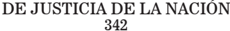

TOMO 342

Volumen 2

2019

## FALLOS DE LA CORTE SUPREMA DE JUSTICIA DE LA NACION

## CONSULTA DE JURISPRUDENCIA DE LA CORTE SUPREMA DE JUSTICIA DE LA NACIÓN

En  la  Colección  'Fallos'  se  publican  solo  las  sentencias  más trascendentes que emite el Tribunal (acordada 37/2003).

En  el  sitio  de  Internet www.csjn.gov.ar , se  puede  consultar la totalidad  de  las  sentencias en  forma  inmediata  a  su  dictado  y mediante diversos parámetros de búsqueda.

Entre las bases disponibles, se hallan las siguientes:

- 1.- Base única de Sumarios de fallos (desde 1863 - a la fecha)
- 2.- Base de Fallos Completos (desde 1994 - a la fecha)
- 3.- La biblioteca completa de los Tomos de la colección 'Fallos' (desde el Tomo 1°)
- 4.- Búsqueda de precedente por la Cita de la colección 'Fallos'
- 5.Suplementos de Actualización Jurisprudencial
- 6.- Posibilidad de consultar todas las sentencias por Acuerdo
- 7.- Las Novedades más importantes sobre la jurisprudencia del Tribunal

## R E P U B L I C A   A R G E N T I N A

FALLOS

DE LA

C o r t e

S u p r e m a

DE

## JuStiCia de la NaCioN

PUBLICACION A CARGO DE LA SECRETARIA DE JURISPRUDENCIA DEL TRIBUNAL

TOMO 342 - VOLUMEN 2

AGOSTO-DICIEMBRE

2019

## de JuSticiA de lA nAción 342

## FALLOS DE LA CORTE SUPREMA

## AGOSTO

## SAN JUAN, PROVINCIA de ( ENERGÍA PROVINCIAL

SOCIEDAD del ESTADO ) c/ INTERNATIONAL STAR S.A. S/ cobro de SumAS de dinero

## COMPETENCIA ORIGINARIA DE LA CORTE SUPREMA

Para que una provincia pueda ser tenida como parte y proceda, en consecuencia, la competencia originaria de la Corte prevista en el art. 117 de  la  Constitución  Nacional,  es  necesario  que  ella  participe  nominalmente en el pleito -ya sea como actora, demandada o tercero- y sustancialmente, es decir, que tenga en el litigio un interés directo, de tal manera que la sentencia que se dicte le resulte obligatoria.

-Del dictamen de la Procuración General al que la Corte remite-

## COMPETENCIA ORIGINARIA DE LA CORTE SUPREMA

La calidad de parte, a los fines de la competencia originaria de la Corte, debe surgir, en forma manifiesta, de la realidad jurídica, más allá de la voluntad de los litigantes en sus expresiones formales, pues lo contrario importaría dejar librado al resorte de éstos la determinación de esa instancia originaria.

-Del dictamen de la Procuración General al que la Corte remite-

## COMPETENCIA ORIGINARIA DE LA CORTE SUPREMA

La causa resulta ajena a la competencia originaria de la Corte si la reclamante es una sociedad del estado provincial, creada por ley local, que funciona bajo el régimen de la ley 20.705, y cuenta con una individualidad jurídica y funcional que permite distinguirla del Esta-

## FAlloS de lA corte SuPremA 342

do local, que no aparece como titular de la relación jurídica en que se sustenta la pretensión.

-Del dictamen de la Procuración General al que la Corte remite-

## dictAmen de lA ProcurAción GenerAl

Suprema Corte:

-i-

A fs. 4/14, la empresa E.P .S.E. -Energía Provincial Sociedad del Estado- de la Provincia de San Juan, promueve demanda contra la firma International Star S.A., con domicilio en la Ciudad Autónoma de Buenos Aires, a fin de que le reintegre la suma de $3.658.361,44 -más intereses y costas del juicio que, según alega, le fueron ilegítimamente retenidos por la demandada. Funda su reclamo en normas del Código Civil y Comercial de la Nación y en los arts. 14 y 17 de la Constitución Nacional.

Relata  que  a  raíz  del  convenio  celebrado  con  la  firma  alemana GEBR SCHMID GMBH, para la construcción y provisión de equipamiento de una fábrica para la captación de energía solar y generación de energía eléctrica bajo la modalidad 'llave en mano', esta última contrató a la sociedad demandada International Star S.A.- como despachante de aduana, para la realización de los trámites de importación necesarios para la concreción de la planta.

Indica que, en ese marco, E.P .S.E. efectuó transferencias de dinero a International Star S.A -con quien, insiste, no celebró ningún contrato- para el pago, por cuenta y orden de la accionante, de los costos derivados de operaciones impositivas ante la AFIP , así como de aquellos costos vinculados a los denominados gastos de 'desaduanamiento', derivados de las operaciones de desembarque e ingreso al país de la maquinaria y equipos contratados.

Afirma que, sin embargo, la demandada dispuso, de manera unilateral e ilegítima, de la suma reclamada para imputarla al pago de honorarios  por  servicios  de  gestión  de  exención  impositiva  de  los equipos ingresados que, según alega, no fueron convenidos ni efectivamente prestados.

A fs. 15, se corre vista, por la competencia, a este Ministerio Público.

## -ii-

Ante todo cabe recordar que para que una provincia pueda ser tenida como parte y proceda, en consecuencia, la competencia originaria de la Corte prevista en el art. 117 de la Constitución Nacional, es necesario que ella participe nominalmente en el pleito -ya sea como actora,  demandada  o  tercero-  y  sustancialmente,  es  decir,  que  tenga en el litigio un interés directo, de tal manera que la sentencia que se dicte le resulte obligatoria (Fallos: 311:879 y 1822; 312:1227 y 1457; 313:144; 314:508; 322:1511 y 2105, 330:4804, entre muchos otros).

Asimismo, se ha señalado que esa calidad de parte debe surgir, en forma manifiesta, de la realidad jurídica, más allá de la voluntad de los litigantes en sus expresiones formales (Fallos: 307:2249; 308:2621; 314:405; 321:2751; 322:2370), pues lo contrario importaría dejar librado al resorte de éstos la determinación de esa instancia originaria.

En mérito a lo señalado, entiendo que ese requisito, en principio, y dentro del limitado marco cognoscitivo propio de la cuestión de competencia bajo examen, no se encuentra cumplido en autos respecto de la Provincia de San Juan.

En efecto, de los términos del escrito de demanda (fs. 4/14), a cuya exposición de los hechos se debe estar de modo principal para determinar la competencia, de conformidad con lo dispuesto en los arts. 4º y 5º del Código Procesal Civil y Comercial de la Nación y la doctrina de Fallos: 306:1056; 308:1239 y 2230, se desprende que la reclamante en estos autos es una sociedad del estado provincial, creada por la ley local Nº 791-A, que funciona bajo el régimen de la ley 20.705, y cuenta con una individualidad jurídica y funcional que permite distinguirla del Estado local.

En  tales  condiciones,  al  no  aparecer  la  Provincia  de  San  Juan como titular de la relación jurídica en que se sustenta la pretensión deducida, entiendo que no cabe tenerla como parte nominal ni sustancial en la litis (Fallos: 317:980; 318:1361; 329:4390).

En virtud de lo expuesto y dada la índole taxativa de la competencia prevista en el art. 117 de la Constitución Nacional y su imposibilidad de ser extendida, por persona o poder alguno, según el criterio adoptado por el Tribunal en el precedente 'Sojo', publicado en Fallos: 32:120, y reiterado en Fallos: 270:78; 285:209; 302:63; 322: 1514; 323:1854; 326:3642, entre muchos otros, opino que este proceso resulta ajeno a la competencia originaria de la Corte. Buenos Aires, 28 de febrero de 2019. Laura M. Monti .

## FAlloS de lA corte SuPremA 342

## FALLO DE LA CORTE SUPREMA

Buenos Aires, 8 de agosto de 2019.

Autos y Vistos; Considerando:

Que el Tribunal comparte los argumentos y la conclusión del dictamen  de  la  señora  Procuradora  Fiscal,  a  los  que  corresponde  remitir en razón de brevedad y con el propósito de evitar repeticiones innecesarias.

Por ello, se resuelve: Declarar que la presente causa es ajena a la competencia originaria de la Corte Suprema de Justicia de la Nación. Notifíquese y comuníquese a la Procuración General de la Nación.

cArloS FernAndo roSenkrAntz - elenA i. HiGHton de nolASco ricArdo luiS lorenzetti - HorAcio roSAtti.

Parte actora: Provincia de San Juan , representada por los Dres. Sergio D. Saffe Peña, Patricio A. Echegaray Bloise y Pablo Pulleri.

Parte demandada: International Star S.A., no presentada en autos.

BAMBILL, GABRIEL c/ inideP S/ lAborAl

## DIFERENCIA SALARIAL

Si los demandantes no impugnaron los diferentes actos administrativos que fijaron sus niveles de revista o bien los que les asignaron funciones como responsables de proyectos y tampoco existe una decisión administrativa o judicial que admita el pretendido cambio de ubicación escalafonaria, estas circunstancias -que no han sido debidamente valoradas por la cámara- justifican la revocación de la sentencia recurrida pues el reconocimiento de diferencias salariales por la realización de tareas de categoría superior -cuando expresamente se rechazó el encasillamiento en dicho nivel- carece de causa jurídica e implica una contradicción en los propios términos del decisorio.

## de JuSticiA de lA nAción

## ACTOS ADMINISTRATIVOS

El reconocimiento de una determinada situación escalafonaria y el consecuente pago de los adicionales correspondientes debe ser producto de un acto expreso de la administración dictado en el marco de los procedimientos previstos en la normativa aplicable pues el cumplimiento de las formalidades del decreto 993/91 resulta constitutivo del derecho al cobro de diferencias salariales por los suplementos allí previstos.

dictAmen de lA ProcurAción GenerAl

## Suprema Corte:

-i-

A fs. 689/695 de los actuados principales (a los que me referiré), la Cámara Federal de Apelaciones de Mar del Plata resolvió rechazar la apelación del Instituto Nacional de Investigación Pesquera (INIDEP) y confirmar parcialmente la sentencia de la instancia anterior que reconoció el pago como legítimo abono de las diferencias salariales de los actores, adicionando el consecuente pago de intereses.

Para así decidir, la cámara entendió que: a) la decisión del a quo de rechazar el reencasillamiento pretendido por los demandantes no sólo era correcta, sino que había quedado firme; b) la ponderación de las aptitudes personales de los agentes administrativos no es materia justiciable mientras no se incurra en una grave descalificación o arbitrariedad, pues ello es una facultad privativa de la autoridad administrativa puesto que de lo contrario implicaría 'una intromisión indebida en la esfera de reserva de la administración y una inadvertencia y desobediencia a lo que disponen leyes y decretos' (v. vs. 690 vta.); e) los demandantes pudieron probar en autos que si bien detentaban las categorías B y C, ejercían una función correspondiente a la categoría A, es decir que realizaban tareas superiores y de mayor responsabilidad que aquéllas para las que habían sido designados; por tanto de las constancias de la causa y teniendo en miras lo dispuesto en los arts. 16 y 14 bis de la Constitución Nacional se les debe reconocer a los demandantes la diferencia remunerativa reclamada so peligro de que, caso contrario, se consagre un abuso de derecho y un enriquecimiento sin causa del INIDEP en contradicción con la legislación laboral.

-ii-

Disconforme, la demandada interpone el recurso extraordinario de fs. 702/716, contestado a fs. 719/722, que, fue declarado inadmisible a fs. 724/725 y vta., lo que motiva la presente queja.

Los agravios del  INIDEP respecto del pronunciamiento son los siguientes: a) soslaya la legislación de empleo público vigente al momento de los hechos controvertidos: la ley 22.140 (régimen jurídico básico de la administración pública), el decreto 993/91 que estableció el SINAPA -régimen en los que considera no se encuentran incluidos los demandantes- y demás normas reglamentarias; b) provoca una afectación en el presupuesto del INIDEP al obligarlo al pago de diferencias salariales, con más intereses; e) vulnera las potestades discrecionales de la administración referidas a la organización de sus recursos humanos; d) aplica principios y normas de la legislación laboral común en lugar del régimen de derecho administrativo, específico de los empleados públicos y propio de la relación jurídica existente entre los actores y el INIDEP; d) confunde las funciones de las unidades orgánicas de la estructura del instituto con la asignación de proyectos operativos inherentes al cargo para el que habían sido designados los demandantes; e) en el fallo se decide la aplicación de un tasa de interés incorrecta y se omite la aplicación de la ley de consolidación de deuda pública.

-iii-

Adelanto  que  asiste  razón  al  demandado  y  corresponde  admitir formalmente la queja.

Ello es así desde que, a mi modo de ver, el recurso extraordinario es admisible y fue mal denegado, toda vez que los agravios se refieren a la prescindencia de aplicar normas de carácter federal (ley 22.140 régimen jurídico básico de la administración pública, el decreto 993/91 SINAPA  y  demás  normas  reglamentarias  y  la  ley  de  consolidación deudas del Estado) y la decisión del tribunal ha sido contraria a los derechos que el recurrente funda en ellas (art. 14, inc. 3°, de la ley 48).

-iV-

Tengo para mí que el pronunciamiento merece ser descalificado esencialmente  porque  el  tribunal a  quo prescindió,  sin  fundamento válido, de disposiciones que resultan de inexcusable aplicación a los empleados del INIDEP , a quienes, al momento del reclamo, se los debió considerar regulados por la ley 22.140 y el decreto 993/91 (SINAPA)

y demás normas reglamentarias y complementarias que comprenden el régimen jurídico de la Administración Pública.

Dicha prescindencia, provoca la contradicción en la que incurre el fallo ya que éste: a) por un lado, reconfirma el rechazo del pedido de reencasillamiento de la parte actora con sustento en que el ponderar las aptitudes y funciones de los empleados públicos es una facultad privativa de la administración; es indebida la intromisión de los tribunales en la creación o producción de vacantes en la estructura administrativa a partir de sus sentencias y en la carencia de presupuestos es un límite para que los cargos sean creados (ver fs. 690 vta); y b) por el otro, entendió que las funciones de los demandantes correspondían a una categoría superior (ver fs. 693) y que como tal, debían ser remuneradas.

De este modo, en verdad, la cámara al reconocerle a los actores la diferencia salarial por supuesta tarea de categoría superior, no está sino otorgando -de manera oblicua el reencasillamiento de los actores lo que, por ser una facultad privativa de la autoridad administrativa, ya había sido rechazado expresamente por sentencia firme.

En razón de lo expuesto, no resulta necesario el análisis del agravio referido a la prescindencia de aplicar la ley de consolidación -de orden público- por resultar inoficioso.

## -V-

Por lo expuesto, opino que corresponde hacer lugar a la queja interpuesta, dejar sin efecto la sentencia en cuanto fue materia de recurso extraordinario ante la omisión de aplicar la normativa específica de los empleados públicos y devolver las actuaciones al tribunal de procedencia a fin de que dicte una nueva de acuerdo a derecho. Buenos Aires, 27 de agosto de 2018. Laura M. Monti .

## FALLO DE LA CORTE SUPREMA

Buenos Aires, 13 de agosto de 2019.

Vistos los autos: 'Recurso de hecho deducido por la demandada en la causa Bambill, Gabriel c/ INIDEP s/ laboral', para decidir sobre su procedencia.

## Considerando:

- 1°) Que los actores, agentes del Instituto Nacional de Investigación y Desarrollo Pesquero -INIDEP-, promovieron demanda con el objeto de que se los reencasillara en un nivel superior al que ostentaban por aplicación del decreto 993/91 (SINAPA) y que se les abonaran las diferencias  salariales  derivadas  de  la  mayor  función  desempeñada. Sostuvieron ser investigadores del INIDEP a quienes se les asignaron  tareas  correspondientes  a  'responsables  de  proyectos'  que,  en su  criterio,  implicaron  el  ejercicio  de  una  función  superior  a  la  que era propia de los niveles en los que se encontraban encasillados. Por ello, afirmaron tener derecho a ser reescalafonados en el Nivel 'A' del Agrupamiento  Ciéntífico  Técnico  del  SINAPA,  dada  la  relevancia  y complejidad de tales tareas.
- 2°) Que el juez federal de Mar del Plata rechazó el pedido de reencasillamiento e hizo lugar al reclamo de diferencias salariales. La actora no recurrió la decisión en lo que se refiere a la primera de las pretensiones mencionadas.
- 3°) Que, la Cámara Federal de Apelaciones de Mar del Plata confirmó el pronunciamiento apelado por el INIDEP en cuanto hizo lugar a la diferencia salarial reclamada por los actores. En primer lugar destacó que el rechazo del reencasillamiento había quedado firme y recordó que el valorar la aptitud y funciones de los empleados públicos era una facultad privativa de la administración. No obstante ello, señaló que, aun cuando de manera excepcional pudiera admitirse la posibilidad de que el empleador asignara interina y transitoriamente al agente tareas superiores y distintas para las que fue nombrado, por aplicación el principio constitucional de igual remuneración por igual tarea surgía la obligación de abonarle el salario de la labor que efectivamente cumplía. Explicó que en el caso se encontraba demostrado que los actores habían desempeñado sus servicios en tareas superiores, en un área donde se llevaban a cabo funciones esenciales del INIDEP , sin que se les abonara la retribución debida. En ese entendimiento, concluyó en que la posición de la administración de no acceder al pago de las diferencias salariales reclamadas consagraba una manifiesta arbitrariedad.
- 4°) Que contra esta decisión la parte demandada dedujo recurso extraordinario, cuya denegación dio origen a la queja en examen. En

sustancia, aduce que: a) la ley 22.140 y el decreto 993/91, aplicables a la relación de empleo público objeto de autos, no fueron tenidas en consideración en el fallo de la cámara; b) la decisión contradice la inteligencia de los arts. 18 y 43 de la ley 22.140 en tanto determinan la forma en la que el personal permanente puede ascender a cargos superiores, así como establecen las situaciones de excepción de prestación de funciones ajenas a las del nombramiento; c) los ministros son los únicos funcionarios habilitados para la designación, asignación de funciones, promoción y reincorporación de personal en los cargos correspondientes a la función pública de conformidad con el decreto 101/1985; d) el acto mediante el cual los actores fueron designados como 'responsables de proyectos' no tiene efectos remuneratorios; e) no se han conferido a los demandantes funciones ajenas a su situación de revista ya que la asignación de dichas tareas lo fue dentro de las funciones, responsabilidad y autonomía de los Niveles Escalafonarios que ostentaban al momento de su reencasillamiento, en el año 1992 conforme al decreto 993/91; f) la designación como 'responsables de proyectos' no implica la asignación de jefaturas, responsabilidades o funciones superiores; g) la sentencia vulnera las potestades discrecionales reconocidas a la administración para tomar decisiones en la organización de sus recursos humanos conforme la legislación que rige en materia de empleo público; h) la aplicación de la tasa de interés activa eleva en forma inconmesurable los valores de capital de condena resultando confiscatoria, desproporcionada y redundando en un enriquecimiento ilícito a favor de su beneficiario, correspondiendo la aplicación de la tasa pasiva promedio que publica el BCRA; i) el supuesto de autos se encuentra regido por las normas de consolidación de deuda pública fijadas por la ley 25.344 y decreto 1116/00.

- 5°) Que en el caso existe cuestión federal que justifica la apertura de la instancia extraordinaria pues se encuentra discutida la inteligencia de normas federales (en especial el decreto 993/91) y la decisión recurrida ha sido contraria a los derechos que la demandada funda en ellas (art. 14, inciso 3°, de la ley 48).
- 6°) Que el reclamo de los actores tuvo por objeto obtener el reencasillamiento en el Nivel 'A' del Agrupamiento Científico Técnico del SINAPA y que se condene a la demandada a abonarles las diferencias salariales derivadas de la mayor función que habrían realizado en razón de la asignación de tareas como 'responsables de proyectos'.

- 7°) Que, tal como lo sostiene la señora Procuradora Fiscal en su dictamen, la sentencia recurrida, al convalidar el pago de diferencias salariales, omitió aplicar las normas que rigen la relación de empleo público de los actores. En efecto, el decreto 993/91 -texto ordenado 1995-, de aplicación al personal del INIDEP , establece pautas y procedimientos específicos para la designación, reencasillamiento y promoción de los agentes (conf. arts. 2°, 8° y 11 del decreto y arts. 6°, 8°, 30 y 31 de su Anexo I). En particular, dispone que la ubicación escalafonaria debe ser definida por acto administrativo y que la promoción a los distintos niveles y grados se hará, ' en todos los casos ', con sujeción a los sistemas de selección y procedimiento de evaluación de desempeño establecidos en el SINAPA.
- 8°)  Que  de  lo  expuesto  se  desprende  que  el  reconocimiento  de una determinada situación escalafonaria, y el consecuente pago de los adicionales correspondientes, debe ser producto de un acto expreso de la administración dictado en el marco de los procedimientos previstos en la normativa aplicable. Ello es así pues el cumplimiento de las formalidades del decreto 993/91 resulta constitutivo del derecho al cobro de diferencias salariales por los suplementos allí previstos (ver Fallos: 333:792 y 2344).

En el caso, los demandantes no impugnaron los diferentes actos administrativos que fijaron sus niveles de revista o bien los que les asignaron funciones como 'responsables de proyectos'. En especial, no se advierte que hayan cuestionado oportunamente las resoluciones INIDEP 201/94 y 184/97 que aprobaron los Programas y Proyectos de Investigación a los cuales estaban afectados. Tampoco existe una decisión administrativa o judicial que admita el pretendido cambio de ubicación escalafonaria. En efecto, el INIDEP desestimó los reclamos presentados por los actores en ese sentido (ver nota 544/2001, fs. 218 de los autos principales) y el rechazo en sede judicial de la pretensión de reencasillamiento, que suponía cuestionar la validez de tal decisión, se encuentra firme.

Estas circunstancias, que no han sido debidamente valoradas por la cámara, justifican la revocación de la sentencia recurrida pues el reconocimiento de diferencias salariales por la realización de tareas de categoría superior -cuando expresamente se rechazó en el sub examine el encasillamiento en dicho nivel- carece de causa jurídica e implica una contradicción en los propios términos del decisorio objeto de recurso.

- 9°)  Que, por lo demás, de la lectura de la normativa aplicable al caso tampoco se advierte que la función de 'responsables de proyectos'  resulte  distinta  o  superior  a  las  tareas  que  corresponden  a  los niveles en que se encuentran encuadrados los actores.
- 10) Que, en atención a la forma en que se resuelve, se torna innecesario que el Tribunal se expida respecto de los agravios del recurrente vinculados con la tasa de interés fijada por el a quo o con la aplicación al caso de las leyes de consolidación.

Por ello, de conformidad con lo dictaminado por la señora Procuradora Fiscal, corresponde hacer lugar a la queja, declarar procedente el recurso extraordinario deducido y revocar la sentencia apelada. Con costas (art. 68 del Código Procesal Civil y Comercial de la Nación). Reintégrese el depósito de fs. 51. Vuelvan los autos al tribunal de origen a efectos de que, por quien corresponda, se dicte un nuevo pronunciamiento con arreglo al presente. Notifíquese, agréguese la queja al principal y, oportunamente, devuélvase.

cArloS FernAndo roSenkrAntz - elenA i. HiGHton de nolASco ricArdo luiS lorenzetti - HorAcio roSAtti.

Recurso de queja interpuesto por el INIDEP, parte demandada, representado por el Dr. Mariano Romero.

Tribunal de origen: Cámara Federal de Apelaciones de Mar del Plata.

Tribunal que intervino con anterioridad: Juzgado Federal de Primera Instancia n° 2

de Mar del Plata.

INSTITUTO de SEGUROS S.A. c/ en - m° TRABAJO (962066/93) S/ ProceSo de conocimiento

## DEUDA PUBLICA

La sumisión de un caso al régimen de la ley 24.070 requiere la intervención de las autoridades designadas para su aplicación y el cumplimiento de las condiciones establecidas en el decreto reglamentario 1723/92, operando la subrogación solo a partir de la resolución del ministerio

## FAlloS de lA corte SuPremA 342

de origen que la acepte, acto por el cual la deuda queda comprendida en los términos de dicha ley.

## DEUDA PUBLICA

La aceptación de la solicitud por parte del Estado comporta la conformidad de la Secretaría de Hacienda del Ministerio de Economía y Obras y Servicios Públicos respecto de la cancelación con fondos del Tesoro de los pasivos involucrados, la previa intervención de la Contaduría General de la Nación y del Tribunal de Cuentas para la determinación del monto definitivo de la deuda legítima y, finalmente, una resolución favorable del ministerio de origen, organismo al que se le reserva la última palabra sobre la solicitud de la subrogación.

## FALLO DE LA CORTE SUPREMA

Buenos Aires, 13 de agosto de 2019.

Vistos los autos: 'Recurso de hecho deducido por la demandada en la causa Instituto de Seguros S.A. c/ EN - M° Trabajo (962066/93) s/ proceso de conocimiento', para decidir sobre su procedencia.

Considerando:

1°) Que la Sala I de la Cámara Nacional de Apelaciones en lo Contencioso Administrativo Federal (fs. 409/411 de los autos principales) revocó la sentencia de primera instancia e hizo lugar a la demanda promovida por el  Instituto  de  Seguros  S.A.  -cesionaria  de  la  Unión Obrera Metalúrgica-, a fin de obtener el reintegro -según las previsiones de la ley 24.070- de lo abonado por su cedente en la causa 11.378/89, caratulada 'Peirano, Enrique Juan y otro c/ UOMRA s/ cobro de sumas de dinero', en la cual a su vez se reclamaron los intereses del capital reconocido en la causa civil 922/86 'Peirano, Enrique Juan y ot. c/ UOMRA s/ ordinario'. Contra este pronunciamiento, el Estado Nacional -Ministerio de Trabajo, Empleo y Seguridad Social-, interpuso el recurso extraordinario de fs. 414/425, cuya denegación dio origen a la presente queja.

- 2°) Que para así resolver, la cámara relató que el reclamo versaba sobre los intereses abonados respecto del capital también abonado por la cedente UOMRA; que el pedido de reintegro de ambos conceptos había tramitado de modo separado en sede administrativa y que respecto del capital había mediado resolución administrativa disponiendo el reintegro previsto en la ley 24.070, norma que había dispuesto la subrogación del Estado respecto de las sumas demandadas  judicialmente  a  asociaciones  sindicales  por  honorarios profesionales devengados por proyectos, dirección de obras y otras tareas desarrolladas en el marco del denominado Plan de Vivienda '17 de Octubre' (más tarde '25 de Mayo'). Sobre esta base, la cámara ponderó que una vez dictado el pronunciamiento de esta Corte  en  la  causa  CSJ  172/2012  (48-I)/CS1  'Instituto  de  Seguros S.A. c/ EN - M° de Trabajo - dto. 1723/92 (autos Peirano) s/ proceso de conocimiento', del 15 de mayo de 2014, había quedado firme y pasado en autoridad de cosa juzgada aquel reconocimiento de la procedencia -al declararse la subrogación- del capital abonado en la causa 922/86. El tribunal anterior en grado afirmó que, teniendo en cuenta que la administración consideró por comprobado el pago de  las  sumas  a  reintegrar;  que  fijó  el  alcance  de  su  procedencia (8,5588% sobre el total abonado) y que el procedimiento no habría concluido sino en razón de la promoción de esta demanda, rechazar el reconocimiento del reintegro de los intereses respecto de un capital del que son accesorios y que ya fue objeto de reconocimiento, configuraría una violación a la cosa juzgada. Por último, difirió la determinación de la condena para la etapa de ejecución.
- 3°) Que el recurso extraordinario es admisible pues se encuentra en tela de juicio el alcance de normas federales y el pronunciamiento dictado por el superior tribunal de la causa ha sido contrario al derecho que la recurrente fundó en ellas (art. 14, inciso 3° de la ley 48).
- 4°)  Que  los  agravios  del  recurrente  encuentran  adecuada  respuesta en la doctrina de Fallos: 319:786 y 2399; 327:5; 330:5010 y en la causa CSJ 172/2012 (48-I)/CS1 'Instituto de Seguros S.A. c/ EN - M° de Trabajo - dto. 1723/92 (autos Peirano) s/ proceso de conocimiento',  sentencia  del  15  de  mayo  de  2014.  En  efecto,  de  acuerdo  con ella,  'la  sumisión  de  un  caso  al  régimen  de  la  ley  24.070  requiere la intervención de las autoridades designadas para su aplicación y el  cumplimiento  de  las  condiciones  establecidas  en  el  decreto  reglamentario 1723/92, operando la subrogación solo a partir de la re-

solución del ministerio de origen que la acepte, acto por el cual la deuda queda comprendida en los términos de dicha ley'. Asimismo, tal como se resolvió en Fallos: 327:5, de conformidad con el artículo 6°  del  decreto  1723/92,  'la  aceptación  de  la  solicitud  por  parte  del Estado comporta la conformidad de la Secretaría de Hacienda del Ministerio  de  Economía y Obras y Servicios Públicos respecto de la  cancelación  con  fondos  del  Tesoro  de  los  pasivos  involucrados, la previa intervención de la Contaduría General de la Nación y del Tribunal de Cuentas para la determinación del monto definitivo de la deuda legítima y, finalmente, una resolución favorable del ministerio de origen, organismo al que se le reserva la última palabra sobre la solicitud de la subrogación'.

Por ello, se hace lugar a la queja, se declara procedente el recurso extraordinario y se deja sin efecto la sentencia apelada. Con costas. Vuelvan los autos al tribunal de origen a fin de que, por quien corresponda, se dicte un nuevo fallo con arreglo al presente. Exímese al recurrente de integrar el depósito previsto en el art. 286 del Código Procesal Civil y Comercial de la Nación, cuyo pago se encuentra diferido de conformidad con lo prescripto en la acordada 47/91. Agréguese la queja al principal. Notifíquese y devuélvase.

cArloS FernAndo roSenkrAntz - elenA i. HiGHton de nolASco ricArdo luiS lorenzetti - HorAcio roSAtti.

Recurso de queja interpuesto por el Estado Nacional (Ministerio de Trabajo, Empleo y Seguridad Social), parte demandada, representado por la Dra. Jorgelina Ariadna Briggs.

Tribunal de origen: Cámara Nacional de Apelaciones en lo Contencioso Administrativo Federal, Sala I.

Tribunal que intervino con anterioridad: Juzgado Nacional de Primera Instancia en lo Contencioso Administrativo Federal n° 3.

## de JuSticiA de lA nAción 342

## INTEGRACIÓN ELÉCTRICA SUR ARGENTINA SA c/ en - AGiP S/ ProceSo de conocimiento

## ACORDADA 4/2007

El reglamento aprobado por la acordada 4/2007 no prevé la devolución del escrito del recurso extraordinario cuando este no satisface el recaudo previsto en su art. 1°, correspondiendo a la Corte evaluar, según su sana discreción, la idoneidad de las presentaciones aun cuando no cumplan con los recaudos establecidos en dicho reglamento.

## ACORDADA 4/2007

Corresponde dejar sin efecto la decisión de la cámara de tener por no presentado el recurso extraordinario y ordenar su desglose, en razón de  que  el  escrito  incumplía  uno  de  los  requisitos  establecidos  en  el reglamento aprobado por la acordada 4/2007 y ordenar a esta que incorpore el recurso, lo sustancie en los términos del art. 257 del Código Procesal Civil  y  Comercial  de  la  Nación  y,  oportunamente,  resuelva sobre su procedencia.

## FALLO DE LA CORTE SUPREMA

Buenos Aires, 13 de agosto de 2019.

Vistos los autos: 'Recurso de hecho deducido por la actora en la causa Integración Eléctrica Sur Argentina SA c/ EN - AGIP s/ proceso de conocimiento', para decidir sobre su procedencia.

## Considerando:

- 1°)  Que  la  Sala  V  de  la  Cámara  Nacional  de  Apelaciones  en  lo Contencioso Administrativo Federal -por mayoría- tuvo por no presentado el recurso extraordinario interpuesto por la parte actora y ordenó su desglose, en razón de que el escrito respectivo incumplía uno de los requisitos establecidos en el reglamento aprobado por la acordada 4/2007.

- 2°) Que, contra dicha decisión, que implicó una denegación implícita de la vía federal (Fallos: 305:677), la actora dedujo el presente recurso de hecho.
- 3°) Que el reglamento aprobado por la acordada 4/2007 no prevé la devolución del escrito del recurso extraordinario cuando este no satisface el recaudo previsto en su artículo 1º, correspondiendo al Tribunal evaluar, según su sana discreción, la idoneidad de las presentaciones aun cuando no cumplan con los recaudos establecidos en dicho reglamento (conf. doctrina de las causas CSJ 830/2010 (46-C)/CS1 'CIPPEC c/ EN - Mº Desarrollo Social dto. 1172/03 s/ amparo ley 16.986', sentencia del 4 de diciembre de 2012 y CSJ 264/2014 (50-T)/CS1 (Recurso de Hecho) 'Trinidad, Noelia Elizabeth y otros c/ Soproser S.A. y otra s/ laboral', sentencia del 19 de mayo de 2015, entre otras).

En tales condiciones, corresponde ordenar a la cámara que incorpore el recurso extraordinario, lo sustancie en los términos del artículo 257 del Código Procesal Civil y Comercial de la Nación y, oportunamente, resuelva sobre su procedencia.

Por ello, se hace lugar al recurso de hecho y se deja sin efecto la decisión de fs. 1038/1039 de los autos principales. Notifíquese, agréguese la queja al principal y remítase el expediente a los fines indicados. Reintégrese el depósito de fs. 41. Cumplido lo ordenado en la presente, devuélvanse los autos a este Tribunal.

cArloS FernAndo roSenkrAntz - elenA i. HiGHton de nolASco ricArdo luiS lorenzetti - HorAcio roSAtti.

Recurso de queja interpuesto por Integración Eléctrica Sur Argentina SA, representada por el Dr. Pablo Raúl Masud.

Tribunal de origen: Sala V de la Cámara Nacional de Apelaciones en lo Contencioso Administrativo Federal.

Tribunal que intervino con anterioridad: Juzgado Nacional de Primera Instancia en lo Contencioso Administrativo Federal n° 11.

## de JuSticiA de lA nAción 342

ESTADO NACIONAL - MINISTERIO de EDUCACIÓN y DEPORTES de lA NACIÓN c/ UNIVERSIDAD NACIONAL de JUJUY S/ recurSo directo ley de educAción SuPerior ley 24.521.

## CUESTION FEDERAL

En la tarea de establecer la inteligencia de las nomas de carácter federal, la Corte no se encuentra limitada por las posiciones de los jueces de la causa ni del recurrente, sino que le incumbe realizar una declaración  sobre  el  punto  disputado,  según  la  interpretación  que rectamente le otorgue.

-Del dictamen de la Procuración General al que la Corte remite-

## UNIVERSIDAD

El artículo 1° del Estatuto de la Universidad Nacional de Jujuy, que establece que dicha institución es una persona jurídica de derecho público con autonomía institucional, autarquía financiera y que tiene su sede y domicilio legal en la ciudad de San Salvador de Jujuy, importa un incumplimiento del artículo 34 de la Ley de Educación Superior (24.521) por cuanto no indica un domicilio con calle y numeración cuando dicho precepto establece que los estatutos deben prever explícitamente la sede principal de la universidad.

-Del dictamen de la Procuración General al que la Corte remite-

## FACULTADES DISCRECIONALES

El marco de discrecionalidad que se otorgan las autoridades de la Universidad Nacional de Jujuy en los artículos 38, inc. 16 y 61 de su estatuto para contratar a docentes e investigadores de distintas categorías y especialidad, en las condiciones, funciones y emolumentos que en cada caso se establezca en el marco del presupuesto otorgado por el Consejo Superior resulta incompatible con las previsiones del artículo 51 la Ley de Educación Superior (24.521), toda vez que no se hace referencia alguna a los méritos académicos que deben reunir aquellas personalidades a las que podrá contratarse de modo excepcional o interina.

-Del dictamen de la Procuración General al que la Corte remite-

## UNIVERSIDAD

El artículo 46, inc. b del Estatuto de la Universidad Nacional de Jujuy en cuanto dispone que los docentes interinos son aquellos que, por razones debidamente fundadas, son designados sin que se hubiera sustanciado el concurso público de antecedentes y prueba de oposición, de conformidad con la reglamentación que dicte el Consejo Superior soslaya lo dispuesto por el artículo 51 de la Ley de Educación Superior (24.521), toda vez que se debió establecer de modo preciso las condiciones respecto a la transitoriedad de la designación, a una situación que la torne imprescindible y a su duración mientras se sustancie el pertinente concurso.

-Del dictamen de la Procuración General al que la Corte remite-

## CONCURSOS UNIVERSITARIOS

Como regla y a fin de asegurar la excelencia académica, el acceso a la carrera docente se realiza por concurso con la intervención de jurados que garanticen la mayor imparcialidad y el máximo rigor académico, mientras que las designaciones temporales de docentes con carácter interino sólo pueden realizarse de modo excepcional y bajo ciertas condiciones.

- -Del dictamen de la Procuración General al que la Corte remite-

## ESTATUTO

Corresponde confirmar la sentencia que declaró la validez del art. 47, inc. c del Estatuto de la Universidad Nacional de Jujuy que permite a  los  docentes  eméritos -aquellos titulares ordinarios que, habiendo alcanzado el límite legal para jubilarse, posean condiciones sobresalientes para la docencia e investigación- y consultos -aquellos profesores ordinarios titulares, asociados o adjuntos que, habiendo alcanzado dicho límite, posean condiciones destacadas para la docencia e investigación- a formar parte del padrón docente, toda vez que se cumple el requisito del art. 55 de la Ley de Educación Superior (24.521) el cual establece que 'los representantes de los docentes, que deberán haber accedido a sus cargos por concurso, serán elegidos por docentes que reúnan igual calidad'.

-Del dictamen de la Procuración General al que la Corte remite-

## AUTONOMIA UNIVERSITARIA

Corresponde  a  las  instituciones  universitarias,  por  mandato  de  la Constitución Nacional como atributos inescindibles de su autonomía (art. 75, inc 19), la atribución de definir sus órganos de gobierno, establecer sus funciones, decidir su integración y elegir sus autoridades. Así también lo dispuso la propia Ley de Educación Superior (24.521) y, al mismo tiempo, determinó porcentajes mínimos y condiciones que se han de cumplir en la conformación de los órganos de gobierno de la universidad (arts. 29, inc b y 53).

-Del dictamen de la Procuración General al que la Corte remite-

## AUTONOMIA UNIVERSITARIA

En deferencia con el principio constitucional de autonomía universitaria,  resulta  razonable  interpretar  que  el  legislador,  en  el  art.  53  de  la Ley de Educación Superior (24.521), se ha limitado a establecer determinados presupuestos que deberán asegurar los estatutos de cada universidad, ya que es precisamente la norma estatuaria la encargada de determinar la integración de sus órganos colegiados de gobierno y, en el caso, el ministerio no demuestra el incumplimiento por parte de la universidad de aquellos presupuestos destinados a garantizar la representación de los distintos estamentos universitarios.

-Del dictamen de la Procuración General al que la Corte remite- dictAmen de lA ProcurAción GenerAl

Suprema Corte:

-i-

A fs. 33/42 la Cámara Federal de Apelaciones de Salta hizo lugar parcialmente al recurso interpuesto por el Estado Nacional (Ministerio de Educación y Deportes), acogiendo el planteo formulado contra el art. 47, inc. b), del Estatuto universitario y rechazando aquellos referidos a los arts. 1, 38, inc. 16), 46, inc. b), 47, inc. c), 61 y 101 a 117 del mismo estatuto.

Para decidir de este modo, el tribunal se fundó en las siguientes consideraciones:

a) en cuanto a la decisión de fijar la sede principal y el domicilio legal en la ciudad de San Salvador de Jujuy, sin especificarse la calle ni la numeración, entendió que la modificación al art. 1° del estatuto es parcial, añadiendo solamente una última oración que no altera la redacción del artículo que en su oportunidad fue avalado por el propio Estado, lo que impide invocar una colisión con la Ley de Educación Superior (LES) 24.521 por aplicación del principio de buena fe y la teoría de los actos propios. Añadió que el art. 34 de la ley citada establece que los estatutos deben prever explícitamente su sede principal, sin desprenderse que deba indicarse le dirección de su sede;

b)  con  respecto a los arts. 38, inc. 16) y 61, que se refieren a la facultad de contratar docentes e investigadores de distintas categorías y especialidades y a la posibilidad de que los profesores visitantes puedan ser rentados o no, designados por contrato o interinos, sostuvo que sólo se modificó la numeración pero no su contenido, reiterándose los textos aprobados por la Asamblea Universitaria del 21 de diciembre de 2015.

c) también consideró que resulta improcedente la observación formulada con respecto al art. 46, inc. b), del estatuto en cuanto establece que el docente interino es aquel que por razones debidamente fundadas fuera designado sin que se hubiera sustanciado y participado en un concurso público abierto de antecedentes y prueba de oposición. Con fundamento en el procedimiento a seguir para la designación, en las razones de urgencia que la justifican y en el plazo limitado que se determinó, el tribunal entendió que esta norma no resulta contraria al art. 51 de la LES.

d) en lo que se refiere a la integración del padrón docente con interinos y extraordinarios (eméritos y consultas), confiriéndoles derecho de voto en las elecciones de la casa de estudios, la cámara efectuó una distinción. En cuanto a los docentes extraordinarios -cuya inclusión se prevé en el art. 47, inc. c)- consideró que se trata de docentes que accedieron a la carrera mediante concurso público abierto de antecedentes y prueba de oposición y que se hallan habilitados para elegir a los representantes de su claustro por el art. 55 de la LES, motivo por el cual no existe el apartamiento que invoca la actora. Por el contrario, entendió que el art. 47, inc. b), que faculta a los docentes interinos a formar parte del padrón electoral y ejercer derechos políticos resulta incompatible con los principios de la LES, pues este ordenamiento dispone que los representantes de los docentes, que deberán haber accedido a sus cargos por concurso, serán elegidos por docentes que reúnan igual condición.

e) con respecto al régimen electoral previsto en los arts. 101 a 117 del estatuto, el tribunal sostuvo que no se verifica la existencia de un interés jurídico inmediato o directo que dé lugar a una controversia actual o concreta, lo que lleva a considerar que el agravio planteado resulta conjetural o hipotético, por cuanto los capítulos II, III y IV del título V del estatuto especifican cuál es la forma de computar los votos, sin que el hecho de que sea un procedimiento complejo y de doble cómputo de sufragios para ciertos cargos torne procedente la impugnación formulada por el Estado Nacional.

## -ii-

Disconforme con este pronunciamiento, el Estado Nacional interpuso el recurso extraordinario de fs. 43/62, que fue parcialmente concedido a fs. 74/75, en cuanto se encuentra en juego la interpretación del estatuto universitario y de las leyes 24.521 y 26.206.

En lo sustancial, aduce que el art. 34 de la LES requiere que el estatuto universitario prevea el domicilio de su sede principal, omisión que tiene efectos que trascienden la formalidad. Agrega que el hecho de que en el estatuto anterior no se hubiera formulado objeción alguna al respecto no le impide hacerlo en la actualidad, puesto que se trata de la publicación de un hecho nuevo estatutario completo y puede existir algún cambio de criterio interpretativo.

En cuanto a la posibilidad de contratar docentes e investigadores y de que los profesores visitantes puedan ser rentados o no, sostiene que la LES autoriza la contratación al margen del régimen de concursos sólo por excepción para docentes de reconocido prestigio, mas no es posible instituir ese mecanismo como un medio más para acceder a la función docente.

Con relación a la designación de docentes interinos prevista por el art. 46, inc. b) del estatuto, expresa que no se ajusta a lo dispuesto por el art. 51 de la LES, en tanto la norma observada prevé tal designación sin término, con posibilidades de renovación y bajo la única condición de que se invoquen razones debidamente fundadas, lo que desnaturaliza la condición del cargo al carecer de limitación material y temporal.

En lo que atañe a la conformación del padrón docente, insiste en que el artículo observado se aparta del art. 55 de la LES, en razón de que los docentes interinos, extraordinarios, eméritos y consultos no se someten al proceso de selección por concurso exigido por la ley para ser elector, sino que son designados en forma directa. Añade que la LES tiene como objetivo frustrar la posibilidad de que mediante la de-

signación de interinos, quienes son nombrados en forma temporaria, se manipulen las mayorías necesarias para la integración de los órganos de gobierno de la universidad.

Finalmente, en cuanto al régimen electoral, señala que de los arts. 101 a 117 que no se desprende mínimamente cuál es la fórmula adoptada para los distintos procesos eleccionarios, de lo que se puede inferir que esa falta de claridad será una fuente de conflictos insolubles que pueden tornar imposible el normal funcionamiento de la institución. Agrega que el régimen debe ser claro, concreto y preciso para que pueda cumplir debidamente su finalidad y respetar el sistema democrático y el principio representativo del voto.

## -iii-

A mi modo de ver, el recurso extraordinario interpuesto es formalmente admisible, toda vez que se halla en juego la interpretación y aplicación de normas de carácter federal y la decisión definitiva del superior tribunal de la causa ha sido adversa a las pretensiones que el apelante funda en ellas (art. 14, inc. 3°, de la ley 48). Asimismo, cabe señalar que, en la tarea de establecer la inteligencia de las normas de aquella naturaleza, la Corte no se encuentra limitada por las posiciones de los jueces de la causa ni del recurrente, sino que le incumbe realizar una declaración sobre el punto disputado, según la interpretación que rectamente le otorgue (Fallos: 311:2553; 314:529; 316:27; 321:861, entre muchos otros).

-iV-

Ante todo, cabe advertir que en el sub lite no se ha puesto en tela de juicio la validez constitucional de la ley 24.521, sino que la controversia se circunscribe a determinar el grado de adecuación de las disposiciones del Estatuto de la Universidad Nacional de Jujuy que han sido observadas por el Ministerio de Educación y Deportes de la Nación con las previsiones de la Ley de Educación Superior 24.521, a efectos de armonizar la atribución que la Constitución Nacional le asigna al Congreso de dictar las leyes de organización y bases de la educación teniendo en miras el cumplimiento de una serie de principios y las garantías de autonomía y autarquía que prevé para las universidades nacionales.

- a) En primer lugar, corresponde tratar el argumento empleado por la cámara para rechazar las observaciones a los arts. 1º, 38, inc. 16) y 61 del Estatuto de la Universidad Nacional de Jujuy, en cuanto sostie-

ne que no se introdujeron modificaciones al texto de dichas normas, las cuales formaban parte del estatuto que se aprobó y publicó el 13 de abril de 2012, sino que sólo se cambió la numeración y se agregó una frase al 1º, lo que impediría al ministerio efectuar una revisión de ellas en virtud de la teoría de los actos propios.

Al respecto, cabe recordar que el art. 34 de la LES establece que el estatuto y sus modificaciones deben ser comunicados al Ministerio de Cultura y Educación a efectos de verificar su adecuación a la ley. En caso de que no se ajuste a ella, el ministerio debe plantear sus observaciones dentro de los diez días ante la cámara federal de apelaciones, la que decide en un plazo de veinte días, sin más trámite que una vista a la institución universitaria. Si no existieran observaciones dentro del plazo establecido, los estatutos se consideran aprobados y se publican en el Boletín Oficial.

Entiendo  que  el  ejercicio  de  esta  potestad  revisora  en  cumplimiento del control de tutela que le compete sobre las entidades universitarias no puede cercenarse por la circunstancia de que, en una oportunidad anterior, el ministerio no realizó observaciones al mismo texto que ahora se le presenta. Una inteligencia en este sentido significaría tanto como establecer aplicación de la criterios pétreos en la ley 24.521 y desconocer interpretación y que los parámetros empleados por el ministerio en ejercicio de funciones asignadas legalmente pueden modificarse incidiendo en las exigencias que se requieren a las universidades en ocasión de verificar el ajuste de sus estatutos a las disposiciones de la LES.

En razón de lo expuesto, entiendo que corresponde examinar los agravios formulados por el recurrente con relación a todas las observaciones que han sido rechazadas por el tribunal apelado;

b) El art. 1º establece que la Universidad Nacional de Jujuy es una persona jurídica de derecho público con autonomía institucional y autarquía financiera y añade que tiene su sede y domicilio legal en la ciudad de San Salvador de Jujuy. A criterio del recurrente, este precepto importa un incumplimiento del art. 34 de la LES, por cuanto no indica un domicilio con calle y numeración cuando dicho precepto establece que los estatutos deben prever explícitamente, entre otras cuestiones, la sede principal de la universidad.

Este lugar, a mi modo de ver, constituye el domicilio legal de la institución, de modo tal que cualquier notificación que allí se practique resulte válida e implica, además, una manifestación a los fines de su vinculación con terceros y con la comunidad educativa,

lo que torna necesario que la fijación de la sede principal incluya no sólo la ciudad sino también la dirección exacta con la calle y el número correspondiente.

En consecuencia, entiendo que asiste razón al apelante en lo que atañe a esta cuestión.

c) En cuanto a la observación formulada a los arts. 38, inc. 16), y 61 del estatuto, cabe señalar que tales normas determinan que el Consejo Académico puede contratar a docentes e investigadores de distintas categorías y especialidad, en las condiciones, funciones y emolumentos que en cada caso se establezca en el marco del presupuesto otorgado por el Consejo Superior. Asimismo, el art. 61 dispone que los profesores visitantes pueden ser rentados o no y que, en caso de ser rentados, pueden ser designados por contrato o como interinos por el Consejo Superior a propuesta del Consejo Académico, no pudiendo alcanzar su designación más de un período lectivo.

Por su parte, el art. 51 de la LES establece que, con carácter excepcional, las universidades e institutos universitarios nacionales pueden contratar, al margen del régimen de concursos y sólo por tiempo determinado, a personalidades de reconocido prestigio y méritos académicos sobresalientes para que desarrollen cursos, seminarios o actividades similares.

De la reseña precedente se desprende claramente que la intención del  legislador  fue  la  de  permitir  que  las  instituciones  universitarias tengan la posibilidad de contratar -de modo excepcional y por tiempo determinado- a personalidades cuyos antecedentes justifiquen que se soslaye el régimen de concurso público de antecedentes y oposición que rige como regla.

A pesar de las limitaciones establecidas por la LES en forma expresa, el estatuto no sólo incluye la posibilidad de designar a los docentes e investigadores con carácter interino -cuando la LES sólo prevé su contratación- sino que, además, no hace referencia alguna a los méritos académicos que deben reunir aquellas personalidades a las que podrá  contratarse  de  modo  excepcional,  mencionando  únicamente que las designaciones deben realizarse en las condiciones, funciones y con los emolumentos que en cada caso se establezca en el marco del presupuesto otorgado por el Consejo Superior (art. 38, inc. 16), otorgando a las autoridades universitarias un marco de discrecionalidad incompatible con las previsiones de la ley 24.521.

En tales condiciones, cabe concluir que el Estatuto de la Universidad Nacional de Jujuy se aparta de la disposición legal aludida, de lo

que resulta la invalidez de las respectivas cláusulas y la procedencia del recurso en este punto.

d) En lo que se refiere a los docentes interinos, el art. 46, inc. b), del estatuto dispone que son aquellos que, por razones debidamente fundadas, son designados sin que se hubiera sustanciado el concurso público de antecedentes y prueba de oposición, de conformidad con la reglamentación que dicte el Consejo Superior. Como consecuencia de ello, mediante resolución -CS- 0160-16 se aprobó el Reglamento de Designación de Docentes Interinos, especificando el procedimiento a seguir y las condiciones en que debe realizarse una designación con tal carácter.

Sin embargo, entiendo que lo dispuesto por el art. 51 de la LES al respecto ha sido soslayado por la universidad, tal como sostiene el apelante. En efecto, este precepto establece como principio que el ingreso a la carrera universitaria se realiza mediante concurso público  y  abierto  de  antecedentes  y  oposición.  Agrega  que,  con  carácter excepcional, se puede prever la designación temporaria de docentes interinos, cuando ello sea imprescindible y mientras se sustancie el correspondiente concurso.

De ello se desprende que, como regla y a fin de asegurar la excelencia académica, el acceso a la carrera docente se realiza por concurso con la intervención de jurados que garanticen la mayor imparcialidad y  el  máximo rigor académico (Fallos: 322:919), mientras que las designaciones temporales con carácter interino sólo pueden realizarse de modo excepcional y bajo ciertas condiciones (v. sentencia del 27 de noviembre de 2014, in re E.178, L.XLVIII, 'Estado Nacional s/ observación Estatuto de la Universidad Nacional de Río Cuarto').

A mi modo de ver, las condiciones aludidas que se refieren a la transitoriedad, a una situación que la torna imprescindible y a su duración mientras se sustancia el pertinente concurso, debieron ser establecidas de modo preciso en el estatuto, pues dicho ordenamiento es el que debe contener en forma expresa las previsiones que requiere la LES con respecto a cuestiones decisivas para el buen funcionamiento institucional y no pueden ser delegadas en una reglamentación del Consejo Superior.

Por las  razones  expuestas  y  sin  que  ello  implique  desconocer  o sustraer  a  las  instituciones  universitarias  la  facultad  de  efectuar  la selección y designación de su personal docente, estimo que en este punto se debe hacer lugar a las observaciones del ministerio y dejar sin efecto el pronunciamiento apelado.

- e)  Con  respecto a la conformación del padrón docente, cabe recordar que la cámara hizo lugar a la observación formulada por el ministerio en lo que se refiere a la inclusión de docentes interinos y la rechazó en cuanto incluye a los profesores extraordinarios, es decir eméritos y consultos (art. 47, incs. b y c, del estatuto) Al respecto, se advierte que si bien el recurrente se agravia porque ambas categorías forman parte del padrón docente contradiciendo de este modo lo dispuesto por el art. 55 de la LES, lo cierto es que carece de gravamen en cuanto a los docentes interinos, toda vez que la cámara admitió expresamente dicha observación.

No ocurre lo mismo con los docentes extraordinarios (eméritos y consultos), pues la cámara rechazó el cuestionamiento efectuado por el ministerio sobre la base de que aquellos docentes no se someten al proceso de selección por concurso que la ley 24.521 exige para ser elector, ya que son designados en forma directa. Entiendo que, al hacer tales afirmaciones, el apelante soslaya que el propio estatuto define a los profesores eméritos como aquellos titulares ordinarios que, habiendo alcanzado el límite legal para jubilarse, posean condiciones sobresalientes para la docencia e investigación (art. 56) y a los consultos como aquellos profesores ordinarios titulares, asociados o adjuntos que, habiendo alcanzado dicho límite, posean condiciones destacadas para la docencia e investigación (art. 57).

En consecuencia, no es posible sostener que la previsión del estatuto  que  permite  a  los  docentes  extraordinarios  formar  parte  del padrón docente -habilitándolos de este modo a ejercer derechos electorales- torna inoperante el art. 55 de la LES. En efecto, esta norma establece que 'Los representantes de los docentes, que deberán haber accedido a sus cargos por concurso, serán elegidos por docentes que reúnan igual calidad', requisito que se encuentra cumplido en el caso, pues sólo pueden ser designados profesores eméritos o consultos aquellos titulares ordinarios que alcanzaron la edad jubilatoria, según lo dispuesto por el estatuto.

En ese contexto, entiendo que una interpretación razonable y armónica de la ley y del estatuto universitario permite concluir que no existe colisión entre ambos ni con los preceptos constitucionales relativos a la autonomía universitaria, motivo por el cual corresponde confirmar la sentencia en este aspecto.

- f) Finalmente, el ministerio observó los arts. 101 a 117 del estatuto, los cuales se refieren al régimen electoral. Al respecto, considero que resulta acertada la afirmación de la cámara en cuanto a que no se ve-

rifica en el sub lite un interés jurídico inmediato o directo que dé lugar a una controversia actual y concreta, sin que el hecho de que se trate de un procedimiento complejo y de doble cómputo de sufragios para ciertos cargos habilite al ministerio a impugnar dicho régimen.

En efecto, los agravios del apelante se limitan a reiterar argumentos vertidos acerca de que la falta de claridad en cuanto a la fórmula adoptada para los distintos procesos eleccionarios será una fuente de conflictos en el futuro y afectará la seguridad jurídica, pues entiende que el  régimen  electoral  de  las  autoridades  universitarias  debe  ser claro, concreto y preciso para que cumpla debidamente su finalidad y respete el sistema democrático.

Sin embargo, tales expresiones -además de ser genéricas y conjeturales- desconocen que la Universidad Nacional de Jujuy, en ejercicio de su autonomía, ha considerado conveniente establecer un régimen que prevé una votación directa, secreta y obligatoria para la elección del rector, vicerrector, decano, vicedecano y consejeros sobre la base de fórmulas que tienen en cuenta los porcentajes por claustros y por cada facultad.

En este sentido, procede recordar que la atribución de definir sus órganos de gobierno, establecer sus funciones, decidir su integración y elegir sus autoridades corresponde a las instituciones universitarias por mandato de la Constitución Nacional como atributos inescindibles de su autonomía (art. 75, inc. 19). Así también lo dispuso la propia LES y, al mismo tiempo, determinó porcentajes mínimos y condiciones que se han de cumplir en la conformación de los órganos de gobierno de la universidad (arts. 29, inc. b, y 53).

En tal contexto, y en deferencia con el principio constitucional de autonomía universitaria, resulta razonable interpretar que el legislador, en el art. 53 de la ley, se ha limitado a establecer determinados presupuestos que deberán asegurar los estatutos de cada universidad, ya que es precisamente la norma estatutaria la encargada de determinar la integración de sus órganos colegiados de gobierno y, en el caso, e1 ministerio no demuestra el incumplimiento por parte de la universidad de aquellos presupuestos destinados a garantizar la representación de los distintos estamentos universitarios.

-V-

Por todo lo expuesto, considero que el recurso extraordinario interpuesto es formalmente admisible y que corresponde revocar parcialmente la sentencia apelada, haciendo lugar a los agravios formula-

dos por el recurrente acerca de los arts. 1º. 38, inc. 16), 46, inc. b) y 61 del Estatuto de la Universidad Nacional de Jujuy y rechazar aquellos vinculados a los art 47, inc. c) y 101 a 117 de dicho estatuto, confirmando la sentencia en cuanto a estos últimos aspectos. Buenos Aires, 28 de noviembre de 2017. Laura M. Monti .

## FALLO DE LA CORTE SUPREMA

Buenos Aires, 22 de agosto de 2019.

Vistos los autos: 'Estado Nacional - Ministerio de Educación y Deportes de la Nación c/ Universidad Nacional de Jujuy s/ recurso directo Ley de Educación Superior ley 24.521'.

## Considerando:

Que esta Corte comparte los fundamentos y conclusiones del dictamen de la señora Procuradora Fiscal, cuyos términos se dan por reproducidos en razón de brevedad.

Por ello, y de conformidad con el referido dictamen, se declara parcialmente procedente el recurso extraordinario interpuesto, se revoca con el alcance allí indicado la sentencia apelada y se hace lugar a la demanda, con costas (art. 16 de la ley 48). Notifíquese y remítase.

elenA i. HiGHton de nolASco - JuAn cArloS mAquedA - ricArdo luiS lorenzetti - HorAcio roSAtti.

Recurso extraordinario interpuesto por el Estado Nacional - Ministerio de Educación y Deportes , representado por la Dra. Silvia Mónica Arrostito.

Traslado contestado por la Universidad Nacional de Jujuy ,  representada por el Dr. Fernando Zurueta (h).

Tribunal de origen: Sala I de la Cámara Federal de Apelaciones de Salta.

## de JuSticiA de lA nAción 342

## FERNÁNDEZ, MIGUEL ÁNGEL S/ inFrAcción ley 24.051

## MEDIO AMBIENTE

La investigación del vertido de residuos peligrosos en un arroyo que desemboca en una cuenca hídrica interjurisdiccional hace surtir la competencia de la justicia federal.

## MEDIO AMBIENTE

La exigencia de interjurisdiccionalidad del daño, aun cuando se tratara de residuos peligrosos, es un presupuesto inexorable para atribuir competencia federal.

## MEDIO AMBIENTE

La solución del caso que involucra una cuenca hídrica interjurisdiccional debe ser abordada desde una perspectiva integral ya que requiere la adopción de medidas referidas a la cuenca en general y no limitadas a las jurisdicciones territoriales, porque los conflictos ambientales no coinciden con las divisiones políticas o jurisdiccionales.

## MEDIO AMBIENTE

Si no se ha verificado que los efluentes vertidos hayan causado una afectación más allá de los límites de la Provincia de Buenos Aires corresponde la competencia ordinaria (Disidencia de los jueces Rosenkrantz y Highton de Nolasco).

## MEDIO AMBIENTE

La intervención del fuero federal requiere que la afectación ambiental interjurisdiccional  esté  demostrada  con  un  grado  de  convicción  suficiente (Disidencia de los jueces Rosenkrantz y Highton de Nolasco).

## FAlloS de lA corte SuPremA 342

## dictAmen de lA ProcurAción GenerAl

## Suprema Corte:

Entre el Juzgado de Garantías n° 1 de Quilmes y el Juzgado Federal de esa sección, ambos de la provincia de Buenos Aires, se suscitó la presente contienda negativa de competencia, en la causa en la que se investiga a la C de T N I G I , por el vertido de desechos líquidos al Arroyo San Francisco de esa localidad (fs. 1/2, 19/20 y 110).

Del  análisis  de  las  constancias  remitidas  se  desprende  que  las muestras obtenidas de los efluentes industriales provenientes de ese establecimiento contenían elementos que pueden considerarse 'residuos peligrosos' en los términos del anexo II de la ley 24.051 (ver peritaje de fs. 129/30).

Con fundamento en que el líquido volcado superaba los límites permitidos por la reglamentación vigente, la juez de garantías encuadró los hechos en aquella norma y declinó su competencia a favor de la justicia federal (fs. 98/99).

Esta última, luego de realizar medidas de prueba, rechazó el planteo  por  considerar  que  no  estaba  acreditada  la  afectación  al  medio ambiente fuera de los límites de la provincia, ni la contaminación de los recursos naturales tuviera efectos interjurisdiccionales (fs. 132/35).

Devueltas las actuaciones, el juzgado de origen elevó el incidente a la Corte con la mención de que los desechos fueron arrojados al colector pluvial que desemboca en el Arroyo San Francisco, que es afluente principal de la Cuenca del Arroyo Santo Domingo con desagüe en el Río de la Plata (fs. 136).

Advierto que la contienda no se encuentra correctamente trabada, pues la realización de medidas instructorias con posterioridad al inicio de la contienda (vid fs. 132/135) importó el inicio de una nueva, y solo en caso de un nuevo rechazo habría suscitado una correcta cuestión de competencia (Fallos: 323:1731).

No obstante, para el supuesto en que V .E. decidiera prescindir de ese requisito formal por razones de economía procesal que a mi juicio concurren en el presente (entre muchos, Fallos: 321: 602 y sus citas), me expido sobre el fondo de la cuestión.

Tal como lo destaca el juez local y se desprende de las constancias agregadas al incidente (fs. 19/20), no puede descartarse que la contaminación de las aguas haya afectado otras jurisdicciones más

allá de los límites provinciales, conforme al precedente de Fallos: 323:163,  si  el  líquido  residual  vertido  en  el  Arroyo  San  Francisco, que  es  afluente  de  otro  que,  finalmente,  desemboca  en  el  Río  de la Plata (vid. el informe 'Buenos Aires y el agua. Diagnóstico para una gestión sostenible del recurso hídrico', elaborado por la Unidad de Relaciones Institucionales, Comunicación e Información de la Agencia de Protección Ambiental del Gobierno de la Ciudad de Buenos  Aires, en http://www.fev.org.ar/uploads/2/0/8/5/20850604/ buenos\_aires\_y\_el\_agua.pdf.pdf).

En mérito a lo expuesto, opino que corresponde a la justicia federal proseguir con el trámite de estas actuaciones. Buenos Aires, 5 de octubre de 2017. Eduardo Ezequiel Casal .

## FALLO DE LA CORTE SUPREMA

Buenos Aires, 22 de agosto de 2019.

Autos y Vistos; Considerando:

- 1°) Que entre el Juzgado de Garantías n° 1 del Departamento Judicial de Quilmes y el Juzgado Federal de Quilmes, ambos de la Provincia de Buenos Aires, se suscitó un conflicto negativo de competencia en torno a la causa instruida por la presunta infracción a la ley 24.051 en la cual se investiga a la Cooperativa de Trabajo Nueva Industria Ganadera INGA, por el vuelco de efluentes industriales y cloacales en el Arroyo San Francisco de esa localidad.
- 2°)  Que  a  fs.  98/99,  la  jueza  de  garantías  declinó  la  competencia para entender en la causa y remitió el expediente al fuero de excepción, sobre la base de que se había acreditado la peligrosidad de los residuos encontrados y que el hecho materia de investigación encuadraba dentro del art. 58 de la ley 24.051 (fs. 98/99).

Por su parte, el juez federal a fs. 132/135, declinó la competencia atribuida al estimar que, no se habría afectado ningún recurso natural interjurisdiccional en los términos de la ley 25.675 -Ley General del Ambiente- ni del art. 1° de la ley 24.051 -Ley de Residuos Peligrosos-.

- 3°) Que la presente contienda negativa de competencia no se encuentra debidamente trabada, -debido a que las medidas instructorias de fs. 132/135 fueron realizadas con posterioridad al inicio de la contienda lo que provocó el inicio de una nueva contienda-. En consecuencia, cabe resaltar que, por razones de economía procesal se prescinde de este requisito formal (confr. Fallos: 302:672; entre otros).
- 4°)  Que  de  las  constancias  del  expediente  se  desprende,  que  se determinó que los residuos oleosos que se recogieron, presentan una concentración de los analitos DQO y sustancias solubles en éter etílico, por encima de los valores límites establecidos (fs. 90/93), por lo que los efluentes arrojados se encuentran encuadrados en el art. 2° de la ley  24.051,  de  Residuos Peligrosos, establecidos en el ANEXO II, de dicha ley (fs. 94/95).
- 5°) Que se investiga, el vertido de efluentes líquidos y cloacales peligrosos, en el Arroyo San Francisco, principal afluente de la Cuenca Arroyo Santo Domingo, que a su vez, desemboca en el Río de la Plata.

El Arroyo San Francisco, tiene influencia directa en el Río de la Plata, según se desprende precisamente, del dictamen del señor Procurador Fiscal de fs. 141/141 vta., con referencia al informe 'Buenos Aires y el agua. Diagnóstico para una gestión del desarrollo sostenible del recurso hídrico', elaborado por la Unidad de Relaciones Institucionales, Comunicación e Información de la Agencia de Protección Ambiental del Gobierno de la Ciudad de Buenos Aires.

- 6°) Que de lo expuesto se desprende que en el sub lite surgen elementos vinculados a las características del curso de agua receptor de la contaminación, su influencia directa en el Río de la Plata, las características del elemento contaminante y la escasa distancia a recorrer por este, entre otros, que permiten tener por acreditada, prima facie, con cierto grado de razonabilidad, la potencialidad de que el cauce interjurisdiccional pueda convertirse, o incluso se haya convertido, en cuerpo receptor del efluente líquido contaminante.

En consecuencia, cabe sostener prima facie que los hechos denunciados, tienen o pueden llegar a tener consecuencias interjurisdiccionales, fuera de los límites de la Provincia de Buenos Aires o afectar la salud de las personas o el ambiente más allá de las fronteras locales.

En ese sentido, se recuerda que esta Corte, a partir del caso 'Lubricentro Belgrano' (Fallos: 323:163), subrayó la exigencia de interjurisdiccionalidad del daño, aun cuando se tratara de residuos peligrosos, como presupuesto inexorable para atribuir la competencia federal.

- 7°) Que en tal entendimiento, se colige que al no poder descartar -en  virtud  de  los  aspectos  reseñados  en  el  considerando  anteriorque la contaminación de las aguas haya afectado otras jurisdicciones, conforme la tradicional doctrina hermenéutica del art. 1° de la ley 24.051 de Residuos Peligrosos, corresponde que intervenga en el caso, la justicia federal.
- 8°) Que el Río de la Plata, es un estuario, de carácter internacional, por lo que reviste carácter de cuenca hídrica interjurisdiccional.

En ese sentido, la Corte dijo que 'se entiende por cuenca hidrográfica el espacio geográfico delimitado por la línea divisoria de las aguas que fluyen hacia una salida o depósito común' (Fallos: 340:1695). Las cuencas hídricas, 'son ámbitos físicos dentro de los cuales los distintos usos y efectos de los recursos hídricos y los demás recursos naturales son naturalmente interdependientes y por tal motivo deben ser usados y conservados de manera integrada' (Fallos: 340:1695).

- 9°)  Que  este  Tribunal,  en  el  trascendente  precedente  de  referencia  (Fallos:  340:1695)  resaltó,  la  importancia  de  abordar  el  conflicto  desde esa perspectiva integral de cuenca hídrica. Explicó en este punto que la solución del caso requiere la adopción de medidas referidas a la cuenca en general y no limitadas a las jurisdicciones territoriales, porque los conflictos ambientales no coinciden con las divisiones políticas o jurisdiccionales.

Remarcó, que la concepción misma de la cuenca hídrica es la de unidad, en la que se comprende al ciclo hidrológico en su conjunto, ligado a un territorio y a un ambiente en particular.

- 10) Que la concepción de unidad ambiental de gestión, de las cuencas hídricas, interjurisdiccionales, se encuentra prevista con claridad y contundencia, en la normativa de la ley 25.688 'Régimen de Gestión Ambiental de Aguas' (art. 3°).

La necesidad de adoptar una Gestión de unidad o integral de la Cuenca se refleja como Principio Rector nº 17 de «Gestión Integrada del Recurso Hídrico», de los Principios Rectores de Política Hídrica aprobados por el COHIFE (ley 26.438), poniendo de relevancia que 'La gran diversidad de factores ambientales, sociales y económicos que afectan o son afectados por el manejo del agua avala la importancia de establecer una gestión integrada del recurso hídrico (en contraposición al manejo sectorizado y descoordinado)'.

Asimismo, se establece que 'la gestión hídrica debe estar fuertemente vinculada a la gestión territorial, la conservación de los suelos y la protección de los ecosistemas naturales'.

En consecuencia, la visión del  Tribunal,  en  casos  de  afectación, contaminación o degradación ambiental de cuencas hídricas, debe ser integral, holística y totalizadora. Por ello se dijo que la CUENCA DEL RÍO 'es un sistema integral, que se refleja en la estrecha interdependencia entre las diversas partes del curso de agua' (Fallos: 340:1695).

- 11) Que la Corte, dijo que las cuestiones de competencia se dirimen dentro de un restringido y provisorio marco cognoscitivo (Fallos: 339:353), por lo que se encuentra configurado, en este ámbito procesal estrecho, el requisito de interjurisdiccionalidad, por aplicación de la ley 24.051 de Residuos Peligrosos, en concordancia con lo dispuesto en el art. 7° de la ley 25.675.

Por lo expuesto, en este incidente de competencia, se considera acreditado  con  grado  de  verosimilitud  suficiente  (Fallos:  331:699)  la interjurisdiccionalidad del hecho que se investiga, que hace surtir la competencia de la justicia federal.

- 12) Que a igual conclusión se arriba, si se aplica el art. 7° de la ley 25.675 General del Ambiente (2° párrafo), invocado por el magistrado federal, a fs. 134. Ello así, por las razones antes señaladas.

Por último la propia normativa de referencia establece que la aplicación y la interpretación de la ley, y de toda otra norma a través de la cual se ejecute la política ambiental, estará sujeta al cumplimiento de los principios, establecidos en el art. 4° de la ley 25.675 General del Ambiente, que se deben integrar (art. 5°), en todas las decisiones de carácter ambiental.

En este contexto, se destaca que por el art. 4° de dicha ley, el principio de congruencia, el principio de prevención, el principio precautorio,  y  el  principio  de  sustentabilidad,  para  resaltar,  algunos  de  los más relevantes, entre otros, constituyen el armazón estructural de la regulación de la especialidad, no debiendo el juez, perder de vista la aplicación de los mismos, que informan todo el sistema de derecho ambiental, aun en cuestiones de competencia.

Por ello, y de conformidad con lo dictaminado por el señor Procurador Fiscal, se declara que deberá entender en la causa en la que se originó la presente cuestión de competencia, el Juzgado Federal de Quilmes, al que se le remitirá. Hágase saber al Juzgado de Garantías n° 1 del Departamento Judicial de Quilmes, Provincia de Buenos Aires.

cArloS FernAndo roSenkrAntz ( en disidencia )- elenA i. HiGHton de nolASco ( en disidencia )- JuAn cArloS mAquedA - ricArdo luiS lorenzetti - HorAcio roSAtti.

diSidenciA del Señor PreSidente doctor don cArloS FernAndo roSenkrAntz y de lA SeñorA VicePreSidentA doctorA doñA elenA i. HiGHton de nolASco

Considerando que:

- 1°) Entre el Juzgado de Garantías n° 1 del Departamento Judicial de Quilmes y el Juzgado Federal de Quilmes, ambos de la Provincia de Buenos Aires, se suscitó un conflicto negativo de competencia en torno a la causa instruida por la presunta infracción a la ley 24.051, en la cual se investiga a la Cooperativa de Trabajo Nueva Industria Ganadera INGA por el vuelco de efluentes industriales y cloacales en el Arroyo San Francisco de esa localidad.
- 2°) La jueza de garantías declinó la competencia para entender en la causa y remitió el expediente al fuero de excepción, sobre la base de que se había acreditado la peligrosidad de los residuos encontrados y que el hecho materia de investigación encuadraba dentro del art. 58 de la ley 24.051 (fs. 98/99).

Por su parte, el juez federal, luego de realizar medidas de prueba, declinó la competencia atribuida con fundamento en que, de las pruebas producidas hasta el momento, se trataría de una conducta cuyos efectos ocurren en un lugar de exclusiva competencia de la jurisdicción local. Afirmó que no existe pieza alguna en el plexo probatorio del expediente que permita justificar la radicación de la causa en el fuero federal (fs. 132/135).

Remitida la causa, el juez de garantías sostuvo que, como surgía del acta obrante a fs. 19/20, la sustancia contaminante estaba siendo arrojada  al  colector  pluvial  que  desemboca  en  el  Arroyo  San  Francisco, principal afluente de la Cuenca del Arroyo Santo Domingo con desembocadura en el Río de la Plata. Por ello, a su criterio, el hecho investigado tiene carácter interjurisdiccional (fs. 136).

- 3°) Aunque la presente contienda no se encuentra correctamente trabada -las medidas instructoras (fs. 132/135) realizadas con posterioridad al inicio de la contienda importaron el inicio de una nueva contienda y solo con un nuevo rechazo se habría suscitado una correcta cuestión  de  competencia-,  esta  Corte  estima  apropiado  ejercer  sus facultades para remitir la causa al conocimiento del juez que tenga jurisdicción sobre ella en procura de una mayor economía procesal (Fallos: 302:672, entre otros).
- 4°) En el caso, no se ha verificado que los efluentes industriales y cloacales sin tratamiento vertidos en el Arroyo San Francisco hayan causado una afectación más allá de los límites de la Provincia de Buenos  Aires;  la  afectación  interjurisdiccional  es  un  extremo  relevante para decidir las cuestiones de competencia pues ha sido exigido por esta Corte a partir del caso 'Lubricentro Belgrano' (Fallos: 323:163). Allí,  el  Tribunal  subrayó  la  exigencia  de  interjurisdiccionalidad  del daño como presupuesto inexorable para atribuir la competencia federal.  Esta  Corte  ha  precisado,  además,  que  la  intervención  del  fuero federal requiere que la afectación ambiental interjurisdiccional esté demostrada  con  un  grado  de  convicción  suficiente  (cfr.  Competencia  CSJ  285/2011  (47-C)/CS1  'Presidente  de  la  Asociación  Civil  Yussef s/ denuncia p/ basural a cielo abierto en Ohuanta'; Competencia CSJ 528/2011 (47-C)/CS1 'Indunor SA s/ sup. infracc. ley 24.051'; CSJ 588/2011 (47-C)/CS1 'Quevedo, Carlos Alberto s/ demanda', del 19 de junio de 2012 y Competencia CSJ 802/2011 (47-C)/CS1 'N.N. s/ av. inf. ley 24.051 (Laguna de los Padres)', del 7 de agosto de 2012).

En 'Lubricentro Belgrano' también se señaló que, en virtud de un análisis armónico de la ley 24.051 y el art. 41 de la Constitución Nacional que atribuye a la Nación la facultad de 'dictar las normas que contengan los presupuestos mínimos de protección del ambiente, y a las provincias, las necesarias para complementarlas, sin que aquéllas alteren las jurisdicciones locales', corresponde la competencia ordinaria siempre que no se verifique -como sucede en autos- un supuesto de afectación fuera de los límites de una provincia.

- 5°)  A  los  fines  de  tener por verificada la afectación interjurisdiccional, es necesario que existan probanzas positivas -no meramente conjeturales- que, con un grado de convicción suficiente, demuestren la existencia de efectos contaminantes o impactos fuera de la jurisdicción provincial, circunstancia que no ocurre en autos.

Por otro lado, como fue dicho por esta Corte, el examen de la determinación de la naturaleza federal del pleito -la determinación del carácter interjurisdiccional del daño denunciado- debe ser realizado de un modo particularmente estricto de manera tal que, si no se verifican los supuestos que la determinan, el conocimiento de la causa en cuestión corresponde a la justicia local (Fallos: 324:1173; 334:1143, entre muchos otros).

Por ello,  y  habiendo  dictaminado el señor Procurador Fiscal, se declara que deberá entender en la causa en la que se originó la presente cuestión de competencia el Juzgado de Garantías n° 1 del Departamento Judicial de Quilmes, Provincia de Buenos Aires, al que se remitirá. Hágase saber al Juzgado Federal de Quilmes.

cArloS FernAndo roSenkrAntz - elenA i. HiGHton de nolASco.

## FAlloS de lA corte SuPremA 342

## FERRÉ, FERNANDO EMILIO c/ FRIGORÍFICO CALCHAQUÍ PRODUCTOS 7 S.A. S/ deSPido

## EXCESO EN EL PRONUNCIAMIENTO

Al disponer la aplicación de la tasa de interés prevista en el acta CNAT 2601, el tribunal de alzada se expidió respecto de una materia que no había sido llevada a su conocimiento por las partes en sus apelaciones ordinarias, apartándose de la regla tantum devolutum quantum apellatum que delimita la jurisdicción apelada a la medida del agravio expresado, en desmedro de los principios básicos que rigen el proceso y con el consiguiente menoscabo de la garantía de la defensa en juicio.

dictAmen de lA ProcurAción GenerAl

## Suprema Corte:

-i-

La Sala III de la Cámara Nacional de Apelaciones del Trabajo confirmó la sentencia de primera instancia en tanto hizo lugar a la demanda por diferencias salariales e indemnizaciones por clientela, ordenó la entrega de los certificados previstos en el artículo 80 de la Ley 20.744 de Contrato de Trabajo (LCT), y modificó la tasa de interés aplicable (fs. 466/496 del expediente principal, al que me referiré salvo aclaración en contrario).

En primer lugar,  estimó  demostradas  las  tareas  de  viajante  de comercio realizadas por el actor al comienzo de la relación laboral. Asimismo, consideró que la demandada no acreditó que el cambio de categoría del trabajador a encargado de comercialización, que provocó la pérdida de comisiones por venta, haya obedecido a un supuesto pedido del accionante motivado por sus problemas de salud. Además, señaló que en el caso es aplicable el principio de irrenunciabilidad de los derechos laborales consagrado en el artículo 12 de la LCT. En ese marco, sostuvo que la ausencia de reclamos por parte del actor durante la relación laboral no puede interpretarse como un consentimiento del cambio de su situación laboral. Sobre esa base, rechazó la afirmación de la empleadora según la cual el actor habría consentido el  cambio de tareas y la consiguiente disminución en la remunera-

ción. Por lo tanto, confirmó la condena a abonar las diferencias salariales y la indemnización por clientela.

A su vez, descartó la aplicación del fallo plenario de la Cámara Nacional de Apelaciones del Trabajo (CNAT) 137, 'Lafalce, Ángel y otros c/ Casa Enrique Schuster SA', ya que sostuvo que el artículo 303 del Código Procesal Civil y Comercial de la Nación (CPCCN), que establecía la obligatoriedad de los fallos plenarios, fue derogado por el artículo 12 de la ley 26.853.

En segundo lugar, consideró que los certificados que entregó el empleador no cumplen con la obligación dispuesta en el artículo 80 de la LCT ya que no contienen los datos verídicos de la relación laboral. En consecuenc1a, condenó a la demandada a su entrega bajo apercibimiento de aplicar, vencido el plazo de 30 días, una sanción conminatoria diaria.

Por último, revocó, de oficio, la tasa de interés establecida en el acta 2357/02 CNAT impuesta por el juez de grado pues consideró que, conforme los  índices  inflacionarios,  no  cumplía  con  su  función  sancionatoria. Sobre esa base, impuso la aplicación de la tasa que surge del acta 2601/14 CNAT -tasa de interés nominal anual para préstamos personales libres destino del Banco Nación, para un plazo de 49 a 60 meses-desde que el crédito es exigible.

## -ii-

Contra  ese  pronunciamiento  la  demandada  dedujo  recurso  extraordinario federal (fs. 500/510), que fue contestado (fs. 513/518) y concedido (fs. 520).

La recurrente se agravia por la declaración de inconstitucionalidad del artículo 303 CPCCN ya que, en virtud de ello, la cámara se apartó de lo resuelto en los fallos plenarios CNAT 137, 'Lafalce' (cit.) y 177, 'Serra, Héctor c/ Empresa Ferrocarriles del Estado Argentino', en los que, según afirma, el órgano en pleno resolvió en forma favorable a su postura.

Sostiene que la sentencia no constituye una aplicación razonada del derecho vigente a las circunstancias comprobadas de la causa y, en consecuencia, debe ser descalificada sobre la base de la doctrina de la arbitrariedad.

Señala que no se tuvo en cuenta que el cambio de tareas y de sistema remuneratorio fue consentido por el trabajador durante ocho años y luego el contrato se extinguió por renuncia. Relata que el actor dejó

de percibir la comisión por venta porque cambiaron sus tareas y argumenta que no hubo una rebaja en su remuneración, sino el reemplazo de un sistema salarial por otro acorde a sus nuevas tareas.

Cuestiona que deba consignar en los certificados del artículo 80 de la LCT los rubros admitidos en la sentencia de primera instancia pues ella no se encuentra firme. Además, destaca que ellos ya fueron confeccionados y entregados en legal tiempo y forma de conformidad con los datos que surgen de los libros contables de la empresa.

Por último, se agravia por la modificación de oficio de la tasa de interés. Señala que la actora no la solicitó al apelar. Además, puntualiza que, aun si resultase procedente la tasa prevista en el acta 2601 de la CNAT, esta debe aplicarse desde su vigencia y no desde la exigibilidad del crédito.

## -iii-

Por un lado, considero que el auto de concesión del recurso, en cuanto afirmó que los agravios referidos a la validez constitucional del artículo 303 del CPCCN remiten a cuestiones involucradas en el inciso 1 del artículo 14 de la ley 48, carece .de la debida fundamentación exigible a las decisiones judiciales. En efecto, la cámara no declaró la inconstitucionalidad de esa norma procesal, sino que la consideró derogada por la aplicación inmediata del artículo 12 de la Ley 26.853 de Creación de la Cámaras Federales de Casación. En ese sentido, concluyó que esa derogación hizo cesar la contradicción constitucional que, a su criterio, existía entre el articulo 303 CPCCN y el principio de independencia judicial (fs. 471). Por ello, al no haberse declarado la invalidez constitucional de la norma, observo que los planteos no se encuentran comprendidos en ningún supuesto del artículo 14 de la ley 48, sino que se circunscriben a la interpretación de normas procesales, cuestión que es ajena a la instancia de excepción.

Por otro lado, con referencia a los agravios que cuestionan la calificación del actor como viajante de comercio y la condena por diferencias salariales y entrega de certificados previstos en el artículo 80 de la LCT, estimo que el recurso también fue mal concedido pues remiten al estudio de cuestiones de hecho y prueba y normas de derecho común ajenas a la instancia federal, y que constituyen materia propia de los  jueces  de  las  instancias  ordinarias  (Fallos:  329:4032,  'Grosvald'; 330:1989,  'Madorran';  dictamen  de  esta  Procuración  en  autos  CNT 39539/2008/1IRH1 'Parra, José María c/ Nestlé Argentina SA s/ diferencias de salarios', del 29/03/2016); máxime cuando lo resuelto se fun-

da en argumentos no federales que resultan suficientes para sustentar la decisión e impiden su descalificación como acto judicial (Fallos: 308:986, 'Frieboes'; 328:2031, 'Gador').

En este sentido, cabe recordar que la doctrina de la arbitrariedad es de carácter excepcional y no tiene por objeto corregir fallos meramente equivocados, sino aquellos en los que las deficiencias lógicas del razonamiento o la total ausencia de fundamento normativo impiden considerar el decisorio como sentencia fundada en ley, a la que aluden los artículos 17 y 18 de la Constitución Nacional (Fallos: 308:2351,  'Nuñez'';  311:786,  'Brizuela';  312:246,  'Collinao';  326:297, 'Sanes', entre otros).

En este punto, el a quo realizó una interpretación de las normas de derecho común aplicables y de los elementos probatorios del caso que, más allá de su grado de acierto o error, no resulta irrazonable, sin que la mera discrepancia del recurrente pueda configurar un supuesto de arbitrariedad.

## -iV-

Por el contrario, con respecto al cuestionamiento de la modificación de la tasa de interés, efectuada de oficio por la cámara, en tanto no había sido motivo de agravio de parte de la actora, estimo que el remedio federal ha sido bien concedido.

En efecto, entiendo que en las particulares circunstancias de la causa la cámara incurrió en una indebida reformatio in pejus ,  pues la actora, parte beneficiada con la modificación de la tasa de interés, apeló el fallo de primera instancia al solo efecto de cuestionar la falta de condena a entregar nuevos certificados y constancias, conforme lo ordenado en el artículo 80 de la LCT. Tampoco la demandada planteó la cuestión en su apelación (ver fs. 432/437 y 439/440).

Al  respecto,  cabe  señalar  que  es  doctrina  reiterada  de  la  Corte Suprema de  Justicia  de  la  Nación  que  la  circunstancia  de  que  los agravios remitan a aspectos de índole procesal y derecho común no resulta óbice decisivo para habilitar el recurso extraordinario cuando la  cámara se excedió de la jurisdicción conferida por el recurso de apelación  (Fallos:  310:1371,  'Convak  SRL ';  315:127,  'Delfosse';  501, 'Saidman'; 318:2047, 'Aquinos'; 327:3495, 'Avila'; 335:1031, 'Cammera'; 339:1567, 'Gonzalez'').

En igual sentido, esa Corte estableció que el fallo judicial que desconoce o acuerda derechos no debatidos resulta incompatible con las garantías constitucionales de defensa y propiedad, y con el principio

de congruencia toda vez que el juzgador no puede convertirse en intérprete de la voluntad implícita de una de las partes sin alterar, de tal modo, el equilibrio procesal de los litigantes en desmedro de la parte contraria (Fallos: 310:2709, 'Caja Nacional de Ahorro'; 318:1342, 'Cantilo'; 325:3080, 'Revoredo'; entre otros).

Por ello, estimo que el a quo , al revocar la aplicación de la tasa prevista en el acta 2357/02 CNAT, establecida en primera instancia, e imponer la que establece el acta 2601/14 CNAT sin que las partes lo hayan solicitado, ingresó a debatir una cuestión que ya se encontraba firme y, en consecuencia, se apartó de los límites de competencia que establece el artículo 277 CPCCN, que solo atribuye al tribunal de segunda instancia la  jurisdicción  que  resulta  de  los  recursos  deducidos  ante ella, límite que tiene jerarquía constitucional (Fallos: 307:948, 'Bernardez'; 313:528, 'Guevara'; 319:2933, 'Hourcade'; 330:4015, 'Acevedo'; 339:1567, cit., entre muchos otros).

En conclusión, ante el exceso de jurisdicción en el que incurrió la cámara en perjuicio de la demandada, entiendo que el fallo, en este punto, debe ser descalificado sobre la base de la doctrina de la arbitrariedad.

-V-

Por lo expuesto, opino que corresponde declarar parcialmente procedente el recurso extraordinario, dejar sin efecto la sentencia apelada y devolver los autos al tribunal de origen a fin de que, por quien corresponda, se dicte un nuevo pronunciamiento con el alcance indicado en el punto IV del presente dictamen. Buenos Aires, 21 de septiembre de 2017. Víctor Abramovich .

## FALLO DE LA CORTE SUPREMA

Buenos Aires, 22 de agosto de 2019.

Vistos los autos: 'Ferré, Fernando Emilio c/ Frigorífico Calchaquí Productos 7 S.A. s/ despido'.

Considerando:

1°) Que la Sala III de la Cámara Nacional de Apelaciones del Trabajo confirmó la sentencia que había admitido las diferencias salaria-

les reclamadas por el actor, derivadas de la supresión -durante los últimos años de la relación laboral- de las comisiones por ventas y cobranzas que percibía como viajante de comercio. Por otra parte modificó los intereses establecidos en aquel pronunciamiento (de fecha 30 de abril de 2014), en función de la tasa activa del Banco Nación para el otorgamiento de préstamos prevista en el acta del tribunal CNAT 2357, vigente a aquel momento, y ordenó que se aplicara la tasa activa para préstamos personales de libre destino del Banco Nación, fijada el 21 de mayo de 2014 por acta CNAT 2601, respecto de créditos originados en los años 2009 y 2010.

- 2°) Que, para así decidir (fs. 466/496) el a quo sostuvo, entre otros argumentos,  que  el  ajuste  del  crédito  por  vía  de  intereses  era  una consecuencia necesaria de la innegable inflación que con carácter de hecho público y notorio afectaba al país, y tenía por finalidad reparar la falta de pago en tiempo oportuno de créditos de naturaleza alimentaria, debidos a quien se encontraba en situación de insuficiencia respecto de su empleadora. Destacó que hacía uso de la regla iura curia novit , pues consideró que era menester mantener constante el valor indemnizatorio.
- 3°)  Que  contra  ese  pronunciamiento  la  demandada  dedujo  el recurso extraordinario federal (fs. 501/510) que fue concedido a fs. 520. Además de expresar agravios concernientes al progreso de los reclamos salariales del actor, la recurrente afirma que la cámara revocó de oficio la tasa de interés dispuesta en primera instancia, que no había sido materia de agravios, para aplicar otra que no estaba vigente al momento de la exigibilidad de los créditos diferidos a  condena,  con  vulneración  de  sus  derechos  constitucionales  de propiedad y defensa en juicio.
- 4°) Que aun cuando los planteos de la apelante remiten a aspectos fácticos y de índole procesal y derecho común, ello no resulta óbice decisivo para admitir la apertura de la instancia cuando la sentencia impugnada traduce un exceso en el límite de la potestad jurisdiccional del tribunal con menoscabo de garantías consagradas por la Constitución Nacional (Fallos: 256:504; 331:2578; 337:179, entre muchos otros).
- 5°) Que ello es lo que acontece en el sub examine por cuanto, al disponer la aplicación de la tasa de interés prevista en el acta CNAT 2601, el tribunal de alzada se expidió respecto de una materia que no

había sido llevado a su conocimiento por las partes en sus apelaciones ordinarias, apartándose de la regla tantum devolutum quantum apellatum que delimita la jurisdicción apelada a la medida del agravio expresado, en desmedro de los principios básicos que rigen el proceso y con el consiguiente menoscabo de la garantía de la defensa en juicio.

- 6°)  Que,  por  el  contrario,  los  restantes  agravios  del  recurso  extraordinario son inadmisibles (art. 280 del Código Procesal Civil y Comercial de la Nación).

En tales condiciones y con el alcance indicado la sentencia resulta descalificable, pues las garantías constitucionales que se invocan como vulneradas guardan relación directa e inmediata con lo resuelto (art. 15 de la ley 48).

Por  ello,  habiendo  dictaminado  el  señor  Procurador  Fiscal,  se hace lugar parcialmente al recurso extraordinario y se deja sin efecto la sentencia apelada, con el alcance indicado. Con costas por su orden en atención a la índole de los derechos en juego (art. 68 del Código Procesal Civil y Comercial de la Nación). Vuelvan los autos al tribunal de origen a fin de que, por quien corresponda, se dicte un nuevo pronunciamiento con arreglo al presente. Notifíquese y, oportunamente, remítase.

cArloS FernAndo roSenkrAntz - JuAn cArloS mAquedA - ricArdo luiS lorenzetti - HorAcio roSAtti.

Recurso extraordinario interpuesto por Frigorífico Calchaquí Productos 7 S.A., demandada en autos , representada por el Dr. Alejandro Spordeler, en calidad de apoderado , con el patrocinio letrado del Dr. Mariano Vaquero.

Traslado contestado por Fernando Emilio Ferré, actor en autos , representado por el Dr. Marcelo Gustavo Treggiari, en calidad de apoderado.

Tribunal de origen: Sala III de la Cámara Nacional de Apelaciones del Trabajo.

Tribunal que intervino con anterioridad: Juzgado Nacional de Primera Instancia del Trabajo n° 14.

## de JuSticiA de lA nAción 342

## JURADO de ENJUICIAMIENTO de lA PROVINCIA - drA.

roxAnA beAtriz romero - AcuSAción Por mAl deSemPeño

## JUICIO POLITICO

Por ser el objetivo del instituto del juicio político, antes que sancionar al magistrado, el de determinar si este ha perdido los requisitos que la ley y la Constitución exigen para el desempeño de una función de tan alta responsabilidad, el sentido de un proceso de esta naturaleza es muy diverso al de las causas de naturaleza judicial, por lo que sus exigencias revisten una mayor laxitud.

## JUICIO POLITICO

El planteo que hace pie en la denominada 'causal nueva' no puede calificarse de esa condición si el jurado agregó, entre tantos otros fundamentos y solo a mayor abundamiento, que el hecho de que la ex fiscal hubiera retenido el libro de asistencias del personal constituía una falta grave y resulta claro mediante una simple comprensión literal de la sentencia, que dicha infracción no fue la conducta por la cual se la destituyó, sino que la decisión se sustentó en el trato de la recurrente hacia los empleados y funcionarios.

## JUICIO POLITICO

Si los agravios no son suficientes para demostrar una afectación del debido proceso de entidad constitucional no existe cuestión federal que habilite la intervención de la Corte en el marco de los rigurosos límites que tiene la revisión judicial en asuntos relacionados con el enjuiciamiento de magistrados judiciales.

## JUICIO POLITICO

La apelante no ha intentado siquiera presentar un desarrollo argumentativo consistente sobre la directa relación existente entre la prueba descartada y el resultado final del enjuiciamiento, en cuanto a la conclusión del órgano juzgador de tener por demostrados los cargos imputados si se limita a señalar que la prueba testimonial fue arbitrariamente recha-

## FAlloS de lA corte SuPremA 342

zada, pero no precisa de qué manera su producción hubiera alterado el resultado del juicio político frente a los decisivos y abundantes testimonios, valorados y reseñados tanto por el Jurado de Enjuiciamiento como por el superior tribunal provincial, de que la magistrada incurrió en maltratos graves, en forma sistemática, contra todos los empleados y funcionarios de la fiscalía.

## JUICIO POLITICO

El recurrente no llena el presupuesto esencial de admisibilidad del planteo si omite desarrollar, con argumentos consistentes, la directa relación existente entre la prueba descartada y la conclusión del Jurado de Enjuiciamiento de tener por demostrados los cargos imputados.

## JUICIO POLITICO

La valoración de los aspectos sustanciales del proceso de enjuiciamiento -la subsunción de los hechos en las causales de destitución, la apreciación de los extremos fácticos, la valoración de la prueba, y la calificación de la conducta- no son cuestiones federales aptas para ser examinadas por los jueces, pues el órgano judicial no debe sustituir el criterio de quienes, por imperio de la ley, están encargados en forma excluyente del juicio de responsabilidad política del magistrado.

## FALLO DE LA CORTE SUPREMA

Buenos Aires, 22 de agosto de 2019.

Vistos los autos: 'Jurado de Enjuiciamiento de la Provincia remite expte. n° 51/15 Dra. Roxana Beatriz Romero s/ acusación por mal desempeño  del  cargo  de  Fiscal  de  Instrucción,  Correccional  y  de Menores n° 1 de la Ciudad de Paso de los Libres'.

## Considerando:

1°) Que el Tribunal de Enjuiciamiento de la Provincia de Corrientes, mediante sentencia del 6 de abril de 2015, destituyó a la doctora

Roxana Beatriz Romero del cargo de Fiscal de Instrucción, Correccional y de Menores n° 1 de la Ciudad de Paso de los Libres, Cuarta Circunscripción Judicial, por considerar encuadrada su conducta en la causal de mal desempeño en el ejercicio de sus funciones, prevista en el artículo 197 de la Constitución provincial.

El procedimiento de destitución fue admitido con relación a los siguientes hechos: la conducta que se le endilga consiste en una 'actitud de hostigamiento y tortura psicológica permanente, [producto de la] intolerancia en el trato y [de una] incapacidad para ejercer la función (…) donde los hechos de violencia laboral que se describen detalladamente en la denuncia, superan las consecuencias sufridas por las supuestas víctimas del maltrato, de corroborarse éste, para afectar la imagen de la institución con grave afectación del correcto funcionamiento y la credibilidad del servicio de justicia (…) No corresponde en esta etapa valorar las pruebas producidas. Simplemente examinar la denuncia con un alcance de verosimilitud, dependerá de  los  testimonios  a  rendirse  en  el  Juicio  Político,  y  de  las  demás pruebas, la procedencia de la misma haciendo efectiva la responsabilidad política de la funcionaria. Los actos de violencia y abuso de poder que en su más variada manifestación se atribuyen a la Dra. Romero, son vejatorios de la dignidad de los empleados y funcionarios judiciales así victimizados y repercuten gravemente sobre el prestigio de la función judicial' (ver resolución 224/14 del Consejo de la Magistratura de Corrientes, obrante a fs. 39/48 vta. del expediente, cuya foliatura se citará en lo sucesivo).

El Fiscal General del Poder Judicial, por su parte, sostuvo la acusación en términos similares y señaló que: 'el suscripto viene a sostener la acusación formulada por el honorable Consejo de la Magistratura (…) por la causal de Mal Desempeño, que en el presente caso se hallaría vinculada con la aptitud de la enjuiciada para la conducción y orden del grupo de personas que conformarían el equipo de trabajo de la Fiscalía (…) a cargo de la enjuiciada, a quien se le imputan las conductas de hostigamiento, acoso laboral y malos tratos hacia empleados y funcionarios de la fiscalía, todo lo cual única y exclusivamente podrá ser verificado mediante la producción de la prueba que oportunamente se produzca en el debate' (fs. 64 vta.)

Sobre esa base, una vez producidas las pruebas y alegatos durante los debates correspondientes, el Jurado tuvo por acreditados los he-

chos que habían sido imputados a la magistrada; consideró que tales conductas configuraban mal desempeño en el cargo; y procedió a destituirla (ver sentencia del Jurado de Enjuiciamiento del 6 abril de 2015 y fs. 460/510).

- 2º) Que contra dicho pronunciamiento la enjuiciada interpuso recurso de casación e inconstitucionalidad ante el Superior Tribunal de Justicia de la Provincia de Corrientes.

Sobre la base de considerar que el Jurado había violado durante el trámite las reglas del debido proceso y había incurrido en arbitrariedad en la apreciación de los hechos y de la prueba, se agravió porque:

- A) El jurado le denegó la posibilidad de incorporar medios de prueba para sustentar su defensa, en particular, la declaración de testigos.
- B) Se había violado el principio de congruencia, al no haberse determinado los hechos que se le imputaban, con detalle, claridad y en forma circunstanciada, defecto que tuvo lugar desde la denuncia inicial, se mantuvo en la acusación formulada por el Consejo de la Magistratura, y tampoco fue subsanado en el sostenimiento de la acusación presentado por el Fiscal General, privándola, de ese modo, de defenderse adecuadamente durante el proceso.
- C) El Jurado realizó una absurda valoración de los hechos y de la prueba, en particular, de las declaraciones de los testigos que, según su criterio, no eran suficientes para demostrar el ilícito laboral del que se la acusaba.
- 3º) Que el Superior Tribunal provincial rechazó el recurso por aplicación del estándar fijado por esta Corte en materia de revisión judicial de juicios políticos.

Desde esa perspectiva, consideró que el recurrente no había logrado demostrar las excepcionales circunstancias que justifican la intervención de la justicia en estos casos, es decir, que el Jurado haya transgredido en forma nítida, inequívoca y concluyente las reglas estructurales del debido proceso, en violación a los derechos y garantías establecidos en el artículo 18 de la Constitución Nacional. En concreto, sostuvo que:

A) No se había vulnerado el principio de congruencia, pues los hechos habían sido determinados en forma clara y que tal definición se había mantenido durante todas las etapas del proceso, permitiendo que la acusada se defendiera en forma adecuada.

A lo expresado agregó que el planteo era tardío, por no haber impugnado los términos de la acusación formalizada por el Consejo de la  Magistratura.  En  tal  sentido,  explicó  que  el  artículo  18  de  la  ley 5848 -que regula el juicio político a jueces e integrantes del Ministerio Público provincial-:

'…expresamente  establece  en  la  parte 'in  fine' que  la  misma será  irrecurrible.  De  esta  cuestión  de  la  impugnabilidad  el  enjuiciado no se hace cargo (…) lo que expone que su cuestionamiento result[a] absolutamente improcedente, no solo porque se ha observado fielmente el mentado principio de congruencia en las distintas etapas del proceso, sino también porque aparece extemporáneo por tardío (…) por lo que la pretendida nulidad no puede ser tenida [por] válida en esta instancia casatoria (…)A mayor abundamiento, en el proceso durante la etapa del Debate y previo a la interposición de las cuestiones preliminares, luego de la lectura del sostenimiento de la  acusación  del  Sr.  Fiscal  General  realizada  por  Secretaría,  el  Sr. Presidente del Jurado interrogó a la enjuiciada, si comprendió los cargos, la acusación y el sostenimiento que se le atribuyen, a lo que la misma, respondió en forma afirmativa, (ver fs. 200 del Acta de Debate); no obstante, por Presidencia se procedió a informarle de manera resumida los cargos que dieron base a la causal de mal desempeño y que a continuación se transcriben: '[…] la causal de mal desempeño de la enjuiciada se hallaría vinculada con la aptitud de la enjuiciada para la conducción y orden del grupo de personas que conformarían el equipo de trabajo de la Fiscalía de Instrucción, Correccional y de Menores N°1 de Paso de los Libres, a cargo de la enjuiciada, a quien se le imputan conductas de hostigamiento, acoso laboral y malos tratos hacia empleados y funcionarios de la fiscalía, todo lo cual única y exclusivamente podrá ser verificado mediante la producción de la prueba que oportunamente se produzca en este debate, permitiendo determinar si tales hechos configuraría la causal de Mal Desempeño por la cual es traída a juicio. Se deja en claro que se excluye de la acusación los hechos anteriores a la designación de la Dra. Romero como Fiscal de Instrucción, Correccional y de Menores N° 1 de Paso de los Libres, así como también su responsabilidad o causalidad al-

guna por el fallecimiento del agente Flavio Ariel Cabrera […]' (ver fs. 200 del Acta de Debate)' (fs. 691 vta./692).

- B) Que no se había demostrado que la denegación de medidas de prueba hubiera sido arbitraria o vulnerado el derecho de defensa en juicio:
- '…toda vez que la recurrente, al ofrecer pruebas, no ha cumplido con la carga de justificar la 'pertinencia' de su producción -como a título ejemplificativo, se infiere del hecho que pidió se libren los oficios a las empresas de telefonía celular Claro, Personal y Movistar con el objeto de que detallen todas las llamadas entrantes y salientes durante el período Noviembre 2012 a Septiembre 2014, efectuadas de un número celular (…) al no especificar la relación con los hechos de la causa , lo que no implica de modo alguno que anticipe su estrategia defensiva, sino de permitir que el Sr. Presidente del Jurado tenga la posibilidad de analizar tal aspecto de la prueba, de manera que si deviene innecesaria, se evite la dilación del proceso por la proliferación de trámites que conspiran contra su resolución en plazo razonable. En tal sentido, no brinda razones de peso que autoricen apartarse de lo resuelto [por el Jurado de Enjuiciamiento] (…) toda vez que se limita a reeditar idéntico planteo ante este Tribunal, lo que expone, en rigor, una mera disconformidad con lo decidido y un ejercicio dogmático del derecho de defensa, ya que no precisa el perjuicio concreto ni la importancia o incidencia que podrían haber tenido en este proceso las medidas probatorias que fueron rechazadas por impertinentes y superabundantes (…) Tampoco surge el menoscabo a la garantía de defensa en juicio ya que se advierte de la compulsa de la totalidad de las actuaciones, que la  recurrente ejerció su potestad a efectos de construir su hipótesis defensiva, proporcionando pruebas, documental e informativa (ver fs. 119), así como también interrogó a los testigos y demás actos destinados a resistir la imputación que se le hiciera' (fs. 692 vta./693).
- C) Finalmente, en lo concerniente a la apreciación de la prueba y a la calificación de su conducta como mal desempeño, el tribunal a quo consideró que se trataba de cuestiones de exclusiva competencia del Jurado de Enjuiciamiento, no revisables por la justicia.

Sin perjuicio de ello, destacó que el órgano juzgador no había:

- '…incurrido en contradicciones de ninguna índole, sino y, por el contrario, ha efectuado una enjundiosa valoración de los testimonios,

dando mayor peso y entidad a los dichos de las personas que conmovieron y mayor convencimiento produjeron, con arreglo a las pautas que informan el sistema de la sana crítica racional'; mientras que 'la defensa realiza una interpretación subjetiva, personal y antojadiza de la prueba, resaltando la hipótesis defensiva sin que exista un adecuado correlato con la totalidad del plexo probatorio imperante en autos, versión que a la postre fuera descartado por el voto unánime [del Jurado] ante lo inverosímil y la carencia de apoyatura probatoria' (fs. 694 y 695).

- 4º)  Que  contra  dicho  pronunciamiento,  la  ex  Fiscal  interpuso recurso extraordinario federal (fs. 699/713 vta.), que fue concedido (fs. 724/727 vta.).

En el remedio federal alega que no puede considerarse que consintió  el  vicio  que  contiene  la  acusación  -indeterminación  de  los hechos- pues pese a dar su conformidad oral en el debate, su parte había interpuesto un formal pedido de nulidad al respecto. Asimismo, insiste en la violación del principio de congruencia y señala que '…Un solo ejemplo basta para demostrar que los hechos recién se describieron en la sentencia, lo que violenta la Defensa en juicio al producirse un agravio federal por sentencia arbitraria sorpresiva (…) Ello lo demuestra este extracto: 'Esta cuestión, -la 'desaparición' del Cuaderno [de asistencias del personal de la Fiscalía]- no era tal, por tanto surge con evidencia que se encontraba en poder de la enjuiciada desde hacía un largo tiempo, circunstancia que impedía el registro diario del personal ,  situación  que  se  comprueba no solo con la lectura del mismo (…) sino por la propia presentación  del  mencionado  instrumento  como  elemento  de prueba por la defensa de la acusada, circunstancia que implica una grave violación a sus deberes funcionales'.

A su entender, esos fundamentos demuestran que el Jurado ha violado su derecho de defensa, 'sustituyendo inconstitucionalmente la función del acusador, introduce una causal nueva -en el caso la Retención del Cuaderno de Registro como indicativo de falta funcional grave- como elemento merituado para condenar, elemento éste que aparece sorpresivamente recién [en] el fallo, y que jamás conform[ó] la base acusatoria' (fs. 707 vta./708).

Finalmente, con relación a las pruebas que no se le permitió introducir, se limita a reiterar los planteos que realizó ante el Tribunal

Superior local. Nada dice, sin embargo, con referencia al principal motivo por el que el a quo desestimó su agravio: que estaba infundado. Ello así, pues la apelante no había explicado en qué consistían esas pruebas ni cuál era su relevancia para variar la suerte del juicio político;  y  tales  circunstancias eran imprescindibles para evaluar si la denegación de las medidas probatorias constituía una violación a su derecho de defensa.

- 5º) Que cabe precisar, en primer lugar, que el alcance de la revisión en la instancia del artículo 14 de la ley 48 en asuntos de esta naturaleza, se encuentra delineado a partir del estándar fijado en el conocido precedente 'Graffigna Latino' (Fallos: 308:961), según el cual las decisiones en materia de los llamados juicios políticos o enjuiciamiento de magistrados en la esfera provincial, cuyo trámite se efectuó ante órganos ajenos a los poderes judiciales locales, constituyen un ámbito en el que solo es posible la intervención judicial en la medida que se aduzca y demuestre inequívocamente por el interesado, la violación de alguno de los derechos o garantías establecidos en el artículo 18 de la Constitución Nacional.

6º) Que, en efecto, por ser el objetivo del instituto del juicio político, antes que sancionar al magistrado, el de determinar si este ha perdido los requisitos que la ley y la Constitución exigen para el desempeño de una función de tan alta responsabilidad, el sentido de un proceso de esta naturaleza es muy diverso al de las causas de naturaleza judicial, por lo que sus exigencias revisten una mayor laxitud. De ahí, pues, que como concordemente lo ha subrayado este Tribunal desde su tradicional precedente sentado en la causa 'Nicosia' (Fallos: 316:2940), con respecto a las decisiones del Senado de la Nación en esta materia; lo reiteró con posterioridad a la reforma de 1994 frente al nuevo texto del artículo 115 de la Ley Suprema en el caso 'Brusa' (Fallos: 326:4816), con relación a los fallos del Jurado de Enjuiciamiento de la Nación; y lo viene extendiendo al ámbito de los enjuiciamientos de magistrados provinciales hasta sus pronunciamientos más recientes en las causas 'Paredes, Eduardo y Pessoa, Nelson' (Fallos: 329:3027); 'Acuña' (Fallos: 328:3148); 'De la Cruz' (Fallos: 331:810); 'Rodríguez'  (Fallos:  331:2156);  'Rojas'  (Fallos:  331:2195);  'Trova' (Fallos: 332:2504); CSJ 936/2009 (45-A)/CS1 'Agente Fiscal s/ solicita instrucción de sumario', sentencia del 1° de junio de 2010; 'Parrilli' (Fallos:  335:1779);  CSJ  1070/2012  (48-B)/CS1  'Bordón,  Miguel  Ángel s/ causa n° 69115/10', sentencia del 27 de agosto de 2013; 'Fiscal de

Estado Guillermo H. De Sanctis y otro' (Fallos: 339:1048); 'Procurador General Corte Suprema de Justicia Dr. Jorge Alberto Barraguirre' (Fallos: 339:1463 y sus citas); 'Saladino' (Fallos: 340:1927), quien pretenda el ejercicio de aquel escrutinio deberá demostrar en forma nítida, inequívoca y concluyente, con flagrancia, un grave menoscabo a las reglas del debido proceso y a la garantía de defensa en juicio que, asimismo, exhiba relevancia bastante para variar la suerte de la causa en función de la directa e inmediata relación que debe tener la cuestión federal invocada con la materia del juicio (artículo 18 de la Constitución Nacional; artículos 8° y 25 de la Convención Americana sobre Derechos Humanos; artículo 15 de la ley 48).

- 7º) Que los agravios de la apelante no son suficientes para demostrar en las circunstancias que singularizan el sub lite una afectación al debido proceso de la entidad constitucional señalada; de allí se sigue que no existe cuestión federal que habilite la intervención de esta Corte en el marco de los rigurosos límites que tiene la revisión judicial en asuntos de esta naturaleza.
- 8°) Que las objeciones dirigidas a demostrar la afectación del principio de congruencia resultan inadmisibles.

La recurrente insiste en que no pudo conocer con precisión los hechos de los que se la acusaba. Por otra parte, se queja porque considera que, en la sentencia, se consideró una 'causal nueva', que no integraba la acusación y respecto de la cual no pudo defenderse: la 'falta grave' por haber retenido en su poder el cuaderno de asistencias del personal de la Fiscalía.

Sus dichos no tienen sustento en las constancias del expediente. Muy por el contrario, durante todas las etapas del proceso del juicio político es posible advertir que se la denunció, acusó y juzgó por conductas de hostigamiento, acoso laboral y malos tratos hacia empleados y funcionarios de la Fiscalía que tenía a su cargo (ver resolución 224/14 del Consejo de la Magistratura de Corrientes, obrante a fs. 39/48 vta.; acusación del Fiscal General del Poder Judicial a fs. 64 vta. y sentencia del Jurado de Enjuiciamiento del 6 abril de 2015 a fs. 460/510).

Por otra parte, el planteo que hace pie en la denominada 'causal nueva' no puede calificarse de esa condición. El Jurado agregó, entre tantos otros fundamentos y solo a mayor abundamiento, que el

hecho de que la ex Fiscal hubiera retenido el libro de asistencias del personal constituía una falta grave. Resulta claro mediante una simple comprensión literal de la sentencia, que dicha infracción no fue la conducta por la cual se la destituyó, sino que la decisión se sustentó en el trato de la recurrente hacia los empleados y funcionarios. Lo más llamativo de su agravio, sin embargo, es que el mentado libro de asistencias fue una prueba ofrecida por la misma parte enjuiciada que, sorpresivamente, ahora se queja por su valoración por parte del Jurado (ver fs. 111).

Lo dicho descarta, de plano, la invocada afectación del principio de congruencia, ya que no se advierte que haya existido alteración de los hechos expuestos en la acusación y objeto del debate con respecto a los que llevaron a la destitución (conf. causas 'Fiscal de Estado doctor Luis Magin Suárez', Fallos: 310:2845, voto de los jueces Fayt y Belluscio, considerando 11, y de los jueces Petracchi y Bacqué, considerandos 7° y 8°; 'Paredes, Eduardo y Pessoa, Nelson', Fallos: 329:3027, y sus citas; 'Murature', Fallos: 330:452; CSJ 819/2006 (42-T)/CS1 'Terán, Felipe Federico s/ causa n° 24/2006', sentencia del 22 de julio de 2008; CSJ 936/2009 (45-A)/CS1 'Agente Fiscal s/ solicita instrucción de sumario', fallada el 1° de junio de 2010; y CSJ 181/2013 (49-S)/CS1 'Sevilla, Silvia Amanda s/ jurado de enjuiciamiento p/ denuncia formulada p/ Miguel I. Urrutia Molina en representación de la Municipalidad de El Colorado', fallada el 30 de septiembre de 2014).

- 9°) Que, en cuanto al rechazo de algunas medidas de prueba solicitadas por la defensa, el agravio está claramente infundado y, en particular, no refuta los fundamentos dados por el a quo en este aspecto.

La apelante no ha intentado siquiera presentar un desarrollo argumentativo consistente sobre la directa relación existente entre la prueba descartada y el resultado final del enjuiciamiento, en cuanto a la conclusión del órgano juzgador de tener por demostrados los cargos imputados. Ello es así, pues se limita a señalar que la prueba testimonial fue arbitrariamente rechazada, pero no precisa de qué manera su producción hubiera alterado el resultado del juicio político frente a los decisivos y abundantes testimonios, valorados y reseñados tanto por el Jurado de Enjuiciamiento como por el Tribunal Superior provincial, de que la magistrada incurrió en maltratos graves, en forma sistemática, contra todos los empleados y funcionarios de la Fiscalía.

En tales condiciones, resulta aplicable la reiterada jurisprudencia de esta Corte según la cual no procede el recurso extraordinario, fundado en la pretendida violación de la defensa en juicio, si el recurrente no precisa de qué pruebas o defensas se vio privado y cuál sería la incidencia que aquellas habrían tenido en la decisión del caso (Fallos: 300:1047; 302:1564; 310:2085; 327:4635 y sus citas; 329:5567; causa CSJ 71/2008 (44-T)/CS1 'Tiscornia, Guillermo Juan s/ pedido de enjuiciamiento - causa n° 26', resuelta el 30 de junio de 2009; entre muchos otros). En otras palabras, el recurrente no llena el presupuesto esencial de admisibilidad de esta clase de planteos, pues omite desarrollar, con argumentos consistentes, la directa relación existente entre la prueba descartada y la conclusión del Jurado de tener por demostrados los cargos imputados (confr. doctrina de Fallos: 336:562; causa 'Saladino', antes citada).

10) Que el resto de las objeciones planteadas en el recurso remiten a cuestiones no revisables en esta instancia judicial, pues conciernen al modo en el cual el Jurado de Enjuiciamiento ha apreciado los hechos y la prueba, para subsumirlos en las causales de destitución previstas en la Constitución provincial.

Esta Corte ha sostenido, con énfasis y reiteración, que la valoración  de  los  aspectos  sustanciales  del  proceso  de  enjuiciamiento  -la subsunción de los hechos en las causales de destitución, la apreciación de los extremos fácticos, la valoración de la prueba, y la calificación de la conducta- no son cuestiones federales aptas para ser examinadas por los jueces, pues el órgano judicial no debe sustituir el criterio de quienes, por imperio de la ley, están encargados en forma excluyente del juicio de responsabilidad política del magistrado.

Este principio arquitectónico en materia de control judicial sobre los juicios de responsabilidad política ha sido recordado en las recientes decisiones dictadas, para jueces nacionales, en la causa 'Torres Nieto' (Fallos: 330:725); y, para magistrados provinciales, en las causas 'De la Cruz'  (Fallos:  331:810);  'Rodríguez'  (Fallos:  331:2156);  CSJ  1593/2008 (44-C)/CS1 'Castría, José Néstor -Agente Fiscal de San José de Feliciano- s/ denuncia promovida por el Superior Tribunal de Justicia', sentencia del 27 de mayo de 2009; 'Catella' (Fallos: 336:562); CSJ 908/2012 (48R)/CS1 'Ramos, Alfredo Eduardo s/ amparo', sentencia del 4 de febrero de 2014; y CSJ 156/2014 (50-R)/CS1 'Rossi, Graciela Beatriz s/ jurado de enjuiciamiento', sentencia del 2 de septiembre de 2014.

De ahí, pues, que frente a la rigurosa jurisprudencia relativa a la improcedencia del control judicial sobre los aspectos valorativos del enjuiciamiento, el planteo resulta claramente insustancial, por lo que debe ser desestimado (Fallos: 316:2747; 323:732 y 736).

11) Que, por los motivos expresados, no puede ponerse fundadamente en tela de juicio que la magistrada fue imputada por cargos definidos,  en  base  a  conductas  descriptas  con  suficiente  precisión; pudo ejercer su derecho de defensa, efectuando su descargo sobre la base de los hechos concretos que le fueron imputados; su conducta fue evaluada y juzgada dentro de un plazo razonable; y fue destituida -con sustento en los mismos hechos- por el órgano en cuyas manos la Constitución de la Provincia de Corrientes puso el ejercicio exclusivo de dicha atribución, con una integración que no ofende garantía alguna de la Constitución Nacional, tras tener por acreditadas las causales contempladas en el ordenamiento provincial por la cual la señora Fiscal fue acusada y oída. Promovido el control judicial de dicho enjuiciamiento, la sentencia dictada por el Superior Tribunal provincial, integrado por magistrados cuya ausencia de imparcialidad no ha sido demostrada, dio fundada respuesta a los planteos considerados, mediante desarrollos argumentativos que la sostienen suficientemente como acto judicial válido.

De ahí que, ausente la demostración por parte del recurrente de haberse transgredido en forma nítida, inequívoca y concluyente las reglas estructurales del debido proceso, no hay materia federal que habilite la intervención de esta Corte en el marco de los rigurosos límites de su competencia que, para asuntos de esta naturaleza, le imponen los artículos 31, 116 y 117 de la Constitución Nacional, y el artículo 14 de la ley 48 (causas CSJ 32/2011 (47-B)/CS1 'Badano, Eduardo José s/ juicio político', sentencia del 14 de febrero de 2012, y sus citas; CSJ 425/2013 (49-R)/CS1 'Reuter, Javier Enrique s/ legajo de evaluación n° 10/09 CM.', sentencia del 15 de mayo de 2014).

12) Que, por último y frente al modo en que se resuelve, esta Corte no ha de pasar por alto el contrasentido de las resoluciones adoptadas sucesivamente por el Superior Tribunal provincial, pues en su primera intervención descartó la violación de las garantías constitucionales invocadas por la enjuiciada para así rechazar los recursos de inconstitucionalidad y casación pero, en una decisión ulterior resuelve habilitar la instancia del artículo 14 de la ley 48 sin consideración alguna sobre

la concurrencia de cuestiones federales, a pesar de tener el deber de pronunciarse sobre la observancia de dicho recaudo propio del recurso extraordinario, según lo decidido por esta Corte en una doctrina establecida  hace  más  de  tres  décadas  (conf.  doctrina  de  los  casos 'Santillán', 'Spada' y 'Cima S.A.', de Fallos: 310:1014, 2122, 2306, respectivamente), y mantenida hasta sus decisiones más recientes (conf. causa CCF 5098/2016/CS1 'Guo, Qiang s/ solicitud de carta de ciudadanía', sentencia del 26 de diciembre de 2017).

Por ello, se desestima el recurso extraordinario. Con costas. Notifíquese y remítase.

cArloS FernAndo roSenkrAntz ( según su voto )- elenA i. HiGHton de  nolASco  -  JuAn  cArloS  mAquedA  -  ricArdo  luiS  lorenzetti ( según su voto )- HorAcio roSAtti.

Voto del Señor PreSidente doctor don cArloS FernAndo roSenkrAntz y del Señor miniStro doctor don ricArdo luiS lorenzetti

Considerando:

Que los infrascriptos concuerdan con los considerandos 1° a 4° del voto que encabeza este pronunciamiento, que dan íntegramente por reproducidos por razones de brevedad.

- 5°) Que cabe precisar, en primer lugar, que el alcance de la revisión en la instancia del artículo 14 de la ley 48 en asuntos de esta naturaleza, se encuentra delineado a partir del estándar fijado en el conocido precedente 'Graffigna Latino' (Fallos: 308:961), según el cual las decisiones en materia de los llamados juicios políticos o enjuiciamiento de magistrados en la esfera provincial, cuyo trámite se efectuó ante órganos ajenos a los poderes judiciales locales, configura una cuestión justiciable en la que le compete intervenir a este Tribunal por la vía del recurso extraordinario solo cuando se acredite la violación del debido proceso legal.
- 6°) Que, en efecto, por ser el objetivo del instituto del juicio político, antes que sancionar al magistrado, el de determinar si este ha perdido

los requisitos que la ley y la Constitución exigen para el desempeño de una función de tan alta responsabilidad, el sentido de un proceso de esta naturaleza es muy diverso al de las causas de naturaleza judicial,  por  lo  que  sus  exigencias  revisten  una  mayor  laxitud.  De  ahí, pues, que como concordemente lo ha subrayado este Tribunal desde su tradicional precedente sentado en la causa 'Nicosia' (Fallos: 316:2940), con respecto a las decisiones del Senado de la Nación en esta materia; lo reiteró con posterioridad a la reforma de 1994 frente al nuevo texto del artículo 115 de la Ley Suprema en el caso 'Brusa' (Fallos: 326:4816), con relación a los fallos del Jurado de Enjuiciamiento de la Nación; y lo viene extendiendo al ámbito de los enjuiciamientos de magistrados provinciales hasta sus pronunciamientos más recientes en las causas 'Paredes, Eduardo y Pessoa, Nelson' (Fallos: 329:3027); 'Acuña' (Fallos: 328:3148); 'De la Cruz' (Fallos: 331:810); 'Rodríguez' (Fallos: 331:2156); 'Rojas, Ricardo Fabián' (Fallos: 331:2195); 'Trova' (Fallos: 332:2504); CSJ 936/2009 (45-A)/CS1 'Agente Fiscal s/ solicita  instrucción  de  sumario', sentencia del 1° de junio de 2010; 'Parrilli' (Fallos: 335:1779); CSJ 1070/2012 (48-B)/CS1 'Bordón, Miguel Ángel s/ causa n° 69115/10', sentencia del 27 de agosto de 2013; 'Fiscal de Estado Guillermo H. De Sanctis y otro' (Fallos: 339:1048); 'Procurador General Corte Suprema de Justicia Dr. Jorge Alberto Barraguirre' (Fallos: 339:1463 y sus citas), quien pretenda el ejercicio de aquel escrutinio deberá demostrar un grave menoscabo a las reglas del debido proceso y a la garantía de defensa en juicio que, asimismo, exhiba relevancia bastante para variar la suerte de la causa en función de la directa e inmediata relación que debe tener la cuestión federal invocada con la materia del juicio (artículo 18 de la Constitución Nacional; artículos 8° y 25 de la Convención Americana sobre Derechos Humanos; artículo 15 de la ley 48; 'Saladino', Fallos: 340:1927, voto de los jueces Lorenzetti y Rosenkrantz; causa 'Samamé', Fallos: 341:54, voto de los jueces Lorenzetti y Rosenkrantz).

Que los infrascriptos concuerdan, asimismo, con los considerandos 7° a 10 del voto que encabeza este pronunciamiento, que dan íntegramente por reproducidos por razones de brevedad.

11) Que, por los motivos expresados, no puede ponerse fundadamente en tela de juicio que la magistrada fue imputada por cargos definidos,  en  base  a  conductas  descriptas  con  suficiente  precisión; pudo ejercer su derecho de defensa, efectuando su descargo sobre la base de los hechos concretos que le fueron imputados; su conducta fue evaluada y juzgada dentro de un plazo razonable; y fue destituida

-con sustento en los mismos hechos- por el órgano en cuyas manos la Constitución de la Provincia de Corrientes puso el ejercicio exclusivo de dicha atribución, con una integración que no ofende garantía alguna de la Constitución Nacional, tras tener por acreditadas las causales contempladas en el ordenamiento provincial por la cual la señora Fiscal fue acusada y oída. Promovido el control judicial de dicho enjuiciamiento, la sentencia dictada por el Superior Tribunal provincial, integrado por magistrados cuya ausencia de imparcialidad no ha sido demostrada, dio fundada respuesta a los planteos considerados, mediante desarrollos argumentativos que la sostienen suficientemente como acto judicial válido.

De ahí que, ausente la demostración de un grave menoscabo a las reglas del debido proceso y a la garantía de la defensa en juicio, no hay materia federal que habilite la intervención de esta Corte en el marco de los rigurosos límites de su competencia que, para asuntos de esta naturaleza, le imponen los artículos 31, 116 y 117 de la Constitución Nacional, y el artículo 14 de la ley 48 (causas CSJ 32/2011 (47-B)/CS1 'Badano, Eduardo José s/ juicio político', sentencia del 14 de febrero de 2012, y sus citas; CSJ 425/2013 (49-R)/CS1 'Reuter, Javier Enrique s/ legajo de evaluación n° 10/09 CM.', sentencia del 15 de mayo de 2014).

Que los infrascriptos concuerdan, asimismo, con el considerando 12 del voto que encabeza este pronunciamiento, que dan íntegramente por reproducido por razones de brevedad.

Por ello, se desestima el recurso extraordinario. Con costas. Notifíquese y remítase.

cArloS FernAndo roSenkrAntz - ricArdo luiS lorenzetti.

Recurso extraordinario interpuesto por la Dra. Roxana Beatriz Romero , con el patrocinio letrado del Dr. Víctor Hugo Benítez .

Traslado contestado por el Sr. Fiscal General de la Provincia de Corrientes, Dr. César Pedro Sotelo.

Tribunal de origen: Superior Tribunal de Justicia de la Provincia de Corrientes. Tribunal que intervino con anterioridad: Jurado de Enjuiciamiento de la Provincia de Corrientes.

Ministerio Público: No ha tomado intervención.

## FAlloS de lA corte SuPremA 342

## OYOLA, RODOLFO EDUARDO c/ OBRA SOCIAL del SINDICATO de MECÁNICOS y AFINES del TRANSPORTE AUTOMOTOR y otro S/ cobro de SumAS de dinero

## SENTENCIA ARBITRARIA

Si bien lo relativo a la aplicación de sanciones disciplinarias, así como lo atinente a la valoración de la conducta de las partes y de sus letrados, constituyen materias reservadas a los jueces de la causa y ajenas a la instancia  extraordinaria,  corresponde  hacer  excepción  a  tal  doctrina cuando resulta irrazonable la solución impuesta por el a quo con apoyo en el art. 45 del Código Procesal Civil y Comercial de la Nación, que fue mencionado para fundar la decisión.

## TEMERIDAD Y MALICIA

El hecho de que no se haya admitido una pretensión de reajuste que se sustentaba en la existencia de cláusulas contractuales que establecían que el nuevo cronograma de pagos no importaba 'quita, espera ni novación de la deuda' y que el contrato de cesión mantenía plena vigencia en todo aquello que no hubiese sido modificado por dicho instrumento no constituye motivo suficiente para imponer una sanción disciplinaria por temeridad procesal en los términos del art. 45 del Código Procesal Civil y Comercial de la Nación.

## SANCIONES DISCIPLINARIAS

El órgano con facultades para sancionar debe demostrar la imputación que sustente la medida que decrete, ya que lo contrario importaría admitir, como único fundamento de la sanción, la absoluta discrecionalidad de aquel.

## TEMERIDAD Y MALICIA

La tesis jurídica defendida por los profesionales no demuestra por sí sola la existencia de una conducta temeraria o maliciosa, pues el hecho de que no fuera admitida por los jueces de la causa no constituye suficiente sustento de la sanción establecida, dado que el contrato vinculan-

te permitía, aunque de una manera opinable, darle diversos alcances a lo que las partes habían acordado.

## FALLO DE LA CORTE SUPREMA

Buenos Aires, 22 de agosto de 2019.

Vistos los autos: 'Oyola, Rodolfo Eduardo c/ Obra Social del Sindicato de Mecánicos y Afines del Transporte Automotor y otro s/ cobro de sumas de dinero'.

## Considerando:

- 1º) Que la Sala L de la Cámara Nacional de Apelaciones en lo Civil, al revocar parcialmente el fallo de primera instancia, condenó al actor y a sus abogados a pagar -en forma solidaria- a la parte demandada una multa de $ 800.000, bajo apercibimiento de ejecución y carga de intereses, conforme con lo dispuesto por el art. 45 del Código Procesal Civil y Comercial de la Nación. Asimismo, impuso al demandante y a sus letrados las costas de alzada, como también las derivadas de la incidencia planteada con motivo del pedido de sanciones formulada por la parte demandada (conf. fs. 390/394).
- 2º) Que para adoptar esa decisión el tribunal a quo consideró que los  letrados  debieron asesorar a la parte acerca de las inexistentes posibilidades de progreso de esta acción en función de los antecedentes con los que contaban y que si bien no tenía claro de quién era este negocio  gremial-jurídico-judicial,  estimaba  que  en  el  caso  se  había pergeñado una maniobra con plena conciencia de la sinrazón y que el actor era un mero presta nombre de otros individuos.
- 3°) Que expresó también que la demanda nunca debió promoverse y que los letrados actuantes, debieron desaconsejar el inicio del reclamo o al menos no actuar como letrados en el pleito. Afirmó que existían ciertas 'coincidencias' que generaban suspicacias: los abogados intervinientes eran los letrados de los 'supuestos' cedentes y el demandante apoderó a los doctores Mario José Carrillo y Santiago Bargalló  Beade,  casi  al  mismo  tiempo  y  ante  la  misma  escribanía en la que aquellos 'vendieron' al actor por $ 50.000 un crédito que

después se vio multiplicado en sede judicial, pues allí se reclamó la suma de $ 3.786.000.

- 4°) Que, finalmente, la cámara señaló que no se podía admitir que se utilizara a los tribunales para realizar semejante maniobra, pues los titulares originarios del crédito habían acordado que si se cumplía con el cronograma de pagos pactados el 5 de julio de 2005 y se abonaban las sumas que habían sido reconocidas en ese acto como adeudadas, aquellos no tendrían derecho a formular reclamo alguno por ningún concepto. En esas condiciones, añadió el tribunal, que mal se podía reclamar después por saldos o 'ajustes' por Coeficiente de Variación Salarial (CVS) adeudados, cuando en el convenio de pago se había establecido la forma en que se iba a cancelar la deuda, sin que se previera ninguna cláusula de reajuste.
- 5°) Que contra ese pronunciamiento tanto el actor como sus abogados interpusieron recurso extraordinario federal en el que invocaron la existencia de arbitrariedad por tratarse de una sentencia sustentada en meras afirmaciones dogmáticas, estar plagada de subjetividades y haberse utilizado pautas genéricas o de excesiva latitud para encuadrar la conducta de los afectados dentro de la figura de temeridad y malicia procesal contemplada por el citado art. 45 del ordenamiento procesal, lo que vulneraba la garantía del debido proceso, el derecho de propiedad y afectaba el adecuado ejercicio profesional de la abogacía.
- 6°)  Que esta Corte -en una decisión anterior- declaró la nulidad de la resolución dictada a fs. 439/440 y la aclaratoria de fs. 443/443 vta. mediante las cuales se había concedido parcialmente el recurso extraordinario deducido a fs. 404/423, y dispuso que se devolvieran las actuaciones al tribunal de origen a fin de que se dictara un nuevo pronunciamiento sobre el punto (conf. fs. 485/487). Ello motivó que la Sala B de la Cámara Nacional de Apelaciones en lo Civil, en una decisión correctamente fundada, concediera el recurso extraordinario deducido por la parte actora y sus letrados en lo que respecta a la aplicación de las sanciones disciplinarias y distribución de costas (conf. fs. 505/506).
- 7°) Que, en primer término, cabe señalar que si bien lo relativo a la aplicación de sanciones disciplinarias, así como lo atinente a la valoración de la conducta de las partes y de sus letrados, constituyen materias reservadas a los jueces de la causa y ajenas a la instancia

extraordinaria,  corresponde  hacer  excepción  a  tal  doctrina  cuando, como ocurre en el caso, resulta irrazonable la solución impuesta por el a quo con apoyo en el art. 45 del Código Procesal Civil y Comercial de la Nación, que también ha sido mencionado para fundar la decisión (ver doctrina de Fallos: 311:1851; 312:607; 315:882 y 2363; 319:1586 y 323:1488, entre otros).

8°) Que, en efecto, ello es así, pues la alzada pone en duda la existencia de una cesión correctamente instrumentada y presume la existencia de una maniobra judicial orquestada por personas que estarían 'atrás' del demandante, sin precisar quienes serían ni pruebas que avalen ese aserto. El hecho de que no se haya admitido una pretensión de reajuste -prevista en el contrato originario- que se sustentaba en la existencia de cláusulas contractuales que establecían que el nuevo cronograma de pagos no importaba 'quita, espera ni novación de la deuda' y que 'el contrato de cesión suscripto el 4 de noviembre mantenía plena vigencia en todo aquello que no hubiese sido modificado por el presente instrumento', no constituye motivo suficiente para imponer una sanción disciplinaria por temeridad procesal en los términos del art. 45 del Código Procesal Civil y Comercial de la Nación.

9°) Que es doctrina del Tribunal que el órgano con facultades para sancionar debe demostrar la imputación que sustente la medida que decrete. Lo contrario importaría admitir, como único fundamento de la sanción, la absoluta discrecionalidad de aquel (Fallos: 315:882 y 1668). La tesis jurídica defendida por los profesionales, no demuestra por sí sola la existencia de una conducta temeraria o maliciosa, pues el hecho de que no fuera admitida por los jueces de la causa no constituye suficiente sustento de la sanción establecida, dado que el contrato vinculante permitía, aunque de una manera opinable, darle diversos alcances a lo que las partes habían acordado.

10)  Que,  así  descartada  la  existencia  de  temeridad  o  malicia,  el pronunciamiento  carece  de  fundamentación  suficiente  y  constituye una seria ofensa a la garantía de defensa en juicio, pues configura un reproche por el solo hecho de litigar, insuficiente como fundamento de la sanción impugnada. Ello justifica la revocación de la medida sobre la base de la doctrina de la arbitrariedad (conf. Fallos: 319:1586).

Por ello, se declara procedente el recurso extraordinario, se revoca parcialmente la sentencia apelada y se deja sin efecto la multa de

$ 800.000 impuesta a la parte actora y a sus letrados en los términos del art. 45 del Código Procesal Civil y Comercial de la Nación, como así  también  la  imposición  de  las  costas  de  alzada  y  las  generadas por el incidente referente a la aplicación de la citada multa a los letrados del demandante (art. 16 de la ley 48). Las costas originadas por la interposición del recurso extraordinario de fs. 404/423, serán distribuidas en el orden causado atento haber existido vencimientos parciales y mutuos (arts. 68, segunda parte, y 71 del Código Procesal Civil y Comercial de la Nación). Notifíquese y devuélvanse las actuaciones al tribunal de origen.

cArloS FernAndo roSenkrAntz - elenA i. HiGHton de nolASco ricArdo luiS lorenzetti.

Recurso extraordinario interpuesto por Rodolfo Eduardo Oyola y por Mario José Carrillo y Santiago Bargalló Beade, éstos últimos actúan como letrados apoderados del primero y por derecho propio.

Traslado  contestado  por  la Obra  Social  del  Sindicato  de  Mecánicos  y  Afines  del Transporte Automotor (O.S.M.A.T.A. y Sindicato de Mecánicos y Afines del Transporte Automotor (S.M.A.T.A.), representados por los Dres. Guillermo Enrique Morán y Ricardo L. Soria Díaz.

Tribunal de origen: Sala B de la Cámara Nacional de Apelaciones en lo Civil.

Tribunal que intervino con anterioridad: Juzgado Nacional de Primera Instancia en lo Civil n° 42.

BANCO de lA NACIÓN ARGENTINA c/ SANDOVAL, BRAULIO y otro S/ eJecución HiPotecAriA

## CADUCIDAD DE LA INSTANCIA

Si bien es cierto que lo atinente a la caducidad de instancia remite al examen de cuestiones fácticas y de derecho procesal ajenas de por sí al remedio federal, también lo es que tal criterio admite excepción cuando media un apartamiento de las constancias de la causa, o cuando el examen de aquellos requisitos se efectúa con injustificado rigor formal que afecta la garantía de defensa en juicio, máxime cuando la decisión en curso causa un agravio de imposible o insuficiente reparación ulterior.

## CADUCIDAD DE LA INSTANCIA

Si el llamamiento de autos fue dejado sin efecto no por pedido de alguna de las partes, sino a raíz de una medida dictada por el tribunal tendiente a corregir el trámite del proceso por haber omitido tener presente para el momento de dictar sentencia la impugnación de la pericia  contable  y  esta  providencia  no  modificó  sustancialmente  el estado de la causa, ya que una vez libradas las respectivas notificaciones las actuaciones estuvieron nuevamente en condiciones de ser resueltas, adjudicar a esa medida entidad para reactivar el principio dispositivo e imponer nuevamente sobre la parte la carga de impulsar el procedimiento como si se tratara de nueva producción de prueba, configura un excesivo rigor formal, en especial si se tiene en cuenta que el llamamiento de autos es una facultad que ejerce el juez sin necesidad de petición de parte y que la providencia que lo suspendió no configura uno de los supuestos previstos en el art. 36, inciso 4°, del Código Procesal Civil y Comercial de la Nación.

## CADUCIDAD DE LA INSTANCIA

La perención de la instancia debe responder a las particularidades de cada caso, y por ser un modo anormal de terminación del proceso y de interpretación restrictiva, la aplicación que de ella se haga debe adecuarse a ese carácter sin llevar mediante un exceso ritual el criterio que la preside más allá del ámbito que le es propio, especialmente cuando el trámite se encuentra en estado avanzado y los justiciables lo han instado durante años, encontrándose la causa ya para definitiva, aunque estuviese pendiente el llamamiento de autos a cargo del juzgador.

## CADUCIDAD DE LA INSTANCIA

La caducidad de la instancia solo halla justificación en la necesidad de conferir un instrumento al Estado para evitar la indefinida prolongación de los juicios, pero no un artificio tendiente a impedir un pronunciamiento sobre el fondo del pleito o prolongar situaciones en conflicto.

## FAlloS de lA corte SuPremA 342

## FALLO DE LA CORTE SUPREMA

Buenos Aires, 22 de agosto de 2019.

Vistos los autos: 'Recurso de hecho deducido por la parte actora en la causa Banco de la Nación Argentina c/ Sandoval, Braulio y otro s/ ejecución hipotecaria', para decidir sobre su procedencia.

## Considerando:

- 1°) Que contra la sentencia dictada por la Cámara Federal de Apelaciones de Resistencia, Provincia del Chaco que, por mayoría, confirmó la resolución de primera instancia que había hecho lugar al planteo de caducidad de instancia impetrado por el demandado, el banco actor interpuso el remedio federal (fs. 246/259) que desestimado, dio origen a la presente queja.
- 2°) Que de las constancias de la causa surge que, después de haberse dictado la providencia de autos a fs. 166, el juzgado interviniente dejó sin efecto el citado proveído y tuvo presente la impugnación de la pericial contable planteada por el demandado para el momento de dictar sentencia, ordenando en el mismo acto que se notificara personalmente o por cédula a la perito y a la parte demandada por Secretaría (fs. 167).

Que ante la inactividad del juzgado, la parte actora solicitó que se cumpliera con lo ordenado (fs. 168). Dicha petición fue admitida y el tribunal ordenó librar las notificaciones, las que fueron diligenciadas con fecha 1° y 4 de octubre de 2010 y agregadas a fs. 170/171. Advirtiendo entonces el banco actor que el expediente se encontraba en casillero, se presentó con fecha 5 de mayo de 2011 y solicitó el pase a despacho para dictar sentencia pues estaba cumplido el trámite para el cual había sido dejado sin efecto el llamamiento de autos oportunamente ordenado por el magistrado (fs. 172).

- 3°) Que a fs. 174 la parte demandada acusa la caducidad de la instancia en virtud de lo dispuesto por el art. 310, inciso 2°, del Código Procesal Civil y Comercial de la Nación, pues sostuvo que desde que las actuaciones se pusieron a despacho el 2 de noviembre de 2010 y hasta el pedido de la actora del 5 de mayo de 2011, para que se dictara

sentencia, había transcurrido con holgura el plazo procesal estipulado. El traslado fue contestado a fs. 177/180.

- 4°) Que si bien es cierto que lo atinente a la caducidad de instancia remite al examen de cuestiones fácticas y de derecho procesal ajenas de por sí al remedio federal, también lo es que, conforme a reiterada doctrina del Tribunal, tal criterio admite excepción cuando media un apartamiento de las constancias de la causa, o cuando el examen de aquellos requisitos se efectúa con injustificado rigor formal que afecta la  garantía de defensa en juicio, máxime cuando la decisión en curso causa un agravio de imposible o insuficiente reparación ulterior (v. doctrina de Fallos: 306:1693; 320:1821; 324:3645; 329:4106, entre otros).
- 5°) Que en la especie, el llamamiento de autos fue dejado sin efecto no por pedido de alguna de las partes, sino a raíz de una medida dictada por el tribunal tendiente a corregir el trámite del proceso por haber omitido tener presente para el momento de dictar sentencia la impugnación de la pericia contable interpuesta por el demandado, ordenando asimismo que se notificara a dicha parte y a la perito contadora por Secretaría. Es decir que esta providencia no modificó sustancialmente el estado de la causa, ya que una vez libradas las respectivas notificaciones las actuaciones estuvieron nuevamente en condiciones de ser resueltas, y tampoco se advierte que, en ese estado, haya existido una obligación inexcusable de la actora de realizar una actividad procesal de impulso de las actuaciones.

Adjudicar a esa medida la entidad suficiente para reactivar el principio dispositivo e imponer nuevamente sobre la parte la carga de impulsar el  procedimiento como si se tratara de nueva producción de prueba, configura un excesivo rigor formal, en especial si se tiene en cuenta que el llamamiento de autos es una facultad que ejerce el juez sin necesidad de petición de parte (art. 483 del Código Procesal Civil y Comercial de la Nación) y que la providencia que lo suspendió no configura uno de los supuestos previstos en el art. 36, inciso 4°, del código procesal citado.

Que en tales condiciones, la inactividad de la causa no obedeció al desinterés de la actora, quien, por lo demás, realizó gestiones para que se cumpliera con las notificaciones ordenadas y expresamente solicitó que se pasaran las actuaciones nuevamente a despacho para resolver.

## FAlloS de lA corte SuPremA 342

6°) Que esta Corte tiene establecido en numerosos pronunciamientos que la perención de la instancia debe responder a las particularidades de cada caso, y que por ser un modo anormal de terminación del  proceso y de interpretación restrictiva, la aplicación que de ella se haga debe adecuarse a ese carácter sin llevar mediante un exceso ritual el criterio que la preside más allá del ámbito que le es propio, especialmente cuando -como en la especie- el trámite se encuentra en estado avanzado y los justiciables lo han instado durante años, encontrándose la causa ya para definitiva, aunque estuviese pendiente el llamamiento de autos a cargo del juzgador (Fallos: 297:10; 308:2219; 310:1009; 319:1142; 326:1183, entre otros).

A mayor abundamiento, corresponde señalar que la caducidad de la instancia solo halla justificación en la necesidad de conferir un instrumento al Estado para evitar la indefinida prolongación de los juicios, pero no un artificio tendiente a impedir un pronunciamiento sobre el fondo del pleito o prolongar situaciones en conflicto (v. doctrina de Fallos: 326:1183 y sus citas).

Por ello, se hace lugar a la queja, se declara procedente el recurso extraordinario y se deja sin efecto la resolución apelada. Con costas (art. 68 del Código Procesal Civil y Comercial de la Nación). Vuelvan los  autos  al  tribunal  de  origen  a  fin  de  que,  por  medio  de  quien  corresponda, proceda a dictar un nuevo fallo con arreglo a lo expresado. Reintégrese el depósito de fs. 63, agréguese la queja al principal, notifíquese y devuélvase.

cArloS FernAndo roSenkrAntz - elenA i. HiGHton de nolASco JuAn cArloS mAquedA - HorAcio roSAtti.

Recurso de queja interpuesto por el Banco de la Nación Argentina , representado por la Dra. María Ángela Alfieri .

Tribunal de origen: Cámara Federal de Apelaciones de Resistencia, Provincia del Chaco.

Tribunal que intervino con anterioridad: Juzgado Federal de Primera Instancia n° 2 de la Provincia de Formosa.

## de JuSticiA de lA nAción 342

LUNA, DAVID y otroS c/ TORENA, CARLOS EDUARDO y otroS S/ dAñoS y PerJuicioS (Acc. trán. c/ leS. o muerte)

## APARTAMIENTO DE CONSTANCIAS DE LA CAUSA

Si bien las resoluciones que declaran desierto un recurso ante el tribunal de alzada no son impugnables por la vía del art. 14 de la ley 48, toda vez que remiten al examen de cuestiones fácticas y de derecho procesal ajenas de por sí al remedio excepcional, tal criterio admite excepción cuando media apartamiento de las constancias de la causa o cuando el examen de aquellos requisitos se efectúa con injustificado rigor formal, lo que afecta la garantía de defensa en juicio.

-Del dictamen de la Procuración General al que la Corte remite-

## CADUCIDAD DE LA INSTANCIA

Por ser la caducidad de instancia un modo anormal de terminación del proceso y de interpretación restrictiva, la aplicación que de ella se haga debe adecuarse a ese carácter, evitando incurrir en un exceso ritual que la desnaturalice.

- -Del dictamen de la Procuración General al que la Corte remite-

## INTERES SUPERIOR DEL NIÑO

Cuando se trata de resguardar el interés superior del niño, atañe a los jueces buscar soluciones que se avengan con la urgencia y la naturaleza de las pretensiones, encauzar los trámites por vías expeditivas y evitar que el rigor de las formas pueda conducir a la frustración de derechos que cuentan con particular tutela constitucional.

-Del dictamen de la Procuración General al que la Corte remite-

## DEFENSOR DE MENORES

La sentencia que declaró desierta la apelación de la defensoría de menores e incapaces y firme la caducidad de instancia recurrida frustró la pretensión de la apelante mediante una aplicación errada del art. 135 del Código Procesal Civil y Comercial de la Nación y disposiciones con-

## FAlloS de lA corte SuPremA

cordantes, que obligaban al a quo a notificarla, personalmente y en su despacho, de la vista conferida, y aplicó de modo arbitrario el mecanismo de notificación previsto para otros funcionarios judiciales, del cual se encontraba la defensora expresamente excluida por la norma, extendiendo a la remisión del expediente los efectos propios de la notificación personal, para dar por decaído el plazo.

-Del dictamen de la Procuración General al que la Corte remite- dictAmen de lA ProcurAción GenerAl

Suprema Corte:

-i-

La Sala A de la Cámara Nacional de Apelaciones en lo Civil declaró desierta la apelación de la defensoría de menores e incapaces y firme la caducidad de instancia recurrida, en función de lo normado por los artículos 135, 155 y 159 del Código Procesal Civil y Comercial de la Nación, al estimar que la expresión de agravios fue introducida de manera extemporánea. Indicó que el cómputo debía efectuarse desde el ingreso del expediente a la dependencia y no desde la fecha del dictamen del defensor general, pues esta última interpretación coloca al ministerio público en una posición de privilegio respecto de su contraparte, al liberarlo del cumplimiento de plazos perentorios (fs. 257/259 del expediente principal al que me referiré en adelante salvo aclaración en contrario).

-ii-

Contra ese pronunciamiento, el Defensor Público de Menores e Incapaces  ante  los  Tribunales  Nacionales  de  Segunda  Instancia  en lo Civil, Comercial y de Trabajo interpuso recurso extraordinario (fs. 6/13), que fue contestado (fs. 261/269) y denegado (fs. 276/277), lo que dio lugar a la queja en examen (fs. 19/23).

La recurrente sostiene que la sentencia no cumple con el requisito  de  debida  fundamentación  exigible  a  toda  decisión  judicial,  ni resulta  una  derivación  razonada  del  derecho  vigente  conforme  las particulares circunstancias de la causa, en directa afectación de los derechos de igualdad ante la ley y de propiedad, y de las garantías de defensa en juicio y debido proceso de su defendida, menor de edad (arts. 17 y 18 de la Constitución Nacional, art. 3 de la Convención so-

bre los Derechos del Niño y arts. 8, 21, 24 y 25 de la Convención Americana sobre Derechos Humanos).

Postula que el artículo 135 de la norma procesal prevé un régimen especial para los defensores generales, quienes deben ser notificados personalmente en su despacho y no mediante la remisión del expediente a la dependencia, como ocurre con otros funcionarios judiciales. Agrega que ese evento fue contemporáneo a la firma del dictamen, con lo cual no había operado el plazo de caducidad. Asevera que la modalidad de notificación personal obedece a la naturaleza de la función ejercida por la defensoría de cámara y a la necesidad de asegurar la debida representación de los intereses de menores e incapaces, como grupo o sector vulnerable (arts. 103, Código Civil y Comercial, y art. 43, Ley Orgánica del Ministerio Público 27.149).

Entiende que tanto la resolución de grado como la de alzada provocan un evidente e irreparable menoscabo en los derechos y garantías de una joven que se encontraba en una particular situación de vulnerabilidad para ejercerlos, debido a que su madre falleció, y todo el grupo familiar sufrió lesiones de gravedad, como producto de la colisión entre los vehículos que conducían demandante y demandado.

Destaca la afectación producida sobre el derecho de acceso a la justicia, previsto por el artículo 8 de la Convención Americana sobre Derechos Humanos, que no fue debidamente tutelado por los jueces del caso, y cuyo incumplimiento podría acarrear la responsabilidad internacional del Estado.

## -iii-

Si  bien  es  cierto  que  las  resoluciones  que  declaran  desierto  un recurso ante el tribunal de alzada no son impugnables por la vía del artículo 14 de la ley 48, toda vez que remiten al examen de cuestiones fácticas y de derecho procesal, ajenas de por sí al remedio excepcional, también lo es que tal criterio admite excepción cuando media apartamiento de las constancias de la causa o cuando el examen de aquellos requisitos se efectúa con injustificado rigor formal, lo que afecta la  garantía  de  defensa  en  juicio  (cfr.  Fallos:  329:997,  'Fernández'';  y 330:1008, 'Fiore'; entre muchos otros).

También ha sostenido reiteradamente la Corte Suprema de Justicia  de  la  Nación que por ser la caducidad de instancia un modo anormal de terminación del proceso y de interpretación restrictiva, la  aplicación  que  de  ella  se  haga  debe  adecuarse  a  ese  carácter, evitando incurrir en un exceso ritual que la desnaturalice (Fallos:

330:4664, 'Pérez de Conti''; y 340:979, 'Colegio de Farmacéuticos de Mendoza', entre otros).

Conviene recordar, a su vez, que la intervención del Defensor Público de Menores e Incapaces no es equivalente a la de quien patrocina a un adulto pues, en el primer caso, está en juego el interés superior del niño y el orden público, valores estos que merecen de especial tutela jurisdiccional. En este sentido, tiene dicho el máximo tribunal federal que cuando se trata de resguardar el interés superior del niño, atañe a los jueces buscar soluciones que se avengan con la urgencia y la naturaleza de las pretensiones, encauzar los trámites por vías expeditivas y evitar que el rigor de las formas pueda conducir a la frustración de derechos que cuentan con particular tutela constitucional (Fallos: 324:122, 'Guckenheimer'; entre otros).

En mi entender, el caso reúne las condiciones apuntadas, toda vez que la sentencia frustró la pretensión de la defensora general de menores ante la cámara, mediante una aplicación errada del artículo 135 del Código Procesal Civil y Comercial de la Nación y disposiciones concordantes, que obligaban al a quo a notificarla, personalmente y en su despacho, de la vista conferida. En lugar de ello, la sentencia aplicó de modo arbitrario el mecanismo de notificación previsto para otros funcionarios judiciales, del cual se encontraba la referida defensora expresamente excluida por la norma, extendiendo a la remisión del expediente los efectos propios de la notificación personal, para dar por decaído el plazo (Fallos: 278:240, 'Nación''; y 308:1679, 'Collado', entre otros).

Como consecuencia, el ministerio público vio frustrada su reiterada pretensión de revertir la caducidad resuelta en la instancia anterior y de continuar con el curso de la acción iniciada en 2011, con menoscabo de la garantía de defensa en juicio de una niña, ante la inactividad de su padre (art. 103 inc. b.i, CPCCN, y art. 43 inc. c, Ley 27.149) quien, a su vez, fue demandado por el otro conductor en un expediente conexo, por el mismo objeto, en vías de litigio (ver fs. 204, 206 y 233).

## -iV-

Por lo expuesto, considero que corresponde admitir la queja, declarar procedente el recurso extraordinario, dejar sin efecto la sentencia apelada y devolver los autos al tribunal de origen a fin de que se dicte un nuevo pronunciamiento conforme a derecho. Buenos Aires, de diciembre de 2018. Víctor Abramovich .

## de JuSticiA de lA nAción 342

## FALLO DE LA CORTE SUPREMA

Buenos Aires, 22 de agosto de 2019.

Vistos los autos: 'Recurso de hecho deducido por la Defensora Oficial en representación de Y. S. L. en la causa Luna, David y otros c/ Torena, Carlos Eduardo y otros s/ daños y perjuicios (acc. trán. c/ les. o muerte)', para decidir sobre su procedencia.

## Considerando:

Que los agravios de la apelante han sido objeto de adecuado tratamiento en el dictamen del señor Procurador Fiscal, cuyos fundamentos esta Corte comparte y a los cuales se remite por razón de brevedad.

Por ello, se declara procedente la queja, formalmente admisible el  recurso  extraordinario  y  se  revoca  la  sentencia  apelada.  Vuelvan los autos al tribunal de origen a fin de que, por medio de quien corresponda, se proceda a dictar un nuevo pronunciamiento con arreglo a lo resuelto. Con costas (art. 68 del Código Procesal Civil y Comercial de la  Nación). Agréguese la queja al principal. Notifíquese y, oportunamente, devuélvase.

cArloS FernAndo roSenkrAntz - elenA i. HiGHton de nolASco JuAn cArloS mAquedA - ricArdo luiS lorenzetti - HorAcio roSAtti.

Recurso de queja interpuesto por la Dra. María Cristina Martínez Córdoba, Defensora Pública de Menores e Incapaces ante los Tribunales Nacionales de Segunda Instancia en lo Civil, Comercial y del Trabajo, en representación de la menor Y. S. L. Tribunal de origen: Sala A de la Cámara Nacional de Apelaciones en lo Civil. Tribunal que intervino con anterioridad: Juzgado Nacional de Primera Instancia en lo Civil n° 65.

## FAlloS de lA corte SuPremA 342

## ACOSTA, ARIEL ALFREDO c/ INDUSTRIAS PROPAR S.r.l. y otroS

## FALTA DE FUNDAMENTACION

Si bien la apreciación de elementos de hecho y prueba constituye, como principio, facultad propia de los jueces de la causa y no es susceptible de revisión en la instancia extraordinaria, esta regla no es óbice para que el Tribunal conozca en los casos cuyas particularidades hacen excepción a ella cuando la decisión impugnada no se ajusta al principio que exige que las sentencias sean fundadas y constituyan una derivación razonada del derecho vigente con aplicación a las circunstancias comprobadas de la causa.

## ACCIDENTES DEL TRABAJO

Es arbitraria la sentencia que le atribuyó responsabilidad en el accidente de trabajo a la ART si se expidió sobre su legitimación pasiva sin evaluar adecuadamente los elementos probatorios de la causa, ya que las constancias muestran que el contrato de afiliación fue rescindido antes de la fecha en que ocurrió el siniestro.

-En disidencia, el juez Rosatti consideró que el recurso era inadmisible (art. 280 CPCCN)-

## FALLO DE LA CORTE SUPREMA

Buenos Aires, 22 de agosto de 2019.

Vistos los autos: 'Recurso de hecho deducido por Prevención ART S.A.  en  la  causa  Acosta,  Ariel  Alfredo  c/  Industrias  Propar  S.R.L.  y otros s/ accidente - acción civil', para decidir sobre su procedencia.

## Considerando:

- 1°) Que la Sala V de la Cámara Nacional de Apelaciones del Trabajo, en lo que interesa, revocó parcialmente la sentencia de la instancia anterior  en  cuanto  había  rechazado  respecto  de  Prevención  Asegu-

radora de Riesgos del Trabajo S.A. (en lo sucesivo, ART) la demanda fundada en el derecho civil que pretendía la reparación integral de los daños que padece el actor a raíz de un accidente de trabajo sufrido el 20 de febrero de 2009.

Para así decidir el a quo entendió que si bien la aseguradora había dado por extinguido el contrato de afiliación con la empleadora por falta de pago el 28 de abril de 2008, es decir con anterioridad al siniestro, dicha extinción era inoponible al trabajador pues no había sido suficientemente publicitada.

Asimismo, consideró que la citada compañía no había dado cumplimiento a sus obligaciones de prevención y control en materia de higiene y seguridad laboral que le impone la ley 24.557 (LRT), pues no acreditó haber efectuado visitas periódicas, ni evaluado o realizado recomendaciones en relación a las tareas del actor y, por tanto, resultaba responsable en los términos del art. 1074 del entonces vigente Código Civil. En consecuencia, la condenó en forma solidaria juntamente con los empleadores del actor -Industrias Propar S.R.L. y Mario Héctor Duarte- a abonar al reclamante la suma de $ 1.780.425,70, con más sus intereses desde la fecha del siniestro (v. fs. 575/577 de los autos principales, a cuya foliatura se hará referencia en lo sucesivo).

2°) Que contra dicha decisión la ART dedujo el recurso extraordinario (fs. 580/590), cuya denegación origina la queja en examen. Sobre la base de la doctrina de la arbitrariedad la apelante cuestiona que se le haya atribuido responsabilidad civil por el accidente cuando -sostiene-, por haberse extinguido el contrato de seguro más de diez meses antes del siniestro, ya no pesaban sobre ella los deberes legales cuyo incumplimiento se le imputa. Plantea que mediante el peritaje contable efectuado en autos se comprobó que en los registros de la Superintendencia de Riesgos del Trabajo consta que el contrato de seguro solo tenía vigencia desde el 1° de abril de 2006 hasta el 28 de abril de 2008. Expresa que lo resuelto excede el marco del sistema de la ley 24.557 de Riesgos del Trabajo y la hace responsable indefinidamente de cualquier contingencia.

3°) Que si bien la apreciación de elementos de hecho y prueba constituye, como principio, facultad propia de los jueces de la causa y no es susceptible de revisión en la instancia extraordinaria, esta regla no es óbice para que el Tribunal conozca en los casos cuyas particularidades

hacen excepción a ella cuando, como ocurre en el presente, la decisión impugnada no se ajusta al principio que exige que las sentencias sean fundadas y constituyan una derivación razonada del derecho vigente con aplicación a las circunstancias comprobadas de la causa (Fallos: 321:2131, entre muchos otros).

- 4°) Que, en efecto, el tribunal de alzada se expidió sobre la legitimación pasiva de la ART sin evaluar adecuadamente los elementos probatorios de la causa. Así, la constancia de fs. 41 da cuenta de que el 28 de abril de 2008 el contrato de afiliación fue rescindido, extremo que, conforme lo sostiene la apelante, se corrobora con el informe contable del que surge que en el registro de consulta de la Superintendencia de Riesgos del Trabajo se encontraba asentada la vigencia de dicho contrato desde el 1° de abril de 2006 hasta el 28 de abril de 2008 (v. fs. 511/512), registro cuya información se hallaba disponible para los interesados.
- 5°) Que, por otro lado, la cámara hizo derivar de las normas aplicables consecuencias que ellas no prevén. En ese sentido, el art. 18 del decreto 334/96 establece el procedimiento que deben seguir las aseguradoras para dar por resuelto el contrato de afiliación por falta de pago del empleador e impone a aquellas notificar tal extinción a la citada superintendencia y a la entidad sindical de los trabajadores pertinentes, mas no dispone que el incumplimiento de este último recaudo provoque los efectos que el a quo le asignó.

Por el contrario, el mencionado art. 18 en su inc. 3 solo prevé que a partir de la extinción la aseguradora deberá otorgar las prestaciones en especie de la ley 24.557 de Riesgos del Trabajo pero únicamente en relación con las contingencias ocurridas dentro de los dos meses (tres meses conforme con la actual ley 27.348) posteriores a aquella siempre que el trabajador denunciara la contingencia hasta transcurridos diez días  de  vencido  dicho  plazo,  circunstancia  que  tampoco  se  da  en  el presente caso.

En tales condiciones, con el alcance indicado, corresponde dejar sin efecto lo decidido de acuerdo a la conocida doctrina del Tribunal relativa a la arbitrariedad de sentencias.

Por ello, se hace lugar a la queja, se declara procedente el recurso extraordinario y se deja sin efecto la sentencia apelada con el alcance

indicado, con costas. Reintégrese el depósito efectuado a fs. 2, agréguese la queja al principal y vuelvan los autos al tribunal de origen para que, por quien corresponda, se dicte un nuevo pronunciamiento con arreglo al presente. Notifíquese y, oportunamente, remítase.

cArloS FernAndo roSenkrAntz - elenA i. HiGHton de nolASco JuAn cArloS mAquedA - ricArdo luiS lorenzetti - HorAcio roSAtti ( en disidencia ).

diSidenciA del Señor miniStro doctor don HorAcio roSAtti

## Considerando:

Que el recurso extraordinario, cuya denegación dio origen a esta queja, es inadmisible (art. 280 del Código Procesal Civil y Comercial de la Nación).

Por  ello,  se  desestima  la  queja.  Declárese  perdido  el  depósito de fs.  2.  Hágase  saber  y,  previa  devolución  de  los  autos  principales, archívese.

## HorAcio roSAtti.

Recurso de queja interpuesto por Prevención Aseguradora de Riesgos del Trabajo S.A. , representada por el Dr. Gerónimo Rocha Pereyra.

Tribunal de origen: Sala V de la Cámara Nacional de Apelaciones del Trabajo.

Tribunal que intervino con anterioridad: Juzgado Nacional de Primera Instancia del Trabajo n° 60.

## FAlloS de lA corte SuPremA 342

## ÁLVAREZ, GUILLERMO ANTONIO y otro S/ robo con ArmAS

## PENA

Si bien la fijación del máximo temporal de la pena de prisión constituye una cuestión de derecho común ajena a la jurisdicción apelada del Tribunal, cabe hacer excepción a tal premisa cuando la sentencia apelada no constituye una derivación razonada del derecho vigente aplicable a las circunstancias comprobadas en la causa.

## PRISION PERPETUA

Al haber transformado la pena de reclusión perpetua en una pena que inexorablemente habría de agotarse a los veinticinco años, los jueces concedieron al condenado, contra legem, el derecho a que transcurrido el tiempo indicado, se dé por extinguida la pena cualquiera sea el comportamiento intramuros o el pronóstico de reinserción social, y cercenando la facultad de los jueces de revocar el beneficio en caso de comisión de un nuevo delito durante el período de la condicionalidad.

## PENA

Si  en  el  precedente 'Gramajo' (Fallos: 329:3680) la Corte destacó expresamente que la inconstitucionalidad de la accesoria de reclusión por tiempo indeterminado prevista en el art. 52 estaba siendo examinada en ese caso solo en cuanto establecía una pena para multirreincidentes por delitos menores, y no respecto de la pena del art. 80 del Código Penal, y teniendo en cuenta las penas que entraban en consideración respecto del condenado, la cuestión mal podía ser decidida con la sola invocación de un precedente referido a una situación normativa claramente diferenciable de la que se planteaba en el caso, máxime cuando lo que se encontraba en juego era un acto de suma gravedad como lo es la declaración de inconstitucionalidad de una norma.

## DIVISION DE LOS PODERES

El principio constitucional de la separación de poderes no consiente a los jueces el poder de prescindir de lo dispuesto por la ley respecto al caso, so color de su posible injusticia o desacierto.

## de JuSticiA de lA nAción 342

## dictAmen de lA ProcurAción GenerAl

Suprema Corte:

-i-

Contra la sentencia del 17 de diciembre de 2015 de la Sala II de la  Cámara Federal de Casación Penal, que hizo lugar al recurso de casación interpuesto por la defensa de Guillermo Antonio Á , anuló la resolución del juez de ejecución y ordenó la confección de un nuevo cómputo, el representante de este ministerio fiscal dedujo recurso extraordinario federal y, ante a su rechazo, la queja que ha dado formación a este legajo.

- Á , apodado 'niño bien', por provenir de una familia de buen pasar de Acassuso, fue condenado fundamentalmente por haber matado a cuatro personas entre 1996 y 1998. Entre la noche del27 de julio y la madrugada del 28 de julio de 1996, durante un raid delictivo que duró seis horas, asesinó al empresario Bernardo L para robarle el auto delante de su hija y, luego, al subinspector de la Policía Federal Fernando A y a la estudiante de veinticuatro años, María Andrea C , durante el robo al pub 'Company', en el barrio de Belgrano. Dos años después, mientras estaba detenido en la antigua cárcel de Caseros, mató a un compañero de pabellón, el joven de diecisiete años, B A .

En concreto, de los antecedentes del legajo y de las resoluciones que en copia se acompañan, se desprende que Á fue condenado por sentencia firme en las siguientes oportunidades:

- a) a la pena de seis meses de prisión, impuesta por el Juzgado Nacional de Primera Instancia en lo Criminal y Correccional Federal nº 2 de Morón, provincia de Buenos Aires, el 7 de octubre de 1996, por el delito de evasión en grado de tentativa reiterado, en dos oportunidades, en concurso ideal con lesiones leves.
- b)  a  la  pena  de  veinticinco  años  de  prisión,  accesorias  legales  y costas, impuesta por la Sala Primera de la Cámara de Apelaciones en lo Criminal y Correccional del Departamento Judicial de San Isidro, provincia de Buenos Aires, el 4 de septiembre de 1998, por los delitos de robo simple, robo en poblado y en banda, homicidio en ocasión de robo en grado de tentativa, todos en concurso real.
- c) a la pena de reclusión perpetua más la accesoria de reclusión por tiempo indeterminado, accesorias legales y costas, dictada por el Tribunal Oral de Menores nº 1 de esta ciudad, en la causa nº 1048, el 28 de octubre de 1999, por el delito de robo agravado por el uso de armas

reiterado en cuatro oportunidades, una de ellas en grado de tentativa, homicidio calificado por haber sido perpetrado para consumarlo y lograr la impunidad y lesiones graves, todos en concurso real.

d) a la pena de dieciocho años de prisión, accesorias legales y costas, impuesta por el Tribunal Oral en lo Criminal nº 12 de esta ciudad, el  9  de  mayo  de  2000,  en  la  causa  n°  841,  por  el  delito  de  homicidio simple en concurso ideal con coacción agravada por el uso de armas.

El  proceso  de  unificación  de  estas  sentencias  transitó  distintas etapas. Primero fueron unificadas las condenas mencionadas en a) y c) por el Tribunal Oral de Menores nº 1, que en la misma sentencia del  28  de  octubre  de  1999  condenó entonces a Á a la pena única de reclusión perpetua, más la accesoria de reclusión por tiempo indeterminado. Contra esta sentencia de unificación la defensa interpuso recurso de casación y, luego de su concesión sólo parcial, también una queja por los agravios por los que fue rechazado. Tomó intervención entonces la Sala II de la cámara de casación que, por sentencias del 14 de marzo y el 23 de junio de 2000, respectivamente, denegó la queja y rechazó el recurso de casación. La desestimación de la queja por casación denegada motivó la presentación de un recurso extraordinario por la defensa y luego, ante su rechazo, de una queja que fue desestimada por la Corte (causa A 702; XXXVI).

La sentencia del 23 de junio de 2000 que rechazó el recurso de casación concedido, en cambio, no fue objeto de impugnación ante V .E.

Ahora bien, firme la pena única anterior, el Tribunal Oral de Menores nº 1, a pedido de la defensa, debió practicar una nueva unificación de modo de incluir ahora también la condena mencionada en el punto d) precedente, comunicada entretanto por el tribunal de juicio que la dictó. En esta ocasión, sin embargo, una vez sustanciado el trámite, condenó a Á a la pena única de prisión perpetua. Esta nueva sentencia de unificación fue impugnada por el ministerio fiscal y dio lugar a una nueva intervención de la Sala II del a quo , que anuló la sentencia y ordenó el dictado de un nuevo pronunciamiento por otro tribunal.  Designado a tal fin,  el  Tribunal  Oral  en  lo  Criminal  nº  20 dictó entonces una nueva sentencia de unificación, el 27 de febrero de 2008, y condenó a Á a la pena única de reclusión perpetua, más la accesoria de reclusión por tiempo indeterminado. Esta sentencia fue recurrida ahora por la defensa y volvió a conocer en el caso la Sala II del a quo que, por sentencia del 22 de marzo de 2011, rechazó la impugnación, confirmó la sentencia y declaró que en la pena única de reclusión perpetua, más la accesoria de reclusión por tiempo in-

determinado, debía considerarse también comprendida la pena de veinticinco años mencionada supra en el punto b).

En las presentaciones e impugnaciones que formuló a lo largo de este proceso, además de otros argumentos, Á cuestionó en particular que se tomara la pena mayor como pena mínima para la unificación, así como la constitucionalidad de la reclusión por tiempo indeterminado que se le impuso a tenor de lo dispuesto en el artículo 80 del Código Penal. Ambas pretensiones fueron rechazadas expresamente por la Sala II de la cámara de casación, la última de ellas, esto es, la tacha de inconstitucionalidad de la reclusión por tiempo indeterminado, en la sentencia firme del 23 de junio de 2000 que dictó en su primera intervención. Por esta razón, en el pronunciamiento del 22 de marzo de 2011, resultante de su última intervención, el a quo , con base en la cosa juzgada que existía respecto de esa cuestión, específicamente aclaró que 'no puede intentar replantearse la cuestión con el pretexto de que procede la unificación de esa sentencia -única que había impuesto la reclusión por tiempo indeterminado- con otras penas de prisión temporales impuestas al mismo condenado en otras sentencias' y, en la parte dispositiva de su decisión, resolvió 'declarar mal concedido el recurso de casación [...] en cuanto por esa vía se pretendió nuevamente impugnar la inconstitucionalidad de los arts. 80 y 52 del Código Penal, cuestión que ya había sido decidida y rechazada en esta misma causa, por sentencia de 23 de junio de 2000 (Reg. nº 3330), con motivo de la impugnación de la sentencia de condena'.

## -ii-

Ahora bien, firme también la sentencia del a quo del 22 de marzo de 2011, la ejecución de la condena quedó a cargo del Juzgado Nacional de Ejecución Penal nº 4 de esta ciudad, y ese tribunal dictó el 25 de marzo de 2014 la resolución que dio inicio a esta vía recursiva.

Concretamente, de la decisión que en copia se acompaña surge que las partes solicitaron la fijación de un límite temporal a la pena impuesta y la realización de un cómputo de la condena ejecutada, y que el juez de ejecución sobre la base de las siguientes razones accedió a esa petición.

El magistrado consideró que 'la situación del interno Á es la de quien por hallarse condenado a la pena única de reclusión perpetua y reclusión por tiempo indeterminado, ve obstaculizada la posibilidad de obtener un egreso anticipado en los términos del artículo 13 del C.P .N. y 54 de la Ley 24.660, ante la dificultad de fijar fecha de vencimiento

## FAlloS de lA corte SuPremA

de dicha sanción'. Pero expresó que 'la circunstancia que la norma aplicada en la condena [...] no regule en forma expresa un supuesto de vencimiento de pena, no puede ser obstáculo para fijarlo', sino que por el contrario 'obliga a deducirlo por imperio constitucional', pues 'caso contrario, se vulneraría el principio de legalidad ejecutivo' y el mandato constitucional de reinserción social. En este sentido, si bien reconoció que V .E. no se pronunció nunca sobre el tema, adujo que 'un breve pero significativo agregado efectuado en el voto mayoritario del fallo 'Giménez Ibañez' (Fallos: 329:2440), pareciera dar la pauta de que, al menos en su composición actual, el Supremo Tribunal se inclina por la inconstitucionalidad de las penas que resulten efectivamente perpetuas'. Concluyó por ello que coincidía con 'el planteo de la defensa en el sentido de que debe fijarse un límite temporal a este tipo de penas' y, por las consideraciones que efectuó, resolvió que por aplicación de los lineamientos expuestos por V .E. in re 'Estévez' (Fallos: 333:866) el límite temporal de la pena impuesta a Á debía fijarse, de conformidad con el artículo 55 del Código Penal, en treinta y siete años y seis meses de prisión, cumplidos los cuales el condenado podría solicitar la libertad condicional y, en caso de concedérsele, requerir la libertad definitiva luego de transcurridos otros cinco años más. Sobre esa base ordenó practicar el cómputo respectivo.

## -iii-

Esta resolución fue recurrida por la defensa de Á que cuestionó la utilización de la regla del artículo 55 del Código Penal y el límite temporal de treinta y siete años y seis meses que, en función de ella, fijó el juez de ejecución. La defensa argumentó que la pena perpetua impuesta no debía sobrepasar los veinticinco años de prisión, sin  perjuicio  de  su  distinto  régimen legal en orden a los diversos beneficios liberatorios.

Con motivo de esta nueva impugnación, volvió a tomar intervención la Sala II de la cámara de casación, ahora con una nueva composición, que luego de conocer en el caso, por sentencia del 17 de diciembre de 2015, resolvió hacer lugar al recurso y anular la resolución de primera instancia. Para así decidir, la vocal que lideró el acuerdo -a cuyo voto adhirió luego el juez que intervino a continuación- expresó que la propuesta interpretativa del juez de ejecución no resultaba 'adecuada a las particulares constancias del caso ni a las reglas que regulan la materia' y, luego de una serie de consideraciones sobre su concepción de la hermenéutica en materia penal, afirmó que 'una interpretación armónica y constitucional de la pena de prisión perpetua, por lo menos

respecto a la ley aplicable a este caso, no puede exceder de los 25 años de prisión (art. 13 y 16 del CP)'. Esta propuesta, dijo, 'soluciona los problemas constitucionales que trae aparejados este tipo de sanción ( pena inhumana art. 5.2 CADH) y el vacío legal que presenta el Código Penal, cuando al mismo tiempo, posibilita que aquellos declarados reincidentes puedan acceder a la libertad asistida, instituto que fue pensado a los efectos de evitar que los condenados cumplan la totalidad de la pena sin egresar en libertad definitiva por un tiempo determinado'.

Pero, a más de lo anterior, también reprochó al juez de ejecución que, 'al analizar las reglas aplicables al caso, omitió realizar el correspondiente examen de constitucionalidad de los artículos 17 inciso c y 52 del CP en lo que se refiere a la entidad de la reclusión accesoria y su proyección a lo largo del régimen progresivo de la pena'. Y, a este respecto, le indicó que la pena de reclusión por tiempo indeterminado prevista en el artículo 52 del Código Penal era inconstitucional, y le señaló que ése era también el criterio de V .E. en el precedente 'Gramajo' (Fallos: 329:3680).

En virtud de ello,  por  mayoría,  el a  quo anuló  la  resolución  impugnada y ordenó la confección de un nuevo cómputo de acuerdo con aquellos parámetros, esto es, que la pena de reclusión perpetua no podía pasar de veinticinco años y que la medida accesoria de reclusión por tiempo indeterminado no debía ser aplicada por inconstitucional.

Como fue ya señalado al inicio de este dictamen, contra este pronunciamiento interpuso entonces recurso extraordinario federal el fiscal ante la Cámara Federal de Casación Penal y, frente a su rechazo, la queja que motivó la formación de este legajo.

## -iV-

En el  escrito  que  contiene  su  impugnación,  el  fiscal  defendió  la constitucionalidad de las penas perpetuas en los términos del dictamen de esta Procuración en la causa C 2641, XXXIX, 'Chueke, Daniel y otros s/homicidio agravado por el vínculo, etc. -causa Nº1029-', del 27 de marzo de 2007), y recordó que el Código Penal, en la versión que estimó aplicable al caso en función de la fecha de comisión de los hechos (anterior a la ley 25.892), admitía la libertad anticipada del condenado a una pena perpetua como la impuesta a Á ., a condición de que se vieran satisfechos dos requisitos, uno temporal, el cumplimiento de veinte años de condena, y otro subjetivo, consistente en que el penado hubiese observado con regularidad los reglamentos carcelarios y obtenido informe favorable de reinserción social. También recordó que

de acuerdo con esa misma normativa, transcurridos cinco años desde el otorgamiento de la libertad condicional, sin que ésta fuera revocada, la pena se extinguía.

Expresó por ello que era ése el régimen al que debió ser sometida la  petición  del  condenado  y  cuestionó,  por  carecer  de  base  legal,  la conversión de la pena perpetua en otra temporal que se llevó a cabo en autos. Insistió a ese respecto que la materia de decisión no debió ser la individualización de la pena, porque ésa era una cuestión ya legalmente prevista: era perpetua, sino la fijación del término en que podría otorgársele a Á la libertad condicional siempre que reuniera los demás requisitos subjetivos exigidos por la ley.

Empero, no obstante lo anterior, por considerar que esa transformación de la pena perpetua en temporal había quedado firme, abordó la discusión sobre el límite temporal y, por los argumentos que expresó, tachó de arbitrario el monto de veinticinco años establecido por el a quo y reclamó que fuese fijado en treinta años de prisión.

-V-

A mi modo de ver, cabe atribuir carácter definitivo a la sentencia apelada, pues al haber resuelto con pretensión de cosa juzgada formal el punto en cuestión y establecido incluso el modo preciso en que el nuevo cómputo debía ser confeccionado, ha sido el a quo quien con su decisión ha puesto fin a la discusión dejando en manos del juez tan sólo su instrumentación.

Además, por la índole de las cuestiones involucradas y las consideraciones que efectuaré en el apartado siguiente, pienso que concurren también en el caso razones que justifican que V .E. prescinda de óbices formales y tome intervención en el caso a fin de asegurar una correcta administración de justicia, de conformidad con la doctrina de Fallos: 156:283; 317:462; 335:2379, reiterada recientemente in re D. 749; XLVIII, 'Demaría, Jorge Luis y otros c/s/causa nº 14358', sentencia del 8 de abril de 2014 (considerandos 7º y 8º).

-Vi-

Según lo aprecio, la sentencia impugnada no informa con claridad las razones por las que un sector de la judicatura, que evidentemente integra el a quo , considera que es lícito convertir una pena perpetua en otra temporal, como ha sucedido en autos. Sin embargo, la reconstrucción que permite realizar su lectura en conjunción con la senten-

cia de grado y las citas de doctrina y jurisprudencia de la propia sala que los jueces realizan, indican que son dos los argumentos con los que se pretende justificar este procedimiento.

En primer lugar, a partir de una particular interpretación del contenido del fin preventivo especial que el orden jurídico asigna también a la pena estatal, se afirma que una pena realmente perpetua, es decir, sin posibilidad de libertad condicional, sería inconstitucional pues desatendería el mandato de reinserción social.

Sin abrir juicio aún acerca del hecho de que se trataba de una condena pasada en autoridad de cosa juzgada, cuestión a la que me referiré más adelante, advierto, sin embargo, que el argumento recién reseñado no podía servir de base para la conversión operada y convalidada por los magistrados que tomaron intervención en las distintas instancias de este proceso. Es que si consideraban -como parece surgir en especial del voto de la juez que lideró el acuerdo- que regía el caso el Código Penal en su formulación anterior a la ley 25.982, entonces debieron aplicar las reglas de los artículos 13, 15, 16, 17 y 53, que establecían las condiciones bajo las cuales el condenado a una pena perpetua, como la que se le impuso a Á , podía obtener primero la libertad condicional y luego incluso extinguir la pena. Recuérdese que, a tenor de esas disposiciones, el condenado a una pena de reclusión perpetua que hubiera cumplido veinte años de encierro podía obtener la libertad condicional, siempre que  hubiese  observado  con  regularidad  los  reglamentos  carcelarios, previo informe de la dirección del establecimiento (artículo 13); que la pena se extinguía si transcurrían cinco años desde la concesión sin que la libertad condicional fuera revocada (artículo 16); que, en cambio, la libertad condicional debía ser revocada si durante ese lapso cometía un nuevo delito (artículo 15); y que, en tal caso, el condenado cuya libertad condicional hubiese sido revocada no podría obtenerla nuevamente (artículo 17). A su vez, cuando al condenado le hubiera sido impuesta también la accesoria de la reclusión por tiempo indeterminado, exigía su cumplimiento por el término de cinco años que, de acuerdo con la interpretación más generalizada, debían adicionarse a los veinte años mencionados precedentemente, de modo que sólo una vez cumplidos veinticinco años de condena podía obtenerse la libertad condicional en los términos indicados anteriormente (artículo 53).

A su vez, si entendían que debía aplicarse el Código Penal con la reforma de la ley 25.892, regía entonces la regla del artículo 14, que prohíbe la libertad condicional al condenado por el artículo 80 inciso 7. Pero incluso si se aceptara la tesis esbozada por el a quo acerca de que en la etapa de ejecución es posible volver a someter a revisión la

constitucionalidad de las normas que rigen la pena pese a la existencia de cosa juzgada material, y que una pena realmente perpetua era inconstitucional, deberían haber declarado la invalidez de la regla del artículo 14 para, una vez liberados de ese obstáculo, haber aplicado las disposiciones de los artículos 13, 15, 16, 17 y 53, similares en lo esencial a las ya transcriptas, con la salvedad del plazo del artículo 13, que pasó de veinte a treintaicinco años. Obsérvese que, en esta alternativa, incluso aceptando la posibilidad de considerar inconstitucional e inaplicable la medida accesoria de reclusión por tiempo indeterminado, tal como hizo el a quo , la conclusión debería haber sido que Á habría podido obtener la libertad condicional una vez cumplidos treintaicinco años de condena, siempre que hubiese observado con regularidad los reglamentos carcelarios y obtenido informe favorable de reinserción social (artículo 13).

Es decir que, ni siquiera partiendo de las propias premisas del fallo era posible arribar a la solución adoptada: la sustitución de una pena de reclusión perpetua, por otra temporal de veinticinco años.

Repárese, en particular, que si bien el monto de veinticinco años coincide con el que resultaría de aplicar las disposiciones de los artículos 13 y 53 (en la versión anterior a la ley 25.892), los regímenes resultantes en ambos casos son bien distintos. De haber sometido el caso a lo establecido en esas disposiciones, Á habría tenido derecho a que, cumplidos los veinticinco años de condena, se contemplara si reunía los requisitos de conducta y pronóstico de reinserción social para que le fuera otorgada la libertad condicional. Además, en caso de que la libertad condicional le hubiera sido concedida, habría estado sujeto a un período de prueba de cinco años durante el cual la comisión de cualquier nuevo delito habría determinado su regreso a prisión. En cambio, con arreglo a la solución adoptada en el caso, al haber transformado una reclusión perpetua en una pena temporal, con fecha de vencimiento, los jueces concedieron a Á contra legem el derecho a que cumplidos veinticinco años de condena se le dé por extinguida la pena, cualquiera fuera su comportamiento intramuros o su pronóstico de reinserción social.

Lo más grave, según mi parecer, es que como resultado de todo ello una persona que fue condenada no por uno, sino por cuatro homicidios, a cumplir una pena de dieciocho años de prisión, otra de veinticinco y una tercera de reclusión perpetua, terminó obteniendo tal reducción, máxime si se tiene en cuenta que cada una de esas condenas, al igual que la unificadora, habían pasado ya hace tiempo en autoridad de cosa juzgada.

Ahora bien, este apartamiento de las soluciones legalmente previstas, que afecta tanto al fallo del juez como a la sentencia convalidante del a quo , tampoco puede sostenerse en el segundo de los argumentos que, como mencioné, subyacen como justificativo de la conversión operada en autos. Según este nuevo argumento toda pena privativa de libertad debe tener un límite temporal y, por ello, la falta de una fecha concreta de vencimiento o agotamiento de las penas perpetuas debe ser remediada mediante la fijación de una por parte del juez, pues de lo contrario se afectaría el principio de legalidad ejecutivo.

Este punto de vista, más que complementario, es autónomo y, en definitiva,  es  el  decisivo,  pues  reprueba  la  constitucionalidad  de  las penas perpetuas aun cuando el condenado cuente con la posibilidad de acceder a la libertad condicional. Concretamente, con relación a este punto, puede leerse en el voto propio en una causa anterior al que remite la vocal preopinante que: 'no se puede sostener que el vencimiento de una pena quede supeditado a que se conceda un instituto del  sistema progresivo, pues de lo contrario deberíamos preguntarnos qué sucedería si el condenado no reúne algunos de los requisitos previstos en el art. 13 del Código Penal. Este tipo de interpretación, resultaría violatoria, insisto, del principio de legalidad ejecutivo'. La conclusión que extrae de estas consideraciones es la misma que repite en la sentencia de autos: 'una interpretación armónica. y constitucional de la pena de prisión perpetua, por lo menos respecto a la ley aplicable a este caso, no puede exceder de los 25 años de prisión (art. 13 y 16 del CP)'.

Sin embargo, como he ya expresado, tampoco considero que este argumento, que en modo alguno constituye la communis opinio vigente en la materia, pueda dar fundamento válido a la solución que adoptó en definitiva el a quo en la sentencia impugnada.

Como lo ha sostenido esta Procuración General, al dictaminar con fecha 27 de marzo de 2007 in re C 2641, XXXIX, 'Chueke, Daniel Isaac y otros si homicidio agravado por el vínculo etc.', y 21 de marzo de 2016 in re CSJ 1768/2014/RH1, 'Gigena, José Elías' -con argumentos que comparto y doy aquí por reproducidos por razones de brevedad (en especial, apartados IX a XVI del primero)- la adopción de la pena de prisión perpetua, tal como se encuentra regulada en el derecho nacional, está dentro de las atribuciones de política criminal que la Constitución Nacional reserva al Congreso, y no hay nada en el  derecho internacional de los derechos humanos que conduzca a negar de plano esa facultad.

En esa oportunidad además también se recordó que al resolver en el precedente de Fallos: 328:4343 ('Maldonado'), donde la defensa había planteado la inconstitucionalidad de la prisión perpetua impuesta a un menor, V .E. revocó lo resuelto sólo por considerar que carecía de suficiente fundamentación la necesidad de aplicación de la pena (conf. considerandos n° 21 a 23 del voto conjunto) y, en cambio, respecto de la pena perpetua prevista para los homicidios agravados cometidos por mayores, expresó que 'la sola subsunción de la imputación en el tipo penal basta para dejar sentada la gravedad del hecho sin necesidad de mayores argumentaciones, pues la pena prevista es absoluta y por lo tanto, no exige, de hecho, ningún esfuerzo argumental adicional para la  determinación  de  la  pena:  prisión  perpetua',  para  luego  agregar que 'las penas absolutas, tal como la prisión perpetua, se caracterizan, justamente, por no admitir agravantes o atenuantes de ninguna naturaleza. Esto significa, que el legislador declara, de iure , que todo descargo resulta irrelevante: son hechos tan graves que no admiten atenuación alguna. En los casos de plena culpabilidad por el hecho, este recurso legislativo resulta, en principio, admisible' (considerandos nº 13 y 14 del voto conjunto).

En cualquier caso, lo que termina por descalificar la tesis del a quo es que la inconstitucionalidad que predica descansa tácitamente en una interpretación del principio de legalidad material que, según lo aprecio, no se ajusta con el modo en que ha sido entendido tradicionalmente por la doctrina y la jurisprudencia de V .E., y que no consiste en otra cosa que afirmar dogmáticamente que el mandato de certeza impondría también la determinación de una fecha concreta de vencimiento de pena, que no satisfaría la prevista por el código en el artículo 16, a los cinco años de concedida la libertad condicional no revocada, por su carácter eventual. Por otra parte, tal criterio contrasta con la aceptación generalizada de que es objeto esta especie de pena en el derecho comparado y en el derecho nacional, donde ha regido y ha sido aplicada ininterrumpidamente a lo largo de los últimos cien años como la pena más grave de nuestra legislación penal sin cuestionamiento alguno como el aquí reseñado; y va todavía más allá de la doctrina que invoca en su apoyo (Zaffaroni et al ., Derecho Penal, Parte General, 2º ed., Ediar, Buenos Aires, 2003), la cual admite la constitucionalidad de las penas perpetuas con tal que el condenado disponga de la posibilidad de salir en libertad condicional anticipadamente ( ibidem , pp. 945 y  s.).  En  definitiva,  más  allá  de  la  discusión  de  fondo  aludida  en  los párrafos anteriores a éste, ello afecta también la fundamentación de este segundo argumento y, por ende, a la decisión impugnada, que se

presenta en este punto como un acto de voluntad de los jueces (doctrina de Fallos: 315:503, 322:2880, 326:3734 y 330:4983) que se aparta de la solución normativa prevista para el caso (Fallos: 328:3928, 330:4103, entre muchos otras).

Pero incluso respecto de aquel primer argumento que condiciona las penas perpetuas a que contemplen la posibilidad de libertad condicional, salvo mejor interpretación que haga V .E. de sus propios fallos, es preciso señalar que no es correcto el alcance en ese sentido que se pretende dar a lo resuelto en el precedente de Fallos: 329:2440 ('Giménez Ibáñez'). Cabe recordar que en esa ocasión V .E., por mayoría, consideró que el recurrente había planteado acertadamente un agravio federal de imposible reparación ulterior (inconstitucionalidad de la prisión que no admitía en el caso la posibilidad de libertad condicional) y concluyó entonces que la sentencia de la corte bonaerense, que rechazó el recurso de inaplicabilidad de ley por falta de sentencia definitiva, no se ajustaba a la jurisprudencia del Tribunal en la materia ni a la doctrina de Fallos: 308:490 ('Strada') y 311:2478 ('Di Mascio').

En cualquier caso, esta discusión deviene inoficiosa si se repara en la posibilidad que tenía el condenado en autos (en cualquiera de las alternativas supra señaladas al tratar aquel primer argumento) de obtener la libertad condicional, en especial, si el a quo , como se dijo, entendía aplicable la legislación anterior a la ley 25.892, dato éste que torna aun más injustificada la transformación de la especie de pena que convalidó.

En cuanto  al  resto  de  las  razones  expuestas  en  la  sentencia  en sustento de lo resuelto, pienso que también merece censura el a quo cuando afirma que el hecho de que se trate de condenas pasadas en autoridad de cosa juzgada no sería óbice para que los jueces de ejecución pudieran volver a examinar la constitucionalidad de las normas en virtud de las que fueron dictadas. Esa afirmación soslaya que aquello que caracteriza a la cosa juzgada es precisamente la inmutabilidad de las decisiones firmes aunque se las considere jurídicamente incorrectas o, incluso, inconstitucionales. La inconstitucionalidad que se predica no puede ser por ello a su vez la excusa para afectar, mediante la creación de vías distintas a las específicas que el orden jurídico a modo de excepción tiene taxativamente previstas (como el recurso de revisión), la estabilidad de las sentencias firmes que procura garantía. Obsérvese, en particular, que la constitucionalidad de la imposición de la medida accesoria de reclusión por tiempo indeterminado había sido ya tratada y resuelta en la sentencia del a quo del 23 de junio de 2000, que quedó firme al ser consentida por la parte que no la impugnó ante V .E., tal

como lo señaló el propio a quo en su sentencia posterior del 22 de marzo de 2011 y ha sido destacado en la rese ña efectuada en el apartado I del presente. A todo ello cabe agregar que, una vez más salvo mejor interpretación de V .E. de sus sentencias, en el precedente 'Gramajo' (Fallos: 329:3680) sólo se declaró la inconstitucionalidad del artículo 52 sólo cuando su aplicación se fundamenta en la multirreincidencia, pero no cuando tiene origen en la previsión del artículo 80 del Código Penal.

Por  último,  tampoco  considero  que  pueda  ofrecer  sustento  válido  a  la  decisión  impugnada  los  límites  a  su  jurisdicción  que  el a quo alegó en razón del contenido de los agravios de la defensa, único recurrente, pues ello no justificaba la postura que asumió frente a una cuestión ya firme como la aplicación de la reclusión por tiempo indeterminado, ni lo obligaba tampoco a consentir la conversión de la especie de pena operada. Antes bien, en razón de la ilegalidad de la argumentación que le daba sustento podría haber rechazado cualquier nueva pretensión de modificación del statu quo logrado en la instancia anterior por la defensa o, incluso, haber reconducido la cuestión y satisfecho parcialmente el reclamo declarando que, cumplidos los veinticinco años de condena, Á tendría derecho a peticionar su libertad condicional de conformidad con las reglas del código anteriores a la reforma, cuya aplicación, como se dijo, parece afirmar la vocal que votó en primer término.

## -Vii-

Por todo lo expuesto, mantengo la presente queja y opino que corresponde  declarar  admisible  el  recurso  extraordinario  interpuesto y dejar sin efecto la resolución apelada para que, por intermedio de quien corresponda, se dicte una nueva conforme a derecho. Buenos Aires, 20 de abril de 2017. Eduardo Ezequiel Casal .

## FALLO DE LA CORTE SUPREMA

Buenos Aires, 22 de agosto de 2019.

Buenos Aires,

Vistos los autos: 'Recurso de hecho deducido por el Fiscal General ante la Cámara Federal de Casación Penal en la causa Ál-

varez, Guillermo Antonio y otro s/ robo con armas', para decidir sobre su procedencia.

## Considerando:

- 1°) Que las condenas que dieron motivo a la realización del cómputo del tiempo de detención sufrido por Guillermo Antonio Álvarez han sido reseñadas en el dictamen del señor Procurador Fiscal, al cual corresponde remitir en este punto en razón de brevedad.
- 2°) Que en el marco de la solicitud de dicho cómputo por parte de la defensa el Juzgado Nacional de Ejecución Penal n° 4 resolvió que por imperio constitucional correspondía fijar un límite temporal a la pena única de reclusión perpetua y reclusión por tiempo indeterminado recaída respecto de Álvarez. Ello, a fin de asegurar el 'principio de legalidad ejecutiva' y, además, para posibilitar el ingreso del nombrado al régimen de progresividad de la ley 24.660 de 'Ejecución de Penas Privativas de Libertad', y de este modo, finalmente, la eventual obtención de la libertad condicional del art. 13 del Código Penal.

Teniendo en cuenta el tiempo máximo de duración de las penas temporales de prisión que deriva del art. 55 del Código Penal, el juez de ejecución estableció que el límite a la prisión perpetua de Álvarez debía quedar fijado en treinta y siete años y seis meses de prisión, de acuerdo con la interpretación que fuera admitida por esta Corte en el caso 'Estévez' (Fallos: 333:866), debiendo producirse su incorporación al  régimen  de  salidas  transitorias  tres  años  antes.  Según  lo  resuelto en la instancia ejecutiva, transcurrido el tiempo máximo de pena indicado, Álvarez podría estar en condiciones de solicitar la libertad condicional, y en caso de que le fuera concedida y cumplidas las condiciones legales durante cinco años más, podría finalmente requerir la libertad definitiva. Sobre esa base se ordenó la realización del cómputo del tiempo de detención ya cumplido.

- 3°) Que el monto máximo de prisión así establecido fue objetado por la defensa, que alegó que la pena así fijada constituía una pena cruel,  inhumana  y  degradante,  contraria  al  principio  de  legalidad  y certeza de las penas, y que correspondía aplicar al caso la interpretación doctrinaria y jurisprudencial más benigna que establece el tiempo máximo de duración de la pena de prisión en veinticinco años.

- 4°) Que esta impugnación fue decidida por la Sala II de la Cámara Federal de Casación Penal. Según lo entendió la mayoría de ese tribunal, el juez de ejecución había prescindido del principio pro homine , por cuanto -como lo había reclamado la defensa- 'una interpretación armónica y constitucional de la pena de prisión perpetua, por lo menos respecto a la ley aplicable a este caso, no puede exceder de los 25 [veinticinco] años de prisión (arts. 13 y 16 del [Código Penal])'. Asimismo, consideró que resultaba irrelevante que las condenas unificadas hubieran pasado en autoridad de cosa juzgada, y que dada su incidencia sobre el régimen de ejecución (cf. art. 17, inc. c, ley 24.660), también correspondía que se declarara la inconstitucionalidad del art. 52 del Código Penal, de conformidad con lo establecido en el precedente 'Gramajo' (Fallos: 329:3680).

Con tales fundamentos, hizo lugar al recurso de la defensa, anuló la decisión del juez de ejecución y ordenó que se realizara un nuevo cómputo de pena.

- 5°) Que en contra de este pronunciamiento el Fiscal General dedujo recurso extraordinario federal con fundamento en la doctrina de la arbitrariedad de sentencia.

En su presentación, el magistrado recurrente sostuvo -en contra de lo afirmado por la cámara de casación- que la pena de prisión perpetua per se no vulnera la Constitución Nacional ni los instrumentos internacionales de la misma jerarquía. Según el Ministerio Público, en el caso, ya de antemano, no correspondía la conversión de una pena perpetua en una temporal, sino que solo se debió haber fijado el término a partir del cual podría entrar en consideración la libertad condicional o anticipada, siempre que se reunieran los demás requisitos subjetivos exigidos por la ley.

Sin embargo, entendiendo que había quedado firme en la causa la 'metamorfosis' de una pena perpetua en una temporal, circunscribió sus agravios a cuestionar que el tope máximo para las penas de prisión temporales se haya fijado en veinticinco años de prisión. Según su inteligencia, dicho límite debía ser de treinta años , como derivación de la ley 26.200, que incorpora a nuestro ordenamiento jurídico el 'Estatuto de Roma' y establece para los delitos más graves posibles -pasibles de juzgamiento por la Corte Penal Internacional- penas máximas de prisión temporal de treinta años. Asimismo, dejó expresamente fuera

del marco de la apelación federal la posibilidad de que Álvarez quedara alcanzado por el régimen previsto por el art. 52 del Código Penal.

- 6°) Que la declaración de inadmisibilidad del remedio federal dio origen a la presente queja, que fue mantenida en esta instancia por el señor Procurador Fiscal con los fundamentos expuestos en el dictamen de fs. 56/63.
- 7°) Que si bien formalmente el fallo se limita a ordenar que se realice un nuevo cómputo, el tenor de lo resuelto, en tanto establece en veinticinco años el agotamiento de la pena del condenado, pone fin a la discusión sobre el punto en debate y causa un agravio que sería de insuficiente, imposible o tardía reparación ulterior (cf. Fallos: 337:354 y sus citas).

Asimismo, si bien se ha entendido que la fijación del máximo temporal de la pena de prisión constituye una cuestión de derecho común ajena a la jurisdicción apelada del Tribunal (Fallos: 333:866 y sus citas), cabe hacer excepción a tal premisa cuando la sentencia apelada no constituye una derivación razonada del derecho vigente aplicable a las circunstancias comprobadas en la causa (Fallos: 308:2351, 2456; 311:786; 312:246, entre otros).

- 8°)  Que aun dentro de los estrechos límites del recurso del apelante con que ha quedado abierta la competencia de esta Corte para el examen del caso, la debilidad de las razones invocadas por el a quo autorizan la descalificación de lo resuelto conforme la doctrina sobre arbitrariedad de sentencias, en la medida en que la solución a la que se arriba impide considerar al pronunciamiento como la 'sentencia fundada en ley' a que hacen referencia los arts. 17 y 18 de la Constitución Nacional (cf. Fallos: 312:246, 608 y 339:499).
- 9°) Que, en esta dirección, resultan decisivos los argumentos vertidos por el señor Procurador Fiscal ante esta instancia, de conformidad con los cuales se advierte una manifiesta prescindencia del régimen previsto por las disposiciones legales sobre libertad condicional aplicadas al caso -régimen anterior a la ley 25.892-, y de conformidad con las cuales la extinción de la pena de prisión perpetua presuponía el sometimiento al régimen de libertad condicional bajo el cumplimiento de los requisitos de los arts. 13, 15, 16, 17 y 53 del Código Penal.

En efecto, con arreglo a la solución adoptada, al haber transformado la pena de reclusión perpetua en una pena que inexorablemente habría de agotarse a los veinticinco años, los jueces concedieron a Álvarez, contra legem , el derecho a que transcurrido el tiempo indicado, se dé por extinguida la pena cualquiera sea el comportamiento intramuros o el pronóstico de reinserción social, y cercenando la facultad de los jueces de revocar el beneficio en caso de comisión de un nuevo delito durante el período de la condicionalidad.

10) Que si bien el punto relativo a la inaplicabilidad al caso del art. 52  del  Código  Penal  ha  sido  expresamente  consentido  por  el  Fiscal recurrente, y que, de este modo, su examen ha quedado fuera de la jurisdicción apelada de esta Corte, aun así corresponde poner de manifiesto que la inconstitucionalidad de dicha norma ha sido dispuesta por el a quo con la mera remisión al caso de Fallos: 329:3680, omitiendo considerar el particular tenor de dicha sentencia.

En efecto, en el voto mayoritario del caso 'Gramajo', el Tribunal destacó expresamente que la inconstitucionalidad de la accesoria de reclusión por tiempo indeterminado prevista en el art. 52 estaba siendo examinada en ese caso solo en cuanto establecía una pena para multirreincidentes por delitos menores, y no respecto de la pena del art. 80 del Código Penal (cf. considerando 30, punto 'p').

En tales condiciones, teniendo en cuenta las penas que entraban en consideración respecto de Álvarez, la cuestión -incluso si se prescinde de la firmeza de las condenas ya dictadas- mal podía ser decidida con la sola invocación de un precedente referido a una situación normativa claramente diferenciable de la que se planteaba en el caso. Más aun, cuando lo que se encontraba en juego era un acto de suma gravedad institucional, como lo es la declaración de inconstitucionalidad de una norma.

Al respecto, cabe recordar que el principio constitucional de la separación de poderes no consiente a los jueces el poder prescindir de lo dispuesto por la ley respecto al caso, so color de su posible injusticia o desacierto (cf. Fallos: 333:866 y 338:488).

11) Que por las consideraciones expuestas corresponde descalificar  el  auto  en  recurso  en  la  medida  en  que  se  ha  apartado  inequívoca e infundadamente de la solución normativa prevista para

el caso (cf. CSJ 1616/2013 (49-C)/CS1 'Cirigliano, Sergio Claudio y Jaime, Ricardo Raúl s/ causa n° 36/2013 y 38/2013', resuelta el 26 de agosto de 2014 y sus citas).

Por ello,  y  lo  concordemente dictaminado por el señor Procurador Fiscal, se hace lugar a la queja, se declara procedente el recurso extraordinario y se deja sin efecto la sentencia apelada con el alcance indicado. Vuelvan los autos al tribunal de origen a fin de que, por quien corresponda, se dicte un nuevo pronunciamiento con arreglo a lo aquí dispuesto. Notifíquese y, oportunamente, remítase.

cArloS FernAndo roSenkrAntz - elenA i. HiGHton de nolASco JuAn cArloS mAquedA - ricArdo luiS lorenzetti - HorAcio roSAtti.

Recurso de queja interpuesto por el Dr. Javier Augusto De Luca, Fiscal General ante la Cámara Federal de Casación Penal.

Tribunal de origen: Sala II de la Cámara Federal de Casación Penal .

Tribunal que intervino con anterioridad: Juzgado Nacional de Ejecución Penal n° 4.

## SCARPA, RAQUEL ADRIANA TERESA c/ ESTADO NACIONAL - MINISTERIO de JUSTICIA y DERECHOS HUMANOS S/ AmPAro ley 16.986

## ACTOS ADMINISTRATIVOS

Corresponde confirmar la sentencia que declaró la invalidez de la disposición que decidió el cese de la interventora del Registro Seccional de la Propiedad Automotor, toda vez que no se invocó un hecho concreto como causa de remoción y sólo se fundó en razones de servicio, lo que no constituye un fundamento suficiente para la revocación de la designación de acuerdo al artículo 7° de la ley 19.549 (Ley de Procedimiento Administrativo).

-Del dictamen de la Procuración General al que la Corte remite-

## FAlloS de lA corte SuPremA 342

## CUESTION FEDERAL

Suscitan  cuestión  federal  las  controversias  respecto  la  validez  de  un acto de autoridad nacional (disposición 183 del 27 de abril de 2015 dictada por el Subdirector Nacional de la Dirección Nacional de los Registros Nacionales de Propiedad Automotor y de Créditos Prendarios) y la aplicación e interpretación de una norma de esa índole (ley 19.549) y la decisión de la alzada ha sido contraria al derecho en que la recurrente se fundó (art. 14, inc. 1° y 3° de la ley 48).

-Del dictamen de la Procuración General al que la Corte remite-

## CUESTION FEDERAL

Encontrándose en discución el alcance que cabe asignar a una norma de derecho federal, la Corte no se encuentra limitada en su decisión por los argumentos de las partes o de la cámara, sino que le incumbe realizar una declaración sobre el punto disputado.

-Del dictamen de la Procuración General al que la Corte remite-

## AUTORIDAD ADMINISTRATIVA

El órgano administrativo, en el ejercicio de facultades discrecionales para remover a una persona del cargo para el cual había sido designada, aun con carácter transitorio o precario, no está exento de verificar los recaudos que para todo acto administrativo exige el artículo 7° de la ley 19.549.

-Del dictamen de la Procuración General al que la Corte remite-

## CONTROL JUDICIAL

El control judicial de los actos denominados tradicionalmente discrecionales o de pura administración encuentra su ámbito de actuación, por un lado, en los elementos reglados de la decisión y, por el otro, en el examen de su razonabilidad.

-Del dictamen de la Procuración General al que la Corte remite-

## PROCEDIMIENTO ADMINISTRATIVO

El artículo 18 de la ley 19.549 (Ley de Procedimiento Administrativo) faculta a la administración a revocar el acto regular que válida y expresamente otorgó un derecho a título precario, supuesto en que el ejercicio de la potestad revocatoria no requiere ser fundada en alguna causal de ilegitimidad, pues el órgano puede extinguir el derecho precario por razones de oportunidad, mérito o conveniencia (Disidencia del juez Rosenkrantz).

## CONTROL JUDICIAL

El control judicial del acto que dejó sin efecto un derecho otorgado a título precario debe ceñirse estrictamente a sus requisitos formales (Disidencia del juez Rosenkrantz).

## ACTOS ADMINISTRATIVOS

Si en la motivación del acto administrativo revocatorio se expresó algún  fundamento  para  sustentar  la  decisión  adoptada,  los  jueces  no pueden revisar si ese fundamento resulta suficiente o insuficiente pues ello implicaría darles la potestad de sustituir al órgano administrativo en la ponderación de las razones de oportunidad, mérito o conveniencia que la Constitución atribuyó a otro poder del Estado (Disidencia del juez Rosenkrantz).

## MOTIVACION DEL ACTO ADMINISTRATIVO

El examen de la motivación de un acto administrativo no puede desvincularse de la amplitud de facultades ejercidas por la administración para remover a sus agentes que desempeñan cargos no comprendidos en el régimen de estabilidad estatutaria (Disidencia del juez Rosenkrantz).

## MOTIVACION DEL ACTO ADMINISTRATIVO

El principio de paralelismo de las formas impide exigir mayor motivación en el acto de remoción de la actora que la que se expresó en el acto de designación (Disidencia del juez Rosenkrantz).

## FAlloS de lA corte SuPremA 342

## dictAmen de lA ProcurAción GenerAl

Suprema Corte:

-i-

A fs. 544/555, la Cámara Federal de Rosario (sala A) confirmó la sentencia de grado por la cual se declaró la invalidez de la disposición 183 del 27 de abril de 2015 dictada por el Subdirector Nacional de la Dirección Nacional de los Registros Nacionales de la Propiedad Automotor y de Créditos Prendarios por la que se decidió el cese -por razones de servicio- de la señora Raquel Adriana Teresa Scarpa como interventora del Registro Seccional de la Propiedad Automotor de Rosario N° 6 (21039) de la Provincia de Santa Fe, al entender que dicho acto era arbitrario dada la ausencia de objetivas y razonadas motivaciones que lo justificaran.

La cámara afirmó tanto el carácter transitorio de la designación de la actora como la facultad discrecional de la autoridad de aplicación para prorrogar esa designación o elegir a otra persona para el cargo  hasta  el  nombramiento  del  Encargado  de  Registro.  Sin  embargo, fundó la nulidad del acto de cese en la falta de los requisitos esenciales del acto administrativo - causa y motivación- por lo que entendió que sólo se pudo revocar la designación como interventora de Scarpa y nombrar a un nuevo interventor, expresadas las razones que justificaren el cese, sin que la expresión 'razones de servicio' sea un motivo suficiente.

-ii-

Disconforme,  el  Estado  Nacional-Ministerio  de  Justicia  y  Derechos Humanos de la Nación interpuso el recurso extraordinario de fs. 557/567 vta., contestado por la actora a fs. 569/574 vta., que fue concedido con base en la existencia de cuestión federal a fs. 580/581 vta.

Sostiene como agravios, los siguientes: a) el acto objeto de reproche constituye el ejercicio de facultades de la autoridad de aplicación; b)  las  normas  no  prevén  el  reemplazo  de  un  interventor  por  otro  y equiparan a los interventores con los encargados titulares, con excepción del cese en el cargo por tratarse de designaciones transitorias; c) la actora conocía la precariedad e inestabilidad de su función y se sometió voluntariamente a dicho régimen; d) existe una injerencia judicial al sustituir a la autoridad administrativa en valoraciones propias

de ésta; e) la designación de los interventores lo es a título precario en los términos del art. 18 de la ley 19.549, por lo que no resulta necesario expresar los motivos y la causa del acto de cese.

## -iii-

A mi modo de ver, las objeciones del recurrente suscitan cuestión federal, pues se controvierte la validez de un acto de autoridad nacional (disposición 183 del 27 de abril de 2015 dictada por el Subdirector Nacional de la Dirección Nacional de los Registros Nacionales de la Propiedad Automotor y de Créditos Prendarios) y la aplicación e interpretación de una norma de esa índole (ley 19.549) y la decisión de la alzada ha sido contraria al derecho en que aquél se fundó (art. 14, inc. 1º y 3º, de la ley 48) (doctrina de Fallos: 321:169 y 322:2220, entre muchos).

Es preciso resaltar que, encontrándose en discusión el alcance que cabe asignar a una norma de derecho federal, la Corte no se encuentra limitada en su decisión por los argumentos de las partes o de la cámara, sino que le incumbe realizar una declaración sobre el punto disputado (Fallos: 311:2553; 314:529; 316:27; 321:861, entre muchos otros).

-iV-

Ante todo, cabe recalcar que no está en discusión la transitoriedad ni la precariedad del cargo de interventor en un registro de propiedad automotor ni las facultades discrecionales que 'posee la autoridad de aplicación para designar y, eventualmente, remover a un interventor; ello así, el thema decidendum queda circunscripto a establecer si el acto de cese aquí impugnado debía cumplir con el requisito de motivación del art. 7° de la ley 19.549.

A tal fin, es necesario recordar que por el artículo 1º de la disposición 183/15, la autoridad administrativa dispuso el cese de la señora Raquel Adriana Teresa Scarpa como interventora del registro seccional de la propiedad del automotor de Rosario N° 6 (21039), de la provincia de Santa Fe; para ello, se limitó a invocar, en los considerandos, su remoción por 'razones de servicio'.

Tengo para mí que no puede sostenerse válidamente que el ejercicio de facultades discrecionales, por parte de un órgano administrativo, para remover a una persona del cargo para el cual había sido designada, aun con carácter transitorio o precario, lo exima de verificar los recaudos que para todo acto administrativo exige el art. 7º de la ley 19.549.

Ha reconocido V .E. que el control judicial de los actos denominados tradicionalmente discrecionales o de pura administración encuentra su ámbito de actuación, por un lado, en los elementos reglados de la decisión -competencia, forma, causa, finalidad y motivación- y, por el otro, el examen de su razonabilidad (Fallos: 315:1361, entre varios).

En consecuencia, admitido el control de los elementos reglados de un acto discrecional, es dable reparar que en el sub lite ,  la  disposición de cese no invocó ningún hecho concreto como causa de la remoción, antes bien sólo se fundó en 'razones de servicio', que, de por sí, no constituye un fundamento suficiente para la revocación de la designación.

Tal  omisión  torna  ilegítimo  el  acto,  sin  que  quepa  dispensar  la ausencia  de  las  razones  que  lo  justifiquen  por  el  hecho  de  haberse ejercido facultades discrecionales, las que, por el contrario, imponen una observancia mayor de la debida motivación (conf. doctrina Fallos: 324:1860; 331:735 y V .342.XLVIII 'Villar, Lisandro Nelson c/ COMFER s/ contencioso administrativo', fallo del 16 de junio de 2015).

-V-

Por  lo  expuesto,  opino  que  el  recurso  extraordinario  es  formalmente admisible y que corresponde confirmar la sentencia motivo del mismo. Buenos Aires, 26 de mayo de 2017. Laura M. Monti .

## FALLO DE LA CORTE SUPREMA

Buenos Aires, 22 de agosto de 2019.

Vistos los autos: 'Scarpa, Raquel Adriana Teresa c/ Estado Nacional - Ministerio de Justicia y Derechos Humanos s/ amparo ley 16.986'.

Considerando:

Que los agravios del apelante encuentran adecuada respuesta en los fundamentos y conclusiones del dictamen de la señora Procuradora Fiscal, que este Tribunal comparte y hace suyos por razones de brevedad.

Por ello y de conformidad con lo dictaminado, se declara admisible el  recurso extraordinario y se confirma la sentencia apelada. Notifíquese y, oportunamente, remítase.

cArloS FernAndo roSenkrAntz ( en disidencia )- elenA i. HiGHton de nolASco ( según su voto )- JuAn cArloS mAquedA - HorAcio roSAtti.

Voto de lA SeñorA VicePreSidentA doctorA doñA elenA i. HiGHton de nolASco

Considerando:

Que los agravios del apelante encuentran adecuada respuesta en los fundamentos y conclusiones del dictamen de la señora Procuradora Fiscal -con exclusión del último párrafo del apartado IV-, que este Tribunal comparte y hace suyos por razones de brevedad.

Por ello y de conformidad con lo dictaminado, se declara admisible el  recurso extraordinario y se confirma la sentencia apelada. Notifíquese y, oportunamente, remítase.

elenA i. HiGHton de nolASco.

diSidenciA del Señor PreSidente doctor don cArloS FernAndo roSenkrAntz

Vistos los autos citados en el epígrafe; y Considerando que:

1°) La Sala A de la Cámara Federal de Rosario confirmó la sentencia de la anterior instancia que hizo lugar a la acción de amparo planteada y, en consecuencia, declaró la invalidez de la disposición 183/2015 de la Dirección Nacional de los Registros de la Propiedad Automotor y Créditos Prendarios -DNRPA- que había cesado a Raquel Adriana Scarpa en el cargo de interventora del Registro Seccional de la Propiedad Automotor n° 6 de la mencionada ciudad y designado a su reemplazante.

Para así decidir, luego de desestimar las objeciones formales planteadas por el Estado Nacional respecto de la vía procesal utilizada, el tribunal a quo sostuvo que si bien la actora no tenía estabilidad en el cargo y que la DNRPA había actuado en ejercicio de facultades discrecionales, el acto impugnado se encontraba viciado en los elementos causa y motivación (artículo 7, incisos b y e, de la ley 19.549). En este sentido, señaló que no se habían expresado las razones concretas que justificaban el cese y que la sola invocación de 'razones de servicios' resultaba insuficiente a tales efectos.

- 2°)  El  Estado  Nacional  planteó  recurso  extraordinario,  que  fue concedido por la cámara.

En dicha presentación, la demandada sostiene básicamente que la actora había aceptado el carácter precario de la designación como interventora, con lo cual no era necesario expresar los motivos y la causa del cese. Agregó que la sentencia recurrida implica una injerencia judicial al sustituir a la autoridad administrativa en valoraciones que le son propias.

- 3°) En el caso existe una cuestión federal que justifica examen de los  agravios  planteados  por  el  Estado  Nacional  teniendo  en  cuenta que se encuentra controvertida la validez de una decisión de autoridad nacional (disposición 183/2015), como así también la interpretación de una norma federal (ley 19.549) y la decisión de la alzada ha sido contraria al derecho que el recurrente fundó en tales actos estatales (artículo 14, incisos 1 y 3, de la ley 48).
- 4°) Mediante disposición 368/2012 de la DNRPA la actora fue nombrada interventora del Registro Seccional de la Propiedad Automotor n° 6 de la ciudad de Rosario ' hasta tanto así lo disponga la Dirección Nacional ',  en  virtud del fallecimiento del encargado titular. Sin embargo, la disposición 183/2015 la cesó en ese cargo por entender que existían ' razones de servicio que hacían conveniente designar a un nuevo  interventor '  y  designó  a  su  reemplazante  dejando  asentado que cumplía con los requisitos de idoneidad previstos en el ordenamiento jurídico.

En ambos actos el órgano invocó las facultades emergentes de los decretos 335/1988 y 644/1989, reglamentarios del Régimen Jurídico del Automotor aprobado por el decreto-ley 6582/1958, y del Anexo II del de-

creto 1755/2008. Tales normas otorgan competencia a la DNRPA para intervenir  los  registros  seccionales  y  designar  a  sus  interventores cuando resulte necesario para asegurar la continuidad del servicio.

- 5°) La decisión de la presente controversia requiere determinar si el acto administrativo que cesó a la actora en el cargo de Interventora de Registro Seccional cumple con el requisito de motivación previsto en el artículo 7, inciso e, de la ley 19.549. El parecer de la cámara es que las razones expresadas en la disposición 183/2015 resultaban insuficientes a tales efectos. Si bien es cierto que el tribunal también hizo alusión a un vicio en la causa (artículo 7, inciso b, de la ley citada), el fundamento de la declaración de invalidez estuvo dado por la ausencia de una justificación idónea en la decisión cuestionada en autos.

Tal como lo ha puntualizado la señora Procuradora Fiscal en su dictamen,  en  esta  instancia  no  se  discute  que  la  actora  carecía  de estabilidad en el cargo de interventora por lo cual su designación resultaba transitoria y precaria. Esta circunstancia fue aceptada por la interesada y además tiene sustento en la normativa que reglamenta la intervención de los Registros Seccionales de la Propiedad Automotor. Tampoco se discute la procedencia de la revisión judicial del ejercicio de facultades discrecionales por parte de un órgano administrativo.

- 6°) El artículo 18 de la ley 19.549 faculta a la administración a revocar  el  acto  regular  que,  como  en  el  caso,  válida  y  expresamente otorgó un derecho a título precario. En ese supuesto, el ejercicio de la potestad revocatoria no requiere ser fundada en alguna causal de ilegitimidad. El órgano puede extinguir el derecho precario por razones de oportunidad, mérito o conveniencia (ver en este sentido Fallos: 315:1361).

Una consecuencia inevitable de tal doctrina es que, en principio, el control judicial del acto que dejó sin efecto un derecho otorgado a título precario debe ceñirse estrictamente a sus requisitos formales. En lo que respecta a la motivación, que es una de las formas esenciales previstas en la ley, si el acto revocatorio expresó algún fundamento para sustentar la decisión adoptada, los jueces no pueden revisar si ese fundamento resulta suficiente o insuficiente pues ello implicaría darles la potestad de sustituir al órgano administrativo en la ponderación de las razones de oportunidad, mérito o conveniencia que la Constitución atribuyó a otro poder del Estado.

Lo anterior es enteramente consistente con la jurisprudencia de esta Corte que ha sostenido en diversas ocasiones que el examen de la motivación de un acto administrativo no puede desvincularse de la amplitud de facultades ejercidas por la administración para remover a sus agentes que desempeñan cargos no comprendidos en el régimen de estabilidad estatutaria (conf. Fallos: 318:896 y sus citas).

- 7°) La aplicación de los principios señalados en el punto precedente determina que la sentencia recurrida debe ser revocada.

En efecto, tal como se ha expresado en el considerando 4° de la presente, al dictar la disposición 183/2015 la DNRPA fundó la remoción de la actora y su reemplazo por otra persona en ' razones de servicio que hacían conveniente designar a un nuevo interventor ', en el cumplimiento de los recaudos de idoneidad del reemplazante previstos en la reglamentación y en las normas que la facultaban a designar a los interventores de los registros seccionales. Esto implica que el acto  cuestionado  se  encontraba  motivado  pues  expresó  las  razones sobre las que la administración tomó la decisión y los antecedentes de hecho y de derecho que le otorgaban sustento (artículo 7, inciso e, de la ley 19.549).

En el caso no existió un vicio grave en la motivación, lo cual descarta la existencia de una nulidad absoluta en los términos del artículo 14, inciso b, de la ley 19.549. El carácter precario del derecho extinguido impide realizar un juicio sobre la suficiencia de las razones esgrimidas por la administración para motivar la decisión cuestionada.

- 8°) Por otro lado, a falta de una norma que disponga lo contrario y tratándose en el caso de la revocación de un acto precario que no fue decidida por razones de ilegitimidad -en cuyo caso debería haberse motivado con independencia de las razones dadas en el acto revocado-, el principio de paralelismo de las formas impide exigir mayor motivación en el acto de remoción de la actora que la que se expresó en el acto de designación.

Esta  conclusión  es  una  fiel  aplicación  del  precedente  de  Fallos: 315:1361, citado por la señora Procuradora Fiscal, en el cual se discutía la validez de la revocación por parte de la autoridad administrativa de un permiso precario. La Corte señaló allí que la arbitrariedad manifiesta en el obrar administrativo exigida como recaudo de proce-

dencia de la acción de amparo requiere una apreciación cuidadosa en casos en los que el derecho cuya revocación se cuestiona fue otorgado a título precario y, como tal, resultaba susceptible de ser dejado sin efecto por razones de oportunidad, mérito o conveniencia, pues de lo contrario se reconocería la existencia de un derecho mayor del atribuido originariamente, conclusión que no tiene respaldo en las normas constitucionales y legales que regulan obrar administrativo (ver considerando 15).

- 9°) Finalmente, cabe señalar que resulta inaplicable al caso la jurisprudencia de esta Corte en materia de cancelación de nombramientos de agentes estatales durante el período de prueba invocada (ver Fallos: 331:735, criterio reiterado en la causa CSJ 342/2012 (48-V)/CS1 'Villar, Lisandro Nelson c/ COMFER s/ contencioso administrativo', resuelta el 16 de junio de 2015).

En esos precedentes, existía una norma legal que limitaba la discrecionalidad administrativa pues la adquisición de estabilidad en el cargo, al cual los actores habían accedido por concurso, estaba supeditada a que se acreditaran condiciones de idoneidad, por lo que la revocación exigía que se invoquen fundamentos que justificaran la decisión. Como la administración no dio fundamento alguno para cancelar las designaciones, la Corte consideró que se encontraba viciado el elemento motivación lo cual tornaba ilegítimos los actos cuestionados por los actores.

Por el contrario, tal como se ha expresado anteriormente, en este caso  la  disposición  administrativa  impugnada  contiene  fundamentos que la sustentan, lo que impide afirmar que nos encontramos en presencia de un acto de autoridad pública dictado con arbitrariedad manifiesta.

En virtud de lo expuesto, se declara procedente el recurso extraordinario, se revoca la sentencia apelada y se rechaza la acción de amparo planteada (artículo 16 de la ley 48), con costas de todas las instancias por su orden teniendo en cuenta que la actora pudo creerse con derecho a litigar (artículos 68, segunda parte, y 279, del Código Procesal Civil y Comercial de la Nación). Notifíquese y, oportunamente, remítase.

cArloS FernAndo roSenkrAntz.

## FAlloS de lA corte SuPremA 342

Recurso extraordinario interpuesto por el Estado Nacional (Ministerio de Justicia y Derechos Humanos), parte demandada , representado por el Dr. Gonzalo Soroeta .

Traslado contestado por Raquel Adriana Teresa Scarpa, parte actora, representada por el Dr. Maximiliano Toricelli .

Tribunal de origen: Cámara Federal de Apelaciones de Rosario, Sala A.

Tribunal que intervino con anterioridad: Juzgado Federal n° 2 de Rosario.

## DIRECCIÓN NACIONAL de VIALIDAD c/ MENDOZA, PROVINCIA de S/ exProPiAción

## EXPROPIACION

A los fines de la determinación del monto indemnizatorio en un supuesto de expropiación debe estarse a las conclusiones del Tribunal de Tasaciones de la Nación salvo que se evidencien hechos reveladores de error u omisión manifiestos en la determinación de los valores en razón de la fuerza probatoria que supone la idoneidad técnica de sus integrantes, los elementos de convicción en que se fundan y el grado de uniformidad con que se expiden.

## EXPROPIACION

No puede atenderse al pedido de la demandada de que se establezca el monto de la indemnización que correspondería pagar al tercero titular de los derechos de explotación sobre la cantera si el Tribunal ya decidió con anterioridad que la acción emergente por los perjuicios irrogados al tercero deberá ser dirimida en juicio por separado conforme a lo dispuesto por el art. 27 de la ley 21.499.

## EXPROPIACION

Los intereses se deberán calcular a partir del momento de la desposesión del bien -hecho a raíz del cual el expropiado pierde toda posibilidad de uso y goce- y hasta el momento del pago de conformidad con la legislación que resulte aplicable.

## de JuSticiA de lA nAción 342

## dictAmen de lA ProcurAción GenerAl

Suprema Corte:

-i-

A fs. 117/120, el Estado Nacional (Dirección Nacional de Vialidad) promueve demanda por expropiación contra la Provincia de Mendoza 'y/o' quien resulte propietario de una fracción de terreno afectada por la construcción de la ruta nacional N° 7, ubicada en la jurisdicción de la demandada.

Relata que el inmueble afectado por dicha obra es de propiedad de la Provincia de Mendoza y fue declarado de utilidad pública y sujeto a expropiación en uso de las facultades que le acuerda a esa Dirección el decreto-ley 505/58. Señala sin embargo que, ante la falta de avenimiento con el estado local, debió iniciar la presente acción judicial.

Según sostiene, la indemnización que le correspondería abonar es de cuatro mil pesos ($4.000), de acuerdo con lo expresado por el Tribunal de Tasaciones de la Nación de conformidad con lo previsto en el art. 13 de la Ley de Expropiaciones 21.499. Finalmente, solicita que se cite como tercero interesado a José Andrés Nemanic por su condición de concesionario de la cantera de mineral arcilla denominada 'Doña Añica' que se encuentra localizada en las tierras en cuestión.

Al  contestar  la  demanda  a  fs.  255/258,  la  Provincia  de  Mendoza manifiesta que no se opone a la pretensión de la actora sino que considera que para fijar la indemnización correspondiente deberá tenerse en cuenta la eventual afectación de los derechos mineros por ella acordados al concesionario respecto del bien a expropiar. Sobre este punto, destaca que la concesión es anterior a la declaración de utilidad pública formulada por la Dirección y que, además, fue realizada en el marco de la normativa minera.

A fs. 280/283, se presenta José Andrés Nemanic, requiere que se lo tenga como parte y se disponga la suspensión de los procedimientos tendientes a la expropiación. Su presentación fue desestimada por la Corte a fs. 304/305 al entender que, por tratarse de una mina de tercera categoría, su propiedad pertenecía al dueño del suelo, es decir, a la provincia demandada y no al titular de la explotación minera. Concluyó entonces que, de acuerdo con lo previsto en el art. 27 de la ley 21.499, las cuestiones referidas al concesionario debían ser discutidas y resueltas en un proceso que difiere del preceptuado por esa misma ley. En dicho precepto -tal como recordó la Corte- se establece que la

acción emergente de cualquier perjuicio que se irrogue a terceros por los contratos celebrados con el propietario debe ventilarse en juicio por separado. Asimismo, ordenó a fs. 307 la desocupación total del predio y la entrega de su tenencia a la actora.

Producida la prueba y vencido el plazo para alegar - derecho del cual  sólo  la  Provincia  de  Mendoza  hizo  uso-,  el  Tribunal  dispuso  el pase de las actuaciones a este Ministerio Público (fs. 714).

## -ii-

Ante todo, observo que V .E. sigue teniendo competencia para entender en estos autos pues, tal como se indicó en la anterior intervención de este órgano, la causa corresponde a la competencia de la Corte ratione personae (v. dictamen de fs. 121).

## -iii-

En cuanto al fondo del asunto, corresponde tener presente en primer término que lo que aqui se debate es el monto de la indemnización que deberá abonar el Estado Nacional a la provincia con motivo de la expropiación del inmueble afectado por el trazado de la ruta nacional. En efecto, la demandada no se opone a la pretensión expropiatoria de la actora en si, sino que su principal planteo consiste en requerir que sean tenidos en cuenta para la determinación del valor del bien la indemnización que deberá pagar al particular a quien otorgó la concesión para la explotación de la mina.

Ello sentado, y más allá de que -tal como expresó V .E. a fs. 304/305la acción emergente por los perjuicios irrogados al tercero deberá ser dirimida en juicio por separado, lo cierto es que el monto de la indemnización a determinar en el presente debe comprender 'el valor objetivo del bien y los daños que sean una consecuencia directa e inmediata de la expropiación', de acuerdo con lo establecido en el art. 10 de la Ley de Expropiaciones.

Así las cosas, y a la luz de lo especificado por el Tribunal respecto de los supuestos alcanzados por esa norma, entiendo que los perjuicios que se deriven para el concesionario debido a la expropiación del inmueble también deberían ser tenidos en cuenta dentro de los rubros a indemnizar (conf. Fallos: 258:213; 270:210).

En  tales  condiciones,  advierto  entonces  que  la  controversia ha  quedado  circunscripta  a  la  fijación  de  ese  monto  a  pagar,  lo cual remite, ineludiblemente, a la valoración de aspectos de he-

cho y prueba que resultan ajenos al dictamen de este Ministerio Público (conf. dictámenes B.522, L.XLII, 'Beguerie de Ruiz Frias, Maria Celina Julieta c/ Buenos Aires, Provincia de s/ usucapión', de fecha 19 de febrero de 2014; E.558, L.XLI, 'Estado Nacional -Ministerio  de  Trabajo-  c/  Misiones,  Provincia  de  -Subsecretaría  de Bienestar Social del Ministerio de Bienestar Social de la Mujer y la Juventud- s/ cobro de sumas de dinero', de fecha 24 de septiembre de 2010, entre otros).

En tales términos, solicito a V .E. que tenga por contestada la vista conferida. Buenos Aires, 26 de noviembre de 2014. Laura M. Monti .

## FALLO DE LA CORTE SUPREMA

Buenos Aires, 29 de agosto de 2019.

Vistos los autos: 'Dirección Nacional de Vialidad c/ Mendoza, Provincia de s/ expropiación', de los que

Resulta:

I) A fs. 117/120 se presenta la Dirección Nacional de Vialidad e inicia demanda de expropiación contra la Provincia de Mendoza o quien resulte propietario de una fracción de terreno afectada por la construcción de la obra 'Variante Alta Potrerillos', integrante de la traza de la ruta nacional n° 7, ubicada en el Departamento de Luján de Cuyo, Distrito Los Potrerillos, de la jurisdicción de la demandada.

Relata que el inmueble afectado por dicha obra es de propiedad de la Provincia de Mendoza, con una superficie de 2 Ha. 39 a 47 ca 97 dm2 y fue declarado de utilidad pública y sujeto a expropiación mediante la resolución 491/2001. Añade que, ante la falta de avenimiento con el Estado local, debió iniciar la presente acción judicial.

Alega que la indemnización que le correspondería abonar es de cuatro mil pesos ($ 4.000), de acuerdo con lo expresado por el Tribunal de Tasaciones de la Nación de conformidad con lo previsto en el artículo 13 de la ley 21.499 (fs. 119).

Solicita,  por  último,  que  se  cite  como  tercero  interesado  a  José Andrés Nemanic, en su condición de concesionario de la cantera de mineral arcilla denominada 'Doña Añica' que se encuentra ubicada en el predio en cuestión.

Ofrece prueba. Solicita que se haga lugar a la demanda, con costas.

II) A fs. 255/258 se presenta la Provincia de Mendoza y contesta  la  demanda.  Manifiesta  que  no  se  opone  a  la  pretensión  de  la actora sino que considera que para fijar la indemnización correspondiente deberá tenerse en cuenta la eventual afectación de los derechos mineros por ella acordados al concesionario respecto del bien a expropiar. Añade que la concesión que hizo fue anterior a la declaración de utilidad pública formulada por la Dirección Nacional de Vialidad, y que se realizó en el marco de la normativa vigente en materia minera.

Explica que por la resolución 326/96 del 8 de noviembre de 1996, la Dirección General de Minería de la provincia ordenó registrar a nombre de José Andrés Nemanic la cantera de mineral arcilla denominada 'Doña Añica'. Pone de resalto que al 25 de septiembre de 2001, dicha cantera registraba cuatro lugares 'donde se han producido extracciones de poco volumen' y que lo expuesto es a los fines previstos en la ley 21.499, 'ante la posibilidad de que debiera expropiarse juntamente con el inmueble, los derechos de terceros' (fs. 256 vta.).

Se adhiere a la citación del tercero. Ofrece prueba y solicita se rechace la demanda en los términos en que ha sido planteada. Asimismo pide que se fijen las costas por su orden en virtud de la naturaleza de las cuestiones que se tratan y el interés concurrente -aunque indirecto- de la provincia en la concreción de la obra en cuestión.

III) A fs. 280/283 se presenta José Andrés Nemanic, por medio de apoderado y solicita se lo tenga por parte, se disponga la suspensión de los procedimientos y se fije una audiencia de conciliación que contemple sus derechos, ya que de lo contrario quedaría sin percibir la suma de catorce millones diez mil pesos ($ 14.010.000) que reclama en concepto de indemnización por ser propietario del subsuelo de la superficie a expropiar por la actora.

IV) A fs. 304/305 el Tribunal rechazó la petición del citado con fundamento en que al tratarse de una mina de tercera categoría, su propiedad pertenecía al dueño del suelo, es decir, a la provincia demandada y no al titular de la explotación minera. Se recordó que, de acuerdo a lo previsto en el artículo 27 de la ley 21.499, las cuestiones referidas al concesionario debían ser discutidas y resueltas en un proceso que difiere del preceptuado por esa misma ley. Asimismo, a fs. 307 ordenó la desocupación total del predio y la entrega de su tenencia a la actora.

V) A fs. 121 y 716/717 dictaminan el señor Procurador General y la señora Procuradora Fiscal.

## Considerando:

- 1°) Que este juicio es de la competencia originaria de la Corte Suprema (artículos 116 y 117 de la Constitución Nacional).
- 2°) Que según surge de los antecedentes de la causa, mediante la resolución 491/2001 (artículo 2°), que modificó la resolución 1017/2000, la Dirección Nacional de Vialidad declaró de utilidad pública y sujeto a expropiación a los inmuebles comprendidos en la traza indicada en el plano que se adjunta a fs. 58 (fs. 58/63).

Cabe aclarar que la actora promovió la presente demanda para obtener la expropiación del inmueble ubicado en la Provincia de Mendoza -Departamento de Luján de Cuyo- Distrito Los Potrerillos, Polígono  de  Concesión  Minera  Cantera  'Doña  Añica',  cuya  superficie exacta (2 Ha 1.818,62 m2) y demás características catastrales fueron incorporadas al proceso con el plano de mensura obrante a fs. 20/21 del expediente 21519/2009 que corre por cuerda, información esta última que no ha sido puesta en cuestión por la Provincia de Mendoza (cfr. presentación de fs. 574 y providencia de fs. 581).

La Provincia de Mendoza solicitó que se contemplen los derechos del tercero, José Nemanic, concesionario de la cantera de arcilla 'Doña Añica' y recordó que por resolución 326/96 de la Dirección General de Minería (fs. 247/248) se inscribió la mentada cantera en el Registro de Canteras a su nombre (cfr. escrito de contestación, fs. 256/256 vta. y 258 vta., punto VIII, 3). En oportunidad de alegar sobre el mérito de la prueba, solicitó concretamente que se justiprecie la

indemnización  que  corresponde  acordar  al  titular  de  los  derechos mineros (fs. 711 vta./712).

- 3°) Que la cuestión a resolver consiste, entonces, en la determinación  del  monto  indemnizatorio  correspondiente  a  la  expropiación,  a cuyo fin resulta de primordial importancia los dictámenes del Tribunal de Tasaciones de la Nación que obran a fs. 623/625 y 678/681 y las actas plenarias de fs. 635 y 684 (Fallos: 333:215 y 326:2329, entre muchos otros).
- 4°) Que en lo atinente al primero de los aspectos, constante jurisprudencia de esta Corte ha establecido que debe estarse a las conclusiones de aquel organismo salvo que se evidencien hechos reveladores de error u omisión manifiestos en la determinación de los valores en razón de la fuerza probatoria que supone la idoneidad técnica de sus integrantes, los elementos de convicción en que se fundan y el grado de uniformidad con que se expiden (Fallos: 326:2451; 328:3887; 333:215 y 333:31, entre muchos otros).
- 5°) Que en el presente caso, la valuación -obrante a fs. 623/632- de la superficie afectada de 2 Ha. 1.818,62 m2, al contado, desocupada, con mejoras y a la fecha del 4 de noviembre de 2002, ascendió a la suma de seis mil doscientos pesos ($ 6.200), lo que mereció la disconformidad de la demandada, quien a fs. 640 solicitó una nueva intervención del Tribunal, en virtud de que se tasó el valor del terreno y se omitió determinar el valor del mineral denominado gres cerámico existente en el predio.

El 24 de septiembre de 2013, el Tribunal de Tasaciones de la Nación resolvió tasar el valor del mineral gres cerámico referido, al contado, a la fecha de la toma de posesión -4 de noviembre de 2002-, en la suma de diez mil doscientos pesos ($ 10.200). La valuación fue notificada a las partes (fs. 687/689) y no mereció impugnaciones.

En consecuencia, esta Corte establecerá como monto indemnizatorio, al 4 de noviembre de 2002 -fecha de desposesión, artículo 20 de la ley 21.499- la suma de dieciséis mil cuatrocientos pesos ($ 16.400), importe que los integrantes del Tribunal de Tasaciones fijaron por unanimidad en las reuniones plenarias ya referidas (fs. 635 y 684).

- 6°)  Que no puede atenderse al pedido de la demandada de que se  establezca  en  esta  sentencia  el  monto  de  la  indemnización  que

correspondería pagar al tercero titular de los derechos de explotación sobre la cantera de mineral arcilla denominada 'Doña Añica'. Cabe recordar al respecto que este Tribunal -fs. 304/305- decidió que la  acción emergente por los perjuicios irrogados al tercero deberá ser dirimida en juicio por separado conforme a lo dispuesto por el artículo 27 de la ley 21.499.

En virtud de las consideraciones expuestas, mal puede pretender la demandada -como lo introduce en el alegato- que se justiprecie en este pronunciamiento la indemnización que le corresponde al titular de los derechos mineros afectados por la expropiación.

- 7°) Que en cuanto a los intereses, se deberán calcular a partir del momento de la desposesión del bien -hecho a raíz del cual el expropiado pierde toda posibilidad de uso y goce- (fs. 301) y hasta el momento del pago de conformidad con la legislación que resulte aplicable.
- 8°) Que, por último, en Fallos: 333:215 esta Corte ha señalado que 'las tasaciones o dictámenes judiciales -efectuados a requerimiento del Poder Judicial-, el importe del arancel del Tribunal de Tasaciones de la Nación integra las costas del juicio (confr. artículo 13 de su Ley Orgánica  21.626,  texto  ordenado  por  decreto  1487/2001)',  razón  por la cual deben incluirse en tal concepto los importes informados a fs. 636/637 y 685/686 por el tribunal administrativo.

Por ello, se decide: Hacer lugar a la demanda seguida por la Dirección Nacional de Vialidad contra la Provincia de Mendoza y, en consecuencia, declarar transferido a la Dirección Nacional de Vialidad el inmueble cuyos datos registrales figuran a fs. 573, 650 y fs. 20/21 del expediente D.N.V . 21519/2009, previo pago dentro del plazo de treinta días a contar desde la notificación de la presente (artículo 19, quinto párrafo, de la ley 21.499) del importe de dieciséis mil cuatrocientos pesos ($ 16.400), con más sus intereses. Con costas (artículo 68, primer párrafo, Código Procesal Civil y Comercial de la Nación). Notifíquese, remítase copia de esta decisión a la Procuración General de la Nación, devuélvanse los expedientes administrativos acompañados y, oportunamente, archívese.

cArloS FernAndo roSenkrAntz - elenA i. HiGHton de nolASco JuAn cArloS mAquedA - ricArdo luiS lorenzetti - HorAcio roSAtti.

## FAlloS de lA corte SuPremA 342

Nombre del actor: Dirección Nacional de Vialidad.

Nombre del demandado: Provincia de Mendoza.

Profesionales intervinientes: doctores  Roberto  Massera;  Beatriz  Stefanelli;  Jorge R. Luna; Tomás Catapano Copia; María L. Fischer; Claudia L. Rizzuti; Juan Díaz Madero y Leandro Massera.

Ministerio Público: doctores Nicolás E. Becerra y Laura M. Monti.

## MARICHAL, YAMILA GISELA c/ MANCINI, RAMIRO

EXEQUIEL S/ lAborAl Por cobro de PeSoS - recurSo de inAPlicAbilidAd de ley

## NULIDAD PROCESAL

Corresponde revocar la decisión que confirmó la anulación de la suspensión de los plazos para apelar decidida por la alzada con fundamento en que las partes ya habían acordado una prórroga con anterioridad y en una norma del código procesal laboral si ignoró que dicho código dispone la aplicación de normas que establecen que no se podrá declarar la nulidad si el acto, no obstante su irregularidad, ha logrado la finalidad a que estaba destinado y que la nulidad no podrá ser declarada cuando el acto ha sido consentido.

-La jueza Highton de Nolasco, en disidencia, consideró que el recurso extraordinario era inadmisible (art. 280 CPCCN)-

## EXCESO RITUAL MANIFIESTO

Si bien lo referido a las nulidades procesales es, como regla, una cuestión reservada a los jueces de la causa y ajena a la instancia extraordinaria, cabe apartarse de tal principio cuando lo resuelto con carácter definitivo se ha apartado de la norma adecuada para la correcta solución del caso y se ha incurrido en un excesivo rigor formal.

## SENTENCIA ARBITRARIA

Si bien la tacha de arbitrariedad es particularmente restringida respecto  de  pronunciamientos de superiores tribunales de provincia, es po-

## de JuSticiA de lA nAción 342

sible hacer excepción a ese principio cuando la sentencia impugnada conduce, sin fundamentos adecuados, a una restricción sustancial de la vía utilizada por el justiciable y afecta, irremediablemente, el derecho de defensa en juicio.

## JUICIO CIVIL

El proceso civil, en sentido amplio, no puede ser conducido en términos estrictamente formales porque no se trata del cumplimiento de ritos caprichosos.

## FALLO DE LA CORTE SUPREMA

Buenos Aires, 29 de agosto de 2019.

Vistos los autos: 'Recurso de hecho deducido por la actora en la causa Marichal, Yamila Gisela c/ Mancini, Ramiro Exequiel s/ laboral por cobro de pesos - recurso de inaplicabilidad de ley', para decidir sobre su procedencia.

## Considerando:

1º) Que la actora reclamó indemnizaciones por despido y obtuvo sentencia  desfavorable  en  primera  instancia.  Al  deducir  recurso  de apelación requirió que se le suspendiera el plazo para expresar agravios hasta que se le otorgara en préstamo el expediente. La suspensión fue otorgada y, sin que mediara objeción de la contraria, la actora expresó agravios y el recurso fue concedido. La Cámara de Apelaciones de Concepción del Uruguay, no obstante, declaró mal concedido el recurso. Para así resolver, declaró la nulidad de la resolución dictada en primera instancia que había dispuesto suspender el plazo. Sostuvo en ese sentido que dicha suspensión colisiona con los principios de improrrogabilidad y perentoriedad de los plazos en los términos del artículo 24 de la ley 5315 (Código de Procedimiento Laboral de la Provincia de Entre Ríos). Afirmó también que ya se había producido una primera suspensión de los plazos al disponerse una prórroga de la audiencia de vista de la causa y que, según el artículo 24 mencionado, ello agotó la posibilidad de generar una nueva suspensión.

- 2°) Que contra dicho pronunciamiento la actora dedujo un recurso de inaplicabilidad de ley que el Superior Tribunal de Justicia de Entre Ríos, por mayoría, rechazó. Para decidir de ese modo, el a quo sostuvo que no se había demostrado que el fallo recurrido hubiera infringido alguna garantía constitucional que justificara el tratamiento de cuestiones  procesales  por  la  vía  excepcional.  Afirmó  que  es  deber  de  la cámara controlar los recaudos formales sin que se necesite la conformidad de las partes porque, en materia de jurisdicción y competencia, se halla comprometido el orden público cuyos límites no pueden ser superados. Consideró que, en el caso, no había mediado un exceso de rigor formal pues la sentencia estaba fundada en una norma adjetiva que establece un plazo perentorio e improrrogable. Señaló que oportunamente se había concedido una suspensión autorizada por el Código Procesal Laboral local (para el supuesto de la audiencia de vista de causa ante la necesidad de resolver una cuestión incidental o la incomparecencia de testigos o peritos) y que, con ello, se había agotado la posibilidad de requerir una nueva suspensión dado que aquella autorización había constituido una de las alternativas excepcionales a la regla de improrrogabilidad y perentoriedad previstas en el artículo 24 del código referido. Destacó que esta norma no permite efectuar distingos entre los actos que se desarrollan en el proceso.
- 3º) Que contra dicho pronunciamiento la actora interpone recurso extraordinario que, denegado, dio origen a la queja en examen. Con fundamento en la doctrina de la arbitrariedad, la recurrente sostiene que se ha convalidado una declaración de nulidad pese a que la norma aplicable no permite que esa medida sea dispuesta de oficio (artículo 166 del Código Procesal Civil y Comercial de la provincia). Argumenta, asimismo, que el régimen de nulidades al que alude la cámara requiere circunstancias graves que impidan el cumplimiento de la finalidad específica del acto impugnado y que se ha aplicado una disposición del ordenamiento procesal laboral en perjuicio de aquel en cuyo beneficio se establecen sus consecuencias.
- 4º) Que las impugnaciones traídas a conocimiento de esta Corte suscitan cuestión federal bastante pues, si bien lo referido a las nulidades procesales es, como regla, una cuestión reservada a los jueces de la causa y ajena a la instancia extraordinaria, cabe apartarse de tal principio cuando lo resuelto con carácter definitivo se ha apartado de la norma adecuada para la correcta solución del caso y se ha incurrido en un excesivo rigor formal (Fallos: 313:556; 315:1203). Por otro lado,

aunque la tacha de arbitrariedad es particularmente restringida respecto de pronunciamientos de superiores tribunales de provincia, es posible hacer excepción a ese principio cuando la sentencia impugnada conduce, sin fundamentos adecuados, a una restricción sustancial de la vía utilizada por el justiciable y afecta, irremediablemente, el derecho de defensa en juicio (Fallos: 327:608; 335:1709).

5°) Que el tribunal a quo confirmó la anulación de la suspensión de los plazos para apelar decidida por la alzada con fundamento en que las  partes  ya  habían  acordado  una  prórroga  con  anterioridad  y  que el artículo 24 del Código de Procedimiento Laboral local dispone, en lo que importa, que 'todos los plazos son improrrogables y perentorios, salvo disposición expresa de la ley o acuerdo de partes, por una sola vez'. El a quo ignoró, sin embargo y tal como lo había planteado fundadamente la actora, las normas específicas que rigen en materia de nulidades. En efecto, el capítulo XV del Código Procesal Laboral local, titulado 'Nulidades', contiene una única norma (el artículo 48) que dispone que son de aplicación en la materia los artículos 166 a 171 del Código Procesal Civil de la Provincia de Entre Ríos. Este último cuerpo normativo establece explícitamente que 'no se podrá declarar la nulidad…si el acto, no obstante su irregularidad, ha logrado la finalidad a que estaba destinado' (artículo 166) y establece también que 'la nulidad no podrá ser declarada cuando el acto ha sido consentido' (artículo 167). En el caso, la actora pidió la suspensión, la demandada no tuvo objeción alguna y lo consintió y la apelación cumplió con su finalidad. De acuerdo a las normas referidas, entonces, no debió declararse la nulidad.

6º) Que esta Corte ya se ha pronunciado en un caso en que una cámara anuló la suspensión de los plazos dispuesta por el juez de primera instancia con fundamento en que la normativa de rito laboral establecía la improrrogabilidad de los plazos pero ignorando que la normativa procesal civil aplicable  por  remisión  prohibía  declarar  la nulidad (Fallos: 315:1203). Este Tribunal señaló entonces no solo que se había ignorado la normativa aplicable (tal como sucede en autos) sino también que no debía olvidarse el principio general según el cual el proceso civil, en sentido amplio, no puede ser conducido en términos estrictamente formales porque no se trata del cumplimiento de ritos caprichosos. Este Tribunal señaló además, en términos que resultan directamente aplicables al sub lite , que atribuir a la norma que establece la improrrogabilidad de los plazos un alcance como el pretendi-

do constituye un excesivo formalismo, particularmente si se tienen en cuenta circunstancias como la 'convalidación de la irregularidad, [la] inexistencia de perjuicio y que la suspensión fue acordada por el juez de primera instancia' así como que lo contrario 'priva al litigante de una vía apta para el reconocimiento de sus derechos'. Esas circunstancias son exactamente las mismas que las que tuvieron lugar en el caso de autos.

- 7°) Que, en tales condiciones, corresponde declarar procedente el remedio federal e invalidar lo resuelto, dado que media relación directa e inmediata entre lo decidido y las garantías constitucionales que se dicen vulneradas (artículo 15 de la ley 48).

Por ello, se hace lugar a la queja, se declara procedente el recurso extraordinario y se revoca la decisión recurrida, con costas. Vuelvan los autos al tribunal de origen para que, por quien corresponda, se dicte un nuevo pronunciamiento con acuerdo a lo expresado. Hágase saber, agréguese la queja al principal y, oportunamente, remítase.

cArloS FernAndo roSenkrAntz - elenA i. HiGHton de nolASco ( en disidencia )- JuAn cArloS mAquedA - ricArdo luiS lorenzetti HorAcio roSAtti.

diSidenciA de lA SeñorA VicePreSidentA doctorA doñA elenA i. HiGHton de nolASco

## Considerando:

Que el recurso extraordinario, cuya denegación origina la presente queja, es inadmisible (art. 280 del Código Procesal Civil y Comercial de la Nación).

Por ello, se desestima el recurso de hecho planteado. Notifíquese y, previa devolución de los autos principales, archívese.

elenA i. HiGHton de nolASco.

Recurso de queja interpuesto por Yamila  Gisela  Marichal ,  representada  por  el Dr. Claudio Fabián Manfroni Kergaravat .

Tribunal de origen: Sala Laboral del Superior Tribunal de Justicia de la Provincia de Entre Ríos .

Tribunales que intervinieron con anterioridad: Sala Laboral de la Cámara de Apelaciones de Concepción del Uruguay y Juzgado Civil y Comercial con competencia Laboral de Rosario del Tala, ambos de la Provincia de Entre Ríos .

## NORDI, AMNERIS LELIA c/ BUENOS AIRES, PROVINCIA de y otroS S/ dAño AmbientAl

## MEDIO AMBIENTE

Si  se  encuentra  acreditado  con  el  grado  de  convicción  suficiente  que requiere  un  pronunciamiento  cautelar  que  el  método  utilizado  por  la demandada para el dragado del canal y del río sería la causa de la obstrucción de la desembocadura del arroyo y de la acumulación de material sedimentario sobre sus márgenes corresponde, con fundamento en el art. 4° de la ley 25.675, hacer lugar a la medida cautelar solicitada y ordenar que esta realice las obras que resulten necesarias e indispensables para garantizar un mínimo de circulación de agua en el arroyo de tal modo que permita el acceso de los demandantes a sus viviendas mediante la utilización de embarcaciones pequeñas.

## MEDIDA CAUTELAR

Las medidas cautelares no exigen el examen de la certeza sobre la existencia del derecho pretendido, sino solo de su verosimilitud; el juicio de verdad en esta materia se encuentra en oposición a la finalidad del instituto cautelar, que no es otra que atender a aquello que no exceda del marco de lo hipotético, dentro del cual, asimismo, agota su virtualidad.

## COMPETENCIA ORIGINARIA DE LA CORTE SUPREMA

La jurisdicción originaria de la Corte Suprema prevista en la Constitución Nacional se halla fuera del alcance de las disposiciones de la

## FAlloS de lA corte SuPremA

ley 26.854, en razón de que ella no puede ser ampliada o restringida por disposición alguna.

## COMPETENCIA ORIGINARIA DE LA CORTE SUPREMA

A la Corte no se le pueden imponer limitaciones de orden procesal en el ejercicio pleno de las atribuciones constitucionales que el art. 117 de la Ley Fundamental le ha encomendado en los asuntos que corresponden a su jurisdicción más eminente, como intérprete final de aquella, guardián último de las garantías superiores de las personas y partícipe en el sistema republicano de gobierno.

## COMPETENCIA ORIGINARIA DE LA CORTE SUPREMA

El principio de supremacía de la Constitución dispuesto por el art. 31 determina, como consecuencia inmediata, que la jurisdicción originaria y exclusiva de la Corte no está sujeta a las excepciones que pueda establecer el Congreso, limitada como lo está, no puede ser ampliada, restringida,  ni  modificada  por  persona  o  poder  alguno,  ni  mediante normas legales.

## MEDIDA CAUTELAR

Las medidas cautelares responden al fin de asegurar provisionalmente el cumplimiento de la sentencia definitiva y supone en quien la solicita un temor fundado de sufrir un perjuicio inminente o irreparable para los bienes en litigio durante el tiempo anterior al reconocimiento judicial del derecho (art. 232 del Código Procesal Civil y Comercial de la  Nación) y,  en  materia  ambiental,  el  art.  32,  última  parte  de  la  ley 25.675 otorga a los jueces la posibilidad de dictar medidas urgentes con carácter cautelar, en el marco de las acciones autorizadas por dicha ley (Disidencia del juez Rosenkrantz).

## MEDIDA CAUTELAR

Debe ser rechazada la medida cautelar solicitada en el marco de una acción iniciada sobre la base del daño ambiental que sería consecuencia de la actividad de dragado si la interesada en su solicitud no introduce

precisiones sobre el destino que debería darse a los sedimentos que se extraerían del arroyo y el objeto de la cautelar podría tener el efecto paradójico de incrementar -en lugar de disminuir- la actividad generadora del daño ambiental (Disidencia del juez Rosenkrantz).

## MEDIDA CAUTELAR

El peligro en la demora que se busca conjurar mediante una decisión precautoria debe recaer sobre los derechos en litigio y servir a su preservación y la navegabilidad del arroyo para el tránsito de embarcaciones pequeñas, más allá de los beneficios que pudiese reportar a los intereses de los particulares demandantes, no guarda relación apreciable, y menos una de carácter positivo, con el medio ambiente y su protección que es objeto del pleito (Disidencia del juez Rosenkrantz).

## FALLO DE LA CORTE SUPREMA

Buenos Aires, 29 de agosto de 2019.

Autos y Vistos; Considerando:

1°) Que corresponde al Tribunal expedirse con relación a la medida cautelar solicitada por la parte actora.

En su escrito inicial,  la  demandante  pidió  que,  como  protección cautelar, el Tribunal '… ordene a las demandadas llevar adelante las obras indispensables para garantizar un mínimo de circulación de agua que mantenga vivo el Arroyo y que permita el tránsito de embarcaciones pequeñas para el acceso a las propiedades de los vecinos del Arroyo Tarariras …' (fs. 236 vta.).

- 2°) Que en su oportunidad, el Tribunal juzgó necesario, en forma previa a su consideración, contar con ciertos elementos de prueba. De tal forma, requirió a la Subsecretaría de Puertos y Vías Navegables de la Nación que informe si se había realizado el estudio de impacto ambiental que oportunamente fue recomendado por el Defensor del Pueblo de la Nación (resolución 4341/98; fs. 642/650), al tiempo que solicitó a la Dirección Provincial de Saneamiento y Obras Hidráulicas la

remisión de copias certificadas de los expedientes administrativos instruidos como consecuencia de la denuncia formulada por vecinos del arroyo Tarariras, vinculados con la situación que motiva esta causa.

- 3°)  Que  la  respuesta  brindada  por  el  Ministerio  del  Interior  y Transporte de la Nación (fs. 653/656) se limitó a reproducir la información que oportunamente había elaborado la Subsecretaría de Puertos y Vías Navegables, que -de manera elíptica- confirma la inexistencia de estudio de impacto ambiental (fs. 651/652).
- 4°) Que del cotejo de los expedientes administrativos instruidos en el ámbito provincial se desprende la existencia de numerosas denuncias de vecinos y navegantes que han identificado una embarcación afectada al dragado del canal Emilio Mitre, que estaría volcando el material refulado en el sector comprendido entre los kilómetros 58 y 62 del río Paraná de las Palmas. Como consecuencia de ello, de acuerdo al informe técnico realizado por la Dirección Provincial de Hidráulica, los ríos y arroyos de la margen derecha, aguas abajo, que desembocan en el río Paraná, han incrementado notablemente en las bocas y cursos interiores el embancamiento existente desde que la draga comenzó con las tareas señaladas (fs. 10 del expediente 2406-11066).
- 5°) Que reviste particular importancia el informe realizado por la  consultoría  técnica  de  la  Dirección  Provincial  de  Saneamiento y  Obras  Hidráulicas,  en  cuanto  señala  que,  del  pliego  de  bases  y condiciones para la concesión de obra pública relativa a las tareas de dragado y mantenimiento de la vía navegable troncal del río Paraná,  no  surge  que  el  producto  del  dragado  podía  ser  depositado en la traza correspondiente al cauce del río Paraná de las Palmas, entre los kilómetros 58 y 62. Asimismo, ese informe refiere que: (i) de continuar con el sistema de depósito del material proveniente de las tareas de dragado, la totalidad de las vías secundarias de navegación constituida por ríos, arroyos y pequeños canales, se verán -en un lapso relativamente breve- totalmente embancados; (ii) las corrientes hídricas en los cursos secundarios tienen una velocidad de escurrimiento varias veces menor al observado en el curso del río Paraná de las Palmas, al tiempo que la acción de flujo y reflujo de los cursos secundarios produce que los materiales terrosos entrados al curso por arrastre y en suspensión, precipiten y se depositen -en la mayoría de los casos- en lugares próximos al encuentro de  las  vías  principal  y  secundaria;  (iii)  en  función  de  lo  anterior,

el  organismo  provincial  considera  que  los  materiales  resultantes del  dragado deberían ser depositados sobre tierra firme o -en su defecto- producir su vuelco en 'zona extradelta' (fs. 204/204 vta. del expediente 2406-11066).

- El  informe  citado  concluye  con  una  recomendación  dirigida  al Estado Nacional, para que '… disponga las medidas conducentes a restablecer la situación existente con anterioridad a las obras y a cesar con la metodología de trabajo que condujo a la situación actual ' (fs. 204 vta).
- 6°)  Que, posteriormente, el Departamento de Asuntos Legales y Judiciales de la Dirección Provincial de Saneamiento y Obras Hidráulicas produjo un informe que, en forma asertiva, señala que '… efectuadas las inspecciones de rigor, se constató que el dragado de la vía navegable en cuestión, incrementó el embancamiento de ciertas bocas de ríos y arroyos, debido a que el material extraído es volcado dentro de los kilómetros 58/62 del Río Paraná de las Palmas, cuya corriente transporta el sedimento aguas abajo …' (fs. 319/320 del expediente 5100-47370/2014).
- 7°)  Que adicionalmente a lo señalado, obra en la causa un informe técnico suscripto por peritos navales, agregado por la actora como prueba documental a fs. 145/156, en el cual concluyen que '… existe un grado de probabilidad muy alto de que, de los dos componentes de sedimentación en el área de interés (el natural y el antrópico producido por la resuspensión -poner nuevamente en suspensión las partículas depositadas en el fondo- derivada del re dragado y descarga del material de Hidrovía S.A.), el que hoy perjudica a los vecinos es exclusivamente el antrópico atribuible al dragado y la disposición del material de dragado'. Los expertos también coincidieron en que '…no debe efectuarse la disposición de material dragado sobre el mismo curso de agua…(…)…sin antes verificar la incidencia del nivel de poluentes que posee el material extraído …' (fs. 156).
- 8°) Que según la conocida doctrina de esta Corte, las medidas cautelares, no exigen el examen de la certeza sobre la existencia del derecho pretendido, sino solo de su verosimilitud. Es más, el juicio de verdad en esta materia se encuentra en oposición a la finalidad del instituto cautelar, que no es otra que atender a aquello que no exceda del marco de lo hipotético, dentro del cual, asimismo, agota su virtuali-

dad (Fallos: 324:723, 2042 y 3045; 325:3209; 326:676, 3351 y 4963; 327:1305 y 2738, entre muchos otros).

- 9°) Que en causas que revisten naturaleza ambiental, como ocurre en el caso sub examine ,  resulta de plena aplicación la previsión del artículo 33 de la Ley General del Ambiente, 25.675, en cuanto dispone que ' Los dictámenes emitidos por organismos del Estado sobre daño ambiental agregados al proceso, tendrán la fuerza probatoria de los informes periciales, sin perjuicio del derecho de las partes a su impugnación… '.
- 10) Que con los elementos de juicio reunidos, se encuentra acreditado con el grado de convicción suficiente que requiere un pronunciamiento cautelar, que el método utilizado por Hidrovía S.A. para el dragado del canal Emilio Mitre y del río Paraná de las Palmas sería la causa de la obstrucción de la desembocadura del arroyo Tarariras y de la acumulación de material sedimentario sobre sus márgenes.
- 11) Que, en consecuencia, y con fundamento en el artículo 4° de la ley 25.675, corresponde hacer lugar a la medida cautelar solicitada y ordenar a Hidrovía S.A. que realice las obras de dragado y despeje que resulten necesarias e indispensables para garantizar un mínimo de circulación de agua en el arroyo Tarariras, de tal modo que permita el acceso de los demandantes a sus viviendas mediante la utilización de embarcaciones pequeñas. El Estado Nacional y la Provincia de Buenos Aires, por intermedio de quien corresponda y en el ámbito propio de sus respectivas competencias, deberán prestar el apoyo necesario para cumplir eficaz y a la mayor brevedad posible la medida que aquí se dispone.
- 12) Que no obstan a la solución que se adopta, las disposiciones de la ley 26.854, pues la jurisdicción originaria de esta Corte Suprema prevista en la Constitución Nacional se halla fuera de su alcance, en razón de que ella no puede ser ampliada o restringida por disposición alguna.

En efecto, a esta Corte no se le pueden imponer limitaciones de orden procesal en el ejercicio pleno de las atribuciones constitucionales que el artículo 117 de la Ley Fundamental le ha encomendado en los asuntos que corresponden a su jurisdicción más eminente, como intérprete final de aquella, guardián último de las garantías superiores de las personas y partícipe en el sistema republicano de gobierno (arg. Fallos: 329:2316).

Se trata, en definitiva, de la simple aplicación del principio de la supremacía de la Constitución dispuesto por su artículo 31, cuya consecuencia inmediata determina, como lo ha establecido esta Corte en forma constante y reiterada, que su jurisdicción originaria y exclusiva no está sujeta a las excepciones que pueda establecer el Congreso; limitada como lo está, no puede ser ampliada, restringida, ni modificada por persona o poder alguno, ni mediante normas legales (Fallos: 32:120; 250:774; 271:145; 284:20; 302:63; 311:872; 316:965, entre otros).

Por ello, se resuelve: (i) Ordenar con carácter de medida cautelar a Hidrovía S.A. que realice las obras de dragado y despeje que resulten necesarias e indispensables para garantizar un mínimo de circulación de agua en el arroyo Tarariras, en los términos y con el alcance señalados en el considerando 11 de la presente; (ii) Hacer saber al Estado Nacional y a la Provincia de Buenos Aires que, por intermedio de quien corresponda y en el ámbito propio de sus respectivas competencias, deberán prestar el apoyo necesario para cumplir de forma eficaz y, a la mayor brevedad posible, la medida cautelar ordenada.

Notifíquese. Líbrense las comunicaciones necesarias para instrumentar la medida dispuesta.

cArloS FernAndo roSenkrAntz ( en disidencia )- elenA i. HiGHton de nolASco - JuAn cArloS mAquedA - ricArdo luiS lorenzetti HorAcio roSAtti.

diSidenciA del Señor PreSidente doctor don cArloS FernAndo roSenkrAntz

Considerando que:

1°)  Corresponde  al  Tribunal  expedirse  con  relación  a  la  medida cautelar solicitada por la parte actora.

En su escrito inicial,  la  demandante  pidió  que,  como  protección cautelar, se ordenase a las demandadas '…llevar adelante las obras indispensables para garantizar un mínimo de circulación de agua que mantenga vivo el Arroyo y que permita el tránsito de embarcaciones

pequeñas para el acceso a las propiedades de los vecinos del Arroyo Tarariras…' (fs. 236 vta.). En una presentación posterior, se aclara que tales obras deberían consistir en las tareas esenciales de dragado que permitan la circulación de un caudal indispensable para hacer posible ese tipo de navegación (fs. 873).

- 2°)  Las  medidas  cautelares  responden  al  fin  de  asegurar  provisionalmente el cumplimiento de la sentencia definitiva y supone en quien la solicita un temor fundado de sufrir un perjuicio inminente o irreparable para los bienes en litigio durante el tiempo anterior al reconocimiento judicial del derecho (cfr. artículo 232 del Código Procesal Civil y Comercial de la Nación). En materia ambiental, el artículo 32, última parte de la ley 25.675 otorga a los jueces la posibilidad de dictar medidas urgentes con carácter cautelar, en el marco de las acciones autorizadas por dicha ley.
- 3°) En cuanto al derecho cuyo reconocimiento se pretende, debe recordarse que la presente acción ha sido iniciada sobre la base del daño ambiental que sería consecuencia de la actividad de dragado tal como ella es ejecutada por la empresa Hidrovía S.A., concesionaria del Estado Nacional, en el canal Emilio Mitre del río Paraná de las Palmas. En particular, se cuestiona en la demanda el método para la disposición de los sedimentos extraídos del canal que consiste en su volcado sobre el mismo lecho del río y no sobre tierra firme.
- 4°) La medida cautelar debe ser rechazada. La interesada en su solicitud no introduce precisiones sobre el destino que debería darse a los sedimentos que se extraerían del arroyo Tarariras. Una posibilidad es que el dragado se lleve a cabo bajo la misma modalidad seguida por Hidrovía S.A. en el río Paraná de las Palmas y se depositen en algún punto del cuerpo de agua. En tal caso el objeto de la cautelar tendría el efecto paradójico de incrementar -en lugar de disminuir- la actividad generadora del daño ambiental.

En cuanto a la posibilidad de ordenar la disposición del material dragado en tierra firme, cabe señalar que no obran en el expediente elementos de juicio que sirvan de apoyo a una decisión semejante, siquiera con el carácter provisional propio de las medidas cautelares. Es así porque resulta incierto, con la información disponible, cuál es el método de disposición de sedimentos que tiene mejor des-

empeño ambiental, punto que ha sido  objeto  de  controversia  por las partes. En rigor, se carece de información acerca de las consecuencias ambientales que tendría la remoción del banco que se ha formado en la desembocadura del arroyo Tarariras y del ulterior depósito de los materiales sedimentarios, sea en lecho del río, sea en tierra firme.

- 5°) Por último, el peligro en la demora que se busca conjurar mediante  una  decisión  precautoria  debe  recaer  sobre  los  derechos  en litigio  y  servir  a  su  preservación.  Sin  embargo,  la  navegabilidad del arroyo  Tarariras  para  el  tránsito  de  embarcaciones  pequeñas,  más allá de los beneficios que ella pudiese reportar a los intereses de los particulares  demandantes,  no  guarda  relación  apreciable,  y  menos una de carácter positivo con el medio ambiente y su protección que es el objeto del pleito.
- 6°) A partir de lo expuesto en los considerandos precedentes, se concluye que no están dadas las condiciones, a esta altura del proceso, para que el Tribunal, en uso de la facultad que le confiere el artículo 32 de la ley 25.675, haga lugar a lo peticionado.

Por lo expuesto, se resuelve: No hacer lugar a la medida cautelar solicitada. Notifíquese.

## cArloS FernAndo roSenkrAntz.

Parte actora: Amneris Lelia Nordi , patrocinada por los Dres. Adolfo A. Díaz Valdez, Marcelo G. Fernández y Víctor Marcelo Balatti.

Parte  demandada: Hidrovía S.A. ,  representada  por  el Dr.  Gabriel  Fabián  Rotman , patrocinada por los Dres. Ignacio Carlos De Paula y Ricardo Javier Álvarez; Estado Nacional - Ministerio de Ambiente y Desarrollo Sustentable ,  representado por la Dra. Susana Beatriz Pérez Vexina y patrocinado por los Dres. María Fernanda Arcuri y Marcelo Adrián Bibini; y Provincia de Buenos Aires , representada por el Dr. Eduardo José Conghos y patrocinada por el Dr. Alejandro Fernández Llanos.

## FAlloS de lA corte SuPremA 342

## PAYALAP , MARCELO ADRIÁN c/ SERNAGLIA, RAÚL y otro S/ reclAmo

## CONTRATO DE TRABAJO

La sentencia que condenó solidariamente a la editorial con fundamento en que el distribuidor -de quien era empleado el actor- no recibía un producto terminado sino que participaba del proceso productivo correspondiente al editor (al quedar a cargo de acomodar las distintas secciones del periódico para proceder después a su reparto) solo encuentra apoyo en una extensión desmesurada del ámbito de aplicación del art. 30 de la LCT de un modo que su texto no consiente, desnaturalizando su contenido al asignarle un significado que excede inaceptablemente sus fines.

-Los jueces Highton de Nolasco y Rosatti, en disidencia, consideraron que el recurso extraordinario era inadmisible (art. 280 CPCCN)-

## FALLO DE LA CORTE SUPREMA

Buenos Aires, 29 de agosto de 2019.

Vistos los autos: 'Recurso de hecho deducido por la codemandada Editorial Río Negro S.A. en la causa Payalap, Marcelo Adrián c/ Sernaglia, Raúl y otro s/ reclamo', para decidir sobre su procedencia.

## Considerando:

1°) Que el Superior Tribunal de Justicia de la Provincia de Río Negro, al desestimar el recurso de inaplicabilidad de ley llevado a su conocimiento, dejó firme el fallo de cámara que había condenado solidariamente a Editorial Río Negro S.A. con sustento en el artículo 30 de la Ley de Contrato de Trabajo (LCT) al pago de diversos créditos laborales del empleado de uno de sus distribuidores. El actor se desempeñó desde 1993, con una jornada de 4 horas diarias, para Raúl Sernaglia, distribuidor del Diario de Río Negro, publicado por la mencionada empresa editora, hasta que, tras darse por despedido en 2009, promovió demanda en procura de las indemnizaciones por despido de la LCT, su duplicación por falta de registro de la relación prevista en la Ley de Empleo y diversos rubros de la liquidación final. Dirigió su reclamo

contra su empleador y la editorial, en este último caso, con invocación del artículo 30 de la LCT porque resultaba inexplicable la edición del periódico sin concebir su distribución.

- 2°) Para decidir como lo hizo, el máximo tribunal provincial consideró (fs. 323/328 de los autos principales cuya foliatura será la que se cite en lo sucesivo) que lo sustancial se ceñía a la interpretación del artículo 30 de la LCT y a si se encontraba configurada, en el caso, la segunda de sus hipótesis, concretamente, determinar si la Editorial Río Negro S.A. 'delegó en parte al menos, o no, su actividad normal y específica propia del establecimiento'. Destacó que 'el diario de papel, como producto listo para el consumo de información periodística, no se perfecciona sino con su armado concreto', labor que era llevada a cabo por el distribuidor, quien debía intercalar las diversas secciones o suplementos en el cuerpo principal. A partir de ese hecho concluyó en que 'la delegación de la última parte de la unidad de ejecución productiva del diario se ha verificado con suficiencia probatoria y amerita con sólido fundamento jurídico la solidaridad decidida en el grado'.
- 3°) Que contra ese pronunciamiento, Editorial Río Negro S.A. dedujo recurso extraordinario federal (fs. 334/348) en el que, invocando la  existencia  de  cuestión  federal  y  de  arbitrariedad,  afirma  que  se desconoció el verdadero alcance del artículo 30 de la LCT pues la actividad de la editorial comienza con la edición de la información y finaliza con la expedición de sus productos a los distribuidores que solo deben ordenar el material entregado y ponerlo en condiciones de ser consumido por el público, lo cual incluía armar el diario con sus distintas secciones. Destaca que la actividad de distribución se encuentra suficientemente reglamentada por decretos y resoluciones ministeriales nacionales, lo cual evidencia que no integra la empresa periodística. Señala, entre otros argumentos, que por el efecto relativo de los contratos, uno de los contratantes no puede jamás tener que responder por las obligaciones laborales con los empleados de aquel con quien contrata.

La denegación de ese remedio dio origen a la queja en examen.

- 4°) Que no obstante que las cuestiones traídas a conocimiento de esta Corte resultan en principio ajenas, por su naturaleza, a la esfera del recurso extraordinario pues se relacionan con el alcance asignado a una norma de derecho común -el artículo 30 de la LCT- y con la con-

sideración de las circunstancias fácticas inherentes a su aplicación, en el sub examine corresponde hacer excepción a dicho principio toda vez que lo resuelto no constituye una derivación razonada del derecho vigente con aplicación a las circunstancias comprobadas de la causa (Fallos: 318:871 y 341:98, entre muchos más).

- 5°) Que, en efecto, para sustentar la condena solidaria de la recurrente el a quo sostuvo que el distribuidor no recibía 'un producto terminado' sino que participaba del proceso productivo correspondiente al editor, aserción que hizo derivar del simple hecho de que quedaba a cargo de aquel acomodar las distintas secciones del periódico para proceder después a su reparto. Es a partir de esa circunstancia que entendió configurada en el caso la hipótesis de prestación por un tercero de una 'actividad normal y específica propia' del establecimiento del editor, conclusión que solo encuentra apoyo en una extensión desmesurada del ámbito de aplicación del artículo 30 de la LCT de un modo que su texto no consiente, desnaturalizando su contenido al asignarle un significado que excede inaceptablemente sus fines y que por ello debe ser descartada.

En tales condiciones lo resuelto guarda nexo directo e inmediato con las garantías constitucionales que se invocan como vulneradas (art. 14 de la ley 48), por lo que corresponde su descalificación como acto jurisdiccional en los términos de conocida doctrina de esta Corte sobre arbitrariedad.

Por ello, se hace lugar a la queja, se declara procedente el recurso extraordinario y se deja sin efecto la sentencia apelada, con el alcance indicado. Con costas (artículo 68 del Código Procesal Civil y Comercial de la Nación). Agréguese la queja al principal. Reintégrese el depósito de fs. 2. Vuelvan los autos al tribunal de origen a fin de que, según corresponda, dicte un nuevo fallo con arreglo al presente. Notifíquese y, oportunamente, remítase.

cArloS FernAndo roSenkrAntz - elenA i. HiGHton de nolASco ( en disidencia )- JuAn cArloS mAquedA - ricArdo luiS lorenzetti HorAcio roSAtti ( en disidencia ).

## de JuSticiA de lA nAción 342

diSidenciA de lA SeñorA VicePreSidentA doctorA doñA elenA i. HiGHton de nolASco y del Señor miniStro doctor don HorAcio roSAtti

## Considerando:

Que el recurso extraordinario, cuya denegación dio origen a esta queja, es inadmisible (art. 280 del Código Procesal Civil y Comercial de la Nación).

Por ello, se desestima la queja. Declárese perdido el depósito de fs. 2. Hágase saber y, previa devolución de los autos principales, oportunamente, archívese.

elenA i. HiGHton de nolASco - HorAcio roSAtti.

Recurso de queja interpuesto por la Editorial Río Negro S.A., representada por el Dr. Gregorio Badeni.

Tribunal de origen: Superior Tribunal de Justicia de la Provincia de Río Negro.

Tribunal que intervino con anterioridad: Sala II de la Cámara del Trabajo de la Segunda Circunscripción Judicial con asiento en General Roca.

BOZA, ALICIA MÓNICA c/ BRIDGESTONE ARGENTINA S.A.i.c. y otroS S/ Accidente - ley eSPeciAl

## ACCIDENTES DEL TRABAJO

Si al responsabilizar a la empresa y a la ART la sentencia estimó que en las afecciones confluían múltiples factores que guardaban relación con la caída que sufrió la actora y con las tareas que desarrollaba, la cámara no tomó en consideración que de la documentación que da cuenta de la atención recibida después del siniestro no surge la existencia de lesiones en la columna y que, de los propios términos de la demanda se desprende que la demandante realizaba un trabajo de carácter administrativo y la mayor parte del tiempo se encontraba sentada en un escritorio frente a una computadora y se le había provisto silla con diseño ergonómico.

-El juez Rosatti, en disidencia, consideró que el recurso extraordinario era inadmisible (art. 280 CPCCN)-

## FAlloS de lA corte SuPremA 342

## FALTA DE FUNDAMENTACION

Resulta atendible el planteo que atañe al monto de la indemnización si la cámara, mediante la invocación de pautas de extrema latitud, se limitó a fijar dogmáticamente la indemnización sin proporcionar ningún tipo de fundamentación o cálculo que le otorgue sustento válido elevando la condena a una suma cercana al cuádruple del importe estimado por la propia actora en su demanda.

-El juez Rosatti, en disidencia, consideró que el recurso extraordinario era inadmisible (art. 280 CPCCN)-

## SENTENCIA ARBITRARIA

Si bien los agravios remiten al examen de cuestiones fácticas y de derecho común y procesal que, en principio, no son susceptibles de revisión por la vía prevista en el art. 14 de la ley 48, cabe hacer excepción de tal premisa cuando la sentencia apelada se apoya en meras afirmaciones dogmáticas,  omite  la  consideración  de  cuestiones  relevantes  para  la adecuada solución del litigio y, en definitiva, no constituye una derivación razonada del derecho vigente aplicable a las circunstancias comprobadas de la causa.

## FALLO DE LA CORTE SUPREMA

Buenos Aires, 29 de agosto de 2019.

Vistos los autos: 'Recursos de hecho deducidos por Experta ART S.A. en CNT 37378/2011/1/RH1 y por Bridgestone Argentina S.A.I.C. en CNT 37378/2011/2/RH2 en la causa Boza, Alicia Mónica c/ Bridgestone Argentina S.A.I.C. y otros s/ accidente - ley especial', para decidir sobre su procedencia.

## Considerando:

1°) Que la Sala III de la Cámara Nacional de Apelaciones del Trabajo confirmó la sentencia de la instancia anterior en cuanto había responsabilizado, con fundamento en el derecho civil, a Bridgestone Argentina S.A.I.C. y Experta ART S.A. por los perjuicios padecidos por la

actora a raíz de las labores que desempeñaba para la primera y de un accidente que sufrió el 22 de junio de 2010. Asimismo, elevó el monto indemnizatorio de $ 600.000 a $ 1.530.000 ($ 1.275.000 por daño material y $ 255.000 por daño moral), con más sus intereses, sobre la base de considerar un grado de incapacidad del 55,68% de la T.O., en lugar del 22,85% determinado en origen.

Para decidir de ese modo el a quo estimó que del peritaje médico surgía que las várices y las afecciones columnarias que afectan a la demandante guardaban relación con sus tareas y con el siniestro pese a lo cual no habían sido tenidas en cuenta por el juez de primera instancia a los fines de fijar el resarcimiento pretendido.

- 2°)  Que  contra  esa  decisión  ambas  demandadas  dedujeron  sus respectivos recursos extraordinarios (fs. 785/800 Experta ART S.A. y 801/817 Bridgestone Argentina S.A.I.C.) cuya denegación originó sendos  recursos  de  queja,  declarados  procedentes  por  el  Tribunal  mediante el pronunciamiento del 12 de diciembre de 2017.
- 3°) Que, con apoyo en la doctrina de la arbitrariedad, las apelantes cuestionan la admisión de las referidas patologías y su vinculación con los hechos de autos, como también el porcentaje de incapacidad atribuido y el monto de la indemnización.
- 4°) Que si bien los agravios de las recurrentes remiten al examen de cuestiones fácticas y de derecho común y procesal que, en principio, no son susceptibles de revisión por la vía prevista en el art. 14 de la ley 48, cabe hacer excepción de tal premisa cuando, como aquí acontece, la sentencia apelada se apoya en meras afirmaciones dogmáticas, omite la consideración de cuestiones relevantes para la adecuada solución del litigio y, en definitiva, no constituye una derivación razonada del derecho vigente aplicable a las circunstancias comprobadas de la causa (Fallos: 311:2120; 316:379; 333:1273, entre muchos otros).
- 5°) Que, en efecto, para determinar la magnitud del daño resarcible, el a quo hizo mérito de las conclusiones de la perita médica quien estimó que en las afecciones de la columna de la actora (cervicalgia y discopatía lumbar) confluían múltiples factores que guardaban relación con la caída que sufrió y con las tareas que ella desarrollaba para Bridgestone Argentina S.A.I.C., a las que también asignó la causalidad de las várices que padece en sus piernas.

Al proceder de ese modo, el tribunal de alzada no tomó en consideración  las  objeciones  que,  a  tales  conclusiones,  formularon  las recurrentes en oportunidad de contestar la expresión de agravios de la actora, con base en elementos incorporados a la causa (fs. 674/678 y 687/689). En efecto, de la documentación que da cuenta de la atención recibida por la demandante después del siniestro, emanadas de la ART, del Hospital Británico y de la Superintendencia de Riesgos del Trabajo, no surge la existencia de lesiones en la columna sino solo en el rostro (fractura de tabique nasal) y rodillas (fs. 63/66; 164/192; 244/255 y 489/495) lo cual concuerda con lo expuesto en el escrito de inicio donde solo se atribuyeron al accidente las heridas del rostro en tanto que se reconoció que las columnarias eran de fecha anterior (fs. 36 y 36 vta.).

- 6°) Que, por otro lado, la sentencia impugnada aceptó sin más las consideraciones del peritaje médico relativas a que la demandante, en el cumplimiento de su tarea, pasaba largas horas de pie, cuando de los propios términos de la demanda, corroborados por las declaraciones testificales, se desprende claramente que aquella realizaba un trabajo de carácter administrativo y que la mayor parte del tiempo se encontraba sentada en un escritorio frente a una computadora (fs. 36; 289/291; 458/459; 460/463 y 478/479). Se añade a ello que el informe elaborado por el perito ingeniero dio cuenta de que los trabajadores del sector (oficina de personal) no debían adoptar posturas viciosas, ni la realización de esfuerzos y que a todos ellos se les había provisto de sillas con diseño ergonómico (apoyo lumbar) y apoyabrazos (fs. 585/591).

Por lo demás, al momento de determinar el porcentaje de incapacidad, el a quo no reparó en que el dictamen médico no había precisado en qué medida la minusvalía que presenta la actora obedece a los factores extralaborales suficientemente acreditados en la causa (edad, conformación física, posible sobrepeso, procesos artrósico y degenerativo de la columna, etc., fs. 36; y 264/276).

- 7°) Que resulta asimismo atendible el planteo de las apelantes que atañe al monto de la indemnización pues la cámara, mediante la invocación de pautas de extrema latitud, se limitó a fijar dogmáticamente la  indemnización sin proporcionar ningún tipo de fundamentación o cálculo que le otorgue sustento válido elevando la condena a una suma cercana al cuádruple del importe estimado por la propia actora en su demanda (fs. 40).

También en orden a la determinación del importe de la reparación resulta procedente la impugnación efectuada por Experta ART S.A. que pone de manifiesto la omisión del a quo de valorar las sumas oportunamente entregadas a la trabajadora en concepto de prestaciones dinerarias de la ley 24.557.

- 8°)  Que,  finalmente,  también deben ser admitidos los cuestionamientos de Bridgestone Argentina S.A.I.C. referidos a la limitación de las costas del proceso establecida por el art. 8° de la ley 24.432, los que hallan  adecuada  respuesta  en  el  precedente  'Abdurramán'  de  este Tribunal (Fallos: 332:921), a cuyos fundamentos resulta pertinente remitir en razón de brevedad.

En las condiciones expuestas corresponde descalificar lo decidido sobre los puntos indicados con arreglo a la conocida doctrina del Tribunal sobre arbitrariedad de sentencias.

Por ello, se declaran procedentes los recursos extraordinarios y se revoca la sentencia apelada con el alcance indicado, con costas. Agréguense las quejas al principal y vuelvan los autos al tribunal de origen para que, por quien corresponda, se dicte un nuevo pronunciamiento con arreglo al presente. Notifíquese y, oportunamente, remítase.

cArloS FernAndo roSenkrAntz - elenA i. HiGHton de nolASco JuAn cArloS mAquedA - ricArdo luiS lorenzetti - HorAcio roSAtti ( en disidencia ).

diSidenciA del Señor miniStro doctor don HorAcio roSAtti

Considerando:

Que el recurso extraordinario, cuya denegación originó esta queja, es inadmisible (art. 280 del Código Procesal Civil y Comercial de la Nación).

Por ello, se desestima la presentación directa. Notifíquese y, previa devolución de los autos principales, archívese.

HorAcio roSAtti.

Recursos  de  queja  interpuestos  por Experta  ART  S.A.  y  Bridgestone  Argentina S.A.I.C., representadas por los Dres. Felipe Francisco Aguirre y Jorge Alberto Felipe Llamosas, respectivamente.

Tribunal de origen: Sala III de la Cámara Nacional de Apelaciones del Trabajo.

Tribunal que intervino con anterioridad: Juzgado Nacional de Primera Instancia del Trabajo n° 16.

## EQUITY GROUP CONSULTORES Srl c/ en - PJn CONSEJO MAGISTRATURA S/ diliGenciA PreliminAr

## EXCESO EN EL PRONUNCIAMIENTO

Si la jueza de primera instancia no desestimó la diligencia preliminar solicitada por resultar extemporánea sino porque no se daban los presupuestos de los arts. 323 y sgtes del Código Procesal Civil y Comercial de la Nación y, en su primera intervención en la causa al contestar el traslado que le confirió la cámara, el Estado Nacional tampoco invocó algún plazo de caducidad de la acción, el tribunal de alzada se pronunció sobre una cuestión que no le había sido planteada, lo cual se encuentra vedado por el ordenamiento procesal (art. 277 y ccds del código mencionado) (Voto de los jueces Rosenkrantz y Highton de Nolasco).

## SENTENCIA ARBITRARIA

Resultan descalificables las sentencias de los tribunales de alzada que exceden el límite de su competencia apelada con menoscabo de garantías constitucionales (Voto de los jueces Rosenkrantz y Highton de Nolasco).

## EXCESO EN EL PRONUNCIAMIENTO

La jurisdicción de los tribunales de segunda instancia está limitada por el alcance de los recursos concedidos que determinan el ámbito de su competencia decisoria, y la prescindencia de tal limitación causa agravio a la garantía constitucional de la defensa en juicio (Voto de los jueces Rosenkrantz y Highton de Nolasco).

## EXCESO EN EL PRONUNCIAMIENTO

El pronunciamiento judicial que desconoce o acuerda derechos no debatidos en la causa es incompatible con las garantías de los artículos 17 y 18 de la Constitución Nacional, pues el juzgador no puede convertirse en el intérprete de la voluntad implícita de una de las partes sin alterar, de tal modo, el equilibrio procesal de los litigantes en desmedro de la parte contraria (Voto de los jueces Rosenkrantz y Highton de Nolasco).

## PRINCIPIO DE CONGRUENCIA

Una vez consumada la intervención en el pleito del Estado Nacional, la potestad del juez de volver a expedirse sobre la habilitación de la instancia queda limitada a lo que pueda llegar a plantear la demandada, por aplicación del principio de congruencia (Voto de los jueces Rosenkrantz y Highton de Nolasco).

## DEFENSA EN JUICIO

Corresponde descalificar las decisiones judiciales que incurren en un injustificado  rigor  formal  que  atenta  contra  la  garantía  de  la  defensa en juicio consagrada por el artículo 18 de la Carta Magna, en particular, cuando la decisión veda el acceso a la instancia judicial revisora, ya que importa un cercenamiento a la garantía del artículo 18 de la Constitución Nacional, en cuanto requiere que no se prive a nadie arbitrariamente de la adecuada y oportuna tutela de los derechos que pudieran eventualmente asistirle por medio de un proceso conducido en legal forma y que concluya con el dictado de una sentencia fundada (Voto de los jueces Maqueda y Rosatti).

## SENTENCIA ARBITRARIA

Es arbitraria la sentencia que, sin previa intervención del Ministerio Público, planteos de las partes, ni decisión expresa de primera instancia, dispuso de forma sorpresiva la aplicación analógica de la ley 19.549 al caso en contra de la pretensión de la parte actora, declarando la firmeza de un acto administrativo cuya notificación no fue individualizada en el proceso y vedando al demandante la posibilidad de formular los argumentos correspondientes (Voto de los jueces Maqueda y Rosatti).

## FAlloS de lA corte SuPremA 342

## FALLO DE LA CORTE SUPREMA

Buenos Aires, 29 de agosto de 2019.

Vistos los autos: 'Recurso de hecho deducido por la actora en la causa Equity Group Consultores SRL c/ EN - PJN - Consejo Magistratura s/ diligencia preliminar', para decidir sobre su procedencia.

Considerando que:

- 1°) La Sala I de la Cámara Nacional de Apelaciones en lo Contencioso Administrativo Federal confirmó el pronunciamiento de primera instancia que había rechazado la producción de la diligencia preliminar requerida por Equity Group Consultores S.R.L. con el fin de acceder y tomar conocimiento de la información relacionada con las distintas fases e instancias del procedimiento de planificación, formación, implementación y ejecución del 'Proyecto Informático del Poder Judicial de la Nación', pretensión que en su momento le había sido denegada por el Consejo de la Magistratura mediante la resolución 33/11.

Para así decidir, la cámara señaló que a través de la diligencia preliminar se busca revertir la negativa del Consejo de la Magistratura expresada en la resolución 33/11, acto que se encuentra firme y consentido. En ese sentido afirmó que 'ha transcurrido más de dos años desde su dictado sin que haya sido impugnado' y que, por tal razón, de admitirse el planteo se estaría dejando sin efecto lo decidido por el Consejo, ' cuando no fue objeto de impugnación expresa y los plazos -a esta altura- ya se encuentran vencidos -más allá del previsto en el art. 25 de la ley 19.549-' (sic) . Expresó, asimismo, con cita de un precedente propio, que no obstante la exclusión implícita del Poder Judicial del ámbito de aplicación de la ley 19.549, procedía cubrir el vacío derivado de la falta de normas en ese ámbito mediante la aplicación analógica de aquellas disposiciones que fueron dictadas para el Poder Ejecutivo, máxime tratándose de las contempladas en el Título IV de la referida ley, atento a que ellas fueron incorporadas ante la ausencia de un código nacional en lo contencioso administrativo.

- 2°) Contra esa decisión la actora interpuso recurso extraordinario cuya denegación dio origen a la presente queja.

En su recurso extraordinario, la actora alega que la sentencia es arbitraria pues la cámara introdujo de oficio la cuestión del plazo de caducidad de la acción judicial. Afirma que ese aspecto de la controversia ya había sido resuelto a su favor por parte del a quo , sin que luego fuera invocado por la demandada cuando se le confirió traslado. Por otro lado, cuestiona la aplicación de las normas invocadas en el pronunciamiento pues entiende que en todo caso la regla a la que cabe acudir por analogía es el decreto 1172/03, que remite al artículo 28 de la ley 19.549 -amparo por mora- y que no prevé plazos de caducidad.

En cambio, la recurrente no ha controvertido la afirmación realizada en la sentencia apelada según la cual la presente acción intenta dejar sin efecto la resolución 33/11 del Consejo de la Magistratura.

- 3°) El recurso extraordinario es formalmente admisible toda vez que la resolución de la cámara que confirmó la denegatoria de la diligencia preliminar resulta equiparable a sentencia definitiva pues al decidir que la impugnación judicial de la decisión adoptada por el Consejo de la Magistratura respecto al pedido de la actora resulta extemporánea, clausura toda posibilidad de debate ulterior sobre el tema (conf. doctrina de Fallos: 323:1919, entre otros).
- 4°) De acuerdo con la jurisprudencia de esta Corte resultan descalificables las sentencias de los tribunales de alzada que exceden el límite de su competencia apelada con menoscabo de garantías constitucionales (Fallos: 315:127 y sus citas).

Esta doctrina es aplicable al caso pues aun asumiendo que la pretensión  de  la  actora  conlleva  la  impugnación  judicial  de  la  decisión adoptada por el Consejo de la Magistratura de la Nación respecto de su pedido de acceso a información relacionada con el 'Proyecto Informático' del Poder Judicial de la Nación, la cámara estaba impedida de rechazar ese planteo por extemporáneo.

- 5°) En efecto, la jueza de primera instancia no desestimó la diligencia preliminar solicitada por resultar extemporánea sino porque no se daban los presupuestos de los artículos 323 y siguientes del Código Procesal Civil y Comercial de la Nación que regulan su trámite. Del mismo modo, en su primera intervención en la causa al contestar el traslado que le confirió la cámara, el Estado Nacional

tampoco invocó algún plazo de caducidad de la acción (ver fs. 69/71, 85 y 100/104, respectivamente).

Por  consiguiente,  el  tribunal  de  alzada  se  pronunció  sobre  una cuestión que no le había sido planteada, lo cual se encuentra vedado  por  el  ordenamiento  procesal  (conf.  artículo  277  y  concordantes del Código Procesal Civil y Comercial de la Nación). En tal sentido, esta Corte ha resuelto que la jurisdicción de los tribunales de segunda instancia está limitada por el alcance de los recursos concedidos que determinan el ámbito de su competencia decisoria, y la prescindencia de tal limitación causa agravio a la garantía constitucional de la defensa en juicio (conf. Fallos: 235:171, 512; 237:328; 281:300; 301:925; 304:355; 311:1601, entre muchos otros). También ha dicho que el pronunciamiento judicial que desconoce o acuerda derechos no debatidos en la causa es incompatible con las garantías de los artículos 17 y 18 de la Constitución Nacional (Fallos: 248:115), pues el juzgador no puede convertirse en el intérprete de la voluntad implícita de una de las partes sin alterar, de tal modo, el equilibrio procesal de los litigantes en desmedro de la parte contraria (Fallos: 283:213 y 311:569).

6°) La deficiencia señalada en el punto anterior no se ve salvada por la potestad que tienen los tribunales para pronunciarse de oficio sobre el cumplimiento de los recaudos para la habilitación de la instancia judicial en los casos en que se demanda al Estado Nacional (ver Fallos: 322:73, 'Gorordo', y 332:875, 'Ramírez'; artículo 31 de la ley 19.549, texto según la reforma realizada por el artículo 12 de la ley 25.344).

Aun cuando la norma mencionada fuera aplicable a una controversia en la que se discute la validez de una resolución materialmente administrativa de un organismo que integra el Poder Judicial de la Nación, es claro que la revisión de oficio sobre el cumplimiento de los requisitos de la habilitación de la instancia judicial debe hacerse in limine litis (ver considerandos 7° y 9° del precedente 'Gorordo'). Esta conclusión es consistente con la secuencia de actos procesales reglados por los artículos 8°, 9° y 10 de la propia ley 25.344, según los cuales corresponde que el tribunal se expida sobre la admisibilidad de la acción judicial contra un organismo estatal antes de dar traslado de la demanda.

De modo tal que una vez consumada la intervención en el pleito del Estado Nacional, la potestad del juez de volver a expedirse sobre

la habilitación de la instancia queda limitada a lo que pueda llegar a plantear la demandada, por aplicación del principio de congruencia (ver en este sentido análogo lo resuelto por esta Corte en la causa 'Tajes',  Fallos:  322:551,  en  especial,  voto  concurrente  del  juez  Vázquez y disidencia parcial de los jueces Nazareno, Boggiano y Bossert que precisan el alcance de la doctrina del precedente 'Gorordo').

- 7°) En tales condiciones, cabe concluir en que media relación directa e inmediata entre lo resuelto por la cámara y las garantías constitucionales que se invocan como vulneradas (artículo 15 de la ley 48), razón por la cual corresponde descalificar el pronunciamiento impugnado con arreglo a la doctrina de esta Corte sobre arbitrariedad de sentencias.

Por ello, se hace lugar a la queja, se declara procedente el recurso extraordinario y se deja sin efecto la sentencia apelada. Costas por su orden, en atención a la índole de la cuestión debatida. Vuelvan los autos al tribunal de origen a fin de que, por quien corresponda, se dicte un nuevo pronunciamiento con arreglo al presente. Notifíquese, agréguese la queja al principal y, oportunamente, devuélvase.

cArloS FernAndo roSenkrAntz - elenA i. HiGHton de nolASco - JuAn cArloS mAquedA ( según su voto )- HorAcio roSAtti ( según su voto ).

Voto de loS SeñoreS miniStroS doctoreS don JuAn cArloS mAquedA y don HorAcio roSAtti

## Considerando:

- 1°) Que en noviembre de 2011 Equity Group Consultores SRL promovió una medida preliminar, en los términos del artículo 323 del Código Procesal Civil y Comercial de la Nación, contra el Consejo de la Magistratura a fin de obtener el acceso y conocimiento pleno y efectivo del 'Proyecto Informático' del Poder Judicial de la Nación. Denunció haber insumido un año tramitando un pedido de acceso a la información ante ese órgano y sostuvo que la medida solicitada era la única alternativa cierta, real y concreta que le permitía tomar conocimiento del expediente administrativo. Explicó el trámite de esas actuaciones,

destacó el carácter público de los datos, justificó su legitimación y fundó su pretensión en el derecho de acceder de forma irrestricta, libre e incondicionada a tal información.

- 2°) Que la jueza de primera instancia denegó la medida solicitada. En síntesis, estimó que se esgrimían dos pretensiones: i) acceder a cierta información y ii) determinar la existencia de irregularidades en las diferentes fases del proyecto informático con el objeto de plantear judicialmente su nulidad. Ninguna, a su criterio, cumplía con los requisitos previstos en el Código Procesal Civil y Comercial de la Nación para la procedencia de las medidas preliminares. Estimó que este tipo de procesos no es apto para tomar vista de actuaciones administrativas en sede judicial y declaró, a mayor abundamiento, que la resolución 33/11 del Consejo de la Magistratura que rechazó el recurso jerárquico contra la denegación del acceso a la información se encontraba firme.
- 3°) Que la Sala I de la Cámara Nacional de Apelaciones en lo Contencioso Administrativo Federal confirmó la sentencia de primera instancia. Para así decidir, dio intervención al Consejo de la Magistratura como medida para mejor proveer y, sin previa vista al Ministerio Público Fiscal, consideró que la resolución 33/11 dictada por aquel órgano se encuentra firme y consentida.

Entendió que desde la denegación del acceso a la información hasta la fecha de la sentencia de cámara habían transcurrido más de dos años 'sin que [el acto] haya sido impugnado' (fs. 107 vta.). Sostuvo, con citas a precedentes de esa cámara, que 'no obstante la exclusión implícita del Poder Judicial de la Nación del ámbito de aplicación de la ley 19.549 y su decreto reglamentario, corresponde cubrir el vacío derivado de la falta de normas en ese ámbito (…) mediante la aplicación analógica de aquellas disposiciones que fueron dictadas para el poder administrador por excelencia -esto es el Ejecutivo-' (fs. 108).

Por último, estimó que la decisión no se veía modificada por la naturaleza de los derechos invocados por la parte actora, ya que se había articulado una diligencia preliminar 'y no una acción de amparo, que es la vía que se encuentra prevista para proteger [esos] derechos y el plazo para su interposición también ha transcurrido' (fs. 108).

- 4°) Que contra esa decisión, a fs. 115/125 interpuso recurso extraordinario la parte actora, cuya denegación motivó la presente queja.

En sustancia,  tacha  de  arbitraria  la  decisión  apelada  por  haber considerado la cuestión de la habilitación de la instancia judicial, pese a que el punto se encontraría -a su juicio- precluido. Señala que el pronunciamiento aplicó de forma analógica la ley 19.549 cuando, siguiendo esa lógica, hubiese correspondido la integración del ordenamiento jurídico con el decreto 1172/03 que preveía el procedimiento de acceso a la información para las dependencias de la administración pública. Entiende que la decisión contraviene la jurisprudencia de esta Corte, orientada a garantizar un amplio acceso a la información.

- 5°) Que el recurso extraordinario es formalmente admisible toda vez que la resolución cuestionada proviene del superior tribunal de la causa y resulta equiparable a una sentencia definitiva, en la medida que, de quedar ella firme, clausuraría totalmente la pretensión jurisdiccional de la parte actora (conf. arg. Fallos: 312:1724; 323:1919). Por lo demás, si bien las cuestiones de orden procesal constituyen materia extraña a la instancia extraordinaria, cabe hacer excepción a esa regla cuando la decisión controvertida frustra la vía utilizada por el justiciable sin fundamentación suficiente, restringiendo sustancialmente su derecho de defensa (Fallos: 292:456; 310:2159 y 317:387).
- 6°) Que esta Corte ha descalificado por la doctrina de la arbitrariedad las decisiones judiciales que incurren en un injustificado rigor formal que atenta contra la garantía de la defensa en juicio consagrada por el artículo 18 de la Carta Magna (Fallos: 242:234; 267:293; 268:266; 299:344; 310:1819; 311:689; 312:767; 314:1661; 315:2690; 323:1978; 324:3722; 327:3082; 330:1389; 339:814 y 1483).

Ello así, en particular, cuando la decisión veda el acceso a la instancia  judicial  revisora,  ya  que  importa  un  cercenamiento  a la garantía del artículo 18 de la Constitución Nacional, en cuanto requiere  que  no  se  prive  a  nadie  arbitrariamente  de  la  adecuada y oportuna tutela de los derechos que pudieran eventualmente asistirle por medio de un proceso conducido en legal forma y que concluya con el dictado de una sentencia fundada (Fallos: 295:906; 299:421). Ello significa, ni más ni menos, la real posibilidad de obtener la efectiva primacía de la verdad jurídica objetiva, que reconoce base constitucional, concorde con el adecuado servicio de justicia (Fallos: 247:176; 268:413; 279:239; 283:88 y específicamente Fallos: 311:2082; 312:767; 314:1661).

## FAlloS de lA corte SuPremA 342

7°) Que lo dicho resulta aplicable a la decisión recurrida. En efecto, la cámara, sin previa intervención del Ministerio Público, planteos de las partes, ni decisión expresa de primera instancia, dispuso de forma sorpresiva la aplicación analógica de la ley 19.549 al caso en contra de la pretensión de la parte actora, declarando la firmeza de un acto administrativo cuya notificación no fue individualizada en el proceso y vedando al demandante la posibilidad de formular los argumentos correspondientes. De esta manera, no solo pasó por alto el detallado contenido de la pretensión sustancial entablada (cfr. fs. 2/22) y los intereses en juego en el proceso, sino que omitió una adecuada resolución al expreso pedido de reconducción de la acción que consta a fs. 78 vta.

En definitiva, el pronunciamiento impugnado adoptó argumentaciones meramente formales que cercenaron el derecho de defensa de la actora e impidieron, de forma injustificada, el dictado de un pronunciamiento sobre el fondo de la cuestión planteada.

Por ello, se hace lugar a la queja, se declara procedente el recurso extraordinario y se deja sin efecto la sentencia apelada. Costas por su orden, en atención a la índole de la cuestión debatida. Vuelvan los autos al tribunal de origen a fin de que, por quien corresponda, se dicte un nuevo pronunciamiento con arreglo al presente. Notifíquese, agréguese la queja al principal y, oportunamente, devuélvase.

JuAn cArloS mAquedA - HorAcio roSAtti.

Recurso de queja interpuesto por Luis María Santos , en representación de la actora Equity Group Consultores SRL , patrocinado por el Dr. Mario Antonio Puricelli. Tribunal de origen: Cámara Nacional de Apelaciones en lo Contencioso Administrativo Federal, Sala I.

Tribunal que intervino con anterioridad: Juzgado Nacional de Primera Instancia en lo Contencioso Administrativo Federal n° 8.

1444

## SEPTIEMBRE

RODRÍGUEZ, WASHINGTON y otroS c/ AFiP S/ AccioneS reAleS - reiVindicAtoriA - conFeSoriA - PoSeSoriA

## COSTAS

Resulta arbitraria la sentencia si, a pesar de resultar vencida la parte actora respecto del fondo de la cuestión debatida, impuso las costas del  proceso  a  la  demandada  sin  cumplir  con  la  fundamentación  expresa exigida por el art. 68, segunda parte, del Código Procesal Civil y Comercial de la Nación para eximir de dicha responsabilidad de modo total o parcial al litigante vencido, y sin hacer mérito, en su caso, del principio de proporcionalidad receptado en el art. 71 del mismo ordenamiento procesal, que establece cuáles son las pautas de distribución de los gastos del proceso en los supuestos de derrota parcial y recíproca de ambos litigantes.

## FALLO DE LA CORTE SUPREMA

Buenos Aires, 3 de septiembre de 2019.

Vistos los autos: 'Rodríguez, Washington y otros c/ AFIP s/ acciones reales - reivindicatoria - confesoria - posesoria'.

## Considerando:

1º) Que la Sala A de la Cámara Federal de Apelaciones de Mendoza hizo lugar al recurso de apelación deducido por la demandante y revocó la decisión de primera instancia en cuanto había rechazado formalmente la acción declarativa de certeza intentada, aunque -de conformidad con lo dispuesto en el considerando VI de la sentencia- desestimó la pretensión de fondo; denegó las excepciones planteadas por la demandada y le impuso las costas de ambas instancias con cita del art. 68, primera parte, del Código Procesal Civil y Comercial de la Nación.

- 2º) Que contra dicho pronunciamiento el Fisco dedujo recurso extraordinario federal solo en cuanto le impuso las costas de ambas instancias por considerar a esa parte vencida. Sostiene que la  sentencia es arbitraria y lesiona el derecho de propiedad y la garantía del debido proceso; que se apartó de la solución normativa prevista para el caso y que, dada la solución admitida sobre el tema central de la controversia, las costas debieron ser impuestas en el orden causado.

A fs. 188/189 el a quo concedió el recurso extraordinario interpuesto por la causal de arbitrariedad de la sentencia.

- 3º) Que es criterio sostenido por este Tribunal que, como regla, la vía del art. 14 de la ley 48 no resulta procedente para revisar lo decidido por los jueces de la causa en lo referente a la distribución de las costas del pleito (Fallos: 307:888; 311:97, entre muchos otros); sin embargo, corresponde hacer excepción a ese principio cuando -como en el caso- a pesar de resultar vencida la parte actora respecto del fondo de la cuestión debatida, los jueces impusieron las costas del proceso a la demandada sin cumplir con la fundamentación expresa exigida por el art. 68, segunda parte, del Código Procesal Civil y Comercial de la Nación para eximir de dicha responsabilidad de modo total o parcial al litigante vencido, y sin hacer mérito, en su caso, del principio de proporcionalidad receptado en el art. 71 del mismo ordenamiento procesal, que establece cuáles son las pautas de distribución de los gastos del proceso en los supuestos de derrota parcial y recíproca de ambos litigantes.
- 4º) Que, en tales condiciones, corresponde dejar sin efecto lo resuelto por el a quo en materia de costas habida cuenta de que no  constituye  una  derivación  razonada  del  derecho  vigente  con arreglo a las circunstancias comprobadas de la causa y redunda en  menoscabo  de  las  garantías  constitucionales  de  propiedad  y defensa en juicio invocadas por el recurrente (arts. 17 y 18 de la Constitución  Nacional;  Fallos:  310:1882;  312:177  y  888;  317:1139, 1638 y sus citas, entre otros).

Por ello, se hace lugar al recurso extraordinario y se deja sin efecto la decisión apelada en cuanto fue materia de agravio. Con costas (art. 68, primer párrafo, del Código Procesal Civil y Comercial de la Nación). Vuelvan los autos al tribunal de origen para que, por quien co-

rresponda, se dicte un nuevo fallo con arreglo al presente. Notifíquese y oportunamente, remítase.

cArloS FernAndo roSenkrAntz - elenA i. HiGHton de nolASco JuAn cArloS mAquedA - ricArdo luiS lorenzetti - HorAcio roSAtti.

Recurso extraordinario interpuesto por la Administración Federal de Ingresos Públicos , representada por los Dres. Daniel Eduardo Cardús y Nicolás Wadi Fagale .

Tribunal de origen: Cámara Federal de Apelaciones de Mendoza, Sala A. Tribunal que intervino con anterioridad: Juzgado Federal n  2 de San Juan. º

SARAVIA, SERGIO LEONARDO y otro S/ inFrAcción ley 23.737

## COMERCIALIZACION DE ESTUPEFACIENTES

Si bien la ley 26.052 modificó sustancialmente la competencia material para algunas de las conductas típicas contenidas en la ley 23.737, la intervención del fuero federal es prioritaria en la materia (arts. 3 y 4 de la ley 26.052) por lo que, si de la investigación realizada podría inferirse que el hecho excedería la mera comercialización de estupefacientes al consumidor final y teniendo en cuenta que las actuaciones ya se encuentran en estado de juicio, debe ser la justicia federal la que continúe conociendo al respecto.

-Del dictamen de la Procuración General al que la Corte remite- dictAmen de lA ProcurAción GenerAl

## Suprema Corte:

Entre el Tribunal Oral en lo Criminal Federal n º 1, y el Tribunal en lo Criminal nº 2, ambos de San Martín, provincia de Buenos Aires, se ha suscitado el presente conflicto de competencia en esta causa seguida por infracción a la ley 23.737.

Surge de los escasos elementos agregados al incidente que, conforme el requerimiento de elevación a juicio, Sergio Leonardo S , Nico-

lás Rubén V y Ezequiel Nicolás S (quien se mantendría prófugo de la justicia) conformarían una organización delictiva cuyo objeto sería el comercio de sustancias estupefacientes en la localidad de Billinghurst, partido de San Martín, provincia de Buenos Aires.

En el marco de esta investigación se realizaron dos allanamientos. Uno de ellos en el domicilio de S , en el que se incautaron veintisiete envoltorios de cocaína con un peso total de catorce gramos, y dos trozos de marihuana compactada, con un peso de veinte gramos. El otro  procedimiento  tuvo  lugar  en  la  vivienda  de  V  ,  y  en esa oportunidad se secuestraron cuatro armas de fuego, y una de fogueo, doscientos noventa y ocho gramos de cocaína fraccionada en  distintos  envoltorios,  noventa  y  cuatro  gramos  de  marihuana, un trozo de treinta gramos de esa misma sustancia, y elementos de corte y fraccionamiento (fs. 1/11).

El tribunal federal declinó su conocimiento a favor de la justicia local al considerar que ella debía continuar investigando en esta causa, en tanto los hechos constituirían el último eslabón de la cadena de comercio de estupefacientes (fs. 12/14 ).

Ésta, en su oportunidad, rechazó esa atribución con base en que la investigación excedería la venta al menudeo. Sostuvo que ello era así pues no solo se incautó una gran cantidad de estupefacientes sino que, además, parte de esas sustancias no se encontraban acondicionadas para su inmediato consumo (fs. 18/20).

Devueltas las actuaciones, el tribunal de origen elevó el incidente a conocimiento de V .E. luego de insistir en su postura (fs. 21/22).

En mi opinión, de acuerdo con las constancias del incidente las hipótesis delictivas a considerar son dos.

Respecto de la primera de ellas, referida al comercio de estupefacientes, opino que si bien la ley 26.052 modificó sustancialmente la competencia material para algunas de las conductas típicas contenidas en la ley 23.737, lo cierto es que la intervención del fuero federal es prioritaria en la materia (arts. 3 y 4 de la ley 26.052).

En ese sentido, de la investigación realizada podría inferirse que el hecho excedería la mera comercialización de estupefacientes al consumidor final dado que V sería también proveedor de esas sustancias, al menos de S (ver fojas 3).

Por ello, de acuerdo a lo establecido en el artículo 4 de la ley 26.052, y teniendo en cuenta que estas actuaciones ya se encuentran en estado de juicio, considero que debe ser la justicia federal la que continúe conociendo al respecto.

Por otra parte, en relación con la infracción al artículo 189 bis del Código Penal, atento que es un delito de índole común, y toda vez que no se advierte en autos ninguna circunstancia que pueda hacer surtir la jurisdicción federal (Fallos: 329:4201 y 331:1674) de naturaleza excepcional y restringida (Fallos: 329:5713 y 330:631), opino que corresponde declarar la competencia de la justicia local (Competencia nº 1122, L. XLVII in re 'Bacchichi, Carlos Antonio y otros s/ portación ilegal de armas', resuelta el 8 de mayo de 2012). Buenos Aires, 25 de marzo de 2019. Eduardo Ezequiel Casal .

## FALLO DE LA CORTE SUPREMA

Buenos Aires, 3 de septiembre de 2019.

Autos y Vistos:

Por los fundamentos y conclusiones del dictamen del señor Procurador General de la Nación interino a los que corresponde remitirse  en  razón  de  brevedad,  se  declara  que  deberá  entender  en  la causa en la que se originó el presente incidente -respecto de la infracción a la ley 23.737- el Tribunal Oral en lo Criminal Federal nº 1 de San Martín, al que se le remitirá. Asimismo, el mencionado Tribunal deberá enviar copia de las actuaciones pertinentes al Tribunal Oral en lo Criminal nº 2 del Departamento Judicial de la mencionada localidad bonaerense, para que profundice la investigación respecto de la infracción al art. 189 del C.P .

elenA i. HiGHton de nolASco - JuAn cArloS mAquedA - ricArdo luiS lorenzetti.

## FAlloS de lA corte SuPremA 342

## AIELLO, ROBERTO ALFREDO c/ GALENO Art S.A.

S/ Accidente - ley eSPeciAl

## ACCIDENTES DEL TRABAJO

La intención del legislador, plasmada en la ley 26.773, fue la de autorizar un reajuste semestral de los pisos mínimos fijados en el decreto 1694/2009 mediante la aplicación del índice RIPTE para las contingencias cuya primera manifestación invalidante se produjera a partir de la sanción de la norma y, con tal fin, la autoridad de aplicación dicta resoluciones y notas periódicas que fijan los nuevos valores y el lapso temporal de vigencia para las contingencias previstas.

## ACCIDENTES DEL TRABAJO

En función de lo establecido en la ley 26.773, la resolución aplicable para el cálculo de la indemnización no puede ser otra que la que comprende el período en que se produjo el infortunio, por lo que la decisión del a quo que utiliza una norma prevista para contingencias posteriores aparece desprovista de fundamento normativo.

## FUNDAMENTACION AUTONOMA

El recurso no cumple con el requisito de fundamentación que exige el art. 15 de la ley 48 si los agravios de la recurrente no constituyen una crítica concreta y razonada de la sentencia apelada sino que presentan consideraciones que no tienen vinculación con la decisión recurrida (Disidencia del juez Rosatti).

-Del dictamen de la Procuración General al que la disidencia remite- dictAmen de lA ProcurAción GenerAl

Suprema Corte:

La Sala X de la Cámara Nacional de Apelaciones del Trabajo modificó la sentencia de primera instancia que había admitido la demanda por

accidente de trabajo y disminuyó el monto de condena (fs. 295/296 del expediente principal, al que me referiré, salvo aclaración en contrario).

En cuanto aquí interesa, confirmó la decisión de grado que había rechazado la actualización de la prestación por incapacidad permanente parcial prevista en el artículo 14, inciso 2, punto a, de la ley 24.557 mediante la  aplicación  del  índice  RIPTE  (Remuneración  Imponible Promedio de los Trabajadores Estables). Sostuvo que, conforme lo indican los artículos 8 y 17, inciso 6, de la ley 26.773, esa actualización solo se aplica al piso mínimo previsto por el decreto 1694/09. Señaló que la Corte Suprema se pronunció en ese sentido en el precedente 'Esposito' registrado en Fallos: 339:781.

Además, rechazó por extemporáneo el planteo de inconstitucionalidad del decreto 472/2014.

## -ii-

Contra esa decisión la demandada Galeno ART SA interpuso recurso extraordinario (fs. 298/313), que fue contestado (fs. 316/327) y denegado (fs. 330), lo que motivó la presente queja (fs. 23/27 del cuaderno respectivo).

Se agravia sobre la base de la doctrina de la arbitrariedad pues afirma que la sentencia no constituye una aplicación razonada del derecho vigente a las circunstancias comprobadas de la causa.

En primer lugar, considera que el a quo aplicó erróneamente la actualización prevista en la ley 26.773 ya que, conforme lo establece el artículo 17 del decreto reglamentario 472/14, la norma solo actualiza las prestaciones previstas en el artículo 11 de la ley 24.557 y los pisos mínimos previstos en el decreto 1694/09 pero no la prestación reclamada en el presente en los términos del artículo 14, inciso 2, punto a, de la ley 24.557. Además, señala que la Corte Suprema, en el  precedente 'Espósito' (Fallos: 339:781), se pronunció en sentido favorable a su pretensión.

A su vez, se agravia de la declaración de inconstitucionalidad del decreto 472/14. En ese sentido, arguye que ese decreto fue dictado por el Poder Ejecutivo en ejercicio de las facultades previstas en el artículo 99, inciso 2, de la Constitución Nacional y no configura un exceso reglamentario.

En segundo lugar, sostiene que la aplicación al caso de la actualización mediante el índice RIPTE vulnera su derecho de propiedad pues afecta el régimen de alícuotas y el financiamiento del sistema de riesgos del trabajo.

Por último, aduce que el índice RIPTE aplicado en conjunto con la imposición de la tasa de interés prevista en el acta CNAT 2601/14 implica una doble actualización del crédito.

## -iii-

A mi modo de ver, el recurso bajo estudio no cumple con el requisito  de  fundamentación que exige el artículo 15 de la ley 48 (Fallos: 310:2914, 'Riera'; 311:1989, 'Francisco Cacik'; 312:1819, 'Cia. de Representaciones Hoteleras').

En efecto, los agravios de la recurrente no constituyen una crítica concreta y razonada de la sentencia apelada, sino que presentan consideraciones que no tienen vinculación con la decisión recurrida. Por un lado, el remedio federal cuestiona la actualización de la prestación del artículo 14, inciso 2, inciso a, de la ley 24.557 mediante  el  índice  RIPTE  pero  tanto  el  juez  de  primera  instancia  como la cámara rechazaron expresamente esa pretensión de la actora e, incluso, sostuvieron que esa actualización solo se aplica al piso mínimo previsto por el decreto 1694/09 (fs. 265/266 y 295). Por el otro, la impugnación endilga al a qua la declaración de inconstitucionalidad del decreto 472/14 cuando, por el contrario, ella fue rechazada por extemporánea (fs. 295 vta.). Finalmente, los agravios referidos a la supuesta doble actualización del crédito están basados en la aplicación del índice RIPTE, extremo que, como señalé, no se desprende de la sentencia apelada.

Considero pertinente señalar que el cuestionamiento introducido en el recurso de queja con relación al cálculo efectuado en la sentencia de primera instancia sobre el tope mínimo de la prestación con base en la aplicación de la resolución 387 E/16 (fs. 26 y 27 del cuaderno respectivo) resulta fruto de una reflexión tardía. Esa cuestión fue resuelta por el juez de primera instancia y no fue impugnada ante la alzada ni introducida en el recurso extraordinario (Fallos: 326:339, 'Latorre', 1436, 'Domínguez'; 328:3843, 'Serra'; 330:1447, 'Barros').

Todo lo expuesto conduce a declarar la deserción de la apelación.

## -iV-

Por ello, opino que corresponde rechazar la queja. Buenos Aires, 1º de diciembre de 2017. Víctor Abramovich .

## FALLO DE LA CORTE SUPREMA

Buenos Aires, 3 de septiembre de 2019.

Vistos los autos: 'Recurso de hecho deducido por la demandada en la causa Aiello, Roberto Alfredo c/ Galeno ART S.A. s/ accidente - ley especial', para decidir sobre su procedencia.

Considerando:

1º)  Que  la  Sala  X  de  la  Cámara  Nacional  de  Apelaciones  del Trabajo, en lo que interesa, confirmó la sentencia de la instancia anterior  que  había  fijado  la  reparación  de  las  consecuencias  de un accidente laboral, ocurrido el 10 de febrero de 2013, mediante la aplicación de la directiva establecida en la resolución 387E/2016 del Ministerio de Trabajo Empleo y Seguridad Social - Secretaría de Seguridad Social al piso mínimo fijado por el decreto 1694/09. Al efecto, el magistrado de origen había juzgado que el importe obtenido de ese modo era más favorable al accidentado que el resultante de la aplicación lisa y llana de la fórmula prevista en el art. 14, inc. 2, punto a) de la ley 24.557.

- 2º) Que contra tal decisión la Aseguradora de Riesgos del Trabajo interpuso el recurso extraordinario federal (fs. 300/313 de los autos principales a los que se aludirá en lo sucesivo) que, al ser denegado, dio lugar a la presente queja.

La apelante atribuye arbitrariedad al fallo por la utilización de la resolución 387E/2016, vigente al momento de la sentencia de primera instancia, en lugar de la 34/2013 correspondiente a la fecha del infortunio. Afirma, al respecto, que la cámara ha pasado por alto la doctrina del Tribunal fijada en la causa 'Espósito' (Fallos: 339:781). Sostiene, además, que lo decidido traduce una duplicación de actualizaciones más la adición de intereses y que afecta el régimen de alícuotas y el financiamiento del sistema instaurado por la ley 24.557.

3º) Que la impugnación vinculada con la determinación del monto de la reparación resulta atendible. Ello es así pues, aunque las objeciones planteadas se vinculan con cuestiones de hecho y derecho común, ajenas -como regla y por su naturaleza- al remedio del art.

14 de la ley 48, cabe hacer excepción a ese principio y admitir la apelación en razón de que la sentencia recurrida se aparta de la solución normativa prevista para el caso (Fallos: 303:436; 312:888 y 323:494, entre muchos otros).

- 4º)  Que  en  efecto,  como  subrayó  el  Tribunal  en  el  precedente 'Espósito' ya mencionado, la intención del legislador, plasmada en la ley 26.773, fue la de autorizar un reajuste semestral de los pisos mínimos fijados en el decreto 1694/2009 mediante la aplicación del índice RIPTE para las contingencias cuya primera manifestación invalidante se produjera a partir de la sanción de la norma. Con tal fin, la autoridad de aplicación dicta resoluciones y notas periódicas que fijan los nuevos valores y el lapso temporal de vigencia para las contingencias previstas.
- 5º) Que, en función de ello, la resolución aplicable para el cálculo de la indemnización no puede ser otra que la que comprende el período en que se produjo el infortunio. En el caso no se discute que ese hecho tuvo lugar el 10 de febrero de 2013 (fs. 7 vta. y 263) por lo que, como se alega, la resolución que corresponde acatar es la  34/2013  del  Ministerio  de  Trabajo  Empleo  y  Seguridad  Social  Secretaría de Seguridad Social, que establece los montos para los siniestros acaecidos entre el 26 de octubre de 2012 y el 28 de febrero de 2013 (art. 4, inc. a).

En tales condiciones, la decisión del a quo , al utilizar una normativa prevista para contingencias posteriores aparece, pues, desprovista de fundamento normativo (Fallos: 273:418) por lo que corresponde la descalificación del fallo en este aspecto con arreglo a la conocida doctrina en materia de arbitrariedad.

- 6º) Que, en relación con las restantes cuestiones planteadas, el recurso extraordinario es inadmisible (art. 280 del Código Procesal Civil y Comercial de la Nación).

Por ello, oído el señor Procurador Fiscal, se hace lugar a la queja, se declara procedente el recurso extraordinario y se deja sin efecto la sentencia apelada, con el alcance indicado. Costas por su orden en atención a la índole de la cuestión debatida. Reintégrese el depósito obrante a fs. 30. Agréguese la queja al principal y vuelvan los autos

al  tribunal  de  origen  para  que,  por  quien  corresponda, se dicte un nuevo pronunciamiento con arreglo al presente. Notifíquese y, oportunamente, remítase.

cArloS FernAndo roSenkrAntz - elenA i. HiGHton de nolASco JuAn cArloS mAquedA - ricArdo luiS lorenzetti - HorAcio roSAtti ( en disidencia ).

diSidenciA del Señor miniStro doctor don HorAcio roSAtti

## Considerando:

Que las cuestiones que se suscitan en la presente causa encuentran adecuada respuesta en el dictamen del señor Procurador Fiscal a cuyas conclusiones, en lo pertinente, corresponde remitir por razón de brevedad.

Por ello, se desestima la presentación directa. Declárase perdido el depósito de fs. 30. Notifíquese, devuélvanse los autos principales y archívese.

## HorAcio roSAtti.

Recurso de queja interpuesto por Galeno, Aseguradora de Riesgos del Trabajo S.A., demandada en autos, representada por la Dra. Mirna Isabel Kaploean.

Tribunal de origen: Sala X de la Cámara Nacional de Apelaciones del Trabajo.

Tribunal que intervino con anterioridad: Juzgado Nacional de Primera Instancia del Trabajo n  3. º

## FAlloS de lA corte SuPremA 342

## SALOMÓN de MAHIEU, ROMA c/ en - m. JUSTICIA y ddHH S/ indemnizAcioneS - ley 24.043 - Art. 3

## RECURSOS

Si bien las cuestiones sobre la admisibilidad de los recursos judiciales  contra  decisiones  administrativas  -por  su  naturaleza  fáctica  y procesal- son propias de los jueces de la causa, debe hacer excepción a  dicha  regla  cuando  el  examen  de  las  condiciones  a  las  que  está supeditada la presentación de una apelación es efectuado con injustificado rigorismo formal, afectando de modo irremediable el derecho de defensa en juicio.

## RECURSOS

Constituye un exceso de rigor formal concluir que la interposición del recurso directo derechamente ante la Oficina de Asignación de Causas del fuero -en el que, en definitiva, el asunto debía ser tratado- y no en sede administrativa impide de manera insuperable el acceso a la instancia judicial, la que constituye la única vía legalmente contemplada para revisar la decisión administrativa mediante la cual se había denegado el derecho sustancial invocado por la interesada.

-El juez Rosenkrantz, en disidencia, consideró que el recurso extraordinario era inadmisible (art. 280 CPCCN)-

## FALLO DE LA CORTE SUPREMA

Buenos Aires, 3 de septiembre de 2019.

Vistos los autos: 'Recurso de hecho deducido por la actora en la causa Salomón de Mahieu, Roma c/ EN - M. Justicia y DDHH s/ indemnizaciones - ley 24.043 - art. 3', para decidir sobre su procedencia.

Considerando:

1º) Que la Sala II de la Cámara Nacional de Apelaciones en lo Contencioso Administrativo  Federal  desestimó  el  recurso  directo

que, según lo previsto en el art. 3º de la ley 24.043, había promovido la peticionaria contra la resolución 2018-111-APN-MJ del Ministerio de Justicia y Derechos Humanos que, en lo que interesa, denegó el beneficio reclamado con sustento en dicho régimen normativo por el período durante el cual la interesada alegó haberse visto forzada al exilio (fs. 186).

Para sostener esa decisión, el tribunal de alzada afirmó que la peticionaria había presentado dicho recurso ante la Oficina de Asignación de Causas del fuero, omitiendo hacerlo en sede administrativa como lo indicaba la norma aplicable. Además, aclaró que el recurso debió haber sido interpuesto ante el Ministerio de Justicia y Derechos Humanos, el cual debía elevarlo, con su opinión, a la cámara. Añadió que dicho recaudo no podía ser suplido de oficio, pues ello supondría subsanar una deficiencia resultante de un obrar contrario a la ley.

- 2º)  Que  contra  esa  decisión  la  actora  interpuso  el  recurso  extraordinario,  cuya  denegación  motiva  esta  queja,  en  el  que  invoca como cuestión federal la doctrina de este Tribunal en materia de sentencias arbitrarias. Sostiene que la decisión adoptada por el a quo frustra definitivamente su derecho al incurrir en un excesivo rigor formal, privándola de una tutela judicial efectiva ante el solo error relativo a la oficina donde debía presentarse el recurso directo. Afirma, a su vez, que mediante el ejercicio de las facultades previstas en el art. 36 del ordenamiento procesal, la cámara podría haber subsanado dicho error para evitar que primaran las formas por sobre el derecho sustancial debatido.
- 3º) Que el recurso extraordinario es procedente en los términos en los que ha sido promovido pues, si bien las cuestiones sobre la admisibilidad de los recursos judiciales contra decisiones administrativas -por su naturaleza fáctica y procesal- son propias de los jueces de la causa, cabe hacer excepción a dicha regla cuando el examen de las condiciones a las que está supeditada la presentación de una apelación es efectuado con injustificado rigorismo formal, afectando de modo irremediable el derecho de defensa en juicio (confr. doctrina de Fallos: 300:1185; 313:215; 317:387; 323:1449; 330:1072; 335:1709 y 337:675, entre otros).
- 4º) Que tal situación es la que se verifica en el sub lite ,  pues -de conformidad con lo resuelto por el Tribunal en el precedente de Fa-

llos:  337:675- constituye un exceso de rigor formal, concluir, como lo hizo la cámara interviniente, que la interposición del recurso directo derechamente ante la Oficina de Asignación de Causas del fuero -en el  que,  en  definitiva,  el  asunto  debía  ser  tratado- impide de manera insuperable el acceso a la instancia judicial; la que, en este caso particular, constituye la única vía legalmente contemplada para revisar la decisión administrativa mediante la cual se había denegado el derecho sustancial invocado por la interesada.

En las  condiciones  expresadas,  en  este  supuesto  específico,  el excesivo rigorismo formal en que incurrió el tribunal de alzada afecta de modo directo e inmediato la garantía constitucional de defensa en juicio que asiste a la demandante (art. 15 de la ley 48) y justifica la invalidación del pronunciamiento para que la pretensión de aquella sea nuevamente considerada y decidida mediante un fallo constitucionalmente sostenible.

Por ello, se hace lugar a la queja, se declara procedente el recurso extraordinario y se deja sin efecto la sentencia apelada. Con costas. Reintégrese el depósito. Vuelvan los autos al tribunal de origen para que, por quien corresponda, se dicte un nuevo pronunciamiento con arreglo al presente. Agréguese la queja al principal, notifíquese y, oportunamente, remítase.

cArloS FernAndo roSenkrAntz ( en disidencia )- elenA i. HiGHton de nolASco - JuAn cArloS mAquedA - ricArdo luiS lorenzetti HorAcio roSAtti.

diSidenciA del Señor PreSidente doctor don cArloS FernAndo roSenkrAntz

Considerando:

Que  el  recurso  extraordinario,  cuya  denegación  originó  esta queja, es inadmisible (art. 280 del Código Procesal Civil y Comercial de la Nación).

Por ello, se desestima la presentación directa. Declárase perdido el depósito de fs. 2. Notifíquese y, previa devolución de los autos principales, archívese.

## cArloS FernAndo roSenkrAntz.

Recurso de queja interpuesto por la actora, Roma Salomón de Mahieu, representada por la Dra. Myriam Carsen.

Tribunal de origen: Cámara Nacional de Apelaciones en lo Contencioso Administrativo Federal, Sala II.

## IBARRA, CARLOS ALBERTO c/ INDUSTRIAS ALIMENTARIAS del SUD S.A. y otroS S/ deSPido.

## SENTENCIA ARBITRARIA

Si bien los criterios para fijar el resarcimiento de los daños remiten al  examen de una cuestión de hecho y derecho común, la tacha de arbitrariedad resulta procedente cuando la solución no se encuentra debidamente fundada.

## ACCIDENTES DEL TRABAJO

Corresponde revocar la sentencia que fijó la indemnización derivada de un accidente de trabajo en una suma prácticamente igual a la reclamada por el actor en su demanda sin advertir que en esa oportunidad el cálculo había sido efectuado sobre la base de un porcentaje de incapacidad del 30 % de la T.O. en tanto que el propio tribunal de alzada tomó en consideración a los mismos fines una incapacidad del 18,5 % y un ingreso menor al tenido en cuenta allí.

-El juez Rosatti, en disidencia, consideró que el recurso extraordinario era inadmisible (art. 280 CPCCN)-

## FAlloS de lA corte SuPremA

## ACCIDENTES DEL TRABAJO

Se exhibe huérfano de sustento el fallo que, a los efectos de fijar el resarcimiento derivado de un accidente de trabajo, solo valoró determinadas variables (grado de incapacidad e ingreso del trabajador) si existen otros  factores  que  tienen  también  decisiva  incidencia  y  en  los  que  la alzada  no  ha  reparado,  entre  ellos,  las  circunstancias  personales  del damnificado, la gravedad de las secuelas y los efectos que estas puedan tener en su vida laboral.

- -El juez Rosatti, en disidencia, consideró que el recurso extraordinario era inadmisible (art. 280 CPCCN)-

## FALLO DE LA CORTE SUPREMA

Buenos Aires, 3 de septiembre de 2019.

Vistos los autos: 'Recurso de hecho deducido por Federación Patronal Seguros S.A. en la causa Ibarra, Carlos Alberto c/ Industrias Alimentarias del Sud S.A. y otros s/ despido', para decidir sobre su procedencia.

Considerando:

- 1º) Que la Sala III de la Cámara Nacional de Apelaciones del Trabajo confirmó la sentencia de la instancia anterior en cuanto había hecho lugar a la demanda que, con fundamento en el derecho civil, entabló el trabajador contra Industrias Alimentarias del Sud S.A. con el fin de obtener la reparación integral de los daños que padece como consecuencia de un accidente de trabajo sufrido el 14 de febrero de 2008 que le produjo lesiones en su tabique nasal y en su hombro izquierdo y le generó una incapacidad del 18,5% de la T.O. Asimismo, la sala modificó parcialmente lo decidido en origen elevando los montos indemnizatorios a $ 500.000 por daño material, $ 100.000 por daño moral y $ 4.800 por tratamiento terapéutico. En consecuencia, condenó a la empleadora y a Federación Patronal Seguros S.A. a abonar la suma de $ 604.800 con más sus intereses desde la fecha del hecho conforme con el Acta 2601 de la citada cámara.
- 2º) Que para decidir de ese modo el a quo , en lo que interesa, entendió que la aseguradora había omitido dar cumplimiento a los deberes

de prevención y control que le impone la Ley de Riesgos del Trabajo en materia de seguridad laboral y que por ello resultaba responsable en los términos del art. 1074 del Código Civil por cuanto entendió que existía  relación  de  causalidad  adecuada  entre  aquella  omisión  y  el infortunio padecido por el reclamante. De otro lado, decidió elevar el resarcimiento determinado en origen a las sumas precedentemente indicadas a cuyo efecto tomó en consideración que aquel presentaba una incapacidad del 18,5% de la T.O. y que obtenía un ingreso mensual de $ 2.400 (fs. 1003/1044 de los autos principales a cuya foliatura se aludirá en lo sucesivo).

- 3º)  Que  contra  dicha  decisión  Federación  Patronal  Seguros  S.A. dedujo el recurso extraordinario (fs. 1045/1065), cuya denegación originó la queja en examen.

La apelante sostiene en su memorial que lo resuelto afecta sus garantías constitucionales en tanto plantea que el a quo valoró arbitrariamente la prueba rendida en la causa. Cuestiona que se le hubiera endilgado responsabilidad civil cuando el hecho dañoso -según dice- se debió al accionar negligente del actor. Impugna el monto de condena pues lo considera exorbitante en punto al porcentaje de incapacidad, el nivel de ingresos del demandante y la índole de las lesiones producidas. Finalmente, cuestiona la tasa de interés establecida.

- 4º) Que en cuanto se cuestiona la responsabilidad civil atribuida a la apelante el recurso extraordinario es inadmisible (art. 280 del Código Procesal Civil y Comercial de la Nación).
- 5º) Que, en cambio, el planteo de la apelante respecto del monto de la indemnización suscita cuestión federal bastante para su consideración por la vía intentada pues si bien es cierto que los criterios para fijar el resarcimiento de los daños remiten al examen de una cuestión de hecho y derecho común, la tacha de arbitrariedad resulta procedente cuando la solución no se encuentra debidamente fundada (Fallos: 312:287; 317:1144, entre otros). Tal situación es la que se verifica en el caso en el que el a quo lo fijó sin proporcionar cálculo alguno que le otorgue sustento válido.
- 6º) Que, en efecto, la cámara fijó la indemnización en una suma prácticamente igual a la reclamada por el actor en su demanda sin advertir que en esa oportunidad el cálculo había sido efectuado sobre

la base de un porcentaje de incapacidad del 30% de la T.O. y de un ingreso mensual de $ 3.414,10 (v. fs.7/20) en tanto que el propio tribunal de alzada tomó en consideración a los mismos fines una incapacidad del 18,5% y un ingreso de $ 2.400 (v. fs. 1043).

7º) Que, además, el fallo se exhibe huérfano de sustento por cuanto, a efectos de fijar el resarcimiento, en él solo han sido valoradas las referidas variables (grado de incapacidad e ingreso del trabajador). Sin desmerecer la relevancia de esos factores a los fines mencionados, es preciso observar que existen otros que tienen también decisiva incidencia y en los que la alzada no ha reparado; entre ellos, las circunstancias personales del damnificado, la gravedad de las secuelas y los efectos que estas puedan tener en su vida laboral (doctrina de Fallos: 334:376). En ese sentido, cabe destacar que el actor -de 32 años a la fecha del siniestro-, como lo pone de relieve la recurrente, tras su recuperación del accidente y una vez que le fue otorgada el alta médica, continuó trabajando para su empleadora en el mismo puesto y categoría en que lo venía haciendo con anterioridad hasta el 3 de septiembre de 2009 (v. fs. 7/20). Para ese momento, además, la apelante le había abonado la suma de $ 21.604,14 en concepto de prestaciones de la ley 24.557.

En las condiciones expuestas corresponde descalificar lo decidido con arreglo a la conocida doctrina del Tribunal sobre arbitrariedad de sentencias, lo que torna innecesario el tratamiento del resto de los agravios.

Por ello, se hace lugar a la queja, se declara parcialmente procedente el recurso extraordinario y se revoca la sentencia apelada con el alcance indicado, con costas por su orden en atención a la índole de la materia involucrada. Agréguese la queja al principal, devuélvase el depósito allí efectuado y vuelvan los autos al tribunal de origen para que, por quien corresponda, se dicte un nuevo pronunciamiento con arreglo al presente. Notifíquese y, oportunamente, remítase.

cArloS FernAndo roSenkrAntz - elenA i. HiGHton de nolASco JuAn cArloS mAquedA - HorAcio roSAtti ( en disidencia ).

diSidenciA del Señor miniStro doctor don HorAcio roSAtti

## Considerando:

Que el recurso extraordinario, cuya denegación dio origen a esta queja, es inadmisible (art. 280 del Código Procesal Civil y Comercial de la Nación).

Por  ello,  se  desestima  la  queja.  Declárese  perdido  el  depósito de fs. 55. Hágase saber y, previa devolución de los autos principales, archívese.

## HorAcio roSAtti.

Recurso de queja interpuesto por Federación Patronal Seguros S.A. , representada por el Dr. Lisandro Luis Jáuregui.

Tribunal de origen: Sala III de la Cámara Nacional de Apelaciones del Trabajo.

Tribunal que intervino con anterioridad: Juzgado Nacional de Primera Instancia del Trabajo n  53. º

u.t.e. SUPERCEMENTO S.A.i.c., BENITO ROGGIO e HIJOS S.A. y ESUCO S.A.- y otroS c/ MUNICIPALIDAD de lA CIUDAD de POSADAS S/ Acción merAmente declArAtiVA de inconStitucionAlidAd

## DENEGACION DEL FUERO FEDERAL

Si bien las resoluciones que resuelven los planteos de competencia no constituyen sentencias definitivas recurribles por la vía del art. 14 de la ley 48, cabe apartarse de dicho principio cuando la decisión apelada deniega el fuero federal reclamado por el recurrente.

-Del dictamen de la Procuración General al que la Corte remite-

## COMPETENCIA FEDERAL

El proceso corresponde a la justicia federal si, aunque se dirige contra actos locales, la pretensión exige, esencial e ineludiblemente, dilucidar si  el  accionar  proveniente  de  la  autoridad  municipal  que  los  dictó  interfiere en el ámbito que le es propio a la Nación y si ella colisiona con las disposiciones consagradas en el Tratado de Yacyretá, aprobado por ley 20.646 y de su Protocolo Adicional Fiscal y Aduanero, que revisten carácter federal.

-Del dictamen de la Procuración General al que la Corte remite- dictAmen de lA ProcurAción GenerAl

Suprema Corte:

-i-

A fs. 44/46 del expediente de queja (al que corresponderán las siguientes citas), obra copia de la sentencia de la Cámara Federal de Apelaciones de Posadas por la cual, en el marco de una acción declarativa de certeza promovida por Esuco S.A., Supercemento S.A.I.C. y la  Unión  Transitoria  de  Empresas  constituida  entre  Supercemento S.A.I.C., Benito Roggio e Hijos S.A. y Esuco S.A., declaró la incompetencia  de  la  justicia  federal  para  intervenir  en  la  causa  y  ordenó  la remisión de las actuaciones a la justicia provincial de Misiones.

Para así resolver, el tribunal sostuvo, con sustento en lo resuelto por la Corte en la causa FPO 1073/2016/CS1, 'L 'oreal Argentina S.A. c/ Municipalidad de Posadas s/ acción meramente declarativa de derecho', que la pretensión de la parte actora, dirigida a obtener que se declare que las accionantes, en su carácter de contratistas y subcontratistas de la Entidad Binacional Yacyretá, no se encuentran obligadas al pago de los derechos de inspección, registro y servicio de contralor establecidos por la Municipalidad de Posadas, no encierra un planteo exclusivamente federal, ya que para su resolución el juez deberá aplicar e interpretar normas de derecho público local.

-ii-

Contra tal pronunciamiento, la actora dedujo el recurso extraordinario previsto en el art. 14 de la ley 48 agraviándose de la declaración de incompetencia del fuero federal (v. fs. 48/55).

## -iii-

En primer lugar, indica que el recurso resulta admisible toda vez que la decisión apelada configura una denegación del fuero federal.

Sostiene que el planteo formulado en la demanda difiere de la cuestión planteada en el precedente de la Corte invocado por la sentencia apelada,  ya  que  exige  analizar  si  la  pretensión  tributaria  municipal constituye una afectación de las disposiciones del Tratado Internacional de Yacyretá, aprobado por la ley 20.646, su Protocolo Impositivo y Aduanero (arts. 2º y 3º) y el art. 75, incs. 18 y 22 de la Constitución Nacional, lo que justifica el fuero federal.

Afirma que la cuestión esgrimida implica determinar si el ejercicio de esas facultades por la autoridad local invade el ámbito de competencia del Gobierno Federal, en virtud de la afectación del Tratado Internacional de Yacyretá.

En tal sentido, señala que la decisión recurrida ignora que la presente causa, en cuanto versa sobre la preservación de las órbitas  de  competencia entre las jurisdicciones locales y el Gobierno Federal, se encuentra especialmente regida por la Constitución Nacional, en los términos del art. 2º, inc. 1º, de la ley 48, lo que determina la jurisdicción federal.

A fs. 59/60, la Cámara declaró desierto el recurso extraordinario con sustento en que carecía de fundamentación autónoma, y de una crítica concreta de los fundamentos de la sentencia apelada, lo que dio origen a esta presentación directa.

A fs. 71 se corre vista a esta Procuración General.

## -iV-

En primer lugar, cabe recordar que si bien V .E. tiene dicho que las resoluciones que resuelven los planteos de competencia no constituyen sentencias definitivas recurribles por la vía del art. 14 de la ley 48, cabe apartarse de dicho principio cuando la decisión apelada deniega el fuero federal reclamado por el recurrente (Fallos: 323:189; 324:533; 329:5896, entre muchos otros).

Este último supuesto es el que se configura en el sub lite , puesto que la actora solicitó que se declare la competencia de la justicia federal y ello le fue denegado en la decisión recurrida.

-V-

En cuanto al fondo del asunto, pienso que la sentencia apelada no se ajusta a derecho, toda vez que este proceso corresponde a la competencia de la justicia federal.

Así,  de  los  términos  de  la  demanda  -a  cuya  exposición  de  los hechos cabe atender de modo principal para determinar la competencia, según los arts. 4º y 5º del Código Procesal Civil y Comercial de la Nación y doctrina de Fallos: 306:1056; 308:1239 y 2230, entre muchos otros- se desprende que la actora cuestiona la pretensión de la Municipalidad de Posadas, sustentada en disposiciones locales  y  en  actos  dictados  en  su  consecuencia,  de  gravar  con  el  derecho de inspección, registro y servicios de contralor la actividad desarrollada por las accionantes -en su carácter de contratista y subcontratistas de la Entidad Binacional Yacyretá, en el marco de la licitación internacional Nº 338-, por entender que a la luz de las disposiciones del Tratado de Yacyretá, aprobado por la ley 20.646, y de su Protocolo Adicional Fiscal y Aduanero, se encuentran exentas del pago del tributo.

En tales condiciones se advierte que, aunque la parte actora dirige la acción contra actos locales (resoluciones 478/16, 587/16 y 588/2016 del Director General de Rentas del municipio demandado), tal pretensión exige, esencial e ineludiblemente, dilucidar si el accionar proveniente de la autoridad local que los dictó interfiere en el ámbito que le es propio a la Nación y si ella colisiona con las disposiciones consagradas en los referidos instrumentos internacionales, que revisten carácter federal (Fallos: 305:441; 308:1076; 315:1492;330:2548)

Así entonces, cabe asignar manifiesto contenido federal a la materia del pleito, puesto que lo medular del planteamiento que se efectúa remite necesariamente a interpretar el sentido y los alcances de diversas disposiciones del Tratado de Yacyretá y de su Protocolo Adicional Fiscal y Aduanero, cuya adecuada hermenéutica resultará esencial para la justa solución de la controversia (Fallos: 311:2154; 326:880, 330:2470; 331:2528, entre otros)

Por todo lo expuesto, entiendo que la causa se encuentra entre las especialmente regidas por la Constitución Nacional, a las que alude el art. 2º, inc. 1º), de la ley 48, ya que versa sobre la preservación de las  órbitas  de  competencia  entre  las  jurisdicciones  locales  y  el  Gobierno Federal que determina nuestra Ley Fundamental, lo que torna competente a la justicia federal para entender en ella (Fallos: 314:508; 315:1479; 322:2624, entre muchos otros).

Considero, por lo tanto, que este proceso debe continuar su trámite ante la justicia federal.

## -Vi-

En virtud de las consideraciones expuestas opino que corresponde hacer lugar a la queja, declarar formalmente admisible el recurso extraordinario y revocar la sentencia apelada. Buenos Aires, 25 de febrero de 2019. Laura M. Monti .

## FALLO DE LA CORTE SUPREMA

Buenos Aires, 3 de septiembre de 2019.

Vistos los autos: 'Recurso de hecho deducido por la U.T.E. -Supercemento S.A.I.C., Benito Roggio e Hijos S.A. y Esuco S.A.- en la causa  U.T.E.  -Supercemento  S.A.I.C.,  Benito  Roggio  e  Hijos  S.A.  y Esuco S.A.- y otros c/ Municipalidad de la Ciudad de Posadas s/ acción  meramente  declarativa  de  inconstitucionalidad',  para  decidir sobre su procedencia.

## Considerando:

Que los agravios de los apelantes han sido objeto de adecuado tratamiento en el dictamen de la señora Procuradora Fiscal, cuyos fundamentos esta Corte comparte y a los cuales se remite por razón de brevedad.

Por ello, se declara procedente la queja, formalmente admisible el recurso extraordinario, se revoca el pronunciamiento apelado y se declara que resulta competente para conocer en las presentes actuaciones la justicia federal. Con costas (art. 68 del Código Procesal Civil y Comercial de la Nación). Agréguese la queja al principal y reintégrese el depósito de fs. 69. Notifíquese y, oportunamente, devuélvase.

cArloS FernAndo roSenkrAntz - elenA i. HiGHton de nolASco JuAn cArloS mAquedA - ricArdo luiS lorenzetti - HorAcio roSAtti.

## FAlloS de lA corte SuPremA 342

Recurso de queja interpuesto por la Unión Transitoria de Empresas constituida por Supercemento S.A.I.C., Benito Roggio e Hijos S.A. y Esuco S.A., representada por el Dr. Enrique Luis Condorelli.

Tribunal de origen: Cámara Federal de Apelaciones de Posadas .

Tribunal que intervino con anterioridad: Juzgado Federal de Primera Instancia en lo Civil, Comercial, Laboral y Contencioso Administrativo de Posadas.

## VEYRAT DURBEX, HÉCTOR c/ ANTONIO ABDENUR e HIJOS S.H. y/o CONFITERÍA del HOTEL CRYSTAL S/ queJA

Por recurSo de inconStitucionAlidAd deneGAdo

## DESPIDO

La decisión de considerar extemporánea la intimación del actor a que se aclarara su situación por haber transcurrido algo más de 20 días desde el último día en que trabajó, por un lado, no cuenta con sustento jurídico expreso y, por otro lado, tampoco se compadece con una adecuada ponderación del contexto fáctico del caso en el que el trabajador, cuyo vínculo laboral se extendió durante más de 27 años fuera de todo registro,  tuvo  que  intimar formalmente a su empleador ante el sorpresivo 'cierre de establecimiento' decidido por aquel.

## DESPIDO

La decisión del a quo de considerar extemporánea la intimación del actor a que se aclarara su situación por haber transcurrido algo más de 20 días desde el último día en que trabajó no se compadece con una adecuada ponderación del contexto fáctico del caso si no tuvo en cuenta que el trabajador, cuyo vínculo laboral se extendió durante más de 27 años fuera de todo registro, tuvo que intimar formalmente a su empleador ante el sorpresivo 'cierre de establecimiento' decidido por aquél (Voto del juez Rosenkrantz).

## de JuSticiA de lA nAción 342

## FALLO DE LA CORTE SUPREMA

Buenos Aires, 3 de septiembre de 2019.

Vistos los autos: 'Recurso de hecho deducido por la parte actora en la causa Veyrat Durbex, Héctor c/ Antonio Abdenur e Hijos S.H. y/o Confitería del Hotel Crystal s/ queja por recurso de inconstitucionalidad denegado', para decidir sobre su procedencia.

## Considerando:

1º) Que la Corte de Justicia de Salta desestimó la queja por denegación del recurso de inconstitucionalidad y, así, dejó firme el fallo de la Cámara de Apelaciones del Trabajo local -confirmatorio del dictado en primera instancia- que había rechazado el reclamo de indemnizaciones por despido promovido por quien se desempeñó durante más de 27 años como 'encargado' de la confitería del Hotel Crystal de la ciudad de Salta. Ese tribunal de alzada, tras tener por probada la existencia de un vínculo de naturaleza laboral, entendió que el despido indirecto había resultado extemporáneo 'en razón de que el actor afirmó que en los primeros días de diciembre del año 2006 cerró la confitería y recién el 28 de ese mes intimó a aclarar la relación laboral' . En esa línea argumental destacó que '…el principio de contemporaneidad es de aplicación simétrica, a ambas partes de la relación de trabajo, imponiendo que la reacción de una de ellas a determinada actitud de la otra, mantenga una razonable relación causa-efecto…' en tanto que en el caso '…el tiempo que el trabajador dejó transcurrir antes de pedir que se le aclare su situación laboral excede todos los criterios, aun los más elásticos, de valoración de los tiempos de reacción de una de las partes del contrato…' .

2º) Que contra la decisión de la Corte provincial, la actora dedujo recurso extraordinario federal en el que afirma la arbitrariedad del fallo  con  sustento  en  que  la  interpretación  que  los  jueces  hicieron del principio de contemporaneidad cercenó su derecho a percibir la indemnización por despido, que arraiga en el art. 14 bis de la Constitución Nacional. También critica la valoración de las pruebas y la omisión de aplicar al caso el principio 'in dubio pro operario' ,  en transgresión al orden público laboral y a la irrenunciabilidad de los derechos del trabajador.

- 3º) Que los agravios suscitan cuestión federal suficiente que habilita su tratamiento por la vía elegida pues, si bien remiten al examen de cuestiones fácticas y de derecho común, ello no es óbice para la apertura del recurso cuando, como ocurre en el caso, lo resuelto no constituye una derivación razonada del derecho vigente con arreglo a los hechos comprobados de la causa, lo cual se traduce en un evidente menoscabo de derechos del trabajador que cuentan con amparo constitucional (arts. 14 bis, 17 y 18 de la Constitución Nacional).
- 4º) Que, en efecto, la decisión del a quo de considerar extemporánea la intimación del actor a que se aclarara su situación por haber transcurrido algo más de 20 días desde el último día en que trabajó, por un lado, no cuenta con sustento jurídico expreso, defecto que no logra suplir la dogmática afirmación relativa a que el tiempo que se dejó transcurrir 'excede todos los criterios, incluso los más elásticos' sin referencia a norma alguna. Por otro lado, lo resuelto tampoco se compadece con una adecuada ponderación del contexto fáctico del caso en el que el trabajador, cuyo vínculo laboral se extendió durante más de 27 años fuera de todo registro, tuvo que intimar formalmente a su empleador ante el sorpresivo 'cierre de establecimiento' decidido por aquél.
- 5º)  Que,  por  consiguiente,  cabe  concluir  que  lo  resuelto  guarda nexo directo e inmediato con las garantías constitucionales que se invocan como vulneradas (art. 15 de la ley 48), por lo que corresponde su descalificación como acto jurisdiccional en los términos de la conocida doctrina de esta Corte sobre arbitrariedad, sin que ello implique abrir juicio sobre la decisión que en definitiva corresponda adoptar.

Por ello, se hace lugar a la queja, se declara procedente el recurso extraordinario y se deja sin efecto la sentencia recurrida con el alcance indicado. Agréguese la queja al principal y devuélvase el expediente al tribunal de origen a fin de que, por quien corresponda, se dicte un nuevo pronunciamiento con arreglo al presente. Notifíquese y, oportunamente, devuélvase.

cArloS  FernAndo  roSenkrAntz  ( según  su  voto )-  JuAn  cArloS mAquedA - ricArdo luiS lorenzetti - HorAcio roSAtti.

## de JuSticiA de lA nAción 342

## Voto del Señor PreSidente doctor don cArloS FernAndo roSenkrAntz

Considerando:

1º) Que la Corte de Justicia de Salta desestimó la queja por denegación del recurso de inconstitucionalidad y, así, dejó firme el fallo de la Cámara de Apelaciones del Trabajo local -confirmatorio del dictado en primera instancia- que había rechazado el reclamo de indemnizaciones por despido promovido por quien se desempeñó durante más de 27 años como 'encargado' de la confitería del Hotel Crystal de la ciudad de Salta. Ese tribunal de alzada, tras tener por probada la existencia de un vínculo de naturaleza laboral, entendió que el despido indirecto había resultado extemporáneo 'en razón de que el actor afirmó que en los primeros días de diciembre del año 2006 cerró la confitería y recién el 28 de ese mes intimó a aclarar la relación laboral'. En esa línea argumental destacó que '…el principio de contemporaneidad es de aplicación simétrica, a ambas partes de la relación de trabajo, imponiendo que la reacción de una de ellas a determinada actitud de la otra, mantenga una razonable relación causa-efecto…' en tanto que en el caso '…el tiempo que el trabajador dejó transcurrir antes de pedir que se le aclare su situación laboral excede todos los criterios, aun los más elásticos, de valoración de los tiempos de reacción de una de las partes del contrato…'.

- 2º) Que contra la decisión de la Corte provincial, la actora dedujo recurso extraordinario federal en el que afirma la arbitrariedad del fallo con sustento en que la interpretación que los jueces hicieron del principio de contemporaneidad cercenó su derecho a percibir la indemnización por despido, que arraiga en el art. 14 bis de la Constitución Nacional. También critica la valoración de las pruebas y la omisión de aplicar al caso el principio 'in dubio pro operario' , en transgresión al  orden público laboral y a la irrenunciabilidad de los derechos del trabajador.

3º) Que los agravios suscitan cuestión federal suficiente que habilita su tratamiento por la vía elegida pues, si bien remiten al examen de cuestiones fácticas y de derecho común, ello no es óbice para la apertura del recurso cuando, como ocurre en el caso, lo resuelto no constituye una derivación razonada del derecho vigente con arreglo a los hechos comprobados de la causa, lo cual se traduce en un evidente

menoscabo de derechos del trabajador que cuentan con amparo constitucional (arts. 14 bis, 17 y 18 de la Constitución Nacional).

- 4º) Que, en efecto, la decisión del a quo de considerar extemporánea la intimación del actor a que se aclarara su situación por haber transcurrido algo más de 20 días desde el último día en que trabajó no se compadece con una adecuada ponderación del contexto fáctico del caso. El a quo no tuvo en cuenta que el trabajador, cuyo vínculo laboral se extendió durante más de 27 años fuera de todo registro, tuvo que intimar formalmente a su empleador ante el sorpresivo 'cierre de establecimiento' decidido por aquél.
- 5º)  Que,  por  consiguiente,  cabe  concluir  que  lo  resuelto  guarda nexo directo e inmediato con las garantías constitucionales que se invocan como vulneradas (art. 15 de la ley 48), por lo que corresponde su descalificación como acto jurisdiccional en los términos de la conocida doctrina de esta Corte sobre arbitrariedad, sin que ello implique abrir juicio sobre la decisión que en definitiva corresponda adoptar.

Por ello, se hace lugar a la queja, se declara procedente el recurso extraordinario y se deja sin efecto la sentencia recurrida con el alcance indicado. Agréguese la queja al principal y devuélvase el expediente al tribunal de origen a fin de que, por quien corresponda, se dicte un nuevo pronunciamiento con arreglo al presente. Notifíquese y, oportunamente, devuélvase.

## cArloS FernAndo roSenkrAntz.

Recurso de queja interpuesto por Héctor Veyrat Durbex ,  representado por el Dr. Ronaldo Robles.

Tribunal de origen: Corte de Justicia de Salta.

Tribunal que intervino con anterioridad: Cámara de Apelaciones del Trabajo de la Provincia de Salta.

## ASOCIACIÓN de SUPERFICIARIOS de lA PATAGONIA c/ y.P .F . S.A. y otroS S/ beneFicio de litiGAr Sin GAStoS

## BENEFICIO DE LITIGAR SIN GASTOS

El beneficio de litigar sin gastos encuentra sustento en dos garantías de raigambre constitucional: la de defensa en juicio y la de igualdad ante la ley (arts. 18 y 16 de la Constitución Nacional), pues por su intermedio se asegura el acceso a la administración de justicia, no ya en términos formales, sino con un criterio que se adecua a las circunstancias económicas de los contendientes, y en ese marco deben ser valorados también los intereses de la contraria, tan respetables como los de la actora, a fin de que no se vean conculcados si a un limitado beneficio se lo transforma en indebido privilegio.

## BENEFICIO DE LITIGAR SIN GASTOS

La concesión del beneficio de litigar sin gastos queda librada a la prudente apreciación judicial; el legislador ha omitido referencias tasadas sobre el concepto de pobreza, pues este, por ser contingente y relativo, presenta insalvables dificultades para ser definido con un alcance genérico que abarque la totalidad de las diferentes circunstancias que puedan caracterizar a los distintos casos por resolver.

## BENEFICIO DE LITIGAR SIN GASTOS

En la medida en que el art. 79 del Código Procesal Civil y Comercial de la Nación no contiene distinción alguna al respecto, cabe interpretar que contempla también a las personas de existencia ideal en relación al beneficio de litigar sin gastos.

## BENEFICIO DE LITIGAR SIN GASTOS

Si bien el beneficio de litigar sin gastos debe ser apreciado con suma prudencia  cuando  el  que  demanda  es  una  persona  de  existencia ideal, no existen restricciones legales para concederlo en tanto los medios probatorios incorporados al incidente reúnan los requisitos

## FAlloS de lA corte SuPremA 342

suficientes para llevar al ánimo del juzgador la verosimilitud de las condiciones de insolvencia alegadas.

## BENEFICIO DE LITIGAR SIN GASTOS

Corresponde conceder el beneficio de litigar sin gastos solicitado por la actora si se trata de una entidad sin fines de lucro y de las pruebas surgen las cuotas de los socios como únicos ingresos, que no posee bienes y que se encontraba exenta tanto del pago de impuesto a las ganancias como del impuesto sobre los ingresos brutos.

## FALLO DE LA CORTE SUPREMA

Buenos Aires, 10 de septiembre de 2019.

Autos y Vistos; Considerando:

- 1º) Que la actora promueve este incidente a fin de que se le conceda el beneficio de litigar sin gastos previsto en los arts. 78 y sgtes. del Código Procesal Civil y Comercial de la Nación, en la acción entablada contra  Y.P .F .  S.A.  y  las  restantes  concesionarias  de  la  explotación  y exploración de las áreas hidrocarburíferas de la 'Cuenca Neuquina'. Ello, en razón de la alegada imposibilidad económica para afrontar los gastos que aquella ocasione.

El Estado Nacional sostiene la posición de que da cuenta el escrito obrante a fs. 248/249 vta.

- 2º) Que el beneficio de litigar sin gastos encuentra sustento en dos garantías de raigambre constitucional: la de defensa en juicio y la de igualdad ante la ley (arts. 18 y 16 de la Constitución Nacional). Ello es así, pues por su intermedio se asegura el acceso a la administración de justicia, no ya en términos formales, sino con un criterio que se adecua a las circunstancias económicas de los contendientes. En ese marco deben ser valorados también los intereses de la contraria, tan respetables como los de la actora, a fin de que no se vean conculcados si a un limitado beneficio se lo transforma en indebido privilegio (Fallos: 311:1372 y CSJ 793/2004 (40-B)/CS1 'Bergerot, Ana María c/ Salta, Pro-

vincia de y otros s/ daños y perjuicios (beneficio de litigar sin gastos)', sentencia del 23 de junio de 2015).

- 3º) Que, como lo ha decidido este Tribunal en reiteradas oportunidades, la concesión del beneficio de litigar sin gastos queda librada a la prudente apreciación judicial (Fallos: 328:2543). Es que el legislador ha omitido referencias tasadas sobre el concepto de pobreza, pues este, por ser contingente y relativo, presenta insalvables dificultades para ser definido con un alcance genérico que abarque la totalidad de las diferentes circunstancias que puedan caracterizar a los distintos casos para resolver. En suma, en cada situación concreta, el Tribunal deberá efectuar un examen particularizado a fin de determinar la carencia de recursos, o la imposibilidad de obtenerlos, de quien invoque el beneficio para afrontar las erogaciones que demande el proceso en cuestión (Fallos: 311:1372).
- 4º) Que, asimismo, en la medida en que el artículo 79 del Código Procesal Civil y Comercial de la Nación no contiene distinción alguna al respecto, cabe interpretar que contempla también a las personas de existencia ideal (conf. CSJ 413/1999 (35-V)/CS1 'Víctor M. Contreras y Cía. S.A. c/ Catamarca, Provincia de y otro (Estado Nacional - Ministerio del Interior y Ministerio de Economía y Obras y Servicios Públicos) s/ cobro de pesos - beneficio de litigar sin gastos. IN1', sentencia del 25 de febrero de 2014).
- 5º)  Que  si  bien  el  instituto  en  examen  debe  ser  apreciado  con suma prudencia cuando el que demanda -como en el caso- es una persona  de  existencia  ideal,  no  existen  restricciones  legales  para concederlo en tanto los medios probatorios incorporados al incidente reúnan los requisitos suficientes para llevar al ánimo del juzgador la verosimilitud de las condiciones de insolvencia alegadas (Fallos: 328:2543 y 330:1110).
- 6º) Que de la copia del estatuto obrante a fs. 6/11 surge que la Asociación de Superficiarios de la Patagonia es una entidad sin fines de lucro y que su patrimonio se compone 'por el conjunto de sus bienes y de las rentas que produzcan, por las cotizaciones periódicas de los asociados, por las donaciones, herencias, legados, subsidios o liberalidades que se le concedan y en general por los ingresos de cualquier otra clase que permitan las leyes y estén acordes con las exigencias estatutarias' (art. 4º).

- 7º) Que de las declaraciones testimoniales obrantes a fs. 89/91 de las que surge que los señores Jorge Héctor Costa, Rodolfo Luis Colalongo y Pedro Sánchez hacen referencia, en forma coincidente, que solo conocen las cuotas de los socios como únicos ingresos de la actora y que esta no posee bienes.
- 8º) Que del informe de la perito contadora designada en la causa a fs. 184/186, surge que los únicos ingresos que obtiene la actora son los aportes de los asociados cuyo detalle se encuentra a fs. 208/208 vta.; y del detalle de los egresos que obra a fs. 209/209 vta. se desprende que los mayores gastos son en concepto del pago de gas, luz y teléfono. Y del cotejo de esos rubros se advierte que los ingresos alcanzan solo para cubrir los gastos de la actora.

Que, asimismo, de la documental acompañada surge que la actora se encontraba exenta tanto del pago de impuesto a las ganancias (fs. 17/20) como del impuesto sobre los ingresos brutos (fs. 15).

- 9º) Que se ha dicho que no es imprescindible producir una prueba tal  que otorgue un grado absoluto de certeza sobre la imposibilidad de pago invocada, sino que basta con que se alleguen al expediente suficientes elementos de convicción que permitan verificar, razonablemente, que el caso encuadra en el supuesto que autoriza su otorgamiento (arg. Fallos: 311:1372).
- Que, frente a todo ello, teniendo en cuenta la conformidad dada a fs. 368 vta. por el representante del Fisco, respecto a que se conceda a la entidad actora el beneficio pedido, y valoradas las pruebas producidas en el marco de la previsión contenida en el art. 386 de la ley adjetiva, se debe concluir que la pretensión esgrimida debe ser admitida, pues la interesada ha logrado generar convicción suficiente al respecto para concederle la franquicia en los términos de los arts. 78 y sgtes. del Código Procesal Civil y Comercial de la Nación.

Por ello,  se  resuelve:  Conceder  el  beneficio  de  litigar  sin  gastos solicitado. Notifíquese.

elenA i. HiGHton de nolASco - JuAn cArloS mAquedA - HorAcio roSAtti.

## de JuSticiA de lA nAción 342

## MENDOZA, BEATRIZ SILVIA y otroS c/ ESTADO

NACIONAL y otroS S/ dAñoS y PerJuicioS (dAñoS deriVAdoS de lA contAminAción AmbientAl del río mAtAnzA-riAcHuelo).

## LITISPENDENCIA

La litispendencia procede cuando se configura la triple identidad de sujeto, objeto y causa, o bien cuando se evidencia la posibilidad de fallos contradictorios, caso en el cual la solución se logra, habida cuenta de razones de conexidad, por medio de la acumulación de procesos (arts. 188 y sgtes., Código Procesal Civil y Comercial de la Nación).

## LITISPENDENCIA

Si  la  litispendencia  declarada  está  rigurosamente limitada a aquellos procesos en que el bien jurídico ambiental comprometido es colectivo, supraindividual, indivisible, impersonal y no fraccionable en cuotas adjudicables a cada uno de sus titulares, cuando no se reclama la tutela de un bien colectivo sino el resarcimiento de daños individuales ocasionados por el daño al ambiente, se está ante una clase de asuntos que resulta excluida de la declaración de litispendencia.

## FALLO DE LA CORTE SUPREMA

Buenos Aires, 10 de septiembre de 2019.

Autos y Vistos; Considerando:

1º) Que a fs. 1907/1908 vta. se tuvo por contestada la demanda a las siguientes partes: 1) Estado Nacional (Secretaría de Ambiente y Desarrollo Sustentable de la Nación); 2) Provincia de Buenos Aires; 3) Ciudad Autónoma de Buenos Aires; 4) Municipalidades de Almirante Brown, Avellaneda, Cañuelas, Esteban Echeverría, Ezeiza, Gral. Las Heras,  La  Matanza,  Lanús,  Lomas  de  Zamora,  Marcos  Paz,  Merlo, Morón,  Presidente  Perón  y  San  Vicente;  5)  Coordinación  Ecológica Área Metropolitana Sociedad del Estado (CEAMSE); 6) Aguas Argentinas S.A.; 7) Antivari S.A.C.I.; 8) AYSA S.A.; 9) Central Dock Sud S.A.;

- 10) Cervecería y Maltería Quilmes S.A.I.C.A. y G.; 11) Coto C.I.C.S.A.; 12) Curtiduría A. Gaita S.R.L.; 13) Curtiembre Ángel Giordano S.R.L.; 14) Curtiembre Francisco Urciuoli e Hijos S.A.; 15) Daimler Chrysler Argentina S.A.C.I.F .I.M. (hoy Mercedes Benz S.A.); 16) Danone Argentina S.A.; 17) Dapsa S.A.; 18) Dow Química Argentina S.A.; 19) Fábrica Justo S.A.I.C.; 20) Frigorífico Regional Gral. Las Heras S.A.; 21) Materia Hermanos S.A.C.I.; 22) Meranol S.A.C.I.; 23) Molinos Río de la Plata S.A.; 24) ODFJELL Terminals Tagsa S.A.; 25) Orvol S.A.; 26) Pamsa (Productores de Alcohol de Melaza S.A.); 27) Petrobras Energía S.A.; 28) Petrolera del Cono Sur S.A.; 29) Petro Río Compañía Petrolera S.A.; 30) Química True S.A.C.I.F .; 31) Rasic Hnos. S.A.; 32) Sadesa S.A.; 33) Sea Tank Costal Petroleum Argentina S.A.; 34) Shell Capsa; 35) Solvay Indupa S.A.I.C.; 36) Sulfargen S.A.; 37) TriEco S.A. y 38) YPF S.A.
- 2º) Que con los escritos respectivos se formó un legajo individual por cada contestación.
- 3º) Que las siguientes demandadas invocaron en sus contestaciones la existencia de un proceso judicial que, a su entender, generaría una situación de litispendencia parcial respecto de estos autos, conforme surge de los legajos respectivos: ANTIVARI S.A.C.I. (I.07, fs. 17 vta./18, apartado VI, en adelante todos, del escrito de responde), DOW QUÍMICA ARGENTINA S.A. (I.18, fs. 38 vta., apartado XXV), MERANOL SACI (I.22, fs. 32, apartado XIV .4 y fs. 290/304 de los autos principales), ODFJELL TERMINALS TAGSA S.A. (I.24, fs. 81 bis/82, apartado V), PETROBRAS ENERGÍA S.A. (I.27, fs. 101 vta./102 vta., apartado VII), PETRO RÍO COMPAÑÍA PETROLERA S.A. (I.29, fs. 28/29 vta., apartado  IX)  y  SHELL  COMPAÑÍA  ARGENTINA  DE  PETRÓLEO S.A. (I.34, fs. 45 vta., apartado XXVIII).
- 4º) Que por disposición del Tribunal se ordenó sustanciar las diversas defensas y planteos opuestos por la parte demandada a los sujetos procesales que integran el frente activo, por lo que se dispuso su traslado en los términos del art. 350 y cctes. del Código Procesal Civil y Comercial de la Nación (fs. 4737 y 5823).

Que asimismo, se ordenó el traslado del hecho extintivo articulado por la Ciudad Autónoma de Buenos Aires, los pedidos de citación de terceros y/o integración de litis, la defensa de prescripción y los planteos de inconstitucionalidad articulados por varias de las demandadas.

- 5º)  Que  la  actora  contestó  el  traslado  de  la  citación  de  terceros y/o integración de la litis en los escritos agregados a fs. 4942/4944 y 5836/5837 y, por separado, a fs. 4945/4969 y 5838/5839, contestó el traslado de las demás defensas, esta vez en forma conjunta con ONGS que forman parte del Cuerpo Colegiado.

Con ello, a fs. 4970 y 5840 se tuvo por contestado el traslado dispuesto a fs. 4737 y 5823.

- 6º) Que en su resolutorio del 7 de junio de 2018 (fs. 5727/5729) el Tribunal ordenó, en lo que interesa, que previa a la resolución de la excepción de litispendencia opuesta por varios demandados, se libre oficio al Juzgado de Primera Instancia en lo Civil y Comercial nº 14 del Departamento Judicial de Lomas de Zamora, a fin de obtener copia certificada de la demanda, contestación y de las principales actuaciones vinculadas con la causa 'CICERO, María c/ ANTIVARI s/ daños y perjuicios', y difirió el tratamiento de todo otro argumento defensivo sostenido por los distintos demandados.
- 7º) Que el juez provincial remitió copia certificada de las citadas actuaciones a sede del Tribunal en fecha 4 de julio de 2018. Con ello se tuvo por cumplido el requerimiento y se ordenó reservar las copias en Secretaría (fs. 5969).
- 8º)  Que  atento  el  estado  de  la  cuestión,  corresponde  resolver  la excepción de litispendencia opuesta con arraigo en los arts. 347, inciso 4º, del Código Procesal Civil y Comercial de la Nación y 30 de la ley 25.675, la que se sustenta en diversos planteos que pueden resumirse en los siguientes términos:
- a) Existe identidad parcial en el objeto de las pretensiones deducidas en ambas causas; aducen que en la causa que tramita en jurisdicción provincial se reclama la reparación del daño ambiental colectivo ocasionado en la localidad de Dock Sud, mientras que en autos se solicita la recomposición del daño ambiental colectivo existente en la Cuenca Matanza Riachuelo y en Dock Sud.
- b) Existe identidad parcial en el sujeto, toda vez que las excepcionantes se encuentran demandadas en la causa 'CICERO' y, a su vez, en estos autos.

- c)  Según  exponen  ANTIVARI  S.A.C.I.,  ODFJELL  TERMINALS TAGSA S.A. y PETRO RÍO COMPAÑÍA PETROLERA S.A., se dedujo la demanda con antelación en la causa 'Cicero, María Cristina y otros c/ Antivari S.A.C.I. y otros s/ daños y perjuicios'; en otro sentido, PETROBRAS  ENERGÍA  S.A.  (hoy  'PAMPA  ENERGÍA  S.A.')  afirma que si bien las presentes actuaciones fueron iniciadas con anterioridad al inicio de la causa 'CICERO', en esta última se ordenó correr traslado de la demanda antes que en la causa sub examine . Entiende que es la notificación de la demanda lo que hace nacer el estado de litispendencia.
- 9º) Que al respecto, cabe recordar que esta Corte tiene dicho que la litispendencia procede cuando se configura la triple identidad de sujeto, objeto y causa, o bien cuando se evidencia la posibilidad de fallos contradictorios, caso en el cual la solución se logra, habida cuenta de razones de conexidad, por medio de la acumulación de procesos (arts. 188 y sgtes., Código Procesal Civil y Comercial de la Nación; doctrina de Fallos: 319:1397), circunstancias que no se configuran en el caso.
- 10) Que en la resolución dictada en estos autos el 20 de junio del 2006 (fs. 183/195 vta.), la Corte diferenció las pretensiones concernientes a la prevención, recomposición y resarcimiento del daño ambiental colectivo, de aquellas que tienen por objeto el resarcimiento de los daños y perjuicios individuales derivados de la agresión al ambiente, resolvió no hacer lugar a su acumulación y declaró su competencia para entender en jurisdicción originaria del daño ambiental colectivo y su incompetencia para tratar en esa instancia las reclamaciones por daños individuales, por los fundamentos allí expuestos (Fallos: 329:2316, considerando 6º y ss.; parte resolutiva, puntos I, II y III).
- 11) Que en oportunidad de pronunciarse sobre el fondo de la cuestión, en la sentencia del 8 de julio de 2008 el Tribunal estimó conveniente concentrar en un único tribunal la competencia para entender en su ejecución, declaró el estado de litispendencia de esta causa '… respecto de las demás acciones colectivas que tengan por objeto una controversia sobre el mismo bien jurídico, aun cuando sean diferentes el legitimado activo y la causa petendi …' y mantuvo la tramitación de la causa ante sus estrados en lo atinente a la reparación del daño  colectivo  (Fallos:  331:1622,  considerando  22;  parte  resolutiva, puntos 8 y 9).

12) Que conforme fue señalado por la Corte en la resolución dictada en estos autos el 10 de noviembre de 2009, mediante la cual se precisaron  los  alcances  de  la  competencia  oportunamente  otorgada  al  Juzgado  Federal  de  Quilmes  para  la  ejecución  de  la  sentencia dictada, la litispendencia declarada -con la directa consecuencia que genera de desplazar la radicación del proceso ante el juzgado de ejecución de la presente causa- '…está rigurosamente limitada a aquellos procesos en que el bien jurídico ambiental comprometido es colectivo, supraindividual, indivisible, impersonal y no fraccionable en cuotas adjudicables a cada uno de sus titulares…' (considerando 4º),  y  en  los  límites  de  esa  pretensión  '…alcanzará  inclusive  a  las cuestiones que, pese a haber sido introducidas -por vía de pretensiones accesorias, cautelares, de medidas informativas o probatorias de carácter preliminar, o bajo cualquier otro nomen juris - en procesos que por su objeto principal quedan excluidos de su radicación ante el juzgado de Quilmes, exhiben un contenido que está -expresa o virtualmente- comprendido dentro de los mandatos a la autoridad de cuenca en la mencionada sentencia del 8 de julio, y cuya ejecución fue  encomendada  al  juzgado  indicado'  (considerando  5º),  en  cuyo caso,  la  causa  continuará  tramitando  ante  el  tribunal  competente, con la única exclusión de la reclamación o medida que guarda conexidad en los términos señalados con la causa 'Mendoza'.

Por el contrario, cuando no se reclama la tutela de un bien colectivo sino el resarcimiento de daños individuales ocasionados por el daño al ambiente, se está ante una clase de asuntos que resulta excluida de esta declaración de litispendencia.

13) Que la Corte reafirmó los extremos apuntados en oportunidad de  pronunciarse  en  la  causa  CSJ  22/2012  (48-P)/CS1  'Pipet,  Luisa  y otros c/ Shell CAPSA y otros s/ daños y perjuicios', del 15 de mayo de 2014, al declarar la nulidad de todo lo actuado por el juzgado de origen en esos autos a partir de la resolución que ordenó la producción de prueba anticipada, por entender que esa medida guardaba identidad de objeto con una de las materias consideradas y resueltas en la sentencia definitiva dictada el 8 de julio de 2008 in re 'Mendoza', disponiendo que corresponde entender en esa medida preliminar al juzgado federal de primera instancia encargado de la ejecución de la referida sentencia.

14) Que a mayor abundamiento, debe señalarse que el art. 30 de la  ley  25.675,  dispone que 'Deducida demanda de daño ambiental

colectivo por alguno de los titulares señalados, no podrán interponerla los restantes…'.

Que en materia de hermenéutica jurídica, la Corte ha dicho que la primera regla de interpretación de las leyes es dar pleno efecto a la intención del legislador y la primera fuente para determinar esa voluntad es la letra de la ley (Fallos: 308:1745; 318:1887).

Que si bien un precepto legal no debe ser aplicado literalmente sin una formulación circunstancial previa conducente a su recta interpretación jurídica, pues, de lo contrario, se corre el peligro de arribar a una conclusión irrazonable (Fallos: 308:1861), en este caso la interpretación literal se impone, toda vez que es la que mejor se armoniza con las disposiciones del Código Procesal Civil y Comercial de la Nación (arts. 5º, 195, 330, entre otros) y con el espíritu de la ley 25.675.

Que en esta inteligencia, cabe concluir, contrariamente a lo sostenido por una de las excepcionantes y toda vez que la inconsecuencia del legislador no se presume (conf. doctrina de Fallos: 322:2189 y 323:585, entre otros), que cuando la norma utiliza el término 'deducida', se refiere al momento de interposición de la demanda y no al de su efectiva notificación a la otra parte.

15)  Que la demanda que originó la presente causa fue deducida con anterioridad a la que dio inicio a la causa 'CICERO'.

16) Que un desdoblamiento de la pretensión colectiva como el pretendido por las codemandadas haría mella en las decisiones adoptadas por esta Corte en ejercicio de su competencia originaria, en pos de la urgente recomposición y prevención de los daños ocasionados al ambiente, lo que resulta inadmisible.

Por ello, se resuelve: 1.- Rechazar la excepción de litispendencia, con costas; 2.- Mantener la competencia del Juzgado Civil y Comercial nº 14 del Departamento Judicial de Lomas de Zamora, Provincia de Buenos Aires, para seguir entendiendo en la pretensión que tiene por objeto el resarcimiento de los daños y perjuicios de naturaleza individual, debiendo declinar su competencia en favor de esta Corte en lo que respecta a la reparación o recomposición del daño ambiental existente en la localidad de Dock Sud, debiendo

concurrir  la  demandante  a  la  causa  judicial  promovida  con  anterioridad; 3.- Notifíquese y oportunamente vuelvan los autos a fin de resolver las demás cuestiones pendientes.

elenA i. HiGHton de nolASco - JuAn cArloS mAquedA - ricArdo luiS lorenzetti - HorAcio roSAtti.

o., y. S/ HábeAS corPuS - cASAción

## CORTE SUPREMA

Sin perjuicio de la desestimación del recurso por ser inadmisible (art. 280 CPCCN), atento la entidad de los derechos comprometidos y a la luz de las particulares circunstancias en las que se encuentra la causante, la Corte exhorta a los operadores judiciales intervinientes a que traten el tema con la premura y la mesura que el caso amerita, de modo de hacer efectivo la protección de su salud mental y el pleno goce de los derechos que el Estado le reconoce por ser una persona con padecimiento mental, y de evitar que pueda prolongarse innecesariamente alguna situación que le pueda ser perjudicial.

## FALLO DE LA CORTE SUPREMA

Buenos Aires, 10 de septiembre de 2019.

Vistos  los  autos:  'Recurso  de  hecho  deducido  por  la  Defensora Oficial de Y. S. O. en la causa O., Y. s/ hábeas corpus - casación', para decidir sobre su procedencia.

Considerando:

Que  el  recurso  extraordinario,  cuya  denegación  originó  esta queja, es inadmisible (art. 280 del Código Procesal Civil y Comercial de la Nación).

## FAlloS de lA corte SuPremA

Que sin perjuicio de ello, atento la entidad de los derechos comprometidos y a la luz de las particulares circunstancias en las que se encuentra la causante Y. S. O., y teniendo en cuenta las pautas establecidas en los precedentes de Fallos: 331:211; 330:2774 y 328:4832, esta Corte exhorta a los operadores judiciales intervinientes a que traten el tema con la premura y la mesura que el caso amerita, de modo de hacer efectivo la protección de su salud mental y el pleno goce de los derechos que el Estado le reconoce por ser una persona con padecimiento mental, y de evitar que pueda prolongarse innecesariamente alguna situación que le pueda ser perjudicial.

Por ello, oída la señora Defensora General de la Nación, se desestima esta presentación directa. Exhórtese al Juzgado de Familia nº 11 de General Roca, Provincia de Río Negro y al Juzgado de Familia nº 7 de San Carlos de Bariloche, Provincia del Neuquén, en los términos del presente, a cuyo efecto líbrese el oficio pertinente con copia de la presente sentencia. Notifíquese y, oportunamente, archívese.

cArloS FernAndo roSenkrAntz - elenA i. HiGHton de nolASco JuAn cArloS mAquedA - ricArdo luiS lorenzetti - HorAcio roSAtti.

Recurso de queja interpuesto por la Dra. María Rita Custet Llambí Defensora Gene-, ral de la Provincia de Río Negro, en representación de Y.S.O.

Tribunal de origen: Superior Tribunal de Justicia de la Provincia de Río Negro.

Tribunal que intervino con anterioridad: Juzgado de Familia n  11 de General Roca, º Provincia de Río Negro.

c., r. e. c/ OBRA SOCIAL del PODER JUDICIAL de lA NACIÓN S/ AmPAro de SAlud

## SENTENCIA ARBITRARIA

Si bien es facultad privativa de los jueces de la causa y ajena, como principio, a la instancia extraordinaria, determinar si una presentación reúne o no los requisitos del art. 265 del Código Procesal Civil y Comercial de la Nación, este principio cede cuando se incurre en arbitrariedad.

## de JuSticiA de lA nAción 342

## SENTENCIA ARBITRARIA

Es arbitraria la sentencia que declaró desierto el recurso de apelación articulado por la obra social demandada sin atender a que la expresión de agravios efectuaba un cuestionamiento del fundamento capital de la sentencia, impugnando su adecuación al derecho vigente e indicando las normas que se reputaban aplicables (especialmente las del estatuto social, en concordancia con las directivas del programa médico obligatorio) a propósito de lo cual, se había efectuado el pertinente planteo de cuestión federal.

## SENTENCIA ARBITRARIA

La omisión de examinar los planteos introducidos en la expresión de agravios es particularmente significativa si en la decisión de primera instancia -que se pretendió dejar firme- la magistrada también soslayó el examen de las normas invocadas por la apelante pese a que era esa oportunidad procesal la apropiada para abordar la cuestión pues la causa -tendiente a obtener con carácter urgente la cobertura integral de internación y provisión de implante- había sido declarada como de puro derecho en virtud de que el actor ya había obtenido su pretensión sustancial como consecuencia de la medida cautelar decretada en autos.

## OBRAS SOCIALES

Corresponde desestimar el recurso si las disposiciones que la apelante alega preteridas por los tribunales intervinientes dejan sentada la obligación de la obra social de proveer prótesis importadas para  el  caso  de  inexistencia  de  insumos  similares  en  el  mercado local,  por  lo  que  la  demandada  debía  demostrar  que  las  prótesis nacionales presupuestadas eran similares o adecuadas y la demostración de tal extremo quedó frustrada por el propio apelante (Disidencia del juez Rosatti).

## FAlloS de lA corte SuPremA 342

## FALLO DE LA CORTE SUPREMA

Buenos Aires, 10 de septiembre de 2019.

Vistos los autos: 'Recurso de hecho deducido por la parte demandada en la causa C., R. E. c/ Obra Social del Poder Judicial de la Nación s/ amparo de salud', para decidir sobre su procedencia.

## Considerando:

- 1º) Que la Sala I de la Cámara Nacional de Apelaciones en lo Civil y Comercial Federal, al declarar desierto el recurso de apelación deducido por la Obra Social del Poder Judicial de la Nación, confirmó la  sentencia  de  la  instancia  anterior  en  cuanto  había  hecho  lugar  a la acción de amparo entablada por el actor tendiente a obtener, con carácter urgente, la cobertura integral de la internación, provisión e implante de una endoprótesis aórtica unimodular (28-70-30 CUFF 32 x 100) y un dispositivo pericutáneo Prostar 10 F a realizarse en la Fundación Favaloro (fs. 145/146 de los autos principales, a cuya foliatura se aludirá en adelante).

Para  así  decidir,  el a  quo entendió  que  los  agravios  expresados por la entidad social no rebatían las consideraciones efectuadas en la sentencia de grado al estimarlos sustancialmente idénticos a los que había expuesto al contestar la demanda y en oportunidad de dictarse la medida cautelar favorable al actor.

- 2º) Que contra dicha decisión la entidad demandada dedujo el recurso extraordinario (fs. 152/161), cuya denegación originó la queja en examen.

La apelante atribuye arbitrariedad al fallo por no haber atendido las impugnaciones oportunamente llevadas a conocimiento del tribunal de alzada y por apartarse de las disposiciones del estatuto social de la entidad de servicios de salud así como de las resoluciones que determinan el alcance de su responsabilidad.

- 3º)  Que  si  bien  es  facultad  privativa  de  los  jueces  de  la  causa  y ajena, como principio, a la instancia extraordinaria, determinar si una presentación reúne o no los requisitos del art. 265 del Código Procesal Civil y Comercial de la Nación, este principio cede cuando se incurre en arbitrariedad (Fallos: 280:263).

- 4º) Que tal situación es la que ocurre en el caso pues el a quo declaró  desierto  el  recurso  de  apelación  articulado  por  la  obra  social demandada sin atender a que la expresión de agravios efectuaba un cuestionamiento del fundamento capital de la sentencia, impugnando su adecuación al derecho vigente e indicando las normas que se reputaban aplicables (especialmente las del estatuto social, en concordancia con las directivas del programa médico obligatorio) a propósito de lo  cual,  se  había efectuado el pertinente planteo de cuestión federal (fs. 137/140).

5º) Que la omisión de examinar los mencionados planteos es particularmente significativa si se advierte que en la decisión de primera instancia -que se pretendió dejar firme- la señora magistrada también soslayó el examen de las normas invocadas por la apelante (fs. 131/133) pese a que era esa oportunidad procesal la apropiada para abordar la cuestión pues la causa había sido declarada como de puro derecho en virtud de que el actor ya había obtenido su pretensión sustancial como consecuencia de la medida cautelar decretada en autos (fs. 111).

Por ello, se hace lugar a la queja, se declara procedente el recurso extraordinario y se deja sin efecto la sentencia apelada con el alcance indicado, con costas. Agréguese la queja al principal y vuelvan los autos al tribunal de origen para que, por quien corresponda, se dicte un nuevo pronunciamiento con arreglo al presente. Notifíquese y, oportunamente, remítase.

cArloS FernAndo roSenkrAntz - elenA i. HiGHton de nolASco JuAn cArloS mAquedA - ricArdo luiS lorenzetti - HorAcio roSAtti ( en disidencia ).

diSidenciA del Señor miniStro doctor don HorAcio roSAtti

## Considerando:

1º) Que el actor dedujo una acción de amparo dirigida a obtener la inmediata internación e implante de una endoprótesis aórtica unimodular, en razón de haber sido diagnosticado con un aneurisma aórtico abdominal con riesgo de desgarro, lo que podía ocasionar su muerte.

La Fundación Favaloro -establecimiento en el que el demandante había recibido un doble trasplante de riñón- había indicado que en la operación debía utilizarse una prótesis importada Endologic, más CUFF 32 x 100 y un dispositivo de cierre pericutáneo Prostar 10 F (fs. 5 del expediente principal, al que se aludirá en lo sucesivo). La indicación de la citada prótesis fue justificada en que, por sus características técnicas, no comprometería la arteria del riñón trasplantado (fs. 5).

Al contestar el traslado, la obra social se opuso a la adquisición del insumo importado, invocando la resolución 781/2016 que, en concordancia con la resolución del Programa Médico Obligatorio 201/2002, solo permite la adquisición de prótesis importadas cuando no exista similar nacional, siendo la de menor valor del mercado local la que debe ser cubierta por la institución (fs. 63 vta. y 64).

- 2º) Que la operación fue practicada en cumplimiento de una medida cautelar decretada por el juez de primera instancia (ver historia clínica obrante a fs. 105), tras lo cual la cuestión litigiosa fue declarada de puro derecho, con expreso consentimiento de la parte demandada (fs. 110/111).
- 3º) Que, al resolver sobre el fondo del asunto -circunscripto a dilucidar si el actor debía hacerse cargo de la diferencia entre el valor autorizado por la obra social y el del insumo que finalmente obtuvo-  el  juez  de  primera  instancia  admitió  el  amparo  y  condenó  a  la demandada a hacerse cargo de la cobertura integral de la prestación realizada (fs. 133).

Para decidir de ese modo, el magistrado tuvo en cuenta que la obra social no había acreditado que el insumo nacional -que era distinto al indicado por el médico tratante- resultaba similar al importado, o al menos adecuado para las necesidades del actor. Destacó que la accionada tampoco había probado -teniendo en consideración los antecedentes de salud del señor C.-, que el procedimiento indicado hubiera podido ser realizado en las mismas condiciones en otro centro que no fuera la Fundación Favaloro, donde se le había brindado tratamiento desde 2010 (fs. 132 vta., in fine ).

Por tal razón, el juez juzgó que la negativa de la demandada, sin producir prueba idónea y concluyente para acreditar que la indicación médica efectuada podría haber sido suplida -en función de su patolo-

gía- por la autorizada por la obra social, encuadraba en la calificación de 'arbitrariedad manifiesta' que establece el art. 1º de la ley 16.986, pues había conducido a su afiliado a un estado de indefensión y desamparo que vulneraba sus derechos fundamentales a la salud y a la vida, expresamente reconocidos por la Constitución Nacional.

- 4º) Que la Sala I de la Cámara Nacional de Apelaciones en lo Civil y Comercial Federal declaró la deserción del recurso deducido por la demandada. Para decidir de ese modo, consideró que los agravios de la obra social no rebatían los fundamentos dados en el fallo, toda vez que sus términos eran similares a los formulados en ocasión de contestar la demanda y expresar agravios con motivo de la medida cautelar dictada en la causa (fs. 145/146).

Contra ese pronunciamiento, la entidad dedujo el recurso extraordinario (fs. 152/161), cuya denegación dio origen a la presente queja, en el que la apelante aduce que la cámara dejó sin responder serias alegaciones relacionadas con el apartamiento del juez de grado de las disposiciones del estatuto de la obra social, así como de las resoluciones que determinan el alcance de su responsabilidad.

- 5º) Que los agravios no pueden prosperar. La determinación del cumplimiento o no de los requisitos del art. 265 del Código Procesal Civil y Comercial de la Nación, es facultad privativa de los jueces de la causa al examinar las apelaciones que llegan a sus estrados, y por lo tanto ajena, como principio, a la instancia extraordinaria, sin que en el caso se haya demostrado la configuración de una hipótesis de arbitrariedad.
- 6º) Que, en efecto, las disposiciones que la apelante alega preteridas por los tribunales intervinientes, contrariamente a lo afirmado, dejan sentada la obligación de la obra social de proveer prótesis importadas -la más económica- para el caso de inexistencia de insumos similares en el mercado local. De ahí la necesidad de que la demandada demostrara que las prótesis nacionales presupuestadas -una de las cuales resultó autorizada- eran similares o, cuanto menos, adecuadas a la necesidad del actor, tal como señaló el juez de grado. La demostración de tal extremo quedó frustrada por el propio apelante que, al  dársele traslado del pedido de que la causa se declarara de puro derecho, admitió esa posibilidad y de tal modo, desistió de la prueba que hubiera podido producir a los efectos de justificar la eficacia del

insumo nacional (cuya utilización fue enfáticamente resistida por la Fundación Favaloro, opinión compartida por el Sanatorio Otamendi en la interconsulta solicitada por la propia obra social), o demostrar que la  operación  quirúrgica  podía  ser  realizada  adecuadamente  en  otro centro de salud.

- 7º) Que en tales condiciones, lo decidido por el a quo en el sentido de que la apelación ordinaria se encontraba desierta, resulta razonable y ajustado a las circunstancias del caso, sin que la obra social demandada haya demostrado que su recurso ante esa instancia tuviera fundamentos serios para revertir lo resuelto por el magistrado.

Por ello, se desestima la presentación directa. Notifíquese y, previa devolución de los autos principales, archívese.

## HorAcio roSAtti.

Recurso de queja interpuesto por el Estado Nacional (Ministerio de Justicia y Derechos Humanos) , representado por el Dr. Alejandro A. Castelló.

Tribunal de origen: Sala I de la Cámara Nacional de Apelaciones en lo Civil y Comercial Federal.

Tribunal que intervino con anterioridad: Juzgado Nacional de Primera Instancia en lo Civil y Comercial Federal n  8. º

POZZO, SAVINO c/ en - m JUSTICIA y ddHH

S/ indemnizAcioneS - ley 24.043 - Art. 3

## RECURSO DE QUEJA

El recurso de queja debe interponerse directamente ante la Corte, que es el tribunal llamado a decidir sobre su viabilidad, por lo que la presentación efectuada ante la cámara y que, tras su remisión, ha sido recibida en la Mesa de Entradas del Tribunal cuando el plazo correspondiente ya había expirado (arts. 282 y 285 del Código Procesal Civil y Comercial de la Nación) resulta claramente extemporánea.

## de JuSticiA de lA nAción 342

## FALLO DE LA CORTE SUPREMA

Buenos Aires, 10 de septiembre de 2019.

Autos y Vistos; Considerando:

Que, según conocida jurisprudencia, el recurso de queja debe interponerse directamente ante la Corte, que es el Tribunal llamado a decidir sobre su viabilidad, dentro del plazo de cinco días posteriores a la notificación del auto denegatorio del recurso extraordinario. A dichos fines, es inválida la presentación del escrito que se haga ante los tribunales de las anteriores instancias (cfr., entre otros, Fallos: 306:630; 312:991 y causas CAF 23836/2007/1/RH1 'Atenta SRL c/ EN - Mº Trabajo s/ proceso de conocimiento', sentencia del 10 de noviembre de 2015 y CNT 33321/2012/2/RH1 'Valdéz, Hugo Alberto c/ Cleverman S.R.L. y otro s/ accidente - acción civil', sentencia del 11 de diciembre de 2018). En razón de ello la queja presentada ante la cámara y que, tras su remisión, ha sido recibida en la Mesa de Entradas del Tribunal cuando el plazo correspondiente ya había expirado (arts. 282 y 285 del Código Procesal Civil y Comercial de la Nación), resulta claramente extemporánea (confr. manifestación de fs. 1 vta. y constancia de fs. 59).

Por ello, se desestima la presentación directa. Intímese al recurrente para que, en el ejercicio financiero correspondiente, efectúe el depósito previsto en el art. 286 del Código Procesal Civil y Comercial de la Nación, cuyo pago se encuentra diferido de conformidad con lo prescripto en la acordada 47/91. Tómese nota por Mesa de Entradas. Notifíquese y, oportunamente, archívese.

cArloS FernAndo roSenkrAntz - elenA i. HiGHton de nolASco JuAn cArloS mAquedA - ricArdo luiS lorenzetti - HorAcio roSAtti.

Recurso de queja interpuesto por el Estado Nacional - M. de Justicia y DDHH, representado por el Dr. Juan José Yanibelli, y con el patrocinio letrado del Dr. Marcos A. Giangrasso.

Tribunal de origen: Cámara Nacional de Apelaciones en lo Contencioso Administrativo Federal, Sala IV .

## FAlloS de lA corte SuPremA 342

## SUPERMERCADOS MAYORISTAS YAGUAR S.A. c/

## DIRECCIÓN GENERAL IMPOSITIVA S/ recurSo directo de orGAniSmo externo

## EXPRESION DE AGRAVIOS

El vencedor en el juicio no está obligado a apelar los fundamentos del fallo que lo favorece pero puede en la alzada mantener sus argumentos o defensas desechados en la instancia anterior, al momento de contestar los agravios de su contraria.

-Del dictamen de la Procuración General al que la Corte remite-

## OMISION EN EL PRONUNCIAMIENTO

Es arbitraria la sentencia que revocó la decisión del Tribunal Fiscal de la Nación que había dejado sin efecto la determinación de oficio y omitió el tratamiento de cuestiones mantenidas por la actora al contestar los agravios de su contraria relativas a la inconstitucionalidad del impuesto y a la prescripción de las acciones y poderes del Fisco, lesionando así ostensiblemente su derecho de defensa y la garantía del debido proceso.

-Del dictamen de la Procuración General al que la Corte remite- dictAmen de lA ProcurAción GenerAl

Suprema Corte:

-i-

A fs. 338/342 de los autos principales (a los que se referirán las siguientes  citas),  la  Sala  Ide  la  Cámara  Nacional  de  Apelaciones en lo Contencioso Administrativo Federal revocó la sentencia del Tribunal Fiscal de la Nación que, oportunamente, había dejado sin efecto  la  determinación  de  oficio  practicada  a  la  actora  en  el  impuesto sobre los débitos y créditos bancarios por los periodos enero de 2004 a diciembre de 2005.

Para así decidir, el a quo relató que la actividad declarada por el contribuyente era la venta al por mayor de productos en general

en almacenes y supermercados mayoristas, con predominio de alimentos y bebidas.

Agregó que, de las actuaciones administrativas y del informe contable producido en autos, surgía que la actora había empleado el depósito en las cuentas bancarias de sus proveedores como un medio predominante de cancelación. Especificó, en tal sentido, que dichos depósitos representaron el 63,11% de los pagos del ejercicio 2004 y el 59,58% del período 2005.

Afirmó que la ley 25.413 se propuso gravar los débitos y créditos bancarios efectuados en cuentas de cualquier naturaleza y que, posteriormente, su similar 25.453 extendió la aplicación del gravamen con el fin de alcanzar las maniobras tendientes a evitar la configuración del hecho imponible, que eran utilizadas con el fin de sortear el pago del tributo.

Sobre la base de esas premisas, concluyó que la conducta del contribuyente, consistente en cancelar de manera frecuente las obligaciones con sus proveedores por medio del depósito de dinero en efectivo en las cuentas de éstos y, en consecuencia, omitiendo utilizar a tales efectos sus propias cuentas bancarias, resultaba alcanzada por la gabela.

-ii-

Disconforme  con  lo  resuelto,  la  actora  interpuso  el  recurso  extraordinario de fs. 348/355 que, denegado a fs. 381, dio origen a esta presentación directa.

Indicó que, tanto en su descargo en sede administrativa (cfr. arts. 16 y 17 de la ley 11.638) como en todas y cada una de sus presentaciones ulteriores, planteó la inconstitucionalidad del decreto 380/01 y de la resolución general (AFIP) 1.135/01, normas en las que el organismo fiscal  había  sustentado  la  existencia  de  un 'sistema organizado de pagos' para justificar su pretensión de cobro.

Además, destacó que al momento de responder el memorial de agravios presentado por su contraria contra la sentencia del Tribunal Fiscal de la Nación, introdujo una defensa sobreviniente, como lo fue la prescripción de las acciones y poderes del Fisco para determinar de oficio los períodos 1 a 11 de 2004.

Sin embargo, denunció que, pese al oportuno mantenimiento e introducción de esas cuestiones conducentes para la correcta solución del pleito, la Cámara había omitido su tratamiento, con lesión a su derecho al debido proceso y a la defensa en juicio.

## -iii-

Es necesario resaltar que el Tribunal Fiscal de la Nación, como único fundamento de su decisión de revocar la determinación de oficio practicada, indicó que, en base a las pruebas arrimadas, '...no puede afirmarse que la actora contara con un sistema de pagos organizado tendiente a reemplazar el uso de la cuenta bancaria propia' (pto. III, último párrafo, del voto del Dr. Urresti, al que adhirió el Dr. Buitrago en el pto. I, primer párrafo, de su voto. Ver fs. 246)

Es claro entonces que si bien el tribunal administrativo no se expidió respecto de la inconstitucionalidad del impuesto planteada por el actor, dicho pronunciamiento no le causaba perjuicio, toda vez que dejó sin efecto la resolución determinativa de oficio que le afectaba. No obstante ello, al contestar la expresión de agravios del Fisco Nacional, el contribuyente mantuvo el planteo de inconstitucionalidad (fs. 284 vta., pto. IV).

En esa oportunidad, introdujo también una defensa que calificó de 'sobreviniente' :  la  prescripción de las acciones y poderes del Fisco para determinar de oficio los períodos 1 a 11 de 2004, por lo cual solicitó, en forma subsidiaria, que así se la declare (cfr. fs. 285 vta., pta. V).

Sentado lo anterior, no es ocioso recordar la asentada jurisprudencia de V .E. que sostiene que el vencedor en el juicio no está obligado a apelar los fundamentos del fallo que lo favorece, pero puede en la alzada mantener sus argumentos o defensas desechados en la instancia anterior, al momento de contestar los agravios de su contraria (arg. Fallos: 311:696 y 1337; 324:3345, entre muchos otros).

Desde esta perspectiva, pienso que asiste razón a la actora cuando denuncia la total omisión en que incurrió la Cámara respecto del tratamiento de esas cuestiones mantenidas al contestar los agravios de su contraria, silencio que lesiona ostensiblemente su derecho de defensa y la garantía del debido proceso.

Dicha circunstancia, en mi parecer, torna descalificable a la decisión en examen con arreglo a la reiterada jurisprudencia del Tribunal en torno a las sentencias arbitrarias (Fallos: 205:190; 298:373; 299:32, entre otros), sin perjuicio de aclarar que la solución que aquí se propicia no importa abrir juicio sobre lo que, en definitiva, corresponda resolver respecto de esos plantees no tratados por la Cámara (Fallos: 303:874).

## -iV-

Por los fundamentos aquí expuestos opino que debe revocarse la  sentencia  apelada  y  ordenarse  que,  por  quien  corresponda,  se dicte una nueva ajustada a derecho. Buenos Aires, 13 de abril de 2018. Laura M. Monti .

## FALLO DE LA CORTE SUPREMA

Buenos Aires, 10 de septiembre de 2019.

Vistos los autos: 'Recurso de hecho deducido por la actora en la causa Supermercados Mayoristas Yaguar S.A. c/ Dirección General Impositiva s/ recurso directo de organismo externo', para decidir sobre su procedencia.

## Considerando:

Que esta Corte comparte el dictamen de la señora Procuradora Fiscal, a cuyos fundamentos y conclusiones corresponde remitir por razones de brevedad.

Por ello, se declara admisible la queja, procedente el recurso extraordinario, y se revoca la sentencia apelada, debiendo volver los autos al tribunal de origen para que, por quien corresponda, se dicte un nuevo pronunciamiento con arreglo al presente. Con costas. Notifíquese. Reintégrese el depósito de fs. 75. Agréguese la queja al principal y, oportunamente, remítase.

cArloS FernAndo roSenkrAntz - elenA i. HiGHton de nolASco JuAn cArloS mAquedA - ricArdo luiS lorenzetti - HorAcio roSAtti.

Recurso de queja interpuesto por Supermercados Mayoristas Yaguar S.A. representada por el Dr. Enrique Luis Condorelli.

Tribunal de origen: Sala I de la Cámara Nacional de Apelaciones en lo Contencioso Administrativo Federal.

Tribunal que intervino con anterioridad: Tribunal Fiscal de la Nación.

## FAlloS de lA corte SuPremA 342

## TELEFÓNICA de ARGENTINA SA c/ edelAP SA S/ medidA AutoSAtiSFActiVA

## DENEGACION DEL FUERO FEDERAL

Los pronunciamientos sobre cuestiones de competencia no autorizan la apertura de la instancia extraordinaria del art. 14 de la ley 48 pues dichas decisiones no constituyen sentencia definitiva, salvo que medien determinadas circunstancias excepcionales que permitan equipararlas a tales, entre ellas, cuando existe denegación del fuero federal.

-Del dictamen de la Procuración General al que la Corte remite-

## TELECOMUNICACIONES

Si de los términos de la demanda tendiente a que se proceda a la remoción y readecuación del cableado eléctrico que genera un inminente riesgo de electrocución se advierte acerca de la existencia de un daño concreto en los tramos identificados dentro de la red propiedad de la empresa actora, lo que se encuentra en juego es la prestación misma del servicio de telefonía, asunto que da lugar a la intervención de la justicia federal (leyes 19.798 y 27.078).

-Del dictamen de la Procuración General al que la Corte remite- dictAmen de lA ProcurAción GenerAl

Suprema Corte:

-i-

A fs. 38/39, la Cámara Federal de Apelaciones de La Plata (sala I) confirmó la decisión del juez de primera instancia que había rechazado la competencia de la justicia federal para entender en la presente causa, iniciada por Telefónica de Argentina S.A. contra EDELAP S.A. con el objeto de solicitar el dictado de una medida autosatisfactiva a fin de que se proceda a la readecuación de cableado eléctrico apoyado sobre ramales de cables telefónicos y postes de apoyo de propiedad de la actora, lo cual -según se afirma en la demanda- generaría un riesgo eléctrico que pone en peligro a vecinos, transeúntes y operarios que trabajan en la zona.

Para así resolver, el a quo rechazó la competencia federal en razón de la materia, al descartar la existencia de interjurisdiccionalidad tanto respecto de las características del servicio público en juego como del tipo de afectación que recae sobre él. Afirmó en tal sentido que en el caso no se encontraba comprometida ni la estructura ni las instalaciones del servicio público de telecomunicaciones regido por las leyes 19.798 y 27.018. A su entender, 'quien deberá remover y readecuar el tendido de calles será, en todo caso, la empresa prestataria del servicio público de electricidad, quien material y territorialmente e encuentra bajo la órbita de la jurisdicción local'.

En tal sentido, recordó que en el año 2011 el Estado Nacional había  transferido  a  la  Provincia  de  Buenos  Aires  la  jurisdicción sobre el servicio de distribución de energía eléctrica prestado por la demandada EDELAP S.A., servicio circunscripto únicamente al ámbito de dicha provincia. En razón de ello es que concluyó que 'no se advierte que la pretensión de autos pueda afectar cierta y concretamente un servicio público interjurisdiccional o que exista un interés federal cuestionado'.

-ii-

Contra esa decisión, la actora dedujo el recurso extraordinario de fs. 40/57 vta., que fue concedido a fs. 59, dada la denegación del fuero federal planteada, en cuanto supuesto de sentencia equiparable a definitiva.

La presentación recursiva se basa fundamentalmente en lo dispuesto por las leyes que regulan los servicios de telecomunicaciones  en  punto  a  la  sujeción  de  dichas  actividades  al  ámbito  de  la jurisdicción federal (arts. 3º, 4º y 18, entre otros de la ley 19.798 y art. 4º de la ley 27.078).

Al respecto, se agravia porque la sentencia apelada concluyó -a su entender erróneamente- que la citada normativa se limita a regular las 'instalaciones' que hacen a la prestación del servicio, cuando, en rigor, al hacer mención de las 'actividades reguladas' (v.g. art. 4º de la ley 27.078), las leyes en cuestión 'se refieren concretamente a las comunicaciones y a las telecomunicaciones con un enfoque global, lo que la propia ley busca garantizar'.

Cuestiona asimismo que el fallo en crisis haya descartado que se encuentre comprometida la estructura e instalaciones del servicio público  de  telecomunicaciones por ser la empresa prestadora del servicio público de electricidad quien eventualmente estaría a cargo de

remover y readecuar el tendido de cables. Considera en tal sentido que la Cámara ha incurrido en un error de apreciación respecto de las tareas que debería realizar la demandada, al desconocer que a partir del entrecruzamiento de los ramales de las dos empresas fruto de la mala instalación de esta última, 'inevitablemente la prestación del servicio público de telefonía deberá verse interrumpida durante el tiempo que las labores se lleven a cabo, además de que [éstas] indefectiblemente deberán realizarse sobre las instalaciones que hacen a la prestación de este servicio público'.

Al continuación, la recurrente advierte que el conjunto de ramales y postes afectados por la instalación defectuosa de la demandada no son instalaciones aisladas, sino que forman parte de su 'estructura global', 'diseñada estratégicamente y con activo control del Estado a fines de garantizar una prestación acorde a las exigencias de los clientes de todo el país, conforme lo dispuesto por el art. 27 de la ley 19.798.'

Por último, afirma que la correcta decisión de la cuestión planteada exige precisar el sentido y alcance de las referidas normas federales  sobre  las  que  funda  su  posición,  así  como  discernir  la  posible compatibilidad entre ese marco normativo y las normas provinciales que regulan la prestación del suministro eléctrico en la ciudad de La Plata, cometidos que -a su entender- exceden los encomendados a los tribunales locales.

## -iii-

En primer lugar, cabe recordar que V .E. ha sostenido que los pronunciamientos sobre cuestiones de competencia no autorizan la apertura de la instancia extraordinaria del art. 14 de la ley 48, pues dichas decisiones no constituyen sentencia definitiva, salvo que medien determinadas circunstancias excepcionales que permitan equipararlas a tales, entre ellas, cuando existe denegación del fuero federal (Fallos: 326:4352; 327:4650), tal como ocurre en el sub lite .

-iV-

Ello sentado, corresponde señalar ante todo que, a los fines de dilucidar cuestiones de competencia ha de estarse, en primer término, a los hechos que se relatan en el escrito de demanda y después, y sólo en la medida en que se adecue a ellas, al derecho que se invoca como fundamento de la pretensión, así como a la naturaleza jurídica de la relación existente entre las partes (Fallos: 328:73; 329:5514).

De tal exposición en el caso se desprende que la empresa Telefónica de Argentina S.A. -en su carácter de poseedora, propietaria de acometidas y responsable de la correcta prestación del servicio público telefónico en el territorio del partido de La Plata- inició la presente medida autosatisfactiva contra EDELAP S.A., en cuanto responsable de la distribución de energía eléctrica en esa misma jurisdicción, 'a fin de que proceda a la remoción y readecuación del cableado eléctrico que genera un inminente riesgo de electrocución para los usuarios de nuestro servicio u operarios que realizan trabajos sobre el ramal instalado sobre postes de líneas telefónicas preexistentes'. Afirmó en tal sentido que dicho cableado eléctrico 'ha sido instalado sin respetarse  las  distancias  reglamentarias  respecto  del  tendido  telefónico preexistente en la calle 516 bis entre calles 161 y 167 de Melchor Romero, partido de La Plata' (fs. 12 vta.). Según explica, ello provocó que se haya quemado todo el ramal de propiedad de la actora a lo largo de esa intersección de calles, 'lo que ha generado la necesidad de iniciar de manera urgente obras de instalación de nuevos cables de telefonía bajo tierra, dado que resulta imposible instalarlos de la forma convencional' (fs. 17).

Al respecto advirtió que se han registrado varios reclamos de los usuarios que denunciaron descargas eléctricas en los domicilios ubicados en la zona especificada, varios de los cuales actualmente tienen el servicio totalmente interrumpido por estas anomalías. Según manifestó, el excesivo riesgo eléctrico que dio lugar a la presentación 'imposibilita llevar a cabo cualquier tipo de obra de saneamiento y reparación por parte del personal técnico' (fs. 15).

Al  fundar  la  competencia  de  la  justicia  federal,  la  actora  afirmó que la mencionada interferencia del cableado eléctrico colocado sobre el tendido del servicio telefónico afecta la normal prestación de este último, además de generar una situación de potencial daño a las personas, en apoyo de lo cual citó lo dispuesto en el art. 26 de la citada ley 19.798. Continuó afirmando que dicha ley conforma, junto con la ley 27.078, diversos decretos del Poder Ejecutivo Nacional, resoluciones de la Secretaría Nacional de Telecomunicaciones y de la Comisión Nacional de Telecomunicaciones o ENACOM, el entramado normativo que regula lo relativo al servicio público telefónico, de naturaleza estrictamente federal, en tanto regula una materia que la propia Constitución Nacional ha reservado por su carácter interprovincial a la autoridad nacional (arts. 75, inc. 13 y 14); tales normas -concluye- son las que establecen la jurisdicción federal en la materia, en particular, los arts. 3º y 4º de la ley 19.798 y 4º de la ley 27.078.

Habida cuenta, pues, de los términos de la demanda, en la que se advierte acerca de la existencia de un daño concreto en los tramos identificados dentro de la red de propiedad de la actora (v. fs. 12 vta., 15/15 vta., 17), entiendo que lo que se encuentra en juego en el caso es la prestación misma del servicio de telefonía, asunto que da lugar a la intervención de la justicia federal (conf. leyes 19.798 y 27.078; Fallos: 328:863).

-V-

En función de lo hasta aquí expuesto, considero que corresponde declarar procedente el recurso extraordinario y revocar a sentencia apelada y disponer que esta causa continúe su trámite ante la justicia federal, por intermedio del Juzgado Nacional en lo Civil, Comercial y Contencioso Administrativo Federal Nº 4 de La Plata que intervino en autos. Buenos Aires, 3 de agosto de 2018. Laura M. Monti .

## FALLO DE LA CORTE SUPREMA

Buenos Aires, 10 de septiembre de 2019.

Vistos los autos: 'Telefónica de Argentina SA c/ EDELAP SA s/ medida autosatisfactiva'.

Considerando:

Que esta Corte comparte y hace suyos los fundamentos y conclusiones del dictamen de la señora Procuradora Fiscal a los que cabe remitir por razones de brevedad.

Por ello, de conformidad con lo dictaminado, se hace lugar al recurso extraordinario, se revoca la sentencia apelada y se declara que resulta competente para conocer en las actuaciones la justicia federal, por intermedio del Juzgado en lo Civil, Comercial y Contencioso Administrativo Federal nº 4 de La Plata que intervino en autos. Notifíquese y, oportunamente, devuélvase el expediente al tribunal de procedencia.

cArloS FernAndo roSenkrAntz - elenA i. HiGHton de nolASco JuAn cArloS mAquedA - ricArdo luiS lorenzetti - HorAcio roSAtti.

## de JuSticiA de lA nAción 342

Recurso extraordinario interpuesto por Telefónica de Argentina S.A., actora en autos, representada por el Dr. Manuel E. Larrondo.

Tribunal de origen: Cámara Federal de La Plata, Sala I.

Tribunal que intervino con anterioridad: Juzgado en lo Civil, Comercial y Contencioso Administrativo Federal n  4 de La Plata. º

## GONZÁLEZ, MIGUEL ÁNGEL y otroS S/ Homicidio SimPle

## DEBIDO PROCESO

En materia criminal la garantía consagrada por el art. 18 de la Constitución Nacional exige la observancia de las formas sustanciales del juicio relativas a la acusación, defensa, prueba y sentencia, y estas formas sustanciales del juicio no se cumplen si un tribunal interviene en una causa sin hallarse facultado para conocer en ella, de modo tal que toda decisión que haya sido emitida con ausencia de jurisdicción se encuentra inexorablemente afectada de invalidez.

## EXCESO EN EL PRONUNCIAMIENTO

Tan desprovista de soportes legales resultaría una sentencia de primera instancia sin acusación como una condena de segunda instancia sin apelación, por lo que no es dable que los tribunales de apelación excedan la jurisdicción que les acuerdan los recursos deducidos ante ellos.

## REFORMATIO IN PEJUS

La prohibición de la reformatio in pejus cuando no media recurso acusatorio tiene jerarquía constitucional, por lo cual toda sentencia que ignore este principio resulta inválida en tanto importa que ha sido dictada sin jurisdicción, afectando de manera ilegítima la situación obtenida por el encausado merced al pronunciamiento consentido por el Ministerio Público Fiscal y lesiona, de ese modo, la garantía contemplada por el art. 18 de la Constitución Nacional.

## FAlloS de lA corte SuPremA 342

## REFORMATIO IN PEJUS

La sentencia que condenó al recurrente desconociendo la firmeza de la anterior sentencia absolutoria dictada por el mismo hecho, que no había sido impugnada por nadie, fue dictada sin jurisdicción, con evidente afectación de la garantía que ampara la cosa juzgada y privando de toda efectividad a la prohibición de la doble persecución penal, de reconocido rango constitucional, sin que lo resuelto en relación con los coimputados pudiera tener algún efecto a su respecto.

## FALLO DE LA CORTE SUPREMA

Buenos Aires, 17 de septiembre de 2019.

Vistos los  autos:  'Recurso de hecho deducido por la defensa de Alejandro Morales en la causa González, Miguel Ángel y otros s/ homicidio simple', para decidir sobre su procedencia.

Considerando:

1º) Que la Cámara Única de la Quinta Circunscripción Judicial de Chepes, Provincia de La Rioja, resolvió condenar a prisión perpetua a  Miguel Ángel González, Vicente Rodolfo Matus y Víctor Leonardo Fernández como coautores del delito  de  homicidio  calificado  por  el concurso premeditado de dos o más personas. A su vez, absolvió a Alejandro Morales por la participación que se le había atribuido en aquel homicidio (fs. 1688/1700 del ppal.).

2º) Que esa decisión fue recurrida únicamente por las defensas de González y Fernández por ante el Tribunal Superior de Justicia. Para dejar sin efecto las condenas, ese tribunal sostuvo que '… del texto de la sentencia traída en casación surge la falta de enunciación  del  hecho  imputado  a  los  condenados  Miguel  Ángel González, Vicente Rodolfo Matus y Víctor Leonardo Fernández …' razón por la cual entendió que '… corresponde disponer a su respecto y de oficio su nulidad absoluta ',  y  ordenó que se lleve a cabo un nuevo debate y se dicte una nueva sentencia (ver fs. 1786/1787 del ppal.).

- 3º) Que devueltas las actuaciones al tribunal oral, el fiscal reclamó la detención de Morales, toda vez que ' se le atribuye en la Requisitoria de Elevación a Juicio … el delito de Homicidio Simple en calidad de coautor ' (fs. 1884), lo que fue rechazado por los jueces de la causa. En tal sentido, entendieron que ' la situación del ciudadano Alejandro Morales, no está comprendida en la sentencia declarada nula por el Superior Tribunal de Justicia de la Provincia, quedando firme su absolución, no siendo necesaria su detención …' (fs. 1916 del ppal.).
- El fiscal impugnó esa decisión y afirmó que la nulidad oportunamente decidida también había alcanzado a la absolución de Morales (fs. 1920/1922 del ppal.). El supremo local, por su parte, se declaró incompetente para tratar ese recurso y devolvió el expediente al tribunal oral (fs. 1935).
- 4º) Que realizado el nuevo juicio, Miguel Ángel González, Vicente Rodolfo Matus y Víctor Leonardo Fernández fueron condenados a la pena de 20 años de prisión como coautores de homicidio simple (fs. 2325/2345 del ppal.). Tanto el fiscal como las defensas recurrieron esa sentencia. El Tribunal Superior de Justicia anuló -nuevamente- la decisión impugnada y ordenó la renovación del debate (fs. 2524/2533 del ppal.). Sostuvo que la negativa del tribunal a ampliar la acusación fiscal, en función de una calificación más gravosa a partir de nuevas pruebas, había violado el debido proceso.
- 5º) Que ante el nuevo tribunal interviniente, el fiscal insistió con su reclamo relacionado con la ' detención y comparendo a juicio ' del absuelto Alejandro Morales (fs. 2585/2586 y 2651), pretensión que en  esta  oportunidad  fue  resuelta  favorablemente  (fs.  2665/2667  del ppal.). Al respecto, se entendió que ' en virtud de la Resolución dictada por el Superior Tribunal…, declarando la Nulidad de la Sentencia recaída en los presentes autos, fs. 1786/1787, lo que retrotrae a  la  Instancia  procesal  inmediata  anterior  al  debate  declarado nulo, quedando la acusación originaria por homicidio simple de fs. 1427/1431, y siendo menester la comparecencia de Alejandro Morales, a fin de garantizar la realización de la Audiencia, debe ordenarse su inmediata detención '.
- 6º) Que llevado a cabo el nuevo juicio, Miguel Ángel González, Vicente Rodolfo Matus, Alejandro Morales y Víctor Leonardo Fernández

fueron condenados como coautores del delito de homicidio; los tres primeros a la pena de 25 años de prisión, mientras que el restante a la de 18 años de prisión (fs. 3138/3214 del ppal.).

La defensa de Morales -en lo que interesa, y de conformidad con la impugnación que se está examinando- interpuso recurso de casación, oportunidad en la que se agravió por la forma en que se había valorado la prueba (fs. 3251/3260 del ppal.). Por su parte, el Tribunal Superior de Justicia provincial rechazó los planteos del recurrente (fs. 3296/3313).

- 7º) Que contra esa decisión, la defensa de Morales interpuso un recurso  extraordinario  (fs.  3342/3352  del  ppal.).  Sostuvo  que  la  sentencia convalidada era ' manifiestamente NULA por afectar el 'orden público' ' (fs. 3346/3346 vta. del ppal.), toda vez que se había incurrido en una reformatio in pejus al haberse dejado sin efecto la sentencia absolutoria firme que amparaba a su asistido (fs. 3347 del ppal.). El superior tribunal de la causa denegó la concesión del remedio federal (fs. 3362/3371 del ppal.), lo que originó la deducción de la queja que nos ocupa (fs. 47/51 de este legajo).
- 8º) Que en relación con las imperfecciones en la habilitación de la competencia de este Tribunal, relacionadas con la oportuna introducción del planteo que se quiere someter a su conocimiento, cabe señalar que la lectura del recurso federal pone de manifiesto la transgresión a la garantía constitucional del ne bis in idem (arts. 18 de la Constitución Nacional, 8.4 de la Convención Americana sobre Derechos Humanos y 14.7 del Pacto Internacional de Derechos Civiles y Políticos, en función del art. 75, inciso 22 de la Constitución Nacional) de una entidad tal que afecta a la validez misma del proceso. Ya se ha sostenido que cabe apartarse de las exigencias formales vinculadas con la admisibilidad del recurso cuando se adviertan violaciones a las formas sustanciales que rigen el procedimiento penal, por lo que razones de orden público determinan el tratamiento del agravio en cuestión. En efecto, la eventual existencia de un vicio capaz de provocar una nulidad absoluta y que afecte una garantía constitucional no podría convalidarse (Fallos: 320:854 y sus citas; 325:2019; 329:4248 y 330:5187).
- 9º) Que esta Corte tiene reiteradamente dicho que en materia criminal la garantía consagrada por el art. 18 de la Constitución Nacional exige la observancia de las formas sustanciales del juicio relativas a la

acusación, defensa, prueba y sentencia (Fallos: 125:10; 127:36; 308:1557, entre otros). Estas formas sustanciales del juicio no se cumplen si un tribunal interviene en una causa sin hallarse facultado para conocer en ella, de modo tal que toda decisión que haya sido emitida con ausencia de jurisdicción se encuentra inexorablemente afectada de invalidez. No es otra la razón que subyace en el reconocimiento de jerarquía constitucional al principio según el cual tan desprovista de soportes legales resultaría una sentencia de primera instancia sin acusación como una condena de segunda instancia sin apelación (Fallos: 255:79), por lo que no es dable que los tribunales de apelación excedan la jurisdicción que les acuerdan los recursos deducidos ante ellos (Fallos: 248:577; 254:353; 258:220).

Asimismo, se ha sostenido que la prohibición de la reformatio in pejus cuando no media recurso acusatorio tiene jerarquía constitucional, por lo cual toda sentencia que ignore este principio resulta inválida en tanto importa que ha sido dictada sin jurisdicción, afectando de manera ilegítima la situación obtenida por el encausado merced al pronunciamiento consentido por el Ministerio Público Fiscal y lesiona, de ese modo, la garantía contemplada por el art. 18 de la Constitución Nacional (Fallos: 311:2478; 312:1156; 318:1072).

10) Que, en este caso, los jueces que condenaron a Morales desconocieron  la  firmeza  de  la  anterior  sentencia  absolutoria  dictada respecto del nombrado por el mismo hecho, con evidente afectación de la garantía que ampara la cosa juzgada y privando de toda efectividad  a  la  prohibición  de  la  doble  persecución  penal,  cuyo  rango constitucional ha sido reconocido por este Tribunal (Fallos: 272:188; 292:202; 314:377, entre otros).

En  efecto,  la  absolución  de  Morales  no  había  sido  impugnada por nadie, por lo que había adquirido firmeza (fs. 1688/1700 del ppal.). La interpretación que fundó la citación a juicio del nombrado (ver considerando 5º), otorgó a la primera sentencia del supremo local unos alcances que no tenía, ni podría haber tenido nunca. Lo primero, porque en esa última sentencia se afirmó que la nulidad era respecto de quienes habían sido condenados, correspondiendo ' disponer a su respecto y de oficio su nulidad absoluta '  (ver  fs. 1786/1787  del  ppal.);  lo  segundo,  en  virtud  de  la  prohibición  de  la reformatio in pejus .

## FAlloS de lA corte SuPremA

Es que luego de su absolución, la que -se reitera- no había sido impugnada, el encausado ya se hallaba al amparo de la garantía en cuestión, sin que lo resuelto en relación con los coimputados pudiera tener algún efecto a su respecto.

- 11) Que, en consecuencia, es evidente que la sentencia que condenó a Morales fue dictada sin jurisdicción, de modo que se encuentra inexorablemente afectada de invalidez.

Por ello, se resuelve: Hacer lugar a la queja, declarar procedente el  recurso  extraordinario  y  dejar  sin  efecto  la  sentencia  apelada  en cuanto confirmó la condena dictada respecto de Alejandro Morales. Agréguese la queja al principal y vuelvan los autos al tribunal de origen a fin de que, por quien corresponda, se dicte uno nuevo con arreglo a lo expresado. Notifíquese y, oportunamente, remítase.

elenA i. HiGHton de nolASco - JuAn cArloS mAquedA - ricArdo luiS lorenzetti - HorAcio roSAtti.

Recurso de queja interpuesto por Alejandro Morales , asistido por el Dr. Fernando R. Echegaray.

Tribunal de origen: Tribunal Superior de Justicia de la Provincia de La Rioja.

Tribunal que intervino con anterioridad: Cámara Única, Civil, Comercial, de Minas, Criminal y Correccional, de la Quinta Circunscripción Judicial de la Provincia de La Rioja.

## MUNICIPALIDAD de lA CAPITAL c/ CORREO OFICIAL de lA REPÚBLICA ARGENTINA S/ APremio

## RECURSO DE QUEJA

La queja prevista por los arts. 285 y siguientes del Código Procesal Civil y Comercial de la Nación tiene por finalidad que la Corte revise la denegación por los jueces de la causa del recurso extraordinario del art. 14 de la ley 48, por lo que resulta inadmisible cuando este último recurso no ha sido interpuesto.

## de JuSticiA de lA nAción 342

## FALLO DE LA CORTE SUPREMA

Buenos Aires, 17 de septiembre de 2019.

Autos y Vistos; Considerando:

Que contra el pronunciamiento de la Sala Primera de la Suprema Corte de Justicia de la Provincia de Mendoza que desestimó el recurso extraordinario local interpuesto por la demandada, ésta dedujo la presente queja que es objeto de examen.

Que la queja prevista por los arts. 285 y siguientes del Código Procesal Civil y Comercial de la Nación tiene por finalidad que la Corte revise la denegación por los jueces de la causa del recurso extraordinario federal del art. 14 de la ley 48 (doctrina de Fallos: 269:405; 327:3136 y 328:24, entre muchos otros), por lo tanto, resulta inadmisible cuando, como ocurre en el caso, este último recurso no ha sido interpuesto.

Por ello, se desestima la presentación de fs. 115/119. Notifíquese y, oportunamente, archívese.

elenA i. HiGHton de nolASco - JuAn cArloS mAquedA - ricArdo luiS lorenzetti - HorAcio roSAtti.

Recurso de queja interpuesto por Correo Oficial de la República Argentina Sociedad Anónima, demandada en autos, representada por el Dr. Horacio Aníbal Desimone , con el patrocinio letrado de los Dres. Paola Regina De Decco y Pedro Daniel Cavagnaro.

Tribunal de origen: Suprema Corte de Justicia de la Provincia de Mendoza, Sala Primera.

Tribunales que intervinieron con anterioridad: Quinta Cámara de Apelaciones en lo Civil, Comercial y Minas de la Primera Circunscripción de la Provincia de Mendoza y Tercer Juzgado Tributario de la Primera Circunscripción de la Provincia de Mendoza.

## FAlloS de lA corte SuPremA 342

## CARRIZO, DAMIÁN ALEJANDRO c/ GALENO Art S.A.

S/ Accidente - ley eSPeciAl

## RECUSACION

Resulta extemporánea la recusación deducida en la queja pues la oportunidad apropiada para plantearla era al interponer la apelación extraordinaria, acto procesal susceptible de abrir la instancia del art. 14 de la ley 48.

## FALLO DE LA CORTE SUPREMA

Buenos Aires, 17 de septiembre de 2019.

Vistos los autos: 'Recurso de hecho deducido por la actora en la causa Carrizo, Damián Alejandro c/ Galeno ART S.A. s/ accidente - ley especial', para decidir sobre su procedencia.

## Considerando.

Que corresponde declarar extemporánea la recusación deducida en la queja pues, de conformidad con la doctrina aplicable, la oportunidad apropiada para plantearla era al interponer la apelación extraordinaria, acto procesal susceptible de abrir la instancia del art. 14 de la ley 48 (Fallos: 313:519; 322:72 y 720; 324:4142 y 340:188, entre muchos otros). Sin perjuicio de ello, se observa que la articulación resulta manifiestamente improcedente, lo que autoriza su rechazo in limine (art. 21 del Código Procesal Civil y Comercial de la Nación).

Que, por lo demás, el recurso de queja por denegación del recurso extraordinario no cumplió adecuadamente con el requisito previsto en el art. 7º, inc. a, del reglamento aprobado por acordada 4/2007.

Por ello, se rechaza la recusación planteada y se desestima la presentación directa. Notifíquese y, oportunamente, archívese.

elenA i. HiGHton de nolASco - JuAn cArloS mAquedA - ricArdo luiS lorenzetti - HorAcio roSAtti.

## de JuSticiA de lA nAción 342

Recurso de queja interpuesto por Damián Alejandro Carrizo, representado por el Dr. Pablo Néstor Ibalo.

Tribunal de origen:

Tribunal que intervino con anterioridad: Trabajo n  22. º

Sala VII de la Cámara Nacional de Apelaciones del Trabajo. Juzgado Nacional de Primera Instancia del

## BARREIRA, LEONEL S/ incidente de recurSo extrAordinArio

## SENTENCIA DE LA CORTE SUPREMA

Las decisiones de la Corte no son, en principio, susceptibles de recurso alguno, por lo que corresponde desestimar la presentación si no se configura algún supuesto estrictamente excepcional que justifique apartarse de tal doctrina.

## FALLO DE LA CORTE SUPREMA

Buenos Aires, 17 de septiembre de 2019.

Autos y Vistos; Considerando:

Que las decisiones de esta Corte no son, en principio, susceptibles de recurso alguno (Fallos: 286:50; 339:608, entre muchos otros) sin que en el caso se configure algún supuesto estrictamente excepcional que justifique apartarse de tal doctrina.

Por ello, se desestima la presentación de fs. 79/80. Reintégrese el depósito de fs. 77, conforme a la certificación acompañada a fs. 88. Notifíquese y estese al archivo dispuesto a fs. 76.

elenA i. HiGHton de nolASco - JuAn cArloS mAquedA - ricArdo luiS lorenzetti.

Recurso de queja interpuesto por el actor, Dr. Adrián Alejandro Labate, en causa propia.

## FAlloS de lA corte SuPremA 342

Tribunal de origen: Cámara Nacional de Casación en lo Criminal y Correccional, Sala de Turno.

Tribunal que intervino con anterioridad: Tribunal Oral en lo Criminal y Correccional n  19. º

ROMERO, SONIA CAROLINA y otroS c/ en - m SEGURIDAD - PFA S/ PerSonAl militAr y ciVil de lAS FFAA y de SeG.

## DEPOSITO PREVIO

Corresponde rechazar la prórroga solicitada para efectuar el depósito previsto por el art. 286 del Código Procesal Civil y Comercial de la Nación si el motivo invocado no demuestra la existencia de un supuesto de fuerza mayor o causa grave que justifique el incumplimiento de una exigencia enteramente previsible, ni autoriza a prescindir del carácter de perentorio de los plazos procesales (arts. 155 del código citado).

## FALLO DE LA CORTE SUPREMA

Buenos Aires, 17 de septiembre de 2019.

Autos y Vistos; Considerando:

Que la recurrente solicita una prórroga para efectuar el depósito previsto por el art. 286 del Código Procesal Civil y Comercial de la Nación, a cuyo pago fue intimada a fs. 42. Aduce que dará inicio a las gestiones administrativas tendientes a hacer efectivo el mencionado depósito.

Que el motivo invocado no demuestra la existencia de un supuesto de fuerza mayor o causa grave que justifique el incumplimiento de una exigencia enteramente previsible (Fallos: 324:793, 794 y su cita; 328:3290), ni autoriza a prescindir del carácter de perentorio de los plazos procesales (art. 155 cód. cit. y Fallos: 324:795 y su cita).

Por ello, se rechaza la prórroga solicitada y se desestima la queja. Notifíquese y, oportunamente, archívese.

JuAn cArloS mAquedA - ricArdo luiS lorenzetti - HorAcio roSAtti.

Recurso de queja interpuesto por el Estado Nacional - Ministerio de Seguridad -  Policía  Federal  Argentina,  parte  demandada, representado  por  el Dr.  David Jorge Pájaro.

Tribunal de origen: Cámara Nacional de Apelaciones en lo Contencioso Administrativo Federal -Sala II-.

Tribunal que intervino con anterioridad: Juzgado Nacional de Primera Instancia en lo Contencioso Administrativo Federal n  9, Secretaría n  17. º º

BOSSO, FABIÁN GONZALO c/ en MºSEGURIDAD - PFA S/ PerSonAl militAr y ciVil de lAS FFAA y de SeG.

## REMUNERACIONES

El  carácter  general  de  una  asignación  determina indudablemente su inclusión en el haber mensual, sin que sea óbice para ello su calificación normativa, en la medida en que se demuestre de un modo inequívoco que la totalidad del personal en actividad de un mismo grado o de todos los grados la percibe.

-Del dictamen de la Procuración General al que la Corte remite-

## POLICIA FEDERAL

Corresponde advertir que las sumas fijadas por el decreto 2140/13 representan en promedio un 30 % del haber mensual bruto, lo cual constituye una parte sustancial de la remuneración, al punto que, de no ser así entendida, la expresión 'haber' dejaría de tener una verdadera significación real, desde que la exclusión de asignaciones que por su entidad conforman una parte importante de él, tiene el efecto de transformar la remuneración principal en accesoria, con el consiguiente trastocamiento de la función primordial que el haber cumple, cual es la de servir de base para el cálculo de otros suplementos, lo que es contrario a la finalidad perseguida por el art. 75 de la ley 21.965.

-Del dictamen de la Procuración General al que la Corte remite-

## FAlloS de lA corte SuPremA 342

## HABERES

Los suplementos 'servicio externo uniformado' y 'apoyo operativo' creados en el decreto 2140/2013 no reúnen en la práctica ninguna de las características mencionadas en el art. 77 de la ley 21.965 para ser considerados  como  suplementos  particulares,  sino  que  comportan lisa y llanamente un aumento en la remuneración de la generalidad del personal policial en actividad, y en tales condiciones ese aumento, de carácter remunerativo, debe computarse en la base de cálculo de todos aquellos suplementos que, de acuerdo a la reglamentación se determinan como un porcentaje del 'haber mensual', pues conforme lo establece el art. 75 de la citada ley cualquier asignación que se otorgue al personal policial con carácter general debe incluirse en el rubro 'haber mensual'.

## REMUNERACIONES

Si hay una fuerte razón para considerar que los suplementos particulares eran liquidados con carácter general a un alto porcentaje de agentes, correspondía al Estado Nacional acreditar que dichos suplementos no debían integrar el rubro haber mensual porque su percepción dependía del cumplimiento de una función determinada y no del mero hecho de ser policía (Voto del juez Rosenkrantz).

## REMUNERACIONES

Los  suplementos  particulares  creados  por  el  decreto  2140/2013  se liquidan, en los hechos, con carácter general, por ello, en virtud de lo  previsto  en  el  art.  75  de  la  ley  21.965,  deben  ser  incorporados  al rubro 'haber mensual' y no cambia esta conclusión la denominación dada a esos suplementos al momento de su creación toda vez que un decreto no puede modificar ni desconocer lo establecido en normas superiores que en este punto disponen claramente cómo deben acordarse los aumentos a los policías que prestan servicio efectivo (Voto del juez Rosenkrantz).

## de JuSticiA de lA nAción 342

## dictAmen de lA ProcurAción GenerAl

## Suprema Corte:

-i-

A fs. 96/96 vta., la Sala IV de la Cámara Nacional en lo Contencioso Administrativo Federal, al confirmar la sentencia de la instancia anterior, resolvió hacer 1ugar a la demanda promovida por la actora -personal de la Policía Federal Argentina en actividad- y, en consecuencia, declaró  el  carácter  remunerativo  y  bonificable  de  los  suplementos 'servicio externo uniformado' y 'apoyo operativo', previstos en el decreto 2140/13 (arts. 1º y 2º, respectivamente).

Para así decidir, la Cámara dio por reproducidos los argumentos expresados en la sentencia dictada por esa misma sala el 24 de mayo de 2016 en autos 'Jalil, María Ester y otro c/ Mrio. Seguridad -PFA-', respecto de la aplicación al caso de los fundamentos vertidos por la Corte en el precedente 'Lalia' (Fallos: 326:928).

-ii-

Disconforme con el pronunciamiento, la parte demandada interpuso  el  recurso  extraordinario  de  fs.  98/109,  concedido  a  fs.  117/117 vta., en razón de la cuestión federal en juego.

En lo principal, afirma que en autos no se ha probado la 'generalidad' del suplemento aludida por la contraria, circunstancia que se deriva del hecho de que lo perciba la totalidad del personal policial y  que  no  se  verifica  en  el  caso,  dado  que  'el  propio  decreto  2140/13 excluye, entre otros, al personal comprendido en los incisos c, d, e y f del art. 47 de la ley 21.965, al personal que reviste en disponibilidad, y al que reviste en servicio pasivo' (fs. 104). En función de ello, es que concluye que 'los suplementos creados por el decreto 2140/13 son particulares, no sólo porque el propio texto del decreto lo dice, sino porque 1) no se pagan a la generalidad del personal en actividad (como hemos visto, el propio decreto determina qué personal lo percibirá y en qué condiciones dejará de percibirlo); 2) no son habituales ni permanentes (dejarán de ser percibidos, según el propio decreto, cuando al personal que lo perciba se le asignen funciones distintas a las que surgen de él o cuando se encuentren comprendidos en alguno de los supuestos de los incs. c, d, e y f del art. 4 7, de la ley 21.965)' (fs. 105).

## -iii-

A  mi  .entender,  el  formalmente  admisible  toda  vez  recurso  extraordinario es que se halla en juego la interpretación y aplicación de normas de carácter federal (decreto 2140/13, Ley del Personal de la Policía Federal Argentina 21.965 y su reglamentación, con sus respectivas  modificaciones) y la decisión del superior tribunal de la causa ha sido adversa a los derechos que la apelante fundó en estas últimas (art. 14, inc. 3º, de la ley 48).

Por lo demás, cabe recordar que, en la tarea de establecer la inteligencia de ese tipo de normas, la Corte no se encuentra limitada por las posiciones del tribunal apelado ni por los argumentos de las partes, sino que le incumbe realizar una declaración sobre el punto disputado, según la interpretación que rectamente le otorgue (Fallos: 326:2880).

## -iV-

En cuanto al fondo del asunto, debe tenerse presente que mediante los arts. 1º y 2º del decreto 2140/13 se dispuso la sustitución de los arts. 396 ter y 396 quater de la reglamentación de la ley 21.965, aprobada por el decreto 1866/83 y sus modificatorios, y fueron creados los suplementos  particulares  'servicio  externo  uniformado'  y  'apoyo operativo', instituidos con 'carácter remunerativo y no bonificable', los cuales -cabe advertir- fueron recientemente derogados por decreto 380/2017 (art. 16).

En lo que aquí interesa, el referido decreto 2140/13 estableció que el primero de dichos suplementos sería percibido 'mensualmente [por] el personal destinado en las distintas comisarías al que se le asignare servicios de cuarto que deban cumplimentarse vistiendo uniforme y el personal de brigada de dichas comisarías. También lo percibirá el personal que preste servicio externo uniformado con destino en la División Comisaría del Turista de la Dirección General de Comisarías; en la Dirección General de Servicios Federales Motorizados; en los Departamentos Cuerpo Guardia de Infantería, Cuerpo Policial Montada y cuerpo de Prevención Barrial y en la División Perros de la Dirección General de Orden urbano y Federal; y en la Dirección General de Delegaciones' (art. 1º, primer párrafo).

Respecto del suplemento 'apoyo operativo', se dispuso que tendría derecho a percibirlo 'el personal al que se le hubiere asignado tareas de apoyo y complementación a los servicios de seguridad ciudadana' (art. 2º, primer párrafo) y que ello era incompatible con el cobro del suplemento 'servicio externo uniformado' (art. 2º in fine ).

En ambos supuestos, se trató de una suma fija que sería liquidada en los haberes de quienes estuviesen cumpliendo servicio efectivo conforme a lo dispuesto en el artículo 47, incs. a y b, de la ley 21.965 y sus modificatorias (v. art. 1º y 2º, párrafo segundo). También se previó para ambos casos, que el personal debía dejar de percibir dichas sumas cuando se le asignaren funciones distintas a las enunciadas o se modificara su situación de revista, o bien se encontrara comprendido en alguno de los incisos c, d, e, f, del precitado artículo 47.

## -V-

Así las cosas, cabe tener presente lo expresado en el art. 75 de la referida ley 21.965, al establecer que 'el sueldo básico y la suma de aquellos  conceptos  que  perciba  la  generalidad  del  personal  policial en servicio efectivo, cuya enumeración y alcances determine la reglamentación se denominará 'haber mensual'. Cualquier asignación que en el futuro resulte necesario otorgar al personal policial en actividad y [ ...] revista carácter general, se incluirá en el rubro del 'haber mensual que establezca la norma legal que la otorgue'' (art. 75).

Ello sentado, es dable recordar que V .E. tiene dicho que el carácter general de una asignación determina indudablemente su inclusión en el haber mensual, sin que sea óbice para ello su calificación normativa, en la medida en que se demuestre de un modo inequívoco que la totalidad del personal en actividad de un mismo grado o de todos los grados la percibe (conf. arg. Fallos: 326:928 -y sus citas- y lo recientemente dictaminado en la causa CAF 46478/2013 'Sosa', con fecha del 16 de marzo de 2017).

Pues bien, del decreto 2140/13 no surge que los suplementos cuya naturaleza aquí se discute hayan sido otorgados a todo el personal policial en actividad; antes bien, ambos son definidos como suplementos particulares cuyo goce está sujeto al cumplimiento de las condiciones reseñadas supra. Ello no obstante, lo cierto es que, según lo expresado en el informe de la División Remuneraciones de la Policía Federal Argentina que obra a fs. 59/59 vta., 'la totalidad del personal que compone la planta activa de esta institución, cualquiera fuera la jerarquía ostentada, será susceptible de percibir una (1) de las asignaciones previstas en el decreto 2140/13'.

Por lo demás, corresponde advertir que las sumas fijadas por el citado decreto representan en promedio un 30% del haber mensual bruto (conf. recibos de haberes, fs. 11 a 13), lo cual, a mi entender, constituye una parte sustancial de la remuneración, al punto que, de no ser así entendida, la expresión 'haber' dejaría de tener una verdade-

ra significación real, desde que la exclusión de asignaciones que por su entidad conforman una parte importante de él, tiene el efecto de transformar la remuneración principal en accesoria. Ello, con el consiguiente trastocamiento de la función primordial que el haber cumple, cual es la de servir de base para el cálculo de otros suplementos, lo que es contrario a la finalidad perseguida por el citado art. 75 de la ley 21.965 (conf. Fallos: 326:928 y dictamen de esta Procuración General en la causa 'Oriolo' -Fallos: 333:1909-, y sus citas).

En tales  circunstancias,  entiendo  que  es  dable  concluir  que  los arts. 1º y 2º del decreto 2140/13 deben ser interpretados como un otorgamiento en forma general de asignaciones a las que no corresponde negar su condición de parte integrante del haber mensual, lo cual viene impuesto por aplicación del citado art. 75 de la ley 21.965, en cuanto norma superior que, al expresar la voluntad del legislador en el punto, constituye una garantía para los integrantes de esa fuerza de seguridad, a la que deben ceñirse sus reglamentaciones (v. Fallos: 326:928 y dictamen en Fallos: 333:1909 cit.).

-Vi-

En razón de lo hasta aquí expuesto, entiendo que el recurso extraordinario  es  improcedente,  por  lo  que  corresponde  confirmar  la sentencia apelada. Buenos Aires, 3 de julio de 2017. Laura M. Monti .

## FALLO DE LA CORTE SUPREMA

Buenos Aires, 24 de septiembre de 2019.

Vistos los autos: 'Bosso, Fabián Gonzalo c/ EN - Mº Seguridad PFA s/ Personal Militar y Civil de las FFAA y de Seg.'.

## Considerando:

Que los agravios del recurrente reciben adecuada respuesta en el dictamen de la señora Procuradora Fiscal, al que corresponde remitir por razones de brevedad.

Que, en efecto tanto la prueba producida en autos, como la obrante en las distintas causas en trámite ante el Tribunal y en las que se

debate la misma cuestión que en el sub lite ,  ponen de manifiesto el carácter generalizado con el que se otorgan los suplementos creados en el decreto 2140/2013.

Que, en consecuencia, y de acuerdo a lo expuesto en el dictamen, dichos suplementos no reúnen en la práctica ninguna de las características mencionadas en el artículo 77 de la ley 21.965 para ser considerados como suplementos particulares, sino que comportan lisa y llanamente un aumento en la remuneración de la generalidad del personal policial en actividad. En tales condiciones ese aumento, de carácter remunerativo, debe computarse en la base de cálculo de todos aquellos suplementos que, de acuerdo a la reglamentación se determinan como un porcentaje del 'haber mensual', pues conforme lo establece el artículo 75 de la citada ley cualquier asignación que se otorgue al personal policial con carácter general debe incluirse en el rubro 'haber mensual' (confr. Fallos: 326:928).

Por ello, se declara formalmente admisible el recurso extraordinario y se confirma la sentencia apelada. Con costas. Notifíquese y, oportunamente, remítase.

cArloS FernAndo roSenkrAntz ( según su voto )- elenA i. HiGHton de nolASco - JuAn cArloS mAquedA - ricArdo luiS lorenzetti HorAcio roSAtti.

Voto del Señor PreSidente doctor don cArloS FernAndo roSenkrAntz

## Considerando que:

1º)  La señora jueza a cargo del Juzgado Nacional en lo Contencioso Administrativo Federal nº 12 hizo lugar a la demanda planteada por el cabo primero de la Policía Federal Argentina, Fabián Gonzalo Bosso, y en consecuencia, dispuso que los suplementos particulares creados por el decreto 2140/2013 se incorporen a su 'haber mensual' y ordenó el pago del retroactivo devengado por lo percibido en menos desde la entrada en vigencia del decreto, con intereses a la tasa pasiva del Banco Central de la República Argentina.

La Sala IV de la Cámara Nacional de Apelaciones en lo Contencioso Administrativo Federal confirmó dicha resolución por remisión a un precedente propio que a su vez remitía a lo resuelto por la Corte en la causa 'Lalia' (Fallos: 326:928).

- 2º)  Contra  esa  decisión,  el  Estado  Nacional  interpuso  recurso extraordinario, que fue concedido en lo que concierne a la cuestión federal invocada.

En primer lugar, la demandada destaca que los suplementos creados por el decreto 2140/2013 tienen naturaleza diferente a los regulados en otras normas, razón por la cual no le resultan aplicables los precedentes invocados por la cámara.

En segundo lugar, afirma que los suplementos en cuestión son particulares pues para su percepción debe cumplirse con los extremos que se encuentran previstos en las normas de creación. En este sentido sostiene que no se ha probado que la totalidad del personal policial perciba  los  suplementos  creados  por  el  decreto  2140/2013  dado  que el propio decreto excluye al personal que goza de ciertas licencias o bien no cumple funciones policiales (artículo 47, incisos c) a f) de la ley 21.965), al personal que reviste en disponibilidad o en servicio pasivo. Por tal motivo considera que tales suplementos son particulares pues el propio texto del decreto lo establece, no se pagan a la generalidad del personal en actividad y tampoco son habituales ni permanentes.

- 3º) El recurso extraordinario interpuesto ha sido bien concedido toda vez que se halla en juego la interpretación y aplicación de normas de carácter federal (ley 21.965 y decreto 2140/2013, con sus modificaciones) y la decisión del superior tribunal de la causa ha sido contraria a las pretensiones que la demandada funda en ellas.

Si  bien  es  cierto  que  los  suplementos  creados  por  el  decreto 2140/2013 fueron derogados mediante el decreto 380/2017, la controversia mantiene actualidad pues se ha condenado al Estado Nacional a pagar al actor diferencias salariales por el tiempo en que dichos suplementos tuvieron vigencia.

- 4º) El decreto 2140/2013 modificó la composición de los haberes del personal policial que presta servicio efectivo al sustituir el artículo 396

ter e incorporar el artículo 396 quater al decreto 1866/1983, reglamentario de la ley 21.965, creando los suplementos particulares 'Servicio Externo Uniformado' y 'Apoyo Operativo', a los que asignó carácter remunerativo y no bonificable.

De acuerdo con la norma de creación, ambos suplementos consistían en el pago de una suma fija liquidada en los haberes de quienes estuviesen cumpliendo servicio efectivo en los supuestos del artículo 47, incisos a) y b), de la ley 21.965. El decreto también previó que el personal debía dejar de percibir dichas sumas cuando se le asignaren funciones distintas a las enunciadas o se modificara su situación de revista, o bien se encontrara comprendido en alguno de los incisos c), d), e) y f) del mencionado artículo 47 * .

En lo que se refiere al suplemento 'Servicio Externo Uniformado', en los considerandos se aclaró que reemplazaba al suplemento 'Servicio Operativo de Cuarto Uniformado'. El artículo 1º del decreto 2140/2013 estableció que debía percibirlo mensualmente ' el personal destinado en las distintas Comisarías al que se le asignare servicios  de  cuarto  que  deban cumplimentarse vistiendo uniforme y el personal de brigada de dichas Comisarías '. También contempló su percepción por el personal que preste servicio externo uniformado en ciertas dependencias y departamentos de la Policía Federal Argentina (División Perros, Cuerpo de Policía Montada, Guardia de Infantería, Dirección General de Delegaciones, Dirección General de Servicios Motorizados, etc.). De acuerdo con el decreto, su monto oscilaba entre $ 6.713 para el cargo de Comisario y $ 4.621 para el cargo de Agente.

En cuanto al suplemento 'Apoyo Operativo', el artículo 2º del decreto 2140/2013 dispuso que tenía derecho a percibirlo ' el personal al que se le hubiere asignado tareas de apoyo y complementación a los servicios de seguridad ciudadana '.  Según la escala del decreto, el suplemento era de $ 6.767 para el cargo de Comisario General y $ 3.472 para el cargo de Agente. También aclaró que la percepción del suplemento 'Apoyo Operativo' era incompatible con el cobro del suplemento 'Servicio Externo Uniformado'.

* Estos incisos se refieren a licencias por enfermedad o accidentes desvinculados del servicio (inciso c), licencia por asuntos personales de hasta dos meses (inciso d), licencia extraordinaria por antigüedad de hasta seis meses (inciso e) y personal superior que por disposición del PEN presta servicios no previstos en las leyes de la PFA por más de un mes (inciso f).

- 5º) Los decretos 813/2014 y 968/2015 aumentaron los montos de los suplementos y a la vez fijaron el haber mensual de los integrantes de la Policía Federal. De ese modo, de acuerdo con el primero de los decretos mencionados, a junio de 2014 el monto de los suplementos oscilaba entre el 85% y el 115% del haber mensual según el grado y el suplemento.

Finalmente,  tal  como  se  mencionó  con  anterioridad,  el  decreto 380/2017 derogó las disposiciones de la reglamentación de la ley 21.965 que contemplaban los suplementos 'Apoyo Operativo' y 'Servicio Externo Uniformado' (ver artículo 16).

- 6º) La cuestión debatida en esta causa consiste en determinar si las asignaciones que el decreto 2140/2013 incorporó al decreto reglamentario de la ley 21.965 fueron creadas o liquidadas con carácter general al personal de la Policía Federal Argentina y, por lo tanto, deben considerarse como acordadas en concepto de sueldo. Esta decisión requiere, en primer lugar, un cuidadoso examen de la ley citada, que, entre otras cuestiones, regula el régimen salarial de la Policía Federal Argentina y delimita las competencias del Poder Ejecutivo en esa materia.
- 7º) La ley 21.965 otorgó al Poder Ejecutivo Nacional importantes atribuciones reglamentarias respecto de los haberes del personal en actividad de la Policía Federal Argentina. En lo que se refiere puntualmente a los suplementos particulares, el artículo 77, segundo párrafo, establece que puede crearlos '… en razón de las exigencias a que se vea sometido el personal, como consecuencia de la evolución técnica de los medios que equipan a la Institución, o de las zonas, ambientes o situaciones especiales en que deba actuar '.

La discrecionalidad concedida al Poder Ejecutivo en materia de remuneraciones, sin embargo, tiene los límites fijados por la propia ley 21.965. En este sentido el artículo 75 de la ley define al 'haber mensual' como ' el sueldo básico y la suma de aquellos conceptos que perciba la generalidad del personal policial en servicio efectivo, cuya enumeración y alcances determine la Reglamentación '. Del mismo modo, el segundo párrafo del citado artículo 75 dispone que: '[c] ualquier asignación que en el futuro resulte necesario otorgar al personal policial en actividad y la misma revista carácter general, se incluirá en el rubro del 'haber mensual' que establezca la norma legal que la otorgue ' (énfasis agregado).

8º) El régimen salarial de la Policía Federal Argentina reseñado en los puntos anteriores guarda semejanza con el que rige a las Fuerzas Armadas (ley 19.101 y decreto 1305/2012), sobre el cual esta Corte se ha expedido recientemente en la causa 'Sosa, Carla Elizabeth' (Fallos: 342:832).

En mi voto concurrente en dicha causa dejé sentado que, de conformidad con la jurisprudencia de esta Corte, una asignación reviste carácter general cuando es otorgada al personal en actividad sin que sea necesario para su cobro desempeñarse en alguna función específica o que se presente una situación de hecho particular. Esa determinación puede surgir de la propia norma de creación del suplemento en cuestión o bien de la forma en que se liquida entre el personal en actividad.

- 9º)  De  acuerdo  con  el  primero  de  los  criterios  enunciados  precedentemente, para que un suplemento revista carácter general en los términos del artículo 75 de la ley 21.965 es menester que la norma de creación lo haya otorgado a la totalidad del personal policial con independencia de si cumple una determinada función. En el caso, el decreto 2140/2013 explícitamente otorgó a los suplementos 'Servicio Externo Uniformado' y 'Apoyo Operativo' carácter particular. La norma también delimitó los presupuestos de hecho para su percepción. Por lo tanto, bajo esta pauta los suplementos en cuestión no revisten carácter general.

10) En lo que respecta al segundo de los criterios mencionados, la determinación de si un suplemento creado como particular reviste carácter general por el modo en que cada fuerza lo liquida a su personal depende de una circunstancia de hecho que debe ser probada en el expediente.

En el presente caso, del informe presentado por la División Remuneraciones de la Policía Federal Argentina surge que ' la totalidad del personal que compone la Planta Activa de esta Institución, cualquiera fuera la jerarquía ostentada, será susceptible de percibir UNA (1) de las asignaciones previstas en el Decreto 2140/13 '. Pese al requerimiento concreto que le formuló el juzgado de primera instancia, el organismo citado no explicitó cuáles eran los porcentajes de cobro de tales suplementos.

No obstante ello, en otras causas que tramitan ante la Corte y que se tienen a la vista constan datos más precisos sobre el modo en que se liquidaron los suplementos 'Apoyo Operativo' y 'Servicio Externo Uniformado'. Así, cabe mencionar que a noviembre de 2015 se encontraban en condiciones de cobrar el suplemento 'Servicio Externo Uniformado' 14.520 efectivos y el  suplemento 'Apoyo Operativo' 30.059 efectivos (fs. 81, CAF 56570/2014, 'Rotiroti'). En dicha causa también consta que en el Cuerpo de Inteligencia Criminal de la Policía Federal Argentina (integrado por 990 efectivos), el 97% de sus integrantes percibían el suplemento 'Apoyo Operativo'. En otra causa surge que en la División Auxiliares de Seguridad y Defensa (integrada por 4948 efectivos), el 99,5% de su personal en actividad percibía alguno de los dos suplementos creados por el decreto 2140/2013 (CAF 9049/2015, 'Díaz, Jorge Marcelo', fs. 89).

11) Los extremos que surgen de la prueba mencionada en el punto anterior constituyen una fuerte razón para pensar que, si bien los suplementos en cuestión fueron creados como particulares, en realidad se liquidaron a la generalidad del personal en actividad en la Policía Federal por el mero hecho de serlo, sin atender al cumplimiento de cierta función o circunstancia específica.

Dado que hay una fuerte razón para considerar que los suplementos particulares eran liquidados con carácter general a un alto porcentaje  de  agentes,  correspondía  al  Estado  Nacional  acreditar que dichos suplementos no debían integrar el rubro haber mensual porque su percepción dependía del cumplimiento de una función determinada y no del mero hecho de ser policía. Este último extremo, de haberse configurado, podía fácilmente ser acreditado por la demandada mediante el simple expediente de presentar los informes pertinentes. El Estado, sin embargo, no lo hizo. Por el contrario, el informe producido por la División Remuneraciones solo muestra que están excluidos del cobro quienes se encontraban con cierta clase de licencias o bien no cumplían función policial alguna, tal como lo establecía el propio decreto 2140/2013.

Consecuentemente, en el caso debe tenerse por demostrado que los suplementos particulares creados por el decreto 2140/2013 se liquidan, en los hechos, con carácter general. Por ello, en virtud de lo previsto en el artículo 75 de la ley 21.965, deben ser incorporados al rubro 'haber mensual'. No cambia esta conclusión la denominación dada a esos su-

plementos al momento de su creación toda vez que, como lo expuse en mi voto en la causa 'Sosa', un decreto no puede modificar ni desconocer lo establecido en normas superiores que en este punto disponen claramente cómo deben acordarse los aumentos a los policías que prestan servicio efectivo (doctrina del precedente 'Lalia', Fallos: 326:928).

12) Lo expuesto en el punto anterior se ve reforzado por la significación económica que los suplementos creados por el decreto 2140/2013 tienen sobre la totalidad de la remuneración del personal en actividad.

En efecto, tal como lo señala la señora Procuradora Fiscal en su dictamen, de los recibos de sueldo acompañados a esta causa surge que el suplemento 'Apoyo Operativo' representaba alrededor de un 30% de la remuneración bruta del actor. Desde el punto de vista normativo, de acuerdo con el decreto 813/2014, a junio de 2014 el monto de los suplementos oscilaba entre el 85% y el 115% del haber mensual fijado por ese mismo decreto, según el grado y el suplemento.

Por  lo  tanto, las remuneraciones  concedidas  por  el  decreto 2140/2013 no son sumas meramente accesorias o adicionales. La magnitud de las remuneraciones concedidas ha sido considerada como relevante por esta Corte para determinar si un suplemento constituye parte del sueldo (causa 'Lalia', citada, considerando 10).

Por ello, de conformidad con lo dictaminado por la señora Procuradora Fiscal, corresponde declarar admisible el recurso extraordinario y confirmar la sentencia apelada. Con costas. Notifíquese y, oportunamente, devuélvase.

## cArloS FernAndo roSenkrAntz.

Recurso extraordinario interpuesto por el Estado Nacional - Ministerio de Seguridad - Policía Federal Argentina, parte demandada , representado por la Dra. Emilse Beatriz Habrantes.

Traslado contestado por Fabián Gonzalo Bosso, actor en autos , representado por la Dra. Florencia Yanet Feresin.

Tribunal de origen: Cámara Nacional de Apelaciones en lo Contencioso Administrativo Federal, Sala IV .

Tribunal que intervino con anterioridad: Juzgado Nacional de Primera Instancia en lo Contencioso Administrativo Federal n  12. º

## FAlloS de lA corte SuPremA 342

## DEUTSCHE RÜCKVERSICHERUNG AG c/ CAJA NACIONAL de AHORRO y SEGURO en LIQUIDAC . y otroS

S/ ProceSo de eJecución

## LAUDO ARBITRAL

El artículo III de la Convención sobre Reconocimiento y Ejecución de las Sentencias Arbitrales Extranjeras, aprobada por la ley 23.619, dispone que los Estados contratantes no impondrán condiciones apreciablemente más rigurosas que las aplicables al reconocimiento o a la ejecución de las sentencias arbitrales nacionales. En consecuencia, de la misma manera que si una sentencia nacional es dictada en violación a las normas de consolidación de deudas la solución no es la nulidad del pronunciamiento emitido en dichas condiciones, sino su adecuación a ese régimen legal, en el caso de un laudo arbitral extranjero, su ejecución debe ser realizada de acuerdo con las disposiciones de orden público que conforman el régimen de consolidación de deudas, sin que la omisión en la aplicación de ese régimen por parte  del  tribunal  arbitral  conduzca  inexorablemente  a  impedir  su reconocimiento y ejecución.

## LAUDO ARBITRAL

La Convención de Nueva York obliga a los estados parte a reconocer y ejecutar los laudos arbitrales regidos por ella autorizando al tribunal del lugar en el que se solicita el reconocimiento o la ejecución de un laudo arbitral solo a denegar su reconocimiento y ejecución cuando se halle presente alguna de las circunstancias previstas en su artículo V . En particular, de acuerdo con la Convención de Nueva York, los jueces nacionales pueden denegar dicho pedido si resulta contrario al orden público del país donde se solicita el reconocimiento y ejecución (artículo V, inciso 2.b). Similar previsión se encuentra contenida en el inciso 4 del artículo 517 del Código Procesal Civil y Comercial de la Nación, invocado por el Estado Nacional (Voto del juez Rosenkrantz).

## PRESCRIPCION

En nuestro derecho la prescripción no es aplicable de oficio y el acreedor puede renunciar a la prescripción ganada (artículos 3964 y 3965 del Código Civil; artículos 2535 y 2552 del Código Civil y Comercial de la Na-

## de JuSticiA de lA nAción 342

ción), lo que constituye un síntoma contundente de que, en principio, la prescripción no es una cuestión en la que el orden público se encuentre comprometido (Voto del juez Rosenkrantz).

## EXEQUATUR

El relacionamiento que supone la prórroga de jurisdicción no se extingue con la habilitación al tribunal foráneo, sino que continúa con la ejecución de lo decidido en extraña jurisdicción, por vía del exequátur o autorización para la ejecución (Voto del juez Rosatti).

## EXEQUATUR

El exequátur tiene por objeto convertir la sentencia extranjera en un título ejecutorio local, para lo cual se exige -entre otros recaudos- su compatibilidad con los principios de orden público del derecho argentino. En efecto, el artículo 517 del Código Procesal Civil y Comercial de la Nación sujeta el reconocimiento de la fuerza ejecutoria de una sentencia  extranjera  a  que  esta  'no  afecte  los  principios  de  orden público del derecho argentino'; norma que no solo encuentra un correlato en la Convención de Nueva York de 1958, sino también 'en una abrumadora cantidad de convenios bilaterales e internacionales suscriptos por nuestro país, en concordancia con la gran mayoría de las legislaciones internas que supeditan el reconocimiento y la ejecución de las decisiones foráneas a la condición de que no afecten el orden público o las políticas públicas fundamentales de los respectivos países' (Voto del juez Rosatti).

## EXEQUATUR

Como principio, el examen de compatibilidad propio del exequátur no puede llegar al extremo de reeditar las cuestiones que ya fueron sometidas  a  decisión  arbitral  y  tampoco  es  lógico  equiparar  ese  control  al que se lleva a cabo en la etapa de revisión judicial del laudo, pues, 'la comprobación de los recaudos exigidos por la ley 23.619 [y, en el caso, el  Código  Procesal  Civil  y  Comercial  de  la  Nación]  para  la  ejecución del laudo arbitral no autoriza a revisar o alterar las decisiones de fondo adoptadas en el pronunciamiento, debiendo circunscribirse el tribunal a la verificación de la concurrencia de los requisitos indicados' (Fallos: 334:552) (Voto del juez Rosatti).

## FAlloS de lA corte SuPremA 342

## FALLO DE LA CORTE SUPREMA

Buenos Aires, 24 de septiembre de 2019.

Vistos los autos: 'Deutsche Rückversicherung AG c/ Caja Nacional de Ahorro y Seguro en liquidac. y otros s/ proceso de ejecución'.

## Considerando:

- 1º)  Que Deutsche Rückversicherung AG inició las presentes actuaciones a fin de obtener el reconocimiento y ejecución del laudo arbitral emitido el 26 de abril de 2006 en la Ciudad de Nueva York, Estados Unidos de América y de su fallo confirmatorio del 1º de agosto de 2007 -dictado por un Tribunal de Distrito de esa ciudad-, ampliado el 16 de noviembre, por los cuales se había condenado a la Caja Nacional de Ahorro y Seguro -en liquidación-, y/o el Instituto Nacional de Reaseguros y/o el Estado Nacional a pagarle la suma de U$S 7.390.044 con más U$S 8.642.622,50 en concepto de intereses a la tasa del 6% anual hasta el 31 de julio de 2007. Asimismo, requirió el cálculo de los intereses devengados sobre la sumatoria de ambos montos, a partir de dicha fecha y hasta el efectivo pago, de conformidad con lo resuelto en el laudo.
- 2º) Que la Sala III de la Cámara Nacional de Apelaciones en lo Civil y Comercial Federal, al revocar el fallo de primera instancia, admitió el  reconocimiento y la ejecución del laudo arbitral y de la sentencia extranjera,  de  acuerdo  con  el  régimen  de  consolidación  de  deudas aplicable al caso (leyes 23.982 y 25.565), por el monto que surgiera de la liquidación que se debía practicar y aprobar en la anterior instancia (fs. 493/505).
- 3º) Que contra tal pronunciamiento el Estado Nacional dedujo recurso ordinario de apelación (fs. 507/509 vta.), que fue concedido a fs. 512/512 vta. El memorial de agravios obra a fs. 557/569 vta. y su contestación por la parte actora a fs. 572/592.

Asimismo, dedujo el recurso extraordinario federal que fue declarado inadmisible por la cámara, debido a la concesión del recurso ordinario deducido por la misma recurrente (fs. 551).

- 4º) Que al expedirse en la causa 'Anadon, Tomás Salvador' (Fallos: 338:724), esta Corte declaró la inconstitucionalidad del artículo 24, inciso 6º, apartado a, del decreto-ley 1285/58, que instituyó la 'apelación ordinaria de las sentencias definitivas de las cámaras nacionales de apelaciones' para los supuestos allí individualizados. En su pronunciamiento, el Tribunal aclaró que las causas en las que hubiera sido notificada la sentencia de cámara con anterioridad a que aquel quedase firme continuarían con su tramitación con arreglo a la norma declarada inconstitucional. Dado que esta última situación es la que se presenta en el sub lite ,  corresponde examinar las condiciones de admisibilidad de la apelación interpuesta a la luz de la referida normativa y de conformidad con los criterios interpretativos que fueron elaborados por esta Corte a su respecto.
- 5º) Que el recurso interpuesto es formalmente admisible, pues se dirige contra una sentencia definitiva, dictada en una causa en la que la Nación es parte, y el valor disputado en último término, supera el monto mínimo previsto por el artículo 24, inciso 6º, apartado a, del decreto-ley 1285/58, modificado por la ley 21.708, y adecuado por la acordada 28/2014, vigente al momento de la notificación de la sentencia de cámara.

Al presentar el memorial previsto en el segundo párrafo del artículo 280 del Código Procesal Civil y Comercial de la Nación el recurrente manifiesta:

- a)  Que el laudo y la sentencia confirmatoria carecen de fuerza ejecutoria y no cumplen con lo dispuesto en los incisos 4º y 5º del artículo 517 del Código Procesal Civil y Comercial de la Nación, porque  afectan  el  orden  público  interno  y  resultan  incompatibles  con pronunciamientos dictados por tribunales argentinos. En tal sentido, el Estado Nacional sostiene que no se ha respetado la legislación nacional en materia de poderes de representación, ya que el laudo arbitral reconoció efecto interruptivo de la prescripción a una carta suscripta por quien no era apoderado de la parte actora; que el laudo aplicó el plazo quinquenal de prescripción previsto en el Código Civil de Holanda, en contradicción con el plazo de un año previsto en el artículo 58 de la ley 17.418 y de la doctrina de fallos dictados por distintos tribunales de nuestro país que reconocen su aplicación a los contratos de reaseguro y retrocesión; y que el laudo viola el carácter meramente declarativo de las sentencias dictadas contra la Nación y

las condiciones de pago establecidas en el régimen de consolidación (artículos 1º, 3º y 6º de la ley 23.982, artículo 17 de la ley 24.624 y artículos 61 y 62 de la ley 25.565).

- b) Que la aplicación al caso de la ley 23.982 implica una modificación sustancial del laudo y de la sentencia extranjera que no es jurídicamente viable, puesto que el exequátur debe limitarse a reconocerlos y a disponer o no su ejecución.
- 6º) Que los agravios atinentes al desconocimiento del derecho argentino en materia de poderes de representación y del plazo de prescripción aplicable a los contratos celebrados entre las partes, no fueron propuestos a decisión de la cámara toda vez que a tal fin resulta palmariamente insuficiente la genérica afirmación -inserta al final del escrito de contestación del Estado Nacional a la expresión de agravios de su contraria- según la cual no obstante lo manifestado respecto a la violación del régimen de consolidación, 'reiteramos todas las defensas que fueron esgrimidas en la contestación de demanda (…) A ella nos remitimos a fin de no efectuar idénticas manifestaciones en orden a la economía procesal' (fs. 470). Ello es así, con mayor razón, si se tiene en cuenta que dichas defensas habían sido desestimadas de manera expresa y fundada en la sentencia de primera instancia (conf. considerando IV; fs. 444/444 vta.).
- 7º) Que la recurrente no formula, como es imprescindible, una crítica  concreta y razonada de los fundamentos desarrollados por el a quo en punto a la aplicación en el caso del régimen de consolidación, circunstancia que conduce a declarar la deserción del recurso, desde que las razones expuestas en el memorial respectivo deben ser suficientes  para  refutar  los  argumentos  de  hecho  y  de  derecho  dados en  la  sentencia  para  llegar  a  la  decisión  impugnada  (conf.  artículo 280, párrafo segundo, del Código Procesal Civil y Comercial de la Nación y doctrina de Fallos: 310:2914; 312:1819; 315:689; 316:157; 322:2683; 329:3542 y 330:1336, entre muchos otros).
- 8º) Que tales defectos de fundamentación se advierten en tanto los argumentos recursivos solo constituyen simples discrepancias con el criterio del a quo ,  pero distan de contener una crítica puntual de los fundamentos que informan la sentencia. En este sentido, cabe señalar que el recurrente se agravia al sostener que si bien la aplicación del régimen de consolidación a todo laudo arbitral -na-

cional o extranjero-, es ineludible por su carácter de orden público, la decisión del juez del exequátur no puede introducir una modificación sustancial del laudo y de la sentencia extranjera, sino que únicamente debe limitarse a reconocerlos y a disponer o no su ejecución. Tales alegaciones no controvierten el fundamento central de la sentencia de cámara consistente en que el artículo III de la Convención sobre Reconocimiento y Ejecución de las Sentencias Arbitrales Extranjeras, aprobada por la ley 23.619, dispone que los Estados contratantes no impondrán condiciones apreciablemente más rigurosas que las aplicables al reconocimiento o a la ejecución de las sentencias arbitrales nacionales; y que, en consecuencia, de la misma manera que si una sentencia nacional es dictada en violación a las normas de consolidación de deudas la solución no es la nulidad del pronunciamiento emitido en dichas condiciones, sino su adecuación a ese régimen legal, en el caso de un laudo arbitral extranjero, su ejecución debe ser realizada de acuerdo con las disposiciones de orden público que conforman el régimen de consolidación de deudas, sin que la omisión en la aplicación de ese régimen por parte del tribunal arbitral conduzca inexorablemente a impedir su reconocimiento y ejecución.

9º) Que, asimismo, es inadmisible el agravio del recurrente según el cual no es posible aplicar en el caso el régimen de consolidación de deudas, puesto que -según señala- en el laudo no se ha individualizado la fecha desde la cual corresponde calcular intereses. El agravio no es atendible, toda vez que no ha demostrado que resulte imposible determinar las fechas de vencimiento de los montos adeudados (anteriores al 1º de abril de 1991), que el tribunal arbitral adoptó como dies a quo del cómputo de los intereses, de acuerdo a las constancias obrantes en autos.

Por todo lo expuesto, se rechaza el recurso ordinario de apelación interpuesto por el Estado Nacional. Con costas. Notifíquese y, oportunamente, devuélvase.

cArloS FernAndo roSenkrAntz ( según su voto )- elenA i. HiGHton de nolASco - JuAn cArloS mAquedA - ricArdo luiS lorenzetti HorAcio roSAtti ( según su voto ).

## FAlloS de lA corte SuPremA 342

## Voto del Señor PreSidente doctor don cArloS FernAndo roSenkrAntz

Considerando que:

- 1º)  La  firma  Deutsche  Rückversicherung  AG  promovió  las  presentes actuaciones a fin de obtener el reconocimiento y la ejecución del laudo arbitral emitido el 26 de abril de 2006 en la ciudad de Nueva York y de su fallo confirmatorio del 1º de agosto de 2007 dictado por la Corte de Distrito de los Estados Unidos para el Distrito Sur de dicha ciudad -ampliado el 16 de noviembre-, por los cuales se condenó a la Caja Nacional de Ahorro y Seguro, en liquidación y/o al Instituto Nacional de Reaseguros y/o al Estado Nacional -en adelante el 'Estado Nacional'- a pagarle la suma de U$S 7.390.044 más U$S 8.642.622,50 en concepto de intereses calculados a la tasa del 6% anual hasta el 31 de julio de 2007. Asimismo, requirió los intereses devengados sobre la sumatoria de ambos montos, hasta el efectivo pago, de conformidad con lo resuelto en el laudo.
- 2º) La Sala III de la Cámara Nacional de Apelaciones en lo Civil y Comercial Federal, al revocar el fallo de primera instancia, admitió el  reconocimiento y la ejecución del laudo arbitral y de la sentencia extranjera pero lo adecuó al régimen de consolidación de deudas aplicable al caso (leyes 23.982 y 25.565), y obligó a la demandada al pago del monto que surgiera de la liquidación que se debía practicar y aprobar en la instancia inferior (fs. 493/505).

Para así decidir, el tribunal de alzada entendió que la omisión de aplicar las reglas sobre consolidación en que incurrieron el laudo y su fallo confirmatorio implicaba una afectación del orden público local pero que ello no impedía el reconocimiento parcial del laudo arbitral y la sentencia extranjera. Fundó esta decisión en lo previsto en los artículos III y V , incisos 1, apartado c, y 2, apartado b, de la Convención sobre el Reconocimiento y Ejecución de las Sentencias Arbitrales Extranjeras celebrada en la ciudad de Nueva York, aprobada mediante ley 23.619 y ratificada el 14 de marzo de 1989 -en adelante la 'Convención de Nueva York'-, y en los artículos 517, inciso 4 y 518 in fine del Código Procesal Civil y Comercial de la Nación.

- 3º) El Estado Nacional cuestionó el pronunciamiento mediante recurso ordinario de apelación (fs. 507/509 vta.), que fue concedido a fs.

512/512 vta. A fs. 557/569 vta. el Estado Nacional expresó agravios, que fueron contestados por la parte actora a fs. 572/592.

Asimismo, la demandada interpuso el recurso extraordinario federal que fue declarado inadmisible por la cámara debido a la concesión del recurso ordinario deducido por la misma recurrente (fs. 551).

- 4º)  El  recurso  interpuesto  por  la  representación  estatal  es  formalmente admisible pues se dirige contra una sentencia definitiva, dictada en una causa en la que la Nación es parte y el valor disputado en último término supera el monto mínimo previsto por el artículo 24, inciso 6º, apartado a, del decreto-ley 1285/58, modificado por la ley 21.708, y adecuado por la acordada 28/2014. Cabe aclarar que no es aplicable al caso lo resuelto por la Corte en el expediente 'Anadon, Tomás Salvador' (Fallos: 338:724), en el que se declaró la inconstitucionalidad de la citada previsión del decreto-ley 1285/58, toda vez que la resolución apelada fue notificada a la recurrente el 9 de octubre de 2014 (ver nota de fs. 505 vta.).
- 5º)  Los  agravios  de  la  recurrente  pueden  sintetizarse  de  la siguiente forma:
- a) La sentencia de cámara afectó su derecho de defensa pues omitió expedirse respecto del desconocimiento del derecho argentino en materia de poderes de representación y del plazo de prescripción aplicable a los contratos celebrados entre las partes, cuestiones planteadas por la recurrente en primera instancia y mantenidas al contestar agravios ante la cámara.
- b)  La sentencia de cámara, al aplicar las normas sobre consolidación, realizó una modificación sustancial del laudo que no resulta jurídicamente viable en función de lo previsto en los artículos 517 a 519 del Código Procesal Civil y Comercial de la Nación y III y V de la Convención de Nueva York.
- c) No es posible realizar la liquidación de las sumas debidas en los términos de las normas sobre consolidación aplicables. En este punto, la recurrente señala que deberían tenerse en cuenta diversas disposiciones sobre consolidación, como así también precedentes de esta Corte sobre la materia. Por tales motivos, sostiene que la decisión ata-

cada implica una modificación sustancial del laudo, lo cual debería dar lugar al rechazo del pedido de reconocimiento y ejecución.

6º) En lo que concierne al agravio vinculado con las defensas cuyo tratamiento  omitió  la  cámara,  cabe  recordar  que  es  jurisprudencia constante de esta Corte que las cuestiones planteadas en la instancia anterior por la parte que venció en el pleito y que por ende no pudo recurrir la sentencia deben ser resueltas por el tribunal superior en caso de que fueran mantenidas al contestar agravios (doctrina de Fallos: 247:111; 265:201; 276:261; 311:696 y 332:1571).

En  dichos  precedentes  no  se  exigió  forma  sacramental  alguna para abrir la jurisdicción del tribunal de alzada o de esta Corte respecto de planteos efectuados en primera instancia por quien luego resultó vencedor. A tales efectos, fue determinante el mantenimiento o reiteración al contestar agravios, carga que, tal como lo destaca el juez Rosatti en su voto, el Estado Nacional cumplió en este caso (ver escrito de fs. 465/470, en especial punto II.2, fs. 466 y punto V , fs. 470).

Por tales motivos, en este punto lleva razón la recurrente y corresponde admitir el cuestionamiento formulado por el Estado Nacional y expedirse sobre la procedencia de los planteos defensivos vinculados con los poderes de representación del apoderado de la actora y con el plazo de prescripción aplicable. Ello es así, en la medida en que el Estado Nacional mantuvo en forma expresa dichos planteos al contestar el traslado del recurso de apelación de su contraria y sin embargo no fueron tratados por la sentencia del superior tribunal de la causa (conf. artículo 277 del Código Procesal Civil y Comercial de la Nación).

- 7º) Puntualmente, al contestar el pedido de reconocimiento y ejecución, y con sustento en el artículo 517, incisos 4 y 5, del Código Procesal Civil y Comercial de la Nación, el Estado Nacional había argumentado que el laudo arbitral: (i) no respetó la legislación nacional en materia de poderes de representación pues otorgó efecto interruptivo de la prescripción a una carta suscripta en el año 1992 por quien por ese entonces no era apoderado de la actora, documento que además carecía de constancia de recepción por parte de los organismos argentinos y había sido presentado ante el tribunal arbitral en forma extemporánea; y (ii) aplicó el plazo quinquenal de prescripción previsto en el Código Civil holandés, en contradicción con el plazo de un año del artículo 58 de la ley 17.418, aplicable a contratos de reaseguro y

retrocesión de acuerdo con la doctrina de fallos dictados por distintos tribunales de nuestro país.

Tales planteos defensivos deben ser rechazados por tres motivos sustanciales: a) descansan en normas inaplicables al caso; b) no se configuran ninguna de las causales previstas en el artículo V de la Convención de Nueva York para la denegatoria del reconocimiento y ejecución de un laudo arbitral extranjero y, adicionalmente,  c)  suponen  reeditar  cuestiones  propuestas ante los tribunales extranjeros y resueltas en forma expresa tanto en el laudo como en la sentencia de revisión.

8º) En cuanto al primer argumento, el artículo 517 del Código Procesal Civil y Comercial de la Nación solo aplica ante la ausencia de tratado celebrado con el país en el que se haya dictado el laudo arbitral o  la  sentencia  extranjera, tal como surge del segundo párrafo de la norma procesal citada.

Tal extremo no se verifica aquí dado que este caso se encuentra regido por la Convención de Nueva York. Ello es así por cuanto el laudo cuyo reconocimiento y ejecución se pretende en autos fue dictado en Nueva York; Estados Unidos adhirió a la Convención de Nueva York el 30 de septiembre de 1970 (información obtenida en el sitio de la Comisión de las Naciones Unidas para el Derecho Mercantil Internacional: https://goo.gl/7Qs5Ho, última visita 29 de marzo de 2019) y el laudo resuelve una disputa surgida de una relación jurídica contractual que tiene carácter comercial bajo el derecho argentino (artículo 2, ley 23.619). La aplicación en este caso de la Convención de Nueva York, por otro lado, es reconocida por la propia recurrente pues invoca sus previsiones como fundamento de su apelación.

En ese contexto, resulta improcedente la invocación del supuesto del inciso 5 del artículo 517 del Código Procesal Civil y Comercial de la Nación, según el cual es requisito para la ejecución que una sentencia extranjera no sea incompatible con otra pronunciada, con anterioridad o simultáneamente, por un tribunal argentino. Es claro que la incompatibilidad a la que se refiere la norma citada tiene que ver con decisiones judiciales de tribunales de nuestro país referidas a  la  controversia  resuelta  por  el  tribunal  extranjero  y  no,  como  lo pretende el Estado Nacional, con precedentes jurisprudenciales nacionales dictados en otros casos.

9º) En cuanto al segundo argumento, no se configura ninguna de las causales previstas en el artículo V de la Convención de Nueva York y en particular, no se presenta una violación de normas de orden público de nuestro país.

La Convención de Nueva York obliga a los estados parte a reconocer y ejecutar los laudos arbitrales regidos por ella autorizando al tribunal del lugar en el que se solicita el reconocimiento o la ejecución de un laudo arbitral solo a denegar su reconocimiento y ejecución cuando se halle presente alguna de las circunstancias previstas en su artículo V . En particular, de acuerdo con la Convención de Nueva York, los jueces nacionales pueden denegar dicho pedido si resulta contrario al orden público del país donde se solicita el reconocimiento y ejecución (artículo V , inciso 2.b). Similar previsión se encuentra contenida en el inciso 4 del artículo 517 del Código Procesal Civil y Comercial de la Nación, invocado por el Estado Nacional.

Ahora bien, no se advierte de qué forma lo resuelto por el tribunal arbitral, que estimó aplicable al caso las reglas holandesas sobre prescripción y poderes de representación para interrumpir su curso, conlleva una afectación al orden público. El Estado Nacional tampoco ha dado argumentos a tales fines, siendo harto insuficiente la mención de las normas civiles argentinas que estima aplicables en materia de poderes de representación, recepción de documentos por oficinas estatales o plazo de prescripción para justificar la pretendida existencia de la afectación del orden público.

En este sentido, en nuestro derecho la prescripción no es aplicable de oficio y el acreedor puede renunciar a la prescripción ganada (artículos 3964 y 3965 del Código Civil; artículos 2535 y 2552 del Código Civil y Comercial de la Nación), lo que constituye un síntoma contundente de que, en principio, la prescripción no es una cuestión en la que el orden público se encuentre comprometido.

10) En cuanto al tercer motivo mencionado, como bien lo destaca el juez Rosatti en su voto, tanto en el laudo arbitral como en la sentencia de la Corte de Distrito de la ciudad de Nueva York se examinó lo atinente a los poderes de representación y al plazo de prescripción aplicable. Concretamente, se resolvió que la carta de fecha 29 de julio de 1992 tenía eficacia interruptiva sobre la prescripción, había sido remitida por el apoderado de la actora y recibida por un funciona-

rio de la Caja Nacional de Ahorro y Seguro. Tal decisión se fundó en el derecho civil holandés, cuya aplicación en lo referente a la prescripción había sido decidida en el laudo preliminar dictado el 24 de noviembre de 2004 a petición del propio Estado Nacional (conf. fs. 51/64 -laudo definitivo-, fs. 66/84 -disidencia parcial del árbitro propuesto por la Caja-, y fs. 125/140 -sentencia de la Corte de Distrito-, fs. 363/365, en especial 363 vta.).

El Estado Nacional pretende que se vuelvan a juzgar cuestiones que ya fueron resueltas con carácter definitivo por los tribunales extranjeros sin fundamento suficiente, tal como se expresó en el punto anterior. En estas circunstancias, la aptitud de esta Corte para comprobar  la  concurrencia  de  las  causales  de  la  Convención  de  Nueva York que habilitan a denegar el reconocimiento y ejecución de un laudo arbitral dictado en el extranjero no autoriza a revisar los méritos de las decisiones adoptadas en dicho pronunciamiento. A similar conclusión llegó esta Corte al momento de verificar la concurrencia de los requisitos formales para solicitar el reconocimiento y ejecución de un laudo arbitral en la causa 'Armada Holland BV Schiedam Denmark' (Fallos: 334:552).

11) En lo que se refiere al reconocimiento del laudo bajo las condiciones impuestas por las reglas sobre consolidación, la recurrente se agravia al sostener que, si bien la aplicación del régimen de consolidación a todo laudo arbitral -nacional o extranjero- es ineludible por su carácter de orden público, la decisión del juez del exequátur no puede introducir una modificación sustancial al laudo y la sentencia confirmatoria, como sostiene la recurrente que sucedió en este caso, sino que únicamente debe limitarse a reconocerlos y a disponer o no su ejecución.

Las alegaciones de la recurrente no controvierten el fundamento central de la sentencia recurrida, sustentado en los artículos III y V de la Convención de Nueva York que, es bueno recordarlo, ha sido aprobada por la ley 23.619 y ratificada el 14 de marzo de 1989. De acuerdo con la cámara si una sentencia nacional es dictada en violación a las normas de consolidación de deudas la solución no es decretar la nulidad de todo el pronunciamiento emitido, sino que es jurídicamente posible, en cambio, adecuarlo a ese régimen legal. Consecuentemente, tratándose en el caso de un laudo arbitral extranjero, y tal como sucedería con una sentencia nacional, su reconocimiento debe ser admitido con

las adecuaciones necesarias en materia de intereses a los efectos de que se honren las disposiciones de orden público que integran el régimen de consolidación de deudas (fs. 497/505).

Tampoco  la  recurrente  ha  logrado  una  demostración  cabal  del agravio que le ocasiona la decisión apelada en tanto que los tribunales de grado han hecho lugar a la aplicación de la normativa sobre consolidación invocada en su presentación inicial.

12)  Pero aun obviando las deficiencias técnicas que presenta su recurso, la postura del Estado Nacional resulta improcedente.

Es  necesario  comenzar  destacando  ciertas  particularidades procesales que son relevantes para la resolución de esta causa. Si bien en su escrito inicial la actora solicitó el reconocimiento y ejecución del laudo arbitral extranjero en los términos en los que fue dictado por el tribunal arbitral (fs. 186/189), con posterioridad pidió subsidiariamente el reconocimiento y la ejecución parcial del laudo conforme ello resultaría de aplicarse el régimen de consolidación de deudas del Estado Nacional. Fundó su pedido en el artículo V .1 c de la Convención de Nueva York y en ciertas disposiciones del Código Procesal Civil y Comercial de la Nación (fs. 447 vta. y 461/463). La cámara rechazó la petición principal e hizo lugar al planteo subsidiario, lo cual no fue motivo de recurso por parte de la actora. En otras palabras, la actora ha consentido el carácter de orden público de la normativa de la consolidación en los términos de la Convención de Nueva York y ha manifestado su disposición a que la sentencia arbitral sea ejecutada de modo que no despierte ningún agravio al orden público local.

Por lo anterior, esta Corte carece de jurisdicción para revisar el atribuido carácter de orden público de la normativa de consolidación pues la actora no se ha agraviado al respecto. Esta Corte también carece de jurisdicción para reconocer y ordenar la ejecución del laudo y su sentencia confirmatoria en los términos planteados originariamente por la actora -pago de la condena en dólares estadounidenses y con intereses calculados a una tasa del 6%-.

13)  Teniendo en cuenta las particularidades antes reseñadas, la cuestión  a  resolver  es  si  procede  el  reconocimiento  y  ejecución  del laudo  arbitral  extranjero  de  acuerdo  con  las  leyes  de  consolidación

de deudas -como sostiene la actora- o si solo es posible reconocer y ejecutar los laudos extranjeros sin modificar su sustancia -como sostiene el Estado Nacional-, lo que llevaría a denegar el pedido subsidiario efectuado por la actora.

La respuesta a favor de la actora se impone por las razones que se expondrán a continuación.

14) El artículo VII de la Convención de Nueva York determina que siempre debe estarse a favor de la ejecución de los laudos arbitrales extranjeros. Así,  al  disponer  que  ' Las disposiciones de la presente convención no (…) privarán a ninguna de las partes interesadas de cualquier derecho que pudiera tener a hacer valer una sentencia arbitral en la forma y medida admitidas por la legislación o los tratados del país donde dicha sentencia se invoque ' (el subrayado me pertenece). Así, si hay una ley local más favorable al ejecutante y la parte quiere valerse de ella, la corte del lugar de reconocimiento y ejecución no tiene discreción para determinar si esa disposición más favorable debe aplicarse o no (Mistelis y Di Pietro, Concise International Arbitration , editado por Loukas A. Mistelis, Kluwer Law International 2010, p. 24).

15) En este caso la actora, con sustento en los artículos 511 y 518 del Código Procesal Civil y Comercial de la Nación y habilitada a hacerlo por el artículo VII.1 de la Convención de Nueva York, solicitó que se ordenara la ejecución del laudo arbitral extranjero en la forma y medida admitida por la legislación argentina, esto es, adaptándolo a la normativa de orden público en materia de consolidación de deudas del Estado Nacional (fs. 461/463).

De acuerdo con el artículo 518 del Código Procesal Civil y Comercial  de  la  Nación  si  se  dispusiere  la  ejecución  de  una  sentencia  extranjera ' se procederá en la forma establecida para las sentencias pronunciadas  por  tribunales  argentinos '.  Ahora  bien,  tal  como  lo expuso la cámara, en el supuesto en que una sentencia nacional se hubiese dictado en violación de las normas que rigen la consolidación de deudas del Estado Nacional, la solución no sería la nulidad del pronunciamiento dictado en dichas condiciones, sino su adecuación a ese régimen legal, aun cuando la sentencia hubiera quedado firme (doctrina de Fallos 327:5313; 331:2231 y 332:979).

En este contexto, hacer lugar al pedido de ejecución de la actora no importa sostener que los tribunales nacionales han modificado la sustancia de dicho laudo, sino, por el contrario, que han reconocido el derecho de quien obtiene una sentencia arbitral de hacer valer las normas del lugar donde pretende hacerla cumplir (las que necesariamente van a estar de acuerdo con el orden público de dicho lugar de ejecución) que sean más favorables para su reconocimiento y ejecución.

16)  Los  motivos  expuestos  anteriormente  demuestran,  por  otro lado, que la interpretación que propone el Estado Nacional es improcedente por su inconsistencia con la Convención de Nueva York, que, es  preciso  recalcarlo  nuevamente,  ha  sido  aprobada  mediante  ley 23.619 y ratificada el 14 de marzo de 1989.

En efecto, el Estado Nacional alegó primero que el laudo arbitral violaba el orden público argentino pues omitía considerar las normas de emergencia que regulan el pago de las deudas estatales. Este argumento fue aceptado por la cámara, cuya sentencia firme en este aspecto consideró que la consolidación integraba el orden público argentino, por lo que sujetó la ejecución de la sentencia arbitral a lo previsto en dicha normativa. Consecuentemente, habiéndose aceptado la aplicación al caso de la normativa de consolidación invocada por el Estado Nacional, resulta improcedente que este se oponga a la ejecución del laudo arbitral adaptado a dicha normativa. Ello, pues se trata de un derecho libremente disponible del acreedor del laudo arbitral que el Estado Nacional no puede desconocer.

17) Finalmente, resultan inconducentes en esta etapa del pleito las alegaciones sobre la forma en que deberá ajustarse el monto de condena pues se trata de cuestiones sobre las que no se pronunció la cámara (artículo 277 del Código Procesal Civil y Comercial de la Nación) y que pueden ser resueltas en el trámite de liquidación. Ello descarta la existencia de gravamen actual del Estado Nacional sobre esta cuestión.

Por ello, se confirma la sentencia apelada con el alcance indicado, con costas (artículo 68 del Código Procesal Civil y Comercial de la Nación). Notifíquese y, oportunamente, devuélvase.

cArloS FernAndo roSenkrAntz.

## Voto del Señor miniStro doctor don HorAcio roSAtti

## Considerando:

- 1º) Que Deutsche Rückversicherung AG (en adelante, D.R.) inició las presentes actuaciones a fin de obtener el reconocimiento y ejecución del laudo arbitral emitido el 26 de abril de 2006 en la Ciudad de Nueva York, Estados Unidos de América y de su fallo confirmatorio, dictado por el Tribunal del Distrito Sur de esa ciudad el 1º de agosto de 2007 y ampliado el 16 de noviembre, por los cuales se condenó a la Caja Nacional de Ahorro y Seguros (La Caja) -en liquidación-, al Instituto Nacional de Reaseguros y al Estado Nacional a pagarle la suma de U$S 7.390.044 más U$S 8.642.622,50 en concepto de intereses a la tasa del 6% anual hasta el 31 de julio de 2007. Asimismo, solicitó el cálculo de los intereses devengados sobre la sumatoria de ambos montos, a partir de esa fecha y hasta el efectivo pago, de conformidad con lo resuelto en el laudo.
- 2º) Que el Juzgado Nacional de Primera Instancia en lo Civil y Comercial Federal nº 2 tuvo por acreditados los recaudos de admisibilidad formal del exequátur y denegó la ejecución formulada por afectar el orden público del derecho argentino, en la medida que dispuso el pago en efectivo y aplicó una tasa de interés diferente a la prevista en la consolidación de deudas estatales (artículos 519 bis y 517, inciso 4º del Código Procesal Civil y Comercial de la Nación; artículo 17 de la ley 24.624; y leyes 23.982 y 25.565). En sus fundamentos, el juez de primera instancia también rechazó las defensas esgrimidas por el Estado Nacional referidas al fondo de la controversia resuelta por el tribunal arbitral (fs. 443/445).
- 3º) Que la Sala III de la Cámara Nacional de Apelaciones en lo Civil y Comercial Federal, revocó esa sentencia, reconoció el laudo arbitral y admitió su ejecución de acuerdo con el régimen de consolidación de deudas aplicable al caso, difiriendo la liquidación del monto a la decisión del juez de primera instancia (fs. 493/505).
- 4º) Que contra tal pronunciamiento el Estado Nacional dedujo recurso ordinario de apelación (fs. 507/509 vta.), el cual fue concedido a fs. 512/512 vta. A fs. 557/569 vta. obra el memorial de sus agravios, y a fs. 572/592 la contestación del traslado de la parte actora. Asimismo, la demandada también dedujo recurso extraordinario federal, que fue

declarado inadmisible por la cámara, debido a la concesión del recurso ordinario (fs. 551).

- 5º) Que no resulta aplicable al caso la declaración de inconstitucionalidad del artículo 24, inciso 6º, apartado a, del decreto-ley 1285/58, resuelta por esta Corte en la causa 'Anadon, Tomás Salvador' (Fallos: 338:724),  toda  vez  que  la  sentencia  de  la  cámara  de  apelaciones fue notificada con anterioridad a ese pronunciamiento (fs. 505 vta. y considerando 3º de dicha sentencia).
- 6º) Que el recurso interpuesto es formalmente admisible, pues se dirige contra una sentencia definitiva, dictada en una causa en la que la Nación es parte, y el valor disputado en último término, supera el monto mínimo previsto por el artículo 24, inciso 6º, apartado a, del decreto-ley 1285/58, modificado por la ley 21.708, y adecuado por la acordada 28/2014, vigente al momento de la notificación de la sentencia de cámara.
- 7º)  Que  al  presentar  el  memorial  previsto  en  el  segundo  párrafo del artículo 280 del Código Procesal Civil y Comercial de la Nación el recurrente expone los siguientes agravios contra el pronunciamiento apelado:
- a) En el caso, la ejecución del laudo arbitral afecta el orden público del derecho argentino, ya que ordena el pago de importes en efectivo y a una tasa de interés distinta a la que prevé el régimen de consolidación de deudas estatales.
- b) El trámite del exequátur no permite la modificación, adecuación o ejecución parcial de un laudo extranjero. Invoca, en ese sentido, los artículos 517 a 519 del Código Procesal Civil y Comercial de la Nación, los artículos III y V de la Convención de Nueva York sobre el Reconocimiento y la Ejecución de Sentencias Arbitrales Extranjeras de 1958, aprobada por la ley 23.619, así como también doctrina nacional y extranjera que considera aplicable al caso.
- c)  La  consolidación  es  una  medida  adoptada  en  el  marco  de  la emergencia económica que no se limita a disponer un cálculo de intereses específico, sino que también alcanza al capital de la condena en distintos aspectos. Entre ellos, en lo relativo a la expresión del importe

de condena a una fecha de corte determinada, lo cual impediría la aplicación de este mecanismo a las sumas reconocidas en el laudo arbitral y sus sentencias confirmatorias. En esa línea, entiende que la consolidación del crédito implicaría una modificación sustancial del laudo y, por ende, es imposible una ejecución acorde al derecho argentino.

- d) La sentencia de cámara ha incurrido en una lesión al derecho de defensa, ya que al revocar la decisión de primera instancia debió abordar los planteos de fondo que el Estado Nacional esgrimió contra el laudo arbitral al contestar la demanda. A saber: i) que el tribunal arbitral tuvo por configurada una causal de interrupción de la prescripción de la deuda reclamada, en base a una carta presentada por el señor Lazzati a nombre de la actora, pese a que: 1) este carecía de poderes suficientes para cursar la misiva de acuerdo a la legislación argentina, 2) el documento fue presentado como prueba de forma extemporánea en el proceso arbitral, y 3) no contiene un sello o constancia de presentación ante La Caja, el INDER o alguna otra repartición estatal que permita determinar la fecha cierta de recepción; y ii) que el laudo aplicó el plazo quinquenal de prescripción previsto en el Código Civil de Holanda, en contra de la doctrina de fallos dictados por distintos tribunales de nuestro país referidas a los contratos de reaseguro y retrocesión.
- 8º) Que en esas condiciones, a fin de delimitar el alcance de la competencia apelada de esta Corte, deben tenerse en cuenta tres cuestiones preliminares:
- i) En primer lugar, ambas partes han consentido la decisión de primera instancia en cuanto declaró cumplidos los recaudos formales del exequátur solicitado (artículo 517, incisos 1, 2 y 3; y artículos IV y V , incisos a y b de la Convención de Nueva York sobre el Reconocimiento y la Ejecución de Sentencias Arbitrales Extranjeras de 1958).
- ii) En segundo término, la parte actora, al recurrir esa sentencia, solicitó subsidiariamente el reconocimiento parcial del laudo conforme al régimen de consolidación. Y adoptada esta decisión por la cámara de apelaciones, no interpuso recurso ante esta Corte, de manera que consintió la consolidación de las sumas reclamadas. En consecuencia, este Tribunal carece de jurisdicción para reconocer y ordenar la ejecución del laudo y sus sentencias confirmatorias en los términos planteados en la demanda -esto es, en tanto dispuso una condena en dólares

estadounidenses y con intereses calculados a una tasa del 6%-, ya que la propia accionante ha peticionado y consentido la aplicación del régimen de consolidación.

iii) Por último, si bien la sentencia de primera instancia denegó el reconocimiento y ejecución del laudo, también rechazó los argumentos de fondo esgrimidos por la demandada, quien al contestar el memorial de agravios presentado por D.R. los mantuvo en los siguientes términos: 'no obstante lo manifestado, reiteramos todas las defensas que fueron esgrimidas en la contestación de demanda conjuntamente con la acogida por el juez de grado. A ella nos remitimos a fin de no efectuar idénticas manifestaciones en orden a la economía procesal' (cfr. fs. 470).

Sobre el punto, debe recordarse que no puede exigirse a quien obtuvo una sentencia favorable en primera instancia que apele tal decisión para que la alzada revise determinados fundamentos o capítulos examinados en el pronunciamiento en sentido opuesto al pretendido por el litigante -pues habría ausencia de gravamen, desde el punto de vista procesal, que hiciera viable al recurso-, razón por la cual se ha resuelto que pueden plantearse, al contestar el memorial, los argumentos o defensas desechados en la instancia anterior (doctrina de Fallos: 253:463; 258:7; 300:1117; 311:696; 315:2125, entre otros).

Esta fue, precisamente, la conducta que adoptó el Estado Nacional, quien al remitir a las defensas articuladas en la contestación de demanda, demostró interés suficiente en mantenerlas ante la cámara de apelaciones. Por lo cual, corresponde a esta Corte resolver esos planteos de fondo, ya que al conocer en los recursos ordinarios tiene, con respecto a las pretensiones y oposiciones oportunamente interpuestas, la misma competencia que corresponde al juez de primera instancia, con excepción de las cuestiones expresa o implícitamente excluidas -en el caso, las reseñadas en los puntos i) y ii) de este considerando- (Fallos: 332:1147; 334:95).

9º) Que en esos términos, los agravios propuestos por el Estado Nacional llevan a decidir las siguientes cuestiones: i) la posibilidad de revisar,  en  el  marco  de  este  exequátur,  los  asuntos  resueltos  por  el tribunal arbitral extranjero que la cámara omitió en su sentencia, y, en su caso, con qué alcance procede esa revisión; ii) la existencia de una violación al orden público internacional argentino por el laudo arbitral

del 26 de abril de 2006 y los fallos confirmatorios del 1º de agosto y 16 de noviembre de 2007; iii) en caso de que esa violación existiere, si ello acarrea el rechazo del laudo o puede admitirse su ejecución parcial; y iv) si, en definitiva, es viable la ejecución parcial consolidando los importes del laudo, tal como ordenó la cámara de apelaciones.

10) Que el alcance del control que los tribunales pueden realizar en el marco de un exequátur exige una comprensión de la finalidad y sentido de este singular procedimiento, consecuencia -en este caso- del instituto de la prórroga de jurisdicción hacia tribunales extranjeros.

La  prórroga  de  la  función  jurisdiccional  debe  entenderse  como una decisión estatal voluntaria, avalada por las leyes del país en función de la naturaleza de los actos involucrados (artículos 1º y cc. del Código Procesal Civil y Comercial de la Nación), por medio de la cual el Estado asume la posibilidad de ingresar en un sistema jurisdiccional extranjero previsible y funcionalmente regular. Así comprendida, esta prórroga supone un relacionamiento de ordenamientos jurídicos (el local que lo permite y el extranjero que lo habilita) en términos de reciprocidad e igualdad de los Estados, y no un sometimiento unilateral sin reencuentro del ordenamiento jurídico del estado prorrogante consigo mismo al final del camino (conf. artículo XIV de la Convención de Nueva York y reserva de reciprocidad prevista en el artículo 2 de la ley 23.619; artículo 519 bis, punto 1, del Código Procesal Civil y Comercial de la Nación, en cuanto remite al artículo 1º de ese código; norma derogada por el artículo 107 de la ley 27.449, cuyas disposiciones no impactan sustancialmente en la decisión de este pleito).

Dicho de otro modo: el relacionamiento que supone la prórroga de jurisdicción no se extingue con la habilitación al tribunal foráneo, sino que continúa con la ejecución de lo decidido en extraña jurisdicción, por vía del exequátur o autorización para la ejecución (v.gr.: artículos 517 a 519 bis del Código Procesal Civil y Comercial de la Nación).

11)  Que  el  exequátur  tiene  por  objeto  convertir  la  sentencia  extranjera en un título ejecutorio local, para lo cual se exige -entre otros recaudos- su compatibilidad con los principios de orden público del derecho argentino.

En efecto, el artículo 517 del Código Procesal Civil y Comercial de la Nación sujeta el reconocimiento de la fuerza ejecutoria de una sen-

tencia extranjera a que esta 'no afecte los principios de orden público del derecho argentino'; norma que no solo encuentra un correlato en la citada Convención de Nueva York de 1958, sino también 'en una abrumadora cantidad de convenios bilaterales e internacionales suscriptos por nuestro país, en concordancia con la gran mayoría de las legislaciones internas que supeditan el reconocimiento y la ejecución de las decisiones foráneas a la condición de que no afecten el orden público o las políticas públicas fundamentales de los respectivos países' (Fallos: 337:133).

Ese control supone, cuando el Estado es parte del proceso, examinar la adecuación del laudo emitido en el extranjero a los principios de derecho público establecidos en esta Constitución Nacional a los cuales alude su artículo 27 y entre los cuales se encuentra: a) la forma representativa, republicana y federal de gobierno (artículo 1º de la Ley Fundamental); b) el principio de juridicidad y el de reserva (artículo 19); c) el principio de igualdad (artículos 15, 16, 75 inciso 23 y concordantes); d) el carácter no absoluto de los derechos y la pauta de razonabilidad para su reglamentación (artículos 14, 28, 99 inciso 2 y concordantes, Constitución Nacional); e) el debido proceso legal (artículo 18 y concordantes y Fallos: 319:2411; 328:3193; 336:503); y f) las  medidas de emergencia adoptadas para garantizar la existencia misma de la Nación (Fallos: 337:133, citado).

La cláusula en cita, originaria de la Constitución de 1853/60, establece una esfera de reserva soberana (denominada margen de apreciación nacional) en función de la cual no es posible hacer prevalecer automáticamente, sin escrutinio alguno, el derecho internacional sea  de  fuente  normativa  o  jurisprudencial-  sobre  el  ordenamiento constitucional (cfr. in re 'Ministerio de Relaciones Exteriores y Culto s/ informe sentencia dictada en el caso 'Fontevecchia y D'Amico vs. Argentina' por la Corte Interamericana de Derechos Humanos', Fallos: 340:47, voto del juez Rosatti, considerando 5º).

Naturalmente, como principio, el examen de compatibilidad propio del exequátur no puede llegar al extremo de reeditar las cuestiones que ya fueron sometidas a decisión arbitral y tampoco es lógico equiparar ese control al que se lleva a cabo en la etapa de revisión judicial del laudo. En efecto 'la comprobación de los recaudos exigidos por la ley 23.619 [y, en el caso, el Código Procesal Civil y Comercial de la Nación] para la ejecución del laudo arbitral no autoriza a revisar o alterar

las  decisiones  de  fondo  adoptadas  en  el  pronunciamiento,  debiendo circunscribirse el tribunal a la verificación de la concurrencia de los requisitos indicados' (Fallos: 334:552).

12) Que en tales condiciones, no es posible reiterar en esta oportunidad la ponderación de los elementos fácticos del caso que llevaron a cabo los tribunales extranjeros -el tribunal arbitral y el juez del Distrito  Sur  de  Nueva York-, ya que ello implicaría reabrir una nueva instancia de revisión ajena a la finalidad y sentido del exequátur.

En ese orden, el apelante no ha demostrado una violación al debido proceso legal durante el trámite del arbitraje ni en la etapa de revisión judicial. Las cuestiones articuladas por el Estado Nacional al contestar la demanda fueron planteadas oportunamente en idénticos términos ante el tribunal arbitral y merecieron expreso debate y tratamiento en el laudo definitivo (cfr. específicamente fs. 56/59 y 92/97; y voto en disidencia, a fs. 77/78 y 111), y en la sentencia de revisión del 1º de agosto de 2007 (cfr fs. 133 y 136, 148, 150). En ambas oportunidades los árbitros y el juez revisor valoraron y debatieron sobre la aplicación de la ley holandesa o argentina en materia de prescripción y poderes, y resolvieron los cuestionamientos referidos a la carta cursada por el señor Lazzati el 29 de julio de 1992, descartando la inexistencia de poder suficiente para interpelar a La Caja, la ausencia de constancia de recepción y la extemporaneidad de la presentación de la misiva como prueba ante el tribunal arbitral.

13) Que este Tribunal ha resuelto que las sentencias extranjeras contrarias al proceso de reestructuración de la deuda pública dispuesto mediante normas de emergencia violan el orden público nacional en los términos del artículo 517, inciso 4º, del Código Procesal Civil y Comercial de la Nación (Fallos: 337:133, citado, considerando 8º). Razonamiento que deviene igualmente aplicable a la consolidación de deudas prevista por la ley 23.982 y siguientes, en tanto importa una medida de emergencia consistente en la novación de las obligaciones originarias del Estado Nacional y sus accesorios, por la cual solo subsisten para el acreedor los derechos derivados de ella, en orden a la cancelación de los créditos sujetos a consolidación (Fallos: 331:2231; 333:138; entre otros). En particular, no puede perderse de vista que el artículo 1º, inciso c, de la ley 23.982 incluye expresamente dentro de su ámbito de aplicación a los laudos arbitrales.

En el caso, la sentencia arbitral cuyo reconocimiento se pretende, ordenó el pago de U$S 7.390.044 más un 6% de interés anual desde la fecha de vencimiento de los montos reclamados; accesorios que fueron cuantificados al 31 de julio de 2007 en la sentencia judicial rectificatoria del 16 de noviembre de 2007 en la suma de U$S 8.642.622,50 (fs. 159). Lo dicho entra en conflicto directo con la consolidación que dispuso el artículo 17 de la ley 24.624 y, por lo tanto, configura una decisión contraria al orden público nacional no solo por colisionar con una norma de emergencia, sino también debido a que su ejecución directa implicaría conceder mejores condiciones de cobro frente al Estado a la parte actora por el solo hecho de haber obtenido un laudo arbitral extranjero favorable, quebrando el principio constitucional de igualdad.

14) Que las consideraciones anteriores no conducen, en el caso, al absoluto desconocimiento del laudo ni al rechazo del exequátur, ya que -como se ha visto- tanto la letra de las normas que regulan este procedimiento como el espíritu que lo informa, lo erigen como un medio para compatibilizar ordenamientos jurídicos y convertir -en cuanto sea posible- al laudo extranjero en un título ejecutorio local.

Por esa razón, la Convención de Nueva York, a la cual remite el artículo 517, primera parte, del Código Procesal Civil y Comercial de la Nación, reconoce el derecho de las partes interesadas a 'hacer valer una sentencia arbitral en la forma y medida admitidas por la legislación o los tratados del país donde dicha sentencia se invoque'. De manera que, en la medida en que la afectación al orden público internacional pueda individualizarse y escindirse, resultará viable la ejecución parcial de las disposiciones que no entren en conflicto con el ordenamiento jurídico nacional.

En el  caso,  la  decisión  que  se  pretende  ejecutar  recepta  una pretensión de condena a pagar una suma de dinero, precedida de una pretensión declarativa del derecho de D.R. a obtener el cobro de las sumas derivadas de los contratos de retrocesión celebrados en 1975 y 1977, cuantificadas en U$S 7.390.044 en concepto de capital. En esos términos, el supuesto de hecho difiere sustancialmente del precedente de Fallos: 337:133, en donde la sentencia extranjera tenía  por  objeto,  precisamente,  no  aplicar  la  normativa  de  emergencia de reestructuración de la deuda pública y determinar una modalidad de pago distinta a la allí prevista. En aquella oportunidad, reconocer y ejecutar la sentencia, implicaba violar la normati-

va de pesificación de los títulos públicos y el diferimiento de pago de la deuda soberana; mientras que, en el presente, la aplicación del régimen de consolidación permite -como sus propios términos lo indican- el cumplimiento parcial del laudo.

15) Que en tales condiciones, la sentencia apelada, en la medida en que admitió el reconocimiento y la ejecución de la decisión arbitral y consolidó los importes reclamados, no ha limitado la aplicación de ese régimen de orden público a los intereses devengados ni a la tasa de interés fijada. Por el contrario, difirió la determinación de la totalidad del monto de la condena a la etapa de ejecución de sentencia, lo cual resulta acorde al artículo 518, último párrafo, del Código Procesal Civil y Comercial de la Nación, y permite resolver en el momento oportuno lo atinente a la expresión del capital a la fecha de corte, y todos los demás planteos postulados por el Estado Nacional.

Por ello, se confirma la sentencia apelada. Con costas por su orden, en atención a las particularidades de la cuestión debatida. Notifíquese y, oportunamente, devuélvase.

## HorAcio roSAtti.

Recurso ordinario interpuesto por el Estado Nacional - Ministerio de Economía y Finanzas (Caja Nacional de Ahorro y Seguro), demandado en autos , representado por la Dra. Marcela Alejandra Costa, en calidad de apoderada.

Memorial fundado por los Dres. María Alejandra Costa y José Alberto García, en calidad de apoderados.

Traslado contestado por Deutsche Rückversicherung AG, actora en autos , representada por el Dr. Lautaro Damián Ferro, en calidad de apoderado ,  con el patrocinio letrado de los Dres. Cristian A. Krüger, Jimena Vega Olmos y Juan Cruz Azzarri.

Tribunal de origen: Cámara Nacional de Apelaciones en lo Civil y Comercial Federal - Sala III.

Tribunal que intervino con anterioridad: Juzgado Nacional de Primera Instancia en lo Civil y Comercial n  2, Secretaría n  4. º º

## FAlloS de lA corte SuPremA 342

## GARRIDO, MARTÍN FABIO c/ PROVINCIA de RÍO NEGRO y otro S/ ordinArio

## PLAZO PARA INTERPONER EL RECURSO

Es extemporánea la queja recibida en la Corte una vez vencido el plazo de gracia previsto en el art. 124 del Código Procesal Civil y Comercial de la Nación (arts. 158, 282 y 285 del código citado), siendo irrelevante la fecha en que el recurrente habría despachado el escrito en el correo, pues el plazo para interponer la presentación directa es perentorio (art. 155 de dicho código) y solo es eficaz el cargo puesto en la Secretaría que corresponde.

## FALLO DE LA CORTE SUPREMA

Buenos Aires, 24 de septiembre de 2019.

Vistos los autos: 'Recurso de hecho deducido por el actor en la causa Garrido, Martín Fabio c/ Provincia de Río Negro y otro s/ ordinario', para decidir sobre su procedencia.

## Considerando:

Que la denegación del recurso extraordinario fue notificada al interesado el 17 de abril de 2019 (confr. fs. 23/24). En consecuencia, la queja deducida es extemporánea, toda vez que ha sido recibida en esta Corte el 8 de mayo de 2019 a las doce horas y veintisiete minutos -confr. cargo de fs. 27-, esto es, una vez vencido el plazo de gracia previsto en el art. 124 del Código Procesal Civil y Comercial de la Nación (confr. arts. 158, 282 y 285 del código citado y pronunciamiento del 28 de junio de 2016 en la causa FPO 21000464/2003/2/RH1 'Benítez, Patrocinio y otros c/ E.B.Y. s/ daños y perjuicios').

A tal efecto, resulta irrelevante la fecha en que el recurrente habría despachado el escrito en el correo, pues el plazo para interponer la presentación directa es perentorio (art. 155 del mismo código) y solo es eficaz el cargo puesto en la Secretaría que corresponde (conf. Fallos: 277:389; 293:438 y 323:1684).

Por ello, se desestima la presentación directa. Notifíquese y, oportunamente, archívese.

cArloS FernAndo roSenkrAntz - elenA i. HiGHton de nolASco JuAn cArloS mAquedA - ricArdo luiS lorenzetti - HorAcio roSAtti.

Recurso de queja interpuesto por Martín Fabio Garrido, parte actora, representado por el Dr. Néstor Roberto Larroulet.

Tribunal de origen: Superior Tribunal de Justicia de la Provincia de Río Negro. Tribunal que intervino con anterioridad: Cámara del Trabajo de Viedma.

## PUBLICAR S.A. c/ BUENOS AIRES, PROVINCIA de y otro S/ Acción declArAtiVA

## CASO O CONTROVERSIA

La existencia de un 'caso' o 'causa', como condición del ejercicio de la jurisdicción en los términos del art. 116 de la Constitución Nacional, presupone la de 'parte', es decir, de quien reclama o se defiende y, por ende, la de quien se beneficia o perjudica con la resolución adoptada al cabo del proceso, y al decidir sobre este punto resulta necesario determinar si existe un nexo lógico entre el status afirmado por el litigante y el reclamo que se procura satisfacer.

## CASO O CONTROVERSIA

La 'parte' debe demostrar la existencia de un 'interés especial' en el proceso o que los agravios alegados la afecten en forma 'suficientemente directa' o 'substancial', esto es, que posean 'concreción e inmediatez' bastante para poder procurar dicho proceso.

## CASO O CONTROVERSIA

El recaudo de la existencia de 'caso', 'causa' o 'controversia', y su correlato en la condición de 'parte' debe ser examinado con particular

## FAlloS de lA corte SuPremA 342

rigor cuando se pretende debatir la constitucionalidad de un acto celebrado por alguno de los otros poderes del Estado.

## COMPETENCIA ORIGINARIA DE LA CORTE SUPREMA

El  recaudo de la existencia de 'caso' o 'controversia' no aparece configurado con relación a la pretensión que la actora intenta acumular, atinente a la constitucionalidad de la ley 21.039, en tanto las partes directamente legitimadas no han puesto en tela de juicio la validez constitucional de dicha norma, ni la actora ha acreditado ningún interés especial sobre el punto, porque de lo que se trata es de definir qué autoridad ejerce el poder de policía en el lugar donde se encuentran emplazados los carteles de publicidad, y esa cuestión es ajena a  la  Provincia  de  Buenos  Aires,  tal  como  lo  ha  planteado  ésta  con fundamento en lo dispuesto por los arts. 5º y 123 de la Constitución Nacional; 190, 191 y concordantes de la Constitución de la Provincia de Buenos Aires, y 1º, 107, 108 incs. 11 y 12 del decreto-ley 6769/58 y modif., Orgánica de las Municipalidades.

## COMPETENCIA ORIGINARIA DE LA CORTE SUPREMA

Si la provincia no tiene un interés directo en el pleito y, por lo tanto no reviste el carácter de parte sustancial en la litis, y dado que el art. 117 de la Constitución Nacional establece de modo taxativo los casos en que la Corte ejercerá su competencia originaria y exclusiva, que es insusceptible de extenderse a otros casos no previstos, es menester concluir que el proceso resulta ajeno a la instancia originaria del Tribunal.

## COMPETENCIA ORIGINARIA DE LA CORTE SUPREMA

Las municipalidades no revisten el carácter de aforadas ante la jurisdicción originaria en los términos de los artículos 116 y 117 de la Constitución Nacional, ni resultan identificables con los estados provinciales a los fines de la competencia originaria del Tribunal (Voto del juez Rosenkrantz).

## de JuSticiA de lA nAción 342

## PROVINCIAS

No es de la incumbencia de la Corte la solución de una cuestión de límites, incluso cuando ello permite definir a cuál de las dos provincias corresponde la jurisdicción sobre el lugar en que habrían ocurrido los hechos y resolver la contienda entre juzgados de una y otra; la fijación de los límites de las provincias es una competencia exclusiva del Congreso (artículo 75, inciso 15 de la Constitución) y, por ende, ajena al poder de los tribunales (Voto del juez Rosenkrantz).

## COMPETENCIA ORIGINARIA DE LA CORTE SUPREMA

La instancia originaria de la Corte solo procede cuando la acción entablada se funda directa y exclusivamente en prescripciones constitucionales de carácter nacional, leyes del Congreso, o tratados, de tal suerte que la cuestión federal sea la predominante en la causa, con exclusión de aquellos procesos en los cuales se debatan cuestiones cuya decisión remita al mérito del derecho público local y al examen o la revisión en sentido  estricto  de  actos  administrativos,  legislativos  o  judiciales  del mismo carácter (Voto del juez Rosenkrantz).

dictAmen de lA ProcurAción GenerAl

Suprema Corte:

-i-

Publicar S.A. inició amparo ante el Juzgado en lo Civil y Comercial no 7 de San Isidro, Provincia de Buenos Aires, contra el Gobierno de la Ciudad de Buenos Aires, con el objeto de solicitar que: a) se declare la nulidad de la resolución que le fuera notificada el 5 de junio de 2008, por la que el Gobierno de la Ciudad de Buenos Aires la intimó a retirar, en el perentorio plazo de 24 hs., los dos carteles ubicados en la via pública sobre Av. Cantilo, a la altura del Centro Policial, bajo apercibimiento de aplicarle sanciones conforme a la normativa vigente; b) se le permita la explotación de los carteles de que se trata, cesando las actuaciones arbitrarias e ilegitimas respecto de dichas estructuras publicitarias, y e) se dicte una medida cautelar por la que se ordenara a la Ciudad de Buenos Aires abstenerse de realizar hechos que importen violar y/o alterar los derechos que tenia sobre dicha cartelería.

En dicha ocasión, señaló que los carteles de que se trata hablan sido colocados hacía muchos años en lugares permitidos por la Municipalidad de Vicente López, municipio que no sólo los controlaba e inspeccionaba, sino ante el cual presentaba las declaraciones juradas pertinentes, así como la póliza de seguro, y abonaba el canon correspondiente por publicidad y propaganda.

La jueza de primera instancia de San Isidro, Provincia de Buenos Aires se declaró incompetente para conocer en la acción de amparo y ordenó la remisión de los autos al fuero Contencioso Administrativo de la Ciudad de Buenos Aires, e hizo lugar a la medida cautelar solicitada ordenando la permanencia de los anuncios publicitarios en cuestión.

Por su parte, la titular del Juzgado en lo Contencioso Administrativo y Tributario nº 7 de la Ciudad de Buenos Aires, desansiculada para entender en autos, rechazó la acción de amparo por entender que, conforme a los términos de la demanda -en la la ley 21.039 que se cuestionaba la validez constitucional de y se requería la citación como tercero de la Provincia de Buenos Aires tratamiento de la cuestión no era la vía más idónea para el planteada ya que ella requería en exhaustivo y amplio examen y prueba.

Apelada dicha resolución, a fs. 265/268 la Sala II de la Cámara en lo Contencioso Administrativo y Tributario de la Ciudad resolvió revocar la acción de amparo y ordenó su reconducción, al tiempo que hizo lugar a la citación como tercero de la Provincia de Buenos Aires.

A fs. 276/287 vta. la actora readecuó la demanda y declarativa, solicitó en los se tuviera términos del interpuesta art. 277 del ene Código acción en lo Contencioso Administrativo y Tributario de la Ciudad Autónoma de Buenos Aires, a fin de hacer cesar el estado de incertidumbre en que se encuentra sobre la existencia, alcance y modalidades del ejercicio de la jurisdicción territorial que pretende ejercer el Gobierno de la Ciudad de Buenos Aires sobre el predio donde se encuentran ubicados los carteles.

Asimismo, solicita; a) que se declare que el ejercicio de la jurisdicción y poder de policía sobre los carteles de su propiedad ubicados en los terrenos mencionados corresponde al Municipio de Vicente López, Provincia de buenos Aires; b)subsidiariamente, que se decrete la  nulidad de la intimación practicada por el Gobierno de la Ciudad de Buenos Aires el 5 de junio de 2008 por haber sido dictada por este con incompetencia manifiesta en razón del territorio, y e) se provea la citación como tercero de la Provincia de Buenos Aires.

A fs. 313/325 vta., contesta el traslado de la demanda el Gobierno de la Ciudad de Buenos Aires. Afirma que no hay duda de que las tierras de que se trata le pertenecen en razón de limites históricos, lo establecido en Constitución, en la normativa vigente y, en particular, en los arts. 1' y 2' de la ley 21.039, no existiendo, por tanto el estado de incertidumbre invocado por la actora.

A fs. 332, la jueza de grado hace lugar al pedido de citación de la Provincia de Buenos Aires, la que se presenta a 349/352 y opone excepciones de falta de legitimación y competencia.

Respecto de la primera señala que conforme a los términos en que quedó trabada la litis , no recae sobre la Provincia responsabilidad directa alguna, por lo que, el único tercero seria la Municipalidad de Vicente López a quien pertenece el poder tributario y el poder de policía de control sobre la cartelería de que se trata.

En  cuanto  a  la  excepción  de  incompetencia  sostiene  que  en razón de la distinta  vecindad  de  las  partes  a  lo  que  se  suma  su citación  como  calidad  de  tercero  obligado,  la  causa  deberla  tramitar en forma originaria ante la Corte Suprema de Justicia de la Nación de conformidad con lo establecido en los arts. 116 y 117 de la Constitución Nacional.

A fs. 420/422, la jueza de primera instancia: a) rechaza la excepción de falta de legitimación, por entender que en el planteo de autos subyace una cuestión de límites territoriales entre la Provincia de  Buenos  Aires  y  la  Ciudad  de  Buenos  Aires  y  que,  por  lo  tanto, el ejercicio de las potestades en materia de imposición y policía del Municipio de Vicente López resulta una consecuencia de aquélla; y b) acoge la defensa de incompetencia por hallarse controvertida en la causa la validez constitucional de la ley 21.039 y ordena la remisión de la causa a V .E., por entender que la única forma de conciliar las prerrogativas jurisdiccionales en juego es que ella tramite tramite ante los estrados del Tribunal.

A fs. 427 se da vista, por la competencia, a este Ministerio Público.

## -ii-

Corresponde aquí señalar que para que proceda la competencia originaria de la Corte establecida en los arts. 116 y 117 de la Constitución Nacional y 24, inc. 1º, del decreto-ley 1285/58, en los juicios en que una provincia es parte, resulta necesario examinar, además, la materia sobre la que éste versa, es decir, que se trate de una causa de manifiesto contenido federal o de naturaleza civil, en cuyo caso re-

sulta esencial la distinta vecindad o nacionalidad de la contraria. En este sentido, de los términos en que ha quedado planteada la acción, surge claro que la pretensión esgrimida en el sub lite controvierte la validez constitucional de la autorización otorgada por la ley 21.039 a la entonces Municipalidad de Buenos Aires para proceder a la anexión de los terrenos ganados al Rio de la Plata en los que se encuentran ubicados os carteles objeto de la intimación cursada por la Ciudad de Buenos Aires a la actora, pues de ello dependerá determinar si ésta tiene jurisdicción sobre ellos o si ella, por el contrario, le pertenece al Municipio de Vicente López.

Finalmente es dable resaltar que no se trata, por tanto, de dirimir un conflicto limítrofe entre provincias -supuesto que, por lo demás, resultaría ajeno al conocimiento de V .E., en razón de lo lo establecido por el art. 75, inc. 5, de la Constitución Nacional-, sino que lo que se pone en tela de juicio, tal como, señaló precedentemente, es la constitucionalidad de la anexión territorial dispuesta en virtud de la ley 21.039, conocida como ''Ley de Recuperación de Tierras', materia que reviste manifiesto carácter federal.

Por otra parte, entiendo que del modo en que ha quedado delimitado el planteo, resulta nítida la existencia de una comunidad de intereses entre la actora -Publicar S.A., con domicilio en la ciudad de Rosario, Provincia de Santa Fe- y la Provincia de Buenos Aires, citada como tercero obligado en el pleito (v. fs. 332) -a quien concierne la condición de aforada al Tribunal de conformidad con lo establecido en el art.  117  de  la  Constitución  Nacional-,  en  contra  de  la  Ciudad de Buenos Aires -que no es una provincia (conf. doctrina de Fallos 322:2856 y 323:1199)-.

## -iii-

En atención hasta lo aquí expuesto, al ser parte una provincia en una causa de manifiesto contenido federal, op1no que -cualquiera que la vecindad o nacionalidad de las actoras (Fallos: 317:473; 318:30 y sus citas y 323:1716, entre otros)- el pleito corresponde a la competencia originaria de la Corte. Buenos Aires, 16 de agosto de 2012. Laura. M. Monti .

## de JuSticiA de lA nAción 342

## FALLO DE LA CORTE SUPREMA

Buenos Aires, 24 de septiembre de 2019.

Autos y Vistos; Considerando:

1º) Que a fs. 155/168 Publicar S.A. inicia una acción de amparo en el Juzgado de Primera Instancia en lo Civil y Comercial nº 7 del Departamento Judicial de San Isidro, contra el Gobierno de la Ciudad de Buenos Aires, a fin de obtener un pronunciamiento que declare la nulidad de la resolución notificada el 5 de junio de 2008 por la Dirección General de Ordenamiento del Espacio Urbano de la demandada, en el marco de las actuaciones administrativas nº 530-DGOEP-2008, mediante la cual se dispuso intimar a la actora a retirar los carteles que denuncia de su propiedad, ubicados sobre la Av. Cantilo a la altura del Centro Policial, por infringir lo establecido en el Código Contravencional de la Ciudad (ley 1472), su Régimen de Faltas (ley 451) y el Código de Tránsito y Transporte (ley 2148) de la referida jurisdicción.

Para fundarla, la actora sostiene que los anuncios se encuentran ubicados hace muchos años en terrenos del Círculo Policial, sitos en la prolongación de la calle Zufriategui al 600, del Partido de Vicente López, Provincia de Buenos Aires.

Agrega que en ejercicio de su respectivo poder de policía, funcionarios de la Subdirección de Publicidad y Propaganda de la Municipalidad  de  Vicente  López  hacen  relevamientos  trimestrales  de  los carteles que Publicar S.A. tiene en esa jurisdicción, entre los cuales se encuentran los que son objeto de la intimación, y que la póliza de seguro que paga la empresa tiene como coasegurada a dicha Comuna.

Asimismo, señala que Publicar S.A. hace muchos años paga el respectivo canon (tasa) por publicidad y propaganda a la Municipalidad del referido partido.

En síntesis, cuestiona que el Gobierno de la Ciudad de Buenos Aires la haya intimado a retirar anuncios en un predio privado, situado en jurisdicción del Municipio de Vicente López, que es quien hace varios años viene controlando esos carteles.

A fin de asegurar el objeto del proceso, la actora solicita el dictado de una medida cautelar de no innovar tendiente a la suspensión de los efectos del acto administrativo en cuestión.

- 2º) Que a fs. 169/170 la señora jueza a cargo del Juzgado de Primera Instancia en lo Civil y Comercial nº 7 del Departamento Judicial de San Isidro declara su incompetencia para entender en las presentes actuaciones y dispone la intervención del fuero Contencioso Administrativo y Tributario de la Ciudad de Buenos Aires.

Sin perjuicio de ello, la magistrada hace lugar a la medida de no innovar solicitada, y ordena la permanencia de los dos anuncios publicitarios en cuestión.

- 3º) Que a fs. 182 la señora jueza titular del Juzgado de Primera Instancia en lo Contencioso Administrativo y Tributario nº 7 de la Ciudad de Buenos Aires admite su competencia para conocer en el proceso.
- 4º) Que a fs. 187/193 el actor solicita la citación como tercero 'coadyuvante' de la Provincia de Buenos Aires, con fundamento en que los carteles se encuentran ubicados en jurisdicción de ese Estado.

Sobre ese particular, sostiene que la Constitución de la Provincia de Buenos Aires dispone, en cuanto a sus límites territoriales, que son los que por derecho le corresponden, con arreglo a lo que la Constitución Nacional establece y sin perjuicio de las cesiones o tratados interprovinciales que puedan celebrarse, los que deben ser autorizados por la  Legislatura mediante ley sancionada por dos tercios de votos del número total de los miembros de cada Cámara.

Agrega que por decreto 10391/1997 (del 30 de noviembre de 1997) la provincia declaró que es de su potestad exclusiva la fijación de los límites en su ámbito territorial, y que las tierras recuperadas al Río de la Plata son bienes de dominio público, de modo que en virtud de lo dispuesto por los artículos 2339 y 2340, incisos 3 y 4 del Código Civil entonces vigente, le corresponde al Estado titular de dominio establecer los límites, y hasta donde llega el ejercicio de sus derechos sobre tales bienes.

En ese sentido manifiesta que por la ley 21.039 se autorizó a la entonces Municipalidad de Buenos Aires al recupero de tierras de re-

lleno del Río de la Plata 'alterando la jurisdicción provincial sobre el mismo y sin que exista un tratado interprovincial que así lo permitiera', y que dicha anexión aprovechó al Círculo Policial, en virtud de las donaciones dispuestas por las leyes 16.768 y 17.408, que no fueron ratificadas por la Provincia de Buenos Aires.

Es decir, la actora amplía la pretensión inicial e incorpora el cuestionamiento de la validez constitucional de la ley 21.039, por no haber sido ratificada por el Congreso de la Provincia de Buenos Aires, y porque -según aduce- se violaron los límites originarios de dicho Estado al anexar tierras que luego fueron transferidas, pero que en realidad le pertenecen a la provincia y, por ende, al Municipio de Vicente López.

- 5º) Que luego de haberse corrido traslado de la demanda y del pedido de citación de tercero -al que se opuso la Ciudad de Buenos Aires a fs. 212/225-, la señora jueza titular del Juzgado de Primera Instancia en lo Contencioso Administrativo y Tributario nº 7 de la Ciudad de Buenos Aires rechaza la acción de amparo por considerar que la cuestión exige mayor debate y prueba.
- 6º) Que dicho pronunciamiento es apelado por la parte actora (fs. 240/247), a raíz de lo cual la Sala II de la Cámara en lo Contencioso, Administrativo y Tributario de la Ciudad Autónoma revoca la decisión del a quo y ordena la 'reconducción de la acción deducida, haciendo lugar a la citación de la Provincia de Buenos Aires' (fs. 265/268).
- 7º) Que a fs. 276/287 la parte actora adecua la demanda a una acción declarativa en los términos del artículo 277 del Código Contencioso Administrativo de la Ciudad, con el objeto de que se haga cesar el estado de incertidumbre sobre la existencia, alcance y modalidades del 'ejercicio de la jurisdicción territorial' que pretende ejercer el Gobierno de la Ciudad Autónoma de Buenos Aires, en el predio donde se encuentra ubicado el Círculo Policial sito en la prolongación de la calle Zufriategui al 600.

Al respecto, solicita que se declare que corresponde al Municipio de Vicente López el ejercicio de la jurisdicción y el poder de policía sobre los carteles de Publicar S.A. ubicados en los terrenos mencionados.

Según sus dichos, su incertidumbre radica en que los anuncios se encuentran instalados desde hace muchos años en lugares permitidos por la Municipalidad de Vicente López, municipio que no solo los controla e inspecciona periódicamente, sino ante el cual presenta las declaraciones juradas pertinentes, así como la póliza de seguro (de la que es cotitular la intendencia), y abona el canon correspondiente por publicidad y propaganda.

Sobre esa base, y frente a la intimación de la demandada para que retire los carteles en cuestión, solicita que se declare que el ejercicio  de  la  jurisdicción  y  poder  de  policía  le  corresponde  al Municipio de Vicente López, y subsidiariamente que se decrete la nulidad de la referida intimación practicada por el Gobierno de la Ciudad por haber sido dictada con incompetencia manifiesta en razón del territorio.

En ese sentido, la actora reitera la impugnación constitucional de la autorización otorgada por la ley 21.039 a la entonces Municipalidad de la Ciudad de Buenos Aires para proceder a la anexión de los terrenos al Río de la Plata en los que se encontrarían ubicados los carteles objeto de la intimación, por no haber sido ratificada por la legislatura de la Provincia de Buenos Aires.

Con relación a ese punto, la actora afirma que las partes se encuentran contestes en que los carteles se encuentran en dicha zona ganada al río, de modo que es necesario decidir si su anexión y consecuente incorporación al dominio de la entonces Municipalidad de la Ciudad de Buenos Aires (art. 2º) es válida o no.

Es decir -siempre según su postura- 'No se trata de probar si los carteles están fuera o dentro de la jurisdicción sino, como la propia demandada reconoce, esta porción de territorio la 'adquirió' la Ciudad en base a una norma federal que viola los legítimos derechos a su territorio de la Provincia de Buenos Aires, en la medida que no existe una norma convalidante por parte de esta última'.

La demanda readecuada es dirigida contra el Gobierno de la Ciudad de Buenos Aires, y se solicita la citación de la Provincia de Buenos Aires, como tercero 'coadyuvante'.

8º) Que a fs. 293 se corre traslado de la demanda y de la citación de tercero solicitada.

- 9º) Que a fs. 313/325 se presenta a contestar la demanda la Ciudad de Buenos Aires. Niega todos y cada uno de los hechos expuestos en la demanda, en particular que exista incertidumbre en cuanto a la jurisdicción y al poder de policía respecto de los carteles emplazados en el predio del Círculo de la Policía Federal, porque se encuentra dentro del ejido de su territorio.

Efectúa  una  reseña  de  los  antecedentes  normativos  vinculados con los límites de la Ciudad, y del régimen legal de las denominadas 'tierras ganadas al Río', en base al cual concluye que ya sea que el incremento resulte de un relleno efectuado por el hombre o por aluvión, cualquier tierra anexa al río en el ámbito de la Ciudad de Buenos Aires, pasó a pertenecer a la entonces Municipalidad de la Ciudad de Buenos Aires, hoy Ciudad Autónoma, 'acrecentando su territorio al tener caminos limítrofes con el Río de la Plata'.

En particular, señala que en el año 1888 se aprobó la línea de deslinde entre el territorio de la Provincia de Buenos Aires y el cedido por esta a la Nación para el ensanche de la Capital Federal, materializada con mojones denominados A, B, C, etc. (decreto nacional 16.674/888), y que en el año 1975 las tierras comprendidas desde el mojón A (ubicado sobre la línea de edificación de la colectora oeste de la avenida General Paz) hacia la Ribera del Río de la Plata fueron recuperadas por la entonces Municipalidad de la Ciudad de Buenos Aires en el marco de la ley nacional 21.039. Agrega que posteriormente, el 30 de enero de 2009, se suscribió un acta de deslinde entre el  Gobierno de la Ciudad, el Municipio de Vicente López y la Provincia de Buenos Aires, en base a la cual se monumentó y colocó el 'mojón F' (decreto 1115/09, y anexo).

También indica que los carteles se encuentran emplazados en el predio del Círculo Policial, cuyo dominio se encuentra inscripto en el Registro de la Propiedad Inmueble de la Ciudad.

Concluye en que no existe incertidumbre respecto de la jurisdicción y/o competencia en materia de poder de policía y de habilitaciones en la zona geográfica donde se encuentran ubicados los carteles, y  que la actora no aporta ni ofrece ningún elemento de prueba que

demuestre que el predio donde se encuentra instalada la publicidad se localice, efectivamente, en jurisdicción del Partido de Vicente López.

Añade que tampoco se acreditó de manera alguna que posea habilitación otorgada por dicho Municipio.

- 10) Que una vez notificada la Provincia de Buenos Aires de la citación ordenada a fs. 332, se presenta a oponer excepciones previas de falta de legitimación para obrar e incompetencia.

La primera, basada en que no es titular de la relación jurídica sustancial en la que se sustenta la pretensión (conf. fs. 349/352), porque de acuerdo a su postura y a los términos de la controversia, de lo que se trata es de determinar si, conforme al sitio o predio en que se encuentra ubicada la cartelería de propiedad de la demandante, el poder de policía de control y/o tributario pertenece a la Municipalidad de Vicente López (que habría otorgado permiso para colocar los anuncios y estaría percibiendo las tasas respectivas desde hace tiempo) o al Gobierno de la Ciudad de Buenos Aires (quien intimó el retiro de dichos carteles).

En función  de  ello,  la  provincia  citada  considera  que  sobre  ella no recae ninguna responsabilidad directa, toda vez que las potestades en materia de policía de control (v.gr. otorgamiento de permiso para ubicación y colocación de cartelería) y poder tributario (cobro de tasas municipales) en todo caso afecta a la Municipalidad de Vicente López, quien es el 'único tercero que podría tener interés jurídico en el pleito'.

Al respecto, señala que la Constitución Nacional consagra la autonomía municipal y garantiza su régimen (artículos 5º y 123), que las municipalidades de la provincia son personas de derecho público que pueden contraer derechos y asumir obligaciones, lo que así ha sido previsto y organizado en el ordenamiento jurídico provincial (artículos 190, 191 y concordantes de la Constitución de la Provincia de Buenos Aires; artículos 1, 107, 108, incisos 11 y 12 del decreto-ley 6769/58 y modif., Orgánica de las Municipalidades).

11) Que a fs. 420/422 la señora jueza a cargo del Juzgado Contencioso Administrativo y Tributario nº 7, rechaza la excepción de falta de

legitimación y declara su incompetencia (por fundamentos distintos a los invocados por la excepcionante), como consecuencia de lo cual dispuso remitir las actuaciones a esta Corte por considerar que en el sub lite se está en presencia de un litisconsorcio activo, integrado por Publicar S.A. y el tercero obligado, Provincia de Buenos Aires (entidad aforada en los términos de los artículos 116 y 117 de la Constitución Nacional) y que la pretensión que se esgrime controvierte la validez constitucional de la anexión territorial dispuesta por la autoridad nacional mediante la ley 21.039.

12) Que a fs. 429/431 la señora Procuradora Fiscal ante esta Corte entiende que de acuerdo a los términos en los que quedó delimitado el planteo, resulta nítida la existencia de una comunidad de intereses entre la actora y la Provincia de Buenos Aires, en contra de la Ciudad de Buenos Aires, respecto de la constitucionalidad de la anexión territorial  dispuesta  por  la  ley  21.039,  conocida  como  'Ley  de Recuperación de Tierras', materia que, según el dictamen, reviste manifiesto carácter federal.

13) Que a fs. 432, el Tribunal dispone, como medida para mejor proveer, requerir a la Ciudad Autónoma de Buenos Aires, a la Provincia de Buenos Aires y a la Municipalidad de Vicente López que informen qué autoridad ejerce el poder de policía y seguridad con relación a los carteles de publicidad de la empresa actora ubicados en el predio del Círculo  de  la  Policía  Federal  Argentina,  Área  Río  de  la  Plata  'Crio. Gral. Roberto O. Schuller'.

La Provincia de Buenos Aires, a través de su Asesoría General de Gobierno, respondió que más allá de las dudas que puede generar la localización geográfica exacta de las columnas sobre las cuales se encuentran emplazados los carteles publicitarios, en virtud de lo dispuesto por los citados artículos 5º y 123 de la Constitución Nacional; 191, 192 y 193 de la Constitución de la Provincia de Buenos Aires; 27, inciso 15 y 226, inciso 8º de la Ley Orgánica de las Municipalidades -decreto-ley 6769/58- (que establecen que corresponde a la función deliberativa municipal reglamentar la publicidad en sitios públicos o de acceso público, y constituyen recursos municipales las tasas y derechos derivados de la colocación de avisos en el interior y exterior de tranvías, vehículos en general, estaciones de ferrocarril, teatros, cafés, cinematógrafos, y demás establecimientos públicos, colocación, inscripción o circulación de avisos, letreros, chapas, banderas de remates, escudos, volantes, y

toda otra publicidad o propaganda escrita u oral hecha o visible en la vía pública con fines lucrativos y comerciales) el ejercicio del poder de policía dirigido a satisfacer seguridad, control de uniformidad, estética y ocupación del espacio público y también lo referente a la preservación de la salubridad visual y sonora resulta competencia de las municipalidades de la Provincia de Buenos Aires, como así también resulta evidente que poseen potestad tributaria en todo lo que se relacione con la publicidad en la vía pública comunal.

- A fs. 560 el Subsecretario de Asuntos Municipales del Ministerio de Gobierno de la Provincia de Buenos Aires informó que el predio del Círculo de la Policía Federal Argentina, Área Río de la Plata 'Crio. Gral. Roberto O. Schuller' se encuentra ubicado en la Ciudad Autónoma de Buenos Aires.
- 14) Que a fs. 552 la Municipalidad de Vicente López informó que el domicilio Santiago de Calzadilla 1350 (que corresponde al del predio del Círculo de la Policía Federal Argentina, Área Río de la Plata 'Crio. Gral. Roberto O. Schuller') no pertenece a la jurisdicción de esa Comuna.
- 15) Que, por las razones y fundamentos que seguidamente se expondrán, la presente causa no corresponde a la competencia originaria de esta Corte Suprema de Justicia de la Nación prevista en el art. 117 de la Constitución Nacional.
- 16) Que, en efecto, es dable recordar que para que una provincia pueda ser tenida como parte y proceda, en consecuencia, la competencia originaria de la Corte prevista en el art. 117 de la Constitución Nacional, es necesario que ella participe nominalmente en el pleito -ya sea como actora, demandada o tercero- y sustancialmente, es decir, que tenga en el litigio un interés directo, de tal manera que la sentencia que se dicte le resulte obligatoria (Fallos: 311:879 y 1822; 312:1227 y 1457; 313:144; 314:508; 322:1511 y 2105, 330:4804, entre muchos otros).

Asimismo, esa calidad de parte debe surgir, en forma manifiesta, de la realidad jurídica, más allá de la voluntad de los litigantes en sus expresiones  formales  (Fallos:  307:2249;  308:2621;  314:405;  321:2751), pues lo contrario importaría dejar librado al resorte de estos la determinación de esta instancia originaria.

17) Que en mérito a lo señalado, el Tribunal considera que ese requisito no se encuentra cumplido en autos respecto de la Provincia de Buenos Aires, puesto que no se configura una comunidad de controversia que habilite la intervención obligada de dicho Estado.

18) Que, en este sentido, no cabe apartase de la doctrina de este Tribunal que aprecia con criterio restrictivo la incorporación de terceros al proceso (Fallos: 322:1470; 325:3023, entre muchos otros), máxime cuando -en el sub lite - tal incorporación ha servido para justificar la competencia originaria de excepción y de exclusiva raigambre constitucional.

19) Que sobre el particular, es dable considerar que en el caso se ha tomado como presupuesto de asignación de la jurisdicción de este Tribunal la configuración de un 'litisconsorcio activo' conformado por Publicar S.A. y la Provincia de Buenos Aires, contra el Gobierno de la Ciudad de Buenos Aires (conf. fs. 421 vta., segundo párrafo y 431, último párrafo), y la existencia de una controversia -entre dichos sujetoscon respecto a la validez constitucional de la recuperación de tierras en el Río de la Plata autorizada por la ley 21.039.

Sin embargo, los antecedentes obrantes en el expediente no permiten tener por configurada una controversia de las características referidas, ni atribuirle a la Provincia de Buenos Aires el carácter de parte adversa sobre ese punto, dado que los Estados directamente interesados y legitimados en la cuestión en ningún momento han puesto en tela de juicio la validez constitucional de dicha norma.

No solo eso, sino que incluso, tanto la Ciudad Autónoma como la Provincia de Buenos Aires, en virtud del reconocimiento efectuado por la ley 21.039, dieron cumplimiento concreto a esa disposición a través de la denominada 'Acta de Deslinde' suscripta por ambos Estados -y la Municipalidad de Vicente López- el 30 de enero de 2009, en virtud de la cual sus representantes incorporaron un nuevo vértice delimitante de las nombradas jurisdicciones, identificado a partir de esa fecha como 'Mojón F', el que quedó definitivamente monumentado y colocado dentro del área conocida como 'Parque de los Niños', aledaño al referido Municipio de Vicente López (conf. fs. 309/311).

20) Que al ser ello así, es menester recordar que la existencia de un 'caso' o 'causa', como condición del ejercicio de la jurisdicción en los términos del art. 116 de la Constitución Nacional, presupone la de 'par-

te', es decir, de quien reclama o se defiende y, por ende, la de quien se beneficia o perjudica con la resolución adoptada al cabo del proceso. Y al decidir sobre este punto también resulta necesario determinar si existe un nexo lógico entre el status afirmado por el litigante y el reclamo que se procura satisfacer (Fallos: 322:528, considerando 9º, y sus citas).

En decir, la 'parte' debe demostrar la existencia de un 'interés especial' en el proceso o que los agravios alegados la afecten en forma 'suficientemente directa' o 'substancial', esto es, que posean 'concreción  e  inmediatez'  bastante  para  poder  procurar  dicho  proceso (Fallos: 326:1007, dictamen de la señora Procuradora General, al que remitió el Tribunal).

El recaudo de la existencia de 'caso', 'causa' o 'controversia', y su correlato en la condición de 'parte' debe ser examinado con particular rigor cuando se pretende debatir la constitucionalidad de un acto celebrado por alguno de los otros poderes del Estado (Fallos: 321:1252; CSJ 391/2003 (39-M)/CS1 'Mendoza, Provincia de c/ Estado Nacional s/ acción de inconstitucionalidad', pronunciamiento del 26 de marzo de 2009).

21)  Que  sobre  la  base  de  tales  criterios  y  de  los  antecedentes obrantes en la causa, es dable concluir que el recaudo precedentemente descripto no aparece configurado en el sub lite con relación a la pretensión que la actora intenta acumular a partir de fs. 187/193 (que no estaba contemplada en el planteo inicial), atinente a la constitucionalidad de la citada ley 21.039, en tanto -como ya se destacó- las partes directamente legitimadas no han puesto en tela de juicio la validez constitucional de dicha norma (ni la del 'Acta de Deslinde' del 30 de enero de 2009), ni la actora ha acreditado ningún interés especial sobre el punto, porque de lo que se trata es de definir qué autoridad ejerce el poder de policía en el lugar donde se encuentran emplazados los carteles, y esa cuestión es ajena a la Provincia de Buenos Aires, tal como lo ha planteado esta última a fs. 349/352 (apartado II-a) y a fs. 546/547, con fundamento en lo dispuesto por los arts. 5º y 123 de la Constitución Nacional; 190, 191 y concordantes de la Constitución de la Provincia de Buenos Aires; y 1º, 107, 108, incisos 11 y 12 del decreto-ley 6769/58 y modif., Orgánica de las Municipalidades).

En consecuencia, la provincia no tiene un interés directo en el pleito y, por lo tanto no reviste el carácter de parte sustancial en la litis (Fallos: 317:980 y 318:1361).

En tales condiciones y, dado que el art. 117 de la Constitución Nacional establece de modo taxativo los casos en que la Corte ejercerá su competencia originaria y exclusiva, la cual, se reitera, por su raigambre es insusceptible de extenderse a otros casos no previstos (Fallos: 302:63 y sus citas; 308:2356; 310:1074; 311:872 y 1200; 312:640 y 1875; 313:575 y 936; 314:94 y 240; 316:965; 322:813), es menester concluir que el presente proceso resulta ajeno a la instancia originaria del Tribunal.

22) Que desechada la intervención de la Provincia de Buenos Aires, corresponde, por un lado, imponer las costas de su actuación en el orden causado, en función de los antecedentes referidos (artículo 68, segundo párrafo, del Código Procesal Civil y Comercial de la Nación) y, por el otro, devolver la causa al tribunal remitente para la continuación de su trámite (conf. causa CSJ 139/2010 (46-I)/CS1 'Instituto Parroquial Stella Maris c/ Buenos Aires, Provincia de y otra s/ nulidad de acto administrativo', pronunciamiento del 5 de junio de 2012).

Por ello, y habiendo dictaminado la señora Procuradora Fiscal, se resuelve: I. Declarar que la presente causa es ajena a la competencia originaria de la Corte Suprema de Justicia de la Nación. Devuélvase el expediente al Juzgado Contencioso Administrativo y Tributario nº 7 de la Ciudad Autónoma de Buenos Aires para su ulterior tramitación. II. Imponer las costas correspondientes a la actuación de la Provincia de Buenos Aires en el orden causado. Notifíquese y comuníquese a la Procuración General de la Nación.

cArloS FernAndo roSenkrAntz ( según su voto )- elenA i. HiGHton de nolASco - JuAn cArloS mAquedA - ricArdo luiS lorenzetti.

Voto del Señor PreSidente doctor don cArloS FernAndo roSenkrAntz

## Considerando:

Se dan por reproducidos los considerando 1º a 18 del voto mayoritario.

19) Que la Provincia de Buenos Aires ha sido citada a juicio por entender la jueza de primera instancia que forma parte de un 'litis-

consorcio activo' con Publicar S.A. contra el Gobierno de la Ciudad de Buenos Aires. La pretensión común a ambos litisconsortes consistiría en el cese del estado de incertidumbre sobre el alcance de la jurisdicción territorial que pretende ejercer el Gobierno de la Ciudad de Buenos Aires sobre el predio sito en la prolongación de la calle Zufriategui al 600 y que correspondería al Municipio de Vicente López de la Provincia de Buenos Aires (conf. fs. 332 vta.). Más adelante, al afirmar la legitimación pasiva de la Provincia de Buenos Aires y rechazar la excepción opuesta por la citada, la jueza añadió que subyace al planteo de autos 'una cuestión de límites territoriales entre ambas jurisdicciones; y el ejercicio de las potestades en materia de policía y facultades tributarias del Municipio de Vicente López […] resulta una consecuencia de aquélla' (cfr. fs. 421).

20) Que los antecedentes obrantes en el expediente no permiten tener por planteada controversia alguna entre la Ciudad de Buenos Aires y la Provincia de Buenos Aires.

Según los hechos descriptos en la demanda, a los que corresponde atenerse para definir el tribunal competente, el conflicto de jurisdicciones postulado por la parte actora no involucra a la Provincia de Buenos Aires, sino al Municipio de Vicente López en su condición de autoridad otorgante de los permisos y recaudador de las tasas pagadas por Publicar S.A.

La falta de identidad entre el municipio y la provincia resulta de lo manifestado por la Provincia de Buenos Aires al presentarse y oponer excepción de falta de legitimación pasiva. Se expresa allí que el Municipio de Vicente López, de acuerdo con la constitución de la provincia, tiene autonomía en el ámbito de su territorio y personería propia para estar en juicio como demandante o demandado (cfr. fs. 350/350 vta.).

Tales señalamientos resultan concordantes con la doctrina sentada por esta Corte en el sentido de que las municipalidades no revisten el carácter de aforadas ante la jurisdicción originaria en los términos de los artículos 116 y 117 de la Constitución Nacional, ni resultan identificables  con  los  estados  provinciales  a  los  fines  de  la  competencia originaria del Tribunal (Fallos: 339:1316; 319:1407 y sus citas).

21) Que tampoco tiene fundamento en la afirmación de que existe una controversia de límites entre la Provincia de Buenos Aires y la

Ciudad Autónoma de Buenos Aires. Al respecto, no se ha alegado que existan diferencias pendientes de solución entre los dos estados referidas al límite que separa los respectivos territorios en la zona donde la actora tiene emplazados sus carteles de publicidad, ni tampoco que alguno de ellos haya puesto en tela de juicio la validez de la traza que resulta de la ley 21.039. Por el contrario, la Provincia de Buenos Aires, al presentarse en el expediente, no ha manifestado interés alguno en participar del proceso.

22) Que, por otra parte, esta Corte ha resuelto que no es de su incumbencia la solución de una cuestión de límites, incluso cuando ello permite definir a cuál de las dos provincias corresponde la jurisdicción sobre el lugar en que habrían ocurrido los hechos y resolver la contienda entre juzgados de una y otra (cfr. Fallos: 235:392; en el mismo sentido, cfr. Fallos: 148:241; 179:150; 307:1239). La fijación de los límites de las provincias es una competencia exclusiva del Congreso (artículo 75, inciso 15 de la Constitución) y, por ende, ajena al poder de los tribunales.

23)  Que,  en  lo  que  concierne  a  la  competencia  originaria  por razón de la materia, es oportuno recordar que, según lo ha declarado reiteradamente esta Corte, su instancia originaria solo procede cuando la acción entablada se funda directa y exclusivamente en prescripciones constitucionales de carácter nacional, leyes del Congreso, o tratados, de tal suerte que la cuestión federal sea la predominante en la causa, con exclusión de aquellos procesos en los  cuales,  como  sucede  en  el  presente  caso,  se  debatan  cuestiones cuya decisión remita al mérito del derecho público local y al examen o la revisión en sentido estricto de actos administrativos, legislativos o judiciales del mismo carácter (cfr. causa CSJ 342/2013 (49-C)/CS2 'Casino Club S.A. c/ Santa Cruz, Provincia de y otro -Estado Nacional- s/ medida cautelar', resolución del 27 de diciembre de 2016 y sus citas, entre muchos otros).

En el  caso,  más  allá  de  la  invocación  genérica  de  las  cláusulas constitucionales referidas a los derechos civiles, la impugnación de la actividad administrativa llevada a cabo por la autoridad de la Ciudad de Buenos Aires no remite de manera directa y exclusiva a normas de carácter federal. Por el contrario, la actora se apoya en diversas consideraciones de hecho y derecho tales como el carácter privado del predio en que se han instalado los carteles, la inaplicabilidad de la

## FAlloS de lA corte SuPremA 342

ley nacional de tránsito, la actividad administrativa de las autoridades municipales de Vicente López y el principio de buena fe.

La conclusión a que se arriba no importa privar a los particulares de la revisión por esta Corte de aquellos aspectos federales que el litigio pudiera comprender, la que deberá procurarse por la vía del recurso extraordinario (artículos 14 y 15 de la ley 48) en la medida que la decisión de los jueces provinciales afecte el interés de las partes (cfr. causa citada en último término).

Por ello, y habiendo dictaminado la señora Procuradora Fiscal, se resuelve: Declarar que la presente causa no corresponde a la competencia originaria de la Corte Suprema de Justicia de la Nación. Devuélvase el expediente al Juzgado Contencioso Administrativo y Tributario nº 7 de la Ciudad Autónoma de Buenos Aires para su ulterior tramitación. Notifíquese y comuníquese a la Procuración General de la Nación.

## cArloS FernAndo roSenkrAntz.

Parte actora: Publicar S.A., representada por su apoderado, doctor Pedro Aberastury.

Parte demandada: Gobierno de la Ciudad de Buenos Aires , representado por sus apoderados, doctores Fernando J. Conti y Liliana Aída Sandler , con el patrocinio letrado del doctor Jorge Luis Pérez.

Tercero: Provincia de Buenos Aires ,  representada por su  apoderado, doctor Saúl Julián Arcuri.

S., F . A. c/ l., c. l. S/ exequátur y reconocimiento de SentenciA extr.

## CUESTION FEDERAL

El recurso extraordinario fue bien concedido si se encuentra cuestionada la aplicación e interpretación de normas de naturaleza federal (Convención sobre los Derechos del Niño) y la sentencia definitiva del superior tribunal de la causa fue contraria a las pretensiones que la apelante funda en ellas (art. 14, inc. 3º, ley 48).

## de JuSticiA de lA nAción 342

## EXEQUATUR

El art. 517 del Código Procesal Civil y Comercial de la Nación sujeta el reconocimiento de la fuerza ejecutoria de una sentencia extranjera a que esta 'no afecte los principios de orden público del derecho argentino', por lo que, como principio, el examen de compatibilidad propio del exequátur no puede llegar al extremo de reeditar todas las cuestiones que ya fueron sometidas a decisión judicial foránea, como tampoco a equiparar aquel control con el propio de una revisión judicial ordinaria.

## EXEQUATUR

Corresponde confirmar la sentencia que desestimó el pedido formulado por la defensora de menores y reconoció fuerza ejecutoria a la sentencia extranjera si los motivos en que se sustentó dicho pedido, vinculados con la particular situación que se presentaría en el distrito donde había sido concedida la adopción en materia de adopciones extranjeras solo encuentran respaldo en la transcripción de notas periodísticas genéricas no referidas al caso particular que, como tales, carecen de entidad por sí solas para desvirtuar la legitimidad de la sentencia extranjera y para formar convicción sobre la configuración de un supuesto de fraude lesivo del orden público que obste al reconocimiento pretendido.

## EXEQUATUR

La circunstancia de que los demandantes no hubieran solicitado el reconocimiento de la sentencia extranjera que había decretado la adopción con anterioridad no puede constituir indicio suficiente para denegar el pedido ni para suscitar sospechas ciertas sobre la configuración de un supuesto de fraude que impida dicho reconocimiento, máxime frente a la inexistencia -a ese entonces- de una obligación como la derivada del actual art. 2637 del Código Civil y Comercial de la Nación y considerando que el menor de edad contaba con nacionalidad, pasaporte y documento de identidad argentinos.

## SENTENCIA EXTRANJERA

La decisión de la cámara que, al haber desestimado los únicos motivos invocados por la recurrente como obstativos al reconocimiento de  la  sentencia  extranjera,  y  dado  el  acotado  ámbito  de  actuación

## FAlloS de lA corte SuPremA 342

de los jueces en este tipo de procesos, se expidió, sin más, sobre el fondo de la cuestión, se presenta como una solución compatible con el principio de economía procesal y de tutela judicial efectiva, sin que se advierta como consecuencia de ello un menoscabo evidente a los derechos del debido proceso y de la defensa en juicio ni al interés superior del menor de edad.

## DOBLE INSTANCIA

La garantía de doble instancia no tiene jerarquía constitucional, salvo cuando las leyes específicamente lo establezcan.

dictAmen de lA ProcurAción GenerAl

Suprema Corte:

-i-

La Sala M de la Cámara Nacional de Apelaciones en lo Civil confirmó la resolución de primera instancia que había denegado las medidas requeridas por la Defensora Pública de Menores e Incapaces en el trámite del exequátur referido a una sentencia de adopción extranjera. Luego, le reconoció fuerza ejecutoria a esa decisión dictada por el juez mexicano (fs. 62/64).

En primer lugar, el tribunal señaló que el exequátur no tiene por objeto revisar la cuestión litigiosa resuelta por el tribunal extranjero sino únicamente examinar su idoneidad para producir efectos ejecutorios en nuestro país. Agregó que esa evaluación está circunscripta a los recaudos de autenticidad, legalidad y resguardo del orden público internacional. En ese entendimiento, concluyó que las medidas requeridas por la defensora son inadmisibles desde que parten de una hipótesis genérica, basada en meras sospechas y que son ajenas al ámbito propio del trámite del exequátur.

En segundo lugar, sostuvo que la sentencia extranjera cumple con los recaudos previstos en el artículo 2 de la Convención Interamericana sobre Eficacia Extraterritorial de las Sentencias y Laudos Arbitrales Extranjeros, así como con los previstos en el artículo 517 del Código Procesal en lo Civil y Comercial de la Nación, y le otorgó fuerza ejecutoria.

## -ii-

Contra ese pronunciamiento, la Defensora Pública de Menores e Incapaces  ante  los  Tribunales  Nacionales  de  Segunda  Instancia  en lo Civil, Comercial y del Trabajo interpuso recurso extraordinario (fs. 65/81), que fue concedido por la cuestión federal planteada (fs. 92).

Considera que el decisorio apelado vulnera los derechos y garantías fundamentales del niño, consagrados en instrumentos internacionales de jerarquía constitucional, tales como el derecho a la igualdad ante la ley, la defensa en juicio y el debido proceso. A su vez, alega que no fue valorado el interés superior del niño, su derecho a ser protegido cuando es privado temporal o permanente de su entorno familiar, entre otros.

Sostiene que la sentencia apelada, al rechazar las medidas peticionadas, desconoció la trascendencia de la adopción internacional de un niño, así como las reiteradas denuncias de que en el Estado de Colima de los Estados Unidos Mexicanos se realizan adopciones irregulares, lo que incluso fue denunciado ante la Comisión Interamericana de Derechos Humanos. Afirma que esas circunstancias tornan necesarias las medidas peticionadas por la defensora a fin de comprobar que la sentencia extranjera no vulnera el orden público de nuestro país.

Destaca que el orden público configura un límite al reconocimiento de sentencias extranjeras y que ese orden está integrado por los principios que surgen de la Convención de los Derechos del Niño y de la Ley de Protección Integral de los Derechos de las Niñas, Niños y Adolescentes (ley 26.061).

Por otra parte, entiende que la garantía de defensa en juicio se encuentra seriamente menoscabada junto con la legalidad del pronunciamiento cuyo reconocimiento se pretende. Al respecto, cita jurisprudencia de la Corte Suprema que establece que la garantía consagrada en el artículo 18 de la Constitución Nacional requiere que nadie sea privado arbitrariamente de la adecuada y oportuna tutela de los derechos que pudieran asistirle, sino por medio de un proceso conducido en forma legal, que culmine con el dictado de una sentencia fundada, lo que se traduce en la real posibilidad de obtener la efectiva primacía de la verdad jurídica objetiva y es acorde con un adecuado servicio de justicia.

Por último, pone de relieve el hecho de que el tribunal no sólo se ha expedido sobre la confirmación de la sentencia de grado sino que también se ha pronunciado sobre el exequátur.

## -iii-

A su turno (fs. 97/100), la Defensora General de la Nación plantea que el recurso extraordinario debe considerarse admisible puesto que se encuentra en tela de juicio la interpretación y aplicación de disposiciones contenidas tanto a nivel constitucional como en tratados suscriptos por nuestro país.

Señala que le corresponde a la Corte Suprema, en su rol de intérprete  final,  efectuar  el  adecuado  control  de  constitucionalidad  y convencionalidad de la causa a fin de que quede resguardado el interés superior del niño. Afirma que, en el caso, se encuentran afectados derechos reconocidos en la Convención sobre los Derechos del Niño y en otros instrumentos internacionales de derechos humanos, tales como el derecho a ser oído, el debido proceso, la defensa en juicio y el derecho a recurrir.

Expresa que el rechazo de la cámara a las medidas peticionadas por el Ministerio Público no configura una vulneración de derechos reconocidos en la Convención sobre los Derechos del Niño y se encuentra ajustado a derecho de conformidad con la normativa local vigente y las prescripciones de la Convención Interamericana sobre Eficacia Territorial de las Sentencias y Laudos Arbitrales Extranjeros.

Puntualiza que en el caso existe un solo pronunciamiento jurisdiccional sobre la cuestión de fondo, pues solo se expidió la cámara de apelaciones pero no el juez de primera instancia, lo que vulnera derechos y garantías constitucionales, en particular, la revisión judicial de la decisión.

-iV-

Ante todo, cabe señalar que en la presente causa los actores -argentinos domiciliados en la Ciudad Autónoma .de Buenos Aires solicitaron, en los términos del artículo 517 y 518 del Código Procesal en lo Civil y Comercial de la Nación y de la Convención Interamericana sobre Eficacia Extraterritorial de las Sentencias y Laudos Arbitrales Extranjeros, el reconocimiento de la fuerza ejecutoria de la sentencia de adopción plena dictada el 18 de diciembre de 2009 por el Juzgado en Materia Familiar de la ciudad de Colima, Estados Unidos Mexicanos,. Esa sentencia decretó la adopción de un niño nacido en ese país el 12 de mayo de 2009 a favor de los actores.

En ese marco, la Defensora Pública de Menores e Incapaces destacó que se trataba de una adopción realizada en la ciudad de Colima,

que atraviesa una situación singular y públicamente conocida. Por esa razón, antes de emitir una opinión sobre la precedencia del exequátur, solicitó tener a la vista la 'constancia de autorización para adopción del gobierno de la República Argentina'' que se menciona en la sentencia extranjera o, en su caso, se acompañe copia o se informe la entidad que lo expidió (fs. 29, punto II). Además, requirió la intervención de la Secretaría Nacional de Niñez, Adolescencia y Familia y del Consejo de los Derechos de Niñas, Niños y Adolescentes y solicitó una audiencia con la concurrencia de los peticionantes y de esos organismos (fs. 29, puntos III y IV). En su presentación, la defensora requirió que luego de la realización de las medidas se le corriera nueva vista.

En el mismo sentido, se pronunció el fiscal de primera instancia, esto es, solicitó, por las razones invocadas por la defensora, que se efectúen medidas preliminares y que, una vez realizadas, se le corriera nueva vista para expedirse sobre la procedencia del exequatur (fs. 31y 39).

El juez de primera instancia rechazó esas medidas peticionadas, puesto que estimó que eran excesivas e inconducentes para resolver el proceso (fs. 40). Ello fue apelado por la defensora (fs. 43 y 52/4) y por el fiscal interviniente (fs. 41 y 47/8). A su turno, la cámara confirmó el rechazo de las medidas preliminares e, invocando facultades instructorias y el principio de recuperación plena de la jurisdicción, decidió reconocer fuerza ejecutoria a la sentencia de adopción dictada por el Juzgado de lo Familiar de la ciudad de Colima, de los Estados Unidos Mexicanos (fs. 62/64).

-V-

En primer lugar, estimo que el recurso ha sido bien concedido en tanto la decisión apelada es definitiva desde que cancela toda posibilidad de verificar, con la debida intervención del Ministerio Público de la Defensa y del Ministerio Público Fiscal, la adecuación de la sentencia extranjera al orden público (doctrina de Fallos: 312:1580, 'Incidente  tutelar  de  Romina  Paola  Siciliano';  328:2870,  'S.,  C.  s/ adopción'; 330:3055 'Ceriani''; y dictamen de la Procuración General al que remitió la Corte Suprema en Fallos: 331:941, 'M. D. H.'). A su vez, se encuentra en tela de juicio la inteligencia de normas federales y la decisión ha sido contraria al derecho que la apelante fundó en ellas (art. 14, inciso 3, ley 48).

En segundo lugar, advierto que la cámara reconoció fuerza ejecutoria a la sentencia de adopción extranjera, resolviendo el fondo

de la litis, sobre lo que el juez de primera instancia aún no se había pronunciado. A fin de adoptar esa decisión, omitió garantizar la necesaria  intervención  del  Ministerio  Público  Fiscal  y  del  Ministerio Público de la Defensa.

En efecto, la participación de dichos órganos se ciñó a la solicitud de un conjunto de medidas cuya realización estimaron necesaria de manera previa a pronunciarse sobre el cumplimiento de los recaudos exigibles para la procedencia del exequátur. Tanto la defensora como el fiscal solicitaron expresamente que se les corriera nueva vista con el resultado de las medidas.

Sobre esta base, entiendo el a qua vulneró el debido proceso al resolver el fondo del asunto, en exceso de los términos de la apelación y eludiendo dar la debida intervención a esos ministerios, pues debía garantizar que el fiscal y la defensora tuvieran la oportunidad de expedirse sobre el aspecto sustancial en trámite.

De este modo, la cámara también desconoció las funciones prop1as del Ministerio Público Fiscal, consagradas en el artículo 120 de la Constitución Nacional y en la normativa federal-Ley Orgánica del Ministerio  Público  (ley  24.946),  actualmente  derogada  y  sustituida por la Ley Orgánica del Ministerio Público Fiscal (ley 27.148)- que le encomiendan el control de la legalidad y de los intereses generales de la sociedad.

En particular, soslayó las competencias previstas en los artículos 1, 25, 26, 37 y 41 de la ley 24.946, que le encargaban representar y defender el interés público, velar por la observancia de la Constitución Nacional y las leyes de la República y por el efectivo cumplimiento del debido proceso legal, entre otras.

Dichas competencias se encuentran actualmente consagradas en los artículos 1, 2 y 31, incisos a, b, e, f y h de la ley 27.148, que le otorgan amplias funciones a los fiscales no penales vinculadas con el cumplimiento de la Constitución Nacional y de los instrumentos internacionales de derechos humanos y la posibilidad de peticionar e intervenir cuando se encuentren en juego normas de orden público, leyes no disponibles por los particulares, el debido proceso, el acceso a la justicia.

Al respecto, la Corte Suprema de Justicia de la Nación ha advertido que no es posible prescindir válidamente de la intervención previa y efectiva del fiscal competente, pues existe un interés institucional de orden superior que radica en la necesidad de procurar una recta administración de justicia, para lo cual es indispensable preservar el ejercicio pleno de las funciones que la ley encomienda al Ministerio

Público Fiscal (Fallos: 311:593,  'Cacciatore';  315:2255,  'Lamparter'; entre otros; en igual sentido, dictamen de la Procuración General de la Nación en la causa S.C., R. 369, L. XLIX. - S.C., T\_161, L XLIX, 'Rizzo, Jorge Gabriel (apoderado lista 3 Gente de Dcho.) s/ acción de amparo c/P .E.N LEY 26855-medida cautelar-', 17 de junio de 2013).

En  el  sub  examine,  la  sentencia  apelada  frustró  la  posibilidad de que el fiscal examinara la cuestión de fondo sometida a debate y determinara si la legalidad o los intereses generales de la sociedad demandaban su tutela (Fallos: 327:5863, 'Quiroga'). De este modo, vulneró  el  ejercicio  de  las  facultades  del  Ministerio  Público  Fiscal (dictamen de la Procuración General de la Nación, CSJ 1179/2013 (49M), ''Montillla Ltda. Agraria Comercial e Industrial SA e/ Reservo SA y Estado Nacional s/ daños y perjuicios', 6 de noviembre de 2015) y la garantía del debido proceso.

Dicha  intervención  era  especialmente  relevante  en  el  presente caso, desde que uno de los aspectos centrales que deben examinarse en el trámite de exequátur, conforme el artículo 2, inciso h, de la Convención Interamericana sobre Eficacia Extraterritorial de las Sentencias y Laudos Arbitrales Extranjeros, es el mantenimiento de los principios y las leyes de orden público local (dictamen de la Procuración General de la Nación, C.462, L. XLVII, 'Claren Corporation e/ Estado Nacional (arts. 517/518 CPCC exequátur) s/ varios', 5 de abril de 2013, cuyos fundamentos fueron compartidos por la Corte Suprema en la sentencia del 6 de marzo del 2014).

Además, por las singulares circunstancias del caso, el control del orden público está vinculado con el cumplimiento de obligaciones internacionales en materia de derechos humanos, en particular, la salvaguarda de los derechos del niño (esp. arts. 3, 8, 9, 11, 16, 21 y 35 de la Convención sobre los Derechos del Niño), cuya especial protección por parte de los operadores de justicia ha sido reiteradamente ordenada por la Corte Suprema de Justicia de la Nación (Fallos: 328:4343, 'Maldonado', '334:913, 'V .,D.L.'; 331:2691, 'García Méndez').

Por otro lado, aun cuando el Ministerio Público de Menores reviste en el sub lite la calidad de parte esencial (arts. 59 del Código Civil derogado; 103, Código Civil y Comercial de la Nación; 54, inc. a, de la ley 24.946 y 1 y 43 de la ley 27.149; dictamen de la Procuración General de la Nación al que remitió la Corte Suprema en Fallos: 333:1152, 'Rivera'; en igual sentido, sentencia de esa Corte, causa V . 154, L. XLN. RHE, ''Vargas, Moisés Roberto c/Balut Hermanos S.R.L. s/daños y perjuicios', sentencia del 7 de junio de 2011) tampoco ha tomado la debida

intervención que le permitiera expedirse, en defensa de los intereses a su cargo, sobre la ejecución del pronunciamiento internacional.

Al respecto, cabe recordar que, conforme a la reiterada doctrina de la Corte Suprema, es 'descalificable la sentencia que, al confirmar  una  resolución,  omitió  dar  intervención  al  ministerio pupilar para que ejerciera la representación promiscua a pesar de que dicha resolución comprometía en forma directa los intereses de la menor, lo que importa desconocer el alto cometido que la ley le ha asignado a dicho ministerio, y no sólo menoscaba su función institucional sino que acarrea la invalidez de los pronunciamientos  dictados  en  esas  condiciones'  (Fallos:  332:115,  'Carballo  de Pochat', considerando 6 y sus citas;, ver también dictamen de la Procuración General de la Nación al que remitió la Corte Suprema en Fallos: 333:1152, 'Rivera' cit.).

## -Vi-

Por lo expuesto, opino que esa Corte debe hacer lugar al recurso extraordinario y dejar sin efecto la sentencia apelada, y restituir las actuaciones al tribunal de origen, a sus efectos, con el alcance indicado. Buenos Aires, 18 de mayo de 2016. Víctor Abramovich .

## FALLO DE LA CORTE SUPREMA

Buenos Aires, 24 de septiembre de 2019.

Vistos los autos: 'S., F . A. c/ L., C. L. s/ exequátur y reconocimiento de sentencia extr.'.

## Considerando:

1º)  Que  los  actores  solicitaron  la  inscripción  de  la  sentencia  extranjera dictada el 18 de diciembre de 2009 por el juez de Familia del Estado de Colima, Estados Unidos Mexicanos, por la que se decretó la adopción plena a su favor respecto del menor de edad V .M.P .C., nacido el 12 de mayo de 2009. Fundaron su derecho en el art. 339 del anterior Código Civil y en los arts. 517, 518 y concordantes del Código Procesal Civil y Comercial de la Nación, así como en la Convención Interamericana sobre Eficacia Extraterritorial de las Sentencias y Laudos Arbi-

trales Extranjeros, ratificada por ley 22.921, y en la Convención sobre los Derechos del Niño (fs. 25/27).

Sostuvieron que dicha sentencia -firme y ejecutoriada- fue inscripta en el Registro Civil de Naucalpan de Juárez, Estado de México; que se encuentran viviendo en la República Argentina junto al menor de edad y que el infante cuenta en la actualidad con nacionalidad, documento de identidad y pasaporte argentinos.

- 2º) Que la Sala M de la Cámara Nacional de Apelaciones en lo Civil confirmó la decisión de primera instancia que había rechazado el pedido efectuado por la Defensora Pública de Menores con apoyo en la particular situación que se presentaba en el distrito de Colima en materia de adopciones extranjeras, a fin de que -con carácter previo a resolver el asunto- se diera urgente intervención a la Secretaría Nacional de Niñez, Adolescencia y Familia (SENNAF) y al Consejo de los Derechos de Niñas, Niños y Adolescentes (CDNNyA) y se fijara una audiencia con los demandantes, pedido al que había adherido el Fiscal.

Con apoyo en el principio de recuperación plena de la jurisdicción y en uso de las facultades instructorias, el a quo se expidió sobre el pedido de los demandantes, reconociendo fuerza ejecutoria a la sentencia extranjera de adopción plena del menor de edad V .M.P .C y ordenando su inscripción por ante el Registro del Estado Civil y Capacidad de las Personas (fs. 40 y 62/64).

- 3º) Que para decidir de ese modo, después de formular variadas consideraciones  acerca  del  trámite  preparatorio  para  el  reconocimiento de una sentencia extranjera que culminaba con el exequátur, la Cámara precisó que el objetivo que se buscaba con ello apuntaba a convalidar la letra de la sentencia foránea que se había dictado y no a analizar la causa de la obligación, que quedaba reservada a los jueces con competencia en el lugar de la que había emanado, desde que la declaración judicial en materia de exequátur versaba básicamente sobre el cumplimiento de las previsiones de autenticidad, legalidad y orden público (conf. art. 517 citado).

A partir de tales consideraciones afirmó que ninguno de los recaudos solicitados por la Defensora de Menores eran atendibles, porque no solo partían de una hipótesis genérica (situación particular en materia de adopciones extranjeras) carente de vinculación con el caso en

examen, sino que también eran ajenos al ámbito propio de este tipo de procedimiento, por lo que resultaba improcedente la solicitud de medidas sin fundamento concreto alguno más que la sola mención del lugar donde había sido otorgada la adopción (Colima).

En tales condiciones, al no existir más reparos al reconocimiento de la sentencia extranjera que los formulados por el Ministerio Público de la Defensa, que fueron descartados, la alzada concluyó que aquella cumplía con todos los recaudos establecidos en el art. 2º de la Convención Interamericana sobre Eficacia Extraterritorial de las Sentencias y Laudos Arbitrales Extranjeros, como también con los requisitos establecidos por el ordenamiento procesal argentino.

Contra dicho pronunciamiento la Defensora Pública de Menores e Incapaces de Cámara dedujo recurso extraordinario que fue concedido a fs. 92.

- 4º) Que el recurso extraordinario ha sido bien concedido pues se encuentra cuestionada la aplicación e interpretación de normas de naturaleza federal (Convención sobre los Derechos del Niño) y la sentencia definitiva del superior de la causa ha sido contraria a las pretensiones que la apelante funda en ellas (art. 14, inciso 3º, ley 48).
- 5º) Que el art. 517 del Código Procesal Civil y Comercial de la Nación sujeta el reconocimiento de la fuerza ejecutoria de una sentencia extranjera a que esta ' no afecte los principios de orden público del derecho argentino '. Por ello, como principio, el examen de compatibilidad propio del exequátur no puede llegar al extremo de reeditar todas las cuestiones que ya fueron sometidas a decisión judicial foránea, como tampoco a equiparar aquel control con el propio de una revisión judicial ordinaria.
- 6º) Que, en función de lo dicho y a la luz de las constancias de la causa, no se advierte que la decisión apelada -en cuanto desestimó el pedido formulado por la defensora de menores- se aparte de lo dispuesto en las normas citadas ni lesione los derechos allí reconocidos. En efecto, de conformidad con lo dictaminado por la señora Defensora General por ante esta Corte, los motivos en que la apelante sustentó dicho pedido, vinculados con la particular situación que se presentaría en el Estado de Colima en materia de adopciones extranjeras, solo encuentran respaldo en la transcripción de notas periodísticas genéricas no referidas al caso particular que, como tales, carecen de entidad

por sí solas para desvirtuar la legitimidad de la sentencia extranjera y para formar convicción sobre la configuración de un supuesto de fraude lesivo del orden público que obste al reconocimiento pretendido, como deja traslucir la interesada.

A mayor abundamiento, resulta oportuno recordar que, con el fin de proteger el interés superior del niño y su derecho a la identidad, el Código Civil y Comercial de la Nación ha dispuesto en materia de adopciones  extranjeras  el  deber  de  reconocimiento  de  la  sentencia foránea, destacando -en lo que al caso interesa- que en el control del orden público exigido en estos asuntos debe tenerse en cuenta el interés superior del niño y los vínculos estrechos del caso con la República (art. 2637 del código citado), extremos que no se advierte hayan sido desconocidos por la Cámara.

7º) Que por otra parte, contrariamente a lo afirmado por la recurrente, más allá de las razones que pudieron haber sustentado su conducta, la circunstancia de que los demandantes no hubieran solicitado el reconocimiento de la sentencia con anterioridad no puede constituir indicio suficiente para denegar el pedido en cuestión ni para suscitar sospechas ciertas sobre la configuración en el caso de un supuesto de fraude que impida dicho reconocimiento, máxime frente a la inexistencia -a ese entonces- de una obligación como la derivada del actual art. 2637 del Código Civil y Comercial de la Nación y considerando que el menor de edad contaba con nacionalidad, pasaporte y documento de identidad argentinos.

8º) Que por último, no resulta objetable la postura adoptada por la Cámara que, después de rechazar los agravios de la apelante, decidió sobre la pretensión principal. En efecto, al haber desestimado los únicos motivos invocados por la recurrente como obstativos al reconocimiento de la sentencia, y dado el acotado ámbito de actuación de los jueces en este tipo de procesos, la decisión de expedirse, sin más, sobre el fondo de la cuestión se presenta como una solución compatible con el principio de economía procesal y de tutela judicial efectiva, sin que se advierta como consecuencia de ello un menoscabo evidente a los derechos del debido proceso y de la defensa en juicio ni al interés superior del menor de edad.

Al margen de que la garantía de doble instancia no tiene jerarquía constitucional, salvo cuando las leyes específicamente lo establezcan

## FAlloS de lA corte SuPremA 342

(conf.  Fallos:  318:1711;  323:2357,  voto  del  juez  Petracchi,  330:1036  y 338:556), la inexistencia de otras razones que justifiquen un doble examen del asunto tornan razonable la decisión de la Cámara de poner fin a la controversia y de evitar una dilación del proceso sin un claro beneficio para las partes intervinientes.

Por ello, oído el señor Procurador Fiscal, se declara admisible el recurso extraordinario y se confirma la sentencia apelada. Notifíquese y, oportunamente, archívese.

cArloS FernAndo roSenkrAntz - elenA i. HiGHton de nolASco JuAn cArloS mAquedA - ricArdo luiS lorenzetti - HorAcio roSAtti.

Recurso extraordinario interpuesto por la Defensora Pública de Menores e Incapaces ante los Tribunales Nacionales de Segunda Instancia en lo Civil Comercial y del Trabajo, Dra. María Cristina Martínez Córdoba.

Traslado contestado por: Fernando Adrián Surano y Cristina Laura Lanuque , con el patrocinio del Dr. Carlos Alberto Arianna.

Tribunal de origen: Cámara Nacional de Apelaciones en lo Civil, Sala M.

Tribunal que intervinieron con anterioridad: Juzgado Nacional de Primera Instancia en lo Civil n  38. º

VIRGOLINI, JULIO ERNESTO c/ AnSeS S/ PreStAcioneS VAriAS

## PRINCIPIO DE CONGRUENCIA

La circunstancia de que los agravios remitan a aspectos fácticos, de  índole  procesal  y  de  derecho  común  no  resulta  óbice  decisivo para habilitar el recurso extraordinario cuando la cámara se excedió de la jurisdicción conferida por el recurso de apelación, límite que tiene jerarquía constitucional en cuanto implica la afectación del principio de congruencia y, consecuentemente, de las garantías de defensa y propiedad.

-Del dictamen de la Procuración General al que la Corte remite-

## de JuSticiA de lA nAción 342

## EXCESO EN EL PRONUNCIAMIENTO

Si la cuestión sometida a decisión del tribunal era determinar si, en esa instancia del proceso, el beneficio jubilatorio reclamado por el actor debía ser evaluado y decidido nuevamente por la ANSeS u otorgado directamente por el poder judicial, en ningún caso el a quo podía rechazar el cómputo de los años de servicio en provincia, tal como parece sugerir en la sentencia, porque ese punto había arribado firme ante la cámara.

-Del dictamen de la Procuración General al que la Corte remite-

## PRINCIPIO DE CONGRUENCIA

El fallo judicial que desconoce o acuerda derechos no debatidos resulta incompatible con las garantías constitucionales de defensa y propiedad, y con el principio de congruencia toda vez que el juzgador no puede convertirse en intérprete de la voluntad implícita de una de las partes sin alterar, de tal modo, el equilibrio procesal de los litigantes en desmedro de la parte contraria.

-Del dictamen de la Procuración General al que la Corte remite- dictAmen de lA ProcurAción GenerAl

Suprema Corte:

-i-

La Sala 2 de la Cámara Federal de la Seguridad Social confirmó la sentencia de grado que había admitido parcialmente la demanda, revocado la resolución GPD-F 1727/2013 de la Administración Nacional de la Seguridad Social CANSES) y ordenado a la demandada que en el plazo de 120 días dicte una nueva resolución que contemple los años que trabajó el actor en el Poder Judicial de la provincia de Buenos Aires (fs. 97).

Señaló que, en su apelación, el demandante planteó que el juez de primera instancia no se pronunció sobre la procedencia del beneficio jubilatorio solicitado en los términos de la Ley 24.018 de Jubilaciones y Pensiones del Poder Ejecutivo, Poder Judicial y Legisladores, y, en

consecuencia, mantuvo la potestad del organismo administrativo de resolver la cuestión.

Resaltó que el artículo 9, inciso b , de esa norma requiere, para la procedencia del beneficio jubilatorio, 'Haberse desempeñado como mínimo durante los diez (10) últimos años de servicios en cargos de los comprendidos en el artículo 8', es decir, como magistrado o funcionario del Poder Judicial, del Ministerio Público Nacional o de la Fiscalía Nacional de Investigaciones Administrativas. Al respecto, remarcó que el actor acreditó una antigüedad de 4 años, 6 meses y 6 días como secretario del Juzgado de Primera Instancia en lo Penal 2 de Lomas de Zamora y 6 años, 4 meses y 24 días como magistrado en la justicia nacional.

Sobre esa base, consideró que el organismo previsional solo debe reconocer como aportes de la ley 24.018 a los ingresados dentro del ámbito nacional pero no a los provinciales pues, además, la provincia de Buenos Aires no firmó actas complementarias de transferencia del sistema provincial al nacional que permitan a los funcionarios y magistrados provinciales acceder al beneficio aquí solicitado. En ese marco, concluyó que el actor no acreditó 10 años de servicios en la justicia nacional y, en consecuencia, rechazó la apelación.

## -ii-

Contra esa decisión, el actor dedujo recurso extraordinario federal (fs. 99/110), que fue concedido (fs. 117).

Se agravia con fundamento en la doctrina de la arbitrariedad, ya que afirma que la sentencia en crisis, al modificar una cuestión que arribó firme a la instancia, se excedió de su jurisdicción.

En ese sentido, señala que el juez de grado había revocado la resolución que denegaba su jubilación en los términos de la ley 24.018 y ordenado el dictado de una nueva resolución que contemple los años que trabajó como funcionario en el Poder Judicial de la provincia de Buenos Aires. Agrega que la decisión de equiparar los servicios prestados en el poder judicial provincial, a los efectos de cumplir con el requisito previsto en el artículo 9, inciso b, de la ley 24.018, no fue impugnada por la demandada que no fundó su apelación.

Argumenta que el límite de competencia de la cámara lo constituye la apelación del actor, que se agravió de que la sentencia de grado, si bien tuvo por acreditados los años de servicios que exige

la norma bajo estudio, no declaró la procedencia del beneficio jubilatorio y reenvió la cuestión a la esfera administrativa. Resalta que, ante ello, el a quo rechazó el recurso con fundamento en que no  corresponde  computar  los  servicios  prestados  en  la  justicia provincial pues la provincia de Buenos Aires no suscribió un acta complementaria de transferencia.

Sobre esa base, arguye que la cámara no dio adecuado tratamiento a los agravios plasmados en su apelación y colocó a la recurrente en una peor situación jurídica que la lograda en la sentencia de primera instancia, lo que configura una indebida reformatio in pejus que afecta sus derechos de propiedad y defensa en juicio y las garantías de congruencia y debido proceso adjetivo (arts. 17 y 18 de la Constitución Nacional).

## -iii-

A mi modo de ver, ante la ambigüedad del auto de concesión y dada la amplitud que exige la garantía de la defensa en juicio, corresponde que la Corte también trate los agravios referentes a la arbitrariedad de la sentencia ya que las deficiencias de la resolución no pueden tener por efecto restringir el derecho de la parte recurrente (Fallos: 329:4044, 'Instituto Nacional de Servicios Sociales').

Sentado ello, corresponde señalar que es doctrina reiterada de la Corte Suprema que la circunstancia de que los agravios remitan a  aspectos  fácticos,  de  índole  procesal  y  de  derecho  común  no  resulta óbice decisivo para habilitar el recurso extraordinario cuando la cámara se excedió de la jurisdicción conferida por el recurso de apelación, límite que tiene jerarquía constitucional en cuanto implica la afectación del principio de congruencia y, consecuentemente, de las garantías de defensa y propiedad (Fallos: 310:1371, 'Convak SRL '; 315:127,  'Delfosse',  501,  'Saidman'';  318:2047,  'Aquinos';  327:3495, 'Avila'; 335:1031, 'Cammera').

En el sub lite,  el  juez  de  primera  instancia  revocó  la  resolución GPD-F  1727/2013  de  ANSES  que  había  declarado  improcedente  la equiparación de servicios provinciales con los nacionales y denegado el beneficio jubilatorio. Ese magistrado ordenó a la demandada el dictado de una nueva resolución que contemple, a los efectos de la concesión del beneficio, los años trabajados en el poder judicial provincial (ver fs. 19/25 y 85vta/86).

La demandada, si bien impugnó esa decisión (fs. 88), no expresó agravios y, en consecuencia, su apelación quedó desierta.

Por su parte, el actor se agravió de que el juez de grado no admitió el objeto principal de la demanda, es decir, el reconocimiento del derecho al beneficio jubilatorio previsto en la ley 24.018. En resumen, cuestionó que la sentencia le otorgó a la ANSES la facultad de pronunciarse nuevamente sobre la procedencia del beneficio cuando ya había acreditada, en virtud de la equiparación de servicios provinciales, los 10 años que requiere el artículo 9, inciso b, de la norma bajo estudio (fs. 87 y 93/95).

A su turno, la cámara rechazó la apelación. Señaló que el actor no cumplía con los requisitos de procedencia que establece la norma con base en que la ley 24.018 solo reconoce los aportes ingresados en el ámbito nacional y la provincia de Buenos Aires no había suscripto el acta complementaria de transferencia del sistema previsional al nacional que permitiera la equiparación demandada. Finalmente, confirmó la sentencia apelada.

Estimo que la decisión de la cámara resulta arbitraria por contradictoria y por incurrir en una indebida reformatia in pejus , ya que colocó al único apelante en peor situación que la resultante de la sentencia apelada.

En efecto, si bien el resolutorio de la sentencia de cámara confirma la decisión de primera instancia -que había ordenado a la ANSES contemplar los años de servicio en el poder judicial de la provinciade sus fundamentos se desprende que no correspondería equiparar esos años prestados ante la justicia local. En consecuencia, el razonamiento del tribunal luce manifiestamente contrario a lo resuelto por el juez de grado.

A su vez, al razonar de ese modo se apartó de los límites de competencia que solo atribuyen al tribunal de segunda instancia la jurisdicción que resulta de los recursos deducidos ante ella, límite que tiene jerarquía constitucional (Fallos: 307:948, 'Bernardez''; 319:2933, 'Hourcade'; entre muchos otros). La cuestión sometida a decisión del tribunal era determinar si, en esa instancia del proceso, el beneficio jubilatorio reclamado por el actor debía ser evaluado y decidido nuevamente por la ANSES u otorgado directamente por el poder judicial. En ningún caso el a qua podía rechazar el cómputo de los años de servicio en provincia, tal como parece sugerir en la sentencia, porque ese punto había arribado firme ante la cámara.

En ese sentido, la Corte Suprema estableció que el fallo judicial  que  desconoce  o  acuerda  derechos  no  debatidos  resulta  incompatible con las garantías constitucionales de defensa y propiedad, y con el principio de congruencia toda vez que el juzgador no puede convertirse en intérprete de la voluntad implícita de una de las partes sin alterar, de tal modo, el equilibrio procesal de los litigantes en desmedro de la parte contraria (Fallos: 310:2709, 'Caja Nacional  de  Ahorro';  318:1342,  'Cantilo';  325:3080,  'Revoredo'; entre otros). Por las razones expuestas, ante el exceso de jurisdicción en que incurrió la cámara, en perjuicio del único apelante, y la clara contradicción entre lo resuelto por la sentencia en crisis y los fundamentos brindados para rechazar la apelación, entiendo que el fallo debe ser descalificado sobre la base de la doctrina de la arbitrariedad de sentencias.

-iV-

Por lo expuesto, opino que corresponde declarar procedente el recurso extraordinario, dejar sin efecto la sentencia apelada y devolver los autos al tribunal de origen a fin de que, por quien corresponda, se dicte un nuevo pronunciamiento con arreglo a lo expuesto. Buenos Aires, 1 de octubre de 2018. Víctor Abramovich .

## FALLO DE LA CORTE SUPREMA

Buenos Aires, 24 de septiembre de 2019.

Vistos los autos: 'Virgolini, Julio Ernesto c/ ANSeS s/ prestaciones varias'.

## Considerando:

Que los agravios del apelante han sido objeto de adecuado tratamiento en el dictamen del señor Procurador Fiscal, a cuyas consideraciones corresponde remitir por razón de brevedad.

Por ello, el Tribunal resuelve: Declarar procedente el recurso extraordinario y dejar sin efecto la sentencia apelada. Vuelvan los autos  al  tribunal  de  origen  para  que,  por  quien  corresponda,  se

1586

## FAlloS de lA corte SuPremA 342

dicte un nuevo pronunciamiento con arreglo a lo expresado. Notifíquese y devuélvase.

cArloS FernAndo roSenkrAntz - elenA i. HiGHton de nolASco JuAn cArloS mAquedA - ricArdo luiS lorenzetti - HorAcio roSAtti.

Recurso extraordinario interpuesto por Julio E. S. Virgolini, por derecho propio , con el patrocinio letrado del Dr. Horacio Ricardo González.

No hubo contestación del traslado.

Tribunal de origen: Sala II de la Cámara Federal de la Seguridad Social.

Tribunal que intervino con anterioridad: Juzgado Federal de Primera Instancia de la Seguridad Social n  6. º

## de JuSticiA de lA nAción 342

1587

1588

## FAlloS de lA corte SuPremA 342

## OCTUBRE

## DÍAZ, ANA ELIZABETH c/ MEDIO ORIENTE S.r.l. S/ diFerenciAS de SAlArioS

## CONCESION DEL RECURSO EXTRAORDINARIO

Si pese al preciso señalamiento efectuado por la Corte en su resolución precedente -donde se declaró también la nulidad de la resolución por la que se había concedido el recurso extraordinario- el a quo ha persistido en su omisión de analizar circunstanciadamente la apelación federal para poder efectuar la valoración a que obliga la doctrina de la Corte, frente a la ostensible carencia de fundamentación del auto de concesión del remedio federal -que impide dar satisfacción a los requisitos idóneos para la obtención de la finalidad a la que se halla destinado- corresponde declarar la nulidad de dicha resolución.

## SENTENCIA ARBITRARIA

Aunque es cierto que a la Corte Suprema le compete decidir si existe o no un supuesto de arbitrariedad, incumbe a la alzada resolver circunstanciadamente si la apelación federal, prima facie evaluada, cuenta con fundamentos suficientes para dar sustento a la invocación de un caso excepcional de arbitrariedad.

## FALLO DE LA CORTE SUPREMA

Buenos Aires, 1º de octubre de 2019.

Vistos los autos: 'Díaz, Ana Elizabeth c/ Medio Oriente S.R.L. s/ diferencias de salarios'.

## Considerando:

1°) Que, por voto unánime de todos sus integrantes, esta Corte declaró a fs. 377/378 la nulidad de la resolución de fs. 373, mediante la cual

la Sala X de la Cámara Nacional de Apelaciones del Trabajo había concedido el recurso extraordinario deducido por la demandada, sin proporcionar para ello la necesaria fundamentación. En el mencionado remedio, la apelante pretendió impugnar -con apoyo en la doctrina de la arbitrariedad- la sentencia que la había condenado al pago de diferencias salariales y de la multa por omisión de entregar el certificado previsto en el art. 80 de la Ley de Contrato de Trabajo.

- 2°) Que, devuelto el expediente, el mismo tribunal de alzada dictó la resolución de fs. 380 concediendo nuevamente la apelación federal. Para sustentar tal decisión, en esta oportunidad el a quo sostuvo que 'este  tribunal  advierte  la  clara  expresión  de  la  Corte  Suprema  de Justicia de la Nación en cuanto a que es menester que el órgano judicial de grado explicite, de manera más circunstanciada, la concesión del recurso extraordinario' a lo que añadió, por todo fundamento, que 'desde esa óptica de enfoque, esta Sala admite la objeción señalada y considera viable la concesión del recurso extraordinario articulado en atención a las particulares y específicas circunstancias fácticas del caso a poco que se aprecie el debate en pleito sobre la aplicación de un convenio de actividad y, sobre esa base, la evaluación de la prueba efectuada en relación' .
- 3°) Que, como puede apreciarse, no obstante la afirmación inicial de la cámara en el sentido de admitir la objeción formulada por esta Corte, la lacónica argumentación utilizada a renglón seguido para sustentar la concesión pone de manifiesto que, finalmente, la objeción no fue atendida. El a quo , en efecto, insiste en la utilización de fundamentos que, por su generalidad, no muestran con claridad en qué consiste la arbitrariedad que justificaría viabilizar la apelación federal, demostración particularmente exigible cuando la materia involucrada en el caso -según se desprende de las escuetas referencias contenidas en la resolución examinada- es naturalmente ajena a la instancia de excepción. Como señaló este Tribunal en su anterior intervención, aunque es cierto que es a él al que compete decidir si existe o no un supuesto de arbitrariedad, incumbe a la alzada resolver circunstanciadamente si la apelación federal, prima facie evaluada, cuenta con fundamentos suficientes para dar sustento a la invocación de un caso excepcional de arbitrariedad (v. doctrina citada a fs. 377 vta.; considerado 3°).
- 4°) Que, como ha quedado expuesto, pese al preciso señalamiento efectuado por esta Corte en su resolución precedente, el a quo ha persistido

en su omisión de analizar circunstanciadamente ('con toda menudencia, sin omitir ninguna circunstancia o particularidad', según la definición de la Real Academia) la apelación federal para poder efectuar la valoración a que obliga la doctrina a la que se ha aludido en el considerando anterior .

En razón de lo antedicho, frente a la ostensible carencia de fundamentación del auto de concesión del remedio federal -que impide dar satisfacción a los requisitos idóneos para la obtención de la finalidad a la que se hallaba destinado- corresponde declarar su nulidad.

Por ello, se declara la nulidad de la resolución de fs. 380 por la que concedió el recurso extraordinario federal. Devuélvase a la Cámara Nacional de Apelaciones del Trabajo a fin de que, se dicte una nueva decisión sobre el punto con arreglo a las consideraciones expresadas en este pronunciamiento y el dictado a fs. 377/378. Notifíquese.

cArloS FernAndo roSenkrAntz - elenA i. HiGHton de nolASco JuAn cArloS mAquedA - ricArdo luiS lorenzetti - HorAcio roSAtti.

Recurso extraordinario interpuesto por Medio Oriente S.R.L., demandada en autos, representada por el Dr. Federico Pavlov, en calidad de apoderado.

Traslado contestado por Ana Elizabeth Díaz, actora, representada por el Dr. Oscar Eduardo Viganó, en calidad de apoderado.

Tribunal de origen: Sala X de la Cámara Nacional de Apelaciones del Trabajo.

Tribunales que intervinieron con anterioridad: Corte Suprema de Justicia de la Nación; Juzgado Nacional de Primera Instancia del Trabajo n° 11.

## ENTRE RÍOS, PROVINCIA de c/ ESTADO NACIONAL

S/ Acción declArAtiVA de inconStitucionAlidAd - incidente de medidA cAutelAr

## MEDIDA CAUTELAR

Si bien, por vía de principio, las medidas cautelares no proceden respecto de actos administrativos o legislativos, habida cuenta de la presunción de validez que ostentan, tal doctrina debe ceder cuando se los impugna sobre bases prima facie verosímiles.

## FAlloS de lA corte SuPremA 342

## MEDIDA CAUTELAR

La  finalidad  de  los  procesos  de  naturaleza  precautoria  consiste  en asegurar la eficacia práctica de la sentencia y que la fundabilidad de la pretensión que constituye su objeto no depende de un conocimiento exhaustivo y profundo de la materia controvertida en el proceso principal, sino de un análisis de mera probabilidad acerca de la existencia del derecho discutido y ello es lo que permite que el juzgador se expida sin necesidad de efectuar un estudio acabado de las distintas circunstancias que rodean toda relación jurídica.

## MEDIDA CAUTELAR

El examen de la concurrencia del peligro en la demora a los fines de una medida cautelar exige una apreciación atenta de la realidad comprometida, con el objeto de evaluar si las secuelas que han de producir los  hechos  que  se  pretenden  evitar  pueden  restar  eficacia  al  ulterior reconocimiento del derecho en juego, operado por la sentencia dictada como acto final y extintivo del proceso y ese extremo debe resultar en forma objetiva del examen sobre los distintos efectos que podría provocar la aplicación de las diversas disposiciones impugnadas, entre ellos su gravitación económica.

## COPARTICIPACION DE IMPUESTOS

Las leyes-convenio (como la ley de coparticipación) y los denominados  'pactos  fiscales',  que  constituyen  manifestaciones  positivas  del llamado federalismo de concertación, inspirado en la búsqueda de un régimen concurrente en el cual las potestades provinciales y nacionales se unen en el objetivo superior de lograr una política uniforme en beneficio de los intereses del Estado Nacional y de las provincias y esa gestación institucional las ubica con una singular jerarquía dentro del derecho federal  que  impide  su  modificación  o  derogación  unilateral por cualquiera de las partes; la esencia misma del derecho intrafederal impone concluir que las leyes-convenio y los pactos que lo componen no se encuentran en una esfera de disponibilidad individual de las partes, y solo pueden ser modificados por otro acuerdo posterior de la misma naturaleza, debidamente ratificado por leyes emanadas de las jurisdicciones intervinientes.

## de JuSticiA de lA nAción 342

## FEDERALISMO

Los principios constitucionales de buena fe y lealtad federal -que repelen la idea de una Nación fragmentada y procuran el armónico desarrollo de las necesidades locales junto con las nacionales- impiden que uno de los sujetos del sistema adopte de modo intempestivo medidas que puedan afectar al resto de los miembros de la federación.

## CONVENCION CONSTITUYENTE

La letra del texto constitucional (artículos 99, inciso tercero y 76) refleja sin ambigüedades la decisión que tomó la Convención Constituyente de 1994 de, por una parte, mantener el principio general contrario al ejercicio de facultades legislativas por el Presidente como una práctica normal y, por la otra, de introducir mayores precisiones sobre las condiciones excepcionales en que ello sí puede tener lugar.

## COPARTICIPACION DE IMPUESTOS

Si la provincia actora alega un daño que podría resultar irreparable, en la  medida que los fondos que se dejan de percibir fueron presupuestados por la hacienda provincial y se encuentran comprometidos a la ejecución de políticas públicas en curso, algunas de ellas de carácter social, ello evidencia la necesidad de acceder a la pretensión cautelar tendiente a que se suspenda de manera inmediata la aplicación de los decretos 561/2019 y 567/2019 con el fin de resguardar los derechos invocados hasta tanto exista la posibilidad de dirimir la cuestión debatida, todo ello frente a la seria y concreta dificultad de financiamiento de necesidades públicas provinciales de significación social alegada.

## COMPETENCIA ORIGINARIA DE LA CORTE SUPREMA

La jurisdicción originaria de la Corte Suprema prevista en la Constitución Nacional se halla fuera del alcance de la ley 26.854 (arts. 4° y 9°), en razón de que ella no puede ser ampliada o restringida por disposición  infra-constitucional  alguna;  a  la  Corte  no  se  le  pueden imponer limitaciones  de  orden  procesal  que  restrinjan  el  ejercicio pleno de las atribuciones constitucionales que el art. 117 de la Ley Fundamental le ha encomendado.

## FAlloS de lA corte SuPremA 342

## CASO O CONTROVERSIA

Para poner en ejercicio la jurisdicción del Poder Judicial de la Nación no basta que quien a él recurre ofrezca razones para sustentar la pretensión de fondo que se esgrime sino que además debe contar con razones jurídicas que demuestren que la parte actora se encuentra habilitada por el ordenamiento jurídico para iniciar el juicio, es decir, la 'causa', 'asunto' o 'caso contencioso' en los términos de los artículos 116 y 117 de la Constitución y 2° de la ley 27 (Disidencia del juez Rosenkrantz).

## CASO O CONTROVERSIA

La existencia de un caso judicial es una precondición para la intervención de los tribunales nacionales y constituye un requisito sine qua non independiente del mérito que pueda tener el reclamo invocado por las partes, incluso si este consiste en poner en cuestión la validez constitucional de normas o actos del Estado (Disidencia del juez Rosenkrantz).

## CASO O CONTROVERSIA

La inconstitucionalidad de una norma, aunque parezca patente a primera  vista,  no  habilita  por  sí  sola  a  reclamar  la  intervención  de  los tribunales  pues  ello  implicaría  que  los  tribunales  están  habilitados  a pronunciarse sobre una cuestión teórica o abstracta y esto último ha sido considerado extraño a la jurisdicción del poder judicial de la Nación desde los primeros pronunciamientos de la Corte en las más diversas situaciones (Disidencia del juez Rosenkrantz).

## LEGITIMACION

A pesar de que la actora ha intentado justificar su legitimación para promover la demanda contra el Estado Nacional en la relación jurídica que surge de la Ley de Coparticipación Federal de Recursos Fiscales 23.548 y en el efecto reductor de la masa coparticipable que tendría la eliminación del IVA sobre los alimentos de primera necesidad dispuesta por el decreto 567/2019 y la reducción de las sumas que tributan los trabajadores dispuesta por el decreto 561/2019, lo cierto es que la relación jurídica derivada del régimen de coparticipación entre la Nación y las provincias no otorga a estas últimas derecho ni expectativa alguna respecto de un determinado nivel de recaudación por parte del Estado

## de JuSticiA de lA nAción 342

Nacional, ni tampoco confiere un derecho a que se establezcan determinados impuestos, ni a que determinadas actividades se vean alcanzadas por tal o cual impuesto coparticipable o estén exentas de él (Disidencia del juez Rosenkrantz).

## COPARTICIPACION DE IMPUESTOS

La falta de derecho o expectativa a un determinado nivel de recaudación por parte del Estado Nacional, a que se establezcan determinados impuestos, o a que determinadas actividades se vean alcanzadas por tal o cual impuesto coparticipable o estén exentas de él priva a la provincia actora del carácter de legitimada para iniciar el presente juicio (Disidencia del juez Rosenkrantz).

## COPARTICIPACION DE IMPUESTOS

En virtud de que la Ley de Coparticipación y el 'Consenso Fiscal' no reconocen a las provincias adheridas al régimen más que el 'derecho a participar en el producido de los impuestos', es decir, el derecho a la  distribución  de  los  impuestos  coparticipables  ya  recaudados,  es claro que carecen de legitimación activa para reclamar judicialmente la protección de la expectativa de una mayor recaudación o bien que  el  Estado  Nacional  recaude  ciertos  impuestos  (Disidencia  del juez Rosenkrantz).

## FALLO DE LA CORTE SUPREMA

Buenos Aires, 1º de octubre de 2019.

Autos y Vistos; Considerando:

1°) Que se presenta la Provincia de Entre Ríos y solicita el dictado de una medida cautelar en los términos previstos en el art. 232 del Código Procesal Civil y Comercial de la Nación, a fin de que durante el lapso en el cual se prolongue este juicio y hasta su total terminación, el Estado Nacional suspenda de manera inmediata la aplicación de los decretos 561/2019 y 567/2019 y/o de cualquier norma o acto administrativo que se haya dictado en su consecuencia, circunscribiendo la tutela

## FAlloS de lA corte SuPremA 342

preventiva a la proporción correspondiente a la Provincia de Entre Ríos según la normativa aplicable.

Expone que el decreto 567/2019 dispuso una alícuota del cero por ciento (0%) en el Impuesto al Valor Agregado para la venta de ciertos productos de la canasta alimentaria, hasta el 31 de diciembre del 2019 inclusive. Invoca su nulidad por falta de causa, por violentar lo previsto en el art. 14 de la Ley de Procedimiento Administrativo, como así también lo establecido en los arts. 76 y 99, incisos 1, 2 y 3 de la Constitución Nacional al constituir una transgresión de la facultad reglamentaria, con la consecuente violación del principio de legalidad tributaria -en cuanto la ley 23.349, en su art. 28, faculta al Poder Ejecutivo 'a reducir hasta en un veinticinco por ciento (25%) las alícuotas…'-.

Asimismo, explica que por el art. 1° del decreto 561/2019 se encomendó a la Administración Federal de Ingresos Públicos (AFIP) una reducción en la base de cálculo de las retenciones de los sujetos que obtengan las rentas mencionadas en los incisos a, b y c del art. 79 de la Ley de Impuesto a las Ganancias (t.o. 1997 y sus modificatorias), en una suma equivalente al veinte por ciento (20%) de los importes de las deducciones contempladas en los incisos a y c del primer párrafo del art. 23 de la ley mencionada. En cumplimiento de dicho artículo, explica que el ente recaudador dictó la resolución general 4546/2019.

Expone que por el art. 2° del decreto citado, se encomendó a la AFIP reducir en un cincuenta por ciento (50%) los anticipos que deban ingresar los trabajadores autónomos en concepto de impuesto a las ganancias en los meses de octubre y diciembre, correspondientes al ejercicio del año 2019, ello en el marco de las atribuciones que el art. 7° del decreto 618/1997 le confiere al Administrador Federal para impartir normas generales obligatorias para responsables y terceros. El ente recaudador dictó la resolución general 4547/2019 en cumplimiento del artículo de marras.

Con relación al art. 3°, manifiesta que el decreto atacado bonificó el impuesto integrado de septiembre de 2019 para los pequeños contribuyentes adheridos al monotributo que hubieran cumplido con el pago de las cuotas de los períodos de enero a agosto de 2019, de acuerdo con la facultad de bonificación de hasta un 20% prevista en el art. 11 de la Ley Nacional 24.977, de lo que concluye que no hay en este punto agravio constitucional alguno, en cuanto la norma en estudio -exclu-

## de JuSticiA de lA nAción 342

sivamente- se dictó en el marco de la facultad que el Poder Ejecutivo tiene delegada por ley.

Finalmente, añade que el art. 4° estableció que el Estado Nacional financiará el aporte personal de los trabajadores en relación de dependencia comprendidos en el sistema de Jubilaciones y Pensiones de la ley 24.241, que se devengue durante los meses de agosto y septiembre de 2019, en una suma equivalente a dos mil pesos mensuales, o al cien por ciento de su valor, lo que sea menor, aplicable para quienes perciban una remuneración bruta mensual de hasta $ 60.000.

Concluye que los dos primeros artículos del decreto 561/2019 se han decretado vulnerando la Constitución y legislación vigentes.

Sostiene la  actora  la  inconstitucionalidad  de  las  normas  citadas con fundamento en la violación del principio de legalidad en materia tributaria, como así también del sistema de derecho intrafederal basado en el federalismo de concertación, propio del régimen de coparticipación tributaria vigente, como consecuencia de lo cual se producen importantes perjuicios económicos al erario provincial.

En concreto, fundamenta que mediante el dictado de las normas reseñadas el Poder Ejecutivo Nacional modificó inconstitucional y arbitrariamente el régimen de impuestos de modo que, sin pasar por el Congreso de la Nación, detrajo de la masa de recaudación de impuestos  coparticipables,  afectando  de  esta  manera  el  principio  de  intangibilidad de la masa coparticipable, provocando un perjuicio actual y directo al Estado provincial. Ello así, por cuanto si bien a través de los decretos aquí impugnados no se ha producido una reforma propiamente dicha al esquema de funcionamiento del sistema de coparticipación federal, se ha producido en cambio una modificación o alteración en el alcance de impuestos coparticipables -IVA y Ganancias- cuyos efectos precipitan en forma negativa sobre la conformación de la masa coparticipable que redundan en una merma o reducción de los recursos que ingresaran a ella y, por lo tanto, revierten en desmedro de la participación que habrá de corresponder a la provincia.

En tal sentido, invoca un informe de la Comisión Federal de Impuestos, conforme al cual se estima que el impacto de las medidas adoptadas por las normas citadas sobre la provincia actora supera la suma de $ 1.000.000.000.

## FAlloS de lA corte SuPremA

Expone que esta situación la coloca en un escenario de extrema gravedad y dificultad para cumplir con las obligaciones y deberes a su cargo, pues las sumas que dejarían de ingresar a las arcas provinciales -por decisión unilateral del Poder Ejecutivo Nacional- ya se encontraban incorporadas como recursos corrientes en el presupuesto de gastos para el presente ejercicio 2019, para proyectos sociales, destinados a la población de la provincia.

En este sentido, manifiesta que esta ostensible disminución de ingresos afecta sus cometidos constitucionales básicos. Entre ellos, muy especialmente, aquellos que constituyen el núcleo de la garantía federal del art. 5° de la Constitución Nacional (administración de justicia, régimen municipal y educación) como aquellos otros que importan la esfera prestacional de derechos fundamentales (alimentación básica, vivienda digna, salud, protección de la niñez y ancianidad, etc.).

- 2º) Que esta causa corresponde a la competencia originaria de la Corte de acuerdo con los argumentos y la conclusión expuestos en el dictamen de la señora Procuradora Fiscal, a los que corresponde remitir en razón de brevedad y con el propósito de evitar reiteraciones innecesarias.
- 3°)  Que,  en  consecuencia, corresponde examinar la procedencia de la medida cautelar solicitada por la actora. Al respecto, es dable recordar que este Tribunal ha establecido que si bien, por vía de principio, medidas como la requerida no proceden respecto de actos administrativos o legislativos, habida cuenta de la presunción de validez que ostentan, tal doctrina debe ceder cuando se los impugna sobre bases prima facie verosímiles (Fallos: 250:154; 251:336; 307:1702; 314:695; 316:2855 y CSJ 2902/2015 'Telecom Personal S.A. c/ Chaco, Provincia del s/ acción declarativa (art. 322 cód. procesal)', sentencia del 13 de diciembre de 2016).

En ese marco, esta Corte ha decidido reiteradamente que la finalidad de los procesos de naturaleza precautoria consiste en asegurar la eficacia práctica de la sentencia y que la fundabilidad de la pretensión que constituye su objeto no depende de un conocimiento exhaustivo y profundo de la materia controvertida en el proceso principal, sino de un análisis de mera probabilidad acerca de la existencia del derecho discutido. Ello es lo que permite que el juzgador se expida sin necesidad de efectuar un estudio acabado de las distintas circunstancias que rodean toda relación jurídica.

Por su parte, el examen de la concurrencia del peligro en la demora exige una apreciación atenta de la realidad comprometida, con el objeto de evaluar si las secuelas que han de producir los hechos que se pretenden evitar pueden restar eficacia al ulterior reconocimiento del derecho en juego, operado por la sentencia dictada como acto final y extintivo del proceso (Fallos: 319:1277; 340:1129). En este sentido se ha destacado que ese extremo debe resultar en forma objetiva del examen sobre los distintos efectos que podría provocar la aplicación de las diversas disposiciones impugnadas, entre ellos su gravitación económica (Fallos: 318:30; 325:388; 340:1129).

- 4°) Que en el estrecho marco de conocimiento que ofrece el dictado de una medida cautelar, el Tribunal considera que las constancias obrantes en el expediente permiten tener por configurados los presupuestos necesarios para acceder a la solicitud de la actora.
- 5°) Que, en lo que hace al requisito de 'verosimilitud en el derecho', a tal conclusión se arriba a partir del examen del marco constitucional  y  de  derecho  intrafederal  en  el  que  se  encuadra  el  trascendente régimen de coparticipación federal de impuestos, al cual los constituyentes reformadores de 1994 le otorgaron un explícito reconocimiento constitucional como uno de los instrumentos en cuya observancia descansa la efectiva vigencia del sistema republicano y federal de gobierno (arts. 1°, 5°, 75 incisos 2 y 3, 121, 122, 123, 125 y 129 de la Constitución Nacional).

Entre  los  aspectos  sustanciales  e  instrumentales  del  régimen constitucional en la materia se destacan: i) el principio de integralidad de la masa coparticipable, en virtud del cual se distribuyen con las  provincias y la Ciudad de Buenos Aires, las contribuciones indirectas internas y las directas creadas, por tiempo determinado, por el Congreso de la Nación, con excepción de la parte o el total de los que tengan asignación específica (art. 75, incisos 2, párrafo primero y 3); ii) el carácter convencional o concertado de la decisión que rige la materia , en tanto la Norma Fundamental establece que debe dictarse una 'ley-convenio', sobre la base de acuerdos entre la Nación y las provincias, a los efectos de instituir regímenes de coparticipación de esas contribuciones, garantizando la automaticidad en la remisión de fondos; esa ley convenio debe tener como cámara de origen al Senado, ser sancionada con una mayoría calificada y aprobada por las provincias (inciso 2, párrafos segundo y cuarto), no pudiendo ser modificada

## FAlloS de lA corte SuPremA 342

unilateralmente; y iii) la intangibilidad de los recursos provinciales , entendido en el caso como la imposibilidad de alterar en desmedro de las  provincias la distribución de recursos vigente a la sanción de la reforma constitucional y la imposibilidad de modificar la distribución de competencias, servicios y funciones entonces vigentes sin la aprobación de la provincia interesada y hasta el dictado del régimen de coparticipación -cláusula transitoria sexta- (cfr. Fallos: 338:1356 y 1389; y causa CSJ 933/2007 (43-L)/CS1 'La Pampa, Provincia de c/ Estado Nacional (Poder Ejecutivo - Ministerio de Economía de la Nación) s/ acción de inconstitucionalidad', sentencia del 6 de noviembre de 2018).

Sobre esta base, la actora impugna las mencionadas normas en cuanto entiende que el Impuesto a las Ganancias y el Impuesto al Valor Agregado son contribuciones coparticipables y, por ende, las decisiones instrumentadas por el Poder Ejecutivo Nacional, a través de sendos decretos, importarían una modificación que erosiona la masa a distribuir y genera una disminución en los recursos provinciales, realizada por quien carecería de competencia para ello.

En este contexto, no puede dejar de ponderarse la jurisprudencia del Tribunal en la que se ha puesto de relieve la naturaleza jurídica de las leyes-convenio (como la ley de coparticipación) y de los denominados 'pactos fiscales', que constituyen manifestaciones positivas del llamado federalismo de concertación, inspirado en la búsqueda de un régimen concurrente en el cual las potestades provinciales y nacionales se unen en el objetivo superior de lograr una política uniforme en beneficio de los intereses del Estado Nacional y de las provincias. Esa gestación institucional las ubica con una singular jerarquía dentro del derecho federal que impide su modificación o derogación unilateral por cualquiera de las partes. La esencia misma del derecho intrafederal impone concluir que las leyes-convenio y los pactos que lo componen no se encuentran en una esfera de disponibilidad individual de las partes, y solo pueden ser modificados por otro acuerdo posterior de la misma naturaleza, debidamente ratificado por leyes emanadas de las jurisdicciones  intervinientes  (Fallos:  322:1781;  338:1356  y  1389,  entre otros).  En tal sentido, es preciso recordar que los principios constitucionales de buena fe y lealtad federal -que repelen la idea de una Nación fragmentada y procuran el armónico desarrollo de las necesidades locales junto con las nacionales- impiden que uno de los sujetos del sistema adopte de modo intempestivo medidas que puedan afectar al resto de los miembros de la federación.

A mayor abundamiento, ha dicho esta Corte, con especial referencia a la posibilidad -como excepción- de detraer recursos coparticipables, que ello debe ser dispuesto por el Congreso y cumpliendo los requisitos constitucionales. A tal efecto, el tribunal resaltó: ' La letra del texto constitucional (artículos 99, inciso tercero y 76) refleja sin ambigüedades la decisión que tomó la Convención Constituyente de 1994 de, por una parte, mantener el principio general contrario al ejercicio de facultades legislativas por el Presidente como una práctica normal y, por la otra, de introducir mayores precisiones sobre las condiciones excepcionales en que ello sí puede tener lugar ' (conf. considerando 21 de Fallos: 338:1389).

No escapa al conocimiento de esta Corte que las cuestiones aquí debatidas no resultan estrictamente análogas a los precedentes citados,  pero  de  ellas  surgen  los  principios  que  rigen  el  federalismo  de concertación y el sistema federal en su conjunto.

En mérito a lo expuesto, en esta evaluación inaugural del caso, la pretensión de la actora tendría base prima facie verosímil en la medida en que la mengua de la masa coparticipable denunciada podría haberse adoptado sin respetar los principios y reglas constitucionales enunciados.

- 6°) Que a la misma conclusión se llega con relación al requisito de 'peligro en la demora' que, conforme se ha adelantado en el considerando 3°, debe juzgarse de acuerdo con un juicio objetivo, o derivar de hechos que puedan ser apreciados incluso por terceros.

En el caso, la provincia actora alega, con base en un informe de la Comisión Federal de Impuestos -organismo de aplicación de la ley 23.548- en el que constan las evaluaciones de impacto de los actos aquí cuestionados, que las medidas tributarias redundarían en una disminución de aproximadamente mil millones de pesos ($ 1.000.000.000) de sus recursos, lo que pondría en riesgo el normal funcionamiento de las instituciones provinciales, y la atención de las necesidades básicas de su población.

No escapa al Tribunal que dicho informe, al proyectar la pérdida de recursos por la reducción de la alícuota en el IVA para ciertos bienes, aclara que no contempla el posible aumento del consumo de estos y otros productos, y la hipotética incidencia positiva en la recaudación

que ello podría acarrear. Sin embargo, el peligro en la demora invocado radica en el impacto inmediato que esta reporta en el presupuesto provincial que se encuentra actualmente en ejecución, y en el goce de los derechos respectivos por parte de los habitantes.

En efecto, la actora alega un daño que podría resultar irreparable, en la medida que -según explica- los fondos que se dejan de percibir fueron presupuestados por la hacienda provincial y se encuentran comprometidos a la ejecución de políticas públicas en curso, algunas de ellas de carácter social, lo que evidencia la necesidad de acceder a la pretensión cautelar con el fin de resguardar los derechos invocados hasta tanto exista la posibilidad de dirimir la cuestión debatida. Todo ello frente a la seria y concreta dificultad de financiamiento de necesidades públicas provinciales de significación social alegada por la actora. La magnitud de la cifra a detraerse, que se encontraría avalada por el informe referido por la actora, permite apreciar de manera objetiva la posible afectación a la ejecución del presupuesto provincial que se invoca.

- 7°) Que esa concreta dificultad de financiamiento de necesidades públicas provinciales de significación social alegadas por la actora, en concordancia con los antecedentes agregados a la causa y lo señalado en cuanto a la verosimilitud en el derecho, acreditan la configuración de los extremos exigibles a toda pretensión cautelar.
- 8°) Que este pronunciamiento no importa una decisión definitiva sobre la pretensión concreta de la demandante; solo lleva ínsita, en los términos del art. 204 del Código Procesal Civil y Comercial de la Nación, una evaluación del peligro de permanencia en la situación actual; evita las consecuencias financieras negativas sobre la provincia actora, y habilita una resolución que concilia -según el grado de verosimilitud- los probados intereses de aquella y las razones tenidas en cuenta por el demandado al dictar las medidas cuestionadas.
- 9°) Que no obstan a la solución que se adopta las disposiciones de la ley 26.854 (en especial sus arts. 4° y 9°), pues la jurisdicción originaria de esta Corte Suprema prevista en la Constitución Nacional se halla fuera de su alcance, en razón de que ella no puede ser ampliada o restringida por disposición infra-constitucional alguna. En efecto, a esta Corte no se le pueden imponer limitaciones de orden procesal que restrinjan el ejercicio pleno de las atribuciones constitucionales

que el art. 117 de la Ley Fundamental le ha encomendado (Fallos: 329:2316 y CSJ 786/2013 (49-C)/CS1 'Córdoba, Provincia de c/ Estado Nacional y otro s/ medida cautelar', sentencia del 24 de noviembre de 2015; causa CSJ 180/2010 (46-N)/CS1 'Nordi, Amneris Lelia c/ Buenos Aires, Provincia de y otros s/ daño ambiental', sentencia del 29 de agosto de 2019).

Por ello se resuelve: I. Declarar que la presente causa corresponde a la competencia originaria de esta Corte. II. Hacer lugar a la medida cautelar y, en consecuencia, ordenar que los efectos fiscales de la aplicación de los decretos 561/2019 y 567/2019 y de las resoluciones generales AFIP 4546/2019 y 4547/2019, en la medida de las inconstitucionalidades aquí alegadas, sean asumidos con recursos propios del Estado Nacional, sin afectar la coparticipación que corresponde a la Provincia de Entre Ríos. Regístrese y notifíquese.

cArloS  FernAndo  roSenkrAntz  ( en disidencia )-  JuAn  cArloS mAquedA - ricArdo luiS lorenzetti - HorAcio roSAtti.

## diSidenciA del Señor PreSidente doctor don cArloS FernAndo roSenkrAntz

Considerando:

1°) Que la Provincia de Entre Ríos pretende que se declare la inconstitucionalidad de los decretos 561/2019 y 567/2019 emitidos por el Poder Ejecutivo Nacional y la nulidad absoluta de todos los actos administrativos dictados en su consecuencia. Asimismo, peticiona el dictado de una medida cautelar que suspenda los efectos de los decretos mencionados y de cualquier otro acto que ' prolongue, reemplace o altere, de manera negativa, los recursos que en concepto de coparticipación de Impuesto a las Ganancias e Impuesto al Valor Agregado le corresponde percibir '. Solicita que se condene al Estado Nacional a realizar la distribución prevista en el art. 4 de la ley 23.548 computando como parte de la masa coparticipable neta los montos dejados de percibir como consecuencia de las normas impugnadas y que sean girados de manera periódica y automática. Finalmente, también pide que se condene al Estado Nacional a restituirle todas las sumas que

deje de percibir con motivo del dictado de las normas cuestionadas, con más sus intereses. Ello, ' en tanto aparejan una reducción en la recaudación de impuestos coparticipables, que redunda en la disminución de la masa coparticipable, en la proporción que corresponde a la Provincia de Entre Ríos (5,07%), conforme las sumas que arrojarán las liquidaciones pertinentes que V .E. ordenarán practicar '.

En lo que la legitimación activa respecta, alega que la provincia se encuentra adherida a la Ley de Coparticipación 23.548 y que ' dentro del  marco reseñado ostenta suficiente legitimación para accionar en defensa de los derechos que nacen en dicho régimen concertado de distribución, en ejercicio de las garantías que la CN prevé para proteger a cualquiera de los estados miembros contra el avasallamiento de sus prerrogativas '. En ese sentido, afirma que el perjuicio se produjo por el dictado de los decretos 561/2019 y 567/2019 en tanto modifican la masa de impuestos coparticipables, afectan en forma directa y actual la percepción de las rentas públicas provinciales y con ello la posibilidad de atender los gastos del estado provincial.

En cuanto al fondo de su pretensión, considera que los decretos 561/2019 y 567/2019 -y sus normas reglamentarias- violan, dicho en síntesis, el principio de legalidad en materia tributaria al legislar sobre aspectos reservados por la Constitución Nacional al Congreso de la Nación. También alega que las medidas cuestionadas resultan violatorias del régimen federal de coparticipación de impuestos.

- 2°) Que de conformidad con lo dictaminado por la señora Procuradora Fiscal, la presente causa corresponde a la competencia originaria de esta Corte por ser partes adversas una provincia y el Estado nacional y ser el único modo de conciliar el privilegio de la primera a litigar originaria y exclusivamente ante la Corte Suprema (art. 117 de la Constitución) y el derecho del Estado nacional a la jurisdicción de los tribunales nacionales (art. 116 de la Constitución).
- 3º) Que, previo al tratamiento de la medida cautelar solicitada, corresponde determinar si la provincia actora se encuentra legitimada para promover la acción intentada. Si la actora no estuviera legitimada no existiría un 'caso' o 'controversia' que habilite el ejercicio de la jurisdicción federal y, naturalmente, dicha inexistencia imposibilitaría acceder a la solicitud cautelar referida.

A los efectos de analizar la legitimación de la actora es preciso recordar que para poner en ejercicio la jurisdicción del Poder Judicial de la Nación no basta que quien a él recurre ofrezca razones para sustentar la pretensión de fondo que se esgrime. Además, debe contar con razones jurídicas que demuestren que la parte actora se encuentra habilitada por el ordenamiento jurídico para iniciar el juicio, es decir, la 'causa', 'asunto' o 'caso contencioso' en los términos de los artículos 116 y 117 de la Constitución y 2° de la ley 27.

Esta Corte ha consagrado de modo categórico a lo largo de su historia la regla que se acaba de mencionar sosteniendo que la legitimación activa constituye un presupuesto necesario para que exista un caso o controversia que pueda y deba ser resuelto por el Tribunal. Ha justificado la regla en cuestión en que la justicia nacional no procede de oficio y solo ejerce jurisdicción en los casos contenciosos en que es requerida a instancia de parte (Fallos: 323:4098; 337:627, entre otros; el principio citado también se ha aplicado en Fallos: 326:663, 2777, 3007, 3639; 328:2429; 330:2800; 337:1447; 339:1223; 340:1614, 1084; 341:1727).

En nuestro sistema constitucional la existencia de un caso judicial es una precondición para la intervención de los tribunales nacionales y constituye un requisito sine qua non independiente del mérito que pueda tener el reclamo invocado por las partes, incluso si este consiste en poner en cuestión la validez constitucional de normas o actos del Estado. En otras palabras, la inconstitucionalidad de una norma, aunque parezca patente a primera vista, no habilita por sí sola a reclamar la intervención de los tribunales pues ello implicaría que los tribunales están habilitados a pronunciarse sobre una cuestión teórica o abstracta. Esto último ha sido considerado extraño a la jurisdicción del poder judicial de la Nación desde los primeros pronunciamientos de esta Corte en las más diversas situaciones (cfr. Fallos: 1:455; 3:139; 4:75; 12:372; 15:65; 95:51; 103:53; 107:179; 157:110; 184:358 y muchos otros posteriores). Si esta Corte -o cualquier otro tribunal nacional- interviniese en asuntos donde el peticionario carece de legitimación se transgrediría la severa limitación al poder de los tribunales establecida en el  artículo  116  de  la  Constitución,  impuesta  por  el  esquema  de  división de poderes que ella establece (cfr. Fallos: 5:316; 30:281; 156:318), limitación que por su carácter constitucional no podría siquiera ser suprimida por el Congreso (Fallos: 115:163). Debe enfatizarse que este modo de organización institucional, que limita la actuación del Poder Judicial a la resolución de 'casos' contenciosos, hace a la esencia del

sistema institucional fijado en la Constitución Nacional y del control de constitucionalidad atribuido a los jueces.

En este marco, resulta evidente que sería absurdo hacer lugar a un pedido cautelar formulado por quien no está legitimado para hacer planteo judicial alguno, pues no cumple al momento de efectuar la petición con los requisitos fundamentales de acceso a la jurisdicción federal. Por lo demás, el cumplimiento de esta condición básica de la jurisdicción es comprobable de oficio en cualquier instancia del proceso, como se ha resuelto en numerosas ocasiones (Fallos: 330:5111; 337:627; 340:1084; 342:853; entre otros).

- 4°) Que la legitimación procesal para demandar (o ser demandado) presupone la existencia de una relación jurídica sustancial, es decir, de una relación que vincula a quien dice sufrir un agravio con quien estaría obligado a repararlo. Estas personas son quienes en el pleito han de asumir los roles de parte actora y parte demandada. La relación jurídica preexistente entre las partes es la que abre la posibilidad de que puedan plantear reclamos judiciales entre ellas. Por otro lado, y esto es preciso destacarlo una vez más, la existencia de tal relación no depende de los argumentos que ofrezca cada una de ellas para demostrar que le asiste la razón. Por ello, esta Corte ha señalado que para que se verifique la existencia de legitimación activa 'no basta que el juez considere existente el derecho sino que es necesario que éste corresponda precisamente a aquel que lo hace valer' (Fallos: 318:1624, considerando 4º).
- 5°) Que la demanda de autos pretende que se imponga al Estado Nacional la obligación de restablecer la recaudación del impuesto a las ganancias y del IVA por considerar que resultan inconstitucionales los decretos 561/2019 y 567/2019. Estos decretos, cabe recordar, redujeron las sumas que tributan los trabajadores en relación de dependencia, autónomos y monotributistas, y las alícuotas de IVA sobre alimentos de primera necesidad. Para que tal reclamo sea audible en un tribunal nacional obediente de la Constitución no es suficiente -según los principios constitucionales enunciados anteriormente- argumentar que la demandada actuó de una manera jurídicamente reprochable. La provincia actora debería, como presupuesto básico de su acción, demostrar cuál sería la relación jurídica sustancial que la vincula con la demandada y precisar cuál sería el derecho o interés protegido por el  ordenamiento  jurídico  en  virtud  del  cual  se  considera  legitimada

para reclamar que se declare la inconstitucionalidad de la conducta de la demandada.

En el caso, la actora ha intentado justificar su legitimación para promover la demanda contra el Estado Nacional en la relación jurídica que surge de la Ley de Coparticipación Federal de Recursos Fiscales 23.548 y en el efecto reductor de la masa coparticipable que tendría la eliminación del IVA sobre los alimentos de primera necesidad dispuesta por el decreto 567/2019 y la reducción de las sumas que tributan los trabajadores dispuesta por el decreto 561/2019. Ha sostenido que los decretos impugnados producen una merma a la masa de recaudación de impuestos coparticipables, provocando un perjuicio actual y directo a las arcas provinciales.

A pesar de lo argüido por la actora, lo cierto es que la relación jurídica derivada del régimen de coparticipación entre la Nación y las provincias  no  otorga  a  estas  últimas  derecho  ni  expectativa  alguna respecto de un determinado nivel de recaudación por parte del Estado Nacional, ni tampoco confiere un derecho a que se establezcan determinados impuestos, ni a que determinadas actividades se vean alcanzadas por tal o cual impuesto coparticipable o estén exentas de él.

En efecto,  la  Ley  de  Coparticipación  Federal  de  Recursos  Fiscales 23.548 todo lo que estableció fue un 'Régimen Transitorio de Distribución de Recursos Fiscales entre la nación y las provincias' (art. 1°), mediante el cual se distribuye una masa de fondos 'integrada por el producido de la recaudación de todos los impuestos nacionales existentes o a crearse' (art. 2°). La ley 23.548 establece sólo el derecho de las provincias adheridas 'a participar en el producido de  los  impuestos'  comprendidos  en  el  régimen  (art.  16).  Fuera  de este derecho a la distribución de la masa coparticipable, esto es, a la distribución de los recursos fiscales recaudados por la Nación, la ley únicamente reconoce a las provincias la posibilidad de 'intervenir con carácter consultivo en la elaboración de todo proyecto de legislación tributaria nacional' (art. 11, inc. i), a través del ejercicio de las funciones de la Comisión Federal de Impuestos de la que forman parte junto con la Nación. Por lo tanto, del texto de la ley se deriva claramente que las provincias carecen por sí solas de todo derecho jurídicamente exigible a determinar la política recaudatoria que encara el régimen tributario nacional.

La falta de derecho o expectativa a un determinado nivel de recaudación por parte del Estado Nacional, a que se establezcan determinados impuestos, o a que determinadas actividades se vean alcanzadas por tal o cual impuesto coparticipable o estén exentas de él priva a la actora del carácter de legitimada para iniciar el presente juicio. Más aún, en los términos de la Ley de Coparticipación Federal de Recursos Fiscales el único remedio que se otorga a las provincias contra el impacto que pueda tener la creación, supresión o modificación de impuestos nacionales sobre la masa coparticipable está previsto en los artículos 7 y 20 de la ley 23.548 y se activa solamente cuando el monto total de la masa coparticipable resulta inferior al 34% de la recaudación total de impuestos nacionales -sumados los coparticipables y los no coparticipables-. En caso de que se verifique una violación de la proporción mínima garantizada en el artículo 7°, la situación se resuelve mediante el pago de la diferencia correspondiente en la oportunidad y modalidad establecidas en el artículo 20 segundo párrafo.

Es de destacar que el derecho de las provincias a la distribución de  impuestos  coparticipables  ya  recaudados  es  un  derecho  que  la Ley de Coparticipación Federal de Recursos Fiscales sí concede a las provincias. Este derecho fue el que sirvió de base para la existencia de una causa o caso contencioso cuando esta Corte decidió acerca de la validez de las detracciones que realizaba el Estado Nacional  sobre  el  total  de  los  impuestos  coparticipables  recaudados, en  los  pronunciamientos  dictados  en  los  expedientes  'Santa  Fe  c/ Estado Nacional' (Fallos: 338:1389) y CSJ 191/2009 (45-S)/CS1 'San Luis, Provincia de c/ Estado Nacional s/acción declarativa de inconstitucionalidad y cobro de pesos¨, sentencia del 24 de noviembre de 2015. A su vez, la alta verosimilitud en el derecho reclamado, que dimanaba de la existencia de los pronunciamientos de la Corte que ya habían decidido la cuestión de fondo en los casos mencionados, fue lo que sirvió de sustento a la decisión tomada por esta Corte de otorgar a la provincia de Córdoba una medida cautelar relacionada con un planteo sustancialmente similar (cfr. causa CSJ 786/2013 (49-C)/CS1 'Córdoba, Provincia de c/ Estado Nacional y otro s/ medida cautelar', resuelta el 24 de noviembre de 2015).

Debe destacarse que los tres precedentes citados se originaron en demandas de las provincias contra la validez de normas que establecían determinadas sustracciones del monto total de impuestos coparticipables una vez recaudado , sustracciones que no eran las previs-

tas en la Ley de Coparticipación, ni tampoco habían sido consentidas por las provincias actoras. En esos casos se trataba de fondos que ya habían ingresado a la masa coparticipable y por ende las provincias eran titulares de un derecho subjetivo a reclamar por la detracción realizada por el Estado Nacional. Es decir, no se trataba de demandas dirigidas a cuestionar el tipo de impuestos creados u omitidos por la Nación, ni su alcance, ni la modalidad de su fiscalización, como se pretende en el caso de autos. Esto último no se encuentra reglado bajo ningún concepto por la Ley de Coparticipación. Por lo tanto, las decisiones del gobierno nacional, previas a la efectiva percepción de los impuestos nacionales, relacionadas con la expansión o retracción de la presión tributaria sobre determinadas actividades económicas o cierta clase de contribuyentes, no son del resorte de las provincias, sino exclusivamente del gobierno nacional. La Ley de Coparticipación y la Constitución no pueden ser interpretadas de un modo tal que la presión tributaria solamente pueda aumentar, incluso cuando, a criterio del Estado Nacional, las circunstancias que atraviesa el país y la necesidad de establecer ciertas políticas públicas hagan imprescindible seguir el camino en sentido contrario.

6°) Que de lo dicho anteriormente resulta manifiesto que la Ley de Coparticipación Federal de Impuestos 23.548 no ampara en modo alguno las expectativas de una mayor recaudación de impuestos coparticipables que pueda tener la provincia actora, en este proceso, respecto de lo recaudado en concepto de Impuesto sobre el Valor Agregado o Impuesto a las Ganancias. Tampoco se ha explicado de qué modo el 'Consenso Fiscal' celebrado el 13 de septiembre de 2018 entre el Estado Nacional, los gobernadores -excepto el de la Provincia de San Luisy el jefe de gobierno de la Ciudad Autónoma de Buenos Aires otorga un interés o un derecho a la provincia actora que le permita plantear las cuestiones propuestas en la demanda.

En virtud de que la Ley de Coparticipación y el 'Consenso Fiscal' no reconocen a las provincias adheridas al régimen más que el 'derecho a participar en el producido de los impuestos', es decir, el derecho a la distribución de los impuestos coparticipables ya recaudados, es claro que carecen de legitimación activa para reclamar judicialmente la protección de la expectativa de una mayor recaudación o bien que el Estado Nacional recaude ciertos impuestos. Por lo tanto, la demandante no puede aspirar a que esta Corte condene al Estado Nacional a restablecer el IVA sobre los alimentos de primera necesidad y a supri-

mir la reducción de la base cálculo del impuesto a las ganancias para los trabajadores. Por las mismas razones, tampoco puede pretender que se obligue al Estado a compensar la eventual merma en la recaudación nacional -e indirectamente en la cuota que le correspondería a la provincia-, por fuera de los supuestos previstos en el art. 7 de la Ley de Coparticipación.

Ante la ausencia manifiesta de legitimación activa en los términos reseñados y en cuanto la provincia no ha señalado ninguna otra relación jurídica con el Estado Nacional que pudiera habilitarla para dirigir contra él una demanda como la presente, corresponde el rechazo in limine de la demanda (cfr. Fallos: 337:627).

La decisión que la Corte debe hoy adoptar es de una enorme trascendencia institucional pues cualesquiera que fueren los méritos sustantivos de la pretensión de la Provincia de Entre Ríos y la justicia de su reclamo político, dar curso a esta acción implicaría alterar las bases de la división de poderes vigente en nuestro país, con severo desmedro del sistema republicano que nuestra Constitución ha adoptado (art. 1).

El control de constitucionalidad, como se ha dicho, debe ser llevado a cabo en el marco de la resolución de causas contenciosas promovidas por parte interesada. Y aquí resulta manifiesto que la Provincia de Entre Ríos no es parte interesada pues no tiene un derecho a que se mantenga inalterado un determinado nivel de recaudación de los impuestos coparticipables. Una concepción contraria implicaría, por ejemplo, que cada decisión tomada por el Fisco Nacional en favor de un contribuyente determinado legitimaría a todas las provincias y a la Ciudad de Buenos Aires a impugnar el acto administrativo en cuestión dado que ello tendría un impacto negativo sobre la recaudación de los impuestos coparticipables.

7°) Que, a mayor abundamiento y dado que la mayoría del Tribunal ha decidido ingresar en el estudio de la procedencia de la medida cautelar solicitada, debe destacarse que aun si la provincia actora contase con legitimación para promover la demanda interpuesta, tampoco correspondería -con los elementos arrimados a la causa- despachar favorablemente la medida cautelar que solicita.

En efecto, no se encuentran reunidos los elementos que hacen procedente el dictado de una medida cautelar (arts. 196, 230 y 232, Código

Procesal Civil y Comercial de la Nación), los que en el caso de medidas de carácter innovativo como la solicitada deben ser apreciadas con especial prudencia. Tal como se expuso en Fallos: 331:108, la viabilidad de tales medidas se halla supeditada a que se demuestre de manera fehaciente las razones que las justifican. Ello es así pues ellas alteran el estado de hecho o de derecho existente al tiempo de su dictado, habida cuenta de que se configura un anticipo de jurisdicción favorable respecto del fallo final de la causa, lo que justifica una mayor prudencia en la apreciación de los recaudos que hacen a su admisión (Fallos: 316:1833; 319:1069; 326:3729; 342:645 y, recientemente, expediente 'Estado Nacional c/ Río Negro, Provincia de y otra' -Fallos: 342:645-, entre otros).

Por otro lado, la prudencia que se requiere al evaluar la concesión de medidas cautelares de contenido patrimonial dirigidas contra decisiones tomadas por el Estado, es aún mayor cuando se trata de proteger a la población -en especial, a sus sectores más vulnerablescontra el impacto de alteraciones excepcionales en la realidad social y  económica,  supuestos  en  que  tales  medidas  deben  otorgarse  con carácter especialmente restrictivo y solamente cuando ellas resultan absolutamente imprescindibles para la preservación de los derechos en juego. En las circunstancias concretas de autos, la adopción de una medida cautelar no se presenta como imprescindible para proteger los derechos en juego pues no se advierte que concurra el requisito de peligro de daños irreparables a los derechos invocados por la actora en caso de negarse la tutela anticipada que se solicita.

Debe tenerse presente que el examen del peligro en la demora exige al tribunal una apreciación atenta de la realidad comprometida, con el objeto de establecer cabalmente si las secuelas que lleguen a producir los hechos que se pretenden evitar pueden restar eficacia al ulterior reconocimiento del derecho en juego, originado por la sentencia  dictada  como acto final y extintivo del proceso (Fallos: 319:1277; 331:108). Tal extremo debe resultar en forma objetiva del examen sobre los distintos efectos que podría provocar la aplicación de las diversas disposiciones impugnadas, entre ellos su gravitación económica (conf. Fallos: 314:1312; 318:30; 325:388; 332:800).

El daño que busca evitar la provincia con la medida precautoria solicitada consistiría en la reducción de la cantidad de dinero que ingresaría al fisco provincial como consecuencia de la menor recauda-

ción  del  IVA  y  del  impuesto  a  las  ganancias  dispuesta  con  carácter transitorio  hasta  el  31  de  diciembre  próximo.  Las  variaciones  en  la recaudación de los impuestos nacionales, sea por la causa que fueren, resultan un evento previsible y que en modo alguno pueden, por sí mismas, dar lugar a la presunción de que tales fluctuaciones provoquen un daño irreversible a las provincias en la ejecución de sus respectivos presupuestos. En todo caso, si una situación semejante tuviera lugar y efectivamente se verificase una relación de causalidad entre la baja de la recaudación nacional por obra de los decretos y resoluciones aquí impugnados y el déficit en las cuentas provinciales o la prestación de algún servicio esencial, ello debería ser debidamente acreditado y no darse por supuesto como algo evidente u obvio que esta Corte debiera admitir más allá de toda prueba.

Más aún, tratándose de una reclamación monetaria, la presunción  es  exactamente  la  contraria,  es  decir,  que  los  daños  no  son irreversibles o irreparables. Si la pretensión de la actora finalmente prevaleciera y efectivamente pudiera demostrar que los actos nacionales han afectado un derecho de la provincia, cabe presumir que ese agravio podría ser perfectamente reparado mediante la correspondiente condena a pagar una suma determinada de dinero, una vez tramitado el juicio.

Por otra parte, tampoco ha proporcionado la actora en su demanda ningún elemento de juicio para afirmar que una hipotética sentencia de condena a pagar una suma de dinero en esta causa tenga algún riesgo de tornarse imposible en su cumplimiento, situación exigida por el artículo 232 del Código Procesal Civil y Comercial como condición para la procedencia de una medida precautoria como la solicitada. A tal fin resultan insuficientes las consideraciones generales contenidas en el apartado IX del escrito de demanda, puesto que no permiten apreciar la gravedad del perjuicio que se alega, ni, por consiguiente, la debida proporción que debe guardar toda medida cautelar para no ir más allá de su propósito (arg. causas CSJ 313/2009 (45-S)/CS1 y CSJ 315/2009 (45-S)/CS1, ambas caratuladas 'San Luis, Provincia de c/ Estado Nacional s/ incidente de medida cautelar', sentencias del 8 de mayo de 2012).

La ausencia de elementos que permitan tener por cumplido el requisito  de  peligro  en  la  demora  exime  al  tribunal  de  analizar  si el derecho de fondo invocado por la provincia resulta verosímil. En

atención a lo dicho y a las graves circunstancias que llevaron al dictado de los decretos 561/2019 y 567/2019, incluso en caso de que la actora gozara de legitimación activa, correspondería el rechazo de la medida cautelar solicitada.

Por ello, y oída la señora Procuradora Fiscal, se resuelve: I. Declarar que la presente causa corresponde a la competencia originaria de esta Corte. II. Declarar la falta de legitimación activa de la Provincia de Entre Ríos y, en consecuencia, rechazar in limine la demanda. Notifíquese, comuníquese a la Procuración General de la Nación y, oportunamente, archívese.

## cArloS FernAndo roSenkrAntz.

Parte actora: Gustavo Eduardo Bordet, Gobernador de la Provincia de Entre Ríos y Julio César Rodríguez Signes, Fiscal de Estado de la Provincia de Entre Ríos , con el patrocinio letrado del Dr. Gustavo Calvinho.

Parte demandada: Estado Nacional , n o presentado en autos.

CICCONE CALCOGRÁFICA S.A. c/ DIRECCIÓN GENERAL IMPOSITIVA S/ recurSo directo de orGAniSmo externo

## CORTE SUPREMA

Corresponde a la Corte dirimir los conflictos que se suscitan entre jueces  y  funcionarios  administrativos  con  facultades  jurisdiccionales, con motivo del ejercicio de estas, pues dichos conflictos son equiparables a las contiendas cuya solución le confía el art. 24, inc. 7°, del decreto-ley 1285/58.

## ORGANISMOS ADMINISTRATIVOS

La norma contenida en el art. 1° de la ley 19.983 estable, para su aplicación, dos requisitos fundamentales: a) que se trate de un conflicto pecuniario, cualquiera sea su naturaleza o causa, y b) que se suscite entre organismos administrativos del Estado Nacional, centralizados o des-

## FAlloS de lA corte SuPremA 342

centralizados, incluidas las entidades autárquicas, y de darse ambos, la contienda interadministrativa debe ser resuelta por el Procurador del Tesoro de la Nación o por el Poder Ejecutivo Nacional, por tener un superior común y porque las causas repercutirán necesariamente en el patrimonio del Estado.

-Del dictamen de la Procuración General al que la Corte remite-

## CAMARAS NACIONALES DE APELACIONES

Si en el estado actual de la causa -en que se promueve la declaración de inconstitucionalidad de la ley 25.984 y, en subsidio, el beneficio de litigar sin gastos solicitado con el objeto de obtener la dispensa del pago de la tasa de actuación ante el Tribunal Fiscal de la Nación-, no se verifica un conflicto patrimonial que involucre a dos entes públicos estatales, ello impide considerar a las actuaciones como un conflicto interadministrativo y la cuestión litigiosa debe ser dirimida por la Cámara Nacional de Apelaciones en lo Contencioso Administrativo Federal.

-Del dictamen de la Procuración General al que la Corte remite- dictAmen de lA ProcurAción GenerAl

Suprema Corte:

-i-

La presente controversia tiene su origen en la declaración de inconstitucionalidad de la ley 25.984 promovida por la actora y, en subsidio, por el beneficio de litigar sin gastos solicitado por ella en el marco de los expedientes 24651-I y 25514-I, con el objeto de obtener la dispensa del pago de la tasa de actuación ante el Tribunal Fiscal de la Nación.

A fs. 117/118, la Sala 'A' del mencionado organismo otorgó en un 50% el beneficio peticionado e intimó a la incidentista para que en el término de diez días ingrese la suma resultante, correspondiente a la tasa de actuación.

Disconforme con tal pronunciamiento, el síndico designado en autos 'Compañía de Valores Sudamericana S.A.- Ex Ciccone Calcográfica S.A. s/ quiebra' dedujo recurso de revocatoria con apelación en subsidio, que fue contestado por la Administración Federal de Ingresos Públicos a fs. 131/136.

A fs. 146/148, la Cámara Nacional de Apelaciones en lo Contencioso Administrativo Federal (Sala IV) ordenó remitir las actuaciones a la Procuración del Tesoro de la Nación.

Para así decidir, señaló que la ley 26.761 declaró de utilidad pública y sujeta a expropiación a la Compañía de Valores Sudamericana S.A. (ex Ciccone Calcográfica S.A.), mientras que el decreto 252/2013 designó a la Administración Federal de Ingresos Públicos como sujeto expropiante.

Con base en ello, sostuvo que la presente contienda resulta ajena al Poder Judicial, pues se trata de un conflicto interadministrativo que debe ser resuelto por aplicación del régimen instaurado en la ley 19.983 y su decreto reglamentario 2.481/1993.

A fs.  173/175,  el  Procurador  del  Tesoro  de  la  Nación  también  se inhibió para intervenir en el pleito. En este sentido indicó, con fundamento en el art. 3° de la ley 26.761, que el objeto de la expropiación de Compañía Sudamericana de Valores S.A. había sido el conjunto de sus activos mientras que el pasivo se mantuvo en cabeza de la expropiada, por lo que no resultaba posible sostener la existencia de un conflicto interadministrativo '…por ausencia de una parte estatal, en el caso, el deudor' (cfr. 174 vta, pto. 5.2, segundo párrafo).

Recibidas  nuevamente  las  actuaciones,  a  fs.  178/179  la  Cámara mantuvo su criterio de fs. 146/148.

Indicó que el art. 3° de la ley 26.761 establece que las sumas que deben abonarse en cumplimiento del proceso expropiatorio deben ser canceladas con la deuda que Compañía de Valores Sudamericana S.A. registre ante la AFIP y añadió que 'lo relevante en el caso es que dicha compañía fue expropiada por el Estado, quien ejerció desde  el  momento  de  entrada  en  vigencia  de  dicha  ley  todos  los derechos que la titularidad de dichos bines le confirieron ...' (cfr. fs. 179 vta., cons. 6°).

En consecuencia, elevó la dirima la contienda negativa de causa a V.E. a fin de que competencia suscitada, de acuerdo a lo dispuesto por el art. 24, inc. 7° del decreto-ley 1.285/58.

## -ii-

En tales condiciones, en mi parecer se produce un conflicto que corresponde dirimir a V .E., en virtud de lo dispuesto por el art. 24, inc. 7°, última parte, del decreto-ley 1.285/58, toda vez que el Tribunal tiene resuelto que le incumbe intervenir en las contiendas de competencias

entre jueces y funcionarios administrativos con facultades jurisdiccionales (Fallos: 306:201; 324:3686, entre muchos otros).

## -iii-

De la forma en que ha quedado planteada la controversia se desprende que el tema en debate consiste en determinar si el conflicto planteado debe ser resuelto de acuerdo a las previsiones contenidas en la ley 19.983 o si, por el contrario, su conocimiento debe permanecer en la órbita del Poder Judicial de la Nación.

En primer término cabe destacar que, por medio del art. 1o de la ley 26.761, se declaró de utilidad pública y sujeta a expropiación a la Compañía de Valores Sudamericana S.A. (ex Ciccone Calcográfica S.A.). Por su lado, el art. 3° de la citada norma señaló que 'la suma que eventualmente deba abonarse en cumplimiento del proceso expropiatorio será pagada -hasta el monto correspondiente si excediera el de la tasación-, con la deuda que Compañía de Valores Sudamericana S.A. registre ante la Administración Federal de Ingresos Públicos (AFIP), organismo actuante en el ámbito del Ministerio de Economía y Finanzas Públicas'.

Asimismo, mediante el decreto 252/13 se designó a la AFIP como sujeto expropiante de los bienes de Compañía de Valores Sudamericana S.A. (v. art. 1°).

Ahora  bien,  a  fin  de  dirimir  la  contienda  entiendo  oportuno  recordar que el art. 1° de la ley 19.983 establece que 'no habrá lugar a reclamación pecuniaria de cualquier naturaleza o causa entre organismos administrativos del Estado Nacional, centralizados o descentralizados, incluidas las entidades autárquicas, empresas del Estado y la Municipalidad de la Ciudad de Buenos Aires, cuando el monto de la reclamación no sea mayor de dos mil pesos ($2000). Cuando exceda de esta cantidad hasta la suma de cien mil pesos ($100.000), y no haya acuerdo entre los organismos interesados, la cuestión se someterá a la decisión definitiva e irrecurrible del Procurador del Tesoro de la Nación; la decisión será tomada por el Poder Ejecutivo cuando supere el monto antes indicado'.

De lo expuesto se desprende que la citada norma establece, para su aplicación, dos requisitos fundamentales: a) que se trate de un conflicto pecuniario, cualquiera sea su naturaleza o causa, y b) que se suscite entre organismos administrativos del Estado Nacional, centralizados o descentralizados, incluidas las entidades autárquicas. De darse ambos, la contienda interadministrativa debe ser resuelta por el Pro-

curador del Tesoro de la Nación o por el Poder Ejecutivo Nacional. Ello resulta así por tener un superior común y porque las causas repercutirán necesariamente en el patrimonio del Estado (Fallos: 326:1355).

En estos términos, es mí parecer que en las presentes actuaciones no concurren los requisitos mencionados en el párrafo anterior.

En efecto, observo que en el estado actual de la causa no se verifica un conflicto patrimonial que involucre a dos entes públicos estatales, lo que impide considerar a las presentes actuaciones como un conflicto interadministrativo.

No obsta a tal conclusión la circunstancia de que, mediante la ley 26.761, se haya declarado de utilidad pública y sujeta a expropiación a la Compañía de Valores Sudamericana S.A. (ex Ciccone Calcográfica), pues ese hecho no implica que la cuestión debatida en el sub lite se convierta en una disputa económica entre organismos estatales.

Sobre las bases de tales premisas, pienso que la cuestión litigiosa debe ser dirimida por la Cámara Nacional de Apelaciones en lo Contencioso Administrativo Federal, ya que no se encuentra configurada una controversia de naturaleza pecuniaria entre algunas de las entidades mencionadas en el art. 1° de la ley 19.983, lo que torna inaplicable el régimen previsto en dicha noma y en su decreto reglamentario 2.481/1993.

## -iV-

Por lo expuesto, opino que la presente causa debe continuar su trámite  ante  la  Cámara  Nacional  de  Apelaciones  en  lo  Contencioso Administrativo Federal, por intermedio de la Sala IV , que intervino en la contienda. Buenos Aires, 20 de diciembre de 2018. Laura M. Monti .

## FALLO DE LA CORTE SUPREMA

Buenos Aires, 1º de octubre de 2019.

Autos y Vistos; Considerando:

Que corresponde a esta Corte dirimir los conflictos que, como el habido en estas actuaciones, se suscitan entre jueces y funcionarios administrativos con facultades jurisdiccionales, con motivo del ejerci-

cio de estas, pues dichos conflictos son equiparables a las contiendas cuya solución le confía el artículo 24, inciso 7°, del decreto-ley 1285/58 (doctrina de Fallos: 306:201).

Que de conformidad con lo expuesto en el dictamen de la señora Procuradora Fiscal, corresponde a la Cámara Nacional de Apelaciones en lo Contencioso Administrativo Federal, asumir jurisdicción en el caso.

Por ello, de conformidad con lo dictaminado, a sus efectos, remítanse las actuaciones a la Sala IV de la Cámara Nacional de Apelaciones en lo Contencioso Administrativo Federal.

cArloS FernAndo roSenkrAntz - elenA i. HiGHton de nolASco JuAn cArloS mAquedA - ricArdo luiS lorenzetti - HorAcio roSAtti.

LESCANO, JORGE DANIEL S/ recurSo extrAordinArio de inAPlicAbilidAd de ley en cAuSA nº 16.147 del tribunAl de cASAción PenAl -SAlA iii-

## RECUSACION

Corresponde rechazar la  recusación  de  los  magistrados  del  Tribunal que fue promovida extemporáneamente, ya que el momento procesal oportuno para llevarla a cabo es al deducir el recurso extraordinario, acto procesal susceptible de habilitar la instancia del art. 14 de la ley 48.

## CORTE SUPREMA

Resulta improcedente el planteo recusatorio de los magistrados del Tribunal si las razones invocadas no configuran ninguno de los enunciados descriptivos que dan lugar a las causales que prevé el art. 17 del Código Procesal Civil y Comercial de la Nación para fundar el apartamiento que pretende.

## de JuSticiA de lA nAción 342

## FALLO DE LA CORTE SUPREMA

Buenos Aires, 1º de octubre de 2019.

Autos y Vistos; Considerando:

Que el planteo recusatorio de los magistrados del Tribunal aquí traído ha sido promovido extemporáneamente, toda vez que el momento procesal oportuno para llevar a cabo las recusaciones de los jueces de este Tribunal es al deducir el recurso extraordinario, acto procesal susceptible de habilitar la instancia del art. 14 de la ley 48 (Fallos: 329:5136; 340:188). A ello se suma su manifiesta improcedencia,  circunstancias  todas  estas  que  justifican  su  desestimación  de plano con arreglo a jurisprudencia inveterada de este Tribunal, pues las razones invocadas no configuran ninguno de los enunciados descriptivos que dan lugar a las causales que prevé el art. 17 del Código Procesal Civil y Comercial de la Nación para fundar el apartamiento que se pretende (Fallos: 328:51).

Que las decisiones de esta Corte no son, en principio, susceptibles de recurso alguno (Fallos: 286:50; 339:608, entre muchos otros) sin que en el caso se configure algún supuesto estrictamente excepcional que justifique apartarse de tal doctrina.

Por ello, se rechaza la recusación y se desestima la presentación de fs. 115/116 vta. Notifíquese y estese a lo dispuesto a fs. 113.

elenA i. HiGHton de nolASco - JuAn cArloS mAquedA - HorAcio roSAtti.

## FAlloS de lA corte SuPremA 342

## i.A.b. COMPAÑÍA de SEGUROS S.A. S/ quiebrA.

## NULIDAD

La Corte ha admitido que la nulidad absoluta es aquella que afecta el interés público -el de la moral o de la ley en los términos del art. 1047 del Código Civil- y la relativa, el interés particular de los afectados y la consecuencia de esa distinción consiste en que la nulidad relativa solo puede ser solicitada por estos últimos, pues lo que está en juego es la tutela de quienes padecen los vicios sobre los que se discute, y este criterio resulta aún vigente en virtud de lo establecido por los arts. 386, 387 y 388 del nuevo Código Civil y Comercial de la Nación.

## CESION DE CREDITOS

Si los cesionarios abonaron por los créditos un precio irrisorio y desproporcionado -por lo bajo-, resulta obvio que serían los cedentes los únicos afectados por los actos impugnados, pues habrían recibido por sus acreencias verificadas un valor sustancial y significativamente inferior al monto a percibir según el proyecto de distribución aprobado en la quiebra, con clara repercusión negativa en sus patrimonios personales por lo que es indiscutible que los vicios endilgados solo afectan intereses privados o particulares y, por ende, no pueden dar lugar sino a una nulidad de carácter relativo.

## CESION DE CREDITOS

Las  circunstancias  consideradas  por  la  alzada,  como  la  injustificada desproporción en las prestaciones, el ocultamiento de información por parte de los cesionarios y el aprovechamiento de la circunstancia de que algunos cedentes se domiciliaran lejos de la sede del tribunal de la quiebra, son extremos fácticos que -en la mejor de las hipótesis- revelarían la presencia de vicios de la voluntad o de lesión, que provocan una nulidad relativa que solo puede ser solicitada por aquellos en cuyo beneficio la han establecido las leyes, por lo que la dogmática e infundada invocación de razones de moralidad pública, con lesión de intereses colectivos y generales, condujo al a quo a una irrazonable conclusión respecto del carácter de la nulidad que afectaría a los contratos de cesión de crédito y, consecuentemente, al equivocado reconocimiento de la facultad de los jueces de declararla de oficio.

## de JuSticiA de lA nAción 342

## FALLO DE LA CORTE SUPREMA

Buenos Aires, 1º de octubre de 2019.

Vistos los autos: 'Recurso de hecho deducido por Miguel Alberto Rueda, Rodrigo Martínez Alcorta y Juliana Andrea Romagnoli en la causa I.A.B. Compañía de Seguros S.A. s/ quiebra', para decidir sobre su procedencia.

## Considerando:

- 1°) Que la Sala E de la Cámara Nacional de Apelaciones en lo Comercial confirmó la decisión del juez de la quiebra de I.A.B. Compañía de Seguros S.A. en cuanto declaró de oficio la nulidad de distintos contratos que tuvieron como objeto la cesión de sendos créditos verificados en dicho proceso universal (fs. 348/352 del incidente art. 250).

Contra tal pronunciamiento, los cesionarios Miguel Alberto Rueda, Rodrigo Martínez Alcorta y Juliana Andrea Romagnoli, dedujeron el  recurso  extraordinario  federal  (fs.  367/380)  cuya  denegación  (fs. 390/392) motiva la presente queja.

- 2°) Que para así resolver, el a quo , tras afirmar que la norma del art.  953  del  anterior  Código  Civil  era  base  del  ordenamiento  legal  e imponía a todo acto jurídico satisfacer un objeto-fin social poniendo el acento en los principios de moral y equidad, concluyó que el objeto de las cesiones traídas a juicio era contrario a los mencionados principios.

Relató que los cesionarios recurrentes habían adquirido 8 créditos privilegiados y 19 quirografarios verificados en la quiebra, que involucraban a 24 acreedores titulares, abonando por ellos la suma total de $ 356.500.

Sostuvo que, de ese modo, los apelantes se habían constituido en acreedores de la quiebra con derecho al cobro de un dividendo concursal por la suma total de $ 1.840.170,28, por lo que se advertía, a simple vista, que, sin justificación alguna, habían abonado por los créditos verificados un precio desproporcionado '… que compromete los principios de moral y equidad que deben imperar en materia contractual (Código Civil: art. 1071, hoy Código Civil y Comercial de la Nación: art. 10)'.

- 3°) Que la cámara estimó, asimismo, que los cesionarios no habían cumplido con el deber de información exigido por el principio de buena fe contractual, pues en ninguna de las cesiones se había consignado el importe que se estaba cediendo -sino únicamente el precio abonado-, ni informado a los cedentes la posibilidad cierta que existía de que cobraran en forma inminente un dividendo en la proporción en que finalmente se pagó según el proyecto de distribución de fondos.

Destacó que los cesionarios actuaron con mala fe, pues se contactaron con los acreedores verificados para comprarles sus créditos y, aprovechando que muchos se domiciliaban fuera de la jurisdicción del tribunal, les ofrecieron pagar precios irrisorios por ellos.

- 4°) Que en cuanto a la falta de instancia de parte, el a quo afirmó que '… la transgresión por parte de los cesionarios de principios fundamentales del ordenamiento jurídico, habilitó al juez para dictar la nulidad, por tratarse de una nulidad absoluta que, como tal, no admite confirmación (Código Civil: art. 1047, hoy Código Civil y Comercial de la Nación: arts. 386 y 387)'.

Agregó que, a todo evento, la decisión del juez se encontraba avalada por la actuación del Ministerio Fiscal -quien había solicitado la nulidad-  y,  además,  por  las  presentaciones  efectuadas  por  2  de  los acreedores cedentes.

- 5°) Que en el remedio federal los recurrentes sostienen que el fallo es arbitrario por cuanto: a) las cesiones anuladas son contratos con objeto lícito, celebrado entre personas mayores y capaces; b) la desproporción de las prestaciones no es tal, pues depende de la moneda con que sea evaluada la inversión y la ganancia; c) nadie se aprovechó de que los cedentes se domiciliaran fuera de la jurisdicción del juez de la quiebra, toda vez que ellos sabían lo que hacían, eran abogados o contaron con asesoramiento letrado; y d) confirmó la declaración de oficio de la nulidad de las cesiones de crédito sobre la base de considerar que se trataba de un supuesto de nulidad absoluta, cuando, a todo evento, se habría configurado uno de nulidad relativa que solo podría declararse a petición de parte.
- 6°) Que si bien los agravios de los apelantes remiten al examen de cuestiones de hecho, prueba y derecho común, propias de los jueces de la causa e irrevisables en la instancia extraordinaria, cabe hacer

excepción a tal principio cuando -como ocurre en el caso- el a quo , al atribuirle a la nulidad que afectaría a los distintos contratos el carácter de absoluta -premisa que lo llevó a reconocer la facultad del juez de actuar de oficio-, se ha sustentado en afirmaciones dogmáticas y en fundamentos aparentes, lo que justifica la descalificación del pronunciamiento impugnado como acto jurisdiccional válido con sustento en la doctrina de la arbitrariedad.

- 7°) Que según criterio admitido por esta Corte en Fallos: 310:1578 y 313:173 -hoy aún vigente en virtud de lo establecido por los arts. 386, 387 y 388 del nuevo Código Civil y Comercial de la Nación-, la nulidad absoluta es aquella que ' afecta el interés público -el 'de la moral o de la ley' en los términos del art. 1047 del Código Civil -y la relativa, el interés particular de los afectados' y ' la consecuencia de esa distinción [consiste] en que la nulidad relativa sólo puede ser solicitada por estos últimos' , pues '… lo que está en juego es la tutela de quienes padecen los vicios sobre los que se discute…'.
- 8°) Que desde dicho punto de vista, si -como sostiene el a quo - los cesionarios abonaron por los créditos un precio irrisorio y desproporcionado -por lo bajo-, resulta obvio que serían los cedentes los únicos afectados  por  los  actos  impugnados,  pues  habrían  recibido  por  sus acreencias verificadas un valor sustancial y significativamente inferior al  monto a percibir según el proyecto de distribución aprobado en la quiebra, con clara repercusión negativa en sus patrimonios personales.

En  consecuencia,  es  indiscutible  que  los  vicios  endilgados  solo afectan intereses privados o particulares y, por ende, no pueden dar lugar sino a una nulidad de carácter relativo.

- 9°) Que, en concordancia con lo expuesto, se observa que las circunstancias consideradas por la alzada, como la injustificada desproporción en las prestaciones, el ocultamiento de información por parte de  los  cesionarios  y  el  aprovechamiento  de  la  circunstancia  de  que algunos cedentes se domiciliaran lejos de la sede del tribunal de la quiebra, son extremos fácticos que -en la mejor de las hipótesis- revelarían la presencia de vicios de la voluntad o de lesión, que provocan una nulidad relativa que solo puede ser solicitada por aquellos en cuyo beneficio la han establecido las leyes (arts. 954, 1048, 1049 y 1158 del anterior Código Civil; y arts. 269, 332, 386 y 388 del nuevo Código Civil y Comercial de la Nación).

- 10) Que en estas condiciones, la dogmática e infundada invocación de razones de moralidad pública, con lesión de intereses colectivos y generales, condujo al a quo a una irrazonable conclusión respecto del carácter de la nulidad que afectaría a los contratos de cesión de crédito y, consecuentemente, al equivocado reconocimiento de la facultad de los jueces de declararla de oficio.

Ello determina la invalidez de la decisión, pues guarda relación directa e inmediata con el agravio constitucional de los apelantes (arts. 18 y 17 de la Constitución Nacional).

- 11) Que no obsta a esta conclusión el pedido de nulidad efectuado por el Ministerio Público Fiscal, toda vez que la normativa aplicable es clara en cuanto a que tal solicitud no suple la necesaria instancia de parte (art. 1048 del anterior Código Civil y arts. 386, 387 y 388 del nuevo Código Civil y Comercial de la Nación).
- 12)  Que,  por  último,  tampoco  podría  impedir  decidir  del  modo indicado  la  conformidad  con  la  nulidad  ya  declarada,  manifestada por  solo  tres  de  los  acreedores  cedentes  o  sus  herederos  (ver:  fs. 6442/6447; fs. 4257 y 6683 de los autos principales; fs. 317 del incidente art. 250); sin perjuicio de lo que corresponda resolver -respecto de la incidencia de tales manifestaciones- en oportunidad de la nueva intervención que tendrá la alzada tras la descalificación del fallo impugnado que aquí se decide.

Por ello, se hace lugar a la queja, se declara procedente el recurso extraordinario y se deja sin efecto el fallo impugnado. Con costas. Vuelvan los autos al tribunal de origen a fin de que, por quien corresponda, se dicte nuevo pronunciamiento con arreglo a lo dispuesto. Notifíquese, devuélvase el depósito de fs. 2, agréguese la queja a los autos principales y devuélvase.

cArloS FernAndo roSenkrAntz - elenA i. HiGHton de nolASco JuAn cArloS mAquedA - ricArdo luiS lorenzetti - HorAcio roSAtti.

Recurso de queja interpuesto por Miguel Alberto Rueda, Rodrigo Martínez Alcorta y Juliana Andrea Romagnoli, representados por el Dr. Sebastián M. Paz con el patrocinado letrado del Dr. Alejandro Máximo Paz .

Tribunal de origen: Cámara Nacional de Apelaciones en lo Comercial, Sala E.

## de JuSticiA de lA nAción 342

Tribunal que intervino con anterioridad: Juzgado Nacional de Primera Instancia en lo Comercial n° 3.

Fernández, mAríA criStinA c/ en - m JUSTICIA y ddHH S/ indemnizAcioneS - ley 24.043 - Art. 3

## CUESTION FEDERAL

Es admisible el recurso extraordinario si se encuentra controvertido el alcance de la ley 24.043, de naturaleza federal, y la decisión del superior tribunal de la causa es contraria a la pretensión que el apelante fundó en aquella (art. 14, inc. 3°, de la ley 48), y la actora planteó la inconstitucionalidad de la resolución 670-E/2016 del Ministerio de Justicia y Derechos Humanos.

## CUESTION FEDERAL

En la tarea de establecer la inteligencia de normas de derecho federal, el Tribunal no se encuentra limitado en su decisión por los argumentos de las partes o del tribunal a quo, sino que le incumbe realizar una declaratoria sobre el punto disputado, según la interpretación que rectamente le otorgue.

## DESAPARICION FORZADA DE PERSONAS

A partir de la equiparación establecida en el precedente 'Yofre de Vaca Narvaja' (Fallos: 327:4241) quedaron comprendidos en el régimen de la ley 24.043 los casos en los que se reclamó el beneficio con sustento en el exilio forzoso de los peticionarios.

## DESAPARICION FORZADA DE PERSONAS

En el art. 4° de la ley 24.043 se establece una única manera de determinar el quantum del beneficio previsto en aquella para los casos en los

## FAlloS de lA corte SuPremA 342

que se aplica, ya que para el cálculo de ese monto el legislador no distinguió, pudiendo hacerlo, entre los diversos supuestos de hecho en que se encontraron quienes resultan acreedores del beneficio citado, sino que -por el contrario- fijó una misma suma diaria para todos aquellos comprendidos en dicho régimen normativo.

## DESAPARICION FORZADA DE PERSONAS

La sola lectura del art. 1°, inc. b, de la resolución 670-E/2016 del Ministerio de Justicia y Derecho Humanos de la Nación revela que lo allí dispuesto no constituye una mera instrucción interna para la administración sino que aparece, en cambio, por su contenido y alcance, como una clara disposición normativa pues, en rigor, modifica un aspecto sustancial del régimen de la ley 24.043, como lo es la forma allí prevista para calcular el monto del beneficio de que se trata.

## EXILIO

El Ministerio de Justicia y Derechos Humanos tiene a su cargo la tarea de determinar si quien peticiona el beneficio cumple, o no, con los requisitos establecidos en el régimen de la ley 24.043 para acceder a la prestación y, en su caso, la de efectuar el pago correspondiente según lo dispuesto en el texto legal pero ello no lo autoriza -en ningún caso- a alterar los parámetros previstos en ella para determinar el monto del beneficio que corresponde otorgar en caso de exilio forzoso.

## DIVISION DE LOS PODERES

El principio republicano de división de poderes establece la existencia de tres poderes del Estado con funciones bien definidas, de manera que ningún departamento de gobierno pueda ejercer lícitamente otras facultades que las que le han sido acordadas expresamente o que deben considerarse conferidas por necesaria implicancia de aquellas.

## EXILIO

La disposición contenida en el art. 1°, inc. b, de la resolución 670-E/2016 trasunta el despliegue de una facultad que exorbita las potestades reco-

## de JuSticiA de lA nAción 342

nocidas al Ministerio de Justicia y Derechos Humanos por la ley vigente pues modifica sustancialmente la manera de determinar el quantum del beneficio previsto en la ley 24.043, tal como fue aprobada por el Congreso de la Nación con el consiguiente menoscabo del derecho de la actora por lo que corresponde declarar su inconstitucionalidad.

dictAmen de lA ProcurAción GenerAl

## Suprema Corte:

-i-

A fojas 136/141, María Cristina Fernández dedujo recurso de apelación -en los términos del artículo 3° de la ley n° 24.043- contra la resolución 2016-922-E-APN-MJ del 5 de octubre de 2016 del Ministerio de Justicia y Derechos Humanos (v. fs. 111/112) que, si bien le concedió el beneficio previsto en esa ley por el lapso durante el cual se exilió del país, le aplicó una reducción en el quantum según lo dispuesto en el artículo 1° de la resolución (MJyDDHH) 670/16.

En su presentación relató que, juntamente con su marido Jorge Luis Damonte, fueron perseguidos a causa de su militancia política y social. Dijo que su cónyuge fue secuestrado y permaneció detenido a disposición del Poder Ejecutivo Nacional el 9 de noviembre de 1974 y luego trasladado a la delegación de la Policía Federal de Santa Fe para su posterior salida del país el 25 de julio de 1975 (fs. 37/38). Por su parte, manifestó que ella y sus hijos -Pablo Daniel y Alejandra Natacha Cristina Damonte- fueron perseguidos, amenazados, sufrieron allanamientos y un atentado en su domicilio, motivo por el que decidió abandonar el país el 16 de octubre de 1975 junto con sus dos hijos menores de edad, al que retornó recién el 27 de agosto de 1984.

Señaló que a su esposo se le otorgó el beneficio de la ley n° 24.043 desde el 9 de abril de 1974 al 28 de octubre de 1983, extendiéndose luego por aplicación de la ley no 26.564 desde el 16 de julio de 1972 al 26 de mayo de 1973 (v. fs. 70/72). Sin embargo, denunció que cuando ella solicitó idéntico beneficio, se le redujo el quantum según lo dispuesto por la resolución (MJyDDHH) 670/16, lo cual resulta contrario a lo dispuesto en el artículo 4° de la ley n° 24.043.

Considera que dicho reglamento es inconstitucional pues viola el principio de división de poderes, de tutela judicial efectiva y las garantías de igualdad, propiedad, razonabilidad, así como la prohibición de regresividad.

## -ii-

A fojas 184/185, la Cámara en lo Contencioso Administrativo Federal (Sala III) confirmó en todas sus partes la decisión recurrida.

Para así resolver, especificó que la actora limitó su agravio a la inconstitucionalidad de la resolución (MJyDDHH) 670/16 y destacó que los fundamentos para su dictado dan cuenta del establecimiento -por parte de la autoridad de aplicación de la ley n° 24.043- del quantum indemnizatorio para supuestos de hecho que, si bien no están previstos en la literalidad de dicha norma, los tribunales aplican en forma analógica y, para ello, evalúan la irrefutable diferencia existente respecto de la afectación de derechos entre las situaciones fácticas previstas en el texto de la ley y aquellos casos de 'exilio forzoso'.

En ese sentido, recordó que el Alto Tribunal ha sostenido que el artículo 16 de la Constitución Nacional solo requiere que no se establezcan excepciones o privilegios que excluyan a unos de lo que les concede a otros en idénticas circunstancias, pero no impide que el legislador contemple en forma distinta situaciones que considera diferentes, en tanto la distinción no sea arbitraria, ni importe ilegítima persecución o indebido privilegio de personas o grupos, sino que obedezca a una causa objetiva que brinde fundamento a un tratamiento diferente.

## -iii-

Disconforme con lo resuelto, la actora dedujo el recurso extraordinario de fojas 189/195, que fue concedido a fojas 207, por encontrarse controvertido el alcance y la aplicación de la ley n° 24.043 y de la resolución (MJyDDHH) 670/16.

En líneas generales, cuestiona la sentencia por cuanto realiza una interpretación  errónea  del  derecho  y  la  jurisprudencia  aplicable  al caso puesto que, al mismo tiempo que ratifica un acto particular que reconoce el beneficio de la ley n° 24.043, convalida, de manera ilegítima, que se aplique un reglamento -la resolución (MJyDDHH) 670/16que lo limita, restringe y desnaturaliza, por lo que pide que se declare su inconstitucionalidad.

-iV-

A mi juicio, el recurso extraordinario es admisible pues se ha planteado la inconstitucionalidad de una resolución de un ministro del Gobierno Nacional y la decisión ha sido contraria a la pretensión de la apelante (artículo 14, inciso 3°, ley 48).

Observo que, tal como ha quedado planteada la controversia, el tema a dilucidar radica en la validez constitucional del artículo 1°, inciso b), de la resolución 670/E/2016 MJyDDHH.

Dicho precepto establece que, a los efectos del reconocimiento de la compensación económica prevista en la ley n' 24.043, por cada día de 'exilio forzado' se deberá computar únicamente el veinticinco por ciento (25%) del importe diario fijado en el artículo 4°, primer párrafo, de esa norma.

A fin de examinar el planteo de inconstitucionalidad y discernir si la administración ha excedido su órbita de atribuciones, creo necesario dejar en claro que el cumplimiento del objetivo reparatorio perseguido por el Congreso Nacional al sancionar la ley n' 24.043 no atañe únicamente a ese departamento de estado, sino también a los restantes poderes públicos, los cuales, dentro de la órbita de sus respectivas competencias, deben hacer prevalecer el espíritu que anima a tales normas, siempre dentro del marco que exigen las diversas formas de la justicia (arg. Fallos: 302:363, considerando 8° y sus citas).

Ha señalado V .E. que la finalidad de la ley n° 24.043 fue otorgar un resarcimiento económico a las personas privadas del derecho constitucional a la libertad, no en virtud de una orden de autoridad judicial competente, sino en razón de actos, cualquiera que hubiese sido su expresión formal, ilegítimos, emanados en ciertas circunstancias de tribunales militares o de quienes ejercían el Poder Ejecutivo de la Nación durante el último gobierno de facto (Fallos: 320:1469) y destacó que 'lo esencial no es la forma que revistió el acto de autoridad [...] sino la demostración del menoscabo efectivo a la libertad, en los diversos grados contemplados en la ley 24.043' (considerando 5°), pues ésta abarcó un amplio espectro de situaciones que incluyó desde el menoscabo más radical a la libertad y a la vida - actos atentatorios de derechos humanos que podían provocar lesiones gravísimas o la muerte- hasta un quebranto más atenuado (considerando 6°).

Sobre esa base, a fin de poder resolver acerca de la constitucionalidad de la resolución cuestionada, no resulta ocioso destacar que, según surge de sus fundamentos, los perjuicios efectivamente sufridos por el solicitante se diferencian sustancialmente de aquellos que soportaron una detención efectiva o fueron sometidos al régimen de la libertad vigilada por parte de las fuerzas de seguridad. Resulta admisible, entonces, que esa circunstancia, que se vincula con la razón del resarcimiento establecido sea considerada por la

autoridad competente en la aplicación de la ley, al reglamentar su ejecución, en tanto se mantengan inalterables los fines y el sentido con que la ley fue sancionada y la interpretación extensiva de ella que la Corte realizó en Fallos: 327:4241, y solo se establezcan limitaciones o distinciones que se ajusten al espíritu de la norma y sirvan, razonablemente a la finalidad esencial que ella persigue, sin rebasar el ámbito en que la interpretación es opinable y posible la solución entre varias alternativas.

Asimismo, es preciso recordar que, como ha dicho V .E., la garantía constitucional de la igualdad ante la ley no impide al legislador distinguir  de  manera diferente circunstancias que considere disímiles, siempre que la discriminación no sea arbitraria ni importe ilegítima persecución o indebido privilegio de personas o grupos de personas, aunque su fundamento sea opinable (Fallos: 315:839, considerando 8° y sus citas, entre muchos otros).

Esa garantía, que establece el artículo 16 de la Constitución Nacional, 'importa el derecho de todos a que no se establezcan privilegios o excepciones que excluyan a unos de lo que se concede a otros en iguales circunstancias' (cf. Fallos: 16:118; 101:401 y muchos otros). Con el dictado de la ley n° 24.043 y su reglamentación el legislador -en lo atinente al caso- buscó reparar el daño provocado a aquellas personas que sufrieron persecuciones o vivieron situaciones injustas debido a actos o hechos del Gobierno Nacional.

Ahora bien, resulta innegable que dentro de aquellas circunstancias existieron diferencias respecto de la afectación de derechos entre los  exiliados  y  los  que  estuvieron  efectivamente  detenidos  y  aun  de aquellos que sufrieron libertad vigilada, por lo que no resulta prima facie  irrazonable  ponderar  la  diversidad  de  situaciones  y  perjuicios sufridos por los reclamantes en relación con la índole de sufrimientos que debieron soportar a fin de fijar el monto de las indemnizaciones.

Es esta diferenciación lo que llevó al Ministerio, como autoridad de aplicación de la ley n' 24.043, a determinar el cálculo indemnizatorio para supuestos de hecho que, si bien no estaban previstos en la literalidad de la norma, los tribunales habían aplicado en forma analógica, sin que hasta entonces se hubieren analizado las diferencias existentes en cuanto a la afectación de derechos entre las distintas situaciones fácticas previstas en la ley y los casos de exilio forzoso.

Con la reglamentación que se cuestiona se dejó de realizar de manera mecánica el cálculo para el otorgamiento de las indemnizaciones buscándose ciertos parámetros de razonabilidad para su concesión.

Para ello, la autoridad administrativa tuvo en cuenta los fundamentos que sostuvieron la sanción de la ley n° 26.913 para fijar la pensión del régimen reparatorio allí previsto, ante la carencia de una disposición legal expresa para justipreciar y fijar el beneficio o indemnización que corresponde por cada día de 'exilio forzado'.

De este modo, se atendieron las pautas establecidas por V .E. en el sentido de que la interpretación y aplicación de las leyes requiere no aislar cada artículo sólo por su fin inmediato y concreto, sino que debe procurarse que todos se entiendan teniendo en cuenta los fines de los demás y considerárselos como dirigidos a colaborar, en su ordenada estructuración, para que las disposiciones imperativas no estén sujetas a merced de cualquier artificio dirigido a soslayarlas en perjuicio de quien se tuvo en mira proteger (Fallos: 294:223; 327:5649).

En particular, el Tribunal ha expresado que no cabe presumir la inconsecuencia o falta de previsión del legislador (arg. Fallos: 315:1922; 321:2021 y 2453; 322:2189; 329:4007, entre otros), sin que quepa atribuir a las normas un alcance que implique la tacha de inconsecuencia en el órgano del cual emanan (Fallos: 310:1689, entre otros).

Bajo este prisma, pienso que la interpretación efectuada por la resolución (MJyDDHH) 670-E/2016 respecto del alcance del beneficio regulado por la ley no° 24.043 en los casos de 'exilio forzado', no evidencia una repugnancia de tal magnitud con la citada ley que justifique su declaración de inconstitucionalidad, en el asentado entendimiento de que dicha declaración es un acto de suma gravedad institucional, que debe ser considerada ultima ratio del orden jurídico (Fallos: 302:457), y que exige que la contradicción de la norma con la cláusula constitucional  invocada  sea  manifiesta,  clara  e  indudable  (Fallos:  314:424; 320:1166).

En mi parecer, entonces, la resolución (MJyDDHH) 670-E/2016 no ha alterado las disposiciones de la ley no 24.043, sino que es consecuencia de una interpretación razonable que ha realizado la autoridad competente a los fines de su ejecución dentro del marco constitucional, esto es, cuidando que, en su aplicación, ellas concuerden con los principios, derechos y garantías consagrados por nuestra Norma Fundamental (Fallos: 253:344; 261:36, entre otros).

-Vi-

Opino, por lo tanto, que corresponde confirmar la sentencia apelada. Buenos Aires, 20 de diciembre de 2018. Eduardo Ezequiel Casal .

## FAlloS de lA corte SuPremA 342

## FALLO DE LA CORTE SUPREMA

Buenos Aires, 8 de octubre de 2019.

Vistos los autos: 'Fernández, María Cristina c/ EN - M Justicia y DDHH s/ indemnizaciones - ley 24.043 - art. 3'.

## Considerando:

- 1°) Que la Sala III de la Cámara Nacional de Apelaciones en lo Contencioso Administrativo Federal rechazó el recurso directo interpuesto por la actora contra la resolución del Ministerio de Justicia y Derechos Humanos que, si bien le había concedido el beneficio previsto en la ley 24.043 por el período en el que aquella alegó haber permanecido exiliada forzosamente, aplicó la resolución 670-E/2016 del referido ministerio mediante la que se dispuso una reducción en el quantum del beneficio para los casos de exilio, con respecto al que arrojaría la liquidación sobre las pautas fijadas en el art. 4°, primer párrafo, de aquella ley para las situaciones previstas expresamente en ella.
- 2°) Que para así decidir, la cámara -tras indicar que la actora había limitado su agravio a la inconstitucionalidad de la aludida resolución ministerial- recordó que la declaración de inconstitucionalidad configura un acto de suma gravedad que debe ser considerado como ultima ratio del orden jurídico.

Asimismo,  explicó  que  entre  los  fundamentos  de  la  resolución cuestionada se había considerado 'la falta de legislación en materia de 'exilio forzado'', así como la aplicación analógica que de la ley 24.043 habían efectuado los tribunales para aquellos casos. En ese sentido, destacó que la autoridad de aplicación de dicha ley había establecido el quantum del beneficio para los supuestos de hecho a los que, por analogía, dicha norma se aplicaba jurisprudencialmente; así como que para ello, aquella había contemplado la irrefutable diferencia existente respecto de la afectación de derechos entre las situaciones fácticas previstas en el texto legal y los casos de exilio forzoso.

Por último, citó en apoyo de su posición el art. 16 de la Constitución Nacional, a la par que señaló que el principio de igualdad no impedía al legislador contemplar en forma distinta situaciones que considerara

diferentes, en tanto esa distinción no resultara arbitraria, ni importara una ilegítima persecución o un privilegio indebido, sino que obedeciera a una causa objetiva que diera fundamento a un tratamiento diverso.

- 3°)  Que  contra  dicho  pronunciamiento  la  actora  interpuso  el  recurso  extraordinario  federal  que  fue  concedido,  en  el  que  tacha  de inconstitucional la resolución 670-E/2016 del Ministerio de Justicia y Derechos Humanos. Afirma que, al dictar dicha norma, esta cartera estatal se excedió en sus facultades, pues modificó lo dispuesto en el art. 4°, primer párrafo, de la ley 24.043 en relación con el monto a percibir, afectando así la integralidad del beneficio peticionado. Debido a ello, considera que la mencionada resolución vulnera el principio de división de poderes, así como su derecho a la igualdad, en tanto se le otorga un trato diferente a situaciones idénticas a la suya, que fueron resueltas favorablemente tanto en sede administrativa como judicial.
- 4°) Que el recurso extraordinario es admisible en los términos en los que ha sido promovido, pues se encuentra controvertido el alcance de la ley 24.043, de naturaleza federal, y la decisión del superior tribunal de la causa es contraria a la pretensión que el apelante fundó en aquella (art. 14, inc. 3°, de la ley 48); a la par que la actora planteó la inconstitucionalidad de la resolución 670-E/2016 del Ministerio de Justicia y Derechos Humanos.

Asimismo, cabe recordar que, en la tarea de establecer la inteligencia de normas de derecho federal, el Tribunal no se encuentra limitado en su decisión por los argumentos de las partes o del tribunal a quo , sino que le incumbe realizar una declaratoria sobre el punto disputado, según la interpretación que rectamente le otorgue (Fallos: 310:727; 319:2886; 323:1406; 328:1883; 330:3593; 333:2396; 339:609 y 340:1775, entre muchos otros).

- 5°) Que para el examen de las cuestiones propuestas por la recurrente es necesario considerar, en primer término, que esta Corte en el precedente 'Yofre de Vaca Narvaja' (Fallos: 327:4241) reconoció a la peticionaria el beneficio previsto en la ley 24.043 por el lapso en el que aquella demostró haber permanecido exiliada forzosamente del país. Al efecto, el Tribunal sostuvo -con arreglo a los fundamentos expuestos en el dictamen de la Procuración General de la Nación, a los que se remitió- que 'a los fines de la ley, la detención es equiparable al ostracismo' ; a la par que 'corresponde desestimar el razonamiento

que pretende excluir de las reparaciones este tipo de violación a los derechos humanos, so capa de una interpretación literal, porque tanto la intención del legislador como la ratio del texto legal indica que situaciones como las aquí examinadas quedan aprehendidas en la ley, más allá de las imprecisiones de su texto' . Finalmente, concluyó en que ' se encuentra ínsito en el concepto de detención de la ley en análisis, el confinamiento obligado de toda una familia (…) en el recinto de una embajada extranjera y su posterior exilio '.

De  esa  forma,  a  partir  de  la  equiparación  indicada,  quedaron comprendidos en el régimen de la ley 24.043 los casos en los que se reclamó el mentado beneficio con sustento en el exilio forzoso de los peticionarios; inclusión que se consolidó posteriormente como doctrina inalterada del Tribunal (conf. causas CSJ 1978/2005 (41-B)/CS1 'Bossarelli, Aldo Hugo c/ M° J. y DD. HH. - art. 3 ley 24.043 (resol. 331/02)', sentencia del 28 de marzo de 2006; CSJ 228/2007 (43-P)/CS1 'Puchulu de Drangosch, Alicia Raquel c/ M° J y DDHH - art. 3° ley 24.043 - resol. 1198/06 (ex. 446.401/98)', sentencia del 28 de octubre de 2008; CSJ 414/2008 (44-M)/CS1 'Morales, Raúl Héctor c/ Ministerio de Justicia y Derechos Humanos', sentencia del 29 de diciembre de 2009; CSJ 26/2008 (44-N)/CS1 'Nillni, David Horacio c/ Estado Nacional - Ministerio de Justicia y Derechos Humanos', sentencia del 16 de febrero de 2010; CSJ 952/2011 (47-C)/CS1 'Castro Coria, Nancy Orfelina c/ Ministerio de Justicia y Derechos Humanos s/ art. 3 ley 24.043', sentencia del 6 de noviembre de 2012; CSJ 248/2008 (44-B)/ CS1 'Braguinsky, Gabriel Ernesto c/ MJ y DDHH', sentencia del 10 de diciembre de 2013; CAF 12362/2008/CA2-CS1 'Matis, Luis Ernesto c/ M° J y DDHH - art. 3 ley 24043 - resol. 661/06 (ex 150219/05) s/ recurso directo', sentencia del 22 de noviembre de 2016; CAF 77023/2015/1/ RH1 'Montes, Amelia Dolores c/ EN M° de Justicia y DDHH s/ indemnizaciones - ley 24043 - art. 3', sentencia del 3 de mayo de 2017 y CAF 75135/2016/1/RH1 'Britos, Clarisa Mariana c/ EN-M Justicia y DDHH s/ indemnizaciones - ley 24043 - art. 3', sentencia del 4 de septiembre de 2018, entre muchas otras).

- 6°) Que, asimismo, debe observarse que en el art. 4° de la ley 24.043 se establece una única manera de determinar el quantum del beneficio previsto en aquella para los casos en los que se aplica. Esto es, para el cálculo de ese monto el legislador no distinguió, pudiendo hacerlo, entre los diversos supuestos de hecho en que se encontraron quienes resultan acreedores del beneficio citado, sino que -por el contrario-

fijó una misma suma diaria para todos aquellos comprendidos en dicho régimen normativo. En función de ello, cabe seguir en el sub lite el criterio hermenéutico utilizado reiteradamente por el Tribunal según el cual, donde la ley no distingue, no corresponde hacerlo (Fallos: 294:74; 330:2304; 333:735; 336:844 y 337:567).

- 7°) Que, en ese marco, es menester examinar la disposición normativa impugnada en el sub lite . El art. 1°, inc. b, de la resolución 670E/2016 del Ministerio de Justicia y Derechos Humanos de la Nación dispone que: ' Se deberá computar por cada día de 'exilio forzado', a los efectos de su reconocimiento, el porcentual del VEINTICINCO POR CIENTO (25%) sobre el importe que alcanza el beneficio por día, establecido por el artículo 4°, primer párrafo, de la Ley N° 24.043 y sus modificatorias '.

Tal modificación persiguió sortear -como se afirma en los fundamentos de la decisión- ' la desproporción presupuestaria que se generó al aplicar en forma mecánica y directa el 'quantum' indemnizatorio previsto por el artículo 4°, primer párrafo de la Ley N° 24.043 y sus modificatorias a los supuestos de exilio forzado, en contraste con las erogaciones ocurridas por las situaciones de detención ilegal '.

- 8°) Que la sola lectura del artículo transcripto revela que lo allí dispuesto no constituye una mera instrucción interna para la administración (conforme la terminología empleada en su art. 1°) sino que aparece, en cambio, por su contenido y alcance, como una clara disposición normativa pues, en rigor, modifica un aspecto sustancial del régimen de la ley 24.043, como lo es la forma allí prevista para calcular el monto del beneficio de que se trata.
- 9°) Que, ahora bien, según lo indicado en los considerandos de la propia resolución, esta fue dictada en uso de las atribuciones conferidas por el art. 8° de la ley 24.043 y sus modificatorias, en concordancia con la disposición correspondiente de la Ley de Ministerios (t.o. 1992) y sus modificaciones.

No obstante, es preciso destacar que en la primera de esas normas solo se indica que 'El Ministerio del Interior será autoridad de aplicación de la ley y tendrá a su cargo el pago de las prestaciones que ella establece', función que posteriormente fue trasladada al Ministerio de Justicia y Derechos Humanos demandado en el sub lite ,

al traspasársele los expedientes en trámite relacionados con el beneficio previsto en la ley 24.043 (conf. resolución conjunta 95/2000 del Ministerio de Justicia y Derechos Humanos y 7/2000 del Ministerio del Interior).

Como consecuencia de aquel precepto, el Ministerio de Justicia y Derechos Humanos tiene a su cargo la tarea de determinar si quien peticiona el beneficio cumple, o no, con los requisitos establecidos en el régimen de la ley 24.043 para acceder a la prestación y, en su caso, la de efectuar el pago correspondiente según lo dispuesto en el texto legal. Empero, el hecho de que el aludido ministerio haya sido designado como autoridad de aplicación de la ley no lo autoriza -en ningún caso- a alterar los parámetros previstos en ella para determinar el monto del beneficio que corresponde otorgar en caso de exilio forzoso.

A su vez, tampoco la disposición correspondiente de la Ley de Ministerios (t.o. 1992) constituye la fuente apropiada para sustentar la modificación introducida mediante la resolución del Ministerio de Justicia y Derechos Humanos impugnada en estos autos, pues esa norma legal  no  le  asigna  al  efecto,  expresa  o  implícitamente,  competencia alguna. Además, aun cuando entre las atribuciones conferidas a esa cartera ministerial sí se halla enumerada la de 'Intervenir en la reforma y actualización de la legislación general', no resulta admisible interpretar que tal directiva importa la potestad de fijar, por sí mismo, un método de cálculo del quantum del beneficio, distinto al previsto por el legislador.

10) Que, el principio republicano de división de poderes establece la existencia de tres poderes del Estado con funciones bien definidas, de manera que ningún departamento de gobierno pueda ejercer lícitamente otras facultades que las que le han sido acordadas expresamente o que deben considerarse conferidas por necesaria implicancia de aquellas (Fallos: 137:47). En consecuencia, en ese contexto de equilibrio, se observa que la disposición contenida en el art. 1°, inc. b, de la resolución 670-E/2016 trasunta el despliegue de una facultad que exorbita las potestades reconocidas al Ministerio de Justicia y Derechos Humanos por la ley vigente pues modifica sustancialmente la manera de determinar el quantum del beneficio previsto en la ley 24.043, tal como fue aprobada por el Congreso de la Nación con el consiguiente menoscabo del derecho de la actora.

11) Que, en tales condiciones, corresponde declarar la inconstitucionalidad del art. 1°, inc. b, de la resolución 670-E/2016 del Ministerio de Justicia y Derechos Humanos.

En consecuencia, se impone revocar el fallo recurrido y disponer que se practique la liquidación correspondiente al beneficio solicitado por la actora de la manera prevista en el art. 4° de la ley 24.043 (art. 16 de la ley 48).

Por ello, oído el señor Procurador General interino, se declara procedente el recurso extraordinario interpuesto por la parte actora, se revoca la sentencia apelada y se declara la inconstitucionalidad del art. 1°, inc. b, de la resolución 670-E/2016 del Ministerio de Justicia y Derechos Humanos, debiendo practicarse la liquidación del beneficio legal con arreglo a lo establecido en el considerando 11 de la presente. Con costas (art. 68 del Código Procesal Civil y Comercial de la Nación). Notifíquese y, oportunamente, devuélvase.

elenA i. HiGHton de nolASco - JuAn cArloS mAquedA - ricArdo luiS lorenzetti - HorAcio roSAtti.

Recurso extraordinario interpuesto por la actora, María Cristina Fernández , representada por el Dr. Germán Luis Pablo Córdoba .

Traslado contestado por la demandada, Estado Nacional (Poder Ejecutivo Nacional, Ministerio de Justicia y Derechos Humanos) representada por el Dr. Alejandro A. Castelló , con el patrocinio letrado del Dr. Marcos A. Giangrasso .

Tribunal de origen: Cámara Nacional de Apelaciones en lo Contencioso Administrativo Federal, Sala III.

IBERIA LÍNEAS AÉREAS de ESPAÑA SA oPerAdorA Su y otro c/ eStA S/ APel. reSol. comiSión nAc. deFenSA de lA comPet.

## AERONAVEGACION

Si el informe solicitado por la cámara se vincula únicamente con la frecuencia de vuelos semanales que circunstancialmente presta cada una

## FAlloS de lA corte SuPremA 342

de las aerolíneas involucradas en la operación de fusión, la decisión que consideró que se tornó inoficioso expedirse sobre la validez de la resolución 9/15 de la Secretaría de Comercio no sólo omitió pronunciarse acerca de esta condición que deberá ser mantenida en forma obligatoria durante un lapso determinado en caso de concluir en que la resolución es válida, sino que tampoco fueron examinadas las demás condiciones impuestas por la Secretaría -que fueron materia de agravio por parte de las actoras en la apelación- ni lo relativo a la extemporaneidad del dictado de la resolución mencionada.

-Del dictamen de la Procuración General al que la Corte remite-

## SENTENCIA ARBITRARIA

Incurrió en una evidente autocontradicción entre lo expresado en los considerandos y lo resuelto en la parte dispositiva el fallo que, por un lado afirmó que la fusión de firmas aéreas fue autorizada tácitamente -lo que implicaba resolver la pretensión de fondo deducida por las actoras desde el inicio de las actuaciones- y, por el otro, confirmó la sentencia que consideró que se había tornado abstracta la cuestión a resolver.

-Del dictamen de la Procuración General al que la Corte remite-

## SENTENCIA

Toda sentencia constituye una unidad, en la que la parte dispositiva no es sino la conclusión final y necesaria del análisis de los presupuestos de hecho y legales tenidos en cuenta en su fundamentación.

-Del dictamen de la Procuración General al que la Corte remite- dictAmen de lA ProcurAción GenerAl

Suprema Corte:

-i-

A fs. 3015/3016 la Cámara Nacional de Apelaciones en lo Civil y Comercial Federal (Sala I) declaró que se ha tornado abstracta la cuestión debatida en autos. Para decidir de este modo, recordó en primer lugar que la Secretaría de Comercio dictó la resolución 9/15 en el mar-

co de las actuaciones administrativas en las que se resolvió subordinar la operación de concentración económica propuesta en los términos del art. 13, inc. b), de la ley 25.156 -que consiste en la fusión de las firmas Iberia Líneas Aéreas de España S.A. y British Airways PLC en una compañía española denominada International Consolidated Airlines Group S.A.- al cumplimiento de ciertas condiciones.

Seguidamente la cámara consideró que, en atención a las circunstancias existentes al momento de pronunciarse y habiéndose agregado un informe del cual surge que Iberia se encuentra prestando trece vuelos semanales y que British Airways presta siete vuelos semanales al Reino Unido, se encuentran satisfechas las exigencias previstas por la resolución 9/15 antes mencionada, motivo por el cual deviene inoficioso expedirse acerca de su validez. Añadió que no subsiste gravamen alguno para las recurrentes que justifique adoptar una decisión judicial diferente y que el tribunal no puede expedirse sobre circunstancias de hecho que pudieran verificarse en el futuro.

## -ii-

Ante la presentación de una aclaratoria y revocatoria in extremis por parte de las aerolíneas, la cámara entendió que ellas no demostraron la existencia de ningún concepto oscuro o dudoso que mereciera ser aclarado y que la sentencia es suficientemente clara en cuanto pondera los hechos y actos jurídicos determinantes en discusión, resolviendo de manera definitiva la controversia de autos. Por otra parte, el  tribunal  señaló  que  tampoco  demostraron la configuración de un vicio, defecto o error invalidante que justificara su revocación. Agregó en este sentido que lo resuelto a fs. 3015/3016 no les genera a las aerolíneas ningún perjuicio jurídico respecto de la operación de fusión inicialmente informada, pues ella fue autorizada tácitamente (v. fs. 3024).

## -iii-

Disconformes con ambos pronunciamientos, las aerolíneas interpusieron los recursos extraordinarios de fs. 3027/3045 y 3046/3066, respectivamente, los cuales fueron admitidos a fs. 3087.

El  primero  de  ellos  se  encuentra  dirigido  a  cuestionar  la  decisión de la cámara de fs. 3015/3016, en cuanto consideró que se tornó abstracta la cuestión a dilucidar. Al respecto, las apelantes sostienen que, al resolver de este modo, subsiste en el mundo jurídico la resolución de la Secretaría de Comercio impugnada, que contiene una incorrecta interpretación y aplicación de la ley 25.156, ocasionándoles un

gravamen al imponer una serie de compromisos durante cinco años. Ponen de resalto que la sentencia se aparta de las constancias de la causa por cuanto omite considerar el principal argumento esgrimido, esto es, que la fusión se encontraba tácitamente aprobada en los términos de la ley 25.156, y que se soslayaron los condicionamientos establecidos por la Secretaría de Comercio. Al respecto, añaden que su agravio no ha desaparecido, pues el hecho de que la frecuencia de  vuelos  sea  igual  o  mayor  a  la  exigida  por  la  resolución  9/15  no significa que tales frecuencias serán mantenidas en el tiempo, lo que depende en parte de cuestiones comerciales. Concluyen en que se las obliga a prestar un servicio en las condiciones impuestas hasta el 2020 sin posibilidades de ajustar su operación en caso de que las circunstancias así lo requieran.

-iV-

Por otra parte, en el recurso extraordinario interpuesto contra la resolución que rechazó la aclaratoria y la reposición in extremis, las apelantes sostienen que, si bien la cámara efectúa una correcta interpretación de la normativa aplicable al sostener que la operación de fusión entre las aerolíneas fue aprobada tácitamente, de todos modos deja en pie lo resuelto en el pronunciamiento de fs. 3015/3016 que declaró abstracta la cuestión, lo que ocasiona un gravamen irreparable y demuestra la existencia de arbitrariedad. En este sentido, alegan que la  sentencia  incurre  en  una  grave  autocontradicción  al  tratar  y  dar una solución de fondo en los considerandos para luego confirmar lo decidido a fs. 3015/3016, dejándolas sin respuesta a sus pretensiones y sin un adecuado tratamiento de los planteas formulados con respecto a la resolución 9/15.

-V-

Ante todo, cabe recordar que V .E. ha resuelto en forma reiterada que, en caso de basarse el recurso extraordinario en dos fundamentos, uno de los cuales es la arbitrariedad, corresponde examinar este en primer término pues, sin perjuicio de la existencia de materia federal estricta, de constatarse esa tacha no habría en rigor sentencia propiamente dicha (Fallos: 321:1173; 327:5623; 330:4706, entre muchos otros).

Considero  que  los  pronunciamientos  impugnados  en  el sub  lite adolecen del vicio aludido pues, por un lado, se juzgó la controversia sin tener en cuenta que en la causa se ha puesto en tela de juicio la validez de un acto que no establece solamente una determinada fre-

cuencia de vuelos para autorizar la fusión propuesta por las actoras, sino que se han impuesto varias condiciones que deberán ser cumplidas durante un prolongado periodo de tiempo y, por el otro, se han efectuado consideraciones que resultan contradictorias con lo que en definitiva se decide.

En efecto, en la sentencia de fs. 3015/3016 la cámara resolvió que la cuestión debatida se ha tornado abstracta con fundamento en que, según surge del informe presentado a fs.  3014,  Iberia  se  encuentra prestando trece vuelos semanales y British Airlines siete vuelos semanales al Reino Unido, lo que indicaría que ya no se verifican las circunstancias que tuvo en cuenta la Secretaría de Comercio al dictar la resolución 9/15. Sin embargo, tal como sostienen las apelantes, a los fines de dilucidar adecuadamente las cuestiones planteadas en autos se debió haber efectuado un detenido examen de las constancias de la causa para determinar, en primer lugar, si aquel acto fue dictado en forma extemporánea o no y, en su caso, si son válidos todos y cada uno de los condicionamientos impuestos por el órgano competente.

Al respecto, cabe recordar que concentración económica que consiste  en  la  operación  la  fusión  de  las  compañías  aéreas  antes  mencionadas quedó subordinada al cumplimiento de las siguientes condiciones que impuso la resolución 9/15: a) obligación de mantener la capacidad de prestación del servicio de transporte de pasajeros en la ruta Buenos Aires-Londres con un mínimo de siete frecuencias semanales por parte de Iberia y de British Airways, junto con la capacidad de asientos promedio comercializados semanalmente durante el último año previo al 16 de julio de 2010, lo que deberá extenderse por cinco años desde el momento en que la autoridad competente se expida sobre la operación; b) poner en práctica un esquema de monitoreo de precios promedio mensual para el mercado de transporte aéreo de pasajeros en las rutas Buenos Aires-Bruselas y Buenos Aires-Viena, que debe extenderse desde el 1° de enero de 2014 y por un período de tres años posteriores a que se expida la Secretaría de Comercio sobre la operación; c) facultar a la Comisión Nacional de Defensa de la Competencia (CNDC) a efectuar un seguimiento de las condiciones dispuestas y a dictar las resoluciones necesarias a fin de determinar el contenido de la información objeto del monitoreo.

De la reseña precedente se desprende que el informe solicitado por la cámara se vincula únicamente con la frecuencia de vuelos semanales que circunstancialmente presta cada una de las aerolíneas involucradas en la operación de fusión. En consecuencia, la decisión que consideró que se ha tornado inoficioso expedirse sobre la validez

de la resolución 9/15 no sólo omitió pronunciarse acerca de esta condición que deberá ser mantenida en forma obligatoria durante un lapso determinado en caso de concluir en que la resolución es válida, sino que tampoco fueron examinadas las demás condiciones impuestas por la Secretaria de Comercio -que fueron materia de agravio por parte de las actoras en la apelación deducida en los términos de los arts. 52 y 53 de la ley 25.156- ni lo relativo a la extemporaneidad del dictado de la resolución 9/15. Tales cuestiones requieren un expreso tratamiento por parte del tribunal, máxime cuando las aerolíneas arguyen que aquel acto les ocasiona graves perjuicios -viéndose obligadas a operar a pérdida- y restringe sus derechos de trabajar, comerciar y ejercer toda industria lícita (art. 14 de la Constitución Nacional).

En virtud de lo expuesto, cabe señalar que, si bien la subsistencia de los requisitos jurisdiccionales es comprobable de oficio y su desaparición importa la de poder juzgar (Fallos: 315:466) y que, entre tales extremos, se halla la inexistencia de gravamen cuando las circunstancias sobrevinientes han tornado inoficiosa la decisión pendiente, lo cierto es que en el sub lite claramente no se configura esta situación, contrariamente a lo sostenido por el a quo .

-Vi-

Con relación al rechazo de la aclaratoria y la revocación in extremis deducidas por las actoras, cabe señalar que, según surge de los considerandos de la decisión de fs. 3024, la cámara entendió que no se encontraban configurados los requisitos para su procedencia y señaló que la operación de fusión 'ya fue autorizada tácitamente', motivo por el cual la sentencia de fs. 3015/3016 no genera a las aerolíneas -a su criterio- ningún perjuicio jurídico.

Al resolver de este modo, el tribunal incurrió en una evidente autocontradicción entre lo expresado en los considerandos y lo resuelto en la parte dispositiva del fallo, pues, por un lado, afirmó que la fusión fue autorizada tácitamente -lo que implica resolver la pretensión de fondo deducida por las actoras desde el inicio de las actuaciones- y, por el otro, confirmó la sentencia que consideró que se ha tornado abstracta la cuestión a resolver. Al respecto, cabe recordar que V .E. tiene dicho que toda sentencia constituye una unidad, en la que la parte dispositiva no es sino la conclusión final y necesaria del análisis de los presupuestos de hecho y legales tenidos en cuenta en su fundamentación (Fallos: 314:1633).

En tales condiciones, los pronunciamientos recurridos no constituyen una derivación razonada del derecho vigente con arreglo a las

circunstancias del caso y tienen graves defectos en la consideración de extremos conducentes para la correcta solución del litigio, por lo que, al guardar los plantees de las apelantes relación directa e inmediata con las garantías constitucionales invocadas, corresponde descalificar los fallos sobre la base de la doctrina de la arbitrariedad.

## -Vii-

Opino, por lo tanto, que corresponde hacer lugar a los recursos extraordinarios  interpuestos,  dejar  sin  efecto  las  sentencias  de  fs. 3015/3016 y 3024 y devolver las actuaciones al tribunal de procedencia, a fin de que se dicte una nueva conforme a lo expuesto. Buenos Aires, 18 de diciembre de 2017. Laura M. Monti .

## FALLO DE LA CORTE SUPREMA

Buenos Aires, 8 de octubre de 2019.

Vistos los autos: 'Iberia Líneas Aéreas de España SA Operadora SU y otro c/ ESTA s/ apel. resol. Comisión Nac. Defensa de la Compet.'.

## Considerando:

Que esta Corte comparte los fundamentos y conclusiones del dictamen de la señora Procuradora Fiscal, al cual se remite por razones de brevedad.

Por ello, de conformidad con el referido dictamen, se declaran procedentes los recursos extraordinarios interpuestos y se dejan sin efecto las sentencias apeladas. Con costas. Notifíquese y vuelvan los autos a la instancia de origen para que, por quien corresponda, se dicte un nuevo pronunciamiento con arreglo al presente.

cArloS FernAndo roSenkrAntz - elenA i. HiGHton de nolASco JuAn cArloS mAquedA - ricArdo luiS lorenzetti - HorAcio roSAtti.

Recurso extraordinario interpuesto por Iberia Líneas Aéreas de España SA Operadora SU y British Airways PLC, actoras en autos , representadas por el Dr. Mariano Francisco Muruzeta, con el patrocinio letrado del Dr. Lucas Aníbal Piaggio.

## FAlloS de lA corte SuPremA 342

Recurso extraordinario interpuesto por Iberia Líneas Aéreas de España SA Operadora SU y British Airways PLC, actoras en autos, representadas por el Dr. Lucas Aníbal Piaggio, en la doble condición de letrado apoderado y patrocinante.

Traslado contestado por el Estado Nacional (Ministerio de Producción), demandada en autos, representado por la Dra. Débora Ilari, en el doble carácter de letrada apoderada y patrocinante.

Tribunal de origen: Cámara Nacional de Apelaciones en lo Civil y Comercial Federal, Sala I.

## RASTELLI, JORGE PEDRO c/ PROVINCIA Art S.A.

S/ Accidente - ley eSPeciAl

## SENTENCIA ARBITRARIA

Si  bien  la  apreciación  de  elementos  de  hecho  y  prueba  constituye, como principio, facultad propia de los jueces de la causa y no es susceptible  de  revisión  en  la  instancia  extraordinaria,  esta  regla  no  es óbice para que el Tribunal conozca en los casos cuyas particularidades hacen excepción a ella cuando la decisión impugnada no se ajusta al principio  que  exige  que  las  sentencias  sean  fundadas  y  constituyan una derivación razonada del derecho vigente con aplicación a las circunstancias probadas de la causa.

## FALTA DE FUNDAMENTACION

Es arbitraria la sentencia si, en lo que hace a la determinación de la incapacidad psicológica, el peritaje médico se basó en un 'informe psicodiagnóstico' efectuado por una licenciada en psicología que no corresponde al actor sino a una persona ajena a la controversia.

-El  juez  Rosatti,  en  disidencia,  remitió  a  su  criterio  en  el  precedente 'Páez' (Fallos: 341:1268) en cuanto a la declaración del decreto 472/14 y la interpretación y alcance del art. 3° de la ley 26.773-

## de JuSticiA de lA nAción 342

## dictAmen de lA ProcurAción GenerAl

Suprema Corte:

-i-

La Sala III de la Cámara Nacional de Apelaciones del Trabajo modificó la sentencia de primera instancia que había admitido la demanda por accidente in itinere y, en consecuencia, elevó el monto de condena contra Provincia ART SA por las prestaciones de la Ley 24.557 de Riesgos del Trabajo y sus modificatorias (fs. 196/220 del expediente principal, al que me referiré salvo aclaración en contrario).

Por un lado, estimó procedentes los agravios del actor que cuestionaron  que  el  juez  de  grado  no  incluyó  la  incapacidad  psicológica al  determinar el porcentaje a resarcir y, en consecuencia, elevó ese porcentaje al 15,40 % de la total obrera. En ese sentido, señaló que el perito médico no se basó en el informe presentado por el psicólogo, referido a una persona distinta al actor, sino en la entrevista clínica psiquiátrica en la que determinó que el actor padece de estrés post traumático que le provocó una incapacidad psicológica del 10%. Ese porcentaje fue sumado conforme la teoría de la capacidad restante. Además, estimó que la lesión del actor -trastorno funcional de rodilla derecha- inevitablemente dañará su psiquis pues afecta directamente sus tareas de vigilador.

Por otro lado, declaró la inconstitucionalidad del decreto 472/14, reglamentario de la Ley 26.773 -régimen de ordenamiento de la reparación de los daños derivados de los accidentes de trabajo y enfermedades profesionales-. En ese sentido, afirmó que dicho decreto, al disponer que solamente las prestaciones de pago único previstas en el artículo 11 de la ley 24.557 y los pisos mínimos incorporados por el decreto 1694/09 serán actualizados por el índice RIPTE (Remuneraciones  Imponibles  Promedio de los Trabajadores Estables), incurre en  exceso  reglamentario  al  excluir  situaciones  contempladas  en  la ley 26.773. Sobre esa base, dispuso la actualización, conforme el índice RIPTE, de la indemnización prevista en el artículo 14, apartado 2, inciso a , de la ley 24.557.

Por último, declaró la inconstitucionalidad del artículo 3 de la referida ley 26.773, por excluir a los accidentes in itinere de los supuestos que habilitan la compensación adicional prevista en dicha norma. Interpretó que esa compensación -equivalente al 20% de las indemnizaciones dinerarias previstas en el régimen- está prevista para los

daños derivados de un accidente laboral sufrido por el trabajador en el  lugar  de  trabajo  o  encontrándose  a  disposición  del  empleador  y que de ello se deriva que quedan excluidos de su alcance los accidentes in itinere .  Sostuvo que esa exclusión vulnera el derecho de igualdad ante la ley (art. 16, Constitución Nacional), puesto que implica una disparidad de trato entre los trabajadores accidentados en el trayecto entre su domicilio y el lugar de trabajo y los accidentados en el lugar en que prestan servicio, o mientras se encuentran a disposición del empleador. Por ello, añadió al monto indemnizatorio el 20% adicional previsto en la norma.

## -ii-

Contra esa decisión la demandada interpuso recurso extraordinario federal (fs. 223/235), que fue contestado (fs. 237/243) y denegado (fs. 245), lo que motivó la presente queja (fs. 62/65 del cuaderno respectivo).

Sostiene que el recurso es admisible ya que se encuentra en discusión la interpretación y el alcance de una norma federal -ley 26.773-. Además, se agravia sobre la base de la doctrina de la arbitrariedad pues entiende que la sentencia no constituye una derivación razonada del derecho vigente a las circunstancias comprobadas de la causa.

En ese sentido, considera que el a quo aplicó erróneamente la actualización por índice RIPTE establecida en los artículos 8 y 17, inciso 6, de la ley 26.773 ya que, conforme lo dispuesto por el artículo 17 del decreto 472/14, solo corresponde actualizar las prestaciones previstas en el artículo 11 de la ley 24.557 y los pisos mínimos fijados en el decreto 1694/09, pero no la prestación reclamada en el presente -art. 14, apartado 2, inciso a, de la ley 24.557-. Señala que la Corte Suprema, en el precedente 'Espósito' (Fallos: 339:781), se pronunció en sentido favorable a su pretensión.

A su vez, aduce que la aplicación del índice RIPTE sobre esa prestación implica una doble actualización del salario ya que afecta al ingreso base mensual que estaba actualizado.

Se agravia también por la declaración de inconstitucionalidad del artículo 3 de la ley 26.773. Arguye que el actor solicitó la aplicación de la norma pero no planteó su invalidez y que la compensación adicional allí prevista no contempla los casos de accidentes in itinere .

Finalmente, cuestiona que la cámara le otorgó valor probatorio a la pericia médica que, al pronunciarse sobre la alegada incapacidad psicológica, se basó en un informe psicodiagnóstico efectuado sobre un tercero ajeno al pleito.

## -iii-

En primer lugar, estimo que los agravios vinculados a la inconstitucionalidad del artículo 3 de la ley 26.773, declarada por la alzada como sustento para otorgar la compensación adicional allí prevista, no cumplen con el requisito de fundamentación que exige el artículo 15 de la ley 48 (Fallos: 311:1989, 'Francisco Cacik'; 312:1819, 'Cia. de Representaciones Hoteleras').

En efecto, esos planteos no constituyen una crítica concreta y razonada de la sentencia apelada pues la recurrente se limita a afirmar que los accidentes in itinere se hallan excluidos de la compensación adicional del artículo 3 de la ley 26.773, pero no rebate los fundamentos brindados por la Cámara, que sobre la base de esa misma interpretación, sostiene luego que tal exclusión legal resulta inconstitucional por establecer un trato disímil infundado, violatorio del principio de igualdad. Esta cuestión no resulta objeto de crítica en la impugnación bajo estudio.

Por ello, corresponde declarar, en este punto, la deserción de la apelación.

## -iV-

En segundo lugar, considero que los agravios que cuestionan la actualización mediante el índice RIPTE de la prestación prevista en el artículo 14, apartado 2, inciso a, de la ley 24.557 encuentran adecuada respuesta en el punto III del dictamen de esta Procuración General del día 31 de agosto de 2017, in re CNT 64722/2013/1/RH1, 'Páez Alfonzo, Matilde y otro c/ Asociart ART SA y otro s/ indemn. por fallecimiento', por lo que corresponde remitir, en lo pertinente, a los fundamentos allí expuestos.

La solución propuesta en relación con ese punto, me exime de tratar los planteos basados en la doble actualización del crédito.

-V-

Por último, en cuanto a los agravios referidos a la determinación de la incapacidad psicológica y la valoración de la prueba, opino que asiste razón a la demandada ya que la sentencia resulta infundada.

En efecto el perito médico legista designado en autos, para determinar la incapacidad psicológica del trabajador en un 10% de la total obrera, mencionó en repetidas ocasiones como fundamento de su conclusión el informe psicodiagnóstico de fojas 127/135 correspon-

diente  a  una  persona  ajena  al  litigio  (fs.  136/139).  Es  más,  el  perito  médico  sustentó  exclusivamente  en  el  informe  psicodiganóstico las respuestas a dos preguntas propuestas por la parte actora y por la demandada, que se referían a los test de inteligencia, habilidad y atención, y al grado de disminución de la capacidad laboral del actor que provocó el daño psicológico (fs. 31 pto. h , fs. 68 pto.XV , fs. 137 pto. VI, ap. h , fs. 138 pto. VIII, ap. XV).

En ese marco, las manifestaciones del perito referidas a que la incapacidad psicológica fue determinada en base a la entrevista clínico psiquiátrica realizada, no resultan suficientes para validar la conclusión expuesta en el informe (fs. 146 y 157). El a quo omitió esta circunstancia dirimente al valorar esta prueba pericial, y al basar en ella la determinación de la incapacidad psíquica.

No  obstante  lo  anterior,  entiendo  que  el  perjuicio  derivado  del error pericial señalado, no puede afectar los derechos del trabajador accidentado,  cuya  eventual  incapacidad  psicológica,  además  de  no estar descartada, debe ser objeto de evaluación y, en su caso, de reparación en el proceso. De tal forma, estimo necesario, como medida para mejor proveer y previo al dictado de una decisión definitiva en la instancia, que se disponga que el Cuerpo Médico Forense realice un diagnóstico sobre la existencia y alcance de la incapacidad psíquica.

-Vi-

Por lo expuesto, opino que corresponde hacer lugar a la queja, declarar parcialmente procedente el recurso, dejar sin efecto la sentencia y devolver los autos al tribunal de origen, a fin de que, por quien corresponda, se dicte un nuevo pronunciamiento con arreglo a lo sostenido en los acápites IV y V del presente. Buenos Aires, 29 de junio de 2018. Víctor Abramovich .

## FALLO DE LA CORTE SUPREMA

Buenos Aires, 8 de octubre de 2019.

Vistos los autos: 'Recurso de hecho deducido por la parte demandada en la causa Rastelli, Jorge Pedro c/ Provincia ART S.A. s/ accidente - ley especial', para decidir sobre su procedencia.

## Considerando:

- 1°) Que la Sala III de la Cámara Nacional de Apelaciones del Trabajo  confirmó  la  sentencia  de  la  instancia  anterior  en  cuanto  había hecho lugar a la demanda entablada con fundamento en la ley 24.557 (de Riesgos del Trabajo) con el fin de obtener el resarcimiento de la incapacidad sobreviniente que padece el trabajador a raíz del accidente in itinere que sufrió el 12 de noviembre de 2012. Asimismo, la revocó parcialmente al elevar el monto indemnizatorio de $ 26.243,73 a $ 134.960,86, con más sus intereses.
- 2°) Que para así decidir el a quo declaró la inconstitucionalidad del decreto 472/14, reglamentario de la ley 26.773 y ajustó el resultado de la fórmula prevista en el art. 14 apartado 2, inciso a, de la ley 24.557 por el índice de Remuneraciones Imponibles Promedio de los Trabajadores Estables (RIPTE). Por otro lado, declaró también la inconstitucionalidad del art. 3° de la ley 26.773 en cuanto excluye a los accidentes in itinere de la compensación adicional equivalente al 20% de las indemnizaciones dinerarias previstas en el régimen.
- 3°) Que contra dicha decisión, Provincia Aseguradora de Riesgos del Trabajo S.A. dedujo el recurso extraordinario (fs. 223/235 de los autos principales a los que se aludirá en lo sucesivo) que, denegado originó la presentación de la queja en estudio.

Con apoyo en la doctrina de la arbitrariedad la apelante cuestiona la descalificación constitucional del art. 3° de la ley 26.773 y del decreto 472/14 e impugna el fallo por cuanto sostiene que admitió la existencia de incapacidad psicológica con fundamento en un informe psicodiagnóstico que no fue realizado al demandante.

- 4°) Que la apelación resulta admisible pues, por una parte, se configura en el caso cuestión federal en tanto se ha puesto en tela de juicio la validez constitucional de normas emanadas del Congreso -ley 26.773- y la decisión definitiva del superior tribunal de la causa ha sido contraria a su validez (art. 14, inc. 1°, de la ley 48).

En lo que concierne a la declaración de inconstitucionalidad del decreto 472/14, reglamentario de la ley 26.773, cabe observar que tan extrema medida ha sido adoptada sobre la base de un endeble desarrollo

argumental que se apoya en una inteligencia de la normativa aplicable claramente reñida con los criterios establecidos por esta Corte en el precedente 'Espósito' (Fallos: 339:781), a cuyos fundamentos y conclusiones corresponde remitir en lo pertinente en razón de brevedad.

- 5°) Que, a su vez, la cuestión relativa a la constitucionalidad del art. 3° de la ley 26.773, en cuanto excluye a los accidentes in itinere de la compensación adicional allí prevista, encuentra adecuada respuesta en lo resuelto por el Tribunal en la causa CNT 67468/2013/1/RH1 'Cisneros, Carlos Abel c/ Provincia Aseguradora de Riesgos del Trabajo S.A. s/ accidente - ley especial', sentencia del 4 de diciembre de 2018 a cuyos términos cabe remitir para evitar repeticiones innecesarias.
- 6°) Que, por otra parte, si bien la apreciación de elementos de hecho y prueba constituye, como principio, facultad propia de los jueces de la causa y no es susceptible de revisión en la instancia extraordinaria, esta regla no es óbice para que el Tribunal conozca en los casos cuyas particularidades hacen excepción a ella cuando, como también ocurre en el presente, la decisión impugnada no se ajusta al principio que exige que las sentencias sean fundadas y constituyan una derivación razonada del derecho vigente con aplicación a las circunstancias comprobadas de la causa (Fallos: 321:2131; 324:3618; 325:329; 327:5082; 333:203, entre otros).

Esa situación se configura en el sub lite pues,  en  lo  que  hace  a la determinación de la incapacidad psicológica, como acertadamente lo señala la recurrente, el peritaje médico (fs. 136/139) se basó en un 'informe psicodiagnóstico' efectuado por una licenciada en psicología que no corresponde al actor sino a una persona ajena a la controversia (fs. 127/135). Tal circunstancia motivó una impugnación de la ART (fs. 151/152) a la que el perito respondió que dicho informe había sido aportado por la actora y que correspondía 'a otra persona con dolencia similar en la rodilla derecha por lo cual no se pueden sacar conclusiones del mismo. La conclusión de incapacidad psicológica fue determinada por este perito en base a la entrevista clínico psiquiátrica realizada' (fs. 155). La aclaración mereció una observación inmediata de la ART (fs. 159) que, más tarde fue reeditada al alegar (fs. 164/165) y que el juez de origen admitió para descartar la minusvalía psicológica invocada (fs. 167/171). El tribunal de alzada, finalmente, dispuso el acogimiento de la reparación pertinente a cuyo efecto, como única respuesta a la controversia suscitada, sostuvo que el perito médico

había sustituido el psicodiagnóstico por la entrevista clínica efectuada al actor. Mas tal justificación, frente a la fundada impugnación de la ART -que, como se indicó, fue aceptada por el magistrado de primera instancia-, se exhibe totalmente insuficiente para validar las conclusiones del dictamen pericial relativas a la existencia y, eventualmente, a la magnitud de la afección de orden psíquico denunciada.

En consecuencia, corresponde descalificar el fallo recurrido, con el alcance indicado.

Por ello, oído el señor Procurador Fiscal, se hace lugar a la queja, se declara procedente el recurso extraordinario y se deja sin efecto la sentencia apelada con el alcance indicado. Costas en el orden causado en virtud de la índole de las cuestiones planteadas. Reintégrese el depósito de fs. 66. Agréguese la queja al principal y vuelvan los autos al tribunal de origen a fin de que, por quien corresponda, se dicte nuevo pronunciamiento con arreglo al presente. Notifíquese y, oportunamente, remítase.

cArloS FernAndo roSenkrAntz - elenA i. HiGHton de nolASco JuAn cArloS mAquedA - ricArdo luiS lorenzetti - HorAcio roSAtti ( en disidencia ).

diSidenciA del Señor miniStro doctor don HorAcio roSAtti

## Considerando:

Que los agravios de la ART demandada relacionados con la declaración de inconstitucionalidad del decreto 472/14 y con la interpretación y alcance del art. 3° de la ley 26.773, resultan sustancialmente análogos a los examinados y resueltos en el precedente 'Páez Alfonzo, Matilde y otro' (Fallos: 341:1268), disidencia del juez Rosatti, a cuyas consideraciones, en lo pertinente, corresponde remitir por razón de brevedad.

Que los planteos referentes a la incapacidad psicológica determinada en la causa y a la valoración de la prueba, han sido objeto de adecuado tratamiento en el punto V del dictamen del Procurador Fiscal, cuyos fundamentos y conclusiones se dan por reproducidos.

## FAlloS de lA corte SuPremA

Por ello y lo concordemente dictaminado por el señor Procurador Fiscal en el punto V mencionado, se hace lugar a la queja, se declara parcialmente procedente el recurso extraordinario, se confirma la sentencia apelada en cuanto declaró la inconstitucionalidad del decreto 472/14 y se la deja sin efecto con el alcance indicado en el segundo párrafo del considerando. Vuelvan los autos al tribunal de origen a fin de que, por medio de quien corresponda, dicte un nuevo pronunciamiento sobre el punto. Costas por su orden, atento al modo en que se resuelve. Reintégrese el depósito efectuado a fs. 66. Agréguese la queja al principal, notifíquese y devuélvase.

## HorAcio roSAtti.

Recurso  de  queja  interpuesto  por Provincia  Aseguradora  de  Riesgos  del  Trabajo S.A., representada por la Dra. Magdalena María Etcheverrigaray.

Tribunal de origen: Sala III de la Cámara Nacional de Apelaciones del Trabajo.

Tribunal que intervino con anterioridad: Juzgado Nacional de Primera Instancia del Trabajo n° 77.

## RIPP, JUAN IGNACIO c/ PERSONAL COLLECT S.A. S/ deSPido

## FALTA DE FUNDAMENTACION

Es arbitraria la sentencia que, sin proporcionar ningún tipo de fundamentación seria, fijó dogmáticamente una suma resarcitoria que resultó ser veinticuatro veces superior a la pretendida y dispuso la aplicación de intereses según el Acta 2601 de la Cámara Nacional de Apelaciones del Trabajo, con lo que el capital determinado se incrementaría notoriamente aun cuando su estimación -según señaló- había sido efectuada 'en cálculos hodiernos', es decir, a valores actuales.

## INDEMNIZACION

El resultado fijado como suma indemnizatoria contrasta con la disposición del art. 1742 del Código Civil y Comercial de la Nación, norma que

## de JuSticiA de lA nAción

faculta al juez a atenuar la indemnización en función del patrimonio del deudor, la situación personal de la víctima y las circunstancias de hecho ya que el correcto uso de esa facultad jamás podía haber conducido al a quo a reconocer un resarcimiento tan elevado y desproporcionado en relación  con  lo  reclamado  pues  existen  en  autos  numerosas  pruebas cuya prudencial ponderación habría determinado una solución diversa.

## FALTA DE FUNDAMENTACION

No se encuentra debidamente fundada la sentencia que calculó la suma en lo que llamó valores actuales y, si bien enunció los rubros resarcibles, omitió explicitar cuáles fueron las circunstancias de hecho concretas y condiciones de la víctima que conducían al quantum impugnado (Voto del juez Rosatti).

## FALLO DE LA CORTE SUPREMA

Buenos Aires, 8 de octubre de 2019.

Vistos los autos: 'Recursos de hecho deducidos por La Caja Aseguradora de Riesgos del Trabajo ART S.A. y por Personal Collect S.A. en la causa Ripp, Juan Ignacio c/ Personal Collect S.A. s/ despido', para decidir sobre su procedencia.

## Considerando:

1º) Que la Sala III de la Cámara Nacional de Apelaciones del Trabajo (fs. 605/666 de los autos principales, foliatura a la que se hará referencia en lo sucesivo) revocó parcialmente la sentencia de primera instancia y admitió la procedencia de la indemnización por daños y perjuicios y daño moral, por la que reconoció 'en cálculos hodiernos' la suma de $ 2.521.080, más intereses.

2º) Que para decidir de tal modo la jueza Diana Regina Cañal, -cuyo voto fue compartido por el juez Víctor A. Pesino en los aspectos cuya revisión se requiere- en relación con la patología denunciada, tuvo en cuenta los antecedentes médicos valorados en el informe de la perito médico legista, entre ellos, i.- la constancia de atención del actor en

un centro de salud con cuadro clínico compatible con un síndrome general de ansiedad, ii.- el diagnóstico presuntivo de la doctora Casciola con referencia a un tratamiento con medicación y reposo por síndrome depresivo, iii.- la indicación de diversas licencias médicas por su crisis de angustia, iv.- la falta de referencia a tratamientos anteriores al año 2010 y v.- las conclusiones de la experta, que estimó una incapacidad del 20% con la aclaración de que diferenciaba patologías preexistentes de las desencadenadas a partir de los hechos del pleito, sin que hallara factores previos que hubieran impactado en el psiquismo del actor. Hizo mérito, también, de las declaraciones testificales con las que tuvo por demostrada que el actor sufrió presiones para cumplir los objetivos de cobranza propuestos por la empresa en plazos exiguos así como el desenvolvimiento laboral a un ritmo agotador, en un clima que calificó como hostil. Con tales elementos entendió demostrada la relación de causalidad entre las tareas encomendadas por la demandada y el daño sufrido por el trabajador en su salud, por lo cual declaró la invalidez constitucional del art. 39 de la Ley de Riesgos del Trabajo.

Habilitada la vía civil, halló configurado un supuesto de responsabilidad de la empleadora por el riesgo o vicio de la cosa y por la actividad riesgosa con base en los arts. 1722, 1753 y 1757 del Código Civil y  Comercial de la Nación (CCCN), que entendió de aplicabilidad inmediata. Afirmó que era obligación de las codemandadas establecer medidas de prevención y evitar que se produjera el daño en la salud del  actor.  Indicó  que  la  ART  -traída  a  juicio  como  tercero-  no  había aportado documentación que diera cuenta de haber verificado que la empleadora cumplía con los deberes a su cargo, por lo cual la halló responsable junto con la empleadora.

A los efectos de estimar la indemnización, la cámara valoró que la reparación debe ser plena a fin de restituir la situación del damnificado al estado anterior al hecho dañoso (arts. 1740 y 1738 CCCN), para lo cual dijo tener en cuenta el salario de $ 5063,55, el porcentaje de incapacidad del 20% y 'demás datos personales y profesionales del trabajador'. Invocó el art. 1742 CCCN, en cuanto permite al juez atenuar la indemnización si fuera equitativo, en función del patrimonio del deudor, la situación personal de la víctima y las circunstancias del hecho. Sostuvo que, a parámetros hodiernos, la suma comprendería el desajuste monetario pues, agregó, el resarcimiento debe referirse al valor real al momento en que corresponda tomar en cuenta para la  evaluación de la deuda (art. 772 íd.). Fijó el daño material en la

suma de $ 2.521.080, en la cual entendió incluidos los gastos de tratamiento psicológico y el daño moral. Determinó, finalmente, intereses según el Acta 2601, desde la primera manifestación invalidante (1º de octubre de 2010) y hasta el efectivo pago, proyección y alcance que quedaron definidos en el voto del juez Rodríguez Brunengo, al que adhirió el juez Pesino.

- 3°) Que contra tal pronunciamiento la empleadora y la citada a juicio en calidad de tercero dedujeron los recursos extraordinarios (fs. 671/684 y 686/695 respectivamente), cuya denegación dio origen a las quejas en examen. Denuncian apartamiento de las constancias de la causa, incorrecta valoración de la prueba y falta de fundamentación en la determinación del resarcimiento al que tachan de exorbitante.
- 4º) Que cabe admitir el agravio formulado por ambas recurrentes en relación con la determinación de la indemnización pues, aunque es cierto que los criterios para apreciar y establecer la reparación de los daños verificados remiten al examen de cuestiones de hecho y de derecho común, ajenas a la instancia extraordinaria, la tacha de arbitrariedad resulta procedente cuando la solución no se encuentra debidamente fundada (Fallos: 312:287; 317:1144).
- 5º) Que tal situación se verifica en el caso toda vez que el a quo , sin proporcionar ningún tipo de fundamentación seria que justifique su decisión, fijó dogmáticamente una suma resarcitoria que resultó ser veinticuatro veces superior a la pretendida (según consta en planilla anexa al escrito de demanda fs. 5). Asimismo dispuso la aplicación de intereses según el Acta 2601 de la Cámara Nacional de Apelaciones del Trabajo, con lo que el capital determinado se incrementaría notoriamente aun cuando su estimación -según señaló- había sido efectuada 'en cálculos hodiernos', es decir, a valores actuales.
- 6º) Que el resultado obtenido contrasta aun más con la disposición del art. 1742 del CCCN citada en el fallo, norma que faculta al juez a atenuar la indemnización en función del patrimonio del deudor, la situación personal de la víctima y las circunstancias de hecho. El correcto uso de esa facultad jamás podía haber conducido al a quo a reconocer un resarcimiento tan elevado y desproporcionado en relación con lo reclamado pues, como ponen de manifiesto las recurrentes, existen en autos numerosas pruebas cuya prudencial ponderación habría determinado una solución diversa. Cabe mencionar, en tal sentido, los

informes obrantes en la causa relativos al estado de salud del actor, de los que surge que 'los signos clínicos que manifestaba en un principio, han disminuido e incluso desaparecido' (fs. 372 informe de la perito médico legista), que a mediados de 2011 comenzó a trabajar como empleado en un estudio de abogados por recomendación (fs. 333 del psicodiagnóstico), que a la fecha de practicarse el peritaje médico trabajaba (fs. 373); que el actor 'tiene importantes posibilidades de mejorar continuando tratamiento psiquiátrico/farmacológico y terapia psicológica' (fs. 344 del psicodiagnóstico), y que la perito legista concluyó que '[e]l tratamiento está destinado a resolver total o parcialmente la incapacidad detectada' (fs. 375).

7º) Que, en suma, en los aspectos precedentemente señalados el fallo apelado resulta descalificable como acto jurisdiccional válido a la luz de la doctrina del Tribunal sobre arbitrariedad de sentencias, pues se sustenta en argumentos aparentes e ineficaces para sostener la solución adoptada, por lo cual media relación directa e inmediata entre lo debatido y resuelto y las garantías constitucionales que se dicen vulneradas, art. 15 de la ley 48 (Fallos: 312:287; 318:643, 2511).

Por lo demás, respecto de los restantes planteos deducidos, los recursos extraordinarios son inadmisibles (art. 280 del Código Procesal Civil y Comercial de la Nación).

Por ello, se hace lugar a las quejas, se declaran parcialmente procedentes los recursos extraordinarios y se deja sin efecto la sentencia apelada con el alcance indicado. Con costas. Vuelvan los autos al tribunal de origen a fin de que, mediante la intervención de otra Sala, se dicte un nuevo fallo con arreglo al presente. Notifíquese, agréguense las quejas al principal, reintégrense los depósitos efectuados y, oportunamente, remítase.

cArloS FernAndo roSenkrAntz - elenA i. HiGHton de nolASco JuAn cArloS mAquedA - ricArdo luiS lorenzetti - HorAcio roSAtti ( según su voto ).

## de JuSticiA de lA nAción 342

## Voto del Señor miniStro doctor don HorAcio roSAtti

## Considerando:

- 1°) Que la Sala III de la Cámara Nacional de Apelaciones del Trabajo (fs. 605/666 de los autos principales, foliatura a la que se aludirá en lo sucesivo) revocó parcialmente la sentencia de la anterior instancia y  admitió  la  demanda por cobro de daños y perjuicios derivados de una incapacidad producida por el trabajo que el actor desempeñara en favor de su empleadora. Condenó a la empleadora Personal Collect S.A. y a su aseguradora La Caja Aseguradora de Riesgos del Trabajo S.A., citada a juicio en calidad de tercero. Contra este pronunciamiento las vencidas dedujeron los recursos extraordinarios de fs. 671/684 (demandada) y 686/695 (aseguradora) cuya denegación dio origen a las quejas en examen. Ambas recurrentes se agravian de la cuantificación del resarcimiento al que tachan de exorbitante y carente de fundamentación. La empleadora, además, cuestiona la valoración de la prueba realizada por los jueces, denunciando apartamiento de las constancias de la causa, y objeta la relación causal establecida entre las condiciones y tareas desarrolladas por el reclamante y el daño.
- 2º) Que, en lo que atañe a la cuantía de la reparación del daño, la cámara consideró que debía ser plena, con vistas a restituir la situación del damnificado al estado anterior al hecho (arts. 1740, 1738 y 1746 del Código Civil y Comercial de la Nación). Enumeró los aspectos que debían ser contemplados para establecer la reparación, anticipó que la suma a calcular comprendía el desajuste monetario, y agregó que el daño debía cuantificarse en valores reales al momento en que correspondiese tomar en cuenta para la evaluación de la deuda y los intereses por mora (arts. 772 y 768 cód. cit.). Fijó como daño material 'en cálculos hodiernos' la suma de $ 2.521.080 comprensiva de los gastos por tratamiento psicológico, daño moral y el daño al proyecto de vida. Los intereses los estableció desde la primera manifestación invalidante (1° de octubre de 2010), según el Acta 2601 de la cámara.
- 3º) Que los agravios referidos al monto de la indemnización reconocida son atendibles pues, aunque es cierto que los criterios para fijar el resarcimiento de los daños remiten al examen de una cuestión de hecho y de derecho común, la tacha de arbitrariedad resulta procedente cuando la solución no se encuentra debidamente fundada (Fallos: 312:287; 317:1144, entre otros). Y tal situación es la que se verifica en

el caso en el que el a quo se limitó a fijar dogmáticamente la indemnización sin proporcionar ningún tipo de fundamentación que justificara los valores que alcanzó.

En efecto, la cámara calculó la suma en lo que llamó valores actuales y si bien enunció los rubros resarcibles omitió explicitar cuáles fueron las circunstancias de hecho concretas y condiciones de la víctima que conducían al quantum impugnado. En este aspecto, luce insuficiente como motivación la escueta referencia al salario del damnificado ($ 5063,55), el porcentaje de incapacidad (20% t.o.) y 'demás datos  personales  y  profesionales  del  trabajador'  (fs.  636).  A  ello  se suma la particularidad de que dispuso la aplicación de intereses desde la  primera manifestación invalidante cuando el importe de condena se estableció 'en cálculos hodiernos', es decir, actuales al tiempo del dictado de la sentencia, del 30 de diciembre de 2016.

- 4º) Que con relación a las demás cuestiones planteadas por la empleadora y la aseguradora, los recursos extraordinarios son inadmisibles (art. 280 del Código Procesal Civil y Comercial de la Nación).
- 5º) Que, en consecuencia, corresponde invalidar lo resuelto sobre los puntos que han merecido tratamiento con arreglo a la doctrina del Tribunal sobre arbitrariedad de sentencias.

Por ello, se hace lugar a las quejas, se declaran parcialmente procedentes los recursos extraordinarios y se deja sin efecto la sentencia apelada con el alcance indicado. Con costas. Vuelvan los autos al tribunal de origen a fin de que, por quien corresponda, se dicte un nuevo  fallo  con  arreglo  al  presente.  Notifíquese,  agréguense  las  quejas al principal, reintégrense los depósitos efectuados y, oportunamente, remítanse.

## HorAcio roSAtti.

Recursos de queja interpuestos por La Caja Aseguradora de Riesgos del Trabajo S.A. , representada por el Dr. Lisandro Diego Domingo y por Personal Collect S.A. , representada por el Dr. Aníbal Elliff.

Tribunal de origen: Sala III de la Cámara Nacional de Apelaciones del Trabajo .

Tribunal que intervino con anterioridad: Juzgado Nacional de Primera Instancia del Trabajo nº 48.

## de JuSticiA de lA nAción 342

## GRASSINO, ANA PAULA c/ CASA LÓPEZ S.r.l. y otroS S/ deSPido

## DEPOSITO PREVIO

Si la demanda fue dirigida contra los apelantes en distinto carácter -empleadora y socios de la empresa a los que se asignó responsabilidad solidaria-, sin que entre ellos se conformase un litisconsorcio necesario y fue distinto el fundamento fáctico y jurídico de las condenas, existen pretensiones recursivas sustentadas en intereses claramente diferenciados por lo que corresponde el requerimiento de dos depósitos, sin que excuse esa obligación el hecho de haber interpuesto el recurso extraordinario en un escrito conjunto y ser también una la presentación mediante la cual se promueve la queja por denegación de aquél.

## FALLO DE LA CORTE SUPREMA

Buenos Aires, 8 de octubre de 2019.

Autos y Vistos; Considerando:

Que a fs. 69/70 los recurrentes solicitan la reposición de la providencia dictada por el Secretario del Tribunal a fs. 66 que, amén del depósito acreditado por la persona jurídica demandada, los intimó a integrar otro por la pretensión recursiva deducida -en forma conjunta- por las personas humanas en virtud de que los agravios planteados mostraban la 'existencia de intereses diferenciados'. Aducen que 'tanto la persona jurídica como cada una de las personas condenadas rechazan la extensión [de responsabilidad] solidaria ya que tienen plena convicción que ni CASA LÓPEZ S.A. ni los que suscriben en forma personal en ningún momento han actuado en fraude a las leyes laborales, previsionales e impositivas…'.

Que  la  petición  resulta  manifiestamente  improcedente  pues la  exigencia contenida en la providencia cuestionada se encuentra plenamente justificada. En efecto, con arreglo a las copias acompañadas, la demanda ha sido dirigida contra los apelantes en distinto carácter -empleadora y socios de la empresa a los que se asignó res-

## FAlloS de lA corte SuPremA

ponsabilidad solidaria-, sin que entre ellos se conformase un litisconsorcio necesario. Además, distinto ha sido el fundamento fáctico y jurídico de las condenas -que en la instancia extraordinaria procuran revertir- de una y otros. Todas esas circunstancias ponen de relieve la  existencia  de  pretensiones  recursivas  sustentadas  en  intereses claramente diferenciados por lo que corresponde el requerimiento de dos depósitos, sin que excuse esa obligación el hecho de haber interpuesto  el  recurso  extraordinario  en  un  escrito  conjunto  y  ser también una la presentación mediante la cual se promueve la queja por denegación de aquél (confr. Fallos: 316:120; 324:256; 328:1788 y 'Larrosa Rovitto, Diego Ernesto' (Fallos: 341:202) y 'Engelberger, María Inés' (Fallos: 342:574).

Por ello, se desestima la presentación de fs. 69/70 y se reitera, en todos sus términos, la intimación de fs. 66. Notifíquese.

cArloS FernAndo roSenkrAntz - elenA i. HiGHton de nolASco JuAn cArloS mAquedA - ricArdo luiS lorenzetti - HorAcio roSAtti.

Recurso de reposición interpuesto por el Dr. Jorge Alberto Slabodsky en carácter de apoderado de Casa López S.A. y de Alejandro Pablo Josephshon y como patrocinante de Gabriela Karin Josephsohn.

## DAPERO, FERNANDO S/ delito de Acción PúblicA

## JURISPRUDENCIA

Cualquiera sea la generalidad de los conceptos empleados por el Tribunal en sus precedentes, ellos no pueden entenderse sino con relación a las circunstancias del caso que los motivó, siendo, como es, una máxima de derecho, que las expresiones generales empleadas en las decisiones judiciales deben tomarse siempre en conexión con el caso en el cual se usan.

## de JuSticiA de lA nAción 342

## FALTA DE FUNDAMENTACION

Corresponde desestimar el recurso extraordinario que no ha logrado demostrar que el a quo haya cercenado indebidamente el acceso a la revisión del fallo condenatorio ya que, contrariamente a lo alegado, un examen de lo acontecido en el expediente lleva a colegir que la sentencia impugnada no se apoyó en una concepción del recurso de casación de carácter excepcional y restringido -reñida con el alcance con el que debe garantizarse la revisión de la condena según los precedentes de la Corte- sino en que este no fue fundado debidamente en la forma requerida por la ley, sin que se observen razones que tornen arbitraria esta conclusión y que, por ello, lleven a descalificar lo así resuelto.

-El juez Rosenkrantz, en voto propio, consideró que el recurso extraordinario era inadmisible (art. 280 CPCCN)-

## DOBLE INSTANCIA

Si bien el derecho de toda persona a obtener una revisión de su sentencia por un tribunal superior es innegable, el deber de la cámara de casación de agotar el esfuerzo por revisar todo aquello que resulte motivo de agravio, queda enmarcado dentro de exigencias formales que resultan insoslayables, ya que no está previsto que la casación deba revisar en forma ilimitada todo fallo recurrido, sino el dar tratamiento a los agravios que le son traídos, sea que se trate de cuestiones de hecho o de derecho, pero presentados en tiempo, forma y modo.

## FALLO DE LA CORTE SUPREMA

Buenos Aires, 8 de octubre de 2019.

Vistos los autos: 'Dapero, Fernando s/ delito de acción pública'.

Considerando:

1°) Que en el marco del procedimiento de juicio abreviado previsto en el art. 431 bis del Código Procesal Penal de la Nación, el Tribunal Oral en lo Criminal Federal n° 6 de la Capital Federal, con fecha 15 de octubre de 2015, respetando los términos del acuerdo celebrado entre el fiscal y los imputados, condenó -en lo que aquí interesa- a Fernando

Dapero a la pena de un año y ocho meses de prisión de ejecución condicional, inhabilitación especial perpetua para ejercer cargos públicos y costas, como partícipe secundario del delito de defraudación por administración fraudulenta en perjuicio de una administración pública, que damnificó al Instituto Nacional de Servicios Sociales para Jubilados y Pensionados (cf. fs. 26/81).

Contra  esa  resolución,  la  defensa  del  nombrado  dedujo  recurso de casación (fs. 15/21) que al ser rechazado -por resultar infundado el planteo sobre la falta de tipicidad de la conducta de Dapero (cf. fs. 3/13)- devino en una queja ante la Sala II de la Cámara Federal de Casación Penal que, por mayoría, con fecha 7 de abril de 2017, la declaró inadmisible por falta de fundamentación y por ausencia de una cuestión federal que habilitara su intervención en los términos del precedente 'Di Nunzio' publicado en Fallos: 328:1108 (cf. fs. 94).

Ello derivó en la interposición del remedio federal en el cual el recurrente se agravia por violación al doble conforme, sobre la base de la arbitrariedad de la sentencia por falta de tratamiento de los agravios introducidos con relación a la falta de relevancia penal de la conducta.

La vía intentada fue concedida -por mayoría- en orden a los agravios referidos al derecho de defensa y las garantías del debido proceso (cf. fs. 135).

- 2°) Que el derecho del condenado a contar con el doble conforme de la sentencia condenatoria, contemplado en el art. 8.2.h de la Convención Americana sobre Derechos Humanos, incorporada a la Constitución Nacional en los términos de su art. 75, inc. 22, en el marco del debido proceso del art. 18 de la Constitución Nacional, ha sido reconocido por este Tribunal en los precedentes 'Giroldi', 'Casal' y 'Duarte' (Fallos: 318:514; 328:3399 y 337:901, respectivamente), en los que se aseguró el ejercicio de este derecho frente a un contexto normativo e institucional que, por distintas razones, impedía que tuviera lugar la plena revisión del fallo condenatorio.

En particular, para lo que aquí se discute y aun cuando no fuera invocado por el recurrente, corresponde destacar que la vigencia de este derecho a la doble instancia, respecto de las sentencias condenatorias dictadas en el marco del procedimiento de juicio abreviado previsto en el art. 431 bis del Código Procesal Penal de la Nación, fue

también resguardada por el Tribunal en el precedente 'Aráoz', con los alcances allí precisados (CSJ 941/2009 (45-A)/CS1 'Aráoz, Héctor José s/ causa n° 10.410', sentencia del 17 de mayo de 2011). En efecto, en esa decisión, se tachó de arbitrario que se hubiera vedado el acceso a esta instancia sobre la base de falta de agravio -en razón de que se habría impuesto la misma pena que la pactada-, por considerarse que, ante la modificación de la calificación del hecho realizada por el tribunal oral respecto de la pactada, existía interés del condenado en recurrir por cuanto, ante esa variación, la motivación de la pena no podía quedar inalterada. Este Tribunal añadió que, por lo demás, aun en los supuestos en que las sentencias dictadas en el marco del citado procedimiento respeten los términos del acuerdo, esas decisiones deben estar debidamente motivadas y ello ha de poder ser revisado.

- 3°) Que, sentado ello, corresponde examinar si resultan aplicables al sub lite las consideraciones efectuadas en los precedentes antes citados. Esto por cuanto esta Corte 'ha fijado pautas para el buen uso de sus precedentes, al explicar cómo deben entenderse las expresiones generales vertidas en sus sentencias, estableciendo que no cabe acordar carácter obligatorio para casos sucesivos a los términos generales contenidos en el fallo. Así en la resolución tomada en el expediente 'Municipalidad de la Capital c/ Isabel A. Elortondo' (Fallos: 33:162) sostuvo que: 'cualquiera sea la generalidad de los conceptos empleados por el Tribunal en esos fallos, ellos no pueden entenderse sino con relación a las circunstancias del caso que los motivó, siendo, como es, una máxima de derecho, que las expresiones generales empleadas en las decisiones judiciales deben tomarse siempre en conexión con el caso en el cual se usan…'' (Fallos: 332:1963, voto de la jueza Argibay; 340:1084).
- 4°) Que las concretas circunstancias que se presentan en el presente caso impiden darle acogida favorable al agravio de la defensa de Dapero referido a la violación de la doble instancia.

Esto así por cuanto, más allá del particular trámite procesal que dio origen a la resolución que es objeto de apelación, en el recurso extraordinario el recurrente no ha logrado demostrar que, en el caso, el a quo haya cercenado indebidamente el acceso a la revisión del fallo condenatorio.

En efecto, contrariamente a lo alegado, un examen de lo acontecido en el expediente lleva a colegir que la sentencia impugnada no se

apoyó en una concepción del recurso de casación de carácter excepcional y restringido -reñida con el alcance con el que debe garantizarse la revisión de la condena según los precedentes de esta Corte- sino en que este no fue fundado debidamente en la forma requerida por la ley, sin que se observen razones que tornen arbitraria esta conclusión y que, por ello, lleven a descalificar lo así resuelto.

Que si bien el derecho de toda persona a obtener una revisión de su sentencia por un tribunal superior es innegable, el deber de la cámara de casación de agotar el esfuerzo por revisar todo aquello que resulte motivo de agravio, queda enmarcado dentro de exigencias formales que resultan insoslayables, no está previsto que la casación deba revisar en forma ilimitada todo fallo recurrido, sino el dar tratamiento a los agravios que le son traídos, sea que se trate de cuestiones de hecho o de derecho, pero presentados en tiempo, forma y modo. Al respecto, esta Corte Suprema ha señalado que 'el derecho a revisión […] queda indefectiblemente circunscripto al cumplimiento de las formalidades básicas, a los requisitos de oportunidad, modo y tiempo […] Las garantías y derechos judiciales deben ejercitarse regladamente; de lo contrario, este acceso a una segunda instancia se transformaría en un sistema de consulta obligatoria ' (cf. CSJ 2592/2005 (41-B)/CS1 'Belay, Hugo Ernesto y Pereyra, Juan Carlos s/ causa N° 5828', sentencia del 7 de agosto de 2007).

Las circunstancias antes apuntadas marcan una clara distinción con los precedentes resueltos por esta Corte en materia de doble instancia -en particular, con el mencionado precedente 'Aráoz'-, lo que impide afirmar que se verifique en el caso una restricción indebida al acceso a la instancia revisora que ocasione un efectivo menoscabo a la garantía de la defensa en juicio reconocida en el art. 18 de la Constitución Nacional (arg. Fallos: 338:40; CSJ 161/2013 (49-C) 'Consumidores Financieros Asociación Civil p/ su defensa c/ Prudencia Cía. Argentina de Seguros Grales. S.A. s/ ordinario', sentencia del 27 de noviembre de 2014).

Por ello, el recurso extraordinario es inadmisible y se lo desestima. Notifíquese y, oportunamente, devuélvase.

cArloS FernAndo roSenkrAntz ( según su voto )- elenA i. HiGHton de nolASco - JuAn cArloS mAquedA - ricArdo luiS lorenzetti.

## de JuSticiA de lA nAción 342

## Voto del Señor PreSidente doctor don cArloS FernAndo roSenkrAntz

Considerando:

Que el recurso extraordinario resulta inadmisible (art. 280 del Código Procesal Civil y Comercial de la Nación).

Por ello, se lo desestima. Notifíquese y devuélvase.

cArloS FernAndo roSenkrAntz.

Recurso extraordinario interpuesto por Fernando Dapero , asistido por el Dr. Marcelo Alejandro D´Angelo .

Traslado contestado por el Dr. Javier Augusto De Luca, Fiscal General ante la Cámara Federal de Casación Penal.

Tribunal de origen: Sala II de la Cámara Federal de Casación Penal.

Tribunal que intervino con anterioridad: Tribunal Oral en lo Criminal Federal n° 6.

DE SANCTIS, GUILLERMO HORACIO c/ LÓPEZ de HERRERA ANA MARÍA , S/ dAñoS y PerJuicioS

## LIBERTAD DE EXPRESION

La Corte Suprema ha declarado en forma reiterada el lugar eminente que la libertad de expresión ocupa en un régimen republicano y ha dicho desde antiguo que entre las libertades que la Constitución Nacional consagra, la de prensa es una de las que posee mayor entidad, al extremo de que sin su debido resguardo existiría tan sólo una democracia desmedrada o puramente nominal. Como así también, ha manifestado que el especial reconocimiento constitucional de que goza el derecho de buscar, dar, recibir y difundir información e ideas de toda índole, no elimina la responsabilidad ante la justicia por los delitos y daños cometidos en su ejercicio y, en lo que hace a las críticas u opiniones, ha destacado que del  citado  estándar  de  ponderación  no  puede  derivarse  la  impunidad de quienes, por su profesión y experiencia, han obrado excediendo el marco propio del ejercicio regular de los derechos de petición y crítica.

## FAlloS de lA corte SuPremA 342

## LIBERTAD DE EXPRESION

No puede exigirse a los funcionarios y personas públicas que soporten estoicamente cualquier afrenta a su honor sin poder reclamar la reparación del daño injustamente sufrido en uno de sus derechos personalísimos. Ello pues el ejercicio de los derechos que confiere el ordenamiento jurídico no constituye una muestra de debilidad ni denuncia una falta de espíritu republicano. Admitir lo contrario, importaría tanto como consagrar la existencia de una categoría de ciudadanos - por su cargo, función o desempeño público- huérfanos de tutela constitucional y expuestos al agravio impune.

## LIBERTAD DE EXPRESION

El criterio de ponderación aplicable a los juicios de valor respecto de la reputación y el honor de terceros -en particular de funcionarios públicos-, deberá estar dado por la ausencia de expresiones estricta e indudablemente injuriantes y que en forma manifiesta carezcan de relación con las ideas u opiniones que se expongan. Ello es así pues no hay un derecho al insulto, a la vejación gratuita e injustificada (Voto por la mayoría del juez Maqueda).

## DERECHO AL HONOR

En nuestro ordenamiento jurídico el reconocimiento y la protección del derecho al honor encuentran fundamento en el art. 33 de la Constitución Nacional y en los tratados internacionales (Pacto de San José de Costa Rica y Pacto Internacional de Derechos Civiles y Políticos) que cuentan con jerarquía constitucional desde su reforma en 1994, que a su vez también lo contemplan como una restricción legítima al ejercicio de otro derecho fundamental como la libertad de expresión (Voto por la mayoría del juez Maqueda).

## DERECHO AL HONOR

El derecho al honor constituye uno de los derechos personalísimos de alto nivel constitucional que integra el plexo que es propio de un sistema de derechos en un estado democrático formando parte del patrimonio inmaterial de la persona, por ser propio y único de ella (Voto por la mayoría del juez Maqueda).

## de JuSticiA de lA nAción 342

## DERECHO AL HONOR

El honor es un bien que cada persona valora, cuida, defiende y pretende que sea respetado por la sociedad y protegido de los ataques que puedan afectar lo que esa persona ha construido con su conducta diaria. Al decir del Tribunal Europeo de Derechos Humanos, '…la reputación de una persona forma parte de su identidad personal y de su integridad moral, que competen a su vida privada, incluso en el ámbito de la crítica en el contexto de un debate político' (Voto por la mayoría del juez Maqueda).

## LIBERTAD DE EXPRESION

Responde por los daños ocasionados quien con conciencia de la entidad de los juicios de valor que estaba profiriendo y del impacto de sus expresiones, calificó a un funcionario como 'representante máximo' de la 'violencia de la droga', de la 'violencia de los papás… de la familia'; persona que no es 'transparente, humilde, sincera,… humana' ni 'honorable' y como 'personaje de una época nefasta'; toda vez que dichas opiniones en nada se relacionan con el discurso público expresado por la demandada respecto del desempeño de la función pública del accionante, pues dichas expresiones van más allá de las condiciones o del mérito que pudiese tener el actor para acceder a determinado cargo en el gobierno provincial y exceden claramente de lo que podría caracterizarse como una crítica dura o irritante (Voto por la mayoría del juez Maqueda).

## LIBERTAD DE EXPRESION

Para considerar agraviante una opinión no es determinante la presencia de mala intención o de motivos disvaliosos, antes bien, se trata del empleo de voces o locuciones claramente denigrantes y fuera de lugar, cuya  prohibición  en  nada  resiente  las  condiciones  que  dan  base  a  la amplia discusión acerca de temas sobre los que descansa un interés público, que toda sociedad democrática exige como condición de subsistencia (Voto por la mayoría del juez Maqueda).

## REAL MALICIA

Cuando se trata de informaciones referidas a funcionarios públicos, figuras públicas o particulares que hubieran intervenido en cuestio-

## FAlloS de lA corte SuPremA 342

nes de esa índole, resulta decisivo precisar si aquellas se refieren a expresiones en las que prima la afirmación de hechos (aseveraciones fácticas) o si, por el contrario, se está en presencia de otras en las que prevalecen las ideas, las opiniones, los juicios críticos o de valor, las conjeturas y aun las hipótesis. En el supuesto de los hechos, el análisis de la justificación de la lesión causada a derechos personalísimos debe realizarse sobre la base de la doctrina de la 'real malicia'; en tanto que respecto de las ideas, opiniones, juicios de valor, juicios hipotéticos o conjeturas, dado que por su condición abstracta no es posible predicar de ellos verdad o falsedad, no se aplica dicha doctrina, sino que solo corresponde tomar como objeto de reproche jurídico la utilización de palabras inadecuadas, esto es, la forma de la expresión y no su contenido, dado que este, en cuanto opinión, es absolutamente libre (Voto por la mayoría del juez Lorenzetti).

## REAL MALICIA

El eje del estándar de la real malicia se halla configurado por un específico  componente  subjetivo,  razón  por  la  cual  su  comprobación impone  analizar  -en  el  caso  concreto-  el  comportamiento  cuestionado de conformidad con las circunstancias particulares de tiempo, persona y lugar que se relacionan con los hechos (Voto por la mayoría del juez Lorenzetti).

## LIBERTAD DE EXPRESION

La demandada por su condición de secretaria general del gremio docente, no podía desconocer la entidad difamatoria de sus afirmaciones, así como tampoco el impacto inmediato y directo que sus declaraciones tendrían en los oyentes de las entrevistas radiales de las que se valía para  realizarlas.  Estos  aspectos  no  pueden  dejar  de  sopesarse,  pues constituyen una regla insoslayable para modular las consecuencias de una atribución subjetiva de la responsabilidad civil que, cuanto mayor es el deber de obrar con prudencia y pleno conocimiento de las cosas, mayor es la diligencia exigible al agente y la valoración de la previsibilidad de las consecuencias que su comportamiento ocasiona (Voto por la mayoría del juez Lorenzetti).

## de JuSticiA de lA nAción 342

## LIBERTAD DE EXPRESION

La falta de correlación entre el contenido de las imputaciones de la demandada y la noticia publicada por terceros, que adujo ser el fundamento de sus imputaciones, pone en evidencia, cuanto menos, el notorio desinterés de la demandada sobre la información que estaba difundiendo públicamente a través de los medios de comunicación pues, si bien no resultaba necesario constatar la veracidad de la información o reproducirla fielmente, un obrar honesto le imponía a la demandada, como mínimo, que las referencias a los antecedentes personales del funcionario público, en todo caso, hubieran sido hechas con una razonable congruencia con el verdadero contenido de aquellas. Dicho proceder, por lo tanto, excedió el límite impuesto por la buena fe y tradujo el propósito evidente de atribuir al actor con absoluto menosprecio por la realidad de los hechos la comisión lisa y llana de delitos dolosos, a pesar de que no surgían de las notas aludidas (Voto por la mayoría del juez Lorenzetti).

## LIBERTAD DE EXPRESION

Cabe recordar que la Corte Suprema ha declarado en forma reiterada el  lugar  eminente  que  la  libertad  de  expresión  tiene  en  un  régimen republicano, como así también que, bajo ciertas circunstancias, el derecho a expresarse libremente no ampara a quienes cometen ilícitos civiles  en  perjuicio  de  la  reputación  de  terceros.  Esta  comprensión, basada en un principio elemental del orden constitucional conforme al cual no puede haber una hermenéutica que lleve a una destrucción recíproca de derechos es plenamente entendible, a poco que se repare que el reconocimiento de la dignidad humana como valor supremo de nuestro orden constitucional (Fallos: 333:405) sobre el que gira la organización de los derechos fundamentales (Fallos: 327:3753), implica admitir que la trascendente garantía constitucional de la libertad de expresión, no puede traducirse, al amparo de ningún entendimiento dogmático, en un derecho al insulto o a la vejación gratuita e injustificada (Voto por la mayoría del juez Lorenzetti).

## LIBERTAD DE EXPRESION

El análisis en materia de libertad de expresión difiere sustancialmente según que en las declaraciones bajo estudio primen las afirmaciones fácticas (hechos), o, por el contrario, prevalezcan las ideas, opiniones o  juicios  críticos  o  de  valor.  Respecto  de  los  hechos,  su  análisis  permite concluir en términos objetivos de verdad o falsedad; en cuanto a

## FAlloS de lA corte SuPremA 342

las  opiniones, juicios críticos o de valor ellos remiten a un ámbito de subjetividad que requiere otro tipo de escrutinio y ponderación, pues la circunstancia de que puedan o no ser compartidos o que sean calificados como razonables o irrazonables, o acertados o desacertados, no los convierte por ello en verdaderos o falsos. De ahí que -como norma- una manifestación de ese tipo, contraria o desfavorable a una persona, en tanto no contenga expresiones o locuciones difamatorias, injuriantes o vejatorias que lesionen el derecho al honor o reputación, no puede suscitar el deber de reparar (Voto por la mayoría del juez Rosatti).

## LIBERTAD DE EXPRESION

Hechos y opiniones encuentran una zona de intersección, tornándose la  diferencia  entre  ellos  un  tanto  imprecisa,  cuando  las  opiniones  se apoyan en la interpretación, apreciación o valoración de determinados hechos. En tal caso, el examen deberá ponderar si el elemento fáctico en el que se sustenta la opinión: i) es falso, o ii) es verdadero y, en este último supuesto, si es factor relevante de aquellas expresiones (operando como su sustento argumentativo) o si, por el contrario, al no guardar razonable y necesaria vinculación con el motivo cardinal de esas aseveraciones, es un mero instrumento para lograr un fin distinto (Voto por la mayoría del juez Rosatti).

## DERECHO AL HONOR

La tensión de los derechos constitucionales en juego se evidencia en la medida en que el derecho al honor y a la reputación profesional, inherentes a todo ser humano y comprensivos tanto de la estimación que cada persona hace de sí mismo como del reconocimiento que los demás hacen de su dignidad, encuentra reconocimiento constitucional en el art. 33 de la Ley Fundamental, y las cláusulas de los tratados internacionales que cuentan con jerarquía constitucional por el reenvío del art. 75, inciso 22, de la Constitución Nacional, además del art. 52 del actual Código Civil y Comercial de la Nación (Voto por la mayoría del juez Rosatti).

## DEMOCRACIA

La libertad de expresión no es un derecho individual más. Es un derecho que goza de un lugar preeminente en el marco de nuestras libertades constitucionales, entre otras razones, por su importancia para

## de JuSticiA de lA nAción 342

el funcionamiento de una república democrática (Voto por la mayoría del juez Rosatti).

## DERECHO AL HONOR

El derecho al honor o a la reputación personal, constituye en sí mismo un derecho fundamental, connatural e inherente de la persona humana, en tanto importa la dignidad personal reflejada en la consideración de los demás y en el sentimiento de la propia persona (Voto por la mayoría del juez Rosatti).

## DERECHO AL HONOR

El ataque al honor se proyecta tanto en el marco interno de la propia persona afectada, e incluso de su familia, como en el ámbito social, y -por lo tanto- profesional y laboral en el que cada persona desarrolla su actividad. El reconocimiento de la protección constitucional de este derecho ha sido reafirmado por la Corte Suprema frente a expresiones que puedan calificarse de estrictamente injuriantes, denigrantes o vejatorias, bien que con matices que responden a las circunstancias particulares y propias de cada caso (Voto por la mayoría del juez Rosatti).

## DERECHO AL HONOR

A los fines de la ponderación del equilibrio entre la libertad de expresión  y  la  salvaguarda  del  derecho  al  honor,  se  presentan  como parámetros razonables a considerar: i) las circunstancias concretas en las que las expresiones debatidas se exponen; ii) la mayor o menor virulencia de las locuciones y/o frases utilizadas y el contexto en el que fueron expuestas; iii) su tono humorístico o mordaz; iv) el hecho de afectar al agraviado solo en relación con su comportamiento y desempeño como titular de un cargo público y no en su faceta íntima y privada en la medida en que estos aspectos -donde la tutela constitucional alcanza su máxima intensidad- no resulten relevantes para el debate político; v) la finalidad de crítica política perseguida; vi) la relevancia pública del asunto; y vii) la contribución (o la ausencia de contribución) a la formación de la opinión pública libre. Pudiéndose concluir que cuando las opiniones y los juicios de valor o críticos versan sobre materias de interés público o sobre la gestión de quienes desempeñan funciones públicas, la tensión entre los derechos en

## FAlloS de lA corte SuPremA 342

juego, buscar, dar, recibir y difundir informaciones u opiniones, por un lado, y el honor y la dignidad de las personas, por el otro, debe resolverse, en principio, en favor del primero. (Voto por la mayoría del juez Rosatti).

## FUNCIONARIOS PUBLICOS

El prioritario valor constitucional que busca resguardar el más amplio debate respecto de cuestiones que involucran a personalidades públicas o materias de interés público, no constituye un salvoconducto de impunidad pero obliga a un criterio estricto en la ponderación de los presupuestos de la responsabilidad civil, pues lo contrario conspiraría contra la formación de una opinión pública vigorosa en razón de la fuerza paralizadora y disuasiva de la obligación de resarcir (Voto por la mayoría del juez Rosatti).

## LIBERTAD DE EXPRESION

La libertad de expresión manifestada como juicio crítico o de valor o como  opinión  goza  de  protección  constitucional  prevalente  frente  al derecho al honor y a la reputación personal en la medida que: i) se inserte en una cuestión de relevancia o interés público; ii) se refiera al desempeño público o a la conducta de un funcionario o figura pública en relación a su actividad pública; iii) se utilicen frases, términos, voces o locuciones que guarden relación con la cuestión principal sobre la que se emite la expresión; y no excedan el nivel de tolerancia que es dable exigir a quienes voluntariamente se someten a un escrutinio riguroso sobre su comportamiento y actuación pública por parte de la sociedad; iv) cuente, en su caso, con una base fáctica suficiente que permita dar sustento a la opinión o juicio crítico o de valor al que se halle estrechamente vinculada; y, v) contribuya -o resulte necesaria- para la formación de una opinión pública libre, propia de una sociedad democrática (Voto por la mayoría del juez Rosatti).

## LIBERTAD DE EXPRESION

En materia de crítica política las opiniones y/o juicios de valor sobre las conductas privadas de las personas inmersas en ese ámbito exige por parte de quien las formula una especial prudencia, pues la vida íntima y familiar goza de la más alta protección constitucional de la que no se

## de JuSticiA de lA nAción 342

encuentran exentos quienes voluntariamente se dedican o involucran en la función pública (Voto por la mayoría del juez Rosatti).

## LIBERTAD DE EXPRESION

La prevalente protección constitucional que -como regla- cabe reconocer a las opiniones, juicios críticos o de valor respecto de un funcionario público en asuntos de interés público no puede alcanzar a expresiones valorativas como las formuladas por la demandada, que solo encuentran respaldo en una interpretación parcial sobre hechos y/o acontecimientos cuya modalidad o efectiva ocurrencia no han quedado debidamente comprobados en el modo en que se presentan, o sobre los que no ha recaído una responsabilidad jurídica concreta, máxime cuando -por su condición de dirigente sindical- no podía desconocer la repercusión que sus dichos podrían suscitar en la consideración de los demás sobre la persona del actor (Voto por la mayoría del juez Rosatti).

## LIBERTAD DE EXPRESION

La libertad de expresión no es simplemente un derecho individual más. Es un derecho que goza de un lugar preeminente en el marco de nuestras  libertades  constitucionales  (Fallos:  321:412),  entre  otras  razones, por su importancia para el funcionamiento de una república democrática (Fallos: 320:1272) y para el ejercicio del autogobierno colectivo del modo establecido por nuestra Constitución (Fallos: 336:879; 340:1364). En virtud de la íntima relación que existe entre la libertad de expresión y la democracia republicana, la protección que esta Corte ha reconocido a ese derecho es especialmente intensa en materias de interés público, como sin duda lo son aquellas vinculadas con las designaciones de altos funcionarios de un Poder Ejecutivo provincial (Disidencia de los jueces Rosenkrantz y Highton de Nolasco).

## FUNCIONARIOS PUBLICOS

Tratándose de expresiones vertidas por la  recurrente  en  un  debate de fuerte interés público, que involucra a dos figuras públicas -un jefe de  asesores  del  gobernador  que  fuera  propuesto  como  Ministro  de Educación y una importante dirigente gremial del sector docente- y que se llevó adelante, principalmente, a través de un discurso en una manifestación pública, y aun admitiendo que esas expresiones pueden

## FAlloS de lA corte SuPremA 342

afectar no solo la sensibilidad del actor sino también su autoestima y la consideración y el respeto que todo hombre de bien aspira a conseguir de sus semejantes, estas consecuencias disvaliosas no pueden determinar per se la solución que debe darse a la responsabilidad de la demandada, pues lo determinante no es si dichas expresiones causan daño, sino si exceden o no el marco constitucional que, a los efectos de promocionar un debate público robusto, protege la expresión de opiniones en materias de interés público (Disidencia de los jueces Rosenkrantz y Highton de Nolasco).

## FUNCIONARIOS PUBLICOS

Debe tenerse presente que la posibilidad de que los funcionarios públicos estén especialmente expuestos a la crítica, incluso ríspida, respecto del ejercicio de sus funciones, habilita un debate público robusto indispensable para el desarrollo de la vida republicana y democrática. Es por ello que la Constitución Nacional protege no solamente la emisión de expresiones inofensivas o bien recibidas, sino también aquellas formuladas en tono agresivo, con vehemencia excesiva, dureza o causticidad, o que apelan a expresiones irritantes, ásperas u hostiles, indudablemente molestas para los funcionarios (Disidencia de los jueces Rosenkrantz y Highton de Nolasco).

## LIBERTAD DE EXPRESION

Debe  descartarse  de  plano  la  reconstrucción  efectuada  en  la  sentencia  apelada  según  la  cual  la  expresión  'representante  máximo de esta violencia', efectuada por la demandada, le atribuiría al actor ser 'representante máximo de la violencia de la droga', pues esta reconstrucción no es aceptable no solamente porque los dichos de la demandada no atribuyen literalmente esa particular representación al actor, sino porque estos dichos - tal como deben entenderse dado el contexto discursivo en que fueron vertidos- se limitan a expresar un juicio crítico respecto de las condiciones del actor para desempeñar el cargo de Ministro de Educación (Disidencia de los jueces Rosenkrantz y Highton de Nolasco).

## de JuSticiA de lA nAción

## LIBERTAD DE EXPRESION

La distinción entre las opiniones o juicios de valor y las afirmaciones de hecho es jurisprudencialmente aceptada y resulta útil para la articulación de la protección constitucional de la libertad de expresión con la  de  otros  derechos  en  situaciones  donde  lo  que  está  en  cuestión  son  las  expresiones vertidas en el ámbito de un debate público que involucra a funcionarios o figuras públicas. Así, se ha dicho que no hay afectación del honor cuando se publican meras opiniones o juicios de valor, que carecen de un contenido informativo sobre hechos o circunstancias, más allá del conocimiento que aquellos brindan sobre las  ideas  propias  del  autor  (Disidencia  de  los  jueces  Rosenkrantz  y Highton de Nolasco).

## LIBERTAD DE EXPRESION

Aunque pueda resultar una expresión seguramente perturbadora e hiriente para el actor, la manifestación realizada por la demandada en el sentido de que él era un 'representante máximo de esa violencia' no constituye un insulto o una vejación gratuita. Es una formulación que guarda relación directa con el juicio crítico acerca del actor que tenía la recurrente y que, por la importancia que el debate público tiene para nuestra democracia, debe ser protegida (Disidencia de los jueces Rosenkrantz y Highton de Nolasco).

## LIBERTAD DE EXPRESION

Las opiniones o juicios de valor que se apoyan en aseveraciones de hecho o que se correlacionan de modo directo con ellas, no pierden la condición de opiniones o juicios de valor, en la medida en que los hechos en que se basan se encuentren en la esfera pública o sean fácilmente accesibles para la audiencia y sean interpretados de manera plausible por quien emite dicha opinión o juicio de valor (Disidencia de los jueces Rosenkrantz y Highton de Nolasco).

## FAlloS de lA corte SuPremA 342

## dictAmen de lA ProcurAción GenerAl

Suprema Corte:

-i-

En las presentes actuaciones, Guillermo Horacio De Sanctis -en aquel entonces, Jefe de Asesores del gobierno de San Juan- interpuso una demanda contra Ana María López de Herrera -una docente que se desempeñaba como Secretaria General en la Unión Docentes Agremiados Provinciales (UDAP)- a fin de que lo indemnice por los daños y perjuicios que le ocasionó por realizar declaraciones injuriantes a su honor (fs. 1/51 vta. del expte. n° 102122 agregado).

El 7 de septiembre de 2006, el aquí actor fue propuesto por el gobernador de la provincia de San Juan como Ministro de Educación. La demandada, en su carácter de delegada gremial de la UDAP , realizó declaraciones ante la prensa expresando su disconformidad en relación con este hecho. Luego de la difusión de las expresiones vertidas por la señora López de Herrera, el actor decidió no asumir el puesto en tanto se sintió agraviado por ellas.

En este contexto, el señor De Sanctis inició una querella penal contra la señora López de Herrera -que fue declarada prescripta-y, a su vez, interpuso la presente demanda civil.

En la acción reparatoria aquí entablada, el actor sostiene que la demandada, tras  enterarse  de  su  nominación  para  ocupar  el  cargo de ministro, se manifestó excediendo palmariamente el derecho a la libertad de expresión. En este sentido, invoca las expresiones difundidas por la demandada en un discurso el jueves 7 de septiembre de 2006 y en distintos programas radiales (específicamente, el 11 de septiembre de 2006 en los programas ''El Mediador' y 'El Vespertino' de Radio Antena 1; y el 12 de septiembre de 2006 en Radio Armonía, en el programa 'Café a la turca' de Radio Antena 1 y en Radio San Martín). Por último, indica que también se sintió injuriado por las declaraciones vertidas en el Diario de Cuyo los días 8 y 13 de septiembre de 2006, y en el Diario el Zonda el día 13 de septiembre de 2006.

Específicamente, el señor De Sanctis destaca que el 11 de septiembre de 2006 la señora López de Herrera fue entrevistada en el programa radial 'El Mediador', en el que sostuvo que deseaba que el actor no sea designado como Ministro de Educación. En la misma entrevista, se refirió a su desempeño como diputado provincial y agregó que 'además hoy tenemos graves situaciones de violencia en las escuelas,

nosotros tenemos la violencia de la droga, tenemos la violencia de los papás, […] de la familia, que los chicos llevan las marcas y demás, y hoy tenemos un representante máximo de esa violencia'. A su vez, recordó, por un lado, un correo electrónico que había circulado en el 2001 en el que se vinculaba al actor con el consumo de estupefacientes y, por el otro, que en una ocasión se lo había escrachado. Resaltó que dichos hechos eran de-conocimiento público y que habían sido difundidos por los diarios locales. Por último, la demandada alegó que la postulación del actor era la ofensa más grande que podían recibir y que, desde la UDAP, deseaban que se designe una persona que sea transparente, humana y humilde (fs. 6/15 del expte. n° 102122 agregado).

Asimismo,  el  actor  invoca  las  expresiones  difundidas  por  la  demandada el 12 de septiembre en un programa emitido por Radio San Martín, en el que opinó acerca de cuáles habían sido las expresiones difundidas en virtud de las que el actor había decidido no asumir. En este sentido, ella sostuvo que 'las de mayor peso que entre nosotros [han tenido] que ver son aquellas que [relacionadas con] su desempeño político en la época de Menem y Escobar [que] fue nefasto, no sólo que a la docencia la mencionó, la maltrató, le quitó los derechos de la humanidad, los derechos de las personas, el derecho a enfermarse, el derecho a vivir sano de un docente, a un docente suplente e interino'. A su vez, indicó que el actor, cuya 'ideología [era] perversa', no reunía las condiciones morales y éticas necesarias para honrar al Ministerio de Educación (fs. 18 vta. del expte. N° 102122 agregado).

Finalmente, se siente injuriado por las declaraciones vertidas por la señora López de Herrera en el programa radial 'Café a la turca'. Allí, ella se refirió a una noticia publicada por el Diario de Cuyo del 30 de marzo de 2001, que informaba que la mujer de De Sanctis lo había denunciado por el delito de lesiones, y a aquella publicada el 15 de abril de 2002 en donde se lo acusaba por un tema -que la demandada no especificó- cometido en su carácter de diputado nacional. Finalmente, en el mismo programa, indicó que en el año 2002 se había informado que el actor había sido objeto de un escrache (fs. 17 vta. del expte. n° 102122 agregado).

-ii-

El Octavo Juzgado en lo Civil, Comercial y Minería consideró procedente la acción promovida por Guillermo Horacio De Sanctis y condenó a Ana María López de Herrera a pagar $90.000 más intereses en concepto de daño moral (fs. 132/152 del expte. n° 102122 agregado).

## FAlloS de lA corte SuPremA 342

Para así decidir, el juez de grado tuvo por probadas las expresiones difundidas por la demandada en diversos programas radiales y notas gráficas, y sostuvo que éstas excedían el derecho a la crítica y afectaban el derecho al honor del actor. Indicó que, en tanto no se había demandado a un medio de prensa, la doctrina de la 'real malicia' era inaplicable y advirtió que la demandada no había probado la veracidad de sus expresiones ni en la sede penal ni en la civil. Afirmó que si bien era lícito que los gremios se expresen, en este caso era injusto porque el actor no había dado ningún motivo para que se lo critique de esa manera. Por último, opinó que, en tanto existe en la actualidad un decaimiento del respeto por las figuras públicas, elegía apartase de la doctrina del debilitamiento de la protección del funcionario público, puesto que era violatoria del principio a la igualdad y del derecho al honor.

Esta decisión fue confirmada por la Sala II de la Cámara de Apelaciones en lo Civil, Comercial y Minería (fs. 223/239 del expte. n° 102122 agregado). Finalmente, la Sala I del Superior Tribunal de Justicia de la provincia (fs. 316/321 vta. del expte. n° 5461 agregado) rechazó los recursos de casación e inconstitucionalidad interpuestos por la demandada. El máximo tribunal local consideró que las expresiones difundidas por la señora López de Herrera en las que se refería al actor como 'representante máximo de la violencia' y un golpeador de familia no versaban sobre un asunto de interés público. A su vez, sostuvo que el monto de la condena era razonable, ya que se correspondía con el carácter de la persona afectada y de las expresiones difundidas.

## -iii-

Contra dicho pronunciamiento, la señora López de Herrera interpuso recurso extraordinario (fs. 326/333 del expte. n° 5461 agregado), cuya denegación (fs. 344/345 del expte. n° 5461 agregado) dio lugar a la interposición del recurso de queja (fs. 133/135 del cuaderno de queja).

La recurrente sostiene, en lo principal, que el a quo se expidió en contra de la ley 26.551, que despenaliza las expresiones injuriantes en aquellos casos en los que se refieren a asuntos de interés público. En este marco, afirma que no cometió un acto ilícito que pueda fundar una condena de daños y perjuicios. Por un lado, alega que no obró con real malicia. Por el otro, arguye que si sus declaraciones fuesen consideradas opiniones, éstas se refieren a un asunto de interés público y destaca que ella no profirió ningún insulto.

Luego, afirma que el monto a pagar es desproporcionado e irrazonable puesto que $90.000 representan el sueldo de más de dos años de

una docente. Sostiene que no se ha probado el daño sufrido por el actor y que, de progresar la pretensión, la condena deberla consistir en una suma de dinero simbólica y prudencial.

## -iV-

El recurso extraordinario interpuesto es formalmente admisible, pues controvierte la inteligencia que el tribunal apelado ha dado a las cláusulas  constitucionales  que  garantizan  la  libertad  de  expresión (arts. 14 y 32, Constitución Nacional) y la decisión definitiva del superior tribunal de la causa ha sido contraria al derecho que la demandada fundó en ellas (art. 14, inc. 3, ley 48).

Cabe recordar que, en la tarea de interpretar normas de la naturaleza mencionada, la Corte Suprema no se encuentra limitada por las posiciones del tribunal apelado ni por los argumentos de las partes (Fallos: 310:2200; 322:1754; 326:2880; 330:2286, entre muchos otros).

-V-

La cuestión a dilucidar en las presentes actuaciones consiste en determinar cómo debe compatibilizarse el derecho a la libertad de expresión de la demandada con el derecho al honor del actor (arts. 14, 32 y 75 inc. 22, Constitución Nacional; 11 y 13, Convención Americana sobre Derechos Humanos; 17 y 19, Pacto Internacional de Derechos Civiles y Políticos; IV y V , Declaración Americana de los Derechos y Deberes del Hombre; y 12 y 19, Declaración Universal de Derechos Humanos). El actor, cabe recordarlo, es un funcionario público que ha sido objeto de críticas por el desempeño de su función pública y por ciertos aspectos de su vida personal en el marco de un hecho de indudable trascendencia institucional -su nominación por parte del gobernador de la provincia de San Juan como Ministro de Educación-.

En este contexto, corresponde analizar si es acertada la sentencia apelada en cuanto concluyó que la demandada se excedió en el ejercicio de su derecho a la libertad de expresión.

Cabe aclarar en primer lugar que, contrariamente a lo sostenido por el a quo ,  el derecho a la libertad de expresión es garantizado 'a toda  persona,  independientemente  de  cualquier  otra  consideración, por lo que no cabe considerarla ni restringirla a una determinada profesión o grupo de personas. La libertad de expresión es un componente esencial de la libertad de prensa, sin que por ello sean sinónimos o el ejercicio de la primera esté condicionado a la segunda' (Corte Intera-

mericana de Derechos Humanos, 'Caso Tristán Donoso vs. Panamá', sentencia del 27 de enero de 2009, párr. 144).

Sentado ello, corresponde destacar el fundamental valor que el derecho a la libertad de expresión representa en una sociedad democrática. Tal como ha establecido esta Procuración General: '[la libertad  de  expresión]  comprende tanto el derecho de cada individuo a expresar su pensamiento y a difundirlo a través de cualquier medio  apropiado,  como  el  derecho  colectivo  a  recibir  todo  tipo  de información y a conocer la expresión del pensamiento ajeno (Corte Interamericana de Derechos Humanos, 'Opinión Consultiva OC5/85, 13 de noviembre de 1985, párrafo 30). Ese derecho adquiere una preponderancia singular en el ámbito de los derechos fundamentales pues se despliega en una doble dimensión: por un lado, constituye un derecho inalienable de los individuos, y, por el otro, es una precondición esencial para el funcionamiento de un gobierno democrático. La Corte Interamericana de Derechos Humanos ha señalado que 'la libertad de expresión e información es una piedra angular en la existencia misma de una sociedad democrática' (Corte IDH, OC-5/85, párrafo 70) […] Ese entendimiento también ha sido resaltado invariablemente por la Corte Suprema de la Nación (CSJN, Fallos: 310:510; 314:1517; 319:3428; entre otros)' (S. C. G, 439, L. XLIX, 'Grupo Clarín S.A. y otros c/ Poder Ejecutivo Nacional y otro s/ acción meramente declarativa', emitido el 12 de julio de 2013; S.C.M. 1109, L. XLVIII, 'Martínez de Sucre, Virgilio Juan c/ Martínez, Carlos José s/ daños y perjuicios', emitido el 4 de noviembre de 2014).

En efecto, las expresiones concernientes a la idoneidad de una persona para el desempeño de un cargo público o a los actos realizados  por  funcionarios  públicos  en  el  desempeño  de  sus  labores, entre otras, gozan de mayor protección, en tanto propician el debate democrático  (Corte  Interamericana  de  Derechos  Humanos,  'Caso Fontevecchia y D'Amico vs. Argentina', sentencia del 29 de noviembre de 2011, párr. 47). Asimismo, los funcionarios públicos no sólo se encuentran sujetos a un mayor escrutinio social en lo que respecta a sus actividades oficiales, sino también en relación con cuestiones que, en principio, podrían estar vinculados a su vida privada, pero que revelan asuntos de interés público ('Caso Fontevecchia y D'Amico vs. Argentina', cit., párr. 60).

En este marco, cabe destacar que los dichos aquí analizados combinan afirmaciones de hecho -la existencia de un episodio de violencia entre el actor y su ex mujer; la circulación de un correo electrónico que relacionaba al actor con el consumo de estupefacientes; la acusación

en su carácter de diputado nacional; y, por último, el escrache organizado en su contra- con opiniones -las críticas sobre su desempeño como funcionario público y sus condiciones éticas para desempeñarse como Ministro de Educación -.

En primer lugar, cabe destacar que las afirmaciones de hecho vertidas por la demandada se encuentran protegidas por el derecho a la libertad de expresión. Conforme lo ha establecido la Corte Suprema en Fallos 308:789, quien difunde una noticia que pueda afectar el honor de terceros no responderá jurídicamente en aquellos casos en los que directamente atribuya su contenido a la fuente pertinente.

En el presente caso, la demandada no hizo suyas las afirmaciones realizadas por los medios gráficos, sino que únicamente hizo referencia a la existencia de noticias difundidas por diarios locales. En el escrito de demanda, el propio actor reconoce que la demandada meramente reproduce notas periodísticas que él acompaña (fs. 30/1 del expte. n° 102122).

En efecto, el 30 de marzo de 2001 el Diario de Cuyo publicó una nota titulada 'De Sanctis fue denunciado por su mujer por lesiones'. El 20 de enero de 2002 el mismo diario difundió un artículo periodístico que afirmaba: 'Hasta ahora en San Juan los escraches conocidos fueron: a Guillermo Horacio De Sanctis: Un mail pasó de casilla en casilla informando sobre la 'designación de un corrupto' […] Los autores de esta cadena llaman a los 'sanjuaninos con memoria' para que continúen la lista y no corten la cadena y relacionen al nuevo funcionario con el gobierno más corrupto, el de Jorge Escobar, con el consumo de estupefacientes, con el caso de María Rosa Pacheco de Balmaceda, con los nuevos ricos y con un caso de violencia familiar. Además en el mail se exige la renuncia de De Sanctis y la investigación de los supuestos delitos cometidos'. El 15 de abril de 2002 el mismo diario denunció que De Sanctis había sido acusado por querer acceder a compensaciones inapropiadas. Por último, un medio local también afirmó que el actor había sido escrachado por organizaciones feministas durante el día internacional de la mujer (documentos 14 y 15 de la carpeta agregada de prueba documental de la parte querellante). En este marco, es claro que las afirmaciones realizadas por la actora estaban basadas en hechos que -al momento de ser difundidos- se encontraban en el dominio público. Por consiguiente, éstas no atentaron contra el derecho al honor y a la intimidad del actor.

Luego, de conformidad con lo establecido por esta Procuración General en el caso S.C. M. 1109, L. XLVJII, 'Martínez de Sucre, Virgi-

lio Juan c/ Martínez, Carlos José s/ daños y perjuicios', citado, los dichos atribuidos a la demandada que encierran juicios de valor -aquellos relacionados con su ideología, su desempeño como funcionario público y sus condiciones éticas para desempeñarse como Ministro de Educación- también gozan, en el caso, de protección constitucional en tanto no dejan traslucir un ejercicio abusivo por parte del accionada de su derecho a la libertad  de  expresión.  Sin  perjuicio  de que esas manifestaciones pudieron resultar hirientes para el actor, no constituyen un insulto o una vejación gratuita o injustificada, sino que muestran una relación con las ideas expuestas (Fallos 335:2150, considerando 12 y sus citas). Cabe recordar que en el debate sobre temas de interés público no sólo se protege la emisión de expresiones inofensivas o bien recibidas por la opinión pública, sino también la de aquéllas que chocan, irritan o inquietan a los funcionarios públicos o la población (Corte Interamericana de Derechos Humanos en 'Caso Ivcher Bronstein vs. Perú', sentencia del 6 de febrero de 2001, párr. 152; 'Caso Ricardo Canese vs. Paraguay', sentencia del 31 de agosto de 2004, párr. 83; 'Caso Kimel vs. Argentina', sentencia del 2 de mayo de 2008, párr. 88).

Finalmente, corresponde destacar que de no prosperar el presente recurso, la sanción pecuniaria ciertamente tendría un efecto inhibidor en el debate público sobre cuestiones de interés general. Tal como expresó la Corte Interamericana de Derechos Humanos 'el temor a la sanción civil [...] puede ser a todas luces tan o más intimidante e inhibidor para el ejercicio de la libertad de expresión que una sanción penal, en tanto tiene la potencialidad de comprometer la vida personal y familiar de quien denuncia a un funcionario público, con el resultado evidente y disvalioso de autocensura, tanto para el afectado como para otros potenciales críticos de la actuación de un servidor público' ('Caso Tristán Donoso vs. Panamá', cit., párr. 129).

## -Vi-

Por lo expuesto, opino que cabe hacer lugar al recurso extraordinario y revocar la sentencia apelada. Buenos Aires, 26 de noviembre de 2014. Alejandra Magdalena Gils Carbó .

## de JuSticiA de lA nAción 342

## FALLO DE LA CORTE SUPREMA

Buenos Aires, 17 de octubre de 2019.

Vistos los autos: 'Recurso de hecho deducido por la demandada en la causa De Sanctis, Guillermo Horacio c/ López de Herrera, Ana María s/ daños y perjuicios', para decidir sobre su procedencia.

Considerando:

- 1°) Que Guillermo Horacio De Sanctis promovió contra Ana María López de Herrera -docente y, por entonces, Secretaria General de la Unión de Docentes Agremiados Provinciales (UDAP)- demanda por indemnización de los daños y perjuicios derivados de declaraciones efectuadas por esta última en los medios de comunicación locales, que a su entender constituían un grave ataque a los atributos de su personalidad y que afectaban su honor y honra.
- 2°) Que en efecto, el 7 de septiembre de 2006 el entonces Gobernador de la Provincia de San Juan (ingeniero José Luis Gioja) anunció a los medios de prensa que el Ministro de Educación provincial había renunciado por razones de salud y que su reemplazante sería el Jefe de Asesores de la gobernación, Guillermo Horacio De Sanctis.

Ese mismo día, en horas de la noche y en el marco de un acto de protesta social -denominado 'Marcha de las Antorchas'-, Ana María López de Herrera dedicó parte de su discurso para manifestar su oposición al candidato propuesto para ocupar el cargo de ministro. Después de señalar que el 'espanto me enmudece', la dirigente gremial recordó que en una 'nefasta noche' en la Cámara de Diputados provincial se había modificado el estatuto docente, quitándoles beneficios laborales a los trabajadores.

- 3°) Que durante los días siguientes la demandada López de Herrera continuó efectuando declaraciones en diferentes medios de comunicación locales, criticando el rol desempeñado por De Sanctis como jefe  del  bloque  de  diputados  provinciales del  Partido  Justicialista al modificarse el estatuto docente, cuestionando su idoneidad y su reputación para desempeñar el cargo para el que había sido propuesto, que finalmente decidiría no asumir.

Días después, el 11 de septiembre de 2006, en una entrevista radial en el programa 'El Mediador', al criticar nuevamente la propuesta de designación, la gremialista dijo: ' Desde lo más profundo, realmente lo manifiesto, que no se lo designe, hay un gran malestar en la docencia… por las razones de su conducta, de, además de su proceder en la época de Escobar. Esto es un tema muy marcado en la docencia, […] nadie se olvida de una noche como a las 3 de la mañana cuando sancionaban en esa ley ómnibus y perdíamos los derechos de nuestras leyes… las muecas, de la forma, con los ademanes que se dirigía el pretendido o el aspirante de hoy a ser Ministro de Educación cuando era diputado… y además hoy tenemos graves situaciones de violencia en las escuelas nosotros, tenemos la violencia de la droga, tenemos la violencia de los papás, es digo de la familia, que los chicos llevan las marcas y demás, y hoy tenemos un representante máximo de esta violencia …' (los resaltados en negrita son agregados). Luego sostuvo ' Yo sentí mucha vergüenza cuando en el año 2001 había un mail que corría y que decía 'pavadita de nene nos mandan los sanjuaninos' manden vino que es mejor decían, en los mails que corría… se hizo un escrache, y las mujeres golpeadas lo hicieron también, ahora esto …'.

Advertida por el periodista respecto de si era consciente de que era muy duro lo que estaba diciendo, la dirigente gremialista respondió ' Estoy totalmente consciente, claro que es duro. Y porque además lo siento así… esto lo sabemos todos, salió en nuestro diario, en todos los diarios nacionales… no estoy mintiendo, no estoy faltando a la verdad. Nosotros queremos alguien que honre el cargo en educación '.

En otro pasaje del programa radial expresó ' Nosotros hemos manifestado públicamente nuestro gran malestar y rechazo a esta designación, nosotros apelamos a que el gobernador por lo menos tenga una reflexión y no tener un elemento más provocador, creo que no nos merecemos una situación así. Nosotros seguimos diciendo que se debe honrar la cartera educativa… queremos una persona que sea transparente, humilde, sincera, y que sea humana ', requisitos que, según la entrevistada, De Sanctis no reunía (conf. fs. 6 vta./15 y 142 vta./143 vta.).

- 4°)  Que  al  día  siguiente  -el  12  de  septiembre  de  2006-,  la  de -mandada otorgó nuevas entrevistas a medios locales. Realizó nuevas declaraciones en el noticiero matutino emitido por Radio Armonía,

en las que puso en evidencia el malestar existente en el grupo que representaba con motivo de la designación propuesta para cubrir el cargo de Ministro de Educación y reiteró que el candidato no reunía las condiciones que creían necesarias para ejercer el referido cargo. Expresó que ' Sigo sosteniendo que la historia de cada persona, el pasado de cada persona afecta y marca, no cierto, sobre situaciones futuras y bueno, antecedentes, como hoy, bastante cargamos nosotros en las escuelas con situaciones ni siquiera por ahí contenidas en lo social, que tiene que ver con la violencia familiar, que tiene que ver con la drogadicción, que tiene que ver con la falta de políticas sociales que garanticen que los chicos estén contenidos con su propia familia …'.

Ante una pregunta de la periodista, la demandada señaló que no tenía ninguna cuestión personal con Guillermo De Sanctis, aunque a continuación manifestó que consideraba que era '… un personaje de una época nefasta y realmente la docencia para nada está al menos conforme con quien tiene que estar en la cartera…ahora no entiendo en un momento así si realmente era necesario designar, digo, a esta persona …' (conf. fs. 15/17).

Horas más tarde, conocida la decisión de De Sanctis de no asumir el  ministerio,  la  demandada  concedió  una  nueva  entrevista  emitida por Radio Antena 1 en el programa 'Café a la Turca'. Mostró su beneplácito por dicha decisión y cuando el periodista le mencionó que Guillermo De Sanctis había anunciado que iba a iniciar acciones judiciales en su contra, la dirigente gremial manifestó que '… en la vida cada uno es dueño de sus propias actitudes… yo lo que he hecho es simplemente ser la voz de aquellos que no tienen sus propias voces …', que ella hablaba con conocimiento y que había centrado su exposición en lo que había pasado en la legislatura provincial y que '… en lo demás he hecho lectura de lo que el diario lo dijo públicamente un 30 de marzo de 2001, donde un 15 de abril de 2002, también se lo acusaba por un tema de su condición de diputado nacional, y donde también en el año 2002… él fue también con un escrache por ser una persona golpeadora en su familia y demás …' (conf. fs. 17/18).

Luego, el mismo 12 de septiembre, entrevistada en el noticiero del mediodía emitido por Radio San Martín, López de Herrera volvió a poner de manifiesto las razones que tenía para oponerse a la designación propuesta. Sostuvo que '… Yo no me puedo olvidar de lo que es.

## FAlloS de lA corte SuPremA

Obviamente no puedo ser hipócrita ni seguir manifestando este tipo de hipocresía… Si yo me canso del discurso de un político porque no lo  comparto lo voy a decir …'. Consultada por sus manifestaciones respecto de la persona de De Sanctis, la demandada se refirió a que su desempeño como político '… fue nefasto… un diputado, con absoluto desconocimiento y con una ideología perversa ' que le había quitado derechos a los docentes, mientras que ' En otro plano, nadie mejor que él y toda la comunidad para saber lo que yo mismo leí en todos los medios que conozco. Y como yo sé de la persona, por respeto a ella no hablo '. Agregó '… podré no estar de acuerdo, pero que esté en la cartera que tiene que ver con nosotros una persona que nos ofendió y que nos agravió y nos maltrató y para nosotros no reúne esta condición de autoridad ética y moral para que honre este Ministerio es nuestro deber decirlo ' (conf. fs. 18/19).

- 5°) Que el 13 de septiembre de 2006 fue publicado en el Diario de Cuyo un reportaje en el que la dirigente gremial manifestó que se sentía reconfortada por el hecho de que De Sanctis hubiese declinado la aceptación del cargo para el que había sido propuesto y que no había hecho ninguna campaña de desprestigio, aunque aclaró que ' Lo que hicimos fue decir que no era una persona para ese puesto, que se debía honrar el cargo, ser honorable… Él era una persona que no reunía esos valores ' (conf. fs. 13 de copias certificadas de la causa penal).

El mismo día fue publicado otro artículo en el Diario El Zonda en el que la demandada volvió a cuestionar el desempeño de Guillermo De Sanctis como diputado provincial durante la gobernación de Escobar. Señaló que '… De Sanctis es una persona no grata para la Educación, porque siempre que estuvo en cargos de poder actuó en contra de los derechos de los docentes …' y aclaró que ella no consideraba haber agraviado al demandante, '… pusieron en mi boca cosas que yo no dije. Desde que él era un golpeador hasta traficante, yo no digo eso. Solamente me limito a decir que me hago cargo de mi opinión, de que De Sanctis no reúne los mejores testimonios de vida y conducta pública como para ostentar el cargo que le habían asignado …' (conf. fs. 15 de las citadas copias de la causa penal).

- 6°) Que con motivo de esas declaraciones, el aludido dedujo una querella criminal por injurias que, después de diversas alternativas procesales -que generaron la intervención de esta Corte en dos opor -tunidades en las que se dispuso, primero, que se evaluara la incidencia

que había tenido la modificación del art. 110 del Código Penal (t.o. ley 26.551) y después que se determinara si se había operado la prescripción-, finalizó con la declaración de extinción de la acción penal por prescripción (conf. copia obrante fs. 325).

- 7°) Que la Sala Segunda de la Cámara de Apelaciones en lo Civil, Comercial y Minería de la Provincia de San Juan confirmó la sentencia de primera instancia que había admitido la demanda por daños y perjuicios y condenado a López de Herrera al pago de $ 90.000 a favor del actor en concepto de daño moral sufrido, como también a difundir el fallo en los mismos medios que habían divulgado las ofensas.

Para  adoptar  dicha  decisión,  el  tribunal  de  alzada  hizo  especial hincapié en las consideraciones efectuadas por la corte de justicia provincial al desestimar el recurso de casación deducido en sede criminal. A tal fin, señaló que 'decir de quien se encuentra postulado a ser Ministro de Educación de la Provincia que es un representante máximo de esta violencia, después de haberse referido claramente a la violencia en las escuelas, la violencia de la droga y la violencia de la familia', constituía una ofensa que resultaba apta para configurar el delito de injurias, máxime cuando la querellada tenía conciencia de que lo que decía no solo había sido una adjetivación personal, sino que tenía capacidad para lesionar la honra y el crédito de Guillermo De Sanctis.

- 8°) Que contra el pronunciamiento de la Sala I de la Corte de Justicia  de  la  Provincia de San Juan que desestimó los recursos de inconstitucionalidad y casación deducidos, la demandada interpuso el remedio federal cuya denegación dio origen a la presente queja.

A tal efecto, después de señalar que la falta de firmeza de la sentencia en la causa penal no incidía a los efectos de resolver la acción de daños y perjuicios, la corte local sostuvo que las declaraciones efectuadas por Ana María López de Herrera ante diversos medios periodísticos en las que se refería al actor como 'ser golpeador de su familia' y 'representante máximo de la violencia de la droga' no versaban sobre un asunto de interés público; que el monto de la condena era razonable por corresponderse con el carácter de la persona afectada y de las expresiones difundidas.

- 9°) Que en su recurso extraordinario la demandada sostiene que la sentencia apelada debe ser declarada nula porque el a quo infringió el

entonces vigente art. 1101 del Código Civil que impedía el dictado de un pronunciamiento en sede civil cuando aún no se encontraba firme la condena impuesta en el fuero criminal; que los jueces se apartaron de la despenalización de las injurias dispuesta por la ley 26.551 cuando los calificativos lesivos del honor guardasen relación con asuntos de interés público, y que si no había injuria desde el punto de vista penal, tampoco la había desde el derecho civil, a tenor de lo dispuesto por el art. 1066 del viejo Código Civil.

Señala que no existen insultos en las opiniones proferidas por su parte ni tampoco se ha demostrado que hubiese obrado con conocimiento de que sus afirmaciones eran falsas o que se hubiera despreocupado de su veracidad; que obró en defensa de un interés público, y que el monto de la condena resulta desproporcionado teniendo en cuenta su condición de docente y que el actor no probó menoscabo alguno.

- 10) Que resulta inoficioso expedirse respecto de los agravios relacionados con el rechazo del planteo de nulidad de la sentencia por haber infringido lo dispuesto por el art. 1101 del entonces vigente Código Civil, a poco que se advierta que las cuestiones planteadas se han tornado abstractas al haberse declarado extinguida por prescripción la acción penal (conf. copia de fs. 75 del recurso de queja).

Asimismo, las objeciones vinculadas con la posibilidad de que procediese una condena civil fundada en una conducta que fue despenalizada por la ley 26.551 resultan inadmisibles (art. 280 del Código Procesal Civil y Comercial de la Nación).

- 11) Que no obstante ello, el recurso extraordinario es formalmente admisible en cuanto controvierte la inteligencia que el tribunal apelado ha dado a las cláusulas constitucionales que protegen la libertad de expresión y la decisión ha sido contraria al derecho que la demandada fundara en ellas (art. 14, inc. 3º, de la ley 48).
- 12) Que corresponde entonces precisar que, por un lado, la recurrente Ana María López de Herrera, quien por entonces era Secretaria General de la Unión de Docentes Agremiados Provinciales (UDAP) señala que sus declaraciones se encuentran amparadas por el ejercicio regular del derecho a la libertad de expresión y crítica; y que por el otro lado, el actor Guillermo Horacio De Sanctis, quien ocupaba el car-

go de Jefe de Asesores del Gobernador de la Provincia de San Juan, invoca que dichas manifestaciones han afectado su derecho al honor, a la honra y a la reputación.

En consecuencia, en la presente causa se suscita un conflicto entre el ejercicio del derecho a la libertad de expresión de quien efectuó las declaraciones ante los medios de comunicación y el derecho al honor de quien fue aludido en tal oportunidad.

13) Que esta Corte Suprema ha declarado en forma reiterada el lugar eminente que la libertad de expresión ocupa en un régimen republicano y ha dicho desde antiguo que '…entre las libertades que la Constitución Nacional consagra, la de prensa es una de las que posee mayor entidad, al extremo de que sin su debido resguardo existiría tan sólo una democracia desmedrada o puramente nominal…' (conf. Fallos: 248:291; 331:1530 y 332:2559).

Puntualmente en lo que respecta al derecho a la crítica que forma parte de la citada libertad, ha señalado que el criterio de ponderación aplicable a los juicios de valor respecto de la reputación y el honor de terceros -en particular de funcionarios públicos-, deberá estar dado por la ausencia de expresiones estricta e indudablemente injuriantes y que en forma manifiesta carezcan de relación con las ideas u opiniones que se expongan. Ello es así pues no hay un derecho al insulto, a la vejación gratuita e injustificada (conf. Fallos: 321:2558, 'Amarilla'; 335:2150, 'Quantin'; 337:921, 'Irigoyen' y 336:1148, 'Canicoba').

En tal sentido, la Corte Interamericana de Derechos Humanos ha dicho que 'En la arena del debate sobre temas de alto interés público, no sólo se protege la emisión de expresiones inofensivas o bien recibidas por la opinión pública, sino también la de aquellas que chocan, irritan o inquietan a los funcionarios públicos o a un sector cualquiera de la población' (conf. CIDH, causa 'Kimel, Eduardo G. c/ República Argentina', sentencia del 2 de mayo de 2008, párrafo 88).

También ha señalado que las expresiones concernientes a la idoneidad de una persona para el desempeño de un cargo público o a los actos  realizados  por  funcionarios  públicos  en  el  desempeño  de  sus labores,  entre  otras,  gozan  de  mayor  protección,  en  tanto  propician el debate democrático; que en una sociedad democrática los funcionarios públicos están más expuestos al escrutinio y a la crítica, y que

este umbral de protección se explica porque se han expuesto voluntariamente a un escrutinio más exigente, pues sus actividades salen del dominio de la esfera privada para insertarse en la esfera del debate público (conf. CIDH, causa 'Fontevecchia y D'Amico vs. Argentina', sentencia del 29 de noviembre de 2011, párrafo 47).

14) Que no obstante ello, la Corte Suprema también ha manifestado que 'el especial reconocimiento constitucional de que goza el derecho de buscar, dar, recibir y difundir información e ideas de toda índole, no elimina la responsabilidad ante la justicia por los delitos y daños cometidos en su ejercicio' (Fallos: 308:789; 321:667 y 3170; y 332:2559) y, en lo que hace a las críticas u opiniones, ha destacado que del citado estándar de ponderación no puede derivarse la impunidad de quienes, por su profesión y experiencia, han obrado excediendo el marco propio del ejercicio regular de los derechos de petición y crítica (conf. Fallos: 336:1148, 'Canicoba').

15) Que en nuestro ordenamiento jurídico el reconocimiento y la protección  del  derecho  al  honor  encuentran  fundamento  en  el  art. 33 de la Constitución Nacional y en los tratados internacionales que cuentan con jerarquía constitucional desde su reforma en 1994, que a su vez también lo contemplan como una restricción legítima al ejercicio de otro derecho fundamental como la libertad de expresión.

El Pacto de San José de Costa Rica no solo contempla el derecho de toda persona al respeto de su honra, al reconocimiento de su dignidad y a la protección contra las injerencias o ataques ilegales contra la honra o reputación, sino que también, en lo que respecta a la libertad de pensamiento y expresión, establece que su ejercicio estará sujeto a responsabilidades ulteriores para asegurar, entre otros, el respeto a los derechos o a la reputación de los demás (arts. 11 y 13.2.a). Similar protección a la honra y reputación se encuentra prevista en el Pacto Internacional de Derechos Civiles y Políticos (arts. 17 y 19.3.a).

El art. V de la Declaración Americana de los Derechos y Deberes del Hombre establece el derecho a la protección de la ley contra los ataques abusivos a la honra y a la reputación, y el XXIX el deber de toda persona de convivir con las demás de manera que todas y cada una puedan formar y desenvolver integralmente su personalidad. El art. 12 de la Declaración Universal de Derechos Humanos señala que nadie será objeto de injerencias arbitrarias en su vida privada, su

familia, su domicilio o su correspondencia, ni de ataques a su honra o a su reputación.

16) Que el derecho al honor constituye uno de los derechos personalísimos '…de alto nivel constitucional… [que integra] el plexo que es propio de un sistema de derechos en un estado democrático' (Bidart Campos, Germán 'Presunción de inocencia, derecho al honor y libertad de prensa' El Derecho 165, pág. 301).

Integrante del patrimonio inmaterial de la persona, por ser propio y único de ella, el honor se va conformando, construyendo y enriqueciendo durante el transcurrir de su vida tanto en el ámbito público como privado en el que se desenvuelve. También involucra la noción que el otro -la sociedad- se ha formado de aquella persona en virtud de su comportamiento y de la expresión de sus pensamientos, lo que, en alguna medida, conforma la reputación y la honra que ella merece.

Asimismo, se trata de una cualidad que tiene sus implicancias en el desempeño del ejercicio profesional, conformando con los hábitos propios, el cumplimiento de las reglas y el comportamiento ético dentro de la actividad laboral, la reputación que la persona tiene dentro del entorno en que le toca desenvolverse profesionalmente.

En definitiva, el honor es un bien que cada persona valora, cuida, defiende y pretende que sea respetado por la sociedad y protegido de los ataques que puedan afectar lo que esa persona ha construido con su  conducta diaria.  Al  decir  del  Tribunal  Europeo  de  Derechos  Humanos, '…la reputación de una persona forma parte de su identidad personal y de su integridad moral, que competen a su vida privada, incluso en el ámbito de la crítica en el contexto de un debate político' (conf. TEDH causas 'Pfeifer c. Austria', sentencia del 15 de noviembre de 2007; 'Polanco Torres y Movilla Polanco c. España', sentencia del 21 de septiembre de 2010 y 'Tanasoica c. Rumania', sentencia del 19 de junio de 2012).

17)  Que  definidos  los  derechos  que  se  encuentran  en  juego,  corresponde señalar, en lo que respecta al caso en examen, que las expresiones utilizadas por la demandada Ana María López de Herrera para referirse a Guillermo De Sanctis, constituyen críticas, opiniones o juicios de valor cuyos términos, por un lado, ponen de manifiesto un cuestionamiento ríspido de su actuación como jefe del bloque de dipu-

tados del Partido Justicialista y de su idoneidad para ocupar el cargo de Ministro de Educación provincial para el que había sido propuesto, y por el otro, se refieren a aspectos personales de la vida del actor no vinculados con el ejercicio de la función pública.

18) Que a los efectos de examinar si tales dichos exceden el marco de protección constitucional, cabe recordar que el lugar eminente que sin  duda tiene en el régimen republicano la libertad de expresión y que obliga a adoptar particular cautela en cuanto se trate de deducir responsabilidades por su ejercicio, no autoriza a desconocer sin más la protección del citado derecho al honor que también integra el esquema de libertad contemplada y prometida por la Constitución Nacional, ni a pasar por alto su función como restricción o límite legítimo al ejercicio de la citada libertad de expresión.

Si bien es cierto que este Tribunal ha tutelado toda forma de crítica al ejercicio de la función pública, resguardando el debate respecto de las  cuestiones  que  involucran  a  personalidades  públicas  o  materias de interés público, también corresponde destacar que de ello no cabe derivar la impunidad de quienes, por su profesión y experiencia, pudiesen haber obrado excediendo el marco propio del ejercicio regular de los derechos de petición y crítica (conf. Fallos: 336:1148 'Canicoba').

'…[L]a Jurisprudencia en materia de libertad de expresión ha dado  pruebas,  ocasionalmente,  de  una  sensibilidad  excesiva,  y  ha concedido al derecho a la libertad de expresión una sobreprotección respecto al derecho a la reputación, considerándose la libertad de expresión un valor prioritario que permite en muchos casos privar a las víctimas de difamación de un recurso apropiado para el restablecimiento de su dignidad… Debería siempre considerarse que el derecho a la protección de la reputación forma parte integrante del derecho al respeto de la vida privada… La dignidad de la persona requiere una protección más amplia y directa contra las acusaciones difamatorias… Admitir que el respeto de la reputación constituye un derecho fundamental autónomo… conduce a una protección más efectiva de la reputación de las personas frente a la libertad de expresión… La reputación es un valor sagrado para todos, incluidos los políticos…' (TEDH, caso 'Lidon, Otchakovsky-Laurens y July c. Francia', sentencia del 22 de octubre de 2007, opinión concordante del juez Loucaides).

19) Que asimismo, desde esta perspectiva, no puede exigirse a los funcionarios y personas públicas que soporten estoicamente cualquier afrenta a su honor sin poder reclamar la reparación del daño injustamente  sufrido  en  uno  de  sus  derechos  personalísimos.  Ello  pues el ejercicio de los derechos que confiere el ordenamiento jurídico no constituye una muestra de debilidad ni denuncia una falta de espíritu republicano. Admitir lo contrario, importaría tanto como consagrar la  existencia de una categoría de ciudadanos -por su cargo, función o  desempeño  público-  huérfanos  de  tutela  constitucional  y  expuestos al agravio impune (conf. Fallos: 336:1148 'Canicoba', y causa CSJ 151/2008 (44-M)/CS1 'Maiztegui, Martín José c/ Acebedo, Horacio Néstor', sentencia del 5 de octubre de 2010, disidencia del juez Fayt).

20) Que al expresar su malestar con la decisión adoptada por el gobernador provincial respecto de la postulación propuesta para cubrir el cargo de ministro, la demandada López de Herrera efectuó críticas o  juicios  de  valor  en  las  que  se  calificaba  al  actor  De  Sanctis  como 'representante máximo' de la 'violencia de la droga', de la 'violencia de los papás… de la familia'; que lo definían como una persona que no es 'transparente, humilde, sincera,… humana' ni 'honorable' y como 'personaje de una época nefasta'; y que lo identificaban como 'una persona golpeadora de su familia'.

21)  Que  dichas  opiniones  en  nada  se  relacionan  con  el  discurso público expresado por la demandada respecto del desempeño de la función pública por De Sanctis; por el contrario, van más allá de las condiciones o del mérito que pudiese tener el actor para acceder a determinado cargo en el gobierno provincial y exceden claramente de lo que podría caracterizarse como una crítica dura o irritante.

La gremialista, con conciencia de la entidad de los juicios de valor que estaba profiriendo -porque así lo manifestó en reiteradas oportunidades a los periodistas que la entrevistaron-, utilizó términos y expresiones que pusieron en duda, y con ello afectaron, la imagen personal, la honorabilidad y la reputación del actor, atributos propios de su persona, identificándolo como un representante de la violencia de las drogas, de la violencia de género y de la violencia familiar, cuando ello resultaba innecesario a los efectos de opinar respecto del modo en que este desempeñaba la función pública o de su posible designación. En efecto, tanto es así que quitando los términos que referían a tales cuestiones, el discurso de la demandada no hubiese perdido fuerza ni sentido crítico.

22)  Que  aun  cuando  la  recurrente  López  de  Herrera  manifiesta que no era su intención ofender a De Sanctis, lo cierto es que no podía desconocer la entidad de sus dichos ni el impacto que iban a tener en el público, más aún si se tiene en cuenta que se desempeñaba como Secretaria Gremial y, como tal, previsiblemente se encontraba habituada al contacto con la prensa, como lo demuestran los hechos que dieron lugar a la presente demanda. Dicha circunstancia conduce a exigirle obrar con mayor prudencia y pleno conocimiento de las cosas (arts. 902 del Código Civil derogado y 1725 del Código Civil y Comercial de la Nación).

Esta Corte ya ha señalado que para considerar agraviante una opinión no es determinante la presencia de mala intención o de motivos disvaliosos, antes bien, se trata del empleo de voces o locuciones claramente denigrantes y fuera de lugar, cuya prohibición en nada resiente las condiciones que dan base a la amplia discusión acerca de temas sobre los que descansa un interés público, que toda sociedad democrática exige como condición de subsistencia (conf. Fallos: 336:1148 'Canicoba').

23) Que las publicaciones a las que hace referencia la demandada en las entrevistas como fundamento de sus juicios de valor, no constituyen sustento fáctico suficiente para emitir opiniones del tenor de las expresadas, que conducían a estigmatizar al actor frente a la sociedad (conf. arg. Corte Europea de Derechos Humanos, 'Case of E.S. v. Austria', sentencia del 25 de octubre de 2018, párrafos 48/54).

Ello es así pues se refieren a notas publicadas en diarios que datan de cinco años antes de las declaraciones en cuestión. Una de ellas, la utilizada por López de Herrera para tildar al actor como 'máximo representante' de la violencia familiar, corresponde a un hecho que dio lugar a denuncias penales cruzadas por agresión, que finalizaron con el  sobreseimiento definitivo de ambas personas involucradas en los años 2003 y 2004.

El escrache al que hace referencia la demandada como realizado por 'las mujeres golpeadas' tampoco se produjo según da cuenta la nota publicada por el Diario de Cuyo el 30 de mayo de 2001, titulada 'Las mujeres al frente' (confr. Documentos 15, 18 y 19 de la Carpeta de prueba documental de la parte querellante en autos 'De Sanctis, Guillermo Horacio s/ querella por injurias' y de la prueba documental actora en la presente causa).

24) Que, en consecuencia, frente a los términos utilizados por la recurrente para expresar sus críticas y opiniones, corresponde que, sin desconocer la importancia del derecho ejercido por aquella, este Tribunal en cuanto resulta intérprete y salvaguarda final de las declaraciones, derechos y garantías de la Constitución Nacional, proceda a proteger de manera efectiva el derecho al honor, a la honra y a la reputación del actor, que también constituye uno de los derechos propios de nuestro estado democrático.

Por  ello,  oída  la  señora  Procuradora  General,  se  declara  inoficioso emitir un pronunciamiento respecto del planteo de nulidad de la sentencia apelada por haber devenido abstracto y, con el alcance indicado, se declara procedente la queja, formalmente admisible el recurso extraordinario deducido por la demandada y se confirma la sentencia apelada. Con costas (art. 68 del Código Procesal Civil y Comercial de la Nación). Agréguese la queja al principal y reintégrese el depósito efectuado a fs. 4. Notifíquese y devuélvanse las actuaciones al tribunal de origen.

cArloS FernAndo roSenkrAntz ( en disidencia )- elenA i. HiGHton de nolASco ( en disidencia )- JuAn cArloS mAquedA - ricArdo luiS lorenzetti ( según su voto )- HorAcio roSAtti ( según su voto ).

Voto del Señor miniStro doctor don ricArdo luiS lorenzetti

## Considerando:

1°)  Que  contra  el  pronunciamiento  de  la  Sala  I  de  la  Corte  de Justicia de la Provincia de San Juan que desestimó los recursos de inconstitucionalidad y casación deducidos respecto del fallo de la cámara que había condenado a Ana María López de Herrera a pagar la suma de $ 90.000 a favor del actor para reparar el daño moral sufrido con motivo de las declaraciones efectuadas por la demandada ante diversos medios periodísticos, como también a difundir el fallo en los mismos medios que habían divulgado las ofensas, la vencida interpuso el recurso extraordinario federal cuya desestimación dio origen a la presente queja.

- 2°) Que la cuestión planteada en autos se suscitó el 7 de septiembre de 2006, cuando el entonces gobernador de la Provincia de San Juan, ingeniero José Luis Gioja, anunció a los medios de prensa que el Ministro de Educación provincial había renunciado por razones de salud y que su reemplazante sería el Jefe de Asesores, Dr. Guillermo Horacio De Sanctis. Ese mismo día, en horas de la noche y en el marco de un acto de protesta social -denominado marcha de las antorchas-, la demandada -Secretaria General de la Unión de Docentes Agremiados Provinciales (UDAP)-, dedicó duros párrafos de su alocución para manifestar su oposición a la designación del nuevo ministro de educación.
- 3°) Que en esa oportunidad y después de decir que el 'espanto me enmudece', la referida dirigente gremial recordó que en una 'nefasta noche' en la Cámara de Diputados provincial se había modificado el estatuto docente, quitándoles beneficios laborales a los trabajadores. En los días siguientes, la demandada concedió numerosas entrevistas a los medios de prensa provinciales en los que reiteraba la resistencia del sector de la docencia a la designación de Guillermo De Sanctis, debido a la actuación que tuvo como jefe del bloque de diputados provinciales del Partido Justicialista cuando se modificó el referido estatuto.
- 4°) Que el 11 de septiembre de 2006, en el programa radial 'El Mediador', la demandada dijo: ' hoy tenemos graves situaciones de violencia en las escuelas nosotros, tenemos la violencia de las drogas, tenemos la violencia de los papás, de la familia, […] que los chicos llevan las marcas y demás, y hoy tenemos un representante máximo de esta violencia '. Asimismo, aludió a la existencia de un correo electrónico que circulaba en esos días que decía ' pavadita de nene nos mandan los sanjuaninos, manden vino que es mejor '  e  hizo referencia también a un escrache que le hicieron al actor en la ciudad de Buenos Aires, promovido por un grupo mujeres golpeadas. La entrevistada aclaró al periodista que era consciente de la rispidez de sus dichos, pero se trataba de información que había sido publicada por diversos medios locales y nacionales.
- 5°) Que el 12 de septiembre de 2006, en el noticiero matutino, emitido por Radio Armonía, la dirigente gremial hizo nuevas declaraciones en las que puso en evidencia el malestar existente en el grupo que representaba con motivo de la designación propuesta para cubrir el cargo de Ministro de Educación y reiteró que el candidato no reunía las condiciones que ellos creían necesarias para ejercer el referido cargo.

Aludió a lo que había ocurrido durante la gobernación de Escobar, a la que calificó como la época del mayor ajuste menemista, y mencionó también que se debía tener en cuenta la historia de cada persona y sus antecedentes, porque los docentes cargaban ya bastante con situaciones que tenían que ver con la violencia familiar, con la drogadicción y con la falta de políticas sociales que garantizaran que los chicos estuvieran contenidos dentro de sus propias familias.

- 6°) Que más adelante y frente a la requisitoria de la periodista, la demandada dijo que no tenía ninguna cuestión personal con Guillermo De Sanctis, aunque a continuación manifestó que consideraba que era un personaje perteneciente a una época nefasta para el sector de los docentes. Asimismo, señaló que no podía callarse en una cuestión que era un secreto a voces, que no podía callarse porque sería hipócrita y que una de sus responsabilidades era tener memoria para poder proyectar un futuro.
- 7°) Que unas horas más tarde la demandada concedió una nueva entrevista que fue emitida por Radio Antena 1 en el programa 'Café a la Turca'. Allí mostró su beneplácito por la decisión del demandante de no asumir como Ministro de Educación de la provincia; empero, cuando el periodista le dijo que Guillermo De Sanctis había anunciado que iba a iniciar acciones legales en su contra, la dirigente gremial manifestó que ella era simplemente la voz de aquellos que no tenían sus propias voces…, que ella hablaba con conocimiento y que había centrado su exposición en lo que había pasado en la legislatura provincial y que con respecto a lo demás, se había limitado a recordar lo que habían publicado los medios unos años atrás, señaló que en uno de ellos había hecho expresa referencia a un 'escrache' a Guillermo De Sanctis por ser una persona golpeadora de su familia.
- 8°) Que ese mismo día la demandada concedió también un reportaje al noticiero emitido por Radio San Martín. Allí volvió a poner de manifiesto las razones que tenía para oponerse a la designación propuesta y aludió nuevamente al desempeño del actor en una época a la que calificó de nefasta para los docentes. Reiteró que la persona a la que se le había ofrecido el cargo de Ministro de Educación no reunía condiciones y autoridad moral para ejercerlo y expresó también que 'nadie mejor que él y toda la comunidad para saber lo que yo misma leí en todos los medios que conozco. Y como yo sé de la persona, por respeto a ello no hablo'.

En la misma fecha circuló un panfleto en el que se había hecho una composición de recortes del Diario de Cuyo en los que se reproducían los hechos divulgados por Ana María López de Herrera en los distintos reportajes referentes a la existencia de un correo electrónico anónimo que vinculaba a De Sanctis con hechos de corrupción y tráfico de drogas, y a la nota que daba cuenta de una denuncia por violencia familiar.

- 9°) Que el 13 de septiembre de 2006, fue publicado en el Diario de Cuyo un reportaje efectuado a Ana María López de Herrera, en el que manifestaba que se sentía reconfortada por el hecho de que Guillermo De Sanctis había declinado la aceptación del cargo para el que había sido propuesto. Allí dijo que no había hecho ninguna campaña de desprestigio, aunque aclaró que el candidato no reunía los requisitos de honorabilidad que requería el ejercicio de esa función y que el nuevo ministro debía tener valores; no debía tener un pasado que lo condenara y debía respetar la palabra empeñada.

10) Que el mismo día fue publicado otro artículo en el Diario El Zonda en el que la demandada volvió a cuestionar el desempeño de Guillermo De Sanctis como diputado provincial durante la gobernación de Escobar y aclaró que ella no consideraba haber agraviado al demandante. Sostuvo que habían puesto en su boca cosas que no había dicho; que no había declarado que fuera un golpeador o un traficante, sino que se había limitado a expresar su opinión respecto a que De Sanctis no reunía los mejores testimonios de vida y conducta pública para desempeñar el cargo para el que había sido propuesto.

- 11) Que con motivo de esas declaraciones, el aludido dedujo una querella criminal por injurias contra Ana María López de Herrera que después de diversas alternativas procesales -que generaron la intervención de esta Corte en dos oportunidades en las que se dispuso, primero, que se evaluara la incidencia que había tenido la modificación del art. 110 del Código Penal (t.o. ley 26.551) y después que se determinara si se había operado la prescripción-, finalizó con la decisión del juez interviniente que declaró extinguida la acción penal por prescripción (conf. copia obrante fs. 325).

12) Que la Sala Segunda de la Cámara de Apelaciones en lo Civil, Comercial y Minería de la Provincia de San Juan confirmó el pronunciamiento del juez de primera instancia que había admitido la demanda de daños y perjuicios deducida por Guillermo De Sanctis. Para adoptar

esa decisión el tribunal hizo especial hincapié en las consideraciones efectuadas por la Corte de Justicia de la provincia al desestimar el recurso de casación deducido en sede criminal. A tal fin, señaló que 'decir de quien se encuentra postulado a ser Ministro de Educación de la Provincia que es un representante máximo de esta violencia, después de haberse referido claramente a la violencia en las escuelas, la violencia de la droga y la violencia de la familia', constituía una ofensa que resultaba apta para configurar el delito de injurias, máxime cuando la querellada tenía conciencia de que lo que decía no solo había sido una adjetivación personal, sino que tenía capacidad para lesionar la honra y el crédito de Guillermo De Sanctis.

13) Que la Sala I de la Corte de Justicia de la provincia rechazó los recursos de casación y de inconstitucionalidad interpuestos por la demandada con sustento en que las declaraciones efectuadas por la demandada Ana María López de Herrera ante diversos medios periodísticos en las que se refería al actor como 'representante máximo de la violencia' y un golpeador de familia no versaban sobre un asunto de interés público. A su vez, sostuvo que el monto de la condena era razonable, ya que se correspondía con el carácter de la persona afectada y de las expresiones difundidas.

14) Que contra dicha resolución la vencida interpuso recurso extraordinario  en  donde  sostiene  que  la  sentencia  apelada  debe  ser declarada nula porque el a quo infringió lo dispuesto por el entonces vigente art. 1101 del Código Civil, que impedía el dictado de un pronunciamiento en sede civil cuando aún no se encontraba firme la condena impuesta en el fuero criminal, sin que se hubiese configurado alguna de las excepciones previstas por la referida norma. Cuestiona también que los jueces se hayan apartado de lo dispuesto por la ley 26.551, que había desincriminado el delito de injurias cuando los calificativos lesivos del honor guardasen relación con asuntos de interés público, pues si no había injuria desde el punto de vista penal, tampoco la había desde el punto de vista del derecho civil, a tenor de lo dispuesto por el art. 1066 del viejo Código Civil.

15) Que se agravia también porque tratándose de informaciones referentes a funcionarios públicos, figuras públicas o particulares que hubieran intervenido en cuestiones de esa índole, que contuvieren expresiones falsas o inexactas, los que se consideren afectados por ella debían demostrar que quien emitió la expresión o imputación conocía

la falsedad de la noticia y obró con conocimiento de que eran falsas o con notoria despreocupación por su veracidad, circunstancia que no se había verificado en el caso. Aduce que su parte no había proferido ningún insulto y que había obrado en defensa de un interés público.

16)  Que  el  recurso  extraordinario  es  formalmente  admisible  en tanto controvierte la inteligencia que el tribunal apelado ha dado a las cláusulas constitucionales que protegen la libertad de expresión y la decisión ha sido contraria al derecho que el demandado fundara en ellas (art. 14, inc. 3º, de la ley 48). Los agravios sustentados en la tacha de arbitrariedad se encuentran directamente vinculados a la cuestión federal, motivo por el cual serán tratados conjuntamente.

17) Que, en consecuencia, corresponde precisar los derechos que se encuentran en conflicto en el presente caso, como asimismo, las personas involucradas en este. Por un lado, la demandada -Secretaria General de la Unión de Docentes Agremiados Provinciales (UDAP)-, ha fundado su posición en el derecho a la libertad de expresión y crítica, y por otro, el actor -Jefe de Asesores del Gobernador de la Provincia de San Juan, ex legislador, entre otros muchos cargos de relevancia institucional en el ámbito nacional y provincial- ha invocado su derecho a la honra y reputación profesional.

18) Que, sentado ello, cabe señalar que los agravios vinculados con el rechazo del planteo de nulidad de la sentencia por haberse infringido lo dispuesto por el art. 1101 del entonces vigente Código Civil, resultan inoficiosos a poco que se advierta que las cuestiones planteadas se han tornado abstractas al haberse declarado extinguida por prescripción la acción penal deducida en la querella por injurias formulada por Guillermo Horacio De Sanctis contra Ana María López de Herrera (conf. copia de fs. 75 del recurso de queja).

Asimismo, las objeciones vinculadas con la posibilidad de que procediese una condena civil fundada en una conducta que fue despenalizada por la ley 26.551 resultan inadmisibles (art. 280 del Código Procesal Civil y Comercial de la Nación).

19) Que el criterio de ponderación entre la libertad de expresión y la responsabilidad civil ha sido establecido por esta Corte en numerosos precedentes. La regla es que la libertad de expresión, de opinión y de crítica, goza de la máxima protección en el derecho argentino; en

cambio, es radicalmente diferente cuando se trata de la afirmación de hechos con conocimiento de su falsedad o con una grave negligencia al respecto, en cuyo caso, la responsabilidad queda sujeta a las reglas de la real malicia. En la valoración de la responsabilidad es importante establecer si el autor tuvo la posibilidad de criticar sin causar daños conforme a lo que hacen personas de similar categoría.

Estos criterios, que serán examinados, son esenciales para preservar tanto el debate democrático como el respeto de la dignidad de la persona.

20) Que, en ese orden, para abordar los hechos del caso según los precedentes de esta Corte, cuando se trata de informaciones referidas a funcionarios públicos, figuras públicas o particulares que hubieran intervenido en cuestiones de esa índole, resulta decisivo precisar si aquellas se refieren a expresiones en las que prima la afirmación de hechos (aseveraciones fácticas) o si, por el contrario, se está en presencia de otras en las que prevalecen las ideas, las opiniones, los juicios críticos o de valor, las conjeturas y aun las hipótesis (Fallos: 331:1530). Ello, por cuanto conforme a una sólida doctrina elaborada por este Tribunal, esta distinción permite determinar el estándar que deberá emplearse para establecer la existencia de una eventual responsabilidad civil.

En efecto, en el supuesto de los hechos, el análisis de la justificación de la lesión causada a derechos personalísimos debe realizarse sobre la base de la doctrina de la 'real malicia'; en tanto que respecto de las ideas, opiniones, juicios de valor, juicios hipotéticos o conjeturas, dado que por su condición abstracta no es posible predicar de ellos verdad o falsedad, no se aplica dicha doctrina, sino que solo corresponde tomar como objeto de reproche jurídico la utilización de palabras inadecuadas, esto es, la forma de la expresión y no su contenido, dado que este, en cuanto opinión, es absolutamente libre.

21) Que, con arreglo a estas premisas, cabe distinguir con relación a las expresiones utilizadas por la demandada sobre el actor, las opiniones críticas y cuestionamientos de su actuación como funcionario público, de aquellas otras que, fuera de dicho marco, trasuntan aseveraciones fácticas vinculadas a otros ámbitos de su vida.

22) Que, con relación a las primeras, sobresalen los juicios de valor y críticas utilizados por la demandada para referirse al actor, en

relación a su actuación como jefe del bloque de diputados del Partido Justicialista cuando se modificó el estatuto docente durante la gobernación de Escobar en la Provincia de San Juan, como así también, y en razón de ello, sobre su idoneidad para ocupar el cargo de Ministro de Educación provincial para el que había sido designado.

- 23) Que, como se indicó anteriormente, respecto a las opiniones, ideas o juicios de valor sobre la reputación y el honor de terceros, se ha señalado que el criterio de ponderación debe estar dado por la ausencia de expresiones estricta e indudablemente injuriantes y que en forma manifiesta carezcan de relación con las ideas u opiniones que se expongan (Fallos: 321:2558); y que el estándar de la real malicia resulta inaplicable a estos supuestos, por cuanto respecto de las ideas, opiniones, juicios de valor, juicios hipotéticos o conjeturales, no es posible predicar verdad o falsedad (Fallos: 321:2558; 331:1530).

De lo que cabe concluir que, en consecuencia, toda expresión que admita ser clasificada como una opinión, por sí sola no da lugar a la responsabilidad civil de quien la emite (doctrina de Fallos: 332:2559).

- 24)  Que,  en  tales  condiciones,  las  expresiones  de  la  demandada referidas al actor vinculadas con su desempeño como jefe del bloque de diputados provinciales durante la gobernación señalada, solo traducen opiniones críticas, ideas o juicios de valor negativos efectuados respecto de un funcionario público que no superan el nivel de tolerancia que es dable esperar de quien desempeña un cargo gubernamental, cuando se lo cuestiona en su esfera de actuación pública.

Por otra parte, tampoco se advierten, en este tramo de sus afirmaciones, términos que puedan considerarse epítetos denigrantes, insultos o locuciones que no guarden relación con el sentido crítico del discurso.

- 25) Que, en definitiva, las declaraciones críticas vertidas por la demandada en diferentes medios sobre la condición y méritos del demandante para acceder al cargo de Ministro de Educación provincial, solo traducen opiniones sobre las aptitudes y el actuar de un funcionario público que, a juzgar por los elementos arrimados a la causa, no implican un exceso o abuso en el ejercicio de la libertad de expresión que puedan considerarse como una lesión no justificada a la esfera jurídica del actor.

26)  Que,  por  el  contrario,  diferente  consideración  merecen  las manifestaciones realizadas por la accionada en diversas entrevistas periodísticas, que incursionaron en otros aspectos de la vida del funcionario público al sugerir, en diversas entrevistas radiales, ser 'un representante máximo de esta violencia' (fs. 6 vta./15) y 'una persona golpeadora de su familia' (fs. 17/18).

En este caso, en los términos de la distinción mencionada, estas graves imputaciones deben ser consideradas como afirmaciones de hechos y no opiniones o juicios de valor.

27) Que, siendo ello así, la apreciación de estas aseveraciones fácticas, a los fines de determinar si en la especie ha mediado un supuesto de daño justificado como lo sostiene la recurrente, debe realizarse compulsando las circunstancias específicas del caso en examen, a través del prisma de la doctrina de la real malicia elaborada por esta Corte.

En este orden, y en lo que aquí interesa, se ha considerado que para  obtener  la  reparación  pecuniaria  por  las  publicaciones  concernientes a la discusión sobre asuntos de interés público, los funcionarios (o figuras públicas) deben probar que la información fue efectuada por el demandado a sabiendas de su falsedad o, al menos, que ha obrado con una 'notoria despreocupación' (Fallos: 331:1530; 332:2559), 'total despreocupación' (Fallos: 321:2558, voto de los jueces Petracchi y Bossert) o un 'desinterés temerario' (Fallos: 337:1052) acerca de la verdad.

28) Que, como puede apreciarse, el eje del estándar se halla configurado por un específico componente subjetivo, razón por la cual su comprobación impone analizar, en el caso concreto, el comportamiento cuestionado de conformidad con las circunstancias particulares de tiempo, persona y lugar que se relacionan con los hechos.

29) Que, con arreglo a esta premisa, resulta de la compulsa de los elementos de juicio obrantes en la causa, que se ha acreditado que las graves imputaciones de conductas criminales fueron realizadas por la recurrente no solo con conciencia de su capacidad ofensiva sino, además, con una total despreocupación respecto de la falsedad de los hechos.

En efecto, cabe señalar que la demandada por su condición de secretaria general del gremio docente, no podía desconocer la entidad difamatoria de sus afirmaciones, así como tampoco el impacto inmediato  y  directo  que  estas  tendrían  en  los  oyentes  de  las  entrevistas radiales de las que se valía para realizarlas. Estos aspectos no pueden dejar de sopesarse, pues constituyen una regla insoslayable para modular las consecuencias de una atribución subjetiva de la responsabilidad civil que, cuanto mayor es el deber de obrar con prudencia y pleno conocimiento de las cosas, mayor es la diligencia exigible al agente y la valoración de la previsibilidad de las consecuencias que su comportamiento ocasiona (doctrina de Fallos: 336:1148, considerando 10; asimismo, art. 902 del código civil derogado aplicable a la especie).

A este respecto, entre otras circunstancias, resulta por demás elocuente que, en el reportaje del 11 de septiembre de 2006, ante la advertencia explícita de su entrevistador sobre la dureza de los dichos, la demandada, los ratifica y se declara 'totalmente consciente' sobre el alcance de ellos (fs. 6 vta./15).

30) Que las graves afirmaciones realizadas por la demandada, por otra parte, tampoco pueden encontrar justificación en las notas periodísticas publicadas en los medios de prensa provinciales.

En este sentido, el 30 de mayo de 2001 el Diario de Cuyo publicó una nota titulada 'De Sanctis fue denunciado por su mujer por lesiones'; el 20 de enero de 2002 el mismo diario difundió un artículo periodístico que afirmaba: 'Hasta ahora en San Juan los escraches conocidos fueron: A Guillermo De Sanctis: Un mail pasó de casilla en casilla informando sobre la 'designación de un corrupto'; el 15 de abril de 2002 aquel diario denunció que De Sanctis había sido acusado por querer acceder a compensaciones inapropiadas y por último, un medio local, también había difundido que el actor había sido escrachado por organizaciones feministas durante el día internacional de la mujer (documentos individualizados como 15 y 16 de la carpeta agregada de prueba documental de la parte querellante).

De la consideración de estos elementos, resulta difícil comprender de qué modo la referencia periodística sobre una denuncia publicada varios años antes de las declaraciones bajo juzgamiento, pudo constituir -por sí- sustento suficiente y razonable para atribuirle al actor, sin  más y a través de medios públicos, la autoría de graves delitos.

Ello, por cuanto si bien no resultaba necesario, a los fines del estándar en cuestión, constatar la veracidad de la información o reproducirla fielmente (como se exige, en cambio, para cumplir con la doctrina de Fallos: 308:789), un obrar honesto le imponía a la demandada, como mínimo, que las referencias a los antecedentes personales del funcionario público, en todo caso, hubieran sido hechas con una razonable congruencia con el verdadero contenido de aquellas.

De tal suerte que, la falta de correlación entre el contenido de las imputaciones y la noticia publicada -que en forma reiterada adujo ser el sostén de sus dichos- pone en evidencia, cuanto menos, el notorio desinterés de la demandada sobre la información que estaba difundiendo públicamente a través de los medios de comunicación.

31) Que, en las condiciones expresadas, cabe concluir que las imputaciones  que  realizó  la  demandada  exceden  los  límites  impuestos por la buena fe y traducen el propósito evidente de atribuir al actor -con absoluto menosprecio por la realidad de los hechos- la comisión lisa y llana de delitos dolosos, circunstancias que -cabe reiterar- no surgían de las notas aludidas (doctrina de Fallos: 310:508, considerando 15).

32) Que, frente a tal perspectiva, no puede exigirse a un funcionario público que soporte estoicamente cualquier afrenta a su honor y dignidad y se le niegue la tutela resarcitoria del daño injustamente sufrido. Ello, pues, como tiene dicho esta Corte, el ejercicio de los derechos que confiere el ordenamiento jurídico no constituye una muestra de debilidad, ni denuncia una falta de espíritu republicano.

Admitir lo contrario, importaría tanto como consagrar la existencia de una categoría de ciudadanos que -por su cargo o función pública- quedaría huérfana de tutela constitucional y expuesta al agravio impune (Fallos: 336:1148; CSJ 151/2008 (44-M)/CS1 'Maiztegui, Martín José c/ Acebedo, Horacio Néstor', disidencia del juez Fayt, sentencia del 5 de octubre de 2010).

33) Que, antes de concluir, cabe recordar con respecto a la libertad de expresión, que esta Corte ha declarado en forma reiterada el lugar eminente que ella tiene en un régimen republicano. Al mismo tiempo, ha reconocido también -en innumerables precedentes- que, bajo ciertas circunstancias, el derecho a expresarse libremente no ampara a

quienes cometen ilícitos civiles en perjuicio de la reputación de terceros (Fallos: 308:789; 310:508; 331:1530; 332:2559).

Esta  comprensión,  basada  en  un  principio  elemental  del  orden constitucional  conforme  al  cual  no  puede  haber  una  hermenéutica que lleve a una destrucción recíproca de derechos (Fallos: 311:2272; 312:496) es plenamente entendible en la especie, a poco que se repare que el reconocimiento de la dignidad humana como valor supremo de nuestro orden constitucional (Fallos: 333:405) sobre el que gira la organización de los derechos fundamentales (Fallos: 327:3753), implica admitir que la trascendente garantía constitucional de la libertad de expresión, no puede traducirse, al amparo de ningún entendimiento dogmático, en un derecho al insulto o a la vejación gratuita e injustificada (doctrina de Fallos: 321:2558; 331:1530).

34) Que, en una análoga línea de pensamiento, la Corte de los Estados Unidos de Norteamérica, poco después de pronunciarse en el recordado leading case 'New York Times vs. Sullivan' (376 U.S. 254 [1964]), tuvo la oportunidad de recordar, a propósito de un caso vinculado a la doctrina de la real malicia, que el derecho de toda persona a la protección de su reputación frente a las injustas agresiones, constituye un reflejo de la dignidad humana, raíz de todo sistema decente y ordenado de libertad ('Rosenblatt vs. Baer' 383 U.S. 75 (1966), voto concurrente del juez Stewart).

35) Que, al hilo de lo expuesto, está fuera de discusión que la demandada podía criticar ampliamente al actor sin necesidad de traspasar los límites del ejercicio regular del derecho. Este comportamiento es propio de las personas que participan de debates públicos expresando sus ideas, criticando, aportando progreso y mejora para la sociedad, a diferencia de los hechos mencionados en los considerandos anteriores que se apartan de la buena fe exigible a quien participa de aquellos.

36) Que, en función de lo precedentemente expresado, cabe considerar que en el sub examine se ha configurado el aspecto subjetivo que esta Corte exige para aplicar el estándar de la real malicia y resulte procedente la responsabilidad civil de la demandada.

Por ello, oída la señora Procuradora General, se declara abstracto el planteo referente a la nulidad de la sentencia apelada por lo que re-

sulta inoficioso un pronunciamiento al respecto, se declara procedente la queja, formalmente admisible el recurso extraordinario deducido por la demandada, y se confirma la sentencia recurrida con los fundamentos y el alcance indicado. Con costas (art. 68 del Código Procesal Civil y Comercial de la Nación). Agréguese la queja al principal y reintégrese el depósito de fs. 4. Notifíquese y devuélvanse las actuaciones al tribunal de origen.

ricArdo luiS lorenzetti.

Voto del Señor miniStro doctor don HorAcio roSAtti

## Considerando:

1°) Que la Sala I de la Corte de Justicia de la Provincia de San Juan desestimó los recursos de inconstitucionalidad y casación deducidos por Ana María López de Herrera -por entonces Secretaria General de la Unión de Docentes Agremiados Provinciales (UDAP)- respecto del fallo de cámara que: i) la había condenado a pagar a Guillermo Horacio De Sanctis la suma de $ 90.000 con motivo del daño moral sufrido por las declaraciones efectuadas por aquella en distintos medios de comunicación local, en oportunidad de conocer la propuesta del entonces gobernador provincial de designar al actor en el cargo de Ministro de Educación local, al entender que resultaban lesivas de su derecho al honor y a la reputación personal de aquel; y ii) había ordenado la difusión del fallo en los mismos medios de comunicación en los que se habían divulgados las ofensas (conf. fs. 316/321 del expte. 5461).

Después de formular variadas consideraciones acerca de que, en el caso, la existencia de una causa penal por injurias no obstaba a una decisión en esta sede, la corte local hizo mérito de que las ofensas proferidas por la demandada nada tenían que ver ' con un asunto público ', pues de las constancias de autos surgía probado que al actor se le había imputado públicamente, mediante la prensa, ' ser golpeador de su familia ' y ' representante máximo de la violencia ', imputaciones de las que surgía el daño moral cuya reparación se perseguía. El máximo  tribunal  provincial  desestimó  asimismo  los  agravios  vinculados con el monto indemnizatorio por tratarse de cuestiones ajenas a la ins-

tancia extraordinaria, sin que se advirtiera arbitrariedad en este punto dada la calidad de la persona afectada y las ofensas a ella proferidas.

Contra dicho pronunciamiento la demandada dedujo recurso extraordinario  que,  denegado,  dio  lugar  a  la  presente  queja  (conf.  fs. 328/333 y 344/345 del referido expediente).

- 2°) Que a fin de comprender el asunto y decidir la controversia a la luz del contexto fáctico en el que se inserta, resulta conveniente efectuar un relato detallado de los antecedentes del caso.

El 7 de septiembre de 2006, el mismo día en que el entonces gobernador de la citada provincia, ingeniero José Luis Gioja, anunció a los  medios de prensa que el ministro de educación provincial había renunciado por razones de salud y que su reemplazante sería el Jefe de Asesores, Dr. Guillermo Horacio De Sanctis, la demandada, en el marco de un acto de protesta social denominado Marcha de las Antorchas, manifestó su oposición a la designación del nuevo ministro. En esa oportunidad, la referida dirigente gremial manifestó '… Cuando a mediodía recibíamos la noticia, realmente no sé si nos ganó el espanto o qué reflexión hacer […]. Les puedo decir que el espanto me enmudece. Les puedo decir que los tiempos pueden cambiar a las personas, pero las personas tenemos memoria y exigimos el sinceramiento, que es digno de las personas que se pueden equivocar pero que es bueno reconocerlo …'. Asimismo, recordó que en una 'nefasta noche' en la Cámara de Diputados provincial se había modificado el estatuto docente, quitándoles beneficios laborales a los trabajadores.

En los días siguientes, la dirigente concedió numerosas entrevistas a los medios de prensa provinciales en las que reiteraba la resistencia de un sector de la docencia a la designación de Guillermo Horacio De Sanctis debido a la actuación que tuvo como jefe del bloque de diputados provinciales del Partido Justicialista, cuando se modificó el referido estatuto y cuestionó fuertemente las cualidades personales de aquel para desempeñar el cargo de Ministro de Educación para el que había sido designado.

El 11 de septiembre de 2006, en el programa radial ' El Mediador ', la dirigente señaló: ' Desde lo más profundo, realmente lo manifiesto, que no se lo designe, hay un gran malestar en la docencia […] por las razones de su conducta, por las razones de, […] además, su

proceder en la época de Escobar. Esto es un tema muy marcado en la docencia, […] nadie se olvida de una noche como a las 3 de la mañana, cuando sancionaban en esa ley ómnibus y perdíamos los derechos de nuestras leyes, el docente suplente, nosotros y bueno, las muecas, de la forma, con los ademanes que se dirigía el pretendido o el aspirante de hoy a ser Ministro de Educación, cuando era diputado' […] y ' Y además hoy tenemos graves situaciones de violencia en las escuelas, nosotros, tenemos la violencia de la droga, tenemos la violencia de los papás…, es digo de la familia, que los chicos llevan las marcas y demás, y hoy tenemos un representante  máximo  de  esta  violencia '  (resaltado  agregado).  También sostuvo: ' Yo sentí mucha vergüenza cuando en el año 2001 había un mail que corría y que decía 'pavadita de nene nos mandan los sanjuaninos', manden vino que es mejor, decían […] cuando estaba en el tema, no sé qué cargo de la justicia a nivel nacional […] se hizo un escrache y las mujeres golpeadas los hicieron también, ahora esto …' (resaltado agregado).

Frente  a  la  pregunta  del  entrevistador  acerca  de  la  entidad  de las manifestaciones sobre la persona del actor, la demandada afirmó: ' Estoy totalmente consciente, claro que es duro. Y porque además lo siento así… esto lo sabemos todos […], salió en nuestro diario, en todos los diarios nacionales… no estoy mintiendo, no estoy faltando a la verdad. Nosotros queremos alguien que honre el cargo en educación …'. En el mismo programa radial, aquella expresó: ' Nosotros hemos manifestado públicamente nuestro gran malestar y rechazo a esta designación, nosotros apelamos a que el gobernador […] tenga una reflexión y no tener un elemento más provocador, creo que no nos merecemos una situación así. Nosotros seguimos diciendo que se  debe  honrar  la  cartera  educativa… queremos una persona que sea transparente, humilde, sincera, y que sea humana ',  requisitos que, según la entrevistada, Guillermo Horacio De Sanctis no reunía (conf. fs. 6 vta./15 del expediente n° 102122).

3°) Que en otra entrevista efectuada al día siguiente, en el noticiero matutino emitido por Radio Armonía, la demandada hizo nuevas declaraciones en las que reiteró el malestar que existía en el grupo que representaba con la persona designada para el cargo de Ministro de Educación provincial, así como que el candidato no reunía las condiciones que ellos creían necesarias para ejercer el referido cargo.

Señaló  '… lo  peor  que  nos  podía  ocurrir  es  […]  pretender,  no cierto, tener un ministro al que nosotros consideramos que no tiene […] las condiciones que debe tener la cartera educativa ',  y  añadió: ' Sigo sosteniendo que la historia de cada persona, el pasado de cada persona afecta y marca, no cierto, sobre situaciones futuras y  bueno,  antecedentes, como hoy, bastante cargamos nosotros en las escuelas con situaciones ni siquiera por ahí contenidas en lo social, que tiene que ver con la violencia familiar, que tiene que ver con la drogadicción, que tiene que ver con la falta de políticas sociales que garanticen que los chicos estén contenidos con su propia familia …'. Después de manifestar, ante la consulta del periodista, que no tenía ninguna cuestión personal con Guillermo De Sanctis, destacó que debía recordarse que era '… un personaje de una época nefasta y realmente la docencia para nada está al menos conforme con quien tiene que estar en la cartera …'.

Conocida la decisión de Guillermo Horacio De Sanctis de no asumir  el  cargo  para  el  que  había  sido  propuesto,  la  dirigente  sindical concedió una nueva entrevista que fue emitida por Radio Antena en el programa 'Café a la Turca', oportunidad en la que mostró su beneplácito con dicha decisión y ante lo señalado por el periodista acerca de que el actor había anunciado que iniciaría acciones legales en su contra, expresó '… en la vida cada uno es dueño de sus propias actitudes… yo lo que he hecho es simplemente ser la voz de aquellos que no tienen sus propias voces …', que hablaba con conocimiento y que había centrado su exposición en lo que había pasado en la legislatura provincial y que '… en lo demás he hecho lectura de lo que el diario […] dijo públicamente un 30 de marzo de 2001, donde un 15 de abril de 2002, también se lo acusaba por un tema de su condición de diputado nacional, y donde también en el año 2002… él fue también con un escrache por ser una persona golpeadora en su familia y demás …' (conf. fs. 17/18 del expediente n° 102122).

Ese mismo día, en un reportaje emitido por Radio San Martín, la dirigente sindical volvió a poner de manifiesto las razones que tenía para oponerse a la designación y, consultada por sus manifestaciones sobre la persona de De Sanctis, refirió que su desempeño como político '… fue nefasto […] un diputado, con absoluto desconocimiento y con una ideología perversa' y 'En otro plano, nadie mejor que él y toda la comunidad para saber lo que yo misma leí en todos los medios que conozco. Y como yo sé de la persona, por respeto a ella no

hablo '. Expresó que '… podré no estar de acuerdo, pero que esté en la cartera que tiene que ver con nosotros una persona que nos ofendió y que nos agravió y nos maltrató y para nosotros no reúne esta condición de autoridad ética y moral para que honre este Ministerio es nuestro deber decirlo ' (conf. fs. 18/18 vta. del expediente n° 102122).

- 4°) Que el 13 de septiembre de 2006, en el Diario De Cuyo se publicó un reportaje a Ana María López de Herrera en el que manifestaba estar reconfortada por la decisión del actor de declinar la aceptación del cargo y afirmó que no había existido una campaña de desprestigio sino que lo que se hizo fue '… decir que no era una persona para ese puesto, que se debía honrar el cargo, ser honorable… Él era una persona que no reunía esos valores ' (conf. fs. 13 de las copias certificadas de la causa penal y 19/19 vta. expte. n° 102122). Ese mismo día, en el Diario El Zonda se publicó otro artículo en el que la demandada volvió a cuestionar el desempeño de De Sanctis como diputado provincial durante la gobernación de Escobar en términos similares al señalar: ' De Sanctis es una persona no grata para la Educación, porque siempre que estuvo en cargos de poder actuó en contra de los derechos de los docentes …', no obstante lo cual aclaró que consideraba no haber agraviado al actor. Expresó que '…P usieron en mi boca cosas que yo no dije. Desde que él era un golpeador hasta traficante, yo no digo eso. Solamente me limito a decir que me hago cargo de mi opinión, de que De Sanctis no reúne los mejores testimonios de vida y conducta pública como para ostentar el cargo que le habían asignado …' (conf. fs. 15 de las copias de la causa penal).

5°) Que en su recurso extraordinario, la demandada sostiene: i) en primer lugar, que la sentencia debe ser declarada nula porque el a quo infringió el entonces vigente art. 1101 del Código Civil que impedía el dictado de un pronunciamiento en sede civil cuando aún no se encontrara firme la condena impuesta en el fuero criminal; que los jueces se apartaron de la despenalización de las injurias dispuesta por la ley 26.551  cuando  los  calificativos  lesivos  del  honor  guardasen  relación con asuntos de interés público, y que si no había injuria desde el punto de vista penal, tampoco la había desde el derecho civil, a tenor de lo dispuesto por el art. 1066 del Código Civil; y ii) en segundo lugar, que no existen insultos en las opiniones proferidas por su parte ni tampoco se ha demostrado que hubiese obrado con conocimiento de que las afirmaciones eran falsas o que se hubiera despreocupado de su veracidad; que obró en defensa de un interés público, que el monto de la condena

resulta desproporcionado teniendo en cuenta su condición de docente y que el actor no probó menoscabo alguno.

- 6°)  Que  corresponde  señalar  que  resulta  inoficioso  expedirse respecto de los agravios relacionados con el rechazo del planteo por nulidad de sentencia, a poco que se adviertan que las cuestiones se han tornado abstractas al haberse declarado extinguida por prescripción la acción penal (conf. copia de fs. 75 del recurso de queja). Según surge de las actuaciones, con motivo de las declaraciones aquí en debate, el actor dedujo querella criminal por injurias que, después de diversas alternativas procesales -que generaron la intervención de esta Corte Suprema en dos oportunidades en las que se dispuso, primero, que se evaluara la incidencia que había tenido la modificación del art. 110 del Código Penal (t.o. ley 26.551) y, después, que se determinara si había operado la prescripción- finalizó con la declaración de extinción de la acción penal por prescripción (conf. copia obrante a fs. 325).

Asimismo, las críticas atinentes a la posibilidad de que procediera una condena civil con apoyo en una conducta que fue despenalizada por la ley 26.551, resultan, a la luz del desarrollo que sigue, inadmisibles (art. 280 del Código Procesal Civil y Comercial de la Nación).

Por el contrario, el recurso extraordinario es formalmente procedente en tanto los planteos de la recurrente en punto al alcance de la protección constitucional de las expresiones que califica como opiniones no insultantes ponen en juego la interpretación de normas constitucionales que protegen la libertad de expresión y la decisión ha sido contraria al derecho que la demandada ha fundado en ellas (art. 14, inciso 3°, ley 48).

- 7°) Que el análisis en materia de libertad de expresión difiere sustancialmente según que en las declaraciones bajo estudio primen las afirmaciones  fácticas  ( hechos ),  o,  por  el  contrario,  prevalezcan  las ideas,  opiniones  o  juicios  críticos  o  de  valor  (confr.  Fallos:  321:2558; 331:1530; 337: 921).

Respecto de los hechos , su análisis permite concluir en términos objetivos de verdad o falsedad; en cuanto a las opiniones, juicios críticos o de valor (en adelante también solo opiniones ), ellos remiten a un ámbito de subjetividad que requiere otro tipo de escrutinio y pon-

deración, pues la circunstancia de que puedan o no ser compartidos o que sean calificados como razonables o irrazonables, o acertados o desacertados, no los convierte por ello en verdaderos o falsos. De ahí que -como norma- una manifestación de ese tipo, contraria o desfavorable a una persona, en tanto no contenga expresiones o locuciones difamatorias, injuriantes o vejatorias que lesionen el derecho al honor o reputación, no puede suscitar el deber de reparar.

Hechos y opiniones encuentran una zona de intersección, tornándose la diferencia entre ellos un tanto imprecisa, cuando las opiniones se  apoyan en la interpretación, apreciación o valoración de determinados hechos . En tal caso, el examen deberá ponderar si el elemento fáctico en el que se sustenta la opinión: i) es falso, o ii) es verdadero y, en este último supuesto, si es factor relevante de aquellas  expresiones  (operando  como  su  sustento  argumentativo)  o  si, por el contrario, al no guardar razonable y necesaria vinculación con el  motivo cardinal de esas aseveraciones, es un mero instrumento para lograr un fin distinto (vgr: difamar).

- 8°) Que un escrutinio severo de las expresiones bajo examen, en el  marco  de  la  diferenciación  expuesta  en  el  considerando  anterior, conduce a encuadrarlas en el ámbito de las opiniones, juicios críticos o de valor respecto del desempeño y la conducta de un funcionario público en un asunto de interés público.

En efecto, las expresiones utilizadas por la entonces dirigente sindical para referirse al demandante constituyen opiniones y juicios de valor que: a) por un lado, critican de modo áspero su actuación como jefe del bloque de diputados del partido justicialista en ocasión de modificarse el estatuto docente, durante la gobernación de Escobar en la Provincia de San Juan y, con sustento en ello, cuestionan su idoneidad para ocupar el cargo de Ministro de Educación provincial para el que había sido propuesto por el gobernador Gioja; y, b) por otro, refieren a aspectos personales de la vida del actor no vinculados inicialmente con el ejercicio de la función pública.

- 9°) Que, en ese escenario, el núcleo de la decisión radica en desentrañar si las opiniones bajo análisis gozan de prevalente amparo constitucional por encuadrarse en el ejercicio del derecho de libertad de expresión, o si -por el contrario- una cuidadosa valoración de dichas expresiones torna improcedente dicha protección y suscita el deber

de reparar, por violación del honor o a la reputación personal de quien se siente agraviado.

La tensión de los derechos constitucionales en juego se evidencia en la medida en que el derecho al honor y a la reputación profesional del actor, inherentes a todo ser humano y comprensivos tanto de la estimación que cada persona hace de sí mismo como del reconocimiento que los demás hacen de su dignidad, encuentra reconocimiento constitucional en el art. 33 de la Ley Fundamental, y en las siguientes cláusulas de los tratados internacionales que cuentan con jerarquía constitucional por el reenvío del art. 75, inciso 22, de la Constitución Nacional (arts. 11 y 13.2.a. del Pacto de San José de Costa Rica, arts. 17 y 19.3.a. del Pacto Internacional de Derechos Civiles y Políticos, art. V de la Declaración Americana de los Derechos y Deberes del Hombre, art. 12 de la Declaración Universal de Derechos Humanos) e infra-constitucional (art. 52 del actual Código Civil y Comercial de la Nación: ' La persona humana lesionada en su intimidad personal o familiar, honra o reputación, imagen o identidad, o que de cualquier modo resulte menoscabada en su dignidad personal, puede reclamar la prevención y reparación de los daños sufridos '), en tanto que el derecho a libre expresión de la demandada se funda en los arts. 14, 32 y las siguientes cláusulas de los tratados internacionales que cuentan con jerarquía constitucional por el reenvío del art. 75, inciso 22, de la Constitución Nacional: art. IV de la Declaración Americana de los Derechos y Deberes del Hombre, art. 18 de la Declaración Universal de los Derechos Humanos, art. 13 del Pacto de San José de Costa Rica, art. 19 del Pacto Internacional de Derechos Civiles y Políticos.

10) Que el reconocimiento constitucional explícito es prueba suficiente del valor relevante de los derechos en disputa.

Esta Corte ha destacado que la libertad de expresión no es un derecho individual más. Es un derecho que goza de un lugar preeminente en el marco de nuestras libertades constitucionales, entre otras razones, por su importancia para el funcionamiento de una república democrática (conf. doctrina de Fallos: 320:1272; 321:412). Asimismo, ha puntualizado la relevancia que en una sociedad plural y diversa reviste el debate democrático que se nutre de las opiniones -como modo de ejercicio de la citada libertad de expresión- teniendo como meta la paz social, y en ese sentido -con cita de Joaquín V . González- ha afirmado que la ' principal importancia de la libertad de prensa, desde

un punto de vista constitucional, 'está en que permite al ciudadano llamar a toda persona que inviste autoridad, a toda corporación o repartición pública y al gobierno mismo en todos sus departamentos,  al  tribunal  de  la  opinión  pública  y  compelerlos  a  un  análisis y crítica de su conducta, procedimientos y propósitos, a la faz del mundo, con el fin de corregir o evitar errores o desastres …'' (conf. González, Joaquín V ., 'Manual de la Constitución Argentina', pág. 167, citado en Fallos: 331:1530; 333:1331). En la misma línea argumental, este Tribunal ha puntualizado que es ' función de esta Corte fundamentar,  propiciar  y  proteger  consensos  básicos  para  el  funcionamiento de una sociedad en la que se pueda convivir con tolerancia de opiniones diferentes. Uno de esos principios fundamentales es el de la libertad de expresión y el control de los funcionarios públicos, así como el debate sobre sus decisiones. Los debates ardorosos y las críticas penetrantes no deben causar temor, ya que son el principal instrumento para fortalecer una democracia deliberativa, que es el principal reaseguro contra las decisiones arbitrarias y poco transparentes ' (conf. Fallos: 331:1530).

En cuanto al derecho al honor o a la reputación personal, constituye en sí mismo un derecho fundamental, connatural e inherente de la persona humana, en tanto importa ' la dignidad personal reflejada en la consideración de los demás y en el sentimiento de la propia persona ' (De Cupis, Adriano, 'I diritti della personalita', ed. Milano, 1982). En efecto, el ataque al honor se proyecta tanto en el marco interno de la propia persona afectada, e incluso de su familia, como en el ámbito social, y -por lo tanto- profesional y laboral en el que cada persona desarrolla su actividad. El reconocimiento de la protección constitucional de este derecho ha sido reafirmado por la Corte Suprema frente a expresiones que puedan calificarse de estrictamente injuriantes, denigrantes o vejatorias, bien que con matices que responden a las circunstancias particulares y propias de cada caso.

11) Que en el contexto conceptual y normativo reseñado, la ponderación  de  los  derechos  en  disputa  deberá  tener  en  cuenta:  i)  el grado de afectación de uno de los bienes en juego, ii) la importancia de la satisfacción del bien contrario, y iii) si la satisfacción de uno justifica la restricción del otro. Un juicio de ponderación en ese lineamiento conducirá a que en algunos casos la balanza se incline hacia la  libertad de expresión y en otros a la salvaguarda del derecho al honor (conf. causa 'Kimel, Eduardo G. c/ República Argentina', sen-

tencia del 2 de mayo de 2008, párrafo 88, doctrina receptada en Fallos: 335:2150; 336:1148; 337:921).

En ese marco se presentan como parámetros razonables a considerar: i) las circunstancias concretas en las que las expresiones debatidas se exponen; ii) la mayor o menor virulencia de las locuciones y/o frases utilizadas y el contexto en el que fueron expuestas; iii) su tono humorístico o mordaz; iv) el hecho de afectar al agraviado solo en relación con su comportamiento y desempeño como titular de un cargo público y no en su faceta íntima y privada en la medida en que estos aspectos -donde la tutela constitucional alcanza su máxima intensidad- no resulten relevantes para el debate político; v) la finalidad de crítica política perseguida; vi) la relevancia pública del asunto; y vii) la contribución (o la ausencia de contribución) a la formación de la opinión pública libre.

12) Que, dentro de los parámetros reseñados precedentemente, es posible concluir que cuando las opiniones y los juicios de valor o críticos versan sobre materias de interés público o sobre la gestión de quienes desempeñan funciones públicas, la tensión entre los derechos en juego en causas como la presente -buscar, dar, recibir y difundir informaciones u opiniones, por un lado, y el honor y la dignidad de las personas, por el otro- debe resolverse, en principio, en favor del primero.

Este Tribunal ha seguido dicho criterio en base a los siguientes argumentos: i) quien se ha expuesto voluntariamente a una actividad pública ha decidido también exponerse a las consecuencias que de su ejercicio se derivan; y ii) tales individuos tienen la posibilidad de replicar las expresiones y/u opiniones críticas por contar -en general- con un mayor acceso a los medios periodísticos (confr. doctrina de Fallos: 310:508; 316:2416; 321:2558; 326:4136; 331:1530, entre otros).

De modo que el prioritario valor constitucional que busca resguardar el más amplio debate respecto de cuestiones que involucran a personalidades públicas o materias de interés público, no constituye un salvoconducto de impunidad (desde que -como ha sostenido este Tribunal en su doctrina de Fallos: 321:2558; 337:921- no hay un derecho al insulto, a la vejación gratuita o injustificada), pero obliga a un criterio estricto en la ponderación de los presupuestos de la responsabilidad civil, pues lo contrario conspiraría contra la formación de una opinión

pública vigorosa en razón de la fuerza paralizadora y disuasiva de la obligación de resarcir (Fallos: 319:3085).

13)  Que,  como  consecuencia  del  análisis  precedente,  cabe  puntualizar que la libertad de expresión manifestada como juicio crítico o de valor o como opinión goza de protección constitucional prevalente frente al derecho al honor y a la reputación personal en la medida que:

i) se inserte en una cuestión de relevancia o interés público;

ii) se refiera al desempeño público o a la conducta de un funcionario o figura pública en relación a su actividad pública;

iii) se utilicen frases, términos, voces o locuciones que

- · guarden relación con la cuestión principal sobre la que se emite la expresión; y
- · no excedan el nivel de tolerancia que es dable exigir a quienes voluntariamente se someten a un escrutinio riguroso sobre su comportamiento y actuación pública por parte de la sociedad;

iv) cuente, en su caso, con una base fáctica suficiente que permita dar sustento a la opinión o juicio crítico o de valor al que se halle estrechamente vinculada; y,

- v) contribuya -o resulte necesaria- para la formación de una opinión pública libre, propia de una sociedad democrática.
- 14)  Que,  definido  el  marco  de  actuación en el que la libertad de expresión cuenta con una protección prevalente, corresponde ahora examinar las circunstancias del presente caso.

Como ha sido señalado con anterioridad, las expresiones utilizadas por la entonces dirigente sindical para referirse al demandante constituyen opiniones o juicios de valor respecto de un funcionario público que pueden desagregarse en dos categorías: a) por un lado, se critica de modo ríspido su actuación como jefe de un bloque partidario de diputados al momento de modificarse el estatuto docente en la Provincia de San Juan y, con sustento en ello, se cuestiona su idoneidad para

ocupar el cargo de Ministro de Educación provincial para el que había sido propuesto; y, b) por otro lado, se formulan comentarios relativos a aspectos personales de la vida del actor no vinculados inicialmente con el ejercicio de la función pública.

Con relación a las primeras, una ponderación ajustada a los parámetros ya mencionados permite concluir que las opiniones vertidas no superan el nivel de tolerancia que es dable esperar de quien desempeña un cargo gubernamental cuando se lo cuestiona en la esfera de su actuación pública, en la que voluntariamente se encuentra inmerso. No sobrepasan de un juicio de valor sobre la pertinencia de su designación con apoyo en el desempeño político anterior del demandante que la demandada considera desfavorable para resguardar los intereses que dice defender. Tampoco se advierten, en lo que a estas manifestaciones se refiere, la utilización de términos que puedan considerarse epítetos denigrantes, insultos o locuciones impropias que no guarden relación con el sentido crítico del discurso en el que se hallan insertas, aun cuando puedan considerarse duros, ásperos o irritantes.

Con relación a las segundas, que involucran aspectos de la vida privada y familiar del actor, el escrutinio debe ser más específico. Las constancias de autos dan cuenta que la dirigente sindical se refirió a las diversas problemáticas de violencia (familiar y de drogas) que se presentaban en el ámbito escolar y que, en ese contexto, aludió al demandante como un 'representante máximo' de esa violencia y mencionó que años atrás había sido objeto de un escrache por ser 'una persona golpeadora de su familia'. Afirmó asimismo que no reunía la condición de autoridad ética y moral para honrar el Ministerio de Educación, pues era una persona que no congregaba los valores de transparencia, humildad, sinceridad, ni era honorable, rotulándolo como un 'personaje de una época nefasta' para la docencia y que, además, carecía de los mejores testimonios de vida y conducta pública como para desempeñar el cargo que le habían asignado.

Siendo consciente de la entidad de los juicios de valor que expresaba sobre el actor, según dan cuenta las entrevistas radiales en las que se le advirtió sobre la dureza de sus dichos, y pese a manifestar que no era su intención ofender al funcionario, la demandada mantuvo su relato valorativo que entendió conocido por el público en razón de que los hechos que permitían sustentar las calificaciones atribuidas habían sido noticia, años atrás, en diversos medios de comunicación.

Se aludió implícitamente a la nota publicada el 30 de mayo de 2001 por el Diario de Cuyo que había dado a conocer una situación conflictiva familiar entre el actor y su esposa, lo que motivó denuncias policiales cruzadas por agresión que, según la prueba acompañada, finalizaron con la declaración de prescripción de la acción penal y el sobreseimiento definitivo de los imputados (confr. documentos 15, 18 y 19 de la carpeta de prueba documental de la parte querellante). Asimismo, se remitió a la publicación por medios locales del año 2002 que hacía referencia a una convocatoria para efectuar un 'escrache' al actor por parte de organizaciones feministas durante el día internacional de la mujer, como también a la existencia de un mail en el que se cuestionaba su designación como Viceministro de Justicia provincial al vincularlo, entre otras cuestiones, con episodios de violencia familiar (confr. documentos 15 y 16 de la mencionada carpeta).

15) Que en materia de crítica política las opiniones y/o juicios de valor sobre las conductas privadas de las personas inmersas en ese ámbito exige por parte de quien las formula una especial prudencia, pues la vida íntima y familiar goza de la más alta protección constitucional de la que no se encuentran exentos quienes voluntariamente se dedican o involucran en la función pública. Esta Corte ya ha señalado hace tiempo que, en el caso de personajes célebres, cuya vida tiene carácter  público,  o  de  personajes  populares,  puede  divulgarse  todo aquello ' que se relacione con la actividad que les confiere prestigio o notoriedad y siempre que lo justifique el interés general ', mas ' ese avance sobre la intimidad no autoriza a dañar la imagen pública o el honor de estas personas y menos sostener que no tienen un sector o ámbito de vida privada protegida de toda intromisión ' (conf. arg. 'Ponzetti de Balbín', Fallos: 306:1892). Cuanto más delicada sea la conducta que se divulga y más amplio el número de personas que puedan verse afectadas, mayor severidad deberá exigirse en torno a la necesidad de su divulgación en términos del interés público comprometido.

En tal sentido, cabe concluir que las expresiones críticas de la demandada, vinculadas a aspectos personales y familiares del actor no se ajustan a las pautas mencionadas en el desarrollo precedente. La lectura  de  la  documentación  pertinente  se  limita,  por  un  lado,  a  informar de modo no asertivo sobre una aparente desavenencia conyugal habida entre el actor y su esposa que motivó denuncias policiales cruzadas por parte de ambos sin poder dar cuenta de la suerte que corrieron por encontrarse aún en curso de investigación, y, por otro,

a un escrache contra el actor mediante una convocatoria por parte de un grupo de mujeres como una modalidad de cuestionamiento a políticos y funcionarios, entre los que se mencionaba al actor, cuya efectiva realización no ha quedado acreditada en debida forma (confr. documentación 15 y 16 mencionada). Asimismo, ha sido la propia demandada quien ha precisado que su cuestionamiento cardinal ['…de mayor peso…'] a la designación del funcionario público estaba relacionado con su conocimiento sobre su desempeño político -que consideró nefasto- como diputado en la época de Menem y Escobar con relación a los derechos de los docentes.

Si el motivo cardinal del cuestionamiento al candidato a ocupar el Ministerio de Educación se centraba en su anterior desempeño como funcionario público -tal como lo manifestó la entonces dirigente sindical-, luce evidente que las referencias a aspectos personales y familiares, al menos en los términos en que fueron expuestos, no tienen vinculación directa con el fundamento central de su oposición, ni se advierte como estrictamente necesario para promover un debate ardoroso sobre un tema de interés público ni para contribuir a la formación de una opinión pública libre al respecto. La circunstancia de que la  demandada hubiera manifestado que no era su intención ofender no resulta determinante para no calificar a una opinión de agraviante; como se desprende de las consideraciones precedentes, lo que debe evaluarse es el empleo de voces, locuciones o expresiones denigrantes y fuera de lugar, cuya prohibición en nada resiente las condiciones que dan base a la amplia discusión acerca de temas sobre los que descansa un interés público, que toda sociedad democrática exige como condición de subsistencia (conf. Fallos: 336:1148).

16) Que en ese escenario, la prevalente protección constitucional que -como regla- cabe reconocer a las opiniones, juicios críticos o de valor respecto de un funcionario público en asuntos de interés público no puede alcanzar a expresiones valorativas como las formuladas por la  demandada,  que  solo  encuentran  respaldo  en  una  interpretación parcial sobre hechos y/o acontecimientos cuya modalidad o efectiva ocurrencia no han quedado debidamente comprobados en el modo en que se presentan, o sobre los que no ha recaído una responsabilidad jurídica concreta, máxime cuando -por su condición de dirigente sindical- no podía desconocer la repercusión que sus dichos podrían suscitar en la consideración de los demás sobre la persona del actor (conf. arg. Fallos: 257:308; 269:200; 321:2558; 336:1148).

No existe interés relevante en un sistema republicano en que se difundan este tipo de aseveraciones de modo que justifiquen una protección disminuida del derecho al honor y a la reputación de la persona afectada, pues no constituyen un componente esencial de la exposición de ideas y revisten un valor social tan insignificante para la búsqueda de la verdad que cualquier beneficio que pudieran aportar se  ve  ampliamente superado por el interés social en el orden y la moralidad (véase Fallos: 321:2558 con cita del precedente estadounidense 'Chaplinsky v. New Hampshire', 315 U.S. 568).

Es preciso recordar que no puede exigirse a los funcionarios y personas públicas que soporten estoicamente cualquier afrenta a su honor sin poder reclamar la reparación del daño injustamente sufrido en sus derechos personalísimos. Admitir lo contario, importaría tanto como consagrar la existencia de una categoría de ciudadanos que  -por  su  cargo,  función  o  desempeño  público-  quedarían  huérfanos de tutela constitucional y expuestos al agravio impune (conf. Fallos: 336:1148 y causa CSJ 151/2008 (44-M)/CS1 'Maiztegui, Martín José c/ Acebedo, Horacio Néstor', sentencia del 5 de octubre de 2010, disidencia del juez Fayt).

No se trata de negar la existencia del controvertido hecho difundido públicamente ni de limitar el ejercicio de la libertad de expresión mediante la crítica, opinión o juicio de valor con apoyo en aquel, sino de permitir que dicho derecho sea ejercido de un modo regular, razonable, mesurado y atendiendo al fin para el que se lo ha reconocido, impidiendo que, so pretexto de encontrarse amparadas por la Constitución Nacional, se toleren conductas que importen una sobreprotección de ese tipo de discursos que -lejos de resultar necesarios para el desarrollo del pluralismo político- evidencien una despreocupación inquietante por el respeto de los derechos personalísimos del prójimo. En la sociedad contemporánea el carácter masivo de los medios de comunicación potencia la trascendencia de la libertad de expresión y el rol que cumple en una sociedad democrática, pero también incrementa en mayor medida la aptitud para causar daños, especialmente al derecho al honor y a la intimidad, incluso de terceros. Dicha conclusión adquiere una particular relevancia en una época en la que el avance tecnológico e informático permite la proliferación y propalación de juicios de la naturaleza de los examinados con la consiguiente posibilidad de lesionar -de manera exponencial- derechos constitucionales inherentes a la persona humana como son el honor y la reputación personal.

17) Que, por último, los agravios vinculados con el monto indemnizatorio, resultan inadmisibles (art. 280 del Código Procesal Civil y Comercial de la Nación).

Por ello, oída la señora Procuradora General, resulta inoficioso emitir un pronunciamiento respecto del planteo de nulidad de la sentencia apelada por haber devenido abstracto y, con el alcance indicado, se declara procedente el recurso extraordinario deducido por la demandada y se confirma la sentencia apelada. Con costas (art. 68 del  Código Procesal Civil y Comercial de la Nación). Agréguese la queja al principal y reintégrese el depósito. Notifíquese y, oportunamente, devuélvase.

HorAcio roSAtti.

diSidenciA del Señor PreSidente doctor don cArloS FernAndo roSenkrAntz y de lA SeñorA VicePreSidentA doctorA doñA elenA i. HiGHton de nolASco

Considerando que:

1°) El 7 de septiembre de 2006 el entonces Gobernador de la Provincia de San Juan, ingeniero José Luis Gioja, anunció a los medios de prensa que el Ministro de Educación provincial había renunciado a su cargo por razones de salud y que su reemplazante sería Guillermo Horacio De Sanctis, quien se desempeñaba en ese momento como jefe de asesores de la Gobernación. Ese mismo día, en horas de la noche y en el marco de un acto de protesta -denominado 'Marcha de las Antorchas'-, Ana María López de Herrera, por entonces Secretaria General de la Unión de Docentes Agremiados Provinciales (UDAP), efectuó una alocución en la que dedicó varios pasajes a manifestar su oposición a la designación de De Sanctis como nuevo Ministro de Educación. Durante los días siguientes López de Herrera fue entrevistada en diversos medios periodísticos, oportunidades en las cuales efectuó nuevas consideraciones cuestionando la idoneidad de De Sanctis para desempeñar el cargo para el que había sido designado. De Sanctis finalmente decidió no asumir el puesto de Ministro de Educación.

2°) Como consecuencia de estos sucesos De Sanctis inició acciones legales contra Ana María López de Herrera, por considerar que las afirmaciones de esta última eran injuriantes. Así, por un lado, De Sanctis dedujo querella criminal por injurias, la que -luego de diversas alternativas procesales que incluyeron dos intervenciones de esta Corte- finalizó con la declaración de extinción de la acción penal por prescripción (copia a fs. 75 del cuaderno de la queja). Por otro lado, promovió una acción civil por daños y perjuicios. Esta acción fue admitida por la justicia provincial. Así, el juez de primera instancia consideró que las expresiones vertidas por López de Herrera y referidas a De Sanctis excedían 'notoriamente los parámetros de una prudente crítica política' y afectaban los derechos personalísimos del demandante. Afirmó, asimismo, que no compartía la 'teoría del debilitamiento de la valoración de la protección del funcionario público', la que a su juicio no resultaría 'para nada constitucional'. Por ello, condenó a la demandada al pago de la suma de noventa mil pesos ($ 90.000), estimada a la fecha del pronunciamiento. Recurrida la sentencia por ambas partes, la Sala Segunda de la Cámara de Apelaciones en lo Civil, Comercial y Minería rechazó el recurso de la demandada e hizo lugar al del actor, confirmando la condena y agregando a ella el deber de publicar, a cargo de la demandada, la sentencia en los 'mismos medios a través de los cuales se difundió la ofensa'. Finalmente, la Corte de Justicia de San Juan, rechazó los recursos extraordinarios locales deducidos por López de Herrera contra la sentencia de la cámara.

3°) Contra la sentencia del superior tribunal de la provincia, la demandada interpuso recurso extraordinario federal, fundado en cuatro agravios: 1) la sentencia civil sería nula por haber sido pronunciada con anterioridad al dictado de la sentencia en la querella criminal que también iniciara De Sanctis contra López de Herrera; 2) no podría haber condenación en sede civil ante la imposibilidad de condenar en sede penal, debido a la despenalización de las injurias para este tipo de casos (ley 26.551); 3) las expresiones de López de Herrera constituirían opiniones no insultantes y, en todo caso, no se habría demostrado que sus afirmaciones hubieran sido realizadas con 'real malicia'; y, finalmente, 4) el monto de condena sería desproporcionado e irrazonable.

El recurso federal fue denegado por el a quo por considerar que los 'agravios vertidos remiten al examen de cuestiones de derecho común y aspectos de hecho y prueba', ajenos a la instancia extraordinaria, agregando que la pieza recursiva no contendría una crítica concreta y

razonada de la decisión apelada, 'trasuntando sólo una mera discrepancia con los fundamentos en los que se apoya el fallo impugnado, sin vínculo con la garantía constitucional que se dice comprometida'. Ante esta denegatoria, se promovió la queja bajo examen.

- 4°) Los agravios relativos a la pretendida nulidad de la sentencia por haberse violado las normas de prejudicialidad penal han devenido abstractos como consecuencia de la declaración de prescripción dictada en sede penal con posterioridad a la anterior intervención de esta Corte. A su vez, el recurso extraordinario resulta inadmisible en cuanto cuestiona la posibilidad del dictado de una condena en sede civil basada en una conducta que habría sido despenalizada posteriormente (art. 280, Código Procesal Civil y Comercial de la Nación).

El recurso extraordinario ha sido mal denegado, en cambio, en lo que respecta al alcance de la protección constitucional de expresiones que la recurrente califica como 'opiniones no insultantes' y afirmaciones realizadas sin 'real malicia', puesto que -contrariamente a lo sostenido por la Corte de Justicia de San Juan- los planteos de la recurrente no se limitan a una mera discrepancia con los fundamentos del fallo, ni se circunscriben al análisis de cuestiones de hecho y prueba. Por el contrario, los planteos de la recurrente ponen en juego la interpretación de normas constitucionales (arts. 14 y 32 de la Constitución Nacional) o que gozan de jerarquía constitucional (art. 13,  Convención Americana sobre Derechos Humanos; art. 19, Pacto Internacional de Derechos Civiles y Políticos; art. 19, Declaración Universal de Derechos Humanos; entre otras) que guardan relación directa e inmediata con la correcta solución del litigio (art. 15, ley 48; Fallos: 314:1081 y sus citas). Asimismo, la resolución apelada emana del tribunal superior de la causa, ha resuelto los planteos de la demandada con carácter definitivo y lo ha hecho en sentido contrario a los derechos que la recurrente funda en las normas constitucionales en juego (art. 14, inc. 3, ley 48), por todo lo cual corresponde abordar su tratamiento en esta instancia. Finalmente, dado que las cuestiones federales planteadas se encuentran inseparablemente unidas a los agravios sobre arbitrariedad de la sentencia, ambos aspectos del recurso serán examinados conjuntamente (Fallos: 326:4285; 327:3560; 335:2090; 336:309, 1148; entre otros).

- 5°) En lo que aquí interesa, la Corte de Justicia de San Juan desestimó el recurso de inconstitucionalidad local interpuesto por la deman-

dada por considerar que la condena a López de Herrera, que fuera confirmada por la cámara de apelaciones, 'aparece razonable tanto en la consideración de los hechos como del derecho que los subsume, por lo que alejado se encuentra de configurarse la arbitrariedad que se alega' (fs. 318 vta. de los autos principales, foliatura que se cita en este considerando). Entendió, asimismo, que las 'injurias proferidas por la demandada' se encontraban probadas tanto en sede penal como en el fuero civil (fs. 319) y que 'Las ofensas proferidas por la accionada, juzgadas en autos, nada tienen que ver 'con un asunto público', pues de los elementos obrantes en autos surge probado que al actor se le imputó públicamente, mediante la prensa, 'ser golpeador de su familia' y 'representante máximo de la violencia de la droga'' (fs. 320).

Si bien la sentencia apelada se apoya exclusivamente en la reconstrucción que realiza de las dos expresiones anteriormente referidas y que fueran atribuidas a López de Herrera, para entender con precisión la relevancia de dichas expresiones y así poder efectuar un correcto encuadre constitucional del caso, conviene analizar el contexto general en que fueron vertidas.

- 6°) Como se relatara en el considerando 1°, y según surge de los documentos instrumentales de registros grabados ofrecidos como prueba por la parte actora (dos discos compactos y un cassette de audio, fs. 48 vta./49), López de Herrera efectuó diversas afirmaciones acerca de De Sanctis en oportunidad en que este fuera designado Ministro de Educación de la provincia de San Juan.

En la  denominada 'Marcha de las Antorchas', ocurrida el  7  de septiembre de 2006, la demandada manifestó en relación con la designación de De Sanctis, que 'el espanto me enmudece', para luego recordar que en una 'nefasta noche' la Cámara de Diputados de la Provincia de San Juan había modificado el estatuto docente, privando a los docentes de diversos derechos. En los días siguientes, López de Herrera concedió diversas entrevistas en las que, ampliando las referencias a la modificación del estatuto docente, criticó el rol desempeñado por De Sanctis, en aquella época jefe del bloque legislativo del Partido Justicialista, en la sanción de reformas que -según López de Herrera- habrían privado a los docentes sanjuaninos de derechos básicos. Realizó, asimismo, afirmaciones fuertemente críticas respecto de la persona de De Sanctis y de sus cualidades para el cargo para el que había sido designado.

7°) En una entrevista radial en el programa 'El Mediador', que tuvo lugar el 11 de septiembre de 2006, López de Herrera señaló que los docentes 'en cada ámbito que tenemos como es la paritaria, donde estamos trabajando, recibimos agresiones, malos tratos, hemos pasado de un trato totalmente autoritario y con esta última pretensión de designación a la que esperamos realmente no se lo designe'. Interrogada por su entrevistador sobre esta última afirmación, la demandada reiteró: 'Desde lo más profundo, realmente lo manifiesto, que no se lo designe, hay un gran malestar en la docencia […] por las razones de su conducta, por las razones de […] su proceder en la época de Escobar […] nadie se olvida de una noche como a las 3 de la mañana, cuando sancionaban en esa ley ómnibus y perdíamos los derechos de nuestras leyes, el docente suplente, nosotros y bueno, las muecas […] con los ademanes que se dirigía el pretendido o el aspirante de hoy a ser Ministro de Educación, cuando era diputado […] como una cuestión provocativa él le hace un cuadro y le pone 'al maestro con cariño', con ademán para nada bueno'. En un pasaje que es especialmente relevante para decidir el caso, agregó: 'Y además, digo, hoy tenemos graves situaciones de violencia en las escuelas nosotros, tenemos la violencia de la droga, tenemos la violencia de los papás, es… digo de la familia, que los chicos llevan las marcas y demás y hoy tenemos un representante máximo de esta violencia […]' (subrayado añadido). Sostuvo luego que 'yo sentí mucha vergüenza cuando en el año 2001 había un mail que corría y que decía 'pavadita de nene nos mandan los sanjuaninos, manden vino que es mejor', decían […] cuando estaba en el tema, no sé en qué cargo de la justicia a nivel nacional […] se hizo un escrache y las mujeres golpeadas lo hicieron también' (subrayado añadido). Ante la consulta del entrevistador respecto de si tenía conciencia de que lo que estaba diciendo era 'muy duro', la demandada dijo que era 'totalmente consciente' y que se limitaba a decir cosas que sabían todos, que habían salido en el diario local y en diarios nacionales. Añadió que la sorprendía que el gobernador cometiera ese 'error', que él tenía 'mucha más gente capaz' y que no hacía falta que la sacara 'de las cuatro paredes de la  Casa de Gobierno'. Expresó en otro pasaje de la entrevista que el  gremio había 'manifestado públicamente nuestro gran malestar y rechazo a esta designación', apelando a que el gobernador tuviera 'una reflexión' sobre la designación en cuestión y afirmando que 'se debe honrar la cartera educativa con […] una persona que sea transparente, que sea humilde, sincera y que sea humana', 'requisitos' que a su juicio no reunía De Sanctis.

8°) Al día siguiente, el 12 de septiembre, López de Herrera dio varias  entrevistas  más.  Así,  en  Radio  Armonía  expresó  que  el  gremio docente manifestaba su 'dolor', su 'malestar', señalando que 'lo peor que nos podía ocurrir es […] pretender, no es cierto, tener de ministro a quien nosotros consideramos que no tiene todas las condiciones que debe tener la cartera educativa'. Y añadió: 'Sigo sosteniendo que la historia de cada persona, el pasado de cada persona, afecta y marca, no es cierto, sobre situaciones futuras y bueno, antecedentes, como hoy,  bastante  cargamos nosotros en las escuelas con situaciones ni siquiera por ahí contenidas en lo social, que tiene que ver con la violencia familiar, que tiene que ver con la drogadicción, que tiene que ver con la falta de políticas sociales digo que garanticen que los chicos estén contenidos con su propia familia. Y también acordarnos de lo que pasó en la época de Escobar […] fue uno de los encargados al menos en el área de educación de quitarle al docente suplente todos los derechos, como si el suplente no fuera una persona, no tuviera una familia […]'. Ante una pregunta de su entrevistadora, señaló que no se trataba de cuestiones personales y dijo: 'yo como persona no tengo absolutamente nada en contra de él, ni con él […] yo creo que es un personaje de una época nefasta. Y realmente la docencia para nada está al menos conforme con quien tiene que estar en la cartera'.

En Radio Antena 1, en un programa emitido el mismo día y una vez que se hiciera pública la decisión de De Sanctis de no asumir en la cartera para la que había sido designado, López de Herrera fue interrogada por el conductor del programa sobre esta última circunstancia. Dijo que debía 'agradecer y felicitar a De Sanctis por su actitud, creo que también esto hay que reconocerlo, ha sido una actitud valiente'. Ante la observación del periodista respecto de que De Sanctis habría manifestado que iniciaría acciones legales contra López de Herrera, dijo que ella era 'simplemente la voz de aquellos que no tienen sus propias voces', que había centrado sus declaraciones en lo que había ocurrido en la Cámara de Diputados (años antes) y en lo que dijeron los diarios en diversas fechas. Concretamente, la recurrente dijo que 'en el año 2002 en Capital Federal siendo él creo que algo de la Corte, Viceministro […] de Justicia, él fue también, digo, con un escrache por ser una persona golpeadora en su familia y demás' (subrayado añadido).

En Radio San Martín, preguntada sobre si no consideraba un poco apresurado hablar de De Sanctis antes de que hubiera asumido como ministro, López de Herrera dijo que 'no puedo ser hipócrita […] yo

creo que las cosas hay que decirlas de frente si queremos cambiar […] si yo me canso del discurso de un político porque no lo comparto, lo voy a decir'. Agregó que no cuestionaba 'cualquier otro trabajo que él [De Sanctis] quiera tener y donde se quiera desempeñar, hasta como jefe de asesores […] Son posturas en las que podré decir cómo se distribuye el presupuesto de mi provincia; podré no estar de acuerdo, pero que esté en la cartera en la que tiene que ver con nosotros una persona que nos ofendió, que nos agravió, que nos maltrató […] y que para nosotros no reúne esta condición de autoridad ética y moral para que honre este Ministerio, es nuestro deber decirlo. Si él a esto lo recupera, lo reconoce y desiste, yo debo agradecérselo. Porque así como manifiesto lo que no me gusta, esto debo reconocer que es un acto importante, una actitud valorable, porque es un acto valiente'.

9°)  El  día  13  de  septiembre  en  el  Diario  de  Cuyo  (documento nro. 11, cuaderno de prueba de la parte querellante en la causa penal J953/06 y fs. 13 de las copias certificadas de aquella causa ofrecidas en estos autos a fs. 47 vta./48 vta.) se publicó una entrevista a López de Herrera en la que manifestaba sentirse 'reconfortada' por la decisión de De Sanctis de no asumir, felicitándolo porque era un 'acto valiente y que demuestra su grandeza'. Preguntada sobre si ella  había  llevado  adelante  una  campaña de desprestigio hacia De Sanctis, lo negó, señalando que se había limitado a decir que 'no era una persona para ese puesto, que se debía honrar el cargo, ser honorable […] Él era una persona que no reunía esos valores'. Insistió, además, en que se trataba de un 'personaje nefasto en la gestión de Menem y Escobar'.

El mismo día, en una entrevista aparecida en el Diario El Zonda (documento nro. 13, cuaderno de prueba y fs. 15 de las copias certificadas antes referidas) repitió similares conceptos, señalando que 'no cuenta con las condiciones que debe tener un funcionario para desempeñarse en el área de Educación', agradeciéndole su renuncia a asumir el puesto y explicando que 'es una persona no grata para la Educación, porque siempre que estuvo en cargos de poder actuó en contra de los derechos de los docentes'. Señaló, ante la mención periodística de que De Sanctis planeaba iniciar acciones legales en su contra, que no consideraba haberlo agraviado, que 'Pusieron en mi boca cosas que yo no dije. Desde que él era un golpeador hasta traficante, yo no digo eso. Solamente me limito a decir que me hago cargo de mi opinión de que De Sanctis no reúne los mejores testimonios de vida y de

conducta pública como para ostentar el cargo que le habían asignado'.

10)  Corresponde  analizar  ahora  si  las  expresiones  vertidas  por López de Herrera gozan de tutela constitucional o si, por el contrario, ellas se encuentran más allá del ámbito de protección que ha delineado la jurisprudencia de esta Corte y pueden, en consecuencia, dar base a la responsabilidad fijada por los tribunales sanjuaninos.

Debe recordarse que la libertad de expresión no es simplemente  un  derecho  individual  más.  Es  un  derecho  que  goza  de  un  lugar preeminente  en  el  marco  de  nuestras  libertades  constitucionales (Fallos: 321:412), entre otras razones, por su importancia para el funcionamiento de una república democrática (Fallos: 320:1272) y para el ejercicio del autogobierno colectivo del modo establecido por nuestra Constitución (Fallos: 336:879; 340:1364). En virtud de la íntima relación que existe entre la libertad de expresión y la democracia republicana, la protección que esta Corte ha reconocido a ese derecho es especialmente intensa en materias de interés público, como sin duda lo son aquellas vinculadas con las designaciones de altos funcionarios de un Poder Ejecutivo provincial.

Es verdad también, sin embargo, que esa posición preferencial que ocupa la libertad de expresión no la convierte en un derecho absoluto. Sus límites deben atender a la existencia de otros derechos constitucionales que pueden resultar afectados por su ejercicio y a la necesidad de satisfacer objetivos comunes constitucionalmente consagrados.

11) En esta causa debemos juzgar expresiones vertidas por la recurrente en un debate de fuerte interés público, que involucra a dos figuras públicas -un jefe de asesores del gobernador que fuera propuesto como Ministro de Educación y una importante dirigente gremial del sector docente- y que se llevó adelante, principalmente, a través de un discurso en una manifestación pública, en la prensa radial y, en menor medida, escrita, y a través de las modalidades de entrevistas.

Las expresiones vertidas por López de Herrera que dieran lugar a la condena cuestionada mediante el presente recurso extraordinario se insertan en el marco de un debate público que se generara en torno a la designación de De Sanctis como Ministro de Educación de la Provincia de San Juan y a la reacción del gremio entonces conducido por López de Herrera frente a esa designación. Es en su contexto, y no

aisladamente, que deben ser interpretadas las expresiones de la recurrente (Fallos: 321:2558, considerando 13, voto de los jueces Petracchi y Bossert; arg. Fallos: 324:2419, considerando 15).

12) No caben dudas de que las manifestaciones de López de Herrera  resultan  fuertemente  críticas  del  desempeño  político  de  De Sanctis  y,  en  consecuencia,  de  sus  condiciones  personales  para  el desempeño del cargo de Ministro de Educación. Tampoco hay dudas acerca de que esas expresiones pueden afectar no solo la sensibilidad de De Sanctis sino también su autoestima y la consideración y el respeto que todo hombre de bien aspira a conseguir de sus semejantes. Sin embargo, estas consecuencias disvaliosas no pueden determinar per se la solución que debemos darle al recurso planteado, pues lo determinante no es si dichas expresiones causan daño, sino si exceden o no el marco constitucional que, a los efectos de promocionar un debate público robusto, protege la expresión de opiniones en materias de interés público.

Es importante resaltar que las expresiones de la recurrente no son 'estricta e indudablemente injuriantes', ni carecen manifiestamente de relación con las ideas u opiniones contenidas en ellas, lo que las ubica dentro del marco general de protección que ha fijado esta Corte para las opiniones o juicios de valor. En otras palabras, las expresiones de la recurrente no constituyen un insulto o vejación gratuita e injustificada y, en virtud de ello, están sin duda protegidas por la Constitución Nacional (Fallos: 321:2558, voto de los jueces Petracchi y Bossert; Fallos: 331:1530; 332:2559; 335:2150). El contenido de las opiniones y juicios de valor es siempre libre, pudiéndose agraviar el afectado solo por la forma en que ellas son expresadas. Más aún, para algunos jueces de esta Corte las opiniones y juicios de valor, cualesquiera que fueran las formas que sean expresadas, solo pueden restringirse mediante la imposición de responsabilidad ante la presencia de un 'interés público imperativo' (Fallos: 331:1530, considerando 13 del voto de la jueza Highton de Nolasco; Fallos: 335:2150, considerando 18).

Debe tenerse presente, asimismo, que la posibilidad de que los funcionarios públicos estén especialmente expuestos a la crítica, incluso ríspida, respecto del ejercicio de sus funciones, habilita un debate público robusto indispensable para el desarrollo de la vida republicana y democrática. Es por ello que la Constitución Nacional protege no solamente la emisión de expresiones inofensivas o bien recibidas, sino

también aquellas formuladas en tono agresivo, con vehemencia excesiva, dureza o causticidad, o que apelan a expresiones irritantes, ásperas u hostiles, indudablemente molestas para los funcionarios (causa CSJ 755/2010 (46-S)/CS1 'Sujarchuk, Ariel Bernardo c/ Warley, Jorge Alberto s/ daños y perjuicios', sentencia del 1° de agosto de 2013).

13) Debe descartarse de plano la reconstrucción efectuada en la sentencia apelada según la cual la expresión 'representante máximo de esta violencia', efectuada por la recurrente, le atribuiría a De Sanctis ser 'representante máximo de la violencia de la droga' (fs. 320). Esta reconstrucción no es aceptable no solamente porque los dichos  de  la  demandada  no  atribuyen  literalmente  esa  particular representación al actor, sino porque estos dichos -tal como deben entenderse dado el contexto discursivo en que fueron vertidos- se limitan  a  expresar  un  juicio  crítico  respecto  de  las  condiciones  de De Sanctis para desempeñar el cargo de Ministro de Educación. Lo dicho  por  López  de  Herrera  debe  entenderse,  en  cambio,  como  la afirmación de que existía un escenario general de decadencia de la educación en la Provincia de San Juan que, caracterizado por deficiencias de contención social vinculadas al consumo de drogas y a la violencia familiar, producía una situación de violencia sobre la cual el futuro ministro estaría llamado a operar sin que -a juicio de la demandada- De Sanctis, dados sus antecedentes, pudiera ser parte de la solución a ese problema. O, puesto de otro modo, el juicio crítico analizado en este considerando expresa la idea de que 'De Sanctis no reúne los mejores testimonios de vida y de conducta pública como para ostentar el cargo que le habían asignado', tal la expresión de la demandada transcripta en el considerando 9°.

Esta Corte ha aceptado el tratamiento distinto de las opiniones o juicios de valor y las afirmaciones de hecho (Fallos: 321:2558, voto de los jueces Petracchi y Bossert; Fallos: 331:1530, voto de la jueza Highton de Nolasco; Fallos: 335:2150), distinción que se asienta, a su vez, sobre la base de que la veracidad o falsedad de las afirmaciones de hecho es susceptible de verificación empírica, mientras que la de las opiniones o juicios de valor no lo es, salvo en el sentido limitado de su correspondencia efectiva con los estados mentales de su autor. La distinción es jurisprudencialmente aceptada y resulta útil para la articulación de la protección constitucional de la libertad de expresión con la de otros derechos en situaciones donde lo que está en cuestión son las expresiones vertidas en el ámbito de un debate público que involucra a

funcionarios o figuras públicas. Así, se ha dicho que no hay afectación del honor cuando se publican meras opiniones o juicios de valor, que carecen de un contenido informativo sobre hechos o circunstancias, más allá del conocimiento que aquellos brindan sobre las ideas propias del autor (Fallos: 334:1722, considerando 13, primer voto de los jueces Fayt, Petracchi y Argibay).

En suma, y aunque pueda resultar  una  expresión  seguramente perturbadora e hiriente para De Sanctis, la manifestación realizada por López de Herrera en el sentido de que él era un 'representante máximo de esa violencia' no constituye un insulto o una vejación gratuita. Es una formulación que guarda relación directa con el juicio crítico acerca del actor que tenía la recurrente y que, por la importancia que el debate público tiene para nuestra democracia, debe ser protegida. Obviamente, qué es lo que puede representar la figura de un funcionario público para cada ciudadano (si puede ser 'representante máximo de la violencia' o, por ejemplo, 'representante máximo de la paz y la virtud') es algo que depende en forma exclusiva de la valoración de cada persona y respecto de lo cual no es posible efectuar juicios de verdad o falsedad empíricamente verificables que no se refieran a los estados mentales del emisor.

14) Por otro lado, debe advertirse que las opiniones o juicios de valor que se apoyan en aseveraciones de hecho o que se correlacionan de modo directo con ellas, no pierden la condición de opiniones o juicios de valor, en la medida en que los hechos en que se basan se encuentren en la esfera pública o sean fácilmente accesibles para la audiencia y sean interpretados de manera plausible por quien emite dicha opinión o juicio de valor. Es lo que ocurre en el presente caso. Así,  el  Diario  de  Cuyo  en  su  edición  del  30  de  mayo  de  2001  había publicado una nota en la que se informaba que De Sanctis había sido 'denunciado por su mujer por lesiones' y que él había denunciado, a su vez, a su pareja por agresiones mutuas (documento nro. 15, cuaderno de prueba de la parte querellante en la causa penal J953/06 y fs. 17 de las copias certificadas de aquella causa ofrecidas en estos autos a fs. 47 vta./48 vta.). A su vez, el mismo diario había publicado, el 20 de enero de 2002, que un grupo de manifestantes ('Mujeres y Grupos Feministas Autoconvocados') tenían entre sus planes de manifestación 'escrachar al sanjuanino Guillermo De Sanctis' en razón de su supuesta vinculación con la 'desaparición de la psicóloga María Rosa Pacheco de Balmaceda', por lo que 'convocaron a los porte-

ños a concurrir a las 16,30 frente a la sede del Ministerio de Justicia, ubicado en Sarmiento 329, para hacer su escrache a De Sanctis' (documento nro. 15, ya citado). En la misma edición, en una nota sobre la modalidad de protesta del 'escrache', el diario reportó la circulación 'de casilla en casilla' de un correo electrónico en el que, entre otras acusaciones, se vinculaba a De Sanctis con el consumo de estupefacientes, con la desaparición de María Rosa Pacheco de Balmaceda y con 'un caso de violencia familiar' (documentos nro. 15 y 16, cuaderno de prueba de la causa penal arriba referida y fs. 17/18 de las copias certificadas obrantes en estos autos). La afirmación que De Sanctis sería 'representante máximo de esa violencia' es, a la luz de los documentos antes referidos, una opinión crítica basada, según surge de las mismas manifestaciones de la demandada, en aseveraciones de hechos que se encontraban en el dominio público o eran fácilmente accesibles para cualquier oyente o lector de los medios locales, sin que López de Herrera haya afirmado hechos distintos a los mencionados, los haya distorsionado o los haya interpretado de una manera manifiestamente irrazonable. Una opinión basada en aseveraciones de hechos que se encuentran en el dominio público no equivale a afirmar, por cierto, que tales hechos sean verdaderos.

15) En lo que se refiere a la afirmación de la sentencia de la Corte de Justicia de San Juan según la cual López de Herrera habría atribuido a De Sanctis, mediante la prensa, el ser 'golpeador de su familia' (fs. 320), corresponde precisar que -nuevamente- la resolución apelada distorsiona los dichos de la demandada. En efecto, la recurrente sostuvo únicamente que De Sanctis fue destinatario de 'un escrache por ser una persona golpeadora en su familia y demás'. Por ello, no puede atribuírsele haber sostenido que De Sanctis fuera 'golpeador en su familia'. Lo afirmado, entonces, se refiere exclusivamente a la existencia de un 'escrache' en su contra que habría estado basado en ciertas motivaciones de los manifestantes.

En  cuanto  al  'escrache'  las  partes  discrepan  sobre  su  efectiva ocurrencia mas no aportaron prueba concluyente en un sentido u otro. De Sanctis ha negado su existencia (fs. 31 vta.), sin embargo aportó a la causa recortes periodísticos que se referían a la convocatoria a participar del 'escrache' de un modo asertivo (documento nro. 15, antes citado), sin que existan constancias que, siquiera de manera indiciaria, permitan concluir que el 'escrache' convocado no tuvo lugar.

No hay elementos, entonces, que sugieran que la afirmación de López de Herrera referida al  'escrache'  sea  falsa  o  inexacta.  Esto descarta la aplicación al caso de la doctrina de la 'real malicia' puesto que ella presupone, justamente, que la afirmación de hecho que se realiza sea falsa o inexacta (Fallos: 310:508; 331:1530; 332:2559; entre otros). Como se destacara, los recortes periodísticos obrantes en autos no permiten inferir la falsedad o inexactitud de la afirmación de López de Herrera, ni De Sanctis aportó ninguna otra prueba que tendiese a desmentir lo afirmado. La falta de demostración de la falsedad o inexactitud de las afirmaciones impide atribuir responsabilidad civil a la demandada.

Debe destacarse, por otro lado, que incluso asumiendo, por hipótesis, que el 'escrache' no ocurrió, no cabría responsabilidad a López de Herrera puesto que tampoco se ha demostrado que sus afirmaciones hayan sido realizadas a sabiendas de su falsedad o con notoria despreocupación a su respecto. Máxime, a la luz del carácter público que, a la fecha de las declaraciones de López de Herrera, tenía la información referida a la realización de un 'escrache' en contra de De Sanctis por grupos de mujeres, como se refirió en el considerando anterior. Tales circunstancias impiden responsabilizar a la demandada sobre la base de la doctrina de la 'real malicia'.

- 16) Lo hasta aquí expuesto basta para revocar la sentencia apelada y torna inoficioso el tratamiento del agravio de la demandada vinculado al monto de condena.

Por ello, oída la señora Procuradora General, se declara abstracto el planteo referente a la nulidad de la sentencia apelada y, con el alcance señalado, se declara procedente el recurso extraordinario deducido por la demandada, se revoca la sentencia apelada y se rechaza la demanda de daños y perjuicios deducida por Guillermo Horacio De Sanctis contra Ana María López de Herrera (art. 16, ley 48), con costas al  vencido (art. 68, Código Procesal Civil y Comercial de la Nación). Agréguese la queja al principal y reintégrese el depósito de fs. 4. Notifíquese y devuélvanse las actuaciones al tribunal de origen.

cArloS FernAndo roSenkrAntz - elenA i. HiGHton de nolASco.

Recurso de queja interpuesto por Ana María López de Herrera , representada por su letrado apoderado, Dr. Alberto Marcelo Bustos.

## de JuSticiA de lA nAción 342

Tribunal de origen: Sala Primera de la Corte Suprema de Justicia de la Provincia de San Juan.

Tribunales que intervinieron con anterioridad: Sala Segunda de la Cámara de Apelaciones en lo Civil, Comercial y Minería y Octavo Juzgado de Primera Instancia en lo Civil, Comercial y Minería, ambos de la ciudad de San Juan, Provincia de San Juan.

## GALANTE, ADRIÁN PABLO c/ ARTE GRÁFICO EDITORIAL ARGENTINO S.A. y otroS S/ dAñoS y PerJuicioS

## LIBERTAD DE PRENSA

Si bien entre las libertades que la Constitución Nacional consagra, la de prensa es una de las que posee mayor entidad, al extremo de que sin su debido resguardo existiría tan sólo una democracia desmedrada o puramente nominal, el especial reconocimiento constitucional de que goza el derecho de buscar, dar, recibir y difundir información e ideas de toda índole, no elimina la responsabilidad ante la justicia por los delitos y daños cometidos en su ejercicio.

## DERECHO AL HONOR

El  derecho  a  la  honra  ampara  a  las  personas  frente  a  expresiones  o mensajes que generen su descrédito ante la consideración ajena.

## LIBERTAD DE EXPRESION

La decisión que responsabilizó al diario, a su director y al autor de la nota constituye una restricción indebida a la libertad de expresión si el artículo publicado, con la aclaración efectuada en otra publicación posterior, no es apto para generar la responsabilidad de los demandados en tanto no tiene carácter difamatorio dado que lo difundido por el medio de comunicación respondía a la realidad de ese momento.

## FAlloS de lA corte SuPremA 342

## dictAmen de lA ProcurAción GenerAl

Suprema Corte:

-i-

La Sala L de la Cámara Nacional de Apelaciones en lo Civil confirmó la sentencia de primera instancia, que había condenado a Arte Gráfico Editorial Argentino y a Jorge Mario Transmonte a indemnizar a Pablo Adrián Galante los daños y perjuicios provocados por la difusión de expresiones lesivas de su derecho al honor, y extendió la condena a Ricardo Horado Roa, en su calidad de director del diario Olé (fs. 633/638 del expediente principal agregado, al que me referiré salvo aclaración en contrario). Fijó la indemnización en $80.000 más intereses en concepto de daño moral y ordenó la publicación de la sentencia.

La cámara relató que en septiembre de 2009 la revista Deporte Total había difundido una entrevista donde el árbitro de fútbol Javier Collado denunciaba la existencia de hechos de corrupción en los partidos de fútbol profesional y, en particular, un hecho que involucraba a un asistente de su entorno, a quien no identificaba. Luego, el 30 de noviembre de 2009, el diario Olé había publicado el articulo 'El error en los tiempos de sospecha', escrito por el señor Transmonte, que refería que en la última fecha del torneo de fútbol profesional habían sucedido muchas jugadas polémicas y que todos los árbitros estaban en observación a partir del alejamiento de un integrante de la Asociación de Fútbol Argentino. En ese marco, la nota aseveró textualmente que '[c]reció la sospecha de que hay sobornos (algo que ya había surgido por unas declaraciones periodísticas de Javier Collado, luego de las cuales el asistente Galante no volvió a ser designado) y también las especulaciones sobre qué hace la AFA frente al tema'.

El tribunal afirmó que la nota periodística, interpretada en su conjunto, sugería que el actor había estado involucrado en un hecho de corrupción arbitral y que, por ello, no había sido designado como juez de línea en encuentros deportivos posteriores. Sin embargo, consideró que esa información era falsa porque el señor Galante acreditó que había dejado de desempeñarse en esa función por un problema de salud.

En esas circunstancias, la cámara entendió que las expresiones del diario Olé no estaban protegidas por la doctrina sentada por la Corte Suprema en el caso 'Campillay' (Fallos: 308:789), ya que la noticia mencionaba concretamente al actor, no identificaba la fuente de la información y no estaba redactada en modo potencial.

Luego, señaló que la aplicación de la doctrina de la real malicia en el marco de la responsabilidad civil de los medios de prensa se encontraba disputada en la jurisprudencia. Sostuvo que, de todos modos, las normas del Código Civil eran más protectorias de la libertad de prensa. Finalmente, opinó que, en cualquier caso, esa doctrina no era aplicable a la presente causa dado que la publicación contenía una imputación ofensiva para el actor, por lo que constituía un ejercicio abusivo del derecho a informar.

En ese contexto, concluyó que el actor debía probar la culpa de la parte demandada en los términos del artículo 1109 del Código Civil de la Nación para fundar su responsabilidad por la publicación de expresiones ofensivas. Con relación al caso, ponderó que los demandados no habían sido diligentes al verificar la causa por la cual el señor Galante no se había desempeñado como árbitro asistente en el segundo semestre de 2009.

Por último, agregó que los árbitros de fútbol no podían ser considerados figuras públicas puesto que no tenían acceso a los medios de comunicación, por lo que correspondía protegerlos en caso de que se los difamara u ofendiera.

## -ii-

Contra dicho pronunciamiento, los demandados interpusieron recurso extraordinario (fs. 641/658), cuyo rechazo (fs. 676) dio lugar a la interposición de la presente queja (fs. 60/63 del cuaderno respectivo).

En primer lugar, los recurrentes sostienen que la decisión es arbitraria dado que la nota no contiene una imputación ofensiva en relación con el actor. Aseveran que la publicación sólo menciona que el accionante no había vuelto a ser designado como juez de línea. Resaltan que publicaron una rectificación ante la intimación del actor, donde precisaron que él no tenía relación con los episodios de soborno.

En  segundo  lugar,  enfatizan  que  la  nota  periodística  aborda  un hecho de innegable interés para la comunidad ante las declaraciones públicas sobre la existencia de corrupción en el arbitraje del fútbol profesional. En este marco, alegan que se encuentra en juego el derecho a informar y a ser informado.

Luego, afirman que la publicación está amparada por la doctrina de la real malicia y aquella establecida por la Corte Suprema en el precedente 'Campillay''. Critican el razonamiento del a quo que concluye que la primera no es aplicable cuando se trata de afirmaciones ofensivas, dado que, según exponen, la real malicia se aplica a hechos falsos e

inexactos. También especifican que ésta alcanza a los particulares que hubiesen intervenido en asuntos de interés público. Por consiguiente, concluyen que el actor tenía la carga de probar que el contenido de la noticia era falso o inexacto, y que su parte obró con conocimiento de su falsedad o con notoria despreocupación por su veracidad.

## -iii-

El recurso extraordinario interpuesto fue bien denegado en cuanto controvierte la interpretación que ha realizado el a quo de la nota 'El error en los tiempos de sospecha', pues ella involucra una cuestión de hecho y prueba que fue decidida por la instancia ordinaria sin arbitrariedad. En efecto, la cámara juzgó que las expresiones allí vertidas, interpretadas en su conjunto y en el contexto de las denuncias de corrupción en el arbitraje de partidos de fútbol profesional, significaron vincular al señor Galante con hechos ilícitos. En su impugnación, los recurrentes no demostraron la arbitrariedad de esa valoración.

Sin embargo, el recurso fue mal denegado en tanto impugna la inteligencia que el tribunal apelado ha dado a las cláusulas constitucionales que garantizan la libertad de expresión (arts. 14, 32 y 75, inc. 22, Constitución Nacional) y la decisión definitiva del superior tribunal de la causa ha sido contraria al derecho que la parte demandada fundó en ellas (art. 14, inc. 3, ley 48).

En el mismo sentido, estimo que los agravios relativos a la procedencia de los requisitos de la doctrina de la real malicia en el sub lite se vinculan de modo inescindible con el tema federal en discusión y, por lo tanto, deben ser examinados en forma conjunta.

Con el alcance expuesto, el recurso de queja es procedente.

## -iV-

En mi opinión, asiste razón a los impugnantes en cuanto a que la sentencia recurrida adopta una interpretación errada del derecho a la libertad de expresión al juzgar la responsabilidad de los demandados por las expresiones contenidas en el articulo periodístico 'El error en los tiempos de sospecha' sobre la base del concepto de culpa previsto entonces en el artículo 1109 del Código Civil de la Nación.

En efecto, la Corte Suprema expuso en numerosos pronunciamientos que cuando está en juego la difusión de información de interés público corresponde acudir a la doctrina de la real malicia, a los efectos de armonizar el derecho a la libertad de expresión con el derecho al

honor (arts. 14, 32 y 75, inc. 22, Constitución Nacional; 11 y 13, Convención Americana sobre Derechos Humanos; 17 y 19, Pacto Internacional de Derechos Civiles y Políticos; IV y V , Declaración Americana de los Derechos y Deberes del Hombre; y 12 y 19, Declaración Universal de Derechos Humanos; Fallos: 310:508).

De acuerdo con ella, y tal como fue desarrollada en el precedente registrado en Fallos: 331:1530,  quien  difunde  información  de  interés público que pueda afectar el honor o la estima de funcionarios públicos, figuras públicas o particulares que hubieran intervenido en cuestiones de esa índole sólo debe responder jurídicamente si el agraviado prueba la falsedad de la información, y el hecho de que ésta fue difundida con conocimiento de su falsedad o con notoria despreocupación por su veracidad.

En el presente caso, el tribunal a quo interpretó de modo incorrecto el alcance de la doctrina de la real malicia. Contrariamente a lo allí decidido, ésta es aplicable a las aseveraciones falsas que pueden lesionar el derecho al honor de las personas, a fin de proteger el interés prioritario que representa la circulación de información de relevancia pública (Fallos: 310:508, considerando 10°; 320:1272, considerando 9°; 332:2559, considerando 9°; en el mismo sentido, dictamen de la Procuración General de la Nación, S.C. M. 1126, L. XLI, 'Melo, Leopoldo Felipe y otros c/ Majul, Luis Miguel s/ daños y perjuicios', emitido el 8 de noviembre de 2007, sección IV). En efecto, la doctrina de la real malicia procura garantizar el debate libre y desinhibido sobre asuntos públicos (Corte Interamericana de Derechos Humanos, 'Caso Ricardo Canese vs. Paraguay', sentencia del 31 de agosto de 2004, párr. 86; dictamen de la Procuración General de la Nación, S.C. G. 640, L. XLVIII, 'Gómez, Patricia Verónica y otra c/ Latrílle, Fernando Gabriel Roberto s/ daños y perjuicios', emitido el 14 de abril de 2015, sección V).

Por consiguiente, la cámara incurrió en un error al conceder supremacía a las normas de la responsabilidad del Código Civil de la Nación frente al derecho constitucional a la libertad de expresión tal como fue interpretado por la Corte Suprema (Fallos: 320:1272, considerando 9°; 332:2559, considerando 9°; dictamen de la Procuración General de la Nación, S.C. V . 185, L. XLIII, 'Vaudagna, Juan Manuel c/ Rocha, Alberto Eduardo s/ daños y perjuicios', sección IV).

Asimismo,  la  sentencia  de  la  cámara  también  es  defectuosa  en cuanto afirma que la doctrina de la real malicia es inaplicable en razón de que los árbitros de fútbol no pueden ser considerados figuras públicas. Por el contrario, tal como alegan los impugnantes en el recur-

so bajo estudio, el señor Galante, en su carácter de árbitro asistente, intervino en una cuestión de relevancia pública, ya que el artículo 'El error en los tiempos de sospecha' gira en torno a la existencia de la posible comisión de hechos delictivos en el marco del fútbol profesional.

La innegable popularidad de dicho deporte en nuestra sociedad hace que ciertos asuntos relativos al fútbol profesional sean, en efecto, trascendentes para el interés general (véase, por ejemplo, ley 23.184 y sus decretos y resoluciones complementarios; ley 25.342; decisión administrativa 221/2009; art. 77, ley 26.522). Es oportuno destacar que la ley 20.655 del Deporte establece que el Estado debe velar por la corrección de los espectáculos deportivos (art. 3, inc. k , ley cit.) y, en consonancia, penaliza a quien acepte una dádiva a fin de facilitar o asegurar el resultado irregular de una competencia deportiva o el desempeño anormal de un participante en ella (art. 24, ley cit.).

De este modo, la existencia de hechos de corrupción arbitral en el marco de los eventos futbolísticos concierne al interés general. La doctrina de la real malicia es, entonces, aplicable al señor Galante en lo  relativo  a  dicho  asunto,  que  es  justamente aquel abordado por la publicación que dio lugar a esta acción.

En este contexto, también asiste razón a los impugnantes con relación a que el actor no acreditó que el diario conocía la invocada falsedad de los hechos afirmados en el artículo o que obró con notoria despreocupación acerca de su veracidad (Fallos: 331:1530, considerando 10°).

Por un lado, el accionante no acreditó que los demandados hayan publicado la noticia con conocimiento de la existencia de la licencia médica que impedía su designación como juez de línea. Por el contrario, es relevante destacar que, con posterioridad a la publicación del articulo periodístico, el señor Galante informó al medio gráfico sobre las lesiones físicas que impedían su actuación. Ante ello, Olé publicó esa información a fin de rectificar la inexactitud difundida en 'El error en los tiempos de sospecha' y respetar el derecho del actor consagrado en el artículo 11 de la Convención Americana sobre Derechos Humanos, así como el interés colectivo de los lectores de ese medio periodístico en conocer la verdad de lo sucedido (cf. dictamen de esta Procuración General en la causa S.C. A. 711, L. XLV , 'Alsogaray, Álvaro Adolfo c/ Editorial La Página SA s/daños y perjuicios', cuyos fundamentos y conclusiones fueron compartidos por la Corte Suprema en Fallos:  334:1714).  En  estas  circunstancias,  entiendo  que  no  hay  elementos suficientes para concluir que los demandados hayan actuado

en forma maliciosa en el manejo de la información vinculada con el actor y las denuncias de sobornos en el fútbol.

Por otro lado, si bien el actor sostuvo que el artículo fue publicado con notoria despreocupación acerca de su veracidad, no aportó elementos de convicción en este sentido. Ante esa orfandad probatoria, corresponde tener en cuenta que el diario publicó la información sobre la base de las declaraciones del árbitro Javier Collado -relativas a la existencia de hechos de sobornos en los que un asistente de su entorno estaba involucrado-y a partir de la falta de designación del actor como árbitro asistente con posterioridad a las denuncias. Ese accionar debe ser ponderado en un contexto de cierta urgencia en atención a la actualidad del tópico, lo que atenuaría el nivel de control requerido, tal como lo ha entendido esta Procuración General de Nación en otras oportunidades (cf. dictamen de la Procuración General de la Nación en la causa 'Melo, Leopoldo Felipe y otros c/ Majul, Luis Miguel s/ daños y perjuicios', cit.). Por ello, entiendo que el actor no demostró que los demandados hayan actuado con notoria despreocupación al difundir la noticia que dio lugar a estas actuaciones.

En suma, en mi parecer, la decisión del tribunal a quo adoptó una interpretación errada del derecho a la libertad de expresión, a la vez que no valoró adecuadamente las circunstancias desarrolladas, que son suficientes para concluir que las manifestaciones que dieron origen a esta causa se encuentran amparadas por la libertad de expresión en los términos de los artículos 14, 32 y 75, inciso 22, de la Constitución Nacional.

-V-

Por todo lo expuesto, considero que corresponde declarar admisible la queja, hacer lugar al recurso extraordinario y revocar la sentencia apelada. Buenos Aires, 11 de agosto de 2015. Alejandra Gils Carbó .

## FALLO DE LA CORTE SUPREMA

Buenos Aires, 17 de octubre de 2019.

Vistos los autos: 'Recurso de hecho deducido por la demandada en la causa Galante, Adrián Pablo c/ Arte Gráfico Editorial Argentino S.A. y otros s/ daños y perjuicios', para decidir sobre su procedencia.

## Considerando:

- 1°) Que contra el pronunciamiento de la Sala L de la Cámara Nacional de Apelaciones en lo Civil que, al modificar el de primera instancia,  condenó  a  Arte  Gráfico  Editorial  Argentino,  a  Jorge  Mario Trasmonte y a Ricardo Horacio Roa a pagar la suma de $ 80.000 en concepto de indemnización del daño moral causado al actor por la difusión de un artículo considerado lesivo de su honor, como también a publicar la síntesis de la sentencia en el diario deportivo 'Olé', los vencidos  interpusieron  el  remedio  federal  cuya  desestimación  dio motivo a la presente queja.
- 2°) Que la revista Deporte Total de la Provincia de Córdoba publicó en la edición del mes de septiembre de 2009, que el árbitro Javier Collado había reconocido la existencia de sobornos en partidos de fútbol profesional; que había asegurado que conocía casos de coimas y que en un match que le tocó dirigir uno de sus asistentes estuvo 'arreglado', sin que él y el otro asistente lo supieran, lo cual habría corroborado después al ver el video del encuentro.
- 3°) Que en el mes de noviembre de 2009, Cristian Faraoni -un referí que en esa época se encontraba en actividad- denunció ante las autoridades de la Asociación del Fútbol Argentino (en adelante AFA) que un dirigente que se desempeñaba en el sector de relaciones públicas de esa entidad ante la Confederación Sudamericana de Fútbol lo había presionado para que favoreciera a un determinado equipo de fútbol en el partido que debía disputarse por la primera fecha del torneo Apertura 2009 y que al haberse comprobado la existencia de esa irregularidad, el denunciado fue despedido por la AFA.
- 4°) Que, en ese contexto, el diario deportivo Olé publicó el 30 de noviembre de 2009, una nota titulada 'El error en los tiempos de sospecha' firmada por el periodista Jorge Mario Trasmonte. Este artículo -que dio origen al presente pleito- daba cuenta que en la última fecha del torneo de fútbol profesional que se estaba disputando en ese entonces habían sucedido muchas jugadas polémicas y que todos los árbitros estaban en observación a partir del alejamiento de un integrante de la AFA.
- A renglón seguido, informó lo siguiente: 'Creció la sospecha de que hay sobornos (algo que ya había surgido por unas declaraciones

periodísticas de Javier Collado, luego de las cuales el asistente Galante no volvió a ser designado) y también las especulaciones sobre qué hace la AFA frente al tema'.

- 5°) Que el 7 de diciembre de 2009, con motivo de una carta documento enviada por el demandante, el referido diario publicó -bajo el título: 'La lesión del línea Galante'- una nota que decía lo siguiente: 'Acerca del texto publicado hace una semana en esta página, Olé formula la aclaración de que el juez asistente Adrián Galante figura con licencia médica en la AFA desde el pasado 15 de septiembre, y aún no tiene el alta. En esta temporada sólo había sido designado el 29 de agosto, en un partido de Primera B'.
- 6°) Que después de rechazar la defensa de falta de legitimación pasiva deducida por Ricardo Horacio Roa -director del diario deportivo Olé- y hacer una reseña de los antecedentes del caso, el a quo señaló que de la lectura del artículo cuestionado se podía inferir que el juez de línea Adrián Galante estaba involucrado en el hecho de corrupción arbitral denunciado por Collado y que esa era la razón por la cual no lo habían designado con posterioridad, mas tales inferencias se asentaban sobre presupuestos de hecho falsos porque en la causa había quedado demostrado que la falta de designaciones del actor obedecía a una afección física.
- 7°)  Que  el a  quo sostuvo  que  la  doctrina  'Campillay'  (Fallos: 308:789) no resultaba aplicable en el caso porque no se había citado con precisión la fuente de la noticia y del reportaje efectuado a Javier Collado no surgía que Galante hubiese sido suspendido en vinculación con actos de sobornos, aparte de que en la nota -que según la cámara tenía potencialidad para agraviar al demandante- se había indicado expresamente el nombre del actor y no se había utilizado el giro potencial en su redacción.
- 8°) Que con respecto a la invocación del estándar de la real malicia, la alzada señaló que si bien era cierto que la doctrina y la jurisprudencia se encontraban lejos de llegar a una solución pacífica sobre el  tema, dicho estándar no resultaba aplicable en el sub lite porque al tratarse de una 'imputación ofensiva', había mediado un ejercicio abusivo del derecho a informar por parte del medio periodístico. Agregó que los árbitros de fútbol -en el caso un juez de línea- no podían ser considerados figuras públicas porque no tenían acceso a los medios

de comunicación para rebatir las expresiones agraviantes divulgadas a través de los referidos órganos de prensa, por lo que para juzgar el caso no correspondía aplicar un factor de responsabilidad agravado.

- 9°) Que, sobre esa base, el a quo concluyó que el actor debía probar la culpa de la parte demandada en los términos del art. 1109 del entonces vigente Código Civil. Con particular referencia a los hechos de la causa, sostuvo que los demandados no habían desarrollado una conducta diligente para verificar las circunstancias por las cuales Galante no se había desempeñado como árbitro asistente a partir del segundo semestre de 2009.
- 10)  Que  los  demandados  dedujeron  recurso  extraordinario  por entender que en el caso se debaten cuestiones de indudable carácter federal. Argumentan que la sentencia apelada debe ser descalificada porque el a quo ha utilizado argumentos equivocados para no aplicar las  pautas  establecidas  por  la  Corte  en  el  fallo  'Campillay'  (Fallos: 308:789) y porque ha prescindido de la doctrina de la real malicia.

Agregan que la cámara ha asignado un alcance inadecuado al artículo impugnado y ha omitido valorar los términos de la aclaración efectuada por el diario, en razón de que allí quedaba claro que la ausencia de designaciones del actor había obedecido a problemas físicos y no tenía vínculo alguno con la denuncia de coimas en el ámbito del arbitraje futbolístico.

- 11) Que el recurso es formalmente admisible en tanto existe cuestión  federal  que  habilita  la  instancia  extraordinaria  en  los  términos del inciso 3° del art. 14 de la ley 48, toda vez que se ha cuestionado la inteligencia de cláusulas de la Constitución Nacional y la decisión impugnada es contraria al derecho que el recurrente pretende sustentar en aquellas.

Corresponde, asimismo, tratar en forma conjunta los agravios relativos a la supuesta arbitrariedad del pronunciamiento en la consideración de argumentos planteados en la causa, pues a ello se imputa la directa violación de los derechos constitucionales invocados, guardando, en consecuencia, ambos aspectos, estrecha conexidad entre sí (conf. Fallos: 325:50; 326:4931; 327:943, 3536, entre muchos otros).

12)  Que,  en  primer  término,  corresponde  precisar  que  los  derechos que se encuentran en conflicto en el presente caso son, por un lado, la libertad de expresión, información y prensa y, por el otro, el derecho a la honra o reputación.

Con respecto a la libertad de expresión esta Corte ha declarado en forma reiterada el lugar eminente que dicha libertad tiene en un régimen republicano. En este sentido ha dicho desde antiguo que '... Entre las libertades que la Constitución Nacional consagra, la de prensa es una de las que posee mayor entidad, al extremo de que sin su debido resguardo existiría tan sólo una democracia desmedrada o puramente nominal...' (Fallos: 248:291). También manifestó que 'el especial reconocimiento constitucional de que goza el derecho de buscar, dar, recibir y difundir información e ideas de toda índole, no elimina la responsabilidad ante la justicia por los delitos y daños cometidos en su ejercicio' (Fallos: 308:789; 310:508; 321:667 y 3170).

El derecho a la honra, por su parte, ampara a las personas frente a expresiones o mensajes que generen su descrédito ante la consideración ajena.

Cabe señalar que una vez delimitados los derechos que se encuentran en juego en la presente causa debe analizarse la responsabilidad del demandado a la luz de los estándares constitucionales fijados por este Tribunal para los supuestos en los que se alega una afectación al derecho al honor por las afirmaciones de hecho realizadas en el artículo periodístico que dio origen al pleito. El examen de dichos estándares tiene como presupuesto la falsedad o inexactitud de la información en cuestión.

13) Que cuando se trata de una serie de artículos sucesivos que se refieren a un tema que puede interpretarse trascendente, la conducta de los demandados debe apreciarse con una visión que no se desentienda del conjunto de las complejas circunstancias en que se enmarcan las informaciones día tras día, sin que proceda tomar únicamente elementos aislados para atribuir responsabilidades (conf. doctrina de Fallos:  324:  2419,  voto  de  los  Dres.  Belluscio,  Petracchi,  Boggiano  y Bossert, y Fallos: 331:1530).

14) Que en la nota impugnada en el presente caso no se imputó al demandante la comisión de ningún delito, solo se hizo referencia a que

a raíz de las declaraciones de Javier Collado -que no había identificado al juez de línea que supuestamente habría estado 'arreglado'- el actor no había sido designado por la AFA para desempeñarse en otros partidos de fútbol.

Respecto de esta última circunstancia -la existencia de una larga inactividad como asistente- el diario demandado publicó una semana después y a raíz de un pedido de aclaración formulado por Galante, que dicha inactividad había obedecido a una licencia médica concedida por la AFA a partir del 15 de septiembre de 2009, sin que tuviese aún el alta.

15) Que si bien es cierto que la alusión a la falta de designaciones para integrar ternas arbitrales pudo generar en los lectores del diario deportivo algunas suspicacias, ello fue debidamente aclarado, a pedido del actor, pocos días después cuando el mismo medio informó sobre la existencia de una licencia médica concedida al demandante a partir del mes de septiembre de 2009.

De aquí se sigue que se pueda afirmar que el artículo publicado por el diario deportivo Olé el 30 de noviembre de 2009, con la aclaración efectuada el 7 de diciembre de ese año, no es apto para generar la responsabilidad de los demandados en tanto no tiene carácter difamatorio dado que lo difundido por el medio de comunicación respondía a la realidad de ese momento.

En consecuencia, la decisión apelada que responsabilizó al referido diario, a su director y al autor de la nota constituye una restricción indebida a la libertad de expresión, por lo que debe ser revocada.

Dada la manera como se resuelve no corresponde que este Tribunal examine el caso a la luz de la doctrinas 'Campillay' y 'de la real malicia' invocadas como defensa, habida cuenta de que falta uno de los presupuestos que justificarían su aplicación.

Por ello, y oída la señora Procuradora General, se declara procedente la queja, admisible el recurso extraordinario deducido por los demandados, se revoca la decisión apelada y se rechaza la demanda de daños y perjuicios deducida por Adrián Galante contra Arte Gráfico Editorial Argentino S.A., Jorge Mario Trasmonte y Ricardo Hora-

cio Roa (art. 16, segundo párrafo de la ley 48). Con costas a cargo del vencido (art. 68 del Código Procesal Civil y Comercial de la Nación). Agréguese la queja al principal y reintégrese el depósito. Notifíquese y devuélvanse las actuaciones al tribunal de origen.

elenA i. HiGHton de nolASco - JuAn cArloS mAquedA - ricArdo luiS lorenzetti - HorAcio roSAtti.

Recurso de queja interpuesto por Arte Gráfico Editorial Argentino S.A. Ricardo Roa , y Jorge Mario Trasmonte , representados por su letrado apoderado, Dr. Hernán Miguel Frisone y con el patrocinio letrado del Dr. Luis María Novillo Linares.

Tribunal de origen: Sala L de la Cámara Nacional de Apelaciones en lo Civil .

Tribunal que intervino con anterioridad: Juzgado Nacional de Primera Instancia en lo Civil n° 43.

MATADERO MUNICIPAL de LUIS BELTRÁN S.e. c/ ESTADO NACIONAL -MINISTERIO de ENERGÍA y MINERÍA de lA NACIÓN y otroS S/ AmPAro ley 16.986

## RECURSO EXTRAORDINARIO

Las sentencias de la Corte deben ceñirse a la situación existente al momento de ser dictadas y la subsistencia de los requisitos jurisdiccionales es comprobable de oficio y su desaparición importa la de poder juzgar (Fallos: 315:466); entre tales extremos, se halla la inexistencia de gravamen cuando las circunstancias sobrevinientes han tornado inoficiosa la decisión pendiente (Fallos: 313:1081; 329:187, 3221, entre otros).

## RECURSO EXTRAORDINARIO

Carece de objeto actual que la Corte se pronuncie con relación a los agravios de los recurrentes, pues mediante ellos se procura, en definitiva, que se deje sin efecto una medida cautelar cuya vigencia se ha agotado, circunstancia que torna inoficiosa toda decisión.

## FAlloS de lA corte SuPremA 342

## PROCESO COLECTIVO

Si bien la impugnación se dirige contra una resolución que, por su naturaleza, no es una decisión definitiva a los efectos del art. 14 de la ley 48, corresponde hacer excepción a tal principio si la continuación provisoria del trámite del amparo como colectivo -cuando, claramente, los jueces no han verificado la configuración de los recaudos esenciales y estructurales para la admisibilidad de este tipo de acción- podría generar agravios de muy dificultosa reparación ulterior en la medida en que la falta de certeza acerca de la naturaleza definitiva del proceso y, en consecuencia, de las reglas procesales aplicables, afecta el derecho de defensa en juicio de los litigantes.

## PROCESO COLECTIVO

Razones de economía procesal determinan la conveniencia de que el carácter colectivo o individual del proceso quede esclarecido definitivamente al comienzo del litigio por lo cual corresponde hacer excepción al recaudo de sentencia definitiva si resultan directamente vinculadas a  la  garantía  de  defensa  en  juicio  y  justifican  la  apertura  del  recurso extraordinario.

## PROCESO COLECTIVO

La admisión formal de toda acción colectiva requiere la verificación de ciertos recaudos elementales que hacen a su viabilidad y exige que, de manera previa a su inscripción, los tribunales verifiquen si la acción fue promovida como colectiva, dicten la resolución que declare formalmente admisible la acción, identifiquen en forma precisa el grupo o colectivo involucrado en el caso, reconozcan la idoneidad del representante y establezcan el procedimiento para garantizar la adecuada notificación de todas aquellas personas que pudieran tener un interés en el resultado del litigio.

## PROCESO COLECTIVO

Si  el  tribunal  a  quo  no  examinó el cumplimiento de los recaudos que hacen a la viabilidad de toda acción colectiva ni dictó la resolución de certificación exigida en las acordadas del Tribunal (art. 3° de la acordada 32/2014 y arts. V y VIII de la acordada 12/2016), solo se limitó a

describir los requisitos delineados en el caso 'Halabi' y afirmó -sin dar fundamentos para ello- que correspondía 'dar a este proceso alcance de acción colectiva y efectos erga omnes a lo que se decida', no surge con claridad la identificación del colectivo involucrado en el caso ni la individualización de los requisitos tenidos en cuenta para considerar que el representante es el adecuado.

## FALLO DE LA CORTE SUPREMA

Buenos Aires, 17 de octubre de 2019.

Vistos los autos: 'Matadero Municipal de Luis Beltrán S.E. c/ Estado Nacional -Ministerio de Energía y Minería de la Nación- y otros s/ amparo ley 16.986'.

## Considerando:

- 1°) Que la Cámara Federal de Apelaciones de General Roca, al revocar la sentencia de la anterior instancia, resolvió, por un lado, reconocer carácter colectivo al amparo interpuesto por la actora y dar efecto erga omnes a lo que se decida en el proceso; y, por otra parte, hacer lugar a la medida cautelar solicitada, suspendiendo -por el plazo de tres meses- las resoluciones del Ministerio de Energía y Minería de la Nación, que habían aprobado incrementos en la tarifa del servicio de gas a partir del 1° de abril del año 2016.

Contra este pronunciamiento, Camuzzi Gas del Sur S.A., el Estado Nacional y el Ente Nacional Regulador del Gas (ENARGAS) interpusieron recursos extraordinarios (fs. 87/107; 144/165; 173/192), que fueron concedidos por existir cuestión federal, pero denegados parcialmente -dos de ellos- en cuanto a las causales de arbitrariedad y gravedad institucional (fs. 130/133, 201/203 vta.). Ello, a su vez, dio  lugar  a  la  interposición  de  un  recurso  de  queja  por  parte  del Estado Nacional.

- 2°)  Que  las  sentencias  de  la  Corte  deben  ceñirse  a  la  situación existente al momento de ser dictadas (Fallos: 306:1160; 318:342, entre muchos otros). Asimismo, se ha subrayado que la subsistencia de los requisitos jurisdiccionales es comprobable de oficio y su desaparición

importa la de poder juzgar (Fallos: 315:466), y que, entre tales extremos, se halla la inexistencia de gravamen cuando las circunstancias sobrevinientes  han  tornado  inoficiosa  la  decisión  pendiente  (Fallos: 313:1081; 329:187, 3221, entre otros).

- 3°) Que la situación descripta se configura en la especie con respecto  a  las  impugnaciones  dirigidas  en  los  tres  recursos  contra  el pronunciamiento que hizo lugar a la tutela preventiva. En efecto, del cotejo de los autos principales surge que la medida precautoria fue decidida por la cámara federal con fecha 6 de julio de 2016 y por el término de tres meses, sin que se dispusieran prórrogas ni pedidos posteriores de ampliación temporal.

En las condiciones expresadas, carece de objeto actual que esta Corte  se  pronuncie  con  relación  a  los  agravios  de  los  recurrentes, pues mediante ellos se procura, en definitiva, que se deje sin efecto una medida cautelar cuya vigencia se ha agotado, circunstancia que torna  inoficiosa  toda  decisión  (causa  FBB  8966/2014/2/2/RH2  y  otro 'Naumann, Eric Otto y otros c/ Camuzzi Gas Pampeana S.A. y otros s/ amparo ley 16.986', fallada el 10 de agosto de 2017).

- 4°) Que, no obstante, el Estado Nacional y el ENARGAS también invocan como cuestión federal que la pretensión no reúne los requisitos exigidos por el art. 43 de la Constitución Nacional para la procedencia de una acción colectiva, a la luz de la interpretación de dicha cláusula establecida en la jurisprudencia de esta Corte a partir del precedente de Fallos: 332:111, 'Halabi'.
- 5°) Que con relación a este planteo los recursos resultan admisibles pues, si bien la impugnación se dirige contra una resolución que, por su naturaleza, no es una decisión definitiva a los efectos del art. 14 de la ley 48, corresponde hacer excepción a tal principio cuando se demuestra la existencia de circunstancias excepcionales (Fallos: 244:34; 306:2101; 316:1930; 322:1481; 323:2149, 2150 y 326:697 y sus citas, entre otros).

Tal es la situación que se configura en el sub lite , pues la continuación provisoria del trámite del amparo como colectivo -cuando, claramente, los jueces no han verificado la configuración de los recaudos esenciales y estructurales para la admisibilidad de este tipo de acciónpodría generar agravios de muy dificultosa reparación ulterior en la

medida en que la falta de certeza acerca de la naturaleza definitiva del proceso y, en consecuencia, de las reglas procesales aplicables, afecta el derecho de defensa en juicio de los litigantes. Por lo demás, razones de economía procesal determinan la conveniencia de que el carácter colectivo o individual del proceso quede esclarecido definitivamente al comienzo del litigio. En este sentido, esta Corte ha manifestado que cabe hacer excepción al recaudo de sentencia definitiva cuando median razones de economía procesal que, en casos como el presente, resultan directamente vinculadas a la garantía de defensa en juicio y justifican la apertura del recurso (conf. doctrina de Fallos: 341:566 'Banco Patagonia S.A.', entre otros).

Además, la decisión recurrida remite a la interpretación de las disposiciones de la Constitución Nacional referentes a las acciones colectivas como herramienta para profundizar la garantía de la tutela  judicial  efectiva.  Asimismo,  se  han  invocado  causales  de  arbitrariedad que son inescindibles de los temas federales en discusión y  que  serán examinadas conjuntamente (Fallos: 323:1625; 331:1255, entre muchos otros).

- 6°) Que asiste razón a los recurrentes en cuanto postulan que la cámara se apartó de las normas y principios estructurales aplicables a los procesos colectivos.

La admisión formal de toda acción colectiva requiere la verificación de ciertos recaudos elementales que hacen a su viabilidad y exige que, de manera previa a su inscripción, los tribunales verifiquen si la acción fue promovida como colectiva, dicten la resolución que declare formalmente admisible la acción, identifiquen en forma precisa el grupo o colectivo involucrado en el caso, reconozcan la idoneidad del representante y establezcan el procedimiento para garantizar la adecuada notificación de todas aquellas personas que pudieran tener un interés en el resultado del litigio (Fallos: 339:1077, considerando 40 del voto de la mayoría y del voto del juez Maqueda; 339:1254, considerando 4°; 332:111, considerando 20; acordadas 32/2014 y 12/2016).

- 7°) Que de las constancias de la causa surge que el tribunal a quo no examinó el cumplimiento de los recaudos referidos ni dictó la resolución de certificación exigida en las acordadas de este tribunal (art. 3° de la acordada 32/2014 y arts. V y VIII de la acordada 12/2016). La cámara se limitó a describir los requisitos delineados por este Tribu-

nal en el caso 'Halabi' y afirmó -sin dar fundamentos para ello- que correspondía 'dar a este proceso alcance de acción colectiva y efectos erga omnes a  lo  que  se  decida'.  Del  pronunciamiento no surge con claridad la identificación del colectivo involucrado en el caso ni la individualización de los requisitos tenidos en cuenta para considerar que el representante es el adecuado. Tampoco el a quo estableció un procedimiento para garantizar la adecuada notificación de todos aquellos que podrían tener un interés en el resultado del litigio.

Como  consecuencia  del  incumplimiento  descripto,  corresponde revocar la sentencia recurrida y devolver las actuaciones para que se proceda conforme a lo establecido en el considerando precedente.

Por ello, se declara inoficioso pronunciarse acerca de las impugnaciones dirigidas contra la medida cautelar, admisible la queja del Estado Nacional y procedentes los recursos extraordinarios con el alcance indicado, y se deja sin efecto la sentencia apelada en cuanto reconoció carácter colectivo al amparo y dispuso dar efecto erga omnes a lo que se decida en el proceso. Con costas por su orden en todos los recursos extraordinarios deducidos en atención a las particularidades de la causa. Vuelvan los autos al tribunal de origen a fin de que, por quien corresponda, se dicte un nuevo pronunciamiento con arreglo a lo resuelto. Reintégrese el depósito de fs. 52 del recurso de hecho. Notifíquese, agréguese la queja al principal y, oportunamente, devuélvase.

cArloS FernAndo roSenkrAntz - elenA i. HiGHton de nolASco JuAn cArloS mAquedA - ricArdo luiS lorenzetti - HorAcio roSAtti.

Recursos extraordinarios interpuestos por Camuzzi Gas del Sur S.A., parte actora , representada por el Dr. Christian González Allende; por el Estado Nacional - Ministerio de Energía y Minería, parte demandada; y por el Ente Nacional Regulador del Gas (ENARGAS), parte demandada , ambas representadas por la Dra. Marisa de las Mercedes Caruso.

Traslado contestado por Matadero Municipal de Luis Beltrán S.E. , representado por el Dr. Gerardo Sergio Martínez , con el patrocinio letrado de la Dra. Silvia María Ceci. Recurso de queja interpuesto por el Estado Nacional, parte demandada , representado por el Dr. Roberto Carlos Altamore.

Tribunal de origen:

Tribunal que intervino con anterioridad:

Cámara Federal de Apelaciones de General Roca. Juzgado Federal de General Roca.

## de JuSticiA de lA nAción 342

## MORÓN, HUMBERTO JOSÉ c/ GRUPO ASEGURADOR LA SEGUNDA y otroS S/ recurSo extrAordinArio de

inconStitucionAlidAd.

## CONTRATO DE TRABAJO

Si bien los agravios del recurso extraordinario remiten al examen de cuestiones  de  hecho,  prueba  y  derecho  común,  como  lo  son  las  atinentes a determinar la existencia o inexistencia de relación laboral entre las partes en litigio, y dicha cuestión es regularmente ajena a la instancia extraordinaria, cabe hacer excepción a ese principio cuando, como ocurre en el caso, el tribunal a quo no ha dado un tratamiento adecuado a la controversia con arreglo a las constancias de la causa y a la normativa aplicable.

## CONTRATO DE TRABAJO

El hecho de que un productor asesor de seguros (PAO) tuviera que respetar ciertas directivas emanadas de la compañía de seguros no resulta indicativo de un vínculo de subordinación laboral, debido a que ciertas exigencias responden al orden propio de toda organización empresarial y pueden estar presentes tanto en el contrato de trabajo como en una relación de carácter comercial.

## RELACION DE DEPENDENCIA

Es  arbitraria  la  sentencia  que  consideró  probado  que  el  actor  había prestado servicios para el grupo empresario demandado si diversas circunstancias resultaban, en principio, hábiles para encuadrar el caso en la hipótesis del último párrafo del art. 23 de la Ley de Contrato de Trabajo según el cual la presunción derivada de la prestación de tareas no rige cuando sea dado calificar de empresario a quien presta el servicio, disposición que, además, resulta compatible con las previsiones de la norma específica de la actividad (art. 11 de la ley 22.400).

## FAlloS de lA corte SuPremA 342

## FALLO DE LA CORTE SUPREMA

Buenos Aires, 22 de octubre de 2019.

Vistos los autos: 'Recurso de hecho deducido por la demandada en la causa Morón, Humberto José c/ Grupo Asegurador La Segunda y otros s/ recurso extraordinario de inconstitucionalidad', para decidir sobre su procedencia.

## Considerando:

- 1°) Que la Suprema Corte de Justicia de la Provincia de Mendoza revocó la sentencia dictada por la Cámara Séptima del Trabajo de la Primera Circunscripción Judicial de esa provincia e hizo lugar a la demanda de indemnizaciones por despido establecidas en la Ley de Contrato de Trabajo (arts. 231, 232 y 245 LCT) y de multas previstas tanto por la Ley Nacional de Empleo (por falta de registro de la relación laboral; arts. 8 y 15 LNE), como por la ley 25.323 (por falta de pago de la liquidación final; art. 2). El tribunal a quo consideró probado que el actor, un 'productor asesor organizador' de seguros (PAO) había prestado servicios para el grupo empresario demandado entre los años 1971 y 2011 en el marco de un contrato de trabajo que no había sido debidamente registrado, desestimando la defensa de la demandada basada en la calidad de trabajador autónomo y en la existencia de un vínculo comercial del tipo del contrato de agencia.
- 2°) Que para resolver como lo hizo (fs. 957/967 de los autos principales que serán las que se citen en lo sucesivo) la corte provincial descalificó el fallo de origen -que había descartado la existencia de un vínculo de naturaleza laboral- por entender que en aquel se había evaluado el material probatorio en forma arbitraria y descontextualizada, lo que arrojó como resultado una solución contraria al principio de primacía de la realidad. Adjudicó, también, al referido pronunciamiento, haber invertido las cargas probatorias en perjuicio del trabajador; haber omitido la aplicación de la regla del art. 9 de la LCT in dubio pro operario - y haber subestimado la asunción de riesgos empresarios y costos de la actividad por parte de las aseguradoras, dando prevalencia 'a un único elemento (la existencia de trabajadores vinculados con el actor en relación de dependencia)'.

Por otra parte, el máximo tribunal local destacó que el actor no se había contentado con demostrar su prestación de servicios, circunstancia que bastaba para activar la presunción favorable a la existencia  de  contrato  de  trabajo  del  art.  23  de  la  LCT,  sino  que  también había aportado pruebas concretas de la dependencia, tales como: i) facturas por gastos de oficina que le eran reintegrados por el grupo asegurador, ii) su presentación en el ámbito comercial y ante instituciones públicas como 'gerente regional' del grupo, con sello y fojas membretadas, iii) su actuación en el seguimiento y cierre de juicios contra las demandadas, iv ) la imposición -impropia a un trabajador independiente- de límites a los reintegros en gastos de publicidad, y v )  su  facturación  personal  en  forma  exclusiva  a  favor  del  Grupo Asegurador La Segunda, que incluía en los meses de junio y diciembre 'comisiones anuales complementarias', lo cual daba cuenta de la percepción de un aguinaldo.

A partir de ello, la corte provincial discurrió que las partes habían estado  unidas  por  una  relación  de  trabajo  y  que,  en  consecuencia, la  demanda  era  procedente.  Para  establecer  el  monto  de  la  condena, sostuvo que debía computarse como remuneración la suma de $ 157.922,68 (a valores del año 2011) equivalente al 'total promedio facturado mensual'.

3°) Que contra ese pronunciamiento las codemandadas interpusieron recurso extraordinario federal (fs. 992/1011) en el que afirman la arbitrariedad de lo decidido con sustento en que: a) no se tuvo en cuenta la regulación de la figura del PAO del art. 11 de la ley 22.400; b) el actor no acreditó haber laborado de modo subordinado e intuito personae ,  pues no recibía instrucciones ni prestaba servicios en forma personal, sino que lo había hecho, sin formular reclamo alguno durante 40 años, a través de una organización empresarial propia, por medio de empleados bajo su dependencia y en un inmueble que pertenecía a su esposa, todo lo cual hacía inaplicable la presunción del art. 23 de la LCT; c) un correo electrónico en el que se le comunicaban límites a los gastos de publicidad no podía considerarse prueba suficiente de haber recibido instrucciones; d) el vínculo había correspondido a un contrato comercial de agencia, que no remuneraba una prestación personal sino la concreción de negocios, como lo evidenciaba el hecho de que las comisiones se pagaban una vez percibidas las primas por parte de los clientes; e) el hecho de que el actor tuviera poderes para actuar en licitaciones no lo transformaba en funcionario de las demandadas,

pues esa participación era solo su modo de conseguir clientes; f) la supuesta afirmación en el fallo de primera instancia sobre la asunción de riesgos comerciales por el actor constituía solo un error de redacción; g) luego de su desvinculación el actor pasó a prestar la misma actividad, de la misma forma y en el mismo establecimiento para una empresa de la competencia, Sancor Seguros, lo cual demostraba su mala fe al intimar por la regularización laboral.

La parte recurrente también critica la atribución de una remuneración 'absurda', basada en el 'promedio facturado mensual' pero sin  descontar  los  'gastos  mensuales  promedios',  resultando  así  un importe muy superior al sueldo correspondiente a cualquiera de los gerentes del grupo asegurador. Finalmente, cuestiona que la condena por el art. 8 de la LNE haya tenido un alcance más extenso que el solicitado en la demanda.

La denegación de ese remedio (fs. 1020/1022), dio origen a la presentación directa bajo examen.

- 4°) Que por resolución del 6 de junio de 2017 (fs. 110 de la queja) el Tribunal declaró formalmente admisible la queja, ordenó la suspensión del procedimiento de ejecución de sentencia y requirió la remisión de los autos principales.
- 5°) Que si bien los agravios del recurso extraordinario remiten al examen de cuestiones de hecho, prueba y derecho común, como lo son las atinentes a determinar la existencia o inexistencia de relación laboral entre las partes en litigio, y dicha cuestión es regularmente ajena a la instancia extraordinaria, cabe hacer excepción a ese principio cuando, como ocurre en el caso, el tribunal a quo no ha dado un tratamiento adecuado a la controversia con arreglo a las constancias de la causa y a la normativa aplicable (Fallos: 312:683; 323:2314; 326:3043, entre muchos otros).
- 6°) Que para arribar a la conclusión de que entre las partes en litigio existió una relación de carácter laboral, la corte provincial descalificó la valoración de la prueba efectuada por el tribunal de origen en su sentencia. Sin embargo, la compulsa de esta extensa y minuciosa pieza (fs. 872/904) revela que el magistrado atendió a la totalidad de las pruebas producidas y las evaluó de un modo objetivo, sin partir de preconceptos, por lo que no puede predicarse arbitrariedad alguna en el

modo en que llevó a cabo su labor. Todos los elementos de juicio fueron examinados de modo exhaustivo, mostrando la correlación o interrelación de unos y otros e indicando concretamente a qué fin probatorio resultaban idóneos.

De modo contrario, el a quo impuso su propio criterio valorativo, enfatizando cuestiones secundarias u opinables -que pueden presentarse tanto en una contratación de índole comercial como en una de naturaleza laboral-, a la par que, sin dar fundamentos válidos, subestimó otras relevantes para la correcta solución del caso y que daban cuenta del alto grado de independencia con que el actor cumplía sus funciones.

7°) Que, en efecto, el hecho de que un productor asesor de seguros (PAO) tuviera que respetar ciertas directivas emanadas de la compañía de seguros -en el caso, las instrucciones de las que dan cuenta los correos electrónicos, o los límites a los reintegros por gastos de publicidad-, no resulta indicativo de un vínculo de subordinación laboral, debido a que ciertas exigencias responden al orden propio de toda organización empresarial y pueden estar presentes tanto en el contrato de trabajo como en una relación de carácter comercial (conf. Fallos: 312:1831). En el caso, además, esas comunicaciones tuvieron un carácter singularmente coloquial, lo cual no condice con la modalidad que normalmente caracteriza la comunicación en el plano laboral entre un superior jerárquico y su subordinado.

En el mismo orden de ideas, se advierten claramente sobrevalorados hechos tales como el reintegro de gastos de oficina, la atribución frente a terceros de la calidad de 'gerente regional' del grupo, la  actuación en juicios contra las demandadas y el otorgamiento de mandatos especiales para actuaciones concretas -básicamente para participar de licitaciones públicas para contratación de seguros-.

En igual sentido, el énfasis puesto en la asunción del riesgo económico de la actividad por parte de las compañías de seguros se desvanece como argumento frente al hecho de que el actor solo cobraba comisiones si las compañías efectivamente percibían las primas por parte de los clientes o asegurados. Asimismo, la facturación del actor exclusiva en favor de las codemandadas pierde la entidad que se le intentó atribuir como indicador de un fraude laboral ante la circunstancia de su inscripción a título personal en todos los impuestos, tanto

nacionales (IVA -del cual llevaba los libros de compras y de ventas-, ganancias y bienes personales) como provinciales (ingresos brutos), a lo que se suma su inscripción también como empleador y el llevado del libro del art. 52 de la LCT debidamente rubricado (confr. 618). Lo mismo ocurre con las facturas por comisiones anuales complementarias que, en el contexto descripto, bien pudieron responder a una forma de retribución por servicios que no necesariamente hay que asimilar a una remuneración diferida como lo es el sueldo anual complementario de un empleado en relación de dependencia.

- 8°) Que, a la par de lo señalado, la corte provincial subestimó datos y pruebas esenciales reveladores de la autonomía del desempeño del actor. Cabe señalar, en ese sentido, que el demandante prestaba sus servicios a las demandadas en el marco de una organización de medios materiales y humanos que él dirigía, asentada en un inmueble propiedad de su cónyuge; se valía de la ayuda de un número significativo de empleados -19 a lo largo del tiempo y al menos 3 que trabajaron en forma simultánea, confr. peritaje contable (fs. 618 vta./619), informe de la AFIP (fs. 785/788) y declaración de los testigos Gustavo Verini (fs. 831 vta.) y Cristina López (fs. 838)-, sin estar sometido a las órdenes e instrucciones típicas de la relación laboral y participando del riesgo empresario, desde que, como ya se indicó, percibía sus comisiones solo ante el efectivo pago por parte de los clientes.

No pudo considerarse como un hecho ajeno al debate que, tras darse por despedido respecto de las codemandadas, el actor comenzara a prestar análogos servicios y desde el mismo espacio físico, para otro grupo asegurador -Sancor Seguros-, registrándose ante la AFIP como trabajador autónomo.

Estas circunstancias resultaban especialmente relevantes frente a la expresa previsión del art. 11 de la ley 22.400, regulatoria de la actividad de los productores asesores de seguros, en tanto dispone que ' el cumplimiento de la función de productor asesor de seguros … no implica, en sí misma, subordinación jurídica o relación de dependencia con la entidad aseguradora o el asegurado '.

- 9°) Que, finalmente, tampoco abona la tesis de la dependencia laboral la retribución mensual que el a quo atribuyó al actor pues, más allá de que esa determinación carece del sustento que la ley exige (conf. art. 56 LCT), por su modalidad de liquidación y su relevancia económi-

ca parece responder más al éxito de la labor comercial que a la retribución propia de un empleado jerárquico.

10) Que las circunstancias señaladas, infundadamente subestimadas por el a quo resultaban, en principio, hábiles para encuadrar el caso en la hipótesis del último párrafo del art. 23 de la LCT según el cual la presunción derivada de la prestación de tareas no rige cuando ' sea dado calificar de empresario a quien presta el servicio ', disposición que, además, resulta compatible con las previsiones de la norma específica de la actividad (art. 11 de la ley 22.400).

En tales  condiciones,  ha  quedado  claramente  configurado  en  el caso el nexo directo e inmediato entre lo debatido y resuelto y las garantías constitucionales que se invocan como vulneradas (art. 15 de la ley 48), por lo que corresponde descalificar el fallo recurrido como acto jurisdiccional válido en los términos de la doctrina de esta Corte sobre arbitrariedad, sin que ello importe emitir juicio sobre la solución que, en definitiva, quepa otorgar al litigio.

Por lo expuesto, se declara procedente el recurso extraordinario interpuesto y se deja sin efecto la sentencia apelada, con el alcance indicado. Con costas (art. 68 del Código Procesal Civil y Comercial de la Nación). Vuelvan los autos al Tribunal de origen a fin de que, por quien corresponda, se dicte un nuevo fallo con arreglo al presente. Agréguese la queja al principal. Notifíquese y, oportunamente, remítase.

cArloS FernAndo roSenkrAntz - elenA i. HiGHton de nolASco JuAn cArloS mAquedA - ricArdo luiS lorenzetti.

Recurso  de  queja  interpuesto  por La  Segunda  Cooperativa  Limitada  de  Seguros Generales, La Segunda Compañía de Seguros de Personas S.A., La Segunda Aseguradora de Riesgos del Trabajo S.A. y La Segunda Seguros de Retiros S.A., representadas por los Dres. María Leonor Etchelouz, Andrea Fabiana Farnós y Juan José Rodríguez Fontana, patrocinados por los Dres. Juan Vicente Sola y Pedro A. Caminos.

Tribunal de origen: Suprema Corte de Justicia de la Provincia de Mendoza.

Tribunal que intervino con anterioridad: Séptima Cámara del Trabajo de la Primera Circunscripción de la Provincia de Mendoza.

## FAlloS de lA corte SuPremA 342

## FLOR, MARCELO JAVIER y otroS c/ en - m° JUSTICIA -SPF - dto. 2807/93 884/08 S/ PerSonAl militAr y ciVil de lAS FFAA y de SeG.

## RETIRO MILITAR

Si bien es cierto que la competencia del fuero en lo contencioso administrativo federal en cuestiones militares se encuentra circunscripta al régimen en actividad de las fuerzas armadas y de seguridad y el fuero de la seguridad social ha mantenido la suya respecto del personal en situación de retiro, no lo es menos que al momento de deducir la demanda el actor se encontraba en actividad y durante la tramitación de la causa se retiró, cambio que, aun cuando modificó su situación de revista, carece de virtualidad para alterar los alcances de la interpretación efectuada en torno a las leyes federales involucradas.

## RETIRO MILITAR

Si bien es cierto que la competencia del fuero en lo contencioso administrativo federal en cuestiones militares se encuentra circunscripta al régimen en actividad de las fuerzas armadas y de seguridad y el fuero de la seguridad social ha mantenido la suya respecto del personal en situación de retiro y al momento de deducir la demanda el actor se encontraba en actividad y durante la tramitación de la causa se retiró, no resulta razonable exigir al jubilado que deduzca dos demandas similares ante distintos fueros a fin de lograr idéntico reconocimiento, situación que conllevaría no solo un arbitrario retraso en la declaración de derechos de naturaleza alimentaria que cuentan con amparo constitucional, sino un dispendio jurisdiccional en oposición a principios básicos de economía y concentración procesal.

## FALLO DE LA CORTE SUPREMA

Buenos Aires, 22 de octubre de 2019.

Vistos los autos 'Recurso de hecho deducido por el actor en la causa Flor, Marcelo Javier y otros c/ EN - M° Justicia - SPF - dto. 2807/93 884/08 s/ Personal Militar y Civil de las FFAA y de Seg.', para decidir sobre su procedencia.

## Considerando:

- 1°) Que la Sala II de la Cámara Nacional de Apelaciones en lo Contencioso Administrativo Federal confirmó la sentencia de grado que había condenado al Estado Nacional -Servicio Penitenciario Federala incluir dentro del haber mensual de los demandantes, con carácter remunerativo y bonificable, los suplementos dispuestos por el decreto 2807/93 y sus modificatorios, conforme al criterio sentado por el Tribunal en el precedente 'Ramírez' (Fallos: 335:2275).
- Al rechazar parcialmente el recurso del coactor Marcelo Alberto Trillo, la alzada indicó como fecha tope de las diferencias reconocidas la de su pase a retiro, por entender que la decisión acerca del reclamo por las sumas devengadas con posterioridad resultaba ajena a su competencia. Contra ese pronunciamiento Trillo dedujo recurso extraordinario que, desestimado, motivó la presente queja.
- 2°) Que el demandante se agravia de que la cámara haya considerado que, en lo relativo al pago de las sumas devengadas con posterioridad a su pase a retiro, debía iniciar una nueva demanda. Sostiene que lo decidido se contrapone al precedente 'Castro Fox' (Fallos: 328:1265), a partir del cual el Tribunal sostuvo que la interpretación del derecho de fondo es común para militares tanto retirados como en actividad.
- 3°) Que asiste razón al recurrente en la crítica que formula, pues si bien es cierto que la competencia del fuero en lo contencioso administrativo federal en cuestiones militares se encuentra circunscripta al régimen en actividad de las fuerzas armadas y de seguridad y el fuero de la seguridad social ha mantenido la suya respecto del personal en situación de retiro, no lo es menos que al momento de deducir la demanda el actor se encontraba en actividad y durante la tramitación de la causa se retiró, cambio que, aun cuando modificó su situación de revista, carece de virtualidad para alterar los alcances de la interpretación efectuada en torno a las leyes federales involucradas, según lo ha resuelto ya este Tribunal en la mencionada causa 'Castro Fox' (Fallos: 328:1265).
- 4°) Que, de acuerdo con la doctrina de dicho precedente, no resulta razonable exigir al jubilado que deduzca dos demandas similares ante distintos fueros a fin de lograr idéntico reconocimiento, situa-

ción que conllevaría no solo un arbitrario retraso en la declaración de derechos de naturaleza alimentaria que cuentan con amparo constitucional, sino un dispendio jurisdiccional en oposición a principios básicos de economía y concentración procesal, más aún cuando el criterio establecido por el Tribunal en el precedente 'Ramírez' (Fallos: 335:2275) al que hizo remisión la cámara, es de aplicación tanto al personal en actividad como retirado (causa CSJ 489/2011 (47-M)/ CS1 'Maldonado, Guillermo y otros c/ EN - M° de Just. y DD.HH. s/ Personal Militar y Civil de las FFAA y de Seg.', sentencia del 2 de julio de 2013, entre muchas otras).

Por ello, se hace lugar a la queja, se declara procedente el recurso extraordinario y se revoca parcialmente la sentencia apelada, en lo que fue materia de agravio, con el alcance indicado. Vuelvan los autos al tribunal de origen para que, por quien corresponda, se dicte un nuevo fallo con arreglo al presente. Costas por su orden en atención a la naturaleza de la cuestión debatida (art. 68, segunda parte, del Código Procesal Civil y Comercial de la Nación). Declárase a la presentación directa exenta del depósito previsto en el art. 286 del ordenamiento citado (art. 13, inc. f, ley 23.898). Notifíquese, agréguese la queja a los autos principales y, oportunamente, devuélvanse.

elenA i. HiGHton de nolASco - ricArdo luiS lorenzetti - HorAcio roSAtti.

Recurso de queja interpuesto por Marcelo Trillo , representado por la Dra. Valentina Petriella.

Tribunal de origen: Sala II de la Cámara Nacional de Apelaciones en lo Contencioso Administrativo Federal.

Tribunal que intervino con anterioridad: Juzgado Nacional de Primera Instancia en lo Contencioso Administrativo Federal n° 6 .

## de JuSticiA de lA nAción 342

## LÁZARO, MARINA CARMEN c/ BAJURA, DARÍO S/ eJecución de SentenciA

## BENEFICIO DE LITIGAR SIN GASTOS

El pronunciamiento que desestimó el beneficio de litigar sin gastos al considerar que no afectaba el derecho de defensa en juicio de la pretensora porque en el expediente principal había contado con las oportunidades procesales para ejercer su defensa en ambas instancias y que recurso de queja presentado en el trámite principal no revestía suficiente verosimilitud en el derecho como para que fuera concedido, pues el decisorio impugnado estaba debidamente fundado en cuestiones de hecho y derecho común, desatendió la finalidad del beneficio solicitado, desde que dirimió la cuestión examinando requisitos que son ajenos a su procedencia, como lo son los recaudos formales y sustanciales que hacen a la procedencia de los recursos interpuestos ante la Corte Suprema.

- -Los jueces Highton de Nolasco y Lorenzetti consideraron que el recurso era inadmisible (art. 280 CPCCN)-.

## BENEFICIO DE LITIGAR SIN GASTOS

Si bien las cuestiones referentes al beneficio de litigar sin gastos son ajenas, en principio, a la vía extraordinaria, cabe hacer excepción a ello cuando la decisión apelada desatiende las circunstancias del caso al  resolver  el  incidente  sobre  la  base  de  preceptos  dogmáticamente enunciados y con prescindencia de las normas aplicables, sin atender a las consecuencias que la decisión adoptada proyecta respecto de la obligación de pagar el depósito por la queja desestimada por la Corte en los autos principales.

-Los jueces Highton de Nolasco y Lorenzetti consideraron que el recurso era inadmisible (art. 280 CPCCN)-.

## FALLO DE LA CORTE SUPREMA

Buenos Aires, 22 de octubre de 2019.

Vistos los autos: 'Recurso de hecho deducido por la Defensora de Menores e Incapaces de Cámara en la causa Lázaro, Marina

Carmen c/ Bajura, Darío s/ ejecución de sentencia s/ beneficio de litigar sin gastos promovido por Pona, Andrea Fabiana', para decidir sobre su procedencia.

## Considerando:

- 1°) Que contra el pronunciamiento de la Sala A de la Cámara Nacional de Apelaciones en lo Civil que, al confirmar la providencia de primera instancia, desestimó el pedido de beneficio de litigar sin gastos, la Defensora Pública de Menores e Incapaces de Cámara dedujo el remedio federal cuya denegación origina la presente queja.
- 2°) Que la señora Pona solicitó el referido beneficio con el objeto de resultar exenta del depósito previo exigido por el art. 286 del Código Procesal Civil y Comercial de la Nación, en virtud del recurso de queja por extraordinario -que esta Corte denegó- contra la sentencia que rechazó la intervención como tercero, el levantamiento del embargo y la suspensión de la ejecución del bien inmueble cuya propiedad ostentaba en un 50% y en el que vivía junto con su hijo menor de edad.
- 3°) Que el juez decidió rechazar in limine el  beneficio por considerar que la peticionante no había sido admitida como parte en las actuaciones principales.

Esa  decisión  fue  confirmada  por  la  cámara  con  fundamento  en que la desestimación del beneficio no afectaba el derecho de defensa en juicio de la pretensora porque en el expediente principal había contado con las oportunidades procesales para ejercer su defensa en ambas instancias. Añadió que no se encontraba comprometido el acceso a la jurisdicción de la interesada sino, únicamente, la posibilidad de acceder a la vía extraordinaria mediante el recurso de queja ante esta Corte Suprema. Asimismo, entendió que la pretensión esgrimida en el recurso de queja presentado en el trámite principal no revestía suficiente verosimilitud en el derecho como para que fuera concedido, pues el decisorio impugnado estaba debidamente fundado en cuestiones de hecho y derecho común que no eran susceptibles de revisión por la vía intentada. Precisó que conceder el beneficio de litigar sin gastos implicaba desvirtuar el instituto destinado a garantizar el acceso a la jurisdicción -lo cual ya había sido debidamente tutelado- y quitar todo efecto al depósito del citado art. 286, cuya ratio legis era restringir el uso indebido de la presentación directa ante esta Corte.

- 4°) Que en el expediente principal, este Tribunal admitió los efectos del beneficio de litigar sin gastos provisional en los términos de la doctrina de Fallos: 313:1181 y 321:1754, y procedió a tratar la presentación directa allí deducida, desestimándola por no cumplir con el requisito de  fundamentación  autónoma  (causa  CIV  21477/2012/3/RH1,  resolución del 16 de febrero de 2016).
- 5°) Que aun cuando es criterio reiterado que la resolución que concede o deniega el beneficio de litigar sin gastos, en razón de su carácter provisional y de no causar estado, no constituye sentencia definitiva, cabe asignar a lo decidido el alcance final requerido por el art. 14 de la ley 48 pues la cuestión no podrá ser planteada nuevamente ni los agravios disiparse con posterioridad.

Si bien es cierto que las cuestiones referentes al beneficio de litigar sin gastos son ajenas, en principio, a la vía extraordinaria, cabe hacer  excepción  a  ello  pues  la  decisión  apelada  desatiende  las  circunstancias del caso al resolver el incidente sobre la base de preceptos dogmáticamente enunciados y con prescindencia de las normas aplicables, sin atender a las consecuencias que la decisión adoptada proyecta respecto de la obligación de pagar el depósito por la queja desestimada por esta Corte en los autos principales.

- 6°)  Que  para  exceptuarse del depósito previsto por el art. 286 del Código Procesal Civil y Comercial de la Nación, los recurrentes que invoquen incapacidad económica deben solicitar el respectivo beneficio ante el juez del proceso principal (Fallos: 312:692; 313:105 y 706; 322:2259, entre otros). Por lo tanto, el rechazo in limine del beneficio obligaría a la peticionante a hacerse cargo del pago del depósito sin que en las instancias pertinentes se le hubiera permitido demostrar si concurren los requisitos necesarios para obtener el beneficio solicitado para eximirse de esa obligación instando su trámite en los términos de los arts. 78 y 80 del Código Procesal Civil y Comercial de la Nación.
- 7°) Que en los autos principales, esta Corte -en uso de facultades que le son propias- admitió los efectos del beneficio de litigar sin gastos provisional de acuerdo con la mencionada doctrina de Fallos: 313:1181 y 321:1754, dio tratamiento urgente al recurso directo interpuesto y si bien rechazó la queja deducida, hizo saber a la recurrente que debía informar periódicamente acerca del estado en el que se encontrara el

## FAlloS de lA corte SuPremA 342

trámite del beneficio solicitado, bajo apercibimiento de considerar, en caso de silencio, que había sido desestimado.

En esas condiciones, la sentencia impugnada desatendió la finalidad del beneficio de litigar sin gastos solicitado (Fallos: 322:2259), desde que dirimió la cuestión examinando requisitos que son ajenos a la procedencia de dicho beneficio, como lo son los recaudos formales y sustanciales que hacen a la procedencia de los recursos interpuestos ante esta Corte Suprema.

En función de lo expuesto, lo decidido guarda relación directa e inmediata con las garantías constitucionales que se invocan como vulneradas (art. 15 de la ley 48), por lo que corresponde su descalificación como acto jurisdiccional, en los términos de la doctrina de esta Corte sobre arbitrariedad de sentencias.

Por ello, oído el señor Defensor General adjunto de la Nación, se declara procedente la queja, se hace lugar al recurso extraordinario y se deja sin efecto la sentencia apelada. Vuelvan los autos al tribunal de origen a fin de que, por medio de quien corresponda, proceda a dictar un nuevo pronunciamiento con arreglo al presente. Agréguese la queja al principal. Notifíquese y remítase.

cArloS FernAndo roSenkrAntz - elenA i. HiGHton de nolASco ( en disidencia ) - JuAn cArloS mAquedA - ricArdo luiS lorenzetti ( en disidencia ) - HorAcio roSAtti.

diSidenciA de lA SeñorA VicePreSidentA doctorA doñA elenA i. HiGHton de nolASco y del Señor miniStro doctor don ricArdo luiS lorenzetti

Considerando:

Que el recurso extraordinario, cuya denegación origina la presente queja, es inadmisible (art. 280 del Código Procesal Civil y Comercial de la Nación).

## de JuSticiA de lA nAción 342

Por ello, oído el señor Defensor General adjunto de la Nación, se desestima esta presentación directa. Notifíquese y, previa devolución de los autos principales, archívese.

elenA i. HiGHton de nolASco - ricArdo luiS lorenzetti.

Recurso de queja interpuesto por la Defensora Pública de Menores e Incapaces de Cámara, Dra. María Cristina Martínez Córdoba , en representación del menor D.N.B. Tribunal de origen: Sala A de la Cámara Nacional de Apelaciones en lo Civil. Tribunal que intervino con anterioridad: Juzgado Nacional de Primera Instancia en lo Civil n° 7.

## BARDI, FERNANDO FÉLIX c/ RAICHBERG, ROBERTO JORGE S/ reiVindicAción

## DEPOSITO PREVIO

Si ante la intimación cursada por el señor Secretario para que se diera cumplimiento con la carga que contempla el art. 286 del Código Procesal Civil y Comercial de la Nación, el recurrente plantea la inconstitucionalidad de la citada disposición por resultar irrazonable y por alterar el acceso efectivo a la justicia (arts. 14 y 28 de la Constitución Nacional) el planteo resulta inatendible por extemporáneo, ya que debió efectuarse en la oportunidad procesal que otorga el procedimiento, por lo que su introducción con posterioridad a la interposición del recurso de queja resulta tardía.

## DEPOSITO PREVIO

La exigencia del depósito previo establecido por el art. 286 del Código Procesal Civil y Comercial de la Nación, caracterizado por el Tribunal como requisito esencial para la procedencia del recurso de hecho, no contraría garantía constitucional alguna y solo cede respecto de quienes se encuentran exentos de pagar el sellado o tasa de justicia según las disposiciones de las leyes nacionales respectivas o hayan obtenido el beneficio de litigar sin gastos en forma definitiva.

## FAlloS de lA corte SuPremA 342

## FALLO DE LA CORTE SUPREMA

Buenos Aires, 29 de octubre de 2019.

Autos y Vistos; Considerando:

- 1°)  Que  ante  la  intimación  cursada  por  el  señor  Secretario  para que se diera cumplimiento con la carga que contempla el art. 286 del Código Procesal Civil y Comercial de la Nación (fs. 24), el recurrente plantea la inconstitucionalidad de la citada disposición por resultar irrazonable y por alterar el acceso efectivo a la justicia (arts. 14 y 28 de la Constitución Nacional).
- 2°) Que el planteo introducido resulta inatendible por extemporáneo, habida cuenta de que debió efectuarse en la oportunidad procesal que otorga el procedimiento, por lo que su introducción con posterioridad a la interposición del recurso de queja resulta tardía (Fallos: 316:361; 326:4551; 330:2900, entre otros).
- 3°) Que, sin perjuicio de lo expresado, cabe destacar que la exigencia del depósito previo establecido por el referido art. 286, caracterizado por el Tribunal como requisito esencial para la procedencia del recurso de hecho, no contraría garantía constitucional alguna y solo cede respecto de quienes se encuentran exentos de pagar el sellado o tasa de justicia según las disposiciones de las leyes nacionales respectivas o hayan obtenido el beneficio de litigar sin gastos en forma definitiva (Fallos: 295:848; 304:1201; 306:254; 312:850; 314:659; 315:2113, 2133; 316:361; 317:169 y 547; 323:227; 325:2093, 2094 y 2434; 326:295 y 1231; 327:232; 339:1311; 340:545; CAF 41862/2017/1/RH1 'Moyano Nores, José Manuel c/ Colegio Público de Abogados de Capital Federal s/ ejercicio de la abogacía - ley 23.187 - art. 53', sentencia del 26 de diciembre de 2018; y CIV 79748/2008/1/RH1 'Lorenzo, Alberto Gabriel c/ Hermanowicz, José y otro s/ prescripción adquisitiva', sentencia del 16 de julio de 2019, entre muchos otros).

Por ello, se desestima el planteo de fs. 25/27 y se intima al recurrente para que en el plazo de cinco días cumpla con la intimación ordenada a fs. 24. Notifíquese.

cArloS FernAndo roSenkrAntz - elenA i. HiGHton de nolASco ricArdo luiS lorenzetti - HorAcio roSAtti.

## de JuSticiA de lA nAción 342

Recurso de queja interpuesto por Roberto Jorge Raichberg, demandado , con el patrocinio letrado del Dr. Diego Gabriel Marino.

Tribunal de origen: Suprema Corte de Justicia de la Provincia de Buenos Aires.

Tribunales que intervinieron con anterioridad: Sala III de la Cámara de Apelación en lo Civil y Comercial y Juzgado de Primera Instancia en lo Civil y Comercial n° 9, ambos del Departamento Judicial de San Isidro.

inc. de APelAción c/ BANCO CASEROS S.A.

## INTERESES

Si en su anterior intervención en la causa la Corte claramente señaló que no se encontraba discutida por las partes la fórmula de cálculo de los intereses y que la sindicatura había manifestado su conformidad respecto de la suma correspondiente a los accesorios, corresponde revocar la decisión que, sobre la base de argumentos puramente aritméticos y sin ponderar el efecto de la aplicación de la tasa pasiva en pesos en relación a la diferencia que generan los réditos en inversiones en las distintas monedas involucradas, arribó a un resultado excesivo apartado del accesorio que hubiera generado una imposición en dólares estadounidenses en el lapso en cuestión, estándar de razonabilidad establecido en 'Algodonera Lavallol' (Fallos: 333:394).

-El juez Rosatti, en disidencia, consideró que el recurso extraordinario era inadmisible (art. 280 CPCCN)- dictAmen de lA ProcurAción GenerAl

Suprema Corte:

-i-

La Corte Suprema de Justicia de la Nación, con remisión al dictamen de la Procuración General, dejó sin efecto la sentencia de la Sala E de la Cámara Nacional de Apelaciones en lo Comercial agregada a fojas 304/305 y ordenó dictar un nuevo pronunciamiento (v. fs. 363/364 y 462).

A tal efecto, el Tribunal consideró que la alzada había incurrido en un exceso de jurisdicción al resolver aplicar la tasa pasiva que cobra

el Banco de la Nación Argentina a los depósitos en pesos al monto de capital nominal de los depósitos judiciales redolarizados en el marco del Fallo: 330:971 'EMM', pues la sindicatura no había cuestionado la tasa aplicada para el cálculo de los intereses, que había quedado firme en virtud de pronunciamientos anteriores.

Se señaló allí que la sindicatura 'equipara los valores en pesos obtenidos en función de diferentes cotizaciones y, de allí, detrae valores depositados en dólares, lo cual conduce a resultados diversos conforme a las liquidaciones de ambas partes'.

-ii-

En ese contexto, la Sala C de la Cámara Nacional de Apelaciones en lo Comercial dictó la sentencia de fojas 477/478, por medio de la cual hizo lugar al planteo de la sindicatura, aprobó los cálculos presentados a fojas 266/267 y 283/286, y determinó un saldo a favor de la quiebra de U$S 3.792.216,16 -dejando a salvo una reliquidación en función de nuevos depósitos realizados por la entidad depositaria- (fs. 477/478).

La Cámara por un lado señaló que no se encuentra controvertido el monto en pesos en concepto de capital e intereses -$28.852.834,56-, pero entiende que la entidad financiera incurre en un error porque esta suma comprendería, una porción de capital 'derivado de la pesificación de la suma de U$S 8.012.757 a una paridad de U$S 1 = $2, es decir: $16.025.514'. En esa inteligencia, sostiene que el resto corresponde a accesorios que, dolarizados a la paridad de $3,05 por cada dólar, da un total de U$S 3.792.216,16.

Contra dicho pronunciamiento, el Banco de la Ciudad de Buenos Aires, interpuso recurso extraordinario, que fue concedido en la medida que se encuentra en juego la interpretación de una decisión dictada en la causa por el Máximo Tribunal y rechazada por los restantes agravios (fs. 481/493 y 509). De tal forma, la entidad financiera presentó la queja respectiva que corre agregada a los autos COM 39912/200811/ RH1, en el cual también han corrido vista a esta Procuración General, por lo que serán estudiados ambos recursos en forma conjunta (fs. 119/123 y 125, del cuaderno respectivo).

## -iii-

El recurrente sostiene que la sentencia vulnera las garantías constitucionales de propiedad y de defensa en juicio y que contradice un pronunciamiento anterior de la Corte Suprema.

En particular, señala que el tribunal soslaya el criterio sentado en los precedentes publicados en Fallos: 330:971 'EMM', 333:394 'Algodonera Lavallol' y 333:1264 'Flores de Massari', y que, erróneamente, se pretende desdoblar la redolarización del capital y de los intereses, a diferentes cotizaciones, lo que arroja un monto confiscatorio e irrazonable. El cálculo aprobado por la Cámara importaría que un capital de U$S 8.012.757 arroje un interés de U$S 4.205.678,87 (para el periodo 21/02/02 al 11/07/08), lo cual supone un incremento del 52,48% y una tasa del 8% anual, totalmente desproporcionada para inversiones en dólares estadounidenses.

-iV-

El recurso extraordinario interpuesto es procedente, pues la interpretación de las sentencias de la Corte Suprema en las mismas causas en que ellas han sido dictadas constituye cuestión federal suficiente para ser examinada en la instancia de excepción cuando, como ocurre en el caso, el fallo impugnado consagra un inequívoco apartamiento de lo dispuesto por el Tribunal y desconoce, en lo esencial, aquella decisión (doctrina de Fallos: 339:638; entre muchos otros).

Considero que ello es así, pues la Cámara al aprobar los cálculos de fojas 266/267 y 283/286, sobre la base de considerar cotizaciones y monedas no uniformes y, de allí, detraer valores depositados en moneda extranjera, no adecuó su nuevo pronunciamiento a lo dispuesto por la Corte.

En este sentido, la alzada reconoce que no se encuentra controvertido en autos que: la suma inicial del depósito judicial invertido a plazo era de U$S 8.012.757, que fue pesificado el 21/02/02 a la cotización de esa fecha ($2 por cada dólar estadounidense) lo cual arrojó un monto de $16.025.514; y que se aplicó a ese capital la tasa pasiva que cobra el Banco Nación para sus depósitos en pesos a partir de ese momento y hasta el 11/07/08, lo cual generó $12.827.736,56 en concepto de intereses (v. fs. 75, 92 y 209/216).

Tampoco se discute la redolarización de las sumas correspondientes a capital e interés ($28.852.834,56) en el marco de lo dispuesto por el precedente de esa Corte en 'EMM'.

Ahora bien, el pronunciamiento recurrido vuelve a adoptar como punto inicial para determinar la suma a abonar en concepto de intereses correspondientes a un capital nominal en dólares estadunidenses, el saldo en pesos de los intereses generados por la aplicación a una suma en pesos de una tasa para depósitos en esa misma moneda. Sin

embargo, como se señaló, esa Corte consideró arbitraria la decisión de imponer la tasa .pasiva que cobra el Banco de la Nación Argentina para su depósito en pesos al monto del capital nominal en dólares, lo cual resulta ser el efecto de la decisión ahora recurrida.

En efecto, la decisión de aplicar la tasa pasiva al depósito judicial pesificado, no puedo dejar de mencionar, se encuentra firme, pero advierto. que esa resolución encuentra razón sólo en cuanto dicho monto era pesos, pues el rédito así calculado es superior a la aplicación de la tasa correspondiente a los plazos fijos en dólares estadounidenses durante el plazo en cuestión.

En ese contexto, en mi opinión, la suma a la que arriba la liquidación  aprobada,  traduce  un  resultado  excesivo,  que  deriva  en  un enriquecimiento incausado del patrimonio de la quiebra y se aparta palmariamente del accesorio que hubiere generado la imposición en la divisa extranjera en el lapso que aquí interesa. Así, la sóla conversión de los intereses del depósito judicial invertido a plazo en pesos, cuando medió una redolarización aceptada por las partes, no encuentra sustento legal y deviene irrazonable valorando la diferencia cuantitativa que generan los réditos en inversiones en ambas monedas, sin que la sindicatura haya indicado que los intereses que naturalmente hubiere generado el plazo fijo en dólares por el período 21/2/02 al 11/07/08 sea superior al que pretende abonar la entidad financiera -U$S 1.447.188,46-.

En tales condiciones, es menester precisar que el Maximo Tribunal se pronunció, el 20/04/10, en autos S.C. A. N° 1300; L. XLIV , 'Algodonera Lavallol S.A. s/ quiebra' (Fallos: 333:394), respecto de la procedencia y alcance de los accesorios de los depósitos judiciales redolarizados en el marco de lo previsto en Fallos: 330:971 'EMM' e invertidos a plazo, por lo que, en lo sustancial, me remito a sus términos y consideraciones, en su caso, en todo lo pertinente, por razones de brevedad.

-V-

Por lo expuesto, considero que corresponde hacer lugar a la queja, declarar parcialmente procedente el recurso extraordinario federal y revocar la sentencia cuestionada. Buenos Aires, 28 de agosto de 2017. Irma Adriana García Netto .

## de JuSticiA de lA nAción 342

## FALLO DE LA CORTE SUPREMA

Buenos Aires, 29 de octubre de 2019.

Vistos los autos: 'Inc. de apelación c/ Banco Caseros S.A. s/ otros quiebra s/ inc. de apelación'.

## Considerando:

- 1°) Que en su resolución del 29 de abril de 2015 esta Corte dejó sin efecto la sentencia de la Sala E de la Cámara Nacional de Apelaciones en lo Comercial y dispuso que se dictara nuevo pronunciamiento.

Para decidir en ese sentido indicó que, en la determinación de los intereses, el a quo había incurrido en un exceso de jurisdicción pues la aplicación de la tasa pasiva que cobra el Banco de la Nación Argentina para sus depósitos en pesos al monto de capital adeudado había quedado firme. Concordemente, recalcó que el capital de los depósitos judiciales a plazo había sido redolarizado de conformidad con los términos del pronunciamiento de Fallos: 330:971 'EMM', por lo que únicamente debía determinarse el saldo correspondiente a intereses, cuyo monto incontrovertido ascendía a $ 12.827.326,56 y a cuenta de los cuales el Banco de la Ciudad de Buenos Aires había abonado U$S 413.382,71 (confr. fs. 363 vta.).

- 2°) Que, en cumplimiento de lo ordenado, la Sala C de dicho tribunal dictó un nuevo pronunciamiento que hizo lugar al recurso de apelación deducido por la sindicatura, revocó la resolución de primera instancia -que había declarado la procedencia del importe de U$S 1.033.806,05 en concepto de intereses por ajustarse a las resoluciones dictadas- y aprobó los cálculos presentados por aquella a fs. 266/267 y 283/286 vta., determinando un saldo a favor de la quiebra de U$S 3.792.216,16. Adicionalmente, dejó a salvo una reliquidación en función de los nuevos depósitos realizados por la entidad depositaria.

Para así resolver, destacó que no mediaba discrepancia entre las partes respecto al importe, en pesos, que tales cuentas debían arrojar,  esto  es,  la  suma  de  $  28.852.834,56;  asimismo,  que  de  este  monto,  $  12.827.320,56  correspondían  a  intereses  (confr.  fs.  477  vta.).  En consecuencia, centró la controversia en el mecanismo aplicable para

redolarizar  la  deuda.  En  orden  a  ello,  señaló  que  aquel  monto  de  $ 28.852.834,56 resultaba comprensivo de una porción de capital, derivado de la pesificación de la suma de U$S 8.012.757 a una paridad de U$S 1=$ 2, es decir $ 16.025.514.

Agregó que sobre ese último importe -que se encontraba cancelado- habían sido calculados los intereses respectivos, que constituían el saldo de la suma precedentemente referenciada y que ascendían a $ 12.827.320,56.

Juzgó que, en tales condiciones, el Banco de la Ciudad de Buenos  Aires  no  debió  haber  aplicado  directamente  sobre  el  monto global adeudado en pesos ($ 28.852.834,56) la paridad de $ 3,05=U$S 1 para redolarizar la deuda en la medida en que tal procedimiento soslayaba que uno de los rubros que lo componían, el de capital, era el resultado de la pesificación de una suma en moneda extranjera a una paridad específica (U$S 1= $ 2), rubro que, además, se encontraba cancelado.

Concluyó que lo procedente era redolarizar únicamente el saldo en pesos de los intereses adeudados ($ 12.827.320,56) a la paridad de $ 3,05=U$S 1, relación de cambio sobre la cual no mediaba, tampoco, controversia entre las partes.

- 3°)  Que,  contra  tal  pronunciamiento,  el  Banco  de  la  Ciudad  de Buenos Aires interpuso el recurso extraordinario federal obrante a fs. 482/493 vta. que, tras ser contestado por el síndico a fs. 500/507 vta., fue concedido por encontrarse en juego la interpretación de una decisión precedente dictada en la misma causa por esta Corte y denegado en lo relativo a las causales de arbitrariedad y gravedad institucional invocadas (fs. 509/509 vta.), aspecto este último que motivó la interposición de la queja que tramita ante esta Corte bajo el número COM 39912/2008/1/RH1. Ambos recursos serán resueltos conjuntamente por razones de economía procesal.
- 4°) Que la entidad bancaria sostiene que la sentencia recurrida vulnera sus garantías de igualdad ante la ley, debido proceso, defensa en juicio, propiedad e inalterabilidad de las normas constitucionales, al violentar un pronunciamiento anterior de esta Corte.

En particular, señala que el a quo soslayó el criterio sentado en los precedentes 'EMM' (Fallos: 330:971); 'Algodonera Lavallol' (Fallos: 333:394) y 'Flores de Massari', (Fallos: 333:1264) y que, erróneamente, pretende desdoblar la redolarización del capital y de los intereses, a diferentes cotizaciones, lo que arroja un monto confiscatorio e irrazonable. Ello por cuanto, el cálculo aprobado por la cámara importaría que un capital de U$S 8.012.757 arroje un interés de U$S 4.205.678,87 (para el período 21/02/02 al 11/07/08), lo cual supone un incremento del 52,48% y una tasa del 8% anual, totalmente desproporcionada para inversiones en dólares estadounidenses.

- 5°) Que el recurso extraordinario resulta formalmente procedente pues este Tribunal ha señalado que la interpretación de las sentencias de la Corte Suprema en las mismas causas en que ellas han sido dictadas constituye cuestión federal suficiente para ser examinada en la instancia extraordinaria cuando la decisión impugnada consagra un inequívoco apartamiento de lo dispuesto por el Tribunal y desconoce en lo esencial aquella decisión (Fallos: 340:236, entre muchos otros).

Por  otra  parte,  cabe  recordar  que  también  se  ha  sostenido  que '(s)i al fundamentarse el recurso extraordinario se alegó, entre otras cuestiones, la arbitrariedad del fallo, corresponde tratar en primer término, los agravios que atañen a dicha tacha, dado que de existir, no habría, en rigor, una sentencia propiamente dicha' (Fallos: 330:4706, 2564 y 1903, entre muchos otros).

- 6°) Que, como se consignó precedentemente, en su anterior intervención en la causa esta Corte claramente señaló que no se encontraba discutida por las partes la fórmula de cálculo de los intereses y que la sindicatura había manifestado su conformidad respecto de la suma correspondiente a los accesorios, por lo que solo restaba que el a quo determinara 'el saldo correspondiente a los intereses cuyo monto en pesos no se encuentra controvertido ($ 12.827.326,56) y del cual fue abonada la suma de U$S 413.382,71' (fs. 364 vta.).

Esta directriz, que para fijar el monto adeudado en tal concepto imponía la homogeneización de aquellos valores, no ha sido cumplida adecuadamente por la cámara al aprobar los cálculos practicados por la sindicatura a fs. 266/267 y 283/286 vta. Ello por cuanto la decisión objeto de recurso, sobre la base de argumentos puramente aritméticos y sin ponderar el efecto de la aplicación de la tasa pasiva en pesos en

relación a la diferencia que generan los réditos en inversiones en las distintas monedas involucradas, arribó a un resultado excesivo apartado del accesorio que hubiera generado una imposición en dólares estadounidenses en el lapso en cuestión, estándar de razonabilidad establecido en 'Algodonera Lavallol' (Fallos: 333:394).

En efecto, y tal como lo sostiene la señora Procuradora Fiscal subrogante, la sindicatura no solo no ha demostrado que la suma que pretende abonar la entidad financiera -U$S 1.447.188,46- resulte inferior a los intereses que habría producido un plazo fijo en dólares durante el período 21/02/02 al 11/07/08, sino que, por el contrario, sus propias manifestaciones al contestar el recurso extraordinario (confr. fs. 507) ponen en evidencia que la decisión impugnada convalida una tasa muy superior a las que imperaban en el mercado en el período señalado.

Por ello, concordemente con lo dictaminado por la señora Procuradora Fiscal subrogante, se hace lugar a la queja, se declara procedente el recurso extraordinario y se revoca la sentencia apelada. Con costas. Agréguese la presentación directa al principal, reintégrese el depósito obrante a fs. 1 bis de la queja, notifíquese y remítanse los autos al tribunal de origen a fin de que, por quien corresponda, dicte un nuevo pronunciamiento con arreglo a lo aquí expresado.

cArloS FernAndo roSenkrAntz - elenA i. HiGHton de nolASco JuAn cArloS mAquedA - HorAcio roSAtti ( en disidencia ).

diSidenciA del Señor miniStro doctor don HorAcio roSAtti

## Considerando:

Que el recurso extraordinario, cuya denegación parcial dio origen a la presente queja, es inadmisible (art. 280 del Código Procesal Civil y Comercial de la Nación).

Por ello, se desestima el recurso extraordinario y la queja deducida a partir de su denegación parcial. Con costas. Declárese perdido

## de JuSticiA de lA nAción 342

el depósito de fs. 1 bis del recurso de hecho. Notifíquese, archívese la queja con copia de la presente y devuélvase.

## HorAcio roSAtti.

Recurso extraordinario interpuesto por el Banco de la Ciudad de Buenos Aires , representado por el Dr. Daniel Atilio Borroni , con el patrocinio letrado del Dr. Aníbal Filippini .

Traslado contestado por el Cdor. Jorge F . Podhorzer , en su carácter de síndico , con el patrocinio letrado de los Dres. Alberto Oscar Parada y Juan José Kelemen Masseroni.

Recurso de queja interpuesto por el Banco de la Ciudad de Buenos Aires , representado por el Dr. Daniel Atilio Borroni, con el patrocinio letrado de los Dres. Jorge Eduardo Berreta y Aníbal Filippini.

Tribunal de origen : Cámara Nacional de Apelaciones en lo Comercial, Sala C.

Tribunales que intervinieron con anterioridad: Juzgado Nacional de Primera Instancia en lo Comercial n° 26, Cámara Nacional de Apelaciones en lo Comercial, Sala E, y Corte Suprema de Justicia de la Nación .

## MARTÍNEZ de SUCRE, VIRGILIO JUAN c/ MARTÍNEZ, JOSÉ CARLOS S/ dAñoS y PerJuicioS

## DEMOCRACIA

La libertad de expresión no es simplemente un derecho individual más, es un derecho que goza de un lugar preeminente en el marco de nuestras libertades constitucionales, entre otras razones, por su importancia para el funcionamiento de una república democrática y para el ejercicio del autogobierno colectivo del modo establecido por nuestra Constitución (Voto de los jueces Rosenkrantz y Highton de Nolasco).

## LIBERTAD DE EXPRESION

En virtud de la íntima relación que existe entre la libertad de expresión y la democracia republicana, la protección que la Corte ha reconocido a ese derecho es especialmente intensa en materias de interés público, como sin duda lo son aquellas vinculadas con el desempeño de altas funciones públicas en el orden provincial (Voto de los jueces Rosenkrantz y Highton de Nolasco).

## FAlloS de lA corte SuPremA 342

## LIBERTAD DE EXPRESION

La posición preferencial que ocupa la libertad de expresión no la convierte en un derecho absoluto sino que sus límites deben atender a la existencia de otros derechos constitucionales que pueden resultar afectados por su ejercicio -como el honor- y a la necesidad de satisfacer objetivos comunes constitucionalmente consagrados (Voto de los jueces Rosenkrantz y Highton de Nolasco).

## LIBERTAD DE EXPRESION

La información falsa, es decir dañosa para el honor, podría no generar responsabilidad cuando se cumplen determinados recaudos: en el supuesto de 'Campillay', que quien propale la información la atribuya directamente a la fuente pertinente, utilice un tiempo de verbo potencial o deje en reserva la identidad del implicado; y en el caso de la 'real malicia' cuando quien emite la información falsa no haya conocido su falsedad ni se haya comportado con una notoria despreocupación respecto de su veracidad o falsedad (Voto de los jueces Rosenkrantz y Highton de Nolasco).

## LIBERTAD DE EXPRESION

En relación con las opiniones, el estándar de responsabilidad que surge de la causa 'Amarilla' también demuestra que pueden existir conductas dañosas que no son antijurídicas, ello ocurre cuando las expresiones dañosas no resultan 'estricta e indudablemente injuriantes' o un 'insulto o vejación gratuita', ya que solo corresponde tomar como objeto de posible reproche jurídico la utilización de palabras inadecuadas, esto es, la forma de la expresión y no su contenido pues este, considerado en sí, en cuanto de opinión se trate, es absolutamente libre (Voto de los jueces Rosenkrantz y Highton de Nolasco).

## FUNCIONARIOS PUBLICOS

La posibilidad de que los funcionarios públicos estén especialmente expuestos a la crítica, incluso ríspida, respecto del ejercicio de sus funciones, habilita un debate público robusto que resulta indispensable para el desarrollo de la vida republicana y democrática, y es por ello que la Constitución Nacional protege no solamente la emisión de ex-

## de JuSticiA de lA nAción 342

presiones inofensivas o bien recibidas, sino también aquellas formuladas en tono agresivo, con vehemencia excesiva, dureza o causticidad, o que apelan a expresiones irritantes, ásperas u hostiles, indudablemente molestas para los funcionarios (Voto de los jueces Rosenkrantz y Highton de Nolasco).

## DERECHO AL HONOR

Aunque puedan resultar expresiones perturbadoras e, incluso, hirientes, las manifestaciones realizadas por el demandado en el sentido de que el actor conocía irregularidades e ilegalidades que no investigó -respecto de las cuales habría prestado 'anuencia'-, que era un defensor del gobierno de turno, de grandes intereses corporativos y económicos -de los cuales sería 'cómplice' en el marco de un 'pacto de impunidad'- y que habría estafado a los trabajadores, no constituyen insultos o vejaciones gratuitas aptos para generar responsabilidad en los términos de la jurisprudencia de la Corte sino que se trata de formulaciones que guardan relación directa con el juicio crítico que el demandado tenía acerca del actor y que deben ser protegidas (Voto de los jueces Rosenkrantz y Highton de Nolasco).

## LIBERTAD DE EXPRESION

Cuando las manifestaciones críticas, opiniones y/o juicios de valor se refieran al desempeño y/o conducta de un funcionario o figura pública en el marco de su actividad pública y se inserten en una cuestión de relevancia o interés público, en tanto no contengan epítetos denigrantes, insultos o locuciones injuriantes, o vejatorias y guarden relación con el sentido crítico del discurso deben ser tolerados por quienes voluntariamente se someten a un escrutinio riguroso sobre su  comportamiento y actuación pública por parte de la sociedad y gozan de tutela constitucional.

## LIBERTAD DE EXPRESION

Es función de la Corte fundamentar, propiciar y proteger consensos básicos para el funcionamiento de una sociedad en la que se pueda convivir  con  tolerancia  de  opiniones  diferentes  y  uno  de  esos  principios fundamentales es el de la libertad de expresión y el control de los funcionarios públicos, así como el debate sobre sus decisiones. Los deba-

## FAlloS de lA corte SuPremA 342

tes ardorosos y las críticas penetrantes no deben causar temor, ya que son el principal instrumento para fortalecer una democracia deliberativa, que es principal reaseguro contra las decisiones arbitrarias y poco transparentes (Voto del juez Rosatti).

## LIBERTAD DE EXPRESION

Ante el reconocimiento constitucional explícito de la libertad de expresión y el derecho al honor y su inserción en un sistema constitucional que no reconoce derechos absolutos y propicia un equilibrio armónico en su ejercicio, la dilucidación de un conflicto o tensión entre ambos requerirá la ponderación de: i) el grado de afectación de uno de los bienes en juego, ii) la importancia de la satisfacción del bien contrario, y iii) si la satisfacción de uno justifica la restricción del otro. Un juicio de ponderación en ese lineamiento conducirá a que en algunos casos la balanza se incline hacia la libertad de expresión y en otros a la salvaguarda del derecho al honor (Voto del juez Rosatti).

## LIBERTAD DE EXPRESION

La importancia que en un sistema democrático debe reconocerse a la libertad de opinión y crítica en asuntos de interés público o sobre la gestión de quienes desempeñan funciones públicas, conlleva a que -como regla- ante la tensión o conflicto con el derecho al honor y a la reputación del funcionario, ellos se resuelvan en sentido de otorgar mayor protección al primero y de asignar un mayor sacrificio a los que tienen en sus manos el manejo de la cosa pública (Voto del juez Rosatti).

## DERECHO AL HONOR

La mayor amplitud de protección que cabe reconocer al ejercicio de la libertad de expresión en los asuntos de interés público o sobre la gestión de quienes desempeñan funciones públicas no constituye un salvoconducto de impunidad de quienes han obrado excediendo el marco propio del ejercicio regular de los derechos de petición y crítica ya que resulta ineludible que no hay un derecho al insulto, a la vejación gratuita e injustificada de una persona ni existe interés relevante en un sistema republicano en que se difundan aseveraciones de esa naturaleza pues no constituyen un componente esencial de la exposición de ideas y revisten un valor social tan insignificante para la búsqueda de la verdad que cual-

## de JuSticiA de lA nAción 342

quier beneficio que pudieran aportar se ve ampliamente superado por el interés social en el orden y la moralidad (Voto del juez Rosatti).

## LIBERTAD DE EXPRESION

En tanto enmarcadas en una severa crítica sobre el rol que desempeñaba un funcionario público en temas que comprometían la defensa del erario público provincial las expresiones cuestionadas no son aptas, en principio, para generar responsabilidad civil y la circunstancia de que pudieran ser consideradas desacertadas, irrazonables y aun en el límite de la mesura que sería deseable en el marco de este tipo de debates, no basta por sí solas para calificarlas como denigrantes o vejatorias, teniendo en consideración que guardan relación directa con el objeto del discurso (Voto del juez Rosatti).

## DERECHO AL HONOR

El derecho al honor constituye uno de los derechos personalísimos de alto nivel constitucional que integra el plexo que es propio de un sistema de derechos en un estado democrático. Integrante del patrimonio inmaterial de la persona, por ser propio y único de ella, el honor se va conformando, construyendo y enriqueciendo durante el transcurrir de su vida tanto en el ámbito público como privado en el que se desenvuelve y también involucra la noción que el otro -la sociedad- se ha formado de aquella persona en virtud de su comportamiento y de la expresión de sus pensamientos, lo que, en alguna medida, conforma la reputación y la honra que ella merece (Disidencia del juez Maqueda).

## DERECHO AL HONOR

El lugar eminente que sin duda tiene en el régimen republicano la libertad de expresión y que obliga a adoptar particular cautela en cuanto  se  trate  de  deducir  responsabilidades  por  su  ejercicio,  no  autoriza a desconocer sin más la protección del derecho al honor que también integra el esquema de libertad contemplada y prometida por la Constitución Nacional, ni a pasar por alto su función como restricción o límite legítimo al ejercicio de la citada libertad de expresión (Disidencia del juez Maqueda).

## FAlloS de lA corte SuPremA 342

## DERECHO AL HONOR

Las  críticas  efectuadas  por  el  demandado  que  involucraban  al  actor como 'cómplice' de un 'pacto de impunidad' en el ejercicio de sus funciones de Fiscal de Estado provincial 'estafando a los trabajadores', así como el atribuirle la manifestación de mensajes 'mafiosos para la sociedad', constituyen expresiones que exceden el marco de protección constitucional y menoscaban el honor y la reputación del funcionario aludido (Disidencia del juez Maqueda).

## DERECHO AL HONOR

No puede exigirse a los funcionarios y personas públicas que soporten estoicamente cualquier afrenta a su honor sin poder reclamar la reparación del daño injustamente sufrido en uno de sus derechos personalísimos ya que el ejercicio de los derechos que confiere el ordenamiento jurídico no constituye una muestra de debilidad ni denuncia una falta de espíritu republicano y admitir lo contrario, importaría tanto como consagrar la existencia de una categoría de ciudadanos -por su cargo, función o desempeño público- huérfanos de tutela constitucional y expuestos al agravio impune (Disidencias del juez Maqueda y del juez Lorenzetti).

## LIBERTAD DE EXPRESION

Si bien esta Corte ha declarado en forma reiterada el lugar eminente que la libertad de expresión tiene en un régimen republicano, al mismo tiempo, ha reconocido -en innumerables precedentes- que, bajo ciertas circunstancias, el derecho a expresarse libremente no ampara a quienes cometen ilícitos civiles en perjuicio de la reputación de terceros (Disidencia del juez Lorenzetti).

## JUICIO POLITICO

En lo que atañe al daño moral derivado del pedido de juicio político, es importante destacar que el hecho en sí de solicitarlo no constituye un acto ilícito sino por el contrario, se encuentra reconocido constitucionalmente como una garantía individual y tampoco parece relevante el resultado negativo que aquella obtuviera finalmente; por el contrario, la responsabilidad proviene del hecho de denunciar falsamente pues, la antijuridicidad deriva de haber ocasionado un perjuicio (Disidencia del juez Lorenzetti).

## de JuSticiA de lA nAción 342

## JUICIO POLITICO

No es admisible que se cuestione la conducta de un magistrado y se ponga en marcha el procedimiento tendiente a su enjuiciamiento sobre la base de alegaciones que no poseen el indispensable sustento, ya que la procedencia de la denuncia orientada a lograr la remoción de un magistrado provoca una gran perturbación en el servicio público, y solo se le debe dar curso cuando la imputación se funda en hechos graves e inequívocos o existen presunciones serias que autoricen razonablemente a poner en duda la rectitud de conducta de un magistrado o su capacidad para el normal desempeño de la función (Disidencia del juez Lorenzetti).

dictAmen de lA ProcurAción GenerAl

Suprema Corte:

-i-

En las presentes actuaciones, Virgilio Juan Martínez de Sucre Fiscal de Estado de la provincia de Tierra del Fuego desde 1993- interpuso una demanda contra Carlos José Martínez -en aquel entonces, director por los activos del Instituto Provincial Autárquico Unificado de la Seguridad Social (IPAUSS)-a fin de que lo indemnice por los daños y perjuicios que le ocasionó cuando peticionó su destitución ante la legislatura provincial (fs. 79/118 del expediente principal, al que me referiré salvo aclaración en contrario).

El 29 de agosto de 2002 el señor Martínez se presentó ante la Legislatura de la provincia de Tierra del Fuego para solicitar que el Fiscal de Estado sea sometido a juicio político por mal desempeño en el cargo en los términos del artículo 114, inciso 3, de la Constitución provincial (fs. 518/530). El 10 de diciembre de 2002 la Sala Acusadora de la legislatura provincial, de conformidad con el dictamen de la Comisión Investigadora, rechazó in  limine el  pedido  de  destitución  efectuado por el demandado (fs. 38 del libro de actas de la Sala Acusadora incorporado a fs. 537).

En la acción resarcitoria aquí entablada, el actor sostuvo que, al peticionar su destitución, el demandado había ejercido de forma maliciosa, abusiva e irresponsable su derecho a solicitar el juicio político de funcionarios públicos consagrado en la Constitución provincial. En

este marco, sostuvo que la petición infundada de su destitución le había causado un daño moral inadmisible.

Asimismo, el actor indicó que, en distintas oportunidades anteriores y contemporáneas a la petición efectuada, el señor Martínez realizó declaraciones ante la prensa -cuyo objeto excedía el hecho en virtud del cual se había promovido su juicio político-que injuriaron su honor. En este sentido, acompañó las notas periodísticas difundidas por el diario El Sureño los días 16 de julio y 22 de agosto de 2002; el Diario del Fin del Mundo los días 30 de julio, y 2 y 26 de agosto de 2002;  Tierra  del  Fuego  Noticias  los  días  16  y  22  de  agosto  de  2002; Provincia 23 los días 15 y 27 de agosto de 2002; y Sur 54 los días los días 15 y 27 de agosto de 2002.

## -ii-

El Juzgado de Primera Instancia en lo Civil y Comercial n° 2 de la provincia de Tierra del Fuego consideró procedente la acción promovida por el Fiscal de Estado y condenó a Carlos José Martínez a pagar $20.000 más intereses en concepto de daño moral.

Para así decidir, sostuvo que si bien el pedido de juicio político no constituía  una  conducta  jurídicamente  reprochable  en  tanto  se  encontraba alcanzada por el derecho de peticionar ante las autoridades, correspondía analizar las declaraciones que el señor Martínez había realizado ante la prensa.

Específicamente, tuvo por probado que el16 de julio de 2002 el diario El Sureño publicó que ''José Martínez, director por los activos en el IPAUSS, solicitará el juicio político al Fiscal de Estado. Señaló que este funcionario no habría actuado legalmente en relación con la deuda que el Banco tiene con el IPAUSS' (fs. 56); que el 30 de julio de 2002 el Diario del Fin del Mundo publicó que ''José Carlos Martínez anunció que solicitará [que] se le realice juicio político al titular del órgano de contralor, Virgilio Martínez de Sucre' (fs. 57) y citó la siguiente afirmación del demandado: ''él sabe perfectamente que hay una irregularidad que nunca investigó; y con este dictamen está inhabilitando la discusión del problema'' (fs. 58); y que el 2 de agosto de 2002 el mismo diario publicó que 'según lo señalara posteriormente el director José Carlos Martínez 'nosotros solicitamos el juicio político contra el Fiscal de Estado, en virtud de la irregularidad que se produjo con la anuencia de éste, en ocasión que se sancionara la ley 286 -de transformación del BTF-, puesto que incluyeron, de manera ilegal, 20 millones de títulos públicos y pesos, que surgieron del acuerdo Nación- Provincia'. Recor-

dó que dicha 'irregularidad' fue comunicada en su momento 'tanto al Tribunal de Cuentas como a la Fiscalía de Estado, y nadie hizo nada absolutamente nada para revertida, marco a las claras que el pacto de impunidad sigue vigente' [...] 'acá hay intereses de todos los poderes del Estado, que actúan en complicidad y en un marco de impunidad para seguir estafando a los trabajadores'' (fs. 59).

Asimismo, tuvo por acreditado que el 15 de agosto de 2002 Provincia 23 publicó una nota que reprodujo los dichos de José Carlos Martínez en un programa radial: ''por otro lado, todas estas irregularidades antes mencionadas como el Fondo Residual, el Banco y otras también merecen un pedido de juicio político y en todo esto está trabajando mi abogado. Los pedidos los voy a hacer a título personal porque evidentemente en el directorio, el cuerpo colegiado del IPAUSS no los quiere hacer'' (fs. 61); que el mismo día Sur 54 publicó que 'Martínez remarcó que '[el Fiscal de Estado] dejó un juicio de 560.000.000 de pesos para aceptar 170.000.000 de pesos en bonos [...] se jacta de defender a la provincia.  ¿Qué  defiende?  El  descuento  salarial  de  los  trabajadores y el descuento de las pensiones graciables. Defiende perjudicando a la sociedad toda. Ahora cuando tiene que defender al Estado provincial  de  los  grandes  intereses  corporativos,  de  los  grandes  intereses políticos  y  económicos  que  han  vaciado  a  la  provincia  no  dice  nada porque es cómplice'' (fs. 62); y, por último, que el 22 de agosto de 2002 Tierra del Fuego Noticias citó la siguiente afirmación del demandado: ''Existe una suma de responsabilidades. En primer lugar, la del Fiscal de Estado, porque siendo representante y defensor del Estado -y no del gobierno de turno tiene que cumplir las leyes y hacerlas observar cuando los mismos funcionarios de gobierno causen un grave perjuicio fiscal como en este caso'' (fs. 63 vta.).

En este contexto fáctico, el juez de grado sostuvo que las expresiones vertidas por el demandado constituían un ejercicio abusivo del derecho a la libertad de expresión.

Esta  decisión  fue  confirmada  por  la  Sala  Civil,  Comercial  y del  Trabajo  de  la  Cámara  de  Apelaciones  de  Tierra  del  Fuego  (fs. 1455/1472)  y,  finalmente,  por  el  Superior  Tribunal  de  Justicia  de  la provincia (fs. 1570/1575).

El  máximo tribunal local afirmó que la sentencia apelada había determinado correctamente el  alcance  del  derecho  a  la  libertad  de expresión. Advirtió que las expresiones difundidas por el demandado eran  agraviantes  puesto  que  excedían  la  crítica  del  desempeño  del actor en su calidad de funcionario público. Indicó que, en tanto no se

había demandado a un medio de prensa, las doctrinas 'Campillay' y 'real malicia' eran inaplicables. Agregó que si el propósito del demandado era promover un juicio político bastaba con realizar la presentación pertinente ante la legislatura provincial, y brindar explicaciones a la prensa sin incurrir en juicios morales y éticos sobre el actor. En virtud de ello, concluyó que se había afectado el derecho al honor del señor Martínez de Sucre.

## -iii-

Contra dicho pronunciamiento, ante el fallecimiento del demandado, sus legítimos herederos -presentados a fojas 1562-plantearon recurso extraordinario federal (fs. 1586/1607), que fue concedido salvo en relación con la nulidad planteada, sin que interpusieran la correspondiente queja (fs. 1639/1641 vta. y 1635/6).

Los  recurrentes  sostienen,  en  lo  principal,  que  el a  quo aplicó erróneamente la doctrina de la Corte Suprema y de la Corte Interamericana de Derechos Humanos en materia de libertad de expresión. Se agravian de que la sentencia apelada es confusa respecto de si las expresiones  sobre  la  base  de  las  que  fundó  la  condena  constituyen afirmaciones de hecho u opiniones. En el caso de que se entendiera que éstas son opiniones o juicio de valor, advierten que no pueden ser objeto de sanción puesto que versan sobre un funcionario público en el ejercicio de su cargo. Por otra parte, si se entendiera que constituyen afirmaciones de hecho, aducen que el actor debería haber probado la falsedad de la información, y el conocimiento o la total desatención de su probable falsedad por parte del demandado.

Asimismo, descalifican la decisión del a quo sobre  la  base  de  la doctrina de la arbitrariedad en tanto el abuso en el ejercicio del derecho a la libertad de expresión está fundado en el hecho de que el demandado 'habló de más'. En este marco, agregan que no hay un interés público que justifique tal restricción.

-iV-

El recurso extraordinario interpuesto es formalmente admisible, pues controvierte la inteligencia que el tribunal apelado ha dado a las cláusulas  constitucionales  que  garantizan  la  libertad  de  expresión (arts. 14 y 32, Constitución Nacional) y la decisión definitiva del superior tribunal de la causa ha sido contraria al derecho que el demandado fundó en ellas (art. 14, inc. 3, ley 48).

Cabe recordar que, en la tarea de interpretar normas de la naturaleza mencionada, la Corte Suprema no se encuentra limitada por las posiciones del tribunal apelado ni por los argumentos de las partes (Fallos: 310:2200; 322:1754; 326:2880; 330:2286, entre muchos otros).

-V-

En el sub lite se plantea una controversia entre dos derechos de raigambre constitucional que deben ser armonizados en tanto ninguno tiene carácter absoluto: el derecho a la libertad de expresión y el derecho al honor (arts. 14, 32 y 75 inc. 22, Constitución Nacional; 11 y 13, Convención Americana sobre Derechos Humanos; 17 y 19, Pacto Internacional de Derechos Civiles y Políticos; N y V , Declaración Americana de los Derechos y Deberes del Hombre; y 12 y 19, Declaración Universal de Derechos Humanos).

En este contexto, corresponde analizar si es acertada la sentencia apelada en cuanto concluyó que el demandado se excedió en el ejercicio de su derecho a la libertad de expresión.

Cabe aclarar en primer lugar que, contrariamente a lo sostenido por el a quo ,  el derecho a la libertad de expresión es garantizado 'a toda  persona,  independientemente  de  cualquier  otra  consideración, por lo que no cabe considerarla ni restringirla a una determinada profesión o grupo de personas. La libertad de expresión es un componente esencial de la libertad de prensa, sin que por ello sean sinónimos o el ejercicio de la primera esté condicionado a la segunda' (Corte Interamericana de Derechos Humanos, 'Caso Tristán Donoso vs. Panamá', sentencia del 27 de enero de 2009, párr. 144).

Sentado ello, corresponde destacar el fundamental valor que el derecho a la libertad de expresión representa en una sociedad democrática. Tal como ha establecido esta Procuración General: '[la libertad de expresión] comprende tanto el derecho de cada individuo a expresar su pensamiento y a difundirlo a través de cualquier medio apropiado, como el derecho colectivo a recibir todo tipo de información y a conocer la expresión del pensamiento ajeno (Corte Interamericana de Derechos Humanos, 'Opinión Consultiva OC-5/85, 13 de noviembre de 1985, párrafo 30). Ese derecho adquiere una preponderancia singular en el ámbito de los derechos fundamentales pues se despliega en una doble dimensión: por un lado, constituye un derecho inalienable de los individuos, y, por el otro, es una precondición esencial para el funcionamiento de un gobierno democrático. La Corte Interamericana de Derechos Humanos ha señalado que 'la libertad de expresión e infor-

mación es una piedra angular en la existencia misma de una sociedad democrática' (Corte IDH, OC-5/85, párrafo 70) [- ..] Ese entendimiento también ha sido resaltado invariablemente por la Corte Suprema de la Nación (CSJN, Fallos: 310:510; 314:1517; 319:3428; entre otros)' (S. C. G, 439, L. XLIX, 'Grupo Clarín S.A. y otros c/ Poder Ejecutivo Nacional y otro s/ acción meramente declarativa', emitido el 12 de julio de 2013).

Para proteger un derecho a la libertad de expresión con ese alcance, la Corte Suprema ha receptado la doctrina de la 'real malicia' (Fallos 310:508), de acuerdo a la que quien difunde información de relevancia pública que pueda afectar el honor o la estima de una persona pública sólo debe responder jurídicamente si el agraviado en su honor prueba la falsedad de la información divulgada, y el hecho de que ésta fue difundida a sabiendas de su falsedad o con temerario desinterés acerca de su probable carácter falaz.

En mi opinión, esa doctrina es aplicable al caso pues el actor, en su carácter de Fiscal de Estado de la provincia de Tierra del Fuego, debe ser considerado una persona pública (Fallos: 310:508, considerandos 12 y 13; 333:2079, considerando 7). Asimismo, las afirmaciones de hecho proferidas por el demandado versaban sobre un asunto de indudable interés público. En efecto, en las notas periodísticas anteriormente transcriptas, el señor Martínez hizo referencia a la actuación del Fiscal de Estado en relación con la transferencia de la deuda del Banco de la Provincia en favor del Instituto Provincial Autárquico Unificado de la Seguridad Social al Fondo Residual de Tierra del Fuego.

En este marco, entiendo que la condena debe ser revocada debido a que el actor no cumplió con la carga de acreditar la falsedad de la información, ni la circunstancia de que el demandado hubiera obrado a sabiendas de su falsedad o con total despreocupación al respecto  (Fallos  310:508,  considerando  11;  331:1530,  considerando  8).  De  la sentencia recurrida surge con claridad que no se ha acreditado que el demandado hubiera obrado con real malicia al formular las declaraciones cuestionadas.

Luego, los dichos atribuidos al demandado que encierran juicios de  valor  también  gozan,  en  el  caso,  de  protección  constitucional  en tanto no dejan traslucir un ejercicio abusivo por parte del accionado de su derecho a la libertad de expresión. Sin perjuicio de que esas manifestaciones pudieron resultar hirientes para el actor, no constituyen un insulto o una vejación gratuita o injustificada, sino que muestran una relación con las ideas expuestas (Fallos 335:2150, considerando 12 y sus citas). Cabe recordar que en el debate sobre temas de interés

público no sólo se protege la emisión de expresiones inofensivas o bien recibidas por la opinión pública, sino también la de aquéllas que chocan, irritan o inquietan a los funcionarios públicos o la población (Corte Interamericana de Derechos Humanos en 'Caso Ivcher Bronstein vs. Perú', sentencia del 6 de febrero de 2001, párr. 152; 'Caso Ricardo Canese vs. Paraguay', sentencia del 31 de agosto de 2004, párr. 83; 'Caso Kimel vs. Argentina', sentencia del 2 de mayo de 2008, párr. 88).

Finalmente, corresponde destacar que de no prosperar el presente recurso, la sanción pecuniaria ciertamente tendría un efecto inhibidor en el debate público sobre cuestiones de interés general. Tal como expresó la Corte Interamericana de Derechos Humanos 'el temor a la sanción civil [...] puede ser a todas luces tan o más intimidante e inhibidor para el ejercicio de la libertad de expresión que una sanción penal, en tanto tiene la potencialidad de comprometer la vida personal y familiar de quien denuncia a un funcionario público, con el resultado evidente y disvalioso de autocensura, tanto para el afectado como para otros potenciales críticos de la actuación de un servidor público' ('Caso Tristán Donoso vs. Panamá'', cit., párr. 129).

-Vi-

Por lo expuesto, opino que cabe hacer lugar al recurso extraordinario y revocar la sentencia apelada. Buenos Aires, 4 de noviembre de 2014. Alejandra Gils Carbó .

## FALLO DE LA CORTE SUPREMA

Buenos Aires, 29 de octubre de 2019.

Vistos  los  autos:  'Martínez  de  Sucre,  Virgilio  Juan  c/  Martínez, José Carlos s/ daños y perjuicios'.

Considerando:

1°) Que Virgilio Juan Martínez de Sucre -Fiscal de Estado de la Provincia de Tierra del Fuego, Antártida e Islas del Atlántico Surdedujo demanda contra José Carlos Martínez -uno de los directores del Instituto Provincial Autárquico Unificado de la Seguridad Social (IPAUSS)- por indemnización del daño moral derivado del pedido de

## FAlloS de lA corte SuPremA

juicio político que fuera rechazado por la legislatura local y de las declaraciones efectuadas en diferentes medios periodísticos consideradas lesivas de su honor. El magistrado de primera instancia hizo lugar parcialmente a la demanda y condenó al demandado a abonar la suma de $ 20.000 más intereses y costas como consecuencia de las declaraciones formuladas. Por su parte, rechazó la demanda por los alegados daños sufridos como consecuencia del pedido de juicio político con fundamento en que dicho pedido 'no es una conducta reprochable jurídicamente […] por tratarse del uso pleno de un derecho político o de (sic) ciudadano y que de su rechazo no se deriva 'per se' derecho indemnizatorio alguno' (fs. 1396).

Esta sentencia fue confirmada por la Sala Civil, Comercial y del Trabajo de la Cámara de Apelaciones de la provincia (fs. 1455/1473) y por el Superior Tribunal de Justicia (fs. 1570/1575).

La corte local después de precisar que la controversia giraba entre la protección del honor del actor y el ejercicio de la libertad de expresión del demandado, y de formular algunos principios generales atinentes al derecho al honor, el superior tribunal afirmó que si bien la atribución de un deficiente desempeño en el ejercicio de la función pública -que implicaba una apreciación negativa para el afectado- no lesionaba su honor, la situación cambiaba si tal imputación iba acompañada de expresiones menoscabantes respecto a las condiciones morales  del  funcionario  cuestionado.  Señaló  que  el  funcionario  público era ante todo un ser humano que, como tal, disponía de un ámbito personal íntimamente enraizado en su condición moral e imagen ante la sociedad y los seres cercanos.

En ese razonamiento entendió que -en el caso- las expresiones del demandado aludían al conocimiento por parte del Fiscal de Estado de irregularidades que no había investigado, utilizando términos como 'anuencia' y 'defensa del gobierno de turno'; asimismo, se había vinculado al actor con la defensa de grandes intereses corporativos, políticos y económicos mediante el empleo de términos como 'cómplice', 'pacto de impunidad' y 'estafa a los trabajadores'. Dichas expresiones resultaban ajenas a la órbita de la libertad de expresión y desnaturalizaban su esencia, pues no se habían dirigido al desempeño del funcionario sino que lo habían afectado en su órbita personalísima.

Por último, el superior tribunal concluyó que los dichos del demandado tenían suficiente idoneidad dañosa y quedaban fuera de la causal de justificación establecida en la doctrina de la real malicia, pues tal proceder no guardaba relación con el fin que guiaba la tutela del derecho de libre expresión en el marco democrático, en el cual los derechos no se ejercitaban en forma omnímoda sino en equilibrio con los deberes que surgían de la alteridad como factor que enhebraba y daba sentido al entramado social.

Contra  dicho  pronunciamiento  los  herederos  del  demandado -quien falleció después de interponer el recurso de casación- dedujeron recurso extraordinario, que fue concedido por el a  quo con sustento en que se encontraba en juego la inteligencia de cláusulas constitucionales referentes a la libertad de expresión y al honor de las personas, siendo rechazado en lo que respecta al pedido de nulidad derivada de la ausencia de intervención del Ministerio Pupilar (conf. fs. 1639/1641).

- 2°) Que a fin de comprender el asunto y decidir la controversia a la luz del contexto fáctico en el que se inserta, resulta conveniente efectuar un relato detallado de los antecedentes del caso.

En distintos medios de comunicación locales, José Carlos Martínez formuló variadas declaraciones críticas al desempeño público del Fiscal de Estado de la provincia con motivo del dictamen suscripto por este último, que había permitido el traspaso al Fondo Residual de Tierra del Fuego de la deuda que tenía el ex Banco Provincia de Tierra del Fuego con el Instituto Provincial Autárquico Unificado de la Seguridad Social (IPAUSS); asimismo, anunció que iba a promover juicio político por mal desempeño al mencionado funcionario. Señaló que dicho dictamen no solo perjudicaba los intereses del IPAUSS sino que revelaba un desconocimiento claro del Código Civil y que 'existía una irregularidad muy grande y grave' (confr. fs. 56, Diario El Sureño del 16 de julio de 2002), remarcó que el autor del dictamen sabía 'perfectamente que hay una irregularidad que nunca investigó y con este dictamen está inhabilitando la discusión del problema' y agregó que era su convicción 'que estaban ante un hecho que es muy grave, y que es causal de juicio político' (confr. fs. 57/58, El diario del Fin del Mundo del 30 de julio de 2002).

Frente a la decisión mayoritaria del directorio del IPAUSS de rechazar la solicitud del demandado enderezada a que dicho organis-

mo promoviera ante la legislatura local el pedido de juicio político, este último expresó que 'nosotros solicitamos el juicio político contra el Fiscal de Estado, en virtud de la irregularidad que se produjo con la anuencia de éste, en ocasión que se sancionara la ley 286 -de transformación del BTF-, puesto que incluyeron, de manera ilegal 20 millones en títulos públicos y pesos que surgieron del acuerdo Nación Provincia'. Añadió que dicha irregularidad fue comunicada en su momento al Tribunal de Cuentas y a la Fiscalía de Estado y 'nadie hizo absolutamente nada para revertirla, marcando a las claras que el pacto de impunidad sigue vigente' y que hay intereses de todos los poderes del Estado que actúan en complicidad para seguir estafando a los trabajadores (confr. fs. 59, El diario Digital del Fin del Mundo, del 2 de agosto de 2002).

3º) Que unos días después de lo narrado, el demandado efectuó nuevas declaraciones refiriéndose a la participación del Fiscal de Estado en la celebración de distintos acuerdos entre la Nación y la Provincia de Tierra del Fuego (de los cuales habrían derivado perjuicios millonarios para el Estado provincial) y a la supuesta inacción del referido funcionario en el reclamo de acreencias del Estado a empresas petroleras.

En ese marco y después de anunciar que por las irregularidades vinculadas con el Fondo Residual y con el banco de la provincia iba a instar -a título personal- el juicio político de Martínez de Sucre, se refirió al mencionado funcionario en estos términos: 'Se jacta de defender a la provincia ¿Qué defiende? El descuento salarial a los trabajadores, el descuento de las pensiones graciables. Defiende perjudicando a la sociedad toda. Ahora cuando tiene que defender al Estado Provincial de los grandes intereses corporativos, de los grandes intereses políticos u económicos que han vaciado la Provincia no dice nada porque es cómplice' (confr. fs. 61 y 62, respectivamente, diarios Provincia 23 y Sur 54, del 15 de agosto de 2002).

En otro reportaje, el demandado aludió a las acreencias impagas que tenía el IPAUSS frente a distintos organismos públicos y al propio Estado provincial -aportes que se cobraban a los empleados pero no se derivaban al ente encargado de la seguridad social- y expresó que uno de los responsables de esa situación era el Fiscal de Estado, 'porque siendo representante y defensor del Estado -y no del gobierno de turno- tiene que cumplir las leyes y hacerlas observar cuando

los mismos funcionarios de gobierno causan un grave perjuicio fiscal como en este caso' (conf. fs. 63, Diario Tierra del Fuego, del 22 de agosto de 2002).

- 4º) Que los recurrentes sostienen que el superior tribunal ha desconocido el contenido y alcance del derecho a la libertad de expresión tutelado por el art. 14 de la Constitución Nacional y en diversos tratados internacionales con jerarquía constitucional (art. 75, inc. 22 de la Carta Magna); que el fallo no se ajusta a los estándares establecidos en conocidos precedentes por la Corte Suprema y por la Corte Interamericana de Derechos Humanos y que la condena importa una indebida restricción a la referida libertad.

Entienden que la sentencia es confusa al calificar las expresiones del demandado como imputaciones de hecho y, a su vez, como juicios de valor; que de ser opiniones correspondía eximir de responsabilidad a quien las efectuó por referirse a asuntos de interés público y atribuirse  a  un  funcionario  público,  y  de  ser  consideradas  imputaciones fácticas, debieron juzgarse a la luz de la doctrina de la real malicia; en tal caso, correspondía al actor demostrar que los hechos considerados lesivos de su honor fueron expresados por el demandado con conocimiento de su falsedad o con notoria despreocupación acerca de su falsedad.

Aducen que la calificación de sus expresiones meramente críticas como insulto o degradantes se sustenta en meras afirmaciones dogmáticas; que el supuesto 'abuso' invocado por el superior tribunal no estaría dado por la utilización de epítetos fuera de lugar sino por el hecho de que el demandado 'habló de más' al no haberse limitado a presentar el pedido de juicio político y, en todo caso, mencionar los motivos y críticas coadyuvantes a tal presentación, sin necesidad de formular juicios morales sobre la persona del funcionario. Entienden que la necesidad o falta de necesidad de emplear ciertas locuciones en los debates públicos sienta una regla absolutamente autoritaria y lesiva del derecho a la libertad de expresión, que el demandado en ningún momento utilizó voces o locuciones claramente denigrantes o fuera de lugar, como tampoco expresiones que se refirieran a cuestiones íntimas o estrictamente personales.

Por último, plantean la nulidad de la sentencia con sustento en que al integrarse el proceso con los herederos del demandado, entre los

que compareció a estar a derecho una menor, no se había dado la debida intervención al Ministerio Pupilar.

- 5°) Que el recurso extraordinario es admisible en tanto controvierte la inteligencia que el tribunal apelado ha dado a la cláusula constitucional que protege la libertad de expresión y la decisión ha sido contraria al derecho que el demandado fundara en ellas (art. 14, inc. 3°, ley 48).

Dado  que  el  auto  de  concesión  es  suficientemente  explícito  en cuanto  circunscribió  la  admisibilidad  del  recurso  a  la  mencionada cuestión  federal,  no  corresponde  a  esta  Corte  ingresar  en  el  tratamiento del pedido de nulidad que fue rechazado sin que se hubiese deducido la correspondiente queja.

- 6°) Que de modo preliminar debe señalarse que la responsabilidad civil atribuida por los tribunales provinciales se funda en las manifestaciones realizadas por José Carlos Martínez a la prensa respecto del desempeño de Virgilio Martínez de Sucre como Fiscal de Estado. No está en cuestión, como se advierte, atribución de responsabilidad alguna en razón del pedido de juicio político formulado por el demandado contra Martínez de Sucre y que fuera desestimado por el órgano competente (fs. 1573).
- 7°) Que corresponde analizar ahora si las expresiones vertidas por José Carlos Martínez gozan de tutela constitucional o si, por el contrario, ellas se encuentran más allá del ámbito de protección que ha delineado la jurisprudencia de esta Corte y pueden, en consecuencia, dar base a la responsabilidad fijada por los tribunales fueguinos.

Debe recordarse que la libertad de expresión no es simplemente un derecho individual más. Es un derecho que goza de un lugar preeminente en el marco de nuestras libertades constitucionales (Fallos: 321:412), entre otras razones, por su importancia para el funcionamiento de una república democrática (Fallos: 320:1272) y para el ejercicio del autogobierno colectivo del modo establecido por nuestra Constitución (Fallos: 336:879; 340:1364). En virtud de la íntima relación que existe entre la libertad de expresión y la democracia republicana, la protección que esta Corte ha reconocido a ese derecho es especialmente intensa en materias de interés público, como sin duda lo son aquellas vinculadas con el desempeño de altas funciones públicas en el orden provincial.

Es  verdad  también,  sin  embargo,  que  esa  posición  preferencial que ocupa la libertad de expresión no la convierte en un derecho absoluto. Sus límites deben atender a la existencia de otros derechos constitucionales que pueden resultar afectados por su ejercicio -como el honor- y a la necesidad de satisfacer objetivos comunes constitucionalmente consagrados.

- 8°) Que en esta causa debemos juzgar expresiones vertidas por la recurrente en un debate de fuerte interés público, que involucra a dos figuras públicas -un Fiscal de Estado provincial y un director de un instituto provincial de seguridad social- y que tuvo lugar en torno al pedido de juicio político que Martínez formulara respecto del Fiscal de Estado, Martínez de Sucre. Estas expresiones constituyen manifestaciones críticas, opiniones y/o juicio de valor y es desde ese prisma que debe analizarse si resultan aptas para responsabilizar civilmente a su emisor.
- 9°) Que no caben dudas de que las manifestaciones de Martínez resultan críticas del desempeño de Martínez de Sucre. Tampoco hay dudas acerca de que esas expresiones pueden afectar no solo la sensibilidad del actor sino también su autoestima y la consideración y el respeto que toda persona de bien aspira a conseguir de sus semejantes.  Sin  embargo,  estas  consecuencias disvaliosas no pueden determinar per se la solución que debe darse al recurso planteado, pues lo determinante no es si dichas expresiones causan daño, sino si ellas resultan antijurídicas, esto es, si exceden o no el marco constitucional que, a los efectos de promocionar un debate público robusto, protege la expresión de opiniones en materias de interés público.

Es sabido que no todo daño es antijurídico, ni todo daño genera responsabilidad, como resulta evidente, en la materia que nos ocupa, de la existencia de las doctrinas 'Campillay' (Fallos: 308:789) y de la 'real malicia' (Fallos: 310:508) en lo que respecta a la expresión de hechos, y del estándar anunciado en el voto de los jueces Petracchi y Bossert en 'Amarilla' (Fallos: 321:2558) -que fuera adoptado por una  mayoría  de  esta  Corte  en  diversos  pronunciamientos  (Fallos: 331:1530; 332:2559; 335:2150; entre otros)- en relación con las opiniones o juicios de valor.

De acuerdo a estas doctrinas la información falsa, es decir dañosa para el honor, podría no generar responsabilidad cuando se cum-

plen los recaudos allí desarrollados: en el supuesto de 'Campillay', que quien propale la información la atribuya directamente a la fuente pertinente,  utilice  un  tiempo  de  verbo  potencial  o  deje  en  reserva la identidad del implicado; y en el caso de la 'real malicia' cuando quien emite la información falsa no haya conocido su falsedad ni se haya comportado con una notoria despreocupación respecto de su veracidad o falsedad.

En relación con las opiniones, el estándar de responsabilidad que surge de la causa 'Amarilla' también demuestra que pueden existir conductas dañosas que no son antijurídicas. Ello ocurre cuando las expresiones dañosas no resultan 'estricta e indudablemente injuriantes' o un 'insulto o vejación gratuita', ya que solo corresponde tomar como objeto de posible reproche jurídico la utilización de palabras inadecuadas, esto es, la forma de la expresión y no su contenido pues este, considerado en sí, en cuanto de opinión se trate, es absolutamente libre. Más aún, para algunos jueces de esta Corte las opiniones y juicios de valor, cualesquiera que fueran las formas en que sean expresadas, solo pueden restringirse mediante la imposición de responsabilidad ante la presencia de un 'interés público imperativo' (Fallos: 331:1530, considerando 13 del voto de la jueza Highton de Nolasco; Fallos: 335:2150, considerando 18).

10) Que la distinción entre hechos y juicios de valor u opiniones se asienta sobre la base de que la veracidad o falsedad de las afirmaciones de hecho es susceptible de verificación empírica, mientras que la de las opiniones o juicios de valor no lo es, salvo en el sentido limitado de su correspondencia efectiva con los estados mentales de su autor. La distinción es jurisprudencialmente aceptada y resulta útil para la articulación de la protección constitucional de la libertad de expresión con la de otros derechos en situaciones donde lo que está en cuestión son las expresiones vertidas en el ámbito de un debate público que involucra a funcionarios o figuras públicas. Así, se ha dicho que no hay afectación del honor cuando se publican meras opiniones o juicios de valor, que carecen de un contenido informativo sobre hechos o circunstancias, más allá del conocimiento que aquellos brindan sobre las ideas propias del autor (Fallos: 334:1722, considerando 13, voto de los jueces Fayt, Petracchi y Argibay; CSJ 498/2012 (48-D)/CS1 'De Sanctis, Guillermo Horacio c/ López de Herrera, Ana María s/ daños y perjuicios', sentencia del 17 de octubre de 2019, voto de los jueces Rosenkrantz y Highton de Nolasco).

11) Que, como se señalara en el considerando 8°, las expresiones por las que el tribunal a quo condenó a José Carlos Martínez constituyen opiniones o juicios de valor y, por ello, deben ser evaluadas a la luz de la doctrina antes reseñada. Cabe anticipar que dichas expresiones no son 'estricta e indudablemente injuriantes', ni carecen manifiestamente de relación con las ideas u opiniones contenidas en ellas, lo que las ubica dentro del marco general de protección que ha fijado esta Corte para las expresiones de esta naturaleza. En otras palabras, las manifestaciones en cuestión no constituyen un insulto o vejación gratuita e injustificada y, en virtud de ello, están sin duda protegidas por la Constitución Nacional.

Debe tenerse presente, asimismo, que la posibilidad de que los funcionarios  públicos  estén  especialmente  expuestos  a  la  crítica, incluso ríspida, respecto del ejercicio de sus funciones, habilita un debate público robusto que resulta indispensable para el desarrollo de la vida republicana y democrática. Es por ello que la Constitución Nacional protege no solamente la emisión de expresiones inofensivas o bien recibidas, sino también aquellas formuladas en tono agresivo, con vehemencia excesiva, dureza o causticidad, o que apelan a expresiones irritantes, ásperas u hostiles, indudablemente molestas para  los  funcionarios  (causa  CSJ  755/2010  (46-S)/CS1  'Sujarchuk, Ariel Bernardo c/ Warley, Jorge Alberto s/ daños y perjuicios', sentencia del 1° de agosto de 2013; CSJ 498/2012 (48-D)/CS1 'De Sanctis,  Guillermo  Horacio  c/  López  de  Herrera,  Ana  María  s/  daños  y perjuicios', sentencia del 17 de octubre de 2019, voto de los jueces Rosenkrantz y Highton de Nolasco).

En suma, y aunque puedan resultar expresiones perturbadoras e, incluso, hirientes para Martínez de Sucre, las manifestaciones realizadas por José Carlos Martínez en el sentido de que él conocía irregularidades e ilegalidades que no investigó -respecto de las cuales habría prestado 'anuencia'-, que era un defensor del gobierno de turno, de grandes intereses corporativos y económicos -de los cuales sería 'cómplice' en el marco de un 'pacto de impunidad'- y que habría estafado a los trabajadores, no constituyen insultos o vejaciones gratuitas aptos para generar responsabilidad en los términos de la jurisprudencia de esta Corte. Se trata de formulaciones que guardan relación directa con el juicio crítico que José Carlos Martínez tenía acerca del actor y que deben ser protegidas. Obviamente, qué es lo que puede representar la figura de un funcionario público para cada ciu-

dadano (si puede ser cómplice de grandes intereses, estafador de los trabajadores o, por el contrario, un defensor de los vulnerables y de la res publica ) es algo que depende en forma exclusiva de la valoración de cada persona y respecto de lo cual no es posible efectuar juicios de verdad o falsedad empíricamente verificables que no se refieran a los estados mentales del emisor.

12) Que finalmente, si -como se sugiere en el dictamen de la señora Procuradora General- algunas de las manifestaciones en cuestión pudiesen ser consideradas como aseveraciones de hecho, cabe señalar que versaban sobre asuntos de indudable interés público, fueron dirigidas a un funcionario público y que de las constancias de la causa no surge que ellas sean falsas ni tampoco, en la hipótesis de que lo fueran, que el demandado las haya vertido con conocimiento de su falsedad o con total despreocupación a su respecto (Fallos: 310:508; 331:1530; entre otras).

13) Que con arreglo a los desarrollos argumentativos expresados en los votos de los jueces Rosenkrantz, Highton de Nolasco y Rosatti  -que concurren a formar la decisión mayoritaria adoptada por el Tribunal en este pronunciamiento- se concuerda respecto de que en supuestos como los aquí examinados cuando las manifestaciones críticas, opiniones y/o juicios de valor se refieran al desempeño y/o conducta de un funcionario o figura pública en el marco de su actividad pública y  se  inserten en una cuestión de relevancia o interés público, en tanto no contengan epítetos denigrantes, insultos o locuciones injuriantes, o vejatorias y guarden relación con el sentido crítico del discurso deben ser tolerados por quienes voluntariamente se someten a un escrutinio riguroso sobre su comportamiento y actuación pública por parte de la sociedad y gozan de tutela constitucional.

Por ello, en sentido concordante con lo dictaminado por la señora Procuradora General de la Nación, se declara procedente el recurso extraordinario, se revoca la sentencia apelada y se rechaza la demanda (art. 16, segundo párrafo, ley 48); con costas (art. 68, Código Procesal Civil y Comercial de la Nación). Notifíquese y devuélvanse las actuaciones al tribunal de origen.

cArloS FernAndo roSenkrAntz - elenA i. HiGHton de nolASco JuAn  cArloS  mAquedA  ( en  disidencia )-  ricArdo  luiS  lorenzetti ( en disidencia )- HorAcio roSAtti ( según su voto ).

## de JuSticiA de lA nAción 342

## Voto del Señor miniStro doctor don HorAcio roSAtti

## Considerando:

1°)  Que  el  Superior  Tribunal  de  Justicia  de  la  Provincia  de  Tierra  del  Fuego,  Antártida  e  Islas  del  Atlántico  Sur,  en  lo  que  al  caso interesa, confirmó la sentencia en cuanto había admitido la demanda deducida por Virgilio Juan Martínez de Sucre -Fiscal de Estado de dicha provincia- contra José Carlos Martínez -uno de los directores del Instituto Provincial Autárquico Unificado de la Seguridad Social (IPAUSS)- por indemnización del daño moral derivado de las declaraciones efectuadas en diferentes medios periodísticos consideradas lesivas de su honor, condenando al demandado a abonar la suma de $ 20.000 por dicho concepto, más intereses y costas (conf. fs. 1570/1575 del expediente 1466/2010).

Después de precisar que la controversia giraba entre la protección del honor del actor y el ejercicio de la libertad de expresión del demandado, y de formular algunos principios generales atinentes al derecho al honor, el superior tribunal afirmó que si bien era cierto que la atribución de un deficiente desempeño en el ejercicio de la función pública -que implicaba una apreciación negativa para el afectado- no lesionaba su honor, la situación cambiaba si tal imputación iba acompañada de expresiones menoscabantes respecto a las condiciones morales del funcionario  cuestionado.  Señaló  que  el  funcionario  público  era  ante todo un ser humano que, como tal, disponía de un ámbito personal íntimamente enraizado en su condición moral e imagen ante la sociedad y los seres cercanos.

En ese razonamiento, entendió que -en el caso- las expresiones del demandado aludían al conocimiento por parte del Fiscal de Estado de irregularidades que no había investigado, utilizando términos como 'anuencia' y 'defensa del gobierno de turno'; asimismo, se había vinculado al actor con la defensa de grandes intereses corporativos, políticos y económicos mediante el empleo de términos como 'cómplice', 'pacto de impunidad' y 'estafa a los trabajadores'. Dichas expresiones resultaban ajenas a la órbita de la libertad de expresión y desnaturalizaban su esencia, pues no se habían dirigido al desempeño del funcionario sino que lo habían afectado en su órbita personalísima.

## FAlloS de lA corte SuPremA

Por último, el superior tribunal concluyó que los dichos del demandado tenían suficiente idoneidad dañosa y quedaban fuera de la causal de justificación establecida en la doctrina de la real malicia , pues tal proceder no guardaba relación con el fin que guiaba la tutela del derecho a la libre expresión en el marco democrático, en el cual los derechos no se ejercitaban en forma omnímoda sino en equilibrio con los deberes que surgían de la alteridad como factor que enhebraba y daba sentido al entramado social.

Contra  dicho  pronunciamiento  los  herederos  del  demandado  quien falleció después de interponer el recurso de casación- dedujeron recurso extraordinario, que fue concedido por el a quo con sustento en que se encontraba en juego la inteligencia de cláusulas constitucionales referentes a la libertad de expresión y al honor de las personas, siendo rechazado en lo que respecta al pedido de nulidad derivada de la ausencia de intervención del Ministerio Pupilar (conf. fs. 1639/1641).

- 2°) Que a fin de comprender el asunto y decidir la controversia a la luz del contexto fáctico en el que se inserta, resulta conveniente efectuar un relato detallado de los antecedentes del caso.

En distintos medios de comunicación locales, José Carlos Martínez formuló variadas declaraciones críticas al desempeño público del entonces Fiscal de Estado de la provincia con motivo del dictamen suscripto por este último, que había permitido el traspaso al Fondo Residual de Tierra del Fuego de la deuda que tenía el ex Banco Provincia de Tierra del Fuego con el Instituto Provincial Autárquico Unificado de la Seguridad Social (IPAUSS); asimismo, anunció que iba a promover juicio político por mal desempeño al mencionado funcionario. Señaló que dicho dictamen no solo perjudicaba los intereses del IPAUSS sino que revelaba un desconocimiento claro del Código Civil y que existía una irregularidad muy grande y grave (confr. fs. 56, Diario El Sureño del 16 de julio de 2002), remarcó que el autor del dictamen sabía perfectamente que existía una irregularidad que nunca investigó y que con ese dictamen se estaba inhabilitando la discusión de problema y agregó que era su convicción que se estaba ante un hecho que era muy grave y que es causal de un juicio político (confr.  fs.  57/58,  El diario del Fin del Mundo del 30 de julio de 2002).

Frente a la decisión mayoritaria del directorio del IPAUSS de rechazar la solicitud del demandado enderezada a que dicho organismo

promoviera ante la legislatura local el pedido de juicio político, este último expresó que ' nosotros solicitamos el juicio político contra el Fiscal de Estado, en virtud de la irregularidad que se produjo con la anuencia de éste, en ocasión que se sancionara la ley 286 -de transformación del BTF-, puesto que se incluyeron, de manera ilegal 20 millones en títulos públicos y pesos que surgieron del acuerdo Nación-Provincia '.  Añadió que dicha irregularidad fue comunicada en su momento al Tribunal de Cuentas y a la Fiscalía de Estado y ' nadie hizo absolutamente nada para revertirla, marcando a las claras que el pacto de impunidad sigue vigente ' y que hay intereses de todos los poderes del Estado que actúan en complicidad para seguir estafando a los trabajadores (confr. fs. 59, El diario Digital del Fin del Mundo , del 2 de agosto de 2002).

- 3°)  Que  unos días después de lo narrado, el demandado efectuó nuevas declaraciones refiriéndose a la participación del Fiscal de Estado en la celebración de distintos acuerdos entre la Nación y la Provincia de Tierra del Fuego (de los cuales habrían derivado perjuicios millonarios para el Estado provincial) y a la supuesta inacción del referido funcionario en el reclamo de acreencias del Estado a empresas petroleras.

En ese marco y después de anunciar que por las irregularidades vinculadas con el Fondo Residual y con el Banco de la provincia iba a instar -a título personal- el juicio político de Martínez de Sucre, se refirió  al  mencionado  funcionario  en  estos  términos:  ' Se  jacta  de defender a la provincia ¿Qué defiende? El descuento salarial a los trabajadores,  el  descuento  de  las  pensiones  graciables.  Defiende perjudicando a la sociedad toda. Ahora cuando tiene que defender al  Estado Provincial de los grandes intereses políticos o económicos que han vaciado la Provincia no dice nada porque es cómplice ' (confr. fs. 61 y 62, respectivamente, diarios Provincia 23 y Sur 54, del 15 de agosto de 2002).

En otro reportaje, el demandado aludió a las acreencias impagas que tenía el IPAUSS frente a distintos organismos públicos y al propio Estado provincial -aportes que se cobraban a los empleados pero no se derivaban al ente encargado de la seguridad social- y expresó que uno de los responsables de esa situación era el 'Fiscal de Estado, porque, siendo representante y defensor del Estado -y no del gobierno de turno- tiene que cumplir las leyes y hacerlas observar cuando los

mismos funcionarios de gobierno causaban un grave perjuicio fiscal, como en este caso ' (conf. fs. 63, Diario Tierra del Fuego, del 22 de agosto de 2002).

- 4°) Que los recurrentes sostienen que el superior tribunal ha desconocido el contenido y alcance del derecho a la libertad de expresión tutelado por el art. 14 de la Constitución Nacional y en diversos tratados internacionales con jerarquía constitucional (art. 75, inciso 22, de la Carta Magna); que el fallo no se ajusta a los estándares establecidos en conocidos precedentes por la Corte Suprema y por la Corte Interamericana de Derechos Humanos y que la condena importa una indebida restricción a la referida libertad.

Entienden que la sentencia es confusa al calificar las expresiones del demandado como imputaciones de hecho y, a su vez, como juicios de valor; que de ser opiniones correspondía eximir de responsabilidad a quien las efectuó por referirse a asuntos de interés público y atribuirse  a  un  funcionario  público,  y  de  ser  consideradas  imputaciones fácticas, debieron juzgarse a la luz de la doctrina de la real malicia ; en tal caso, correspondía al actor demostrar que los hechos considerados lesivos de su honor fueron expresados por el demandado con conocimiento de su falsedad o con notoria despreocupación acerca de su falsedad.

Aducen que la calificación de sus expresiones meramente críticas como insulto o degradantes se sustenta en meras afirmaciones dogmáticas; que el supuesto 'abuso' invocado por el superior tribunal no estaría dado por la utilización de epítetos fuera de lugar sino por el hecho de que el demandado 'habló de más' al no haberse limitado a presentar el pedido de juicio político y, en todo caso, mencionar los motivos y críticas coadyuvantes a tal presentación, sin necesidad de formular juicios morales sobre la persona del funcionario. Entienden que la necesidad o falta de necesidad de emplear ciertas locuciones en los debates públicos sienta una regla absolutamente autoritaria y lesiva del derecho a la libertad de expresión, que el demandado en ningún momento utilizó voces o locuciones claramente denigrantes o fuera de lugar, como tampoco expresiones que se refirieran a cuestiones íntimas o estrictamente personales.

Por último, plantean la nulidad de la sentencia con sustento en que al integrarse el proceso con los herederos del demandado, entre los

que compareció a estar a derecho una menor, no se había dado la debida intervención al Ministerio Pupilar.

- 5°)  Que  el  recurso  extraordinario  es  formalmente  admisible  en tanto controvierte la inteligencia que el tribunal apelado ha dado a la cláusula constitucional que protege la libertad de expresión y la decisión ha sido contraria al derecho que el demandado fundara en ellas (art. 14, inciso 3°, ley 48).

Dado  que  el  auto  de  concesión  es  suficientemente  explícito  en cuanto  circunscribió  la  admisibilidad  del  recurso  a  la  mencionada cuestión  federal,  no  corresponde  a  esta  Corte  ingresar  en  el  tratamiento del pedido de nulidad que fue rechazado sin que se hubiese deducido la correspondiente queja.

- 6°) Que a fin de situar el contexto conceptual y normativo a la luz del cual se examinará el asunto, corresponde puntualizar que una lectura atenta de las expresiones del demandado permite afirmar que ellas constituyen manifestaciones críticas, opiniones y/o juicios de valor formuladas al desempeño de un funcionario público en un asunto de interés público, por lo que es dentro de dicho marco valorativo -con características propias que lo diferencian de otros modos de expresión- en el que debe dilucidarse si aquellas gozan de un prevalente amparo constitucional como modo de ejercer el derecho de libertad de expresión, o si -por el contrario- se presentan razones de entidad que exigen que dicha inicial protección deba ceder en favor de otros derechos con reconocimiento constitucional, como lo son -en el caso- el derecho al honor o a la reputación personal de un funcionario público y, por lo tanto, suscitan el deber de reparar pretendido.

Para tal cometido, deviene necesario ponderar dos cuestiones: la protección constitucional de los derechos en tensión y la naturaleza de las expresiones cuestionadas.

Con respecto a la primera cuestión, el conflicto se evidencia en la medida en que el derecho al honor y a la reputación profesional del actor encuentra consagración constitucional (en el art. 33 de la Ley Fundamental, y en las siguientes cláusulas de los tratados internacionales que cuentan con jerarquía constitucional por el reenvío del art. 75, inciso 22 de la Ley Fundamental: arts. 11 y 13.2.a. del Pacto de San José de Costa Rica, arts. 17 y 19.3.a. del Pacto Internacional de Dere-

chos Civiles y Políticos, art. V de la Declaración Americana de los Derechos y Deberes del Hombre, art. 12 de la Declaración Universal de Derechos Humanos) e infra-constitucional (art. 52 del actual Código Civil y Comercial de la Nación: ' La persona humana lesionada en su intimidad personal o familiar, honra o reputación, imagen o identidad, o que de cualquier modo resulte menoscabada en su dignidad personal, puede reclamar la prevención y reparación de los daños sufridos '), y en que el derecho a libre expresión de la demandada se funda en los arts. 14, 32 de la Ley Fundamental y en diversas cláusulas de los tratados internacionales que cuentan con jerarquía constitucional por el reenvío del art. 75, inciso 22 de la Constitución Nacional (art. IV de la Declaración Americana de los Derechos y Deberes del Hombre, art. 18 de la Declaración Universal de los Derechos Humanos, art. 13 del Pacto de San José de Costa Rica, art. 19 del Pacto Internacional de Derechos Civiles y Políticos).

Con relación a la segunda cuestión, las opiniones o juicios críticos o de valor exigen un tratamiento particular diferente a las afirmaciones de hecho. Ellos remiten a un ámbito de subjetividad que requiere otro tipo de escrutinio y ponderación, pues la circunstancia de que puedan o no ser compartidos o que sean calificados como razonables o irrazonables, o acertados o desacertados, no los convierte por ello en verdaderos o falsos. De ahí que -se adelanta- una manifestación de ese tipo, contraria o desfavorable a una persona, más allá de que puedan incomodarla y/o molestarla, en tanto no contenga expresiones o locuciones difamatorias, injuriantes o vejatorias que lesionen el derecho al honor o reputación, gozan de tutela constitucional.

7°) Que tanto el valor preeminente de la libertad de expresión en un sistema republicano como la importancia que en una sociedad plural y diversa reviste el debate y la discusión democrática que se nutre de las opiniones teniendo como meta la paz social ha sido reiteradamente destacado y protegido por la Corte Suprema, y en ese sentido -con cita de Joaquín V . González- ha afirmado que la ' principal importancia de la libertad de prensa, desde un punto de vista constitucional, 'está en que permite al ciudadano llamar a toda persona que inviste autoridad, a toda corporación o repartición pública, y al gobierno mismo en todos sus departamentos, al tribunal de la opinión pública y compelerlos a un análisis y crítica de su conducta, procedimientos y propósitos, a la faz del mundo, con el fin de corregir o evitar errores o desastres …'' (conf. González, Joaquín V ., 'Manual de la Constitución

Argentina', pág. 167, citado en Fallos: 331:1530; 333:1331). En esa misma línea argumental este Tribunal ha puntualizado que es ' función de esta Corte fundamentar, propiciar y proteger consensos básicos para el funcionamiento de una sociedad en la que se pueda convivir con tolerancia de opiniones diferentes. Uno de esos principios fundamentales es el de la libertad de expresión y el control de los funcionarios públicos, así como el debate sobre sus decisiones. Los debates ardorosos y las críticas penetrantes no deben causar temor, ya que son el principal instrumento para fortalecer una democracia deliberativa, que es principal reaseguro contra las decisiones arbitrarias y poco transparentes ' (conf. Fallos: 331:1530).

De otro lado, el derecho al honor o a la reputación personal, constituye en sí mismo un derecho fundamental, connatural e inherente de la persona humana, desde que importa ' la dignidad personal reflejada en la consideración de los demás y en el sentimiento de la propia persona ' (De Cupis, Adriano, 'I diritti della personalità', ed. Milano, 1982). En tanto estimación que cada persona hace de sí mismo como del reconocimiento que los demás hacen de su dignidad, el ataque al honor se proyecta tanto en el marco interno de la propia persona afectada, e incluso de su familia, como en el ámbito social, y -por lo tantoprofesional y laboral en el que cada individuo desarrolla su actividad.

- 8°) Que ante el reconocimiento constitucional explícito de ambos derechos y su inserción en un sistema constitucional que no reconoce derechos absolutos y propicia un equilibrio armónico en su ejercicio, la dilucidación de un conflicto o tensión entre ambos requerirá la ponderación de: i) el grado de afectación de uno de los bienes en juego, ii) la importancia de la satisfacción del bien contrario, y iii) si la satisfacción de uno justifica la restricción del otro. Un juicio de ponderación en ese lineamiento conducirá a que en algunos casos la balanza se incline hacia la libertad de expresión y en otros a la salvaguarda del derecho al honor (conf. causa ' Kimel, Eduardo G. c/ República Argentina ', sentencia del 2 de mayo de 2008, párrafo 88, doctrina receptada en Fallos: 335:2150; 336:1148; 337:921).

En la concreción de esa tarea, se presentan como parámetros razonables para arribar a una solución justa y equilibrada: i) las circunstancias concretas en las que las expresiones debatidas se exponen, ii) la mayor o menor virulencia de las locuciones y/o frases utilizadas y el contexto en el que fueron expuestas, iii) su tono humorístico o mordaz,

iv) el hecho de afectar al agraviado solo en relación con su comportamiento y desempeño como titular de un cargo público y no en su faceta íntima y privada en la medida en que estos aspectos -donde la tutela constitucional alcanza su máxima intensidad- no resulten relevantes para el debate político, v) la finalidad de crítica política perseguida, vi) la relevancia pública del asunto, y vii) la contribución (o la ausencia de contribución) a la formación de la opinión pública libre.

- 9°)  Que  bajo  esas  premisas,  este  Tribunal  ha  reiteradamente señalado  que  la  importancia  que  en  un  sistema  democrático  debe reconocerse a la libertad de opinión y crítica en asuntos de interés público o sobre la gestión de quienes desempeñan funciones públicas,  conlleva  a  que  -como  regla-  ante  la  tensión  o  conflicto  con  el derecho al honor y a la reputación del funcionario, ellos se resuelvan en sentido de otorgar mayor protección al primero y de asignar un mayor sacrificio a los que tienen en sus manos el manejo de la cosa pública. El hecho de que se hayan expuesto voluntariamente a una actividad pública -y a las consecuencias que de su ejercicio se derivan-, así como el mayor acceso a los medios periodísticos para repeler las expresiones y/o opiniones críticas, constituyen elementos que justifican la prevalencia de la protección del derecho a la libertad de expresión, el que cabe considerar comprensivo no solo de '… la emisión de expresiones inofensivas o bien recibidas por la opinión pública, sino también la de aquellas que chocan, irritan o inquietan a  los  funcionarios  públicos  o  a  un  sector  cualquiera  de  la  población ' (confr. doctrina de Fallos: 310:508; 316:2416; 321:2558; 326:4136; 331:1530; 335:2150; 336:1148; 337:921, entre otros).

10) Que no obstante lo dicho, no ha escapado a la consideración de este Tribunal que la mayor amplitud de protección que cabe reconocer al ejercicio de la libertad de expresión en los supuestos mencionados precedentemente, no constituye un salvoconducto de impunidad de quienes  han  obrado  excediendo  el  marco  propio  del  ejercicio  regular de los derechos de petición y crítica (conf. Fallos: 257:308; 269:200; 321:2558; 336:1148). Ello es así pues resulta ineludible que no hay un derecho al insulto, a la vejación gratuita e injustificada de una persona (confr.  doctrina  Fallos:  321:2558;  337:921),  ni  existe  interés  relevante en un sistema republicano en que se difundan aseveraciones de esa naturaleza pues no constituyen un componente esencial de la exposición de ideas y revisten un valor social tan insignificante para la búsqueda de la verdad que cualquier beneficio que pudieran aportar

se  ve  ampliamente superado por el interés social en el orden y la moralidad (véase Fallos: 321:2558 con cita del precedente estadounidense 'Chaplinsky v. New Hampshire', 315 U.S. 568).

En tales  condiciones,  a  la  hora  de  evaluar  la  posible  existencia de una responsabilidad civil por afectación del derecho al honor o a la reputación personal de un funcionario público derivada de dichas expresiones, resulta prioritario adoptar un criterio estricto en la ponderación de los presupuestos exigidos para el nacimiento del deber de reparar, de modo de evitar que la fuerza paralizadora y disuasiva derivada de la eventual obligación de resarcir, termine conspirando contra la formación de una opinión pública vigorosa (conf. doctrina de Fallos: 319:3085).

- 11) Que como consecuencia del análisis precedente, cabe puntualizar que -como regla- la libertad de expresión manifestada como juicio crítico  o  de  valor  o  como  opinión  goza  de  la  más  amplia  protección constitucional frente al derecho al honor y a la reputación personal en la medida que:
- a) se inserte en una cuestión de relevancia o interés público;
- b) se refiera al desempeño o conducta de un funcionario o figura pública en el marco de su actividad pública;
- c) se utilicen frases, términos, voces o locuciones que
- · guarden relación con la cuestión principal sobre la que se emite la expresión; y
- · no excedan el nivel de tolerancia que es dable exigir a quienes voluntariamente se someten a un escrutinio riguroso sobre su comportamiento y actuación pública por parte de toda la sociedad;
- d) cuente, en su caso, con una base fáctica suficiente que dé sustento a la opinión o juicio crítico o de valor al que se halle estrechamente vinculada; y
- e) contribuya a la formación de una opinión pública necesaria para la existencia de un pluralismo político en una sociedad democrática.

12) Que en razón de lo expresado en los considerandos precedentes, y en relación concreta a la presente causa, debe concluirse que en las expresiones utilizadas por el demandado para referirse al desempeño de Virgilio Juan Martínez de Sucre en su cargo como Fiscal de Estado de la Provincia de Tierra del Fuego prevalecen las opiniones críticas, cuyos términos ponen de manifiesto un cuestionamiento (ciertamente ríspido) de su actuación en relación con la transferencia al Fondo Residual de Tierra del Fuego de la deuda que mantenía el ex Banco Provincia de Tierra del Fuego a favor del Instituto Provincial Autárquico Unificado de la Seguridad Social.

En tanto enmarcadas en una severa crítica sobre el rol que desempeñaba un funcionario público en temas que comprometían la defensa del erario público provincial -lo cual debe ser entendido como acto derivado del legítimo ejercicio de control de los actos de gobierno- dichas expresiones no son aptas, en principio, para generar responsabilidad civil. La circunstancia de que pudieran ser consideradas desacertadas, irrazonables y aun en el límite de la mesura que sería deseable en el marco de este tipo de debates, no basta por sí solas para calificarlas como denigrantes o vejatorias, teniendo en consideración que guardan relación directa con el objeto del discurso. Tampoco refieren a aspectos vinculados al ámbito familiar o íntimo del funcionario (reducto que goza de la máxima protección constitucional aun para quienes voluntariamente se dedican o involucran en la  función pública) que resulten innecesarios para la formación de la opinión pública y/o carentes de vinculación directa con el asunto público concernido, pues en tal caso es probable que la solución sería distinta a la que se propone en el sub examen .

En ese escenario, las declaraciones impugnadas no pueden considerarse difamatorias -como lo pretende el actor-, pues no exceden el grado de tolerancia que es dable esperar de quien desempeñe un alto cargo gubernamental cuando se lo cuestiona en su esfera de actuación pública.

En definitiva, la decisión apelada que atribuyó responsabilidad a José Carlos Martínez con motivo de sus expresiones constituye una restricción indebida al ejercicio de la libertad que desalienta el debate público en temas de interés general, siendo susceptible de propiciar ' futuros actos de indeseada autocensura ' (conf. doctrina Fallos: 321:2558). Corresponde que sea revocada.

13) Que con arreglo a los desarrollos argumentativos expresados en los votos de los jueces Rosenkrantz, Highton de Nolasco y Rosatti -que concurren a formar la decisión mayoritaria adoptada por el Tribunal en este pronunciamiento- se concuerda respecto de que en supuestos como los aquí examinados cuando las manifestaciones críticas, opiniones y/o juicios de valor se refieran al desempeño y/o conducta de un funcionario o figura pública en el marco de su actividad pública y se inserten en una cuestión de relevancia o interés público, en tanto no contengan epítetos denigrantes, insultos o locuciones injuriantes, o vejatorias y guarden relación con el sentido crítico del discurso deben ser tolerados por quienes voluntariamente se someten a un escrutinio riguroso sobre su comportamiento y actuación pública por parte de la sociedad y gozan de tutela constitucional.

Por ello, concordemente con lo dictaminado por la señora Procuradora General de la Nación, se declara procedente el recurso extraordinario deducido y se revoca la decisión apelada. En uso de las atribuciones que confiere el art. 16, segundo párrafo, de la ley 48, se rechaza la demanda. Costas a cargo del vencido (art. 68 del Código Procesal Civil y Comercial de la Nación). Notifíquese y, oportunamente, devuélvase.

HorAcio roSAtti.

diSidenciA del Señor miniStro doctor don JuAn cArloS mAquedA

Considerando:

1°)  Que  Virgilio  Juan  Martínez  de  Sucre,  Fiscal  de  Estado  de  la Provincia  de  Tierra  del  Fuego,  Antártida  e  Islas  del  Atlántico  Sur, dedujo demanda contra José Carlos Martínez -uno de los directores del Instituto Provincial Autárquico Unificado de la Seguridad Social (IPAUSS)- por indemnización del daño moral derivado del pedido de juicio político que fuera rechazado por la legislatura local y de las declaraciones efectuadas en diferentes medios periodísticos que consideró lesivas de su honor.

- 2°) Que el demandado formuló públicamente críticas y anunció que iba a promover juicio político por mal desempeño a Virgilio Juan Martínez de Sucre con motivo del dictamen por él firmado sin formular objeciones al traspaso al Fondo Residual de Tierra del Fuego de la deuda que tenía el ex Banco Provincia de Tierra del Fuego con el Instituto Provincial Autárquico Unificado de la Seguridad Social (IPAUSS).

En las referidas declaraciones José Carlos Martínez expresó que el dictamen no solo perjudicaba los intereses del IPAUSS, sino que revelaba un desconocimiento claro del Código Civil y que 'existía una irregularidad muy grande y grave' (conf. Diario El Sureño del 16 de julio de 2002; fs. 56); que el autor del dictamen sabía 'perfectamente que hay una irregularidad que nunca investigó y con este dictamen se está inhabilitando la discusión del problema', aparte de que era su convicción 'que se estaba ante un hecho que era muy grave y que es causa de juicio político' (conf. El Diario del Fin del Mundo del 30 de julio de 2002; fs. 57/58).

- 3°) Que el directorio del IPAUSS rechazó, por mayoría, la solicitud de José Carlos Martínez enderezada a que el citado organismo promoviera ante la legislatura local el pedido de juicio político, lo que motivó que el demandado expresara: 'nosotros solicitamos el juicio político contra el Fiscal de Estado, en virtud de la irregularidad que se produjo con la anuencia de éste, en ocasión que se sancionara la ley 286 -de transformación del BTF-, puesto que se incluyeron, de manera ilegal 20 millones en títulos públicos y pesos que surgieron del acuerdo Nación-Provincia'.

También agregó que dicha irregularidad había sido comunicada en su momento al Tribunal de Cuentas y a la Fiscalía de Estado, y 'nadie hizo absolutamente nada para revertirla, marcando a las claras que el  pacto de impunidad sigue vigente' y que 'hay intereses de todos los poderes del Estado, que actúan en complicidad y en un marco de impunidad para seguir estafando a los trabajadores' (conf. El Diario Digital del Fin del Mundo del 2 de agosto de 2002; fs. 59).

- 4°) Que después de anunciar que por las irregularidades vinculadas con el Fondo Residual y con el banco de la provincia, iba a instar -a título personal- el juicio político de Martínez de Sucre, se refirió al mencionado funcionario en estos términos: 'Se jacta de defender a la Provincia ¿Qué defiende? El descuento salarial a los trabajadores, el descuento de las pensiones graciables. Defiende perjudicando a la so-

ciedad toda. Ahora cuando tiene que defender al Estado Provincial de los grandes intereses corporativos, de los grandes intereses políticos u económicos que han vaciado la Provincia no dice nada porque es cómplice' (conf. diarios Provincia 23 y Sur 54 del 15 de agosto de 2002; fs. 61 y 62, respectivamente).

Cabe señalar que el citado juicio político fue instado y rechazado in limine por la Comisión Investigadora y la Sala Acusadora del Poder Legislativo provincial.

- 5°) Que en otro reportaje el demandado aludió a las acreencias impagas que tenía el IPAUSS frente a distintos organismos públicos y al propio Estado provincial -aportes que se cobraban a los empleados pero no se derivaban al ente encargado de la seguridad social- y expresó que uno de los responsables de esa situación era el 'Fiscal de Estado, porque siendo representante y defensor del Estado -y no del gobierno de turno- tiene que cumplir las leyes y hacerlas observar cuando los mismos funcionarios de gobierno causan un grave perjuicio fiscal como en este caso' (conf. Diario Tierra del Fuego del 22 de agosto de 2002; fs. 63).
- 6°) Que el juez de primera instancia, después de señalar que el pedido de juicio político no constituía una conducta jurídicamente reprochable en tanto se encontraba alcanzada por el derecho de peticionar ante las autoridades y de examinar el contenido de las declaraciones efectuadas  por  José  Carlos  Martínez  ante  la  prensa,  consideró  que las expresiones utilizadas por el demandado constituían un ejercicio abusivo del derecho a la libertad de expresión y lo condenó a pagar la suma de $ 20.000, en concepto de indemnización de daño moral, con más sus intereses y las costas del juicio.
- 7°) Que esa decisión fue confirmada por la alzada y finalmente por el Superior Tribunal de Justicia de la Provincia de Tierra del Fuego, Antártida e Islas del Atlántico Sur que, luego de desestimar un planteo de nulidad, señaló que la litis no había sido trabada en términos atinentes al ejercicio de la libertad de prensa, sino en el ámbito de expresiones ofensivas proferidas por uno de los directores del IPAUSS; que no se había demandado a un medio de comunicación, por lo que la publicación de tales dichos no era materia de discusión en autos, resultando ajeno al eje de la controversia el contrapunto entre el honor del peticionario y el ejercicio de la libertad de prensa.

- 8°) Que el superior tribunal sostuvo que aun cuando la atribución de un deficiente desempeño en el ejercicio de la función pública implicaba una apreciación que resultaba negativa para el actor, ello no afectaba la órbita de su honor; empero, consideró que si la imputación iba acompañada de expresiones menoscabantes respecto a sus condiciones morales, surgía patente la vulneración del esencial marco tuitivo inherente a la órbita personalísima.

Asimismo, el a quo añadió que lo resuelto en autos se condecía con dicho postulado, pues las expresiones del demandado aludían al conocimiento por parte del Fiscal de Estado de irregularidades que no  había  investigado,  a  la  par  de  que  se  habían  utilizado  términos como 'anuencia' y 'defensa del gobierno de turno'. Agregó que en las declaraciones impugnadas se había vinculado al actor con la defensa de grandes intereses corporativos, políticos y económicos, y para ello se habían empleado los términos 'cómplice', 'pacto de impunidad' y 'estafa a los trabajadores'.

En tal sentido, consideró que, en el caso, resultaba suficiente la sola presentación del juicio político y la mención de los motivos y críticas coadyuvantes a dicho pedido, sin incurrir en innecesarios juicios morales sobre la persona del funcionario.

Por último, el tribunal local indicó que los dichos del demandado poseían suficiente idoneidad dañosa y quedaban fuera de la doctrina de la real malicia, pues no guardaban relación con el fin que guiaba la tutela del derecho a la libre expresión en el marco democrático.

- 9°) Que contra dicho pronunciamiento, los herederos del demandado -fallecido después de haber interpuesto el recurso de casacióndedujeron el remedio federal, que fue concedido con fundamento en que estaba en juego la inteligencia de cláusulas constitucionales referentes a la libertad de expresión y al honor de las personas, y rechazado en lo que respecta al pedido de nulidad derivada de la ausencia de intervención del Ministerio Pupilar (conf. decisión de fs. 1639/1641).
- 10)  Que  los  recurrentes  se  agravian  porque  el  superior  tribunal ha desconocido el contenido y el alcance del derecho a la libertad de expresión tutelado por el art. 14 de la Ley Fundamental y en diversos tratados internacionales que cuentan con jerarquía constitucional (art. 75, inc. 22, de la Carta Magna); porque el fallo apelado no se ajusta

a los estándares establecidos en conocidos precedentes por la Corte Suprema de Justicia de la Nación y por la Corte Interamericana de Derechos Humanos, y porque la condena impuesta importa una indebida restricción a la referida libertad.

Sostienen también que la decisión impugnada es confusa al calificar las expresiones del demandado como imputaciones fácticas y, a su vez, como juicios de valor; que de ser opiniones, corresponde eximir de responsabilidad a quien las efectuó por referirse a asuntos de interés público y a un funcionario público. Por el contrario, de considerarlas imputaciones fácticas, la sentencia también constituye una indebida restricción del derecho a la libertad de expresión, pues debió juzgarse la cuestión a la luz de la doctrina de la real malicia y el actor debió haber demostrado que los hechos considerados lesivos de su honor fueron expresados por el demandado con conocimiento de su falsedad o con notoria despreocupación acerca de su falsedad.

11) Que los recurrentes aducen que la calificación de las expresiones meramente críticas como insultos o expresiones degradantes se sustenta en afirmaciones dogmáticas; que el supuesto 'abuso' invocado por el superior tribunal no estaría dado por la utilización de epítetos fuera de lugar sino por el hecho de que el demandado 'habló de más', al no haberse limitado a presentar el pedido de juicio político.

Asimismo, añaden que el criterio adoptado por el a quo de evaluar la necesidad o falta de necesidad de emplear ciertas locuciones en los debates públicos, sienta una regla absolutamente autoritaria y lesiva del derecho a la libertad de expresión, aparte de que el demandado en ningún momento utilizó voces o locuciones claramente denigrantes o fuera de lugar, como tampoco aludió al actor en términos personales ni mucho menos utilizó expresiones que se refirieran a cuestiones íntimas.

Por último, plantean la nulidad de la sentencia con sustento en que al integrarse el proceso con los herederos del demandado, compareció a estar a derecho una menor y no se dio debida intervención al Ministerio Pupilar.

12) Que el recurso extraordinario es formalmente admisible en tanto controvierte la inteligencia que el tribunal apelado ha dado a las cláusulas constitucionales que protegen la libertad de expresión

y la decisión ha sido contraria al derecho que el demandado fundara en ellas (art. 14, inc. 3º, de la ley 48). Los agravios sustentados en la tacha de arbitrariedad se encuentran directamente vinculados a la cuestión federal antes aludida, motivo por el cual serán tratados en forma conjunta.

Por otra parte, toda vez que el auto de concesión fue suficientemente explícito en cuanto circunscribió la admisibilidad del recurso a la mencionada cuestión federal, no corresponde a esta Corte ingresar en el tratamiento del pedido de nulidad que fue rechazado sin que se hubiese deducido la correspondiente queja.

13)  Que  corresponde  precisar  que,  por  un  lado,  los  recurrentes señalan que las declaraciones efectuadas por José Carlos Martínez, quien a esa época era uno de los directores del Instituto Provincial Autárquico Unificado de la Seguridad Social de la Provincia de Tierra del Fuego, Antártida e Islas del Atlántico Sur, se encuentran amparadas por el ejercicio regular del derecho a la libertad de expresión y crítica; y que por otro lado, el demandante Virgilio Juan Martínez de Sucre, Fiscal de Estado de la citada provincia, invoca que dichas manifestaciones resultan lesivas de su derecho al honor.

En consecuencia, en la presente causa se suscita un conflicto entre el ejercicio del derecho a la libertad de expresión de quien efectuó las declaraciones ante los medios de comunicación y el derecho al honor de quien fue aludido en tal oportunidad.

14) Que esta Corte Suprema ha declarado en forma reiterada el lugar eminente que la libertad de expresión ocupa en un régimen republicano. Puntualmente en lo que respecta al derecho a la crítica que forma parte de la citada libertad, ha señalado que el criterio de ponderación aplicable a los juicios de valor respecto de la reputación y el honor de terceros -en particular de funcionarios públicos-, deberá es -tar dado por la ausencia de expresiones estricta e indudablemente injuriantes y que en forma manifiesta carezcan de relación con las ideas u opiniones que se expongan. Ello es así pues no hay un derecho al insulto, a la vejación gratuita e injustificada (conf. Fallos: 321:2558 'Amarilla'; 335:2150 'Quantín'; 337:921 'Irigoyen' y 336:1148 'Canicoba').

En tal sentido, la Corte Interamericana de Derechos Humanos ha dicho que las expresiones concernientes a la idoneidad de una per-

sona para el desempeño de un cargo público o a los actos realizados por funcionarios públicos en el desempeño de sus labores, entre otras, gozan de mayor protección, en tanto propician el debate democrático; que en una sociedad democrática los funcionarios públicos están más expuestos al escrutinio y a la crítica, y que este umbral de protección se  explica  porque  se  han  expuesto  voluntariamente a un escrutinio más  exigente,  pues  sus  actividades  salen  del  dominio  de  la  esfera privada para insertarse en la esfera del debate público (conf. CIDH, causa 'Fontevecchia y D'Amico vs. Argentina', sentencia del 29 de noviembre de 2011, párrafo 47).

15) Que sin perjuicio de lo dicho, este Tribunal ha sostenido que este  ejercicio  no  es  absoluto  sino  que  'el  especial  reconocimiento constitucional de que goza el derecho de buscar, dar, recibir y difundir información e ideas de toda índole, no elimina la responsabilidad ante la justicia por los delitos y daños cometidos en su ejercicio' (Fallos: 308:789; 321:667 y 3170; y 332:2559) y, en lo que hace a las críticas u opiniones, ha destacado que del citado estándar de ponderación no puede derivarse la impunidad de quienes, por su profesión y experiencia, han obrado excediendo el marco propio del ejercicio regular de los derechos de petición y crítica (conf. Fallos: 336:1148 'Canicoba').

16) Que en nuestro ordenamiento jurídico el reconocimiento y la protección  del  derecho  al  honor  encuentran  fundamento  en  el  art. 33 de la Constitución Nacional y en los tratados internacionales que cuentan con jerarquía constitucional desde su reforma en 1994, que a su vez también lo contemplan como una restricción legítima al ejercicio de otro derecho fundamental como la libertad de expresión.

El Pacto de San José de Costa Rica no solo contempla el derecho de toda persona al respeto de su honra, al reconocimiento de su dignidad y a la protección contra las injerencias o ataques ilegales contra la honra o reputación, sino que también, en lo que respecta a la libertad de pensamiento y expresión, establece que su ejercicio estará sujeto a responsabilidades ulteriores para asegurar, entre otros, el respeto a los derechos o a la reputación de los demás (arts. 11 y 13.2.a). Similar protección a la honra y reputación se encuentra prevista en el Pacto Internacional de Derechos Civiles y Políticos (arts. 17 y 19.3.a).

El art. V de la Declaración Americana de los Derechos y Deberes del Hombre establece el derecho a la protección de la ley contra los

ataques abusivos a la honra y a la reputación, y el XXIX el deber de toda persona de convivir con las demás de manera que todas y cada una puedan formar y desenvolver integralmente su personalidad. El art. 12 de la Declaración Universal de Derechos Humanos señala que nadie será objeto de injerencias arbitrarias en su vida privada, su familia, su domicilio o su correspondencia, ni de ataques a su honra o a su reputación.

17) Que el derecho al honor constituye uno de los derechos personalísimos '…de alto nivel constitucional… [que integra] el plexo que es propio de un sistema de derechos en un estado democrático' (Bidart Campos, Germán 'Presunción de inocencia, derecho al honor y libertad de prensa', El Derecho 165, pág. 301).

Integrante del patrimonio inmaterial de la persona, por ser propio y único de ella, el honor se va conformando, construyendo y enriqueciendo durante el transcurrir de su vida tanto en el ámbito público como privado en el que se desenvuelve. También involucra la noción que el otro -la sociedad- se ha formado de aquella persona en virtud de su comportamiento y de la expresión de sus pensamientos, lo que, en alguna medida, conforma la reputación y la honra que ella merece.

Asimismo, y en lo que mayormente resulta de importancia en el presente caso, se trata de una cualidad que tiene sus implicancias en el desempeño del ejercicio profesional, conformando con los hábitos propios, el cumplimiento de las reglas y el comportamiento ético dentro de la actividad laboral, la reputación que la persona tiene dentro del entorno en que le toca desenvolverse profesionalmente.

En definitiva, el honor es un bien que cada persona valora, cuida, defiende y pretende que sea respetado por la sociedad y protegido de los ataques que puedan afectar lo que esa persona ha construido con su  conducta diaria.  Al  decir  del  Tribunal  Europeo  de  Derechos  Humanos, '…la reputación de una persona forma parte de su identidad personal y de su integridad moral, que competen a su vida privada, incluso en el ámbito de la crítica en el contexto de un debate político' (conf. TEDH causas 'Pfeifer c. Austria', sentencia del 15 de noviembre de 2007; 'Polanco Torres y Movilla Polanco c. España', sentencia del 21 de septiembre de 2010 y 'Tanasoica c. Rumania', sentencia del 19 de junio de 2012).

18) Que definidos los derechos que se encuentran en juego corresponde a esta Corte Suprema examinar si las expresiones utilizadas por el demandado José Carlos Martínez, que consideradas en forma conjunta constituyen críticas, opiniones o juicios de valor respecto del ejercicio de las funciones de Fiscal de Estado de la Provincia de Tierra del Fuego por parte del actor, exceden el marco propio del ejercicio regular del derecho a crítica.

- 19) Que a los efectos de realizar dicha evaluación, cabe recordar que no es determinante la presencia de una mala intención o de motivos disvaliosos, antes bien se trata del empleo de voces o locuciones claramente denigrantes y fuera de lugar, cuya prohibición en nada resiente las condiciones que dan base a la amplia discusión acerca de temas sobre los que descansa un interés público, que toda  sociedad  democrática  exige  como  condición  de  subsistencia (conf. Fallos: 336:1148 'Canicoba').

20) Que en consecuencia, corresponde señalar que de las declaraciones efectuadas se desprende que el demandado involucró a Martínez de Sucre en 'pactos de impunidad', acusándolo de ser 'cómplice' de una estafa a los trabajadores, de no haber actuado frente a irregularidades que llegaron a su conocimiento y que incluso habrían contado con su 'anuencia', y de manifestar que 'a quien ose pedir un juicio político, él (fiscal) le va a hacer una demanda civil para sacarle dinero, es un mensaje mafioso para la sociedad'.

21) Que el lugar eminente que sin duda tiene en el régimen republicano la libertad de expresión y que obliga a adoptar particular cautela en cuanto se trate de deducir responsabilidades por su ejercicio, no autoriza a desconocer sin más la protección del citado derecho al honor que también integra el esquema de libertad contemplada y prometida por la Constitución Nacional, ni a pasar por alto su función como restricción o límite legítimo al ejercicio de la citada libertad de expresión.

Si bien es cierto que este Tribunal ha tutelado toda forma de crítica al ejercicio de la función pública, resguardando el debate respecto de las  cuestiones  que  involucran  a  personalidades  públicas  o  materias de interés público, corresponde reiterar que de ello no cabe derivar la impunidad de quienes, por su profesión y experiencia, pudiesen haber obrado excediendo el marco propio del ejercicio regular de los dere-

chos de petición y crítica (conf. Fallos: 336:1148 'Canicoba'). En el caso concreto, no pudo pasar desapercibido para un director del Instituto Provincial Autárquico y Unificado de Seguridad Social (IPAUSS), cuyas funciones públicas lo conducían a obrar con mayor prudencia y pleno conocimiento de las cosas (conf. considerando 10, segundo párrafo, del citado precedente 'Canicoba').

'…[L]a Jurisprudencia en materia de libertad de expresión ha dado pruebas, ocasionalmente, de una sensibilidad excesiva, y ha concedido al derecho a la libertad de expresión una sobreprotección respecto al derecho a la reputación, considerándose la libertad de expresión un valor prioritario que permite en muchos casos privar a las víctimas de difamación de un recurso apropiado para el restablecimiento de su dignidad… Debería siempre considerarse que el derecho a la protección de la reputación forma parte integrante del derecho al respeto de la vida privada… La dignidad de la persona requiere una protección más amplia y directa contra las acusaciones difamatorias… Admitir que el  respeto  de  la  reputación  constituye  un  derecho  fundamental autónomo… conduce a una protección más efectiva de la reputación de las personas frente a la libertad de expresión… La reputación es un valor sagrado para todos, incluidos los políticos…' (TEDH, caso 'Lindon, Otchakovsky -Laurens y July c. Francia', sentencia del 22 de octubre de 2007, opinión concordante del juez Loucaides).

22)  Que  de  acuerdo  a  las  consideraciones  realizadas,  cabe  concluir que las críticas efectuadas por el demandado que involucraban a Martínez de Sucre como 'cómplice' de un 'pacto de impunidad' en el ejercicio de sus funciones de Fiscal de Estado provincial 'estafando a los trabajadores', así como el atribuirle la manifestación de mensajes 'mafiosos para la sociedad', constituyen expresiones que exceden el marco de protección constitucional descripto y menoscaban el honor y la reputación del funcionario aludido.

Desde esta perspectiva, no puede exigirse a los funcionarios y personas públicas que soporten estoicamente cualquier afrenta a su honor sin poder reclamar la reparación del daño injustamente sufrido en uno de sus derechos personalísimos. Ello pues el ejercicio de los derechos que confiere el ordenamiento jurídico no constituye una muestra de debilidad ni denuncia una falta de espíritu republicano. Admitir lo contrario, importaría tanto como consagrar la existencia de una categoría de ciudadanos -por su cargo, función o desempeño público- huér-

fanos de tutela constitucional y expuestos al agravio impune (conf. Fallos: 336:1148 'Canicoba', y causa CSJ 151/2008 (44-M)/CS1 'Maiztegui, Martín José c/ Acebedo, Horacio Néstor', sentencia del 5 de octubre de 2010, disidencia del juez Fayt).

23) Que, en consecuencia, frente a los términos utilizados por el demandado para expresar sus críticas y opiniones, corresponde que, sin desconocer la importancia del derecho ejercido por aquella, este Tribunal en cuanto resulta intérprete y salvaguarda final de las declaraciones, derechos y garantías de la Constitución Nacional, proceda a proteger de manera efectiva el derecho al honor, a la honra y a la reputación del actor, que también constituye uno de los derechos propios de nuestro estado democrático.

Por ello,  y  oída  la  señora  Procuradora  General de la Nación, se declara procedente el recurso extraordinario deducido y se confirma la sentencia apelada. Con costas (art. 68 del Código Procesal Civil y Comercial de la Nación). Notifíquese y devuélvanse las actuaciones al tribunal de origen.

JuAn cArloS mAquedA.

diSidenciA del Señor miniStro doctor don ricArdo luiS lorenzetti

Considerando:

1°)  Que  Virgilio  Juan  Martínez  de  Sucre,  Fiscal  de  Estado  de  la Provincia de Tierra del Fuego, Antártida e Islas del Atlántico Sur, dedujo demanda contra José Carlos Martínez -en aquel entonces, uno de los directores del Instituto Provincial Autárquico Unificado de la Seguridad Social (IPAUSS)- por indemnización del daño moral deri -vado del pedido de juicio político que fuera rechazado por la legislatura local, y de las declaraciones efectuadas en diferentes medios periodísticos consideradas lesivas de su honor.

2°) Que el juez de primera instancia, después de señalar que el pedido de juicio político no constituía una conducta jurídicamente repro-

chable en tanto se encontraba alcanzada por el derecho de peticionar ante las autoridades y de examinar el contenido de las declaraciones efectuadas  por  José  Carlos  Martínez  ante  la  prensa,  consideró  que las expresiones utilizadas por el demandado constituían un ejercicio abusivo del derecho a la libertad de expresión y lo condenó a pagar la suma de $ 20.000, en concepto de indemnización de daño moral, con más sus intereses y las costas del juicio.

Esa decisión fue confirmada por la alzada y, finalmente, por el Superior Tribunal de Justicia de la Provincia de Tierra del Fuego, Antártida e Islas del Atlántico Sur.

- 3°)  Que el  tribunal  superior sostuvo que, aun cuando la atribución de un deficiente desempeño en el ejercicio de la función pública implicaba una apreciación que resultaba negativa para el actor, ello no afectaba la órbita de su honor; empero, si tal imputación iba acompañada de expresiones que afectaban sus condiciones morales, surgía patente la vulneración del esencial marco tuitivo inherente a la órbita personalísima.

Asimismo, afirmó que lo resuelto en autos se condecía con dicho postulado, pues las expresiones del demandado aludían al conocimiento por parte del Fiscal de Estado de irregularidades que no había investigado, a la par de que se habían utilizado términos como 'anuencia' y 'defensa del gobierno de turno'. Añadió que en las declaraciones impugnadas se había vinculado al actor con la defensa de grandes intereses corporativos, políticos y económicos y para ello se habían empleado los términos 'cómplice', 'pacto de impunidad' y 'estafa a los trabajadores'.

Señaló que el funcionario público era ante todo un ser humano que, como tal, disponía de un ámbito personal íntimamente enraizado en su condición moral e imagen ante la sociedad y los seres cercanos; que si bien era cierto que en el recurso de casación se había citado jurisprudencia referente a que el nivel de exigencia era más laxo en cuanto a las críticas dirigidas al desempeño de la función pública, no lo era menos que, en la especie, resultaba suficiente la sola presentación del juicio político y, en todo caso, la mención de los motivos y críticas coadyuvantes a dicho pedido, sin incurrir en innecesarios juicios morales sobre la persona del funcionario.

Adujo  también  que  las  expresiones  innecesarias  y  ofensivas, resultaban ajenas a la órbita de la libertad de expresión y desnaturalizaban  su  esencia  pues  no  se  habían  dirigido  al  desempeño  del funcionario, sino que habían afectado la órbita personalísima, y que la menor restricción en cuanto a las expresiones referidas al desempeño de la función pública no podía devenir en un injustificado ataque al honor, pues resultaba suficiente con la interposición del pedido de juicio político y, en último caso, bastaba con expresar las causas objetivas de dicha decisión.

Por último, el tribunal local indicó que los dichos del demandado poseían suficiente idoneidad dañosa y quedaban fuera de la causal de justificación establecida en la doctrina de la real malicia, pues tal proceder no guardaba relación con el fin que guiaba la tutela del derecho a la libre expresión en el marco democrático.

- 4°) Que, contra dicho pronunciamiento, los herederos del demandado -este último falleció después de haber interpuesto el recurso de casación- dedujeron recurso extraordinario federal (fs. 1586/1607), que fue concedido con fundamento en que estaba en juego la inteligencia de cláusulas constitucionales referentes a la libertad de expresión y al honor de las personas y, fue rechazado en lo que respecta al pedido de nulidad derivada de la ausencia de intervención del Ministerio Pupilar, sin que interpusieran la correspondiente queja (conf. decisión de fs. 1639/1641).
- 5°)  Que  el  recurso  extraordinario  es  formalmente  admisible  en tanto controvierte la inteligencia que el tribunal apelado ha dado a las cláusulas constitucionales que protegen la libertad de expresión y la decisión ha sido contraria al derecho que el demandado fundara en ellas (art. 14, inc. 3, de la ley 48). Los agravios sustentados en la tacha de arbitrariedad, al estar inescindiblemente unidos a las cuestiones aludidas, serán tratados conjuntamente.
- 6°) Que el presente caso plantea la ponderación entre el derecho a la libertad de expresión y el derecho al honor.

Que el equilibrio se logra cuando se permite el máximo ejercicio del derecho de crítica con la menor lesión al honor de las personas, es decir, sin efectuar imputaciones falsas de delitos o agravios innecesarios. El criterio para valorar esta conducta es el de lo que harían

personas del mismo medio en similares situaciones, obrando de buena fe. Es evidente que la mayoría de quienes ejercen el derecho de crítica, ocupen o no cargos públicos, lo hacen sin que sea imprescindible agredir  mediante  descalificaciones  agraviantes.  Más  aún,  el  debate democrático se degrada cuando se priorizan los agravios personales por sobre la crítica acerca de un acto funcional.

En ese orden, esta Corte ha señalado que las críticas al ejercicio de la función pública no pueden dar lugar a una responsabilidad civil, aun cuando sean duras o irritantes, porque es necesario resguardar el más amplio debate sobre cuestiones que involucran a personas o materias de interés público, en tanto garantía esencial del sistema republicano (Fallos: 331:1530). Como así también, ha reafirmado que el derecho a la crítica se puede ejercer sin necesidad alguna de agraviar, utilizando expresiones injuriantes del honor a las personas. En otras palabras, que no hay un derecho al insulto, a la vejación gratuita e injustificada (Fallos: 321:2558, voto de los jueces Petracchi y Bossert; y 331:1530).

En este aspecto, la elucidación del sentido de los epítetos ha de ser contextual, tomando especialmente en cuenta la terminología usual en el marco en el que han sido vertidos, así como el grado de agresividad discursiva propia de ese medio.

Cabe agregar, que no es determinante la presencia de una mala intención o de motivos disvaliosos, sino, antes bien, del empleo de voces o locuciones claramente denigrantes y fuera de lugar, cuya prohibición en nada resiente las condiciones que dan base a la amplia discusión acerca de temas sobre los que descansa un interés público, que toda sociedad democrática exige como condición de subsistencia (doctrina de Fallos: 336:1148).

- 7°) Que para aplicar este juicio de ponderación, cabe delimitar los hechos probados en la causa.

El  demandado había  declarado  públicamente  que  promovería juicio político contra el actor con motivo de su dictamen, que no formuló objeciones al traspaso al Fondo Residual de Tierra del Fuego de la deuda que tenía el ex Banco Provincia de Tierra del Fuego con el Instituto Provincial Autárquico Unificado de la Seguridad Social (IPAUSS). En esas declaraciones dijo que se perjudicaban los intereses del IPAUSS, que había un desconocimiento claro del Código

Civil y que ' existía una irregularidad muy grande y grave ' (Diario El Sureño del 16 de julio de 2002; fs. 56); que el autor del dictamen ' sabía perfectamente que existía una irregularidad que nunca investigó y que con ese dictamen se estaba inhabilitando la discusión del problema ', aparte de que era su convicción ' que se estaba ante un hecho que era muy grave y que justificaba el pedido de juicio político ' (conf. El Diario del Fin del Mundo del 30 de julio de 2002; fs. 57/58). El Directorio del IPAUSS rechazó, por mayoría, la promoción de juicio político, lo que motivó que el demandado expresara lo siguiente: ' nosotros solicitamos el juicio político contra el Fiscal de Estado, en virtud de la irregularidad que se produjo con la anuencia de éste, en ocasión que se sancionara la ley 286 -de transformación del BTF-, puesto que se incluyeron, de manera ilegal, 20 millones en títulos públicos y pesos que surgieron del acuerdo Nación-Provincia '. Luego agregó que dicha irregularidad fue comunicada en su momento al Tribunal de Cuentas y a la Fiscalía de Estado, y ' nadie hizo absolutamente nada para revertirla, marcando a las claras que el pacto de impunidad sigue vigente ' y que ' hay intereses de todos los poderes del Estado, que actúan en complicidad y en un marco de impunidad, para seguir estafando a los trabajadores ' (conf. El Diario Digital del Fin del Mundo del 2 de agosto de 2002; fs. 59). Unos días después, el demandado efectuó nuevas declaraciones  y  se  refirió  a  la  participación  del  Fiscal  de Estado en la celebración de distintos acuerdos entre la Nación y la Provincia de Tierra del Fuego de los cuales se habrían derivado perjuicios millonarios para el Estado provincial y la supuesta inacción del referido funcionario en el reclamo de acreencias del Estado a empresas petroleras.

En ese  marco  y  después  de  anunciar  que,  por  las  irregularidades vinculadas con el Fondo Residual y con el banco de la provincia iba a instar -a título personal- el juicio político de Martínez de Sucre, se refirió al mencionado funcionario en estos términos: ' Se jacta de defender a la Provincia ¿Qué defiende? El descuento salarial a los trabajadores, el descuento de las pensiones graciables. Defiende perjudicando a la sociedad toda. Ahora cuando tiene que defender al Estado Provincial de los grandes intereses corporativos, de los grandes intereses políticos u económicos que han vaciado la Provincia no dice nada porque es cómplice ' (conf. diarios Provincia 23 y Sur 54 del 15 de agosto de 2002; fs. 61 y 62, respectivamente).

Finalmente, peticionó el juicio político que fue rechazado in limine por la Comisión Investigadora y la Sala Acusadora del Poder Legislativo provincial.

- 8°) Que de estos hechos se desprende que el demandado involucró al actor en pactos de impunidad, acusándolo de cómplice de una estafa a los trabajadores, de no haber actuado frente a irregularidades que llegaron a su conocimiento y que incluso habrían contado con su anuencia, y de manifestar que ' a quien ose pedir un juicio político, él (fiscal) le va a hacer una demanda civil para sacarle dinero, es un mensaje mafioso para la sociedad ', constituyen expresiones insultantes que exceden los límites del derecho de crítica y a la libertad de expresión por parte del demandado, ofendiendo la dignidad y decoro del actor.
- 9°) Que, desde tal perspectiva, no puede exigirse a los magistrados y funcionarios que soporten estoicamente cualquier afrenta a su honor sin que se les repare el daño injustamente sufrido. Ello así, pues, el ejercicio de los derechos que confiere el ordenamiento jurídico no constituye una muestra de debilidad, ni denuncia una falta de espíritu republicano.

Admitir lo contrario, importaría tanto como consagrar la existencia de una categoría de ciudadanos que -por su cargo o función pública-  quedarían  huérfanos  de  tutela  constitucional  y  expuestos  al agravio impune (Fallos: 336:1148; causa CSJ 151/2008 (44-M)/CS1 'Maiztegui, Martín José c/ Acebedo, Horacio Néstor', disidencia del juez Fayt, sentencia del 5 de octubre de 2010; CSJ 498/2012 (48-D)/CS1 'De Sanctis, Guillermo Horacio c/ López de Herrera, Ana María s/ daños y perjuicios', sentencia del 17 de octubre de 2019).

- 10) Que, asimismo, cabe señalar que el recurrente afirma que la sentencia apelada viola la doctrina desarrollada en la jurisprudencia de esta Corte sobre libertad de expresión.

Sin embargo, corresponde recordar con respecto a la libertad de expresión, que esta Corte si bien ha declarado en forma reiterada el lugar eminente que ella tiene en un régimen republicano, al mismo tiempo, ha reconocido -en innumerables precedentes- que, bajo ciertas circunstancias, el derecho a expresarse libremente no ampara a quienes cometen ilícitos civiles en perjuicio de la reputación de terceros (Fallos: 308:789; 310:508; 331:1530; 332:2559).

Esta  comprensión,  como  ha  recordado  recientemente  este  Tribunal  en  el  ya  referido  precedente  'De  Sanctis,  Guillermo  Horacio c/ López de Herrera, Ana María s/ daños y perjuicios', basada en un principio elemental del orden constitucional conforme al cual no puede haber una hermenéutica que lleve a una destrucción recíproca de derechos  (Fallos:  311:2272;  312:496)  es  plenamente  entendible  en  la especie, a poco que se repare que el reconocimiento de la dignidad humana como valor supremo de nuestro orden constitucional (Fallos: 333:405) sobre el que gira la organización de los derechos fundamentales (Fallos: 327:3753), implica admitir que la trascendente garantía constitucional de la libertad de expresión, no puede traducirse, al amparo de ningún entendimiento dogmático, en un derecho al insulto o a la vejación gratuita e injustificada (doctrina de Fallos: 321:2558, voto de los jueces Petracchi y Bossert; 331:1530).

En una análoga línea de pensamiento, la Corte de los Estados Unidos de Norteamérica tuvo la oportunidad de señalar que el derecho de toda persona a la protección de su reputación frente a las injustas agresiones, constituye un reflejo de la dignidad humana, raíz de todo sistema decente y ordenado de libertad ('Rosenblatt v. Baer' 383 U.S. 75 (1966), voto concurrente del juez Stewart).

Resulta claro, por lo tanto, y con arreglo a estas consideraciones que los términos utilizados por el demandado, deben considerarse insultos, y difieren de las opiniones, críticas, ideas o juicios de valor que podrían efectuarse respecto de un funcionario público, por lo que los precedentes invocados por el recurrente no son aplicables al sub examine .

11) Que, respecto a los calificativos que utilizó el demandado, los que fueran el principal sustento de su denuncia para la petición de juicio político -que fuera rechazada in limine -, si bien no han sido materia de agravios por parte del actor, toda vez que la sentencia se encuentra firme en esta cuestión, cabe destacar que cuando se trata de dar solución a los perjuicios que sufre un magistrado o funcionario por su pedido, el bien jurídico protegido es el honor.

En ese orden de ideas, en lo que atañe al daño moral derivado del pedido de juicio político, es importante destacar que el hecho en sí, de solicitarlo no constituye un acto ilícito sino por el contrario, se encuentra reconocido constitucionalmente como una garantía indivi-

dual como lo han sostenido las instancias anteriores; asimismo, tampoco  parece  relevante  el  resultado  negativo  que  aquella  obtuviera finalmente. Por el contrario, la responsabilidad proviene del hecho de denunciar falsamente pues, la antijuridicidad deriva de haber ocasionado un perjuicio.

En ese sentido, cabe exigir una diligencia por encima de la media, en la conducta de quien peticiona un juicio político, pues, debe tenerse en cuenta que se trata de una imputación falsa a un juez o funcionario a quien la sociedad le exige un proceder irreprochable, para asegurar su imparcialidad y para que los justiciables confíen en aquel. En efecto, cuando se trata de una imputación falsa a un magistrado o funcionario, se genera un daño que debe ser reparado.

12) Que, tal como lo ha dicho este Tribunal, no es admisible que se cuestione la conducta de un magistrado y se ponga en marcha el procedimiento tendiente a su enjuiciamiento sobre la base de alegaciones que no poseen el indispensable sustento, ya que la procedencia de la denuncia orientada a lograr la remoción de un magistrado provoca una gran perturbación en el servicio público, y solo se le debe dar curso cuando la imputación se funda en hechos graves e inequívocos o existen presunciones serias que autoricen razonablemente a poner en duda la rectitud de conducta de un magistrado o su capacidad para el normal desempeño de la función. Únicamente con ese alcance la procedencia de la denuncia se concilia con el respeto debido a los jueces y con la garantía constitucional de su inamovilidad (Fallos: 303:741).

Por ello y oída la señora Procuradora General de la Nación, se declara procedente el recurso extraordinario deducido y se confirma la decisión apelada. Con costas (art. 68 del Código Procesal Civil y Comercial de la Nación). Notifíquese y devuélvanse las actuaciones al tribunal de origen.

## ricArdo luiS lorenzetti.

Recurso extraordinario interpuesto por Verónica Alejandra Lilia Scardino, Elohim Miyen Martínez, Irina Lioren Martínez, Malco Karyen Martínez y Aldana Manieten Martínez , con el patrocinio letrado de los Dres. Angelina N.M. Carrasco y Manuel Raimbault.

## de JuSticiA de lA nAción 342

Traslado contestado por Virgilio Juan Martínez de Sucre , con el patrocinio letrado de la Dra. Sandra M. Sincunegui.

Tribunal de origen: Superior Tribunal de Justicia de la Provincia de Tierra del Fuego, Antártida e Islas del Atlántico Sur.

Tribunales que intervinieron con anterioridad: Sala Civil, Comercial y del Trabajo de la Cámara de Apelaciones y Juzgado de Primera Instancia de Competencia Ampliada del Distrito Judicial Sur, ambos de la Provincia de Tierra del Fuego, Antártida e Islas del Atlántico Sur.

r., c. e. S/ recurSo extrAordinArio de inAPlicAbilidAd de ley en cAuSA nº 63.006 del tribunAl de cASAción PenAl, SAlA iV

## TRIBUNAL SUPERIOR DE LA CAUSA

Si bien los temas vinculados a la admisibilidad de los recursos locales resultan ajenos a la vía prevista en el art. 14 de la ley 48 por revestir carácter netamente procesal, a partir de los precedentes 'Strada' (Fallos: 308:490) y 'Di Mascio' (Fallos: 311:2478) se ha precisado que las limitaciones de orden local no pueden ser invocadas por los máximos tribunales provinciales para rehusar el abordaje de las cuestiones federales sometidas a su conocimiento.

## SUPERIORES TRIBUNALES DE PROVINCIA

Corresponde dejar sin efecto  la  sentencia  que  dejó  sin  respuesta  los atendibles argumentos de la defensa que había planteado los graves defectos de fundamentación que exhibía la condena por el delito de lesiones graves -convalidada por el tribunal de casación- con invocación de límites formales establecidos en el código procesal provincial.

## SUPERIORES TRIBUNALES DE PROVINCIA

En los casos aptos para ser conocidos por la Corte según el art. 14 de la ley 48, la intervención del superior tribunal de provincia es necesaria en virtud de la regulación que el legislador nacional hizo del art. 31 de la Constitución, de modo que la legislatura local y la jurisprudencia de

## FAlloS de lA corte SuPremA 342

sus tribunales no pueden vedar el acceso a aquél órgano, en tales supuestos, v.gr.: por el monto de la condena, por el grado de la pena, por la materia o por otras razones análogas (Voto del juez Rosenkrantz). -Del precedente 'Di Mascio' (Fallos: 311:2478) al cual remitió el voto- dictAmen de lA ProcurAción GenerAl

Suprema Corte:

-i-

La Suprema Corte de Justicia de la Provincia  de  Buenos  Aires desestimó, por inadmisibles, los recursos de inaplicabilidad de ley y nulidad interpuestos por la defensa de C E R contra la sentencia de la Sala Cuarta del Tribunal de Casación Penal, que rechazó el recurso de casación deducido contra la condena a dos años de prisión en suspenso por el delito de lesiones graves, impuesta a la nombrada por el Tribunal en lo Criminal n° 6 de San Isidro.

Contra esa decisión interpuso recurso extraordinario la defensa, que fue concedido (fs. 185/205 y 210/211).

-ii-

- 1. Surge de las actuaciones que a fs. 70/72 el fiscal ante el tribunal de casación dictaminó a favor del recurso de C R por considerar que actuó en legítima defensa. Señaló que declaró que era víctima de violencia de género por parte de P S , padre de sus tres hijos y con quien convivía a pesar de la disolución del vinculo de pareja, y que el día del hecho, como consecuencia de no haberlo saludado, le pegó un empujón y piñas en el estómago y la cabeza, llevándola así hasta la cocina; allí ella tomó un cuchillo y se lo asestó en el abdomen, luego salió corriendo y fue a la casa de su hermano, que la acompañó a la policía. R dijo que no quiso lastimarlo, pero fue su única forma de defenderse de los golpes. Afirmó el magistrado que el tribunal no sólo descreyó arbitrariamente su versión sino que también omitió considerar prueba determinante que la avalaba. Al respecto señaló que la médica legista que examinó a R dejó constancia de hematomas con dolor espontáneo y a la palpación en abdomen y miembros inferiores (piernas), y que refirió dolor en el rostro, sin observar lesiones agudas externas. Sostuvo que el tribunal valoró en forma absurda el informe, para restarle

entidad a la agresión de S e inferir la mendacidad de la nombrada en tanto refirió golpes en la cabeza que no fueron corroborados. Recordó el fiscal que la violencia de género, incluso la física, no siempre deja marcas visibles, aunque en el caso se constataron lesiones y R manifestó dolor en todas las zonas donde dijo que recibió golpes. Estimó que el tribunal fue arbitrario porque aunque tuvo por probado que fue golpeada por S y descalificó el testimonio del nombrado por exagerado y mendaz, negó que constituyera violencia de género, en contradicción con lo dispuesto por la Convención Belem do Pará y la ley 26.485. Por último, destacó la similitud de las circunstancias del sub judice con las del precedente ''Leiva' (Fallos: 334:1204) en tanto la imputada era víctima de violencia de género y había actuado en legítima defensa.

- 2.  La  cámara de casación declaró improcedente la impugnación contra la condena por considerar que: i) al alegar legítima defensa, el recurrente reeditó el planteo basado en una distinta y subjetiva valoración de los hechos y pruebas, sin asumir la refutación de los argumentos por los cuales se lo rechazó; ii) la afirmación de la materialidad del hecho y la autoría de R fue corolario de una razonada evaluación de la prueba rendida en el debate, entre otros, los testimonios de la víctima y de la hija de ambos, que desterró cualquier pretensión de legitimidad en el accionar de su madre; iii) si bien no debía descartarse alguna situación de hostigamiento, no pudo afirmarse con certeza una agresión de S a R que le permitiera comportarse como lo hizo cuando 'podría haber actuado de otra forma'; iv) ninguno de los nombrados resultó creíble para los juzgadores.
- 3. Con relación al recurso de inaplicabilidad de ley interpuesto por la defensa contra la decisión antes reseñada, el a quo consideró que no superaba el límite establecido por el artículo 494 del código procesal de la provincia; no obstante y en tanto la vía constituía un carril idóneo para canalizar cuestiones federales, sostuvo a ese respecto que la falta de adecuado planteamiento de la arbitrariedad alegada, eximía su obligación de ingresar a su conocimiento en su carácter de tribunal intermedio.

También desestimó el recurso de nulidad por ser copia textual de los agravios vertidos en el recurso de inaplicabilidad de ley y carecer de  fundamentación  independiente  conforme  a  su  objeto  y  finalidad (art. 484 del código procesal).

## -iii-

En el recurso extraordinario la defensa fundó sus agravios en la doctrina de la arbitrariedad de sentencia.

Planteó que el a quo omitió tratar un agravio federal medular, relativo a la falta de jurisdicción del tribunal de casación en tanto el fiscal ante esa instancia dictaminó a favor del recurso de la defensa y que, por ello, la decisión que lo rechazó lesionó los principios ne procedat iudex ex officio y  contradictorio,  y  las  garantías  de  debido  proceso, defensa en juicio e imparcialidad, máxime en el sistema que rige en la jurisdicción, que es acusatorio en todas las etapas del proceso.

Explicó que en razón del excesivo rigor formal con que la Suprema Corte provincial examina la admisibilidad de los recursos, articuló las dos vías disponibles en el ordenamiento procesal y consideró que, al menos, el agravio federal invocado debió ser tratado en el marco del recurso de nulidad porque implicaba una lesión directa a los articulas 168 y 171 de la Constitución local; tal omisión -agregó- dio origen a una nueva causal de arbitrariedad por defecto en la consideración de extremos conducentes para la solución del litigio.

Por otra parte, cuestionó la caracterización de la relación entre R y S como de 'agresión recíproca' que hizo el tribunal de mérito -y convalidaron la casación y la Corte provincial- por colisionar con lo dispuesto por la Convención Belem do Pará (art. 1°) y la ley 26.485 de 'Protección Integral de la Mujer' (arts. 4°, 5° y 6°). Expuso que se acreditó que desde hacía tres años R sufría golpes y agresiones por parte de S , como surgía de la denuncia de fs. 103 incorporada por lectura, y que esa circunstancia imponía la consideración de los hechos a la luz de la normativa citada. Observó que si se probó que la mujer era golpeada por su ex pareja y que lo denunció; que dependía de él para su sostén y el de sus hijos, y se constató que sufrió lesiones el día del hecho, no podía negarse - como se hizo- que estuviera inmersa en una relación de violencia de género, aun cuando se aceptare que las agresiones eran mutuas. Adujo que la incomprensión de la problemática de la violencia contra la mujer hizo que los tribunales cayeran en prejuicios, v.gr. no creer su relato, considerar que provocó la agresión o que pudo poner fin a la violencia por otros medios (abandono del hogar).

Puso de resalto que para el tribunal S no fue sincero y que diversos testimonios, incluido el de la hija de ambos, corroboraron los dichos de R . La menor desmintió la versión de S ; dijo que nunca vio a su madre pegarle a su padre; por el contrario, la vio tirada en el piso y a su padre golpearla en las 'piernas con patadas y piñas y en la panza también'. Las testigos S P , G M y F R declararon que vieron a R golpeada, las últimas, además, presenciaron maltrato verbal. El tribunal descartó a los testimonios por falta de precisión de la fecha de los hechos; la defensa impugnó la exigencia por ser contraria a las

reglas de la sana critica, sin perjuicio de lo cual señaló que sucedieron en el curso del 2010 y 2011. Mayor objeción dirigió a la relativización de la declaración de M por ser 'otra mujer que se dice golpeada', por entender que ello demuestra la incomprensión del fenómeno de la 'violencia contra la mujer'.

Por otra parte, cuestionó la determinación del hecho. Los jueces no creyeron la versión de S ni la de R y concluyeron que se trató de 'otra de sus peleas' sobre la base de que el primero, luego de un corte en una de sus muñecas, se envolvió con una toalla y enfrentó a R . y ella 'como anticipándose a un trágico desenlace' resguardó a sus hijas, 'ordenándoles que no salgan de su habitación'. Sin embargo -resaltó la defensa- en otro tramo de la sentencia y en forma contradictoria, pusieron en duda la existencia de la toalla, negaron el desdoblamiento de la acción y afirmaron que una sola causó las dos lesiones de S ; además, tampoco explicaron cuándo R sufrió las lesiones constatadas. En tales condiciones -afirmó el recurrente- correspondía aplicar el principio favor rei .

También rechazó el reclamo del tribunal de 'algo más' para tener por acreditada la violencia, por desatender la doctrina del precedente 'Leiva' (Fallos: 334:1204) que estableció que en un contexto de violencia de género, al apreciar los presupuestos de la legítima defensa, los jueces deben seguir el principio de amplitud probatoria consagrado en los artículos 16 y 31 de la ley 26.485. Destacó que el 13 de mayo de 2010 R denunció que fue golpeada por su ex pareja -aunque no instó la acción penal por sentir culpa y depender materialmente del agresory que los funcionarios provinciales incumplieron sus obligaciones de asesoramiento y asistencia a la víctima de violencia de género establecidas por la normativa citada.

En suma, estimó que su asistida, víctima de violencia de género, actuó en legítima defensa. Al respecto sostuvo que: i) la discusión de pareja no configura una provocación suficiente que pueda justificar los golpes o vedar la posibilidad de defensa; ii) las agresiones y lesiones previas acreditaban la ventaja física de S sobre R a la vez que fundamentaban su temor por su integridad; iii) para frenar la agresión ilegítima su asistida utilizó el único medio a su alcance: 'agarró el cuchillo que estaba sobre la mesa y tiró el manotazo hacia S ', quien 'no paró de pegarle hasta que recibió el corte'; iv) el corte en el estómago fue la acción requerida de acuerdo a la intensidad de la agresión; v) existe proporción entre el bien agredido y la lesión necesaria para su protección -en ambos confluían la salud y la vida-.

Por último, se quejó porque los tribunales intervinientes incumplieron la obligación de revisión amplia de la condena conforme lo establecido en el precedente 'Casal' (Fallos: 328:3399).

## -iV-

Si bien V .E. ha señalado que las resoluciones por las cuales los superiores tribunales de provincia deciden acerca de la procedencia o improcedencia de los recursos extraordinarios de carácter local que se interponen ante ellos no son, en principio, revisables en la instancia del artículo 14 de la ley 48, y la tacha de arbitrariedad a su respecto es especialmente restrictiva (del dictamen de la Procuración General, al que remitió la Corte Suprema en Fallos: 327:5416 y Fallos: 307:819; 308:174, entre otros), la regla puede ceder, con fundamento en la doctrina de la arbitrariedad, ante supuestos de excesivo rigor formal susceptibles de menoscabar la garantía de defensa en juicio y el debido proceso legal (del dictamen de la Procuración General al que la Corte remitió en B. 412. XLIX. RHE ''Bocazzi, Mariano Marcelo y otros s/causa n° 34126/10', del 12 de mayo de 2015, con cita de Fallos: 315:356; 326:2759 y 3334).

En mi opinión, en el sub lite se verifica la situación excepcional que habilita la intervención de V .E.

Tal como surge de la reseña efectuada en el apartado III supra , en el recurso extraordinario la defensa formuló agravios con base en la existencia de cuestión federal así como en la doctrina de la arbitrariedad; y ello hace aplicable el criterio de V .E. según el cual corresponde atender primeramente a los últimos pues, de configurarse tal vicio, no habría sentencia propiamente dicha (Fallos: 339:683, 930 y 1520; 340:411 y 1252; 341:1106).

Sin perjuicio de ello, advierto que las causales de arbitrariedad alegadas, se conectan de modo inescindible con la cuestión federal vinculada a la interpretación y aplicación de la Convención Interamericana para Prevenir, Sancionar y Erradicar la Violencia contra la Mujer (art. 14, inc. 3°, de la ley 48 y Fallos: 336:392) y del artículo 16, inciso i), de la ley 26.485, en tanto reglamentario de la convención citada (del dictamen de la Procuración General al que la Corte remitió en Fallos: 338:1021).

En ese orden V .E. ha establecido que si existe conexión entre la interpretación del derecho federal y las causales de arbitrariedad invocadas, es adecuado el tratamiento de ambos aspectos sin disociarlos (Fallos: 308:1076; 322:3154; 323:1625 y 327:5640), como se hará a continuación por tratarse de ese supuesto.

Aunque lo debatido remite al examen de aspectos de hecho, prueba y derecho común, regularmente ajenos a la instancia extraordinaria, el Tribunal ha señalado que ello no es óbice para que conozca en los casos cuyas particularidades hacen excepción a esa regla sobre la base de la doctrina de la arbitrariedad, toda vez que con ésta se tiende a resguardar la garantía de la defensa en juicio y el debido proceso, al exigir que las sentencias sean fundadas y constituyan una derivación razonada del derecho vigente con aplicación de las circunstancias comprobadas de la causa (Fallos: 331:1090).

Asimismo, en el sub judice se ha omitido considerar elementos relevantes de aquella naturaleza, a la luz de la normativa federal aplicable.

-V-

Bajo tal criterio, las características del caso imponen, según lo veo, la  necesidad de abordar detalladamente diversos aspectos de aquel carácter que surgen de las actuaciones y de la sentencia de mérito, para fundar adecuadamente la conclusión a la que se arribará por considerar que fueron omitidos al resolver la impugnación de la defensa.

Al ingresar a esa tarea, observo que, en efecto, el tribunal de juicio descartó la legítima defensa alegada y tuvo por probado que R agredió con un arma blanca a S , causándole una herida en su mano izquierda y en su abdomen, lesiones que fueran calificadas como graves.

Los jueces no creyeron la versión de ninguno de los dos y concluyeron que se trató de 'otra de sus peleas'.

R declaró que S le pegaba; en el año 2010 se animó a denunciarlo y se fue a la casa de su hermano pero a los tres meses regresó porque allí sus hijos carecían de comodidad. La golpiza fue presenciada por la  madre y las hermanas de S , pero no intervinieron; sí lo hicieron dos personas que 'lo sacaron, él me tenía en el suelo, pateándome'. Refirió que a una madre del colegio de su hija le había contado que era golpeada porque la vio marcada. Además de la agresión ya referida, dijo que sufrió otras, verbales y físicas y que S , que es epiléptico, luego de pegarle se descomponía. El día del hecho que aquí se investiga, cuando llegó a la casa luego del trabajo, no lo saludó y comenzaron a discutir; él le pegó un empujón y piñas en la cabeza y el estómago y así la llevó hasta la cocina, donde tomó un cuchillo que estaba sobre la mesada; dijo que 'sólo le pegué un manotazo', ''lo corté porque me estaba pegando y fue lo que tenía más a mano que agarré', salió corriendo y fue a la casa de su hermano, que la acompañó a la policía. Declaró que sus hijas menores estaban en la habitación y no pudieron observar lo

sucedido y ante la discusión comenzaron a llorar. Agregó que 'nunca antes me defendí, porque le tenía miedo. Esta vez me defendí porque pensé que me iba a matar, porque me pegaba y me pegaba'.

El tribunal sostuvo que la falta de concordancia entre la entidad de la golpiza y las lesiones corroboradas, restaban credibilidad a los dichos de R ya que dijo que sufrió 'piñas en la cabeza' pero no refirió dolor ni se constataron hematomas en el rostro.

Según lo apreció, la valoración es arbitraria. No ha sido objeto de controversia que en 2010 R denunció a S por haberla golpeado y que se fue de su casa. La testigo G M declaró que la vio golpeada dos veces, la primera -precisamente- cuando abandonó el hogar y se fue a la casa de su hermano; incluso S reconoció que se fue y luego regresó. Dado que R entonces no instó la acción penal por el delito de lesiones leves (art. 72, inc. 2°, del Código Penal), no se inició el proceso correspondiente.

Sin perjuicio de ello, cabe poner de resalto que la Ley de Protección Integral de las Mujeres n° 26.485 -que se aplica en todo el país, excepto las disposiciones procesales que se indican- en su artículo 4° define a la violencia contra las mujeres como la acción u omisión, que de manera directa o indirecta, en el ámbito público o privado, basada en una relación desigual de poder, afecte su vida, libertad, dignidad, integridad física, psicológica, sexual, económica o patrimonial, o su seguridad personal. En lo que aquí interesa, abarca a la violencia doméstica que es la ejercida por un integrante del grupo familiar, originado en el parentesco por consanguinidad o afinidad, el matrimonio, las uniones de hecho y las parejas o noviazgos, esté o no vigente la relación y haya o  no  convivencia (art. 4°). La ley garantiza todos los derechos reconocidos, entre otras normas, por la Convención Interamericana para Prevenir, Sancionar y Erradicar la Violencia contra la Mujer (Convención Belem do Pará), a la integridad física y psicológica; a recibir información y asesoramiento adecuado; a gozar de medidas integrales de asistencia, protección y seguridad, entre otros (art. 3°) y establece que los tres poderes del Estado, nacional o provincial, adoptarán las medidas necesarias, entre otras, la asistencia en forma integral y oportuna de las mujeres que padecen cualquier tipo de violencia, asegurándoles el acceso gratuito, rápido, transparente y eficaz en servicios creados a tal fin (art. 7°). La falta de instancia de la acción penal no exceptúa el cumplimiento de obligaciones como las referidas, las cuales fueron soslayadas respecto de R ; en ese orden cabe recordar que el artículo 7°, inciso b), de la citada Convención establece que es deber de los Estados Partes actuar con la debida diligencia no sólo para investigar y sancionar la violencia contra la mujer, sino también para prevenirla.

Por otra parte, en su artículo 16, inciso i), la ley 26.485 dispone que en cualquier procedimiento judicial o administrativo, además de los ya reconocidos, se le garantizará a la mujer el derecho a la amplitud probatoria para acreditar los hechos denunciados, teniendo en cuenta las circunstancias especiales en las que se desarrollan los actos de violencia y quiénes son sus naturales testigos. En sentido concordante, el Comité de Expertas del Mecanismo de Seguimiento de la Convención de Belem do Pará (MESECVI o CEVI), responsable del análisis y evaluación del proceso de implementación de la Convención en los Estados Parte ha recomendado, en el marco de la alegación de legítima defensa en un contexto de violencia contra la mujer, la adopción de los estándares que la Corte Interamericana de Derechos Humanos ha desarrollado para otro grupo de casos, en lo que aquí interesa, entender que la declaración de la víctima es crucial, y que la ausencia de evidencia médica no disminuye la veracidad de los hechos denunciados y tampoco la falta de señales físicas implica que no se ha producido la violencia (Recomendación General del Comité de Expertas del MESECVI (n° 1) Legítima Defensa y Violencia contra las Mujeres, publicada  en  http://www.oas.org/es/mesecvi/docs/RecomendacionlegitimaDefensa-ES.pdf?utm\_source=Nuevos+suscriptos&amp;utm campaign=868228919b EMAIL CAMPAIGN 2018 12 10 08 20 COPY 01&amp;utm medium-email&amp;utm term-0\_77a6c04b67-868228919b-160275653).

De acuerdo a esas premisas, deviene arbitraria la valoración del tribunal, como así también la que en igual sentido implica el criterio de las instancias revisoras, toda vez que restó credibilidad a los dichos de R porque dijo que sufrió 'piñas en la cabeza' pero no manifestó dolor ni se constataron hematomas en el rostro. Sin perjuicio de ello, lo cierto es que declaró que S le pegó 'piñas en la cabeza y en el estómago' y en el informe médico se dejó constancia de hematomas en el abdomen y en las piernas, con dolor espontáneo y a la palpación, y que refirió dolor en el rostro, es decir que los golpes fueron corroborados.

S declaró que la discusión comenzó porque R no lo saludó; que ella reconoció que quería pelear y le indicó a su hija mayor que llevara a su hermana al dormitorio y 'ahí agarra un cuchillo y empieza a tirar cuchilladas, me corta la mano'; tomó una toalla para defenderse y como sus hijos lloraban les elijo 'no pasa nada, es un enojo de mami' mientras levantaba las manos, ocasión en que 'me pega el cuchillazo con la mano izquierda en el abdomen pero el primer corte fue con la mano derecha y después cambió el cuchillo a la izquierda'. A preguntas que se le formularon 'ratificó que R le asestó la puñalada en su estómago con la mano izquierda pese a ser diestra'. Dijo que el hecho fue pre-

senciado por su hija mayor y negó haber agredido a R ese día o con anterioridad, sólo reconoció insultos reciprocas y discusiones por dinero o por el trato a sus hijos; agregó que en 2010 la nombrada le pegó con un palo en la cabeza, tuvo convulsiones y fue internado.

Expuso el tribunal que 'la comprensión y tranquilidad' con que S narró el suceso no convenció sobre su sinceridad; tampoco sus explicaciones relativas a la conducta de R , 'tan artificial fue la tolerancia y serenidad con que se pronunció que delató cuanto menos, su exageración'. Agregó que 'su supuesta actitud ante el agresivo requerimiento de R sobre su parrilla' fue desmentida por su madre. Todo ello, condujo a los jueces a parcializar la credibilidad del testimonio y los persuadió de que 'intentó ocultar lo que realmente ocurrió', que su rol no fue 'tan estático o pasivo' como declaró.

En tales condiciones, más aún en virtud de las normas específicas que rigen para los casos de violencia contra las mujeres, frente a las versiones opuestas de R y S sobre lo sucedido, el tribunal no podía descartar con certeza la causa de justificación alegada. Es oportuno recordar al respecto que en el precedente de Fallos: 339:1493, V .E. sostuvo que frente a hipótesis de hechos contrapuestas, en el derecho procesal penal el in dubio pro reo y la prohibición de non liquet le imponen al juez inclinarse por la alternativa fáctica que resulta más favorable al imputado. Ello es así, sin perjuicio de los aludidos elementos de convicción que favorecen la alegación de la defensa, como la valoración de los que a continuación se referirán en igual sentido.

En esa dirección, la madre de S , que vivía en la casa de adelante, declaró que no presenció los hechos; que R decía que su hijo le pegaba pero ella no escuchó nada; y que una vez 'se dieron una buena garroteada y ahí lo mandó al hospital'. Sus hermanas refirieron una pelea anterior en la cual R le pegó con un palo, tuvo convulsiones y fue al hospital. Con relación a ese episodio, el tribunal de juicio sostuvo que no se corroboró la internación. Cabe indicar que, respecto de la mayor de ellas, ordenó la remisión de copias para investigar la posible comisión del delito previsto en el artículo 275 del Código Penal porque en el debate rectificó sus dichos en sede policial y reconoció que no presenció los hechos del sub judice .

Los jueces también señalaron que si R era quien golpeaba como afirmaban los familiares de S , resultaba inexplicable que no la hubieran denunciado y pretendieran que lo visitara cuando fue la causante de su internación y que, por el contrario, intentaran contenerla y prometieran ayudarla para que el nombrado abandonara la casa familiar.

Según lo aprecio, la situación inversa, esto es, que era S quien golpeaba a R , sería una explicación plausible para esa conducta de los familiares, tal como fue alegado por la defensa, sin obtener respuesta adecuada por parte de los tribunales revisores.

La hija mayor de R y S , por su parte, recordó que ese día su madre le dijo 'andá a la pieza con tu hermanita' y 'cierren la puerta y quédense ahí y ella la cerró', 'escuché gritos y golpes'; 'cuando mi abuela abrió la puerta para llevarnos a la casa de ella, dijo que mi mamá había matado a mi papá y también que mi papá estaba en el hospital. Por un momento creí que era cierto y pero por otro lado no'. La abuela paterna las encontró gritando y llorando 'porque teníamos miedo porque escuchamos gritos y nos asustamos', y a preguntas que se le hicieron aclaró que tenían miedo de los dos y que 'no vi nada en las manos de mamá, ni tenía nada'. Agregó que una vez 'mi papá había tirado a mi mamá al piso y la golpeaba en las piernas con patas y piñas y en la panza también. Esa sola vez lo vi a mi papá pegándole a mi mamá, pero nunca vi que mi mamá le pegara a mi papá. Había discusiones pero tanta violencia no. No me acuerdo si antes de esto alguna vez mi papá estuvo internado en el hospital'.

Si bien los jueces no negaron que la niña vio a su padre golpear a su madre, hicieron hincapié en 'el temor que también sentía respecto de la acusada y la posibilidad de creer que ésta le hubiera quitado la vida a S , mientras descarta la permanente situación de hostigamiento que la defensa pretendió en su alegato, no la presenta a R como ajena a toda agresividad ni violencia'.

Observo que la menor declaró que vio a su padre golpear a su madre y no la situación inversa, y que el día del hecho cuando le indicó que se encerrara en el dormitorio, no tenía nada en las manos, dato que coincide con lo declarado por R en punto a que tomó el cuchillo de la mesada cuando la pelea se trasladó a la cocina. Desmintió a su padre ya que negó haber presenciado la pelea; y que haya creído en la posibilidad de que su madre lo hubiera matado no puede desconectarse del hecho de que fue su abuela quien se lo dijo y que había escuchado gritos y golpes, pero no se puede inferir, a partir de los dichos de la niña, que R haya sido antes violenta con S , cuando precisamente dijo todo lo contrario: 'nunca vi que mi mamá le pegara a mi papá'.

El  tribunal  estimó  que  'los  elementos  arrimados  han  resultado estériles para acompañar el pretencioso alegato de la defensa', enumeró las pruebas omitidas que -a su criterio- podrían haber demostrado la problemática que indicara la lectura sugerida por la defensa del

precedente ''Leiva' (Fallos: 334:1204) o la Convención Belem do Pará, y recordó que el principio de contradicción le impedía recabar tales pruebas. Estimó que las testigos propuestas por la defensa no suplían tal déficit porque hicieron referencia a dos episodios de violencia -diferentes al de la denuncia de fs. 103- sin precisar la fecha y por 'la subjetividad propia' de quien dijo haber padecido un sometimiento similar.

Una de ellas, E S , madre de una compañera de colegio de la hija de R, declaró que en 2011 la vio golpeada dos veces y que le había reconocido que le pegó su ex pareja. Su hermana F R , y G M ', quien dijo que sufrió maltratos, la vieron golpeada dos veces y presenciaron agresión verbal. La falta de precisión relativa a las fechas no implica que los golpes no hayan existido y la condición de víctima de violencia tampoco per se mengua el valor del testimonio.

El tribunal de juicio también consideró la declaración del médico que concluyó que la lesión en la muñeca de S era un signo de defensa y que junto con la del abdomen, pudieron haber sido producidas por una sola herida de arma blanca; y la confrontó con sus dichos, según los cuales, tras el corte en la muñeca, se defendió con una toalla, cuya existencia no pudo acreditarse. Por su parte, R dijo que no causó la lesión en la mano porque 'sólo le pegué un manotazo' en referencia a la herida producida en el abdomen con el cuchillo. También le pareció ilógico a los jueces que -según S - se colocara frente a R y levantara las manos, a menos que 'su rol no haya resultado tan estático o pasivo' como declaró. Dado que para el tribunal ninguno de los dos brindó una explicación creíble sobre la herida de la muñeca, sostuvo que una sola acción causó las dos lesiones, máxime cuando ambos coincidieron en que tras el acometimiento permanecieron inmóviles y luego salieron de la casa. Según lo aprecio, la versión de R , en punto a que dio una sola cuchillada, se aproxima más a la explicación del médico.

Los jueces hicieron mérito de que R hirió a S con su mano izquierda pese a ser diestra y sostuvieron que ello 'evidencia que no estaba en sus planes terminar con la vida de S '. Así consideraron 'las deficiencias que cualquier diestro tiene a la hora de manipular un elemento con su mano izquierda, la falta de precisión que ello implica y la escasa habilidad y que tampoco se utilizó con la fuerza idónea para provocar una herida más profunda que permitiera provocar una lesión de mayor envergadura'. El dato que R , siendo diestra, haya herido a S con su mano izquierda, que se valoró a los fines de descartar la figura del homicidio, indicaría, en el contexto de la situación, una reacción frente a una agresión, que ella explicó al afirmar que 'fue lo que tenía más a mano que agarré'.

Expresó el tribunal su convicción de que 'el vínculo entre víctima y victimario respondía a una relación basada en agresión reciproca, en la cual los insultos y los golpes no se encontraban ausentes ni resultaban privativos de uno sobre el otro'. Sin menoscabo del principio de inmediación, aprecio que los elementos de convicción descriptos, no sustentan razonablemente la afirmación de que la agresión física haya sido recíproca.

En ese sentido, concluyeron los jueces que 'estaban protagonizando otras de sus peleas. Solo ello puede explicar que, frente al corte que R le habría ocasionado en una de sus muñecas, éste decidiera tomar una toalla para defenderse representando una suerte de pelea 'tumbera' con facas y trapos, y hacerle frente al punto tal de arrinconar a su agresora y permanecer a una distancia aproximada de un metro. Solo ello puede explicar que, como anticipándose a un trágico desenlace, R resguardara a sus hijas ordenándoles que no salgan de su habitación. No se logró acreditar que R haya sido víctima de violencia de género', 'si bien no descreo que haya recibido golpes de su marido (lo que asimismo surge de la denuncia de fs. 103/vta. incorporada al juicio por lectura) tampoco descarto que haya hecho propia la ley del Talión' (fs. 38 vta./39).

En este punto observo que, la sentencia es contradictoria ya que tuvo por cierto que fue una sola acción la que produjo las dos lesiones (en la muñeca y abdomen) y luego afirmó que primero se produjo el corte de la muñeca, a raíz del cual S tomó una toalla (cuya existencia, además, puso en duda) para defenderse, y después la herida en el abdomen. En ese orden, V .E. ha señalado que es arbitrario y corresponde dejar sin efecto el fallo en el que se advierte contradicción (Fallos: 311:608; 323:2900) y ese defecto también abona el criterio que vengo postulando, pues fue igualmente omitido por el a quo al resolver sobre la admisibilidad del recurso local intentado por la defensa.

Asimismo, en tanto tuvo por cierto que R había recibido golpes por parte de S , esa premisa indicaba que el sub judice debía examinarse a la luz de la normativa específica sobre la violencia de género, que fue indebidamente soslayada. En cuanto a que no podía descartarse que 'haya hecho propia la ley del Talión', al margen de la falta de pertinencia de la expresión en el derecho vigente, esa consideración exhibe la incertidumbre del tribunal sobre la posibilidad de que la conducta de R haya respondido a una agresión.

También adujo el tribunal que le correspondía a quien alegaba legítima defensa demostrar la concurrencia de sus extremos porque no

se trató de un caso en que esa causal de justificación se presume iuris tantum , ni surgía en forma clara y evidente de la prueba. Destacó que la hija declaró que R les ordenó que permanecieran en la habitación cerrando la puerta, detalle que juzgó 'determinante pues acredita sin mas que R quiso mantener a las niñas fuera de lo que iba a ocurrir. Y es justamente tal previsión la que erradica la inminencia de la agresión y mientras descarta la posibilidad de tener por cierta la falta de provocación suficiente, evidencia que la pelea que se avecinaba, era cuanto menos esperada o prevista por C R '. Sin embargo, omitió valorar que cuando R les indicó que permanecieran en la habitación, su hija mayor no vio que tuviera nada en las manos; y esa circunstancia, sumada a que tomó el cuchillo de la mesada con su mano izquierda, siendo diestra, contradice la afirmación de que la pelea se haya presentado de ese modo.

Sobre la base de que R dijo que 'sólo me miraba la mano y veía el cuchillo con que lo había lastimado, no lo pensé, no lo pensé' y que un vecino vio luego del hecho su 'estado de nerviosismo', los jueces entendieron que no se configuró el aspecto subjetivo de la causa de justificación. Más allá de que no es unánime en la doctrina la exigencia de elementos subjetivos conforme a la cual quien no sepa que se defiende no podría actuar en forma justificada, lo cierto es que -en las condiciones del sub judice - es razonable considerar que ese aspecto se presentaba ante los dichos de R en cuanto a que 'esta vez me defendí porque pensé que me iba a matar porque me pegaba y me pegaba'. Es oportuno recordar, no obstante, que V .E. ha señalado que la valoración de los hechos o circunstancias fácticas alcanzadas por el in dubio pro reo incluye también los elementos subjetivos del tipo penal y que la falta de certeza también debe computarse a favor del imputado (Fallos: 329:6019).

Las circunstancias hasta aquí consideradas, permiten advertir, en mi opinión, que la apelación de la defensa resulta procedente y autoriza a descalificar la sentencia del a quo , en tanto convalidó arbitrariamente la inadmisibilidad del recurso de casación local, en pugna con el criterio del precedente de Fallos: 334:1204, invocado por la defensa.

-Vi-

La conclusión anterior resulta de mayor entidad si se atiende a que los antecedentes y circunstancias del sub lite lo sitúan en el contexto de violencia contra la mujer, lo cual involucra los siguientes criterios al momento de evaluar la justificación que se ha descartado y reclama la defensa.

En efecto, la Corte Interamericana de Derechos Humanos ha señalado en diversos precedentes que la investigación penal en casos de supuestos actos de violencia contra la mujer debe incluir la perspectiva de género (conf. casos 'Veliz Franco y otros Vs. Guatemala. Excepciones Preliminares, Fondo, Reparaciones y Costas', sentencia de 19 de mayo de 2014, párr. 188; 'Espinoza Gonzáles Vs. Perú. Excepciones Preliminares, Fondo, Reparaciones y Costas', sentencia de 20 de noviembre de 2014, párr. 309 y ''Velásquez Paiz y otros Vs. Guatemala. Excepciones Preliminares, Fondo, Reparaciones y Costas', sentencia de 19 de noviembre de 2015, párr. 146).

En sentido  concordante,  en  el  documento  del  Comité  de  Seguimiento de la Convención Belem do Pará (CEVI) ya citado, se recomendó incorporar un análisis contextual que permita comprender que la reacción de las víctimas de violencia de género no puede ser medida con los estándares utilizados para la legítima defensa en otro tipo de casos, en tanto la violencia contra la mujer tiene características específicas que deben permear en el razonamiento judicial. Se expuso allí que la persistencia de los estereotipos y la falta de aplicación de la perspectiva de género, podría llevar a valorar de manera inadecuada el comportamiento.

Para la procedencia de la legítima defensa, el artículo 34, inciso 6°,  del  Código Penal exige la concurrencia de: a) agresión ilegítima, entendida como la amenaza de lesión o puesta en peligro de bienes protegidos, que está en curso o es inminente y es emprendida sin derecho. En el documento referido, se señala que la violencia basada en el género es una agresión ilegítima definida por la Convención y que la inminencia debe ser considerada desde una perspectiva de género. Se sostiene que en las uniones de hecho o derecho, la violencia de género no debe concebirse como hechos aislados sino en su intrínseco carácter continuo, porque en forma permanente se merman derechos como la integridad física o psíquica. La inminencia permanente de la agresión, en contextos de violencia contra la mujer, se caracteriza por la continuidad de la violencia -puede suceder en cualquier momento y ser detonada por cualquier circunstancia- y su carácter cíclico -si fue maltratada, posiblemente vuelva a serlo-. En el sub lite ,  S , quien ya había sido denunciado por R por lesiones leves, a raíz de una discusión originada por la falta  de  saludo,  comenzó  a  golpearla,  agresión  que cesó cuando ella lo hirió con la cuchilla en el abdomen.

El requisito b) del citado artículo 34, esto es, la necesidad racional del medio empleado, exige que se verifique una situación de necesidad de defensa y que el medio empleado sea racionalmente

adecuado (necesario) para impedir o repeler la agresión y conlleva una cierta proporción entre la agresión y el medio empleado y entre el daño que se evita y causa. El principio de menor lesividad no obliga a usar medios de dudosa eficacia. El aludido documento del CEV1 señala que este requisito también se debe evaluar desde la perspectiva de género, que implica considerar el contexto en que se da la agresión y la respuesta. No requiere la proporcionalidad entre la agresión y la respuesta defensiva porque existe una relación entre la proporcionalidad y la continuidad de la violencia. Se sostiene allí que la aparente desproporción entre la agresión y respuesta puede obedecer al miedo de la mujer a las consecuencias por una defensa ineficaz y se subraya que existe una relación entre la defensa empleada y los medios con que las mujeres disponen para defenderse. No se requiere la proporcionalidad del medio, sino la falta de desproporción inusual entre la agresión y la defensa en cuanto a la lesión. Cabe recordar que en el sub examine R declaró que tomó el cuchillo que estaba sobre la mesada porque 'fue lo que tenía más a mano que agarré', 'lo corté porque me estaba pegando', 'me defendí  porque  pensé  que  me  iba  a  matar,  porque  me  pegaba  y  me pegaba' y 'sólo le pegué un manotazo', y que fueron constatadas diversas lesiones en su cuerpo por la médica que la examinó. Tales circunstancias debieron ser consideradas por los jueces de la causa en tanto se ajustan razonablemente a las exigencias contenidas en el requisito b) antes expuestas.

Por último el punto c) de aquella norma penal, exige la falta de provocación suficiente por parte del que se defiende. Se entiende que es suficiente la que resulta idónea para provocar la agresión, aunque se trata de un concepto relativo, que debe referenciarse al caso concreto; y, en ese sentido la falta de saludo y posterior discusión, no lucen idóneas para provocar una golpiza. Para el CEVI interpretar que cualquier comportamiento anterior a la agresión es una 'provocación' constituye un estereotipo de género.

## -Vii-

En definitiva, se desprende de los dos apartados precedentes que la defensa había planteado los graves defectos de fundamentación que exhibía la condena de R -convalidada por el tribunal de casación- y el a quo dejó sin respuesta sus atendibles argumentos con invocación de límites formales establecidos en el código procesal provincial.

En esas condiciones, su decisión se aparta de la doctrina elabora-

da por el Tribunal conforme a la cual, si bien los temas vinculados a la admisibilidad de los recursos locales resultan ajenos a la vía prevista en el artículo 14 de la ley 48 por revestir carácter netamente procesal, a  partir  de  los  precedentes  'Strada' (Fallos: 308:490) y 'Di Mascio' (Fallos: 311:2478) ha precisado que las limitaciones de orden local no pueden ser invocadas por los máximos tribunales provinciales para rehusar el abordaje de las cuestiones federales sometidas a su conocimiento (Fallos: 339:194).

En virtud de ello, considero que corresponde que la Suprema Corte de la provincia soslaye los límites formales previstos en el código procesal local y trate la impugnación de la defensa basada en la doctrina de la arbitrariedad de sentencia.

## -Viii-

La  procedencia  del  agravio  anterior  importa  motivo  suficiente para invalidar ese pronunciamiento, por lo que considero innecesario abordar el análisis de los demás agravios planteados por la defensa.

## -ix-

En definitiva, opino que el recurso extraordinario interpuesto es procedente y solicito a V .E. que deje sin efecto la sentencia impugnada y ordene el dictado de una nueva conforme a derecho. Buenos Aires, 3 de octubre de 2019. Eduardo Ezequiel Casal .

## FALLO DE LA CORTE SUPREMA

Buenos Aires, 29 de octubre de 2019.

Vistos los autos: 'R., C. E. s/ recurso extraordinario de inaplicabilidad de ley en causa n° 63.006 del Tribunal de Casación Penal, Sala IV'.

## Considerando:

Que esta Corte comparte, en lo pertinente, los fundamentos y conclusiones del dictamen del señor Procurador General de la Nación interino, cuyos términos se dan por reproducidos en razón de brevedad.

## FAlloS de lA corte SuPremA

Por ello, se declara procedente el recurso extraordinario y se deja sin efecto la sentencia apelada. Vuelvan los autos al tribunal de origen para que, por quien corresponda, se dicte un nuevo pronunciamiento con arreglo a la doctrina aquí expuesta. Notifíquese y cúmplase.

cArloS FernAndo roSenkrAntz ( según su voto )- elenA i. HiGHton de nolASco - JuAn cArloS mAquedA - ricArdo luiS lorenzetti HorAcio roSAtti.

Voto del Señor PreSidente doctor don cArloS FernAndo roSenkrAntz

Considerando:

Que al caso resulta aplicable, en lo pertinente, lo resuelto por el Tribunal en el precedente de Fallos: 311:2478 'Di Mascio', a cuyos fundamentos y conclusiones corresponde remitirse en razón de brevedad.

Por ello, y oído el señor Procurador General de la Nación interino, se declara procedente el recurso extraordinario y se deja sin efecto la sentencia apelada. Vuelvan los autos al tribunal de origen para que, por quien corresponda, se dicte un nuevo pronunciamiento con arreglo al presente. Notifíquese y cúmplase.

## cArloS FernAndo roSenkrAntz.

Recurso extraordinario interpuesto por Cecilia Esther Romero, asistida por el Dr. Ignacio Javier Costa .

Tribunal de origen: Suprema Corte de Justicia de la Provincia de Buenos Aires . Tribunales que intervinieron con anterioridad: Sala IV del Tribunal de Casación Penal y Tribunal en lo Criminal n° 6 del Departamento Judicial de San Isidro, Provincia de Buenos Aires.

1846

## FAlloS de lA corte SuPremA 342

## NOVIEMBRE

ÁLVAREZ, GLADYS STELLA y otroS c/ en - cSJn CONSEJO de lA MAGISTRATURA - Art. 110 S/ emPleo Público

## RECURSO EXTRAORDINARIO

Cuando los agravios propuestos en el recurso extraordinario atinentes a la arbitrariedad e incorrecta interpretación de una norma de carácter federal se hallan inescindiblemente ligados entre sí, ante la concesión parcial del recurso por la segunda de las causales invocadas, corresponde su consideración conjunta porque de otro modo aquella implicaría una ruptura conceptual de la argumentación del apelante.

## REMUNERACIONES

El artículo 110 de la Constitución Nacional no importa un mandato que imponga mantener en valores constantes las remuneraciones judiciales, no siendo suficiente tampoco la mera prueba de la existencia de la inflación para violarlo.

## REMUNERACIONES

La violación del artículo  110  de  la  Constitución  Nacional  requiere  un detrimento especial de la situación económica de los magistrados en comparación con las condiciones económicas de los otros integrantes de los otros poderes del Estado.

## REMUNERACIONES

La prohibición de actualización monetaria no importa un obstáculo a la garantía de la intangibilidad de las remuneraciones judiciales pues, por un lado, el art. 110 de la Constitución Nacional no impone un deber

## FAlloS de lA corte SuPremA 342

de mantener los salarios de los magistrados nacionales actualizados a valores constantes y por otro, aunque se aceptara por hipótesis, otorgar tal extensión al citado art. 110, la constitucionalidad de la leyes 23.928 y 25.561, en tanto prohíben la indexación, se deriva claramente de una lectura armónica de los arts. 110, 75 inc. 11 y 16 de la Constitución Nacional.

## REMUNERACIONES

Permitir la indexación a la hora de determinar las remuneraciones judiciales  conllevaría  otorgarles  a  los  jueces  un  privilegio  indebido  con respecto al resto de la ciudadanía, por el mero hecho de su profesión, en clara violación al principio de igualdad, receptado en el art. 16 de la Constitución Nacional.

## REMUNERACIONES

La independencia judicial no se ve afectada por el deterioro o depreciación en los salarios de los jueces derivados meramente de las circunstancias económicas generales que atraviesa el país, salvo que tal depreciación alcance un nivel tal que la haga susceptible de ser caracterizada como 'ostensible deterioro'.

## REMUNERACIONES

Ante la falta de prueba de un real y efectivo perjuicio en la remuneraciones de los magistrados accionantes, no puede ordenarse el pago de las diferencias requeridas, pues ello impide determinar si en el caso existió un ostensible deterioro de las remuneraciones que vulnera la garantía de intangibilidad consagrada en la Constitución Nacional.

## REMUNERACIONES

No se configuran los presupuestos de hecho necesarios para que pudiera afirmarse que los magistrados posean un derecho adquirido -y, por lo tanto, incorporado en su patrimonio- a una actualización salarial, pues para que exista un derecho adquirido deben cumplirse todos los actos y condiciones sustanciales previstos por ley, no bastando, que la Corte dicte una acordada; pues el art. 110 de la Constitución Nacional esta-

## de JuSticiA de lA nAción 342

blece que los magistrados nacionales 'recibirán por sus servicios una compensación que determinará la ley'.

## REMUNERACIONES

A los efectos de que se configurase un derecho adquirido en cabeza de los magistrados y funcionarios que reclaman una actualización salarial, además de la acordada 13/1999 de la Corte Suprema de Justicia de la Nación, era necesario que el Poder Ejecutivo Nacional incluyese efectivamente el aumento en el Presupuesto de la Administración Nacional anual y que, posteriormente, dicho presupuesto fuese aprobado por el Congreso de la Nación (arts. 75, incisos 8 y 9, 99, inciso 10, 100, inciso 6, y 114, inciso 3, de la Constitución Nacional), quien tiene la potestad última para decidir sobre este punto.

## REMUNERACIONES

Es procedente la recomposición de las remuneraciones de los jueces y funcionarios judiciales reclamantes, vigentes al mes de octubre de 1991, durante el período no prescripto y hasta septiembre de 2004 incluido -entrada en vigencia de la acordada 41/2004-, pues el Poder Ejecutivo Nacional o su Jefe de Gabinete de Ministros, pese a las comunicaciones que le remitiera la Corte Suprema por acordadas, no dispusieron ampliaciones de los créditos presupuestarios ni facultaron a la Corte a efectuar incremento alguno de las remuneraciones de los magistrados judiciales, del Ministerio Público Fiscal, o de sus funcionarios (Disidencia del conjuez García Lema).

dictAmen de lA ProcurAción GenerAl

## Suprema Corte:

-i-

Por medio de la providencia de fs. 877, el secretario del Tribunal corrió vista a la Procuradora General de la Nación a fin de que dictaminara sobre el planteo efectuado a fs. 872/874 por la parte actora.

He sido designado para actuar en esta causa en los términos del art. 11 de la ley 24.946, en razón de que el entonces Procurador General

de la Nación y sus sustitutos legales se habían excusado de intervenir, porque se encuentra en tela de juicio el alcance de la intangibilidad de las remuneraciones de los jueces de la Nación y la misma garantía rige para los miembros del Ministerio Público, según lo prevén los arts. 120 de la Constitución Nacional y 12 de la ley antes citada.

Ese nombramiento se ha mantenido aun después de que la doctora  Alejandra  Gils  Carbó  fuera  designada  Procuradora  General  de la Nación luego de la renuncia al cargo del doctor Esteban Righi, en razón de que ella también se excusó de intervenir en la causa por las mismas razones, e igual conducta adoptaron los Procuradores Fiscales subrogantes nombrados con posterioridad a que emitiera el dictamen que obra a fs. 833.

En tales condiciones, corresponde que me pronuncie sobre la vista conferida.

-ii-

A mi modo de ver, la cuestión planteada en el sub lite resulta sustancialmente análoga a la examinada en mi dictamen del día de la fecha in re A.1095, L.XLIV , 'Aparicio Ana Beatriz y otros c/ E.N. -CSJN - Consejo Magistratura - Art. 110 s/ empleo público', a cuyas conclusiones cabe remitirse por razones de brevedad en lo que fuere pertinente.

## -iii-

En tales términos, doy por contestada la vista conferida a este Ministerio Público. Buenos Aires, 15 de octubre de 2014. Agustín Gordillo .

## FALLO DE LA CORTE SUPREMA

Buenos Aires, 5 de noviembre de 2019.

Vistos los autos: 'Álvarez, Gladys Stella y otros c/ EN - CSJN Consejo de la Magistratura - art. 110 s/ empleo público'.

Considerando:

- 1°) Que, el 31 de mayo de 2000, los actores, jueces de la Nación y un fiscal general, promovieron demanda contra el Estado Nacional

(Corte Suprema de Justicia de la Nación - Consejo de la Magistratura de la Nación) reclamando el pago de las diferencias entre las remuneraciones que percibieron a partir de octubre de 1991 y las que debieron percibir si se las hubiese ajustado al comienzo de cada ejercicio presupuestario según el índice de precios al consumidor nivel general, en los siguientes cinco o más años. Precisaron que, después de la recomposición salarial dispuesta por la acordada 56/91, no habían recibido suma alguna con idéntico propósito que permitiera compensar la inflación operada entre aquella fecha y agosto de 1998, último mes en que podían considerarse a valores constantes las remuneraciones atento al proceso deflacionario posterior. Añadieron que este no debía computarse en su contra, no obstante lo cual solicitaron que la condena a dictarse debía ordenar la adecuación de las remuneraciones futuras sobre la base del reconocimiento de los mayores salarios en el período reclamado.

Para fundar su pretensión, los actores adujeron, invocando doctrina de la Corte Suprema de Justicia de la Nación, que el art. 110 de la Constitución Nacional prohíbe de manera absoluta que la compensación de los magistrados sea disminuida 'en manera alguna'; que la garantía de intangibilidad consagrada en dicha cláusula solo se cumple restaurando la cuantía real de los sueldos -formados por la suma de los rubros que por toda clase de conceptos lo integran- cuando la inflación hace mermar sus enunciaciones meramente nominales; y que la condena debe involucrar todas las diferencias mensuales por pequeñas que sean (Fallos: 176:73; 247:495; y en particular, causas 'Bonorino Peró' y 'Brieba', publicadas en Fallos: 307:2174 y 310:2173, respectivamente). Añadieron que la garantía no existe para exclusivo beneficio de los magistrados, sino para resguardar su función en el equilibrio tripartito de los poderes del Estado y garantir el funcionamiento independiente del Poder Judicial; que la remuneración que recibe el magistrado hace a la dignidad del cargo y debe estar acorde con dicha investidura, generándole un sosiego que le permita ejercer su misión sin apremios económicos; y que tiene características diferentes a la del resto de los funcionarios públicos, puesto que el ejercicio de la magistratura supone la incompatibilidad con el ejercicio de cualquier actividad lucrativa u otro empleo.

Solicitaron  la  inaplicabilidad  o  inconstitucionalidad  de  la  ley 23.928 -en cuanto prohíbe en su art. 7° la actualización monetariapor contrariar la letra y espíritu del art. 110 de la Constitución Nacio-

nal. Adujeron que la operatividad de esta última norma -en cuanto a la prohibición de reducir las remuneraciones de los jueces- fue reconocida por la Corte Suprema de Justicia de la Nación en las acordadas 56/91 y 13/99 y por el Poder Ejecutivo en el decreto 1770/1991. También impugnaron la validez constitucional de la ley 23.982 de consolidación del pasivo estatal.

- A fs. 118/122, y en relación con el fiscal general codemandante, ampliaron demanda contra la Procuración General de la Nación, señalando la equiparación entre la remuneración de los fiscales y jueces de cámara, conforme las leyes 4055 y 24.946. A fs. 143 ampliaron nuevamente la demanda, planteando la inaplicabilidad parcial o inconstitucionalidad de los arts. 10 a 13 y 14 de la ley 25.453, por entender que, al consagrar la inembargabilidad de los fondos públicos, podrían impedir la ejecución inmediata de la sentencia, con el agravante de exculpar a los funcionarios de cargas pecuniarias en caso de incumplimiento. Y a fs. 229/230 denunciaron como hecho nuevo la sanción de la ley 25.561 y solicitaron que se declarase la inaplicabilidad o inconstitucionalidad de su art. 4º en cuanto reitera la prohibición de indexación.
- 2°) Que el juez de primera instancia hizo lugar a la demanda y ordenó la indexación de los haberes percibidos por los actores entre el mes de octubre de 1991 y el 1º de octubre de 2004 por medio del índice de precios al consumidor nivel general, pero hasta un máximo de un 30% de incremento anual. Dispuso que, a las diferencias derivadas de esos cálculos, debían detraérsele los descuentos de ley y el incremento de $ 200 establecido en la acordada 27/2004 y adicionarse la tasa de interés pasiva promedio del BCRA hasta la fecha del pago, el que emplazó a que se efectivizara dentro de los 30 días de quedar firme la liquidación.
- 3°) Que la Sala III de la Cámara Nacional de Apelaciones en lo Contencioso Administrativo Federal, por el voto de la mayoría integrada por los conjueces Jorge A. Sáenz y Alfredo M. Vítolo, revocó la sentencia de primera instancia y rechazó la demanda. Impusieron las costas en el orden causado. El señor conjuez Rafael M. González Arzac votó en disidencia.

El conjuez Sáenz consideró -con cita de Alexander Hamilton- que la finalidad del art. 110 de la Constitución Nacional es preservar la independencia del Poder Judicial, imponiendo un límite a los otros poderes para evitar que, por la vía de la disminución de las remuneraciones

de los jueces, intenten manipular su voluntad. Afirmó que 'Esto es lo que sencillamente prescribe la Constitución Nacional. No se trata… de una garantía que resguarda a los jueces del envilecimiento de la moneda mediante procedimientos automáticos, pues, si así fuera, no se haría más que conferir un privilegio sin justificación, y, por lo demás, alejado del verdadero sentido que inspira el artículo 110'. Precisó que, en cambio, la norma está dirigida fundamentalmente al Poder Legislativo prohibiéndole que reduzca de alguna forma las remuneraciones de los magistrados cuando es posible advertir en ello la finalidad de afectar la independencia, imparcialidad u objetividad que es esencial a la función judicial y al régimen republicano de gobierno. Señaló que ninguna de esas circunstancias se verificaba en autos, máxime cuando se había delegado en la Corte Suprema de Justicia de la Nación la facultad de fijar las remuneraciones del Poder Judicial de la Nación, lo que tornaba difícil sostener racionalmente que las medidas adoptadas por ella resulten inconstitucionales y lesivas de su propia independencia por el solo hecho de no actualizar mes a mes los haberes por medio de los índices que reflejan la evolución de los precios al consumidor. En un afín orden de consideraciones, afirmó -con cita del precedente 'Chiara Díaz' (Fallos: 329:385)- que la garantía del art. 110 de la Constitución Nacional no protege la retribución de los jueces de disminuciones que indirectamente pudieran proceder de circunstancias como la  inflación  u  otras  derivadas  de  la  situación  económica general, en tanto no signifiquen un asalto a su independencia por ser generales e indiscriminadamente toleradas por el público. Ello por cuanto esta garantía no fue establecida para beneficio personal o patrimonial de los magistrados, sino para resguardar el equilibrio tripartito entre los poderes del Estado y prevenir ataques financieros de los otros poderes sobre la independencia judicial. Señaló, en análogo sentido y con cita del precedente 'Bustos' (Fallos: 327:4495), que los jueces no pueden considerarse a salvo de las situaciones adversas de la economía general a las que se encuentran sujetas el resto de la población y que son muchos los factores que pueden causar la depreciación de la moneda, algunos ajenos incluso a la actuación de los poderes públicos. Sobre estas premisas, afirmó que 'los magistrados tampoco deberían poder convertirse en una clase privilegiada de ciudadanos a resguardo de todo viento inflacionario o devaluatorio, razón por la cual no puede concebirse… el derecho compensatorio que pretenden los actores, salvo -como ya fue dicho- que hubieran probado que mediante la desatención de sus expectativas de recomposición salarial se encuentre un propósito contrario a su independencia o estabilidad'.

Desde otra perspectiva, el conjuez Sáenz señaló que el ajuste automático de remuneraciones por aplicación de índices constituye un mecanismo vedado por la ley 23.928 y es contrario al principio nominalista (ratificado por ley 25.561) que la Corte Suprema de Justicia de la Nación consideró compatible con el art. 110 de la Constitución Nacional en la causa 'Mill de Pereyra' (Fallos: 324:3219). En este orden de ideas, entendió que si se indexaran los salarios de los jueces ello no implicaría mantenerlos sino incrementarlos respecto de las retribuciones del resto de los asalariados. Por otra parte, sostuvo que el acierto o error de la política económica nominalista es ajeno al control del Poder Judicial.

Por otra parte, interpretó que la doctrina de la causa 'Bonorino Peró' (Fallos: 307:2174) fue adoptada en el marco de un sistema gobernado por la indexación y no por el nominalismo, como era el que regía en el período reclamado. Por ello, la jurisprudencia aplicable al caso era la del citado precedente 'Mill de Pereyra', fallado posteriormente al dictado de la ley 23.928.

El  conjuez  Vítolo,  concurrentemente, sostuvo que el art. 110 establece un privilegio a favor de los integrantes del Poder Judicial así como también el art. 120 respecto del Ministerio Público- con el fin de preservar su independencia frente a los restantes poderes del gobierno federal. También coincidió, con cita del precedente 'Chiara Díaz', en que la norma no exime a los magistrados de cualquier circunstancia que redunde en una pérdida del poder adquisitivo de sus haberes, como es el caso de situaciones generales e indiscriminadamente toleradas por la población, sino que tiene por finalidad prevenir ataques financieros de los otros poderes sobre el judicial. Después de reseñar detalladamente los antecedentes extranjeros y nacionales que inspiraron la sanción del art. 110, entendió que, por tratarse de un privilegio, debe ser interpretado restrictivamente a fin de no alterar el principio de igualdad ante la ley y que, si el constituyente hubiese querido mantener incólume el poder adquisitivo de la remuneración de los magistrados, podría haberlo dispuesto expresamente, por cuanto el fenómeno inflacionario no le era desconocido y tampoco al constituyente norteamericano, que debatió expresamente la cuestión.

En un afín orden de consideraciones, afirmó que no podía sostenerse que la prohibición de indexación haya afectado la independencia del Poder Judicial o del Ministerio Público de modo tal que pueda

afirmarse que hubo una inconstitucionalidad por omisión del legislador en reajustar las remuneraciones. Apuntó, en este sentido, que no se había alegado ni probado en autos que la prohibición de indexación o los incrementos dispuestos desde la vigencia de esta última, comparados con los reajustes sufridos por otros sectores de la economía o de los restantes poderes del Estado, hubiesen afectado o impactado en forma diferencial negativa a la compensación salarial de los miembros del Poder Judicial o del Ministerio Público respecto de aquella percibida por los restantes poderes del Estado que también se encuentran amparados por la garantía de intangibilidad (arts. 92 y 107 de la Constitución Nacional, sobre remuneración del Presidente de la Nación y de los Ministros del Poder Ejecutivo Nacional, respectivamente) o los restantes actores del quehacer económico. En estas circunstancias, la repotenciación de los salarios de los magistrados desnaturalizaría el objetivo constitucional, es decir, el mantenimiento de la independencia del Poder Judicial.

Por último, coincidió sustancialmente con el conjuez Sáenz respecto de la inaplicabilidad en el caso de la doctrina de la causa 'Bonorino Peró' y de la constitucionalidad de la ley 23.928.

El señor conjuez González Arzac -en su voto en disidencia- destacó que la doctrina del precedente 'Chiara Díaz' imponía atenerse a las circunstancias concretas de cada juicio y señaló que en ese caso las remuneraciones habían sido percibidas con actualización. Sobre la  base del examen de los distintos votos emitidos en dicha causa, afirmó que la prohibición de indexar contenida en la ley 23.928 no es  violatoria  del  art.  110  de  la  Constitución  Nacional,  salvo  que  su aplicación produzca un resultado arbitrario o irrazonable. Entendió que en el sub examine se  verificaba  ese  supuesto  pues  existía  un arbitrario deterioro de las remuneraciones judiciales, estaba acreditado en la evolución del IPC (desde la última adecuación en octubre de 2001 hasta marzo de 2003) y, además, la desvalorización resultaba un hecho notorio. En cualquier caso, afirmó que debía considerarse que el Estado Nacional era quien estaba en mejores condiciones de probar que la regla constitucional no había sido menoscabada (arts. 356, 365 y 260, inc. 5, Código Procesal Civil y Comercial de la Nación). En este orden de consideraciones, afirmó que no podía compararse el deterioro de las remuneraciones de los jueces con el de los restantes  asalariados porque aquellos están sujetos a específicas incompatibilidades y no pueden aumentar sus ingresos por otros medios.

Añadió que, por tales razones, no hay una violación de la garantía de igualdad en esa distinción.

Por otra parte, consideró que -en los términos de la doctrina del precedente 'Chiara Díaz'- no cabe sin más reconocer la procedencia de aplicar matemáticamente los índices de actualización para calcular la condena, pues la Corte -con sustento en la necesidad de una contribución solidaria por parte de los magistrados- dispuso establecer sobre las diferencias mensuales una quita del 8%. Precisó sin embargo, que esa quita solo procedía si su resultado producía una disminución inferior a la que resultaría de lo dispuesto por la sentencia de primera instancia, teniendo en cuenta para ello que la  actora  no  podía  verse  perjudicada  por  su  propia  apelación.  En relación  con  la  prohibición  legal  de  indexar  de  las  leyes  23.928  y 25.561 afirmó que '…ha de quedar en claro que, si el resultado [de aplicarla] quebranta el art. 110 Constitución Nacional, sería inconstitucional aplicar a los actores la prohibición establecida por dichas leyes'. Por último, confirmó la aplicación de la tasa pasiva; y resolvió que no correspondía aplicar el régimen del pasivo estatal de las leyes 23.982 y 25.344 y que el pago de la condena debía someterse al procedimiento de los arts. 131 a 133 de la ley 11.672.

- 4°) Que contra tal pronunciamiento, los actores interpusieron el recurso extraordinario de fs. 678/696, el que fue contestado a fs. 699/713. A fs. 714/715 el tribunal anterior en grado lo concedió por encontrarse en tela de juicio la validez e interpretación de normas federales y lo denegó en cuanto a las causales de arbitrariedad invocadas.

Sostienen, en síntesis, que la cámara fundó el rechazo de la demanda en una interpretación incorrecta del fallo de la Corte Suprema de Justicia de la Nación en la causa 'Chiara Díaz'. Aducen que en esta se había iniciado una acción de ejecución requiriendo la actualización automática de los haberes entre diciembre de 2001 y diciembre de 2002 invocando una ley provincial que así lo permitía y que fue materializada por el decreto local 15/2004, mientras que, en el sub examine ,  los actores sufrieron un ostensible deterioro causado por la inflación de 139% entre octubre de 1991 y julio de 2006, fecha próxima a la sentencia de cámara. Se agravian, con arreglo a la doctrina de la arbitrariedad de sentencia, por la prescindencia de examen de tal circunstancia fáctica y de sus alegaciones basadas en ella.

Afirman que existe un ataque financiero contra el Poder Judicial por parte de los otros poderes, por cuanto la Corte Suprema -en ejercicio de las facultades otorgadas por la ley de autarquía 23.853 y como garante de la independencia judicial- decidió en el año 1999 analizar el estado de las remuneraciones de los jueces y reclamar a  los  otros  dos  poderes  la  liberación  de  partidas  presupuestarias para ajustar las remuneraciones básicas en un porcentaje del 30%, sin que el Poder Ejecutivo y el Poder Legislativo liberen esas partidas. Esta cuestión, sostienen, distingue a este caso del precedente 'Chiara Díaz' y conlleva a una interpretación restringida, que debe ser descalificada por arbitraria y a un desconocimiento de 'las capacidades del Alto Tribunal expresamente cedidas por el Parlamento por la ley 23.853, art. 7°'.

Por otra parte, objetan que la cámara haya interpretado los preceptos en juego de manera inversa a la forma en la que lo habría hecho la Corte Suprema en la causa 'Benítez Cruz' (Fallos: 329:872), y que, en lugar de partir del principio constitucional de la intangibilidad, haya sostenido que el mantenimiento de las compensaciones a valor constante constituía un privilegio. Aducen que la inflación no es un fenómeno de la naturaleza, ni es producida por el Poder Judicial, sino el resultado de la imprevisora política económica dirigida por los otros poderes del Estado. Por otra parte, arguyen que se admiten legalmente las correcciones por medio de índices -como el 'CER'- lo que en modo alguno quebranta el principio nominalista.

En un orden afín de consideraciones, los actores señalan que, en definitiva, probaron el ostensible deterioro de sus remuneraciones en un  período  prolongado  de  tiempo  y  que  tal  circunstancia  constituía precisamente lo que -de una u otra manera- cinco de los magistrados que votaron en el antecedente 'Chiara Díaz' entendieron como una afectación de la garantía de intangibilidad establecida por el art. 110 de la Constitución Nacional. En este sentido, endilgan al fallo haber incurrido en un resultado injusto y descalificable pues los jueces son los únicos que debieron durante quince años soportar solo con sus salarios las consecuencias de la inflación sin reparación alguna, ya que tienen absolutamente prohibido el ejercicio de otras actividades. Manifiestan que los restantes actores de la economía han podido reajustar sus precios, aplicar cláusulas de indexación automática -como el 'CER'-, negociar individual o colectivamente beneficios salariales o tener la libertad de desarrollar actividades complementarias. Por otra

parte, y con relación a los profesionales que trabajan en los otros poderes del Estado argumentaron que ellos pueden ejercer libremente sus profesiones y compensar con otros ingresos la pérdida de valor de sus retribuciones, por lo que la situación de los magistrados constituye una grave discriminación.

Finalmente se agravian porque la sentencia impugnada desconoció derechos probados en la causa y reconocidos por la Corte Suprema en sus distintas integraciones. En particular, sostienen que el tribunal anterior en grado ignoró arbitrariamente la teoría del acto propio, en tanto la Corte Suprema admitió en la acordada 41/2004 que desde 1999 resultaba necesario un examen de la compensación de los magistrados, requiriendo la liberación de las partidas presupuestarias en sucesivas oportunidades, lo que nunca ocurrió. Destacaron que las acordadas dictadas en la materia nunca fueron impugnadas por el Estado Nacional, por lo que adquirieron la estabilidad propia de tales actos.

- 5°) Que los agravios esgrimidos por la parte actora suscitan cuestión federal suficiente para habilitar la vía, en tanto se halla en tela de juicio la validez e interpretación de normas de carácter federal y de cláusulas de la Constitución Nacional, y la decisión final es contraria al  derecho invocado por la parte recurrente (art. 14, incs. 1° y 3° de la ley 48). Asimismo resulta aplicable en autos el principio afirmado por el Tribunal en Fallos: 330:2347 según el cual, cuando los agravios propuestos en el recurso extraordinario atinentes a la arbitrariedad e incorrecta interpretación de una norma de derecho federal se hallan inescindiblemente ligados entre sí, ante la concesión parcial del recurso por la segunda de las causales invocadas, corresponde su consideración conjunta porque de otro modo aquella implicaría una ruptura conceptual de la argumentación del apelante.
- 6°) Que, de manera preliminar, se anticipa que el Tribunal tomará en cuenta aquellos argumentos que considera relevantes y por ello dirimentes; pues como se ha resuelto inveteradamente en la jurisprudencia de la Corte Suprema de Justicia de la Nación y de los tribunales inferiores, los jueces no están obligados a ponderar todos y cada uno de los argumentos y pruebas expuestos por las partes, sino solo aquellos que resultan conducentes para la resolución de la causa (Fallos: 272:225; 274:113; 301:970; 303:135; 306:444; 307:951; 311:571 y 1191, entre muchos otros).

- 7°)  Que,  la  parte  actora  se  agravia  en  cuanto  la  sentencia  del tribunal a quo desvirtúa la garantía de intangibilidad de las remuneraciones judiciales contenida en el art. 110 de la Constitución Nacional. Dicha norma establece: ' Los jueces de la Corte Suprema y de los tribunales inferiores de la Nación conservarán sus empleos mientras dure su buena conducta, y recibirán  por  sus  servicios una compensación que determinará la ley, y que no podrá ser disminuida de manera alguna, mientras permaneciesen en sus funciones ' (énfasis añadido).
- 8°) Que ese agravio se sustenta en tres argumentos diferentes pero concurrentes: i) la incorrecta interpretación de la finalidad y alcance del art.  110  de  la  Constitución  Nacional; ii)  la  inconstitucionalidad o inaplicabilidad de las leyes 23.928 y 25.561; y iii) la incorrecta interpretación de la finalidad y alcance de la jurisprudencia sentada por la Corte Suprema de Justicia de la Nación.
- 9°)  Que el primer argumento de la parte actora consiste en que -según su criterio- el art. 110 de la Constitución Nacional importa un mandato al Congreso Nacional de mantener las remuneraciones de los jueces en valores constantes, garantía que sería reconocida a los magistrados a los efectos de preservar la independencia del Poder Judicial (fs. 685/686). Sostiene, en este sentido, que haber mantenido congelados los salarios de los magistrados nacionales desde 1991 y hasta el año 2004 (año en el que, según sostiene, solo fueron compensados parcialmente) en un contexto inflacionario (según la actora, 139% entre abril de 1991 y julio de 2006) (fs. 682 y 687), importa vulnerar el art. 110 de la Constitución Nacional pues la independencia judicial se presume afectada iure et de iure si  se  acredita  la  inflación  (fs.  691)  no reflejada en el correspondiente ajuste de los salarios.

10) Que este Tribunal comparte la idea de que el art. 110 de la Constitución Nacional busca generar las condiciones para un Poder Judicial independiente e idóneo, que se encuentre alejado de las presiones político-partidarias  y  factores  de  poder  económico  o  social.  En  este sentido, la inamovilidad de los magistrados, las inmunidades penales, y la intangibilidad de las remuneraciones judiciales constituyen garantías institucionales de la función a fin de proteger los derechos de los justiciables a través del dictado de sentencias justas. En particular, la intangibilidad de los salarios judiciales pretende asegurar la subsistencia de quienes ejercen el Poder Judicial, lo que, en palabras de Joa-

## FAlloS de lA corte SuPremA 342

quín V . González, importa ponerlos ' al abrigo de todos los cambios que el poder discrecional del Congreso pudiera introducir al dictar la ley de presupuesto, y conseguir así una sucesión de hombres ilustrados y honestos, exentos de la pasión del lucro y de los poderosos impulsos de la necesidad, que los llevaría a buscar ilegítimas ganancias, o a descuidar las funciones públicas por los oficios privados ' ( Manual de la Constitución Argentina , actualizado por Humberto Quiroga Lavié, Buenos Aires, La Ley, 2001, pág. 551).

De  manera  coincidente  con  lo  que  se  viene  de  manifestar,  la Corte  ha  establecido  en  el  precedente  'Bonorino  Peró'  (Fallos: 307:2174) que la garantía de irreductibilidad de las remuneraciones receptada en el art. 110 de la Constitución Nacional está conferida tanto al 'órgano-institución' como al 'órgano-individuo'. Esto no únicamente para beneficio personal o patrimonial de los magistrados, ' sino para resguardar su función en el equilibrio tripartito de los poderes del Estado, (…) no sólo tiende a defender un derecho de propiedad de los magistrados como particulares, y a título privado, sino a la ya referida garantía de funcionamiento independiente del Poder Judicial, cuya perturbación la Constitución ha querido evitar al consagrar rotundamente la incolumidad absoluta de las remuneraciones judiciales '. Esta idea ha sido reiterada ante reclamos de similar índole (Fallos: 313:344; 315:2945; 324:1177, 3219; 329:385; 340:257).

Lo anterior se explica, incluso, si se analiza el origen de esta garantía constitucional: el art. III, sección 1 de la Constitución de los Estados Unidos de América; que estableció que los jueces federales estadounidenses recibirían por sus servicios una compensación que no podría ser disminuida durante su permanencia en el cargo. Al explicar la motivación de la cláusula, Alexander Hamilton decía: ' Después de la permanencia en el cargo, nada puede contribuir más eficazmente a la independencia de los jueces que el proveer en forma estable a su remuneración. […] Conforme al modo ordinario de ser de la naturaleza humana, un poder sobre la subsistencia del hombre equivale a un poder sobre su voluntad. Y no podemos esperar que se realice nunca en la práctica la separación completa del Poder Judicial del Legislativo en ningún sistema que haga que el primero dependa para sus necesidades pecuniarias de las asignaciones ocasionales del segundo ' (El Federalista, N° LXXIX).

11) Que, ahora bien, lo que se discute en el presente caso es si, a los efectos de preservar la mentada independencia del Poder Judicial, es preciso que dichos salarios se mantengan en valores constantes; o, dicho de otro modo, si cualquier depreciación o afectación del valor de las remuneraciones judiciales importaría vulnerar la garantía contenida en el art. 110 de la Constitución Nacional.

12) Que, en este marco, se destaca la causa 'Bonorino Peró' (Fallos: 307:2174) (1985) que ha sido reiteradamente invocada por la parte actora. En dicho precedente, la Corte Suprema de Justicia de la Nación -integrada por conjueces- sostuvo que el entonces art. 96 de la Constitución Nacional (actual art. 110) ' impone la obligación constitucional de mantener [el] significado económico [de las remuneraciones judiciales] y de recuperar su pérdida cada vez que ésta se produce con intensidad deteriorante '. De este modo, concluyó que: ' El margen o la cuantía de la disminución no es relevante a los fines de la decisión del litigio. Volvemos a la expresión 'en manera alguna' y deducimos que cualquiera sea esa disminución: del 1%, del 5% o del 60%, debe ser ella corregida durante todo el período de duración del servicio '. Este lenguaje fue interpretado en el sentido de que bastaría la mera acreditación de la depreciación de las remuneraciones de los magistrados, sea cual fuere su cuantía, para que hubiere una vulneración del art. 110 de la Constitución Nacional (Gelli, María Angélica, Constitución de la Nación Argentina, Ed. La Ley, Buenos Aires, 2009, Tomo II, pág. 467).

13)  Que,  sin  embargo,  el  fallo  'Bonorino  Peró'  es  una  decisión adoptada en un marco económico y regulatorio distinto al del período posterior a 1990. En efecto, luego de dicha sentencia, la Corte estableció claras limitaciones al alcance de la intangibilidad de las remuneraciones judiciales y la privó de un carácter absoluto.

14) Que, así, ya en 'Almeida Hansen' (Fallos: 313:344) (1990), en una acción de cobro interpuesta por magistrados por los importes debidos en concepto de actualización salarial, la Corte Suprema de Justicia de la Nación -integrada por conjueces- introdujo requisitos adicionales a la procedencia de los reclamos de actualización (es decir, otros requisitos más allá de la prueba de la inflación). En efecto, indicó que ' será la intensidad del agravamiento, esto es, la magnitud notable y ostensible deterioro sufrido por dichos salarios […] en su proyección en la relación del desempeño de la función judicial lo que justifica la procedencia del amparo '.

Con  mayor  precisión,  en  'Julio  Vilela'  (Fallos:  313:1371)  (1990), una acción de cobro por haberes debidamente actualizados, la Corte Suprema de Justicia de la Nación -integrada por conjueces-, pese a declarar procedente la demanda, sostuvo: ' En tal orden de ideas cabe señalar que, preservada la finalidad superior que contempla el art. 96 cit., la sola circunstancia de un debilitamiento en el valor intrínseco de las remuneraciones -que no llegue a los extremos evidenciados en la causa 'Bonorino Peró'- no basta para que, en momentos de graves penurias, se acuerde preferencia a un régimen que, con respecto a los restantes sectores sociales, importaría establecer un trato desigual cuando, como lo puntualizó el Tribunal, debe privar la convicción de la pertinencia de la participación solidaria en la necesidad común […] Por ello, sólo el alea anormal y de una determinada magnitud da lugar a que opere la garantía del artículo 96 de la Constitución Nacional, o sea que debe tratarse de alteraciones que excedan las fluctuaciones comunes o corrientes. Sólo cuando el deterioro salarial excede cierto umbral puede considerarse que opera la garantía constitucional, no resultando posible contemplar que cualquier fluctuación, medida según la variación de índices oficiales de costo de vida, puede determinar la necesidad de corregir la remuneración de los jueces ' (énfasis añadido). Un razonamiento análogo puede hallarse en la causa 'Carbone, Edmundo José' (Fallos: 314:881, considerando 8°) (1991).

Pero fue recién en el ya citado 'Chiara Díaz' en el que la Corte Suprema de Justicia de la Nación, al interpretar la garantía de intangibilidad de las remuneraciones prevista tanto en el art. 156 de la Constitución de Entre Ríos como en el art. 110 de la Constitución Nacional,  afirmó  que  ambas  disposiciones  constitucionales  no  son absolutas. En efecto, el Máximo Tribunal fue contundente al sostener que la intangibilidad de las remuneraciones judiciales ' constituye un mandato dirigido a los otros dos poderes del Estado y les impone abstenerse de dictar o ejecutar acto alguno que implique reducir la remuneración de los jueces, pero no instituye un privilegio que los ponga a salvo de toda y cualquier circunstancia que redunde en una pérdida del poder adquisitivo de sus haberes '. La finalidad de la antedicha garantía sería ' prevenir ataques financieros de los otros poderes sobre la independencia del judicial, pero no protege[r] a la compensación de los jueces de las disminuciones que indirectamente pudieran proceder de circunstancias como la inflación u otras derivadas de la situación económica general, en

tanto no signifiquen un asalto a la independencia de la justicia por ser generales e indiscriminadamente toleradas por el público '.

15) Que, en este marco, resulta claro que, de acuerdo con la evolución jurisprudencial de la Corte Suprema de Justicia de la Nación, el art. 110 de la Constitución Nacional no importa un mandato que imponga mantener en valores constantes las remuneraciones judiciales; tampoco basta la mera prueba de la existencia de inflación para violarlo.

Por el contrario y según se analizará infra , una violación del art. 110 requiere un detrimento especial de la situación económica de los magistrados en comparación con las condiciones económicas de los otros integrantes de los otros poderes del Estado; este argumento se desarrolla con mayor amplitud en el considerando 30.

16) Que, con lo expuesto en los considerandos precedentes queda desestimado también el segundo argumento sustancial de la parte recurrente, esto es, que el a quo malinterpreta la jurisprudencia de la Corte Suprema de Justicia de la Nación. Por el contrario, el desarrollo que se ha hecho en los acápites que anteceden refleja que la sentencia recurrida ha interpretado correctamente las decisiones de la Corte Suprema de Justicia de la Nación particularmente las vertidas en las causas 'Chiara Díaz' y 'Mill de Pereyra' que, no puede dejar de señalarse, fueron dictadas por el Máximo Tribunal de la Nación integrado por sus miembros permanentes.

17) Que a esta altura del discurso es también oportuno señalar que la parte recurrente pretende sostener la inaplicabilidad del precedente 'Chiara Díaz', reiteradamente citado.

Para ello afirma que en ese antecedente la cuestión versaba sobre un proceso de ejecución en el cual ciertos magistrados provinciales invocaron una ley que los favorecía en plena crisis del año 2002 y pretendieron embargar y cobrar; en el sub lite , los magistrados reclaman remuneraciones anteriores al año 2002 que, a diferencia de lo ocurrido en 'Chiara Díaz', no han sido compensadas debido a un incumplimiento del art. 110 de la Constitución Nacional (fs. 689).

18) Que la distinción no se presenta como relevante a los efectos de determinar la aplicabilidad del precedente por varias razones.

En primer lugar, el estándar de 'ostensible deterioro' ha sido sostenido también en procesos de ejecución o acciones de cobro (Fallos: 313:344; 314:881). En segundo lugar, el hecho de que en 'Chiara Díaz' la  acción  se  instrumentase por medio de un proceso de ejecución, no quita que la pretensión de las actoras de dicha causa estuviese conducida precisamente a atacar la decisión del Superior Tribunal de Justicia de la Provincia de Entre Ríos en cuanto rechazó que los salarios de los magistrados se actualizaran según un régimen de indexación previsto en las leyes provinciales 8069 y 8654 y que, por lo demás, según los actores de la causa, se derivaba de la garantía de intangibilidad de las remuneraciones que, análogamente al art. 110 de la Constitución Nacional, prevé el art. 156 de la Constitución de la Provincia de Entre Ríos. Todo lo cual hace que el precedente se base en circunstancias fácticas análogas en lo relevante a las del sub examine . Por lo tanto, el argumento de la parte actora en cuanto a que 'Chiara Díaz' es inaplicable resulta inadmisible.

19) Que, adicionalmente, la parte actora alega que las leyes 23.928 y 25.561 serían inconstitucionales o inaplicables por entrar en colisión directa con el art. 110 de la Constitución Nacional (fs. 685 y 688). Esta línea argumental solo podría considerarse conducente si se diera al art. 110 de la Constitución Nacional una extensión tal que impusiera mantener en valores constantes las remuneraciones judiciales. Como se señaló, tal interpretación resulta inconducente.

No obstante, aun cuando hipotéticamente se considerase que el art. 110 supone un ajuste automático de las remuneraciones judiciales por actualización monetaria -lo cual no es cierto- difícilmente pueda sostenerse que las leyes 23.928 y 25.561 sean inconstitucionales al prohibir la indexación de las obligaciones judiciales.

20) Que antes de entrar en el análisis de la cuestión, es importante destacar que la declaración de inconstitucionalidad de una norma constituye, por importar un acto de suma gravedad institucional, una de las más delicadas funciones que pueden otorgarse al Poder Judicial. Por lo tanto, este acto de ultima ratio requiere que se demuestre el agravio en el caso concreto, y solo podrá acudirse a él cuando no exista otro modo de proteger derechos o garantías amparados por la Constitución Nacional (Fallos: 256:602; 311:394; 316:188, 1718 y 2624; 319:3148; 321:441; 325:1922; 328:4282; 330:855 y 5345, entre muchos otros).

21) Que el art. 7° de la ley 23.928, mantenido posteriormente por la ley 25.561, establece que ' En ningún caso se admitirá actualización monetaria, indexación por precios, variación de costos o repotenciación de deudas, cualquiera fuere su causa, haya o no mora del deudor (…) Quedan derogadas… las disposiciones contractuales o convencionales que contravinieren lo aquí dispuesto '.

La constitucionalidad de este artículo en relación con el art. 110 de la Constitución Nacional fue analizada por la Corte Suprema de Justicia de la Nación en un caso análogo caratulado 'Mill de Pereyra' (Fallos: 324:3219) (2001). En él, distintos magistrados provinciales habían promovido una acción contra la Provincia de Corrientes para obtener el pago de las diferencias existentes entre el importe nominal de sus haberes y las sumas resultantes de una actualización. En esa oportunidad, la Corte Suprema de Justicia de la Nación estableció que no era válido asignar a la garantía de intangibilidad de las remuneraciones una extensión tal que implicara desconocer otras cláusulas constitucionales.  En  este  sentido,  recordó  que  el  art.  75,  inc.  11,  confiere  al Congreso de la Nación la facultad de ' hacer sellar moneda, fijar su valor y el de las extranjeras '. Teniendo esto en consideración, se sostuvo que la ley 23.928 constituyó una medida del Poder Legislativo en ejercicio de las funciones encomendadas por el art. 75, inc. 11, de la Constitución Nacional mediante el cual se derogaron las cláusulas de indexación y de actualización monetaria.

Esta interpretación fue reiterada posteriormente por la Corte con una nueva conformación. En efecto, en el precedente 'Chiara Díaz' (2006), ante el pedido de tres magistrados provinciales para obtener el cobro de las diferencias existentes entre el importe nominal de sus haberes y las sumas correspondientes a una actualización, se decidió no hacer lugar a la implementación de mecanismos de indexación. Se sostuvo, en este sentido, que, en el contexto de la prohibición de las leyes 23.928 y 25.561, actualizar los haberes judiciales, exceptuándolos de la  norma general, no equivale a mantener su valor sino a incrementarlo respecto de lo percibido por los restantes asalariados; todo lo cual constituiría un indebido privilegio.

22) Que, por otra parte, la prohibición de indexación establecida por las leyes 23.928 y 25.561 constituye una medida de política económica que busca hacer frente al fenómeno de la inflación al evitar que el alza de los precios que se refleja en los índices utilizados para ajustar

precios y salarios -independientemente del sector de la economía del que se trate- tenga por efecto el acelerar las alzas generalizadas de precios por inercia. Cabe destacar que el acierto o error, el mérito o la  conveniencia de las soluciones legislativas no constituyen puntos sobre los cuales quepa al Poder Judicial pronunciarse. Por el contrario, esta Corte ha destacado en numerosas ocasiones que su ámbito de apreciación se circunscribe al análisis de lo irrazonable, inicuo o arbitrario (Fallos: 308:1361; 313:410; 318:1012; 340:1480, entre otros). Tal línea argumental no ha sido planteada en autos.

- 23) Que, a lo ya expuesto cabe agregar que la Corte ha confirmado la validez constitucional de la ley 23.928 en reiteradas ocasiones y ha sostenido que las cláusulas de indexación, estabilización o repotenciación de deudas se encuentran vedadas en razón de una norma de orden público federal, que no puede ser modificada por la voluntad de las partes o un órgano administrativo en tanto se trata de un acto reservado al Congreso de la Nación por disposiciones constitucionales  claras  y  expresas  (Fallos:  315:158,  992  y  1209;  319:3241;  328:2567; 332:335; 333:447).
- 24) Que, por lo demás, la imposición legislativa del nominalismo monetario ha sido confirmada una vez más al sancionarse el Código Civil y Comercial de la Nación, que entró en vigencia a partir del 1° de agosto de 2015. En efecto, el art. 766 del mencionado cuerpo legal, dice: 'El deudor debe entregar la cantidad correspondiente de la especie designada', lo que implica confirmar el nominalismo en materia de obligaciones de dar dinero.
- 25) Que, entonces, cabe concluir que la prohibición de actualización monetaria no importa un obstáculo a la garantía de intangibilidad de las remuneraciones judiciales por dos razones. En primer lugar, porque, como se sostuvo en el apartado anterior, el art. 110 de la Constitución Nacional no impone un deber de mantener los salarios de los magistrados nacionales actualizados a valores constantes. En segundo lugar, porque, incluso aunque se aceptara otorgar tal extensión al art. 110 de la Constitución Nacional por vía de hipótesis, la constitucionalidad de las leyes 23.928 y 25.561, en tanto prohíben la indexación de los salarios de los magistrados, se deriva claramente de una lectura armónica de los arts. 110, 75, inc. 11, y 16 de la Constitución Nacional.

26) Que se queja la parte actora al considerar que la decisión recurrida es injusta porque impone una grave discriminación hacia los magistrados nacionales quienes se ven obligados a ' ser prácticamente  los  únicos sujetos de la economía que durante quince años han tenido que soportar solo con sus salarios las consecuencias de la inflación… sin posibilidad de reparación alguna ' (fs. 689). Muy por el contrario, permitir la indexación a la hora de determinar las remuneraciones judiciales conllevaría otorgarles a los jueces un privilegio indebido con respecto al resto de la ciudadanía, por el mero hecho de su profesión. Esto implicaría una clara violación al principio de igualdad, receptado por la Constitución Nacional en el art. 16 (en sentido análogo, 'Chiara Díaz', considerando 9°), y una incorrecta interpretación del art. 110 de la Constitución Nacional.

Por lo demás, y en particular en las actuales circunstancias de la Argentina, este Tribunal considera apropiado destacar el acierto de la sentencia recurrida al manifestar que no podría señalarse que los jueces -así como ningún otro grupo o clase de ciudadanos- 'escapen de las situaciones adversas de la economía general a que se encuentra sujeto el resto de la población', concluyendo que 'los magistrados tampoco deberían poder convertirse en una clase privilegiada de ciudadanos a resguardo de todo viento inflacionario o devaluatorio, razón por la cual no puede concebirse, …el derecho compensatorio que pretenden los actores, salvo… que hubieran probado que mediante la desatención de sus expectativas de recomposición salarial se encuentre un propósito contrario a su independencia o estabilidad' (voto del conjuez Sáenz, considerando 9° a fs. 660).

27) Que la parte actora sostiene que la sentencia recurrida, al desconocer que los salarios  de  los  magistrados  deben  mantenerse  en  valores  constantes,  admite  que  las  compensaciones  de  los magistrados 'pueden ser disminuidas de cualquier manera, salvo una , que es un mandato al Congreso consistente en que no puede por medio de disminuciones nominales alterar las remuneraciones de los Jueces' (fs. 685 vta.).

Tal argumento sería achacable también a la presente opinión. Sin embargo, lo cierto es que el art. 110 no solo protege a las remuneraciones judiciales de disminuciones nominales -los llamados 'actos del príncipe'- sino que, más bien, se extiende a evitar ' ataques financieros de los otros poderes sobre la independencia del judicial '

('Chiara Díaz', considerando 8°). La idea en torno a la cual se estructura este razonamiento es la siguiente. El art. 110 de la Constitución Nacional busca preservar la separación de poderes y la independencia judicial. La garantía de intangibilidad de las remuneraciones de los magistrados debe ser interpretada a la luz de tal espíritu. Así, no se ve afectada la independencia judicial por deterioros o depreciaciones en los salarios de los jueces derivados meramente de las circunstancias económicas generales que atraviesa el país. Por el contrario, debe existir un verdadero ataque -sea por acción u omisión- por parte de los poderes políticos contra la independencia judicial. Ello ocurre cuando, más allá de las circunstancias económicas generales, la  depreciación del valor de las remuneraciones judiciales alcanza un nivel tal que la haga susceptible de ser caracterizada como 'ostensible deterioro'. Lo cual se encuentra en línea con los criterios jurisprudenciales  largamente  sostenidos  por  la  Corte  Suprema  de Justicia de la Nación (Fallos: 313:344; 314:881; 329:385).

28)  Que,  ahora  bien,  la  parte  actora  alega  que  su  acción  se  encuentra orientada a reclamar una indemnización por la pérdida del poder adquisitivo de los salarios judiciales, ocurrida entre octubre del año 1991 y septiembre de 2006 (fecha de interposición del recurso extraordinario federal). Según la parte actora, solo ha habido una única actualización salarial del 30% en ese lapso de tiempo (reconocido en diciembre de 2004 por la acordada 41/2004), lo cual no importó la compensación de los períodos ya devengados desde octubre de 1991 ni una actualización conforme a la inflación que, según alega, fue del 139% (fs. 682 y 687). A criterio de la parte actora, esta presunta depreciación de las remuneraciones judiciales constituye 'ostensible deterioro' en los términos del precedente 'Chiara Díaz' (fs. 682/683).

29) Que, en consecuencia, cabe analizar, entonces, si los magistrados que integran la parte actora han sufrido un ostensible deterioro en el valor de sus remuneraciones.

A los efectos de probar el mentado 'ostensible deterioro', la actora se basa en el aumento del Índice de Precios al Consumidor (IPC) entre octubre de 1991 (74,7973) y julio de 2006 (179,37), lo cual deriva el resultado de un 139% de inflación a lo largo de los quince años que transcurrieron. Si bien consta en autos un oficio del Instituto Nacional de Estadística y Censos (INDEC) de fecha 12 de mayo de 2003 que releva el IPC entre enero de 1991 y marzo de 2003 (fs. 283), la mera variación

de este índice -que refleja el costo de vida en un momento determinado- no permite obtener de forma directa el porcentaje de aumento de la inflación, sino que, para arribar a tal resultado, se exige un cálculo diferente (ver https://www.indec.gob.ar/ftp/cuadros/economia/ipc\_metodo-logia\_17\_07\_16.pdf). En este sentido, no surge de autos prueba alguna que acredite debidamente el 'ostensible deterioro', así como tampoco surge prueba alguna destinada a evidenciar la existencia del perjuicio económico real -y no meramente nominal - que pudieran haber sufrido las remuneraciones de los magistrados accionantes.

30) Que, por otra parte, este Tribunal estima que para demostrar el  posible  deterioro  sufrido  por  los  salarios  judiciales  no  basta  con comparar el proceso inflacionario con la evolución de tales salarios. A juicio de este Tribunal y para ser congruente con lo ya manifestado en el sentido de que los jueces no pueden constituirse en un sector privilegiado, la comparación debería hacerse tomando en consideración otros factores, como ser la evolución de los salarios que por disposición constitucional o legal deban ser fijados por el Poder Legislativo o por el Poder Ejecutivo. En concreto, si los salarios de los jueces -por omisión o acción de los otros poderes del Estado- sufrieran una pérdida significativa con relación a los salarios (y otros ingresos) de los mismos legisladores o funcionarios del Poder Ejecutivo Nacional, podría evidenciarse esa especial afectación y el acoso de los otros poderes sobre el Poder Judicial que es lo que pretende impedir el art. 110 de la Constitución Nacional.

Nada de esto se ha probado en el caso. De allí que en tanto no se encuentra acreditado el perjuicio, no puede determinarse si en el presente caso de hecho se configuró un ostensible deterioro en las remuneraciones por la falta de actualización salarial. Teniendo esto en consideración es dable concluir que, ante la falta de prueba de un real y efectivo perjuicio en las remuneraciones de los magistrados accionantes, no puede ordenarse el pago de las diferencias requeridas por la parte actora.

- 31) Que, finalmente, la parte recurrente cuestiona la aplicación del precedente 'Chiara Díaz', argumento que ha sido ya tratado en los considerandos 16 a 18 del presente fallo.
- 32) Que, en otro orden de ideas, la parte actora sostiene que la sentencia de cámara desconoce derechos ya reconocidos e ingresados a

su patrimonio (fs. 692). Alega que la Corte Suprema de Justicia reconoció, mediante acordada 13/1999, un aumento presupuestario solicitando que se librara una partida que reajustara las compensaciones básicas de los magistrados en un 30%. Sin embargo, los sucesivos proyectos de presupuesto no contaron con la asignación de las partidas correspondientes; y solo en 2004, luego de la acordada 41/2004, es que ocurrió el aumento presupuestario pertinente. De acuerdo con la recurrente, la acordada 13/1999 importó reconocer derechos en cabeza de los actores pues gozaría de la estabilidad propia de los actos administrativos y nunca fue impugnada por el Estado Nacional (fs. 692). No liberar las partidas pertinentes constituyó, en cambio, según la actora, un 'ataque financiero' de los poderes políticos al Poder Judicial y un desconocimiento de las facultades de la Corte para decidir las remuneraciones de los magistrados (fs. 682/683).

Por su parte, el Estado Nacional al contestar el recurso extraordinario  afirma  (fs.  706  y  708)  que,  recién  tras  dictarse  la  acordada 41/2004, la Corte Suprema de Justicia de la Nación convirtió en 'efectivas determinaciones', lo que antes eran 'necesidades en expectativa' o meras advertencias.

33) Que la noción de derecho adquirido refiere a un derecho que es de titularidad de una persona y, si se trata de un derecho de índole  económica, conlleva que esté incorporado en su patrimonio. Esta idea ha sido consagrada por la Corte Suprema de Justicia de la Nación que reiteradamente ha declarado que existe un derecho adquirido solo cuando el particular ha cumplido todos los actos y condiciones sustanciales, y los requisitos formales previstos en la ley para ser titular de un derecho determinado (Fallos: 175:368; 296:723; 304:871; 319:1915, entre otros).

34) Que, en este caso particular, no se configuran los presupuestos de hecho necesarios para que pudiera afirmarse que los magistrados posean un derecho adquirido -y, por lo tanto, incorporado en su patrimonioa una actualización salarial. En efecto, para que exista un derecho adquirido deben cumplirse todos los actos y condiciones sustanciales previstos por ley, no bastando, en este caso, que la Corte dicte una acordada. Ello así pues el art. 110 de la Constitución Nacional establece que los magistrados nacionales ' recibirán por sus servicios una compensación que determinará la ley '. Es decir, que las remuneraciones de los magistrados nacionales deben ser determinadas por el Congreso Nacional.

35) Que, en ejercicio de esta facultad constitucional, el Congreso Nacional delegó en la Corte Suprema de Justicia de la Nación la función de establecer las remuneraciones de los magistrados nacionales. En efecto, de acuerdo con lo regulado en la ley 23.853 de Autarquía Judicial, según el texto vigente al momento de los hechos, ' [l]as remuneraciones de magistrados, funcionarios y empleados del Poder Judicial de la Nación serán establecidas por la Corte Suprema de Justicia de la Nación ' (art. 7°).

36)  Que,  como  sostiene  el  Estado  Nacional  al  contestar  el  recurso extraordinario (fs. 712), no es posible desconocer la facultad constitucional  del  Congreso  de  fijar  el  presupuesto  de  gastos  del Estado Nacional (art. 75, inc. 8, Constitución Nacional). En este sentido, tanto por ser el titular original de la facultad de fijar las remuneraciones de los magistrados judiciales, como por ser el órgano constitucionalmente encargado de fijar el presupuesto de gastos, es el Congreso Nacional quien tiene la potestad última para decidir las remuneraciones de jueces nacionales. Lo contrario equivaldría a sostener que la delegación contenida en la ley 23.853 se realizó en forma irrevocable y que ni siquiera cuando las remuneraciones fijadas por la Corte Suprema de Justicia de la Nación fuesen completamente contrarias a la realidad económica del país o a los recursos de los que efectivamente dispone la Nación podría el Congreso Nacional  contradecir  el  criterio  de  la  Corte  Suprema  de  Justicia de  la  Nación.  Tal  interpretación  sería,  a  todas  luces,  contraria  al esquema institucional previsto por nuestra Constitución Nacional y, por ello, irrazonable. Es más, una delegación de tal alcance sería inconstitucional,  pues  importaría  una  modificación  del  contenido expreso de la Constitución que atribuye al Congreso -y no a la Corte Suprema- la fijación de los sueldos de los jueces.

37) Que, por ello, a los efectos de que se configurase un derecho adquirido en cabeza de la parte actora, además de la acordada 13/1999 de la Corte Suprema de Justicia de la Nación, era necesario que el Poder Ejecutivo Nacional incluyese efectivamente el aumento en el Presupuesto de la Administración Nacional anual y que, posteriormente, dicho presupuesto fuese aprobado por el Congreso de la Nación (arts. 75, incisos 8 y 9, 99, inciso 10, 100, inciso 6, y 114, inciso 3, de la Constitución Nacional), quien, según se dijo, tiene la potestad última para decidir sobre este punto.

38) Que solo cuando se dé la sumatoria de todos estos supuestos específicos es que puede argumentarse efectivamente que los magistrados tienen un derecho adquirido a la actualización salarial del 30%.  Teniendo  en  cuenta  que  solo  luego  de  la  acordada  41/2004  la partida  presupuestaria  del  Poder  Judicial  contó  con  la  aprobación del Congreso de la Nación, únicamente puede existir un derecho adquirido en cabeza de la parte actora desde 2004 y no desde 1999 como aquella pretende.

39)  Que,  finalmente,  la  parte  actora  indica  que,  siguiendo  'Ojea Quintana' (Fallos: 319:1331), resultaría de aplicación la doctrina de los actos propios. De acuerdo con su razonamiento, al pronunciarse mediante las acordadas 8/1999 y 13/1999 sobre la necesidad de ajustar en un 30% el salario de los magistrados nacionales, la Corte realizó un acto propio que no puede ser contradicho por una sentencia como el fallo de la mayoría sin que ello provoque una real confiscación de los ingresos genuinos de los actores y un enriquecimiento sin causa a favor del Estado Nacional (fs. 691/692).

- 40) Que, la doctrina de los actos propios priva de efectos a las conductas contradictorias con un acto previo según la regla venire contra  factum  proprium  non  valet (Fallos:  307:1602;  311:1132;  313:367; 323:3035; 336:131, entre muchos otros). Para que un acto posterior se encuentre vedado por contradecir uno anterior, debe tratarse de una conducta relevante jurídicamente, válida y eficaz, que sea atribuible al sujeto del que se trata (propia de este o de su representante o causante) y no debe implicar por sí una manifestación de voluntad con efectos jurídicos propios.

41) Que, según la parte actora, las acordadas 8/1999 y 13/1999 implicaron -como acto propio- un reconocimiento de la Corte con relación a la disminución salarial sufrida por los magistrados nacionales y, por lo tanto, una sentencia del Poder Judicial no puede contradecirlas. Sin embargo, no puede reconocérsele a dichas acordadas el carácter de acto propio en tanto no se trata de una conducta válida y eficaz jurídicamente. Muy por el contrario, y como surge del apartado anterior, las acordadas per se no fueron idóneas legalmente para importar un reconocimiento de derechos en cabeza de un tercero, de modo que tales presuntos derechos puedan ser exigibles por este. Por otra parte, no puede exigirse que una sentencia sea concordante con todo otro acto previo emanado del propio Poder Judicial en tanto que entender como

acto propio a cualquier sentencia o acordada que genera un interés en los ciudadanos implicaría que la Corte Suprema no podría revocar ni revisar ninguna de estas decisiones, lo cual es sumamente extraño a un sistema legal que -como el nuestro- desconoce el stare decisis .

Por ende, cabe rechazar el argumento de la parte actora en cuanto sostiene que la Corte se vería impedida de desconocer el aumento salarial previsto en las acordadas 8/1999 y 13/1999 en cuanto habría importado un acto previo, lo cual -según se señaló- es incorrecto.

- 42) Que el tribunal a quo ha  establecido la imposición de costas en el orden causado y ello no ha sido motivo de recurso por parte del Estado Nacional.

Con  relación  a  los  gastos  causídicos  de  esta  instancia,  habida cuenta la complejidad de la cuestión y la importancia institucional del planteo y su resolución, así como que la parte recurrente pudo haber razonablemente considerado tener derecho a su reclamo, el Tribunal estima adecuado imponerlas en el orden causado (arts. 68 y concs. del Código Procesal Civil y Comercial de la Nación).

Por todo lo expuesto, y oído el señor Procurador General subrogante, corresponde rechazar el recurso extraordinario federal y confirmar la sentencia dictada por la Sala III de la Cámara Nacional de Apelaciones en lo Contencioso Administrativo Federal. Costas de esta instancia en el orden causado. Notifíquese y, oportunamente, devuélvase.

Julio  céSAr  riVerA  -  dieGo  botAnA  -  VerónicA  nidiA  torreS  mAríA roSA cAbAllero ( según su voto )- Alberto mAnuel GArcíA lemA ( en disidencia ).

Voto de lA SeñorA conJuezA doctorA doñA mAríA roSA cAbAllero

Considerando:

- 1°) Que la infrascripta coincide en un todo con los considerandos del voto de la mayoría, a los que remite por razones de brevedad.

- 2°) Que concurrentemente cabe argumentar que no se advierte a la luz de los hechos expuestos y probados en la causa, que en los períodos reclamados, se hubiera infringido la manda constitucional prevista por el art. 110, con relación al principio de intangibilidad de las remuneraciones de los jueces.

En efecto, -concretamente- lo que se reclama tanto en este proceso como en los expedientes de identidad de causa, que se hallan a la  consideración  de  este  mismo  Tribunal,  son  diferencias  salariales que resultan de proyectar los mayores índices de precios al consumidor desde octubre de 1991 sobre la remuneración base de magistrados, todo con sustento en el principio de intangibilidad previsto por el art. 110 de la Constitución Nacional. Consecuentemente, los actores plantean la inconstitucionalidad parcial de las leyes 23.928 y 25.561 de convertibilidad y de pesificación, respectivamente, en cuanto vedan la posibilidad de actualizar dichas remuneraciones.

La pretensión de vincular el referido principio de intangibilidad de las remuneraciones de los jueces, y por lo tanto, la garantía de independencia judicial (art. 110 de la Constitución Nacional) con la necesidad de actualización de los sueldos de los magistrados de acuerdo a determinados índices, tiene como precedente jurisprudencial el caso 'Bonorino Peró' (Fallos: 307:2174) y otros similares, dictados a partir de dicho leading case .

Ahora bien, aquellas decisiones se tomaron en épocas no solo de alta inflación, sino en el contexto de una economía 'indexada'. En ese marco, tales precedentes entendieron que en resguardo del principio de intangibilidad, las retribuciones de los jueces y funcionarios judiciales debían ser recompuestas periódicamente, conforme el mismo sistema de actualización monetaria, a través de distintos índices aplicables en ese entonces a precios, salarios y contratos en general.

Ese contexto, no es el vigente para los períodos que se reclaman en los distintos procesos sometidos a consideración de este Tribunal, porque la situación legal cambió a la luz de la ley 23.928, que, a la vez que establecía la convertibilidad de la moneda argentina con el dólar estadounidense, prohibía la actualización monetaria a través de determinados índices. En los períodos de vigencia de la referida ley de convertibilidad monetaria, la economía argentina se regía por el nominalismo, sistema vigente hasta la fecha, por lo que, la falta de repoten-

ciación de las remuneraciones, no puede equipararse técnicamente a su 'reducción', prohibida por la manda constitucional.

En efecto, aquella prohibición se mantuvo, a pesar de la salida de la  convertibilidad,  por  establecerlo  así,  expresamente,  la  ley  25.561. Es decir, que a pesar de la devaluación de la moneda y la grave crisis económica financiera que sobrevino a ello, ni los contratos civiles o comerciales, ni las deudas 'pesificadas', fueron objeto de actualización monetaria conforme índices matemáticos que cubrieran las consecuencias de la inflación o la devaluación de la moneda.

Precisamente, es la nueva doctrina de la Corte Suprema de Justicia de la Nación, sentada en el caso 'Chiara Díaz' la que despega del concepto 'intangibilidad de las remuneraciones de los jueces' la necesidad de actualizaciones periódicas y automáticas de tales emolumentos, mediante índices matemáticos, otorgando plena vigencia a la prohibición legal establecida al respecto. Así la Corte Suprema de Justicia de la Nación, sostiene en dicho precedente que '… en el contexto  de  una  economía 'indexada', en la que la generalidad de los precios y salarios se actualiza periódicamente de manera automática, la omisión de reajustar las remuneraciones de los jueces equivale en la práctica a disminuirlas. De la misma manera, actualizar únicamente los haberes judiciales, exceptuándolos de la prohibición general vigente en la materia, equivaldría no a mantenerlas sino a incrementarlas respecto de las retribuciones que perciben los restantes asalariados. Al mismo tiempo, significaría traicionar el objetivo anti-inflacionario que se proponen alcanzar las leyes federales mencionadas mediante la prohibición genérica de la 'indexación', medida de política económica cuyo acierto no compete a… esta Corte evaluar ' (Fallos: 329:385, considerando 10).

Categóricamente, se dice en 'Chiara Díaz' (Fallos: 329:385) que: ' La intangibilidad no implica la automática aplicación de cláusulas de actualización monetaria legalmente prohibidas, ni impide la diversidad en las diferentes provincias ' (voto de los jueces Zaffaroni y Lorenzetti); o que '…s ubsistiendo una prohibición de utilizar cláusulas de actualización monetaria, de carácter general y fundada en una ley del Congreso, no es posible interpretar que la intangibilidad de la compensación que reciben los jueces se mantenga mediante un sistema que el legislador considera ilícito ' (voto de los jueces Zaffaroni y Lorenzetti).

- 3°) Que por otra parte, el tema central a dilucidar es si la no actualización de las remuneraciones del Poder Judicial, conforme a índices inflacionarios, afecta o no la independencia judicial.

Al respecto cabe considerar que no se ha acreditado en autos el quebrantamiento del principio de independencia judicial, por el mero hecho del deterioro de las remuneraciones de los magistrados, por falta de actualización monetaria conforme índices de precios. Es que la prohibición de actualización monetaria per se - no puede considerarse como violatoria de la independencia judicial.

En efecto, se debe tener en cuenta que durante el período por el cual se reclama la 'indexación' de los sueldos de magistrados y funcionarios, los contratos y deudas en general en la República Argentina, no solo no estaban sometidos a repotenciaciones monetarias automáticas, a través de fórmulas matemáticas sino que por el contrario, dicho mecanismo se encontraba y encuentra prohibido por ley. Si ello es así, no puede sostenerse ni jurídica ni fácticamente, que dicha prohibición atente contra la independencia judicial. Por lo tanto, las pretensiones que ahora nos ocupan, aparecen como improcedentes.

En este sentido, ha dicho la Corte Suprema de Justicia de la Nación en el citado caso 'Chiara Díaz', que la finalidad del art. 110 de la  Constitución  Nacional  '… es  prevenir  ataques  financieros  de  los otros poderes sobre la independencia del judicial, pero no protege a la compensación de los jueces de las disminuciones que indirectamente pudieran proceder de circunstancias como la inflación u otras derivadas de la situación económica general, en tanto no signifiquen un asalto a la independencia de la justicia por ser generales e indiscriminadamente toleradas por el público ' … ' La cláusula constitucional examinada constituye un mandato dirigido a los otros dos poderes del Estado y les impone abstenerse de dictar o ejecutar acto alguno que implique reducir la remuneración de los jueces, pero no instituye un privilegio que los ponga a salvo de toda y cualquier circunstancia que redunde en una pérdida del poder adquisitivo de sus haberes …' (Fallos: 329:385, considerando 8º).

- 4°) Que las consideraciones del conjuez González Arzac, en cuanto sostiene que el precedente 'Mill de Pereyra' (Fallos: 324:3219), regía en un contexto diferente al del lapso que se reclama en autos, y que al ser dictado en el año 2001, no podía ponderar los efectos de la gran

depreciación monetaria producida después, no se compadece con los fundamentos vertidos en 'Chiara Díaz' (2006) ni en 'Brandi' (2007), en tanto y en cuanto aquella doctrina fue reafirmada y sostenida en estos últimos precedentes, varios años después de aquella fecha.

En efecto, el voto de la jueza Highton de Nolasco en 'Chiara Díaz', retrotrae  expresamente  a  aquel  precedente  al  sostener:  ' Que,  tal como se dijo en 'Mill de Pereyra', la interpretación de la Constitución debe realizarse de modo que resulte un conjunto armónico de disposiciones con una unidad coherente. Para tal fin, cada una de sus normas debe considerarse de acuerdo con el contenido de las demás; la inteligencia de sus cláusulas debe cuidar de no alterar el equilibrio del conjunto (Fallos: 296:432). En la búsqueda de esa armonía y equilibrio debe evitarse que las normas constitucionales sean puestas en pugna entre sí, para lo cual se debe procurar dar a cada una el sentido que mejor las concierte y deje a todas con valor y efecto ' (voto de la jueza Highton de Nolasco, considerando 9º, Fallos: 329:385).

Nuevamente el Máximo Tribunal remite expresamente al precedente 'Mill de Pereyra', en el caso 'Brandi' (Fallos: 330:3109), dictado en el año 2007, al negar la procedencia de actualización monetaria mediante ' cualquier procedimiento por índice de precios o cualquier otro  mecanismo de ajuste, con un énfasis que inmediatamente se identifica con el preciso estándar formulado por esta Corte en 'Mill de Pereyra' (Fallos: 324:3219) y reiterado recientemente en 'Chiara Díaz' (Fallos: 329:385) '.

Como se ve, en el caso 'Brandi', la Corte Suprema de Justicia de la Nación, reitera la vigencia del precedente 'Mill de Pereyra'.

5°) Que sin perjuicio de lo expuesto precedentemente, es evidente que le asiste a los magistrados y funcionarios, el derecho a una adecuación de sus ingresos en períodos inflacionarios que repercutan notoriamente en el valor de la moneda, de modo de mantener incólume las garantías constitucionales que resguardan su intangibilidad y evitar una disminución indirecta de tales emolumentos. Pero la medida de dicho ajuste deberá ser acorde a la situación económica de cada período, y no medida automáticamente, a través de índices matemáticos. Nada indica que la independencia sea garantizada porque se adecuen las remuneraciones de la magistratura conforme cláusulas de repotenciación monetaria, menos aun, que se reclame su aplicación

retroactiva, según índices de períodos vencidos, en los cuales los jueces y funcionarios cumplieron sus funciones dignamente sin que se viera, de modo alguno, resentida la independencia judicial, al menos por esa razón. En suma, la no aplicación de la jurisprudencia de 'Bonorino Peró', en un contexto económico y legal diferente, no significa violación de la independencia judicial.

En  este  sentido,  la  Corte  Suprema  de  Justicia  de  la  Nación  ha sostenido en el caso 'Brandi' (Fallos: 330:3109), reiterando la doctrina 'Chiara Díaz', que: '… esta Corte ha examinado y resuelto en la causa 'Chiara Díaz, Carlos Alberto' (Fallos: 329:385), cuestiones que guardan una sustancial analogía con las introducidas por los peticionarios… En el pronunciamiento señalado este Tribunal efectuó diversas consideraciones acerca de la interrelación existente entre la  prerrogativa  de  incolumidad  de  las  compensaciones  judiciales y los mecanismos destinados a la actualización de las sumas dinerarias  en  función  de  la  depreciación  monetaria,  para  sostener  su doctrina constitucional sobre el genuino alcance de la garantía de intangibilidad consagrada en el art. 110 de la Ley Suprema '.

Luego el Máximo Tribunal reitera -analizando puntualmente los distintos votos del fallo 'Chiara Díaz' que conforman la decisión mayoritaria-, que la garantía consagrada por el citado art. 110 de la Constitución Nacional '… no instituye un privilegio que los ponga a salvo [a los jueces] de toda y cualquier circunstancia que redunde en una pérdida de poder adquisitivo de sus haberes… como la inflación… en tanto no signifiquen un asalto a la independencia de la justicia por ser generales e indiscriminadamente toleradas por el público ' (voto de los jueces Petracchi y Maqueda). ' Desde esa premisa, en ese voto se afirmó… [que] la prohibición general de aplicar mecanismos de actualización automática prevista en las leyes 23.928 y 25.561, '…no ha violentado la independencia de la justicia local ni ha desconocido el mandato de organizarse bajo los principios de un Estado republicano. Antes bien, le ha otorgado a la garantía constitucional referida su justo alcance al aclarar que ella no instituye un privilegio a favor de los magistrados que los ponga a salvo de cualquier viento que sople' ' (Fallos: 330:3109).

- 6°) Que sostener que la inaplicabilidad de índices de actualización monetaria a las remuneraciones de los jueces y funcionarios, lleva ínsita la violación del principio de independencia judicial, implicaría tan-

to como aceptar que el más Alto Tribunal no ha velado en resguardo de aquel principio republicano esencial, actuando en contra de su propia independencia, hipótesis, que, de público y notorio, no se compadece con los hechos en análisis. No existe argumentación ni prueba alguna de que las remuneraciones de los jueces durante todo el período reclamado, fueran irrazonables o de que se hubiera encontrado en riesgo la independencia del Poder Judicial, o la eficaz prestación de sus servicios, en razón de dicha falta de repotenciación salarial.

Por el contrario, tal como surge de la acordada 41/2004, la Corte Suprema de Justicia de la Nación, fija una recomposición salarial del  30%,  teniendo  en  cuenta  '… la  prudencia  y  autorrestricción que,  como un principio inalterado, ha seguido esta Corte frente a la tradicional escasez de los recursos presupuestarios …' (considerando 6º,  voto  del  juez  Fayt).  Más  aún,  este  Alto  Magistrado, alude en dicha acordada, a los ' poderes connaturales e irrenunciables ' del Máximo Tribunal, para afirmar que mediante el ejercicio de dichos poderes, '… este Tribunal ha salvaguardado la independencia del Poder Judicial frente a diversas situaciones que la afectaban, sea para tutelar la jurisdicción de los tribunales nacionales frente a la intromisión que pretendieron concretar órganos pertenecientes a otros poderes del Estado (Fallos: 256:208; 259:11), para defender la investidura de los jueces de la Nación (Fallos: 256:114) ',  haciendo  primar '… una regla de moderación que esta Corte ha sentado frente a los reclamos salariales de los jueces, al señalar que no cabe soslayar 'la pertinencia de la participación solidaria en la necesidad común' en épocas de 'graves penurias' económicas (Fallos: 254:286) …' (considerando 6º).

7°) Que por último, cabe hacer notar que con el constitucionalismo moderno, el deber de 'solidaridad' adquiere principal protagonismo, compromiso que no se puede soslayar en los tiempos actuales, lo que obliga a no desatender la realidad socioeconómica presente, conforme doctrina de la Corte Suprema de Justicia de la Nación, en cuanto sostiene que '… las sentencias de la Corte Suprema deben atender a la situación de hecho existente en el momento de su dictado (Fallos: 328:4640; 329:5798 y 5913, entre muchos otros) …' (Fallos: 338:811).

Por todo lo expuesto, y oído el señor Procurador General subrogante, corresponde rechazar el recurso extraordinario federal y confirmar la sentencia dictada por la Sala III de la Cámara Nacional de Apela-

## FAlloS de lA corte SuPremA 342

ciones en lo Contencioso Administrativo Federal. Costas de esta instancia en el orden causado. Notifíquese y, oportunamente, devuélvase.

mAríA roSA cAbAllero.

diSidenciA del Señor conJuez doctor don Alberto mAnuel GArcíA lemA

## Considerando:

- 1°) Que el suscripto comparte lo expuesto en los primeros 28 considerandos del voto de la mayoría, con exclusión del segundo párrafo del considerando 15, y corresponde que exprese opinión, en orden a lo expuesto en el considerando 27 que antecede, respecto a si existió, durante el período en cuestión, una conducta de alguno de los poderes políticos del Estado, que pueda interpretarse como una omisión, contra  la  independencia  del  Poder  Judicial,  particularmente  en  la materia aquí examinada, al no mantener actualizadas las remuneraciones de los magistrados del Poder Judicial, los funcionarios asimilados a ellos, y del Ministerio Público que han reclamado la intangibilidad de sus remuneraciones, en función de lo normado en los citados arts. 110 y 120 de la Constitución Nacional, este último incorporado por la reforma de 1994, a la que luego se hará referencia. Cabe señalar que en el recurso extraordinario deducido por los actores se hizo específica mención a '…derechos ya reconocidos por el Alto Tribunal mediante Acordadas. Además existe un ataque financiero concreto de los otros dos poderes sobre la independencia del Poder Judicial cuando omiten cumplir con los requerimientos presupuestarios del Alto  Tribunal  a  efectos  poder  reajustar  las  compensaciones  de  los Jueces' (v. fs. 683; letras cursivas agregadas).
- 2°) Que el análisis de las acordadas no puede prescindir, en primer término, de los fundamentos de la acordada 41/2004, cuyo considerando 2º expresa: 'Que sobre el particular cabe enfatizar que, desde aquella primera oportunidad, este Tribunal subrayó que las medidas que debían adoptarse no se limitaban al reescalafonamiento de empleados y funcionarios considerado por la citada acordada Nº 8/99, pues no cabía excluir el examen de las compensaciones correspondientes a los

magistrados y funcionarios cuya situación no era objeto de tratamiento en la reestructuración aludida (acordada citada, cons. 5º, 2º párrafo)'. Agrega en el considerando 3º: 'Que tales medidas no han podido ser cumplidas hasta la fecha, pues los sucesivos proyectos de presupuestos aprobados por esta Corte no contaron, en lo que hace a las erogaciones apuntadas, con la asignación de las partidas presupuestarias correspondientes (Resolución Nº 1639/2003; acordadas Nros. 19 y 22 del 2003, y 15 y 27 del 2004)'. En el punto 1 de su parte dispositiva indicaron: 'Establecer con respecto a los magistrados y los funcionarios no incluidos en el punto 2 de la presente una recomposición del 30% en sus remuneraciones, que se aplicará sobre las retribuciones correspondientes al mes de septiembre de 2004'.

Si bien de los considerandos de la acordada 41/2004 parece clara la omisión del Poder Ejecutivo Nacional, por intermedio del Jefe de Gabinete de Ministros ante quien se canalizaron las peticiones y gestiones, al no atender oportunamente al examen de las compensaciones requeridas, atinentes a magistrados y funcionarios, para mantener la intangibilidad prevista en los referidos arts. 110 y 120 de la Constitución Nacional, o en caso necesario que el Poder Ejecutivo instase al Congreso a disponer las actualizaciones pertinentes, aquella conclusión queda corroborada al atender a ciertas menciones obrantes en acordadas anteriores a la indicada.

3°) Que resulta conveniente comenzar con la observación realizada en la acordada 20/1996 que -en sus considerandos 7°, 8° y 9°entendió que la reforma constitucional ha reiterado en el art. 110 la redacción del texto del art. 96 de la Carta Magna de 1853, señalando que la 'decisión de los constituyentes de 1994 es demostrativa de la inequívoca voluntad de ratificar la absoluta intangibilidad de las compensaciones de los jueces nacionales…', aclarando tal intangibilidad que '…no constituye un privilegio sino una garantía, establecida por la Constitución Nacional para asegurar la independencia del Poder Judicial  de  la  Nación.  No  tiene  como  destinatarios  a  las  personas que ejercen la magistratura, sino a la totalidad de los habitantes, que gozan del derecho de acceder a un servicio de justicia configurado bajo las pautas que rigen el sistema republicano de gobierno establecido por la Ley Fundamental'. Como consecuencia de ello, señala que 'esa garantía esencial no puede ser afectada por la actividad de los otros poderes del Estado, quienes carecen de atribuciones para modificar, mediante el ejercicio de sus funciones específicas, las pre-

visiones constitucionales impuestas para asegurar la independencia del Poder Judicial: la inamovibilidad en el cargo de los jueces y la intangibilidad de sus remuneraciones'.

La acordada 49/1996 señalaba las facultades de la Corte Suprema, como 'Órgano Superior del Poder Judicial [que] debe estimar las erogaciones  correspondientes  al  ejercicio  presupuestario  1997  a  fin  de remitir al Poder Ejecutivo Nacional y para su posterior envío al Honorable Congreso de la Nación según lo dispuesto en la ley 23.383 -art. 8º- y en el art. 14º del Decreto 792/96, T.O. de la Ley Permanente de Presupuesto Nº 11.672' (considerando I).

Con ello encuadraba su posición acerca del marco de sus facultades presupuestarias, que en última instancia quedaban sujetas a las decisiones que adoptasen los poderes ejecutivo y legislativo. No resulta superfluo recordar que, por la reforma constitucional de 1994, se acordaron al Jefe de Gabinete de Ministros especiales atribuciones en materia presupuestaria, toda vez que le corresponde, por el art. 100, inciso 6, de la Constitución: 'Enviar al Congreso los proyectos de ley de ministerios y de presupuesto nacional, previo tratamiento en acuerdo de gabinete y aprobación del Poder Ejecutivo'.

En la acordada 24/1997 se expresa que 'corresponde señalar, una vez más, que el constante y permanente crecimiento que caracteriza al  Poder Judicial, producto del aumento de la demanda del servicio de  justicia,  hace  menester  asignarle  un  tratamiento  presupuestario diferenciado respecto de los organismos que componen el resto del Gobierno Nacional. Garantizar una adecuada actividad jurisdiccional constituye un deber indelegable del Estado, que no puede suplirse como en otros servicios- con la incumbencia del sector privado. Es por ello que se reitera la importancia de establecer un mecanismo anual de ajuste de la alícuota establecida por la Ley 23853 -de Autarquíarespecto del porcentual de coparticipación sobre los fondos que corresponden al Tesoro Nacional, en concordancia con el crecimiento del gasto de este Poder del Estado en permanente expansión; ya que el valor establecido en oportunidad de su sanción, si bien se mantuvo inalterable, paulatinamente pasó a calcularse sobre una base diezmada por sucesivas detracciones que -año a año- se le hicieron a la masa coparticipable destinada al Tesoro Nacional, por lo que el recurso se redujo proporcionalmente calculado sobre el total de lo recaudado por el Estado Nacional' (considerando 4°); y agrega que se ha observado

con inquietud que en la 'comunicación de las Políticas Presupuestarias para 1998', 'la Jefatura de Gabinete omite considerar el servicio de justicia dentro de las prioridades del gasto público' (considerando 8º); mientras que se hace mención también al costo de las sentencias judiciales 'referidas a amparos presentados por magistrados en actividad por la intangibilidad de las remuneraciones dispuestas por el artículo Nº 110 de la Constitución Nacional', que cabe entender en función de otros anteriores a los que motivan el presente caso por el reconocimiento efectuado en ese ejercicio presupuestario en la acordada 35/1996 (considerando 10).

La acordada 34/1998 reitera el encuadre que asigna a las facultades de la Corte Suprema en materia presupuestaria 'dando a conocer la proyección presupuestaria del Poder Judicial de la Nación al Poder Ejecutivo Nacional y al Honorable Congreso de la Nación…' (considerando 1°), indicando que 'se han extremado los niveles de erogación a las mínimas condiciones acorde al escenario macroeconómico y a los lineamientos presupuestarios referidos a la política de gastos del sector público' (considerando 2º).

- 4°) Que, volviendo a la citada acordada 8/1999, no solo contempla la necesidad del 'examen de las compensaciones correspondientes a los magistrados y funcionarios cuya situación no ha sido tratada en el anteproyecto de referencia', frase a la que se alude en la mencionada acordada 41/2004 (considerandos 5º y 2°, respectivamente), sino que autoriza al Consejo de la Magistratura 'para que, con la debida participación de representantes de la Unión de Empleados de la Justicia de la Nación y de la Asociación de Magistrados y Funcionarios de la Justicia de la Nación, se realicen las gestiones pertinentes -con el alcance precisado en el considerando anterior- ante el Poder Ejecutivo Nacional' (considerando 6º), que se concreta en lo resuelto como Acuerdo. Es decir, autoriza una intervención directa ante el Poder Ejecutivo Nacional para resolver la cuestión del incremento de las remuneraciones de los magistrados y funcionarios de la Justicia Nacional -incluidos los magistrados del Ministerio Público- representados en la asociación referida.
- 5°) Que en ese año 1999 se interponen muchos reclamos administrativos por magistrados y funcionarios para la recomposición de sus haberes, no solo en la presente causa sino en 27 de los 53 expedientes similares a estas actuaciones, que se hallan a la consideración de

este mismo Tribunal de conjueces. En el caso concreto de la presente causa expresan los actores por su apoderado, en el punto VI de la demanda (fs. 13), que aunque no era indispensable dedujeron reclamo administrativo con el 'objeto de brindar al Estado Nacional la oportunidad de no incurrir en gastos y honorarios judiciales que pueden adquirir gran volumen al dar cumplimiento administrativo a lo mandado por el art. 110 de la Constitución Nacional, pero dicho reclamo ha sido desestimado por vía de silencio…'; esta última circunstancia aparece como verosímil porque el Estado Nacional -Ministerio de Justicia y Derechos Humanos- no hizo referencia al reclamo administrativo al encuadrar las pretensiones de los actores en la demanda y en las sucesivas ampliaciones. Por lo demás, una demanda se presentó en ese año 1999 y 39 de ellas en el año 2000. Ello significa que aún antes de la crisis del sistema de 'convertibilidad' de la moneda, un número muy significativo de magistrados entendieron que debían hacer saber que tenían gravemente afectadas sus remuneraciones, por vía de reclamos administrativos previos o por las demandas deducidas. Si se hace referencia al número total de quienes han promovido las 54 causas objeto de este examen serían 492 magistrados judiciales, 82 magistrados del Ministerio Público -fiscales y defensores- y 20 funcionarios asimilados, es decir 594 accionantes.

También es posible entender que los términos de la acordada 8/1999 y de la 13/1999 que se examina a continuación, así como la autorización a la Asociación de Magistrados y Funcionarios de la Justicia Nacional para realizar gestiones ante el Poder Ejecutivo Nacional, implicaron un modo de hacer conocer a este poder las circunstancias planteadas por ese gran número de magistrados, en los reclamos administrativos, y en la promoción de juicios, que implicaban la convicción del deterioro de sus remuneraciones.

En la acordada 13/1999 la Corte Suprema insiste en las observaciones realizadas en la acordada 24/1997 ya citada, señalando que los gastos operativos han sido reducidos a su 'mínima expresión' -v. considerandos 2º y 4º- pero que '…el constante y permanente crecimiento del Poder Judicial, producto del aumento de la demanda del servicio de justicia, hace imprescindible asignarle un tratamiento presupuestario  diferenciado  respecto  de  otras  jurisdicciones  del  Sector  Público, ya que garantizar una adecuada actividad jurisdiccional constituye un deber indelegable del Estado' -considerando 5º- y reitera '… la  importancia de establecer un mecanismo de ajuste de la alícuota

establecida por la Ley 23853 -de Autarquía- respecto del porcentual de coparticipación primaria que se destina al Tesoro Nacional, en concordancia con el nivel de gasto de este Poder del Estado; ya que el valor establecido en oportunidad de su sanción… pasó a calcularse sobre una base diezmada por sucesivas detracciones que se le hicieron a la masa coparticipable destinada al Tesoro Nacional' -considerando 6ºindicando que se incorporan 'los valores para satisfacer los ajustes y el reescalafonamiento requeridos por el Consejo de la Magistratura' (considerando 12).

6°) Que las acordadas 19/2003 y 22/2003 tuvieron por objeto, ante modificaciones presupuestarias dispuestas por el Consejo de la Magistratura, dejar sentado que 'la modificación del total de los créditos asignados presupuestariamente no es atribución que el Congreso  haya  delegado  en  esta  Corte.  Esto  es  así  aun  en  el  supuesto  de existencia  de  un  superávit  financiero  o  de  créditos  presupuestarios indisponibles, sin que corresponda al Tribunal abrir juicio sobre las bondades del sistema aunque comparta las inquietudes que trasuntan las resoluciones del Consejo de la Magistratura' -considerando 6º de la acordada 19/2003, el subrayado es del original- mientras que por la acordada 22/2003 se reitera ante el Jefe de Gabinete de Ministros la desigualdad salarial entre los agentes públicos que dependen del Consejo de la Magistratura y los dependientes del Tribunal. Es decir, que el problema de recomposición de remuneraciones se suscitaba en dos planos, el del personal y el de magistrados o funcionarios asimilados a ellos, conforme se expresara en las acordadas citadas del año 1999.

Ello se reafirma por lo dicho en la acordada 15/2004, cuyo considerando 3º, alude a que 'la necesidad de una recomposición salarial para todo el ámbito del Poder Judicial ha sido una preocupación permanente de esta Corte puesta de manifiesto en especial desde abril de 1999, tal como surge de las acordadas 8/99 y 13/99, de las sucesivas que han aprobado los presupuestos proyectados anualmente y de las tratativas habidas con autoridades del Poder Ejecutivo Nacional a fin de lograr la habilitación de los créditos correspondientes, de acuerdo con el sistema normativo vigente'. En la acordada 27/2004 señaló: 'Que por acordadas 22/03 y 15/04 esta Corte insistió en la necesidad del ajuste crediticio, dirigiéndose nuevamente al Sr. Jefe de Gabinete de Ministros para requerir las modificaciones presupuestarias necesarias', situación que habría dado lugar a una decisión administrativa que disponía un aumento presupuestario que permitía hacer frente al incremento

salarial, que allí se dispuso. Empero, en la acordada 29/2004 se reiteraba que: '…se observa con preocupación la escasa magnitud de las previsiones de asignación de créditos para la jurisdicción, establecida por el Poder Ejecutivo Nacional al comunicar los 'techos presupuestarios' para el ejercicio 2005, resultando imprescindible su revisión y ampliación a los montos que refleja la presente'.

En la acordada 36/2004 la Corte ratifica sus facultades en materia presupuestaria respecto a las alegadas por el Consejo de la Magistratura, y en la acordada 41/2004 citada, remitiéndose a aquella, establece 'con respecto a los magistrados y los funcionarios… una recomposición del 30% en sus remuneraciones correspondientes al mes de septiembre de 2004 […] a regir desde el primero de octubre de 2004' (v. puntos 1 y 4 del acuerdo). Con respecto a esta decisión el voto del juez Fayt, luego de reiterar la vigencia de la intangibilidad de las compensaciones de los magistrados que garantiza el art. 110 de la Constitución Nacional, y aludir a la 'prudencia y autorrestricción que, como principio inalterado, ha seguido esta Corte frente a la tradicional escasez de los  recursos presupuestarios', aclara que: 'En la determinación de dicho incremento porcentual, marcadamente inferior a la depreciación de la moneda ocurrida hasta la fecha desde las compensaciones fijadas por el Tribunal durante la vigencia del régimen de convertibilidad, ha primado, una vez más, una regla de moderación que esta Corte ha sentado frente a los reclamos salariales de los jueces, al señalar que no cabe soslayar 'la pertinencia de la participación solidaria en la necesidad común' en épocas de 'graves penurias' económicas (Fallos: 254:286)'; concluye que 'corresponde en ejercicio de los poderes señalados [se refiere a lo afirmado en considerandos anteriores], superar toda omisión de parte de la Jefatura de Gabinete de Ministros de la Nación…', concluyendo que correspondía hacer saber al Poder Ejecutivo lo señalado en el considerando 4º de la acordada, con el agregado 'que en el caso de que las gestiones ordenadas precedentemente no permitan el cumplimiento de lo decidido, el Tribunal adoptará las medidas conducentes a tal fin en uso de sus poderes implícitos' -v. considerandos 5º, 6º, 14 y punto 6 del decisorio de su voto-; correspondiendo aquí destacar el uso del concepto 'omisión' para referirse a la actuación del Poder Ejecutivo Nacional y de dicha Jefatura de Ministros en el período en cuestión.

7º) Que el análisis efectuado de las acordadas de la Corte Suprema debe ser completado, con mención a lo dispuesto en el art. 5º de la ley

11.672 complementaria permanente de presupuesto (t.o. 2005), al que hizo referencia el señor Procurador General de la Nación subrogante, doctor Agustín Gordillo, en su dictamen del 29 de diciembre de 2011 en la causa 'Aparicio, Ana Beatriz y otros' (CSJ 1095/2008 (44-A)/CS1) al que remite en el presente expediente, destacando que las facultades de que dispone la Corte para modificar los créditos de su presupuesto jurisdiccional dentro del total de créditos autorizados depende del Jefe de Gabinete de Ministros quien debía otorgar un refuerzo presupuestario para financiar mejoras salariales. Acotando a continuación: '… en la época en la que las compensaciones de los jueces no experimentaban mejora alguna -situación que dio pie a la demanda de autos-, la Corte se ocupó de dejar sentada la necesidad de que se produjera una recomposición salarial del personal judicial [cabe acotar que ello incluía las remuneraciones de los magistrados, según se ha visto] y así lo hizo saber al Jefe de Gabinete de Ministros de la Nación y al Consejo de la Magistratura (v. especialmente acordadas 8/99, 22/03, 15/04 y 27/04), lo cual revela que el hecho de que V .E. no haya puesto en práctica -durante aquel período por demás prolongado- la facultad delegada por el Congreso mediante el art. 7º de la ley 23.853, no significa necesariamente que el monto de las compensaciones que entonces recibían los  magistrados  asegurara  la  independencia  e  imparcialidad  que  la garantía de intangibilidad consagrada por el art. 110 de la Constitución Nacional pretende preservar' (v. apartado -IX- de su dictamen).

En consonancia con la opinión del señor Procurador General de la Nación subrogante, y de la lectura ordenada de las acordadas que fueron mencionadas en considerandos anteriores, permite afirmar que lo sucedido, al menos desde el ejercicio del año 1999 en adelante, que el Poder Ejecutivo Nacional o su Jefe de Gabinete de Ministros, pese a las comunicaciones que le remitiera la Corte Suprema por acordadas -o las gestiones autorizadas a realizar por la Asociación de Magistrados y Funcionarios de la Justicia Nacional o por el Consejo de la Magistratura- no dispusieron ampliaciones de los créditos presupuestarios ni facultaron a la Corte a efectuar incremento alguno de las remuneraciones de los magistrados judiciales, del Ministerio Público Fiscal, o sus funcionarios asimilados.

8°) Que en este aspecto de la cuestión debatida, no cabe prescindir de la contestación por el Estado Nacional al agravio del recurso extraordinario -referido a la omisión de pronunciarse sobre la negativa del Poder Legislativo y del Poder Ejecutivo a liberar partidas pre-

supuestarias requeridas por el Alto Tribunal- en tanto aduce varios argumentos: (i) '…no se trataría de la violación de la independencia del Poder Judicial de la Nación (que es la facultad de poder juzgar a su leal saber y entender) sino la de su autarquía'; (ii) '…tampoco es cierto, porque dentro del presupuesto asignado a la Corte se pueden dirigir partidas para distintos rubros'; (iii) '…llama la atención que la presente acción se escude en una presente violación a una garantía constitucional y, por otro lado, se desconozca la facultad constitucional del Congreso de la Nación a fijar el presupuesto de gastos del Estado Nacional'; (iv) '…cabe destacar que el debate existente en las presentes actuaciones tiene por objeto dilucidar si los actores tienen derecho a que prospere su reclamo y no a la forma en que el Estado Nacional dispondrá de los fondos necesarios, en el eventual e hipotético supuesto que se hiciera lugar a la pretensión'; (v) '…Será el Estado Nacional el que deberá responder, si fuere menester, con la responsabilidad, la solvencia y la fuerza moral, que han permitido caracterizarlo, como una unidad jurídica, institucional, ética y teleológica'.

Estos argumentos no resultan convincentes para desvirtuar la señalada omisión del Poder Ejecutivo Nacional o de su Jefe de Gabinete de Ministros desde el momento arriba indicado. En efecto: (i) la violación antijurídica no es la autarquía del Poder Judicial sino la intangibilidad de las remuneraciones establecida en los arts. 110 y 120 de la Constitución Nacional para los jueces, magistrados del Ministerio Público, o funcionarios asimilados, más allá que la violación de la ley de autarquía también lesione el funcionamiento del Poder Judicial de la Nación en su conjunto; (ii) la mención al direccionamiento de partidas presupuestarias tampoco parece admisible, no solo por lo dicho por el señor Procurador General de la Nación subrogante sino porque la facultad otorgada a la Corte Suprema por el art. 5º de la ley 23.853 está restringida a encontrarse 'dentro de la suma total correspondiente al Poder Judicial en el presupuesto general de la administración nacional', y ya se han recordado las limitaciones en los recursos con las cuales la Corte Suprema (y el Consejo de la Magistratura) elaboraban en esa época los presupuestos anuales; (iii) no se halla cuestionada la facultad del Congreso de la Nación a fijar el presupuesto de gastos del Estado Nacional -art. 75, inciso 8°, de la Constitución- que no se encuentra en tela de juicio, pero tampoco cabe obviar que conforme al texto actual de esa norma el presupuesto anual debe establecerse 'en base al programa general de gobierno', en el que sin dudas interviene de modo decisivo el Poder Ejecutivo Nacional y el Jefe de Gabinete

de Ministros conforme al art. 100, inciso 6º, de la Constitución reformada, autoridades que han recibido los requerimientos de la Corte Suprema en el sentido de cumplir con las varias veces mencionada intangibilidad de las remuneraciones de los magistrados y funcionarios asimilados, así como otorgar la debida importancia al Poder Judicial de la Nación; (iv) y (v) son argumentos que remiten a la forma de pago resultante de un fallo, aspecto que en esta causa está sujeto a modalidades propias, que luego se analizan.

Esos argumentos no mejoran la omisión incurrida por el Poder Ejecutivo  Nacional  respecto  a  los  oportunos  requerimientos  que  le efectuara la Corte Suprema, según ya se mencionara.

9°) Que en lo relativo a la prueba del ostensible deterioro de la remuneración de los magistrados cabe también remitirse al dictamen del señor Procurador General de la Nación subrogante, en tanto se refiere al período que comienza en octubre de 1991 -por haber acaecido en esa época la última adecuación salarial anterior a la demandahasta septiembre de 2004 (último mes anterior a la recomposición de las remuneraciones de los jueces dispuesta por la acordada 41/2004), en donde se advierte que el deterioro no ha sido menos grave, tal como surge de las conclusiones del voto parcialmente disidente de la sentencia recurrida, que tampoco logran ser rebatidas por los argumentos de la apelante (apartado -IX- de su dictamen).

En este sentido, el voto del conjuez de cámara, Rafael M. González Arzac, en la causa 'Aparicio, Ana Beatriz y otros c/ EN -CSJNConsejo de la Magistratura - Art 110 s/ empleo público' -en la cual dictamina el señor Procurador General de la Nación subrogante y a la que se remite en este expediente- al votar en disidencia parcial reenvía a lo sostenido por la cámara en el expediente CSJ 314/2007 (43O)/CS1 'Otero, Luis César c/ Estado Nacional (CSJN - Consejo de la Magistratura) art. 110, Constitución Nacional s/ Empleo Público' que se halla también a la consideración de este Tribunal, en donde sostuvo que: '…del informe del INDEC de fs. 148 resulta que desde la última adecuación de las retribuciones (octubre de 1991) hasta febrero de 2003, el índice de precios al consumidor había pasado de 74,79 a 140,17. Cifras elocuentes a las que hay que añadir -por ser un hecho notorio- la desvalorización producida desde entonces hasta septiembre de 2004, que es el último mes anterior al aumento dispuesto por la acordada CSJN 41/04 (del sitio www.indec.mecon.ar resulta que el ín-

dice de ese mes llegó a 149,45, de modo que entre septiembre de 1991 y septiembre de 2004 los precios aumentaron el 99,82%). Y, a su vez, del informe del Consejo de la Magistratura de fs. 165/6 (letras 'd' y 'e', referidas al oficio de fs. 162/3) surge que, entre el comienzo y el fin de ese período, las remuneraciones de los jueces de primera y segunda instancia no fueron incrementadas'. Ese mismo conjuez de cámara agregó en una nota que: 'Corrobora la existencia de ese deterioro -y la necesidad de subsanarlo- el decreto 782/2006: (declarado válido por el Congreso: resolución 11/4/07, BO del 17/5/07), que a partir del 1/6/06 establece una remuneración complementaria para el Presidente de la Nación 'dirigida a recuperar la pérdida del poder adquisitivo de los salarios en el sector público nacional' (considerando 3º). El complemento es de $ 7.500, que se suma al 'sueldo básico' de $ 6.000 establecido por el art. 1º del decreto 838/94 (BO 31/5/94). No se procura 'aumentar' el sueldo presidencial sino 'recuperar su poder adquisitivo',  ya  que  por  disposición  constitucional  aquél  ' no podrá ser alterado en el período de su nombramiento '  (art.  92  CN). El incremento recuperatorio alcanza el 125% desde la retribución del decreto 838/94,  porcentaje  varias  veces  superado  si  se  compara  la nueva retribución con el sueldo presidencial vigente en octubre de 1991, que -como resulta de los considerandos de dicho decreto- había sido fijado por el decreto 503/91. A esa fecha el sueldo era de $ 1.100 (BO del 1/4/91)'; los resaltados en la cita son originales.

Es de señalar que el Estado Nacional no se ha hecho cargo de esta línea argumental, a pesar de que una defensa a cargo del Ministerio de Justicia y Derechos Humanos de la Nación, dependiente del Poder Ejecutivo, debería haber extremado el análisis de las situaciones que refirieran a este último poder, en atención a que le atañe la omisión señalada respecto a los requerimientos formulados por la Corte Suprema.

10) Que a esta altura del presente voto, con la adhesión inicial a los primeros 28 considerandos del voto de la mayoría, y con ello ajustarlo a la doctrina sentada en los precedentes del Alto Tribunal a partir de 'Chiara Díaz' (Fallos: 329:385), parece innecesario aclarar que admitir la aplicación de los índices del modo en que se lo hace, no importa revisar la constitucionalidad -o no- de las leyes 23.928 y 25.561. En efecto, no se preconiza aquí la indexación de las remuneraciones sino solo admitirla como un medio de prueba para apreciar las diferencias en las retribuciones percibidas por los magistrados y funcionarios asimi-

lados, protegidos por los arts. 110 y 120 de la Constitución Nacional, ocurridas durante los años señalados.

11) Que en este orden de ideas se detiene el derecho a la reclamación formulada en la demanda en el momento en que entra en vigencia la acordada 41/2004 del Alto Tribunal, porque no resultan totalmente convincentes los argumentos formulados para extender la recomposición hasta el año 2007. En efecto, el dictamen del señor Procurador General de la Nación subrogante -que ha tomado como referencia a la prueba de los índices aplicables- extiende el período a ajustar hasta mayo de 2007, y establece que las compensaciones que recibieron los jueces nacionales se incrementaron un 24,28% menos -en promedioque lo que creció el índice de precios al consumidor (nivel general), razón por la cual no encuentro probado que se haya incumplido, en el período posterior al dictado de la acordada 41/2004, el porcentual del 30% colocado como límite por la Corte Suprema en la doctrina a la que se hizo referencia.

Aclaro que el porcentual del 24,28% es al que llega el conjuez de cámara Alberto B. Bianchi en la causa 'Otero' sobre la base de los cálculos efectuados en los puntos III 'd' y 'e' de su voto, compartido por la conjueza María Angélica Gelli; mientras que en 'Aparicio' el conjuez Alberto B. Bianchi reitera su voto en 'Otero', siendo compartida su posición por el conjuez Daniel Alberto Sabsay, quienes extienden el período a reajustar hasta el mes de junio de 2007 fecha de la actualización de los salarios practicada por medio de la acordada 9/1997.

Por otra parte, el incremento de las remuneraciones dispuesto por la  Corte  Suprema en su acordada 13/2006 se condicionó a que 'la Jefatura de Gabinete de Ministros del Poder Ejecutivo Nacional, disponga las modificaciones presupuestarias necesarias en los créditos asignados a esta Jurisdicción en el Presupuesto General, a los fines de posibilitar la afectación, liquidación y pago del incremento dispuesto…' -v. punto 2) del acuerdo y considerando 5º-; que fue reiterado en las acordadas 3/2008 y 11/2008. Ello pone en evidencia una colaboración de aquel poder que cesó en su anterior conducta omisiva ante la Corte Suprema.

12) Que en cuanto a la prescripción aplicable, se coincide que es la quinquenal entonces prevista en el art. 4027, inciso 3º, del Código Civil, opuesta por el Estado Nacional, computada desde el mes anterior al

de la fecha del reclamo previo -al que se asigna efecto suspensivo durante un año- y si no hubiere tal reclamo desde el mes anterior al de la fecha de la demanda; ello porque la materia de recomposición de las remuneraciones se refiere a plazos periódicos.

Corresponde, en este punto, efectuar una precisión. Se entiende que los magistrados judiciales y del Ministerio Público, o funcionarios asimilados a ellos, tienen el derecho personal de ejercer -o no hacerlolas reclamaciones administrativas o judiciales que estimen pertinentes, rigiendo entonces las normas generales sobre prescripción al no existir orden público comprometido, en defensa del cumplimiento, respecto a cada uno de ellos, de las garantías constitucionales resultantes de los arts. 110 y 120 de la Constitución Nacional.

13) Que en este sentido, cabe reiterar lo expresado en mi voto en la causa 'Gutiérrez, Oscar Eduardo' (Fallos: 329:1092, considerando 6º), respecto a quienes sancionaron la reforma de 1994 a la Constitución Nacional que 'no solo se estimó innecesario para dichos constituyentes incorporar modificaciones al texto del actual art. 110, sino que decidieron extender, sin reserva alguna, la intangibilidad de las remuneraciones a los miembros del Ministerio Público por el artículo 120 de dicha Constitución', habiéndose pronunciado en tal sentido, el convencional Masnatta, que actuando como miembro informante del dictamen de mayoría de la Comisión Redactora expresó que: 'Si queremos acercar el Ministerio Público al Poder Judicial, vamos a hacerlo incorporando alguna de las sustanciales características particulares que tiene el Poder Judicial', agregando: 'Además, debe asegurársele, como ocurre con los jueces, la intangibilidad de las remuneraciones' (ver citas en la Obra de la Convención Nacional Constituyente, Centro de Estudios Constitucionales y Políticos, Ministerio de Justicia de la Nación, Tomo IV , página 4253 y Tomo VI, página 6201, respectivamente).

14) Que la consideración que, además de ser todos los jueces partes componentes del órgano 'Poder Judicial' -Sección Tercera, de la Segunda Parte 'Autoridades de la Nación', de la Constitución Nacional- la garantía del art. 110 está establecida individualmente para cada uno de ellos, resulta del comienzo del texto de ese artículo, al decir: 'Los jueces de la Corte Suprema y de los tribunales inferiores de la Nación…'.  Ha  quedado  ratificada  por  la  reforma  constitucional  de 1994 al disponer la forma de integración del Consejo de la Magistratura, en el art. 114, segundo párrafo, mediante la representación 'de los

jueces de todas las instancias'; a la vez que, el inciso 6º de este último precepto, al otorgar al Consejo poder reglamentario relacionado 'con la organización judicial' lo hace 'para asegurar la independencia de los jueces y la eficaz prestación de los servicios de justicia', frase que confiere mayor sentido a la garantía de la intangibilidad de las remuneraciones de ellos. En similar modo, para el Ministerio Público, el art. 120 en su párrafo final, de la Constitución reformada, otorga esa garantía porque: 'Sus miembros gozan de inmunidades funcionales e intangibilidad de sus remuneraciones'.

En consecuencia, el ejercicio de dicha garantía de intangibilidad de las remuneraciones es de carácter individual para los magistrados y funcionarios asimilados, no resultando extensible a los que no reclamaron, y sujeto a las reglas aplicables en materia de prescripción.

15) Que en síntesis de lo expresado hasta aquí, corresponde revocar la sentencia de cámara apelada y hacer lugar a la demanda, estableciendo en un 30% la recomposición de las remuneraciones de los importes vigentes al mes de octubre de 1991, durante el período no prescripto aplicando la regla aceptada en el considerando 12 de este voto, hasta el mes de septiembre de 2004 incluido, es decir, hasta la entrada en vigencia de la acordada 41/2004, que vino a disponer un criterio para ajustar las remuneraciones, que incluyó el sentido de solidaridad que le cabe a los jueces respecto al conjunto de la comunidad. El período indicado se reajustará en caso de fallecimiento del accionante hasta la fecha en que ello hubiese sucedido.

16) Que toda vez que no se comparten los argumentos para declarar la inconstitucionalidad de las leyes 23.982 y 25.344, por tratarse de normas generales para todos los supuestos de deuda pública interna, de los que no cabe eximir a los jueces, las sumas reconocidas en esta sentencia se abonarán conforme a lo establecido en dichas leyes y a la doctrina sentada por el Alto Tribunal a su respecto, mediante el procedimiento de ejecución de sentencia.

17) Que en cuanto a las costas, en atención a la complejidad de la materia y al vencimiento recíproco en ciertas peticiones, se considera que deben aplicarse por su orden en todas las instancias.

Por ello, concordemente con lo dictaminado por el señor Procurador General subrogante en lo pertinente, se declara admisible

el recurso extraordinario, se revoca la sentencia apelada y se hace lugar parcialmente a la demanda (art. 16, 2° párrafo, de la ley 48). Costas por su orden en todas las instancias. Notifíquese y, oportunamente, devuélvase.

## Alberto mAnuel GArcíA lemA.

Recurso extraordinario interpuesto por Gladys Stella Álvarez y otros , representados por el Dr. Arturo José Verrier.

Traslado contestado por el Estado Nacional , representado por la Dra. Marcela Fabiana Adán , con el patrocinio letrado del Dr. Norberto S. Bisaro.

Tribunal de origen: Sala III de la Cámara Nacional de Apelaciones en lo Contencioso Administrativo Federal.

Tribunal que intervino con anterioridad: Juzgado Nacional de Primera Instancia en lo Contencioso Administrativo Federal n° 6.

## GARCÍA, ADRIANA BEATRIZ c/ DIARIO LA ARENA y otroS S/ dAñoS y PerJuicioS

## REAL MALICIA

Cuando está en juego la difusión de información de interés público corresponde acudir a la doctrina de la real malicia a fin de armonizar el derecho a la libertad de expresión con el derecho al honor.

-Del dictamen de la Procuración General al que la Corte remite-

## REAL MALICIA

De acuerdo con la doctrina de la real malicia quien difunde información de interés público que pueda afectar el honor de figuras públicas o particulares que hubieran intervenido en cuestiones públicas solo debe responder jurídicamente si el agraviado prueba la falsedad de la información y que esta fue difundida con conocimiento de su falsedad o con notoria despreocupación por su veracidad.

-Del dictamen de la Procuración General al que la Corte remite-

## de JuSticiA de lA nAción 342

## REAL MALICIA

Resulta aplicable la doctrina de la real malicia si las expresiones en juego estaban dirigidas a cuestionar el actuar del presidente del Tribunal de Cuentas provincial y se hizo referencia a la actora solo en la medida en que esta se encontraba involucrada en una cuestión de interés público como cónyuge del funcionario denunciado.

-Del dictamen de la Procuración General al que la Corte remite- dictAmen de lA ProcurAción GenerAl

Suprema Corte:

-i-

La Sala A del Superior Tribunal.de Justicia de la provincia de La Pampa confirmó la decisión de la instancia anterior y condenó a los demandados a indemnizar los daños provocados por los dichos vertidos en una nota periodística y en un programa radial que lesionaron el  honor de la actora, cónyuge del entonces presidente del Tribunal de Cuentas de la provincia de La Pampa (fs. 1085/1094 del expediente principal, al que me referiré en adelante salvo aclaración en contrario).

El tribunal relató que en una nota titulada 'Sospechosas maniobras en la compra de un auto', publicada en el diario La Arena el día 9 de julio de 2002, y en el programa radial El aire de la mañana, emitido por Radio Noticias, el 2 de julio de 2004, Leonardo Santesteban denunció presuntas irregularidades que el Tribunal de Cuentas de la provincia de La Pampa habría cometido en el marco de una licitación de un vehículo.

Detalló  los  cuestionamientos  realizados  en  esas  oportunidades. En primer lugar, el periodista señaló que la destrucción del antiguo vehículo  oficial  del  Tribunal  de  Cuentas  que  motivó  la  licitación  se produjo durante un viaje que no revestía carácter oficial. En segundo lugar, manifestó que se omitió invitar a concesionarias pampeanas a participar de la licitación, en violación de lo dispuesto por la ley provincial. En tercer lugar, criticó que se hubiese aceptado la oferta de la concesionaria Ser-Car, pese a que mantenía una deuda fiscal con el Estado provincial. Por último, aseveró que poco después de la adquisición del vehículo para el Tribunal de Cuentas, su presidente retiró otro auto de la concesionaria ganadora de la licitación que utilizaba diaria-

mente su esposa. La misma afirmación fue reiterada en el programa radial indicado. A partir de ello, la sentencia impugnada entendió que los receptores de la noticia podían concluir que la actora se encontraba involucrada en una licitación pública irregular.

El a quo sostuvo, en primer término, que no corresponde aplicar la doctrina de la real malicia al caso en examen. Consideró, al respecto, que la actora no es funcionaria pública ni una figura pública y que, como particular, tampoco se encontraba vinculada en una  controversia  de  relevante  interés  público.  Sobre  este  último punto, argumentó que la adquisición del automotor para el uso de la actora no era relevante para el debate público. En este sentido, el tribunal interpretó que no había una conexión trascendente entre las irregularidades en el procedimiento de licitación para la compra del vehículo oficial y la compra posterior del vehículo particular. Asimismo, adujo que la referencia mínima y tangencial a la actora revela que su mención era innecesaria.

En segundo término, resolvió que en el caso están dados los presupuestos generales de la responsabilidad civil. Al respecto, expuso que según las constancias de la causa el vehículo referido en la nota fue adquirido por ella y no por su marido. En consecuencia, tuvo por acreditado que es falso que el presidente del Tribunal de Cuentas hubiese retirado un vehículo en la concesionaria ganadora de la licitación para su esposa. Luego, el a quo manifestó que la difusión de aquella  información  falsa  no  era  necesaria  para  informar  sobre  el asunto de interés público que trataba el resto de la publicación y, por lo  tanto,  era  suficiente  para  mostrar  que  el  periodista  demandado obró con culpa.

-ii-

Contra este pronunciamiento, los demandados interpusieron recurso extraordinario federal (fs. 1097/1113), cuyo rechazo (fs. 1117/1120) originó esta presentación directa (fs. 32/37 del cuaderno de queja).

En primer término, los recurrentes alegan que el tribunal hizo una incorrecta aplicación de la doctrina de la real malicia pues afirman que en el presente caso existe una cuestión de interés público ya que la nota publicada da cuenta de una serie de irregularidades en un procedimiento de licitación realizado por el Tribunal de Cuentas de la provincia de La Pampa. Sostienen que ese interés también comprende a la afirmación de que el presidente del Tribunal de Cuentas retiró un vehículo para su esposa de la concesionaria que resultó ganadora de

la licitación irregular. Enfatizan que, a fin de exponer cabalmente la cuestión de interés público, era necesario mencionar a la actora dada su supuesta vinculación con el hecho.

En segundo término, los recurrentes se agravian de que la sentencia impugnada no aplicó la doctrina establecida en el precedente 'Campillay' de la Corte Suprema, según la cual no incurre en responsabilidad  quien,  al  difundir  información  que  puede  ser  considerada deshonrosa, deja en reserva la identidad de los implicados. Exponen, al respecto, que esa situación se configura en el presente caso pues no se dio a conocer el nombre de la actora.

## -iii-

En mi entender, el recurso extraordinario federal interpuesto contra la sentencia definitiva de la causa fue mal denegado.

Los recurrentes controvierten la interpretación del alcance de las cláusulas constitucionales que garantizan la libertad de expresión y la decisión del superior tribunal de la causa ha sido contraria al derecho que la parte demandada fundó en ellas (art. 14, inc. 3, ley 48). Por lo tanto, el recurso de queja es procedente.

## -iV-

En mi opinión, asiste razón a los recurrentes en cuanto alegan que la sentencia impugnada adoptó una interpretación errada del derecho a la libertad de expresión al condenarlos por las expresiones vertidas en el diario La Arena y en el programa radial El aire de la mañana.

Ante todo, cabe recordar que la libertad de expresión representa un valor fundamental en una sociedad democrática. En este sentido, la Corte Suprema expuso en numerosos pronunciamientos que cuando está en juego la difusión de información de interés público corresponde acudir a la doctrina de la real malicia a fin de armonizar el derecho a la libertad de expresión con el derecho al honor (Fallos: 310:510, 'Costa'). Esta doctrina procura garantizar el debate libre y desinhibido sobre asuntos públicos, que constituye una precondición esencial para el funcionamiento de un gobierno democrático (Corte Interamericana  de  Derechos  Humanos,  'Caso  Ricardo  Canese  vs. Paraguay', sentencia del 31 de agosto de 2004, párr. 86; dictamen de la Procuración General de la Nación, S. C. G. 640, L. XLVIII, 'Gómez, Patricia Verónica y otra c/ Latrille, Fernando Gabriel Roberto s/ daños y perjuicios', 14 de abril de 2015).

## FAlloS de lA corte SuPremA

De acuerdo con ella, y tal como fue desarrollada en el precedente 'Patitó', registrado en Fallos: 331:1530, quien difunde información de interés público que pueda afectar el honor de figuras públicas o particulares que hubieran intervenido en cuestiones públicas solo debe responder jurídicamente si el agraviado prueba la falsedad de la información y que esta fue difundida con conocimiento de su falsedad o con notoria despreocupación por su veracidad (además, dictámenes de esta Procuración General en CSJ 395/2014, 'García, Stella Marys c/ Reyes, Juan s/ daños', 7 de agosto de 2015; CSJ 48/2014(50- G)/CS1, 'Gómez Miranda, Federico c/ Gaspari, Juan Alberto s/ daños y perjuicios', 15 de abril de 2016).

En esta causa, el asunto que dio origen a las presentes actuaciones reviste un indudable interés público. En efecto, las expresiones aquí en juego estaban dirigidas a cuestionar el actuar del presidente del Tribunal de Cuentas de la provincia de La Pampa, que tiene la función de fiscalizar la percepción e inversión de las rentas públicas provinciales y las cuentas de las instituciones privadas que reciban subsidios de la provincia, referidas a la inversión de esos subsidios (art. 103, Constitución de la provincia de La Pampa).

En particular, las noticias periodísticas denunciaban que la licitación pública de un vehículo llevada a cabo por ese organismo presentaba  irregularidades.  La  nota  cuestionaba,  especialmente, que se hubiese omitido convocar a concesionarias provinciales en violación de la ley local, así como que se hubiese adjudicado la licitación a una concesionaria que mantenía una deuda tributaria con el Estado provincial.

En ese contexto, el periodista expuso que el funcionario compró  en  la  concesionaria  supuestamente  favorecida  un  automóvil para su esposa -aquí actora-, sin aportar datos concretos sobre su identificación. Esa mención fue realizada a efectos de describir en detalle los hechos endilgados a su esposo y, de ese modo, guardaba vinculación con la información de interés público destinada a denunciar las irregularidades del proceso de licitación. Por ello, entiendo que la doctrina de la real malicia es aplicable para resolver la cuestión aquí controvertida en tanto se hizo referencia a la actora solo en la medida en que esta se encontraba involucrada en una cuestión de interés público.

En consecuencia, la condena debe ser revocada en tanto las constancias probatorias no muestran que el demandado haya divulgado información falsa a sabiendas de su falsedad o con notoria despreocupa-

ción al respecto. Si bien la sentencia apelada tuvo por acreditado que fue la actora, y no su esposo, quien en realidad adquirió el vehículo, del expediente no surge que los recurrentes hayan hecho pública esa información con conocimiento de su falsedad.

## -V-

Por lo expuesto, entiendo que corresponde hacer lugar al recurso extraordinario y revocar la sentencia apelada. Buenos Aires, 10 de marzo de 2017. Víctor Abramovlch .

## FALLO DE LA CORTE SUPREMA

Buenos Aires, 5 de noviembre de 2019.

Vistos los autos: 'Recurso de hecho deducido por la demandada en la causa García, Adriana Beatriz c/ Diario La Arena y otros s/ daños y perjuicios', para decidir sobre su procedencia.

## Considerando:

Que los agravios de los apelantes han sido objeto de adecuado tratamiento en el dictamen del señor Procurador Fiscal, cuyos fundamentos esta Corte comparte y a los cuales se remite por razón de brevedad.

Por ello, se declara procedente la queja, formalmente admisible el recurso extraordinario, se revoca la sentencia apelada y se rechaza la demanda (art. 16 de la ley 48). Con costas (art. 68 del Código Procesal Civil y Comercial de la Nación). Agréguese la queja al principal. Reintégrese el de pósito de fs. 40. Notifíquese y devuélvanse las actuaciones al tribunal de origen.

cArloS FernAndo roSenkrAntz ( según su voto )- elenA i. HiGHton de nolASco ( según su voto )- JuAn cArloS mAquedA - ricArdo luiS lorenzetti - HorAcio roSAtti.

## FAlloS de lA corte SuPremA 342

Voto del Señor PreSidente doctor don cArloS FernAndo roSenkrAntz y de lA SeñorA VicePreSidentA doctorA doñA elenA i. HiGHton de nolASco

## Considerando:

Que en la medida en que la presente causa concierne a un particular voluntariamente involucrado en un asunto de interés público, esta Corte comparte los fundamentos y conclusiones del señor Procurador Fiscal, a los que se remite por razones de brevedad.

Por ello, se declara procedente la queja, formalmente admisible el recurso extraordinario, se revoca la sentencia apelada y se rechaza la demanda (art. 16 de la ley 48). Con costas (art. 68 del Código Procesal Civil y Comercial de la Nación). Agréguese la queja al principal. Reintégrese el depósito de fs. 40. Notifíquese y devuélvanse las actuaciones al tribunal de origen.

cArloS FernAndo roSenkrAntz - elenA i. HiGHton de nolASco.

Recurso de queja interpuesto por La Arena S.A. y Leonardo Víctor Santesteban , representados por su apoderado Dr. Alberto José Acosta ,  con el patrocinio letrado del Dr. Gregorio Badeni.

Tribunal de origen: Superior Tribunal de Justicia de la Provincia de La Pampa.

Tribunales  que  intervinieron  con  anterioridad: Cámara de Apelaciones en lo Civil, Comercial, Laboral y de Minería y Juzgado de Primera Instancia en lo Civil, Comercial, Laboral y de Minería n° 6, ambos de la Primera Circunscripción Judicial, Provincia de La Pampa.

LARROSA, ELIANA FLORENCIA c/ EXPERTA ASEGURADORA de RIESGOS del TRABAJO SociedAd AnónimA S/ Accidente - ley eSPeciAl

RECURSO DE QUEJA

Si surge de los autos principales que la parte recurrente en la queja, después de su interposición, depositó la suma correspondiente a la liquida-

## de JuSticiA de lA nAción 342

ción y prestó su conformidad al libramiento de giros, sin efectuar reserva de continuar con el trámite de la apelación ante el Tribunal ni manifestar condicionamiento alguno para el cobro y no se ha decretado ni trabado embargo, de modo que el pago no ha sido consecuencia de una ejecución forzada, corresponde desestimar la queja y dar por perdido el depósito.

## RECURSO DE QUEJA

El pago del importe del capital e intereses adeudados, sin hacer reserva alguna respecto de la continuación del trámite de la queja, importa una renuncia o desistimiento tácito del recurso y vuelve inoficioso todo pronunciamiento al respecto.

## RECURSO DE QUEJA

Si el pago efectuado por la demandada fue con posterioridad a la liquidación practicada por la actora y a la intimación bajo apercibimiento de ejecución, no corresponde tener por desistida la queja (Disidencia de los jueces Rosenkrantz y Highton de Nolasco).

## FALLO DE LA CORTE SUPREMA

Buenos Aires, 5 de noviembre de 2019.

Vistos los autos: 'Recurso de hecho deducido por la demandada en la causa Larrosa, Eliana Florencia c/ Experta Aseguradora de Riesgos del Trabajo Sociedad Anónima s/ accidente - ley especial', para decidir sobre su procedencia.

## Considerando:

1°) Que surge de los autos principales que la parte recurrente en la queja, después de su interposición, depositó la suma correspondiente a la liquidación de fs. 174/176 y prestó su conformidad para el libramiento de giros (cfr. fs. 183), sin efectuar reserva de continuar con el trámite de la apelación ante esta Corte ni manifestar condicionamiento alguno para el cobro.

## FAlloS de lA corte SuPremA 342

- 2°) Que en autos no se ha decretado ni trabado embargo, de modo que el pago no ha sido consecuencia de una ejecución forzada.
- 3°) Que, en tales condiciones, resulta de aplicación la doctrina de esta Corte según la cual el pago del importe del capital e intereses adeudados, sin hacer reserva alguna respecto de la continuación del trámite de la queja, importa a este respecto una renuncia o desistimiento tácito del recurso (Fallos: 297:40; 304:1962; 339:727 y 1307, entre muchos otros) y vuelve inoficioso todo pronunciamiento al respecto.

Por  ello,  se  desestima  la  queja  y  se  da  por  perdido  el  depósito obrante a fs. 59. Notifíquese y, previa devolución de los autos principales, archívese.

cArloS FernAndo roSenkrAntz ( en disidencia )- elenA i. HiGHton de nolASco ( en disidencia )- JuAn cArloS mAquedA - ricArdo luiS lorenzetti - HorAcio roSAtti.

diSidenciA de Señor PreSidente doctor don cArloS FernAndo roSenkrAntz y de lA SeñorA VicePreSidentA doctorA doñA elenA i. HiGHton de nolASco

## Considerando:

- 1°) Que si bien este Tribunal ha resuelto en reiteradas oportunidades que el pago de las sumas determinadas en la sentencia con posterioridad a la interposición de la queja y sin reserva de continuar con su tramitación, importa renuncia o desistimiento tácito del recurso por incompatibilidad manifiesta entre ambos actos procesales, tal doctrina no resulta aplicable al sub lite , en tanto presupone que el pago haya sido voluntario y no consecuencia de una ejecución forzada de la sentencia (conf. Fallos: 331:1516 y 2765; 332:2625; 335:424; 339:1305  y  1307,  entre  otros).  Esto  último  es  lo  que  acontece  en  el caso, pues como surge de los autos principales, el pago efectuado por la demandada (fs. 183) fue con posterioridad a la liquidación practicada por la actora (fs. 173) y a la intimación bajo apercibimiento de ejecución (fs. 176). En tales circunstancias, no corresponde tener por desistida la presente queja.

- 2°) Que los cuestionamientos de la apelante vinculados con la aplicación del art. 3° de la ley 26.773 a los supuestos de accidente in itinere encuentran adecuada respuesta en el pronunciamiento dictado por el Tribunal en la causa 'Páez Alfonzo, Matilde y otro' (Fallos: 341:1268), a cuyos fundamentos y conclusiones corresponde remitir por razones de brevedad.
- 3°) Que, respecto de los demás agravios, el recurso extraordinario es inadmisible (art. 280 del Código Procesal Civil y Comercial de la Nación).

Por ello, se hace lugar a la queja, se declara parcialmente procedente el recurso extraordinario y se deja sin efecto la sentencia con el alcance indicado, con costas en el orden causado. Vuelvan los autos al tribunal de origen a fin de que, por quien corresponda, se dicte un nuevo fallo con arreglo al presente. Agréguese la queja al principal. Reintégrese el depósito de fs. 59. Notifíquese y, oportunamente, remítase.

cArloS FernAndo roSenkrAntz - elenA i. HiGHton de nolASco.

Recurso de queja interpuesto por la demandada, Experta Aseguradora de Riesgos del Trabajo Sociedad Anónima , representada por la Dra. María José Traversaro . Tribunal de origen: Cámara Nacional de Apelaciones del Trabajo - Sala IX. Tribunal que intervino con anterioridad: Juzgado Nacional de Primera Instancia del Trabajo n° 17.

VOLKSWAGEN de AHORRO PArA FINES DETERMINADOS S.A. c/ PROVINCIA de MISIONES - DIRECCIÓN GENERAL de RENTAS y otro S/ demAndA contencioSA AdminiStrAtiVA

## RECURSO EXTRAORDINARIO

El recurso extraordinario resulta formalmente admisible, toda vez que la sentencia apelada se pronunció por la validez de la legislación local, la que fue puesta en tela de juicio oportunamente por ser contraria a los arts. 4027 inc 3 y cc del Código Civil entonces vigente, y violatoria del art. 75 inc 12 de la Constitución Nacional (inc. 2 del art. 14 de la ley 48).

-Del dictamen de la Procuración General al que la Corte remite-

## FAlloS de lA corte SuPremA 342

## PRESCRIPCION

Las  provincias  como  sus  municipalidades  y  la  Ciudad  Autónoma  de Buenos Aires carecen de facultades para establecer normas que importen apartarse de la legislación de fondo.

-Del dictamen de la Procuración General al que la Corte remite-

## PRESCRIPCION

La prescripción no es un instituto propio del derecho público local, sino un instituto general del derecho, lo que ha justificado que, en ejercicio de la habilitación conferida al legislador nacional por el art. 75, inciso 12, de la Constitución Nacional, aquel estableciera un régimen destinado a comprender la generalidad de las acciones susceptibles de extinguirse por esa vía y que, en consecuencia, las legislaturas locales no se hallaran habilitadas para dictar leyes incompatibles con las previsiones que al respecto contenían los códigos de fondo.

## PRESCRIPCION

La prescripción de las obligaciones tributarias locales tanto en lo relativo a sus plazos, como al momento de su inicio, y a sus causales de interrupción o suspensión, se rigen por lo estatuido por el Congreso de la Nación de manera uniforme para toda la República.

-Del dictamen de la Procuración General al que la Corte remite-

## FUNDAMENTOS DE LA SENTENCIA

Carecen de fundamentos las resoluciones de los tribunales inferiores -inclusive las de los superiores tribunales locales- que se apartan de lo decidido  por  la  Corte  sin  aportar  nuevos  argumentos  que  justifiquen modificar la posición adoptada por el Tribunal, especialmente, en supuestos en los que dicha posición ha sido expresamente invocada por el apelante desde el inicio de las actuaciones, pues la autoridad institucional de los precedentes de la Corte Suprema, fundada en la condición del Tribunal de intérprete supremo de la Constitución Nacional y de las leyes dictadas en su consecuencia, da lugar a que en oportunidad de fallar casos sustancialmente análogos sus conclusiones deban ser debidamente consideradas y consecuentemente seguidas tanto por aquella como por los tribunales inferiores.

## de JuSticiA de lA nAción 342

## FUNDAMENTOS DE LA SENTENCIA

La deficiencia que se observa en la sentencia apelada se agudiza por el hecho de que la Corte en una ocasión anterior, en otra causa, ya había dejado sin efecto lo resuelto por aquel tribunal superior, por considerar que lo allí decidido no se ajustaba a la doctrina establecida en el caso 'Filcrosa' (Fallos: 326:3899).

## PRESCRIPCION

Si se está en presencia de una situación jurídica y de actos o hechos que son su consecuencia cumplidos por el Fisco y por el particular en su totalidad durante la vigencia del Código Civil, corresponde concluir que el caso debe ser regido por dicha ley y por la interpretación que de ella ha realizado este Tribunal.

## PRESCRIPCION

Si bien se ha sostenido que no existe una diferencia estructural entre la relación jurídica civil y la relación jurídica tributaria, de allí no se deriva que el diseño constitucional argentino obligue al derecho tributario en general -y al derecho público local en particular- a sujetarse a las disposiciones de los códigos de fondo (Disidencia del juez Rosatti).

## PRESCRIPCION

La supuesta unidad conceptual de los institutos no implica, necesariamente, que deba existir un solo ordenamiento jurídico que los regule de forma uniforme, pues ese razonamiento, llevado al extremo y aplicado al reparto de atribuciones propias del federalismo, culminaría por vaciar completamente de competencias a las legislaturas locales en materias no delegadas; por el contrario, dado el modelo de Estado federal que ha adoptado la Constitución Nacional, la competencia para regular un mismo instituto puede ser atribuida a diferentes niveles de forma excluyente (arts. 75, inc. 12, y 123, entre otros), concurrente (art. 75, inc. 18) o cooperativa (art. 41 en materia ambiental, art. 75, inc. 2, en materia de coparticipación o art. 75, inc. 12, en materia de legislación de fondo y procesal, entre otros ejemplos) (Disidencia del juez Rosatti).

## FAlloS de lA corte SuPremA 342

## PRESCRIPCION

Suponer que en el ordenamiento jurídico argentino existe conceptualmente una única relación jurídica y, por ende, solo una obligación y que las  acciones  que  se  derivan  de  ella  se  extinguen  por  la  prescripción, encontrándose  todo  ello  regido  exclusivamente  por  el  Derecho  Civil, implica perpetuar una perspectiva que erige a esta rama del derecho, de indudable ascendencia histórica, en una posición de preeminencia sobre el resto del ordenamiento jurídico que no encuentra fundamento alguno en el texto constitucional (Disidencia del juez Rosatti).

## PRESCRIPCION

No debe perderse de vista que en el esquema constitucional, la delegación al Congreso para el dictado de los Códigos Civil y Comercial procuró la uniformidad normativa de estas ramas del derecho, sin que quepa, proyectar sin más su texto a las instituciones regidas por el derecho público local, como lo es, la relación jurídica tributaria que se entabla entre un contribuyente y una provincia; siguiendo este razonamiento, resultaría contradictorio someter a las provincias a los plazos y forma de cómputo de la prescripción prevista en el entonces vigente Código Civil, declarando su carácter de instituto general del derecho, y permitir al mismo tiempo al Congreso la fijación de criterios diferentes en la ley 11.683 por fuera de la cláusula del art. 75, inc. 12 de la Constitución Nacional (Disidencia del juez Rosatti).

## PRESCRIPCION

Las  provincias,  y  obviamente  la  Ciudad  Autónoma  de  Buenos  Aires, cuentan con competencia para regular la prescripción de la acción tributaria en toda su extensión; esto es, en cuanto refiere a los poderes del Fisco para reclamar sus tributos (el plazo, la forma de cómputo y las causales de suspensión y/o interrupción) y en lo atinente a la acción de repetición (Disidencia del juez Rosatti).

## PRESCRIPCION

Si bien las provincias, y obviamente la Ciudad Autónoma de Buenos Aires, cuentan con competencia para regular la prescripción de la acción tributaria en toda su extensión, ello no importa habilitar a dichas juris-

## de JuSticiA de lA nAción 342

dicciones locales a fijar plazos excesivamente extensos, disponer causales de suspensión o interrupción improcedentes, o habilitar modos de computar los plazos que tiendan a perjudicar a los contribuyentes, pues los poderes fiscales provinciales y municipales -tal como ocurre con el nacional- se encuentran sujetos a los principios constitucionales de la tributación y al principio de razonabilidad (Disidencia del juez Rosatti).

dictAmen de lA ProcurAción GenerAl

Suprema Corte:

-i-

En su resolución del 21 de marzo de 2014 (obrante a fs. 263/293 de los autos principales, a los que me referiré en adelante), el Superior Tribunal de Justicia de Misiones hizo lugar en forma parcial a la demanda contencioso administrativa planteada por Volkswagen de Ahorro para Fines Determinados S.A. ('Volkswagen', en adelante), en la que cuestionaba el ajuste realizado por la Dirección General de Rentas de la provincia con relación al impuesto sobre los ingresos brutos (ejercicios 1987 a 1992; 1 a 6 de 1993, 1995, 1996 y 1 a 5 de 1997).

Recordó que ese organismo fiscal había determinado de oficio las obligaciones tributarias en el impuesto sobre los ingresos brutos por los  ejercicios  mencionados,  con  sus  accesorios  y  las  sanciones  que estimó que correspondían, mediante la resolución 2.506/02, del 18 de diciembre de 2002, la que fue apelada administrativamente y que, tras sucesivos recursos, agotó la vía mediante el dictado de la resolución 183/05, del 4 de mayo de 2005, emanada del Ministró de Hacienda, acto que fue objeto de esta demanda.

Estimó que, si bien al deducir el recurso ante el Ministro de Hacienda no cumplió con lo exigido por el art. 72 del Código Fiscal entonces vigente, en cuanto a contar con patrocinio letrado y a constituir domicilió en el radio de la ciudad capital, tales extremos, al ser de contenido  netamente formal, eran susceptibles de ser subsanados. Por tal motivo, concluyó en que el funcionario debió haber intimado a la actora a cumplir con esos recaudos, en vez de declarar inadmisible su recurso, aplicando un inaceptable rigorismo formal.

Abierta así la instancia, ingresó al tratamiento de los demás agravios. Con respecto a la defensa de prescripción relativa a los períodos 1987 a 1994, ambos inclusive, recordó que la actora fundó su postu-

ra en lo preceptuado por los arts. 4.027, inc. 3°, y cc. del Código Civil entonces vigente -ley 340 y sus modificaciones, a los que se referirán las siguientes citas-, por lo que tachó de inconstitucional la postura del Fisco local de aplicar los arts. 102 y ss. del Código Fiscal, que establecen plazos  diversos  de  prescripción,  como  así  también  formas  distintas del  inicio  de  su  cómputo,  causales  de  suspensión  e  interrupción  no contempladas por el legislador nacional, en claro apartamiento de la doctrina de la Corte Suprema.

Contrariamente a la tesitura de la actora recién indicada, en los votos de la Dra. Velázquez -al que adhirieron sus colegas Uset, Leyva, Niveyro y Zarza- y del Dr. Santiago, se decidió que lo relativo a la prescripción de las obligaciones tributarias de la provincia de Misiones se rige por las normas de su Código Fiscal, las que desplazan a las contenidas en el Código Civil -entonces vigente-, sin que pueda reputarse que exista violación al art. 31 de la Constitución Nacional ni otra vulneración a ésta.

Este criterio se fundó, en síntesis, en que el Código Civil legisla sólo sobre materias de Derecho Privado, mientras que el Derecho Público no fue constitucionalmente delegado a la Nación, y que de esta manera se preserva mejor la autonomía de las provincias. Arguyeron que, en todo caso, las disposiciones del Código Civil entonces vigente serian aplicables subsidiariamente, ante la ausencia de disposiciones expresas dentro del orden local.

Por último, en cuanto al fondo del tema debatido, señaló que la actora abonó el gravamen según la alícuota y la distribución de base del régimen general del Convenio Multilateral, correspondientes a la actividad de administración de planes de ahorro para fines determinados, al que calificó como un 'servicio'. Sin embargo, la Dirección General de Rentas encuadró su actividad como intermediación entre los ahorristas, por una parte, y los oferentes de automotores, por otra, facilitando la adquisición de estos bienes mediante un sistema de préstamos recíprocos. Ante tal confrontación de posturas, se decantó por el criterio del Fisco, ya que aseveró que, pese a los esfuerzos probatorios, el contribuyente no logró despejar el aspecto financiero de su actividad, que es la de ser un agente económico intermediario en el proceso de venta de automotores de la terminal al ahorrista consumidor. En otras palabras, dijo que Volkswagen no se limitó a una simple prestación de servicios de administración de fondos sino que tendió, por una parte, a facilitar al consumidor la adquisición de vehículos y, por otro, ubicó efectiva y continuamente los coches de concesionarios, fabricantes o terminales en el mercado.

## -ii-

A fs. 297/316 vta. obra el recurso extraordinario deducido por la actora, cuya denegación (ver fs. 368/371) dio lugar a esta presentación directa.

Circunscribió sus agravios al rechazo de su defensa de prescripción con respecto a los períodos fiscales 1987 al 1994, ambos inclusive, ya que el a quo entendió aplicables las normas de los arts. 102 y cc. del Código Fiscal (actualmente arts. 120 y cc.), dejando de lado lo preceptuado por el Código Civil entonces vigente al respecto, lo que importa contrariar lo normado en el art. 75, inc. 12, de la Carta Magna, y alzarse en contra de lo decidido por esa Corte en la causa de Fallos: 326:3899, entre muchos otros precedentes.

Tal decisión lesiona, además, sus derechos de propiedad, de defensa en juicio  y  las  garantías  del  debido  proceso,  y  de  supremacía normativa (arts. 14, 17, 18, 28 y 31 de la Constitución Nacional), lo cual no sólo involucra una cuestión federal, sino que además configura una clara causal de arbitrariedad de sentencia.

Señaló  que  en  los  descargos  administrativos  presentados  ante la  Dirección General de Rentas ya había esgrimido esta defensa, la que  fue  desatendida  tanto  en  la  resolución  determinativa  de  oficio 2.506/2002, del 18 de diciembre del 2002, como en las posteriores etapas administrativas, tesitura confirmada en la decisión recurrida.

## -iii-

A mi modo de ver, el recurso extraordinario resulta formalmente  admisible, toda vez que la sentencia apelada se pronunció por la validez de la legislación local, la que fue puesta en tela de juicio oportunamente por ser contraria a los arts. 4.027, inc. 3°, y cc. del Código Civil entonces vigente, y violatoria del art. 75, inc. 12, de la Constitución Nacional (inc. 2° del art. 14 de la ley 48), razón por la cual estimo que la queja resulta procedente.

## -iV-

Pienso que el punto en litigio se circunscribe a determinar, una vez más, si una legislatura local -en este caso, la de Misiones- puede establecer para sus obligaciones -entre ellas, las tributarias- un régimen de prescripción liberatoria diverso del fijado por el Congreso de la Nación.

De forma preliminar, corresponde dejar en claro que la controversia se presenta entre las normas locales del Código Fiscal de Misiones

y el Código Civil, ley 340 y sus modificaciones, cuerpo normativo que si bien hoy se encuentra derogado y reemplazado por el Código Civil y Comercial de la Nación (ley 26.994), era el vigente durante los períodos fiscales de cuya prescripción aquí se discute (arg. Fallos: 338:1455, considerando 5°).

Expresado lo anterior, a mi modo de ver y sin duda alguna, observo que la cuestión así planteada fue zanjada por ese Tribunal en numerosos precedentes, entre los cuales -por su proximidad temporal- destaca el de Fallos: 326:3899, cuya doctrina fue reiterada en materia de obligaciones tributarias locales en Fallos: 332:616; 332:2108; 332:2250, y en las sentencias recaídas en las causas M.376, L.XXXVII, 'Municipalidad de Resistencia c/ Biolchi, Rodolfo Eduardo y Biolchi, Luis Ángel s/ ejecución fiscal', del 8 de septiembre de 2009; F .358, L.XLV , 'Fisco de la Prov. de Bs. As. incidente de verificación de crédito en: Corralón Sánchez Elía S.R.L. quiebra', del 28 de septiembre de 2010; P .154, L.XLV,  'Provincia  del  Chaco  c/  Rivero,  Rodolfo  Aníbal  s/  apremio', del 1° de noviembre del 2011; F .391, L.XLVI, 'Fisco de la Provincia c/ Ullate, Alicia Inés - Ejecutivo - apelación - recurso directo', del 1° de noviembre del 2011; G.37, L.XLVII, 'Gobierno de la Ciudad de Buenos Aires c/ Bottoni, Julio Heriberto s/ ejecución fiscal - radicación de vehículos', del 6 de diciembre de 2011; M.804, L.XLVIII, 'Municipalidad de la Ciudad de Corrientes c/ Herrmann, Alejandro Enrique s/ apremio', del 11 de febrero del 2014, entre otros.

Tanto en los unos como en los otros se dio respuesta negativa a ese planteamiento, señalándose que, de conformidad con numerosos precedentes de ese Tribunal anteriores a los referidos en los párrafos precedentes (v. gr. Fallos: 173:289; 175:300; 176:115; 180:96; 183:143; 195:66;  200:444;  203:274;  211:945;  220:202;  226:727;  227:100;  235:571; 268:544; 269:373; 276:401: 282:20; 284:319 y 458; 285:209; 293:427; 304:163; 316:2182, entre muchos otros), tanto las provincias como sus respectivas municipalidades y la Ciudad Autónoma de Buenos Aires carecían de facultades para establecer normas que importaran apartarse de la legislación de fondo, en supuestos como el planteado en el sub lite .

-V-

En virtud de lo expuesto, opino que corresponde hacer lugar al recurso de hecho, declarar procedente el remedio federal intentado, revocar la sentencia de fs. 263/293 de los autos principales, y ordenar que, por quien corresponda, se dicte una nueva de acuerdo con lo aquí dictaminado. Buenos Aires, 18 de octubre de 2016. Laura M. Monti .

## FALLO DE LA CORTE SUPREMA

Buenos Aires, 5 de noviembre de 2019.

Vistos los autos: 'Recurso de hecho deducido por la actora en la causa Volkswagen de Ahorro para Fines Determinados S.A. c/ Provincia de Misiones - Dirección General de Rentas y otro s/ demanda contenciosa administrativa', para decidir sobre su procedencia.

## Considerando:

- 1°) Que esta Corte comparte los fundamentos y conclusiones expuestos en el dictamen de la señora Procuradora Fiscal, a los que corresponde remitir en razón de brevedad.
- 2°) Que a lo allí expresado cabe agregar que en la extensa lista de fallos que se mencionan en el apartado IV de aquel dictamen, el Tribunal ha desarrollado las razones por las que invariablemente sostuvo que la prescripción no es un instituto propio del derecho público local, sino un instituto general del derecho, lo que ha justificado que, en ejercicio de la habilitación conferida al legislador nacional por el art. 75, inciso 12, de la Constitución Nacional, aquel estableciera un régimen destinado a comprender la generalidad de las acciones susceptibles de extinguirse por esa vía y que, en consecuencia, las legislaturas locales no se hallaran habilitadas para dictar leyes incompatibles con las previsiones que al respecto contenían los códigos de fondo. Sobre tales bases, el Tribunal consideró que la prescripción de las obligaciones tributarias locales tanto en lo relativo a sus plazos, como al momento de su inicio, y a sus causales de interrupción o suspensión, se rigen por lo estatuido por el Congreso de la Nación de manera uniforme para toda la República (cf., casos citados en aquel dictamen y CSJ 235/2013 (49M)/CS1 'Municipalidad de San Pedro c/ Monte Yaboti S.A. s/ ejecución fiscal', sentencia del 27 de noviembre de 2014).
- 3°) Que, en consecuencia, es nítido que el tribunal a quo al resolver la cuestión constitucional que le fue planteada ignoró por completo lo establecido en aquellos fallos y, si bien la Corte Suprema solo decide en los casos concretos que le son sometidos, y sus sentencias no resultan obligatorias para otros análogos, cabe señalar que carecen de fundamentos las resoluciones de los tribunales inferiores -inclusive las de

los Superiores Tribunales locales- que se apartan de lo decidido por aquella  sin  aportar  nuevos  argumentos  que  justifiquen  modificar  la posición adoptada por el Tribunal, especialmente, en supuestos en los que dicha posición ha sido expresamente invocada por el apelante desde el inicio de las actuaciones (doctrina de Fallos: 307:1094; 311:1644; 312:2007; 316:221; 320:1660; 325:1227; 327:3087; 329:2614 y 4931; 330:704; 332:616 y 1503; CSJ 549/2009 (45-D)/CS1 'Danduono, Claudio c/ Subterráneos de Buenos Aires S.E. s/ daños y perjuicios', sentencia del 23 de junio de 2011, entre muchos otros). En efecto, la autoridad institucional de los precedentes de la Corte Suprema, fundada en la condición del Tribunal de intérprete supremo de la Constitución Nacional y de las leyes dictadas en su consecuencia, da lugar a que en oportunidad de fallar casos sustancialmente análogos sus conclusiones deban ser debidamente  consideradas  y  consecuentemente  seguidas  tanto  por aquella como por los tribunales inferiores (doctrina de Fallos: 337:47).

La deficiencia que se observa en la sentencia apelada se agudiza por el hecho de que -como lo expresó uno de los integrantes del Superior Tribunal de Justicia de la Provincia de Misiones-, esta Corte en una ocasión anterior, en otra causa, ya había dejado sin efecto lo resuelto por aquel tribunal superior, por considerar que lo allí decidido no se ajustaba a la doctrina establecida en el caso 'Filcrosa' Fallos: 326:3899 (cf. 'Barreyro, Bernarda Ramona' Fallos: 327:2631, considerandos 3° y 4°; fs. 275 y siguientes, de los autos principales).

4°) Que, por otra parte, y puesto que según una conocida jurisprudencia del Tribunal sus sentencias deben atender a las circunstancias existentes al momento de la decisión aunque ellas sean sobrevinientes a la interposición del recurso extraordinario (Fallos: 304:1716; 306:1160; 318:2438; 320:1653; 325:28 y 2275; 327:2476; 331:2628; 333:1474; 335:905, entre otros), no puede soslayarse en el sub examine que el 1° de agosto de 2015, entró en vigencia el Código Civil y Comercial de la Nación aprobado por la ley 26.994 (art. 1° de la ley 27.077), ordenamiento que -en lo que aquí concierne- estableció normas relativas a la aplicación intertemporal de las leyes (arts. 7° y 2537) y produjo reformas significativas en cuanto a la prescripción contemplada en su Libro Sexto, que consistieron en reducir ciertos plazos y facultar a las legislaciones locales a regular el plazo de la prescripción liberatoria en materia de tributos (cf., en especial, arts. 2532; 2560; 2562, inciso c, del nuevo ordenamiento y arts. 3°; 4023 y 4027, inciso 3° y 4051 del Código Civil en su anterior redacción).

5°) Que, sin embargo, los hechos del caso no deben ser juzgados a la luz del mencionado Código Civil y Comercial ni sobre la base del principio de la aplicación inmediata de la nueva ley (doctrina de Fallos: 297:117 y 317:44) sino de conformidad con la legislación anterior, pues no se ha controvertido en autos que la deuda tributaria reclamada en concepto del impuesto sobre los ingresos brutos responde a los períodos fiscales comprendidos entre los años 1987 y 1997, esto es, que fue constituida y se tornó exigible bajo la vigencia de la ley anterior; que su determinación de oficio ha sido realizada varios años antes del dictado del nuevo Código Civil y Comercial de la Nación -resolución 2506/02 de la Dirección General de Rentas de Misiones del 18 de diciembre de 2002- y, que lo mismo ha ocurrido con la decisión final adoptada por la administración -resolución 183, del 4 de mayo de 2005 del Ministerio de Hacienda, Finanzas Obras y Servicios Públicos de la Provincia de Misiones-, de manera tal que el plazo de prescripción para reclamar el ingreso de aquel tributo, se ha iniciado y ha corrido durante la vigencia del antiguo régimen (fs. 7/7 vta. y 11 de los autos principales).

En consecuencia, se está en presencia de una situación jurídica y de actos o hechos que son su consecuencia, cumplidos por el Fisco y por el particular en su totalidad durante la vigencia de la legislación anterior, por lo que la noción de consumo jurídico (cf. doctrina de Fallos: 232:490; 306:1799; 314:481; 321:1757; 'Colegio de Escribanos de la Ciudad de Buenos Aires' Fallos: 338:1455, considerando 5°), conduce a concluir que el caso debe ser regido por la antigua ley y por la interpretación que de ella ha realizado este Tribunal.

Por ello, de conformidad con lo dictaminado por la señora Procuradora Fiscal, se declara admisible el recurso de hecho, se declara procedente el recurso extraordinario y se revoca la sentencia agregada a fs. 263/293 de los autos principales. Reintégrese el depósito de fs. 2 del recurso de queja, agréguese esta a los autos principales y remítase al tribunal de origen a fin de que, por quien corresponda, dicte un nuevo pronunciamiento con arreglo al presente. Notifíquese y, oportunamente, devuélvase.

elenA i. HiGHton de nolASco - JuAn cArloS mAquedA - ricArdo luiS lorenzetti - HorAcio roSAtti ( en disidencia ).

## FAlloS de lA corte SuPremA 342

## diSidenciA del Señor miniStro doctor don HorAcio roSAtti

## Considerando:

- 1°) Que el Superior Tribunal de Justicia de la Provincia de Misiones resolvió hacer lugar parcialmente a la demanda interpuesta por Volkswagen de Ahorro para Fines Determinados S.A. (' Volkswagen ') contra la Provincia de Misiones a fin de obtener la nulidad de la pretensión fiscal de cobrar el impuesto a los ingresos brutos sobre los ejercicios fiscales 1987, 1989 a 1992, períodos 1 y 6 a 12 de 1993, períodos 10 a 12 de 1995, 1996, y períodos 1 a 5 de 1997 (fs. 263/293). En lo que aquí interesa, rechazó el planteo de prescripción opuesto por la provincia y declaró aplicable el plazo de diez años previsto en el art. 118 del Código Fiscal provincial, entonces vigente.
- 2°) Que contra esa sentencia la parte actora interpuso recurso extraordinario (fs. 297/316), cuya denegación motivó la presente queja.

Se agravia Volkswagen de la aplicación del plazo de prescripción decenal, e invoca el término de cinco años previsto en el entonces vigente art. 4027, inc. 3°, del Código Civil. Sostiene que el caso resulta sustancialmente  análogo  al  examinado  por  la  Corte  Suprema  en  el precedente  ' Filcrosa '  (Fallos:  326:3899)  y,  más  específicamente,  en autos ' Barreyro, Bernarda Ramona ' (Fallos: 327:2631), en los cuales se hizo prevalecer la norma prevista en el Código Civil por sobre las normas locales vigentes al momento de los hechos.

- 3°) Que el recurso extraordinario resulta formalmente admisible, toda vez que se dirige contra una sentencia definitiva emitida por el superior tribunal de la causa, se encuentran en tela de juicio los arts. 5°, 75, inc. 12, 121, 123 y 126, entre otros, de la Constitución Nacional y la decisión ha sido contraria al derecho federal invocado.
- 4°) Que la cuestión constitucional a dirimir consiste en determinar si lo atinente a la prescripción de los tributos -cuya imposición constituye una potestad de las jurisdicciones locales- debe ser legislada por las provincias (y en su caso por la Ciudad Autónoma de Buenos Aires) o por el Congreso de la Nación, en los términos del art. 75, inc. 12, de la Constitución Nacional.

## En concreto, corresponde precisar:

i) si -como ha sostenido la Corte, con otra integración- ' la regulación de los aspectos sustanciales de las relaciones entre acreedores y deudores corresponde a la legislación nacional, por lo que no cabe a las provincias ni a los municipios dictar leyes incompatibles con lo  que los códigos de fondo establecen al respecto, ya que al haber atribuido a la Nación la facultad de dictarlos, han debido admitir la prevalencia de las leyes del Congreso y la necesaria limitación de no dictar normas que la contradigan (Fallos:  176:115;  226:727;  235:271; 275:254; 311:1795; 320:1344, entre otros)', por lo que la potestad local para establecer un plazo diferente para la prescripción sobre sus propios tributos sería nula (Fallos: 326:3899, cit.; 332:616, 2108, 2250, entre otros);

ii) O si, por el contrario, se considera que dado que las provincias pueden crear tributos, determinar los hechos imponibles y ordenar las condiciones de su percepción dentro del esquema de distribución del poder de imposición que emana de la Constitución, también deben tener la competencia para regular el momento que pone fin a las facultades del Fisco para exigir el pago de los tributos correspondientes, y de desestimar la acción de repetición de aquellos ya abonados por el contribuyente.

5º) Que si bien se ha sostenido que no existe una diferencia estructural entre la relación jurídica civil y la relación jurídica tributaria (Jarach, Dino, Finanzas Públicas y Derecho Tributario , 6ª Ed., Abeledo Perrot, Buenos Aires, 1996, págs. 369/370), de allí no se deriva que el diseño constitucional argentino obligue al derecho tributario en general -y al derecho público local en particular- a sujetarse a las disposiciones de los códigos de fondo.

La supuesta unidad conceptual de los institutos no implica, necesariamente, que deba existir un solo ordenamiento jurídico que los regule de forma uniforme. Ese razonamiento, llevado al extremo y aplicado  al  reparto  de  atribuciones  propias  del  federalismo,  culminaría por vaciar completamente de competencias a las legislaturas locales en materias no delegadas. Por el contrario, dado el modelo de Estado federal que ha adoptado la Constitución Nacional, la competencia para regular un mismo instituto puede ser atribuida a diferentes niveles de forma excluyente (arts. 75, inc. 12, y 123, entre otros),

concurrente (art.  75,  inc.  18)  o cooperativa (art.  41  en  materia ambiental, art. 75, inc. 2, en materia de coparticipación o art. 75, inc. 12, en materia de legislación de fondo y procesal, entre otros ejemplos).

6°) Que este Tribunal ha resuelto que ' el derecho privado ha perdido  la  preeminencia  que  en  un  principio  tenía  sobre  el  derecho tributario,  por  los  conceptos,  reglas,  institutos  y  métodos  suficientemente desarrollados con que éste cuenta. Las normas de derecho privado y las de derecho público fiscal actúan, frecuentemente, en ámbitos diferentes y persiguen objetivos distintos; de esto se deriva que el Estado, con fines impositivos, tiene la facultad de establecer las reglas que estime lícitas, eficaces y razonables para el logro de sus fines tributarios, sin atenerse a las categorías o figuras del derecho privado, siempre que éstas no se vean afectadas en la esfera que les es propia' (Fallos: 314:458 y arg. doc. de Fallos: 251:379; 297:500).

Suponer que en el ordenamiento jurídico argentino existe conceptualmente una única relación jurídica y, por ende, solo una obligación y que las acciones que se derivan de ella se extinguen por la prescripción ,  encontrándose todo ello regido exclusivamente por el Derecho Civil, implica perpetuar una perspectiva que erige a esta rama del derecho, de indudable ascendencia histórica, en una posición de preeminencia sobre el resto del ordenamiento jurídico que no encuentra fundamento alguno en el texto constitucional.

7º) Que en función de su ubicación dentro del sistema jurídico argentino, las cláusulas del Código Civil y del Código Civil y Comercial de la Nación no solo no deben contradecir a la Constitución ni a los tratados internacionales sino tampoco invadir el ámbito competencial de las provincias.

Ya lo había sostenido Domingo Faustino Sarmiento, en nota a la sentencia registrada como Fallos: 23:647, en el que se resolvió precisamente un conflicto entre una ley tributaria local y el Código Civil, al  señalar  que '…los códigos no alteran las jurisdicciones locales, ni la constitución provincial (art. 5), ni sus instituciones (…) ni son los códigos superiores a las constituciones provinciales, porque son dictadas en consecuencia de la Constitución nacional, que dejó a las Provincias el poder no delegado en ella, de dictar su propia constitución (…) y regirse por sus propias instituciones locales, inclusos los códigos que son institución propia, local, cuando se aplican a co-

sas y personas que cayeren bajo su jurisdicción' (Obras de Domingo Faustino Sarmiento, t. XLVIII, Imprenta y Litografía Mariano Moreno, Buenos Aires, 1900, p. 66).

En el mismo sentido, este Tribunal ha declarado que '( p)retender que, además, las provincias, en el ejercicio de sus facultades privativas en cuanto a la imposición de contribuciones y a la manera de percibirlas, deben atenerse a las limitaciones que puedan surgir del Código Civil, importa hacer de este último código, sólo concerniente a las relaciones privadas, un derecho supletorio del derecho público, en este caso, del derecho financiero; importa, asimismo, querer limitar el federalismo de la Constitución con el unitarismo del Código Civil, lo que es, desde luego, inaceptable, como doctrina general, habida cuenta de la preeminencia que tiene la Carta Fundamental sobre toda otra ley; sólo excepcionalmente, en la medida en que el Código Civil contiene principios o normas generales de derecho, rige también en el campo del derecho público. La delegación que han hecho las provincias en la Nación para dictar los códigos de fondo, sólo significa que aquéllas, en lo que respecta a los Códigos Civil, y de Comercio, han querido un régimen uniforme en materia de derecho privado; y es seguramente excesivo interpretar que, además, han tenido la voluntad de limitar también las facultades de derecho público de que no se desprendieron en beneficio de la Nación' (Fallos: 243:98).

8º) Que una constante jurisprudencia de esta Corte ha reconocido ' la facultad de las provincias para darse leyes y ordenanzas de impuestos y, en general, todas las que juzguen conducentes a su bienestar y prosperidad, sin más limitaciones que las enumeradas en el  artículo 108 -hoy art. 126- de la Constitución; siendo la creación de impuestos, elección de objetos imponibles y formalidades de percepción, del resorte propio de las provincias, porque entre los derechos que hacen a la autonomía de ellas es primordial el de imponer contribuciones y percibirlas sin intervención de autoridad extraña. Resulta  indiscutible  que  los  actos  de  las  legislaturas  provinciales no pueden ser invalidados sino en los casos en que la Constitución concede al Congreso Nacional, en términos expresos, un poder exclusivo, o en que el ejercicio de idénticos poderes ha sido expresamente prohibido a las provincias, o cuando hay una absoluta y directa incompatibilidad en el ejercicio de ellos por estas últimas' (Fallos: 3:131; 7:373; 51:349; 105:273; 114:282; 137:212; 150:419; 174:358; 235:571; 243:98; 302:1181; 320:619; 331:1412, entre otros).

En esta inteligencia, esta Corte tiene resuelto que -ante la presencia de una facultad no delegada al gobierno nacional- si el Código ' la hubiera rozado en forma tal que comportara una limitación al derecho impositivo de los estados, la inconstitucionalidad se hallaría en el Código Civil y no en la ley provincial que prescindiera de tal limitación ' (Fallos: 152:24).

9°) Que no debe perderse de vista que en el esquema constitucional, la delegación al Congreso para el dictado de los Códigos Civil y Comercial procuró la uniformidad normativa de estas ramas del derecho .  No cabe, entonces, proyectar sin más su texto a las instituciones regidas por el derecho público local, como lo es, en definitiva, la relación jurídica tributaria que se entabla entre un contribuyente y una provincia. Siguiendo este razonamiento, resultaría contradictorio someter a las provincias a los plazos y forma de cómputo de la prescripción prevista en el entonces vigente Código Civil, declarando su carácter de instituto general del derecho, y permitir al mismo tiempo al Congreso la fijación de criterios diferentes en la ley 11.683 por fuera de la cláusula del art. 75, inc. 12 de la Constitución Nacional.

Desde una impronta propia del derecho público resulta coherente habilitar a las jurisdicciones locales a establecer un plazo de prescripción distinto para el supuesto del contribuyente no inscripto; prorrogar las prescripciones en curso, tal como lo hace la Nación en ciertos supuestos; computar los plazos de forma similar al sistema nacional previsto en la ley 11.683 en lugar de aplicar los entonces vigentes arts. 3956 y 3957 del Código Civil, entre otros tantos aspectos que han sido señalados por los tribunales provinciales  (Tribunal  Superior  de  Justicia  de  la  Ciudad  Autónoma  de Buenos Aires, ' Sociedad Italiana de Beneficencia en Buenos Aires c/ DGR (resol. 1181/DGR/00) s/ recurso de apelación judicial c/  decisiones de DGR (art. 114 Cód. Fisc.)', sentencia del 17 de noviembre de 2003, voto del juez Casas; ' Fornaguera Sempe, Sara Stella y otros c/ GCBA s/ otras demandas contra la Aut. Administrativa s/ recurso de inconstitucionalidad concedido ', sentencia del 23 de octubre del 2015, voto del juez Lozano; asimismo, Suprema Corte de Justicia de la Provincia de Buenos Aires ' Barrere, Oscar R. s/ Quiebra - Incidente de revisión p/ Fisco de la Provincia de Buenos Aires ', sentencia del 30 de mayo de 2007, voto de los jueces de Lázzari y Pettigiani).

10) Que de los argumentos reseñados se extrae como consecuencia que las provincias, y obviamente la Ciudad Autónoma de Buenos Aires, cuentan con competencia para regular la prescripción de la acción tributaria en toda su extensión; esto es, en cuanto refiere a los poderes del Fisco para reclamar sus tributos (el plazo, la forma de cómputo y las causales de suspensión y/o interrupción) y en lo atinente a la acción de repetición.

Lo dicho no supone desconocer el indudable valor que debe otorgarse a la seguridad jurídica y la certeza sobre el ordenamiento jurídico tributario (cfr. Fallos: 326:3899, considerando 7°), a condición que se respeten las siguientes dos observaciones. En primer término, la seguridad jurídica es un interés por el cual también velan las provincias; a modo de ejemplo, algunas de ellas presentan sistemas tributarios codificados frente a la ausencia de un cuerpo normativo nacional y, en ocasiones, se ven impedidas de uniformar el régimen de la prescripción con el sistema nacional por la aplicación obligatoria del entonces vigente Código Civil (conf. los argumentos brindados por los jueces Tarditti, Sesín y García Allocco en Tribunal Superior de Justicia de la Provincia de Córdoba, ' Fisco de la Provincia c/ Ullate, Alicia Inés ', sentencia del 13 de noviembre de 2009, y por este Tribunal en la sentencia dictada en dicha causa el día 1° de noviembre de 2011). En segundo lugar, la armonización de los institutos no debe ser impuesta por este Tribunal mediante una interpretación constitucional que erradique el instituto de la prescripción de las competencias locales; por el contrario, un sistema armónico es el que procura uniformarlos a través de mecanismos propios de la concertación fiscal federal.

11)  Que  lo  hasta  aquí  sostenido  tampoco  importa  habilitar  a  las jurisdicciones locales a fijar plazos excesivamente extensos, disponer causales de suspensión o interrupción improcedentes, o habilitar modos de computar los plazos que tiendan a perjudicar a los contribuyentes. Los poderes fiscales provinciales y municipales -tal como ocurre con el nacional- se encuentran sujetos a los principios constitucionales de la tributación (Fallos: 314:1293; 332:1571, entre otros) y, con particular referencia al caso, al principio de razonabilidad.

12) Que, por último, toda vez que no se encuentra controvertido en autos que el impuesto por los ingresos brutos reclamado responde a los períodos fiscales comprendidos entre los años 1987 y 1997, y los actos del Fisco provincial fueron dictados en los años 2002 y 2005, de

## FAlloS de lA corte SuPremA 342

manera que el plazo de prescripción para reclamar el tributo se ha iniciado y computado durante el régimen entonces vigente (cfr. fs. 7/7 vta. y 11 de los autos principales), no corresponde evaluar la aplicación al caso del Código Civil y Comercial de la Nación, cuya vigencia comenzó en el mes de agosto de 2015.

Sin perjuicio de ello, y a mayor abundamiento, cabe señalar que el art. 2532 de ese cuerpo normativo ha previsto que las legislaciones locales podrán regular la prescripción liberatoria en cuanto al plazo de tributos. Y en esa línea, el art. 2560 dispone que el plazo de prescripción es de cinco años, excepto que esté previsto uno diferente en la legislación local. Una adecuada interpretación de dicha norma -a la luz de los argumentos expuestos- permite atribuirle, antes que el carácter de una delegación a las legislaturas provinciales, el de un reconocimiento de que la prescripción de las acciones del Fisco (con todos los elementos que la componen, esto es, el plazo, el modo de cómputo y las causales de interrupción y/o suspensión) integra la potestad tributaria local. Con mayor razón aun si se recuerda que la interpretación de las leyes debe hacerse evitando darle un sentido que ponga en pugna sus disposiciones -destruyendo las unas por las otras- y adoptando como verdadero el que las concilie y deje a todas con valor y efecto (Fallos: 278:62; 312:1614; 313:1293; 330:304).

Por ello, oída la señora Procuradora Fiscal, se hace lugar a la queja, se declara formalmente procedente el recurso extraordinario interpuesto y se confirma la sentencia apelada. Con costas por su orden, en atención a las particularidades de la cuestión. Reintégrese el depósito de fs. 2. Notifíquese, agréguese la queja a los autos principales y, oportunamente, devuélvanse.

## HorAcio roSAtti.

Recurso de queja interpuesto por Volkswagen de Ahorro para Fines Determinados S.A., con la representación y el patrocinio letrado del Dr. José A. Díaz Ortiz. Tribunal de origen: Superior Tribunal de Justicia de la Provincia de Misiones.

## de JuSticiA de lA nAción 342

## ZECHNER, EVELINA MARGARITA c/ CENTRO de e DUCACIÓN MÉDICA e INVESTIGACIONES CLÍNICAS NORBERTO QUIRNO S/ deSPido

## MEDICOS

La contratación de profesionales para la atención médica, sea que se trate de profesionales autónomos o dependientes, tiene como punto en común la prestación de servicios, por eso los jueces deben estudiar en forma  minuciosa  las  características  de  la  relación  existente  entre  el profesional médico y la institución hospitalaria a los efectos de dar una correcta solución al litigio.

## MEDICOS

La sentencia de cámara que sostuvo que la prestación que activó la presunción consistió en la provisión de servicios profesionales por parte de la actora como oftalmóloga en intervenciones quirúrgicas y en consultas a pacientes ignoró varias circunstancias debidamente acreditadas de las que puede inferirse, razonablemente, que la accionante no realizaba dichas prestaciones en favor del centro hospitalario a cambio de una remuneración (arts. 4° y 22 de la ley 20.744).

-Los jueces Maqueda y Rosatti, en disidencia, consideraron que el recurso era inadmisible (art. 280 CPCCN)-.

## RELACION DE DEPENDENCIA

El pago de un alquiler por parte de la actora es una circunstancia que impide concluir que la profesional realizaba las prestaciones en favor del  centro  hospitalario  a  cambio  de  una  remuneración  y  que  estaba inserta en una organización ajena, ya que quien paga un alquiler para prestar servicios lo hace con dinero propio y de ello puede inferirse, razonablemente, que prestará servicios a un tercero, distinto del titular del inmueble, a cambio de dinero para obtener una ganancia y se trata de una típica prestación autónoma.

-Los jueces Maqueda y Rosatti, en disidencia, consideraron que el recurso era inadmisible (art. 280 CPCCN)-.

## FAlloS de lA corte SuPremA 342

## CONTRATO DE TRABAJO

La emisión de facturas no correlativas como profesional autónoma registrada por parte de la actora, un vínculo con la clínica desarrollado durante muchísimos años sin reclamo alguno y la existencia de una práctica profesional independiente con la consiguiente falta de exclusividad no son, por sí solas, circunstancias demostrativas de la existencia de una relación autónoma, pero la cámara debió evaluar dichas circunstancias conjuntamente con el hecho de que la actora pagaba un alquiler por el uso de las instalaciones del centro hospitalario a la hora de establecer si la presunción fue rebatida.

-Los jueces Maqueda y Rosatti, en disidencia, consideraron que el recurso era inadmisible (art. 280 CPCCN)-.

## CONTRATO DE TRABAJO

La cámara debió evaluar si la elevación de notas al jefe de servicio de la demandada comunicando cuándo cada profesional médico se tomaría su descanso, así como el hecho de que aquel sería quien confeccionaba la grilla con los horarios de atención a pacientes, eran elementos que constituían una genuina manifestación del ejercicio del poder de dirección patronal o si, en cambio, eran consecuencia necesaria de la organización y funcionamiento del sistema médico asistencial en el que la coordinación de horarios responde a razones operativas.

-Los jueces Maqueda y Rosatti, en disidencia, consideraron que el recurso era inadmisible (art. 280 CPCCN)-.

## RELACION DE DEPENDENCIA

La  sentencia  recurrida  califica  como  jurídicamente  subordinada  una relación que no es dependiente en ese sentido, confundiéndola con el control de la prestación, el cual está presente en una serie de contratos de colaboración, porque quien no puede hacer algo por sí mismo, lo delega en otro y lo controla (Voto del juez Lorenzetti).

## RELACION DE DEPENDENCIA

En los vínculos de colaboración autónomos hay una intromisión o injerencia del titular del interés sobre quien realiza la colaboración y está

destinada a precisar el objeto del encargo y dicha injerencia es distinta de la dependencia laboral, ya que esta última no se limita al objeto del encargo pues alcanza al elemento personal, al trabajador, que está jurídicamente subordinado (Voto del juez Lorenzetti).

## CONTRATO DE TRABAJO

Si se entiende que la sola verificación y control suponen un trabajo dirigido, podría llegarse a la inexacta conclusión de que la mayoría de las prestaciones médicas son dependientes, puesto que normalmente interviene una entidad -obra social, seguro de salud, empresa de medicina prepaga, clínica, hospital público, colegios profesionales- que ejerce un 'control' sobre la prestación (Voto del juez Lorenzetti).

## BUENA FE

Si la actora aceptó voluntariamente desarrollar la prestación durante 23 años con la entidad médica asistencial con el mismo carácter y solo manifestó fehacientemente su desacuerdo con respecto a su naturaleza al momento en el que invocó la existencia de un supuesto vínculo de índole laboral no registrado, este proceder es contrario a la regla de la buena fe al quebrantar la razonable expectativa de la institución de salud con la cual se vinculó durante años en una relación jurídica de servicios autónomos nacida del libre consenso de las partes y que con la plena conformidad de ellas le dieron cumplimiento por fuera del régimen jurídico del derecho laboral (Voto del juez Lorenzetti).

dictAmen de lA ProcurAción GenerAl

Suprema Corte:

-i-

La Sala VII de la Cámara Nacional de Apelaciones del Trabajo confirmó, en lo principal, la sentencia de primera instancia que había admitido la demanda entablada contra el Centro de Educación Médica e Investigaciones Clínicas Norberto Quirno por despido incausado y por falta de registración (fs. 49/57 del cuaderno de queja, al que me referiré en adelante).

El a quo sostuvo que la actora, médica oftalmóloga, prestó servicios a la demandada bajo una relación laboral de dependencia. Arribó a esa conclusión a partir del análisis de las declaraciones testimoniales y entendió que la presunción que establece el artículo 23 de la ley 20.744 era aplicable al caso ya que la demandada reconoció la prestación de servicios.

Consideró acreditado que la actora atendía pacientes en consultorios  del  Centro  de  Educación  Médica  e  Investigaciones  Clínicas Norberto Quirno y realizaba actividad docente para la facultad de la demandada con el material aportado por el propio nosocomio.

Entendió que el cobro en favor de la actora a través de facturas y en función de la cantidad de prestaciones realizadas no constituyó un hecho relevante para desechar la existencia de un contrato de trabajo, ya que dicha modalidad de pago era impuesta por la empleadora, quien fijaba los montos de los servicios, recibía el pago de los pacientes y retribuía directamente a los médicos. Tampoco consideró relevante la ausencia de reclamos por parte de la actora a fin de obtener la regularización de la relación laboral durante el transcurso de la relación laboral, ya que, conforme el principio de irrenunciabilidad consagrado en el artículo 12 de la ley 20.744, esa actitud no puede entenderse como una abdicación a sus derechos.

Agregó que la circunstancia de que la actora tenga un consultorio propio y atienda pacientes de otras instituciones médicas y obras sociales no invalida la existencia del vinculo laboral, ya que la nota de exclusividad no es una característica esencial de un contrato de trabajo.

Concluyó que la actora se encontraba inserta en una organización de medios que le resultaba ajena, y la demandada no logró demostrar la locación de servicios que denuncia.

## -ii-

Contra tal pronunciamiento, la parte demandada dedujo el recurso extraordinario federal, cuya denegatoria originó la presente queja (fs. 59/75, 96 y 98/102).

La recurrente alega, en lo principal, que la decisión apelada incurrió en arbitrariedad porque el a quo efectuó un examen inadecuado de las cuestiones planteadas de conformidad con la prueba producida. Considera incorrecta la valoración de los testimonios y la aplicación de la presunción del artículo 23 de la ley 20.744.

Sostiene  que  se  encuentra  acreditada  la  locación  de  servicios. Considera relevante el hecho de que la accionante tiene un consulto-

rio propio donde atiende pacientes particulares en forma autónoma. Destaca que se soslayó el hecho de que la actora pagaba un canon locativo por el uso del quirófano de la accionada. Afirma que la accionante gozó de vacaciones y licencias que exceden los derechos que tiene cualquier trabajador.

## -iii-

En mi entender, las objeciones planteadas por la recurrente remiten al estudio de temas ajenos a la instancia federal. Cabe precisar que la Corte ha establecido en reiteradas ocasiones que el remedio excepcional no tiene por objeto revisar las decisiones de los tribunales de juicio, en orden a la interpretación y aplicación que hacen de las circunstancias de hecho de la causa o de las normas de derecho común y procesal, máxime cuando la sentencia se funda en argumentos no federales que, más allá de su grado de acierto, resultan suficientes para sustentarla e impiden su descalificación como acto judicial (Fallos: 308:986 y muchos otros).

En este  sentido,  cabe  recordar  que  la  doctrina  de  la  arbitrariedad no tiene por objeto corregir fallos meramente equivocados, sino aquellos en los que las deficiencias lógicas del razonamiento o la total ausencia de fundamento normativo impiden considerar el decisorio como sentencia fundada en ley, a la que aluden los artículos 17 y 18 de la Constitución Nacional (Fallos: 308:2351, 2456, 311:786, 2293; 312:246; entre otros). Por esta razón, esta doctrina es de carácter excepcional y exige para su procedencia un apartamiento inequívoco de las normas que rigen el caso o una absoluta falta de fundamentos (Fallos: 326:297, entre otros).

En el caso, la demandada Centro de Educación Médica e Investigaciones Clínicas Norberto Quirno no demostró de manera suficiente que el fallo apelado no constituya una aplicación razonada del derecho vigente a las circunstancias comprobadas de la causa, por lo que deba ser dejado sin efecto en virtud de la doctrina de la arbitrariedad.

## -iV-

Por todo lo expuesto, opino que corresponde rechazar el recurso de queja interpuesto y confirmar la sentencia apelada. Buenos Aires, 22 de mayo de 2015. Irma Adriana García Netto .

## FAlloS de lA corte SuPremA 342

## FALLO DE LA CORTE SUPREMA

Buenos Aires, 5 de noviembre de 2019.

Vistos los autos: 'Recurso de hecho deducido por la demandada en la causa Zechner, Evelina Margarita c/ Centro de Educación Médica e Investigaciones Clínicas Norberto Quirno s/ despido', para decidir sobre su procedencia.

## Considerando:

- 1°) Que contra la sentencia de la Sala VII de la Cámara Nacional de Apelaciones del Trabajo (fs. 786/794 de los autos principales, foliatura a la que se hará referencia en lo sucesivo), que confirmó la condena dictada por la señora jueza de primera instancia contra el Centro de Educación Médica e Investigaciones Clínicas Norberto Quirno -en adelante, CEMIC- (fs. 514/516), este último dedujo el recurso extraordinario (fs. 859/877) cuya denegación motivó la presente queja.

La cámara tuvo por acreditado que la prestación de la actora, de profesión médica oftalmóloga, tuvo lugar bajo una relación laboral dependiente. Para así decidir, consideró aplicable la presunción del artículo 23 de la ley 20.744 y desestimó la defensa planteada por el centro médico acerca del carácter no laboral del vínculo que existió entre las partes. Destacó que, según se desprendía de las declaraciones testimoniales, la actora concurría en forma regular a las diferentes sedes del CEMIC para la atención de sus afiliados de acuerdo a los turnos asignados, que por imposición del empleador cobraba por medio de facturas y que debía elevar notas a su jefe inmediato a los efectos de comunicarle cuándo se tomaría su descanso vacacional. Señaló que los  días  de  vacaciones por año dependían de la antigüedad de cada profesional, que cada médico seleccionaba el horario conforme grilla que prefijaba el jefe del servicio y que podían modificarse por la actividad docente que la actora debía cumplir en la facultad de la demandada. Concluyó que la profesional médica estaba inserta en el establecimiento de la accionada.

- 2°) Que en su apelación extraordinaria y con sustento en la doctrina  de  la  arbitrariedad,  el  CEMIC  cuestiona  esa  decisión  judicial. Afirma  que  la  cámara  no  dio  un  adecuado  tratamiento  a  diversas

circunstancias que obstaban al encuadramiento del vínculo bajo una relación de dependencia. Asevera que, además, la cámara tergiversó los dichos de los testigos. Hace hincapié en que durante 23 años las partes se comportaron en el marco de una locación de servicio, verdadera naturaleza de la vinculación. Manifiesta que los juzgadores no tuvieron en cuenta que la actora alquilaba los consultorios del CEMIC, que cobraba honorarios y emitía facturas por ese concepto como profesional independiente y que los cobros no eran periódicos ni iguales pues variaban en función de la cantidad de prestaciones que realizaba. Sostiene que la actora determinaba los días y horarios de atención, y podía tomarse vacaciones y suspender la atención en las diferentes sedes del CEMIC a las que concurría cuando así lo solicitara, sin pedir autorización y sin dar mayores explicaciones. Por otra parte, señala que la demandante atendía en un consultorio particular. Invoca la vulneración de las garantías de debido proceso legal, de defensa en juicio y de su derecho de propiedad.

- 3°)  Que  aunque los agravios expresados remiten al examen de una materia de hecho, prueba y derecho común como es la atinente a la existencia o inexistencia de relación laboral entre las partes, regularmente ajena a la instancia extraordinaria, cabe hacer excepción a ese principio cuando, como ocurre en el caso, el tribunal a quo no ha dado un tratamiento adecuado a la controversia de acuerdo con las constancias de la causa (Fallos: 312:683; 315:2514; 323:2314; 326:3043, entre muchos otros).
- 4°) Que la contratación de profesionales para la atención médica, sea  que  se  trate  de  profesionales  autónomos  o  dependientes,  tiene como punto en común la prestación de servicios. Por esa razón, esta Corte ha advertido a los jueces que deben estudiar en forma minuciosa las características de la relación existente entre el profesional médico y la institución hospitalaria a los efectos de dar una correcta solución al litigio (Fallos: 323:2314; 341:427).
- 5°)  Que  la  sentencia  impugnada no ha satisfecho ese estándar. Ha omitido la consideración de extremos probatorios relevantes a la hora de establecer si la presunción del artículo 23 de la ley 20.744 ha sido desvirtuada.
- 6°) Que, en efecto, la cámara sostuvo que la prestación que activó la presunción consistió en la provisión de servicios profesionales por

parte de la actora como oftalmóloga en intervenciones quirúrgicas y en consultas a pacientes. La cámara ignoró, sin embargo, varias circunstancias debidamente acreditadas de las que puede inferirse, razonablemente, que la accionante no realizaba dichas prestaciones en favor del CEMIC a cambio de una remuneración (artículos 4° y 22 de la ley 20.744).

En efecto, en el informe pericial producido en autos, en la porción  que  alude  a  'Detalle  de  pagos,  conceptos  facturados  y  descuentos', el perito consigna ítems como 'Alquiler Saavedra', 'Alquiler  Talcahuano'  y  'Alquiler  Belgrano'  con  motivo  del  uso  que la actora hacía de los consultorios para la atención de pacientes en dichas sedes del CEMIC. Según declaró el testigo Miguel Lizzano, el importe de ese alquiler era variable en razón de las horas de consultorio que tomaba la médica (fs. 455). El mencionado peritaje contable permite verificar que bajo la misma modalidad de liquidación la demandada percibía una suma variable en concepto de 'Derecho de quirófano' en función de la cantidad de veces que la actora requería su uso para intervenir quirúrgicamente en la sede Saavedra del CEMIC a pacientes particulares.

El pago de ese alquiler es una circunstancia que impide concluir, a menos que se brinde un fundamento adicional que la cámara no suministró, que la profesional realizaba las prestaciones en favor del CEMIC a cambio de una remuneración y, por ende, que estaba inserta en una organización ajena. Quien paga un alquiler para prestar servicios lo hace con dinero propio y de ello puede inferirse, razonablemente, que prestará servicios a un tercero, distinto del titular del inmueble, a cambio de dinero para obtener una ganancia. Se trata de una típica prestación autónoma. Por lo demás, debe destacarse que, a diferencia de lo que sucede con otras alegaciones de la actora, en momento alguno se ha dicho que la modalidad de pago del alquiler por derecho de quirófano haya sido una modalidad impuesta por CEMIC para encubrir la relación. El pago de dicho canon ha sido admitido por la accionante (fs. 14 y 553).

La circunstancia mencionada no debió ser ignorada por la cámara a la hora de formarse un juicio acabado sobre si la presunción fue rebatida y, en definitiva, acerca de la verdadera índole jurídica de la prestación (Fallos: 323:2314).

7°) Que, por lo demás, el pago del alquiler tiene un impacto directo en el modo de valorar otros extremos probatorios, aspecto que la cámara también ignoró.

El  informe  pericial  detalló  las  facturas  emitidas  por  la  actora (desde el 23 de julio de 1999 hasta el 30 de octubre de 2008) correspondientes a las órdenes de pago liquidadas por el CEMIC, observándose que en algunos meses llegaba a facturar hasta en tres ocasiones a la demandada; en todos los casos, los importes facturados difieren y  la  numeración de los recibos, de acuerdo con los datos volcados por el perito, no es correlativa (ver Anexo I, fs. 448/450). Esta mecánica de pago se ve corroborada por el testigo Juan Pablo Aldecoa -propuesto por la accionante-, quien también se había desempeñado como médico oftalmólogo en el CEMIC y que declaró que concurría con su talonario de facturas a una sede administrativa de la aquí demandada, y contra la entrega de una de ellas se abonaban sus honorarios (fs. 398; y en sentido similar se manifestó la testigo Nora Merschon Sánchez -fs. 396-). La actora estaba también registrada desde enero de 1984 en el régimen de trabajadores autónomos (fs. 221) y es un hecho no negado que desarrolló la actividad del modo descripto durante más de veinte años.

Por otra parte, en la registración figura como domicilio fiscal el de la calle Juncal 2345 piso 2 de esta Ciudad Autónoma de Buenos Aires, que coincide con el del médico oftalmólogo Jorge Eduardo Acosta -según consta en el escrito de la actora de fs. 309 vta.-, quien era uno de los profesionales que también operaban en la sede Saavedra del CEMIC (fs. 14). Con arreglo a la declaración de varios testigos, en ese domicilio se encontraba el consultorio particular de la actora (fs. 397 y 441), cuya existencia no fue desconocida por esta (conf. fs. 552). Además, la empresa de medicina prepaga OSDE Binario informó que 'Evelina Zechner es prestadora de esta institución desde el 4/5/98 en la especialidad oftalmología' (fs. 382). Galeno Argentina, por su parte, contestó que la actora 'se encuentra dentro de nuestra cartilla de prestadores, con vigencia el día 19/9/1988 hasta la actualidad' (fs. 389).

Cada una de las circunstancias mencionadas (emisión de facturas no correlativas como profesional autónoma registrada, un vínculo con la clínica desarrollado durante muchísimos años sin reclamo alguno y la existencia de una práctica profesional independiente con la consiguiente falta de exclusividad) no es, por sí sola, demostrativa de la

existencia de una relación autónoma. Pero la cámara debió evaluar dichas circunstancias conjuntamente con el hecho de que la actora pagaba un alquiler por el uso de las instalaciones del CEMIC a la hora de establecer si la presunción fue rebatida.

Por la misma razón que se acaba de exponer, la cámara también debió evaluar si la elevación de notas al jefe de servicio de oftalmología de la demandada comunicando cuándo cada profesional médico se tomaría su descanso, así como el hecho de que aquel sería quien confeccionaba la grilla con los horarios de atención a pacientes, eran elementos que constituían una genuina manifestación del ejercicio de poder de dirección patronal o si, en cambio, eran consecuencia necesaria de la organización y funcionamiento del sistema médico asistencial en el que la coordinación de horarios responde a razones operativas (conf. Fallos: 323:2314 y 326:3043).

- 8°) Que, por lo expuesto, corresponde descalificar la sentencia recurrida. Lo resuelto por el tribunal a quo no se apoya en una valoración suficiente de los distintos elementos incorporados al proceso (Fallos: 312:184, entre otros) y no constituye una derivación razonada del derecho vigente con aplicación a las circunstancias comprobadas de la causa (Fallos: 319:1867), de modo que medie nexo directo e inmediato con los derechos constitucionales que se invocan como vulnerados (artículo 15 de la ley 48).

Por ello, habiendo dictaminado la señora Procuradora Fiscal subrogante, se hace lugar a la queja, se declara procedente el recurso extraordinario y se deja sin efecto la sentencia apelada. Vuelvan los autos al tribunal de origen para que, por quien corresponda, se dicte un nuevo fallo con arreglo a lo expresado. Con costas. Agréguese la queja al principal.

Reintégrese el depósito de fs. 110. Notifíquese y, oportunamente, remítase.

cArloS FernAndo roSenkrAntz - elenA i. HiGHton de nolASco JuAn  cArloS  mAquedA  ( en  disidencia )-  ricArdo  luiS  lorenzetti ( según su voto )- HorAcio roSAtti ( en disidencia ).

Voto del Señor miniStro doctor don ricArdo luiS lorenzetti

## Considerando:

1°) Que contra la sentencia de la Sala VII de la Cámara Nacional de Apelaciones del Trabajo (fs. 786/794 de los autos principales, foliatura a la que se hará referencia en lo sucesivo) que confirmó la condena dictada por la señora jueza de primera instancia contra el Centro de Educación Médica e Investigaciones Clínicas Norberto Quirno -en adelante, CEMIC- (fs. 514/516), este último dedujo el recurso extraordinario (fs. 859/877) cuya denegación motivó la presente queja.

El tribunal a quo tuvo por acreditado que la actora, de profesión médica oftalmóloga, se había desempeñado como dependiente de la demandada y desestimó la defensa planteada por el  centro  médico acerca del carácter no laboral del vínculo que existió entre las partes. Destacó que, según se desprendía de las declaraciones testimoniales, la actora concurría en forma regular a las diferentes sedes del CEMIC para la atención de sus afiliados de acuerdo a los turnos asignados; que por imposición del empleador cobraba por medio de facturas y debía elevar notas a su jefe inmediato a los efectos de comunicarle cuándo se tomaría su descanso vacacional; que los días de vacaciones por año dependían de la antigüedad de cada profesional; que cada médico seleccionaba el horario conforme grilla que prefijaba el jefe del servicio y que podían modificarse por la actividad docente que la actora debía cumplir en la facultad de la demandada. Concluyó que la profesional médica estaba inserta en el establecimiento de la accionada.

2°) Que en su apelación extraordinaria, y con sustento en la doctrina  de  la  arbitrariedad,  el  CEMIC  cuestiona  esa  decisión  judicial. Afirma que el tribunal a quo no dio un adecuado tratamiento a diversas circunstancias que obstaban al encuadramiento del vínculo bajo una relación de dependencia. Asevera que, además, aquel tergiversó los dichos de los testigos. Hace hincapié en que durante 23 años las partes se comportaron en el marco de una locación de servicio, verdadera naturaleza de la vinculación. Manifiesta que los juzgadores no tuvieron en cuenta que la actora alquilaba los consultorios del CEMIC, que cobraba honorarios y emitía facturas por ese concepto como profesional independiente; y que los cobros no eran periódicos ni iguales pues variaban en función de la cantidad de prestaciones que realizaba. Sostiene que la actora determinaba los días y horarios de atención, y

podía tomarse vacaciones y suspender la atención en las diferentes sedes del CEMIC a las que concurría cuando así lo solicitara, sin pedir autorización y sin dar mayores explicaciones. Por otra parte, señala que la demandante atendía en un consultorio particular. Invoca la vulneración de las garantías de debido proceso legal, de defensa en juicio y de su derecho de propiedad.

- 3°) Que aunque los agravios expresados remiten al examen de una materia de hecho, prueba y derecho común como es la atinente a la existencia o inexistencia de relación laboral entre las partes, regularmente ajena a la instancia extraordinaria, cabe hacer excepción a ese principio cuando, como ocurre en el caso, el tribunal a quo no ha dado un tratamiento adecuado a la controversia de acuerdo con las constancias de la causa y la normativa aplicable, y la decisión se apoya en afirmaciones dogmáticas que le dan un fundamento solo aparente (Fallos: 312:683; 315:2514; 323:2314; 326:3043, entre muchos otros).
- 4°) Que, a los fines de tener por configurado el supuesto de hecho de la norma que habilita la presunción de la relación de trabajo invocada por la actora, el tribunal a quo efectuó una valoración meramente parcial de la prueba e ignoró el contexto en que se desenvolvió la prestación. Así aplicó la legislación laboral a un supuesto de hecho para el que no ha sido prevista y omitió analizarlo debidamente a la luz de la normativa relativa a la locación de servicios regulada por el entonces vigente Código Civil, causando consecuencias jurídicas, económicas y sociales que exceden el caso y que los magistrados no pueden ignorar, ya que repercuten sobre todo el sistema de contrataciones de profesionales (conf. voto del juez Lorenzetti en Fallos: 338:53, cuyas consideraciones -en lo pertinente- son aplicables en el sub lite ) en razón de la incertidumbre que en él genera y la vulneración a la seguridad jurídica que significa desconocer un compromiso contractual voluntariamente asumido y ejecutado desde el inicio hasta su finalización bajo determinado régimen legal.
- 5°) Que en atención a las particularidades que presenta el sistema de contratación de profesionales para la atención médica debido a que los distintos tipos de vínculos -desde los de naturaleza autónoma hasta los de subordinación laboral- tienen como nota en común la prestación de servicios, es oportuno reiterar lo señalado por este Tribunal en cuanto a la exigencia que recae en los jueces de efectuar un minucioso estudio de las características de la relación existente

entre el profesional y la institución que brinda asistencia médica a los efectos de dar una correcta solución al litigio sometido a su decisión (conf. doctrina de Fallos: 323:2314). En efecto, la falta de un debido análisis de la cuestión atinente a la naturaleza del vínculo habido entre las partes, conduce a la subsunción del litigio en un marco jurídico que no responde a las constancias de la causa, lo que justifica la tacha de arbitrariedad (Fallos: 312:184 y 1831; 317:579).

- 6°) Que la sentencia impugnada prescinde de toda pauta hermenéutica objetiva para calificar el vínculo cuyo carácter está controvertido. Ello es así pues no se tuvo en cuenta el comportamiento de los integrantes de la relación contractual, elemento que constituye base cierta de interpretación a los fines de arribar a su correcto encuadre jurídico (conforme Fallos: 326:3043).

En el caso, el tribunal a quo indicó que la emisión de facturas por parte de la actora 'constituía una modalidad de pago impuesta por la empleadora' (fs. 788). Sin embargo, el comportamiento de las partes a lo largo de varios años se opone a esta conclusión, máxime cuando en el sector de las profesiones liberales es una de las formas habituales de instrumentación de pago de los servicios autónomos contratados.

Efectivamente, la lectura del fallo revela que la alzada no ha reparado en diversos elementos probatorios con relevancia para la correcta calificación del vínculo, en particular, el informe elaborado por el  perito  contador, obrante a fs. 446/451 -ratificado a fs. 477-. En este el experto detalló las facturas emitidas por la actora (desde el 23 de julio de 1999 hasta el 30 de octubre de 2008) correspondientes a las órdenes de pago liquidadas por el CEMIC, observándose que en algunos meses la actora llegaba a facturar hasta en tres ocasiones a la demandada; en todos los casos, los importes facturados difieren y la numeración de los recibos, de acuerdo con los datos volcados por el perito, no es correlativa (ver Anexo I, fs. 448/450). Esta mecánica de pago se ve corroborada por el testigo Juan Pablo Aldecoa -propuesto por la actora -, quien también se había desempeñado como médico oftalmólogo en el CEMIC quien declaró que concurría con su talonario de facturas a una sede administrativa de la aquí demandada, y contra la entrega de una de ellas se abonaban sus honorarios (fs. 398; y en sentido similar se manifestó la testigo Nora Merschon Sánchez -fs. 396-).

En el referido 'Detalle de pagos, conceptos facturados y descuentos',  se  expresan ítems como 'Alquiler Saavedra', 'Alquiler Talcahuano' y 'Alquiler Belgrano' con motivo del uso que la actora hacía de los consultorios para la atención de pacientes en dichas sedes del CEMIC; según declaró el testigo Miguel Lizzano, el importe de ese alquiler era variable en razón de las horas de consultorio que tomaba la médica (fs. 455).

El mencionado peritaje contable permite verificar que bajo la misma modalidad de liquidación la demandada percibía una suma variable en concepto de 'Derecho de quirófano' en función de la cantidad de veces que la actora requería su uso para intervenir quirúrgicamente en la sede Saavedra del CEMIC a pacientes particulares; el pago de ese canon locativo es admitido por la actora (fs. 14 y 553). Se advierte que la información relativa a la facturación por el referido período reflejada en el informe pericial contable no fue objeto de impugnación (ver fs. 462/464; 481 y 485/486).

A lo expuesto cabe agregar que el tribunal a quo ha omitido considerar la  constancia  de  inscripción  de  la  actora  ante  la  AFIP ,  cuya autenticidad aquella reconoció a fs. 311 vta., de la que surge -entre otros datos- que desde el 01-1984 está registrada en el régimen de trabajadores autónomos (fs. 221).

En ese documento figura como domicilio fiscal el de la calle Juncal 2345 piso 2 de esta Ciudad Autónoma de Buenos Aires, que coincide con el del médico oftalmólogo Jorge Eduardo Acosta -según consta en el escrito de la actora de fs. 309 vta.-, que era uno de los profesionales que también operaban en la sede Saavedra del CEMIC (fs. 14). Con arreglo a la declaración de varios testigos, en ese domicilio se encontraba el consultorio particular de la actora (fs. 397 y 441); cuya existencia no fue desconocida por esta (conf. fs. 552). Además, la empresa de medicina prepaga OSDE Binario informó que 'Evelina Zechner es prestadora de esta institución desde el 4/5/98 en la especialidad oftalmología' (fs. 382); Galeno Argentina, por su parte, contestó que la actora 'se encuentra dentro de nuestra cartilla de prestadores, con vigencia el día 19/9/1988 hasta la actualidad' (fs. 389).

En este contexto, las circunstancias mencionadas y los elementos de prueba descriptos adquieren especial relevancia para la solución de la controversia en atención a la conducta mantenida por las partes

mientras duró la relación cuyo carácter la actora ahora controvierte, y no fueron valorados por el tribunal a quo .

7°) Que la conclusión a la que se arriba en la sentencia atacada lleva a la calificación de todos los servicios como dependientes, omitiendo las diferencias que hace el legislador, cuestión que fue analizada en el aludido voto de Fallos: 338:53.

La ley argentina disciplina al contrato de trabajo en la ley 20.744. Para ella el trabajo es una actividad que se presta en favor de quien tiene la facultad de dirigirla (art. 4° Ley de Contrato de Trabajo), y el objeto del contrato es 'prestar servicios' bajo la dependencia de otra persona (art. 21 Ley de Contrato de Trabajo). A los fines de tipificar un vínculo como laboral es necesario precisar el concepto de dependencia, admitiéndose que esta presenta tres aspectos: jurídica, económica y técnica.

En el contrato laboral se trabaja por cuenta ajena, porque el beneficio que genera la actividad va al empresario y no al trabajador. Se sigue de ello la ajenidad de riesgos que son asumidos por el patrono, al contrario de la locación (art. 1630 del Código Civil entonces vigente). El trabajador percibe una retribución, con independencia de que el empleador gane o pierda en su actividad. Aquel 'depende' de ese ingreso para su subsistencia. Por ello, aunque hay una gran variedad de remuneraciones que es posible pactar entre empleado y empleador (fija, variable, etc.), lo importante es la función económica de la prestación dineraria. En el contrato laboral la obligación dineraria tiene una función retributiva, a la que la ley, además, le atribuye,  como  mínimo, la  finalidad  de  asegurar  alimentación  adecuada, vivienda digna, educación, vestuario, asistencia sanitaria, transporte y  esparcimiento,  vacaciones  y  previsión  (art.  116,  ley  20.744).  Esta causa económico-social es otro elemento que concurre a la tipificación del vínculo como dependiente.

En ese marco, los hechos objetivos y constancias existentes en el expediente detallados en el considerando anterior, analizados en su conjunto, no resultan compatibles con el desempeño de una relación de carácter laboral; por el contrario, se observan acordes al desarrollo de una vinculación en la que la actora asumió el riesgo económico propio de la autoorganización de su actividad profesional.

- 8°) Que, por otro lado, la sentencia recurrida califica como jurídicamente subordinada una relación que no es dependiente en ese sentido, confundiéndola con el control de la prestación, el cual está presente en una serie de contratos de colaboración, porque quien no puede hacer algo por sí mismo, lo delega en otro y lo controla.

En los vínculos de colaboración autónomos hay una intromisión o injerencia del titular del interés sobre quien realiza la colaboración y está destinada a precisar el objeto del encargo. Dicha injerencia es distinta de la dependencia laboral, ya que esta última no se limita al objeto del encargo pues alcanza al elemento personal, al trabajador, que está jurídicamente subordinado.

Si se entiende que la sola verificación y control suponen un trabajo dirigido, podría llegarse a la inexacta conclusión de que la mayoría de las prestaciones médicas son dependientes, puesto que normalmente interviene una entidad -obra social, seguro de salud, empresa de medicina  prepaga,  clínica,  hospital  público,  colegios  profesionales-  que ejerce un 'control' sobre la prestación.

En  virtud  de  estas  consideraciones,  tampoco  está  fundado  en debida forma el pronunciamiento en cuanto concluyó que los dichos de algunos de los testigos con respecto a la elevación de notas al ya mencionado doctor Acosta -jefe del servicio de oftalmología de la demandada- comunicando cuándo cada profesional médico -incluida la actora- se tomaría su descanso vacacional, y que aquel sería quien confeccionaba la grilla con los horarios de atención a los pacientes, son elementos que darían cuenta de la subordinación de las decisiones de la actora a ciertas limitaciones por la demandada. En efecto, el tribunal a quo no examinó si ellas constituían una genuina manifestación del ejercicio del poder de dirección patronal o si, en cambio, eran consecuencia necesaria de la organización y funcionamiento del sistema médico-asistencial en el que la coordinación de horarios responde a razones operativas, y que fueron compartidas por la aquí reclamante sin que por ello, precisamente, se altere la naturaleza autónoma de los servicios comprometidos (conf. doctrina de Fallos: 323:2314 y 326:3043; votos del juez Lorenzetti en Fallos: 338:53 y 341:427, 'Rica').

Por lo demás, si bien es propio del poder de dirección del empleador el ejercicio de facultades disciplinarias, el trabajador autónomo no está sujeto a un régimen disciplinario en el sentido propio de la rela-

ción de trabajo (de las constancias de autos no surge que la actora estuviera sometida al poder sancionatorio de la demandada), aunque ello no descarta tampoco el sometimiento a un mínimo contralor que debe tener todo establecimiento que preste servicios a terceros.

- 9°) Que la resolución atacada tampoco considera la buena fe como deber jurídico que debe regir en toda relación contractual y conforme al cual deben conducirse cada una de las partes en razón de la confianza y expectativas que genera en el otro contratante con respecto a su cumplimiento bajo la modalidad legalmente prevista (Fallos: 341:427, voto del juez Lorenzetti).

La prestación  que  la  actora  aceptó  voluntariamente  desarrollar tuvo el mismo carácter durante los 23 años de relación con la entidad médica  asistencial;  aquella  solo  manifestó  fehacientemente  su  desacuerdo con respecto a su naturaleza al momento en el que invocó la existencia de un supuesto vínculo de índole laboral no registrado. Este proceder es contrario a la regla de la buena fe al quebrantar la razonable expectativa de la institución de salud con la cual se vinculó durante años en una relación jurídica de servicios autónomos nacida del libre consenso de las partes y que con la plena conformidad de ellas le dieron cumplimiento por fuera del régimen jurídico del derecho laboral.

10) Que, en las condiciones expuestas, corresponde descalificar el fallo recurrido por sus graves defectos de fundamentación que afectan en forma directa e inmediata las garantías constitucionales que se dicen vulneradas (art. 15 de la ley 48).

Por ello, habiendo dictaminado la señora Procuradora Fiscal subrogante, se hace lugar a la queja, se declara procedente el recurso extraordinario y se deja sin efecto la sentencia apelada. Vuelvan los autos al tribunal de origen para que, por quien corresponda, se dicte un nuevo fallo con arreglo a lo expresado. Con costas (art. 68 del Código Procesal Civil y Comercial de la Nación). Agréguese la queja al principal. Reintégrese el depósito de fs. 110 del recurso de hecho. Notifíquese y, oportunamente, remítase.

ricArdo luiS lorenzetti.

## FAlloS de lA corte SuPremA 342

## diSidenciA de loS SeñoreS miniStroS doctoreS don JuAn cArloS mAquedA y don HorAcio roSAtti

## Considerando:

Que  el  recurso  extraordinario,  cuya  denegación  originó  esta queja, es inadmisible (art. 280 del Código Procesal Civil y Comercial de la Nación).

Por ello, oída la señora Procuradora Fiscal subrogante, se desestima la queja. Declárase perdido el depósito de fs. 110. Hágase saber y, previa devolución de los autos principales, archívese.

JuAn cArloS mAquedA - HorAcio roSAtti.

Recurso de queja interpuesto por el Centro de Educación Médica e Investigaciones Clínicas Norberto Quirno, representado por la Dra. Adriana Rosana Minniti.

Tribunal de origen: Sala VII de la Cámara Nacional de Apelaciones del Trabajo.

Tribunal que intervino con anterioridad: Juzgado Nacional de Primera Instancia del Trabajo n° 17.

ALONSO de MARTINA MARTA INÉS , y otroS S/ AmPAro

## CUESTION FEDERAL

El agravio vinculado a que el fallo del Superior Tribunal de Justicia del Chaco, al fijar el monto de los haberes que habrán de percibir los magistrados y funcionarios actores en la actualidad y para el futuro, desconoce el principio de separación de poderes, suscita cuestión federal para su examen en la vía del recurso extraordinario, por cuanto el asunto controvertido está íntimamente vinculado a la interpretación de las cláusulas constitucionales referentes al modo en que se deben estructurar los tres poderes de las provincias (Voto de los jueces Rosenkrantz y Highton de Nolasco).

## de JuSticiA de lA nAción

## RECURSO EXTRAORDINARIO

Las cuestiones relativas a la procedencia formal del amparo, a la nulidad de la sentencia por no haber mediado intervención previa de la Cámara de Diputados y a la integración del superior tribunal local, resultan ajenas a la instancia extraordinaria del art. 14 de la ley 48 (Voto de los jueces Rosenkrantz y Highton de Nolasco).

## DIVISION DE LOS PODERES

La sentencia del Superior Tribunal de Justicia del Chaco, que fijó un esquema remuneratorio con vocación de permanencia, de magistrados y funcionarios del Poder Judicial, excedió sus facultades constitucionales, volviendo inoperante la norma contenida en el art. 154 de la constitución local que dispone que las remuneraciones de los jueces serán 'establecidas por ley' y desplazando, de ese modo, a la Legislatura provincial en el  ejercicio  de  sus  atribuciones  (Voto  de  los  jueces  Rosenkrantz  y Highton de Nolasco).

## DIVISION DE LOS PODERES

El reproche constitucional, con base en el principio republicano del art. 5 de la Constitución Nacional, surge cuando el Poder Judicial local, para remediar la vulnerabilidad de la garantía de intangibilidad, establece un esquema remuneratorio que se proyecta al futuro con vocación de permanencia, pasando por alto las normas que diseñan la organización institucional de la provincia, como ocurre con el art. 154 de la Constitución del Chaco (Voto de los jueces Rosenkrantz y Highton de Nolasco).

## SENTENCIA ARBITRARIA

Corresponde descalificar en los términos de la doctrina de la arbitrariedad, la sentencia del superior tribunal de justicia que al hacer lugar a las acciones de amparo acumuladas y ordenar que se recompongan las remuneraciones de magistrados y funcionarios del Poder Judicial local, omitió pronunciarse sobre el punto referido a los períodos anteriores durante los cuales se había constatado la vulneración constitucional y que habían sido reclamados por los actores; pues este defecto determina que la sentencia no satisfaga los requisitos de fundamentación mí-

## FAlloS de lA corte SuPremA 342

nimos para constituir un acto jurisdiccional válido (Voto de los jueces Rosenkrantz y Highton de Nolasco).

## REMUNERACIONES

La garantía de intangibilidad de los sueldos judiciales (arts. 110 de la Constitución Nacional y 154 de la Constitución de la Provincia del Chaco), es un elemento sustancial para la independencia del Poder Judicial, y por lo tanto, del sistema republicano; no está conferida para exclusivo beneficio personal de los jueces y juezas, ni de su derecho de propiedad, sino para resguardar su función y el equilibrio entre los poderes estatales y tiene por objeto garantizar la independencia e imparcialidad de la justicia en cuanto poder del Estado (Voto del juez Lorenzetti).

## REMUNERACIONES

La exigencia constitucional de la intangibilidad de los sueldos judiciales, constituye un mandato dirigido a los otros dos poderes del Estado y les impone abstenerse de dictar o ejecutar acto alguno que implique reducir  la  remuneración de los jueces, pero no instituye un privilegio que los ponga a salvo de toda y cualquier circunstancia que redunde en una pérdida del poder adquisitivo de sus haberes (Voto del juez Lorenzetti).

## REMUNERACIONES

La garantía de la intangibilidad de las remuneraciones, como parte del sistema republicano de gobierno, está comprendida entre las condiciones de la administración de justicia exigibles a las provincias a los fines contemplados en el art. 5° de la Ley Fundamental; de ello puede colegirse que esta garantía es aplicable en todo el país y debe, en consecuencia, ser ponderada con las autonomías provinciales (Voto del juez Lorenzetti).

## REMUNERACIONES

La violación de la garantía de la intangibilidad de las remuneraciones de los jueces se configura cuando hay un 'ostensible deterioro temporalmente dilatado de las remuneraciones de los magistrados respecto

de lo que resulta razonable', debiéndose ponderar períodos de tiempo más o menos prolongados en los que la remuneración real puede experimentar altibajos propios de las circunstancias pero que, en su globalidad, mantienen la intangibilidad querida por el texto constitucional, sin perjuicio de admitir un cierto desfase mensual que no incida con entidad significativa en el aspecto patrimonial de la garantía estatuida en el art. 110 de la Constitución Nacional (Voto del juez Lorenzetti).

## DIVISION DE LOS PODERES

Constituye una atribución constitucional del legislador provincial regular y fijar el régimen salarial de los magistrados provinciales y ejercer dicha función respetando la intangibilidad de sus remuneraciones; por lo cual, la decisión de fijar remuneraciones mediante una sentencia judicial viola claramente la división de poderes (Voto del juez Lorenzetti).

## REMUNERACIONES

La garantía de la intangibilidad de las remuneraciones, custodia de la independencia del Poder Judicial y, por ende, del sistema republicano de gobierno, está comprendida entre las condiciones de la administración de justicia exigibles a las provincias a los fines contemplados en el art. 5° de la Ley Fundamental; lo cual no significa que las autoridades competentes locales deban arribar necesariamente a los mismos resultados que la jurisdicción nacional para una época y un contexto específico, prescindiendo de la ponderación de las circunstancias de tiempo y lugar que enmarcan la cuestión debatible (Voto del juez Rosatti).

## REMUNERACIONES

Frente a un caso concreto en el que se invoque lesión a la garantía de la  intangibilidad de las remuneraciones de los jueces, la intervención que eventualmente corresponda al Poder Judicial -nacional o local- solo puede circunscribirse a: i) determinar la existencia del presupuesto de hecho que habilita al juez a tener por configurada una lesión a dicha garantía; y ii) ordenar -respetando el principio de división de poderes- la recomposición de los haberes mediante un mecanismo que reinstaure su vigor para permitir un funcionamiento independiente del Poder Judicial (Voto del juez Rosatti).

## FAlloS de lA corte SuPremA 342

## DIVISION DE LOS PODERES

El superior tribunal local al determinar el mecanismo para recomponer  la  vigencia  de  la  garantía  de  la  intangibilidad  de  las  remuneraciones de los jueces, desconoció el principio republicano de división de poderes, ya que no se limitó a remediar la lesión sino que invadió competencias legislativas, violando de ese modo lo dispuesto en los arts. 5° de la Constitución Nacional y 154 de la Constitución del Chaco (Voto del juez Rosatti).

## REMUNERACIONES

Cuando se trata de remuneraciones de jueces locales la interpretación de  la  garantía  de  su  intangibilidad  debe  conjugarse  armónicamente con las facultades que tienen los estados respectivos, pues el principio de descentralización federal que inspira la Ley Suprema fundamenta el derecho de cada provincia de fijar los ingresos de sus magistrados, en tanto estas últimas se dan sus propias instituciones locales y se rigen por ellas (art. 122 de la Constitución Nacional) (Disidencia del juez Maqueda).

## REMUNERACIONES

De la sola comparación cuantitativa de las remuneraciones de los magistrados de distintas jurisdicciones del país no es posible concluir una transgresión al principio de intangibilidad, pues de otro modo, quedaría desvirtuada la ratio del citado principio de irreductibilidad de los sueldos de los jueces, desjerarquizado como garantía de funcionamiento independiente de un poder del Estado, y desconocidas las atribuciones de los estados provinciales (Disidencia del juez Maqueda).

## REMUNERACIONES

Resulta indudable que es una atribución constitucional del legislador provincial regular y fijar el régimen salarial de los magistrados y demás integrantes del Poder Judicial, por lo cual éste no puede quedar determinado por una sentencia judicial, como lo hizo el Superior Tribunal provincial al establecer un mecanismo de equiparación con las remuneraciones de los magistrados y funcionarios del Poder Judicial de la Nación (Disidencia del juez Maqueda).

## dictAmen de lA ProcurAción GenerAl

## Suprema Corte:

-i-

A fs. 992/1012 -sentencia aclarada a fs. 1014 y 1293-, el Superior Tribunal de Justicia de la Provincia del Chaco hizo lugar a las demandas de  amparo interpuestas contra dicha provincia  (que  fueron  acumuladas)  por  Marta  Inés  Alonso  de  Martina,  María  Delfina  Denogens, Zulma Graciela Chavarría de Ise, Osvaldo Verón, Yolanda Urrutia de Rajoy, Raquel Elisa Jajam, Antonio Carlos Mondino, María Graciela Lludgar, Amanda Estela Kees, Mirta L. Zelga, Jorge Lasgoity, Elia Nilfa Pisarello, Teodoro Clemente Kachalaba, Zulema M. del H. Quiroga de Martínez, María Itatí Oviedo, Marcos Silva, Alfredo Osear Rendina, Sara Matilde Igich, José Manuel Vigil, Emilia María Valle, Hilda Beatriz Moreschi, Sonia Beatriz Schulz, María Cristina Meister, María Lidia Mai de Alegre, Herminia Esther Ferreira, Andrés Ventura Grand, Juan Ramón Carlos Díaz Colodrero, Horacio Simón Oliva, Ligia Amelia Sosa de Michlig, Víctor Emilio del Río, Raúl Antonio Yurkevich, Lidia Lezcano de Urturi, Susana Cristina Lavagno, Amelia Zunilda Cáceres, Catalina Flora Bartek, Margarita Haydée Zain, Héctor Luis Mijno, Wilma Sara Martínez, Alcira Lilian Vanegas, Lucía, Casas de Sanchis, Hilda Alicia Cáceres de Pascullo, Jorge Rubén Albrech, María Susana Gutiérrez, Héctor Felipe Geijo, Marisa Laura Lehmann, Fresia Daicy  Pedrini,  Elda  Cristina  Torresagasti,  Amanda  Matilde  Corchuelo, Marta Alicia de la Vega, Mario Hipólito Argarate, Rugo Miguel Fonteina, Alfredo Alberto Soucasse, Gustavo Marcelo Jesús Serrano, Diego Cantero, Carlos Emiliano Alvarenga, Diego Gabriel Derewicki, María Cristina Ramírez, Lídia Valentina Aquino, María de los Ángeles Vulekovich, Claudia Elizabeth Canosa, Héctor García Redondo, Andrea Fabiana Doval, Silvia Mirta Felder, Orlando Jorge Beinaravicius, Omar Adelio Martínez, Fabiana Andrea Bardiani, Silvia Geraldine Varas, Julián Fernando Benito Flores, Silvia Claudia Zalazar, Rosalía Zozzoli, Norma Alicia Fernández, Ana María Fernández, Laura Beatriz Varela, Laura Parmetler, Marta Beatriz Aucar de Trotti, Eduardo Antonio Álvarez, Claudia Liliana Araujo, Hugo Domingo Baigorri, Livio Argentino Bazán, Patricia Lorena Cimbaro Canela, Juan Carlos Clauter, Aldo Darío Grande, Alberto Carlos Lalomia, Álvaro Dario Llaneza, Claudio Silvio Hugo Longhi, Raquel Alicia Pellerano, Dora Eva Ponce, Estela Amelía Ponce, Andrea Fabiana Sánchez, Rafael Evaristo Saucedo, Ester  Liliana  Schutzler,  Claudia  Teresa  Soria,  Alicia  Leonilda  Vogt,

Yolanda Idalina Alvarenga, Marta Beatriz Bermúdez, Diego Alberto Caballero, Marcela Irma Capozzolo, Mariela Lorena Contreras, Dolly Leontina Flores, Salomón Natalio Garber, Ricardo Miguel González Mehal, María Alejandra Angélica Kuray, Mario Bernardo Enrique Nadelman Cardozo, Sergio Ramón Ríos, María Gabriela Resello Brajovich,  Daniel  Javier  Ruiz,  Claudia  Alejandra Torassa, Mario Zovak, Luis Antonio Kolonisky, Etelvina Mabel Barrios, Mirtha Delia Fedinczik, José Luis Kerbel, Hugo Osear Obregón, Gladis Beatriz Regosky, Bernardo Otto Spinnenhirn, Marcelo Darío Gauna, María Cristina Gómez, Alicia Susana González, Liliana Graciela Lupi, Norma Rita Nepote, José Osear Rodríguez, Mauricio Fabián Rouvier, Héctor Hugo Seguí, José Teitelbaum, Carlos Enrique Verbeek, Fanny Alicia Zamateo,  Gladys  Noemí  Acosta  de  Scarel,  Bibiana  Mirna  Graciela  Bianchi, Delia Francisca Galarza, Andrea Yolanda Langellotti, Enriqueta Araceli Marsuzzi, Ana María Rubio, Diego Norberto Ramón Saquer, José Ricardo Sorabella, Luis E. Dellamea, José Alberto Rozas, Mabel Noemí Blanco, Juan Carlos Di Silvestro, María Laura Praxedis Zovak, Gabriela  Vanesa  Ledesma,  Patricia  Natalia  Rocha  y  Evelin  Gabriela Marisel Toloza Mosevih (magistrados e integrantes del Ministerio Público provincial), y Norma Cristina Ávalos, Gladys Cristina Breska, Christian Denis René Calderón, Gisela Ivana Calvo, Mariel Ivana Dimitroff Popoff, Gabriela Alejandra Gómez,. Silvia Milena Macias, Liliana Araceli Ocampo, Claudia Noemí Rodríguez Acosta, Gabriela Alejandra Salmen, María Alejandra Sánchez, Natalia Elisabeth Schibert, Analía Ester Tirantino, Nancy Beatriz Unger, Cecilia Rosalía Gómez, María Marta Barrientos, Laura Verónica Buyatti, Enrique Cachi, Rocío Soledad Carrera, Rosana Ilda Di Pietro, Celia Beatriz Ferrer, Claudia Yanina Kolonisky, Pablo Iván Malina, Gladys Verónica Melina, Silvina Alice Morand, Gisela Mariana Oñuk, Ángel Gregario Pendiuk, Teresa Noemí Resconi, Silvana Karina Rinaldis, Sergio Eduardo Romero, Verónica Lilian Sirich, Ingrid Rita Wenner, Cinthia Yamila Yulan, José Rolando Chaparro, Analía Verónica Junco, Dora Mary Portillo, Pedro Alejandro Juárez, Mónica Alicia Morales, Susana Elisabeth Pujol, Mónica Mariela Trangoni, Silvia Analía Vittar, Graciela Mabel Cura, Mónica Adriana González y Francisco Ramón Insfran (secretarios del Poder Judicial chaqueño) y, en consecuencia, la condenó a que, en el plazo de treinta días de haber quedado firme la sentencia, procediera al pago del 50% de la diferencia con la remuneración neta de bolsillo de los cargos equivalentes de la justicia federal, incremento que se aplicaría desde la fecha del pronunciamiento hacia el futuro, con los intereses correspondientes en caso de incumplimiento hasta el efectivo pago, en virtud

de que el menoscabo al principio de intangibilidad se cuantificaba en concreto en ese pronunciamiento; respecto del 50% restante, exhortó a los poderes Ejecutivo y Legislativo provinciales a que en el plazo de sesenta días, contados desde que quedara firme la sentencia, instrumentaran los correspondientes mecanismos financieros, presupuestarios y normativos para cumplir con la actualización progresiva hasta la equiparación total con el orden federal, además de todo lo atinente para que, en adelante, no se produjeran nuevos desfasajes o violaciones al principio de intangibilidad; asimismo, dispuso que en caso de que se incumpliera con lo ordenado anteriormente, debería procederse a la actualización progresiva del 12,5% semestral hasta llegar a la equiparación total con el orden federal; y ordenó que, sin perjuicio del período de transición que demandara llegar a la equiparación definitiva, deberían aplicarse ínterin y en el futuro los aumentos que, a partir de la fecha de la sentencia, otorgara la Corte Suprema de Justicia de la Nación, a cuyo efecto los restantes poderes del Estado local deberían instrumentar los mecanismos necesarios.

Para decidir de esa manera, en primer lugar descartó las alegaciones de la demandada en torno a la improcedencia de la vía procesal utilizada -fundada en la falta de actualidad de la pretensión y en la necesidad de mayor debate y prueba- y a su falta de legitimación pasiva.

Con relación a la primera de dichas cuestiones, el tribunal superior provincial sostuvo que resultaba incuestionable la permanencia del acto lesivo, pues continuaba vigente el objeto de la demanda de lograr una razonable adecuación de las remuneraciones de los actores y la omisión denunciada, por tratarse de cuestiones salariales, se renovaba mensualmente cada vez que surgía la obligación de la provincia de abonar las asignaciones de conformidad con las normas aplicables.

Agregó que las circunstancias que fundamentaban la actualidad de la lesión producida por la disminución progresiva de los haberes eran de carácter público y notorio, desde que el deterioro del signo monetario era un hecho de conocimiento público y general que no necesitaba ser probado, y que tampoco podía soslayarse que los poderes Ejecutivo y Legislativo locales habían recibido numerosas solicitudes y reclamos efectuados por la Asociación de Magistrados y Funcionarios y por representantes del Poder Judicial.

Por otra parte, desestimó que la cuestión debiera necesariamente ventilarse en el marco de un proceso de conocimiento, al señalar que correspondía privilegiar la aplicación de un criterio amplio más allá de todo rigorismo formal para permitir la vía del amparo, toda vez que a

la posible vulneración del derecho subjetivo a la garantía de intangibilidad de las remuneraciones de jerarquía constitucional se agregaba el efecto perjudicial que se ocasionaba al Poder Judicial chaqueño, de mantenerse tal situación.

Respecto de la aducida falta de legitimación para obrar en la demandada, destacó que la demanda había sido interpuesta contra el Estado  provincial  que  era  representado  constitucionalmente  por  el gobernador de conformidad con lo dispuesto por el art. 141 de la Constitución local, aun cuando estuviera conformado por tres poderes y con independencia de a cuál de ellos se atribuyera el acto lesivo, pues se trataba de una única persona de derecho público (art. 33 del Código Civil entonces vigente).

Seguidamente, al ingresar a la cuestión de fondo, en primer lugar citó las disposiciones de los arts. 110 de la Constitución Nacional y 154 de la Ley Fundamental provincial que aludían a la garantía de intangibilidad de las remuneraciones de los jueces, al tiempo que remarcó que, a pesar de la aparente claridad de tales preceptos, la cuestión había dado lugar a problemas interpretativos en lo referente al alcance de la irreductibilidad, particularmente en cuanto a la exigencia de actualización de las remuneraciones en períodos inflacionarios.

Sobre ese punto, recordó que algunos tribunales superiores expedido a provinciales, a través de acordadas, se habían favor de la actualización de los sueldos de los magistrados frente a la devaluación monetaria, y que diversos precedentes de V .E. también habían tratado la misma cuestión, como los casos de Fallos: 307:2174; 311:460 y 329:385, entre otros.

En otro orden de ideas, señaló que existían características uniformes y comunes compartidas entre las jurisdicciones provincial y nacional, razón por la cual debía propiciarse un sistema que asegurara una armonización entre esos ámbitos, sin apartarse de las regulaciones singulares del derecho público provincial, pues la simetría de las  funciones  realizadas  justificaba  una  paridad  remuneratoria. Indicó que, en efecto, todos los jueces, sin distinción de jurisdicción, fuero o competencia, eran jueces de la Constitución y su actividad era común en todos los aspectos, por lo que resultaba sensato reconocer cierta base igualitaria respecto de las condiciones salariales de todos los magistrados.

Bajo tales premisas, luego de recordar las pautas sentadas por el Tribunal en la causa 'Chiara Díaz' a los efectos de ponderar el debido resguardo de la garantía de intangibilidad y de reseñar los antece-

dentes normativos referentes a los salarios del Poder Judicial de la Provincia del Chaco, sostuvo que durante un prolongado período las remuneraciones de los magistrados habían sufrido una notoria mengua, que no resultaba razonable en comparación con las retribuciones percibidas por sus colegas de otras jurisdicciones provinciales, de la Ciudad Autónoma de Buenos Aires y de la justicia federal, según surgía de la prueba producida en la causa.

Señaló que esas diferencias abismales demostraban la existencia del deterioro de las remuneraciones provinciales, en detrimento tanto de la garantía contenida en el art. 110 como la del art. 16 de la Constitución Nacional, pues la base igualitaria exigida para resguardar la intangibilidad no había sido respetada.

Agregó que, en el marco de la audiencia pública convocada en la causa, el entonces ministro de Gobierno, Justicia y Seguridad provincial había reconocido dicha situación.

Sentado ello, remarcó que el objeto de la sentencia no era aumentar las remuneraciones provinciales sino recuperar su poder adquisitivo al amparo de los arts. 154 de la Constitución provincial y 110 de la Constitución Nacional.

A continuación, al considerar la situación de los secretarios que habían  solicitado  la  recomposición  de  sus  haberes,  expresó  que  si bien no se encontraban amparados por los mismos principios, existían ciertas circunstancias que debían tenerse en cuenta para valorar la procedencia de su reclamo, entre ellas, que en la estructura del tribunal aquellos eran los funcionarios más importantes y colaboradores directos del juez, y que tenían obligaciones y responsabilidades que no estaban asignadas a ningún otro auxiliar.

En ese sentido, dijo que la Constitución local reconocía esa particular categoría de funcionarios, al incluirlos junto con magistrados e integrantes del Ministerio Público dentro de la carrera judicial e imponerles la carga de la capacitación permanente y la obligación ·inexcusable de brindar sus conocimientos y aportes de experiencia en beneficio de los otros, a diferencia del resto del personal.

Por otra parte, consideró que si bien los secretarios no gozaban de la garantía de inamovilidad en sus cargos, su estabilidad tampoco revestía la misma categoría que la de cualquier otro empleado público, según surgía del debate de la reforma de la Constitución provincial acontecida en 1994.

En consecuencia, indicó que aunque la garantía de intangibilidad en el sistema constitucional provincial no amparaba a estos funciona-

rios, la 'simbiosis funcional' entre los jueces y los secretarios -cuyas remuneraciones sufrían el mismo desfasaje que las compensaciones de los primeros determinaba que la recomposición de los salarios debía alcanzarlos.

En cambio, rechazó la demanda con relación a María Elena Scozzarro, pues si bien al momento de su interposición revestía el cargo de secretaria provisoria de una fiscalía de primera instancia, esa designación había sido dejada sin efecto y pasó a ejercer como jefa de división de la misma dependencia, cargo que no estaba alcanzado por los principios y garantías expuestos en la sentencia.

Finalmente, desestimó la necesidad de declarar la inconstitucionalidad de los arts. 5° y 154 de la Constitución provincial y de la ley local 3755,  pues  una  interpretación  armónica  de  tales  preceptos  permitía concluir en que el hecho de que fuera la Legislatura la que, por ley, determinaba las remuneraciones de los magistrados, tal circunstancia no implicaba per se una restricción a la garantía de la irreductibilidad pues el órgano legislativo debía respetar tal garantía, y ante la comprobación de su violación debían disponerse las medidas pertinentes para que fuera restablecida, sin que ello importara una injerencia en las facultades de otro poder del Estado sino el restablecimiento de la supremacía constitucional, finalidad última perseguida por el Poder Judicial.

-ii-

Disconformes con la decisión, la Cámara de Diputados de la Provincia  (por  intermedio  de  su  presidente),  los  coactores  incluidos  en los poderes agregados a fs. 1239/1261 y la Provincia del Chaco (representada por el Fiscal de Estado provincial) interpusieron los recursos  extraordinarios  de  fs.  1209/1226,  1229/1238  y  1264/1283,  respectivamente, que fueron concedidos por el Superior Tribunal provincial a fs. 1428/1431 por considerar que las causales invocadas por los poderes Legislativo y Ejecutivo provinciales revestían adecuada cuestión constitucional a decidir, sin que ello importara admitir la calificación de arbitraria que se postulaba respecto de la sentencia recurrida, y que las cuestiones planteadas por los coactores recurrentes estaban comprendidas en las causales de arbitrariedad desarrolladas por V .E.

La Cámara de Diputados provincial aduce que el pronunciamiento apelado viola las disposiciones y principios constitucionales consagrados por los arts. 1°, 5°, 18, 110, 121, 122 y concordantes de la Constitución Nacional y los correlativos arts. 1°, 5°, 20, 56, 117, 119, inc. 3°, y 154, entre otros, de la Constitución provincial.

Afirma que el Tribunal Superior local se subroga en las atribuciones  constitucionales  del  Poder  Legislativo  local  y  en  las  facultades del poder administrador sobre la hacienda pública, al establecer un importante incremento de los haberes del Poder Judicial provincial e imponer un sistema de equiparación salarial y enganche a futuro con el Poder Judicial de la Nación.

Expresa que el fallo resulta contradictorio pues si bien rechazó la pretensión de que se declarara la inconstitucionalidad del art. 154 de la Constitución provincial y de la ley local 3755, en realidad neutralizó la vigencia de ambos preceptos y estableció un sistema de aumento salarial y enganche al Poder Judicial de la Nación por decisión del propio Poder Judicial provincial, de modo que ya no habrá ley local que fije los salarios de los magistrados provinciales, sino una reunión legislativa meramente formal en la que se tomará razón de los incrementos dispuestos por la Corte Suprema de Justicia de la Nación para aplicarlos automáticamente, con forma de ley, para jueces y funcionarios del Poder Judicial chaqueño, sin importar cuál sea la situación económica, financiera, presupuestaria o contingente que atraviese la provincia.

Cuestiona que el a quo haya interpretado que la desproporción que emerge de la comparación entre lo que perciben los magistrados chaqueños y lo que se abona a sus pares de la justicia federal signifique, no ya una considerable diferencia salarial, sino una afectación de la intangibilidad de las remuneraciones que -por ley- asigna la Legislatura provincial, y arguye que el Superior Tribunal local debió determinar si los poderes Ejecutivo y Legislativo de la provincia habían actuado u omitido actuar en términos tales que el desempeño institucional no afectara la garantía de intangibilidad y, en su caso, ordenar su cese o el cumplimiento de acciones especificas tendientes a que ello no aconteciera.

Señala que la sentencia recurrida transgrede ostensiblemente la doctrina de V .E. en el sentido de que la labor jurisdiccional no puede suplir la tarea legislativa de establecer el monto al que deben ascender los haberes de los magistrados y de fijar sus incrementos futuros. En ese sentido, refiere que el a quo ,  luego de extensas exposiciones sobre la evolución de los haberes judiciales en la provincia, concluye en que la intangibilidad de los salarios no ha sido respetada, lo cual no se apartaría de la recta doctrina del Tribunal en cuanto al alcance del control de constitucionalidad de la garantía en cuestión; el exceso -afirma- se produce al haberse fijado por sentencia el monto efectivo que habrán de percibir los magistrados y la fórmula virtualmente indexatoria que han impuesto con referencia en los sueldos que autoriza la Corte Suprema de Justicia de la Nación.

Por último, asevera que el pronunciamiento adolece de un insalvable vicio de nulidad en tanto se violó su derecho a ser oído con carácter previo al dictado del acto jurisdiccional. En ese sentido, indica que era menester requerir el informe previo a la Cámara de Diputados por ser de su competencia adoptar decisiones institucionales propias y exclusivas que guardan relación directa con el objeto de la demanda, como la de fijar anualmente el presupuesto de gastos de la Provincia (art. 119, inc. 3°, de la Constitución local).

A su turno, los coactores que interpusieron el recurso extraordinario de fs. 1229/1238 se agravian del efecto hacia el futuro que el superior tribunal chaqueño otorgó a su sentencia, lo que -a su criteriodesconoce el derecho a la tutela judicial efectiva pues la pretensión esgrimida incluía obtener una razonable y proporcionada adecuación, con efecto retroactivo, de los haberes percibidos como magistrados, con base en la demostración de una manifiesta conculcación de los derechos invocados desde enero de 2004, y no a partir de la fecha en que quede firme la sentencia, como resolvió el a quo sin ningún fundamento que lo justificara.

En otro orden de ideas, plantean, para el eventual e improbable supuesto de que el Tribunal resolviera ejercer en autos la facultad autorizada por el art. 280 del Código Procesal Civil y Comercial de la Nación, su  falta  de  adecuación  a  la  Convención  Americana  sobre  Derechos Humanos por considerarla violatoria del derecho de recurrir el fallo ante un juez o tribunal superior (art. 8.2.h) en relación con el deber de adoptar disposiciones de derecho interno, a la luz de lo resuelto por la Corte Interamericana de Derechos Humanos en el caso 'Mohamed vs. Argentina', sentencia del 23 de noviembre de 2012.

Por su parte, el Fiscal de Estado de la Provincia del Chaco, en el recurso extraordinario que dedujo en representación de la provincia demandada, cuestiona en primer lugar la idoneidad de la vía elegida y afirma que la controversia debió ventilarse en el marco de un proceso de conocimiento, con la posibilidad.de una mayor amplitud de conocimiento y de debate.

También considera que la integración del tribunal a quo la privó, en forma arbitraria, de la imparcialidad del juzgador, dado que los magistrados que dictaron la sentencia no quedarán ajenos a la mejora salarial que en ella se resolvió, pues si bien ese resultado beneficia a quienes promovieron el amparo, posteriormente favorecerá a todos los jueces de la Provincia del Chaco de cualquier fuero e instancia.

Además, se agravia del fallo -al igual que lo hace la Cámara de Diputados provincial- en cuanto sostiene que el a quo , por medio del fallo recurrido, asumió facultades constitucionales de los Poderes Legislativo y Ejecutivo de la provincia al fijar un significativo aumento de los haberes. de los magistrados y funcionarios del Poder Judicial local sin un previo análisis de su factibilidad financiera y presupuestaria, y al establecer una equiparación salarial a futuro con el Poder Judicial de la Nación, en contradicción con lo dispuesto por el art. 154 de la Constitución provincial y de la ley local 3755, cuya inconstitucionalidad el tribunal apelado descartó; solución que, de mantenerse, obligaría a realizar sucesivas reuniones legislativas con el objeto de aplicar automáticamente a los jueces y funcionarios del de sueldos otorgados por Nación, con la expresa Poder Judicial chaqueño los aumentos la Corte Suprema de Justicia de la prohibición de apartarse de ellos cualquiera fuera la situación económica, financiera o presupuestaria de la provincia, incluso relegando a los restantes Estado. sectores de trabajadores de los otros poderes del Señala que la inconstitucionalidad más ostensible del pronunciamiento recurrido radica en que en él se omitió determinar si los poderes Ejecutivo y Legislativo provinciales actuaron de manera tal que sus actos institucionales afectaron la garantía de intangibilidad y, en su caso, ordenar el cese de dichas conductas; en cambio, se decidió -en el marco de una acción de amparo- establecer cuál es el monto a percibir por los jueces locales y fijar un procedimiento para ello, con exhortación a los otros poderes del Estado para que cumplan con las formalidades constitucionales a fin de hacerlo efectivo mediante una fórmula de ajuste automático.

Agrega que el federalismo encierra un reconocimiento y respeto hacia las identidades de cada provincia y, en ese sentido, remarca que el  art.  154  de  la  Constitución  local  -que  no  fue  declarado  inconstitucional- adoptó una fórmula distinta a la del art. 110 de la Constitución Nacional, ya que preserva el principio de intangibilidad con mayor precisión respecto de sus alcances.

Destaca que no se advierte el  soporte  normativo  de  la  decisión apelada, pues mantiene la vigencia operativa del art. 154 de la Constitución provincial y de la ley 3755 y, al mismo tiempo, fija en la sentencia, para el presente y el futuro, el monto de las retribuciones de los jueces locales.

Aduce que la sentencia apelada transgrede notoriamente la doctrina de V .E. en materia de intangibilidad de las remuneraciones de los jueces, según la cual la labor jurisdiccional es de control constitucional y limitada a declarar si la garantía de intangibilidad ha sido, o no, pre-

servada y, en su caso, a ordenar a los restantes poderes la conducta debida, y no puede suplir la tarea legislativa al punto de establecer cuál es el monto al que deben ascender los haberes de los magistrados y determinar en forma obligatoria sus incrementos para el futuro.

Indica  -en  iguales  términos  que  los  utilizados  en  el  recurso  extraordinario interpuesto por la Cámara de Diputados provincial- que no habría apartamiento de la recta doctrina sentada por V .E. en cuanto al alcance del control de constitucionalidad de la garantía de intangibilidad, cuando el a quo , luego de extensas exposiciones sobre la evolución de los haberes judiciales en la provincia, concluye en que dicha garantía no ha sido respetada; sino que el exceso en que incurre el Superior Tribunal provincial se produce cuando, por sentencia, fija el monto efectivo que habrán de percibir los magistrados locales e impone una fórmula virtualmente indexatoria con referencia en los sueldos autorizados por la Corte Suprema de Justicia de la Nación.

Afirma, por último, que las arbitrariedades que contiene el fallo se traducen en la directa afectación de derechos reconocidos con rango constitucional (arts. 16, 18, 28, 31, 33 y concordantes de la Ley Fundamental).

## -iii-

Por  razones  de  orden  metodológico  considero  que  corresponde tratar, en primer lugar, el recurso extraordinario que interpuso el Fiscal de Estado provincial -en representación de la Provincia del Chaco-, así como el deducido por la Cámara de Diputados de la Provincia del Chaco -por intermedio de su presidente-, pues según el alcance de dichos remedios federales y de la suerte que ellos corran dependerá si resulta pertinente ingresar en el tratamiento del que interpusieron algunos coactores.

En tal sentido, en orden a verificar si en autos concurren los requisitos para habilitar la instancia excepcional considero, por aplicación de la doctrina del precedente del Tribunal de Fallos: 329:385, que el recurso extraordinario que dedujo el Fiscal de Estado local es formalmente admisible toda vez que, en la especie, cabe hacer excepción a la regla según la cual el remedio federal es improcedente si no media resolución contraria a1 derecho federal invocado (Fallos: 310:959, voto del juez Petracchi). Ello es así porque, al agraviarse de lo  resuelto por el Superior Tribunal de Justicia provincial, el recurrente sostiene que el fallo desconoce el principio de separación de los poderes que las instituciones de la provincia deben asegurar por imperio de lo dispuesto en los arts. 5° y 123 de la Constitución Na-

cional. En consecuencia, el asunto controvertido está íntimamente vinculado con la interpretación de las cláusulas de la Constitución federal referentes al modo en que se deben estructurar los tres poderes en los estados provinciales, en lo relativo a las garantías que aseguran la independencia de los jueces, un tema que hace a la esencia del sistema republicano (Fallos: 322:1253; 329:385; dictamen del Procurador General de la Nación in re B. 12, L. XLIII, 'Brandi, Eduardo Alberto y otros c/ Gobierno de la Provincia de Mendoza s/ inconstitucionalidad', del 11 de septiembre de 2007).

Estimo, sin embargo, que el remedio federal interpuesto es inadmisible en cuanto se dirige a cuestionar la decisión del a quo de declarar formalmente procedente, en el caso, la vía del amparo; ello porque, de ese modo, se han resuelto cuestiones propias de los jueces de la causa y ajenas, en principio, a la vía del art. 14 de la ley 48, con fundamentos de la misma naturaleza que sustentan el decisorio, poniéndolo al abrigo de la tacha de arbitrariedad (Fallos: 316:2747). Máxime cuando el tribunal apelado sustentó su postura en diversos precedentes de V.E. análogos al sub examine (Fallos: 320:1339 y 2711), la cual, además, cuenta entre sus antecedentes la solución adoptada por V .E. en 'Bonorino Peró', 'Vilela' y 'Jáuregui' (Fallos: 307:2174; 313:1371; 315:2386; respectivamente), entre otros.

Por otra parte, los agravios vertidos en relación con la composición del Superior Tribunal de Justicia provincial que dictó la sentencia apelada, que afectaría la imparcialidad del juzgador, constituyen una reiteración de los cuestionamientos que la provincia demandada efectuó al interponer el recurso extraordinario contra la decisión del Superior Tribunal provincial -integrado por conjueces- por la cual se admitió la recusación con causa deducida respecto del Dr. Alberto Mario Modi, se rechazaron las recusaciones con causa formuladas con relación a los Dres. María Luisa Lucas, Rolando Ignacio Toledo y Ramón Rubén Ávalos y se hizo saber que el tribunal quedaría integrado con estos últimos, remedio federal que fue declarado inadmisible por el máximo tribunal local, nuevamente compuesto por conjueces (v. fs. 138/143, 192/200 y 320/322 del incidente de recusación sin causa, que luce agregado a esta causa) , sin que conste la deducción de la pertinente queja por la parte interesada. Al ser ello así, dicha cuestión quedó zanjada en forma definitiva y no puede reeditarse pues aquella resolución ha pasado en autoridad de cosa juzgada (Fallos: 304:1722; dictamen de este Ministerio Público en la causa K. 46. XLVII, 'Kaswalder, Antonio c/ Municipalidad de San Fernando del Valle de Catamarca s/ acción y contencioso administrativo', del 10 de agosto de 2011).

En otro orden de ideas, respecto del recurso extraordinario interpuesto por la Cámara de Diputados provincial -por intermedio de su presidente-,  considero  que  los  agravios  vertidos  con  relación  al  supuesto .vicio de nulidad que afectaría al pronunciamiento del Superior Tribunal de Justicia provincial por no haberle dado la oportunidad de ser oída con anterioridad a su dictado no resultan atendibles en esta instancia extraordinaria, por referirse a una cuestión de derecho público local como lo es la atinente a la organización institucional de la Provincia del Chaco y al alcance de la representación de los poderes provinciales otorgada al Fiscal de Estado (art. 172 de la Constitución chaqueña y ley local 2660, vigenteal tiempo de dictarse la sentencia apelada), sin que se advierta un supuesto de indefensión que permita apartarse de dicha regla.

No obstante ello, toda vez que la sentencia recurrida condena en forma expresa también al Poder Legislativo provincial, entiendo que -sin perjuicio de la intervención asumida en la causa por el Fiscal de Estado local- a fin de garantizar adecuadamente su derecho de defensa corresponde declarar formalmente admisible el remedio federal con el mismo alcance que el deducido por el mencionado funcionario que actúa en representación de la Provincia del Chaco (v. segundo párrafo de este acápite).

Finalmente, debo aclarar -que los argumentos esgrimidos en ambos recursos extraordinarios con fundamento en la doctrina de la arbitrariedad de la sentencia serán tratados en forma conjunta, por hallarse inescindiblemente vinculados con la cuestión federal planteada.

-iV-

Sentado  lo  anterior,  estimo  pertinente  traer  a  colación  algunas consideraciones efectuadas por el entonces Procurador General de la Nación al dictaminar en la causa 'Brandi' citada más arriba, acerca de las garantías que aseguran la independencia de los jueces, conceptos que sirven de guía para resolver casos como el presente.

Recordó en esa oportunidad que '(l) a garantía de intangibilidad de los sueldos de los jueces es un requisito esencial para la debida preservación de las instituciones republicanas, por cuya observancia deben velar todos los poderes, porque es consustancial a la independencia del Poder Judicial, de forma que cabe considerarla, juntamente con la inamovilidad, como garantía de funcionamiento de un poder del Estado. Aquélla no está conferida para el exclusivo beneficio personal o patrimonial de los magistrados, sino para resguar-

dar su función de equilibrio tripartito de los poderes estatales. Así lo sostuvo V .E., al fallar la causa 'Fisco Nacional c/ Rodolfo Medina', de 1936 (Fallos: 176:73), en criterio que se mantiene invariable, como lo demuestra una larga serie de pronunciamientos sobre el tema tanto respecto de jueces nacionales como provinciales (Fallos: 307:2174; 313:344; 315:2386; 316:2747; 322:752; 323:643).

'Es que, como también ha señalado el Tribunal, la intangibilidad de los sueldos es un seguro de su independencia efectiva que beneficia a la misma sociedad en tanto tiende a preservar la estricta vigencia del estado de derecho y el sistema republicano de gobierno (Fallos: 176:73; 313 1371; 314:760 y 881 y 315:2386, entre otros).

''Al resolver la causa 'Chiara Díaz' (Fallos: 329:385), la Corte volvió a reiterar que la prohibición de reducir las remuneraciones de los jueces mientras duren en sus funciones -contenida en los textos constitucionales nacional y provinciales- tiene por objeto garantizar la independencia e imparcialidad de la justicia en cuanto poder del Estado. En ausencia de ella, no hay Estado republicano. Esa exigencia constitucional constituye un mandato dirigido a los otros dos poderes del Estado y les impone abstenerse de dictar o ejecutar acto alguno que implique reducir la remuneración de los jueces, pero no instituye un privilegio que los ponga a salvo de toda y cualquier circunstancia que redunde en una pérdida del poder adquisitivo de sus haberes (cons. 8  del voto de la mayoría).' °

Agregó, en tal contexto, que 'así como dicha garantía debe ser preservada y defendida, la Corte ha dicho que ello no implica desligar a los jueces del deber solidario de sufrir los embates de la inflación, en tanto la erosión salarial no sea tan significativa que pueda impedir el logro de la finalidad perseguida por la norma (Fallos: 315:2386, cons. 6°), extremo que obliga a ponderar la aplicación de los índices que reflejan el costo de vida, cuya aplicación matemática puede conducir a resultados disparatados, como se señaló en Fallos: 315:992 (cons. 22, del voto de la mayoría), pues aun cuando puedan ser utilizados a fin de obtener un resultado que se acerque, en la mayor medida posible, a una realidad económica dada, cuando ella determina resultados injustos o incluso absurdos frente a la realidad, ésta debe privar sobre abstractas y genéricas fórmulas matemáticas.

'En este mismo sentido, en fecha reciente se indicó que la finalidad de la cláusula constitucional que asegura la intangibilidad de las remuneraciones de los magistrados es prevenir ataques financieros de los otros poderes sobre la independencia del judicial, pero

no protege a la compensación de los jueces de las disminuciones que indirectamente pudieran proceder de circunstancias como la inflación u otras derivadas de la situación económica general, en tanto no signifiquen un asalto a la independencia de la justicia por ser generales e indiscriminadamente toleradas por el público (C. Clyde Atkins vs. The United States; 214 Ct. Cl. 186; cert. denied 434 U.S. 1009). Como se dijo al respecto, la cláusula referida no establece una prohibición absoluta sobre toda la legislación que concebiblemente pueda tener un efecto adverso sobre la remuneración de los jueces, pues la Constitución delegó en el Congreso la discreción de fijarlas y por necesidad puso fe en la integridad y sano juicio de los representantes electos para incrementarlas cuando las cambiantes circunstancias lo demanden (United States vs. Will, 449 U.S. 200, -Year 2-) (Fallos: 329:385, cons. 8  del voto de la mayoría).' °

En otro pasaje de su dictamen, señaló que '(t)ambién se indicó ahí [en alusión al precedente 'Chiara Díaz', voto de los Dres. Zaffaroni y Lorenzetti] que en épocas de aguda inflación y de proliferación de cláusulas indexatorias, la Corte identificó la intangibilidad con la utilización del sistema de actualización monetaria (conf. 'Bonorino Peró', Fallos: 307:2174), pero en tiempos en los que el Congreso prohibió  tales  cláusulas  de  manera  general,  el  Tribunal  consideró que los sueldos judiciales no podían ser indexados y en ese sentido, en Fallos: 324:3219, destacó que 'la interpretación de la Constitución debe realizarse de modo que resulte un conjunto armónico de disposiciones con una unidad coherente. Para tal fin, cada una de sus normas debe considerarse de acuerdo con el contenido de las demás; la inteligencia de sus cláusulas· debe cuidar de no alterar el equilibrio del conjunto (Fallos: 296:432). En la búsqueda de esa armonía y equilibrio debe evitarse que las normas constitucionales sean puestas en pugna entre sí, para lo cual se debe procurar dar a cada una el sentido que mejor las concierte y deje a todas con valor y efecto. Con estas pautas, no es válido asignar -como lo hizo la Corte local- a la garantía que consagra la intangibilidad de las remuneraciones de los magistrados, una extensión tal que desconozca las facultades que el art. 75, inc. 11), de la Ley Fundamental confiere al Congreso de la Nación para 'hacer sellar moneda, fijar su valor y el de las extranjeras' (…) en este orden de ideas, la ley 23.928 constituye una decisión clara y terminante del Congreso de la Nación de ejercer las funciones que le encomienda el art. 75 inc. 11, ya referido. Ante tal acto legislativo no sólo han quedado derogadas disposiciones legales sino que además deben ser revisadas las soluciones de origen pretoriano

que admitían el ajuste por depreciación, en cuanto, precisamente, se fundaron en la falta de decisiones legislativas destinadas a enfrentar el fenómeno de la inflación' .

'Y en orden a fijar la inteligencia concreta de la garantía de la intangibilidad, desde que ésta no puede ser interpretada como actualización monetaria, en el voto al que estoy haciendo referencia los jueces aludidos señalaron que cuando se trata de compensaciones de jueces locales la interpretación de aquella garantía debe conjugarse armónicamente con las facultades que tienen los estados provinciales. En este sentido, el principio de la descentralización federal que inspira la Ley Suprema fundamenta el derecho de cada Estado provincial de fijar los ingresos de los magistrados, ya que éstas 'se dan sus propias instituciones locales y se rigen por ellas' (art. 122 -art. 105 en el texto anterior a la reforma de 1994- Fallos: 95:229; 119:372; 154:104, entre muchos otros).

'Por esta razón -continúan- es que la Corte ha sostenido que la garantía no resulta afectada cuando hay ingresos diferentes en distintos estados provinciales. Ha dicho, al respecto, que 'en la medida en que las normas locales preserven la sustancia del principio, de manera que la ratio de éste no resulte frustrada, la exigencia del art. 5   de  la  Constitución  Nacional  resulta  suficientemente  cumplida. ° El art. 5  de la Constitución Nacional declara la unidad de los ar-° gentinos en torno del ideal republicano. Pero se trata de una unidad particular. Es la unidad en la diversidad. Diversidad proveniente, precisamente, del ideal federalista abrazado con parejo fervor que el republicano. El federalismo encierra un reconocimiento y respeto hacia las identidades de cada provincia; empero, dicha identidad no encuentra su campo de realización solamente dentro del ámbito comprendido por los poderes no delegados al gobierno federal (arts. 104 -hoy art. 121- y concs., de la Constitución Nacional), sino también en el de la adecuación de sus instituciones a los requerimientos  del  art.  5   citado.  Esto  último,  asimismo,  configura  una  fuente ° de vitalidad para la república, en la medida en que posibilita una pluralidad de ensayos y búsquedas por las diferentes provincias de caminos propios para diseñar, mantener y perfeccionar los sistemas republicanos locales. Por lo demás, si la Constitución Nacional, para la época de su dictado, fue establecida como causa ejemplar de las instituciones locales, los posteriores desarrollos del constitucionalismo provincial configuran una rica fuente para el desarrollo y progreso aun de las instituciones nacionales. No entraña la diversidad enunciada ninguna fuerza disgregadora, sino una suerte de fructí-

fera dialéctica, enmarcada siempre por la ley cimera de la Nación (Fallos: 311:460 y 315:2780)'.

'A la luz de tales directrices, deben tenerse en cuenta tres elementos  para determinar si aquella garantía se ha visto afectada. Ello sucederá cuando exista un 'ostensible deterioro sufrido por las remuneraciones de los magistrados que en cada caso acontezca' en su proyección en la relación de desempeño de la función judicial' (Fallos: 307:2174 y 308: 1932), por periodos de tiempo más o menos prolongados en los que la remuneración real puede experimentar altibajos propios de las circunstancias pero que, en su globalidad, mantienen la intangibilidad querida por el texto constitucional, sin perjuicio de admitir un cierto desfase mensual que no incida con entidad significativa en el aspecto patrimonial de la garantía estatuida en el art. 110 (art. 96, en el texto anterior a la reforma de.1994) de la Constitución Nacional (Fallos: 314:749; 316:2379 y 319:1352).

'A su turno, el último elemento obliga a la aplicación de dos criterios de razonabilidad sustantiva. Uno, conduce a considerar razonable lo que surge de lo que las demás jurisdicciones hacen y por ello es que se considera que las remuneraciones judiciales de todo el país deben reconocer una cierta base igualitaria mínima respecto de las condiciones salariales de sus magistrados, que hagan a la dignidad, inamovilidad e independencia de éstos. En este sentido, la valoración que las provincias hagan del merecimiento salarial de sus jueces, no puede alejarse en forma grosera de las remuneraciones que perciben los demás jueces en las restantes jurisdicciones, tanto a nivel nacional como provincial. (...) El segundo, en tanto, lleva a considerar la razonabilidad en relación al caso concreto, ya que la garantía importa, necesariamente, que los jueces puedan tener una vida digna, entendiendo por ello la posibilidad de que el ingreso que perciben les permita su subsistencia y la de su familia, de manera compatible con el cargo que la sociedad le ha encomendado. En este orden de ideas, el Tribunal puso de manifiesto que será la magnitud notable y el ostensible deterioro sufrido por las remuneraciones de los magistrados que en cada caso acontezca, en su proyección en la relación de desempeño de la función judicial, la que justificará la tutela que se persigue por la vía del amparo con apoyo en la mentada cláusula constitucional (Fallos: 307:2174 y 308:1932).'

Así presentado el marco conceptual necesario para comprender la cuestión en examen, corresponde examinar los agravios vertidos contra la sentencia del Superior Tribunal de Justicia de la Provincia del Chaco por el Fiscal de Estado local -en representación de la

provincia demandada-, que serán tratados en forma conjunta con los que expuso la Cámara de Diputados provincial, representada por su presidente, por tratarse -en lo que al fondo del asunto se refiere- de argumentos coincidentes.

-V-

Ante todo, es menester señalar que ni el Fiscal de Estado de la Provincia del Chaco, en representación de esa provincia, ni la Cámara de Diputados local -por intermedio de su presidente- se agravian de la decisión del Tribunal Superior provincial en cuanto tuvo por acreditada una efectiva lesión a la garantía de intangibilidad de las remuneraciones de los magistrados judiciales y representantes del Ministerio Público provinciales que integran la parte actora y declaró que sus asignaciones violaban dicho principio, reconocido por el art. 154 de la Constitución local.

En efecto, más allá de las genéricas afirmaciones de los recurrentes en cuanto a que el Superior Tribunal local se abstuvo de determinar si habían mediado acciones u omisiones de los poderes Ejecutivo y Legislativo provinciales que lesionaran la garantía de intangibilidad de las remuneraciones de los magistrados chaqueños, lo cierto es que sus recursos extraordinarios no se dirigen a cuestionar lo afirmado en la sentencia en cuanto a que la evidente desproporción que existe entre las remuneraciones de los jueces y representantes del Ministerio Público provinciales y los de sus pares de la jurisdicción federal se traduce, a la luz de la jurisprudencia de V .E. sobre el punto -reseñada en el acápite anterior-, en una efectiva lesión a la garantía de la intangibilidad de las remuneraciones de los magistrados.

Tampoco se agravian del pronunciamiento en lo que se refiere a dispuestos la recomposición, en análogos términos a los con relación a los magistrados, de los salarios de los funcionarios judiciales provinciales demandantes.

Por el contrario, el cuestionamiento de ambos recurrentes se circunscribe a que -a su entender- el superior tribunal provincial, con su decisión, asumió facultades legislativas al establecer un sistema por el cual las remuneraciones de los magistrados y funcionarios que integran la parte actora se equipararán totalmente, en forma progresiva y hacia el futuro, con las que correspondan a los magistrados y funcionarios del Poder Judicial de la Nación que ocupan cargos equivalentes; objetivo para cuyo cumplimiento dispuso, en primer lugar, un incremento del 50% de la diferencia con la remuneración neta de bolsillo de

los cargos equivalentes de la justicia federal, y en segundo término, una exhortación a los poderes ejecutivo y legislativo locales para que, respecto del 50% restante, instrumentaran los correspondientes mecanismos financieros, presupuestarios y normativos en un plazo de 60 días a partir de que quedara firme la sentencia para cumplir con la actualización progresiva hasta la equiparación total con el orden federal -o un aumento progresivo del 12,5% semestral a partir del vencimiento de los primeros 30 días hasta llegar a dicha equiparación, en caso de incumplimiento de dicha manda-, para finalmente ordenar que se aplique a los amparistas cada mejora salarial que otorgue la Corte Suprema de Justicia de la Nación.

Es decir, los agravios no se centran en negar la transgresión a la garantía  de  intangibilidad  de  las  remuneraciones  que  perciben  los coactores, sino únicamente en el mecanismo establecido por el a quo para restablecer su vigencia.

Sentado ello, cabe señalar que el art. 154 de la Constitución de la Provincia del Chaco dispone que '(l) os magistrados y los representantes del ministerio público, conservarán sus cargos mientras dure su buena conducta, cumplan sus obligaciones legales, no incurran en falta grave, mal desempeño o abandono de sus funciones, desconocimiento inexcusable del derecho, comisión de delito doloso o inhabilidad física o psíquica. Deberán resolver las causas dentro de los plazos que las leyes procesales establezcan y será causal de remoción, la morosidad o la omisión.

'Cuando se encuentren en condiciones de acceder a la jubilación, podrán optar por su permanencia en el cargo que desempeña en ese momento, hasta haber cumplido los setenta años. Un nuevo nombramiento será necesario para mantener en el cargo a magistrados y funcionarios, una vez que cumplan esa edad.

'Se establecerá por ley la carrera judicial para magistrados, funcionarios y representantes del ministerio público, como así la capacitación permanente y la obligación inexcusable de brindar sus conocimientos y aportes de experiencia en beneficio de otros miembros de la magistratura y de los empleados judiciales.

'La ley creará un sistema integrado y público de estadísticas judiciales para el control ciudadano de la administración de justicia.

''Gozarán de las mismas inmunidades de los legisladores. Su retribución será establecida por ley y no podrá ser disminuida con descuentos que no sean los que se dispusieren con fines previsionales, tributarios o con carácter general.

'La inamovilidad comprende el grado y la sede. No podrán ser trasladados ni ascendidos sin su consentimiento.'

Por su parte, la ley provincial 3755, en cuanto aquí interesa establece en su art. 3o que '(a) partir de la fecha de publicación de la presente ley, las escalas de remuneraciones básicas y adicionales de las autoridades superiores y de todos los cargos de las diferentes categorías de personal, cualquiera sea su denominación, de los Poderes Legislativo, Ejecutivo y Judicial, Tribunal de Cuentas, Fiscalía de Investigaciones Administrativas, organismos autárquicos y descentralizados, solo podrán ser aprobadas o modificadas por ley'.

En ese contexto normativo, resulta indudable, desde mi punto de vista, que es una atribución constitucional del legislador provincial regular y fijar el régimen salarial de los magistrados y demás integrantes del Poder Judicial de la Provincia del Chaco, así como que debe ejercer esa delicada función respetando la intangibilidad de sus remuneraciones, pues esa garantía hace a la esencia del sistema republicano de gobierno y así lo exigen tanto la Constitución Nacional como la provincial (doctrina de Fallos: 333:2237, cons. 6° del voto mayoritario).

Consecuencia de la afirmación anterior es que los salarios de los magistrados y funcionarios que integran el Poder Judicial de la Provincia del Chaco no pueden quedar determinados para siempre por una sentencia judicial, como lo hizo -en forma arbitraria, según mi parecer- el Superior Tribunal provincial en la decisión recurrida al establecer el aludido mecanismo de equiparación con las remuneraciones de los magistrados y funcionarios del Poder Judicial de la Nación.

En efecto, el a quo ,  al rechazar los plantees de inconstitucionalidad del art. 154 de la Constitución chaqueña y de la ley local 3755 en cuanto confieren a la Legislatura provincial la atribución de fijar; por ley, las remuneraciones de los magistrados y funcionarios del Poder Judicial y representantes del Ministerio Público, exhorta al Poder Legislativo provincial para que dicte la normativa pertinente que asegure el mantenimiento de la garantía de la intangibilidad y al Poder Ejecutivo local para que instrumente los correspondientes mecanismos financieros, presupuestarios y reglamentarios para que, en adelante y hacia el futuro, no se produzcan nuevas violaciones a dicho principio (v. considerando V , último párrafo del pronunciamiento apelado). Sin embargo, acto seguido impone a provincial el estricto los restantes poderes marco en que la del Estado garantía de intangibilidad debe asegurarse: a) mediante el pago -dentro de los 30 días de haber quedado firme la sentencia- del 50% de la diferencia con la remuneración neta

de bolsillo de los cargos equivalentes de la justicia federal, desde la fecha de la sentencia hacia el futuro; b) respecto del 50% restante, insta a los Poderes Ejecutivo y Legislativo locales a adoptar -en el plazo de 60 días desde que quede firme el pronunciamiento- los mecanismos financieros, presupuestarios· y normativos para cumplir la actualización progresiva hasta la total equiparación con el orden federal y para que, en el futuro, no se produzcan nuevos desfasajes o violaciones al principio de intangibilidad; si no se cumpliera con lo anterior, la actualización progresiva será del 12,5% semestral hasta llegar a la mentada equiparación; e) ínterin, y en el futuro, deberán aplicarse los aumentos que a partir de la fecha de la sentencia otorgue la Corte Suprema de Justicia de la Nación, para cuya efectivización los restantes poderes deberán instrumentar los mecanismos necesarios.

V.E. tiene dicho, en casos análogos al sub examine , que 'ha de quedar bien establecido que no es objeto de este proceso 'fijar' los sueldos de los jueces, ni sustituir la política legislativa en la materia, todo lo  cual  incumbe al Congreso' (Fallos:  307:2174,  consid.  5°),  y  que  el ejercicio de la jurisdicción no puede confundirse con el de la función legislativa (Fallos: 310:2173, consid. 12).

En ese sentido señaló, en el precedente de Fallos: 311:460, que '(e) l ejercicio de fijar las retribuciones d.e los jueces es algo muy distinto  del  control de constitucionalidad de las consecuencias de dicho ejercicio en un caso judicial. Tan exclusivo de la Legislatura es el primero, como del Poder Judicial el segundo. No hay en esto interferencias ni supremacías entre los poderes, sino cumplido acatamiento del principio básico del sistema que rige en la República, según el cual, la organización política, social y económica del país reposa en la ley (Fallos: 234:82 y otros). Y es precisamente de ésta de la que surgen los dos ámbitos diferenciados de funciones que han sido puntualizados'. Agregó que 'resulta inconsistente considerar que la referida labor del órgano judicial implica un indebido apoderamiento de atribuciones reservadas al Poder Legislativo. Ello ocurriría si se hubiese pretendido que dicho órgano judicial determinase las retribuciones de los magistrados. Mas no es ése el objeto de este proceso. Si lo es, el de revisar, en el caso y para el caso, si las normas puestas en discusión han agraviado el derecho emanado de la Constitución local alegado por el demandante a fin de que, de haber ello ocurrido, se enderece el entuerto y se restablezca el imperio de la norma jerárquicamente superior', respecto de lo cual puntualizó que 'tal restablecimiento no conduce a que la Justicia 'legisle' en reemplazo de la Legislatura. La sentencia a dictarse no tendrá otros efectos

que determinar, con arreglo a las disposiciones aplicables y al orden jerárquico de éstas, el precepto individual que rige la sola relación entre las partes. No hay en esto actividad 'legislativa' sino pura y simplemente jurisdiccional' (consids. 9°, 10 y 11).

En la sentencia publicada en Fallos: 316:2747, la Corte señaló 'dos órdenes de premisas consustanciales a nuestra organización política. Por un lado, el relativo a que, con arreglo a la esencia republicana de gobierno, la intangibilidad de los sueldos judiciales no puede ser soslayada por las provincias. Por el otro, que, conforme con la esencia federal de ese mismo gobierno, es del resorte de los estados establecer la regulación de dicha intangibilidad' .

Finalmente, en el caso 'Chiara Díaz' (Fallos: 329:385), al que se hizo referencia en el acápite V , el Tribunal -voto de los doctores Zaffaroni y Lorenzetti- enfatizó que cuando se trata de compensaciones de jueces locales, debe considerarse la garantía de intangibilidad de un modo armónico con las facultades que tienen los estados provinciales, y refirió que '(e) n este sentido, el principio de la descentralización federal que inspira la Ley Suprema, fundamenta el derecho de cada Estado provincial de fijar los ingresos de los magistrados, ya que éstas 'se dan sus propias instituciones locales y se rigen por ellas' (art. 122 -art. 105 en el texto anterior a la reforma de 1994- Fallos: 95:229; 119:372;  154:104,  entre  muchos  otros)',  para  agregar  que  'la  diversidad de las compensaciones puede y debe necesariamente existir, pero debe haber un contenido mínimo que permita considerar que la garantía institucional es verdaderamente efectiva en todo el territorio de la Nación', sin dejar de recordar que en causas análogas ''ha señalado que 'si bien el principio de intangibilidad no podría ser desconocido por las provincias, de ello no se sigue que los alcances de aquél en el ámbito de éstas, deban ser necesariamente iguales a los trazados para la esfera nacional por la jurisprudencia de esta Corte' (Fallos: 311:460 y 316:2747) y que a tal fin deben tenerse en cuenta dos cuestiones: por un lado, que la esencia republicana de gobierno requiere la intangibilidad de los sueldos judiciales y que ésta no puede ser soslayada por las provincias. Por el otro, que, de conformidad con la esencia federal de ese mismo gobierno, es del resorte de los estados establecer la regulación de dicha intangibilidad' .

Asimismo, V .E. ha señalado reiteradamente que la misión más delicada que compete al Poder Judicial es la de saber mantenerse dentro de la órbita de su jurisdicción, sin menoscabar las funciones que incumben a los otros poderes o jurisdicciones, toda vez que es el judicial el llamado por la ley para sostener la observancia de la Constitución

Nacional, y de ahí que un avance en desmedro de otras facultades revestiría la mayor gravedad para la armonía constitucional y el orden público (Fallos: 328:3573 y sus citas, entre muchos otros).

Por aplicación de tales criterios al sub examine , considero que la decisión del Tribunal Superior de Justicia de la Provincia del Chaco, en cuanto resolvió que las remuneraciones de los magistrados y funcionarios del Poder Judicial de esa provincia que integran la parte actora se equipararán progresivamente a las que perciben sus colegas del Poder Judicial de la Nación que ocupan cargos equivalentes hasta alcanzar el mismo nivel y que, en el futuro, sus salarios se incrementarán en cada oportunidad, y en la misma proporción, en que lo hagan sus pares de la jurisdicción federal, viola el régimen federal de gobierno en cuanto subordina el ejercicio de una atribución de la Provincia del Chaco no delegada a la Nación, como es la determinación de los sueldos de los miembros del Poder Judicial y Ministerio Público locales, a lo que resuelva una autoridad nacional, en el caso, la Corte Suprema de Justicia de la Nación en uso de la facultad de fijar las remuneraciones de los funcionarios y magistrados del Poder Judicial de la Nación (art. 7o de la ley 23.853), y altera el sistema republicano que la provincia debe observar de conformidad con lo dispuesto por el art. 5° de la Constitución Nacional, toda vez que por medio de una sentencia judicial se asume una función que la Constitución local (art. 154) confirió al Poder Legislativo provincial, cual es la de fijar las retribuciones de los magistrados y funcionarios del Poder Judicial y del Ministerio Público chaqueños.

-Vi-

En atención a que, según lo dicho en el acápite anterior, a juicio de este Ministerio Público los recursos extraordinarios deducidos por el Fiscal de Estado de la Provincia del Chaco y por el presidente de la Cámara de Diputados provincial no cuestionan la efectiva existencia, en el caso, de una vulneración a la garantía de intangibilidad de las remuneraciones que perciben los coactores, ese aspecto de la sentencia resulta irrevisable, razón por la cual corresponde emitir opinión respecto del remedio federal interpuesto por algunos integrantes del litisconsorcio activo.

En ese sentido, considero que los agravios relativos al vicio de arbitrariedad que se imputa al fallo apelado suscitan cuestión federal suficiente para habilitar la vía intentada, toda vez que, conforme a lo resuelto en forma reiterada por el Tribunal, resultan susceptibles de

descalificación las sentencias que se desentienden del examen y tratamiento de argumentos conducentes y oportunamente propuestos, siempre que de tal modo se afecte de manera sustancial el derecho del apelante y lo silenciado sea conducente para la adecuada solución de la causa (Fallos: 314:1358; 330:4226, entre otros), pues ellas satisfacen sólo de manera aparente la exigencia de constituir una derivación razonada del derecho vigente con aplicación a los hechos comprobados de la causa (Fallos: 327:2675).

En efecto, el a quo , a pesar de considerar acreditado que las remuneraciones de los actores habían sufrido un serio menoscabo durante un prolongado período, se limitó a sostener que la lesión al principio de intangibilidad se cuantificaba en concreto en su pronunciamiento y dispuso aplicar el incremento desde la fecha de la sentencia hacia el futuro, sin dar respuesta a la pretensión expresamente esgrimida por los recurrentes en sus respectivas demandas, algunos de los cuales pidieron que la vigencia de la garantía de intangibilidad de sus remuneraciones se restableciera desde enero de 2004, mientras que otros solicitaron que el reconocimiento de su derecho tuviera efecto retroactivo al momento de la presentación de su reclamo judicial.

En tales condiciones, entiendo que el pronunciamiento apelado, en el aspecto relativo a la fecha a partir de la cual debe repararse la comprobada lesión a la garantía de intangibilidad de la remuneración de los recurrentes, exhibe defectos graves de fundamentación que afectan en forma directa e inmediata las garantías constitucionales que se dicen vulneradas (art. 15 de la ley 48) , circunstancia que habilita a descalificarlo -en ese punto- como acto jurisdiccional válido en los .términos de la doctrina de la arbitrariedad de las sentencias.

Sin perjuicio de ello, no resulta ocioso advertir que la tacha que se propugna no implica abrir juicio sobre la solución que en definitiva corresponda arbitrar sobre dicha cuestión, esto es, si resulta procedente fijar como punto de partida para el reconocimiento pretendido las fechas que cada uno de los recurrentes propuso en sus respectivas demandas, u otra fecha distinta.

Finalmente, toda vez que en este dictamen se propicia acoger el agravio examinado en este acápite, entiendo que resulta inoficioso que este Ministerio Público se pronuncie respecto del planteo de inconstitucionalidad del art. 280 del Código Procesal Civil y Comercial de la Nación, formulado por los coactores recurrentes con base en la violación de lo dispuesto por el art. 8.2.h de la Convención Americana sobre Derechos Humanos.

## -Vii-

En virtud de todo lo expuesto, opino que corresponde hacer lugar a  los  recursos  extraordinarios  interpuestos  por  el  Fiscal  de  Estado de la Provincia del Chaco, en representación de esa provincia, y por la Cámara de Diputados local -por intermedio de su presidente- y, en consecuencia, dejar sin efecto la sentencia apelada en cuanto a la modalidad  determinada  para  restablecer,  respecto  de  los  magistrados y funcionarios judiciales y del Ministerio Público de la Provincia del Chaco que integran el litisconsorcio activo, la vigencia de la garantía de intangibilidad de sus remuneraciones.

Al mismo tiempo, considero que debe hacerse lugar al remedio federal deducido por los coactores incluidos en los poderes agregados a fs. 1239/1261 y, por tanto, revocar -a su respecto- el pronunciamiento recurrido en cuanto dispuso que el incremento de los sueldos se aplicaría desde la fecha de la sentencia apelada hacia el futuro; debiendo devolverse las actuaciones al tribunal de origen a fin de que, por quien corresponda, se dicte un nuevo fallo con arreglo a derecho. Buenos Aires, 2 de noviembre de 2016. Laura M. Monti .

## FALLO DE LA CORTE SUPREMA

Buenos Aires, 12 de noviembre de 2019.

Vistos los autos: 'Alonso de Martina, Marta Inés y otros s/ amparo'.

Considerando:

- 1°) Que los antecedentes de la causa se encuentran adecuadamente reseñados en los puntos I y II del dictamen de la señora Procuradora Fiscal, al que se remite por razones de brevedad.
- 2°) Que en razón de los agravios propuestos, corresponde tratar en primer lugar el recurso extraordinario interpuesto por el Fiscal de Estado -en representación de la Provincia del Chaco-, así como el deducido por la Cámara de Diputados provincial -por intermedio de su presidente-, pues de la suerte que ellos corran dependerá la pertinencia de ingresar en el tratamiento del recurso que interpusieron algunos actores.

Las cuestiones relativas a la procedencia formal del amparo, a la nulidad de la sentencia por no haber mediado intervención previa de la Cámara de Diputados y a la integración del superior tribunal local, resultan ajenas a la instancia extraordinaria del art. 14 de la ley 48, de conformidad con lo señalado en el punto III, párrafos 3° a 6° del dictamen de la señora Procuradora Fiscal referido, a cuyos fundamentos se remite para evitar repeticiones innecesarias.

Por el contrario, el agravio vinculado a que el fallo del Superior Tribunal  de  Justicia  del  Chaco  -al  fijar  el  monto  de  los  haberes que habrán de percibir los magistrados y funcionarios actores en la actualidad y para el futuro- desconoce el principio de separación de poderes (arts. 5° y 123 de la Constitución Nacional) suscita cuestión federal para su examen en esta vía de excepción, por cuanto el asunto controvertido está íntimamente vinculado con la interpretación de las cláusulas constitucionales referentes al modo en que se deben estructurar los tres poderes en las provincias (ver doctrina de Fallos: 322:1253; 329:385).

3°) Que, con carácter previo, corresponde delimitar la cuestión a decidir, en virtud del alcance de los recursos deducidos y los fundamentos de la sentencia apelada. Como acertadamente destaca la señora Procuradora Fiscal en su dictamen, ni el Fiscal de Estado de la Provincia del Chaco ni la Cámara de Diputados de esa provincia se agravian por el hecho de que la decisión del superior tribunal provincial tuvo por acreditada una efectiva lesión a la garantía de intangibilidad de las remuneraciones de los actores en los términos del art. 154 de la constitución local. Más allá de las genéricas afirmaciones de los recurrentes en cuanto a que el a quo se abstuvo de determinar si habían mediado acciones u omisiones de los poderes ejecutivo y legislativo  provinciales  que  lesionaran  la  garantía  referida,  el  cuestionamiento de ambos recurrentes se circunscribe a afirmar que el superior  tribunal local, con su decisión, asumió facultades legislativas al establecer un sistema por el cual las remuneraciones de los actores se deben equiparar totalmente, en forma progresiva y hacia el futuro, con las que correspondan a cargos equivalentes de los magistrados y funcionarios del Poder Judicial de la Nación.

En efecto, como expresamente admiten los recurrentes, '[…] el  eje  argumental […] de la inconstitucionalidad que peticion[an] […] consiste en haber literalmente 'fijado' para la actualidad y ha-

cia el futuro el monto de los haberes que han de percibir los jueces y hasta los funcionarios judiciales' (fs. 1280 vta.) y 'la esencia de los agravios' radica en que el superior tribunal 'se subroga en el mas amplio sentido de la expresión a [sic] las atribuciones constitucionales del Poder Legislativo, como así también a [sic] las atribuciones que la Constitución le confiere al Poder Administrador […] para establecer […] un muy importante incremento en los haberes del Poder Judicial' (fs. 1216 vta.). En este sentido, manifiestan que la  corte  local,  al  concluir  que  la  garantía  de  intangibilidad  no  fue respetada, no se apartó de la 'recta doctrina que la Corte Suprema estableció en cuanto al alcance del Control de Constitucionalidad de esta garantía', sino que 'el exceso y con ello la inconstitucionalidad está dado por haber fijado por sentencia el monto efectivo que habrán de percibir los Magistrados' (fs. 1222).

Esta posición sostenida en los recursos es, por otra parte, plenamente consistente con las manifestaciones vertidas por el señor Ministro de Gobierno, Justicia y Seguridad de la provincia en la audiencia pública celebrada ante el superior tribunal de justicia local en fecha 6 de julio de 2012, oportunidad en la que afirmó que 'son vergonzantes los salarios de los jueces, y atentan contra el buen acceso a la justicia' (fs. 451 vta.).

En suma, los recurrentes no se agravian de la decisión de la corte local en cuanto consideró afectada la garantía de intangibilidad de las remuneraciones que perciben los actores, sino que sus agravios se centran únicamente en el mecanismo diseñado por la sentencia para restablecer su vigencia.

- 4°) Que asiste razón a los recurrentes en cuanto el superior tribunal  de  justicia,  al  fijar  un  esquema  remuneratorio  con  vocación de permanencia, excedió sus facultades constitucionales, volviendo inoperante la norma contenida en el art. 154 de la constitución local que dispone que las remuneraciones de los jueces serán 'establecidas por ley' y desplazando, de ese modo, a la Legislatura provincial en el ejercicio de sus atribuciones. Si bien la sentencia recurrida dio cuenta de la atribución asignada al Poder Legislativo en el citado art. 154, al disponer lo que creyó conveniente para remediar la violación constitucional constatada, se apartó de manera manifiesta de su claro contenido normativo.

## de JuSticiA de lA nAción 342

En el conocido precedente 'Bruno' (Fallos: 311:460), en el que estaba en juego una cláusula constitucional provincial similar a la del presente caso -que atribuía a la legislatura la facultad de determinar las remuneraciones del poder judicial- esta Corte enfatizó que existiría un 'indebido apoderamiento de atribuciones reservadas al Poder Legislativo' si el 'órgano judicial determinase las retribuciones de los magistrados' (considerando 10).

El reproche constitucional, con base en el principio republicano del art. 5° de la Constitución Nacional, surge cuando el poder judicial  local,  para  remediar  la  vulneración  a  la  garantía  de  la  intangibilidad, establece un esquema remuneratorio que se proyecta al futuro con vocación de permanencia, pasando por alto las normas que diseñan la organización institucional de la provincia y depositan esa competencia en la legislatura, como ocurre con el art. 154 de la Constitución del Chaco.

Esta Corte ha reconocido desde los albores de su jurisprudencia que la división de poderes es un principio fundamental de nuestro sistema republicano de gobierno y ha expresado en forma reiterada que la misión más delicada de los jueces es la de saberse mantener dentro de la órbita de su jurisdicción, sin menoscabar las funciones que incumben a los otros poderes o jurisdicciones, toda vez que es el  judicial  el  llamado  por  la  ley  para  sostener  la  observancia  de  la Constitución Nacional, de ahí que un avance de este poder menoscabando facultades de los demás revestiría la mayor gravedad para la armonía constitucional y el orden público (Fallos: 155:248; 316:2940; 341:1511; entre otros).

Por estas razones, se debe revocar la sentencia apelada en este punto.

- 5°) Que resueltos los recursos deducidos por el Fiscal de Estado y por la Cámara de Diputados corresponde abocarse al tratamiento del recurso extraordinario deducido por algunos actores, quienes pretenden la descalificación de la sentencia en cuanto, admitida la afectación de  la  intangibilidad  de  sus  remuneraciones,  habría  omitido  decidir acerca de la pretensión de recomposición con alcance retroactivo a distintos momentos en el tiempo.

De las constancias de autos surge que, en efecto, el superior tribunal de justicia, al hacer lugar a las acciones de amparo acumula-

## FAlloS de lA corte SuPremA 342

das y ordenar que se recompongan las remuneraciones a partir de la fecha en que quede firme su sentencia, omitió pronunciarse sobre el punto referido a los períodos anteriores durante los cuales se habría constatado la vulneración constitucional y que habían sido reclamados por los actores.

Este defecto determina que la sentencia -en este punto- no satisfaga  los  requisitos  de  fundamentación  mínimos  para  constituirse en un acto jurisdiccional válido, pues estas exigencias requieren, al menos, que las  resoluciones  judiciales  hagan  explícitas  las  razones que les dan sustento, partiendo de los agravios de los apelantes y de las constancias relevantes de la causa (Fallos: 312:173; 318:2068; entre otros), lo que no ha sucedido en este caso. En consecuencia, corresponde su descalificación en los términos de la doctrina de la arbitrariedad (Fallos: 327:1907; 329:5594; 339:389; entre otros). Ello no implica, naturalmente, adelantar opinión en sentido alguno sobre la respuesta que, con fundamentos suficientes, deberá darse a la pretensión deducida por los actores.

Por ello, de conformidad -en lo pertinente- con lo dictaminado por la  señora Procuradora Fiscal, se declaran procedentes los recursos extraordinarios interpuestos por las partes y se deja sin efecto, con el alcance que surge de la presente, la sentencia apelada en cuanto: I) instituyó un mecanismo que, para restablecer la vigencia de la garantía de intangibilidad de las remuneraciones de los magistrados, fijó hacia el futuro los sueldos de los actores; y II) omitió dar respuesta a la petición destinada a obtener una reparación dineraria por los períodos en que las remuneraciones se liquidaron con menoscabo a la citada garantía constitucional. Costas por su orden en atención a la forma en que se resuelve (art. 68, segunda parte, del Código Procesal Civil y Comercial de la Nación). Vuelvan los autos al tribunal de origen a fin de que, por quien corresponda, se dicte un nuevo fallo con arreglo a lo expresado. Notifíquese.

cArloS FernAndo roSenkrAntz - elenA i. HiGHton de nolASco JuAn  cArloS  mAquedA  ( en  disidencia )-  ricArdo  luiS  lorenzetti ( según su voto )- HorAcio roSAtti ( según su voto ).

## de JuSticiA de lA nAción 342

Voto del Señor miniStro doctor don ricArdo luiS lorenzetti

## Considerando:

1°) Que el Superior Tribunal de Justicia de la Provincia del Chaco hizo lugar a la acción de amparo interpuesta por un grupo de jueces, integrantes del Ministerio Público y funcionarios judiciales y, en consecuencia, condenó al Estado provincial para que, en el plazo de treinta días de quedar firme la sentencia, pague el 50% de las diferencias existentes entre la remuneración de los demandantes y la que perciben en la justicia federal los magistrados y funcionarios con cargos equivalentes. Asimismo, exhortó a los poderes legislativo y ejecutivo de la provincia para que en sesenta días 'instrumenten los correspondientes  mecanismos  financieros,  presupuestarios  y  normativos respecto del 50% restante y la actualización progresiva hasta la equiparación total con el orden federal', y se procure evitar en lo sucesivo nuevos desfases o violaciones al principio de intangibilidad. Para el caso de no cumplirse con dicha actualización progresiva, ordenó que tal ajuste se practique a razón de un 12,5% semestral hasta alcanzar 'la equiparación total con el orden federal'. Finalmente, dispuso que a partir de dicha sentencia se apliquen a los amparistas los aumentos que en el futuro otorgue esta Corte para los miembros del Poder Judicial de la Nación.

Contra esta sentencia la Cámara de Diputados de la provincia, una parte de los demandantes y el Fiscal de Estado en representación de la provincia interpusieron los recursos extraordinarios de fs. 1209/1226, 1229/1238 y 1264/1283, que fueron concedidos a fs. 1428/1431.

- 2°)  Que, para así decidir, la corte provincial consideró que la vía procesal del amparo era apta para debatir adecuadamente las pretensiones y defensas de las partes. Para ello sostuvo que el agravio era actual pues el acto lesivo no se produce en un único momento, sino que la omisión de respetar la garantía de intangibilidad se produce cada vez que el Estado debe abonar los sueldos. Señaló que la demostración de la pérdida del poder adquisitivo de las remuneraciones derivadas del deterioro de la moneda no exige mayor debate y prueba, y que sería un exceso de rigor formal rechazar el amparo, que lleva varios años de trámite, para que los actores renueven su pretensión en un pleito ordinario. También indicó que la demanda fue bien dirigida contra el Poder Ejecutivo porque, con independencia del poder al cual se le atribuya

el acto lesivo, es aquel el que representa al Estado provincial en su calidad de persona jurídica de derecho público. Y precisó que correspondía extender la garantía de intangibilidad salarial a los secretarios letrados, dada las características de las funciones que desempeñan.

La corte local declaró que, conforme surge de autos, fue conculcada la garantía de intangibilidad de las remuneraciones consagrada en el art. 154 de la Constitución de la provincia, según la cual la retribución de los magistrados y representantes del ministerio público 'será establecida por ley y no podrá ser disminuida con descuentos que no sean los que se dispusieren con fines previsionales, tributarios o con carácter general'. Para arribar a dicha conclusión siguió el criterio expresado por los jueces Zaffaroni y Lorenzetti en el precedente 'Chiara Díaz' (publicado en Fallos: 329:385), y destacó que se había probado la existencia de un ostensible deterioro de aquellas retribuciones, que se originó varios años atrás y perduraba inclusive a la fecha de la sentencia.

El  tribunal  estimó,  de  acuerdo  al  mencionado  voto  en  'Chiara Díaz', que todos los jueces provinciales deben percibir retribuciones que observen una razonable relación con el promedio de las que perciben los jueces de las restantes jurisdicciones a efectos de no violar el art. 5° de la Constitución Nacional y tampoco incurrir en una desigualdad discriminatoria que atentara contra la garantía del art. 16 de la misma Constitución.

Tras examinar las pruebas relacionadas con el incremento que, por espacio de varios años, tuvieron las remuneraciones de los jueces de distintas provincias, de la Ciudad Autónoma de Buenos Aires y, en particular, del Poder Judicial de la Nación, concluyó que las compensaciones de los demandantes sufrieron, durante el mismo período, un deterioro notable. Destacó, asimismo, que existen características uniformes y comunes compartidas entre la jurisdicción provincial y la nacional, por lo que estimó adecuado propiciar un sistema que 'asegure una armonización entre estos ámbitos'. Puso de relieve que entre enero de 2006 y abril de 2014 los sueldos de la justicia federal se incrementaron en un 199%, mientras que las remuneraciones de la justicia chaqueña aumentaron solo un 122%, y que en el mes de julio de 2013 un juez de cámara de la Provincia del Chaco percibía un 103% menos que su similar de la justicia federal. Finalmente, declaró que no vulneraba el principio republicano de gobierno que los jueces, al resolver un caso

concreto, puedan fijar las remuneraciones cuando el poder encargado de establecerlas -en el caso, la legislatura local- lo hace de un modo incompatible con la garantía de intangibilidad contemplada en el art. 154 de la constitución provincial.

- 3°)  Que  tal  como  sostiene  la  señora  Procuradora  Fiscal  en  su dictamen, los  demandados, en su remedio federal, no impugnaron adecuadamente lo expresado por la corte local sobre la existencia de una grave desproporción entre el nivel de las remuneraciones de los actores y las correspondientes a los jueces de la Nación. Tampoco objetaron la sentencia en cuanto en ella, después de explicarse cuál fue la evolución de los salarios de los magistrados de diferentes provincias en determinados lapsos, se toma como parámetro a la remuneración de los magistrados de la justicia federal. Ni se agravian de la inclusión de las remuneraciones de los funcionarios judiciales en la recomposición salarial.

Asimismo, se comparte lo expresado en el dictamen sobre la ineficacia de los agravios por los cuales: a) se cuestiona al amparo como vía procesal apta; y b) se alega que la provincia carece de legitimación pasiva, y se postula que debió darse intervención a la Cámara de Diputados local antes de dictarse sentencia. Tales críticas remiten al estudio de temas de índole procesal y de derecho público local que fueron resueltos por los jueces de la causa con fundamentos suficientes.

Por último, corresponde desestimar el planteo dirigido contra el pronunciamiento que rechazó la recusación de tres jueces del tribunal, pues los argumentos esgrimidos sobre el punto por el señor Fiscal de Estado en su recurso extraordinario, no fueron planteados oportunamente ante los jueces de la causa (conf. fs. 1/3 y 138/143 del incidente de recusación).

- 4°) Que, en cambio, los agravios vinculados con la correcta interpretación de la garantía de intangibilidad de la remuneración de los magistrados y con la vulneración al principio de división de poderes (arts. 5°, 110 y 123 de la Constitución Nacional), suscitan cuestión federal para su examen ante esta instancia.

También resulta formalmente admisible el recurso extraordinario deducido por los coactores puesto que, si bien los agravios remiten a una cuestión procesal ajena -en principio- a la vía extraordinaria, ello

no es óbice cuando -como ocurre en el caso- lo resuelto omite el tratamiento de un punto conducente para la adecuada solución del litigio (Fallos: 339:1489, entre muchos otros).

- 5°) Que, en primer lugar, corresponde señalar que está admitido el supuesto de hecho que da origen a la pretensión deducida por los reclamantes. En efecto, el Estado provincial no ha cuestionado (fs. 451 y  vta.  del  expte.  principal) el estancamiento en los salarios y que la diferencia con los ingresos del Poder Judicial de la Nación ha llegado a ser del 77% en el período 2005/2014.

Que ello configura un ' ostensible deterioro temporalmente dilatado de las remuneraciones de los magistrados' que, como se verá, importa una afectación de la garantía de intangibilidad, según el criterio expresado por el Tribunal en 'Chiara Díaz' (cit.).

- 6°) Que corresponde examinar entonces cuál es el balance razonable entre la intangibilidad de las remuneraciones judiciales que integra el principio republicano, por un lado, y la autonomía de las provincias en el sistema federal, por el otro. Resuelto este tema es necesario establecer si la solución adoptada en el caso respeta la división de poderes establecida a nivel federal y provincial.
- 7°) Que la garantía de intangibilidad de los sueldos judiciales (arts. 110 de la Constitución Nacional y 154 de la Constitución de la Provincia del Chaco), es un elemento sustancial para la independencia del Poder Judicial, y por lo tanto, del sistema republicano.

No está conferida para exclusivo beneficio personal de los jueces y juezas, ni de su derecho de propiedad, sino para resguardar su función y  el  equilibrio  entre  los  poderes  estatales  (Fallos:  307:2174;  313:344; 315:2386; 316:2747; 322:752; 323:643). Tiene por objeto garantizar la independencia e imparcialidad de la justicia en cuanto poder del Estado. En ausencia de ella, no hay Estado republicano. Esa exigencia constitucional constituye un mandato dirigido a los otros dos poderes del Estado y les impone abstenerse de dictar o ejecutar acto alguno que implique reducir la remuneración de los jueces, pero no instituye un privilegio que los ponga a salvo de toda y cualquier circunstancia que redunde en una pérdida del poder adquisitivo de sus haberes (Fallos: 329:385, considerando 8° del voto de la mayoría).

También el Código Iberoamericano de Ética Judicial aprobado por la 'Declaración de Santo Domingo' el día 22 de junio de 2006 en el marco de la Asamblea Plenaria de la Cumbre Iberoamericana de Jueces, al declarar que 'las instituciones que, en el marco del Estado constitucional, garantizan la independencia judicial no están dirigidas a situar al juez en una posición de privilegio. Su razón de ser es la de garantizar a los ciudadanos el derecho a ser juzgados con parámetros jurídicos, como forma de evitar la arbitrariedad y de realizar los valores constitucionales y salvaguardar los derechos fundamentales' (conf. art. 1).

- 8°)  Que  la  garantía  de  la  intangibilidad  de  las  remuneraciones, como parte del sistema republicano de gobierno, ' está comprendida entre las condiciones de la administración de justicia exigibles a las provincias a los fines contemplados en el art. 5° de la Ley Fundamental ' (Fallos: 307:2174, considerando 7°, último párrafo).

De ello puede colegirse que esta garantía es aplicable en todo el país y debe, en consecuencia, ser ponderada con las autonomías provinciales.

- 9°) Que el principio de descentralización federal que inspira la Ley Suprema fundamenta el derecho de cada provincia de fijar los ingresos de sus magistrados, en tanto estas últimas 'se dan sus propias instituciones locales y se rigen por ellas' (art. 122 de la Constitución Nacional).

Por esta razón es que esta Corte ha sostenido que la garantía no resulta afectada cuando hay ingresos diferentes en distintos estados provinciales. Ha dicho, al respecto, que en la medida en que las normas locales preserven la sustancia del principio, de manera que no resulte frustrado, la exigencia del art. 5° de la Constitución Nacional resulta suficientemente cumplida (Fallos: 311:460 y 336:954).

Tal es, a juicio de esta Corte '(…) la doctrina que concierta los dos pilares del régimen de gobierno de todos los argentinos: el republicano y el federal, enfáticamente consagrados por nuestra Ley Fundamental' (Fallos: 311:460, considerando 19).

Esta interpretación del principio republicano en el sistema federal es compatible con la diversidad de cada provincia, en la medida en que las normas locales preserven el contenido mínimo esencial de manera que no resulte frustrada la exigencia del art. 5° de la Constitución Nacional.

- 10) Que, establecido que la garantía de intangibilidad de las remuneraciones judiciales integra el principio republicano y es aplicable en todo el país de manera compatible con la diversidad que el sistema federal reconoce, es necesario establecer cuál es el contenido de ese mínimo esencial.

En ese punto, cabe señalar que la violación de la garantía en cuestión se configura cuando hay un 'ostensible deterioro temporalmente dilatado de las remuneraciones de los magistrados respecto de lo que resulta razonable' (Fallos: 329:385 cit.). Se destacó también que es menester 'ponderar períodos de tiempo más o menos prolongados en los que la remuneración real puede experimentar altibajos propios de las circunstancias pero que, en su globalidad, mantienen la intangibilidad querida por el texto constitucional, sin  perjuicio  de  admitir  un  cierto  desfase  mensual  que  no  incida con entidad significativa en el aspecto patrimonial de la garantía estatuida en el art. 110 […] de la Constitución Nacional'. Cabe considerar razonable 'lo que surge de lo que las demás jurisdicciones hacen'. Se consideró que las remuneraciones judiciales de todo el país deben reconocer una 'cierta base igualitaria mínima respecto de las condiciones salariales de sus magistrados', y que 'la valoración que las provincias hagan del merecimiento salarial de sus jueces, no puede alejarse en forma grosera de las remuneraciones que perciben los jueces en las restantes jurisdicciones, tanto a nivel nacional, como provincial'.

Que este criterio no implica que la judicatura esté protegida de modo privilegiado con referencia a las circunstancias económicas que pueden afectar a los asalariados en general. Por esta razón, se ha dicho que los efectos generales de la inflación no son ajenos tampoco a los jueces, que están por ello en el deber de asumirlos solidariamente mientras su independencia que, como valor preferente asegura el art. 96 (actual art. 110), no se vea menoscabada (Fallos: 307:2174 cit.).

11) Que, como surge de los considerandos anteriores, está admitido en autos que hay una afectación del contenido mínimo esencial de la garantía de la intangibilidad de las remuneraciones judiciales, que integra el principio republicano, aplicable a la provincia, constituida por un ostensible deterioro temporalmente dilatado de la remuneración de los magistrados respecto de lo que resulta razonable.

Determinar 'lo que resulta razonable' exige una ponderación de diversos factores, entre los que cabe tener en cuenta las remuneraciones de las distintas jurisdicciones provinciales o federal, como una guía de orientación, pero también cabe tener presente el presupuesto provincial en cuanto a los recursos disponibles.

- 12) Que comprobada la existencia del presupuesto de hecho que habilita a tener por configurada la lesión a la garantía de intangibilidad remuneratoria, corresponde examinar si el superior tribunal ordenó la recomposición de los haberes dentro de sus competencias.

En lo que aquí interesa, el art. 154 de la Constitución de la Provincia del Chaco ha seguido el criterio fijado por la Constitución Nacional en el art. 110 al disponer que la remuneración de los jueces ' será establecida por ley y no podrá ser disminuida con descuentos que no sean los que se dispusieran con fines previsionales, tributarios o con carácter general '. Dicha norma importa, al igual que el citado art. 110, un mandato dirigido a otro poder del gobierno para que adopte medidas oportunas y necesarias de modo que el poder adquisitivo de las retribuciones de los magistrados se mantenga dentro de un margen razonable.

En el art. 5° de la Constitución de la Provincia del Chaco se dispone que '(l)os poderes públicos no podrán delegar sus atribuciones ni los  magistrados y funcionarios sus funciones, bajo pena de nulidad. Tampoco podrán arrogarse, atribuir, ni ejercer más facultades que las expresamente acordadas por esta Constitución y las leyes que en su consecuencia se dicten'.

Por su parte la ley provincial 3755, en cuanto hace a la materia discutida en la causa, establece en su art. 3° que '(a) partir de la fecha de publicación de la presente ley, las escalas de remuneraciones básicas y adicionales de las autoridades superiores y de todos los cargos de las diferentes  categorías  de  personal,  cualquiera  sea  su  denominación, de los Poderes Legislativo, Ejecutivo y Judicial, Tribunal de Cuentas, Fiscalía de Investigaciones Administrativas, organismos autárquicos y descentralizados, solo podrán ser aprobadas o modificadas por ley'.

Por lo tanto, es una atribución constitucional del legislador provincial regular y fijar el régimen salarial de los magistrados provinciales y ejercer dicha función respetando la intangibilidad de sus remuneraciones.

## FAlloS de lA corte SuPremA 342

Por ello, la decisión de fijar remuneraciones mediante una sentencia judicial viola claramente la división de poderes.

13) Que las razones precedentemente expuestas llevan a concluir que tampoco corresponde a los tribunales fijar los sueldos de los jueces hacia el futuro mediante una sentencia judicial dictada en un caso.

En este sentido, la determinación de los sueldos de los demandantes en un nivel idéntico a los que se establezcan para la justicia federal carece de sustento en el precedente 'Chiara Díaz' (Fallos: 329:385 cit.), porque lo allí dispuesto se refiere a hechos ya ocurridos.

Al respecto, cabe tener presente que el Tribunal ha sostenido que el 'ejercicio de la facultad de fijar las retribuciones de los jueces es algo muy distinto del control de constitucionalidad de las consecuencias de dicho ejercicio en un caso judicial'. Tan exclusivo de la legislatura es el primero -subrayó-, como del Poder Judicial el segundo. Y agregó que nos hallaríamos ante un indebido apoderamiento de atribuciones reservadas al Poder Legislativo si se pretendiera 'que dicho órgano judicial determinase las retribuciones de los magistrados' (Fallos: 311:460, considerandos 9° y 10).

14) Que si bien de lo expuesto en los considerandos anteriores surge que hay una afectación de la garantía de intangibilidad remuneratoria, debe dejarse en claro que la solución a esa circunstancia no es fijar sueldos futuros mediante una sentencia judicial sustituyendo las facultades de la legislatura.

En ese orden de ideas, cabe hacer un llamado de atención respecto de la división de poderes, el principio republicano y la independencia del Poder Judicial. En la mayoría de los países en que estos principios  existen,  se  ha  legislado  concediendo  autonomía  presupuestaria al Poder Judicial.

Los poderes judiciales independientes deben tener también la facultad de ordenarse, como los otros poderes del Estado, discutiendo con el parlamento las cuestiones de ingresos, egresos, y fijando luego las remuneraciones de sus miembros. El respeto estricto de la independencia de los poderes judiciales como parte de una República, evitaría totalmente conflictos como el que le toca resolver a esta Corte.

15) Que, sin perjuicio de todo lo expuesto, también queda claro que los accionantes tienen derecho a reclamar el pago de una diferencia que compense de algún modo lo percibido de menos, durante el período en que se produjo el ostensible deterioro de sus remuneraciones.

Ello  constituye,  asimismo,  el  fundamento  del  deber  indeclinable de los jueces de reparar adecuadamente el daño, derivado de la omisión legislativa que puso en riesgo la efectiva vigencia de la garantía conculcada, así como de la facultad de instar al Poder Legislativo y al Poder Ejecutivo para que instrumenten los correspondientes mecanismos financieros, presupuestarios y normativos a fin de cumplir con la actualización, en defensa del principio de intangibilidad.

16)  Que por lo expresado, y sin abrir juicio sobre la solución que en definitiva corresponda adoptar, procede admitir los agravios desarrollados por los actores en su remedio federal, mediante los cuales cuestionan la omisión en que incurrió el tribunal de dar tratamiento a la pretensión expresamente formulada en sus demandas, destinada a obtener una reparación dineraria por los períodos en que las remuneraciones se liquidaron con menoscabo de la garantía constitucional citada. Como lo expone la señora Procuradora Fiscal en el punto VI de su dictamen, dicha omisión configura un supuesto de arbitrariedad de sentencia, que afecta en forma directa e inmediata los derechos constitucionales de defensa en juicio y propiedad (arts. 18 y 17 de la Constitución Nacional; y art. 15 de la ley 48).

En efecto, al decidir el asunto, el superior tribunal local dispuso aplicar el incremento de las remuneraciones hacia el futuro, sin dar respuesta a la pretensión de los interesados acerca de que dicho reconocimiento debía partir desde el año 2004 o con efecto retroactivo a la fecha de la demanda. Esta omisión pone de manifiesto defectos graves de fundamentación que autorizan la descalificación del pronunciamiento en los términos de la doctrina de la arbitrariedad, sin que lo resuelto importe abrir juicio sobre la procedencia de la pretensión retroactiva y/o sobre su alcance.

17) Que, atento a la forma en que se decide, deviene inoficioso expedirse respecto de las objeciones vinculadas con el art. 280 del Código Procesal Civil y Comercial de la Nación.

## FAlloS de lA corte SuPremA

Por ello, de conformidad -en lo pertinente- con lo dictaminado por la  señora Procuradora Fiscal, se declaran procedentes los recursos extraordinarios interpuestos por las partes y se deja sin efecto, con el alcance que surge de la presente, la sentencia apelada en cuanto: I) instituyó un mecanismo que, para restablecer la vigencia de la garantía de intangibilidad de las remuneraciones de los magistrados, fijó hacia el futuro los sueldos de los actores; y II) omitió dar respuesta a la petición destinada a obtener una reparación dineraria por los períodos en que las remuneraciones se liquidaron con menoscabo a la citada garantía constitucional. Costas por su orden en atención a la forma en que se resuelve (art. 68, segunda parte, del Código Procesal Civil y Comercial de la Nación). Vuelvan los autos al tribunal de origen a fin de que, por quien corresponda, se dicte un nuevo fallo con arreglo a lo expresado. Notifíquese.

ricArdo luiS lorenzetti.

Voto del Señor miniStro doctor don HorAcio roSAtti

## Considerando:

- 1°) Que en el año 2005 un grupo de magistrados, fiscales y secretarios letrados del Poder Judicial y el Ministerio Público de la Provincia del Chaco promovieron acciones de amparo con el objeto de que se recompongan sus haberes e invocando la garantía de intangibilidad de sus remuneraciones consagrada en los arts. 154 de la Constitución provincial  y  110  de  la  Constitución  Nacional.  En  tales  condiciones, solicitaron una razonable adecuación de sus sueldos y el pago de las diferencias pertinentes por los períodos devengados desde el mes de enero de 2004 (fs. 1/12 del expediente principal).
- 2°) Que en julio de 2014 el Superior Tribunal de Justicia de la Provincia del Chaco hizo lugar parcialmente a la demanda de los coactores, con excepción de la deducida por uno de ellos que fue rechazada (fs. 992/1012 del expediente 59.854/2005).

Después de formular algunas consideraciones sobre la actualidad de la controversia, la procedencia formal de la vía de amparo y

la legitimación pasiva del Poder Ejecutivo local, la máxima instancia local abordó los planteos vinculados con la garantía de la intangibilidad de las remuneraciones.

Con apoyo en la doctrina sentada por esta Corte Suprema a partir del precedente ' Bonorino Peró ' (Fallos: 307:2174) sostuvo que '… no puede negarse que existen características uniformes y comunes compartidas entre la jurisdicción provincial y nacional, por lo que debe propiciarse un sistema que asegure una armonización entre estos ámbitos. Esto no significa que debamos apartarnos de las regulaciones singulares del derecho público provincial de cada Estado, sino que la simetría entre las funciones que se realizan no hace más que justificar el esquema total de integración, incluida la paridad remuneratoria '. Agregó, en esa línea, que ' los jueces, sin distinción de jurisdicción, fuero o competencia, son jueces de la Constitución, y la actividad que desenvuelven es común en todos los aspectos '; y concluyó que ' de ningún modo se justificarían notables diferencias entre distintos componentes de ese sistema único, sobre todo desde el punto de vista remuneratorio ' (fs. 999 vta. del citado expediente).

Sobre la base reseñada, a fin de dilucidar si se había configurado una vulneración de la garantía de la intangibilidad, el superior tribunal local recurrió a las pautas que -con esa finalidad- habían sido señaladas en el precedente de la Corte Suprema nacional ' Chiara Díaz ' (Fallos: 329:385) y, en función de esos parámetros, efectuó una reseña de las diversas normas provinciales dictadas en materia de remuneraciones para los jueces en el ámbito local. Luego de señalar la importancia que en la decisión de estos asuntos tenía la realidad económica imperante -exteriorizada por el aumento del costo de vida a lo largo de los años, la desvalorización que había sufrido la moneda y la consecuente pérdida de su poder adquisitivo-, el Superior Tribunal local tuvo por acreditado el ostensible deterioro que habían sufrido las remuneraciones de los magistrados locales ' en detrimento tanto de la garantía contenida en el art. 110 como la del art. 16 de nuestra Constitución ' (fs. 1005/1006 vta.), conclusión que extendió a los secretarios y fiscales.

Por último, descartó el pedido de inconstitucionalidad de los arts. 5° y 154 de la Constitución provincial y de la ley local 3755, en tanto establecen que las remuneraciones de los jueces deben ser fijadas por el Poder Legislativo local.

En definitiva, el superior tribunal admitió las demandas de amparo en razón de que '… las asignaciones que actualmente perciben los citados Magistrados y Funcionarios Judiciales de la Provincia del Chaco violan el principio de intangibilidad expresamente reconocido por el artículo 154 de la Constitución de esta Provincia ' (puntos I, II y III de la parte dispositiva, v. fs. 1011/1012 vta.) y dispuso:

- ' Condenar a la Provincia del Chaco para que en el plazo de treinta (30) días de haber quedado firme esta sentencia, proceda al pago del 50% de la diferencia con la remuneración neta de bolsillo de los cargos equivalentes de la Justicia Federal, incremento que se aplicará desde la fecha de la presente con los correspondientes intereses en caso de incumplimiento. Con costas ' (punto IV del fallo);
- ' Exhortar al Poder Ejecutivo y al Poder Legislativo para que en el plazo de sesenta (60) días a contar desde que quede firme la presente, instrumenten los correspondientes mecanismos financieros, presupuestarios y normativos respecto del 50% restante y la actualización progresiva hasta la equiparación total con el orden federal; además de todo lo atinente para que en adelante y en el futuro, no se produzcan nuevos desfasajes o violaciones al principio de intangibilidad ' (punto V del fallo);
- ' Ordenar, en el caso de incumplirse con lo dispuesto en el punto anterior, la actualización progresiva del 12.5% semestral, a computarse desde el vencimiento de los primeros treinta (30) días, hasta llegar a la equiparación total con el orden federal ' (punto VI del fallo); y,
- ' Disponer que a partir de la presente se aplique a los amparistas los aumentos que en el futuro se otorgue a la Corte Suprema de Justicia de la Nación en cada caso …' (punto VII del fallo).
- 3°) Que contra esa decisión la Cámara de Diputados (representada por su Presidente) y el Poder Ejecutivo (representado por el Fiscal de Estado) de la Provincia del Chaco dedujeron sendos recursos extraordinarios  que  fueron  concedidos  por  cuestión  federal.  También plantearon el remedio federal algunos coactores, concedido con sustento en la doctrina de la arbitrariedad (fs. 1209/1226, 1264/1283 y 1229/1238, respectivamente).

- 4°)  Que la Cámara de Diputados provincial sostuvo que el pronunciamiento puso en crisis los arts. 1°, 5°, 18, 110, 121 y 122 de la Constitución Nacional y los arts. 1°, 5°, 20, 56, 117, 119, inc. 3°, y 154 de la Constitución local. Argumentó que la máxima instancia local desconoció el principio republicano de gobierno, pues, al fijar las remuneraciones en cuestión y establecer un sistema de equiparación salarial y enganche a futuro de los haberes del Poder Judicial provincial con el nacional, asumió el ejercicio de una competencia propia del Poder Legislativo, arrogándose funciones legislativas. Consideró que el exceso en la jurisdicción se produjo al fijarse por sentencia judicial el monto efectivo que habrán de percibir los amparistas, amarrándolos mediante una fórmula virtualmente indexatoria a los salarios de los magistrados nacionales. Por último, puntualiza que se violó su derecho de defensa en juicio en tanto no tuvo participación en el proceso previo al dictado de la sentencia.

El señor Fiscal de Estado, en representación de la Provincia del Chaco, objetó el pronunciamiento en similares términos que la citada Cámara de Diputados y añadió, específicamente, un cuestionamiento a la procedencia formal de la acción de amparo como vía apta para examinar el asunto. Discutió además la correcta integración del Superior Tribunal provincial, en la inteligencia de que los magistrados que dictaron el pronunciamiento serían alcanzados, posteriormente, por la mejora salarial que otorgaron.

- 5°) Que los coactores, por su parte, denunciaron la violación al derecho de tutela judicial efectiva, ya que su pretensión de actualización razonable de los haberes incluía los salarios percibidos desde enero de 2004 y la sentencia se limitó a condenar a la provincia a una actualización futura de las remuneraciones. Por último, para el supuesto de que esta Corte Suprema decidiera el asunto por aplicación del art. 280 del Código Procesal Civil y Comercial de la Nación, señalaron que, a la luz de lo resuelto por la Corte Interamericana de Derechos Humanos en el caso ' Mohamed vs. Argentina ', sentencia del 23 de noviembre de 2012, dicha norma resultaría violatoria del derecho a recurrir el fallo ante un juez o tribunal superior.
- 6°) Que, en razón de los agravios propuestos, corresponde examinar, en primer lugar, los planteos de los codemandados y, en su caso, los introducidos por los coactores.

## FAlloS de lA corte SuPremA 342

Las cuestiones relativas a la procedencia formal del amparo, a la nulidad de la sentencia por no haber mediado intervención previa de la Cámara de Diputados y a la integración del Superior Tribunal local, resultan ajenas a la instancia extraordinaria del art. 14 de la ley 48, de conformidad con lo dispuesto en el punto III, párrafos 3° a 6°, del dictamen de la señora Procuradora Fiscal, cuyos fundamentos se comparten y a los cuales cabe remitir por razones de brevedad.

Por el contrario, los agravios vinculados con la incorrecta interpretación de la garantía de intangibilidad de la remuneración de los magistrados y con la vulneración al principio de división de poderes (arts. 5°, 110 y 123 de la Constitución Nacional) suscitan cuestión federal para su examen en la vía de excepción.

Finalmente, el recurso extraordinario deducido por los coactores también resulta formalmente admisible, toda vez que si bien su agravio remite al estudio de una cuestión procesal ajena -como principio- a la instancia del art. 14 de la ley 48, ello no es óbice cuando -como ocurre en el caso- lo resuelto omite el tratamiento de un punto conducente para la adecuada solución de litigio (cfr. Fallos: 339:1489; 311:2120; 316:379, entre muchos otros).

- 7°) Que el análisis de la cuestión exige recordar que nuestro país ha adoptado como forma de gobierno el régimen representativo, republicano y federal (art. 1° de la Constitución Nacional).

El carácter 'republicano' define los parámetros de actuación de los poderes públicos provinciales y fija un explícito mandato destinado a asegurar la independencia judicial, concebida como la imposibilidad de subordinar -por mecanismos directos o indirectos- a la judicatura a los otros poderes estatales o, inclusive, a poderes extra-estatales.

La obligación de asegurar una supervivencia decorosa de los jueces -exteriorizada en la garantía de la intangibilidad de las remuneraciones- constituye una exigencia institucional destinada al adecuado cumplimiento de la función judicial. No se trata de una herramienta que tiene como destinatarias finales a las personas que ejercen la magistratura sino a todos los habitantes de la Nación, a quienes debe asegurárseles un servicio de justicia imparcial e independiente (Fallos: 176:73; 307:2174, cit.; 313:1371; 314:760; 324:3219; 329:1092, disidencia del conjuez Rosatti, considerando 7°).

En otras palabras, este instrumento no se encuentra exclusivamente orientado a proteger un salario mínimo para la subsistencia decorosa del juez, sino, ante todo, al adecuado y correcto funcionamiento de uno de los poderes del Estado, pues es el deber de actuar de forma independiente que recae sobre cada uno de los integrantes del Poder Judicial lo que justifica y da sentido a esta singular protección.

Así lo reconoce el Código Iberoamericano de Ética Judicial aprobado por la 'Declaración de Santo Domingo' el día 22 de junio de 2006 en el marco de la Asamblea Plenaria de la Cumbre Iberoamericana de Jueces, al declarar que ' las instituciones que, en el marco del Estado constitucional, garantizan la independencia judicial no están dirigidas a situar al juez en una posición de privilegio. Su razón de ser es la de garantizar a los ciudadanos el derecho a ser juzgados con parámetros jurídicos, como forma de evitar la arbitrariedad y de realizar los valores constitucionales y salvaguardar los derechos fundamentales ' (conf. art. 1) (el subrayado me pertenece).

En esa inteligencia, la salvaguarda de la intangibilidad de las remuneraciones como garantía institucional se encamina a:  ) asei gurar una participación adecuada del Poder Judicial en el presupuesto  general; ii )  defender  la  autarquía  judicial; iii )  garantizar mecanismos que permitan dar sustentabilidad en el tiempo al poder adquisitivo de las remuneraciones de los magistrados a partir de criterios objetivos, ajenos a la injerencia de otros poderes (este es el sentido de la reivindicación de la cláusula constitucional federal norteamericana que prevé la movilidad de la retribución de los jueces según la autorizada opinión de Alexander Hamilton en 'El Federalista', LXXIX); y, iv ) permitir que, llegado el caso, por vía judicial se corrijan aquellas situaciones que generen una vulneración de dicha garantía (cfr. Fallos: 329:1092 cit.,  disidencia  del  conjuez Rosatti, considerando 11).

- 8°) Que la garantía de la intangibilidad de las remuneraciones, custodia de la independencia del Poder Judicial y, por ende, del sistema republicano de gobierno, ' está  comprendida entre las condiciones de la administración de justicia exigibles a las provincias a los fines contemplados en el art. 5° de la Ley Fundamental ' (Fallos: 307:2174, citado, considerando 7°, último párrafo). Lo cual no significa que las autoridades competentes locales deban arribar necesariamente a los mismos resultados que la jurisdicción nacio-

nal  para  una  época  y  un  contexto  específico,  prescindiendo  de  la ponderación de las circunstancias de tiempo y lugar que enmarcan la cuestión debatible.

Este Tribunal ha sostenido en el precedente ' Bruno ' que '… aun cuando resulta conclusión válida (…) que el principio de intangibilidad mencionado no podría ser desconocido en el ámbito provincial, no lo es la que afirmase respecto de que los alcances de dicho principio en ese ámbito deban ser necesariamente iguales a los trazados, para la esfera nacional, en la sentencia de este Tribunal, dictada por conjueces, in re: B.478.XX, 'Bonorino Peró, Abel y otros c/ Estado Nacional s/ amparo' (15 de noviembre de 1985). En la medida en que las normas locales preserven la sustancia del principio… [y] la ratio de éste no resulte frustrada, la exigencia del artículo 5 de la Constitución Nacional resulta suficientemente cumplida.

El art. 5 de la Constitución Nacional declara la unidad de los argentinos en torno del ideal republicano, pero se trata de una unidad particular. Es la unidad en la diversidad. Diversidad proveniente, precisamente, del ideal federalista abrazado con parejo fervor que el republicano. El federalismo encierra un reconocimiento y respeto hacia las identidades de cada provincia; empero, dicha identidad no encuentra su campo de realización solamente dentro del ámbito comprendido por los poderes no delegados al gobierno federal… sino también en el de la adecuación de sus instituciones a los requerimientos del art. 5 cit.

Esto último, asimismo, configura una fuente de vitalidad para la república, en la medida en que posibilita una pluralidad de ensayos y búsquedas por las diferentes provincias de caminos propios para  diseñar,  mantener  y  perfeccionar  los  sistemas  republicanos locales. Por lo demás, si la Constitución Nacional, para la época de su dictado, fue establecida como causa ejemplar de las instituciones locales, los posteriores desarrollos del constitucionalismo provincial configuran una rica fuente para el desarrollo y progreso aun de las instituciones nacionales. No entraña la diversidad enunciada ninguna fuerza disgregadora, sin una suerte de fructífera dialéctica, enmarcada siempre por la ley cimera de la Nación.

Tal es, a juicio de esta Corte (…) la doctrina que concierta los dos pilares del régimen de gobierno de todos los argentinos: el republica-

no y el federal, enfáticamente consagrados por nuestra Ley Fundamental ' (Fallos: 311:460, considerando 19).

- 9°) Que el tratamiento de la garantía de intangibilidad de los salarios de los jueces no es unánime al interior de nuestro Estado federal, siendo dable verificar una diversidad de regímenes que expresa el 'margen de apreciación local' que esta Corte ha reconocido en el caso 'Castillo', fallado el 12 de diciembre de 2017 (Fallos: 340:1795, disidencia parcial del juez Rosatti, considerando 18) y en el voto mayoritario en la causa 'Unión Cívica Radical de la Provincia de Santa Cruz y otros c/ Estado de la Provincia de Santa Cruz s/ amparo', fallado el 11 de diciembre de 2018 (Fallos: 341:1869, voto de los jueces Maqueda, Lorenzetti y Rosatti, considerandos 9° y 10).

Una descripción sumaria de la regulación de la garantía en estudio en los textos constitucionales provinciales y de la Ciudad Autónoma de Buenos Aires, formulada a simple título ejemplificativo, revela lo siguiente:

- i) la mayoría de las jurisdicciones refieren expresamente a la intangibilidad de los salarios de los magistrados del Poder Judicial, con excepción de la Constitución de la Provincia de Buenos Aires de 1994.

ii)  algunas  jurisdicciones  se  limitan  a  consagrar  en  sus  normas constitucionales que los magistrados del Poder Judicial recibirán una 'compensación' o 'retribución' y prohíben su disminución (Corrientes, art. 184; Entre Ríos de 2008, art. 195; Formosa de 2003, art. 173; Misiones de 1958, art. 140; Santa Cruz de 1998, art. 128 -con referencia a los miembros del Superior Tribunal de Justicia-; Tierra del Fuego e Islas del Atlántico Sur de 1991, art. 144; Tucumán de 2006, art. 115).

iii) otras jurisdicciones, en similar línea que las anteriores, parten de prever en sus constituciones una 'compensación' o 'retribución' y prohíben su disminución, si bien dejan a salvo la posibilidad de que esta sea realizada por normas generales (Catamarca de 1988, art. 197; Chaco de 1994, art. 154; Chubut de 2010, art. 170; La Rioja de 2008, art. 133; Salta de 1988, art. 161; Santa Fe de 1962, art. 88; San Juan de 1986, art. 200; San Luis de 1987, art. 192; Santiago del Estero de 2005, art. 178).

iv) por su parte, otras jurisdicciones también refieren en sus constituciones a la recepción de la 'compensación' o 'retribución', prohíben su disminución, y prevén como excepción los aportes previsionales (Ciudad Autónoma de Buenos Aires de 1996, art. 110; Córdoba de 1987, art. 154; Chaco de 1994, art. 154; Chubut de 2010, art. 170; Jujuy de 1986, art. 170; La Rioja de 2008, art. 133; Mendoza de 1916, art. 151; Neuquén de 2006, art. 229; Río Negro de 1988, art. 199; San Juan de 1986, art. 200) o las normas tributarias generales (Ciudad Autónoma de Buenos Aires de 1996, art. 110; Chaco de 1994, art. 154; Chubut de 2010, art. 170; La Pampa de 1994, art. 93; Neuquén de 2006, art. 229 y Río Negro de 1988, art. 199).

v)  ciertas  provincias  consagran  expresamente en sus constituciones requisitos relativos al momento del pago (por ejemplo, San Luis de 1987, en su art. 192 señala que la retribución es 'mensual'; Corrientes de 2007, en su art. 184 refiere a que la remuneración 'es abonada en épocas fijas'; en sentido similar puede citarse la Constitución de Entre Ríos de 2008, art. 195; Chubut de 2010, art. 170, también hace referencia a ese carácter, agregando la veda de la demora, al establecer que ' los magistrados y funcionarios designados con acuerdo de la Legislatura y los secretarios letrados tienen asignaciones fijas pagadas mensualmente, las que no pueden ser demoradas …'; en una orientación similar, la Constitución de Tucumán de 2006, art. 115, establece que ' el retardo en hacer efectiva la compensación, implica disminución de la misma ').

vi) también pueden verificarse algunos supuestos que hacen referencia al monto o magnitud de la remuneración. Por ejemplo, la Constitución de Jujuy de 1986, en su art. 170, establece que corresponde una ' retribución justa, la que se incrementará adicionalmente conforme a la antigüedad en el ejercicio de su actividad profesional o de funciones judiciales '.  Por su parte, otros textos constitucionales recurren al mecanismo de consagrar valores de referencia. Así, pueden citarse los siguientes: Catamarca de 1988, en su art. 198 establece que los sueldos de los ministerios de la Corte no podrán ser nunca inferiores a la retribución que, por cualquier concepto o denominación que se les dé, perciban los ministros del Poder Ejecutivo, ni entre los mismos y los demás magistrados inferiores y entre estos y los jueces la diferencia de remuneración no podrá ser superior al diez por ciento; Corrientes, en su art. 184, último párrafo señala que la retribución de los miembros del Superior Tribunal de Justicia no puede ser inferior

a  la  que  perciban  los  Ministros  Secretarios  del  Poder  Ejecutivo.  La Constitución de Jujuy de 1986, en su art. 170, inciso 2, dispone que la retribución de los jueces del Superior Tribunal de Justicia y del Fiscal General deben guardar equitativa y ajustada relación con la que perciban, por todo concepto, los jueces de la Corte Suprema de Justicia de la Nación. Por su parte, en su inciso 3º, refiere a la retribución de los magistrados, funcionarios y empleados, indicando que debe guardar adecuada proporción con la establecida para los jueces del Superior Tribunal de Justicia. Finalmente, en su inciso 4º que los jueces de paz gozan de la retribución que fije la ley teniendo en cuenta la importancia de su jurisdicción. La Constitución de San Luis de 1987, por su parte, establece que en ningún caso, un miembro del Superior Tribunal de Justicia, cobra una retribución inferior a la que perciba el funcionario mejor remunerado del Estado provincial, salvo el titular del Poder Ejecutivo (art. 192). Por último, la norma fundamental de La Rioja de 2008, en su art. 46, contiene una previsión general, conforme a la cual la ley establecerá un régimen de remuneraciones de magistrados, funcionarios y demás empleados de la provincia teniendo en cuenta el principio de que a igual tarea corresponde igual remuneración. Se excluye de esta limitación los siguientes adicionales particulares: antigüedad, título y asignación familiar.

vii) Finalmente, con relación a la actualización de las remuneraciones, pueden encontrarse ejemplos de textos constitucionales que consagran que la retribución ' debe mantener su valor económico ' (Río Negro de 1988, art. 199), mientras que otros señalan que ' en ningún caso esta garantía de intangibilidad comprenderá la actualización monetaria de sus remuneraciones mediante índices de precios y/o cualquier otro mecanismo de ajuste ' (Mendoza de 1916, reformada en el 2005, art. 151).

10) Que la descripción del panorama constitucional provincial reseñado en el considerando anterior revela la pluralidad de enfoques propia del sistema federal. En ese marco, la injerencia de las autoridades nacionales debe limitarse al escrutinio referido a la eventual violación ostensible de un derecho federal, pues cuando el art. 122 de la Norma Fundamental alude a la no intervención del gobierno federal en el diseño de las instituciones provinciales debe entenderse subsumidos en dicha prohibición a los tres poderes del gobierno central, incluida esta Corte Suprema, a la que no le incumbe discutir las formas en que las provincias organizan su vida autónoma, sino solamente -como

custodio de la Constitución- asegurar el acatamiento por ellas de los principios que hacen a la esencia del sistema representativo y republicano que las provincias se han obligado a asegurar conforme los arts. 5° y 123 de la Constitución Nacional (Fallos: 310:804, considerando 17), limitando su intervención a aquellos ' supuestos en que se verifique un evidente menoscabo del Derecho federal en debate, o un ostensible apartamiento del inequívoco sentido que corresponde atribuir a las normas de Derecho Público local aplicable ' (Fallos: 314:1915).

En efecto, desde sus primeros pronunciamientos, este Tribunal ha destacado la esencial autonomía y dignidad de las entidades políticas por cuya voluntad y elección se reunieron los constituyentes argentinos, y es por ello que, en virtud de las atribuciones que las provincias se han reservado en el marco de los arts. 121 y 122 de la Constitución Federal, Chaco conserva la competencia privativa y excluyente para establecer  las  condiciones  de  ejercicio  de  sus  funcionarios,  reserva que excluye la intervención del gobierno federal en el diseño de los poderes locales (vr. arg. Fallos: 340:1614, voto del juez Rosatti, considerandos 7º a 9º), con la salvedad de las pautas establecidas por los arts. 5° y 123 de la Constitución Nacional.

11) Que sentado lo anterior, corresponde precisar -siguiendo la línea interpretativa señalada en diversas oportunidades por esta Corte Suprema- que frente a un caso concreto en el que se invoque lesión a la garantía en examen, la intervención que eventualmente corresponda al Poder Judicial -nacional o local- solo puede circunscribirse a:  ) determinar la existencia del presupuesto de hecho que habilita al i juez a tener por configurada una lesión a dicha garantía; y ii ) ordenar -respetando el principio de división de poderes- la recomposición de los haberes mediante un mecanismo que reinstaure su vigor para permitir un funcionamiento independiente del Poder Judicial.

Desde el caso ' Bonorino Peró ' este Tribunal ha expresado, como principio rector, que ' los efectos generales de la inflación no son ajenos tampoco a los jueces, que están por ello en el deber de asumirlos solidariamente mientras su independencia que, como valor preferente asegura el art. 96 (actual art. 110), no se vea menoscabada. De modo tal que será la intensidad del aguamiento, esto es, la magnitud notable y el ostensible deterioro sufrido por las remuneraciones de los magistrados que en cada caso acontezca, en su proyección en la relación del desempeño de la función judicial, la que justificará la

procedencia del amparo ' (Fallos: 307:2174, cit.; 308:1932, considerando 6°; 313:344; 314:881; 315:2386).

De ahí que, a la luz de los rigurosos términos en que se expidió esta Corte, cabe concluir que el presupuesto de hecho que determina la violación a la intangibilidad remuneratoria de los magistrados solo se produce ante la configuración de un ' ostensible deterioro temporalmente dilatado ' de sus haberes (Fallos: 307:2174; 308:1932, citados), deterioro que -ineludiblemente- debe exceder en forma significativa el deber solidario de los jueces de soportar los efectos generales de la inflación unido a la omisión de los poderes representativos de ejercer adecuadamente funciones propias, a fin de evitar una desactualización de las remuneraciones con ' intensidad deteriorante '.

Corresponde a los jueces llamados a decidir el asunto determinar la  efectiva  configuración  de  esta  hipótesis  en  un  caso  concreto,  en función de la razonable ponderación de las circunstancias que surjan del contexto propio de la realidad integrado, cuanto menos, por:  ) la i existencia y suficiencia de una evolución normativa en materia remuneratoria; ii ) la progresión del costo de vida y de los salarios públicos (en especial los locales); y iii )  la  comparación con otras jurisdicciones como guía orientativa, ya que ' la valoración que las provincias hagan del merecimiento salarial de sus jueces no puede alejarse en forma grosera de las remuneraciones que perciben los jueces en las restantes jurisdicciones, tanto a nivel nacional como provincial ' y es razonable reconocer ' cierta base igualitaria mínima respecto de las condiciones salariales de sus magistrados ' (conf. Fallos: 329:385, voto de los jueces Lorenzetti y Highton de Nolasco).

12) Que, a partir de las premisas señaladas, la conclusión a la que arriba el superior tribunal con relación a la determinación de un ostensible deterioro temporalmente dilatado en la remuneración de los magistrados chaqueños, no ha sido adecuadamente refutada por la provincia ni por la legislatura local en términos que permitan descalificar el fallo como acto judicial válido. La sentencia cuenta en este aspecto con argumentos suficientes que bastan para desestimar las críticas -genéricas e imprecisas- que se le achacan.

En efecto, para tener por configurado en el caso un supuesto de violación de la garantía en juego, la decisión cuestionada no se limitó solo a valorar el monto de los salarios -y sus variaciones- percibi-

dos por jueces en circunstancias similares a los amparistas en otras jurisdicciones (nacionales y provinciales), que daba cuenta de que la diferencia ' entre los incrementos de la nación y [la] provincia en el período 2005/2014 es del 77% en menos para la justicia provincial ', sino que también hizo mérito de pautas objetivas que ponían de manifiesto  el  contexto  económico  imperante  (entre  las  que  destacó  la evolución del costo de vida a lo largo de los años, la desvalorización que sufrió la moneda y su pérdida de poder adquisitivo, el salario mínimo vital y móvil). A partir de una valoración armónica, conjunta y razonable de estos conceptos, reconoció el notorio estancamiento que habían sufrido las remuneraciones provinciales. Reconocimiento que, como fue destacado en la sentencia, fue aceptado por el propio Estado provincial (Ministro de Gobierno, Justicia y Seguridad) en el marco de la audiencia pública convocada en la causa (confr. fs. 451/451 vta. del expediente principal).

13) Que comprobada la existencia del presupuesto de hecho que habilita a tener por configurada la lesión a la garantía de intangibilidad remuneratoria, corresponde examinar si el superior tribunal ordenó la recomposición de los haberes dentro de sus competencias.

En lo que aquí interesa, el art. 154 de la Constitución de la Provincia del Chaco -con algunos matices que no alteran la sustancia- ha seguido el criterio fijado por la Constitución Nacional en el art. 110 al disponer que la remuneración de los jueces ' será establecida por ley y no podrá ser disminuida con descuentos que no sean los que se dispusieran con fines previsionales, tributarios o con carácter general '. Dicha norma importa, al igual que el citado art. 110, un mandato dirigido a otro poder del gobierno para que adopte medidas oportunas y necesarias de modo que el poder adquisitivo de las retribuciones de los magistrados se mantenga dentro de un margen razonable.

Resulta incuestionable que, en el sub examine , es una atribución constitucional del legislador provincial regular y fijar el régimen salarial de los magistrados provinciales y ejercer dicha función respetando la intangibilidad de sus remuneraciones, atribución que ha sido plasmada en la ley 3755 en la que se establece que las escalas de remuneraciones allí contempladas -entre las que se encuentra la correspondiente al del Poder Judicial- solo podrán ser aprobadas o modificadas por ley (art. 3° de la ley citada).

Esta Corte Suprema ha señalado que '… el ejercicio de fijar las retribuciones de los jueces es algo muy distinto del control constitucional de las consecuencias de dicho ejercicio en un caso judicial. Tan exclusivo de la legislatura es el primero, como del poder judicial el segundo …' (conf. Fallos: 311:460, cit., considerandos 9° y 10). De ahí que, frente a un caso concreto, los jueces llamados a decidir deben cuidar de mantenerse dentro del campo de su competencia, sin menoscabar las funciones que incumben a los otros poderes o jurisdicciones, misión que ha sido calificada por esta Corte Suprema como la más delicada que le compete, toda vez que siendo el Poder Judicial el llamado a sostener la observancia de la Constitución Nacional, un avance suyo en desmedro de los otros poderes revestiría la mayor gravedad para la armonía constitucional y el orden público (conf. argumento de Fallos: 328:3573 y sus citas, entre muchos otros).

14)  Que, por ello, al determinar el mecanismo para recomponer la vigencia de la garantía vulnerada, el superior tribunal desconoció el principio republicano de división de poderes, ya que no se limitó a remediar la lesión sino que invadió competencias legislativas, violando de ese modo lo dispuesto en los arts. 5° de la Constitución Nacional y 154 de la Constitución provincial.

Ello es así pues, al consagrar un esquema salarial con vocación normativa  de  permanencia,  y  de  anclaje  a  las  remuneraciones  que esta Corte Suprema fije en el futuro en virtud de lo dispuesto por el art. 7° de la ley 23.853, la decisión en análisis deja vacía de contenido a la actuación de la legislatura local para definir -en ejercicio de su competencia- el sistema salarial de los jueces chaqueños, e incluso disponer, eventualmente y si lo estima pertinente, su equiparación total o parcial con la justicia federal. Una decisión en ese sentido no comportaría per se una afectación al ideario federal, ya que se trata de una facultad de la que válidamente disponen las provincias como mecanismo para garantizar la intangibilidad de las remuneraciones. En cambio, el reproche constitucional con base en el principio republicano del art. 5° de la Constitución Nacional, surge cuando es el propio Poder Judicial local quien diseña ese mecanismo de recomposición y pasa por alto su diseño institucional que deposita esa competencia en su legislatura.

Así como la intangibilidad de las remuneraciones configura un mecanismo para resguardar la independencia judicial y, por ende, el principio de división de poderes, así también debe preservarse este princi-

pio de una decisión judicial que exorbite sus competencias e invada las del Poder Legislativo. En definitiva, tan gravitante en la preservación del sistema de gobierno es que los jueces gocen de una remuneración que les asegure una vida decorosa, como que al protegerla se respete la división de los poderes.

15) Que por último, y sin perjuicio de la solución que definitivamente se adopte, corresponde admitir los agravios de los coactores relativos a la fecha a partir de la cual debe repararse la comprobada lesión a la garantía de la intangibilidad de las remuneraciones pues, tal como lo ha entendido esta Corte, cabe descalificar aquellas sentencias que se desentienden del examen de argumentos conducentes y oportunamente propuestos por las partes, con menoscabo de los derechos de debido proceso y defensa en juicio.

En efecto, al decidir el asunto, el superior tribunal local dispuso aplicar el incremento de las remuneraciones hacia el futuro, sin dar respuesta a la pretensión de los interesados acerca de que dicho reconocimiento debía partir desde el año 2004 o con efecto retroactivo a la fecha de la demanda. Esta omisión pone de manifiesto defectos graves de fundamentación que autorizan la descalificación del pronunciamiento en los términos de la doctrina de la arbitrariedad, sin que ello importe abrir juicio sobre la procedencia de la pretensión retroactiva y/o sobre su alcance.

16)  Que,  a  la  luz  del  desarrollo  precedente,  la  decisión  apelada debe ser confirmada en cuanto tuvo por acreditada la existencia de una violación a la garantía de la intangibilidad de las remuneraciones y revocada en cuanto se excedió del ámbito de su competencia al ejercer atribuciones propias del Poder Legislativo y omitió expedirse sobre los retroactivos reclamados por los coactores.

Atento a la forma en que se decide, deviene inoficioso expedirse respecto de las objeciones vinculadas con el art. 280 del Código Procesal Civil y Comercial de la Nación.

Por ello, de conformidad -en lo pertinente- con lo dictaminado por la  señora Procuradora Fiscal, se declaran procedentes los recursos extraordinarios interpuestos por las partes y se deja sin efecto, con el alcance que surge de la presente, la sentencia apelada en cuanto: I) instituyó un mecanismo que, para restablecer la vigencia de la ga-

## de JuSticiA de lA nAción 342

rantía de intangibilidad de las remuneraciones de los magistrados, fijó hacia el futuro los sueldos de los actores; y II) omitió dar respuesta a la petición destinada a obtener una reparación dineraria por los períodos en que las remuneraciones se liquidaron con menoscabo a la citada garantía constitucional. Costas por su orden en atención a la forma en que se resuelve (art. 68, segunda parte, del Código Procesal Civil y Comercial de la Nación). Vuelvan los autos al tribunal de origen a fin de que, por quien corresponda, se dicte un nuevo fallo con arreglo a lo expresado. Notifíquese.

HorAcio roSAtti.

## diSidenciA del Señor miniStro doctor don JuAn cArloS mAquedA

## Considerando:

1°) Que el Superior Tribunal de Justicia de la Provincia del Chaco hizo lugar a la acción de amparo interpuesta por un grupo de jueces, funcionarios judiciales e integrantes del Ministerio Público y, en consecuencia, condenó al Estado provincial a que, en el plazo de treinta días de quedar firme la sentencia, procediera al pago del 50% de la diferencia existente entre la remuneración de los demandantes y la que perciben los magistrados y funcionarios de la justicia federal con cargos equivalentes, incremento que se aplicaría desde la fecha del pronunciamiento hacia el futuro. Asimismo, exhortó a los Poderes Legislativo y Ejecutivo de la provincia a que, en el plazo de sesenta días,  'instrumenten los correspondientes mecanismos financieros, presupuestarios y normativos respecto del 50% restante y la actualización progresiva hasta la equiparación total con el orden federal; además de todo lo atinente para que en adelante y en el futuro no se produzcan nuevos desfasajes o violaciones al principio de intangibilidad'. Para el caso de no cumplirse con dicha actualización progresiva, ordenó que tal ajuste se practique a razón de un 12,5% semestral hasta alcanzar 'la equiparación total con el orden federal'. Finalmente dispuso que, sin perjuicio del período de transición que demandara llegar a la equiparación definitiva, ínterin y en el futuro deberían aplicarse los aumentos que, a partir de la fecha de la sen-

tencia, esta Corte otorgara a los miembros del Poder Judicial de la Nación, a cuyo efecto los restantes poderes del Estado local deberían instrumentar los mecanismos necesarios.

2°) Que, para así decidir, en primer lugar el tribunal provincial descartó las alegaciones de la demandada en torno a la improcedencia de la vía procesal utilizada y a su falta de legitimación pasiva. Para ello sostuvo que resultaba incuestionable la permanencia del acto lesivo, pues continuaba vigente el objeto de la demanda de lograr una razonable adecuación de las remuneraciones de los actores y la omisión denunciada, por tratarse de cuestiones salariales, se actualiza cada vez que la provincia debe abonar los sueldos. Señaló que la demostración de la pérdida del poder adquisitivo de las remuneraciones derivadas del deterioro de la moneda no exige mayor debate y prueba, y que sería un exceso de rigor formal rechazar el amparo para que los actores renueven su pretensión en un pleito ordinario. Respecto de la excepción planteada, destacó que la demanda había sido interpuesta contra el Estado provincial, que era representado constitucionalmente por su gobernador, aun cuando estuviera conformado por tres poderes y con independencia de a cuál de ellos se le atribuya el acto lesivo, pues se trata de una única persona de derecho público.

Con relación a la pretensión de fondo, el a quo en primer lugar citó las disposiciones de los arts. 110 de la Constitución Nacional y 154 de la Ley Fundamental provincial que aluden a la garantía de intangibilidad de las remuneraciones de los jueces, al tiempo que remarcó que la cuestión había dado lugar a problemas interpretativos en lo referente al alcance de la irreductibilidad, particularmente en cuanto a la exigencia de actualización de las remuneraciones en períodos inflacionarios. Sobre este punto, recordó diversos precedentes de esta Corte en los que se había tratado dicha cuestión (Fallos: 307:2174; 311:460 y 329:385).

A raíz de tales pronunciamientos, y en atención a lo allí decidido en relación con la irreductibilidad de la remuneración de magistrados provinciales, señaló que existían características uniformes y comunes compartidas entre las jurisdicciones provincial y nacional, razón por la cual debía propiciarse un sistema que asegurara una armonización entre esos ámbitos, lo cual no significaba apartarse de las regulaciones singulares del derecho público provincial sino que la simetría de las funciones realizadas justificaba la paridad remuneratoria. Indicó

## de JuSticiA de lA nAción 342

que, en efecto, todos los jueces, sin distinción de jurisdicción, fuero o competencia, eran jueces de la Constitución y su actividad era común en todos los aspectos, por lo que de ningún modo se justificarían notables diferencias entre los distintos componentes de ese sistema único, sobre todo desde el punto de vista remuneratorio.

Bajo tales premisas, luego de recordar las consideraciones enunciadas obiter dictum por dos de los jueces de esta Corte en la ya citada causa 'Chiara Díaz' (Fallos: 329:385) a los efectos de ponderar el debido resguardo de la garantía de intangibilidad, y de reseñar los antecedentes normativos referentes a los salarios del Poder Judicial de la Provincia del Chaco, sostuvo que durante un prolongado período las remuneraciones de los magistrados habían sufrido una notoria mengua, que no resultaba razonable en comparación con las retribuciones percibidas por sus colegas de otras jurisdicciones provinciales, de la Ciudad Autónoma de Buenos Aires y de la justicia federal, según surgía de la prueba producida en la causa.

Señaló que esas diferencias demostraban la existencia del deterioro de las remuneraciones provinciales, en detrimento tanto de la garantía contenida en el art. 110 como de la del art. 16 de la Constitución Nacional, pues la base igualitaria exigida para resguardar la intangibilidad no había sido respetada.

Sentado ello, remarcó que el objeto de la sentencia no era aumentar las remuneraciones provinciales sino 'recuperar su poder adquisitivo' al amparo de los arts. 154 de la Constitución provincial y 110 de la Constitución Nacional.

A continuación, al considerar la situación de los secretarios indicó que aunque la garantía de intangibilidad en el sistema constitucional provincial no amparaba a estos funcionarios, la 'simbiosis funcional' entre los jueces y los secretarios -cuyas remuneraciones sufrían el mismo desfasaje que las compensaciones de los primeros- determinaba que la recomposición de los salarios debía alcanzarlos.

Finalmente, desestimó la necesidad de declarar la inconstitucionalidad de los arts. 5° y 154 de la Constitución provincial y de la ley local 3755, pues -según afirmó- una interpretación armónica de tales preceptos permitía concluir en que el hecho de que fuera la Legislatura la que, por ley, determina las remuneraciones de los magistrados,

no implicaba per se una restricción a la garantía de la irreductibilidad pues el órgano legislativo debe respetar tal garantía, y ante la comprobación de su violación debían disponerse las medidas pertinentes para que fuera restablecida, sin que ello importara una injerencia del Poder Judicial en las facultades de otro poder del Estado sino el restablecimiento de la supremacía constitucional.

- 3°) Que, contra esta decisión, la Cámara de Diputados de la provincia (por intermedio de su presidente), una parte de los demandantes y la Provincia del Chaco (representada por su Fiscal de Estado) interpusieron los recursos extraordinarios (de fs. 1209/1226, 1229/1238 y 1264/1283) que, una vez sustanciados, fueron concedidos por el Superior Tribunal de Justicia por entender que las causales invocadas por los poderes Legislativo y Ejecutivo provinciales revestían una adecuada cuestión constitucional a decidir, y que los planteos de los coactores recurrentes estaban comprendidos en las causales de arbitrariedad desarrolladas por esta Corte (fs. 1428/1431).
- 4°) Que en su recurso extraordinario federal la Cámara de Diputados provincial aduce que el pronunciamiento apelado viola las disposiciones y principios constitucionales consagrados por los arts. 1°, 5°,  18,  110,  121,  122  y  concordantes de la Constitución Nacional y los correlativos arts. 1°, 5°, 20, 56, 117, 119, inc. 3°, y 154, entre otros, de la Constitución provincial.

Afirma  que  el  Tribunal  Superior  se  subrogó  en  las  atribuciones constitucionales del Poder Legislativo local y en las facultades del Poder Administrador sobre la hacienda pública al disponer, so pretexto de preservar la garantía de la intangibilidad de los magistrados provinciales, un fuerte incremento de los haberes del Poder Judicial e imponer un sistema de equiparación salarial y 'enganche' a futuro con el Poder Judicial de la Nación.

Expresa que el fallo resulta contradictorio pues si bien rechazó la pretensión de que se declarara la inconstitucionalidad del art. 154 de la Constitución provincial y de la ley local 3755, finalmente neutralizó la vigencia de ambos preceptos y estableció un sistema de aumento salarial y 'enganche' al Poder Judicial de la Nación por decisión del propio Poder Judicial provincial, de modo que ya no habrá ley local que fije los salarios de los magistrados provinciales, sino una reunión legislativa meramente formal en la que se tomará razón de los incrementos dis-

puestos por la Corte Suprema de Justicia de la Nación para aplicarlos automáticamente, con forma de ley, para jueces y funcionarios del Poder Judicial chaqueño, sin importar cuál sea la situación económica, financiera, presupuestaria o contingente que atraviese la provincia.

Sostiene que, como consecuencia del fallo apelado, se ha despojado al Poder Administrador y a los representantes del Pueblo de toda atribución constitucional en materia salarial, al menos para el Poder Judicial, por cuanto el proceso de sanción legislativa quedó vacío de contenido en relación con la voluntad política ejercida en un marco de factibilidad financiera y preservación del equilibrio social.

Cuestiona que el a quo haya interpretado que la desproporción que emerge de la comparación entre lo que perciben los magistrados chaqueños y lo que se abona a sus pares de la justicia federal signifique, no ya una diferencia salarial, sino una afectación de la intangibilidad de las remuneraciones que -por ley- asigna la Legislatura provincial. En otros términos, critica que la mera diferencia salarial constituya, en la decisión del a quo , una afectación de la intangibilidad por efecto reflejo de la simple comparación cuantitativa de los haberes, en lugar de evaluar la eventual lesión a la garantía constitucional a partir de las acciones concretas y positivas a las cuales se refiere el art. 154 de la Constitución provincial, o la amplia fórmula del art. 110 de la Constitución Nacional. Abunda en que el método utilizado para interpretar la intangibilidad de los haberes de los magistrados no se compadece con ninguna de las fórmulas que esta Corte Suprema aplicó a lo largo de la historia para determinar los alcances de tal garantía.

Arguye, en ese sentido, que el Superior Tribunal local debió determinar si los poderes Ejecutivo y Legislativo de la provincia habían actuado u omitido actuar en términos tales que el desempeño institucional no afectara la garantía de intangibilidad y, en su caso, ordenar su cese o el cumplimiento de acciones específicas tendientes a que ello no aconteciera. Sin embargo, destaca que el a quo se ha limitado a establecer el valor preciso de las remuneraciones que deben percibir los jueces provinciales y a fijar el procedimiento temporal para llegar al monto determinado, al tiempo que exhortó a los otros dos poderes para que cumplan con las formalidades constitucionales para hacerlo efectivo e impuso, para el futuro, una fórmula virtualmente indexatoria con referencia a los sueldos que autoriza la Corte Suprema de Justicia de la Nación.

## FAlloS de lA corte SuPremA 342

Señala que, de conformidad con la esencia federal del gobierno de la Nación, es del resorte de los estados provinciales establecer la regulación de la intangibilidad de los haberes de sus magistrados y que, en ejercicio de tal competencia, la Provincia del Chaco en el art. 154 de su Constitución ha adoptado una fórmula más precisa respecto de sus alcances que la prevista en el art. 110 de la Constitución Nacional, la que fue absolutamente eludida en el pronunciamiento impugnado.

Sobre este punto, afirma que el fallo transgrede de manera ostensible la doctrina de esta Corte en el sentido de que la labor jurisdiccional es de control constitucional y no puede suplir la tarea legislativa estableciendo el monto de los haberes de los magistrados y los incrementos que han de disponerse obligatoriamente en el futuro. En tal  sentido  recuerda que el principio de intangibilidad no puede ser definido en términos cuantitativos y desfasado de la realidad social y financiera de cada provincia, la cual enraíza en nuestra organización política federal.

Por último, asevera que el pronunciamiento adolece de un insalvable vicio de nulidad en tanto se violó su derecho a ser oído con carácter previo al dictado del acto jurisdiccional. En ese sentido, indica que era menester requerir el informe previo a la Cámara de Diputados por ser de su competencia adoptar decisiones institucionales propias y exclusivas que guardan relación directa con el objeto de la demanda, como la de fijar anualmente el presupuesto de gastos de la provincia (art. 119, inc. 3°, de la Constitución local).

Por su parte, el Fiscal de Estado de la Provincia del Chaco, en el recurso extraordinario que dedujo en representación de la provincia demandada, cuestiona en primer lugar la idoneidad de la vía elegida. También considera que la integración del tribunal a quo la  privó, en forma arbitraria, de la imparcialidad del juzgador, dado que los magistrados que dictaron la sentencia no quedarán ajenos a la mejora salarial que en ella se resolvió.

Además, y respecto del fondo de la cuestión decidida, se agravia del fallo con argumentos sustancialmente análogos a los sostenidos por la Cámara de Diputados provincial -ya reseñados- relativos a la lesión del principio de división de poderes y a la incorrecta interpretación de la garantía de intangibilidad.

Afirma, por último, que las arbitrariedades que contiene el fallo se traducen en la directa afectación de derechos reconocidos con rango constitucional (arts. 16, 18, 28, 31, 33 y concordantes de la Ley Fundamental de la Nación).

A su turno, los coactores que interpusieron el recurso extraordinario de fs. 1229/1238 se agravian del efecto hacia el futuro que el Superior Tribunal chaqueño otorgó a su sentencia, lo que -a su criteriodesconoce el derecho a la tutela judicial efectiva en tanto la pretensión esgrimida incluía obtener una razonable y proporcionada adecuación, con efecto retroactivo, de los haberes percibidos como magistrados, con base en la demostración de una manifiesta conculcación de los derechos invocados desde enero de 2004.

Finalmente, respecto de los ya relatados agravios de la demandada cabe advertir que, al contestar los recursos extraordinarios en los  cuales  fueron  expresados, los actores se limitaron a sostener el incumplimiento de la garantía de incolumidad de las remuneraciones de los magistrados por parte de la Provincia del Chaco apoyados en los argumentos sostenidos por el a quo en la sentencia aquí impugnada (fs. 1388/1400 y 1410/1423).

5°) Que, tal y como sostiene la señora Procuradora Fiscal en su dictamen, corresponde tratar, en primer lugar, el recurso extraordinario que interpuso el Fiscal de Estado provincial -en representación de la Provincia del Chaco-, así como el deducido por la Cámara de Diputados de la Provincia del Chaco -por intermedio de su presidente-, pues según el alcance de dichos remedios federales y de la suerte que ellos corran dependerá si resulta pertinente ingresar en el tratamiento del que interpusieron algunos coactores.

En tal sentido, el recurso extraordinario que dedujo el Fiscal de Estado local es formalmente admisible toda vez que, en la especie, cabe hacer excepción a la regla según la cual el remedio federal es improcedente si no media resolución contraria al derecho federal invocado (Fallos: 329:385 y 310:959, voto del juez Petracchi). Ello es así porque, al agraviarse de lo resuelto por el Superior Tribunal de Justicia provincial, el recurrente sostiene que el fallo desconoce el principio de separación de los poderes y los alcances de la garantía de intangibilidad de las remuneraciones de los jueces en el marco del federalismo, que las instituciones de la provincia deben asegurar por imperio de

## FAlloS de lA corte SuPremA 342

lo dispuesto en los arts. 5° y 123 de la Constitución Nacional. En consecuencia, el asunto controvertido está íntimamente vinculado con la interpretación de las cláusulas de la Constitución federal referentes al modo en que se deben estructurar los tres poderes en los estados provinciales y al federalismo en lo relativo a las garantías que aseguran la independencia de los jueces, que hacen a la esencia misma del sistema republicano (Fallos: 322:1253; 329:385).

Sin embargo, resulta inadmisible el remedio federal en cuanto se dirige a cuestionar la decisión del a quo de declarar formalmente procedente la vía del amparo, en tanto se trata de cuestiones propias de los jueces de la causa y ajenas, en principio, a la vía del art. 14 de la ley 48, resueltas con fundamentos de la misma naturaleza que sustentan el decisorio, poniéndolo al abrigo de la tacha de arbitrariedad.

Del mismo modo, resultan ineficaces los agravios vertidos en relación con la composición del Superior Tribunal de Justicia provincial que dictó la sentencia apelada pues, como se expone en el dictamen fiscal, constituyen la reiteración de cuestionamientos de la provincia demandada  respecto  de  una  cuestión  que  quedó  zanjada  en  forma definitiva.

Respecto del recurso extraordinario interpuesto por la Cámara de Diputados provincial -por intermedio de su presidente-, los agravios vertidos con relación al supuesto vicio de nulidad que afectaría al pronunciamiento del a quo , por no haberle dado la oportunidad de ser oída con anterioridad a su dictado, no resultan atendibles en esta instancia extraordinaria, por referirse a una cuestión de derecho público local como lo es la atinente a la organización institucional de la Provincia del Chaco y al alcance de la representación de los poderes provinciales otorgada al Fiscal de Estado (art. 172 de la Constitución chaqueña y ley local 2660, vigente al tiempo de dictarse la sentencia apelada), sin que se advierta un supuesto de indefensión que permita apartarse de dicha regla. No obstante ello, toda vez que la sentencia recurrida condena en forma expresa también al Poder Legislativo provincial, y sin perjuicio de la intervención asumida en la causa por el Fiscal de Estado local, corresponde declarar formalmente admisible el remedio federal con el mismo alcance que el deducido por el mencionado funcionario que actúa en representación de la Provincia del Chaco a fin de garantizar adecuadamente su derecho de defensa.

Finalmente,  los  argumentos  esgrimidos  en  ambos  recursos  extraordinarios con fundamento en la doctrina de la arbitrariedad de la sentencia serán tratados en forma conjunta, por hallarse inescindiblemente vinculados con la cuestión federal planteada.

6°) Que en primer lugar corresponde recordar que, como ha sostenido esta Corte con criterio invariable, la garantía de intangibilidad de los sueldos de los jueces -consagrada en el art. 154 de la Constitución de la Provincia del Chaco, así como en el art. 110 de la federal respecto  de  los  jueces  nacionales-  es  un  requisito  esencial  para  la  debida preservación de las instituciones republicanas, por cuya observancia deben velar todos los poderes porque es consustancial a la independencia del Poder Judicial, de forma que cabe considerarla, juntamente con la inamovilidad, como garantía de funcionamiento de un poder del Estado. Asimismo, ha afirmado que la garantía de irreductibilidad de los sueldos está conferida no para exclusivo beneficio personal o patrimonial de los magistrados sino para resguardar su función de equilibrio  tripartito  de  los  poderes  estatales, de modo que la vía abierta en esta causa no tiende tanto a defender un derecho de propiedad de los  actores  como  particulares,  y  a  título  privado,  sino  la  ya  referida garantía  de  funcionamiento  independiente  del  Poder  Judicial,  cuya perturbación la Ley Suprema ha querido evitar al consagrar rotundamente la incolumidad de las remuneraciones de la judicatura (Fallos: 307:2174; 313:344; 315:2386; 316:2747; 322:752; 323:643).

Más recientemente, este Tribunal recordó que la prohibición de reducir las remuneraciones de los jueces mientras duren en sus funciones -contenida en los textos constitucionales nacional y provinciales- tiene por objeto garantizar la independencia e imparcialidad de  la  justicia  en  cuanto  poder  del  Estado.  En  ausencia  de  ella,  no hay Estado republicano. Esa exigencia constitucional constituye un mandato dirigido a los  otros  dos  poderes  del  Estado  y  les  impone abstenerse de dictar o ejecutar acto alguno que implique reducir la remuneración de los jueces, pero no instituye un privilegio que los ponga a salvo de toda y cualquier circunstancia que redunde en una pérdida del poder adquisitivo de sus haberes (Fallos: 329:385, considerando 8° del voto de la mayoría).

En el mismo sentido allí se indicó que la finalidad de la cláusula constitucional que asegura la intangibilidad de las remuneraciones de los magistrados es prevenir ataques financieros de los otros poderes

sobre la independencia del judicial, pero no protege a la compensación de los jueces de las disminuciones que indirectamente pudieran proceder de circunstancias como la inflación u otras derivadas de la situación económica general, en tanto no signifiquen un asalto a la independencia de la justicia por ser generales e indiscriminadamente toleradas por el público (C. Clyde Atkins vs. The United States; 214 Ct. Cl. 186; cert. denied 434 U.S. 1009).

Como se dijo al respecto en el fallo citado, la cláusula referida no establece una prohibición absoluta sobre toda la legislación que concebiblemente  pueda  tener  un  efecto  adverso  sobre  la  remuneración de los jueces, pues la Constitución delegó en el Congreso la discreción de fijarlas y por necesidad puso fe en la integridad y sano juicio de los representantes electos para incrementarlas cuando las cambiantes circunstancias lo demanden (United States vs. Will, 449 U.S. 200, -Year 2-).

- 7°) Que, por otra parte, cuando se trata de remuneraciones de jueces locales la interpretación de la garantía de su intangibilidad debe conjugarse armónicamente con las facultades que tienen los estados respectivos, pues el principio de descentralización federal que inspira la Ley Suprema fundamenta el derecho de cada provincia de fijar los ingresos de sus magistrados, en tanto estas últimas 'se dan sus propias instituciones locales y se rigen por ellas' (art. 122 de la Constitución Nacional).

Por esta razón es que esta Corte ha sostenido que la garantía no resulta afectada cuando hay ingresos diferentes en distintos estados provinciales. Ha dicho, al respecto, que en la medida en que las normas locales preserven la sustancia del principio, de manera que la ratio de este  no  resulte  frustrada,  la  exigencia  del  art.  5°  de  la  Constitución Nacional resulta suficientemente cumplida (Fallos: 311:460 y 336:954). Señaló, asimismo, que el citado art. 5° de la Constitución Nacional declara la unidad de los argentinos en torno del ideal republicano, pero se trata de una unidad particular: es la unidad en la diversidad, proveniente esta, precisamente, del ideal federalista abrazado con parejo fervor que el republicano. Sobre el particular el Tribunal señaló que el  federalismo encierra un reconocimiento y respeto hacia las identidades de cada provincia; empero, dicha identidad no encuentra su campo de realización solamente dentro del ámbito comprendido por los poderes no delegados al gobierno federal (art. 121 y concs., de la

## de JuSticiA de lA nAción 342

Constitución Nacional), sino también en el de la adecuación de sus instituciones a los requerimientos del art. 5° citado.

Tal es, a juicio de esta Corte, la doctrina que concierta los dos pilares del régimen de gobierno de todos los argentinos: el republicano y el federal, enfáticamente consagrados por nuestra Ley Fundamental. Y es, asimismo, una forma de dar integridad a las atribuciones de los estados en grado compatible con la Constitución Nacional (Fallos: 311:460 y 315:2780).

La necesidad de armonía entre las provincias y el Estado Nacional -se explica en los precedentes publicados en Fallos: 311:460 y 336:954, con cita de Joaquín V . González- ' debe conducir a que las constituciones de Provincia sean, en lo esencial de Gobierno, semejantes a la nacional (…). Pero no exige, ni puede exigir que sean idénticas, una copia literal o mecánica, ni una reproducción más o menos exacta e igual de aquella. Porque la Constitución de una Provincia es el código que condensa, ordena y da fuerza imperativa a todo el derecho natural que la comunidad social posee para gobernarse, a toda la suma originaria de soberanía inherente, no cedida para los propósitos más amplios y extensos de fundar la Nación ' (Manual de la Constitución Argentina, Bs. As., 1959, Ed. Estrada, págs. 648/649).

8°) Que de los principios expuestos en los considerandos precedentes se deduce sin esfuerzo que, como sostienen los recurrentes representantes de la provincia demandada, de la sola comparación cuantitativa  de  las  remuneraciones  de  los  magistrados  de  distintas  jurisdicciones  del  país  no  es  posible  concluir  una  transgresión al  principio  de  intangibilidad.  De  otro  modo,  quedaría  desvirtuada la ratio del citado principio de irreductibilidad de los sueldos de los jueces, desjerarquizado como garantía de funcionamiento independiente de un poder del Estado, y desconocidas las atribuciones de los estados provinciales.

En efecto, el a quo se limitó a tener por acreditado que las remuneraciones de los actores habían sufrido un serio menoscabo a partir de su sola comparación con los sueldos de cargos equivalentes de la judicatura federal y de las de otras provincias, cada una de las cuales, vale recordar, cuenta con potestades propias para asegurar su administración de justicia y con distintas circunstancias sociales, económicas y salariales. Y, a partir de tal aserto, sin más

sustento que el de una presunta 'simetría entre las funciones' que justificaría la 'paridad remuneratoria' entre jurisdicciones, concluyó dogmáticamente en que ello significaba una lesión al principio de intangibilidad, y lo cuantificó.

Al decidir de tal modo, eludió todo examen del debido cumplimiento de la irreductibilidad de las retribuciones de los jueces a partir de su razón de ser, esto es, no un privilegio inadmisible al sistema republicano sino una garantía de la independencia del Poder Judicial en el equilibrio tripartito de los poderes del Estado, la interpretación de cuyos alcances en los estados provinciales no deben ser necesariamente iguales a los trazados para la esfera nacional en la medida en que se preserve la sustancia del principio (Fallos: 311:460; 316:2747 y 336:954).

Finalmente, y también en violación del régimen federal de gobierno, subordinó el ejercicio de una atribución de la Provincia del Chaco no delegada a la Nación, como es la determinación de los sueldos de los miembros del Poder Judicial y Ministerio Público locales, a lo que resuelva una autoridad nacional, en el caso, la Corte Suprema de Justicia de la Nación en uso de la facultad de fijar las remuneraciones de los funcionarios y magistrados del Poder Judicial de la Nación (art. 7° de la ley 23.853).

9°) Que, por lo demás, y descartada ya la lesión a la garantía de la intangibilidad de los sueldos de los actores por su mera comparación con la de otros magistrados provinciales y federales, corresponde señalar que el Superior Tribunal de Justicia provincial con su decisión alteró el sistema republicano que la provincia debe observar de conformidad con lo dispuesto por el art. 5° de la Constitución Nacional, toda vez que por medio de una sentencia judicial asumió una función que la Constitución local (art. 154) confirió al Poder Legislativo provincial, cual es la de fijar las retribuciones de los magistrados y funcionarios del Poder Judicial y del Ministerio Público chaqueños.

En efecto, cabe recordar que según el art. 5° de la Constitución de la Provincia del Chaco '(l) os poderes públicos no podrán delegar sus atribuciones ni los magistrados y funcionarios sus funciones, bajo pena de nulidad. Tampoco podrán arrogarse, atribuir, ni ejercer más facultades que las expresamente acordadas por esta Constitución y las leyes que en su consecuencia se dicten '.

## de JuSticiA de lA nAción 342

Respecto de su art. 154, en cuanto aquí interesa dispone, respecto de los magistrados y los representantes del ministerio público, que '(…) Su retribución será establecida por ley y no podrá ser disminuida con descuentos que no sean los que se dispusieren con fines previsionales, tributarios o con carácter general (…)'.

Por su parte la ley provincial 3755, en cuanto hace a la materia discutida en la causa, establece en su art. 3° que '(a) partir de la fecha de publicación de la presente ley, las escalas de remuneraciones básicas y adicionales de las autoridades superiores y de todos los cargos de las diferentes categorías de personal, cualquiera sea su denominación, de los Poderes Legislativo, Ejecutivo y Judicial, Tribunal de Cuentas, Fiscalía de Investigaciones Administrativas, organismos autárquicos y descentralizados, solo podrán ser aprobadas o modificadas por ley '.

En ese entorno normativo, resulta indudable que es una atribución constitucional del legislador provincial regular y fijar el régimen salarial de los magistrados y demás integrantes del Poder Judicial de la Provincia del Chaco. Consecuencia de la afirmación anterior es que los salarios de los magistrados y funcionarios que integran el Poder Judicial  de  la  Provincia  del  Chaco  no  pueden  quedar  determinados por una sentencia judicial, como lo hizo el Superior Tribunal provincial en la decisión recurrida al establecer el aludido mecanismo de equiparación con las remuneraciones de los magistrados y funcionarios del Poder Judicial de la Nación, al tiempo que rechazó los planteos de inconstitucionalidad de las normas locales transcriptas que, precisamente, vedan la posibilidad de dicha determinación judicial.

En tal contexto corresponde recordar que este Tribunal tiene dicho, en casos análogos al sub examine , que ' ha de quedar bien establecido que no es objeto de este proceso 'fijar' los sueldos de los jueces, ni sustituir la política legislativa en la materia, todo lo cual incumbe al Congreso ' (Fallos: 307:2174, considerando 5°), y que el ejercicio de la  jurisdicción  no  puede  confundirse  con  el  de  la  función  legislativa (Fallos: 310:2173, considerando 12).

En  igual  sentido  se  señaló,  en  el  precedente  de  Fallos:  311:460, que '( e)l ejercicio de fijar las retribuciones de los jueces es algo muy distinto  del  control  de  constitucionalidad  de  las  consecuencias  de dicho ejercicio en un caso judicial. Tan exclusivo de la Legislatura

## FAlloS de lA corte SuPremA 342

es  el  primero,  como  del  Poder  Judicial  el  segundo.  No  hay  en  esto interferencias ni supremacías entre los poderes, sino cumplido acatamiento del principio básico del sistema que rige en la República, según el cual, la organización política, social y económica del país reposa en la ley (Fallos: 234:82 y otros). Y es precisamente de ésta de la  que  surgen los dos ámbitos diferenciados de funciones que han sido puntualizados '. A ello se agregó que ' resulta inconsistente considerar que la referida labor del órgano judicial implica un indebido apoderamiento de atribuciones reservadas al Poder Legislativo. Ello ocurriría si se hubiese pretendido que dicho órgano judicial determinase las retribuciones de los magistrados '.

Como se puso de manifiesto en la sentencia publicada en Fallos: 316:2747, lo aquí sostenido con sustento en la doctrina de esta Corte parte de ' dos órdenes de premisas consustanciales a nuestra organización política. Por un lado, el relativo a que, con arreglo a la esencia republicana de gobierno, la intangibilidad de los sueldos judiciales no puede ser soslayada por las provincias. Por el otro, que, conforme con la esencia federal de ese mismo gobierno, es del resorte de los estados establecer la regulación de dicha intangibilidad '.

- 10) Que en atención a la forma en que se decide, y conforme a lo ya señalado en el considerando 5° del presente pronunciamiento, no corresponde ingresar en el tratamiento del recurso extraordinario que interpusieron algunos coactores a fs. 1229/1238.

Por ello, y oída la señora Procuradora Fiscal, se declaran procedentes los recursos extraordinarios interpuestos por la Provincia del Chaco (representada por su Fiscal de Estado) y por la Cámara de Diputados local (por intermedio de su presidente), se revoca la sentencia y se rechaza la demanda (art. 16, segunda parte, de la ley 48). Costas por su orden en todas las instancias en atención a la naturaleza de la cuestión controvertida (arts. 279 y 68, segundo párrafo, del Código Procesal Civil y Comercial de la Nación). Notifíquese y devuélvase.

JuAn cArloS mAquedA.

Recurso extraordinario interpuesto por la Cámara de Diputados de la Provincia del Chaco , representada por el Dr. Darío Bacileff Ivanoff, Presidente de la Cámara de Diputados de la Provincia del Chaco , con el patrocinio letrado del Dr. Osvaldo J. Simoni, Fiscal de Estado de la Provincia del Chaco.

## de JuSticiA de lA nAción 342

Recurso extraordinario interpuesto por Marta Inés Alonso de Martina y otros ,  representados por el Dr. Andrés Gil Domínguez , con el patrocinio letrado del Dr. José Alejandro Sánchez.

Recurso extraordinario interpuesto por la Provincia del Chaco , representada por el Dr. Osvaldo José Simoni, Fiscal de Estado de la Provincia del Chaco.

Traslado contestado por Marta Inés Alonso de Martina y otros , representados por el Dr. Andrés Gil Domínguez , con el patrocinio letrado del Dr. José Alejandro Sánchez.

Traslado contestado por la Provincia del Chaco , representada por el Dr. Rubén González, Fiscal de Estado de la Provincia del Chaco.

Traslado contestado por el Dr. Mario Hipólito Argarate y otros , representados por los Dres. Laura E.L. Lotero y Carlos Felipe Schwartz.

Tribunal de origen: Superior Tribunal de Justicia de la Provincia del Chaco.

JUNTOS Por el CAMBIO S/ oFiciAlizAción de cAndidAturAS. elección GenerAl - comicioS 27 de octubre de 2019

## CUESTION FEDERAL

El recurso extraordinario resulta formalmente admisible en los términos del artículo 14,  inciso  3°,  de  la  ley  48  si  se  encuentra  en  juego  la interpretación de normas de naturaleza federal, y la decisión adoptada ha sido contraria a la pretensión de la recurrente que se fundó en ellas (Código Electoral Nacional, ley 27.412 y decreto del Poder Ejecutivo Nacional 171/2019).

## ELECCIONES

El Código Electoral carece de regla explícita para resolver el supuesto en que es necesario sustituir un candidato a senador nacional en una lista que ya fue oficializada, cuando la vacante se produce por muerte y con anterioridad a la realización de las elecciones generales.

## ELECCIONES

El decreto 171/2019 -reglamentario de la ley 27.412 de paridad de género- prevé expresamente una regla general destinada a aplicarse a todos

## FAlloS de lA corte SuPremA 342

los casos de vacancia por muerte ocurridos con anterioridad a que se produzca el acto eleccionario.

## INTERPRETACION DE LA LEY

Para interpretar una norma reglamentaria, deviene ineludible tener en cuenta no solo la literalidad de su texto sino también el resto del articulado del decreto y la totalidad del ordenamiento jurídico vigente, en particular, se debe elegir aquella exégesis que mejor armonice con la letra y el espíritu de la ley que se pretende reglamentar; asimismo, y a fin de garantizar que la hermenéutica que se proponga sea respetuosa de la intención del legislador, resulta esclarecedor acudir a los antecedentes parlamentarios.

## ELECCIONES

La regla general del Código Electoral, incorporada por la ley de paridad de género con la finalidad de garantizar la igualdad de oportunidades de hombres y mujeres al acceso a cargos públicos electivos, es la de la alternancia de género en las listas de candidatos.

## ELECCIONES

El vacío legislativo del Código Electoral respecto a la cobertura de vacantes no es absoluto, pues por un lado, el artículo 61 -aunque no contempla el específico caso de muerte de un candidato- regula el supuesto de vacantes que se produzcan, antes del acto eleccionario, debido a que alguno de los candidatos no reúna las calidades necesarias para presentarse y por otra parte, el Código regula la situación de candidatos que fallecen con posterioridad al acto eleccionario fijando una regla expresa, clara y detallada, que rige específicamente para la sustitución de candidatos a senadores nacionales ya electos (art. 157).

## ELECCIONES

La única interpretación válida del artículo 7° del decreto 171/2019 es la que postula que, ante la producción de una vacante en la lista de candidatos  oficializados,  corresponde  cubrirla  con  la  persona  del  mismo

## de JuSticiA de lA nAción 342

género que le sigue en la lista, priorizando al titular; siempre y cuando, realizados los corrimientos correspondientes, la lista quede conformada respetando el requisito de alternancia de género exigido por el artículo 60 bis del Código Electoral Nacional.

## ELECCIONES

La interpretación válida del artículo 7° del decreto 171/2019 que postula que, ante la producción de una vacante en la lista de candidatos oficializados, corresponde cubrirla con la persona del mismo género que le sigue en la lista, no resulta inaplicable, pues dadas las circunstancias del caso, no existe otro titular del mismo género en la lista; y porque si se reemplazara al fallecido con el siguiente varón de la lista (en este caso, el suplente), el orden de los candidatos quedará, indefectiblemente, con dos candidatas mujeres consecutivas.

## ELECCIONES

La declaración de inconstitucionalidad del art. 7 del decreto 171/2019 deviene ineludible pues dadas las circunstancias del caso, no existe otro titular del mismo género en la lista y si se reemplazara al fallecido con el siguiente varón de la lista (en este caso, el suplente), el orden de los candidatos  quedaría,  indefectiblemente,  con  dos  candidatas  mujeres consecutivas; en tanto es el único medio posible para salvaguardar los derechos constitucionales en juego.

## ELECCIONES

Dado que en las circunstancias concretas de la causa, reemplazar al candidato oficializado como primer candidato titular con el otro candidato del mismo género de la lista supondría que ésta quedaría conformada por un varón, una mujer y otra mujer, vulnerándose así no solamente el texto del propio artículo 7° del decreto 171/2019, sino -mucho más importante- la clara disposición del artículo 60 bis del Código Electoral Nacional, debe declarase la inconstitucionalidad del art. 7 del decreto 171/09 mencionado y en consecuencia su inaplicabilidad al caso concreto (Voto del juez Rosenkrantz).

## FAlloS de lA corte SuPremA 342

## ELECCIONES

La solución que debe darse al supuesto de fallecimiento, renuncia, incapacidad permanente o inhabilitación del candidato o candidata a senador o senadora que ocupa el primer lugar como titular en la lista, debe articular los principios de alternancia consecutiva y de preferencia general del titular por sobre el suplente; ello solamente puede lograrse en el caso particular, mediante el reemplazo del primer candidato titular por el segundo candidato titular, lo que supone un corrimiento de la lista completa de candidatos que, a un tiempo, mantiene tanto la alternancia consecutiva que exige la paridad de género -tal como ha sido concebida en nuestra legislación- cuanto evita el desplazamiento indebido de candidatos titulares por candidatos suplentes, fuera de los supuestos que específicamente prevé la normativa vigente (Voto del juez Rosenkrantz).

dictAmen de lA ProcurAción GenerAl

## Suprema Corte:

-i-

A fs. 247/256 vta., la Cámara Nacional Electoral revocó la decisión del  12  de  octubre  de  este  año  de  la  jueza  federal  con  competencia electoral  de  Neuquén, por medio de la cual se había dispuesto 'el reemplazo del primer candidato a Senador Nacional de la Alianza Juntos por el Cambio del Distrito Neuquén de la lista titulares, fallecido el día de la fecha, por el primer suplente de la lista, Mario Pablo Cervi, quedando en consecuencia integrada la lista de candidatos a Senadores Nacionales Titulares y Suplentes para los comicios del 27 de Octubre de 2019 de la alianza JUNTOS POR EL CAMBIO ,  de la  siguiente  manera: TITULARES :  lo  Mario  Pablo  CERVI DNI N° 22.473.667;  y  2°  Carmen  Lucila  CREXELL DNI N° 22.845.510 quien figurará en la boleta respectiva como Lucila CREXELL. SUPLENTES :  1° Ayelén FERNANDEZ DNI N° 29.024.102' (v. fs. 135/136 vta. -el resaltado corresponde al texto original-).

Para así decidir, el a quo destacó, en primer término, que el adecuado tratamiento del caso aconsejaba recordar la naturaleza de los derechos en juego y armonizar los preceptos de nuestro ordenamiento constitucional y los principios que se encontraban involucrados.

En ese orden de ideas, estimó que debían ser considerados, primordialmente, el principio de representación basado en la soberanía

popular  y  en  el  régimen  político  republicano  (arts.  1°,  22  y  33  de  la Constitución Nacional) y la igualdad real de oportunidades entre varones y mujeres para el ejercicio de cargos públicos electivos (art. 37 de la Ley Fundamental).

Expuso la doctrina sentada por V.E. en la sentencia publicada en Fallos: 340:1795 en materia de igualdad luego de la reforma constitucional de 1994 y destacó, respecto de la observancia de las disposiciones que tutelaban la igualdad de género en el ejercicio de los derechos políticos, que la 'igualdad real de oportunidades' que el art.  37  de  la  Constitución  Nacional  procuraba  garantizar  mediante la implementación de acciones afirmativas (conf. art. 75, inc. 23) implicaba un accionar progresivo por parte del Estado tendiente a remover los obstáculos a una mayor participación, acciones afirmativas que, según la disposición transitoria segunda de la Constitución Nacional, no podían ser inferiores a las vigentes al tiempo de ser ella sancionada.

Luego de señalar que las acciones afirmativas establecían un trato formalmente desigual orientado a lograr una igualdad material, resaltó que nuestro país había seguido los principios consagrados en el orden internacional que, en materia electoral y de partidos políticos, se pronunciaban claramente en favor de una participación igualitaria y sin discriminaciones fundadas en meros prejuicios entre varones y mujeres, contenidos en la Convención Americana sobre Derechos Humanos, en el Pacto de Derechos Civiles y Políticos y en la Convención contra toda forma de Discriminación de la Mujer, cuyas prescripciones se enmarcaban en una concepción progresiva de los derechos fundamentales que no solo requerían del Estado una posición de mero garante neutral o abstencionista, sino que le encomendaban remover los obstáculos para hacer verdaderamente efectiva la realización de tales derechos, en el caso, a la participación política.

A continuación, refirió que la ley 27.412 establecía la paridad de género  en  ámbitos  de  representación  política,  de  lo  cual  también existían ejemplos en derecho comparado, regulándola de forma tal -a diferencia de otras fórmulas de equilibrio paritarias que podrían haberse adoptado- que sus normas solo podían ser entendidas como una medida más de acción positiva para tratar de equilibrar la situación de un grupo de la sociedad (las mujeres) históricamente postergado en materia de participación política. Citó, como ejemplo de ello, lo dispuesto por el art. 2° de dicha ley, que modificó el art. 157 del Código Electoral Nacional.

## FAlloS de lA corte SuPremA

Trajo a colación lo expresado por algunos senadores y diputados en el marco del debate parlamentario que precedió a la sanción de la ley 27.412, y enfatizó que en los fundamentos del decreto 171/19 (reglamentario  de  dicha  ley)  se  mencionaba,  además  del  art.  37  de  la Constitución Nacional, al art. 7° de la Convención sobre la eliminación de todas las formas de discriminación contra la mujer -que gozaba de jerarquía constitucional (art. 75, inc. 22, de la Constitución Nacional)-, que exigía a los Estados Partes tomar las medidas apropiadas para eliminar la discriminación contra la mujer en la vida política y pública del país, garantizando la igualdad de condiciones con los hombres en relación con la posibilidad de ser elegidas para todos aquellos cargos que fueran objeto de elecciones públicas.

Seguidamente, indicó que, ante el fallecimiento del primer candidato a senador nacional de la lista de titulares de la alianza de autos, la magistrada de primera instancia había entendido que correspondía su reemplazo por el primer candidato a senador nacional de la lista de suplentes en los términos del art. 7° del decreto 171/19.

Sin embargo, la cámara consideró que, en virtud de lo que disponían los arts. 60 bis del Código Electoral Nacional (modificado por la ley 27.412) y 1' del decreto 171/19, la aplicación directa de la pauta de sustitución por personas del mismo género, prevista por el art. 7' del citado decreto, conducía a una solución contradictoria con la finalidad esencial de la ley que reglamentaba (ley 27.412), pues implicaba que un candidato suplente fuera ubicado con prelación a una candidata titular.

En ese punto, remarcó que, más allá de que la intercalación entre varones y mujeres incorporada por la ley 27.412 concebía una lista sin distinciones, no se podía ignorar la diferente condición entre candidaturas titulares y suplentes, pues, de lo contrario, el decreto reglamentario  implicaría,  en  los  hechos,  una  tutela  en  favor  de  un  candidato varón suplente respecto de una candidata mujer titular.

Razonó que, si bien la aplicación estricta de un criterio de paridad parecía autorizar esa solución, no podía soslayarse que ello contrariaría, en el caso, el propósito final de la ley 27.412, que era la protección de la mujer en cuanto a las oportunidades efectivas de acceder a cargos públicos electivos, máxime si se tenía en cuenta que se trataba de una candidatura al Senado Nacional, cuya elección se regía por el sistema de lista incompleta, con solo dos postulantes titulares (conf. arts. 54 de la Constitución Nacional y 156 a 157 del Código Electoral Nacional).

Explicó que, en el sub examine , se configuraba lo que esa Corte había denominado (en el pronunciamiento de Fallos 340:1795 y sus ci-

tas) como 'una hipótesis de aplicación irrazonable de una norma en un caso concreto. Es decir, una situación en la que el inconveniente se presenta en la aplicación práctica de la norma que es contraria a su contenido. Un caso contra legem , en el que no se implementa lo que la norma prevé', circunstancia en la que 'no estaría justificada su declaración de inconstitucionalidad, en tanto la norma no es inválida, sino que lo que resulta objetable es la aplicación ilegal que de ella se efectúa'.

Por tales razones, entendió que correspondía aplicar el corrimiento  respetando la alternancia de género exigida por el art. 60 bis del Código Electoral Nacional -modificado por la ley 27.412- y el decreto 171/19, de modo que quedara como primera titular la candidata a senadora nacional Carmen Lucila Crexell, y como segundo candidato titular Mario Pablo Cervi.

Subrayó que no obstaba a lo expuesto lo alegado por la coalición Juntos por el Cambio en torno a la exigencia de afiliación a uno de los partidos integrantes de la alianza, impuesta por el acta constitutiva y el reglamento electoral de la agrupación, pues los consensos a los que arribaban las agrupaciones políticas no podían ser contrarios a las leyes ni ir en detrimento de los derechos que las disposiciones aplicables procuraban resguardar.

Para finalizar, memoró que la ley 24.012 -y actualmente la ley 27.412 de paridad de género- legislaba sobre una materia de orden público, por lo cual no era disponible por los interesados, de modo que la justicia debía verificar su observancia, e incluso disponer adecuaciones de oficio, toda vez que la ley expresamente establecía que 'no será oficializada ninguna lista que no cumpla con esos requisitos'.

-ii-

Disconformes, la alianza Juntos por el Cambio y Mario Pablo Cervi dedujeron el recurso extraordinario de fs. 266/279 vta., el que -previo traslado de ley, que fue contestado a fs. 282/288 y 289/307- fue concedido en cuanto se hallaba en juego la interpretación de normas de naturaleza federal y la decisión apelada era contraria al derecho que el recurrente fundaba en ellas, y denegado respecto de la causal de arbitrariedad alegada (v. fs. 308/309), lo que motivó la interposición del recurso de hecho que tramita bajo el registro CNE 6459/2019/1/RH1, que también tengo a la vista al momento de dictaminar.

En sus agravios, aducen que la sentencia apelada prescinde de aplicar a las circunstancias del caso lo dispuesto por el art. 7° del de-

creto 171/19, reglamentario de la ley 27.412 e, incluso, tergiversa la finalidad de dicha legislación.

Señalan que esa decisión altera las reglas de sucesión especificadas en la ley y hace suponer, erróneamente, que la 'representación por género' sería no solo independiente de los partidos políticos, sino de los derechos de las minorías garantizados por el art. 38 de la Constitucional Nacional.

En ese sentido, afirman que el desafío de la ley de paridad fue el de lograr su efectividad en el marco de la representación política establecida por la Constitución Nacional, y que no se trata de una ley autónoma que anula la normativa sistémica con que se organiza la competencia democrática en el país.

Al respecto, expresan que cuando las agrupaciones políticas diseñan una alianza electoral y designan candidatos o candidatas, consideran, además de la competencia electoral, el aporte a la representación política  dentro  de  la  institución  legislativa,  teniendo  en  cuenta  que afectará la dinámica y el peso de las fuerzas políticas dentro del Poder Legislativo,  por  lo  que  hay  una  conexión  electoral  entre  armado  de alianzas, conformación de listas y representación legislativa, de modo que el lugar en la lista deviene de vital importancia a la hora de reflejar el caudal representativo y político de cada agrupación al momento de suscribir la alianza, que son esencialmente transitorias.

En ese contexto, sostienen que, ante la vacancia de un lugar en la  lista  legalmente constituida (asegurando la paridad de género), y habiéndose consensuado un orden de integrantes, resultaría un contrasentido que, con la excusa de dar una efectiva participación a las mujeres, se coartara simultáneamente la expectativa real de cargos de los partidos políticos que, de no haberse producido la vacancia, hubieren obtenido.

Aseguran que el art. 7° del decreto 171/19 es claro y su interpretación y aplicación no admite duda alguna: fallecido un candidato o candidata, oficializado u oficializada antes de la realización de las elecciones generales, debe ser reemplazado por la persona del mismo género que le sigue en la lista. Citan, en apoyo de sus argumentos, normas electorales  de  varias  provincias  (Catamarca,  Córdoba,  Río  Negro  y Chubut) que aplican la solución que postulan.

Manifiestan que el espíritu de la ley 27.412 es, precisamente, garantizar la igualdad real de oportunidades entre varones y mujeres en las representaciones parlamentarias y, a tal efecto, su texto fija, para el cumplimiento de ese propósito, dos reglas: i) las establecidas en su

art. 1° -que modifica el art. 60 bis del Código Electoral Nacional- para la oficialización de la lista de precandidatos; y ii) las dispuestas en sus arts. 2°, 3° y 4° que se refieren a la sustitución género por género y, a tal efecto, modifican los arts. 157, 164 y 164 octies del Código Electoral Nacional, de cuya lectura resulta -a su entender- indudable que la ley 27.412 exige el cumplimiento de esas dos reglas para garantizar el espíritu de la norma de igualdad real de oportunidades para ambos géneros.

Consideran que, en ese marco, la solución del art. 7° del decreto 171/19 es coherente con la regulación de la ley 27.412, y que la cámara, en su sentencia, plantea una interpretación arbitraria de la noción de paridad que surge de la ley, al utilizar el argumento de la paridad para modificar el orden de sucesión ante el fallecimiento de un candidato, como si no existiera una norma que regule la situación, que no es contraria al espíritu de la ley pues, precisamente, plantea la paridad (es decir, cualquier candidato o candidata es reemplazado o reemplazada por una persona de su mismo género). Admitir lo contrario, sostienen, implicaría que la disposición solo rige para el caso de mujeres candidatas, permeando la noción de paridad que incluso el a quo ha entendido, en otros casos, que debe esgrimirse en función de ambos sexos, y que el mismo texto constitucional resguarda al prever la igualdad de oportunidades entre varones y mujeres en su art. 37.

Mencionan que la finalidad esencial de la ley de paridad de género es, más que la protección entre candidatos titulares y suplentes, la promoción de medidas positivas conforme al art. 37 de la Constitución Nacional para asegurar la igualdad.

Alegan que el fallo de la cámara, con el fundamento de la paridad, no aplica la normativa que la promueve, esto es, la ley 27.412 y su decreto reglamentario, sin declarar su inconstitucionalidad, dejando de lado, en nombre de la paridad, las disposiciones de una ley que requirió mayorías especiales para su sanción (conf. art. 77 de la Constitución Nacional), es decir, que pasó por un severo filtro de legitimidad.

Indican que la interpretación del art. 7° del decreto 171/19 que proponen es la única que se concilia con el debido respeto de la potestad constitucional y legal de las agrupaciones políticas de postular candidatos a cargos electivos y de establecer los requisitos que deben reunir, sin perjuicio de aquellos constitucional y legalmente establecidos. Así, en el reemplazo de la candidatura a senador nacional del fallecido Horacio 'Pechi' Quiroga por Mario Pablo Cervi, primer suplente y afiliado a uno de los partidos integrantes de la alianza electoral, es ese

orden y ese remplazo, y no cualquier otro, es el que respeta la voluntad de los integrantes de la coalición que postularon su candidatura, y que, de acuerdo con la normativa electoral, son los partidos políticos y las agrupaciones partidarias las que tienen la potestad exclusiva de decidir las candidaturas políticas, según lo disponen el art. 38 de la Constitución Nacional y las leyes 23.298 (art. 2°) y 26.571 (art. 21).

Destacan que ese marco normativo se aplicó al conformar la alianza Juntos por el Cambio Distrito Neuquén, en cuya acta constitutiva (cláusula décima) sus integrantes acordaron unánimemente establecer que las listas de precandidatos y candidatos podrían incluir extrapartidarios o independientes en las listas de senadores nacionales y diputados nacionales, con excepción del precandidato y candidato a primer senador nacional titular y del precandidato y candidato a primer diputado nacional titular, que deberían ser afiliados a los partidos que integraban la alianza, requisito que, aducen, no vulnera ningún derecho político ni se opone a leyes vigentes.

Subrayan que lo acordado en el acta constitutiva es una decisión autónoma de la alianza en su conjunto y, de acuerdo con la conformación de la lista de precandidatos y precandidatas, la designación de Mario Pablo Cervi como primer suplente de la lista cumplía con el requisito de ser afiliado a un partido que integrara la alianza, justamente debido a que, en cumplimiento de la ley de paridad de género y su decreto reglamentario 171/19, es él quien, ante la vacancia, debía ocupar el primer lugar como Senador nacional titular.

Resaltan  que  Carmen  Lucila  Crexell  no  se  encuentra  afiliada  a ningún partido  político  de  los  que  integran  la  alianza  Juntos  por  el Cambio, por lo que no se vería disminuida o afectada la representación de ninguno de ellos, y que ella también suscribió la aceptación de candidatura en los términos que surgen del acta constitutiva, razón por la cual no podría posteriormente contradecirse con sus propios actos proponiendo una solución que vulnera abiertamente el acta constitutiva de la alianza electoral.

Por  otra  parte,  tildan  de  arbitrario  el  pronunciamiento  recurrido pues, a su entender, se aparta de las constancias de la causa en tanto desconoce el acta constitutiva de la alianza Juntos por el Cambio, lo cual afecta de manera irreparable el ámbito de reserva de los partidos políticos tutelado por la Constitución Nacional y las leyes 23.298 y 26.571, prerrogativa que fue puesta en ejercicio en la cláusula décima de dicha acta constitutiva, según la cual se reservó para los afiliados de los partidos integrantes de la alianza, en forma exclusiva, el primer lugar de

las listas de diputados y de senadores y admitió la participación de extrapartidarios e independientes a partir del segundo lugar en cada lista.

Insisten en que la referida cláusula del acta constitutiva no vulnera ley ni derecho alguno, a diferencia de lo sostenido por la cámara, porque fue dictada al amparo del art. 21 de la ley 26.571, según el cual el requisito de afiliación a la agrupación política es la regla general y la participación en sus listas de extrapartidarios es una excepción que puede ser reglamentada por la agrupación política, y tampoco perjudica los derechos que las disposiciones aplicables procuran resguardar, pues tanto un hombre como una mujer podían ser precandidatos o candidatos, siempre y cuando fueran afiliados, mientras que la o el segundo en la lista debía ser de distinto género a fin de cumplir con la ley de paridad, y el reemplazo del o de la primera candidata afiliada debe realizarse por otro u otra candidato o candidata que esté afiliado, del mismo género, de conformidad con la ley de paridad y su decreto reglamentario, tal como se dispuso en la sentencia de primera instancia.

## -iii-

A mi modo de ver, el recurso extraordinario es formalmente admisible, toda vez que se halla en juego la interpretación y aplicación de normas de carácter federal (Código Electoral Nacional, ley 27.412, decreto 171/19) y la decisión definitiva del superior tribunal de la causa ha sido adversa a las pretensiones que la apelante funda en ellas (art. 14 de la ley 48).

Por lo demás, cabe recordar que, en la tarea de establecer la inteligencia de normas de la índole mencionada, la Corte no se encuentra limitada por las posiciones del tribunal apelado ni por los argumentos de las partes, sino que le incumbe realizar una declaración sobre el punto disputado, según la interpretación que rectamente le otorgue (Fallos: 326:2880).

Considero, asimismo, que toda vez que los agravios vinculados con la  arbitrariedad de la sentencia se encuentran inescindiblemente ligados con los referentes a la inteligencia de aquellas normas, resulta procedente tratar en forma conjunta ambos aspectos (Fallos: 308:1076; 314:1460; 322:3154; 330:2206, entre muchos otros).

## -iV-

Según resulta de las constancias de la causa, el 11 de septiembre de 2019 la jueza federal con competencia electoral de Neuquén resol-

vió, en cuanto aquí interesa, oficializar como candidatos a senadores nacionales titulares y suplentes para los comicios del 27 de octubre de 2019 de la alianza Juntos por el Cambio, a los titulares Horacio Rodolfo Quiroga y Carmen Lucila Crexell en primer y segundo lugar, respectivamente; y a los suplentes Mario Pablo Cervi y Ayelén Fernández en primer y segundo lugar, respectivamente (v. fs. 119/124).

El 12 de octubre de este año, a raíz de la difusión, por los medios de comunicación, de la noticia del fallecimiento del candidato a senador nacional en el primer orden de la lista de titulares, Horacio Rodolfo Quiroga, la misma magistrada decidió -condicionado a la efectiva agregación a los autos de copia de la partida de defunción del Sr. Quiroga- efectuar el reemplazo de dicho candidato por el siguiente -y único- de la lista del mismo género, por lo que la lista de candidatos a senadores nacionales de la alianza Juntos por el Cambio del distrito Neuquén para las elecciones generales del 27 de octubre quedaría integrada de la siguiente manera: titulares: 1°) Mario Pablo Cervi; y 2°) Carmen Lucila Crexell; mientras que la lista de suplentes, efectuado el corrimiento respectivo, quedaría integrada únicamente con Ayelén Fernández (v. fs. 135/136 vta.).

En dicha oportunidad, la jueza federal con competencia electoral destacó que no se le escapaba que el art. 60 bis del Código Electoral Nacional exigía  que  '(l)as  listas  de  candidatos/as  que  se  presenten para la elección de senadores/as nacionales, diputados/as nacionales y parlamentarios/as del Mercosur deben integrarse ubicando de manera intercalada a mujeres y varones desde el/la primer/a candidato/a titular hasta el/la último/a candidato/a suplente...' y que, en el caso, la segunda titular de la lista y la primera suplente eran del mismo género; sin embargo, sostuvo que la previsión de la última parte del mismo art. 60 bis , que requería que todos los candidatos hubieran surgido de las elecciones primarias, por la misma agrupación y categoría a la que se presentaban en las elecciones generales, al momento impedía arribar a una solución distinta. Agregó que, de ser oficializadas las listas de candidatos a senadores nacionales titulares y suplentes presentadas, cumplían con el recaudo del art. 60 bis del Código Electoral Nacional.

Esta decisión fue recurrida por la candidata Carmen Lucila Crexell y , a su turno, la Cámara Nacional Electoral la revocó, en los términos que fueron reseñados en el acápite I.

En cuanto al fondo de la cuestión, cabe referir que mediante la ley  27.412  (ley  de  paridad  de  géneros  en  ámbitos  de  representación

política)  se  introdujeron  varias  modificaciones  al  Código  Electoral Nacional, a la ley 26.571 (ley de democratización de la representación política, la transparencia y la equidad electoral) y a la ley 23.298 (ley orgánica de los partidos políticos).

Así, en cuanto aquí interesa, mediante su art. 1° se modificó el art. 60 bis del  capítulo  III  (Oficialización  de  las  listas  de  candidatos) del título III (De los actos preelectorales) del Código Electoral Nacional, el que quedó redactado de la siguiente forma: 'Requisitos para la oficialización de las listas. Las listas de candidatos/as que se presenten para la elección de senadores/as nacionales , diputados/as nacionales y parlamentarios/as del Mercosur deben integrarse ubicando de manera intercalada a mujeres y varones desde el/la primer/a candidato/a titular hasta el/la último/a candidato/a suplente .

'Las agrupaciones políticas que hayan alcanzado en las elecciones primarias el uno y medio por ciento (1,5%) de los votos válidamente emitidos en el distrito de que se trate, deberán presentar una sola lista por categoría, no admitiéndose la coexistencia de listas aunque sean idénticas entre las alianzas y los partidos que las integran.

'Las agrupaciones políticas presentarán, juntamente con el pedido de oficialización de listas,  datos  de  filiación  completos  de  sus candidatos/as, el último domicilio electoral y una declaración jurada suscrita individualmente por cada uno/a de los/as candidatos/as, donde se manifieste no estar comprendido/a en ninguna de las inhabilidades previstas en la Constitución Nacional, en este Código, en la Ley Orgánica de los Partidos Políticos, en la Ley de Financiamiento de los Partidos Políticos y en el Protocolo Constitutivo del Parlamento del Mercosur.

'Los/as candidatos/as pueden figurar en las listas con el nombre o apodo con el cual son conocidos/as, siempre que la variación del mismo no sea excesiva ni dé lugar a confusión a criterio del juez.

' No será oficializada ninguna lista que no cumpla estos requisitos, ni que incluya candidatos/as que no hayan resultado electos/ as en las elecciones primarias por la misma agrupación y por la misma categoría por la que se presentan, salvo el caso de renuncia, fallecimiento o incapacidad del candidato/a presidencial de la agrupación de acuerdo a lo establecido en el artículo 61. ' (énfasis agregado).

Por su parte, el art. 2° de la ley 27.412 introdujo modificaciones en el art. 157 del capítulo II (De la elección de Senadores Nacionales) del título VII (Sistema Electoral Nacional) del Código Electoral Nacional,

el que quedó redactado de la siguiente forma: 'El escrutinio de cada elección se practicará por lista sin tomar en cuenta las tachas o sustituciones que hubiere efectuado el votante.

' Resultarán electos los dos (2) titulares correspondientes a la lista del partido o alianza electoral que obtuviere la mayoría de los votos emitidos y el/la primero/a de la lista siguiente en cantidad de votos. El/la segundo/a titular de esta última lista será el/a primer/a suplente del Senador que por ella resultó elegido/a .

' En caso  de  muerte,  renuncia,  separación,  inhabilidad  o  incapacidad permanente de un/a senador/a nacional de la lista que hubiere obtenido la mayoría de votos emitidos lo/la sustituirá el/ la senador/a suplente de igual sexo. Si no quedaran mujeres en la lista, se considerará la banca como vacante y será de aplicación el artículo 62 de la Constitución Nacional .

'En caso de muerte, renuncia, separación, inhabilidad o incapacidad permanente de un/a senador/a nacional de la lista que hubiere resultado siguiente en cantidad de votos emitidos, será sustituido/a por el/la suplente por su orden'. (énfasis agregado).

Esa Corte ha sostenido que la primera fuente de interpretación de las leyes es su letra (Fallos: 307:2153; 312:2078; 314:458, entre muchos otros) pero ha agregado que su comprensión no se agota con la remisión a su texto,' sino que debe indagarse, a también, lo que ella dice jurídicamente, dando pleno efecto la intención del legislador, computando la totalidad de sus preceptos de manera que armonicen con el ordenamiento jurídico restante y con los principios y garantías de la Constitución Nacional (Fallos: 334:13).

En la tarea de indagar acerca la intención del legislador, resulta insoslayable acudir a los debates que tuvieron lugar en el ámbito del Congreso Nacional y que precedieron a la sanción de la ley 27.412.

Al respecto, cuadra señalar que el proyecto de ley fue tratado, en primer término, por el Senado de la Nación, y el miembro informante fue la presidenta de la Banca de la Mujer, senadora Riofrío, en cuya intervención destacó, en lo que aquí interesa, lo siguiente: En el Senado es donde nosotras exponemos, tal vez, una cuestión particular que, por supuesto, puede tener distintas visiones, pero entendemos fundamental.

'Hablamos de los senadores de la mayoría y de los senadores de la minoría. Cuando nos referimos a los reemplazos por las causales que todos conocemos y que están establecidas en la ley, decimos que si un senador o una senadora de la mayoría deja su banca, va a ser

reemplazado o reemplazada por el suplente del mismo sexo .  Ahí estamos buscando esta idea de responder a la necesidad de la continuidad de la representación. Pero en el caso del senador por la minoría, es decir, del que ha llegado sólo aquí, a este cuerpo, si tuviera que dejar su banca por cualquier causal, nosotros establecemos una mirada diferente: que lo siga quien lo sucede como titular .

'¿Por qué decimos esto? Nosotros entendemos que son situaciones absolutamente distintas la de los senadores de la mayoría y la de los de la minoría. Por lo tanto, está justificado su tratamiento diferente.

'También es importante decir que, quien asumió la responsabilidad de compartir una fórmula como titular, puso su esfuerzo, su nombre y seguramente hasta cuestiones económicas. Entonces, me parece que tiene prioridad antes que los suplentes. Aparte, no podemos negar que usualmente -la realidad lo demuestra acá mismo- la mayoría de las listas están encabezadas por varones y que cuando alguno se va de este lugar hacia otro, en general es por muerte o porque va a jugar una candidatura superior. Y habitualmente la segunda es mujer . De hecho, de la minoría, si mal no recuerdo, de la última elección creo que hay sólo 4 senadoras.' (énfasis agregado).

Cierto es que las palabras o conceptos vertidos en el seno del Congreso con motivo de la discusión de una ley son, en general, simples manifestaciones de opinión individual de las personas que las pronuncian (doctrina de Fallos: 77:319), pero no puede decirse lo mismo de las explicaciones brindadas por los miembros informantes de los proyectos, pues tales explicaciones o informes constituyen una fuente propia de interpretación (doctrina de Fallos: 33:228; 100:51; 114:298; 141:254).

De conformidad con el criterio expuesto por esa Corte en Fallos: 120:372, debe suponerse que las comisiones parlamentarias estudian minuciosa y detenidamente en su fondo y forma los asuntos que despachan, por lo cual sus informes orales o escritos tienen más valor que los debates en general del Congreso o las opiniones individuales de los legisladores (doctrina de Fallos: 77:319; 141 U.S. 268; 166 U.S. 290) y constituyen una fuente legitima de interpretación (doctrina de Fallos: 33:228; 100:51 y 337; 114:298; 115:186; 'Sutherland y Lewis Statutes and Statutory Construction', párrafo 470, segunda edición 1904 y numerosos fallos allí citados, entre ellos 143 U.S. 457 y 192 U.S. 470).

En resumen, del texto del art. 157 del Código Electoral Nacional, sumado a la interpretación emanada de la miembro informante de la Cámara de Senadores, resulta claro -a mi entender- que el segundo o

segunda titular de la lista del partido o alianza electoral que obtenga el segundo lugar en cantidad de votos queda en el lugar de primer suplente del senador o senadora que resulte elegido por esa lista (conf. párrafo segundo de la norma).

En este sentido, es mi parecer que, en el contexto de una reforma legal que tuvo por principal objetivo, tal como la denominación de la ley lo indica, el de tender hacia la paridad de géneros en los ámbitos de representación política, se incorporó una nueva redacción de una cláusula legal -la del segundo párrafo del art. 157 del Código Electoral Nacional- que regula, más que la cuestión de paridad de géneros, el modo de reemplazo del senador o senadora que resulte elegido por la segunda lista más votada de candidatos.

Por cierto, el último párrafo del mismo artículo, que dispone que '(e)n caso de muerte, renuncia, separación, inhabilidad o incapacidad permanente de un/a senador/a nacional de la lista que hubiere resultado siguiente en cantidad de votos emitidos, será sustituido/a por el/la suplente por su orden', solo puede entenderse en el contexto de la norma en su totalidad; así, dado que en el segundo párrafo expresamente establece -como se dijo- que '(e)1/la segundo/a titular de esta última lista será el/a primer/a suplente del Senador que por ella resultó elegido/a', resulta que el citado último párrafo únicamente contempla el caso de necesidad de reemplazo del segundo o segunda senador o senadora titular de la lista que obtuvo el segundo lugar en cantidad de votos, y que debió sustituir al senador o senadora ubicado en el primer lugar de la lista.

Esta interpretación sigue, en cierto modo, el criterio que surgía del texto anterior del art. 157 del Código Electoral Nacional, según la modificación introducida por la ley 24.444, el cual disponía -en su segundo párrafo- lo siguiente: 'Resultarán electos los dos titulares correspondientes a la lista del partido o alianza electoral que obtuviere la mayoría de los votos emitidos y el primero de la lista siguiente en cantidad de votos. El segundo titular de esta última lista será el primer suplente del senador que por ella resultó elegido. Los suplentes sucederán al titular por su orden en el caso previsto por el artículo 62 de la Constitución Nacional.'

No se me escapa que el art. 157, segundo párrafo, del Código Electoral Nacional se refiere a los candidatos a senadores que resultaran 'electos', y a la suplencia del senador que, por la lista siguiente en cantidad de votos a la que hubiere obtenido la mayoría, 'resultó elegido/a'.

En el caso, la necesidad de sustitución del primer titular de la lista de candidatos a senadores de la alianza Juntos por el Cambio surgió antes de la realización de las elecciones generales. Sin embargo, entiendo que aplicar distintas soluciones, según que la vacancia -por muerte, renuncia, separación, inhabilidad o incapacidad permanentetenga lugar antes o después de aquel acto electoral no resulta razonable ni se adecúa a la clara intención del legislador de dar prioridad al segundo candidato o segunda candidata titular de la lista de senadores que obtuvo el segundo lugar en cantidad de votos, por sobre los candidatos o candidatas suplentes.

Acerca de esta cuestión, es mi parecer que lo dispuesto por el art. 7° del decreto 171/19, en cuanto dispone que '(c)uando un precandidato o precandidata o un candidato o candidata oficializado u oficializada falleciera,  renunciara, se incapacitara permanentemente o fuera inhabilitado por cualquier circunstancia antes de la realización de las elecciones  Primarias,  Abiertas,  Simultáneas  y  Obligatorias  o  de  las elecciones generales, será reemplazado por la persona del mismo género que le sigue en la lista, debiendo realizar la agrupación política o en su caso la Justicia Electoral, los corrimientos necesarios a fin de ordenarla respetando los requisitos de conformación paritaria establecidos en el artículo 60 bis del Código Electoral Nacional aprobado por la Ley N° 19.945 (t.o. por Decreto No 2135/83) y sus modificatorias', conlleva un resultado que resulta contrario a la intención del legislador plasmada en el art. 157, segundo párrafo, del Código Electoral Nacional, el cual -reitero- determina el modo en que se instrumenta el reemplazo del senador o senadora que resulte elegido por la segunda lista más votada de candidatos.

Además de ello, la aplicación concreta al caso de autos de la solución instrumentada por medio del art. 7° del decreto 171/19 conspira contra los objetivos de esa reglamentación declarados en los considerandos, tales como el de 'tomar las medidas apropiadas para eliminar la discriminación contra la mujer en la vida política y pública del país, garantizando la igualdad de condiciones con los hombres en relación con la posibilidad de ser elegidas para todos aquellos cargos que sean objeto de elecciones públicas', según la obligación impuesta a los Estados parte de la Convención sobre la eliminación de todas las formas de discriminación contra la mujer -que goza de jerarquía constitucional conforme al art. 75, inciso 22, de la Constitución Nacional-, en su art. 7°; y el de adoptar medidas de acción positiva que garanticen la igualdad real de oportunidades y de trato y el pleno goce y  ejercicio  de  los  derechos  reconocidos  por  la  Constitución  Nacio-

nal, entre otros, respecto de las mujeres (conf. art. 75, inc. 23); todo ello, en el marco de lo dispuesto por el art. 37 de la Ley Fundamental en cuanto establece que la igualdad real de oportunidades entre varones y mujeres para el acceso a cargos electivos y partidarios se garantizará por acciones positivas en la regulación de los partidos políticos y en el régimen electoral.

En otro orden de ideas, no puede obviarse que el art.60 bis del Código Electoral Nacional (texto según ley 27.412), al establecer los requisitos para la oficialización de las listas, exige que '(1)as listas de candidatos/as que se presenten para la elección de senadores/as nacionales, diputados/as nacionales y parlamentarios/as del Mercosur deben integrarse ubicando de manera intercalada a mujeres y varones desde el/la primer/a candidato/a titular hasta el/la último/a candidato/a suplente.

(…)

'No será oficializada ninguna lista que no cumpla estos requisitos, ni que incluya candidatos/as que no hayan resultado electos/as en las elecciones primarias por la misma agrupación y por la misma categoría por la que se presentan, salvo el caso de renuncia, fallecimiento o incapacidad del candidato/a presidencial de la agrupación de acuerdo a lo establecido en el artículo 61'.

Si se aceptara que la lista de candidatos a senadores de la alianza Juntos por el Cambio pudiera haber quedado conformada con Mario Pablo Cervi y Carmen Lucila Crexell como candidatos en primer y segundo lugar, respectivamente, y con Ayelén Fernández como suplente, esa conformación de la lista no se adecuaría a la intercalación de mujeres y varones exigida legalmente.

Podría sostenerse que la decisión de la jueza federal con competencia electoral, que validó la lista así conformada, no constituye estrictamente la resolución de oficialización de listas a la que se refiere el arts. 60 bis del Código Electoral Nacional, sino la adecuación de la lista ya oficializada de candidatos a senadores por la alianza Juntos por el Cambio como resultado del fallecimiento del candidato Quiroga.

Aun así, considero que el criterio que surge del mencionado art. 60 bis resultaba analógicamente aplicable a las singulares circunstancias que se presentaron en el caso, y debió ser tenido en cuenta por la jueza federal con competencia electoral al momento de efectuar el corrimiento de candidatos motivado en aquel deceso, en conjunto con lo dispuesto por el art. 157, segundo párrafo, del Código Electoral Nacional al que hice referencia anteriormente.

Finalmente, en cuanto a los términos de la cláusula décima del acta constitutiva de la alianza Juntos por el Cambio y a la supuesta obligación asumida por todos los candidatos de esa alianza electoral del respetar sus términos, cabe decir que la prerrogativa de nominar -en forma exclusiva- los precandidatos y candidatos para cargos públicos electivos, reconocida a los partidos políticos y agrupaciones políticas por las leyes 23.298 y 26.571 (arts. 2° y 21, respectivamente) debe hacerse, tal como indica la última de las normas mencionadas, respetando 'las respectivas cartas orgánicas, los requisitos establecidos en la Constitución Nacional, la Ley Orgánica de los Partidos Políticos, el Código Electoral Nacional , el Protocolo Constitutivo del Parlamento del Mercosur, y [en] la presente ley (énfasis agregado).

Ello, más allá de resaltar que, en definitiva, se cumplió con el acta constitutiva (cláusula décima), cuyas circunstancias fácticas solo se vieron alteradas por una cuestión fortuita pero que pudo ser prevista por los partidos que conformaron la alianza, quienes ahora pretenden agraviarse por un aspecto que ellos mismos estaban en condiciones de evitar (doctrina de Fallos: Fallos: 312:631; 313:1684; 330:2206, entre otros).

-Vi-

Opino, por lo tanto, que corresponde declarar formalmente admisible  el  recurso  extraordinario  interpuesto  y  confirmar  la  sentencia apelada. Buenos Aires, 7 de noviembre de 2019. Laura M. Monti .

## FALLO DE LA CORTE SUPREMA

Buenos Aires, 12 de noviembre de 2019.

Vistos los autos: 'Juntos por el Cambio s/ oficialización de candidaturas. Elección general - comicios 27 de octubre de 2019'.

## Considerando:

1°) Que, el 11 de septiembre de 2019, la jueza federal de primera instancia de Neuquén oficializó la lista de candidatos a Senadores y Diputados Nacionales presentados por la Agrupación Juntos por el Cambio de ese distrito electoral.

A  tal  fin,  tuvo  en  cuenta  que  los  candidatos  presentados  por  la agrupación  para  su  oficialización  habían  surgido  del  procedimiento previsto en la ley 26.571 de elecciones primarias, abiertas, simultáneas y obligatorias; así como también que cumplían con todos los requisitos exigidos por las normas vigentes para participar en los comicios. En particular, destacó que las listas propuestas se ajustaban a lo exigido por el artículo 60 bis, primer párrafo, del Código Electoral Nacional, según el cual debían ' integrarse ubicando de manera intercalada a mujeres y varones desde el/la primer/a candidato/a titular hasta el/ la último/a candidato/a suplente '.

Por otra parte, y con relación a la candidata Carmen Lucila Crexell, aclaró que su condición de afiliada a un partido político que no integraba la alianza no era obstáculo para su oficialización. Ello era así, pues el acta constitutiva de Juntos por el Cambio-Distrito Neuquén permitía integrar las listas con extrapartidarios, ' con excepción del precandidato y candidato a Primer Senador Nacional titular y del precandidato y candidato a Primer Diputado Nacional titular, que deberán ser afiliados a los partidos que integran la presente Alianza '.

En tales condiciones, la magistrada aprobó las listas en los términos de los artículos 60, 60 bis y 61 del Código Electoral Nacional. En particular, y en lo que a este caso interesa, resolvió: ' OFICIALIZAR como candidatos a Senadores Nacionales Titulares y Suplentes para los comicios del 27 de Octubre de 2019 de la alianza JUNTOS POR EL CAMBIO a los siguientes TITULARES: 1° Horacio Rodolfo QUIROGA (…) y 2° Carmen Lucila CREXELL. SUPLENTES: 1° Mario Pablo CERVI (…) y 2° Ayelén FERNANDEZ '.

- 2°) Que, el 12 de octubre de 2019, la misma jueza federal modificó, de oficio, la resolución del 11 de septiembre. Concretamente, dispuso que la lista de candidatos a senadores nacionales para los comicios del 27 de octubre quedaría integrada de la siguiente manera: TITULARES: 1º Mario Pablo CERVI y 2º Carmen Lucila CREXELL. SUPLENTES: 1° Ayelén FERNANDEZ.

Para decidir de ese modo, tuvo en cuenta el fallecimiento del primer candidato titular para el cargo de senador nacional -Horacio Rodolfo Quiroga-; la falta de respuesta de la agrupación política ante la intimación del juzgado para realizar el correspondiente reemplazo; y la proximidad del acto eleccionario.

Explicó que, habiéndose conocido la noticia por distintos medios de comunicación, y ' sin perjuicio de no contar aún con el medio legal de prueba de dicha circunstancia -pues no fue todavía posible obtener copia certificada de la partida de defunción (…) atento a lo avanzado del cronograma electoral (…) en el día de la fecha se intimó al partido a proceder en el modo indicado por el artículo 7 del Decreto 171/2019. Dicha norma prevé que 'cuando un precandidato o precandidata o un candidato o candidata oficializado u oficializada falleciera (…) antes de la realización (…) de las elecciones generales, será reemplazado por la persona del mismo género que le sigue en la lista, debiendo realizar la agrupación política o en su caso la Justicia  Electoral,  los  corrimientos  necesarios  a  fin  de  ordenarla respetando los requisitos de conformación paritaria establecidos en el artículo 60 bis del Código Electoral Nacional aprobado por la Ley Nº 19.945 (t.o. por Decreto N° 2135/83) y sus modificatorias. La Justicia  Nacional Electoral dará publicidad a dicha corrección en su sitio web' (…) En consecuencia, y quedando ello condicionado a la efectiva agregación a estos autos de copia de la partida de defunción del Sr. Quiroga, corresponde proceder a efectuar el reemplazo del candidato Horacio Rodolfo Quiroga, por el siguiente -y único de la lista del mismo género '.

En  la  misma  resolución  judicial,  la  magistrada  advirtió  que  el modo en que quedaría ordenada la lista no se ajustaba a lo requerido en el primer párrafo del artículo 60 bis del Código Electoral Nacional en cuanto a la alternancia de género de los candidatos, pues la segunda titular y la primera suplente eran, ambas, mujeres. Sin embargo, la jueza consideró que esa era la única solución posible dado que ese mismo artículo exigía que todos los candidatos oficializados hubieran sido proclamados en elecciones primarias, por la misma agrupación y categoría a la que se presentaban en las elecciones generales.

A partir de lo expuesto, dispuso ' el reemplazo del primer candidato a Senador Nacional de la Alianza Juntos por el Cambio del Distrito Neuquén de la lista titulares, fallecido en el día de la fecha, por el primer suplente de la lista, Mario Pablo Cervi '.

- 3°) Que la sentencia reseñada ordenó comunicar lo decidido a la Junta Electoral Nacional del Distrito Neuquén, a la Cámara Nacional Electoral, a la Dirección Nacional Electoral y al Ministerio Público Fiscal. Como consecuencia de ello, la Junta intimó a la alianza Juntos por

el Cambio a ajustar el modelo de boleta a la nueva integración de la lista, de conformidad con lo decidido por la jueza.

Atento a la proximidad de los comicios, a la dificultad de imprimir nuevas papeletas en un plazo tan exiguo y a la importante carga económica que ello implicaría, la agrupación solicitó que se la autorizara a utilizar las boletas, ya aprobadas y distribuidas, que contenían el nombre del candidato fallecido.

El 14 de octubre de 2019, la Junta Electoral hizo lugar a su pedido; dispuso mantener la validez de la boleta original; y ordenó hacer ' saber al cuerpo electoral que el primer candidato a senador nacional titular difunto, Sr. Horacio Rodolfo Quiroga, ha sido reemplazado por la justicia electoral nacional por el Sr. Mario Pablo Cervi, lo que se comunicará a todas las autoridades de mesa y se difundirá adecuadamente a través de las redes sociales y por medio de anuncios a distribuirse junto con el material electoral, y a través de los medios de comunicación social '.

- 4°)  Que  el  24  de  octubre  de  2019  -ante  el  recurso  de  apelación interpuesto por la candidata Crexell- la Cámara Nacional Electoral revocó la decisión de primera instancia y modificó, nuevamente, la integración de la lista. El fallo se fundó, en lo sustancial, en los siguientes argumentos:
- a) Que la ley 27.412 de paridad de género, cuya interpretación se encuentra en juego en el caso en examen, fue dictada en ejercicio de las atribuciones reconocidas al Poder Legislativo en el artículo 75, inciso 23 de la Constitución Nacional e instauró medidas de acción positiva dirigidas a garantizar la igualdad de oportunidades de hombres y mujeres para el acceso a cargos públicos electivos.

En efecto, ' nuestro poder legislativo reguló la paridad de género [mediante la ley 27.412, como] (…) una medida más de acción positiva para tratar de equilibrar la situación de un grupo de la sociedad históricamente postergado en materia de participación política,  las  mujeres  (…)  Del  debate  parlamentario  que  precedió  la  sanción  de  la  ley  (…)  se  desprende  que  mediante  ésta  se ha buscado 'poner en ejecución uno de los mandatos más claros de la Constitución Nacional reformada en el año 94, que tiene la manda clara de acciones concretas para garantizar la igualdad

de oportunidades de hombres y mujeres, en este caso en el Poder Legislativo' (…) En igual sentido corresponde señalar que en los propios fundamentos del decreto Nº 171/2019 reglamentario de la citada ley se menciona además del artículo 37 de la Constitución Nacional (…) al artículo 75, inciso 23 de nuestra Constitución, mediante el cual se establece que le corresponde al Congreso legislar y promover medidas de acción positiva que garanticen la igualdad real de oportunidades y de trato, y el pleno goce y ejercicio de los derechos reconocidos por ella, entre otros, respecto de las mujeres' (fs. 252 vta./253 vta. ).

b) Que la magistrada de primera instancia no tuvo en cuenta lo expuesto y, por ese motivo, propició una solución que terminó por desvirtuar la clara finalidad legislativa de revertir la postergación histórica de las mujeres en el ámbito de la representación política.

Ello así porque utilizó la regla de sustitución prevista en la primera parte del artículo 7° del  decreto  171/2019  en  forma  literal  y mecánica, sin advertir que su aplicación al caso concreto conducía ' a una solución contradictoria con la finalidad esencial de la ley que reglamenta (27.412), pues implica que un candidato suplente sea ubicado con prelación a una candidata titular. En efecto, más allá  de  que  la  intercalación  entre  varones  y  mujeres  que  incorporó la ley citada concibe, como se vio, una lista sin distinciones -'desde el/la primer/a candidato/a titular hasta el/la último/a candidato/a  suplente'-  no  cabe  ignorar  la  diferente  condición  entre candidaturas titulares y suplentes, pues de lo contrario el decreto reglamentario  -cuya  técnica  se  presenta,  como  mínimo,  imperfecta en este punto- implicaría en los hechos una tutela en favor de un candidato varón suplente, respecto de una candidata mujer titular. Si bien la aplicación estricta de un criterio de paridad pareciera autorizar esa solución, no puede soslayarse que, como se dijo, ello contrariaría -en el singular caso que aquí se presenta- el propósito final de la ley que reglamenta, que es la protección de la mujer en cuanto a las oportunidades efectivas de acceder a cargos públicos electivos. Ello, en particular, teniendo en cuenta que se trata de una candidatura al Senado Nacional, cuya elección se rige por el sistema de lista incompleta, con solo dos postulantes titulares (cf. arts. 54 de la Constitución Nacional y 156 a 157 del Código Electoral Nacional)' (fs. 254/254 vta. ).

- c) Que, desde esa óptica, no resulta razonable ni legítimo utilizar la regla de sustitución por género -prevista en el artículo 7° del decreto 171/2019- para la solución de este caso.

Ello pues, ' en el sub examine nos encontramos ante lo que la Corte Suprema ha denominado como 'una hipótesis de aplicación irrazonable de una norma en un caso concreto. Es decir, una situación en la que el inconveniente se presenta en la aplicación práctica de la norma que es contraria a su contenido. Un caso contra legem, en el que no se implementa lo que la norma prevé' (cf. Fallos 340:1795)' ' (fs. 254 vta./255).

En tales condiciones, ' corresponde aplicar el corrimiento respetando la alternancia de género exigida en el artículo 60 bis del Código Electoral Nacional -modificado por la ley nº 27.412- y el decreto nº 171/19, quedando en consecuencia como primera titular la candidata a senadora nacional Carmen Lucila Crexell, y como segundo candidato titular Mario Pablo Cervi ' (fs. 255 vta.).

- d) Que, finalmente, no obsta a lo expuesto lo alegado por la coalición Juntos por el Cambio en torno a la exigencia de afiliación a uno de los partidos integrantes de la alianza que impone el acta constitutiva y el reglamento electoral pues los consensos a los que arriban las agrupaciones políticas no pueden ser contrarios a las leyes ni ir en detrimento de los derechos que las disposiciones aplicables procuran resguardar.
- 5°) Que, contra esa decisión, los apoderados de Juntos por el Cambio Neuquén y el candidato Mario Pablo Cervi interpusieron recurso extraordinario federal.

La apelación fue concedida por encontrarse en juego la interpretación de normas de naturaleza federal -ley 27.412 y decreto 171/2019y denegada en cuanto a la arbitrariedad invocada por los apelantes. Esa denegación parcial dio lugar al recurso de queja que tramita en la causa CNE 6459/2019/1/RH1, que será decidida conjuntamente con la presente.

En cuanto al fondo de la cuestión, alegan que el a quo se  apartó  abiertamente de la solución prevista para el caso por el derecho

vigente en tanto ' el  artículo  7°  del  decreto  171/2019  es  muy  claro  y su interpretación y aplicación no admite duda alguna: fallecido un candidato/a oficializado/a antes de la realización de las elecciones generales, debe ser reemplazado por la persona del mismo género que le sigue en la lista (…) Sin embargo, la Cámara Nacional Electoral decidió en forma arbitraria prescindir y apartarse de la normativa aplicable ' (fs. 273).

Sostienen que la Ley 27.412 solo utiliza dos tipos de reglas para garantizar igualdad real de oportunidades de mujeres y hombres en el acceso a los cargos públicos electivos: la conformación de listas integradas por candidatas y candidatos de manera intercalada, en forma alterna y consecutiva; y el reemplazo de los candidatos, por género, cuando se produzca una vacante. Entienden que el decreto estableció, precisamente, una de esas reglas y que, en cambio, la solución propiciada por la cámara no se ajusta a ellas.

También se agravian, por otra parte, porque el a quo no aplicó la cláusula décima del acta constitutiva de la alianza, según la cual el candidato a primer senador nacional no podía ser un extrapartidario -como lo era Crexell- sino que debía estar obligatoriamente afiliado a alguno de los partidos que integraban la alianza.

En este aspecto, consideran que la decisión de la Cámara afecta el ámbito de reserva de los partidos políticos tutelado por la ley 26.571 y el artículo 38 de la Constitución Nacional, que ' ampara las opciones de eminente contenido político y encuentra una de sus formulaciones más claras en los arts. 1° y 21 de la ley 23.298, con lo que se garantiza la autodeterminación y gestión de este especial tipo de asociaciones (…) En particular, y en un todo de acuerdo con la letra y finalidad del 38 de la Constitución Nacional, el artículo 21 de la ley 26.571 establece que la designación de los precandidatos es exclusiva de las agrupaciones políticas; que los partidos pueden reglamentar la participación de extrapartidarios en sus cartas orgánicas y que cada agrupación política determinará los requisitos para ser precandidata/o por las mismas ' (fs. 278).

- 6°) Que el recurso extraordinario resulta formalmente admisible en los términos del artículo 14, inciso 3°, de la ley 48; pues se encuentra en juego la interpretación de normas de naturaleza federal, y la decisión adoptada ha sido contraria a la pretensión de la recurrente que

## FAlloS de lA corte SuPremA 342

se fundó en ellas (Código Electoral Nacional, ley 27.412 y decreto del Poder Ejecutivo Nacional 171/2019).

Asimismo, al remitir el recurso a la determinación de los alcances de normas federales, es regla clásica de esta Corte que en esa labor hermenéutica no se encuentra limitada para la solución del caso por los argumentos del tribunal a quo ni por las posiciones de las partes, sino que le incumbe realizar una declaratoria sobre el punto disputado según la interpretación que rectamente le otorgue (Fallos: 338:628 y sus citas, entre muchos otros).

Por lo demás, los agravios deducidos con apoyo en la doctrina de la arbitrariedad de sentencias, al estar referidos a la cuestión federal indicada, quedan comprendidos en ella y, por ende, serán tratados en forma conjunta (doctrina de Fallos: 323:1625; 330:2206; entre otros).

7°) Que el conflicto que corresponde dirimir en este recurso gira en torno a cuál es la regla aplicable para sustituir un candidato a senador nacional en una lista que ya fue oficializada, cuando la vacante se produce por muerte y con anterioridad a la realización de las elecciones generales.

Por ello, teniendo en cuenta el momento en que se produjo el fallecimiento del candidato Quiroga, este caso queda subsumido en el Título  III  del  Código  Electoral  Nacional  -denominado  ' De los  actos preelectorales '-; y, en particular, en las previsiones enunciadas en su CAPITULO III que, en lo que aquí interesa, establecen lo siguiente:

## 'Artículo 60 bis. Requisitos para la oficialización de las listas

'Las listas de candidatos/as que se presenten para la elección de  senadores/as  nacionales,  diputados/as  nacionales  y  parlamentarios/as del Mercosur deben integrarse ubicando de manera intercalada a mujeres y varones desde el/la primer/a candidato/a titular hasta el/la último/a candidato/a suplente. (…) No será oficializada ninguna lista que no cumpla estos requisitos , ni que incluya candidatos/as que no hayan resultado electos/as en las elecciones primarias por la misma agrupación y por la misma categoría por la que se presentan, salvo el caso de renuncia, fallecimiento o incapacidad del candidato/a presidencial de la agru-

pación de acuerdo a lo establecido en el artículo 61 ' (la negrita no pertenece al original).

- ' Artículo 61.- Resolución judicial. Dentro de los cinco (5) días subsiguientes el juez dictará resolución, con expresión concreta y precisa  de  los  hechos  que  la  fundamentan,  respecto  de  la  calidad de los candidatos. La misma será apelable dentro de las cuarenta y ocho (48) horas ante la Cámara Nacional Electoral, la que resolverá en el plazo de tres (3) días por decisión fundada.
- Si por sentencia firme se estableciera que algún candidato no reúne las calidades necesarias se correrá el orden de lista de los titulares y se completará con el primer suplente, trasladándose también el orden de ésta; y el partido político a que pertenezca podrá registrar otro suplente en el último lugar de la lista en el término de cuarenta y ocho (48) horas a contar de aquella resolución. En la misma forma se sustanciarán las nuevas sustituciones.

En caso de renuncia, fallecimiento o incapacidad sobreviniente, el candidato presidencial será reemplazado por el candidato a vicepresidente. En caso de vacancia del vicepresidente la agrupación política que lo haya registrado, deberá proceder a su reemplazo en el término de tres (3) días. Tal designación debe recaer en un elector que haya participado en las elecciones primarias como precandidato de la lista en la que se produjo la vacante (…) '.

- 8°) Que las normas reseñadas no prevén como sustituir un candidato a senador nacional que fallece antes de que se realice el acto comicial. Los supuestos de vacancia a los que se refieren son solamente dos. El primero, cuando por sentencia firme se declare que un candidato no reúne los requisitos legales para participar en la contienda; el segundo, cuando se produzca la renuncia, fallecimiento o incapacidad sobreviniente de alguno de los candidatos de la fórmula presidencial.

En otras palabras, el Código Electoral carece de regla explícita para resolver el supuesto de hecho que originó el conflicto de autos.

No ocurre lo mismo, sin embargo, con el decreto 171/2019 -reglamentario de la ley 27.412 de paridad de género-; pues esa norma prevé expresamente una regla general destinada a aplicarse a todos los ca-

sos de vacancia por muerte ocurridos con anterioridad a que se produzca el acto eleccionario.

En tal sentido, su artículo 7° prevé que: ' Cuando un precandidato o precandidata o un candidato o candidata oficializado u oficializada falleciera, renunciara, se incapacitara permanentemente o fuera inhabilitado por cualquier circunstancia antes de la realización de las elecciones Primarias, Abiertas, Simultáneas y Obligatorias o de las elecciones generales, será reemplazado por la persona del mismo género que le sigue en la lista, debiendo realizar la agrupación política o en su caso la Justicia Electoral, los corrimientos necesarios a fin de ordenarla respetando los requisitos de conformación paritaria establecidos en el artículo 60 bis del Código Electoral Nacional (…) La Justicia Nacional Electoral dará publicidad a dicha corrección en su sitio web '.

Se advierte que el decreto fija una regla de sustitución que no surge, al menos en forma explícita, de la ley que pretende reglamentar.

Por ello, resulta imprescindible dilucidar en el sub lite dos cuestiones fundamentales: la primera, cuál es la regla que surge del artículo 7° del decreto; y la segunda, si al fijar esa regla el Poder Ejecutivo se ha limitado a completar la ley en un aspecto no sustancial, respetando tanto su letra como su espíritu o si, en cambio, ha incurrido en un exceso reglamentario que lo transforma en ilegítimo por vulnerar una norma de superior jerarquía.

- 9°) Que, según tradicional y consolidada jurisprudencia del Tribunal, la hermenéutica de un precepto legal ' no se agota con la remisión a su texto, sino que debe indagarse, también, lo que ella dice jurídicamente, dando pleno efecto a la finalidad de la norma, y computando la totalidad de sus preceptos de manera que armonicen con el  ordenamiento jurídico restante y con los principios y garantías de la Constitución Nacional ' (Competencia FSM 306/2015/TO1/5/CS1, 'Izquierdo, Jorge Luis s/ secuestro extorsivo', fallada el 16 de abril de 2019. En igual sentido, Fallos: 307:2153; 313:1223; 323:3289; 329:872; 333:1224; 338:386; entre otros).

Asimismo, la Corte ha sostenido desde antiguo que ' la  primera regla de interpretación de las leyes es dar pleno efecto a la intención del legislador ' (Fallos: 182:486; 184:5; 186:258; 200:165; 281:147; 302:973;

306:940;  312:529;  316:2695;  328:4655;  338:1156;  339:323;  entre  muchos otros),  ' sin  que  ésta  pueda  ser  obviada  por  posibles  imperfecciones  técnicas  de  su  instrumentación  legal '  (Fallos:  290:56;  291:359; 312:1484; 313:1670; 325:350; 327:887, 4241, 5649; 328:293; 329:3546). Ello se  debe  a  que,  en  virtud  del  principio  constitucional  de  división  de poderes, ' los jueces no deben sustituir al legislador sino aplicar la norma tal como éste la concibió '  (Fallos:  300:700;  306:1597;  312:888; 316:2561, 2695; 320:1962; 321:1614; 322:752; 324:1740; 325:3229; 329:5567; 338:386; entre otros).

A la luz de tales principios, para interpretar la norma reglamentaria en cuestión, deviene ineludible tener en cuenta no solo la literalidad de su texto sino también el resto del articulado del decreto y la totalidad del ordenamiento jurídico vigente. En particular, se debe elegir aquella exégesis que mejor armonice con la letra y el espíritu de la ley que se pretende reglamentar. Asimismo, y a fin de garantizar que la hermenéutica que se proponga sea respetuosa de la intención del legislador, resulta esclarecedor acudir a los antecedentes parlamentarios (Fallos: 306:1047; 313:1149; 318:1894; 321:2594; 325:2386; 327:5295; 328:2627; 338:1156; entre otros).

- 10) Que, a partir de la consideración de tales principios, no cabe sino concluir en que:
- a) La regla general del Código Electoral, incorporada por la ley de paridad de género con la finalidad de garantizar la igualdad de oportunidades de hombres y mujeres al acceso a cargos públicos electivos, es la de la alternancia de género en las listas de candidatos. En tal sentido, el  artículo  60  bis  prevé  que  las  listas  de  cargos  legislativos ' deben integrarse ubicando de manera intercalada a mujeres y varones desde el/la primer/a candidato/a titular hasta el/la último/a candidato/a suplente ' y dispone que ' no será oficializada ninguna lista que no cumpla estos requisitos ' (artículo 60 bis).
- b) El vacío legislativo del Código Electoral respecto a la cobertura de vacantes no es absoluto. Por un lado, el artículo 61 -aunque no contempla el específico caso de muerte de un candidato- regula el supuesto de vacantes que se produzcan, antes del acto eleccionario, debido a que alguno de los candidatos no reúna las calidades necesarias para presentarse. Para tal supuesto, la ley establece la regla del reemplazo por el titular que siga en la lista.

## FAlloS de lA corte SuPremA 342

Por otra parte, el Código regula la situación de candidatos fallecen con posterioridad al acto eleccionario. En particular, y en lo que a  este  caso  interesa,  fija  una  regla  expresa,  clara  y  detallada,  que rige específicamente para la sustitución de candidatos a senadores nacionales ya electos.

Concretamente, el artículo 157 prevé que: ' Resultarán electos los dos (2) titulares correspondientes a la lista del partido o alianza electoral que obtuviere la mayoría de los votos emitidos y el/la primero/a de la lista siguiente en cantidad de votos. El/la segundo/a titular de esta última lista será el/a primer/a suplente del Senador que por ella resultó elegido/a.

En caso de muerte, renuncia, separación, inhabilidad o incapacidad permanente de un/a senador/a nacional de la lista que hubiere obtenido la mayoría de votos emitidos lo/la sustituirá el/la senador/a suplente de igual sexo. Si no quedaran mujeres en la lista, se considerará la banca como vacante y será de aplicación el artículo 62 de la Constitución Nacional.

En caso de muerte, renuncia, separación, inhabilidad o incapacidad permanente de un/a senador/a nacional de la lista que hubiere resultado siguiente en cantidad de votos emitidos, será sustituido/a por el/la suplente por su orden '.

- c) Las pautas de sustitución para el caso del senador por la minoría da preeminencia al restante candidato titular de la lista, pues automáticamente se lo designa como primer suplente, de manera que será él quien asuma en la banca en caso de muerte, renuncia, separación, inhabilidad o incapacidad del candidato electo. Para el legislador, la condición de segundo candidato titular claramente tiene preferencia por sobre la de candidato suplente.

Tal regulación -diferente a la establecida para el caso de los diputados en el artículo 164 del Código Electoral- no fue casual ni pasó desapercibida para el legislador; por el contrario, se debe a un propósito específico que tiene en cuenta las especiales características del modo de elección de senadores nacionales.

## de JuSticiA de lA nAción 342

Según surge del debate parlamentario que tuvo lugar al sancionarse la ley 27.412 y, en particular, de las palabras de la senadora informante del proyecto, las razones fueron las siguientes:

' En el Senado es donde nosotras exponemos, tal vez, una cuestión particular que, por supuesto, puede tener distintas visiones, pero entendemos fundamental. Hablamos de los senadores de la mayoría y de los senadores de la minoría. Cuando nos referimos a los reemplazos por las causales que todos conocemos y que están establecidas en la ley, decimos que si un senador o una senadora de la mayoría deja su banca, va a ser reemplazado o reemplazada por el suplente del mismo sexo. Ahí estamos buscando esta idea de responder a la necesidad de la continuidad de la representación. Pero en el caso del senador por la minoría, es decir, del que ha llegado sólo aquí, a este cuerpo, si tuviera que dejar su banca por cualquier causal, nosotros establecemos una mirada diferente: que lo siga quien lo sucede como titular. ¿Por qué decimos esto? Nosotros entendemos que son situaciones absolutamente distintas la de los senadores de la mayoría y la de los de la minoría. Por lo tanto, está justificado su tratamiento diferente. También es importante decir que, quien asumió la responsabilidad de compartir una fórmula como titular, puso su esfuerzo, su nombre y seguramente hasta cuestiones económicas. Entonces, me parece que tiene prioridad antes que los suplentes. Aparte, no podemos negar que usualmente -la realidad lo demuestra acá mismo- la mayoría de las listas están encabezadas por varones y que cuando alguno se va de este lugar hacia otro, en general es por muerte o porque va a jugar una candidatura superior. Y habitualmente la segunda es mujer. De hecho, de la minoría, si mal no recuerdo, de la última elección creo que hay sólo 4 senadoras. Este es un tema madurado y sé que todos los senadores y todas las senadoras lo han estudiado ' (confr. intervención de la senadora Riofrío como informante del proyecto en CÁMARA DE SENADORES DE LA NACIÓN Período 134º 16ª Reunión - 6ª Sesión ordinaria - 19 de octubre de 2016, Versión Taquigráfica, página 17).

- d) El decreto 171/2019 recepta el mismo principio general de alternancia de género en las listas que establece el artículo 60 bis del Código Electoral Nacional.

## FAlloS de lA corte SuPremA 342

Es clara, en ese sentido, la disposición de su artículo 1° que enuncia que ' el principio de paridad de género consagrado por la Ley N° 27.412  se  entiende  como  la  conformación  de  listas  integradas  por candidatas y candidatos de manera intercalada, en forma alterna y consecutiva, desde la primera o el primer titular hasta la última o último suplente, de modo tal que no haya DOS (2) personas continuas del mismo género en una misma lista '.

También resulta determinante la importancia cardinal que el resto  del  articulado  del  decreto  asigna a tal principio, en tanto reitera, en forma insistente, en cada uno de los artículos pertinentes, que la validez de las listas está sujeta al cumplimiento de los requisitos de conformación paritaria establecidos en el artículo 60 bis del Código Electoral Nacional (artículos 3, 4, 5, 6 y 7).

- 11) Que, teniendo en cuenta lo expuesto, solo una lectura aislada y parcializada del artículo 7° del decreto 171/2019 podría dar sustento a la interpretación propuesta por los recurrentes.

Si bien es cierto que la norma dispone que, ante el fallecimiento de un candidato oficializado, ' será reemplazado por la persona del mismo género que le sigue en la lista '; también lo es que el mismo artículo agrega, a continuación, que ' la agrupación política o en su caso la Justicia Electoral (…) [deberán realizar] los corrimientos necesarios a fin de ordenarla respetando los requisitos de conformación paritaria establecidos en el artículo 60 bis del Código Electoral Nacional ' (la negrita no pertenece al original).

Como ya se explicó en el anterior considerando, el sistema de alternancia de género para la conformación de las listas resulta central, tanto en el diseño de la ley como en el del propio decreto. Frente a ello, no es un dato menor el hecho de que la solución que pretenden los recurrentes -reemplazar a Quiroga por Cervi- implique apartarse de tal principio e incumplir con la exigencia establecida por el artículo 60 bis del Código Electoral -ya que en el segundo y tercer puesto habría dos personas seguidas del mismo género: Crexell y Fernández-. Tampoco se debe soslayar que si la sustituta de Quiroga fuera Crexell la lista, en cambio, se ajustaría a tales recaudos.

Más allá de lo expuesto, el decreto también debe ser interpretado en consonancia con la ley que pretende reglamentar y con los

fines que la inspiraron. Es que la función reglamentaria no autoriza el establecimiento de criterios propios del Poder Ejecutivo en cuestiones sustanciales que son competencia del legislador; máxime en materia electoral, en la que el constituyente fijó el ámbito de reserva de la ley de un modo todavía más amplio (artículo 99, inciso 3, de la Constitución Nacional).

En este orden de ideas es posible señalar que el hecho de que no se haya previsto solución expresa para un supuesto específico no impide buscar la respuesta en otras previsiones del Código Electoral, así como también en sus principios generales.

Desde  esta  perspectiva,  es  ineludible  considerar  que  cuando  el Código regula otras situaciones de vacancia -que por guardar varias similitudes con el caso de autos podrían ser aplicadas analógicamente- utiliza un criterio sustancialmente diferente al adoptado por el decreto. Concretamente, tanto el artículo 61 -que se refiere a un caso de cobertura de vacantes en la etapa pre electoral- como el artículo 157 -que se ocupa específicamente de la sustitución de candidatos electos a senadores nacionales- fijan reglas que, a la hora de elegir al sustituto, priorizan a los titulares de la lista por sobre los suplentes.

A partir de lo expuesto, no cabe sino concluir que la única interpretación válida del artículo 7° del decreto 171/2019 es la que postula que, ante la producción de una vacante en la lista de candidatos oficializados, corresponde cubrirla con la persona del mismo género que le sigue en la lista, priorizando al titular; siempre y cuando, realizados los corrimientos correspondientes, la lista quede conformada respetando el requisito de alternancia de género exigido por el artículo 60 bis del Código Electoral Nacional.

12) Que lo expuesto, sin embargo, no es suficiente para resolver este  recurso;  pues  es  sencillo  advertir  que,  de  conformidad  con  las circunstancias fácticas que singularizan el caso concreto, no resulta posible aplicar la regla previamente establecida.

En primer lugar, porque no existe otro titular del mismo género en la lista; y en segundo término porque si se reemplazara al fallecido con el siguiente varón de la lista (en este caso, el suplente), el orden de los candidatos quedará, indefectiblemente, con dos candidatas mujeres consecutivas. Más aún, si se tiene en cuenta el modo en que se

eligen los senadores de la Nación -según el cual cada lista contiene solamente dos titulares y dos suplentes que, obligatoriamente, están ubicados por género en forma alternada y sucesiva- se comprenderá que la regla nunca será útil para el especial supuesto de autos.

- 13) Que, en tales condiciones, resulta que en este caso concreto no es posible encontrar una interpretación del artículo 7° del decreto que se ajuste a su letra y que, a su vez, sea válida a la luz de las pautas hermenéuticas explicadas en los considerandos precedentes.

De  ello  se  deriva  que  la  declaración  de  inconstitucionalidad  de la  norma deviene ineludible, pues constituye el único medio posible para salvaguardar los derechos constitucionales en juego (arg. Fallos: 316:779, considerandos 7° y 11).

- 14) Que, finalmente, cabe desestimar el agravio relativo a la pretensa vulneración de la esfera de reserva de los partidos políticos.

Es sabido que en un Estado de Derecho todos los sujetos, públicos y privados, están sometidos al ordenamiento jurídico vigente y solamente pueden ejercer sus atribuciones dentro de los límites que les imponen las normas. Por ese evidente motivo, resulta absolutamente inconducente invocar lo decidido internamente por el partido para sortear la solución impuesta por la legislación electoral pertinente.

Por ello, y concordemente con lo dictaminado por la señora Procuradora Fiscal, se declara admisible la queja, procedente el recurso extraordinario y se confirma la sentencia apelada. Costas por su orden en atención a la complejidad de las cuestiones debatidas. Notifíquese, agréguese la queja al principal y, oportunamente, devuélvase.

cArloS FernAndo roSenkrAntz ( según su voto )- elenA i. HiGHton de nolASco - JuAn cArloS mAquedA - ricArdo luiS lorenzetti HorAcio roSAtti.

## de JuSticiA de lA nAción 342

## Voto del Señor PreSidente doctor don cArloS FernAndo roSenkrAntz

Considerando que:

- 1°) Los antecedentes de la causa se encuentran adecuadamente descriptos en los puntos I y II del dictamen de la señora Procuradora Fiscal, a los que cabe remitir por razones de brevedad.
- 2°)  El  recurso extraordinario deducido es admisible, en tanto se encuentra en juego la interpretación de normas de carácter federal (Código Electoral Nacional, ley 27.412 de 'Paridad de Género en Ámbitos  de  Representación Política' y decreto 171/2019) y la sentencia definitiva, emanada del tribunal superior de la causa, ha sido contraria a las pretensiones del apelante fundadas en aquellas normas (artículo 14, inciso 3°, ley 48).

Asimismo, es una regla clásica de la jurisprudencia de esta Corte que en la tarea de determinar el alcance de normas federales no se encuentra limitada por los argumentos del tribunal apelado ni por las posiciones de las partes, sino que le corresponde realizar una declaratoria sobre el punto disputado, según la interpretación que rectamente le otorgue a las normas en juego (Fallos: 312:2254; 322:2750; 325:1194; 330:3758; 342:208; entre muchos otros).

Finalmente,  y  dado  que  los  agravios  vinculados  a  la  pretendida arbitrariedad de la sentencia apelada se encuentran estrechamente ligados  con  los  referentes  a  la  interpretación  de  normas  federales, corresponde que sean abordados en forma conjunta (Fallos: 326:4931; 330:2180; 340:614; entre muchos otros).

- 3°) De acuerdo a la reseña de antecedentes antes referida, la resolución de la presente causa requiere determinar qué disponen las normas que regulan los mecanismos de sustitución o reemplazo definitivo de precandidatos/as, candidatos/as y candidatos/as electos/as para cargos en el Congreso de la Nación para el caso en que se debe sustituir o reemplazar a un candidato a senador nacional en una lista que ya fue oficializada, cuando la vacante definitiva -debida al fallecimiento del candidato a senador que encabeza la lista- se produce antes de la realización de las elecciones generales.

## FAlloS de lA corte SuPremA 342

Los mecanismos de sustitución o reemplazo definitivo de precandidatos/as, candidatos/as y candidatos/as electos/as para cargos en el Congreso de la Nación, a través de las distintas etapas del proceso electoral, se encuentran contemplados en diversas normas del Código Electoral Nacional (artículos 61, 157, 164), con las modificaciones introducidas por la ley 27.412, y en el decreto 171/2019 (artículos 6° y 7°), reglamentario de la ley citada.

Las normas del Código Nacional Electoral prevén, en lo que interesa al caso, la sustitución o reemplazo de candidatos/as a cargos legislativos tanto en los casos de vacantes acaecidas al momento de la oficialización de la lista a la que pertenecen (artículo 61) como una vez realizados los comicios generales (artículos 157 y 164). No regulan, en cambio, los casos en los que la sustitución o reemplazo deba realizarse entre el momento en que la lista resulta oficializada por resolución judicial y el momento del acto comicial correspondiente.

El artículo 7° del decreto 171/2019 dispone: 'Cuando un precandidato o precandidata o un candidato o candidata oficializado u oficializada falleciera, renunciara, se incapacitara permanentemente o fuera inhabilitado por cualquier circunstancia antes de la realización de las elecciones  Primarias,  Abiertas,  Simultáneas  y  Obligatorias  o  de  las elecciones generales, será reemplazado por la persona del mismo género que le sigue en la lista, debiendo realizar la agrupación política o en su caso la Justicia Electoral, los corrimientos necesarios a fin de ordenarla respetando los requisitos de conformación paritaria establecidos en el artículo 60 bis del Código Electoral Nacional aprobado por la Ley Nº 19.945 (t.o. por Decreto N° 2135/83) y sus modificatorias. La Justicia Nacional Electoral dará publicidad a dicha corrección en su sitio web' (subrayado añadido).

Tal como se desprende de su tenor literal, el decreto mencionado regula el caso de autos. Esta Corte tiene reiteradamente establecido que la primera fuente de interpretación de las leyes es su letra y que cuando esta no exige esfuerzo para determinar su sentido, debe ser aplicada directamente, con prescindencia de consideraciones que excedan las circunstancias del caso expresamente contempladas en la norma (Fallos: 311:1042; 320:61, 305; 323:1625; 340:644; 341:1268, 1443; entre otros), ya que de otro modo podría arribarse a una interpretación que, sin declarar la inconstitucionalidad de la disposición legal, equivalga a prescindir de ella (Fallos: 313:1007; 329:1040; 341:1268; entre otros).

En ese sentido, es claro que el artículo 7° estipula cómo debe realizarse  la  sustitución  o  reemplazo  cuando,  luego  de  oficializado  un precandidato o precandidata o un candidato o candidata y antes de la realización de la elección correspondiente, se produjese su muerte o renuncia, o la persona sufriera una incapacidad de carácter permanente o fuera inhabilitada.

- 4°) Corresponde, entonces, analizar los hechos de la causa en los términos del artículo 7° del decreto 171/2019 y, eventualmente, verificar la constitucionalidad de dicha norma, de acuerdo al planteo oportunamente efectuado por la recurrida, Carmen Lucila Crexell (fs. 153/156 vta., mantenido a fs. 304 vta./305 vta.).

El citado artículo 7° contiene dos pautas de observancia obligatoria para efectuar sustituciones o reemplazos de candidatos oficializados que, como en el caso, fallecieran con anterioridad a la elección en que debían competir: la primera pauta es que la persona fallecida debe ser reemplazada por la persona 'del mismo género que le sigue en la lista'; la segunda pauta, es que el consiguiente reordenamiento de la lista debe respetar 'los requisitos de conformación paritaria establecidos en el artículo 60 bis del Código Electoral Nacional'.

Esta última norma, a su turno y en lo que aquí interesa, establece que 'Las listas de candidatos/as que se presenten para la elección de senadores/as  nacionales,  diputados/as  nacionales  y  parlamentarios/ as del Mercosur deben integrarse ubicando de manera intercalada a mujeres y varones desde el/la primer/a candidato/a titular hasta el/la último/a candidato/a suplente', sin que resulte posible oficializar ninguna lista que no satisfaga -entre otros- este requisito. Como se puede apreciar con facilidad el artículo 60 bis, en la redacción que le fuera dada por la ley 27.412,  concibe  la  paridad  de  género  en  los  ámbitos de representación política como 'la conformación de listas integradas por candidatas y candidatos de manera intercalada, en forma alterna y consecutiva, desde la primera o el primer titular hasta la última o último suplente, de modo tal que no haya DOS (2) personas continuas del mismo género en una misma lista' ( artículo 1°, decreto 171/2019).

En virtud de las dos pautas de observancia obligatoria contenidas en el artículo 7° del decreto 171/2019, producida una vacante en una lista  ya  oficializada  pero  antes  de  la  elección  correspondiente,  debe reemplazarse el candidato o candidata que deja de integrar la lista por

una persona de su mismo género, pero al mismo tiempo la lista así conformada debe mantener la alternancia consecutiva entre mujeres y varones, de modo que ninguna lista puede ser integrada por dos personas del mismo género en posiciones continuas.

- 5°) Corresponde señalar, sin embargo, que ambas condiciones resultan imposibles de satisfacer simultáneamente en el caso de vacancia del candidato/a a primer/a senador/a, puesto que la única manera de sustituir o reemplazar al candidato titular con una persona de su mismo género (artículo 7°, decreto 171/2019), es hacerlo con el candidato suplente del mismo género. Sin embargo, al procederse de este modo si bien el segundo candidato titular será una persona de otro género (la originalmente oficializada en esa posición en la lista; artículo 60 bis, Código Electoral Nacional), como primer suplente de la lista así conformada quedará una persona que necesariamente será del mismo género que la persona que ocupa la posición de segundo titular, resultando así que dos personas del mismo género ocuparán posiciones consecutivas en la lista.

En otras palabras, en las circunstancias concretas de la causa, reemplazar al candidato oficializado como primer candidato titular (Horacio Ricardo Quiroga) con el otro candidato del mismo género de la lista (Mario Pablo Cervi), supondría que la lista quedará conformada por un varón (Mario Pablo Cervi), una mujer (Carmen Lucila Crexell) y  otra  mujer  (Ayelén  Fernández), vulnerándose así no solamente el texto del propio artículo 7° del decreto 171/2019, sino -mucho más importante- la clara disposición del artículo 60 bis del Código Electoral Nacional, cuya aplicación al caso resulta ineludible, con total independencia de cualquier referencia contenida en el texto del artículo 7° del decreto. Ello es así puesto que el artículo 60 bis regula, con carácter general, la oficialización de candidatos y resulta terminante en cuanto a que 'No será oficializada ninguna lista que no cumpla' con los requisitos allí establecidos. El decreto 171/2019 jamás podría considerarse como una excepción válida a los requisitos fijados por el artículo 60 bis del Código Electoral Nacional, porque una excepción tal solo podría efectuarse mediante otra norma de igual rango al de dicho Código, es decir, una norma legal y no meramente una disposición reglamentaria (artículos 31 y 99 inciso 2, Constitución Nacional).

- 6°) Debe señalarse, de todos modos, que la norma del artículo 7° del decreto 171/2019 no presenta el referido problema constitucional

en  otros  supuestos  distintos  y  en  los  que,  desde  esa  óptica,  resulta susceptible  de  ser  aplicada  constitucionalmente.  Así,  el  reemplazo del segundo candidato o candidata a senador o senadora titular puede efectuarse de acuerdo con la previsión literal de la norma analizada y sin vulnerar el principio de paridad de género entendido como la necesidad de alternancia consecutiva entre personas de distinto género. Cualquiera que fuere el género del segundo candidato titular, puede ser reemplazado por el suplente de su mismo género, que ocupará el segundo lugar entre los titulares de la lista, manteniéndose en el primer y el tercer lugar de la lista personas del género opuesto y respetándose así la alternancia consecutiva que exige el artículo 60 bis del Código Electoral Nacional. A modo de ejemplo, si el orden de la lista fuera 'mujer' (primer lugar), 'varón' (segundo lugar), 'mujer' (tercer lugar), 'varón' (cuarto lugar), en caso de fallecimiento del candidato varón que ocupa el segundo lugar entre los candidatos titulares, sería reemplazado por una persona del mismo género (el varón, segundo suplente, que ocupa el cuarto lugar en la lista) y la conformación final de la lista sería 'mujer', 'varón', 'mujer'.

7°) En las especiales circunstancias referidas, cabe concluir que el artículo 7° del decreto 171/2019 resulta inconstitucional por contrariar el claro mandato de alternancia consecutiva contenido en una norma de rango superior -el artículo 60 bis del Código Electoral Nacionaly, en consecuencia deviene inaplicable al caso concreto.

Esta declaración de inconstitucionalidad hace necesario determinar la norma a aplicar para resolver la cuestión debatida en estos autos, toda vez que la Constitución pone en cabeza de esta Corte y de los demás tribunales de la Nación la 'decisión' de las causas cuyo 'conocimiento' le atribuye (artículo 116, Constitución Nacional; arg. Fallos: 155:274). Las causas deben ser decididas y sentenciadas, con base en el ordenamiento jurídico vigente (artículos 17 y 18, Constitución Nacional). Como ha señalado esta Corte en diversos precedentes, puede afirmarse mutatis mutandis - que ante la ausencia de una solución normativa singularizada para este tipo de caso de reemplazo de candidatos, es adecuado recurrir a los principios de leyes análogas, toda vez que la regla de interpretación prevista en el artículo 16 del antiguo Código Civil excede los límites del ámbito del derecho privado y se proyecta como un principio general, vigente en todo el orden jurídico interno (doctrina de Fallos: 195:66; 301:403; 312:659, 956; 330:5306).

- 8°) El artículo 157 del Código Electoral Nacional es, ante el vacío normativo generado por la declaración de inconstitucionalidad efectuada en los considerandos anteriores, una norma análoga cuya aplicación resulta especialmente adecuada para dar solución al caso planteado en las presentes actuaciones. En efecto, el artículo 157 rige los supuestos de reemplazo de senadores cuando la vacante se produce una vez realizado el comicio y regula con precisión la situación, distinguiendo, por un lado, el caso de los senadores electos por el partido que obtuvo el mayor número de votos y, por el otro, el caso de quien resulta electo por la primera minoría, de acuerdo con la composición de la Cámara de Senadores establecida en el artículo 54 de la Constitución Nacional. Su texto dispone:

'El escrutinio de cada elección se practicará por lista sin tomar en cuenta las tachas o sustituciones que hubiere efectuado el votante. Resultarán electos los dos (2) titulares correspondientes a la lista del partido o alianza electoral que obtuviere la mayoría de los votos emitidos y el/la primero/a de la lista siguiente en cantidad de votos. El/la segundo/a titular de esta última lista será el/a primer/a suplente del Senador que por ella resultó elegido/a. En caso de muerte, renuncia, separación, inhabilidad o incapacidad permanente de un/a senador/a nacional de la lista que hubiere obtenido la mayoría de votos emitidos lo/la sustituirá el/la senador/a suplente de igual sexo […] En caso de muerte, renuncia, separación, inhabilidad o incapacidad permanente de un/a senador/a nacional de la lista que hubiere resultado siguiente en cantidad de votos emitidos, será sustituido/a por el/la suplente por su orden' (subrayado añadido).

- 9°)  Debe destacarse que el artículo 157 armoniza, en los dos supuestos de sustitución que regula, dos principios diferentes que deben considerarse de importancia fundamental en la materia: en primer lugar, el de alternancia consecutiva entre candidatos de distinto género -definitorio de la paridad de género en el ámbito de la ley 27.412 y establecido con carácter general en el artículo 60 bis del Código Electoral Nacional- y, en segundo lugar, el de preferencia general de candidatos titulares sobre candidatos suplentes. Nótese que si bien en el supuesto referido al partido que obtuvo la mayoría de votos el criterio expreso es el de reemplazo por el suplente del mismo género (lo que, dado que se trata de dos cargos, respeta el principio de alternancia consecutiva), también se respeta el de titularidad, puesto que la norma no supone posponer a un candidato titular frente a uno suplente. Cada candidato

titular es reemplazado por el suplente del mismo género, manteniendo la alternancia y sin que un suplente desplace a un titular, puesto que el titular restante no pierde su lugar.

A su vez, en el supuesto del único cargo de senador correspondiente a la primera minoría, no siendo posible alternancia consecutiva -ni, en consecuencia, paridad de género alguna-, la norma aplica directamente el principio de preferencia del candidato titular por sobre el suplente. Adviértase, entonces, que en ninguno de los supuestos (reemplazo de senadores electos por la mayoría y del senador por la primera minoría), la norma del artículo 157 sacrifica la alternancia consecutiva o la preferencia general de titulares respecto de suplentes.

La preferencia explícita por quien hubiese competido como segundo candidato titular del partido que obtuvo una única banca por sobre el primer suplente honra, por otro lado, un principio importante en la normativa electoral (que los candidatos titulares tienen, en principio, prioridad frente a los suplentes), que se ve reflejado en diversas normas (artículos 61, segundo párrafo, 157, 164 del Código Electoral Nacional) y que fue considerado especialmente en el debate legislativo de la ley 27.412. Allí, la senadora Riofrío -miembro informante- señaló:

'Hablamos de los senadores de la mayoría y de los senadores de la minoría. Cuando nos referimos a los reemplazos por las causales que todos conocemos y que están establecidas en la ley, decimos que si un senador o una senadora de la mayoría deja su banca, va a ser reemplazado o reemplazada por el suplente del mismo sexo. Ahí estamos buscando esta idea de responder a la necesidad de la continuidad de la representación. Pero en el caso del senador por la minoría, es decir, del que ha llegado sólo aquí, a este cuerpo, si tuviera que dejar su banca por cualquier causal, nosotros establecemos una mirada diferente: que lo siga quien lo sucede como titular. ¿Por qué decimos esto? Nosotros entendemos que son situaciones absolutamente distintas la de los senadores de la mayoría y la de los de la minoría. Por lo tanto, está justificado su tratamiento diferente. También es importante decir que, quien asumió la responsabilidad de compartir una fórmula como titular, puso su esfuerzo, su nombre y seguramente hasta cuestiones económicas. Entonces, me parece que tiene prioridad antes que los suplentes'.

10) De acuerdo con lo hasta aquí expuesto, la solución que debe darse al supuesto de fallecimiento, renuncia, incapacidad permanente

o inhabilitación del candidato o candidata a senador o senadora que ocupa el primer lugar como titular en la lista debe articular los principios de alternancia consecutiva y de preferencia general del titular por sobre el suplente. En el caso, ello solamente puede lograrse mediante el reemplazo del primer candidato titular por el segundo candidato titular, lo que supone un corrimiento de la lista completa de candidatos que, a un tiempo, mantiene tanto la alternancia consecutiva que exige la paridad de género -tal como ha sido concebida en nuestra legislación- cuanto evita el desplazamiento indebido de candidatos titulares por candidatos suplentes, fuera de los supuestos que específicamente prevé la normativa vigente.

11) Estas conclusiones no se ven conmovidas por los agravios que, con base en la cláusula décima del acta constitutiva de la alianza 'Juntos por el Cambio', esgrimen los recurrentes, los que encuentran adecuada respuesta en los dos últimos párrafos del punto V del dictamen de la señora Procuradora Fiscal, al que cabe remitir en este punto por razones de brevedad.

Por ello, y de conformidad en lo pertinente con lo dictaminado por la señora Procuradora Fiscal, se declaran admisibles la queja y el recurso extraordinario y se confirma la sentencia apelada. Costas por su orden en atención a la complejidad de las cuestiones debatidas (artículo 68, Código Procesal Civil y Comercial de la Nación). Notifíquese, agréguese la queja al principal y, oportunamente, devuélvase.

## cArloS FernAndo roSenkrAntz.

Recurso extraordinario interpuesto por Alianza Electoral Juntos por el Cambio - Distrito  Neuquén ,  representada por los doctores Héctor Unzaga y Pablo Valenzuela; y Mario Pablo Cervi, por derecho propio ,  con el patrocinio letrado del doctor Luis Mariano Genovesi.

Traslado contestado por Carmen Lucila Crexell, por derecho propio , con el patrocinio de los doctores Alberto Manuel García Lema y Alejandro Durán Lobato y por Malena Galmarina, Marcela Margarita Durrieu, Lorena Felisa Micaela Ferraro Medina, Virginia Franganillo, Sofía Vannelli y Natalia Del Coglinano, por derecho propio, en ejercicio de la legitimación individual y colectiva y con el patrocinio letrado del Dr. Luis Eduardo Sprovieri.

Recurso de queja interpuesto por Alianza Electoral Juntos por el Cambio - Distrito Neuquén , representada por los doctores Héctor Unzaga y Pablo Valenzuela; y Mario Pablo Cervi, por derecho propio , con el patrocinio letrado del doctor Luis Mariano Genovesi.

Tribunal de origen: Cámara Nacional Electoral.

## de JuSticiA de lA nAción 342

Juzgado Federal n° 1 de Neuquén.

Tribunal que intervino con anterioridad: Ministerio Público: intervino en Cámara y en esta instancia.

## ACEITERA GENERAL DEHEZA SA c/ en - m° ECONOMÍA -uceSci S/ AmPAro Por morA

## ADMINISTRACION PUBLICA

Considerando que es la administración quien genera y tiene en su poder la prueba documental, medio probatorio por excelencia en el proceso administrativo, su actuación de buena fe implica ponerla a disposición de la otra parte y del tribunal, en forma completa, en cualquier instancia en que le sea requerida.

## ADMINISTRACION PUBLICA

La trascendencia de las actuaciones administrativas como elemento de prueba -frecuentemente el principal- hace que la no presentación del expediente administrativo pueda incluso constituir una presunción en contra de la administración (arts. 163, inc. 5°, in fine y 388 in fine del Código Procesal Civil y Comercial de la Nación), salvo que ella se deba a razones de fuerza mayor, pero claramente dicha orfandad probatoria no puede constituir una presunción favorable a quien la provocó.

-Los jueces Rosatti y Rosenkrantz, en disidencia, consideraron que el recurso era inadmisible (art. 280 CPCCN)-.

## FUNDAMENTOS DE LA SENTENCIA

Es exigencia arraigada en la Constitución Nacional y en la Convención Americana sobre Derechos Humanos que los fallos deben contar con fundamentos consistentes y racionalmente sostenibles, al encontrarse comprometidas las garantías de defensa en juicio y de tutela judicial efectiva de las partes, además de que al expresarse las razones que el derecho suministra para la resolución de controversias se favorece la credibilidad de las decisiones tomadas por el Poder Judicial en el marco de una sociedad democrática.

## FAlloS de lA corte SuPremA 342

## FALLO DE LA CORTE SUPREMA

Buenos Aires, 12 de noviembre de 2019.

Vistos los autos: 'Recurso de hecho deducido por la actora en la causa Aceitera General Deheza SA c/ EN - M° Economía - UCESCI s/ amparo por mora', para decidir sobre su procedencia.

## Considerando:

- 1°) Que la Sala IV de la Cámara Nacional de Apelaciones en lo Contencioso Administrativo Federal, al revocar lo decidido en la anterior instancia, rechazó la acción de amparo por mora iniciada por Aceitera General Deheza S.A. con el objeto de que la Unidad de Coordinación y Evaluación de Subsidios al Consumo Interno (UCESCI) y el Ministro de Economía de la Nación le dieran respuesta al reclamo por sumas adeudadas por compensaciones vinculadas a las ventas de aceites comestibles de soja y girasol al mercado interno en los meses de febrero y marzo de 2008.

Para decidir de ese modo, el tribunal sostuvo que, por la resolución conjunta 235/11 del Ministerio de Economía y Finanzas Públicas, 166/11 del Ministerio de Industria y 334/11 del Ministerio de Agricultura,  Ganadería y Pesca, se había aprobado un nuevo procedimiento  para las solicitudes y cobro de las respectivas compensaciones y que, en su art. 5°, se establecía una denegatoria general expresa para todos  los  requerimientos  pendientes  de  resolución  efectuados  bajo el régimen anterior. Entendió que aunque la actora manifestaba que las compensaciones le habían sido aprobadas, la demandada lo había negado en su contestación de fs. 62 vta. y, en cambio, había invocado su denegatoria expresa en los términos de la mencionada resolución. Por lo tanto, concluyó el a quo en que 'no corresponde caracterizar el alegado incumplimiento de los plazos como una inactividad material ajena al amparo por mora'.

- 2°) Que contra esa decisión, la parte actora dedujo recurso extraordinario federal (fs. 199/212), el que -contestado a fs. 215/230- fue de -negado a fs. 232, lo que dio lugar a la interposición del presente recurso de queja.

- 3°)  Que  el  recurrente  afirma  que  la  entonces  Oficina  Nacional  de  Control  Comercial  Agropecuario  (ONCCA),  mediante  nota 2933/08, determinó que correspondía otorgarle la compensación por la suma de $ 28.888.819,84 y que cuando presentó su primer pronto despacho en sede administrativa ya contaba con el acto de otorgamiento. Señala que en autos solo se cuenta con copia parcial del expediente administrativo toda vez que el Ministerio de Agricultura no respondió su solicitud de extracción de copias ni contestó los oficios del juez de primera instancia requiriendo su remisión. Sostiene que el a quo , en lugar de resolver de acuerdo a las constancias efectivamente adjuntadas a la causa, se basó en las alegaciones de su contraria para resolver desfavorablemente su petición. Finalmente indica que, conforme al segundo párrafo del art. 5° de la resolución administrativa conjunta, citado por el tribunal de alzada, en los casos de compensaciones aprobadas pendientes de pago -como sería el suyo- corresponde que, previo informe de la Secretaría Ejecu -tiva, la UCESCI imparta las instrucciones tendientes a la prosecución del trámite administrativo.
- 4°) Que el recurso extraordinario es admisible en los términos en que ha sido promovido, pues si bien las objeciones a las sentencias, relativas a la apreciación de cuestiones de hecho y prueba son ajenas, por principio, a esta vía de excepción, cabe admitir su procedencia en supuestos en los que el a quo ha dado un tratamiento inadecuado a la controversia suscitada, al omitir pronunciarse respecto a cuestiones relevantes para su decisión o al apartarse de constancias comprobadas de la causa (doctrina de Fallos: 325:1511; 326:3734; 327:5438; 330:4983; 339:290, entre muchos otros).
- 5°) Que tal situación se configura en el sub lite toda vez que el a quo tuvo por probadas circunstancias alegadas por la demandada que no han podido ser contrastadas con la prueba rendida en la causa, habida cuenta de que las actuaciones administrativas no fueron acompañadas al expediente.

En este sentido, considerando que es la administración quien genera y tiene en su poder la prueba documental, medio probatorio por excelencia en el proceso administrativo, su actuación de buena fe implica  ponerla a disposición de la otra parte y del tribunal, en forma completa, en cualquier instancia en que le sea requerida.

La  trascendencia  de  las  actuaciones  administrativas  como  elemento de prueba -frecuentemente el principal- hace que la no presentación del expediente administrativo pueda incluso constituir una presunción en contra de la administración (arg. arts. 163, inc. 5°, in fine y 388 in fine del Código Procesal Civil y Comercial de la Nación), salvo que ella se deba a razones de fuerza mayor; pero claramente dicha orfandad probatoria no puede constituir una presunción favorable a quien la provocó.

A ello cabe agregar que el decisorio recurrido se fundó además en la invocación por la demandada de que las compensaciones habían sido expresamente denegadas en los términos de la resolución conjunta 235/11, 166/11 y 334/11 (considerando 4°, primer párrafo, in fine ) y en que, de esa manera, la administración había dado respuesta a las peticiones de la actora (considerando 5°). Sin embargo, no tomó en consideración que ese argumento fue introducido en la litis al momento de expresar agravios ante la cámara, circunstancia que no permite sino calificarlo como fruto de una reflexión tardía. Además, el a quo no se hizo cargo de que la demandante, a lo largo del proceso, sostuvo, precisamente, lo contrario, esto es, que el art. 5° primera parte de la aludida resolución conjunta -del que surgiría a entender de los sentenciantes la denegatoria a su pretensión- no le resultaba aplicable. Antes bien, siempre invocó que su situación se encuadraba en el segundo párrafo de ese artículo, es decir, el referido a los casos de las compensaciones aprobadas pendientes de pago en los que, previo informe de la Secretaría Ejecutiva, la UCESCI debía impartir las instrucciones tendientes a la prosecución del trámite administrativo. Esta argumentación debió ser merituada y acogida o descartada fundadamente en la sentencia.

- 6°) Que es exigencia arraigada en la Constitución Nacional y en la  Convención  Americana  sobre  Derechos  Humanos que los fallos deben contar con fundamentos consistentes y racionalmente sostenibles,  al  encontrarse  comprometidas  las  garantías  de  defensa  en juicio y de tutela judicial efectiva de las partes, además de que al expresarse las razones que el derecho suministra para la resolución de controversias se favorece la credibilidad de las decisiones tomadas por el Poder Judicial en el marco de una sociedad democrática (conf. Fallos: 338:488 y 339:290).
- 7°) Que, en las condiciones expresadas, los defectos de fundamentación en que incurrió el a quo afectan de modo directo e inmediato la

## de JuSticiA de lA nAción 342

garantía constitucional de defensa en juicio que asiste a la recurrente (art. 15, ley 48), justificando la invalidación del pronunciamiento a fin de que la cuestión sea nuevamente considerada y decidida.

Por ello, se hace lugar a la queja, se declara procedente el recurso extraordinario y se revoca la sentencia apelada, con costas. Vuelvan los autos a la instancia de origen para que, por quien corresponda, se dicte un nuevo pronunciamiento con arreglo a la presente. Agréguese la queja al principal. Notifíquese y, oportunamente, remítase.

cArloS FernAndo roSenkrAntz ( en disidencia )- elenA i. HiGHton de nolASco - JuAn cArloS mAquedA - ricArdo luiS lorenzetti HorAcio roSAtti ( en disidencia ).

diSidenciA del Señor PreSidente doctor don cArloS FernAndo roSenkrAntz y del Señor miniStro doctor don HorAcio roSAtti

Considerando:

Que el recurso extraordinario, cuya denegación dio origen a esta presentación directa, es inadmisible (art. 280 del Código Procesal Civil y Comercial de la Nación).

Por ello, se desestima la queja. Intímase a la recurrente para que, dentro del quinto día, haga efectivo el depósito previsto en el art. 286 del Código Procesal Civil y Comercial de la Nación, de conformidad con lo dispuesto en la acordada 27/2014, en el Banco de la Nación Argentina, a la orden de esta Corte y como perteneciente a estas actuaciones, bajo apercibimiento de ejecución. Notifíquese, y previa devolución de los autos principales, archívese la queja.

cArloS FernAndo roSenkrAntz - HorAcio roSAtti.

Recurso de queja interpuesto por Aceitera General Deheza S.A., parte actora , representada por el Dr. Juan Manuel Soria, en calidad de apoderado .

Tribunal de origen: Cámara Nacional de Apelaciones en lo Contencioso Administrativo Federal, Sala IV .

2056

## FAlloS de lA corte SuPremA 342

Tribunal que intervino con anterioridad: Juzgado Nacional de Primera Instancia en lo Contencioso Administrativo Federal n° 8.

## LEDESMA, DIEGO MARCELO c/ ASOCIART Art S.A. S/ Accidente - ley eSPeciAl

## INCAPACIDAD LABORAL

La conclusión de que el baremo del decreto 659/96 tendría un carácter  meramente indicativo  no  se  compadece  con  las  disposiciones  del régimen legal de reparación de accidentes de trabajo y enfermedades profesionales conformado por la LRT y sus normas modificatorias, complementarias y reglamentarias, si la ley 24.557 subordinó su aplicación a que previamente se aprobara un baremo para la evaluación de las incapacidades laborales y la obligatoriedad de dicha tabla fue expresamente ratificada por la ley 26.773.

## INCAPACIDAD LABORAL

El legislador estableció un régimen de prestaciones dinerarias tarifadas (capítulo IV de la LRT) y como uno de los parámetros a tener en cuenta para el cálculo de ellas es el grado de incapacidad laboral, también dispuso que las incapacidades deben ser determinadas por la autoridad administrativa o judicial a la que corresponda intervenir con arreglo a una misma tabla de evaluación, con el declarado propósito de garantizar que los damnificados siempre recibirán un tratamiento igualitario, es decir, que sus incapacidades serán apreciadas, tanto en sede administrativa como judicial, aplicando criterios de evaluación uniformes previamente establecidos y no con arreglo a pautas discrecionales.

## ACCIDENTES DEL TRABAJO

La  decisión  que  omitió  aplicar  el  baremo  para  la  determinación  del porcentaje de incapacidad, so pretexto de considerarlo una tabla meramente  indicativa,  aparece  desprovista  de  fundamento  normativo  y corresponde su descalificación con arreglo a la doctrina del Tribunal en materia de sentencia arbitraria.

## de JuSticiA de lA nAción 342

## dictAmen de lA ProcurAción GenerAl

Suprema Corte:

-i-

La Sala VII de la Cámara Nacional de Apelaciones del Trabajo confirmó, en lo principal, la sentencia de grado que había admitido la demanda por accidente in itinere y condenado a la aseguradora a abonar las prestaciones dinerarias previstas en la Ley 24.557 de Riesgos del Trabajo (LRT) (fs. 203/206 de los autos principales, a los que me referiré en adelante salvo aclaración en contrario).

En lo que es motivo de agravio, ratificó la resolución de primera instancia que había fijado el porcentaje de incapacidad del 22,23% de la total obrera. En ese sentido, consideró que el dictamen pericial en el que se basó la sentencia de grado posee adecuado sustento científico y se encuentra debidamente fundado. Estimó que esa prueba constituye un estudio serio y razonado del estado de salud actual del actor y que para apartarse de sus conclusiones se requieren fundados argumentos científicos, lo que no aconteció en autos.

Además, sostuvo que las impugnaciones del recurrente, plasmadas en el escrito de apelación, no tienen entidad suficiente para menoscabar el valor probatorio de la pericia médica que acredita la relación de causalidad entre las secuelas sufridas y el accidente. Señaló que la omisión de individualizar el baremo utilizado no alcanza para desvirtuar el dictamen pues los baremos son tablas indicativas y es el órgano jurisdiccional el que, en definitiva y conforme lo establecen los artículos 386 y 477 del Código Procesal Civil y Comercial, determina y cuantifica la existencia y el grado de la incapacidad.

-ii-

Contra esa decisión, la aseguradora demandada interpuso recurso extraordinario federal (fs. 212/224), que fue denegado (fs. 229), lo que motivó la presente queja (fs. 29/33 del cuaderno respectivo).

Sostiene que existe una cuestión federal suficiente toda vez que la cámara omitió aplicar la Tabla de Evaluación de Incapacidades Laborales prevista en el anexo I del decreto 659/96, y, en consecuencia, condenó por un monto que excede el límite de cobertura del contrato de seguro sin fundamento legal, lo cual es violatorio de los artículos 17, 18 y 19 de la Constitución Nacional y contrario a la doctrina sentada por la Corte en la materia.

En particular, resalta que si se hubiera aplicado ese baremo la incapacidad física del actor sería del 4% de la total obrera y no del 7,23% como se deduce de la pericia. A su vez, señala que la incapacidad psicológica, conforme la dolencia padecida, no superaría el 10%. Sobre esa base, concluye que según la tabla prevista en el decreto 659/96, cuya aplicación, a su criterio, resulta obligatoria por lo dispuesto en el artículo 9 de la ley 26.773, el actor padece una incapacidad del 14% de la total obrera y no del 22,23% como arbitrariamente sostuvo la cámara.

Asimismo, considera aplicable al caso la jurisprudencia de la Corte Suprema según la cual los límites de cobertura de las pólizas de seguro resultan oponibles al damnificado y deben ser aplicadas por los jueces de la causa.

-iii-

Considero que el recurso extraordinario fue bien denegado pues los agravios referidos a la determinación de la incapacidad y el baremo utilizado a tales efectos remiten a cuestiones fácticas y de derecho común y procesal, materia propia de los jueces de la causa y ajena a la instancia del artículo 14 de la ley 48 (Fallos: 307:1246, 'Larroza'; 310:860, 'Rufino Gramajo'; dictamen de esta Procuración General de la Nación al que remitió la Corte Suprema en lo pertinente en la causa CNT 18487/2013/1/RH1, 'R. P . L., en repr. de sus hijos J. B. y G. G. R. c/ Asociart S.A. ART s/ indemn. por fallecimiento, sentencia del 21 de marzo de 2017, entre otros); máxime cuando la sentencia se funda en argumentos no federales que, más allá de su grado de acierto, resultan suficientes para sustentarla e impiden su descalificación como acto judicial (dictámenes de la Procuración General de la Nación a los que remitió la Corte en Fallos: 326:3485, 'Balcázar' y 330:4770, 'Romero'; entre otros).

Cabe recordar que la doctrina de la arbitrariedad es de carácter excepcional y no tiene por objeto corregir fallos meramente equivocados, sino aquellos en los que las deficiencias lógicas del razonamiento o  la  total  ausencia  de  fundamento  normativo  impiden  considerar  el decisorio como sentencia fundada en ley, a la que aluden los artículos 17 y 18 de la Constitución Nacional (Fallos: 308:2351, 'Núñez'; 311:786, 'Brizuela'; 312:246, 'Collinao'; entre otros).

En el sub lite , la sentencia en crisis confirmó el pronunciamiento de grado que, con base en el dictamen pericial médico, determinó que  el  infortunio  que  causó  traumatismos  en  el  dedo  anular  de  la

## de JuSticiA de lA nAción 342

mano izquierda del actor le provocó una incapacidad física del 7,23% de la total obrera y una incapacidad psíquica del 15% -trastorno por estrés postraumático-, calculada conforme a distintos baremos indicativos (ver fs. 129/142).

Frente a ello, la recurrente se agravia con fundamento en la supuesta omisión de aplicar el baremo previsto en el decreto 659/1996. Estimo  que  ello  resulta  insuficiente  para  mostrar  la  arbitrariedad de la  sentencia  pues  el  artículo  9  de  la  ley  26.773,  en  mi  entender, plantea  la  aplicación  del  listado  de  enfermedades  y  de  la  tabla  de incapacidades como una garantía en la protección de los trabajadores damnificados, a fin de evitar tratos desiguales en la evaluación de incapacidades o la exclusión arbitraria de algunas dolencias, y no como un límite de cobertura en favor de los obligados al pago de las prestaciones. En el caso, no se ha invocado ni acreditado un trato desigual en perjuicio del trabajador.

Finalmente, cabe señalar que en el presente no se encuentra en discusión la doctrina de la Corte sobre los límites de cobertura del contrato de seguros, sino el alcance de las obligaciones que surgen del propio contrato y su relación con la cuantificación del daño, extremos abordados y suficientemente fundados en la sentencia.

En conclusión, entiendo que el a quo realizó una interpretación de los elementos probatorios y de las normas de derecho común y procesal aplicables al caso que, más allá de su grado de acierto o error, no resulta irrazonable, sin que la mera discrepancia del recurrente pueda configurar un supuesto de arbitrariedad.

## -iV-

Por lo expuesto, opino que corresponde rechazar la queja. Buenos Aires, 16 de agosto de 2018. Víctor Abramovich .

## FALLO DE LA CORTE SUPREMA

Buenos Aires, 12 de noviembre de 2019.

Vistos los autos: 'Recurso de hecho deducido por Asociart ART S.A. en la causa Ledesma, Diego Marcelo c/ Asociart ART S.A. s/ accidente - ley especial', para decidir sobre su procedencia.

## Considerando:

- 1°)  Que  el  actor  promovió  una  demanda  con  sustento  en  la  Ley 24.557 de Riesgos del Trabajo (LRT) reclamando la reparación de los daños sufridos en un accidente in itinere . Afirmó que el día 31 de diciembre de 2013, cuando se dirigía en bicicleta desde el lugar de labor hacia su casa, perdió el equilibrio por esquivar un bache del asfalto y se cayó al pavimento sufriendo lesiones que le provocaron una incapacidad laboral (fs. 6/19 de los autos principales, a cuya foliatura se aludirá en lo sucesivo).

El juez de primera instancia hizo lugar a la demanda con apoyo en el peritaje médico, en el cual el experto había determinado que el demandante padecía una incapacidad laboral permanente del 22,23% por la limitación funcional derivada de la fractura sufrida en el dedo anular de la mano izquierda, por la cicatriz en la mandíbula y por la incapacidad psíquica atribuible a estrés postraumático por la caída de su bicicleta, en razón de haber '…estado expuesto a un acontecimiento traumático […] en el que se ha visto amenazada y afectada su integridad física' (fs. 171/179).

Al apelar esa decisión ante la cámara (fs. 182/188), la aseguradora de riesgos del trabajo (ART) demandada, reiterando lo que había dicho en la impugnación al peritaje médico y en el alegato (fs. 146/147 y 157/163), sostuvo que el grado de incapacidad reconocido no se compadecía con las pautas de la Tabla de Evaluación de Incapacidades Laborales incluida como anexo I del decreto 659/96, las cuales eran de aplicación obligatoria en este tipo de reclamos de acuerdo con las disposiciones de la LRT y de la ley 26.773.

- 2°) Que, finalmente, la Sala VII de la Cámara Nacional de Apelaciones del Trabajo desestimó los cuestionamientos de la aseguradora por entender que no bastaban para objetar el grado de incapacidad indicado en el dictamen médico ya que, según dijo el tribunal 'los baremos son sólo tablas indicativas' (fs. 203/206).
- 3°) Que contra ese pronunciamiento, la demandada dedujo el recurso extraordinario federal (fs. 213/224) cuya denegación dio origen al recurso de hecho en examen. En concreto, en su memorial critica el apartamiento de la tabla de incapacidades del decreto 659/96 destacando que el peritaje médico -a cuyas conclusiones se remitieron

los jueces intervinientes- no había explicado por qué afirmaba que el actor padecía una incapacidad física del 7,23% cuando el baremo del decreto 659/96 contemplaba para la limitación de la flexión interfalángica proximal un 3% y distal un 1%. Asimismo, cuestiona que dicho peritaje haya invocado un baremo distinto para determinar la existencia de una incapacidad psicológica del 15% la que en modo alguno podía haber superado el 10% a la luz de las pautas de evaluación fijadas por el decreto 659/96.

- 4°)  Que  aunque  los  argumentos  del  remedio  federal  remiten  al examen de cuestiones  de  derecho  común  que,  en  principio,  no  son susceptibles de revisión por la vía prevista en el art. 14 de la ley 48, cabe hacer excepción a tal premisa cuando, como aquí acontece, la sentencia apelada incurre en un inequívoco apartamiento de las normas legales aplicables al caso (Fallos: 311:1641; 312:888 y 323:494, entre muchos otros).

En efecto, tal como lo señala la recurrente, la conclusión de que el baremo del decreto 659/96 tendría un carácter meramente indicativo no se compadece con las disposiciones del régimen legal de reparación  de  accidentes  de  trabajo  y  enfermedades  profesionales  conformado  por  la  LRT  y  sus  normas  modificatorias,  complementarias  y reglamentarias.

- 5°) Que corresponde recordar que la Ley 24.557 de Riesgos del Trabajo sancionada en 1995 subordinó su aplicación a que previamente se aprobara un baremo para la evaluación de las incapacidades laborales conforme al cual se determinaría el grado de incapacidad permanente a los efectos de establecer la cuantía de los resarcimientos tarifados (cfr. art. 8°, inc. 3, art. 40, inc. 2, ap. c, y disposición final primera de la ley). En cumplimiento de esa previsión legal se dictó el decreto 659/96 cuyo art. 1° aprobó la Tabla de Evaluación de Incapacidades Laborales (anexo I).

El texto de la LRT no dejaba lugar a duda acerca de la necesidad de aplicar dicha tabla para determinar el grado de incapacidad laboral permanente (cfr. art. 8°, inc. 3, cit.). Y esa obligatoriedad fue expresamente ratificada por la ley 26.773 del año 2012 que en su art. 9° dispuso que para garantizar 'el trato igual' a los damnificados cubiertos por el régimen especial de reparación tanto los organismos administrativos como los tribunales a los que le competa aplicar la LRT tienen el deber

'ajustar sus informes, dictámenes y pronunciamientos […] a la Tabla de Evaluación de Incapacidades prevista como Anexo I del Decreto 659/96 y sus modificatorios o los que los sustituyan en el futuro'.

- 6°) Que, asimismo, no puede perderse de vista que, según el art. 1° de la ley 26.773, el sistema especial de reparación de accidentes de trabajo y enfermedades profesionales es un 'régimen normativo cuyos objetivos son la cobertura de los daños derivados de los riesgos del trabajo con criterios de suficiencia, accesibilidad y automaticidad de las prestaciones dinerarias y en especie establecidas para resarcir tales contingencias'.

En aras de lograr esos objetivos el legislador estableció un régimen de prestaciones dinerarias tarifadas (cfr. capítulo IV de la LRT). Y como uno de los parámetros a tener en cuenta para el cálculo de las prestaciones tarifadas es el grado de incapacidad laboral, el legislador también dispuso que las incapacidades deben ser determinadas por la autoridad administrativa o judicial a la que le corresponda intervenir con arreglo a una misma tabla de evaluación. Esto último con el declarado propósito de garantizar que los damnificados siempre recibirán un tratamiento igualitario, es decir, que sus incapacidades serán apreciadas, tanto en sede administrativa como judicial, aplicando criterios de evaluación uniformes previamente establecidos y no con arreglo a pautas discrecionales. Lo cual, obviamente, tiende a evitar las disputas litigiosas, y por ende, a conferir al sistema de prestaciones reparadoras la 'automaticidad' pretendida.

- 7°)  Que,  en  tales  condiciones,  la  decisión  del a  quo, en  cuanto omitió aplicar el baremo para la determinación del porcentaje de incapacidad, so pretexto de considerarlo una tabla meramente indicativa aparece desprovista de fundamento normativo (Fallos: 273:418). En consecuencia, corresponde la descalificación del fallo apelado en este aspecto con arreglo a la doctrina de esta Corte en materia de sentencias arbitrarias.

Por ello, habiendo dictaminado el señor Procurador Fiscal, se hace lugar a la queja, se declara procedente el extraordinario y se deja sin efecto la sentencia apelada con el alcance indicado. Costas por su orden en atención a la índole de la cuestión planteada. Agréguese la queja al expediente principal y vuelvan los autos al tribunal de origen a fin de que, por medio de otra sala, se dicte nuevo pronunciamiento con

## de JuSticiA de lA nAción 342

arreglo al presente. Reintégrese el depósito efectuado a fs. 35. Notifíquese y, oportunamente, remítase.

cArloS FernAndo roSenkrAntz - elenA i. HiGHton de nolASco JuAn cArloS mAquedA.

Recurso de queja interpuesto por la parte demandada, Asociart ART S.A., representada por los Dres. María Lorena González Tocci y Pedro Atahualpa Caminos , con el patrocinio letrado del Dr. Juan Vicente Sola.

Tribunal de origen: Cámara Nacional de Apelaciones del Trabajo - Sala VII.

Tribunal que intervino con anterioridad: Juzgado Nacional de Primera Instancia del Trabajo n° 55.

A., G. e. y otro c/ oSde S/ AmPAro ley 16.986

## CUESTION FEDERAL

Si bien el recurso extraordinario que invoca extralimitación del a quo remite al examen de puntos de carácter procesal, ajenos a la vía del art. 14 de la ley 48, corresponde admitir la apelación en la medida en que el tratamiento de puntos que no fueron objeto de apelación sino que fueron introducidos por el dictamen del cual no se corrió traslado, compromete seriamente el derecho de defensa de la recurrente; además de que ha sido puesta en tela de juicio la inteligencia y aplicación de normas federales y la decisión ha sido contraria al derecho que la apelante funda en ellas (Voto de los jueces Maqueda y Lorenzetti).

## OBRAS SOCIALES

Si bien se ha reconocido el carácter fundamental del derecho a la salud y la especial atención que merecen las personas con discapacidad, tales derechos de raigambre constitucional, así como los principios y garantías consagrados en la Carta Magna, no son absolutos sino que deben ser ejercidos con arreglo a las leyes que reglamentan su ejercicio, con la única condición de no ser alterados en su substancia.

-Del precedente 'V . I., R.' (Fallos: 340:1269) al que la Corte remite-

## FAlloS de lA corte SuPremA 342

## OBRAS SOCIALES

La decisión de obligar a la entidad social a afrontar el 100 % de la cobertura  de  las  prestaciones  médicas,  educativas  y  de  transporte  del menor discapacitado conforme con las prescripciones, recomendaciones y derivaciones que se le efectúen y con los medios elegidos por los responsables del menor para llevarlas a cabo no resulta razonable en tanto desconoce la plataforma normativa cuya constitucionalidad no ha sido objetada y soslaya la competencia atribuida por ley a la autoridad de aplicación en la materia para reglamentar el alcance de las prestaciones dejando en manos de los profesionales que atienden al menor y de sus progenitores la determinación de lo que ha de entenderse por 'atención integral' contemplada en el sistema.

-Del precedente 'V . I., R.' (Fallos: 340:1269) al que la Corte remite-

## FALLO DE LA CORTE SUPREMA

Buenos Aires, 21 de noviembre de 2019.

Vistos los autos: 'A., G. E. y otro c/ OSDE s/ amparo ley 16.986'.

## Considerando:

- 1°) Que mediante la presente acción de amparo los padres de dos niños con discapacidad reclamaron que la prestadora de servicios de salud demandada les reconociese la cobertura integral, regular y continua de las terapias y tratamientos médicos que los menores requieren en función de las patologías que padecen.

La sentencia de primera instancia admitió la pretensión y condenó a la empresa de medicina prepaga a otorgar a los menores 'la cobertura médico-asistencial en forma total e integral' de conformidad con los valores establecidos por el Ministerio de Salud de la Nación (Resolución MS 2001-E/2016), con más un plus de hasta un 40% por zona desfavorable por sobre los valores del nomenclador (fs. 73/82).

- 2°) Que, a su turno y, en lo que interesa por ser materia de recurso, la Cámara Federal de Apelaciones de Comodoro Rivadavia revocó parcialmente lo resuelto en origen y reconoció a los menores 'una co-

bertura integral del 100% de las prestaciones que requieran de conformidad a lo solicitado por sus médicos tratantes por las patologías que presentan…sin la limitación de los valores establecidos por el Ministerio de Salud' (fs. 112/115).

Para decidir de tal modo el a quo consideró que el fallo de grado había sido apelado por la demandada en cuanto a la imposición de un plus del 40% por zona desfavorable -en lugar del 20% que establece la Resolución 2001-E del Ministerio de Salud- y también respecto de la imposición de costas (fs. 83/85). Subrayó que la actora no había impugnado en tiempo oportuno el referido pronunciamiento y que solo al contestar los agravios de su contraria cuestionó la limitación de los valores establecidos en las resoluciones de la autoridad de aplicación. Sin embargo -sostuvo- 'el Ministerio Pupilar es parte legítima y esencial en este tipo de procesos'. Advirtió que 'de conformidad con el art. 103 del nuevo código civil la actuación del Ministerio Público puede ser complementaria o principal. Complementaria en todos los procesos en los que se encuentren involucrados intereses de personas menores, incapaces y con capacidad restringida; causando la nulidad relativa del acto su falta de intervención y; principal cuando los derechos de los representados están comprometidos y existe inacción de los representantes'. Entendió que 'en la instancia de grado la defensoría oficial tomó participación en forma previa al dictado de la sentencia, en virtud de la vista conferida, y expresamente requirió que se haga lugar a lo solicitado por los amparistas y se disponga a favor de los niños… la cobertura integral del 100% de las prestaciones médicas y asistenciales que requieren, sin las limitaciones de los valores establecidos por el  Ministerio  de  Salud  (fs.  71/vta.)'.  'Sin  embargo  [-prosiguió-], dictada la resolución que resuelve el fondo de la cuestión de modo contrario a lo peticionado, la misma no le fue notificada; impidiéndosele así,  cumplir con las funciones de garantía y protección que la ley le impone'. Expresó que, a raíz de ello y en virtud de la vista corrida en segunda instancia, el Defensor General requirió que se revocase la sentencia en cuanto a los referidos límites y se 'ordene la cobertura integral y total' conforme a las leyes aplicables (solicitud similar a la formulada también por el Fiscal General; fs. 97/97 vta.). Tras razonar que no podía 'ser negada en esta Alzada la intervención de quien ha asumido  la  representación  en  términos  complementarios  conjuntamente con los padres', atendió el planteo formulado y, con apoyo en las disposiciones de la ley 24.901 y la cita de precedentes propios en los que había resuelto puntos semejantes, concluyó «que la limitación

- a  los  valores  establecidos por el Ministerio de Salud resulta '…una solución contradictoria con la cobertura 'total e integral''» a la que se refiere la norma, de manera que correspondía admitir la acción por el 100% del valor de las prestaciones reclamadas.
- 3°) Que, contra tal pronunciamiento OSDE interpuso el recurso extraordinario de fs. 134/153 que, contestado por la actora a fs. 155/161, fue concedido por la cámara a fs. 163/165 en cuanto remite a la interpretación y aplicación de normas federales y, denegado en tanto atribuye arbitrariedad al fallo, aspecto este último que dio lugar a la queja que corre por cuerda.

La apelante, entre otras impugnaciones, sostiene que lo resuelto  transgrede el principio de congruencia, incurre en reformatio in peius y  vulnera su derecho de defensa. Alega, asimismo, haber aplicado siempre los nomencladores elaborados con arreglo a los valores establecidos en las disposiciones del Ministerio de Salud de los que la cámara prescindió.

- 4°) Que los agravios suscitan cuestión federal bastante que habilita su tratamiento por la vía elegida. Si bien la queja que invoca extralimitación del a quo remite al examen de puntos de carácter procesal, ajenos a la vía del art. 14 de la ley 48, corresponde admitir la apelación en la medida en que el tratamiento de puntos que no fueron objeto de apelación sino que fueron introducidos por un dictamen del cual no se corrió traslado, compromete seriamente el derecho de defensa de la recurrente. Además, deviene admisible la apelación en la medida en que ha sido puesta en tela de juicio la inteligencia y aplicación de normas federales y la decisión ha sido contraria al derecho que la apelante fundó en ellas.
- 5°) Que en lo que concierne a la invocada extralimitación cabe señalar que es exacto que la actuación del Ministerio Pupilar está encaminada a coadyuvar en la defensa de los intereses de los menores y discapacitados, complementando o supliendo la ejercida por los padres o representantes legales. En este caso, esa actuación se cumplió regularmente hasta el dictado de la sentencia de primera instancia la cual no fue notificada a la Defensoría y solo fue apelada por la demandada. Así se cerró la etapa procesal apta para la interposición de recursos. Ya en cámara, las actuaciones fueron remitidas en vista al Defensor Oficial quien, tras señalar la falta de notificación en la instan-

## de JuSticiA de lA nAción 342

cia anterior, impugnó la sentencia requiriendo, entre otros aspectos, su revocación y la condena por el 100% del valor de las prestaciones reclamadas (similar cuestionamiento formuló el Fiscal General). Enseguida la cámara se expidió, pero sin otorgar a la demandada, única apelante, la posibilidad de replicar los planteos y pedidos de revocación formulados en el dictamen. Esta situación exhibe suficiente gravedad como para descalificar la decisión del a quo pues ha sido dictada sin el previo traslado a la parte interesada, es decir dándole oportunidad de ser oída y ejercer sus derechos en la forma y con las solemnidades que establecen las leyes (Fallos: 317:1500; 319:1600 y 327:3112, entre otros). De todos modos, existen razones que aconsejan evitar que el procedimiento se retrotraiga a etapas ya superadas en virtud de la descalificación que derivaría de admitirse la tacha mencionada. Es que, como se indicó, la apelación deviene igualmente procedente en lo que concierne al aspecto sustancial de la contienda.

- 6°) Que, en efecto, como lo señaló la cámara al conceder la apelación federal, esta Corte ya se ha expedido en materia de límites a las  prestaciones  médico-asistenciales  derivadas  de  las  resoluciones dictadas por la autoridad de aplicación en la causa 'V . I., R.' (Fallos: 340:1269), a cuyos fundamentos y conclusiones cabe remitir, por razones de brevedad.

En tales condiciones, corresponde descalificar el fallo  recurrido con el alcance indicado.

Por ello, se declaran procedentes la queja y el recurso extraordinario y se deja sin efecto la sentencia con el alcance indicado. Costas por su orden en atención a la índole de los derechos en juego. Agréguese la queja al principal, reintégrese el depósito y vuelvan los autos al tribunal de origen para que, por quien corresponda se dicte un nuevo fallo con arreglo al presente. Hágase saber y, oportunamente, remítase.

elenA i. HiGHton de nolASco ( según su voto )- JuAn cArloS mAquedA - ricArdo luiS lorenzetti.

## FAlloS de lA corte SuPremA 342

Voto de lA SeñorA VicePreSidentA doctorA doñA elenA i. HiGHton de nolASco

## Considerando:

Que los agravios de la recurrente hallan suficiente respuesta en el pronunciamiento del Tribunal dictado en la causa 'V . I., R.' (Fallos: 340:1269), a cuyos fundamentos y conclusiones cabe remitir, en lo pertinente, por razones de brevedad.

Por ello, se declaran procedentes la queja y el recurso extraordinario y se deja sin efecto la sentencia con el alcance indicado. Costas por su orden en atención a la índole de los derechos en juego. Agréguese la queja al principal, reintégrese el depósito y vuelvan los autos al tribunal de origen para que, por quien corresponda se dicte un nuevo fallo con arreglo al presente. Hágase saber y, oportunamente, remítase.

## elenA i. HiGHton de nolASco.

Recursos extraordinario y queja interpuestos por el Dr. Oscar Gabriel Ayestarán en representación de OSDE .

Traslado contestado por el letrado apoderado de la actora ,

Tribunal de origen: Cámara Federal de Apelaciones de Comodoro Rivadavia

Tribunal que intervino con anterioridad:

Dr. Hugo Abel Solé. . Juzgado Federal de Comodoro Rivadavia.

JARDÍN ZOOLÓGICO de lA CIUDAD AUTÓNOMA de BUENOS AIRES S/ incidente de incomPetenciA. denunciAnte: ASociAción de FuncionArioS y AboGAdoS Por loS derecHoS de loS AnimAleS y otroS

## CUESTIONES DE COMPETENCIA

El  conflicto  de  competencia  suscitado  entre  magistrados  nacionales ordinarios y federales con asiento en la Ciudad Autónoma de Buenos Aires, debe ser dirimido por la Corte Suprema.

## de JuSticiA de lA nAción 342

## CUESTIONES DE COMPETENCIA

La  declaración  de  incompetencia  debe  hallarse  precedida  de  una adecuada  investigación,  tendiente  a  determinar  concretamente  en qué figura delictiva encuadra el hecho denunciado, pues solo respecto de un delito concreto cabe analizar la facultad de investigación de uno u otro juez.

## CUESTIONES DE COMPETENCIA

Dado que los escasos elementos de convicción que obran en el incidente, impiden dilucidar el verdadero alcance delictivo de los hechos materia del proceso los que, no pueden ser apreciados a fin de fundar criterio acerca del lugar de su comisión, y discernir finalmente el juez que debe investigar, corresponde a la justicia, que previno, proseguir el trámite de la causa.

## CUESTIONES DE COMPETENCIA

Los conflictos de competencia entre jueces nacionales de primera instancia deben ser resueltos por la alzada del juez preventor y en tales contiendas la Corte no cumple rol alguno, salvo que su intervención sea indispensable para evitar una efectiva privación de justicia (Disidencia del juez Rosenkrantz).

-Del  precedente  'José  Mármol  824  (ocupantes  de  la  finca)'  (Fallos: 341:611) al cual remite-

## CUESTIONES DE COMPETENCIA

La contienda de competencia entre dos jueces nacionales, de acuerdo a lo reglado por el art. 24, inc. 7, del decreto-ley 1285/58, sustituido por ley 21.078, debe ser dirimida por el tribunal de alzada correspondiente a aquel que haya prevenido (Disidencia de la jueza Highton de Nolasco).

## FAlloS de lA corte SuPremA 342

## dictAmen de lA ProcurAción GenerAl

## Suprema Corte:

La presente contienda negativa de competencia suscitada entre el Juzgado Nacional en lo Criminal y Correccional Federal n° 11 y el Juzgado Nacional en lo Criminal y Correccional n° 35, se refiere a la causa iniciada por la presentación de Juan Carlos S , quien trabajó en el zoológico de Palermo entre los años 1985 y 1996, y denunció que las condiciones ambientales en las cuales vivían los animales les provocaban problemas de salud. Asimismo, adujo la posible comisión del delito de tráfico ilegal de animales, previsto en la ley n° 22.421.

El juzgado federal declinó su conocimiento a favor de la justicia local, habida cuenta de que dicha ley no establece una competencia exclusiva del fuero de excepción (fs. 112).

Ésta,  por  su  parte,  rechazó  esa  atribución  por  considerarla prematura (fs. 4/5).

Con la insistencia por parte del magistrado que previno quedó trabada esta contienda (fs. 6).

Sin perjuicio del criterio expuesto por esta Procuración General en el dictamen emitido el 15 de marzo de 2016 en la causa CFP 9688/2015/1/ CA1-CS1 'José Mármol 824 ocupantes de la finca s/incidencia de incompetencia', en virtud de la vista conferida en razón de lo resuelto por V .E. el 12 de junio del corriente año en el referido incidente, corresponde que me pronuncie en la contienda suscitada.

Es doctrina de V .E. que la ley de Protección de Fauna Silvestre, no ha establecido la jurisdicción federal en materia de delitos, por lo que, una vez aclarado este aspecto, sólo resta determinar la competencia territorial atendiendo al lugar de su comisión (Fallos: 323:2738 y 329:2817; 6056).

De los antecedentes expuestos, y más allá de las escasas constancias agregadas al presente legajo, surge que la posible comisión de una actividad ilícita se habría desarrollado en lo que era el zoológico de Capital Federal; por lo tanto, opino que corresponde continuar con la presente investigación ante el Juzgado Nacional en lo Criminal y Correccional n° 35. Buenos Aires, 29 de octubre de 2018. Eduardo Ezequiel Casal .

## de JuSticiA de lA nAción 342

## FALLO DE LA CORTE SUPREMA

Buenos Aires, 21 de noviembre de 2019.

Autos y Vistos; Considerando:

- 1°)  Que  la  presente  contienda  negativa  de  competencia  entre  el Juzgado Nacional en lo Criminal y Correccional Federal n° 11 y el Juzgado Nacional en lo Criminal y Correccional n° 35, ambos de la ciudad de Buenos Aires, se originó a raíz de la denuncia formulada por el Coordinador Nacional de la Federación Argentina Veterinaria, quien manifestó que las condiciones ambientales en las cuales vivían los elefantes del zoológico de la Ciudad Autónoma de Buenos Aires les provocaban problemas de salud y en algunos casos la muerte. Asimismo, de la investigación llevada a cabo por el Fiscal a cargo de la Unidad Especializada en Medio Ambiente, se desprende también la posible comisión del delito de tráfico ilegal de animales (ley 22.421) al ser trasladados a zoológicos de otras localidades.
- 2°) Que el juez federal declinó su competencia, con fundamento en que los hechos que se investigan habrían ocurrido en el ámbito del ex zoológico de la Ciudad Autónoma de Buenos Aires y que la ley de protección de fauna silvestre 22.421, en materia de delitos, no ha establecido la jurisdicción federal, por lo que corresponde que sean investigados por la justicia con competencia local (fs. 1/2).

Por su parte, el magistrado criminal y correccional rechazó esa atribución por prematura y mencionó que de la investigación practicada por la Unidad Fiscal Especializada en Materia Ambiental, surge que los hechos que se investigan no se limitan al ámbito de la Ciudad Autónoma de Buenos Aires, sino que abarcarían el traslado, posiblemente ilegal, de especies residentes en el zoológico de esta ciudad hacia centros ubicados en la localidad bonaerense de Florencio Varela y en la Provincia de Córdoba (fs. 4/5). Con la insistencia del magistrado federal quedó formalmente trabada la contienda (fs. 6).

Finalmente,  el  señor  Procurador  General  de  la  Nación  interino manifestó que es doctrina de esta Corte que la ley de protección y conservación de la fauna silvestre, en materia de delitos, no ha estable-

cido la jurisdicción federal, por lo que las cuestiones de competencia debían ser resueltas atendiendo al lugar de su comisión.

- 3°)  Que  resulta  de  aplicación  al sub  lite la  doctrina  de  la  causa 'José Mármol 824 (ocupantes de la finca)' (Fallos: 341:611).

En función de ella, el conflicto de competencia suscitado entre magistrados nacionales ordinarios y federales con asiento en la Ciudad Autónoma de Buenos Aires, debe ser dirimido por esta Corte Suprema.

- 4°) Que el planteo de incompetencia resulta prematuro, ante la falta de una investigación previa que precise mínimamente la existencia de algún delito.

En tal sentido, tiene resuelto el Tribunal que la declaración de incompetencia debe hallarse precedida de una adecuada investigación, tendiente a determinar concretamente en qué figura delictiva encuadra el hecho denunciado (las declaraciones de incompetencia deben contener la individualización de los hechos sobre los cuales versa y las calificaciones que le pueden ser atribuidas) pues solo respecto de un delito concreto cabe analizar la facultad de investigación de uno u otro juez, circunstancia que no se presenta en autos (Fallos: 303:634 y 1531; 304:1656; 305:435; 306:830, 1272 y 1997; 307:206 y 1145; 308:275; 317:486, entre otros).

Surge del incidente, que algunas especies habrían sido trasladadas desde la ciudad de Buenos Aires a otras provincias del país, lo cual podría constituir la comisión de una actividad ilícita relacionada con el tráfico ilegal de animales.

En segundo término, se debe reparar -si fuera una decisión circunscripta únicamente a la ley 22.421- que no se encuentran individualizadas las especies que habrían sido objeto del presunto tráfico interjurisdiccional, y que se desconocen los fines y la existencia de la documentación que podría respaldar su traslado.

En ese sentido, los escasos elementos de convicción que obran en el  incidente,  impiden  dilucidar  el  verdadero  alcance  delictivo  de  los hechos materia del proceso los que, no pueden ser apreciados a fin de formar fundado criterio acerca del lugar de su comisión, y discernir

finalmente el  juez  al  que  corresponde  investigarlos  (Fallos:  303:634; 304:949 y 308:275), por lo que corresponde a la justicia federal, que previno, proseguir el trámite de esta causa.

Por ello, habiendo dictaminado el señor Procurador General de la Nación interino, se declara que deberá entender en la causa en la que se originó la presente cuestión de competencia el Juzgado Nacional en lo Criminal y Correccional Federal n° 11 de la Ciudad de Buenos Aires. Hágase saber al Juzgado Nacional en lo Criminal y Correccional n° 35.

cArloS FernAndo roSenkrAntz ( en disidencia )- elenA i. HiGHton de nolASco ( en disidencia )- JuAn cArloS mAquedA - ricArdo luiS lorenzetti - HorAcio roSAtti.

## diSidenciA del Señor PreSidente doctor don cArloS FernAndo roSenkrAntz

Considerando que:

Esta contienda de competencia suscitada entre el Juzgado Nacional en lo Criminal y Correccional Federal n° 11 y el Juzgado Nacional en lo Criminal y Correccional n° 35, ambos de la ciudad de Buenos Aires, se inició a raíz de la denuncia efectuada por el Coordinador Nacional de la Federación Argentina Veterinaria, quien manifestó que las condiciones ambientales en las cuales vivían los elefantes del zoológico de la Ciudad Autónoma de Buenos Aires les provocaban problemas de salud y, en algunos casos, la muerte.

Mencionó que algunos animales fueron trasladados a otros zoológicos de la localidad bonaerense de Florencio Varela y de la Provincia de Córdoba, lo cual podría constituir la posible comisión de una actividad ilícita relacionada con el tráfico ilegal de animales, hechos encuadrados en la ley 22.421.

El juez federal declinó su competencia a favor de la justicia nacional, con fundamento en la doctrina de esta Corte que sostiene que la ley de protección y conservación de la fauna silvestre, en materia de

delitos, no estableció la jurisdicción federal, por lo que las cuestiones de competencia deben ser investigadas por la justicia común (fs. 1/2).

Por su parte, el Juzgado Nacional en lo Criminal y Correccional rechazó esa atribución por considerarla prematura y mencionó que los  hechos  denunciados no se habrían limitado exclusivamente a la Ciudad de Buenos Aires, sino que abarcaría el traslado, posiblemente ilegal, de especies hacia otras provincias del país (fs. 4/5).

El titular del Juzgado Nacional en lo Criminal y Correccional Federal n° 11 resistió la devolución de las actuaciones y decidió elevar los autos a esta Corte Suprema para que resuelva la cuestión de competencia suscitada (fs. 6).

En lo atinente al conflicto de competencia, corresponde remitir  a  las  consideraciones expuestas en el precedente 'José Mármol 824 (ocupantes de la finca)', disidencia del juez Rosenkrantz, (Fallos: 341:611).

Por ello, habiendo dictaminado el señor Procurador General de la Nación interino, remítase las presentes actuaciones a la Cámara Nacional de Apelaciones en lo Criminal y Correccional Federal a fin de que dirima la contienda. Hágase saber a los magistrados intervinientes.

cArloS FernAndo roSenkrAntz.

diSidenciA de lA SeñorA VicePreSidentA doctorA doñA elenA i. HiGHton de nolASco

## Considerando:

Que  la  presente  contienda  de  competencia  se  ha  trabado  entre  dos  jueces  nacionales,  por  lo  que  -de  acuerdo  a  lo  reglado  por el artículo 24, inciso 7°, del decreto-ley 1285/58, sustituido por la ley 21.708- debe ser dirimida por el tribunal de alzada correspondiente a aquel que haya prevenido, en el caso, la Cámara Nacional de Apelaciones en lo Criminal y Correccional Federal (Fallos: 303:206; 304:169; 314:646; 316:1532; 322:1150).

## de JuSticiA de lA nAción 342

Por ello, y habiendo dictaminado el señor Procurador General de la Nación interino, remítanse las presentes actuaciones al indicado tribunal a sus efectos. Hágase saber a los magistrados intervinientes en la contienda.

elenA i. HiGHton de nolASco.

MICRO ÓMNIBUS NORTE S.A. c/ SUPERINTENDENCIA de RIESGOS del TRABAJO S/ queJA exPte. AdminiStrAt.

## RECURSO EXTRAORDINARIO

Resulta procedente el recurso extraordinario, pues si bien es cierto que las cuestiones de hecho y prueba son ajenas, como regla, a la vía del art. 14 de la ley 48, corresponde hacer la excepción a dicho principio cuando el fallo recurrido omitió valorar prueba decisiva.

-La jueza Highton de Nolasco, en disidencia, consideró que el recurso era inadmisible (art. 280 CPCCN)-

## SENTENCIA ARBITRARIA

Es arbitraria la sentencia que rechazó la apelación interpuesta contra la multa dispuesta por la Superintendencia de Riesgos del Trabajo, si en el expediente obra documentación (estados contables, memorias, informes adicionales y de auditoría, etc.) demostrativa del alegado déficit patrimonial de la recurrente.

-La jueza Highton de Nolasco, en disidencia, consideró que el recurso era inadmisible (art. 280 CPCCN)-

## SENTENCIA ARBITRARIA

Al haberse formulado agravios con base en la existencia de cuestión federal, así como en la doctrina de la arbitrariedad, corresponde atender

## FAlloS de lA corte SuPremA 342

primeramente a éstos últimos pues, de configurarse tal vicio, no habría sentencia propiamente dicha.

-La jueza Highton de Nolasco, en disidencia, consideró que el recurso era inadmisible (art. 280 CPCCN)-

## FALLO DE LA CORTE SUPREMA

Buenos Aires, 21 de noviembre de 2019.

Vistos los autos: 'Micro Ómnibus Norte S.A. c/ Superintendencia de Riesgos del Trabajo s/ queja expte. administrat.'.

## Considerando:

- 1°) Que en el marco de un sumario iniciado contra Micro Ómnibus Norte S.A. por la comisión de infracciones a la normativa de higiene y seguridad en el trabajo, la Superintendencia de Riesgos del Trabajo  (SRT) impuso a la empresa sanciones de multa por un total de $ 19.865.678,40 (fs. 515/530).

Contra la resolución sancionadora la sumariada interpuso un recurso de apelación en el cual solicitó que se la exima de la carga establecida en el art. 11 de la ley 18.695 en cuanto condiciona la concesión de ese remedio al pago previo de la multa (fs. 531/542). La SRT, tras advertir que carecía de facultades para expedirse sobre la mencionada tacha, elevó las actuaciones a la Cámara Nacional de Apelaciones del Trabajo (fs. 544/544 vta.).

- 2°) Que, a su turno, la Sala X del mencionado cuerpo, confirmó la resolución recurrida (fs. 546/546 vta.). Al efecto, consideró que 'el requisito del previo pago es obligatorio y solo cabe apartarse del dispositivo legal en las hipótesis excepcionales en que se alegan y acrediten situaciones particulares que, sumadas a la magnitud del importe y a la capacidad económica coyuntural del multado, le impidan a éste -a través de la apelación- el acceso a la revisión en sede judicial, situación reñida en tal caso, con los principios de nuestro texto constitucional'. Subrayó, al respecto, que 'el recurso interpuesto carece de sustento probatorio fáctico-jurídico que permita dar favorable acogida al planteo interpuesto. Ello es así pues no acompañó prueba suficiente que

avale la existencia de incapacidad económica para incumplir con el previo pago de la multa que exige el art. 11 de la ley 18.695'.

- 3°)  Que,  contra  tal  pronunciamiento  la  sumariada  interpuso  el recurso extraordinario de fs. 549/565, que fue concedido a fs. 580/580 vta. En su memorial, la apelante invoca la existencia de cuestión federal y de arbitrariedad. Aduce que la decisión del a quo ha vulnerado su derecho de acceso a la justicia al exigirse el pago de una multa, de naturaleza penal, sin que exista resolución judicial sobre su  procedencia. Sostiene, asimismo, que se ha prescindido de elementos obrantes en las actuaciones que daban cuenta de su incapacidad económica para afrontar el pago exigido y que 'habían sido minuciosamente analizados por la autoridad administrativa' con el fin de autorizar el pago en cuotas.
- 4°) Que, al haberse formulado agravios con base en la existencia de cuestión federal así como en la doctrina de la arbitrariedad, corresponde atender primeramente a estos últimos pues, de configurarse tal  vicio,  no  habría  sentencia  propiamente  dicha  (Fallos:  312:1034; 317:1155;  319:1997;  321:407;  324:2051  y  341:1106,  entre  muchos  más). En ese sentido, la apelación resulta procedente pues, si bien es cierto que las cuestiones de hecho y prueba son ajenas, como regla, a la vía del art. 14 de la ley 48, corresponde hacer excepción a dicho principio cuando, como en el caso, el fallo recurrido omitió valorar prueba decisiva (Fallos: 314:312 y 330:4459, entre otros).
- 5°) Que la cámara subrayó la obligatoriedad del previo pago de la multa para la viabilidad de la apelación de las resoluciones sancionadoras dictadas por la autoridad administrativa así como que solo cabe exceptuar esa exigencia en aquellos supuestos en que se acredita que la magnitud del importe de la multa y la capacidad económica del sancionado constituyen impedimentos para el acceso a la revisión judicial, apreciación que se encuentra en línea con la jurisprudencia del Tribunal (confr. Fallos: 215:225; 247:181; 312:2490; 322:1284; 328:3638 y causas CSJ 360/2013 (49-G)/CS1 'Giaboo SRL s/ recurso de queja' y FMP 22078917/2008/CSl 'Hiller S.A. c/ Ministerio de Trabajo Empleo y Seguridad Social s/ recurso de queja', pronunciamientos del 10 de noviembre de 2015 y del 27 de febrero de 2018, respectivamente). Tras ese señalamiento, el a quo observó que el recurso interpuesto por la sumariada carecía de 'sustento probatorio fáctico-jurídico' por no haberse acompañado 'prueba suficiente que avale la existencia de in-

## FAlloS de lA corte SuPremA

capacidad económica para incumplir con el previo pago de la multa que exige el art. 11 de la ley 18.695'. Sin embargo, las constancias del expediente contradicen tal apreciación pues, como lo pone de relieve la apelante, a fs. 362/389 obra documentación (estados contables, memorias, informes adicionales, informes de auditoría, etc.) demostrativa del alegado déficit patrimonial y que oportunamente fue tenido en cuenta por la SRT para habilitar la posibilidad de un pago voluntario del 60% del valor de la multa (fs. 398 y dictamen precedente).

En tales condiciones, la omisión del tribunal de alzada de examinar el material referido, prima facie conducente para una adecuada solución al punto controvertido, torna descalificable el fallo con arreglo a la conocida doctrina de esta Corte en materia de arbitrariedad.

Por ello, se declara procedente el recurso extraordinario y se deja sin  efecto  la  sentencia  apelada  con  el  alcance  indicado.  Con  costas. Vuelvan los autos al tribunal de origen a fin de que, por quien corresponda, se dicte un nuevo fallo con arreglo al presente. Notifíquese y, oportunamente, devuélvase.

cArloS FernAndo roSenkrAntz - elenA i. HiGHton de nolASco ( en disidencia )- JuAn cArloS mAquedA - ricArdo luiS lorenzetti.

diSidenciA de lA SeñorA VicePreSidentA doctorA doñA elenA i. HiGHton de nolASco

## Considerando:

Que el recurso extraordinario es inadmisible (art. 280 del Código Procesal Civil y Comercial de la Nación).

Por ello, se lo desestima, con costas. Notifíquese y, oportunamente, devuélvase.

elenA i. HiGHton de nolASco.

Recurso extraordinario interpuesto por el Dr. Lucio Zemborain , representante de Micro Ómnibus Norte S.A.

## de JuSticiA de lA nAción 342

Traslado contestado por la Superintendencia de Riesgos del Trabajo, demandada en autos , representada por la Dra. María Rosa Derimais, en calidad de apoderada. Tribunal de origen: Sala X de la Cámara Nacional de Apelaciones del Trabajo.

CIMINELLI, FABIÁN WALTER c/ CINCO EDICIONES y CONTENIDOS S.A. y otro S/ Accidente - Acción ciVil

## SENTENCIA ARBITRARIA

Si bien la apreciación de elementos de hecho y prueba constituye, como principio, facultad propia de los jueces de la causa y no es susceptible de revisión en la instancia extraordinaria, esta regla no es óbice para que el Tribunal conozca en los casos cuyas particularidades hacen excepción a ella si la decisión impugnada no se ajusta al principio que exige que las sentencias sean fundadas y constituyan una derivación razonada del derecho vigente con aplicación a las circunstancias comprobadas de la causa.

## SENTENCIA ARBITRARIA

La sentencia que responsabilizó civilmente a la ART por el daño experimentado por el trabajador es arbitraria, pues se apartó del encuadre fáctico y jurídico de la controversia así como de las constancias probatorias existentes en la causa, en tanto no tomó en consideración que, al demandar, el actor no atribuyó responsabilidad a la aseguradora por hipotéticos incumplimientos de sus deberes de prevención y control en materia de seguridad e higiene como causal del siniestro, sino solo por haber omitido determinar su incapacidad y por no brindarle las prestaciones dinerarias y médicas adecuadas.

## SENTENCIA ARBITRARIA

Es arbitraria  la  sentencia  que  responsabilizó  civilmente  a  una  ART por el daño experimentado por un trabajador, pues omitió ponderar debidamente  las  conclusiones  de  los  peritajes  médico  y  psicológico relativas a que las lesiones que presentaba aquél -cervicalgia y omal-

2080

## FAlloS de lA corte SuPremA 342

gia crónica, y sus trastornos psicológicos- no se relacionaban con una eventual atención médica deficiente sino directamente con el accidente automovilístico padecido.

## SENTENCIA ARBITRARIA

La condena a la ART con apoyo en el art. 1074 del Código Civil vigente al momento de los hechos carece de adecuado fundamento, pues el tribunal de alzada no menciona siquiera en qué habría consistido la supuesta omisión culposa que provocara el siniestro ni realiza examen alguno de su supuesto nexo de causalidad con los daños que padece el reclamante.

## ACCIDENTES DEL TRABAJO

El correcto mantenimiento de la infraestructura vial con el fin de optimizar las condiciones de seguridad para la circulación vehicular -cuya ausencia, ha sido determinante del infortunio que sufrió un trabajadorresulta ajeno a las funciones de prevención y control que la ley impone a las aseguradoras de riesgos del trabajo en tanto constituye una competencia propia y específica de las autoridades estatales.

## FALLO DE LA CORTE SUPREMA

Buenos Aires, 21 de noviembre de 2019.

Vistos los autos: 'Recurso de hecho deducido por Asociart S.A. Aseguradora de Riesgos del Trabajo en la causa Ciminelli, Fabián Walter c/ Cinco Ediciones y Contenidos S.A. y otro s/ accidente - acción civil'.

Considerando:

- 1°) Que la Sala VII de la Cámara Nacional de Apelaciones del Trabajo revocó la sentencia de la instancia anterior e hizo lugar a la demanda que, con fundamento en el derecho civil, entabló el actor contra la empleadora y su Aseguradora de Riesgos del Trabajo (ART) en razón de los daños que padece con motivo del accidente automovilístico que sufrió el 21 de octubre de 2010.

Para así decidir, el a quo subrayó que si bien el vehículo involucrado en el siniestro no pertenecía a la empresa, esta se servía de él en tanto era conducido por el jefe del trabajador en cumplimiento de sus tareas. Consideró, en lo que interesa, que el hecho de transitar por caminos sinuosos y en malas condiciones había sido determinante del accidente y que la ART había incurrido en una omisión culposa en su actividad de prevención y vigilancia y, por ende, resultaba civilmente responsable en los términos del art. 1074 del entonces vigente Código Civil. En consecuencia, condenó a las demandadas a abonar al actor la suma de $ 420.000 ($ 350.000 por daño material y $ 70.000 por daño moral), con más sus intereses desde la fecha del evento dañoso (v. fs. 399/406 de los autos principales, a cuya foliatura se aludirá en lo sucesivo).

- 2°) Que contra dicha decisión Asociart ART S.A., dedujo el recurso extraordinario (v. fs. 407/415), cuya denegación originó la queja que, mediante el pronunciamiento del 21 de junio de 2018, fue declarada procedente.
- 3°) Que, sobre la base de la doctrina de la arbitrariedad, la apelante cuestiona que el a quo le hubiera endilgado responsabilidad civil por el accidente cuando -según afirma- el reclamante en su demanda solo le reprochó no haberle brindado las prestaciones dinerarias y médicas que prevé la Ley 24.557 de Riesgos del Trabajo. Aduce que no se ha demostrado en autos un adecuado nexo de causalidad entre su obrar y los daños sufridos. Expresa, además, que no está en sus funciones el prevenir accidentes de tránsito. Por último, se agravia del monto de condena, pues plantea que es superior al reclamado en la demanda.
- 4°) Que si bien la apreciación de elementos de hecho y prueba constituye, como principio, facultad propia de los jueces de la causa y no es susceptible de revisión en la instancia extraordinaria, esta regla no es óbice para que el Tribunal conozca en los casos cuyas particularidades hacen excepción a ella cuando, como ocurre en el presente, la decisión impugnada no se ajusta al principio que exige que las sentencias sean fundadas y constituyan una derivación razonada del derecho vigente con aplicación a las circunstancias comprobadas de la causa (Fallos: 321:2131, entre muchos otros).
- 5°) Que, en tal sentido, se observa que al responsabilizar civilmente a la ART por el daño experimentado por el trabajador el a quo se

## FAlloS de lA corte SuPremA 342

apartó del encuadre fáctico y jurídico de la controversia así como de las constancias probatorias existentes en la causa. La cámara, ciertamente, no tomó en consideración que, al demandar, el actor no atribuyó responsabilidad a la aseguradora por hipotéticos incumplimientos de sus deberes de prevención y control en materia de seguridad e higiene como causal del siniestro, sino solo por haber omitido determinar su incapacidad y por no brindarle las prestaciones dinerarias y médicas adecuadas (v. fs. 5/20), postura que, en términos semejantes, reiteró en su alegato (v. fs. 337/346) y al momento de apelar la sentencia de primera instancia que había admitido el reclamo pero solo con arreglo a la ley sistémica (v. fs. 365/381).

A su vez, el fallo  omitió  ponderar  debidamente las conclusiones de los peritajes médico y psicológico relativas a que las lesiones que presenta el trabajador -cervicalgia y omalgia crónica, y sus trastornos psicológicos- no se relacionan con una eventual atención médica deficiente sino directamente con el accidente automovilístico padecido (v. fs. 195/198 y 283/287).

- 6°)  Que,  en  las  condiciones  expuestas,  la  condena  a  la  ART  con apoyo en el art. 1074 del Código Civil vigente al momento de los hechos carece de adecuado fundamento. Máxime cuando el tribunal de alzada no menciona siquiera en qué habría consistido la supuesta omisión culposa que provocara el siniestro ni realiza examen alguno de su supuesto nexo de causalidad con los daños que padece el reclamante.

Es pertinente agregar, además, que el correcto mantenimiento de la infraestructura vial con el fin de optimizar las condiciones de seguridad para la circulación vehicular -cuya ausencia, en el caso, ha sido determinante del infortunio según lo destaca el a quo - resulta ajeno a las funciones de prevención y control que la ley impone a las aseguradoras de riesgos del trabajo en tanto constituye una competencia propia y específica de las autoridades estatales.

Por lo expuesto corresponde descalificar lo decidido con arreglo a la conocida doctrina del Tribunal en materia de arbitrariedad lo que torna innecesario el tratamiento del resto de los agravios.

Por ello, se declara procedente el recurso extraordinario y se deja sin  efecto  la  sentencia  apelada  con  el  alcance  indicado,  con  costas. Agréguese la queja al principal y vuelvan los autos al tribunal de origen

## de JuSticiA de lA nAción 342

para que, por quien corresponda, se dicte un nuevo pronunciamiento con arreglo al presente. Notifíquese, y, oportunamente, remítase.

cArloS FernAndo roSenkrAntz - elenA i. HiGHton de nolASco JuAn cArloS mAquedA - ricArdo luiS lorenzetti.

Recurso de queja interpuesto por Asociart S.A. Aseguradora de Riesgos del Trabajo , representada por el Dr. Florencio Emiliano Ponce .

Tribunal de origen: Sala VII de la Cámara Nacional de Apelaciones del Trabajo.

Tribunal que intervino con anterioridad: Juzgado Nacional de Primera Instancia del Trabajo n° 45.

## AGENCIA MARÍTIMA DULCE SA c/ dGA S/ recurSo directo de orGAniSmo externo

## CUESTION FEDERAL

El recurso extraordinario resulta formalmente procedente, puesto que se encuentra en discusión la inteligencia y aplicación de normas federales como lo son el Código Aduanero, la ley 24.385 y la resolución 208/82 de la Administración Nacional de Aduanas, y la decisión final del pleito ha sido adversa a los derechos que la apelante funda en ellas (art. 14, inc. 3°, de la ley 48).

## IMPORTACION

El régimen de importación temporaria tiene como elemento esencial su carácter transitorio, ya que los bienes solo pueden permanecer en esa situación por un plazo determinado, vencido el cual habrá de asignársele una destinación aduanera definitiva, ya sea de exportación o de importación, y en este último caso habrán de abonarse los tributos correspondientes (arts. 250, 271 y 274 del Código Aduanero).

## FAlloS de lA corte SuPremA 342

## IMPORTACION

La decisión que luego de reconocer la aplicación al caso del régimen de la resolución 208/82, consideró que se había configurado un caso fortuito o fuerza mayor, a raíz del siniestro que sufrieron las barcazas que les impidió su reexportación en término debe revocarse, pues omitió considerar las específicas disposiciones de la resolución 208/82 de la Administración Nacional de Aduanas, en las que se establece tanto un plazo máximo para la permanencia en destinación suspensiva de importación como las estrictas condiciones que deben cumplirse para solicitar su prórroga, normativa esta de la que no pudo prescindir el tribunal para una adecuada solución del caso.

## IMPORTACION

La decisión que luego de reconocer la aplicación al caso del régimen de la resolución 208/82 de la Administración Nacional de Aduanas, consideró que se había configurado un caso fortuito o fuerza mayor, a raíz del siniestro que sufrieron las barcazas que les impidió su reexportación en término debe ser revocada, pues existen constancias de que las circunstancias que dificultaron la reexportación de la mercadería importada en modo alguno impedían a la demandada solicitar prórroga del plazo de permanencia de los bienes antes de que transcurrieran los ocho meses otorgados, habida cuenta la antelación mínima de un mes requerida por la mencionada resolución 208/82.

dictAmen de lA ProcurAción GenerAl

Suprema Corte:

-i-

A fs. 146/152 vta., la Sala 'E' del Tribunal Fiscal de la Nación confirmó la resolución 333/2013 (AD SANI), dictada por la AFIP el 25/7/2013, por medio de la cual se había intimado a la actora al pago de los tributos que gravan la importación de mercaderías en infracción al régimen de importación suspensiva por la suma de $1.126.584.

Tuvo en consideración que las actuaciones se iniciaron como consecuencia del ingreso a la jurisdicción de la Aduana de San Nicolás, el 30/8/2011, de tres barcazas de bandera boliviana -ORE21, ORE31 y

TBN1437-, las que colisionaron unos días más tarde, el 2/9/2011, en las cercanías del km 350 del Río Paraná, quedando parcialmente averiadas e imposibilitadas para navegar.

Posteriormente, el 2/12/2011 se informó que había finalizado el salvataje y reflotamiento de las embarcaciones, las que se encontrarían próximas al egreso del país, hacia su puerto de origen en el exterior. Sin embargo, el 12/1/2012, se puso en conocimiento que las dos primeras barcazas fueron reflotadas, pero que la TBN1437 sería desguazada, dada la magnitud de los desperfectos que había sufrido.

Agregó que el 1/11/2012 la Dirección General de Aduanas (DGA) dispuso un interdicto sobre esas embarcaciones, sin derecho a su uso, al  haber vencido el plazo para su importación temporal, de acuerdo con lo normado por los arts. 466 y 265, inc. c), ap. 2, del Código Aduanero -CA en adelante-. A resultas de ello, se dictó la disposición 498/12 (AD SANI), por la que se dio vista por la presunta comisión de la infracción contemplada en el art. 970 CA, ordenando instruir el sumario correspondiente. Allí se informó que la multa a aplicar podría ser de una a cinco veces el monto de los tributos que gravaban la importación, los que ascendían a la suma de $1.126.584.

La actora abonó la suma correspondiente al mínimo de la multa establecida, por $1.126.584, de conformidad con el art. 930 CA, solicitando la extinción de la acción penal, y que no se registrase el antecedente en su legajo.

Ello no obstante, se dispuso una nueva vista a la firma, intimándola al pago de los tributos adeudados, según lo ordenado por los arts. 274 y cc. CA. A pesar de haberse presentado en ese sumario, y haber planteado la nulidad de esta segunda vista por considerar extemporáneo el reclamo de los gravámenes, depositó la suma exigida en los términos del art. 796 CA como garantía, solicitó la liberación de las dos barcazas de acuerdo con lo normado por el art. 453 CA, y pidió que se autorizase que zarpara con destino a Paraguay.

Recordó que la resolución 333/2013 (AD SANI) dispuso tener por extinguida la acción penal, a la vez que volver a intimar el pago de los gravámenes correspondientes.

Para resolver de la forma indicada, el Tribunal Fiscal rechazó, en primer término, el planteamiento de inconstitucionalidad de los arts. 274 y 275 CA, ya que el art. 1.164 de dicho cuerpo legal no le otorga facultades para expedirse sobre la falta de validez constitucional de las leyes tributarias y de sus reglamentaciones.

## FAlloS de lA corte SuPremA 342

Por otra parte, rechazó el planteo de nulidad en cuanto a la extemporaneidad de la reclamación del gravamen señalando que, al momento en que le fue corrida la vista, los tributos habían sido correctamente liquidados, y que la notificación de la liquidación del tributo reclamado no fue controvertida.

Con respecto a la aplicación de los arts. 6° y 9° del Acuerdo de la Hidrovía Paraguay-Paraná, ratificado por la ley 24.385, señaló que no se habían acreditado las condiciones y requisitos que permiten equiparar las embarcaciones extranjeras con las nacionales a los fines de otorgarles idéntico tratamiento en cuanto a tributos, tarifas, tasas y demás conceptos.

También rechazó el argumento de la actora acerca de que no era aplicable lo dispuesto en el art. 466 CA, dado que, al tratarse las barcazas de medios de transporte que carecen de propulsión propia, no podrían cumplir con lo allí previsto en cuanto a ingresar al país 'por sus propios medios'. Sostuvo que la resolución 208/1982 contempla el régimen de las barcazas, y que en sus puntos 3.3.1 y 3.3.2 establece lo atinente a la destinación suspensiva de importación temporaria, fijando un plazo de hasta 8 meses y que, con un lapso de antelación no menor a un mes, podrá solicitarse una prórroga, la cual no podrá exceder los 4 meses adicionales.

Tuvo por comprobado, de acuerdo con las constancias documentales acompañadas, que ese plazo se encontraba ampliamente vencido, confirmándose la resolución recurrida.

## -ii-

A fs. 239/242 vta., la Sala I de la Cámara Nacional de Apelaciones en lo Contencioso Administrativo Federal revocó la sentencia de la instancia anterior, dejando sin efecto la exigencia tributaria.

Tras indicar que lo que se discute en el sub lite es la procedencia de la pretensión tributaria de la DGA, sostuvo que asiste la razón al tribunal administrativo en cuanto a que es la resolución 208/1982 la que rige la cuestión, sin que sea óbice para ello que la norma partes, ni alegada por no haya sido considerada por las la DGA en las actuaciones administrativas. Por tal razón, las barcazas indicadas gozaban de un plazo de 8 meses para su importación temporaria, vencido el cual la DGA procedió a exigir los tributos correspondientes, de acuerdo con el art. 274, inc. a, ap. 1, CA y disponer el mencionado interdicto.

Sin perjuicio de ello, señaló que el siniestro que sufrieron dichas barcazas obliga a examinar con detenimiento las normas relativas a

su importación temporaria, ya que el evento no sólo incidió en la disponibilidad de ellas -impidiendo su reexportación en término- sino que inclusive en el caso de la TBN1437 tornó inconveniente su reparación, por lo que fue luego desguazada.

Destacó que las averías se produjeron a dos días del ingreso al país de las barcazas, y que estuvieron inutilizadas hasta que la Prefectura Naval Argentina aprobó su reflotamiento y navegación hasta el astillero para su reparación, el 16/3/2012. Por lo tanto, y aun luego de tal fecha, su función comercial no podía ser explotada.

Con cita del precedente de Fallos: 335:2549 y con referencia a los criterios interpretativos allí indicados, especificó que no parece equitativo que en este caso se apliquen las normas referidas para declarar la caducidad del régimen de importación temporaria y exigir el tributo. Además, los arts. 260, 261 y 262 CA morigeran y hasta eximen del gravamen a quien no pueda disponer de la mercadería por caso fortuito o de fuerza mayor, circunstancias que se han dado en la especie durante el lapso en que los bienes estuvieron inutilizados para su tarea.

## -iii-

Disconforme con lo resuelto por el a qu o, la Aduana interpuso el recurso extraordinario que obra a fs. 245/254, el cual fue concedido a fs. 283/283 vta.

En síntesis, adujo que la sentencia recurrida interpretó de manera errada normas federales y que, además, aplicó un precedente de V .E. sin respetar los lineamientos que de él emanan.

Sostuvo que, a su juicio, no existió un caso fortuito o de fuerza mayor que permitiese aplicar las disposiciones de los arts. 260 y cc. CA, ni dar una interpretación equitativa al régimen de destinación suspensiva de importación temporaria, máxime sin declarar expresamente su inconstitucionalidad.

## -iV-

Advierto que si bien a fs. 256/263 vta. la actora interpuso un recurso extraordinario, éste fue denegado a fs. 283/283 vta., sin que haya constancia de la interposición de la queja correspondiente.

-V-

A mi modo de ver, el recurso federal es formalmente procedente, dado que se ha cuestionado la inteligencia de normas federales

-arts. 250, 260, 261, 262, 270, 436 y cc. CA; ley 24.385; res. 208/1982 de la Dirección General de Aduanas- y la sentencia definitiva del tribunal superior de la causa ha sido contraria al derecho que la apelante fundó en aquélla (art. 14, inc. 3°, de la ley 48).

En este punto, no es ocioso recordar que, en su tarea de establecer la correcta interpretación de las normas de carácter federal, V .E. no se encuentra limitada por las posiciones del tribunal apelado y del recurrente, sino que le incumbe realizar una declaración sobre el punto disputado (art. 16, ley 48), según la inteligencia que rectamente les otorgue (arg. Fallos: 307:1457; 320:1915, entre otros).

## -Vi-

Debe ponerse de relieve que es un hecho fuera de debate -tal como surge  de  las  actuaciones  administrativas  Act.  Nro.  12627-31-2012, acompañadas por cuerda- que las barcazas ORE21, ORE31 y TBN1437, que navegaban por la Hidrovía Paraná Paraguay, sufrieron un siniestro el 2/9/2011 que imposibilitó que continuasen prestando servicios, quedando allí hundidas.

También está fuera de discusión que posteriormente se procedió a su salvataje y reflotamiento, siendo transportadas hasta un astillero (ver notas del 2/12/2011 y 9/3/2012 en las que los responsables de las barcazas informaron a las autoridades competentes sobre tales vicisitudes), y que las dos primeras pudieron ser reparadas, mientras que la última fue desguazada. Y que si bien la Prefectura Naval Argentina procedió primero a la inspección de casco y autorizó su salida hacia el exterior (16/3/2012), fue la Aduana la que dispuso un interdicto sobre dichas barcazas (1/11/2012), impidiéndoles así su egreso e instruyendo el sumario que, a la postre, dio lugar a esta causa judicial.

Posteriormente, la actora -en otra causa en la que intervino la misma Sala I, dictando sentencia el 18/3/2014; ver fs. 242, segundo párrafo- obtuvo una medida cautelar que le permitió la navegación hacia el exterior de las dos barcazas mencionadas.

Es decir, que hay constancias suficientes en autos de que, en todo momento, la actora y las demás personas responsables de dichas barcazas mantuvieron informadas a las autoridades nacionales respectivamente competentes acerca de las vicisitudes ocurridas con ellas, realizando las preceptivas  tramitaciones  para  obtener  los  permisos  y  autorizaciones con el fin de proceder a su salvataje, reflotamiento, puesta en condiciones de navegabilidad y permiso para su salida del país, o bien comunicando sobre el destino de desguace dado a la restante barcaza.

## de JuSticiA de lA nAción

## -Vii-

El régimen de destinación suspensiva de importación temporaria es el que permite que una mercadería importada pueda permanecer con  una  finalidad  y  por  un  lapso  determinado  dentro  del  territorio aduanero, quedando sometida, desde el mismo momento de su libramiento, a la obligación de reexportarla para consumo con anterioridad a .que se venza el plazo mencionado (arg. arts. 250 y cc. CA).

De acuerdo con el relato de los hechos efectuado, las barcazas habrían estado todo el tiempo sobre las aguas del Río Paraná, que es un río internacional y, por ende, no forma parte del territorio aduanero, ni general ni especial (arg. art. 3°, inc. a, CA). Por lo tanto, no puede considerarse que durante el tiempo de su navegación y posterior hundimiento, se hubiera configurado supuesto alguno de importación de ellas, al no haber ingresado al territorio aduanero (arg. art. 9° CA)

Así, al no haber detallado el ente recaudador de forma conveniente en qué momento dichas barcazas habrían ingresado efectivamente al territorio aduanero, y el momento en que egresaron de él -o bien lo relativo al desguace de la TBN1437-, no resulta posible determinar la secuencia temporal de la importación eventualmente realizada en los términos del citado art. 250 CA ni el eventual incumplimiento de ese régimen, lo que deja sin sustento la pretensión tributaria esgrimida en la resolución 333/2013 (AD SANI) y es suficiente para confirmar la sentencia recurrida.

## -Viii-

Por otra parte, y a mayor abundamiento, coincido con el a quo en que las  peculiares  circunstancias  que  rodearon  el  caso  en  cuestión también impiden tener por configurados los extremos que conducen a aplicar el régimen de los arts. 250 y cc. CA.

En efecto, no ha de escaparse que congruentemente con lo dispuesto en esa norma, el art. 274, inc. 1, ap. a, CA establece que la mercadería  que  hubiera  sido  sometida  al  régimen  de  importación  temporaria se considerará importada para consumo -incluso cuando su importación estuviera sometida a una prohibición- si se hubiera vencido el plazo otorgado para su permanencia sin haberse cumplido con la obligación de reexportar.

Y, por su parte, los arts. 259 a 263 CA establecen ciertos supuestos que permiten dispensar, total o parcialmente, del pago de tributos al incumplimiento de la obligación de reexportar en término.

## FAlloS de lA corte SuPremA

La idea que subyace en la regulación de este régimen es la de evitar gravar las mercaderías que ingresan al territorio aduanero nacional siempre y cuando éstas vayan a permanecer en él durante un lapso reducido de tiempo. Como se indica en la exposición de motivos de la  ley  22.415, 'Ha sido motivo de especial atención de la Comisión Redactora el abuso y desnaturalización que este instituto ha sufrido desde hace muchos años, mediante el otorgamiento de sucesivas prórrogas para cumplir con la obligación de reexportar' , y advirtió que 'la extensión del plazo de su estadía puede conspirar contra el objetivo tenido en cuenta por el legislador' , que no es otro que impedir el uso económico de esos bienes -incluso por períodos de tiempo breves- dentro de la economía nacional. Señala dicha exposición de motivos, a modo de ejemplo, que las nuevas técnicas de comercialización, como el leasing, 'facilitan el empleo de bienes por plazos reducidos. Todo ello puede tornar ineficaz la protección de la industria nacional fundada en la aplicación de un arancel, que grava las importaciones definitivas (para consumo) pero que no alcanza a las importaciones temporarias' .

Debe recordarse que, como reiteradamente lo ha dicho V .E., la primera regla de interpretación de un texto legal es la de asignar pleno efecto a la voluntad del legislador, cuya fuente principal es la letra de la ley (Fallos: 302:1600, entre muchos) y en esta tarea no pueden descartarse los antecedentes parlamentarios y el mensaje del órgano que lo propone, que resultan útiles para conocer su sentido y alcance (Fallos: 306:1047).

Es evidente para mí -más allá de lo dicho en el acápite anteriorque las barcazas en cuestión, debido a las averías que sufrieron, no pueden  ser  consideradas  productos  que  hayan  sido  despachados  a plaza o que hayan estado prestando servicios en la órbita del circuito económico nacional, y menos aún que se haya intentado evitar el pago de los correspondientes derechos por su importación.

En otros términos, no advierto que la conducta de la actora haya implicado poner en riesgo la renta fiscal, o que ocultase alguna maniobra fraudulenta en tal sentido (arg. Fallos: 335:2549, cons. 7°). Y, por ello, entiendo que no puede concluirse, como pretende la Aduana, que los bienes objeto de esta causa deban ser tratados bajo los rígidos cánones del régimen de los arts. 250 y cc. CA, a pesar de haber padecido el siniestro indicado.

Como señalé, tengo para mí que no pudo considerarse que los bienes fueron despachados a plaza toda vez que, desde el siniestro

y  hasta el egreso de las barcazas, la actora y los demás responsables de esos bienes mantuvieron informadas a las autoridades competentes del estado y del destino de ellos, con dirección hacia fuera de las fronteras.

Es  doctrina  de  ese  Tribunal  que  'cuando  la  inteligencia  de un precepto, basada exclusivamente en la literalidad de su texto, conduzca a resultados concretos que no armonicen con el ordenamiento jurídico restante o arribe a consecuencias reñidas con los  valores por él tutelados, la interpretación debe integrarse al conjunto armónico del referido ordenamiento' (Fallos: 326:3679). Asimismo, V.E. ha afirmado reiteradamente que los textos legales no deben ser considerados a los efectos de establecer su alcance y sentido aisladamente, sino como un todo coherente y armónico, como partes de una estructura sistemática considerada en su conjunto, teniendo en cuenta, además de la letra, la finalidad perseguida  por  aquéllos,  y  adoptando  un  sentido  que  concilie  y deje a todas sus disposiciones con valor y efectos (Fallos: 323:2117; 324:1481; 325:1731; 327:769; entre otros).

Por estas razones, concluyo en que tampoco puede reputarse en el caso que se haya configurado un supuesto -siquiera presuntivo- de una importación para consumo que habilite al ente recaudador a dejar sin efecto el régimen de importación suspensiva y que pueda proceder al cobro de los pertinentes gravámenes.

-ix-

En virtud de lo expuesto, considero que debe declararse formalmente admisible el recurso extraordinario de fs. 245/254 y que, por las razones indicadas en el presente, cabe confirmar la sentencia apelada. Buenos Aires, 26 de mayo de 2017. Laura M. Monti .

## FALLO DE LA CORTE SUPREMA

Buenos Aires, 26 de noviembre de 2019.

Vistos los autos: 'Agencia Marítima Dulce SA c/ DGA s/ recurso directo de organismo externo'.

## FAlloS de lA corte SuPremA 342

## Considerando:

1°) Que el Tribunal Fiscal de la Nación confirmó la resolución (AD SANI) 333/13 dictada por el Administrador (I) de la Aduana de San Nicolás en cuanto intimó al agente de transporte aduanero, Agencia Marítima Dulce S.A., al pago de la suma de $ 1.126.584, en concepto de tributos que gravan la importación para consumo de la mercadería en infracción al régimen de importación suspensiva.

Para llegar a esa conclusión, el mencionado tribunal relató que las presentes actuaciones tuvieron su origen como consecuencia de que, el 30 de agosto de 2011 y el 1° de septiembre de 2011, ingresaron a la jurisdicción de la Aduana de San Nicolás las barcazas ORE 21, ORE 31 y TBN 1437 de bandera boliviana, las que, el 2 de septiembre de 2011, sufrieron un siniestro en proximidades del kilómetro 350 del río Paraná, a raíz de que fueron abordadas por el buque 'Bold Word', y quedaron parcialmente averiadas e imposibilitadas para navegar.

A su vez, destacó que el 2 de diciembre de 2011 se informó que había finalizado el salvataje y reflotamiento de las barcazas, las que serían despachadas a solicitud de una empresa armadora del Paraguay a su puerto de origen en el exterior. Asimismo, señaló que el 12 de enero de 2012, se puso en conocimiento que las dos primeras barcazas habían sido reflotadas, pero que la TBN 1437 sería desguazada, dada la  magnitud de los desperfectos que había sufrido y, el 15 de marzo de 2012, se hizo saber que las embarcaciones serían remolcadas por el remolcador 'Penélope', acorde a las instrucciones recibidas por la Prefectura Naval Argentina, quien autorizaría su zarpada luego de la inspección del casco, prevista para el día 16 de marzo de 2012.

Por otra parte, puso de relieve que la Aduana, el 1° de noviembre de 2012, procedió a la interdicción de las barcazas sin derecho a uso, sobre la base de sostener que, en tanto ellas habían ingresado al país los días 20 de agosto de 2011 y 1° de septiembre de 2011, había vencido el  plazo para su importación temporal, de acuerdo a lo normado en los arts. 466 y 265, inc. c, ap. 2 del Código Aduanero. Luego, el organismo aduanero instruyó sumario por presunta comisión de la infracción tipificada en el art. 970 del Código Aduanero (disposición 498/12 -AD SANI-), que culminó con el dictado de la resolución 333/13 (AD SANI). Asimismo, en atención a que la empresa actora abonó el importe mínimo de la multa en los términos del art. 930 del código de la materia,

decretó la extinción de la acción penal y -en lo que al caso interesa- la intimó al pago de los tributos que gravan la importación para consumo de la mercadería en infracción de conformidad con lo establecido en el art. 274 del Código Aduanero.

Tras ello, y en lo que resulta relevante para decidir los agravios planteados ante esta instancia, el Tribunal Fiscal descartó la posibilidad de hacer valer en el sub examine las previsiones de los arts. 6° y 9° del Acuerdo de la Hidrovía Paraguay-Paraná por no haberse acreditado las condiciones y requisitos que, conforme lo sostuviera la demandante, permitieran equiparar a las embarcaciones extranjeras con las nacionales a los fines de otorgarles idéntico tratamiento en cuanto a tributos, tarifas, tasas y demás conceptos.

Por otra parte, el mencionado tribunal rechazó el argumento de la  actora  acerca  de  que  no  era  aplicable  al  caso  lo  dispuesto  por  el art. 466 del Código Aduanero, puesto que, al tratarse las barcazas de medios de transporte que carecen de propulsión propia, no podrían cumplir con lo dispuesto en el citado artículo en cuanto a ingresar al país por sus propios medios. A lo que agregó que la resolución 208/82 de la Administración Nacional de Aduanas, que regula específicamente el régimen de las barcazas, establece que ellas podrán permanecer en destinación suspensiva de importación temporaria por un plazo de 8 meses y que, con una antelación mínima de un mes del vencimiento del plazo originario, podrá solicitarse, por única vez, una prórroga, la cual no puede exceder los 4 meses adicionales (puntos 3.3.1 y 3.3.2).

En razón de ello, afirmó que de acuerdo con las constancias obrantes en las presentes actuaciones, el plazo de permanencia en el país de las barcazas se encontraba ampliamente vencido, por lo que, en los términos del art. 274 del Código Aduanero, correspondía confirmar la resolución apelada.

- 2°) Que la Sala I de la Cámara Nacional de Apelaciones en lo Contencioso Administrativo Federal, al hacer lugar al recurso de apelación interpuesto por la actora, revocó lo decidido por el Tribunal Fiscal de la Nación y, en consecuencia, dejó sin efecto la exigencia tributaria contenida en el art. 3° de la resolución 333/13 (AD SANI).

Para decidir en el sentido indicado el a quo ,  tras  señalar  que la resolución 208/82 era la que regía la cuestión debatida en autos, des-

tacó que las barcazas ORE 21, ORE 31 y TBN 1437 ingresaron al país bajo el régimen de destinación suspensiva de importación temporaria por 8 meses, vencido el cual la Aduana procedió a exigir el pago de los tributos correspondientes, de acuerdo con lo dispuesto por el inc. a, apartado 1°, del art. 274 del Código Aduanero y a disponer la interdicción de las barcazas.

Expresó que el mencionado artículo estipula la caducidad del régimen ante el incumplimiento de los plazos de permanencia y que si bien no se desconocía que ese plazo hace a la esencia del sistema de destinación suspensiva de importación temporaria, el siniestro que sufrieron las barcazas sometidas a este régimen imponía la necesidad de examinar esa caducidad con especial detenimiento, en tanto el referido siniestro no solo incidió en la disponibilidad de las embarcaciones dificultando su reexportación en término, sino que inclusive en el caso de la barcaza TBN 1437 tornó inconveniente su reparación dada la extensión de los daños sufridos.

Por otra parte, puso de relieve que desde el 2 de septiembre de 2011  (fecha  del  siniestro)  las  barcazas  estuvieron  inutilizadas  hasta que Prefectura Naval Argentina aprobó la navegación hacia el astillero para su reparación, el 16 de marzo de 2012; por lo que aún luego del abordaje acaecido, la función comercial que poseían estaba todavía sin posibilidad de ser explotada.

Sobre esta base, e invocando la doctrina que surge del precedente 'Televam' (Fallos: 335:2549), el a quo juzgó que no era equitativo declarar la caducidad del régimen y exigir el tributo ante el vencimiento del plazo de permanencia sin tener en cuenta que el siniestro que sufrieron las barcazas había impedido su utilización comercial por parte de la actora, que era justamente la finalidad del régimen. A lo que añadió que los arts. 260, 261, 262 del Código Aduanero morigeran y hasta eximen de la exigencia tributaria a quien no pueda disponer de la mercadería por caso fortuito o fuerza mayor.

- 3°) Que contra tal sentencia, la Administración Federal de Ingresos Públicos - Dirección General de Aduanas interpuso el recurso extraordinario, que fue concedido mediante el auto obrante a fs. 283/283 vta.
- 4°) Que en su remedio el apelante sostiene, en síntesis, que el fallo objeto de recurso interpretó de manera errada normas federales

- y  que,  además,  aplicó  un  precedente  de  esta  Corte  sin  respetar  los argumentos fundamentales que emanaban de él. Asimismo, destacó que en autos 'no medió caso fortuito ni fuerza mayor' que permitiese recurrir a las disposiciones de los arts. 260 y siguientes del Código Aduanero pues 'la colisión entre dos buques en un río (ni siquiera en mar abierto) no puede ni resultar imprevisible ni imposible de ser superado' (conf. fs. 250 vta.). Agregó que tampoco se configuraba una situación que permitiera dar una interpretación equitativa al régimen de destinación suspensiva de importación temporaria, máxime sin declarar expresamente su inconstitucionalidad. Por otra parte, pone de relieve que en la hipótesis de que hubiera existido un supuesto de caso fortuito  o  fuerza  mayor,  a  los  fines  de  su  importación  o  exportación para consumo, la mercadería debe considerarse en el estado en que se encuentre, previsión que no había sido considerada en el caso por el a quo .  Por último, destaca que el pedido de prórroga del plazo de permanencia solicitado el 22 de enero de 2013 no fue efectuado con la antelación exigida por la resolución 208/82.
- 5°) Que el recurso extraordinario resulta formalmente procedente, puesto que en el sub examine se encuentra en discusión la inteligencia y aplicación de normas federales como lo son el Código Aduanero, la ley 24.385 y la resolución 208/82 de la Administración Nacional de Aduanas, y la decisión final del pleito ha sido adversa a los derechos que la apelante funda en ellas (art. 14, inc. 3°, de la ley 48).
- 6°) Que, por otra parte, cabe recordar que en la tarea de esclarecer la inteligencia de normas federales, la Corte no se halla limitada por las posiciones del a quo ni de las partes, sino que le incumbe realizar una declaratoria sobre el punto disputado (conf. doctrina de Fallos: 323:1491 y sus citas, entre otros).
- 7°) Que en primer lugar es necesario poner de relieve que no se encuentra discutido en las presentes actuaciones que el 30 de agosto de 2011 y el 1° de septiembre de 2011 ingresaron a jurisdicción de la Aduana de San Nicolás las barcazas ORE 21, ORE 31 y TBN 1437 de bandera boliviana integrando un convoy transportado por el remolcador 'Jan Connor' por la Hidrovía Paraná-Paraguay (conf. fs. 40 vta. y 80 vta. y manifiestos marítimos de importación obrantes a fs. 124/130) ni que el día 2 de septiembre de 2011 las mencionadas barcazas sufrieron un siniestro en proximidades del km 350 del río Paraná, a la altura de la ciudad de San Nicolás, Provincia de Buenos Aires, a raíz de que

fueron abordadas por el buque de ultramar 'Bold Word', quedando seriamente dañadas y hundidas en el mencionado lugar (conf. fs. 13 y ss. de las actuaciones administrativas n° 12627-31-2012).

A su vez, también está fuera de debate que posteriormente se procedió al salvataje y reflotamiento de esas barcazas (conf. notas del 2 de diciembre de 2011 y 9 de marzo de 2012 obrantes en las actuaciones administrativas), y que dos de ellas pudieron ser reparadas mientras que la restante fue desguazada. Y que si bien la Prefectura Naval Argentina, tras la inspección de los cascos de las embarcaciones ORE 21 y ORE 31, autorizó la navegación hasta el astillero para su reparación, la Aduana con fecha 1° de noviembre de 2012 procedió a su interdicción sin derecho a uso por haber vencido el plazo de importación temporal, de acuerdo con lo establecido en los arts. 466 y 265, inc. c, del Código Aduanero (conf. fs. 33 de las citadas actuaciones).

- 8°) Que el régimen de importación temporaria tiene como elemento esencial su carácter transitorio, ya que los bienes solo pueden permanecer en esa situación por un plazo determinado, vencido el cual habrá de asignársele una destinación aduanera definitiva, ya sea de exportación o de importación, y en este último caso habrán de abonarse los tributos correspondientes (arts. 250, 271 y 274 del Código Aduanero). Por otra parte, el art. 252 del código de la materia faculta al Poder Ejecutivo para determinar la mercadería susceptible de acogerse a este régimen y las condiciones en las que este se hará efectivo.

En razón de esta última previsión, y en lo que al caso especialmente concierne, la resolución 208/82 de la Administración Nacional de Aduanas reguló, entre otros aspectos, el régimen de destinación suspensiva de importación de barcazas. En razón de ello, en el punto 3.3.2 de ese precepto se dispuso que 'Las barcazas extranjeras podrán permanecer en destinación suspensiva de importación temporaria por un plazo de ocho (8) meses'. Asimismo, ese mismo acápite faculta al agente de transporte aduanero a que, con una anterioridad mínima de un mes al vencimiento del plazo acordado para la permanencia de la mercadería en el territorio aduanero, y mediando motivos fundados, solicite a la Administración Nacional de Aduanas la prórroga de dicho plazo, la que podrá ser concedida por una sola vez y por un plazo de hasta cuatro (4) meses.

Finalmente, y a los efectos de concluir la reseña normativa, debe mencionarse que el art. 267 del Código Aduanero establece que venci-

do el plazo acordado para solicitar la prórroga de la permanencia de mercadería sometida al régimen de importación temporaria, caducará el derecho a solicitarla.

- 9°) Que ello aclarado es preciso señalar que, más allá del estatus jurídico que corresponda asignar al río Paraná, lo cierto es que las partes están contestes en que las barcazas en cuestión ingresaron al territorio aduanero en forma previa al siniestro de fecha 2 de septiembre de 2011 y permanecieron, en él, desde entonces (conf. fs. 36 vta., fs. 40 vta., fs. 42, fs. 80 de esta causa y fs. 13 del expediente administrativo SC 59-360/2012). En efecto, según consta en los manifiestos marítimos n° 11059MANI001918F y n° 11059MANI001966X, obrantes en copia a fs. 125/130 -y así lo ratifican los dichos de los litigantes-, la barcaza TBN 1437 lo hizo el 30 de agosto de 2011 y las barcazas ORE 21 y ORE 31 el 1° de septiembre de 2011. En consecuencia, no hay dudas de que son aplicables al caso las previsiones que regulan el régimen suspensivo de importación, máxime cuando ellas le fueron aplicadas a las embarcaciones en cuestión (confr. medida para mejor proveer obrante a fs. 124), a las que se les otorgó un plazo de permanencia en el país de ocho (8) meses; circunstancia que, por otra parte, no era desconocida por la actora, de acuerdo con la nota obrante a fs. 12, mediante la cual se solicitó la extensión del plazo de permanencia originario, a los fines de proceder a la reparación de las barcazas.
- 10) Que en el contexto normativo señalado se advierte que el tribunal de grado ha resuelto la cuestión con prescindencia de lo establecido por preceptos de carácter federal que rigen en la especie.

En efecto, el fallo objeto de recurso, luego de reconocer la aplicación al caso sub examine del régimen de la resolución 208/82, consideró que se había configurado un caso fortuito o fuerza mayor, a raíz del siniestro que sufrieron las barcazas que les impidió su reexportación en término e, inclusive, en el caso de la TBN 1437, tornó inconveniente  su  reparación  al  punto  de  que  fue  desguazada.  Esa decisión omitió considerar las específicas disposiciones de la resolución 208/82 de la Administración Nacional de Aduanas, reseñadas en el considerando 8°, en las que se establece tanto un plazo máximo para la permanencia en destinación suspensiva de importación como las estrictas condiciones que deben cumplirse para solicitar su prórroga, normativa esta de la que no pudo prescindir el a quo para una adecuada solución del caso.

## FAlloS de lA corte SuPremA 342

Ello es así máxime cuando -con abstracción de si en el caso se configuró un supuesto de caso fortuito o fuerza mayor- existen precisas constancias de que las circunstancias que dificultaron la reexportación en término de la mercadería importada en modo alguno impedían a la demandante solicitar la prórroga del plazo de permanencia de los bienes importados antes de que transcurrieran los ocho meses otorgados, habida cuenta la antelación mínima de un mes requerida por la mencionada resolución 208/82. No altera a esta conclusión la prórroga requerida el 22 de enero de 2013 puesto que, a esa fecha, ya había caducado el derecho a solicitarla (conf. arts. 3.3.2 de la resol. 208/82 y 267 del Código Aduanero).

11) Que el fundamento de la estrictez de los plazos en cuestión surge claro de la exposición de motivos de la ley 22.415 -que sancionó el Código Aduanero-, en el comentario a la sección III, título II, capítulo III, punto 9, referido a la destinación suspensiva de importación temporaria, en cuanto expresa que 'Ha sido motivo de especial atención de la Comisión Redactora el abuso y desnaturalización que este instituto ha sufrido desde hace muchos años, mediante el otorgamiento de sucesivas prórrogas para cumplir con la obligación de reexportar' y que por tratarse la destinación suspensiva '…de una importación que no se grava con tributos en atención al reducido tiempo en el que ha de permanecer la mercadería en territorio aduanero, se advierte que la extensión de su estadía puede conspirar contra el objetivo tenido en cuenta por el legislador'; por lo que 'resulta necesario determinar con precisión distintos plazos según el destino a otorgarse a la mercadería y regular prolijamente las posibilidades de acordar prórrogas'.

12) Que, por lo demás, tampoco es posible aplicar al caso, sea por analogía sea recurriendo a una interpretación 'equitativa', las previsiones establecidas en los arts. 260, 261, 262 y 270 del Código Aduanero, puesto que -dadas las particulares circunstancias reseñadas- ello implicaría extender una solución de excepción más allá de aquellos supuestos expresamente contemplados por el legislador.

13)  Que,  por  lo  demás,  cabe  advertir  que  la  situación  de  base aquí discutida difiere de la tratada en Fallos: 335:2549 ('Tevelam') -precedente del cual hace mérito la sentencia apelada-, pues se trata de una operación de importación de distintas características a la aquí examinada.

## de JuSticiA de lA nAción

14) Que, por último, no obsta a tal conclusión la circunstancia de que  las  barcazas  en  cuestión  navegaran  al  amparo  del  Acuerdo  de Transporte Fluvial por la Hidrovía Paraguay-Paraná, suscripto entre la República Argentina, la República de Bolivia, la República Federativa del Brasil, la República del Paraguay y la República Oriental del Uruguay, aprobado por ley 24.385, pues tal régimen tiene por objeto 'facilitar la navegación y el transporte comercial' (art. 1), pero sin que ello implique que las partes contratantes hayan renunciado de sus facultades propias en el control de la entrada y salida de las mercaderías de sus propios territorios.

Por ello, habiendo dictaminado la señora Procuradora Fiscal, corresponde declarar procedente el recurso extraordinario, revocar la sentencia apelada y en uso de las atribuciones conferidas por el art. 16,  segunda  parte,  de  la  ley  48,  rechazar  el  recurso  interpuesto  por Agencia Marítima Agua Dulce S.A. Con costas. Notifíquese y remítase.

cArloS FernAndo roSenkrAntz - elenA i. HiGHton de nolASco JuAn cArloS mAquedA - ricArdo luiS lorenzetti - HorAcio roSAtti ( según su voto ).

Voto del Señor miniStro doctor don HorAcio roSAtti

## Considerando:

Que el infrascripto comparte y adhiere al voto de la mayoría con excepción de los considerandos 13 y 14.

Por ello, habiendo dictaminado la señora Procuradora Fiscal, corresponde declarar procedente el recurso extraordinario, revocar la sentencia apelada y en uso de las atribuciones conferidas por el art. 16,  segunda  parte,  de  la  ley  48,  rechazar  el  recurso  interpuesto  por Agencia Marítima Agua Dulce S.A. Con costas. Notifíquese y remítase.

## HorAcio roSAtti.

Recurso extraordinario interpuesto por el Fisco Nacional - Administración Federal de Ingresos Públicos - Dirección General de Aduanas , representado y patrocinado por el Dr. Juan Manuel Francia .

## FAlloS de lA corte SuPremA 342

Traslado contestado por la actora, Agencia Marítima Dulce S.A., representada por el Dr. Alejandro Fernández Llorente .

Tribunal de origen: Sala I de la Cámara Nacional de Apelaciones en lo Contencioso Administrativo Federal.

Tribunal que intervino con anterioridad: Tribunal Fiscal de la Nación .

## BIZI BERRIA S.r.l. c/ A.F .i.P . S/ imPuGnAción de Acto AdminiStrAtiVo

## IMPUESTO

Si la actora se acogió en forma voluntaria el régimen establecido por la RG 3516/2013 de la AFIP , el que requería para las personas jurídicas, por un lado, exteriorizar como mínimo dos empleados en la declaración jurada del SIPA correspondiente al último período fiscal vencido al mes inmediato anterior al de la presentación del respectivo plan de facilidades de pago y, por el otro, mantener durante su vigencia al menos dos empleados declarados, ello implica la renuncia al derecho a cuestionar tal precepto con posterioridad.

## IMPUESTO

Cuando  la  ley  establece  una  condición  a  cargo  del  beneficiario  para mantener el régimen de facilidades de pago -atinente a evitar que se produzca  'una  disminución  de  la  cantidad  de  empleados  obrante  en las  sucesivas  declaraciones  juradas  cuyos  vencimientos  operen  durante todo el período de cumplimento del plan' (conf. art. 13 de la RG 3516/2013 de la AFIP)-, precisamente teniendo en cuenta dicha situación de privilegio, cabe exigir por su parte el estricto cumplimiento que aquella supone, pues la opción elegida resulta una circunstancia deliberada, jurídicamente relevante y plenamente eficaz.

## CUESTION FEDERAL

El recurso extraordinario es formalmente admisible, si se ha puesto en tela de juicio la inteligencia de normas de naturaleza federal -RG

## de JuSticiA de lA nAción 342

3516/2013 de la AFIP- y la decisión definitiva del superior tribunal de la causa ha sido contraria a las pretensiones que la recurrente funda en ella.

## RECURSO EXTRAORDINARIO

A los fines de la admisibilidad del recurso extraordinario si los agravios vinculados con la arbitrariedad de sentencia se encuentran inescindiblemente ligados con los referentes a la inteligencia de una norma federal, resulta procedente tratar en forma conjunta ambos aspectos.

## SENTENCIA ARBITRARIA

Las leyes que consagran regímenes de excepción deben ser interpretadas de manera estricta, por lo la decisión recurrida, en tanto se funda en que la caducidad decretada por el Fisco conlleva un excesivo rigor formal -porque el incumplimiento del régimen habría sido subsanado en un 'tiempo prudencial'-, constituye una sentencia arbitraria, toda vez que resuelve el caso con un fundamento sólo aparente, mediante una afirmación dogmática que no constituye una derivación razonada del derecho vigente.

## FALLO DE LA CORTE SUPREMA

Buenos Aires, 26 de noviembre de 2019.

Vistos los autos: 'Bizi Berria S.R.L. c/ A.F .I.P . s/ impugnación de acto administrativo'.

Considerando:

- 1°)  Que  la  Cámara Federal de Paraná confirmó la sentencia del juez de primera instancia en cuanto había hecho lugar a la pretensión contencioso administrativa de la actora y, en consecuencia, dejó sin efecto la resolución 62/2015 (DI RPAR) de la AFIP , del 30 de abril de 2015 -por medio de la cual se había declarado la caducidad del plan de facilidad de pago n° H238190- y dispuso la continuidad de ese régimen

de excepción en los mismos parámetros en que había sido solicitado inicialmente por la firma contribuyente.

Para así decidir, refirió que, de las pruebas aportadas a la causa, surgía que la actora había suscripto ese plan de facilidades de pago por deudas de naturaleza previsional e impositiva el 30 de septiembre de 2014. Añadió que el 21 de octubre de 2014 se había producido la caducidad del aludido plan al incumplirse uno de los requisitos exigidos por el art. 13 de la RG 3516/2013 de la AFIP , consistente en mantener -como mínimo- dos empleados en relación de dependencia durante toda la duración del plan.

Relató que, posteriormente, la actora había planteado la revisión de esa decisión de la AFIP , aduciendo que la caducidad se había dispuesto en forma unilateral y en oposición al derecho vigente, puntualizando que la disminución de personal había obedecido a un contrato por tiempo determinado -que abarcó el lapso comprendido entre el 18 de junio de 2014 y el 18 de septiembre de 2014- y que tal circunstancia había sido subsanada con la contratación de otra persona a partir del 4 de noviembre de 2014.

Seguidamente, luego de transcribir lo dispuesto en el citado art. 13 de la RG 3516, consideró que la decisión del Fisco resultaba desmedida en atención a lo establecido en el art. 21 de la ley 19.549, ya que para que la Administración pueda declarar la caducidad de un acto administrativo debe, en forma previa, constituir en mora al administrado y concederle un plazo suplementario para enmendar el defecto. Por ello, estimó que convalidar esa decisión del ente recaudador implicaría convalidar un excesivo rigor de forma, motivo por el que -a su juicio-  correspondía confirmar el pronunciamiento apelado, máxime cuando el incumplimiento de la actora había sido 'subsanado en un tiempo prudencial por el administrado' (conf. fs. 68).

2°) Que el Fisco Nacional dedujo recurso extraordinario contra tal resolución (confr. fs. 71/83 vta.), el que fue concedido por existir una cuestión federal simple pero denegado por las causales de arbitrariedad y gravedad institucional (confr. fs. 90/92). Respecto de estas dos últimas, la recurrente dedujo el pertinente recurso de hecho, identificado ante esta Corte como FPA 12211/2015/1/RH1 'Bizi Berria S.R.L. c/ A.F .I.P . s/ impugnación de acto administrativo', que corre agregado por cuerda al presente.

- 3°)  Que  cabe  destacar  que,  el  recurso  extraordinario  es  formalmente admisible, dado que se ha puesto en tela de juicio la inteligencia de normas de naturaleza federal -RG 3516/2013 de la AFIP-, la decisión definitiva del superior tribunal de la causa ha sido contraria a las pretensiones que la recurrente funda en ella (Fallos: 303:954; 304:519; 307:2231, entre otros), y los agravios vinculados con la arbitrariedad de sentencia se encuentran inescindiblemente ligados con los referentes a la inteligencia de esa norma federal, por lo que resulta procedente tratar en forma conjunta ambos aspectos (Fallos: 328:1883; 330:3471, 3685 y 4331, entre muchos otros).
- 4°)  Que, en esa línea, corresponde recordar, ante todo, que por discutirse el contenido y alcance de normas de derecho federal, el Tribunal no se encuentra limitado por los argumentos de las partes o del a quo ,  sino que le incumbe realizar una declaratoria sobre el punto disputado (Fallos: 319:2886; 320:1602; 323:1406, 1460 y 1656, entre muchos otros).

En ese orden de ideas, cabe señalar que la norma cuestionada -el art. 13 de la RG 3516/2013 de la AFIP- dispone, en lo que al caso importa, que: ' la caducidad del plan de facilidades de pago, operará de pleno derecho y sin necesidad de que medie intervención alguna por parte de este Organismo cuando… a) se registre, respecto de lo consignado en la declaración jurada F .931 para el período fiscal inmediato anterior vencido a la fecha de adhesión, una disminución de la cantidad de empleados obrante en las sucesivas declaraciones juradas cuyos vencimientos operen durante todo el período de cumplimento del plan. A tal efecto, se considerarán las declaraciones juradas vencidas hasta el mes inmediato anterior al momento en que se verifique la caducidad. Asimismo, será condición de caducidad la falta de presentación de las declaraciones juradas de los citados períodos posteriores… '.

- 5°) Que este Tribunal ha dicho en reiteradas oportunidades que la primera regla de interpretación de las leyes es dar pleno efecto a la intención del legislador, y que la primera fuente para determinar esa voluntad es la letra de la ley (conf. Fallos: 308:1745; 312:1098; 313:254; 327:5345, entre muchos otros), y también que 'cuando ésta no exige esfuerzo de interpretación debe ser aplicada directamente, con prescindencia de consideraciones que excedan las circunstancias del caso expresamente contempladas por la norma' (Fallos: 311:1042).

Sobre tal base, se advierte que el régimen de facilidades de pago instaurado por ese reglamento resulta aplicable a aquellos contribuyentes  que  cumplan  determinadas  condiciones  específicas  contempladas en su art. 1°, en cuanto establece que -a los efectos de poder adherir al plan de facilidades- los empleadores que fuesen las personas jurídicas -como la aquí actora- debían 'haber exteriorizado como mínimo DOS (2) empleados en la declaración jurada del Sistema Integrado Previsional Argentino (SIPA), correspondiente al último período fiscal vencido al mes inmediato anterior al de la presentación del plan de facilidades de pago'.

6°) Que, por otra parte, esta Corte ha puntualizado que cuando la ley establece una condición a cargo del beneficiario -como sucede en el caso de autos en lo atinente a evitar que se produzca ' una disminución de la cantidad de empleados obrante en las sucesivas declaraciones juradas cuyos vencimientos operen durante todo el período de cumplimento del plan ' (conf. art. 13 de la RG 3516/2013 de la AFIP)-, precisamente teniendo en cuenta dicha situación de privilegio, cabe exigir por su parte el estricto cumplimiento que aquella supone (Fallos: 314:1824 y 327:4360). Ello es así por cuanto la opción elegida resulta una circunstancia deliberada, jurídicamente relevante y plenamente eficaz (Fallos: 307:1602; 315:1738), toda vez que el beneficio de acceder a un plan de facilidades de pago configura un privilegio del cual solo disfruta el contribuyente incorporado a él (confr. dictamen de la causa registrada en Fallos: 327:4360).

En tales condiciones, cabe concluir que si la actora se acogió de manera voluntaria al régimen del tantas veces citado reglamento establecido por la RG 3516/2013 de la AFIP , el que requería para las personas jurídicas, por un lado, exteriorizar como mínimo dos empleados en la declaración jurada del SIPA correspondiente al último período fiscal vencido al mes inmediato anterior al de la presentación del respectivo plan de facilidades de pago y, por el otro, mantener durante su vigencia al menos dos empleados declarados, ello implica la renuncia al derecho a cuestionar tal precepto con posterioridad (Fallos: 255:216; 285:410; 299:221; 307:1582; 314:1175; 327:4360, entre otros).

No obsta a tal conclusión la circunstancia de que el incumplimiento del citado plan de pagos haya obedecido a que la parte actora haya realizado un contrato de tiempo determinado con un trabajador duran-

te las fechas ya indicadas (confr. fs. 6 y 8 vta./9). Ello es así, en tanto la actora, al momento de suscribir el plan de pagos n° H238190 -esto es el 30 de septiembre de 2014- ya sabía del acaecimiento de tal hecho -la finalización del contrato, verificada el 18 de septiembre de 2014- y, por lo tanto, pudo haberlo previsto, a los efectos de cumplir acabadamente con las condiciones establecidas en ese reglamento. Y todo ello sin considerar lo dispuesto por esa resolución general en cuanto a que, a la fecha de la adhesión al plan, se controlaría que los contribuyentes -personas jurídicas en la especie- hubiesen 'exteriorizado como mínimo DOS (2) empleados en la declaración jurada del Sistema Integrado Previsional Argentino (SIPA), correspondiente al último período fiscal vencido al mes inmediato anterior al de la presentación del plan de facilidades de pago' (conf. art. 1°; el subrayado pertenece al Tribunal), manteniendo esa cantidad de empleados desde esa fecha y durante toda la vigencia del plan (conf. art. 13), razón por la cual, al haber finalizado una relación laboral -con la consecuente baja del trabajadorestaba incumpliendo con lo allí normado.

En este sentido, cabe puntualizar que este Tribunal ha señalado que '(l)as leyes que consagran regímenes de excepción deben ser interpretadas de manera estricta' (Fallos: 260:102; 264:137; 321:751), por lo que se concluye en que la decisión recurrida, en tanto se funda en que la caducidad decretada por el Fisco conlleva un excesivo rigor formal -porque el incumplimiento del régimen habría sido subsanado en un 'tiempo prudencial'-, constituye una sentencia arbitraria, toda vez que resuelve el caso 'con un fundamento sólo aparente, mediante una afirmación dogmática que no constituye una derivación razonada del derecho vigente' (arg. de Fallos: 322:2415).

En esa misma línea argumental, cabe recordar que este Tribunal ha manifestado que 'no puede entenderse que exista una redacción descuidada o desafortunada del legislador [quien podría haber establecido  un  determinado  plazo  para  subsanar  una  situación  como  la acaecida en autos] y no lo hizo' (arg. de Fallos: 328:456), toda vez que '(l)a inconsecuencia del legislador no se presume' (Fallos: 319:2249).

Por ello, se hace lugar a la queja, se declara formalmente admisible el recurso extraordinario planteado y se deja sin efecto la sentencia apelada. Vuelvan los autos al tribunal de origen para que, por quien corresponda, se dicte un nuevo pronunciamiento con arreglo a lo aquí

## FAlloS de lA corte SuPremA 342

expresado. Con costas. Notifíquese, agréguese la queja al principal y, oportunamente, devuélvanse.

cArloS FernAndo roSenkrAntz - elenA i. HiGHton de nolASco JuAn cArloS mAquedA - ricArdo luiS lorenzetti - HorAcio roSAtti.

Recurso extraordinario interpuesto por la Administración Federal de Ingresos Públicos , representada por la Dra. Miriam Daniela Clariá , con el patrocinio letrado de los Dres. Sandra María Liliana Cuestas y Sebastián Mundani.

Traslado contestado por Bizi Berria S.R.L., representada por la Dra. María Isabel Caccioppoli.

Recurso de queja interpuesto por la Administración Federal de Ingresos Públicos , representada por la Dra. Miriam Daniela Clariá , con el patrocinio letrado del Dr. Sebastián Mundani.

Tribunal de origen: Cámara Federal de Apelaciones de Paraná.

Tribunal  que  intervino  con  anterioridad: Juzgado  Federal  de  Concepción  del Uruguay n° 2.

FRIGORÍFICO MELLINO S.A. S/ incidente de continuidAd de lA exPlotAción (Art. 189 lcyq)

## RECURSO EXTRAORDINARIO

Si bien los pronunciamientos que decretan nulidades procesales no son, como principio, sentencia definitiva en los términos del artículo 14 de la ley 48, cabe hacer la excepción a esa regla si lo resuelto ocasiona un agravio que, por su magnitud y de acuerdo con las circunstancias de hecho, resulta de imposible reparación ulterior, o cuando incurre en un rigor formal lesivo de la garantía de defensa en juicio; situación que se configura en tanto la decisión apelada implica reeditar un proceso que se encuentra en trámite desde hace varios años y donde se persigue la percepción de un crédito alimentario, lo que conllevaría un perjuicio a la garantía de defensa en juicio.

-Del dictamen de la Procuración General al que la Corte remite-

## de JuSticiA de lA nAción 342

## SENTENCIA ARBITRARIA

Si bien las cuestiones que se originan en torno a la aplicación e interpretación de normas de derecho común y procesal no son, en principio, susceptibles de revisión por la vía extraordinaria federal, corresponde hacer excepción a tal premisa cuando la sentencia apelada no constituye una derivación razonada del derecho vigente con aplicación a las circunstancias comprobadas en la causa.

-Del dictamen de la Procuración General al que la Corte remite-

## SENTENCIA ARBITRARIA

Es arbitraria la sentencia que declaró de oficio la nulidad de todo lo actuado en un incidente en razón de la ausencia de patrocinio letrado del síndico, pues la misma se fundó exclusivamente en la exigencia prevista en el artículo 56 del Código Procesal Civil y Comercial de la Provincia de Buenos Aires, sin efectuar referencia al artículo 257 de la ley 24.522, ni con relación a cómo debe ser interpretado e integrado con la ley local, ni a su incidencia concreta en el trámite de la causa.

-Del dictamen de la Procuración General al que la Corte remite-

## SENTENCIA ARBITRARIA

La sentencia que declaró de oficio la nulidad de todo lo actuado en un incidente en razón de la ausencia de patrocinio letrado del síndico es arbitraria, pues la misma se fundó exclusivamente en la exigencia prevista en el artículo 56 del Código Procesal Civil y Comercial de la Provincia de Buenos Aires, prescindiendo de hacer alguna referencia al artículo 278 de la ley 24.522 que prevé que las leyes procesales locales son de aplicación supletoria en los concursos y en las quiebras, lo que al menos, ameritaba alguna fundamentación sobre la integración de ambos regímenes normativos.

-Del dictamen de la Procuración General al que la Corte remite-

## SINDICO

Es excesiva la declaración de oficio de todo lo actuado en un incidente con fundamento en la ausencia de patrocinio letrado del síndico, pues además de presentarse un contexto normativo que admite diversas in-

## FAlloS de lA corte SuPremA 342

terpretaciones - art. 56 del Código Procesal Civil y Comercial de la Provincia de Buenos Aires y arts. 257 y 278 de la ley 24.522 - la sindicatura efectuó, en todas las instancias anteriores, diversas actuaciones procesales sin patrocinio letrado, sin que ello fuera observado por el juez de primera instancia ni por el tribunal de apelación.

-Del dictamen de la Procuración General al que la Corte remite-

## SINDICO

Es excesiva la declaración de oficio de nulidad de todo lo actuado en un incidente con fundamento en la falta de patrocinio letrado del síndico, pues si bien el tribunal entendió que la falta de patrocinio pudo incidir en la suerte de las pretensiones de la sindicatura, no puede dejar de ponderarse que el propio síndico sostuvo que resultó parcialmente vencedor en sus pretensiones y que la circunstancia de haber carecido de asistencia jurídica no afectó su derecho de defensa.

-Del dictamen de la Procuración General al que la Corte remite- dictAmen de lA ProcurAción GenerAl

Suprema Corte:

-i-

La Suprema Corte de Justicia de la Provincia de Buenos Aires, en oportunidad de entender en los recursos extraordinarios de inaplicabilidad de ley y nulidad deducidos por la sindicatura, decretó de oficio la nulidad de todo lo actuado en este incidente (fs. 329/330).

Observó que la sindicatura de la quiebra de Frigorífico Mellino S.A. actuó en todas las instancias de este proceso incidental sin patrocinio letrado.

Señaló que el síndico, aun cuando sea un órgano de la quiebra, debe contar con asesoramiento letrado para presentar impugnaciones. Indicó que la imposición que surge del artículo 56 del Código Procesal Civil y Comercial de la Provincia de Buenos Aires responde a la tutela del debido proceso de la parte que debe actuar con asesoramiento, a la adecuada administración de los litigios y a la eficiente prestación del servicio de justicia.

Finalmente,  advirtió  que,  en  el  caso,  la  falta  de  asesoramiento pudo incidir en la suerte de los intentos recursivos, por lo que entendió que corresponde declarar la nulidad de todas las actuaciones.

## -ii-

Contra  dicho  pronunciamiento,  la  sindicatura  interpuso  recurso extraordinario  (fs.  339/348)  -contestado  por  el  Estado  Nacional  (fs. 366/367)-que fue concedido por el tribunal (fs. 368/370).

Por un lado, postula que su impugnación se circunscribió a los aspectos de la resolución de fojas 258 en los que resultó vencida y, al dejarla sin efecto en su totalidad, la sentencia recurrida puso a la sindicatura en una peor situación. En efecto, anuló un decisorio que pasó en autoridad de cosa juzgada y que le reconoció derechos que ingresaron en su patrimonio por lo que considera que se ha vulnerado el principio de reformatio in peius . Asimismo, plantea que la sentencia es incongruente y que el tribunal falló más allá de lo pedido porque los actos procesales anteriores a la resolución de fojas 203 no fueron materia de agravio, es decir, se encuentran firmes y consentidos.

Por otro lado, explica que el artículo 257 de la Ley 24.522 de Concursos y Quiebras no obliga a la sindicatura a contar con patrocinio letrado y, en razón de ello, considera improcedente la aplicación de la ley procesal local. Destaca que la circunstancia de haber carecido de asistencia jurídica no afectó su derecho de defensa y peticiona que se mantengan los actos procesales cumplidos en autos por aplicación de la doctrina que surge del pronunciamiento recaído en el precedente 'Fernández Felix'' de la Suprema Corte provincial.

En virtud de todo lo anterior, considera que la sentencia es arbitraria y vulnera sus derechos consagrados en los artículos 16, 17, 18, 28, 31 y 75, inciso 22, de la Constitución Nacional.

## -iii-

De modo preliminar, he de señalar que si bien los pronunciamientos que decretan nulidades procesales no son, como principio, sentencia definitiva en los términos del artículo 14 de la ley 48, cabe hacer excepción a esa regla general si lo resuelto ocasiona un agravio que, por su magnitud y de acuerdo con las circunstancias de hecho, resulta de imposible reparación ulterior; o cuando incurre en un rigor formal lesivo de la garantía de la defensa en juicio (dictamen de la Procuración General de la Nación, en los autos C.S., S. 1799, L. XLII, 'Sanguinetti,

Jorge Luis c/ Obra Social Bancaria Argentina', al que remitió la Corte Suprema; Fallos: 330:5342, 'Ríos', doctr. 324:1710, 'Lépori'). Dicha situación excepcional se configura en el sub lite puesto que la decisión apelada implica reeditar un proceso que se encuentra en trámite desde el año 2005, donde la sindicatura persigue la percepción de un crédito de naturaleza alimentaria. Ello conlleva un perjuicio a la garantía de defensa en juicio, que se encuentra integrada por el derecho a una rápida y eficaz decisión judicial (Fallo 'Ríos' y 'Lépori' cit.).

Asimismo, cabe recordar que las cuestiones que se originan en torno a la aplicación e interpretación de normas de derecho común y procesal no son, en principio, susceptibles de revisión por la vía extraordinaria federal. Sin embargo, corresponde hacer excepción a tal premisa cuando la sentencia apelada no constituye una derivación razonada del derecho vigente con aplicación a las circunstancias comprobadas de la causa (Fallos: 322:182, 'Frieboes de Bencich''; 333:1273, 'Lapadula'; 339:459,  'Trainmet  Seguros  S.A.',  entre  muchos  otros). La excepción al referido principio procura resguardar las garantías de defensa en juicio y debido proceso (doct. Fallos: 336:908, 'Clínica Marini S.A.'; y sus citas).

Por  las  razones  que  paso  a  exponer,  esa  situación  excepcional concurre en el sub lite , por lo que entiendo que el pronunciamiento debe ser dejado sin efecto en base a la doctrina de la arbitrariedad de sentencias.

-iV-

A efectos de dictaminar sobre la cuestión planteada, estimo útil efectuar una breve reseña de las actuaciones.

En el año 2005, la sindicatura actuante en el proceso falencial de Frigorífico Mellino S.A. promovió, sin patrocinio letrado, el presente incidente a fin de obtener la aprobación judicial de su gestión en la continuidad de la explotación de la fallida, y la determinación de la base regulatoria y la fijación de sus honorarios por esa labor (fs. 170). Esa presentación fue proveída, sin observación alguna, por el juzgado interviniente (fs. 171).

En  ese  marco,  el  magistrado  fijó  los  honorarios  de  la  sindicatura en $156.000 (fs. 181), lo que fue apelado por el síndico sin asistencia letrada (fs. 189). Esa impugnación fue desestimada por extemporánea (fs. 190).

Luego, el síndico peticionó -nuevamente sin asistencia legal- que se intime a la Secretaría de Agricultura, Ganadería, Pesca y Alimen-

tación (SAGPYA) a abonar los honorarios regulados (fs. 202). El juez, tras advertir que en el incidente de continuidad de la explotación de la fallida no hubo pronunciamiento sobre la imposición de costas, decidió imponerlas sobre la SAGPYA (fs. 203).

Posteriormente, se presentó el Estado Nacional-Ministerio de Economía, SAGPYA- en forma espontánea y solicitó la nulidad de todo lo actuado (fs. 227/246). Invocó defectos en las notificaciones que le cursaran en el marco de este proceso y postuló la improcedencia de la imposición de costas a su cargo. El planteo fue contestado por la sindicatura, sin patrocinio letrado (fs. 249), lo que no fue observado por el magistrado. Finalmente, el juez desestimó la nulidad de la formación del incidente y los restantes actos procesales, y declaró la invalidez de la imposición de costas de fojas 203 (fs. 251/258).

La sindicatura apeló, sin patrocinio, el pronunciamiento en cuanto declaró la nulidad de la imposición de costas de fojas 203 (fs. 264 y 266/274). Al contestar el traslado, el Estado Nacional advirtió expresamente la falta de asistencia letrada y peticionó el desglose del escrito,  argumentando que el artículo 278 de la ley 24.522 no desplaza la exigencia de patrocinio letrado prevista en los artículos 56 y 57 del Código Procesal Civil y Comercial de la Provincia de Buenos Aires (fs. 276/285). Sin efectuar ninguna observación sobre la cuestión, la Sala I de la Cámara de Apelaciones en lo Civil y Comercial de Mar del Plata trató la apelación y la rechazó, confirmando el pronunciamiento apelado (fs. 290/291).

Ello motivó la interposición, sin asistencia legal, de sendos recursos extraordinarios de inaplicabilidad de la ley (fs. 298/306) y de nulidad (fs. 307/316), que fueron concedidos (fs. 321). En ese contexto, arribaron las actuaciones al conocimiento de la Suprema Corte de Justicia de la Provincia de Buenos Aires.

Por las razones que seguidamente se expondrán, entiendo que la decisión de ese tribunal de anular de oficio todas las actuaciones es descalificable en atención a la doctrina de la arbitrariedad de sentencias.

-V-

En primer lugar, la decisión apelada se fundó exclusivamente en la exigencia de patrocinio letrado prevista en el artículo 56 de Código Procesal Civil y Comercial de la Provincia de Buenos Aires, prescindiendo de articular esa disposición con las normas específicas del proceso falencial.

En efecto, en el ámbito de los concursos y quiebras, el artículo 257 de la ley 24.522 dispone que '[e]l síndico puede requerir asesoramiento profesional cuando la materia exceda de su competencia, y patrocinio letrado. En todos los casos los honorarios de los profesionales que contrate son a su exclusivo cargo'.

En el caso 'Yoma S.A. y otras s/ concurso preventivo por agrupamiento - incidente de pago de gastos de administración posteriores a la quiebra' (CSJ/1680/2016/RH1, dictamen del 7 de septiembre de 2018), señalé que la terminología potestativa de la norma admite diferentes interpretaciones.  Estas  varían  entre  reconocer  discrecionalidad  al funcionario sindical para decidir cuándo requerir asesoramiento y patrocinio  letrado  hasta  imponerle  la  asistencia  letrada  obligatoria  en todo aquello que exceda la actuación normal en el proceso y, por ende, los conocimientos profesionales del síndico como contador.

En el sub lite ,  el  tribunal resolvió el caso sobre la base de la ley local, sin efectuar ninguna referencia al artículo 257 de la ley 24.522, ni con relación a cómo debe ser interpretado e integrado con la ley local, ni a su incidencia concreta en el trámite del presente caso. Ello es más grave aún en atención a que el artículo 278 de la ley 24.522 prevé que las leyes procesales locales son de aplicación supletoria en los concursos y en las quiebras, lo que, al menos, ameritaba alguna fundamentación sobre la integración de ambos regímenes normativos.

En segundo lugar, en un contexto normativo que admite diversas interpretaciones, es especialmente relevante que la sindicatura efectuó, en todas las instancias anteriores, diversas actividades procesales sin patrocinio letrado, sin que ello fuera observado por el juez de primera instancia ni por el tribunal de apelación, aún ante el pedido de desglose realizado por el Estado Nacional a fojas 276/285.

El  control  de  oficio  de  la  actuación  con  patrocinio  letrado  está contemplado en la ley procesal local, que cita el tribunal apelado en apoyo de su decisión. El artículo 56 del código procesal local dispone que, por vía de principio, '…los jueces no proveerán ningún escrito de demanda, excepciones y sus contestaciones, alegatos, expresiones de agravios, pliegos de posiciones o interrogatorios, ni aquellos en que se promuevan incidentes o se pida nulidad de actuaciones y, en general, los  que  sustenten  o  controviertan  derechos,  ya  sean  de  jurisdicción voluntaria o contenciosa, si no llevan firma del letrado'.

Además, el artículo 57 establece que '[s]e tendrá por no presentado y se devolverá al firmante, sin más trámite ni recursos, todo escrito que debiendo llevar firma del letrado no la tuviese, si dentro de 24 ho-

ras de notificada la providencia que exige el cumplimiento de ese requisito no fuese suplida la omisión. Ello tendrá lugar suscribiendo un abogado el mismo escrito a:nte el secretario o el oficial primero, quien certificará en el expediente esta circunstancia o por la ratificación que por separado se hiciere con firma de letrado'. Sin embargo, la sindicatura no fue intimada a subsanar el eventual defecto.

En suma, el síndico intervino sin asistencia legal desde el inicio de las actuaciones y ello puede ser el resultado de la interpretación del artículo 257 de la ley 24.522 adoptada por ese órgano concursal y por los magistrados actuantes en las instancias anteriores, sin que la sentencia apelada haya realizado alguna referencia a la incidencia de esa norma en el caso.

En ese marco, entiendo que la declaración de nulidad es excesiva (doctr. 320:459, 'Suipacha' y 324:1710, 'Lépori'').

Por un lado, ella fue realizada de oficio, esto es, no respondió a un pedido de la parte. Si bien el tribunal apelado entendió que la falta de patrocinio pudo incidir en la suerte de las pretensiones de la sindicatura, no puedo dejar de ponderar que el propio síndico enfatiza que resultó parcialmente vencedor en sus pretensiones y que la circunstancia de haber carecido de asistencia jurídica no afectó su derecho de defensa.

Por otro lado, el tribunal indicó sin mayor precisión que la falta de asistencia legal pudo afectar la adecuada prestación del servicio de justicia. En relación con ello, no puedo dejar de sopesar que la sanción de nulidad implica retrotraer a sus inicios un proceso que se encuentran en trámite desde el año 2005, donde se persigue la satisfacción de un crédito de naturaleza alimentaria y donde la falta de patrocinio letrado puede ser el resultado de la interpretación del artículo 257 de la ley 24.522 adoptada por el síndico y los magistrados actuantes en las instancias anteriores. De este modo, también convergen en el mantenimiento  de  las  actuaciones  procesales  razones  de  orden  público vinculadas con el derecho del recurrente a obtener una tutela jurisdiccional oportuna y efectiva (art. 18, Constitución Nacional y arts. 8 y 25, Convención Americana sobre Derechos Humanos), así como con la firmeza de los actos procesales y el principio de preclusión procesal. En el sub lite ,  esas razones priman por sobre la eventual afectación del servicio de justicia, máxime cuando el justiciable entiende que no padeció un perjuicio de esa índole.

En conclusión, el pronunciamiento recurrido resulta descalificable en virtud de la doctrina de la arbitrariedad de sentencias, puesto que

no constituye una aplicación razonada del derecho vigente a las circunstancias comprobadas de la causa, lo que afecta los derechos y garantías reconocidos en los artículos 17 y 18 de la Constitución Nacional.

-Vi-

Por lo expuesto, opino que corresponde hacer lugar al recurso extraordinario, dejar sin efecto la sentencia, y devolver los autos al tribunal de origen a fin de que, por quien corresponda, se dicte un nuevo fallo. Buenos Aires, .29 de noviembre de 2018. Víctor Abramovich .

## FALLO DE LA CORTE SUPREMA

Buenos Aires, 26 de noviembre de 2019.

Vistos los autos: 'Frigorífico Mellino S.A. s/ incidente de continuidad de la explotación (art. 189 LCyQ)'.

Considerando:

Que los agravios del apelante han sido objeto de adecuado tratamiento en el dictamen del señor Procurador Fiscal, a cuyos fundamentos esta Corte se remite brevitatis causa .

Por ello, de conformidad con lo dictaminado por el señor Procurador Fiscal, se declara procedente el recurso extraordinario y se deja sin efecto la sentencia apelada. Con costas (art. 68 del Código Procesal Civil y Comercial de la Nación). Vuelvan los autos al tribunal de origen para que, por quien corresponda, se dicte un nuevo pronunciamiento con arreglo a lo expuesto. Notifíquese y devuélvase.

cArloS FernAndo roSenkrAntz - elenA i. HiGHton de nolASco JuAn cArloS mAquedA - ricArdo luiS lorenzetti - HorAcio roSAtti.

Recurso extraordinario interpuesto por el contador Daniel Hugo Pérez, con el patrocinio letrado del Dr. Matías Edgardo Ramos Beytia .

Trasslado contestado por el Estado Nacional representado por la Dra. Celia Teresa Peláez.

Tribunal de origen: Suprema Corte de Justicia de la Provincia de Buenos Aires.

## de JuSticiA de lA nAción 342

Tribunal que intervino con anterioridad: Sala I de la Cámara de Apelación en lo Civil y Comercial de Mar del Plata.

## COLLANTES, GUSTAVO HORACIO c/ CONSTRUBAR SA y otroS S/ deSPido

## DEFECTOS EN LA CONSIDERACION DE EXTREMOS CONDUCENTES

Aun cuando los agravios propuestos remiten al examen de cuestiones de índole fáctica y procesal ajenas, como principio y por su naturaleza, a la instancia del art. 14 de la ley 48, ello no es óbice para la apertura de la instancia excepcional si lo resuelto omite el tratamiento de planteos conducentes para la adecuada solución del caso.

## PERSONAS JURIDICAS

Si los jueces basaron su sentencia en la premisa de que la responsabilidad de las personas físicas deben fundarse en el hecho propio de quien ha actuado como autor, partícipe, consejero o cómplice de actos ilícitos, resultaba indispensable justificar la atribución subjetiva de responsabilidad al codemandado analizando la actuación específica que le cupo a este en el hecho dañoso y la omisión de examinar tales aspectos fácticos privan de sustento al pronunciamiento apelado.

- -La jueza Highton de Nolasco, en disidencia, consideró que el recurso extraordinario era inadmisible (art. 280 CPCCN)-

## PERSONAS JURIDICAS

La  personalidad  diferenciada  de  la  sociedad  y  sus  administradores constituye el eje sobre el que se asienta la normativa sobre sociedades anónimas y ésta conforma un régimen especial que se explica porque aquéllas constituyen una herramienta que el orden jurídico provee al comercio como uno de los principales motores de la economía (Voto del juez Rosenkrantz).

## FAlloS de lA corte SuPremA 342

## PERSONAS JURIDICAS

La atribución de responsabilidad personal a los socios y administradores de una sociedad, dados los propósitos del régimen general de la ley de sociedades y los principios que lo estructuran, procede de modo excepcional (Voto del juez Rosenkrantz).

## FALLO DE LA CORTE SUPREMA

Buenos Aires, 26 de noviembre de 2019.

Vistos  los  autos:  'Recurso  de  hecho  deducido  por  el  codemandado  Elbio  Ángel  Salvador  Ferrario  en  la  causa  Collantes,  Gustavo Horacio c/ Construbar SA y otros s/ despido', para decidir sobre su procedencia.

## Considerando:

- 1°) Que la Sala V de la Cámara Nacional de Apelaciones del Trabajo, en lo que aquí interesa, confirmó la condena solidaria del codemandado Elbio Ángel Salvador Ferrario, por los créditos laborales reconocidos, en su carácter de integrante de la sociedad anónima que actuó como empleadora.
- 2º) Que, para así decidir, el a quo consideró que la irregularidad registral instrumentada por la empleadora -pago de parte del salario por fuera del registro- constituía una actitud contumaz y continuada en el tiempo, determinante de una conducta tolerante y dolosa.

En este marco, los jueces afirmaron que las personas jurídicas de existencia ideal solo tienen capacidad de derecho y carecen en absoluto de capacidad de hecho, circunstancia que conlleva su falta de capacidad para realizar actos ilícitos. Por ello, recordaron que cuando en nombre de una persona jurídica se comete un acto ilícito -por quienes la dirigen o administran, o actúan como dependientes- dicho obrar no puede ser imputado directamente a la sociedad.

Sobre esa base, juzgaron que en esos supuestos no se apela al descorrimiento del velo societario sino a la responsabilidad por el hecho

propio de quien, en tanto persona física, ha actuado como autor, partícipe, consejero o cómplice de actos ilícitos efectuados por medio de una persona jurídica. Subsumieron el caso en las disposiciones de los arts. 36, 1076, 1081 y 1109 del Código Civil y arts. 54 y 58 de la ley 19.550 y 1716 y 1717 del Código Civil y Comercial de la Nación.

Afirmaron, en suma, que la responsabilidad de la sociedad era mediata -en la medida en que se benefició del acto ilícito de su socio, directivo o dependiente- en tanto la responsabilidad de quien intervino personalmente en la inejecución a sabiendas de la obligación de pago (como autor, partícipe, consejero o cómplice) era inmediata.

- 3º) Que, contra ese pronunciamiento, el codemandado Elbio Ángel Salvador Ferrario dedujo el recurso extraordinario (fs. 1103/1120 de los autos principales a cuya foliatura se aludirá en lo sucesivo) cuya denegación dio lugar a la presente queja. Contemporáneamente, el apelante interpuso aclaratoria y, en subsidio, revocatoria in extremis , con argumentos sustancialmente análogos a los expuestos en la apelación federal. En concreto, el recurrente denunció la omisión de tratamiento de los planteos conducentes propuestos a la alzada en los que afirmó probada que su participación accionaria en la empresa se limitó al 1% del capital social, que nunca había actuado como director o administrador de la sociedad y que se había desvinculado tres años antes del ingreso del actor.
- 4º) Que, elevadas las actuaciones a esta Corte, se advierte que la sentencia apelada -en cuanto fue materia de agravios para el codemandado Ferrario- se integra con la resolución posterior por la que se desestimó la aclaratoria (fs. 1137), que no fue objeto de impugnación concreta mediante un nuevo recurso extraordinario.

En dicha interlocutoria la cámara laboral desestimó la vía recursiva con sustento en que en el informe remitido por el Boletín Oficial (fs. 485/493) el apelante figuraba como integrante de la sociedad hasta mediados del año 2007, circunstancia que a juicio de la Sala demostraba la tolerancia de la situación de irregularidad registral del trabajador, continuada en el tiempo, y que incluía el período en el cual el recurrente habría ejercido el cargo directivo.

- 5º)  Que  el  recurso  extraordinario  resulta  procedente  pues,  aun cuando los agravios propuestos remiten al examen de cuestiones de

índole fáctica y procesal ajenas, como principio y por su naturaleza, a la instancia del art. 14 de la ley 48, ello no es óbice para la apertura de la instancia excepcional si, como ocurre en el sub lite , lo resuelto omite el tratamiento de planteos conducentes para la adecuada solución del caso (confr. Fallos: 339:1489, considerando 3° y sus citas).

6º)  Que,  en  efecto,  de  la  lectura  de  la  sentencia  definitiva  surge palmario que los cuestionamientos formulados por el apelante al ocurrir ante la cámara no merecieron respuesta alguna por parte de los jueces. Puntualmente, el codemandado Ferrario afirmó que su participación accionaria era irrelevante en la vida de la sociedad (1% del paquete accionario), que no ejerció cargo de director o administrador en la empresa y que se retiró antes del ingreso del actor. La sentencia definitiva  no  trató  tales  cuestiones.  Por  su  lado,  la  resolución  interlocutoria se limita a señalar el aspecto temporal de la actuación del recurrente en la sociedad, del que deduce, sin más, que hasta el año 2007 el apelante habría ejercido un cargo directivo.

Sin embargo, del propio informe en el que el a quo funda la desestimación del recurso de aclaratoria (informe del Boletín Oficial de fs. 485/493) resulta que desde la creación de la sociedad (Boletín Oficial 16/2/2000, conforme rectificación publicada en el mismo boletín el 28/2/2000) el recurrente solo detentó el cargo de director suplente que, conforme los arts. 255 y sgtes. de la ley 19.550, no integra el órgano directivo. Idéntica reflexión cabría respecto de la magnitud de la participación societaria que le cupo al apelante.

Dado que los jueces basaron su sentencia en la premisa de que la responsabilidad de las personas físicas debe fundarse en el hecho propio de quien ha actuado como autor, partícipe, consejero o cómplice de actos ilícitos, resultaba indispensable justificar la atribución subjetiva de responsabilidad al codemandado Ferrario analizando la actuación específica que le cupo a este en el hecho dañoso. Por ende, la omisión de examinar tales aspectos fácticos -que llegan firmes a esta instancia y atañen a la delimitación de las conductas desplegadas por el recurrente en el transcurso de la relación laboral- privan de sustento al pronunciamiento apelado.

En tales condiciones, la sentencia recurrida no constituye derivación lógica y fundada de las constancias de la causa, ya que prescinde de la consideración de cuestiones oportunamente planteadas, relevan-

tes para la solución del litigio, con grave afectación de las garantías constitucionales invocadas por el recurrente.

Por ello, se hace lugar a la queja, se declara procedente el recurso extraordinario y se deja sin efecto la sentencia apelada con el alcance indicado. Con costas (art. 68 del Código Procesal Civil y Comercial de la  Nación). Vuelvan los autos al tribunal de origen a fin de que, por quien corresponda, se dicte un nuevo pronunciamiento con arreglo al presente. Agréguese la queja al principal. Reintégrese el depósito. Notifíquese y, oportunamente, remítase.

cArloS FernAndo roSenkrAntz ( según su voto )- elenA i. HiGHton de nolASco ( en disidencia )- JuAn cArloS mAquedA - ricArdo luiS lorenzetti - HorAcio roSAtti.

Voto del Señor PreSidente doctor don cArloS FernAndo roSenkrAntz

Considerando:

1°) Que la sentencia de primera instancia hizo lugar a la demanda que perseguía el cobro de distintos créditos laborales y, en lo que interesa, extendió la responsabilidad a las personas físicas codemandadas por pagos salariales no registrados en su carácter de accionistas de la sociedad anónima y en los términos del art. 54 de la ley 19.550.

2°) Que dicho pronunciamiento fue apelado, en lo que importa aquí, por el señor Ferrario, codemandado en autos. La Sala V de la Cámara Nacional de Apelaciones del Trabajo rechazó su recurso y, en lo que interesa, confirmó la sentencia en lo que respecta a la extensión de responsabilidad. Para así resolver, sostuvo que 'la irregularidad registral implica una conducta contumaz continuada en el tiempo por parte de la empleadora, determinando así una conducta tolerante y dolosa. Al respecto, […] ni el régimen de la ley de sociedades comerciales ni el del código civil admiten la responsabilidad de los titulares de los órganos de las personas de existencia ideal, por el solo hecho de ser tales. En todos los casos es menester la concurrencia de un factor autónomo de atribución para que opere la responsabilidad del sujeto. En otras pala-

bras, no se responde por ser gerente, director o socio. Se responde por haber actuado en carácter de órgano respecto del ilícito'. La cámara agregó que las personas jurídicas de existencia ideal carecen de capacidad para realizar actos ilícitos y, por ello, 'cuando en nombre de una persona jurídica se realiza un acto ilícito, el hecho no puede ser imputado directamente a la sociedad. Sea el ilícito cometido por quienes la dirigen o administran, sea que la autoría del accionar antijurídico corresponda a dependientes. En rigor de verdad, en estos supuestos, no se trata de descorrimiento alguno de velo societario sino de la responsabilidad por el hecho propio de quien, en tanto persona física, ha actuado como autor, partícipe, consejero o cómplice de actos ilícitos efectuados por medio de una persona jurídica'. La cámara invocó los arts. 36, 43, 1076 y 1081 del Código Civil y el art. 58 de la ley 19.550 y concluyó que 'la responsabilidad inmediata corresponde al autor, partícipe, consejero o cómplice en la inejecución a sabiendas de la obligación de pago, actúe en su carácter de socio, directivo o dependiente de la sociedad'.

- 3°) Que contra esa decisión el señor Ferrario interpuso una aclaratoria y un recurso extraordinario.

En la  solicitud  de  aclaratoria  pidió  que  se  corrigiera  la  omisión consistente en no haber considerado que, tal como sostuvo al apelar, a la fecha de inicio de la relación laboral no era ni socio ni director de la sociedad anónima. Según sostuvo, solo tenía el uno por ciento (1%) de las acciones y fue director suplente y perdió ambas condiciones antes del inicio del vínculo con el actor.

Por su parte, en el recurso extraordinario el señor Ferrario cuestionó la extensión de la condena. Sostuvo en ese sentido, por un lado, que la cámara ignoró que, de acuerdo a doctrina de esta Corte, la atribución de responsabilidad personal es de interpretación restrictiva. Afirmó por otro lado que se ha ignorado su situación específica porque no se ha tenido en cuenta que, como accionista, solo tenía el uno por ciento (1%) del capital y no tuvo participación alguna ni en los órganos formales ni en los de real decisión de la sociedad por cuanto solo fue director suplente y que, independientemente de ello, se ha ignorado que había cesado en su calidad de accionista y director suplente antes de que el actor comenzase a trabajar.

- 4°) Que la cámara consideró que la solicitud de aclaratoria era en realidad un recurso in extremis y lo rechazó. Para decidir de ese modo

afirmó que, según un informe del Boletín Oficial, el señor Ferrario 'figura como integrante de la sociedad' aun después de iniciado el vínculo, 'circunstancia que evidencia la tolerancia de la situación de irregularidad registral en que se encontraba el trabajador, continuado en el tiempo, incluso dentro del período en el cual ejerció el cargo directivo'.

El recurso extraordinario, por su parte, fue declarado inadmisible por la cámara, lo que motivó la interposición de la queja en examen.

- 5°) Que si bien los agravios del recurso extraordinario en los que se critica la atribución de responsabilidad a un integrante de una sociedad anónima remiten al estudio de cuestiones de hecho y derecho común y tales cuestiones son, en principio, ajenas al ámbito del recurso extraordinario del art. 14 de la ley 48, cabe hacer excepción a dicha regla cuando, como acontece en el sub lite , se ha violado la exigencia de que los fallos sean fundados y constituyan derivación razonada del derecho vigente con arreglo a las circunstancias comprobadas de la causa (Fallos: 303:1148, entre muchos otros).
- 6°) Que corresponde aclarar de modo preliminar que, en la medida en que el pronunciamiento de la cámara que rechazó la solicitud de aclaratoria no fue cuestionado por el señor Ferrario mediante recurso extraordinario, dicha decisión está firme y consentida y no puede ser revisada por este Tribunal. Por ende, no está en discusión que la sociedad abonó al actor un salario deficientemente registrado y que, durante parte del período en que ello ocurrió, el recurrente fue accionista de la sociedad con el uno por ciento (1%) del capital accionario y también director suplente.

El  señor  Ferrario  tampoco ha cuestionado la normativa que la cámara invocó para asignarle responsabilidad ni el  sentido  que  le asignó,  por  lo  que  dicho  asunto  está  también  fuera  de  la  potestad revisora de este Tribunal.

La cuestión que esta Corte debe elucidar se circunscribe, entonces, a establecer si es válida la asignación de responsabilidad personal, en los términos invocados por la cámara, por salarios deficientemente registrados a un integrante de la sociedad en su condición de director suplente y accionista con el uno por ciento (1%) del capital accionario.

7°) Que, si bien de modo harto confuso, la cámara ha sostenido explícitamente que, de acuerdo a la normativa societaria y del derecho civil que menciona, no se responde por el mero hecho de ser gerente, director o socio. También ha sostenido que se trata de 'la responsabilidad por el hecho propio de quien, en tanto persona física, ha actuado como autor, partícipe, consejero o cómplice de actos ilícitos efectuados por medio de una persona jurídica' (énfasis añadido). Esto último supone que aquel a quien se imputa responsabilidad -sea en carácter de socio, administrador o directivo- debe como mínimo haber hecho alguna contribución causal al ilícito, sea mediante acción u omisión, y que su conducta es reprochable en base a algún factor subjetivo de atribución de responsabilidad.

La cámara, sin embargo y tal como destaca el recurrente, no ha justificado en modo alguno por qué el recurrente habría hecho alguna contribución causal al acto ilícito. Ha extendido la condena, en contradicción con su propia postura, por el mero hecho de que el recurrente fue director suplente y accionista. Además, la cámara no ha considerado que el recurrente solo tenía el uno por ciento (1%) del capital social, lo que supone que su incidencia en la toma de decisiones es casi nula a menos que haya circunstancias excepcionales sobre cuya existencia nada se ha dicho. Tampoco ha considerado que el recurrente solo fue director suplente, lo que supone que no puede tomar decisión alguna a menos que reemplace al director titular. La cámara, por último, nada ha dicho sobre el factor subjetivo de atribución.

Este déficit en el fundamento de la sentencia de cámara es todavía más grave si se considera que, como ha dicho esta Corte, 'la personalidad diferenciada de la sociedad y sus administradores constituye el  eje  sobre  el  que  se  asienta  la  normativa  sobre  sociedades  anónimas y que ésta conforma un régimen especial que se explica porque aquéllas constituyen una herramienta que el orden jurídico provee al comercio como uno de los principales motores de la economía' ('Carballo', Fallos: 325:2817). En ese marco, este Tribunal se ha encargado de destacar también que la atribución de responsabilidad personal a los socios y administradores de una sociedad, dados los propósitos del régimen general de la ley de sociedades y los principios que lo estructuran, procede de modo excepcional ( in re 'Carballo', Fallos: 325:2817 y 'Palomeque', Fallos: 326:1062).

8°) Que, por lo expuesto, corresponde descalificar en este aspecto la sentencia recurrida, pues lo resuelto no constituye derivación ra-

zonada del derecho vigente con aplicación a las circunstancias comprobadas de la causa, de modo que media nexo directo e inmediato con los derechos constitucionales que se invocan como vulnerados (art. 15 de la ley 48).

Por ello, se hace lugar a la queja, se declara procedente el recurso extraordinario y se deja sin efecto la sentencia apelada con el alcance indicado. Con costas (art. 68 del Código Procesal Civil y Comercial de la  Nación). Vuelvan los autos al tribunal de origen a fin de que, por quien corresponda, se dicte un nuevo pronunciamiento con arreglo al presente. Agréguese la queja al principal. Reintégrese el depósito al recurrente. Notifíquese y, oportunamente, remítase.

cArloS FernAndo roSenkrAntz.

diSidenciA de lA SeñorA VicePreSidentA doctorA doñA elenA i. HiGHton de nolASco

## Considerando:

Que  el  recurso  extraordinario,  cuya  denegación  originó  esta queja, es inadmisible (art. 280 del Código Procesal Civil y Comercial de la Nación).

Por ello, se desestima la presentación directa. Declárase perdido el depósito. Notifíquese y, previa devolución de los autos principales, archívese.

## elenA i. HiGHton de nolASco.

Recurso de queja interpuesto por Elbio Ángel Salvador Ferrario , codemandado en autos , con el patrocinio letrado del Dr. Germán Diego Mozzi, en calidad de apoderado. Tribunal de origen: Sala V de la Cámara Nacional de Apelaciones del Trabajo. Tribunal que intervino con anterioridad: Juzgado Nacional de Primera Instancia del Trabajo n° 66.

2124

## DICIEMBRE

## ALPACOR ASOCIADOS Srl c/ AFiP S/ AmPAro ley 16.986

## ACCION DE AMPARO

Ante la ausencia de una previsión expresa en la ley de amparo que regule la forma de cómputo de los plazos allí dispuestos, se debe recurrir a lo establecido en los arts. 152 y 156 del Código Procesal Civil y Comercial de la Nación, que expresamente excluyen del cálculo de los términos procesales a los días inhábiles.

## ACCION DE AMPARO

La sentencia que computó el plazo de 48 horas establecido en el art. 15 de la ley 16.986 en forma continua y sin excluir los días inhábiles que existieron durante su transcurso, incurrió en una interpretación que no se ajusta con la solución establecida por el propio legislador en el art. 17 de la mencionada ley, en el que dispuso que, para las cuestiones no contempladas en ella, corresponde aplicar supletoriamente las disposiciones procesales en vigor.

## SENTENCIA ARBITRARIA

La sentencia no satisface el requisito de debida fundamentación exigible en las decisiones judiciales, pues sin exponer razones de peso que lo justifiquen, omitió la consideración del precepto cuya aplicación supletoria el legislador dispuso en la ley de amparo y decidió la cuestión a  partir  de  la  hermenéutica  de  disposiciones  de  derecho  sustantivo (Código Civil y Comercial de la Nación), establecidas para el cómputo de los intervalos del derecho y no de los términos procesales, provocando de esta forma un grave menoscabo de la garantía de defensa en juicio del demandado, quien se vio privado de la posibilidad de obtener la revisión de la decisión.

## FAlloS de lA corte SuPremA 342

## RECURSO EXTRAORDINARIO

Si bien es cierto que los agravios remiten al examen de cuestiones procesales ajenas, como regla y por su naturaleza, al ámbito del art. 14 de la ley 48, ello no es óbice para la apertura de su consideración cuando la decisión impugnada revela la existencia de un excesivo rigor formal, susceptible de lesionar la garantía de defensa en juicio o causar una frustración a los derechos federales.

## ACCION DE AMPARO

El amparo - junto con el habeas data y el habeas corpus- constituye una herramienta cuyo núcleo es la defensa de los derechos frente a manifiestas violaciones que, al ofender de tal modo los valores constitucionales, imponen una respuesta jurisdiccional urgente, por ello, el carácter expedito de esta vía y la celeridad de su tramitación no obedece a la  consagración  de  una  formalidad  procedimental,  sino  al  imperativo constitucional de resolver sin dilaciones este tipo de pretensiones y, en su caso, restablecer en forma inmediata el pleno goce de los derechos amenazados o cercenados arbitrariamente (Voto el juez Rosatti).

## ACCION DE AMPARO

Los constituyentes en el año 1994 incorporaron la 'sustantividad constitucional' del amparo, en tanto no se trata de un mero remedio procesal; su inserción en la Norma Fundamental lo eleva al rango de garantía y, de esta forma, importa un umbral de tutela jurisdiccional reclamable ante las autoridades nacionales y locales (Voto del juez Rosatti).

## ACCION DE AMPARO

La Constitución reformada ha venido a ensanchar las posibilidades del amparo (sin por ello convertirlo en una vía ordinaria), ya que la mera existencia de otros remedios judiciales o administrativos no es suficiente para descartarlo; en tal sentido, el estándar constitucional para ponderar su procedencia consiste en determinar si dicha vía resulta ser la que posee mayor idoneidad tuitiva, valuada en términos de celeridad, profundidad y definitoriedad de la respuesta (Voto del juez Rosatti).

## de JuSticiA de lA nAción 342

## ACCION DE AMPARO

La incorporación del amparo en la Constitución Nacional, impone a los jueces el deber de verificar, a partir de una prudente labor hermenéutica, la compatibilidad de su régimen legal con los principios y reglas constitucionales; y para llevar adelante tal cometido, se debe optar por privilegiar aquella solución que mantenga en plenitud la misión que el  amparo está llamado a cumplir en la arquitectura constitucional, descartando como válida la respuesta que -sobre la base de extralimitados formalismos- prive a este instituto de su sentido constitucional (Voto del juez Rosatti).

dictAmen de lA ProcurAción GenerAl

## Suprema Corte:

-i-

La  Sala  B  de  la  Cámara  Federal  de  Apelaciones  de  Córdoba, declaró mal concedido -por extemporáneo- el recurso de apelación interpuesto  por  la  Administración  Federal  de  Ingresos  Públicos -AFIP- contra la sentencia de primera instancia que había hecho lugar  a  la  demanda  promovida  por  Alpacor  Asociados  S.R.L.  (fs. 175/178,  182,  183/189  y  205/210).  A  tal  efecto,  el  tribunal  consideró que el planteo se introdujo fuera del lapso previsto por el artículo 15 de la ley 16.986.

Contra ese pronunciamiento, la AFIP dedujo recurso extraordinario, que fue concedido (fs. 214/229 y 234/236).

Las cuestiones objeto de recurso hallan suficiente respuesta en el dictamen de esta Procuración General del día de 28/08/17, en autos FCB 8801/2014/2/RH2, 'Carcavilla, Rogelio c/ Estado Nacional s/ amparo ley 16.986', a cuyas conclusiones incumbe remitir, por razón de brevedad. Por lo expuesto, opino corresponde declarar mal concedido el presente recurso. Buenos Aires, 22 de septiembre de 2017. Irma Adriana García Netto .

## FAlloS de lA corte SuPremA 342

## FALLO DE LA CORTE SUPREMA

Buenos Aires, 3 de diciembre de 2019.

Vistos  los  autos:  'Alpacor  Asociados  SRL  c/  AFIP  s/  amparo ley 16.986'.

## Considerando:

- 1°)  Que  la  Sala  B  de  la  Cámara  Federal  de  Apelaciones  de  Córdoba, al declarar por mayoría mal concedido el recurso de apelación interpuesto por la parte demandada, dejó firme la decisión del juez de primera instancia que hizo lugar a la acción de amparo deducida por la empresa Alpacor Asociados SRL y, en consecuencia, declaró la inconstitucionalidad e inaplicabilidad para el caso del art. 35, inc. f, de la ley 11.683 (t.o. y modific.).
- 2°)  Que  para  así  decidir,  el  tribunal,  señaló  que  toda  vez  que  la sentencia de primera instancia se había notificado al demandado el viernes 18 de diciembre de 2015 a las 8.55 hs., el plazo de 48 horas previsto en el art. 15 de la ley 16.986 para la presentación del recurso de apelación se había cumplido el día domingo 20 del mismo mes y año, y por lo tanto, por aplicación del art. 124 del Código Procesal Civil y Comercial de la Nación, vencía en las dos primeras horas del día hábil subsiguiente (lunes 21), razón por la cual consideró extemporánea a la apelación presentada por el Fisco el día martes 22, a las 7:55.

Advirtió  que  los  plazos  en  horas  comenzaban  a  correr  desde  la hora en que se había practicado la notificación y se computaban hora a hora, es decir, en forma continua. Aclaró que si el vencimiento se producía en horario inhábil, atento a no poder realizar un acto procesal eficaz, debía concederse el plazo de gracia del art. 124 del Código Procesal Civil y Comercial de la Nación.

Por otra parte, puntualizó que el nuevo Código Civil y Comercial de la Nación con vigencia a partir del 1° de agosto de 2015 (ley 26.994) en su art. 6° dispuso: 'Modo de contar los intervalos del derecho…El cómputo civil de los plazos es de días completos y continuos, y no se excluyen los días inhábiles o no laborables. En los plazos fijados en horas, a contar desde una hora determinada, queda ésta excluida del

cómputo, el cual debe empezar desde la hora siguiente. Las leyes o las partes pueden disponer que el cómputo se efectúe de otro modo'.

Desde esta premisa, manifestó que de las distintas constancias de autos, se advertía que a fs. 182 obraba la cédula de notificación de la sentencia de fecha 23 de noviembre de 2015 remitida a la demandada y que en ella constaba la recepción, con fecha 18 de diciembre de 2015 a las 8.55 hs, habiendo presentado el escrito de apelación la representante de la AFIP el día 22 de diciembre de 2015 a las 7.55 horas (cargo de fs. 189). En razón de ello, entendió que las 48 horas se habían cumplido el día domingo 20 de diciembre pero, atento a que el vencimiento se  había  producido en un día inhábil, por aplicación del art. 124 del Código Procesal Civil y Comercial de la Nación, el plazo había vencido el día hábil siguiente, es decir, el lunes 21 de diciembre de 2015 a las 9.30 hs.

- 3°)  Que  contra  tal  decisión,  la  parte  demandada  interpuso  recurso extraordinario, que fue concedido en los términos del auto obrante a fs. 234/236.

En su presentación el recurrente sostiene que la cámara al contabilizar el plazo por horas establecido en el art. 15 de la ley 16.986 para interponer el recurso de apelación de forma continua, incluso en los días inhábiles, no solo vulneró sus derechos constitucionales sino que, además, contrarió lo estipulado al respecto, tanto por el Código Procesal Civil y Comercial de la Nación como por la propia ley 16.986.

- 4°) Que el planteo del Fisco Nacional suscita cuestión federal bastante para su consideración por la vía intentada pues si bien es cierto que los agravios remiten al examen de cuestiones procesales ajenas, como regla y por su naturaleza, al ámbito del art. 14 de la ley 48, ello no es óbice para la apertura de su consideración cuando, como en el caso, la decisión impugnada revela la existencia de un excesivo rigor formal, susceptible de lesionar la garantía de defensa en juicio o causar una frustración a los derechos federales (Fallos: 329:5762; 2265; 325:1243, entre otros).
- 5°)  Que la cámara, al computar el plazo de 48 horas establecido en el art. 15 de la ley 16.986 en forma continua y sin excluir los días inhábiles que existieron durante su transcurso, incurrió en una interpretación que no se ajusta con la solución establecida por el propio

legislador en el art. 17 de la mencionada ley, en el que dispuso que, para las cuestiones no contempladas en ella, corresponde aplicar supletoriamente las disposiciones procesales en vigor.

- 6°) Que, en efecto, frente a la solución legal establecida y ante la ausencia de una previsión expresa en la ley de amparo que regule la forma de cómputo de los plazos allí dispuestos, el a quo debió recurrir a lo establecido en los arts. 152 y 156 del Código Procesal Civil y Comercial de la Nación, que expresamente excluyen del cálculo de los términos procesales a los días inhábiles. Sin embargo, en el pronunciamiento en examen, sin exponerse razones de peso que lo justifiquen, se omitió la consideración del precepto cuya aplicación supletoria el legislador dispuso y se decidió la cuestión a partir de la hermenéutica de disposiciones de derecho sustantivo (Código Civil y Comercial de la Nación), establecidas para el cómputo de los intervalos del derecho y no de los términos procesales.
- 7°) Que de tal modo, la solución de la alzada no satisface el requisito  de  debida  fundamentación  exigible  en  las  decisiones  judiciales, pues prescindió, sin dar fundamentos suficientes, de la consideración de argumentos conducentes para la correcta solución del caso y de la normativa legal aplicable, provocando de esta forma un grave menoscabo de la garantía de defensa en juicio del demandado, quien se vio privado de la posibilidad de obtener la revisión de la decisión dictada por el juez de primera instancia.

Por ello, oída la señora Procuradora Fiscal subrogante, se declara procedente el recurso extraordinario y se deja sin efecto la sentencia impugnada. Con costas. Vuelvan los autos al tribunal de origen para que, por quien corresponda, se dicte un nuevo pronunciamiento con arreglo al presente. Notifíquese y, oportunamente, devuélvase.

cArloS FernAndo roSenkrAntz - elenA i. HiGHton de nolASco JuAn cArloS mAquedA - ricArdo luiS lorenzetti - HorAcio roSAtti ( según su voto ).

## Voto del Señor miniStro doctor don HorAcio roSAtti

Considerando:

- 1°) Que el juez de primera instancia hizo lugar a la acción de amparo que promovió Alpacor SRL contra la AFIP y, en consecuencia, declaró la inconstitucionalidad del art. 35, inc. f de la ley 11.683 y la ilegitimidad de la sanción de clausura al comercio de la actora (fs. 13/17 y 175/178 vta.).

El fisco apeló esa sentencia y, por mayoría, la Sala B de la Cámara Federal de Apelaciones de Córdoba desestimó el recurso por extemporáneo (fs. 183/189 y 205/210 vta.)

Para así decidir consideró que el plazo de 48 horas para apelar previsto en el art. 15 de la ley 16.986 se computa en forma continua sin excluir las que transcurren en días inhábiles. Esta conclusión la fundó en el art. 6° del Código Civil y Comercial de la Nación, según el cual: '[e] l cómputo civil de los plazos es de días completos y continuos, y no se excluyen los días inhábiles o no laborables. En los plazos fijados en horas, a contar desde una hora determinada, queda ésta excluida del cómputo, el cual debe empezar desde la hora siguiente… '.

A partir de tales premisas, la cámara puntualizó que la parte demandada fue notificada de la sentencia el viernes 18 de diciembre de 2015 a las 8:55 hs., y que el recurso de apelación fue interpuesto el martes 22 de diciembre a las 7:55 hs. De este modo, el vencimiento del plazo para recurrir operó el domingo 20 de diciembre. Sin embargo, toda vez que ese día era inhábil, la posibilidad de apelar -a juicio de la cámarafeneció en las dos primeras horas del día lunes 21 de diciembre a las 9:30 horas (cf. art. 124 del Código Procesal Civil y Comercial de la Nación).

En definitiva, el tribunal de la anterior instancia consideró que en el amparo el plazo para apelar se computa en horas corridas y se incluyen las que corresponden a los días inhábiles, sin perjuicio de la aplicación del plazo de gracia previsto en el Código Procesal Civil y Comercial de la Nación.

- 2°)  Que a fs.  214/229  vta.,  el  Fisco  dedujo  recurso  extraordinario federal, que fue concedido a fs. 234/236.

Luego de calificar al fallo de arbitrario, sostuvo que la cámara al contabilizar el plazo por horas establecido en el art. 15 de la ley 16.986 para interponer el recurso de apelación de forma continua, incluso en los días inhábiles, no solo vulneró sus derechos constitucionales sino  que,  además,  contrarió  lo  estipulado  al  respecto,  tanto  por  el Código Procesal Civil y Comercial de la Nación como por la propia Ley de Amparo.

- 3°) Que el planteo del recurrente suscita cuestión federal suficiente para su consideración por la vía intentada, pues si bien es cierto que los agravios remiten al examen de cuestiones procesales ajenas -como regla y por su naturaleza- al ámbito del art. 14 de la ley 48, ello no es óbice para la apertura de la instancia extraordinaria cuando, como en el caso, la decisión impugnada revela la posibilidad de haber incurrido en un excesivo rigor formal, susceptible de lesionar la garantía de defensa en juicio o causar una frustración a los derechos federales (arg. doct. Fallos: 329:2429; 325:1243, entre otros). Por otra parte, la causal de arbitrariedad invocada aparece ligada -en forma inescindible- con la determinación de los alcances de la ley 16.986, de manera que se impone su tratamiento conjunto (arg. doct. Fallos: 323:1048; 328:1472).
- 4°)  Que  el  punto  traído  a  conocimiento  de  esta  Corte  se  vincula con el modo en que se debe computar el plazo para recurrir establecido en la Ley de Amparo cuando existen entremedio días inhábiles. El apelante cuestiona que la cámara haya incluido en ese plazo las horas correspondientes a los días inhábiles. Argumentó que el pronunciamiento objetado desconoce, con un excesivo rigor formal, la solución legalmente prevista.
- 5°)  Que  así  definido  el thema  dicendum ,  corresponde  recordar que desde su nacimiento -y con sustento en la garantía de defensa en juicio- esta Corte expresó que la misión constitucional del amparo se encuentra en la efectiva e inmediata protección de los derechos. Así, al decidir primero el caso 'Siri' (Fallos: 239:459), y poco tiempo después el caso 'Kot' (Fallos: 241:291), se consagró una firme doctrina jurisprudencial, vigente en sus líneas estructurales hasta nuestros días, según la cual '[s] iempre que aparezca […] de modo claro y manifiesto, la ilegitimidad de una restricción cualquiera a alguno de los derechos esenciales de las personas así como el daño grave e irreparable que se causaría remitiendo el examen de la cuestión a los procedimientos ordinarios, administrativos o judiciales, correspon-

derá que los jueces restablezcan de inmediato el derecho restringido por la rápida vía del recurso de amparo ' (arg. doc. Fallos: 241:291; 307:444; 306:400; 310:324).

- 6°)  Que  en  el  año  1994  los  constituyentes  reconocieron  expresamente el estatus constitucional del amparo, al establecer en el art. 43 de la Constitución Nacional que '[t] oda persona puede interponer acción expedita y rápida de amparo, siempre que no exista otro medio judicial más idóneo, contra todo acto u omisión de autoridades públicas o de particulares, que en forma actual o inminente lesione, restrinja, altere o amenace, con arbitrariedad o ilegalidad manifiesta, derechos y garantías reconocidos por esta Constitución, un tratado o una ley. En el caso, el juez podrá declarar la inconstitucionalidad de la norma en que se funde el acto u omisión lesiva '.

Desde  esta  perspectiva  cabe  destacar,  principalmente,  tres líneas directrices que definen la esencia del amparo en el diseño constitucional:

- i) en primer término -junto con el habeas data y el habeas corpus - constituye una herramienta cuyo núcleo es la defensa de los derechos frente a manifiestas violaciones que, al ofender de tal modo los valores constitucionales, imponen una respuesta jurisdiccional urgente. Por ello, el carácter expedito de esta vía y la celeridad de su tramitación no obedece a la consagración de una formalidad procedimental, sino al imperativo constitucional de resolver sin dilaciones este tipo de pretensiones y, en su caso, restablecer en forma inmediata el pleno goce de los derechos amenazados o cercenados arbitrariamente.
- ii) la segunda cuestión que incorporaron los constituyentes en el año 1994, es la 'sustantividad constitucional' del amparo, en tanto no se trata de un mero remedio procesal; su inserción en la Norma Fundamental lo eleva al rango de garantía y, de esta forma, importa un umbral de tutela jurisdiccional reclamable ante las autoridades nacionales y locales.

iii) finalmente, la Constitución reformada ha venido a ensanchar las posibilidades del amparo (sin por ello convertirlo en una vía ordinaria), ya que la mera existencia de otros remedios judiciales o administrativos no es suficiente para descartarlo. En tal sentido, el estándar constitucional para ponderar su procedencia consiste en determinar

si dicha vía resulta ser la que posee mayor idoneidad tuitiva, valuada en términos de celeridad, profundidad y definitoriedad de la respuesta.

- 7°) Que, en tales condiciones, la incorporación del amparo en la Constitución Nacional, en los términos en los que fue concretado, impone a los jueces el deber de verificar, a partir de una prudente labor hermenéutica, la compatibilidad de su régimen legal con los principios y reglas constitucionales. Y para llevar adelante tal cometido, se debe optar por privilegiar aquella solución que mantenga en plenitud la misión que el amparo está llamado a cumplir en la arquitectura constitucional, descartando como válida la respuesta que -sobre la base de extralimitados formalismos- prive a este instituto de su sentido constitucional. En otras palabras, su carácter expedito no puede colocar a las partes en estado de indefensión a partir de interpretaciones ritualistas.
- 8°) Que, sobre tales bases, cabe señalar que en el art. 15 de la ley 16.986  se  establece  -en  lo  que  resulta  pertinente-  que  el  recurso  de apelación se debe interponer dentro de las 48 horas de notificada la resolución impugnada. Aun cuando esta norma no dispone el modo en que se debe computar ese plazo, lo cierto es que en el art. 17 de la citada ley se estipula, textualmente, que '[s] on supletorias de las normas precedentes las disposiciones procesales en vigor '. En virtud de dicho reenvío, resulta concluyente que el legislador expresamente ha previsto que, ante supuestos no contemplados, corresponde en subsidio la aplicación del Código Procesal Civil y Comercial de la Nación, en el cual se excluye, por regla, a los días inhábiles para el cómputo de los plazos (arg. arts. 152 y 156, Código Procesal Civil y Comercial de la Nación; arg. doct. Fallos: 329:2429).
- 9°) Que a la luz de lo expuesto el pronunciamiento de la cámara resulta arbitrario, en tanto se apartó -sin brindar una razón plausible- de la normativa legal aplicable, frustrando el debido proceso y la defensa en juicio (arg. doct. Fallos: 329:2429; 337:567).

Frente a la solución legal y ante la ausencia de una previsión expresa que regule la forma de cómputo de los plazos allí establecidos, el tribunal a quo debió recurrir, como se sostuvo, al Código Procesal Civil y Comercial de la Nación. Sin embargo, en el pronunciamiento en examen se omitió la consideración del precepto cuya aplicación supletoria el legislador dispuso y se decidió la cuestión a partir de una disposición

del Código Civil y Comercial de la Nación (CCyC), establecida para el cómputo de los intervalos del derecho. ¿De qué derecho?, vale preguntarse; del 'derecho civil', corresponde responder, tal como surge indubitablemente del art. 6 del código en cita, que al iniciar el tratamiento del tema textualmente afirma: '[e] l cómputo civil de los plazos es de días completos y continuos …' (énfasis agregado). Es preciso recordar que la cuestión que originó el amparo en el sub judice no es de derecho civil sino de derecho tributario y que remite al ejercicio del poder sancionador de la administración.

- 10)  Que, por otro lado, no se aprecia en el presente caso que la integración normativa a la que remite la ley 16.986 conspire o desnaturalice las líneas directrices de la garantía constitucional en análisis.
- 11) Que, en definitiva, la solución de la alzada no satisface el requisito de debida fundamentación exigible en las decisiones judiciales, por cuanto pasó por alto, sin dar razones suficientes, la consideración de  argumentos conducentes para la correcta solución del caso y la normativa legal aplicable, con grave menoscabo de la garantía de defensa en juicio del recurrente.

Por ello, oída la señora Procuradora Fiscal subrogante, se declara procedente el recurso extraordinario y se deja sin efecto la sentencia impugnada. Con costas. Vuelvan los autos al tribunal de origen para que, por quien corresponda, se dicte un nuevo pronunciamiento con arreglo al presente. Notifíquese y, oportunamente, devuélvase

## HorAcio roSAtti.

Recurso  extraordinario  interpuesto  por  el Fisco  Nacional, representado  por  la Dra.  María  del  Carmen  Lugones ,  con  el  patrocinio  letrado  de  la Dra.  Mónica Edith Tinunim.

Tribunal de origen: Sala B de la Cámara Federal de Apelaciones de Córdoba.

Tribunal que intervino con anterioridad: Juzgado Federal de Primera Instancia de Córdoba n° 1.

## FAlloS de lA corte SuPremA 342

## BUENOS AIRES, PROVINCIA de c/ SANTA FE, PROVINCIA de S/ SumAríSimo -deriVAción de AGuAS-

## AGUA

La regulación jurídica del agua ha cambiado sustancialmente en los últimos  años;  la  visión  basada  en  un  modelo  antropocéntrico,  puramente dominial que solo repara en la utilidad privada que una persona puede obtener de ella o bien en la utilidad pública que restringe a la actividad del Estado, ha mutado hacia un modelo eco-céntrico o sistémico; es decir no tiene en cuenta solamente los intereses privados o estaduales, sino los del mismo sistema, como bien lo establece la Ley General del Ambiente.

## AGUA

El ambiente es un bien colectivo, de pertenencia comunitaria, de uso común e indivisible; el uso del agua es un micro bien ambiental y, por lo tanto, también presenta los caracteres de derecho de incidencia colectiva, uso común e indivisible.

## AGUA

Una comprensión amplia de la compleja situación general de la Laguna La Picasa demanda conjugar la territorialidad ambiental, que responde a factores predominantemente naturales (como el que demarca la extensión de la cuenca hídrica) con la territorialidad federal, que expresa una decisión predominantemente histórica y cultural (aquella que delimita las jurisdicciones espaciales de los sujetos partícipes del federalismo argentino); la relevancia constitucional que la protección ambiental y el federalismo tienen en nuestro país exige emprender una tarea de 'compatibilización', que no es una tarea 'natural' (porque ello significaría 'obligar' a la naturaleza a seguir los mandatos del hombre) sino predominantemente 'cultural'.

## de JuSticiA de lA nAción 342

## AGUA

La comprensión completa del conflicto relativo a la Laguna 'La Picasa', exige una consideración de intereses que exceden el marco de la cuestión debatida en un proceso, y demanda superar una dimensión bilateral para tener una visión policéntrica pues requiere de conductas que superan tanto los intereses personales, como los provinciales, en tanto, entre otros, hay que tener en cuenta diversos aspectos económicos,  sociales,  políticos,  y  de  ingeniería  (art.  10,  ley  25.675),  que hacen  a  la  sustentabilidad  y  funcionalidad  del  ecosistema  (art.  240, Código Civil y Comercial de la Nación), sino también el interés de las generaciones futuras, cuyo derecho a gozar del ambiente está protegido por el derecho vigente.

## AGUA

Al haberse conformado la Comisión Interjurisdiccional de la Cuenca de la Laguna La Picasa (CICLP), corresponderá a los Estados que en su marco actúan, instrumentar las medidas necesarias para garantizar el efectivo respeto de los principios constitucionales ambientales y federales y coordinar en ese mismo ámbito el manejo racional, equitativo y sostenible del agua en la cuenca, desarrollar las obras necesarias y establecer las regulaciones que fueren menester, entre todos los  sectores  y  jurisdicciones  involucradas;  y,  eventualmente,  dirimir los conflictos que pudieran suscitarse en el futuro en la órbita de ese organismo de cuenca.

## AGUA

Sin perjuicio de que Comisión Interjurisdiccional de la Cuenca de la Laguna La Picasa (CICLP) es el ámbito adecuado para que las partes diriman los conflictos y busquen soluciones a las inundaciones recurrentes que afectan a la cuenca, corresponde exhortar a las provincias y el Estado Nacional a fortalecer institucionalmente el esquema de constitución y funcionamiento de dicha Comisión Interjurisdiccional, como así también a adoptar planes de gestión integral de la cuenca y de contingencia frente a inundaciones, a realizar obras de infraestructura necesarias y a que se amplíen las bases de efectiva actuación conjunta en materia de control y fiscalización y clausura de canales clandestinos o irregulares, para avanzar en la solución definitiva de esta problemática de interés general, en base a los principios de solidaridad, cooperación y subsidiariedad (art. 4°, ley 25.675).

## FEDERALISMO

El  régimen  federal  consagrado  en  la  Constitución  Nacional  exige  no descuidar el status autonómico de las entidades políticas por cuya voluntad y elección se reunieron los constituyentes argentinos, cuya consecuencia más evidente radica en reconocerles las atribuciones que, no habiendo delegado en el Gobierno central, se han reservado expresamente, de conformidad con los arts. 121 y 122 de la Norma Fundamental, así como el ámbito propio de aquellas potestades que la Constitución atribuye de manera concurrente a la Nación y las provincias, entre las cuales adquiere especial predicamento la tutela ambiental (cfr. art. 41 de la Constitución Nacional).

## FEDERALISMO

El federalismo es un sistema cultural de convivencia, cuyas partes integrantes no actúan aisladamente sino que interactúan en orden a una finalidad que explica su existencia y funcionamiento, el ejercicio de las competencias constitucionalmente asignadas debe ser ponderado como una interacción articulada.

## AGUA

La cuenca hídrica, es la unidad que comprende al ciclo hidrológico en su conjunto, ligado a un territorio y a un ambiente en particular; se trata de un sistema integral que se refleja en la estrecha interdependencia entre las diversas partes del curso de agua.

## AGUA

Si el conflicto originalmente suscitado entre dos o más provincias -derivación de aguas a través de un canal construido de manera inconsulta por una de ellas- ha llegado a superarse en virtud de la cooperación y el entendimiento entre ellas, la actitud más respetuosa del sistema federal que puede adoptar la Corte, especialmente exigido bajo la forma denominada 'federalismo de concertación', es la de reconocer plena eficacia normativa a los acuerdos así alcanzados sin mayores aditamentos o aclaraciones; por lo que las querellas que puedan presentarse en un futuro deberán ser, a todo evento, conocidas y resueltas en el marco de un nuevo proceso (Disidencia parcial del juez Rosenkrantz).

## de JuSticiA de lA nAción 342

## FALLO DE LA CORTE SUPREMA

Buenos Aires, 3 de diciembre de 2019.

Autos y Vistos; Considerando:

1°)  Que estas actuaciones fueron promovidas el 31 de mayo de 2000 por la Provincia de Buenos Aires contra la Provincia de Santa Fe, en los términos previstos en el art. 127 de la Constitución Nacional, a fin de que se le prohíba la ejecución de obras que alteren el escurrimiento natural de las aguas de la Laguna La Picasa -a través del canal denominado 'Alternativa Norte'-; se la condene a destruir a su costa las llevadas a cabo, reponiendo las cosas a su estado anterior; se le ordene que reanude la concertación de acciones comunes tendientes a resolver la emergencia hídrica de la región de acuerdo a lo establecido en la Comisión Interjurisdiccional creada al efecto, y se le imponga el cumplimiento y ejecución del proyecto acordado para la regulación de la cuenca.

El 13 de julio de 2000 (fs. 96/99) el Tribunal declaró que la queja debía ser dirimida por esta Corte en los términos del citado art. 127, por vía de su instancia originaria; admitió la medida cautelar solicitada por la actora con los alcances allí establecidos y dispuso que las partes debían designar a sus representantes para controlar directa y permanentemente la ejecución de las obras de taponamiento del canal de desagüe ordenadas, con el control de la Subsecretaría de Recursos Hídricos de la Nación, y ordenó la realización de un estudio técnico conjunto que evaluara el impacto de la obra en construcción respecto de la situación hídrica de la zona.

El 9 de noviembre de 2000 (fs. 311/312) se hizo mérito de los informes presentados a fs. 142/143 y 288/310 por el representante del referido organismo nacional, y se señaló que las obras ordenadas se habían cumplido, sin perjuicio de que la Provincia de Santa Fe ejerza el necesario control de sus condiciones de mantenimiento.

Luego de contestado el traslado de la demanda (fs. 371 y 383/401) y de presentados una serie de informes, el 22 de octubre de 2003 se celebró una audiencia a la que asistieron representantes de ambas provincias y de la Subsecretaría de Recursos Hídricos de la Nación, en la

que se acordó solicitar al perito designado un informe actualizado de las condiciones del canal 'Alternativa Norte' en el que debía dejarse constancia de su estado operativo, como así también de los canales que le aporten agua y de los tapones oportunamente realizados. Asimismo las partes convinieron discutir en el ámbito del Comité Interjurisdiccional, con el asesoramiento del referido organismo nacional, las medidas apropiadas para solucionar los problemas que surgieran del informe requerido al experto (fs. 935).

Los días 18 de mayo y 4 de agosto de 2005, las provincias de Buenos Aires, Santa Fe y Córdoba, y la Subsecretaría de Recursos Hídricos de la Nación suscribieron dos actas acuerdo (fs. 956/958 y 959).

En la primera de ellas las partes manifestaron su decisión unánime de realizar el 'Estudio Integral de la Cuenca de aportes a la Laguna El Chañar' y acordaron comenzar a utilizar temporalmente el canal 'Alternativa Norte' para transportar el caudal de agua proveniente de la Laguna La Picasa, mediante su extracción por operación de bombeo electromecánico y con la generación de un caudal máximo de 5 metros cúbicos por segundo, solo en la medida en que la cuenca del Río Salado se mantenga dentro de niveles propios de estiaje y no genere riesgo de afectaciones. A su vez, encomendaron al Instituto Nacional del Agua (INA) - Centro Regional Litoral (CRL), la elaboración de un 'Primer Informe Hidrológico e Hidráulico', a los fines de identificar la ubicación y características de las obras de control necesarias e indispensables para tal operación, el que sería realizado en forma conjunta por técnicos de las dos provincias involucradas.

Acordaron, asimismo, que la Subsecretaría de Recursos Hídricos de la Nación actuaría como primera instancia de resolución armoniosa de diferendos y búsqueda de consensos.

Establecieron también que la operación sistemática de caudales bombeados desde La Picasa por el canal 'Alternativa Norte' solo tendría lugar una vez construidas y habilitadas las obras de regulación que resultasen del Estudio mencionado, y que permitieran una gestión sustentable de los aportes no solo de dicho canal, sino también de las subcuencas que se conectan por el brazo Las Encadenadas y La Salamanca (fs. 956/958).

En la segunda de las actas referidas, se aprobaron el 'Primer Informe Hidrológico e Hidráulico' y el 'Plan de Trabajos y Cronograma del Estudio Integral de la cuenca de aportes a la Laguna del Chañar' elaborados por el INA - CRL; la Provincia de Santa Fe se comprometió a encarar la elaboración de los proyectos de las obras presentadas en aquel primer informe, y las partes ratificaron su compromiso de comenzar a utilizar temporalmente el canal 'Alternativa Norte' en los términos pactados el 18 de mayo de 2005 (fs. 959).

El 24 de enero de 2006 las provincias de Buenos Aires y Santa Fe suscribieron una nueva Acta Acuerdo con la Subsecretaría de Recursos Hídricos de la Nación (fs. 941/943), y en virtud de lo allí pactado y del pedido efectuado a fs. 939, el 13 de julio de 2006 se dispuso la suspensión de los plazos procesales en las presentes actuaciones, los que se reanudarían a pedido de cualquiera de las partes en el caso de que se configurase alguna de las alternativas que autorizaran a considerar que no subsistía la vigencia de lo convenido (fs. 946).

El 15 de junio de 2016, encontrándose suspendidos los plazos del presente  proceso,  se  suscribió  el  'Convenio  entre  el  Ministerio  del Interior, Obras Públicas y Vivienda, la Provincia de Buenos Aires, la Provincia de Córdoba y la Provincia de Santa Fe para la integración de la Comisión Interjurisdiccional de la Cuenca de la Laguna La Picasa' -ratificado por el Estado Nacional mediante la ley 27.509 y por las referidas jurisdicciones provinciales, a través de las leyes 14.938, 10.377 y 13.647, respectivamente-.

- 2°) Que transcurridos más de diez años del decreto que hiciera lugar al pedido de suspensión del proceso articulado por las partes, el 7 de junio de 2017, se presentó el Defensor del Pueblo de la Provincia de Buenos Aires (fs. 1008/1014), quien denunció que los habitantes del noroeste  bonaerense  se  encontraban  sufriendo  inundaciones  desde principios de ese año por el exceso de agua y su falta de escurrimiento, y solicitó que se convoque a las partes a una audiencia a los efectos de que informen el estado de cumplimiento y ejecución de las medidas adoptadas en el marco de este proceso y de los acuerdos celebrados en consecuencia.
- 3°) Que el 15 de agosto de 2017 el Tribunal requirió a la Subsecretaría de Recursos Hídricos de la Nación que acompañe copias certificadas del expediente SO1: 0-0283520/2005 vinculado a la ejecución de

las obras de regulación realizadas sobre la traza del canal 'Alternativa Norte', identificadas en el 'Primer Informe Hidrológico e Hidráulico' del Centro Regional Litoral del Instituto Nacional del Agua. Asimismo, en mérito al compromiso asumido en la cláusula segunda del citado acuerdo por dicho organismo nacional de hacer todo lo que esté a su alcance para la ejecución de las obras de regulación referidas, también se le pidió que informe si se ejecutaron y si se concluyó el 'Estudio Integral para la Cuenca de Aportes a la Laguna El Chañar', comprometido por las partes en las Actas Acuerdo suscriptas el 18 de mayo y 4 de agosto de 2005.

A su vez, se les solicitó a las provincias de Buenos Aires y Santa Fe que informen si se mantenía vigente el citado acuerdo del 24 de enero de 2006 que dio lugar a la suspensión de este proceso, y cuáles fueron las acciones concretas que se llevaron a cabo para regular el exceso de agua en la Laguna La Picasa y su falta de escurrimiento (fs. 1016/1017).

- 4°) Que ambos Estados provinciales contestaron que dicho acuerdo se encontraba vigente e informaron el estado de las obras de regulación de la cuenca. Por su parte Buenos Aires aclaró que la aplicación del convenio en cuestión era transitoria, es decir, para el uso excepcional de la llamada 'Alternativa Norte', y que fue suscripto con el objeto circunstancial y puntual de precipitar la rehabilitación de la ruta nacional n° 7, en el momento que se dieran las condiciones de recepción aguas abajo. Añadió que a la fecha del informe mantenía su aplicación de carácter transitorio, en la medida en que el Estado provincial informe que cuente con capacidad de recepción de las aguas de derivación (fs. 1051 y 1059/1066).
- 5°) Que el 8 de noviembre de 2017 se celebró una audiencia pública, oportunidad en la que expusieron ante el Tribunal diversos Amicus Curiae, representantes de las provincias de Buenos Aires, Santa Fe y Córdoba, y el Subsecretario de Recursos Hídricos de la Nación (fs. 1456/1477).
- 6°) Que a fs. 1480/1481 el señor Defensor del Pueblo provincial solicitó que, en atención a los informes presentados y al resultado de la audiencia pública, se dicte sentencia ordenando a las partes impedir el ingreso de agua a la Provincia de Buenos Aires por la denominada 'Alternativa Norte', disponiéndose a su vez el cierre de la brecha abierta

en ese canal de desagüe (que enviaba el agua por gravedad) y la limitación de la entrada de agua por la 'Alternativa Sur' a 5 metros cúbicos por segundo. También requirió que se ordene el avance del estudio de factibilidad del o los canales de desagüe hacia el Río Paraná y, en caso de ser factible su realización, se ejecute la obra en plazos razonables.

- 7°) Que el 23 de agosto de 2018 esta Corte, sin perjuicio de lo que oportunamente correspondiera decidir y de las demás medidas que, eventualmente, resultase menester adoptar, les requirió a las provincias de Buenos Aires, Córdoba y Santa Fe, y al Estado Nacional que, en el marco del mencionado 'Convenio entre el Ministerio del Interior, Obras Públicas y Vivienda, la Provincia de Buenos Aires, la Provincia de Córdoba y la Provincia de Santa Fe para la integración de la Comisión Interjurisdiccional de la Cuenca de la Laguna La Picasa' de fecha 15 de junio de 2016, presenten un informe conjunto acerca de: a) los avances que se registren en relación a la implementación de proyectos de obras de infraestructura que prevengan, regulen o controlen el escurrimiento de aguas de la Laguna La Picasa; b) el control de canales clandestinos; c) el fortalecimiento institucional del organismo de cuenca y d) los programas de contingencias ambientales por inundaciones existentes en cada jurisdicción (fs. 1482).

Dicho informe conjunto fue presentado el 5 de octubre de 2018 y no surge de allí la existencia de controversias entre las partes.

- 8°) Que de los antecedentes descriptos surge que el objeto de la queja sometida a esta Corte por la Provincia de Buenos Aires en los términos del art. 127 de la Constitución Nacional, tuvo un claro y preciso alcance vinculado exclusivamente a la derivación de aguas a su territorio a través del canal de desagüe denominado 'Alternativa Norte', construido en su momento por la Provincia de Santa Fe de manera inconsulta -según se sostiene en la demanda-.

La propia demandante, en su informe preliminar a la audiencia pública, señaló que 'la acción promovida por Buenos Aires ante Santa Fe, NO GUARDA RELACIÓN CON LA LAGUNA LA PICASA, y solo se refiere a una canalización perjudicial a Buenos Aires y toda su Cuenca del río Salado, ejecutada unilateralmente por Santa Fe…' (fs. 1357 vta.).

En tales condiciones, teniendo en cuenta el alcance del planteo efectuado en el marco de este pleito y las actuaciones llevadas a cabo

hasta el momento, no existen cuestiones pendientes de decisión, en tanto no hay conflictos vigentes entre las partes, al menos en lo concerniente a aquello que fue objeto de la queja oportunamente deducida.

- 9°) Que, sin perjuicio de ello, el Tribunal no desconoce la compleja situación de la Laguna La Picasa, tal como se desprende de las exposiciones efectuadas en la audiencia pública del 8 de noviembre de 2017, cuya solución integral no se circunscribe a la obra inicialmente cuestionada en este pleito.

Una comprensión completa de tal situación permite concluir que si bien en el sub examine se configura un conflicto específico entre las dos provincias involucradas -que ha sido calificado como interprovincial-, el escenario subyacente involucra cuestiones de mayor alcance, comprende una amplia región y se vincula con derechos de incidencia colectiva de múltiples afectados, tutelados en la reforma de la Constitución Nacional producida en el año 1994.

En efecto, la regulación jurídica del agua ha cambiado sustancialmente en los últimos años. La visión basada en un modelo antropocéntrico, puramente dominial que solo repara en la utilidad privada que una persona puede obtener de ella o bien en la utilidad pública que restringe a la actividad del Estado, ha mutado hacia un modelo eco-céntrico o sistémico. El paradigma jurídico actual que ordena la regulación del agua no tiene en cuenta solamente los intereses privados o estaduales, sino los del mismo sistema, como bien lo establece la Ley General del Ambiente. El ambiente no es para la Constitución Nacional un objeto destinado al exclusivo servicio del hombre, apropiable en función de sus necesidades y de la tecnología disponible, tal como aquello que responde a la voluntad de un sujeto que es su propietario. Ello surge del art. 41 de la Norma Fundamental argentina, que al proteger al ambiente permite afirmar la existencia de deberes positivos en cabeza de los particulares y del Estado. En el derecho infraconstitucional se desarrollan estos deberes en la Ley General del Ambiente y en el Código Civil y Comercial de la Nación de modo coherente, tanto en el ámbito público como privado (Fallos: 340:1695).

En ese entendimiento, el ambiente es un bien colectivo, de pertenencia comunitaria, de uso común e indivisible (Fallos: 329:2316 y 340:1695). Además del ambiente como macro bien, el uso del agua es un micro bien ambiental y, por lo tanto, también presenta los caracte-

res de derecho de incidencia colectiva, uso común e indivisible. Asimismo, se debe considerar el interés de las generaciones futuras, cuyo derecho a gozar del ambiente está protegido por el derecho vigente.

Esta calificación de la situación vinculada al presente litigio plantea una consideración de intereses que exceden la dimensión de conflicto bilateral para tener una visión policéntrica, ya que son numerosos los derechos afectados. Por esa razón, su comprensión completa e integral no puede limitarse a resolver el pasado, sino, y fundamentalmente, a promover una solución enfocada en la sustentabilidad futura (Fallos: 340:1695).

10) Que, por su parte, el régimen federal consagrado en la Constitución Nacional exige no descuidar el status autonómico de las entidades políticas por cuya voluntad y elección se reunieron los constituyentes argentinos, cuya consecuencia más evidente radica en reconocerles las atribuciones que, no habiendo delegado en el Gobierno central, se han reservado expresamente, de conformidad con los arts. 121 y 122 de la Norma Fundamental, así como el ámbito propio de aquellas potestades que la Constitución atribuye de manera concurrente a la Nación y las provincias, entre las cuales adquiere especial predicamento la tutela ambiental (cfr. art. 41 de la Constitución Nacional).

Siendo el federalismo un sistema cultural de convivencia, cuyas partes  integrantes  no  actúan  aisladamente  sino  que  interactúan  en orden a una finalidad que explica su existencia y funcionamiento, el ejercicio de las competencias constitucionalmente asignadas debe ser ponderado como una interacción articulada. En ese sentido se ha pronunciado el Tribunal al sostener que ' el sistema federal importa asignación de competencia a las jurisdicciones federal y provincial; ello no implica, por cierto, subordinación de los estados particulares al gobierno central, pero sí coordinación de esfuerzos y funciones dirigidos al bien común general, tarea en la que ambos han de colaborar, para la consecución eficaz de aquel fin; no debe verse aquí enfrentamientos de poderes, sino unión de ellos en vista a metas comunes ' (Fallos: 330:4564, considerando 11 in fine y Fallos: 304:1186; 305:1847; 322:2862; 327:5012; 340:1695, entre otros).

La funcionalidad del sistema federal constitucional argentino se funda en el principio de lealtad federal o buena fe federal, conforme al cual en el juego armónico y dual de competencias federales y pro-

vinciales -cuyo deslinde no impide en ocasiones plantear una zona de duda- debe evitarse que el gobierno federal y las provincias abusen en el ejercicio de esas competencias, tanto si son propias como si son compartidas o concurrentes, debiendo prevalecer en todo trance los intereses  del  conjunto  federativo,  para  alcanzar  cooperativamente la funcionalidad de la estructura federal ' in totum ' (Bidart Campos, Germán,  'Tratado  elemental  de  derecho  constitucional  argentino', Ed. Ediar, 2007, Tomo 1 A, pág. 695).

Por su parte, la Corte se ha pronunciado sobre la trascendencia del concepto de cuenca hídrica, entendiéndola como la unidad que comprende al ciclo hidrológico en su conjunto, ligado a un territorio y a un ambiente en particular; se trata de un sistema integral que se refleja en la estrecha interdependencia entre las diversas partes del curso de agua (Fallos: 342:1203).

En consecuencia, una comprensión amplia de la compleja situación general de la Laguna La Picasa demanda conjugar la territorialidad ambiental, que responde a factores predominantemente naturales  (como el que demarca la extensión de la cuenca hídrica) con la territorialidad federal, que expresa una decisión predominantemente histórica  y  cultural  (aquella  que  delimita  las  jurisdicciones  espaciales de los sujetos partícipes del federalismo argentino). La relevancia constitucional que la protección ambiental y el federalismo tienen en nuestro país exige emprender una tarea de 'compatibilización', que no es una tarea 'natural' (porque ello significaría 'obligar' a la naturaleza a seguir los mandatos del hombre) sino predominantemente 'cultural' (Fallos: 340:1695).

11) Que la territorialidad ambiental y la territorialidad federal desarrolladas  en  el  considerando  anterior  encuentran  su  representación y conjugación en la 'Comisión Interjurisdiccional de la Cuenca de la  Laguna  La  Picasa'  (CICLP),  organismo  propio  del federalismo de concertación, generado en el marco de un Convenio  intrafederal  celebrado  entre  el  Estado  Nacional  y  las  provincias involucradas en la cuenca hídrica respectiva (el Ministerio del Interior, Obras Públicas y Vivienda, la Provincia de Buenos Aires, la Provincia de Córdoba y la Provincia de Santa Fe). En efecto, la cuenca hídrica expresa la interjurisdiccionalidad regional, planteada en términos ambientales.

En este aspecto es dable poner de resalto que en la cláusula 2ª del Convenio para la integración de dicha comisión se estableció que: ' La CICLP funcionará como una instancia de cooperación y colaboración para la gestión conjunta de los recursos hídricos de la región y tendrá por objeto promover el manejo coordinado y racional de estos recursos hídricos mediante planes, programas, proyectos y obras orientadas a la resolución de la problemática de las inundaciones, anegamientos y sequías que afectan la Cuenca de la laguna La Picasa, entendida ésta como unidad de planificación, ordenamiento y gestión territorial '.

12) Que en el sentido indicado, es preciso destacar algunos conceptos incluidos en el mensaje de elevación del proyecto de ley enviado por el Poder Ejecutivo Nacional al Congreso para ratificar el ya aludido convenio suscripto el 15 de junio de 2016 (MEN-2018-101-APN-PTE).

Allí se señaló que '… el manejo racional, equitativo y sostenible del agua en la cuenca requiere una combinación de obras y de regulaciones que deben ser acordadas entre todos los sectores y jurisdicciones de la misma. La dinámica del agua es compleja y variable, de manera que solo es posible concebir propuestas viables desde una perspectiva que tenga visión de conjunto'.

'El artículo 124 de la Constitución Nacional prevé la atribución de las provincias de crear regiones para el desarrollo económico y social y de establecer órganos con facultades para el cumplimiento de sus fines, con conocimiento del Congreso Nacional'.

'La regionalización constituye un instrumento de las provincias  para  solucionar  problemas  comunes  maximizando  las  ventajas comparativas de cada uno de los entes locales que acuerda crear región …'.

También se destacó que, con la incorporación del Ministerio del Interior,  Obras  Públicas  y  Vivienda,  ' la  nueva  conformación  de  la Comisión Interjurisdiccional de la Laguna La Picasa (CICLP) permitirá  coordinar  la  participación  de  las  autoridades  competentes en la materia de las distintas jurisdicciones, en la búsqueda de consenso y en el marco de cooperación que deviene de los acuerdos ya alcanzados acerca de emergencias hídricas, priorización de obras y estudios en la materia a lo largo de casi DOS (2) décadas, en las

que las partes han compartido el objetivo de buscar soluciones a los problemas comunes' .

' Los objetivos de dichos acuerdos tienden a maximizar el aprovechamiento agropecuario de los suelos y proteger de las inundaciones a las viviendas urbanas y rurales y a las vías de comunicación' .

' La constitución de organismos de cuenca interjurisdiccionales tiene una vasta tradición en nuestro país debido a que la mayoría de sus ríos atraviesan límites interprovinciales o internacionales o forman parte de los límites de las jurisdicciones. La experiencia ha demostrado que estos organismos constituyen un ámbito adecuado  para  la  construcción  de  la  confianza  que  es  necesaria  para poder generar soluciones a los problemas compartidos, que sean aceptables para todas las partes y, en su caso, para prevenir y/o solucionar posibles conflictos que se susciten …'.

Por  otra  parte,  se  subrayó  que  ' la  ex  SUBSECRETARÍA  DE RECURSOS HÍDRICOS entonces dependiente de la ex SECRETARÍA DE OBRAS PÚBLICAS del MINISTERIO DEL INTERIOR, OBRAS PÚBLICAS Y VIVIENDA entendió que la facilitación y el apoyo del trabajo de las organizaciones de cuenca constituían sus funciones más importantes, toda vez que apuntaban de manera directa a promover una gestión integrada de los recursos hídricos ' (énfasis agregado).

13) Que, asimismo, el Consejo Hídrico Federal, integrado por las autoridades hídricas de todas las jurisdicciones del país, ha manifestado su voluntad de apoyar el funcionamiento de los Comités; así se ve reflejado en los 'Principios Rectores de Política Hídrica de la República Argentina' gestados por todas las provincias y la Nación, que fueran plasmados en los Fundamentos del Acuerdo Federal del Agua suscripto en agosto de 2003, que regulan esta temática en los capítulos referidos a 'El Agua y la Gestión' y a 'El Agua y las Instituciones'.

Así, en el Principio Rector N° 19 se establece que, dado que el movimiento de las aguas no reconoce fronteras político administrativas, sino leyes físicas, las cuencas hidrográficas o los acuíferos constituyen la unidad territorial más apta para la planificación y gestión coordinada de los recursos hídricos.

A su vez, el Principio Rector N° 22 señala que para cuencas hidrográficas  de  carácter  interjurisdiccional  es  recomendable  conformar 'organizaciones interjurisdiccionales de cuenca' para consensuar la distribución, el manejo coordinado y la protección de las aguas compartidas, y el Principio Rector N° 23 destaca que las organizaciones de cuenca constituyen ámbitos propios para la búsqueda anticipada de soluciones a potenciales conflictos.

14) Que en ese marco, teniendo en cuenta que el objeto de este proceso se ha agotado, a la luz de la naturaleza prudencial con que debe ser ejercida la jurisdicción dirimente de este Tribunal (Fallos: 340:1695), esta Corte considera que la 'Comisión Interjurisdiccional de la Cuenca de la Laguna La Picasa' (CICLP) es el ámbito adecuado para que las partes diriman los conflictos que pudieran suscitarse con relación a la problemática general presentada en la Laguna La Picasa y busquen soluciones a las inundaciones recurrentes que afectan a la cuenca.

Como se ha señalado, la comprensión completa del conflicto relativo a la Laguna 'La Picasa', exige una consideración de intereses que exceden el marco de la cuestión debatida en el sub judice ,  y  demanda superar una dimensión bilateral para tener una visión policéntrica pues requiere de conductas que superan tanto los intereses personales, como los provinciales, en tanto, entre otros, hay que tener en cuenta diversos aspectos económicos, sociales, políticos, y de ingeniería (art. 10, ley 25.675), que hacen a la sustentabilidad y funcionalidad del ecosistema (art. 240, Código Civil y Comercial de la Nación), sino también el interés de las generaciones futuras, cuyo derecho a gozar del ambiente está protegido por el derecho vigente (doctrina de Fallos: 340:1695).

En consecuencia, al haberse conformado la Comisión Interjurisdiccional de la Cuenca de la Laguna La Picasa (CICLP), corresponderá a los Estados que en su marco actúan instrumentar las medidas necesarias para garantizar el efectivo respeto de los principios constitucionales ambientales y federales reseñados en los considerandos 9° a 10. Con tal cometido, las partes deberán coordinar en ese ámbito el manejo racional, equitativo y sostenible del agua en la cuenca, desarrollar las obras necesarias y establecer las regulaciones que fueren menester, entre todos los sectores y jurisdicciones involucradas; y, eventualmente, dirimir los conflictos que pudieran suscitarse en el futuro en la órbita de ese organismo de cuenca.

Sin perjuicio de ello, cabe exhortar a las provincias de Buenos Aires, Santa Fe y Córdoba, y al Estado Nacional, a fortalecer institucionalmente el esquema de constitución y funcionamiento de dicha Comisión Interjurisdiccional, como así también a la adopción de planes de gestión integral de la cuenca y de contingencia frente a inundaciones, a realizar obras de infraestructura necesarias y a que se amplíen las bases de efectiva actuación conjunta en materia de control y fiscalización y clausura de canales clandestinos o irregulares, para avanzar en la solución definitiva de esta problemática de interés general, en base a los principios de solidaridad, cooperación y subsidiariedad (art. 4°, ley 25.675).

Por ello, se resuelve:

- I. Declarar concluido este proceso.
- II. Ordenar a las partes que:
- a) Coordinen el manejo racional, equitativo y sostenible del agua en la cuenca de la Laguna La Picasa, en el marco de la formulación del Plan Director para la Gestión Integrada y Sustentable de los Recursos Hídricos de la Cuenca Laguna La Picasa.
- b) Desarrollen las obras necesarias referentes a los proyectos de infraestructura que prevengan, regulen o controlen el escurrimiento de aguas de la laguna;
- c) Controlen -conforme a un relevamiento de canales actualizadolas  obras hidráulicas no autorizadas en el área de la Cuenca en las provincias de Buenos Aires, Córdoba y Santa Fe.
- d) Fortalezcan a la Comisión Interjurisdiccional de la Cuenca de la Laguna La Picasa (CICLP) como una instancia de colaboración para la gestión conjunta de los recursos hídricos de la región mediante planes, programas, proyectos y obras orientados a la resolución de la problemática de las inundaciones, anegamientos y sequías que afectan a  la  Cuenca  entendida  como  unidad  de  planificación,  ordenamiento y gestión territorial (cláusula 2ª del Convenio firmado el 15 de junio de 2016 entre el Ministerio del Interior, Obras Públicas y Vivienda, la Provincia de Buenos Aires, la Provincia de Córdoba y la Provincia de

Santa Fe para la integración de la Comisión Interjurisdiccional de la Cuenca de la Laguna La Picasa).

III. Imponer las costas del proceso en el orden causado (art. 1°, decreto 1204/2001). Notifíquese, comuníquese a la Procuración General de la Nación y, oportunamente, archívese.

cArloS  FernAndo  roSenkrAntz  ( en  disidencia PArciAl)-  elenA i.  HiGHton  de  nolASco  -  JuAn  cArloS  mAquedA  -  ricArdo  luiS lorenzetti - HorAcio roSAtti.

diSidenciA PArciAl del Señor PreSidente doctor don cArloS FernAndo roSenkrAntz

Considerando que:

El infrascripto coincide con los considerandos 1° a 7° del voto que encabeza este pronunciamiento.

- 8°) De los antecedentes descriptos surge que el objeto de la queja sometida a la decisión de esta Corte por la Provincia de Buenos Aires en los términos del art. 127 de la Constitución Nacional tuvo un claro y preciso alcance vinculado exclusivamente con la derivación de aguas a su territorio a través del canal de desagüe denominado 'Alternativa Norte', construido de manera inconsulta en su momento por la Provincia de Santa Fe -según se sostiene en la demanda- y de la consiguiente afluencia de los caudales hacia el Río Salado en la Provincia de Buenos Aires a través de la laguna El Chañar.

La demandante aclaró precisamente los límites de su pretensión al manifestar que 'la acción promovida por Buenos Aires contra Santa Fe, no guarda relación con la laguna La Picasa, y solo se refiere a una canalización perjudicial a Buenos Aires y toda su Cuenca del río Salado, ejecutada unilateralmente por Santa Fe…' (fs. 1357 vta.).

Como respuesta preliminar a este conflicto el Tribunal dictó la medida cautelar de fs. 96/99 que, en lo sustancial, consistió en el taponamiento del canal cuestionado por la Provincia de Buenos Aires. A los

efectos de lograr una solución permanente del diferendo ambas partes firmaron en 2005 diversos acuerdos, cuyas actas-acuerdo fueron agregadas a fs. 956/958 y 959. En ellos se establecieron las condiciones para el uso coordinado del canal Alternativa Norte, así como la realización de estudios y obras sobre los aportes hídricos a la laguna El Chañar. De lo anterior surge que la temporánea y adecuada intervención del Tribunal y la subsiguiente actividad de las partes han contribuido a generar un contexto fértil para la búsqueda y concreción de un remedio concertado al diferendo que las separaba.

Es así que, teniendo en cuenta el alcance de la queja presentada por la Provincia de Buenos Aires contra la Provincia de Santa Fe y el estado actual de la relación entre las partes a la que se ha hecho referencia, resulta manifiesta la inexistencia de cuestiones pendientes que exijan una decisión de esta Corte Suprema en ejercicio de la competencia dirimente establecida en el art. 127 de la Constitución.

- 9°) En tanto no se ha planteado en estas actuaciones ninguna controversia adicional a la que, de acuerdo con lo dicho anteriormente, se considera extinguida, nada resta a esta Corte decidir puesto que el poder a ella otorgado por el art. 127 de la Constitución se despliega exclusivamente como respuesta institucional a la necesidad de dar solución a un conflicto entre provincias.

En efecto, el concepto de 'queja' utilizado en la referida cláusula constitucional remite de por sí a una situación de diferendo, litigio o contienda que enfrenta a dos o más provincias y que la Corte Suprema es llamada a resolver, situación que, por lo demás, da sentido a todo el art. 127. Así, aun cuando la denominada jurisdicción dirimente no se refiere exactamente a una causa civil, en el sentido contencioso con que esa expresión es utilizada en las leyes 27 y 48 -reglamentarias de los arts. 116 y 117 de la Constitución-, esta Corte ha declarado que debe existir cuanto menos un conflicto entre diferentes provincias (cfr. Fallos: 310:2478, considerando 69 y disidencia del juez Rosenkrantz en Fallos: 340:1695, considerando 6°; el énfasis es añadido). Fue en esos estrictos términos en los que esta Corte habilitó su competencia originaria  en  la  presente  causa  (cfr.  resolución  de  fs.  133  y  siguientes, considerando 3°; publicada en Fallos: 323:1877). En virtud de que en la presente causa no existe conflicto, no hay jurisdicción dirimente que pueda ser ejercida por esta Corte.

10) Lo dicho anteriormente no se vio alterado en el curso de la audiencia pública llevada a cabo el 8 de noviembre de 2017. En efecto, si bien esta audiencia tuvo la importante función de aportar al Tribunal información relevante sobre el estado actual de la Cuenca del Río Salado, no se tradujo en una modificación del litigio que se ventila en las presentes actuaciones.

11) Por lo demás, si como sucede en el presente caso, el conflicto originalmente suscitado entre dos o más provincias ha llegado a superarse en virtud de la cooperación y el entendimiento entre ellas, la actitud más respetuosa del sistema federal que puede adoptar esta Corte, especialmente exigido bajo la forma denominada 'federalismo de concertación', es la de reconocer plena eficacia normativa a los acuerdos así alcanzados sin mayores aditamentos o aclaraciones.

En el caso, tales acuerdos fueron principalmente dos. El primero, al que ya se ha hecho mención, fue concebido con el propósito de atender específicamente la situación que había dado motivo a la queja de la Provincia de Buenos Aires y se instrumentó en las actas-acuerdo agregadas a fs. 956/958 y 959. El segundo acuerdo -que intentó resolver un tema más amplio que el anterior, y que según había dicho la demandante no formaba parte de su pretensión original (fs. 1537 vta.)- tuvo por finalidad dar una respuesta definitiva e integral a las fallas que presenta el funcionamiento hidrológico de la cuenca de la laguna La Picasa. A dichos efectos el 15 de junio de 2016 se firmó un convenio entre el Ministerio del Interior, Obras Públicas y Vivienda de la Nación, la Provincia de Buenos Aires, la Provincia de Córdoba y la Provincia de Santa Fe para la integración de la Comisión Interjurisdiccional de la cuenca de la laguna La Picasa.

Este Convenio, fue acordado entre las provincias en ejercicio de la autonomía que les es reconocida para celebrar tratados entre ellas y en particular para cooperar en trabajos de utilidad común (arts. 124 y 125 de la Constitución). Por ello, en la medida que ya ha sido ratificado por las respectivas legislaturas, lo acordado tiene por sí mismo aptitud para comprometer a las partes.

En sus aspectos centrales, el Convenio designa a la Comisión Interjurisdiccional como una instancia de 'cooperación y colaboración para la gestión conjunta de los recursos hídricos de la región', la que tendrá por objeto 'promover el manejo coordinado y racional de es-

tos recursos hídricos mediante planes, programas, proyectos y obras orientados a la resolución de la problemática de las inundaciones, anegamientos y sequías que afectan la Cuenca de la laguna La Picasa, entendida esta como unidad de planificación, ordenamiento y gestión territorial' (cláusula 2ª del Convenio). Para ello, asumieron el compromiso de elaborar y ejecutar un Plan Director de Gestión Integral de la Cuenca de la laguna La Picasa (cláusula 5ª del Convenio).

Lo dicho determina que, si alguna incertidumbre pudiera haber quedado sobre la disposición de las partes para superar la actitud conflictiva  inicial,  el  restablecimiento  y  fortalecimiento  de  la  Autoridad de Cuenca en los términos del nuevo Convenio ha venido a confirmar que no hay ninguna necesidad actual de resolver queja o litigio alguno entre las provincias de Buenos Aires y Santa Fe. Por ello, ninguna decisión de esta Corte puede ser entendida como una solución a un diferendo vigente y las querellas que puedan presentarse en el futuro deberán ser, a todo evento, conocidas y resueltas en el marco de un nuevo proceso.

Por ello, se resuelve:

- I. Declarar concluido este proceso.
- II. Imponer las costas del proceso en el orden causado (art. 1°, decreto 1204/2001). Notifíquese, comuníquese a la Procuración General de la Nación y, oportunamente, archívese.

cArloS FernAndo roSenkrAntz.

Parte actora: Provincia de Buenos Aires , representada por su letrado apoderado, Dr. Alejandro J. Fernández Llanos.

Parte demandada: Provincia de Santa Fe , representada por el señor Procurador General, Dr. Juan Carlos Carbone, y por su apoderado, Dr. Diego López Olaciregui.

Terceros intervinientes: Subsecretaría de Recursos Hídricos de la Nación , representada por el Ing. Pablo José Bereciartúa.

Provincia de Córdoba , representada por el señor Fiscal de Estado, Dr. Jorge Eduardo Córdoba ,  con  el  patrocinio letrado de los Dres. Alberto Manuel García Lema y Tomás A. García Lema.

## de JuSticiA de lA nAción 342

Peticionario: Defensor del Pueblo de la Provincia de Buenos Aires, Dr. Guido Martín Lorenzino Matta ,  con el patrocinio letrado de los Dres. Luis Diego Beghelini y Gabriel Raúl Tubio.

## GARCÍA, STELLA MARYS y otro c/ REYES, JUAN JOSÉ y otroS S/ dAñoS y PerJuicioS

## PRENSA

Es aplicable la doctrina 'Campillay' si ha quedado demostrado que el artículo publicado fue escrito y firmado por un columnista, quien nunca tuvo relación de dependencia con la empresa propietaria del diario demandado, pues en tales condiciones, la 'fuente' de la noticia ha quedado plenamente identificada y es contra ella que deben dirigirse los reclamos (Voto de los jueces Rosenkrantz y Highton de Nolasco).

## PRENSA

El hecho de que el autor del artículo publicado sea un colaborador habitual del periódico no autoriza a concluir que el medio comparta o haga suyas las opiniones o el contenido del mismo (Voto de los jueces Rosenkrantz y Highton de Nolasco).

## PRENSA

El recurso periodístico del titulado solo apunta -obviamente- a traslucir el contenido de las misivas y no da base alguna para considerar al título como un producto intelectual autónomo, o para atribuir a los dueños de los diarios (o sus directores) una suerte de coautoría del texto publicado; salvo, quizás, el caso de que se presentara una total discordancia entre el título y el contenido de la carta (Voto de los jueces Rosenkrantz y Highton de Nolasco).

## FAlloS de lA corte SuPremA 342

## PRENSA

El artículo publicado por un diario, cuya autoría corresponde en forma exclusiva a un columnista, no es apto para generar la responsabilidad de la empresa propietaria del referido diario ni de sus editores (Voto de los jueces Rosenkrantz y Highton de Nolasco).

## CUESTION FEDERAL

Existe materia constitucional en los términos del art. 14, inc. 3°, de la ley 48 si la decisión fue contraria a las pretensiones de los recurrentes en cuanto al tema federal del litigio, a saber, la restricción indebida que la apelante basó en los arts. 14 y 32 de la Constitución Nacional y se halla también en juego el alcance de la doctrina constitucional establecida en la Corte en el caso 'Campillay' (Fallos: 308:789) (Voto de los jueces Rosenkrantz y Highton de Nolasco).

## PRENSA

Considerar factible que un periodista firmante pueda ser considerado la fuente identificable que requiere la doctrina 'Campillay' para liberar de responsabilidad al medio gráfico, resulta un argumento de riesgo, dado que tendría como posible efecto el incentivo de la autocensura, actitud que justamente se pretende evitar cuando de libertad de prensa y expresión se trata (Voto de los jueces Maqueda y Lorenzetti).

## PRENSA

El periodista, columnista, firmante de un artículo no puede ser considerado como la 'fuente identificable' de la información que contenía la nota, de modo de eximir de responsabilidad al diario, pues no se trata de un tercero ajeno al medio gráfico -como podría considerarse a quien firma una carta de lectores (causa 'Dahlgren', Fallos: 333:2079)- sino de un periodista que colabora asiduamente con el periódico y que, por dicha situación, para el público lector se encuentra plenamente identificado con aquel (Voto de los jueces Maqueda y Lorenzetti).

## de JuSticiA de lA nAción 342

## PRENSA

La empresa propietario de un diario y sus editores no resultan responsables por las opiniones o críticas contenidas en un artículo periodístico, referidas a operaciones realizadas entre una fundación, una provincia y la actora, pues no superan el nivel de tolerancia que es dable esperar cuando lo cuestionado pertenece a la esfera de actuación pública; y no se advierten términos que puedan considerarse epítetos denigrantes, insultos o locuciones que no guarden relación con el sentido crítico del discurso, motivo por el cual tampoco reflejan un ejercicio indebido de la libertad de expresión (Voto de los jueces Maqueda y Lorenzetti).

## PRENSA

Si ha quedado demostrado que el artículo cuestionado fue escrito y firmado por un columnista del medio, que nunca tuvo relación de dependencia con la empresa propietaria del diario, así como también que los editores no han tenido injerencia alguna en su elaboración sino que la publicación reconoce como autor exclusivo al colaborador del periódico, es únicamente contra éste que deben dirigirse los reclamos, eximiéndose de responsabilidad a quien solo ha actuado como un medio para su difusión; sin que obste a ello el hecho de que el autor de la nota sea un colaborador habitual del periódico, en tanto la asiduidad no implica necesariamente coincidencia (Voto del juez Rosatti).

## PRENSA

La columna, en tanto género periodístico, analiza, interpreta y orienta al público sobre un determinado suceso con una asiduidad, extensión y ubicación concreta en un medio determinado; constituye un comentario analítico y valorativo con una finalidad similar a la del editorial: crear opinión a partir de la propia; por lo que no puede considerarse que la frecuencia con que el columnista participa en el medio de prensa (semanal, quincenal, mensual, etc.) configure, sin más, un elemento que inexorablemente conlleve a afirmar la existencia de vinculación ideológica entre este y el periódico, y en consecuencia a extender a este último la  responsabilidad  que  pudiera  derivarse  de  la  publicación  elaborada por aquel (Voto del Juez Rosatti).

## FAlloS de lA corte SuPremA 342

## dictAmen de lA ProcurAción GenerAl

Suprema Corte:

-i-

La Sala A del Superior Tribunal de Justicia de la provincia de La Pampa confirmó la sentencia que había condenado a Juan José Reyes, a Saúl Rugo Santesteban, a Leonardo Víctor Santesteban y al diario La Arena SA a indemnizar a Stella Marys García y a la fundación Nuestros Pibes por los daños y perjuicios provocados por la difusión de una publicación lesiva de su derecho al honor (fs. 1126/1135 del expediente principal, al que me referiré, salvo aclaración en contrario).

El tribunal relató que el 28 de enero de 2005 el diario había publicado una nota periodística de Juan José Reyes sobre la donación de un predio por parte de la fundación Nuestros Pibes -presidida por la señora García-a la provincia de La Pampa. Señaló que, en la primera plana del periódico, el artículo se titulaba 'Pagaron U$S 130.000 la hectárea. La donación 'trucha' del predio del IPESA' y en la página 7 figuraba el cuerpo de la nota bajo el título 'La 'donación' que costó u$s 130.000 por hectárea'. Luego, la nota aseveraba textualmente que 'A pesar de presentar el predio como una 'donación' (esto es, a título gratuito), la fundación recibió en un año 830.000 pesos para gastos de funcionamiento y logró que le desengancharan una garantía hipotecaria que la provincia tenía sobre esas hectáreas…'. Asimismo, la nota especificaba que la hipoteca en cuestión había sido constituida como garantía de un crédito otorgado por el Ministerio de la Producción provincial a la fundación en 200l. En ese contexto, el autor cuestionaba '¿Otra vez negocios privados con dineros públicos?'.

En primer lugar, el a quo entendió que la nota abordaba una cuestión  de  interés  público  y  consideró  que  la  publicación  informaba un hecho falso en tanto aseveraba que la hipoteca se había extinguido. Por ello, analizó la responsabilidad del periodista sobre la base de la doctrina de la real malicia. En el caso, tuvo por probado, que los demandados habían actuado con conocimiento de esa falsedad dado que la misma nota hacía referencia al decreto 742/2004 y de allí surgía que la hipoteca había sido sustituida por otra.

En segundo término, analizó la responsabilidad del diario y de sus editores por la nota publicada en el diario y suscripta por Reyes. Al respecto, el tribunal explicó que no correspondía aplicar la doctrina sentada en el precedente 'Campillay'. Por un lado, opinó que era im-

posible diferenciar entre las afirmaciones hechas por el periodista y la posición del periódico dada la habitualidad con la que Reyes escribía para ese medio gráfico. A su vez, añadió que, de acuerdo con la doctrina establecida en 'Dahlgren' (Fallos: 333:2089), no cabía eximir de responsabilidad a quien transcribe una fuente, pero a su vez hace propia la información brindada. En este caso, el a quo interpretó que el titular elegido por el periódico revelaba que éste hacía suyo el contenido escrito por Reyes. Por lo tanto, concluyó que la nota firmada no podía constituir una fuente en los términos de la doctrina 'Campillay'.

-ii-

Contra  dicho  pronunciamiento,  el  diario  y  los  editores  interpusieron  recurso  extraordinario  (fs.  1143/1163  vta.),  cuyo  rechazo  (fs. 1172/1175  vta.)  dio  lugar  a  la  interposición  de  la  presente  queja  (fs. 52/56 vta. del cuaderno respectivo).

En primer lugar, los recurrentes alegan que el tribunal hizo una aplicación incorrecta de la doctrina de la real malicia pues la nota publicada no contenía afirmaciones de hecho falsas. Por el contrario, aseveran que la sentencia fundó la condena en las opiniones expresadas por el columnista en relación con los hechos informados, que eran verdaderos.

En segundo lugar, invocan la aplicación de la doctrina establecida en el precedente 'Campillay' en tanto alegan que el diario y los editores se limitaron a difundir las expresiones del columnista. Argumentan que quien difunde una nota suscripta por un tercero no responde por la veracidad de los hechos allí afirmados.

En tercer término, se agravian de que el a quo haya responsabilizado a los editores del diario sin tener acreditado que éstos hubiesen tomado conocimiento de la alegada falsedad de las afirmaciones publicadas. En este sentido, sostienen que la sentencia recurrida utilizó estándares  de  responsabilidad  sumamente  agravada,  cercanos  a  la responsabilidad objetiva, en violación de la protección constitucional de la actividad periodística.

## -iii-

En mi entender,  el  recurso  extraordinario  interpuesto  contra  la sentencia definitiva de la causa fue mal denegado.

En  efecto,  los  agravios  de  la  apelante  suscitan  cuestión  federal  toda  vez  que  controvierten  la  interpretación  del  alcance  de  las

cláusulas  constitucionales  que  garantizan  la  libertad  de  expresión (arts. 14, 32 y 75, inc. 22, Constitución Nacional; art. 13, Convención Americana sobre Derechos Humanos; art. 19, Pacto Internacional de Derechos Civiles y Políticos; art. IV , Declaración Americana de los Derechos y Deberes del Hombre; y art. 19, Declaración Universal de Derechos Humanos) y la decisión definitiva del superior tribunal de la causa ha sido contraria al derecho que la parte demandada fundó en ellas (art. 14, inc. 3, ley 48).

Corresponde, asimismo, tratar en forma conjunta los agravios relativos a la supuesta arbitrariedad del pronunciamiento, pues a ello se imputa la directa violación del derecho constitucional a la libertad de expresión (S. C. M. 2674, L. XLI, 'Moslares, José Luis c/ Diario La Arena y otros s/daños y perjuicios', sentencia del 26 de marzo de 2013).

Por lo tanto, el recurso de queja es procedente.

-iV-

En mi opinión, asiste razón a los impugnantes en cuanto a que la sentencia recurrida adoptó una interpretación errada del derecho a la libertad de expresión al condenar a los recurrentes por las expresiones contenidas en la nota publicada el 28 de enero en el diario La Arena. Corresponde destacar que la condena se centró en las expresiones contenidas en esa publicación periodística en relación con la hipoteca que gravaba el inmueble donado por la actora y que garantizaba un crédito de la provincia de La Pampa.

Ante todo, cabe recordar el valor fundamental que el derecho a la libertad de expresión representa en una sociedad democrática. En este sentido, la Corte Suprema expuso en numerosos pronunciamientos que cuando está en juego la difusión de información de interés público corresponde acudir a la doctrina de la real malicia a fin de armonizar el derecho a la libertad de expresión con el derecho al honor (Fallos:  310:508).  Esta  doctrina  procura  garantizar  el  debate  libre  y desinhibido sobre asuntos públicos, que constituye una precondición esencial para el funcionamiento de un gobierno democrático (Corte Interamericana de Derechos Humanos, 'Caso Ricardo Canese vs. Paraguay', sentencia del 31 de agosto de 2004, párr. 86; dictamen de la Procuración General de la Nación, S. C. G. 640, L. XLVIII, 'Gómez, Patricia Verónica y otra c/ Latrille, Fernando Gabriel Roberto s/ daños y perjuicios', emitido el 14 de abril de 2015, sección V).

De acuerdo con ella, y tal como fue desarrollada en el precedente registrado en Fallos: 331:1530,  quien  difunde  información  de  interés

público que pueda afectar el honor de figuras públicas o particulares que hubieran intervenido en cuestiones públicas solo debe responder jurídicamente si el agraviado prueba la falsedad de la información y que ésta fue difundida con conocimiento de su falsedad o con notoria despreocupación por su veracidad.

En esta causa, las expresiones vertidas en la nota en cuestión versaban sobre un asunto de interés público. En particular, el esclarecimiento sobre lo acontecido con una hipoteca que garantizaba un crédito a favor del Estado provincial tenía una indudable trascendencia para la vida política de la provincia, pues en definitiva ello guardaba relación con la administración de los recursos provinciales.

En estas circunstancias, y de acuerdo con la doctrina de la real malicia, la responsabilidad de los demandados está sujeta a la comprobación de la falsedad de la .información. En mi entender, la sentencia incurrió en un error al tener por configurado ese recaudo en el presente caso. En efecto, considero que las expresiones sobre las que reposa la condena encierran interpretaciones y juicios de valor sobre hechos cuya falsedad no fue acreditada.

Por un lado, el artículo informó la situación vinculada a la garantía de un crédito otorgado por la provincia a la fundación actora en 200l. En ese marco, transcribió casi literalmente el contenido del decreto 742/2004, mediante el cual el gobierno provincial aceptó la donación realizada por las accionantes de un predio en la provincia de La Pampa. Asimismo, describió que la hipoteca que gravaba el inmueble donado fue levantada y, en sustitución, se constituyó un nuevo derecho real de hipoteca sobre la parte del inmueble que permaneció en manos de la donante.

Por otro, el periodista efectuó una interpretación personal y crítica  en  relación con los hechos expuestos. Estos dichos constituyen opiniones y juicios de valor, que, en el caso, no generan un deber de indemnizar. Por ello, entiendo que la sentencia apelada es defectuosa en cuanto analizó los términos de la nota en forma aislada y prescindió de la evaluación del sentido general de la columna.

En este sentido, de conformidad con la doctrina de la Corte Suprema, el examen del contexto de las expresiones sirve para determinar su contenido (Fallos: 331:1530, considerando 10°). En el caso, si bien la nota refería que el donante 'logró que le desengancharan una garantía hipotecaria que la provincia tenía sobre esas hectáreas...', también transcribió el decreto que revelaba en forma objetiva los hechos. Asimismo, el tono de la columna y los recursos retóricos utilizados indican

que se trataba de la exposición de una visión crítica sobre los vínculos económicos entre la fundación y el gobierno local. En este marco, aquellas  apreciaciones,  interpretadas  en  conjunto  con  el  total  de  la nota,  configuran  opiniones  críticas  sobre  ciertas  circunstancias  que fueron mencionadas asertivamente y cuya falsedad no fue acreditada.

Estos dichos gozan de protección constitucional en tanto que la crítica o la disidencia, aun cuando sea expresada ardorosamente, no genera responsabilidad (Fallos: 331:1530, considerando 11°) a menos que constituya un insulto o una vejación gratuita o injustificada (Fallos: 335:2150, considerando 12° y sus citas), lo que no acontece en el presente caso. En el debate sobre temas de interés público no solo se protege la emisión de expresiones inofensivas o bien recibidas por la opinión pública, sino también la de aquellas que chocan, irritan o inquietan a los involucrados (Corte Interamericana de Derechos Humanos, 'Caso Ivcher Bronstein vs. Perú', sentencia del 6 de febrero de 2001, párr. 152; 'Caso Ricardo Canese vs. Paraguay', sentencia del 31 de agosto de 2004, párr. 83; 'Caso Kimel vs. Argentina', sentencia del 2 de mayo de 2008, párr. 88).

En suma, en mi parecer, la decisión del tribunal a quo adoptó una interpretación errada del derecho a la libertad de expresión, a la vez que no valoró adecuadamente las circunstancias desarrolladas, que son suficientes para concluir que las manifestaciones que dieron origen a esta causa se encuentran amparadas por la libertad de expresión en los términos de los artículos 14, 32 y 75, inciso 22, de la Constitución Nacional.

-Vi-

Por lo expuesto, opino que corresponde hacer lugar al recurso extraordinario y revocar la sentencia apelada. Buenos Aires, 7 de agosto de 2015. Irma Adriana García Netto .

## FALLO DE LA CORTE SUPREMA

Buenos Aires, 3 de diciembre de 2019.

Vistos los autos: 'Recurso de hecho deducido por los codemandados en la causa García, Stella Marys y otro c/ Reyes, Juan José y otros s/ daños y perjuicios', para decidir sobre su procedencia.

## Considerando:

- 1°) Que contra el pronunciamiento de la Sala A del Superior Tribunal de Justicia de la Provincia de La Pampa que, al desestimar el recurso extraordinario local, dejó firme la sentencia de la cámara que, a su vez, había confirmado la decisión de primera instancia que había condenado a los demandados a pagar la suma de $ 14.000, en concepto de indemnización del daño moral causado a Stella Marys García y a la Fundación Nuestros Pibes por la publicación de un artículo considerado lesivo de su honor y del prestigio institucional de la referida fundación, los vencidos interpusieron el remedio federal cuya desestimación dio motivo a la presente queja.
- 2°)  Que  la  cuestión  se  plantea  con  motivo  de  la  nota  publicada el 28 de enero de 2005 por el diario 'La Arena', que se refería a la construcción del edificio donde iba a funcionar un nuevo centro de contención de menores en las afueras de la ciudad de Santa Rosa, Provincia de La Pampa y el rol que llevaba adelante la Fundación Nuestros Pibes, en la ejecución de políticas públicas vinculadas con el Programa Provincial de Contención Integral para Adolescentes en Conflicto con la Ley Penal.
- 3°)  Que en la tapa del periódico se anticipaba el contenido de la noticia  con  el  siguiente  título:  'Pagaron  u$s  130.000  la  hectárea.  La donación 'Trucha' del Predio del IPESA'. En la página 7 del cuerpo principal del diario se publicó el artículo firmado por Juan José Reyes que llevaba por título: 'El negocio del IPESA con 'Nuestros Pibes'. Una 'Donación' que costó u$s 130.000 por hectárea'. Allí se aseveró lo siguiente: 'A pesar de presentar el predio como una 'donación' (esto es, a título gratuito) la fundación recibió en un año 830.000 pesos para gastos de funcionamiento y logró que le desengancharan una garantía hipotecaria que la provincia tenía sobre esas hectáreas por un préstamo de Innovación Tecnológica recibido en el año 1991, desde el Ministerio de la Producción'.
- 4°) Que el periodista expresó también que: '…el Ipesa no empezó a funcionar aún pero ya se han ido de las arcas públicas más de 1,1 millón de pesos. ¿Otra vez negocios privados con dineros públicos? Sino ¿cómo se entiende que se paguen 260.000 dólares por dos hectáreas y media?'. Párrafos más adelante el cronista añadió: 'Según surge de los datos aportados, no solamente se puede cuestionar su fin social,

sino también un 'negocio redondo' para la fundación que donó parte de un predio hipotecado por un préstamo impago, recibiendo por ello suculentas sumas de dinero público para solventar 'gastos de funcionamiento'. Una historia digna de ser contada'.

- 5°) Que bajo el sub título 'Donaciones onerosas' el autor de la nota escribió también que 'Si hacemos un simple cálculo aritmético podrá calcularse que, si se recibieron por subsidios 830.000 pesos de dinero público y además se 'cedió' (pues desapareció la garantía) el faltante del crédito otorgado a la fundación por el Ministerio de la Producción en 2001, las 2,67 hectáreas entregadas en 'donación' tuvieron un costo para los pampeanos de 114.000 dólares la hectárea…'.
- 6°) Que, unos párrafos más adelante y después de plantearse diversos interrogantes, el columnista dijo: 'Todo suena muy extraño. Suena a que se canjearon 2,67 hectáreas por algún favor inconfesable ya que se pagaron en promedio cerca de 130.000 dólares por cada hectárea con dineros provinciales…'. La referida nota estaba ilustrada con un cuadro en el que se individualizaban 11 resoluciones mediante las que se otorgaban subsidios a la Fundación Nuestros Pibes por un total de $ 830.000.
- 7°) Que, después de hacer una reseña de los hechos de la causa, de los agravios de las partes y de sus respectivas contestaciones, el a quo señaló que la responsabilidad adjudicada a Juan José Reyes había quedado firme porque el recurso extraordinario provincial interpuesto por el colaborador de la empresa periodística fue declarado extemporáneo, motivo por el cual el tribunal solo podía examinar la responsabilidad asignada a la propietaria del diario 'La Arena' y a los editores Saúl y Leonardo Santesteban.
- 8°) Que, a renglón seguido, el a quo señaló que los pronunciamientos dictados en las instancias anteriores tenían adecuado fundamento constitucional, pues en ambas se había hecho especial hincapié en la acreditación del conocimiento que el autor de la nota y el medio de prensa tenían sobre la falsedad de la información que estaban publicando y la notoria despreocupación con la que habían actuado respecto de ello, línea argumental que se encontraba en sintonía con la doctrina establecida por la Corte en diversos precedentes.
- 9°) Que, con particular referencia a las defensas invocadas por los demandados con sustento en que la nota había sido elaborada exclu-

sivamente por el periodista Juan José Reyes y que dicho columnista nunca tuvo relación de dependencia con el diario La Arena, el superior tribunal adujo que esas alegaciones pretendían conducir la solución del caso por la senda de la doctrina 'Campillay' (Fallos: 308:789), mas dicho razonamiento -según su criterio- resultaba forzado al considerar  'fuente'  a  la  nota  publicada  por  el  periodista  Juan  José  Reyes, quien era en realidad un columnista habitual del diario La Arena desde hacía muchos años, lo cual hacía inevitable la identificación entre uno y otro, y la imposibilidad de separar sus escritos como productos totalmente ajenos al diario.

10) Que, por otra parte, destacó que de las constancias de la causa surgía que había quedado acreditado que la empresa y sus editores eran los responsables de la redacción de los titulares en los que se había calificado a la donación como 'trucha', término que en general se aplicaba para todo lo que era falso, de origen dudoso o no legítimo, lo cual constituía un agregado efectuado por el medio que le otorgaba fuerza de convicción a la nota y revelaba una toma de partido por parte de los editores del periódico.

11)  Que  los  demandados  dedujeron  recurso  extraordinario  por entender que en el caso se debaten cuestiones de indudable carácter federal y que la sentencia apelada debe ser descalificada porque el a quo ha utilizado argumentos equivocados para no aplicar las pautas establecidas por la Corte en el fallo 'Campillay'. Se agravian también porque se ha asignado un alcance inadecuado al estándar de la real malicia y porque no se ha ponderado que la gran mayoría de las afirmaciones contenidas en la nota eran opiniones críticas del columnista referente a una política del Estado local, así como a la conducta de funcionarios públicos y de particulares en la ejecución de políticas mediante la percepción de ingentes subsidios estatales.

12) Que en autos existe materia constitucional en los términos del art. 14, inc. 3°, de la ley 48 en cuanto el a quo decidió en forma contraria a las pretensiones de los recurrentes el tema federal del litigio, a saber, la restricción indebida que la apelante basó en los arts. 14 y 32 de la Constitución Nacional; se halla también en juego el alcance de la doctrina constitucional establecida en esta Corte en el caso 'Campillay' (Fallos: 308:789). Los agravios fundados en la tacha de arbitrariedad, al estar inescindiblemente unidos a las cuestiones aludidas, serán tratados conjuntamente (Fallos: 330:3685).

13) Que, a partir del referido precedente, la Corte Suprema ha desarrollado una doctrina según la cual, en determinadas condiciones, la reproducción de los dichos de otro, no trae aparejada responsabilidad civil ni penal. Es preciso que se haya atribuido el contenido de la información a la fuente pertinente y se haya efectuado, además, una transcripción sustancialmente fiel a lo manifestado por aquella.

Ha dicho la Corte que esa doctrina posibilita que se transparente el origen de las informaciones y permite a los lectores relacionarlas no con el medio a través del cual las han recibido, sino con la específica causa que las ha generado. También los propios aludidos resultan beneficiados, en la medida en que sus eventuales reclamos 'si a ellos se creyeran con derecho' podrán ser dirigidos contra aquellos de quienes las noticias realmente emanaron y no contra los que solo fueron sus  canales  de  difusión  (Fallos:  316:2394,  considerando  6°;  316:2416, considerando 10 e igual considerando del voto concurrente).

14) Que, sentado ello, cabe señalar que los argumentos desarrollados por el tribunal a quo para negarse a aplicar en el sub lite la doctrina 'Campillay' son inadecuados. En efecto, en la causa ha quedado demostrado que el artículo cuestionado fue escrito y firmado por el columnista Juan José Reyes y que este último nunca tuvo relación de dependencia con la empresa propietaria del diario 'La Arena'. En tales condiciones, la 'fuente' de la noticia ha quedado plenamente identificada y es contra ella que deben dirigirse los reclamos.

15) Que el hecho de que sea un colaborador habitual del periódico no autoriza a concluir que el medio comparta o haga suyas las opiniones o el contenido del artículo en cuestión. El Tribunal ha dicho que la aplicación de la citada doctrina está destinada a establecer un ámbito suficientemente generoso para el ejercicio del derecho constitucional de la libertad de expresión y que la invocación de una fuente y la transcripción sustancialmente fiel de la noticia emanada de ella priva de antijuricidad a la conducta, razón por la cual el principio referido juega tanto en el ámbito de la responsabilidad civil como en el penal.

También ha expresado la Corte que el fundamento principal de la doctrina radica en que, en temas de relevancia pública, parece prioritario que todas las voces sean escuchadas, para que se acreciente y se robustezca el debate propio de un sistema democrático. Si el informador pudiera ser responsabilizado por el mero hecho de la reproducción

del decir ajeno -supuestamente lesivo de terceros- es claro que se convertiría en un temeroso filtrador y sopesador de la información, más que su canal desinhibido. Ello restringiría la información recibida por la gente y, al mismo tiempo, emplazaría al que informa en un impropio papel del censor (Fallos: 333: 2079, 'Dahlgren', considerando 8° y causa 'Irigoyen, Juan Carlos Hipólito' Fallos: 337:921).

16) Que el Tribunal ha dicho también que cuando se individualiza la fuente, quien difunde la noticia no se hace cargo de su veracidad, no la hace propia, ni le agrega fuerza de convicción. De otro modo, el ejercicio del derecho garantizado por los arts. 14 y 32 de la Constitución Nacional estaría sujeto a que la prensa constatara de modo previo y de forma fehaciente la verdad de las manifestaciones de terceros que publica (Fallos: 326:4123).

17) Que tampoco es atendible el argumento del superior tribunal referente a que la utilización de la palabra 'trucha' en uno de los títulos haya importado que el medio hubiese hecho suyo el contenido de la referida nota. En efecto, esta Corte ha establecido en la causa 'Dahlgren' (Fallos:  333:2079,  considerando  9°)  que  el  recurso  periodístico del titulado solo apunta -obviamente- a traslucir el contenido de las misivas y no da base alguna para considerar al título como un producto intelectual autónomo, o para atribuir a los dueños de los diarios (o sus directores) una suerte de coautoría del texto publicado. Salvo, quizás, el caso de que se presentara una total discordancia entre el título y el contenido de la carta, supuesto que -ciertamente- no es el de autos.

18) Que si bien es cierto que tales consideraciones fueron efectuadas en un caso en el que se discutía la responsabilidad del director y de la empresa propietaria del medio de prensa por la publicación de una carta de lectores que se encontraba firmada, no existen razones de peso que impidan hacer extensivas esas consideraciones a la nota publicada por un colaborador del periódico cuando el agregado en el título no hace más que reflejar el sentido del artículo en cuestión.

19) Que al admitirse en el caso la aplicación de la doctrina 'Campillay', que priva de antijuricidad a la conducta del diario y de los editores, no corresponde examinar el resto de las defensas argüidas por los apelantes atinentes a la aplicación del estándar de la 'real malicia' o  a  la  valoración  inadecuada de la prueba obrante en el litigio para atribuir responsabilidad a Leonardo Víctor Santesteban que había in-

vocado carecer de injerencia alguna en la publicación del artículo impugnado o en la colocación de los títulos.

20) Que, en definitiva, puede afirmarse que el artículo publicado por el diario 'La Arena' el 28 de enero de 2005, cuya autoría corresponde en forma exclusiva al columnista Juan Carlos Reyes, no es apto para generar la responsabilidad de la empresa propietaria del referido diario ni de sus editores. En consecuencia, la decisión apelada que consideró que estos últimos también eran responsables por la publicación del artículo firmado por un colaborador que no mantiene relación de dependencia con la empresa propietaria del periódico constituye una restricción indebida a la libertad de expresión, por lo que debe ser revocada.

Por ello, y oída la señora Procuradora Fiscal subrogante, se declara procedente la queja, admisible el recurso extraordinario interpuesto a fs. 1143/1163 vta., se revoca la decisión apelada y se rechaza la demanda de daños y perjuicios deducida por Stella Marys García contra el diario 'La Arena S.A.', Saúl Hugo Santesteban y Leonardo Víctor Santesteban (art. 16, segundo párrafo de la ley 48). Con costas a cargo de la vencida (art. 68, segundo párrafo, del Código Procesal Civil y Comercial de la Nación). Agréguese la queja al principal y reintégrese el depósito. Notifíquese y devuélvanse las actuaciones al tribunal de origen.

cArloS FernAndo roSenkrAntz - elenA i. HiGHton de nolASco JuAn  cArloS  mAquedA  ( según su voto )- ricArdo luiS lorenzetti ( según su voto )- HorAcio roSAtti ( según su voto ).

Voto de loS SeñoreS miniStroS doctoreS don JuAn cArloS mAquedA y don ricArdo luiS lorenzetti

## Considerando:

- 1°) Que Stella Marys García, por sí y en representación de la Fundación Nuestros Pibes, promovió demanda contra el periodista Juan José Reyes, el diario La Arena S.A. y los editores Saúl Hugo y Leonardo Víctor Santesteban, por indemnización de los daños y perjuicios

derivados de la publicación de un artículo en el año 2005 que consideró lesivo de su honor y del prestigio institucional de la referida fundación.

- 2°) Que en la tapa del periódico La Arena, bajo el título 'Pagaron u$s 130.000 la hectárea. La donación 'trucha' del predio del IPESA', se anticipaba el contenido de la noticia que se encontraba en la página 7 del cuerpo principal titulada: 'El negocio del IPESA con 'Nuestros Pibes'. Una 'donación' que costó u$s 130.000 por hectárea' y que estaba firmada por el mencionado periodista Reyes.

En el artículo se aseveró que 'A pesar de presentar el predio como una 'donación' (esto es, a título gratuito) la fundación recibió en un año 830.000 pesos para gastos de funcionamiento y logró que le desengancharan una garantía hipotecaria que la provincia tenía sobre esas hectáreas por un préstamo de Innovación Tecnológica recibido en el año 1991, desde el Ministerio de la Producción…'.

Se expresó también que: '…el Ipesa no empezó a funcionar aún pero ya se han ido de las arcas públicas más de 1,1 millón de pesos. ¿Otra vez negocios privados con dineros públicos? Sino ¿cómo se entiende  que  se  paguen  260.000  dólares  por  dos  hectáreas  y  media?'. Párrafos más adelante el cronista añadió: 'Según surge de los datos aportados, no solamente se puede cuestionar su fin social, sino también un 'negocio redondo' para la fundación que donó parte de un predio hipotecado por un préstamo impago, recibiendo suculentas sumas de dinero público para solventar 'gastos de funcionamiento'. Una historia digna de ser contada'.

- 3°) Que bajo el subtítulo 'Donaciones onerosas' el autor de la nota escribió que 'Si hacemos un simple cálculo aritmético podrá calcularse que, si se recibieron por subsidios 830.000 pesos de dinero público y además se 'cedió' (pues desapareció la garantía) el faltante del crédito otorgado a la fundación por el Ministerio de la Producción  en  2001,  las  2,67  hectáreas  entregadas  en  'donación' tuvieron un costo para los pampeanos de 114.000 dólares la hectárea…' Párrafos más adelante, después de plantearse diversos interrogantes, el columnista dijo: 'Todo suena muy extraño. Suena a que se canjearon 2,67 hectáreas por algún favor inconfesable ya que se pagaron en promedio cerca de 130.000 dólares por cada hectárea con dineros provinciales…'.

La referida nota estaba ilustrada con un cuadro en el que se individualizaban 11 resoluciones del Ministerio de Bienestar Social provincial que otorgaban subsidios a la Fundación Nuestros Pibes por un total de $ 830.000.

- 4°) Que la Sala A del Superior Tribunal de Justicia de la Provincia de La Pampa, al desestimar el recurso extraordinario local deducido por el diario y sus editores, dejó firme la sentencia de cámara que había confirmado la de primera instancia que condenó a los demandados a pagar la suma de $ 14.000, en concepto de daño moral.

Señaló  que  la  responsabilidad  atribuida  al  periodista  Juan  José Reyes había quedado firme y consentida al rechazarse el recurso extraordinario local por extemporáneo, por lo que solo podía examinar la responsabilidad asignada al diario La Arena y a los editores, tema respecto del cual los pronunciamientos dictados en las instancias anteriores tenían adecuado fundamento constitucional, pues habían hecho especial hincapié en la acreditación del conocimiento que el autor de la nota y el medio de prensa tenían sobre la falsedad de la información que estaban publicando y la notoria despreocupación con la que habían actuado respecto de ello.

- 5°) Que, con particular referencia a las defensas invocadas por los demandados con sustento en que la nota había sido elaborada exclusivamente por un periodista que nunca tuvo relación de dependencia con el diario, el superior tribunal adujo que con ello se pretendía solucionar el caso por la senda de la doctrina 'Campillay' (Fallos: 308:789) y que resultaba forzado considerar fuente de la nota publicada al citado periodista, un columnista habitual del periódico desde hacía muchos años, circunstancia que hacía inevitable la identificación entre uno y otro e imposible considerar sus notas como productos totalmente ajenos al medio gráfico.

Por otra parte, el a quo destacó que había quedado acreditado que la empresa y sus editores eran los responsables de la redacción de los titulares en los que se había calificado a la donación como 'trucha',  término  del  habla  popular  con  varias  acepciones  pero que, en general, se aplicaba para lo que era falso, de origen dudoso o no legítimo, lo cual constituía un agregado que otorgaba fuerza de convicción a la nota.

- 6°) Que, por último, el a quo concluyó que, al igual que el periodista, los  restantes  codemandados habían actuado con total despreocupación o indiferencia acerca de la falsedad de la información brindada, ya que hubiera bastado una simple lectura de la nota para advertir la contradicción evidente que contenía: por una parte mencionaba la desaparición de la hipoteca, y por otra, transcribía un artículo de un decreto que aludía a una sustitución de la garantía. Además, se trataba de un trabajo de investigación, por lo que era razonable suponer que los responsables habían tenido conocimiento previo del material a publicar.
- 7°) Que contra dicho pronunciamiento, el diario y sus editores interpusieron el remedio federal cuya denegación dio origen a la presente queja. Entienden que resulta aplicable al caso la doctrina del precedente 'Campillay' dado que se limitaron a difundir las expresiones del periodista, y quien publica una nota firmada por un tercero no debe responder por la veracidad de los hechos que allí se afirman.

Asimismo, los codemandados alegan que el superior tribunal de justicia local ha realizado una incorrecta aplicación de la doctrina de la real malicia, dado que el artículo no contenía afirmaciones de hecho falsas. Objetan que se haya responsabilizado a los editores del diario sin que estuviese probado que hubiesen tomado conocimiento de la supuesta falsedad de las afirmaciones publicadas y sostienen que se han utilizado estándares agravados cercanos a la responsabilidad objetiva, lo que vulnera la protección constitucional de la actividad periodística.

- 8°) Que los agravios planteados suscitan cuestión federal suficiente pues remiten a la interpretación de las cláusulas constitucionales que garantizan el derecho a la libertad de expresión (arts. 14 y 32 de la Constitución Nacional) y la decisión definitiva del superior tribunal de la causa ha sido contraria al derecho que los recurrentes fundaron en ellas (art. 14, inc. 3°, de la ley 48). Las objeciones fundadas en la tacha de arbitrariedad, al estar inescindiblemente unidas a las cuestiones aludidas, serán tratadas en conjunto.
- 9º) Que corresponde precisar que en el presente caso se encuentran en juego, por un lado, el derecho a la libertad de expresión, información y prensa sobre el cual los codemandados han basado su postura y, por el otro, el derecho al honor que la actora ha invocado como vulnerado por la publicación efectuada.

Respecto a la libertad de expresión, esta Corte ha declarado en forma reiterada el lugar eminente que tiene en un régimen republicano y ha dicho desde antiguo que '…entre las libertades que la Constitución Nacional consagra, la de prensa es una de las que posee mayor entidad, al extremo de que sin su debido resguardo existiría tan sólo una democracia  desmedrada  o  puramente  nominal…'  (Fallos:  248:291; 331:1530 y 332:2559). Sin embargo, también manifestó que 'el especial reconocimiento constitucional de que goza el derecho de buscar, dar, recibir y difundir información e ideas de toda índole, no elimina la responsabilidad ante la justicia por los delitos y daños cometidos en su ejercicio' (Fallos: 308:789; 321:667 y 3170, y 332:2559).

- 10) Que entre otras defensas, los demandados invocan que se encuentran  exentos  de  responder  por  haber  cumplido  con  uno  de  los recaudos exigidos por la doctrina del precedente 'Campillay' (conf. Fallos: 308:789), dado que en la nota publicada está plenamente identificada la fuente, que no es más que el periodista que la firmó.
- 11) Que en la causa ha quedado demostrado que el artículo cuestionado fue escrito y firmado por el periodista Juan José Reyes. Este último, aun cuando no tenía una relación de dependencia formalizada con la empresa propietaria del diario 'La Arena', era su columnista en materia económica y, como tal, colaboraba de manera habitual con el diario. A ello cabe añadir que, según manifestó el medio de prensa al contestar la demanda, el citado reportero vino a paliar un serio déficit de cobertura periodística que tenía en dicha área (conf. fs. 211).
- 12) Que en ese contexto, resultan razonables los argumentos dados por el superior tribunal respecto de la imposibilidad de considerar al periodista firmante del artículo como la 'fuente identificable' de la información que contenía la nota, de modo de eximir de responsabilidad al diario.

En efecto, no se trata de un tercero ajeno al medio gráfico -como podría considerarse a quien firma una carta de lectores (causa 'Dahlgren', Fallos: 333:2079)- sino de un periodista que colabora asidua -mente con el periódico y que, por dicha situación, para el público lector se encuentra plenamente identificado con aquel.

- 13) Que por otra parte, considerar factible que un periodista firmante pueda ser considerado la fuente identificable que requiere la

doctrina 'Campillay' para liberar de responsabilidad al medio gráfico, resulta un argumento de riesgo, dado que tendría como posible efecto el incentivo de la autocensura, actitud que justamente se pretende evitar cuando de libertad de prensa y expresión se trata.

14) Que descartada la defensa invocada, a los efectos de determinar si existe responsabilidad de los codemandados derivada de la publicación del artículo periodístico, cabe distinguir que la nota contiene tanto afirmaciones de hecho como opiniones y juicios de valor vinculados con temas de indudable interés público por su relación con el manejo de fondos públicos, como es el caso de la hipoteca que gravaba el inmueble donado a la Provincia de La Pampa por la actora y los subsidios percibidos por la fundación a su cargo.

15) Que las afirmaciones de hecho realizadas en la nota no tienen carácter difamatorio dado que reflejan lo que en los hechos ocurrió. Ello es así pues, de la imagen que acompañaba al artículo surgen los datos de las resoluciones del Ministerio de Bienestar Social en que se funda el periodista para señalar que la fundación había percibido la suma de $ 830.000 por subsidios durante el año 2004, suma que también fue reflejada por el peritaje contable (conf. fs. 682/683). Asimismo, en lo que respecta a la cancelación de la garantía hipotecaria que pesaba sobre el predio donado a la provincia, en el mismo cuerpo del artículo se hace referencia al artículo 2° del decreto provincial 742/2004 -obra en copia certificada a fs. 353/354- en el que figura la sustitución de la garantía hipotecaria.

En consecuencia, no corresponde examinar el caso a la luz de las doctrinas 'Campillay' y 'real malicia' invocadas como defensa, habida cuenta de que falta uno de los presupuestos que justificarían su aplicación.

16) Que en la nota también se efectúan opiniones y juicios de valor acerca de un tema de indudable interés público -la vinculación eco -nómica entre una fundación y el gobierno provincial- respecto de los cuales no puede predicarse verdad o falsedad, motivo por el cual corresponde examinar si por su entidad generan al medio de comunicación la obligación de responder por los daños que pudiesen haber causado.

17)  Que esta Corte ha señalado que en este tema, el criterio de ponderación deberá estar dado por la ausencia de expresiones estricta

e indudablemente injuriantes y que en forma manifiesta carezcan de relación con las ideas u opiniones que se expongan. Ello es así pues no hay un derecho al insulto, a la vejación gratuita e injustificada.

En el caso, las opiniones o críticas referidas a operaciones realizadas entre la fundación, la provincia y la actora, no superan el nivel de tolerancia que es dable esperar cuando lo cuestionado pertenece a la esfera de actuación pública. No se advierten términos que puedan considerarse epítetos denigrantes, insultos o locuciones que no guarden relación con el sentido crítico del discurso, motivo por el cual tampoco reflejan un ejercicio indebido de la libertad de expresión (conf. Fallos: 'Amarilla' 321:2558; 'Quantin' 335:2150 e 'Irigoyen' 337:921).

18) Que en lo que respecta a la responsabilidad que pueda atribuirse a los codemandados por calificar a la donación de 'trucha' en uno de los títulos de la nota, el título elegido por el medio solo tuvo por finalidad poner en conocimiento de los lectores el contenido de la información a los efectos de atraer su lectura, sin que exista discordancia con las opiniones y juicios de valor que se realizaban en el cuerpo de la noticia publicada que, como se dijo, no son susceptibles de generar la responsabilidad del diario.

19) Que, en definitiva, el artículo publicado por el diario La Arena el 28 de enero de 2005, escrito por un colaborador habitual en materia de investigación económica, no resulta apto para generar la responsabilidad de la empresa propietaria ni de sus editores, motivo por el cual la decisión apelada constituye una restricción indebida a la libertad de expresión que debe ser revocada.

Por ello, y oída la señora Procuradora Fiscal subrogante, se declara procedente la queja, admisible el recurso extraordinario interpuesto a fs. 1143/1163 vta., se revoca la decisión apelada y se rechaza la demanda de daños y perjuicios deducida por Stella Marys García contra el diario La Arena S.A., Saúl Hugo Santesteban y Leonardo Víctor Santesteban (art. 16, segundo párrafo de la ley 48). Con costas a cargo de la vencida (art. 68, segundo párrafo, del Código Procesal Civil y Comercial de la Nación). Agréguese la queja al principal y reintégrese el depósito. Notifíquese y devuélvanse las actuaciones al tribunal de origen.

JuAn cArloS mAquedA - ricArdo luiS lorenzetti.

## Voto del Señor miniStro doctor don HorAcio roSAtti

Considerando:

- 1°) Que la Sala A del Superior Tribunal de Justicia de la Provincia de La Pampa, al desestimar el recurso extraordinario local, dejó firme la sentencia de la cámara que había confirmado la decisión de primera instancia que condenó al periodista Juan José Reyes, al diario  'La  Arena  S.A.'  y  a  sus  editores  Saúl  Hugo  y  Leonardo  Víctor Santesteban a pagar la suma de $ 14.000, en concepto de indemnización del daño moral causado a Stella Marys García y a la Fundación Nuestros Pibes por la publicación de un artículo considerado lesivo de su honor y del prestigio institucional de la referida fundación, cuya representación detentaba.

Contra dicho pronunciamiento el diario y los editores interpusieron el remedio federal cuya desestimación dio motivo a la presente queja.

- 2°) Que la cuestión se plantea con motivo de la nota publicada el día 28 de enero de 2005 por el diario 'La Arena', que se refería a la construcción del edificio donde iba a funcionar un nuevo centro de contención de menores en las afueras de la ciudad de Santa Rosa, Provincia de La Pampa, y el rol que llevaba adelante la Fundación Nuestros Pibes en la ejecución de políticas públicas vinculadas con el Programa Provincial de Contención Integral para Adolescentes en Conflicto con la Ley Penal.
- 3°)  Que en la tapa del periódico se anticipaba el contenido de la noticia -que se encontraba en la página 7 del cuerpo principal- con el siguiente título: 'Pagaron u$s 130.000 la hectárea. La donación 'trucha' del predio del IPESA'. En la referida página 7 se publicó el artículo firmado por Juan José Reyes que llevaba por título: 'El negocio del IPESA con 'Nuestros Pibes'. Una 'Donación' que costó u$s 130.000 por hectárea'. Allí se aseveró lo siguiente: 'A pesar de presentar el predio como una 'donación' (esto es, a título gratuito) la fundación recibió en un año 830.000 pesos para gastos de funcionamiento y logró que le desengancharan una garantía hipotecaria que la provincia tenía sobre esas hectáreas por un préstamo de Innovación Tecnológica recibido en el año 1991, desde el Ministerio de la Producción'.

- 4°) Que el periodista expresó también que: '…el Ipesa no empezó a funcionar aún pero ya se han ido de las arcas públicas más de 1,1 millón de pesos. ¿Otra vez negocios privados con dineros públicos? Si no ¿cómo se entiende que se paguen 260.000 dólares por dos hectáreas y media?'. Párrafos más adelante el cronista añadió: 'Según surgen de los datos aportados, no solamente se puede cuestionar su fin social, sino también un 'negocio redondo' para la fundación que donó parte de un predio hipotecado por un préstamo impago, recibiendo por ello suculentas sumas de dinero público para solventar 'gastos de funcionamiento'. Una historia digna de ser contada'.
- 5°) Que bajo el sub título 'Donaciones onerosas' el autor de la nota escribió también que 'Si hacemos un simple cálculo aritmético podrá calcularse que, si se recibieron por subsidios 830.000 pesos de dinero público y además se 'cedió' (pues desapareció la garantía) el faltante del crédito otorgado a la fundación por el Ministerio de la Producción en 2001 las 2,67 hectáreas entregadas en 'donación' tuvieron un costo para los pampeanos de 114.000 dólares la hectárea…'.

Unos párrafos más adelante y después de plantearse diversos interrogantes, el columnista dijo: 'Todo suena muy extraño. Suena a que se canjearon 2,67 hectáreas por algún favor inconfesable ya que se pagaron en promedio cerca de 130.000 dólares por cada hectárea con dineros provinciales…'. La referida nota estaba ilustrada con un cuadro en el que se individualizaban 11 resoluciones mediante las que se otorgaban subsidios a la Fundación Nuestros Pibes por un total de $ 830.000.

- 6°) Que después de hacer una reseña de los hechos de la causa, de los agravios de las partes y de sus respectivas contestaciones, el superior tribunal puntualizó que la responsabilidad adjudicada a Juan José Reyes había quedado firme porque el recurso extraordinario provincial interpuesto por el colaborador de la empresa periodística contra la decisión que admitió la demanda a su respecto fue declarado extemporáneo, motivo por el cual el tribunal solo podía examinar la responsabilidad asignada también en dicho pronunciamiento a la propietaria del diario 'La Arena' y a los editores Saúl y Leonardo Santesteban.

En ese marco, destacó que los pronunciamientos dictados en las instancias  anteriores  tenían  adecuado  fundamento  constitucional pues en ambos se había hecho especial hincapié en la acreditación del

conocimiento que tanto el autor de la nota controvertida como el medio de prensa tenían sobre la falsedad de la información que estaban publicando y la notoria despreocupación con la que habían actuado respecto de ello, razonamiento que estaba en sintonía con la doctrina establecida por la Corte en diversos precedentes para casos como los examinados. De ahí que concluyó que habían otorgado un adecuado tratamiento a la controversia por lo que no cabía reproche alguno.

- 7°)  Que  no  obstante  ello,  a  renglón  seguido  el  superior  tribunal entendió conveniente formular algunas consideraciones tendientes a desestimar las defensas invocadas oportunamente por los codemandados -el medio periodístico y los editores- para eximirse de responsabilidad con sustento en que la nota había sido elaborada exclusivamente por el periodista Juan José Reyes, que dicho columnista nunca había tenido relación de dependencia con el diario 'La Arena' y que en el diario siempre se expresaba que 'los artículos con firma no reflejan necesariamente la opinión de la dirección'.

Adujo  que  esas  alegaciones  pretendían  conducir  la  solución  del caso por la senda de la doctrina del fallo 'Campillay' (Fallos: 308:789) y tener por configurada una de las reglas allí consagradas que permite al medio de prensa exonerase de responsabilidad por la información considerada lesiva del derecho al honor de una persona. Mas dicho razonamiento, enfatizó, resultaba forzado pues no podía considerarse 'fuente' a la nota publicada por el periodista Juan José Reyes, quien era en realidad un columnista habitual del diario 'La Arena' desde hacía muchos años, lo cual hacía inevitable la identificación entre uno y otro, y la imposibilidad de separar sus escritos como productos totalmente ajenos al diario.

- 8°) Que, por otra parte, destacó que de las constancias de la causa surgía que había quedado acreditado que la empresa y sus editores eran los responsables de la redacción de los titulares en los que se había calificado a la donación como 'trucha', término que -más allá de que reconocía diferentes acepciones- en general se aplicaba para todo lo que era falso, de origen dudoso o no legítimo, lo cual constituía un agregado efectuado por el medio que le otorgaba fuerza de convicción a la nota y revelaba una toma de partido por parte de los editores del periódico.
- 9°)  Que  en  su  recurso  extraordinario  los  demandados  sostienen que en el caso se debaten cuestiones de indudable carácter federal

(arts. 14 y 32 de la Constitución Nacional y arts. 13 y 14 de la Convención Americana sobre Derechos Humanos y normas concordantes).

A tal efecto, aducen que la sentencia apelada debe ser descalificada porque el a quo ha utilizado argumentos equivocados para no aplicar las pautas establecidas por la Corte en el precedente 'Campillay' (Fallos: 308:789) a los fines de que, en la medida en que se respeten determinadas reglas, el medio periodístico pueda eximirse de responsabilidad por la información que difunde. Sostienen que en el caso su parte se limitó a difundir las expresiones formuladas por el periodista autor de la nota controvertida -columnista que no es dependiente de la empresa periodística- y que, a la luz de la doctrina de esta Corte, cuando quien difunde la noticia cita la fuente no se hace cargo de la veracidad de su contenido.

Se agravian también porque se ha asignado un alcance inadecuado al estándar de la real malicia y no se ha ponderado que la gran mayoría de las afirmaciones contenidas en la nota eran opiniones críticas del columnista referentes a una política del Estado local, así como a la conducta de funcionarios públicos y de particulares en la ejecución de políticas mediante la percepción de ingentes subsidios estatales. De ahí que expresan que en el marco del debate público sobre temas de interés general ese tipo de expresiones deben ser toleradas en una democracia.

10)  Que  los  agravios  planteados  suscitan  cuestión  federal  suficiente que habilita la instancia de excepción pues remiten a la interpretación de cláusulas constitucionales que garantizan el derecho a la libertad de expresión (arts. 14 y 32 de la Constitución Nacional) y la decisión definitiva del superior tribunal de la causa ha sido contraria al derecho que los recurrentes fundaron en ellas (art. 14, inc. 3°, de la ley 48); se halla también en juego el alcance de la doctrina constitucional establecida por esta Corte en el precedente 'Campillay' (Fallos: 308:789). Las objeciones fundadas en la tacha de arbitrariedad, al  estar  inescindiblemente  unidas  a  las  cuestiones  aludidas,  serán tratadas en forma conjunta.

11) Que en primer lugar corresponde atender los agravios referentes a la aplicación al caso de la doctrina sentada en el mencionado precedente 'Campillay', pues la solución que eventualmente se adopte al respecto tornará inoficioso un pronunciamiento sobre los restantes planteos.

A los fines de evaluar la responsabilidad derivada del ejercicio de la libertad de expresión, la Corte Suprema ha desarrollado, a partir del referido precedente, una doctrina según la cual, en determinadas condiciones, la reproducción de los dichos de otro no trae aparejada responsabilidad civil ni penal para quien los difunde en tanto:  ) se haya i atribuido el contenido de la información a la fuente pertinente, y ii ) se haya efectuado, además, una transcripción sustancialmente fiel a lo manifestado por aquella.

El  fundamento principal de la doctrina radica en que, en temas de relevancia pública, parece prioritario que todas las voces sean escuchadas para que se acreciente y se robustezca el debate propio de un sistema democrático. De ahí que cuando se individualiza la fuente, quien difunde objetivamente la noticia no se hace cargo de su veracidad, no la hace propia, ni le agrega fuerza de convicción. Si el informador pudiera ser responsabilizado por el mero hecho de la reproducción del decir ajeno -supuestamente lesivo de terceros- es claro que se convertiría en un temeroso filtrador y sopesador de la información, más que su canal desinhibido. Ello restringiría la información recibida por la gente y, al mismo tiempo, emplazaría al que informa en un impropio papel del censor (confr. 'Dalhgren' [Fallos: 333:2079, considerando 8°]; 'Irigoyen, Juan Carlos Hipólito' [Fallos: 337:921]).

Este Tribunal ha puntualizado que dicha doctrina procura garantizar un ámbito suficientemente generoso para el ejercicio del derecho constitucional de la libertad de expresión al posibilitar que se transparente el origen de las informaciones, a la par que permite a los lectores relacionarlas no con el medio a través del cual las han recibido, sino con la específica causa que las ha generado. Esta última circunstancia resulta beneficiosa para los lectores en la medida en que sus eventuales reclamos, 'si a ellos se creyeran con derecho', podrán ser dirigidos contra aquellos de quienes las noticias realmente emanaron y no contra los que solo fueron sus canales de difusión (Fallos: 316:2394, considerando 6°; 316:2416, considerando 10 e igual considerando del voto concurrente).

De otro modo, la legitimidad del ejercicio del derecho garantizado por los arts. 14 y 32 de la Constitución Nacional estaría sujeta a que la prensa constatara, de modo previo y de forma fehaciente, la verdad de las manifestaciones de terceros que publica (confr. Fallos: 326:4123), lo que evidentemente conduciría a un acto de censura previa inadmisible en una sociedad democrática y pluralista.

12) Que en ese marco de ponderación, los argumentos desarrollados por el superior tribunal para desestimar las defensas invocadas por los codemandados con sustento en la inaplicabilidad al sub lite de la referida doctrina 'Campillay' son inadmisibles, en la medida en que importan una interpretación inadecuada del precedente.

En la causa ha quedado demostrado que el artículo cuestionado fue escrito y firmado por el columnista Juan José Reyes y que este último nunca tuvo relación de dependencia con la empresa propietaria del diario 'La Arena', así como también que los editores no han tenido injerencia alguna en su elaboración sino que la publicación reconoce como autor exclusivo al colaborador del periódico. En tales condiciones, la 'fuente' -en cuanto principio, fundamento u origen- de la noticia ha quedado plenamente identificada y es únicamente contra ella que debían dirigirse los reclamos, circunstancia que exime de responsabilidad por el contenido de la información a quien solo ha actuado como un medio para su difusión.

13) Que no obsta a la solución propuesta el hecho de que el autor de la nota sea un colaborador habitual del periódico. Dicho de otro modo: la asiduidad no implica necesariamente coincidencia.

La columna, en tanto género periodístico, analiza, interpreta y orienta al público sobre un determinado suceso con una asiduidad, extensión y ubicación concreta en un medio determinado; constituye un comentario analítico y valorativo con una finalidad similar a la del editorial: crear opinión a partir de la propia. No puede considerarse que la frecuencia con que el columnista participa en el medio de prensa (semanal, quincenal, mensual, etc.) configure, sin más, un elemento que inexorablemente conlleve a afirmar la existencia de vinculación ideológica entre este y el periódico, y en consecuencia a extender a este último la responsabilidad que pudiera derivarse de la publicación elaborada por aquel. La utilización de este recurso periodístico puede obedecer a diferentes motivos, entre los que cabe considerar tanto aquellos que buscan garantizar una correlación entre la concepción ideológica del medio y las opiniones expresadas en las columnas, como también los que prefieren la inclusión de comentarios que no guarden similitud con la línea editorial del periódico para garantizar un debate plural.

La circunstancia de que la publicación lleve la rúbrica del columnista adquiere una importancia particular, desde que al permitir co-

nocer 'al que habla' suscita una relación entre este y los lectores que va más allá de la que pueda entablarse con el medio de prensa que constituye el soporte de la nota y podría, inclusive, perdurar a pesar de este. En efecto, la relación entre el columnista y sus lectores puede en ocasiones superar la que se entabla con el medio que los vincula originariamente, y subsistir aun en caso en que el colaborador se traslade a otro medio, lo que pone de manifiesto que la 'frecuencia/asiduidad' de la participación de un columnista en un determinado medio no puede erigirse en un elemento que determine la identificación de ambos y, en consecuencia, autorice la extensión de la responsabilidad por los daños derivados de la publicación.

- 14) Que tampoco es atendible el argumento del superior tribunal referente a que la utilización de la palabra 'trucha' en uno de los títulos haya importado que el medio hubiese hecho suyo el contenido de la referida nota.

En un caso que guarda sustancial analogía, esta Corte ha establecido que el recurso periodístico del titulado solo apunta a traslucir el contenido del texto que sigue y no da base alguna para considerar al título como un producto intelectual autónomo, o para atribuir a los dueños de los diarios (o sus directores) una suerte de coautoría del texto publicado. Excepción a esta regla la constituiría el caso en que se presentara una total discordancia entre el título y el contenido, supuesto que -claramente- no era el de autos (confr. 'Dahlgren', Fallos: 333:2089, considerando 9°).

Si bien es cierto que las consideraciones del precedente invocado en el párrafo anterior fueron efectuadas en un caso en el que se discutía la responsabilidad del director y de la empresa propietaria del medio de prensa por la publicación de una carta de lectores que se encontraba firmada, no existen razones de peso que impidan hacer extensivas esas consideraciones a la nota publicada por un colaborador del periódico cuando el agregado en el título no hace más que reflejar el sentido del artículo en cuestión.

15) Que como se ha señalado al inicio de este pronunciamiento, al admitirse en el caso la aplicación de la doctrina 'Campillay', que priva de antijuricidad a la conducta del diario y de los editores, no corresponde examinar el resto de las defensas argüidas por los apelantes atinentes a la aplicación del estándar de la 'real malicia' o a la valora-

ción inadecuada de la prueba obrante en el litigio para atribuir responsabilidad a Leonardo Víctor Santesteban que había invocado carecer de injerencia alguna en la publicación del artículo impugnado o en la colocación de los títulos.

16) Que, en definitiva, puede afirmarse que el artículo publicado por el diario 'La Arena' el 28 de enero de 2005, cuya autoría corresponde en forma exclusiva al columnista Juan Carlos Reyes, no es apto para generar la responsabilidad de la empresa propietaria del referido diario ni de sus editores. En consecuencia, la decisión apelada que consideró que estos últimos también eran responsables por la publicación del artículo firmado por un colaborador que no mantiene relación de dependencia con la empresa propietaria del periódico constituye una restricción indebida a la libertad de expresión, por lo que debe ser revocada.

Por ello, y oída la señora Procuradora Fiscal subrogante, se declara procedente la queja, admisible el recurso extraordinario interpuesto a fs. 1143/1164, se revoca la decisión apelada y se rechaza la demanda  de  daños  y  perjuicios  deducida  por  Stella  Marys  García contra el diario 'La Arena S.A', Saúl Hugo Santesteban y Leonardo Víctor Santesteban (art. 16, segundo párrafo, de la ley 48). Con costas a cargo de la vencida (art. 68, segundo párrafo, del Código Procesal Civil y Comercial de la Nación). Agréguese la queja al principal y reintégrese el depósito. Notifíquese y devuélvanse las actuaciones al tribunal de origen.

## HorAcio roSAtti.

Recurso de queja interpuesto por Saúl Hugo Santesteban y Leonardo Víctor Santesteban , representados por su letrado apoderado, Dr. Carlos José Laplacette y con el patrocinio letrado del Dr. Gregorio Badeni y La Arena S.A. ,  representada por su letrado apoderado, Dr. Gregorio Badeni y con el patrocinio letrado del Dr. Carlos José Laplacette .

Tribunal de origen: Sala A del Superior Tribunal de Justicia de la Provincia de La Pampa.

Tribunales que intervinieron con anterioridad: Sala I de la Cámara de Apelaciones en lo Civil, Comercial, Laboral y de Minería y Juzgado de Primera Instancia en lo Civil, Comercial, Laboral y de Minería n° 2, ambos de la Primera Circunscripción Judicial, Provincia de La Pampa .

## de JuSticiA de lA nAción 342

## MUNICIPALIDAD de LA MATANZA c/ CASCALES, AMILCAR FRANCISCO S/ ordinArio

## CONCESION DEL RECURSO EXTRAORDINARIO

Es nula la resolución que concedió el recurso extraordinario, pues no se advierte la existencia de una mayoría de opiniones sustancialmente coincidentes sobre las razones por las cuales se concedió el remedio federal- para dos de los jueces el caso resultaría revisable bajo la doctrina de la arbitrariedad mientras que para los dos restantes la procedencia del recurso obedecería a la existencia de una cuestión federal-, circunstancia que autoriza a invalidarla en razón de que la decisión debe configurar un todo indivisible, demostrativo de una unidad lógico-jurídica, y no es solo el imperio del tribunal ejercido en la parte dispositiva lo que le da validez y fija sus alcances, ya que estos dos aspectos dependen también de las motivaciones que sirven de base al pronunciamiento.

## CONCESION DEL RECURSO EXTRAORDINARIO

Debe declararse la nulidad del auto de concesión del recurso extraordinario, si el mismo no resuelve categórica y circunstanciadamente si la  apelación  extraordinaria  -prima  facie  valorada-  satisface  todos  los recaudos formales y sustanciales que condicionan su admisibilidad y, entre ellos, la presencia de una cuestión federal, pues de lo contrario el Tribunal debería admitir que su jurisdicción extraordinaria se viese, en principio, habilitada o denegada, sin razones que avalen uno u otro resultado, lo cual infringe un claro perjuicio al derecho de defensa de los litigantes y al adecuado servicio de justicia de la Corte.

## FALLO DE LA CORTE SUPREMA

Buenos Aires, 3 de diciembre de 2019.

Vistos los autos: 'Municipalidad de La Matanza c/ Cascales, Amílcar Francisco s/ ordinario'.

## Considerando:

- 1°) Que la Municipalidad de La Matanza demandó al señor Amílcar Cascales a fin de que se declare la nulidad de todo lo actuado en la causa 'Municipalidad de La Matanza c/ Cascales, Amílcar Francisco s/ daños y perjuicios', en la cual, en el año 1987, se hizo lugar a la reconvención planteada y se condenó a la aquí actora a abonar una indemnización pecuniaria. El fundamento principal de la pretensión anulatoria de la actora fue la existencia de un concilio fraudulento entre sus propios apoderados, el reconviniente, sus letrados y el juez interviniente Ricardo Ángel Kaul, concilio que según alegó dio lugar a dicha condena -que quedó firme con la declaración de caducidad de la segunda instancia efectuada por ese magistrado- y a una posterior ejecución de sentencia en la que se agravó el perjuicio ocasionado al aprobarse liquidaciones contrarias a derecho con el asentimiento de sus abogados.
- 2°) Que en el pronunciamiento de fs. 2527/2581 la Suprema Corte de Justicia de la Provincia de Buenos Aires desestimó el recurso extraordinario de inaplicabilidad de ley interpuesto por la actora contra la sentencia de cámara que confirmó la decisión de primera instancia que había rechazado la acción autónoma de nulidad deducida por la municipalidad.

En primer término y por aplicación del instituto de la preclusión, la mayoría de la Suprema Corte provincial desestimó el planteo de nulidad de lo actuado en este proceso formulado por la actora con fundamento en que no se había integrado la litis con todas las personas procesadas en sede penal por la participación que les cupo en el juicio civil primigenio y con los sucesores del juez Kaul. En este sentido, los jueces consideraron que la decisión de la cámara que había confirmado el rechazo del planteo de integración de la litis se encontraba firme.

En cuanto al fondo del asunto, también por mayoría, el a quo consideró que el Municipio no se había hecho cargo de las motivaciones sustanciales del fallo apelado fundadas en las decisiones adoptadas en la causa penal. Y, en lo relativo a los vicios ocurridos en la etapa de ejecución del pleito primigenio, estimó que no había interés en la declaración de nulidad pretendida pues los pagos parciales recibidos por Cascales por la inacción de los letrados de la comuna no superaron la deuda legítimamente comprometida.

- 3°) Que contra esta decisión, la Municipalidad de La Matanza interpuso recurso extraordinario, fundado en la doctrina de la arbitrariedad de sentencia.

La recurrente cuestiona lo resuelto en cuanto a la integración de la litis pues entiende que resultan nulos los pronunciamientos dictados sin la participación de quienes conformaron el concilio fraudulento. En lo que se refiere al fondo del asunto, afirma que la sentencia interpretó en forma equivocada la prueba producida en autos y particularmente lo decidido en sede penal. Finalmente cuestiona lo sostenido acerca de la falta de interés en la anulación del trámite de la ejecución de la condena.

- 4°)  Que  la  Suprema  Corte  provincial,  nuevamente  por  mayoría, concedió el recurso extraordinario a fs. 2913/2921.

La posición mayoritaria se integró con dos votos: el del juez Soria, al que adhirió la jueza Kohan; y el del juez Negri, al que prestó adhesión el juez De Lázzari.

El juez Soria consideró que correspondía conceder dicho recurso en cuanto en él se planteaba la arbitrariedad del fallo. En este sentido, destacó que ' la denuncia formulada respecto a que la decisión atacada ha interpretado erróneamente las constancias de la causa (…) resulta idónea para la concesión del remedio federal ' (fs. 2915/2916, subrayado agregado).

Por su parte, el juez Negri -en lo que aquí interesa- se limitó a afirmar que habían sido ' debidamente formuladas las cuestiones federales introducidas por los recurrentes' y que 'la impugnación cuenta -en principio- con fundamentos suficientes para dar sustento a la pretensión de que -en su caso- sea evaluada en la instancia federal (conf. doct. art. 14, ley 48) ', razón por la cual estimó que concurrían ' los requisitos previstos en los arts. 14 y 15 de la ley 48 ' (fs. 2918/2918 vta., subrayado agregado).

- 5°)  Que,  los  pasajes  precedentemente transcriptos permiten sostener que, para dos jueces el caso resultaría revisable bajo la doctrina de la arbitrariedad mientras que para los dos restantes la procedencia del recurso extraordinario obedecería a la existencia de una cuestión

federal, que no identificaron. En consecuencia, no se advierte en el pronunciamiento de la Suprema Corte de Justicia de la Provincia de Buenos Aires la existencia de una mayoría de opiniones sustancialmente coincidentes sobre las razones por las cuales se concedió el remedio federal, circunstancia que autoriza a este Tribunal a invalidarlo pues la decisión debe configurar un todo indivisible, demostrativo de una unidad lógico-jurídica, y no es, pues, solo el imperio del tribunal ejercido en la parte dispositiva lo que le da validez y fija sus alcances, ya que estos dos aspectos dependen también de las motivaciones que sirven de base al pronunciamiento (Fallos: 316:609; 339:873; entre otros).

- 6°)  Que  aun  cuando  la  jurisprudencia  de  esta  Corte  ha  decidido que lo referente a las cuestiones relacionadas con las formalidades de la sentencia y el modo de emitir el voto en los tribunales colegiados es  materia  ajena  al  recurso  extraordinario  (Fallos:  273:289;  281:306; 304:154, entre muchos otros), ello no es óbice para que considere el caso si las irregularidades observadas importan un quebrantamiento de las normas legales (Fallos: 308:2188; 316:609 y 332:943).
- 7°) Que, por otra parte, los votos examinados tampoco resuelven categórica y circunstanciadamente si la apelación extraordinaria prima facie valorada- satisface todos los recaudos formales y sustanciales que condicionan su admisibilidad y, entre ellos, la presencia de una cuestión federal (Fallos: 310:1014; 313:934; 317:1321; 323:1247; 325:2319; 329:4279; 331:1906 y 2280). En consecuencia, también desde este ángulo correspondería declarar la nulidad del auto de concesión pues de lo  contrario  el  Tribunal  debería  admitir  que  su  jurisdicción  extraordinaria se viese, en principio, habilitada o denegada, sin razones que avalen uno u otro resultado, lo cual infringe un claro perjuicio al derecho de defensa de los litigantes y al adecuado servicio de justicia de la Corte (Fallos: 323:1247; 325:2319; 331:1906; 332:2813; 333:360; causa CSJ 284/2010 (46-S)/CS1 'Sánchez, Víctor Mauricio s/ amparo', sentencia del 9 de noviembre de 2010, entre otros).

Por ello, se declara la nulidad de la resolución por la que se concedió el recurso extraordinario. Vuelvan las actuaciones al tribunal de origen para que dicte una nueva decisión sobre el punto con arreglo a este pronunciamiento. Notifíquese y remítase.

elenA i. HiGHton de nolASco - JuAn cArloS mAquedA - ricArdo luiS lorenzetti - HorAcio roSAtti.

## de JuSticiA de lA nAción 342

Recurso extraordinario interpuesto por la Municipalidad de La Matanza , representada por los Dres. Fernando Javier Marcos y Ximena Sergi Galante.

Tribunal de origen: Suprema Corte de Justicia de la Provincia de Buenos Aires.

Tribunal que intervino con anterioridad: Sala II de la Cámara de Apelación en lo Civil y Comercial del Departamento Judicial de San Martín, Provincia de Buenos Aires.

## PAQUEZ, JOSÉ c/ GOOGLE INC. S/ medidAS PrecAutoriAS

## CUESTION FEDERAL

Es admisible el recurso extraordinario si la sentencia apelada resulta equiparable a una resolución definitiva, pues dadas las características de la medida cautelar ordenada y la importancia del derecho en juego, la decisión causa a la demandada un agravio que no podrá ser adecuadamente reparado -en caso de así corresponder- por el fallo que sobre el fondo de la cuestión se dicte en la causa; y los agravios de la recurrente remiten a la interpretación de normas de carácter federal y contienen objeciones dirigidas a demostrar que la decisión impugnada resulta arbitraria  por  no  configurar  una  derivación  razonada del derecho vigente en relación a las circunstancias fácticas acreditadas en el expediente.

## INTERNET

La orden dispuesta sobre un buscador de internet de eliminar provisoriamente determinadas sugerencias de búsqueda, cesar en la difusión  de  ciertas  direcciones  vinculadas  al  nombre  del  actor  y eliminar contenidos almacenados, implica un acto de censura que interrumpe el proceso comunicacional, pues al vedar cautelarmente  el  acceso a dicha información impide la concreción del acto de comunicación -o al menos, dada la importancia que reviste Google como motor de búsqueda, lo dificulta sobremanera-, con independencia de que en relación a sus potenciales receptores sea su primera manifestación o su repetición.

## FAlloS de lA corte SuPremA 342

## INTERNET

La decisión que ordenó cautelarmente a un buscador de internet eliminar una determinada sugerencia de búsqueda que involucraba al actor, configura una medida extrema que importa una grave restricción a la circulación de información de interés público, y sobre la que pesa una fuerte presunción de inconstitucionalidad, cuya adopción lejos ha estado de encontrarse justificada.

## LIBERTAD DE EXPRESION

Si las expresiones contenidas en las páginas de Internet que se indican como presuntamente agraviantes consisten en acusaciones contra un funcionario público en relación a hechos relativos al ejercicio de su cargo -en el caso, se referían a una supuesta agresión del secretario general de una universidad pública a estudiantes que participan en agrupaciones políticas estudiantiles- cabe concluir que revisten un indubitable interés público y se encuentran en las antípodas de los excepcionales supuestos de contenidos abiertamente ilícitos vinculados a discursos no amparados por el derecho a la libertad de expresión.

## SENTENCIA ARBITRARIA

Es arbitraria la decisión que ordenó como medida cautelar a los responsables de un buscador de internet eliminar una determinada sugerencia de búsqueda que involucraba al actor, abstenerse de recomendarla y suprimir los contenidos almacenados, con fundamento en que la información excedía la actividad de aquél como funcionario público afectando su honor, pues ni siquiera realizó un examen mínimo del contenido de dichas publicaciones y concluyó sin mas que dicha circunstancia habilitaba el dictado de la medida cautelar cuestionada.

## INTERNET

Dado que los artículos difundidos en internet consisten en acusaciones a un funcionario público y exponen una cuestión de interés público -en el caso se referían al modo de actuación del secretario general de una universidad  pública  respecto  de  actividades  políticas  realizadas  por estudiantes- la afirmación del tribunal apelado según la cual la información excedía la actividad del actor como funcionario público lo cual

## de JuSticiA de lA nAción 342

justificaba que provisoriamente se ordenara eliminarlas del buscador, luce arbitraria y no satisface el análisis que era exigible para ordenar la citada medida cautelar (Voto de los jueces Maqueda y Rosatti).

-Del dictamen de la Procuración General al que el voto remite- dictAmen de lA ProcurAción GenerAl

Suprema Corte:

-i-

La Sala B de la Cámara Nacional de Apelaciones en lo Civil confirmó la sentencia de primera instancia que hizo lugar a la medida cautelar solicitada y, en consecuencia, ordenó a la demandada eliminar provisoriamente determinadas sugerencias de búsqueda, cesar en la difusión de ciertas direcciones virtuales en ocasión de la búsqueda del nombre del actor y eliminar contenidos almacenados por el buscador (fs. 33/34).

La cámara tuvo por satisfechos los requisitos para la procedencia de la medida cautelar solicitada. En primer lugar, indicó que se encontraba acreditado el peligro en la demora pues la medida tendía a evitar que se produzca un eventual daño a la reputación del actor durante la tramitación del juicio. En segundo lugar, consideró que la información que dio origen a las presentes actuaciones excede el ámbito de la actividad del actor como Secretario General de la Universidad de La Matanza y tiene por objeto afectar su honor. Por ello, entendió que estaba probada la verosimilitud en el derecho.

Sostuvo que la medida ordenada no afecta el derecho a la libre expresión dado que solo limita la proliferación masiva de ciertos contenidos que ameritan la protección cautelar y no implica su supresión.

-ii-

Contra esa decisión, la demandada interpuso recurso extraordinario (fs. 16/32), cuyo rechazo (fs. 51/52) motivó la presentación del recurso de queja en examen (fs. 54/60).

Relata que los sitios cuyo bloqueo solicita el actor contienen artículos que se refieren a su actuación como Secretario General en la Universidad de La Matanza. Explica que en uno de los sitios se difunde una entrevista a una estudiante integrante de una agrupación estu-

diantil, quien denuncia que funcionarios de la universidad impedían a la agrupación realizar actividades políticas. En particular, describe un episodio en el cual el actor junto a personal de seguridad de la universidad la habría amenazado y sujetado violentamente del brazo para impedirle que realizara determinadas actividades políticas. La recurrente indica que en el segundo sitio se reiteran denuncias similares.

Ante todo, sostiene que la sentencia impugnada es equivalente a una decisión definitiva en tanto causa un agravio de imposible reparación ulterior. Añade que la decisión afecta no solo a la demandada sino también a la comunidad de usuarios que se ve impedida de acceder a información de interés público.

Luego, asevera que la sentencia en examen es arbitraria y lesiona la libertad de expresión.

En primer lugar,  cuestiona  que  la  cámara  no  haya  analizado  el contenido de los sitios virtuales cuyo bloqueo ordena. Aduce que es necesario examinar el contenido a efectos de determinar si el discurso constituye un ejercicio abusivo de la libertad de expresión. En particular,  objeta  que  el  tribunal  no  haya  tenido  en  consideración  que  el discurso en cuestión cuenta con especial protección constitucional en tanto se refiere al desempeño del actor como funcionario público. Opina que la cámara concluyó arbitrariamente que la información difundida excede el ámbito de actividad de Paquez como Secretario General de la Universidad de La Matanza.

En segundo lugar, alega que la sentencia viola el derecho a la libre expresión. Por un lado, entiende que constituye un supuesto de censura previa, expresamente prohibida por el artículo 13 de la Convención Americana sobre Derechos Humanos. Por otro lado, considera que, aun si se tratase de un supuesto de responsabilidad ulterior, la restricción a la libre circulación de ideas debe ser absolutamente excepcional. Explica que, sin embargo, la cámara procedió a ordenar el bloqueo del contenido descripto de modo anticipatorio y meramente porque lo requirió el actor y sin realizar ningún análisis sobre el carácter del discurso debatido o sobre su veracidad.

Por último, agrega que, a pesar de que la medida cautelar no se dirija a suprimir las notas mencionadas sino a impedir el acceso a través del buscador de la demandada, se configura una lesión a la libre expresión en tanto se bloquea el modo más habitual en el que los usuarios acceden en la actualidad a la información.

## -iii-

En mi opinión, el recurso extraordinario ha sido mal denegado.

En primer lugar, la sentencia apelada es equiparable a una decisión de carácter definitivo. En efecto, en virtud de las características de  la  medida  dictada  -que  impide  la  libre  circulación  de  contenidos durante la tramitación del juicio- y de la naturaleza del derecho que afecta, la decisión causa a la demandada un agravio que no podrá ser adecuadamente reparado, si así correspondiere, por la sentencia sobre el fondo de la cuestión que se dicte en la causa (cf. Fallos: 315:1943, 'Servini de Cubría').

En segundo lugar, el recurso plantea, por un lado, agravios vinculados con la interpretación de normas de carácter federal; y, por otro, aduce objeciones dirigidas a mostrar que la decisión impugnada no es una derivación razonada del derecho vigente con aplicación a las circunstancias comprobadas de la causa en el sentido de la jurisprudencia de la Corte Suprema sobre arbitrariedad de sentencias. En línea con la doctrina del Tribunal en esta materia, corresponde dar prioridad a las atribuciones de arbitrariedad, pues si son acertadas -como, en mi opinión, lo son en este caso- ellas implican que no se está ante una sentencia válida (cf. Fallos: 318:189, 'Bichute de Larsen''; 323:35, 'Botti', entre otros).

## -iV-

A fines de dictar la medida cautelar peticionada, el tribunal a quo examinó si estaba acreditada la verosimilitud en el derecho y si existía un peligro irreparable en la demora. Sin embargo, la conclusión a la que arribó se apartó del derecho vigente.

En particular, con relación al primer requisito, el tribunal ponderó únicamente si la información difundida tiene potencialidad de dañar la reputación del actor. Sin embargo, ese elemento es insuficiente, puesto que no puede impedirse la libre circulación de información si es el resultado del ejercicio legítimo de la libertad de expresión, aun cuando ella pueda molestar u ofender al sujeto de la información difundida.

En este sentido, la Corte Suprema tiene dicho que el bloqueo del acceso a contenidos digitales por parte de quienes ofrecen servicios de búsqueda como la demandada debe estar precedido del examen respecto  de  la  licitud  del  contenido  (Fallos:  337:1174,  'Rodríguez', considerando 17°).

Esta doctrina establecida por la Corte Suprema se encuentra en consonancia con el criterio expuesto por la Comisión Interamericana de Derechos Humanos según el cual el bloqueo de contenidos digitales  'solo  será  excepcionalmente  admisible  en  los  estrictos términos establecidos en el artículo 13 de la Convención Americana' (Relatoría Especial para la libertad de expresión de la Comisión Interamericana de Derechos Humanos, Informe sobre Libertad de Expresión e Internet, OEA/Ser.L/V/II.CIDH/RELE/INF. 11/13, 31 de diciembre de 2013, párr. 84). Asimismo, ese organismo ha afirmado que 'las medidas de filtrado o bloqueo deben diseñarse y aplicarse de modo tal que impacten, exclusivamente, el contenido reputado ilegítimo,  sin  afectar  otros  contenidos'  (párr.  85).  En  particular, ha  considerado  que  '[l]as  medidas  de  bloqueo  de  contenidos  no se pueden utilizar para controlar o limitar la difusión de discursos especialmente  protegidos  o  que  tienen  presunción  de  protección cuando dicha presunción no ha sido desvirtuada por una autoridad competente' (párr. 90).

Además, de conformidad con la Declaración conjunta sobre libertad de expresión e Internet, el bloqueo obligatorio de direcciones IP , tal como se solicita en autos, constituye una medida extrema (Declaración conjunta sobre libertad de expresión e Internet, 1 de junio de 2011, punto 3.a), más aún cuando se trata del bloqueo de un discurso que puede merecer especial protección por estar vinculado con el ejercicio de funciones públicas (Relatoría Especial para la libertad de expresión de la Comisión Interamericana de Derechos Humanos, Informe Anual 2008, OEA/Ser.L/V/II.134 Doc. 5 rev. 1, 25 febrero 2009, págs. 130 y ss).

En este marco normativo, la cámara debió evaluar si el contenido que dio origen a las presentes actuaciones resultaba prima facie ilegítimo a efectos de tener por acreditada la verosimilitud en el derecho. Para ello, debió analizar la naturaleza del discurso.

De las presentaciones de las partes surge que los artículos difundidos consisten en acusaciones a un funcionario público y exponen una cuestión de interés público en tanto critican su desempeño en el cargo. En efecto, las notas están vinculadas a la actuación del actor en su calidad de Secretario General de una universidad pública. Además, el contenido reviste interés público toda vez que se refiere al modo en el que el actor ejercía ese cargo público y, en particular, a su intervención en las actividades políticas realizadas por los estudiantes de la universidad. En ese contexto, la afirmación realizada por el tribunal apelado según la cual las direcciones bloqueadas contenían

información que excede la actividad del actor como funcionario público luce arbitraria y no satisface el análisis que era exigible para ordenar la medida cautelar solicitada.

Por  último,  en  atención  a  la  naturaleza  de  la  medida  ordenada, correspondía evaluar la existencia de otros medios para satisfacer la pretensión del actor con una medida menos gravosa para la libre circulación de información tal como el agregado de una nota aclaratoria que informase que la veracidad de las afirmaciones divulgadas estaba siendo discutida judicialmente.

-iV-

Por  lo  expuesto,  opino  que  se  debe  hacer  lugar  al  recurso  extraordinario, dejar sin efecto la sentencia apelada y devolver al tribunal de origen para que, por quien corresponda, se dicte un nuevo pronunciamiento conforme a derecho. Buenos Aires, 22 de mayo de 2017. Víctor Abramovich .

## FALLO DE LA CORTE SUPREMA

Buenos Aires, 3 de diciembre de 2019.

Vistos los autos: 'Recurso de hecho deducido por la demandada en la causa Paquez, José c/ Google Inc. s/ medidas precautorias', para decidir sobre su procedencia.

## Considerando:

1°) Que la Sala B de la Cámara Nacional de Apelaciones en lo Civil confirmó la sentencia de primera instancia que hizo lugar a la medida cautelar solicitada por José Paquez y, en consecuencia, ordenó a los responsables del sitio www.google.com.ar eliminar una determinada sugerencia de búsqueda que involucra al actor y abstenerse de recomendarla; cesar la difusión de determinados URLs cuando se efectúe una búsqueda con su nombre y apellido; y suprimir los contenidos almacenados por el buscador como versión en caché de dichos URLs, todo ello dentro del plazo de diez días, bajo apercibimiento de aplicar una sanción pecuniaria en caso de incumplimiento.

- 2°) Que para así decidir, la cámara consideró que se encontraban cumplidos  los  recaudos  exigidos  para  la  procedencia  de  la  medida cautelar solicitada. En cuanto al peligro en la demora, indicó que la medida dispuesta tendía a evitar el acaecimiento de un daño posible durante la tramitación del proceso, cuya reparación ulterior nunca sería completa. Asimismo, señaló que la documentación acompañada en autos alcanzaba para acreditar la verosimilitud del derecho invocado por la actora; limitándose a afirmar que la divulgación de información referente  a  Paquez  excedía  el  ámbito  propio  de  su  actividad  como funcionario público y afectaba su honor, por lo que ameritaba prima facie -  tutela judicial. Por último, el a quo expresó que no surgía de manera palmaria que la medida dispuesta afectara el derecho a la libre expresión, debido a que tan solo limitaba en forma cautelar la proliferación masiva e indiscriminada en Internet de ciertos contenidos específicos, y no los suprimía.
- 3°) Que contra este pronunciamiento, la demandada dedujo a fs. 82/99  recurso  extraordinario  federal,  cuya  denegación  de  fs.  114/115 motivó la queja en examen.
- 4°) Que la recurrente alega en primer término que la resolución impugnada resulta equiparable a definitiva, ya que le causa un agravio de imposible reparación ulterior; y agrega que no solo la afecta a ella, sino también a la comunidad de usuarios que se ve impedida de acceder a información de interés público.

Seguidamente, califica la resolución recurrida de arbitraria por no efectuar siquiera un mínimo análisis de los contenidos de las páginas web cuyo bloqueo ordena, pese a que su examen -manifiesta- resultaba indispensable para no restringir de manera infundada la libertad de expresión, en el caso referida a la difusión de informaciones y opiniones relativas al desempeño de un funcionario público. Destaca, asimismo, que las expresiones en cuestión y el derecho a acceder a ellas gozan de especial protección constitucional.

Sostiene que la decisión recurrida constituye un acto de censura previa, adoptado de modo cautelar e infundado, en contraposición de la doctrina de esta Corte sobre la materia.

Por último, la recurrente expresa que la remoción de enlaces de búsqueda configura una afectación a la libertad de expresión aunque

los contenidos permanezcan alojados en los sitios web. En este sentido, asevera que la afirmación en contrario resulta una falacia, dado que Google -como motor de búsqueda- representa el medio más habitual para acceder a dicha información, y remarca la diferencia entre un contenido que está 'disponible' en Internet y aquel que resulta 'accesible'.

- 5°) Que el recurso extraordinario ha sido mal denegado. En primer lugar, la sentencia apelada resulta equiparable a una resolución definitiva, pues dadas las características de la medida cautelar ordenada y la importancia del derecho en juego, la decisión causa a la demandada un agravio que no podrá ser adecuadamente reparado -en caso de así corresponder- por el fallo que sobre el fondo de la cuestión se dicte  en  la  causa  (cf.  Fallos:  315:1943).  Asimismo,  los  agravios  de  la recurrente remiten a la interpretación de normas de carácter federal y contienen objeciones dirigidas a demostrar que la decisión impugnada resulta arbitraria por no configurar una derivación razonada del derecho vigente en relación a las circunstancias fácticas acreditadas en el expediente.
- 6°) Que los derechos que se encuentran en conflicto en el presente caso son, por un lado, la libertad de expresión e información y, por el otro, el derecho al honor.
- 7°) Que es menester recordar que la libertad de expresión tiene un lugar preeminente en el marco de nuestras libertades constitucionales (Fallos: 321:412; entre otros).

Como ya lo ha expresado esta Corte, la libertad de expresión comprende el derecho de transmitir ideas, hechos y opiniones difundidos a  través  de  internet  ('Rodríguez,  María  Belén',  Fallos:  337:1174,  y 'Gimbutas, Carolina Valeria', Fallos: 340:1236) y así ha sido reconocido por el legislador nacional al establecer expresamente en el art. 1° de la ley 26.032 que '[l]a búsqueda, recepción y difusión de información e ideas de toda índole, a través del servicio de Internet, se considera comprendido dentro de la garantía constitucional que ampara la libertad de expresión'.

En dichos precedentes este Tribunal ha destacado, además, la indudable importancia del rol que desempeñan los motores de búsqueda en el funcionamiento de Internet. Sobre el punto, ha señalado que la actividad de los motores de búsqueda desempeña un papel decisivo en

la difusión global de dichos datos en la medida en que facilita su acceso a todo internauta que lleva a cabo una búsqueda a partir del nombre del interesado, incluidos los internautas que, de no ser así, no habrían encontrado la página web en la que se publican estos mismos datos.

- 8°) Que, por su parte, el derecho al honor se refiere a la participación que tiene el individuo dentro de la comunidad, amparando a la persona frente a expresiones o mensajes que lo hagan desmerecedor en la consideración ajena al ir en su descrédito (Fallos: 331:1530, voto de la jueza Highton de Nolasco; 337:1174).
- 9°) Que cabe recordar que en el mencionado precedente 'Rodríguez' esta Corte tuvo oportunidad de examinar la cuestión referida a las medidas preventivas de filtro o bloqueo de vinculaciones para el futuro. Luego de describir los principios jurisprudenciales aplicables en la materia, el Tribunal reafirmó que toda censura previa tiene una fuerte presunción de inconstitucionalidad que solo puede ceder frente a casos absolutamente excepcionales, estándar que consideró aplicable a los supuestos de medidas preventivas de bloqueo.
- 10) Que sobre la base de estos parámetros y por las razones que se explicarán a continuación corresponde revocar la decisión de la cámara que confirmó la medida cautelar concedida a favor de la actora.
- 11)  Que,  en  efecto,  la  orden  de  eliminar  provisoriamente  determinadas  sugerencias  de  búsqueda,  cesar  en  la  difusión  de  ciertas direcciones vinculadas al nombre del actor y eliminar contenidos almacenados por el buscador, implica un acto de censura que interrumpe el proceso comunicacional, pues al vedar cautelarmente el acceso a  dicha  información  impide  la  concreción  del  acto  de  comunicación -o al menos, dada la importancia que reviste Google como motor de búsqueda,  lo  dificulta  sobremanera-,  con  independencia  de  que  en relación a sus potenciales receptores sea su primera manifestación o su repetición. Desde este enfoque, la decisión del a quo configura una medida extrema que importa una grave restricción a la circulación de información de interés público, y sobre la que pesa una fuerte presunción de inconstitucionalidad (conf. doctrina de Fallos: 315:1943; 337:1174), cuya adopción lejos ha estado de encontrarse justificada.
- 12) Que, en este sentido, cabe destacar que de las constancias de autos surge que las expresiones contenidas en las páginas de Internet

que se indican como presuntamente agraviantes consisten en acusaciones contra un funcionario público en relación a hechos relativos al ejercicio de su cargo. En concreto, las publicaciones en cuestión se refieren al desempeño del actor en su carácter de Secretario General de una universidad pública; en particular, aluden a una supuesta agresión a estudiantes que participaban en agrupaciones políticas estudiantiles -incidente que motivó el inicio de una causa penal- y contienen relatos de antecedentes de violencia y obstrucción en las elecciones del Centro de Estudiantes de la Universidad Nacional de La Matanza. De ello se desprende que la información y las opiniones allí contenidas revisten un indubitable interés público y se encuentran en las antípodas de los excepcionales supuestos de contenidos abiertamente ilícitos vinculados a discursos no amparados por el derecho a la libertad de expresión.

No obstante lo cual, la cámara, apartándose en forma palmaria de los hechos acreditados en la causa, sostuvo de manera infundada que se encontraba en juego la proliferación masiva de información que excedía la actividad del actor como funcionario público y que tenía por objeto afectar su honor. Asimismo, estimó que ello resultaba suficiente para tener por acreditada la verosimilitud de la ilegítima afectación del derecho al honor invocada por el actor sin siquiera realizar un examen mínimo del contenido de dichas publicaciones y concluyó, sin más, que dicha circunstancia habilitaba el dictado de la medida cautelar aquí cuestionada. Es por ello que lo decidido por el a quo resulta arbitrario.

13) Que las razones expuestas justifican dejar sin efecto el pronunciamiento recurrido por cuanto la cámara debió evaluar si se estaba en presencia de una circunstancia excepcionalísima que, conforme al criterio sentado por este Tribunal, pudiera justificar la disposición de medidas preventivas de bloqueo del acceso a contenidos de Internet.

Por ello, habiendo dictaminado el señor Procurador Fiscal, se hace lugar a la queja, se declara procedente el recurso extraordinario y se revoca la sentencia apelada. Devuélvanse las actuaciones al tribunal de origen para que, por quien corresponda, se dicte un nuevo pronunciamiento de conformidad con lo resuelto en el presente. Con costas. Reintégrese  el  depósito  de  fs.  2.  Notifíquese,  agréguese  la  queja  al principal y, oportunamente, remítase.

cArloS FernAndo roSenkrAntz - elenA i. HiGHton de nolASco - JuAn cArloS mAquedA ( según su voto )- HorAcio roSAtti ( según su voto ).

## FAlloS de lA corte SuPremA 342

## Voto de loS SeñoreS miniStroS doctoreS don JuAn cArloS mAquedA y don HorAcio roSAtti

## Considerando:

Que los agravios del apelante han sido objeto de adecuado tratamiento en el dictamen del señor Procurador Fiscal, cuyos fundamentos esta Corte comparte y a los cuales se remite por razón de brevedad.

Por ello, se declara procedente la queja, formalmente admisible el  recurso  extraordinario  y  se  revoca  la  sentencia  apelada.  Vuelvan los autos al tribunal de origen a fin de que, por medio de quien corresponda, se proceda a dictar un nuevo pronunciamiento con arreglo a lo resuelto. Con costas (art. 68 del Código Procesal Civil y Comercial de la Nación). Agréguese la queja al principal. Reintégrese el depósito de fs. 2. Notifíquese y, oportunamente, devuélvase.

JuAn cArloS mAquedA - HorAcio roSAtti.

Recurso de queja interpuesto por Google Inc., representado por el Dr. Arnaldo Cisilino. Tribunal de origen: Sala B de la Cámara Nacional de Apelaciones en lo Civil . Tribunal que intervino con anterioridad: Juzgado Nacional de Primera Instancia en lo Civil n° 35.

BERGEROT, ANA MARÍA c/ SALTA, PROVINCIA de y otroS S/ dAñoS y PerJuicioS

## COMPETENCIA ORIGINARIA DE LA CORTE SUPREMA

Frente al prolongado trámite al que ha dado lugar la sustanciación del proceso, evidentes razones de economía procesal, así como la adecuada preservación de las garantías constitucionales de la defensa en juicio y del debido proceso que asisten a las partes, en cuanto comprenden la necesidad de obtener una decisión judicial que ponga fin a la controversia, llevan a dejar de lado el nuevo contorno del concepto de causa civil definido por la Corte en la causa 'Barreto' (Fallos: 329:759), y, en consecuencia, a mantener la competencia originaria para dictar sentencia definitiva.

## de JuSticiA de lA nAción 342

## FALTA DE LEGITIMACION PASIVA

Corresponde hacer lugar a la excepción de falta de legitimación pasiva opuesta por la aseguradora, ya que ha quedado demostrada la anulación por falta de pago de las primas del seguro con anterioridad al hecho motivo de las actuaciones.

## DAÑOS Y PERJUICIOS

Cuando la víctima ha sufrido daños que imputa al riesgo o vicio de la cosa, a ella incumbe demostrar la existencia del riesgo o vicio y la relación de causalidad entre uno u otro y el perjuicio, esto es, el damnificado debe probar que la cosa jugó un papel causal, acreditando -cuando se trata de cosas inertes- la posición o el comportamiento anormales de la cosa o su vicio, pues en el contexto del 2° párrafo, última parte, del artículo 1113 del Código Civil, son tales circunstancias las que dan origen a la responsabilidad del dueño o guardián, quien podrá eximirse total o parcialmente de esta, acreditando la culpa de la víctima o de un tercero por quien no debe responder.

## DAÑOS Y PERJUICIOS

El carácter inerte de la cosa no obsta la aplicación del artículo 1113, segundo párrafo, segunda parte, del Código Civil [actual 1757 del Código Civil y Comercial] toda vez que la causa constitutiva de la relación fue el hecho dañoso ocurrido con anterioridad a la puesta en vigencia de la ley 26.994 (su artículo 7° fue modificado por el artículo 1° de la ley 27.077), pero recaerá en la víctima la carga de la prueba de la incidencia de la cosa inerte.

## DAÑOS Y PERJUICIOS

Corresponde hacer lugar a la demanda de daños y perjuicios entablada por quien sufriera lesiones al caer de una escalera de un tráiler instalado en la vía pública con fines de publicidad turística de una provincia, si la víctima no solo ha acreditado que se cayó de la escalera que no tenía barandas de prevención, sino que también ha probado con la declaración de uno de los testigos presenciales del hecho, que la cosa, debido a su anormalidad, fue el instrumento del daño, dado que la ausencia de barandas de seguridad la convirtió por sí en riesgosa en relación con el uso para el que estaba destinada para el ascenso y descenso del público.

## FAlloS de lA corte SuPremA 342

## DAÑOS Y PERJUICIOS

La falta de barandas de la escalera de metal, desde la cual se produjo la caída de la actora, es lo que da origen a la responsabilidad de los demandados, ya que coloca a la persona que la utiliza en un estado de absoluta indefensión ante una pérdida de equilibrio y su posterior caída, dado que le impidió la posibilidad de realizar alguna maniobra defensiva y asirse a un pasamanos para sostenerse con seguridad y así evitar o moderar el hecho en el que sustenta su reclamo.

## DAÑOS Y PERJUICIOS

Es responsable el dueño y guardián del tráiler instalado en la vía pública con fines publicitarios por los daños sufridos por la actora que cayó de la escalera de metal que no poseía barandas, pues no es forzoso afirmar que el ascenso y descenso de personas por esa escalera, en un tráiler instalado en la calle con permanente afluencia de público, exigía, en el orden natural de las cosas, colocar barandas de contención a fin de evitar los riesgos previsibles en el contexto antedicho.

## DAÑOS Y PERJUICIOS

La provincia debe responder por los daños sufridos por la actora que cayó de la escalera sin barandas de un tráiler instalado en la vía publica con la finalidad de publicitar sus centros turísticos, pues tenía la obligación de verificar cuáles eran las medidas de seguridad de los bienes que se iban a aplicar para la ejecución de ese servicio.

## DAÑOS Y PERJUICIOS

La suma fijada para reparar el daño material comprende lo reclamado en concepto de daño a la integridad física y daño estético, rubros que, más allá de la discriminación conceptual y las denominaciones empleadas, persiguen la reparación económica de las secuelas que la incapacidad originó en la víctima atendiendo a su incidencia en los múltiples ámbitos en que la persona proyecta su personalidad, dimensión a la que atiende el concepto resarcitorio en examen.

## de JuSticiA de lA nAción 342

## DAÑOS Y PERJUICIOS

No obsta al reconocimiento del reembolso de los gastos por atención médica y medicamentos, la circunstancia de que la actora haya sido atendida en un hospital público y luego en un centro médico de su obra social, toda vez que, la naturaleza de las lesiones sufridas permite colegir las erogaciones en cuestión.

## TASA DE INTERES

Corresponde aplicar a la indemnización por daños y perjuicios establecida en favor de quien sufriera lesiones al caer de una escalera de un tráiler instalado en la vía pública con fines de publicidad turística, desde la fecha del hecho hasta el efectivo pago la tasa pasiva promedio que publica el Banco Central de la República Argentina.

## PRINCIPIO DE CONGRUENCIA

No puede elevarse el monto de la liquidación por encima de lo requerido por la actora, si ésta no ha indicado, ni en la demanda ni durante el desarrollo del proceso, que existiesen obstáculos que le impidieran conocer el monto definitivo de los daños reclamados al momento en que efectuó la liquidación de los mismos, pues el principio de congruencia exige que la sentencia definitiva se mantenga dentro de los límites cuantitativos y cualitativos fijados por la propia actora en el objeto de su pretensión (Disidencia parcial del juez Rosenkrantz).

dictAmen de lA ProcurAción GenerAl

Suprema Corte:

-i-

La actora promovió demanda contra la Provincia de Salta, Brian Eizikovits y Sergio Tosolini con el fin de obtener el cobro de una indemnización por daños y perjuicios (fs. 38/55). Relata que el 1 de julio de 2013, en ocasión de ascender a un camión que estaba estacionado en la Ciudad Autónoma de Buenos Aires y que estaba destinado a hacer publicidad turística sobre la Provincia de Salta, se cayó de la escalera

por la que se accedía al camión. Sostiene que, tras haber sufrido el accidente, padece de diversos dolores y limitaciones para ejercer la docencia y realizar otras actividades. En consecuencia, demanda una indemnización por incapacidad sobreviniente, daño psíquico, gastos médicos, gastos de traslado y daño moral. Atribuye responsabilidad al codemandado Eizikovits en calidad de dueño del camión, a los codemandados Eizikovits y Tosoloni por haber proveído los servicios de publicidad, y a la Provincia de Salta dado que el camión se encontraba a su servicio. Funda su pretensión en el artículo 1113 del Código Civil.

-ii-

El señor Eizikovits negó que los hechos hubiesen ocurrido conforme el relato que presentó la actora. Asimismo, afirmó que la escalera en la que la actora sufrió el accidente no era una cosa riesgosa en los términos del artículo 1113 del Código Civil. Subsidiariamente, alegó que había mediado culpa de la víctima en el accidente. También, rechazó la procedencia de los rubros reclamados. Por último, pidió la citación en garantía de la aseguradora Berkley Intemational Seguros S.A (fs. 73/78).

En el mismo sentido, la Provincia de Salta solicitó el rechazo de la demanda por haber mediado culpa de la víctima y requirió la citación en garantía de la aseguradora. Asimismo, sostuvo que no revestía el carácter de guardián de la cosa (fs. 214/222).

La aseguradora invocó la caducidad de la cobertura por falta de pago de la prima correspondiente y, en consecuencia, opuso excepción de falta de legitimación pasiva. En subsidio, adhirió a la contestación de demanda del señor Eizikovits (fs. 263/267).

Por último, el señor Tosolini fue declarado en rebeldía (fs. 136).

## -iii-

De conformidad con lo dictaminado oportunamente por este Ministerio Público Fiscal (fs. 50/51), la Corte Suprema declaró que las actuaciones corresponden a su competencia originaria (fs. 52).

Luego de haberse sustanciado las medidas probatorias ofrecidas, los autos fueron puestos en secretaria para alegar (fs. 559). La Provincia de Salta, el señor Eizikovits y la aseguradora hicieron uso de ese derecho (fs. 567, 570/572, 574).

A fojas 577, el Tribunal dispuso correr vista a esta Procuración General de la Nación.

## -iV-

Ante todo, cabe advertir, que al abordar las cuestiones planteadas, este Ministerio Público Fiscal debe ceñirse, sustancialmente, a los aspectos que conciernen a la defensa de la legalidad y de los intereses generales de la sociedad (art. 120, Constitución Nacional; y arts. 1 y 33, apartado 'a', ítem 1, de la Ley Orgánica del Ministerio Público 24.946).

En ese contexto, considero que el debate suscitado en autos no corresponde a cuestiones acerca de las que esté llamada a pronunciarse, esta Procuración General de la Nación. Es que, en suma, la actora persigue el cobro de una indemnización por daños y perjuicios. En tales condiciones, la controversia se limita a determinar la responsabilidad de las codemandadas por el accidente ocurrido y, en caso de que corresponda, la suma del monto indemnizatorio.

Consecuentemente, la resolución de esta controversia remite al examen de materias gobernadas por el derecho procesal y común, al tiempo que compromete puntos de hecho y prueba que corresponden a la decisión de ese Tribunal.

-V-

Por lo manifestado, en ausencia de cuestiones que conciernan a este Ministerio Público Fiscal, estimo que me encuentro eximida de dictaminar en las presentes actuaciones. Buenos Aires, 19 de febrero de 2015. Irma Adriana García Netto .

## FALLO DE LA CORTE SUPREMA

Buenos Aires, 12 de diciembre de 2019.

Vistos  los  autos:  'Bergerot,  Ana  María  c/  Salta,  Provincia  de  y otros s/ daños y perjuicios', de los que

Resulta:

I) A fs. 38/45 se presenta Ana María Bergerot e inicia demanda de daños y perjuicios contra la Provincia de Salta, Brian G. Eizikovits y Sergio G. Tosolini.

## FAlloS de lA corte SuPremA 342

Relata que el 1° de julio de 2003, a las 18.30 horas, en ocasión de ascender -a raíz de la invitación de una promotora- a un camión que estaba estacionado en la Ciudad Autónoma de Buenos Aires destinado a hacer publicidad turística de la Provincia de Salta, se cayó de la escalera metálica -sin barandas- por la que se accedía al vehículo, desde una altura de 1,50 metros aproximadamente. Explica que primero subió la promotora y que ella la siguió, cuando la primera llegó al camión se dio vuelta repentinamente para hacerle un comentario, y ello hizo que tuviera que detener su ascenso 'bruscamente' con la posterior pérdida del equilibrio al no tener una 'baranda' a la que asirse. Añade que cayó 'pesadamente' a la vereda golpeándose su lateral derecho (cabeza, hombro y costillas).

Aduce  que  como  consecuencia  del  accidente,  se  le  produjo  un traumatismo encéfalo craneano con pérdida de conocimiento durante unos veinte minutos y diversos politraumatismos, por lo que debió ser trasladada en ambulancia hasta el Hospital General de Agudos 'Dr. Cosme Argerich',  donde  procedieron  a  suturarle  la  herida  contuso cortante  que  presentaba  en  la  región  temporoparietal  derecha  y  se hicieron consultas con distintos especialistas en Cirugía, Neurología y Traumatología.

Agrega que también le realizaron varias radiografías y una tomografía axial computada de cerebro que dio como resultado que tenía una fractura de clavícula derecha desplazada y fractura de quinta costilla derecha, por lo que se le hizo un vendaje con yeso en ocho sobre la espalda para inmovilizarla y quedó internada en el referido nosocomio.

Al día siguiente, continúa, siguieron los vómitos y dolores en hemitórax y hombro derecho, por lo que fue derivada a la Clínica OSPLAD en la que permaneció hasta las 19.00 horas; a partir de allí en que le dieron el alta con la indicación de hacer reposo y seguir los controles pertinentes con distintos especialistas.

A fs. 39 vta./40 describe los diversos dolores y limitaciones que padece para ejercer la docencia y realizar otras actividades; y estima que las secuelas del accidente le produjeron una incapacidad física parcial y permanente del 25% de la total obrera y un daño psíquico del 10%.

Manifiesta que atribuye responsabilidad al codemandado Eizikovits en su condición de propietario del vehículo y a Tosolini con quien

aquel constituyó la sociedad de hecho que giraba bajo el nombre de fantasía 'Headgroup', y daba los servicios de publicidad del Estado local. En cuanto a la Provincia de Salta, funda la responsabilidad que le atribuye, en el hecho de que el camión se encontraba a su servicio y se beneficiaba con su explotación.

Reclama el resarcimiento por incapacidad sobreviniente, daño psíquico, gastos médicos, gastos de traslado y daño moral.

Funda su pretensión en los artículos 1078 y 1113 del Código Civil. Ofrece prueba a fs. 33/37. Pide que se haga lugar a la demanda, con intereses y costas.

II) A fs. 50/51 dictaminó el señor Procurador Fiscal subrogante, y sobre la base de esa opinión, a fs. 52 este Tribunal declaró su competencia originaria para entender en la presente causa.

III) A fs. 73/78 se presenta Brian G. Eizikovits, contesta la demanda y niega que los hechos hubiesen ocurrido según el relato hecho en la demanda.

Sostiene que la actora subió al acoplado por su propia iniciativa, sin intervención de ninguna promotora y que desde allí sufrió un desmayo por razones que le son desconocidas, extremo que produjo su caída.

Alega que la escalera de acceso no era una cosa riesgosa en los términos del artículo 1113 del Código Civil entonces vigente; tenía un ancho de 0,90 m, no estaba deteriorada, sus escalones no estaban húmedos y no presentaba características que la hicieran insegura.

Sostiene además que la falta de barandas a sus costados tampoco la  convertía en una cosa riesgosa dado su ancho, y que el hecho de tenerlas no hubiese modificado la seguridad de la cosa.

Subsidiariamente alega que ha mediado culpa de la víctima. Reitera que la caída de la actora fue desde el acoplado y por su propia negligencia 'en el manejo del cuerpo' o por 'una circunstancia azarosa de su salud', que lo exime de toda responsabilidad (fs. 75). Añade que el acoplado estacionado tampoco genera riesgo alguno para terceros, ya que es una cosa inerte.

## FAlloS de lA corte SuPremA 342

Impugna los rubros y la indemnización solicitada. Denuncia que el camión estaba asegurado por Sergio Tosolini en Berkley International Seguros S.A.

Ofrece prueba y pide que se rechace la demanda, con costas.

IV) A fs. 136 se declara la rebeldía del señor Sergio Tosolini, en los términos del artículo 59 del Código Procesal Civil y Comercial de la Nación.

V) A fs. 214/222 se presenta la Provincia de Salta, contesta la demanda y niega también los hechos invocados.

Atribuye los hechos y la forma en que acaecieron a la culpa de la víctima por la que no debe responder. Sostiene al efecto que la edad avanzada de la actora y las 'restricciones' en su visión lo llevan a afirmar que probablemente se cayó por un desmayo o 'por pérdida momentánea de su equilibrio y control físico'.

Aduce que una escalera es una cosa inerte, incapaz por sí misma de producir un daño, por lo que no la considera 'riesgosa' por su naturaleza. Cita jurisprudencia de este Tribunal en apoyo de su postura, y arguye que la caída se habría producido igual aun cuando la escalera hubiese tenido baranda.

Añade que este tipo de escaleras -comunes en estructuras fijas destinadas a exposiciones o eventos similares- están diseñadas para permitir el ascenso y descenso de grupos de personas por ambos extremos, de manera continua y simultánea, sin riesgo para personas en condiciones físicas normales (fs. 217 vta.).

Destaca que del relato de la propia actora se puede inferir que se desplazó por el borde de la escalera, lo que fue una grave imprudencia de su parte y la asunción voluntaria de un riesgo previsible.

En lo que respecta a la responsabilidad que se le atribuye al Estado provincial esgrime que el camión no estaba bajo su guarda en la medida en que no tenía sobre el vehículo ningún poder de vigilancia o de contralor, el que era ejercido por los otros codemandados.

Impugna los montos reclamados y los rubros que lo integran. Solicita la citación en garantía de la aseguradora 'Berkley International Seguros S.A.'. Ofrece prueba y pide que se rechace la demanda, con costas.

VI) A fs. 223 se citó en garantía, en los términos del artículo 118 de la ley 17.418, a Berkley International Seguros S.A.

VII) A fs. 263/267 Berkley International Seguros S.A. contesta la citación en garantía y opone excepción de falta de legitimación pasiva. Señala que firmó un contrato de seguro con Tosolini, mediante la póliza n° 4-3.172.4184-874.135, que se emitió desde el 6 de abril hasta el 6 de mayo de 2003 por lo que no estaba vigente a la fecha del hecho por el que se demanda.

Asimismo, invoca la caducidad de la cobertura por falta de pago de la prima correspondiente el 30 de abril de 2003. Aclara que por lo demás la póliza en cuestión era de un automotor, por lo que no cubría el siniestro que se describe en la demanda que se produce 'con un tráiler detenido por un evento publicitario'. A ese fin debió contratarse un seguro que cubriese los accidentes en eventos comerciales y/o publicitarios. En subsidio, adhiere a la contestación de demanda de Eizikovits.

A fs. 276 y 278/280 Eizikovits y la Provincia de Salta contestan la excepción planteada y piden su rechazo por las razones que allí exponen, y a fs. 283 el Tribunal difirió su consideración para el momento de dictar sentencia.

VIII) A fs. 579/580 dictamina la señora Procuradora Fiscal subrogante en virtud de la vista que se le corrió a fs. 577.

## Considerando:

1°) Que frente al prolongado trámite al que ha dado lugar la sustanciación de este proceso, evidentes razones de economía procesal como  las  señaladas  en  los  precedentes  'Punte'  y  'Cohen'  (Fallos: 329:809 y 2088), así como la adecuada preservación de las garantías constitucionales de la defensa en juicio y del debido proceso que asisten a las partes, en cuanto comprenden la necesidad de obtener una decisión judicial que ponga fin a la controversia (conf. 'Barry, María

Elena', Fallos: 319:2151 y sus citas), llevan a dejar de lado en el sub lite el nuevo contorno del concepto de causa civil definido por esta Corte en la causa 'Barreto' (Fallos: 329:759), y, en consecuencia, a mantener la competencia originaria para dictar sentencia definitiva (Fallos: 330:563; 334:376, 1821 y causas CSJ 31/2001 (37-M)/CS1 'Molina, Alejandro Agustín c/ Santa Fe, Provincia de y otros s/ daños y perjuicios', sentencia  del  20  de  diciembre  de  2011;  y  CSJ  259/1998  (34-M)/CS1 'Meza, Dora c/ Corrientes, Provincia de y otros s/ daños y perjuicios', sentencia del 14 de julio de 2015, entre otros).

- 2°) Que corresponde resolver la excepción de falta de legitimación pasiva opuesta por Berkley International Seguros S.A.

Del peritaje contable realizado a fs. 521/523, 544/547 y 552, se desprende  que  el  codemandado  Tosolini  suscribió  con  Berkley  International  Seguros  S.A.  un  contrato  de  seguro  póliza  de  automotores 4-3.172.418, modelo acoplado: 1994/Tipo Acoplado -chasis 423, patente: WNR 753- uso del vehículo: comercial, vigente desde el 6 de abril de 2003 hasta el 6 de mayo de 2003 y que de acuerdo a la RG 21600 de la S.S.N. la vigencia de esta operación comenzaría a partir de la fecha de pago total o parcial del premio facturado y nunca antes del 6 de abril de 2003 (fs. 243).

El experto explica que la fecha de emisión de la póliza fue el 23 de marzo de 2003 y que se trataba de la póliza básica de seguro obligatorio de responsabilidad civil -decreto 2254/92-. Responsabilidad limitada a $ 5.000.000 a terceros no transportados y 'que la cobertura del seguro de responsabilidad civil solo se aplicará en exceso de las prestaciones que satisfacen por el seguro obligatorio quedando aclarado que ambas coberturas y prestaciones no se acumulan'.

Asimismo indicó 'que no he tenido documentación a la vista relacionada con pago de primas', por lo que no podía informar si se había pagado la correspondiente a la póliza en cuestión, con vencimiento el 16 de abril de 2003 de la cuota nº 1.

Añadió que tampoco se le suministró documentación relacionada con la denuncia del accidente, o elementos que le permitiesen tener por acreditadas reservas para cubrir el siniestro en cuestión.

En otro orden de ideas, a fs. 544/547 y 552 indicó que el monto ingresado a la aseguradora el 30 de abril de 2003 de $ 39,73 no correspondía a un pago, sino a un endoso por anulación del sistema (v. impugnaciones fs. 525 y 549).

- 3°) Que en tales condiciones corresponde hacer lugar a la excepción de falta de legitimación pasiva opuesta por Berkley International Seguros S.A., ya que ha quedado demostrada la anulación por falta de pago de las primas del seguro con anterioridad al hecho motivo de estas actuaciones (fs. 544). En consecuencia no cabe hacer extensiva a la aseguradora la condena que se persigue (v. cláusula 25 de la póliza, fs. 248 vta./249 y arg. Fallos: 322:653 y 327:3966).
- 4°) Que se ha acreditado en el expediente que Ana María Bergerot se cayó el día 1° de julio de 2003 al subir a un tráiler en el que se realizaba propaganda turística de la Provincia de Salta. Dicho ascenso se realizó por una escalera de metal sin barandas, con seis escalones de un ancho aproximado de 0,90 m a 1 m; y la caída se produjo desde una altura aproximada de 1,20 m a 1,50 m, como consecuencia de la cual la actora se golpeó el lado derecho de su cuerpo, sufrió un traumatismo encéfalo-craneano, fractura de la clavícula derecha y fractura costal en la 5ta. derecha (fs. 15, 16, 311/313, 314/315, 330/333, 347, 359, 360 y 423/426).

También se encuentra probado que fue derivada al Hospital General de Agudos 'Dr. Cosme Argerich' y luego a OSPLAD (fs. 347/353 y 358/365).

Asimismo se ha acreditado que Bergerot trabajaba como profesora de matemáticas y Directora de Estudios en el Nivel Medio del Instituto Cabrini, actividad que suspendió desde el 2 de julio hasta el 1° de agosto de 2003 (licencia por enfermedad, artículo 70 B -afecciones por largo tratamiento-; fs. 339 y 139/140 del legajo de la actora que corre por cuerda).

Con motivo del hecho en cuestión a la actora le quedó una incapacidad del 19%, conclusión a la que llegó el perito médico designado en autos y que mantuvo al contestar las impugnaciones (fs. 423/426, 462/463 y 472).

## FAlloS de lA corte SuPremA 342

Cabe indicar que todas las partes reconocen la existencia del accidente, y las circunstancias de lugar y tiempo en que se produjo.

Por lo que, frente a las distintas imputaciones que se realizan, corresponde al Tribunal dilucidar -sobre la base de las circunstancias fácticas  acreditadas  y  las  normas  jurídicas  aplicables-  a  quién  o  a quiénes se debe atribuir esa responsabilidad (Fallos: 316:912 y causa 'Meza, Dora', Fallos: 338:652, considerando 8°).

- 5°) Que al efecto resulta relevante la declaración del testigo Kassis que describió cómo acaecieron los hechos el 1° de julio de 2013 (fs. 330/333). En esa oportunidad manifestó que estaba en un bar ubicado sobre la Avenida Corrientes y, frente a él, del lado de la calle, observó un tráiler con publicidad de la Provincia de Salta y unas promotoras vestidas con poncho y sombrero que invitaban a los transeúntes a subir.  Puso  de  resalto  que  a  él  lo  habían  invitado  unos  minutos antes, pero que había rechazado la propuesta para ingresar al café.

Señaló a continuación, que vio a una persona que subía detrás de una de las promotoras, que cayó hacia su lado derecho sobre la vereda y 'que parecía que se intentaba agarrar de algo'. Aclaró que no cayó 'desplomándose en la escalera', sino que era 'como si alguien la hubiese empujado' (v. fs. 330/331, respuesta segunda).

Enseguida, dijo, apareció gente para auxiliar a la señora que estaba tirada en el piso y que permaneció en ese lugar por un largo rato, ya que él se quedó allí durante más de diez minutos. Algunos comentaron que la escalera no tenía baranda, lo que él también observó, que se comentó que la actora podría haberse enganchado con el taco del zapato en el escalón y que una persona refirió que podría haber sido también el poncho de la señorita que la acompañaba adelante que le hubiera 'molestado' la visión para ascender, aunque eran solo conjeturas que se hacían en aquel momento (v. fs. 331, respuesta segunda).

Expuso más adelante, que la escalera era de metal y que tenía de alto aproximadamente un metro y medio desde el piso del tráiler hasta la vereda, con un ancho de un metro que ocupaba todo el acceso del vehículo. Advirtió que 'era más bien una escalerita' de seis o siete escalones, que 'era bastante empinada' y 'con bastante inclinación' (v. fs. 331, respuesta segunda).

Afirmó que la caída fue importante desde la parte superior de la escalera y de costado, por lo que la actora cayó del lado derecho y, según se comentaba, se había golpeado la cabeza, sangraba y estaba inconsciente. Añadió en esa oportunidad que una señora gritaba que llamaran una ambulancia, que él regresó al bar y que la policía apareció pasados unos diez minutos (v. fs. 331, respuesta segunda).

Reiteró que por su ubicación en el bar 'tenía vista directa a la escalera', que vio a la actora por primera vez cuando ya estaba arriba, que el hecho sucedió en el invierno, aproximadamente a las seis de la tarde y que recuerda que hacía mucho frío y no llovía (fs. 332).

- 6°) Que a fs. 311/313 declaró en forma coincidente el testigo Aranda. Dijo que había un camión que promocionaba a la Provincia de Salta, con una escalera de metal que 'no tenía más de un metro de ancho, y cinco escalones de alto, y que recuerda que tampoco tenía baranda'. Expuso que él estaba en su puesto de diarios a unos seis metros del vehículo, y que primero vio subir una promotora y luego a una señora que 'va ascendiendo', que se cae sobre su lado derecho y queda en el piso aparentemente desmayada y que permaneció allí durante veinte minutos o media hora (fs. 311/312, respuestas segunda y quinta).

Fue preguntado también sobre si sabía el motivo que ocasionó la caída y contestó que no pudo ver si se había resbalado o tropezado con algo. Expuso que la escalera era de metal, que cuando cayó estaba en el tercer o cuarto escalón (no tenía más de seis) y que la altura era de un metro o de un metro veinte centímetros (fs. 312, repregunta, respuestas primera y segunda).

- 7°) Que a fs. 314/315 obra la declaración del agente de la Policía Federal que intervino en el hecho. Dijo que lo llamaron porque había una persona caída en el piso con un corte en la cabeza, que pidió ayuda al SAME, tomó sus datos y le avisó a un familiar (fs. 314, respuesta segunda).

Señaló que un transeúnte le informó del accidente y que cuando llegó al lugar, pasados dos minutos, la señora le manifestó que se había caído de la escalera. Con referencia a la escalera en cuestión indicó que recordaba que salía de la explanada del camión, que tenía aproximadamente un metro de alto y que la actora cayó al pie de la misma, 'a la altura del último escalón desde abajo' (fs. 314/315, respuesta tercera y repregunta, respuesta primera).

## FAlloS de lA corte SuPremA 342

También puntualizó que el camión hacía publicidad de una provincia y que las promotoras no solo 'asistían' a la gente que estaba arriba, sino que también estaban en la escalera y abajo; cuando una persona pasaba la invitaban a subir al vehículo y 'le daban más explicaciones' (fs. 314, respuesta octava).

- 8°) Que las declaraciones de los testigos son concordantes acerca de las características y el riesgo que se le pretende atribuir a la escalera de acceso, lo que además se desprende de las fotografías obrantes a fs. 15 y 16. Estas revelan que el vehículo tenía dos escaleras de acceso en ambos extremos de iguales características, sin barandas, con seis escalones de metal cada una. Incluso, en una de ellas se observa a una persona que al descender se apoya sobre uno de los laterales del camión para sostenerse.

Asimismo en la historia clínica correspondiente al Hospital General de Agudos 'Dr. Cosme Argerich' se deja asentado que la caída fue desde una escalera y de una altura de 1,5 m (fs. 347, 359, 360).

Por su parte el codemandado Eizikovits, titular del vehículo sobre el que se apoyaba la escalera, corrobora esos extremos al afirmar que la altura en cuestión era de 1,20 m (fs. 74 vta.).

- 9°) Que la actora afirma en el relato de los hechos que perdió el equilibrio como consecuencia de que al ascender por la escalera se tuvo que detener, debido a que la promotora que iba adelante se dio vuelta para comentarle algo, lo que la llevó a intentar agarrarse pero nada había que le permitiese asegurarse (fs. 408 vta.); y en este sentido el perito médico legista manifestó, con relación al origen de las lesiones, que 'se ven como verosímiles los orígenes argumentados en la demanda de los menoscabos reclamados que la actora refiere y se observan' (fs. 423/426).

Consecuentemente, se debe tener por acreditado, como ya quedó expuesto en el considerando 4°, que la actora se cayó de una escalera de metal sin barandas y se proyectó contra el piso desde una altura -medida desde el suelo- de 1,20 o 1,50 metros, sufriendo diversas lesiones.

- 10) Que el daño que motivó el presente reclamo, ha sido atribuido por la demandante al riesgo o vicio de la cosa; por lo que corresponde

determinar si la escalera sin barandas, a pesar de ser una cosa inerte, era o no riesgosa o viciosa. Resulta, pues, de aplicación lo dispuesto por el artículo 377 del Código Procesal Civil y Comercial de la Nación, en cuanto atribuye la carga de la prueba a la parte que afirme la existencia de un hecho controvertido (Fallos: 314:1505).

11) Que a idéntica conclusión se arriba al examinar el derecho de fondo.

Cuando la víctima ha sufrido daños que imputa al riesgo o vicio de la cosa, a ella incumbe demostrar la existencia del riesgo o vicio y la relación de causalidad entre uno u otro y el perjuicio, esto es, el damnificado debe probar que la cosa jugó un papel causal, acreditando -cuando se trata de cosas inertes- la posición o el comportamiento anormales de la cosa o su vicio, pues en el contexto del 2° párrafo, última parte, del artículo 1113 del Código Civil, son tales circunstancias las que dan origen a la responsabilidad del dueño o guardián, quien podrá eximirse total o parcialmente de esta, acreditando la culpa de la víctima o de un tercero por quien no debe responder (Fallos: 314:1505, considerando 6°).

En otras palabras, el carácter inerte de la cosa no obsta la aplicación del artículo 1113, segundo párrafo, segunda parte, del Código Civil [actual 1757 del Código Civil y Comercial] toda vez que la causa constitutiva de la relación fue el hecho dañoso ocurrido con anterioridad a la puesta en vigencia de la ley 26.994 (su artículo 7° fue modificado por el artículo 1° de la ley 27.077), pero recaerá en la víctima la carga de la prueba de la incidencia de la cosa inerte.

12) Que en el precedente de Fallos: 314:1505, la Corte examinó la problemática planteada por la producción de siniestros mediante la intervención de cosas inertes y si correspondía indemnizar los daños y perjuicios que reclamaba el copiloto de un avión en calidad de empleado público de la provincia demandada, que cuando cumplía dichas funciones y al descender de la aeronave, cayó desde el primer escalón de la escalerilla.

En esa ocasión, el Tribunal sostuvo en el considerando 6° que 'aun cuando se considere que la idea de culpa está ausente en la atribución de responsabilidad al dueño o guardián de la cosa, de ello no se sigue sin más que pueda presumirse su riesgo o vicio, ni que fuera apta para

repotenciar, recrear o aumentar la posibilidad de daño, máxime si no se ha tenido una participación activa en su producción. Ello es particularmente aplicable al supuesto de cosas inertes -como lo es, en el caso, la escalerilla del avión- pues la probabilidad de intervención causal de la cosa es menor que si se tratase de cosas en movimiento'.

En esa oportunidad la Corte estableció que 'aunque los conceptos de riesgo y vicio no son asimilables, pues el primero supone la eventualidad posible de que una cosa llegue a causar daño y el segundo un defecto de fabricación o funcionamiento que la hace impropia para su destino normal, en el supuesto de que no concurrieran causales de exoneración de responsabilidad la acreditación de una de ellas bastaría para determinar la admisibilidad de las indemnizaciones reclamadas (artículo 1113, 2° párrafo, última parte del Código Civil)'.

Concluyó así que, como ya se expuso en el considerando 11 precedente, pesa sobre la víctima la carga de acreditar que la cosa jugó un papel causal, probando -en el supuesto de cosas inertes- la posición o el comportamiento anormales de la cosa o su vicio.

- 13) Que en Fallos: 315:2834, la Corte tuvo que analizar el daño que sufrió el actor al arrojarse desde una plataforma con trampolín y dejó establecido en el considerando 7° que en ese caso 'la cosa cuya utilización determinó el accidente sufrido por el actor -pese a su carácter inerte- se presenta claramente como riesgosa y aun viciosa, en relación con el uso al cual estaba destinada'; e indicó que 'si la cosa inerte tiene participación activa en la producción del daño sufrido por quien la  utiliza  (p.  ej.  piso  anormalmente resbaladizo, acera deteriorada o con  pozos)  nada  excluye  la  responsabilidad  legalmente  atribuida  al dueño o al guardián'.
- 14) Que en el caso la actora ha aportado los elementos que autorizan a tener por establecida la existencia del riesgo de la cosa y la relación de causalidad entre este y el perjuicio, y ha logrado en consecuencia formar la convicción necesaria al respecto (artículo 386, Código Procesal Civil y Comercial de la Nación -arg. Fallos: 314:1505; arg. causa 'Meza, Dora' -Fallos: 338:652-, y fs. 36/36 vta., 416 y 431/432).

15) Que, en efecto, la damnificada ha probado que la cosa jugó un rol causal adecuado y ha acreditado la posición o el comportamiento anormal de la cosa inerte, por lo que en el contexto del artículo 1113,

segundo párrafo, del Código Civil, son tales circunstancias las que dan origen a la responsabilidad que se determinará.

La  actora  probó  que  la  cosa  cuya  utilización  determinó  el  accidente -pese a su carácter inerte, la escalera- se presenta claramente como riesgosa, en relación con el uso para al cual estaba destinada. La demandante no solo ha acreditado que se cayó de la escalera que no tenía barandas de prevención, reconocido por las partes, y corroborado por dos testigos y las fotografías que se acompañan a fs. 14, 15 y 16, sino que también ha probado con la declaración de uno de los testigos presenciales del hecho, Gabriel Kassis, que la cosa, debido a su anormalidad, fue el instrumento del daño, dado que la ausencia de barandas de seguridad la convirtió por sí en riesgosa en relación con el uso para el que estaba destinada para el ascenso y descenso del público.

Es precisamente la falta de barandas, lo que da origen a la responsabilidad, ya que coloca a la persona que la utiliza en un estado de absoluta indefensión ante una pérdida de equilibrio y su posterior caída -como sucedió en el caso-, dado que le impidió la posibilidad de realizar alguna maniobra defensiva y asirse a un pasamanos para sostenerse con seguridad y así evitar o moderar el hecho en el que sustenta su reclamo.

La caída de la actora por el lado derecho de la escalera y desde una altura muy considerable, ya que si bien los testigos declararon que fue desde un metro veinte o un metro cincuenta, esta referencia es si se cuenta, como ya se dijo, desde los pies, pero tomando en consideración la altura de la persona de 1,63 metros (fs. 423 vta.), la cabeza golpeó desde una altura de un metro más, es decir de 2,63 m sin tener nada para contener el impacto del cuerpo sobre la vereda, por lo que fue este mucho mayor que si hubiera estado colocada una baranda como medida de seguridad, tal como lo comprueban las lesiones graves que sufrió (traumatismo encéfalo-craneano, fractura de clavícula derecha y fractura costal en 5ta. derecha).

Todo lo expuesto permite afirmar que la ausencia de baranda tuvo un papel causal en el daño que sufrió la víctima, ya que dicha falta importó un factor de riesgo que actuó como un elemento determinante del efecto dañoso al no evitar el desplazamiento en caída libre de la señora Bergerot y causándole las lesiones por las que reclama.

Fue la cosa en sí misma y la ausencia de un elemento de seguridad tan elemental como una baranda la que actuó como un factor causal en el peligro y riesgo de la cosa, y generó la producción del daño (arg. Fallos: 305:718, disidencia de los jueces Gabrielli y Guastavino; 318:230); ya que la cosa cuya utilización determinó el accidente sufrido por la actora -pese a su carácter inerte- se presentaba claramente como riesgosa, en relación con el uso al cual estaba destinada (Fallos: 315:2834).

16) Que cabe también señalar que los dueños y guardianes debieron obrar con pleno conocimiento de las cosas y prever las posibles consecuencias dañosas que los medios desplegados para un fin podían irrogar a terceros, ya que es dable observar que las circunstancias  que  determinaron  el  suceso  en  cuestión  hubiesen  podido ser evitadas si se hubiese observado un comportamiento adecuado, pues la responsabilidad surge de la adecuada valoración del reproche de las conductas en orden a la previsibilidad de las consecuencias (Fallos: 311:1227; 318:230).

En ese contexto no es forzado afirmar que el ascenso y descenso de personas por esa escalera, en un tráiler instalado en la Avenida Corrientes de permanente afluencia de público, exigía, en el orden natural de las cosas, colocar barandas de contención a fin de evitar los riesgos previsibles en el contexto antedicho.

17) Que mal pueden alegar los codemandados que la falta de barandas no tornó a la cosa en riesgosa en virtud del ancho de sus escalones de 90 cm, que la colocación de una baranda 'no hubiera afianzado el nivel de seguridad de la misma' o que 'este tipo de escaleras -comunes en estructuras fijas destinadas a exposiciones o eventos similaresestán diseñadas para permitir el ascenso y descenso de personas por ambos extremos de manera continua y simultánea' (fs. 75 y 217 vta.), dado que la forma en que ocurrió el accidente de Bergerot y las lesiones que padeció demuestran lo contrario.

La cosa debió ser suministrada por los codemandados en forma tal que, utilizada en condiciones previsibles o normales de uso, no presentase peligro para la integridad física de los transeúntes que eran invitados a subir por ella para acceder al camión de propaganda (v. que en las fotos de fs. 16 hay niños jugando en ella).

18)  Que  todo  lo  antedicho  hace  inequívocamente  aplicable  al caso  lo  dispuesto  por  el  artículo  1113,  segundo  párrafo,  segunda parte, del Código Civil, que hace responsable a los dueños y guardianes salvo que la relación de causalidad quede interrumpida por la culpa de la víctima o de un tercero por el cual aquellos no deben responder (Fallos: 315:2834).

Esa conducta de la víctima con aptitud para cortar el nexo de causalidad entre el hecho producido y el perjuicio a que alude la norma citada, debe aparecer como la única causa del daño, o en función de la posible eficiencia causal que tuviese su culpa en conjunción con el 'riesgo creado', dado que los responsables solo podrán eximirse 'total o parcialmente' de responsabilidad acreditando aquella o la culpa de un tercero por quien no debe responder (Fallos: 308:2625).

En el caso no se ha acreditado ese extremo, que se basó, según las alegaciones de los codemandados en el hecho de que la actora habría sufrido un desmayo y que esa sería la eficiencia causal del daño producido. Ningún elemento de prueba han aportado que permita llegar a esa conclusión, a tal punto que ni siquiera han ofrecido la declaración de testigos que abonaran su tesitura. Nada difícil era ello si se repara en que podrían haber citado a las promotoras que participaban ese día en la actividad publicitaria y que tuvieron contacto con la actora invitándola a subir al tráiler y acompañándola.

Frente a ello no es posible enunciar presunciones acerca de la culpa de la víctima que no se apoyen debidamente en las constancias de la causa (Fallos: 324:1344; 325:924), ni se ajusten a las pautas del curso natural y ordinario de las cosas, como derivación propia de la regla de la sana crítica (Fallos: 316:247; 321:1596).

Máxime cuando como sucede en el caso la autoridad pública -Provincia de Salta- suscitó la confianza de los transeúntes existentes en el lugar; quienes con fines de interés y conocimiento se comportaban de un modo afín con las circunstancias (artículo 902, Código Civil), lo que impide efectuarle a la actora reproche alguno al respecto.

19) Que en cuanto a la teoría de la aceptación del riesgo que invoca la provincia demandada a fs. 218/218 vta. para sostener una conclusión diferente, no es valedera.

Por lo pronto, esta Corte ha señalado en Fallos: 315:2834 que esta teoría 'ha sido sostenida especialmente en el marco de las competiciones  deportivas  -carreras  de  automóviles  o  de  caballos  (Corte de Casación francesa, sala civil, 8/10/75, Dalloz 1975.I.R.247; 8/9/76, Dalloz 1977 I.R.79)- o de imprudente asunción de riesgos de otra índole -aceptación de ser transportado por un conductor alcoholizado o carente de permiso para conducir, o negativa de colocarse el cinturón de seguridad (Corte de Casación francesa, sala criminal, 4/5/76, Gazette  du  Palais,  1976.2.sommaires.221;  Corte  de  París,  24/11/82, Gazette  du  Palais,  1983.1.sommaires.41;  Tribunal  de  Bressuire, 5/5/80, Gazette du Palais, 1981.1.sommaires.163)- pero siempre en el marco de riesgos anormales o extraordinarios', calificaciones que no pueden predicarse del mero hecho de subir una escalera de acceso a un camión de propaganda.

20) Que en tales condiciones, los codemandados Eizikovits y Tosolini -socios de Headgroup- resultan civilmente responsables, el primero, como titular del vehículo al cual accede la cosa riesgosa (fs. 14, 74 vta. y 389) y por ser el guardián de ella junto a Tosolini (fs. 14 y 74 vta.), en el sentido de que se sirven de la cosa en su interés, en ocasión de su actividad, y tienen la exigencia de su cuidado de un modo indemne para los demás (Fallos: 338:652, considerando 7°).

- 21) Que también debe responder la Provincia de Salta, Secretaría de Turismo, por haber contratado -tal como lo reconoce a fs. 218 vta.- a Eizikovits y Tosoloni, para que publiciten en la calle con concurrencia de público sus centros turísticos; extremo que le imponía la obligación de verificar cuáles eran las medidas de seguridad de los bienes que se iban a aplicar para la ejecución de ese servicio.

El solo hecho de haber observado la ausencia de baranda en esa cosa riesgosa le hubiese llevado a exigir a los referidos codemandados la adopción de las medidas necesarias que las circunstancias requerían en base al riesgo creado, por lo que no puede el Estado provincial desobligarse de la responsabilidad que le cabe por el daño que sufrió Bergerot (fs. 14, 15, 74 vta.).

Es de destacar que fue la Casa de Salta -dependencia de la provincia en la Capital Federal- la que el 28 de mayo de 2003 le requirió al Gobierno de la Ciudad un permiso de estacionamiento de un Taller de Promoción de la temporada de Invierno 'Salta en Buenos Aires' en

diferentes arterias de la Ciudad, lo que se autorizó por disposición nº 189 -DGTYT-03, del 6 de junio al 9 de julio de 2003 (fs. 71/72).

En esos términos debió tomar las precauciones que exigían las circunstancias del caso para que el ámbito referido fuese seguro para las personas que lo visitaban, con el propósito de conocer las ofertas turísticas de la provincia. Sin embargo, la baranda no existía, ni había carteles de advertencia, ni protección alguna. El patrón de comportamiento exigible a la codemandada fue omitido, y dicha inobservancia potenció el riesgo de la cosa, a punto tal que puede sostenerse que el control y la exigencia de que se le pusiese una baranda al tráiler hubiese evitado las derivaciones aquí examinadas.

La responsabilidad que se deriva de ese comportamiento no se ve neutralizada por la falta de una norma escrita que le imponga la obligación debida, ya que sería imposible individualizarla por anticipado y de manera pormenorizada; mas en el caso basta señalar que las características de la cosa no hubiesen causado el daño por el que se reclama de haber mediado la prestación de un adecuado servicio, por parte de las autoridades provinciales de acuerdo a las características de tiempo y lugar, y del medio que empleó para promocionarse (arg. artículo 1112, Código Civil; arg. Fallos: 329:5198).

22) Que establecido lo expuesto corresponde pronunciarse sobre la procedencia y monto de la indemnización reclamada.

23) Que con relación a la incapacidad sobreviniente, esta Corte ha sostenido que cuando la víctima resulte disminuida en sus aptitudes físicas o psíquicas de manera permanente, esta incapacidad debe ser objeto de reparación al margen de que desempeñe o no una actividad productiva, pues la integridad física tiene en sí misma un valor indemnizable y su lesión afecta diversos aspectos de la personalidad que hacen al ámbito doméstico, social, cultural y deportivo, con la consiguiente frustración del desarrollo pleno de su vida (Fallos: 308:1109; 312:752 y 2412; 315:2834; 316:2774; 318:1715; 320:1361; 321:1124; 322:1792, 2002 y 2658; 326:847 y 1673; y 334:376, entre muchos otros).

También se ha señalado que para evaluar el monto del resarcimiento por la disminución de las aptitudes físicas no es necesario ajustarse a criterios matemáticos ni tampoco a los porcentajes fijados en la ley de accidentes de trabajo, aunque puedan ser útiles como pauta de

referencia. Debe tenerse en cuenta, además, las circunstancias personales del damnificado, la gravedad de las secuelas y los efectos que estas puedan tener en su vida laboral y de relación (Fallos: 320:1361; 325:1156; 330:563 y causa CSJ 31/2001 (37-M)/CS1 'Molina, Alejandro Agustín c/ Santa Fe, Provincia de y otros s/ daños y perjuicios', sentencia del 20 de diciembre de 2011).

24) Que con la historia clínica obrante a fs. 347/353 correspondiente al Hospital General de Agudos 'Dr. Cosme Argerich' y las constancias médicas de fs. 358/365 del Policlínico del Docente (OSPLAD), han quedado suficientemente comprobadas las lesiones que sufrió la actora.

De esos instrumentos surge que Bergerot ingresó al Hospital el 1°  de  julio  de  2003  en  una  ambulancia  del  SAME (fs. 349), que se le realizaron diversos estudios por los servicios de clínica, neurología y traumatología, y exámenes complementarios de laboratorio, radiografía de tórax, cervical y TAC (tomografía axial computada de cerebro), y se le diagnosticó traumatismo craneano sin pérdida de conocimiento, fractura de clavícula derecha y fractura costal en 5ta. derecha. Como tratamiento se le efectuó un vendaje de yeso en ocho por lesión de clavícula, sutura en herida pariento frontal derecha, vacuna antitetánica y se la medicó con analgésicos antiinflamatorios.

El 2 de julio presentó dolor en la región posterior, tórax derecho y vómitos 'escasos' y fue derivada en ambulancia a su obra social. Allí se la observó y se le dio de alta ese mismo día, indicándole reposo hasta que fuera dada de alta por traumatología. El 9 y 11 de julio de 2003, la actora concurrió a OSPLAD, y allí le retiraron los puntos de la herida y le controlaron la fractura de la clavícula. Con relación a esta última lesión, el traumatólogo le informó a la paciente acerca del desplazamiento de la fractura y de la 'dificultad estética'. El 13 de agosto se la controló nuevamente en el servicio de guardia con evolución 'satisfactoria'.

A fs. 365 el jefe del Departamento de Neurociencias de OSPLAD informó que el 23 de julio de 2003, la actora fue evaluada y manifestó 'hallarse afectada por mareos' y que sus radiografías de columna cervical evidenciaban 'rectificación con inversión de la lordosis fisiológica', por la que le indicaron analgésicos, antiinflamatorios, fisioterapia, reposo y posterior control.

El 13 de agosto realizó una nueva consulta en dicho servicio y refirió 'ocasionales mareos y zumbidos' por lo que fue medicada más específicamente y se le indicó continuar con fisioterapia y un nuevo control en cuarenta y cinco días, aunque se señala que no regresó.

Tres años después, el 6 de diciembre de 2006, concurrió una vez más al Departamento de Neurociencias, y fue evaluada por presentar 'inestabilidad con caídas a repetición'. Explicó que 'el examen evidenció lateropulsión a izquierda, ataxia de tronco, temblor fino con movimientos distónicos de miembro superior izquierdo y temblor laríngeo', por lo que se le solicitó una resonancia magnética del encéfalo y análisis completo de laboratorio. El 19 de diciembre llevó los resultados de esos estudios los que 'no demostraron alteraciones', y se le indicó la realización de un ecodopler de vasos del cuello y nuevas radiografías de columna cervical, pero no regresó para su evaluación.

El 26 de julio de 2007, se le realizó un electromiograma de los cuatro miembros que fue solicitado por un médico ajeno al Departamento de Neurociencias, pero no fue evaluada por ningún profesional.

25) Que el cuadro clínico descripto se encuentra corroborado con el peritaje médico obrante a fs. 423/426 y sus pertinentes ampliaciones de fs. 462/463 y 472, del cual el Tribunal no encuentra razón para apartarse (artículo 477 del Código Procesal Civil y Comercial de la Nación), y cuyas consideraciones -en lo que hace a las lesiones reseñadas- no alcanzan a ser desvirtuadas por las impugnaciones efectuadas por el codemandado Eizikovits (fs. 458) sin perjuicio de la aclaración que se realizará más adelante.

De dicha prueba se extrae, tal como lo explica el experto, que las lesiones que sufrió Ana María Bergerot constituyen lesiones graves, contempladas en el artículo 90 del Código Penal que las define como a aquellas que producen inutilización para el trabajo de más de un mes.

Esas lesiones son descriptas como un abultamiento óseo que es muy visible y que se presenta en su clavícula; como así también la cicatriz que tiene en el cuero cabelludo; la asimetría en su hombro y raquis que son visibles a simple vista, y que constituyen daño estético.

## FAlloS de lA corte SuPremA 342

Con respecto a las consecuencias que produjo el hecho en la esfera laboral el experto afirma que si la demandante no se hubiera jubilado, difícilmente podría desempeñarse con eficiencia como profesora de matemáticas; y que en cuanto a su vida social lo que más le afecta es el visible tumor en su clavícula, fruto del callo óseo formado por la consolidación de la fractura.

Afirma también que el accidente constituyó un hecho traumático, que la actora sufrió trastornos y perturbaciones en su vida psíquica por lo que presenta un estado de inseguridad, temores y percepción de disminución de sus capacidades.

El experto evalúa que hay un daño psicoorgánico ya que tiene signos de deterioro, que ella además percibe, presentando consecuencias psicológicas en las que predomina la inseguridad, dado que desarrolló un daño cerebral con ese componente de falta de equilibrio (pruebas vestibulares positivas) y temores, debido a que a partir del accidente tiene signos de retracción cortical.

26) Que respecto a las impugnaciones que se formulan a fs. 458, punto 1, con relación a las afirmaciones efectuadas por el perito a fs. 425 vta., en las consideraciones médico-legales de fs. 426, en los puntos V y VII de fs. 462/462 vta. y en el punto 1 de fs. 472 referidas a la existencia de un daño cerebral, a criterio de este Tribunal cabe considerarlas por dos órdenes de razones: a) no ha sido invocado como un daño consecuencia de los hechos que aquí se examinan y b) que, aun cuando se está examinando la incapacidad sobreviniente, y ello permitiría considerar el punto en tanto el perito de oficio considera que lo integra, dicha afirmación no está respaldada por ningún informe médico de profesionales ni por exámenes complementarios que corroboren la existencia de la lesión, si apareció efectivamente años después del accidente y si tiene relación con él, máxime cuando en 2006 se le hizo a  la  actora  una  resonancia  magnética de encéfalo que no demostró alteraciones, por lo que dicha aseveración aparece como carente de un fundamento objetivo.

27) Que avalan esta conclusión los estudios médicos realizados en el Hospital de Agudos 'Dr. Cosme Argerich' y en OSPLAD inmediatamente después del accidente. Así las copias de los libros de Emergentología y Neurocirugía incorporados a fs. 348 y 349 demuestran que se le realizó a la actora una TAC de cerebro que no impresionó patolo-

gía y, en el segundo, que sufrió traumatismo de cráneo sin pérdida de conciencia, importante hematoma de partes blandas parietal derecho, lúcida, orientada, sin déficit focal. Se precisó también que la TAC cerebral estaba dentro de límites normales, y que se observaba un pequeño osteoma occipital y microcalcificaciones cerebrales bilaterales, sin relación con la caída.

Del mismo modo, de la copia de la historia clínica acompañada por el referido nosocomio se desprende que la TAC de cerebro y el examen neurológico se encuentran 'dentro de límites normales' (fs. 359 vta.). Asimismo la médica de emergencias de OSPLAD dejó constancia que frente al politraumatismo ocurrido, el examen neurológico es normal (fs. 358).

Por último, el jefe del Departamento de Neurociencias de OSPLAD ratificó que se le hizo una resonancia magnética de encéfalo y no demostró 'alteraciones' (fs. 365).

Frente a ello se carece de elementos que permitan seguir al experto cuando afirma la existencia de un daño cerebral en los términos en que ha quedado expuesto en el considerando 25.

28) Que a fs. 408/412 la licenciada en psicología diagnostica que la señora Bergerot padece trastornos por estrés postraumático, y que debido a la perdurabilidad de los síntomas (más de tres meses) debe ser calificado como crónico.

Expresa que la actora refiere que desde el accidente su vida cambió, que se encuentra en un estado de tensión permanente, se le caen las cosas y que no puede realizar las actividades de la vida cotidiana, cocinar, coser, y que escribe con dificultad, lo que le da 'mucha bronca'. Su atención, continúa, se halla dirigida a evitar el trauma, utilizando mecanismos fóbicos de control con el objeto de evitar el dolor que aquel le genera; no se moviliza en colectivos y evita subir escaleras, ya que teme perder el equilibrio y sufrir otro accidente.

La experta pone en conocimiento del Tribunal que con el material de evaluación -Test de Bender, Test de Depresión de W . Zung, Test H.T.P .,  Test de una persona bajo la lluvia, Escala C.R.S. de ansiedad social-, se puede concluir que la actora presenta rasgos fóbicos (utili-

zando como mecanismo de defensa la evitación), sentimientos de tristeza,  sentimientos  de  vergüenza  e  inutilidad,  miedos,  temores,  baja autoestima, síntomas depresivos con ansiedad, angustia y trastornos del sueño, por el accidente y sus consecuencias.

Asimismo indica que la actora 'ha estado expuesta a un acontecimiento traumático caracterizado por una amenaza para su integridad física  y  ha  respondido  con  temor,  desesperanza  y  horror  intensos'. Afirma, a continuación, que tiene 'malestar psicológico al exponerse a estímulos internos o externos que simbolizan o recuerdan el acontecimiento traumático, irritabilidad, alteraciones en el sueño, reducción acusada del interés o la participación en actividades significativas' y expresa que 'estas alteraciones provocan malestar clínico significativo y deterioro social, familiar y de otras áreas en la vida del individuo'. En este sentido, destaca que el referido trastorno más la depresión, ansiedad, rasgos fóbicos, distorsión de la imagen corporal y otros síntomas concomitantes, se encuadra en la categoría de 'daño psíquico' y concluye que como consecuencia del accidente Ana María Bergerot 'deberá desarrollar mecanismos para adaptarse nuevamente a la realidad con las secuelas que porte'.

Reitera el  carácter  'crónico  y  permanente'  del  cuadro  y  que  el grado de incapacidad psíquica corresponde del 10 al 25%.

Sostiene que es indudable que requiere un adecuado tratamiento psicoterapéutico.

- 29) Que finalmente cabe poner de resalto que a la fecha del hecho Ana María Bergerot tenía 59 años, vivía con su esposo -que estaba desocupado-, se desempeñaba como profesora de matemáticas y Directora de Estudios en el Nivel Medio, actividad que suspendió por el accidente durante treinta y un días.

Según la prueba producida, el núcleo familiar se mantenía con sus ingresos, los que ascendían a $ 4.609,20 mensuales y que se jubiló el 31 de octubre de 2007.

Con posterioridad dictó clases particulares de matemáticas (fs. 339, 345, 408/408 vta., 423 vta. y fs. 1/3, 9/14, 19 y 215/216 del beneficio de litigar sin gastos y fs. 128, 135 y 160 del legajo de la actora que corre por cuerda).

## de JuSticiA de lA nAción

30) Que en mérito a todo lo antedicho, a la actividad desarrollada por la damnificada a la época del accidente, y teniendo en cuenta la  gravitación  de  las  lesiones  sufridas,  el  Tribunal,  en  uso  de  las facultades que le otorga el artículo 165, tercer párrafo, del Código Procesal Civil y Comercial de la Nación, establece el resarcimiento por el daño material sufrido en su integridad física en la suma de $ 200.000 (ver fs. 41 vta.; Fallos: 326:1673) y el daño psicológico en la suma de $ 40.000.

Se debe señalar que la suma fijada para reparar el daño material comprende lo reclamado en concepto de daño a la integridad física y daño estético, rubros que, más allá de la discriminación conceptual y las denominaciones empleadas, persiguen la reparación económica de las secuelas que la incapacidad originó en la víctima atendiendo a su incidencia en su los múltiples ámbitos en que la persona proyecta su personalidad, dimensión a la que atiende el concepto resarcitorio en examen (Fallos: 322:2002; 334:376).

- 31) Que la actora también reclama el reembolso de los gastos por atención médica y medicamentos, y por traslados realizados con motivo del hecho dañoso (fs. 42/42 vta.).

Respecto de los primeros cabe su reconocimiento por tratarse de erogaciones que, aunque no comprobadas (fs. 76/76 vta. y 220 vta./221), necesariamente debieron efectuarse habida cuenta de la naturaleza de las lesiones, el tiempo que requirió su tratamiento y lo informado al respecto por el Departamento de Neurociencias de OSPLAD y el perito médico (fs. 365, 423/426, 462/463 y 472; Fallos: 334:376 y causas CSJ 417/1987 (23-P)/CS1 'Pérez, María Elisa y otra c/ San Luis, Provincia de y otro s/ daños y perjuicios', sentencia del 15 de julio de 1997 y CSJ 31/2001 (37-M)/CS1 'Molina, Alejandro Agustín c/ Santa Fe, Provincia de y otros s/ daños y perjuicios', antes citada).

No obsta al reconocimiento antedicho la circunstancia que alega la contraria a fs. 76/76 vta., de que la actora haya sido atendida en el hospital público 'Dr. Cosme Argerich' y luego en el policlínico de su obra social 'OSPLAD', toda vez que, como ya se señaló, la índole de las lesiones sufridas permite colegir las erogaciones en cuestión (arg. causa CSJ 31/2001 (37-M)/CS1 'Molina, Alejandro Agustín c/ Santa Fe, Provincia de y otros s/ daños y perjuicios', ya citada).

## FAlloS de lA corte SuPremA 342

Idéntica consideración merecen los gastos atinentes a las necesidades de traslado (fs. 361/363), los que deben admitirse en atención a las circunstancias del caso (Fallos: 334:1821 y causa CSJ 31/2001 (37M)/CS1 'Molina, Alejandro Agustín c/ Santa Fe, Provincia de y otros s/ daños y perjuicios' y sus citas).

Ambos ítems se fijan en conjunto en la suma de $ 3.000 (artículo 165, Código Procesal Civil y Comercial de la Nación).

32) Que resulta procedente el reclamo por daño moral, detrimento de índole espiritual que debe tenerse por configurado por la sola producción del episodio dañoso, ya que se presume -por la índole de las heridas producidas- la inevitable lesión de los sentimientos de la demandante. Aun cuando el dolor no pueda medirse o tasarse, ello no impide justipreciar la satisfacción que procede para resarcir -dentro de lo humanamente posible- las angustias, inquietudes, miedos, padecimientos y tristeza propios de la situación vivida por la actora (Fallos: 334:1821).

En lo concerniente a la fijación de la cantidad, debe tenerse en cuenta el carácter resarcitorio de este concepto, la índole del hecho generador de la responsabilidad, la entidad del sufrimiento causado, aunque sea de dificultosísima cuantificación (Fallos: 321:1117; 323:3564, 3614; 325:1156; 338:652 y causa CSJ 31/2001 (37-M)/CS1 'Molina, Alejandro Agustín c/ Santa Fe, Provincia de y otros s/ daños y perjuicios', ya referida, entre otros).

Atendiendo a las lesiones comprobadas, a la edad de la víctima y a las vivencias dolorosas por ella experimentadas a raíz del episodio dañoso, se establece el monto de $ 150.000 (artículo 165, Código Procesal Civil y Comercial de la Nación).

33) Que los intereses se deberán calcular desde el 1° de julio de 2003 hasta el efectivo pago, mediante la utilización de la tasa pasiva promedio que publica el Banco Central de la República Argentina (Fallos: 326:1299, disidencia parcial de los jueces Nazareno, Fayt y Maqueda y causas CSJ 457/1998 (34-S)/CS1 'Serenar S.A. c/ Buenos Aires, Provincia de s/ daños y perjuicios', sentencia del 19 de agosto de 2004; CSJ  103/1999  (35-R)/CS1  'Roque  Reymundo  e  Hijos  S.A.C.I.F .A.I.  c/ San Luis, Provincia de y otros s/ daños y perjuicios', pronunciamiento del 7 de junio de 2005; 'Cohen, Eliazar' -Fallos: 329:4147-; y 'Estado Nacional (Estado Mayor General del Ejército)' -Fallos: 333:31-).

## de JuSticiA de lA nAción 342

Por ello, se decide: I.- Hacer lugar a la demanda seguida por Ana María Bergerot contra la Provincia de Salta, y contra los codemandados Brian G. Eizikovits y Sergio G. Tosolini, condenándolos a pagar, dentro del plazo de treinta días, la suma de $ 393.000, con más los intereses que se liquidarán de acuerdo a las pautas expuestas en el considerando precedente. Con costas (artículo 68, Código Procesal Civil y Comercial de la Nación); II.- Hacer lugar a la excepción de falta de legitimación pasiva opuesta por la citada en garantía Berkley International Seguros S.A. Con costas (artículo 68 del citado ordenamiento). Notifíquese, remítase copia de esta decisión a la Procuración General de la Nación y, oportunamente, archívese.

cArloS FernAndo roSenkrAntz ( en disidencia parcial )- elenA i. HiGHton de nolASco - JuAn cArloS mAquedA - HorAcio roSAtti.

## diSidenciA PArciAl del Señor PreSidente doctor don cArloS FernAndo roSenkrAntz

Considerando:

Que el infrascripto coincide con los considerandos 1° a 29 del voto que encabeza este pronunciamiento.

30) Que la prueba producida en autos ha corroborado la existencia  de  los  mismos daños que fueron descriptos por la actora en la demanda. Por lo tanto, en virtud de la identidad entre lo reclamado y lo probado, no median elementos de juicio que sugieran que deba ajustarse en más o en menos la liquidación de los daños sufridos que la actora realizara en el escrito de inicio por un total de $ 63.000 y que fueran discriminados de la siguiente manera: por la incapacidad sobreviniente, $ 40.000; daño psíquico, $ 10.000; gastos médicos, $ 2.000; gastos de traslados $ 1.000 y daño moral $ 10.000. En la suma total reclamada, la actora incluyó también el daño estético (fs. 43) y a la integridad física (fs. 41 vta.).

Por otro lado, no puede elevarse el monto de la liquidación por encima de lo requerido por el hecho de que la actora no ha indicado, ni en la demanda ni durante el desarrollo del proceso, que exis-

tiesen obstáculos que le impidieran conocer el monto definitivo de los  daños  reclamados  al  momento  en  que  efectuó  la  liquidación de los mismos. En estas condiciones, el principio de congruencia exige que la sentencia definitiva se mantenga dentro de los límites  cuantitativos y cualitativos fijados por la propia actora en el objeto de su pretensión (Palacio, Lino Enrique, Derecho Procesal Civil ,  Cuarta edición, T. IV , págs. 230/232). Es de destacar, como recientemente tuvo oportunidad de recordar esta Corte en Fallos: 337:179,  que  'la  vigencia  real  de  la  garantía  constitucional  de  la defensa en juicio, reclama el acatamiento del denominado principio  de  congruencia  o  correspondencia'  (Fallos:  237:328;  256:504; 331:2578, entre muchos otros).

Cabe reconocer  los  gastos  por  atención  médica  por  tratarse  de erogaciones que debieron necesariamente efectuarse con posterioridad a la demanda habida cuenta de la naturaleza de las lesiones, el tiempo que requirió su tratamiento y lo informado al respecto por el Departamento de Neurociencias de OSPLAD y el perito médico (fs. 365, 423/426, 462/463 y 472; Fallos: 334:376 y causas CSJ 417/1987 (23-P)/ CS1 'Pérez, María Elisa y otra c/ San Luis, Provincia de y otro s/ daños y perjuicios', sentencia del 15 de julio de 1997 y CSJ 31/2001 (37-M)/CS1 'Molina, Alejandro Agustín c/ Santa Fe, Provincia de y otros s/ daños y perjuicios', sentencia del 20 de diciembre de 2011).

No obsta al reconocimiento antedicho la circunstancia que alega la contraria a fs. 76/76 vta., en el sentido que la actora haya sido atendida en el hospital público 'Dr. Cosme Argerich' y luego en el policlínico de su obra social 'OSPLAD', puesto que la índole de las lesiones sufridas y de los tratamientos que se han descripto autorizan a estimar un margen de gastos médicos no cubiertos y soportados con fondos propios de la demandante compatible con el nivel de la compensación solicitada (arg. causa CSJ 31/2001 (37-M)/CS1 'Molina, Alejandro Agustín', ya citada).

Idéntica consideración merecen los gastos atinentes a las necesidades de traslado (fs. 361/363), los que deben admitirse en atención a las circunstancias del caso (Fallos: 334:1821 y causa CSJ 31/2001 (37M)/CS1 'Molina, Alejandro Agustín', antes referida, y sus citas).

También debe admitirse el reclamo por daño moral, pues el evento dañoso sin duda constituyó una fuente de angustias y padecimientos

## de JuSticiA de lA nAción 342

espirituales que debe ser reparado judicialmente (causa CSJ 31/2001 (37-M)/CS1 'Molina, Alejandro Agustín', antes citada, entre otras).

31) Que los intereses se deberán calcular desde el 1° de julio de 2003 hasta el efectivo pago, mediante la utilización de la tasa pasiva promedio que publica el Banco Central de la República Argentina (Fallos: 326:1299, disidencia parcial de los jueces Nazareno, Fayt y Maqueda y causas CSJ 457/1998 (34-S)/CS1 'Serenar S.A. c/ Buenos Aires, Provincia de s/ daños y perjuicios', sentencia del 19 de agosto de 2004; CSJ  103/1999  (35-R)/CS1  'Roque  Reymundo  e  Hijos  S.A.C.I.F .A.I.  c/ San Luis, Provincia de y otros s/ daños y perjuicios', pronunciamiento del 7 de junio de 2005; 'Cohen, Eliazar' -Fallos: 329:4147- y 'Estado Nacional (Estado Mayor General del Ejército)' -Fallos: 333:31-).

Por ello, se decide: I.- Hacer lugar a la demanda seguida por Ana María Bergerot contra la Provincia de Salta, y contra los codemandados Brian G. Eizikovits y Sergio G. Tosolini, condenándolos a pagar, dentro del plazo de treinta días, la suma de $ 63.000, con más los intereses que se liquidarán de acuerdo a las pautas expuestas en el considerando precedente. Con costas (artículo 68, Código Procesal Civil y Comercial de la Nación); II.- Hacer lugar a la excepción de falta de legitimación pasiva opuesta por la citada en garantía Berkley International Seguros S.A. Con costas (artículo 68 del citado ordenamiento). Notifíquese, remítase copia de esta decisión a la Procuración General de la Nación y, oportunamente, archívese.

## cArloS FernAndo roSenkrAntz.

Nombre de la actora: Ana María Bergerot.

Nombre de los demandados: Provincia de Salta, Brian G. Eizikovits y Sergio G. Tosolini.

Citada en garantía: Berkley International Seguros S.A.

Profesionales intervinientes: doctores Marcelo R. Santamarina; Diego C. Córdoba; Ramiro S. Padrós; Rodolfo J. Urtubey -Fiscal de Estado-; Edgardo C. Martinelli y Eulogio J. Cortina.

Ministerio Público: doctores Ricardo O. Bausset e Irma A. García Netto.

## FAlloS de lA corte SuPremA 342

## DEVITA HERMANOS S.A.

## REPRESENTACION PROCESAL

El escrito presentado ante el superior tribunal provincial mediante el cual se habría ratificado la gestión invocada por el letrado al interponer un recurso extraordinario de revisión, no resulta apto para tener por acreditada la ratificación de la gestión invocada al deducir el recurso extraordinario federal.

## FALLO DE LA CORTE SUPREMA

Buenos Aires, 12 de diciembre de 2019.

Autos y Vistos; Considerando:

- 1º)  Que  la  letrada  María  Eugenia  Oréfice  Puiggrós  interpuso  el recurso extraordinario federal invocando la representación de la empresa Devita Hermanos S.A. en los términos del art. 48 del Código Procesal Civil y Comercial de la Nación.
- 2º) Que mediante providencia dictada por Secretaría, se requirió a  la  recurrente  que  adjuntara  copia  del  escrito  mediante  el  cual  se habría ratificado la gestión invocada por la citada letrada (conf. fs. 53).
- 3º) Que las copias acompañadas por la apelante corresponden a un escrito presentado ante la Suprema Corte de Justicia de la Provincia de Mendoza mediante el cual se habría ratificado la gestión invocada al interponer un recurso extraordinario de revisión (conf. fs. 54/58), motivo por el cual dicha presentación no resulta apta para tener por acreditada la ratificación de la gestión invocada al deducir la apelación federal.
- 4°) Que atento el tiempo transcurrido desde la fecha de interposición del recurso extraordinario federal y no habiéndose acompañado los  instrumentos que acrediten la personería ni la ratificación de la gestión realizada en los términos del art. 48 del Código Procesal Civil

y Comercial de la Nación, corresponde declarar la nulidad de todo lo actuado por la Dra. María Eugenia Oréfice Puiggrós.

Por ello,  se  desestima  esta  presentación  directa.  Reintégrese  el depósito de fs. 50. Notifíquese y archívese.

cArloS FernAndo roSenkrAntz - elenA i. HiGHton de nolASco JuAn cArloS mAquedA - HorAcio roSAtti.

Recurso de queja interpuesto por Devita Hermanos S.A., representada por su presidente Guillermo Oscar Devita , con el patrocinio letrado de los Dres. María Eugenia Oréfice Puiggrós y Diego Hernán Coussio.

Tribunal de origen: Suprema Corte de Justicia de la Provincia de Mendoza.

Tribunales que intervinieron con anterioridad: Segunda Cámara de Apelaciones en lo Civil, Comercial y Minas y Octavo Juzgado en lo Civil, Comercial y Minas, ambos de la Primera Circunscripción Judicial de la Provincia de Mendoza.

detenidoS en el comPleJo PenitenciArio FederAl iii noA S/ leGAJo de cASAción

## DETENCION DE PERSONAS

Incumple con el deber de fundamentación el fallo que convalidó el pronunciamiento de la instancia anterior sin una revisión integral de la situación de fondo planteada, relativa a que el traslado y alojamiento de detenidos provenientes de otras regiones constituye un agravamiento de las condiciones de detención de la población carcelaria, en su conjunto, en los términos de la ley 23.098, en atención a los sistemáticos hechos de violencia derivados de ella.

-Del dictamen de la Procuración General al que la Corte remite-

## HABEAS CORPUS

Incurre  en  contradicción,  adquiriendo  mayor  relevancia  el  déficit  de fundamentación,  la  sentencia  que  al  desestimar  el  habeas  corpus,  al mismo tiempo, reconoce no sólo un incremento de los episodios de violencia ocurridos en el complejo penitenciario entre internos locales y

## FAlloS de lA corte SuPremA 342

'foráneos', sino también la existencia de 'una práctica sistemática e irregular' por parte de las autoridades penitenciarias, de efectuar arbitrarios traslados de detenidos de 'extraña jurisdicción' por razones ajenas a la finalidad buscada por la norma de ejecución.

-Del dictamen de la Procuración General al que la Corte remite-

## CUESTION FEDERAL

Corresponde  descalificar  la  sentencia  que  omite  dar  respuestas  a planteos que suscitan cuestión federal, pues versan sobre normas de la Constitución Nacional (artículos 18 y 43) y diversos convenios e instrumentos internacionales por los cuales el Estado asumió el compromiso de respetar los derechos fundamentales de las personas privadas de libertad bajo su custodia; dejando con ello de lado su función de tribunal intermedio.

-Del dictamen de la Procuración General al que la Corte remite- dictAmen de lA ProcurAción GenerAl

Suprema Corte:

-i-

El magistrado a cargo del Juzgado Federal n° 1 de Salta, provincia homónima, hizo lugar a la acción de habeas corpus correctivo interpuesta conjuntamente por el cotitular de la Comisión de Cárceles de la Defensoría General de la Nación y el Fiscal Federal, en favor de los detenidos en el Complejo Penitenciario Federal III NOA, por considerar que la situación así denunciada encuadraba en los presupuestos contemplados en la ley 23.098.

Celebrada la audiencia prevista en el artículo 14 de la mencionada ley, y producida la prueba pertinente, el juez tuvo por acreditados los  graves  hechos  de  violencia  entre  internos  locales  y  'foráneos' que motivaron la acción de habeas corpus presentada (fs. 16 vta.), y coincidió con los denunciantes en que la matriz determinante de ello era el alojamiento de detenidos ajenos a la región, que habían rotado ya por otros centros penitenciarios, y cuyo perfil criminológico, en muchos casos, difería sustancialmente del de la población carcelaria alojada en el complejo III NOA, de mediana seguridad (fs. 18 y vta.).

Señaló también que resultaba 'llamativo' que las autoridades del penal negasen esa 'incuestionable realidad' cuando 'deberían ser los primeros no sólo en advertirla sino también en procurar modificarla en pos de una convivencia pacífica de la población carcelaria'. Y añadió: '[l]o que aquí se discute no es una 'discriminación' formal de los internos que obviamente es improcedente, lo que está en juego en autos es el deber de 'seguridad' que el Estado debe brindar a los detenidos' (fs. 19).

El magistrado afirmó además que la política penitenciaria adoptada, en cuanto al traslado de detenidos a una distancia considerable de su lugar de origen, no sólo agrava las condiciones de detención de los trasladados, en tanto los mantiene alejados de sus familias, sino que también consolida las carencias que sufren los detenidos que pertenecen a la jurisdicción NOA pero se encuentran alojados en lugares que no están habilitados para ello por falta de cupo.

Por esas razones, hizo lugar a la acción interpuesta y; en lo que aquí interesa, ordenó al Servicio Penitenciario Federal suspender la recepción de nuevos internos extraños a la región y notificar a los jueces a cuya disposición se encuentren los detenidos de jurisdicciones ajenas a la Cámara Federal de Apelaciones de Salta, a fin de que arbitren los mecanismos legalmente permitidos para que esos internos sean conducidos a establecimientos carcelarios de las regiones de sus domicilios.

Los representantes legales del Servicio Penitenciario Federal apelaron esa decisión y la Sala I de la Cámara Federal de Salta resolvió hacer lugar al recurso y revocar la sentencia impugnada. Sin perjuicio de ello, en el punto II de su fallo ordenó al Servicio Penitenciario Federal que en un plazo máximo de treinta días traslade a todos los internos que se encuentran detenidos a disposición de tribunales distintos a los federales de Salta y Jujuy; 'cuyo perfil no coincida con los reglamentos y categoría de seguridad de la unidad carcelaria' (fs. 36).

Disconformes, el Fiscal General subrogante y el Defensor Público coadyuvante de la Unidad de Control de Ejecución de la Penas Privativas de la Libertad interpusieron sendos recursos de casación que, concedidos, fueron luego declarados inadmisibles, por mayoría, por la Sala III de la Cámara Federal de Casación Penal.

En sustento de su decisión, el a quo afirmó que el alojamiento y traslado de los detenidos a una unidad penal lejana a su domicilio no conforma, en principio, un agravamiento ilegítimo de las condiciones de detención que encuadre en alguna de las hipótesis del artículo 3 de

la ley 23.098, pues no excede el marco propio de las políticas penitenciarias. A continuación, y mediante la transcripción de algunos pasajes del fallo del tribunal de la instancia anterior, aseveró que no se encontraba acreditada la relación directa entre los hechos de violencia denunciados y los traslados al Complejo III NOA de internos correspondientes a jurisdicciones ajenas a la Cámara Federal de Apelaciones de Salta. Sobre esa base, concluyó que los recurrentes se habían limitado a sostener sus propias convicciones acerca de cómo debió resolverse la cuestión planteada, sin que se advierta la existencia de una cuestión federal o supuesto de arbitrariedad que haga procedente su intervención como tribunal intermedio (fs. 49153).

Contra esa sentencia, ambos apelantes dedujeron recurso extraordinario,  cuya  denegatoria  fue  impugnada  por  el  Fiscal  General  mediante la presente queja (fs. 54/57vta., 58/59 y60/64, respectivamente).

-ii-

Coincido con el recurrente en cuanto afirma que el fallo impugnado sólo cumple de manera aparente el deber de fundamentación, ya que, en definitiva, convalidó el pronunciamiento de la instancia anterior sin una revisión integral de la situación de fondo planteada en el caso concreto -que el juez del habeas corpus tuvo por probada-, relativa a que el traslado y alojamiento de detenidos provenientes de otras regiones en el Complejo III NOA constituye un agravamiento de las condiciones de detención de la población carcelaria, en su conjunto, en los términos de la ley 23.098, en atención, entre otras cosas, a los sistemáticos hechos de violencia derivados de ella.

El déficit de fundamentación señalado adquiere aun mayor relevancia, a poco que se advierte la contradicción en la que habría incurrido la cámara de apelaciones al desestimar la situación que motivó la presentación del habeas corpus y, al mismo tiempo, reconocer no sólo· un incremento de los episodios de violencia ocurridos en el Complejo NOA III entre internos locales y 'foráneos', sino  también la existencia de 'una práctica sistemática e irregular', por parte de las autoridades penitenciarias, de efectuar arbitrarios traslados de detenidos de 'extraña jurisdicción' por razones ajenas a la finalidad buscada por la norma de ejecución. Esa práctica, incluso al decir de la propia Cámara Federal de Apelaciones de Salta, fue denunciada por abusiva en otras ocasiones tanto por la Comisión Interamericana de Derechos Humanos (informe 64/10 de la Relatoría sobre los Derechos de las Personas Privadas de Liber-

tad, del21 de junio de 2010) como por varios tribunales superiores del país (cf.fs. 32 vta./33).

A esa mirada parcial sobre el pronunciamiento de la cámara de apelaciones, que descalifica per Je la sentencia del a quo con arreglo a la doctrina de la arbitrariedad, se añade la omisión de dar respuesta a planteos que suscitan cuestión federal, pues versan sobre las normas de la Constitución Nacional (artículos 18 y43) y diversos convenios e instrumentos internacionales por los cuales el Estado asumió el compromiso de respetar los derechos fundamentales de las personas privadas de libertad bajo su custodia (Fallos: 322:2735, 323:4108 y sus citas, 327:5658 y 338:68, entre otros).

Al resolver de esa manera, el a quo ha dejado de lado su función de tribunal intermedio con el alcance que determinó V .E. en el precedente 'Di Nunzio' (Fallos: 328:1108), lo cual descalifica su pronunciamiento como acto jurisdiccional válido.

## -iii-

En virtud de ello, y los demás argumentos expuestos por el Fiscal General en los escritos de fojas 54/57 y 60/64, a los que cabe remitirse a fin de evitar repeticiones innecesarias, mantengo la queja interpuesta. Buenos Aires, 27 de febrero de 2018. Eduardo Ezequiel Casal .

## FALLO DE LA CORTE SUPREMA

Buenos Aires, 12 de diciembre de 2019.

Vistos los autos: 'Recurso de hecho deducido por el Fiscal General ante la Cámara Federal de Casación Penal en la causa Detenidos en el Complejo Penitenciario Federal III NOA s/ legajo de casación', para decidir sobre su procedencia.

## Considerando:

Que esta Corte comparte y hace suyos los fundamentos y conclusiones del dictamen del señor Procurador General de la Nación interino, a cuyos términos se remite en razón de brevedad.

## FAlloS de lA corte SuPremA

Por ello, y lo concordemente dictaminado por el señor Procurador General de la Nación interino, se hace lugar a la queja, se declara procedente el recurso extraordinario y se deja sin efecto el pronunciamiento apelado. Agréguese la queja al principal y vuelvan los autos al tribunal de origen para que, por quien corresponda, se dicte un nuevo pronunciamiento con arreglo a lo expresado en el presente. Notifíquese y cúmplase.

cArloS FernAndo roSenkrAntz - elenA i. HiGHton de nolASco JuAn cArloS mAquedA - HorAcio roSAtti.

Recurso de queja interpuesto por el Dr. Javier A. De Luca, Fiscal General ante la Cámara Federal de Casación Penal.

Tribunal de origen: Sala III de la Cámara Federal de Casación Penal.

Tribunal que intervino con anterioridad: Sala I de la Cámara Federal de Apelaciones de Salta.

## ASOCIACIÓN TRABAJADORES del ESTADO c/ FISCO de lA PROVINCIA de BUENOS AIRES S/ APelAción de

reSolución AdminiStrAtiVA

## CUESTION ABSTRACTA

Aunque haya finalizado el conflicto colectivo suscitado entre la Provincia de Buenos Aires y su personal, que motivó la intervención de la autoridad laboral, las cuestiones planteadas en la causa no se tornaron abstractas, pues persiste un interés jurídico actual y concreto que habilita a emitir un pronunciamiento útil, en tanto el fallo dictado le reconoció al Ministerio de Trabajo la atribución de seguir implementando procedimientos de conciliación y arbitraje hasta tanto el estado provincial instituya el órgano imparcial previsto en la constitución local.

-La jueza Highton de Nolasco, en disidencia, desestimó el recurso extraordinario por considerarlo inadmisible (art. 280 CPCCN)-

## de JuSticiA de lA nAción 342

## RECURSO EXTRAORDINARIO

Corresponde hacer una excepción a la regla de que las resoluciones que declaran la improcedencia de los recursos planteados ante los superiores tribunales de provincia no justifican el otorgamiento de la apelación extraordinaria, cuando la resolución de la corte provincial frustra la vía recursiva utilizada por el justiciable apoyándose en meras consideraciones dogmáticas y omitiendo, de ese modo, el tratamiento de las cuestiones relevantes llevadas a su conocimiento, lo que se traduce en una violación de la garantía del debido proceso consagrada en el art. 18 de la Constitución Nacional.

-La jueza Highton de Nolasco, en disidencia, desestimó el recurso extraordinario por considerarlo inadmisible (art. 280 CPCCN)-

## SENTENCIA ARBITRARIA

No basta para dar una respuesta adecuada al serio planteo de la asociación gremial recurrente referido al incumplimiento de lo dispuesto por el art. 39 inc. 4 de la Constitución de la Provincia de Buenos Aires a pesar de exhortaciones y un largo plazo transcurrido, el argumento adicional de que una sentencia previa firme ya había exhortado al Poder Ejecutivo a que impulsara un proyecto legislativo a los fines de viabilizar la operatividad de la manda constitucional referida, pues sobre la base de meras apreciaciones dogmáticas se ha prescindido de efectuar un examen serio de las cuestiones de índole constitucional planteadas lo que implica una grave afectación del derecho de defensa en juicio.

-La jueza Highton de Nolasco, en disidencia, desestimó el recurso extraordinario por considerarlo inadmisible (art. 280 CPCCN)-

## SENTENCIA ARBITRARIA

Es arbitraria la sentencia que se limitó a aseverar en forma dogmática que no se hallaban involucradas cuestiones federales que tornen procedente los recursos locales deducidos, conforme la doctrina establecida por el propio tribunal, pues de ese modo omitió brindar razones concretas por las cuales consideró que no resultaban atendibles argumentos fundados en preceptos constitucionales, pactos internacionales y convenios de la O.I.T., que a criterio de la actora, protegen el derecho a que intervenga un órgano independiente en los conflictos colectivos de trabajo en los que se utilice el procedimiento de conciliación (Voto del juez Rosenkrantz).

## FAlloS de lA corte SuPremA 342

## SENTENCIA ARBITRARIA

Es arbitraria la sentencia que soslayó el tratamiento de los argumentos relativos a que ya no se encontraría vigente el procedimiento de conciliación obligatoria dispuesto por la ley 10.149 de la Provincia de Buenos Aires, en virtud de lo establecido por el art. 39 inc. 4 de la Constitución provincial y por el convenio 151 de la O.I.T., como así también los cuestionamientos formulados con respecto a las facultades de los organismos provinciales para imponer un arbitrajes obligatorio que impediría el ejercicio del derecho de huelga, pues con ello se ha prescindido de efectuar un examen de las cuestiones que se encuentran en juego, lo que importa un serio menoscabo a los derechos de defensa y debido proceso (Voto del juez Rosenkrantz).

## FALLO DE LA CORTE SUPREMA

Buenos Aires, 17 de diciembre de 2019.

Vistos los autos: 'Recurso de hecho deducido por la parte actora en la causa Asociación Trabajadores del Estado c/ Fisco de la Provincia de Buenos Aires s/ apelación de resolución administrativa', para decidir sobre su procedencia.

## Considerando:

- 1°) Que mediante la resolución 2420/14 el Subsecretario de Trabajo de la Provincia de Buenos Aires (fs. 42/46 de los autos principales, a cuya foliatura se aludirá en lo sucesivo) confirmó la disposición 23/14 del Director Provincial de Relaciones Laborales que calificaba como conflicto colectivo al que se había planteado entre la provincia y su personal representado, entre otros sindicatos, por la Asociación Trabajadores del Estado (ATE), y que, por tal motivo, sometía a las partes al procedimiento obligatorio de conciliación regulado por la ley local 10.149.

ATE (fs. 49/59) apeló judicialmente la resolución 2420/14 puntualizando (1) que desde la reforma introducida en 1994, la constitución local 'garantiza a los trabajadores estatales el derecho de negociación de sus condiciones de trabajo y la substanciación de los conflictos colectivos entre el Estado provincial y aquéllos a través de un or-

ganismo imparcial que determine la ley', y también dispone que todo acto que contravenga esa garantía 'será nulo' (art. 39, inc. 4); (2) que pese a haber transcurrido 20 años desde aquella reforma, y a mediar pronunciamientos de los tribunales del trabajo -dictados en 2009 y 2012- que conminaban a los poderes políticos provinciales a adoptar medidas tendientes a la creación por ley del mencionado 'organismo imparcial', dicho organismo todavía no había sido creado; y (3) que ello comportaba una clara vulneración de la garantía otorgada por la constitución local que no podía seguir siendo tolerada. Por tal motivo, solicitó  que  se  declarara,  sin  más,  la  inconstitucionalidad de todas las disposiciones legales que habilitaban a la autoridad laboral para intervenir en los conflictos colectivos de los trabajadores estatales; y que, en consecuencia, se revocara la resolución administrativa que sometía a las partes al procedimiento obligatorio de conciliación de la ley 10.149.

El tribunal del trabajo (fs. 121/124) rechazó la apelación. Sostuvo que, hasta tanto el Estado instituyera definitivamente el órgano imparcial  previsto  en  la  constitución  local,  habría  de  seguir  siendo  el Ministerio de Trabajo quien debería intervenir en las negociaciones colectivas  del  sector  público  ejerciendo  facultades  de  conciliación  y arbitraje en el marco de la ley provincial 10.149. También destacó que el Poder Ejecutivo provincial había enviado al Senado un proyecto de ley para la creación de ese organismo imparcial; que el Senado había aprobado un proyecto en igual sentido y remitido las actuaciones a la Cámara de Diputados para su consideración; y que no le correspondía a la justicia 'indagar el actual estado parlamentario de dichos proyectos por resultar ajeno a su competencia'.

Ante esa decisión, ATE (fs. 128/140) interpuso los recursos locales de inaplicabilidad de ley e inconstitucionalidad.

- 2°) Que la Suprema Corte de Justicia de la Provincia de Buenos Aires (fs. 152/154) desestimó los recursos locales limitándose a señalar, sin dar más explicaciones, que las resoluciones dictadas por la autoridad laboral 'sólo son revisables por medio de recursos extraordinarios cuando se lesionen de manera directa e inmediata garantías constitucionales, particularmente el derecho de defensa en juicio…, planteándose una cuestión federal'; y que, 'en el caso, no se advierte configurada la indicada situación de excepción…, pues la mera denuncia de lesión de garantías constitucionales que contiene la impugnación no

comporta adecuado sustento a los fines indicados, sin que aparezca manifiesta la existencia de agravio federal'.

Como argumentación adicional,  la  corte  provincial  sostuvo  que, además, la cuestión se había tornado abstracta por haber concluido el conflicto que dio lugar a la intervención de la autoridad administrativa. Y también recordó que, 'en un precedente sustancialmente análogo al presente', ya había desestimado el recurso de inaplicabilidad de ley planteado por ATE dejando firme una sentencia de la justicia laboral que adoptaba un temperamento similar al de estas actuaciones, amén de exhortar al Poder Ejecutivo provincial, como principal responsable, a que impulsara el proyecto legislativo pertinente 'a los fines de viabilizar la operatividad de la manda constitucional referida'.

- 3°)  Que  contra  el  pronunciamiento de la máxima instancia local la  asociación  sindical  dedujo  el  recurso  extraordinario  federal  (fs. 159/175) cuya denegación dio origen a la queja en examen.

En la apelación federal la recurrente sostiene que, mediante simples consideraciones dogmáticas, el a quo le frustró el acceso a la vía recursiva local especialmente establecida para garantizar la vigencia de la constitución de la provincia; y que ello implicó convalidar una situación de clara inconstitucionalidad provocada por la muy prolongada omisión del legislador de crear el organismo imparcial previsto por la reforma que se introdujo en 1994.

Asimismo, señala que la  corte  provincial  no  pudo  invocar  como fundamento del rechazo de la pretensión que un fallo firme -dictado varios años antes- había exhortado a cumplir con ese mandato constitucional. Sostiene que, frente a la circunstancia de que esta exhortación fue infructuosa, el superior tribunal, en todo caso, debió adoptar el mismo criterio que había seguido ante la demora en la puesta en funciones del fuero contencioso administrativo también previsto en la constitución local, es decir, fijar plazos para que los poderes ejecutivo y legislativo adopten las medidas necesarias para implementar el organismo en cuestión, bajo la amenaza de ejecución por la propia corte en caso de incumplimiento.

- 4°) Que, tal como lo afirma la recurrente, no es cierto que las cuestiones planteadas en el sub lite se hayan tornado abstractas. Aunque haya finalizado el conflicto colectivo que motivó la intervención de la

autoridad laboral, persiste un interés jurídico actual y concreto que habilita a emitir un pronunciamiento útil.

Ello es así pues el fallo dictado en autos por el tribunal del trabajo, que la corte provincial dejó firme, le reconoció a la autoridad laboral la atribución de seguir implementando procedimientos de conciliación y arbitraje hasta tanto el Estado provincial instituya el órgano imparcial previsto en la constitución local. En consecuencia, la conclusión del a quo según la cual las cuestiones planteadas en la causa se tornaron abstractas carece de fundamento ya que lo ordenado en el fallo del tribunal laboral implica que el Ministerio de Trabajo seguirá interviniendo en las negociaciones y convenciones colectivas de trabajo en la Provincia de Buenos Aires.

- 5°) Que, por otra parte, en este caso corresponde hacer una excepción a la regla de que las resoluciones que declaran la improcedencia de los recursos planteados ante los superiores tribunales de provincia no justifican el otorgamiento de la apelación extraordinaria (doctrina de Fallos: 307:1100; 313:493, entre otros).

Tal principio no resulta aplicable cuando, como acontece en el sub examine ,  la  resolución de la corte provincial frustra la vía recursiva utilizada por el justiciable apoyándose en meras consideraciones dogmáticas y omitiendo, de ese modo, el tratamiento de las cuestiones relevantes llevadas a su conocimiento, lo que se traduce en una violación de la garantía del debido proceso consagrada en el art. 18 de la Constitución Nacional (Fallos: 317:1133).

- 6°) Que, en efecto, el a quo se limitó a sostener dogmáticamente que la argumentación recursiva no superaba el nivel de una 'mera denuncia de lesión de garantías constitucionales'. Bajo ese pretexto formal, omitió dar un tratamiento adecuado al serio planteo de la recurrente basado en que, después de haber transcurrido más de veinte años, no podía seguir tolerándose la demora de los poderes políticos provinciales en cumplir con lo ordenado por el inc. 4 del art. 39 de la constitución local.

La seriedad de los argumentos constitucionales que fueron sometidos por ATE a consideración de la corte local resulta incuestionable. Al resolver en 2014 la causa 'Intendente Municipal Capital s/ amparo' este Tribunal señaló que constituía una demora irrazonable que la

Provincia de La Rioja no hubiese dictado en 16 años una ley de coparticipación municipal, a pesar de que la constitución provincial de 1998 así lo establecía (Fallos: 337:1263).

Más aún, en dicho precedente el Tribunal descartó la posibilidad de justificar un incumplimiento tan prolongado bajo el argumento de la dificultad de lograr acuerdos políticos. Al respecto, dijo que 'no resulta posible sostener que el dictado de la ley -es decir, el acatamiento de la Constitución- queda condicionado a la concreción de acuerdos políticos entre provincia y municipios que en 16 años no han sido logrados. Al subordinar la realización del proyecto constitucional a la posibilidad o no de obtener esos acuerdos sin considerar la irrazonable demora en alcanzarlos, el argumento invierte una regla elemental del orden constitucional argentino, según la cual la Constitución materializa el consenso más perfecto de la soberanía popular; frente a sus definiciones, los poderes constituidos deben realizar todos los esfuerzos necesarios para asegurar el desarrollo del proyecto de organización institucional que traza su texto' (cfr. considerando 13).

- 7°) Que, a la luz de la doctrina reseñada en el considerando anterior, es claro que no basta para dar una respuesta adecuada al serio planteo de la recurrente el argumento adicional del a quo de que una sentencia previa firme ya había exhortado al Poder Ejecutivo a que impulsara un proyecto legislativo 'a los fines de viabilizar la operatividad de la manda constitucional referida'. Justamente, el planteo de ATE se basaba en que, pese a dicha exhortación y al largo tiempo transcurrido, la ley prevista en la constitución local no fue dictada.

En suma, sobre la base de meras apreciaciones dogmáticas se ha prescindido de efectuar un examen serio de las cuestiones de índole constitucional planteadas en autos, lo que implica una grave afectación del derecho de defensa en juicio.

En tales condiciones, corresponde descalificar el fallo apelado con arreglo a la doctrina de la arbitrariedad de sentencias mencionada en el considerando 5°.

Por ello, y lo concordemente dictaminado por la señora Procuradora Fiscal, se hace lugar a la queja, se declara procedente el recurso extraordinario y se deja sin efecto la sentencia apelada con el alcance indicado, con costas (art. 68 del Código Procesal Civil y Comercial de la

Nación). Agréguese la queja al principal y vuelvan los autos al tribunal de origen a fin de que se dicte un nuevo fallo con arreglo al presente. Notifíquese y remítase.

cArloS FernAndo roSenkrAntz ( según su voto )- elenA i. HiGHton de nolASco ( en disidencia )- JuAn cArloS mAquedA - ricArdo luiS lorenzetti - HorAcio roSAtti.

Voto del Señor PreSidente doctor don cArloS FernAndo roSenkrAntz

Considerando:

Que los agravios de la apelante encuentran adecuada respuesta en el dictamen de la señora Procuradora Fiscal, a cuyos fundamentos y conclusiones corresponde remitir, en lo pertinente, por razones de brevedad.

Por ello, se hace lugar a la queja, se declara procedente el recurso extraordinario y se deja sin efecto la sentencia apelada con el alcance indicado. Con costas. Agréguese la queja al expediente principal y vuelvan los autos al tribunal de origen a fin de que dicte un nuevo fallo con arreglo al presente. Notifíquese y remítase.

cArloS FernAndo roSenkrAntz.

diSidenciA de lA SeñorA VicePreSidentA doctorA doñA elenA i. HiGHton de nolASco

Considerando:

Que el recurso extraordinario, cuya denegación dio origen a esta queja, es inadmisible (art. 280 del Código Procesal Civil y Comercial de la Nación).

## FAlloS de lA corte SuPremA 342

Por ello,  habiendo  dictaminado la señora Procuradora Fiscal se desestima  la  queja.  Hágase  saber  y,  previa  devolución  de  los  autos principales, archívese.

## elenA i. HiGHton de nolASco.

Recurso de queja interpuesto por la Asociación Trabajadores del Estado representada por el Dr. Marcelo Enrique Ponce Núñez .

Tribunal de origen: Suprema Corte de Justicia de la Provincia de Buenos Aires

Tribunal que intervino con anterioridad:

. Tribunal del Trabajo n° 1 de La Plata.

## CÍRCULO ODONTOLÓGICO de JUJUY S/ inFrAcción ley 25.156 S/ APelAción multAS

## DEFENSA DE LA COMPETENCIA

Las limitaciones a las libertades de asociarse, de contratar, comerciar y ejercer toda industria que contiene la ley 25.156, buscan disuadir la distorsión del mercado y el abuso de posición dominante por parte de quien ejerce un derecho propio, que se configura, cuando por el grado de integración vertical u horizontal está en condiciones de determinar la  viabilidad económica de un competidor participante en el mercado (artículos 1° y 4°) (Disidencia de los jueces Rosenkrantz y Rosatti).

-La Corte, por mayoría, desestimó el recurso extraordinario por considerarlo inadmisible (art. 280 CPCCN)-

## DEFENSA DE LA COMPETENCIA

Es suficiente para prohibir las conductas anti-competitivas que éstas tengan aptitud suficiente, es decir, potencialidad para perjudicar el interés económico general, sin que resulte necesario que dicho perjuicio resulte económicamente mensurable de manera precisa y actual, pues el artículo 1° de la ley 25.156 no exige la generación de un daño efectivo para prohibir conductas que atenten contra la competencia o que constituyan abuso de una posición dominante en un mercado sino que basta

que de esas conductas pueda resultar perjuicio para el interés económico general (Disidencia de los jueces Rosenkrantz y Rosatti).

-La Corte, por mayoría, desestimó el recurso extraordinario por considerarlo inadmisible (art. 280 CPCCN)-

## DEFENSA DE LA COMPETENCIA

El solo acatamiento por parte del infractor que fue sancionado en los términos del art. 46, inciso b de la ley 25156, a la medida preventiva dispuesta por la autoridad conforme el art. 35 de la citada ley -en el caso, la reincorporación de los profesionales expulsados, en cumplimiento de la medida preventiva ordenada por la CNDC- no justifica la revocación total de la sanción impuesta, pues una interpretación diferente de la ley dejaría, en la práctica, vacía de contenido la cláusula del artículo 46, inciso b, siempre que la multa fuera acompañada de una intimación al cese de la conducta en los términos del artículo 46, inciso a, o se haya dictado una medida en los términos del artículo 35 durante el transcurso de la investigación (Disidencia de los jueces Rosenkrantz y Rosatti).

-La Corte, por mayoría, desestimó el recurso extraordinario por considerarlo inadmisible (art. 280 CPCCN)-

## RECURSO EXTRAORDINARIO

El  recurso  extraordinario  es  formalmente  admisible  en  tanto  se  ha puesto en tela de juicio la inteligencia de normas de carácter federal -artículos 1 y 46 de la ley 25.156- y la decisión definitiva es contraria al derecho que en ellas funda la recurrente (artículo 14, inciso 3°, de la ley 48) (Disidencia de los jueces Rosenkrantz y Rosatti).

-La Corte, por mayoría, desestimó el recurso extraordinario por considerarlo inadmisible (art. 280 CPCCN)-

## FALLO DE LA CORTE SUPREMA

Buenos Aires, 17 de diciembre de 2019.

Vistos los autos: 'Círculo Odontológico de Jujuy s/ infracción ley 25.156 s/ apelación multas'.

## FAlloS de lA corte SuPremA 342

## Considerando:

Que el recurso extraordinario interpuesto por la parte demandada resulta inadmisible (artículo 280 del Código Procesal Civil y Comercial de la Nación).

Por ello, se lo desestima. Con costas. Notifíquese y, oportunamente, devuélvase.

cArloS FernAndo roSenkrAntz ( en disidencia )- elenA i. HiGHton de nolASco - JuAn cArloS mAquedA - ricArdo luiS lorenzetti HorAcio roSAtti ( en disidencia ).

diSidenciA del Señor PreSidente doctor don cArloS FernAndo roSenkrAntz y del Señor miniStro doctor don HorAcio roSAtti

## Considerando:

- 1°) Que en lo que aquí interesa, mediante resolución 44 de 2012 y por los fundamentos expuestos en el dictamen 733 de la Comisión Nacional de Defensa de la Competencia (CNDC), la ex Secretaría de Comercio Interior de la Nación impuso al Círculo Odontológico de Jujuy (Círculo) por abuso de posición dominante las sanciones de: a) cese de la conducta restrictiva que afectaba a sus profesionales asociados impidiéndoles contratar directamente con las administradoras de fondos para la salud que no tuvieran convenio con la entidad y la remoción del artículo 2°, inciso n, de su estatuto en el que sustentó dicha conducta; y b) pago de una multa de $ 800.000.

Dos fueron los hechos que dieron lugar al dictado del acto sancionatorio. En el año 2003, luego de tratativas infructuosas, el Círculo rescindió el acuerdo oportunamente celebrado con la Organización de Servicios Directos Empresarios (OSDE) para la prestación de servicios odontológicos. Al año siguiente, el Tribunal de Ética del Círculo decidió, con sustento en el artículo 2°, inciso n, de su Estatuto, la expulsión de 32 profesionales asociados que habían aceptado trabajar como prestadores  directos  de  OSDE.  Posteriormente,  esos  profesionales fueron reincorporados al padrón de prestadores del Círculo en virtud

de la medida preventiva dictada por la CNDC en el año 2005, en los términos del artículo 35 de la ley 25.156.

La CNDC sostuvo que el cese del vínculo contractual con OSDE, se trató de una conducta discriminatoria por parte del Círculo pues estaba  acreditado  en  el  expediente  que  los  aranceles  ofrecidos  por la  mencionada  obra  social  superaban  con  creces  los  que  pagaba  el Instituto de Seguros de la Provincia de Jujuy -por aquel entonces el mayor administrador de salud provincial-. Respecto a la obligación de exclusividad y a la expulsión de los profesionales decidida en su consecuencia, consideró que se trataba de una conducta exclusoria teniendo en cuenta que el Círculo concentraba el 60% de la oferta de odontólogos y prestaba servicios a 41 administradores de salud en el ámbito provincial.

- 2°) Que el Círculo cuestionó la decisión de la ex Secretaría de Comercio Interior de la Nación mediante el recurso de apelación previsto en el artículo 52 de la ley 25.156. Antes de que se expidiera la Cámara Federal de Apelaciones de Salta, sin mediar intimación alguna de parte de la administración y sin que dejara reserva de mantener la impugnación en este punto, la recurrente dio cuenta de la decisión asamblearia que suprimió el artículo 2°, inciso n, de su Estatuto cuya modificación había sido ordenada por la ex Secretaría de Comercio Interior en el acto administrativo recurrido (ver fs. 78/88).

El citado tribunal revocó la sanción de multa impuesta por la ex Secretaría de Comercio Interior y declaró abstracto el pronunciamiento acerca del cese de la conducta anticompetitiva, sentencia que fue anulada por esta Corte el 23 de junio de 2015 ante la ausencia de traslado previo al Estado Nacional (expediente CSJ 1088/2013 (49-C)/CS1).

- 3°) Que devueltos los autos y contestado el traslado por el Estado Nacional, la Cámara Federal de Apelaciones de Salta hizo lugar al recurso de apelación interpuesto por el Círculo y, en consecuencia, revocó la multa que la ex Secretaría de Comercio Interior aplicó a esa entidad por medio de la resolución 44/2012, por encontrarla incursa en la infracción prevista en el artículo 46, inciso b, de la Ley 25.156. Asimismo, declaró abstracta la impugnación efectuada contra el artículo 1° de esa resolución, que había dispuesto el cese de las conductas violatorias a la normativa señalada, ya que el Círculo adecuó su comportamiento a los requerimientos de la autoridad (cfr. fs. 233 in fine y 238).

La decisión adoptada por la Cámara fue fruto de dos votos que coincidieron únicamente en la revocación de la multa por su desproporción e irrazonabilidad frente a la falta imputada. Así, por un lado, el juez Solá consideró que el Círculo, disuadido por la autoridad, había reincorporado a los asociados expulsados y modificado el artículo de su Estatuto que había sido cuestionado por la CNDC (cfr. considerando VIII.b.4  de  ese  voto,  a  fs.  234).  El  voto  concurrente del  juez  Castellanos coincidió únicamente en ese punto, manifestando que la modificación de las conductas cuestionadas por parte de la sancionada ' antes de que produzca una afectación de la libre competencia  del  mercado  de  prestadores  odontológicos  del  distrito considerado, determinó, por un lado, la eliminación de todo perjuicio respecto de la concurrencia de prestadores, y, por otro, la demostración de un temperamento autocensurante de su propia conducta desviada, que torna abstracta la aplicación de una sanción correctiva o disciplinaria externa ', por lo cual resultaría irrazonable mantener una sanción, ya que en el caso deviene innecesario 'disciplinar' a la actora (cfr. primer y décimo párrafo del voto del juez Castellanos, a fs. 236 y 238).

- 4°) Que contra esa decisión, el Estado Nacional interpuso recurso extraordinario a fs. 242/260, que fue concedido respecto a la cuestión federal y rechazado con relación a la arbitrariedad planteada, sin mediar interposición de la queja correspondiente.

Plantea la recurrente, en sustancia, que se encuentra acreditada la posición dominante del Círculo en el mercado odontológico de la Provincia de Jujuy, y que el abuso de ella generó daños a los profesionales asociados que fueron expulsados con base en el artículo 2, inciso n, de su Estatuto, y también a los afiliados de OSDE, que eran atendidos por esos odontólogos. Asimismo, entiende que las razones sobre las cuales la cámara justificó la revocación de la multa no encuentran sustento en la ley 25.156 y, en consecuencia, solicita la confirmación de la sanción.

- 5°) Que el recurso extraordinario interpuesto es formalmente admisible en tanto se ha puesto en tela de juicio la inteligencia de normas de carácter federal -artículos 1 y 46 de la ley 25.156- y la decisión definitiva es contraria al derecho que en ellas funda la recurrente (artículo 14, inciso 3°, de la ley 48).

- 6°) Que en esos términos, la cuestión federal a resolver queda circunscripta a determinar si la ausencia de afectación actual en el interés económico general justifica en los términos de los artículos 1°, 46 y concordantes de la ley 25.156 la revocación total de la sanción de multa impuesta por la autoridad administrativa por abuso de posición dominante.

7°) Que este Tribunal tiene dicho que las libertades de asociarse, de contratar, comerciar y ejercer toda industria lícita están sujetas a los límites establecidos en las leyes que reglamentan su ejercicio, siempre  que  no  desnaturalicen  la  sustancia  de  aquellas  (Fallos:  199:202; 292:517, considerando 5°).

Entre las limitaciones a estas libertades cabe mencionar las contenidas en la ley 25.156, que buscan disuadir la distorsión del mercado y el abuso de posición dominante por parte de quien ejerce un derecho propio, que se configura, en lo que a este caso importa, cuando por el grado de integración vertical u horizontal está en condiciones de determinar la viabilidad económica de un competidor participante en el mercado (artículos 1° y 4°). La ley 25.156 remueve los obstáculos que pueden convertirse en un impedimento para las libertades en cuestión, con la finalidad de tutelar la situación de los usuarios y consumidores en el mercado. Por ello, como lo ha dicho esta Corte con anterioridad, ' es  suficiente  que  las  conductas  anti-competitivas  tengan  aptitud suficiente, es decir, potencialidad para perjudicar el interés económico general, sin que resulte necesario que dicho perjuicio resulte económicamente mensurable de manera precisa y actual '  (Fallos: 316:2561, considerandos 6° y 7°; y Fallos: 328:1063, disidencia parcial de los jueces Petracchi y Zaffaroni).

La doctrina suscripta por esta Corte tiene sustento en el texto del artículo 1° de la ley 25.156, que no exige la generación de un daño efectivo para prohibir conductas que atenten contra la competencia o que constituyan abuso de una posición dominante en un mercado sino que basta que de esas conductas ' pueda resultar perjuicio para el interés económico general '. La Exposición de Motivos de la ley 22.262, cuya redacción en este aspecto es similar a la de la ley 25.156, hace explícito que basta la potencialidad de daño aunque también destaca que el peligro debe ser suficientemente concreto y razonablemente determinable en cada caso particular.

## FAlloS de lA corte SuPremA 342

- 8°) Que esa directriz justifica la revocación de la sentencia apelada que dejó sin efecto la sanción impuesta con fundamento en la desproporción de la multa por ausencia de un perjuicio concreto, dado que la norma aplicable no exige tal extremo para que se configure la conducta anticompetitiva.

En este caso, para las autoridades administrativas la afectación potencial al interés económico general en el mercado relevante investigado fue suficientemente concreto y razonablemente determinado y se configuró con la expulsión de los profesionales asociados. Esa decisión  de  la  sancionada,  luego  dejada  sin  efecto  como  consecuencia del dictado de una medida preventiva en los términos del artículo 35 de la ley 25.156, tuvo la aptitud suficiente de provocar perjuicios a los profesionales removidos, al resto de los socios del Círculo, a quienes se les restringió la posibilidad de acceder al mercado por fuera de la entidad a la que estaban asociados, y a los afiliados de OSDE, que vieron sus intereses agredidos en tanto fueron impedidos de acceder a otros prestadores (puntos 140 y 141 del dictamen 733 de la CNDC, fs. 27 de estas actuaciones).

Por consiguiente, la desproporción de la multa frente a la entidad de la falta cometida a la que alude la sentencia recurrida no justifica la revocación total de la sanción, dejando huérfana de consecuencias a una infracción administrativa ya consumada.

- 9°) Que la pauta previamente señalada también veda la posibilidad de dejar sin efecto una infracción castigada en los términos del artículo 46, inciso b, de la ley 25.156 por el solo acatamiento por parte del presunto infractor a una medida preventiva dispuesta por la autoridad en los términos del artículo 35 -en el caso, la reincorporación de los profesionales expulsados, en cumplimiento de la medida preventiva ordenada por la CNDC el día 3 de enero de 2005- (conf. fs. 229/233 del expediente administrativo S01:0332495/2004, que se tiene a la vista). Tampoco justifica esa solución el cumplimiento voluntario y sin reservas de lo dispuesto en el acto sancionatorio recurrido respecto a la modificación del artículo 2, inciso n, del Estatuto llevada a cabo el día 23 de julio de 2012 (conf. fs. 81/86 de estas actuaciones).

En efecto, el carácter disuasivo de la sanción de multa no impide su imposición si se configura la conducta anticompetitiva que le da sustento. Una interpretación diferente de la ley 25.156 dejaría, en la

práctica, vacía de contenido la cláusula del artículo 46, inciso b, siempre que la multa fuera acompañada de una intimación al cese de la conducta en los términos del artículo 46, inciso a, o se haya dictado una medida en los términos del artículo 35 durante el transcurso de la investigación.

10) Que lo expuesto precedentemente determina la revocación del fallo apelado y el reenvío de la causa a fin de que la Cámara Federal de Apelaciones de Salta analice el agravio subsidiario de la actora referido al carácter excesivo de la multa impuesta, de conformidad con las pautas de los artículos 46, inciso b, y 49 de la ley 25.156.

Por ello, se declara procedente el recurso extraordinario federal interpuesto por la demandada y se deja sin efecto la sentencia apelada. Vuelvan los autos al tribunal de origen a fin de que, por quien corresponda, se dicte nuevo pronunciamiento con arreglo a las pautas fijadas precedentemente. Con costas por su orden, en atención a las particularidades de la cuestión debatida. Notifíquese y, oportunamente, devuélvanse los autos.

cArloS FernAndo roSenkrAntz - HorAcio roSAtti.

Recurso extraordinario interpuesto por el Estado Nacional - Ministerio de Economía y Finanzas Públicas, parte demandada , representado por la Dra. Silvia Mónica Arrostito.

Traslado contestado por el Círculo Odontológico de Jujuy, parte actora , representado por el Dr. José María Hansen .

Tribunal de origen: Cámara Federal de Apelaciones de Salta.

CRUZ, SILVIA BRÍGIDA c/ PcSJb S.A. S/ medidA PrecAutoriA

## CONFLICTO DE COMPETENCIA

Dado que la pretensión deducida conlleva la revisión de ciertas cláusulas de un contrato de locación suscripto por las partes y que la actora considera abusivas, la acción importa un juicio de conocimiento que se encuentra excluido del fuero de atracción del concurso preventivo de la demandada.

## FAlloS de lA corte SuPremA 342

## CONFLICTO DE COMPETENCIA

La demanda cuya pretensión de fondo conlleva la revisión de ciertas cláusulas de los contratos de locación suscriptos por las partes y que la actora considera abusivas se encuentra excluido del fuero de  atracción  del  concurso  preventivo  de  la  demandada,  pues  el proceso fue iniciado con posterioridad a la presentación del concurso preventivo.

## FUERO DE ATRACCION

El fuero de atracción del proceso universal es un instituto que produce el desplazamiento de la competencia natural, razón por la cual su aplicación queda habilitada para los supuestos que taxativamente reconoce la  norma  concursal,  o  en  circunstancias  excepcionales  que  permitan -fundadamente- modificar dicha regla.

dictAmen de lA ProcurAción GenerAl

Suprema Corte:

-i-

El Juzgado de Primera Instancia en lo Civil y Comercial n° 7 de Quilmes, provincia de Buenos Aires, y el Juzgado Nacional de Primera Instancia en lo Comercial n° 5, discrepan en torno a su competencia para entender en las presentes actuaciones (fs. 195/199, 202, 203 y 204).

El magistrado provincial, que había concedido la medida de no innovar solicitada en autos, si bien destacó que la parte actora no es acreedora de la sociedad demandada concursada y que la acción no es de contenido patrimonial lo cual obstaría a la aplicación del fuero de atracción, ordenó remitir el expediente al juez a cargo del proceso universal-abierto el 13 de septiembre de 2017- en función de razones de mejor orden procesal (arts. 34 y 36, Código Procesal Civil y Comercial de la Nación).

Por su parte, el juez nacional rechazó la radicación de las actuaciones, con fundamento en que la pretensión es post-concursal (continuidad de la locación con posterioridad al vencimiento del contrato

que operó el 4 de noviembre de 2017) y, en ese contexto, no resulta aplicable el fuero de atracción previsto por el artículo 21 de la ley 24.522. El tribunal local reiteró su postura, las devolvió al juzgado a cargo del concurso preventivo, que mantuvo su criterio y elevó los autos a la Corte Suprema para que resuelva la contienda.

En esas condiciones, se ha planteado un conflicto negativo que corresponde dirimir al Tribunal, con arreglo al artículo 24, inciso 7°, del decreto-ley 1285/58, texto según ley 21.708.

## -ii-

En primer término, corresponde precisar que conforme surge de los términos de la demanda interpuesta el 15 de septiembre de 2017 ante el Juzgado de Primera Instancia en lo Civil y Comercial n° 7 de Quilmes, a cuya exposición de los hechos se debe acudir de modo principal para determinar la competencia (Fallos: 330:147, 'José Cartellone Construcciones Civiles S.A.'), la parte actora pretende, además de la medida de no innovar respecto de la situación de hecho y de derecho de los bienes, la fijación  de  los  cánones  locativos  por  contratos  que alega celebrados con la demandada en forma verbal con fecha anterior a la de la apertura del concurso preventivo de la locadora -13 de septiembre de 2017-. En relación con ello, la accionante acompañó, como prueba documental, un acuerdo de locación suscripto por una persona ajena al pleito, cuyas estipulaciones -afirma- pretendían ser aplicadas por la locadora a las relaciones jurídicas que la vinculaban con los actores, tachando de irrazonables los montos y la actualización allí pactados (fs. 5/6, 36/42 y 176).

A fojas 45/46, el magistrado provincial decretó la prohibición de innovar respecto de la situación de hecho y de derecho imperante en relación a los bienes objeto de juicio y, en consecuencia, ordenó a la demandada abstenerse, por todo el tiempo que dure la acción, de impedir, aminorar, cortar o interrumpir el servicio de energía eléctrica de cada local y/o cualquier otro servicio, debiendo permitir la explotación comercial de los puestos indicados.

Sentado ello, cabe recordar que el artículo 21 de la ley 24.522 adopta la regla del fuero de atracción al disponer que la apertura del concurso produce, a partir de la publicación de edictos, la suspensión del trámite de los juicios de contenido patrimonial contra el concursado por causa o título anterior a su presentación, y su radicación en sede concursal. Esa norma, asimismo, prohíbe la deducción de nuevas acciones con fundamento en tales causas o títulos.

Luego, excluye de esa regla de fuero de atracción distintos casos previstos en el artículo 21, segundo párrafo, apartados 1 a 3.

Ahora bien, entiendo procedente el fuero de atracción al supuesto de autos, en tanto se trata de una acción en la que la concursada resulta demandada, se alegan contratos de locación no escritos celebrados con anterioridad a la apertura del concurso, y la pretensión, en orden a la fijación de los alquileres de los puestos del predio, posee aptitud para repercutir en el patrimonio de la locadora. Es oportuno agregar que el propio magistrado nacional reconoció que la discusión sobre prestaciones derivadas de contratos de locación celebrados con anterioridad a la apertura del concurso, serían alcanzados por los efectos del fuero de atracción (fs. 204 vta.).

Aún considerando que se trata de un proceso de conocimiento dado el alcance del objeto de la demanda (supuesto excluido del fuero de atracción en virtud de lo dispuesto por el mencionado art. 21, párr. segundo, ap. 2, de la ley 24.522), fue iniciado con posterioridad a la apertura del concurso preventivo, por lo que no se encuentra exceptuado de los efectos del fuero de atracción (cfse. S.C. Comp. 83; L. XLIX, 'Colombres, Fernando Alberto c/ Campagna, Ricardo Antonio s/ ordinario', del 15104114; y S.C. Comp. 788, L. XLIX; 'Guzmán, Oscar Alfredo y otros c/ Aceros Zapla S.A. s/ proceso de conocimiento', del 16/09/14).

En ese  contexto,  a  fin  de  evitar  situaciones  que  afecten  intereses contrapuestos (tales como los de los locatarios y los de los acreedores del concurso), y en razón de principios de economía y celeridad procesal, en mi opinión, es necesario que el tribunal que entiende en el juicio universal sea el competente para entender en la  causa.  Nótese que el sindico del concurso de la demandada se presentó en las presentes actuaciones y solicitó la aplicación del fuero de atracción (fs. 127).

-iii-

Por lo expuesto, opino que las actuaciones deben quedar radicadas en el Juzgado Nacional de Primera Instancia en lo Comercial n° 5, al que habrán de remitirse, a sus efectos. Buenos Aires, 22 de mayo de 2019. Víctor Abramovich .

## de JuSticiA de lA nAción 342

## FALLO DE LA CORTE SUPREMA

Buenos Aires, 17 de diciembre de 2019.

Autos y Vistos; Considerando:

- 1º) Que tanto el titular del Juzgado de Primera Instancia en lo Civil y Comercial n° 7 del Departamento Judicial de Quilmes, Provincia de Buenos Aires, como el magistrado subrogante del Juzgado Nacional de Primera Instancia en lo Comercial n° 5, se declararon incompetentes para tramitar esta causa, dando lugar a una contienda  negativa  de  competencia  que  corresponde  dirimir  a  esta  Corte (artículo 24, inciso 7°, del decreto-ley 1285/58).
- 2°) Que subyace en este conflicto de competencia, la determinación del alcance del fuero de atracción del concurso preventivo de la demandada.
- 3º) Que el artículo 21 de la ley 24.522 dispone -en lo que aquí interesa- que los procesos de conocimiento en trámite, salvo que el actor opte por suspender el proceso y verificar su crédito de conformidad con el trámite previsto por el artículo 32 del ordenamiento concursal, quedan excluidos de la radicación ante el juez que entiende en el proceso universal.
- 4°)  Que  la  pretensión  de  fondo  deducida,  conlleva  la  revisión  de ciertas cláusulas de los contratos de locación suscriptos por las partes y que la actora considera abusivas. De tal modo, con independencia de la medida cautelar solicitada, la acción de fondo importa un juicio de conocimiento, que se encuentra excluido del fuero de atracción del concurso preventivo de la demandada.
- 5°) Que, asimismo, este proceso fue iniciado con posterioridad a la presentación del concurso preventivo de la demandada.
- 6°) Que, por lo demás, la medida cautelar dispuesta en la causa, en tanto no causa estado por ser de carácter provisional, no puede servir como fundamento eficiente para desplazar el conocimiento hacia el tribunal que conoce en el concurso preventivo de la demandada.

## FAlloS de lA corte SuPremA

- 7°) Que corresponde señalar que el fuero de atracción del proceso  universal  es  un  instituto  que  produce  el  desplazamiento  de la competencia natural, razón por la cual su aplicación queda habilitada para los supuestos que taxativamente reconoce la norma concursal, o en circunstancias excepcionales que permitan -fundadamente- modificar dicha regla, extremo que no se advierte configurado en el caso.

Por ello,  oído  el  señor  Procurador  Fiscal,  se  declara  que  resulta competente para conocer en las actuaciones el Juzgado de Primera Instancia en lo Civil y Comercial n° 7 del Departamento Judicial de Quilmes, Provincia de Buenos Aires, al que se le remitirán. Hágase saber al Juzgado Nacional de Primera Instancia en lo Comercial n° 5.

cArloS FernAndo roSenkrAntz - elenA i. HiGHton de nolASco JuAn cArloS mAquedA - ricArdo luiS lorenzetti - HorAcio roSAtti.

ESTADO NACIONAL (eStAdo mAyor GenerAl del eJército) c/ MENDOZA, PROVINCIA de S/ Acción declArAtiVA de inconStitucionAlidAd

## CONSTITUCION NACIONAL

Conforme a los rasgos con que la Constitución Nacional ha revestido la configuración político institucional de naturaleza federal, la regla y no la excepción consiste en la existencia de jurisdicciones compartidas entre la Nación y las provincias, debiendo en consecuencia ser interpretadas las normas de aquella de modo que las autoridades de la una y de las otras se desenvuelvan armoniosamente, evitando interferencias o roces susceptibles de acrecentar los poderes del gobierno central en desmedro de las facultades provinciales y viceversa, procurando que actúen para ayudarse y no para destruirse.

## de JuSticiA de lA nAción 342

## MEDIO AMBIENTE

El ejercicio de las competencias concurrentes que la Constitución Nacional consagra en los arts. 41, 43, 75, incs. 17, 18, 19 y 30, y 125, entre otros, no implica enervar los ámbitos de actuación de ninguna órbita del gobierno, sino que importa la interrelación, cooperación y funcionalidad en una materia común de incumbencia compartida como es el caso de la protección del medioambiente.

## MEDIO AMBIENTE

Corresponde  reconocer  a  las  autoridades  provinciales  la  facultad  de aplicar los criterios de protección ambiental que consideren conducentes para el bienestar de la comunidad para la que gobiernan, así como valorar y juzgar si los actos que llevan a cabo sus autoridades, en ejercicio de poderes propios, afectan el bienestar perseguido; tal conclusión procede de la Constitución Nacional, la que si bien establece que le cabe a la Nación dictar las normas que contengan los presupuestos mínimos de protección, reconoce expresamente las jurisdicciones locales en la materia, las que no pueden ser alteradas (art. 41, tercer párrafo de la Constitución Nacional).

## MEDIO AMBIENTE

Las leyes 6200 y 7422 de la Provincia de Mendoza que declaran 'Reserva Hídrica Natural' y 'Reserva de Paisaje Protegido' con el objeto de protección ambiental, arqueológica, paisajística, paleontológica -entre otros fines conservacionistas- a la zona de la Laguna del Diamante, no resultan, en principio, una manifiesta afectación al dominio del Ejército Argentino que posee un establecimiento en el lugar, pues esas leyes delimitaron un territorio -dentro del cual se encuentra parte del inmueble del Ejército Argentino- y lo declararon de utilidad pública y sujeto a expropiación, la cual no fue iniciada dentro de los dos años de sancionada la ley, quedando sin efecto la misma por abandono de la expropiación.

## MEDIO AMBIENTE

Las leyes 6200 y 7422 de la provincia de Mendoza que establecen el carácter de área natural protegida a la zona de la Laguna del Diamante y sujeta a expropiación, dentro del cual se encuentra un inmueble del

## FAlloS de lA corte SuPremA 342

Ejército Argentino, no resultan inconstitucionales pues de ellas no se advierte que surja una intromisión en la jurisdicción nacional que limite irrazonablemente el uso del predio del Ejército, antes bien, se puede concluir que tienen como fin la interrelación, cooperación y funcionalidad en una materia común de incumbencia compartida como es la protección del medio ambiente.

## MEDIO AMBIENTE

De la leyes provinciales 6200 y 7422, que declaran área natural protegida a la zona de La Laguna del Diamante, donde se encuentra ubicado un inmueble del Ejército Argentino, no surge la existencia de una violación o incompatiblidad que permita su declaración de inconstitucionalidad, o la interferencia concreta en el cumplimiento de los fines de utilidad pública, pues no se ha demostrado que aquellas impidan o dificulten el desarrollo de funciones militares y la defensa nacional.

## CONSTITUCION NACIONAL

El esquema previsto en el art. 75, inc. 30 de la Constitución determina que son inválidas no solamente las interferencias en el cumplimiento de los fines nacionales que puedan llevar a cabo las autoridades locales, sino también -y con mayor razón- todo intento del gobierno provincial dirigido a sustituir al Congreso en la designación de los fines a cuya realización se encuentra afectado el establecimiento (Disidencia del juez Rosenkrantz).

## MEDIO AMBIENTE

La competencia de la provincia para complementar las leyes nacionales de presupuestos mínimos en materia ambiental (art. 41 de la Constitución), al igual que todas las demás competencias legislativas generales reservadas por las provincias, no puede ser invocada para alterar los fines específicos de un establecimiento de utilidad nacional; pues lo contrario implicaría una inversión de la regla sentada por la Constitución, puesto que si la provincia tuviese el poder de seleccionar el fin específico al cual ha de afectarse el inmueble, pasaría a ser la autoridad nacional la que debería ajustar la utilización que hace del establecimiento a los fines dispuestos por las leyes provinciales, es decir, una regla diametralmente opuesta a la prescripta por el art. 75, inc. 30 (Disidencia del juez Rosenkrantz).

## de JuSticiA de lA nAción 342

## ESTABLECIMIENTO DE UTILIDAD NACIONAL

La lectura de las declaraciones vertidas en el seno de la Convención Reformadora de 1994 permite afirmar que no formó parte de la decisión adoptada admitir un poder tal de las provincias sobre los establecimientos de utilidad nacional que les permita decidir cuál será el propósito de su afectación específica superponiéndose o desplazando los fines que se ha propuesto la Nación (Disidencia del juez Rosenkrantz).

## MEDIO AMBIENTE

La defensa nacional y el ambiente sano son bienes públicos diferentes en cuya realización el gobierno, ciertamente, ha de buscar una combinación óptima, pero, tratándose de establecimientos de utilidad nacional, la forma de armonizarlos debe seguir el criterio establecido por la Constitución; el cual determina que es el Congreso y no la legislatura provincial quien tiene la facultad de fijar su fin específico y de dictar la legislación necesaria para su cumplimiento (Disidencia del juez Rosenkrantz).

## MEDIO AMBIENTE

Las leyes 6200 y 7422 de Mendoza que declaran área natural protegida, de utilidad pública y sujeta a expropiación la zona denominada Laguna del Diamante, dentro de la cual se encuentra un establecimiento del Ejército Argentino, más que una interferencia en los fines nacionales, disponen una sustitución de tales fines y una reasignación del establecimiento a otro destino específico dominante, cual es, la conservación y protección ambiental (Disidencia del juez Rosenkrantz).

## MEDIO AMBIENTE

Las leyes 6200 y 7422 de Mendoza que declaran área natural protegida, de utilidad pública y sujeta a expropiación la zona denominada Laguna del Diamante, dentro de la cual se encuentra un establecimiento del Ejército Argentino, tienen un carácter dominante respecto de los que persigue el Estado Nacional, de modo tal que la actividad del establecimiento debería adecuarse a las exigencias provinciales, en contraposición al sentido propio de la regla establecida en el art. 75, inc. 30 de la Constitución (Disidencia del juez Rosenkrantz).

## FAlloS de lA corte SuPremA 342

## MEDIO AMBIENTE

Si bien la provincia no inició el juicio expropiatorio que dispone la ley 7422 de Mendoza y manifestó que renunciaría a la posibilidad de expropiar el inmueble propiedad del Ejército Argentino ubicado en la zona declarada como área natural protegida, lo cierto es que la norma citada está vigente y de tal manera, se mantiene el agravio denunciado por el Estado Nacional, pues una provincia no puede declarar la utilidad pública de un establecimiento de utilidad nacional, que no ha sido formalmente desafectado de esa finalidad por la autoridad nacional, sin lesión al sistema federal (Disidencia del juez Rosenkrantz).

## ESTABLECIMIENTO DE UTILIDAD NACIONAL

La expropiación ordenada en los términos del art. 2° de la ley 7422 de Mendoza tiene el propósito de afectar el inmueble a los objetivos específicos descriptos en el art. 4° de la ley, distintos de los fijados por el Estado Nacional, lo que constituye la usurpación de una atribución exclusiva del Congreso, única autoridad habilitada por la Constitución para tomar una decisión semejante (Disidencia del juez Rosenkrantz).

## ESTABLECIMIENTO DE UTILIDAD NACIONAL

La pretensión de expropiación dispuesta en la ley 7422 de la provincia de Mendoza implica una alteración del reparto de competencias que establece la Constitución en el art. 75, inc. 30, puesto que desconoce el interés público que determinó la creación del establecimiento, el cual se ha mantenido en el tiempo al no haberse modificado su finalidad por parte del Congreso Nacional, único órgano constitucionalmente habilitado al efecto (Disidencia del juez Rosenkrantz).

## ESTABLECIMIENTO DE UTILIDAD NACIONAL

La facultad expropiatoria reservada por las provincias dentro de su territorio cede cuando el inmueble pertenece al Estado Nacional y en él  funciona  un  establecimiento de utilidad nacional; ello es así pues en virtud de las previsiones contenidas en el art. 75, inc. 5° de la Ley Fundamental, es facultad del Congreso de la Nación disponer del uso y de la enajenación de tierras de propiedad nacional (Disidencia del juez Rosenkrantz).

## de JuSticiA de lA nAción 342

## MEDIO AMBIENTE

Las autoridades nacionales que tienen a su cargo la ejecución de las políticas nacionales en el marco del art. 75, inc. 30 de la Constitución -en el caso, el Ejército Argentino-, además de la finalidad específica y sus facultades inherentes, tiene múltiples deberes y obligaciones explícitas e implícitas, con arreglo a los fines de su creación; entre ellas se cuenta la preservación del medio ambiente, a punto tal que si no se cumpliese con la obligación de informar y de actuar sobre el estado del ambiente y los posibles efectos que sobre él puedan provocar las actividades antrópicas actuales y proyectadas, se encontraría expuesto al pertinente control judicial frente a los reclamos que se puedan realizar a su respecto (art. 18, ley 25.675) (Disidencia del juez Rosenkrantz).

## ESTABLECIMIENTO DE UTILIDAD NACIONAL

Las disposiciones dictadas en virtud del poder de policía de la Provincia de Mendoza, interfieren en el ejercicio de las funciones que ejecuta el Estado Nacional a través del establecimiento militar regido por normas federales; ello es así si se tiene en cuenta que la provincia, por vía legislativa, altera la naturaleza y el destino del bien, al inhibir al Ejército Argentino de toda actividad consustancial con la razón de la existencia del establecimiento y su finalidad, sin haber acreditado fehacientemente de qué modo concreto aquel genera una afectación que debe ser controlada, o incluso corregida (Disidencia de la jueza Highton de Nolasco).

## MEDIO AMBIENTE

Si algo pesa sobre el Estado Nacional, y sobre los organismos -en el caso el Ejército Argentino-, es el cumplimiento de las normas nacionales que en materia de medio ambiente se han promulgado, ya que determinan las responsabilidades gubernamentales y los deberes que existen sobre la preservación y progreso de la calidad ambiental para las generaciones presentes y futuras (Disidencia de la jueza Highton de Nolasco).

## ESTABLECIMIENTO DE UTILIDAD NACIONAL

La expropiación ordenada en los términos del art. 2° de la ley 7422 de Mendoza no puede disponerse sobre un inmueble destinado a un fin  de  utilidad  nacional  que  en  él  se  persigue,  dada  la  jurisdicción

## FAlloS de lA corte SuPremA 342

federal que allí se ejerce y la reconocida atribución del legislador de determinar la existencia de ese fin nacional a cumplir, así como la elección de los medios y modos de satisfacerlo (Disidencia de la jueza Highton de Nolasco).

## dictAmen de lA ProcurAción GenerAl

## Suprema Corte:

El  Estado  Nacional  -Estado  Mayor  General  del  Ejército  inició demanda contra la Provincia de Mendoza a fin de que se declare la inconstitucionalidad de las leyes locales 6200 y 7442, por medio de las cuales se declaró 'área protegida natural' y sujeta a expropiación en los términos de la ley local 6045, a la Laguna del Diamante en los límites fijados en dichas normas, dentro de los cuales se encuentra ubicado un inmueble cuya titularidad, uso y administración está a nombre del Ejército Argentino -identificado como EBR 3792 Campo Gral. Alvarado-.

Varios han sido los intentos y propuestas de acercamiento entre las partes, sin que se hubiese llegado aún a un acuerdo. Sin embargo, existe agregada en autos una última propuesta de compatibilizaci6n de la Provincia de Mendoza, del 30 de octubre de 2009, presentada, en principio, en cumplimiento de lo expresado en la audiencia llevada a cabo el 15 de octubre de 2009 -cuya acta obra a fs. 752- que incluye el ofrecimiento de formalizar la decisión de la provincia de no proceder a la expropiación de los terrenos implicados (ver presentación de fs. 755/758, en especial fs. 757 vta.) y que no ha sido evaluada por el Estado Nacional-Ejército Argentino.

Dado que el objeto de la acción se basa, en parte, en la declaración de inconstitucionalidad de la norma que sujeta el inmueble a expropiación y la provincia ofrece declinar dicha intención, solicito al Tribunal que, en ejercicio de las facultades que le confiere el art. 36, inc. 2°, del Código Procesal Civil y Comercial de la Nación, de estimarlo procedente y en salvaguarda del principio de bilateralidad procesal, disponga que se confiera traslado de dicha propuesta al Estado Nacional (Estado Mayor General del Ejército) para que manifieste lo que considere pertinente y se cite a las partes a una nueva audiencia.

Con este proceder, entiendo que se conciliarán, por un lado, el debido proceso legal -principio cardinal por el cual este Ministerio Públi-

co debe velar (art. 25, inc. h, de la ley 24.946)- y, por el otro, la jurisprudencia de la Corte en cuanto a que sus sentencias deben ceñirse a las circunstancias existentes al momento en que se dicten, a efectos de evitar pronunciamientos inoficiosos. Buenos Aires, 25 de noviembre de 2010. Laura M. Monti .

## FALLO DE LA CORTE SUPREMA

Buenos Aires, 17 de diciembre de 2019.

Vistos  los  autos:  'Estado  Nacional  (Estado  Mayor  General  del Ejército) c/ Mendoza, Provincia de s/ acción declarativa de inconstitucionalidad', de los que

Resulta:

I) A fs. 46/49 se presenta el Estado Nacional -Estado Mayor General del Ejército- e inicia demanda contra la Provincia de Mendoza a fin de que se declare la inconstitucionalidad de las leyes locales 6200 y 7422, por medio de las que se estableció el carácter de 'área natural protegida', y sujeta a expropiación en los términos de la ley 6045, a la Laguna del Diamante en los límites fijados en dichas disposiciones legales, dentro de los cuales se encuentra un inmueble a nombre del Ejército Argentino, que se identifica como 'EBR 3792 Campo General Alvarado', para su uso y administración.

Impugna esas normas locales por cuanto su aplicación afecta la titularidad del referido inmueble -adquirido por el Estado Nacional en el año 1951 mediante la ley 12.636-; e interfiere en la finalidad de un establecimiento de utilidad nacional destinado al sistema de defensa nacional, según las previsiones contenidas en las leyes 23.554, 23.985 y concordantes.

Expone que el predio en cuestión es utilizado por unidades del sur del Ejército Argentino, y que allí se realizan actividades de 'instrucción de fracciones de nivel Unidad e inferiores, despliegues y ejercicios  de  puestos  de  comando;  fracciones  logísticas;  […]  instrucción particular de montaña; ascensiones al volcán Maipo; reconocimientos;

navegación terrestre; captura de datos de campo y Comunicaciones' (ver fs. 46 vta. y 54 vta.).

Argumenta que la expropiación dispuesta y las restricciones dominiales que allí se establecen, y las consiguientes perturbaciones que ocasionaría la aplicación de esas normas provinciales en las actividades y fines de un establecimiento de las características del mencionado, evidencian la incompatibilidad de aquellas, con la finalidad de utilidad nacional prevista en su constitución, por lo que su aplicación traería aparejada la violación de los arts. 31, 75, incs. 27 y 30, 121 y 126 de la Constitución Nacional.

Solicita  en  consecuencia  el  dictado  de  una  medida  cautelar  que impida  'cualquier  inscripción  registral  que  declare  como  'Área  natural Protegida' a bienes inmuebles de propiedad del Estado Nacional -Ejército Argentino- […] y que evite actos de hecho del gobierno provincial que afecten el uso y pacífica posesión del Estado Nacional sobre el inmueble objeto del presente'; la que fue admitida por el Tribunal a fs. 56/61.

II) A fs. 92/94 la Provincia de Mendoza contesta la demanda. Tras poner de resalto el papel destacado que le cupo al Ejército Argentino en la etapa fundacional del país, y desde entonces la actuación en esa provincia, describió los antecedentes de la cuestión y las disposiciones contenidas en la ley 7422, definida como 'norma ampliatoria' del área natural protegida creada por la ley 6200, con el alcance de la ley 6045.

Señala que las referidas normas propenden al mantenimiento de  un  modelo  de  vida  característico  de  un  oasis  productivo  de  la Provincia de Mendoza, en el que -de un modo inescindible-, se han desarrollado actividades turísticas, agrícolas, agroindustriales, ganaderas y de servicios, conjuntamente con las relativas a los fines y  objetivos del Ejército Argentino, como institución de raigambre histórica y constitucional (arts. 75, incs. 1° y 27; 99, incs. 2° y 14 de la Constitución Nacional).

III) A fs. 56/61 y 811/814 obran los dictámenes de la Procuración General de la Nación acerca de la determinación de la competencia y sobre las cuestiones constitucionales propuestas, respectivamente.

## Considerando:

- 1°) Que esta demanda corresponde a la competencia originaria de esta Corte prevista en los arts. 116 y 117 de la Constitución Nacional.
- 2°) Que en el presente caso el Estado Nacional -Ejército Argentino- persigue la declaración de inconstitucionalidad de las leyes de la Provincia de Mendoza 6200, por la que se declaró área natural protegida a la zona denominada 'Laguna del Diamante', en el Departamento San Carlos, y 7422 en tanto amplió esa declaración a las cuencas de los arroyos Rosario, Yaucha y Papagayos y a la zona comprendida por los Picos Bayos hasta su unión con los límites en ella establecidos; los declara de utilidad pública a esos territorios y los sujeta a expropiación.

La declaración en cuestión alcanza a un inmueble cuya titularidad, uso y administración está a nombre del Ejército Argentino, bajo la identificación de 'EBR 3792 Campo General Alvarado'.

- 3°)  Que  la  pretensión  de  la  actora  procura  tutela  jurisdiccional frente a las normas dictadas por el Estado provincial, cuya aplicación afecta de una manera insalvable -según sostiene-, la titularidad, las funciones y las finalidades específicas del establecimiento que ocupa.

De tal manera, la conducta de la Provincia de Mendoza, con el dictado de las normas referidas genera en la actora un 'estado de incertidumbre', el que da sustento a la declaración acerca de la existencia o inexistencia del derecho discutido, condición bajo la cual solo podría afirmarse que el fallo  pondría  fin  a  una  controversia  actual  (Fallos: 331:2178 y sus citas). Por lo demás, resulta evidente que la vigencia de las normas legales impugnadas importa un peligro en ciernes para la actora que justifica la admisibilidad procesal de la acción declarativa (arg. Fallos: 322:2862).

- 4°) Que las constancias del expediente y las actuaciones cumplidas ante este Tribunal dan cuenta de que existieron diversos intentos y propuestas de acercamiento entre las partes, buscando fórmulas de conciliación para compatibilizar un plan de manejo conjunto del área.

En efecto,  la  Provincia  de  Mendoza  presentó  una  propuesta  en cumplimiento de lo expresado en la audiencia de la que da cuenta el

acta de fs. 752, que incluía entre otros aspectos la posibilidad de formalizar un Acta Acuerdo de cogestión del área, y el compromiso de la provincia de no proceder a la expropiación de los terrenos implicados (fs. 755/758).

A fs. 769 el Estado Nacional rechazó el ofrecimiento y mantuvo la impugnación constitucional vinculada a las leyes locales 6200 y 7422.

Tal estado de cosas exige discernir el diferendo a fin de dirimir los derechos de las partes en conflicto y evitar así confrontaciones e interferencias de naturaleza interestadual.

- 5°) Que corresponde reseñar el marco normativo en el que se desenvuelve el conflicto. El art. 41 de la Constitución Nacional establece que es deber de las autoridades proveer la protección de 'un ambiente sano, equilibrado, apto para el desarrollo humano y… las actividades productivas'; 'a la utilización racional de los recursos naturales'; 'a la preservación del patrimonio natural y cultural y de la diversidad biológica'; 'y a la información y educación ambientales'. El art. 124 dispone que 'corresponde a las provincias el dominio originario de los recursos naturales existentes en su territorio'; y el 121 que 'las provincias conservan todo el poder no delegado por esta Constitución al Gobierno federal'. El art. 75, inc. 30 asigna al Congreso la facultad de 'dictar la legislación necesaria para el cumplimiento de los fines específicos de los establecimientos de utilidad nacional en el territorio de la República. Las autoridades provinciales y municipales conservarán los poderes de policía e imposición sobre estos establecimientos, en tanto no interfieran en el cumplimiento de aquellos fines'. Asimismo, el art. 41 establece que 'corresponde a la Nación dictar las normas que contengan los presupuestos mínimos de protección [del ambiente], y a las provincias, las necesarias para complementarlas, sin que aquéllas alteren las jurisdicciones locales'.

Que en esa línea de ideas se inscribe la sanción de la ley 25.675 que el art. 41 de la Constitución Nacional anticipa, de presupuestos mínimos para el logro de una gestión sustentable y adecuada del ambiente, la preservación y protección de la diversidad biológica y la implementación  del  desarrollo  sustentable.  Establece  objetivos  y  principios  e instrumentos para la protección del ambiente.

Que, en el orden local, la ley 6200 de la Provincia de Mendoza, declaró 'Área Natural Protegida Provincial', dentro de los alcances de

la ley 6045, 'el predio que se ubica en el departamento San Carlos llamado Laguna del Diamante'. Y la ley 7422 amplió la zona protegida, la categorizó como 'Reserva Hídrica Natural' y 'Reserva de Paisaje Protegido'; declaró tanto su utilidad pública como que estaba sujeta a expropiación de conformidad con la ley 6045.

La ley 6045 regula el sistema provincial de áreas naturales protegidas, establece objetivos (art. 5°) y declara de interés público su conservación (art. 3°), consagra la autoridad de aplicación (arts. 55 y sgtes.) y dispone la posibilidad de expropiación de bienes (art. 4°, inc. c); asimismo establece que 'en caso de implementarse dentro de la provincia áreas naturales protegidas de jurisdicción nacional, se declarará de interés público provincial la defensa y preservación de estas, sin perjuicio de los fines y objetivos fijados por la autoridad nacional competente. La autoridad de aplicación de la presente norma propondrá integrarse al manejo y gestión de las áreas de jurisdicción nacional compatibilizando los objetivos que fije en la materia el Gobierno Nacional con los del Gobierno Provincial' (art. 16). Clasifica a los ambientes naturales en categorías (art. 20) y establece que la 'Reserva de Paisaje Protegido' tiene por objetivo mantener la calidad del paisaje (art. 33) y que las 'Reservas Hídricas Naturales' son cuencas de captación o reservorios hídricos ubicados en ambientes silvestres de alto valor ecológico o recreativo, y, también, 'aquellas zonas o áreas en donde existan cuencas hídricas que requieran ser preservadas o recuperadas a fin de mantener y mejorar la cantidad y calidad de la producción de agua' (art. 40).

- 6°) Que conforme a las pretensiones de las partes y a las normas transcriptas, en estas actuaciones corresponde dilucidar si la Provincia de Mendoza es autoridad competente para proteger el medio ambiente en el área en donde se encuentra la Estancia El Yaucha -'EBR 3792 Campo General Alvarado'-, establecimiento de utilidad nacional, que es propiedad del Ejército Argentino. En efecto, en el caso, lo que está en tela de juicio es la interacción de las potestades federales y las competencias locales -competencias concurrentes-; y si existe manifiesta afectación o interferencia concreta al fin público concebido a un establecimiento de utilidad nacional.
- 7°) Que conforme a los rasgos distintivos con los que la Constitución Nacional ha revestido la configuración político institucional de naturaleza federal, la regla y no la excepción consiste en la existencia de

jurisdicciones compartidas entre la Nación y las provincias, debiendo en consecuencia ser interpretadas las normas de aquella de modo que las autoridades de la una y de las otras se desenvuelvan armoniosamente, evitando interferencias o roces susceptibles de acrecentar los poderes del gobierno central en desmedro de las facultades provinciales  y  viceversa,  procurando  que  actúen  para  ayudarse  y  no  para destruirse (Fallos: 306:1883; causas 'Pescargen S.A. y otra' -Fallos: 335:1794-; y 'Papel Prensa S.A.' -Fallos: 338:1183-, entre otras).

El ejercicio de las competencias concurrentes que la Constitución Nacional consagra en los arts. 41, 43, 75, incs. 17, 18, 19 y 30, y 125, entre otros, no implica enervar los ámbitos de actuación de ninguna órbita del gobierno, sino que importa la interrelación, cooperación y funcionalidad  en  una  materia  común  de  incumbencia  compartida  ('Papel Prensa S.A.', Fallos: 338:1183), como es el caso de la protección del medioambiente en un área en donde se encuentra una parte de un establecimiento de utilidad nacional -Estancia El Yaucha-.

- 8°)  Que  corresponde  recordar  que  las  provincias  delegaron  a la  Nación la competencia para dictar las normas que contengan los presupuestos mínimos de protección ambiental (arts. 41 y 121 de la Constitución Nacional); y aquellas conservaron la potestad de dictar las normas necesarias para complementarlas.

En esa línea, la ley nacional 25.675 (Ley General del Ambiente) estableció los presupuestos mínimos para el logro de una gestión sustentable y adecuada del ambiente, la preservación y protección de la diversidad biológica y la implementación del desarrollo sustentable.

- 9°) Que la Provincia de Mendoza, de conformidad con el poder que no delegó a la Nación y en razón de ser la titular del dominio originario de los recursos naturales existentes en su territorio (art. 124 de la Constitución Nacional); declaró área natural protegida (leyes 6200 y 7422) a la zona de la Laguna del Diamante.

Estas leyes ambientales provinciales complementan a la ley nacional de presupuestos mínimos (art. 41 de la Constitución Nacional); entendiéndose que complementar supone agregar alguna exigencia o  requisito  no  contenido  en  la  legislación  complementada  (Fallos: 330:1791, arg. considerando 7°, del voto de los jueces Lorenzetti, Fayt y Petracchi).

## de JuSticiA de lA nAción 342

10) Que las áreas especialmente protegidas, constituyen ecosistemas -incluyendo cuencas hidrográficas como recursos hídricos, art. 33, de la ley 6045- representativos de ambientes diversos o de la naturaleza (macro bien del derecho ambiental) y de sus microcomponentes, a saber: flora, fauna, paisaje, humedales, glaciares y material arqueológico y paleontológico -de los servicios ambientales y valores culturales asociados- que se deben conservar o preservar en estado inalterable, -en su condición actual-, a largo plazo, para beneficio y goce de las presentes y futuras generaciones (conf. art. 4°, de la ley 7422).

Dichas áreas especialmente protegidas constituyen además, bienes del patrimonio natural y cultural, de enorme riqueza por la gran variedad de destacados paisajes, de excepcional belleza, y biodiversidad existentes, que los califican en especial en materia de educación ambiental y su difusión, para promover, facilitar y realizar investigaciones científicas, y por el interés turístico que despiertan, como bienes panorámicos o escénicos, de valor recreativo (art. 5°, de la ley 6045).

Los  objetivos  de  las  leyes  provinciales  detalladas  son  contestes con la definición de área protegida aprobada por la Comisión Mundial de la Unión Internacional para la Conservación de la Naturaleza (realizada en Barcelona en septiembre de 2008) en tanto estableció que es 'un espacio geográfico claramente definido, reconocido, dedicado y gestionado mediante medios legales u otros tipos de medios eficaces para conseguir la conservación a largo plazo de la naturaleza de sus servicios ecosistémicos y sus valores culturales asociados'.

Corresponde destacar, además, las afirmaciones del diputado Simón en el debate parlamentario (Diario de Sesiones, 21 Reunión, del 7 de septiembre de 2005, págs. 81/82) referentes a que 'la Laguna del Diamante, para los que no la han visitado, es un lugar de una belleza inusual, es el cráter de un volcán de miles y miles de años. Que tiene aproximadamente 70 metros de profundidad, desde allí se van intercomunicando afluentes muy importantes, unos con otros, hacia un lado el Diamante que termina en presa, que sirven como generación de energía y riego, y hacia el otro lado un montón de arroyos que terminan en el río de Tunuyán y El Carrizal […] que no queremos que la zona de la Laguna del Diamante sea explotada y pueda alterar el medio ambiente y esa belleza paisajista que es un atractivo turístico […] [que] voy a pedir al Cuerpo la aprobación de este proyecto de ampliación del área protegida de la Laguna del Diamante. La declaración

de reserva arqueológica que tiene, la reserva hídrica de la naciente de todos los ríos y arroyos, de manera tal que vamos a garantizar definitivamente que San Carlos y Valle de Uco tengan una producción agrícola no contaminada'.

En suma, el fin de las leyes provinciales es la protección de un área de un alto valor de riquezas naturales. En este sentido, vale recordar, que esta Corte ha sostenido que la tutela ambiental beneficia a toda la población porque es un bien que pertenece a la esfera social y transindividual (Fallos: 329:2316).

11) Que el Ejército Argentino pretende aplicar en el inmueble de su propiedad -Estancia El Yaucha- únicamente la ley 25.675 -de presupuestos mínimos ambientales-; es decir, el mínimo de tutela ambiental y desconocer que la provincia conservó la potestad de dictar normas ambientales complementarias debido a que es la titular del dominio originario de los recursos naturales que se encuentran en su territorio.

Que, en este sentido, la pretensión de la actora se encuentra en pugna con una sólida jurisprudencia de esta Corte que ha sostenido que  corresponde  reconocer  a  las  autoridades  locales  la  facultad  de aplicar  los  criterios  de  protección  ambiental  que  consideren  conducentes para el bienestar de la comunidad para la que gobiernan, así como valorar y juzgar si los actos que llevan a cabo sus autoridades, en ejercicio de poderes propios, afectan el bienestar perseguido. Tal conclusión procede de la Constitución Nacional, la que si bien establece que le cabe a la Nación 'dictar las normas que contengan los presupuestos mínimos de protección', reconoce expresamente las jurisdicciones locales en la materia, las que no pueden ser alteradas (art. 41, tercer párrafo de la Constitución Nacional, Fallos: 318:992; 329:2280; 330:4234; 331:1312 y 2784; y CSJ 169/2009 (45-M)/CS1 'Ministerio Público Fiscal de la Nación c/ Río Negro, Provincia de y otros s/ amparo (daño ambiental)', sentencia del 7 de mayo de 2013).

12) Que la actora tacha de inconstitucionales las normas provinciales protectoras del ambiente pues 'menoscaba[n] e impide[n] el ejercicio de la titularidad de la Fuerza sobre un establecimiento de utilidad Nacional afectado al sistema de Defensa Nacional' (fs. 47).

Corresponde  recordar  que  el  art.  75,  inc.  30,  de  la  Constitución Nacional establece que 'Las autoridades provinciales y municipales

conservarán los poderes de policía e imposición sobre estos establecimientos [de utilidad nacional] en tanto no interfieran en el cumplimiento de aquellos fines', y que esta Corte ha dicho que existen dos consecuencias, la primera es que las actividades desarrolladas en los establecimientos de utilidad nacional no cuentan con inmunidad absoluta ante la potestad de imposición general que se impone a las provincias; y la segunda es que el menoscabo al fin público concebido ha de ser efectivamente demostrado por quien lo alega (Fallos: 335:323).

Que corresponde anticipar que no surge de las normas provinciales la existencia de una violación o incompatibilidad que justifique la declaración de inconstitucionalidad como pretende la actora, o la interferencia en el cumplimiento de los fines de utilidad pública.

13) Que el hecho de que la Provincia de Mendoza haya declarado 'Reserva Hídrica Natural' y 'Reserva de Paisaje Protegido' con el objeto de protección ambiental, arqueológica, paisajística, paleontológica -entre otros fines conservacionistas- (leyes 6200 y 7422) a la zona de la Laguna del Diamante, no resulta, en principio, una manifiesta afectación al dominio como afirma el Ejército Argentino (fs. 46 vta.). Esas leyes delimitaron un territorio -dentro del cual se encuentra parte de la Estancia El Yaucha- y lo declararon de utilidad pública y sujeto a expropiación; pero no se advierte que esa declaración genérica de utilidad pública afecte al actor.

En efecto, la provincia no promovió la instancia judicial con el objeto de iniciar el proceso expropiatorio dentro de los dos años de sancionada la ley 7422 (el art. 2°, de la ley 7422, publicada el 14 de septiembre de 2005, declaró la utilidad pública y sujeta a expropiación a un área dentro de la cual se encontraba el inmueble del Ejército) y, por lo tanto, existió 'abandono de la expropiación' (arts. 54 y 55 del decreto-ley 1447/75, Ley General de Expropiaciones de la Provincia de Mendoza) y quedó sin efecto la declaración de utilidad pública del área en donde se sitúa la Estancia 'El Yaucha'. En este sentido, la provincia no solo afirma que existe 'abandono de la expropiación' (fs. 109), sino que también renunció expresamente a avanzar con el procedimiento expropiatorio sobre las tierras del Ejército Argentino (fs. 804).

14) Que el Ejército Argentino afirma que en razón de las leyes provinciales -protectoras del ambiente- debe soportar 'serias limitaciones' en el uso del predio como la restricción del tránsito por caminos

## FAlloS de lA corte SuPremA 342

interiores, prohibición de la circulación fuera de los caminos; imposibilidad de realizar innovaciones significativas; prohibición de prácticas de tiro; de efectuar cualquier tipo de aprovechamiento de los recursos naturales (como extracción de leña en cantidad, captación de agua, etc.);  cesar la introducción y/o pastaje de ganado exótico y, prohibir vuelos a baja altura, excepto para el rescate de personas o ante desastres naturales (fs. 14, 46 vta. y 54 vta.).

Sin embargo, surge de sus propios dichos que puede desenvolver funciones militares como 'instrucción de fracciones de nivel Unidad e inferiores, despliegue y ejercicios de puestos de comando; fracciones logísticas;  instrucción  particular  de  montaña, ascensiones al Volcán MAIPO; reconocimientos; navegación terrestre, captura de datos de campo y Comunicaciones' (fs. 14, 46 vta. y 54 vta.).

En conclusión, el actor reconoce que existen ciertas limitaciones en el uso del predio pero afirma que lo utiliza con fines militares. En este sentido no demuestra que las leyes provinciales -que tienen como objeto la protección del ambiente- impidan o dificulten el fin de la utilidad nacional como es el desarrollo de la función militar y la defensa nacional. Especialmente cuando el propio Ejército Argentino es el primero en afirmar que está plenamente comprometido con el resguardo ambiental que no es otra cosa que lo que persiguen las leyes provinciales atacadas.

15) Que, además, de las leyes provinciales no surge que pueda existir una interferencia que altere el uso y destino de la parte del predio del Ejército Argentino que quedó dentro del área protegida. En efecto, el objetivo de las leyes ambientales provinciales es que la autoridad provincial 'propondrá integrarse al manejo y gestión de las áreas de jurisdicción nacional compatibilizando los objetivos que fije en la materia el gobierno nacional con los del gobierno provincial' (art. 16, de la ley 6045).

Desde este punto de vista, no se advierte que de las leyes provinciales surja una posible intromisión en la jurisdicción nacional que limite irrazonablemente el uso del predio, antes bien, se puede concluir que tienen como fin la interrelación, cooperación y funcionalidad en una materia común de incumbencia compartida como es la protección del medio ambiente.

Esta Corte ha sostenido que el sistema federal importa asignación de competencias a las jurisdicciones federal y provincial; ello no im-

plica, por cierto, subordinación de los estados provinciales al gobierno central, pero sí coordinación de esfuerzos y funciones dirigidos al bien común general (Fallos: 323:3266).

16) Que de las constancias de autos, se advierte que el ejercicio de la autoridad nacional y provincial pudo desenvolverse armoniosamente en razón de que las partes, con anterioridad a la interposición de la demanda, compartieron objetivos comunes relacionados al medio ambiente; esto surge tanto del reconocimiento por parte del Ejército de que el personal de guardaparques provincial tenía el poder de policía en el área natural que comprendía parte de su predio (fs. 14); como del convenio de cooperación mutua suscripto en noviembre de 2001 (fs. 749/751).

A dicha conclusión -de que no existe una repugnancia efectiva en el ejercicio de la autoridad nacional y provincial (Fallos: 323:3266)- se puede arribar, además, del acta acuerdo que el Ejército Argentino suscribió con la provincia (fs. 746/748) 'para la gestión del Campo Gualtallary en el Parque Provincial Tupungato' con el objeto de la conservación y el establecimiento de una zonificación y un plan de gestión ambiental, que respetará la función y necesidades militares (fs. 747). Si bien se trata de otra propiedad del actor en la Provincia de Mendoza, lo cierto es que en la Estancia Gualtallary (leyes 5026 y 6116) existían similares limitaciones a las de la Estancia El Yaucha (fs. 12/14), conforme a las constancias acompañadas por la propia actora, y ambas partes pudieron desenvolver sus actividades armoniosamente con el objeto de proteger el medio ambiente respetando la 'función y las necesidades militares'.

17) Que las razones expresadas permiten concluir que no surge de las leyes locales la existencia de una violación o incompatibilidad que permita su declaración de inconstitucionalidad como pretende la actora, o la interferencia concreta en el cumplimiento de los fines de utilidad pública que la aplicación de las normas provinciales haya producido.

Por ello, y de conformidad con lo dictaminado por la señora Procuradora Fiscal, se resuelve rechazar la demanda. Costas por su orden (decreto 1204/2001). Notifíquese. Remítase copia a la Procuración General de la Nación y, archívese.

cArloS FernAndo roSenkrAntz ( en disidencia )- elenA i. HiGHton de nolASco ( en disidencia )- JuAn cArloS mAquedA - ricArdo luiS lorenzetti - HorAcio roSAtti.

## FAlloS de lA corte SuPremA 342

## diSidenciA del Señor PreSidente doctor don cArloS FernAndo roSenkrAntz

## Considerando:

Que el infrascripto coincide con los considerandos 1° a 4° del voto que encabeza este pronunciamiento.

- 5°) Que no está en tela de juicio ni es un hecho controvertido que la Estancia El Yaucha -'EBR 3792 Campo General Alvarado'- es un establecimiento  de  utilidad  nacional  cuya  titularidad  corresponde al  Ejército Argentino, a cargo de quien también se encuentra; que está  emplazada  en  el  área  declarada  como  protegida,  Laguna  del Diamante -Departamento San Carlos-; que la ampliación de esa área protegida comprende las cuencas de los arroyos Rosario, Yaucha y Papagayos y a la zona comprendida por los Picos Bayos; que el predio es habitualmente utilizado 'por las Unidades ubicadas al Sur de la  Jurisdicción de la GUC; particularmente por el RC lig 15; B Ing M 8; BAL 'MENDOZA' y C Com 8; para instrucción de fracciones de nivel Unidad e inferiores, despliegues y ejercicios de puestos de comando; fracciones logísticas; en instrucción particular de montaña; ascensiones al Volcán MAIPO; reconocimientos; navegación terrestre; captura de datos de campo y Comunicaciones…' (fs. 46 vta., 54 vta., y 780; e informe de la Jefatura III, Operaciones, expediente n° 8I 04-0598/5 del 27 de agosto de 2004).
- 6°) Que la ley nacional 12.636, de colonización y creación del Consejo Agrario Nacional, sancionada en el año 1940, establecía la posibilidad de expropiar aquellos terrenos que cumplieran con las condiciones determinadas a ese fin, y en orden a un interés superior. El Consejo Agrario fue puesto en funcionamiento tres años después de su creación y comenzó a actuar con el apoyo financiero del Banco Nación.

Bajo ese ámbito de acción, el 11 de enero de 1945, el Poder Ejecutivo Nacional dictó el decreto 433/45 por cuyo art. 1° se autorizó la expropiación, declarándose la utilidad pública del inmueble que allí se detalla, denominado 'Estancia Yaucha' de aproximadamente 111.409 hectáreas, de conformidad con los arts. 12, 14 y 64 de la ley 12.636 (fs. 36).

Tiempo más tarde, el 17 de mayo de 1947, se dictó el decreto nacional 13.664, por medio del cual se autorizó al Ministerio de Guerra a disponer del inmueble detallado en el art. 1° del decreto 433/45, para satisfacer necesidades de defensa nacional, con destino a maniobras. Por medio del art. 5° se facultó al referido ministerio para entregar al Banco de la Nación Argentina (Consejo Agrario Nacional - ley 12.636), los excedentes de superficie que le resultasen innecesarios a fin de que fuesen destinados a la colonización (fs. 37/39).

El acta labrada el 16 de junio de 1951 da cuenta de la entrega de la  posesión  de  la  'Estancia  El  Yaucha',  Departamento  San  Carlos, Provincia de Mendoza, por parte del representante del Banco de la Nación Argentina designado a tal efecto, al capitán de Intendencia don Enrique Juan Bautista Peña. En el acta quedaron especificados los límites de dicha estancia y que el inmueble de referencia había sido incorporado por medio de la ley 12.636, 'pero definitivamente para ser transferido al Ministerio de Ejército de la Nación con fines de defensa y seguridad nacional…' (fs. 39 y 40).

7°) Que en el orden local, la ley 6045 -régimen general de áreas naturales protegidas provinciales- declaró de interés público la conservación de las áreas naturales protegidas y sus recursos (art. 3°), a cuyo fin las autoridades pertinentes locales podrían disponer -entre otros instrumentos y limitaciones- la expropiación de los bienes que fueran necesarios  conforme  a  las  normas  específicas  -decreto-ley  1447/75 'Ley general de expropiaciones' (art. 4°)-.

Por medio del art. 20 se establecieron las diferentes clasificaciones por categoría de las áreas naturales; así las categorías 5° y la 12 corresponden a la reserva de paisaje protegido y a la reserva hídrica natural, respectivamente.

Se determinó, además, que en el caso de la reserva de paisaje protegido los esfuerzos estarían dirigidos a mantener su calidad mediante prácticas de ordenamiento adecuadas (art. 33); y se definió a las reservas hídricas como aquellas áreas que consisten en cuencas de captación o reservorios hídricos ubicados en ambientes silvestres de alto valor ecológico o recreativo y también aquellas donde existen cuencas hídricas que requieran ser preservadas o recuperadas para mantener y mejorar la cantidad y calidad de la producción de agua.

## FAlloS de lA corte SuPremA 342

En esta última categoría, según que el objetivo sea la preservación o la recuperación, estaría prohibida la ejecución de acciones humanas que signifiquen la alteración o degradación del recurso hídrico y las actividades económicas o de asentamientos humanos que puedan alterar y degradar la cantidad, calidad y flujo de las aguas (art. 40).

A su vez, se estableció que en los casos en que haya asentamientos humanos anteriores a la ley en alguna de las áreas naturales protegidas, la autoridad de aplicación procedería a encuadrar el supuesto en el plan de manejo, al promover la desafectación y la consiguiente transferencia de la propiedad; regularizar la situación del ocupante y garantizar la continuidad de su actividad, e integrar económicamente las actividades de mantenimiento y desarrollo (arts. 48 y 49).

- 8°) Que a través de las disposiciones de la ley 6200 (B.O. 30 de noviembre de 1994), se constituyó como Área Natural Protegida Provincial, dentro de los alcances de la ley 6045, '…el predio que se ubica en el departamento San Carlos llamado Laguna del Diamante, cuyas coordenadas geográficas son: Latitud 34 10' 00' sur y longitud 69 41' 30' oeste' (art. 1°).

Por medio del art. 2° se delimitó la zona a declarar como reserva que comprende todo el Valle de la Laguna, los Escoriales del Maipo y su falda oriental, según los límites allí establecidos.

Según el art. 3°, el órgano de aplicación propondría de acuerdo a los regímenes básicos fijados para cada categoría de área, la regulación particular, propia y específica que corresponda a la Laguna del Diamante.

La ley 7422 (B.O. 14 de septiembre de 2005), dispuso la ampliación 'de los alcances de la Ley 6200, que declara Área Natural Protegida a la zona denominada 'Laguna del Diamante' en el Departamento San Carlos, a las cuencas de los arroyos Rosario, Yaucha y Papagayos y a la zona comprendida por los Picos Bayos, hasta su unión con los límites establecidos por la mencionada Ley' (art. 1°).

Por medio de su art. 2°, se declaró de utilidad pública y sujeto a expropiación, dentro de los términos de la ley 6045, al área comprendida en el artículo anterior, y se determinaron sus nuevos límites.

Según lo dispuesto en el art. 3°, el área comprendida sería categorizada como Reserva Hídrica Natural y Reserva de Paisaje Protegido.

Por medio del art. 4° se indicó que los objetivos de la disposición contenida en el art. 1° tenía como objetivo la protección y conservación de la flora, fauna, paisaje, humedales, glaciares y material arqueológico y paleontológico, para el beneficio y goce de las presentes y futuras generaciones, así como la preservación de las fuentes del agua que irriga el oasis productivo del Valle de Uco, independientemente de los objetivos de conservación establecidos en la ley 6045.

- 9°) Que la decisión sobre el fondo de este litigio tiene como contexto la interacción de las competencias federales y locales, según la distribución que resulta del art. 75, inc. 30, de la Constitución Nacional. Esta cláusula asigna al Congreso la facultad de: 'dictar la legislación necesaria para el cumplimiento de los fines específicos de los establecimientos de utilidad nacional en el territorio de la República. Las autoridades  provinciales  y  municipales  conservarán  los  poderes  de policía e imposición sobre estos establecimientos, en tanto no interfieran en el cumplimiento de aquellos fines'.

Como surge de la reseña inicial de los hechos, dentro de los límites del lote declarado área natural protegida -en rigor, 'paisaje protegido' y 'reserva hídrica protegida', a tenor del art. 3° de la ley 7422-, se encuentra el establecimiento de utilidad nacional afectado a fines de defensa nacional, cuya titularidad de dominio pertenece al Estado Nacional -Ejército Argentino-. Respecto de esta situación el Tribunal debe resolver si la Provincia de Mendoza se ha mantenido dentro de los límites establecidos por el art. 75, inc. 30 de la Constitución.

- 10) Que el constituyente de 1994 siguió la línea predominante en la jurisprudencia de esta Corte (Fallos: 296:432; 299:442; 302:1223 y 1236; 304:163 y 305:1381), que en lo sustancial implica la exclusión de la jurisdicción provincial en los enclaves como el de autos cuando su ejercicio interfiere efectivamente en la satisfacción del propósito de interés público propio del establecimiento de utilidad nacional. La referida interferencia, sostuvo el Tribunal, consiste en una afirmación de hecho que ha de ser probada por quien la invoca (cfr. Fallos: 335:323, considerando 8°).

11) Que, sin embargo, el problema fundamental de estos autos remite a una consideración diferente -aunque vinculada con la anterior-

## FAlloS de lA corte SuPremA

que por su naturaleza exige un tratamiento previo al examen de la prueba sobre la interferencia provincial.

En efecto, el reparto de competencias que resulta del art. 75, inc. 30 de la Constitución supone que corresponde al Estado Nacional la facultad exclusiva de decidir cuáles son fines específicos que deben ser cumplidos en los establecimientos de utilidad nacional (cfr. causa CSJ 2517/2005 (41-A) 'Administración de Parques Nacionales c/ Neuquén, Provincia del s/ acción declarativa de inconstitucionalidad', dictamen de la Procuración General, al que remitió la sentencia de fecha 30 de diciembre de 2014). En el precedente citado se consideró que los actos provinciales resultaban una interferencia con los fines nacionales, incluso si procuraban un propósito de similar contenido, como lo era la protección ambiental, pues 'no puede haber concurrencia alguna en cuanto a lo que constituye el fin específico de utilidad nacional' (cfr. apartado VII del dictamen de la señora Procuradora Fiscal, al que remitió la sentencia de esta Corte). En otras palabras, la determinación del fin específico del establecimiento es una facultad nacional exclusiva, no concurrente con un poder similar de la provincia.

Por lo dicho, el esquema previsto en el art. 75, inc. 30 de la Constitución determina que son inválidas no solamente las interferencias en el cumplimiento de los fines nacionales que puedan llevar a cabo las autoridades locales, sino también -y con mayor razón- todo intento del gobierno provincial dirigido a sustituir al Congreso en la designación de los fines a cuya realización se encuentra afectado el establecimiento.

En tal sentido, la competencia de la provincia para complementar las leyes nacionales de presupuestos mínimos en materia ambiental (art.  41  de  la  Constitución),  al  igual  que  todas  las  demás competencias legislativas generales reservadas por las provincias, no puede ser invocada para alterar los fines específicos de un establecimiento de utilidad nacional.

Lo contrario implicaría una inversión de la regla sentada por la Constitución, puesto que si la provincia tuviese el poder de seleccionar el fin específico al cual ha de afectarse el inmueble, pasaría a ser la autoridad nacional la que debería ajustar la utilización que hace del establecimiento a los fines dispuestos por las leyes provinciales, es decir, una regla diametralmente opuesta a la prescripta por el art. 75, inc. 30.

12) Que el debate sobre la reforma del antiguo art. 67, inc. 27 y su reemplazo por el actual art. 75, inc. 30 pone de manifiesto la naturaleza de las atribuciones que las provincias mantienen en esos lugares y el carácter inalterable de los fines de utilidad nacional.

## Así el convencional A. M. Hernández explicó que:

'[e]l  inciso  27  del  artículo  67  acusa  para  nosotros  especial  trascendencia. Oportunamente vamos a plantear una modificación en la redacción que se hace con respecto a la Capital Federal. Pero lo que importa resaltar es que se establece que las provincias y los municipios van a tener poderes de policía e imposición, en tanto no alteren las finalidades de la utilidad nacional, o sea que corregimos alguna legislación unitarizante y, sobre todo, alguna jurisprudencia de tal carácter que estableció la Corte Suprema de Justicia en el caso Marconetti. Tenemos que establecer, por el contrario, una tesis federal, como lo hizo la Corte Suprema en los casos Brizuela y Vialco' (Obra de la Convención Nacional Constituyente, T. VI, p. 5596. El subrayado es añadido).

En similares términos se expresó el convencional Rosatti:

'Además, observo con verdadera satisfacción que, de acuerdo con este primer grupo de artículos, los municipios y las provincias conservan las facultades de imposición e inspección en los territorios de utilidad nacional -inciso 27 del artículo 67-, así como también pueden celebrar tratados internacionales, siempre que estos no alteren la política exterior de la Nación que -como todos sabemos- incumbe al Gobierno federal' (loc. cit., p. 5681).

Por último, es de toda relevancia mencionar la intervención que tuvo el convencional Biazzi, pues en ella se expone con toda potencia el alcance y la naturaleza de las atribuciones provinciales en los establecimientos nacionales y el contraste con las que pretende ejercer en autos la provincia de Mendoza. Dijo entonces el convencional Biazzi:

'Imaginábamos que la jurisdicción provincial tendría un alcance más amplio que aquel limitado simplemente a la tributación o al poder de policía y al respeto, en estos dos aspectos, de las autonomías provinciales.

## FAlloS de lA corte SuPremA 342

'Cuando se  contemplan  fenómenos  como  el  que  estamos  padeciendo en Yacyretá o los impactos que se producen sobre determinadas regiones, que han sido diseñados, decididos y cuya ejecución se dispone desde ámbitos ajenos al provincial o municipal, resulta inconcebible aceptar -cuando hablamos de jurisdicción provincial en establecimientos de utilidad nacional- que no se tenga en cuenta una presencia institucional mucho más fuerte y consolidada de nuestros estados provinciales, y se fije la mera percepción de los tributos locales o del poder de policía, por ejemplo, en salubridad' (loc. cit. p. 5687).

La lectura de estas y otras transcripciones de las declaraciones vertidas en el seno de la Convención Reformadora de 1994 permiten afirmar que no formó parte de la decisión adoptada admitir un poder tal de las provincias sobre los establecimientos de utilidad nacional que les permita decidir cuál será el propósito de su afectación específica superponiéndose o desplazando los fines que se ha propuesto la Nación.

13) Que un entendimiento similar es el que subyace a la decisión de esta Corte en la causa 'Administración de Parques Nacionales c/ Misiones, Provincia de' (Fallos: 340:991). En dicho pronunciamiento se  declaró  la  invalidez  de  una  ley  provincial  que  creaba  un  parque provincial en terrenos correspondientes a un parque nacional. Si bien el propósito de la provincia era genéricamente coincidente con el de la Nación, esta Corte declaró la invalidez de la ley provincial y, entre otras consideraciones, negó que 'por medio de una ley provincial puedan [las provincias] apoderarse de un bien cuya propiedad y destino se encuentran bajo la jurisdicción y administración federal, alterando así el reparto de competencias que a su respecto la Constitución Nacional establece y desconociendo el interés público que determinó la constitución del establecimiento y su vigencia en el tiempo al no haber cambiado su finalidad por parte del Congreso Nacional único órgano de la Constitución habilitado al efecto' (El subrayado es añadido.)

14) Que surge de autos y no ha sido objeto de divergencias entre las  partes  el  hecho  de  que  mientras  la  Nación  ha  resuelto  afectar los  terrenos  en  litigio  a  fines  de  defensa  nacional,  la  Provincia  de Mendoza ha dispuesto que esos predios cumplan una finalidad de 'protección  y  conservación  de  la  flora,  fauna,  paisaje,  humedales, glaciares y material arqueológico y paleontológico, para el beneficio de las presentes y futuras generaciones, así como la preservación de

las fuentes de agua que irriga el oasis productivo del Valle de Uco, independientemente de los objetivos de conservación establecidos en la Ley N° 6.045' (cfr. art. 4° de la ley 7422).

La defensa nacional y el ambiente sano son bienes públicos diferentes en cuya realización el gobierno, ciertamente, ha de buscar una combinación óptima, pero, tratándose de establecimientos de utilidad nacional, la forma de armonizarlos debe seguir el criterio establecido por la Constitución. Dicho criterio determina que, en relación con el establecimiento nacional objeto de este juicio, es el Congreso y no la  legislatura de la Provincia de Mendoza quien tiene la facultad de fijar su fin específico y de dictar la legislación necesaria para su cumplimiento. Por su parte la provincia conserva sus prerrogativas para ejercer en el lugar sus atribuciones generales de policía y de imposición, cuyo ejercicio ha de adecuarse a los fines nacionales para no interferir con ellos.

Como puede advertirse sin dificultad, este esquema de distribución de competencias en modo alguno respalda el intento unilateral de la provincia de afectar el establecimiento a una finalidad específica distinta a la fijada por el Estado Nacional. Las leyes 6200 y 7422 de Mendoza, más que una interferencia en los fines nacionales, disponen una sustitución de tales fines y una reasignación del establecimiento a otro destino específico dominante, cual es, la conservación y protección ambiental.

- 15) Que el art. 16 de la ley provincial 6045 -ley de Áreas naturales provinciales y sus ambientes silvestres- establece lo siguiente:

'En caso de implementarse dentro de la Provincia áreas naturales protegidas de jurisdicción nacional, se declarará de interés público provincial la defensa y preservación de estas, sin perjuicio de los fines y objetivos fijados por la autoridad nacional competente. La autoridad de aplicación de la presente norma propondrá integrarse al manejo y gestión de las áreas de jurisdicción nacional compatibilizando los objetivos que fije en la materia el gobierno nacional con los del gobierno provincial'.

Si bien esta disposición podría ser interpretada como un indicio de que la provincia no afectaría los fines del establecimiento, su detenida lectura permite afirmar que el Estado provincial se está constituyendo

## FAlloS de lA corte SuPremA 342

en autoridad de aplicación en los predios en cuestión, ya que -además de haber dispuesto la expropiación de la fracción-, se adjudica el poder para hacer efectivas importantes limitaciones tales como la imposibilidad de acceso a un sector, la restricción de superficies que afectarían la práctica de tiro, la prohibición de uso de armas automáticas, la prohibición de circulación a campo traviesa fuera de las sendas fijadas, prohibición de efectuar vuelos a baja altura, imposibilidad de realizar obras de construcción, entre otras (fs. 13 y 14).

La mención de las medidas adoptadas por la legislatura local evidencia que los fines de las leyes provinciales tienen un carácter dominante respecto de los que persigue el Estado Nacional, de modo tal que la actividad del establecimiento debería adecuarse a las exigencias provinciales, en contraposición al sentido propio de la regla establecida en el art. 75, inc. 30 de la Constitución.

- 16) Que un examen aparte exige la decisión legislativa de expropiar el inmueble, prevista en el art. 2° de la ley 7422, disposición normativa que constituye la declaración de utilidad pública a esos fines.

Si bien la provincia no ha iniciado el juicio expropiatorio correspondiente, y con posterioridad a la sanción de la ley que aquí se cuestiona, manifestó que renunciaría a la posibilidad de expropiar el inmueble (fs. 757 vta.); lo cierto es que la norma citada está vigente.

De esta manera, se mantiene el agravio denunciado toda vez que una provincia no puede declarar la utilidad pública de un establecimiento de utilidad nacional, que no ha sido formalmente desafectado de esa finalidad por la autoridad nacional, sin lesión al sistema federal (arg. causa 'Administración de Parques Nacionales c/ Misiones, Provincia de' -Fallos: 340:991-, considerando 34).

- 17) Que la expropiación ordenada en los términos del art. 2° de la ley 7422 tiene el propósito de afectar el inmueble a los objetivos específicos descriptos en el art. 4° de la ley, distintos de los fijados por el Estado Nacional. Por tal razón, forma parte de la misma conducta provincial que, como ya se ha explicado, constituye la usurpación de una atribución exclusiva del Congreso, única autoridad habilitada por la Constitución para tomar una decisión semejante.

La pretensión de la Provincia de Mendoza implica, por lo tanto, una alteración del reparto de competencias que establece la Constitución en el art. 75, inc. 30, puesto que desconoce el interés público que determinó la creación del establecimiento, el cual se ha mantenido en el tiempo al no haberse modificado su finalidad por parte del Congreso Nacional, único órgano constitucionalmente habilitado al efecto.

No debilita lo dicho que la facultad expropiatoria sea una de las reservadas por las provincias dentro de su territorio, ya que tal atribución cede cuando el inmueble pertenece al Estado Nacional y en él funciona un establecimiento de utilidad nacional. Ello es así pues en virtud de las previsiones contenidas en el art. 75, inc. 5° de la Ley Fundamental, es facultad del Congreso de la Nación disponer del uso y de la enajenación de tierras de propiedad nacional (Fallos: 276:104; 323:4046 y 327:429).

Las razones expresadas son suficientes para concluir que la Provincia de Mendoza carece de facultades para expropiar el inmueble en cuestión.

18) Que cabe señalar que aun cuando los Estados provinciales tengan el dominio de los recursos naturales (art. 124, in fine , Constitución Nacional), y solo hayan delegado en la Nación la fijación de los presupuestos mínimos ambientales (arts. 41 y 121 de la Carta Magna), resulta insoslayable que las disposiciones y resoluciones nacionales que regulan la actividad del Ejército Argentino deban aplicarse sobre él, de manera que quede resguardada la previsión contenida en el art. 75, inc. 30; sin menoscabar, impedir, perturbar, dificultar, frustrar o entorpecer los fines federales que determinaron la creación y la continuidad del establecimiento (cfr. Fallos: 338:362, considerando 23).

19) Que, por lo demás, el deber en que se encuentra el gobierno nacional de asegurar el derecho a un ambiente sano, en los términos del art. 41 de la Constitución, ha sido reglamentado por la ley 25.675, cuyas reglas, fines y principios le resultan plenamente exigibles. En el  marco del Sistema Federal Ambiental, establecido en su art. 23, se impone al gobierno nacional, de las provincias y de la Ciudad Autónoma de Buenos Aires la carga de actuar de manera coordinada en el desarrollo de las políticas ambientales tendientes al logro del desarrollo sustentable.

20) Que, por lo tanto, pesa sobre la autoridad federal el deber de preservar el medio ambiente en el ámbito de la estancia El Yaucha, objeto de esta causa. Al Ejército Argentino le han sido confiadas determinadas funciones para lograr los fines fijados en las normas e instrumentos de creación del establecimiento; ellas deben realizarse con el correspondiente cuidado por la preservación del medio ambiente a través de la instrumentación de los criterios regulados por las leyes nacionales (v. Consulta trilateral EE.UU.-Canadá-Argentina, capítulo 4, Asuntos ambientales; 4.1. Política Ambiental del Ejército Argentino y sus recomendaciones a fs. 130/138; e Informe de las actividades que ejecutó el Ejército Argentino durante el año 2007 para contribuir a la preservación del medio ambiente, fs. 139/148; conf. arts. 41, 75, inc. 30, y 121 de la Constitución Nacional). Así lo ha sostenido la propia actora en su alegato, al calificar el cuidado del medio ambiente como 'una misión subsidiaria del EJÉRCITO ARGENTINO, que ha regulado en función de dicha misión, taxativamente, todo lo referido a los ejercicios militares' (fs. 781).

- 21) Que, las autoridades nacionales que tienen a su cargo la ejecución de las políticas nacionales en el marco del art. 75, inc. 30 de la Constitución -en el caso, el Ejército Argentino-, además de la finalidad específica y sus facultades inherentes, tiene múltiples deberes y obligaciones explícitas e implícitas, con arreglo a los fines de su creación (cfr. Fallos: 338:362, considerando 18). En el caso, es indudable que entre ellas se cuenta la preservación del medio ambiente, a punto tal que si no se cumpliese con la obligación de informar y de actuar sobre el estado del ambiente y los posibles efectos que sobre él puedan provocar las actividades antrópicas actuales y proyectadas, se encontraría expuesto al pertinente control judicial  frente  a  los  reclamos  que  se puedan realizar a su respecto (art. 18, ley 25.675).

22) Que en estas condiciones corresponde concluir que la decisión a que arriba el Tribunal respecto de la invalidez constitucional de las leyes 6200 y 7422 de la Provincia de Mendoza se dirige a evitar que los fines específicos del establecimiento de utilidad nacional propiedad del Ejército Argentino se vean reemplazados por una decisión unilateral de la provincia demandada.

Por ello y habiendo dictaminado la señora Procuradora Fiscal, se resuelve: I.- Hacer lugar a la demanda seguida por el Estado Nacional -Ejército Argentino- contra la Provincia de Mendoza y declarar la in-

## de JuSticiA de lA nAción 342

constitucionalidad de las leyes locales 6200 y 7422 en todos los efectos que de ellas se derivan para el establecimiento de utilidad nacional 'EBR 3792 Campo General Alvarado'. II.- Costas por su orden (decreto 1204/2001). Notifíquese. Remítase copia a la Procuración General de la Nación y archívese.

cArloS FernAndo roSenkrAntz.

diSidenciA de lA SeñorA VicePreSidentA doctorA doñA elenA i. HiGHton de nolASco

Considerando:

Que la infranscripta coincide con los considerandos 1° a 4° del voto que encabeza este pronunciamiento.

- 5°) Que no está en tela de juicio ni es un hecho controvertido que la Estancia El Yaucha -'EBR 3792 Campo General Alvarado'- es un establecimiento  de  utilidad  nacional  cuya  titularidad  corresponde al  Ejército Argentino, a cargo de quien también se encuentra; que está  emplazada  en  el  área  declarada  como  protegida,  Laguna  del Diamante -Departamento San Carlos-; que la ampliación de esa área protegida comprende las cuencas de los arroyos Rosario, Yaucha y Papagayos y a la zona comprendida por los Picos Bayos; que el predio es habitualmente utilizado 'por las Unidades ubicadas al Sur de la  Jurisdicción de la GUC; particularmente por el RC lig 15; B Ing M 8; BAL 'MENDOZA' y C Com 8; para instrucción de fracciones de nivel Unidad e inferiores, despliegues y ejercicios de puestos de comando; fracciones logísticas; en instrucción particular de montaña; ascensiones al Volcán MAIPO; reconocimientos; navegación terrestre; captura de datos de campo y Comunicaciones…' (fs. 46 vta., 54 vta., y 780; e informe de la Jefatura III, Operaciones, expediente n° 8I 04-0598/5 del 27 de agosto de 2004).
- 6°) Que la ley nacional 12.636, de colonización y creación del Consejo Agrario Nacional, sancionada en el año 1940, establecía la posibilidad de expropiar aquellos terrenos que cumplieran con las condiciones determinadas a ese fin, y en orden a un interés superior. El

## FAlloS de lA corte SuPremA 342

Consejo Agrario fue puesto en funcionamiento tres años después de su creación y comenzó a actuar con el apoyo financiero del Banco Nación.

Bajo ese ámbito de acción, el 11 de enero de 1945, el Poder Ejecutivo Nacional dictó el decreto 433/45 por cuyo art. 1° se autorizó la expropiación, declarándose la utilidad pública del inmueble que allí  se  detalla,  denominado  Estancia  El  Yaucha  de  aproximadamente 111.409 hectáreas, de conformidad con los arts. 12, 14 y 64 de la ley 12.636 (fs. 36).

Tiempo más tarde, el 17 de mayo de 1947, se dictó el decreto nacional 13.664, por medio del cual se autorizó al Ministerio de Guerra a disponer del inmueble detallado en el art. 1° del decreto 433/45, para satisfacer necesidades de defensa nacional, con destino a maniobras. Por medio del art. 5° se facultó al referido ministerio para entregar al Banco de la Nación Argentina (Consejo Agrario Nacional - ley 12.636), los excedentes de superficie que le resultasen innecesarios a fin de que fuesen destinados a la colonización (fs. 37/38).

El acta labrada el 16 de junio de 1951 da cuenta de la entrega de la posesión de la 'Estancia El Yaucha', Departamento San Carlos, Provincia de Mendoza, por parte del representante del Banco de la Nación Argentina designado a tal efecto, al capitán de Intendencia don Enrique Juan Bautista Peña. En el acta quedaron especificados los límites de dicha estancia y que el inmueble de referencia había sido incorporado por medio de la ley 12.636, 'pero en definitiva para ser transferido al Ministerio de Ejército de la Nación con fines de defensa y seguridad nacional…' (fs. 39 y 40).

7°) Que en el orden local, la ley 6045 -régimen general de áreas naturales protegidas provinciales- declaró de interés público la conservación de las áreas naturales protegidas y sus recursos (art. 3°), a cuyo fin las autoridades pertinentes locales podrían disponer -entre otros instrumentos y limitaciones- la expropiación de los bienes que fueran necesarios  conforme  a  las  normas  específicas  -decreto-ley  1447/75 'Ley general de expropiaciones' (art. 4°)-.

Por medio del art. 20 se establecieron las diferentes clasificaciones por categoría de las áreas naturales; así las categorías 5ª y la 12 corresponden a la reserva de paisaje protegido y a la reserva hídrica natural, respectivamente.

## de JuSticiA de lA nAción

Se determinó, además, que en el caso de la reserva de paisaje protegido los esfuerzos estarían dirigidos a mantener su calidad mediante prácticas de ordenamiento adecuadas (art. 33); y se definió a las reservas hídricas como aquellas áreas que consisten en cuencas de captación o reservorios hídricos ubicados en ambientes silvestres de alto valor ecológico o recreativo y también aquellas donde existen cuencas hídricas que requieran ser preservadas o recuperadas para mantener y mejorar la cantidad y calidad de la producción de agua.

En esta última categoría, según que el objetivo sea la preservación o la recuperación, estaría prohibida la ejecución de acciones humanas que signifiquen la alteración o degradación del recurso hídrico y las actividades económicas o de asentamientos humanos que puedan alterar y degradar la cantidad, calidad y flujo de las aguas (art. 40).

A su vez, se estableció que en los casos en que haya asentamientos humanos anteriores a la ley en alguna de las áreas naturales protegidas, la autoridad de aplicación procedería a encuadrar el supuesto en el plan de manejo, al promover la desafectación y la consiguiente transferencia de la propiedad; regularizar la situación del ocupante y garantizar la continuidad de su actividad, e integrar económicamente las actividades de mantenimiento y desarrollo (arts. 48 y 49).

- 8°) Que a través de las disposiciones de la ley 6200 (B.O. 30 de noviembre de 1994), se constituyó como Área Natural Protegida Provincial, dentro de los alcances de la ley 6045, '…el predio que se ubica en el departamento San Carlos llamado Laguna del Diamante, cuyas coordenadas geográficas son: Latitud 34 10' 00' sur y longitud 69 41' 30' oeste' (art. 1°).

Por medio del art. 2° se delimitó la zona a declarar como reserva que comprende todo el Valle de la Laguna, Los Escoriales del Maipo y su falda oriental, según los límites allí establecidos.

Según el art. 3°, el órgano de aplicación propondría de acuerdo a los regímenes básicos fijados para cada categoría de área, la regulación particular, propia y específica que corresponda a la Laguna del Diamante.

La ley 7422 (B.O. 14 de septiembre de 2005), dispuso la ampliación 'de los alcances de la Ley N° 6200, que declara Área Natural Protegida

## FAlloS de lA corte SuPremA 342

a la zona denominada 'Laguna del Diamante' en el Departamento San Carlos, a las cuencas de los arroyos Rosario, Yaucha y Papagayos y a la zona comprendida por los Picos Bayos, hasta su unión con los límites establecidos por la mencionada Ley' (art. 1°).

Por medio de su art. 2°, se declaró de utilidad pública y sujeta a expropiación, dentro de los términos de la ley 6045, al área comprendida en el artículo anterior, y se determinaron sus nuevos límites.

Según lo dispuesto en el art. 3°, el área comprendida sería categorizada como Reserva Hídrica Natural y Reserva de Paisaje Protegido.

Por medio del art. 4° se indicó que la ampliación perseguía la protección y conservación de la flora, fauna, paisaje, humedales, glaciares y material arqueológico y paleontológico, para el beneficio y goce de las presentes y futuras generaciones, así como la preservación de las fuentes del agua que irriga el oasis productivo del Valle de Uco, independientemente de los objetivos de conservación establecidos en la ley 6045.

- 9°) Que establecido el marco normativo en el que se desenvuelve el conflicto de marras, cabe situarlo para su examen de fondo en el contexto de la interacción de las potestades federales y las competencias locales, según resultan del art. 75, inciso 30, de la Constitución Nacional que asigna al Congreso la facultad de: 'dictar la legislación necesaria para el cumplimiento de los fines específicos de los establecimientos de utilidad nacional en el territorio de la República. Las autoridades  provinciales  y  municipales  conservarán  los  poderes  de policía e imposición sobre estos establecimientos, en tanto no interfieran en el cumplimiento de aquellos fines'.

En ese marco, el hecho de que entre los límites del lote declarado área natural protegida -en rigor, se constituye en 'paisaje protegido' y 'reserva hídrica protegida', a tenor del art. 3° de la ley local 7422-, se encuentre  un  inmueble  cuya  titularidad  de  dominio  pertenece  al  Estado Nacional -Ejército Argentino- y esté alcanzado por el ámbito de validez material de aquella cláusula constitucional resulta en extremo relevante.

- 10) Que, con motivo de la reunión de la Convención Constituyente de 1994, el doctor Pedro José Frías señaló que 'el artículo 67, inciso 27, de la Constitución Nacional debe ser interpretado y redactado, en

## de JuSticiA de lA nAción

caso de eventual revisión, como facultad atribuida al Congreso para reglar las potestades del gobierno federal sobre los servicios y lugares afectados bajo su administración a un interés nacional, dentro de una Provincia, definiendo las competencias provinciales que quedan excluidas en función de su naturaleza a las que debe concretarse' (Frías, Pedro José, 'El federalismo posible en la Argentina finisecular', en 'La reforma Constitucional argentina'. Asociación Argentina de Derecho Constitucional. Buenos Aires, 1994, pág. 134).

11) Que es dable recordar que el constituyente de 1994 siguió la línea predominante en la jurisprudencia de esta Corte (Fallos: 296:432; 299:442; 302:1223 y 1236; 304:163 y 305:1381), que en lo sustancial implica que la exclusión de la jurisdicción provincial en los enclaves en examen debe circunscribirse  a  los  casos  en  que  su  ejercicio  afecte efectivamente la satisfacción del propósito de interés público característico  de  un  establecimiento  de  utilidad  nacional  (Fallos:  335:323, considerando 8°).

En efecto, se han conservado los principios básicos en materia de jurisdicción federal, con la única salvedad, ya hecha anteriormente por la Corte, de que en los lugares donde se hallen instalados establecimientos de utilidad nacional las provincias pueden ejercer sus poderes, en tanto y en cuanto, no se refieran al objeto mismo del establecimiento (Fallos: 329: 789).

12) Que la regla y no la excepción consiste en la existencia de jurisdicciones compartidas entre la Nación y las provincias, por lo que las normas constitucionales que rigen el caso deben ser interpretadas de modo tal que se desenvuelvan armoniosamente evitando interferencias o roces susceptibles de acrecentar los poderes del gobierno central en detrimento de las facultades provinciales y viceversa (Fallos: 271:186; 293:287; 296:432), pero sin perder de vista que las provincias, dada la posición que ocupan dentro del régimen constitucional, deben observar una conducta que no interfiera ni directa ni indirectamente con la señalada finalidad de interés público del establecimiento de carácter nacional (art. 31, Constitución Nacional).

Las  facultades  provinciales,  por  importantes  y  respetables  que sean, no justifican la prescindencia de la solidaridad requerida por el destino común de los demás estados autónomos y de la Nación toda (Fallos: 257:159; 263:437; 270:11; 322:2862, entre otros).

- 13)  Que al valorar en el sub lite si  el  ejercicio  de  la  jurisdicción federal  admite  limitaciones  basadas  en  la  necesidad  de  atender  las razones invocadas por la provincia, una solución indica que la jurisdicción federal procede en los casos en los que los lugares adquiridos o cedidos estén afectados a la defensa nacional, sean arsenales o regimientos vinculados a esa específica finalidad.

Así el mentado ejercicio por parte de la autoridad federal nace del objeto o fin mismo del establecimiento de utilidad nacional.

- 14) Que un temperamento contrario no resultaría aceptable pues el poder de policía en el sub lite ha de estar regido por el Estado Nacional, o, en su caso, por convenios que los Estados provinciales suscriban con el gobierno central en ejercicio de una acción conjunta acordada por una conducta concertada y ajustada a derecho (arg. Fallos: 318:2374), dada la naturaleza del establecimiento de que se trata.

No obsta a lo expuesto la calificación de 'protección' que la provincia le pretende asignar a su participación en el ejercicio del poder de policía, pues el Estado Nacional tiene el mismo deber jurídico de preservar el ambiente.

- 15) Que el problema fundamental de estos autos plantea una cuestión de hecho, porque son esos hechos de los que debe derivar la demostración de si los poderes de policía pueden ejercerse de manera concurrente, o si la presencia de uno excluye, por su naturaleza y finalidad al otro (arg. Fallos: 137:212, considerando 9°).
- 16) Que se debe afirmar que las disposiciones dictadas en virtud del poder de policía que se pretende atribuir a la Provincia de Mendoza, interfieren  en  el  ejercicio  de  las  funciones  que  ejecuta el Estado Nacional a través del establecimiento militar regido por normas federales.

Ello es así si se tiene en cuenta que la provincia, por vía legislativa, altera la naturaleza y el destino del bien, al inhibir al Ejército Argentino de toda actividad consustancial con la razón de la existencia del establecimiento y su finalidad, sin haber acreditado fehacientemente de qué modo concreto aquel genera una afectación que debe ser controlada, o incluso corregida.

Se debe señalar que según la disposición contenida en el art. 16 de la ley 6045 -ley de Áreas naturales provinciales y sus ambientes silvestres-, 'En caso de implementarse dentro de la Provincia, áreas naturales protegidas de jurisdicción nacional, se declarará de interés público provincial la defensa y preservación de estas, sin perjuicio de los fines y objetivos fijados por la autoridad nacional competente. La autoridad de aplicación de la presente norma propondrá integrarse al manejo y gestión de las áreas de jurisdicción nacional compatibilizando los objetivos que fije en la materia el gobierno nacional con los del gobierno provincial'.

Si  bien  esa  premisa  podría  llevar  a  la  conclusión  de  que  la  provincia  no  afectará  los  fines  del  establecimiento,  su  detenida  lectura permite afirmar que el Estado provincial se estaría constituyendo en autoridad de aplicación en los predios en cuestión, ya que -además de haber dispuesto la expropiación de la fracción-, establece importantes limitaciones tales como la imposibilidad de acceso a un sector, la restricción de superficies que afectarían la práctica de tiro, la prohibición de uso de armas automáticas, la prohibición de circulación a campo traviesa  fuera  de  las  sendas  fijadas,  prohibición  de  efectuar  vuelos a baja altura, imposibilidad de realizar obras de construcción, entre otras (fs. 13 y 14).

La mención de las medidas que la legislación local impide, evidencian que existe una incompatibilidad efectiva entre los alcances de dicha legislación y la finalidad específica y propia del establecimiento.

17) Que en tales condiciones y en virtud de lo dispuesto en el art. 31 de la Constitución Nacional, dada la incompatibilidad puesta de resalto, se debe dar preeminencia a la tutela ambiental que pesa sobre el Estado Nacional, a quien le resultan aplicables y le son exigibles el cumplimiento de las previsiones, fines y principios explicitados en la ley 25.675.

18)  Que,  en  efecto,  pesa  sobre  la  autoridad  federal  el  deber  de preservar el medio ambiente en el ámbito de la Estancia El Yaucha. Al Ejército Argentino le han sido confiadas determinadas funciones para lograr los fines fijados en las normas e instrumentos de creación  del  establecimiento;  ellas  deben  realizarse  con  el  correspondiente cuidado por la defensa del medio ambiente a través de la instrumentación de los criterios regulados por las leyes nacionales (v.

Consulta Trilateral EE.UU.-Canadá-Argentina, capítulo 4, Asuntos Ambientales; 4.1. Política Ambiental del Ejército Argentino y sus recomendaciones a fs. 130/138; e Informe de las actividades que ejecutó el Ejército Argentino durante el año 2007 para contribuir a la preservación del medio ambiente, fs. 139/148; conf. arts. 41, 75, inciso 30, y 121 de la Constitución Nacional). Así lo ha sostenido la propia actora en su alegato, al calificar el cuidado del medio ambiente como 'una misión subsidiaria del EJÉRCITO ARGENTINO, el citado ha regulado en función de dicha misión, taxativamente, todo lo referido a los ejercicios militares' (fs. 781).

La  jurisdicción  federal  ya  reconocida,  que  contiene  exigencias para la preservación ecológica que, por otro lado, no han sido impugnadas por insuficientes, conduce en este aspecto a la admisión de la demanda (Fallos: 322:2862).

19)  Que,  como  lo  ha  definido  recientemente  el  Tribunal  en  el marco de las previsiones introducidas a la Constitución Nacional en 1994, cuando fija una autoridad de aplicación en un establecimiento de utilidad nacional y con un fin específico y con facultades inherentes, se le imponen al organismo deberes y obligaciones explícitas e implícitas, con arreglo a los fines de su creación (causa 'Misiones, Provincia de', Fallos: 338:362), y es indudable que entre ellas está la preservación del medio ambiente, a punto tal que si no se cumpliese con la obligación de informar y de actuar sobre el estado del ambiente y los posibles efectos que sobre él puedan provocar las actividades antrópicas actuales y proyectadas (art. 18, ley 25.675), se encontraría expuesto al pertinente control judicial frente a los reclamos que se puedan realizar a su respecto.

Es que la  facultad  que  le  reconoce  el  art.  41  de  la  Constitución Nacional y las obligaciones que le impone la ley nacional 25.675, lejos están de desproteger el medio ambiente en los establecimientos del Ejército como es el caso que nos ocupa.

Si  algo  pesa  sobre  el  Estado  Nacional,  y  sobre  el  organismo  en cuestión -en el caso el Ejército Argentino-, es el cumplimiento de las normas nacionales que en materia de medio ambiente se han promulgado,  ya  que  determinan  las  responsabilidades  gubernamentales  y los deberes que existen sobre la preservación y progreso de la calidad ambiental para las generaciones presentes y futuras. Se trata de un

derecho a un ambiente adecuado; y el consecuente deber de protegerlo y mejorarlo. Deber que pesa sobre cada uno de los estados según que las cosas caigan bajo una u otra jurisdicción (art. 41, Constitución Nacional; art. 7°, primer párrafo, ley 25.675).

20) Que cabe señalar que aun cuando los Estados provinciales tengan el dominio de los recursos naturales (art. 124, in fine , Constitución Nacional), y solo hayan delegado en la Nación la fijación de los presupuestos mínimos ambientales (arts. 41 y 121 de la Carta Magna), resulta insoslayable que las disposiciones y resoluciones nacionales que regulan la actividad del Ejército Argentino deban aplicarse, de manera que quede resguardada la previsión contenida en el art. 75, inciso 30; sin menoscabar, impedir, perturbar, dificultar, frustrar o entorpecer los fines federales que determinaron la creación y la continuidad del establecimiento (arg. Fallos: 263:437; 312:1870; 322:2598; causa CSJ 2517/2005 (41-A) 'Administración de Parques Nacionales c/ Neuquén, Provincia del s/ acción declarativa de inconstitucionalidad', sentencia del 30 de diciembre de 2014; y causa 'Misiones, Provincia de', Fallos: 338:362, considerando 23); y en el sub lite , como ha quedado expuesto, la aplicación de las prohibiciones contempladas en la legislación local impugnada, aparece como incompatible con el fin nacional perseguido en la constitución del establecimiento.

21) Que en estas condiciones corresponde concluir que el control que efectúa el Tribunal sobre las leyes locales 6045 y 6200, se dirige a reconocer las facultades que el Ejército Argentino ejerce sobre su propiedad, pretende preservar que sus fines no se vean menoscabados, perturbados o impedidos, y persigue prohibir a la autoridad provincial que lleve adelante actos, establezca limitaciones, disponga prohibiciones, en el marco del art. 3° de la ley 6200, que importen el ejercicio de facultades a través de las cuales se interfiera en la satisfacción del propósito de interés público que justifica la existencia del establecimiento en cuestión.

22) Que un examen aparte exige la decisión legislativa de expropiar el inmueble, prevista en el art. 2° de la ley 7422, disposición normativa que constituye la declaración de utilidad pública a esos fines, la que debe ser descalificada por inconstitucional.

Si bien la provincia no ha iniciado el juicio expropiatorio correspondiente, y con posterioridad a la sanción de la ley que aquí se cuestiona,

## FAlloS de lA corte SuPremA 342

manifestó que renunciaría a la posibilidad de expropiar el inmueble (fs. 757 vta.), lo cierto es que la norma citada está vigente.

Así se mantiene el agravio denunciado, toda vez que una provincia no puede declarar la utilidad pública de un establecimiento de utilidad nacional, que no ha sido formalmente desafectado de esa finalidad por la autoridad nacional, sin lesión al sistema federal.

- 23) Que la expropiación ordenada en los términos del art. 2° de la ley 7422 no puede disponerse sobre un inmueble destinado a un fin de utilidad nacional que en él se persigue, dada la jurisdicción federal que allí se ejerce y la reconocida atribución del legislador de determinar la existencia de ese fin nacional a cumplir, así como la elección de los medios y modos de satisfacerlo (Fallos: 322:2598, entre otros).

Un criterio contrario implicaría tanto como admitir que por medio de una ley provincial puedan expropiarse bienes cuya propiedad y destino se encuentran bajo jurisdicción y administración federal, alterando así el reparto de competencias que a su respecto la Constitución Nacional establece y desconociendo el interés público que determinó la  constitución  del  establecimiento  y  su  vigencia  en  el  tiempo  al  no haber cambiado su finalidad por parte del Congreso Nacional, único órgano constitucional habilitado al efecto.

No empece a ello que la facultad expropiatoria sea una de las reservadas por las provincias dentro de su territorio, y la autonomía de estas no admite interferencia federal conforme el reparto de los poderes nacionales y provinciales que resultan de los arts. 75, inc. 12, 121 y 122 de la Constitución Nacional (Fallos: 324:533); ya que tal atribución cede cuando el inmueble pertenece al Estado Nacional y en él funciona un establecimiento de utilidad nacional.

Ello es así pues en virtud de las previsiones contenidas en el art. 75, inciso 5° de la Ley Fundamental, es facultad del Congreso de la Nación disponer del uso y de la enajenación de las tierras de propiedad nacional (Fallos: 276:104; 323:4046 y 327:429).

- 24) Que las razones expresadas son suficientes para concluir que la  Provincia  de  Mendoza carece de facultades para expropiar el inmueble en cuestión sujeto a la jurisdicción del gobierno federal.

## de JuSticiA de lA nAción 342

Una solución que tolerase una iniciativa semejante conduciría indefectiblemente a una incidencia insalvable por parte de la autoridad local sobre bienes públicos de propiedad del Estado Nacional, y materializaría la consiguiente colisión con las cláusulas constitucionales aplicables.

Por ello y habiendo dictaminado la señora Procuradora Fiscal, se resuelve: I. Hacer lugar a la demanda seguida por el Estado Nacional -Ejército Argentino- contra la Provincia de Mendoza, y declarar, en lo que al inmueble identificado como 'EBR 3792 Campo General Alvarado' respecta, la inconstitucionalidad del art. 3° de la ley local 6200, y su aplicación derivada de la previsión contenida en el art. 1° de la ley 7422; estableciendo que el Estado provincial deberá ajustarse, en su caso, al procedimiento contemplado en el art. 16 de la ley 6045; II. Declarar la invalidez constitucional del art. 2° de la ley provincial 7422. III. Costas por su orden (decreto 1204/2001). Notifíquese. Remítase copia a la Procuración General de la Nación y archívese.

elenA i. HiGHton de nolASco.

Nombre del actor: Estado Nacional (Estado Mayor General del Ejército).

Nombre del demandado: Provincia de Mendoza.

Profesionales: doctores María Laura Lusso; Angelina Beatriz Stefanelli; Juan María Díaz Madero y Ramiro Santiago Quevedo Mendoza.

Ministerio Público: doctora Laura M. Monti.

FIGUEREDO, SOLEDAD FERNANDA c/ PcSJb S.A. S/ medidA PrecAutoriA

## CONFLICTO DE COMPETENCIA

Toda vez que el interdicto de recobrar la posesión material de un inmueble se inició con posterioridad a la presentación del concurso preventivo del demandado, el mismo debe tramitar ante el juez que conoció originariamente y no ante el juez del concurso.

2296

## FAlloS de lA corte SuPremA 342

## dictAmen de lA ProcurAción GenerAl

Suprema Corte:

-i-

El Juzgado de Primera Instancia en lo Civil y Comercial n° 7 de Quilmes, provincia de Buenos Aires, y el Juzgado Nacional de Primera Instancia en lo Comercial n° 5, discrepan en torno a su competencia para entender en las presentes actuaciones (fs. 177/181, 184, 185 y 186).

En tales condiciones se ha suscitado un conflicto negativo de competencia que corresponde resolver al Tribunal, conforme el artículo 24, inciso 7, del decreto-ley 1285/58, texto ley 21.708.

-ii-

En tales condiciones, estimo oportuno recordar que a los fines de dilucidad cuestiones de competencia ha de estarse, en primer término, a los hechos que se relatan en el escrito de demanda y después, y sólo en la medida que se adecue a ellos, al derecho que la parte actora invoque como fundamento de su pretensión (arts. 4 y 5, Código Procesal Civil y Comercial de la Nación; Fallos: 341:1232, 'Empresa Ciudad de Gualeguaychú S.R.L.'; entre muchos otros).

En el presente caso, la actora promovió una acción posesoria para recobrar la tenencia del puesto que alquilaba a la sociedad PCSJB S.A. (v. fs. 37/41). A tal efecto, relató en el escrito de inicio que fue desapoderada el 10 de febrero de 2018, cuando la demandada cortó un candado de la accionante que cerraba las cortinas metálicas del puesto y lo reemplazó por otro, impidiéndole el acceso.

El artículo 21, primera parte, de la ley 24.522 establece que sólo son atraídas al concurso preventivo las acciones de contenido patrimonial contra el concursado por causa o título anterior a su presentación.

En tales  condiciones,  no  resulta  aplicable  el  instituto  del  fuero  de atracción al presente caso, pues se refiere a un hecho ocurrido con posterioridad a la presentación (7 de julio de 2017) y apertura del concurso preventivo (13 de septiembre de 2017), y carece de contenido patrimonial.

-iii-

Por lo expuesto, opino que las actuaciones deben continuar su trámite ante el Juzgado de Primera Instancia en lo Civil y Comercial n°

## de JuSticiA de lA nAción 342

7 de Quilmes, provincia de Buenos Aires, al que habrán de remitirse, a sus efectos. Buenos Aires, 22 de mayo de 2019. Víctor Abramovich .

## FALLO DE LA CORTE SUPREMA

Buenos Aires, 17 de diciembre de 2019.

Autos y Vistos; Considerando:

- 1º) Que tanto el titular del Juzgado de Primera Instancia en lo Civil y Comercial n° 7 del Departamento Judicial de Quilmes, Provincia de Buenos Aires, como el magistrado subrogante del Juzgado Nacional de Primera Instancia en lo Comercial n° 5, se declararon incompetentes para tramitar esta causa, dando lugar a una contienda negativa de competencia que corresponde dirimir a esta Corte (artículo 24, inciso 7°, del decreto-ley 1285/58).
- 2°) Que los tribunales contendientes discrepan en torno a la aplicación del fuero de atracción del concurso preventivo de la demandada.
- 3º) Que el hecho que motiva la presente acción tuvo lugar con posterioridad a la presentación del concurso preventivo, de forma tal que el interdicto tendiente a recobrar la posesión material de cierto inmueble, debe tramitar ante el juez provincial, que conoció originariamente.

Por ello, de conformidad con lo dictaminado por el señor Procurador Fiscal, se declara que resulta competente para conocer en las actuaciones el Juzgado de Primera Instancia en lo Civil y Comercial n° 7 del Departamento Judicial de Quilmes, Provincia de Buenos Aires, al que se le remitirán. Hágase saber al Juzgado Nacional de Primera Instancia en lo Comercial n° 5.

cArloS FernAndo roSenkrAntz - elenA i. HiGHton de nolASco JuAn cArloS mAquedA - ricArdo luiS lorenzetti - HorAcio roSAtti.

## FAlloS de lA corte SuPremA 342

## FLEITAS, PABLO ANDRÉS S/ AcuSAción

## ENJUICIAMIENTO DE MAGISTRADOS JUDICIALES

El  alcance de la revisión en la instancia del art. 14 de la ley 48 en asuntos vinculados con el enjuiciamiento de magistrados se encuentra delineado a partir del estándar fijado en el conocido precedente 'Graffigna Latino' (Fallos: 308:961), según el cual las decisiones en materia de los llamados juicios políticos o enjuiciamiento de magistrados en la esfera provincial, cuyo trámite se efectuó ante órganos ajenos a los poderes judiciales locales, constituyen un ámbito en el que solo es posible la intervención judicial en la medida que se aduzca  y  demuestre  inequívocamente  por  el  interesado  la  violación  de alguno de los derechos o garantías establecidos en el art. 18 de la Constitución Nacional.

## ENJUICIAMIENTO DE MAGISTRADOS JUDICIALES

Por ser el objetivo del instituto del juicio político, antes que sancionar al  magistrado, determinar si este ha perdido los requisitos que la ley y la Constitución exigen para el desempeño de una función de tan alta responsabilidad, el sentido de un proceso de esta naturaleza es muy diverso al de las causas de naturaleza judicial, por lo que sus exigencias revisten una mayor laxitud.

## ENJUICIAMIENTO DE MAGISTRADOS JUDICIALES

Quien pretenda el ejercicio del escrutinio de un proceso de enjuiciamiento de magistrados deberá demostrar en forma nítida, inequívoca y concluyente, con flagrancia, un grave menoscabo a las reglas del debido proceso y a la garantía de defensa en juicio que, asimismo, exhiba relevancia bastante para variar la suerte de la causa en función de la directa e inmediata relación que debe tener la cuestión federal invocada con la materia del juicio (art. 18 de la Constitución Nacional; arts. 8° y 25 de la Convención Americana sobre Derechos Humanos; art. 15 de la ley 48).

## de JuSticiA de lA nAción 342

## CUESTION FEDERAL

Existe cuestión federal suficiente en cuanto la defensa pone en discusión el alcance de la garantía de juez imparcial reconocida dentro de los derechos implícitos del art. 33 de la Constitución Nacional y arraigada en las garantías de debido proceso y de la defensa en juicio establecidas en el art. 18 de dicha Ley Suprema, además de consagrada expresamente en los arts. 10 de la Declaración Universal de Derechos Humanos; 26 de la Declaración Americana de los Derechos y Deberes del Hombre; 14.1 del Pacto Internacional de Derechos Civiles  y  Políticos  y  8.1  de  la  Convención  Americana  sobre  Derechos Humanos; que forman parte del bloque de constitucionalidad federal en virtud de la incorporación expresa que efectúa el art. 75, inciso 22 de la Constitución Nacional y se extienden a las cuestiones sobre enjuiciamiento de magistrados.

## ENJUICIAMIENTO DE MAGISTRADOS JUDICIALES

La respuesta jurisdiccional adoptada por el superior tribunal local no satisface las exigencias contempladas en el art. 18 de la Constitución Nacional así como en los instrumentos internacionales, pues no abordó mediante fundamentos razonados el serio y decisivo planteo atinente a si el jurado que llevó adelante el enjuiciamiento del magistrado estaba integrado por miembros que, en su totalidad, cumplieran con la exigencia constitucional de ser imparciales.

## ENJUICIAMIENTO DE MAGISTRADOS JUDICIALES

El pronunciamiento del superior tribunal local no satisface las exigencias del art. 18 de la Constitución Nacional, pues debió considerar circunstanciadamente, si como argumenta el recurrente, al juzgarse la responsabilidad política del magistrado y decidir su destitución, la intervención tomada en el asunto por un jurado integrado y presidido por quien -a su vez- formó parte -y también presidió- con anterioridad el Consejo de la Magistratura que promovió la acusación contra aquel, configuraba objetivamente una patente infracción a la garantía del tribunal imparcial.

## FAlloS de lA corte SuPremA 342

## ENJUICIAMIENTO DE MAGISTRADOS JUDICIALES

Las expresiones del superior tribunal local acerca de que no se verificaba ninguna afectación a la garantía de imparcialidad resultan una respuesta  formularia  que  -en  tanto  afirmación  dogmática-  deviene constitucionalmente insostenible pues el planteo constitucional promovido por el juez destituido remitía directamente a definir si las circunstancias del caso justificaban objetivamente, o no, un estado de duda razonable sobre la imparcialidad de quien, por ser miembro del superior tribunal, se desempeñó como presidente del jurado; ello desde la exacta comprensión de que cuando se deciden cuestiones de esta especie se encuentra en juego la profundización de uno de los pilares en que se asienta la forma republicana de gobierno, como es la confianza que los tribunales de justicia en una sociedad democrática deben inspirar en el pueblo y en el acusado.

## FALLO DE LA CORTE SUPREMA

Buenos Aires, 17 de diciembre de 2019.

Vistos los  autos:  'Recurso de hecho deducido por la defensa de Pablo Andrés Fleitas en la causa Fleitas, Pablo Andrés s/ acusación', para decidir sobre su procedencia.

## Considerando:

1°) Que el Superior Tribunal de Justicia de la Provincia de Corrientes,  al  rechazar  el  recurso  de  casación  e  inconstitucionalidad  local, dejó firme la sentencia del Jurado de Enjuiciamiento de Magistrados de la Provincia de Corrientes que, el 18 de febrero de 2010, había destituido al doctor Pablo Andrés Fleitas del cargo de Juez de Instrucción y Correccional de la Tercera Circunscripción Judicial de la ciudad de Mercedes, Provincia de Corrientes. Dicho Jurado había considerado encuadrada la conducta del magistrado en la causal de mal desempeño de sus funciones, con sustento en los arts. 197 de la constitución provincial, 15 de la ley 5848 y 43 del Reglamento Interno del Jurado de Enjuiciamiento. Además, había decidido inhabilitar al doctor Fleitas por el término de cinco años para el ejercicio de la función pública, sobre la base de lo previsto en el art. 36 de la ley citada (fs. 366/398).

2º)  Que  contra  dicho  pronunciamiento  el  afectado  interpuso  recurso extraordinario federal, cuya desestimación dio lugar a la presentación directa que fue declarada procedente por esta Corte (causa CSJ 361/2011 (47-F)/CS1 'Fleitas, Pablo Andrés s/ acusación-causa n° 14/09', sentencia del 20 de noviembre de 2012).

En ese pronunciamiento el Tribunal afirmó que el fallo  apelado no  resultaba  constitucionalmente  sostenible,  remitiendo  tanto  a  los fundamentos y a la conclusión del dictamen de la señora Procuradora  Fiscal,  como  a  lo  decidido  en  los  precedentes  de  Fallos:  320:2326 y  325:1227.  La  sentencia  hizo  pie,  pues,  en  que  no  obstante  que  los agravios del magistrado en sede provincial planteaban cuestiones prima facie de naturaleza federal -como las configuradas por la alegada violación de las garantías constitucionales de defensa en juicio y del juez imparcial- el recurso local fue denegado por una cuestión formal atinente al nomen juris apropiado de la vía intentada, incurriendo así el superior tribunal en un exceso ritual que constituía una renuncia consciente a la verdad jurídica objetiva, incompatible con el adecuado servicio de justicia.

Sobre la base de estos graves defectos que afectaban de modo directo las garantías constitucionales del magistrado destituido, la Corte privó de validez al fallo recurrido y mandó dictar un nuevo pronunciamiento, a fin de que el superior tribunal local dé una respuesta fundada a las cuestiones de naturaleza federal planteadas por el recurrente.

- 3°) Que, ante el reenvío ordenado, el superior tribunal provincial rechazó nuevamente el recurso de casación e inconstitucionalidad interpuesto por el ex magistrado.

Para desestimar el agravio atinente a la afectación constitucional que habría tenido lugar por desconocimiento de la garantía del juez imparcial [fundada en que el doctor Semhan presidió el Jurado de Enjuiciamiento que removió al recurrente a pesar de que había participado -también en calidad de presidente- del Consejo de la Magistratura que había dispuesto formular la acusación por mal desempeño que fue admitida y dio lugar a la destitución] el tribunal a quo se limitó a sostener que el magistrado destituido no había brindado fundamentos sólidos para evidenciar la violación señalada; sobre todo, cuando durante la tramitación del proceso había ejercido activamente su derecho de defensa; a la par que en la versión taquigráfica del

## FAlloS de lA corte SuPremA 342

enjuiciamiento no se observaba ningún prejuicio u opinión en contra de Fleitas por parte del doctor Semhan.

En ese sentido, indicó que en ningún momento del proceso, ni siquiera durante el desarrollo del debate, la defensa se había opuesto a la participación de quien se había desempeñado como presidente del Jurado, pues la cuestión había sido introducida por esa parte recién al interponer el recurso de casación. Con particular referencia a ello, expresó que Fleitas se había agraviado únicamente de los votos emitidos por dos de los jurados, sin mencionar al doctor Semhan, pues este no había votado ni exteriorizado opinión respecto del caso, sin que pudiera afirmarse que había formado parte en la toma de la decisión, en tanto se había abstenido de votar.

De otro lado, el superior tribunal aseveró que durante el procedimiento se habían observado todas las formas sustanciales del proceso atinentes a la acusación, defensa, prueba y sentencia (fs. 548/556).

- 4°) Que dicho pronunciamiento dio lugar a un nuevo recurso extraordinario federal del afectado [fs. 611/630], en el que sostiene que el tribunal a quo rechazó de manera igualmente arbitraria su planteo de raigambre constitucional, de que en el proceso en que se investigó y enjuició su conducta se ha incurrido en una flagrante violación de la garantía a ser juzgado por jueces imparciales.

Afirma que el agravio referido a la afectación de la garantía de imparcialidad puede ser planteado en cualquier oportunidad del proceso, incluso in extremis . En ese sentido, indica que en su recurso de casación había señalado que el vicio aludido no era controlable exclusivamente a solicitud de parte, sino también a petición de la acusación e, incluso, de oficio. Funda su posición en el precedente 'Frois' (Fallos: 342:744) de esta Corte, en el que se expresó que la inobservancia de la oportuna introducción de la cuestión federal no puede impedir el ejercicio de jurisdicción del Tribunal cuando existe gravedad institucional; circunstancia que, según entiende, se verifica en el sub lite , pues existe la posibilidad de que -a raíz de la actuación cumplida por un tribunal local- se origine la responsabilidad del Estado Argentino por el incumplimiento del orden jurídico internacional.

Además, advierte que la corte local pretendió demostrar que el doctor Semhan había obrado con imparcialidad durante su labor en

el Jurado de Enjuiciamiento, pero omitió considerar la decisiva circunstancia de que -antes de esa labor juzgadora- aquel había sentado inequívocamente su posición respecto del proceso de remoción en curso al formular la acusación en su contra, en su condición de presidente del Consejo de la Magistratura. En relación con ello, especifica que el doctor Semhan actuó como presidente del Consejo y en ese carácter intervino en el acuerdo en que dicho órgano decidió formular la acusación en su contra. No obstante esa intervención, el doctor Semhan dirigió con posterioridad el plenario del Jurado de Enjuiciamiento y participó en la deliberación del órgano que decidió su destitución e inhabilitación.

Al respecto, señala que la garantía de imparcialidad funciona de manera objetiva y, en consecuencia, opera también cuando el miembro del Jurado no vota por la condena, ya sea en el supuesto en el que este se abstenga de hacerlo o cuando, incluso, participe de una decisión absolutoria.

En relación con ello, asevera que es evidente que el doctor Semhan pudo influir sobre los demás jurados, sobre todo si se tiene en cuenta que es abogado -cuando no todos los jurados ejercen esa profesión-, que se desempeña como juez del máximo tribunal provincial y que no puede haber ninguna clase de control sobre la deliberación del jurado, en la medida en que el art. 33 de la ley 5848 -junto con el art. 41 del Reglamento Interno del Jurado de Enjuiciamiento- prevé la posibilidad de que dicho cuerpo delibere en sesión secreta.

5°)  Que,  a  su  turno,  el  superior  tribunal  provincial  declaró  inoficioso el recurso extraordinario federal deducido por la defensa, sosteniendo, en cuanto aquí interesa, que el recurrente no había cumplido con los requisitos establecidos en el art. 3°, incs. b y d, del reglamento aprobado por la acordada 4/2007, en tanto se había limitado a reeditar los  agravios  expuestos  en  su  recurso  local,  a  la  par  que  había  omitido relacionar las circunstancias relevantes del caso atinentes a las cuestiones invocadas como de índole federal, no resultando suficiente la simple enunciación de los distintos actos procesales cumplidos, sin relacionarlos y sin demostrar el perjuicio producido (fs. 643/644).

Frente a esa decisión, el magistrado destituido interpuso esta presentación directa (fs. 39/43).

- 6°) Que, en primer lugar, cabe precisar que el alcance de la revisión en la instancia del art. 14 de la ley 48 en asuntos de esta naturaleza, se encuentra delineado a partir del estándar fijado en el conocido precedente 'Graffigna Latino' (Fallos: 308:961), según el cual las decisiones en materia de los llamados juicios políticos o enjuiciamiento de magistrados en la esfera provincial, cuyo trámite se efectuó ante órganos ajenos a los poderes judiciales locales, constituyen un ámbito en el que solo es posible la intervención judicial en la medida que se aduzca y demuestre inequívocamente por el interesado la violación de alguno de los derechos o garantías establecidos en el art. 18 de la Constitución Nacional.

Mas por ser el objetivo del instituto del juicio político, antes que sancionar al magistrado, el de determinar si este ha perdido los requisitos que la ley y la Constitución exigen para el desempeño de una función de tan alta responsabilidad, el sentido de un proceso de esta naturaleza es muy diverso al de las causas de naturaleza judicial, por lo  que sus exigencias revisten una mayor laxitud. De ahí, pues, que como concordemente lo ha subrayado este Tribunal desde su tradicional precedente sentado en la causa 'Nicosia' (Fallos: 316:2940), con respecto a las decisiones del Senado de la Nación en esta materia; lo reiteró con posterioridad a la reforma de 1994 frente al nuevo texto del art. 115 de la Ley Suprema en el caso 'Brusa' (Fallos: 326:4816) con relación a los fallos del Jurado de Enjuiciamiento de la Nación; y lo viene extendiendo al ámbito de los enjuiciamientos de magistrados provinciales hasta sus pronunciamientos más recientes [causas 'Paredes, Eduardo y Pessoa, Nelson' (Fallos: 329:3027); 'Acuña, Ramón Porfirio' (Fallos: 328:3148); 'De la Cruz, Eduardo Matías (Procurador General de la Suprema Corte de Justicia)' (Fallos: 331:810); 'Rodríguez, Ademar Jorge' (Fallos: 331:2156); 'Rojas, Ricardo Fabián' (Fallos:  331:2195);  'Trova,  Facundo  Martín'  (Fallos:  332:2504);  'Parrilli, Rosa Elsa' (Fallos: 335:1779); causas CSJ 936/2009 (45-A)/CS1 'Agente Fiscal s/ solicita instrucción de sumario' y CSJ 1070/2012 (48-B)/CS1 'Bordón, Miguel Ángel s/ causa n° 69115/10', sentencias del 1° de junio de 2010 y 27 de agosto de 2013, respectivamente, y sus citas; 'Fiscal de Estado Guillermo H. De Sanctis y otro' (Fallos: 339:1048); 'Procurador General Corte Suprema de Justicia Dr. Jorge Alberto Barraguirre' (Fallos: 339:1463 y sus citas); y 'Saladino, Antonio Cayetano' (Fallos: 340:1927)]; quien pretenda el ejercicio de aquel escrutinio deberá demostrar en forma nítida, inequívoca y concluyente, con flagrancia, un grave menoscabo a las reglas del debido proceso y a la garantía de de-

fensa en juicio que, asimismo, exhiba relevancia bastante para variar la suerte de la causa en función de la directa e inmediata relación que debe tener la cuestión federal invocada con la materia del juicio (art. 18 de la Constitución Nacional; arts. 8° y 25 de la Convención Americana sobre Derechos Humanos; art. 15 de la ley 48).

- 7°) Que, en este asunto, mediante el recurso extraordinario federal, el ex magistrado ha invocado -entre otros motivos- la afectación de la garantía que le asiste de ser juzgado por un tribunal imparcial, condición que, según su juicio, no ostenta el Jurado de Enjuiciamiento correntino en la medida en que el doctor Semhan, quien integró dicho cuerpo como presidente durante todo el trámite del juicio, había sentado ya su posición en términos inequívocos respecto del proceso de remoción al actuar también como presidente del Consejo de la Magistratura, que formuló la acusación.
- 8°) Que en autos existe cuestión federal suficiente en cuanto la defensa pone en discusión el alcance de la garantía de juez imparcial reconocida dentro de los derechos implícitos del art. 33 de la Constitución Nacional y arraigada en las garantías de debido proceso y de la defensa en juicio establecidas en el art. 18 de dicha Ley Suprema, además de consagrada expresamente en los arts. 10 de la Declaración Universal de Derechos Humanos; 26 de la Declaración Americana de los Derechos y Deberes del Hombre; 14.1 del Pacto Internacional de Derechos Civiles y Políticos y 8.1 de la Convención Americana sobre Derechos Humanos; que forman parte del bloque de constitucionalidad federal en virtud de la incorporación expresa que efectúa el art. 75,  inciso  22  de  la  Constitución  Nacional  [causas  'Llerena'  (Fallos: 328:1491) y 'Dieser' (Fallos: 329:3034)], y se extienden a las cuestiones sobre enjuiciamiento de magistrados (Fallos: 337:1081).
- 9°) Que con particular referencia a los defectos del recurso destacados por el tribunal a quo , más allá de que, con arreglo a un criterio arraigado en la trascendencia de los derechos comprometidos y de los intereses en juego, en esta clase de enjuiciamientos las exigencias en materia de fundamentación se atenúan y los demás defectos formales señalados son susceptibles de ser sorteados (conf. CSJ 1593/2008 (44-C)/CS1 'Castría, José Néstor -Agente Fiscal de San José de Feliciano- s/ denuncia promovida por el Superior Tribunal de Justicia' y CSJ 1070/2012 (48-B)/CS1 'Bordón, Miguel Ángel s/ causa 69.115/10', sentencias del 27 de mayo de 2009 y 27 de agosto

de 2013, respectivamente; y Fallos: 339:1048 y sus citas), concurren dos razones de peso para rechazar la inadmisibilidad decidida por el superior tribunal.

En efecto, por un lado, porque es regla clásica que la eventual inobservancia sobre el recaudo atinente a la oportuna introducción de la cuestión federal queda subsanado si, como sucede en el caso, en la sentencia definitiva emanada del superior tribunal de la causa aquella ha sido examinada y resuelta (Fallos: 255:76; 258:322; 265:30; 298:175; 312:1484 y 325:3255). Así, el tribunal a quo -al  rechazar el recurso de casación- se pronunció en sentido contrario a las pretensiones del recurrente, ingresando a la sustancia de la cuestión que, como federal, se había promovido.

Y, por el otro, porque con particular referencia a las presentes actuaciones esta Corte ya decidió, en su primera intervención, que los agravios  promovidos  en  el  recurso  local  exhibían  cuestiones  prima facie de naturaleza federal, que no escapaban a la revisión judicial y hacían indeclinable la intervención del superior tribunal provincial. De ahí, pues, que toda negativa a conocer del asunto por parte del tribunal a quo hubiese sido objetable, al constituir un apartamiento ostensible de lo decidido por esta Corte en este mismo asunto que, en todo caso, habría justificado la apertura de esta instancia extraordinaria en los términos del art. 14, inc. 3°, de la ley 48, a fin de dejar sin efecto esa decisión a la luz de la conocida doctrina de Fallos: 188:9; 308:1104 y 335:2600, entre otros.

10) Que en lo que concierne al alcance de la garantía de imparcialidad del órgano juzgador, resulta útil recordar las consideraciones y  conclusión  expresadas por esta Corte en el precedente de Fallos: 339:1463 con particular referencia a los procesos de enjuiciamiento de magistrados, en el cual se examinaron cuestionamientos substancialmente análogos a los que se concretan en el sub examine.

En ese pronunciamiento, se dejó en claro que esta Corte nunca ha reconocido a la garantía de imparcialidad del tribunal juzgador el alcance propuesto por el recurrente, en el sentido de que cualquier intervención anterior genere de por sí una afectación a la garantía que se invoca como vulnerada; ni siquiera en las causas penales, pues '… como se subrayó en el precedente 'Dieser' [Fallos: 329:3034] (…) es relevante examinar en cada caso la calidad de la resolución o inter-

## de JuSticiA de lA nAción

locutorio que dio lugar a la intervención anterior que se invoca como determinante del apartamiento pretendido' (considerando 13).

En palabras de inmediata aplicación a este caso, se subrayó que la mera circunstancia de que una persona haya intervenido previamente en el procedimiento no implica, automáticamente, un prejuzgamiento que exija apartarse en todos los casos del conocimiento ulterior del asunto. Eventualmente, se agregó, será la naturaleza y amplitud de la intervención, o las expresiones utilizadas al dictar la resolución preliminar, las que podrían dar lugar a considerar que el tribunal ha comprometido irremediablemente su imparcialidad para juzgar el caso.

Y en este trance, también es de aplicación en situaciones como la considerada en el sub lite el estándar delineado por el Tribunal en materia de garantía de imparcialidad, según el cual, es decisivo establecer si, desde el punto de vista de las circunstancias externas (objetivas), existen elementos que autoricen a abrigar dudas con relación a la imparcialidad con que debe desempeñarse el juez, con prescindencia de qué es lo que pensaba en su fuero interno (Fallos: 328:1491; 329:3034;  Corte  Interamericana  de  Derechos  Humanos,  Caso  Apitz Barbera y otros ['Corte Primera de lo Contencioso Administrativo'] vs. Venezuela. Excepción Preliminar, Fondo, Reparaciones y Costas, Sentencia del 5 de agosto de 2008. Serie C N° 182, párr. 56; y Caso del Tribunal Constitucional [Camba Campos y otros] vs. Ecuador. Excepciones Preliminares, Fondo, Reparaciones y Costas. Sentencia del 28 de agosto de 2013. Serie C N° 268, párr. 220).

11) Que una apropiada consideración de los hechos que estructuran y dan identidad a este caso, revelan que la respuesta jurisdiccional adoptada por el superior tribunal local no satisface las exigencias contempladas en el art. 18 de la Constitución Nacional así como en los instrumentos internacionales citados, pues no abordó mediante fundamentos razonados el serio y decisivo planteo atinente a si el Jurado que llevó adelante el enjuiciamiento estaba integrado por miembros que, en su totalidad, cumplieran con la exigencia constitucional de ser imparciales.

12) Que, en efecto, el superior tribunal debió considerar circunstanciadamente si, como sostiene el recurrente, al juzgarse la responsabilidad política del doctor Fleitas y decidir su destitución, la intervención tomada en este asunto por un Jurado integrado y presidido

por el doctor Semhan, quien -a su vez- formó parte -y también presidiócon anterioridad el Consejo de la Magistratura que promovió la acusación contra aquel, configuraba objetivamente una patente infracción a la garantía del tribunal imparcial.

Ello es así, pues la seriedad de este planteo constitucional encuentra sustento en que para dar lugar a la acusación contra el ex magistrado, el doctor Semhan conoció íntegramente del caso, dado que todos los miembros del Consejo de la Magistratura que presidía 'tomaron en consideración los expedientes' en los que aquella se sustentó (fs. 77); a la par que, con posterioridad -como presidente del órgano de juzgamiento- volvió a participar en el proceso como jurado para dirigir el debate, interrogar testigos, disponer la deliberación en sesión secreta de dicho cuerpo y participar en ella.

Por lo demás, no atenúa la relevancia de dicha actuación en orden al genuino contenido de esta garantía superior, que el doctor Semhan no hubiera votado en ninguna de las decisiones tomadas por el consejo -de disponer la acusación- y por el jurado -de destituir e inhabilitar-. Ello es así, pues lo decisivo fue que no se abstuvo de participar en las deliberaciones de ambos órganos a pesar de que su presencia no era necesaria en ninguna de las dos oportunidades, en la medida en que con arreglo a las disposiciones locales en vigencia, en ninguno de los dos cuerpos se exigía el quorum de todos sus integrantes para deliberar; y, sobremanera, porque según el resultado de ambas votaciones, las mayorías respectivas se obtuvieron [de tres votos en la acusación y  de  cuatro en la remoción] sin la participación del doctor Semhan, circunstancia demostrativa de que por su intervención anterior en la acusación y su especial condición de miembro del Superior Tribunal de Justicia, debió abstenerse de participar en la deliberación que dio lugar al fallo del jurado (arts. 195, inc. 6°, y 200 de la Constitución de la Provincia de Corrientes; arts. 2° y 18 de la ley 5848).

13) Que desde estos antecedentes que singularizan el caso y constituyen sus premisas elementales, no requiere ahondar en desarrollos el grave compromiso hacia la garantía de imparcialidad que objetivamente exhibe, en el caso, una situación configurada por quien -en su condición de juez del superior tribunal provincial- preside el Jurado de Enjuiciamiento para llevar a cabo su misión, respecto de un procedimiento y de una decisión sobre la responsabilidad política de un magistrado, en base a la acusación formulada con anterioridad por el

Consejo de la Magistratura, que esa misma persona integró -en su condición de presidente del superior tribunal de justicia local- con plenitud de sus atribuciones y participando en la deliberación que precedió a la decisión de dicho órgano.

En el contexto descripto, el planteo constitucional promovido por el juez destituido remitía directamente a definir si las circunstancias del caso justificaban objetivamente, o no, un estado de duda razonable sobre la imparcialidad de quien, por ser miembro del superior tribunal, se desempeñó como presidente del jurado. Ello, desde la exacta comprensión de que cuando se deciden cuestiones de esta especie se encuentra en juego la profundización de uno de los pilares en que se asienta la forma republicana de gobierno, como es la confianza que los tribunales de justicia en una sociedad democrática deben inspirar en el pueblo y en el acusado. De ahí, pues, que ante este mandato imperativo en cabeza del órgano en cuyas manos la constitución provincial puso  el  control  judicial  sobre  las  formas  estructurales  del  enjuiciamiento político, las expresiones del superior tribunal local acerca de que no se verificaba en el sub lite ninguna afectación a la garantía de imparcialidad no pasan de ser una respuesta formularia que -en tanto afirmación dogmática- deviene constitucionalmente insostenible (Fallos: 236:27; 267:283; 303:1295; 329:2532 y 339:1066).

- 14) Que en las condiciones expresadas, la garantía constitucional que se invoca como vulnerada guarda relación directa e inmediata con lo resuelto (art. 15 de la ley 48), por lo que corresponde privar de validez al fallo recurrido para que el Superior Tribunal de Justicia de Corrientes dicte un pronunciamiento constitucionalmente válido en los términos que aquí se indica.

15) Que, finalmente, cabe destacar que el presente caso difiere sustancialmente del publicado en Fallos: 341:512 ('Ramírez'), tal como lo ponen de manifiesto las circunstancias descriptas en el considerando 12. En efecto, en el sub examine el doctor Semhan presidió y participó de la deliberación del Consejo de la Magistratura que decidió formular la acusación del actor, a la par que -con posterioridad- también dirigió y participó del debate del Jurado que dispuso la destitución e inhabilitación del magistrado; mientras que en el antecedente mencionado la actuación de Semhan desplegada con anterioridad al enjuiciamiento se limitó, únicamente, a disponer -en su condición de juez de la corte local- la instrucción del sumario administrativo de quien luego fue en-

juiciado y a remitir las copias para que se iniciara el procedimiento de remoción (ver Fallos: 341:512, considerando 10).

Las diferencias fácticas señaladas explican y determinan la suerte opuesta de cada uno de los recursos; pues esta Corte ha señalado, en reiteradas ocasiones, que 'la mera circunstancia de que una persona haya intervenido previamente en el procedimiento no implica, automáticamente, un prejuzgamiento que exija apartarse en todos los casos del conocimiento ulterior del asunto. Eventualmente, se agregó, será la naturaleza y amplitud de la intervención, o las expresiones utilizadas al dictar la resolución preliminar, las que podrían dar lugar a considerar que el tribunal ha comprometido irremediablemente su imparcialidad para juzgar el caso (Fallos: 342:744 'Frois', considerando 9° y sus citas; en igual sentido Fallos: 341:512, considerando 12).

Por ello, se hace lugar a la queja, se declara procedente el recurso extraordinario interpuesto con el alcance indicado y se deja sin efecto la sentencia apelada. Vuelvan los autos al tribunal de origen para que, por quien corresponda, se dicte nuevo pronunciamiento. Agréguese la queja al principal. Notifíquese y devuélvase.

cArloS FernAndo roSenkrAntz ( según su voto )- elenA i. HiGHton de  nolASco  -  JuAn  cArloS  mAquedA  -  ricArdo  luiS  lorenzetti ( según su voto )- HorAcio roSAtti.

Voto del Señor PreSidente doctor don cArloS FernAndo roSenkrAntz y del Señor miniStro doctor don ricArdo luiS lorenzetti

## Considerando:

Que los infrascriptos concuerdan con los considerandos 1° a 5° del voto que encabeza este pronunciamiento, que dan íntegramente por reproducidos por razones de brevedad.

- 6°) Que cabe precisar, en primer lugar, que el alcance de la revisión en la instancia del art. 14 de la ley 48 en asuntos de esta naturaleza, se encuentra delineado a partir del estándar fijado en el conocido

precedente 'Graffigna Latino' (Fallos: 308:961), según el cual las decisiones en materia de los llamados juicios políticos o enjuiciamiento de magistrados en la esfera provincial, cuyo trámite se efectuó ante órganos ajenos a los poderes judiciales locales, configura una cuestión justiciable en la que compete intervenir a este Tribunal por la vía del recurso extraordinario solo cuando se acredite la violación del debido proceso legal.

En efecto, por ser el objetivo del instituto del juicio político, antes que sancionar al magistrado, el de determinar si éste ha perdido los requisitos que la ley y la Constitución exigen para el desempeño de una función de tan alta responsabilidad, el sentido de un proceso de esta naturaleza es muy diverso al de las causas de naturaleza judicial, por lo que sus exigencias revisten una mayor laxitud. De ahí, pues, que como concordemente lo ha subrayado este Tribunal desde su tradicional precedente sentado en la causa 'Nicosia' (Fallos: 316:2940) -y lo ha mantenido con posterioridad a la reforma de 1994 en la causa 'Brusa' (Fallos: 326:4816) y aplicado de modo invariable hasta en sus decisiones más recientes-, quien pretenda el ejercicio de aquel escrutinio deberá demostrar un grave menoscabo a las reglas del debido proceso y a la garantía de defensa en juicio que, asimismo, exhiba relevancia bastante para variar la suerte de la causa en función de la directa e inmediata relación que debe tener la cuestión federal invocada con la materia del juicio [art. 18 de la Constitución Nacional; arts. 8° y 25 de la Convención Americana sobre Derechos Humanos; art. 15 de la ley 48; causa 'Saladino' (Fallos: 340:1927), voto de los jueces Lorenzetti y Rosenkrantz; causa 'Samamé' (Fallos: 341:54), voto de los jueces Lorenzetti y Rosenkrantz].

Que los infrascriptos concuerdan, asimismo, con los considerandos 7° a 15 del voto que encabeza este pronunciamiento, que dan íntegramente por reproducidos por razones de brevedad.

Por ello, se hace lugar a la queja, se declara procedente el recurso extraordinario interpuesto con el alcance indicado y se deja sin efecto la sentencia apelada. Vuelvan los autos al tribunal de origen para que, por quien corresponda, se dicte nuevo pronunciamiento. Agréguese la queja al principal. Notifíquese y devuélvase.

cArloS FernAndo roSenkrAntz - ricArdo luiS lorenzetti.

## FAlloS de lA corte SuPremA 342

Recurso de queja interpuesto por Pablo Andrés Fleitas, representado por los Dres. Ramón Celestino Leguizamón y Marcos Facundo Leguizamón , con el patrocinio letrado del Dr. Juan Nicolás Varela .

Tribunal de origen:

Órgano que intervino con anterioridad:

Superior Tribunal de Justicia de la Provincia de Corrientes. Jurado de Enjuiciamiento de Corrientes.

QUIÑONES, LIDIA ESTER c/ MUÑOZ GODOY, MIGUEL FERNANDO S/ dAñoS y PerJuicioS (Acc. trán. c/leS, o muerte)

## DEPOSITO PREVIO

Solo quedan relevados de cumplir con el depósito previo aquellos que se encuentran exentos de pagar sellado o tasa judicial, según las disposiciones de las leyes nacionales respectivas - art 286 del Código Procesal Civil y Comercial- sin que el precepto comprenda a quienes pudiesen estarlo en virtud de normas locales.

## FALLO DE LA CORTE SUPREMA

Buenos Aires, 17 de diciembre de 2019.

Autos y Vistos; Considerando:

- 1°) Que a fs. 52 el recurrente solicita se deje sin efecto el proveído del señor Secretario, obrante a fs. 50, que lo intimó a efectuar el depósito previsto por el art. 286 del Código Procesal Civil y Comercial de la Nación.
- 2°) Que argumenta que, en virtud de lo dispuesto por el art. 97, punto VI, del Código Procesal Civil de Mendoza 'que establece que si una de las partes actúa con beneficio de litigar sin gastos, todas las partes gozan de ese beneficio', se encuentra exento del pago del mencionado depósito.
- 3°)  Que  los  argumentos  vertidos  por  el  apelante  no  son  atendibles toda vez que el Tribunal tiene dicho que solo quedan relevados

de cumplir con el depósito previo aquellos que se encuentren exentos de pagar sellado o tasa judicial, según las disposiciones de las leyes nacionales respectivas -conf. art. 286 citado-, sin que el precepto comprenda a quienes pudiesen estarlo en virtud de normas locales (Fallos: 301:871;  308:726;  315:572;  320:174;  323:840;  330:1528,  CSJ  172/2001  (37N)/CS1 'Navas, Orlando Francisco y otros c/ Pons, Miguel y Gobierno de la Provincia de Mendoza y otros s/ ordinario', sentencia del 24 de octubre de 2002 y CSJ 188/2013 (49-M)/CS1 'Mengual Lozano, Claudia Alejandra c/ Lobos, Silvia Viviana s/ incidente de ejecución de honorarios', del 11 de junio de 2013, entre muchos otros).

- 4°) Que tal doctrina fue puesta de manifiesto en la resolución de fs. 50 -en la cual se citaron los precedentes mencionados en el considerando anterior- sin que el quejoso se hiciera cargo de tal fundamento.

Por ello, se desestima el recurso de revocatoria interpuesto a fs. 52. Notifíquese.

cArloS FernAndo roSenkrAntz - elenA i. HiGHton de nolASco JuAn cArloS mAquedA - ricArdo luiS lorenzetti.

Recurso de revocatoria interpuesto por el Dr. Gustavo Campoy, en representación de la parte actora.

PORCELLI, FERNANDO JOSÉ c/ ROCARAZA S.A. líneA de colectiVoS 146 y otroS S/ dAñoS y PerJuicioS (Acc. trán. c/leS, o muerte)

## SENTENCIA ARBITRARIA

La sentencia de la cámara que señaló que el fallo de primera instancia había fijado los montos de condena por los daños y perjuicios ocasionados a valores actuales y por ello modificó la tasa de interés aplicable estableciendo que desde la fecha de la mora hasta la sentencia de primera instancia se devengaran a la tasa pasiva es arbitraria, pues de la lectura de la decisión de grado surge que se trataba de valores al tiempo del hecho dañoso que motiva la demanda.

## FAlloS de lA corte SuPremA 342

## RECURSO EXTRAORDINARIO

Aún cuando los agravios del recurrente remiten al examen de cuestiones de derecho común, materia propia de los jueces de la causa y ajena -como regla y por su naturaleza- al remedio del art. 14 de la ley 48,  ello  no  resulta  óbice  para su consideración por la vía intentada cuando, la solución se sustenta en afirmaciones dogmáticas que dan al fallo un fundamento solo aparente y que lo descalifican como acto jurisdiccional válido

## FALLO DE LA CORTE SUPREMA

Buenos Aires, 17 de diciembre de 2019.

Vistos los autos: 'Recurso de hecho deducido por la parte actora en la causa Porcelli, Fernando José c/ Rocaraza S.A. Línea de Colectivos 146 y otros s/ daños y perjuicios (acc. trán. c/ les. o muerte)', para decidir sobre su procedencia.

## Considerando:

- 1°) Que en el marco de un proceso por indemnización de los daños y perjuicios derivados de un accidente de tránsito, la Sala J de la Cámara Nacional de Apelaciones en lo Civil modificó la tasa de interés establecida en la sentencia de grado sobre los montos de condena.

Para decidir de ese modo, señaló que, según doctrina y jurisprudencia mayoritaria vigente en el fuero desde el inicio de la mora y hasta el efectivo pago del capital de condena correspondía aplicar la tasa activa cartera general nominal anual vencida a treinta días del Banco de la Nación Argentina, salvo que su aplicación implicara una alteración del significado económico del capital de condena que configurara un enriquecimiento ilícito.

Afirmó que distinto era el criterio cuando todos los rubros hubiesen sido estimados a la fecha de la sentencia de primera instancia, ya que la aplicación de la tasa activa, que tenía por objeto mantener incólume  la  significación  económica  de  la  condena,  podía  implicar como efecto no querido un resultado contrario u objetivamente injusto

produciendo una alteración del significado económico del capital de condena que configurara un enriquecimiento indebido.

Destacó que en la sentencia apelada se habían fijado montos a valores actuales por lo que retrotraer la aplicación de la tasa activa a partir de cada daño objeto de reparación habría importado incurrir en un desplazamiento patrimonial injustificado.

Por ello, concluyó que los intereses debían devengarse a la tasa pasiva desde la fecha de la mora hasta la sentencia de primera instancia y solo a partir de allí y hasta el efectivo pago con sujeción a la tasa activa cartera general (préstamos) nominal anual vencida a treinta días del Banco Nación.

- 2°) Que contra dicha decisión el actor dedujo recurso extraordinario que, denegado, origina esta presentación directa.

Sobre la base de la doctrina de la arbitrariedad, el apelante señala que no es cierto lo afirmado por la alzada con referencia a que los montos de condena expresados en la sentencia de grado habían sido fijados a valores actuales.

Expresa que ello surge del pronunciamiento de primera instancia en el que el juez sostuvo que 'Los valores resarcitorios reconocidos en la presente sentencia tienen en cuenta los montos relativos al tiempo del hecho dañoso que motiva la demanda'.

Afirma que la cámara tomó como premisa de su razonamiento un hecho falso e inexistente al afirmar que el juez de grado había fijado el monto a valores actuales cuando expresamente dijo lo contrario.

Por último, considera que en autos se trata de un pronunciamiento arbitrario fundado en afirmaciones dogmáticas, carentes de sustento, que constituyen fundamento solo aparente de la decisión.

- 3°) Que aun cuando los agravios del recurrente remiten al examen de cuestiones de derecho común, materia propia de los jueces de la causa y ajena -como regla y por su naturaleza- al remedio del art. 14 de la ley 48, ello no resulta óbice para su consideración por la vía intentada cuando, la solución se sustenta en afirmaciones dogmáticas que

dan al fallo un fundamento solo aparente y que lo descalifican como acto jurisdiccional válido (Fallos: 300:1276; 303:548; 321:2118; 324:2542, entre muchos otros).

- 4°) Que, en autos, la cámara señaló que la sentencia de primera instancia había fijado los montos de condena a valores actuales (fs. 827 vta.) y por ello modificó la tasa de interés aplicable estableciendo que desde la fecha de la mora hasta la sentencia de primera instancia se devengaran a la tasa pasiva, cuando de la lectura de la decisión de grado surge que se trataba de valores 'al tiempo del hecho dañoso que motiva la demanda' (fs. 745 vta.).
- 5°)  Que,  en  efecto,  el  pronunciamiento  de  grado  del  18  de  mayo de 2017 fijó los rubros indemnizatorios en $ 250.000 por incapacidad psicofísica, $ 90.000 en concepto de daño moral, $ 30.000 para costos de tratamiento psicológico y $ 15.000 para gastos médicos, de farmacia y de traslado. El juez sostuvo que los valores resarcitorios reconocidos tenían en cuenta los montos relativos al tiempo del hecho dañoso, por lo que estableció la aplicación de la tasa activa desde la fecha del hecho de autos (22/9/2011) de conformidad con lo establecido por el plenario 'Samudio'.
- 6°) Que, en esas condiciones, lo señalado por la cámara con referencia a que la sentencia de primera instancia había fijado los montos de condena a valores actuales constituye una interpretación errónea de las pautas tenidas en cuenta en el pronunciamiento de grado, pues contradice las propias constancias de la causa y se traduce en una mera afirmación  dogmática  que  brinda  al  fallo  un  fundamento  solo aparente.

En función de lo expuesto, cabe concluir que lo resuelto guarda nexo directo e inmediato vinculado con las garantías constitucionales que se invocan como vulneradas (art. 15 de la ley 48), por lo que corresponde su descalificación como acto jurisdiccional en los términos de la doctrina de esta Corte sobre arbitrariedad.

Por ello, se hace lugar a la queja, se declara procedente el recurso extraordinario y, con el alcance indicado, se deja sin efecto el pronunciamiento impugnado. Con costas. Vuelvan los autos al tribunal de

origen a fin de que por medio de quien corresponda, se dicte un nuevo fallo con arreglo a lo expresado. Agréguese la queja al principal. Notifíquese y, oportunamente, devuélvase.

cArloS FernAndo roSenkrAntz - elenA i. HiGHton de nolASco JuAn cArloS mAquedA - ricArdo luiS lorenzetti - HorAcio roSAtti.

Recurso de queja interpuesto por Fernando José Porcelli, con el patrocinio letrado del Dr. Rodrigo Nicolás Expósito .

Tribunal de origen: Sala J de la Cámara Nacional de Apelaciones en lo Civil .

Tribunal que intervino con anterioridad: Juzgado Nacional de Primera Instancia en lo Civil n° 78.

## UNICAMPOS SA S/ concurSo PreVentiVo

## RECURSO DE QUEJA

Es improcedente el recurso de reposición in extremis deducido contra el pronunciamiento que tuvo por desistido el recurso de queja y dio por pedido el depósito previo, pues las decisiones de la Corte en los recursos de queja por apelación denegada no son, en principio, susceptibles de recurso alguno, sin que se configure algún supuesto estrictamente excepcional que justifique apartarse de tal doctrina.

## DEPOSITO PREVIO

Es improcedente el reintegro parcial del depósito previo con sustento en el artículo 3 de la ley 23.898, pues la reducción allí prevista para las tasas judiciales no cabe aplicarlas al depósito para la queja ante la  Corte cuyo monto está fijado por el art. 286 del Código Procesal Civil  y  Comercial  de  la  Nación  que  en  este  aspecto  no  remite  a  la invocada ley 23.898.

## FAlloS de lA corte SuPremA 342

## FALLO DE LA CORTE SUPREMA

Buenos Aires, 17 de diciembre de 2019.

Autos y Vistos; Considerando:

Que contra el pronunciamiento de fs. 91 que tuvo por desistido el recurso de queja en atención a lo manifestado por el recurrente y se dio por perdido el depósito de conformidad con reiterada jurisprudencia del Tribunal, el apoderado de la demandada dedujo recurso de reposición in extremis (fs. 92/93).

Que lo solicitado resulta improcedente pues las decisiones de esta Corte en los recursos de queja por apelación denegada no son, como principio, susceptibles de recurso alguno (Fallos: 316:1706, entre muchos otros), sin que en el caso se configure algún supuesto estrictamente excepcional que justifique apartarse de tal doctrina.

Por lo demás carece de asidero el reintegro parcial de la suma depositada que en subsidio se solicita con sustento en el art. 3° de la ley 23.898, en tanto la reducción allí prevista para las tasas judiciales no cabe aplicarla al depósito para la queja ante esta Corte cuyo monto está fijado por el art. 286 del Código Procesal Civil y Comercial de la Nación que en ese aspecto no remite a la invocada ley 23.898.

Por ello, se desestima el recurso de reposición interpuesto. Notifíquese y estese a lo resuelto.

cArloS FernAndo roSenkrAntz - elenA i. HiGHton de nolASco JuAn cArloS mAquedA - ricArdo luiS lorenzetti - HorAcio roSAtti.

Recurso de revocatoria in extremis interpuesto por la concursada, Unicampos S.A., representada por el Dr. Jorge O. López, en su calidad de apoderado.

## de JuSticiA de lA nAción 342

## ROJAS, LUCÍA CECILIA; JARA, RICARDO OMAR; VÁZQUEZ, CRISTINA S/ Homicidio AGrAVAdo

## DOBLE INSTANCIA

Si  es  la  Corte  Suprema  de  Justicia  de  la  Nación  la  que  tiene  que  intervenir para que una instancia local revise el fallo condenatorio en los términos en que lo disponen la normativa constitucional y convencional (artículos 75, inc. 22, de la Constitución Nacional, 8.2.h de la Convención Americana sobre Derechos Humanos y 14.5 del Pacto Internacional de Derechos Civiles y Políticos), y los estándares emanados de su propia jurisprudencia  como  son  los  derivados  de  sus  precedentes  'Giroldi' (Fallos: 318:514), 'Casal' (Fallos: 328:3399) y 'Duarte' (Fallos: 337:901) entre muchos, lo que se espera en concreto de la instancia recurrida es que, realizando su máximo esfuerzo, revise todo aquello que de hecho sea posible revisar.

## DOBLE INSTANCIA

La más fuerte y fundamental preocupación que revela el texto de nuestra Constitución Nacional es la de cuidar que por sobre la ley ordinaria conserve siempre su imperio la ley constitucional, con lo que los artículos 8.2.h de la Convención Americana sobre Derechos Humanos y 14.5 del Pacto Internacional de Derechos Civiles y Políticos, que gozan de la máxima jerarquía normativa por el reenvío del artículo 75, inc. 22, de la Ley Fundamental, adquieren una trascendencia inexcusable en la medida que exigen la revisión de todo aquello que no esté exclusivamente reservado a quienes hayan estado presentes como jueces en el juicio oral, que es lo único que los jueces de casación o aquellos que actúan en función casatoria no pueden valorar, no solo porque se cancelaría el principio de publicidad, sino también porque directamente no lo conocen, o sea, que a su respecto rige un límite real de conocimiento en la medida que se trata directamente de una limitación fáctica, impuesta por la naturaleza de las cosas, y que debe apreciarse en cada caso.

## DOBLE INSTANCIA

La revisión de una condena a partir de la aplicación del método racional de reconstrucción histórica presupone, entre otros aspectos, el cotejo entre los diferentes elementos de prueba, la evaluación de las condicio-

## FAlloS de lA corte SuPremA 342

nes de cada proveedor de prueba respecto de su posibilidad de conocer, su interés en la causa y su compromiso con los acusados o el ofendido.

## DOBLE INSTANCIA

Cuando no puede reconocerse en la sentencia la aplicación del método racional de reconstrucción de un hecho pasado en la forma en que lo condicionan la Constitución y la ley procesal, corresponde entender que la sentencia no tiene fundamento; lo mismo sucederá cuando el referido método se aplique defectuosamente, que no se hayan incorporado todas las pruebas conducentes y procedentes, que la crítica externa no haya sido suficiente, que la crítica interna haya sido contradictoria, o que en la síntesis no se haya aplicado adecuadamente el beneficio de la duda, o que sus conclusiones resulten contradictorias con las etapas anteriores.

## DOBLE INSTANCIA

No obstante haber sido indicado al tribunal, por parte de la Corte, el deber de observar los estándares sentados in re 'Casal' y, consecuentemente, tener que efectuar un examen integral del fallo condenatorio recurrido de conformidad con los agravios planteados, el superior provincial, bien que con una nueva integración, decidió practicar una revisión que nuevamente resulta deficitaria, pues: a) respecto de la valoración de la prueba realiza una construcción argumental apartándose de las constancias de la causa; b) desatiende prueba producida al no ponderarla ni confrontarla desde la perspectiva del principio de culpabilidad y de la garantía de presunción de inocencia y c) convalida un doble estándar de valoración probatoria en desmedro de dichos principios cuando efectúa un análisis parcial y sesgado del cúmulo probatorio oportunamente valorado por el tribunal de grado.

## PRESUNCION DE INOCENCIA

Como corolario de la presunción de inocencia, se enmarca el principio de in dubio pro reo, en función del cual al valorar la prueba resulta imperativo absolver al imputado en caso de duda; pues el punto de partida es la presunción de su inocencia y no la hipótesis de la acusación.

## de JuSticiA de lA nAción 342

## PRESUNCION DE INOCENCIA

Resulta decisivo que el juez, aun frente a un descargo que pudiera estimarse poco verosímil, mantenga una disposición neutral y contemple la alternativa de inocencia seriamente, esto es, que examine la posibilidad de que la hipótesis alegada por el imputado pueda ser cierta; así la presunción de inocencia consagrada en el artículo 18 de la Constitución Nacional puede ser vista, en sustancia, como el reverso de la garantía de imparcialidad del tribunal.

## CORTE SUPREMA

Cuando la Corte ejerce la jurisdicción que la Constitución y las leyes le  confieren,  todos  los  tribunales  nacionales y provinciales tienen la obligación de respetar y acatar la doctrina constitucional que resulta de sus decisiones.

## PRESUNCION DE INOCENCIA

Si bien la sentencia apelada no satisface el derecho de las imputadas a que su condena sea revisada de conformidad con los mandatos que derivan de la presunción de inocencia, no corresponde que la causa sea  devuelta  para  el  dictado  de  una  nueva  decisión  (conf.  primera parte del artículo 16 de la ley 48), pues ello implicaría continuar dilatando una situación de indefinición reñida con el derecho de defensa y el debido proceso.

## IN DUBIO PRO REO

Toda vez que no ha sido dictada una decisión que trate de modo compatible con el debido proceso la hipótesis de los hechos presentada por las defensas de las imputadas y dado que el análisis parcial e incongruente del caso resulta incompatible con la necesaria certeza que requiere la sanción punitiva adoptada, corresponde que la Corte haga uso de las facultades establecidas en la segunda parte del artículo 16 de la ley 48, absolviendo a aquellas, en tanto el principio in dubio pro reo permite arribar a una solución que, en forma tardía, pone fin a la injusticia con dos personas que se encuentran privadas de su libertad sin sentencia firme y al mismo tiempo impide que se consoliden, sin solución de continuidad, las consecuencias dañosas de un proceso deficiente.

## FAlloS de lA corte SuPremA 342

## RECURSO EXTRAORDINARIO

El recurso extraordinario es procedente, toda vez que se dirige contra la sentencia definitiva del tribunal superior de la causa, se encuentra en tela de juicio la observancia del derecho del imputado a recurrir la  sentencia  condenatoria,  de  conformidad  con  lo  establecido  por  el artículo 8.2.h de la Convención Americana sobre Derechos Humanos, incorporada a la Constitución Nacional en los términos de su artículo 75, inc. 22, en el marco del debido proceso del artículo 18 de la Constitución Nacional, como así también el leal acatamiento de un fallo anterior de la Corte.

## RECURSO EXTRAORDINARIO

Es procedente el recurso extraordinario pues existe relación directa e inmediata entre las normas constitucionales y convencionales invocadas y el pronunciamiento impugnado, y la decisión es contraria al derecho federal alegado por las recurrentes.

dictAmen de lA ProcurAción GenerAl

## Suprema Corte:

-i-

El 12 de abril de 2016 V .E. dejó sin efecto la decisión del Superior Tribunal de Justicia de la provincia de Misiones que había rechazado los recursos de casación deducidos por las defensas de Cristina Liliana V y Lucía Cecilia R contra la sentencia del Tribunal Penal n° 1 de la Primera Circunscripción Judicial que las había condenado a prisión perpetua como coautoras de homicidio calificado en los términos del artículo 80, inciso 7°, del Código Penal, en perjuicio de Ersélide Leila D (fs. 157/203, 227/233 y 277 del presente legajo).

En  aquella  resolución,  la  Corte  consideró  que  resultaba  aplicable al caso, en lo pertinente, lo resuelto en el precedente de Fallos: 328:3399, y dispuso la devolución de los autos al tribunal de origen a fin de que se dictara nuevo pronunciamiento.

Así, el superior tribunal provincial -con diferente integración- decidió, nuevamente, rechazar los recursos de casación (fs. 357/373), lo que

## de JuSticiA de lA nAción 342

motivó la interposición de sendos recursos extraordinarios federales (fs. 375/397 y 406/426) que fueron concedidos (fs. 442/445).

La defensa oficial de R alegó la arbitrariedad de la sentencia.

## -ii-

En ese sentido, sostuvo que el a quo omitió tratar el agravio por la afectación de la garantía de imparcialidad producto de la participación como presidenta del Tribunal Penal n° 1 de quien había intervenido durante el sumario en carácter de secretaria del Juzgado de Instrucción n° 1.

Agregó que el superior tribunal tampoco consideró los planteos de esa parte relativos a la aplicación de las disposiciones que regulan la coautoría y la participación. Al respecto, insistió en que la sentencia de condena mezcló las reglas de dichos supuestos pese a que, por sus evidentes diferencias, se excluyen recíprocamente. Y reiteró, en este punto, que en ningún momento fue precisada la conducta atribuida a R , lo que el tribunal del juicio admitió al referir que 'no fue posible dilucidar cuál fue específicamente esa parte de ejecución que desplegó cada uno de los ahora condenados en la ejecución del crimen', y que 'resulta imposible delimitar exactamente cuál fue el rol de cada uno de ellos en las etapas del hecho' .

Consideró, además, que el pronunciamiento apelado vulneró el derecho de recurrir la sentencia condenatoria, desde que no fue revisada de manera integral y amplia de acuerdo con los términos establecidos en Fallos: 328:3399, conforme lo ordenó la Corte en su anterior intervención en esta causa.

Por último, alegó la afectación del derecho a ser juzgado en un plazo razonable, debido a que transcurrieron -hasta el momento de esa impugnación- más de quince años desde el inicio del proceso, y la detención de su defendida se extendió por más de doce años sin sentencia firme.

Por su parte, la defensa de V también sostuvo que el a quo incumplió con aquella indicación de la Corte de revisar la sentencia de condena de conformidad con las pautas establecidas en el citado fallo 'Casal', y omitió considerar los planteos relacionados con la valoración parcial y fragmentaria de la prueba, la imprecisión de la conducta por la que se pretende condenar a su asistida, la afectación de la garantía de imparcialidad -por la anterior intervención de una juez del tribunal en carácter de secretaria-, la vulneración del derecho a ser juzgado en

un plazo razonable, y el tiempo transcurrido por V en detención -nueve años al momento de esa impugnación-.

En ese sentido, señaló que el a quo convalidó la condena que fue apoyada sobre una declaración testimonial prestada durante la etapa de instrucción y luego desconocida por el declarante en la audiencia de debate, sin explicar por qué optó por desestimar esa última versión. Añadió que, de esa manera, se omitió realizar una revisión exhaustiva de la condena, con base en las reglas de la sana crítica racional y en la crítica externa e interna de ese testimonio. Sostuvo que, como consecuencia de ello, resultó vulnerado el principio in dubio pro reo , derivado de la presunción de inocencia, desde que su asistida fue condenada y permanece en prisión con base en aquella primera declaración, sin pruebas concretas sobre su participación en el homicidio de D .

Al respecto, alegó que el tribunal oral no había descripto, en concreto, la conducta por la que se pretende responsabilizar a V , y aunque afirmó que ésta franqueó la entrada a la casa de la víctima y luego la mató por haber sido reconocida, también admitió no saber cuál fue el rol que supuestamente habría tenido en el hecho, incurriendo de ese modo en una contradicción que, por su parte, el a quo evitó considerar.

Añadió que el superior tribunal provincial desestimó que existiera una situación de duda respecto de V y confirmó la sentencia de la instancia  anterior  a  partir  de  apreciaciones  sobre  su  estilo  de  vida, omitiendo valorar las pruebas que demostrarían su ajenidad al hecho atribuido, y examinar con la debida profundidad los descargos expuestos por esa defensa.

## -iii-

En relación con el planteo común relativo a la garantía de imparcialidad, considero que ambas apelaciones federales carecen de la fundamentación que exige el artículo 15 de la ley 48 y la acordada n° 4/2007 del Tribunal.

Así lo pienso, desde que aprecio que los recurrentes se limitaron a insistir en que la participación de una juez en el debate oral se encontraba vedada por haber tenido una anterior intervención, en carácter de secretaria, durante el trámite en la etapa de instrucción, sin ocuparse de analizar el alcance de aquella garantía, relacionarla con la concreta actuación de la funcionaria en la etapa inicial de la causa desempeñando un cargo en el que no contaba con potestad de decisión, ni explicar por qué cabría temer que resultase 'subjetiva y psicológicamente contaminada por esa primigenia participación' (fs. 389 vta.).

En tales condiciones, estimo que los apelantes no se hicieron cargo de demostrar que dicho agravio fuese conducente para la adecuada solución de la causa, y su tratamiento resultara obligatorio para el a quo ,  máxime frente a los criterios restrictivos de V .E. de Fallos: 311:578, 326:1512 y 342:988 en cuanto a que no toda intervención previa justifica un temor de parcialidad que obligue a los jueces a apartarse por prejuzgamiento, en especial teniendo en cuenta que -como se dijoen el sub lite la magistrada en cuestión había ejercido anteriormente sólo la función de secretaria.

Sin perjuicio de ello, cabe señalar que los recurrentes no formularon objeción alguna cuando fueron notificados de la integración del tribunal oral (ver fs. 1394 y 1716), ni lo hicieron durante el desarrollo del debate oral, sino recién al impugnar la sentencia condenatoria, por lo que sus reclamos al respecto se muestran como una reflexión tardía producto de esa decisión contraria a sus pretensiones. Esta circunstancia, en mi opinión, concurre en abono de su improcedencia.

## -iV-

Por otra parte, considero que el superior tribunal provincial esta vez  examinó  los  agravios  presentados  por  las  defensas  de  V  y  R  y cumplió con el estándar establecido en el pronunciamiento de Fallos: 328:3399 en relación con el derecho de recurrir el fallo condenatorio (artículos 8.2.h de la Convención Americana sobre Derechos Humanos y 14.5 del Pacto Internacional de Derechos Civiles y Políticos).

En efecto, advierto que el a quo coincidió con la valoración que el tribunal  del  juicio  oral  hizo  de  la  declaración  testimonial  del  vecino José León S , en la que dijo haber visto pasar a V junto con otra mujer frente a la vivienda de la víctima, en dos oportunidades, entre las 20 y las 21 horas del 27 de julio de 2001, lo que los magistrados del juicio habían definido como 'marcaron la casa' (fs. 364). Al respecto, destacaron la imparcialidad de ese testigo y la coherencia que guardaban las diversas declaraciones que prestó durante el trámite de la causa, y sobre esa base desecharon la coartada mediante la cual la acusada pretendió ubicarse en otro lugar al momento del hecho. Acerca de esa cuestión, consideraron que las declaraciones de Celeste G y de su padre de crianza, Pedro Horacio O , quienes pretendieron ubicar a la acusada en el 'hogar' que éste tiene en otra localidad, estuvieron afectadas por la relación de amistad que mantenían con aquélla, y presentaban además numerosas lagunas en aspectos que estimaron relevantes para evaluar su credibilidad (fs. 364 vta./366). En ese senti-

do, señalaron que 'al prestar declaración en la audiencia de debate, la frase que más se repitió -tanto en boca de Celeste G como de Pedro O. -fue 'no recuerdo' (fs. 364 vta.); que tampoco pudieron indicar que al menos uno de los más de cincuenta jóvenes que usualmente albergaría O en dicho hogar hubiera visto a Cristina V en ese lugar el día del hecho (fs. 365); que inclusive ambas amigas se contradijeron en punto a si G estaba allí con su concubino (fs. 365); y que O se presentó a declarar a favor de la amiga de su hija recién tres años después del homicidio de D , pese a que dijo haberse enterado al día siguiente, y que 'todo ese tiempo vivió con cargo de conciencia' (fs. 365 vta.).

Pero además, según aprecio, no fue la única prueba en que se apoyó la condena. También estuvo fundada, entre otras, en las declaraciones que prestó Eduardo Fernando Z , en una de las cuales expresó que V le confesó que junto con Ricardo Ornar J y Lucía Cecilia R ingresaron a la casa de la víctima, se apoderaron de algunos de sus bienes y finalmente la mató mediante golpes con un martillo. Durante la audiencia de debate, ese testigo dijo haber creído que se trató de una declaración informal ante el secretario del juzgado y que no recordaba aquella manifestación espontánea de V . Sin embargo, el tribunal oral y el a quo coincidieron en valorarla porque aquél reconoció su firma en el acta de fojas 887/888, se trató de una declaración testimonial prestada en sede judicial frente al juez instructor, su contenido resultaba categórico, y ninguna de las defensas la objetó o cuestionó a lo largo del trámite de la causa (fs. 367/368).

Sumado a ello y también con base en las declaraciones de Daniela Rosa I , Fernando V y Herminia P , el a quo tuvo por acreditado que la víctima era cautelosa y no abría la puerta de su vivienda a personas extrañas, y concluyó que V logró que le franqueara el paso en el día y horario en cuestión debido a que era su vecina y la conocía (fs. 366 vta./367). Al respecto, corresponde destacar que dentro de la prueba que en conjunto valoró el superior tribunal local estuvo la declaración testimonial de Ester Yolanda B , que durante la audiencia oral y pública refirió que la coimputada R le había confesado espontáneamente 'que ella integraba una banda y que habían entrado a la casa de una vieja ricachona que vivía por Trincheras y que una de las chicas -que también integra la banda de drogados- la conocía, porque vivía enfrente. Que comenzaron a pedir cosas a esta anciana y como no les quería dar, la mataron ...' . En abono de estos dichos invocó el testimonio del pastor Miguel C (fs. 371 vta.).

En relación con R j dejando de lado la confusión en que incurrió al  sostener que fue la mujer vista junto a V merodeando la casa de

la  víctima  -ya  que,  por  el  contrario,  conforme  surge  de  la  sentencia de condena ésta estaba acompañada por Celeste G en aquella oportunidad (fs. 2177, segundo párrafo, de los autos principales)-, el a quo también se ocupó de destacar los elementos que permitían sostener la participación de aquélla en el hecho.

Entre otras circunstancias señaló en tal sentido que, de acuerdo con la declaración del nombrado Z , estuvo con V y J en la casa de la víctima (fs. 371, segundo párrafo); que los dichos de la testigo B recién citados la alcanzaban como integrante de la banda que ingresó al domicilio de la víctima para robar y, finalmente, matar (fs. 371, último párrafo); y que luego del hecho huyó junto con J hacia la provincia de Buenos Aires.

De esa manera, aprecio que quedó expuesta en el pronunciamiento apelado la intervención de R y la decisión común para cometerlo junto con V y J , sobre la que se basó el tribunal oral -que el a quo compartió- para atribuirles la calidad de coautores. Al respecto, con cita de doctrina alemana, en la sentencia de condena los magistrados señalaron que 'la  decisión  común es el vehículo que determina la conexión de los diversos aportes al hecho llevado a cabo por distintas personas, permitiendo imputar a cada uno de los intervinientes la parte de los otros' (fs.2192 vta. de los autos principales), y que 'por ello, rige en la coautoría la imputación recíproca de todas las contribuciones a suceso que tienen lugar en el marco del común acuerdo' (fs. 2193).

Sin embargo, la defensa de R , al igual que ocurrió en el recurso de casación (fs. 1/20 del presente legajo) omitió analizar y rebatir esos argumentos, por lo que la apelación no satisface el requisito de fundamentación exigido por el artículo 15 de la ley 48 y la acordada n° 4/2007 del Tribunal (Fallos: 302:691; 310:1147 y 2937; 312:2351; 314:840; 316:420; 322:1876; 323:1261; 325:309 y 1145; 327:352; 330:1534, entre otros).

En consecuencia, pienso que los cuestionamientos que los recurrentes insisten en plantear se reducen a meras discrepancias con la valoración que se hizo en la sentencia de condena, que el a quo consideró ajustada a derecho, respecto de circunstancias de hecho, prueba y derecho común, cuya apreciación constituye, en principio, facultad propia de los jueces de la causa y ajena, por ende, a esta instancia de excepción (Fallos: 311:1950; 312:809; 313:525, entre otros), en particular si -como a mi entender ocurre en el sub examine - la decisión del a quo -a diferencia de la similar de fs. 227/233 que fue dejada sin efecto por V.E. en su anterior intervención- cuenta con fundamentos razonables y

suficientes con base en los elementos de juicio incorporados al proceso que descartan la tacha de arbitrariedad (Fallos: 301:909; 319:1728), máxime teniendo en cuenta el carácter restrictivo que debe emplearse para apreciarla cuando se trata de juzgar el modo como los tribunales provinciales desestiman recursos de orden local (Fallos: 303:1423; 311:1553; 327:5416; 340:1089).

-V-

Similar defecto presentan, a mi modo de ver, los agravios relativos a la garantía de ser juzgado en un plazo razonable que los recurrentes formularon recién en esta instancia extraordinaria. Si bien en su anterior apelación la defensa de V había aludido a dicha garantía, en razón de los términos entonces utilizados aprecio que fue una mera referencia con el objeto de solicitar a la Corte que resolviera la cuestión planteada sin reenvío a fin de evitar nuevas dilaciones (ver fs. 143, último párrafo, del presente legajo), sin perjuicio de lo cual V .E. se limitó a dictar sentencia el 12 de abril de 2016 en el sentido antes expuesto (fs. 277).

Así las cosas, a pesar de que en la materia no existen plazos automáticos o absolutos, y 'la referencia a las particularidades del caso aparece como ineludible' (conf. considerando 13 del voto en disidencia de los doctores Petracchi y Boggiano en Fallos: 322:360, y sus citas), los apelantes se basaron exclusivamente en el supuesto menoscabo que habría provocado la duración del trámite, y omitieron desarrollar un análisis de las pautas que resultan relevantes para determinar la razonabilidad de la duración de un proceso, como la complejidad del asunto, la actividad procesal del interesado, la conducta de las autoridades judiciales -que, vale destacar, dictaron la sentencia condenatoria el 20 de mayo de 2010-, y el análisis global del procedimiento (conf. Fallos: 335:1126, considerando 10°).

En tales condiciones, opino que tampoco en este aspecto los recursos cuentan con la debida fundamentación autónoma.

-Vi-

Por lo expuesto, opino que V .E. debe declarar improcedentes los recursos extraordinarios interpuestos. Buenos Aires, 1° de octubre de 2019. Eduardo Ezequiel Casal .

## de JuSticiA de lA nAción 342

## FALLO DE LA CORTE SUPREMA

Buenos Aires, 26 de diciembre de 2019.

Vistos  los  autos:  'Expte.  N  48669/2015  (Ex  N  340/2010)  -  Defensora Oficial de Instrucción N 2 - Dra. Criseida Moreira s/ recurso de casación en autos expte. N 122(A) 10 Dr. Venialgo s/ rec. de casación en autos: 430-2007 Rojas, Lucía Cecilia; Jara, Ricardo Omar; Vázquez, Cristina s/ homicidio agravado'.

## Considerando:

1°) Que esta Corte, en las sentencias del 17 de marzo de 2015 y 12 de abril de 2016, hizo lugar a las quejas deducidas por las defensas técnicas de Lucía Cecilia Rojas y Cristina Liliana Vázquez respectivamente y dejó sin efecto la decisión del Superior Tribunal de Justicia de la Provincia de Misiones que había confirmado la sentencia del Tribunal en lo Penal n° 1 de la Primera Circunscripción Judicial de esa provincia que, a su vez, había condenado a las nombradas a la pena de prisión perpetua por considerarlas coautoras del delito de homicidio criminis causa . Ello, juntamente con Ricardo Omar Jara a quien condenaron en los mismos términos.

En  ambas  resoluciones,  este  Tribunal  entendió  que  el  superior provincial no había satisfecho los estándares de revisión de la sentencia de condena establecidos in re 'Casal' (Fallos: 328:3399) y por tanto dispuso la devolución de los autos al tribunal de origen a fin de que se dictara un nuevo pronunciamiento, lo que así sucedió el 5 de diciembre de 2016 cuando el mismo tribunal, con distinta integración y abocado al control de la sentencia condenatoria, resolvió confirmarla y rechazar los recursos de casación de los tres acusados.

Ello  motivó  la  interposición  de  sendos  recursos  extraordinarios federales a favor de las encartadas Vázquez y Rojas, que fueron concedidos por el superior, con fecha 15 de diciembre de 2017, en lo atinente a la objeción de arbitrariedad y a la posible afectación del debido proceso y la defensa en juicio.

2º) Que con fecha 12 de septiembre de 2018 se corrió vista a la Procuración General de la Nación.

El señor Procurador General de la Nación interino, en su dictamen -agregado a fs. 458/462 vta. de las presentes actuaciones- opinó que deberían declararse improcedentes las presentaciones federales en el entendimiento de que los planteos referentes a la garantía de imparcialidad y al plazo razonable carecían de la fundamentación que exige el artículo 15 de la ley 48 y la acordada 4/2007 del Tribunal y que, finalmente, el agravio común de las recurrentes vinculado con la tacha de arbitrariedad y la lesión al derecho a recurrir el fallo condenatorio (artículos 8.2.h de la Convención Americana sobre Derechos Humanos y 14.5 del Pacto Internacional de Derechos Civiles y Políticos) no debería prosperar sobre la base de que, según su postura, el superior tribunal provincial había cumplido con el estándar fijado en el pronunciamiento de Fallos: 328:3399.

- 3°) Que en los recursos extraordinarios federales ambas defensas se agravian por entender que la resolución dictada por el superior local resulta arbitraria, en tanto alegan que se confirmó el temperamento condenatorio dictado por el tribunal de juicio de fecha 20 de mayo de 2010 sin tratar debida y suficientemente los agravios llevados a su conocimiento por medio de los recursos de casación. En dicho orden de ideas, sustentaron sus objeciones en la afectación al derecho a recurrir la sentencia condenatoria. Y, según adujeron, una vez más el superior no habría cumplido en debida forma con el mandato de esta Corte tendiente a que se efectuara un control de la sentencia de condena ajustado a los parámetros fijados en el ya citado precedente 'Casal'.

La defensa de Rojas, en su alegato por la arbitrariedad de la sentencia, sostuvo que se omitió tratar el agravio referido a la afectación de  la  garantía  de  imparcialidad,  producto  de  la  participación  como presidenta del Tribunal Penal nº 1, quien había intervenido durante el sumario en carácter de secretaria del juzgado instructor.

Agregó que el a quo tampoco consideró los planteos de esa parte relativos a la aplicación de las disposiciones que regulan la coautoría y la participación. Al respecto, insistió en que la sentencia de condena mezcló las reglas de dichos supuestos pese a que, por sus evidentes diferencias, se excluyen recíprocamente. Y reiteró, en este punto, que en ningún momento fue precisada la conducta atribuida a Rojas, lo que el tribunal del juicio admitió al referir que ' resulta imposible delimitar exactamente cuál fue el rol de cada uno de ellos en las etapas preliminares del hecho ', y que ' no fue posible dilucidar cuál

fue específicamente esa parte de ejecución que desplegó cada uno de los ahora condenados en la ejecución del crimen ' (conf. fs. 2191 vta. y 2192 vta., respectivamente).

Consideró, además, que el pronunciamiento apelado vulneró el derecho de recurrir la sentencia condenatoria, desde que no fue revisada de manera integral y amplia de acuerdo con los términos establecidos en Fallos: 328:3399, conforme lo ordenó la Corte en su anterior intervención en esta causa.

Por último,  alegó  la  afectación  del  derecho  a  ser  juzgado  en  un plazo razonable, debido a que transcurrieron -hasta el momento de esa impugnación- más de quince años desde el inicio del proceso, y la  detención  de  su  defendida  se  extendió  por  más  de  doce  años  sin sentencia firme.

Por su parte, la defensa de Vázquez también sostuvo que el a quo incumplió con la indicación de la Corte de revisar la sentencia de condena de conformidad con las pautas establecidas en el citado fallo 'Casal', y omitió considerar los planteos relacionados con la valoración parcial y fragmentaria de la prueba, la imprecisión de la conducta por la que se pretende condenar a su asistida, la afectación de la garantía de imparcialidad -por la anterior intervención de una jueza del tribunal en carácter de secretaria-, la vulneración del derecho a ser juzgado en un plazo razonable, y el tiempo transcurrido con Vázquez en detención -nueve años al momento de esa impugnación-.

En ese sentido, señaló que el a quo convalidó la condena apoyada en una declaración testimonial prestada durante la etapa de instrucción, luego desconocida por el declarante en la audiencia de debate, sin explicar por qué optó por desestimar esa última versión. Añadió que, de esa manera, se omitió realizar una revisión exhaustiva de la condena, con base en las reglas de la sana crítica racional y en la crítica externa e interna de ese testimonio. Sostuvo que, como consecuencia de ello, resultó vulnerado el principio in dubio pro reo ,  derivado de la presunción de inocencia, desde que su asistida fue condenada, y permanece en prisión, sin pruebas concretas sobre su participación en el homicidio que se le imputó.

Al respecto, alegó que el tribunal oral no había descripto, en concreto, la conducta por la que se pretende responsabilizar a Vázquez, y

aunque afirmó que esta franqueó la entrada a la casa de la víctima, y luego la mató al haber sido reconocida, también admitió no saber cuál fue el rol que habría tenido en el hecho, incurriendo de ese modo en una contradicción que, por su parte, el a quo evitó considerar.

Añadió  que,  a  partir  de  apreciaciones  sobre  su  estilo  de  vida, sin valorar las pruebas que demostrarían su ajenidad con el hecho atribuido, y por medio de una revisión superficial de los descargos efectuados,  el  superior  tribunal  provincial  desestimó  que  existiera una situación de duda respecto de Vázquez y confirmó la sentencia oportunamente dictada.

- 4°) Que el recurso extraordinario interpuesto resulta formalmente procedente, toda vez que se dirige contra la sentencia definitiva del tribunal superior de la causa, se encuentra en tela de juicio la observancia del derecho del imputado a recurrir la sentencia condenatoria, de conformidad con lo establecido por el artículo 8.2.h de la Convención Americana sobre Derechos Humanos, incorporada a la Constitución Nacional en los términos de su artículo 75, inc. 22, en el marco del debido proceso del artículo 18 de la Constitución Nacional, como así también el leal acatamiento de un fallo anterior del Tribunal recaído en la presente causa (Fallos: 310:1129; 315:2249 y 320:425).

Finalmente, existe relación directa e inmediata entre las normas constitucionales  y  convencionales  invocadas  y  el  pronunciamiento  impugnado,  y  la  decisión  es  contraria  al  derecho  federal alegado por las recurrentes.

- 5º) Que, presentados así los agravios por las recurrentes, esta Corte considera que el punto central sobre el que resulta oportuno expedirse es aquel relacionado con el derecho con el que cuenta todo condenado de no solo recurrir el fallo, sino a que se lo revise en forma amplia y que, en la realización de esa tarea, su obrar debe ser tal que impida que esto le tenga que ser recordado por esta máxima instancia constitucional.

Pero  si  llegado  el  caso,  es  esta  Corte  Suprema  de  Justicia  de  la Nación la que tiene que intervenir para que una instancia local revise el fallo condenatorio en los términos en que lo disponen la normativa constitucional y convencional (artículos 75, inc. 22, de la Constitución Nacional, 8.2.h de la Convención Americana sobre Derechos Humanos

y 14.5 del Pacto Internacional de Derechos Civiles y Políticos), y los estándares emanados de su propia jurisprudencia como son los derivados de sus precedentes 'Giroldi' (Fallos: 318:514), 'Casal' (Fallos: 328:3399) y 'Duarte' (Fallos: 337:901) entre muchos, lo que se espera en concreto de la instancia recurrida es que, realizando su máximo esfuerzo, revise todo aquello que de hecho sea posible revisar (arg. Fallos: 328:3399).

6º) Que ello es así por cuanto la más fuerte y fundamental preocupación que revela el texto de nuestra Constitución Nacional es la de cuidar que por sobre la ley ordinaria conserve siempre su imperio la ley constitucional, con lo que los artículos 8.2.h de la Convención Americana sobre Derechos Humanos y 14.5 del Pacto Internacional de Derechos Civiles y Políticos, que gozan de la máxima jerarquía normativa por el reenvío del artículo 75, inc. 22, de la Ley Fundamental, adquieren una trascendencia inexcusable en la medida que exigen la revisión de todo aquello que no esté exclusivamente reservado a quienes hayan estado presentes como jueces en el juicio oral, que es lo único que los jueces de casación o aquellos que actúan en función casatoria no pueden valorar, no solo porque se cancelaría el principio de publicidad, sino también porque directamente no lo conocen, o sea, que a su respecto rige un límite real de conocimiento en la medida que se trata directamente de una limitación fáctica, impuesta por la naturaleza de las cosas, y que debe apreciarse en cada caso.

7º)  Que  esta  Corte,  en  su  anterior  intervención,  había  advertido que el tribunal del recurso debía producir un examen integral de la sentencia con arreglo a las pautas sentadas en Fallos: 328:3399, vinculadas, en lo sustancial, con la revisión de la condena a partir de las reglas de la sana crítica y de la aplicación de un método racional de reconstrucción histórica.

En virtud de lo antedicho y en lo particular, corresponde destacar que la mencionada reconstrucción presupone, entre otros aspectos, el cotejo entre los diferentes elementos de prueba, la evaluación de las condiciones de cada proveedor de prueba respecto de su posibilidad de conocer, su interés en la causa y su compromiso con los acusados o  el  ofendido  (conf.  Fallos:  328:3399,  considerando 30 del voto de los jueces Petracchi, Maqueda, Zaffaroni y Lorenzetti).

Frente a ello, cuando no puede reconocerse en la sentencia la aplicación del método racional de reconstrucción de un hecho pasado en

la forma en que lo condicionan la Constitución y la ley procesal, corresponde entender que la sentencia no tiene fundamento. Lo mismo sucederá cuando el referido método se aplique defectuosamente, que no se hayan incorporado todas las pruebas conducentes y procedentes, que la crítica externa no haya sido suficiente, que la crítica interna haya sido contradictoria, o que en la síntesis no se haya aplicado adecuadamente el beneficio de la duda, o que sus conclusiones resulten contradictorias con las etapas anteriores (arg. Fallos: 328:3399, especialmente considerandos 30 y 31 del voto de la mayoría).

- 8º) Que en el caso en examen no es posible reconocer que el tribunal revisor haya procedido con estricta sujeción a los estándares indicados,  esto  es,  a  determinar  la  validez  de  la  construcción  de  la sentencia del tribunal oral y sus fundamentos. En este sentido, debe remarcarse que no existía obstáculo alguno para que el superior local, actuando en función casatoria, tratara ampliamente los agravios esgrimidos por las recurrentes, ya que la inmediación no impedía examinar el razonamiento lógico expresado en la sentencia y el procedimiento de valoración probatoria.
- 9º) Que, de la simple lectura de los considerandos de la sentencia apelada, se evidencia que asiste razón a las recurrentes respecto a la insuficiencia del examen de la versión de las imputadas con relación a su completa ajenidad a los hechos que se les atribuyen. En efecto, no obstante haberle sido indicado al a quo , por parte de esta Corte Suprema, el deber de observar los estándares sentados in re 'Casal' y, consecuentemente, tener que efectuar un examen integral del fallo condenatorio recurrido de conformidad con los agravios planteados, el superior provincial, bien que con una nueva integración, decidió practicar una revisión que nuevamente resulta deficitaria, y ello básicamente por cuanto: a) respecto de la valoración de la prueba realiza una construcción argumental apartándose de las constancias de la causa; b) desatiende prueba producida al no ponderarla ni confrontarla desde la perspectiva del principio de culpabilidad y de la garantía de presunción de inocencia y c) convalida un doble estándar de valoración probatoria en desmedro de dichos principios cuando efectúa un análisis parcial y sesgado del cúmulo probatorio oportunamente valorado por el tribunal de grado.
- 10) Que el primero de los déficits apuntados ha quedado patentizado al sentenciar en la forma en que lo ha hecho, construyendo su argumentación en base a una circunstancia fáctica que en modo algu-

no sucedió, y ello a la luz de las propias constancias de la causa que el superior tuvo a la vista. En efecto, el a quo considera como prueba de cargo contundente en contra de las imputadas Vázquez y Rojas '… que, antes de que ocurriera el hecho, el vecino José León Silva observó aquella noche, en dos oportunidades, a las imputadas CRISTINA VÁZQUEZ y CECILIA ROJAS merodeando la casa ', (conf. fs. 366 vta.) cuando del cotejo del acta de debate (fs. 2095 vta./2096 vta.) surge que Silva había visto a Vázquez en compañía de Celeste García, precisamente la persona con quien luego habría pasado la noche en la casa de su padre en la localidad de Garupá, ubicada a más de ocho kilómetros del lugar donde vivía la víctima.

El  referido  error,  lejos  de  ser  superado,  fue  reforzado,  tal  como se advierte párrafos más adelante cuando se afirma que '(e)l primer dato que comienza a vincular a la imputada [Rojas] con la causa fue aportado por el testigo José León Silva, quien la vio minutos antes del hecho merodeando la casa de la víctima en compañía de su amiga CRISTINA VÁZQUEZ' (conf. fs. 370 vta.).

11) Que, asimismo, un segundo déficit estructural que presenta el fallo es el que deriva de la falta de ponderación y confronte desde la perspectiva del principio de culpabilidad y de la garantía de presunción de inocencia de la prueba producida, cuestiones estas en las que indefectiblemente debió reparar el a  quo una  vez  que  este  Máximo Tribunal revocara su anterior pronunciamiento en el entendimiento de que no se había efectuado una revisión integral y amplia del fallo condenatorio.

En esta línea de argumentación, se verifica que al dar tratamiento del recurso de casación interpuesto por la defensa de Vázquez, el a quo hace especial hincapié en resaltar el valor probatorio de lo que considera fue la declaración del testigo Silva a fin de validar la culpabilidad de la imputada en el hecho. Así, remarca que el nombrado había afirmado que el día del hecho pudo observar a Vázquez, junto con otra persona de sexo femenino, entre las 20 y las 21 hs, caminar dos veces (ida y vuelta) por la calle a la altura de la cuadra en la cual se domiciliaba la víctima, y que ello implicó merodear y 'marcar' la casa de esa última (conf. fs. 364).

Lo  problemático  de  semejante  interpretación  es  que  presupone una descripción meramente parcial de lo sucedido que omite el cotejo

de los dichos de Silva con el resto de la prueba e indicios disponibles, en particular, con la propia versión de los hechos brindada por la imputada Vázquez desde el inicio del proceso, y por la testigo Celeste García, cuyos dichos el a quo , sin brindar ningún tipo de razones, concluye en que no guardarían relación con el relato de Silva, cuando es el propio testigo quien ubica a Vázquez en compañía de Celeste García el día del hecho y no junto a su consorte de causa Rojas como luego afirmase el superior.

Pero a ello se suma que el a quo tampoco explica por qué no se atienden todos los datos probatorios que surgen de la declaración de ese testigo y que constan en el acta de debate de fs. 2095 vta./2096 vta., y sus declaraciones prestadas a fs. 237 y 821/822. Esto es, por ejemplo, que no le resultaba extraño ver a Vázquez por esa cuadra, y en diferentes momentos del día, ya que la nombrada se domiciliaba a escasos metros de distancia de la casa de la víctima (conf. fs. 1935 vta.), o que la  observó pasar con termo y mate en la mano caminando con otra mujer, a quien reconoció en plena audiencia de debate en la persona de Celeste García y no, como sostuvo el a quo , de la imputada Rojas.

12) Que enmarca en el segundo déficit apuntado más arriba la circunstancia de que el a quo tampoco revisa el cuestionado razonamiento de que como la víctima era una persona muy cautelosa y no abría la puerta a extraños, ello explicaba ' perfectamente ' (conf. fs. 366 vta.) el por qué había accedido a abrir las puertas de su casa en horas de la noche a Vázquez. Así, se pierde de vista que no se ha demostrado que la imputada Vázquez tuviera relación alguna con la víctima, más allá de lo circunstancial de ser vecinas. Al respecto, cobra particular relevancia lo manifestado por el testigo Maximowicz, quien ' en fecha 18 de marzo de 2002 se presenta ante los estrados del Juzgado… manifestando que hace más de veinte años que son vecinos y dice que nunca vio que la señora Dávalos [víctima] hablara con la imputada en autos Vázquez ' (conf. fs. 2157, en la sentencia de condena). En base a esto, es posible afirmar que no hay elemento de prueba que convalide la hipótesis de que la encausada fue quien logró franquear el ingreso a la vivienda.

13) Que tampoco fueron considerados en la revisión del a quo elementos de prueba que según las recurrentes sustentan su ajenidad con los hechos como los peritajes planimétricos y los realizados con los cabellos levantados al momento de la inspección ocular a fs. 88/143,

o los peritajes papiloscópicos en los que se compararon las huellas y rastros levantados en el lugar del hecho con las pertenecientes a los encartados a fs. 472/473, entre otros.

Menos aún, se examinaron y confrontaron circunstancias probadas en la causa con los cursos inferenciales que los distintos elementos de prueba e indicios posibilitan. Como directa consecuencia de ello, cuestiones tales como las contradicciones que surgen al cotejarse las declaraciones testimoniales de Juan Carlos Trinidad, Fernando Vivero y José León Silva, entre sí y con la estimación de la hora en que habría ocurrido el hecho, no fueron siquiera despejadas.

14) Que siempre dentro del segundo eje de déficits apuntados supra , y manteniendo los parámetros de construcción argumental, el a quo concluye que de las pruebas agregadas durante la investigación surgía que Vázquez había utilizado un martillo para ultimar a la víctima (conf. fs. 367). Sustentó esa aseveración, principalmente, en la declaración prestada en la etapa instructoria por el testigo Eduardo Fernando Zdanowicz, quien, en lo que es dable destacar, afirmó que '… una noche vino Cristina [Vázquez] […] y se queda a dormir […] yo dormí en la misma pieza y […] me dijo […] que ella le pegaba con un martillo a la vieja y que lo hizo varias veces para que la señora no quedara con vida […] Ella me contó que el día del hecho se escondió en la casa de un vecino de enfrente, que se apellida Vivero. Yo hablé en una oportunidad con este sr. y él me dijo que sí, que era cierto… ' (fs. 887/888).

Al hacer ello, el supremo local prescindió por completo de la declaración que el mismo testigo efectuó en un sentido totalmente desincriminante en la audiencia de debate oral, con la presencia e intervención de todas las partes, más aun cuando Zdanowicz explicó las particularidades de aquella primera declaración, la que, por ejemplo, no le fue oportunamente leída.

Pero si la apuntada omisión en la que incurrió el a quo reviste particular gravedad, esta se robustece cuando de la compulsa de las actuaciones se advierte que la comparecencia de Zdanowicz a la sede instructoria no se encuentra fundada en una previa citación como testigo (conf. fs. 886 del expediente principal), circunstancia que, aunado a lo dicho por el testigo en el debate, debió haber llamado la atención del superior provincial.

## FAlloS de lA corte SuPremA 342

A lo hasta aquí dicho, cabe agregar que, en el desarrollo del debate, Zdanowicz declaró que, si bien reconocía como suya la firma al final de la cuestionada declaración en instrucción, aclaró que la había firmado sin leer, y manifestó -en más de una oportunidad en la audiencia de juicio- que no recordaba que Cristina Vázquez le hubiese efectuado una confesión de semejante tenor y que, evidentemente, lo habían engañado (conf. fs. 2111/2116 vta.).

Para desechar completamente esa testimonial, el a quo reeditó literalmente lo considerado por el tribunal de mérito. Esto es, que '… las circunstancias de afectación de la memoria por el tiempo transcurrido [en el caso, cuatro años entre las declaraciones] por parte del testigo en la audiencia pública, en nada afecta la validez de aquel testimonio legalmente recepcionado ' (conf. fs. 368 de estas actuaciones y fs. 2184).

En tal contexto se aprecia -sin mayor dificultad- que no se elaboró una crítica externa e interna de esa prueba testimonial, y que las distintas declaraciones de Zdanowicz no fueron sopesadas ni entre sí, ni con otros elementos probatorios sumamente relevantes para el caso, como era la declaración del testigo Vivero quien, en la misma audiencia de debate, contradijo parcialmente los dichos del mencionado Zdanowicz, al negar rotundamente que la imputada Vázquez hubiera sido alojada en alguna oportunidad en su domicilio (conf. acta de debate obrante a fs. 2061 vta./2063 vta.).

15) Que el segundo eje de déficits apuntados en el obrar del a quo , alcanza también a la situación de la imputada Rojas. Así, al examinar el recurso de casación interpuesto por la defensa, comienza analizando los elementos en los cuales encontraría respaldo el temperamento condenatorio, indicando erróneamente que habría sido señalada por el  testigo  Silva  como  aquella  que  minutos  antes  del  hecho  fue  vista merodeando con Vázquez la casa de la víctima cuando, como se ha explicitado supra , se trataba de Celeste García, a quien el propio Silva reconociera en el debate, circunstancia esta que lejos de fundar un indicio o presunción de culpabilidad, está orientada a fortalecer la presunción de inocencia de Rojas respecto del hecho.

16) Que enmarca asimismo en el segundo déficit apuntado la circunstancia de que el a quo tampoco revisa respecto de esta imputada la prueba que hace a su inocencia. Así, ponderó como incriminantes

los dichos del testigo Rubén Texeira -contratado por la hija de la víctima  como  'investigador  privado'-  en  cuanto  relató  que  desempeñándose como conductor de remis tuvo por clienta a Herminia Fanny Zdanowicz (hermana del testigo precedentemente mencionado) y, en ese marco, le habría preguntado si era cierto que Rojas había matado junto con el imputado Jara a la señora Dávalos. De esta manera, según el testigo, Herminia Fanny Zdanowicz le habría respondido afirmativamente (conf. fs. 370 vta. y acta de debate obrante a fs. 1954/1956).

Sin embargo, esa declaración no fue confrontada con los propios dichos de Herminia Fanny Zdanowicz, quien contradijo los dichos de Texeira, al afirmar que '… yo nunca hablé eso con él. Tengo un remisero amigo. No. Nunca hablé de eso. No lo dije, tampoco… ' (conf. acta de debate obrante a fs. 2116 vta./2117 vta.).

En línea con la omisión referida, tampoco justificó el a quo el por qué ante esas dos declaraciones contrarias, optó por aquella que resultó enfrentada al principio de inocencia y el in dubio pro reo .

Continua el a quo valorando como otro indicio de cargo la ya cuestionada declaración en instrucción de Eduardo Zdanowicz, y al referirse al testimonio de Ester Yolanda Bocián, quien afirmó que la imputada Rojas le había confesado el crimen (conf. acta de debate obrante a fs. 2102 vta./2104 vta. y sus declaraciones prestadas a fs. 651/651 vta. y 917/917 vta.), no profundiza en controlar esa prueba con una crítica externa e interna ni examina su interés en la causa. Al obrar en ese sentido, pasó por alto que a la mencionada le comprendían las generales de la ley: señala la testigo que tenía un vínculo afectivo con la hija de la víctima, tanto que participó de uno de sus cumpleaños, habiendo sido su inquilina y su empleada doméstica.

Circunstancias  similares  en  cabeza  de  testigos  favorables  a  la defensa fueron fuertemente observadas. Por ejemplo, tal fue el caso con la testigo García (confr. fs. 2177). O bien, restó valor a lo declarado por el testigo Oyhanarte debido al tiempo que demoró en aportar su versión de los hechos, pero no dijo nada al respecto cuando la misma situación alcanzó a la testigo de cargo Bocián (confr. fs. 365 vta. y 2102/2104).

17) Que las circunstancias expuestas como déficits que presenta la revisión -insuficiente- efectuada por el a quo , incumpliendo de ese

modo con lo resuelto por este Máximo Tribunal, ponen en evidencia la gravedad de lo acontecido en este proceso, donde, casi sin esfuerzo, es posible constatar que las versiones de descargo de las acusadas no fueron examinadas con la exhaustividad que el caso exigía.

18) Que en esa inteligencia, y dadas las particularidades del caso, esta Corte Suprema considera oportuno recordar que cuando en su artículo 18 la Constitución Nacional dispone categóricamente que ningún habitante de la Nación puede ser penado sin juicio previo, establece el principio de que toda persona debe ser considerada y tratada como inocente de los delitos que se le reprochan, hasta que en un juicio respetuoso del debido proceso se demuestre lo contrario mediante una sentencia firme (Fallos: 321:3630).

Así lo entendió esta Corte desde un inicio al referirse a la 'presunción de inculpabilidad' (Fallos: 102:219), que se encuentra contemplada por la Declaración de los Derechos del Hombre y del Ciudadano de 1789 al establecer el derecho de ' toda persona [a ser] presumida inocente hasta que sea declarada culpable ' (artículo 9); por la Declaración Universal de Derechos Humanos al puntualizarla como criterio de enjuiciamiento y principio rector del proceso (artículo 11.1) como también por la Convención Americana sobre Derechos Humanos (artículo 8.2) y el Pacto Internacional de Derechos Civiles y Políticos (artículo 14.2).

- 19) Que el caso que por segunda vez es aquí traído a los estrados de esta Corte Suprema resulta ser un claro ejemplo de un proceso indebido en el que se negó la vigencia del principio de inocencia y la aplicabilidad al caso del in dubio pro reo como consecuencia de una sesgada y parcial revisión del fallo.

Consiguientemente si no hay un debido proceso, mal puede existir el respeto a la garantía de la defensa y al derecho a ser oído y si esa garantía se encuentra ausente, no existe posibilidad alguna de garantizar la presunción de inocencia.

20) Que, como corolario de la presunción de inocencia, se enmarca el principio de in dubio pro reo , en función del cual al valorar la prueba resulta imperativo absolver al imputado en caso de duda. Ello es así porque el punto de partida es la presunción de su inocencia y no la hipótesis de la acusación (Fallos: 213:269; 287:212; 329:5628 y 6019; 339:1493, entre otros).

21) Que, ahora bien, en el contexto argumental en el que han sido expresadas, las valoraciones de prueba señaladas resultan difícilmente compatibles con la presunción de inocencia. Por esa razón, no es posible tener por cumplido el deber de dar amplio tratamiento a los agravios de las defensas en el marco del derecho al recurso, el cual solo ha sido acatado de modo meramente aparente.

22) Que, en este punto, no es posible perder de vista la íntima relación existente entre la garantía de la doble instancia y el beneficio de la duda (conf. doctrina de Fallos: 329:2433).

En  este  sentido,  corresponde  recordar  que  tanto  ese  principio como el del in dubio pro reo -ambos de trascendencia en el caso- guardan una estrecha relación con la presunción de inocencia constitucional (artículo 18 de la Constitución Nacional). Que cuando ese artículo dispone categóricamente que ningún habitante de la Nación será penado sin juicio previo, establece el principio de que toda persona debe ser considerada y tratada como inocente de los delitos que se le imputan hasta que en un juicio respetuoso del debido proceso se demuestre lo contrario mediante una sentencia firme (Fallos: 321:3630 'Nápoli'). A ello se agrega lo establecido en el artículo 8.2 de la Convención Americana sobre Derechos Humanos, incorporada a la Constitución Nacional por el artículo 75, inc. 22, con la máxima jerarquía normativa, que expresamente establece que ' toda persona inculpada de delito tiene derecho a que se presuma su inocencia mientras no se establezca legalmente su culpabilidad '. En una formulación equivalente, el artículo 14.2 del Pacto Internacional de Derechos Civiles y Políticos, que cuenta con la misma jerarquía, determina que ' toda persona acusada de un delito tiene derecho a que se presuma su inocencia mientras no se pruebe su culpabilidad conforme a la ley '. Como directa consecuencia de la garantía constitucional en juego, esta Corte ha dejado sin efecto decisiones que prescindieron de explicar racionalmente la responsabilidad del acusado a partir de pruebas concordantes (Fallos: 329:5628, 'Miguel'), habiéndose precisado, también, que en función del principio del in dubio pro reo cabe dilucidar si, con las pruebas adquiridas en el proceso, puede emitirse un juicio de certeza positiva (ver mutatis mutandis Fallos: 329:6019, 'Vega Giménez'). A la luz de estos principios, resulta decisivo que el juez, aun frente a un descargo que pudiera estimarse poco verosímil, mantenga una disposición neutral y contemple la alternativa de inocencia seriamente, esto es, que examine la posibilidad de que la hipótesis alegada por el imputado pueda ser

cierta. Desde esta perspectiva, la presunción de inocencia consagrada en el artículo 18 de la Constitución Nacional puede ser vista, en sustancia, como el reverso de la garantía de imparcialidad del tribunal.

- 23)  Que,  en  este  contexto,  y  más  allá  de  todo  lo  apuntado,  este Máximo  Tribunal  considera  conveniente  y  necesario  recordarle  al tribunal a quo que en el diseño constitucional argentino '…la Corte Suprema es el Tribunal en último resorte para todos los asuntos contenciosos en que se le ha dado jurisdicción (…) Sus decisiones son finales. Ningún Tribunal las puede revocar. Representa, en la esfera de sus atribuciones, la soberanía nacional, y es tan independiente en su ejercicio, como el Congreso en su potestad de legislar, y como el Poder ejecutivo en el desempeño de sus funciones… ' (Fallos: 12:134 y 325:2723). Por consiguiente, sus sentencias deben ser lealmente acatadas tanto por las partes como por los organismos jurisdiccionales que intervienen en las causas (Fallos: 312:2187 y sus citas). Razón por la cual, cuando el Tribunal ejerce la jurisdicción que la Constitución y las  leyes  le  confieren,  todos  los  tribunales  nacionales y provinciales tienen la obligación de respetar y acatar la doctrina constitucional que resulta de sus decisiones (conf. arg. Fallos: 332:2425).
- 24) Que por las razones señaladas precedentemente, la sentencia apelada no satisface el derecho de las imputadas a que su condena sea revisada de conformidad con los mandatos que derivan de la mencionada presunción de inocencia (Fallos: 339:1493); no obstante lo cual no corresponde que la causa sea devuelta para el dictado de una nueva decisión (conf. primera parte del artículo 16 de la ley 48), pues ello implicaría continuar dilatando una situación de indefinición reñida con el derecho de defensa y el debido proceso.
- 25) Que en efecto, tras más de nueve años de procedimiento recursivo, insistir en el reenvío de las actuaciones a fin de que sea el superior tribunal provincial quien asegure el derecho de las imputadas a una revisión acorde con la presunción de inocencia, se traduciría, en definitiva, en la lesión de otro derecho, cual es el que tiene todo imputado a obtener un pronunciamiento que defina su posición frente a la ley y a la sociedad, y ponga término al estado de sospecha que importa la acusación de haber cometido un delito, mediante una sentencia que establezca, de una vez y para siempre, su situación frente a la ley penal (conf. Fallos: 272:188, en particular considerando 10, in fine ).

26) Que en tales condiciones, toda vez que a esta altura del trámite de la causa aún no ha sido dictada una decisión que trate de modo compatible con el debido proceso la hipótesis de los hechos presentada por las defensas de Lucía Cecilia Rojas y Cristina Liliana Vázquez -vinculada con la inocencia en el delito que se les atribuye- y dado que el análisis parcial e incongruente del caso resulta incompatible con la necesaria certeza que requiere la sanción punitiva adoptada, corresponde que este Tribunal haga uso de las facultades establecidas en la segunda parte del artículo 16 de la ley 48, absolviendo a las imputadas en tanto el principio in dubio pro reo permite arribar a una solución que, en forma tardía, pone fin a la injusticia con dos personas que se encuentran privadas de su libertad sin sentencia firme, en el caso de Rojas desde hace más de catorce años y, en el caso de Vázquez desde hace más de once años (conf. agregados 42 (a) 2014 ' Rojas, Lucía Cecilia s/ excarcelación extraordinaria o cese de prisión preventiva ' y 104 (a) 2012 ' Vázquez, Cristina Liliana s/ excarcelación extraordinaria o cese de prisión preventiva '). Al mismo tiempo impide que se consoliden, sin solución de continuidad, las consecuencias dañosas de un proceso deficiente. Es en este sentido que debe entenderse el ' pro reo ' aplicado al caso, como modo de modificar el status jurídico de las acusadas de modo inmediato, aunque no por ello reparar los padecimientos soportados.

Por ello, oído el señor Procurador General de la Nación interino, se declaran procedentes los recursos extraordinarios, se deja sin efecto la sentencia apelada y se absuelve a Lucía Cecilia Rojas y Cristina Liliana Vázquez por el delito por el que fueran acusadas en razón de los fundamentos dados en la presente (artículo 16, segunda parte, de la ley 48). Notifíquese y remítase copia con carácter de urgente -en la fecha- al tribunal de origen, a sus efectos. Oportunamente devuélvase.

cArloS FernAndo roSenkrAntz - elenA i. HiGHton de nolASco JuAn cArloS mAquedA - ricArdo luiS lorenzetti - HorAcio roSAtti.

Recursos extraordinarios interpuestos por Lucía Cecilia Rojas asistida por el Dr. Mario Sebastián Ramírez, Defensor Oficial y Cristina Liliana Vázquez, asistida por el Dr. Héctor Martín Ayala.

Traslado contestado por el Dr. Miguel Ángel Piñero, Procurador General.

Tribunal de origen: Superior Tribunal de Justicia de la Provincia de Misiones. Tribunal que intervino con anterioridad: Tribunal en lo Penal n° 1 de Posadas, Provincia de Misiones.

## FAlloS de lA corte SuPremA 342

## FARINA, HAYDÉE SUSANA S/ Homicidio culPoSo

## PRESCRIPCION DE LA ACCION PENAL

La exégesis efectuada por los tribunales del fuero penal de la Provincia de Buenos Aires en las distintas resoluciones en las que se denegó el planteo de prescripción deducido por la defensa, en cuanto asignaron carácter interruptivo de la prescripción a los decisorios de los tribunales intermedios que confirmaron, en lo sustancial, la sentencia condenatoria, excede con holgura las posibilidades interpretativas de la cláusula legal -art. 67, inc. e, del Código Penal- en cuanto enumera como último acto de interrupción de la prescripción al dictado de sentencia condenatoria, aunque la misma no se encuentre firme; la claridad del texto legal, junto a la distinta naturaleza jurídica de ambos actos, impiden su asimilación.

## SENTENCIA ARBITRARIA

Si bien las cuestiones en torno a la determinación de los actos procesales con naturaleza interruptiva de la acción penal conducen a la evaluación de cuestiones de hecho, prueba y derecho común irrevisables, por regla, en la instancia extraordinaria, cabe hacer excepción a ese principio cuando la sentencia apelada no constituye una derivación razonada del derecho vigente aplicable a las circunstancias comprobadas en la causa, al otorgarle al inciso e del art. 67 del Código Penal un alcance que excede el límite de la interpretación posible de ese texto legal, lo cual la torna irrazonable en términos de la doctrina de la arbitrariedad de sentencias.

## PRESCRIPCION DE LA ACCION PENAL

La finalidad perseguida por la sanción de la ley 25.990, modificatoria del artículo 67 del Código Penal, -a la que la Corte consideró de manera explícita como más benigna-, fue la de darle al instituto de la interrupción de la prescripción de la acción penal, la expresión de máxima taxatividad y legalidad al enunciar cada uno de aquellos actos del procedimiento  que  poseen aptitud para hacer cesar su libre curso; ello conforme surge de los fundamentos del proyecto de reforma que culminó con la sanción de la referida ley.

## PRESCRIPCION DE LA ACCION PENAL

El  instituto  de  la  prescripción  de  la  acción  penal  tiene  una  estrecha vinculación con el derecho del imputado a obtener un pronunciamiento que, definiendo su posición frente a la ley y a la sociedad, ponga término del modo más breve, a la situación de incertidumbre y de restricción de la libertad que comporta el enjuiciamiento penal, y esto obedece además al imperativo de satisfacer una exigencia consustancial que es el respeto debido a la dignidad del hombre, el cual es el reconocimiento del derecho que tiene toda persona de liberarse del estado de sospecha que importa la acusación de haber cometido un delito.

## PRESCRIPCION DE LA ACCION PENAL

El derecho del imputado a ser juzgado en plazo razonable no solo es un corolario del derecho de defensa en juicio (art. 18 de la Constitución Nacional -derivado del 'speedy trial' de la enmienda VI de la Constitución de los Estados Unidos de Norteamérica-) y, en definitiva, del principio de inocencia plasmado en la Constitución Nacional (art. 18 citado), sino que se encuentra también previsto expresamente en los tratados internacionales incorporados a la Constitución Nacional como parte del debido proceso legal y de la garantía de acceso a justicia (art. 8.1 de la Convención Americana sobre Derechos Humanos y art. 14.3 del Pacto Internacional de Derechos Civiles y Políticos, en función del art. 75, inc. 22, de la Constitución Nacional).

## PRESCRIPCION DE LA ACCION PENAL

La excesiva duración del trámite recursivo torna improcedente una nueva suspensión del trámite de la queja a los fines de que resuelvan los jueces de la causa, ya que ello no haría más que continuar dilatando indebidamente el proceso, correspondiendo, en su lugar, la adopción de una solución que ponga fin definitivamente a las actuaciones, para así salvaguardar el derecho del justiciable a ser juzgado en un plazo razonable.

## PRESCRIPCION DE LA ACCION PENAL

Cuando  el  tiempo  empleado  por  el  Estado  para  dilucidar  los  hechos investigados resulta incompatible con el derecho a ser juzgado en un

## FAlloS de lA corte SuPremA 342

plazo razonable, el único remedio posible es declarar la insubsistencia de la acción penal por medio de la prescripción, en la medida en que ella constituye la única vía idónea para determinar la cesación de la potestad punitiva estatal por el transcurso del tiempo y salvaguardar, de tal modo, el derecho federal invocado.

## CORTE SUPREMA

Es inherente a la función constitucional propia de la Corte que, cuando ejerce la jurisdicción que la Constitución y las leyes le confieren, imponga a todos los tribunales, nacionales y provinciales, la obligación de respetar y acatar la doctrina constitucional plasmada en sus decisiones.

## CORTE SUPREMA

Las sentencias del Tribunal cimero nacional deben ser lealmente acatadas tanto por las partes como por los organismos jurisdiccionales que intervienen en las causas, principio que se basa primariamente en la estabilidad propia de toda resolución firme pero, además, en la supremacía del Tribunal (art. 108 citado) que ha sido reconocida por la ley desde los albores de la organización nacional, garantizando la intangibilidad de sus decisiones por medio de la facultad de imponer directamente su cumplimiento a los jueces locales -art. 16, apartado final, ley 48-.

## CORTE SUPREMA

Si bien es cierto que la Corte Suprema solo decide en los procesos concretos que le son sometidos, los jueces deben -aun frente a la inexistencia de una norma en tal sentido- conformar sus decisiones a  las  sentencias  del  Tribunal  dictadas  en  casos  similares,  obligación esta que se sustenta en la responsabilidad institucional que le corresponde a la Corte como titular del Departamento Judicial del Gobierno  Federal  (art.  108,  Constitución  Nacional),  los  principios de igualdad y seguridad jurídica, así como razones de celeridad y economía procesal que hacen conveniente evitar todo dispendio de actividad jurisdiccional.

## de JuSticiA de lA nAción 342

## CORTE SUPREMA

Si las sentencias de los tribunales se apartan de los precedentes de la Corte sin aportar nuevos argumentos que justifiquen modificar la posición sentada por el Tribunal, carecen de fundamento.

## SENTENCIA DE LA CORTE SUPREMA

La persistencia de la doctrina jurisprudencial contra legem en el fuero penal de la Provincia de Buenos Aires, frente a reiterados fallos de la Corte en que se explicitó que el dictado de la condena no firme es el único acto que interrumpe la prescripción conforme la letra del art. 67, inc. e, del Código Penal (en causas provenientes de dicha jurisdicción), constituye un claro alzamiento por parte del tribunal a quo y los tribunales que de él dependen, contra la autoridad de la Corte, en su carácter de último intérprete de la ley en la República Argentina.

## CORTE SUPREMA

La reticencia por parte de las autoridades judiciales provinciales para aplicar en su ejercicio jurisdiccional la doctrina constitucional sentada por la Corte, conlleva la lesión de los derechos con relación a los cuales se adoptó el criterio respectivo, la vulneración del derecho a un pronunciamiento sin dilaciones indebidas, y acarrea dispendio jurisdiccional y el riesgo cierto -con la consiguiente gravedad institucional- de que se dicten sentencias contradictorias, por lo que la igualdad y la seguridad jurídica se ven necesariamente socavadas.

## SENTENCIA DE LA CORTE SUPREMA

Corresponde instruir a la Suprema Corte de Justicia de la Provincia de Buenos Aires a fin de que, en lo sucesivo, para evitar dilaciones innecesarias en los procesos, adopte las medidas necesarias para que sus pronunciamientos y los de los tribunales penales en la jurisdicción a su cargo se adecuen a lo establecido por el legislador en el art. 67, inc. e, del Código Penal y a la doctrina sentada en la jurisprudencia de la Corte sobre la materia, en la inteligencia de que la cuestión decidida excede largamente la mera interpretación de una norma de derecho común, como es el Código Penal, para involucrar la observancia de diversos artículos de la Norma Fundamental del país, a saber: art. 18; art. 31 y arts. 116 y 117.

## FAlloS de lA corte SuPremA 342

## PRESCRIPCION DE LA ACCION PENAL

Aún admitiendo, por hipótesis, que fuera constitucionalmente admisible la interpretación del artículo 67, inciso e, del Código Penal efectuada por los tribunales bonaerenses, es claro que, desde el último acto interruptor del curso de la prescripción, ha transcurrido el plazo de cinco años de prescripción previsto para el delito imputado (artículos 62 inciso 2 y 84 del Código Penal), por lo que corresponde declarar extinguida la acción penal (Disidencia parcial del juez Rosenkrantz).

## CORTE SUPREMA

Cuando la Corte revoca una sentencia con fundamento en que la inteligencia asignada a una norma de derecho común es incompatible con la Constitución Nacional y en virtud de ello adopta una interpretación diferente, la decisión es de seguimiento obligatorio por el resto de los tribunales del país a menos que estos acerquen nuevas y fundadas razones para demostrar claramente el error e inconveniencia, en cuyo caso el Tribunal debe considerar esas razones; por consiguiente, la determinación por parte de la Corte del alcance de una norma de derecho común no puede asimilarse al ejercicio de una función casatoria o unificadora de jurisprudencia, pues dicha función le resulta por completo ajena. (Disidencia parcial del juez Rosenkrantz)

## FALLO DE LA CORTE SUPREMA

Buenos Aires, 26 de diciembre de 2019.

Vistos los autos: 'Recurso de hecho deducido por la defensa en la  causa  Farina,  Haydée Susana s/ homicidio culposo', para decidir sobre su procedencia.

## Considerando:

- 1°) Que con fecha 16 de marzo de 2005, el Tribunal en lo Criminal de Tandil, Provincia de Buenos Aires, condenó a Haydée Susana Farina a la pena de dos años de prisión de ejecución condicional y ocho años de inhabilitación especial para ejercer la medicina por considerarla autora penalmente responsable del delito de homicidio culposo

en perjuicio de la señora Silvia Isabel Peñin, con costas (fs. 10/24 vta. del legajo N° 19805/2005 de la Sala I del Tribunal de Casación Penal de la Provincia de Buenos Aires). Contra dicho decisorio interpuso recurso de casación la defensa, motivando la intervención de la Sala I del Tribunal de Casación Penal de la Provincia de Buenos Aires que con fecha 2 de marzo de 2010, en cuanto aquí interesa, resolvió casar parcialmente la sentencia de grado en el rubro atenuantes, fijando la pena para Haydée Susana Farina en un año y seis meses de prisión de ejecución condicional y seis años y ocho meses de inhabilitación especial para ejercer la medicina (fs. 94/104 del legajo mencionado). Luego, con fecha 19 de octubre de 2011, la Suprema Corte de Justicia de la Provincia de Buenos Aires desestimó por inadmisible el recurso de inaplicabilidad de ley interpuesto por la defensa (fs. 154/159 del legajo de mención).

- 2°) Que, contra el referido decisorio, la defensa dedujo recurso extraordinario federal (fs. 179/185). A su vez, durante la tramitación del referido recurso ante la Suprema Corte de Justicia de la Provincia de Buenos Aires, la parte promovió -con fecha 17 de agosto de 2012- incidente de prescripción de la acción penal, solicitando que previa constatación de la causal interruptiva prevista en el art. 67, inc. a, del Código Penal se declarara extinguida la acción penal y se sobreseyera a su asistida (fs. 197/198 vta.).
- 3°) Que, con fecha 3 de octubre de 2012, la Suprema Corte de Justicia de la Provincia de Buenos Aires declaró inadmisible el recurso extraordinario federal interpuesto por la defensa, sin pronunciarse en orden al planteo de prescripción penal deducido por la parte recurrente por entender que había agotado su jurisdicción con la declaración de inadmisibilidad del remedio extraordinario (fs. 200/203).
- 4°) Que ello motivó la interposición de queja ante esta Corte Suprema de Justicia de la Nación, que con fecha 25 de junio de 2013 (autos CSJ 628/2012 (48-F)/CS1) suspendió por primera vez el trámite y devolvió las actuaciones al tribunal a quo a fin de que se expidiese sobre la prescripción (fs. 233/234).
- 5°)  Que conforme surge de la certificación obrante a fs. 246, con fecha 26 de diciembre de 2012 el Tribunal en lo Criminal n° 1 de Tandil rechazó el planteo de prescripción articulado por la defensa, decisión que fue confirmada por la Cámara de Apelación y Garantías en lo Penal

de Azul el 25 de marzo de 2013. Ello, con invocación de jurisprudencia del fuero local según la cual '… los actos jurisdiccionales posteriores a la sentencia condenatoria que la confirman total o parcialmente del Tribunal de Casación Penal y de la Suprema Corte de Justicia, resultan interruptivas de la prescripción en los términos del art. 67 inc. e) del Código Penal' (fs. 284/287). Lo decidido por la alzada fue confirmado, a su vez, por la Sala I del Tribunal de Casación Penal provincial el 13 de junio de 2013 (fs. 295/297 vta.) y por la Suprema Corte de Justicia de la Provincia de Buenos Aires el 19 de marzo de 2014 (fs. 79/81 del legajo N° 58551/2013 del Tribunal de Casación Penal de la Provincia de Buenos Aires).

- 6°)  Que,  ante  la  denegación  del  recurso  extraordinario  federal contra esa última resolución, la defensa volvió a deducir queja ante esta Corte Suprema, lo cual derivó en que este Tribunal -en el marco del incidente CSJ 2148/2015/RH1- decidiese con fecha 22 de diciembre de 2015 suspender por segunda vez el trámite de la queja, en esta oportunidad ordenando en forma expresa '… que el juzgado de origen,  previa  verificación  de  la  concurrencia  o  no  de  la  causal  de interrupción prevista en el inciso a del art. 67 del Código Penal, se expida nuevamente sobre la cuestión de prescripción ' (fs. 136/137 del legajo N° 58551/2013).
- 7°) Que, recibidas las actuaciones nuevamente en el fuero local, con fecha 28 de marzo de 2016 el Tribunal en lo Criminal n° 1 de Tandil previa certificación de que Haydée Susana Farina no cometió nuevos delitos y no obstante la opinión del representante del Ministerio Público Fiscal en punto a que correspondía hacer lugar al pedido de prescripción- volvió a pronunciarse en sentido negativo, señalando que '[p] or más que se pudiera reputar, según la apreciación particular de la defensa, más conveniente que la sentencia condenatoria que interrumpe la prescripción sea sólo una, la ley penal únicamente erige como acto interruptivo de la prescripción a la sentencia que, por un lado, sea condenatoria y, por el otro, no se encuentra firme, características de las que participan tanto las sentencias emanadas de este tribunal como las de la Suprema Corte de Justicia de esta provincia, no pudiendo establecerse paralelamente otra restricción fundada en el número de pronunciamientos, sin incumplir, al mismo tiempo, la manda del artículo 67 inciso 'e' del Código Penal ' (fs. 13/13 vta. del legajo N° 736). El decisorio de mención fue confirmado por la Cámara de Apelación y Garantías en lo Penal de Azul el 26 de mayo de 2016 (fs. 27/30 del legajo

de referencia) y por la Sala I del Tribunal de Casación Penal provincial el 8 de noviembre de 2016 (fs. 39/42 del legajo N° 79365/2016 del referido tribunal). Este último pronunciamiento no fue impugnado por la defensa, por lo que se devolvieron las actuaciones a esta sede.

8°) Que en su presentación obrante a fs. 61 de las presentes actuaciones, el señor Procurador General interino señaló que '[e] n atención al tiempo transcurrido desde la fecha en que, conforme a lo indicado en la resolución obrante a fojas 46 y vta., habría tenido lugar el último acto procesal con efecto interruptivo de la prescripción en los términos del art. 67 del Código Penal, y al plazo correspondiente al delito objeto del proceso con arreglo al artículo 62 de ese cuerpo legal, [correspondía] -nuevamente (cf. fs. 24)- suspender el trámite de la queja y devolver los autos principales al juzgado de origen a sus efectos (conf. Causas B. 123, XL 'Banco Central de la República Argentina s/denuncia c/Bastos, Omar Luis y otros' y D. 1215, XL 'Del Caño, Marta Eugenia y De la Vega, Blanca Miriam s/abandono de persona seguido de muerte', resueltas el 25 de octubre de 2005 y el 28 de febrero de 2006, respectivamente) '.

9°) Que en primer lugar, cabe señalar que si bien las cuestiones en torno a la determinación de los actos procesales con naturaleza interruptiva de la acción penal conducen a la evaluación de cuestiones  de  hecho,  prueba  y  derecho  común  irrevisables,  por  regla,  en esta instancia extraordinaria, cabe hacer excepción a ese principio cuando -como sucede en el sub lite - la sentencia apelada no constituye una derivación razonada del derecho vigente aplicable a las circunstancias comprobadas en la causa (Fallos: 308:2351, 2456; 311:786; 312:246,  entre  otros),  al  otorgarle  al  inciso  e  del  art.  67  del  Código Penal un alcance que excede el límite de la interpretación posible de ese texto legal, lo cual la torna irrazonable en términos de la doctrina de la arbitrariedad de sentencias (cfr. lo señalado, mutatis mutandis por esta Corte Suprema en Fallos: 337:354, considerando 9°), e impacta directamente en la observancia del principio de estricta legalidad en materia penal (art. 14, inc. 3°, de la ley 48). La presencia de una cuestión federal sustentada en la interpretación inconstitucional de normas no federales, ha sido destacada por el Tribunal en precedentes dictados aun con anterioridad al reconocimiento y admisibilidad de la doctrina de las sentencias arbitrarias (Fallos: 102:379; 123:313; 124:395; 147:286), por manifiesta incompatibilidad de lo decidido con los principios y garantías constitucionales y las leyes que el art. 31 de

la llamada Ley Suprema de la Nación (Fallos: 176:339), lo que en cada caso corresponde decidir a esta Corte (Fallos: 229:599; 307:398).

10) Que, en lo atinente a la interpretación de las leyes, este Tribunal ha resuelto en reiteradas oportunidades que la primera fuente de exégesis de la ley es su letra, que ellas deben entenderse teniendo en cuenta el contexto general y los fines que las informan, y de la manera que mejor se compadezcan con los principios y garantías constitucionales en tanto con ellos no se fuerce indebidamente la letra o el espíritu del precepto que rige el caso (Fallos: 342:667 y sus citas); que es propio de la interpretación indagar el verdadero sentido y alcance de las leyes mediante un examen atento y profundo de sus términos que consulte la racionalidad del precepto teniendo en cuenta su conexión con las demás normas que integran el ordenamiento jurídico vigente (Fallos: 307:146).

Se afirmó que en esa tarea no se le debe dar un sentido que ponga en pugna sus disposiciones, sino el que las concilie y conduzca a una integral armonización de sus preceptos (Fallos: 313:1149; 327:769). Asimismo, debe recordarse que la observancia de estas reglas generales no agota la interpretación de las normas penales, puesto que el principio de legalidad -art. 18 de la Constitución Nacional- exige priorizar una exégesis restrictiva dentro del límite semántico del texto legal, en  consonancia  con  el  principio  político  criminal  que  caracteriza  al derecho penal como la ultima ratio del ordenamiento jurídico; y con el principio pro homine que impone privilegiar la interpretación legal que más derechos acuerde al ser humano frente al poder estatal.

11) Que en tal contexto se aprecia -sin mayor dificultad- que la exégesis efectuada por los tribunales del fuero penal de la Provincia de Buenos Aires en las distintas resoluciones en las que se denegó el planteo de prescripción deducido por la defensa de Haydée Susana Farina, en cuanto asignaron carácter interruptivo de la prescripción a los decisorios de los tribunales intermedios que confirmaron, en lo sustancial, la sentencia condenatoria dictada respecto de la nombrada, excede con holgura las posibilidades interpretativas de la cláusula legal invocada -art. 67, inc. e, del Código Penal- en cuanto enumera como último acto de interrupción de la prescripción al '… dictado de sentencia condenatoria, aunque la misma no se encuentre firme '. La claridad del texto legal, junto a la distinta naturaleza jurídica de ambos actos, impiden su asimilación.

12)  Que  así  lo  ha  señalado  reiteradamente  este  Tribunal  al  pronunciarse en el marco de incidentes provenientes del fuero penal ordinario de la Provincia de Buenos Aires (causas CSJ 572/2009 (45-S)/ CS1 'Salas Jara, Carlos Patricio s/ causa n° 4646', del 26 de febrero de 2013; CSJ 133/2009 (45-S)/CS1 'Squillario, Adrián Rodolfo y otros s/ defraudación especial - causa n° 267/2001', del 26 de marzo de 2013 y CSJ 1586/2005 (41-F)/CS1 'Farías, Alberto J. s/ homicidio culposo' -voto de la mayoría- del 11 de julio de 2006, entre otras), en los que se dispuso suspender el trámite de la queja a fin de que se resolviese en orden a la vigencia de la acción penal por considerar -tal como lo hiciese en dos oportunidades en la presente causa- que el último acto interruptivo de la prescripción al que se alude en el art. 67, inc. e, del Código Penal es (únicamente) '… el dictado de sentencia condenatoria, aunque la misma no se encuentre firme '.

En la dirección apuntada, resulta aplicable al caso mutatis mutandis -  lo  resuelto  por esta Corte Suprema en el precedente de Fallos: 335:1480, en el cual se descartó una interpretación extensiva de similares características a la que nos ocupa, ensayada por el Superior Tribunal de Justicia de la Provincia de Córdoba respecto del art. 67, inc. c, del Código Penal, mediante la cual se pretendió incorporar como causal de interrupción de la prescripción al pedido de condena de la querella durante la audiencia de debate. Al respecto, se afirmó que '… la exégesis que de la norma ha [bía] efectuado el Superior Tribunal de Justicia local carec [ía] de apoyatura en el texto de la ley ' (considerando 7°). En dicho orden de ideas, se puso de resalto que una interpretación que predica el efecto interruptor de la prescripción respecto de actos procesales que no integran la enumeración taxativa efectuada por el legislador en la norma aludida, importa '… una hipótesis de interpretación analógica practicada in malam partem -en la medida en que neutraliza un impedimento a la operatividad de la penalidad-, con claro perjuicio a la garantía de legalidad (artículo 18 de la Constitución Nacional) ' (considerando 8°).

13) Que en la misma línea, se advierte que la interpretación del art. 67 del Código Penal que aquí se critica también se aparta de la finalidad perseguida por la sanción del ley 25.990, modificatoria del referido artículo del código de fondo -a la que esta Corte consideró de manera explícita como más benigna (Fallos: 328:4274)- que fue la de '… darle al instituto de la interrupción de la prescripción de la acción penal, la expresión de máxima taxatividad y legalidad al enunciar cada uno de

aquellos actos del procedimiento que poseen aptitud para hacer cesar su libre curso ' (Fallos: 337:354, considerando 14). Ello, conforme surge de los fundamentos del proyecto de reforma que culminó con la sanción de la referida ley, en especial considerandos 17, 89 y 90 (ver: ' Antecedentes Parlamentarios', La Ley, 2005, T. 2005-A, págs. 237 y 242).

14) Que es preciso recordar que el instituto de la prescripción de la acción penal tiene una estrecha vinculación con el derecho del imputado a obtener un pronunciamiento que, definiendo su posición frente a la ley y a la sociedad, ponga término del modo más breve, a la situación de incertidumbre y de restricción de la libertad que comporta el enjuiciamiento penal, y que esto obedece además al imperativo de satisfacer una exigencia consustancial que es el respeto debido a la dignidad del hombre, el cual es el reconocimiento del derecho que tiene toda persona de liberarse del estado de sospecha que importa la acusación de haber cometido un delito (Fallos: 272:188; 306:1688; 310:1476; 316:2063; 323:982 y 331:600, considerando 7° y sus citas, entre otros).

En dicho orden de ideas, es menester tener presente que el derecho del imputado a ser juzgado en plazo razonable no solo es un corolario del derecho de defensa en juicio (art. 18 de la Constitución Nacional -derivado del ' speedy trial ' de la enmienda VI de la Constitución de los Estados Unidos de Norteamérica-) y, en definitiva, del principio de inocencia plasmado en la Constitución Nacional (art. 18 citado), sino que  se  encuentra  también  previsto  expresamente  en  los  Tratados Internacionales incorporados a la Constitución Nacional como parte del debido proceso legal y de la garantía de acceso a justicia (art. 8.1 de la Convención Americana sobre Derechos Humanos [en adelante CADH] y art. 14.3 del Pacto Internacional de Derechos Civiles y Políticos, en función del art. 75, inc. 22, de la Constitución Nacional).

En el caso, un procedimiento recursivo que se ha prolongado durante más de catorce años excede todo parámetro de razonabilidad de un proceso penal (Fallos: 333:1639, entre otros). En efecto, esa duración no puede ser atribuida a la encausada -la que estuvo a disposición de los tribunales- ni a la complejidad del caso, toda vez que se trató de un hecho sucedido en junio de 2000 y respecto del cual se dictó sentencia en marzo de 2005.

15) Que en tal contexto, es evidente que la excesiva duración del trámite  recursivo  en  las  presentes  actuaciones  torna  improcedente

una nueva suspensión del trámite de la queja a los fines de que resuelvan los jueces de la causa, ya que ello no haría más que continuar dilatando indebidamente esta causa, correspondiendo, en su lugar, la adopción de una solución que ponga fin definitivamente a las presentes actuaciones, para así salvaguardar el derecho del justiciable a ser juzgado en un plazo razonable, el cual se ha visto gravemente conculcado en el sub examine .

Al respecto, y tal como se sostuvo al resolver en Fallos: 330:3640, cuando el tiempo empleado por el Estado para dilucidar los hechos investigados resulta incompatible con el derecho a ser juzgado en un plazo razonable, el único remedio posible es declarar la insubsistencia de la acción penal por medio de la prescripción, en la medida en que ella constituye la única vía idónea para determinar la cesación de la potestad punitiva estatal por el transcurso del tiempo y salvaguardar, de tal modo, el derecho federal invocado (ver también Fallos: 300:1102; 306:1705, 1688; 323:982 -esp. voto de los jueces Petracchi y Boggiano- y en CSJ 159/2008 (44-I)/CS1 in re 'Ibáñez, Ángel Clemente s/ robo calificado por el uso de armas', del 11 de agosto de 2009).

Así las cosas, corresponde resolver en autos conforme al criterio sentado en los fallos citados en el párrafo anterior y declarar la extinción de la acción penal por prescripción (Fallos: 333:1987).

16) Que expuesto lo anterior resulta pertinente destacar la situación suscitada en el sub lite , con relación al accionar de los tribunales provinciales que intervinieron en la causa. En efecto, frente a lo resuelto por esta Corte con fecha 22 de diciembre de 2015, en cuanto -al suspender por segunda vez- el trámite de la queja ordenó '… que el juzgado de origen, previa verificación de la concurrencia o no de la causal de interrupción prevista en el inciso a del art. 67 del Código Penal, se expida nuevamente sobre la cuestión de prescripción '-de lo que se sigue, claramente, que no consideró aplicable ninguna de las restantes causales interruptivas establecidas en el artículo citado- el Tribunal en lo Criminal n° 1 de Tandil constató que no concurría la causal prevista en el inc. a del art. 67 y, en contraposición de lo decidido por esta Corte, rechazó declarar la prescripción de la acción penal en autos; decisión que fue ratificada por los tribunales intermedios en el orden local.

Tales  pronunciamientos  se  apartaron  manifiestamente  de  las claras y precisas directivas emanadas de esta Corte Suprema en las

## FAlloS de lA corte SuPremA

reiteradas intervenciones que le cupo en la causa, en las que se estableció que la única interpretación que salvaguarda el principio constitucional de legalidad en materia penal (consagrado en el art. 18 de la Norma Fundamental) es aquella según la cual se considera al dictado de la sentencia condenatoria como el último acto de interrupción de la prescripción. La cuestión debatida y decidida por esta Corte excede largamente el marco del derecho común, pues lesiona no solo el citado art. 18 de la Constitución Nacional sino también el art. 31, en tanto pretende hacer prevalecer la cuestionada hermenéutica de una cláusula de la ley penal por sobre el mencionado art. 18 de la Ley de Leyes, afectando el orden jerárquico de la ley Suprema de la Nación. Adicionalmente, la decisión del a quo desconoce el carácter de intérprete supremo de esta Corte en ' causas que versen sobre puntos regidos por la Constitución ', como son aquellas que -como la presente- refieren de modo directo al principio constitucional de legalidad en materia penal, con lo cual vulnera los arts. 116 y 117 de la Carta Magna nacional.

En efecto, en el diseño constitucional argentino '… la Corte Suprema es el tribunal en último resorte para todos los asuntos contenciosos en que se le ha dado jurisdicción (…) Sus decisiones son finales. Ningún Tribunal las puede revocar. Representa, en la esfera de sus atribuciones, la soberanía nacional, y es tan independiente en su ejercicio, como el Congreso en su potestad de legislar, y como el Poder Ejecutivo en el desempeño de sus funciones …' (Fallos: 12:134 y 325:2723).

En ese contexto, se colige necesariamente que es inherente a la función constitucional propia de este Tribunal que, cuando ejerce la jurisdicción que la Constitución y las leyes le confieren, imponga a todos los  tribunales, nacionales y provinciales, la obligación de respetar y acatar la doctrina constitucional plasmada en sus decisiones (cfr. arg. Fallos: 332:2425).

Se ha señalado que las autoridades de una provincia (entre las que se encuentran los jueces locales) no pueden trabar o turbar en forma alguna la acción de los jueces que forman parte del Poder Judicial de la Nación (Fallos: 242:480; 244:472; 245:28 y 61; y 306:1537). Asimismo, el deber de acatamiento que sobre ellas pesa adquiere mayor significación cuando se trata de pronunciamientos de la Corte, que es suprema en el ejercicio de su competencia y cuyas decisiones son de cumplimiento inexcusable, sin que a ninguna autoridad provincial le esté permitido desconocerlas (Fallos: 327:5106; 328:175 y 325:2723).

En ese marco, las sentencias del Tribunal cimero nacional deben ser lealmente acatadas tanto por las partes como por los organismos jurisdiccionales que intervienen en las causas (Fallos: 312:2187 y sus citas, énfasis agregado), principio que se basa primariamente en la estabilidad propia de toda resolución firme pero, además, en la supremacía del Tribunal (art. 108 citado) que ha sido reconocida por la ley desde los albores de la organización nacional, garantizando la intangibilidad de sus decisiones por medio de la facultad de imponer directamente su cumplimiento a los jueces locales -art. 16, apartado final, ley 48- (Fallos: 325:2723). En esa línea, recientemente el Tribunal consideró procedente el recurso extraordinario interpuesto por encontrarse en juego '… el leal acatamiento de un fallo anterior del Tribunal recaído en la presente causa ' (Fallos: 339:1493 'Carrera' y sus citas).

17) Que, por otra parte, el tema reviste trascendencia institucional, ya que no se limita a una falencia de acatamiento de lo resuelto  por  este  Tribunal  en  una  causa  singular  aislada,  sino  que  '… la cuestión en debate … se proyecta a numerosas causas…, a punto tal de generar una afectación al funcionamiento de todo un fuero (Fallos:  156:283;  317:462  y  335:2379) '  (Fallos:  337:354,  considerando 7°). En este caso, se trata del fuero penal ordinario de la Provincia de Buenos Aires, en cuyo ámbito rige -en la actualidad- la doctrina jurisprudencial invocada en el caso para denegar el planteo de prescripción de la acción penal deducido reiteradamente por la defensa, la  cual se apoya en una interpretación extensiva del art. 67, inc. e, del Código Penal (conforme ley 25.990), y que ha generado la actuación  de  este  Tribunal  en  instancia  revisora  en  numerosos  pronunciamientos (causas ' Salas Jara, Carlos Patricio s/ causa n° 4646'; 'Squillario, Adrián Rodolfo y otros s/ defraudación especial - causa n° 267/2001', y 'Farías, Alberto J. s/ homicidio culposo ' -voto de la mayoría-, citadas con anterioridad; entre otras).

18) Que sentado cuanto precede, cabe recordar que en la jurisprudencia de esta Corte -oportunamente citada por la defensa ante el fuero local en su presentación de fs. 9/9 vta. del legajo N° 736- se ha puesto de resalto que la autoridad institucional de sus precedentes, fundada en su condición de intérprete supremo de la Constitución Nacional y de las leyes dictadas en su consecuencia (Fallos: 307:1094; 319:2061; 320:1660; 325:1227; 'Martínez Vergara, Jorge Edgardo', Fallos: 331:162; y 'Arte Radiotelevisivo Argentino S.A.', Fallos: 337:47; 339:1077, entre

muchos otros), da lugar a que en oportunidad de fallar casos sustancialmente análogos, sus conclusiones sean debidamente consideradas y  consecuentemente  seguidas  por  los  tribunales  inferiores  (Fallos: 341:570: 342:533, etc.).

Ello, por cuanto resulta incuestionable la autoridad definitiva que tiene la interpretación de la Constitución Nacional por parte de la Corte Suprema, cuyo leal acatamiento es indispensable para la tranquilidad pública, la paz social y la estabilidad de las instituciones (Fallos: 212:51, 160 y 251; 321:2114).

En consecuencia, si bien es cierto que la Corte Suprema solo decide en los procesos concretos que le son sometidos, los jueces deben -aun frente a la inexistencia de una norma en tal sentido- conformar sus decisiones a las sentencias de este Tribunal dictadas en casos similares (Fallos: 307:1094; 312:2007; 316:221; 318:2060; 319:699; 321:2294), obligación esta que se sustenta en la responsabilidad institucional que le corresponde a la Corte como titular del Departamento Judicial del Gobierno Federal (art. 108, Constitución Nacional), los principios de igualdad y seguridad jurídica, así como razones de celeridad y economía procesal que hacen conveniente evitar todo dispendio de actividad jurisdiccional (conf. doctrina de Fallos: 25:364; 212:51 y 160; 311:1644 y 2004; 318:2103; 320:1660; 321:3201 y sus citas).

En definitiva, en virtud de los altos fundamentos constitucionales involucrados, si las sentencias de los tribunales se apartan de los precedentes de la Corte sin aportar nuevos argumentos que justifiquen modificar la posición sentada por el Tribunal, carecen de fundamento (Fallos: 307:1094).

19) Que la persistencia de la doctrina jurisprudencial contra legem reseñada en los considerandos 5° y 7° de la presente en el fuero penal de la Provincia de Buenos Aires, frente a reiterados fallos de esta Corte en que se explicitó que el dictado de la condena no firme es el único acto que interrumpe la prescripción conforme la letra del art. 67, inc. e, del Código Penal (en causas provenientes de dicha jurisdicción), constituye un claro alzamiento por parte del tribunal a quo y  los  tribunales que de él dependen, contra la autoridad de este  Tribunal,  en  su  carácter  de  último  intérprete  de  la  ley  en  la República Argentina.

Tal reticencia por parte de las autoridades judiciales provinciales para  aplicar  en  su  ejercicio  jurisdiccional  la  doctrina  constitucional sentada por esta Corte en casos como el presente, conlleva la lesión de los derechos con relación a los cuales se adoptó el criterio respectivo, la vulneración del derecho a un pronunciamiento sin dilaciones indebidas, y acarrea dispendio jurisdiccional y el riesgo cierto -con la consiguiente gravedad institucional- de que se dicten sentencias contradictorias, por lo que la igualdad y la seguridad jurídica se ven necesariamente socavadas.

En consecuencia, la función deferida por la Constitución a la Corte de ser una de las Autoridades del Gobierno Federal en su condición de titular del Poder Judicial de la Nación (art. 108 de la Constitución Nacional) le impone que, frente a la trascendencia institucional que exhibe el conflicto, deba asumir delicadas responsabilidades institucionales a fin de garantizar el efectivo respeto de los principios constitucionales plasmados en sus pronunciamientos, lo que exige que este Tribunal adopte una decisión que deje en claro -ante la sociedad y ante el resto de los tribunales- el criterio con el que debe resolverse el tema sometido a conocimiento en procesos análogos al presente.

Es por tal motivo que, junto a la solución que aquí se adopta para el caso concreto, corresponde instruir a la Suprema Corte de Justicia de la Provincia de Buenos Aires a fin de que, en lo sucesivo, para evitar dilaciones innecesarias como las verificadas en el extenso derrotero de las presentes actuaciones, adopte las medidas necesarias para que sus pronunciamientos y los de los tribunales penales en la jurisdicción a su cargo se adecuen a lo establecido por el legislador en el art. 67, inc. e, del Código Penal y a la doctrina sentada en la jurisprudencia de esta Corte sobre la materia, en la inteligencia de que la cuestión decidida excede largamente la mera interpretación de una norma de derecho común, como es el Código Penal, para involucrar la  observancia de diversos artículos de la Norma Fundamental del país, a saber: i) art. 18 (vigencia del principio de legalidad estricta en materia penal y su proyección sobre el derecho a la jurisdicción o de juicio previo); ii) art. 31 (vigencia del orden jerárquico establecido por la Ley Suprema de la Nación, en el caso subvertido por la prevalencia de la cuestionada interpretación de un artículo del Código Penal -que es una ley de la Nación- por sobre el mencionado art. 18 de la Norma Fundamental); y iii) arts. 116 y 117 (vigencia de la interpretación de esta Corte, como tribunal supremo de la Nación, en ' causas que

## FAlloS de lA corte SuPremA 342

versen sobre puntos regidos por la Constitución ' como son aquellas que -como la presente- tratan sobre la observancia del principio de legalidad en materia penal).

Por lo expuesto, oído el señor Procurador General de la Nación interino, se resuelve: 1) Hacer lugar a la queja, declarar procedente el recurso extraordinario y revocar la sentencia apelada, declarándose extinguida por prescripción de la acción penal en la causa y disponiéndose el sobreseimiento de Haydée Susana Farina (art. 16, segunda parte, de la ley 48). 2) Declarar que la doctrina judicial de esta Corte referida a la interpretación del art. 67, inc. e, del Código Penal  es  de  seguimiento  obligatorio  para  todos  los  tribunales  judiciales  del  país.  Reintégrese  el  depósito  de  fs.  21.  Notifíquese  y, oportunamente, devuélvase.

cArloS  FernAndo  roSenkrAntz  ( en  disidencia PArciAl)-  JuAn cArloS mAquedA - ricArdo luiS lorenzetti - HorAcio roSAtti.

Disidencia Parcial del Señor Presidente Doctor Don Carlos Fernando Rosenkrantz

## Considerando:

Que los antecedentes de la causa han sido adecuadamente reseñados en los considerandos 1° a 8° del voto de la mayoría, a los que cabe remitir en razón de brevedad.

- 9°)  Que  aun  admitiendo,  por  hipótesis,  que  fuera  constitucionalmente admisible la interpretación del artículo 67, inciso e, del Código Penal efectuada por los tribunales bonaerenses, es claro que, desde el último acto interruptor del curso de la prescripción, ha transcurrido el plazo de cinco años de prescripción previsto para el delito imputado (artículos 62 inciso 2 y 84 del Código Penal).

En efecto, los tribunales bonaerenses sostienen que los actos jurisdiccionales posteriores a la sentencia condenatoria que la confirman total o parcialmente interrumpen la prescripción. Si se aceptara esa tesis, el último acto interruptivo de la prescripción sería la resolución de la Suprema Corte de la Provincia de Buenos Aires de fecha 3 de octubre de 2012 que declaró inadmisible el recurso extraordinario de

la defensa que cuestionó la sentencia de condena. Aun en este caso, no hay dudas de que ya se ha cumplido el plazo de prescripción referido y de que la acción penal está extinguida.

10) Que en diversas oportunidades el Tribunal ha señalado que el instituto de la prescripción de la acción tiene estrecha vinculación con el derecho del imputado a un pronunciamiento sin dilaciones indebidas y que dicha institución constituye el instrumento jurídico adecuado para salvaguardar el derecho en cuestión (Fallos: 331:600, considerando 7° y sus citas). En tales condiciones, habiéndose suspendido el trámite de la queja en esta causa ya en dos ocasiones, una nueva suspensión para que los tribunales bonaerenses vuelvan a pronunciarse sobre la prescripción -como propone el señor Procurador General interino en su dictamen- no haría más que continuar dilatando indebidamente esta causa (Fallos: 333:1639).

Por consiguiente, habiéndose certificado que Haydée Susana Farina no ha cometido otro delito, corresponde que sea esta Corte la que ponga fin a la presente causa declarando extinguida la acción penal.

11) Que la decisión a la que se arriba torna innecesario pronunciarse  sobre  la  interpretación,  de  constitucionalidad  harto  dudosa, que los tribunales bonaerenses realizan del artículo 67, inciso e, del Código Penal.

Corresponde señalar, por otro lado, que cuando esta Corte revoca una sentencia con fundamento en que la inteligencia asignada a una norma de derecho común es incompatible con la Constitución Nacional y en virtud de ello adopta una interpretación diferente, la decisión es de seguimiento obligatorio por el resto de los tribunales del país a menos que estos acerquen nuevas y fundadas razones para demostrar claramente el error e inconveniencia (Fallos: 337:47; 341:570; entre muchos otros), en cuyo caso el Tribunal debe considerar esas razones. Por consiguiente, la determinación por parte de esta Corte del alcance de una norma de derecho común no puede asimilarse al ejercicio de una función casatoria o unificadora de jurisprudencia. Dicha función le resulta por completo ajena (Fallos: 274:450; asimismo, Fallos: 287:130; 305:718; 307:752, 2132).

Por ello, oído el señor Procurador General de la Nación interino, se hace lugar a la queja, se declara procedente el recurso extraordi-

## FAlloS de lA corte SuPremA

nario y se deja sin efecto la sentencia apelada, declarándose extinguida por prescripción de la acción penal en la causa y disponiéndose el sobreseimiento de Haydée Susana Farina (artículo 16, segunda parte, de la ley 48). Reintégrese el depósito de fs. 21. Notifíquese y, oportunamente, devuélvase.

## cArloS FernAndo roSenkrAntz.

Recurso de queja interpuesto por Haydée Susana Farina ,  asistida  por  el Dr.  Jorge Ricardo Dames.

Tribunal de origen: Suprema Corte de Justicia de la Provincia de Buenos Aires. Tribunales que intervinieron con anterioridad: Sala I del Tribunal de Casación Penal de la Provincia de Buenos Aires; Cámara de Apelación y Garantías en lo Penal del Departamento Judicial de Azul y Tribunal en lo Criminal n° 1 de Tandil.

## MIRANDA, GUILLERMO S/ recurSo extrAordinArio de inAPlicAbilidAd de ley

## RECLUSION PERPETUA

A la luz de las directrices constitucionales cabe concluir que la reclusión, entendida -desde el punto de vista etimológico- como el encerramiento sine die del individuo en total aislamiento, sin que existan razones de salubridad o seguridad que -por propia protección y/o de terceros- lo justifiquen, resulta incompatible con el ordenamiento jurídico argentino.

-El  juez  Maqueda, en disidencia, desestimó el recurso extraordinario por considerarlo inadmisible (art. 280 CPCC)-

## SENTENCIA ARBITRARIA

Si bien, por vía de principio, los agravios que remiten al examen de cuestiones de derecho común son ajenos, como regla y por su naturaleza, al recurso previsto en el artículo 14 de la ley 48, la Corte puede conocer en los  casos cuyas particularidades hacen excepción a ese principio con base en la doctrina de la arbitrariedad, ya que con esta se procura asegurar las garantías constitucionales de la defensa en juicio y del debido proceso, exigiendo que las sentencias sean fundadas y constituyan una

## de JuSticiA de lA nAción 342

derivación razonada del derecho vigente con aplicación de las constancias efectivamente comprobadas en la causa.

-El  juez  Maqueda, en disidencia, desestimó el recurso extraordinario por considerarlo inadmisible (art. 280 CPCC)-.

## RECLUSION

La  realidad  carcelaria  argentina  y  los  desarrollos  legislativos  a  partir de la sanción del actual Código Penal, permiten concluir que en su dimensión  penitenciaria  ambas  penas  privativas  de  libertad  -prisión y reclusión- se ejecutan en los mismos establecimientos, bajo iguales condiciones de alojamiento e idéntico régimen carcelario; es decir, las personas condenadas a pena de reclusión no tienen un régimen carcelario propio, ni establecimientos reservados para ellos, ni están sujetos a condiciones de detención distintas, que aquellas personas condenadas a pena de prisión.

-El  juez  Maqueda, en disidencia, desestimó el recurso extraordinario por considerarlo inadmisible (art. 280 CPCC)-

## RECLUSION

Ya sea que se considere que operó una derogación implícita con la anterior ley penitenciaria o con la actual, ya sea que se entienda que el carácter infamante de la reclusión se perdió con la reglamentación de 1958 o por las disposiciones contenidas en la ley 24.660 adoptada en 1996, ya sea que la cuestión se explique con fundamento en la falta de previsiones administrativas o incluso legales; lo cierto es que en la actualidad la pena de reclusión se ejecuta de igual manera que la pena de prisión.

-El  juez  Maqueda, en disidencia, desestimó el recurso extraordinario por considerarlo inadmisible (art. 280 CPCC)-

## RECLUSION

La racionalidad detrás del cómputo diferenciado del tiempo cumplido en prisión preventiva estipulado para la pena de prisión o de reclusión, respondía a las diferencias que se habían previsto para la ejecución de cada pena, es decir, a la mayor rigurosidad del régimen penitenciario de la reclusión, pero dado que en la actualidad no se distingue legalmente el encierro del recluso del encierro del preso, pierde toda razón de ser

## FAlloS de lA corte SuPremA 342

la diferencia prevista para computar el tiempo cumplido en prisión preventiva por los penados a reclusión, y ello incluye las diferencias pautadas en el cómputo privilegiado del artículo 7° de la ley 24.390.

-El  juez  Maqueda, en disidencia, desestimó el recurso extraordinario por considerarlo inadmisible (art. 280 CPCC)-

## RECURSO EXTRAORDINARIO

Resulta procedente el recurso extraordinario, en tanto se ha puesto en tela de juicio la compatibilidad constitucional de una norma que integra una ley que se autodefine como reglamentaria del artículo 7.5 de la Convención Americana sobre Derechos Humanos -art 7 de la ley 24.390- y la decisión objetada ha sido contraria al derecho en que el apelante funda sus agravios (Voto del juez Rosenkrantz).

## RECLUSION

La privación a determinada categoría de personas (como son los penados con reclusión) del mecanismo de compensación por la demora judicial en la tramitación del proceso y la consecuente excesiva privación preventiva de la libertad, implica la afectación del derecho que ellas tienen a que se presuma su inocencia, e importa la afectación de la garantía que la Convención Americana sobre Derechos Humanos también confiere en su artículo 7.5 (Voto del juez Rosenkrantz).

## RECLUSION

La decisión del legislador ordinario de contabilizar de manera distinta los días pasados en prisión preventiva prevista en el artículo 7° de la  ley  24.390  viola  también  el  derecho  a  la  igualdad  (artículo  16  de  la Constitución Nacional), puesto que se priva de una garantía constitucional prevista para toda persona detenida o retenida (artículo 7.5 de la Convención Americana sobre Derechos Humanos) y contempla en forma distinta situaciones que son iguales, puesto que todas las personas, cualquiera que fuere la pena que pudiere caber a los delitos que se les imputen (en el caso, fuera prisión o reclusión), gozan de presunción de inocencia (Voto del juez Rosenkrantz).

## de JuSticiA de lA nAción 342

## RECLUSION

Si  durante  el  encarcelamiento  preventivo  se  produce  la  infracción  al plazo razonable fijado por el legislador de la ley 24.390 para la detención cautelar, resulta constitucionalmente inaceptable distinguir el remedio que corresponde aplicar (cómputo 'dos por uno' o 'uno por uno') sobre la base de una consideración - el tipo de pena- que depende de la determinación de culpabilidad de la persona inculpada, determinación que no existe al momento de la transgresión a la garantía del plazo razonable del encierro preventivo (Voto del juez Rosenkrantz).

## RECLUSION

Es inconstitucional el artículo 7° de la ley 24.390, pues del juego armónico de los artículos 16 y 18 de la Constitución y 7.5 de la Convención Americana, resulta que el legislador de la citada ley no pudo establecer un cómputo diferenciado sobre la base del tipo de pena a imponer (Voto del juez Rosenkrantz).

## FALLO DE LA CORTE SUPREMA

Buenos Aires, 26 de diciembre de 2019.

Vistos los  autos:  'Recurso de hecho deducido por la defensa de Guillermo Miranda en la causa Miranda, Guillermo s/ recurso extraordinario de inaplicabilidad de ley', para decidir sobre su procedencia.

## Considerando:

1°) Que la Sala II del Tribunal de Casación Penal de la Provincia de Buenos Aires rechazó, por considerarlo improcedente, el recurso interpuesto por la defensa de Guillermo Miranda contra la decisión de la Sala III de la Cámara de Apelación y Garantías en lo Penal de Morón. Allí se había resuelto rechazar la acción de habeas corpus articulada por la defensa para impugnar el cómputo de pena realizado por la justicia de ejecución penal respecto de Guillermo Miranda, quien se encuentra condenado a pena de reclusión perpetua.

## FAlloS de lA corte SuPremA

La defensa reclamaba la aplicación al caso del cómputo privilegiado ('dos por uno') respecto del tiempo de prisión preventiva cumplido por Miranda luego de los dos primeros años de encierro. Ello así, de acuerdo a lo establecido por el artículo 7° de la ley 24.390, vigente al momento del hecho por el cual se condenó al recurrente, y por entender que la pena de reclusión debe considerarse virtualmente derogada, de conformidad con lo resuelto en el precedente ' Nancy Noemí Méndez ' de esta Corte Suprema (Fallos: 328:137).

Contra la sentencia de casación, la defensa interpuso recurso de inaplicabilidad de ley, que fue rechazado por la Suprema Corte de Justicia de la Provincia de Buenos Aires. Seguidamente, la actora dedujo recurso extraordinario federal cuya declaración de inadmisibilidad motivó el presente recurso de queja.

- 2°)  Que si bien, por vía de principio, los agravios que remiten al examen de cuestiones de derecho común son ajenos, como regla y por su naturaleza, al recurso previsto en el artículo 14 de la ley 48, la Corte puede conocer en los casos cuyas particularidades hacen excepción a ese principio con base en la doctrina de la arbitrariedad, ya que con esta se procura asegurar las garantías constitucionales de la defensa en juicio y del debido proceso, exigiendo que las sentencias sean fundadas y constituyan una derivación razonada del derecho vigente con aplicación de las constancias efectivamente comprobadas en la causa (Fallos: 340:1283, entre otros).
- 3°) Que el planteo traído a estudio de este Tribunal se circunscribe a determinar el modo en que debe ser computado el tiempo de prisión preventiva cumplido por el recurrente con posterioridad a los dos primeros años de detención cautelar, en virtud de lo previsto en el artículo 7° de la ley 24.390. Esta disposición, a pesar de haber sido posteriormente derogada por la ley 25.430, constituye el derecho aplicable al caso, por encontrarse vigente al momento de los hechos respecto de los cuales se dictó la sanción cuyo cómputo aquí se cuestiona (' Arce ' en Fallos: 331:472). De acuerdo con esta regla: ' Transcurrido el plazo de dos años…se computará por un día de prisión preventiva dos de prisión o uno de reclusión '.

Cabe aclarar que los hechos que motivan la condena dictada respecto del recurrente, cuyo cómputo de pena se impugna, no han sido calificados como delitos de lesa humanidad, genocidio o crímenes de

guerra y, por tanto, no resulta aplicable al caso la exclusión del cómputo privilegiado prevista para esos delitos en el artículo 1° de la ley 27.362 interpretativa del derogado artículo 7° de la ley 24.390, tal como lo ha sostenido esta Corte en Fallos: 341:1768 in re ' Hidalgo Garzón '.

- 4°) Que en lo que aquí interesa, en tanto constituye materia de recurso, la Suprema Corte de la Provincia de Buenos Aires sostuvo que, luego de los dos años, cada día de prisión preventiva cumplido por Miranda debía computarse como un día de pena de reclusión cumplida ('uno por uno'), de manera de no desnaturalizar la legislación vigente que diferencia entre prisión y reclusión, reconociendo a esta última como pena más gravosa (cfr. resolución obrante a fs. 4/15).

De acuerdo con su propia jurisprudencia, la corte provincial sostuvo que la tácita derogación de los artículos 6°, 7° y 9° del Código Penal, como consecuencia de la sanción de la ley 24.660, y -por ende- de las diferencias en la forma de ejecutar las penas de reclusión y prisión, en modo alguno ponían en jaque el distinto tratamiento que las disposiciones de fondo dan a determinados institutos de la parte general del Código Penal.

Asimismo, explicó que el razonamiento aplicado para declarar la inconstitucionalidad de la primera parte del artículo 24 del Código Penal consistía en que ' un día de encierro es -y lo siga siendo- un día de encierro y no la mitad ', como reglaba la citada disposición, pero ello no permitía resolver el presente caso conforme la pretensión del apelante, porque ' una cosa es que dos días de prisión preventiva con pena de reclusión fuesen ponderados como un día de encierro, y otra muy distinta es que cada día de encierro efectivo, luego de transcurridos los dos primeros años en preventiva, deban necesariamente ser contados dobles ' y, en este sentido, agregó ' nada impide que se mantenga un cómputo distinto en el cual se concede un beneficio a quien precisamente se lo condenó a una pena más leve ' (ver fs. 11/11 vta.).

- 5°) Que la parte recurrente reclama la aplicación al caso de la interpretación efectuada por esta Corte en ' Nancy Noemí Méndez ' (Fallos: 328:137), conforme la cual se entendió que la pena de reclusión se encontraba 'virtualmente derogada' por no existir diferencias en su forma de ejecución con la pena de prisión.

## FAlloS de lA corte SuPremA 342

En aquella ocasión, se examinó la regla prevista en la primera parte  del  artículo  24  del  Código  Penal  (' La  prisión  preventiva  se computará así: por dos días de prisión preventiva, uno de reclusión ') y se resolvió, por mayoría, que: ' cada día de prisión preventiva debe computarse como un día de prisión, aunque ésta sea impuesta con el nombre de reclusión ', ello así toda vez que ' la pena de  reclusión  debe  considerarse  virtualmente  derogada por la ley 24.660 de ejecución penal puesto que no existen diferencias en su ejecución con la de prisión '.

Este criterio jurisprudencial ha sido aplicado por la Corte, no sin disidencias, en una serie de casos que sucedieron al precedente de cita (cfr. CSJ 1711/2005 (41-G)/CS1 ' Gorosito Ibáñez, Carlos Ángel s/ causa n° 6284 ', resuelta el 11 de septiembre de 2007; CSJ 783/2012 (48S)/CS1 ' Spósito, Oscar Edelmiro s/ causa n° 63.038 ', resuelta el 5 de noviembre de 2013; CSJ 18/2011 (47-M)/CS1 ' Merchiori, Daniel Oscar s/ causa n° 40.224 ', resuelta el 6 de marzo de 2014; ' Argañaráz ' y ' Esquivel Barrionuevo ', respectivamente en Fallos: 330:4416 y 4465).

Así las cosas, si bien la jurisprudencia que sostiene la tácita derogación de la pena de reclusión respondió al análisis de una disposición normativa diferente a la que rige el presente caso (al artículo 24 del Código Penal, y no al artículo 7° de la ley 24.390), la parte recurrente pretende extender su aplicación al sub judice , con base en que la pena impuesta a Guillermo Miranda se ejecuta como prisión y no reclusión, por lo que le correspondería el cómputo privilegiado del tiempo cumplido en prisión preventiva previsto para los penados a prisión ('dos por uno').

- 6°) Que en definitiva el punto a dilucidar consiste en determinar el modo en que debe ser aplicado el cómputo privilegiado de la prisión preventiva -previsto en el derogado artículo 7° de la ley 24.390- en el caso de condenados a pena de reclusión. Para responder a este interrogante, corresponde estudiar la naturaleza de la pena de reclusión a los fines de constatar su vigencia en nuestro ordenamiento jurídico.

Para realizar el análisis del tema se partirá de las siguientes dos premisas:

- a) aunque el legislador no define en el Código Penal lo que entiende por reclusión y por prisión, lo que sí hace es diferenciarlas al momento de establecerlas como tipos sancionatorios, asignándoles con-

secuencias disímiles, por lo que cabe entender que para aquel se trata de instituciones distintas, pues no es propio de la rigurosidad de la ley escrita denominar a lo mismo con dos nombres diferentes, salvo que así se lo indique expresamente; y b) asumiendo que la diferencia entre reclusión y prisión fuera ontológica,  no  cabría  igualarlas  por  factores  coyunturales  ajenos  a  la norma (tales como las condiciones concretas del alojamiento de los encausados o las limitaciones del sistema penitenciario), pues si se actuara de este modo se estaría subordinando la aplicación de la ley a la predisposición del poder administrador.

Dicho de otro modo: si la reclusión es algo distinto de la prisión, habrá que analizar en qué consiste esa diferencia y, logrado esto, indagar si aquella institución encuentra sustento jurídico en el ordenamiento constitucional vigente.

- 7º) Que cuando un investigador intenta conceptualizar algo (objeto, acontecimiento, institución, etc.) que tiene un recorrido histórico suele apelar a dos métodos: i) o se remonta al origen de lo definible para indagar qué se entendía por tal en el momento augural, trayendo ese significado al presente; ii) o procura desentrañar el sentido que convencionalmente se le asigna a lo definido en la actualidad, considerándolo válido con prescindencia de todo origen histórico. En el primer caso la etimología es la ciencia dominante, en el segundo es la ciencia a la que refiera lo conceptualizado la que impondrá su marca (en este caso la ciencia jurídica), en función del paradigma dominante en ella.

A partir de estas precisiones, se analizará seguidamente a la reclusión desde una perspectiva etimológica (considerandos 8° a 13, inclusive) y desde una perspectiva jurídico-evolutiva (considerandos 14 a 18, inclusive). Este abordaje bidimensional permitirá no solo desentrañar las raíces del término, así como los significados que ha ido asumiendo a lo largo de su derrotero histórico, sino también constatar si es compatible con nuestro ordenamiento constitucional.

## A. Análisis etimológico

- 8°) Que desde el punto de vista etimológico el término ' recluir ' se encuentra formado por el prefijo ' re ' (cabalmente, completamen-

te) y ' occludere '  (cerrar, cerrar con llave); proviene del latín tardío 'reclúdere' que significa 'encerrar' (Corominas, Joan, 'Breve diccionario etimológico de la lengua castellana', Madrid, Editorial Gredos, 1961, págs. 484 y 160).

La voz 'reclusión' ha sido utilizada para referenciar a) la entrada de una persona ' en una orden monástica, sujeta a clausura ';  b)  el ' aislamiento o retiro ';  c)  el  ' internamiento en manicomio ';  y  d)  la ' condena a una larga pena privativa de libertad con tal denominación, la más larga y severa en su clase …' (Osorio, Manuel, 'Diccionario de Ciencias Jurídicas, Políticas y Sociales', 34° Edición Actualizada, Editorial Heliasta, pág. 808; ver, asimismo, Guillermo Cabanellas de las Cuevas,  'Diccionario  enciclopédico  de  derecho  usual',  Ed.  Heliasta, 2008, 30° edición Tomo R-S, pág. 42, y Victorica, Ricardo, 'Tercer diccionario de jurisprudencia', Buenos Aires: N. Rondinone, 1939, pág. 362).

De modo que, aclarado que la reclusión no solo involucra encerramiento por un mandato judicial, desde una perspectiva estrictamente jurídica ' recluir '  implica ' encerrar a alguien en un sitio para privarle de libertad …', así como ' retener, forzar a alguien a estar en un sitio sin salir de él ' (Moliner, María. Diccionario de uso del español, Gredos: Madrid, 1994), remarcándose el carácter forzado (no voluntario) del encierro.

Así entendida, la reclusión no solo sería una especie dentro del género de las penas privativas de la libertad ambulatoria, sino que sería la más grave de ellas, superior a la prisión y al arresto (Alonso, Martín. Enciclopedia del Idioma. Diccionario Histórico y Moderno de la Lengua Española, Tomo III, Aguilar: Madrid, 1958).

9º) Que el encierro como sanción penal constituye una noción relativamente moderna. En la antigüedad se aplicaban otro tipo de castigos, como las penas corporales o la pena de muerte, mientras que se recurría a la privación de la libertad -mayormente- como medio para retener a las personas que iban a ser sancionadas y no como pena en sí misma. Durante la Edad Media, apareció el encierro como penitencia, para reflexionar en soledad, a fin de promover el arrepentimiento, la enmienda de los delincuentes y la salvación de sus almas.

El encierro como pena, y no como penitencia, aparece a fines del siglo  XVI  y  comienzos del siglo XVII. ' De esta época datan las ca-

sas de trabajo o casas de corrección, destinadas a alojar a los vagabundos, mendigos y mujeres de mal vivir, con el fin de hacer de ellos personas útiles a la sociedad, mediante una severa disciplina y  el  hábito  del  trabajo…  La  pena  de  prisión  tuvo  originariamente como finalidad la prevención especial, mediante la corrección de los delincuentes, pero bien pronto se dejó de lado ese objetivo y se convirtió a las cárceles en verdaderos depósitos… en los que convivían hacinados, ociosos y en una promiscuidad corruptora, condenados, procesados, hombres, mujeres, menores, dementes, etcétera ' (Enciclopedia  Jurídica  OMEBA ,  Tomo  XXIII,  Driskill  SA:  Buenos  Aires, 1979, págs. 160/161).

El sórdido cuadro de las prisiones de mediados del siglo XVIII, sin luz ni aire, con población enferma, deficientemente alimentada y maltratada, inspiró que -en forma gradual- se fueran impulsando reformas en materia de higiene, alimentación, trabajo, educación, disciplina e instalaciones diferenciadas para distintos tipos de internos.

Así, a fines del siglo XVIII y principios del siglo XIX, comenzó a implementarse el modelo celular, basado en el encerramiento solitario. El aislamiento carcelario no nació con contenido sancionatorio, sino como parte de un nuevo régimen penitenciario que pretendía mejorar las condiciones de detención, en contraposición con el hacinamiento promiscuo que caracterizaba a la realidad penitenciaria de la época.

Desde el  plano  institucional,  esta  nueva  forma  de  organizar  las prisiones pretendía mejorar la gobernabilidad de las unidades penitenciarias, reduciendo la conflictividad interna (v.gr. el panóptico de Jeremy Bentham). Mientras que, en el plano individual, proponía un abordaje con resabios propios del encierro penitente, destinado a lograr el arrepentimiento. En rigor, ' (l)a  idea  disciplinaria era fragmentar la personalidad del encarcelado, para luego reconstruirlo a imagen y semejanza de un ser ´civilizado´ ' (Righi, Esteban. Teoría de la Pena, Ed. Hammurabi, Buenos Aires, 2001, pág. 242).

De acuerdo con Michel Foucault, el encierro expresa ' la  ruptura de toda relación que no estuviera controlada por el poder ' y, en ese marco, importa el ' aislamiento del penado respecto del mundo exterior ' y también el ' aislamiento de los detenidos los unos respecto de los otros '. Por un lado, el aislamiento contribuía a ' sofocar las conjuras y los motines que puedan formarse, impedir que se urdan

## FAlloS de lA corte SuPremA

complicidades  futuras  o  que  nazcan  posibilidades  de  chantaje…, obstaculizar la inmoralidad de tantas ´asociaciones misteriosas´ ' y, por el otro, ' la soledad debe ser instrumento positivo de reforma. Por la reflexión que suscita, y el remordimiento que no puede dejar de sobrevenir: ´Sumido en la soledad, el recluso reflexiona…será en el aislamiento donde el remordimiento vendrá a asaltarlo´ '. Según el autor, el aislamiento aseguraba ' el coloquio a solas entre el detenido y el poder que se ejerce sobre él ' (Foucault, Michel. Vigilar y Castigar. Nacimiento de la prisión , Siglo Veintiuno Editores SA, Buenos Aires, 1989, págs. 239/240 y 242).

Con  la  aparición  de  aquellos  primeros  modelos  de  aislamiento, surgió la discusión sobre distintos sistemas de encarcelamiento: ' El modelo de Auburn prescribe la celda individual durante la noche, el trabajo y las comidas en común, pero bajo la regla del silencio absoluto, no pudiendo hablar los detenidos más que a los guardianes, con su permiso y en voz baja. Referencia clara al modelo monástico; referencia también a la disciplina de taller …'. En contraposición '… en el aislamiento absoluto -como en Filadelfia-, la readaptación del delincuente… [se entiende que ocurre en] la relación del individuo con su propia conciencia…Solo en su celda, el detenido queda entregado a sí mismo; en el silencio de sus pasiones y del mundo que lo  rodea, desciende a lo profundo de su conciencia…En la prisión pensilvana, las únicas operaciones de corrección son la conciencia y la muda arquitectura con la que se enfrenta …' (Foucault, Michel. Vigilar y Castigar. Nacimiento de la prisión , Siglo Veintiuno Editores SA, Buenos Aires, 1989, págs. 240/241).

Finalmente,  por  distintos  motivos  que  no  es  del  caso  analizar en  esta instancia, aquellos  modelos  carcelarios  también  fueron abandonados.

10) Que en síntesis, el análisis etimológico de la noción de reclusión, juntamente con un breve repaso histórico de su genealogía, permiten concluir que la institución remite a una forma de sanción penal caracterizada por el encierro prolongado con el correspondiente aislamiento del recluso.

Precisada etimológicamente, corresponde ahora analizar si la reclusión es compatible con los estándares constitucionales vigentes en materia de derechos humanos.

11) Que en el texto constitucional de 1853/1860 se fijaron límites básicos al poder punitivo estatal (cfr. artículos 17 y 18, en materia de confiscación de bienes, pena de muerte por causas políticas, tormentos y azotes, entre otros).

En lo que aquí interesa, el artículo 18 de la Constitución Nacional reguló la prohibición de ' toda especie de tormento y los azotes ', garantía que se proyecta como límite a la sanción penal. En esa orientación, y con específica referencia a las penas privativas de la libertad, la citada norma precisó: ' (l)as cárceles de la Nación serán sanas y limpias, para seguridad y no para castigo de los reos detenidos en ellas, y toda medida que a pretexto de precaución conduzca a mortificarlos más allá de lo que aquélla exija, hará responsable al juez que la autorice'.

No cabe duda que mediante esta disposición quedó constitucionalmente reconocido el derecho a un trato digno y humano de las personas privadas de su libertad y, también, la tutela judicial efectiva que garantiza el cumplimiento de este derecho.

Ahora  bien,  las  citadas  directrices  constitucionales  encuentran subrayado sustento en los documentos fundantes del derecho patrio argentino y en los proyectos constitucionales que sirvieron como antecedentes a la Constitución Nacional de 1853. En ellos, ya se prohibían las  penas  corporales  y  toda  medida  que  conlleve  una  mortificación de los detenidos, extraña a la pena impuesta (cfr. Asamblea del Año XIII en Recopilación de las leyes y decretos promulgados en Buenos Aires: desde el 25 de mayo de 1810, hasta fin de diciembre de 1840, Volumen 1, Imprenta del Estado, 1836, página 24; artículo 160 del proyecto de Constitución del 27 de enero de 1813; artículo 28 del proyecto de la Constitución de la Comisión Ad hoc; artículo 204 del proyecto de Constitución de la Sociedad Patriótica (1813); artículo 51 del proyecto de Constitución de carácter federal (1813); artículo XVII del Estatuto Provisional  para  la  Dirección  y  Administración  del  Estado  formado por la Junta de Observación nuevamente establecida en Buenos Aires el 5 de mayo de 1815, en: Tratados de los Estados del Río de la Plata y  constituciones de las repúblicas sud-americanas Florencio Varela, 1848, página 351; artículo 1°, 14 del Estatuto Provisional de 1816, pág. 367; artículo 11 del Reglamento de 1817 del 3 de diciembre de 1817, en: Archivo General de la Nación, Sección Documentos Escritos. Colección Jorge A. Echayde, Sala VII, 7-8-14).

## FAlloS de lA corte SuPremA

En aquellos documentos y en los proyectos sucesivos, se estipuló que las cárceles no debían ser para castigo sino para seguridad de los reos y que correspondía sancionar a las autoridades que los mortificaren (cfr. artículo 118 del proyecto de Constitución de 1818, en: Archivo General de la Nación, Sección Documentos Escritos, Congreso General Constituyente 1816-1819, Legajo 7, Documento 171; artículos CXVII y CXXXVIII de la Constitución de las Provincias Unidas de Sud-América, sancionada y mandada a publicar por el Soberano Congreso General Constituyente el 22 de abril de 1819, Buenos Aires, Imprenta de la Independencia, 1819; artículo 170 de la Constitución de la República Argentina sancionada por el Congreso General Constituyente el 24 de diciembre de 1826. Buenos Aires, Imprenta del Estado, 1826; y el artículo 19 del proyecto de Constitución de Juan Bautista Alberdi, en: Bases y Puntos de partida para la organización política de la República Argentina, 1852).

12) Que las penas crueles, inhumanas, degradantes, infamantes o inusitadas quedaron definitivamente prohibidas por el bloque de constitucionalidad  incorporado a partir de la reforma de 1994, conforme el artículo 75 inciso 22 de la Constitución Nacional (cfr. artículo 5° de la  Declaración  Universal  de  los  Derechos  Humanos;  artículos  XXV y XXVI de la Declaración Americana de los Derechos y Deberes del Hombre; artículo 5° incisos 2° in fine y 6° de la Convención Americana sobre Derechos Humanos; artículo 10 incisos 1° y 3° del Pacto Internacional de Derechos Civiles y Políticos; artículo 1° de la Convención contra la Tortura y otros Tratos o Penas Crueles, Inhumanos o Degradantes; entre otras disposiciones).

No obsta a esta conclusión la mención, en el artículo 69 de la Constitución  Nacional,  de  sanciones  infamantes  o  aflictivas  al  regular  la inmunidad de arresto de los Diputados y los Senadores de la Nación. A los  fines  interpretativos,  en  la  ponderación  de  las  dos  normas  en juego -artículos 18 y 69 de la Constitución Nacional- deben prevalecer las pautas brindadas en la primera parte de la Ley Suprema, que se proyectan sobre el diseño de la estructura de poder diagramado por el constituyente. En efecto, ' los principios de la parte dogmática valen para la parte organizativa de la Constitución, pues no se admite discontinuidad o solución de continuidad alguna en la interpretación orgánica del texto, conforme a sanos principios del saber jurídico, o sea, la reconstrucción dogmática interpretativa proveedora de un sistema  de  decisiones  lógicamente  completo  y  no  contradictorio ' (Fallos: 328:566, voto de los jueces Maqueda y Zaffaroni).

13)  Que  a  la  luz  de  las  directrices  constitucionales  reseñadas en los considerandos precedentes, cabe concluir que la reclusión, entendida -desde el punto de vista etimológico- como el encerramiento sine die del individuo en total aislamiento, sin que existan razones de salubridad o seguridad que -por propia protección y/o de terceros- lo justifiquen, resulta incompatible con el ordenamiento jurídico argentino.

Si todo encierro ya entraña, per se , para quien lo padece, un severo cercenamiento al contacto social, en tanto queda limitado al conjunto de personas que habitan, trabajan y/o visitan el acotado mundo carcelario; el aislamiento total e indefinido del recluso conlleva la clausura de la dimensión social que es constitutiva de todo ser humano.

En tales condiciones, de conformidad con las pautas normativas expresadas en los considerandos precedentes, cabe concluir que la persona que -a los fines de ser sancionada penalmente- es recluida en aislamiento absoluto, vedada de todo contacto humano, por el tiempo que dure la pena impuesta o -sin llegar a ese extremo- por períodos inusitadamente prolongados, estaría siendo sometida a una condición incompatible con los estándares jurídicos de rango constitucional vigentes en nuestro país.

## B. Análisis jurídico evolutivo

- 14) Que corresponde ahora analizar a la reclusión desde una perspectiva jurídica, entendiendo por tal a la forma en que el ordenamiento normativo argentino receptó y reguló a la institución de marras a través del tiempo.

El  Código  Penal  argentino  denomina  con  la  misma  expresión  a tres institutos que difieren, entre sí, en su naturaleza y finalidad: a) la reclusión como una de las dos penas privativas de la libertad, siendo la otra la prisión (artículos 5 y 6 del Código Penal); b) la reclusión como encarcelamiento de inimputables que han cometido delitos (artículo 34 inciso 1°, párrafos segundo y tercero del Código Penal); y c) la reclusión por tiempo indeterminado como sanción accesoria de la última condena (artículo 52 del Código Penal). A los fines del presente análisis, cabe subrayar que la cuestión planteada sub examine remite únicamente a la primera de las tres acepciones jurídicas de la reclusión, esto es, a la pena privativa de la libertad , por lo que sobre ella

versará el análisis que sigue, con total exclusión de la reclusión de los inimputables y de la accesoria por tiempo indeterminado.

15) Que, a diferencia de lo que se desprende de la perspectiva etimológica, en la que la reclusión refería excluyentemente al aislamiento,  en  la  panorámica jurídica esa vinculación no existe. Más aun; el aislamiento está previsto y regulado dentro del ámbito penitenciario, como una medida cautelar de seguridad, o disciplinaria por tiempo limitado (cfr. artículos 82 y 87 incisos e y f de la ley 24.660), pero no como una pena codificada.

Dicho de otro modo: ni la reclusión como pena establecida en el Código apareja aislamiento sine die ,  ni el aislamiento previsto legislativamente  en  el  ámbito  disciplinario  penitenciario  constituye  una sanción penal.

- 16)  Que  para  entender  la  evolución  estrictamente  jurídica  de  la institución  de  la  reclusión,  resulta  conveniente  formular  una  breve reseña de los antecedentes del actual Código Penal, que permitan entender el modo en el que quedó finalmente incorporada como sanción en el derecho vigente.

Desde el proyecto de Carlos Tejedor y hasta la sanción del Código Penal en 1921 (ley 11.179), el proceso legislativo nacional en materia sancionatoria se caracterizó, en un principio, por una profusa diversidad de penas en general (v.gr. destierro, inhabilitación, destitución, multa, deportación, entre otras) y de penas privativas de libertad ambulatoria en particular (v.gr. presidio, penitenciaría, arresto, prisión, entre otras). Durante este proceso previo a la sanción de la ley 11.179, bajo los mismos rótulos, las distintas penas fueron mutando sus implicancias punitivas, atemperando su severidad y -por vía de supresión o subsunción- menguando y simplificando el catálogo de sanciones.

El Código de Carlos Tejedor (1865/68) concebía cuatro penas privativas de la libertad: presidio, penitenciaría, prisión y arresto .  Entre ellas, mientras el presidio era entendido como una pena ejemplar y de escarnio, por la incorregibilidad del condenado (' los sentenciados a presidio trabajarán públicamente en beneficio del Estado, llevarán una cadena al pie, pendiente de la cintura, o asida a la de otro penado, serán empleados en trabajos exteriores duros y penosos, como construcciones de canales, obras de fortificación, caminos y no reci-

birán auxilio alguno de fuera del establecimiento …'), la penitenciaría asumía una función reformadora (' los sentenciados a esta pena la sufrirán en las penitenciarías donde las hubiese, o en establecimientos distintos de los presidios, con sujeción a trabajos forzosos dentro de ellos mismos, y sin cadenas, exceptuando el caso de temerse seriamente la evasión …') (citados por Neuman, Elías, 'Artículos 5°/11', en: Baigún, David. Zaffaroni, Eugenio (dir.). Terragni, Marco (coord.), Código Penal y normas complementarias. Análisis doctrinario y jurisprudencial , Hammurabi: Buenos Aires, 1997, Tomo I, pág. 117; ver artículos 90, 96 y 104 del Código Penal de la Provincia de Buenos Aires sancionado en 1877 en: Digesto de Codificación Penal Argentina , Tomo 1, Buenos Aires: A-Z, 1985).

Con cita del código Bávaro, Tejedor explicaba que, en el caso del presidio , ' cuando el legislador se decide a hacer trabajar en público a un condenado es porque supone extinguido en él todo sentimiento de honor, y que no hay esperanza de reformarlo ',  en  tanto  para  el caso de la penitenciaría ,  el legislador ' por el contrario, supone que todavía hay esperanza de que vuelva al camino del bien y, aunque la  reforma del condenado no sea la base única del derecho penal, debe sin embargo el estado organizar de tal modo las prisiones que ofrezcan al condenado la posibilidad de enmienda ' (texto del Código Tejedor citado en Zaffaroni, Eugenio Raúl. Alagia, Alejandro. Slokar, Alejandro, Derecho Penal Parte General ,  Ediar: Buenos Aires, 2000, págs. 897/898).

A diferencia de la prisión ,  las penas de presidio y penitenciaría constituían -en este esquema- penas severas e infamantes cuyo cumplimiento importaba realizar trabajos rudos y -en el caso del presidio -la exhibición pública, destinada a exponer la infamia de quien había cometido un delito.

Las cuatro penas concebidas en el Código Tejedor fueron recogidas, mayormente, por los proyectos posteriores, aunque no sin variaciones (cfr. artículo 54 del proyecto de Villegas, Ugarriza y García de 1881; artículo 54 del Código Penal de 1886; artículo 9 del proyecto de Piñero, Rivarola y Matienzo de 1891; artículo 44 del proyecto de Segovia de 1895 y artículo 4° del proyecto de Código Penal de 1906). Desaparecerían los trabajos forzados y, a partir del proyecto de 1891, la nómina había quedado reducida a las penas de presidio y penitenciaría , con la sola excepción del proyecto de 1906, que llamaría prisión a la peniten-

ciaría y reinstauraría -fugazmente- la pena de arresto (ver: De la Rúa, Jorge. Código Penal Argentino. Parte General , Depalma, Buenos Aires, 1997, págs. 98/105, 121/164; Righi, Esteban, Derecho Penal Parte General, Lexis Nexis, Buenos Aires, 2008, págs. 20/23; Zaffaroni, E. R., ob. cit. , págs. 896/897; Neuman, E., ob. cit. , págs. 115/118).

17) Que el Código Penal de 1921 no incluye al presidio ni a la penitenciaría reduciéndose las penas privativas de libertad ambulatoria a la reclusión y la prisión (artículo 5°) y estipulándose que la primera sea más gravosa que la segunda (artículo 57).

Desligadas ambas del aislamiento, la reclusión implica para el Código Penal un régimen carcelario más severo que la prisión : ' La pena de reclusión, perpetua o temporal, se cumplirá con trabajo obligatorio en los establecimientos destinados al efecto. Los recluidos podrán ser empleados en obras públicas de cualquier clase con tal que no fueren contratadas por particulares ' (artículo 6°). En tanto, ' la pena de prisión, perpetua o temporal, se cumplirá con trabajo obligatorio, en establecimientos distintos de los destinados a los recluidos ' (artículo 9°).

De acuerdo con esas disposiciones, la diferencia entre ambas penas consiste en que los reclusos pueden ser empleados en toda clase de trabajos públicos, mientras que los condenados a prisión solo pueden realizar labores dentro del establecimiento carcelario.

Esta diferencia, que quedó plasmada en el texto del Código Penal vigente, se corresponde con la distinción que existía entre la pena de presidio y de penitenciaría en el Código de Carlos Tejedor, por el carácter público del trabajo penitenciario. En igual sentido, la doctrina ha identificado a la actual pena de reclusión con la antigua pena de presidio y  a  la  actual  pena  de prisión con  aspectos de las antiguas penas de penitenciaría, prisión, arresto y detención (cfr. De la Rúa, págs. 123/124 y Neuman, pág. 118).

Sin embargo, desde otra óptica y con la mirada puesta en el carácter infamante de las antiguas penas, el legislador de 1921 estipuló expresamente la siguiente correspondencia: ' Las penas de presidio y penitenciaría que establecen las leyes especiales no derogadas por este código, quedan reemplazadas por las de reclusión y las de prisión y arresto por la de prisión ' (cfr. artículo 305 del Código Penal de 1921, actualmente renumerado como artículo 316).

18) Que a pocos meses de entrar el vigor el Código Penal actual, se intentó infructuosamente implementar la ejecución diferenciada de la reclusión y la prisión .  El 29 de noviembre de 1922, se dispuso por decreto del Poder Ejecutivo que la pena de reclusión se cumpliría en la cárcel de Ushuaia, en tanto que la pena de prisión se cumpliría en la Penitenciaría Nacional de Buenos Aires, ubicada en la calle Las Heras. Al poco tiempo, el 10 de octubre de 1924, otro decreto daba cuenta de la imposibilidad de cumplimiento de estas pautas: ' La aplicación estricta del Código Penal es imposible sin caer en la injusticia o contradicción con los fines elevados que la informan ' (Neuman, Elías, ob. cit. , págs. 119/120).

Así, más allá de cualquier diferenciación legislativa, presos y reclusos quedaron alojados en los mismos establecimientos carcelarios, bajo un mismo régimen de ejecución penal penitenciaria.

Esta realidad carcelaria fue legislativamente reconocida en 1958, con la sanción de la 'Ley Penitenciaria Nacional' (decreto-ley 412/58 ratificado por la ley 14.467), en la cual se estableció un régimen indiferenciado de ejecución penitenciaria para ambas penas, el cual se mantuvo en la actual 'Ley de Ejecución de la Pena Privativa de Libertad' (ley 24.660), que rige desde 1996. Al respecto, conviene remarcar que ambas normas penitenciarias constituyen ley posterior respecto del propio Código Penal (ley 11.179).

De hecho, la actual legislación penitenciaria no alude a los sujetos sometidos al régimen carcelario como ' reclusos ' o ' presos ', sino que se refiere a ellos, indistintamente, como ' condenados ' o ' internos ' (cfr. artículos 2°, 5°, 7°, 12, 57, 61, entre otros, de la ley 24.660). Bajo esta normativa, el trabajo de los internos ha sido expresamente reconocido como un derecho y un deber, que importa remuneración, no puede ser impuesto como castigo, ni puede ser aflictivo, denigrante, infamante o forzado (cfr. artículos 106 y 107 incisos a, b y f, de la ley 24.660).

De  modo  que  la  realidad  carcelaria  argentina  y  los  desarrollos legislativos a partir de la sanción del actual Código Penal, permiten concluir que en su dimensión penitenciaria ambas penas privativas de libertad se ejecutan en los mismos establecimientos, bajo iguales condiciones  de  alojamiento  e  idéntico  régimen  carcelario.  En  otras palabras, las personas condenadas a pena de reclusión no tienen un régimen carcelario propio, ni establecimientos reservados para ellos,

## FAlloS de lA corte SuPremA 342

ni están sujetos a condiciones de detención distintas, que aquellas personas condenadas a pena de prisión.

En la constatación antedicha se basó la decisión de la Corte que, por  mayoría,  consideró  virtualmente  derogada  la  pena  de  reclusión (' Nancy Noemí Méndez ',  en  Fallos: 328:137). De hecho, bajo la particular óptica de aquel fallo, si se atiende a la realidad histórica carcelaria y a la legislación penitenciaria argentina posterior a 1921, la derogación tácita pudo haber ocurrido antes de la sanción de la ley 24.660 (1996), que es lo que afirma el precedente de cita, incluso con anterioridad a la reforma constitucional de 1994.

Ya sea que se considere que operó una derogación implícita con la anterior ley penitenciaria o con la actual, ya sea que se entienda que el carácter infamante de la reclusión se perdió con aquella reglamentación en 1958 o por las disposiciones contenidas en la ley adoptada en 1996, ya sea que la cuestión se explique con fundamento en la falta de previsiones administrativas o incluso legales; lo cierto es que en la actualidad la pena de reclusión se ejecuta de igual manera que la pena de prisión.

19) Que, asumiendo que la pena de la reclusión , ya sea entendida como encierro con aislamiento (perspectiva etimológica) ya sea entendida como encierro con régimen de trabajos obligatorios dentro o fuera del establecimiento carcelario (perspectiva jurídico-evolutiva), no se encuentra vigente en la Argentina, se impone abordar el tema planteado ante este Tribunal, que consiste en determinar el modo en que debe ser computado el tiempo de prisión preventiva cumplido por el recurrente con posterioridad a los dos primeros años de detención cautelar, en virtud de lo previsto en el artículo 7° de la ley 24.390.

20) Que el cómputo diferenciado de la prisión preventiva, conforme fuera concebido por el codificador en 1921 (artículo 24), respondía directamente a la diferencia que existía en la ejecución penitenciaria entre ambas penas privativas de libertad. Mediante la fórmula incorporada en el citado artículo, se reconocía que un día de prisión preventiva se correspondía a un día de cumplimiento de pena de prisión, por tratarse del mismo régimen penitenciario, pero exigía dos días de prisión preventiva para dar por cumplido un día de pena de reclusión, en función a la mayor severidad que el Código Penal había previsto para la ejecución penitenciaria de la reclusión.

En otras palabras, dado que en prisión preventiva no se cumpliría con la severidad del régimen penitenciario previsto para la reclusión, el  Código  Penal  estipuló  una  compensación  tendiente  a  equiparar esa circunstancia: se exigió dos días de encierro preventivo -cumplido bajo el régimen penitenciario menos severo, propio de la pena de prisión- para tener por cumplido un día de pena de reclusión, porque esto último importaba estar sometido a un régimen penitenciario más severo que aquel cumplido en forma cautelar.

En  suma,  la  racionalidad  detrás  del  cómputo  diferenciado  del tiempo cumplido en prisión preventiva respondía a las diferencias que se habían previsto para la ejecución de cada pena, es decir, a la mayor rigurosidad del régimen penitenciario de la reclusión.

21) Que dado que en la actualidad no se distingue legalmente el encierro del recluso del encierro del preso, pierde toda razón de ser la diferencia prevista para computar el tiempo cumplido en prisión preventiva por los penados a reclusión, y ello incluye las diferencias pautadas en el cómputo privilegiado del artículo 7° de la ley 24.390.

Como consecuencia de lo anterior, procede la descalificación de la resolución impugnada como acto judicial válido, en los términos de la doctrina de la arbitrariedad, en tanto las sentencias no deben sustentarse en afirmaciones dogmáticas o dar fundamentos aparentes, sino que se exige que expresen el derecho que rige el caso conforme a una derivación razonable y en correspondencia a los hechos de la causa (arg. Fallos: 316:2464; 319:103, entre otros).

Por todo lo expuesto, se resuelve: hacer lugar a la queja, declarar admisible el recurso extraordinario interpuesto y dejar sin efecto el pronunciamiento apelado. Agréguese la queja al principal. Notifíquese y vuelvan los autos al tribunal de origen con el fin de que se dicte un nuevo pronunciamiento con arreglo a lo expuesto.

cArloS FernAndo roSenkrAntz ( según su voto )- elenA i. HiGHton de nolASco - JuAn cArloS mAquedA ( en disidencia )- ricArdo luiS lorenzetti - HorAcio roSAtti.

## FAlloS de lA corte SuPremA 342

## Voto del Señor PreSidente doctor don cArloS FernAndo roSenkrAntz

Considerando que:

- 1°) Guillermo Miranda fue detenido en prisión preventiva el 1° de agosto de 1995 y la sentencia que lo condenó a la pena de reclusión perpetua adquirió firmeza el 15 de mayo de 2007. El 23 de noviembre de 2007 el Juzgado de Ejecución Penal n° 1 de Morón dictó el cómputo de pena correspondiente, contabilizando un día de reclusión por cada día transcurrido en prisión preventiva.

Contra esa decisión la defensa efectuó un planteo, al que el Juzgado de Ejecución Penal le imprimió el trámite de recurso de apelación, por el que pidió la revisión del cómputo de la pena. Sostuvo que debía aplicarse al caso el cómputo privilegiado, es decir dos días de pena por cada día de prisión preventiva que hubiera excedido los dos años. Invocó en apoyo de su pretensión el artículo 7° de la ley 24.390, vigente al momento del hecho por el que fue condenado el recurrente. La defensa consideró que, a la luz de lo resuelto por la Corte en 'Méndez, Nancy Noemí' (Fallos: 328:137), la pena de reclusión debía considerarse virtualmente derogada y, en consecuencia, se agravió porque el Juzgado de Ejecución Penal contabilizó un día de pena -y no dos- por cada día de prisión preventiva cumplido después de los primeros dos años.

La Sala III de la Cámara de Apelación y Garantías en lo Penal de Morón no hizo lugar al recurso y contra esa decisión la defensa interpuso recurso de casación, que fue rechazado por la Sala II del Tribunal de Casación Penal de la Provincia de Buenos Aires. Este último pronunciamiento fue impugnado por la defensa mediante un recurso extraordinario de inaplicabilidad de ley. Allí solicitó que se aplicase el artículo 7° de la ley 24.390 efectuando una 'interpretación constitucional  de  la  norma',  es  decir,  extendiendo  su  aplicación  a  los  penados con reclusión en tanto -adujo- la sanción posterior de la ley 24.660 excluyó toda diferencia en la ejecución de ambas especies de pena. Subsidiariamente, solicitó que se declarase la inconstitucionalidad del artículo 7° de la ley 24.390 en cuanto excluye del cómputo doble a la pena de reclusión.

La Suprema Corte de Justicia de la Provincia de Buenos Aires confirmó lo resuelto en las instancias anteriores. Para así decidir, sostuvo

que, luego de los primeros dos años de prisión preventiva, cada día de prisión preventiva cumplido por Miranda debía computarse como un día de pena de reclusión cumplida (1x1) de manera de no desnaturalizar la legislación vigente que diferencia entre prisión y reclusión, revistiendo esta última la condición de una pena más gravosa que no está derogada. Además, el tribunal aclaró que, si bien en otro precedente había declarado la inconstitucionalidad de la primera parte del artículo 24 del Código Penal (' La prisión preventiva se computará así: por dos días de prisión preventiva, uno de reclusión ') respecto del cómputo diferenciado de la prisión preventiva para los dos primeros años de la cautelar con relación a los condenados a reclusión, el argumento allí empleado no era aplicable al presente caso. En ese sentido, la corte bonaerense  sostuvo  que,  para  declarar  la  inconstitucionalidad  de  la norma mencionada, había afirmado que un día de encierro es -y lo sigue siendo- un día de encierro y no la mitad, como reglaba esa norma. En el presente caso, en cambio, según la corte bonaerense dicho argumento no es aplicable porque ' una cosa es que dos días de prisión preventiva con pena de reclusión fuesen ponderados como un día de encierro, y otra muy distinta es que cada día de encierro efectivo, luego de transcurridos los dos primeros años en preventiva, deban necesariamente ser contados dobles '. En esa línea, consideró que la vigencia legal de la pena de reclusión impide considerar que la doctrina de 'Méndez, Nancy Noemí' (Fallos: 328:137) sea extensible a este caso y mantuvo que ' nada impide que se mantenga un cómputo distinto en el cual se concede un beneficio a quien precisamente se lo condenó a una pena más leve '. La corte provincial explicó que rechazó aplicar el cómputo privilegiado (2x1) a quienes fueron condenados a reclusión ' no solo porque no surge del texto de la ley ' sino porque el sustento de la equiparación hecha con relación a la distinción prevista por el artículo 24 del Código Penal ' estaba dado porque era incongruente -de ahí su falta de razonabilidad, artículo 28 de la Constitución Nacionalel modo de computar en forma más gravosa el tiempo insumido en prisión preventiva que el correspondiente al cumplimiento de pena '.

En cuanto al planteo de inconstitucionalidad, la corte bonaerense consideró 'indemostrada' la alegación del recurrente sobre la infracción de los principios constitucionales de igualdad, razonabilidad, legalidad, e incompatibilidad del artículo 7° de la ley 24.390 con la Constitución Nacional en lo que atañe al cómputo de la prisión preventiva de la reclusión para el lapso que transcurre a partir de los dos años de cumplimiento de dicha cautelar hasta la firmeza de la sentencia.

- 2°) El pronunciamiento fue impugnado por la defensa mediante recurso extraordinario. El recurrente sostuvo que resulta arbitrario no aplicar el criterio de la Corte Suprema en los casos 'Méndez, Nancy Noemí' (Fallos: 328:137); CSJ 1711/2005 (41-G)/CS1 'Gorosito Ibáñez, Carlos Ángel s/ causa n° 6284'; CSJ 18/2011 (47-M)/CS1 'Merchiori, Daniel Oscar s/ causa n° 40.224' y CSJ 783/2012 (48-S)/CS1 'Spósito, Oscar Edelmiro s/ causa n° 63.038', sentencias del 11 de septiembre de 2007, 6 de marzo de 2014 y 5 de noviembre de 2013, respectivamente; con relación a la extensión a los casos de reclusión del beneficio establecido en el artículo 7° de la ley 24.390. En esa línea, recordó que en 'Méndez, Nancy Noemí' (Fallos: 328:137) se consideró que 'la pena de reclusión debe considerarse virtualmente derogada por la ley 24.660 de ejecución penal puesto que no existen diferencias en su ejecución con la prisión, de modo tal que cada día de prisión preventiva debe computarse como un día de prisión, aunque ésta sea impuesta con el nombre de reclusión' y en los restantes casos mencionados se resolvió favorablemente el planteo de las defensas al extender la doctrina a supuestos donde se solicitaba la aplicación del 2x1 para casos de condenados a reclusión. También sostuvo que, al haber desaparecido cualquier diferencia concreta que haga a la severidad de la ejecución de las penas de prisión y reclusión, pierde racionalidad cualquier tipo de distinción respecto a la consideración del tiempo de prisión preventiva, ya sea la que realiza el artículo 24 del Código Penal o la del artículo 7° de la ley 24.390. Dichas distinciones -afirmó- generan una diferencia de trato violatorio de los artículos 28 y 16 de la Constitución Nacional.
- 3°) El remedio federal fue declarado inadmisible por insuficiente refutación de los fundamentos de la decisión apelada, lo que dio origen a la presente queja.

En ese sentido, la corte bonaerense sostuvo que el recurrente no se había hecho cargo de las razones que llevaron al tribunal a diferenciar el caso de los precedentes invocados, limitándose a re-editar las consideraciones expresadas en el recurso extraordinario local.

- 4°)  El  remedio  federal,  en  tanto  reputa  a  la  decisión  arbitraria por no aplicar al caso la doctrina de 'Mendez, Nancy Noemí' (Fallos: 328:137) y de los pronunciamientos mencionados, ha sido bien denegado por fundamentación deficiente, sin que en la queja refute todos y cada uno de los argumentos de la denegatoria (artículo 15 de la ley 48). Resulta procedente, en cambio, en la medida en que se ha puesto en

tela de juicio la compatibilidad constitucional de una norma que integra una ley que se autodefine como reglamentaria del artículo 7.5 de la Convención Americana sobre Derechos Humanos y la decisión objetada ha sido contraria al derecho en que el apelante funda sus agravios.

5°) La cuestión a resolver se circunscribe a determinar cómo debe computarse el tiempo de prisión preventiva cumplido por Miranda con posterioridad a los dos primeros años de detención cautelar. El artículo 7° de la ley 24.390, cuya constitucionalidad ha sido puesta en tela de juicio, constituye la norma aplicable a pesar de haber sido posteriormente derogada por la ley 25.430 en virtud del artículo 2° del Código Penal por ser una ley más benigna que la que regía al tiempo de la comisión del delito. Por consiguiente, es necesario evaluar, a partir de lo alegado por la defensa, si existe una incompatibilidad entre el artículo 7° de la ley 24.390 y las normas de rango superior invocadas.

6°) La ley 24.390 fue sancionada el mismo año en que el Pacto de San José de Costa Rica obtuvo jerarquía constitucional (artículo 75, inciso 22 de la Constitución Nacional) y procuró darle operatividad al derecho reconocido en el artículo 7.5 de dicho instrumento internacional. Previo a la reforma introducida por la ley 25.430, la ley 24.390 determinaba un plazo fijo de dos años, junto a una prórroga de un año y a otra de seis meses, para los procesados que habiendo cumplido aquel lapso de detención en prisión preventiva no hubiesen sido juzgados en forma definitiva. En ese sentido, su artículo 9° estipuló que dicha ley, que buscó compensar a quienes fueron privados de su libertad sin sentencia firme más allá del plazo en que razonablemente debió cesar el encarcelamiento provisorio, es reglamentaria del mencionado artículo 7.5 de la Convención Americana sobre Derechos Humanos.

Habida cuenta de la diferencia establecida por el artículo 24 del Código Penal para el cómputo de la prisión preventiva respecto de los penados con prisión y reclusión que establece que cada dos días de prisión preventiva se computará un día de reclusión y dos de prisión, cabe señalar que del artículo 7° de la ley 24.390 surge que se concedió un beneficio a quienes fueron condenados a prisión y a reclusión porque, luego de los primeros dos años de prisión preventiva, debían contabilizarse dos días de prisión por cada día de prisión preventiva y un día de reclusión por cada día de prisión preventiva. Así, corresponde verificar si a los fines de la aplicación del beneficio previsto en el artículo 7° de la ley 24.390 el marco constitucional vigente permite diferenciar

el tiempo de prisión preventiva según la gravedad del delito cometido o la clase de pena impuesta en la condena.

7°)  En la causa CSJ 210/2005 (41-V)/CS1 'Veliz, Linda Cristina s/ causa n° 5640' sentenciada el 15 de junio de 2010 esta Corte ya se pronunció sobre la invalidez constitucional de la exclusión de cierto grupo de condenados respecto de los beneficios previstos en la ley 24.390. El artículo 10 de la citada ley establecía que ' quedan expresamente excluidos de los alcances de la presente ley los imputados por el delito previsto en el artículo 7° de la ley 23.737 y aquellos a quienes resultaren aplicables las agravantes previstas en el artículo 11 de esa misma ley '. El Tribunal decidió que la exclusión de los delitos agravados en materia de estupefacientes resultaba inconstitucional por impedir a Veliz beneficiarse con el cómputo de 'dos por uno', en lo que constituía una violación a la garantía de igualdad prevista en el artículo 16 de la Constitución Nacional, la presunción de inocencia contemplada en el artículo 18 de nuestro texto constitucional y el derecho a ser juzgado en un plazo razonable del artículo 7.5 de la Convención Americana sobre Derechos Humanos.

En 'Veliz' el Tribunal consideró que no resultaba factible aceptar una disposición que no solo contraría la naturaleza de la ley que integra, sino que también supone para ciertas hipótesis delictivas la neutralización de la garantía constitucional del plazo razonable cuya reglamentación  justamente  pretende.  En  tal  precedente  se  dispuso que el derecho a ser juzgado dentro de un plazo razonable acordado a toda persona detenida se inserta dentro de un conjunto de disposiciones que intentan garantizar el derecho a la libertad personal (art. 7° de la Convención Americana sobre Derechos Humanos), las cuales no prevén restricción alguna para semejante derecho basada en el mero reproche o repulsa social que puedan tener determinadas conductas, por más graves que ellas puedan resultar. Además, se recordó que en el precedente 'Nápoli' (Fallos: 321:3630) este Tribunal relevó lo afirmado por la Corte Interamericana de Derechos Humanos en el caso 'Suárez Rosero' (sentencia del 12 de noviembre de 1997), en el que se sostuvo que resulta violatoria del principio de igualdad una excepción que despoja a una parte de la población carcelaria de un derecho fundamental por la sola naturaleza del delito imputado en su contra y, por ende, lesiona intrínsecamente a todos los miembros de dicha categoría de inculpados (conf. párrafo 98).

8°) La privación a determinada categoría de personas (como son los penados con reclusión) del mecanismo de compensación por la demora judicial en la tramitación del proceso y la consecuente excesiva privación preventiva de la libertad, implica la afectación del derecho que ellas tienen a que se presuma su inocencia, e importa la afectación de la garantía que la Convención Americana sobre Derechos Humanos también confiere en su artículo 7.5. Asimismo, la decisión del legislador ordinario de contabilizar de manera distinta los días pasados en prisión preventiva prevista en el artículo 7° de la ley 24.390 viola también el derecho a la igualdad (artículo 16 de la Constitución Nacional) de Miranda, puesto que lo priva de una garantía constitucional prevista para toda persona detenida o retenida (artículo 7.5 de la Convención Americana sobre Derechos Humanos) y contempla en forma distinta situaciones que son iguales, puesto que todas las personas, cualquiera que fuere la pena que pudiere caber a los delitos que se les imputen (en el caso, fuera prisión o reclusión), gozan de presunción de inocencia.

Adviértase que mientras una persona se encuentra detenida en prisión preventiva, y hasta tanto no se determine con carácter final su culpabilidad es legalmente inocente. A su vez, la prisión preventiva solamente puede tener por finalidad asegurar los fines del proceso y  jamás puede constituir la imposición anticipada de una pena (Fallos:  321:3630).  Si  durante  el  encarcelamiento preventivo se produce la infracción al plazo razonable fijado por el legislador de la ley 24.390 para  la  detención  cautelar,  resulta  constitucionalmente  inaceptable distinguir el remedio que corresponde aplicar (cómputo 'dos por uno' o 'uno por uno') sobre la base de una consideración -en el caso, el tipo  de  pena- que depende de la determinación de culpabilidad de la persona inculpada, determinación que no existe al momento de la transgresión a la garantía plazo razonable del encierro preventivo. En suma, del juego armónico de los artículos 16 y 18 de la Constitución y 7.5 de la Convención Americana, resulta que el legislador de la ley 24.390 no pudo establecer un cómputo diferenciado sobre la base del tipo de pena a imponer. Por ello, corresponde declarar, con ese alcance, la inconstitucionalidad del artículo 7° de la ley 24.390.

Por todo lo expuesto, se resuelve: hacer lugar a la queja, declarar procedente el recurso extraordinario interpuesto y revocar la sentencia apelada con el alcance indicado. Agréguese la queja al principal. Notifíquese y vuelvan los autos al tribunal de origen con el fin de que

2388

## FAlloS de lA corte SuPremA 342

por  intermedio  de  quien  corresponda  se  dicte  un  nuevo  pronunciamiento con arreglo a lo expuesto.

cArloS FernAndo roSenkrAntz.

diSidenciA del Señor miniStro doctor don JuAn cArloS mAquedA

Considerando:

Que el recurso extraordinario cuya denegación motivó la presente queja es inadmisible (artículo 280 del Código Procesal Civil y Comercial de la Nación).

Por ello, se desestima la queja. Intímese a la parte recurrente a que, dentro del quinto día de notificada, acompañe copia de la resolución que le concede el beneficio de litigar sin gastos o efectúe el depósito que dispone el artículo 286 del Código Procesal Civil y Comercial de la Nación, a la orden de esta Corte y bajo apercibimiento de ejecución. Notifíquese y, previa devolución de los autos principales, archívese.

JuAn cArloS mAquedA.

Recurso de queja interpuesto por Guillermo Miranda , asistido por el Dr. Mario Luis Coriolano, Defensor Oficial de Casación de la Provincia de Buenos Aires. Tribunal de origen: Suprema Corte de Justicia de la Provincia de Buenos Aires. Sala II del Tribunal de Casación Penal; Sala III de la Cámara de Apelación y Garantías en lo Penal de Morón y Juzgado de

Tribunales que intervinieron con anterioridad: Ejecución Penal n° 1 de Morón.

## de JuSticiA de lA nAción 342

## P ., S. m. y otro S/ Homicidio SimPle

## SENTENCIA ARBITRARIA

Es  arbitraria  la  sentencia  que,  con  base  en  una  posición  meramente formal y ritualista, obligó al imputado condenado en sede casatoria a incoar la vía extraordinaria ante la Corte al solo efecto de procurar el dictado de una decisión que ordene que tenga lugar la revisión que precisamente propugnó obtener mediante el remedio procesal diseñado para obtener el doble conforme, pues impidió, sin fundamento válido, hacer inmediatamente operativo el acceso a la etapa revisora de la sentencia condenatoria dictada en instancia casatoria, en desmedro del  derecho del imputado a obtener un pronunciamiento en un plazo razonable que ponga término del modo más rápido posible a la situación de incertidumbre de innegable restricción de la libertad que comporta el enjuiciamiento penal.

## CONSTITUCION NACIONAL

La omisión en la adopción de disposiciones legislativas necesarias para operativizar mandatos constitucionales concretos constituye un incumplimiento de la Constitución Nacional con el consiguiente debilitamiento de la fuerza normativa de su texto.

## DOBLE INSTANCIA

La ausencia en la previsión legislativa de normas procesales que permitan garantizar la revisión horizontal conllevaría la negación de brindar una tutela oportuna, eficaz y sin dilaciones indebidas (artículos 7.5 y 8.1, CADH, artículo 14.3.c del Pacto Internacional de Derechos Civiles y Políticos) de un derecho de jerarquía constitucional como el debido proceso penal y, específicamente, el derecho al doble conforme (artículos 18, Constitución Nacional, 8.2.h CADH y 14.5 PIDCP , ambos cfr. artículo 75, inciso 22, de la Constitución Nacional.

## FAlloS de lA corte SuPremA 342

## FACULTADES DE LA CORTE SUPREMA

La Corte,  guardián  último  de  las  garantías  constitucionales,  máximo intérprete de la Constitución y cabeza de un departamento del Estado, se encuentra obligada a adoptar las medidas necesarias para hacer efectivos los derechos y libertades consagrados en el bloque de constitucionalidad argentino, aun ante omisiones de las normas legislativas necesarias para su operatividad.

## DOBLE INSTANCIA

Ante el dictado de una sentencia condenatoria en sede casatoria, la garantía de la doble instancia que asiste al imputado debe ser salvaguardada directamente y sin mayores dilaciones en dicho ámbito mediante la interposición de un recurso de casación que deberán resolver otros magistrados que integren ese tribunal, sin necesidad de que el imputado deba previamente recurrir a la Corte para obtener una decisión que ordene que tenga lugar dicha revisión.

## SENTENCIA DE LA CORTE SUPREMA

La aplicación en el tiempo del nuevo criterio asentado por la Corte ha de ser precedida por una especial prudencia, con el objeto de que los logros propuestos no se vean malogrados en ese trance; en mérito de ello, es necesario fijar la línea divisoria de aplicación de esta nueva jurisprudencia respecto al recaudo de superior tribunal de la causa y precisar que esta no regirá en las causas en que la sentencia condenatoria dictada por el tribunal casatorio haya sido notificada con anterioridad al presente pronunciamiento.

## RECURSO EXTRAORDINARIO

Si bien las decisiones relativas a la improcedencia de los recursos deducidos por ante los tribunales de la causa no justifican, en principio, el otorgamiento de la apelación extraordinaria, ya que por la índole exclusivamente procesal y de derecho común de las cuestiones que suscitan, no exceden el marco de las facultades que le son propias, cabe hacer excepción a dicha regla, con base en la doctrina de la arbitrariedad, en salvaguarda de las garantías del debido proceso y de la defensa en juicio,  cuando el pronunciamiento impugnado conduce sin fundamentos

adecuados a una restricción sustancial de la vía utilizada por el justiciable, y afecta irremediablemente el derecho de defensa en juicio sobre la base de un injustificado ritualismo.

## FALLO DE LA CORTE SUPREMA

Buenos Aires, 26 de diciembre de 2019.

Vistos los autos: 'Recurso de hecho deducido por la defensa en la  causa  P .,  S.  M.  y  otro  s/  homicidio  simple',  para  decidir  sobre  su procedencia.

## Considerando:

- 1°) Que la Sala IV de la Cámara Federal de Casación Penal, al hacer lugar al recurso de los acusadores, revocó la absolución dictada por el tribunal oral de menores respecto de S.M.P . y lo condenó como autor penalmente responsable del delito de homicidio a la pena de seis años de prisión (artículos 79 del Código Penal y 4° de la ley 22.278).
- 2°) Que contra dicha resolución, la defensa oficial de S.M.P . interpuso un recurso de casación por el cual procuró que otra Sala de la mencionada Cámara Federal revisara dicha sentencia condenatoria.
- 3°) Que dicho recurso, por mayoría, fue declarado inadmisible con fundamento en que, sin perjuicio de lo decidido por este Tribunal en Fallos:  337:901  ('Duarte'), lo resuelto en dicho precedente no podía aplicarse directamente al presente caso dada la ausencia de una norma legal que expresamente habilitara la vía recursiva intentada.
- 4°) Que contra tal decisión la defensa oficial del imputado interpuso recurso extraordinario federal, alegando que arbitrariamente el a quo se negó a hacer operativa la garantía de la doble instancia tutelada en el artículo 8.2.h. de la Convención Americana sobre Derechos Humanos y en el artículo 14.5 del Pacto Internacional de Derechos Civiles y Políticos (en adelante CADH y PIDCP). Dicho recurso fue denegado, lo que dio origen a la presente queja.

- 5°)  Que este Tribunal tiene establecido que las decisiones relativas a la improcedencia de los recursos deducidos por ante los tribunales de la causa no justifican, en principio, el otorgamiento de la apelación extraordinaria, ya que por la índole exclusivamente procesal y de derecho común de las cuestiones que suscitan, no exceden el marco de las facultades que le son propias (Fallos: 311:357 y 519; 313:77 y 317:1679, entre otros).

Sin embargo, también ha sostenido que cabe hacer excepción a dicha regla, con base en la doctrina de la arbitrariedad, en salvaguarda de las garantías del debido proceso y de la defensa en juicio, cuando el pronunciamiento impugnado conduce sin fundamentos adecuados a una restricción sustancial de la vía utilizada por el justiciable, y afecta irremediablemente el derecho de defensa en juicio sobre la base de un injustificado ritualismo (Fallos: 311:148; 330:1072, entre otros).

- 6°) Que en el citado precedente 'Duarte' el Tribunal sostuvo que el derecho ' que prioriza la Convención Americana sobre Derechos Humanos en el art. 8.2.h. es el doble conforme en resguardo de la inocencia presumida, aún con la primer sentencia adversa, pues la propia Corte Interamericana excepciona la intervención de un tribunal superior -cuando no existe otro en el organigrama de competenciasaunque exige como único requisito que sean magistrados diferentes a los que ya juzgaron el caso los que cumplan con la revisión amplia (cfr. parágrafo 90 del caso -de competencia originaria local- 'Barreto  Leiva vs. Venezuela', Corte Interamericana de Derechos Humanos)… Que en ese orden de ideas, el escaso margen revisor que tiene esta Corte mediante el recurso extraordinario federal, dejaría afuera una cantidad de aspectos esenciales que no podrían ser abordados sin poner en crisis el propio alcance de la excepcional vía de competencia del máximo tribunal constitucional; por el contrario, el nuevo examen del caso -primera condena mediante- en la mecánica de funcionamiento de la Cámara de Casación -máxime luego de la adecuación al recurso a partir del citado precedente 'Casal'- no haría mella en su cotidianeidad desde lo eminentemente práctico '.

Por tal motivo, en dicho precedente se resolvió que, a fin de garantizar el acceso a la doble instancia de la recurrente, se debía dar intervención a otra Sala de la Cámara Federal de Casación Penal para que actuara como tribunal revisor de la condena dictada en sede casatoria.

- 7°) Que, sumado a ello, y a este respecto, resulta pertinente recordar las consideraciones vertidas en Fallos: 328:1108 ('Di Nunzio') en donde se enfatizó la importancia de evitar una interpretación del código procesal penal en lo relativo a la admisibilidad del recurso de casación que conlleve un ' excesivo formalismo del que podría resultar un serio menoscabo de los derechos constitucionales en que se funda el recurso ' y que ' en supuestos como el presente en los que se encuentra en juego la interpretación de una norma procesal, es aplicable el principio con arreglo al cual las leyes deben interpretarse teniendo en cuenta el contexto general y los fines que la informan, de la manera que mejor se compadezcan y armonicen con el ordenamiento jurídico restante y con los principios y garantías constitucionales, en tanto con ello no se fuerce indebidamente la letra o el espíritu del precepto que rige el caso (Fallos: 256:24; 261:36; 307:843; 310:933 y sus citas)… incluso, que en casos no expresamente contemplados, ha de preferirse la inteligencia que favorece y no la que dificulte aquella armonía y los fines perseguidos por las reglas ' (considerando 12).
- 8°) Que, en consecuencia, en mérito de lo antes expuesto, se colige que el temperamento adoptado por el a quo no se ajusta fielmente a la doctrina sentada en los citados precedentes.

Esto por cuanto, con base en una posición meramente formal y ritualista, obligó al imputado condenado en sede casatoria a incoar la vía extraordinaria que habilita la jurisdicción de esta Corte Suprema de Justicia de la Nación al solo efecto de procurar el dictado de una decisión que ordene que tenga lugar la revisión que precisamente propugnó obtener mediante el remedio procesal diseñado específicamente para obtener el doble conforme. De este modo, se impidió, sin fundamento válido, hacer inmediatamente operativo el acceso a la etapa revisora de la sentencia condenatoria dictada en instancia casatoria, en desmedro del derecho del imputado a obtener un pronunciamiento en un plazo razonable que ponga término del modo más rápido posible a la situación de incertidumbre de innegable restricción de la libertad que comporta el enjuiciamiento penal (Fallos: 272:188).

- 9°) Que corresponde analizar el argumento sostenido por el a quo conforme al cual la improcedencia del recurso de casación contra la sentencia condenatoria -a fin de que otra Sala de la mencionada Cámara Federal la revisara- se derivaría de 'la ausencia de una norma legal que expresamente habilite la vía recursiva intentada'.

## FAlloS de lA corte SuPremA

En ese cometido, cabe recordar que este Tribunal se ha pronunciado con anterioridad en el sentido de que la omisión del Poder Legislativo  en  la  adopción  de  las  previsiones  legales  necesarias  para operativizar mandatos concretos de jerarquía constitucional no puede conllevar la frustración de los derechos o prerrogativas consagrados por la Norma Fundamental ('Ekmekdjian, Miguel Ángel', Fallos: 315:1492; 'Badaro, Adolfo Valentín', Fallos: 329:3089).

Específicamente, se ha sostenido que la violación de un derecho 'puede acaecer tanto por el establecimiento de normas internas que prescriban  una  conducta  manifiestamente  contraria,  cuanto  por  la omisión de establecer disposiciones que hagan posible su cumplimiento' (Fallos: 315:1492 cit., considerando 16).

Ello encuentra su fundamento en que, como ha enfatizado este Tribunal, la Constitución Nacional 'asume el carácter de una norma jurídica que, en cuanto reconoce derechos, lo hace para que éstos resulten efectivos y no ilusorios, sobre todo cuando […] se encuentra en debate un  derecho  humano'  (Fallos:  327:3677,  considerando  8°).  En  consecuencia, 'la Constitución obliga y vincula porque tiene vigor normativo' (Bidart Campos, Germán, 'Algunas reflexiones sobre las omisiones inconstitucionales', Bazán, Víctor (Coord.): 'Inconstitucionali-dad por  omisión',  Editorial  Temis  S.A.,  Santa  Fe  de  Bogotá,  Colombia, 1997, pág. 3, vr. Hesse, Konrad, 'Escritos de derecho constitucional', traducido por Pedro Cruz Villalón, Centro de Estudios Constitucionales, Madrid, 1993, pág. 61).

En ese entendimiento, la omisión en la adopción de disposiciones legislativas  necesarias  para  operativizar  mandatos  constitucionales concretos constituye un incumplimiento de la Constitución Nacional con el consiguiente debilitamiento de la fuerza normativa de su texto.

De ello se colige necesariamente la exigencia de control de tales omisiones legislativas, y su subsanación. Así, 'para que la constitución no pierda, en desmedro de su carácter de norma jurídica suprema, la exigibilidad, la obligatoriedad, y la efectividad que la identifican en un estado democrático, se hace necesario que las normas programáticas que no se cumplen, que no se desarrollan, o que se atrofian, puedan surtir el efecto normativo (la vinculatoriedad, la exigibilidad, y la efectividad) de toda la Constitución, mediante alguna forma de control que recaiga sobre su paralización. O sea, debe existir un órgano y unas

vías de acceso a él para que quien sufre un perjuicio por la falta de implementación ineludible de la norma programática, se halle en condiciones de requerir su cumplimiento o, subsidiariamente, la reparación de aquel perjuicio' (Bidart Campos, Germán, 'El derecho de la constitución y su fuerza normativa', Buenos Aires, Ed. Ediar, 1995, pág. 21).

10)  Que contribuye con lo reseñado en el considerando anterior el artículo 2° de la CADH, vigente con jerarquía constitucional por el reenvío del artículo 75, inciso 22 de la Norma Fundamental, que expresamente  establece  que  ' los  Estados  Partes  se  comprometen  a adoptar con arreglo a sus procedimientos constitucionales y a las disposiciones de esta Convención, las medidas legislativas o de otro carácter que fueren necesarias para hacer efectivos tales derechos y libertades ' (énfasis agregado).

Al respecto, la Corte Interamericana de Derechos Humanos (Corte  IDH), ha sido clara en indicar que en el marco de tales medidas 'legislativas o de otro carácter' que debe adoptar el Estado, se encuentran no solo las legislativas y administrativas, sino también las decisiones y prácticas jurisdiccionales. Así, por ejemplo, ha señalado que 'en cumplimiento del referido artículo 2 el Estado debe garantizar […] la aplicación de las normas existentes en el ordenamiento… y, en caso de que éstas sean insuficientes, adoptar las medidas legislativas, administrativas, judiciales u otras que sean eficaces para garantizar la protección contra dicha violación' (Corte IDH, Caso González Medina y familiares vs. República Dominicana. Excepciones Preliminares, Fondo, Reparaciones y Costas. Sentencia de 27 de febrero de 2012. Serie C No. 240, Párrafo 244, vr. arg. Caso Fernández Ortega y otros vs. México. Excepción Preliminar, Fondo, Reparaciones y Costas. Sentencia de 30 de agosto de 2010. Serie C No. 215, Párrafo 235).

11) Que a la luz de los principios reseñados en los considerandos anteriores, cabe concluir que la ausencia en la previsión legislativa de normas procesales que permitan garantizar la revisión horizontal intentada conllevaría la negación de brindar una tutela oportuna, eficaz y sin dilaciones indebidas (artículos 7.5 y 8.1, CADH, artículo 14.3.c del Pacto Internacional de Derechos Civiles y Políticos) de un derecho de jerarquía  constitucional  como  el  debido  proceso  penal  y,  específicamente, el derecho al doble conforme (artículos 18, Constitución Nacional, 8.2.h CADH y 14.5 PIDCP , ambos cfr. artículo 75, inciso 22, de la Constitución Nacional) de los que cabe predicar operatividad.

## FAlloS de lA corte SuPremA

En ese entendimiento, este Tribunal, guardián último de las garantías constitucionales, máximo intérprete de la Constitución y cabeza de un departamento del Estado (Fallos: 342:509, 584, 1417; 338:1575 y 330:4134), se encuentra obligado a adoptar las medidas necesarias para hacer efectivos los derechos y libertades consagrados en el bloque de constitucionalidad argentino, aun ante omisiones de las normas legislativas necesarias para su operatividad.

12) Que, por las razones antedichas, esta Corte entiende que, ante el dictado de una sentencia condenatoria en sede casatoria, la garantía de la doble instancia que asiste al imputado debe ser salvaguardada directamente y sin mayores dilaciones en dicho ámbito mediante la interposición de un recurso de casación que deberán resolver otros magistrados que integren ese tribunal, sin necesidad de que el imputado deba previamente recurrir a esta Corte para obtener una decisión que ordene que tenga lugar dicha revisión.

La intervención de esta Corte en los términos precedentemente expuestos no entraña injerencia alguna en el ámbito del Poder Legislativo, ni quiebre del principio de separación de poderes u otro principio  de  raigambre  constitucional.  Se  trata  del  debido  y  necesario ejercicio  del  control  de  constitucionalidad  de  las  normas  y  actos  de los  gobernantes que les impone la Constitución Nacional en cuanto norma jurídica con voluntad de eficacia.

13) Que no escapa al juicio del Tribunal que el presente caso constituye la primera oportunidad en que se determina expresamente la solución expuesta en el considerando anterior. Por este motivo, la aplicación en el tiempo del nuevo criterio asentado ha de ser precedida por una especial prudencia, con el objeto de que los logros propuestos no se vean malogrados en ese trance (Fallos: 308:552; 318:1089; 328:1108, entre muchos otros).

En mérito de ello, es necesario fijar la línea divisoria de aplicación de esta nueva jurisprudencia respecto al recaudo de superior tribunal de la causa y precisar que esta no regirá en las causas en que la sentencia condenatoria dictada por el tribunal casatorio haya sido notificada con anterioridad al presente pronunciamiento.

Por ello, y oído el señor Procurador Fiscal ante esta Corte, se hace lugar a la queja, se declara procedente el recurso extraordinario y se

## de JuSticiA de lA nAción 342

deja sin efecto el pronunciamiento apelado. Agréguese la queja al principal. Notifíquese y devuélvanse los autos al tribunal de origen para que, por quien corresponda, se resuelva conforme a lo aquí dispuesto. Hágase saber a la Cámara Federal de Casación Penal y a la Cámara Nacional de Casación en lo Criminal y Correccional.

cArloS FernAndo roSenkrAntz ( según su voto )- elenA i. HiGHton de nolASco ( según su voto )- JuAn cArloS mAquedA - ricArdo luiS lorenzetti - HorAcio roSAtti.

Voto del Señor PreSidente doctor don cArloS FernAndo roSenkrAntz y de lA SeñorA VicePreSidentA doctorA doñA elenA i. HiGHton de nolASco

## Considerando:

Que los infrascriptos coinciden con los considerandos 1° a 7° del voto que encabeza este pronunciamiento.

- 8°) Que, en consecuencia, en mérito de lo antes expuesto, se colige que el temperamento adoptado por el a quo no se ajusta fielmente a la doctrina sentada en los citados precedentes.

Esto por cuanto obligó al imputado condenado en sede casatoria a incoar la vía extraordinaria que habilita la jurisdicción de esta Corte Suprema de Justicia de la Nación al solo efecto de procurar el dictado de una decisión que ordene que tenga lugar la revisión que precisamente propugnó obtener mediante el remedio procesal diseñado específicamente para obtener el doble conforme. De este modo, se impidió, sin fundamento válido, hacer inmediatamente operativo el acceso a la etapa revisora de la sentencia condenatoria dictada en instancia casatoria, en desmedro del derecho del imputado a obtener un pronunciamiento en un plazo razonable que ponga término del modo más rápido posible a la situación de incertidumbre de innegable restricción de la libertad que comporta el enjuiciamiento penal (Fallos: 272:188).

- 9°) Que, sin perjuicio de lo enunciado, no escapa al juicio del Tribunal que el presente caso constituye la primera oportunidad en que se

## FAlloS de lA corte SuPremA 342

determina expresamente que, ante el dictado de una sentencia condenatoria en sede casatoria, la garantía de la doble instancia que asiste al  imputado  debe  ser  salvaguardada  directamente  en  dicho  ámbito mediante la interposición de un recurso de casación que deberán resolver otros magistrados que integren ese tribunal, sin necesidad de que el imputado deba previamente recurrir a esta Corte para obtener una decisión que ordene que tenga lugar dicha revisión.

Por este motivo, la aplicación en el tiempo del nuevo criterio asentado, ha de ser presidida por una especial prudencia con el objeto de que los logros propuestos no se vean malogrados en ese trance (Fallos: 308:552; 318:1089; 328:1108, entre muchos otros).

En mérito de ello, es necesario fijar la línea divisoria de aplicación de esta nueva jurisprudencia respecto al recaudo de superior tribunal de la causa y precisar que esta no regirá en las causas en que la sentencia condenatoria dictada por el tribunal casatorio haya sido notificada con anterioridad al presente pronunciamiento.

Por ello, y oído el señor Procurador Fiscal ante esta Corte, se hace lugar a la queja, se declara procedente el recurso extraordinario y se deja sin efecto el pronunciamiento apelado. Agréguese la queja al principal. Notifíquese y devuélvanse los autos al tribunal de origen para que, por quien corresponda, se resuelva conforme a lo aquí dispuesto. Hágase saber a la Cámara Federal de Casación Penal y a la Cámara Nacional de Casación en lo Criminal y Correccional.

cArloS FernAndo roSenkrAntz - elenA i. HiGHton de nolASco.

Recurso de queja interpuesto por S.M.P . , asistido por la Dra. Virginia Sansone, Defensora Pública de Menores e Incapaces n° 4 ante los Tribunales Orales en lo Criminal de la Capital Federal.

Tribunal de origen: Sala IV de la Cámara Federal de Casación Penal.

Tribunal que intervino con anterioridad: Tribunal Oral de Menores n° 1 de la Capital Federal.

## de JuSticiA de lA nAción 342

## d. P ., c. S. c/ OBRA SOCIAL del PODER JUDICIAL de lA NACIÓN S/ AmPAro de SAlud

## DERECHO A LA SALUD

Si bien lo decidido en materia cautelar no reviste, en principio, el carácter de sentencia definitiva que haga viable el remedio federal, se configura un supuesto de excepción pues la sentencia apelada ha anticipado la  solución  sobre el fondo del asunto y ello implica una alteración en las  relaciones de una obra social estatal con sus afiliados que, por el tenor de los argumentos empleados, puede afectar su normal desenvolvimiento, máxime si se consideran los efectos que acarrearía una eventual proyección de la misma solución a casos similares.

## DERECHO A LA SALUD

Debe revocarse la medida cautelar que ordenó a una obra social la provisión de la hormona de crecimiento, pues el tribunal basó su argumentación en los deberes emanados del Programa Médico Obligatorio, en las  normas atinentes al sistema de seguro de salud y en las disposiciones constitucionales e internacionales relativas a la protección de la vida, la salud y los derechos de niños y niñas, pero omitió examinar los términos de la resolución 2329/14 del Ministerio de Salud de la Nación, expresamente invocada por la demandada, a cuyas exigencias dijo ésta haber ajustado su conducta y sobre cuyos términos estructuró su defensa con el fin de demostrar que la menor no reunía los requisitos a los que el precepto supedita la cobertura de la medicación reclamada.

## SENTENCIA ARBITRARIA

La decisión que confirmó la medida cautelar por la cual se ordenó a una obra social cubrir la hormona del crecimiento, sin efectuar un análisis serio de la situación fáctica a la luz de la normativa invocada que expresamente rige el caso, lo que resultaba imprescindible a fin de determinar la existencia del recaudo de verosimilitud del derecho invocado, deviene ciertamente infundada por lo que corresponde dejarla sin efecto con arreglo a la conocida doctrina en materia de arbitrariedad de sentencias (art. 16 de la ley 48).

## FAlloS de lA corte SuPremA 342

## RECURSO EXTRAORDINARIO

Debe desestimarse el recurso extraordinario interpuesto contra la decisión que confirmó la medida cautelar por la cual se ordenó a una obra social cubrir la hormona del crecimiento, pues no se dirige contra una sentencia definitiva o equiparable a tal (Disidencia del juez Rosatti).

## FALLO DE LA CORTE SUPREMA

Buenos Aires, 26 de diciembre de 2019.

Vistos los autos: 'Recurso de hecho deducido por la demandada en la causa D. P ., C. S. c/ Obra Social del Poder Judicial de la Nación s/ amparo de salud', para decidir sobre su procedencia.

## Considerando:

- 1°) Que la actora promovió acción de amparo contra la Obra Social del Poder Judicial de la Nación con el fin de que se le brinde a su hija menor la cobertura al 100%, sin topes ni límites, de la medicación Somatotrofina Omnitrope 10 mgr (5 cartuchos por mes), según prescripción médica, para el tratamiento de la patología de 'resistencia a la  hormona de crecimiento endógena' que presenta la niña. En ese marco, solicitó la provisión del medicamento con carácter cautelar, petición que fue admitida por la jueza de primera instancia (fs. 36/38 de los autos principales, cuya foliatura se citará en adelante).
- 2°) Que, apelada la cautelar por la entidad asistencial, la Sala III de la Cámara Nacional de Apelaciones en lo Civil y Comercial Federal la confirmó (fs. 96/97 vta.).

Para decidir en ese sentido, el a quo consideró que la demandada había reconocido la enfermedad que padece la menor mas no su obligación de cobertura de la medicación requerida. Destacó 'respecto de la inclusión de la 'hormona de crecimiento' en el Programa Médico  Obligatorio…que  éste  fue  concebido  como  un  régimen  mínimo de prestaciones que las obras sociales deben garantizar, y no resulta aceptable la implantación de un menú que reduzca las prestaciones habituales, como así también que, independientemente de la cobertu-

ra prevista en el programa, no existen patologías excluidas'. Entendió que la 'limitación en la cobertura debe ser entendida como un «piso prestacional»,  por  lo  que  no  puede,  como  principio,  derivar  en  una afectación del derecho a la vida y a la salud de las personas… máxime cuando la ley 23.661 creó el Sistema Nacional del Seguro de Salud con el objetivo fundamental de proveer el otorgamiento de prestaciones de salud integrales que tiendan a la protección de la salud con el mejor nivel de calidad disponible'. Puntualizó que no correspondía 'detenerse en la consideración de razones puramente económicas' frente a la primacía que reviste el derecho a la vida -que incluye el derecho a la salud-, garantizado por la Constitución Nacional y por tratados internacionales. Asimismo, enfatizó que la niña tiene derecho al 'disfrute del más alto nivel posible de salud y a servicios para el tratamiento de las enfermedades y la rehabilitación de la salud' y que, dada la naturaleza de la enfermedad padecida se requería la toma de medidas concretas para asegurar la efectiva recepción de una atención médica apropiada, como es el tratamiento con 'hormonas de crecimiento'. Añadió que con relación al peligro en la demora, ese tribunal había reconocido que 'en los casos en que se cuestionan decisiones relacionadas con la salud de las personas, resulta suficiente para tener por acreditado tal recaudo, la incertidumbre y la preocupación que ellas generan, de modo que la medida sea necesaria para disipar un temor de daño inminente, acreditado prima facie o presunto'.

- 3°)  Que,  contra  tal  pronunciamiento,  la  Obra  Social  interpuso  el recurso extraordinario de fs. 103/110 -cuya denegación originó esta queja- en el que afirma la existencia de cuestión federal, porque la decisión es contraria al derecho de esa índole en que se fundó su defensa, así como de arbitrariedad, derivada del apartamiento de constancias comprobadas de la causa, de la omisión de tratamiento de cuestiones sustanciales y de la falta de aplicación de la normativa conducente a la correcta solución del litigio.
- 4°) Que aun cuando lo decidido en materia cautelar no reviste, en principio, el carácter de sentencia definitiva que haga viable el remedio federal interpuesto (Fallos: 300:1036; 308:2006; 312:553, entre otros), en el presente se configura un supuesto de excepción pues la sentencia apelada ha anticipado la solución sobre el fondo del asunto y ello implica una alteración en las relaciones de una obra social estatal con sus afiliados que, por el tenor de los argumentos empleados, puede afectar su normal desenvolvimiento, máxime si se consideran los efec-

tos  que  acarrearía  una  eventual  proyección de la misma solución a casos similares (cfr. doctrina CSJ 436/2010 (46-P)/CS1 'Plá, José María y otros c/ E.N.A. - Ministerio de Defensa s/ ordinario', sentencia del 26 de setiembre de 2012).

- 5°)  Que,  en  efecto,  al  apelar  la  decisión  de  origen  (fs.  45/50),  la demandada señaló que la cobertura de la hormona de crecimiento se encuentra reglada por la resolución 2329/14 del Ministerio de Salud de la Nación y que la menor involucrada 'no reúne algunos de los requisitos establecidos en la citada normativa, en el Anexo I, Apéndice A, titulado 'NORMAS PARA LA SOLICITUD DE ASISTENCIA CON HORMONA DE CRECIMIENTO''. Señaló que 'la hija del afiliado titular (al momento de solicitar la cobertura ante la Obra Social y el análisis por parte del Área de Auditoría Médica, el 2/05/17), poseía una estatura que se encontraba en el percentilo 3-10 (cuando la norma exige que debe ser inferior), una velocidad de crecimiento mayor al  percentilo 10 (de acuerdo a la medición del 1/12/16 se encontraba en un percentilo mayor al 50), y las pruebas de estímulo de GH (hormona de crecimiento), superaban en algunas determinaciones los  7  ng/ml  (cuando  de  acuerdo  a  la  normativa  todos  deberían  ser inferiores a 7 ng/ml), motivos por los cuales se denegó oportunamente la cobertura'. Afirmó que 'la Resolución Ministerial Nº 2329/2014, además de fijar criterios generales de evaluación, contemplaba criterios específicos por patología, y de acuerdo al informe de la médica tratante, la menor D. P . padece una enfermedad no contemplada en esos criterios de la normativa'. Añadió que 'Efectivamente la norma en cuestión menciona a pacientes con insuficiencia renal crónica, pacientes con síndrome de Turner, pacientes con déficit de hormona de  crecimiento  y  pacientes  con  retraso  del  crecimiento  intrauterino/pequeños para edad gestacional sin crecimiento compensatorio hasta los cuatro años, y la actora presenta «baja talla secundaria a resistencia a la hormona de crecimiento endógena»'. Sobre tales bases, concluyó 'que el proceder de la OSPJN ha sido conteste con la normativa dictada por la autoridad sanitaria y, por lo tanto, no existe verosimilitud en el derecho'.
- 6°) Que la cámara soslayó completamente el examen de la cuestión planteada. Como surge de lo reseñado en el considerando 2° de la presente, en orden a la plataforma jurídica del caso, el tribunal basó su argumentación en los deberes emanados del Programa Médico Obli-

gatorio, en las normas atinentes al sistema de seguro de salud y en las disposiciones constitucionales e internacionales relativas a la protección de la vida, la salud y los derechos de niños y niñas. Mas omitió examinar los términos de la resolución 2329/14 del Ministerio de Salud de la Nación, expresamente invocada por la demandada (vigente desde su publicación en el Boletín Oficial del 2 de enero de 2015), a cuyas exigencias esta parte dijo haber ajustado su conducta y sobre cuyos términos estructuró su defensa con el fin de demostrar que la menor no reunía los requisitos a los que el precepto supedita la cobertura de la medicación reclamada.

La decisión, pues, en tanto confirmó la medida cautelar sin efectuar un análisis serio de la situación fáctica a la luz de la normativa invocada que expresamente rige el caso, lo que resultaba imprescindible a fin de determinar la existencia del recaudo de verosimilitud del derecho invocado, deviene ciertamente infundada por lo que corresponde dejarla sin efecto con arreglo a la conocida doctrina en materia de arbitrariedad de sentencias (art. 16 de la ley 48). Ello sin perjuicio de lo que oportunamente resuelvan los jueces de la causa como cuestión de fondo según los elementos que se aporten a las actuaciones.

Por ello, se hace lugar a la queja, se declara procedente el recurso extraordinario y se revoca la medida cautelar decretada. Costas por su orden en razón de la índole de las cuestiones involucradas. Agréguese la queja al principal. Notifíquese y, oportunamente, remítase.

cArloS FernAndo roSenkrAntz - elenA i. HiGHton de nolASco JuAn cArloS mAquedA - ricArdo luiS lorenzetti - HorAcio roSAtti ( en disidencia ).

diSidenciA del Señor miniStro doctor don HorAcio roSAtti

## Considerando:

Que el recurso extraordinario, cuya denegación dio origen a la  presente queja, no se dirige contra una sentencia definitiva o equiparable a tal.

## FAlloS de lA corte SuPremA 342

Por ello, se desestima la presentación directa. Notifíquese y, previa devolución de los autos principales, archívese.

HorAcio roSAtti.

Recurso de queja interpuesto por Andrea V. Etcheverry, en representación del Ministerio de Justicia y Derechos Humanos, con el patrocinio letrado del Dr. Alejo A. Martínez Araujo.

Tribunal de origen: Sala III de la Cámara Nacional de Apelaciones en lo Civil y Comercial Federal.

Tribunal que intervino con anterioridad: Juzgado Nacional de Primera Instancia en lo Civil y Comercial Federal n° 9.

## de JuSticiA de lA nAción 342

2405

## FAlloS de lA corte SuPremA 342

## de JuSticiA de lA nAción 342

## ACORDADAS

## AÑO 2019

## AGOSTO - DICIEMBRE

## Listado de Acordadas(*)

- 21.  Designar en la categoría de Perito del Cuerpo de Peritos del Poder Judicial de la Nación, Especializados en Casos de Corrupción y Delitos contra la Administración Pública al profesional Mario Gustavo WOLBERG, como perito contador, con especialización y práctica en mercado de capitales; cargo creado por resolución N° 2200/2019.-
- 22.  Disponer la habilitación del Juzgado Federal de Primera Instancia N° 2 de la ciudad de Santiago del Estero y autorizar a la Cámara Federal de Apelaciones de Tucumán a que tome el juramento de ley al magistrado designado en aquél órgano judicial, Dr. Sebastián Diego Argibay.-
- 23.  Establecer la lista de aspirantes para integrar los grupos de trabajo interdisciplinarios de la Oficina de Violencia Doméstica.-
- 24.  Fijar el Presupuesto de Gastos 2020 de la Corte Suprema de Justicia de la Nación y remitir el Presupuesto de Gastos 2020 del Consejo de la Magistratura.-
- 25.  Disponer  la  liquidación  y  pago  de  un  incremento  salarial  del 10% a partir del 1° de septiembre de 2019, remunerativo y bonificable, para todas las categorías del escalafón del Poder Judicial de la Nación.-

*Los documentos electrónicos de la lista precedente se encuentran disponibles en el Sitio Web www.csjn.gov.ar - Acordadas de la Corte Suprema.

- 26.  Designar en la categoría de Peritos del Cuerpo de Peritos del Poder Judicial de la Nación, Especializados en Casos de Corrupción y Delitos contra la Administración Pública a María Eleonora FESER y Horacio Mario VALENTI, como peritos contadores, con especialización y práctica en administración pública, administración financiera del sector público o administración y contabilidad pública; cargos creados por resolución N° 2883/2019. Considerar dentro del orden de mérito a María Fernanda SIERRA,como perito contadora, con especialización y práctica en administración pública, administración  financiera  del  sector  público  o  administración  y contabilidad pública.-
- 27.  Disponer  la  liquidación  y  pago  de  un  incremento  salarial  del 10% a partir del 1° de noviembre de 2019, remunerativo y bonificable, para todas las categorías del escalafón del Poder Judicial de la Nación.-
- 28.  Determinar el valor de la Unidad de Medida Arancelaria (UMA).-
- 29.  Disponer que el Presidente o la Vicepresidenta de la CSJN, reciba del Doctor Facundo BARGALLÓ BENEGAS el juramento de ley.-
- 30.  Determinar el valor de la Unidad de Medida Arancelaria (UMA).-
- 31.  Disponer la habilitación del Juzgado Federal de Primera Instancia de Gualeguaychú y autorizar a la Cámara Federal de Apelaciones de Paraná a que tome el juramento de ley al magistrado designado en aquel órgano judicial, Dr. Hernán Sergio VIRI.-
- 32.  Disponer la habilitación del Juzgado Federal de Primera Instancia de Villa Mercedes y autorizar a la Cámara Federal de Apelaciones de Mendoza a que tome el juramento de ley al magistrado designado en aquel órgano judicial, Dr. Juan Carlos NACUL.-
- 33.  Condolencias por el fallecimiento del Doctor Julio Salvador NAZARENO, ex Ministro CSJN.-
- 34.  Disponer la liquidación y pago de un incremento salarial del 10% a partir del 1° de diciembre de 2019, remunerativo y bonificable, para todas las categorías del escalafón del Poder Judicial de la Nación.-
- 35.  Disponer que el Presidente o la Vicepresidenta de la CSJN, reciba de la señora Senadora doctora Silvia del Rosario GIACOPPO el juramento de ley.-
- 36.  Autoridades de Feria Enero 2020.-
- 37.  Declarar feriado judicial para los días 24 y 31 de diciembre de 2019 para todos los Tribunales Federales y Nacionales del país.-
- 38.  Aprobar la propuesta de reubicación de personal efectuada por la Cámara Nacional de Apelaciones en lo Criminal y Correccional, mediante resolución del 1° de abril de 2019.-
- 39.  Disponer que el Presidente o la Vicepresidenta de la CSJN, reciba del doctor Gerónimo J. Ustarroz y de la doctora Vanesa Raquel Siley los juramentos de ley.-
- 40.  Establecer en la suma de PESOS CIEN MIL ($100.000,00) el depósito regulado por el artículo 286 del Código Procesal Civil y Comercial de la Nación. El nuevo monto se aplicará para los recursos de queja que se presentaren a partir del 1 de enero de 2020.-
- 41.  Adecuar el monto fijado en el segundo párrafo del artículo 242 del Código Procesal Civil y Comercial de la Nación, fijándoselo en el importe de PESOS TRESCIENTOS MIL ($300.000,00). El nuevo monto  se  aplicará  para  las  demandas  o  reconvenciones  que  se presentaren a partir del 1 de enero de 2020.-

## INDICE POR LOS NOMBRES DE LAS PARTES

A

| A., G. E. y Otro c/ OSDE s/ Amparo ley 16.986:  p. 2063                                                                             |
|-------------------------------------------------------------------------------------------------------------------------------------|
| Aballay, Eduardo Elías c/ EN -M Seguridad-  Direcc. Nac. de Seg. de Espectáculos s/  Amparo ley 16.986: p. 685                      |
| Aceitera General Deheza SA c/ EN - M°  Economía - UCESCI s/ Amparo por mora:  p. 2051                                               |
| Acosta, Ariel Alfredo c/ Industrias Propar S.R.L.  y Otros: p. 1372                                                                 |
| Acumar y Otros s/ Asentamiento Lamadrid:  p. 884                                                                                    |
| Administración Federal de Ingresos Públicos  Dirección General Impositiva c/ Giangreco  Alejandro Oscar s/ Reclamos varios: p. 1043 |
| Agencia Marítima Dulce SA c/ DGA s/ Recurso  directo de organismo externo: p. 2083                                                  |
| Aiello, Roberto Alfredo c/ Galeno ART S.A. s/  Accidente - ley especial: p. 1450                                                    |
| Alfieri, Carlos Pedro c/ M Justicia y DDHH s/  Indemnizaciones - ley 24.043 - art. 3: p. 259                                        |
| Alonso de Martina, Marta Inés y Otros s/  Amparo: p. 1938                                                                           |
| Alpacor Asociados SRL c/ AFIP s/ Amparo ley  16.986: p. 2125                                                                        |
| Alsina, Gustavo Adolfo s/ Incidente de recurso  extraordinario: p. 1057                                                             |
| Álvarez, Gladys Stella y Otros c/ EN - CSJN  - Consejo de la Magistratura - art. 110 s/  Empleo público: p. 1847                    |
| Álvarez, Guillermo Antonio y Otro s/ Robo con  armas: p. 1376                                                                       |
| Asociación de Superficiarios de la Patagonia c/  Y.P.F. S.A. y Otros s/ Beneficio de litigar sin  gastos: p. 1473                   |

Asociación de Trabajadores del Estado c/ Salta, Provincia de s/ Cobro de cuota sindical: p. 633

Asociación Trabajadores del Estado c/ Fisco de la Provincia de Buenos Aires s/ Apelación de resolución administrativa: p. 2236

Asociación del Personal Superior del Congreso de la Nación (APES) c/ Honorable Senado de la Nación s/ Acción de amparo: p. 1047

Asociación Judicial Bonaerense c/ Poder Ejecutivo s/ Materia a categorizar: p. 1249

- Atamañuk, Oscar Eduardo s/ Homicidio culposo (art. 84, 2° párrafo): p. 1155

B

B., C. R. y Otros c/ T., R. E. s/ Tenencia de hijos: p. 1246

- Baeta, Analía c/ Nextel Communications S.R.L. y Otros s/ Despido: p. 1001
- Báez, Jorge Guillermo c/ Darlene SAIC y Otro s/ accidente - acción civil: p. 609

Bambill, Gabriel c/ INIDEP s/ Laboral: p. 1302

- Banco de la Nación Argentina c/ Sandoval, Braulio y Otro s/ Ejecución hipotecaria: p. 1362
- Banco del Tucumán SA y Otros c/ BCRA - s/ Entidades financieras - ley 21.526 - art. 41: p. 142
- Banco Macro SA y Otros c/ UIF s/ Recurso directo: p. 159
- Baravalle, Fernando Ángel s/ Concurso preventivo: p. 507
- Bardi, Fernando Félix c/ Raichberg, Roberto Jorge s/ Reivindicación: p. 1767

- Barreira, Leonel s/ Incidente de recurso extraordinario: p. 1509
- Barrick Exploraciones Argentinas S.A. y Otro c/ Estado Nacional s/ Acción declarativa de inconstitucionalidad: p. 917
- Bartomioli, Carlos Nazareno c/ Caja de Jubilaciones Pensiones y Retiros de la Provincia de Córdoba s/ Plena jurisdicción -recurso de casación- inconstitucionalidad: p. 263
- Bazán, Fernando s/ Amenazas: p. 509
- Bergerot, Ana María c/ Salta, Provincia de y Otros s/ Daños y perjuicios: p. 2198
- Bizi Berria S.R.L. c/ A.F.I.P. s/ Impugnación de acto administrativo: p. 2100
- Bonet, Patricia Gabriela por sí y en rep. hijos menores c/ Experta Aseguradora de Riesgos del Trabajo Sociedad Anónima y Otros s/ Accidente - acción civil: p. 162
- Bosso, Fabián Gonzalo c/ EN - MºSeguridad PFA s/ Personal Militar y Civil de las FFAA y de Seg.: p. 1511
- Boza, Alicia Mónica c/ Bridgestone Argentina S.A.I.C. y Otros s/ Accidente - ley especial: p. 1429
- Buasso, Martín Luis c/ Buenos Aires, Provincia de s/ Ordinario: p. 1039
- Buenos Aires, Provincia de c/ Santa Fe, Provincia de s/ sumarísimo -derivación de aguas-: p. 2136

## C

- C., R. E. c/ Obra Social del Poder Judicial de la Nación s/ Amparo de salud: p. 1484
- Cacivio, Gustavo Adolfo s/ Legajo de casación: p. 575
- Camicia, Mario Antonio c/ Ganino, Wanda Marina s/ Reivindicación: p. 580
- Canales, Mariano Eduardo y Otro s/ Homicidio agravado - impugnación extraordinaria: p. 697
- Candia Acosta, Reina Teresa y Otro s/ Queja por denegación del recurso de inconstitucionalidad denegado en Echenique, Karolyn y otros s/ Otros procesos incidentales: p. 93
- Cannao, Néstor Fabián c/ Congeladores Patagónicos S.A. y Otro s/ Accidente acción civil: p. 1017
- Carranza, Mauricio Ariel y Otros s/ Tortura calificada por muerte: p. 826

Carrizo, Damián Alejandro c/ Galeno ART S.A. s/ Accidente - ley especial: p. 1508

- Castillo, Juan Norberto c/ Provincia Aseguradora de Riesgos del Trabajo s/ Accidente ley especial: p. 227
- Catanzaro, Alfredo E. s/ recurso de queja en causa n° 261019 de la Cámara de Apelación en lo Civil y Comercial - Sala I-: p. 643
- Cazeres, Marcelo Luis c/ Eventos Producciones S.A. y Otros s/ Despido: p. 77
- Central de Granos SRL s/ Quiebra - incidente de revisión de crédito: p. 852
- Ciccone Calcográfica S.A. c/ Dirección General Impositiva s/ Recurso directo de organismo externo: p. 1613
- Ciminelli, Fabián Walter c/ Cinco Ediciones y Contenidos S.A. y Otro s/ Accidente - acción civil: p. 2079
- Círculo Odontológico de Jujuy s/ Infracción ley 25.156 s/ Apelación multas: p. 2244
- Cirillo, Antonio c/ Coasin Comunicaciones S.A. s/ Despido.: p. 863
- Collantes, Gustavo Horacio c/ Construbar SA y Otros s/ Despido: p. 2115
- Colombo, María Julia c/ ANSeS y otro s/ Cobro de pesos: p. 526
- Compañía Mega S.A. c/ EN -AFIP DGI- resol. 93/04 94/04 (RDEX) y otros s/ Dirección General Impositiva: p. 1170
- Cooperativa de Electrificación Rural y Otros Servicios Públicos de Brandsen Limitada c/ Estado Nacional (Ministerio de Economía Secretaría de Energía) s/ Acción meramente declarativa: p. 98
- Córdoba, Matías Ezequiel s/ Recurso extraordinario de inaplicabilidad de ley en causa n° 65.849 del Tribunal de Casación Penal - Sala IV: p. 737
- Cruz, Silvia Brígida c/ PCSJB S.A. s/ Medida precautoria: p. 2251

## D

D., I. c/ OSDE s/ Amparo: p. 266

- D. P., C. S. c/ Obra Social del Poder Judicial de la Nación s/ Amparo de salud: p. 2399
- Dapero, Fernando s/ Delito de acción pública: p. 1660
- De Sanctis, Guillermo Horacio c/ López de Herrera, Ana María s/ Daños y perjuicios: p. 1665

| Defensor del Pueblo de la Provincia de  Buenos Aires c/ Estado Nacional Argentino  (Ministerio de Energía y Minería) y Otro s/  Amparo colectivo.: p. 969   |
|-------------------------------------------------------------------------------------------------------------------------------------------------------------|
| Defensor del Pueblo de la Provincia del Chaco  c/ Poder Ejecutivo Nacional y Otros s/  Amparo colectivo: p. 1041                                            |
| Detenidos en el Complejo Penitenciario Federal  III NOA s/ Legajo de casación: p. 2231                                                                      |
| Deutsche Rückversicherung AG c/ Caja  Nacional de Ahorro y Seguro en liquidac. y  Otros s/ proceso de ejecución: p. 1524                                    |
| Devita Hermanos S.A.: p. 2230                                                                                                                               |
| Di Cunzolo, María Concepción c/ Robert,  Rubén Enrique s/ Nulidad de acto jurídico:  p. 54                                                                  |
| Díaz, Ana Elizabeth c/ Medio Oriente S.R.L. s/  Diferencias de salarios: p. 1589                                                                            |
| Díaz, Nadina Mariel s/ Acción de  inconstitucionalidad art. 50 última parte ley g  n° 4193 y decreto n° 1830/2012: p. 58                                    |
| Dirección Nacional de Vialidad c/ Mendoza,  Provincia de s/ Expropiación: p. 1404                                                                           |
| Dolores Gas SA y Otro c/ Agencia de  Recaudación de la Provincia de Buenos  Aires s/ Proceso de conocimiento: p. 812                                        |
| Elgul, Gabriela Noemí c/ Estado provincial y  Poder Judicial de la Provincia de Corrientes  s/ Acción contencioso administrativa: p. 741                    |
| Engelberger, María Inés c/ Cehtac S.R.L. y  Otros s/ Despido: p. 574                                                                                        |
| Entidad Binacional Yacyretá c/ Panza, Rodolfo  Aníbal y Otro s/ Demanda ordinaria de  repetición: p. 43                                                     |
| Entre Ríos, Provincia de c/ Estado Nacional s/  Acción declarativa de inconstitucionalidad -  incidente de medida cautelar: p. 1591                         |
| Equity Group Consultores SRL c/ EN - PJN -  Consejo Magistratura s/ Diligencia preliminar:  p. 1434                                                         |
| Espíndola, Juan Gabriel s/ Recurso  extraordinario de inaplicabilidad de ley: p. 584                                                                        |
| Estado Nacional c/ Río Negro, Provincia  de y Otra s/ Acción declarativa de  inconstitucionalidad: p. 645                                                   |
| Estado Nacional (Estado Mayor General del  Ejército) c/ Mendoza, Provincia de s/ Acción  declarativa de inconstitucionalidad: p. 2256                       |

Estado Nacional - Ministerio de Educación y Deportes de la Nación c/ Universidad Nacional de Jujuy s/ Recurso directo Ley de Educación Superior ley 24.521.: p. 1315

## F

Farfán, Julio Antonio y Otros s/ Amenazas agravadas, daños agravados, turbación al ejercicio de la función pública, San Pedro de Jujuy: p. 654

Farina, Haydée Susana s/ Homicidio culposo: p. 2344

Fernández, Andrés Iván s/ Robo: p. 875 Fernández, Érica Mariana s/ Infracción ley

- 26.364: p. 42
- Fernández, María Cristina c/ EN - M Justicia y DDHH s/ Indemnizaciones - ley 24.043 art. 3: p. 1625
- Fernández, Miguel Ángel s/ Infracción ley 24.051: p. 1327
- Fernández, Sergio Hernán c/ Unilever de Argentina S.A. s/ Despido: p. 867
- Ferré, Fernando Emilio c/ Frigorífico Calchaquí Productos 7 S.A. s/ Despido: p. 1336
- Figueredo, Soledad Fernanda c/ PCSJB S.A. s/ Medida precautoria: p. 2295
- Fiscalía de Cámara s/ Investigación ref. art. 441: p. 186
- Fleitas, Pablo Andrés s/ Acusación: p. 2298
- Flor, Marcelo Javier y Otros c/ EN - M° Justicia - SPF - dto. 2807/93 884/08 s/ Personal Militar y Civil de las FFAA y de Seg.: p. 1760
- Freire Díaz, Manuel Santos y Otro s/ Defraudación: p. 278

Frente para la Victoria - Distrito Río Negro y Otros c/ Río Negro, Provincia de s/ Amparo: ps. 235 y 287

- Frigorífico Mellino S.A. s/ Incidente de continuidad de la explotación (art. 189 LCyQ): p. 2106
- Frois, Mauricio s/ Recurso de inconstitucionalidad: p. 744

## G

Galante, Adrián Pablo c/ Arte Gráfico Editorial Argentino S.A. y Otros s/ Daños y perjuicios: p. 1735

- García, Adriana Beatriz c/ Diario La Arena y Otros s/ Daños y perjuicios: p. 1894
- García Águila, Mario Gabriel y Otros c/ Techint Compañía Técnica Internacional S.A. y Otro s/ Accidente - acción civil: p. 148
- García, María Isabel c/ AFIP s/ Acción meramente declarativa de inconstitucionalidad: p. 411
- García, Stella Marys y Otro c/ Reyes, Juan José y Otros s/ Daños y perjuicios: p. 2155
- Garman Representaciones S.A. (TF 22.794-1) c/ DGI: p. 99
- Garrido, Martín Fabio c/ Provincia de Río Negro y Otro s/ Ordinario: p. 1548
- Gobierno de la Ciudad Autónoma de Buenos Aires c/ Córdoba, Provincia de s/ Ejecución fiscal: p. 533
- Gómez, Carlos Esteban s/ Recursos extraordinarios de nulidad e inaplicabilidad de ley en causa n° S.J. 16/08 del Tribunal de Enjuiciamiento de Magistrados y Funcionarios de la Provincia de Buenos Aires: p. 988
- González, Domingo Fernando s/ Arts. 296 y 289, inc. 3 C.P.: p. 624
- González, Miguel Ángel y Otros s/ Homicidio simple: p. 1501
- Gorordo, Jorge Oscar c/ Provincia de Neuquén s/ Acción meramente declarativa de inconstitucionalidad: p. 662
- Grad, Mirtha G. y Otro c/ Aero Club Bahía Blanca Asoc. Civil s/ Daños y perjuicios: p. 757
- Grassino, Ana Paula c/ Casa López S.R.L. y Otros s/ Despido: p. 1659

## H

HSBC Bank Argentina S.A. c/ Martínez, Ramón Vicente s/ Aecuestro prendario: p. 1004

I

- I.A.B. Compañía de Seguros S.A. s/ Quiebra.: p. 1620 Ibarra, Carlos Alberto c/ Industrias Alimentarias del Sud S.A. y Otros s/ Despido.: p. 1459 Iberia Líneas Aéreas de España SA Operadora
- SU y Otro c/ ESTA s/ Apel. resol. Comisión Nac. Defensa de la Compet.: p. 1637
- Inc. de apelación c/ Banco Caseros S.A.: p. 1769
- Ingegnieros, María Gimena c/ Techint Sociedad Anónima Compañía Técnica Internacional s/ Accidente - ley especial: p. 761
- Instituto de Seguros S.A. c/ EN - M° Trabajo (962066/93) s/ Proceso de conocimiento: p. 1309
- Institutos Médicos Antártida s/ Quiebra s/ Inc. de verificación (R.A.F. y L.R.H. de F): p. 459
- Integración Eléctrica Sur Argentina SA c/ EN AGIP s/ Proceso de conocimiento: p. 1313
- Iñigo, David Gustavo y Otros s/ Privación ilegítima de la libertad: p. 122
- Izquierdo, Jorge Luis s/ Secuestro extorsivo: p. 667

## J

- J., J. E. y Otros c/ Edesur S.A. s/ Daños y perjuicios: p. 1011
- Jardín Zoológico de la Ciudad Autónoma de Buenos Aires s/ Incidente de incompetencia. Denunciante: Asociación de Funcionarios y Abogados por los Derechos de los Animales y otros: p. 2068
- Juntos por el Cambio s/ Oficialización de candidaturas. Elección general - comicios 27 de octubre de 2019: p. 2009
- Jurado de Enjuiciamiento de la Provincia - Dra. Roxana Beatriz Romero - Acusación por mal desempeño: p. 1343

## L

- La Economía Comercial S.A. de Seguros Generales c/ Robert Bosch Argentina Industrial SA s/ Cobro de sumas de dinero: p. 1139
- Larrosa, Eliana Florencia c/ Experta Aseguradora de Riesgos del Trabajo Sociedad Anónima s/ Accidente - ley especial: p. 1900
- Latino Sandra Marcela c/ Sancor Coop de Seg. Ltda. y Otros s/ Daños y perjuicios: p. 1193
- Lázaro, Marina Carmen c/ Bajura, Darío s/ Ejecución de sentencia: p. 1763
- Ledesma, Diego Marcelo c/ Asociart ART S.A. s/ Accidente - ley especial: p. 2056

## nombreS de lAS PArteS

- Lescano, Jorge Daniel s/ Recurso extraordinario de inaplicabilidad de ley en causa nº 16.147 del Tribunal de Casación Penal -Sala III-: p. 1618
- Moncarz, Pedro Esteban c/ Universidad Nacional de Córdoba s/ Recurso directo Ley de Educación Superior 24.521: p. 271
- López, María Teresa c/ Santa Cruz, Provincia de y Otros (Estado Nacional) s/ Amparo ambiental: p. 126
- Lorena Automotores S.A. c/ AFIP s/ Impugnación de acto administrativo: p. 881
- Luchessi, Gustavo Ariel y Otros c/ E.N.A. Ministerio de Defensa - Ejército Argentino: p. 606
- Luna, David y Otros c/ Torena, Carlos Eduardo y Otros s/ Daños y perjuicios (acc. trán. c/ les. o muerte): p. 1367
- Lusarreta, Héctor José y Otros s/ Privación ilegal libertad agravada (art. 142 inc. 1): p. 65

## M

- Machado, Walter Darío c/ Estado Nac. Minist. de Just. Seg. y DDHH Policía Federal s/ Accidente en el ámbito militar y fzas. de seg.: p. 1198
- Majul, Julio Jesús c/ Municipalidad de Pueblo General Belgrano y Otros s/ Acción de amparo ambiental: p. 1203
- Marichal, Yamila Gisela c/ Mancini, Ramiro Exequiel s/ Laboral por cobro de pesos recurso de inaplicabilidad de ley: p. 1412
- Martín, Alejandro Ceferino c/ Argenova S.A. y Otro s/ Despido: p. 256
- Martínez, Amelia c/ Kerbs, Claudia Marcela s/ Exclusión de herencia: p. 1252
- Martínez de Sucre, Virgilio Juan c/ Martínez, José Carlos s/ Daños y perjuicios: p. 1777
- Martínez, Jorge Ernesto s/ Homicidio en grado de tentativa y abuso de armas en concurso real: p. 248
- Matadero Municipal de Luis Beltrán S.E. c/ Estado Nacional -Ministerio de Energía y Minería de la Nación y Otros s/ Amparo ley 16.986: p. 1747
- Mendoza, Beatriz Silvia y Otros c/ Estado Nacional y Otros s/ Daños y perjuicios (daños derivados de la contaminación ambiental del río Matanza-Riachuelo).: p. 1477
- Micro Ómnibus Norte S.A. c/ Superintendencia de Riesgos del Trabajo s/ Queja expte. administrat.: p. 2075
- Miranda, Guillermo s/ Recurso extraordinario de inaplicabilidad de ley: p. 2362
- Morón, Humberto José c/ Grupo Asegurador La Segunda y Otros s/ Recurso extraordinario de inconstitucionalidad.: p. 1753
- Municipalidad de la Capital c/ Correo Oficial de la República Argentina s/ Apremio: p. 1506
- Municipalidad de La Matanza c/ Cascales, Amilcar Francisco s/ Ordinario: p. 2183

## N

- N., L. (en representación de N.K.M.E.) s/ Medida autosatisfactiva: p. 1227
- Nordi, Amneris Lelia c/ Buenos Aires, Provincia de y Otros s/ Daño ambiental: p. 1417

## O

- O., Y. s/ Hábeas corpus - casación: p. 1483
- Obra Social para la Actividad Docente c/ Chubut, Provincia del s/ Ejecución fiscal: p. 860
- Oddo, Leandro Lucero c/ Banco de la Provincia de Buenos Aires y Otro s/ Daños y perjuicios: p. 39
- Oyola, Rodolfo Eduardo c/ Obra Social del Sindicato de Mecánicos y Afines del Transporte Automotor y Otro s/ Cobro de sumas de dinero: p. 1358

## P

- P. A., R. s/ Determinación de la capacidad: p. 35
- P., M. L. y Otro/a c/ Agencia Nacional de Discapacidad y Otros s/ Amparo: p. 692
- P., S. M. y Otro s/ Homicidio simple: p. 2389
- Paquez, José c/ Google Inc. s/ Medidas precautorias: p. 2187
- Pastore, Adrián c/ Sociedad Italiana de Beneficencia en Buenos Aires s/ Despido: p. 681
- Payalap, Marcelo Adrián c/ Sernaglia, Raúl y Otro s/ Reclamo: p. 1426
- Pennacchiotti, Héctor Norman c/ ANSeS s/ Reajuste de haberes: p. 193
- Pereyra, Guillermo César c/ Galeno ART S.A. s/ Accidente - ley especial: p. 49

- Porcelli, Fernando José c/ Rocaraza S.A. Línea de Colectivos 146 y Otros s/ Daños y perjuicios (acc. trán. c/les, o muerte): p. 2313
- Pozzo, Savino c/ EN - M Justicia y DDHH s/ Indemnizaciones - ley 24.043 - art. 3: p. 1490
- Publicar S.A. c/ Buenos Aires, Provincia de y Otro s/ Acción declarativa: p. 1549

## Q

- Quiñones, Lidia Ester c/ Muñoz Godoy, Miguel Fernando s/ Daños y perjuicios (acc. trán. c/ les, o muerte): p. 2312

## R

| R., C. E. s/ Recurso extraordinario de  inaplicabilidad de ley en causa nº 63.006 del  Tribunal de Casación Penal, Sala IV: p. 1827     |
|-----------------------------------------------------------------------------------------------------------------------------------------|
| Rastelli, Jorge Pedro c/ Provincia ART S.A. s/  Accidente - ley especial: p. 1644                                                       |
| Refinor S.A. c/ Estado Nacional -PEN- Min. de  Planificación Federal, Inversión Pública y  Servicios - ENA: p. 1143                     |
| Resnick Brenner, Rafael c/ Administración  Federal de Ingresos Públicos AFIP s/ Acción  de amparo: p. 73                                |
| Ribolzi, Gabriel Roberto c/ Caja de  Jubilaciones, Pensiones y Retiros de  Córdoba s/ Plena jurisdicción - recurso de  casación: p. 738 |
| Ríos, Eliana Melisa c/ Transporte Echeverría  S.R.L. y Otro s/ Indemnización por muerte:  p. 1152                                       |
| Ripp, Juan Ignacio c/ Personal Collect S.A. s/  Despido: p. 1652                                                                        |
| Rodríguez, Hermógenes Héctor c/ Industrias  Perna S.R.L. y Otro s/ Accidente - acción  civil: p. 250                                    |
| Rodríguez, Washington y Otros c/ AFIP s/  Acciones reales - reivindicatoria - confesoria  - posesoria: p. 1445                          |
| Rojas, Lucía Cecilia; Jara, Ricardo Omar;  Vázquez, Cristina s/ Homicidio agravado:  p. 2319                                            |
| Rolón, Ramón Raúl y Otros c/ EN - M  Seguridad - GN s/ Personal Militar y Civil de  las FFAA y de Seg.: p. 277                          |
| Romero Feris, Raúl Rolando y Otros s/ Fraude a  la administración pública por administración  infiel - capital: p. 1028                 |

Romero, Sonia Carolina y Otros c/ EN - M Seguridad - PFA s/ Personal Militar y Civil de las FFAA y de Seg.: p. 1510

## S

| S., F. A. c/ L., C. L. s/ Exequátur y  reconocimiento de sentencia extr.: p. 1568                                                                                                                     |
|-------------------------------------------------------------------------------------------------------------------------------------------------------------------------------------------------------|
| S., K. y Otro s/ Guarda: p. 1031                                                                                                                                                                      |
| Salomón de Mahieu, Roma c/ EN - M. Justicia  y DDHH s/ Indemnizaciones - ley 24.043 -  art. 3: p. 1456                                                                                                |
| Salvagno, Roberto c/ Pedro Fortuny S.A.  s/ Queja por denegación del recurso de  inconstitucionalidad: p. 583                                                                                         |
| San Juan, Provincia de (Energía Provincial  Sociedad del Estado) c/ International Star  S.A. s/ Cobro de sumas de dinero: p. 1299                                                                     |
| San Luis, Provincia de c/ Estado Nacional s/  Acción declarativa de inconstitucionalidad y  cobro de pesos: p. 85                                                                                     |
| San Luis, Provincia de c/ Estado Nacional s/  Cumplimiento de contrato: p. 824                                                                                                                        |
| Saravia, Sergio Leonardo y Otro s/ Infracción  ley 23.737: p. 1447                                                                                                                                    |
| Savoia, Claudio Martín c/ EN - Secretaria  Legal y Técnica (dto 1172/03) s/ Amparo ley  16.986: p. 208                                                                                                |
| Scarpa, Raquel Adriana Teresa c/ Estado  Nacional - Ministerio de Justicia y Derechos  Humanos s/ Amparo ley 16.986: p. 1393                                                                          |
| Sindicato Único de Trabajadores Privados de  la Libertad Ambulatoria SUTPLA y Otro c/  Estado Nacional - Ministerio de Justicia y  Derechos Humanos de la Nación y Otros s/  Acción de amparo: p. 197 |
| Sosa, Carla Elizabeth y Otros c/ EN -M  Defensa- Ejército s/ Personal Militar y Civil  de las FFAA y de Seg.: p. 832                                                                                  |
| Supercanal S.A. c/ AFSCA y Otros: p. 853                                                                                                                                                              |

## T

- Telefónica de Argentina SA c/ EDELAP SA s/ Medida autosatisfactiva: p. 1496
- Telefónica Móviles Argentina S.A. c/ Tucumán, Provincia de s/ Acción declarativa de certeza: p. 971

- Telefónica Móviles Argentina S.A. - Telefónica Argentina S.A. c/ Municipalidad de Gral. Güemes s/ Acción meramente declarativa de inconstitucionalidad: p. 1061
- Transportadora Mar del Plata S.A. c/ Buenos Aires, Provincia de s/ Acción declarativa de certeza: p. 1048

## U

- U.T.E. -Supercemento S.A.I.C., Benito Roggio e Hijos S.A. y Esuco S.A.- y Otros c/ Municipalidad de la Ciudad de Posadas s/ Acción meramente declarativa de inconstitucionalidad: p. 1463
- Unicampos SA s/ Concurso preventivo: p. 2317
- Unión Cívica Radical de la Provincia de La Rioja y Otro c/ La Rioja, Provincia de s/ Amparo: ps. 171 y 343
- Unión Cívica Radical - Distrito La Rioja y Otro s/ Acción de amparo: p. 1
- Urquiza, Juan José y Otros c/ Estado Nacional Ministerio de Economía y Finanzas Públicas y Otros s/ Programas de propiedad participada: p. 1023

## V

- V., D. c/ Centro de Educación Médica e Investigaciones Clínicas Norberto Quirno s/ Amparo: p. 1261
- Valtellina Sud América S.A. s/ Infracción art. 2.2.14: p. 899
- Veyrat Durbex, Héctor c/ Antonio Abdenur e Hijos S.H. y/o Confitería del Hotel Crystal s/ Queja por recurso de inconstitucionalidad denegado: p. 1468
- Virgolini, Julio Ernesto c/ ANSeS s/ Prestaciones varias: p. 1580
- Volkswagen de Ahorro para Fines Determinados S.A. c/ Provincia de Misiones - Dirección General de Rentas y Otro s/ Demanda contenciosa administrativa: p. 1903

## W

Wickstrom, Lloyd Jorge s/ Recurso de casación e inconstitucionalidad en autos: Expte. n° 07 - J.E. - 05 - Pirovani, Jorge Antonio s/ Formación J.E. al Sr. Fiscal de Estado de la Pcia. de Mnes. Dr. Lloyd Jorge Wikstrom: p. 903

## Z

Zechner, Evelina Margarita c/ Centro de Educación Médica e Investigaciones Clínicas Norberto Quirno s/ Despido: p. 1921

## INDICE GENERAL

## TOMO 342

## VOLUMEN I

| Discurso de apertura del año judicial 2019   | Pág. vii   |
|----------------------------------------------|------------|
| Fallos de la Corte Suprema                   | 1          |
| Enero                                        | 1          |
| Febrero                                      | 35         |
| Marzo                                        | 171        |
| Abril                                        | 509        |
| Mayo                                         | 697        |
| Junio                                        | 917        |
| Julio                                        | 1057       |
| Acordadas                                    | 1269       |
| Indice por los nombres de las partes         | (I)        |

## VOLUMEN II

|                                      | Pág.   |
|--------------------------------------|--------|
| Fallos de la Corte Suprema           | 1299   |
| Agosto                               | 1299   |
| Septiembre                           | 1445   |
| Octubre                              | 1589   |
| Noviembre                            | 1847   |
| Diciembre                            | 2125   |
| Acordadas                            | 2407   |
| Indice por los nombres de las partes | ( ix ) |