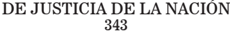

## R E P U B L I C A   A R G E N T I N A

FALLOS

DE LA

C o r t e

S u p r e m a

DE

## JuStiCia de la NaCioN

PUBLICACION A CARGO DE LA SECRETARIA DE JURISPRUDENCIA DEL TRIBUNAL

TOMO 343 - VOLUMEN 3

NOVIEMBRE-DICIEMBRE

2020

Corte Suprema de Justicia de la Nación. Fallos

Tomo 343 : fallos de la Corte Suprema de Justicia de la Nación : Volumen del tomo 2 / 1a ed. - Ciudad Autónoma de Buenos Aires : Corte Suprema de Justicia de la Nación, 2021.

Libro digital, PDF/A

Archivo Digital: descarga y online

ISBN 978-987-1625-82-6

1. Fallos de la Corte. 2. Jurisprudencia. I. Título. CDD 347.077

## FALLOS DE LA CORTE SUPREMA DE JUSTICIA DE LA NACION

## CONSULTA DE JURISPRUDENCIA DE LA CORTE SUPREMA DE JUSTICIA DE LA NACIÓN

En  la  Colección  'Fallos'  se  publican  solo  las  sentencias  más trascendentes que emite el Tribunal (acordada 37/2003).

En  el  sitio  de  Internet www.csjn.gov.ar , se  puede  consultar la totalidad  de  las  sentencias en  forma  inmediata  a  su  dictado  y mediante diversos parámetros de búsqueda.

Entre las bases disponibles, se hallan las siguientes:

- 1.- Base única de Sumarios de fallos (desde 1863 - a la fecha)
- 2.- Base de Fallos Completos (desde 1994 - a la fecha)
- 3.- La biblioteca completa de los Tomos de la colección 'Fallos' (desde el Tomo 1°)
- 4.- Búsqueda de precedente por la Cita de la colección 'Fallos'
- 5.Suplementos de Actualización Jurisprudencial
- 6.- Posibilidad de consultar todas las sentencias por Acuerdo
- 7.- Las Novedades más importantes sobre la jurisprudencia del Tribunal

## R E P U B L I C A   A R G E N T I N A

FALLOS

DE LA

C o r t e

S u p r e m a

DE

## JuStiCia de la NaCioN

PUBLICACION A CARGO DE LA SECRETARIA DE JURISPRUDENCIA DEL TRIBUNAL

TOMO 343 - VOLUMEN 2

NOVIEMBRE-DICIEMBRE

2020

## NOVIEMBRE

## BERTUZZI, PABLO DANIEL y OtrO c/ EN - PJN y OtrO s/ AmPArO lEy 16.986

## TRASLADO DE JUECES

La cuestión excede el interés de las partes, toda vez que las respuestas que se ofrezcan tendrían directa incidencia sobre la integración de uno de los Poderes del Estado e influencia sobre la garantía del juez natural.

## TRASLADO DE JUECES

La acordada 4/2018, voto de la mayoría, dispuso en su art. 3º, que no correspondía habilitar un Tribunal Oral en lo Criminal Federal, que había sido creado por la ley 27.307 mediante el mecanismo de transformación de un Tribunal Oral en lo Criminal de la Capital Federal; es decir, en ningún momento ese decisorio asignó carácter definitivo a los traslados; en realidad sostuvo lo contrario.

## TRASLADO DE JUECES

La acordada 4/2018 evitó la conversión -temporaria o definitiva, para el caso es lo mismo- de jueces nacionales ordinarios en jueces federales, es decir el nombramiento de jueces por salto de fuero.

## TRASLADO DE JUECES

La acordada 4/2018 evitó que mediante el mecanismo del traslado se designaran jueces de modo permanente, pues ello se encontraba al margen del procedimiento constitucional.

## FAllOs DE lA cOrtE suPrEmA 343

## TRASLADO DE JUECES

La acordada 7/2018 evitó que magistrados capacitados para actuar frente  a  hipótesis  concretas  regidas  por  normas  específicas  (legislación común u ordinaria) fueran habilitados por la vía de los traslados para intervenir y resolver situaciones diferentes regidas por normas sustantivas también distintas (legislación federal).

## TRASLADO DE JUECES

Toda vez que se encuentra descartado ya en la acordada 4/2018 que los traslados  pudieran  resultar  en  nombramientos  permanentes  de  magistrados, el planteo de la acordada 7/2018 debe entenderse como una pregunta acerca de las condiciones de validez de los traslados en tanto designaciones transitorias.

## TRASLADO DE JUECES

Cuando la acordada 7/2018 concluye en que no es necesaria la instrumentación  de  un  nuevo  procedimiento  de  designación  conforme  las exigencias del artículo 99, inc. 4º, de la Constitución Nacional para los traslados de magistrados federales con el fin de desempeñarse después de cumplir otros recaudos dentro de la misma jurisdicción federal, se refiere a la validez de ese traslado, como no podría ser de otra forma, en tanto designación transitoria.

## TRASLADO DE JUECES

La acordada 7/2018 define las condiciones de validez del traslado de magistrados integrantes de órganos jurisdiccionales nacionales ordinarios de la Capital Federal a tribunales federales con asiento en esa ciudad, pero no se pronuncia sobre la temporalidad de las designaciones que resultan de un traslado.

## TRASLADO DE JUECES

Al  disponer  en  la  acordada  7/2018  que  los  traslados  que  se  hubieran dispuesto  fuera  de  las  condiciones  señaladas  deberán  cesar  cuando concluya el procedimiento constitucional previsto para la cobertura de los cargos respectivos (considerando VIII), lo que se pretende es evitar situaciones potencialmente frustratorias del servicio de justicia o que puedan implicar un retardo en su prestación, de ningún modo se está librando un salvoconducto para habilitar nombramientos bajo el rótulo de traslados en el caso en que se trate de jueces del mismo fuero.

## TRASLADO DE JUECES

La temporalidad que se le asignó a los traslados entre cargos con competencias diferentes, no significa que los traslados entre cargos de similar competencia no fueran también transitorios.

## TRASLADO DE JUECES

Las acordadas 4/2018 y 7/2018 son decisiones de superintendencia; no pueden  ser  consideradas  aisladamente  una  de  la  otra,  como  ocurre cuando se omite sostener que el primer artículo de la acordada 7/2018 expresa  claramente  que  se  reitera  la  plena  vigencia  de  la  acordada 4/2018, donde se afirma repetidamente que la única forma de acceder de modo definitivo a la magistratura es conforme al mecanismo de los arts. 114 incs. 1 y 2 y 99 inc. 4 de la Norma Fundamental.

## TRASLADO DE JUECES

Las acordadas 4/2018 y 7/2018 son decisiones de superintendencia cuyo texto no puede ser interpretado selectiva o arbitrariamente, recortando la parte que podría resultar -aun bajo una óptica errónea- favorable a un interés, como acontece cuando se asume una respuesta referida a un traslado (no se necesita un nuevo acuerdo) como si se refiriera a un nombramiento definitivo.

## FAllOs DE lA cOrtE suPrEmA 343

## TRASLADO DE JUECES

Las acordadas 4/2018 y 7/2018 son decisiones de superintendencia que no pueden ser interpretadas con prescindencia del ordenamiento jurídico que complementan, lo que se verifica cuando se pretende olvidar la vigencia de la Constitución Nacional en la materia.

## INTERPRETACION DE LA LEY

La tarea de interpretación de las leyes lato sensu comprende la armonización de sus preceptos y su conexión con las otras normas que integran el ordenamiento jurídico, evitando darles un sentido que ponga en pugna sus disposiciones, destruyendo las unas por las otras, y adoptando como criterio verdadero el que las concilie y deje todas con valor y efecto.

## INTERPRETACION DE LA LEY

Es un principio de recta interpretación que los textos legales no deben ser considerados, a los efectos de establecer su sentido y alcance, aisladamente,  sino  correlacionándolos  con  los  que  disciplinan  la  misma materia, como un todo coherente y armónico, como partes de una estructura sistemática considerada en su conjunto y teniendo en cuenta la finalidad perseguida por aquellos.

## INTERPRETACION DE LA LEY

La interpretación de la ley debe practicarse computando la totalidad de sus preceptos, de manera que armonice con todas las normas del ordenamiento jurídico vigente y del modo que mejor concuerden con los principios y garantías de la Constitución Nacional.

## TRASLADO DE JUECES

No hay en el texto de las normas de superintendencia - acordadas 4/2018 y 7/2018- cláusula alguna que sostenga que los traslados son definitivos ni puede efectuarse para llegar a semejante conclusión una interpretación extensiva de aquellas que pueda sortear un test básico de razonabilidad.

## DE JusticiA DE lA NAcióN 343

## TRASLADO DE JUECES

Asimilar los institutos del nombramiento y el del traslado, importa confundir un acto institutivo que requiere del cumplimiento de un procedimiento complejo e interpoderes destinado a integrar uno de los poderes constitucionales del Estado -con funcionarios que incluso pueden provenir desde fuera del Poder Judicial-, con otro acto que no es institutivo sino destinado a optimizar los recursos disponibles para garantizar la eficiencia  y  continuidad  de  una  función  estatal  e  involucra  exclusivamente a magistrados que ya revisten la calidad de tal, o sea que ya están dentro del Poder Judicial.

## TRASLADO DE JUECES

Debido a la diferente naturaleza y relevancia de los actos de nombramiento y traslado es que la Constitución regula uno de ellos (el nombramiento) y nada dice del otro (el traslado), que deriva a la regulación infra-constitucional; así la palabra nombra, nombramiento y su plural nombramientos son las únicas utilizadas en el inc. 4 del art. 99 y en el inc. 2 del art. 114 de la Norma Fundamental y con relación a los traslados, la Constitución nada dice por cuanto se trata de actos de organización y no instituyentes de investidura.

## TRASLADO DE JUECES

Pretender que al ser preguntada sobre la validez de ciertos traslados -porque esa fue la pregunta que desemboca en la acordada 7/2018- la Corte  respondió  sobre  la  validez  de  nombramientos,  asimilándolos  o convirtiendo a los primeros en los segundos, equivale a tergiversar los términos de lo preguntado y lo respondido.

## TRASLADO DE JUECES

Asumir que la respuesta sobre los traslados los convierte en designaciones equivale a: a) desde el punto de vista lógico, trasmutar lo preguntado y lo respondido por la Corte en sus acordadas 4/2018 y 7/2018; y b) desde el punto de vista jurídico, igualar un acto institutivo inter-poderes regulado por la Constitución con un acto de administración, derivado a la reglamentación infraconstitucional.

## FAllOs DE lA cOrtE suPrEmA 343

## TRASLADO DE JUECES

Asumir que la respuesta sobre los traslados los convierte en designaciones equivale a : a) desde el punto de vista jurídico, asumir que por una acordada u otra norma infra-constitucional se puede reformar la Norma Fundamental (razonamiento que no resiste el más mínimo escrutinio); y, b) desde el punto de vista jurisdiccional, aparatarse -sin explicar  los  motivos-  de  precedentes  de  la  Corte  en  referencia  a  la exigencia de seguir el procedimiento constitucional de selección por el  Consejo  de  la  Magistratura,  nominación  por  el  Poder  Ejecutivo  y acuerdo por el Senado para el nombramiento o designación definitiva de jueces (Uriarte (Fallos:338:1216) y Rosza (Fallos:330:2361) citados en la acordadas 4/2018 y 7/2018).

## TRASLADO DE JUECES

Solo una presunción podría dar lugar a sostener que los traslados son definitivos, lo que es inadmisible como procedimiento legal de interpretación frente a la vigencia de una cláusula constitucional explícita.

## TRASLADO DE JUECES

Los precedentes de la Corte Suprema nunca admitieron que los traslados fuesen definitivos, ni que constituyan en una alternativa al concurso; así en las causas Rosza, Aparicio y Uriarte, la Corte ha sostenido la necesidad de cumplir con el procedimiento constitucional de nombramientos de jueces como único modo de garantizar el derecho de todos los habitantes de ocurrir ante aquellos con la seguridad de que sus planteos serán decididos por tribunales que están plenamente legitimados por la Constitución Nacional para administrar justicia en forma independiente e imparcial.

## TRASLADO DE JUECES

Ante el supuesto de producirse una vacante, y con el puntual objetivo de preservar el derecho de las personas de contar con un tribunal que atienda en tiempo oportuno a sus reclamos hasta tanto esa vacante sea cubierta con el nombramiento previsto por la Constitución Nacional,  la  Corte  admitió  la  existencia  de  un  régimen  de  subrogaciones como un sistema de contingencia, según los términos de 'Uriarte' o

## DE JusticiA DE lA NAcióN 343

un sistema alternativo y excepcional, según las palabras de 'Rosza'; pero fue justamente teniendo en cuenta que esos jueces subrogantes están llamados a cumplir el mismo servicio y ejercer el mismo poder que los jueces titulares, esto es, administrar justicia y decidir sobre los derechos de los justiciables, que la Corte mantuvo un criterio estricto a la hora de examinar la validez de los recaudos y del procedimiento para su designación.

## TRASLADO DE JUECES

La única interpretación posible del sistema de fuentes del derecho argentino es que los traslados no pueden convertirse en un procedimiento para el nombramiento permanente de magistrados, pues ello está al margen de la clara letra de los arts. 99, inc. 4º, segundo párrafo y 114 incs. 1 y 2 de la Constitución Nacional.

## TRASLADO DE JUECES

La única vía de acceso a la magistratura federal lo es para un cargo específico, por lo que queda descartado que pueda considerarse satisfecho el proceso de designación de un magistrado como permanente tomando en cuenta que ya ostenta tal calidad para ejercerla en otro tribunal con una competencia específica, ya sea bajo la forma de una transformación o de un traslado.

## TRASLADO DE JUECES

En la acordada 4/2018, el voto mayoritario de la Corte se cuidó de no asimilar al traslado con el nombramiento para evitar que el traslado se convirtiera en un nombramiento encubierto, pues esta modalidad -la del nombramiento o designación encubierta en un traslado- no tiene previsión constitucional alguna.

## JUECES

El  principio  de  la  designación  de  magistrados  por  un  procedimiento complejo es parte de la garantía de la independencia del Poder Judicial.

## FAllOs DE lA cOrtE suPrEmA 343

## JUECES

El único sistema de designación de jueces inferiores en el derecho argentino es el que viene precedido de un concurso realizado en el Consejo de la Magistratura y cuenta con la participación del Poder Ejecutivo y el acuerdo del Honorable Senado de la Nación.

## TRASLADO DE JUECES

Las costumbres inconstitucionales no generan derecho, por lo que presumir que un traslado es definitivo solo porque así ofició, de facto, en varias oportunidades, sin que exista norma jurídica alguna que convalide esa aspiración es tolerar, por una situación específica, lo que no es tolerable como regla general, consolidando jurídicamente situaciones de hecho que conducen indefectiblemente a la anomia.

## TRASLADO DE JUECES

No es inconstitucional el traslado como tal sino su pretensión de convertirse en una designación definitiva vulnerando el mecanismo constitucional previsto para los nombramientos.

## TRASLADO DE JUECES

La resolución 183/2020 del Consejo de la Magistratura, en tanto pretende -en sentido contrario a lo establecido por las acordadas de la Corteenmendar parcialmente el procedimiento de traslado de magistrados para convertirlo en un nombramiento con carácter definitivo, generando la intervención del Senado pero sin la previa selección específica prevista para la cobertura de esos cargos y la remisión de ternas al Poder Ejecutivo Nacional (art. 114, incs. 1 y 2 de la Norma Fundamental), debe ser descalificada por su inconstitucionalidad.

## JUECES

El procedimiento de los arts. 99, inc 4, segundo párrafo, y 114 de la Constitución Nacional, es el único mecanismo para acceder a una judicatura

## DE JusticiA DE lA NAcióN 343

específica y es también un procedimiento complejo que no puede completarse por partes sino de forma íntegra.

## TRASLADO DE JUECES

La cobertura de vacantes por mecanismos no previstos por la Constitución  Nacional,  asumidos  como  transitorios  pero  con  vigencia sine  die,  ha  sido  lamentablemente  una  constante  en  los  últimos tiempos que ha requerido en varias ocasiones la intervención de la Corte para resolver situaciones enojosas o necesitadas de interpretación y por tratarse de un tema recurrente que no solo involucra a los actores sino a buena parte de la magistratura, comprometiendo al normal funcionamiento de uno de los poderes del Estado, no le es posible a la Corte como cabeza del Poder del Estado, que sufre las consecuencias de esta situación, desentenderse de contribuir a la solución de este problema.

## TRASLADO DE JUECES

La cuestión debatida excede el interés de los recurrentes, aunque los comprende, pues si se suman los cargos vacantes que registran coberturas no definitivas con aquellos que se encuentran sin cubrir, se arriba a un porcentaje que ha oscilado en los últimos años entre el 20% y el 30 % del total de la magistratura (federal y nacional ordinaria).

## TRASLADO DE JUECES

La modificación al Reglamento de Traslado de Jueces constituye un hecho sobreviniente al dictado de la acordada 7/2018 que no resulta compatible con las pautas allí fijadas, en tanto en vez de receptar la pauta de marcada excepcionalidad señalada en la acordada citada para considerar la solicitud de un traslado, establece un criterio restrictivo que inmediatamente relativiza al sostener que puede darse cierta laxitud a alguna de las pautas propuestas teniendo en consideración el contexto en el cual es formulada cada solicitud en particular.

## FAllOs DE lA cOrtE suPrEmA 343

## TRASLADO DE JUECES

La modificación al Reglamento de Traslado de Jueces constituye un hecho sobreviniente al dictado de la acordada 7/2018 que no resulta compatible con las pautas allí fijadas, pues y a pesar de lo advertido en la acordada citada, la modificación reglamentaria sostiene, paradójicamente, que si bien está claro que son mecanismos diferentes (se entiende que se refiere al nombramiento y al traslado), y que los nombramientos por vía de traslados no se encuentran expresamente previstos en el art. 114 de la Constitución Nacional, ambos representan en última instancia una designación definitiva, contradiciendo así la línea de doctrina judicial de la Corte y sus acordadas.

## TRASLADO DE JUECES

Con la modificación introducida en 2019 por el Consejo de la Magistratura, el régimen de traslados vigente, con la pretensión de regular 'en última instancia una designación definitiva', se aleja de la intención de la norma que reemplaza y no establece ningún recaudo objetivo para individualizar a uno entre los potenciales candidatos a ocupar una vacante, sino que alcanza con la petición del interesado y la omisión del Consejo de la Magistratura en llamar a un concurso para saltear el procedimiento constitucional; de modo tal que el sistema no prevé ningún valladar para evitar la designación por motivos indebidos y busca designar jueces de manera permanente al margen del art. 99, inciso 4º, segundo párrafo, de la Constitución Nacional.

## TRASLADO DE JUECES

El Reglamento de Traslado de Jueces en tanto abre un atajo al camino establecido en la Constitución Nacional, dejando en manos del Consejo de la Magistratura la posibilidad de designar jueces en forma definitiva, resulta absolutamente incompatible con la jurisprudencia de la Corte -  Rosza, Uriarte y Aparicio - para adquirir la calidad de juez, en tanto soslaya la necesaria excepcionalidad institucional y el carácter transitorio de tal remedio.

## DE JusticiA DE lA NAcióN 343

## TRASLADO DE JUECES

El Reglamento de Traslados de Jueces violenta la Constitución Nacional porque omite la participación necesaria de los tres poderes del Estado para designaciones definitivas: Consejo de la Magistratura, mediante una propuesta vinculante en terna como culminación del procedimiento de selección de postulantes, Poder Ejecutivo, a través de la nominación de un candidato, y Senado, otorgándole el acuerdo.

## TRASLADO DE JUECES

Como están concebidos, los traslados de magistrados de forma definitiva, no cumplen con los recaudos constitucionales para la designación de magistrados y por ello socavan el pilar fundamental de la independencia judicial y los derechos de los justiciables.

## FACULTADES DE LA CORTE SUPREMA

Corresponde que la Corte Suprema, como cabeza del Poder Judicial de la Nación y en ejercicio de la potestad y el deber constitucional, adoptar, en el ámbito de sus atribuciones, las medidas necesarias y apropiadas para evitar la afectación en la continuidad de la correcta administración de  justicia,  disponiendo  lo  necesario  para  que  el  endémico  problema de la  cobertura no definitiva de cargos en la magistratura encuentre solución y no se recurra a ella en busca de indulgencias ni moratorias constitucionales.

## TRASLADO DE JUECES

Así como no hay traslados 'buenos' y traslados 'malos', tampoco hay violaciones  constitucionales  disculpables  y  no  disculpables,  porque esta diferenciación arbitraria y antojadiza es el tobogán que conduce a la anomia.

## FAllOs DE lA cOrtE suPrEmA 343

## TRASLADO DE JUECES

Tratándose el tema de traslado de magistrados una cuestión que viene de lejos en el tiempo y con creciente tendencia a expandirse, lo justo es que se evite que al resolver la causa se consolide un problema mayor, que no es solamente interno y cuantitativo, relativo al número de magistrados trasladados, sino también externo y cualitativo, en tanto se vincula con la garantía del juez natural y la justicia independiente y no se trata de una preocupación corporativa, sino de un problema sistémico que compromete a cláusulas de las llamadas parte dogmática y parte orgánica de la Constitución Nacional, en tanto afecta a la garantía del derecho a la jurisdicción (art. 18) y a la conformación de uno de los poderes del Estado (arts. 94, inc. 4 y 114 incs. 1 y 2).

## TRASLADO DE JUECES

Toda vez que existen cuestiones relativas a los traslados que no han recibido una adecuada definición normativa corresponde exhortar al Poder Legislativo para que regule esta institución, asumiendo que se trata de un mecanismo de contingencia, transitorio, que no debe ser utilizado como alternativa ni en reemplazo del nombramiento constitucional.

## FACULTADES DE LA CORTE SUPREMA

Corresponde a la Corte Suprema, en ejercicio de su función institucional, recordar el deber de ajustar las conductas de los órganos de gobierno a la Constitución Nacional, evitando y/o desalentando las costumbres que se apartan de ella por razones de conveniencia circunstancial.

## SEGURIDAD JURIDICA

La seguridad jurídica, que constituye una de las bases principales de sustentación de nuestro ordenamiento, cuya tutela innegable compete a los jueces y que es reiteradamente reclamada por distintos sectores de la sociedad como presupuesto necesario para su desarrollo, no consiste en la mera repetición de actos jurídicos sino en la concordancia de esos actos con el derecho vigente, empezando por la Constitución Nacional.

## SEGURIDAD JURIDICA

Los tribunales de justicia tienen un rol decisivo para alentar las prácticas constitucionales y desalentar las que contradicen la Norma Fundamental, asumiendo que nunca se afecta la seguridad jurídica cuando se adapta una conducta a la Constitución Nacional, aun cuando ello implique modificar una práctica, o las expectativas generadas por esa práctica, si es contraria a la Norma Fundamental.

## SEGURIDAD JURIDICA

Dado que la estabilidad de las decisiones jurisdiccionales constituye un presupuesto ineludible de la seguridad jurídica, que adquiere dimensión constitucional, con más razón en cuanto se vincula con el ejercicio de las atribuciones de los poderes, toda vez que cuando un tribunal cambie de criterio, algo que excepcionalmente puede suceder, es su deber explicar con particular elocuencia los motivos que lo impulsan a dicha mutación.

## CORTE SUPREMA

La Corte, como intérprete suprema de la Constitución Nacional, debe tener especial celo en no modificar injustificadamente su propia jurisprudencia, porque en ella se aloja el último reservorio de respuestas ajustadas al derecho vigente y la confianza de la comunidad de que al actuar conforme a ellas no habrá de sufrir recriminaciones jurídicas.

## TRASLADO DE JUECES

Convalidar judicialmente una nueva modalidad de nombramiento o designación definitiva para cubrir un cargo de juez, por fuera de la secuencia concurso - nominación - acuerdo, supondría para la Corte además de violentar la Constitución Nacional (art. 99, inc. 4, segundo párrafo y art. 114, incs. 1 y 2) y el texto de sus acordadas (acordada 4/2018, considerando XV entre otros y acordada 7/2018 art. 1) contradecir lo afirmado con especial celo en sus propios precedentes Uriarte, Rosza y Aparicio, debiendo en tal caso explicar los motivos de dicho apartamiento.

## FAllOs DE lA cOrtE suPrEmA 343

## TRASLADO DE JUECES

En los precedentes Uriarte, Rosza y Aparicio, en la salvaguarda de los preceptos relacionados con la designación de magistrados, la Corte ha debido  corregir  prácticas  que  se  alejaban  de  la  regla  constitucional, aunque ello implicara modificar situaciones consolidadas de facto.

## TRASLADO DE JUECES

Los traslados no deben entenderse como un atajo para el nombramiento de jueces con carácter permanente y definitivo, pues la Constitución Nacional prevé a tal efecto un solo mecanismo, en sus arts. 99, inc. 4º, segundo párrafo, y 114, incs. 1 y 2; mecanismo que constituye un procedimiento complejo que no puede cumplirse parcialmente.

## TRASLADO DE JUECES

Interpretar  que  el  derecho  reconoce  a  los  traslados  como  definitivos implicaría asumir que hay fuente normativa suficiente para optar entre dos reglas de acceso a la magistratura: a) o puede hacérselo por el proceso de concurso, nominación y acuerdo; b) o puede hacérselo por traslado, sin cumplir con alguna, algunas o todas las etapas descriptas (el concurso, la nominación y/o el acuerdo); esta segunda vía de acceso no solo contradice el texto constitucional explícito sino que carece de asidero en el texto de las acordadas 4/2018 (voto de la mayoría) y 7/2018 y la jurisprudencia emanada de la Corte.

## TRASLADO DE JUECES

Las acordadas 4/2018 y 7/2018 impidieron en su momento la conversión de jueces nacionales ordinarios en jueces federales y evitaron que los traslados se convirtieran en nombramientos definitivos; tales votos deben leerse no sólo en clave de la situación que puntualmente evitaron en su momento sino con una mirada de presente y de futuro, pues evitan y evitarán los intentos de cobertura inconstitucional de vacantes de forma definitiva,  clausurando la posibilidad de que se recurra a la Corte en busca de indulgencias o moratorias constitucionales.

## TRASLADO DE JUECES

Nunca hubo un fundamento jurídico válido para considerar los traslados como definitivos, como no sea cierta práctica contra-constitutionem alimentada por la duración sine die de los traslados.

## TRASLADO DE JUECES

Toda vez que se afecta la seguridad jurídica cuando los tribunales cambian de criterio sin dar motivos plausibles de dicho apartamiento, admitir que los traslados extendidos sine die puedan ser equivalentes a las designaciones definitivas, implica contradecir no sólo la Norma Fundamental sino también precedentes específicos de la Corte sin explicar los motivos.

## TRASLADO DE JUECES

En la medida en que las acordadas 4/2018 y 7/2018 - por reenvío a aquella- invocan las cláusulas constitucionales a cumplimentar y los precedentes de la Corte que refieren a ello (Rosza y Uriarte), no es posible sostener válidamente que ha habido un cambio de criterio jurídico o una reinterpretación de normas sino una decisión de superintendencia que está en línea con los fallos de marras, como así también con los precedentes Nisman y Corrales.

## TRASLADO DE JUECES

Toda vez que los recurrentes son jueces que ocupan sus actuales cargos de modo no definitivo, por no haber cumplido con el procedimiento previsto por la Constitución Nacional, hasta tanto se dirima la cobertura de los cargos vacantes de acuerdo al procedimiento constitucional, los  jueces  trasladados  permanecerán  en  sus  funciones  y  gozarán  de la garantía constitucional de inamovilidad, sin que deban volver a sus tribunales de origen, por cuanto los traslados a los cargos que ocupan son legítimos como tales¸ evitando así una situación de incertidumbre jurisdiccional con consecuencias que podrían traducirse no sólo en impunidad o riesgo de tal en el juzgamiento de delitos de suma gravedad que hayan merecido sus intervenciones o que las merezcan en el futuro, sino también en violación de garantías respecto de las personas que hubiesen sido absueltas o sobreseídas.

## FAllOs DE lA cOrtE suPrEmA 343

## TRASLADO DE JUECES

Si los cargos de jueces vacantes fuesen cubiertos con celeridad, siguiendo el único procedimiento constitucional (arts. 99, inc. 4, segundo párrafo, y 114, incs. 1 y 2 de la Norma Fundamental) las coberturas transitorias como el traslado serían excepcionales.

## PODER JUDICIAL

La primera condición para lograr celeridad en la justicia es lograr celeridad en la cobertura de sus vacantes, pues de lo contrario se recarga el trabajo del resto de los jueces.

## PODER JUDICIAL

La no cobertura a tiempo de las vacantes no sólo genera instancias interpretativas, dificultades de acceso a la justicia y demora en la resolución de pleitos, sino que tiene un efecto distorsivo muy grave para el equilibrio de los poderes, pues uno de ellos queda mermado con relación a los otros, afectando el sistema republicano de gobierno.

## TRASLADO DE JUECES

El Reglamento de Traslado de Jueces del Consejo de la Magistratura del Poder Judicial de la Nación (resolución 155/00), luego de la modificación operada por la resolución 270/19, es inconstitucional, por cuanto omite instancias previstas por la Constitución Nacional para la cobertura definitiva de los cargos vacantes e igual descalificación, y por los mismos motivos, corresponde sea decretada para la resolución 183/20 del Consejo de la Magistratura del Poder Judicial de la Nación.

## TRASLADO DE JUECES

El Congreso de la Nación es el órgano encargado de regular la institución de los traslados de magistrados y la Corte ha expresado pautas constitucionales concretas sobre la transitoriedad de los mismos y la compatibilidad de fueros para su viabilidad, por lo que la regulación con-

gresional permitirá contar con parámetros objetivos referidos a otras cuestiones  no  reguladas,  tales  como  la  incidencia  de  la  modificación de la circunscripción territorial del traslado, o los límites de la igual o similar competencia material de los tribunales concernidos otorgando certeza a los magistrados y evitando revisiones esporádicas de su status jurídico y a los justiciables, en relación a la garantía constitucional del juez natural.

## CONSEJO DE LA MAGISTRATURA

Corresponde al Consejo de la Magistratura de la Nación promover y activar la realización de los concursos de los cargos vacantes y restringir al máximo la promoción de nuevos traslados y en el caso de los cargos ocupados por los recurrentes, convocar a un nuevo y específico concurso para cubrir las dos vacantes de la Sala I de la Cámara Nacional de Apelaciones en lo Criminal y Correccional Federal.

## TRASLADO DE JUECES

Corresponde  que  los  magistrados  recurrentes  en  la  causa,  y  todos aquellos que ocupan transitoriamente cargos de la judicatura por traslado, continúen ejerciéndolos y gozando de la garantía de inamovilidad hasta el momento en que sean designados por nombramiento los magistrados que ocupen de modo definitivo dichos cargos, luego de cumplido el proceso constitucional de los arts. 114, incs. 1 y 2 y 99, inc. 4, en todas sus etapas.

## TRASLADO DE JUECES

Los jueces trasladados, incluidos los magistrados recurrentes en la causa, no deben ver cercenado en ninguna forma su eventual participación en los concursos de los cargos que actualmente ocupan ni de otros que se convoquen, recordándose para lo pertinente la vigencia de lo decidido por la Corte en las causas Rizzo y Uriarte.

## FAllOs DE lA cOrtE suPrEmA 343

## TRASLADO DE JUECES

Corresponde declarar que la autoridad institucional del fallo que se dicta en la causa no privará de validez a los actos procesales cumplidos por los jueces trasladados hasta el momento de la designación definitiva de los magistrados titulares de esos cargos.

## TRASLADO DE JUECES

La circunstancia de que los actores no hayan cuestionado formalmente los decretos 750/20 y 752/20 que dispusieron el cese de los traslados al tribunal en el que ejercían su magistratura, no constituye un obstáculo insalvable para ingresar al estudio de la cuestión planteada, toda vez que sí  han  controvertido  la  plataforma  sobre  la  cual  fueron  dictados, esto es, la resolución 183/20 del Consejo de la Magistratura, pues la Corte cuenta con facultades para avocarse al examen de las actuaciones, y aun proceder de oficio, frente a la posible transgresión de principios fundamentales inherentes a la mejor y más correcta administración de justicia, velando por su eficacia en el cumplimiento de los altos deberes que al respecto le conciernen (Voto de la jueza Highton de Nolasco).

## ACTOS PROPIOS

La llamada doctrina de los actos propios debe aplicarse en el campo del derecho público con las necesarias adaptaciones, es decir, con las discriminaciones impuestas por la naturaleza de lo que constituye la sustancia de aquél (Voto de la jueza Highton de Nolasco).

## ACTOS PROPIOS

La doctrina del venire contra factum propium non valet no puede vincular a la Administración cuando la conducta precedente no se ajusta a la ley imperativa aplicable al caso, ya que la tutela de las expectativas generadas en los administrados no puede primar sobre el principio de legalidad al que se encuentra sometida la actividad del Estado (Voto de la jueza Highton de Nolasco).

## ACTOS ADMINISTRATIVOS

La  estabilidad  de  los  actos  administrativos  cede  cuando  la  decisión revocada carece de las condiciones esenciales de validez por hallarse afectada de vicios graves y ostensibles en su forma, competencia o contenido, fue dictada sobre la base de presupuestos fácticos manifiestamente irregulares, reconocidos o fehacientemente comprobados, o, en otras palabras, fue dictada a raíz de un error grave de derecho; en estos casos, la facultad revocatoria, aunque es de interpretación restrictiva, encuentra justificación en la necesidad de restablecer sin dilaciones el imperio de la juridicidad comprometida por aquellos actos administrativos irregulares (Voto de la jueza Highton de Nolasco).

## TRASLADO DE JUECES

El  procedimiento de traslado debatido en la causa difiere sustancialmente del traslado de jueces dispuesto mediante una ley del Congreso de la Nación como consecuencia inexorable del ejercicio de su potestad constitucional exclusiva de transformar tribunales, pues mientras en el primer caso el juez trasladado pasa a ocupar un cargo que se encuentra vacante, en el segundo, además de ser el Congreso de la Nación quien dispone el traslado, el juez trasladado pasa a integrar el nuevo tribunal constituido como consecuencia de la transformación y, por tanto, disolución del tribunal en el que cumplía funciones hasta ese momento (Voto de la jueza Highton de Nolasco).

## TRASLADO DE JUECES

Los traslados de jueces dispuestos a través de una ley del Congreso de la  Nación como resultado de la transformación del tribunal en el que ejercían funciones, responden a una potestad constitucional exclusiva de dicho poder del Estado; de modo que mientras esa atribución sea ejercida dentro de ciertos parámetros de razonabilidad, los traslados serán regulares y definitivos (Voto de la jueza Highton de Nolasco).

## TRASLADO DE JUECES

Cuando se trata de traslados de jueces instrumentados en el contexto de transformación o modificación legislativa de un tribunal ya constituido e integrado, rechazar la posibilidad de que los jueces trasladados

## FAllOs DE lA cOrtE suPrEmA 343

vean modificada su competencia implicaría, en los hechos, cercenar la atribución constitucional del Congreso de alterar la competencia de los tribunales (Voto de la jueza Highton de Nolasco).

## TRASLADO DE JUECES

Los traslados de magistrados dispuestos por el Poder Ejecutivo Nacional a instancias del Consejo de la Magistratura, es decir, sin la intervención del Congreso de la Nación y fuera de los supuestos de transformación de tribunales, solo pueden ser considerados regulares y definitivos cuando hayan sido dispuestos en cumplimiento de todos los requisitos previstos a tal fin (Voto de la jueza Highton de Nolasco).

## TRASLADO DE JUECES

El  traslado  de  jueces,  aun  cuando  resulte  un  mecanismo  válido  bajo ciertos límites constitucionales, constituye un sistema excepcional que no puede desnaturalizar el procedimiento de selección de magistrados que establece la Constitución Nacional en el art. 99, inc. 4 (Voto de la jueza Highton de Nolasco).

## TRASLADO DE JUECES

Los traslados realizados a través de una ley del Congreso de la Nación, al ser inmanentes a la transformación de un tribunal, requieren el ejercicio regular de esa potestad por parte de dicho poder del Estado; en cambio, los que son dispuestos por el Poder Ejecutivo Nacional, al carecer de ese contexto justificante, requieren el cumplimiento de requisitos más estrictos (Voto de la jueza Highton de Nolasco).

## TRASLADO DE JUECES

Los criterios establecidos en la disidencia de la acordada 4/2018 para traslados realizados por el Congreso de la Nación por transformación de un tribunal, no resultan aplicables a los traslados de los actores dispuestos por el Poder Ejecutivo Nacional, así como tampoco cabe exigir a los primeros los requisitos aplicables a estos últimos, sencillamente porque se trata de supuestos que poseen origen y naturaleza diferente

## DE JusticiA DE lA NAcióN 343

y, por lo tanto, están sujetos a recaudos también diferentes (Voto de la jueza Highton de Nolasco).

## TRASLADO DE JUECES

Los traslados de los actores solo pueden ser considerados regulares y definitivos si cumplieron con los requisitos exigidos en el reglamento de traslado de jueces aprobado por la resolución 155/2000 del Consejo de la Magistratura (Voto de la jueza Highton de Nolasco).

## TRASLADO DE JUECES

Si  bien  los  jueces  federales  de  los  Tribunales  Orales  en  lo  Criminal Federal poseen el cargo de juez de cámara, lo cual implica una equiparación de jerarquía escalafonaria entre ambos cargos, las funciones jurisdiccionales que desarrollan no son las mismas que las desempeñadas por los jueces que integran la Cámara Nacional de Apelaciones en lo Criminal y Correccional Federal, en tanto mientras esa última actúa como tribunal de alzada de los juzgados en lo criminal y correccional federal de la Ciudad de Buenos Aires, es decir, como segunda instancia revisora de la actuación de esos juzgados de primera instancia durante la etapa de instrucción del proceso penal; los tribunales orales federales actúan en instancia única llevando a cabo los juicios orales de delitos de competencia federal una vez concluida dicha instrucción (Voto de la jueza Highton de Nolasco).

## TRASLADO DE JUECES

En virtud de las diferencias sustanciales en cuanto a la naturaleza y oportunidad de la actuación que existe entre el Tribunal Oral en lo Criminal Federal y la Cámara Nacional de Apelaciones en lo Criminal y Correccional Federal, los traslados de los actores no cumplieron con el requisito establecido en el inciso b del art. 1º del reglamento de traslado de jueces aprobado por la resolución 155/00 del Consejo de la Magistratura, en tanto los cargos que desempeñaban no tenían la misma competencia funcional que los cargos a los cuales fueron trasladados, por lo cual nunca pudieron ser considerados regulares ni definitivos (Voto de la jueza Highton de Nolasco).

## FAllOs DE lA cOrtE suPrEmA 343

## JUECES

Los jueces no deben desentenderse de las circunstancias fácticas con incidencia en la resolución del conflicto ni prescindir de las consecuencias que se derivan de los fallos, pues tales extremos constituyen uno de los índices más seguros para verificar la razonabilidad de su decisión (Voto de la jueza Highton de Nolasco).

## PODER JUDICIAL

El Estado tiene el deber de garantizar una apariencia de independencia de la magistratura que inspire legitimidad y confianza suficiente no solo al justiciable, sino a los ciudadanos en una sociedad democrática (Voto de la jueza Highton de Nolasco).

## TRASLADO DE JUECES

La libre disponibilidad respecto del traslado de magistrados fomentaría la duda objetiva sobre la posibilidad efectiva de los jueces de decidir controversias concretas sin temor a represalias (Voto de la jueza Highton de Nolasco).

## TRASLADO DE JUECES

No corresponde admitir otra solución que determinar la vigencia temporal de los traslados de los actores de acuerdo a condiciones objetivas, impersonales y previsibles, requisito que solo puede entenderse cumplido  manteniendo  dicha  vigencia  hasta  la  cobertura  de  cada  uno  de los cargos de manera definitiva, a través del procedimiento que prevé la Constitución Nacional (art. 99, inc. 4), debiendo el Consejo de la Magistratura llamar a un nuevo concurso para cubrir los cargos vacantes, de modo que permita a los actores participar de ese proceso y tener la posibilidad de transformar sus traslados en nombramientos definitivos (Voto de la jueza Highton de Nolasco).

## TRASLADO DE JUECES

Corresponde declarar la invalidez de la resolución 183/2020 del Consejo de la Magistratura en cuanto dio origen a la secuencia concatenada de actos que, con la intervención posterior del Poder Ejecutivo Nacional y el Senado de la Nación, culminó con la reversión inmediata de los traslados de los actores, pues dicha solución, aparece como el único modo razonable de compatibilizar los distintos intereses y valores institucionales y constitucionales que se encuentran en pugna en el caso (Voto de la jueza Highton de Nolasco).

## RECURSO EXTRAORDINARIO

Toda vez que el recurso extraordinario se dirige contra la sentencia definitiva de primera instancia que decidió en contra del derecho de los recurrentes a continuar en el cargo judicial que venían ejerciendo, derecho que ellos habían fundado en una determinada interpretación del artículo 110 de la Constitución y el principio de inamovilidad consagrado en dicha cláusula, la competencia apelada de esta Corte se encuentra habilitada en los términos del artículo 14, inciso 3º de la ley 48 (Disidencia del juez Rosenkrantz).

## CONTROL DE CONSTITUCIONALIDAD

No existen atribuciones inmunes al control judicial de constitucionalidad cuando se encuentra en juego la vulneración de derechos garantizados por la Constitución Nacional (Disidencia del juez Rosenkrantz).

## ACCION DE AMPARO

Si bien la acción de amparo no está destinada a reemplazar los medios ordinarios para la solución de controversias, su exclusión por la existencia de otros recursos no puede fundarse en una apreciación meramente ritual, toda vez que la institución tiene por objeto una efectiva protección de derechos más que una ordenación o resguardo de las competencias (Disidencia del juez Rosenkrantz).

## FAllOs DE lA cOrtE suPrEmA 343

## TRASLADO DE JUECES

La cuestión reviste marcada gravedad institucional puesto que involucra determinar si resulta constitucionalmente admisible la revisión por parte del Consejo de la Magistratura del mecanismo de traslados por el cual un importante número de magistrados, quienes cuentan con acuerdo previo del Senado, han sido designados en diversos tribunales del Poder Judicial de la Nación y en los cuales han venido desempeñando sus funciones durante diversos períodos de tiempo, en algunos casos muy prolongados (Disidencia del juez Rosenkrantz).

## TRASLADO DE JUECES

La posibilidad de que una vacante en un tribunal de la Nación sea cubierta por el traslado de un juez ya nombrado en otro tribunal de la Nación ha sido validada por la Corte y surge de una práctica institucional de más de siete décadas; estos traslados reconocen dos fuentes normativas: decretos del Poder Ejecutivo que regulan casos individuales o leyes del Congreso que al transformar tribunales requieren el consiguiente traslado de los magistrados de los tribunales transformados o la asunción por parte de los magistrados de nuevas competencias (ley 23.637; ley 25.292 - modificada por ley 27.097-; ley 25.269; ley 27.307; entre otras) (Disidencia del juez Rosenkrantz).

## TRASLADO DE JUECES

Sin perjuicio de las variaciones respecto del régimen al que se hallan sujetos los distintos tipos de traslados, es indiscutible que un juez trasladado con sujeción a las pautas constitucionales y reglamentarias vigentes al momento de su traslado tiene la garantía de inamovilidad establecida por el art. 110 de la Constitución (Disidencia del juez Rosenkrantz).

## TRASLADO DE JUECES

La garantía de inamovilidad consiste,  como  surge  del  texto  constitucional, en el derecho de los magistrados a permanecer en sus empleos mientras dure su buena conducta y obviamente comprende el derecho a no ser trasladado a otro cargo sin su consentimiento, es por ello que la  Corte se ha encargado de remarcar con claridad meridiana que la remoción irregular de un juez no es admisible y que debe desconocerse

## DE JusticiA DE lA NAcióN 343

la facultad de su traslado, no consentido, del asiento de su jurisdicción (Disidencia del juez Rosenkrantz).

## GARANTIA DE INAMOVILIDAD

Los jueces están amparados por la garantía de inamovilidad tanto si se encuentran ocupando el cargo para el que fueron originariamente nombrados como si se desempeñan en un nuevo cargo al que fueron trasladados (Disidencia del juez Rosenkrantz).

## GARANTIA DE INAMOVILIDAD

La garantía de inamovilidad ha sido concebida por la Corte con la amplitud necesaria para proteger a todos los magistrados designados de acuerdo con las normas vigentes al tiempo del traslado, en el entendimiento de que ello es condición imprescindible para que ellos puedan ejercer sin condicionamientos las atribuciones que les confía la Constitución en su art. 116, especialmente la de poner límites al poder y controlar que su accionar se desenvuelva dentro de la legalidad (Disidencia del juez Rosenkrantz).

## GARANTIA DE INAMOVILIDAD

Jueces desprovistos de la garantía de inamovilidad, esto es, jueces movibles, serán jueces sin independencia, lo que implicaría un fatal impedimento para que el Poder Judicial contribuya a realizar el tipo de gobierno republicano creado por la Constitución Nacional y que los argentinos nos hemos comprometido a respetar (Disidencia del juez Rosenkrantz).

## TRASLADO DE JUECES

El único órgano constitucional investido de la potestad de revisar la validez de traslados es el Poder Judicial de la Nación y, en última instancia, la Corte Suprema de Justicia de la Nación, pues ello surge del art. 116 de la Constitución Nacional, en tanto atribuye al Poder Judicial el conocimiento y decisión de todas las causas que versen sobre puntos regidos por la Constitución, lo que naturalmente incluye las que pudieran suscitarse en torno a un traslado, y al mismo tiempo del carácter de

## FAllOs DE lA cOrtE suPrEmA 343

cabeza de esa rama del Gobierno Federal que la norma citada adjudica a la Corte, lo que supone la facultad de juzgar respecto de la investidura de los jueces nacionales (Disidencia del juez Rosenkrantz).

## TRASLADO DE JUECES

Un juez que ha sido designado por el procedimiento constitucional y es posteriormente trasladado a otro tribunal de acuerdo con las pautas constitucionales y reglamentarias vigentes a la época del traslado, conserva la inamovilidad en su nuevo cargo (Disidencia del juez Rosenkrantz).

## TRASLADO DE JUECES

Los  jueces  están  investidos  de  la  garantía  de  inamovilidad  mientras dure su buena conducta al ser designados por el procedimiento establecido en la misma Constitución y el hecho de que con posterioridad sean trasladados a otro tribunal no los priva de esa inmunidad, de la que continúan gozando en el nuevo cargo siempre que su traslado haya sido regular, extremo cuyo juzgamiento corresponde única y exclusivamente al Poder Judicial (Disidencia del juez Rosenkrantz).

## TRASLADO DE JUECES

El  proceder  del  Consejo  de  la  Magistratura  mediante  la  resolución 183/20  es  manifiestamente  arbitrario  pues  pretendió  revisar  la  regularidad de un traslado ya realizado, facultad que la Constitución no le atribuye expresa ni implícitamente y que ninguna norma inferior podría atribuirle  sin  violentar  la  inamovilidad  que  garantiza  el  art.  110  de  la Constitución y, con ello, socavar la propia finalidad que tuvo el constituyente al crear el Consejo, que fue elevar el umbral de garantía de la independencia judicial (Disidencia del juez Rosenkrantz).

## TRASLADO DE JUECES

El  proceder  del  Consejo  de  la  Magistratura  mediante  la  resolución 183/20 es manifiestamente arbitrario pues revisó los traslados a la luz de criterios de validez radicalmente distintos a los que el propio Consejo

## DE JusticiA DE lA NAcióN 343

había aplicado anteriormente y respecto de los mismos magistrados, y, en uso de una atribución de la que manifiestamente carecía, decidió que una nueva regulación de traslados tendría efectos retroactivos sobre traslados ya cumplidos y consolidados y que, por lo tanto, habían generado  derechos  para  los  magistrados  trasladados  (Disidencia  del juez Rosenkrantz).

## TRASLADO DE JUECES

La consecuencia de la aplicación retroactiva de un nuevo criterio para el traslado de magistrados - resolución 183/20 - es que la permanencia de los jueces actores en los cargos que desempeñan en la cámara de apelaciones  quedó  enteramente  sujeta  a  la  decisión  discrecional  del Poder Ejecutivo y, en su caso, del Senado, lo cual importó una vulneración manifiesta de su respectivo derecho a permanecer en tales cargos mientras dure su buena conducta (art. 110 de la Constitución) (Disidencia del juez Rosenkrantz).

## GARANTIA DE INAMOVILIDAD

El derecho a la inamovibilidad de los jueces es, desde el punto de vista institucional, una inmunidad indispensable para asegurar que el Poder Judicial de la Nación pueda funcionar con independencia de las otras dos ramas del gobierno nacional, el Ejecutivo y el Legislativo; esta inmunidad es la clave de bóveda de la independencia judicial, razón por la cual la Corte ha destacado que la mencionada inamovilidad no ha sido establecida únicamente a favor de los magistrados sino fundamentalmente en beneficio de la totalidad de los habitantes de la Nación (Disidencia del juez Rosenkrantz).

## TRASLADO DE JUECES

Conceder efecto retroactivo a una nueva regla en materia de traslados o a una nueva interpretación de una regla ya existente es absolutamente inadmisible, pues no solo deja a los los jueces que han iniciado la demanda a merced de la discreción de otros poderes del estado sino que además produce idéntico efecto debilitador sobre la inamovilidad de todos aquellos magistrados que aceptaron su traslado bajo una regla anterior menos exigente o simplemente distinta en su alcance (Disidencia del juez Rosenkrantz).

## FAllOs DE lA cOrtE suPrEmA 343

## TRASLADO DE JUECES

La posibilidad de conceder efecto retroactivo a una nueva regla en materia de traslados o a una nueva interpretación precarizará el ejercicio de la magistratura por parte de todos los jueces que en el futuro sean trasladados, incluso de aquellos que lo sean bajo el actual Reglamento de Traslado de Jueces (texto según resolución 270/19), pues nada impide que una futura reforma del Reglamento o una novel interpretación de sus normas, establezca requisitos distintos a los actualmente vigentes y, de esa manera, arrase también con los nuevos traslados cumplidos y, con la inamovilidad de los jueces que en el futuro sean trasladados (Disidencia del juez Rosenkrantz).

## TRASLADO DE JUECES

Si se consolidase la práctica del Consejo de la Magistratura de revisar retroactivamente traslados ya efectuados, estaríamos frente a otra forma de desequilibrio entre los poderes del estado, en perjuicio de la independencia que el Poder Judicial debe tener asegurada como condición indispensable para hacer cumplir la Constitución y la ley en general, pero especialmente a las ramas políticas del gobierno en las causas sometidas a su decisión (Disidencia del juez Rosenkrantz).

## TRASLADO DE JUECES

El proceder del Consejo de la Magistratura mediante la resolución 183/20 es manifiestamente arbitrario pues la Corte ya había determinado en la acordada 7/18 que los traslados en cuestión son válidos, afirmando de un modo que no deja lugar a dudas respecto del contenido de su decisión, que no es necesaria la instrumentación de un nuevo procedimiento de designación conforme las exigencias del art. 99, inc. 4, de la Constitución Nacional (Disidencia del juez Rosenkrantz).

## TRASLADO DE JUECES

La acordada 4/18 en modo alguno pudo haber brindado sustento a la revisión de los traslados que el Consejo pretendió realizar a través de la resolución 183/20, pues no sólo la situación de los recurrentes estaba regulada por la acordada 7/18 y esta acordada decidió que sus traslados son regulares y válidos, sino también porque la acordada 4/18 es inapli-

## DE JusticiA DE lA NAcióN 343

cable al caso, en tanta consideró inválidos los traslados de magistrados designados en el fuero nacional para desempeñarse como jueces del fuero federal, hipótesis que resulta diametralmente diferente de la considerada en autos (Disidencia del juez Rosenkrantz).

## TRASLADO DE JUECES

La fuente inocultable de ilegitimidad en el obrar del Consejo de la Magistratura a través de resolución 183/20, no es la inconveniencia prospectiva de un sistema que requiere más condiciones para los traslados, sino que radica en que un órgano incompetente revise traslados ya realizados en base a una nueva condición o regla que no estaba vigente al momento de su realización, y para peor, la revisión está en contradicción directa con una decisión anterior expresa de la Corte sobre la validez de dichos traslados (Disidencia del juez Rosenkrantz).

## TRASLADO DE JUECES

Las designaciones de magistrados mediante el mecanismo de traslados tienen, y han tenido siempre, carácter definitivo y los magistrados trasladados no son asimilables en modo alguno a los jueces designados en comisión, pues su designación no está sujeta a una duración temporal predeterminada, ni a una condición como la prevista en el art. 99 inc.19 de la Constitución, tampoco son asimilables a los jueces subrogantes pues, a diferencia de éstos, su designación es por su propia naturaleza permanente y no transitoria (Disidencia del juez Rosenkrantz).

## TRASLADO DE JUECES

El carácter definitivo de los traslados, por oposición al carácter transitorio de las subrogancias, es el que determina que en el caso de los traslados se llame a concurso para cubrir la vacante que deja el juez trasladado y en el caso de las subrogancias, por el contrario, se abra a concurso la vacante cubierta por el magistrado subrogante (Disidencia del juez Rosenkrantz).

## FAllOs DE lA cOrtE suPrEmA 343

## TRASLADO DE JUECES

El carácter definitivo de las designaciones de los jueces trasladados ha sido ratificado por la Corte en la acordada 7/18, al afirmar que los únicos traslados que pueden ser transitorios son los irregulares, o sea, aquellos realizados en violación a las pautas fijadas en la misma acordada; por ello, no cabe entender que las acordadas 4/18 y 7/18 hayan otorgado a los nombramientos por traslado un carácter diferente, ni que la garantía de inamovilidad que los protege pueda ser respetada de ningún otro modo que mediante la continuidad de los magistrados actores en sus cargos actuales mientras dure su buena conducta (art. 110, Constitución Nacional) (Disidencia del juez Rosenkrantz).

## TRASLADO DE JUECES

Una vez que la Corte ha decidido que un traslado es válido, como sucedió con los demandantes (acordada 7/18), no es posible alterar retroactivamente el criterio de validez utilizado, pues lo contrario supondría atribuir a aquella la potestad de convertir jueces inamovibles en jueces movibles, lo que es claramente incompatible con la alta función que le encomienda la Constitución Nacional, que no es otra que mantener su plena vigencia, y dentro de la cual ocupa un lugar central la preservación de las garantías de independencia del Poder Judicial (Disidencia del juez Rosenkrantz).

## PODER JUDICIAL

La independencia del Poder Judicial es tal vez la garantía más preciada e imprescindible entre aquellas que la Constitución establece para el aseguramiento de los derechos y libertades de todos los habitantes; sin ella es imposible afianzar la justicia, promover el bienestar general y asegurar los beneficios de la libertad, objetivos que los constituyentes, y las distintas generaciones de argentinos que los han sucedido hasta el presente, han fijado como norte inamovible de nuestra vida en común, para nosotros y para nuestra posteridad (Disidencia del juez Rosenkrantz).

## DE JusticiA DE lA NAcióN 343

## CORTE SUPREMA

En ejercicio de facultades implícitas y como cabeza del Poder Judicial de la Nación, la Corte tiene el deber de salvaguardar la investidura de los jueces de la Nación en el desempeño de su función y asimismo, el  de  preservar la independencia de los tribunales que integran ese Poder frente a posibles avances de los otros Poderes (Disidencia del juez Rosenkrantz).

DictAmEN DE lA PrOcurAcióN GENErAl

## Suprema Corte:

-i-

El 21 de agosto último, la magistrada a cargo del Juzgado Nacional de Primera Instancia en lo Contencioso Administrativo Federal Nº 5 rechazó la acción de amparo que, en los términos del art. 43 de la Constitución Nacional y de la ley 16.986, dedujeron Pablo Daniel Bertuzzi y  Leopoldo Oscar Bruglia contra el Estado Nacional (Consejo de la Magistratura), con el objeto de que se declare la inconstitucionalidad y  nulidad de la resolución CM 183/2020 del citado órgano en cuanto resolvió  encomendar al Poder Ejecutivo Nacional y al Senado de la Nación la revisión de las designaciones de aquéllos en los cargos de jueces de la Sala I de la Cámara Nacional de Apelaciones en lo Criminal y Correccional Federal que habían sido efectuadas por medio de los decretos 835/2018 y 278/18.

En primer término, efectuó una reseña de los acontecimientos que dieron origen a la presente acción.

Así, explicó que el doctor Leopoldo Oscar Bruglia había sido designado, mediante el decreto 1889/93, Juez de Cámara en el Tribunal Oral Criminal Federal Nº 4 de la Capital Federal, previo acuerdo del Senado de la Nación.

Indicó que, con posterioridad, el 22 de diciembre de 2017, el doctor Bruglia solicitó su traslado a la Sala I de la Cámara Nacional de Apelaciones en lo Criminal y Correccional Federal. Agregó que el Consejo de la Magistratura, a través de la resolución 64/2018, prestó conformidad y recomendó al Poder Ejecutivo Nacional que admitiera tal petición mediante un decreto, lo que finalmente sucedió con el dictado del de-

creto 278/2018 que dispuso el traspaso de aquél a la Sala I de la mencionada cámara.

Luego se refirió a la situación del co-actor Bertuzzi. Señaló que había sido nombrado Juez de Cámara en el Tribunal Oral en lo Criminal Federal Nº 1 de La Plata, provincia de Buenos Aires, por decreto  2040/2008.  Posteriormente,  continuó  relatando  que,  mediante resolución 46/10, el Consejo de la Magistratura, previa petición del demandante, remitió las actuaciones al Poder Ejecutivo Nacional con la recomendación de que emitiese un decreto disponiendo su traslado al Tribunal Oral Federal Nº 4 de la Capital Federal, lo que finalmente aconteció a partir del dictado del decreto 438/2010.

Explicó que, ante una nueva solicitud de traspaso efectuada por el doctor Bertuzzi, y luego de la recomendación favorable del Consejo de la Magistratura en la resolución 358/2018, el Poder Ejecutivo Nacional emitió el decreto 835/2018 por el que se ordenó el traslado de aquel magistrado a la Sala I de la Cámara Nacional de Apelaciones en lo Criminal y Correccional Federal.

Indicó que, por medio del acto impugnado, el Consejo de la Magistratura resolvió declarar que el traslado de los actores 'no ha completado el procedimiento constitucional previsto en el art. 99 inc. 4 de la Constitución Nacional conforme la jurisprudencia de la Corte Suprema de Justicia de la Nación así como a las acordadas 4/2018 y 7/2018' y comunicó tal decisión al Poder Ejecutivo Nacional.

Relató que, una vez iniciada la presente acción, tanto el Poder Ejecutivo Nacional como el Senado ejecutaron diversos actos tendientes a someter el traslado de los co-actores a un nuevo acuerdo.

Así, explicó que el 11 de agosto del corriente el Poder Ejecutivo Nacional (mediante los mensajes 2020-58-APN-PTE y 2020-60APNPTE) solicitó  al  Honorable  Senado  de  la  Nación  en  los  términos del artículo 99, inc. 4º, de la Constitución Nacional y en virtud de lo dispuesto por las Acordadas 4/18 y 7/18 de esa Corte, el respectivo tratamiento de aquellos acuerdos. Ese mismo día, siguió relatando, la  Presidencia  del  Senado  de  la  Nación,  a  través  de  su  despacho DPP-72/20, convocó a una sesión pública y especial que se llevó a cabo el 13 de agosto y en la que se procedió a dar ingreso formal a los pliegos, mientras que el día 18 de ese mes se efectuó la publicación de los edictos a los que se refiere el art. 22 bis del Reglamento de aquel cuerpo.

Una vez efectuada la síntesis de los antecedentes de esta acción de amparo, la magistrada ingresó al tratamiento del fondo del asunto.

En este sentido, recordó que la cuestión relativa al traslado de magistrados no resultaba novedosa en la jurisprudencia del Máximo Tribunal, y así citó diversos considerandos del voto del Dr. Bacqué en la sentencia registrada en Fallos: 313:330. Además, añadió que la Corte, en la acordada 4/18, hizo suya la disidencia de los jueces Belluscio y Petracchi en la causa 'Del Valle Puppo' (Fallos: 319:339).

Así,  luego  de  transcribir  y  analizar  la  citada  acordada  concluyó que, en la actualidad, el nombramiento como juez refiere a un cargo determinado y se obtiene a través de un procedimiento complejo en el que intervienen el Consejo de la Magistratura, el Poder Ejecutivo y el Senado, lo que, a su juicio, permite asegurar la independencia de los magistrados y el derecho de los justiciables.

Sobre esa base sostuvo que la decisión del sub lite debía partir del principio conforme al cual la admisión de traslados sin acuerdo del Senado constituye una situación excepcional.

Señaló que el reglamento de traslado de jueces, vigente en aquel entonces (resolución plenaria CM 155/2000), establecía en su art. 1º que los magistrados del Poder Judicial de la Nación podían solicitar su traslado a otro tribunal que se encontrara vacante siempre que: ' a - No se haya resuelto la convocatoria a un concurso público de antecedentes y oposición para cubrir el cargo. Esta condición no regirá cuando se trata de un mismo tribunal colegiado.; b- La vacante a la que se solicita el traslado corresponda a la misma jurisdicción y tenga la misma competencia en materia y grado que el cargo que el juez ocupa. Este requisito no será exigido cuando el interesado haya obtenido un anterior Acuerdo del Senado de la Nación para desempeñar la función a la que pide su pase.; c - El magistrado peticionante tenga una antigüedad no menor a cuatro (4) años, desde la fecha de posesión de su cargo '.

Por otro lado, expuso que, de acuerdo con lo prescripto en la Acordada 7/18 de la Corte, no resulta necesaria la instrumentación de un nuevo procedimiento de designación, conforme a las exigencias del artículo 99, inc. 4º, de la Constitución Nacional, en el caso de traslados de magistrados federales para desempeñar funciones de la misma jerarquía dentro de la jurisdicción federal, con igual o similar competencia material, mediando consentimiento del juez respectivo.

A fin de analizar el cumplimiento de esos recaudos en el traslado de los actores del Tribunal Oral en lo Criminal Federal Nº 4 de Capital Federal a la Sala I de la Cámara Nacional de Apelaciones en lo Criminal y Correccional Federal, la juez argumentó que ambos tribunales

integran la jurisdicción federal y poseen una misma competencia penal federal. Sin embargo, recalcó, la situación difiere respecto de la necesidad de que el traslado implique desempeñar 'funciones de la misma jerarquía'.

Sobre este punto explicó que, si bien los jueces federales de los tribunales orales ostentan el cargo de 'juez de cámara', ello no implica que exista una igualdad jerárquica y funcional entre la Cámara Nacional de Apelaciones en lo Criminal y Correccional Federal y el Tribunal Oral en lo Criminal Federal. Por ello, consideró incumplido el requisito establecido por el art. 1º, inc. b), de la resolución CM 155/2000, que exige una igualdad de competencia en razón del grado.

En esta línea, sostuvo que la Cámara Nacional de Apelaciones en lo Criminal y Correccional Federal de la Capital Federal actúa como tribunal de alzada de los Juzgados en lo Criminal y Correccional Federal de la Ciudad de Buenos Aires. Es decir, prosiguió, se trata de una segunda instancia, revisora de la actuación de los juzgados de primera instancia durante la etapa de instrucción del proceso penal.

En cambio, consideró que los Tribunales Orales en lo Criminal Federal actúan en instancia única llevando a cabo los juicios orales de delitos de competencia federal que tiene lugar, cuando corresponda, una vez concluida la instrucción penal.

Así  concluyó  que  ' las  diferencias  que  se  presentarían  entre  la función de los Tribunales orales y la Cámara de Apelaciones mencionados arrojan duda sobre la existencia de idéntica competencia en razón del grado -como lo exige la Resolución CM Nº155/00- o de funciones de igual jerarquía -como lo hace la Acordada Nº 7/18-, de modo tal que el accionar de la demandada no exhibe la arbitrariedad o ilegalidad manifiesta que se requiere para que resulte procedente la acción de amparo pretendida' .

Por último, consideró inadmisible lo alegado por los co-actores en el sentido de que la conducta del Consejo de la Magistratura colisiona con las garantías constitucionales de la inamovilidad y estabilidad en el cargo de las que gozan todos los jueces federales pues, según expuso, el accionar de aquel órgano no produjo, por sí mismo, ningún efecto sobre el nombramiento de los magistrados.

A partir de lo expuesto concluyó que '… a la luz de la interpretación constitucional efectuada, que considero apropiada al equilibrio y  distribución de los poderes del Estado, no se observa la arbitrariedad o ilegalidad manifiesta requerida para la procedencia de la

vía del amparo, ya que no son atendibles los cuestionamientos de los coactores relativos a la afectación de sus derechos en este proceso'.

Con base en lo precedentemente manifestado, la magistrada resolvió rechazar la acción de amparo deducida por los doctores Pablo Daniel Bertuzzi y Leopoldo Oscar Bruglia.

## -ii-

El 25 de agosto, los actores interpusieron, contra dicho pronunciamiento, recurso extraordinario por salto de instancia en los términos de los artículos 257 bis y siguientes del Código Procesal Civil y Comercial de la Nación.

En primer lugar, sostienen que se configura una situación de máxima gravedad institucional a la que V .E. debe poner inmediato remedio, pues mediante la resolución 183/20 el Consejo de la Magistratura declaró que los traslados requerían el acuerdo del Senado, en ostensible contradicción con lo afirmado con respecto a este punto por la Corte Suprema en la Acordada 7/18. Asimismo, solicitan que se dicte una medida precautelar urgente con fundamento en que, aun antes de que fuera rechazado el amparo, se había iniciado el trámite para tratar nuevamente sus pliegos en oposición con lo establecido por el art. 99, inc. 4º, de la Constitución Nacional. Ante la proximidad de la fecha de audiencia pública, solicitan subsidiariamente el dictado de una medida precautelar y posterior medida cautelar, disponiendo la inmediata suspensión de los efectos del art. 1º de la resolución impugnada y que se ordene al Poder Ejecutivo Nacional y al Senado de la Nación que se abstengan de seguir avanzando con el procedimiento de revisión que se estaría llevando a cabo con referencia a sus designaciones en la Sala I de la Cámara Nacional de Apelaciones en lo Criminal y Correccional Federal.

En cuanto al asunto de fondo, entienden que lo resuelto en primera instancia desconoce los alcances del instituto de la cosa juzgada administrativa en cuanto al nombramiento de magistrados federales puesto que, si ello pudiese ser revisado en sede administrativa indefinidamente, ningún juez gozaría de efectiva estabilidad e inamovilidad en el cargo. Si ello fuera así, la presunta regularidad de los nombramientos siempre sería revisable y sometida a un nuevo procedimiento de designación por el poder político circunstancial, vulnerando de modo flagrante las garantías constitucionales consagradas por los arts. 110 y 115 de la Ley Fundamental.

Ponen de resalto que el Consejo de la Magistratura, el Poder Ejecutivo y el Senado de la Nación no tienen facultades legales para re-

visar actos administrativos consentidos y firmes que se encuentran en ejecución y han generado derechos subjetivos, como ocurre en el caso con los decretos 835/18 y 278/18. Una conducta de tal naturaleza encierra una inadmisible intromisión de atribuciones excluyentes del Poder Judicial de la Nación, en violación a principios y garantías constitucionales de división de poderes y defensa en juicio.

Por  otra  parte,  aducen  que  la  sentencia  apelada  interpretó  de modo incorrecto las Acordadas 4/18 y 7/18 dictadas por la Corte Suprema en el marco de la habilitación de nuevos tribunales. Al respecto, señalan que se perdió de vista cuál era el holding de la Acordada 4/18 y sólo le acordó fuerza vinculante a los obiter dicta cuando en realidad trataban una cuestión colateral. Añaden que se omitió considerar que, en la Acordada 7/18, V .E. se refirió específicamente al traslado del doctor Leopoldo Bruglia y dijo claramente que no era necesario un nuevo acuerdo del Senado en los términos del art. 99, inc. 4º, de la Constitución Nacional, cuando se trata del traslado definitivo desde el Tribunal Oral en lo Criminal Federal Nº 4 de la Capital Federal a la Sala I de la Cámara Nacional de Apelaciones en lo Criminal y Correccional Federal de la Capital Federal.

Afirman que las Acordadas 4/18 y 7/18 no pueden ser interpretadas de modo aislado porque ambas se complementan y que, de acuerdo con sus términos, la única clase de traslados que exige un nuevo acuerdo del Senado es el supuesto de traslado de magistrados integrantes de órganos jurisdiccionales nacionales ordinarios de la Capital Federal a tribunales federales con asiento en esta ciudad.

Destacan que es falso que la Acordada 7/18 sea de fecha anterior a sus traslados, pues el traslado del doctor Bruglia se produjo el 6 de abril de 2018 y la acordada citada se dictó el 11 de abril de 2018. Esta cronología es relevante porque el Ministerio de Justicia de la Nación había  solicitado  expresamente  que  la  Corte  Suprema  se  expidiera sobre la validez del traslado del doctor Bruglia y la respuesta fue en el  sentido  de  que  no  era  necesaria  la  instrumentación  de  un  nuevo acuerdo del Senado. Entienden que la juez debió haber transcripto el considerando VII de la Acordada 7/18 en la parte que resultaba pertinente para la solución de este caso y que, al seleccionar los párrafos de manera antojadiza y arbitraria, desconoció y desnaturalizó el criterio establecido por la Corte.

Esgrimen que la sentencia omitió aplicar al caso la normativa vigente y efectuó una interpretación que colisiona con el principio de legalidad. Al respecto, señalan que ni del reglamento de traslado de jue-

ces vigente al momento de los traslados (resolución CM 155/00) ni de la Acordada 7/18 surge la exigencia de identidad absoluta respecto de las funciones jurisdiccionales desarrolladas por ellos. En el caso, afirman, se cumplieron los requisitos establecidos por aquella normativa: 1) los traslados se efectuaron dentro de la misma jurisdicción, esto es, federal; 2) la competencia era similar, esto es, criminal y correccional federal; y 3) la jerarquía funcional de los jueces era la misma, pues son jueces federales de cámara.

En cuanto a la similitud de las funciones de los jueces de cámara y los jueces de tribunal oral, advierten que ambos deben verificar el cumplimiento de las prescripciones de la instrucción y, además, los jueces de tribunal oral poseen dos funciones adicionales: conducir el debate oral y dictar sentencia. Agregan que esta similitud fue expresamente tenida en cuenta cuando se crearon los tribunales orales con la sanción del Código Procesal Penal de la Nación (ley 23.984). Para la integración de esos nuevos tribunales orales, se designaron jueces de  las  cámaras  de  apelaciones  que  fueron  trasladados,  previo  consentimiento, sin que se requiriera un nuevo acuerdo del Senado, en atención a que se trataba de la misma jurisdicción, misma jerarquía y similar competencia funcional.

## -iii-

El  29  de  septiembre,  V .E.  declaró  la  admisibilidad  del  recurso por salto de instancia deducido con fundamento en que, si bien se encontraba  pendiente  de  resolución  el  recurso  de  apelación  interpuesto por los actores ante la Cámara Nacional de Apelaciones en lo Contencioso Administrativo Federal, a la luz de acontecimientos sobrevinientes que implicaban pasos concretos destinados a obtener la inmediata ejecución de las medidas impugnadas, existía un riesgo cierto de tornar ilusorio el derecho cuya tutela procuran los actores. Asimismo, tuvo en cuenta que el planteo constitucional ventilado en autos excede el mero interés de las partes en el proceso y atañe a la comunidad. En ese marco, ordenó comunicar a la demandada que, hasta que se dicte un pronunciamiento, debe abstenerse de llevar adelante actos de ejecución de la resolución 183/20 cuya validez se cuestiona en los presentes actuados.

## -iV-

A su turno, el Consejo de la Magistratura del Poder Judicial de la Nación, contestó el traslado que le fue conferido. Luego de reseñar la

competencia constitucional de dicho órgano, opone falta de legitimación pasiva pues afirma que la intervención que le cabe a dicho cuerpo en el procedimiento de traslado de magistrados se limitó a la mera emisión de una recomendación al Poder Ejecutivo Nacional -como tal de carácter no vinculante- y, por ende, la pretensión actual de los recurrentes no se identifica con acto alguno que le pueda ser atribuible a ese Consejo.

En idéntico sentido, señala que ni en la acción deducida ni en el recurso extraordinario federal por salto de instancia interpuesto obra una explicación tangible acerca del agravio concreto que ocasionaría a los amparistas la resolución plenaria 183/20, toda vez que la decisión relativa a si sus designaciones en la Cámara Nacional en lo Criminal y Correccional Federal han completado o no el procedimiento constitucional, se encuentra en la esfera de competencias de otros Poderes del Estado.

Asimismo, expresa que, conforme las constancias de autos, no se encuentran acreditadas las circunstancias de arbitrariedad e ilegalidad manifiesta requeridas por la Constitución Nacional, ni los recaudos expresamente exigidos por la ley 16.986, para la procedencia de la vía procesal excepcional de la acción de amparo.

En cuanto al fondo de la cuestión en debate, niega que los traslados individualizados en el punto dispositivo 1º de la resolución plenaria 183/2020 hayan cumplido el procedimiento constitucional previsto en el art. 99, inc. 4º, de la Constitución Nacional, ni tampoco el requisito exigido por el art. 1º inciso B) del reglamento de traslados entonces vigente (resolución plenaria 155/2000).

En particular, subraya que dentro de la competencia penal en la que se desempeñan los recurrentes, existen instancias y competencias  diferenciadas -incluso fueros diferenciados-, y que la alocución 'juez de cámara' refiere a una jerarquía escalafonaria y no a la función  específica  que  el  magistrado  ejerce  dentro  del  proceso  penal. Añade que de la mera lectura de los arts. 24, 25, 31 y 32 del Código Procesal Penal de la Nación se desprende que la competencia, en el grado y en la materia, de los Tribunales Orales en lo Criminal Federales y de la Cámara Nacional de Apelaciones en lo Criminal y Correccional Federal, resulta disímil.

Por otra parte, sostiene que no es posible soslayar que el doctor Bertuzzi obtuvo acuerdo del Senado de la Nación para desempeñarse como juez del Tribunal Oral en lo Criminal Federal Nº1 de La Plata (provincia de Buenos Aires) por lo cual -a lo indicado respecto a la disí-

mil competencia en razón de la materia y grado así como a la distinta función- debe adicionarse que dicho magistrado no posee acuerdo senatorial para desempeñarse en la Justicia en lo Criminal y Correccional Federal de la Capital Federal.

Considera incuestionable que el traslado de un magistrado de una jurisdicción territorial a otra requiere de un nuevo acuerdo del Senado y que la ausencia de nombramiento conforme al procedimiento constitucional complejo no puede ser suplida ni por un decreto del Poder Ejecutivo Nacional que disponga el traslado del magistrado ni tampoco por la circunstancia de que éste cuente con una designación previa para un cargo en otra jurisdicción territorial y/o en un tribunal con una competencia distinta, en razón del grado o de la materia, o cuando posee una función diversa.

Por ello, concluye que, más allá de la terminología empleada en algunos decretos del Poder Ejecutivo Nacional, el traslado de un magistrado a un cargo perteneciente a una jurisdicción territorial distinta, con una competencia diferente en razón de grado o de la materia y/o con una función diversa a aquél para el cual fuera originariamente designado '…configura en realidad un nuevo nombramiento' que debe cumplir con el procedimiento previsto en el art. 99, inc. 4º, 2º párrafo, de la Constitución Nacional.

Niega también que exista una afectación de la cosa juzgada administrativa  pues,  mediante  el  acto  aquí  impugnado,  el  Consejo  de la Magistratura se limitó a considerar que el procedimiento de traslado anteriormente iniciado no se había perfeccionado en los términos previstos en el art. 99, inc. 4º, de la Constitución Nacional y, como consecuencia de ello, comunicó tal circunstancia al Poder Ejecutivo Nacional y a la Corte Suprema de Justicia de la Nación, sin afectar los actos dictados con anterioridad en su ámbito de intervención. De esta manera, dice que el Consejo no dejó sin efecto las recomendaciones de traslado realizadas mediante las resoluciones 46/2010, 64/2018 y 358/2018, ni dispuso su revisión sino que, exclusivamente, se limitó a manifestar que el trámite constitucional que tales medidas exigían no se completó debidamente.

Tampoco considera que la resolución plenaria 183/2020 produzca una afectación a la inamovilidad de los jueces puesto que dicho acto no adoptó temperamento alguno respecto de la continuidad de los magistrados individualizados en su punto dispositivo 1º sino que se limitó a declarar la posición institucional del órgano respecto de la completitud o no del procedimiento previsto en el art. 99, inc. 4, de la Constitución Nacional.

## FAllOs DE lA cOrtE suPrEmA

Puntualiza que, antes que intentar coartar el normal desenvolvimiento de las funciones propias de los órganos de gobierno de esta República,  y  tal  como  fuera  comprendido  por  los  siete  magistrados que concurrieron a la audiencia pública celebrada ante la Comisión de Acuerdos del Honorable Senado de la Nación, los actores deberían haber sido los primeros interesados en que sus designaciones adquieran la completitud que exige el derecho vigente y, de ese modo, garantizar a los justiciables que ejercen su rol con absoluta independencia.

En lo atinente a la Acordada 7/18, subraya que los amparistas se han aferrado a la excepción allí señalada y tergiversaron su contenido,  pretendiendo extender sus efectos a una situación fáctica que a simple vista presenta múltiples distingos al compararla con la tenida en miras por V .E., y confundiendo algo que a todas luces resulta obvio como es la natural inteligencia que debe dársele al proceso complejo de designación de los magistrados de la Nación.

Por último, niega que en dicha acordada V .E. se haya pronunciado expresamente sobre los traslados de los recurrentes a la Cámara Nacional en lo Criminal y Correccional Federal. Advierte, en tal sentido, que la aludida acordada no sólo no se refirió expresamente a los doctores Bruglia y Bertuzzi, sino que tampoco se expidió sobre el hipotético traslado de un integrante de un Tribunal Oral en lo Criminal Federal a esa Cámara.

Contestado así el traslado por la demandada, el 2 de octubre V .E. corrió vista a este Ministerio Público por el plazo de cuarenta y ocho horas con habilitación de días y horas.

## -V-

Ante todo, es necesario evaluar los argumentos desarrollados por el Consejo de la Magistratura al contestar el traslado dispuesto por la Corte, acerca de su supuesta falta de legitimación pasiva con sustento en los alcances de la resolución impugnada en autos.

El Consejo califica para ello a su propio acto como una mera recomendación, desconociendo que la resolución 183/2020, al considerar que los trámites de traslado de los actores no estaban completos, notificar de ello al Poder Ejecutivo y, en consecuencia, generar la intervención de los poderes cuya actuación se habría omitido, esto es, el Legislativo (emisor del acuerdo) y el Ejecutivo (el que completaría el trámite), causó efectos directos sobre la situación jurídica de los actores y, con ello, un agravio concreto que los condujo a iniciar esta acción. Está claro que ese acto no fue una mera recomendación, pues de

manera obligada el Poder Ejecutivo y, en su caso, el Senado, debían revisar los actos de traslado de los jueces demandantes.

En consecuencia, no puede prosperar la defensa de falta de legitimación, pues ella supone la ausencia de un requisito intrínseco de admisibilidad de la pretensión y se puede hacer valer cuando alguna de las partes no es titular de la relación jurídica sustancial, que da motivo a la controversia (Fallos: 330:1918 y 4811) y, según se advierte de lo expuesto, el Consejo tuvo un rol activo y determinante en la actuación de los órganos políticos que sucedió al acto impugnado en autos.

En efecto, no son atendibles las defensas de la demandada en punto  a  que  con  su  intervención no generó, por sí misma, un agravio a los derechos de los amparistas, toda vez que ella fue el inicio de una serie concatenada de actuaciones que concluyó en la revocación de sus traslados.

-Vi-

Dicho lo expuesto, la cuestión de fondo a resolver en la presente causa consiste en establecer si el Consejo de la Magistratura del Poder Judicial de la Nación estaba facultado para revisar las decisiones adoptadas por el Plenario de ese cuerpo (resoluciones 46/10, 358/18 dictadas en relación con el doctor Bertuzzi, y 64/18 en referencia al doctor Bruglia) en el marco del reglamento de traslado de jueces aprobado por la resolución 155/00 y que derivaron en los traslados de los recurrentes, dispuestos mediante los decretos 438/10 y 835/18 (respecto del doctor Bertuzzi) y 278/18 (con relación al doctor Bruglia).

Del resultado al que se arribe acerca del examen de dicha cuestión dependerá la validez o invalidez de las decisiones adoptadas por el Honorable Senado de la Nación y por el Poder Ejecutivo Nacional, como consecuencia de la actividad revisora del Consejo de la Magistratura que se impugna en estas actuaciones.

El caso suscita una cuestión constitucional trascendente dado que, a través del procedimiento impugnado, los demandantes, jueces de la Nación, se encuentran hoy en la delicada circunstancia de haber sido removidos de la sede en que ejercían desde hace años su magistratura, pese a no haber ocurrido la condición establecida por el artículo 99, inciso 4º de la Constitución Nacional o tenido lugar el procedimiento que ella prevé como única vía para poner fin a su mandato inamovible (artículos 110 y 115 de la C.N).

El cese de estos jueces en la sede en la que se venían desempeñando, fue ordenado por dos decretos del Poder Ejecutivo (nros. 750/2020

y 752/2020, publicados en el B.O. el 17 de septiembre del corriente) que dejaron sin efecto sendos decretos anteriores (nros. 278/2018 del 6 de abril  de  2018,  438/2010  del  29  de  marzo  de  2010  y  835/2018  del  18  de septiembre de 2018) que, en definitiva, habían dispuesto el traslado de los jueces Bruglia y Bertuzzi a la Sala I de la Cámara Nacional en lo Criminal y Correccional Federal, donde desde entonces ejercen sus tareas (en el caso del nombrado en último lugar se dejó sin efecto este traslado y el anterior que había sido establecido por el ya citado decreto 438/2010 desde el Tribunal Oral Federal nº1 de La Plata hacia el Tribunal Oral Federal nº 4 de la Capital Federal).

Los decretos que dispusieron el cese fueron, como se anticipó, la culminación de un proceso de revisión integral sobre la regularidad de los traslados de magistrados que encaró el Consejo de la Magistratura en su actual composición y que motivó el dictado de la resolución 183/2020 del 30 de julio pasado, en la que consta el relevamiento de 38 casos de jueces trasladados entre julio de 1998 y diciembre de 2018, de los  cuales  a  10  (entre  ellos  los  de  los  aquí  demandantes)  fueron objetados  por  'no  haber  observado  el  procedimiento  constitucional previsto en el art. 99, inc. 4º de la Constitución Nacional conforme la jurisprudencia de la Corte Suprema de Justicia de la Nación, así como las Acordadas 4/2018 y 7/2018'.

Esta decisión -contra la que se interpuso originalmente el presente reclamo- fue comunicada al Poder Ejecutivo y a partir de entonces continuó  el  trámite,  ya  suficientemente  reseñado  en  los  antecedentes, con el rechazo del acuerdo por parte del H. Senado de la Nación que motivó el dictado de los decretos que revocaron el traslado de los demandantes.

En síntesis, el Consejo de la Magistratura, con la nueva integración que legalmente surge de su renovación periódica en reflejo de la nueva composición de los órganos políticos resultante de la elección popular (conf. artículo 114 de la Constitución Nacional) revisó lo actuado por el mismo cuerpo con anterioridad y, a partir de una nueva interpretación del alcance de los requisitos que permiten el traslado de jueces, declaró irregular lo que antes había considerado conforme a derecho.

## -Vii-

Una primera consideración que estimo pertinente realizar es que el Consejo de la Magistratura, desde que fue instaurado, contempló a nivel  reglamentario el traslado de jueces con carácter permanente, institución que, por lo demás, se utilizó desde mucho antes.

En un principio, al dictar el reglamento de concursos públicos de antecedentes y oposición para la designación de los magistrados del Poder Judicial de la Nación aprobado por la resolución 78/99, el Consejo de la Magistratura fijó un criterio sumamente restrictivo para la procedencia de los traslados de jueces, al establecer que '(p)roducida una vacante el cargo sólo podrá ser cubierto mediante el sistema de concursos previsto en este reglamento, aun cuando se tratare de un pedido de traslado. Los magistrados que pretendieran permutar sus cargos deberán formular su petición en conjunto ante el Consejo, quien - previo dictamen de la Comisión- sólo prestará su conformidad cuando tuvieren idéntica competencia en el grado, en la materia y en el territorio, salvo -en este último caso- que tuvieren ambos más de cuatro (4) años de antigüedad en el cargo, y siempre que no se afectaren los términos del acuerdo senatorial. Podrá también desestimar el pedido cuando fuere inconveniente para la eficaz administración del servicio de justicia' (art. 50).

Al poco tiempo, con invocación de la facultad conferida por el art. 7º, inc. 2º, de la ley 24.937 (t.o. 816/99) de 'dictar los reglamentos referidos a la organización judicial y toda norma que asegure la eficaz prestación del servicio de justicia' y 'con el objeto de dotar de mayor flexibilidad a los procedimientos hasta ahora vigentes, para posibilitar un más acabado cumplimiento de las finalidades perseguidas por la ley', mediante la resolución 155/00 se aprobó el reglamento que fijó, en su artículo 1º, las nuevas y menos exigentes condiciones para el traslado de jueces.

Este reglamento que regía al momento de tramitarse las solicitudes de traslado presentadas por los recurrentes fue modificado recientemente mediante la resolución 270/19 del 3 de octubre de 2019, cuyas disposiciones y considerandos, aun cuando no resulten aplicables al caso de autos por ser posteriores a los hechos debatidos en el sub examine , resultan de utilidad para interpretar el régimen de traslado de jueces y su evolución a lo largo del tiempo.

El nuevo reglamento mantiene sin cambios el texto anterior referido al traslado dentro de la misma jurisdicción y misma competencia en materia y grado (artículo 1º b), y añade, entre las modificaciones que resultan de especial interés en la presente causa, la siguiente norma en su artículo 2º: 'En los casos en los que el pedido de traslado importe una competencia más amplia a la que ejerce el solicitante en la sede judicial de origen y/o de distinta jurisdicción, o bien no se cumpla estrictamente el plazo de antigüedad previsto en el inciso c) del art. 1, se requerirá además el Acuerdo del Senado de la Nación.'

Es decir, esta última reforma incluyó, como novedad, la posibilidad del traslado del magistrado a un cargo de competencia más amplia o distinta jurisdicción, o que no cumpliera estrictamente el plazo de antigüedad de cuatro años exigido por el inc. c) del art. 1º del reglamento, previo acuerdo de H. Senado de la Nación.

Entre los fundamentos invocados para justificar la necesidad de actualizar el régimen de traslados, el Consejo sostuvo que 'e(ra) menester tener presente que toda solicitud de traslado formulada por un magistrado del Poder Judicial de la Nación se rige a la fecha por la Resolución CM 155/2000' (considerando 3º), y 'que, en ese sentido, no p(odía)  dejarse  de  tener  en  consideración  las  numerosas  resoluciones adoptadas por este Cuerpo en sus composiciones anteriores, en las que en la gran mayoría de ellas no se han cumplido con todos los recaudos exigidos en el art. 1º, por lo cual, e(ra) posible afirmar que dicha norma ha(bía) caído en desuetudo' (considerando 4º). Por tal razón, se estimó oportuno 'sentar nuevos criterios que deberán ser tenidos en cuenta a la hora de adoptar decisiones atinentes a las respectivas solicitudes de traslado' (considerando 5º).

De esta manera, podría afirmarse, sin temor de error, que el Consejo precisó el alcance de los requisitos, al dictar la Resolución CM 270/19 y, ello lo hizo especialmente con el propósito de insistir en el carácter restrictivo que cabe asignar al instituto habida cuenta de que el traslado representa en última instancia 'una designación definitiva' (ver considerando 10).

Aun cuando la resolución 270/19 no lo dice expresamente, las nuevas  pautas,  obviamente  no  rigen  para  los  actores,  sino  únicamente para las solicitudes de traslado de magistrados que se tramiten a partir de la entrada en vigencia de aquélla, por aplicación del art. 7º del Código Civil y Comercial de la Nación que dispone que las leyes no tienen efecto retroactivo.

Sin embargo, en la práctica, la resolución 183/2020 ha llevado a ese resultado, pues incorporó por vía interpretativa al régimen de traslados previsto con anterioridad, los recaudos que hoy exige el nuevo reglamento, al otorgar a los conceptos de 'jurisdicción', 'competencia' y 'grado' un alcance que no surgía de manera inequívoca de las normas vigentes en el momento en que los actores tramitaron sus peticiones, como puede concluirse de las razones que el Consejo invocó para justificar la necesidad de 'sentar nuevos criterios' en la materia (ver los ya citados considerandos 4º y 5º de la resolución 270/2019). De allí que cuando posteriormente el Consejo emitió la resolución 183/2020 y aña-

dió un recaudo que, según su anterior interpretación de la resolución 155/00 no cabía exigir, se violó el principio de legalidad, debido a que de esta manera desconoció sus propios actos dictados de conformidad con sus propias normas, con grave afectación a la inamovilidad de los jueces en los cargos que estaban desempeñando.

Si es posible sostener que el criterio hermenéutico que informó las disposiciones por las que se trasladó a los demandantes no fue arbitrario, no es tan solo por estar suficientemente acreditada la existencia -con una extendida aplicación- del estándar más flexible que el Consejo de la Magistratura había adoptado en ese momento dentro de sus innegables facultades para dictar e interpretar sus propias normas, sino sobre todo por la circunstancia decisiva de que, en aquel tiempo, la cuestión del traslado de jueces dio ocasión a que la Corte tratara algunos aspectos que habían sido materia de controversia.

En particular, el 15 de marzo de 2018, el Tribunal dictó la Acordada nº 4/2018 a propósito de la 'transformación' de tribunales orales criminales con competencia ordinaria en tribunales federales, que la ley  27.307  había  dispuesto integrar con jueces trasladados del fuero ordinario. Allí V .E. estableció que no es constitucionalmente válida 'la designación permanente de magistrados que ya ostentan esa calidad para ejercer en un tribunal con una competencia específica, en otro tribunal con otra competencia radicalmente distinta bajo la forma de 'una transformación' o de 'un traslado'' (ver considerando XV). En ese supuesto, es necesario cumplir estrictamente el debido proceso constitucional para perfeccionar la designación de los jueces, exigiendo la participación del Consejo de la Magistratura, del Poder Ejecutivo y del Poder Legislativo de la Nación mediante el acuerdo del Senado (ver considerando XVI).

El texto de la acordada suscitó cierta divergencia de interpretaciones en el seno del Consejo de la Magistratura y dudas que llevaron al entonces Ministro de Justicia a solicitar una aclaración al Tribunal, en la que expresamente incluyó un pedido para que se pronuncie 'sobre la validez de los traslados realizados por el citado Consejo y/o aprobados por el Poder Ejecutivo Nacional (…)', entre los cuales estaba, como señalan los demandantes, el del juez Leopoldo Oscar Bruglia, cuyo traslado fue recomendado por resolución 64/2018, dictada el mismo 15 de marzo de 2018 y ordenado por decreto presidencial nº 278, del 6 de abril siguiente.

En respuesta a tales peticiones, la Corte emitió la Acordada nº 7/2018, del 11 de abril de 2018, 'con el fin de evitar situaciones poten-

cialmente frustratorias del servicio de justicia o que puedan implicar un retardo en su prestación' y expresó en su considerando VII que 'la hipótesis del traslado -consultada por el señor Ministro de Justicia y Derechos Humanos de la Nación- de un magistrado nacional de la Capital

Federal para desempeñar funciones de la misma jerarquía dentro de la jurisdicción nacional, con igual o similar competencia material, mediando el consentimiento respectivo, resulta diametralmente diferente a la considerada y definida en la Acordada 4/2018. De ahí, pues, que en tales situaciones cabe concluir que no es necesaria la instrumentación de un nuevo procedimiento de designación conforme las exigencias del artículo 99, inc. 4º, de la Constitución Nacional'.

Especialmente en lo que aquí concierne, la acordada sostiene: 'Idéntico  criterio  corresponde  aplicar  con  relación  al  supuesto  de traslado de magistrados federales para desempeñar funciones de la misma jerarquía dentro de la jurisdicción federal, con igual o similar competencia material, mediando consentimiento del magistrado respectivo, a que hace referencia el mismo solicitante en el último párrafo de fs. 1 de su escrito' (cuya nota a pie de página menta el caso del juez Bruglia).

Sobre la autoridad de lo así resuelto, basta con referir que en la misma Acordada 4/2018 V .E. sostuvo que 'la Corte Suprema tiene la facultad y el deber constitucional de adoptar en el ámbito de sus atribuciones, incluida la de superintendencia, las medidas necesarias y apropiadas 'para producir aquellos actos de gobierno que, como cabeza del Poder y órgano supremo de la organización judicial argentina, fuesen necesarios para garantizar la investidura de los jueces nacionales, incluido el juicio sobre la existencia de dicha investidura, en la medida que  ella  ineludiblemente  lo  requiera'  (cf.  Fallos:  306:72,  considerando 1º y sus citas; 330:2361; resoluciones nº 515/2008 y 624/2011; entre muchos otros)' (ver considerando XII). Y, en especial, afirmó que 'el tratamiento de la cuestión que se formula en esta etapa de superintendencia, en ejercicio de las funciones de gobierno que le son propias a esta Corte, busca evitar las dilaciones que ocasionarían los planteos jurisdiccionales que puedan formularse con fundamento en la integración del tribunal; lo cual iría en desmedro del propósito de 'afianzar la justicia' enunciado en el Preámbulo de la Constitución Nacional, propósito liminar y de por sí operativo' (ver considerando XXV).

A  la  luz  de  las  pautas  establecidas  por  la  Corte  a  través  de  las acordadas es que se debe examinar la decisión que había tomado el

Consejo de la Magistratura recomendando el traslado de los demandantes (resoluciones nº 64/2018 y 358/2018), tanto en lo que se refiere a la interpretación posible de las reglas que establecían las condiciones para ello, como a la convicción de estar obrando conforme al derecho objetivo y a reparo de toda futura objeción constitucional. Esos extremos permiten descartar, según mi parecer, la posibilidad de una fulminación retroactiva de esas resoluciones frente a las garantías que resultarían así afectadas.

Esto no implica -como ya dije- desconocer la facultad del Consejo de la Magistratura de cambiar a su discreción los reglamentos en materia de traslado o incluso la interpretación que haga de ellos con efecto inmediato; pero, insisto, ello no autoriza a revisar con carácter retroactivo decisiones ya adoptadas.

Esta limitación se vincula con el principio cardinal de la buena fe, una de cuyas derivaciones puede formularse como el derecho de todo ciudadano a la veracidad ajena y al comportamiento leal y coherente de los otros, sean éstos los particulares o el propio Estado. V .E. ha dicho, al respecto, que el actuar contradictorio que trasunta deslealtad resulta descalificado por el derecho, lo que ha quedado plasmado en brocardos como el que expresa venire contra factum propium non valet que sintetizan aspectos de densa dimensión ética del principio de buena fe (Fallos: 312:1725 considerando 10, primer párrafo).

Asimismo, estimo pertinente recordar la regla según la cual nadie puede ir válidamente contra sus propios actos, pues ello sería ejercer una conducta incompatible con una anterior deliberada, jurídicamente relevante y plenamente eficaz. Nadie puede ponerse de tal modo en contradicción con sus propios actos ejerciendo una conducta contraria a la asumida anteriormente, y debe exigirse a las partes un comportamiento coherente ajeno a los cambios de conducta perjudiciales, desestimando toda actuación que implique un obrar incompatible con la confianza que -merced a sus actos anteriores- se ha suscitado en la otra parte (Fallos: 315:890).

Es más, esa máxima no sólo rige en el ámbito de las relaciones jurídicas entre los sujetos particulares, sino también -y aun de modo más preponderante- son condiciones de validez del actuar estatal, pues cuanto más alta sea la función ejercida por los poderes del Estado, tanto más les será requerible que adecuen aquélla a las pautas fundamentales sin cuyo respeto la tarea de gobierno queda reducida a un puro acto de fuerza, carente de sentido y justificación (Fallos: 312:1725, considerando 10, segundo párrafo).

## FAllOs DE lA cOrtE suPrEmA

Entiendo que tales consideraciones resultan aplicables en la especie, dado el carácter general del principio de buena fe. En efecto, el Consejo de la Magistratura propició, en su oportunidad, los traslados y las designaciones definitivas en la Sala I de la Cámara Nacional en lo Criminal y Correccional Federal, en la inteligencia de que se encontraban cumplidos los requisitos exigidos por el Reglamento de Traslado de Jueces entonces vigente y recomendó al Poder Ejecutivo Nacional que emitiera un decreto en tal sentido, lo que se materializó mediante el decreto 278/18 en el caso del doctor Bruglia y el decreto 835/18 en el caso del doctor Bertuzzi (v. resoluciones del Consejo de la Magistratura 64/18 y 358/18, respectivamente).

Sin embargo, con posterioridad el mismo Consejo dictó la resolución impugnada por los actores y decidió comunicar al Poder Ejecutivo Nacional que no se había completado el procedimiento previsto por el art. 99, inc. 4º, de la Constitución Nacional, y se generó así el proceso de naturaleza compleja que condujo a la remoción de los demandantes de la sede en la que ejercían su magistratura.

Esta modificación en la interpretación de sus propias normas y de las acordadas del Alto Tribunal, de ninguna manera puede operar con efectos retroactivos dado que, como quedará expuesto seguidamente, un cambio de esa índole sólo puede aplicarse hacia el futuro. Este necesario límite al ejercicio de un derecho subjetivo o una potestad estatal que deriva del principio de buena fe requiere un deber de coherencia que consiste en la necesidad de observar para el futuro la conducta que los actos anteriores hacían prever, tornando inadmisible -tanto en el ámbito del derecho público como privado- un comportamiento incompatible con el sentido que se deduzca de la primera conducta.

Dicho lo expuesto, el Consejo de la Magistratura en esta nueva etapa desconoce que, en relación con los actores, previamente había autorizado sus traslados a partir de una interpretación razonable de su propia normativa, plasmada en la resolución 155/2000.

No se advertía entonces motivo atendible que permitiera al Consejo revisar esos actos, variando la declaración efectuada por las resoluciones 46/10, 358/2018 y 64/2018 y, en consecuencia, recogida en los decretos del Poder Ejecutivo Nacional (438/2010, 835/2018 y 278/2018), con base en una nueva interpretación efectuada por dicho cuerpo en su integración actual, que recién ahora lo lleva a concluir que el trámite que condujo a efectivizar esos traslados estaba incompleto. Por demás, ese nuevo criterio sólo puede aplicarse a futuro, como ha quedado claro de los fundamentos que informaron la resolución 270/19;

lo que también resulta consecuente con el debido respeto al principio republicano de división de poderes del que surgen la estabilidad e inamovilidad de los magistrados.

En otras palabras, cabe concluir que los actos de traslado se basaron en una interpretación posible de lo dispuesto en los propios reglamentos del Consejo de la Magistratura. Lo único que sustenta la actuación del Consejo al emitir la resolución 183/2020 es una nueva interpretación -que luce igualmente posible, especialmente en atención al texto del nuevo reglamento de traslados- pero que sólo puede ser aplicada hacia el futuro.

No se trata aquí de resolver cuál es el criterio hermenéutico que debe ser preferido, sino de la imposibilidad de aplicar retroactivamente el que hoy se propugna para revisar actos regularmente cumplidos al amparo del anterior.

En efecto, el principio de irretroactividad se erige como uno de los basilares de nuestro ordenamiento jurídico. Es fundamento de razón jurídica que toda regla de conducta dispone para el futuro. Si la ley, el contrato, la sentencia, los actos administrativos, los actos jurídicos en general rigen para el futuro y remiten a las situaciones pasadas y sus manifestaciones al régimen vigente en su momento, más aún ello sucede con las nuevas interpretaciones dadas por un organismo a sus propias resoluciones.

Al revocarse o ignorarse, del modo en que lo hizo la demandada, actos estatales como los que condujeron a los traslados de los recurrentes, no se afecta únicamente la inamovilidad de los jueces - imperativa para un ejercicio independiente de la magistratura- sino también la transparencia y previsibilidad en la actuación de los órganos estatales, que no pueden pretender que sus cambios de parecer y actuación sustentados en nuevos criterios de aplicación de sus propias normas, derivadas  de  la  modificación  en  su  composición,  sean  aplicadas  retroactivamente con afectación de situaciones decididas de acuerdo a la interpretación posible que habían efectuado anteriormente.

La transparencia y la previsibilidad constituyen valores primordiales y ejes de la gestión pública, lo que supone el ejercicio responsable por parte de los nuevos funcionarios de las atribuciones que la ley les confiere, para poder dar cuenta a la sociedad respecto de la continuidad de los actos de gobierno en esa materia. Sostener lo contrario significaría comprometer la seguridad jurídica y la estabilidad de actos de la envergadura de los puestos en crisis por el Consejo, lo que generaría una incertidumbre continua en la actividad estatal, en

especial cuando ello tiene lugar en una materia en la que esos valores generales cobran la forma de la garantía institucional específica de la independencia judicial, que es la inamovilidad de los jueces en sus cargos mientras dure su buena conducta (artículo 110 de la Constitución Nacional).

En este sentido, V .E. ha sostenido que la magistratura se desempeña en el interés general y sus garantías explícitas tienen fundamento en el principio de soberanía del pueblo y de la forma republicana de gobierno, de modo que todo avance sobre la independencia del Poder Judicial -como sería la abducción de la garantía de la inamovilidad o de la intangibilidad de las remuneraciones de los jueces- importaría una agresión a la Constitución Nacional (Fallos: 320:845, voto del juez Carlos Fayt).

Esos resguardos que fija la Ley Fundamental para el ejercicio de la magistratura no solamente benefician a los jueces sino a la misma sociedad, pues al otorgar a los jueces inamovilidad en sus cargos e intangibilidad en sus remuneraciones, asegura a la propia sociedad, al pueblo, la estricta vigencia del Estado de Derecho y del sistema republicano de gobierno (conf. doctrina de Fallos: 314:760 y 881).

En su disidencia de Fallos 316:451, el juez Fayt amplió las bases de tal aseveración al afirmar que 'el sistema constitucional argentino consagra como garantías de la independencia del Poder Judicial y por consiguiente, de la seguridad jurídica del pueblo de la República, la inamovilidad de los jueces y la irreductibilidad de sus remuneraciones. Garantías de garantías, ellas preservan a los jueces de la injerencia de los poderes Ejecutivo y Legislativo y les aseguran la independencia objetiva y subjetiva necesarias para desempeñar sus funciones. (…) De la actividad de los jueces, de su rectitud y su respeto por el ordenamiento jurídico dependen la vida, la libertad, el patrimonio y cuantos más bienes resultan del señorío del hombre sobre sí mismo. Además, la vigencia del Estado de derecho, la tutela de los derechos y la participación de los ciudadanos en el proceso gubernamental y político del Estado. Esto convierte a esas dos garantías no sólo en valiosas y fundamentales para la organización social y política de la Nación, sino en piedras angulares, de valor talismático, para la vida institucional de la República. Su incolumidad debe ser considerada por los jueces como el más esencial de sus deberes'.

'Es que la independencia del Poder Judicial tiene profundas relaciones de conexidad con la existencia de un verdadero Estado. El poder de los jueces proviene del pueblo de modo indirecto y en tercer

grado. No son empleados del Poder Ejecutivo. No tienen dependencia alguna del Poder Legislativo. Dotados en plenitud de independencia -el 'selfmoving' y el 'self-depending' de los americanos del norte- son los guardianes de la Constitución y del ordenamiento jurídico, que deciden conforme a las leyes las causas sometidas a su conocimiento y que, custodios de las garantías constitucionales, tienen a su cargo el contralor de la constitucionalidad de las leyes sancionadas por el Congreso y los actos y decretos dictados por el presidente. De este modo, mantienen a los poderes políticos dentro de la órbita que la Constitución Nacional les asigna, siendo los intérpretes finales de la Constitución en los casos de lagunas históricas y conflictos entre derechos y valores constitucionales' (confr. considerando 19).

En este contexto, es necesario traer a colación las consideraciones efectuadas en diversos precedentes del Tribunal acerca de las garantías que aseguran la independencia de los jueces, con especial referencia a la garantía de inamovilidad de los magistrados, que comprende grado y sede (conf. cit. ant.), y que resultan especialmente útiles para resolver el caso de autos; ello con el fin de señalar los principios fundamentales que ha sentado el Alto Tribunal al respecto, conceptos que sirven de guía para resolver casos como el presente.

En Fallos: 256:114 (causa 'Masi'), se señaló que 'con arreglo a los precedentes de esta Corte, asisten a ella, en su condición de órgano supremo y cabeza del Poder Judicial, las atribuciones necesarias para salvaguardar la investidura de los jueces de la Nación, en el ejercicio de sus funciones judiciales y en la medida en que ineludiblemente lo requiera el resguardo de su garantía constitucional, respecto de la alteración activa de ella por obra de otros Poderes del Gobierno -doctrina de Fallos: 201:245; 203:5; 237:29; 241:23 y 50; 248:177 y otros-. Es así como se ha declarado que la remoción irregular de un juez de la Nación no es admisible y que debe desconocerse la facultad de su traslado, no consentido, del asiento de su jurisdicción' (voto de la mayoría, considerando 2º).

En Fallos: 313:330 ('Cámara Nacional de Apelaciones en lo Criminal y Correccional') se dijo que la inamovilidad de los jueces ha sido dispuesta por la Constitución Nacional en previsión de una alteración de sus funciones (voto del Dr. Fayt, considerando 5º). Poco tiempo después, en Fallos: 313:344 ('Almeida Hansen'), se señaló que 'nuestros constituyentes, tomando el ejemplo de los Estados Unidos de Norteamérica, conformaron como tercera fuerza de gobierno al Poder Judicial que necesitaba para desenvolverse, con independencia absoluta, la doble garantía de inamovilidad en sus empleos de los magistrados

mientras durase su buena conducta y una compensación, que (…) no podrá ser disminuida 'en manera alguna' mientras permanezcan en sus funciones.

De esta manera, la Constitución Nacional buscó poner a cubierto la independencia del Poder Judicial y lo estableció en forma expresa en el citado art. 96' (voto de la mayoría, considerando 7º).

En Fallos: 322:1253 ('Iribarren', voto de la mayoría, considerandos 11 y 12), se señaló que 'la independencia de los jueces hace a la esencia del régimen republicano y su preservación no sólo deber ser proclamada sino respetada por los otros poderes y sentida como una vivencia insustituible por el cuerpo social todo. Al respecto, ha dicho la Suprema Corte de Estados Unidos de Norteamérica que una justicia libre del control del Ejecutivo y del Legislativo es esencial, si existe el derecho de que los procesos sean resueltos por jueces exentos de la potencial dominación de otras ramas del gobierno ('United States v. Will', 449 U.S. 200, 217-218; 1980)', y se destacó que 'esta Corte ha sostenido que nuestro sistema constitucional ha sido inspirado en móviles superiores de elevada política institucional con el objeto de impedir el predominio de intereses subalternos sobre el interés supremo de la justicia y de la ley. Tal sistema, se dijo, se ha estructurado sobre un pilar fundamental; la independencia propia del Poder Judicial, requisito necesario para el control que deben ejercer los jueces sobre los restantes poderes del Estado (Fallos 310-804, citado; 312-1686, disidencia del juez Belluscio)'.

En Fallos: 322:1616 (causa 'Fayt', voto de la mayoría, considerando 14), se remarcó que 'todo lo concerniente a la inamovilidad de los jueces es inherente a la naturaleza del Poder Judicial de la Nación y configura uno de los principios estructurales del sistema político establecido por los constituyentes de 1853, al punto que es uno de los dos contenidos sobre los que se asienta la independencia de este departamento y que ha sido calificada por el Tribunal, antes que de un privilegio en favor de quienes ejercen la magistratura, como una garantía en favor de la totalidad de los habitantes (Fallos: 319:24)' (confr.en el mismo sentido Fallos: 325:3514).

En Fallos: 330:2361 (causa 'Rozsa', considerando 16 del voto de la mayoría), se apuntó que 'el principio de la independencia del Poder Judicial de la Nación es uno de los cimientos en que se apoya nuestra organización institucional (confr. doctrina de Fallos: 313:344; 314:760 y 881; 319:24; 322:1616; 325:3514, entre muchos otros). Para favorecer la efectividad de dicho principio, la misma Constitución y la ley, además

de  determinar un especial mecanismo de designación, reconocen a quienes acceden a la magistratura determinadas garantías (inamovilidad, inmunidad, intangibilidad remuneratoria) a la par que establecen un especial sistema de responsabilidad'.

En Fallos: 338:1216 (causa 'Uriarte', considerando 10), se recordó que 'para asegurar su independencia, los jueces cuentan -a diferencia de los demás funcionarios- con garantías reforzadas que resultan indispensables para el ejercicio de su función. Entre ellas, en lo que a este caso interesa, se encuentran la de un adecuado proceso de nombramiento y la inamovilidad en el cargo (Fallos: 314:881 y 749; 315:2386; 324:1177; 325: 3514; y causa 'Aparicio' y sus citas)'.

En Fallos: 340:257 (causa 'Schiffrin', voto de la mayoría, considerando 22), se subrayó que la inamovilidad exige 'un sistema jurídico institucional que cree las condiciones necesarias para que los jueces se desempeñen bien y legalmente, de manera independiente y sin injerencia o presión de poderes externos, con el objeto de impedir el predominio de intereses subalternos sobre el interés supremo de la justicia y de la ley'. Puntualmente, definió allí que 'la garantía de inamovilidad consiste,  esencialmente,  en  asegurar  a  los  magistrados  que  su  permanencia en el cargo no estará condicionada a la exclusiva voluntad discrecional de otros poderes; pues ello los colocaría en un estado precario, de debilidad y dependencia frente a aquellos que tienen en sus manos la decisión sobre la permanencia en funciones, y los sometería a posibles restricciones indebidas en el ejercicio de su función'.

En mi opinión, es imposible conciliar tal propósito con una práctica de los órganos encargados de la selección y nombramiento de los jueces como la que se cuestiona en esta causa. Si los primeros pudieran revisar en cualquier tiempo sus propios actos sobre cuya base los jueces ocupan sus cargos, indudablemente se los colocaría en esa situación de dependencia y precariedad incompatible con el principio de independencia judicial.

Como ha establecido V .E. en la citada causa 'Schiffrin', la inamovilidad  judicial  sólo  puede  ser  objeto  de  limitaciones  objetivas,  impersonales y previsibles (considerando 23), y mal podría calificarse de previsible e impersonal una que surja de un ejercicio retroactivo y selectivo de revisión de resoluciones de traslados o nombramientos definitivas y que surtieron plenos efectos durante plazos a menudo de considerable extensión.

En última instancia, se trata de hacer realidad en la historia los largamente declamados objetivos que persiguió nuestra Ley Funda-

mental al incorporar a nuestro sistema el Consejo de la Magistratura: amortiguar la gravitación político partidaria en los procesos de designación y enjuiciamiento de jueces para afianzar y vigorizar la independencia judicial (Fallos: 336:760, considerandos 20 y siguientes, y sus citas).

## -Viii-

Por  las  consideraciones  que  anteceden,  opino  que  corresponde hacer lugar al recurso extraordinario por salto de instancia y revocar la  sentencia  apelada.  Buenos  Aires,  3  de  octubre  de  2020. Eduardo Ezequiel Casal .

## FALLO DE LA CORTE SUPREMA

Buenos Aires, 3 de noviembre de 2020.

Vistos los autos: 'Bertuzzi, Pablo Daniel y otro c/ EN - PJN y otro s/ amparo ley 16.986'.

## Considerando:

1º) Que los doctores Pablo Daniel Bertuzzi y Leopoldo Oscar Bruglia, por derecho propio, promovieron esta acción de amparo contra el  Estado Nacional -Consejo de la Magistratura de la Nación- a fin de que se declare la inconstitucionalidad de la resolución 183/2020 del Plenario de dicho órgano y se declare 'el carácter definitivo de los cargos' que ocupan en la Sala I de la Cámara Nacional de Apelaciones en lo Criminal y Correccional Federal de esta Ciudad.

En virtud del mencionado acto la demandada declaró que en los traslados de los actores 'el Poder Ejecutivo de la Nación no ha completado el procedimiento constitucional previsto en el art. 99 inc. 4 de la Constitución Nacional', lo cual resolvió también comunicar al Poder Ejecutivo (artículo 1º de la resolución 183/2020).

En lo central, los actores sostuvieron que tal declaración contenida en la resolución 183/2020 del Consejo -y el procedimiento que de ella resulta- afecta las garantías que asegura el artículo 110 de la Consti-

tución Nacional, esto es, la inamovilidad y la estabilidad en sus cargos como magistrados de los tribunales inferiores de la Nación.

Para contextualizar su acción de amparo, los actores reseñaron su proceso de designación. Así, recordaron que en 1993 el doctor Bruglia, previo acuerdo del Senado de la Nación, fue designado como juez del Tribunal Oral en lo Criminal Federal nº 4 de la Capital Federal, y que en 2018 el Poder Ejecutivo Nacional lo trasladó a la Sala I de la Cámara Nacional de Apelaciones en lo Criminal y Correccional Federal, previa conformidad del Consejo de la Magistratura y a instancias de su propia solicitud (cf. decretos 1889/1993 y 278/2018). A su vez, también recordaron que en 2008 el doctor Bertuzzi, previo concurso ante el Consejo de la Magistratura y acuerdo del Senado de la Nación, fue designado como juez del Tribunal Oral en lo Criminal Federal nº 1 de La Plata; que luego en 2010 el Poder Ejecutivo Nacional lo trasladó al Tribunal Oral en lo Criminal Federal nº 4 de la Capital Federal, previa conformidad del Consejo de la Magistratura y a instancias de su propio pedido; y que, finalmente, en 2018 el Poder Ejecutivo Nacional nuevamente lo trasladó, esta vez, a la Sala I de la Cámara Nacional de Apelaciones en lo  Criminal y Correccional Federal, también previa conformidad del Consejo de la Magistratura y a instancias de su propia solicitud (cf. decretos 2040/08, 438/10 y 835/18).

Para fundar su amparo, los actores afirmaron que lo decidido por el Consejo de la Magistratura en la resolución 183/20 implicó la revisión de lo dispuesto en los decretos 835/18 y 278/18 mediante los cuales se los había trasladado a los cargos que actualmente ocupan en la Sala I de la Cámara Nacional de Apelaciones en lo Criminal y Correccional Federal de la misma ciudad.

Sustentaron que el acto impugnado importaba un pedido de la demandada al Poder Ejecutivo y al Senado de la Nación para que revisen sus designaciones en la cámara en la que se desempeñan -según entienden- con carácter definitivo, contrariando de ese modo las garantías constitucionales de legalidad, división de poderes e inamovilidad en el cargo en su calidad de jueces.

En conclusión, insisten en que el 'traslado equivale a una designación definitiva en el cargo del nuevo tribunal que ocupa[n]' y solicitan que así sean declarados sus nombramientos en la Sala I de la Cámara Nacional de Apelaciones en lo Criminal y Correccional Federal.

## FAllOs DE lA cOrtE suPrEmA 343

2º) Que la jueza de primera instancia rechazó la acción de amparo.

El fundamento de la decisión sostuvo que la evolución de la jurisprudencia de la Corte Suprema permite afirmar que en la actualidad 'no caben dudas que, en principio, el nombramiento como juez refiere a un cargo determinado y se obtiene a través de un procedimiento complejo en el que intervienen el Consejo de la Magistratura, el Poder Ejecutivo y el Senado de la Nación. Ello responde tanto al adecuado balance que establece la Constitución como a la necesidad de asegurar la independencia de los magistrados y los derechos de los justiciables'.

Por esta razón, entendió que la admisión de traslados es excepcional y de interpretación restrictiva y que no se encontraba adecuadamente cumplido el requisito atinente a que el traslado implique desempeñar funciones de la misma jerarquía. Si bien los jueces federales de tribunales orales ostentan categoría de 'juez de cámara', la tarea desempeñada en ellos es esencialmente distinta, y su función dentro del proceso penal difiere claramente, tanto en su naturaleza como en relación con el momento de su intervención.

Por ello, entendió que el accionar de la demandada no exhibe la arbitrariedad o ilegalidad manifiesta requerida para la procedencia de la acción de amparo pretendida.

- 3º) Que, contra esa decisión, los actores interpusieron un recurso extraordinario por salto de instancia (art. 257 bis y ter del Código Procesal Civil y Comercial de la Nación).

Solicitan que ' se revoque por contrario imperio la sentencia recurrida, declarando expresamente que [sus] traslados a la Sala I de la Cámara Federal Criminal y Correccional de la Capital Federal resultan definitivos '.

Invocan como fundamento las acordadas 4 y 7 de 2018, de esta Corte Suprema y señalan que este caso trasciende la situación de los suscriptos, 'y afecta a todos los magistrados y los justiciables'. Solicitan un pronunciamiento a fin de 'evitar perjuicios de imposible o insuficiente reparación ulterior'.

Como conclusión de lo expuesto solicitaron a esta Corte que se declarara expresamente que sus traslados a la Sala I de la Cámara Nacional de Apelaciones en lo Criminal y Correccional Federal de esta capital 'resultan definitivos'.

- 4º)  Que  este  Tribunal  declaró  admisible  el  mencionado  recurso, con efecto suspensivo únicamente respecto a la sentencia recurrida (arts. 257 bis y 257 ter 3º párrafo del Código Procesal Civil y Comercial de la Nación).

El argumento relativo a los actores consistió en que había un riesgo cierto de tornar ilusorio el derecho de un acceso efectivo a justicia.

El fundamento en relación a la gravedad institucional, consistió en que el planteo constitucional excedía el mero interés de las partes y atañía al de la comunidad, desde que involucraba de modo directo a los procedimientos constitucionales que regulaban el traslado de jueces federales y la integración de tribunales de dicha naturaleza, aspectos éstos regidos por disposiciones inspiradas en móviles superiores de elevada política institucional que se sustentaban en la aspiración de contar con una magistratura independiente e imparcial, en miras a la satisfacción de la garantía del 'juez natural' (considerando 6º del pronunciamiento referido).

- 5º) Que el Consejo de la Magistratura de la Nación, al contestar el traslado conferido, sostiene la improcedencia de la vía intentada con fundamento en que, a su entender, el acto impugnado carece de la arbitrariedad e ilegalidad manifiesta alegada. Invocan la constitucionalidad de su resolución porque se encuentra dentro de su marco de competencias.

En cuanto al fondo del planteo articulado, señala que los traslados de los recurrentes a la Cámara Nacional de Apelaciones en lo Criminal y Correccional Federal no cumplieron con los requisitos establecidos por la Constitución Nacional, esto es, la participación de todos los órganos políticos de control que hacen al mecanismo de designación compleja de jueces y erradicaron, además, la participación de la ciudadanía en el aludido proceso de selección.

Agrega que tampoco cumplieron con las pautas consagradas en las acordadas 4 y 7 del año 2018 de la Corte Suprema, ni con las exigen-

cias del reglamento entonces vigente (resolución 155/00, art. 1º, apartado b) vinculadas al procedimiento y validez de los traslados de los jueces que, según entiende, establecían la necesidad de que la vacante a la que se solicita el traslado, además de corresponder a la misma jurisdicción y tener la misma competencia en razón de la materia y grado que ocupa el juez solicitante, debe atender a la identidad de la función a la que se pide el pase.

Argumenta que la resolución impugnada se ha limitado a 'declarar' que el procedimiento constitucional complejo de designación no se encontraba completo en los traslados de diez magistrados individualizados en el punto dispositivo 1º, por lo que no ha adoptado temperamento alguno respecto de la continuidad de los magistrados citados, ni produjo efectos inmediatos ni definitivos sobre la situación de los actores, de lo que desprende la falta de agravio concreto así como la ausencia de afectación a la cosa juzgada administrativa.

- 6º) Que, con posterioridad, el señor Procurador General de la Nación interino emitió su dictamen en el sentido de admitir el recurso interpuesto y revocar la decisión apelada.

Afirmó que el acto cuestionado no había sido una mera recomendación sino el inicio de una serie concatenada de actuaciones que llevó de manera obligada al Poder Ejecutivo y al Senado a revisar los actos de traslado de los jueces demandantes y que concluyó en su revocación.

El dictamen señaló que el Consejo de la Magistratura, desde que fue instaurado, contempló a nivel reglamentario el traslado de jueces con  carácter  permanente,  institución  que  -por  lo  demás-  se  utilizó desde mucho antes; efectuó un pormenorizado desarrollo argumental sobre los distintos criterios que adoptó en materia reglamentaria atinente al traslado de jueces a lo largo del tiempo, para concluir que correspondía revocar la decisión impugnada desde que dicho Consejo revisó lo actuado con anterioridad por el mismo cuerpo -con otra integración- y, a partir de una nueva interpretación del alcance de los requisitos que permiten el traslado de jueces, declaró irregular lo que antes había considerado conforme a derecho.

Recordó que las condiciones exigidas para la procedencia de los traslados de los jueces fueron variando. Desde un criterio sumamente

restrictivo mediante la resolución 78/99, a uno menos exigente previsto en la resolución 155/00 -que regía al tiempo de tramitarse las solicitudes de traslados aquí cuestionados-, hasta la actual resolución 270/19 que, al hacer mérito de la conducta adoptada hasta entonces por el Consejo en esta materia, entendió necesario sentar nuevos criterios para atender las solicitudes respectivas en la inteligencia de insistir en el carácter restrictivo que cabía asignar al instituto, habida cuenta de que el traslado representaba en última instancia 'una designación definitiva' (conf. considerando 10 de la citada resolución 270/19).

Aclaró que lo expresado no implicaba desconocer la facultad del citado Consejo de cambiar a su discreción los reglamentos en materia de traslado o incluso la interpretación que haga de ellos con efecto inmediato; pero que tal atribución no autorizaba a revisar con carácter retroactivo decisiones ya adoptadas. En su caso, la nueva interpretación de lo dispuesto en sus propios reglamentos que subyacía en la resolución 183/20 -que lucía, a su criterio, igualmente posible, especialmente en atención al texto del nuevo reglamento de traslado- solo podía ser aplicada hacia el futuro.

7º) Que, en concreto, el Tribunal tiene que expedirse sobre la resolución CM 183/2020.

Los actores promovieron la acción contra el Consejo de la Magistratura de la Nación, autor del decisorio de mención, y por ello no han sido citados al proceso el Honorable Senado de la Nación ni el Poder Ejecutivo Nacional, que realizaron actos posteriores a la resolución cuestionada por los amparistas.

Dentro de los límites que establecen el objeto procesal y la parte demandada por los actores, debe resolverse este caso.

A tal efecto, esta Corte debe examinar la juridicidad de las normas que afecten 'la constitución legal misma de los tribunales federales, indispensable para fallar las causas' (confr. 'Aparicio' Fallos: 338:284, y sus citas) conforme a la pauta jerárquica que establece la Constitución Nacional en la primera parte de su art. 31: 'Esta Constitución, las leyes de la Nación que en su consecuencia se dicten por el Congreso y los tratados con las potencias extranjeras son la ley suprema de la Nación'.

## FAllOs DE lA cOrtE suPrEmA

Este sistema -basado en la pirámide jurídica que parte de la Constitución Nacional, los tratados internacionales, y las leyes federales- se completa con los precedentes de esta Corte Suprema, y, finalmente, con las decisiones de superintendencia y los reglamentos del Consejo de la Magistratura.

Sin embargo, este sistema coherente de interpretación, históricamente repetido como criterio por esta Corte por aplicación del señalado art. 31 y 75, incs. 22 y 24 de la Constitución Nacional, es el que han ignorado las partes de este proceso.

8º) Que debido a la relevancia de las cuestiones involucradas en la presente causa, esta Corte habrá de abordarlas en el siguiente orden: a) status constitucional de los magistrados recurrentes (considerandos 9º a 26 inclusive); y b) contexto de gravedad institucional dentro del cual se inserta la situación de los recurrentes y deber constitucional de resolverla con seguimiento de los principios constitucionales de juridicidad e igualdad, asegurando la continuidad y el recto funcionamiento del servicio de justicia (considerandos 27 a 36 inclusive).

El considerando 37 expone un resumen de las conclusiones obtenidas y desemboca en la parte resolutiva

## Status constitucional de los recurrentes

9º) Que la primera cuestión constitucional a decidir es la calificación jurídica de los traslados de jueces federales, ya que los recurrentes solicitan que se declare su carácter definitivo, criterio que no solo confronta con el del Consejo de la Magistratura sino que ha sido rechazado por la judicatura de primera instancia.

Interpretar que el derecho reconoce a los traslados como definitivos implicaría asumir que hay fuente normativa suficiente para optar entre dos reglas de acceso a la magistratura: a) o puede hacérselo por el proceso de concurso, nominación y acuerdo; b) o puede hacérselo por traslado, sin cumplir con alguna, algunas o todas las etapas descriptas (el concurso, la nominación y/o el acuerdo). Aquí, el punto dirimente consistiría en hallar la norma que asimile 'traslado' con 'nombramiento' sin confrontar con otra de jerarquía superior. El tema se desarrollará en los considerandos 10 a 24 inclusive.

Asimismo, en caso de no hallarse norma habilitante -y según sea el rango de esta norma- podría sostenerse que el acceso a la magistratura de modo definitivo por medio de traslados que se prolongan sine die deriva de una costumbre, o sea de una práctica que se ha reiterado en distintos momentos de nuestra historia judicial, conformando una costumbre contra-legem . El tema se tratará en el considerando 25.

Se advierte una vez más que la cuestión excede el interés de las partes, porque las respuestas que se ofrezcan tendrían directa incidencia sobre la integración de uno de los Poderes del Estado e influencia sobre la garantía del juez natural.

10) Que, paradójicamente, tanto los recurrentes, como la demandada y el señor Procurador General invocan las acordadas 4/2018 y 7/2018 de esta Corte para respaldar sus respectivas posiciones.

En efecto, los actores en su escrito de demanda argumentan que tales acordadas 'expresan exactamente lo contrario a lo que se decide en la Resolución atacada' (específicamente, punto 3.1., fs. 16 a 22), y enfatizan en las páginas de su recurso extraordinario per saltum que mediante el acto impugnado 'el Consejo de la Magistratura se alzó expresamente contra lo que la Corte había dispuesto mediante acordada 7/2018' (fs. 4, 5, 9, 13, 16, y en particular punto 3.2 de su escrito, fs. 22 a 32.).

Por su parte, la demandada argumenta en sentido contrario cuando sostiene que '(l)a interpretación que los accionantes otorgaron al reglamento de traslados a su tiempo vigente -Resolución CM 155/00- y a las Acordadas 4/18 y 7/18 …sólo parte de su posición e interés personal reiterada al solo efecto de tergiversar lo señalado oportunamente por V .E' (fs. 19 y 20 a 26).

La interpretación de las acordadas de mención es asimismo destacada por el señor Procurador General en su dictamen cuando expone que '(a) la luz de las pautas establecidas por la Corte a través de las acordadas es que se debe examinar la decisión que había tomado el Consejo de la Magistratura recomendando el traslado de los demandantes …, tanto en lo que se refiere a la interpretación posible de las reglas que establecían las condiciones para ello, como a la convicción de estar obrando conforme al derecho objetivo y a reparo de toda futura objeción constitucional' (fs. 20/21 y, en especial fs. 22).

Corresponde por lo tanto analizar las  acordadas  4/2018  y  7/2018 para deducir si es posible extraer de su texto, o de su interpretación, la conclusión que sostienen los recurrentes.

- 11) Que la acordada 4/2018, voto de la mayoría, dispuso en su art. 3º, que no correspondía habilitar un Tribunal Oral en lo Criminal Federal, que había sido creado por la ley 27.307 mediante el mecanismo de transformación de un Tribunal Oral en lo Criminal de la Capital Federal. En ningún momento este decisorio asignó carácter definitivo a los traslados; en realidad sostuvo -con contundencia y como se verá- lo contrario.

Al  decidir  de  este  modo,  el  voto  mayoritario  de  la  acordada  de marras:

- a) evitó la conversión -temporaria o definitiva, para el caso es lo mismo- de jueces nacionales ordinarios en jueces federales, es decir el  nombramiento de jueces 'por salto de fuero'. Lo dijo con términos elocuentes en varios considerandos: 'Más allá de la terminología empleada por la ley 27.307 -en el sentido de 'transformar' tribunales-, la modalidad adoptada por el legislador importa la creación de un nuevo tribunal criminal federal integrado en su totalidad por los jueces trasladados del anterior tribunal criminal ordinario' (considerando 13); 'la ausencia del nombramiento conforme al procedimiento mencionado' -refiriéndose al previsto en el art. 99, inc. 4º, segundo párrafo, para el acceso a la magistratura federal- 'no puede ser obviada por la circunstancia de contar con designación en el fuero ordinario' (considerando 19);

b)  evitó  que  mediante  el  mecanismo  del  traslado  se  designaran jueces de modo permanente, pues ello se encontraba al margen del procedimiento constitucional. Entre otros tantos párrafos, el siguiente,  extraído  del  considerando  15,  es  contundente:  ' la  Constitución Nacional establece en el artículo 99 inc. 4 , segundo párrafo, un º único mecanismo para el nombramiento de los jueces federales: el presidente de la Nación los nombra 'en base a una propuesta vinculante en terna del Consejo de la Magistratura, con acuerdo del Senado, en sesión pública'' (el destacado no es del original).

12) Que tampoco se afirmó el carácter definitivo de un traslado en la acordada 7/2018.

En  primer  lugar,  cabe  aclarar  que  esa  acordada  no  resolvió  el caso del doctor Bruglia, porque su designación ya había sido producida con anterioridad al dictado de esta norma de superintendencia que, por otra parte, no es el ámbito jurídico para la resolución de casos jurisdiccionales.

En dicha oportunidad el Ministerio de Justicia de la Nación se dirigió a esta Corte en relación con los distintos traslados de jueces en trámite ante el Consejo de la Magistratura, a fin de que se pronuncie sobre las condiciones de 'validez de los traslados' con el único propósito de 'asegurar la adecuada prestación del servicio de justicia'.

En  la  acordada  7/2018  este  Tribunal,  también  en  el  ejercicio  de atribuciones no jurisdiccionales, debió resolver, puntualmente, cuáles eran los recaudos para que un traslado pudiera ser considerado válido como tal. De esta manera pautó una serie de categorías y sus respectivos recaudos de validez. Es así que la acordada comienza por delimitar el asunto a resolver como la concreta situación 'de la continuidad de los trámites en curso destinados al traslado de magistrados'; esto es, cómo proceder en los supuestos consultados a la luz de la reciente jurisprudencia de 'Nisman' y 'Corrales' (Fallos: 339:1342 y 338:1517) en la  que  se  había  decidido  que  los  tribunales  nacionales  no  tienen competencia en aquellas materias reservadas a la justicia federal y que, por ello, unos y otros no podían ser equiparados (considerandos 3 y 6). Toda vez que los traslados exigían, entre otras condiciones, una paridad competencial, la nueva jurisprudencia de 'Nisman' y 'Corrales' suscitaba un planteo relevante en cuanto a las condiciones de validez de un traslado.

La acordada de marras evitó que magistrados capacitados para actuar  frente  a  hipótesis  concretas  regidas  por  normas  específicas (legislación común u ordinaria) fueran habilitados -por la vía de los traslados-  para  intervenir  y  resolver  situaciones  diferentes  regidas por normas sustantivas también distintas (legislación federal).

La lectura  de  la  acordada  7/2018  no  puede  desentenderse  de  la puntual cuestión que esta estaba llamada a responder. Descartado ya en la acordada 4/2018 que los traslados pudieran resultar en nombramientos permanentes de magistrados, el planteo de la acordada 7/2018 debe entenderse como una pregunta acerca de las condiciones de validez de los traslados en tanto designaciones transitorias. Así, cuando la

acordada 7/2018 concluye en que 'no es necesaria la instrumentación de un nuevo procedimiento de designación conforme las exigencias del  artículo  99,  inc.  4º,  de  la  Constitución  Nacional'  para  los  traslados de magistrados federales con el fin de desempeñarse -después de cumplir otros recaudos- dentro de la misma jurisdicción federal, se refiere a la validez de ese traslado, como no podría ser de otra forma, en tanto designación transitoria.

La acordada 7/2018 define las condiciones de validez de un traslado de magistrados integrantes de órganos jurisdiccionales nacionales ordinarios de la Capital Federal a tribunales federales con asiento en esa ciudad, pero no se pronuncia sobre la temporalidad de las designaciones que resultan de un traslado.

Al disponer que 'los traslados que se hubieran dispuesto fuera de las  condiciones  señaladas  precedentemente  deberán  cesar  cuando concluya el procedimiento constitucional previsto para la cobertura de los cargos respectivos' (considerando VIII), lo que se pretende es 'evitar situaciones potencialmente frustratorias del servicio de justicia o que puedan implicar un retardo en su prestación' (considerando V), de ningún modo se está librando un salvoconducto para habilitar nombramientos bajo el rótulo de traslados en el caso en que se trate de jueces del mismo fuero.

Dicho de otro modo: la temporalidad que se le asignó a esos traslados entre cargos con competencias diferentes, no significa que los traslados  entre  cargos  de  similar  competencia  no  fueran  también transitorios.

- 13) Que las acordadas 4/2018 y 7/2018 son decisiones de superintendencia:
- a) que no pueden ser consideradas aisladamente una de la otra, como ocurre cuando se omite sostener que el primer artículo de la acordada 7/2018 expresa claramente que se reitera 'la plena vigencia de la acordada nº 4/2018', donde se afirma repetidamente que la única forma de acceder de modo definitivo a la magistratura es conforme al mecanismo de los arts. 114 incs. 1 y 2 y 99 inc. 4 de la Norma Fundamental;

b)  cuyo  texto  no  puede  ser  interpretado  selectiva  o  arbitrariamente, recortando la parte que podría resultar -aun bajo una óptica errónea- favorable a un interés, como acontece cuando se asume una respuesta referida a un 'traslado' (no se necesita un nuevo acuerdo) como si se refiriera a un 'nombramiento' definitivo (ver los términos de la pregunta a responder en los considerandos III, VII y VIII de la acordada 7/2018, donde siempre se habla de 'traslados' y la diferencia entre 'traslados' y 'nombramientos' que surge clara, a partir de la disimilitud de procedimientos para acceder a ellos, que obra en el considerando IX);

c) que no pueden ser interpretadas con prescindencia del ordenamiento jurídico que complementan, lo que se verifica cuando se pretende, por los subterfugios anteriores, olvidar la vigencia de la Constitución Nacional en la materia.

Es pertinente recordar que esta Corte ha señalado que la tarea de interpretación de las leyes lato sensu comprende la armonización de sus preceptos y su conexión con las otras normas que integran el ordenamiento jurídico (Fallos: 258:75), evitando darles un sentido que ponga en pugna sus disposiciones, destruyendo las unas por las otras, y adoptando como criterio verdadero el que las concilie y deje todas con valor y efecto (Fallos: 1:297; 310:195; 312:1614 y 323:2117). Se ha sostenido asimismo antes de ahora que es un principio de recta interpretación que los textos legales no deben ser considerados, a los efectos de establecer su sentido y alcance, aisladamente, sino correlacionándolos con los que disciplinan la misma materia (Fallos: 242:247), como un todo coherente y armónico, como partes de una estructura sistemática considerada en su conjunto y teniendo en cuenta la finalidad perseguida por aquellos (Fallos: 320:783; 324:4367; 338:962).

En ese mismo sentido, se ha afirmado que la interpretación de la ley debe practicarse computando la totalidad de sus preceptos, de manera que armonice con todas las normas del ordenamiento jurídico vigente y del modo que mejor concuerden con los principios y garantías de la Constitución Nacional (Fallos: 302:1209; ver asimismo la doctrina de Fallos: 300:417; 302:1209, 1284; 303:248 y sus citas).

En definitiva, conforme a lo dicho, no hay en el texto de las normas de superintendencia cláusula alguna que sostenga que los traslados son definitivos ni puede efectuarse -para llegar a semejante conclu-

sión- una interpretación extensiva de aquellas que pueda sortear un test básico de razonabilidad.

14) Que asimilar los institutos del 'nombramiento' y el del 'traslado', importa confundir un acto institutivo que requiere del cumplimiento  de  un  procedimiento  complejo  e  inter-poderes  destinado  a integrar uno de los poderes constitucionales del Estado -con funcionarios que incluso pueden provenir desde fuera del Poder Judicial-, con otro acto que no es institutivo sino destinado a optimizar los recursos disponibles para garantizar la eficiencia y continuidad de una función estatal e involucra exclusivamente a magistrados que ya revisten la calidad de tal, o sea que ya están dentro del Poder Judicial.

Debido a la diferente naturaleza y relevancia de estos actos es que la Constitución regula uno de ellos (el nombramiento) y nada dice del otro (el traslado), que deriva a la regulación infra-constitucional. Las palabras 'nombra', 'nombramiento' -y su plural 'nombramientos'son las únicas utilizadas en el inc. 4 del art. 99 y en el inc. 2 del art. 114 de la Norma Fundamental. Con relación a los 'traslados', la Constitución nada dice por cuanto se trata de actos de organización y no instituyentes de investidura.

Pretender que al ser preguntada sobre la validez de ciertos traslados  -porque  esa  fue  la  pregunta  que  desemboca  en  la  acordada 7/2018- esta Corte respondió sobre la validez de nombramientos, asimilándolos o convirtiendo a los primeros en los segundos, equivale a tergiversar los términos de lo preguntado y lo respondido.

En efecto: se preguntó a este Tribunal si determinados traslados (como los de los recurrentes) requerían el cumplimiento del procedimiento constitucional estipulado para las designaciones definitivas (selección - nominación - acuerdo) y la respuesta fue NO. De ello se concluyó que esos traslados, puesto que no requerían el procedimiento  constitucional  eran  (o  equivalían)  a  designaciones  definitivas.  Es decir que se utilizó la primera respuesta (el NO) para cambiar la pregunta, que ahora -reformulada- ya no sería ¿los traslados requieren el cumplimiento del procedimiento constitucional? sino ¿hay diferencias entre los traslados y los nombramientos?

Pero  si  se  hubiera  hecho  esta  pregunta  (¿hay  diferencias  entre los traslados y los nombramientos?) desde el inicio, la respuesta hu-

biera sido SÍ, porque el traslado es transitorio y el nombramiento es definitivo. Más aún, sin que le sea formulada la pregunta correcta, la respuesta de esta Corte sobre los traslados vino acompañada con una serie de advertencias en las que se recordaba que la única forma de designación definitiva era el nombramiento, con seguimiento estricto del proceso previsto por el art. 99, inc. 4, segundo párrafo, de la Constitución Nacional.

En definitiva, asumir que la respuesta sobre los traslados los convierte en designaciones equivale a:

- a) desde el punto de vista lógico, trasmutar lo preguntado y lo respondido por esta Corte en sus acordadas 4/2018 y 7/2018;
- b) desde el punto de vista jurídico, igualar un acto institutivo inter-poderes regulado por la Constitución con un acto de administración, derivado a la reglamentación infra-constitucional;
- c) desde el punto de vista jurídico, asumir que por una acordada u otra norma infra-constitucional se puede reformar la Norma Fundamental (razonamiento que no resiste el más mínimo escrutinio); y,
- d) desde el punto de vista jurisdiccional, aparatarse -sin explicar los motivos- de precedentes de este Tribunal citados expresamente en los decisorios de mención en referencia a la exigencia de seguir el procedimiento constitucional de selección por el Consejo de la Magistratura, nominación por el Poder Ejecutivo y acuerdo por el Senado para el nombramiento o designación definitiva de jueces (casos 'Uriarte' (Fallos:338:1216)  y  'Rosza'  (Fallos:330:2361),  citados  en  la  acordada 4/2018, considerandos XVI y XXII, y acordada 7/2018, punto 1 de la parte resolutiva en cuanto reitera la plena vigencia de la acordada 4/2018).
- 15) Que tampoco existe constancia alguna que establezca el carácter definitivo del traslado en la fuente jurídica directa de la que emana la designación de los actores, que es el procedimiento iniciado por el Consejo de la Magistratura que culmina con el decreto del Poder Ejecutivo.

En el trámite iniciado en el mencionado Consejo, hubo opinión contraria a los traslados por parte de la Cámara Nacional de Apelaciones

en lo Criminal y Correccional Federal, requiriéndose su cobertura por el procedimiento constitucional con expresa invocación de las acordadas 4/18 y 7/18 de esta Corte.

Sus jueces advirtieron que la completa integración de esa cámara no había 'sido alcanzada de forma efectiva' por 'más de una década', concretamente desde el 31 de diciembre de 2007. De manera significativa, esa advertencia fue realizada en ocasión de dar respuesta a la solicitud de la Comisión de Selección de Magistrados y Escuela Judicial del Consejo de la Magistratura del Poder Judicial de la Nación para que esa cámara emita opinión respecto del traslado solicitado por el doctor Pablo Daniel Bertuzzi (resolución 98/2018 RR.HH, del 6 de junio de 2018, mayoría compuesta por los jueces Irurzun y Llorens).

Al fundar su voto -al que adhirió el juez Llorens-, el juez Irurzun precisó entonces que desde el 1º de junio de 2018 ese tribunal se encontraba con tres vacantes; que solo se había llamado a concurso para cubrir una sola de ellas por el mismo Consejo de la Magistratura que solicitaba  opinión  respecto  del  traslado  señalado.  Remarcó  ' la  necesidad de que las vacantes se cubran mediante la designación regular de magistrados, tal como lo impone la Constitución Nacional', precisando que esos postulados habían sido ampliamente desarrollados por la Corte Suprema de Justicia de la Nación en las acordadas 4 y 7 del 2018, así como también en los precedentes 'Rosza' y 'Uriarte '. Observó que en el caso no se verificaba ninguna circunstancia que justificase la procedencia de un traslado, para concluir que las circunstancias existentes 'sólo debieran llevar a extremar los esfuerzos para cumplimentar, en plazos razonables, los procedimientos legalmente establecidos procurando que las vacantes se cubran mediante la designación regular de magistrados en resguardo de la garantía de juez natural para los justiciables y con el objeto de evitar eventuales afectaciones al servicio de justicia que se brinda'.

Los jueces Irurzun y Llorens se opusieron a los traslados y opinaron que era necesario terminar el concurso en trámite.

También  cabe  considerar  los  decretos  que  designaron  a  ambos jueces (decreto 278/18 que designa al doctor Bruglia y en el decreto 835/18 que designa al doctor Bertuzzi), los cuales no hacen ninguna referencia al carácter definitivo del cargo.

De manera que solo una presunción podría dar lugar a sostener que los traslados son definitivos, lo que es inadmisible como procedimiento legal de interpretación frente a la vigencia de una cláusula constitucional explícita.

16) Que los precedentes de esta Corte Suprema nunca admitieron que los traslados fuesen definitivos, ni que constituyan en una alternativa al concurso.

En los precedentes 'Rosza' (Fallos: 330:2361) de 2007, 'Aparicio' (Fallos: 338:284) y 'Uriarte' (Fallos: 338:1216) -ambos de 2015-, esta Corte ha sostenido la necesidad de cumplir con el procedimiento constitucional  de  nombramientos de jueces como único modo de garantizar el derecho de todos los habitantes de ocurrir ante aquellos con la seguridad de que sus planteos serán decididos por tribunales que están plenamente legitimados por la Constitución Nacional para administrar justicia en forma independiente e imparcial.

17) Que en el precedente 'Rosza', citado por la acordada 4/2018, este Tribunal sostuvo que la designación de los magistrados según la pauta constitucional exige la participación del Consejo de la Magistratura, del Poder Ejecutivo y del Senado de la Nación. Solo a través de este mecanismo se adquiere la 'calidad de juez'. Agregó, citando a  José  Manuel  Estrada,  que  tal  sistema  de  designación  encierra  la búsqueda de un imprescindible equilibrio político porque el acuerdo del Senado constituye 'un excelente freno sobre el posible favoritismo presidencial', pero también entraña el propósito de obtener las designaciones mejor logradas: 'el Senado presta o no su acuerdo, según reconozca en la persona propuesta las cualidades y méritos requeridos para el fiel desempeño de las difíciles cuestiones que está llamado a resolver' (conf. Estrada, José Manuel, Curso de Derecho Constitucional,  Buenos Aires, 1927, pág. 302, quien cita la opinión de Hamilton, Alexander, en El Federalista, nº 76).

Las prevenciones sobre los perniciosos efectos de la discrecionalidad se advierten en el propio Informe de la Comisión Examinadora de la Constitución Federal presentado a la Convención del Estado de Buenos Aires que, al fundar -en 1860- la propuesta de reforma al texto sancionado en 1853, expresó que 'todas las Constituciones, y muy especialmente las federales, han buscado un correctivo a la facultad peligrosa y corruptora depositada en manos de un solo hombre, de

distribuir  empleos  honoríficos  y  lucrativos  de  un  orden  elevado.  De aquí la necesidad de sujetar a un acuerdo previo el nombramiento de los ministros, diplomáticos, los obispos, los altos empleos de la milicia, y jueces superiores, sometiendo al Senado la facultad de prestar ese acuerdo...'.  (Ravignani,  Emilio,  Asambleas  Constituyentes  Argentinas, Buenos Aires 1937, tomo IV , pág. 780. Confr. sentencia en la causa 'Rosza', considerando 11).

18) Que en el precedente 'Aparicio' se reiteró la importancia de la intervención del Consejo de la Magistratura en el proceso de designación de magistrados a la luz del art. 99, inc. 4º, segundo párrafo, de la Constitución Nacional. A su respecto afirmó que, con la reforma de 1994, el constituyente decidió incorporar al procedimiento de selección y nombramiento de magistrados de tribunales inferiores la participación de dicho organismo -en su condición de órgano con competencias especiales dentro de la estructura orgánica del Poder Judicial de la Nación- con el fin de atenuar la discrecionalidad del Poder Ejecutivo en la propuesta de magistrados federales (con cita de 'Rosza') y amortiguar la gravitación político-partidaria en ese proceso (con cita de Fallos: 336:760 'Rizzo').

19) Que en el precedente 'Uriarte', citado por la acordada 4/2018, esta Corte recordó que 'los procedimientos constitucionales que regulan la integración de los tribunales han sido inspirados en móviles superiores de elevada política institucional, con el objeto de impedir el predominio de intereses subalternos sobre el interés supremo de la justicia y de la ley'. Más aún, sostuvo que la razón de ser de ese procedimiento no era únicamente un imperativo republicano sino un derecho de los justiciables dado que 'las disposiciones que rigen esos procedimientos se sustentan, pues, en la aspiración de contar con una magistratura independiente e imparcial, lo que está directamente relacionado con la consagración constitucional de la garantía del 'juez natural',  expresada  en  la  contundente  prohibición  de  que  los  habitantes de la Nación puedan ser juzgados por comisiones especiales o sacados de los jueces legítimamente nombrados (art. 18 de la Constitución Nacional)'. En efecto, el complejo sistema de consenso y participación de los diferentes Poderes del Estado en la designación de los magistrados tiende a proteger el derecho de los justiciables a ser oídos por su juez o tribunal natural, competente, independiente e imparcial, derechos reconocidos en la Ley Fundamental y en diversos tratados internacionales (arts. 18 y 75, inc. 22 de la Constitución Nacional; 26 de

la Declaración Americana de los Derechos y Deberes del Hombre; 14.1 del Pacto Internacional de Derechos Civiles y Políticos; 8.1 de la Convención Americana sobre Derechos Humanos y 10 de la Declaración Universal de Derechos Humanos; 'Uriarte', considerandos 7º y 11).

20) Que lo dicho no implica que no puedan existir subrogaciones temporarias y traslados no definitivos.

Ante el supuesto de producirse una vacante, y con el puntual objetivo de preservar el derecho de las personas de contar con un tribunal que atienda en tiempo oportuno a sus reclamos hasta tanto esa vacante sea cubierta con el nombramiento previsto por la Constitución Nacional, esta Corte admitió la existencia de un régimen de subrogaciones como un 'sistema de contingencia', según los términos de 'Uriarte' (Fallos: 338:1216, considerando 19) o un sistema 'alternativo y excepcional', según las palabras de 'Rosza' (Fallos: 330:2361, considerando 14). Pero fue justamente teniendo en cuenta que esos jueces subrogantes están llamados a cumplir el mismo servicio y ejercer el mismo poder que los jueces titulares, esto es, administrar justicia y decidir sobre los derechos de los justiciables, que esta Corte mantuvo un criterio estricto a la hora de examinar la validez de los recaudos y del procedimiento para su designación.

En esta línea, en su pronunciamiento en la causa 'Rosza', la Corte  invalidó  el  régimen  de  subrogaciones  aprobado  por  la  resolución 76/2004 del Consejo de la Magistratura, en tanto autorizaba un método de designación circunscripto a la intervención exclusiva de organismos que operan en el ámbito del Poder Judicial de la Nación, es decir, sin la intervención del Presidente y del Senado de la Nación. Luego, en la causa 'Aparicio', declaró la nulidad del decreto 856/14 por el cual se habían designado los conjueces para esta Corte sin la mayoría establecida en la Constitución Nacional (art. 99, inc. 4). Finalmente, en 'Uriarte', el Tribunal invalidó el régimen de subrogaciones de la ley 27.145 porque autorizaba 'la cobertura de vacancias de magistrados en un proceso en el que no interviene ni el Poder Ejecutivo ni el Senado de la Nación' (considerando 5º). Resolvió entonces que, producida una vacante, debía ser cubierta en primer término por 'por quienes accedieron a un cargo en la magistratura de acuerdo con el especial mecanismo  establecido  en  la  Constitución  Nacional',  que  las  decisiones del Consejo de la Magistratura no deben soslayar 'el rol que cumplen las mayorías calificadas en la búsqueda de equilibrios y con-

## FAllOs DE lA cOrtE suPrEmA

sensos en los órganos colegiados', y que el régimen de subrogaciones debía ordenarse según un 'baremo objetivo que pueda justificar para cada designación la preferencia de un candidato respecto de los restantes' ('Uriarte', considerandos 18, 19, 20, y 24). A su vez esta Corte, al definir la subrogación como un 'remedio excepcional de política judicial tendiente a evitar la paralización o retardo de justicia' mediante el reemplazo de un juez por otro, estableció que la sustitución supone 'de manera indefectible la preexistencia' de un juez en efectivo cumplimiento de sus funciones que, por alguna razón, de modo transitorio o permanente, cesó en el ejercicio de dichas funciones ('Uriarte', considerandos 27 y 28).

Finalmente, y como ya se ha señalado, este régimen estricto de subrogaciones debe 'contemplar la necesaria participación de los tres poderes del Estado a los que la Constitución Nacional encomienda el nombramiento de los jueces', esto es, la necesaria participación del Consejo de la Magistratura, del Poder Ejecutivo y del Senado de la Nación ('Rosza' y 'Uriarte', considerando 5º, ya citados).

21) Que, conforme al desarrollo precedente, la única interpretación posible del sistema de fuentes del derecho argentino es que los traslados no pueden convertirse en un procedimiento para el nombramiento permanente de magistrados, pues ello está al margen de la clara letra de los arts. 99, inc. 4º, segundo párrafo (el Presidente de la Nación los nombra 'en base una propuesta vinculante en terna del Consejo de la Magistratura, con acuerdo del Senado, en sesión pública, en la que se tendrá en cuenta la idoneidad de los candidatos') y 114 incs. 1 y 2 (son funciones del Consejo de la Magistratura 'seleccionar mediante concursos públicos los postulantes a las magistraturas inferiores' y 'emitir propuestas en ternas vinculantes para el nombramiento de los magistrados de los tribunales inferiores').

Esa única vía de acceso a la magistratura federal lo es para un cargo específico, por lo que queda descartado que pueda considerarse satisfecho el proceso de designación de un magistrado como permanente tomando en cuenta que ya ostenta tal calidad para ejercerla en otro tribunal con una competencia específica, ya sea bajo la forma de una 'transformación' o de 'un traslado'.

En la acordada 4/2018, el voto mayoritario de la Corte se cuidó de no asimilar al traslado con el nombramiento para evitar que el trasla-

do se convirtiera en un nombramiento encubierto (ver considerandos XIII y XIV y sus citas), pues esta modalidad (la del nombramiento o designación encubierta en un traslado) no tiene previsión constitucional alguna (ver Considerando XV in fine ).

22) Que esta Corte ha sostenido reiteradamente el principio de que la designación de magistrados por un procedimiento complejo es parte de la garantía de la independencia del Poder Judicial.

En  el  caso  de  los  traslados,  comenzó  censurando  aquellos  que eran fruto de una imposición, requiriendo el consentimiento del magistrado, pero en ningún caso se dijo que eran definitivos.

En esa línea, en 1945, esta Corte Suprema invalidó un decreto del Poder Ejecutivo que disponía, de manera forzada, una permuta entre el Juez Federal de Santa Fe y el de San Rafael (Fallos: 201:245 'Acordada sobre Traslado de Jueces Federales'). A su vez, en el precedente 'Stegmann' (Fallos: 227:688) el juez Casares, en su disidencia, concibió como una cuestión que ameritaba el pronunciamiento de esta Corte el planteo de un magistrado protestando su traslado pues 'se trata de un traslado discrecionalmente dispuesto por el Poder Ejecutivo y no con sujeción a un régimen orgánico que lo estableciera competentemente con carácter impersonal y general en razón de que todos los magistrados nacionales del mismo grado tienen, en principio, el mismo derecho al más favorable de los destinos y el mismo deber con respecto al más adverso de ellos'.

También en el caso 'Masi' en 1963, a modo de obiter dictum , esta Corte recordó que la salvaguarda de la investidura judicial ante amenazas  de  otros  poderes  comprende  la  de  'desconocerse  la  facultad de su traslado, no consentido, del asiento de su jurisdicción' (Fallos: 256:114 'Masi').

Finalmente, la doctrina del respeto a la aquiescencia del trasladado se consolidó en precedentes posteriores (Fallos: 288:386, 'Grau'; Fallos: 288:387, 'Ventura Estévez' y Fallos: 313:330, 'del Castillo').

Una segunda etapa en la interpretación de los traslados, muy restrictiva, está representada por la opinión de los jueces Bacque, Petracchi  y  Belluscio,  en  el  sentido  de  que  'el  nombramiento  es

para un cargo específico y no consiste, en cambio, en la atribución genérica del carácter de 'juez' sin adscripción concreta a un cargo' (confr. disidencia en la causa 'Puppo', Fallos:319:339). Esta opinión disidente, se transformó en mayoría en la acordada 4/2018 (considerandos XIII y XIV).

El juez Bacqué (en la citada causa 'del Castillo'), afirmó que el acuerdo dado por el Senado a un magistrado para un cargo judicial, 'no puede sino entenderse como circunscripto a los estrictos términos en que fue prestado. Una solución distinta sería contraria al principio de división de poderes, que rige nuestras instituciones, según el cual el silencio por parte de un órgano -en este caso el Senado- en una cuestión que compete a sus exclusivas facultades constitucionales no puede ser interpretado como una aprobación implícita de su parte de lo actuado en dicha cuestión por otro órgano' (considerando 8º). En esa disidencia también se afirmó que las referidas facultades 'deben ser interpretadas en forma amplia toda vez que la Constitución Nacional no ha condicionado al Senado en el ejercicio de aquellas. Por tal razón, no existe óbice constitucional alguno para que dicho cuerpo legislativo otorgue su acuerdo al Poder Ejecutivo para designar a una persona en un cargo judicial determinado y no en otro' (considerando 6º).

Los jueces Belluscio y Petracchi, al expedirse -también en posición minoritaria y en ejercicio de facultades de superintendencia- en la causa 'Puppo' (Fallos: 319:339), dijeron que 'el nombramiento es para  un  cargo  especifico  y  no  consiste,  en  cambio,  en  la  atribución genérica del carácter de 'juez' sin adscripción concreta a un cargo'. Agregaron que si bien era cierto que en el decreto presidencial se disponía el 'traslado', resultaba claro 'que dicha medida es, en realidad, el nombramiento (…) en un nuevo cargo judicial'.

23)  Que  también  la  más  antigua  doctrina  constitucional  sostuvo esta tesis hermenéutica.

Bidart Campos señaló la importancia del acuerdo senatorial como un acuerdo específico: 'el pedido de acuerdo que eleva el poder ejecutivo al senado se conoce en el vocabulario usual como 'envío del pliego'. Ese pedido debe indicar concretamente el cargo individual para el cual se formula (no es correcto -por ej.- solicitar el acuerdo para 'juez federal de primera instancia' o para 'juez de cámara', sino para

tal o cual juzgado de primera instancia en particular, o para tal o cual sala de tal o cual cámara de apelaciones). El senado no puede prestar acuerdos sin determinación precisa, por dos razones fundamentales: a)  porque  debe  comprobar si el cargo está o no vacante; b) porque no puede dejar al arbitrio del poder ejecutivo determinar después el cargo concreto, ya que el acto complejo de nombramiento requiere la voluntad del ejecutivo y del senado -conjuntamente- para un cargo 'determinado' (si el senado presta el acuerdo para 'juez federal de primer instancia' sin determinar la sede del juzgado, deja a criterio del ejecutivo nombrar al candidato para cualquier juzgado federal de cualquier lugar del país, y entonces la voluntad senatorial es imprecisa, en tanto la del ejecutivo se moverá, al efectuar el nombramiento, en un marco de disponibilidad indeterminado, con lo que ambas voluntades no coinciden en concreto sobre una idéntica situación particularizada') (Bidart Campos, 'Tratado Elemental de Derecho Constitucional Argentino', Nueva edición ampliada y actualizada a 2002-2004, Tomo II-B, Buenos Aires, Ediar, 2005, pp.328 y 329).

González Calderón decía que, en la designación de magistrados se refleja la forma de gobierno que adopta una Nación, por ello reputaba que nuestro sistema constitucional ofrecía el 'mayor número de ventajas' al garantizar la participación y consenso de diferentes poderes del Estado y en tanto 'no puede tolerarse que la administración de la justicia dependa de la voluntad' de uno solo (González Calderón, 'La Función Judicial en la Constitución Argentina', Librería Nacional J. Lajouane Editores, Buenos Aires, 1911, pp. 33-48).

24) Que, conforme a los considerandos anteriores, no cabe duda alguna de que el único sistema de designación de jueces inferiores en el derecho argentino es el que viene precedido de un concurso realizado en el Consejo de la Magistratura y cuenta con la participación del Poder Ejecutivo y el acuerdo del Honorable Senado de la Nación.

Todo el sistema de fuentes del derecho aplicable a la causa, partiendo de la Constitución, los precedentes de la Corte Suprema, las acordadas 4/2018 y 7/2018 -que son correlato natural de aquellos- y los actos de designación de los recurrentes, que han sido analizados en detalle precedentemente, es coincidente en este punto.

25) Que, frente a la clara regla constitucional referida a la designación de jueces por acto complejo, se desarrolló una práctica en sentido

contrario, utilizando los traslados y su vigencia sine die como un mecanismo alternativo de acceso definitivo a un nuevo cargo.

Las  costumbres  inconstitucionales  no  generan  derecho  (Fallos: 321: 700) como parecieran entender los actores, ya que presumen que un traslado es definitivo solo porque así ofició, de facto, en varias oportunidades, sin que exista norma jurídica alguna que convalide esa aspiración. Tolerar, por una situación específica, lo que no es tolerable como regla general, consolidando jurídicamente situaciones de hecho, conduce indefectiblemente a la anomia (Nino, Carlos 'Un país al margen de la ley', Bs. As., Emecé, 1993).

Bien entendido que no es inconstitucional el traslado como tal sino su pretensión de convertirse en una designación definitiva vulnerando el mecanismo constitucional previsto para los nombramientos.

Por lo dicho, tampoco existe en el caso una aplicación retroactiva de nuevas interpretaciones sobre el tema, porque, como se ha demostrado, nunca hubo una aceptación de esos traslados como definitivos. Lo que hubo entonces es una práctica y una modificación reglamentaria (dictada con posterioridad a los traslados de los recurrentes y a las acordadas referida por esta Corte, por lo que no los alcanza) contrarias a la Constitución Nacional, que este tribunal habrá de descalificar.

26) Que, por lo tanto, la resolución 183/2020 del Consejo de la Magistratura, en tanto pretende -en sentido contrario a lo establecido por las acordadas de esta Corte- enmendar parcialmente el procedimiento de traslado de magistrados para convertirlo en un nombramiento con  carácter  definitivo,  generando  la  intervención  del  Senado  pero sin la previa selección específica prevista para la cobertura de esos cargos y la remisión de ternas al Poder Ejecutivo Nacional (art. 114, incs. 1 y 2 de la Norma Fundamental), debe ser descalificada por su inconstitucionalidad.

Como  se  ha  sostenido  reiteradamente,  el  procedimiento  de  los arts. 99, inc 4, segundo párrafo, y 114 de la Constitución Nacional, es el único mecanismo para acceder a una judicatura específica y es también un procedimiento complejo que no puede completarse por partes sino de forma íntegra.

Lo dicho define la pretensión de los actores pero, tal como lo ha señalado esta Corte en los precedentes 'Rosza' y 'Uriarte' en respuesta a casos de similar naturaleza, la repercusión de los efectos de la decisión debe ser prudentemente considerada, para evitar la afectación en la continuidad y regularidad en la administración de justicia.

Ello conduce al segundo de los temas que habrá de ser abordado por este Tribunal.

Gravedad institucional dentro del cual se inserta la situación de los recurrentes y deber constitucional de resolverla con seguimiento de los principios constitucionales de juridicidad e igualdad, asegurando la continuidad y el recto funcionamiento del servicio de justicia

27) Que, además de la situación de los actores, la cuestión constitucional planteada tiene efectos generales que califican la gravedad institucional que ofició como presupuesto de esta acción.

La  cobertura  de  vacantes  por  mecanismos  no  previstos  por  la Constitución Nacional, asumidos como transitorios pero con vigencia sine die , ha sido lamentablemente una constante en los últimos tiempos. La transitoriedad con vocación de perdurabilidad ha requerido en varias ocasiones -tal como se ha reseñado con las citas jurisprudenciales correspondientes- la intervención de este Tribunal para resolver situaciones enojosas o necesitadas de interpretación.

Por tratarse de un tema recurrente que no solo involucra a los actores sino a buena parte de la magistratura, comprometiendo al normal funcionamiento de uno de los poderes del Estado, no le es posible a esta Corte -como cabeza del Poder del Estado que sufre las consecuencias de esta situación- desentenderse de contribuir a la solución de este problema.

Ello justificó la aceptación de la vía del per saltum para el estudio de esta causa por este Tribunal, quien al hacerlo entendió que 'el planteo constitucional ventilado en estas actuaciones excede el mero interés de las partes en el presente proceso y atañe al de la comunidad, desde que está en juego la interpretación constitucional de los traslados de los jueces federales' (considerando 6º).

A tal punto la cuestión debatida excede el interés de los recurrentes, aunque los comprende, que si se suman los cargos vacantes que registran coberturas no definitivas -como es el caso de los actorescon aquellos que se encuentran sin cubrir, se arriba a un porcentaje que ha oscilado en los últimos años entre el 20% y el 30 % del total de la magistratura (federal y nacional ordinaria).

28) Que esta circunstancia ha sido puesta de manifiesto antes de ahora por esta Corte, en nota dirigida al Consejo de la Magistratura el día 27 de septiembre de 2016, destacando la 'delicada situación en la que se encuentra el Poder Judicial de la Nación derivada de la existencia de una cantidad significativa de cargos judiciales vacantes', ya que 'casi un cuarto del total de los cargos de la Justicia Nacional y Federal -considerando los tribunales cuya habilitación se encuentra aún pendiente- se encuentran vacantes'. En consecuencia, se exhortó a ese órgano constitucional a que arbitre 'las medidas necesarias para dar la mayor celeridad a los procesos de selección de magistrados que permitan proceder a su designación de la forma establecida en la Constitución y asimismo, se proceda a la formación de las listas de conjueces' para el funcionamiento del sistema de subrogaciones.

Cuatro años después, la documentación que surge del Consejo da cuenta de que el porcentaje de vacancias no se ha modificado, pese al enorme número de ternas elevadas en los años 2017 y 2018 por ese órgano. En efecto, las 'Memorias Anuales' del Consejo de la Magistratura dan cuenta de un mantenimiento relativamente constante de las vacantes subrogadas durante los años 2017 a 2019 (288 vacantes, según surge específicamente de la memoria del año 2019, pág. 96, que reproduce los párrafos de las memorias de los años 2017 y 2018, todas publicadas en http://www.consejomagistratura.gov.ar/index.php/documentos/memoria-anual). El dato coincide en sustancia con los 294 cargos vacantes sobre un total de 988 puestos totales (el 29,9% de los magistrados) conforme denuncia la Comisión de Selección de Magistrados y Escuela Judicial de ese Consejo en su informe de 'Estado de los Concursos en Trámite' y 'Estado de los Concursos Finalizados', ambos al 2 de octubre de 2020 (publicados en el sitio web de la Comisión que surge de https://old.pjn.gov.ar/).

29)  Que  en  el  caso  específico  de  la  Cámara  Nacional  de  Apelaciones en lo Criminal y Correccional Federal -cuya composición da  origen  al  presente  litigio-,  sus  jueces  advirtieron  que  la  com-

pleta integración de esa cámara no había 'sido alcanzada de forma efectiva' por 'más de una década', concretamente desde el 31 de diciembre de 2007. De manera significativa, esa advertencia fue realizada -tal como se ha detallado ut-supra - en ocasión de dar respuesta a la solicitud de la Comisión de Selección de Magistrados y Escuela Judicial del Consejo de la Magistratura del Poder Judicial de la Nación para que esa Cámara emita opinión respecto del traslado solicitado por el doctor Pablo Daniel Bertuzzi (resolución 98/2018 RR.HH, del 6 de junio de 2018, mayoría compuesta por los jueces Irurzun y Llorens).

30) Que lo dicho no implica que la responsabilidad en la demora en cubrir de manera definitiva los cargos judiciales sea enteramente atribuible al Consejo de la Magistratura. Estudios preliminares han puesto de manifiesto una demora promedio de 1327 días corridos -esto es, tres años y medio- para cubrir una vacante; 667 días desde la publicación del concurso y la conformación de la terna; 364 días desde la recepción de la terna en el Poder Ejecutivo y la propuesta de acuerdo; y 296 días corridos desde la recepción del pliego en el Senado hasta el decreto de nombramiento (Programa de Estudios sobre el Poder Judicial, Laboratorio de Estudios sobre Administración del Poder Judicial, 1era edición, Edunpaz, José C. Paz, 2019, pág. 74).

31) Que al panorama descripto, de por sí preocupante, debe añadirse que el mecanismo excepcional de los traslados, cuya validez fuera de la transitoriedad mereció el rechazo de esta Corte en el voto mayoritario de la acordada 4/2018 y en el voto único de la acordada 7/2018, continuó utilizándose.

En efecto, el Poder Ejecutivo llevó a cabo nuevos traslados. Por su  lado,  el  Consejo  de  la  Magistratura  no  solamente  siguió  proponiéndolos sino que, además, aprobó una modificación al Reglamento de Traslado de Jueces en 2019 (cf. resolución 270/19 modificatoria de la  resolución 155/00 del Consejo de la Magistratura) que pretendió darle cobertura jurídica a las designaciones encubiertas bajo el ropaje de traslados.

32) Que la modificación al Reglamento de Traslado de Jueces constituye un hecho sobreviniente al dictado de la acordada 7/2018 que no resulta compatible con las pautas allí fijadas.

En primer término, en vez de receptar la pauta de 'marcada excepcionalidad' señalada en la acordada 7/2018 para considerar la solicitud de un traslado, establece un 'criterio restrictivo' que inmediatamente relativiza al sostener que 'puede darse cierta laxitud a alguna de las pautas propuestas teniendo en consideración el contexto en el cual es formulada cada solicitud en particular' (considerando 6).

En  segundo  término  -y  a  pesar  de  lo  advertido  en  la  acordada 7/2018- la modificación reglamentaria sostiene, paradójicamente, que 'si bien está claro que son mecanismos diferentes' (se entiende que se refiere al nombramiento y al traslado), y que los nombramientos por vía de traslados 'no se encuentran expresamente previstos en el art. 114 de la Constitución Nacional' (lo cual es cierto), 'ambos representan en última instancia una designación definitiva'. Esta asimilación, que contradice la línea de doctrina judicial de este tribunal y las acordadas tantas veces citadas, se lee expresamente en el considerando 10 de la resolución 270/2019, modificatoria del reglamento vigente desde el año 2000.

En base a esta disposición, ante la ocurrencia de una vacante en un cargo de magistrado, el Consejo de la Magistratura se ha arrogado la facultad de elegir entre llamar a concurso en los términos que impone la Constitución Nacional, o directamente nombrar a un magistrado que hubiese solicitado ser trasladado a ese cargo. De tal manera, la concurrencia del consentimiento del juez, en forma de petición, aunado a la omisión del Consejo de la Magistratura en llamar a un concurso alcanza para saltear el procedimiento constitucional.

En esta línea debe recordarse que, incluso al examinar un régimen de excepción como el de la subrogación, esta Corte declaró inconstitucional una ley del Congreso porque no establecía 'un sistema de parámetros objetivos' para designar a uno entre otros candidatos para cubrir una vacante y, por ende, no impedía que los subrogantes fueran nombrados 'por motivos indebidos' ('Uriarte', considerando 21).

Luego de la modificación introducida en 2019 por el Consejo de la Magistratura, el régimen de traslados vigente, con la pretensión de regular 'en última instancia una designación definitiva', se aleja de la intención de la norma que reemplaza y no establece ningún recaudo objetivo para individualizar a uno entre los potenciales candidatos a

ocupar una vacante, sino que alcanza con la petición del interesado y la omisión del Consejo de la Magistratura en llamar a un concurso para saltear el procedimiento constitucional. Lo cierto es que el sistema no prevé ningún valladar para evitar la designación por motivos indebidos y busca designar jueces de manera permanente al margen del art. 99, inciso 4º, segundo párrafo, de la Constitución Nacional.

En conclusión, el reglamento abre así un atajo al camino establecido en la Constitución Nacional, dejando en manos del Consejo de la Magistratura la posibilidad de designar jueces en forma 'definitiva' (considerando 10 de la resolución 270/2019). Ello resulta absolutamente  incompatible  con  la  jurisprudencia  reseñada  de  los  precedentes 'Rosza',  'Uriarte'  y  'Aparicio'  para  adquirir  la  calidad  de  juez,  en tanto soslaya la necesaria excepcionalidad institucional y el carácter transitorio de tal remedio.

33) Que el Reglamento de Traslados de Jueces, más allá de sus frustrados esfuerzos por encuadrarse en los parámetros de 'Uriarte', violenta la Constitución Nacional porque omite la participación necesaria de los tres poderes del Estado para designaciones definitivas: Consejo  de  la  Magistratura,  mediante  una  propuesta  vinculante  en terna como culminación del procedimiento de selección de postulantes, Poder Ejecutivo, a través de la nominación de un candidato, y Senado, otorgándole el acuerdo.

Tal como están concebidos, los traslados de magistrados de forma definitiva no cumplen con los recaudos constitucionales para la designación de magistrados y por ello socavan el pilar fundamental de la independencia judicial y los derechos de los justiciables.

34) Que, por todo lo hasta aquí expuesto, corresponde que esta Corte Suprema, como cabeza del Poder Judicial de la Nación y en ejercicio de la potestad y el deber constitucional de adoptar, en el ámbito de sus atribuciones, las medidas necesarias y apropiadas para evitar la afectación en la continuidad de la correcta administración de justicia, disponga lo necesario para que el endémico problema de la cobertura no definitiva de cargos en la magistratura encuentre solución y no se recurra a este Tribunal en busca de indulgencias ni moratorias constitucionales.

Esta situación irregular debe ser resuelta en base a parámetros objetivos que incluyan todos los casos concernidos y no a un puñado de

ellos y que otorgue igualdad de oportunidades a los aspirantes y certeza a los justiciables. Es deber de esta Corte remarcar que así como no hay traslados 'buenos' y traslados 'malos', tampoco hay violaciones constitucionales 'disculpables' y 'no disculpables', porque está diferenciación arbitraria y antojadiza es el tobogán que conduce a la anomia.

Tratándose de un tema que viene de lejos en el tiempo y con creciente tendencia a expandirse, lo justo es que se evite que al resolver esta causa se consolide un problema mayor, que no es solamente interno y cuantitativo -relativo al número de magistrados trasladados- sino también externo y cualitativo, en tanto se vincula con la garantía del juez natural y la justicia independiente.

No se trata entonces de una preocupación corporativa, sino de un problema sistémico que compromete a cláusulas de las llamadas parte dogmática y parte orgánica de la Constitución Nacional, en tanto  afecta  a  la  garantía  del  derecho  a  la  jurisdicción  (art.  18)  y  a  la conformación de uno de los poderes del Estado (arts. 94, inc. 4 y 114 incs. 1 y 2).

35) Que más allá de resolver el planteo de los recurrentes, y advirtiéndose que aún hay cuestiones relativas a los traslados que no han recibido una adecuada definición normativa se exhortará al Poder Legislativo para que regule esta institución, asumiendo que se trata de un mecanismo de contingencia, transitorio, que no debe ser utilizado como alternativa ni en reemplazo del nombramiento constitucional.

Asimismo, del mismo modo que en ocasión de fallar el caso 'Rosza' esta Corte decidió mantener en el ejercicio de sus cargos a los funcionarios designados sobre la base de un régimen que consideró inconstitucional hasta que 'el Congreso y el Poder Ejecutivo, en ejercicio de sus atribuciones, procedan a establecer un sistema definitivo sobre la materia en debate con estricta observancia de los parámetros constitucionales ya examinados' (Fallos: 330:2361, considerando 22 y punto resolutivo 4), y en oportunidad de sentenciar 'Uriarte' debió incluso fijar los criterios de un régimen de transición 'hasta tanto el Poder Legislativo sancione un nuevo régimen que se ajuste a las pautas establecidas en este fallo' (Fallos: 338:1216, considerando 34 y punto resolutivo 8), estableciendo reglas generales que comprendían a los recurrentes pero a su vez los trascendían, todo ello a efectos de 'evitar el caos institucional o la eventual paralización del servicio de

justicia', en la presente causa este tribunal indicará al Consejo de la Magistratura, sin invadir competencias que le son ajenas, un curso de acción básico que asegure la continuidad del funcionamiento del servicio de justicia y evite cuestionamientos de las partes litigantes conforme a parámetros objetivos que traten a los recurrentes -y a todos aquellos magistrados que se encuentren en situación similarcon un criterio de igualdad.

36) Que corresponde a esta Corte Suprema, en ejercicio de su función institucional, recordar el deber de ajustar las conductas de los órganos de gobierno a la Constitución Nacional, evitando y/o desalentando las costumbres que se apartan de ella por razones de conveniencia circunstancial.

La seguridad jurídica, que 'constituye una de las bases principales de sustentación de nuestro ordenamiento, cuya tutela innegable compete a los jueces' (Fallos: 316:3231) y que es reiteradamente reclamada por distintos sectores de la sociedad como presupuesto necesario para su desarrollo, no consiste en la mera repetición de actos jurídicos sino en la concordancia de esos actos con el derecho vigente, empezando por la Constitución Nacional.

En esta procura, los tribunales de justicia tienen un rol decisivo para alentar las prácticas constitucionales y desalentar las que contradicen la Norma Fundamental, asumiendo que nunca se afecta la seguridad jurídica cuando se adapta una conducta a la Constitución Nacional, aun cuando ello implique modificar una práctica, o las expectativas  generadas  por  esa  práctica,  si  es  contraria  a  la  Norma Fundamental.

Dado que 'la estabilidad de las decisiones jurisdiccionales constituye  un  presupuesto  ineludible  de  la  seguridad  jurídica'  (Fallos: 341:774),  'que  adquiere  dimensión  constitucional'  (Fallos:  303:1354; 321:2933), con más razón 'en cuanto se vincula con el ejercicio de las atribuciones de los poderes' (Fallos: 254:62), toda vez que cuando un tribunal cambie de criterio, algo que excepcionalmente puede suceder (Fallos: 248:115), es su deber explicar con particular elocuencia los motivos que lo impulsan a dicha mutación.

Esta Corte, como intérprete suprema de la Constitución Nacional, debe tener especial celo en no modificar injustificadamente su propia

jurisprudencia, porque en ella se aloja el último reservorio de respuestas ajustadas al derecho vigente y la confianza de la comunidad de que al actuar conforme a ellas no habrá de sufrir recriminaciones jurídicas.

Proyectado a la presente causa, convalidar judicialmente una nueva modalidad de nombramiento o designación definitiva para cubrir un cargo de juez, por fuera de la secuencia 'concurso - nominación acuerdo', supondría para este Tribunal -además de violentar la Constitución Nacional (art. 99, inc. 4º, segundo párrafo y art. 114, incs. 1 y 2) y el texto de sus acordadas (acordada 4/2018, considerando XV entre otros y acordada 7/2018 art. 1º)- contradecir lo afirmado con especial celo en sus propios precedentes 'Uriarte', 'Rosza' y 'Aparicio', ampliamente reseñados en este fallo, debiendo en tal caso explicar los motivos de dicho apartamiento.

En todos los precedentes citados, que resultan concordantes con la presente sentencia en la salvaguarda de los preceptos relacionados con la designación de magistrados, la Corte ha debido corregir prácticas que se alejaban de la regla constitucional, aunque ello implicara modificar situaciones consolidadas de facto.

- 37) Que, finalmente, luego de haber abordado las cuestiones relevantes para la resolución de la presente causa, pueden resumirse las siguientes conclusiones:
- 1.  Los actores trajeron a esta Corte una pregunta novedosa vinculada a si los traslados pueden dar lugar a designaciones definitivas, equiparables a las que prevé la Constitución Nacional. En sus presentaciones en la causa reiteran una y otra vez el carácter definitivo de sus traslados que aquí 'se ha puesto en duda'.
- 2. La respuesta de esta Corte es que los traslados no deben entenderse como un atajo para el nombramiento de jueces con carácter permanente y definitivo, pues la Constitución Nacional prevé a tal efecto un solo mecanismo, en sus arts. 99, inc. 4º, segundo párrafo, y 114, incs. 1 y 2; mecanismo que constituye un procedimiento complejo que no puede cumplirse parcialmente.
- 3. Interpretar que el Derecho reconoce a los traslados como definitivos implicaría asumir que hay fuente normativa suficiente para optar

entre dos reglas de acceso a la magistratura: a) o puede hacérselo por el proceso de concurso, nominación y acuerdo; b) o puede hacérselo por traslado, sin cumplir con alguna, algunas o todas las etapas descriptas (el concurso, la nominación y/o el acuerdo). Esta segunda vía de acceso no solo contradice el texto constitucional explícito sino que carece de asidero en el texto de las acordadas 4/2018 (voto de la mayoría) y 7/2018 y la jurisprudencia emanada de esta Corte.

- 4. Las acordadas 4/2018 y 7/2018 impidieron en su momento la conversión de jueces nacionales ordinarios en jueces federales y evitaron que los traslados se convirtieran en nombramientos definitivos. Tales votos deben leerse no sólo en clave de la situación que puntualmente evitaron en su momento -lectura prejuiciosa que se realizó en esa época y que generó comentarios que hoy se revelan manifiestamente desacertados-, sino con una mirada de presente y de futuro, pues evitan y evitarán los intentos de cobertura inconstitucional de vacantes de forma definitiva, clausurando la posibilidad de que se recurra a este Tribunal en busca de 'indulgencias' o 'moratorias' constitucionales.
- 5. Nunca hubo un fundamento jurídico válido para considerar los traslados como definitivos, como no sea cierta práctica contra-constitutionem alimentada por la duración sine die de los traslados.
- 6. Las prácticas inconstitucionales no generan derecho.
- 7. Se afecta la seguridad jurídica cuando los tribunales cambian de criterio sin dar motivos plausibles de dicho apartamiento. En el caso, admitir que los traslados extendidos sine die puedan ser equivalentes a las designaciones definitivas, implica contradecir no sólo la Norma Fundamental sino también precedentes específicos de esta Corte sin explicar los motivos. En la medida en que las acordadas 4/2018 y 7/2018 -por reenvío a aquella- invocan las cláusulas constitucionales a cumplimentar y los precedentes de este tribunal que refieren a ello ('Rosza' y 'Uriarte'), no es posible sostener válidamente que ha habido un cambio de criterio jurídico o una re-interpretación de normas sino una decisión de superintendencia que está en línea con los fallos de marras, como así también con los precedentes 'Nisman' y 'Corrales'.
- 8. Los recurrentes son jueces que ocupan sus actuales cargos de modo no definitivo, por no haber cumplido con el procedimiento previsto por la Constitución Nacional. Hasta tanto se dirima la cobertura

de los cargos vacantes de acuerdo al procedimiento constitucional, los jueces  trasladados  permanecerán en sus funciones y gozarán de la garantía constitucional de inamovilidad. No deben volver a sus tribunales de origen, por cuanto los traslados a los cargos que ocupan son legítimos como tales.

De este modo, siguiendo precedentes de esta Corte, se evita una situación de incertidumbre jurisdiccional con consecuencias que podrían traducirse no sólo en impunidad -o riesgo de tal- en el juzgamiento de delitos de suma gravedad que hayan merecido sus intervenciones o que las merezcan en el futuro, sino también en violación de garantías respecto de las personas que hubiesen sido absueltas o sobreseídas.

- 9.  La cuestión debatida excede la pretensión de los recurrentes, involucra a un número mayor de casos y compromete en cada uno de ellos la certeza del juez natural, lo cual explica la admisión de la excepcional vía del per saltum en la presente causa, pues -tal como se dijo al momento de abrir el procedimiento del art. 257 bis y ter del Código Procesal Civil y Comercial de la Nación- 'el planteo constitucional ventilado en estas actuaciones excede el mero interés de las partes en el presente proceso y atañe al de la comunidad, desde que está en juego la interpretación constitucional de los traslados de los jueces federales' (voto de mayoría, considerando 6º).
- 10. Si los cargos de jueces vacantes fuesen cubiertos con celeridad, siguiendo el único procedimiento constitucional (arts. 99, inc. 4, segundo párrafo, y 114, incs. 1 y 2 de la Norma Fundamental) las coberturas transitorias -como el traslado- serían excepcionales.
- 11. La primera condición para lograr celeridad en la justicia es lograr celeridad en la cobertura de sus vacantes, pues de lo contrario se recarga el trabajo del resto de los jueces.
- 12. La no cobertura a tiempo de las vacantes no sólo genera instancias interpretativas como la presente, dificultades de acceso a la justicia y demora en la resolución de pleitos; tiene un efecto distorsivo muy grave para el equilibrio de los poderes, pues uno de ellos queda mermado con relación a los otros, afectando el sistema republicano de gobierno.
- 13. El Reglamento de Traslado de Jueces del Consejo de la Magistratura del Poder Judicial de la Nación (resolución 155/00), luego de la

modificación operada por la resolución 270/19, es inconstitucional, por cuanto omite instancias previstas por la Constitución Nacional para la cobertura definitiva de los cargos vacantes. Igual descalificación, y por los mismos motivos, corresponde sea decretada para la resolución 183/20 del Consejo de la Magistratura del Poder Judicial de la Nación.

- 14. El Congreso de la Nación es el órgano encargado de regular la institución de los traslados de magistrados. Esta Corte ha expresado pautas constitucionales concretas sobre la transitoriedad de los mismos y la compatibilidad de fueros para su viabilidad. La regulación congresional  permitirá  contar  con  parámetros  objetivos  referidos  a otras cuestiones no reguladas, tales como la incidencia de la modificación de la circunscripción territorial del traslado, o los límites de la 'igual o similar competencia material' de los tribunales concernidos. Dicha normativa, precedida del necesario debate democrático, otorgará certeza a los magistrados -evitando revisiones esporádicas de su status jurídico- y a los justiciables, en relación a la garantía constitucional del juez natural.
- 15. Esta Corte, como cabeza del Poder Judicial de la Nación (art. 108 de la Constitución Nacional) y en ejercicio de la potestad y el deber constitucional de adoptar, en el ámbito de sus atribuciones, las medidas necesarias y apropiadas para evitar la afectación en la continuidad de la correcta administración de justicia, fija -tal como hizo en los citados precedentes 'Rosza' y 'Uriarte'- el curso de acción tendiente a completar la disminuida dotación de magistrados del Poder Judicial y asegurar la regularidad de su funcionamiento, en los términos de los puntos 6 y 7 de la parte resolutiva.

Tal curso de acción evitará que se recurra periódicamente a este tribunal, a partir de hechos consumados o invocando un estado de necesidad provocado por factores evitables, en busca de 'indulgencias' o 'dispensas' individuales al cumplimento de normas, o de 'moratorias constitucionales' destinadas a ignorar de modo general y 'por única vez' conductas reñidas con la Norma Fundamental.

Por ello, oído el señor Procurador General de la Nación interino, se resuelve:

- 1. Declarar la inconstitucionalidad de la resolución 183/20 del Consejo de la Magistratura en tanto convalida un procedimiento diferen-

te al previsto constitucionalmente para acceder al nombramiento del cargo de juez (arts. 99, inc. 4º, segundo párrafo y 114 incs. 1º y 2º de la Constitución Nacional).

- 2. Revocar la sentencia de primera instancia de autos en tanto se funda en la resolución 183/20 del Consejo de la Magistratura.
- 3. Rechazar la acción de amparo en cuanto al pretendido carácter definitivo de los cargos que ocupan los actores en la Sala I de la Cámara Nacional de Apelaciones en lo Criminal y Correccional Federal (art. 16 de la ley 48), todo ello de conformidad con lo dispuesto por los arts. 99, inc. 4º, segundo párrafo, y 114, incs. 1º y 2º de la Constitución Nacional.
- 4. Declarar la inconstitucionalidad del Reglamento de Traslado de Jueces del Consejo de la Magistratura del Poder Judicial de la Nación, aprobado por la  resolución  155/00,  según  la  modificación  formulada por resolución 270/19, por violación de los arts. 99, inc. 4, segundo párrafo y 114, incs. 1º y 2º de la Constitución Nacional.
- 5. Exhortar al Congreso de la Nación para que dicte una Ley que reglamente el traslado de magistrados judiciales.
- 6. El Consejo de la Magistratura de la Nación promoverá y activará la realización de los concursos de los cargos vacantes y restringirá al máximo la promoción de nuevos traslados. En el caso de los cargos ocupados por los recurrentes, convocará a un nuevo y específico concurso para cubrir las dos vacantes de la Sala I de la Cámara Nacional de Apelaciones en lo Criminal y Correccional Federal.
- 7. Los magistrados recurrentes en esta causa, y todos aquellos que ocupan transitoriamente cargos de la judicatura por traslado, continuarán ejerciéndolos y gozando de la garantía de inamovilidad hasta el momento en que sean designados por nombramiento los magistrados que ocupen de modo definitivo dichos cargos, luego de cumplido el proceso constitucional de los arts. 114, incs. 1 y 2 y 99, inc. 4, en todas sus etapas.
- 8.  Los jueces trasladados, incluidos los magistrados recurrentes en esta causa, no verán cercenada en ninguna forma su eventual parti-

cipación en los concursos de los cargos que actualmente ocupan ni de otros que se convoquen, recordándose para lo pertinente la vigencia de lo decidido por este tribunal en las causas 'Rizzo' (Fallos: 336:760, considerando 41) y 'Uriarte' (Fallos: 338:1216, considerando 24).

- 9. Declarar que la autoridad institucional de este fallo no privará de validez a los actos procesales cumplidos por los jueces trasladados hasta el momento de la designación definitiva de los magistrados titulares de esos cargos (conf. doctrina de 'Barry', Fallos: 319:2151; 'Itzcovich' Fallos: 328:566; 'Anadón' Fallos: 338:724).
- 10. Costas por su orden, habida cuenta de las particularidades del caso. Notifíquese y, oportunamente, devuélvase.

cArlOs FErNANDO rOsENkrANtz ( en disidencia ) - ElENA i. HiGHtON DE NOlAscO ( según su voto ) - JuAN cArlOs mAquEDA - ricArDO luis lOrENzEtti - HOrAciO rOsAtti.

VOtO cONcurrENtE DE lA sEñOrA VicEPrEsiDENtA DOctOrA DOñA ElENA i. HiGHtON DE NOlAscO

Considerando:

1º) Que la señora jueza a cargo del Juzgado Nacional de Primera Instancia en lo Contencioso Administrativo Federal nº 5 rechazó el amparo interpuesto por Pablo Daniel Bertuzzi y Leopoldo Oscar Bruglia, magistrados integrantes de la Sala I de la Cámara Nacional de Apelaciones en lo Criminal y Correccional Federal de la Capital Federal, contra el Estado Nacional - Consejo de la Magistratura de la Nación, con el objeto de que se declare la inconstitucionalidad y nulidad de la resolución 183/2020 del Plenario de dicho cuerpo que, por mayoría, resolvió declarar que sus traslados desde tribunales orales federales 'no ha(n) completado el procedimiento constitucional previsto en el art. 99, inc. 4 de la Constitución Nacional conforme la jurisprudencia de la Corte Suprema de Justicia de la Nación así como a las acordadas 4/2018 y 7/2018', y encomendar al Poder Ejecutivo Nacional y al Senado de la Nación la revisión de sus designaciones.

2º) Que en cuanto a los antecedentes de hecho que dieron origen a estas actuaciones, la jueza de la causa relató que Leopoldo Oscar Bruglia había sido designado, mediante el decreto 1889/1993, Juez de Cámara en el Tribunal Oral Criminal Federal nº 4 de la Capital Federal, previo acuerdo del Senado de la Nación; que el 22 de diciembre de 2017 solicitó su traslado a la Sala I de la Cámara Nacional de Apelaciones en lo Criminal y Correccional Federal y que el Consejo de la Magistratura, a través de la resolución 64/2018, prestó conformidad y recomendó al Poder Ejecutivo Nacional que admitiera tal petición, lo que finalmente sucedió con el dictado del decreto 278/2018 que dispuso el traspaso del magistrado a la sala I de la mencionada cámara. Pablo Daniel Bertuzzi había sido nombrado Juez de Cámara en el Tribunal Oral en lo Criminal Federal nº 1 de La Plata, provincia de Buenos Aires, por decreto 2040/2008; posteriormente, mediante resolución 46/2010, el Consejo de la Magistratura, previa petición del doctor Bertuzzi, remitió las actuaciones al Poder Ejecutivo Nacional con la recomendación de que emitiese un decreto disponiendo su traslado al Tribunal Oral en lo Criminal Federal nº 4 de la Capital Federal, lo que finalmente aconteció a partir del dictado del decreto 438/2010; ante una nueva solicitud de traspaso efectuada por Bertuzzi, y tras la recomendación favorable del Consejo de la Magistratura efectuada en la resolución 358/2018, el Poder Ejecutivo Nacional emitió el decreto 835/2018 por el que ordenó su traslado a la Sala I de la Cámara Nacional de Apelaciones en lo Criminal y Correccional Federal.

Asimismo, la jueza expuso que, a partir del dictado de la resolución 183/2020 del Plenario de Consejo de la Magistratura, con posterioridad al inicio de la presente acción, el Poder Ejecutivo Nacional y el Senado de la Nación ejecutaron diversos actos tendientes a someter los referidos traslados de los actores a un nuevo acuerdo, en los términos del art. 99, inc. 4º, de la Constitución Nacional.

Al abordar el tratamiento de la cuestión de fondo, expresó que la resolución del caso debía partir del principio conforme al cual la admisión de traslados sin acuerdo del Senado de la Nación constituye una situación excepcional y, en consecuencia, las normas que los habilitan deben ser interpretadas de manera restrictiva. Ello por cuanto el nombramiento como juez refiere a un cargo determinado y se obtiene a través de un procedimiento complejo en el que intervienen, conforme a lo previsto en la Constitución Nacional, el Consejo de  la  Magistratura,  el  Poder  Ejecutivo  Nacional  y  el  Senado  de  la

Nación, que procura asegurar la independencia de los magistrados y el derecho de los justiciables.

Tras referenciar el texto del art. 1º del reglamento de traslado de jueces nacionales vigente cuando ocurrieron los hechos de la causa (aprobado por la resolución plenaria del Consejo de la Magistratura 155/2000), señaló que la acordada 7/2018 de esta Corte establece que no resulta necesaria la instrumentación de un nuevo procedimiento de designación, en los términos del art. 99, inc. 4º, de la Constitución Nacional, en el caso de traslados de magistrados federales para desempeñar funciones  de  la  misma  jerarquía  dentro  de  la  jurisdicción federal, con igual o similar competencia material, mediando consentimiento del juez respectivo.

Seguidamente,  la  jueza  procedió  a  verificar  si  tales  recaudos fueron cumplidos en el traslado de los actores. Sostuvo que si bien ambos tribunales integran la jurisdicción federal y poseen una misma o similar competencia material, es decir, la competencia penal federal, difieren respecto de la jerarquía de las funciones que desempeñan. Explicó que si bien los jueces federales de los tribunales orales ostentan el cargo de 'juez de cámara', ello no implica que exista una igualdad jerárquica y funcional entre la Cámara Nacional de Apelaciones en lo Criminal y Correccional Federal y el Tribunal Oral en lo Criminal Federal, ni que se encuentre cumplido el requisito establecido por el art. 1º, inc. b, de la referida resolución 155/2000 del Consejo de la Magistratura, que exige igualdad de competencia en razón del grado.

En esa inteligencia, estimó que no solo la tarea desempeñada por unos y otros tribunales es esencialmente distinta, sino que además su función dentro del proceso penal difiere claramente tanto respecto de su naturaleza como del momento de su intervención. Sobre esa base concluyó que 'las diferencias que se presentarían entre la función de los Tribunales orales y la Cámara de Apelaciones mencionados arrojan  duda  sobre  la  existencia  de  idéntica  competencia  en  razón  del grado -como lo exige la Resolución CM Nº155/00- o de funciones de igual jerarquía -como lo hace la Acordada Nº 7/18-, de modo tal que el  accionar de la demandada no exhibe la arbitrariedad o ilegalidad manifiesta que se requiere para que resulte procedente la acción de amparo pretendida'.

Por último, consideró inadmisible lo alegado por los actores en el sentido de que la conducta del Consejo de la Magistratura colisiona con las garantías constitucionales de inamovilidad y estabilidad en el cargo de las que gozan todos los jueces federales, en el entendimiento de que el accionar del Consejo no produjo, por sí mismo, ningún efecto sobre el nombramiento de los magistrados.

- 3º) Que contra dicho pronunciamiento los actores interpusieron recurso extraordinario por salto de instancia en los términos de los arts. 257 bis y siguientes del Código Procesal Civil y Comercial de la Nación, que este Tribunal declaró admisible el 29 de septiembre pasado, con efecto suspensivo de la sentencia recurrida y, en ese marco, ordenó comunicar al Consejo de la Magistratura que, hasta que esta Corte se pronuncie, debe abstenerse de llevar adelante actos de ejecución de la resolución 183/2020 cuya validez se cuestiona en las presentes actuaciones.
- 4º) Que en su presentación los recurrentes invocan la configuración de una situación de máxima gravedad institucional y extrema urgencia, por cuanto la resolución 183/2020 el Consejo de la Magistratura declaró que sus traslados requerían el acuerdo del Senado de la Nación, en ostensible contradicción con lo resuelto por esta Corte en la acordada 7/2018, y a continuación el Poder Ejecutivo de la Nación y el Senado de la  Nación iniciaron el proceso de revisión de sus designaciones en la Sala I de la Cámara Nacional de Apelaciones en lo Criminal y Correccional Federal. A su vez, manifiestan que lo debatido en autos trasciende su interés particular y afecta el de todos los magistrados y justiciables, por estar en juego la interpretación constitucional de la designación y los traslados de los jueces federales, los principios de división de poderes e independencia de los jueces, así como la garantía del juez natural. En este sentido, mencionan que en las últimas tres décadas tuvieron lugar sesenta y cuatro traslados de distinta clase en el fuero federal y nacional, y afirman que lo que aquí se decida en cuanto a la exigencia de someter sus designaciones a un nuevo proceso de acuerdo senatorial impactará en la estabilidad e independencia de aquellos jueces.

Argumentan que, al resolver como lo hizo, la jueza de grado desconoció los alcances del instituto de la cosa juzgada administrativa con relación  al  nombramiento de magistrados federales, vulnerando así de modo flagrante las garantías constitucionales consagradas por los arts. 110 y 115 de la Constitución Nacional.

Aseveran que es falsa la afirmación respecto de que la acordada 7/2018  fue  dictada  con  anterioridad  a  sus  traslados,  y  manifiestan, además, que en la sentencia apelada la jueza de la causa debió haber transcripto el considerando VII de la acordada 7/2018 en la parte que resultaba dirimente para la solución del caso, pero omitió ese apartado y seleccionó párrafos de manera antojadiza y arbitraria, lo que condujo a desconocer y desnaturalizar el criterio oportunamente establecido por este Tribunal sobre la cuestión a decidir. Con relación a la acordada 4/2018 expresan que la jueza perdió de vista cuál era su holding y le otorgó fuerza vinculante exclusivamente a los obiter dicta .

En esa línea  se  agravian  por  considerar  que  al  resolver  como  lo hizo la jueza omitió aplicar al caso la normativa vigente y efectuó una interpretación que colisiona con el principio de legalidad. En particular señalan que ni el reglamento de traslado de jueces vigente al momento de los traslados (resolución 155/2000 del Consejo de la Magistratura) ni la acordada 7/2018 exigen identidad absoluta respecto de las funciones jurisdiccionales  desarrolladas  por  los  jueces  trasladados.  Sobre  este punto, indican que las funciones de los jueces de cámara y los jueces de tribunal oral son muy similares, siendo las de estos últimos incluso más amplias. Agregan que esta similitud fue expresamente tenida en cuenta cuando, con la sanción del Código Procesal Penal de la Nación (ley 23.984), se crearon los tribunales orales, pues para su integración se designaron jueces de las cámaras de apelaciones que fueron trasladados, previo consentimiento de los magistrados, sin que se requiriera un nuevo acuerdo del Senado de la Nación, en atención a que se trataba de la misma jurisdicción, misma jerarquía y similar competencia funcional.

En suma, aseguran que sus traslados son definitivos en tanto cumplieron  los  requisitos  establecidos  por  la  normativa  aplicable:  1)  se efectuaron dentro de la misma jurisdicción, esto es, federal; 2) la competencia era similar, criminal y correccional federal; y 3) la jerarquía funcional de los jueces era la misma, jueces federales de cámara.

5º) Que al contestar el traslado que le fue conferido, el Consejo de la Magistratura del Poder Judicial de la Nación, en primer lugar, afirma que la intervención que le cabe a dicho cuerpo en el procedimiento de traslado de jueces se limitó a la mera emisión de una recomendación al Poder Ejecutivo Nacional, de carácter no vinculante y que, en consecuencia, la pretensión actual de los recurrentes no se identifica con acto alguno que pueda ser atribuible a ese Consejo.

## FAllOs DE lA cOrtE suPrEmA 343

Asimismo,  señala  que  no  se  advierte  en  la  acción  de  amparo  y tampoco en el posterior recurso extraordinario federal por salto de instancia,  una  explicación  tangible  acerca  del  agravio  concreto  que ocasionaría a los actores la resolución plenaria 183/2020, toda vez que la decisión relativa a si sus designaciones en la Cámara Nacional en lo  Criminal y Correccional Federal han completado o no el procedimiento constitucional, se encuentra en la esfera de competencias de otros poderes del Estado. Argumenta, además, que no se encuentran acreditadas las circunstancias de arbitrariedad e ilegalidad manifiesta requeridas por la Constitución Nacional, ni los recaudos expresamente exigidos por la ley 16.986 para la procedencia de la vía procesal excepcional de la acción de amparo.

En cuanto al fondo de la cuestión debatida, niega que los traslados individualizados  en  el  punto  dispositivo  1º  de  la  resolución  plenaria 183/2020 hayan cumplido el procedimiento constitucional previsto en el art. 99, inc. 4º, de la Constitución Nacional, ni tampoco el requisito  exigido por el art. 1º, inc. b del reglamento de traslado de jueces entonces vigente (resolución 155/2000), circunstancia que exige completar esas designaciones con ajuste al mecanismo previsto en la Ley Fundamental. En respaldo de su posición, cita lo expresado por este Tribunal en la acordada 4/2018 en cuanto a que '…el cumplimiento de la manda constitucional de contar con acuerdo específico del Senado para ocupar un cargo judicial con competencia determinada permite que los senadores evalúen en sesión pública -con la participación de la ciudadanía- la idoneidad de un candidato para el cargo […] Ese juicio no se realiza de una manera genérica y abstracta […] lo que el acuerdo del Senado otorga es el aval a una designación para ejercer una función jurisdiccional concreta…'. En particular, refiere que en el mencionado art. 1º, inc. b del reglamento de traslados vigente al momento de dictarse las resoluciones plenarias que recomendaron los cambios de asiento jurisdiccional de los accionantes, se establece la necesidad de que la vacante a la que se solicita el traslado, además de corresponder a la misma jurisdicción y tener la misma competencia en razón de la materia y grado que ocupa el juez solicitante, debe atender a la identidad de la función a la que se pide el pase.

En este sentido, remarca que de la mera lectura de los arts. 24, 25, 31 y 32 del Código Procesal Penal de la Nación se desprenden claras diferencias de la competencia, en el grado y en la materia, de los Tribunales Orales en lo Criminal Federales y de la Cámara Nacional de Ape-

laciones en lo Criminal y Correccional. Añade que el doctor Bertuzzi obtuvo acuerdo del Senado de la Nación para desempeñarse como juez del Tribunal Oral en lo Criminal Federal nº 1 de La Plata, por lo cual subraya que a la disímil competencia en razón de la materia y grado, y a la distinta función, debe agregarse que dicho magistrado no posee acuerdo senatorial para desempeñarse en la Justicia en lo Criminal y Correccional Federal de la Capital Federal. Manifiesta que resulta incuestionable que el traslado de un magistrado de una jurisdicción territorial a otra requiere de un nuevo acuerdo del Senado de la Nación, y que la ausencia de nombramiento conforme al referido procedimiento constitucional complejo no puede ser suplida ni por un decreto del Poder Ejecutivo Nacional que disponga el traslado del juez ni tampoco por la circunstancia de que este cuente con una designación previa para un cargo en otra jurisdicción territorial y/o en un tribunal con una competencia distinta, en razón del grado o de la materia, o cuando posee una función diversa.

En esta inteligencia, concluye que, más allá de la terminología empleada en algunos decretos del Poder Ejecutivo Nacional, el traslado de un magistrado a un cargo perteneciente a una jurisdicción territorial distinta, con una competencia diferente en razón de grado o de la materia y/o con una función diversa a aquel para el cual fuera originariamente designado '…configura en realidad un nuevo nombramiento' que debe cumplir con el procedimiento previsto en el art. 99, inc. 4º, segundo párrafo, de la Constitución Nacional.

Por otra parte, sostiene que no existe una afectación de la cosa juzgada administrativa, por cuanto a través el acto aquí impugnado, el Consejo de la Magistratura se limitó a considerar que el procedimiento de traslado de los actores no se había perfeccionado en los términos previstos en el referido art. 99, inc. 4º, de la Constitución Nacional y, como consecuencia de ello, comunicó tal circunstancia al Poder Ejecutivo Nacional y a la Corte Suprema de Justicia de la Nación, sin afectar los actos dictados con anterioridad en su ámbito de intervención. De esta manera, afirma que el Consejo de la Magistratura no dejó sin efecto las recomendaciones de traslado realizadas mediante las resoluciones 46/2010, 64/2018 y 358/2018, ni dispuso su revisión, sino que se limitó a manifestar que el trámite constitucional que los traspasos requerían no se completó debidamente. Por lo demás, señala que las reglas  propias  del  derecho  administrativo  no  resultan  aplicables  al presente caso, donde se encuentra en juego el proceso constitucional

de designación de magistrados y el resguardo de las garantías constitucionales de los justiciables.

Además,  descarta  que  la  resolución  plenaria  183/2020  produzca una afectación a la inamovilidad de los jueces, ya que dicho acto no adoptó temperamento alguno respecto de la continuidad de los actores en sus cargos, sino que se limitó a declarar la posición institucional del Consejo de la Magistratura respecto de la completitud o no del procedimiento previsto en el art. 99, inc. 4, de la Constitución Nacional y a efectuar una mera recomendación, en ejercicio de atribuciones que son propias de dicho órgano. Más allá de lo expuesto, manifiesta que los actos sobrevinientes emanados del Senado de la Nación y del Poder Ejecutivo Nacional tampoco afectaron en modo alguno los alcances de las garantías de estabilidad, inamovilidad e intangibilidad de las remuneraciones que asisten a los recurrentes en su carácter de magistrados, ya que estas corresponden exclusivamente a los cargos en los cuales han sido originariamente designados y para los cuales cuentan con el pertinente acuerdo senatorial.

Por último, advierte que en la acordada 7/18 este Tribunal no se pronunció sobre los traslados de los recurrentes a la Cámara Nacional en lo Criminal y Correccional Federal. En tal sentido, sostiene que la  aludida acordada no solo no se refirió expresamente a los jueces Bruglia y Bertuzzi, sino que tampoco se expidió sobre un hipotético traslado de un integrante de un Tribunal Oral en lo Criminal Federal a dicha cámara.

- 6º) Que el Procurador General de la Nación interino emitió su dictamen en el sentido de hacer lugar al recurso extraordinario por salto de instancia y revocar la sentencia apelada.

Al  fundamentar  su  opinión,  señala  en  forma  preliminar  que  el Consejo de la Magistratura, desde que fue instaurado, contempló a nivel reglamentario el traslado de jueces con carácter permanente, institución  que  era  utilizada  desde  mucho  antes.  Indicó  que  en  un principio, mediante la resolución 78/99, el Consejo de la Magistratura fijó un criterio sumamente restrictivo para la procedencia de los traslados de magistrados; que al poco tiempo, a través de la resolución 155/00, se aprobó el reglamento que regía al momento de tramitarse las solicitudes de traslado presentadas por los recurrentes y que fijó condiciones menos exigentes para el traspaso de jueces; y que me-

diante  la  resolución  270/19  se  establecieron  nuevas  pautas  para  el traslado de magistrados.

Descarta que el criterio hermenéutico que oportunamente informó las disposiciones por las que se trasladó a los recurrentes hubiera sido arbitrario. Ello, en base a la acreditada y extendida aplicación del estándar más flexible que el Consejo de la Magistratura había adoptado en aquel momento, dentro de sus innegables facultades para dictar e interpretar sus propias normas, y en la circunstancia de que esta Corte tuvo oportunidad de pronunciarse, mediante el dictado de las acordadas 4/18 y 7/18, aclarando aspectos relativos a la cuestión del traspaso de jueces que habían suscitado controversia.

Sostiene que, en la práctica, la resolución 183/20 impugnada en autos incorporó por vía interpretativa al régimen de traslados previsto con anterioridad, los recaudos que hoy exige el nuevo reglamento, al otorgar a los conceptos de 'jurisdicción', 'competencia' y 'grado' un alcance que no surgía de manera inequívoca de las normas vigentes en el momento en que los actores tramitaron sus peticiones de traspaso. Considera que cuando con posterioridad el Consejo de la Magistratura emitió la resolución 183/20 y añadió un recaudo que según su anterior interpretación de la resolución 155/00 no cabía exigir, se violó el principio de legalidad, pues de esta manera dicho órgano desconoció sus propios actos dictados de conformidad con sus propias normas, con grave afectación a la inamovilidad de los jueces en los cargos que estaban desempeñando.

Remarca que lo expuesto no implica desconocer la facultad del Consejo de la Magistratura de cambiar a su discreción los reglamentos en materia de traslado o incluso la interpretación que haga de ellos con efecto inmediato, sino establecer que ello no autoriza a revisar con carácter retroactivo decisiones ya adoptadas. Insiste en que no se trata aquí de resolver cuál es el criterio hermenéutico que debe ser preferido, sino de la imposibilidad de aplicar retroactivamente el que hoy se propugna para revisar actos regularmente cumplidos al amparo del anterior. Expresa que esta limitación se vincula a los principios cardinales de buena fe y de irretroactividad, así como a la regla según la cual nadie puede ir en contra de sus propios actos.

Destaca que al revocarse o ignorarse, del modo en que lo hizo la demandada, actos estatales como los que condujeron a los traslados

de los recurrentes, se compromete la seguridad jurídica y la garantía de la independencia de los magistrados. En este sentido, asevera que de tal forma no se afecta únicamente la inamovilidad de los jueces, necesaria para un ejercicio independiente de la magistratura, sino también la transparencia y previsibilidad en la actuación de los órganos estatales.

En esta línea señala que si los órganos encargados de la selección y nombramiento de los jueces pudieran revisar en cualquier tiempo sus propios actos sobre cuya base los magistrados ocupan sus cargos, indudablemente se colocaría a estos en esa situación de dependencia y precariedad incompatible con el principio de independencia judicial.

7º) Que del relato de los antecedentes de la causa surge que los actores impugnan la resolución 183/20 del Consejo de la Magistratura en cuanto decidió comunicar al Poder Ejecutivo Nacional que no se había completado el procedimiento previsto por el art. 99, inc. 4º, de la Constitución Nacional respecto de sus traslados -efectuados mediante los decretos 835/18 y 278/18- a la Sala I de la Cámara Nacional de Apelaciones en lo Criminal y Correccional Federal de la Capital Federal. Sostienen que esa decisión del Consejo de la Magistratura implicó privarlos de sus cargos de jueces de dicha cámara federal por una vía contraria al mecanismo específicamente establecido en la Constitución Nacional para remover a los jueces de sus cargos definitivos.

Por consiguiente, la cuestión a decidir consiste en determinar si el Consejo de la Magistratura podía impulsar una actuación de esa naturaleza respecto de los traslados de los recurrentes. De la decisión a la que se arribe sobre ese punto dependerá la validez de los actos cumplidos en consecuencia por el Poder Ejecutivo Nacional y el Senado de la Nación, que concluyeron con el dictado de los decretos 750/20 y 752/20 que dispusieron el cese de los traslados de los demandantes al tribunal en el que ejercían su magistratura.

La circunstancia de que los actores no hayan cuestionado formalmente aquellos últimos actos no constituye un obstáculo insalvable para ingresar al estudio de la cuestión planteada toda vez que sí han controvertido la plataforma sobre la cual fueron dictados, esto es, la referida resolución 183/20 del Consejo de la Magistratura. El Tribunal cuenta con facultades para avocarse al examen de las actuaciones, y aun proceder de oficio, frente a la posible transgresión de principios

fundamentales inherentes a la mejor y más correcta administración de justicia, velando por su eficacia en el cumplimiento de los altos deberes que al respecto le conciernen. Un quebrantamiento de esa gravedad verificó la Corte frente a la 'constitución legal misma de los tribunales federales, indispensable para fallar las causas' (confr. Fallos: 156:283; 336:1172; 338:284).

8º) Que de manera preliminar corresponde recordar que esta Corte ha reconocido que una de las derivaciones del principio cardinal de buena fe es el derecho de todo ciudadano a la veracidad ajena y al comportamiento leal y coherente de los otros, sean estos los particulares o el propio Estado (conf. Fallos: 312:1725). Sin embargo, también ha precisado que la llamada doctrina de los actos propios debe aplicarse en el campo del derecho público con las necesarias adaptaciones, es decir, 'con las discriminaciones impuestas por la naturaleza de lo que constituye la sustancia de aquél' (conf. Fallos: 190:142;  304:919; 310:1589). En este sentido, la doctrina del venire contra factum propium non valet no puede vincular a la Administración cuando la conducta precedente no se ajusta a la ley imperativa aplicable al caso, ya que la tutela de las expectativas generadas en los administrados no puede primar sobre el principio de legalidad al que se encuentra sometida la actividad del Estado (conf. causa CSJ 304/1992 (24-P)/CS1 in re 'Punte, Roberto Antonio c/ Neuquén, Provincia del s/ cumplimiento de contrato', sentencia del 19 de mayo de 2010).

9º) Que por otra parte, esta Corte tiene dicho que los actos administrativos firmes, que provienen de autoridad competente, llenan todos los requisitos de forma y se han expedido sin grave error de derecho, no pueden ser anulados por la autoridad que los dictó si generaron derechos subjetivos que se incorporaron al patrimonio de sus destinatarios (Fallos: 175:368; 285:195; 308:601; 310:1045; 327:5356, entre muchos otros), puesto que no existe precepto alguno 'que declare inestables, revisables, revocables o anulables los actos administrativos de cualquier naturaleza y en cualquier tiempo, dejando los derechos nacidos o consolidados a su amparo a merced del arbitrio o del diferente criterio de las autoridades, cuyo personal sufre mutaciones frecuentes por ministerio constitucional, legal o ejecutivo' (Fallos: 175:368; 338:212).

No obstante, el Tribunal también ha dejado sentado que esta regla no es absoluta, como tampoco son absolutos los principios, garantías y  derechos reconocidos por la Constitución Nacional (arts. 14 y 28).

En este sentido, ha manifestado reiteradamente que la estabilidad de los actos administrativos cede cuando la decisión revocada carece de las condiciones esenciales de validez por hallarse afectada de vicios graves y ostensibles en su forma, competencia o contenido; fue dictada sobre la base de presupuestos fácticos manifiestamente irregulares, reconocidos o fehacientemente comprobados; o, en otras palabras, fue dictada a raíz de un error grave de derecho (Fallos: 258:299; 265:349; 285:195; 316:3157; 327:5356, entre muchos otros). En estos casos, la facultad revocatoria, aunque es de interpretación restrictiva, encuentra justificación en la necesidad de restablecer sin dilaciones el imperio de la juridicidad comprometida por aquellos actos administrativos irregulares (Fallos: 314:322, considerando 7º y sus citas; 338:212).

10) Que así delimitado el thema decidendum , corresponde examinar la regularidad de los traslados dispuestos por el Poder Ejecutivo Nacional mediante los decretos 835/2018 (doctor Bertuzzi) y 278/2018 (doctor  Bruglia),  como  consecuencia  de  la  previa  intervención  del Consejo  de  la  Magistratura  a  través  de  las  resoluciones  358/2018  y 64/2018, respectivamente. Ello es así toda vez que la impugnación de los actores se asienta en el carácter regular y definitivo de sus traslados a la Sala I de la Cámara Nacional de Apelaciones en lo Criminal y Correccional Federal de la Capital Federal.

11) Que en primer lugar, conviene precisar que la cuestión aquí debatida se refiere a supuestos distintos a los examinados por el Tribunal en las acordadas 20/17 y 4/18, donde los traslados de los jueces habían sido dispuestos por el Congreso de la Nación mediante la ley 27.307, como consecuencia inevitable de la transformación de los tribunales que integraban hasta ese momento.

De modo que el procedimiento de traslado que aquí corresponde analizar difiere sustancialmente del traslado de jueces dispuesto mediante una ley del Congreso de la Nación como consecuencia inexorable del ejercicio de su potestad constitucional exclusiva de transformar tribunales. Mientras en el primer caso el juez trasladado pasa a ocupar un cargo que se encuentra vacante, en el segundo, además de ser el Congreso de la Nación quien dispone el traslado, el juez trasladado pasa a integrar el nuevo tribunal constituido como consecuencia de la transformación -y, por tanto, disolución- del tribunal en el que cumplía funciones hasta ese momento.

12) Que fue este último supuesto el que abordó el Tribunal en las mencionadas acordadas 20/17 y 4/18.

En efecto, en la disidencia parcial suscripta en la acordada 4/18 se expresó que el Congreso de la Nación contaba con la facultad constitucional de establecer nuevos tribunales, suprimir otros o reformar los existentes, atribución que esta Corte había sostenido que no podía ser interpretada de modo restrictivo pues ello 'serviría muchas veces de obstáculo a toda mejora (…) obligando a conservar magistraturas o  jurisdicciones  dignas  de  supresión  o  de  reformas'  (Fallos:  17:22; 310:2184).

Asimismo, se señaló que esta facultad había sido ejercida por el Congreso en diversas oportunidades a lo largo de la historia, sin que hubiera merecido objeciones constitucionales. Así ocurrió, por ejemplo, con la ley 23.637 que unificó la Justicia Nacional Especial en lo Civil y Comercial con la Civil de la Capital Federal, transformándolas en un único fuero nacional en lo civil. Lo mismo ocurrió con la ley 25.292, que transformó los juzgados nacionales en lo penal tributario en juzgados nacionales en lo penal económico. En ambos casos se traspasaron jueces de los distintos fueros y se modificaron las competencias de los juzgados en cuestión.

También se sostuvo que el Consejo de la Magistratura tenía facultades constitucionales en lo relativo al aseguramiento de la eficaz prestación de los servicios de justicia (art. 114, inc. 6º, in fine , de la Constitución Nacional) y se hallaba en condiciones de contribuir a la toma de decisiones relativas a la reorganización funcional de los tribunales. Por esa razón, se estimó que, en principio, no resultaba irrazonable la atribución que en ese sentido le confería la ley 27.307 de individualizar los tribunales orales en lo criminal y correccional de la Capital Federal que se transformarían en tribunales orales en lo criminal federal de la Capital Federal. Ello, en la medida en que, cabe reiterar, dicha transformación había sido ordenada por la citada ley 27.307.

En lo que aquí más importa, se agregó que la potestad constitucional del Congreso de la Nación de reformar o transformar tribunales  llevaba  aneja,  inexorablemente,  la  de  -dentro  de  ciertos límites- traspasar jueces, y que si esto último no se permitiese, esa atribución del Congreso quedaría injustificadamente limitada o, de lo contrario, para honrar la garantía constitucional de inamovilidad de

los jueces (art. 110 de la Constitución Nacional), el Congreso se vería obligado a perpetuar en sus funciones a todos los magistrados de los tribunales que se pretendieran transformar, lo que necesariamente derrotaría la reorganización judicial que el Congreso pretende lograr con el traspaso.

Una vez admitida la facultad del Congreso de transformar tribunales y de trasladar jueces, debía precisarse cuáles eran los límites constitucionales dentro de los cuales ello podía realizarse y, en particular, si se requería un nuevo procedimiento de designación para los magistrados trasladados. Se recordó que tal cuestión había sido resuelta por esta Corte en varios momentos de su historia, requiriendo que los traspasos cuenten con el consentimiento de los magistrados involucrados y que se trate de cargos de igual jerarquía.

Como ejemplo se refirió a lo decidido por el Tribunal en la acordada 20/17, donde se había resuelto una solicitud análoga a la examinada en esa oportunidad a favor de un pedido de habilitación de un tribunal al que se trasladaba el juez del tribunal transformado, dado que la misma ley 27.307 había ordenado la transformación de un tribunal oral en lo criminal de la Capital Federal en el Tribunal Oral en lo Criminal Federal de la Capital Federal nº 7. Es decir, en dicha acordada 20/2017 también se trató de un traslado dispuesto por el Congreso de la Nación como consecuencia de la transformación de un tribunal.

Tras destacar -en ese mismo contexto- que la reforma constitucional de 1994 no exigió un nuevo nombramiento para el traslado de jueces, se añadió que el requisito de idoneidad que establece el art. 99, inc. 4º, de la Constitución debía entenderse satisfecho en virtud de que  los  magistrados  trasladados  habían  sido  designados  de  conformidad con el procedimiento constitucional vigente a la época de sus respectivos  nombramientos  y  que,  por  tanto,  resultaría  inaceptable exigir una nueva designación en virtud de dicha reforma para los jueces que se trasladaban. Sobre este mismo punto, se agregó que tanto el tribunal transformado como el nuevo tenían competencia en causas referidas a la misma especialidad jurídica, razón por la cual tampoco podía ponerse en duda desde esa perspectiva la idoneidad de los jueces trasladados.

Se dijo también -siempre en el marco del supuesto bajo examen, esto es, el traslado de jueces dispuesto por el Congreso de la Nación

con motivo de la transformación de un tribunal- que el alcance de la designación en un cargo judicial no podía ser entendido en términos que supusieran que los magistrados podían desempeñarse única y exclusivamente en el puesto en el que habían sido originariamente designados, dado que '[s]i ello fuera así el Congreso jamás podría alterar la competencia de los tribunales, ampliándola o modificándola, lo que cercenaría una facultad que la Constitución le atribuye de manera exclusiva (Fallos: 327:831; entre otros), pues toda ampliación o modificación de la competencia de un tribunal implica la habilitación para que los magistrados entiendan en materias o cuestiones para las que, de acuerdo con la tesitura que se rechaza, no habrían sido designados'.

Se expresó que tampoco era necesario un nuevo nombramiento cuando un juez de una cámara de apelaciones integraba, en los términos del artículo 31 del decreto 1285/58, otra cámara distinta a aquella en la que había sido designado, ni en el caso de los magistrados jubilados, quienes conservaban el 'estado judicial' y podían ser llamados a ocupar transitoriamente el cargo que desempeñaban en oportunidad de cesar en el servicio u otro de igual jerarquía, estando habilitados para ejercer funciones jurisdiccionales distintas a aquellas para las que habían sido designados, puesto que todos los jueces nombrados por  el  procedimiento  establecido  en  la  Constitución,  independientemente del juzgado para el que habían sido designados, adquirían 'estado judicial' con su primera designación.

También se diferenció el supuesto que se estaba examinando de la cuestión considerada por el Tribunal en los precedentes 'Rosza' (Fallos: 330:2361) y 'Uriarte' (Fallos: 338:1216). Mientras allí se analizó  la  facultad  del  Congreso  de  transformar  un  tribunal  y  su  consecuencia  natural  de  traspasar  a  sus  jueces  titulares  designados mediante el procedimiento previsto en la Constitución, en los precedentes citados esta Corte fijó las pautas necesarias para cubrir vacantes judiciales temporales.

Asimismo, se destacó que lo decidido por la mayoría del Tribunal en la causa 'Nisman' (Fallos: 339:1342) no tenía incidencia en la cuestión que allí se trababa dado que no implicaba en modo alguno considerar a los jueces federales como distinguibles de los jueces nacionales con respecto a su proceso de designación.

## FAllOs DE lA cOrtE suPrEmA

Por otra parte, se descartó la exigencia de una nueva designación por la circunstancia de que la competencia de ambos tribunales (el transformado y el nuevo) fuera parcialmente distinta, toda vez que el Tribunal había reconocido desde antiguo amplias facultades al Congreso de la Nación para fijar o modificar las competencias de los tribunales, incluso si ello supusiere asignar a los tribunales federales competencias propias de la justicia ordinaria y viceversa (Fallos: 99:383; entre otros).

Se enfatizó que las facultades de transformación y traslado ejercidas por la ley 27.307 no lesionaban, en abstracto, ni la garantía del juez natural (Fallos: 17:22), ni suponían un atentado contra la inamovilidad de los jueces ni contra su independencia, pues se trataba de un mero traslado dentro de la esfera del Poder Judicial de la Nación del que no surgía ánimo de constreñir a los magistrados ni de colocarlos en funciones radicalmente diversas de aquellas para las que oportunamente habían sido designados (Fallos: 313:330, voto del juez Fayt, considerando 5º).

Finalmente, se tuvo en cuenta que al sancionar la ley 27.307, el Congreso de la Nación había tenido por objeto solucionar problemas estructurales de la justicia federal penal, adaptando sus recursos a las exigencias de la problemática del momento. Como surgía tanto del mensaje de elevación del proyecto de ley como del debate en las cámaras legislativas, la norma buscaba aliviar la sobrecarga de trabajo que afectaba a los tribunales orales en lo criminal federal  de  la  Capital,  con  las  consiguientes  demoras  en  la  prestación del  servicio  de  justicia.  Se  valoró  también  que  el  Congreso  había considerado que las estadísticas elaboradas por esta Corte demostraban que la creciente y constante carga de trabajo de dichos tribunales atentaba contra la adecuada y eficiente administración de justicia, contribuyendo a que muchas cuestiones no fueran sometidas a debate oral y fueran resueltas por otra vías, entre ellas, el dictado de sobreseimientos por prescripción de la acción penal en forma masiva (Mensaje 554 de fecha 4 de abril de 2016; intervención del miembro informante Diputado Mestre, Sesión Ordinaria del 28 de septiembre de 2016). También se hizo referencia a lo destacado por  el  miembro  informante  de  la  Cámara  de  Senadores,  senador Guastavino, en cuanto a que un alto porcentaje de los casos que se tramitaban ante la justicia federal se referían a violaciones de los derechos humanos cometidos durante la última dictadura militar,

a casos de corrupción, narcotráfico y a delitos complejos, que insumían una mayor cantidad de tiempo y recursos (Diario de Sesiones de la Honorable Cámara de Senadores de la Nación, sesión del 10 de agosto de 2016, pág. 33).

13)  Que  de  acuerdo  con  las  consideraciones  precedentes,  y  tal como se desprende de la citada disidencia, los traslados de jueces dispuestos a través de una ley del Congreso de la Nación como resultado de la transformación del tribunal en el que ejercían funciones, responden a una potestad constitucional exclusiva de dicho poder del Estado; de modo que mientras esa atribución sea ejercida dentro de ciertos parámetros de razonabilidad, los traslados serán regulares y definitivos.

Cuando se trata de traslados de jueces instrumentados en el contexto de transformación o modificación legislativa de un tribunal ya constituido e integrado, rechazar la posibilidad de que los jueces trasladados  vean  modificada  su  competencia  implicaría,  en  los  hechos, cercenar la atribución constitucional del Congreso de alterar la competencia de los tribunales.

14) Que por el contrario, los traslados de magistrados dispuestos por  el  Poder  Ejecutivo  Nacional  a  instancias  del  Consejo  de  la  Magistratura, es decir, sin la intervención del Congreso de la Nación y fuera de los supuestos de transformación de tribunales, solo pueden ser considerados regulares y definitivos cuando hayan sido dispuestos en cumplimiento de todos los requisitos previstos a tal fin. No debe perderse de vista  que  el  traslado  de  jueces,  aun  cuando  resulte  un mecanismo válido bajo ciertos límites constitucionales, constituye un sistema excepcional que no puede desnaturalizar el procedimiento de selección de magistrados que establece la Constitución Nacional en el art. 99, inc. 4º.

Las aludidas diferencias entre ambos supuestos de traslados determinan también diferencias en cuanto a sus requisitos y condiciones. Como se expresó, los traslados realizados a través de una ley del Congreso de la Nación, al ser inmanentes a la transformación de un tribunal, requieren el ejercicio regular de esa potestad por parte de dicho poder del Estado; en cambio, los que son dispuestos por el Poder Ejecutivo Nacional, al carecer de ese contexto justificante, requieren el cumplimiento de requisitos más estrictos.

15) Que con anterioridad a la instauración del Consejo de la Magistratura, los requisitos de validez de los traslados dispuestos por el Poder Ejecutivo Nacional habían sido definidos por esta Corte en algunos pronunciamientos, al exigir el consentimiento de los magistrados involucrados (Fallos: 201:245; 256:114; 313:330) y que se trate de cargos de igual jerarquía (Fallos: 288:387, 388; 313:330).

Con la puesta en funcionamiento del Consejo de la Magistratura, dichos requisitos fueron regulados a través de resoluciones dictadas por ese cuerpo. En un principio, estaban previstos en el artículo 50 del Reglamento de Concursos Públicos de Antecedentes y Oposición para la Designación de Magistrados del Poder Judicial de la Nación (aprobado por la resolución 78/99, modificada por las resoluciones 1/00, 38/00 y 106/00), hasta que, mediante la resolución 155/2000, el Consejo reguló el instituto de manera autónoma, derogando el referido artículo 50 del reglamento de concursos. En el art. 1º del reglamento de traslado de jueces aprobado por esa resolución 155/00 se establecieron, a través de sus tres incisos, los requisitos que debían cumplirse para que un magistrado pudiera solicitar su traslado a un cargo de otro tribunal que se encontrara vacante. Finalmente, ese régimen fue modificado por la resolución 270/19.

16) Que resulta evidente entonces que los criterios establecidos en la referida disidencia de la acordada 4/2018 -para traslados realizados por el Congreso de la Nación por transformación de un tribunalno resultan aplicables a los traslados de los actores -dispuestos por el Poder Ejecutivo Nacional-, así como tampoco cabría exigir a los primeros los requisitos aplicables a estos últimos, sencillamente porque se trata de supuestos que poseen origen y naturaleza diferente y, por lo tanto, están sujetos a recaudos también diferentes.

Tal distinción fue considerada en aquella disidencia, donde se dejó aclarado que el traslado que se estaba analizando había sido ordenado por una ley del Congreso y no por un decreto del Poder Ejecutivo. Y esa fue, precisamente, la razón por la cual no resultaron exigibles los requisitos previstos en el reglamento de traslado de jueces aprobado por la resolución 155/00, requisitos que, por el contrario, sí eran plenamente exigibles para los traslados de los actores, puesto que dicho reglamento regía para los traslados realizados por el Poder Ejecutivo al momento en que estos últimos fueron dispuestos.

En conclusión, los traslados de los actores solo pueden ser considerados regulares y definitivos si cumplieron con los requisitos exigidos en el reglamento de traslado de jueces aprobado por la referida resolución 155/2000 del Consejo de la Magistratura.

- 17) Que el art. 1º del mencionado reglamento disponía:
- ' Los magistrados del Poder Judicial de la Nación podrán solicitar su traslado a otro tribunal que se encuentre vacante siempre que:
- a) No se haya resuelto la convocatoria a un concurso público de antecedentes y oposición para cubrir el cargo. Esta condición no regirá cuando se trata de un mismo tribunal colegiado.
- b)  La  vacante a la que se solicita el traslado corresponda a la misma  jurisdicción  y  tenga  la  misma  competencia  en  materia  y grado que el cargo que el juez ocupa. Este requisito no será exigido cuando el interesado haya obtenido un anterior acuerdo del Senado de la Nación para desempeñar la función a la que pide su pase.
- c) El magistrado peticionante tenga una antigüedad no menor a cuatro (4) años, desde la fecha de posesión de su cargo '.

La norma requería que no se hubiera resuelto la convocatoria a concurso para cubrir el cargo y que la vacante tuviera la misma jurisdicción y competencia en materia y grado que el cargo que desempeñara el magistrado peticionante, quien además debía contar con una antigüedad en su cargo no menor a cuatro años.

Específicamente, en el primer párrafo del inciso 'b' se exigía una triple identidad entre el cargo que ocupaba el magistrado que solicitaba su traslado y el cargo vacante al cual pedía su pase: ambos debían tener la misma jurisdicción y la misma competencia en razón de la materia y del grado. A su vez, en el segundo párrafo de ese inciso se establecía que este requisito no sería exigido cuando el juez hubiera obtenido un anterior acuerdo del Senado de la Nación para desempeñar la función a la que pedía su pase.

Del texto de ambos párrafos surge que el requisito de identidad de competencia en razón del grado comprendía el aspecto funcional del

cargo, es decir, que la norma exigía que el cargo vacante al cual el juez solicitase su traslado tuviera la misma competencia funcional que el cargo que desempeñaba.

Si bien los jueces federales de los Tribunales Orales en lo Criminal Federal poseen el cargo de 'juez de cámara', lo cual implica una equiparación de jerarquía escalafonaria entre ambos cargos, las funciones jurisdiccionales que desarrollan no son las mismas que las desempeñadas por los jueces que integran la Cámara Nacional de Apelaciones en lo Criminal y Correccional Federal. Mientras esa última actúa como tribunal de alzada de los juzgados en lo criminal y correccional federal de la Ciudad de Buenos Aires, es decir, como segunda instancia revisora de la actuación de esos juzgados de primera instancia durante la etapa de instrucción del proceso penal; los tribunales orales federales actúan en instancia única llevando a cabo los juicios orales de delitos de competencia federal una vez concluida dicha instrucción (arts. 24, 25, 31 y 32 del Código Procesal Penal de la Nación).

18) Que en virtud de esas diferencias sustanciales en cuanto a la naturaleza y oportunidad de la actuación entre ambos tribunales, los traslados de los actores no cumplieron con el requisito establecido en el inciso b del art. 1º del reglamento de traslado de jueces aprobado por la resolución 155/00 del Consejo de la Magistratura, en tanto los cargos que desempeñaban no tenían la misma competencia funcional que los cargos a los cuales fueron trasladados.

Esta circunstancia, de acuerdo con lo expresado anteriormente, determina que los traslados de los actores nunca pudieron ser considerados regulares ni definitivos.

19) Que en tales condiciones, y teniendo especialmente en cuenta las particulares circunstancias del caso, corresponde que esta Corte brinde una respuesta institucional que armonice los valores en juego y fije las pautas necesarias para su cumplimiento sin desatender las consecuencias que derivarán de su decisión. El Tribunal ha insistido en que los jueces no deben desentenderse de las circunstancias fácticas con incidencia en la resolución del conflicto ni prescindir de las consecuencias que se derivan de los fallos, pues tales extremos constituyen uno de índices más seguros para verificar la razonabilidad de su decisión (conf. arg. Fallos: 234:482; 302:1611, 1284; 304:1919; 315:992; 323:3139; 326:3593; 328:4818 y 331:1262; entre muchos otros).

Ello exige que esta Corte cumpla con su deber constitucional de adoptar las medidas apropiadas para evitar la afectación de la administración de justicia que provocaría la inmediata remoción de los actores de los cargos que actualmente desempeñan y establezca pautas claras y concretas acerca de la manera en que los efectos de su pronunciamiento operarán en el tiempo (conf. doctrina de Fallos: 330:2361; 338:1216).

A su vez, la respuesta que se brinde debe evitar legitimar cualquier acto que pueda colocar a los jueces en una situación de dependencia y precariedad incompatible con el principio de independencia judicial y afectar la transparencia y previsibilidad que debe regir en la actuación de los órganos estatales. Ello es así toda vez que el Estado tiene  el  deber  de  garantizar  una  apariencia  de  independencia  de  la magistratura que inspire legitimidad y confianza suficiente no solo al justiciable, sino a los ciudadanos en una sociedad democrática (conf. Fallos: 338:284; 338:1216). La libre disponibilidad respecto del traslado de magistrados, aun en casos como el presente, fomentaría la duda objetiva sobre la posibilidad efectiva de los jueces de decidir controversias concretas sin temor a represalias.

20) Que frente a circunstancias excepcionales como las que se suscitan en el presente caso, el Tribunal ha actuado con especial prudencia adoptando soluciones de política judicial tendientes a garantizar la seguridad jurídica y conjurar situaciones que podrían resultar frustratorias de los derechos de los litigantes.

Así, en oportunidad de declarar la invalidez constitucional de distintos regímenes de designación de jueces subrogantes, esta Corte ha procurado evitar las consecuencias negativas que se derivarían de la inmediata caducidad de esas designaciones, y lo hizo a través de soluciones ad hoc que establecieron períodos de transición para permitir que los restantes poderes del Estado, en ejercicio de sus atribuciones, procedan a adoptar las medidas necesarias para superar las objeciones constitucionales que habían motivado la decisión.

En ese sentido, en el citado precedente 'Rosza' (Fallos: 330:2361), la Corte resolvió que los jueces subrogantes cuyas designaciones habían sido efectuadas sobre la base del régimen de subrogaciones declarado inconstitucional en esa misma decisión, continuaran transitoriamente en el ejercicio de sus cargos y que su actuación jurisdiccional

## FAllOs DE lA cOrtE suPrEmA 343

sería  considerada  válida  hasta  que  cesaran  las  razones  que  habían originado sus nombramientos o hasta que fueran reemplazados o ratificados mediante un procedimiento constitucionalmente válido, según las pautas establecidas en la sentencia. Mientras tanto, el Congreso y el Poder Ejecutivo debían establecer un sistema definitivo de subrogancias con estricta observancia de los parámetros constitucionales allí fijados. También dispuso que con arreglo a idénticos parámetros debían ser decididas las designaciones transitorias o interinas de jueces subrogantes que se efectuaran luego de notificada la sentencia y hasta el cumplimiento de aquel plazo.

Asimismo, en el precedente 'Uriarte' (Fallos: 338:1216), luego de declarar la inconstitucionalidad del régimen de subrogaciones previsto en la ley 27.145 y la invalidez de todos los nombramientos de subrogantes cuyo procedimiento de designación no se había ajustado a las pautas fijadas en la sentencia, el Tribunal también mantuvo transitoriamente a esos subrogantes en el ejercicio de sus cargos y dispuso que hasta tanto el Poder Legislativo sancionara un nuevo régimen que se ajustara a las pautas establecidas en el fallo, los subrogantes debían ser designados por el Consejo de la Magistratura de acuerdo con un procedimiento que fue definido en la misma sentencia.

21) Que a la luz de las consideraciones precedentes, no cabe admitir otra solución que determinar la vigencia temporal de los traslados de los actores de acuerdo a condiciones objetivas, impersonales y previsibles, requisito que solo puede entenderse cumplido manteniendo dicha vigencia hasta la cobertura de cada uno de los cargos de manera definitiva, a través del procedimiento que prevé la Constitución Nacional mediante la intervención del Consejo de la Magistratura -según las atribuciones que le confiere el art. 114, incs. 1 y 2-, del Senado de la Nación y del Presidente de la República (art. 99, inc. 4º). A tal fin, el Consejo de la Magistratura deberá llamar a un nuevo concurso para cubrir  ambos cargos, de modo que permita a los actores participar de ese proceso y tener la posibilidad de transformar sus traslados en nombramientos definitivos.

De acuerdo con ello, corresponde declarar la invalidez de la resolución 183/2020 del Consejo de la Magistratura en cuanto dio origen a la secuencia concatenada de actos que, con la intervención posterior del Poder Ejecutivo Nacional y el Senado de la Nación, culminó con la reversión inmediata de los traslados de los actores.

Esta  solución,  a  criterio  del  Tribunal,  aparece  como  el  único modo razonable de compatibilizar los distintos intereses  y  valores institucionales y constitucionales que se encuentran en pugna en el presente caso.

La autoridad institucional de este fallo no priva de validez a los actos procesales cumplidos por los actores hasta el momento de la designación de los jueces titulares de esos cargos (conf. doctrina de los precedentes 'Tellez', Fallos: 308:552; 'Barry', Fallos: 319:2151 y sus citas; 'Itzcovich', Fallos: 328:566; 'Rosza', Fallos: 330:2361; 'Anadón', Fallos: 338:724; 'Uriarte', Fallos: 338:1216).

- 22) Que por último, conviene señalar que en los considerandos de la resolución 183/2020, el Consejo de la Magistratura expresó que desde su puesta en funcionamiento había propiciado el traslado de múltiples magistrados pertenecientes al Poder Judicial de la Nación en los términos de la resolución 155/2000. En ese marco, luego de analizar las implicancias constitucionales del traslado de magistrados y los recaudos exigidos a tal fin, dividió en tres categorías los traslados propiciados hasta ese momento y solo formuló observaciones respecto de los incluidos en la tercera de ellas, por considerar que no habían cumplido con todos los recaudos previstos en el artículo 1º, inciso 'b', del reglamento de traslados aprobado por la resolución 155/2000, relativos a la triple identidad de jurisdicción y competencia en razón de la materia y el grado. De ahí se deriva que el Consejo de la Magistratura, mediante la resolución 183/2020, convalidó todos los traslados anteriores a la fecha de su dictado que, en tanto no fueron incluidos en aquella tercera categoría, no merecieron objeción alguna.

Por ello, oído el señor Procurador General, se resuelve:

- I. Revocar la sentencia apelada y rechazar la acción de amparo en cuanto los actores pretenden la declaración del carácter definitivo de los cargos que ocupan en la Sala I de la Cámara Nacional de Apelaciones en lo Criminal y Correccional Federal de la Capital Federal (art. 16, última parte, de la ley 48).
- II. Declarar la invalidez de la resolución 183/20 del Consejo de la Magistratura, así como de los actos posteriores cumplidos por el Poder Ejecutivo Nacional y el Senado de la Nación, en cuanto concluyeron con la reversión inmediata de los traslados de los actores.

- III. Ordenar al Consejo de la Magistratura del Poder Judicial de la Nación que llame a un nuevo concurso para cubrir las dos vacantes correspondientes en la Sala I de la Cámara Nacional de Apelaciones en lo Criminal y Correccional Federal de la Capital Federal, debiendo garantizar el derecho de los actores a participar de dicho concurso.
- IV . Declarar que los actores conservarán los cargos de jueces de la Sala I de la Cámara Nacional de Apelaciones en lo Criminal y Correccional Federal de la Capital Federal hasta la conclusión del proceso de designación de magistrados para esas vacantes, de acuerdo con lo previsto en los arts. 99, inc. 4º, y 114, incs. 1º y 2º, de la Constitución Nacional.
- V. Declarar que lo aquí decidido no afecta la validez de las actuaciones cumplidas por los actores hasta la fecha de designación de los jueces titulares de los cargos que ocupan.

Notifíquese y, oportunamente, devuélvase.

ElENA i. HiGHtON DE NOlAscO.

DisiDENciA DEl sEñOr PrEsiDENtE DOctOr DON cArlOs FErNANDO rOsENkrANtz

Considerando:

- 1º) Que los magistrados Pablo Daniel Bertuzzi y Leopoldo Oscar Bruglia interpusieron acción de amparo solicitando la declaración de inconstitucionalidad y nulidad de la resolución 183/20 del Consejo de la Magistratura de la Nación, por la cual este órgano -por mayoría de siete (7) votos contra seis (6)- encomendó al Poder Ejecutivo Nacional y al Senado de la Nación la revisión de, entre otras, sus designaciones efectuadas por los decretos 278/18 y 835/18 para desempeñarse en el cargo de jueces de la Sala I de la Cámara Nacional de Apelaciones en lo Criminal y Correccional Federal.

En lo sustancial, argumentaron que sus designaciones como jueces de la Cámara Nacional de Apelaciones en lo Criminal y Correccio-

nal Federal se encuentran protegidas por la garantía de inamovilidad mientras dure su buena conducta prevista por el art. 110 de la Constitución, en virtud de la cual solamente podrían ser removidos de sus cargos mediante el procedimiento regulado en el art. 115 de la Constitución. Señalaron que la demandada pretende removerlos de tales cargos por una vía que resulta palmariamente contraria al mecanismo específicamente establecido por la Constitución Nacional para remover a magistrados.

En tal sentido, arguyeron que las designaciones en la Cámara Nacional  de  Apelaciones  en  lo  Criminal  y  Correccional  Federal  fueron realizadas 'en cumplimiento estricto con el artículo 99, inciso 4 de la Constitución Nacional, circunstancia que ha sido expresamente ratificada por el Máximo Tribunal mediante el dictado de las acordadas 4/18 y 7/18'. Afirmaron que los decretos 278/18 y 835/18 se encuentran firmes, consentidos y que han generado derechos subjetivos en su favor. Puntualizaron que a la fecha de sus traslados el Reglamento de Traslado de Jueces (resolución 155/2000 del Consejo de la Magistratura) no exigía un nuevo acuerdo del Senado para casos como los suyos, por lo que exigirlo ahora, retroactivamente, implica una violación al principio de legalidad. Recalcaron, finalmente, que los actos del Consejo de la Magistratura que propiciaron sus traslados son irrevocables para el propio órgano, que al pretender revisarlo ahora se arroga funciones exclusivamente jurisdiccionales.

- 2º) Que la jueza de primera instancia, evacuado por el Consejo de la Magistratura de la Nación el traslado conferido en los términos del artículo 8 de la ley 16.986, rechazó la acción promovida.

Consideró  que  la  acción  de  amparo  es  un  proceso  excepcional, utilizable en delicadas y extremas situaciones, que exige para su admisión  la  existencia  de  circunstancias  muy  particulares,  caracterizadas por la presencia de arbitrariedad e ilegalidad manifiestas, y la demostración de que el daño concreto y grave ocasionado solo puede ser reparado acudiendo a la vía urgente y rápida del amparo. Afirmó, en esa misma línea, que resulta necesario reconocer la 'inherente limitación' del amparo, acción que no resulta admisible en cuestiones opinables. Sobre la base de las pautas mencionadas, entendió que la vía resultaba inadmisible en el caso, al no advertirse la existencia de una arbitrariedad o ilegalidad manifiesta.

Señaló  que,  con  base  en  sus  atribuciones  constitucionales  y  legales, el Consejo de la Magistratura dictó la resolución atacada en la presente causa y mediante la cual 'emitió una recomendación -en su carácter de órgano encargado de la selección y acusación de los magistrados-  sobre  la  regularidad  de  los  procedimientos  mediante los cuales se dispuso el traslado de los jueces Bruglia y Bertuzzi'. Consideró, entrando en el fondo de los planteos, que la práctica de los traslados  de  jueces  había  evolucionado  desde  posiciones  más  permisivas  hacia  otras  recientes,  más  restrictivas  y  que  resguardaban adecuadamente el importante rol del Senado en el procedimiento de designación de magistrados. Con extensas citas de pasajes extraídos de distintos precedentes de esta Corte, entendió que existe un único procedimiento por el que se adquiere la calidad de juez: el nombramiento por parte del Presidente de la Nación en base a una propuesta vinculante en terna del Consejo de la Magistratura, con acuerdo del Senado, en sesión pública. Ello descarta la designación permanente de magistrados que ya ostentan tal calidad para ejercer en un tribunal con una competencia específica, en otro tribunal con otra competencia radicalmente distinta bajo la forma de una transformación o de un traslado. El acuerdo del Senado -continuó argumentando- se presta para un cargo específico y no de 'manera genérica y abstracta' ni implica 'una autorización abierta para ejercer la función judicial con carácter permanente en diversas materias, grados o competencias. Antes bien, lo que el acuerdo del Senado otorga es el aval a una designación para ejercer una función jurisdiccional concreta'. Por ello, la admisión de traslados sin acuerdo del Senado ha de juzgarse como una situación de carácter excepcional y, consecuentemente, las normas que la habilitan deben ser interpretadas restrictivamente.

Añadió que la acordada 7/18 de esta Corte exige, para validar traslados  sin  acuerdo  del  Senado,  que  estos  recaigan  sobre  cargos  que impliquen funciones de la misma jerarquía dentro de la jurisdicción federal, con igual o similar competencia material, mediando consentimiento del magistrado respectivo. A su vez, citó el Reglamento de Traslado de Jueces (resolución 155/2000 del Consejo de la Magistratura),  norma que exigía que el traslado fuera a un cargo de la misma jurisdicción y que este tuviera la misma competencia en materia y grado que el cargo que el juez ocupaba al momento de solicitar el traslado. A la luz de esas pautas, consideró que si bien los jueces de los  tribunales  orales  federales  son  considerados  jueces  de  cámara, se trata de una equiparación escalafonaria pero no necesariamente

funcional. Ello por cuanto la Cámara Nacional de Apelaciones en lo Criminal y Correccional Federal actúa como una instancia de alzada, revisora, mientras que el Tribunal Oral en lo Criminal Federal en el que se desempeñaban los actores con anterioridad al traslado es un tribunal de instancia única, abocado al juicio oral y de mérito respecto de los delitos federales cuyo juzgamiento le atribuyen las leyes.

Estas diferencias, según la jueza, 'arrojan duda sobre la existencia de idéntica competencia en razón del grado -como lo exige la resolución CM 155/2000- o de funciones de igual jerarquía -como lo hace la acordada 7/18-, de modo tal que el accionar de la demandada no exhibe la arbitrariedad o ilegalidad manifiesta que se requiere para que resulte procedente la acción de amparo pretendida'. A ello añadió que la resolución 183/20 del Consejo de la Magistratura no afectaba, por sí, la inamovilidad o estabilidad de los actores, por cuanto ello, en todo caso, recién ocurriría en el supuesto de denegarse el nuevo acuerdo por parte del Senado y decidirse, por parte del Poder Ejecutivo, dejar sin efecto los traslados en cuestión. Por último, señaló que no estaba en juego su calidad de jueces, ni sus cargos de jueces de cámara, sino en qué tribunal debían prestar funciones, por lo que juzgó, también por esta razón, que no se encontraba afectada la garantía de la inamovilidad invocada.

3º)  Que  contra  este  pronunciamiento los actores dedujeron recurso extraordinario por salto de instancia en los términos del art. 257 bis del Código Procesal Civil y Comercial de la Nación, el que fue admitido por el Tribunal mediante resolución de fecha 29 de setiembre del corriente año.

Los recurrentes sostienen que la sentencia de primera instancia omitió considerar que sus designaciones revestían el carácter de 'cosa juzgada administrativa' y que no podían ser revisadas en otra sede que no fueran los tribunales de justicia, al descartar la aplicación del citado instituto mediante una simple afirmación dogmática. Afirman que la decisión apelada otorgó un alcance manifiestamente erróneo a las acordadas de esta Corte 4/18 y 7/18, las que deben ser leídas conjuntamente y confirman la plena validez de sus designaciones. Respecto de la acordada 4, se agravian de que la jueza haya perdido de vista cuál era su holding y se haya centrado en afirmaciones que serían obiter dicta .  Respecto de la acordada 7, se quejan de que la magistrada haya omitido por completo consi-

derar que en ella esta Corte se refirió específicamente al traslado del juez Bruglia y, al respecto, señaló que no es necesario un nuevo acuerdo del Senado respecto del traslado desde el Tribunal Oral en lo  Criminal Federal nº 4 a la Cámara Nacional de Apelaciones en lo  Criminal y Correccional Federal, afirmación comprensiva de la situación de ambos magistrados actores.

Continúan afirmando que surge con total claridad de ambas acordadas que no es necesario el acuerdo del Senado en dos categorías de traslados: aquellos realizados dentro de la jurisdicción nacional ordinaria, para que los magistrados desempeñen funciones de la misma jerarquía, con igual o similar competencia material y mediando consentimiento del magistrado respectivo; y aquellos realizados dentro de la jurisdicción federal, siempre que satisfagan los mismos requisitos antes señalados respecto de la jerarquía funcional, competencia y consentimiento del magistrado.

Se quejan de que la sentencia haya exigido identidad de funciones, cuando las citadas acordadas de esta Corte exigen solo 'igual o similar competencia material' y el requisito tampoco es exigido por el Reglamento de Traslado de Jueces (resolución 155/00), omitiendo de este modo aplicar la normativa vigente e incurriendo en una interpretación que vulnera el principio de legalidad. Destacan que las funciones del juez de un tribunal oral federal son más amplias que las de un magistrado de la Cámara Nacional de Apelaciones en lo Criminal y Correccional Federal y las incluyen, de modo que ambos traslados satisfacen el requisito de 'similar competencia material'.

Señalan,  finalmente,  que  el  proceso  iniciado  por  la  resolución 183/20 del Consejo de la Magistratura permitiría revisar, según el arbitrio de los poderes de turno, la composición de un gran número de tribunales en los que se desempeñan magistrados que han sido designados en ellos mediante traslados, lo que provoca una grave violación de las garantías de inamovilidad e independencia judicial. En suma, invocan que sus nombramientos en la Cámara Nacional de Apelaciones en lo Criminal y Correccional Federal resultan ajustados a derecho y que, por ello, se encuentran protegidos por la garantía de la inamovilidad mientras dure su buena conducta (arts. 110 y 115, Constitución Nacional), sin que pueda serles requerido un nuevo acuerdo del Senado para continuar desempeñándose en el citado tribunal.

4º) Que, al contestar el traslado del recurso extraordinario por salto de instancia, el Consejo de la Magistratura reitera, en lo sustancial, el núcleo argumental que había esgrimido al evacuar el informe del art. 8 de la ley 16.986. En primer lugar, plantea que carece de legitimación pasiva respecto de la pretensión esgrimida por los actores, toda vez que su actuación se habría limitado a emitir una recomendación de carácter no vinculante para el Poder Ejecutivo Nacional y el Honorable Senado de la Nación, órganos que -en todo caso- son quienes tienen las potestades de accionar sobre los supuestos derechos que invocan los recurrentes. Endilga a los actores pretender censurar el ejercicio de las competencias constitucionales del Consejo respecto de un tema de su directa incumbencia, como es el relativo a la completitud de las designaciones judiciales analizadas en la resolución 183/20. En segundo lugar, cuestiona la procedencia de la vía del amparo, la que solamente resulta admisible para cuestionar actos desprovistos de todo sustento normativo, lo que no ocurre en el caso.

Respecto de la cuestión de fondo, el Consejo de la Magistratura advierte que en caso de hacerse lugar a la pretensión de los recurrentes se 'estaría legitimando un mecanismo por el cual aquellos magistrados que cuenten con el beneplácito del Poder Ejecutivo Nacional, se verían dispensados de cumplir con el procedimiento constitucional de designación de magistrados, pudiendo obtener ascensos en su carrera judicial sin participar de concurso público alguno y sin comparecer ante el Honorable Senado de la Nación'. Esta situación, argumenta, se opone directamente al derecho de toda persona a ser oída por un juez o tribunal competente, independiente e imparcial, que surge de diversas convenciones internacionales sobre derechos humanos que gozan de jerarquía constitucional. Continúa destacando la centralidad del rol del Senado en el procedimiento de designación de jueces, con miras a garantizar el derecho mencionado anteriormente. Agrega que es en esa instancia ante el Senado que los ciudadanos pueden tomar parte del procedimiento de designación de jueces, mediante la audiencia pública prevista por el art. 99 inc. 4 de la Constitución y los mecanismos complementarios previstos en el reglamento de esa cámara legislativa. Desde esta perspectiva, entiende que 'los traslados de los doctores Bruglia y Bertuzzi a la Cámara Nacional de Apelaciones en lo Criminal y Correccional Federal fueron el resultado de una decisión política tomada por el Gobierno Nacional con el objeto de determinar la selección de magistrados sin cumplir con los requisitos establecidos por la Constitución Nacional'.

Con cita de la acordada de esta Corte 4/18, insiste en que el acuerdo del Senado se ciñe a una función determinada y que los traslados de los actores no han satisfecho los requisitos del art. 99 inc. 4 de la Constitución y los exigidos por el Reglamento de Traslados (resolución 155/00). En  particular,  cuestiona  la  asimilación  de  competencias  y  funciones que, según los actores, habría entre los cargos de su tribunal de origen y los propios del tribunal al que fueron trasladados. También objeta, en el caso del juez Bertuzzi, el cumplimiento del requisito de 'igual jurisdicción', que -en su postura- se refiere a la jurisdicción territorial. Afirma, a la vez, que la acordada de esta Corte 7/2018 no se pronunció sobre la situación del juez Bruglia, ni validó traslados como los aquí discutidos.

Finalmente, el Consejo de la Magistratura sostiene que, contrariamente a lo invocado por los apelantes, no se está afectando la 'cosa juzgada administrativa' por cuanto la resolución impugnada no revoca ni deja sin efecto ningún acto anterior del propio Consejo, sino que se limita a señalar que los trámites constitucionales que los traslados que había recomendado con anterioridad no se encontraban completos. Por ello, insiste, sus actos no han afectado la estabilidad ni la inamovilidad de los magistrados Bertuzzi y Bruglia. Agrega que tampoco resulta afectación alguna de los actos sobrevinientes del Senado negativa de acuerdo- y del Poder Ejecutivo -anulación de los traslados- puesto que tales garantías 'corresponden exclusivamente a los cargos en los cuales han sido originalmente designados y para los cuales cuentan con acuerdo del Honorable Senado de la Nación'.

5º) Que durante el curso de la litis, y como consecuencia del dictado de la resolución 183/20 del Consejo de la Magistratura, el Poder Ejecutivo de la Nación solicitó al Senado acuerdo para los traslados de los magistrados recurrentes a la Cámara Nacional de Apelaciones en lo Criminal y Correccional Federal, tribunal en el que habían venido desempeñándose desde el año 2018 (Mensajes 58/20 y 60/20). El Senado se pronunció en sentido negativo mediante las resoluciones A-20/20 y A-21/20, del día 16 de septiembre del corriente. Al día siguiente, invocando la falta de acuerdo del Senado, el Poder Ejecutivo dictó los decretos 750/20 y 752/20 en los que se dispuso dejar sin efecto los decretos 278/18 y 835/18 que habían designado a los recurrentes en la cámara antes mencionada.

6º) Que, como se desprende de la reseña anterior, el recurso extraordinario interpuesto se dirige contra la sentencia definitiva de pri-

mera instancia que decidió en contra del derecho de los recurrentes a  continuar en el cargo judicial que venían ejerciendo, derecho que ellos habían fundado en una determinada interpretación del artículo 110 de la Constitución y el principio de inamovilidad consagrado en dicha cláusula. En tales condiciones, la competencia apelada de esta Corte se encuentra habilitada en los términos del artículo 14, inciso 3º de la ley 48.

7º) Que, con carácter preliminar, se debe decidir sobre las defensas opuestas por el Consejo de la Magistratura y que se dirigen contra la posibilidad de que esta Corte resuelva sobre el fondo de la cuestión.

Respecto de la defensa de falta de legitimación pasiva, corresponde su rechazo por los fundamentos desarrollados en el dictamen del señor Procurador General interino, que se dan por reproducidos en esta sentencia, con el fin de evitar reiteraciones innecesarias. Tan solo cabe añadir, como confirmación del acierto con que razona el señor Procurador General interino, que en los decretos 750/20 y 752/20, en los párrafos primero, segundo y tercero de su motivación, se consigna que el desplazamiento de los jueces Bruglia y Bertuzzi fue promovido por la resolución 183/2020 del Consejo de la Magistratura. Por lo tanto, es claro que la mencionada resolución produjo efectos jurídicos directos e inmediatos respecto de los actores.

En relación con la invocación que ha hecho el Consejo de la Magistratura  de  facultades  constitucionales  propias  que  se  buscaría censurar mediante la presente acción de amparo, basta aclarar que, como lo ha recordado esta Corte en diversas oportunidades, no existen atribuciones inmunes al control judicial de constitucionalidad cuando se encuentra en juego la vulneración de derechos garantizados por la Constitución Nacional (doctrina de Fallos: 330:3160; entre otros).

Por último, debe rechazarse de plano la defensa vinculada con la improcedencia de la acción de amparo por no ser la vía procesal adecuada. En efecto, la cuestión traída a juicio de esta Corte debe ser resuelta con la mayor celeridad, dada la naturaleza de los derechos en juego y la gravedad institucional que reviste, a lo que se debe añadir que no existe una controversia sobre los hechos del caso que pueda exigir la producción de prueba. Cabe recordar, en este sentido y como lo  ha  decidido  esta  Corte,  que  'si  bien  la  acción  de  amparo  no  está destinada a reemplazar los medios ordinarios para la solución de con-

troversias, su exclusión por la existencia de otros recursos no puede fundarse en una apreciación meramente ritual, toda vez que la institución tiene por objeto una efectiva protección de derechos más que una  ordenación  o  resguardo  de  las  competencias'  (Fallos:  311:208; 320:1339; 325:1744; 327:2920; 327:2955; 330:1635; entre otros ).

8º)  Que corresponde entonces considerar el fondo de la cuestión, que consiste en determinar si lo decidido por el Consejo de la Magistratura en la resolución 183/20 ha vulnerado el derecho de los jueces Pablo Daniel Bertuzzi y Leopoldo Oscar Bruglia a permanecer en el cargo mientras dure su buena conducta (art. 110 de la Constitución Nacional).

La  cuestión  reviste  marcada  gravedad  institucional  puesto  que involucra determinar si resulta constitucionalmente admisible la revisión por parte del Consejo de la Magistratura del mecanismo de traslados por el cual un importante número de magistrados, quienes cuentan con acuerdo previo del Senado, han sido designados en diversos tribunales del Poder Judicial de la Nación y en los cuales han venido desempeñando sus funciones durante diversos períodos de tiempo, en algunos casos muy prolongados.

- 9º) Que la posibilidad de que una vacante en un tribunal de la Nación sea cubierta por el traslado de un juez ya nombrado en otro tribunal de la Nación ha sido validada por esta Corte y surge de una práctica institucional de más de siete décadas. Estos traslados reconocen dos fuentes normativas: decretos del Poder Ejecutivo que regulan casos individuales (como los referidos en Fallos: 288:386 y 387; 313:330; 319:5, considerando 5º) o leyes del Congreso que al transformar tribunales requieren el consiguiente traslado de los magistrados de los tribunales transformados o la asunción por parte de los magistrados de nuevas competencias (ley 23.637; ley 25.292 -modificada por ley 27.097-; ley 25.269; ley 27.307; entre otras).
- 10) Que en lo concerniente a los casos de traslados individuales, en una primera etapa -la más extensa temporalmente- esta Corte fue precisando los contornos dentro de los cuales se consideraron constitucionalmente admisibles. En este sentido, ya en 1945 se señaló que los traslados sin consentimiento del magistrado son inadmisibles por  vulnerar  la  inamovilidad  de  la  que  se  hallan  investidos  (Fallos: 201:245), agregándose más tarde que debía mantenerse la igual jerar-

quía entre el cargo de origen y el cargo de destino (Fallos: 288:386 y 387; 313:330). Satisfechas tales condiciones, el Tribunal entendió que resultan válidos los traslados por un decreto del Poder Ejecutivo y sin un nuevo acuerdo senatorial para el magistrado trasladado pues ello 'no importa el desconocimiento de ninguna de las facultades sustanciales que cupiese reconocer al Senado de la Nación con base en la Constitución Nacional' (Fallos: 313:330, voto de los jueces Petracchi y Belluscio, considerandos 1º y 3º), conclusión que fuera compartida por el juez Fayt en tanto se tratase de un mero traslado dentro del ámbito del Poder Judicial de la Nación, del que no surgiera el ánimo de constreñir al magistrado ni colocarlo en funciones radicalmente diversas de aquellas para las que recibió acuerdo del Senado (Fallos: 313:330, voto del juez Fayt, considerando 5º).

Por su parte, los traslados derivados de transformaciones de tribunales mediante leyes del Congreso no merecieron mayores reparos por  parte  de  esta  Corte  en  esta  etapa  (vid.  Fallos:  313:330,  considerando 6º del voto del juez Fayt y considerando 10 de la disidencia del juez Bacqué). Solo en época reciente volvieron a ser objeto de análisis constitucional por el Tribunal, en la acordada 4/18.

De acuerdo con esta acordada, debe adelantarse, una mayoría de esta Corte consideró que no resulta constitucionalmente válido el traslado de magistrados designados en la jurisdicción nacional ordinaria a cargos de la jurisdicción federal, sin un nuevo procedimiento de designación que incluya el correspondiente acuerdo del Senado, incluso en el caso de que esos traslados sean producto de la transformación de tribunales efectuada por el Congreso de la Nación a través de una ley. Ello por cuanto, según se destacó, el art. 99 inc. 4 regula una 'única vía de acceso a la magistratura federal' lo que descarta 'la designación permanente de magistrados que ya ostentan tal calidad para ejercer en un tribunal con una competencia específica en otro tribunal con una competencia radicalmente distinta bajo la forma de una 'transformación' o de un 'traslado'' (considerando XV). Dado que los magistrados nacionales con competencia ordinaria cumplen funciones institucionales diversas de las de sus pares federales (considerando XIX) y poseen una competencia también notoriamente distinta (considerando XX), el Tribunal consideró que ese tipo de traslados era inválido.

11) Que en relación con traslados individuales, en una segunda etapa e instalado ya el Consejo de la Magistratura de la Nación, este

dictó el Reglamento de Concursos Públicos de Antecedentes y Oposición para la Designación de Magistrados del Poder Judicial de la Nación (resolución 78/99). Allí se dispuso que '[p]roducida una vacante el  cargo sólo podrá ser cubierto mediante el sistema de concursos previsto en este reglamento, aun cuando se tratare de un pedido de traslado' (artículo 50, Reglamento de Concursos). En ese marco, se permitían únicamente los traslados que fueran consecuencia de una permuta de cargos entre magistrados, consentida por ambos y sujeta a que 'tuvieren idéntica competencia en el grado, en la materia y en el territorio, salvo -en este último caso- que tuvieren ambos más de cuatro (4) años de antigüedad en el cargo, y siempre que no se afectaren los términos del acuerdo senatorial' (artículo 50, Reglamento de Concursos).

12) Que, sin embargo, muy poco tiempo después el propio Consejo decidió adoptar una postura diferente y más amplia que la establecida en el Reglamento mencionado en el considerando anterior y reguló autónomamente el tema de los traslados, a cuyo fin dictó el Reglamento de Traslado de Jueces (resolución 155/00). Este ordenamiento derogó el artículo 50 del Reglamento de Concursos y dispuso, en su art. 1º, que los  magistrados del Poder Judicial de la Nación podrían solicitar su traslado a otro tribunal que se encontrara vacante siempre que 'no se haya resuelto la convocatoria a un concurso público de antecedentes y oposición para cubrir el cargo' (condición no exigida cuando se trataba de un mismo tribunal colegiado) y '[l]a vacante a la que se solicita el traslado corresponda a la misma jurisdicción y tenga la misma competencia en materia y grado que el cargo que el juez ocupa. Este requisito no será exigido cuando el interesado haya obtenido un anterior acuerdo del Senado de la Nación para desempeñar la función a la que pide su pase'. Además, el mismo artículo exigía que el magistrado peticionario tuviera una antigüedad no menor a cuatro (4) años en el cargo.

Luego,  previo  dictamen  de  la  Comisión  de  Selección  de  Magistrados y Escuela Judicial (art. 3), el Plenario del Consejo debía considerar si correspondía o no el traslado y, en caso de aprobarlo, elevar las actuaciones al Poder Ejecutivo, con la recomendación de que este emitiera el decreto de designación pertinente (art. 5), disponiendo el traslado. Este es el régimen normativo que se encontraba vigente y bajo el cual se dispusieron los traslados de los jueces Bertuzzi y Bruglia a los cargos en la Sala I de la Cámara Nacional de Apelaciones en lo Criminal y Correccional Federal.

13) Que durante la vigencia del régimen de traslados reseñado en el considerando anterior, este Tribunal tuvo oportunidad de volver a pronunciarse respecto de los requisitos constitucionales de validez de traslados individuales de magistrados.

Así, en respuesta a diversas consultas institucionales respecto del alcance de la acordada 4/18, esta Corte dictó la acordada 7/18. Allí se pronunció con claridad por la constitucionalidad de los traslados de magistrados  realizados  bajo  ciertas  condiciones.  En  efecto,  sostuvo que tanto los traslados de magistrados dentro de la jurisdicción nacional como los traslados de magistrados dentro de la jurisdicción federal son válidos sin necesidad de un nuevo procedimiento de designación en los términos del art. 99 inc. 4 de la Constitución Nacional siempre que los cargos involucrados supongan funciones de la misma jerarquía, con igual o similar competencia material y medie el consentimiento del magistrado (considerando VII). Esta Corte distinguió así estos dos supuestos del considerado en la acordada 4/18, en la que la mayoría del Tribunal consideró constitucionalmente inadmisible el traslado de jueces nacionales a cargos federales sin un nuevo procedimiento de designación que incluyese el correspondiente acuerdo del Senado. Finalmente, destacó que los traslados realizados en transgresión a las pautas especificadas -es decir cuando se tratase de traslados de magistrados de tribunales nacionales a tribunales federales sin acuerdo del Senado- debían cesar al concluir el procedimiento constitucional para la cobertura de los cargos en cuestión (considerando VIII).

14) Que, recientemente, en octubre del año 2019 y con posterioridad a los traslados de los actores a la cámara federal antes referida, el Consejo de la Magistratura decidió modificar nuevamente el Reglamento de Traslado de Jueces aprobado por la resolución 155/00 y dictó la resolución 270/19, que introdujo innovaciones significativas al procedimiento de traslados. Una de dichas modificaciones fue la creación de un nuevo procedimiento, en los términos del cual el acuerdo del Senado es requerido para la aprobación de ciertos traslados que no cumplen acabadamente con todos los requisitos previstos en el mismo Reglamento (cfr. art. 2 de la resolución 155/00, texto según la resolución 270/19). Es oportuno aclarar que este procedimiento no es idéntico al previsto por el art. 99 inc. 4 de la Constitución Nacional para el nombramiento de jueces de la Nación, en tanto no requiere un nuevo concurso, ni una terna vinculante, ni una nueva nominación por parte del Poder Ejecutivo, sino únicamente que dicho traslado sea aprobado por el Senado.

15) Que, sin perjuicio de estas variaciones respecto del régimen al que se hallan sujetos los distintos tipos de traslados que se acaban de reseñar, es indiscutible que un juez trasladado con sujeción a las pautas constitucionales y reglamentarias vigentes al momento de su traslado tiene la garantía de inamovilidad establecida por el art. 110 de la Constitución.

Dicha garantía consiste, como surge del propio texto constitucional, en el derecho de los magistrados a permanecer en sus empleos mientras dure su buena conducta y obviamente comprende el derecho a no ser trasladado a otro cargo sin su consentimiento (doctrina de Fallos: 201:245; 313:330). Es por ello que esta Corte se ha encargado de remarcar con claridad meridiana que 'la remoción irregular de un juez no es admisible y que debe desconocerse la facultad de su traslado, no consentido, del asiento de su jurisdicción' (Fallos: 256:114).

Los jueces están entonces amparados por la garantía analizada tanto si se encuentran ocupando el cargo para el que fueron originariamente nombrados como si se desempeñan en un nuevo cargo al que fueron trasladados. La garantía de inamovilidad ha sido concebida por esta Corte con la amplitud necesaria para proteger a todos los magistrados designados de acuerdo con las normas vigentes al tiempo del traslado, en el entendimiento de que ello es condición imprescindible para que ellos puedan ejercer sin condicionamientos las atribuciones que les confía la Constitución en su art. 116, especialmente la de poner límites al poder y controlar que su accionar se desenvuelva dentro de la legalidad. Jueces desprovistos de esta garantía -esto es, jueces movibles- serán jueces sin independencia, lo que implicaría un fatal impedimento para que el Poder Judicial contribuya a realizar el tipo de gobierno republicano creado por la Constitución Nacional y que los argentinos nos hemos comprometido a respetar.

16)  Que  a  esta  altura  del  argumento  corresponde  destacar  dos puntos. En primer lugar, que el único órgano constitucional investido de la potestad de revisar la validez de traslados es el Poder Judicial de la Nación y, en última instancia, esta Corte Suprema de Justicia de la Nación. Ello surge del art. 116 de la Constitución Nacional, en tanto atribuye al Poder Judicial el conocimiento y decisión de todas las causas que versen sobre puntos regidos por la Constitución, lo que naturalmente incluye las que pudieran suscitarse en torno a un traslado, y al mismo tiempo del carácter de cabeza de esa rama del Gobierno

Federal que la norma citada adjudica a esta Corte, lo que supone la facultad de juzgar respecto de la investidura de los jueces nacionales. En segundo lugar, que en uso de esta atribución, el Tribunal ha establecido la doctrina mencionada en el considerando precedente y ha decidido con claridad que un juez que ha sido designado por el procedimiento constitucional y es posteriormente trasladado a otro tribunal de acuerdo con las pautas constitucionales y reglamentarias vigentes a la época del traslado, conserva la inamovilidad en su nuevo cargo.

Así, en Fallos: 288:386 ('Armando Emilio Grau') esta Corte dejó sin efecto la resolución de la entonces Cámara Nacional de Apelaciones de La Plata que había dispuesto el cese del doctor Armando Emilio Grau como juez del Juzgado Federal nº 2 de La Plata. El juez Grau había sido designado como juez nacional en lo contencioso administrativo de la Capital Federal, con el correspondiente acuerdo del Senado, en el año 1958. Con posterioridad, en el año 1967, fue trasladado al Juzgado Federal nº 2 de La Plata, con su consentimiento. En 1974, la cámara dispuso su cese invocando la doctrina de Fallos: 288:342 ('Montesano Rebón'), en la que se estableció que los magistrados designados en comisión de acuerdo con el art. 86 inciso 22 de la Constitución Nacional (actual art. 99, inc. 19) y que no obtengan acuerdo del Senado cesan en sus funciones al expirar el término fijado en dicho artículo y sin necesidad de disposición especial alguna. Al decidir el planteo del juez Grau este Tribunal distinguió el caso de los magistrados designados en comisión -que requieren acuerdo del Senado para continuar en el cargo- de los magistrados trasladados -que mantienen la inamovilidad de la que fueron investidos al ser designados por el procedimiento constitucional y no requieren un nuevo acuerdo-. Específicamente, el Tribunal destacó que el traslado de Grau 'no produjo su cesación como Juez de la Justicia Federal, calidad en la que fue investido de acuerdo con el inc. 5 del art. 86 de la Constitución Nacional, con la inamovilidad que le confiere el art. 96 de ésta y de la cual la circunstancia indicada no importó privarlo'. Por ello, dejó sin efecto la resolución que había dispuesto el cese del juez trasladado.

En la misma fecha, esta Corte se pronunció en un supuesto similar, atinente a un juez de cámara, en la resolución registrada en Fallos: 288:387 ('Ventura Estévez'). En esa oportunidad, la Cámara Nacional de  Apelaciones  en  lo  Criminal  y  Correccional  de  la  Capital  Federal recabó un pronunciamiento del Tribunal respecto de la situación del juez Ventura Estévez, integrante de esa cámara. El mencionado ma-

gistrado había sido designado como juez en la Cámara Nacional de Apelaciones de La Plata, previo acuerdo del Senado, en el año 1958 y había sido trasladado, con su consentimiento, a la Cámara Nacional de Apelaciones en lo Criminal y Correccional en el año 1967. Esta Corte continuó la doctrina de 'Grau' y dijo respecto de Ventura Estévez que 'ese traslado no produjo su cese como Vocal de Cámara en la Justicia Nacional, calidad de la que fue investido de acuerdo con el inc. 5 del art. 86 de la Constitución Nacional con la inamovilidad que le confiere el art. 96 de ésta y de la cual las circunstancias señaladas no importan privarlo', lo que hizo saber a la cámara, confirmando su inamovilidad como integrante de ella.

En suma, la doctrina del Tribunal sobre el punto es clara. Los jueces están investidos de la garantía de inamovilidad mientras dure su buena conducta al ser designados por el procedimiento establecido en la misma Constitución y el hecho de que con posterioridad sean trasladados a otro tribunal no los priva de esa inmunidad, de la que continúan gozando en el nuevo cargo siempre que su traslado haya sido regular, extremo cuyo juzgamiento corresponde única y exclusivamente al Poder Judicial.

17) Que, a la luz de las consideraciones anteriores, corresponde examinar la situación de los actores Pablo Daniel Bertuzzi y Leopoldo Oscar Bruglia.

Ambos magistrados eran integrantes del Tribunal Oral Federal nº 4 de la Ciudad de Buenos Aires y los dos solicitaron su traslado a la Cámara Nacional de Apelaciones en lo Criminal y Correccional Federal  de  la  Ciudad  de  Buenos  Aires.  El  juez  Bertuzzi  había  llegado  al Tribunal nº 4, por efecto de un traslado anterior, desde un tribunal oral federal con asiento en la ciudad de La Plata (cfr. decreto 438/10). En ambos casos, el Consejo de la Magistratura, previo dictamen favorable de la Comisión de Selección de Magistrados, resolvió, en el marco del Reglamento de Traslado de Jueces, aprobado por la resolución 155/00, recomendar al Poder Ejecutivo disponer el traslado de los magistrados. El presidente de la Nación, mediante los decretos 278/18, del 6 de abril de 2018, y 835/18, del 13 de septiembre de 2018, dispuso el traslado de los jueces Bruglia y Bertuzzi. De esta manera, desde que ambos jueces tomaron posesión del nuevo cargo, se desempeñan como jueces de la Sala I de la referida cámara de apelaciones.

A pesar de ello, el 30 de julio de 2020 el Consejo de la Magistratura dictó la resolución 183/20, en la cual se califica la situación de los jueces Bruglia y Bertuzzi -entre otros- como traslados que 'colisionan con el art. 99 inc. 4 de la Constitución Nacional y con el art. 1 inc. b del Reglamento de Traslados entonces vigente (requisito de 'igual competencia y jurisdicción')'. Con esa base, el Consejo de la Magistratura resolvió declarar que no habían 'completado el procedimiento constitucional previsto en el art. 99 inc. 4 de la Constitución Nacional conforme la jurisprudencia de la Corte Suprema de Justicia de la Nación, así como a las acordadas 4/2018 y 7/2018'. Como consecuencia de ello, dispuso enviar los antecedentes de estos traslados al Poder Ejecutivo.

Es decir, en lo que respecta a los demandantes, el Consejo de la Magistratura afirmó en el año 2018 que sus traslados cumplían con el Reglamento de Traslado de Jueces, aprobado por la resolución 155/00, mientras que -a pesar de lo anterior- en el año 2020, cuando los jueces ya se desempeñaban en el tribunal de destino, afirmó exactamente lo contrario.

18) Que el proceder del Consejo de la Magistratura es manifiestamente arbitrario por varias razones.

La primera de ellas es que pretendió revisar la regularidad de un traslado ya realizado, facultad que la Constitución no le atribuye expresa ni implícitamente y que ninguna norma inferior podría atribuirle  sin  violentar  la  inamovilidad  que  garantiza  el  art.  110  y,  con ello, socavar la propia finalidad que tuvo el constituyente al crear el Consejo, que fue elevar el umbral de garantía de la independencia judicial (Fallos: 336:760, 'Rizzo'; 338:1216, 'Uriarte'). Como se dijo antes, el único órgano constitucional habilitado a revisar un traslado consumado es el Poder Judicial de la Nación (artículo 116, Constitución Nacional) y, en particular, esta Corte en su rol de cabeza de esa rama del Gobierno Federal (doctrina de Fallos: 288:386; 288:387; 313:330; 319:339, entre otros).

19) Que la segunda razón que muestra que el Consejo de la Magistratura actuó arbitrariamente es que revisó esos traslados a la luz de criterios de validez radicalmente distintos a los que el propio Consejo había aplicado anteriormente y respecto de estos mismos magistrados. Dicho cambio pudo responder tanto a una diferente interpretación por parte del Consejo del Reglamento de Traslado de Jueces

vigente en 2018 (en relación con el requisito de 'igual jurisdicción y grado' establecido en el art. 1º, inc. b, como a la aplicación tácita del Reglamento de Traslado de Jueces reformado, vigente recién a partir del corriente año 2020 (en relación con la eventual intervención del Senado en el procedimiento). En todo caso, cualquiera sea la hipótesis correcta, lo cierto es que -en uso de una atribución de la que manifiestamente carecía- el Consejo decidió que una nueva regulación de traslados tendría efectos retroactivos sobre traslados ya cumplidos y consolidados y que, por lo tanto, habían generado derechos para los magistrados trasladados.

La consecuencia de la aplicación retroactiva de un nuevo criterio para el traslado de magistrados es que la permanencia de los jueces Bertuzzi  y  Bruglia  en  los  cargos  que  desempeñan  en  la  cámara  de apelaciones quedó enteramente sujeta a la decisión discrecional del Poder Ejecutivo y, en su caso, del Senado, lo cual importó -tal como se dejó establecido precedentemente- una vulneración manifiesta de su respectivo derecho a permanecer en tales cargos mientras dure su buena conducta (art. 110 de la Constitución). Esta situación es particularmente grave pues el derecho a la inamovibilidad de los jueces es,  desde el punto de vista institucional, una inmunidad indispensable para asegurar que el Poder Judicial de la Nación pueda funcionar con independencia de las otras dos ramas del gobierno nacional, el Ejecutivo y el Legislativo. Esta inmunidad es la clave de bóveda de la independencia judicial, razón por la cual el Tribunal ha destacado que la inamovilidad no ha sido establecida únicamente a favor de los magistrados sino fundamentalmente en beneficio de la totalidad de los habitantes de la Nación (Fallos: 322:1616; 325:3514 entre otros).

20) Que, en este punto, corresponde enfatizar que conceder efecto retroactivo a una nueva regla en materia de traslados o a una nueva interpretación de una regla ya existente es absolutamente inadmisible. No solo deja a los dos jueces que han iniciado esta demanda a merced de la discreción de otros poderes del estado sino que además produce idéntico efecto debilitador sobre la inamovilidad de todos aquellos magistrados que aceptaron su traslado bajo una regla anterior menos exigente o simplemente distinta en su alcance. Más aun, y esto pone de manifiesto la importancia institucional de lo que aquí se decide, la posibilidad de conceder efecto retroactivo a una nueva regla o a una nueva interpretación de una regla precarizará el ejercicio de la magistratura por parte de todos los jueces que en el futuro sean trasladados,

incluso de aquellos que lo sean bajo el actual Reglamento de Traslado de Jueces (texto según resolución 270/19). Ello es así puesto que nada impide que una futura reforma del Reglamento -o una novel interpretación de sus normas- establezca requisitos distintos a los actualmente vigentes y, de esa manera, arrase también con los nuevos traslados cumplidos y, con la inamovilidad de los jueces que en el futuro sean trasladados.

Si  se  consolidase  la  práctica  del  Consejo  de  revisar  retroactivamente  traslados  ya  efectuados,  estaríamos  frente  a  otra  forma  de desequilibrio entre los poderes del estado, en perjuicio de la independencia que el Poder Judicial debe tener asegurada como condición indispensable para hacer cumplir la Constitución y la ley -en general, pero especialmente a las ramas políticas del gobierno- en las causas sometidas a su decisión.

- 21) Que, finalmente, la tercera razón que revela la arbitrariedad en el  accionar del Consejo de la Magistratura es que esta Corte ya había determinado en la cordada 7/18 que los traslados en cuestión son válidos.

En efecto, el 18 de abril de 2018, el Ministro de Justicia y Derechos Humanos solicitó a esta Corte precisiones sobre el alcance de la acordada 4/18. Sostuvo que, ante diversos requerimientos formulados por el pleno del Consejo de la Magistratura para que el Poder Ejecutivo Nacional instrumentase traslados de distintos magistrados, era necesario que la Corte formulase 'las aclaraciones que correspondan a los fines de que esta instancia pueda disponer lo necesario para la continuidad de los aludidos trámites' (expediente ESC/847/2018, fs. 1). A los efectos de darle claridad a su solicitud agrupó a los traslados objeto de la consulta en distintos supuestos.

El primero de ellos abarcaba 'los requerimientos formulados para traslados de diversos magistrados pertenecientes a los Juzgados, Tribunales o Cámaras nacionales de la Capital Federal a otros órganos del fuero nacional'.

El segundo de ellos comprendía 'aquellas peticiones destinadas a instrumentar traslados de magistrados de Juzgados, Tribunales o Cámaras del fuero federal a otros órganos similares de naturaleza federal'. En una nota al pie, el Ministro que realizó la solicitud explicó

que, al referirse a este segundo supuesto, estaba aludiendo a un caso específico, más precisamente, el del 'Expediente electrónico EX201811565671-APN-DDMIP#MJ, iniciado a raíz de la petición realizada por el Consejo de la Magistratura, recomendando el traslado de un integrante de un Tribunal Oral en lo Criminal Federal de la Capital Federal a la Cámara Nacional de Apelaciones en lo Criminal y Correccional Federal de esta Ciudad' (fs. 1, último párrafo). El expediente electrónico mencionado en la nota del Ministro solicitante es aquel en el que tramitó el traslado del juez Leopoldo Oscar Bruglia.

En razón de este pedido y otros también vinculados con el alcance de la acordada 4/18, en la acordada 7/18 el Tribunal consideró el primero de los supuestos mencionados -esto es, el traslado de un magistrado de un tribunal nacional a otro tribunal nacional- y afirmó de un modo que no deja lugar a dudas respecto del contenido de su decisión que 'no es necesaria la instrumentación de un nuevo procedimiento de designación conforme las exigencias del art. 99, inc. 4º, de la  Constitución Nacional'. A continuación, consideró el segundo supuesto -esto es, el traslado de un magistrado del fuero federal a otro tribunal de naturaleza federal- y concluyó de un modo que tampoco deja lugar a dudas: 'Idéntico criterio corresponde aplicar al supuesto de traslado de magistrados federales para desempeñar funciones de la misma jerarquía dentro de la jurisdicción federal, con igual o similar competencia material y mediando consentimiento del magistrado respectivo, a que hace referencia el mismo solicitante en el último párrafo de fs. 1 de su escrito'.

Como puede verse, el Tribunal dispuso que era innecesario un nuevo acuerdo del Senado cuando se trata de magistrados federales que desempeñen funciones de la misma jerarquía dentro de la jurisdicción federal, con igual o similar competencia material, y lo hizo en el entendimiento de que esta doctrina permitía el traslado de un integrante de un Tribunal Oral en lo Criminal Federal a la Cámara Nacional de Apelaciones en lo Criminal y Correccional Federal, caso específicamente mencionado por el Ministro de Justicia y Derechos Humanos en su solicitud. Esta Corte hizo una referencia específica al párrafo pertinente del escrito del señor Ministro, donde se menciona ese caso concreto. El Tribunal se enfrentó con una pregunta inequívoca por parte del Sr. Ministro y brindó, tal como lo exige un mínimo de responsabilidad dialógica en este tipo de intercambio, una respuesta también inequívoca.

Por lo demás, corresponde destacar que la acordada 4/18 en modo alguno pudo haber brindado sustento a la revisión de los traslados que el  Consejo  pretendió  realizar  a  través  de  la  resolución  183/20. Ello no sólo porque, como se acaba de explicar, la situación de los recurrentes estaba regulada por la acordada 7/18 y esta acordada decidió que sus traslados son regulares y válidos, sino también porque la  acordada 4/18 es inaplicable al caso. La acordada 4/18 solamente  consideró  inválidos  los  traslados  de  magistrados  designados  en el fuero nacional para desempeñarse como jueces del fuero federal, hipótesis que -como aclaró explícitamente la acordada 7/18- 'resulta  diametralmente  diferente  de  la  considerada'  en  estos  autos (considerando VII).

Como puede apreciarse, las acordadas 4/18 y 7/18 muestran con toda claridad que el Consejo de la Magistratura procedió arbitrariamente en la resolución 183/20 al pretender revisar los traslados de los jueces Bruglia y Bertuzzi.

22)  Que, en virtud de las consideraciones precedentes, debe admitirse la acción de amparo. Como quedó expresado en el precedente que dio origen a esta acción 'basta esta comprobación inmediata para que la garantía constitucional invocada sea restablecida por los jueces en su integridad' (Fallos: 239:459, 'Siri'; doctrina ratificada poco después en Fallos: 245:86, 'Asociación Bancaria de Tucumán'). Esta eficacia responde a la esencia misma de la acción de amparo y no puede entenderse que ella ha sido debilitada sino reforzada por la reforma de 1994 al introducir el actual art. 43 al texto de la Constitución Nacional.

Debe quedar claramente entendido que el carácter manifiesto de la  lesión  constitucional  y  la  extrema  gravedad institucional que ella reviste no provienen de un juicio negativo de esta Corte sobre la validez constitucional del Reglamento de Traslado de Jueces y menos aún de un cuestionamiento al criterio seguido por el Consejo para estimar cuándo están dadas las condiciones de similitud entre un cargo y otro para rechazar o admitir el traslado de un juez federal. Puede haber muchos criterios y aún ser todos ellos igualmente aceptables u opinables. De todos modos tales asuntos, de indudable trascendencia, no se encuentran en discusión en esta causa. Aquí no está en cuestión cuál es el mejor sistema de traslado de magistrados ni si tal mecanismo de designación debe seguir siendo utilizado en lo sucesivo o no.

## FAllOs DE lA cOrtE suPrEmA

La fuente inocultable de ilegitimidad en el obrar del Consejo de la Magistratura no es, por lo tanto, la inconveniencia prospectiva de un sistema que requiere más condiciones para los traslados, sino que radica en que un órgano incompetente revise traslados ya realizados en base a una nueva condición o regla que no estaba vigente al momento de su realización. Y, para peor, la revisión está en contradicción directa con una decisión anterior expresa de este Tribunal sobre la validez de dichos traslados. La arbitrariedad no podría ser más patente.

23) Que, antes de finalizar, corresponde formular dos aclaraciones adicionales.

En primer lugar,  las  designaciones  de  magistrados  mediante  el mecanismo  de  traslados  analizado  en  esta  sentencia  tienen,  y  han tenido siempre, carácter definitivo. Los magistrados trasladados no son asimilables en modo alguno a los jueces designados en comisión, pues su designación no está sujeta a una duración temporal predeterminada, ni a una condición como la prevista en el art. 99 inc.19 de la  Constitución.  Tampoco  son  asimilables  a  los  jueces  subrogantes pues, a diferencia de éstos, su designación es por su propia naturaleza permanente y no transitoria. Por esta razón, traslados y subrogancias han estado siempre sujetas a regulaciones autónomas e independientes. La ley 27.439 regula actualmente el régimen de subrogancias y le atribuye carácter transitorio, mientras que el mecanismo de traslado está regulado por la resolución 155/00 con las modificaciones dispuestas por la resolución 270/19, normas que regulan el instituto sobre la base de que los traslados tienen carácter definitivo. Ese carácter definitivo de los traslados -por oposición al carácter transitorio de las subrogancias- es el que determina que en el caso de los traslados se llame a concurso para cubrir la vacante que deja el juez trasladado y en el caso de las subrogancias, por el contrario, se abra a concurso la vacante cubierta por el magistrado subrogante.

Por otro lado, el carácter definitivo de las designaciones de los jueces trasladados ha sido ratificado por esta Corte en la propia acordada 7/18, al afirmar que los únicos traslados que pueden ser transitorios son  los  irregulares  (arg.  considerando  VIII,  acordada  7/18),  o  sea, aquellos realizados en violación a las pautas fijadas en la misma acordada y recordadas en el considerando 22 de este pronunciamiento. Por ello, no cabe entender que las acordadas 4/18 y 7/18 hayan otorgado a los  nombramientos por traslado un carácter diferente, ni que la ga-

rantía de inamovilidad que los protege pueda ser respetada de ningún otro modo que mediante la continuidad de los magistrados actores en sus cargos actuales mientras dure su buena conducta (art. 110, Constitución Nacional).

En segundo lugar, es preciso destacar que una vez que esta Corte ha decidido que un traslado es válido, como sucedió en el caso de los aquí demandantes (acordada 7/18), no es posible alterar retroactivamente el criterio de validez utilizado. Lo contrario supondría atribuir al Tribunal la potestad de convertir jueces inamovibles en jueces movibles,  lo  que  es  claramente  incompatible con la alta función que le encomienda la Constitución Nacional, que no es otra que mantener su plena vigencia, y dentro de la cual ocupa un lugar central la preservación de las garantías de independencia del Poder Judicial.

24) Que la independencia del Poder Judicial es tal vez la garantía más preciada e imprescindible entre aquellas que la Constitución establece para el aseguramiento de los derechos y libertades de todos los habitantes. Sin ella es imposible afianzar la justicia, promover el bienestar  general  y  asegurar  los  beneficios  de  la  libertad,  objetivos que los constituyentes, y las distintas generaciones de argentinos que los han sucedido hasta el presente, han fijado como norte inamovible de nuestra vida en común, para nosotros y para nuestra posteridad.

Es, entonces, un deber ineludible del Tribunal reaccionar de manera inmediata no solamente para atender la situación de los jueces Bertuzzi y Bruglia, sino también para preservar al Poder Judicial de la destrucción de su independencia por la intolerable precariedad en la que se sumiría a todos los jueces que hayan sido trasladados o lo sean en el futuro. Cabe recordar que 'en ejercicio de facultades implícitas y como cabeza del Poder Judicial de la Nación, ha proclamado esta Corte su deber de salvaguardar la investidura de los jueces de la Nación en el desempeño de su función (Fallos: 256:114 y 208), y asimismo, el de preservar la independencia de los tribunales que integran ese Poder frente a posibles avances de los otros Poderes (Fallos: 241:50 y 259:11)' (Fallos:  286:17),  doctrina  reafirmada  en  numerosos  pronunciamientos a través del tiempo (Fallos: 201:245; 203:5; 237:29; 241:23; 248:177; 263:15; 323:1293; entre otros).

25) Que en virtud de las razones de urgencia y gravedad institucional que dieron lugar a lo resuelto por esta Corte en la causa con

## FAllOs DE lA cOrtE suPrEmA 343

fecha 29 de septiembre pasado, corresponde hacer uso de la atribución conferida por el art. 16 de la ley 48 y dictar la sentencia declarando la procedencia de la demanda de amparo.

Por  todo  lo  expuesto,  y  de  conformidad  con  lo  dictaminado  por el señor Procurador General interino, se resuelve: I) Hacer lugar al recurso extraordinario por salto de instancia y revocar la sentencia apelada. II) Hacer lugar a la demanda y conceder amparo a los magistrados Pablo Daniel Bertuzzi y Leopoldo Oscar Bruglia contra la resolución 183/2020 del Consejo de la Magistratura de la Nación (art. 12,  inc.  a  de  la  ley  16.986),  declarando  su  derecho  a  permanecer  en sus cargos en la Sala I de la Cámara Nacional de Apelaciones en lo Criminal y Correccional Federal de la Ciudad de Buenos Aires, en los términos del art. 110 de la Constitución Nacional. III) Disponer que el Consejo de la Magistratura deberá cesar de inmediato en todos los actos dirigidos a desplazar a los jueces mencionados de sus cargos en la Cámara Nacional de Apelaciones en lo Criminal y Correccional Federal de la Ciudad de Buenos Aires (art. 12, inc. b de la ley 16.986). IV) Imponer las costas a la vencida (art. 14 de la ley 16.986 y art. 68 del Código Procesal Civil y Comercial de la Nación). Notifíquese a las partes, hágase saber a la Procuración General de la Nación y comuníquese mediante oficio al Poder Ejecutivo de la Nación, al Honorable Senado de la Nación, a la Cámara Federal de Casación Penal y a la Cámara Nacional de Apelaciones en lo Criminal y Correccional Federal de la Ciudad de Buenos Aires. Oportunamente, devuélvanse las actuaciones al juzgado de origen.

cArlOs FErNANDO rOsENkrANtz.

Recurso extraordinario por salto de instancia interpuesto por los Dres. Pablo Daniel Bertuzzi y Leopoldo Oscar Bruglia, ambos por su propio derecho , con el patrocinio letrado del Dr. Alejandro E. Segarra .

## DE JusticiA DE lA NAcióN 343

## ANDRADA, MARTINA c/ OsPAt s/ AmPArO cONtrA ActOs DE PArticulArEs

## RECURSO EXTRAORDINARIO

El recurso extraordinario es formalmente admisible en cuanto controvierte la interpretación y aplicación de una norma federal -art. 10, inc. a, ley 23.660- y la decisión definitiva del superior tribunal de la causa ha sido contraria al derecho que la apelante funda en esa disposición (art. 14, inc. 3, ley 48).

-Del dictamen de la Procuración General al que la Corte remite-

## OBRAS SOCIALES

La obra social está obligada a mantener la afiliación, y su postura contraria a este deber se basa en una interpretación de un artículo aislada del resto del ordenamiento jurídico vigente; más concretamente, de las normas que regulan el sistema de la seguridad social (arts. 8, inc. b, y 20, ley 23.660; art. 16, ley 19.032; art. 19, ley 24.241; art. 3, decreto 679/1995; resolución 1100/2006 del INSSJP; y art. 14 bis, Constitución Nacional), según las cuales, los beneficios que establece el sistema, entre ellos, el derecho a mantenerse en la obra social de origen, art. 16, ley 23.660- son reconocidos a quien se acoge al trámite jubilatorio.

-Del dictamen de la Procuración General al que la Corte remite-

## OBRAS SOCIALES

La obra social, en tanto agente del sistema de seguro de salud, tiene el deber de garantizar -sin percibir los correspondientes aportes y contribuciones- las prestaciones a su cargo y, en especial, el programa médico obligatorio, a los trabajadores en relación de dependencia que se encuentran atravesando un período de inactividad, durante los tres meses posteriores al distracto laboral y si durante ese período, el beneficiario se acoge a un beneficio previsional, esa obligación debe ser integrada con las normas que regulan el sistema de la seguridad social de los jubilados y pensionados, por aplicación del principio de interpretación sistemática de las leyes adoptado por la Corte Suprema.

-Del dictamen de la Procuración General al que la Corte remite-

## FAllOs DE lA cOrtE suPrEmA 343

## OBRAS SOCIALES

La decisión de cambiar la cobertura a favor del INSSJP es facultativa y requiere una manifestación inequívoca de los afiliados.

-Del dictamen de la Procuración General al que la Corte remite-

## OBRAS SOCIALES

La obra social se encuentra obligada a mantener la afiliación, incluso transcurrido el plazo de tres meses previsto en el artículo 10, inciso a, de la ley 23.660, si en ese lapso el afiliado se acoge a un beneficio previsional, salvo que opte, en forma expresa, por el régimen del INSSJP .

-Del dictamen de la Procuración General al que la Corte remite-

## OBRAS SOCIALES

En virtud de la resolución 1100/2006 del INSSJP , y dado que la jubilación se reconoce, al menos, desde la presentación de la solicitud, el beneficiario se encuentra incorporado desde ese momento al sistema de la seguridad social para jubilados y pensionados previsto por las leyes 19.032 y 23.660, que le otorgan el derecho de permanecer en la obra social de origen o de traspasarse, mediante expresión inequívoca de su voluntad, al INSSJP .

-Del dictamen de la Procuración General al que la Corte remite-

## OBRAS SOCIALES

No  corresponde  avalar  una  lectura  de  las  normas  de  la  seguridad social  que  conduzca  a  que  la  persona  quede  temporalmente  sin  cobertura médico asistencial cuando cesa la vida laboral y mientras se encuentra en trámite el beneficio jubilatorio, lo que provoca la discontinuidad de los tratamientos que recibe del agente del seguro de salud, así como la pérdida del derecho a mantenerse afiliada a la obra social de origen previsto en el artículo 16 de la ley 19.032 y en el artículo 8, inciso b, de la ley 23.660.

-Del dictamen de la Procuración General al que la Corte remite-

## DE JusticiA DE lA NAcióN 343

## DictAmEN DE lA PrOcurAcióN GENErAl

Suprema Corte:

-i-

La Sala A de la Cámara Federal de Apelaciones de Rosario revocó la sentencia de primera instancia y, en consecuencia, hizo lugar al amparo promovido por la señora Martina Margarita Norma Andrada contra la Obra Social del Personal de la Actividad de Turf (OSPAT) ordenando a esta última mantener a la actora como afiliada y prestarle la cobertura de salud correspondiente (fs. 160/164).

El tribunal expuso que, de acuerdo con la Ley 19.032, que crea y regula el funcionamiento del Instituto Nacional de Servicios Sociales para Jubilados y Pensionados (INSSJP), y el decreto 292/1995, los jubilados y pensionados tienen el derecho de elegir mantenerse afiliados a la obra social a la que se encontraban incorporados durante su vida laboral o traspasarse a ese instituto. Sostuvo que la transferencia desde la obra social al INSSJP no es automática y que, tal como lo resolvió la Corte Suprema en Fallos: 324: 1550, 'Albónico', debe resultar de una manifestación inequívoca de voluntad de la persona interesada. Apuntó que se infiere del silencio del interesado su voluntad de permanecer en la obra social de origen. Agregó que quien afirme lo contrario tiene el deber de acreditarlo.

Entendió que, en el caso, la amparista no expresó de manera inequívoca su voluntad de traspasarse al INSSJP y que la obra social demandada no logró acreditar ese extremo, por lo que carece de relevancia el informe de ese instituto según el cual la amparista se encuentra afiliada a su Programa de Atención Médica Integral (PAMI) desde el 1 de diciembre de 2015.

Señaló que la postura de la obra social demandada, según la cual la afiliación de la amparista carece de sustento legal, es improcedente puesto que el artículo 10, inciso a, de la Ley 23.660 de Obras Sociales prevé un plazo de gracia de tres meses desde la conclusión del vínculo laboral, durante el que se mantiene la afiliación sin obligación de efectuar aportes. Aclaró que ese plazo tiene por objeto que el trabajador pueda encontrar otro empleo o tramitar un beneficio previsional.

Concluyó que la conducta de la obra social de dar por terminada la afiliación es manifiestamente arbitraria, sin perjuicio de su derecho a percibir los reintegros que pudieran corresponder por parte del INSSJP , así como de la afiliada en caso que algún período no fuera cubierto

por el cobro retroactivo de la prestación previsional, debido a la demora en iniciar el trámite jubilatorio.

## -ii-

Contra esa sentencia, la demandada interpuso recurso extraordinario (fs. 166/175), que fue contestado (fs. 177/178), concedido por cuestión federal y rechazado por arbitrariedad (fs. 181/183).

Afirma que en el sub lite existe cuestión federal en tanto que la sentencia se apartó del límite establecido para la afiliación en el artículo 10, inciso a, de la Ley 23.660 de Obras Sociales. Asimismo, sostiene que el pronunciamiento en cuestión es arbitrario, pues aplicó una norma ajena al caso e interpretó de manera errada el sustrato fáctico para ordenar a la obra social la afiliación de una persona a la que no está obligada. Considera que la decisión vulnera su derecho de propiedad y la normativa que regula el sistema de cobertura de las obras sociales.

Alega que la cámara desconoció el derecho de OSPAT a desafiliar a la actora, apartándose así de lo dispuesto en el artículo 10, inciso a, de la ley 23.660. En tal sentido, sostiene que la señora Andrada renunció voluntariamente a su trabajo el 31 de diciembre de 2014 e inició con posterioridad a esa fecha el trámite previsional, de modo que la desafiliación, ocurrida el 1 de abril de 2015, se produjo por la falta de aportes desde la finalización de la relación laboral y durante más de tres meses, y no en razón de su jubilación.

Explica que, en definitiva, la única responsable de la desafiliación es la propia actora, quien renunció a su empleo sin que ello fuera necesario para iniciar el trámite de retiro, pues a partir de ese momento el empleador está obligado a mantener la relación laboral hasta la obtención del beneficio jubilatorio o por un plazo máximo de un año, según lo previsto en el artículo 252 de la Ley 20.744 de Contrato de Trabajo.

Por último, arguye que la inteligencia dada por el tribunal al plexo legal que rige la materia se aparta de la jurisprudencia de la Corte Suprema, que abona el criterio de interpretación estricta y literal de las normas cuando el legislador fue claro en su texto.

## -iii-

El  recurso  extraordinario  es  formalmente  admisible  en  cuanto controvierte la interpretación y aplicación de una norma federal -art. 10, inc. a, ley 23.660- y la decisión definitiva del superior tribunal de la

causa ha sido contraria al derecho que la apelante funda en esa disposición (art. 14, inc. 3, ley 48).

De modo preliminar, cabe destacar que no se encuentra controvertido que la actora tiene 70 años, que se encontraba afiliada a OSPAT mientras trabajaba en relación de dependencia y que el vínculo laboral cesó el 31 de diciembre de 2014 (fs. 2, 3 y 39). Tampoco se encuentra debatido que, en virtud de contar con los requisitos de edad, años de servicios y aportes exigidos (fs. 11 y 80), instó el trámite para acceder a la jubilación el 3 de octubre de 2014 y, luego, en febrero de 2015 (v. fs. 11/vta., 80, 83/84 y 88 vta.). El trámite jubilatorio fue acogido favorablemente (fs. 146).

En el mes de junio de 2014, la señora Andrada fue sometida a una artroplastia total de rodilla derecha, que fue cubierta por OSPAT (fs. 6/7).

Posteriormente, en abril de 2015, con motivo de una hipercaptación a nivel protésico, fue intervenida quirúrgicamente a fin de retirar esa prótesis, realizar toilette quirúrgica y colocar un espaciador, y se le indicó una nueva artroplastia total, cementada, de la rodilla derecha (fs.  4/7,  10  vta./  11,  61/64).  En  virtud  de  ello,  solicitó  la  cobertura  de diferentes prestaciones (v. fs. 8/9), que le fueron negadas por OSPAT (fs. 38), sobre la base de que la actora no había presentado declaración jurada de aportes y contribuciones desde enero de 2015, de modo que, habiendo trascurrido más de tres meses desde la extinción del contrato laboral, correspondía su desafiliación en los términos del artículo 10, inciso a, de la ley 23.660.

En estas circunstancias, corresponde determinar si el artículo 10,  inciso  a,  de  la  ley  23.660  habilita  a  la  obra  social  recurrente  a desafiliar  a  la  actora  luego  de  transcurridos  tres  meses  desde  la finalización  de  la  relación  laboral  y  encontrándose  en  trámite  la prestación jubilatoria.

Adelanto que, a mi modo de ver, la obra social está obligada a mantener la afiliación, y su postura contraria a este deber se basa en una interpretación del artículo aislada del resto del ordenamiento jurídico vigente; más concretamente, de las normas que regulan el sistema de la seguridad social (arts. 8, inc. b, y 20, ley 23.660; art. 16, ley 19.032; art. 19, ley 24.241; art. 3, decreto 679/1995; resolución 1100/2006 del INSSJP; y art. 14 bis, Constitución Nacional), según las cuales, los beneficios que establece el sistema -entre ellos, el derecho a mantenerse en la obra social de origen, art. 16, ley 23.660- son reconocidos a quien se acoge al trámite jubilatorio.

En efecto, el artículo 10, inciso a, de la Ley 23.660 de Obras Sociales dispone los requisitos de subsistencia de la calidad de beneficiario de los trabajadores en relación de dependencia (art. 8, inc. a, ley cit.). Así, prevé que la categoría de afiliado titular se mantiene mientras se encuentre vigente el contrato de trabajo o la relación de empleo público y que, en caso de extinción, 'los trabajadores que se hubieran desempeñado en forma continuada durante más de tres (3) meses mantendrán su calidad de beneficiarios durante un período de tres (3) meses, contados de su distracto, sin obligación de efectuar aportes'.

De este modo, la obra social, en tanto agente del sistema de seguro de salud, tiene el deber de garantizar -sin percibir los correspondientes aportes y contribuciones- las prestaciones a su cargo y, en especial, el Programa Médico Obligatorio, a los trabajadores en relación de dependencia que se encuentran atravesando un período de inactividad, durante los tres meses posteriores al distracto laboral.

Ahora bien, si durante ese período, el beneficiario se acoge a un beneficio previsional -como ocurrió en el sub lite -, esa obligación debe ser integrada con las normas que regulan el sistema de la seguridad social de los jubilados y pensionados, por aplicación del principio de interpretación sistemática de las leyes adoptado por la Corte Suprema (Fallos: 329:2876, 'Banco Central de la República Argentina'; 339:323, 'Boggiano'; 331: 1234, 'Buenos Aires, Provincia de').

En primer lugar, el artículo 8, inciso b, de la ley 23.660 reconoce como beneficiarios obligatorios de las obras sociales a los jubilados y pensionados. Al respecto cabe señalar que, de acuerdo con el artículo 19 de la ley 24.241 y con su reglamentación prevista en el artículo 3 del decreto 679/1995, el beneficio jubilatorio se devenga, al menos, desde la  presentación de la solicitud, siempre que el interesado reúna los requisitos de edad, años de servicios y aportes exigidos lo que aquí no se encuentra controvertido- (doctr. Fallos: 333:2338, 'Ruidiaz').

En segundo lugar, tal como destacó la sentencia apelada, el artículo 16 de la ley 19.032 prevé un derecho de elección a favor de los jubilados y pensionados, quienes puede optar por permanecer en la obra social a la que se encontraban afiliados durante su vida activa o traspasarse al INSSJP . El decreto 292/1995 amplió las posibilidades de elección, permitiendo, también, que opten por otros agentes del seguro de salud. Al respecto, la Corte Suprema en caso registrado  en  Fallos:  324:  1550,  'Albónico',  destacó  el  derecho  de elección previsto en el artículo 16 de la ley 19.032 y sus sucesivas reglamentaciones, y concluyó que la decisión de cambiar la cober-

tura a favor del INSSJP es facultativa y requiere una manifestación inequívoca de los afiliados.

A su vez, con la finalidad de financiar ese sistema, el artículo 20 de la ley 23.660 dispone que los aportes a cargo de los jubilados y pensionados son deducidos de los haberes previsionales por los organismos que tengan a su cargo la liquidación de dichas prestaciones, debiendo transferirse a la orden de la respectiva obra social. El decreto reglamentario 576/1993 precisa que esa transferencia debe hacerse dentro de los quince días corridos posteriores a cada mes vencido, junto con el monto equivalente al costo de módulo de Régimen de Atención Médica Especial para pasivos, que se garantiza a todos los jubilados y pensionados. Por su parte, el decreto 292/1995 faculta a la Administración Nacional de la Seguridad Social (ANSES) a transferir el financiamiento de cada jubilado o pensionado directamente al agente de salud elegido.

En consonancia con la fecha de inicio del reconocimiento del beneficio jubilatorio, la resolución 1100/2006 del INSSJP , que regula las normas y procedimientos para el ingreso a ese instituto, prevé que las  personas  que  hayan  iniciado  el  trámite  para  la  obtención  de  un beneficio previsional pueden solicitar la afiliación provisoria, una vez cumplido el plazo de tres meses previsto en el artículo 10, incisos a y h, de la ley 23.660 (arts. 3 y 12, res. cit.). La norma aclara que quedan exceptuadas del plazo en cuestión las personas que se encuentren en el plazo de conservación del empleo sin percepción de remuneración y sin obligación de efectuar aportes, y que no cuenten con la cobertura de la obra social de origen (art. 12).

En este contexto normativo, entiendo que la obra social se encuentra obligada a mantener la afiliación, incluso transcurrido el plazo de tres meses previsto en el artículo 10, inciso a, de la ley 23.660, si en ese lapso el afiliado se acoge a un beneficio previsional, salvo que opte, en forma expresa, por el régimen del INSSJP , lo que no sucedió en estos autos. En forma coherente con la resolución 1100/2006 del INSSJP , y dado que la jubilación se reconoce, al menos, desde la presentación de la solicitud, el beneficiario se encuentra incorporado desde ese momento al sistema de la seguridad social para jubilados y pensionados previsto por las leyes 19.032 y 23.660, que, como expliqué, le otorgan el derecho de permanecer en la obra social de origen o de traspasarse, mediante expresión inequívoca de su voluntad, al INSSJP .

Esa conclusión no afecta la financiación del sistema puesto que, como resolvió el tribunal a quo , cuando el beneficiario cobre retroactivamente  su  beneficio,  la  ANSES  debe  retener  los  importes  de  los

aportes correspondientes y girar esas sumas a la obra social en los términos del artículo 20 de la ley 23.660 y del decreto 576/93.

Esta exégesis de la legislación es, además, coherente con el principio  de  solidaridad  que  estructura  el  sistema  público  de  cobertura médico asistencial que integra la obra social demanda (Fallos: 337:966, 'O.S. Pers. de la Construcción'). En el caso citado, la Corte Suprema postuló que 'en causas vinculadas a la seguridad social, el Tribunal ha interpretado que dicha materia rebasa el cuadro de la justicia conmutativa que regula prestaciones interindividuales sobre la base de una igualdad estricta, para insertarse en el de la justicia social, cuya exigencia fundamental consiste en la obligación, de quienes forman parte de una determinada comunidad, de contribuir al mantenimiento y estabilidad del bien común propio de ella (conf. Fallos: 306:838 y 322:215)' (caso cit., considerando 8º).

En el escenario expuesto, entiendo que no puede avalarse una lectura de las normas de la seguridad social aquí referidas, que conduzca a que la persona quede temporalmente sin cobertura médico asistencial cuando cesa la vida laboral y mientras se encuentra en trámite el beneficio jubilatorio, lo que provoca la discontinuidad de los tratamientos que recibe del agente del seguro de salud, así como la pérdida del derecho a mantenerse afiliada a la obra social de origen previsto en el artículo 16 de la ley 19.032 y en el artículo 8, inciso b, de la ley 23.660.

Por lo  expuesto,  opino  que  corresponde  rechazar  el  recurso  extraordinario y confirmar la sentencia apelada. Buenos Aires, 28 de febrero de 2019. Víctor Abramovich .

## FALLO DE LA CORTE SUPREMA

Buenos Aires, 5 de noviembre de 2020.

Vistos los autos: 'Andrada, Martina c/ OSPAT s/ amparo contra actos de particulares'.

## Considerando:

Que esta Corte comparte y hace suyos los fundamentos y conclusiones del dictamen del señor Procurador Fiscal, a los que corresponde remitir en razón de brevedad.

Por ello, de conformidad con lo dictaminado, se desestima el recurso extraordinario. Con costas (art. 68 del Código Procesal Civil y Comercial de la Nación). Notifíquese y devuélvase.

cArlOs FErNANDO rOsENkrANtz - ElENA i. HiGHtON DE NOlAscO JuAN cArlOs mAquEDA - ricArDO luis lOrENzEtti - HOrAciO rOsAtti.

Recurso extraordinario interpuesto por la Obra Social del Personal de la Actividad del Turf, representada por el Dr. César Mauricio Montefeltro.

Traslado contestado por Martina Margarita Andrada con el patrocinio letrado de las Dras. Julia Canet y Carina Mazzeo.

Tribunal de origen: Sala A de Cámara Federal de Apelaciones de Rosario.

Tribunal que intervino con anterioridad: Juzgado Federal n  1 de Rosario. º

AZORÍN, PABLO SEBASTIÁN y OtrOs s/ iNciDENtE DE iNcOmPEtENciA. quErEllANtE: AFiP DGA

## INFRACCIONES ADUANERAS

En el marco de un proceso que versa sobre la introducción al país de un ala delta motorizado por vía aérea, en la que habían participado tres personas, corresponde establecer que aun cuando el valor del objeto es inferior a $ 500.000 (monto previsto en el artículo 947 del Código Aduanero, texto según ley 27.430, B.O. 29/12/17), el hecho prima facie no constituye una infracción aduanera de contrabando menor (conf. arts. 864 y, especialmente, 865 incisos a y e del C.A.).

## CONFLICTO DE COMPETENCIA

Los conflictos que se suscitan entre jueces y funcionarios administrativos con facultades jurisdiccionales que estén motivados en su ejercicio, son equiparables a las contiendas cuya solución el artículo 24, inciso 7º, del decreto ley 1285/58 confía a la Corte, principio que se aplicó especialmente a un conflicto entre un juez federal y el administrador de aduanas de su sección territorial.

-Del dictamen de la Procuración General al que la Corte remite-

## FAllOs DE lA cOrtE suPrEmA 343

## CUESTIONES DE COMPETENCIA

Las cuestiones de competencia en materia penal deben decidirse de acuerdo con la real naturaleza del delito y las circunstancias especiales en que se cometió, según pueda apreciarse prima facie y con prescindencia de la calificación que le atribuyan en iguales condiciones los jueces que participan del conflicto.

-Del dictamen de la Procuración General al que la Corte remite-

## COMPETENCIA

Las proposiciones prima facie, como son las realizadas con el objeto de establecer la competencia, por definición se tienen por ciertas hasta que aparezca evidencia contraria, es decir, carecen del carácter inmodificable que connota el concepto de cosa juzgada.

-Del dictamen de la Procuración General al que la Corte remite-

## CONFLICTO DE COMPETENCIA

Los órganos en conflicto concurren en iguales condiciones a debatir los presupuestos de su competencia porque tienen igual deber de defender su propia jurisdicción, para lo cual se encuentra adecuadamente configurado el procedimiento de resolución de conflictos de competencia, en tanto no tendría sentido tramitar ese expediente -y mal podría hablarse de conflicto o igualdad de condiciones- si uno de los jueces pudiese imponer al otro su propio criterio amparado en el argumento de que éste goza de la estabilidad de la cosa juzgada.

-Del dictamen de la Procuración General al que la Corte remite-

## CUESTIONES DE COMPETENCIA

La estabilidad relativa de las decisiones en materia de competencia no deriva del instituto de la cosa juzgada, sino del principio de economía procesal, fundamento de la conocida doctrina de la Corte que desautoriza la profusión de actos jurisdiccionales superfluos en torno al tema de la· competencia y la promoción de planteos de esa naturaleza cuando no existen motivos sustanciales que lo justifiquen.

-Del dictamen de la Procuración General al que la Corte remite-

## DE JusticiA DE lA NAcióN 343

## CUESTIONES DE COMPETENCIA

No resulta admisible modificar las decisiones de aceptación de la competencia a menos que se presenten o sean descubiertas nuevas circunstancias relevantes.

-Del dictamen de la Procuración General al que la Corte remite-

DictAmEN DE lA PrOcurAcióN GENErAl

## Suprema Corte:

El presente conflicto que se suscitó entre el Juzgado Federal de Concepción del Uruguay y el Administrador de la Aduana de esa ciudad de la provincia de Entre Ríos, se refiere al sumario en que es investigada la importación irregular de una aeronave ultraliviana -triciclo  motorizado  con  ala  delta.  Según  las  constancias  que  obran  en el legajo, el aparato despegó del aeropuerto de Paysandú, República Oriental del Uruguay; acto seguido se dirigió, sin contar con la autorización correspondiente, hacia territorio nacional y aterrizó en un aeródromo de la ciudad de Concepción del Uruguay, de tal manera que los controles migratorios y aduaneros de rigor fueron evitados. Con posterioridad, dos personas en un automóvil con remolque pasaron a buscarlo y cuando lo estaban transportando a la altura del kilómetro 100 de la Ruta Nacional n  o  14 fueron interceptados por funcionarios de Gendarmería Nacional que hicieron efectivo el secuestro de la aeronave, conforme fue ordenado por el juzgado interviniente al ser advertido por las autoridades de la maniobra en curso.

Practicado el aforo por parte del servicio aduanero que fijó el valor de la aeronave en $ 98.424,89 (fs. 104), el juez federal declinó la competencia a favor del Administrador de la Aduana de Concepción del Uruguay con base en lo previsto por los artículos 947 y 1018 del Código Aduanero que establecen, en lo pertinente, que cuando el valor de la mercadería objeto de contrabando sea menor a $ 100.000, el hecho debe considerarse una infracción aduanera de contrabando menor y su juzgamiento corresponde al administrador de aduanas de la jurisdicción en que se hubiera cometido (fs. 109/vta.).

Contra ese pronunciamiento la defensa interpuso recurso de apelación con base en que el caso no encuadraba en figura alguna del código aduanero, sino que se trataba de un incidente previsto en las leyes

aeronáuticas. Por su parte, el Fiscal General ante el tribunal de alzada instó en la audiencia respectiva la revocación del pronunciamiento por considerar que los hechos constituían un caso de contrabando calificado. La cámara rechazó la apelación y, por mayoría, confirmó la declinatoria, al considerar que en ausencia de un recurso acusatorio no podía alterarse la calificación en perjuicio de los acusados (fs. 136/143).

Por consiguiente, el sumario fue remitido a la aduana. Luego de tomar conocimiento, el administrador resolvió devolver las actuaciones al juzgado federal para que evaluase nuevos elementos que permitirían modificar el encuadre jurídico. En consonancia con el dictamen del asesor jurídico del órgano administrativo (fs. 161/165), señaló que el aforo de la mercadería era incorrecto, pues omitió considerar el precio del flete y el seguro. El nuevo aforo que se practicó conforme a esa pauta arrojó para la aeronave ultraliviana un valor de $ 126.552,46. Por otra  parte,  el  administrador  destacó  que  por  haber  participado  tres personas en el hecho, éste se adecuaba a la figura agravada del artículo 865, inciso a), que excluye la infracción aduanera de contrabando menor (fs. 175/1 80).

El juez federal admitió expresamente ambos argumentos y aceptó la competencia para conocer en la causa (fs. 184). No obstante las numerosas medidas de instrucción tomadas (fs. 184, 203, 216, 224), el mismo magistrado finalmente hizo lugar a una excepción de falta de acción presentada por la defensa y declaró la nulidad de la aceptación de la competencia y lo actuado con posterioridad (ver fs. 18/20 del incidente de falta de acción agregado). La decisión se justificó en que la primigenia declaración de incompetencia se encontraba firme y la revisión de ese criterio afectaba la estabilidad de la cosa juzgada. En consecuencia, el juez ordenó que la causa fuera remitida una vez más a la aduana de Concepción del Uruguay (fs. 237).

Su administrador rechazó la atribución por entender, conforme los argumentos que ya fueron expuestos, que el hecho investigado constituye un contrabando agravado (fs. 240/243).

Por fin, el juez federal insistió en su criterio y, trabado de tal manera el conflicto, se elevó el incidente a la Corte (fs. 246/248).

Es criterio  del  Tribunal  que  los  conflictos  que  se  suscitan  entre jueces y funcionarios administrativos con facultades jurisdiccionales que estén motivados en su ejercicio, son equiparables a las contiendas cuya solución el artículo 24, inciso 7º , del decreto ley 1285/58 confía a la Corte (Fallos: 306:201; 313:1169), principio que se aplicó especialmente a un conflicto entre un juez federal y el administrador de aduanas de

su sección territorial (conf. Fallos: 319:91 1). Por otra parte, resulta ser la solución adecuada a las circunstancias de este caso, desde que la contienda debió ser trabada por la cámara de apelaciones en virtud de la intervención que tuvo en este incidente al confirmar la declinatoria resuelta por el juez de primera instancia (Fallos: 328:2559; 329:1924; 340:164). No obstante ese defecto formal, considero que existen razones de economía procesal que aconsejan un pronunciamiento sobre el  asunto sometido a la consideración del Tribunal (Fallos: 323:2597; 326:4019; 327:4865).

Las cuestiones de competencia en materia penal deben decidirse, como es sabido, de acuerdo con la real naturaleza del delito y las circunstancias especiales en que se cometió, según pueda apreciarse prima facie y con prescindencia de la calificación que le atribuyan en iguales condiciones los jueces que participan del conflicto (Fallos: 327:90; 329:4342; 339:1717). La mencionada regla contiene los elementos en que se basa la refutación del argumento de la cosa juzgada que alegó el juez federal para mantener los términos de su primera declinatoria.  En  primer  lugar,  las  proposiciones  prima  facie,  como son las realizadas con el objeto de establecer la competencia, por definición se tienen por ciertas hasta que aparezca evidencia contraria, es decir, carecen del carácter inmodificable que connota el concepto de cosa juzgada.

En segundo lugar, los órganos en conflicto concurren en iguales condiciones a debatir los presupuestos de su competencia porque tienen igual deber de defender su propia jurisdicción, para lo cual se encuentra adecuadamente configurado el procedimiento de resolución de conflictos de competencia. No tendría sentido tramitar ese expediente -y mal podría hablarse de conflicto o igualdad de condiciones- si uno de los jueces pudiese imponer al otro su propio criterio amparado en el argumento de que éste goza de la estabilidad de la cosa juzgada.

En rigor,  la  estabilidad  relativa  de  las  decisiones  en  materia  de competencia no deriva del instituto de la cosa juzgada, sino del principio de economía procesal, fundamento de la conocida doctrina de la Corte que desautoriza la profusión de actos jurisdiccionales superfluos en torno al tema de la competencia y la promoción de planteos de esa naturaleza cuando no existen motivos sustanciales que lo justifiquen (Fallos: 319:913; 329:1917; 330:38). Así pues, no resulta admisible modificar las decisiones de aceptación de la competencia a menos que se presenten o sean descubiertas nuevas circunstancias relevantes (Fallos: 327:3892; competencia C. 291, libro XLIX, 'Ruiz Díaz, Cristian', del 30 de junio de 2015).

Ese principio fue desconocido en la práctica por la decisión de fojas 18/20 del incidente de falta de acción, desde que implicó renovar un conflicto respecto de la competencia que había sido expresamente aceptada sin que se hubiera modificado ninguna de las circunstancias entonces valoradas.

Si bien lo expuesto bastaría para devolver la causa al juzgado federal, a mayor abundamiento cabe señalar acerca del fondo de la cuestión que, tal como surge de los antecedentes, el proceso versa sobre la introducción al país de un ala delta motorizado por vía aérea, en la que habían  participado  tres  personas.  Además,  según  el  aforo  aduanero más completo, admitido por el juez a fs. 184, el valor del objeto era de $ 126.552, 46. En tales condiciones, el hecho, conforme puede ser prima facie apreciado, no constituye una infracción de contrabando menor (conf. artículos 864, inciso a), 865, incisos a) y e) y 947 del Código Aduanero).

En consecuencia, opino que corresponde al Juzgado Federal de Concepción de Uruguay continuar con el trámite de la causa que originó  el  conflicto.  Buenos  Aires,  8  de  agosto  de  2017. Eduardo Ezequiel Casal .

## FALLO DE LA CORTE SUPREMA

Buenos Aires, 5 de noviembre de 2020.

Autos y Vistos; Considerando:

Que la cuestión ha sido debidamente abordada en el dictamen del señor Procurador General de la Nación interino, a cuyos fundamentos y conclusiones cabe remitir por razones de brevedad con exclusión del penúltimo párrafo.

Que si bien ello bastaría para devolver la causa al juzgado federal interviniente, a mayor abundamiento cabe señalar, acerca del fondo de la cuestión que, como surge de los antecedentes, el proceso versa sobre la introducción al país de un ala delta motorizado por vía aérea, en la que habían participado tres personas.

Por ello, aun cuando el valor del objeto es inferior a $ 500.000 (monto  previsto  en  el  artículo  947  del  Código  Aduanero,  texto  según  ley

27.430, B.O. 29/12/17), el hecho prima facie no constituye una infracción aduanera de contrabando menor (conf. arts. 864 y, especialmente, 865 incisos a y e del C.A.).

Por ello, oído el señor Procurador General de la Nación interino, se  declara  que  deberá  entender en la causa en la que se originó el presente incidente el Juzgado Federal de Concepción del Uruguay, al que se le remitirá. Hágase saber a la Administradora de la División de Aduanas de la mencionada ciudad entrerriana.

ElENA i. HiGHtON DE NOlAscO - JuAN cArlOs mAquEDA - ricArDO luis lOrENzEtti - HOrAciO rOsAtti.

GANDERA, DIEGO JAVIER s/ PlANtEA rEcursO DE quEJA POr APElAcióN EN ExPtE Nº 2248/12 rEG. D.G.r.

## RECURSO EXTRAORDINARIO

Si  bien,  como  regla,  las  decisiones  que  declaran  la  improcedencia de los recursos deducidos ante los tribunales locales no justifican el otorgamiento de la apelación extraordinaria, en virtud del carácter fáctico y procesal de las cuestiones que suscitan, cabe hacer excepción a ese principio,  en  salvaguarda de las garantías del debido proceso y de la defensa en juicio, cuando la decisión adoptada se sustenta en afirmaciones dogmáticas o cuando con injustificado rigor formal lo decidido omite ponderar argumentos conducentes para la solución del litigio, lo cual conduce a una restricción sustancial de una vía apta para obtener el reconocimiento del derecho invocado.

-Del dictamen de la Procuración General al que la Corte remite-

## SANCIONES ADMINISTRATIVAS

En casos de jurisdicción administrativa el cumplimiento de la garantía de la defensa en juicio requiere, como condición de validez constitucional, que la decisión de los órganos administrativos esté sujeta a un con-

## FAllOs DE lA cOrtE suPrEmA 343

trol  judicial  amplio  y  suficiente;  ello  supone  asegurarle  al  afectado  la oportunidad de acudir, por una vía ordinaria, ante un órgano judicial al cual solicitar la revisión de las cuestiones de hecho y de derecho comprendidas o resueltas en la decisión administrativa.

-Del dictamen de la Procuración General al que la Corte remite-

## SANCIONES ADMINISTRATIVAS

Si el régimen normativo cumple con el resguardo relativo a que la decisión de los órganos administrativos debe estar sujeta a un control judicial amplio y suficiente, entonces no cabe predicar afectación alguna a la garantía consagrada en el artículo 18 de la Constitución Nacional, ni menoscabo a la efectiva tutela jurisdiccional de los derechos en los términos del artículo 25.1 de la Convención Americana sobre Derechos Humanos, siendo indiferente, a tales fines, que la regulación aplicada carezca de una doble instancia judicial de revisión.

-Del dictamen de la Procuración General al que la Corte remite-

DictAmEN DE lA PrOcurAcióN GENErAl

Suprema Corte:

-i-

De las constancias del legajo surge que la Dirección General de Rentas de la provincia de Misiones, por resolución DGR n o  335/13, de fecha 8 de febrero de 2013, dispuso aplicar a Diego Juan G y/o a P S.A. sanción de comiso de un vehículo automotor, reemplazable por multa de treinta v siete mil seiscientos sesenta y cuatro pesos con cuarenta centavos ($ 37.664,40). Esta decisión fue impugnada por G el 20 de marzo de 2013 ante la justicia correccional y de menores, mediante la presentación del recurso de apelación previsto a tal efecto en el Código Fiscal provincial (Ley XXII n o  35). Esta apelación fue denegada por el órgano administrativo con fundamento en que su presentación había sido extemporánea, pues el plazo previsto en la ley para ello había operado el 19 de marzo de 2013. Contra esta denegatoria G dedujo recurso de queja y tomó intervención el titular del Juzgado Correccional y de Menores n o  2, de la primera circunscripción judicial, que declaró bien denegada la apelación y luego no hizo lugar a la reposición intentada.

G impugnó entonces ambas resoluciones mediante sendos recursos de casación que, sin embargo, fueron declarados inadmisibles por el Superior Tribunal de Justicia de la provincia de Misiones, por resolución del 3 de septiembre de 2015 (fs. 33/38).

Para decidir del modo en que lo hizo, el a quo tuvo en consideración que el Código Fiscal de la provincia de Misiones -norma que regía el caso v conforme la cual había tramitado la causa- sólo establecía la posibilidad de apelar la resolución de la Dirección General de Rentas ante el juez correccional en turno de la primera Circunscripción Judicial de Misiones (artículo 61) y, en cambio, no contemplaba la existencia de ningún recurso de casación que habilitara su jurisdicción. Por ello concluyó que si bien el recurrente impugnaba una sentencia de un juez correccional, lo cierto era que esa decisión había sido dictada por el magistrado, como alzada, y en el marco de la competencia específica, 'sin que esa atribución pueda ser extendida en forma oblicua y por vía de paliación subsidiaria -sólo viable ante la ausencia de previsión-, a  otros  órganos en virtud de recursos no regulados por las normas especiales ni contemplados en la constitución de la provincia de Misiones' (fs. 34 vta./ 35).

Contra este pronunciamiento, G interpuso el recurso extraordinario federal (fs. 39/62), cuya denegación (fs. 72/75), dio lugar a la presentación de esta queja (fs. 77/81 vta.).

-ii-

En prieta síntesis, en su presentación el recurrente tacha de arbitraria la negativa del a quo a ejercer su jurisdicción y funda su agravio en la naturaleza penal que atribuye a la sanción, en el apartamiento de lo previsto en el artículo 474 de la ley procesal local y en la índole federal de los agravios que había dirigido contra la decisión del juez correccional, a la que adjudicó arbitrariedad normativa y por excesivo rigor formal, así como afectación del derecho de defensa en juicio y del debido proceso. Además, con base en los artículos 8.2.h de la Convención Americana sobre Derechos Humanos, y 14.5 del Pacto Internacional de Derechos Civiles y Políticos, alegó también conculcación de la garantía a la doble instancia.

En  concreto,  expresó  que  tanto  el  órgano  administrativo,  como luego el juez correccional, habían incurrido en arbitrariedad al computar, en el plazo de tres días hábiles para el recurso de apelación, un día inhábil (el 19 de marzo) de asueto administrativo dispuesto por el gobierno provincial (Decreto n o  300/93), y también porque, para fijar el

## FAllOs DE lA cOrtE suPrEmA

vencimiento del plazo de dos primeras horas del día hábil siguiente, habían dado prevalencia, por sobre el Decreto n o  1112/2000  local, a una disposición administrativa interna de la Dirección General de Rentas, dictada doce días antes y no publicada en el Boletín Oficial, que adelantaba quince minutos el horario de atención al público y que fue también invocada como razón del rechazo de la apelación sobre la base de que había sido presentada dos minutos tarde, a las 08:47 hs., en vez de a las 08:45 hs. Además, recordó que el propio juez correccional había reconocido que en el carao asentado en el original agregado al expediente la apelación figuraba presentada a las 08:45 hs., no obstante lo cual tomó en consideración el de la copia sellada de su parte, donde la apelación figuraba presentada dos minutos más tarde.

En cuanto a la cuestión de fondo, insistió en los agravios que, con base en principios constitucionales y también en la doctrina de la arbitrariedad, dirigió contra la resolución del órgano administrador. Sucintamente, adujo que se lo condenaba por un hecho ajeno, pues no había sido G en tanto comprador, sino la firma E S.A., en su condición de vendedora, quien había encargado el transporte de la mercadería sin el respaldo documental que motivó el decomiso. Y también cuestionó el razonamiento por el que se consideró acreditado el fin de comercialización de la mercadería transportada que reclama la infracción. Por otra parte, predicó la inconstitucionalidad de las sanciones de decomiso y multa sustitutiva impuestas, por considerar desproporcionada, la primera, en relación con la índole formal de la infracción, y la segunda, respecto del valor del vehículo 0 km interdictado.

También reiteró, ya en el plano procesal, que se agravió por la afectación del derecho de defensa y del debido proceso que le habría ocasionado en primer lugar, que el procedimiento administrativo en el que se le impuso la sanción se hubiera sustanciado sin que se le hubiera dado intervención y, en segundo, la intervención que el juez correccional habría conferido a la Dirección General de Rentas en el trámite de la queja que presentó ante el rechazo de su apelación.

## -iii-

Ante todo, debo señalar que si bien, como regla, las decisiones que declaran la improcedencia de los recursos deducidos ante los tribunales locales no justifican el otorgamiento de la apelación extraordinaria, en virtud del carácter fáctico y procesal de las cuestiones que suscitan, V.E. ha hecho excepción a ese principio y la ha admitido, en salvaguarda de las garantías del debido proceso y de la defensa en juicio, cuando

la decisión adoptada se sustenta en afirmaciones dogmáticas o cuando con injustificado rigor formal lo decidido omite ponderar argumentos conducentes para la solución del litigio, lo cual conduce a una restricción sustancial de una vía apta para obtener el reconocimiento del derecho invocado (Fallos: 323:1449; 324:3612; 327:4109).

A mi juicio, tal es la situación que se configuró en el sub lite cuando la corte provincial desestimó el recurso local con fundamento exclusivo en las disposiciones del Código Fiscal, más sin atender a la particular índole de una de las cuestiones que le había sido presentada para examinar.

En efecto, es preciso recordar que, de acuerdo con la jurisprudencia de V .E., en casos de jurisdicción administrativa como el presente, el cumplimiento de la garantía de la defensa en juicio requiere, como condición de validez constitucional que la decisión de los órganos administrativos esté sujeta a un control judicial amplio y suficiente. Ello supone asegurarle al afectado la oportunidad de acudir, por una vía ordinaria,  ante  un  órgano  judicial  al  cual  solicitar  la  revisión  de  las cuestiones de hecho y de derecho comprendidas o resueltas en la decisión administrativa (conf. doctrina de Fallos: 247:646 y 328:651, considerando 12 º ). Si el régimen normativo cumple con tales resguardos, entonces no cabe predicar afectación alguna a la garantía consagrada en el artículo 18 de la Constitución Nacional, ni menoscabo a la efectiva tutela jurisdiccional de los derechos en los términos del artículo 25.1  de  la  Convención  Americana sobre Derechos Humanos, siendo indiferente, a tales fines, que la regulación aplicada carezca de una doble instancia judicial de revisión (doctrina de Fallos: 303:330 y 305:515).

Este es precisamente el control del que dice haberse visto privado el  recurrente por la arbitrariedad en la que habrían incurrido, a su juicio, primero el órgano administrativo, y luego el juez correccional, en el cómputo del plazo de tres días hábiles previsto para la interposición del recurso de apelación ante éste último. Y sin perjuicio de la razón que pudiera o no llevar su reclamo, no cabe duda, en mi opinión, en vista de las particulares circunstancias -reseñadas supra - que rodearon el rechazo de la apelación, que los agravios planteados por el Impugnante en tomo a esa cuestión ameritaban al menos prima facie ser examinados por el a quo desde la perspectiva de la doctrina de la arbitrariedad, a fin de comprobar si se lo había privado indebidamente de aquel control judicial de la jurisdicción administrativa que es condición para su validez, con menoscabo de la garantía constitucional de la defensa en juicio y la separación de poderes.

## FAllOs DE lA cOrtE suPrEmA

En tales condiciones, no cabe sino concluir que, en atención al carácter federal del agravio planteado, era aplicable al sub lite la doctrina sentada por V .E. en los precedentes 'Strada' y 'Di Mascio' (Fallos: 308:490 y 311:2478) y, así también, que la omisión del a quo de pronunciarse a su respecto implicó un apartamiento arbitrario de esa doctrina que descalifica lo resuelto como acto jurisdiccional válido (Cf. causa P . 576; XLVII, 'Profertil S.A. s/ causa n o 97965', sentencia del 20 de agosto de 2014).

Por lo expuesto, opino que corresponde hacer lugar a la queja, declarar procedente el recurso extraordinario y dejar sin efecto la resolución recurrida para que, a través de quien corresponda, se dicte otra con arreglo a derecho. Buenos Aires, 12 de abril de 2018. Eduardo Ezequiel Casal .

## FALLO DE LA CORTE SUPREMA

Buenos Aires, 5 de noviembre de 2020.

Vistos los autos: 'Recurso de hecho deducido por el actor en la causa Gandera, Diego Javier s/ plantea recurso de queja por apelación en expte. nº 2248/12 reg. D.G.R.', para decidir sobre su procedencia.

## Considerando:

Que las cuestiones planteadas han sido correctamente tratadas en el dictamen del señor Procurador General de la Nación interino, cuyos fundamentos son compartidos por el Tribunal y a los que cabe remitir en razón de brevedad.

Por ello, de conformidad con lo dictaminado por el señor Procurador General de la Nación interino, se hace lugar a la queja, se declara procedente el recurso extraordinario y se revoca la sentencia apelada. Con costas. Agréguese la presentación directa a los autos principales. Reintégrese el depósito de fs. 4. Notifíquese y vuelvan los autos al tribunal de origen a fin de que, por quien corresponda, se dicte un nuevo pronunciamiento con arreglo a lo decidido en la presente.

cArlOs FErNANDO rOsENkrANtz - ElENA i. HiGHtON DE NOlAscO JuAN cArlOs mAquEDA - ricArDO luis lOrENzEtti - HOrAciO rOsAtti.

## DE JusticiA DE lA NAcióN 343

Recurso de queja interpuesto por Diego Juan Gandera , con el patrocinio letrado de los Dres. Germán Luis Noguera, Gonzalo Eduardo Puente y Gabriel Esteban Ludueña. Tribunal de origen: Superior Tribunal de Justicia de la Provincia de Misiones. Tribunal que intervino con anterioridad: Juzgado Correccional y de Menores nº 2, de la Primera Circunscripción Judicial de la Provincia de Misiones.

MENDOZA, BEATRIZ SILVIA y OtrOs c/ ESTADO NACIONAL y OtrOs s/ DAñOs y PErJuiciOs (DAñOs DEriVADOs DE lA cONtAmiNAcióN AmbiENtAl DEl ríO mAtANzA-riAcHuElO)

## MEDIO AMBIENTE

Toda vez que en la causa por daños derivados de la contaminación del Río Matanza- Riachuelo, el Cuerpo Colegiado solicitó que se dé vista de las actuaciones al Ministerio Público Fiscal y al Ministerio Público de la Defensa y su intervención también fue requerida por los delegados y  habitantes de las villas y asentamientos de la Ciudad Autónoma de Buenos Aires y en orden a las atribuciones que le son reconocidas mediante leyes 27.148 y 27.149, corresponde remitir en vista las actuaciones al Ministerio Público Fiscal y al Ministerio Público de la Defensa, para que a través del señor Procurador General de la Nación y de la señora Defensora General de la Nación, tomen en autos la intervención que estimen corresponder en el ámbito de sus respectivas competencias.

## FALLO DE LA CORTE SUPREMA

Buenos Aires, 5 de noviembre de 2020.

Autos y Vistos; Considerando:

1º) Que en su pronunciamiento del 20 de marzo de 2007, la Corte declaró definitivamente integrado el frente activo por los demandantes y los terceros admitidos y advirtió que rechazaría cualquier pretensión de incorporarse al proceso con fundamento en el art. 30 de la ley 25.675.

Ello fue resuelto por el Tribunal como medida de ordenamiento del proceso, tras considerar a esa altura de la litis suficientemente representada la condición de afectados y/o interesados en cuanto al daño colectivo (considerando 6º del citado pronunciamiento).

- 2º) Que al dictar sentencia definitiva con respecto a las pretensiones de recomposición y prevención del daño ambiental el 8 de julio de 2008 (Fallos: 331:1622), el Tribunal habilitó la participación ciudadana en el control del cumplimiento del Plan Integral del Saneamiento de la cuenca y del programa fijados en la sentencia, mediante la conformación de un cuerpo colegiado integrado por los representantes de las organizaciones no gubernamentales que intervienen en condición de terceros interesados, bajo la coordinación del Defensor del Pueblo de la Nación y delegó la ejecución de la sentencia en un juzgado federal de primera instancia (puntos 5, 6 y 7 de la parte resoluta de la sentencia).
- 3º) Que en su pronunciamiento del 19 de diciembre de 2012, al redistribuir la competencia para la ejecución de la sentencia, la Corte instruyó a los magistrados designados para que -sin soslayar la totalidad de los objetivos fijados- hagan especial énfasis, entre otras cuestiones, en la erradicación y relocalización de barrios de emergencia y asentamientos poblacionales precarios, insten el efectivo cumplimiento del plan de erradicación y relocalización de aquellos que se encuentren ubicados sobre el denominado 'camino de sirga' y supervisen el traslado de los vecinos de Villa Inflamable, resguardando su derecho a participar de las decisiones que las autoridades encargadas adopten en el  curso  del  proceso  de  reubicación  (considerando  6º,  pto.  d,  del citado pronunciamiento).

Asimismo, el Tribunal -advertido de la compleja situación derivada de los desalojos cumplidos en planes de relocalización- estimó necesario recordar '…que en todos los casos deberá asegurarse la debida participación procesal de quienes invoquen, conforme a derecho,  la  calidad  de  afectados,  así  como  el  reconocimiento  de  las atribuciones constitucionales y legales del Ministerio Público Fiscal (Fallos: 315: 2255), del Ministerio Público de la Defensa (conf. causa V.54.XLV 'Villegas, Marcela Alejandra c/ Prefectura Naval Argentina', del 13 de marzo de 2012) y del Defensor del Pueblo de la Nación, especialmente en lo atinente a la tutela de derechos de incidencia colectiva' (considerando 7º).

4º) Que al presentar opinión fundada sobre los aspectos que podrían modificarse o implementarse para un mejor y más rápido cumplimiento de las metas fijadas en la sentencia, el Cuerpo Colegiado destacó que el bajo nivel de participación de las personas afectadas ha minado su efectividad y sustentabilidad, y solicitó que se dé vista de las actuaciones al Ministerio Público Fiscal y al Ministerio Público de la Defensa (fs. 4536/4558 vta.)

Que asimismo,  su  intervención  fue  requerida  por  los  delegados y habitantes de las villas y asentamientos de la Ciudad Autónoma de Buenos Aires (fs. 5426/5439 vta.).

Por ello, atendiendo al estado de la causa, lo solicitado por los representantes del Cuerpo Colegiado, y en orden a las atribuciones que le son reconocidas mediante leyes 27.148 y 27.149, se resuelve remitir en vista las presentes actuaciones al Ministerio Público Fiscal y al Ministerio Público de la Defensa, para que a través del señor Procurador General de la Nación y de la señora Defensora General de la Nación, tomen en autos la intervención que estimen corresponder en el ámbito de sus respectivas competencias.

JuAN cArlOs mAquEDA - ricArDO luis lOrENzEtti - HOrAciO rOsAtti.

## NICOLAIDES, CRISTINO y OtrOs s/ quErEllA

## RECURSO EXTRAORDINARIO

El  recurso  extraordinario  es  procedente  toda  vez  que  se  encuentra dirigido contra la sentencia del superior tribunal de la causa y suscita cuestión federal suficiente, pues se encuentra en tela de juicio el alcance del derecho a recurrir el primer fallo condenatorio dictado (artículo 14 de la ley 48).

## RECURSO EXTRAORDINARIO

Frente al excesivo tiempo transcurrido desde la concesión del recurso extraordinario deducido por la defensa hasta el efectivo ingreso en la Corte, sin que se hayan demostrado o verificado circunstancias excepcionales que justificaran esa evidente demora, corresponde exhortar a la a Cámara para que, en lo sucesivo, extreme los recaudos necesarios tendientes a evitar la reiteración de situaciones similares.

## RECURSO EXTRAORDINARIO

Corresponde  hacer  lugar  al  recurso  extraordinario  interpuesto  toda vez que se advierte que confluyen circunstancias análogas a las tenidas en cuenta por la Corte en el caso 'Duarte, Felicia' (Fallos: 337:901), en atención a la concreta afectación de la garantía del doble conforme (artículo 18 de la Constitución Nacional y artículo 8.2.h de la Convención Americana sobre Derechos Humanos) que ha impedido la revisión de la condena decidida contra el imputado mediante un recurso ordinario, accesible y eficaz.

## FALLO DE LA CORTE SUPREMA

Buenos Aires, 5 de noviembre de 2020.

Vistos los autos: 'Nicolaides, Cristino y otros s/ querella'.

Considerando:

- 1º) Que por decisión del 5 de julio de 2012 -cuyos fundamentos fueron dados a conocer el 17 de septiembre de 2012- el Tribunal Oral en lo Criminal Federal nº 6 absolvió de culpa y cargo a Rubén Oscar Franco por no haberse acreditado a su respecto los hechos materia de acusación (cfr. fs. 16.577/17.238).
- 2º)  Que,  apelado  ese  fallo  por  el  Fiscal  General  doctor  Martín  Niklison  y  la  parte  querellante  'Asociación  Abuelas  de  Plaza  de Mayo' representada por el doctor Alan Iud (cfr. fs. 17.317 /17.419 y fs. 18.032/18.042, respectivamente), la Sala III de la Cámara Federal de

Casación Penal casó la sentencia y, con fecha 14 de mayo de 2014, revocó la absolución y condenó al nombrado Franco '… por ser partícipe necesario penalmente responsable -por mayoría en lo que respecta al grado de intervención- del delito de ocultamiento de un menor de 10 años en los casos de Paula Eva Logares Grinspon, María Victoria Moyano Artigas, Mariana Zaffaroni Islas, Pablo Hernán Casariego Tato, Francisco Madariaga Quintela, María Natalia Suárez Nelson Corvalán, Aníbal Simón Méndez, María Macarena Gelman García Irruretagoyena, Hilda Victoria Montenegro Torres, Leonardo Fossati Ortega, María Belén Altamiranda Taranto, Claudia Victoria Poblete Hlaczik, María de las Mercedes Gallo Sanz, Carlos D´Elía Casco, Clara Anahí Mariani Teruggi, Alejandro Sandoval Fontana, Victoria Analía Donda Pérez, María Florencia Reinhold Siver, Federico Cagnola Pereyra, Ezequiel Rochistein Tauro, Evelyn Bauer Pegoraro, Julián Cabandié Alfonsín, Carla Silvina Valeria Ruiz Dameri, Guillermo Rodolfo Fernando Pérez Roisinblit y los hijos de Laura Carlotto, Elena de la Cuadra, Gabriela Carriquiriborde, María Eloísa Castellini, Stella Maris Montesano, María del Carmen Moyano y de Ana Ruel, 31 (treinta y un) hechos que concurren en forma material entre sí, delitos ocurridos en el marco de una práctica sistemática y generalizada de sustracción de menores de 10 años, crimen que reviste el carácter de lesa humanidad (art. 7 del Estatuto de Roma), a las penas de 25 (veinticinco) años de prisión e inhabilitación absoluta por el tiempo de condena, accesorias legales y costas de la instancia anterior….' (cfr. fs. 18.561/ 18.684).

- 3º) Que contra ese pronunciamiento la defensa interpuso recurso extraordinario (cfr. fs. 18.754/18.774), que la Sala III del tribunal a quo , el 17 de diciembre de 2014, por mayoría, concedió a fin de salvaguardar el derecho a recurrir el fallo de condena ante un tribunal superior -doctrina resultante del caso ' Mohamed vs. Argentina ' con fecha del 23 de noviembre de 2012- (cfr. fs. 18.903/18.905).
- 4º) Que sentado lo anterior, el recurso bajo examen se encuentra dirigido contra la sentencia del superior tribunal de la causa y suscita cuestión federal suficiente, pues se encuentra en tela de juicio el alcance del derecho a recurrir el primer fallo condenatorio dictado (artículo 14 de la ley 48).
- 5º) Que, en estas condiciones, se advierte que confluyen en el sub lite circunstancias análogas a las tenidas en cuenta por este

Tribunal en el caso 'Duarte, Felicia' (Fallos: 337:901), en atención a la concreta afectación de la garantía del doble conforme (artículo 18 de la Constitución Nacional y artículo 8.2.h de la Convención Americana sobre Derechos Humanos) que ha impedido la revisión de la condena decidida contra el imputado mediante un recurso ordinario, accesible y eficaz.

6º) Que, no obstante, frente al excesivo tiempo transcurrido desde  la  concesión  del  recurso  extraordinario  deducido  por  la  defensa de Franco hasta el efectivo ingreso en el Tribunal, sin que se hayan demostrado o verificado circunstancias excepcionales que justificaran esa evidente demora, corresponde exhortar a la Sala III de la Cámara Federal de Casación Penal para que, en lo sucesivo, extreme los recaudos necesarios tendientes a evitar la reiteración de situaciones como la aquí observada.

Por ello, se declara procedente el recurso extraordinario con el alcance fijado. Notifíquese y remítase a la Cámara Federal de Casación Penal para que, por intermedio de quien corresponda, se  designe  una  nueva  Sala  con  el  objeto  de  que  se  proceda  a  la revisión de la sentencia. Asimismo, póngase en conocimiento de lo aquí dispuesto a la Sala III de la Cámara Federal de Casación Penal, a sus efectos.

cArlOs FErNANDO rOsENkrANtz - ElENA i. HiGHtON DE NOlAscO JuAN cArlOs mAquEDA - ricArDO luis lOrENzEtti - HOrAciO rOsAtti.

Recurso extraordinario interpuesto por Rubén Oscar Franco, asistido por los Dres. Luis Enrique Velasco y Luis Fernando Velasco.

Traslado contestado por el Dr. Ricardo Gustavo Weschler, Fiscal General ante la Cámara Federal de Casación Penal.

Tribunal de origen: Sala III de la Cámara Federal de Casación Penal.

Tribunal que intervinieron con anterioridad: Tribunal Oral en lo Criminal Federal n  6. º

## DE JusticiA DE lA NAcióN 343

## SERCA s.A. c/ ADMINISTRACIÓN FEDERAL DE INGRESOS PÚBLICOS - DGi s/ imPuGNAcióN DE DEuDA

## RECURSO EXTRAORDINARIO

Aunque los agravios del recurso extraordinario remiten al examen de cuestiones fácticas y de derecho procesal que, en principio, no son susceptibles de revisión por la vía prevista en el art. 14 de la ley 48, cabe hacer excepción a tal premisa cuando la sentencia apelada satisface solo en apariencia la exigencia constitucional de adecuada fundamentación y omite el examen de planteos de las partes conducentes para la solución del caso.

## SOCIEDAD ANONIMA

Es arbitraria la sentencia que no dio respuesta a la cuestión debatida, ya que al remitirse al precedente 'Buhar Yaco', en el que se expidió sobre la deuda de aportes determinada a un trabajador autónomo que desarrollaba en forma simultánea tareas de conducción en varias sociedades anónimas, omitió examinar las consecuencias jurídicas de los pagos efectuados por el presidente del directorio de la sociedad actora al régimen de autónomos y si su inclusión en la nómina de empleados de la sociedad implicaba la opción de incorporación voluntaria al régimen dependiente y, por lo tanto, la obligación de ingresar todas las cotizaciones que integran la contribución unificada de la seguridad social.

## FALLO DE LA CORTE SUPREMA

Buenos Aires, 5 de noviembre de 2020.

Vistos los autos: 'Serca S.A. c/ Administración Federal de Ingresos Públicos - DGI s/ impugnación de deuda'.

Considerando:

1º) Que contra la sentencia de la Sala I de la Cámara Federal de la Seguridad Social que -al revocar la resolución 69/11 de la Administra-

ción Federal de Ingresos Públicos-, dejó sin efecto la determinación de la deuda formulada a la contribuyente por aportes y contribuciones destinados al Régimen Nacional de la Seguridad Social respecto del señor Gustavo Andrés Pellegrino -presidente del directorio de Serca S.A.-, la demandada dedujo el recurso extraordinario cuya denegación motivó la presente queja.

- 2º) Que, para así decidir, el a quo señaló que la sala ya se había expedido sobre el tema debatido a partir del caso 'Buhar Yaco', en el que se había resuelto que la circunstancia de ser director de varias sociedades anónimas no implicaba multiplicidad de actividades, sino que se trataba de una misma actividad ejercida en diferentes empresas, y que la categoría correcta a la cual se debía aportar sería la 'E' o la 'D', de acuerdo a la cantidad de empleados y por un solo cargo, el de mayor significación económica.
- 3º) Que en su recurso la apelante planteó la arbitrariedad del pronunciamiento puntualizando que los fundamentos de la sentencia no se correspondían con las circunstancias que llevaron a la determinación de la deuda, por lo que el a quo resolvió la causa invocando argumentos que nada tenían que ver con la cuestión de fondo debatida.
- 4º) Que aunque los agravios del recurso extraordinario remiten al examen de cuestiones fácticas y de derecho procesal que, en principio, no son susceptibles de revisión por la vía prevista en el art. 14 de la ley 48, cabe hacer excepción a tal premisa cuando, como aquí acontece, la sentencia apelada satisface solo en apariencia la exigencia constitucional de adecuada fundamentación y omite el examen de planteos de las partes conducentes para la solución del caso (Fallos: 303:1017; 311:119 y 561).
- 5º) Que de las constancias del expediente surge que el Fisco Nacional  determinó  deuda  de  aportes  y  contribuciones  destinados  al Régimen Nacional de la Seguridad Social respecto del señor Gustavo Andrés Pellegrino -presidente del directorio de Serca S.A.-, pues sobre la base de las declaraciones juradas presentadas por la empresa, en las que figuraba en la nómina de empleados en los períodos sujetos al ajuste y en virtud de las deducciones efectuadas con destino a la Obra Social, presumió que dicho directivo había ejercido en forma tácita la opción prevista en el art. 3, inc. a, punto 1, de la ley 24.241 (incorporación voluntaria al Sistema Integrado de Jubilaciones y Pensiones)

y,  en  consecuencia, la sociedad estaba obligada a ingresar todas las cotizaciones que integran la Contribución Unificada de la Seguridad Social. Ello sin perjuicio de los aportes integrados en carácter de afiliado autónomo.

6º) Que le asiste razón al recurrente cuando advierte que la cámara no dio respuesta a la cuestión debatida en la presente causa, ya que al remitirse al precedente 'Buhar Yaco', en el que se expidió sobre la deuda de aportes determinada a un trabajador autónomo que desarrollaba en forma simultánea tareas de conducción en varias sociedades anónimas, omitió examinar las consecuencias jurídicas de los pagos efectuados por el Señor Pellegrino -presidente de Serca S.A.- al régimen de autónomos y si su inclusión en la nómina de empleados de la sociedad implicaba la opción de incorporación voluntaria al régimen dependiente y, por lo tanto, la obligación de ingresar todas las cotizaciones que integran la Contribución Unificada de la Seguridad Social.

En tales condiciones, corresponde descalificar la sentencia recurrida y reenviar el expediente al tribunal de alzada a fin de que se dicte sentencia sobre el tema en disputa.

Por ello, se declara procedente la queja, formalmente admisible el recurso extraordinario interpuesto y se deja sin efecto la sentencia. Vuelvan los autos al tribunal de origen a fin de que, por medio de quien corresponda, se dicte nuevo pronunciamiento con arreglo a la presente. Agréguese la queja al principal, hágase saber y, oportunamente, remítase.

cArlOs FErNANDO rOsENkrANtz - ElENA i. HiGHtON DE NOlAscO JuAN cArlOs mAquEDA - ricArDO luis lOrENzEtti - HOrAciO rOsAtti.

Recurso de queja interpuesto por la Administración Federal de Ingresos Públicos , representada por la Dra. Adriana Caccavo , con el patrocinio letrado de la Dra. Laura Consoli.

Tribunal de origen: Sala I de la Cámara Federal de la Seguridad Social.

## FAllOs DE lA cOrtE suPrEmA 343

MULHALL, CARLOS ALBERTO y OtrO s/ PriVAcióN ilEGAl libErtAD AGrAVADA (Art. 142 iNc. 5) y PriVAcióN ilEGAl libErtAD PErs. (Art. 142 bis iNc. 3)

## PRISION DOMICILIARIA

Es arbitraria la sentencia toda vez que el a quo debía verificar si aún se observaban las circunstancias que hacían aplicables la prisión domiciliaria, antes de resolver si correspondía mantener la medida revocada por el tribunal oral, dado que se trataba de una consideración conducente para la adecuada solución del caso.

-Del dictamen de la Procuración General al que la Corte remite-

## PRISION DOMICILIARIA

La concesión de la  detención  domiciliaria  a  un  condenado  por  delitos de lesa humanidad, aun mediante sentencia no firme, debe estar precedida tanto de la verificación de las circunstancias idóneas para provocar las consecuencias del encarcelamiento, como del análisis del riesgo procesal de fuga.

- -Del dictamen de la Procuración General al que la Corte remite-

## DELITOS DE LESA HUMANIDAD

En el marco de causas de delitos de lesa humanidad debe existir un especial deber de cuidado que pesa sobre los magistrados para neutralizar toda posibilidad de fuga, ya que el Estado argentino está obligado por el derecho internacional de los derechos humanos a investigar, juzgar y sancionar a los responsables de tales delitos.

- -Del dictamen de la Procuración General al que la Corte remite-

## DE JusticiA DE lA NAcióN 343

## DictAmEN DE lA PrOcurAcióN GENErAl

Suprema Corte:

-i-

El Tribunal Oral en lo Criminal Federal de Salta condenó, mediante sentencia que aún no está firme, a Miguel Raúl G, Virtom Modesto M y Joaquín G a la pena de prisión perpetua, dispuso revocar la detención domiciliaria de la que venían gozando y ordenó su inmediato alojamiento en complejos penitenciarios federales. Por otro lado, condenó a Julio Oscar C y Víctor Hugo A a la pena de diez años de prisión, a Juan Manuel O a la pena de ocho años de prisión, a Felipe C a la pena de siete años de prisión, y a Jacinto Ramón V a la pena de cinco años de prisión, tras lo cual ordenó sus inmediatas detenciones (fs. 3).

Las defensas impugnaron la revocación de la detención domiciliaria de G M y G, y de la libertad provisional del resto de los condenados, al considerar que esos puntos de la sentencia resultaban arbitrarios. Habilitada la jurisdicción del a quo , éste hizo lugar a esas impugnaciones porque, a su modo de ver,  lo resuelto a ese respecto transgrede el artículo 442 del código ritual, en la medida en que no resulta independiente del veredicto condenatorio (fs. 2/5 vta.).

Contra esa resolución, el señor Fiscal General interpuso recurso extraordinario, en el cual sostuvo, por un lado, que el a quo no tuvo en cuenta el aumento del peligro de fuga que, en su opinión, generan las penas impuestas, máxime al considerar -agregó- los lineamientos sentados por V .E. en numerosos fallos para determinar la existencia de ese riesgo en causas como ésta, cuyo objeto son delitos de lesa humanidad (fs. 16 vta./21).

Por otro lado, respecto de la situación de G, M y G, objetó que el a quo , desde su punto de vista, no se ocupó de verificar la presencia en esos casos de las razones humanitarias que autorizan la concesión del beneficio en cuestión, pues se trata de una excepción al cumplimiento en prisión de la detención cautelar, prevista como una facultad y no como una obligación de los jueces, los cuales, en consecuencia, no pueden conformarse con la comprobación del requisito etario, necesario pero no suficiente para otorgarla (fs. 21/25).

En conclusión, tachó de arbitrario el temperamento adoptado, el cual, a su modo ver, reviste además gravedad institucional, al poner en peligro el cumplimiento de la obligación del Estado argentino de

sancionar adecuadamente a los responsables de delitos de lesa humanidad (fs. 13/15 vta.).

El a quo declaró inadmisible ese recurso pues, según afirmó, el cumplimiento de la prisión preventiva no es una cuestión federal, ni menos aún un supuesto de gravedad institucional. Además, consideró que lo resuelto se ajusta a la jurisprudencia de V .E. en cuanto al resguardo de los derechos de los justiciables y las garantías del proceso penal (fs. 36 y vta.).

Esa decisión motivó la presente queja, en la que se insistió acerca de la arbitrariedad invocada y la gravedad institucional que se configuraría en el caso por el motivo ya señalado (fs. 38/42 vta.).

-ii-

Estimo que el recurso extraordinario interpuesto resulta formalmente admisible por los mismos argumentos y conclusiones expuestos por V .E. en la sentencia dictada el 27 de agosto de 2013 en los autos O. 296, XLVIII, 'Olivera Róvere, Jorge Carlos s/recurso de casación', por lo que me remito a ellos en beneficio de la brevedad, y opino que corresponde declarar procedente esta queja.

## -iii-

En cuanto a la situación de G M y G, cabe recordar, tal como lo hizo el recurrente, que la detención domiciliaria es una medida excepcional que, según ya lo sostuvo esta Procuración General, está encaminada a evitar el trato cruel, inhumano o degradante del detenido o la restricción de derechos fundamentales que la prisión no debe afectar, por lo que si desaparecen las circunstancias idóneas para provocar alguna de esas dos consecuencias del encarcelamiento, la medida deja de estar justificada (Cf. dictamen emitido en el caso 'Olivera Róvere', ya citado).

Por lo tanto, entiendo que, desde esa perspectiva, el a quo debía verificar si aún se observaba alguna de esas circunstancias, antes de resolver si correspondía mantener la medida revocada por el tribunal oral, dado que se trataba de una consideración conducente para la adecuada solución del caso. Esa omisión, entonces, me lleva a concluir que  su  decisión  debe  descalificarse  como  acto  jurisdiccional  válido (Fallos: 314:547; 317:446; 318:920; 321:1019, entre otros).

En el mismo sentido, salvo la mejor interpretación que de sus propios fallos pueda hacer el Tribunal, aprecio que del precedente 'Olivera Róvere' se desprende que la concesión de la detención domiciliaria

a un condenado por delitos de lesa humanidad, aun mediante sentencia no firme, debe estar precedida tanto de aquella verificación, como del análisis del riesgo procesal de fuga.

Es que, según lo entiendo, se advierte en estos casos un 'especial deber de cuidado' que pesa sobre los magistrados para neutralizar toda posibilidad de que ello ocurra, ya que, como también lo señaló el recurrente, el Estado argentino está obligado por el derecho internacional de los derechos humanos a investigar, juzgar y sancionar a los responsables de delitos de lesa humanidad (Cf. V . 261, XLV , 'Vigo, Alberto Gabriel s/causa nº 10.919', sentencia del 14 de septiembre de 2010; J. 35, XLV , ' Jabour, Yamil s/recurso de casación', sentencia del 30 de noviembre de 2010, entre otras).

Estimo que estas últimas consideraciones resultan aplicables al caso del resto de los condenados, por lo que he de propiciar también a  su  respecto,  sin  que  ello  importe  emitir  juicio  sobre  el  fondo  del asunto, la revocación de la sentencia impugnada mediante recurso federal en cuanto fue materia de agravio, para que se dicte otra que las tenga en cuenta.

-iV-

Por todo lo expuesto, y los demás argumentos y conclusiones desarrollados por el señor Fiscal General, mantengo la presente queja. Buenos Aires, 18 de noviembre de 2015. Eduardo Ezequiel Casal.

## FALLO DE LA CORTE SUPREMA

Buenos Aires, 5 de noviembre de 2020.

Vistos los autos: 'Recurso de hecho deducido por el Fiscal General ante la Cámara Federal de Casación Penal en la causa Mulhall, Carlos Alberto y otro s/ privación ilegal libertad agravada (art. 142 inc. 5) y privación ilegal libertad pers. (art. 142 bis inc. 3)', para decidir sobre su procedencia.

## Considerando:

Que esta Corte comparte, en lo pertinente, los fundamentos y conclusiones del señor Procurador Fiscal obrantes a fs. 45/46 -tanto en lo

que hace a la admisibilidad de la vía extraordinaria como acerca del agravio relacionado con la arbitrariedad de la sentencia del a quo , en tanto desnaturalizó el sentido del artículo 442 del Código Procesal Penal de la Nación y se desentendió de la sustancia real de lo resuelto por el Tribunal Oral Federal- a cuyas consideraciones corresponde remitir por razones de brevedad.

Por ello, y lo concordemente dictaminado por el señor Procurador Fiscal, se hace lugar a la queja, se declara procedente el recurso extraordinario y se deja sin efecto la sentencia apelada. Vuelva la presente al tribunal de origen para que, por quien corresponda, se dicte un nuevo pronunciamiento con arreglo a lo aquí dispuesto. Notifíquese, agréguese y cúmplase.

ElENA i. HiGHtON DE NOlAscO - JuAN cArlOs mAquEDA - ricArDO luis lOrENzEtti - HOrAciO rOsAtti.

Recurso de queja interpuesto por el Dr. Ricardo Gustavo Wechsler, Fiscal General ante la Cámara Federal de Casación Penal.

Tribunal de origen: Sala II de la Cámara Federal de Casación Penal.

Tribunal que intervino con anterioridad: Tribunal Oral en lo Criminal Federal de Salta.

CASTELLI, GERMÁN ANDRÉS c/ ESTADO NACIONAL CONSEJO DE lA MAGISTRATURA DE lA NACIÓN s/ AmPArO lEy 16.986

## MEDIDAS PRECAUTORIAS

Si bien por vía de principio las medidas como las requeridas por el actor no proceden respecto de actos administrativos o legislativos habida cuenta de la presunción de validez que ostentan, tal doctrina debe ceder cuando se los impugna sobre bases prima facie verosímiles (Voto de la jueza Highton de Nolasco).

-La Corte, por mayoría, remitió al precedente 'Bertuzzi' del 3 de noviembre de 2020-

-El juez Rosenkrantz, en disidencia, remitió a su voto en el mismo precedente-

## MEDIDAS PRECAUTORIAS

Como resulta de la naturaleza de las medidas cautelares, ellas no exigen de los magistrados el examen de la certeza sobre la existencia del derecho pretendido, sino sólo de su verosimilitud; es más, el juicio de verdad en esta materia se encuentra en oposición a la finalidad del instituto cautelar, que no es otra que atender a aquello que no excede del marco de lo hipotético, dentro del cual, asimismo, agota su virtualidad (Voto de la jueza Highton de Nolasco).

- -La Corte, por mayoría, remitió al precedente 'Bertuzzi' del 3 de noviembre de 2020-
- -El juez Rosenkrantz, en disidencia, remitió a su voto en el mismo precedente-

## TRASLADO DE JUECES

El  traslado  de  jueces,  aun  cuando  resulte  un  mecanismo  válido  bajo ciertos límites constitucionales, constituye un sistema excepcional que, por ende, debería ser interpretado de manera restrictiva (Voto de la jueza Highton de Nolasco).

- -La Corte, por mayoría, remitió al precedente 'Bertuzzi' del 3 de noviembre de 2020-
- -El juez Rosenkrantz, en disidencia, remitió a su voto en el mismo precedente-

## TRASLADO DE JUECES

Resulta  razonable  interpretar,  dentro  del  limitado  marco  de  conocimiento que caracteriza a las medidas cautelares, que el requisito de identidad de jurisdicción - establecido en el reglamento de traslado de jueces - comprendía el aspecto territorial y que, por consiguiente, tal condición no se habría cumplido en el caso, pues el traslado del actor se produjo de un tribunal de la Provincia de Buenos Aires a otro de la Ciudad Autónoma de Buenos Aires (Voto de la jueza Highton de Nolasco).

- -La Corte, por mayoría, remitió al precedente 'Bertuzzi' del 3 de noviembre de 2020-
- -El juez Rosenkrantz, en disidencia, remitió a su voto en el mismo precedente-

## FAllOs DE lA cOrtE suPrEmA 343

## DictAmEN DE lA PrOcurAcióN GENErAl

Suprema Corte:

-i-

En la presente causa, el doctor Germán Andrés Castelli dedujo acción de amparo, en los términos del art. 43 de la Constitución Nacional, contra el Estado Nacional -Consejo de la Magistratura de la Nación-, con el objeto de que se declare la inconstitucionalidad y nulidad de la resolución 183/20 del mencionado organismo, por la cual se resolvió declarar que en su traslado desde el Tribunal Oral en  lo  Criminal  Federal  nº  3  de  San  Martín,  Provincia  de  Buenos Aires, al Tribunal Oral en lo Criminal Federal nº 7 de la Ciudad Autónoma de Buenos Aires 'El Poder Ejecutivo Nacional no ha completado el procedimiento constitucional previsto en el art. 99 inc. 4 de la Constitución Nacional conforme la jurisprudencia de la Corte Suprema de Justicia de la Nación así como a las acordadas 4/2018 y 7/2018' (v. fs. 3/41).

En el marco de dicha acción, solicitó el dictado de una medida cautelar con el objeto de que se suspendan los efectos de la resolución 183/20 y que, al mismo tiempo, se ordene al Poder Ejecutivo Nacional y al Senado de la Nación que se abstengan de hacer efectivo dicho acto e iniciar el trámite previsto en el art. 99, inc. 4º, de la Constitución Nacional hasta que se dicte sentencia sobre el fondo del asunto.

Sin perjuicio de lo expuesto, requirió el dictado de una medida interina con los alcances de la tutela precautoria solicitada y con vigencia hasta la notificación de la sentencia que resuelva la medida cautelar peticionada.

-ii-

El 3 de septiembre de 2020, la magistrada a cargo del Juzgado Nacional en lo Contencioso Administrativo Federal Nº 12 rechazó la medida cautelar solicitada por el actor.

En primer lugar, explicó que mediante el decreto 1412/11 el doctor Castelli fue designado en el Tribunal Oral en lo Criminal Federal nº 3 de San Martín, provincia de Buenos Aires.

Refirió que, posteriormente, el demandante solicitó su traslado al Tribunal Oral en lo Criminal Federal nº 7 de la Capital Federal, el que fue recomendado por el Consejo de la Magistratura, por medio de la

resolución 355/18 y que, finalmente, se llevó a cabo a partir del dictado del decreto 902/18 del Poder Ejecutivo Nacional.

Por medio de la resolución 183/20, indicó la juez, el Consejo de la Magistratura encomendó al Poder Ejecutivo Nacional y al Senado la revisión  de  aquel  nombramiento  por  no  haber  cumplido  el  procedimiento fijado en el art. 99, inc. 4º, de la Carta Magna.

Una vez reseñados los acontecimientos que originaron la promoción de la presente acción, la magistrada recordó que, como consecuencia directa de la presunción de legitimidad o legalidad de la que están investidos los actos administrativos, éstos tienen fuerza ejecutoria y, por tanto, las medidas que interpongan los particulares, en principio, no suspenden su ejecución, salvo que una norma así lo establezca y que el interés público no se encuentre comprometido.

Asimismo, indicó que las medidas cautelares suponen un remedio procesal que debe aplicarse con criterio restrictivo y cuya procedencia no sólo requiere de verosimilitud en el derecho invocado y peligro en la demora, sino que además debe ponderarse la existencia de una función de medio a fin con la pretensión de fondo que la parte solicita.

En lo que se refiere al examen de los recaudos que condicionan su admisibilidad, señaló que debe ser efectuado con suma prudencia cuando la tutela precautoria modifica el estado de hecho o derecho vigente al momento de su dictado pues, a su juicio, ello comporta un anticipo de jurisdicción favorable con relación al pronunciamiento definitivo que deba dictarse sobre el fondo del asunto.

Bajo tales premisas, entendió que los requisitos antes enunciados no habían sido acreditados por el demandante.

Así,  recordó que éste había impugnado el acto mediante el cual el Consejo de la Magistratura de la Nación formuló una declaración dirigida al Poder Ejecutivo Nacional respecto de los traslados de magistrados oportunamente propiciados. Agregó que, respecto del doctor Castelli, el órgano contempló que había concursado para ser juez federal de San Martín y no contaba con acuerdo del Senado para desempeñarse como juez federal en la Capital Federal.

A partir de lo expuesto, señaló que no se vislumbraba la verosimilitud del derecho invocada por el actor, en tanto el acto del organismo demandado se encontraba, prima facie, fundado en el ejercicio de funciones y atribuciones, así como también en que el traslado oportunamente propiciado vulneraría la normativa vigente pues habría sido dispuesto para que aquél actuara en distinta jurisdicción sin el pertinente acuerdo exigido.

## FAllOs DE lA cOrtE suPrEmA

Tampoco consideró acreditado el requisito de peligro en la demora, ya que no advirtió que la decisión declarativa dictada por el Consejo de la Magistratura pueda provocar por sí misma los daños alegados por el amparista toda vez que el procedimiento y accionar que cuestionó 'aparecen por el momento como presunciones, frente a lo cual no puede aseverarse que se verifique con suficiente entidad el hipotético daño irreparable o peligro alegados'.

Finalmente,  concluyó  que  '…no  se  hacen  presente  los  presupuestos establecidos por la normativa aplicable en la especie para otorgar la precautoria requerida, y sin que lo aquí a decidir implique en modo alguno adelantar opinión acerca de la procedencia de la vía o el fondo del asunto, entiendo que corresponde desestimar la cautelar peticionada'.

## -iii-

Disconforme  con  este  pronunciamiento,  el  7  de  septiembre  de 2020, el actor interpuso recurso extraordinario por salto de instancia en los términos del art. 257 bis y ter del Código Procesal Civil y Comercial de la Nación.

Tras expresar los motivos por los cuales considera que la Corte Suprema se encuentra habilitada para intervenir en el sub lite, efectúa un detallado relato de los hechos que entiende relevantes ocurridos a partir de su designación como juez del Tribunal Oral en lo Criminal Federal nº 3 de San Martín, provincia de Buenos Aires y su posterior traslado en 2018 al Tribunal Oral en lo Criminal Federal nº 7 de Capital Federal. Señala que, el 5 de julio de 2018 solicitó que se recomiende su traslado a este último tribunal con fundamento en las disposiciones del Reglamento de Traslado de Jueces aprobado por la resolución 155/00 del Consejo de la Magistratura, lo que se dispuso mediante el decreto 902/18, pasando a cumplir funciones en dicho órgano a partir del 10 de octubre de 2018.

Destaca que, además de los casos que menciona en los cuales la Corte Suprema avaló los traslados de jueces federales, con el dictado de las Acordadas 4/18 y 7/18 se respaldó la legalidad del procedimiento llevado a cabo para su traslado, lo que permite configurar su 'situación como jurídicamente consolidada'.

Entiende que la resolución 183/20 dictada por el Consejo de la Magistratura es nula de nulidad absoluta por cuanto pretende modificar de manera arbitraria una situación jurídica consolidada al haber sido dispuesto su traslado mediante un acto administrativo que se encuen-

tra firme y consentido y que goza de la estabilidad propia de los actos de gobierno. En este sentido, señala que, en virtud de lo dispuesto por los arts. 17 y 18 de la Ley de Procedimientos Administrativos, con respecto a la revocación de los actos administrativos regulares, sólo se puede objetar su traslado en sede judicial, pues su revisión no es competencia del Consejo de la Magistratura, ni del Poder Ejecutivo, ni del Poder Legislativo de la Nación.

Advierte que se violó el debido proceso adjetivo al haber tratado el Consejo de la Magistratura la regularidad de su traslado sin darle la posibilidad de ser oído. Asimismo, sostiene que la resolución 183/20 es arbitraria y es 'producto de la desviada finalidad perseguida', por cuanto se dictó en el marco de una reñida votación en el plenario, porque la voluntad de una de las consejeras se vio claramente afectada y porque no se atendieron sus argumentos expresados de manera espontánea.

Por otra parte, señala que se pretende aplicar una norma en forma retroactiva, pues se intentó agregar requisitos que no existían en la reglamentación vigente al momento de su traslado, violando de esta forma el principio de legalidad y el respeto debido a las situaciones jurídicas consolidadas. Añade que la finalidad de todo el itinerario ilegal que describe consiste en atentar contra su inamovilidad e independencia de modo contrario al propósito reglado por la Constitución Nacional. Menciona diversas causas de trascendencia que se encontrarían tramitando ante el tribunal del que se pretende desplazarlo y pone de resalto que la maniobra que se realizó tendría, entre otros efectos, su apartamiento como juez natural de tales procesos.

En cuanto a la sentencia apelada, expone que resulta arbitraria por cuanto no explica las razones por las cuales la presunción de legitimidad de la resolución 183/20 tiene mayor fuerza que el hecho consumado de que se encuentra desempeñando sus funciones hace casi dos años en el Tribunal Oral Federal nº 7 celebrando juicios de gran repercusión pública. Agrega que es contradictoria, anticipa la resolución sobre el fondo del asunto, se aparta de las constancias de la causa, omite considerar que no pudo ser oído en el seno del Consejo y, finalmente, que la jueza carece de acuerdo del Senado, motivo por el cual la recusó con sustento en los precedentes 'Rosza' y 'Uriarte' del Alto Tribunal.

El 29 de septiembre de 2020, V .E. declaró la admisibilidad del recurso por salto de instancia deducido por el actor, con efecto suspen-

sivo de la decisión recurrida, con fundamento en las consideraciones vertidas el mismo día en el pronunciamiento dictado en la causa CAF 11174/2020/1/RS1 'Bertuzzi, Pablo Daniel y otro c/ EN - PJN y otro s/ amparo ley 16.986'. Añadió que no resulta óbice el hecho de que la decisión recurrida consista en el rechazo de la tutela cautelar pretendida por el actor, en virtud de lo establecido por el art. 257 bis del Código Procesal Civil y Comercial de la Nación con respecto a las resoluciones dictadas a título de medidas cautelares.

-V-

A su turno, el 1º de octubre de 2020, el Consejo de la Magistratura del Poder Judicial de la Nación contestó el traslado que le fue conferido.

Luego de reseñar la competencia constitucional de dicho órgano, opone falta de legitimación pasiva pues afirma que la intervención que le cabe a dicho cuerpo en el procedimiento de traslado de magistrados se limitó a la mera emisión de una recomendación al Poder Ejecutivo Nacional -como tal de carácter no vinculante- y, por ende, la pretensión actual del recurrente no se identifica con acto alguno que le pueda ser atribuible a ese Consejo.

En idéntico  sentido,  señala  que  ni  en  la  acción  deducida  ni  en el recurso extraordinario federal por salto de instancia interpuesto obra una explicación tangible acerca del agravio concreto que ocasionaría al doctor Castelli la resolución plenaria 183/20, toda vez que la decisión relativa a si su designación en el Tribunal Oral en lo Criminal Federal nº 7 de la Capital Federal ha completado o no el procedimiento constitucional, se encuentra en la esfera de competencias de otros poderes del Estado.

En cuanto al fondo de la cuestión en debate, niega que los traslados individualizados en el punto dispositivo 1º de la resolución plenaria 183/2020 hayan cumplido el procedimiento constitucional previsto en el art. 99, inc. 4º, de la Constitución Nacional, ni tampoco el requisito exigido por el art. 1º inciso b) del Reglamento de Traslados entonces vigente (resolución plenaria 155/00).

En particular, subraya que dentro de la competencia penal en la que  se  desempeña  el  recurrente,  existen  fueros,  instancias  y  jurisdicciones territoriales diferenciadas, y que la alocución 'jurisdicción' también refiere  a  un  radio  territorial  dentro  del  cual  el  magistrado ejerce sus facultades. Puntualiza que la jurisdicción territorial propia de los Tribunales Orales en lo Criminal Federal de San Martín, para el

cual fue designado el doctor Castelli, es diferente a la de los Tribunales Orales en lo Criminal Federal de la Capital Federal.

Remarca que sólo una interpretación desaguisada de las normas, incluidas las acordadas del Alto Tribunal, podría llevar a sostener que se trata de una misma jurisdicción territorial. En su criterio, tal falla  en la argumentación del recurrente adquiere especial relevancia a poco que se repare que se trata de un magistrado de tribunal oral federal, pues el art. 373 del Código Procesal Penal de la Nación expresamente señala que la audiencia de debate debe celebrarse dentro de la circunscripción judicial del tribunal competente, de modo tal que la jurisdicción territorial en estos casos no sólo fija la competencia del tribunal sino que incluso posee efectos directos sobre el proceso.

Sobre  esa  base,  califica  de  insostenible  el  argumento  del  accionante en punto a que, en materia federal, se trata de una jurisdicción única. Esgrime que, en el caso del traslado del doctor Castelli, se ha incumplido el requisito de 'igual jurisdicción' previsto en el art. 1º, inc. b), del 'Reglamento de traslados' entonces vigente (Resolución CM 155/00), el cual equivale a 'igual jurisdicción territorial'.

Bajo dichas condiciones, considera que la pauta legal fijada echa por tierra el intento del amparista de negar, minimizar o relativizar que recibió acuerdo del Senado para ser juez de la jurisdicción territorial de la Cámara Federal de Apelaciones de San Martín (provincia de Buenos Aires), que posteriormente fue trasladado a un tribunal perteneciente a otra jurisdicción territorial (la Ciudad Autónoma de Buenos Aires) y que, como contrapartida, no cuenta con el correspondiente acuerdo del Senado para desempeñarse como juez federal en el ámbito de dicha Ciudad Autónoma.

Considera incuestionable que el traslado de un magistrado de una jurisdicción territorial a otra requiere de un nuevo acuerdo del Senado.

Niega también que exista una afectación de la cosa juzgada administrativa pues la resolución 183/20 se ha limitado a declarar que el  procedimiento  constitucional  complejo  de  designación  del  doctor Castelli en el Tribunal Oral en lo Criminal Federal nº 7 de la Capital Federal no se encontraba completo, de acuerdo a lo previsto por el art. 99, inc. 4º, de la Constitución Nacional.

Como consecuencia de ello, comunicó tal circunstancia al Poder Ejecutivo  Nacional  y  a  la  Corte  Suprema  de  Justicia  de  la  Nación, sin afectar los actos dictados con anterioridad en su ámbito de intervención. De esta manera, dice que el Consejo no dejó sin efecto las recomendaciones  de  traslado  realizadas  mediante  las  resoluciones

46/2010, 64/2018 y 358/2018, ni dispuso su revisión sino que, exclusivamente, se limitó a manifestar que el trámite constitucional que tales medidas exigían no se completó debidamente.

Tampoco considera que la resolución plenaria 183/20 produzca una afectación a la inamovilidad de los jueces puesto que dicho acto no adoptó temperamento alguno respecto de la continuidad de los magistrados individualizados en su punto dispositivo 1º sino que se limitó a declarar la posición institucional del órgano respecto de la completitud o no del procedimiento previsto en el art. 99, inc. 4º, de la Constitución Nacional.

Destaca que los actos sobrevinientes emanados del Senado de la Nación y del Poder Ejecutivo Nacional tampoco han afectado en modo alguno los alcances de las garantías de estabilidad, inamovilidad e intangibilidad de las remuneraciones que asisten al actor en su carácter de  magistrado  legítimamente  investido,  ya  que  éstas  corresponden exclusivamente al cargo en el cual ha sido originalmente designado y para el cual cuenta con acuerdo del Honorable Senado de la Nación.

Puntualiza que, antes que intentar coartar el normal desenvolvimiento de las funciones propias de los órganos de gobierno de esta República,  y  tal  como  fuera  comprendido  por  los  siete  magistrados que concurrieron a la audiencia pública celebrada ante la Comisión de Acuerdos del Honorable Senado de la Nación, el actor debería haber sido el primer interesado en que su designación adquiera la completitud que exige el derecho vigente y, de ese modo, garantizar a los justiciables que ejerce su rol con absoluta independencia.

En respuesta a la arbitrariedad endilgada por el accionante al pronunciamiento que rechazó su pedido de medida cautelar, indica que el adelanto de opinión que se le atribuye a la juez Marra Giménez es la contracara del severo vicio que porta la pretensión cautelar del amparista, por fusionar el fondo del pleito y la expectativa precautoria en su misma intervención. Sostiene que dicha juez no adelantó opinión, sino que, con su estudio liminar acerca de uno de los requisitos de toda medida cautelar, cual es la verosimilitud en el derecho, dejó de manifiesto la referida confusión de pretensiones.

Atribuye a los propios fundamentos del recurrente la demostración de la existencia de otras vías más idóneas que el amparo, puesto que el actor admitió que existen instancias de decisión administrativas pendientes y ello se da de bruces con los requisitos propios de la acción de amparo.

En lo atinente a la Acordada 7/18, subraya que el amparista se ha aferrado a la excepción allí señalada tergiversando su contenido, pre-

tendiendo extender sus efectos a una situación fáctica que a simple vista presenta múltiples distingos al compararla con la tenida en miras por V .E., y confundiendo algo que a todas luces resulta obvio como ser  la  natural  inteligencia  que  debe  dársele  al  proceso  complejo  de designación de los magistrados de la Nación.

Partiendo de las directrices fijadas por la Corte Suprema de Justicia  en  las  Acordadas 4/18 y 7/18, pone de resalto que el 'traslado' del doctor Castelli al Tribunal Oral en lo Criminal Federal nº 7 de la Capital Federal resulta, en realidad, el nombramiento del citado magistrado en un nuevo cargo judicial, en los términos del art. 99, inc. 4º, párrafo 2º, de la Constitución Nacional, razón por la cual, dicha designación no se encuentra completa.

Contestado el traslado por la demandada, el 2 de octubre de 2020 V.E. corre vista a este Ministerio Público por el plazo de cuarenta y ocho horas con habilitación de días y horas.

-Vi-

Sentado lo expuesto, entiendo que las cuestiones aquí debatidas son sustancialmente análogas a las que han sido examinadas en mi dictamen del día de la fecha en la causa CAF 11174/2020/1/RS1, 'Bertuzzi, Pablo Daniel y otro c/ Estado Nacional - PJN y otro s/ amparo ley 16.986', a cuyos fundamentos y conclusiones, en lo que fuere pertinente para la resolución del sub examine, cabe remitirse por razones de brevedad.

## -Vii-

En consecuencia, opino que corresponde hacer lugar al presente recurso extraordinario por salto de instancia y revocar la sentencia apelada. Buenos Aires, 3 de octubre de 2020. Eduardo Ezequiel Casal.

## FALLO DE LA CORTE SUPREMA

Buenos Aires, 5 de noviembre de 2020.

Vistos  los  autos:  'Castelli,  Germán  Andrés  c/  Estado  Nacional  Consejo de la Magistratura de la Nación s/ amparo ley 16.986'.

## Considerando:

1º) Que el doctor Germán Andrés Castelli, por derecho propio, solicitó una medida cautelar en el marco de un proceso de amparo contra el Estado Nacional - Consejo de la Magistratura de la Nación en el que pide que se declare la invalidez de la resolución 183/2020 del Plenario de dicho órgano en tanto afecta la 'permanencia' en su cargo.

En virtud de dicha resolución la demandada declaró que en el traslado del juez Castelli, desde el Tribunal Oral en lo Criminal Federal nº 3 de San Martín al Tribunal Oral en lo Criminal Federal nº 7 de la Ciudad Autónoma de Buenos Aires, 'el Poder Ejecutivo de la Nación no ha completado el procedimiento constitucional previsto en el art. 99 inc. 4 de la Constitución Nacional', lo cual resolvió también comunicar al Poder Ejecutivo (artículo 1º de la resolución 183/2020).

Respecto de la medida precautoria solicitada, el actor concretamente pretende que se suspendan los efectos de la referida resolución hasta tanto se dicte sentencia definitiva en la causa.

- 2º)  Que,  en  fecha  3  de  septiembre  de  2020,  la  magistrada  a  cargo del Juzgado Nacional en lo Contencioso Administrativo Federal nº 12  rechazó el pedido de medida cautelar deducido. Para así decidir, la jueza partió de la premisa de que los actos administrativos gozan de presunción de legitimidad y fuerza ejecutoria, y consideró que en el  presente caso el actor no había atacado suficientemente esa presunción ni acreditado la verosimilitud de su derecho, toda vez que la resolución aparecía suficientemente respaldada en el ejercicio de funciones y atribuciones propias del Consejo en tanto 'el traslado del Sr. Magistrado habría sido dispuesto para actuar en distinta jurisdicción, sin  el  pertinente  Acuerdo  exigido',  contrariando  el  Reglamento  de Traslado de Jueces 155/2000, artículo 1, inc. b.
- 3º) Que contra tal decisión el actor planteó un recurso extraordinario por salto de instancia ante esta Corte en los términos del artículo 257 bis del Código Procesal Civil y Comercial de la Nación. Allí, solicita que se revoque la resolución de primera instancia que denegó la medida cautelar solicitada y, asimismo, se disponga una medida cautelar que suspenda los efectos de la resolución 183/2020 hasta tanto se dicte sentencia definitiva y firme en la causa, en cuya virtud 'el suscripto podría continuar prestando funciones en el TOF Nº 7'.

- 4º) Que esta Corte declaró admisible el recurso extraordinario por salto de instancia el pasado 29 de septiembre de 2020.
- 5º)  Que  en  atención  a  los  antecedentes  reseñados,  este  remedio federal remite necesariamente a las consideraciones efectuadas respecto  de  la  resolución  183/2020  del  Consejo  de  la  Magistratura en el pronunciamiento del 3 de noviembre de 2020 en la causa CAF 11174/2020/1/RS1  'Bertuzzi,  Pablo  Daniel  y  otro  c/EN-PJN  y  otro  s/ amparo ley 16.986', cuyos argumentos se dan por reproducidos en lo pertinente y sin perjuicio del distinto alcance del presente recurso interpuesto contra el rechazo de una medida cautelar.

Por ello, oído el señor Procurador General de la Nación interino, se hace lugar al recurso extraordinario por salto de instancia, se revoca la sentencia recurrida, y se ordena la suspensión de los efectos de la resolución 183/2020 hasta tanto se dicte sentencia definitiva en la causa (art. 16 de la ley 48). Notifíquese y, oportunamente, devuélvase.

cArlOs FErNANDO rOsENkrANtz ( en disidencia ) - ElENA i. HiGHtON DE NOlAscO ( según su voto ) - JuAN cArlOs mAquEDA - ricArDO luis lOrENzEtti - HOrAciO rOsAtti.

VOtO cONcurrENtE DE lA sEñOrA VicEPrEsiDENtA DOctOrA DOñA ElENA i. HiGHtON DE NOlAscO

## Considerando:

1º) Que Germán Andrés Castelli dedujo acción de amparo contra el Estado Nacional - Consejo de la Magistratura de la Nación, con el objeto de que se declare la inconstitucionalidad y nulidad de la resolución 183/2020 del plenario de dicho Consejo que, por mayoría, resolvió declarar que su traslado desde el Tribunal Oral en lo Criminal Federal nº 3 de San Martín, Provincia de Buenos Aires, al Tribunal Oral en lo Criminal Federal nº 7 de la Ciudad Autónoma de Buenos Aires 'no ha completado el procedimiento constitucional previsto en el art. 99 inc. 4 de la Constitución Nacional conforme la jurisprudencia de la Corte Suprema de Justicia de la Nación así como a las acordadas 4/2018 y 7/2018'.

En ese marco, el actor solicitó el dictado de una medida cautelar con el objeto de que se suspendan los efectos de la resolución 183/2020 y  que,  al  mismo tiempo, se ordene al Poder Ejecutivo Nacional y al Senado de la Nación que se abstengan de hacer efectivo dicho acto e iniciar el trámite previsto en el artículo 99, inciso 4º, de la Constitución Nacional hasta que se dicte sentencia sobre el fondo del asunto. Requirió, además, el dictado de una medida interina, con el mismo alcance, con vigencia hasta la notificación de la sentencia que resuelva la medida precautoria peticionada.

La jueza a cargo del Juzgado Nacional en lo Contencioso Administrativo Federal nº 12 rechazó la medida cautelar solicitada, por considerar que no se encontraban cumplidos los requisitos de verosimilitud del derecho y de peligro en la demora.

En cuanto a los antecedentes de hecho que dieron origen a estas actuaciones, la magistrada explicó que mediante el decreto 1412/2011 el Dr. Castelli fue designado en el Tribunal Oral en lo Criminal Federal nº 3 de San Martín, provincia de Buenos Aires. Refirió que, posteriormente, Castelli solicitó su traslado al Tribunal Oral en lo Criminal Federal nº 7 de la Capital Federal, que el Consejo de la Magistratura, a través de la resolución 355/2018, prestó conformidad y recomendó al Poder Ejecutivo Nacional que admitiera tal petición, lo que sucedió con el dictado del decreto 902/2018. Indicó que, finalmente, por medio de la mencionada resolución 183/2020 impugnada en autos, el Consejo de la Magistratura encomendó al Poder Ejecutivo Nacional y al Senado de la Nación la revisión de aquel nombramiento por no haber cumplido el procedimiento fijado en el artículo 99, inciso 4º, de la Constitución Nacional.

- 2º) Que contra dicho pronunciamiento el actor interpuso recurso extraordinario por salto de instancia en los términos de los artículos 257 bis y siguientes del Código Procesal Civil y Comercial de la Nación, que este Tribunal declaró admisible el 29 de septiembre pasado, con efecto suspensivo de la sentencia recurrida.
- 3º) Que en su presentación el recurrente sostiene que la resolución 183/2020 del Consejo de la Magistratura es nula de nulidad absoluta, por cuanto pretende modificar de manera arbitraria una situación jurídica consolidada, pues su traslado fue dispuesto mediante un acto administrativo que se encuentra firme y consentido y que goza de la

estabilidad propia de los actos de gobierno. En este sentido agrega que la legalidad del procedimiento llevado a cabo para su traspaso fue respaldada por las acordadas 4/2018 y 7/2018 de esta Corte.

Asimismo,  expresa  que  fue  conculcada  la  garantía  del  debido proceso adjetivo, por cuanto el Consejo de la Magistratura trató la regularidad de su traslado sin darle oportunidad de ser oído. Por otro lado, manifiesta que la resolución del Consejo al pretender agregar requisitos que no estaban previstos en la reglamentación de los traslados  de  magistrados  vigente  al  momento  de  su  traspaso,  viola  el principio de legalidad. Remarca que la resolución impugnada atenta contra los principios constitucionales de inamovilidad e independencia de los jueces, y pone de resalto que uno de los efectos de lo allí decidido será su apartamiento como juez natural de diversas causas de trascendencia que tramitan en el tribunal en el que desde hace dos años se desempeña.

Específicamente con relación a la sentencia apelada, se agravia por considerarla arbitraria, por cuanto no explica las razones por las cuales la presunción de legitimidad de la resolución 183/2020 tiene mayor fuerza que el hecho consumado de que desde el 10 de octubre de 2018 se encuentra cumpliendo funciones como juez en el Tribunal Oral en lo Criminal Federal nº 7, a partir de un traslado recomendado por el propio Consejo de la Magistratura y dispuesto por un decreto del Poder Ejecutivo. En esa línea, sostiene que la decisión de la jueza de la causa es contradictoria, que anticipa la resolución sobre el fondo del asunto, que se aparta de las constancias de la causa y que omite considerar la invocada afectación de su derecho de defensa.

- 4º)  Que  al  contestar  el  traslado  que  le  fue  conferido,  el  Consejo de la Magistratura, en primer lugar, afirma que la intervención que le cabe a dicho cuerpo en el procedimiento de traslado de jueces se limitó a la mera emisión de una recomendación al Poder Ejecutivo Nacional, como tal de carácter no vinculante, y que, en consecuencia, la pretensión actual del recurrente no se identifica con acto alguno que pueda ser atribuible a ese Consejo.

Por lo demás, destaca que dentro de la competencia penal en la que  se  desempeña  el  recurrente,  existen  fueros,  instancias  y  jurisdicciones territoriales diferenciadas, y que la alocución 'jurisdicción' también refiere  a  un  radio  territorial  dentro  del  cual  el  magistrado

ejerce sus facultades. Puntualiza que la jurisdicción territorial propia de los Tribunales Orales en lo Criminal Federal de San Martín, para el cual fue designado el Dr. Castelli, es diferente a la de los Tribunales Orales en lo Criminal Federal de la Capital Federal.

Califica  de  insostenible  el  argumento  del  recurrente  en  punto  a que,  en  materia  federal,  se  trata  de  una  jurisdicción  única.  Expone que en el caso del traslado del actor se ha incumplido el requisito de 'igual jurisdicción' previsto en el artículo 1º, inciso 'b', del reglamento de traslados de jueces entonces vigente (aprobado por la resolución 155/2000), que equivale a 'igual jurisdicción territorial'. En esta inteligencia,  considera  incuestionable  que  el  traslado  de  un  magistrado de una jurisdicción territorial a otra requiere de un nuevo acuerdo del Senado de la Nación.

Asimismo, descarta que exista una afectación de la cosa juzgada administrativa, ya que la resolución 183/2020 se ha limitado a declarar que el procedimiento constitucional complejo de designación del Dr. Castelli en el Tribunal Oral en lo Criminal Federal nº 7 de la Capital Federal no se encontraba completo, de acuerdo a lo prescripto por el artículo 99, inciso 4º, de la Constitución Nacional, y como consecuencia de ello, comunicó tal circunstancia al Poder Ejecutivo Nacional y a la Corte Suprema de Justicia de la Nación, sin afectar los actos dictados con anterioridad en su ámbito de intervención. A su vez, afirma que tampoco se han conculcado de modo alguno las garantías de estabilidad, inamovilidad e intangibilidad de las remuneraciones que asisten al actor en su carácter de magistrado legítimamente investido, ya que estas corresponden exclusivamente al cargo en el cual ha sido originariamente designado y para el cual cuenta con acuerdo del Senado de la Nación.

Tras considerar las directrices fijadas por esta Corte en las acordadas 4/2018 y 7/2018, remarca que el traslado del Dr. Castelli al Tribunal Oral en lo Criminal Federal nº 7 de la Capital Federal resulta, en realidad, el nombramiento del citado magistrado en un nuevo cargo judicial, en los términos del mencionado artículo 99, inciso 4º, de la  Ley  Fundamental, razón por la cual dicha designación no se encuentra completa.

Por último, niega la existencia de arbitrariedad en lo decidido por la  jueza de grado al rechazar la medida cautelar solicitada. En este

sentido, expresa que el alegado adelanto de opinión por parte de la magistrada no es sino la contracara del severo vicio que porta la pretensión cautelar del actor, quien fusionó en ella el fondo del pleito y la expectativa precautoria.

- 5º) Que el señor Procurador General de la Nación interino emitió su dictamen en el sentido de hacer lugar al recurso extraordinario por salto de instancia y revocar la sentencia apelada.

En el entendimiento de que las cuestiones aquí debatidas resultan análogas a las examinadas en el dictamen correspondiente a la causa CAF 11174/2020/1/RS1 'Bertuzzi, Pablo Daniel y otro c/ EN - PJN y otro s/ amparo ley 16.986', el Procurador General remitió, en lo pertinente, a los fundamentos y conclusiones allí expuestos, por razones de brevedad.

- 6º) Que este Tribunal ha establecido que si bien por vía de principio las medidas como las requeridas por el actor no proceden respecto  de  actos  administrativos  o  legislativos  habida  cuenta  de  la presunción de validez que ostentan, tal doctrina debe ceder cuando se los impugna sobre bases prima facie verosímiles (Fallos: 250:154; 331:2913; 335:23; 336:177).

Asimismo, ha dicho que 'como resulta de la naturaleza de las medidas cautelares, ellas no exigen de los magistrados el examen de la certeza sobre la existencia del derecho pretendido, sino sólo de su verosimilitud. Es más, el juicio de verdad en esta materia se encuentra en oposición a la finalidad del instituto cautelar, que no es otra que atender a aquello que no excede del marco de lo hipotético, dentro del cual, asimismo, agota su virtualidad' (Fallos: 306:2060; 338:868).

7º) Que en el caso, la irregularidad que la demandada endilga al traslado del actor deriva del incumplimiento del requisito previsto en el inciso 'b' del artículo 1º del reglamento de traslado de jueces aprobado por la resolución 155/2000 del Consejo de la Magistratura, en cuanto preveía que los magistrados del Poder Judicial de la Nación podían solicitar  su  traslado  a  otro  tribunal  que  se  encontrara  vacante  siempre  que  esta  última  vacante  correspondiera  a la misma jurisdicción que el cargo que el juez ocupaba. Ello, toda vez que mediante el decreto 902/2018 del Poder Ejecutivo Nacional y previa intervención del Consejo de la Magistratura a través de la

resolución 355/2018, el actor fue trasladado del Tribunal Oral en lo Criminal Federal nº 3 de San Martín al Tribunal Oral en lo Criminal Federal nº 7 de la Capital Federal.

El actor sostiene que el vocablo 'jurisdicción' debe interpretase en sentido amplio. Es decir, que no debería exigirse una identidad en la jurisdicción territorial y que resultaría suficiente que la vacante y el cargo que el juez ocupe tengan una única alzada u órgano de superintendencia, que en este caso sería la Cámara Federal de Casación Penal.

Sin embargo, esta interpretación se encuentra, prima facie , reñida con el hecho de que el traslado de jueces, aun cuando resulte un mecanismo válido bajo ciertos límites constitucionales, constituye un sistema excepcional que, por ende, debería ser interpretado de manera restrictiva.

Bajo  ese  estándar,  resulta  razonable  interpretar  -dentro  del limitado marco de conocimiento que caracteriza a las medidas cautelares- que el requisito de identidad de jurisdicción comprendía el aspecto territorial y que, por consiguiente, tal condición no se habría cumplido en el caso, pues el traslado del actor se produjo de un tribunal de la Provincia de Buenos Aires a otro de la Ciudad Autónoma de Buenos Aires.

- 8º) Que por lo demás, no puede dejar de observarse que las cuestiones  debatidas  en  el  presente  caso  -aun  cuando  se  trata  de  una medida cautelar- guardan sustancial analogía con las consideradas y resueltas por el Tribunal en la causa CAF 11174/2020/1/RS1 'Bertuzzi, Pablo Daniel y otro c/ EN - PJN y otro s/ amparo ley 16.986', voto de la jueza Highton de Nolasco, sentencia del 3 de noviembre de 2020, a cuyos fundamentos y conclusiones, en lo pertinente, se remite.

Por ello, habiendo dictaminado el señor Procurador General de la Nación interino, se resuelve:

- I. Revocar la sentencia apelada y hacer lugar a la medida cautelar, disponiendo la suspensión hasta el dictado de la sentencia definitiva de la resolución 183/2020 del Consejo de la Magistratura, así como de los actos posteriores cumplidos por el Poder Ejecutivo Nacional y el

Senado de la Nación que concluyeron con la reversión inmediata del traslado del actor.

- II. Declarar que lo aquí decidido no afecta la validez de las actuaciones cumplidas por el actor mientras permanezca en su cargo como consecuencia de lo que aquí se decide.

Notifíquese y, oportunamente, devuélvase.

ElENA i. HiGHtON DE NOlAscO.

DisiDENciA DEl sEñOr PrEsiDENtE DOctOr DON cArlOs FErNANDO rOsENkrANtz

Considerando:

- 1º) Que el actor promovió acción de amparo solicitando la declaración de inconstitucionalidad y nulidad de la Resolución Nº183/20 del Consejo de la Magistratura de la Nación, por la cual este órgano -por mayoría de 7 votos contra 6- encomendó al Poder Ejecutivo Nacional y al Senado de la Nación la revisión de su nombramiento como juez del Tribunal Oral en lo Criminal Federal Nº7 de la Capital Federal, efectuado por el Decreto Nº902/18, por el cual se lo trasladara desde el Tribunal Oral en lo Criminal Federal Nº3 de San Martín, Provincia de Buenos Aires, y se lo designara en el cargo antes mencionado. En el marco de dicha acción, el actor solicitó que se dispusiera una medida cautelar con el objeto de que se impidiera la efectivización de la resolución atacada y el inicio del procedimiento de revisión hasta tanto recaiga sentencia definitiva.
- 2º)  Que  la  señora  jueza  subrogante  del  Juzgado  Nacional  en  lo Contencioso Administrativo Federal Nº12 rechazó la medida cautelar solicitada por considerar que no se encontraban reunidos los requisitos para su procedencia.

Para fundar su decisión consideró, en primer lugar, que no se hallaba acreditada la verosimilitud del derecho invocado por el actor. A ese respecto, sostuvo que al emitir la resolución impugnada

el  Consejo  de  la  Magistratura  ejerció  atribuciones  constitucionales propias, vinculadas al proceso de selección y nombramiento de jueces de los tribunales inferiores, y formuló 'una declaración dirigida al Poder Ejecutivo de la Nación, respecto de los traslados de Magistrados oportunamente propiciados'. Afirmó que, respecto del juez Castelli,  la  resolución  se  limitó  a  señalar  que  su  traslado  no habría cumplido con el requisito previsto en el art. 1, inc. 'b', del Reglamento de Traslado de Jueces (Resolución Nº155/00), según el cual la vacante a cubrir debe corresponder a la misma jurisdicción, puesto que Castelli fue designado originalmente en el Tribunal Oral en lo Criminal Federal Nº3 de San Martín, provincia de Buenos Aires, y trasladado luego al Tribunal Oral en lo Criminal Federal Nº7, de la Capital Federal. Aseveró que la resolución impugnada por el actor goza de presunción de legitimidad y de fuerza ejecutoria y que cautelares como la solicitada, de carácter innovativo a esa altura de los acontecimientos, deben ser ponderados con suma prudencia. En tales condiciones, la jueza subrogante entendió que el accionar del Consejo de la Magistratura aparecía 'prima facie fundado en el ejercicio  de  funciones  y  atribuciones  propias,  con  fundamento  en que  el  traslado  propiciado  resultaría  a  distinta  jurisdicción  y  por ello, contraria a la normativa vigente'.

En segundo lugar, juzgó que -en las condiciones existentes al momento de su decisión- tampoco existía peligro en la demora. Afirmó que 'no se advierte que tal decisión declarativa pueda -por sí- provocar los daños que el amparista invoca, ya que el procedimiento y accionar que tilda de arbitrarios, aparecen por el momento como presunciones, frente a lo cual no puede aseverarse que se verifique con suficiente entidad el hipotético daño irreparable o peligro alegados'. Agregó que la vía procesal elegida, expedita, permite una solución de fondo rápida, lo que contribuía a diluir los peligros denunciados por el actor.

- 3º) Que contra este pronunciamiento el actor dedujo recurso extraordinario por salto de instancia en los términos del art. 257 bis del Código Procesal Civil y Comercial de la Nación.

En apretada síntesis, el recurrente argumenta que la resolución apelada es arbitraria desde una triple perspectiva: no ha explicitado por qué la presunción de legitimidad y la fuerza ejecutoria que atribuyó a la Resolución Nº183/20 tendrían preeminencia sobre las mismas características de las que goza el decreto que lo designó en el Tribu-

nal Oral Federal Nº7; ha omitido considerar que la resolución atacada implica una aplicación retroactiva de las normas sobre traslados dictadas por el Consejo durante el año 2019; la resolución apelada permite, al dejar avanzar el procedimiento de revisión impugnado, una remoción encubierta, siquiera temporaria, en clara vulneración a los principios de inamovilidad e independencia judicial. Invoca, asimismo, las acordadas Nº4/18 y 7/18 de esta Corte Suprema, las que, a su juicio, confirman la plena validez de su designación.

Agrega que la resolución del Consejo de la Magistratura impugnada a través de la presente acción vino a intentar alterar una situación jurídica consolidada en torno a su traslado, el que se instrumentó  mediante  un  acto  administrativo  firme  y  consentido,  sin  que  se hubiesen efectuado impugnaciones de ningún tipo durante más de dos años. Se trata, en su visión, de un acto que goza de estabilidad y que no puede ser revocado fuera de la sede estrictamente jurisdiccional. Por ello, afirma que aún si se pretendiera objetar su traslado, una decisión de ese tipo quedaría fuera de la competencia del Consejo de la Magistratura, del Congreso o del Poder Ejecutivo, resultando violatoria de la división de poderes cualquier otra posición sobre el punto. Enfatiza que el Consejo actuó en contradicción con sus propios actos anteriores, válidos y eficaces, en violación al principio de buena fe. Destaca, en ese sentido, que el Consejo llamó a concurso público para cubrir la vacante que dejara en el Tribunal Oral en lo Criminal Federal Nº3 de San Martín, provincia de Buenos Aires, el que se encuentra en pleno trámite, situación que profundiza la gravedad institucional que reviste lo decidido en la Resolución Nº183/20. Endilga a la resolución atacada tener una causa falsa o simulada, violar  el  debido  proceso  adjetivo  y  perseguir  una  finalidad  desviada. Insiste en que ella constituye un atajo procedimental ilegal para cuestionar su traslado que, a su vez, supone la aplicación retroactiva de los requisitos fijados en la reforma del Reglamento de Traslado de Jueces efectuada en el año 2019.

En suma, el recurrente sostiene que su nombramiento en el Tribunal Oral en lo Criminal Federal Nº7 de la Capital Federal resulta ajustado a derecho y que, por ello, se encuentra protegido por la garantía de la inamovilidad mientras dure su buena conducta (arts. 110 y 115, C.N.), sin que pueda serle requerido un nuevo acuerdo del Senado para continuar desempeñándose en el citado tribunal.

- 4º) Que, al contestar el traslado del recurso extraordinario por salto de instancia, el Consejo de la Magistratura solicita su rechazo y la confirmación de la resolución recurrida.

En primer lugar, plantea que carece de legitimación sustancial pasiva respecto de la pretensión esgrimida por el actor, toda vez que su actuación se habría limitado a emitir una recomendación de carácter no vinculante para el Poder Ejecutivo Nacional y el Honorable Senado de la Nación, órganos que -en todo caso- son quienes tienen las potestades de accionar sobre sus supuestos derechos. Endilga al actor pretender censurar el ejercicio de las competencias constitucionales del Consejo respecto de un tema de su directa incumbencia, como es el relativo a la completitud de las designaciones judiciales analizadas en la Resolución Nº183/20.

Relata los antecedentes de solicitudes de traslados presentadas por el juez Castelli ante el propio Consejo, como así también otras instancias de intervención del actor en concursos para vacantes en tribunales orales federales con asiento en la Ciudad de Buenos Aires, de lo cual concluye que éste ha pretendido usar su designación como magistrado federal en el Tribunal Oral en lo Criminal Federal Nº3 de San Martín como plataforma para llegar al cargo en el que verdaderamente ha querido ser designado, esto es, aquel al que fue trasladado. El Consejo de la Magistratura advierte que en caso de hacerse lugar a la pretensión del recurrente 'se estaría legitimando un mecanismo por el cual aquellos magistrados que cuenten con el beneplácito del Poder Ejecutivo Nacional, se verían dispensados de cumplir con el procedimiento  constitucional  de  designación  de  magistrados,  pudiendo ser traspasados a aquellos cargos judiciales que siempre han querido alcanzar sin participar de concurso público alguno y sin comparecer ante el Honorable Senado de la Nación'. Esta situación, argumenta, se opone directamente al derecho de toda persona a ser oída por un juez o tribunal competente, independiente e imparcial, que surge de diversas convenciones internacionales sobre derechos humanos que gozan de jerarquía constitucional. Continúa destacando la centralidad del rol del Senado en el procedimiento de designación de jueces, con miras a garantizar el derecho mencionado anteriormente. Agrega que es en esa instancia ante el Senado que los ciudadanos pueden tomar parte del procedimiento de designación de jueces, mediante la audiencia pública prevista por el art. 99 inc. 4 de la Constitución y los mecanismos complementarios previstos en el reglamento del Senado.

Argumenta que la resolución respecto de la cual se solicita una medida cautelar goza de presunción de legitimidad, que no ha sido desvirtuada por el recurrente, razón por la cual no existe verosimilitud en el derecho invocado. Agrega que el acuerdo del Senado se ciñe a una función determinada y que el traslado del actor no ha satisfecho los requisitos del art. 99 inc. 4 de la Constitución y los exigidos por el Reglamento de Traslados (Resolución Nº155/00). En particular, cuestiona el cumplimiento del requisito de 'igual jurisdicción', que -en su postura- se refiere a la jurisdicción territorial. Funda esa interpretación en consideraciones relativas a la distinta representación que tienen la Ciudad Autónoma de Buenos Aires (asiento del tribunal al que fue trasladado el juez Castelli) y la provincia de Buenos Aires (sede del tribunal de origen del juez actor) en el Senado, órgano competente para otorgar acuerdo para el nombramiento de magistrados; en normas relativas al ámbito territorial en el que el Código Procesal Penal de la Nación determina para la celebración de la audiencia de debate; y en la utilización del término en un precedente de esta Corte. Reitera la inexistencia de daño derivado del accionar del Consejo, lo que excluye la existencia de peligro en la demora.

Finalmente, el Consejo de la Magistratura sostiene que, contrariamente a lo invocado por el apelante, no se está afectando la 'cosa juzgada administrativa' por cuanto la resolución impugnada no revoca ni deja sin efecto ningún acto anterior del propio Consejo, sino que se limita a señalar que los trámites constitucionales que los traslados que había  recomendado  con  anterioridad  no  se  encontraban  completos. Por ello, insiste, sus actos no han afectado la estabilidad ni la inamovilidad del juez Castelli y -agrega- tampoco lo han hecho los actos sobrevinientes del Senado y del Poder Ejecutivo de la Nación que, aunque se sucedieron entre sí, resultan independientes de la Resolución Nº183/20, cuestionada en esta acción.

5º) Que debe tenerse presente que, durante la tramitación de la causa y como consecuencia del dictado de la Resolución Nº183/20 del Consejo de la Magistratura, el Poder Ejecutivo de la Nación solicitó al Senado acuerdo para el traslado del magistrado recurrente al Tribunal Oral en lo Criminal Federal Nº7 de la Capital Federal, en el que se había venido desempeñando desde el año 2018 (Mensaje Nº62/20). El Senado se pronunció en sentido negativo mediante la Resolución NºA22/20, del día 16 de setiembre del corriente. Al día siguiente, e invocando la falta de acuerdo del Senado, el Poder Ejecutivo dictó el Decreto

Nº751/20 por el que se dispuso dejar sin efecto el Decreto Nº902/18, de designación del recurrente en el tribunal oral antes mencionado.

- 6º) Que, en las circunstancias reseñadas, los agravios del apelante encuentran adecuada respuesta en lo decidido el 3 de noviembre de 2020 en la causa CAF 11174/2020/1/RS1,'Bertuzzi, Pablo Daniel y otro c/ EN-PJN y otro s/ amparo ley 16.986', voto del juez Rosenkrantz, a cuyas  consideraciones  y  fundamentos  corresponde  remitir, mutatis mutandis , por razones de brevedad.

Por ello, y de conformidad con lo dictaminado por el señor Procurador General de la Nación interino, se resuelve declarar procedente el recurso extraordinario por salto de instancia interpuesto y revocar la resolución apelada. Vuelvan los autos al tribunal de origen para que se dicte un nuevo pronunciamiento, con arreglo a lo expuesto. Notifíquese, comuníquese a la Procuración General de la Nación, y oportunamente devuélvase al juzgado de primera instancia.

cArlOs FErNANDO rOsENkrANtz.

Recurso extraordinario por salto de instancia interpuesto por el Dr. Germán Andrés Castelli , por su propio derecho, con el patrocinio letrado del Dr. Germán José Alfaro.

BANK BOSTON NATIONAL ASSOCIATION c/ GcbA - AGiP DGr - rEsOl. 3065/08 (DtO. 905/02) s/ PrOcEsO DE cONOcimiENtO

## RECURSO EXTRAORDINARIO

El recurso extraordinario es formalmente admisible, pues en el caso se halla en tela de juicio la inteligencia y aplicación de normas de carácter federal  -en  especial,  el  decreto  905/02  y  las  leyes  25.561  y  25.796-  y  la decisión definitiva del superior tribunal de la causa ha sido contraria al derecho que el recurrente fundó en ellas.

-El juez Rosatti, en disidencia, consideró que el recurso era inadmisible (art.280 CPCCN)-

## DE JusticiA DE lA NAcióN 343

## ACCION DECLARATIVA DE CERTEZA

La acción declarativa es concebida como un proceso de naturaleza preventiva -no reparatoria- por medio del cual se busca resolver un caso concreto; su finalidad, en sustancia, consiste en precaver los efectos de un acto en ciernes al que se le atribuye ilegitimidad y lesión al régimen constitucional federal, y fijar las relaciones legales que vinculan a las partes en conflicto, pues la utilización de esta vía tiende a hacer cesar un estado de incertidumbre sobre la existencia, alcance o modalidades de una relación jurídica, siempre que esa falta de certeza pudiera producir un perjuicio o lesión actual al actor y éste no dispusiere de otro medio legal para ponerle término inmediatamente.

-El juez Rosatti, en disidencia, consideró que el recurso era inadmisible (art.280 CPCCN)-

## ACCION DECLARATIVA DE CERTEZA

La procedencia de acción declarativa está sujeta a que la actividad administrativa afecte un interés legítimo,  que  el  grado  de  afectación sea suficientemente directo, y que aquella actividad tenga concreción bastante.

-El juez Rosatti, en disidencia, consideró que el recurso era inadmisible (art.280 CPCCN)-

## ACCION DECLARATIVA DE CERTEZA

Los actos tendientes al cobro del tributo a los ingresos brutos sobre los ingresos percibidos por la entrega de los bonos regulados por la normativa federal tienen entidad suficiente para sumir a la actora en un estado de incertidumbre acerca de la existencia, alcance o modalidades de la relación jurídica que liga a las partes en una controversia que es actual y concreta al momento de dictarse el fallo, pues mientras la autoridad fiscal de la Ciudad Autónoma de Buenos Aires pretende gravar con sustento en la normativa local el ingreso obtenido por la entrega de bonos sobre la base de considerarlo producto de la actividad habitual de intermediación financiera, la actora apoya su posición en normas federales que conciben a dicho ingreso como un resarcimiento otorgado, por única vez, por el Estado Nacional en razón de la emergencia pública declarada por la ley 25.561.

-El juez Rosatti, en disidencia, consideró que el recurso era inadmisible (art.280 CPCCN)-

## FAllOs DE lA cOrtE suPrEmA 343

## ACCION DECLARATIVA DE CERTEZA

El hecho de que se haya dictado una medida cautelar en favor de la actora no descarta la existencia de un perjuicio o lesión actual a los fines de la procedencia de la acción declarativa, pues, en los términos de la jurisprudencia de la Corte, dicho recaudo se vincula con la existencia de un interés jurídico suficiente en el accionante y la comprobación de que se está en presencia de actos concretos que afectan intereses legítimos de aquel, o razones objetivas que sustenten su petición.

- -El juez Rosatti, en disidencia, consideró que el recurso era inadmisible (art.280 CPCCN)-

## ENTIDADES FINANCIERAS

Se participe o no del criterio que concibe como un subsidio a la medida adoptada por el decreto 905/02, lo cierto es que la recepción por parte de los bancos beneficiarios de los bonos previstos en aquella norma no constituye un ingreso bruto gravado por el Código Fiscal de la Ciudad Autónoma de Buenos Aires.

-El juez Rosatti, en disidencia, consideró que el recurso era inadmisible (art.280 CPCCN)-

## ENTIDADES FINANCIERAS

La recepción de los bonos dispuestos por el decreto 905/02 no ha constituido un ingreso que tuvo por objeto retribuir la actividad ejercida por las entidades financieras; lejos de ello, se trató de una medida excepcional proveniente del Estado Nacional que, en atención al interés público comprometido, decidió resarcir los efectos patrimoniales negativos padecidos por las entidades financieras, como consecuencia de una medida de emergencia.

-El juez Rosatti, en disidencia, consideró que el recurso era inadmisible (art.280 CPCCN).

## DE JusticiA DE lA NAcióN 343

## FALLO DE LA CORTE SUPREMA

Buenos Aires, 12 de noviembre de 2020.

Vistos  los  autos:  'Bank  Boston  National  Association  c/  GCBA  AGIP DGR - resol. 3065/08 (dto. 905/02) s/ proceso de conocimiento'.

## Considerando:

1º) Que Bank Boston National Association inició una acción meramente declarativa en los términos del art. 322 del Código Procesal Civil y Comercial de la Nación, contra la Dirección General de Rentas -Administración Gubernamental de Ingresos Públicos- de la Ciudad Autónoma de Buenos Aires, con el objeto de que se declarara que los ingresos relativos a los bonos que el Estado Nacional le entregó a dicha entidad bancaria para resarcir los efectos patrimoniales negativos generados por la pesificación de los créditos, obligaciones y tenencias expresados  en  moneda  extranjera  (decreto  905/02  -art.  28-,  ratificado por la ley 25.827 -art. 71-) no debían ser gravados con el impuesto sobre los ingresos brutos. Asimismo, solicitó que se estableciera que tampoco podían ser alcanzados por el mencionado tributo los ingresos correspondientes a los bonos emitidos para compensar los efectos producidos por la aplicación del Coeficiente de Variación de Salarios (CVS), sobre algunos de sus activos, y del Coeficiente de Estabilización de Referencia (CER), sobre algunos de sus pasivos, según lo dispuesto por la ley 25.796, el decreto 117/04 y la Comunicación 'A' 4114 del Banco Central de la República Argentina.

2º) Que la Sala II de la Cámara Nacional de Apelaciones en lo Contencioso  Administrativo  Federal  confirmó  el  pronunciamiento  de  la instancia anterior que hizo lugar a la acción deducida, y declaró que con respecto a las compensaciones mencionadas precedentemente, la demandada debía abstenerse de perseguir el cobro del impuesto sobre los ingresos brutos.

Para así decidir consideró, en primer término, que se hallaban reunidos los requisitos exigidos por el art. 322 del Código Procesal Civil y Comercial de la Nación. En este sentido, con apoyo en la jurisprudencia del Tribunal, sostuvo que la vía procesal escogida por la actora era idónea pues existía una falta de certeza o un estado de incertidumbre

sobre la existencia, alcance y modalidad de una relación jurídica, generada por el dictado de actos administrativos por parte del Gobierno de la Ciudad Autónoma de Buenos Aires tendientes a la percepción de un tributo, que aquella reputa ilegítimos y contrarios al régimen constitucional federal.

En lo atinente al fondo de la cuestión debatida, tras reseñar la normativa federal de emergencia pública aplicable al caso -en especial, la ley 25.561; los decretos 214/02, 471/02 y 905/02; la ley 25.796-, la cámara expresó que correspondía acudir a lo resuelto en el caso 'ING BANK N.V. Sociedad Extranjera c/GCBA y otros s/impugnación de actos administrativos s/recurso de apelación ordinario concedido', el 3 de marzo de 2017, por el Tribunal Superior de Justicia de la Ciudad Autónoma de Buenos Aires, cuyos integrantes en diversos votos expusieron consideraciones que el a quo compartió y parcialmente reprodujo.

Así, indicó que la finalidad de los bonos en cuestión no fue saldar la deuda contraída por los clientes de las entidades financieras, sino resarcir a  estas  de  manera total,  única  y  definitiva por  las pérdidas sufridas en sus tenencias de moneda extranjera, producto de la transformación a pesos dispuesta por normas dictadas por el Estado Nacional. Por lo tanto, los ingresos derivados de aquellos títulos  públicos  no  eran  '…fruto  de  operaciones…'  ni  constituían '…la contraprestación de un servicio (actividad) prestado' por las entidades financieras (fs. 413 vta.) y, en consecuencia, no se hallaba configurado el hecho imponible descripto en la ley, esto es el ejercicio habitual y a título oneroso de cualquier actividad (arts. 119 y 128, del Código Fiscal, en sus textos ordenados en los años 2002 y 2003, respectivamente).

Reprodujo ciertos pasajes de aquella sentencia en los que se afirmó que el tratamiento tributario de los ingresos derivados de los bonos no sería distinto aun en la hipótesis de considerar que constituyen un subsidio del Estado Nacional, puesto que en tal caso el tributo no gravaría la capacidad contributiva de las entidades, sino que constituiría una transferencia de dinero al estado local o, puesto en otros términos, recaería  directamente  sobre  un  instrumento  del  gobierno  nacional. Asimismo, recordó otros párrafos de la decisión mencionada, en los que se señaló que '…el bono surge como una suerte de liberalidad del Estado Nacional, ante la gravedad de la situación económica que atravesaba nuestro país, de carácter no devolutivo y ausente de la exi-

gencia de contraprestación alguna por parte de la entidad receptora del mismo' (fs. 414).

Por último, tras indicar que en un sentido similar se había expedido la Sala III de esa cámara al fallar el expediente 15.531/2009 'Banco de la Nación Argentina c/ GCBA - AGIP DGR s/ proceso de conocimiento', el 12 de agosto de 2014, concluyó que '…el ingreso de los bonos compensadores al  patrimonio de la accionante, no se encuentra alcanzado por el hecho imponible del …[impuesto sobre los ingresos brutos], no resultando legítima la pretensión del G.C.B.A. de gravarlos con dicha gabela' (fs. 414 vta.).

3º) Que, contra esa decisión, el Gobierno de la Ciudad Autónoma de Buenos Aires dedujo el recurso extraordinario que, contestado por la actora, fue concedido por hallarse en discusión la interpretación de normas federales y denegado en lo atinente a la gravedad institucional invocada (fs. 458/vta.), lo que dio origen a la interposición ante el Tribunal de la queja CAF 12542/2009/1/RH1, que corre por cuerda.

4º) Que, en primer término, el apelante cuestionó la procedencia de la acción intentada con sustento en que no pesaba sobre la actora incertidumbre alguna acerca de la posición fiscal ni de su obligación de pago. Expresó que aquella reconoció y abonó ciertas diferencias en relación al tributo reclamado e, incluso, solicitó un plan de facilidades de pago respecto de una parte de la deuda que mantenía con la demandada. Adujo que los procedimientos locales resultaban aptos para debatir el tema, lo cual excluye la vía del art. 322 del Código Procesal Civil y Comercial de la Nación, y que aquella carecía de un perjuicio o lesión actual, pues había obtenido a su favor el dictado de una medida cautelar que impedía exigirle el cobro de la deuda por la vía ejecutiva.

En cuanto al fondo del asunto, en sustancia, sostuvo que en el pronunciamiento al que remitió el tribunal a quo, se hizo un examen parcial y fragmentado del conjunto de normas relativas a la emergencia económica, que condujo a la errónea conclusión de que las entidades financieras efectivamente habían sufrido pérdidas cuya 'reparación' o 'resarcimiento' asumió el Estado Nacional mediante el mecanismo previsto en el decreto 905/02, cuando -en rigor de verdad- los ingresos obtenidos por la actora fueron consecuencia de la actividad que esta desarrolla en forma habitual y a título oneroso (fs. 427 a 428).

Por otra parte, negó que la entrega de los bonos en cuestión pueda ser considerada un subsidio pues esa clase de ayuda pública procura incentivar conductas futuras, es de carácter permanente y tiende a la  protección genérica de una actividad o gestión, a diferencia de lo ocurrido en el caso, en que aquellos títulos fueron entregados como producto de una actividad ya realizada por la entidad financiera y con el objeto de sustituir la obligación asumida por el deudor original.

Destacó que la recepción de los bonos fue consecuencia directa de la actividad de intermediación financiera que ejerce la entidad bancaria, esto es el ingreso obtenido respondía a la circunstancia de haber desplegado una actividad habitual y a título oneroso comprendida en el  hecho  imponible descripto por las normas locales que regulan el impuesto sobre los ingresos brutos.

De lo hasta aquí expuesto, resulta que ciñó sus agravios a la entrega de bonos prevista por el decreto 905/02, sin realizar consideración alguna respecto de las normas que, en un sentido similar, contiene la ley 25.796, en su Capítulo II.

Por último, sostuvo que la decisión impugnada consagraba un desconocimiento de sus facultades tributarias reconocidas por el art. 129 de la Constitución Nacional y por el art. 51 de la Constitución de la Ciudad de Buenos Aires.

- 5º) Que, con el alcance de su concesión, el recurso extraordinario es formalmente admisible pues en el caso se halla en tela de juicio la inteligencia y aplicación de normas de carácter federal -en especial, el decreto 905/02 y las leyes 25.561 y 25.796- y la decisión definitiva del superior tribunal de la causa ha sido contraria al derecho que el recurrente fundó en ellas (art. 14, inciso 3º, ley 48). Por su parte, el recurso de hecho deducido con fundamento en la existencia de gravedad institucional resulta inadmisible (art. 280 del Código Procesal Civil y Comercial de la Nación).
- 6º) Que, con respecto a los cuestionamientos que el apelante expone sobre la admisibilidad de la acción declarativa dispuesta por las instancias anteriores, cabe recordar que una conocida jurisprudencia del Tribunal ha establecido que dicha acción fue concebida como un proceso de naturaleza preventiva -no reparatoria- por medio del cual se busca resolver un caso concreto. Su finalidad, en sustancia, consis-

te en precaver los efectos de un acto en ciernes al que se le atribuye ilegitimidad y lesión al régimen constitucional federal, y fijar las relaciones legales que vinculan a las partes en conflicto (doctrina de Fallos: 307:1379; 310:606; 320:1556; 325:474; 328:4198; 333:538; 337:822, entre muchos otros) pues, la utilización de esta vía tiende a hacer cesar un estado de incertidumbre sobre la '…existencia, alcance o modalidades de una relación jurídica, siempre que esa falta de certeza pudiera producir un perjuicio o lesión actual al actor y éste no dispusiere de otro medio legal para ponerle término inmediatamente' (art. 322 del Código Procesal Civil y Comercial de la Nación).

Asimismo, el Tribunal ha sujetado la procedencia de esta clase de acción a que la actividad administrativa afecte un interés legítimo, que el grado de afectación sea suficientemente directo, y que aquella actividad tenga concreción bastante (cf. Fallos: 307:1379; 325:474; 327:2529 y, más recientemente, doctrina de los pronunciamientos del Tribunal en los casos 'Festival de Doma y Folklore', y 'F .P . Rubistein y Cía SRL ' Fallos: 341:101 y 545, respectivamente).

7º) Que, en el caso, ha existido una conducta explícita de la Dirección General de Rentas dirigida a la percepción del impuesto sobre los ingresos brutos, pues la administración fiscal determinó de oficio el tributo, intimó su pago e impuso una multa (cf., a fs. 33/45, la resolución 3065-DGR-2008). Dicho requerimiento fue resistido por la actora por considerarlo ilegítimo y contrario a las previsiones contenidas en normas de naturaleza federal -decreto 905/02 y ley 25.796-, mediante la interposición de los recursos de reconsideración y jerárquico que la administración fiscal rechazó (cf., a fs. 53/58 y 85/88, resolución 3660DGR-2008 y resolución 243-AGIP-2009, respectivamente).

En tales condiciones, es posible concluir que aquellos actos tendientes al cobro del tributo local sobre los ingresos percibidos por la entrega de los bonos regulados por la normativa federal tienen entidad suficiente para sumir a la actora en un estado de incertidumbre acerca de la existencia, alcance o modalidades de la relación jurídica que liga a las partes en una controversia que es actual y concreta al momento de dictarse el fallo (cf. caso CSJ 540/2011 (47-P)/CS2 'Petrolera TDF Company SRL c/ Tierra del Fuego, Antártida e Islas del Atlántico Sur, Provincia de s/ acción declarativa de certeza', del 27 de diciembre de 2016, considerandos 2º y 3º, y los citados en este último; Fallos: 330:2617, entre otros), pues mientras la autoridad fiscal de la Ciudad

Autónoma de Buenos Aires pretende gravar con sustento en la normativa local el ingreso obtenido por la entrega de bonos sobre la base de considerarlo producto de la actividad 'habitual' de intermediación financiera, la actora apoya su posición en normas federales que conciben a dicho ingreso como un 'resarcimiento' otorgado, por única vez, por el Estado Nacional en razón de la emergencia pública declarada por la ley 25.561.

En este  orden  de  ideas,  la  afirmación  del  apelante  acerca  de que la actora no podía alegar incertidumbre alguna pues consintió la  pretensión fiscal al realizar pagos parciales del tributo y adherir a planes de facilidades de pago carece de todo respaldo en las constancias de la causa, incluso en las que el propio apelante cita. En efecto, desde el inicio del pleito la actora sostuvo que los pagos por ella realizados se referían a otros conceptos contenidos en la determinación tributaria impugnada ('Intereses por préstamos del exterior' y 'Variación en el prorrateo de intereses pasivos'), pero no a los ingresos obtenidos por la entrega de los bonos, cuya discusión expresamente reservó para realizarla en esta vía procesal y, previamente, en la medida cautelar autónoma que antecedió a la presente acción de certeza (cf. fs. 5 vta.; 7 vta.; 51; 59/66; 292 vta./293 y 450 vta., del expediente principal). Dichas manifestaciones se corroboran con las constancias agregadas a las actuaciones administrativas, de las que expresamente resulta que el plan de facilidades que  le  fue  otorgado  a  la  actora  solo  '… comprende la  deuda  no incluida en la medida cautelar dictada a su favor por el Juzgado de 1ª Instancia en lo Contencioso Administrativo Federal N º 2,  Secretaría  N   3 º …', esto es aquella deuda tributaria referente a conceptos distintos que los discutidos en esta causa (cf. fs. 3261 y 3256/3260, Cuerpo XVII, expediente administrativo 70077/2008; el resaltado no pertenece al texto).

8º) Que, asimismo, resulta claramente insuficiente el agravio relativo a que la '…acción impugnativa ante el fuero contencioso administrativo y tributario local era la única vía idónea para controvertir la postura fiscal… en virtud del sujeto demandado GCBA…', o bien, la similar afirmación acerca de que la '…disconformidad con los actos administrativos debía haber sido ventilada ante el fuero contencioso administrativo y tributario local a fin de resguardar la garantía del juez natural de la causa' (fs. 422).

En efecto, tal planteo omite considerar que esta Corte, al resolver el conflicto de competencia suscitado entre aquel fuero local y el fuero en lo contencioso administrativo federal, en la medida cautelar autónoma obtenida por la actora antes de iniciar este pleito, dirimió la contienda en favor del mencionado fuero federal y que, al así hacerlo, remitió a lo decidido en la acción declarativa deducida -en términos similares- por otra entidad bancaria contra la Administración Gubernamental de Ingresos Públicos de la Ciudad de Buenos Aires, oportunidad en la que, el Tribunal priorizó lo medular de la cuestión federal debatida, aun cuando por esa vía se cuestionaba un acto de determinación tributaria de naturaleza local (cf. Competencia CSJ 53/2012 (48-C)/CS1 'Bank Boston National Association c/ G.C.B.A. A.G.I.P . DGR - resol. 3065/08 s/ medida cautelar (autónoma)', sentencia del 11 de septiembre de 2012 y Competencia CSJ 430/210 (46-C)/CS1 'Gobierno de la Ciudad de Buenos Aires s/ otros procesos incidentales', sentencia del 6 de diciembre de 2011).

Por último, contrariamente a lo afirmado por el apelante, el hecho de que se haya dictado dicha medida cautelar en favor de la actora no descarta la existencia de un perjuicio o lesión 'actual' pues, en los términos de la jurisprudencia de esta Corte, dicho recaudo se vincula con la existencia de un interés jurídico suficiente en el accionante (Fallos: 304:310), y la comprobación de que se está en presencia de actos concretos que afectan intereses legítimos de aquel, o razones objetivas que sustenten su petición, pues la vía elegida no es la adecuada para prevenir 'daños eventuales' (cf. doctrina de Fallos: 319:2642; CSJ 326/1997 (33-G)/CS1 'Gutiérrez, Delia M. y otros c/Buenos Aires, Provincia de s/acción declarativa', sentencia del 10 de diciembre de 1997, considerando 3º y el fallo allí citado).

Por lo demás, aquella clase de medidas posee una naturaleza provisoria y, en el caso, su objeto consistió en asegurar la discusión en este pleito sin que pudiera perseguirse el cobro del tributo hasta el dictado de la sentencia final, es decir hasta que definitivamente el fallo dirima una controversia que es actual.

En las condiciones expresadas, se hallan reunidos los recaudos que exige el art. 322 del Código Procesal Civil y Comercial de la Nación para la procedencia de la acción declarativa.

9º) Que, en cuanto al fondo del asunto debatido, los planteos traídos a conocimiento del Tribunal resultan sustancialmente análogos a los considerados y resueltos en el expediente CAF 15531/2009/CS1-CA2 'Banco de la Nación Argentina c/ GCBA -AGIP DGR- resol. 389/09 y otros s/ proceso de conocimiento', sentencia del 21 de junio de 2018, a cuyos fundamentos corresponde remitir, en lo pertinente, por razones de brevedad.

En efecto,  el  Tribunal  ha  establecido  que  se  participe  o  no  del criterio que concibe como un subsidio a la medida adoptada por el decreto 905/02, lo cierto es que la recepción por parte de los bancos beneficiarios de los bonos previstos en aquella norma no constituye un ingreso bruto gravado por el Código Fiscal de la Ciudad de Buenos Aires. Así, tras el examen de las normas tributarias locales que regulan el impuesto sobre los ingresos brutos, esta Corte concluyó que '…la recepción de los bonos no ha constituido un ingreso que tuvo por objeto retribuir la actividad ejercida por las entidades financieras. Lejos de ello, se trató de una medida excepcional proveniente del Estado Nacional que, en atención al interés público comprometido, decidió resarcir los efectos patrimoniales negativos padecidos por las entidades financieras, como consecuencia de una medida de emergencia' (cf. considerando 9º, del voto de la mayoría, y en sentido análogo, considerando 12, del voto de la jueza Highton de Nolasco, del fallo citado).

Por  ello,  se  declara  formalmente  procedente  el  recurso  extraordinario y se confirma la sentencia apelada. Con costas (art. 68 del Código Procesal Civil y Comercial de la Nación). Se desestima el recurso de hecho. Declárase perdido el depósito de fs. 73 de la presentación directa. Notifíquese con copia del fallo al que se remite, tómese nota por Mesa de Entradas y, oportunamente, archívese la queja con copia de la presente y devuélvase el expediente principal.

cArlOs FErNANDO rOsENkrANtz - ElENA i. HiGHtON DE NOlAscO JuAN cArlOs mAquEDA - HOrAciO rOsAtti ( en disidencia ).

## DE JusticiA DE lA NAcióN 343

DisiDENciA DEl sEñOr miNistrO DOctOr DON HOrAciO rOsAtti

## Considerando:

Que el recurso extraordinario y la queja son inadmisibles (art. 280 del Código Procesal Civil y Comercial de la Nación).

Por ello, se los desestima. Declárase perdido el depósito de fs. 73 del recurso de hecho. Notifíquese y devuélvanse los autos principales y archívese la queja.

## HOrAciO rOsAtti.

Recurso extraordinario interpuesto por el demandado, Gobierno de la Ciudad Autónoma de Buenos Aires, representado por la Dra. Rafaela María Copello.

Traslado contestado por la  actora ,  representada por la Dra. Analía Alejandra Sánchez, con el patrocinio letrado de los Dres. Alberto Manuel García Lema y Román Guillermo Jaúregui.

Recurso de queja interpuesto por el demandado, Gobierno de la Ciudad Autónoma de Buenos Aires , representado por la Dra. Rafaela María Copello.

Tribunal de origen: Cámara Nacional de Apelaciones en lo Contencioso Administrativo Federal, Sala II.

Tribunal que intervino con anterioridad: Juzgado Nacional de Primera Instancia en lo Contencioso Administrativo Federal n  2. º

LIMA, ARNALDO RUBÉN c/ PROVINCIA Art s.A. s/ rEcursO DE APElAcióN lEy 24.557

## RECURSO EXTRAORDINARIO

El recurso resulta bien concedido pues, aunque las cuestiones de competencia no habilitan la instancia del artículo 14 de la ley 48 por no estar satisfecho el recaudo de sentencia definitiva, tal regla admite excepción en los asuntos en los cuales, media denegación del fuero federal.

-Del dictamen de la Procuración General al que la Corte remite-

## FAllOs DE lA cOrtE suPrEmA 343

## RECURSO EXTRAORDINARIO

La circunstancia de que los agravios remitan a aspectos fácticos y de índole procesal no resulta óbice decisivo para habilitar el recurso extraordinario cuando la cámara se excedió de la jurisdicción conferida por el recurso de apelación, limite que tiene jerarquía constitucional en cuanto implica la afectación del principio de congruencia y, consecuentemente, de las garantías de defensa y debido proceso.

-Del dictamen de la Procuración General al que la Corte remite-

## INCOMPETENCIA

La oportunidad de los tribunales de origen para desprenderse de las actuaciones sólo puede verificarse al inicio de la acción o al resolver una excepción de tal índole, extremos que no se configuran en el caso, toda vez que el juez federal de primera instancia aceptó la competencia para entender en el caso, sustanció la apelación y dictó la sentencia interlocutoria que concluye el proceso; así la causa tramitó más de 8 años ante el fuero federal y la incompetencia no fue declarada por el juez de grado, sino por la cámara, en forma extra petita, ante la apelación que cuestionaba la declaración de caducidad de instancia.

-Del dictamen de la Procuración General al que la Corte remite-

## SENTENCIA ARBITRARIA

Es arbitraria por vulnerar el principio de congruencia la sentencia que se pronunció sobre una cuestión que no fue objeto de análisis en la sentencia de primera instancia y no se encontraba controvertida por las partes, en tanto debió pronunciarse sobre los agravios basados en que debía aplicarse el procedimiento previsto en la ley 18.345 por sobre lo dispuesto en el CPCCN y, sobre esa base, determinar si correspondía confirmar o dejar sin efecto la declaración de caducidad de instancia; extremo que no fue analizado por la cámara a raíz de la declaración oficiosa de incompetencia.

-Del dictamen de la Procuración General al que la Corte remite-

## DE JusticiA DE lA NAcióN 343

## DictAmEN DE lA PrOcurAcióN GENErAl

Suprema Corte:

-i-

La  Cámara  Federal  de  Mar  Del  Plata  se  declaró  incompetente para intervenir en estas actuaciones, en las que el apelante impugna el dictamen de la comisión médica jurisdiccional, con fundamento en la aplicación inmediata de la ley 27.348, modificatoria de la Ley 24.557 de Riesgos del Trabajo (LRT), que establece la competencia de la justicia laboral local (fs. 105/109).

En ese sentido, señaló que las normas que disponen modificaciones  en  lo  relativo  a  la  competencia  se  aplican  en  forma  inmediata, inclusive  a  las  causas  que  se  encuentran  pendientes  de  resolución. Sobre esa base, entendió que, si bien al momento de presentarse la apelación contra el dictamen del órgano administrativo se encontraba vigente la competencia de la justicia federal conforme la redacción original del artículo 46 LRT, la modificación de esa norma, introducida por los artículos 2 y 14 de la ley 27.348, se encuentra vigente a la fecha del decisorio, por lo que resulta aplicable al sub lite .

-ii-

Contra esa resolución la demandada dedujo recurso extraordinario federal (fs. 111/119) que fue concedido (fs. 122/123).

Sostiene que el recurso es admisible en tanto la sentencia en crisis le ha denegado el fuero federal y, además, es arbitraria pues se aparta del derecho aplicable y carece de la debida fundamentación exigible a las decisiones judiciales.

Relata que el juez de grado había decretado la caducidad de instancia, y que esa resolución fue apelada por la actora. A su turno, la cámara no se expidió sobre los agravios del apelante, y declaró, de oficio, la incompetencia del fuero federal. En ese marco, argumenta que la sentencia se pronunció sobre una cuestión no debatida por las partes, vulnerando el principio de congruencia y al debido proceso adjetivo.

## -iii-

Considero  que  el  recurso  fue  bien  concedido  pues,  aunque  las cuestiones de competencia no habilitan la instancia del artículo 14 de la ley 48 por no estar satisfecho el recaudo de sentencia definitiva,

tal regla admite excepción en los asuntos en los cuales, como ocurre en  el sub lite ,  media  denegación  del  fuero  federal  (Fallos:  314:848, 'Chaar'; 333:490, 'Banco de la Nación Argentina'; 341:573, 'Loreal Argentina SA').

En primer término, corresponde señalar que es doctrina reiterada de la Corte Suprema que la circunstancia de que los agravios remitan a aspectos fácticos y de índole procesal no resulta óbice decisivo para habilitar el recurso extraordinario cuando la cámara se excedió de la jurisdicción conferida por el recurso de apelación, límite que tiene jerarquía constitucional en cuanto implica la afectación del principio de congruencia y, consecuentemente, de las garantías de defensa y debido proceso (Fallos: 315: 127, 'Delfosse'; 3182047, 'Aquinos' ; 325:657, 'Di Giovambattista'; 327:3495, 'Avila'; 335:1031, 'Cammera', 339:1567, 'Gonzalez', entre muchos otros).

En el presente, el actor impugnó el dictamen de la comisión médica jurisdiccional número 12, que rechazó el carácter laboral de las patologías que padece (fs. 43/44). En esa apelación, presentada el 27 de mayo de 2011, optó expresamente por la competencia de la justicia federal conforme lo establecía el artículo 46 de la LRT -según texto entonces vigente-, cuya validez no fue cuestionada en autos. Esa competencia fue aceptada por el juez interviniente -Juzgado Federal 2 de Mar del Plata-. Luego de trabada la litis ,  por  solicitud de la demandada, ese juzgado decretó la caducidad de instancia con base en la inacción procesal del accionante y por aplicación del artículo 310 del Código Procesal Civil y Comercial de la Nación (CPCCN) (fs. 81/82).

Esa decisión, fue apelada por el actor con fundamento en que resulta  aplicable  al  caso  la  Ley  de  Procedimiento  Laboral  18.345,  que no consagra al instituto de la caducidad de instancia como modo de culminación del proceso. Agrega que el CPCCN solo se aplica en forma supletoria siempre que no contraríe el procedimiento especial (fs. 87/88). Ante ello, la cámara federal se declaró incompetente para entender en la apelación y decidió remitir las actuaciones al tribunal del trabajo local que corresponda.

En ese marco, estimo que, si bien la normativa ritual autoriza a los jueces federales con sede en las provincias a declinar la competencia en cualquier estado del proceso -art. 352, in fine, del CPCCN-, el ejercicio de esa facultad excepcional deviene impropio en supuestos como el examinado y constituye un exceso de rigor formal, dado que sin perjuicio del orden público implicado en las reglas que regulan la competencia, igual tenor revisten las tendientes a lograr la pronta

terminación de los procesos, en tanto no se opongan a ello principios fundamentales que pudieran impedirlo (Fallos: 329:4026, 'Fundación Reserva Natural Puerto de Mar del Plata', y sus citas; Dictamen de la Procuración General al que remitió la Corte en el caso Competencia FTU 711859/2001/CS1, 'Fracchia, Jorge Daniel y otro c/ Compañía de Seguros La Ibero Platense Cia. de Seguros SA y otros s/ acción de nulidad', sentencia del 14 de mayo de 2019).

En este sentido, corresponde remarcar que la oportunidad de los tribunales de origen para desprenderse de las actuaciones sólo puede verificarse al inicio de la acción o al resolver una excepción de tal índole, extremos que no se configuran en el sub lite . Por el contrario, como señalamos anteriormente, el juez federal de primera instancia aceptó la competencia para entender en el caso, sustanció la apelación y dictó la sentencia interlocutoria que concluye el proceso. Esa competencia surgía de una ley nacional, vigente al interponerse la apelación contra el  dictamen de la comisión médica, cuya validez no fue cuestionada por las partes. En resumen, la causa lleva más de 8 años en trámite ante el fuero federal y la incompetencia no fue declarada por el juez de grado, sino por la cámara, en forma extra petita , ante la apelación que cuestionaba la declaración de caducidad de instancia.

Por ello, considero que le asiste razón al recurrente en cuanto indica que la sentencia en crisis vulneró el principio de congruencia ya que se pronunció sobre una cuestión que no fue objeto de análisis en la sentencia de primera instancia y no se encuentra controvertida por las partes. En efecto, el a quo debía pronunciarse sobre los agravios basados en que debía aplicarse el procedimiento previsto en la ley 18.345 por sobre lo dispuesto en el CPCCN y, sobre esa base, determinar si correspondía confirmar o dejar sin efecto la declaración de caducidad de instancia. Ello no fue analizado por la cámara a raíz de la declaración oficiosa de incompetencia, que, estimo, resulta extemporánea.

Por las razones expuestas, ante el exceso de jurisdicción en el que incurrió la cámara y la declaración extemporánea de incompetencia, la sentencia debe ser descalificada sobre la base de la doctrina de la arbitrariedad.

Por lo expuesto, opino que corresponde declarar procedente el recurso extraordinario, dejar sin efecto la sentencia apelada y devolver los autos al tribunal de origen a fin de que, por quien corresponda, se dicte un nuevo pronunciamiento conforme a derecho. Buenos Aires, 19 de julio de 2019. Víctor Abramovich .

## FAllOs DE lA cOrtE suPrEmA 343

## FALLO DE LA CORTE SUPREMA

Buenos Aires, 12 de noviembre de 2020.

Vistos los autos: 'Lima, Arnaldo Rubén c/ Provincia ART S.A. s/ recurso de apelación ley 24.557'.

## Considerando:

Que las cuestiones traídas a conocimiento de esta Corte en el recurso extraordinario concedido a fs. 122/123 encuentran adecuada respuesta en el dictamen del señor Procurador Fiscal, a cuyos fundamentos y conclusiones corresponde remitir, en lo pertinente, por razones de brevedad.

Por ello, de conformidad con lo dictaminado, se lo declara formalmente admisible y se deja sin efecto la sentencia apelada. Costas por su orden en atención a la índole de la cuestión planteada (art. 68 in fine del Código Procesal Civil y Comercial de la Nación). Vuelvan los autos al tribunal de origen para que, por quien corresponda, se dicte un nuevo fallo con arreglo al presente. Notifíquese y remítase.

cArlOs FErNANDO rOsENkrANtz - ElENA i. HiGHtON DE NOlAscO JuAN cArlOs mAquEDA - ricArDO luis lOrENzEtti - HOrAciO rOsAtti.

Recurso extraordinario interpuesto por Provincia ART SA, demandada en autos, representada por la Dra. Julieta Benvenuto, en calidad de apoderada.

Tribunal de origen: Cámara Federal de Apelaciones de Mar del Plata.

Tribunal que intervino con anterioridad: Juzgado Federal n  2 de Mar del Plata. º

## DE JusticiA DE lA NAcióN 343

## OLIVERA, GUSTAVO EDUARDO c/ EN - AFiP s/ AmPArO lEy 16.986

## RECURSO EXTRAORDINARIO

El recurso extraordinario es formalmente admisible, toda vez que se ha puesto en tela de juicio la interpretación de normas federales -decreto 1172/03 y art. 101 de la ley 11.683- y la decisión definitiva del superior tribunal de la causa ha sido contraria al derecho que en ellas fundó el apelante (art. 14, inc. 3º, de la ley 48).

-Del dictamen de la Procuración General al que la Corte remite-

## RECURSO EXTRAORDINARIO

Al encontrarse en discusión el alcance que cabe asignar a normas de derecho federal, la Corte no se encuentra limitada en su decisión por los argumentos de las partes o de la cámara, sino que le incumbe realizar una declaración sobre el punto disputado.

-Del dictamen de la Procuración General al que la Corte remite-

## DERECHO DE ACCESO A LA INFORMACION PUBLICA

Toda vez que la solicitud efectuada por el actor pretende indagar sobre la actividad realizada por el organismo recaudador - AFIP - en el marco de un procedimiento tributario, ello reviste la naturaleza de información pública en los términos del anexo VII del decreto 1172/03, pues se relaciona con datos generados por un organismo público en ejercicio de su función administrativa, permitiendo el ejercicio de un adecuado control social sobre la celeridad y diligencia con que las autoridades competentes cumplen con las obligaciones que el ordenamiento les impone.

-Del dictamen de la Procuración General al que la Corte remite-

## FAllOs DE lA cOrtE suPrEmA 343

## SECRETO FISCAL

El secreto fiscal regulado en la ley 11.683 es un instituto que ha sido consagrado  para  resguardar  las  documentaciones,  manifestaciones y declaraciones que presenten y formulen los contribuyentes ante el organismo fiscal.

-Del dictamen de la Procuración General al que la Corte remite-

## SECRETO FISCAL

El sentido de la previsión consagrada en el actual art. 101 de la ley 11. 683 es llevar tranquilidad al ánimo del contribuyente, con la ineludible consecuencia de que cualquier manifestación que se formule ante la DGI será secreta; se trata, pues, de la seguridad jurídica como medio decisivo establecido por el legislador para facilitar la adecuada percepción de la renta pública.

-Del dictamen de la Procuración General al que la Corte remite-

## SECRETO FISCAL

La previsión legal consagrada en el actual art. 101 de la ley 11. 683 no sólo  alcanza a las declaraciones o manifestaciones que hayan podido formular los contribuyentes ante el órgano administrativo competente sino que comprende asimismo, a los expedientes, actas, resoluciones o documentos en los que consten o puedan constar tales declaraciones o manifestaciones.

-Del dictamen de la Procuración General al que la Corte remite-

## SECRETO FISCAL

La privacidad y secreto fiscal no resultan afectados si la información solicitada se vincula exclusivamente con las actuaciones o conductas especificas desplegadas por el Fisco Nacional en el marco de una actuación (identificar la orden de intervención, sus requerimientos y sus actas de inspección), mas no implica develar ningún dato o contenido referente a la situación económico y/o financiera de un contribuyente ni tampoco a declaraciones o manifestaciones efectuadas éste al organismo recaudador.

-Del dictamen de la Procuración General al que la Corte remite-

## DE JusticiA DE lA NAcióN 343

## DictAmEN DE lA PrOcurAcióN GENErAl

## Suprema Corte:

-i-

El señor Gustavo Eduardo Olivera inició acción de amparo contra la Administración Federal de Ingresos Públicos, al considerar afectado su derecho de acceso a la información pública al momento de requerir determinados datos relacionados a la actuación 10602-56-2016, que tuvo su origen en una denuncia que él había formulado, ante el órgano recaudador, contra la firma Autotrol S.A.

Dicha solicitud fue rechazada por la AFIP , mediante resolución 3 de la Dirección Regional Centro Subdirección General De Operaciones Impositivas Metropolitanas del 7 de julio de 2016, con fundamento en que la información pedida por el actor se encontraba amparada por el secreto fiscal consagrado en el art. 101 de la ley 11.683 (t. o. 1998)

A los efectos de lograr una mayor claridad expositiva, considero conveniente reseñar los puntos respecto de los cuales el actor efectuó su solicitud en sede administrativa, respetando idéntica numeración a la utilizada por los magistrados de las distintas instancias que intervinieron en autos.

Concretamente, de fs. 2/3 surge que la parte actora requirió que se le brindara información sobre las siguientes cuestiones:

- 1. a.Fecha de orden de intervención
- 1. b. Si se libraron requerimientos destinados a que el contribuyente aporte la información necesaria:
- 1. b. 1) cantidad;
- 1. b; 2) fecha;
- 1. b. 3) número de identificación de requerimiento;
- 1. b. 4) tipo de requerimiento;
- 1.  b.  5)  si  los  requerimientos fueron contestados por el contribuyente ;
- 1. c. Si se labraron actas en donde se dejó constancia de testimonios recabados por los inspectores o aporte de documentación efectuada por Autotrol S.A.
- 1. c. 1) cantidad;
- 1. c. 2) fecha;

- 1. c. 3) número de identificación;
- 1.  d.  Si  se  elaboró un informe final de inspección con los ajustes practicados:
- 1. d. 1) fecha;
- 1. d. 2) número de identificación;
- 1.  e.  Si  se  otorgó  vista  al  contribuyente  para  su  eventual  conformación  y  presentación  de  declaraciones  juradas  rectificativas correspondientes.

El titular del Juzgado Nacional en lo Contencioso Administrativo Federal 6 admitió parcialmente la acción de amparo al entender que  la  AFIP  debía  informar  al  demandante  respecto  de  todos  los puntos con excepción de lo solicitado en 1. b. 4) referido al 'tipo de requerimiento'.

Contra esa decisión, la demandada interpuso recurso de apelación.

## -ii-

La Cámara Nacional de Apelaciones en lo Contencioso Administrativo Federal (Sala IV) acogió parcialmente el recurso deducido por el Fisco Nacional.

Para así decidir, los magistrados que conformaron el voto mayoritario señalaron que la información solicitada en los puntos 1. a. a 1. c. inclusive, con exclusión de lo requerido en 1. b. 5), no se encuentra amparada por el secreto fiscal, pues: i) no comprende declaraciones, manifestaciones u informes presentados por los contribuyentes; ii) no comporta información de contenido económico-patrimonial y iii) no se requieren expedientes, actas, resoluciones o documentos donde consten o puedan constar declaraciones o manifestaciones formuladas por los contribuyentes y/o terceros ante el Fisco Nacional.

Agregaron que, a través de su solicitud, el demandante pretende constatar la efectiva realización de las tareas de fiscalización a cargo del Fisco Nacional, objetivo que se encuentra amparado por el derecho de acceso a la información pública.

Afirmaron que el mecanismo reglado en el decreto 1.172/03 procura asegurar que las acciones de las autoridades queden sujetas al escrutinio público.

Sin embargo, los magistrados que conformaron la mayoría rechazaron la pretensión del actor en relación a la información solicitada en los puntos 1.b.5, 1.d y 1.e.

Con relación al primero de ellos, señalaron que presunto incumplimiento del contribuyente en contestar los requerimientos dentro del plazo legal podría acarrear la aplicación de una multa, circunstancia que acredita vinculación de la información requerida con el ámbito de protección del secreto fiscal.

En el mismo sentido y respecto de los puntos 1. d y manifestaron que la información allí solicitada implica revelar datos de contenido económico y patrimonial, que se encuentran amparados por el mencionado instituto.

Por otro lado, el doctor Vincenti, en su voto disidente, señaló que el actor no solicitó información general, impersonal, estadística o vinculada al interés general, sino que, por el contrario, requiere documentación específica, concreta y detallada sobre las medidas adoptadas por el ente fiscal en el trámite de una denuncia que formuló contra otro contribuyente al que atribuyó la comisión de un ilícito tributario y que se encuentra vinculada directamente con la actividad desplegada por el sujeto denunciado, de modo que, concluyó, de acceder al pedido, la AFIP suministraría información amparada por el secreto fiscal.

En estas condiciones, entendió que el accionante, por vía de un pedido de acceso a la información, intenta intervenir en el procedimiento de fiscalización que estaría llevando adelante el órgano recaudador,  'por  lo  que  admitir  esta  pretensión  sería  cohonestar  su incorporación al procedimiento por una vía no prevista y con afectación del secreto fiscal'.

## -iii-

Disconforme con tal pronunciamiento, la AFIP interpuso el recurso extraordinario de fs.96/116 que fue concedido a fs. 128 por mediar cuestión  federal  y  denegado  por  la  causal  de  arbitrariedad,  sin  que existan constancias de la presentación de queja.

En primer término, expone que en el presente proceso no se advierte un acto u omisión que evidencie arbitrariedad o ilegalidad manifiesta, presupuesto necesario para habilitar la acción de amparo deducida por el accionante.

Señala que si bien el decreto 1.172/03 aprobó un Reglamento de Acceso a la Información Pública, con el objeto de constituir una instancia de participación ciudadana, por la cual una persona puede solicitar, requerir y recibir documentación de organismos públicos, ese derecho no es absoluto.

## FAllOs DE lA cOrtE suPrEmA

Explica que en el marco de aquel reglamento existen excepciones, por cuanto los sujetos obligados pueden exceptuarse de proveer la información requerida cuando una ley o un decreto así lo establezcan. Señala que esta situación acontece en el sub examine toda vez que, de acuerdo al art. 101 de la ley 11.683, todos los datos solicitados por el señor Olivera se encuentran bajo la protección del secreto fiscal sin que encuadren en ninguna de las salvedades que la citada legislación prevé para el mencionado instituto.

Agrega que la Cámara ordenó brindar la información al actor teniendo en cuenta su carácter de denunciante ya que, según indica, si el pedido hubiere sido formulado por cualquier otro ciudadano sería rechazado, en atención al secreto fiscal que ampara a aquélla.

Señala que informar el número de requerimientos, fechas y si éstos fueron contestados, implicaría otorgar a un tercero datos de contenido económico-patrimonial sobre un contribuyente.

En razón de lo expuesto, la recurrente descarta cualquier tipo de ilegalidad o arbitrariedad en su conducta, a la que califica de válida y legítima por haberse sujetado en todo momento a lo dispuesto en el art. 101 de la ley 11. 683, en aras de la protección de los derechos del contribuyente Autotrol S.A.

Finalmente,  esgrime  que  actor  no  posee  legitimación  procesal para perseguir el objeto reclamado autos ya que no ha demostrado tener un interés concreto en pronunciamiento judicial que lo beneficie o perjudique.

-iV-

A mi modo de ver, el recurso extraordinario es formalmente admisible, toda vez que se ha puesto en tela de juicio la interpretación de normas federales -decreto 1.172/03 y art. 101 de la ley 11. 683- y la decisión definitiva del superior tribunal de la causa ha sido contraria al derecho que en ellas fundó el apelante (art. 14, inc. 3º, de la ley 48).

Considero pertinente recordar que, al encontrarse en discusión el alcance que cabe asignar a normas de derecho federal, la Corte no se encuentra limitada en su decisión por los argumentos de las partes o de la cámara, sino que le incumbe realizar una declaración sobre el punto disputado (Fallos: 311:2553; 314:529; 316:27; 321:861, entre muchos otros).

Sentado lo anterior, considero que la primera cuestión a resolver estriba en determinar si los datos solicitados por el actor y que han sido individualizados en los puntos 1.a, 1.b, 1.b.1., 1.b.2, 1.b.3, 1.c., 1.c.1, 1.c.2 y 1.c.3, respecto de los cuales el a quo hizo lugar al amparo, pueden ser calificados como información pública.

A fin de resolver tal aserto, creo oportuno recordar que los arts. 3º y 6º del anexo VII del decreto 1.172/03, vigente en el momento en que fue solicitado formulado y rechazado por la AFIP el pedido formulado por el demandante, disponían que toda persona física o jurídica, pública o privada, tiene derecho a solicitar, acceder y recibir información (pública), para lo cual no es necesario acreditar derecho subjetivo ni interés legítimo.

A su vez el art. 5º del anexo en cuestión establecía que: 'Se presume pública toda información que generen, obtengan, transformen, controlen o custodien los sujetos obligados del artículo 2  del presenº te reglamento y debe ser brindada en el estado en el que se encuentre al momento de efectuarse la solicitud, no estando obligados a procesarla o clasificarla.

A los efectos del presente, se entiende por: a) Información pública: todo tipo de dato contenido en documentos de cualquier formato que los sujetos obligados generen, obtengan, transformen, controlen o custodien...'

Por su lado, el art. 2º describía que: ' Son sujetos obligados a brindar información pública en el marco del presente reglamento: a) La Administración  Pública  Nacional,  conformada  por  la  administración central y los organismos descentralizados, comprendiendo en estos últimos a las instituciones de seguridad social'.

Sobre la base de lo expuesto, es mi opinión que solicitud efectuada por el actor pretende indagar sobre la actividad realizada por el organismo recaudador en el marco de un procedimiento tributario.

Al ser ello así, lo requerido reviste la naturaleza de información pública en los términos del anexo VII del decreto 1172/03, pues se relaciona con datos generados por un organismo público en ejercicio de su función administrativa.

En estos términos, es evidente que lo peticionado por el demandante permite el ejercicio de un adecuado control social sobre la celeridad y diligencia con que las autoridades competentes cumplen con las obligaciones que el ordenamiento les impone (Fallos: 339:827).

## -Vi-

Establecido, entonces, que los datos comprendidos en los puntos mencionados son información pública, corresponde determinar si se hallan incluidos entre alguna de las excepciones previstas en el anexo VII del decreto 1.172/03.

En efecto, el art. 16 de dicho ordenamiento prescribía que 'los sujetos comprendidos en el art. 2  sólo pueden exceptuarse de proveer la º información requerida cuando una ley o decreto así lo establezca...'.

Puntualmente, el Fisco Nacional invocó, tanto en sede administrativa como judicial, que los datos que había pedido el accionante se encuentran amparados por el secreto fiscal, regulado en el art. 101 de la ley 11. 683.

La citada norma, en su primer párrafo, establece que: 'Las declaraciones juradas, manifestaciones e informes que los responsables o terceros presentan a la Administración Federal de Ingresos Públicos, y los juicios de demanda contenciosa en cuanto consignen aquellas informaciones, son secretos. Los magistrados, funcionarios, empleados judiciales o dependen tes de la Administración Federal de Ingresos Públicos, están obligados a mantener el más absoluto secreto de todo lo que llegue a su conocimiento en el desempeño de sus funciones sin poder comunicarlo a persona alguna, ni aun a solicitud del interesado, salvo a sus superiores jerárquicos.'

Se desprende del texto transcripto que el secreto fiscal regulado en la ley 11.683 es un instituto que ha sido consagrado para resguardar las documentaciones, manifestaciones y declaraciones que presenten y formulen los contribuyentes ante el organismo fiscal.

Así, al interpretar tal precepto V .E. ha establecido que el sentido de la previsión consagrada en el actual art. 101 de la ley 11.683 es llevar tranquilidad al ánimo del contribuyente, con la ineludible consecuencia de que cualquier manifestación que se formule ante la DGI será secreta. Se trata, pues, de la seguridad jurídica como medio decisivo establecido por el legislador para facilitar la adecuada percepción de la  renta  pública (Fallos: 237:355 : 248:627; 250:530; 331:2305; 335:1417, entre otros).

En este sentido, la Corte señaló que tal previsión legal no sólo alcanza a las declaraciones o manifestaciones que hayan podido formular los contribuyentes ante el órgano administrativo competente sino que comprende asimismo, a los expedientes, actas, resoluciones o documentos en los que consten o puedan constar tales declaraciones o manifestaciones (Fallos : 212:629; 248:627, entre muchos otros).

Ahora bien, en el presente caso la cámara ordenó a la demandada informar, en el marco de la actuación 10602-56-2016, la fecha de la orden de intervención, si se libraron requerimientos destinados a que el contribuyente aporte información (cantidad, fecha, número de identificación) si fueron labradas actas en las que se haya dejado constancia de testimonios recabados por los inspectores o aportes de documentación de Autotrol S. A. (cantidad, fecha y números) (v. fs. 90/91).

A tenor de lo expuesto, advierto que no se requiere organismo recaudador que divulgue informaciones, manifestaciones, datos o declaraciones del contribuyente a la AFIP , o bien documentos u actas en las que aquéllas puedan constar.

En efecto,  de  los  puntos  arriba  mencionados  desprende  que  información solicitada se vincula exclusivamente con las actuaciones o conductas específicas desplegadas por el Fisco Nacional en el marco de la actuación 10602-56-2016 (identificar la orden de intervención, sus requerimientos y sus actas de inspección), mas no implica develar ningún dato o contenido referente a la situación económico y/o financiera del contribuyente ni tampoco a declaraciones o manifestaciones efectuadas por Autotrol S.A. al organismo recaudador.

Así entonces, la privacidad y secreto de las presentaciones que Autotrol S.A. hubiere podido efectuar en el referido procedimiento no resultan, en mi parecer, afectados por lo ordenado en la sentencia apelada.

En estas condiciones, no advierto que la postura asumida por la AFIP encuentre sustento en los términos del mencionado art. 101 de la ley 11. 683, con el alcance fijado por V .E. en los precedentes antes mencionados.

Por otro lado, entiendo que tampoco resulta admisible el agravio expuesto por el recurrente vinculado a que la cámara acogió el pedido del  actor  por  haber  sido  el  denunciante  en  las  actuaciones  en  cuyo marco solicitó la información.

Así lo creo pues, tal como lo he señalado, los datos solicitados por el señor Olivera revisten la condición de información pública y no se encuentran alcanzados por ninguna de las excepciones establecidas en el anexo VII del decreto. Como corolario de ello, se hallan a disposición de cualquier ciudadano o persona jurídica que los solicite y no sólo del actor por su condición de denunciante.

En conclusión, pienso que los datos que el a quo ordenó que se proveyeran al demandante constituyen información pública cuya revelación no afecta el secreto fiscal ni, por ende, se hallan incluidos en las excepciones previstas en el citado anexo VII del decreto 1172/03.

## -Vii-

Por todo lo expuesto, opino que corresponde declarar formalmente admisible el recurso y confirmar la sentencia apelada. Buenos Aires, 26 de abril de 2019. Laura M. Monti .

## FALLO DE LA CORTE SUPREMA

Buenos Aires, 12 de noviembre de 2020.

Vistos los autos: 'Olivera, Gustavo Eduardo c/ EN - AFIP s/ amparo ley 16.986'.

## Considerando:

Que las cuestiones planteadas han sido correctamente examinadas en el dictamen de la señora Procuradora Fiscal, cuyos fundamentos son compartidos por el Tribunal y a los que corresponde remitirse por motivos de brevedad.

Por ello, de conformidad con lo dictaminado por la señora Procuradora Fiscal, se declara admisible el recurso extraordinario y se confirma la sentencia apelada. Con costas. Notifíquese y devuélvase.

cArlOs FErNANDO rOsENkrANtz - ElENA i. HiGHtON DE NOlAscO JuAN cArlOs mAquEDA - ricArDO luis lOrENzEtti - HOrAciO rOsAtti.

Recurso extraordinario interpuesto por el Fisco Nacional (AFIP - DGI), representado por la Dra. María Fernanda Bigozzi ,  con el patrocinio letrado de la Dra. Lucía del Carmen Navarrete.

Traslado contestado por el actor, señor Gustavo Eduardo Olivera, por derecho propio, con el patrocinio letrado del Dr. Germán Cosme Emanuele.

Tribunal de origen: Cámara Nacional de Apelaciones en lo Contencioso Administrativo Federal - Sala IV .

Tribunal que intervino con anterioridad: Juzgado Nacional de Primera Instancia en lo Contencioso Administrativo Federal n  6. º

## DE JusticiA DE lA NAcióN 343

## PADILLA, LAURA ROSARIO c/ HOSPITAL DE GENERAL ROCA y OtrOs s/ AmPArO - APElAcióN

## RECURSO EXTRAORDINARIO

El recurso extraordinario es admisible, pues se advierte que los agravios planteados suscitan cuestión federal suficiente, toda vez que se denuncia que el fallo dictado por el superior tribunal de la causa, afecta la garantía de defensa en juicio en tanto otorgó un tratamiento inadecuado a la controversia suscitada, al apartarse de las circunstancias del caso y de las normas aplicables a este, dando a la decisión un fundamento solo aparente.

-El juez Rosatti, en disidencia, considero que el recurso era inadmisible (art. 280 CPCCN)-

## DERECHO A LA SALUD

Corresponde dejar sin efecto la sentencia que ordenó al hospital, Ministerio de Salud local y a la provincia demandada que cubran el 100 % de las prestaciones médicas, pues omitió considerar los planteos de la demandada relativos a que el convenio en el que la actora fundó su pretensión no incluyó disposición alguna sobre la atención de su salud, así como el atinente a que el Estado se halla obligado a brindar las prestaciones enunciadas en la ley 24.901 solo de manera subsidiaria, pues dicha cobertura corresponde a las obras sociales.

-El juez Rosatti, en disidencia, considero que el recurso era inadmisible (art. 280 CPCCN)-

## OBRAS SOCIALES

Corresponde dejar sin efecto la sentencia que ordenó al hospital, Ministerio de Salud local y a la provincia demandada que cubran el 100 % de las prestaciones médicas, pues la misma, pese a citar oportunamente el art. 2º de la ley 24.901 en el que se funda la mencionada obligación de la obra social postulada por la recurrente, prescinde de lo normado en dicha disposición y a su vez, soslaya el hecho de que la propia actora, al interponer la acción, no cuestionó la falta de atención de sus patologías por parte del hospital local, sino que lo que concretamente reclamó es la atención con carácter preferente por parte de especialistas y la entrega

## FAllOs DE lA cOrtE suPrEmA 343

de prestaciones, a la que habría creído tener derecho con base en el acuerdo celebrado con la provincia mediante el que se había estipulado una indemnización por daños y perjuicios a su favor.

-El juez Rosatti, en disidencia, considero que el recurso era inadmisible (art. 280 CPCCN)-

## DERECHO A LA SALUD

En reclamaciones basadas en la tutela del derecho a la salud, no hay razones que justifiquen eximir ni mitigar el deber de fundar las sentencias que pesa sobre los tribunales de justicia de la República, pues es enteramente aplicable la exigencia arraigada en la Constitución Nacional y en la Convención Americana sobre Derechos Humanos de que los fallos cuenten con argumentos consistentes y racionalmente sostenibles, al encontrarse comprometidas las garantías de defensa en juicio y de tutela judicial efectiva de las partes, además de que al expresarse las razones que el derecho suministra para la resolución de controversias se favorece la credibilidad de las decisiones tomadas por el Poder Judicial en el marco de una sociedad democrática.

-El juez Rosatti, en disidencia, considero que el recurso era inadmisible (art. 280 CPCCN).

## FALLO DE LA CORTE SUPREMA

Buenos Aires, 12 de noviembre de 2020.

Vistos los autos: 'Recurso de hecho deducido por la Provincia de Río Negro (Hospital Francisco López Lima de General Roca y Ministerio de Salud de la Provincia de Río Negro) en la causa Padilla, Laura Rosario c/ Hospital de General Roca y otros s/ amparo - apelación', para decidir sobre su procedencia.

## Considerando:

1º) Que el Superior Tribunal de Justicia de la Provincia de Río Negro, por mayoría, revocó la sentencia de la instancia anterior que había rechazado la acción de amparo iniciada por la actora contra el Hospital 'Francisco López Lima' de General Roca, el Ministerio de Salud

Pública provincial y la Provincia de Río Negro para que se le brindara la cobertura al 100% de las prestaciones médicas que se le suministraban en el marco de un acuerdo celebrado con la Provincia de Río Negro y se le habían dejado de otorgar. En consecuencia, hizo lugar a la reclamación y condenó a los demandados a brindar a la peticionaria la cobertura al 100% de las prestaciones médicas que aquella requiriera 'sin que ello implique trato diferenciado respecto de otros pacientes con discapacidad atendidos por el sistema de salud y sin perjuicio de reclamar a la obra social'.

2º) Que para así decidir, el superior tribunal provincial señaló que los magros ingresos de la actora le impedían afrontar el costo de los coseguros exigidos por la obra social a la que se hallaba afiliada. A su vez, luego de exponer una serie de consideraciones generales sobre el derecho a la salud y el sistema de prestaciones básicas de atención integral para las personas con discapacidad previsto en la ley 24.901 -al que, según indicó, se adhirió la Provincia de Río Negro- citó especialmente el art. 2º de aquella norma, para destacar que 'En lo concerniente a las obras sociales, dispone que tendrán a su cargo, con carácter obligatorio, la cobertura total de las prestaciones básicas enunciadas en la ley, que necesiten los afiliados con discapacidad' . Pese a ello, afirmó que el texto de las leyes 22.431 y 24.901 era claro en cuanto 'ponen a cargo del Estado el sistema de prestaciones básicas para discapacitados' ,  sin  perjuicio  de  que  aquel  pudiera  eventualmente repetir las erogaciones realizadas contra la obra social, para concluir -sin más- en que el hecho de contar la peticionaria con afiliación a una obra social resultaba insuficiente para liberar al Estado de las obligaciones que pesaban sobre el conjunto de los agentes que integran el sistema de salud.

3º)  Que  contra  esa  decisión  el  apoderado  de  los  demandados interpuso  el  recurso  extraordinario  cuya  denegación  motiva  esta queja, en el que invoca como cuestión federal la doctrina de esta Corte en materia de sentencias arbitrarias. Sostiene que lo decidido resulta contradictorio pues, por un lado, al analizar los alcances de la ley 24.901, el tribunal a quo reconoció el derecho de la actora a la cobertura integral de las prestaciones que necesite por parte de la obra social; pero, por otro, condenó a los demandados en estas actuaciones a dicha cobertura. Asimismo, alega que el superior tribunal local se apartó manifiestamente del derecho aplicable y de las circunstancias de la causa. En ese sentido, expresa que aquel

soslayó que los coseguros requeridos por la obra social no son exigibles a la actora dada su discapacidad, a la par que las leyes 23.660 y 23.661 que, entre otras normas, regulan el sistema de salud, establecen una obligación estatal solo de carácter subsidiario. Además, sostiene que en el fallo se eludió el hecho de que la peticionaria no intentó acción alguna contra la obra social ni demostró que esta se hallara  imposibilitada  de  brindar  las  prestaciones  solicitadas;  así como que, contrariamente a lo señalado, se halla probado en el caso que no se negó a aquella el acceso al sistema público de salud, sino que únicamente se le indicó que no se le daría atención preferencial en detrimento de otros pacientes con discapacidad, en tanto el acuerdo con el Estado provincial referido no había incluido disposición alguna sobre prestaciones de salud.

- 4º) Que el recurso extraordinario es admisible en los términos en los que ha sido promovido, pues se advierte que los agravios planteados suscitan cuestión federal suficiente, toda vez que se denuncia que el fallo dictado por el superior tribunal de la causa, afecta la garantía de defensa en juicio en tanto otorgó un tratamiento inadecuado a la controversia suscitada, al apartarse de las circunstancias del caso y de las normas aplicables a este, dando a la decisión un fundamento solo aparente (doctrina de Fallos: 312:683; 315:2514; 323:2314; 324:2966; 326:3043; 330:4207; 338:53 y 340:910).
- 5º) Que, en efecto, ello acontece en el sub examine toda vez que una adecuada decisión de la controversia no podía omitir las circunstancias particulares de la causa así como un examen integral de las disposiciones  aplicables,  que  incluyera  no  solo  las  establecidas  de manera general en la ley 24.901, sino también aquella que resuelve específicamente el asunto. En tal sentido, se advierte que la demandada llevó  a  conocimiento  del  superior  tribunal  local  una  serie  de agravios entre los que se destacan, por su conducencia para modificar el resultado del proceso, el concerniente a que el convenio en el  que  la  actora  fundó  su  pretensión  no  incluyó  disposición  alguna sobre la atención de su salud, así como el atinente a que el Estado se halla obligado a brindar las prestaciones enunciadas en la ley 24.901 solo de manera subsidiaria, pues dicha cobertura corresponde a las obras sociales. Estos planteos exigían al tribunal a quo una especial consideración respecto de dichas cuestiones. No obstante, lejos de satisfacer esa exigencia constitucional, el fallo luce dogmático y, en lo sustancial, pese a citar oportunamente el art. 2º de la ley 24.901 en

el que se funda la mencionada obligación de la obra social postulada por la recurrente, prescinde de lo normado en dicha disposición. A su vez, soslaya el hecho de que la propia actora, al interponer la acción, no cuestionó la falta de atención de sus patologías por parte del hospital local, sino que lo que concretamente reclamó es la atención con carácter preferente por parte de especialistas y la entrega de medicamentos, anteojos y audífonos, entre otras prestaciones, a la que habría creído tener derecho (debido a 'un yerro involuntario de las defensoras que intervinieron' , según lo expresado por la Defensora General a fs. 176 vta.) con base en el acuerdo celebrado con la provincia mediante el que se había estipulado una indemnización por daños y perjuicios a su favor.

6º) Que como lo ha sostenido esta Corte en oportunidad de examinar, como en el sub lite , reclamaciones basadas en la tutela del derecho a la salud, en esta clase de asuntos no hay razones que justifiquen eximir ni mitigar el deber de fundar las sentencias que pesa sobre los tribunales de justicia de la República. De ahí, pues, que es enteramente  aplicable la exigencia arraigada en la Constitución Nacional y en la Convención Americana sobre Derechos Humanos de que los fallos cuenten con argumentos consistentes y racionalmente sostenibles, al encontrarse comprometidas las garantías de defensa en juicio y de tutela judicial efectiva de las partes, además de que al expresarse las razones que el derecho suministra para la resolución de controversias se favorece la credibilidad de las decisiones tomadas por el Poder Judicial en el marco de una sociedad democrática (Fallos: 337:580; 338:488; 339:290, 389 y 423).

7º) Que, en las condiciones indicadas, los graves defectos en que incurrió el tribunal a quo afectan de modo directo e inmediato la garantía constitucional de defensa en juicio que asiste a la recurrente (ley 48, art. 15) y justifican la invalidación del pronunciamiento para que la pretensión sea nuevamente considerada y decidida mediante un fallo constitucionalmente sostenible.

Por ello, se hace lugar a la queja, se declara procedente el recurso extraordinario y se deja sin efecto la sentencia apelada. Con costas por su orden en atención a la índole de la cuestión debatida. Vuelvan los autos al tribunal de origen a fin de que, por quien corresponda, se dicte un nuevo fallo con arreglo al presente. Exímase a la recurrente del depósito previsto en el art 286 del Código Procesal Civil y Comercial de

la Nación, cuyo pago se encuentra diferido de conformidad con lo prescripto en la acordada 47/91. Agréguese la queja al principal, notifíquese y, oportunamente, devuélvase.

cArlOs FErNANDO rOsENkrANtz - ElENA i. HiGHtON DE NOlAscO JuAN cArlOs mAquEDA - ricArDO luis lOrENzEtti - HOrAciO rOsAtti ( en disidencia ).

DisiDENciA DEl sEñOr miNistrO DOctOr DON HOrAciO rOsAtti

## Considerando:

Que el recurso extraordinario, cuya denegación motivó esta queja, es  inadmisible (art.  280  del  Código  Procesal  Civil  y  Comercial  de  la Nación).

Por ello,  se  desestima  la  presentación  directa.  Intímese  a  la  recurrente  para  que  en  el  ejercicio  financiero  que  corresponda,  haga efectivo el depósito previsto en el art. 286 del Código Procesal Civil y Comercial de la Nación, de conformidad con lo prescripto en la acordada 47/91. Tómese nota por Mesa de Entradas y Notifíquese, previa devolución de los autos principales, archívese.

## HOrAciO rOsAtti.

Recurso de queja interpuesto por la Provincia de Río Negro, Ministerio de Salud Pública de la Provincia de Río Negro - Hospital 'Francisco López Lima' de General Roca, representada por los Dres. Julián Fernández Eguía (Fiscal de Estado de la Provincia de Río Negro) y por el Dr. Carlos Alberto Pega, con el patrocinio letrado de la Dra. Natalia Falugi.

Tribunal de origen: Superior Tribunal de Justicia de la Provincia de Río Negro. Tribunal que intervino con anterioridad: Juzgado de Primera Instancia en lo Civil, Comercial y de Minería n  9 de General Roca. º

## DE JusticiA DE lA NAcióN 343

## FANO, OSVALDO JORGE y OtrOs s/ imPOsicióN DE tOrturA (Art. 144 tEr, iNc. 1)

## RECURSO EXTRAORDINARIO

Si  bien  las  cuestiones  relativas  a  la  admisibilidad  de  los  recursos  ordinarios no son, por regla, revisables en esta instancia extraordinaria, tal criterio admite excepción cuando la resolución apelada conduce, sin fundamentos adecuados, a una restricción sustancial de la vía utilizada que afecta el debido proceso, máxime cuando lo decidido por la casación, al confirmar la libertad provisional de un imputado por un delito de lesa humanidad, pone inmediatamente en riesgo los compromisos de la Nación y, por lo mismo, configura un caso de gravedad institucional.

-Del dictamen de la Procuración General al que la Corte remite-

-El  juez  Rosenkrantz, en disidencia, consideró inadmisible el recurso (art. 280 CPCCN)-

## RECURSO DE CASACION

La sentencia que declaró mal concedido el recurso de casación interpuesto por el Ministerio Público contra la confirmación de la libertad provisional de un procesado por delitos de lesa humanidad con el argumento de que la existencia de los presupuestos procesales exigidos para la procedencia de la prisión preventiva, debería ser una cuestión acreditada y debatida en la instancia en la que se encuentran las actuaciones, debe ser revocada, pues el Ministerio Público ya había brindado las razones por cuales consideraba que debía detenerse preventivamente al procesado y se venía agraviando precisamente de que esas razones no habían sido refutadas, ni ponderadas en las instancias anteriores.

-Del dictamen de la Procuración General al que la Corte remite-

-El  juez  Rosenkrantz, en disidencia, consideró inadmisible el recurso (art. 280 CPCCN)-

## RECURSO DE CASACION

El cercenamiento de la vía recursiva es equiparable a sentencia definitiva, en tanto si quedara confirmada la libertad provisional del imputado, un pedido posterior de detención cautelar, de conformidad con el artículo 333 del código ritual, debería fundarse en nuevas circunstancias que

## FAllOs DE lA cOrtE suPrEmA 343

exijan su detención, cuando las ya invocadas, empero, serían suficientes para la adopción de esa medida, a pesar de que su consideración, fue deliberadamente omitida por los tribunales del caso.

-Del dictamen de la Procuración General al que la Corte remite-El  juez  Rosenkrantz, en disidencia, consideró inadmisible el recurso (art. 280 CPCCN)-

DictAmEN DE lA PrOcurAcióN GENErAl

Suprema Corte:

-i-

La Sala III de la Cámara Federal de Casación Penal declaró mal concedido el recurso de su especialidad interpuesto por este Ministerio Público contra la confirmación de la libertad provisional de Jorge Osvaldo S procesado como partícipe necesario de torturas agravadas por el carácter de perseguido político del damnificado (fs. 2 y vta.).

Contra esa decisión, el señor Fiscal General dedujo recurso extraordinario (fs. 6/21), cuyo rechazo (fs. 25) motivó la presente queja (fs. 26/30 vta.).

-ii-

Si bien es cierto que V .E. tiene establecido que las cuestiones relativas a la admisibilidad de los recursos ordinarios no son, por regla, revisables  en  esta  instancia  extraordinaria  (Fallos:  297:52;  302:1134; 311:926; 313:1045, entre otros), también lo es que tal criterio admite excepción cuando la resolución apelada conduce, sin fundamentos adecuados, a una restricción sustancial de la vía utilizada que afecta el debido proceso (Fallos: 301:1149; 312:426; 323:1449 y 324:3612). Y creo que éste es uno de esos casos de excepción, máxime cuando lo decidido por la casación, al confirmar la libertad provisional de un imputado por un delito de lesa humanidad, pone inmediatamente en riesgo los compromisos de la Nación y, por lo mismo, configura un caso de gravedad institucional (Cf. G. 1162, XLIV , 'Guevara, Aníbal Alberto s/causa 8222' del 8 de febrero de 2011; M. 871, XLVII. 'Méndez, Mario Carlos Antonio s/causa Nº 13958', del 16 de octubre de 2012, y sus citas, entre otros).

En efecto, el a quo negó al representante de este Ministerio Público el acceso a la vía recursiva con el argumento de que 'la existencia

de los presupuestos procesales exigidos para la procedencia de una medida cautelar máxima como la prisión preventiva, debería ser una cuestión acreditada y debatida en la instancia en la que se encuentran las actuaciones' (fs. 2 vta.), por lo que dio a entender que el recurrente no había 'acreditado' ni 'debatido'' esa cuestión oportunamente.

Sin embargo, el agravio planteado en el recurso federal se apoya en la premisa opuesta. En efecto, según se afirma en ese recurso, el fiscal de instrucción impugnó la decisión de primera instancia con fundamento en la gravedad del delito por el que se procesó a S y el riesgo procesal que, en su opinión, existe en este caso, y posteriormente impugnó también la resolución confirmatoria de la cámara federal al considerar que ese tribunal había omitido por completo el análisis de la cuestión. En particular, se señaló que, en lo referido al riesgo procesal, esas impugnaciones se basaron en el rol que desempeñó S dentro de la estructura de represión formada al amparo del último gobierno de facto, y las características singulares de la modalidad de comisión de los hechos, que permiten sostener, razonablemente, no sólo su voluntad, sino también su capacidad para eludir la acción de la justicia. Además, también se recordó que, si bien el procesamiento del imputado fue confirmado, el proceso se encuentra todavía en la etapa de instrucción (fs. 8 vta./10 y 14/19 vta.).

Pues bien, de los precedentes citados surge que V .E. consideró relevantes esas circunstancias a los fines del juicio prospectivo previsto en el artículo 319 del código ritual, por lo que el a quo ,  según lo advierto, ha expuesto un fundamento aparente que descalifica su decisión  como  acto  jurisdiccional  válido  (Fallos:  303:386;  306:  1395; 307:1875; 311:512 y 326:3734, entre otros), en tanto este Ministerio Público ya había brindado las razones por cuales consideraba que debía detenerse preventivamente a Steding y se venía agraviando precisamente de que esas razones no habían sido refutadas, ni ponderadas en las instancias anteriores.

Por último, no puedo dejar de añadir que ese cercenamiento de la vía recursiva es equiparable a sentencia definitiva para este Ministerio Público, en tanto si quedara confirmada la libertad provisional del imputado, un pedido posterior de detención cautelar, de conformidad con el artículo 333 del código ritual, debería fundarse en nuevas circunstancias que exijan su detención, cuando las ya invocadas, empero, serían suficientes para la adopción de esa medida, a pesar de que su consideración, como se ha dicho, ha sido deliberadamente omitida por los tribunales del caso.

## -iii-

Por todo lo expuesto, y los demás argumentos desarrollados por el señor Fiscal General, mantengo la presente queja y opino que V .E. debe declarar procedente el recurso extraordinario y revocar la decisión apelada, a fin de que el a quo , en su carácter de 'tribunal intermedio', se pronuncie sobre la cuestión planteada (Fallos: 328:1108). Buenos Aires, 10 de julio de 2017. Eduardo Ezequiel Casal.

## FALLO DE LA CORTE SUPREMA

Buenos Aires, 12 de noviembre de 2020.

Vistos los autos: 'Recurso de hecho deducido por el Fiscal General en la causa Fano, Osvaldo Jorge y otros s/ imposición de tortura (art. 144 ter, inc. 1)', para decidir sobre su procedencia.

Considerando:

Que esta Corte comparte y hace suyos los fundamentos y conclusiones del señor Procurador Fiscal, a cuyos términos se remite en razón de brevedad.

Por ello, y lo concordemente dictaminado por el señor Procurador Fiscal, el Tribunal resuelve: Hacer lugar a la queja, declarar procedente el recurso extraordinario y dejar sin efecto el fallo apelado. Agréguese la queja al principal y vuelvan los autos al Tribunal de origen a fin de que, por quien corresponda, se dicte uno nuevo con arreglo a lo expresado. Notifíquese y, oportunamente, remítase.

cArlOs FErNANDO rOsENkrANtz ( en disidencia ) - ElENA i. HiGHtON DE NOlAscO - JuAN cArlOs mAquEDA - ricArDO luis lOrENzEtti HOrAciO rOsAtti ( según su voto ).

## DE JusticiA DE lA NAcióN 343

## VOtO DEl sEñOr miNistrO DOctOr DON HOrAciO rOsAtti

## Considerando:

Que resulta aplicable al caso mutatis mutandis y en lo pertinente lo resuelto por el Tribunal en 'Uzcátegui Matheus' (Fallos: 339:408); 'Moringo Troche, Vicente' (Fallos: 339:1441) y FSM 2378/2010/TO1/1/ RH1 'Olivera, Guillermo Adolfo s/ infracción ley 22.362 (art. 31, inc. d)', sentencia del 8 de noviembre de 2016, a cuyos fundamentos y conclusiones corresponde remitir por razones de brevedad.

Por ello, y lo concordemente dictaminado por el señor Procurador Fiscal, se hace lugar a la queja, se declara procedente el recurso extraordinario y se deja sin efecto la sentencia apelada. Agréguese la queja al principal. Notifíquese y vuelvan los autos al Tribunal de origen con el fin de que se dicte un nuevo pronunciamiento con arreglo a lo expresado.

HOrAciO rOsAtti.

DisiDENciA DEl sEñOr PrEsiDENtE DOctOr DON cArlOs FErNANDO rOsENkrANtz

Considerando:

Que el recurso extraordinario, cuya denegación origina esta queja, es inadmisible (art. 280 del Código Procesal Civil y Comercial de la Nación).

Por ello, se lo desestima. Notifíquese y, previa devolución de los autos principales, archívese.

cArlOs FErNANDO rOsENkrANtz.

Recurso de queja interpuesto por el Dr. Ricardo Gustavo Wechsler, Fiscal General ante la Cámara Federal de Casación Penal, mantenido por el señor Procurador Fiscal, Dr. Eduardo Casal.

Tribunal de origen: Sala III, Cámara Federal de Casación Penal.

## FAllOs DE lA cOrtE suPrEmA 343

Tribunal que intervino con anterioridad: Cámara Federal de Apelaciones de Comodoro Rivadavia, Provincia del Chubut.

## BUGARINI, OMAR RUBÉN c/ CAPITÁN ARMADOR O PrOPiEtAriO DEl BUQUE KRAMATORSK y OtrO s/ DAñOs y PErJuiciOs

## RECURSO EXTRAORDINARIO

Si bien la forma de efectuar las notificaciones es un asunto ajeno al ámbito del recurso extraordinario, dicha regla cede cuando hay una clara inobservancia de la normativa aplicable que implica una violación abrupta de las reglas del juego, en franca violación del derecho de defensa.

## SENTENCIA ARBITRARIA

Resulta manifiestamente arbitraria la afirmación de la cámara según la cual la providencia que ponía a disposición del recurrente el expediente para expresar agravios debía notificarse ministerio legis, toda vez que no hay duda alguna de que la misma puso a disposición el expediente en los términos del artículo 259 de la normativa procesal y de que, en virtud de lo que dicha norma dispone, la providencia en cuestión debía notificarse personalmente o por cédula; generando además mediante su decreto, una clara expectativa en el recurrente de que la providencia debía notificarse personalmente o por cédula, no por ministerio de la ley.

## SENTENCIA ARBITRARIA

Es arbitraria la afirmación de la cámara según la cual la providencia que  ponía  a  disposición  del  recurrente  el  expediente  para  expresar agravios  debía  notificarse  ministerio  legis,  pues  tanto  el  decreto  de aquella como la norma procesal son claros y ninguno de ellos dispone que la notificación opera por ministerio de la ley, como así tampoco establece que el modo en que debe practicarse la notificación depende de la cantidad de interesados.

## DE JusticiA DE lA NAcióN 343

## FALLO DE LA CORTE SUPREMA

Buenos Aires, 12 de noviembre de 2020.

Vistos los autos: 'Recurso de hecho deducido por la parte actora en la causa Bugarini, Omar Rubén c/ Capitán Armador o Propietario del Buque Kramatorsk y otro s/ daños y perjuicios', para decidir sobre su procedencia.

## Considerando:

- 1º)  Que  el  actor,  quien  se  desempeñó  como  estibador  portuario de una cooperativa del puerto de Bahía Blanca, sufrió un accidente de trabajo al caer de una escalera del buque en que trabajaba. Inició acción persiguiendo el cobro de una indemnización por reparación integral contra el capitán, armador o propietario del buque y contra Maltería Pampa S.A.
- 2º) La demanda fue rechazada por el Juzgado Federal nº1 de Bahía Blanca con fundamento en que el buque amarrado no constituía una cosa riesgosa. El juez afirmó también que el capitán, armador o propietario del buque estaban amparados por la eximente de responsabilidad del artículo 275 de la ley 20.094 y que Maltería Pampa S.A. no debía responder porque el daño se produjo por el exclusivo obrar de un tercero por quien no debe responder.
- 3º) Que contra dicha decisión el actor interpuso recurso de apelación  y  el  expediente  fue  elevado  a  la  Cámara  Federal  de  Bahía Blanca. Dicho tribunal dictó un proveído que puso a disposición el expediente para que el recurrente expresara agravios y ordenó que la notificación de la referida providencia fuera efectuada por el interesado de conformidad con lo dispuesto por el artículo 259 del Código Procesal Civil y Comercial de la Nación. Transcurrido casi un mes, la cámara consideró vencido el plazo para expresar agravios y declaró desierto el recurso. Contra dicha decisión el actor dedujo recurso de reposición, que fue rechazado. Para así resolver, la cámara sostuvo que la providencia que puso a disposición el expediente debía notificarse ministerio legis por ser el recurrente el único interesado en el avance del pleito.

- 4º) Que contra dicho pronunciamiento el actor interpuso recurso extraordinario, cuya denegación motivó la queja en examen. Con base en la doctrina de la arbitrariedad, el recurrente sostuvo que la notificación de la resolución que pone los autos a disposición para expresar agravios debe efectuarse, conforme lo dispone el artículo 259 del código de rito citado, personalmente o por cédula. Afirmó que lo resuelto era contrario a la norma aludida y afectaba la garantía del debido proceso y su derecho de defensa (artículo 18 de la Constitución Nacional).
- 5º) Que, si bien la forma de efectuar las notificaciones es un asunto ajeno al ámbito del recurso extraordinario, esta Corte tiene dicho que la regla cede cuando hay una clara inobservancia de la normativa aplicable que implica una violación abrupta de las reglas del juego, en franca violación del derecho de defensa (Fallos: 317:700).
- 6º) Que el proveído de la cámara que puso a disposición los autos para expresar agravios dice lo siguiente: 'Por disposición de Presidencia, por cumplido con lo dispuesto a fs. 733, a la oficina (Cód. Pr. Civ. Com: 259; 120 s/ ac. CSJN 3/2015); notifíquese por la interesada (ac. CFABB nro. 1/2015)' (fs. 757 de los autos principales, énfasis agregado). Por su parte, el artículo 259 del código de rito mencionado en dicho proveído establece: 'Cuando el recurso se hubiese concedido respecto de sentencia definitiva dictada en proceso ordinario o sumario, en el día en que el expediente llegue a la cámara, el secretario dará cuenta y se ordenará que sea puesto en la oficina. Esta providencia se notificará a las partes personalmente, o por cédula. El apelante deberá expresar agravios dentro del plazo de diez (10) días o de cinco (5) días, según se tratase de juicio ordinario o sumario' (énfasis añadido).

Como puede advertirse, no hay duda alguna de que la cámara puso a disposición el expediente para expresar agravios en los términos del artículo 259 de la normativa procesal referida y de que, en virtud de lo que dicha norma dispone, la providencia en cuestión debía notificarse personalmente o por cédula. Por consiguiente, resulta manifiestamente arbitraria la afirmación de la cámara según la cual la providencia debía notificarse ministerio legis. Dicha afirmación contradice explícitamente lo que la propia cámara dispuso y lo que el código procesal establece. La arbitrariedad es todavía más patente si se considera que la propia cámara generó, mediante su decreto, una clara expectativa en el recurrente de que la providencia debía notificarse personalmente o por cédula, no por ministerio de la ley (Fallos: 320:2226).

## DE JusticiA DE lA NAcióN 343

Por lo demás, no puede afirmarse -como pretende la cámaraque la notificación era ministerio legis porque el recurrente era el único interesado. Tanto el decreto de la cámara como la norma procesal son claros y ninguno de ellos dispone que la notificación opera por ministerio de la ley. El decreto y la norma tampoco establecen que el modo en que debe practicarse la notificación depende de la cantidad  de  interesados.  En  todo  caso,  la  inacción  del  recurrente está penada por el instituto de la caducidad de instancia. Pero mal puede penarse al recurrente con la deserción de su recurso si no ha incumplido norma alguna.

- 7º)  Que,  por  lo  expuesto,  corresponde  descalificar  la  decisión recurrida.  Lo  resuelto  por  el  tribunal  a  quo  no  constituye  una  derivación razonada del derecho vigente con aplicación a las circunstancias comprobadas de la causa, de modo que medie nexo directo e inmediato con los derechos constitucionales que se invocan como vulnerados (artículo 15 de la ley 48).

Por ello, se hace lugar a la queja, se declara procedente el recurso extraordinario y se deja sin efecto la decisión apelada con el alcance indicado. Con costas. Agréguese la queja al expediente principal y vuelvan los autos al tribunal de origen a fin de que, por quien corresponda, se dicte un nuevo pronunciamiento con arreglo al presente. Notifíquese y remítase.

cArlOs FErNANDO rOsENkrANtz - ElENA i. HiGHtON DE NOlAscO JuAN cArlOs mAquEDA - HOrAciO rOsAtti.

Recurso de queja interpuesto por Omar Rubén Bugarini, parte actora , con el patrocinio letrado de los Dres. Juan Roberto Gargiulo y Esteban Martín Borgani.

Tribunal de origen: Cámara Federal de Apelaciones de Bahía Blanca .

Tribunal que intervino con anterioridad: Juzgado Federal n  1, Secretaría n  1 de Baº º hía Blanca.

## FAllOs DE lA cOrtE suPrEmA 343

## COOPERATIVA MINERA DE PRODUCTORES DE ARENA y PIEDRA DEl NORESTE ltDA. s/ AccióN DE iNcONstituciONAliDAD - mEDiDA cAutElAr

## RECURSO EXTRAORDINARIO

Aun cuando el análisis de cuestiones de hecho y prueba, y de derecho público local, de ordinario, no autoriza la apertura del remedio previsto en el artículo 14 de la ley 48, cabe hacer una excepción a dicha regla cuando -por recurrir a fundamentos aparentes- se omite considerar planteos conducentes, como así también ponderar, razonadamente, los elementos de juicio allegados a la causa.

## SENTENCIA ARBITRARIA

La sentencia que rechazó el planteo de inconstitucionalidad del decreto 2557/12 de la Provincia de Chaco es arbitraria, pues se limitó a desestimar su agravio constitucional sobre la base de fundamentos dogmáticos, sin aportar una respuesta efectiva a su cuestionamiento basado principalmente- en la lesión a los principios de igualdad y de capacidad contributiva en la que habría incurrido el reglamento objetado.

## SENTENCIA ARBITRARIA

Es arbitraria la sentencia que rechazó el planteo de inconstitucionalidad del decreto 2557/12 de la Provincia de Chaco, pues el superior tribunal al meritar la prueba pericial expresó que de ella surge la concordancia entre los valores de la tasa para los distintos contribuyentes, tal como lo pretendía el Poder Ejecutivo; sin embargo, esa conclusión no solo se advierte superflua -si se tiene en cuenta que los propios considerandos del decreto enuncian esa finalidad-, sino que además constituye un fundamento elusivo del debate planteado que, en rigor, consistía en determinar la legalidad del reglamento frente a la inteligencia constitucional de los principios de igualdad y capacidad contributiva.

## DE JusticiA DE lA NAcióN 343

## SENTENCIA ARBITRARIA

Es arbitraria  la  sentencia  que  rechazó  el  planteo  de  inconstitucionalidad  del  decreto  2557/12  de  la  Provincia  de  Chaco,  toda  que  vez  que omitió  analizar  fundadamente,  conforme  los  principios  de  igualdad  y capacidad contributiva consagrados en el artículo 59 de la Constitución local, el agravio relativo a la inconstitucionalidad de los coeficientes establecidos en el citado decreto para la liquidación de la tasa por el uso de la vía navegable, en tanto tales principios tienen incidencia para la determinación del modo de calcular la base imponible de la tasa, referida a los costos de la prestación del servicio.

## SENTENCIA ARBITRARIA

La sentencia que rechazó el planteo de inconstitucionalidad del decreto 2557/12 de la Provincia de Chaco es arbitraria, pues pasó por alto considerar que, en materia impositiva, el principio de igualdad no solo exige la creación de categorías tributarias razonables, sino que también veda, en términos generales, la posibilidad de unificar las consecuencias tributarias  para  situaciones  que  en  la  realidad  son  distintas;  en  efecto, desde el punto de vista constitucional, hacer prevalecer el principio de igualdad supone reconocer que, en ciertas circunstancias puede ser tan injusto imponer la misma contribución a quienes están en desigual situación como gravar en distinta forma a quienes tienen iguales medios (Voto de los jueces Maqueda y Rosatti).

## SENTENCIA ARBITRARIA

Corresponde revocar la sentencia que rechazó el planteo de inconstitucionalidad del decreto 2557/12 de la Provincia de Chaco, toda vez omitió sopesar, fundadamente, que para que la tasa constituya una legítima manifestación del poder tributario, resulta justo y equitativo que para la fijación de su cuantía se tome en consideración no solo el costo efectivo de los servicios con relación a cada contribuyente, sino también su capacidad contributiva (Voto de los jueces Maqueda y Rosatti).

## SENTENCIA ARBITRARIA

Es arbitraria la sentencia que rechazó el planteo de inconstitucionalidad del decreto 2557/12 de la Provincia de Chaco, si el pronunciamiento

## FAllOs DE lA cOrtE suPrEmA 343

objetado se ciñó a reeditar los términos y la finalidad del decreto, sin tener en cuenta que, precisamente, su legalidad era el objeto sobre el que discurre la controversia (Voto de los jueces Maqueda y Rosatti).

## FALLO DE LA CORTE SUPREMA

Buenos Aires, 19 de noviembre de 2020.

Vistos los autos: 'Recurso de hecho deducido por la actora en la causa Cooperativa Minera de Productores de Arena y Piedra del Noreste Ltda. s/ acción de inconstitucionalidad - medida cautelar', para decidir sobre su procedencia.

Considerando:

- 1º) Que el Superior Tribunal de Justicia de la Provincia del Chaco en su pronunciamiento de fs. 143/154 (según foliatura de los autos principales, a los que se hace alusión en lo sucesivo) rechazó la acción que dedujo Cooperativa Minera de Productores de Arena y Piedra del Noreste Ltda. contra la Provincia del Chaco, la Administración Portuaria Puerto Barranqueras, la Administración Provincial del Agua, y la Compañía Logística del Norte SA (COLONO S.A.), en la que persiguió la declaración de inconstitucionalidad de los decretos 2445/12, 2557/12 y 2558/12.

En lo sustancial, por el primero de los decretos mencionados se le  otorga  la  concesión  del  Puerto  de  Barranqueras a COLONO S.A. -sociedad que en un 99% pertenece a la provincia y en un 1% a la Asociación Civil Bolsa de Comercio de Chaco- (artículo 1º) y se dejan sin efecto todos los instrumentos en virtud de los cuales se otorgaron permisos de uso en las instalaciones del puerto (artículo 4º). Por su parte, el decreto 2557/12, al modificar el decreto 239/02, establece nuevos coeficientes para determinar la 'Tasa por el Uso de la Vía Navegable' del Riacho Barranqueras -creada por la ley 5012-. Ello, según se expresa allí, con la finalidad de que exista una aplicación '…igualitaria, equitativa y proporcional [de la tasa], independientemente del tipo de mercadería transportada; siempre teniendo en miras que el servicio de dragado beneficia a todos los frentistas de la misma manera, sin hacer distinciones en función de su ubicación geográfica…'. También,

en esta norma, se habilitó a la Administración Provincial del Agua a realizar convenios para la colaboración y control de toda la navegación de carga en el Riacho (artículo 1º). Por último, con el decreto 2558/12 se instruyó a la Administración Provincial del Agua a contratar los servicios de COLONO S.A. para la determinación, liquidación y aplicación de la tasa de dragado.

- 2º) Que, para así decidir, el Tribunal Superior provincial sostuvo sus fundamentos en tres ejes argumentales:
- i) El  cuestionamiento  al  decreto  2445/12  resulta  improcedente, pues el procedimiento de concesión de la Administración Portuaria del Puerto de Barranqueras a COLONO S.A., al integrar el sector público provincial por ser una sociedad anónima con participación mayoritaria del Estado, pudo instrumentarse en forma directa -cf. inciso a del artículo 132 de la ley 4787-.

En similares términos, se desestimó el argumento relativo a que los servicios públicos provinciales o municipales no pueden ser objeto de concesión (cf. artículo 54, Constitución local).

- ii) También se rechazó la ilegitimidad del decreto 2445/12 -sobre cuya base se dispuso la revocación de los permisos de uso antes mencionados- por cuanto de los propios instrumentos acompañados por la peticionaria, se infería que fueron otorgados con carácter precario y revocable, aun cuando se hubiera estipulado un plazo de vigencia.
- iii) Por último, se desestimaron las objeciones contra el decreto 2557/12 y el decreto 2558/12, por cuanto '…se tratarían de decisiones gubernamentales expedidas en ejercicio de atribuciones privativas del Poder Ejecutivo y que se refieren a materia de política económica […] lo cual […] escapa del control judicial en tanto se ciña al marco normativo vigente…' (fs. 152 de los autos principales).

En esa línea, se expresó que el modo de cálculo de los nuevos coeficientes (por tramo de navegación 'k1' y por tipo de mercadería transportada 'k2') importó una mera actualización de los coeficientes, en su momento, previstos por el decreto 239/02. Añadió que al fijarse en la nueva reglamentación un importe o valor unitario similar para todos los que utilicen el Riacho Barranqueras, sin diferenciar las distancias

recorridas o tramo de navegación (k1), independientemente de si ingresan por la entrada Sur o Norte, del destino que tuviesen dentro del Riacho y del tipo de mercadería que se transporta (k2), implica brindar el mismo tratamiento a todos los contribuyentes, '…al resultar usuarios en igual medida del servicio de la vía navegable…' (fs. 152).

Ratificó su tesitura al considerar que de la pericia de fs. 96/97 vta., se desprendía que '…los valores correspondientes a una tonelada de arena se condicen con los del combustible; lo que coincide con el criterio adoptado por el Poder Ejecutivo y la intención de igualar las contribuciones…' (fs. 152).

- 3º) Que contra esa decisión, la parte actora dedujo recurso extraordinario federal, cuya denegación motivó la articulación de este recurso de hecho (fs. 158/177 vta., 184/194 y 195/198).

Entre sus agravios, expresa que la sentencia resulta descalificable porque desconoce que los servicios públicos provinciales o municipales no pueden ser enajenados ni concedidos (artículo 54, Constitución provincial). En igual línea de razonamiento, precisa que el fallo al habilitar que la concesión se instrumentase en forma directa, practicó una exégesis errónea en tanto antepuso una solución legal -artículo 132 de la ley 4787- a un precepto constitucional -artículo 67 de la Constitución local-.

También cuestiona el decisorio porque, a través suyo, se avaló que los decretos 2557/12 y 2558/12 otorgasen a la concesionaria la atribución para orientar comercialmente la actividad del puerto, en contra del artículo 141, inciso 1º de la Constitución local.

El recurrente, finalmente, objeta por dogmáticas y arbitrarias las conclusiones a las que arribó el Superior Tribunal con relación a la lesión al principio de igualdad y capacidad contributiva. Al respecto, enfatiza que, con olvido de esos principios constitucionales, el acto jurisdiccional criticado equiparó indebidamente a un 'pequeño contribuyente' con un 'gran contribuyente' sin dar razones para ello (fs. 175 vta. y ss.).

- 4º) Que los agravios relativos a cuestionar la concesión del puerto (artículos 54 y 67 de la Constitución provincial), como así también

que se habrían delegado a una empresa con mayoría estatal funciones propias del Estado provincial en la dirección de sus políticas públicas (artículo 141, inciso 1º Constitución provincial), y el planteo de la 'doble instancia' resultan inadmisibles (artículo 280 del Código Procesal Civil y Comercial de la Nación).

5º)  Que,  por  otra  parte,  aun  cuando el análisis de cuestiones de hecho y prueba, y de derecho público local, de ordinario, no autoriza la apertura del remedio previsto en el artículo 14 de la ley 48 (arg. doctrina  de  Fallos:  264:375;  305:112;  306:617;  311:1855,  entre  otros),  cabe hacer una excepción a dicha regla cuando -por recurrir a fundamentos aparentes- se omite considerar planteos conducentes, como así también ponderar, razonadamente, los elementos de juicio allegados a la causa (arg. doctrina de Fallos: 312:1722; 323:413 y 329:5594, entre otros). Y esto es, precisamente, lo que ocurre respecto del agravio de la actora vinculado con la inconstitucionalidad de los coeficientes establecidos en el decreto 2557/12 para la liquidación de la tasa.

6º) Que, en síntesis, la parte actora postuló -en su presentación inaugural, como así también en esta instancia de excepción- que el decreto  2557/12,  al  modificar  los  coeficientes  previstos  en  el  decreto 239/2002 (texto según decreto 1215/2003), en lugar de favorecer la 'igualdad fiscal' que pregona, conduce a su quebrantamiento, pues, en su diseño, asimila la situación de contribuyentes que son objetivamente diversos. Al ser ello así, concluyó que se ignoró que el principio de igualdad importa dispensar un tratamiento similar a quienes se hallen en análogas circunstancias, a la par que -de seguir el criterio del Poder Ejecutivo local, avalado por la sentencia recurrida- se lesiona el principio de capacidad contributiva (fs. 20/20 vta. y 175 y ss.).

En base a la prueba pericial -sin perjuicio de la relevancia concreta que le quepa asignar para la solución del caso, extremo que corresponde meritar rectamente a los jueces de la causa- se infiere que los  nuevos coeficientes habrían implicado para los buques areneros un incremento del 1.709% en el costo de la tasa, en tanto que para las petroleras uno del 365,69%. En esa pericia, también, se señala que la incidencia de la gabela en los combustibles es del orden del 0,1818%, en cambio para las areneras del 4,0447% (fs. 97).

7º) Que, frente a tal estado de cosas, asiste razón a la recurrente en cuanto a que la máxima instancia local se limitó a desestimar su

agravio constitucional sobre la base de fundamentos dogmáticos, sin aportar una respuesta efectiva a su cuestionamiento basado -principalmente- en la lesión a los principios de igualdad y de capacidad contributiva en la que habría incurrido el reglamento objetado.

La sentencia cuestionada, por tanto, omitió analizar fundadamente, conforme los principios de igualdad y capacidad contributiva consagrados en el artículo 59 de la Constitución de la Provincia del Chaco, el agravio relativo a la inconstitucionalidad de los coeficientes establecidos en el decreto 2557/12 para la liquidación de la 'Tasa por el Uso de la Vía Navegable'. Tales principios tienen incidencia para la determinación del modo de calcular la base imponible de la tasa, referida a los costos de la prestación del servicio (ver Fallos: 234:663 y 338:313).

- 8º) Que, sobre tales bases, la fórmula con la que la sentencia pretendió dirimir el debate se exhibe como un modo aparente de abordar el agravio constitucional del accionante.

Efectivamente, el pronunciamiento objetado se ciñó a reeditar los términos y la finalidad del decreto, sin tener en cuenta que, precisamente, su legalidad era el objeto sobre el que discurre la controversia.

Este defecto en el razonamiento se hace evidente, además, cuando el Superior Tribunal al meritar la prueba pericial expresó que de ella surge la concordancia entre los valores de la tasa para los distintos contribuyentes, tal como lo pretendía el Poder Ejecutivo. Sin embargo, esa conclusión no solo se advierte superflua -si se tiene en cuenta que los propios 'considerandos' del decreto enuncian esa finalidad-, sino que además constituye un fundamento elusivo del debate planteado que, en rigor, consistía en determinar la legalidad del reglamento frente a la inteligencia constitucional de los principios de igualdad y capacidad contributiva.

- 9º) Que tales circunstancias desautorizan a la sentencia como acto jurisdiccional válido, pues al recurrir a argumentos meramente aparentes omitió brindar una respuesta cierta al agravio constitucional del actor (doct. arg. Fallos: 312:1722; 329:5594 y 331:373).

En tales condiciones, esa decisión -en este aspecto- cercena la garantía constitucional del debido proceso y de la tutela judicial efec-

tiva, en tanto se privó al actor de obtener un pronunciamiento debidamente fundado sobre el planteo articulado (artículo 18, Constitución Nacional; arg. doctrina de Fallos: 310:1819 y 327:4185, entre otros).

Por ello,  se  declara  admisible  el  recurso  de  hecho  y  procedente el recurso extraordinario con los alcances indicados. En consecuencia, se revoca la decisión en cuestión, debiéndose devolver la causa al tribunal de origen para que, por quien corresponda, emita un nuevo pronunciamiento con arreglo a lo aquí resuelto (artículo 16, ley 48). Costas por su orden por el modo en que se resuelve (artículo 68, 2º párrafo, Código Procesal Civil y Comercial de la Nación). Reintégrese el  depósito. Notifíquese, agréguese la queja al principal y, oportunamente, devuélvase.

cArlOs FErNANDO rOsENkrANtz - ElENA i. HiGHtON DE NOlAscO JuAN cArlOs mAquEDA ( según su voto )  - ricArDO luis lOrENzEtti - HOrAciO rOsAtti ( según su voto ).

VOtO DE lOs sEñOrEs miNistrOs DOctOrEs DON JuAN cArlOs mAquEDA y DON HOrAciO rOsAtti

Considerando:

1º) Que el Superior Tribunal de Justicia de la Provincia del Chaco en su pronunciamiento de fs. 143/154 (según foliatura de los autos principales, a los que se hace alusión en lo sucesivo) rechazó la acción que dedujo Cooperativa Minera de Productores de Arena y Piedra del Noreste Ltda. contra la Provincia del Chaco, la Administración Portuaria Puerto Barranqueras, la Administración Provincial del Agua, y la Compañía Logística del Norte SA (COLONO S.A.), en la que persiguió la declaración de inconstitucionalidad de los decretos 2445/12, 2557/12 y 2558/12.

En lo sustancial, por el primero de los decretos mencionados se le otorga la concesión del Puerto de Barranqueras a COLONO S.A. -sociedad que en un 99% pertenece a la provincia y en un 1% a la Asociación Civil Bolsa de Comercio de Chaco- (artículo 1º) y se dejan sin efecto todos los instrumentos en virtud de los cuales se otorgaron permisos de

uso en las instalaciones del puerto (artículo 4º). Por su parte, el decreto 2557/12, al modificar el decreto 239/02, establece nuevos coeficientes para determinar la 'Tasa por el Uso de la Vía Navegable' del Riacho Barranqueras -creada por la ley 5012-. Ello, según se expresa allí, con la finalidad de que exista una aplicación '…igualitaria, equitativa y proporcional [de la tasa], independientemente del tipo de mercadería transportada; siempre teniendo en miras que el servicio de dragado beneficia a todos los frentistas de la misma manera, sin hacer distinciones en función de su ubicación geográfica…'. También, en esta norma, se habilitó a la Administración Provincial del Agua a realizar convenios para la colaboración y control de toda la navegación de carga en el Riacho (artículo 1º). Por último, con el decreto 2558/12 se instruyó a la Administración Provincial del Agua a contratar los servicios de COLONO S.A. para la determinación, liquidación y aplicación de la tasa de dragado.

- 2º) Que, para así decidir, el Tribunal Superior provincial sostuvo sus fundamentos en tres ejes argumentales:
- i) El  cuestionamiento  al  decreto  2445/12  resulta  improcedente, pues el procedimiento de concesión de la Administración Portuaria del Puerto de Barranqueras a COLONO S.A., al integrar el sector público provincial por ser una sociedad anónima con participación mayoritaria del Estado, pudo instrumentarse en forma directa -cf. inciso a del artículo 132 de la ley 4787-.

En similares términos, se desestimó el argumento relativo a que los servicios públicos provinciales o municipales no pueden ser objeto de concesión (cf. artículo 54, Constitución local).

- ii) También se rechazó la ilegitimidad del decreto 2445/12 -sobre cuya base se dispuso la revocación de los permisos de uso antes mencionados- por cuanto de los propios instrumentos acompañados por la peticionaria, se infería que fueron otorgados con carácter precario y revocable, aun cuando se hubiera estipulado un plazo de vigencia.
- iii) Por último, se desestimaron las objeciones contra el decreto 2557/12 y el decreto 2558/12, por cuanto '…se tratarían de decisiones gubernamentales expedidas en ejercicio de atribuciones privativas del Poder Ejecutivo y que se refieren a materia de política económica […] lo cual […] escapa del control judicial en tanto se ciña al marco normativo vigente…' (fs. 152 de los autos principales).

En esa línea, se expresó que el modo de cálculo de los nuevos coeficientes (por tramo de navegación 'k1' y por tipo de mercadería transportada 'k2') importó una mera actualización de los coeficientes, en su momento, previstos por el decreto 239/02. Añadió que al fijarse en la nueva reglamentación un importe o valor unitario similar para todos los que utilicen el Riacho Barranqueras, sin diferenciar las distancias recorridas o tramo de navegación (k1), independientemente de si ingresan por la entrada Sur o Norte, del destino que tuviesen dentro del Riacho y del tipo de mercadería que se transporta (k2), implica brindar el mismo tratamiento a todos los contribuyentes, '…al resultar usuarios en igual medida del servicio de la vía navegable…' (fs. 152).

Ratificó su tesitura al considerar que de la pericia de fs. 96/97 vta., se desprendía que '…los valores correspondientes a una tonelada de arena se condicen con los del combustible; lo que coincide con el criterio adoptado por el Poder Ejecutivo y la intención de igualar las contribuciones…' (fs. 152).

3º) Que contra esa decisión, la parte actora dedujo recurso extraordinario federal, cuya denegación motivó la articulación de este recurso de hecho (fs. 158/177 vta., 184/194 y 195/198).

Entre sus agravios, expresa que la sentencia resulta descalificable porque desconoce que los servicios públicos provinciales o municipales no pueden ser enajenados ni concedidos (artículo 54, Constitución provincial). En igual línea de razonamiento, precisa que el fallo al habilitar que la concesión se instrumentase en forma directa, practicó una exégesis errónea en tanto antepuso una solución legal -artículo 132 de la ley 4787- a un precepto constitucional -artículo 67 de la Constitución local-.

También cuestiona el decisorio porque, a través suyo, se avaló que los decretos 2557/12 y 2558/12 otorgasen a la concesionaria la atribución para orientar comercialmente la actividad del puerto, en contra del artículo 141, inciso 1º de la Constitución local.

El recurrente, finalmente, objeta por dogmáticas y arbitrarias las conclusiones a las que arribó el Superior Tribunal con relación a la lesión al principio de igualdad y capacidad contributiva. Al respecto, enfatiza que, con olvido de esos principios constitucionales, el  acto  jurisdiccional  criticado  equiparó  indebidamente  a  un  'pe-

queño contribuyente' con un 'gran contribuyente' sin dar razones para ello (fs. 175 vta. y ss.).

- 4º) Que los agravios relativos a cuestionar la concesión del puerto (artículos 54 y 67 de la Constitución provincial), como así también que se habrían delegado a una empresa con mayoría estatal funciones propias del Estado provincial en la dirección de sus políticas públicas (artículo 141, inciso 1º Constitución provincial), y el planteo de la 'doble instancia' resultan inadmisibles (artículo 280 del Código Procesal Civil y Comercial de la Nación).
- 5º)  Que,  por  otra  parte,  aun  cuando el análisis de cuestiones de hecho y prueba, y de derecho público local, de ordinario, no autoriza la apertura del remedio previsto en el artículo 14 de la ley 48 (arg. doctrina  de  Fallos:  264:375;  305:112;  306:617;  311:1855,  entre  otros),  cabe hacer una excepción a dicha regla cuando -por recurrir a fundamentos aparentes- se omite considerar planteos conducentes, como así también ponderar, razonadamente, los elementos de juicio allegados a la causa (arg. doctrina de Fallos: 312:1722; 323:413 y 329:5594, entre otros). Y esto es, precisamente, lo que ocurre respecto del agravio de la actora vinculado con la inconstitucionalidad de los coeficientes establecidos en el decreto 2557/12 para la liquidación de la tasa.
- 6º) Que, en síntesis, la parte actora postuló -en su presentación inaugural, como así también en esta instancia de excepción- que el decreto  2557/12,  al  modificar  los  coeficientes  previstos  en  el  decreto 239/2002 (texto según decreto 1215/2003), en lugar de favorecer la 'igualdad fiscal' que pregona, conduce a su quebrantamiento, pues, en su diseño, asimila la situación de contribuyentes que son objetivamente diversos. Al ser ello así, concluyó que se ignoró que el principio de igualdad importa dispensar un tratamiento similar a quienes se hallen en análogas circunstancias, a la par que -de seguir el criterio del Poder Ejecutivo local, avalado por la sentencia recurrida- se lesiona el principio de capacidad contributiva (fs. 20/20 vta. y 175 y ss.).

En base a la prueba pericial -sin perjuicio de la relevancia concreta que le quepa asignar para la solución del caso, extremo que corresponde meritar rectamente a los jueces de la causa- se infiere que los  nuevos coeficientes habrían implicado para los buques areneros un incremento del 1.709% en el costo de la tasa, en tanto que para las petroleras uno del 365,69%. En esa pericia, también, se señala que la

incidencia de la gabela en los combustibles es del orden del 0,1818%, en cambio para las areneras del 4,0447% (fs. 97).

7º) Que, frente a tal estado de cosas, asiste razón a la recurrente en cuanto a que la máxima instancia local se limitó a desestimar su agravio constitucional sobre la base de fundamentos dogmáticos, sin hacerse cargo de aportar una respuesta efectiva a sus cuestionamientos, basados -principalmente- en la lesión a los principios de igualdad y de capacidad contributiva en la que habría incurrido el reglamento objetado.

La sentencia cuestionada, por tanto, pasó por alto considerar que, en materia impositiva, el principio de igualdad no solo exige la creación de categorías tributarias razonables (Fallos: 150:189; 160:247) sino que también veda, en términos generales, la posibilidad de unificar las consecuencias tributarias para situaciones que en la realidad son distintas  (Fallos:  149:417;  154:337;  156:352;  184:592;  195:270;  209:431; 210:322;  234:568).  En  efecto,  desde  el  punto  de  vista  constitucional, hacer prevalecer el principio de igualdad supone reconocer que, en ciertas circunstancias puede ser tan injusto imponer la misma contribución a quienes están en desigual situación como gravar en distinta forma a quienes tienen iguales medios.

Y, en sintonía con ello, también se omitió sopesar, fundadamente, que para que la tasa constituya una legítima manifestación del poder tributario, resulta justo y equitativo que para la fijación de su cuantía se tome en consideración no solo el costo efectivo de los servicios con relación a cada contribuyente, sino también su capacidad contributiva (arg. doctrina de Fallos: 234:663; 277:218 y 287:184).

- 8º) Que, sobre tales bases, la fórmula con la que la sentencia pretendió dirimir el debate se exhibe como un modo aparente de abordar el agravio constitucional del accionante.

Efectivamente, el pronunciamiento objetado se ciñó a reeditar los términos y la finalidad del decreto, sin tener en cuenta que, precisamente, su legalidad era el objeto sobre el que discurre la controversia.

Este defecto en el razonamiento se hace evidente, además, cuando el Superior Tribunal al meritar la prueba pericial expresó que de ella

surge la concordancia entre los valores de la tasa para los distintos contribuyentes, tal como lo pretendía el Poder Ejecutivo. Sin embargo, esa conclusión no solo se advierte superflua -si se tiene en cuenta que los propios 'considerandos' del decreto enuncian esa finalidad-, sino que además constituye un fundamento elusivo del debate planteado que, en rigor, consistía en determinar la legalidad del reglamento frente a la inteligencia constitucional de los principios de igualdad y capacidad contributiva.

- 9º) Que tales circunstancias desautorizan a la sentencia como acto jurisdiccional válido, pues al recurrir a argumentos meramente aparentes omitió brindar una respuesta cierta al agravio constitucional del actor (doct. arg. Fallos: 312:1722; 329:5594 y 331:373).

En tales condiciones, esa decisión -en este aspecto- cercena la garantía constitucional del debido proceso y de la tutela judicial efectiva, en tanto se privó al actor de obtener un pronunciamiento debidamente fundado sobre el planteo articulado (artículo 18, Constitución Nacional; arg. doctrina de Fallos: 310:1819 y 327:4185, entre otros).

Por ello,  se  declara  admisible  el  recurso  de  hecho  y  procedente el recurso extraordinario con los alcances indicados. En consecuencia, se revoca la decisión en cuestión, debiéndose devolver la causa al tribunal de origen para que, por quien corresponda, emita un nuevo pronunciamiento con arreglo a lo aquí resuelto (artículo 16, ley 48). Costas por su orden por el modo en que se resuelve (artículo 68, 2º párrafo, Código Procesal Civil y Comercial de la Nación). Reintégrese el  depósito. Notifíquese, agréguese la queja al principal y, oportunamente, devuélvase.

JuAN cArlOs mAquEDA - HOrAciO rOsAtti.

Recurso de queja interpuesto por Cooperativa Minera de Productores de Arena y Piedra del Noreste Ltda., parte actora en autos , representada por el Dr. Jorge Guillermo Larrea , con el patrocinio letrado del Dr. Miguel Ángel Galissier.

Tribunal de origen: Superior Tribunal de Justicia de la Provincia del Chaco.

## DE JusticiA DE lA NAcióN 343

## DIRECCIÓN GENERAL DE FABRICACIONES MILITARES c/ SANTA CRUZ, PROVINCIA DE s/ cObrO DE sumAs DE DiNErO

## COMPETENCIA ORIGINARIA DE LA CORTE SUPREMA

Toda vez que el decreto 104/19 dispuso la transformación de la Dirección General de Fabricaciones Militares en Fabricaciones Militares Sociedad del Estado, entidad sujeta al régimen de la ley 20.705, y se puso en cabeza del Poder Ejecutivo Nacional -a través del Ministerio de Defensa- el ejercicio de los derechos societarios, corresponde a la competencia originaria de la Corte entender en la demanda promovida por ésta contra la Policía de la Provincia de Santa Cruz a fin de obtener el pago de una suma de dinero en concepto de saldo impago de precio.

-Del dictamen de la Procuración General al que la Corte remite-

## COMPETENCIA ORIGINARIA DE LA CORTE SUPREMA

Toda vez que la actual Fabricaciones Militares S.E. -que tiene derecho al fuero federal, según lo dispuesto por el art. 116 de la Constitución Nacional - demanda a la Provincia de Santa Cruz -a quien le corresponde la competencia originaria de la Corte, de conformidad con el art. 117 de la Ley Fundamental- la única forma de conciliar ambas prerrogativas jurisdiccionales es sustanciar la citada demanda ante la instancia originaria de la Corte cualquiera sea la materia del pleito.

-Del dictamen de la Procuración General al que la Corte remite-

DictAmEN DE lA PrOcurAcióN GENErAl

Suprema Corte:

-i-

A fs. 156/157, el juez subrogante del Juzgado Nacional de Primera Instancia en lo Civil y Comercial Federal Nº 3, al hacer lugar a la excepción de incompetencia opuesta por la Provincia de Santa Cruz, se declaró incompetente para intervenir en la causa y dispuso su remisión a V .E.

## FAllOs DE lA cOrtE suPrEmA

Para decidir  de  esa  manera,  en  lo  sustancial  señaló  que  en  autos una entidad nacional -que tenía derecho al fuero federal, según lo dispuesto por el art. 116 de la Constitución Nacional- demandaba a la Provincia de Santa Cruz -a quien correspondía la competencia originaria, de conformidad con el art. 117 de la Ley Fundamental-, por lo que la única forma de conciliar ambas prerrogativas era sustanciar la demanda en instancia originaria del Tribunal.

A  fs.  161  se  corrió  vista,  por  la  competencia,  a  este  Ministerio Público.

-ii-

En el caso, la entonces Dirección General de Fabricaciones Militares,  que  funcionaba  como  organismo descentralizado del Estado Nacional en jurisdicción del Ministerio de Defensa (v. art. 8º del decreto 636/13), promovió demanda, ante el Juzgado Nacional de Primera Instancia en lo Civil y Comercial Federal Nº 3, contra la Policía de la Provincia de Santa Cruz a fin de obtener el pago de una suma dinero en concepto de saldo impago del precio de 500.000 unidades de cartuchos 9 x 19 mm que adquirió la fuerza policial provincial, con más los intereses y accesorios pactados (v. fs. 20/25).

A fs. 98/101, se presentó la Provincia de Santa Cruz y, en lo que aquí interesa, opuso la excepción de incompetencia a la que se hizo referencia en el acápite anterior.

## -iii-

Tal como se señaló en el dictamen de este Ministerio Público de fs. 37 / 38, pese a que la demanda fue dirigida contra la Policía de la Provincia de Santa Cruz, toda vez que dicho organismo integra la administración central del estado local, es la provincia quien se encuentra sustancialmente demandada, y en ese carácter opuso la excepción mencionada y también contestó la demanda (v. fs. 126/134).

Por otra parte, corresponde mencionar que, por medio del decreto 104/19, se dispuso la transformación de la Dirección General de Fabricaciones Militares en Fabricaciones Militares Sociedad del Estado, entidad sujeta al régimen de la ley 20.705, y se puso en cabeza del Poder Ejecutivo Nacional -a través del Ministerio de Defensa- el ejercicio de los derechos societarios que le corresponden por su participación en el capital accionario de esa sociedad (v. arts.1º y 5º) De su estatuto -aprobado mediante el mismo decreto- surge que el capital social se

encuentra suscripto e integrado en su totalidad por el Estado Nacional, a través del Ministerio de Defensa (art. 7º), y que la dirección y administración de la sociedad estará a cargo de un directorio compuesto por 3 directores titulares que serán designados por el Poder Ejecutivo Nacional a propuesta del Ministerio de Defensa (art. 8º).

Sentado lo anterior, a mi modo de ver, en atención a la naturaleza de las partes que han de intervenir en el pleito, la causa corresponde a la competencia originaria de la Corte.

En efecto, toda vez que la actual Fabricaciones Militares S.E. -que tiene  derecho al fuero federal, según lo dispuesto por el art. 116 de la  Constitución Nacional (Fallos: 313:532; 314:830; 317:746)- demanda a la Provincia de Santa Cruz -a quien le corresponde la competencia originaria de la Corte, de conformidad con el art. 117 de la Ley Fundamental- entiendo que la única forma de conciliar ambas prerrogativas jurisdiccionales es sustanciar la demanda en esta instancia (Fallos: 313:98 y 551; 317:746; 320:2567; 323:1110; 331:1427, entre muchos otros), cualquiera sea la materia del pleito.

En consecuencia, opino que el proceso debe tramitar ante los estrados del Tribunal. Buenos Aires, 15 de agosto de 2019. Laura M. Monti

## FALLO DE LA CORTE SUPREMA

Buenos Aires, 19 de noviembre de 2020.

Autos y Vistos; Considerando:

Que el Tribunal comparte los argumentos y la conclusión del dictamen de la señora Procuradora Fiscal, a los que corresponde remitir en razón de brevedad y con el propósito de evitar repeticiones innecesarias.

Por ello, se resuelve: Declarar que la presente causa corresponde a la competencia originaria de la Corte Suprema de Justicia de la Nación. Notifíquese y comuníquese a la Procuración General de la Nación.

cArlOs FErNANDO rOsENkrANtz - ElENA i. HiGHtON DE NOlAscO JuAN cArlOs mAquEDA - ricArDO luis lOrENzEtti - HOrAciO rOsAtti.

## FAllOs DE lA cOrtE suPrEmA 343

Parte actora: Dirección General de Fabricaciones Militares, representada por sus apoderados, doctores Gastón Daniel Labonia, Mercedes A. López Peña, Ricardo Omar Mostafa y Fernando Carbajales Parra.

Parte demandada: Provincia de Santa Cruz, representada por su apoderada, doctora Graciana Irma Ruth Peñafort Colombi.

## LEE, CARLOS ROBERTO y OtrO c/ CONSEJO DE ATENCIÓN INTEGRAL DE lA EMERGENCIA COVID-19 PROVINCIA DE FORMOSA s/ AmPArO - AmPArO cOlEctiVO

## FACULTADES DEL PODER JUDICIAL

Corresponde al Poder Judicial de la Nación buscar los caminos que permitan  garantizar  la  eficacia  de  los  derechos  y  evitar  que  estos sean vulnerados, como objetivo fundamental y rector a la hora de administrar justicia y de tomar decisiones en los procesos que se someten a su conocimiento y no debe verse en ello una intromisión indebida del Poder Judicial cuando lo único que hace es tender a tutelar derechos, o suplir omisiones en la medida en que dichos derechos pueden estar lesionados.

## COVID-19

Todas las medidas que los Estados adopten para hacer frente a la pandemia  y  puedan  afectar  o  restringir  el  goce  y  ejercicio  de  derechos humanos deben ser limitadas temporalmente, legales, ajustadas a los objetivos definidos conforme a criterios científicos, razonables, estrictamente necesarias y proporcionales, y acordes con los demás requisitos desarrollados en el derecho interamericano de los derechos humanos.

## DERECHO DE ENTRAR PERMANECER TRANSITAR Y SALIR

La Constitución Nacional -arts. 8º y 14- y los instrumentos internacionales de protección de los derechos humanos, tanto la Convención Americana sobre los Derechos Humanos, como el Pacto Internacional de

## DE JusticiA DE lA NAcióN 343

Derechos Civiles y Políticos, ambos con jerarquía constitucional, -incisos 1º de sus artículos 22 y 12, respectivamente-, reconocen el derecho de toda persona que se halle legalmente en el territorio de un Estado a circular libremente por él; y si bien el ejercicio de dicho derecho puede ser restringido en virtud de una ley cuando sea necesario para proteger, entre otras cosas, la salud pública, lo cierto es que las restricciones deben ser compatibles con los demás derechos reconocidos en esos pactos (incisos 3º de los artículos 12 y 22 citados).

## FACULTADES DEL PODER JUDICIAL

Aun cuando es cierto que no hay derechos absolutos, no menos cierto es que el poder del gobierno para recortarlos de acuerdo con sus necesidades, sean o no de emergencia, es mucho menos que absoluto; los tribunales deben examinar con creciente rigor las intervenciones en los derechos individuales, a medida que estas se tornan más intensas y prolongadas, para establecer no solo si está justificada la validez en general de la medida, sino también su alcance.

## FACULTADES DEL PODER JUDICIAL

Aunque el  acierto  o  conveniencia  de  las  soluciones  legislativas  no son puntos sobre los que quepa pronunciarse al Poder Judicial, las leyes son susceptibles de reproche con base constitucional cuando resultan irrazonables, o sea, cuando los medios que arbitran no se adecuan a los fines cuya realización procuran o cuando consagran una manifiesta iniquidad.

## RAZONABILIDAD

El principio de razonabilidad exige que deba cuidarse especialmente que los preceptos mantengan coherencia con las reglas constitucionales durante todo el lapso que dure su vigencia, de suerte que su aplicación no resulte contradictoria con lo establecido por la Constitución Nacional.

## FAllOs DE lA cOrtE suPrEmA 343

## EMERGENCIA SANITARIA

Si  bien  no  pueden  desconocerse  las  facultades  con  las  que  cuenta  la Provincia de Formosa para establecer en su territorio las medidas de prevención que considere adecuadas en el contexto de la particular situación de emergencia sanitaria de efectos mundiales que está transcurriendo, dichas potestades deben ejercerse de modo razonable y respetando siempre estándares constitucionales.

## EMERGENCIA SANITARIA

Sin perjuicio de reconocer los propósitos de protección de la salud pública perseguidos por el 'Programa de Ingreso Ordenado y Administrado' instaurado por la Provincia de Formosa, lo cierto es que, en los hechos, las restricciones establecidas por las autoridades locales no superan el test de razonabilidad que establece el artículo 28 de la Constitución Nacional, al suprimir libertades individuales más allá de lo tolerable; sin que obste a tal conclusión la alternativa expresada por la provincia de ingresar asumiendo los costos económicos (estadía en hotel, alimentación, hisopados, atención médica y consigna policial).

## EMERGENCIA SANITARIA

Habiendo transcurrido  varios  meses  desde  la  puesta  en  práctica  del 'Programa  de  Ingreso  Ordenado  y  Administrado'  instaurado  por  la Provincia de Formosa, no se ha definido el tiempo de su vigencia ni de las medidas allí dispuestas, ni existen indicios de hasta cuándo se extenderán las restricciones al derecho a transitar libremente, derecho este especialmente reconocido en la Constitución Nacional y en los citados instrumentos internacionales de protección de los derechos humanos.

## SALUD PUBLICA

Aun cuando pudiesen resultar adecuadas a la tutela de la salud pública, las medidas adoptadas por las autoridades provinciales - 'Programa de Ingreso Ordenado y Administrado'- aparecen en su puesta en práctica, prima facie, como limitaciones irrazonables a la autonomía personal frente a la demora que se produce para concretar el ingreso de quienes lo requieren, incluso, de aquellas personas que, de acuerdo con la propia reglamentación local, se encontrarían dentro de los casos prioritarios.

## DE JusticiA DE lA NAcióN 343

## DERECHO DE ENTRAR PERMANECER TRANSITAR Y SALIR

Los planteos judiciales que se efectuaron en otras instancias por parte de los afectados por las restricciones a la circulación en la Provincia de Formosa - 'Programa de Ingreso Ordenado y Administrado'- y la cantidad de personas que fueron autorizados a ingresar a ella por esa vía -denunciados por el Estado provincial como una interferencia a las políticas sanitarias desarrolladas-, solo demuestran la insuficiencia del sistema instaurado para responder a la legítima demanda de pedidos de autorización de ingresos.

## INTERPRETACION DE LA CONSTITUCION NACIONAL

Los derechos fundados en cualquiera de las cláusulas de la Constitución Nacional tienen igual jerarquía y la interpretación debe armonizarlos, ya se trate de derechos individuales o de atribuciones estatales, en tanto se  trata  de  la  valoración  comparativa  de  dos  intereses  jurídicamente protegidos con el fin de salvaguardar en la mejor forma posible a ambos, dentro de los criterios axiológicos que surgen del mismo orden jurídico y de la medida de protección que el legislador ha considerado digno de revestir a uno y otro.

## COVID-19

La restricción de derechos en el marco de la aplicación de medidas restricciones dispuestas por el 'Programa de Ingreso Ordenado y Administrado' de la Provincia de Formosa - no resulta prima facie razonable en su aspecto temporal (por las excesivas esperas de los solicitantes a ingresar a la provincia) ni en el aspecto económico, en tanto supedita el ejercicio de derechos a una determinada capacidad económica.

## FACULTADES DE LA CORTE SUPREMA

En su condición de custodio de las garantías constitucionales, y sin perjuicio de lo que en definitiva se decida en relación a la competencia de la Corte para entender por vía de su instancia originaria, corresponde ordenar a la Provincia de Formosa que arbitre los medios necesarios de modo de garantizar el efectivo ingreso al territorio provincial, con cumplimiento de las medidas sanitarias que estime pertinentes, de todos los ciudadanos que lo hayan solicitado, dentro del plazo máximo de quince

## FAllOs DE lA cOrtE suPrEmA 343

días hábiles a partir del día de la fecha, ajustando el programa de ingreso a las pautas constitucionales.

## FALLO DE LA CORTE SUPREMA

Buenos Aires, 19 de noviembre de 2020.

Autos y Vistos; Considerando:

1º)  Que en la presente causa, cuyos antecedentes y objeto de la pretensión deducida fueron descriptos en el pronunciamiento de esta Corte del 29 de octubre de 2020, los actores solicitaron el dictado de una medida cautelar a fin de que se ordene a la Provincia de Formosa el inmediato ingreso al territorio provincial de los ciudadanos que se encuentran varados y esperando por retornar a sus domicilios y, si por la falta de infraestructura o condiciones edilicias, no se puede realizar la cuarentena obligatoria en los centros provinciales destinados al efecto, se les permita realizarla en sus domicilios o en hoteles costeados por ellos mismos.

En tal contexto, mediante la decisión ya señalada y sin pronunciarse respecto de su competencia originaria en la causa, el Tribunal decidió requerir a la Provincia de Formosa que informara la cantidad precisa de pedidos de ingreso de personas al territorio provincial que se  presentaron desde la vigencia del 'Programa de Ingreso Ordenado y Administrado de Personas a la Provincia de Formosa' -dispuesto por resolución 2/2020 del Consejo de Atención Integral de la Emergencia Covid-19- o de cualquier otra medida o protocolo adoptado en el marco de la pandemia provocada por la propagación del coronavirus COVID-19, como así también cuántos de esos pedidos habían sido admitidos y rechazados, y cuántos otros se encontraban en ese momento pendientes de autorización, debiendo precisarse la fecha en que habían sido solicitados y, en el caso de los admitidos, la fecha en la que se había otorgado la autorización y la del efectivo ingreso; debiendo en su caso informar si los ingresos se habilitan al momento de concesión de la autorización o a fechas diferidas; los criterios aplicados por las autoridades provinciales para resolverlos, el orden de prelación que se le asignan a las peticiones y las razones que podrían justificar su rechazo.

2º)  Que  el  Estado  provincial  demandado  informó:  a)  que  en  el marco del 'Programa de Ingreso Ordenado y Administrado' se habían registrado trece mil trescientos diecisiete (13.317) personas; b) que el Consejo de Atención Integral para la Emergencia Covid-19 no rechaza solicitudes  de  ingreso;  c)  que  desde  la  implementación  del aludido programa y hasta el día 30/10/2020 se habían efectivizado un total de cinco mil setecientos noventa y cinco (5795) ingresos de personas a la provincia; d) que a esa fecha se registraba la cantidad de siete mil quinientos veintidós (7522) solicitudes pendientes de autorización para los ingresos; e) que, de esas solicitudes pendientes, tres mil  seiscientos  sesenta  y  seis  (3666)  correspondían  a  personas  que poseen domicilio en la Provincia de Formosa, y tres mil ochocientos cincuenta y seis (3856) a personas que registraban su domicilio fuera del territorio provincial; f) que los permisos se otorgan previo cumplimiento de los requisitos establecidos en la resolución nº 2/20 de dicho Consejo, conforme a las plazas disponibles en los Centros de Alojamiento Preventivo, a la evolución de la situación epidemiológica de la provincia, y por aplicación de los criterios y prioridades previstos en la normativa sanitaria; g) que, a la fecha informada, la provincia contaba con un total de mil cuatrocientas cincuenta y cinco (1455) plazas en sus centros de alojamiento, los que se encontraban ocupados con ingresos programados para los meses de noviembre y diciembre; h) que conforme al orden de prioridad, se asigna una fecha de posible ingreso, supeditando el otorgamiento de la autorización a la presentación de un test PCR (hisopado nasofaríngeo) con resultado negativo a coronavirus (covid-19), realizado dentro de las 72 horas.

Señaló que la citada resolución nº 2/20 del Consejo de Atención Integral para la Emergencia Covid-19, del 21 de abril de 2020, establece el siguiente orden de prelación: A.- Personas que solicitan su retorno desde otros países. B.- Personas que solicitan su retorno desde otras provincias.

Destacó que el desarrollo del 'Programa de Ingreso Ordenado y Administrado de Personas a la Provincia de Formosa', se sujeta a los siguientes Criterios Generales:

- a) Cantidad de plazas disponibles en los Centros de Alojamiento Preventivo (CAP) habilitados por el Consejo de Atención Integral de la Emergencia COVID19.

- b) Lugar de procedencia de las personas y riesgo viral.
- c) Optimización de la relación capacidad-demanda del Centro de Alojamiento Preventivo -evaluación que se practica en relación a los lugares de procedencia de las personas y su riesgo viral, cantidad de solicitudes y capacidad del Centro de Alojamiento Preventivo-.
- d) Aceptación de las condiciones establecidas para el ingreso de personas a la Provincia de Formosa.
- e) Aceptación de la fecha comunicada para el Ingreso.

Explicó que también se realiza un análisis y clasificación de las solicitudes de retorno, gestionadas por el sitio web www.formosa.gob. ar/coronavirus, para la determinación del orden de prioridad, las que se autorizan siguiendo el siguiente orden de prioridades:

- a) Fecha de gestión de la solicitud de retorno: otorga prioridad de orden a aquellas que poseen mayor antigüedad en la gestión de la solicitud.
- b) Domicilio: otorga prioridad a las personas que posean domicilio real y efectivo en la Provincia de Formosa, asentado en el Registro Nacional de las Personas.
- c) Razones o motivos por los que la persona se encuentra fuera de la provincia. Establecida la prioridad por fecha de gestión, y acreditado el domicilio o residencia efectiva en la provincia -conforme los ítems a y b, enunciados precedentemente-, el orden para el tratamiento de las solicitudes de autorización para retornar a la provincia, se establece a su vez, conforme los siguientes motivos:
- c.1.-  Salud:  se  refiere  a  aquellas  personas  que  hayan  requerido atención o prácticas médicas en centros sanitarios ubicados fuera de la Provincia de Formosa;
- c.2.- Educación: se refiere a aquellas personas con residencia familiar real y efectiva en la provincia, que se encuentren en otra provincia con motivo de estudios terciarios, universitarios o de Post-grado;

- c.3.-  Atención  a  Familiar:  se  refiere  a  aquellas  personas  que acrediten fehacientemente que se encuentran fuera del territorio provincial  para  prestar  asistencia  o  atenciones  a  un  familiar  por razones de salud;
- c.4.- Trabajo: I. En primer orden, se refiere a aquellas personas que acrediten suficientemente una relación laboral o de servicios que deba cumplirse en la Provincia de Formosa, a quienes se asigna prioridad sobre las indicadas en el punto siguiente; II. Se refiere a las personas que se encuentran en otras provincias con motivo de una relación laboral de carácter temporal.

## c.5.- Vacaciones u otros motivos.

Por otro lado, indicó que se han establecido sendos controles a las personas que ingresan a su territorio.

El primero de ellos, en los ingresos habilitados a la provincia, en el que participan en forma conjunta personal sanitario y policial, oportunidad en la que se les toma la temperatura, se les realiza un cuestionario sanitario y el personal de seguridad procede a la notificación escrita e individual de cada persona, respecto del Centro de Alojamiento Preventivo asignado y su aceptación expresa por parte del interesado, como así también del formulario de aceptación de deslinde de responsabilidad y del consentimiento previo e informado de alojamiento preventivo y obligatorio, así como de la posibilidad de renunciar al cumplimiento de la medida y retornar a sus lugares de origen.

El  segundo  control  se  realiza  en  la  Unidad  de  Pronta  Atención de Contingencia (UPAC), ubicado en el Hospital de Alta Complejidad 'Juan Domingo Perón', en el que los profesionales de la salud realizan a las personas que ingresan un triage con toma de temperatura y se le formulan preguntas sobre síntomas compatibles con COVID-19, conforme a los protocolos sanitarios vigentes y se practica el hisopado nasofaríngeo (test PCR).

En cuanto a los Centros de Alojamiento Preventivo -por motivos epidemiológicos- informó que se habilitó un sistema informático que permite el ingreso durante 48 hs. de todas las personas que van a realizar el aislamiento. Cumplido dicho término, el sistema no admite el

ingreso de otras personas, de manera que se garantice que los resultados obtenidos al culminar la cuarentena sean los mismos.

Añadió que los Centros de Alojamiento Preventivo demandan que, con carácter previo al alojamiento de las personas, se lleve adelante la completa desinfección de las instalaciones y la preparación con todos los elementos y servicios necesarios para la estadía de las personas que van a ser alojadas, como también de toda la infografía adecuada para que tengan permanente conocimiento y observen las medidas preventivas y de distanciamiento recomendadas para evitar el contagio de coronavirus COVID-19.

Cumplidos los controles a todas las personas que ingresan a un Centro de Alojamiento Preventivo (CAP), se les entrega un 'Kit de Elementos de Protección Personal' que debe ser utilizado en todo momento -elementos de higiene personal-, y se les explica nuevamente las pautas de cuidado, prevención y manejo que habían sido notificadas y explicadas al ingreso a la provincia.

Agregó que,  a  todos  los  alojados  en  los  Centros  de  Alojamiento Preventivo, se les provee de manera gratuita de todas las comidas diarias,  y  que  cuentan  con  todos  los  servicios  básicos  e  internet  (wifi), agua fría y caliente, en cada uno de los diferentes sectores.

Las recomendaciones y medidas sanitarias que aplica el personal que asiste a las personas que son alojadas en los Centros de Alojamiento Preventivo, así como a estas últimas, se encuentran desarrolladas en los documentos 'Protocolo de Prevención del Personal de Servicio en Centros de Alojamiento Preventivo COVID-19', y 'Protocolo de Prevención para las Personas Destinadas a Realizar Aislamiento Preventivo y Obligatorio en Centros de Alojamiento Preventivo'.

Puso de resalto que existen 44 Centros habilitados para la realización del Aislamiento Preventivo y Obligatorio, con -como se adelantóuna capacidad total de 1455 plazas.

A su vez, la demandada también destacó que, por fuera de lo que la provincia brinda gratuitamente, las personas que puedan hacerlo actualmente tienen la posibilidad de ir a hoteles habilitados, en cuyo caso deberán hacerse cargo del costo de la estadía en el hotel, la alimenta-

ción, los hisopados, la atención médica y de la consigna policial extra que insoslayablemente debe haber. Y en todos los supuestos, tanto los destinados a los centros gratuitos como a los que asuman pagar hoteles, previa acreditación de PCR negativo.

3º)  Que,  a  modo de síntesis de lo informado por la Provincia de Formosa -reseñado ut supra - en cuanto aquí importa respecto de lo denunciado por los actores y de la medida cautelar solicitada, y sin perjuicio de que la provincia no ha informado las fechas requeridas a ese respecto, corresponde concluir que, en algo más de seis meses (desde que se dispuso el sistema de ingreso ordenado y administrado a la provincia, el 21 de abril, y hasta la fecha informada, el 31 de octubre, ambas del corriente año), han logrado ingresar al territorio formoseño menos de la mitad de las personas que lo han solicitado -concretamente, un 43,5% de los pedidos registrados-.

Respecto de las esperas sufridas por las personas solicitantes de ingreso para retornar a sus domicilios ubicados dentro de los límites provinciales -períodos durante los cuales se encontraban en las más variadas situaciones, algunas de ellas de alta vulnerabilidad-, conforme a la información brindada por la propia provincia respecto de tres de las personas individualizadas en el escrito inicial (Manuel Jesús Brito,  Carlos  Argentino Soto y Karen Elizabeth Alonso), en algunos casos se extendieron por cuatro (4) meses.

Por lo  demás, habida cuenta de la información proporcionada a solicitud de esta Corte, esto es la cantidad total de plazas en los Centros de Alojamiento Preventivo, los ingresos ya programados para los meses de noviembre y diciembre, el tiempo de permanencia mínima en  dichos  centros  y  las  solicitudes  pendientes  de  autorización,  muchos de esos pedidos de ingreso demorarán varios meses más en ser satisfechos.

- 4º) Que los hechos denunciados que dieron lugar a la promoción de este proceso, exigen de esta Corte el ejercicio del control encomendado a la justicia sobre las actividades de los otros poderes del Estado y, en ese marco, la adopción de las medidas conducentes que, sin menoscabar las atribuciones de estos últimos, tiendan a sostener la observancia de la Constitución Nacional (conf. Fallos: 331:2925; 341:39, entre otros).

Ello es así, toda vez que le corresponde al Poder Judicial de la Nación buscar los caminos que permitan garantizar la eficacia de los derechos y evitar que estos sean vulnerados, como objetivo fundamental y rector a la hora de administrar justicia y de tomar decisiones en los procesos que se someten a su conocimiento. No debe verse en ello una intromisión indebida del Poder Judicial cuando lo único que hace es tender a tutelar derechos, o suplir omisiones en la medida en que dichos derechos pueden estar lesionados (Fallos: 328:1146; 330:111 y 4134; 331:2925, entre otros).

5º) Que tal como este Tribunal lo señaló en la causa FRE 2237/2020/ CS1 'Maggi, Mariano c/ Corrientes, Provincia de s/ medida autosatisfactiva', sentencia del 10 de septiembre de 2020, la Corte Interamericana de Derechos Humanos el pasado jueves 9 de abril de 2020 emitió una Declaración titulada 'COVID-19 y Derechos Humanos: Los problemas y desafíos deben ser abordados con perspectiva de Derechos Humanos y respetando las obligaciones internacionales', a fin de instar a que la adopción y la implementación de medidas, dentro de la estrategia y esfuerzos que los Estados Parte de la Convención Americana sobre Derechos Humanos están realizando para abordar y contener esta situación que concierne a la vida y salud pública, se efectúe en el marco del Estado de Derecho, con el pleno respeto a los instrumentos interamericanos de protección de los derechos humanos y los estándares desarrollados en la jurisprudencia de ese Tribunal.

Entre las consideraciones particulares incluidas en dicha declaración, cabe destacar, por su atinencia al caso y en tanto esta Corte la comparte, que: 'Todas aquellas medidas que los Estados adopten para hacer frente a esta pandemia y puedan afectar o restringir el goce y ejercicio de derechos humanos deben ser limitadas temporalmente, legales, ajustadas a los objetivos definidos conforme a criterios científicos, razonables, estrictamente necesarias y proporcionales, y acordes con los demás requisitos desarrollados en el derecho interamericano de los derechos humanos'.

- 6º) Que la Constitución Nacional reconoce a todos los habitantes de la Nación el derecho a transitar libremente en su territorio, sin distinción alguna (artículos 8º y 14).

Por  su  parte,  entre  los  instrumentos  internacionales  de  protección de los derechos humanos, tanto la 'Convención Americana sobre

los Derechos Humanos' (aprobada por la ley 23.054), como el 'Pacto Internacional de Derechos Civiles y Políticos' (aprobado por la ley 23.313), ambos con jerarquía constitucional (artículo 75, inciso 22, de la Ley Fundamental), también reconocen en los incisos 1º de sus artículos 22 y 12, respectivamente, el derecho de toda persona que se halle legalmente en el territorio de un Estado a circular libremente por él; y si bien el ejercicio de dicho derecho puede ser restringido en virtud de una ley cuando sea necesario para proteger, entre otras cosas, la salud pública, lo cierto es que las restricciones deben ser compatibles con los demás derechos reconocidos en esos pactos (incisos 3º de los artículos 12 y 22 citados).

- 7º) Que aun cuando es cierto que no hay derechos absolutos, no menos cierto es que el poder del gobierno para recortarlos de acuerdo con sus necesidades, sean o no de emergencia, es mucho menos que absoluto. Los tribunales deben examinar con creciente rigor las intervenciones en los derechos individuales, a medida que estas se tornan más intensas y prolongadas, para establecer no solo si está justificada la validez en general de la medida, sino también su alcance.
- 8º) Que en el marco de las consideraciones particulares incluidas en la declaración de la Corte Interamericana de Derechos Humanos recordada en el considerando 5º, cabe señalar que este Tribunal ha establecido que, aunque el acierto o conveniencia de las soluciones legislativas no son puntos sobre los que quepa pronunciarse al Poder Judicial, las leyes son susceptibles de reproche con base constitucional cuando resultan irrazonables, o sea, cuando los medios que arbitran no se adecuan a los fines cuya realización procuran o cuando  consagran  una  manifiesta  iniquidad  (Fallos:  310:2845;  311:394; 312:435, entre otros).

El  principio  de  razonabilidad  exige  que  deba  cuidarse  especialmente que los preceptos mantengan coherencia con las reglas constitucionales durante todo el lapso que dure su vigencia, de suerte que su aplicación no resulte contradictoria con lo establecido por la Constitución Nacional (Fallos: 316:3104; 328:566; 337:1464; 340:1480).

- 9º) Que pese a que no pueden desconocerse las facultades con las que cuenta la Provincia de Formosa para establecer en su territorio las medidas de prevención que considere adecuadas en el contexto de la particular situación de emergencia sanitaria de efectos mundiales

que está transcurriendo, dichas potestades deben ejercerse de modo razonable y respetando siempre estándares constitucionales.

Sin perjuicio de reconocer los propósitos de protección de la salud pública perseguidos por el 'Programa de Ingreso Ordenado y Administrado' instaurado por el Estado provincial, lo cierto es que, en los hechos, las restricciones establecidas por las autoridades locales no superan el test de razonabilidad que establece el artículo 28 de la Constitución Nacional, al suprimir libertades individuales más allá de lo tolerable, conforme surge del considerando 3º precedente. Sin que obste a tal conclusión la alternativa señalada por la provincia de ingresar asumiendo los costos económicos (estadía en hotel, alimentación, hisopados, atención médica y consigna policial).

10) Que, por otro lado, corresponde poner de resalto que habiendo transcurrido varios meses desde la puesta en práctica del referido 'Programa de Ingreso Ordenado y Administrado', no se ha definido el tiempo de su vigencia ni de las medidas allí dispuestas, ni existen indicios de hasta cuándo se extenderán las restricciones al derecho a transitar libremente, derecho este especialmente reconocido en la Constitución Nacional y en los citados instrumentos internacionales de protección de los derechos humanos.

En tales condiciones, aun cuando pudiesen resultar adecuadas a la tutela de la salud pública, las medidas adoptadas por las autoridades provinciales aparecen en su puesta en práctica, prima facie , como limitaciones irrazonables a la autonomía personal frente a la demora que se produce para concretar el ingreso de quienes lo requieren, incluso, de aquellas personas que, de acuerdo con la propia reglamentación local, se encontrarían dentro de los casos prioritarios.

Por lo demás, los planteos judiciales que se efectuaron en otras instancias por parte de los afectados por las restricciones en cuestión, y la cantidad de personas que fueron autorizados a ingresar a Formosa por esa vía -denunciados por el Estado provincial como una interferencia a las políticas sanitarias desarrolladas-, solo demuestran la insuficiencia del sistema instaurado para responder a la legítima demanda de pedidos de autorización de ingresos.

11)  Que  esta  Corte  ha  sostenido  que  los  derechos  fundados  en cualquiera de las cláusulas de la Constitución Nacional tienen igual

jerarquía. La interpretación debe armonizarlos, ya se trate de derechos individuales o de atribuciones estatales (Fallos: 255:293; 272:231; 330:1989; 333:2306).

Se trata, pues, de la valoración comparativa de dos intereses jurídicamente protegidos con el fin de salvaguardar en la mejor forma posible  a  ambos,  dentro  de  los  criterios  axiológicos  que  surgen  del mismo orden jurídico y de la medida de protección que el legislador ha considerado digno de revestir a uno y otro.

La cuestión radica entonces en valorar ambos derechos en las especiales circunstancias de la causa y en el conjunto orgánico del ordenamiento jurídico (Fallos: 302:1284).

En síntesis, a la luz de todo lo hasta aquí expresado, cabe puntualizar que la restricción de derechos en el marco de la aplicación de medidas de la naturaleza de las descriptas, no resulta prima facie razonable en su aspecto temporal (por las excesivas esperas reseñadas en el considerando 3º precedente) ni en el aspecto económico, en tanto supedita el ejercicio de derechos a una determinada capacidad económica.

Por ello, en su condición de custodio de las garantías constitucionales, y sin perjuicio de lo que en definitiva se decida en relación  a  la  competencia  de  esta  Corte  para  entender  en  el  caso por vía de su instancia originaria, el Tribunal resuelve: Ordenar a  la  Provincia  de  Formosa que arbitre los medios necesarios de modo de garantizar el efectivo ingreso al territorio provincial, con cumplimiento de las medidas sanitarias que estime pertinentes, de todos los ciudadanos que lo hayan solicitado, dentro del plazo máximo de quince días hábiles a partir del día de la fecha, ajustando el programa a las pautas constitucionales referidas en los considerandos anteriores. Notifíquese.

cArlOs FErNANDO rOsENkrANtz - ElENA i. HiGHtON DE NOlAscO JuAN cArlOs mAquEDA - ricArDO luis lOrENzEtti - HOrAciO rOsAtti.

Parte actora: Dres. Carlos Roberto Lee y Fabrizio Villaggi Nicora , en defensa de los derechos de los Sres. Manuel Jesús Brito, Carlos Argentino Soto, Ricardo Agustín Acosta y Karen Elizabeth Alonso, entre otros.

## FAllOs DE lA cOrtE suPrEmA 343

Parte demandada: Provincia de Formosa , representada por sus apoderados, Dres. Lorena Anabel Cappello, Carmen Edith Notario y Jonathan Emmanuel Lagraña , con el patrocinio letrado de la señora Fiscal de Estado, Dra. Stella Maris Zabala.

## m., m. A. c/ OBRA SOCIAL DEl PODER JUDICIAL DE lA NACIÓ N s/ AccióN DE AmPArO

## RECURSO EXTRAORDINARIO

No corresponde restringir el acceso a las instancias superiores de revisión so color de interpretaciones dogmáticas y de excesivo formalismo acerca de la admisión de los recursos locales, máxime, cuando el escrito contiene argumentos mínimos que alcanzan para sustentar el remedio y se discuten cuestiones de evidente tenor federal.

- -Del dictamen de la Procuración General al que la Corte remite-

## COMPETENCIA

Es competente la justicia federal para entender en la acción de amparo iniciada por un afiliado contra la Obra Social del Poder Judicial de la Nación a fin de que se ordene la cobertura de los gastos de tratamiento y traslado para rehabilitación de adicciones, toda vez que la pretensión se dirige contra la Obra Social mencionada, órgano con representación en cada localidad que sea sede de tribunales federales y que funciona bajo la dependencia directa de la Corte Nacional -la que, entre otras facultades, designa y reemplaza al directorio, fiscaliza su gestión y es titular de su patrimonio- y que invocó el privilegio federal en todas las instancias.

-Del dictamen de la Procuración General al que la Corte remite-

## COMPETENCIA

Es competente la justicia federal para entender en la acción de amparo iniciada por un afiliado contra la Obra Social del Poder Judicial de la Nación a fin de que se ordene la cobertura de los gastos de tratamiento y traslado para rehabilitación de adicciones, pues se advierte que lo medular de la disputa planteada exige interpretar el alcance de una norma

## DE JusticiA DE lA NAcióN 343

federal - Ac. CSJN 27/11 y Fallos: 339:245, 'A., F .J.'- y de la resolución 272/2010 dictada en su consecuencia, cuyo conocimiento está reservado a la justicia de excepción y excluido de la aptitud de los tribunales locales, además de que, prima facie, conlleva la interpretación de preceptos concernientes a la estructura del sistema de salud implementado por el Estado Nacional.

-Del dictamen de la Procuración General al que la Corte remite-

## COMPETENCIA

La justicia federal es competente para entender en la acción de amparo iniciada por un afiliado contra la Obra Social del Poder Judicial de la Nación a fin de que se ordene la cobertura de los gastos de tratamiento y traslado para rehabilitación de adicciones, toda vez que se encuentra demandado el Estado Nacional -quien alegó la prerrogativa desde el comienzo de las actuaciones- y la materia debatida atañe a esa jurisdicción, improrrogable por su propia naturaleza, privativa y excluyente de los tribunales provinciales.

-Del dictamen de la Procuración General al que la Corte remite-

DictAmEN DE lA PrOcurAcióN GENErAl

Suprema Corte:

-i-

El Superior Tribunal de Justicia de la provincia del Chaco declaró mal concedidos los recursos de inconstitucionalidad e inaplicabilidad de ley deducidos por la Obra Social del Poder Judicial de la Nación (OSPJN) contra la sentencia de cámara que declaró desierto el recurso de apelación por insuficiencia formal. En ese marco convalidó, en definitiva, lo resuelto por el juez de grado que declaró su competencia para intervenir en el amparo y condenó a la demandada a cubrir el tratamiento para rehabilitación de las adicciones iniciado por M.A.M. (Cf. fs. 164/184, 234/240 y 271/274 del expediente principal, al que aludiré en adelante salvo aclaración).

En resumen, señaló que los recursos intentados omitieron los recaudos de admisibilidad porque no fueron citados precedentes relativos al tema, ni la doctrina o ley que se considera erróneamente aplica-

da, a lo que se agrega que tampoco se demostró arbitrariedad y sólo se discrepa con las razones del fallo. En ese marco, evaluó inoficiosa la presentación porque presenta graves insuficiencias técnicas.

Contra  esa  decisión  la  accionada  dedujo  recurso  federal,  que fue  contestado  y  denegado  por  falta  de  fundamentación  (Ac.  CSJN 04/2007), dando origen a la presente queja (ver fs. 279/286, 290/291 y 293/295 y fs. 22/26 del legajo respectivo).

-ii-

La apelante sostiene, centralmente, que la justicia provincial es incompetente porque la accionada es una dependencia de la Corte Suprema de Justicia de la Nación, a lo que se suma que el estatuto que rige su funcionamiento (Ac. 27/2011) fue dictado en el marco del artículo 113 de la Constitución Nacional y reviste naturaleza federal, como lo estableció el antecedente publicado en Fallos: 339:245 ('A., F . J'). Sobre esa base, reprocha que la alzada haya omitido expedirse sobre el asunto y peticiona, en definitiva, que se declare procedente el recurso y se ordene enviar las actuaciones al juzgado federal de Resistencia, en la provincia del Chaco.

-iii-

Previo a todo, interesa reseñar que el amparista, afiliado a la Obra Social del Poder Judicial de la Nación, accionó contra esa entidad en el fuero provincial, demandando la cobertura de los gastos de tratamiento y traslado para rehabilitación de adicciones en la comunidad terapéutica 'Darse Cuenta', ubicada en City Bell, La Plata, provincia de Buenos Aires -donde ingresó el 25/07/17-, así como el pago de los gastos de traslado y alojamiento de familiares y acompañante terapéutico. Basó su derecho, principalmente, en las leyes 23.660. 23.661, 24.240, 24.455, 24.754 y 26.657 y en la Constitución Nacional, al tiempo que cuestionó la validez de la resolución 201/2002 del Ministerio de Salud de la Nación (fs. 4, 5, 6/7, 8/9 y 10/15).

A su turno, la OSPJN interpuso excepción de incompetencia y presentó el informe circunstanciado prescripto en la ley de amparo (ver fs. 51/52, 54/58 y 61/85).

Expuso, en síntesis, que: 1) la accionada es una dependencia de la Corte Suprema Nacional, sometida al fuero de excepción, y se controvierte a propósito de la aplicación de preceptos federales en materia de salud; 2) el afiliado decidió su internación en el centro 'Darse

Cuenta', sito a 1200 km de su domicilio, sin consulta previa a la OSPJN ni indicación terapéutica referida a esa comunidad y excluyendo a establecimiento más cercanos, como la 'Fundación Amanecer', sita en Corrientes; 3) la OSPJN no resulta alcanzada por la legislación concerniente al consumo, medicina prepaga ni obras sociales, no obstante lo cual, su cobertura en materia de adicciones es superadora respecto de la establecida en el marco general (art. 40, ley 23.890 y resol. OSDG 272/10); y, 4) el proceder unilateral, inconsulto y contrario al estatuto del actor (art. 34, Ac. 27/11), exime de toda responsabilidad a la obra social, por lo que no procede el amparo ni el pago de pasajes y alojamiento a los familiares del actor.

El Juzgado Civil y Comercial nº 6 de Resistencia desestimó el planteo de incompetencia, admitió el amparo y condenó a la OSPJN a reintegrar al afiliado la suma de $276.523,83 en concepto de tratamiento y gastos de traslado de un familiar. Igualmente la condenó a que asuma el costo de los pasajes para el traslado de los familiares, en forma alternada, a las reuniones obligatorias y/o del residente hasta la conclusión del tratamiento, y de los importes a facturar por la comunidad terapéutica hasta la conclusión y/o la graduación y/o el alta médica del residente, en la forma prescripta por el anexo III de la resolución OSDG 272/10 (v. 164/

En lo que interesa, la sentencia fue recurrida por la OSPJN y el remedio fue declarado desierto por la Sala III de la Cámara Civil y Comercial de Resistencia por carecer de suficiente fundamentación (fs. 187/190 y 234/240, esp. ap. II. A).

A fojas 209/211, se había acompañado decisión del juez federal de Resistencia mediante la cual, si bien reconocía que la cuestión correspondía al fuero de excepción, rechazaba la inhibitoria promovida ante esa jurisdicción por la OSPJN porque previamente había optado por la declinatoria (art. 70, CPCCN, y fs. 212/213).

Los recursos locales de inconstitucionalidad e inaplicabilidad de ley deducidos por la demandada, fueron concedidos por la cámara y, más tarde, descartados por el Tribunal Superior provincial, como se reseñó supra (fs. 243/256, 257, 260 y 271/274).

El  recurso  federal  intentado  contra  ese  pronunciamiento  llega, queja mediante, a la instancia extraordinaria (fs. 279/286 y 293/295 y fs. 22/26 del legajo respectivo).

Incumbe consignar que del legajo de apelación [incorporado a los autos principales; fs. 299/620], resulta que las transferencias efectuadas por la OSPJN -percibidas en parte por el actor y su letrado- obe-

decieron a la intimación cursada bajo apercibimiento de astreintes y que fueron concretadas a fin de evitar perjuicios mayores y sin que quepa inferir de ellas que media un allanamiento a la competencia local ni al amparo y bajo reserva de lo que decida la Corte Suprema de Justicia Nacional (resol. OSDG 4978/18 y OSDG 921/19, fs. 442/447 y 574/579; Y esp. fs. 449/450, 477/478, 514, 580/581, 586/590, 627, 630/33, 635, 641, 644; entre otras).

-iV-

En suma, la accionada controvierte la competencia asumida por la justicia ordinaria -Juzgado Civil y Comercial nº 6 de Resistencia- con apoyo en que, incurriendo en un exceso formal, se soslaya que es una dependencia de la Corte Nacional regida por su propio estatuto. Sobre esa base, alega que lo actuado por la justicia local resulta inválido en razón de que sus potestades no alcanzan a la pretensión incoada, que incumbe al fuero federal. Recrimina que se la priva del juez natural y se conculca su derecho de defensa y que, bajo pretextos formales, se afecta irreparablemente el debido proceso (esp. fs. 249 y vta.; 250; 255vta., 283vta. y 285).

A mi entender, asiste razón a la apelante pues, por un lado, el fallo posee carácter definitivo y, por el otro, no corresponde restringir el acceso a las instancias superiores de revisión so color de interpretaciones dogmáticas y de excesivo formalismo acerca de la admisión de los recursos locales, máxime, cuando el escrito contiene argumentos mínimos que alcanzan para sustentar el remedio y se discuten cuestiones de evidente tenor federal (doctrina en autos S.C. M. 133, L. XLI; 'Murgier, María Estela y otros c/ AFIP - DGI y otro s/ amparo', sentencia del 06/05/08).

En efecto, surge del escrito inicial  -a  cuyos  términos  se  debe atender  para  resolver  las  cuestiones  de  competencia;  Fallos: 330:628, 'La Soledad SRL '- que el amparista reclama que la OSPJN cubra los gastos de tratamiento y traslado para rehabilitación de adicciones en el centro terapéutico 'Darse Cuenta' y los gastos de traslado y alojamiento de familiares y acompañante terapéutico (Cf. fs. 10/15).

En las condiciones descriptas se advierte, en primer término, que la pretensión se dirige contra la Obra Social del Poder Judicial de la Nación, órgano con representación en cada localidad que sea sede de tribunales federales y que funciona bajo la dependencia directa de la Corte Nacional -la que, entre otras facultades, designa y reemplaza

al directorio, fiscaliza su gestión y es titular de su patrimonio- y que invocó el privilegio federal en todas las instancias (ver en esp. arts. 113 y 116 de la C.N.; 2, inc. 60, y 12, ley 48; y 1, 4, 16 a 18, 20, 21, 28, 31 y 32; anexo I, Ac. CSJN 27/11; y doctrina de Fallos: 241:147, 'Fasola Castaño'; 315:156; 'Alanis'; 330:29; 'Lutzky; y 332:900; 'Benavente'; en lo pertinente, entre muchos otros).

En segundo orden, se advierte que lo medular de la disputa planteada exige interpretar el alcance de una norma federal -v. Ac. CSJN 27/11 y Fallos: 339245, 'A., F .J.'- y de la resolución 272/2010 dictada en su consecuencia, cuyo conocimiento está reservado a la justicia de excepción y excluido de la aptitud de los tribunales locales, además de que, prima facie, conlleva la interpretación de preceptos concernientes a la estructura del sistema de salud implementado por el Estado Nacional (ver CSJ 89/2019/CS1, 'B., S. T. c/ A.M.E.B.P .B.A. s/ amparo', del 07/03/19, entre otros).

En suma, entiendo que el juez federal es quien debe conocer en el pleito pues se encuentra demandado el Estado Nacional -quien, insisto, alegó la prerrogativa desde el comienzo de las actuaciones- y la materia debatida atañe a esa jurisdicción, improrrogable por su propia naturaleza, privativa y excluyente de los tribunales provinciales (v. Fallos: 329:2790, 'Baratelli'; y 340:815, 'Brusco' ;entre otros).

-V-

Por lo expuesto, opino que corresponde hacer lugar a la queja, declarar procedente el recurso, dejar sin efecto la sentencia y, dado el tenor de la cuestión debatida, ejercer la facultad prevista por el artículo 16, 2ª parte, de la ley 48 y ordenar que intervenga el Juzgado Federal de Resistencia, en la provincia del Chaco. Buenos Aires, 27 de septiembre de 2019. Víctor Abramovich

## FALLO DE LA CORTE SUPREMA

Buenos Aires, 19 de noviembre de 2020.

Vistos los autos: 'Recurso de hecho deducido por la demandada en la causa M., M. A. c/ Obra Social del Poder Judicial de la Nación s/ acción de amparo', para decidir sobre su procedencia.

## Considerando.

Que las cuestiones planteadas por la recurrente encuentran adecuada respuesta en el dictamen del señor Procurador Fiscal a cuyos fundamentos  y  conclusiones  cabe  remitir  para  evitar  repeticiones innecesarias.

Por ello, de conformidad con lo dictaminado, se hace lugar a la queja, se declara procedente el recurso extraordinario y se deja sin efecto la sentencia apelada. En consecuencia, se declara que resulta competente para conocer en el caso el Juzgado Federal de Resistencia, Provincia del Chaco, al que se le remitirán las actuaciones. Agréguese la queja al principal, notifíquese a las partes, hágase saber al  Superior  Tribunal  de  Justicia  de  la  mencionada  provincia  y, oportunamente, remítase.

cArlOs FErNANDO rOsENkrANtz - ElENA i. HiGHtON DE NOlAscO JuAN cArlOs mAquEDA - ricArDO luis lOrENzEtti.

Recurso de queja interpuesto por el Estado Nacional, Ministerio de Justicia y Derechos Humanos, representado por el Dr. Juan Manuel González ,  con el patrocinio letrado de la Dra. Alejandra Castello.

Tribunal de origen: Superior Tribunal de Justicia de la Provincia del Chaco. Tribunal que intervino con anterioridad: Cámara de Apelaciones en lo Civil y Comercial de Resistencia, Provincia del Chaco.

DERUDDER HERMANOS srl y OtrO c/ rEsOlucióN 369/10cNrt (ExP s01:26494/09) y OtrO s/ ENtEs rEGulADOrEs

## RECURSO EXTRAORDINARIO

Si bien la Corte declaró prima facie formalmente admisibles la queja y el recurso extraordinario interpuestos por la demandada suspendiendo el curso del proceso, dicha circunstancia no constituye óbice para expedirse acerca de si se encuentra habilitada la vía del art. 14 de la ley 48, toda vez que ese juicio tiene carácter provisorio y no impide que un análisis detenido de las cuestiones involucradas en las presentaciones

## DE JusticiA DE lA NAcióN 343

intentadas determine una solución contraria, lo que deriva de los términos utilizados en el pronunciamiento aludido.

-Del dictamen de la Procuración General al que la Corte remite-

## SENTENCIA ARBITRARIA

La doctrina de la arbitrariedad no tiene por objeto corregir sentencias equivocadas  o  que  el  recurrente  considere  tales,  con  sustento  en  su mera discrepancia con el alcance atribuido por el a quo a principios y normas de derecho común o con la valoración de la prueba, sino que reviste un carácter estrictamente excepcional; en virtud de ello, su procedencia requiere un apartamiento inequívoco de la solución normativa o una absoluta carencia de fundamentación, pues de lo contrario se extendería la jurisdicción de la Corte habilitándola para revisar todas las decisiones judiciales que se dicten, con menoscabo de los límites establecidos por la Constitución y las leyes.

-Del dictamen de la Procuración General al que la Corte remite-

## SENTENCIA ARBITRARIA

La doctrina de la arbitrariedad no tiene por objeto constituir a la Corte  Suprema en una tercera instancia ordinaria que sustituya a los jueces de la causa en la decisión de las cuestiones que le son propias, sino  que  tiende  a  cubrir  casos  de  carácter  excepcional,  en  los  que deficiencias lógicas del razonamiento o una total ausencia de fundamento normativo,  impidan  considerar  el  pronunciamiento  como  la sentencia fundada en ley a que hacen referencia los arts. 17 y 18 de la Constitución Nacional.

-Del dictamen de la Procuración General al que la Corte remite-

## RECURSO EXTRAORDINARIO

El recurso extraordinario es inadmisible si no se advierte un caso de arbitrariedad que justifique la intervención de la Corte en materias que, según el art. 14 de la ley 48, son ajenas a la instancia extraordinaria.

-Del dictamen de la Procuración General al que la Corte remite-

## FAllOs DE lA cOrtE suPrEmA 343

## SENTENCIA ARBITRARIA

La mera divergencia de los recurrentes, en cuanto sólo revela su discrepancia con el criterio de la cámara en la selección y valoración de la prueba, excluye la tacha de arbitrariedad, aun cuando se haya prescindido de alguna de las pruebas aportadas.

-Del dictamen de la Procuración General al que la Corte remite-

DictAmEN DE lA PrOcurAcióN GENErAl

Suprema Corte:

-i-

A fs. 2226/2232 de los autos principales -a los que me referiré en adelante., la Cámara Nacional de Apelaciones en lo Contencioso Administrativo Federal (Sala V) resolvió hacer lugar al recurso de apelación interpuesto por Derudder Hermanos S.R.L. en los términos del art. 8º de la ley 21.844 y, en consecuencia, revocó las resoluciones 369/10 y 686/10 dictadas por la Comisión Nacional de Regulación del Transporte (CNRT). Mediante la primera de ellas se aplicó a la empresa recurrente una multa por la prestación de servicios no habilitados entre: Salta-Mar del Plata, Salta-Puente La Noria, Salta-Rosario, Salta-Paraná, Salta-Puerto Iguazú y Salta-Neuquén durante período comprendido entre el 1º de junio de 2009 y el 22 septiembre de ese año, en tanto que, por el acto mencionado último término, se declaró inadmisible el recurso de reconsideración interpuesto en sede administrativa.

Para así decidir, la cámara entendió que: a) las actas de constatación de las infracciones labradas por la CNRT se fundaron exclusivamente en un informe expedido por una empleada de Terminal de Salta S.A.,  es  decir,  por  una  persona  que  no  reviste  el  carácter de funcionaria pública ni está autorizada para actuar como agente delegada de fiscalización; b) el presidente de Terminal de Salta S. A. era, a su vez presidente de la firma denunciante; c) los funcionarios públicos actuantes no realizaron la comprobación in situ de  la  comisión de las infracciones; d) de la declaración testimonial del jefe de fiscalización de la CNRT surge que el procedimiento mediante el cual se labraron las actas no era el utilizado en la generalidad de los casos; e) las actas labradas no cumplen con el requisito de inmedia-

tez temporal exigido por las normas, ya que fueron emitidas un mes después del período constatado.

A juicio de la cámara, tales falencias resultan contrarias a lo prescripto por el art. 6º de la ley 21.844, que regula la actuación del funcionario público en orden al labrado de las actas de infracción y, por lo tanto,  importan un vicio en el procedimiento, elemento esencial del acto administrativo.

Asimismo, manifestó que el caso de autos difiere de la situación que examinó en la causa 'Expreso Alberino S.A. c/ Comisión Nacional de Regulación de Transporte', oportunidad en la que había señalado que la comprobación física de las infracciones por parte de los funcionarios públicos competentes no configuraba un requisito inexcusable para la aplicación de sanciones Explicó que la diferencia entre ambas causas radica en que, en el caso 'Expreso Alberino S.A. las actas habían sido emitidas en base a informes brindados por la Terminal de Retiro, cuya concesión fue otorgada por el Estado Nacional y que ejerce indirectamente la función de fiscalizar el sistema de transporte automotor de pasajeros, mientras que en el sub examine la información fue suministrada por la Terminal de Salta, que fue entregada en concesión por la autoridad municipal.

En definitiva, indicó que 'en el sub lite las actas se labraron en base a un informe emitido por una terminal de servicio que no es la Terminal de Retiro, que quien lo suscribe no es funcionario público ni está autorizado para actuar como agente delegado de fiscalización, que -a pesar de ello- no se comprobó in situ la comisión de las infracciones y que no se respetó el requisito de inmediatez temporal exigido por la norma en cuestión, corresponde -con base en el art- 6  de la Ley N  21.844- declarar la nulidad de las actas de º º comprobación que han dado origen a -Las sanciones cuestionadas' (v. fs. 2230).

Por otra parte, señaló que, si bien la autoridad de aplicación imputó a la sancionada la realización de servicios no autorizados, de las declaraciones brindadas por testigos así como también del informe del perito surge que la sociedad actora comercializaba de forma 'articulada' o 'combinada' dichos servicios, partiendo de la Provincia de Salta hacia la de Tucumán y de allí a los diferentes destinos arriba mencionados, para lo cual contaba con la autorización de la CNRT. En este punto, agregó que, de los testimonios brindados en la causa por los propios funcionarios de la CNRT, se desprende que la combinación de servicios no constituye una violación al régimen legal vigente y que no

ha existido perjuicio a los derechos de los usuarios por la prestación del servicio en esas condiciones.

Concluyó que la gravedad de los vicios detectados -que afectaron a las formas esenciales, al procedimiento y a la causa de los actos administrativos dictados- determina su nulidad absoluta e insanable, circunstancia que torna procedente su revocación en sede judicial conforme a lo establecido por los arts. 7º inc. d), 8º, 14 inc. b) y 17 de la ley 19.549.

-ii-

Disconforme  con  tal  pronunciamiento,  la  CNRT  interpuso  el recurso extraordinario de fs. 2239/2255, cuya denegación motivó la presente queja.

En primer lugar, sostiene que la sentencia apelada resulta arbitraria, toda vez que omite la consideración de cuestiones conducentes para la correcta solución de la causa, y que también contiene afirmaciones de naturaleza dogmática que no constituyen una derivación razonada del derecho vigente.

Explica que la cámara soslayó las previsiones contenidas en el anexo III del decreto 1388/96, conforme al cual la CNRT se encuentra habilitada para solicitar informes a terceros, como es la firma Terminal de Salta S.A., por lo que no existió irregularidad alguna en las actas labradas.

Agrega, con transcripciones de la sentencia dictada por la cámara en la causa 'Expreso Alberino S. A.', que la normativa vigente no exige la comprobación in situ de las infracciones.

Por otro lado, manifiesta que la empresa actora realizaba trazas con origen y destinos diferentes de los parámetros operativos establecidos en los diferentes permisos, circunstancia que no constituye una combinación de servicios, sino una flagrante violación a los actos administrativos habilitantes.

Finalmente, indica que la resolución 411/02 de la entonces Secretaría de Transporte establece un sistema de almacenamiento de datos en soporte magnético o digital que deben guardar las empresas de transporte por el lapso de dos años y que debe contener lo referente a la reserva y emisión de boletos o pasajes, la identificación de las paradas intermedias, lugar, fecha y hora del arribo a destino, número de asiento, despacho de equipaje y la empresa operadora. Señala que tal información, que eventualmente hubiera ratificado lo manifestado por la empresa en cuanto a La prestación de los servicios en forma combi-

nada o articulada, no fue brindada por ella en el sumario administrativo ni tampoco en el proceso judicial, lo que constituye un indicio de que esa prueba no la beneficiaba.

## -iii-

Ante todo, cabe aclarar que, si bien V .E. declaró prima facie formalmente admisibles la queja y el recurso extraordinario interpuestos por la demandada suspendiendo el curso del proceso (v. fs. 2531), dicha circunstancia no constituye óbice para que me expida acerca de si se encuentra habilitada la vía del art. 14 de la ley 48, toda vez que ese juicio tiene carácter provisorio y no impide que un análisis detenido de las cuestiones involucradas en las presentaciones intentadas determine una solución contraria, lo que deriva de los términos utilizados en el pronunciamiento aludido (Fallos: 320:1941 y dictamen de este Ministerio Público del 9 de mayo de 2005, in re S. 2127, L. XL, 'Staib, Alberto y otros s/ acción de amparo').

-V-

Sentado ello, cabe recordar que V .E. tiene dicho que la doctrina de la arbitrariedad no tiene por objeto corregir sentencias equivocadas o que el recurrente considere tales, con sustento en su mera discrepancia con el alcance atribuido por el a quo a principios y normas de derecho común o con la valoración de la prueba, sino que reviste un carácter estrictamente excepcional. En virtud de ello, su procedencia requiere un apartamiento inequívoco de la solución normativa o una absoluta carencia de fundamentación, pues de lo contrario se extendería la jurisdicción de la Corte habilitándola para revisar todas las decisiones judiciales que se dicten, con menoscabo de los límites establecidos por la Constitución y las leyes (Fallos: 315:575; 326:2525).

Asimismo, V .E. ha establecido que la doctrina invocada por la apelante tampoco tiene por objeto constituir a la Corte Suprema en una tercera instancia ordinaria que sustituya a los jueces de la causa en la decisión de las cuestiones que le son propias, sino que tiende a cubrir casos de carácter excepcional, en los que deficiencias lógicas del razonamiento o una total ausencia de fundamento normativo, impidan considerar el pronunciamiento como 'la sentencia fundada en ley' a que hacen referencia los arts. 17 y 18 de la Constitución Nacional (Fallos: 324:1378).

Sobre la base de lo expresado, entiendo que el recurso interpuesto es inadmisible, pues no se advierte un caso de arbitrariedad que justi-

fique la intervención de la Corte en materias que, según el art. 14 de la ley 48, son ajenas a la instancia extraordinaria.

Al respecto, cabe recordar que la sentencia recurrida declaró la nulidad de las resoluciones 369/10 y 686/10 con fundamento, en lo sustancial, en que las actas de comprobación A167240 y Al67241 adolecen de diversos defectos que vulneran lo prescripto por el art. 6º de la ley 21.844. Asimismo, señaló que la empresa Derudder Hermanos S.R.L. prestaba los servicios en forma 'articulada', uniendo distintos 'tramos que contaban con la debida autorización de la CNRT'.

Así, en primer lugar, entiendo que la recurrente no logra desvirtuar los argumentos en los que se sustenta el a quo relativos a la necesidad de que exista una comprobación in situ de la comisión de la infracción por parte de los funcionarios encargados de labrar las actas antes mencionadas, circunstancia que no había acontecido en el caso bajo examen.

En efecto, en lo que atañe a este punto, la CNRT se limitó a transcribir las conclusiones expuestas por la cámara en el precedente 'Expreso Alberino S. A. c/ Comisión Nacional de Regulación del Transporte s/ varios' (v. fs. 2249), mas no rebatió los fundamentos brindados por el tribunal en la sentencia que cuestionar mediante los cuales consideró que el mencionado precedente resulta inaplicable al sub lite por Lo que correspondía requerir la inspección ocular como condición de validez de las actas A167240 y A167241.

En segundo lugar, estimo que los agravios que plantea la CNRT con respecto a que la alzada omitió considerar lo prescripto en el anexo III del decreto 1388/96, que la habilita a solicitar informes a terceros, resultan inconducentes para modificar lo resuelto. Ello es así, pues la apelante no explicó ni. fundamentó de qué modo la mencionada normativa, que se refiere al control técnico y fiscalización de los vehículos afectados a la prestación de servicios de pasajeros, guarda vinculación con las cuestiones que se debaten en el presente proceso, por lo que el agravio respectivo debe ser desestimado.

Por otro lado, cabe señalar que la recurrente sólo expresa su disconformidad con las apreciaciones formuladas por la cámara acerca de que la empresa actora no realizó servicios no autorizados sino que 'combinaba' o ' articulaba' diversos tramos para los que contaba con los debidos permisos sin demostrar que en la sentencia se haya incurrido en apartamiento de las reglas aplicables, falta de fundamentación en los hechos conducentes, o irrazonabilidad de las conclusiones (v. doctrina de Fallos: 303:509).

En efecto, considero que las afirmaciones del tribunal encuentran fundamento suficiente en la valoración de diversas declaraciones testimoniales prestadas por los propios funcionarios de la CNRT durante la tramitación del proceso, como así también en el dictamen pericial agregado a fs. 2096/2098. En este sentido, cabe recordar que, en la doctrina de la Corte, la circunstancia de que el juez haya dado preferencia a determinados elementos probatorios respecto de Los invocados por el apelante no configura arbitrariedad, pues la mera divergencia de los recurrentes en cuanto sólo revela su discrepancia con el criterio de la cámara en la selección y valoración de la prueba, excluye la tacha de arbitrariedad, aun cuando se haya prescindido de alguna de las pruebas aportadas (Fallos: 291:289 y 330:2639).

Habida cuenta de ello, considero que los argumentos del recurrente carecen de entidad suficiente para abrir una instancia que tiene carácter excepcional y que no busca sustituir a los jueces naturales en la solución de los problemas que les son privativos.

Opino, por lo tanto, que la queja interpuesta es inadmisible. Buenos Aires, 14de agosto de 2018. Laura M. Monti .

## FALLO DE LA CORTE SUPREMA

Buenos Aires, 19 de noviembre de 2020.

Vistos los autos: 'Recurso de hecho deducido por la demandada en la causa Derudder Hermanos SRL y otro c/ resolución 369/10- CNRT (exp S01:26494/09) y otro s/ entes reguladores'.

## Considerando:

Que los agravios de la recurrente encuentran adecuada respuesta en el dictamen de la señora Procuradora Fiscal, a cuyas consideraciones corresponde remitirse por razones de brevedad.

Por ello, se desestima el recurso extraordinario interpuesto. Con costas. Notifíquese y, oportunamente, remítase.

cArlOs FErNANDO rOsENkrANtz - ElENA i. HiGHtON DE NOlAscO JuAN cArlOs mAquEDA - ricArDO luis lOrENzEtti.

## FAllOs DE lA cOrtE suPrEmA 343

Recurso de queja interpuesto por la Comisión Nacional de Regulación del Transporte, demandada en autos , representada por el Dr. Christian Marcelo Dominique.

## DI FEDERICO, DARÍO ALEJANDRO c/ BANCO SANTANDER RÍO s.A. y OtrOs s/ DEsPiDO

## ACORDADA 4/2007

El incumplimiento de los recaudos establecidos en el reglamento aprobado por la acordada 4/2007 -exceder en algunas de sus páginas el límite de 26 renglones al que alude el art. 1º del citado reglamento- no constituye un obstáculo insalvable para la admisibilidad de la vía recursiva atento a la índole de la cuestión planteada (art. 11 del citado reglamento).

-La jueza Highton de Nolasco, en disidencia, consideró inadmisible el recurso (art. 280 del CPCCN)-

## RECURSO EXTRAORDINARIO

La falta de tratamiento de cuestiones oportunamente propuestas suscita cuestión federal suficiente para su examen en la vía elegida, sobre todo si son conducentes para la correcta decisión del caso.

-Del dictamen de la Procuración General al que la Corte remite-

-La jueza Highton de Nolasco, en disidencia, consideró inadmisible el recurso (art. 280 del CPCCN)-

## SENTENCIA ARBITRARIA

Toda vez que lo agravios- relativos a la prueba del pago de la liquidación final -,  presentados en el recurso de apelación contra la sentencia de primera instancia, no fueron tratados por la cámara, sino que se limitó a conceptualizar, analizar y encuadrar las relaciones jurídicas desarrolladas entre el actor y los distintos codemandados, corresponde descalificar el pronunciamiento como acto jurisdiccional válido con arreglo a la doctrina de arbitrariedad de sentencias, pues la cámara omitió pronun-

ciarse sobre una cuestión oportunamente planteada y conducente para la correcta decisión del caso.

- -Del dictamen de la Procuración General al que la Corte remite-
- -La jueza Highton de Nolasco, en disidencia, consideró inadmisible el recurso (art. 280 del CPCCN)-

DictAmEN DE lA PrOcurAcióN GENErAl

## Suprema Corte:

## -i-

La Sala V de la Cámara Nacional de Apelaciones del Trabajo confirmó  la  sentencia  de  primera  instancia  que  había  admitido  la  demanda por despido y deficiente registro contra EC Sistemas SRL e Isban Argentina SA y rechazado la acción contra Banco Santander rio SA (fs. 430/432 del expediente principal, al que me referiré salvo aclaración en contrario).

Consideró que Isban Argentina SA era la real empleadora del actor y que EC Sistemas SRL, que había registrado la relación laboral, se interpuso en forma fraudulenta para que la anterior evada responsabilidades contractuales. Sobre esa base, estimó configurado el supuesto previsto en el artículo 29 de la Ley 20.744 de Contrato de Trabajo y, en consecuencia, las condenó solidariamente al pago de indemnizaciones y multas laborales.

Por el contrario, sostuvo que no se encontraba acreditada la interposición o mediación de Banco Santander Rio SA.

## -ii-

Contra ese pronunciamiento la codemandada EC Sistemas SRL dedujo  recurso  extraordinario  federal  (fs.  433/440),  cuya  denegatoria  (fs.  441)  dio  origen  a  la  queja  en  examen  (fs.  20/23  del  cuaderno respectivo).

El recurrente se agravia con base en la doctrina de la arbitrariedad pues afirma que la cámara omitió tratar cuestiones conducentes y  oportunamente  planteadas.  En  ese  sentido,  sostiene  que  apeló  la sentencia de primera instancia en cuanto había considerado que no se encontraba acreditado el depósito que la recurrente invoca por la suma de $82.485, y el a quo no abordó el planteo.

Arguye que ese depósito se encuentra acreditado mediante los extractos de la caja de ahorro del actor y la prueba documental acompañada en la contestación de demanda. Agrega que ello no fue informado por el Banco Galicia por un error material en la producción de la prueba informativa, pero surge de la documental que esa entidad acompañó en autos. Afirma que el perito contador verificó la existencia de la suma denunciada en la cuenta del actor y, en consecuencia, opinó deducir dicho importe de la liquidación final. Agregó que el demandante no cuestionó esa pericia.

Finalmente, en el recurso de hecho plantea que la decisión que deniega el remedio federal con base en que el escrito supera el número de renglones permitido en la acordada 4/2007 incurre en un exceso de rigor formal que vulnera su derecho de defensa en juicio. En ese sentido, argumenta que solo 4 carillas cuentan con 27 renglones cuando el límite es de 26.

## -iii-

Ante todo, cabe señalar que, al denegar el recurso extraordinario, la cámara señaló que el recurrente no había observado en debida forma la exigencia del artículo 1 de la acordada 4/2007 en lo que se refiere al límite de renglones. Considero que el cumplimiento de aquel requisito formal, como así también el de los relativos a la presente queja, debe ser examinado, en principio, por esa Corte, en atención a que se vinculan con el dictado del citado reglamento (ver dictámenes de la Procuración General in re C.S. L. 801, L. XLIII, 'Luna, Rubén Darío y otros c/ Quilter SA y otros', del 15 de diciembre de 2008; S.C.G. 867, L. XLIV, 'Genoud, Martín Miguel c/ Jurisprudencia Argentina SA y otro', del 21 de mayo de 2010; C.S. T. 454, L.XLIV , 'Tren de la Costa S.A. e/Estad0 Nacional - AFIP', del 23 de agosto del 2010, sentencia de la Corte del 7 de junio de 2011).

Por ello, en caso de que la Corte Suprema estime que los defectos que la cámara reprocha a la apelación de la codemandada no son esenciales ni importan un obstáculo insalvable para admitirla, podría dejar de lado tales reparos y realizar el examen de las cuestiones de fondo que aquélla plantea, conforme lo dispuesto por el artículo 11, primer párrafo, de esa acordada (Fallos: 335:671, 'Damiano'; 341:1965, 'Pantaleón', entre otros).

Sentado ello, estimo que los planteos basados en la arbitrariedad de la sentencia son procedentes ya que se ha omitido dar un tratamiento adecuado a la contienda de acuerdo a los términos en que fue

planteada, y, por tanto, el pronunciamiento no configura un acto judicial válido (Fallos: 327:5438, 'Helgero'; 330:4459, 'Cardozo'; dictamen de la Procuración General al que remitió la Corte en Fallos: 340:1331, 'Parra'). En ese sentido, la Corte Suprema sostuvo que la falta de tratamiento  de  cuestiones  oportunamente  propuestas  suscita  cuestión federal suficiente para su examen en la vía elegida, sobre todo si son conducentes para la correcta decisión del caso (Fallos: 340:93, 'Meringer', y sus citas; C.S. B. 521, L. XLIX, 'Benítez, Andrés c/ Eriday - UTE s/ laboral, sentencia del 3 de noviembre de 2015, entre otros).

En efecto, la aquí recurrente sostuvo al contestar demanda que puso a disposición la liquidación final del actor y que 'Dichos conceptos ascienden a la suma de $82.485 (efectuadas las deducciones legales),  importe que le fue depositado al accionante en su cuenta sueldo ante el Banco Galicia, conforme se desprende de la constancia de transferencia adjunta a esta presentación' (fs. 55 y 84).

Esos extremos fueron rechazados por el juez de grado con base en que el depósito no surge de la prueba informativa cursada al Banco Galicia y en que la pericia contable se basó en los registros del empleador, que no pueden ser invocados contra el trabajador por no ser plenamente objetivos (fs. 155 y 395).

Contra esa decisión,  la  recurrente  interpuso  recurso  de  apelación (fs. 413/424), en el que se agravió, en lo que aquí interesa, por la falta de reconocimiento del pago de la liquidación final. Ese recurso, que fue concedido a fojas 425, planteó que se encuentra acompañada la constancia de transferencia por el importe mencionado dirigida a la cuenta sueldo del actor. Agregó que un error material en la consignación de la fecha del depósito en el oficio informativo dirigido al Banco Galicia provocó que la institución bancaria no logre identificar la transacción. En ese sentido, afirmó que la transferencia se realizó el 8 de noviembre de 2013 y en el oficio se requirió informe sobre las transferencias del  8  de  noviembre  de  2011.  Por  último,  argumentó que el perito contador señaló que la suma se encontraba acreditada en la cuenta del actor y que correspondía descontarla, en caso de que prospere la demanda, del importe final. Remarcó que esa conclusión no fue cuestionada por el actor.

Esos agravios, presentados en el recurso de apelación contra la sentencia de primera instancia, no fueron tratados por la cámara, que se limitó a conceptualizar, analizar y encuadrar las relaciones jurídicas desarrolladas entre el actor y los distintos codemandados. Ante ello, corresponde descalificar con respecto a este punto el pronuncia-

miento como acto jurisdiccional válido con arreglo a la doctrina de arbitrariedad de sentencias, pues la cámara omitió pronunciarse sobre una cuestión oportunamente planteada y conducente para la correcta decisión del caso. Ello no implica adelantar opinión sobre la solución que, en definitiva, se adopte sobre el fondo del asunto.

-V-

Por lo expuesto, opino que corresponde declarar procedente a la queja y al recurso extraordinario, dejar sin efecto la sentencia apelada y devolver los autos al tribunal de origen a fin de que, por quien corresponda,  se  dicte  un  nuevo  pronunciamiento  con  el  alcance  indicado. Buenos Aires, 7 de mayo de 2019. Víctor Abramovich .

## FALLO DE LA CORTE SUPREMA

Buenos Aires, 19 de noviembre de 2020.

Vistos  los  autos:  'Recurso  de  hecho  deducido  por  EC  Sistemas SRL en la causa Di Federico, Darío Alejandro c/ Banco Santander Río S.A. y otros s/ despido', para decidir sobre su procedencia.

Considerando:

- 1º) Que la Sala V de la Cámara Nacional de Apelaciones del Trabajo rechazó in limine el recurso extraordinario interpuesto por la codemandada EC Sistemas SRL por no haber cumplido con los recaudos establecidos en el reglamento aprobado por la acordada 4/2007.
- 2º) Que el Tribunal, en uso de su sana discreción, considera que dicho incumplimiento -exceder en algunas de sus páginas el límite de 26 renglones al que alude el art. 1º del reglamento- no constituye un obstáculo insalvable para la admisibilidad de la vía recursiva atento a la índole de la cuestión planteada (art. 11 del citado reglamento).
- 3º) Que, en cuanto al fondo del asunto, las cuestiones traídas a conocimiento de esta Corte encuentran adecuada respuesta en el dictamen del señor Procurador Fiscal, a cuyos fundamentos y conclusiones corresponde remitir, en lo pertinente, por razones de brevedad.

Por ello,  de  conformidad  con  lo  dictaminado,  se  hace  lugar  a  la queja, se declara procedente el recurso extraordinario y se deja sin efecto la sentencia apelada, con el alcance indicado. Con costas (art. 68 del Código Procesal Civil y Comercial de la Nación). Vuelvan los autos al tribunal de origen a fin de que, por quien corresponda, se dicte un nuevo fallo con arreglo al presente. Agréguese la queja al principal. Reintégrese el depósito de fs. 26. Notifíquese y remítase.

cArlOs FErNANDO rOsENkrANtz - ElENA i. HiGHtON DE NOlAscO ( en disidencia ) - JuAN cArlOs mAquEDA - ricArDO luis lOrENzEtti HOrAciO rOsAtti.

DisiDENciA DE lA sEñOrA VicEPrEsiDENtA DOctOrA DOñA ElENA i. HiGHtON DE NOlAscO

## Considerando:

Que  el  recurso  extraordinario,  cuya  denegación  originó  esta queja, es inadmisible (art. 280 del Código Procesal Civil y Comercial de la Nación).

Por ello, se desestima la presentación directa. Devuélvanse los autos principales. Declárase perdido el depósito de fs. 26. Notifíquese y, oportunamente, archívese.

ElENA i. HiGHtON DE NOlAscO.

Recurso de queja interpuesto por EC Sistemas SRL, codemandada en autos, representada por el Dr. Orlando Telesca.

Tribunal de origen: Sala V de la Cámara Nacional de Apelaciones del Trabajo.

Tribunal que intervino con anterioridad: Juzgado Nacional de Primera Instancia del Trabajo n  73. º

## FAllOs DE lA cOrtE suPrEmA 343

## ENDLER, JAVIER LUIS

## EXTRADICION

El pedido de extradición reviste entidad interruptiva, a los fines de valorar el extremo de la prescripción de la acción penal correspondiente al delito por el cual se solicita la extradición, según la ley de la parte requerida, en términos que contempla el artículo 6.a.c. del tratado bilateral con la República del Paraguay, aprobado por ley 25.302.

## EXTRADICION

La resolución judicial extranjera que dispone el libramiento del pedido de extradición constituye la máxima expresión del interés de la autoridad judicial extranjera con competencia penal en el caso para lograr el sometimiento a su jurisdicción de una persona hallada en el extranjero, impulsando a la autoridad ejecutiva del país requirente a trasladar, al ámbito internacional y en el marco de las relaciones internacionales que lo unen con la República Argentina, el pedido de extradición activa de quien es ubicado en el foro.

## EXTRADICION

Circunscribir la aplicación de la regla de prescripción lisa y llanamente a las causales de interrupción de la acción penal contempladas en el artículo 67, párrafo cuarto, del Código Penal argentino, conduciría a ignorar la significación propia que tiene, en el ámbito de la cooperación penal internacional, el pedido de extradición, en tanto fundamento de la consecuente decisión del país requerido de dar curso a esa petición, como cabal reflejo del interés estatal de este último de cooperar con aquel para hacer efectivo el interés en la persecución, todo ello en el marco de la especial naturaleza de este tipo de procedimientos en los que no se discute ni la existencia del hecho imputado en el proceso extranjero ni la culpabilidad del requerido (artículo 30, tercer párrafo de la ley 24.767).

## EXTRADICION

La orden de rebeldía y/o de captura en consecuencia dictada por autoridad jurisdiccional extranjera, respecto del requerido, no podría revestir vocación interruptiva para ponderar el extremo de la prescripción de la acción penal, según el derecho argentino, sino sólo el acto que le dio sustento, cual es el primer llamado efectuado a una persona, en el marco de un proceso judicial, con el objeto de recibirle declaración indagatoria por el delito investigado (inciso b del párrafo 4º del artículo 67 del Código Penal Argentino).

DictAmEN DE lA PrOcurAcióN GENErAl

Suprema Corte:

-i-

Contra la sentencia dictada por el Juzgado Federal Nº 2 de Resistencia, provincia del Chaco, que resolvió hacer lugar parcialmente al pedido de extradición de Javier Luis E formulado por las autoridades de la República del Paraguay para someterlo a proceso por los delitos de lesión de confianza y hurto, su defensa interpuso recurso ordinario de apelación, que fue concedido. En esta instancia, el defensor oficial presentó el memorial del que V .E. corrió vista a esta Procuración General (fs. 246/252, 255/258, 259, 265/271 y 272).

-ii-

En esa presentación, fundó sus agravios en lo siguiente:

- l. En primer término, sostuvo que la acción penal derivada del delito  de  apropiación,  que  la  juez a quo encuadró como 'retención indebida' conforme la legislación argentina, se encuentra prescripta y, por ende, impide el extrañamiento a su respecto. Al efecto, entendió que la individualización de los distintos actos que interrumpen la prescripción de la acción penal en materia de extradición según había sido interpretado por la Corte en el precedente de Fallos: 323:3699, no mantiene vigencia luego de la sanción de la ley 25.990 y de lo resuelto en Fallos: 335: 1480.
- 2. Por otra parte, y si bien reconoció que el planteo no es susceptible de tratamiento en esta instancia, solicitó que la manifestación de voluntad de su asistido para ser juzgado en la Argentina sea evaluada

por el Poder Ejecutivo Nacional en la etapa de la decisión final, según lo dispuesto en el tratado bilateral aplicable (ley 25.032) y en los artículos 12 y 36 de la ley 24.767.

## -iii-

Cabe señalar con carácter previo, que a partir de la doctrina establecida  en  el  precedente  'Callirgós  Chávez'  (Fallos:  339:906), 'el apelante deberá limitarse a la mera interposición del recurso' en función de lo previsto por el artículo 245 del Código Procesal Civil y Comercial de la Nación, que resulta de aplicación al recurso ordinario de apelación en materia de extradición en virtud de lo dispuesto por el artículo 254 del mismo cuerpo legal, sin que sea repugnante ni a la naturaleza de este procedimiento ni a las leyes que lo rigen.

En el caso, la parte recurrente incumplió con esa manda legal, por lo que correspondía que la juez federal ordenara devolver el escrito de fojas 255/258 previa anotación en el expediente, con indicación de la fecha de interposición del recurso y del domicilio constituido.

No obstante, estimo que V .E. podría pasar por alto ese defecto, de considerarlo pertinente, 'con el fin de evitar la demora que acarrearía, a esta altura del trámite, encauzar la situación como es debido' , sin perjuicio de exhortar a la magistrada 'para que, en lo sucesivo, ajuste el trámite a las pautas legales que rigen el procedimiento según lo antes señalado' (sentencia del 5 de septiembre del 2017 en los autos CFP 683/2015/CS1, 'Polo Pérez, Johnny Omar s/extradición art. 52', y sus citas del considerando 5º).

Asimismo, advierto que el recurso ordinario interpuesto resulta infundado, ya que los agravios que se intentan hacer valer ante V .E. constituyen una mera reiteración de los ya ventilados a lo largo del proceso (ver fs. 238/240), que fueron considerados por la juez federal con apoyo en las constancias de la causa y de forma ajustada al Tratado de Extradición con la República de Paraguay y, en lo pertinente, a la Ley de Cooperación Internacional en Materia Penal (24.767).

Esa sola deficiencia resultaría apta para determinar per se - el rechazo de la apelación con arreglo al criterio de Fallos: 333:927 y 1179, entre otros. Sin perjuicio de ello, teniendo en cuenta el orden público involucrado y la función que asigna a este Ministerio Público el artículo 25 de la ley citada, habré de efectuar las siguientes consideraciones a fin de brindar una mejor respuesta jurisdiccional.

Es doctrina del Tribunal, a partir de lo resuelto en Fallos: 186:289, que la prescripción constituye un tema de orden público, cuya declara-

ción es válida en cualquier momento del proceso a pedido de parte o, inclusive, de oficio (Fallos: 310:2246; 312:1351 y 321:1409).

Asimismo, ha sostenido V .E. en el precedente publicado en Fallos: 316:365, que 'el instituto de la prescripción de la acción. cumple un papel muy importante en la preservación de la defensa en juicio, al impedir 'que los individuos tengan que defenderse respecto de acusaciones en las cuales los hechos básicos han quedado oscurecidos por el paso del tiempo y al minimizar el peligro del castigo estatal por hechos ocurridos en un pasado lejano. Esta limitación temporal puede asimismo tener el saludable efecto de incitar a los funcionarios encargados de aplicar la ley para que investiguen prontamente las supuestas actividades delictivas' (fallo dictado por la Corte Suprema estadounidense in re 'United States v. Marion', 404 U.S. 307, 323)' (considerando 8º).

Por su parte, el Tratado de Extradición celebrado entre la República Argentina y la República del Paraguay (ley 25.302), en su artículo 6º, consagra que no se concederá 'cuando de acuerdo a la ley de alguna de las Partes se hubiera extinguido la pena o la acción penal correspondiente al delito por el cual se solicita la extradición' (inciso l.c).

En el presente caso, la defensa planteó la prescripción de la acción penal para la ley argentina y, a esos fines, afirmó que el análisis correspondiente debe hacerse con el texto del artículo 67 del Código Penal, según la reforma introducida por ley 25.990 (publicada en el Boletín Oficial el 11 de enero de 2005).

No obstante, parece evidente que lo que el recurrente cuestiona es si,  con  posterioridad al dictado de esa norma, mantiene vigencia el criterio expresado por V .E. en el precedente 'Fabbrocino' (Fallos: 323:3699) a los efectos de valorar los actos que interrumpen el curso de la prescripción en el trámite de la extradición, atento la sustitución que esa ley efectuó de la expresión secuela de juicio, por la enunciación de actos procesales específicos.

Es pertinente destacar que la ley 25.990 determinó en los incisos 'b' al 'd' del párrafo cuarto del artículo 67 del Código Penal, los actos procesales que tienen virtualidad para interrumpir el curso de la prescripción de la acción, y de ese modo brindó precisión al concepto secuela de juicio que utilizaba la versión anterior de la norma.

Hasta esa reforma, V .E. lo había interpretado como los actos reveladores de una sostenida voluntad persecutoria, que procuran hacer  avanzar  la  causa  hacia  su  destino  natural  que  es  la  sentencia (Fallos: 326:3069), y que existía secuela del juicio cada vez que, en

cualquier etapa del proceso, se producía o realizaba un acto con entidad suficiente para darle real dinámica e inequívoco impulso persecutorio al proceso, manteniendo en efectivo movimiento la acción penal (Fallos: 326:769).

Posteriormente, sostuvo que para interpretar ese concepto cabe sumar los  términos  de  la  ley  25.990,  a  la  que  consideró  de  manera explícita como más benigna, '… en tanto -sin eliminar la idea de la existencia de actos interruptores de la acción penal- consagra una enumeración taxativa de cuáles son los que asumen tal naturaleza, superándose así la imprecisión que la anterior ley podría presentar' (Fallos: 337:354, considerando 14).

Con relación a procesos como el de autos, como bien lo afirma el recurrente, con anterioridad al dictado de la ley 25.990, el Tribunal había señalado que 'constituyen 'secuela del juicio ' -y por ende interrumpen el curso de la prescripción de la acción penal- el pedido de extradición (Fallos: 71:182 y 321:1409, considerando 12), el auto de prisión (Fallos:  106:39)  o  el  sometimiento  del  requerido  al  procedimiento de extradición (Fallos: 320:1775, considerando 9 ), e incluso el º pronunciamiento en esta sede (Fallos: 166:23 y 173; 169:144 y su cita)' (sentencia del 21 de noviembre de 2000 in re 'Fabbrocino', publicada en Fallos: 323:3699, considerando 7º).

Según la defensa, si esa doctrina de V .E. perdiera significación con el dictado de la ley 25.990, teniendo en cuenta que el hecho por el que se reclama a su asistido se habría cometido en octubre de 2012, la extradición debería ser rechazada pues no existiría ningún acto procesal que interrumpiera la prescripción de la acción, toda vez que conforme el Código Penal Argentino, la figura penal escogida por la juez de grado -artículo 173, inciso 7º (ver fs. 249/vta.)- prevé una escala que oscila entre el mes y los seis años de prisión y, así, la extinción de la acción se habría cumplido en octubre de 2018.

Estimo pertinente observar que, al no existir agravio de la defensa acerca de la interpretación que la juez federal efectuó al considerar acreditado el requisito de doble subsunción entre ese tipo penal (aunque -sin diferencia en cuanto a la pena prevista- ha sido erróneamente señalado como inciso 2º en el memorial -ver ap. II.4 a fs. 268 vta./ 269-) y el artículo 160, inciso 2º, del Código Penal del Paraguay, en el que ha sido calificado el hecho por su autoridad judicial (ver fs. 179 vta., 247 y 269) y sobre esa base determinar el tiempo de prescripción de la acción computable, no corresponde ingresar aquí al examen de ese aspecto firme del fallo.

Formulada esa salvedad, observo que el planteo recursivo soslaya que el 12 de julio de 2011, más de seis años después de la reforma al artículo 67 del Código Penal y con remisión al dictamen de esta Procuración General, V .E. mantuvo el criterio antes expuesto al pronunciarse nuevamente en los autos 'Fabbrocino' (expte. F . 9. XLIII) con motivo de una ampliación del pedido de extradición y, en igual sentido, lo hizo posteriormente en 'Machado' (expte. M. 365. XLIV , sentencia del 6 de marzo de 2013, considerando 8º). Por último, en el precedente 'Griffo' (Fallos: 336:287, del 26 de marzo de 2013), juzgó expresamente que el pedido de extradición interrumpe la prescripción de la acción (considerando 11).

Lo expuesto es sin perjuicio de agregar -a todo evento- que el Tribunal  también  ha  resuelto  que '…el  pedido  formal  de  extradición funciona en nuestro sistema procesal de forma similar… al instituto de la requisitoria de elevación a juicio, piedra basal de la acusación, que  sin  embargo  no  precisa  de  una  invocación  expresa  por  parte de la fiscalía para que goce de plena existencia en el juicio' (Fallos: 326:991, punto IV del dictamen de este Ministerio Público al que la Corte hizo remisión al dictar sentencia el 3 de abril de 2003).

En función de ello, cabe recordar que el texto del artículo 67 del Código Penal reformado por la ley 25.990, prevé como causal de interrupción de la prescripción de la acción penal en el inciso c) de su cuarto párrafo 'el  requerimiento acusatorio de apertura o elevación a juicio, efectuado en la forma que lo establezca la legislación procesal correspondiente' , acto procesal que, por lo demás, fue expresamente mencionado por V.E. en los considerandos 5º y 7º del precedente publicado en Fallos: 335: 1480, citado por el recurrente como base de su agravio.

No dejo de advertir que la ley 25.990 no hizo referencia expresa al ingreso del pedido de entreayuda como interruptor de la prescripción, circunstancia que puede responder a que estuvo destinada a regular una materia ajena a esa clase de procesos. Empero, no es posible presumir que el legislador haya omitido considerar la específica jurisprudencia de la Corte Suprema de Justicia de la Nación entonces vigente al respecto y con directa relación al régimen procesal instaurado por la ley 23.984, que -como se dijo- había asimilado la solicitud de extradición al requerimiento de elevación a juicio. Ello así, dado que es pacífico el criterio de V .E. según el cual no es método recomendable de interpretación de las leyes el que supone la imprevisión del legislador (Fallos: 327:3984 y sus citas).

## FAllOs DE lA cOrtE suPrEmA 343

Para arribar a esta conclusión entiendo también imprescindible advertir que una interpretación diversa, en un contexto de inexistencia de un verdadero juicio criminal propiamente dicho - como ocurre en autos- implicaría la vulneración del espíritu y la finalidad del tratado que vincula a la República Argentina con la del Paraguay, vedada por el artículo 31 de la Convención de Viena de 1969, como así también de los propósitos de cooperación que establece nuestra ley 24.767, pues -en las condiciones del sub examine - redundaría en la imposibilidad de considerar la interrupción del plazo de la prescripción durante el trámite de la solicitud según el derecho interno, a pesar de los términos del acuerdo aplicable y de existir una evidente diligencia del Estado requirente y su ajuste a ese instrumento.

En consecuencia, si se considera que los hechos fueron cometidos en octubre del año 2012 y que el formal pedido de extradición ingresó el 16 de julio de 2018 (fs. 175/216), cabe concluir que, vigente como se encuentra para el Estado requirente la acción penal (fs. 181 vta.), como así también para la legislación argentina en virtud de las razones expuestas, el impedimento previsto en el artículo 6.1.c del tratado bilateral se halla ausente en el sub judice , y ello autoriza -como lo juzgó el tribunal a quo - el extrañamiento de E.

En referencia al ejercicio de la opción de ser juzgado en la República Argentina prevista en el artículo 12 de la Ley de Cooperación Internacional en Materia Penal, advierto que constatada la calidad de nacional del requerido (fs. 125 y 229/234 y 241/243) y, ante la firmeza del punto dispositivo III de la sentencia, agotado el debate de cualquier cuestión que pudiera suscitar la acreditación de su nacionalidad argentina- ha quedado establecido el presupuesto necesario para que el Poder Ejecutivo resuelva, en la oportunidad prevista por el artículo 36 de aquélla y en el estricto marco de su competencia, si hace lugar a la opción ejercida por el extraditurus para ser juzgado en el país (art. 4.1 del tratado aplicable, y, entre otros, sentencia del 6 de. octubre de 1998 in re 'García Allende, Jorge Ignacio s/ infracción ley 1612', con remisión al dictamen de esta Procuración General; Fallos: 326:4415; 330:1961 -también referido a una solicitud de la justicia del Paraguay-; 331:2363).

## -Vii-

Finalmente, razones de equidad y justicia que reconocen sustento en las normas de derecho internacional de los derechos humanos que obligan a ambos países, aconsejan que oportunamente la juez de la

causa ponga en conocimiento del Estado solicitante el tiempo de privación de libertad al que estuvo sujeto el requerido en este trámite. Ello, con el fin de que la autoridad jurisdiccional competente extranjera arbitre las medidas a su alcance para que ese plazo se compute como si lo hubiese sufrido en el curso del proceso que motivó el requerimiento (Fallos: 329: 1245; 331:2298, entre otros).

Por  todo  lo  expuesto,  entiendo  que  corresponde  confirmar  la sentencia  apelada.  Buenos  Aires,  5  de  diciembre  de  2019. Eduardo Ezequiel Casal.

## FALLO DE LA CORTE SUPREMA

Buenos Aires, 19 de noviembre de 2020.

Vistos los autos: 'Endler, Javier Luis s/ extradición',

Considerando:

- 1º) Que la jueza subrogante a cargo del Juzgado Federal de Resistencia nº 2, Provincia del Chaco hizo lugar al pedido de extradición de Javier Luis Hamman Endler a la República del Paraguay solo por el delito de 'apropiación' cometido entre el 22 y 27 de octubre del año 2012 en las circunstancias de modo y lugar de que dan cuenta los antecedentes acompañados (fs. 246/252).
- 2º) Que, contra esa decisión, interpuso recurso de apelación ordinario el Defensor Oficial del requerido (fs. 255/258) que fue concedido a fs.  259  y  fundado en esta instancia por el señor Defensor General adjunto de la Nación (fs. 265/271). A su turno, el señor Procurador General de la Nación interino solicitó se confirmara la resolución apelada (fs. 273/277).
- 3º)  Que,  con  carácter  previo,  atento  a  que  el  escrito  de  interposición del recurso ordinario de apelación (fs. 255/258) contraviene lo dispuesto por el artículo 245 del Código Procesal Civil y Comercial de la Nación (conf. Fallos: 339:906, 'Callirgos Chávez, José Luis', considerandos 3º y 4º) y teniendo en cuenta lo manifestado al respecto por la parte recurrente en el memorial de fs. 265/271 (aquí fs. 267/267 vta.),

con el fin de evitar la demora que acarrearía, a esta altura del trámite, encauzar la situación como es debido, el Tribunal ha de limitarse a exhortar al juez de la causa para que, en lo sucesivo, ajuste el trámite a las pautas legales que rigen el procedimiento (conf. en ese sentido, entre muchos otros, FMZ 34679/2015/CS1 'Carranza Casanova, Yngrid Vanessa s/ extradición', sentencia del 22 de agosto de 2019, considerandos 3º a 5º y sus citas).

- 4º) Que, conforme lo dispuesto por el artículo 6.1. del tratado con la República del Paraguay aplicable al caso (aprobado por ley 25.302) 'No se concederá la extradición: a)…b)….c) cuando de acuerdo a la ley de alguna de las Partes se hubiera extinguido la pena o la acción penal correspondiente al delito por el cual se solicita la extradición', de donde se infiere, con suficiente claridad, que basta que la acción hubiere prescripto para alguno de los dos Estados parte para que impida la extradición.
- 5º) Que, con base en esa regla, la jueza de la causa, luego de tener por probado el principio de 'doble incriminación' a partir del encuadre que el país requirente efectuó del delito de 'apropiación' en el artículo 160, inciso 2º del Código Penal del Paraguay y su correlato en el artículo 173, inciso 2º del Código Penal argentino (fs. 249 vta.), fijó el plazo aplicable a los fines de la prescripción, con base en el máximo de pena previsto según los respectivos tipos penales, en 8 (ocho) años según el derecho extranjero (fs. 250 vta.) y en 6 (seis) años para el derecho argentino (fs. 249 vta.).

A resultas de ello, sostuvo -en relación al extremo en cuestión, según el derecho argentino- que 'a partir de una rápida operación matemática, se advierte que desde la comisión del hecho, octubre de 2012, al día de la fecha [en alusión al 18 de septiembre de 2018 por ser la fecha en que dictó el auto apelado] no ha transcurrido el plazo máximo aplicable al delito' conforme el artículo 62, inc. 2º del Código Penal (fs. 249 vta./250). Ni tampoco, según el derecho extranjero en función del plazo de 8 años aplicable a ese respecto (fs. 250 vta.).

- 6º) Que según conocida jurisprudencia del Tribunal sus sentencias deben atender a las circunstancias existentes al momento de la decisión, aunque ellas sean sobrevinientes al recurso interpuesto (Fallos: 310:819; 316:3130; 324:3948, entre muchos otros).

7º) Que, sin embargo, las razones invocadas en el memorial de fs. 265/271 son insuficientes para apartarse de la jurisprudencia del Tribunal dictada en casos de extradición pasiva, conforme a la cual el 'pedido de extradición' reviste entidad interruptiva, a los fines de valorar el extremo de la prescripción de la acción penal correspondiente al delito por el cual se solicita la extradición, según la ley de la parte requerida, en términos que contempla el artículo 6.a.c. del tratado bilateral aplicable, aprobado por ley 25.302.

8º) Que, en efecto, la mera invocación de que esa jurisprudencia presupone una base normativa en la ley 13.569 (B.O. 24 de octubre de 1949), que ha sido derogada por la ley 25.990 (B.O. 11 de enero de 2005), no tiene en cuenta que ya con anterioridad incluso a la primera de esas leyes, en el precedente de Fallos: 71:182 'Mastrangelo' (Italia), el Tribunal -el 1º de diciembre de 1897- ponderó el extremo de la prescripción teniendo en cuenta el tiempo transcurrido desde la condena impuesta al allí requerido en el extranjero y la fecha en que fue solicitada su extradición. Ello en el marco del tratado bilateral que rigió la entrega en ese caso, aprobado por ley 3035 del 14 de noviembre de 1893, cuyo artículo 8º contemplaba -en términos sustancialmente análogos al comprometido en el caso- que no sería acordada la extradición 'cuando, según las leyes del Estado requirente, o según las del país en que el reo se refugiare, se hubiera cumplido la prescripción de la acción penal o de la pena'.

9º)  Que,  por  lo  demás,  no  puede  desatenderse  la  circunstancia  de  que  también  con  anterioridad  a  aquellas  leyes  nacionales referidas  a  la  prescripción,  las  reglas  regionales  de  cooperación internacional en materia penal regulaban el extremo en cuestión en términos que fijaban que la acción penal del delito o la pena en que se sustentaba el pedido de extradición no debía estar prescripta, previo al inicio del procedimiento de extradición. Así surge, por ejemplo, tanto de la Convención sobre Extradición de Montevideo de 1933 como así también de la de 1940, según los cuales la prescripción debía operar 'con anterioridad a la detención del individuo inculpado' (artículos 3.a. y 20, inciso h).

10) Que a ello se suma que, en tiempos recientes, el Tribunal ha señalado que la 'resolución judicial' extranjera que dispone el libramiento del pedido de extradición constituye la máxima expresión del interés de la autoridad judicial extranjera con competencia penal en

el caso para lograr el sometimiento a su jurisdicción de una persona hallada en el extranjero, impulsando a la autoridad ejecutiva del país requirente a trasladar, al ámbito internacional y en el marco de las relaciones internacionales que lo unen con la República Argentina, el pedido de extradición activa de quien es ubicado en el foro (conf. 'Zayzon, Zoltán Vince', Fallos: 343:63, considerando 4º).

11) Que, en tales condiciones, circunscribir la aplicación de la regla de prescripción bajo examen lisa y llanamente a las causales de 'interrupción' de la acción penal contempladas en el artículo 67, párrafo cuarto, del Código Penal argentino -tal como se pretende- conduciría a ignorar la significación propia que tiene, en el ámbito de la cooperación penal internacional, el 'pedido de extradición' en tanto fundamento de la consecuente decisión del país requerido de dar curso a esa petición, como cabal reflejo del interés estatal de este último de cooperar con aquel para hacer efectivo el interés en la persecución, todo ello en el marco de la especial naturaleza de este tipo de procedimientos en los que no se discute ni la existencia del hecho imputado en el proceso extranjero ni la culpabilidad del requerido (artículo 30, tercer párrafo de la ley 24.767).

12) Que ello no implica desatender el principio de máxima taxatividad que debe regir en la aplicación de las causales de 'interrupción' del plazo de prescripción de la acción penal (Fallos: 337:354, considerando 14), en tanto ha de ser el que guíe la valoración del extremo de la prescripción de la acción penal, según el derecho argentino. Sin embargo -en supuestos como el de autos- solo podría tener eficacia para examinar lo actuado en el proceso extranjero en tanto y en cuanto el artículo 67 del Código Penal argentino rige el proceso en la faz de juzgamiento sobre la culpabilidad o inocencia de la persona imputada.

De allí que -ciertamente- la 'orden de rebeldía' y/o de captura en  consecuencia  dictada  por  autoridad  jurisdiccional  extranjera, respecto del aquí requerido, no podría revestir vocación interruptiva para ponderar el extremo de la prescripción de la acción penal, según el derecho argentino, sino sólo el acto que le dio sustento, cual es el 'primer llamado efectuado a una persona, en el marco de un proceso judicial, con el objeto de recibirle declaración indagatoria por el delito investigado (inciso b del párrafo 4º del artículo 67 del Código Penal Argentino). Y si bien se desconoce cuál fue ese acto, como asimismo la fecha en que fue dictado, lo cierto es que

cabe razonablemente inferir que el plazo de 6 años habría transcurrido luego de ese acto interruptivo, que ciertamente tuvo que ser previo a la declaración de rebeldía que data del 22 de noviembre de 2012 (fs. 250/250 vta.).

13) Que, empero, el plazo en cuestión no surge agotado en el sub lite si se tiene en cuenta que el 26 de junio de 2018 el juez extranjero interviniente libró el formal pedido de extradición a la autoridad jurisdiccional competente en nuestro país (fs. 178/182) quien lo recepcionó por los canales diplomáticos el 3 de agosto del mismo año (fs. 175). De modo tal que, con base en la causal de interrupción referida en los considerandos 7º a 11, es dable concluir en que no se configura en el sub lite la causal de improcedencia prevista por el artículo 6.1.a.c. del tratado bilateral aplicable, aprobado por ley 25.302 al no haber prescripto la acción penal correspondiente al delito por el cual se solicita la extradición, según la ley de la parte requerida.

14) Que, por lo demás, en atención a lo dispuesto por el punto III del auto apelado, en solución no controvertida por las partes, no cabe incluir ninguna otra consideración sobre la opción del nacional en el sub lite .

Por lo expuesto, de conformidad en lo pertinente con lo dictaminado por el señor Procurador General de la Nación interino, el Tribunal resuelve:  Confirmar la resolución apelada en cuanto declaró procedente la extradición de Javier Luis Hamman Endler a la República del  Paraguay  por  el  delito  de  'apropiación'  previsto  por  el  artículo 160, inciso 2º del Código Penal de ese país. Notifíquese, tómese razón y devuélvase al tribunal de origen para el cumplimiento de lo aquí dispuesto, con la recomendación de que, en lo sucesivo, ajuste el trámite de la apelación ordinaria a lo dispuesto por el artículo 245 del Código Procesal Civil y Comercial de la Nación, de aplicación en función de lo dispuesto por el artículo 254 del mismo cuerpo legal.

ElENA i. HiGHtON DE NOlAscO - JuAN cArlOs mAquEDA - ricArDO luis lOrENzEtti.

Recurso ordinario de apelación interpuesto por Javier Luis Endler, asistido por el Dr. Gonzalo Javier Molina, Defensor Público Oficial.

Memorial fundado por el Dr. Julián Horacio Langevin, Defensor General adjunto de la Nación.

## FAllOs DE lA cOrtE suPrEmA 343

Tribunal que intervino con anterioridad: Juzgado Federal de Resistencia n  2, Proº vincia del Chaco.

## BEHOCARAY, MARIANA PAULA c/ EN - m JUSTICIA y DDHH s/ iNDEmNizAciONEs - lEy 24.043 - Art. 3º

## RECURSO EXTRAORDINARIO

Corresponde declarar la nulidad del auto de concesión del recurso extraordinario si el tramo dispositivo del fallo en el que se concede un solo recurso extraordinario, no guarda la debida concordancia con lo expresado en los vistos del pronunciamiento, en los que el tribunal a quo había dado cuenta de la interposición de dos recursos para la causa y a su vez, dados los imprecisos términos de la decisión, resulta imposible determinar cuál es el remedio federal que fue concedido, pues la parte resolutiva de la sentencia debe ser la conclusión final y necesaria, por derivación razonada, del análisis de los presupuestos efectuados en sus fundamentos.

## FALLO DE LA CORTE SUPREMA

Buenos Aires, 26 de noviembre de 2020.

Autos y Vistos; Considerando:

1º) Que la Sala III de la Cámara Nacional de Apelaciones en lo Contencioso Administrativo Federal admitió el recurso directo promovido por la peticionaria contra la resolución del Ministerio de Justicia y Derechos Humanos que le había denegado el beneficio previsto en la ley 24.043 por el período en el que aquella aseveró haber estado exiliada forzosamente. En consecuencia, hizo lugar a la reclamación por el lapso transcurrido entre el 25 de agosto de 1977 y el 10 de diciembre de 1983, a la par que ordenó a la autoridad administrativa computar el monto del beneficio aludido según las pautas indicadas en el art. 1, inc. b, de la resolución 670-E/2016.

- 2º) Que contra esa decisión, tanto la actora como el representante de la demandada dedujeron sendos recursos extraordinarios, en los que alegan, en el primer caso, que la cámara efectuó una errónea interpretación de la ley 24.043, así como la arbitrariedad del fallo; y, en el segundo, la errónea interpretación de dicha ley, como también la falta de prueba sobre la persecución política alegada por la actora.
- 3º) Que en el 'visto' del auto de concesión de fs. 208 el tribunal de alzada indicó que ambas partes habían interpuesto un remedio federal. Seguidamente, en los 'considerandos', examinó los agravios referidos a la interpretación de la ley federal 24.043 (I), a las cuestiones de hecho y prueba planteadas por la demandada (II) y a la arbitrariedad del pronunciamiento (III). Finalmente, en la parte resolutiva de la decisión, se limitó a 'conceder el recurso extraordinario deducido con el alcance precisado en el considerando I y denegarlo en cuanto se basa en los fundamentos analizados en el considerando II y III' .
- 4º) Que en las condiciones expresadas, el tramo dispositivo del fallo en el que se concede un solo recurso extraordinario, no guarda la debida concordancia con lo expresado en los vistos del pronunciamiento, en los que el tribunal a quo había dado cuenta de la interposición de dos recursos para esta causa. A su vez, dados los imprecisos términos de la decisión, deviene imposible determinar cuál es el remedio federal que fue concedido. Máxime cuando, con excepción del agravio atinente a la falta de prueba esgrimido por la demandada al que la cámara alude en el considerando II, tampoco se precisó cuáles de los agravios listados habían sido planteados por cada una de las partes.
- 5º) Que este Tribunal ha afirmado que la parte resolutiva de la sentencia  debe  ser  la  conclusión  final  y  necesaria,  por  derivación razonada, del análisis de los presupuestos efectuados en sus fundamentos (Fallos: 315:1861) circunstancia que, claramente, no se verifica en el sub lite .

El modo en que la cámara se ha expedido exhibe una total inobservancia de la doctrina sentada en reiterados precedentes de esta Corte con arreglo a la cual el juicio de admisibilidad del recurso extraordinario debe ser llevado a cabo por los superiores tribunales de la causa en forma fundada y circunstanciada (Fallos: 338:1534, 339:869 y 340:403).

En las condiciones expuestas, el auto de concesión de fs. 208 carece ostensiblemente de la debida fundamentación, defecto que constituye una causal con entidad suficiente para privarlo de validez.

Por ello, se declara la nulidad de la resolución de fs. 208. Devuélvanse las actuaciones al tribunal de origen para que se dicte una nueva decisión sobre el punto. Notifíquese y remítase.

cArlOs FErNANDO rOsENkrANtz - ElENA i. HiGHtON DE NOlAscO JuAN cArlOs mAquEDA - ricArDO luis lOrENzEtti - HOrAciO rOsAtti.

Recursos extraordinarios interpuestos por Mariana Behocaray, representada por la Dra. Myriam Carsen y por el Estado Nacional (Poder Ejecutivo Nacional, Ministerio de Justicia y Derechos Humanos), representado por el Dr. Pablo Rafael Perchia. Traslado contestado por el Estado Nacional (Poder Ejecutivo Nacional) Ministerio de Justicia y Derechos Humanos, representado por el Dr. Pablo Rafael Perchia y por Mariana Behocaray, representada por la Dra. Myriam Carsen.

Tribunal de origen: Cámara Nacional de Apelaciones en lo Contencioso Administrativo Federal, Sala III.

H. m., m. l. c/ OsDE OrGANizAcióN DE sErViciOs DirEctOs EmPrEsAriOs s/ AmPArO lEy 16.986

## RECURSO EXTRAORDINARIO

Existe materia federal suficiente que habilita el examen de los agravios por la vía del recurso extraordinario, si se ha puesto en cuestión la interpretación de normas federales y la decisión ha sido contraria al derecho que la apelante fundó en ellas (art. 14 de la ley 48).

## NORMAS FEDERALES

En la tarea de esclarecer la inteligencia de las normas federales, la Corte no se encuentra limitada por los argumentos de las partes o del a quo, sino que le incumbe realizar una declaratoria sobre el punto disputado sin necesidad de abordar todos los temas propuestos sino aquellos que sean conducentes para una correcta solución del caso.

## DE JusticiA DE lA NAcióN 343

## DERECHO A LA SALUD

Si bien la Corte ha reconocido repetidamente el carácter fundamental del derecho a la salud y la especial atención que merecen las personas con discapacidad, también ha señalado que en nuestro ordenamiento jurídico tales derechos de raigambre constitucional, así como los principios y garantías consagrados en la Carta Magna, no son absolutos sino que deben ser ejercidos con arreglo a las leyes que reglamentan su ejercicio, con la única condición de no ser alterados en su substancia.

## ACCION DE AMPARO

No procede el amparo tendiente a que la obra social otorgue cobertura integral a un menor discapacitado de la prestación de equipo de apoyo a la integración escolar a cargo de un colegio privado, pues aun dentro del estrecho marco de conocimiento que ofrece la acción de amparo, obran en la causa elementos que autorizan a sostener que el servicio educacional requerido puede ser brindado por instituciones públicas.

-Los jueces Rosenkrantz y Rosatti, en disidencia, consideraron que el recurso extraordinario no cumplía con el requisito de fundamentación autónoma-

## ACCION DE AMPARO

No procede el amparo tendiente a que la obra social otorgue cobertura  integral  a  un  menor  discapacitado  de  la  prestación  de  equipo de apoyo a la integración escolar a cargo de un colegio privado, pues no existe prueba suficiente que demuestre que la prestación objeto de controversia deba ser suministrada a través de un colegio privado como única alternativa idónea para responder eficazmente a las específicas  necesidades  educativas  del  menor,  de  un  modo  acorde con su patología y la  opción  por  esa  institución,  en  efecto,  ha  sido solo una recomendación de su médico neurólogo tratante, quien al momento de prestar declaración reconoció que los requerimientos pedagógicos del niño también podrían llegar a cubrirse en otros establecimientos con el adecuado equipo de especialistas en orientación escolar y apoyo a la integración.

-Los jueces Rosenkrantz y Rosatti, en disidencia, consideraron que el recurso extraordinario no cumplía con el requisito de fundamentación autónoma-

## FAllOs DE lA cOrtE suPrEmA 343

## FALLO DE LA CORTE SUPREMA

Buenos Aires, 26 de noviembre de 2020.

Vistos los autos: 'H. M., M. L. c/ OSDE Organización de Servicios Directos Empresarios s/ amparo ley 16.986'.

## Considerando:

- 1º) Que la Cámara Federal de Apelaciones de Bahía Blanca confirmó la sentencia de la instancia anterior en cuanto había hecho lugar a la acción de amparo entablada por A. C. M., en representación de su hijo menor discapacitado, M. L. H. M., a fin de que la entidad demandada le otorgara cobertura efectiva e integral de la prestación 'equipo de apoyo a la integración escolar' a cargo del Colegio Oral del Sur, a través del abono de la matrícula anual y las cuotas mensuales. Asimismo, la modificó al admitir el reclamo complementario de la actora tendiente al reintegro de las sumas que había pagado en tal concepto al mencionado instituto durante el año 2017.
- 2º)  Que,  para  así  decidir,  en  lo  que  interesa,  el a  quo consideró que no se encontraba en discusión la existencia de oferta educacional estatal adecuada a la discapacidad del niño, pues no se pretendía la cobertura de la escuela privada común a la que asiste el niño, sino la prestación 'apoyo a la integración escolar'.

Asimismo, tuvo en cuenta que los aranceles cobrados por la Escuela Oral del Sur no superaban los valores reconocidos para dicha prestación por la resolución E2133/2017 del Ministerio de Salud de la Nación y, por ello cabía, excepcionalmente, admitir que los padres hubieran elegido, para la provisión de tal servicio, un establecimiento educativo respecto del cual la demandada no contaba con convenio (v. fs. 214/220).

- 3º) Que contra dicho pronunciamiento la demandada dedujo el recurso extraordinario de fs. 222/236 que, contestado a fs. 238/257, fue concedido en la medida en que se encuentra en discusión la inteligencia y el alcance dado a leyes federales (23.660, 23.661, 24.901 y resolución 428/99 del Ministerio de Salud).

- 4º) Que la apelante sostiene que los jueces de la causa se apartaron de lo dispuesto en la ley 24.901 y en la resolución 428/99 del Ministerio de Salud de la Nación por disponer la cobertura de una prestación educativa ('Apoyo a la integración escolar') pese a que se demostró la existencia de oferta estatal adecuada a las características de la discapacidad del menor. También cuestionó que se hubiera admitido la elección del instituto (Colegio Oral del Sur) efectuada por los progenitores del niño aun cuando dicho establecimiento carecía de inscripción en el registro pertinente y resultaba ajeno a la cartilla de la demandada.

5º) Que existe en el caso materia federal suficiente que habilita el examen de los agravios por la vía elegida pues se ha puesto en cuestión la interpretación de normas federales y la decisión ha sido contraria al derecho que la apelante fundó en ellas (art. 14 de la ley 48).

Es apropiado recordar que, como se ha puesto de relieve en repetidas oportunidades, en la tarea de esclarecer la inteligencia de las normas federales, esta Corte no se encuentra limitada por los argumentos de las partes o del a quo, sino que le incumbe realizar una declaratoria sobre el punto disputado (Fallos: 307:1457; 315:1492; 330:2416, entre muchos otros) sin necesidad de abordar todos los temas propuestos sino  aquellos  que  sean  conducentes  para  una  correcta  solución  del caso (Fallos: 301:970; 303:135; 307:951, entre muchos otros).

6º) Que, ante todo, es preciso recordar que esta Corte ha reconocido repetidamente el carácter fundamental del derecho a la salud y la especial atención que merecen las personas con discapacidad. Empero, también ha señalado que en nuestro ordenamiento jurídico tales derechos de raigambre constitucional, así como los principios y garantías consagrados en la Carta Magna, no son absolutos sino que deben ser ejercidos con arreglo a las leyes que reglamentan su ejercicio, con la única condición de no ser alterados en su substancia (Fallos: 172:21; 249:  252;  257:275;  262:205;  283:98;  300:700;  303:1185;  305:831;  308:1631; 310:1045; 311:1132 y 1565; 314:225 y 1376; 315:952 y 1190; 316:188; 319:1165; 320:196; 321:3542; 322:215; 325:11, entre muchos otros).

7º) Que, efectuadas las precisiones anteriores, cabe señalar que el  decreto  1193/98,  al  reglamentar  la  ley  24.901  (Sistema  de  Prestaciones Básicas de Atención Integral a favor de las Personas con Discapacidad), facultó al Ministerio de Salud y Acción Social y a la Comisión Nacional Asesora para la Integración de Personas con Dis-

capacidad a dictar las normas aclaratorias y complementarias que fueran necesarias (art. 2º).

En virtud de esa potestad, el citado ministerio dictó la resolución 428/1999  que  estableció  el  'Nomenclador  de  Prestaciones  Básicas para  Personas  con  Discapacidad.  Normativa  General.  Niveles  de Atención y Tratamiento', cuya constitucionalidad no ha sido objetada en estos autos.

El apartado 6 del Anexo I de la resolución, establece que 'Las prestaciones de carácter educativo contempladas en este Nomenclador serán provistas a aquellos beneficiarios que no cuenten con oferta educacional estatal adecuada a las características de la discapacidad, conforme a lo que determine su reglamentación'.

A su vez, en cuanto a los Niveles de Atención y Tratamiento, el mismo Anexo I, dentro del apartado 2.1.6. 'Prestaciones educativas', incluyó el ítem 2.1.6.3. 'Apoyo a la Integración Escolar' , definido como el  proceso  programado  sistematizado  de  apoyo  pedagógico  que  requiere un alumno con necesidades educativas especiales, derivadas de alguna problemática de discapacidad (sensorial, motriz, deficiencia mental u otras) para integrarse en la escolaridad común en cualquiera de sus niveles.

Además, el nomenclador dispone que tal servicio podrá ser provisto en escuela común, en consultorio, en domicilio, en forma simultánea o sucesiva, según corresponda, por equipos técnicos interdisciplinarios conformados por profesionales y docentes especializados.

- 8º)  Que  las  disposiciones  reseñadas,  en  especial,  la  norma  del apartado 6, resultan aplicables al sub examine pues la pretensión deducida a favor del menor discapacitado tiene por objeto, justamente, una prestación educativa.

Se advierte, al respecto, que aun dentro del estrecho marco de conocimiento que ofrece la acción de amparo, en autos obran elementos que autorizan a sostener que el servicio educacional requerido puede ser brindado por instituciones públicas. En efecto, a fs. 154 la Dirección Provincial de Educación Primaria de Bahía Blanca, Provincia de Buenos Aires dio cuenta de las escuelas del distrito exis-

tentes que pueden recibir al niño. Asimismo, a fs. 155, la Dirección de Educación Especial de la Dirección General de Cultura y Educación de la misma provincia informó que todas las escuelas especiales brindan apoyo a la inclusión en escuelas públicas comunes y suministró el listado de las allí existentes, debiendo destacarse que algunas de ellas atienden específicamente a personas con trastornos del lenguaje (afección que presenta el niño de acuerdo con el certificado de discapacidad e informes médicos y psicopedagógico de fs. 8, 11 y 12, respectivamente).

9º) Que, por otro lado, no existe en las actuaciones prueba suficiente que demuestre que la prestación objeto de controversia deba ser suministrada a través del Colegio Oral del Sur como única alternativa idónea para responder eficazmente a las específicas necesidades educativas del menor, de un modo acorde con su patología. La opción por esa institución, en efecto, ha sido solo una recomendación de su médico neurólogo tratante, quien al momento de prestar declaración en autos reconoció que los requerimientos pedagógicos del niño también podrían llegar a cubrirse en otros establecimientos con el adecuado equipo de especialistas en orientación escolar y apoyo a la integración (v. fs. 147).

En tales condiciones, resulta de aplicación al sub lite la doctrina establecida en los precedentes 'M., F. G. y otro c/ OSDE' y 'C., T. N. c/ OSDE', Fallos: 340:1062 y 341:966 respectivamente, por lo que corresponde admitir el  agravio  que  sobre  el  particular  expuso  la apelante,  tornándose  innecesario  el  tratamiento  del  resto  de  sus cuestionamientos.

Por ello, se declara procedente el recurso extraordinario, se revoca la sentencia apelada y se rechaza la acción de amparo. Con costas por su orden en atención a la naturaleza de la cuestión debatida. Notifíquese y devuélvase.

cArlOs FErNANDO rOsENkrANtz ( en disidencia )- ElENA i. HiGHtON DE NOlAscO - JuAN cArlOs mAquEDA - ricArDO luis lOrENzEtti HOrAciO rOsAtti ( en disidencia ).

## FAllOs DE lA cOrtE suPrEmA 343

DisiDENciA DEl sEñOr PrEsiDENtE DOctOr DON cArlOs FErNANDO rOsENkrANtz y DEl sEñOr miNistrO DOctOr DON HOrAciO rOsAtti

Considerando:

Que el recurso extraordinario no cumple con el requisito de fundamentación autónoma.

Por ello,  se  declara  mal  concedido.  Con  costas  (art.  68,  primera parte, del Código Procesal Civil y Comercial de la Nación). Notifíquese y, oportunamente, devuélvase.

cArlOs FErNANDO rOsENkrANtz - HOrAciO rOsAtti.

Recurso extraordinario interpuesto por OSDE Organización de Servicios Directos Empresarios , representada por el Dr. Ignacio Ardissono.

Traslado contestado por A. C. M., en representación de su hijo menor de edad M. L. H. M., con el patrocinio letrado de la Dra. María Cielo Ribolzi.

Tribunal de origen: Cámara Federal de Apelaciones de Bahía Blanca.

Tribunal que intervino con anterioridad: Juzgado Federal n  2 de Bahía Blanca. º

ANTONIO, MARTA MYRIAM c/ PREVENCIÓN Art s.A. s/ AcciDENtE - lEy EsPEciAl

## RECURSO EXTRAORDINARIO

Si bien, como regla, lo relativo a la distribución de las costas constituye, por su carácter fáctico y procesal, materia propia de los jueces de la causa y, por tanto, ajena a la vía del art. 14 de la ley 48, este principio general debe ceder, excepcionalmente, cuando la sentencia no satisface la  exigencia  de  ser  una  derivación  razonada  del  derecho  vigente  con adecuada referencia a los hechos comprobados de la causa.

## DE JusticiA DE lA NAcióN 343

## ACCIDENTES DEL TRABAJO

Con arreglo a lo dispuesto en el art. 1º de la ley 26.773, el régimen legal de reparación de accidentes laborales ha sido instituido con criterios de suficiencia, accesibilidad y automaticidad de las prestaciones dinerarias para cubrir los daños derivados de los riesgos del trabajo; en consonancia con dichos lineamientos el art. 4º de la mencionada norma prevé, que los obligados al pago de la reparación dineraria según la ley 24.557 deberán, dentro de los quince días de notificados de la muerte del trabajador, comunicar fehacientemente a los derechohabientes los importes que les corresponde percibir, precisando cada concepto en forma separada e indicar que se encuentran a su disposición para el cobro.

## SENTENCIA ARBITRARIA

Es arbitraria la sentencia que dispuso las costas del proceso por su orden correspondientes al reclamo iniciado por la viuda e hijos menores del causante en procura de las prestaciones de la ley de riesgos del trabajo, en tanto el a quo debió evaluar si la obligada al pago había seguido los pasos necesarios para efectivizarlo según las pautas y tiempos establecidos con plazo perentorio, pues de lo contrario debía concluirse que había incurrido en mora, extremo cuya configuración impedía eximir de costas al vencido (art. 70, inc. 1, del Código Procesal Civil y Comercial de la Nación).

## COSTAS

El art. 68 del Código Procesal Civil y Comercial de la Nación consagra el principio rector en materia de costas, que encuentra su razón de ser en el hecho objetivo de la derrota: quien resulta vencido debe cargar con los gastos que debió realizar la contraria para obtener el reconocimiento de su derecho y las excepciones a la regla de la norma citada deben admitirse restrictivamente.

## COSTAS

Es arbitraria la sentencia que dispuso las costas del proceso por su orden correspondientes al reclamo iniciado por la viuda e hijos menores del causante en procura de las prestaciones de la ley de riesgos del tra-

## FAllOs DE lA cOrtE suPrEmA 343

bajo, si ha prescindido de la consideración de circunstancias relevantes de la causa y ha consagrado una excepción no contemplada en la ley adjetiva sobre la base de pautas de excesiva latitud.

## FALLO DE LA CORTE SUPREMA

Buenos Aires, 26 de noviembre de 2020.

Vistos los autos: 'Recurso de hecho deducido por Marta Myriam Antonio por sí y en representación de sus hijos menores P . M. A. y A. M. A. en la causa Antonio, Marta Myriam c/ Prevención ART S.A. s/ accidente - ley especial', para decidir sobre su procedencia.

## Considerando:

- 1º) Que la Sala IX de la Cámara Nacional de Apelaciones del Trabajo (fs. 123) confirmó la sentencia que había impuesto las costas del proceso por su orden, correspondientes al reclamo iniciado por la viuda e hijos menores del causante, fallecido el 16 de noviembre de 2016, en procura de las prestaciones de la Ley de Riesgos del Trabajo.
- 2º) Que la cámara consideró que la demandada se había allanado en el escrito presentado con fecha 13 de julio de 2017 y que había acompañado la constancia del depósito de la suma reclamada con sus intereses -efectuado el 5 de julio de 2017-, por lo cual era de aplicación al caso el art. 70, segunda parte, del Código Procesal Civil y Comercial de la Nación en cuanto establece que, para que proceda la exención de costas, el allanamiento debe ser real, incondicionado, oportuno, total y efectivo, supuesto que tuvo por configurado. Contra dicho fallo la actora dedujo el recurso extraordinario cuya denegación dio origen a la queja en examen.
- 3º) Que cabe admitir los agravios que plantea la actora con fundamento en la doctrina de la arbitrariedad porque si bien, como regla, lo relativo a la distribución de las costas constituye, por su carácter fáctico y procesal, materia propia de los jueces de la causa y, por tanto, ajena a la vía del art. 14 de la ley 48, este principio general debe ceder, excepcionalmente, cuando la sentencia cuya revisión se trae a conocimiento de esta Corte no satisface la exigencia de ser una derivación

razonada del derecho vigente con adecuada referencia a los hechos comprobados de la causa (Fallos: 311:121; 312:888; 317:735; 324:841).

- 4º) Que, con arreglo a lo dispuesto en el art. 1º de la ley 26.773, el régimen legal de reparación de accidentes laborales ha sido instituido con criterios de suficiencia, accesibilidad y automaticidad de las  prestaciones  dinerarias  para  cubrir  los  daños  derivados  de  los riesgos del trabajo. En consonancia con dichos lineamientos el art. 4º de la mencionada norma prevé, para supuestos como el reclamado en autos, que los obligados al pago de la reparación dineraria según la ley 24.557 deberán, dentro de los quince días de notificados de la muerte del trabajador, comunicar fehacientemente a los derechohabientes los importes que les corresponde percibir, precisando cada concepto en forma separada e indicar que se encuentran a su disposición para el cobro.
- 5º) Que ante lo que establecen las normas sustanciales citadas, el a quo debió evaluar si la obligada al pago había seguido los pasos necesarios para efectivizarlo según las pautas y tiempos establecidos con plazo perentorio, pues de lo contrario debía concluirse que había incurrido  en  mora,  extremo  cuya  configuración  impedía  eximir  de costas al vencido (art. 70, inc. 1, del Código Procesal Civil y Comercial de la Nación).

Cabe advertir al respecto que, aun cuando se admitiera que Prevención ART no recibió la denuncia inmediata del accidente fatal, no puede desconocerse que fue citada al procedimiento de conciliación establecido por la ley 24.635 que tuvo inicio el 30 de noviembre de 2016 y culminó el 23 de diciembre de ese año, misma fecha en que fue interpuesta la demanda, de modo que, al tiempo del allanamiento, el plazo legal estaba vencido.

- 6º) Que el Tribunal tiene establecido que el art. 68 del Código Procesal Civil y Comercial de la Nación consagra el principio rector en materia de costas, que encuentra su razón de ser en el hecho objetivo de la derrota: quien resulta vencido debe cargar con los gastos que debió realizar la contraria para obtener el reconocimiento de su derecho (Fallos: 312:889; 314:1634; 317:80, 1638; 323:3115; 325:3467) y que las excepciones a la regla de la norma citada deben admitirse restrictivamente (confr. Fallos: 311:809; 317:1638).

## FAllOs DE lA cOrtE suPrEmA 343

En función de lo expuesto, la sentencia recurrida ha prescindido de la consideración de circunstancias relevantes de la causa y ha consagrado una excepción no contemplada en la ley adjetiva sobre la base de pautas de excesiva latitud. Todo ello conduce a su descalificación como acto jurisdiccional, pues media en el caso la relación directa e inmediata entre lo debatido y resuelto y las garantías constitucionales que se dicen vulneradas (art. 14 de la ley 48).

Por ello,  se  hace  lugar  a  la  queja,  se  declara  procedente  el  recurso extraordinario y se deja sin efecto la sentencia recurrida con el alcance indicado. Vuelvan los autos al tribunal de origen a fin de que, por quien corresponda, se dicte una nueva con arreglo a lo expresado. Con costas. Hágase saber, agréguese la queja al principal y, oportunamente, remítase.

ElENA i. HiGHtON DE NOlAscO - JuAN cArlOs mAquEDA - HOrAciO rOsAtti.

Recurso de queja interpuesto por Marta Myriam Antonio, por sí y en representación de sus hijos menores, representados por los Dres. Marcelo Javier Sommer y Vicente Alberto Caccaviello.

Tribunal de origen: Sala IX de la Cámara Nacional de Apelaciones del Trabajo.

Tribunal que intervino con anterioridad: Juzgado Nacional de Primera Instancia del Trabajo nº 10.

CRUZ, MARTÍN ERNESTO c/ ALASTUEY, ROBERTO WALTER y OtrO s/ AcciDENtE - AccióN ciVil

Recurso Queja Nº 1 - CRUZ MARTIN ERNESTO c/ ALASTUEY ROBERTO WALTER Y OTRO s/ACCIDENTE - ACCION CIVIL

## RECURSO EXTRAORDINARIO

Los agravios, en cuanto postulan la arbitrariedad de la resolución aclaratoria por haber incurrido en un exceso de jurisdicción, resultan hábiles para su tratamiento por la vía extraordinaria, pues aun cuando remiten al examen de materias de derecho común y procesal ajenas, como

regla y por su naturaleza, al ámbito del recurso reglado en el art. 14 de la ley 48, cabe hacer excepción a tal principio cuando la decisión apelada ha sido dictada en exceso de la jurisdicción conferida por el recurso de apelación, con afectación del principio de congruencia y, consecuentemente, de las garantías de defensa y propiedad.

## SENTENCIA ARBITRARIA

Es arbitraria la decisión que, a raíz de un pedido de reposición in extremis deducido por el codemandado, resolvió aclarar la sentencia dictada y extender la responsabilidad civil de la ART, pues el empleador demandado dedujo apelación ordinaria enderezada a impugnar los términos en que se le consideró responsable del siniestro sufrido y si bien en ese contexto sostuvo que era la ART quien debía afrontar el pago de las indemnizaciones, tal afirmación se fundó exclusivamente en la existencia del contrato de seguro y en lo que al respecto prevé la ley de riesgos del  trabajo,  pero  ninguna  consideración  formuló  a  fin  de  descalificar los fundamentos con que el magistrado de primera instancia rechazó la responsabilidad civil de la aseguradora, con lo cual el a quo se apartó así de los límites de la competencia apelada cuya jerarquía constitucional ha sido reiteradamente reconocida por la Corte.

## SENTENCIA ARBITRARIA

Es arbitraria la sentencia que responsabilizó al empleador por el accidente sufrido por el trabajador en los términos del 1113 del Código Civil, pues la cámara no ha mencionado siquiera una de las normas que imponen la obligación de seguridad - art. 75 de la ley 20.744 que impone un deber general de seguridad, la ley 19.587 y sus reglamentaciones que imponen obligaciones específicas o normativa local sobre la prestación del servicio de automóviles de alquiler con taxímetro - ni ha explicado cuál de ellas habría sido violada ni en qué habría consistido el pretendido incumplimiento (Disidencia parcial del juez Rosenkrantz).

## SENTENCIA ARBITRARIA

Es arbitraria la sentencia que responsabilizó al empleador por el accidente sufrido por el trabajador en los términos del 1113 del Código Civil, pues la cámara no invoca ninguna norma que califique a la prestación del servicio de chofer de automóvil de alquiler como riesgosa y se limita

## FAllOs DE lA cOrtE suPrEmA 343

a afirmarlo de modo puramente dogmático; en tanto si bien es cierto que, más allá de su calificación legal, es posible que una actividad cuente como inherentemente riesgosa, si entre otras condiciones, existe una probabilidad de que, por la índole de las tareas desarrolladas, haya un riesgo de sufrir cierta clase de daños, nada ha dicho acerca de por qué puede inferirse razonablemente que las condiciones de modo, tiempo y lugar en que se desarrolla la actividad generan la referida probabilidad (Disidencia parcial del juez Rosenkrantz).

## SENTENCIA ARBITRARIA

Es arbitraria la sentencia que responsabilizó al empleador por el accidente sufrido por el trabajador - chofer de automóvil de alquiler - en los términos del 1113 del Código Civil, pues aun cuando la circulación en la vía pública está sujeta a un riesgo de ser atacado, ello es insuficiente para considerar que la actividad es inherentemente riesgosa y no hay prueba o alegación alguna en la causa sobre las condiciones específicas impuestas por el empleador al actor, ni se ha alegado, ni menos aun probado, que la zona, el recorrido, la época del año o el horario impuestos por el empleador a su dependiente fueran particularmente peligrosos o riesgosos (Disidencia parcial del juez Rosenkrantz).

## SENTENCIA ARBITRARIA

Es arbitraria la sentencia que responsabilizó al empleador por el accidente sufrido por el trabajador - chofer de automóvil de alquiler - en los términos del 1113 del Código Civil, pues tratándose la causa del accidente de un hecho delictivo perpetrado por un tercero en la vía pública, las afirmaciones de la cámara en el sentido de que 'las labores cumplidas en la forma y modalidad como se llevaron a cabo, sin los medios apropiados para paliar el riesgo a la salud, sin dudas es susceptible de ser calificada como cosa riesgosa', o según las cuales hay un 'riesgo engendrado y determinado por la clase de trabajo', resultan afirmaciones claramente insuficientes para atribuir responsabilidad al empleador en los  términos del citado art. 1113 del anterior Código Civil (Disidencia parcial del juez Rosenkrantz).

## DE JusticiA DE lA NAcióN 343

## FALLO DE LA CORTE SUPREMA

Buenos Aires, 26 de noviembre de 2020.

Vistos los autos: 'Recursos de hecho deducidos por QBE Argentina ART S.A. y Roberto Walter Alastuey (CNT 27504/2013/2/RH2) en la causa Cruz, Martín Ernesto c/ Alastuey, Roberto Walter y otro s/ accidente - acción civil', para decidir sobre su procedencia.

## Considerando:

- 1º) Que la Sala VII de la Cámara Nacional de Apelaciones del Trabajo confirmó la condena recaída sobre: a) QBE Argentina ART S.A. al pago de la prestación prevista en el art. 14.2 de la ley 24.557 - LRT (texto según decreto 1278/00), cuyo importe redujo con invocación del precedente 'Espósito' (Fallos: 339:781); y b) el empleador Alastuey, fundada en el ordenamiento civil.

Posteriormente, a raíz de un pedido de reposición in extremis deducido por el codemandado Alastuey, el a quo resolvió aclarar la sentencia dictada y extender la responsabilidad civil de la ART, planteo que consideró incluido en la expresión de agravios oportunamente articulada y que fuera preterido por un error involuntario. Indicó, a tal fin, que en aquella presentación Alastuey había sostenido que era la compañía aseguradora la que debía responder por el accidente.

- 2º) Que contra la resolución que la condenó en los términos del art. 1074 del Código Civil, QBE ART S.A. dedujo el recurso extraordinario que, denegado, dio origen a la queja CNT 27504/2013/1/RH1.

Por su parte, el demandado Alastuey interpuso apelación federal contra la sentencia que había dispuesto su condena civil. Su rechazo motivó la queja CNT 27504/2013/2/RH2.

- 3º) Que los agravios traídos a consideración del Tribunal por el recurrente Alastuey son inadmisibles (art. 280 del Código Procesal Civil y Comercial de la Nación).
- 4º) Que, por el contrario, en cuanto postulan la arbitrariedad de la resolución aclaratoria por haber incurrido en un exceso de juris-

dicción, los planteos de la aseguradora resultan hábiles para su tratamiento por la vía intentada. En efecto, aun cuando remiten al examen de materias de derecho común y procesal ajenas, como regla y por su naturaleza, al ámbito del recurso reglado en el art. 14 de la ley 48, cabe hacer excepción a tal principio cuando la decisión apelada ha sido dictada en exceso de la jurisdicción conferida por el recurso de apelación, con afectación del principio de congruencia y, consecuentemente, de las garantías de defensa y propiedad (confr. Fallos: 339:1567 y sus citas, entre otros).

Esa situación se verifica  en  el sub examine pues  el  empleador Alastuey dedujo apelación ordinaria enderezada a impugnar los términos en que se le consideró responsable del siniestro sufrido por el demandante. Y si bien en ese contexto sostuvo que era la ART quien debía afrontar el pago de las indemnizaciones, tal afirmación se fundó exclusivamente en la existencia del contrato de seguro y en lo que al respecto prevé la ley de riesgos del trabajo (v. esp. fs. 390 vta./391 de los autos principales, a cuya foliatura se aludirá en lo sucesivo). En tal sentido, aseveró que 'nos encontramos ante un accidente de trabajo, así receptado por la ART. Y que corresponde sea in-demnizado el actor por esta última' (fs. 390) pues 'existe nor-mativa para el resguardo de accidentes laborales como lo es la LRT, y que considero debe ser aplicada en el caso de autos' (fs. 393 vta.). Ninguna consideración formuló el mencionado codemandado, empero, a fin de descalificar los fundamentos con que el magistrado de primera instancia rechazó la responsabilidad civil de la aseguradora (que en la demanda se había sustentado en el art. 1074 del anterior Código Civil), los cuales, además, hizo propios en su afán de exonerarse de la que le fue impuesta con base en el art. 1113 del entonces vigente código de fondo (v. fs. 391/397 vta.).

5º) Que, en tales condiciones, la cámara se apartó de los límites de la competencia apelada (conforme art. 277 del código más arriba citado), cuya jerarquía constitucional ha sido reiteradamente reconocida por este Tribunal (Fallos: 332:2146; 330:4015; 319:2933; 318:2047; 315:127, entre muchos otros), circunstancia que torna descalificable la resolución con arreglo a la conocida doctrina de la arbitrariedad.

En razón de las consideraciones hasta aquí expresadas, deviene insustancial el tratamiento de los restantes agravios desarrollados por la aseguradora en su remedio federal.

Por ello: 1º) se desestima la queja promovida por Roberto Walter Alastuey, se declara perdido el depósito. Notifíquese y, oportunamente, archívese; 2º) se hace lugar a la queja y al re-curso extraordinario deducido por QBE Argentina ART S.A. en la medida y con el alcance indicado y, en consecuencia, se revoca la resolución aclaratoria de fs. 508/510 y se confirma la sentencia dictada a fs. 458/465. Con costas (art. 68 del Código Procesal Civil y Comercial de la Nación). Agréguese la queja a los autos principales, reintégrese el depósito y, previa notificación, remítase.

cArlOs  FErNANDO  rOsENkrANtz  ( en  disidencia  parcial )-  ElENA i.  HiGHtON  DE  NOlAscO  -  JuAN  cArlOs  mAquEDA  -  ricArDO  luis lOrENzEtt.

DisiDENciA PArciAl DEl sEñOr PrEsiDENtE DOctOr DON cArlOs FErNANDO rOsENkrANtz

Considerando:

1º) Que el actor inició demanda contra su empleador, Roberto Walter Alastuey, y contra QBE Argentina ART S.A. con fundamento en el art. 1113 del Código Civil. Subsidiariamente, solicitó que se condene a la aseguradora en los términos de la ley 24.557.

Sostuvo que se desempeñaba como chofer de taxi y que, cuando se encontraba detenido en una intersección en la Ciudad Autónoma de Buenos Aires, ascendió un hombre que pretendió robarle la recaudación y lo agredió ferozmente, primero a golpes y luego con una cuchilla, por lo que tuvo que ser hospitalizado. Afirmó que el ataque le generó un porcentaje de incapacidad y que la aseguradora le abonó una suma de dinero inferior a la que corresponde.

2º) Que el tribunal de primera instancia consideró acreditada una incapacidad del cuarenta y siete por ciento (47%) de la total obrera e hizo lugar a la demanda con fundamento en el derecho civil respecto del empleador y con fundamento en la ley 24.557 respecto de la aseguradora. Contra dicha decisión los demandados interpusieron sendos recursos de apelación.

3º)  Que  la  Sala  VII  de  la  Cámara  Nacional  de  Apelaciones  del Trabajo confirmó la condena contra el empleador. Para así resolver, consideró acreditado el accidente así como el grado de incapacidad y  sostuvo,  en  lo  que  importa  aquí,  que  'el  factor  laboral  generó  el 'daño' como causa eficiente y desencadenante del perjuicio sufrido por el trabajador, ya que prestó servicio sin la protección adecuada, sin las medidas de seguridad que corresponden para la prestación de una actividad sin que la misma implique peligro a la salud de los trabajadores'.  Agregó  que  'la  calificación  de  cosa  riesgosa  no  deviene de forma exclusiva del objeto concreto susceptible de ocasionar daño. Sino que puede serlo las condiciones en que se encuentra el  establecimiento  donde presta tareas, o bien incluso la actividad desarrollada'.  En  ese  sentido,  la  cámara  sostuvo  que  'las  labores cumplidas en la forma y modalidad como se llevaron a cabo, sin los medios apropiados para paliar el riesgo a la salud, sin dudas es susceptible de ser calificada como 'cosa riesgosa', origen del daño, en los términos del art. 1113 del Código Civil'. Concluyó entonces 'que el trabajo desempeñado por el accionante a favor del demandado era riesgoso en sí mismo, que conllevaba la posibilidad de producir efecto[s] nocivos, al punto de provocar la desafortunada consecuencia de minusvalía de marras (art. 901, 903 y 1.113 del Código Civil)' y que 'la responsabilidad en este caso, tiene fundamento en el riesgo creado, es decir el riesgo engendrado y determinado por la clase de trabajo, o las condiciones en la que se ejecute la actividad. Debe entenderse, en tal sentido, que 'cosa' no es una determinada máquinaria o aparato, ni un objeto concreto susceptible de ocasionar un daño. Puede ser todo establecimiento, explotación o empresa o actividad -como en el presente-'.

La cámara confirmó también la condena recaída sobre la aseguradora, cuyo importe redujo con invocación del precedente 'Espósito' (Fallos: 339:781). Posteriormente, sin embargo y a raíz de un pedido de reposición in extremis deducido por el codemandado Alastuey, la cámara resolvió aclarar la sentencia dictada y extender la responsabilidad civil de la ART, planteo que consideró incluido en la expresión de agravios de su codemandado y preterido por un error involuntario. Indicó, a tal fin, que en aquella presentación Alastuey había sostenido que era ella quien debía responder por el accidente.

- 4º) Que contra dicho pronunciamiento la aseguradora y el empleador  interpusieron  sendos  recursos  extraordinarios  los  que,  denega-

dos,  dieron  origen,  respectivamente, a las quejas CNT 27504/2013/1/ RH1 y CNT 27504/2013/2/RH2.

- 5º) Que en lo que respecta a la queja de la aseguradora, corresponde remitirse al voto de la mayoría (considerandos 4º y 5º) en razón de brevedad.
- 6º) Que en lo que respecta a la queja del empleador, en su recurso extraordinario el impugnante sostiene, con fundamento en la doctrina de la arbitrariedad, que no se ha demostrado que haya incumplido obligación alguna a su cargo en materia de higiene y seguridad. Afirma también que la actividad de transporte de pasajero no es una actividad riesgosa y que se lo ha condenado por la culpa de un tercero por quien no debe responder. Señala además que no hay nexo de causalidad adecuado, que no se ha probado la existencia del accidente y que la cuantía de la condena es excesiva.
- 7º) Que las impugnaciones traídas a conocimiento de esta Corte suscitan cuestión federal bastante pues, si bien remiten al examen de cuestiones de hecho y de derecho común y dicha materia es ajena al remedio del art. 14 de la ley 48, ello no constituye óbice decisivo para su consideración cuando la decisión recurrida prescinde de dar un tratamiento adecuado a la controversia de acuerdo con las constancias de la causa y se apoya en afirmaciones dogmáticas que le dan un fundamento aparente (Fallos: 300:1276; 303:548; 311:645; 314:1322; 316:1189, etc.).
- 8º) Que, a tenor de lo afirmado por el tribunal a quo , la incapacidad se generó como consecuencia de un ataque realizado por una persona que se subió al coche de alquiler que conducía el actor. El daño fue indemnizado en los términos de la ley 24.577 y, en el caso, el actor pretende una condena por una indemnización mayor con fundamento en el derecho civil. Correspondía por ello al accionante acreditar que el infortunio guarda relación de causalidad adecuada con un factor subjetivo u objetivo de imputabilidad atribuible a su empleador.
- 9º) Que la cámara consideró que dicha carga fue satisfecha. Entendió así que se configura el supuesto del art. 1113 del Código Civil (ley 340, vigente al momento de los hechos) porque, según afirma, el empleador omitió adoptar las medidas de seguridad pertinentes cuando la actividad de conducción de taxis es inherentemente riesgosa.

## FAllOs DE lA cOrtE suPrEmA 343

- 10) Que dicha afirmación no ha sido justificada por razón alguna ni encuentra sustento en las constancias de la causa.

En lo que respecta a medidas de seguridad, diversas normas aluden a las condiciones de higiene y seguridad en el trabajo y a las que corresponden a la índole de la actividad y a la tarea propia de cada dependiente. El art. 75 de la ley 20.744 impone un deber general de seguridad, la ley 19.587 y sus reglamentaciones imponen obligaciones específicas y existe además normativa local sobre la prestación del servicio de automóviles de alquiler con taxímetro. La cámara, sin embargo, no ha mencionado siquiera una de tales normas. No ha explicado cuál de ellas habría sido violada ni en qué habría consistido el pretendido incumplimiento. De hecho, no hay prueba de ninguna naturaleza en el expediente destinada a mostrar que ha existido una violación de un deber de seguridad.

La cámara tampoco invoca ninguna norma que califique a la prestación del servicio de chofer de automóvil de alquiler como riesgosa. Se limita a afirmarlo de modo puramente dogmático. Por otro lado, es cierto que, más allá de su calificación legal, es posible que una actividad cuente como inherentemente riesgosa, si entre otras condiciones, existe una probabilidad de que, por la índole de las tareas desarrolladas, haya un riesgo de sufrir cierta clase de daños. La cámara, no obstante, nada ha dicho acerca de por qué puede inferirse razonablemente que las condiciones de modo, tiempo y lugar en que se desarrolla la actividad generan la referida probabilidad. De hecho, no hay prueba alguna sobre cómo la actividad de transporte de pasajeros en coche de alquiler en general se vincula con accidentes de este tipo. Aun cuando la circulación en la vía pública está sujeta a un riesgo de ser atacado, ello es insuficiente para considerar que la actividad es inherentemente riesgosa. Tampoco hay prueba o alegación alguna sobre las condiciones específicas impuestas por el empleador al actor. No se ha alegado, ni menos aun probado, que la zona, el recorrido, la época del año o el horario impuestos por el empleador a su dependiente fueran particularmente peligrosos o riesgosos. La única prueba colectada está destinada exclusivamente a acreditar la existencia y grado de incapacidad del actor.

11) Que, en suma, tratándose de un hecho delictivo perpetrado por un tercero en la vía pública, las afirmaciones de la cámara en el sen-

tido de que 'las labores cumplidas en la forma y modalidad como se llevaron a cabo, sin los medios apropiados para paliar el riesgo a la salud, sin dudas es susceptible de ser calificada como 'cosa riesgosa'', o según las cuales hay un 'riesgo engendrado y determinado por la clase de trabajo', resultan afirmaciones claramente insuficientes para atribuir responsabilidad al empleador en los términos del art. 1113 del anterior Código Civil.

12) Que, en tales condiciones, la sentencia impugnada resulta descalificable con arreglo a la doctrina de la arbitrariedad, sin que ello implique anticipar opinión sobre la decisión que en definitiva corresponda adoptar.

Por  ello,  se  hace  lugar  a  la  queja  y  al  recurso  extraordinario deducido por QBE Argentina ART S.A. (RH1) en la medida y con el alcance indicado y, en consecuencia, se revoca la resolución aclaratoria de fs. 508/510 y se confirma la sentencia dictada a fs. 458/465. Con costas (art. 68 del Código Procesal Civil y Comercial de la Nación). Se hace lugar también a la queja y al recurso extraordinario deducido por el señor Alastuey (RH2). Con costas. Vuelvan los autos al tribunal de origen para que, por quien corresponda, se dicte un nuevo pronunciamiento con acuerdo a lo expresado. Hágase saber, agréguense  las  quejas  al  principal,  reintégrense  los  depósitos  y, oportunamente, remítase.

## cArlOs FErNANDO rOsENkrANtz.

Recurso de queja RH1 interpuesto por tos, representada por el Dr. Francisco de Cillis, en calidad de apoderado.

Recurso de queja RH2 interpuesto por tos , representado por la Dra. Verónica Haydee Cordua, en calidad de apoderada.

Tribunal de origen: Sala VII de la Cámara Nacional de Apelaciones del Trabajo.

Tribunal que intervino con anterioridad: Trabajo n  21. º

QBE Argentina ART S.A., demandada en auRoberto Walter Alastuey, demandado en auJuzgado Nacional de Primera Instancia del

## FAllOs DE lA cOrtE suPrEmA 343

## s/ quiEbrA/ iNciDENtE DE

## CLUB FERROCARRIL OESTE lEVANtAmiENtO/ iNciDENtE DE APElAcióN

## Recurso Queja Nº 1 - Incidente Nº 4 - INCIDENTISTA: INCIDENTE DE LEVANTAMIENTO s/INCIDENTE DE APELACION

## RECURSO EXTRAORDINARIO

El recurso es formalmente admisible toda vez que la decisión sella el alcance del artículo 129 de la ley 24.522 en un sentido que es contrario a la literalidad de la norma y restrictivo de los derechos de los acreedores laborales como sujetos de preferente tutela constitucional, al cercenar la procedencia de los intereses que hacen posible el mantenimiento del valor de un crédito de naturaleza alimentaria, ocasionando un agravio de imposible o insuficiente reparación ulterior, lo que revela el carácter definitivo de la sentencia apelada.

-Del dictamen de la Procuración General al que la Corte remite-El  juez  Lorenzetti,  en  disidencia,  consideró  inadmisible  el  recurso (art. 280 CPCCN)-

## RECURSO EXTRAORDINARIO

Si bien las cuestiones que se originan en torno a la aplicación e interpretación de una norma derecho común - como son las reguladas en la  ley  24.522,  sus  modificatorias y complementarias - son, por vía de principio, ajenas a la instancia del artículo 14 de la ley 48, ello no es óbice para que la Corte Suprema entienda si la sentencia recurrida se aparta de la solución legal prevista mediante una exégesis que desconoce el artículo 129 de la ley 24.522, lo desvirtúa y torna inoperante con serio menoscabo de los derechos y garantías consagrados en el artículo 14 bis de la Constitución Nacional y en los tratados internacionales de jerarquía constitucional y supra legal-artículo 75, inciso 22 de la Constitución Nacional.

-Del dictamen de la Procuración General al que la Corte remite-El  juez  Lorenzetti,  en  disidencia,  consideró  inadmisible  el  recurso (art. 280 CPCCN)-

## SENTENCIA ARBITRARIA

Es arbitraria la sentencia que rechazó la pretensión del acreedor laboral de obtener el reconocimiento de los intereses devengados con posterioridad al decreto de quiebra, toda vez que la misma se apartó del texto y de la finalidad del artículo 129 de la ley 24.522 introduciendo una limitación a las garantías constitucionales que tutelan los créditos de origen laboral.

- -Del dictamen de la Procuración General al que la Corte remite-El  juez  Lorenzetti,  en  disidencia,  consideró  inadmisible  el  recurso (art. 280 CPCCN)-

## SENTENCIA ARBITRARIA

Es arbitraria la  sentencia  que  rechazó  la  pretensión  del  acreedor  laboral  de  obtener  el  reconocimiento  de  los  intereses  devengados  con posterioridad al decreto de quiebra, si interpretó la ley de concursos y quiebras suponiendo una inconsecuencia, falta de previsión u omisión involuntaria del legislador al establecer el reconocimiento de intereses compensatorios para los créditos laborales, en tanto esa hermenéutica se opone a inveterada jurisprudencia de la Corte que establece, como principio,  que  cuando  la  ley  emplea  determinados  términos,  la  regla más segura de interpretación es que no son términos superfluos sino que su inclusión se ha realizado con algún propósito, de allí que es deber del intérprete dar pleno efecto a la voluntad del legislador.

-Del dictamen de la Procuración General al que la Corte remite-El  juez  Lorenzetti,  en  disidencia,  consideró  inadmisible  el  recurso (art. 280 CPCCN)-

## SENTENCIA ARBITRARIA

Es arbitraria la sentencia que rechazó la pretensión del acreedor laboral de obtener el reconocimiento de los intereses devengados con posterioridad al decreto de quiebra, toda vez que su exégesis legal vació de contenido la reforma que introdujo la ley 26.684 al artículo 129 de la Ley de Concursos y Quiebras, quitándole, en la práctica, eficacia al reconocimiento de intereses a los acreedores laborales.

- -Del dictamen de la Procuración General al que la Corte remite-
- -El  juez  Lorenzetti,  en  disidencia,  consideró  inadmisible  el  recurso (art. 280 CPCCN)-

## FAllOs DE lA cOrtE suPrEmA 343

## CREDITO LABORAL

La ley  de  contrato  de  trabajo  en  su  artículo  137  busca  compensar  al trabajador por la falta de cumplimiento en término de las obligaciones dinerarias de carácter alimentario a cargo del empleador y el artículo 129 de la ley concursal, según la redacción de la ley 26.684, mantiene esa protección frente a la situación de insolvencia del empleador; de este modo, los intereses que hacen posible el mantenimiento del valor del crédito laboral ante la insolvencia son intereses compensatorios en sentido amplio y, con ese sentido, fueron reconocidos por el legislador en el artículo 129 de la ley de concursos y quiebras.

-Del dictamen de la Procuración General al que la Corte remite-

## CREDITO LABORAL

La protección del trabajador y del salario tiene expreso reconocimiento en el artículo 14 bis de la Constitución Nacional, en diferentes instrumentos internacionales de idéntica jerarquía (arts. 6 y 7, Pacto de Derechos Económicos, Sociales y Culturales, entre otros), y en los Convenios 95 y 137 de la Organización Internacional del Trabajo, todos los cuales han hecho del trabajador un sujeto de preferente tutela.

-Del dictamen de la Procuración General al que la Corte remite-

## CREDITO LABORAL

La  condición  de  los  trabajadores  como  sujetos  de  preferente  tutela constitucional mantiene vigor ante la insolvencia del empleador y debe ser armonizada con los principios concursales que procuran alcanzar una solución colectiva frente a la crisis de la insolvencia; en este sentido, una de las finalidades de la ley 26.684 es proyectar la preferente protección de los créditos laborales en el ámbito de los concursos preventivos y las quiebras.

-Del dictamen de la Procuración General al que la Corte remite-

## QUIEBRA

La orientación de la reforma de la ley 26.684 se dirige a asegurar que los trabajadores de la empresa insolvente conozcan el trámite que les permitirá preservar su fuente de trabajo o percibir, aunque sea parcialmen-

## DE JusticiA DE lA NAcióN 343

te, sus créditos alimentarios, corrigiendo una marginación que muchas veces tiene su origen en la distancia temporal entre el inicio del proceso y su culminación; no debe considerarse desde la misma perspectiva a un trabajador y a un acreedor financiero o comercial, aunque integren la misma masa pasiva, dado el origen de cada crédito -en el primer caso, derivado del producto integro de su trabajo- y la disparidad de recursos con que cuentan unos y otros para seguir el proceso falencial.

-Del dictamen de la Procuración General al que la Corte remite-

## CREDITO LABORAL

El Convenio 173 de la Organización Internacional del Trabajo, ratificado por la ley 24.285, contiene claras directivas con respecto al alcance de la protección que debe otorgarse al crédito laboral ante un supuesto de insolvencia del empleador.

-Del dictamen de la Procuración General al que la Corte remite-

## SENTENCIA ARBITRARIA

No es posible considerar a la sentencia que rechazó la pretensión del acreedor laboral de obtener el reconocimiento de los intereses devengados con posterioridad al decreto de quiebra como una derivación razonada del derecho vigente pues, al cercenar la procedencia de intereses, prescindió del texto y de la finalidad del artículo 129 de la ley 24.522 y de lo establecido por las normas federales de jerarquía supra legal protectorias de los derechos del trabajador.

-Del dictamen de la Procuración General al que la Corte remite-El  juez  Lorenzetti,  en  disidencia,  consideró  inadmisible  el  recurso (art. 280 CPCCN)-

DictAmEN DE lA PrOcurAcióN GENErAl

Suprema Corte:

-i-

La Sala D de la Cámara Nacional de Apelaciones en lo Comercial admitió parcialmente el recurso de la fallida y, en cuanto aquí interesa,

rechazó la pretensión del acreedor laboral Daniel Corvalán Olivera de obtener el reconocimiento de los intereses devengados con posterioridad al decreto de quiebra (fs. 52/54).

El tribunal explicó que el artículo 129 de la Ley 24.522 de Concursos y Quiebras, texto según las modificaciones introducidas por la ley 26.684,  habilita  la  continuación  de  intereses  compensatorios.  Al  respecto, opinó que se trata de un desacierto de la norma pues no existen acreencias laborales que generen esa clase de réditos. Además, señaló que el artículo 137 de la Ley 20.774 de Contrato de Trabajo dispone la mora automática para las obligaciones laborales y, en razón de ello, esas  deudas  solo  devengan  intereses  moratorios.  Recordó  también que los intereses moratorios se hallan suspendidos a la fecha del decreto de quiebra.

En ese contexto, entendió que los intereses compensatorios permitidos por el artículo 129 de la ley 24.522 resultan inaplicables al caso. Por un lado, puntualizó que se trata de réditos convencionales por el uso de capital ajeno mientras que los intereses laborales son de origen legal. Por el otro, indicó que la doctrina sentada en el precedente 'Seidman y Bonder', ratificada en el plenario 'Club Atlético Excursionistas s/ incidente de revisión por Vitale, Oscar Sergio', se encuentra exclusivamente circunscripta al ámbito del concurso preventivo.

-ii-

Contra ese pronunciamiento, la Fiscal General ante la Cámara Nacional de Apelaciones en lo Comercial interpuso recurso extraordinario (fs. 55/75) -contestado por la fallida (fs. 76/84)- que denegado (fs. 85), dio lugar a la queja (fs. 87/92).

Plantea que el caso suscita cuestión federal porque la cámara omite la aplicación de los principios consagrados en el artículo 14 bis de la Constitución Nacional y en tratados internacionales, en especial, la Convención Americana de Derechos Humanos, el Pacto Internacional de Derechos Civiles y Políticos, el Pacto Internacional de Derechos Económicos, Sociales y Culturales y el Convenio 95 de la Organización Internacional del Trabajo. Concretamente, sostiene que la sentencia vedó la aplicación de una ley de orden público con afectación del principio de progresividad de los derechos sociales y añadió restricciones al derecho de propiedad que no surgen de la normativa aplicable. Además, la cámara omitió tratar las cuestiones planteadas en el dictamen fiscal y, con ello, afectó el ejercicio de las funciones que la Constitución Nacional y la ley 27.148 encomiendan al Ministerio Público Fiscal.

Desde otra perspectiva, indica que lo resuelto excede el interés individual de las partes y atañe a la comunidad pues, por un lado, la interpretación de la cámara desconoce los compromisos asumidos internacionalmente por nuestro país y, por el otro, viola las garantías que los constituyentes establecieron como parte del debido proceso al soslayar los argumentos del dictamen fiscal.

Finalmente, se agravia con fundamento en la doctrina de la arbitrariedad de sentencias. Manifiesta que el tribunal omitió considerar que la reforma introducida por la ley 26.684 al artículo 129 de la ley 24.522  otorgó  mayor  preponderancia  a  la  tutela  de  los  trabajadores de empresas en quiebra e importó el cumplimiento de compromisos asumidos internacionalmente. Argumenta que, si bien de conformidad con lo establecido en el artículo 137 de la ley 20.744 las deudas laborales devengan intereses moratorios, esos accesorios son considerados intereses compensatorios en sentido amplio pues compensan al trabajador por la falta de cumplimiento en término de las obligaciones de carácter alimentario.

Por tal motivo, concluye que la cámara interpretó la norma concursal que reconoce los intereses devengados con posterioridad a la declaración de la quiebra para los créditos laborales prescindiendo del texto de la ley y de su finalidad, lo que muestra la irrazonabilidad de la exégesis adoptada. De este modo, se apartó de las pautas interpretativas establecidas en el Código Civil y Comercial de la Nación, que recepta el diálogo de fuentes, y el artículo 9 de la ley 20.744, que fija como principio la aplicación de la norma más favorable al trabajador.

## -iii-

El recurso es formalmente admisible.

En primer término, la decisión sella el alcance del artículo 129 de la ley 24.522 en un sentido que es contrario a la literalidad de la norma y restrictivo de los derechos de los acreedores laborales como sujetos de preferente tutela constitucional, al cercenar la procedencia de los intereses que hacen posible el mantenimiento del valor de un crédito de naturaleza alimentaria. De este modo, ocasiona un agravio de imposible o insuficiente reparación ulterior, lo que revela el carácter definitivo de la sentencia apelada.

En segundo término, a los fundamentos desarrollados por la magistrada apelante, estimo conveniente agregar que si bien las cuestiones que se originan en torno a la aplicación e interpretación de una norma derecho común -como son las reguladas en la ley 24.522, sus

modificatorias y complementarias- son, por vía de principio, ajenas a la instancia del artículo 14 de la ley 48, ello no es óbice para que la Corte Suprema entienda si, en el caso, la sentencia recurrida se aparta de la solución legal prevista mediante una exégesis que desconoce el artículo 129 de la ley 24.522, lo desvirtúa y torna inoperante con serio menoscabo de los derechos y garantías consagrados en el artículo 14 bis de  la  Constitución  Nacional  y  en  los  tratados  internacionales de jerarquía constitucional y supra legal -artículo 75, inciso 22 de la Constitución  Nacional-  (doct.  Fallos:  330:1377,  'Baumwohlspiner'; 337:567, 'Velardez'; y sus citas).

Así, conforme inveterada doctrina del máximo tribunal, la excepción al principio referido con base en la doctrina de la arbitrariedad, tiende a resguardar la garantía de la defensa en juicio y el debido proceso, exigiendo que las sentencias sean fundadas y constituyan una derivación razonada del derecho vigente con aplicación a las circunstancias comprobadas de -la causa (doct. Fallos: 336:908, 'Clínica Marini S.A.'; 337: 149, 'Club Ferrocarril Oeste'; y sus citas).

Tal como ha postulado la representante de este Ministerio Público Fiscal, la sentencia se apartó del texto y de la finalidad del artículo 129 de la ley 24.522 introduciendo una limitación a las garantías constitucionales que tutelan los créditos de origen laboral.

En efecto, la referida norma establece el principio según el cual la declaración de quiebra suspende el curso de intereses de todo tipo y, luego, determina los créditos que se encuentran exceptuados de esa restricción. En ese marco, dispone que 'tampoco se suspenden los intereses compensatorios devengados con posterioridad que correspondan a créditos laborales'.

En primer lugar, la sentencia interpretó la Ley de Concursos y Quiebras suponiendo una inconsecuencia, falta de previsión u omisión involuntaria del legislador al establecer el reconocimiento de intereses compensatorios para los créditos laborales. Esa hermenéutica se opone a inveterada jurisprudencia del máximo tribunal que establece, como principio, que cuando la ley emplea determinados términos, la regla más segura de interpretación es que no son términos superfluos sino que su inclusión se ha realizado con algún propósito de allí que es deber del intérprete dar pleno efecto a la voluntad del legislador (doct. Fallos: 326:1778, 'Alianza Frente por un Nuevo País'; 331:866, 'Mendoza'; y sus citas, entre muchos otros).

En segundo lugar, la exégesis legal de la sentencia vació de contenido la reforma que introdujo la ley 26.684 al artículo 129 de la Ley de

Concursos y Quiebras, quitándole, en la práctica, eficacia al reconocimiento de intereses a los acreedores laborales. En el marco de la Ley de Contrato de Trabajo, el artículo 137 busca compensar al trabajador por la falta de cumplimiento en término de las obligaciones dinerarias de carácter alimentario a cargo del empleador. El artículo 129 de la ley concursal, según la redacción de la ley 26.684, mantiene esa protección frente a la situación de insolvencia del empleador. De este modo, los intereses que hacen posible el mantenimiento del valor del crédito laboral ante la insolvencia son intereses compensatorios en sentido amplio y, con ese sentido, fueron reconocidos por el legislador en el artículo 129 de la Ley de Concursos y Quiebras.

Las cuestiones vinculadas a la aplicación de los intereses compensatorios a las acreencias laborales y a la aplicación temporal del citado artículo 129 han sido analizadas por esta Procuración General en el dictamen del 18 de mayo de 2016 en el caso CSJ 256/2013 (49-L) CSI RHE 'Liga Israelita de Prevención, Diagnóstico y Tratamiento de la Salud Familiar y Comunitaria s/ quiebra'.

En esa oportunidad, y en lo que resulta aplicable a este caso, se puntualizó que no puede desconocerse que la protección del trabajador y del salario tiene expreso reconocimiento en el artículo 14 bis de la Constitución Nacional, en diferentes instrumentos internacionales de idéntica jerarquía (arts. 6 y 7, Pacto de Derechos Económicos, Sociales y Culturales, entre otros), y en los Convenios 95 y 137 de la Organización Internacional del Trabajo, todos los cuales han hecho del trabajador un sujeto de preferente tutela (doct. Fallos: 333:2306, 'Alvarez'; 336:908, 'Clínica Marini S.A.'; y sus citas).

Esta Procuración General igualmente explicó que la condición de los trabajadores como sujetos de preferente tutela constitucional mantiene vigor ante la insolvencia del empleador y debe ser armonizada con los principios concursales que procuran alcanzar una solución colectiva frente a la crisis de la insolvencia. En este sentido, se indicó que una de las finalidades de la ley 26.684 fue proyectar la preferente protección de los créditos laborales en el ámbito de los concursos preventivos y las quiebras (Diario de sesiones de la Cámara de Diputados de la Nación, 3º reunión, 2º sesión ordinaria, 13 de abril de 2011, orden del día nro. 1.725, intervención de la diputada Vilma Ibarra; Diario de sesiones de la Cámara de Senadores de la Nación, 7º reunión, 5º sesión ordinaria, 1º de junio de 2011, intervención de la senadora Negre de Alonso).

En el citado precedente 'Clínica Marini', la Corte Suprema también destacó esa finalidad protectoria de la ley 26.684. Afirmó que '[r]

esulta claro, de tal modo, que la orientación de la reforma legislativa se dirige a asegurar que los trabajadores de la empresa insolvente conozcan el trámite que les permitirá preservar su fuente de trabajo o percibir, aunque sea parcialmente, sus créditos alimentarios, corrigiendo una marginación que muchas veces tiene su origen en la distancia temporal entre el inicio del proceso y su culminación' (considerando 11º). Y aseveró el máximo tribunal que no debe considerarse desde la misma perspectiva a un trabajador y a un acreedor financiero o comercial, aunque integren la misma masa pasiva, dado el origen de cada crédito -en el primer caso, derivado del producto íntegro de su trabajo- y la disparidad de recursos con que cuentan unos y otros para seguir el proceso falencial (considerando cit.).

A su vez, se recordó que no debe perderse de vista que el Convenio 173 de la Organización Internacional del Trabajo, ratificado por la ley 24.285, contiene claras directivas con respecto al alcance de la protección que debe otorgarse al crédito laboral ante un supuesto de insolvencia del empleador (dictamen de esta Procuración General a cuyos fundamentos remitió la Corte Suprema en el precedente registrado en Fallos: 335:2019, 'Sullivan'). Esas directivas pueden ser directamente aplicadas a los casos concretos sin necesidad de que una medida legislativa,  adicional  a  la  ratificación,  les  confiera  operatividad.  Así lo entendió la Corte Suprema en el precedente registrado en Fallos: 337:315, 'Pinturas y Revestimientos Aplicados S.A.', donde consideró la necesidad de brindar una respuesta apropiada a la singular situación de un trabajador que había sufrido una inusitada postergación del cobro de su crédito por circunstancias que le resultaron ajenas.

Finalmente, en los autos Z. 18, L. XLVI, 'Zanella Hermanos y CIA s/  concurso preventivo', esta Procuración General dictaminó que la suspensión de los intereses de los créditos concursales prevista en el artículo 19 de la ley 24.522 (texto anterior a la ley 26.684) no era aplicable a los créditos laborales en atención a lo dispuesto por instrumentos internacionales, protectorios de los derechos del trabajador. En particular, afirmó que 'el artículo 7 (...) [del Convenio 173 de la OIT] prevé que, en el supuesto de que la legislación nacional limite el alcance del privilegio de los créditos laborales a un monto prescripto, 'no deberá ser inferior a un mínimo socialmente aceptable' y e se deberá reajustar cuando proceda, para mantener su valor''. Ese dictamen y sus fundamentos fueron compartidos por la Corte Suprema en su sentencia del 27 de noviembre de 2014.

En suma, no es posible considerar a la sentencia apelada como una derivación razonada del derecho vigente pues, al cercenar la pro-

cedencia de intereses, prescindió del texto y de la finalidad del artículo 129 de la ley 24.522 y de lo establecido por las normas federales de jerarquía supra legal protectorias de los derechos del trabajador.

Por lo expuesto, mantengo el recurso deducido por la Fiscal General ante la Cámara Nacional de Apelaciones en lo Comercial. Buenos Aires, 9 de febrero de 2018. Víctor Abramovich .

## FALLO DE LA CORTE SUPREMA

Buenos Aires, 26 de noviembre de 2020.

Vistos los autos: 'Recurso de hecho deducido por la señora Fiscal General ante la Cámara Nacional de Apelaciones en lo Comercial en la causa Club Ferrocarril Oeste s/ quiebra/ incidente de levantamiento/ incidente de apelación', para decidir sobre su procedencia.

## Considerando:

Que la cuestión planteada por la apelante encuentra adecuada respuesta en el dictamen del señor Procurador Fiscal a cuyos fundamentos y conclusiones corresponde remitir, en lo pertinente, por razones de brevedad.

Por ello, de conformidad con lo dictaminado, se hace lugar a la queja, se declara procedente el recurso extraordinario y se deja sin efecto la sentencia apelada con el alcance indicado. Con costas. Agréguese la queja al principal y vuelva al tribunal de origen para que, por quien corresponda, se dicte un nuevo pronunciamiento con arreglo al presente. Notifíquese y, oportunamente, remítase.

cArlOs FErNANDO rOsENkrANtz ( según su voto ) - ElENA i. HiGHtON DE NOlAscO ( según su voto ) - JuAN cArlOs mAquEDA - ricArDO luis lOrENzEtti ( en disidencia ) - HOrAciO rOsAtti.

## FAllOs DE lA cOrtE suPrEmA 343

## VOtO DEl sEñOr PrEsiDENtE DOctOr DON cArlOs FErNANDO rOsENkrANtz

Considerando:

- 1º) Que los antecedentes de la causa y los agravios formulados por la señora Fiscal General en el remedio federal han sido adecuadamente reseñados en el dictamen del señor Procurador Fiscal. A fin de evitar reiteraciones innecesarias, se dan por reproducidos los términos de los puntos I y II de dicho dictamen.
- 2º) Que el recurso es formalmente admisible en tanto la decisión resulta equiparable a definitiva en la medida en que cercena la procedencia de los intereses que hacen posible el mantenimiento del valor de un crédito de naturaleza alimentaria, lo que ocasiona un agravio de imposible o insuficiente reparación ulterior. Por lo demás, las impugnaciones traídas a conocimiento de esta Corte suscitan cuestión federal bastante pues, si bien el tema remite a la interpretación y aplicación de normas de derecho común y dicha materia es ajena al remedio del artículo 14 de la ley 48, cabe hacer excepción a dicha regla cuando la sentencia recurrida se aparta de la solución legal prevista para el caso con serio menoscabo de garantías constitucionales (Fallos: 337:567 y Fallos: 341:1268).
- 3º) Que los agravios de la apelante encuentran adecuada respuesta en el dictamen del señor Procurador Fiscal (punto IV con exclusión de los párrafos quinto, sexto, noveno y décimo), a cuyos fundamentos corresponde remitir, en lo pertinente, por razones de brevedad.

Por ello, oída la señora Procuradora Fiscal, se hace lugar a la queja, se declara procedente el recurso extraordinario y se deja sin efecto la sentencia apelada con el alcance indicado. Con costas. Agréguese la queja al principal y vuelva al tribunal de origen para que, por quien corresponda, se dicte un nuevo pronunciamiento con arreglo al presente. Notifíquese y, oportunamente, remítase.

cArlOs FErNANDO rOsENkrANtz.

## DE JusticiA DE lA NAcióN 343

## VOtO DE lA sEñOrA VicEPrEsiDENtA DOctOrA DOñA ElENA HiGHtON DE NOlAscO

## Considerando:

Que las cuestiones planteadas por la apelante encuentran adecuada  respuesta  en  el  dictamen  del  señor  Procurador  Fiscal,  a cuyos fundamentos y conclusiones corresponde remitir, en lo pertinente, por razones de brevedad, con exclusión de las consideraciones  vinculadas  con  el  precedente  de  Fallos:  337:315  (punto  IV , párrafo 9, segunda parte).

Por ello, se hace lugar a la queja, se declara procedente el recurso extraordinario y se deja sin efecto la sentencia apelada con el alcance indicado. Con costas. Agréguese la queja al principal y vuelva al tribunal de origen para que, por quien corresponda, se dicte un nuevo pronunciamiento con arreglo al presente. Notifíquese y, oportunamente, remítase.

ElENA HiGHtON DE NOlAscO.

DisiDENciA DEl sEñOr miNistrO DOctOr DON ricArDO luis lOrENzEtti

## Considerando:

Que el recurso extraordinario, cuya denegación originó esta queja, es inadmisible (art. 280 del Código Procesal Civil y Comercial de la Nación).

Por ello, se desestima la presentación directa. Notifíquese y, oportunamente, archívese.

ricArDO luis lOrENzEtti.

Recurso de queja interpuesto por la Fiscal General ante la Cámara Nacional de Apelaciones en lo Comercial, Dra. Gabriela Fernanda Boquín.

Tribunal de origen: Sala D de la referida Cámara.

## FAllOs DE lA cOrtE suPrEmA 343

Tribunal que intervino con anterioridad: Juzgado Nacional de Primera Instancia en lo Comercial n  22, Secretaría n  43. º º

MARTÍNEZ, ROSA ARGENTINA c/ LA SEGUNDA ASEGURADORA DE RIESGOS DEl TRABAJO s.A. y OtrO s/

AcciDENtE DE trAbAJO/ENFErm. PrOF. AccióN ciVil

## RECURSO EXTRAORDINARIO

Si bien las cuestiones de hecho y prueba y de derecho procesal y común no son susceptibles de revisión en la instancia extraordinaria, la doctrina de la arbitrariedad de sentencias autoriza a revisar fallos que versan sobre tales cuestiones cuando ellos presentan graves defectos en el tratamiento del tema debatido.

## SENTENCIA ARBITRARIA

Es arbitraria la sentencia que encuadró el infortunio sufrido por la actora como un accidente in itinere, calificación que se adecua a los hechos descriptos en la demanda y que podía encontrar su correlato normativo en el art. 6º, inc. 1º de la ley 24.557, pero sin embargo ese dispositivo legal no ha sido el fundamento jurídico de la condena, en tanto la alzada hizo lugar a la pretensión deducida en concepto de reparación integral, con apoyo en el derecho civil, sin justificar de qué manera la mencionada figura tenía cabida en tal marco normativo.

## SENTENCIA ARBITRARIA

Es arbitraria la sentencia que encuadró el infortunio sufrido por la actora como un accidente in itinere y estimó que al estar, de tal manera,  demostrada  la  relación  de  causalidad  entre  el  hecho  dañoso y  las  actividades laborales que desarrollaba la víctima, la vía de la reparación civil se encontraba expedita, pues no se ha demostrado la relación de causalidad adecuada entre el daño alegado y su conducta, presupuesto indispensable para la atribución de responsabilidad

## DE JusticiA DE lA NAcióN 343

civil (arts. 901, 904 y 905 del Código Civil de la Nación y 1726 y 1727 del Código Civil y Comercial de la Nación), en tanto tal requisito no se verifica con la sola circunstancia de que la víctima posea un vínculo laboral con el demandado.

## OBLIGACION DE SEGURIDAD

La extensión del deber de seguridad se refiere a los acontecimientos previsibles según el curso normal y ordinario de las cosas, y la previsibilidad exigible variará -de acuerdo a la regla del art. 902 del Código Civil (hoy art. 1725 del Código Civil y Comercial de la Nación)- de un caso a otro, lo cual vendrá justificado por las circunstancias propias de cada situación por lo que incumbe al juez hacer las discriminaciones correspondientes para evitar fallos que resulten de formulaciones abstractas o genéricas.

## SENTENCIA ARBITRARIA

Es arbitraria la sentencia que encuadró el infortunio sufrido por la actora como un accidente in itinere y estimó que al estar, de tal manera, demostrada la relación de causalidad entre el hecho dañoso y las actividades laborales que desarrollaba la víctima, la vía de la reparación civil se encontraba expedita, toda vez que se limitó a mencionar el deber de seguridad sin efectuar examen pormenorizado alguno respecto de la  previsibilidad del acontecimiento y la posibilidad del empleador de adoptar las medidas pertinentes a su respecto.

## FALLO DE LA CORTE SUPREMA

Buenos Aires, 26 de noviembre de 2020.

Vistos  los  autos:  'Recurso  de  hecho  deducido  por  Ministerio  de Relaciones Exteriores y Culto (Dirección Nacional del Antártico) en la causa Martínez, Rosa Argentina c/ La Segunda Aseguradora de Riesgos del Trabajo S.A. y otro s/ accidente de trabajo/enferm. prof. acción civil', para decidir sobre su procedencia.

## FAllOs DE lA cOrtE suPrEmA 343

## Considerando:

- 1º) Que la Sala III de la Cámara Nacional de Apelaciones en lo Civil y Comercial Federal revocó la sentencia de la instancia anterior y, en consecuencia, hizo lugar a la acción entablada por Rosa Argentina Martínez tendiente a obtener la reparación integral de los daños que padece a raíz de un accidente que sufrió el 27 de marzo de 2008.

Para decidir de ese modo el a quo encuadró el siniestro como un caso de accidente in itinere y estimó que al estar, de tal manera, demostrada la relación de causalidad entre el hecho dañoso y las actividades laborales que desarrollaba la víctima, la vía de la reparación civil se encontraba expedita. Consideró que el empleador -Ministerio de Relaciones Exteriores y Culto, Dirección Nacional del Antárticohabía  incurrido  en  una  infracción  a  su  deber  de  seguridad,  lo  que generaba a su respecto una obligación de resultado. Por ello, señaló que aquella no podía liberarse mediante la prueba de su falta de culpa sino solo probando la concurrencia de una causa extraña -culpa de la víctima o de un tercero por quien no deba responder- extremo que entendió que no se había acreditado en la causa. Así, en lo que aquí interesa, condenó a la demandada a abonar a aquella la suma de $ 80.000 ($ 50.000 por incapacidad sobreviniente, $ 30.000 por daño moral), con más sus intereses desde la fecha del hecho, previa deducción de lo oportunamente pagado por La Segunda Aseguradora de Riesgos del Trabajo S.A. a la actora en razón del mismo infortunio.

- 2º) Que contra dicha decisión el Ministerio de Relaciones Exteriores y Culto dedujo el recurso extraordinario (fs. 749/759 de los autos principales, a cuya foliatura se hará referencia en lo sucesivo), cuya denegación originó la queja en examen.
- 3º) Que sobre la base de la doctrina de la arbitrariedad el apelante cuestiona que se le haya atribuido responsabilidad civil por cuanto entiende que se trata de un reclamo por un accidente in itinere a raíz de una caída que la actora sufrió por la calle cuando iba caminando hacia su trabajo en un día lluvioso. Aduce que por esas circunstancias no recae sobre él ningún supuesto de responsabilidad civil sea de carácter subjetivo u objetivo. Sostiene que carece de la condición de dueño o guardián de la vereda donde ocurrió el siniestro; que eventualmente podría endilgarse responsabilidad al Gobierno de la Ciudad de Buenos Aires o al propietario frentista, pero no a su respecto.

Plantea que no existe la relación de causalidad adecuada entre el hecho dañoso y su conducta como empleador de la demandante y que las genéricas alegaciones sobre el deber de seguridad, esbozadas por la alzada, no son suficientes para concluir en la existencia de una conducta negligente de su parte.

Expresa además que la trabajadora, al demandar, invocó el art. 1113 del Código Civil (entonces vigente) a fin de percibir la reparación integral propia del derecho común, y que solo al apelar la sentencia de primera instancia alegó la responsabilidad del empleador por incumplimiento del contrato.

- 4º) Que si bien las cuestiones de hecho y prueba y de derecho procesal y común no son susceptibles de revisión en la instancia extraordinaria, la doctrina de la arbitrariedad de sentencias autoriza a revisar fallos  que versan sobre tales cuestiones cuando, como sucede en el sub lite, ellos presentan graves defectos en el tratamiento del tema debatido (doctrina de Fallos: 320:2675; 322:2415; 323:192, entre otros).
- 5º)  Que en efecto, el a quo encuadró el infortunio sufrido por la actora como un accidente in itinere , calificación que se adecua a los hechos descriptos en la demanda (v. fs. 5/9) y que podía encontrar su correlato normativo en el art. 6º, inc. 1º de la ley 24.557. Sin embargo ese dispositivo legal no ha sido el fundamento jurídico de la condena. La alzada hizo lugar a la pretensión deducida en concepto de reparación integral, con apoyo en el derecho civil, sin justificar de qué manera la mencionada figura tenía cabida en tal marco normativo.
- 6º) Que a esa deficiencia se añade que, como lo señaló la apelante al contestar la expresión de agravios de su contraria (v. fs. 732/735), en autos no se ha demostrado la relación de causalidad adecuada entre el daño alegado y su conducta, presupuesto indispensable para la atribución de responsabilidad civil (arts. 901, 904 y 905 del Código Civil de la Nación y 1726 y 1727 del Código Civil y Comercial de la Nación). Es que, tal requisito no se verifica con la sola circunstancia de que la víctima posea un vínculo laboral con el demandado.
- 7º) Que, por lo demás, es apropiado destacar que, como ya ha sido puesto de relieve por el Tribunal, la extensión del deber de seguridad se refiere a los acontecimientos previsibles según el curso normal y ordinario de las cosas, y la previsibilidad exigible variará

## FAllOs DE lA cOrtE suPrEmA 343

-de acuerdo a la regla del art. 902 del Código Civil (hoy art. 1725 del Código Civil y Comercial de la Nación)- de un caso a otro, lo cual vendrá justificado por las circunstancias propias de cada situación por lo que incumbe al juez hacer las discriminaciones correspondientes para evitar fallos que resulten de formulaciones abstractas o genéricas (Fallos: 329:646). En ese sentido, se observa que la sala se limitó a mencionar el citado deber de seguridad sin efectuar examen pormenorizado alguno respecto de la previsibilidad del acontecimiento y la posibilidad del empleador de adoptar las medidas pertinentes a su respecto.

En tales condiciones, habida cuenta de la ostensible carencia de fundamentación del fallo apelado, corresponde su descalificación con arreglo a la conocida doctrina del Tribunal en materia de arbitrariedad de sentencias.

Por ello, se hace lugar a la queja, se declara procedente el recurso extraordinario y se deja sin efecto la sentencia apelada con el alcance indicado, con costas. Agréguese la queja al principal y vuelvan los autos al tribunal de origen para que, por quien corresponda, se dicte un nuevo pronunciamiento con arreglo al presente. Exímase a la demandada del depósito previsionado según constancia de fs. 2. Notifíquese, y, oportunamente, remítase.

cArlOs FErNANDO rOsENkrANtz ( según su voto ) - ElENA i. HiGHtON DE NOlAscO - JuAN cArlOs mAquEDA - ricArDO luis lOrENzEtti.

VOtO DEl sEñOr PrEsiDENtE DOctOr DON cArlOs FErNANDO rOsENkrANtz

## Considerando:

1º) Que la Sala III de la Cámara Nacional de Apelaciones en lo Civil y Comercial Federal revocó la sentencia de la instancia anterior y, en consecuencia, hizo lugar a la acción entablada por Rosa Argentina Martínez tendiente a obtener la reparación integral de los daños que padece a raíz de un accidente que sufrió el 27 de marzo de 2008.

Para decidir de ese modo el a quo encuadró el siniestro como un caso de accidente in itinere y estimó que al estar, de tal manera, demostrada la relación de causalidad entre el hecho dañoso y las actividades  laborales  que  desarrollaba  la  víctima,  la  vía  de  la  reparación civil se encontraba expedita. Consideró que el empleador -Ministerio de Relaciones Exteriores y Culto, Dirección Nacional del Antártico- había incurrido en una infracción a su deber de seguridad, lo que generaba a su respecto una obligación de resultado. Por ello, señaló que aquella no podía liberarse mediante la prueba de su falta de culpa sino solo probando la concurrencia de una causa extraña -culpa de la víctima o de un tercero por quien no deba responder- extremo que entendió que no se había acreditado en la causa. Así, en lo que aquí interesa, condenó a la demandada a abonar a aquella la suma de $ 80.000 ($ 50.000 por incapacidad sobreviniente, $ 30.000 por daño moral), con más sus intereses desde la fecha del hecho, previa deducción de lo oportunamente pagado por La Segunda Aseguradora de Riesgos del Trabajo S.A. a la actora en razón del mismo infortunio.

- 2º) Que contra dicha decisión el Ministerio de Relaciones Exteriores y Culto dedujo el recurso extraordinario (fs. 749/759 de los autos principales, a cuya foliatura se hará referencia en lo sucesivo), cuya denegación originó la queja en examen.
- 3º) Que sobre la base de la doctrina de la arbitrariedad el apelante cuestiona que se le haya atribuido responsabilidad civil por cuanto entiende que se trata de un reclamo por un accidente in itinere a raíz de una caída que la actora sufrió por la calle cuando iba caminando hacia su trabajo en un día lluvioso. Aduce que por esas circunstancias no recae sobre él ningún supuesto de responsabilidad civil sea de carácter subjetivo u objetivo. Sostiene que carece de la condición de dueño o guardián de la vereda donde ocurrió el siniestro; que eventualmente podría endilgarse responsabilidad al Gobierno de la Ciudad de Buenos Aires o al propietario frentista, pero no a su respecto.

Plantea que no existe la relación de causalidad adecuada entre el hecho dañoso y su conducta como empleador de la demandante y que las genéricas alegaciones sobre el deber de seguridad, esbozadas por la alzada, no son suficientes para concluir en la existencia de una conducta negligente de su parte.

Expresa además que la trabajadora, al demandar, invocó el art. 1113 del Código Civil (entonces vigente) a fin de percibir la reparación integral propia del derecho común, y que solo al apelar la sentencia de primera instancia alegó la responsabilidad del empleador por incumplimiento del contrato.

- 4º) Que si bien las cuestiones de hecho y prueba y de derecho procesal y común no son susceptibles de revisión en la instancia extraordinaria, la doctrina de la arbitrariedad de sentencias autoriza a revisar fallos  que versan sobre tales cuestiones cuando, como sucede en el sub lite, ellos presentan graves defectos en el tratamiento del tema debatido (doctrina de Fallos: 320:2675; 322:2415; 323:192, entre otros).
- 5º)  Que en efecto, el a quo encuadró el infortunio sufrido por la actora como un accidente in itinere , calificación que se adecua a los hechos descriptos en la demanda (v. fs. 5/9) y que podía encontrar su correlato normativo en el art. 6º, inc. 1º de la ley 24.557. Sin embargo ese dispositivo legal no ha sido el fundamento jurídico de la condena. La alzada hizo lugar a la pretensión deducida en concepto de reparación integral, con apoyo en el derecho civil, sin justificar de qué manera la mencionada figura tenía cabida en tal marco normativo.
- 6º) Que a esa deficiencia se añade que, como lo señaló la apelante al contestar la expresión de agravios de su contraria (v. fs. 732/735), en autos no se ha demostrado la relación de causalidad adecuada entre el daño alegado y su conducta, presupuesto indispensable para la atribución de responsabilidad civil (arts. 901, 904 y 905 del Código Civil de la Nación y 1726 y 1727 del Código Civil y Comercial de la Nación). Es que, tal requisito no se verifica con la sola circunstancia de que la víctima posea un vínculo laboral con el demandado.

Por ello, se hace lugar a la queja, se declara procedente el recurso extraordinario y se deja sin efecto la sentencia apelada con el alcance indicado, con costas. Agréguese la queja al principal y vuelvan los autos al tribunal de origen para que, por quien corresponda, se dicte un nuevo pronunciamiento con arreglo al presente. Exímase a la demandada del depósito previsionado según constancia de fs. 2. Notifíquese, y, oportunamente, remítase.

cArlOs FErNANDO rOsENkrANtz.

## DE JusticiA DE lA NAcióN 343

Recurso de queja interpuesto por el Ministerio de Relaciones Exteriores y Culto (Dirección Nacional del Antártico), representado por la Dra. Ximena Bruzzone.

Tribunal de origen: Sala III de la Cámara Nacional de Apelaciones en lo Civil y Comercial Federal.

Tribunal que intervino con anterioridad: Juzgado Nacional de Primera Instancia en lo Civil y Comercial Federal n  10. º

## MELVIN, PABLO ANDRÉS c/ iNssJP s/ rEclAmOs VAriOs

## RECURSO EXTRAORDINARIO

Los agravios referidos a la distribución de las costas suscitan cuestión federal  para  su  examen  en  la  vía  intentada  pues,  aunque  remiten  al estudio de materias de índole procesal que son, como regla y por su naturaleza, ajenas a la instancia del art. 14 de la ley 48, ello no es óbice para invalidar lo resuelto cuando la alzada ha excedido el límite de su competencia apelada, con menoscabo de las garantías constitucionales de la defensa en juicio y de propiedad.

## COSTAS

Corresponde dejar sin efecto la sentencia que modificó la imposición de costas, las que habían sido fijadas por su orden y dispuso imponer las de ambas instancias a la parte vencida y única recurrente, pese a la ausencia de planteo de la contraria, que no había recurrido el fallo ni formulado manifestación alguna al respecto en ocasión de contestar agravios, pues de ese modo, la decisión del a quo frustró el derecho de defensa del apelante al colocarlo en una situación más gravosa, sin que hubiese existido debate previo ni recurso de la contraria.

## COSTAS

Corresponde dejar sin efecto la sentencia que modificó la imposición de costas, las que habían sido fijadas por su orden y dispuso imponer las de ambas instancias a la parte vencida y única recurrente, pues al variar el resultado de las costas de primera instancia en perjuicio de ésta, el

## FAllOs DE lA cOrtE suPrEmA 343

tribunal se apartó del texto legal que autoriza su adecuación oficiosa exclusivamente en la hipótesis de revocación o modificación del fallo (art. 279 del Código Procesal Civil y Comercial de la Nación), a la vez que excedió los límites de su competencia, toda vez que el régimen de los arts. 271 in fine y 277 del Código mencionado sólo atribuye al tribunal de segunda instancia la jurisdicción que resulta de los recursos deducidos por ante ella, limitación ésta que tiene jerarquía constitucional.

## FALLO DE LA CORTE SUPREMA

Buenos Aires, 26 de noviembre de 2020.

Vistos los autos: 'Recurso de hecho deducido por la actora en la causa Melvin, Pablo Andrés c/ INSSJP s/ reclamos varios', para decidir sobre su procedencia.

## Considerando:

- 1º) Que contra el pronunciamiento de la Sala B de la Cámara Federal de Apelaciones de Rosario (fs. 343/346 de los autos principales) que confirmó el rechazo de la demanda y modificó la imposición de las costas, la actora interpuso el recurso extraordinario (fs. 350/364) cuya denegación dio origen a la presente queja.
- 2º) Que los agravios de la apelante referidos a la distribución de las costas suscitan cuestión federal para su examen en la vía intentada pues, aunque remiten al estudio de materias de índole procesal que son, como regla y por su naturaleza, ajenas a la instancia del art. 14 de la ley 48, ello no es óbice para invalidar lo resuelto cuando la alzada ha excedido el límite de su competencia apelada, con menoscabo de las garantías constitucionales de la defensa en juicio y de propiedad (Fallos: 315:1204; 319:1135; 321:2998; 325:603 y 330:1849 entre otros).
- 3º) Que tal supuesto se verifica en el caso porque, suscitada la jurisdicción de la alzada solo por el actor quién cuestionó el rechazo de la pretensión, el a quo modificó la imposición de las costas, las que habían sido fijadas por su orden, y dispuso imponer las de ambas instancias a la parte vencida y única recurrente, pese a la ausencia de planteo de la contraria, que no había recurrido el fallo ni formulado manifestación

alguna al respecto en ocasión de contestar agravios. De ese modo, la decisión del a quo frustró el derecho de defensa del apelante al colocarlo en una situación más gravosa, sin que hubiese existido debate previo ni recurso de la contraria (Fallos: 310:867).

- 4º) Que, según lo expuesto, al variar el resultado de las costas de primera instancia en perjuicio de la recurrente, el tribunal se apartó del texto legal que autoriza su adecuación oficiosa exclusivamente en la hipótesis de revocación o modificación del fallo (art. 279 del Código Procesal Civil y Comercial de la Nación), a la vez que excedió los límites de su competencia, toda vez que el régimen de los arts. 271 in  fine  y  277  del  Código  mencionado sólo atribuye al tribunal de segunda instancia la jurisdicción que resulta de los recursos deducidos por ante ella, limitación ésta que tiene jerarquía constitucional (Fallos: 318:2047; 319:1135; 320:2189; 325:603, 657, entre otros.
- 5º) Que respecto de los restantes agravios, el recurso extraordinario es inadmisible (art. 280 del Código Procesal Civil y Comercial de la Nación).

Por ello, se hace lugar a la queja, se declara parcialmente procedente el recurso extraordinario y se deja sin efecto la sentencia recurrida con el alcance indicado. Con costas (art. 68 del Código Procesal Civil y Comercial de la Nación). Vuelvan los autos al tribunal de origen a fin de que, por medio de quien corresponda, proceda a dictar un nuevo pronunciamiento con arreglo a lo resuelto. Notifíquese, agréguese la queja al principal y, oportunamente, remítase.

cArlOs FErNANDO rOsENkrANtz - ElENA i. HiGHtON DE NOlAscO JuAN cArlOs mAquEDA - ricArDO luis lOrENzEtti.

Recurso de queja interpuesto por Pablo Andrés Melvin, representado por las Dras. Silvia Sonia Fernández y Andrea Mirta Urtubey.

Tribunal de origen: Sala B de la Cámara Federal de Apelaciones de Rosario.

Tribunal que intervino con anterioridad: Juzgado Federal nº 2 de Rosario.

## FAllOs DE lA cOrtE suPrEmA 343

## RAMÍREZ, ALFREDO ROBERTO c/ PENELO, NORBERTO OtrOs s/ AcciDENtE - AccióN ciVil

## y

## RECURSO EXTRAORDINARIO

Si bien la apreciación de elementos de hecho y prueba constituye, como principio, facultad propia de los jueces de la causa y no es susceptible de revisión en la instancia extraordinaria, esta regla no es óbice para que la Corte conozca en los casos cuyas particularidades hacen excepción a ella cuando la decisión impugnada no se ajusta al principio que exige que las sentencias sean fundadas y constituyan una derivación razonada del derecho vigente con aplicación a las circunstancias comprobadas de la causa.

## SENTENCIA ARBITRARIA

Es arbitraria la sentencia que hizo lugar a la acción que, con fundamento  en  el  derecho  civil,  entabló  el  actor  a  fin  de  obtener  la  reparación integral  de  los  daños  que  sufrió  como  consecuencia  de  un  accidente de tránsito en ocasión de las tareas de chofer que desplegaba para su empleadora, toda vez que no obra en el expediente constancia alguna respecto de cómo ha sucedido el accidente ni de qué manera se habría configurado la relación de causalidad adecuada con sus eventuales incumplimientos a sus deberes de prevención y seguridad laborales.

-El  juez  Rosatti,  en  disidencia,  consideró  inadmisible  el  recurso (art. 280 CPCCN)-

## ACCIDENTES DEL TRABAJO

Si la acción pretende la reparación integral de los daños producidos a raíz de un accidente, resultaba esencial dilucidar su modo de ocurrencia a los efectos de determinar su adecuado nexo de causalidad con los presuntos incumplimientos de la ART demandada a fin de que, en dicho supuesto, poder atribuirle, eventualmente, responsabilidad civil (conf. arts. 901, 904 y 905 del anterior Código Civil y 1726 y 1727 del Código Civil y Comercial).

-El  juez  Rosatti,  en  disidencia,  consideró  inadmisible  el  recurso (art. 280 CPCCN)-

## SENTENCIA ARBITRARIA

Es arbitraria la sentencia que hizo lugar a la acción que, con fundamento  en  el  derecho  civil,  entabló  el  actor  a  fin  de  obtener  la  reparación integral de los daños que sufrió como consecuencia de un accidente de tránsito en ocasión de las tareas de chofer que desplegaba para su empleadora, si la atribución de responsabilidad a la ART efectuada en el fallo impugnado carece de todo fundamento, máxime cuando el correcto mantenimiento de la infraestructura vial y las condiciones necesarias para la circulación vehicular, resulta ajeno a las funciones de prevención y control que la ley le impone a las aseguradoras de riesgos del trabajo, en tanto constituye una competencia propia y específica de las autoridades estatales.

-El  juez  Rosatti,  en  disidencia,  consideró  inadmisible  el  recurso (art. 280 CPCCN).

## FALLO DE LA CORTE SUPREMA

Buenos Aires, 26 de noviembre de 2020.

Vistos los autos: 'Recurso de hecho deducido por Provincia ART S.A. en la causa Ramírez, Alfredo Roberto c/ Penelo, Norberto y otros s/ accidente - acción civil', para decidir sobre su procedencia.

## Considerando:

1º)  Que la Sala VIII de la Cámara Nacional de Apelaciones del Trabajo confirmó la sentencia de la instancia anterior en cuanto había hecho lugar a la acción que, con fundamento en el derecho civil, entabló el actor a fin de obtener la reparación integral de los daños que padece como consecuencia de un accidente de tránsito que sufrió el 19 de junio de 2009 en ocasión de las tareas de chofer que desplegaba para su empleadora.

2º) Que, para así decidir, el a quo estimó que la codemandada Provincia ART S.A. no había especificado concretamente cuáles habían sido las diligencias realizadas en función de sus deberes relativos a la prevención de riesgos que le impone la ley 24.557. Así, en virtud del siniestro, le atribuyó responsabilidad civil en los términos de los arts.

512, 902, 1109 y 1074 del anterior Código Civil y 1717, 1724 y 1751 del Código Civil y Comercial. En consecuencia, en lo que interesa, condenó a la aseguradora a abonar al trabajador la suma de $ 1.800.000 ($  1.400.000  por  daño material y $ 400.000 por daño moral), con más sus intereses (v. fs. 842/845 de los autos principales, a cuya foliatura se aludirá en lo sucesivo).

- 3º) Que contra dicha decisión Provincia ART S.A. dedujo el recurso extraordinario (fs. 847/859), cuya denegación origina la presente queja.

Sobre la base de la doctrina de la arbitrariedad la apelante cuestiona que la cámara le endilgara responsabilidad civil por el accidente cuando -según afirma- no se ha demostrado la existencia del hecho dañoso, ni cómo este se produjo. Alega que ni el escrito de inicio, ni los pronunciamientos dictados suministran una versión de cómo ocurrió el siniestro. Plantea que bajo tales premisas no puede asignársele tal clase de responsabilidad. Asimismo, se agravia del porcentaje de incapacidad determinado por considerarlo contrario a las disposiciones del decreto 659/96 y del monto de condena que, según aduce, excede lo reclamado en la demanda.

- 4º)  Que  si  bien  la  apreciación  de  elementos  de  hecho  y  prueba constituye, como principio, facultad propia de los jueces de la causa y no es susceptible de revisión en la instancia extraordinaria, esta regla no es óbice para que el Tribunal conozca en los casos cuyas particularidades hacen excepción a ella cuando, como ocurre en el presente, la decisión impugnada no se ajusta al principio que exige que las sentencias sean fundadas y constituyan una derivación razonada del derecho vigente con aplicación a las circunstancias comprobadas de la causa (Fallos: 321:2131, entre muchos otros).
- 5º) Que, en tal sentido, asiste razón a la apelante en cuanto a que no obra en el expediente constancia alguna respecto de cómo ha sucedido el accidente ni de qué manera se habría configurado la relación de causalidad adecuada con sus eventuales incumplimientos a sus deberes de prevención y seguridad laborales. El reclamante, en efecto, no ha ofrecido en el escrito de inicio (fs. 5/36) ninguna versión acerca de las circunstancias del acaecimiento del hecho, falencia que fue  expresamente  destacada  por  la  recurrente  en  oportunidad  de contestar la demanda y al apelar la sentencia de primera instancia (fs. 109/119 y 816/821). Tampoco de los dichos de los testigos que de-

clararon durante el proceso es posible inferir, aunque sea de manera indiciaria, en qué consistió el suceso en función del cual se demandó (fs. 704/705; 720/721 y 742/743).

6º) Que bajo dicho marco, toda vez que, en definitiva, la acción pretende la reparación integral de los daños producidos a raíz de un accidente, resultaba esencial dilucidar su modo de ocurrencia a los efectos de determinar su adecuado nexo de causalidad con los presuntos incumplimientos de la ART demandada a fin de que, en dicho supuesto, poder atribuirle, eventualmente, responsabilidad civil (conf. arts. 901, 904 y 905 del anterior Código Civil y 1726 y 1727 del Código Civil y Comercial y doctrina de Fallos: 341:688).

7º) Que en las condiciones expuestas, la atribución de responsabilidad a la ART efectuada en el fallo impugnado carece de todo fundamento, máxime cuando el correcto mantenimiento de la infraestructura  vial  y  las  condiciones  necesarias  para  la  circulación  vehicular, resulta ajeno a las funciones de prevención y control que la ley le impone a las aseguradoras de riesgos del trabajo, en tanto constituye una competencia propia y específica de las autoridades estatales (expte. 'Ciminelli, Fabián Walter' Fallos: 342:2079).

En suma, ante la palmaria ausencia de fundamento del pronunciamiento apelado corresponde su descalificación con arreglo a la conocida doctrina del Tribunal sobre arbitrariedad de sentencias, razón por la cual se torna innecesario el tratamiento del resto de los agravios.

Por ello, se hace lugar a la queja, se declara procedente el recurso extraordinario deducido por Provincia ART S.A. y se revoca la sentencia apelada con el alcance indicado, con costas. Agréguese la queja al principal, reintégrese el depósito allí efectuado a fs. 49 y vuelvan los autos al tribunal de origen para que, por quien corresponda, se dicte un nuevo pronunciamiento con arreglo al presente. Notifíquese y, oportunamente, remítase.

cArlOs FErNANDO rOsENkrANtz ( según su voto )- ElENA i. HiGHtON DE NOlAscO - JuAN cArlOs mAquEDA - ricArDO luis lOrENzEtti HOrAciO rOsAtti ( en disidencia ).

## FAllOs DE lA cOrtE suPrEmA 343

## VOtO DEl sEñOr PrEsiDENtE DOctOr DON cArlOs FErNANDO rOsENkrANtz

Considerando:

- 1º) Que la Sala VIII de la Cámara Nacional de Apelaciones del Trabajo confirmó la sentencia de la instancia anterior en cuanto había hecho lugar a la acción que, con fundamento en el derecho civil, entabló el actor a fin de obtener la reparación integral de los daños que padece como consecuencia de un accidente de tránsito que sufrió el 19 de junio de 2009 en ocasión de las tareas de chofer que desplegaba para su empleadora.
- 2º) Que, para así decidir, el a quo estimó que la codemandada Provincia ART S.A. no había especificado concretamente cuáles habían sido las diligencias realizadas en función de sus deberes relativos a la prevención de riesgos que le impone la ley 24.557. Así, en virtud del siniestro, le atribuyó responsabilidad civil en los términos de los arts. 512, 902, 1109 y 1074 del anterior Código Civil y 1717, 1724 y 1751 del Código Civil y Comercial. En consecuencia, en lo que interesa, condenó a la aseguradora a abonar al trabajador la suma de $ 1.800.000 ($  1.400.000  por  daño material y $ 400.000 por daño moral), con más sus intereses (v. fs. 842/845 de los autos principales, a cuya foliatura se aludirá en lo sucesivo).
- 3º) Que contra dicha decisión Provincia ART S.A. dedujo el recurso extraordinario (fs. 847/859), cuya denegación origina la presente queja.

Sobre la base de la doctrina de la arbitrariedad la apelante cuestiona que la cámara le endilgara responsabilidad civil por el accidente cuando -según afirma- no se ha demostrado la existencia del hecho dañoso, ni cómo este se produjo. Alega que ni el escrito de inicio, ni los pronunciamientos dictados suministran una versión de cómo ocurrió el siniestro. Plantea que bajo tales premisas no puede asignársele tal clase de responsabilidad. Asimismo, se agravia del porcentaje de incapacidad determinado por considerarlo contrario a las disposiciones del decreto 659/96 y del monto de condena que, según aduce, excede lo reclamado en la demanda.

- 4º)  Que  si  bien  la  apreciación  de  elementos  de  hecho  y  prueba constituye, como principio, facultad propia de los jueces de la causa y

no es susceptible de revisión en la instancia extraordinaria, esta regla no es óbice para que el Tribunal conozca en los casos cuyas particularidades hacen excepción a ella cuando, como ocurre en el presente, la decisión impugnada no se ajusta al principio que exige que las sentencias sean fundadas y constituyan una derivación razonada del derecho vigente con aplicación a las circunstancias comprobadas de la causa (Fallos: 321:2131, entre muchos otros).

- 5º) Que, en tal sentido, asiste razón a la apelante en cuanto a que no obra en el expediente constancia alguna respecto de cómo ha sucedido el accidente ni de qué manera se habría configurado la relación de causalidad adecuada con sus eventuales incumplimientos a sus deberes de prevención y seguridad laborales. El reclamante, en efecto, no ha ofrecido en el escrito de inicio (fs. 5/36) ninguna versión acerca de las circunstancias del acaecimiento del hecho, falencia que fue  expresamente  destacada  por  la  recurrente  en  oportunidad  de contestar la demanda y al apelar la sentencia de primera instancia (fs. 109/119 y 816/821). Tampoco de los dichos de los testigos que declararon durante el proceso es posible inferir, aunque sea de manera indiciaria, en qué consistió el suceso en función del cual se demandó (fs. 704/705; 720/721 y 742/743).
- 6º) Que bajo dicho marco, toda vez que, en definitiva, la acción pretende la reparación integral de los daños producidos a raíz de un accidente, resultaba esencial dilucidar su modo de ocurrencia a los efectos de determinar su adecuado nexo de causalidad con los presuntos incumplimientos de la ART demandada a fin de que, en dicho supuesto, poder atribuirle, eventualmente, responsabilidad civil (conf. arts. 901, 904 y 905 del anterior Código Civil y 1726 y 1727 del Código Civil y Comercial y doctrina de Fallos: 341:688).

Por ello, se hace lugar a la queja se declara procedente el recurso extraordinario deducido por Provincia ART S.A. y se revoca la sentencia apelada con el alcance indicado, con costas. Agréguese la queja al principal, reintégrese el depósito allí efectuado a fs. 49 y vuelvan los autos al tribunal de origen para que, por quien corresponda, se dicte un nuevo pronunciamiento con arreglo al presente. Notifíquese y, oportunamente, remítase.

cArlOs FErNANDO rOsENkrANtz.

## FAllOs DE lA cOrtE suPrEmA 343

DisiDENciA DEl sEñOr miNistrO DOctOr DON HOrAciO rOsAtti

## Considerando:

Que el recurso extraordinario, cuya denegación originó esta queja, es inadmisible (art. 280 del Código Procesal Civil y Comercial de la Nación).

Por ello, se desestima la presentación directa. Declárase perdido el depósito de fs. 49. Notifíquese y, previa devolución de los autos principales, archívese.

## HOrAciO rOsAtti.

Recurso  de  queja  interpuesto  por Provincia  Aseguradora  de  Riesgos  del  Trabajo S.A., representada por el Dr. Francisco De Cillis.

Tribunal de origen: Sala VIII de la Cámara Nacional de Apelaciones del Trabajo.

Tribunal que intervino con anterioridad: Juzgado Nacional de Primera Instancia del Trabajo n  16. º

Á. V ., V . m. y OtrO c/ OBRA SOCIAL DEl PODER JUDICIAL DE lA NACIÓN s/ AmPArO DE sAluD

## RECURSO EXTRAORDINARIO

Aunque lo  atinente  a  la  valoración  del  contenido  de  un  memorial  de agravios remite al examen de cuestiones de índole procesal, ajenas a la instancia del art. 14 de la ley 48, ello no es óbice para la apertura del recurso cuando lo decidido al respecto solo reconoce un fundamento aparente y soslaya el tratamiento de cuestiones decisivas oportunamente introducidas por las partes.

-El  juez  Rosatti,  en  disidencia,  consideró  inadmisible  el  recurso (art.280 CPCCN)-

## DE JusticiA DE lA NAcióN

## SENTENCIA ARBITRARIA

Es arbitraria la sentencia que declaró desierto el recurso de apelación si ha desarrollado profusos argumentos para mostrar que el recurso articulado por la demandada contra el fallo de primera instancia se hallaba desierto con señalamientos que son solo observaciones dogmáticas que no reflejan el estudio cabal de la pieza recursiva y que se presentan como una mera excusa para eludir el examen de planteos conducentes.

-El  juez  Rosatti,  en  disidencia,  consideró  inadmisible  el  recurso (art.280 CPCCN)-

## DERECHO A LA SALUD

El sistema implementado por la ley 24.901 (texto según ley 26.480) resulta compatible con la aplicación de topes arancelarios lo que implica que aunque el agente de servicios de salud se encuentre necesariamente comprendido en el régimen legal, no por ello está obligado a asumir el gasto total de las prestaciones por los conceptos allí definidos.

-El  juez  Rosatti,  en  disidencia,  consideró  inadmisible  el  recurso (art.280 CPCCN).

## FALLO DE LA CORTE SUPREMA

Buenos Aires, 26 de noviembre de 2020.

Vistos los autos: 'Recurso de hecho deducido por la demandada en la causa Á. V ., V . M. y otro c/ Obra Social del Poder Judicial de la Nación s/ amparo de salud', para decidir sobre su procedencia.

## Considerando:

1º) Que la sentencia de primera instancia hizo lugar a la acción de amparo y condenó a la Obra Social del Poder Judicial de la Nación (en adelante OSPJN) a otorgar al hijo menor de los actores la cobertura integral de las prestaciones médico-asistenciales reclamadas conforme con la patología que padece y en su condición de discapacitado [' 1) Psicología, Terapia cognitivo conductual (TCC) 2) Kinesiología 3) fonoaudiología, pilas de audífono y deshumidificador de audífo-

- nos, 4) Transporte de ida y vuelta a cada una de las terapias que no son domiciliarias y a cada una de las consultas, 5) Estimulación auditiva y del lenguaje 6) Estimulación Temprana y Neurodesarrollo a domicilio 7) Consultas con Neuro-ortopedista Dr. Roncoroni, 8) Acompañante terapéutico… ']. El magistrado sustentó su decisión en las directivas internacionales y constitucionales en materia de derechos humanos y, especialmente, de derecho a la salud así como en las disposiciones del sistema de prestaciones básicas de atención integral a favor de las personas con discapacidad (fs. 343/346 de los autos principales, cuya foliatura se citará en lo sucesivo).
- 2º) Que la Sala III de la Cámara Nacional de Apelaciones en lo Civil y Comercial Federal declaró desierto el recurso interpuesto por la demandada contra el mencionado fallo. A tal fin señaló que 'el art. 265 del Código Procesal vigente establece que el escrito de expresión de agravios debe contener la crítica concreta y razonada de las partes del decisorio que el apelante considere equivocadas, no bastando remitirse a presentaciones anteriores'. Apuntó que los agravios 'deben alcanzar un mínimo de suficiencia técnica en los términos de la norma citada, en tanto la finalidad de la actividad recursiva consiste precisamente en demostrar el desacierto de la resolución que se recurre y los motivos que se tienen para considerarla errónea…'. Consideró que el memorial de la demandada no reunía mínimamente dichos recaudos 'pues disentir con la solución judicial sin fundamentar debidamente su oposición o sin dar bases jurídicas a un distinto punto de vista, no constituye tal acto procesal (sic)'. Concluyó que 'la recurrente no se hace cargo de los fundamentos en los cuales el señor juez sustentó su resolución, en cuanto a la necesidad de que el menor discapacitado acceda a la cobertura de las prestaciones médico-asistenciales prescriptas por su médico para el tratamiento de su enfermedad' (fs. 373/374).
- 3º) Que contra tal pronunciamiento el Estado Nacional (Ministerio de Justicia y Derechos Humanos), en representación de la OSPJN, interpuso el recurso extraordinario de fs. 376/382 -cuya denegación origina esta queja- en el que afirma que, al declarar desierta la apelación deducida, la cámara ha convalidado una solución que colisiona con la normativa vigente y encuadra incorrectamente el caso desconociendo el marco jurídico aplicable y la doctrina del Tribunal sobre la materia.
- 4º) Que sin perjuicio de la naturaleza federal de algunas cuestiones planteadas, corresponde tratar, en primer lugar, los agravios que ata-

ñen a la arbitrariedad, dado que de existir esta no habría, en rigor, sentencia propiamente dicha (Fallos: 312:1034; 318:189; 319:2264; 330:4706 y 339:683, entre otros).

En tal sentido se advierte que aunque lo atinente a la valoración del contenido de un memorial de agravios remite al examen de cuestiones de índole procesal, ajenas a la instancia del art. 14 de la ley 48, ello no es óbice para la apertura del recurso cuando, como ocurre en el sub lite , lo decidido al respecto solo reconoce un fundamento aparente y soslaya el tratamiento de cuestiones decisivas oportunamente introducidas por las partes (cfr. entre otros, Fallos: 330:4459 y sus citas y causa CSJ 117/2011 (47-N)/CS1 'Núñez, Hugo Fabio c/ Surfilatti S.A. y otro s/ accidente - acción civil', sentencia del 6 de octubre de 2015 y 'P ., V. E. c/ Obra Social del Poder Judicial de la Nación', Fallos: 340:1600).

5º) Que, en efecto, como se reseñó líneas más arriba, la cámara ha desarrollado profusos argumentos para mostrar que el recurso articulado por la demandada contra el fallo de primera instancia se hallaba desierto. Sin embargo, esos señalamientos son solo observaciones dogmáticas que no reflejan el estudio cabal de la pieza recursiva y que se presentan como una mera excusa para eludir el examen de planteos conducentes. Ciertamente, la detenida lectura del recurso (fs. 347/351) revela que, con base en los criterios fijados por esta Corte ante situaciones análogas a la aquí planteada (pronunciamiento dictado en la causa 'V .I., R.', Fallos: 340:1269 y resolución 1978/2012, expresamente citada y transcripta en su parte pertinente a fs. 349), la apelante impugnó el fallo de origen por haberse apartado sin justificación de las normas estatutarias y reglamentarias que determinan la modalidad con la que la institución otorga las prestaciones contempladas en la ley 24.901 (Sistema de Prestaciones Básicas en Habilitación y Rehabilitación Integral a favor de las Personas con Discapacidad).

6º) Que por lo demás, dado que en autos se reclama, entre varias, la cobertura de asistencia domiciliaria y que su procedencia ha sido viabilizada sin sujeción a límite alguno, es apropiado recordar que en el precedente registrado en Fallos: 340:1600, ya citado, esta Corte ha sostenido que el sistema implementado por la ley 24.901 (texto según ley 26.480) resulta compatible con la aplicación de topes arancelarios lo que implica que aunque el agente de servicios de salud se encuentre necesariamente comprendido en el régimen legal, no por ello está obligado a asumir el gasto total de las prestaciones por los conceptos allí definidos.

## FAllOs DE lA cOrtE suPrEmA

En las condiciones expuestas corresponde descalificar el pronunciamiento apelado pues media en el caso relación directa e inmediata entre lo debatido y resuelto y las garantías constitucionales que se dicen vulneradas.

Por ello, se hace lugar a la queja, se declara procedente el recurso extraordinario y se deja sin efecto la sentencia apelada con el alcance indicado. Costas por su orden en atención a la naturaleza de la cuestión debatida. Vuelvan los autos al tribunal de origen para que, por quien corresponda, se dicte un nuevo fallo con arreglo al presente. Agréguese la queja al principal, notifíquese y, oportunamente, remítase.

cArlOs FErNANDO rOsENkrANtz - ElENA i. HiGHtON DE NOlAscO JuAN cArlOs mAquEDA - ricArDO luis lOrENzEtti - HOrAciO rOsAtti ( en disidencia .)

DisiDENciA DEl sEñOr miNistrO DOctOr DON HOrAciO rOsAtti

## Considerando:

Que el recurso extraordinario, cuya denegación originó esta queja, es  inadmisible (art.  280  del  Código  Procesal  Civil  y  Comercial  de  la Nación).

Por ello, se desestima la presentación directa. Notifíquese y, previa devolución de los autos principales, oportunamente, archívese.

## HOrAciO rOsAtti.

Recurso de queja interpuesto por el Estado Nacional , representado por el Dr. Fernando J. Fazzi , con el patrocinio del Dr. Alejandro A. Castelló.

Tribunal de origen: Sala III de la Cámara Nacional de Apelaciones en lo Civil y Comercial Federal.

Tribunal que intervino con anterioridad: Juzgado en lo Civil y Comercial Federal n  6. º

## DE JusticiA DE lA NAcióN 343

## DEFENSORÍA DE MENORES E INCAPACES N° 6 y OtrOs c/ COLEGIO MALLINCKRODT HERMANAS DE lA CARIDAD CRISTIANA HIJAS DE lA BIENAVENTURADA VIRGEN MARÍA s/ AmPArO

## PRINCIPIO DE IGUALDAD

La garantía de igualdad ante la ley radica en consagrar un trato legal igualitario a quienes se hallan en una razonable igualdad de circunstancias, lo que no impide que el legislador contemple de manera distinta situaciones que considere diferentes, en la medida en que dichas distinciones no se formulen con criterios arbitrarios, de indebido favor o disfavor, privilegio o inferioridad personal o clase, ni importen ilegítima persecución de personas o grupos de ellas (Disidencia de los jueces Maqueda y Rosatti).

-La Corte, por mayoría, declaró inadmisible el recurso extraordinario (art.280 del CPCCN)-

## PRINCIPIO DE IGUALDAD

El  derecho  a  la  igualdad  de  los  niños  y  personas  discapacitadas,  así como la veda de su discriminación, recibe expreso reconocimiento en la Convención sobre los Derechos del Niño (artículo 2º) y la Convención sobre los Derechos de las Personas con Discapacidad (artículo 3 inc. b) (Disidencia de los jueces Maqueda y Rosatti).

-La Corte, por mayoría, declaró inadmisible el recurso extraordinario (art.280 del CPCCN)-

## IGUALDAD

El derecho a la igualdad, la consiguiente interdicción de la discriminación en cualquiera de sus formas, así como la obligación del Estado de realizar acciones positivas tendientes a evitar dicha discriminación y, en su caso, sancionarla, deben reflejarse en dos aspectos: la legislación, por un lado, y la interpretación que de esta hagan los tribunales, por el otro (Disidencia de los jueces Maqueda y Rosatti).

-La Corte, por mayoría, declaró inadmisible el recurso extraordinario (art.280 del CPCCN)-

## FAllOs DE lA cOrtE suPrEmA 343

## CONSTITUCION NACIONAL

La reforma constitucional introducida en 1994 dio un nuevo impulso al desarrollo del principio de igualdad sustancial para el logro de una tutela efectiva de colectivos de personas en situación de vulnerabilidad, estableciendo medidas de acción positiva -traducidas tanto en discriminaciones inversas cuanto en la asignación de 'cuotas benignas'- en beneficio de ellas (Disidencia de los jueces Maqueda y Rosatti).

-La Corte, por mayoría, declaró inadmisible el recurso extraordinario (art.280 del CPCCN)-

## CONSTITUCION NACIONAL

La manda relativa a la tutela preferente de los menores y personas discapacitadas son principios que reciben reconocimiento expreso en un conjunto de instrumentos internacionales con jerarquía constitucional, conforme el art. 75 inciso 22 de la norma fundamental nacional (Disidencia de los jueces Maqueda y Rosatti).

-La Corte, por mayoría, declaró inadmisible el recurso extraordinario (art.280 del CPCCN)-

## CONVENCION AMERICANA SOBRE DERECHOS HUMANOS

La Convención Americana sobre Derechos Humanos establece que los  niños  tienen  derecho a medidas especiales de protección, con miras a ese cuidado, la Convención sobre Derechos del Niño consagra la noción del interés superior del niño, como un principio rector de la normativa particular y como una consideración primordial en la  adopción  de  las  medidas  que  deban  ser  tomadas  por  los  tribunales,  las  autoridades  administrativas  y  los  órganos  legislativos, proporcionando un parámetro objetivo que permite resolver cuestiones en las que están comprometidos los menores atendiendo a aquella solución que les resulte de mayor beneficio (Disidencia de los jueces Maqueda y Rosatti).

-La Corte, por mayoría, declaró inadmisible el recurso extraordinario (art.280 del CPCCN)-

## DE JusticiA DE lA NAcióN 343

## CONVENCION SOBRE LOS DERECHOS DEL NIÑO

La Convención de los Derechos del Niño y la Convención sobre los Derechos de las Personas con Discapacidad reconocen que los niños discapacitados se encuentran en una situación de particular vulnerabilidad, lo que demanda una protección especial de parte del Estado, la familia, la comunidad y la sociedad; estas obligaciones reforzadas tienen por fin garantizar que aquellos gocen de los derechos humanos fundamentales reconocidos en esos instrumentos y en el resto de las normas nacionales e internacionales (Disidencia de los jueces Maqueda y Rosatti).

-La Corte, por mayoría, declaró inadmisible el recurso extraordinario (art.280 del CPCCN)-

## CONSTITUCION NACIONAL

El constituyente persiguió con el art. 75 inc. 19 de la Constitución Nacional un doble objetivo: consagrar expresamente con la máxima jerarquía normativa ciertos principios básicos que habían caracterizado a la educación pública argentina y a la vez asegurar, mediante nuevos mecanismos, la igualdad real de oportunidades en el acceso a la educación (Disidencia de los jueces Maqueda y Rosatti).

-La Corte, por mayoría, declaró inadmisible el recurso extraordinario (art.280 del CPCCN)-

## EDUCACION

A la luz de los principios constitucionales y a partir de la trascendencia -no solo individual sino social y cívica- del derecho a la educación en juego, cabe concluir que resulta imperativo que se garanticen medidas efectivas y personalizadas de apoyo en entornos que fomenten al máximo el desarrollo social y educativo de conformidad con el objetivo de plena inclusión, máxime cuando el actor es una persona en situación de múltiple vulnerabilidad por su condición de niño y de persona con discapacidad, de lo que se desprende que sus derechos deben ser objeto de una protección especial y que se arbitren las medidas necesarias para garantizar el cese de conductas discriminatorias tanto de las entidades educativas como de las personas involucradas en la educación, ya sean autoridades, docentes e incluso los mismos alumnos, y se fomenten va-

## FAllOs DE lA cOrtE suPrEmA 343

lores constitucionales tales como la solidaridad en el cuerpo educativo (Disidencia de los jueces Maqueda y Rosatti).

-La Corte, por mayoría, declaró inadmisible el recurso extraordinario (art.280 del CPCCN)-

## DISCAPACIDAD

La tutela judicial efectiva de los derechos de personas con discapacidad, presentan en general la dificultad de que la discriminación no suele manifestarse de forma abierta y claramente identificable; de allí que su prueba con frecuencia resulte compleja, lo más habitual es que la discriminación sea una acción más presunta que patente, y difícil de demostrar ya que normalmente el motivo subyacente a la diferencia de trato está en la mente de su autor, y la información y los archivos que podrían servir de elementos de prueba están, la mayor parte de las veces, en manos de la persona a la que se dirige el reproche de discriminación (Disidencia de los jueces Maqueda y Rosatti).

-La Corte, por mayoría, declaró inadmisible el recurso extraordinario (art.280 del CPCCN)-

## NO DISCRIMINACION

Para la parte que invoca un acto discriminatorio, es suficiente con la acreditación  de  hechos  que,  prima  facie  evaluados,  resulten  idóneos para inducir su existencia, caso en el cual corresponderá al demandado, a quien se reprocha la comisión del trato impugnado, la prueba de que éste tuvo como causa un motivo objetivo y razonable ajeno a toda discriminación (Disidencia de los jueces Maqueda y Rosatti).

-La Corte, por mayoría, declaró inadmisible el recurso extraordinario (art.280 del CPCCN)-

## NO DISCRIMINACION

Corresponde revocar la sentencia que dejó sin efecto la orden formulada  a  la  institución  educativa  demanda  de  cesar  en  las  conductas hostiles  y  de  discriminación  hacia  la  menor  discapacitada,  pues  los elementos probatorios del expediente permiten tener por aportados hechos conducentes para configurar un caso prima facie encuadrable en una situación discriminatoria, en particular el dictamen del Institu-

## DE JusticiA DE lA NAcióN 343

to Nacional contra la Discriminación, la Xenofobia y el Racismo del Ministerio de Justicia y Derechos Humanos que refiere a que las acciones de la demandada -negativa de documentación, trato diferenciado irrazonable, elaboración de un proyecto pedagógico individual coercitivo, circulación de comunicaciones relativas a la amparista entre sus compañeros de clase, entre otras- ponían de manifiesto una conducta expulsiva y no inclusiva adoptada por la institución (Disidencia de los jueces Maqueda y Rosatti).

-La Corte, por mayoría, declaró inadmisible el recurso extraordinario (art.280 del CPCCN).

## FALLO DE LA CORTE SUPREMA

Buenos Aires, 26 de noviembre de 2020.

Vistos los autos: 'Recurso de hecho deducido por C.M.M en la causa Defensoría de Menores e Incapaces nº 6 y otros c/ Colegio Mallinckrodt Hermanas de la Caridad Cristiana Hijas de la Bienaventurada Virgen María s/ amparo, para decidir sobre su procedencia'.

## Considerando:

Que  el  recurso  extraordinario,  cuya  denegación  dio  origen  a  la queja en examen, es inadmisible (artículo 280 del Código Procesal Civil y Comercial de la Nación).

Por ello, se desestima la queja. Dese por perdido el depósito. Notifíquese y, oportunamente, archívese.

cArlOs FErNANDO rOsENkrANtz - ElENA i. HiGHtON DE NOlAscO JuAN cArlOs mAquEDA ( en disidencia )- ricArDO luis lOrENzEtti HOrAciO rOsAtti ( en disidencia ).

## FAllOs DE lA cOrtE suPrEmA 343

DisiDENciA DE lOs sEñOrEs miNistrOs DOctOrEs DON JuAN cArlOs mAquEDA y DON HOrAciO rOsAtti.

## Considerando:

1º) Que la Sra. Defensora Pública de Menores e Incapaces a cargo de la Defensoría Pública nº 6 dedujo acción de amparo contra el Colegio Mallinckrodt-Hermanas de la Caridad Cristiana Hijas de la Bienaventurada Virgen María, solicitando se declare inconstitucional e ilegítima toda conducta que, por razones que tuvieran por causa la discapacidad permanente de una menor, afecte o amenace su derecho a terminar su educación inclusiva.

Explicó que C.M.M. padece síndrome de Williams, condición genética que se incluye dentro de lo que se denomina 'una niña de desarrollo no típico'. Ingresó al colegio demandado desde jardín de infantes -en el año 2002- y, según refiere, transcurrió toda su escolaridad en la referida institución sin complicaciones que merecieran ser destacadas, lo que -sostiene- surge de los boletines del ciclo primario.

Expuso que en el mes de octubre del 2015 las autoridades del colegio pusieron en conocimiento de los padres que no se procedería a la matriculación de C.M.M. para el ciclo 2016, ante lo cual la Defensora promovió en otro proceso una acción de amparo donde se ordenó a la demandada que realizara la inscripción de la menor para el ciclo lectivo citado. Agregó que, recurrida tal decisión por la demandada, el recurso fue declarado desierto. Continuó exponiendo una serie de conductas que se desarrollaron con posterioridad, y que, a su criterio, constituyen en una afectación discriminatoria de los derechos de la menor. En esa orientación, explicó que una vez transcurridos tres meses del citado ciclo lectivo, el colegio mantuvo una postura reticente a la designación de una docente de apoyo, por considerar que ello no era responsabilidad de la institución. Asimismo agregó que el colegio reputó como injustificadas las inasistencias en que había incurrido la menor en virtud de la falta de docente integradora, y requirió a los padres que debían solicitar la reincorporación de su hija.

El colegio demandado, al contestar demanda, invocó la falta de legitimación  activa  de  la  Defensora  actuante,  con  fundamento  en que, a su entender, no se verificaban ninguno de los supuestos que

habilitaran su intervención en los términos del artículo 103 del Código Civil y Comercial.

Explicó que la menor había incurrido en una cantidad de faltas suficiente como para perder su condición de alumna regular y que sus padres, responsables de su educación, no habían instrumentado la solicitud formal de reincorporación, de lo que se desprendía, a criterio de la institución demandada, muestras claras y contundentes de que no tenían interés en que su hija continúe en el establecimiento educativo.

Invocó también que con fecha 9 de marzo de 2015 los padres de C.M.M. suscribieron con el colegio un instrumento en el que contrajeron el compromiso de no continuar en el colegio. Argumentó que en dicho acto, suscripto ante las autoridades administrativas allí presentes, los padres habrían exteriorizado su voluntad de escolarizar a la menor en otra entidad que entendieran adecuada para ella, por lo que no podría, sostuvo, estar la voluntad de la Defensora por encima de ellos.

Finalmente, esgrimió que si bien la asistencia de la alumna a la institución se realizaba conforme a un Proyecto Pedagógico individual -disposición 219/112- ssgún el cual debía contar con maestra integradora, atento que los padres no nombraron un docente integrador -que era, a su criterio, una responsabilidad propia e indelegable de ellos-, no resultó posible cumplir con las prescripciones normativas de la mencionada normativa.

Posteriormente se presentó C.M.M., por su derecho, con el patrocinio letrado del 'abogado del niño', ratificando toda y cada una de las manifestaciones en autos vertidas por la Defensora de Menores.

- 2º) Que el Juez a cargo del Juzgado Nacional en lo Civil nro. 99, consideró conjuntamente los argumentos relativos a la falta de legitimación activa como los referentes a la procedencia o el rechazo de la pretensión.

Sostuvo en primer lugar que atento a que no surgía del expediente que los padres de C.M.M. hubieran promovido acción de amparo con el mismo objeto de la presente, los argumentos de la demandada respecto de la falta de legitimación activa de la señora Defensora debían ser rechazados.

Luego, agregó que C.M.M. reviste un doble carácter de vulnerabilidad, al tratarse de una menor de edad que tiene una discapacidad permanente, lo que exige redoblar la protección de sus derechos. En ese entendimiento, sostuvo que de la normativa aplicable -disposiciones constitucionales, normas nacionales, locales, e incluso internacionales- se concluye que correspondía al Colegio la provisión de las herramientas pedagógicas/escolares acorde a sus necesidades en cantidad y  calidad  tal  que  le  permitan  continuar  su  trayecto  escolar  con  sus compañeras de clase. Específicamente, entendió que la provisión de una maestra integradora era el vehículo para el diseño de los ajustes razonables a la que la menor tenía derecho.

Finalmente, ponderó las constancias de la causa, en particular el dictamen del Instituto Nacional contra la Discriminación, la Xenofobia y el Racismo del Ministerio de Justicia y Derechos Humanos, y su referencia a ' la actitud expulsiva y no inclusiva adoptada por la institución  educativa ',  y  concluyó  que  existían  elementos  probatorios suficientes  que  permitían  encuadrar  la  conducta  denunciada  como discriminatoria.

En ese marco, resolvió admitir la demanda incoada y condenó al colegio demandado a respetar el derecho de la menor a la educación inclusiva hasta la finalización de sus estudios secundarios. Indicó que tal  condena  se  concretaba  en  diversas  obligaciones:  a)  otorgar  a  la menor apoyos docentes exigidos por sus características de aprendizaje y la correspondiente maestra integradora, b) debiendo realizar la re-elaboración de un Proyecto Pedagógico Individual que permita el ejercicio a su derecho a una educación inclusiva, con sustento en las capacidades de la joven al momento de su elaboración y teniendo en miras el interés superior para posibilitar su efectiva participación y adquisición de conocimientos y c) cesar en las conductas hostiles y de discriminación hacia la menor que pretenden disminuirla al intentar su igualación lisa y llana con el sistema de aprendizaje y evaluación de desarrollo de los establecimientos que no tienen educación inclusiva, bajo apercibimiento de aplicar sanciones conminatorias (fs. 604/615).

3º) Que apelada la decisión por la demandada, la Sala E de la Cámara Nacional en lo civil (fs. 754/762) señaló, en primer término, que la causa debía ser resuelta atendiendo al interés superior de la niña discapacitada, con cita de los instrumentos internacionales aplicables. En esa orientación, confirmó la desestimación de la defensa de falta

de legitimación activa respecto de la señora Defensora de Menores e Incapaces de primera instancia y agregó que no puede ser admitido el acuerdo a que arribaran los padres de la menor con el colegio en el año 2015. Fundó tal criterio en la relevancia de los derechos involucrados, que hacía exigible la intervención del Ministerio Pupilar -circunstancia que no se había verificado-, y que en todo caso, la aprobación judicial de un instrumento de esa naturaleza solo hubiese debido concederse en el supuesto de absoluta necesidad o ventaja evidente.

A continuación, confirmó el fallo de primera instancia en lo atinente a la manda relacionada con que la amparada terminara sus estudios en la  institución,  así  como  a  que  se  le  proveyera  una  maestra  integradora y un plan pedagógico individual. Sin perjuicio de ello, resolvió modificar lo resuelto con específica referencia a quien debía solventar económicamente tal prestación, por entender que no correspondía imponer a cargo de la institución educativa el costo. Basó su decisión en que de la normativa aplicable surgía que quien debía brindar esa prestación era la cobertura médica de la niña, y que, en su caso, la designación de un 'docente integrador de planta funcional pedagógica' estaba prevista para el supuesto en que existan en el colegio un mínimo de siete (7) alumnos con discapacidad en todo nivel o sección (art. 6 del anexo I del DI-2011-005247/45-DGEP del 12/4/2011), circunstancia que estimó no acreditada en autos. Ello, explicó, sin perjuicio de las acciones de integración y cooperación que deben brindar las instituciones educativas de gestión privada con las escuelas del nivel y de la modalidad de educación especial de la misma gestión (art. 4º del anexo I de la resolución CFE Nº 311/16).

Agregó, confirmando en el punto la decisión de grado, que hasta tanto  no  se  haya  aprobado  el  proyecto  pedagógico  individual  ni  designado una maestra de apoyo a la integración para asistir a la menor en sus clases, las faltas atribuidas a la menor debían tenerse por justificadas.

Por  último,  modificó  el  pronunciamiento  recurrido  dejando  sin efecto  la  orden  formulada  de  'cesar  en  las  conductas  hostiles  y  de discriminación hacia la menor'. Basó su decisión en considerar que de toda la actividad desplegada en autos por la entidad educativa demandada se desprendía que su actitud estuvo motivada en el entendimiento de la validez del compromiso asumido por los progenitores en el contrato celebrado entre ellos, el colegio y las autoridades adminis-

trativas allí presentes para escolarizar a la menor en otra entidad que entendieran adecuada para ella.

- 4º) Que, contra dicha sentencia, el 'Abogado del niño' de la menor dedujo recurso extraordinario, cuya denegación dio   origen a la queja en examen. Invoca la arbitrariedad del decisorio recurrido y señala que el caso presenta gravedad institucional evidente porque las cuestiones ventiladas exceden el mero interés de las partes y se inscriben en la necesidad de dar respuesta adecuada a la sociedad argentina sobre el tratamiento educativo que corresponde otorgar a los niños y, en especial, a las personas con discapacidad, como también evitar que las conductas discriminatorias se repitan en el futuro.

Sostiene que el fallo en crisis no resulta una derivación razonada del derecho vigente con arreglo a las circunstancias de la causa, por contener afirmación dogmática, resultar incongruente, rehuir la aplicación del derecho federal que regula el caso, hacer culto del exceso ritual manifiesto e invertir la carga de la prueba.

Específicamente,  señala  que  la  sentencia  de  segunda  instancia,  al  modificar  el  criterio  de  la  de  primera  que  había  ordenado a la demandada a 'otorgar a la menor… la correspondiente maestra integradora', había soslayado el punto central de la provisión de tal maestro,  desplazándolo  al  problema  del  sostén  económico.  Al  respecto,  señala  que  no  se  trataba  en  la  causa  de  quien  debía  cubrir los gastos del maestro integrador, sino de quién lo proveía, es decir, quien  hacía  posible  su  concurrencia,  aspecto  que  no  correspondía sea puesto a cargo de los padres, ya que la demandada se encontraba en mejor condición al efecto.

Asimismo, agrega que el decisorio, en cuanto decidió modificar la orden de cese de las conductas discriminatorias, resulta incongruente. Ello por cuanto el tribunal por un lado consideró que el convenio esgrimido por los padres de C.M.M. con la demandada en el año 2015 era de nulidad absoluta, pero al mismo tiempo apreció las constancias de la causa sosteniendo que las actitudes del demandado podrían haber estado motivadas en el entendimiento de su validez.

Argumenta que el fallo incurre en exceso ritual manifiesto, porque probados determinados extremos -como la reticencia a coadyuvar en la procura de la maestra integradora- debió ponerse a cargo de la ac-

cionada la prueba de que tal conducta no era discriminatoria, en el contexto narrado.

Finalmente plantea cuestión federal, al sostener que el pronunciamiento hace interpretación de normas federales (Convención sobre los Derechos del Niño, Convención para las personas con Discapacidad, arts. 16 y 18 de la Constitución Nacional, arts. 8, 9, 21 y 25 de la Convención Americana de Derechos Humanos), de un modo que vulnera los derechos que ellas acuerdan y priva a su representada de los derechos por ellas consagrados.

5º)  Que  si  bien  la  apreciación  de  elementos  de  hecho  y  prueba constituye, como principio, facultad propia de los jueces de la causa y no es susceptible de revisión en la instancia extraordinaria, esta regla no es óbice para que el Tribunal conozca en los casos cuyas particularidades hacen excepción a ella cuando, como ocurre en el presente, la decisión impugnada no se ajusta al principio que exige que las sentencias sean fundadas y constituyan una derivación razonada del derecho vigente con aplicación a las circunstancias comprobadas de la causa (Fallos: 321:2131, entre muchos otros).

6º) Que a fin de delimitar el marco del conocimiento del Tribunal en el recurso intentado, cabe recordar que se encuentra consentido en esta instancia que la amparada padece una discapacidad permanente, y que transcurrió toda escolaridad en la institución accionada, desde la etapa de jardín de infantes. También arriba consentido a este Tribunal que el acuerdo suscripto entre el colegio y los padres de la niña en el año 2015 carece de los elementos necesarios para su validez y la justificación de las inasistencias en que ella había incurrido.

En ese marco, el debate se ciñe -entonces- a dirimir si corresponde descalificar por arbitrario el pronunciamiento en crisis en cuanto revoca la orden dictada por el magistrado de primer instancia de ' cesar en las conductas hostiles y de discriminación hacia la menor, que pretenden disminuirla al intentar su igualación lisa y llana con el sistema de aprendizaje y evaluación de desarrollo de los establecimientos que no tienen educación inclusiva '. Ello por entender la Cámara que ' de toda la actividad desplegada en autos por la entidad educativa demandada se desprende que su actitud estuvo motivada en el entendimiento de la validez del compromiso asumido por los progenitores en el contrato celebrado entre ellos, el colegio y las auto-

## FAllOs DE lA cOrtE suPrEmA 343

ridades administrativas allí presentes para escolarizar a la menor en otra entidad que entendieran como adecuada para ella y no… por una discriminación ' (fs. 22 vta.)

- 7º) Que la decisión a adoptar debe ponderarse considerando armónicamente la totalidad del ordenamiento jurídico y, en particular, los principios y garantías de raigambre constitucional, pues la admisión de soluciones notoriamente disvaliosas o conclusiones reñidas con las circunstancias singulares del caso no resultan compatibles con el fin común tanto de la tarea legislativa como de la judicial (doctrina de Fallos: 300:417; 302:1209, 1284; 303:248 y sus citas). En consecuencia, resulta insoslayable analizar el marco constitucional axiológico y normativo aplicable al presente caso, en que se invoca la vulneración del derecho a la educación y la discriminación de una niña discapacitada.
- 8º)  Que conforme la tradicional jurisprudencia de este Tribunal, la garantía de igualdad ante la ley radica en consagrar un trato legal igualitario a quienes se hallan en una razonable igualdad de circunstancias (Fallos: 16:118; 95:327; 117:22; 124:122; 126:280; 137:105; 138:313; 151:359; 182:355; 199:268; 270:374; 286:97; 300:1084, entre muchos otros), lo  que no impide que el legislador contemple de manera distinta situaciones que considere diferentes, en la medida en que dichas distinciones no se formulen con criterios arbitrarios, de indebido favor o disfavor, privilegio o inferioridad personal o clase, ni importen ilegítima persecución de personas o grupos de ellas (Fallos: 115:111; 123:106; 127:167; 182:398; 236:168; 273:228; 295:455; 306:1560; 318:1256).

Por su parte, el derecho a la igualdad de los niños y personas discapacitadas, así como la veda de su discriminación, recibe expreso reconocimiento en la Convención sobre los Derechos del Niño (artículo 2º) y la Convención sobre los Derechos de las Personas con Discapacidad (artículo 3 inc. b).

En ese marco, el derecho a la igualdad, la consiguiente interdicción de la discriminación en cualquiera de sus formas así como la obligación del Estado de realizar acciones positivas tendientes a evitar dicha discriminación y, en su caso, sancionarla, deben reflejarse en dos aspectos: la legislación, por un lado, y la interpretación que de esta hagan los tribunales, por el otro (Fallos: 341:1106, voto del juez Rosatti, considerando 8º).

9º) Que la reforma constitucional introducida en 1994 dio un nuevo impulso al desarrollo del principio de igualdad sustancial para el logro de una tutela efectiva de colectivos de personas en situación de vulnerabilidad, estableciendo 'medidas de acción positiva' -traducidas tanto en 'discriminaciones inversas' cuanto en la asignación de 'cuotas benignas'- en beneficio de ellas. Es que, como se ha dicho, ' en determinadas circunstancias, que con suficiencia aprueben el test de razonabilidad, resulta constitucional favorecer a determinadas personas de ciertos grupos sociales en mayor proporción que a otras, si mediante esa 'discriminación' se procura compensar y equilibrar la marginación o el relegamiento desigualitarios que recaen sobre aquellas' ; esta desigualdad de trato 'reparadora' 'se denomina precisamente discriminación inversa porque tiende a superar la desigualdad discriminatoria del sector perjudicado ...' (Bidart Campos, Germán,  'Tratado  elemental  de  derecho  constitucional  Argentino', 2000- 2001, Editorial Ediar, Buenos Aires, Tomo I B, pág. 80).

La citada reforma introdujo 'discriminaciones inversas' y 'cuotas  benignas'  en  materias  muy  variadas,  tales  como  la  representación política de las mujeres (art. 37 y cláusula transitoria segunda), la identidad cultural y el arraigo territorial de las comunidades originarias (art. 75, inc. 17) y, de modo especial, con los niños en situación de desamparo -desde el embarazo hasta la finalización del período de enseñanza elemental-, las madres durante el embarazo y el tiempo de lactancia, los ancianos y las personas con discapacidad.

Sobre ellos la Norma Fundamental argentina encomienda al Congreso de la Nación ' legislar y promover medidas de acción positiva que garanticen la igualdad real de oportunidades y de trato, y el pleno goce y ejercicio de los derechos reconocidos por esta Constitución y por los tratados internacionales vigentes sobre derechos humanos ' (art. 75, inc. 23) (Fallos: 342:411).

10º) Que la manda relativa a la tutela preferente de los menores y personas discapacitadas son principios que reciben reconocimiento expreso en un conjunto de instrumentos internacionales con jerarquía constitucional, conforme el art. 75 inciso 22 de la norma fundamental nacional.

En  efecto,  la  Convención  Americana  sobre  Derechos  Humanos establece que los niños tienen derecho a medidas especiales de pro-

tección. Con miras a ese cuidado, la Convención sobre Derechos del Niño consagra la noción del interés superior del niño , como un principio rector de la normativa particular y como una consideración primordial en la adopción de las medidas que deban ser tomadas por los tribunales, las autoridades administrativas y los órganos legislativos, proporcionando un parámetro objetivo que permite resolver cuestiones en las que están comprometidos los menores atendiendo a aquella solución que les resulte de mayor beneficio (arts. 3º de la referida Convención y 3º de la ley 26.061, y Fallos: 342:459, considerando 14 y voto del juez Rosatti, considerando 12).

A su vez, la Convención citada y la Convención sobre los Derechos de las Personas con Discapacidad reconocen que los niños discapacitados se encuentran en una situación de particular vulnerabilidad, lo que demanda una protección especial de parte del Estado, la familia, la comunidad y la sociedad. Estas obligaciones reforzadas tienen por fin garantizar que aquellos gocen de los derechos humanos fundamentales reconocidos en esos instrumentos y en el resto de las normas nacionales e internacionales.

Así, en su artículo 7º inc. 1 requiere a los Estados Partes que tomen ' todas las medidas necesarias para asegurar que todos los niños y las niñas con discapacidad gocen plenamente de todos los derechos humanos  y  libertades  fundamentales  en  igualdad  de  condiciones con los demás niños y niñas '.

- 11) Que los principios constitucionales señalados en los considerandos anteriores, rectores de los estatutos de la discapacidad y la niñez, toman especial predicamento en virtud de la valiosa naturaleza del derecho a la educación.

En efecto, el artículo 14 de la Constitución Nacional reconoce a todos los habitantes del país, el derecho de aprender (consagrado conjuntamente al de enseñar ), que abarca, en el ámbito de la educación formal, el acceso a tal educación así como a no ser discriminado en ninguna de las etapas del aprendizaje.

La trascendencia de la educación se evidencia al considerar sus dimensiones en tres diferentes escalas: la escala personal, la social y la cívica.  En su escala personal, el proceso educativo debe permitir desarrollar en el ser humano sus potencialidades intelectuales y sus des-

trezas o habilidades psicomotrices. Para ello es necesario orientar la educación hacia la formación de un espíritu crítico, destinado a pensar, a discernir y a comprender. En su dimensión social, se concluye que la fortaleza de los países no puede ser ponderada exclusivamente en base a indicadores macroeconómicos sino a aspectos culturales, educativos, institucionales y sociales de la población concernida, lo que decanta en la trascendencia de la educación en el desarrollo humano. Como ha afirmado José Manuel Estrada, ' del cultivo del espíritu no sólo se sigue la vigorización del individuo; se sigue la vigorización de la sociedad ' (Curso de Derecho Constitucional, Científica Literaria Argentina, Buenos Aires, 1927, T.1, p. 246). Finalmente, desde la dimensión cívica, la educación constituye un elemento determinante del espíritu crítico necesario para el desarrollo del proceso deliberativo previo a la toma de decisiones públicas por una comunidad en un sistema democrático.

12) Que, la particular vinculación entre el derecho a la igualdad y la educación se ha plasmado en el artículo 75 inciso 19 de la Constitución Nacional, al referir expresamente a la potestad del congreso de ' sancionar leyes de organización y de base de la educación que consoliden … la igualdad de oportunidades y posibilidades sin discriminación alguna '.

La lectura del debate que precedió la aprobación de esta cláusula permite concluir que el constituyente persiguió un doble objetivo: consagrar expresamente con la máxima jerarquía normativa ciertos principios básicos que habían caracterizado a la educación pública argentina y a la vez asegurar, mediante nuevos mecanismos, la igualdad real  de  oportunidades en el acceso a la educación (Fallos: 340:1795, in re ' Castillo ' considerando 13 y disidencia parcial del juez Rosatti, considerando 11 in fine ).

13) Que, por su parte, la trascendencia del derecho a la educación de los niños y personas discapacitadas ha sido resaltada por los instrumentos internacionales que, con jerarquía constitucional, consagran sus derechos. Así, específicamente en torno al tema en estudio en el presente caso, la Convención sobre los Derechos del Niño refiere al derecho del menor discapacitado a recibir la asistencia necesaria para garantizar su ' acceso efectivo a la educación' y que ' reciba tales servicios con el objeto de que el niño logre la integración social y el desarrollo individual, incluido su desarrollo cultural y espiritual, en la máxima medida posible ' (art. 23).

En similar orientación, la Convención sobre los Derechos de las Personas con Discapacidad parte de reconocer expresamente en el punto V) de su Preámbulo la importancia de la accesibilidad a la educación, para que las personas con discapacidad puedan gozar plenamente de todos los derechos humanos y las libertades fundamentales . A su vez reconoce expresamente ' el derecho de las personas con discapacidad a la educación ',  así  como  la exigencia de ' hacer efectivo este derecho sin discriminación y sobre la base de la igualdad de oportunidades '. En ese sentido, los  Estados  partes  se  comprometen  a  asegurar  ' un  sistema  de educación inclusivo a todos los niveles así como la enseñanza a lo largo de la vida ' (art. 24, 1.).

14) Que a la luz de los principios constitucionales reseñados y a partir de la trascendencia -no solo individual sino social y cívica- del derecho a la educación en juego, cabe concluir que, ante las particulares circunstancias de casos como el presente, resulta imperativo que se garanticen medidas efectivas y personalizadas de apoyo en entornos que fomenten al máximo el desarrollo social y educativo de conformidad con el objetivo de plena inclusión, máxime cuando el actor es una persona en situación de múltiple vulnerabilidad por su condición de niño y de persona con discapacidad (art. 75 inc. 23, Constitución Nacional), de lo que se desprende que sus derechos deben ser objeto de una protección especial (vr. arg. dictamen de la Procuración General en autos ' M., F . G. y otro ', resuelto por este Tribunal en Fallos: 340:1062). En ese entendimiento, se colige la necesidad de que se arbitren las medidas necesarias para garantizar el cese de conductas discriminatorias tanto de las entidades educativas como de las personas involucradas en la educación, ya sean autoridades, docentes e incluso los mismos alumnos, y se fomenten valores constitucionales tales como la solidaridad en el cuerpo educativo.

15) Que este Tribunal ha puesto el acento en los serios inconvenientes  probatorios  que  regularmente  pesan  sobre  las  presuntas víctimas, nada menos que en litigios que ponen en la liza el ominoso  flagelo  de  la  discriminación.  En  efecto,  la  tutela  judicial  efectiva de los derechos involucrados en casos de la naturaleza del presente, presentan en general la dificultad de que ' la discriminación no suele manifestarse de forma abierta y claramente identificable; de allí que su prueba con frecuencia resulte compleja. Lo más habitual es que la discriminación sea una acción más presunta que patente, y

difícil de demostrar ya que normalmente el motivo subyacente a la diferencia de trato está en la mente de su autor', y 'la información y los archivos que podrían servir de elementos de prueba están, la mayor parte de las veces, en manos de la persona a la que se dirige el reproche de discriminación ' (vid. Fallos: 334:1387, considerando 7º y 337:611, considerando 5).

En este escenario, las modalidades con que han de ser instrumentadas las garantías y, ciertamente, su interpretación y aplicación, deben atender, y adecuarse, a las exigencias de protección efectiva que específicamente formule cada uno de los derechos humanos siempre, por cierto, dentro del respeto de los postulados del debido proceso.

Para compensar estas dificultades, en los precedentes citados el Tribunal ha consagrado un estándar probatorio conforme el cual, para la parte que invoca un acto discriminatorio, es suficiente con ' la acreditación de hechos que, prima facie evaluados, resulten idóneos para inducir su existencia, caso en el cual corresponderá al demandado, a quien se reprocha la comisión del trato impugnado, la prueba de que éste tuvo como causa un motivo objetivo y razonable ajeno a toda discriminación ' (conf. Fallos: 334:1387 considerando 11 y 337:611, Considerando 5). En síntesis, si el reclamante puede acreditar la existencia de hechos de los que pueda presumirse su carácter discriminatorio, corresponderá al demandado la prueba de su inexistencia.

Este principio de reparto de la carga de la prueba en materia de discriminación tuvo su origen en la jurisprudencia norteamericana, en el conocido caso ' Mc Donnell Douglas Corp. vs. Green ' (fallo del año 1973, publicado en 411 US 792). Esa doctrina judicial continúa siendo aplicada por la Corte Suprema de los Estados Unidos hasta la actualidad, aunque con ciertos matices (ver 431 US 324, año 1977, 509 US 502, año 1993 y 530 US 133, año 2000). Asimismo, la regla fue adoptada por diversos ordenamientos nacionales e internacionales (ver, en este sentido, citas de Fallos: 334:1387 y Manual de la legislación Europea contra la discriminación, Oficina de Publicaciones de la Unión Europea, Luxemburgo, 2011).

16) Que, sentado lo anterior, el análisis del pronunciamiento recurrido a la luz de las constancias de la causa permite concluir que, al entender que no se había acreditado en autos un acto discriminatorio,  la  sentencia  en  recurso  no  valoró  adecuadamente  la  prueba

obrante en el expediente ni tuvo en cuenta los criterios señalados en el anterior considerando.

En efecto, los elementos probatorios del expediente permitían tener  por  aportados  diversos  hechos  conducentes  para  configurar  un caso prima  facie encuadrable  en  una  situación  discriminatoria,  en particular el dictamen del Instituto Nacional contra la Discriminación, la Xenofobia y el Racismo del Ministerio de Justicia y Derechos Humanos (fs. 592/597 de los autos principales), que refiere a que diversas acciones de la demandada -negativa de documentación, trato diferenciado irrazonable, elaboración de un proyecto pedagógico individual coercitivo, circulación de comunicaciones relativas a la amparista entre sus compañeros de clase, entre otras- ponían de manifiesto ' una conducta expulsiva y no inclusiva' adoptada por la institución educativa (fs.596). Elementos que, por su parte, no resultan desvirtuados por la mera referencia al convenio celebrado en el año 2015 cuya validez, incluso, cuestiona el mismo Tribunal.

De lo precedentemente expuesto se desprende que la sentencia no ha respetado los criterios que esta Corte ha establecido en materia de cargas probatorias para los casos de discriminación como el que aquí se ha planteado, por lo que corresponde su revocación en cuanto dejó sin efecto la manda de cesar conductas discriminatorias por el colegio demandado, adoptada por el juez de grado.

17) Que resultan ajenos al remedio extraordinario articulado los argumentos introducidos por el recurrente con relación a los fundamentos del pronunciamiento en crisis para resolver la confirmación del rechazo de la defensa de falta de legitimación activa. Ello así, en virtud de que la decisión adoptada por la Cámara no causa agravio al  apelante, dado que lo allí resuelto en torno al punto es substancialmente idéntico con la petición de rechazo formulada por él (arg. Fallos: 79:327).

En similar orientación, tampoco corresponde que este Tribunal se pronuncie sobre los argumentos introducidos en su remedio federal por el recurrente con relación a la manda de otorgar a la amparada una maestra integradora. Cabe recordar que la decisión de la Cámara confirmó la exigencia de que se proveyera tal prestación, pero modificó específicamente el criterio de primera instancia al resolver que ésta debía ser costeada económicamente, no por el colegio, sino por

la cobertura médica de la amparada. Ahora bien, de los términos del recurso extraordinario articulado surge expresamente que lo cuestionado allí no refería al sostenimiento económico de tal prestación, sino a su provisión, es decir, a las acciones necesarias para hacer posible su concurrencia, argumentando que debían encontrarse a cargo del establecimiento educativo y no de los padres de la menor. En efecto, a fs. 34 vta. sostiene el recurrente que ' no se trata aquí de quien 'paga' el maestro integrador. Sino de quien provee a la menor discapacitada ' Finalmente, conforme surge de las constancias de autos principales, a la fecha de elaboración del informe que obra a fs. 522 (noviembre de 2016), la amparada contaba con maestra integradora.

Por ello, se hace lugar a la queja, se declara procedente el recurso extraordinario y se deja sin efecto la sentencia impugnada con el alcance indicado. Reintégrese el depósito. Acumúlese la queja al principal. Vuelvan los autos al tribunal de origen a fin de que -por quien corresponda- se dicte nuevo pronunciamiento con arreglo al presente. Notifíquese y oportunamente, devuélvase.

JuAN cArlOs mAquEDA - HOrAciO rOsAtti.

Recurso de queja interpuesto por C.M.M, representada por el Dr.Fernando Raúl García Pulles.

Tribunal de origen: Cámara Nacional de Apelaciones en lo Civil, sala E.

Tribunales intervinientes con anterioridad: Juzgado Nacional de Primera Instancia en lo Civil N  99. º

YURKA, RICARDO s/ AbusO sExuAl siN AccEsO cArNAl GrAVEmENtE ultrAJANtE AGrAVADO POr sEr El ENcArGADO DE lA GuArDA y El APrOVEcHAmiENtO DE lA situAcióN DE cONViVENciA

## RECURSO DE QUEJA

Corresponde tener por no cumplida en término la intimación cursada a fin de que cumpla con lo dispuesto por el inc. c de la acordada 13/90, pues si bien existe constancia en el sistema informático Lex 100 de la presentación electrónica informada, por no tratarse de un escrito de mero

## FAllOs DE lA cOrtE suPrEmA 343

trámite, dado que tuvo por objeto acreditar el cumplimiento de uno de los requisitos de admisibilidad del recurso de queja, el recurrente debió cumplir con la obligación de presentar el original en soporte papel, tal como lo exige la acordada 3/2015.

## RECURSO DE QUEJA

Corresponde  tener  por  cumplida  la  intimación  cursada  a  fin  de  que cumpla con lo dispuesto por el inc. c de la acordada 13/90, toda vez que mediante presentación digital los abogados defensores del recurrente informaron su número de documento nacional de identidad dentro del plazo conferido por el tribunal (Disidencia del juez Rosenkrantz).

## FALLO DE LA CORTE SUPREMA

Buenos Aires, 26 de noviembre de 2020.

Autos y Vistos; Considerando:

- 1º) Que el recurrente solicita la revocación de la resolución de fs. 20 que le tuvo por no presentado el recurso por haber incumplido con la intimación que a fs. 19 le formuló el Secretario del Tribunal en los términos del inc. c de la acordada 13/90 (Fallos: 313:21), textos según modificación de la acordada 35/90 (Fallos: 313:37).
- 2º) Que en su presentación el recurrente sostiene que dio acabado cumplimiento a la intimación cursada con el ingreso vía web, el 7 de noviembre de 2018, del escrito con el dato requerido.
- 3º) Que, si bien existe constancia en el Sistema Informático Lex 100 de la presentación electrónica informada, por no tratarse de un escrito de mero trámite, dado que tuvo por objeto acreditar el cumplimiento de uno de los requisitos de admisibilidad del recurso de queja, como lo es el cumplimiento de la acordada 13/90 (Fallos: 313:21), texto según modificación de la acordada 35/90 (Fallos: 313:37), el recurrente debió cumplir con la obligación de presentar el original en soporte papel, tal como lo exige la acordada 3/2015 (conf. causa CSJ 475/2017/RH1

'Scarimbolo, Martín c/ Pereyra, Guillermo Eduardo s/ revisión de cosa juzgada', sentencia del 31 de octubre de 2017).

- 4º) Que, en consecuencia, corresponde concluir que la parte no ha dado cumplimiento en término con la intimación que a fs. 19 le formuló el  Secretario  del  Tribunal  en  los  términos  del  inc.  c  de  la acordada 13/90.

Por ello, se desestima la presentación de fs. 21/24. Notifíquese y estese a lo resuelto a fs. 20.

cArlOs FErNANDO rOsENkrANtz ( en disidencia )- ElENA i. HiGHtON DE NOlAscO - JuAN cArlOs mAquEDA - ricArDO luis lOrENzEtti.

DisiDENciA DEl sEñOr PrEsiDENtE DOctOr DON cArlOs FErNANDO rOsENkrANtz

Considerando:

Que teniendo en cuenta que mediante presentación digital realizada el 7 de noviembre de 2018 los abogados defensores del recurrente informaron su número de Documento Nacional de Identidad dentro del plazo conferido por el tribunal, tiénese por cumplida la intimación de fojas 19 (conf. punto 6 de la acordada 3/2015; Fallos: 342:899, disidencia del juez Rosenkrantz).

cArlOs FErNANDO rOsENkrANtz.

Recurso de revocatoria  interpuesto  por Ricardo  Yurka, asistido  por  los Dres.  Alan García y Julio R. Pedemonte.

1826

## FAllOs DE lA cOrtE suPrEmA 343

## DE JusticiA DE lA NAcióN 343

## DICIEMBRE

## FERREYRA, FRANCISCO FERNANDO y OtrO c/

RIVADERO, JOSÉ ADRIÁN s/ iNciDENtE DE cObrO DE cOmPENsAcióN POr usO ExclusiVO

## RECURSO EXTRAORDINARIO

Aun cuando las decisiones que declaran la improcedencia de los remedios deducidos por ante los tribunales locales,  en  razón  del  carácter fáctico y procesal de las cuestiones que suscitan, no justifican la  apertura  de  la  instancia  extraordinaria,  cabe  hacer  excepción  a esa doctrina cuando la sentencia frustra la vía apta utilizada por el justiciable para la defensa de sus derechos, lo que se traduce en una violación de la garantía del debido proceso consagrada en el art. 18 de la Constitución Nacional.

-Los jueces Rosenkrantz y Highton de Nolasco, en disidencia, consideraron inadmisible el recurso (art. 280 CPCCN)-

## SENTENCIA ARBITRARIA

Los argumentos empleados por el a quo para evitar el tratamiento de los agravios de la parte atinentes a la extensión de los períodos locativos reclamados, a la aplicación de las normas de emergencia económica y el alcance temporal de la cláusula penal se encuentran teñidos de rigor formal, a poco que se advierta que no solo se trataba de subsanar una simple omisión, sino que los temas allí propuestos eran de naturaleza compleja y excedían los límites del recurso de aclaratoria, circunstancia que justificaban que el tribunal a quo se hubiese pronunciado sobre esos planteos que resultaban conducentes para la adecuada solución de la causa, máxime cuando la afectación del principio de congruencia podía ser denunciada válidamente por vía de la doctrina de arbitrariedad de sentencias mediante la interposición de los correspondientes recursos extraordinarios locales o del recurso extraordinario federal.

-Los jueces Rosenkrantz y Highton de Nolasco, en disidencia, consideraron inadmisible el recurso (art. 280 CPCCN)-

## FAllOs DE lA cOrtE suPrEmA 343

## SENTENCIA ARBITRARIA

Es arbitraria la sentencia toda vez que los argumentos desarrollados por el  superior  tribunal  relativos  a  aplicar  analógicamente  las  reglas atinentes al condominio y al derecho hereditario para limitar la extensión de los períodos reclamados en la demanda, en tanto esas reglas habían quedado expresamente desplazadas por la cámara al haber considerado que las partes se encontraban vinculadas por la subsistencia de una relación locativa y que en el caso resultaba aplicable el art. 1622 del anterior Código Civil, encuadramiento jurídico que había sido expresamente consentido por los recurrentes y convalidado por el tribunal a quo al desestimar el recurso de casación deducido por el demandado en el que se había cuestionado ese aspecto de la decisión.

-Los jueces Rosenkrantz y Highton de Nolasco, en disidencia, consideraron inadmisible el recurso (art. 280 CPCCN)-

## SENTENCIA ARBITRARIA

Es arbitraria la sentencia si el a quo no examinó si los pagos de alquileres efectuados por el demandado y reconocidos como válidos por los demandantes tenían efectos cancelatorios, como así también debió haber evaluado si los pagos realizados por depósito o transferencias bancarias eran aptos para establecer un nuevo precio de alquiler o simplemente se trataba de pagos parciales que debían ser tenidos en cuenta en la etapa de liquidación de sentencia.

-Los jueces Rosenkrantz y Highton de Nolasco, en disidencia, consideraron inadmisible el recurso (art. 280 CPCCN)-

## SENTENCIA ARBITRARIA

Toda  vez  que  la  sentencia  no  consideró  cuestiones  oportunamente propuestas  y  formuló  consideraciones  que  resultan  contradictorias  o inconsecuentes con las premisas jurídicas que había adoptado anteriormente, la decisión del superior tribunal de justicia no constituye una derivación razonada del derecho vigente con arreglo a las circunstancias del caso, por lo que afecta en forma directa e inmediata las garantías constitucionales.

-Los jueces Rosenkrantz y Highton de Nolasco, en disidencia, consideraron inadmisible el recurso (art. 280 CPCCN).

## DE JusticiA DE lA NAcióN 343

## FALLO DE LA CORTE SUPREMA

Buenos Aires, 3 de diciembre de 2020.

Vistos los autos: 'Recurso de hecho deducido por Teresa del Valle Ferreyra y Francisco Fernando Ferreyra en la causa Ferreyra, Francisco Fernando y otro c/ Rivadero, José Adrián s/ incidente de cobro de compensación por uso exclusivo', para decidir sobre su procedencia.

## Considerando:

1º) Que los coherederos Teresa del Valle Ferreyra y Francisco Fernando Ferreyra -titulares de 1/4 parte indivisa del inmueble ubicado en la calle Benjamín de la Vega 222/226 de la ciudad de La Rioja- dedujeron un incidente por cobro de compensación por uso exclusivo del referido bien contra José Adrián Rivadero, locatario y posteriormente cesionario de los derechos hereditarios correspondientes a las 3/4 partes indivisas del citado inmueble. En el escrito inicial se adoptó como punto de partida del reclamo el mes de marzo de 2002 -fecha de vencimiento del último contrato de alquiler- y lo extendió hasta el día en que el bien fuera efectivamente desocupado. Asimismo, solicitaron el pago de las deudas que pudiera existir en concepto de servicios, impuestos, tasas y contribuciones y denunciaron la existencia de pagos parciales en concepto de alquileres que debían ser descontados en la oportunidad procesal correspondiente.

2º) Que, por su lado, el demandado admitió que el 15 de marzo de 1995 había firmado con los actores un contrato de locación sobre el referido inmueble por el plazo de siete años y que el precio pactado era de U$S 2.000 mensuales. Adujo que después del vencimiento del contrato permaneció en la ocupación de la propiedad con el consentimiento de los locadores y que posteriormente adquirió 3/4 partes indivisas del bien mediante cesiones de derechos hereditarios efectuadas por el resto de los coherederos; que no existían deudas por servicios, impuestos, tasas o contribuciones y que él se había hecho cargo de los gastos de mantenimiento y de las refacciones del edificio donde funcionaba un colegio privado.

3º) Que, asimismo, denunció que había realizado pagos que ascendían a la cantidad de $ 18.026 y que se extendieron hasta el mes de

febrero de 2007, motivo por el cual entendía que hasta ese momento no debía suma alguna en concepto de compensación por uso exclusivo de la propiedad que integraba el acervo sucesorio. Expresó también que la referida compensación solo era procedente a partir de la fecha en la que alguno de los condóminos hubiese manifestado su oposición, motivo por el cual el tribunal debía determinar el monto debido a partir de la interposición de la demanda -fecha del primer reclamo- y no en forma retroactiva como pretendían los actores.

- 4º) Que después de hacer una extensa reseña de los antecedentes de la causa y de resumir las posturas asumidas por las partes en el pleito, la cámara sostuvo que uno de los motivos que ocasionaban la extinción del contrato de locación se configuraba cuando se confundían en las mismas personas las calidades de locador y locatario, como ocurría cuando el arrendatario adquiría la cosa por título oneroso o gratuito o cuando sucedía universalmente al locador o viceversa. Añadió que para que concluyera la locación era menester que el inquilino sucediera como único heredero a todos los locadores; si por el contrario, los herederos eran varios el locatario conservaba su calidad de tal no obstante ser condómino de la cosa.
- 5º) Que sobre esa base indicó que en el caso no se había operado la mencionada causal de extinción en razón de que los actores eran titulares de una cuarta parte indivisa del inmueble, de modo tal que los litigantes seguían vinculados por la subsistencia de una relación locativa. De tal modo, afirmó que las cuestiones planteadas en autos debían ser juzgadas de acuerdo con lo dispuesto por el art. 1622 del entonces vigente Código Civil, según el cual las obligaciones de las partes se regían por el contrato originario, excepto en cuanto al tiempo, pues la locación no tenía ya plazo determinado.
- 6º) Que después de señalar que los gastos de mantenimiento debían ser compensados con los alquileres adeudados y de rechazar el reclamo del demandado por los gastos ocasionados por las refacciones del edificio, la cámara señaló que los locadores habían prestado su anuencia a la modificación del precio pactado originariamente al recibir -durante varios meses- la suma de $ 400, sin formular objeciones al respecto. Expresó también que a partir de la iniciación del juicio -26 de septiembre de 2008-, resultaba necesario determinar un nuevo arrendamiento mensual que consideraba adecuado fijarlo en la cantidad de

$ 2.500, de acuerdo con las tasaciones obrantes en la causa y redujo la cláusula penal pactada por las partes al 15% anual.

- 7º) Que contra esa decisión los demandantes interpusieron el recurso de casación previsto por el ordenamiento procesal de la provincia. Adujeron que consentían expresamente el encuadramiento jurídico que había efectuado la cámara referente a que las obligaciones de las partes se regían por el contrato originario; empero, se agraviaban porque el tribunal no había sido consecuente con ese criterio al determinar el precio del alquiler que debía abonar el demandado sobre bases distintas al mencionado contrato, aparte de que no ponderó en su integridad los períodos locativos que se habían devengado y reclamado en la demanda.
- 8º) Que, al respecto, señalaron que el monto estipulado en el contrato de locación era de U$S 2.000 mensuales y que a su parte -titular de un 1/4 parte indivisa del bien- le correspondía la suma U$S 500, conforme con la cotización del Banco de la Nación Argentina. Expresaron que por aplicación de las normas de emergencia económica, el monto del alquiler debió haber sido convertido a pesos y reajustado mediante el CER (Coeficiente de Estabilización de Referencia), en razón de que se trataba de un inmueble destinado a uso comercial y no se configuraba a su respecto ninguno de los supuestos previstos por la ley 25.713 para excluirlo de ese régimen de actualización.
- 9º) Que sostuvieron también que aun cuando se considerara que el alquiler pactado había sido convertido a razón de un peso por cada dólar -criterio que a su juicio no correspondía adoptar-, a su parte le hubiese  correspondido  recibir  -en  el  período  comprendido  entre  el mes de marzo de 2002 (fecha de vencimiento del último contrato) y el mes de febrero de 2007 (fecha del último pago)- la suma de $ 30.000 y el demandado solo había pagado en ese período la suma de $ 18.026. De ahí, pues, que no se podía considerar -como había hecho la cámara en forma implícita- que los cánones locativos correspondientes a ese período se encontraban cancelados.

10) Que los peticionarios se agraviaron también respecto a la determinación del monto del alquiler correspondiente al período comprendido entre los meses de marzo de 2007 a septiembre de 2008 que había sido fijado en la suma de $ 400, pues para ser coherente con su

criterio de aplicar lo dispuesto por el art. 1622 del anterior Código Civil, la cámara debió haberse ajustado a los términos del contrato originario. Afirmaron también que la mora se producía en forma automática y que los pagos realizados unilateralmente por el demandado de $ 400 mediante depósito o transferencias bancarias resultaban insuficientes para cancelar la obligación y no podían ser adoptados como pauta válida para determinar un nuevo monto de alquiler.

11) Que, por otro lado, los apelantes cuestionaron que se hubiese fijado el canon locativo de $ 2.500 correspondiente al período devengado después de la interposición de la demanda (26 de septiembre de 2008) porque la cámara no solo se había apartado de lo dispuesto por el referido art. 1622, sino que para fijar ese alquiler había hecho especial hincapié en las tasaciones obrantes en la causa que habían sido suministradas por inmobiliarias tres años antes del dictado de la sentencia, motivo por el cual no reflejaban la realidad del mercado inmobiliario local.

12) Que, por último, impugnaron la decisión que había dispuesto que la cláusula penal -la que había sido reducida al 15% anual- se aplicara solamente al período comprendido entre marzo de 2007 y septiembre de 2008, en razón de que la mencionada estipulación estaba prevista para ser aplicada durante la vigencia de toda la relación contractual. Se agraviaron también porque no se habían fijado intereses moratorios y adujeron que estos debían cubrir la pérdida de valor adquisitivo de la moneda.

13) Que el Superior Tribunal de Justicia de la Provincia de La Rioja desestimó el recurso de casación deducido por la parte actora. A tal fin, indicó que las críticas formuladas por los recurrentes referentes a que la cámara no se había pronunciado respecto al pago del alquiler correspondiente al período comprendido entre los meses de marzo de 2002 a febrero de 2007, ni sobre la falta de aplicación de la normativa de emergencia económica, debían ser rechazadas porque la parte no debió dar por sobrentendidas tales cuestiones, sino que debió haber deducido el correspondiente recurso de aclaratoria (art. 252 del ordenamiento procesal de la provincia) a efectos de obtener pronunciamiento sobre temas que resultaban de su interés y, de ese modo, hubiese evitado que las referidas cuestiones planteadas hubiesen quedado alcanzadas por los efectos de la preclusión procesal.

14) Que con respecto a las quejas atinentes al valor locativo fijado por la cámara para el período comprendido entre los meses de marzo de 2007 a septiembre de 2008, el tribunal a quo señaló que la parte pretendía alterar la base fáctica tenida en cuenta en la instancia ordinaria para determinar su valor, circunstancia que obstaba a su consideración por la vía del recurso intentado. Agregó que para establecer la suma de $ 400 en concepto de alquiler se había tenido en cuenta la falta de interpelación de los locadores hasta el momento de interposición de la demanda y el consentimiento derivado de la inexistencia de reclamo alguno por parte de los actores.

15) Que, por otro lado, la corte provincial aseveró que correspondía aplicar por analogía las reglas jurisprudenciales establecidas en materia de condominio referentes a que sí un coheredero usaba y gozaba de la cosa común excluyendo a los otros coherederos, estos últimos  tenían  derecho  a  obtener  una  compensación,  pero  el  ejercicio  de  ese  derecho  solo  tenía  proyección  hacía  el  futuro,  pues  la pasividad de los condóminos con respecto a la ocupación gratuita por parte de uno de ellos, importaba una suerte de consentimiento tácito con dicha ocupación.

16)  Que con respecto a la cláusula penal pactada por las partes -una multa diaria equivalente al 1% del monto del alquiler- que había sido reducida al 15% anual, sostuvo que esa reducción había sido realizada en base a normas legales que autorizaban a adoptar ese temperamento cuando existía una notoria desproporción entre el monto de la penalidad y la gravedad de la falta que se sancionaba. Agregó que la cámara había englobado dentro de esa partida, tanto la penalidad como el interés moratorio -a pesar de que constituían institutos diferentes y tenían finalidades distintas-; empero, si los peticionarios entendían que la cámara había omitido toda decisión sobre los intereses moratorios, debieron haber deducido el correspondiente recurso de aclaratoria a fin de lograr la integración del pronunciamiento, pues esa era la vía procesal que resultaba adecuada para la reparación del supuesto perjuicio.

17)  Que contra esa decisión los vencidos interpusieron el recurso extraordinario federal cuya desestimación dio origen a la presente queja. Sostienen -en sustancial síntesis- que el superior tribunal provincial -mediante afirmaciones dogmáticas y teñidas de exceso de rigor formal- ha prescindido de considerar planteos que resultaban con-

ducentes para la adecuada solución del pleito y que el razonamiento empleado en la sentencia apelada contiene una contradicción que la invalida como acto jurisdiccional.

18) Que aun cuando las decisiones que declaran la improcedencia de los remedios deducidos por ante los tribunales locales, en razón del carácter fáctico y procesal de las cuestiones que suscitan, no justifican la apertura de la instancia extraordinaria, cabe hacer excepción a esa doctrina cuando la sentencia frustra la vía apta utilizada por el justiciable para la defensa de sus derechos, lo que se traduce en una violación de la garantía del debido proceso consagrada en el art. 18 de la Constitución Nacional (Fallos: 311:148, 1655; 312:426; 313:215; 314:564; 315:761, 1604, 1629, 2222, 2364; 320:1504; 321:1480, 2301; 325:3380, entre otros).

19) Que los argumentos empleados por el tribunal a quo para evitar el tratamiento de los agravios de la parte atinentes a la extensión de los períodos locativos reclamados, a la aplicación de las normas de emergencia económica y el alcance temporal de la cláusula penal se encuentran teñidos de rigor formal, a poco que se advierta que no solo se trataba de subsanar una simple omisión, sino que los temas allí propuestos eran de naturaleza compleja y excedían los límites del recurso de aclaratoria, circunstancia que justificaban que el tribunal a quo se hubiese pronunciado sobre esos planteos que resultaban conducentes para la adecuada solución de la causa, máxime cuando la afectación del  principio  de  congruencia  podía  ser  denunciada  válidamente  por vía de la doctrina de arbitrariedad de sentencias mediante la interposición de los correspondientes recursos extraordinarios locales o del recurso extraordinario federal.

20) Que, por otra parte, tampoco son apropiados los argumentos desarrollados por el superior tribunal de aplicar analógicamente las reglas atinentes al condominio y al derecho hereditario para limitar la extensión de los períodos reclamados en la demanda, cuando esas reglas habían quedado expresamente desplazadas por la cámara al haber considerado que las partes se encontraban vinculadas por la subsistencia de una relación locativa y que en el caso resultaba aplicable el art. 1622 del anterior Código Civil, encuadramiento jurídico que había sido expresamente consentido por los recurrentes y convalidado por el tribunal a quo al  desestimar el recurso de casación deducido por el demandado en el que se había cuestionado ese aspecto de la decisión.

21) Que, sobre esa base, el tribunal a quo debió haber examinado si los pagos de alquileres efectuados por el demandado y reconocidos como válidos por los demandantes tenían efectos cancelatorios, como así también debió haber evaluado si los pagos realizados por depósito o transferencias bancarias eran aptos para establecer un nuevo precio de alquiler o simplemente se trataba de pagos parciales que debían ser tenidos en cuenta en la etapa de liquidación de sentencia.

22)  Que,  en  tales  condiciones,  al  no  haber  considerado  cuestiones oportunamente  propuestas  y  formular  consideraciones  que  resultan contradictorias o inconsecuentes con las premisas jurídicas que había adoptado anteriormente, la decisión del superior tribunal de justicia no constituye una derivación razonada del derecho vigente con arreglo a las circunstancias del caso, por lo que afecta en forma directa e inmediata las garantías constitucionales invocadas y corresponde descalificar el fallo (art. 15 de la ley 48), por lo que corresponde revocar la sentencia apelada.

Por ello, se declara admisible la queja, procedente el recurso extraordinario federal deducido por Teresa del Valle Ferreyra y Francisco Fernando Ferreyra y, con el alcance indicado, se deja sin efecto la sentencia apelada. Con costas a cargo del vencido (art. 68 del Código Procesal Civil y Comercial de la Nación). Vuelvan los autos al tribunal de origen para que, por quien corresponda, se dicte un nuevo pronunciamiento con arreglo a lo expresado. Agréguese la queja al principal. Reintégrese el depósito de fs. 2. Notifíquese y devuélvase.

cArlOs FErNANDO rOsENkrANtz ( en disidencia )- ElENA i. HiGHtON DE NOlAscO ( en disidencia )- JuAN cArlOs mAquEDA - ricArDO luis lOrENzEtti - HOrAciO rOsAtti.

DisiDENciA DEl sEñOr PrEsiDENtE DOctOr DON cArlOs FErNANDO rOsENkrANtz y DE lA sEñOrA VicEPrEsiDENtA DOctOrA DOñA ElENA i. HiGHtON DE NOlAscO

Considerando:

Que el recurso extraordinario, cuya denegación originó esta queja, es inadmisible (art. 280 del Código Procesal Civil y Comercial de la Nación).

## FAllOs DE lA cOrtE suPrEmA 343

Por ello, se desestima esta presentación directa. Declárese perdido el depósito de fs. 2. Notifíquese y, oportunamente, archívese.

cArlOs FErNANDO rOsENkrANtz - ElENA i. HiGHtON DE NOlAscO.

Recurso de queja interpuesto por Ferreyra , representados por su letrada apoderada, Dra. Mariana Carreño.

Tribunal de origen:

Tribunal que intervino con anterioridad: Minas de la Primera Circunscripción Judicial de la Provincia de La Rioja.

Teresa del Valle Ferreyra y Francisco Fernando Superior Tribunal de Justicia de la Provincia de La Rioja. Cámara Cuarta en lo Civil, Comercial y de

GOBIERNO DE lA CIUDAD DE BUENOS AIRES c/ ESTADO NACIONAL (MINISTERIO DE JUSTICIA y DERECHOS HUMANOS ) s/ EJEcucióN FiscAl

## CIUDAD AUTONOMA DE BUENOS AIRES

La Ciudad Autónoma de Buenos Aires tiene el mismo puesto que las provincias en el sistema normativo que rige la jurisdicción de los tribunales federales y, por lo tanto, el mismo derecho a la competencia originaria de la Corte Suprema de Justicia de la Nación (arts. 116, 117 Y 129 de la Constitución Nacional; art. 1, inc. 1, de la ley 48; y art. 24, inc. 1, del decreto-ley 1285/58, ratificado por ley 14.467) (Del dictamen de la Procuración General al que la Corte remite).

## COMPETENCIA ORIGINARIA DE LA CORTE SUPREMA

Toda vez que el Gobierno de la Ciudad de Buenos Aires demanda al Estado Nacional (Ministerio de Justicia y Derechos Humanos), que tiene derecho al fuero federal según lo dispuesto por el art. 116 de la Constitución Nacional, la única forma de conciliar ambas prerrogativas jurisdiccionales es sustanciar la demanda en la instancia originaria de la Corte, cualquiera sea la materia del pleito (Del dictamen de la Procuración General al que la Corte remite).

## DE JusticiA DE lA NAcióN 343

## CIUDAD AUTONOMA DE BUENOS AIRES

La Ciudad de Buenos Aires no resulta aforada a la competencia originaria contemplada en los arts. 116 y 117 de la Constitución Nacional, conclusión que encuentra apoyo en el propio texto de la Ley Fundamental que a lo largo de varias de sus disposiciones la distingue de las provincias, tratando a ambos sujetos jurídicos en una cantidad importante de oportunidades de manera desigual (Disidencia de la jueza Highton de Nolasco que remite a su disidencia en el precedente Gobierno de la Ciudad Autónma de Buenos Aires (Fallos: 342:533)).

## CIUDAD AUTONOMA DE BUENOS AIRES

Los constituyentes no concibieron a la Ciudad como una provincia ni a su autonomía con el mismo alcance que la de aquellas, conclusión que se ve ratificada por las exposiciones que tuvieron lugar en las sesiones de la Convención Nacional Constituyente de 1994, donde se expresaron interpretaciones concordantes acerca de la limitación de la autonomía porteña por parte de representantes de diferentes sectores políticos (Disidencia de la jueza Highton de Nolasco que remite a su disidencia en el precedente Gobierno de la Ciudad Autónoma de Buenos Aires (Fallos: 342:533)).

## CIUDAD AUTONOMA DE BUENOS AIRES

La Ciudad no es una provincia ni es asimilable a una provincia a los fines de la competencia originaria de la Corte (Disidencia de la jueza Highton de Nolasco que remite a su disidencia en el precedente Gobierno de la Ciudad Autónoma de Buenos Aires (Fallos: 342:533)).

DictAmEN DE lA PrOcurAcióN GENErAl

Suprema Corte:

-i-

A  fs.  4,  el  Gobierno  de  la  Ciudad  Autónoma  de  Buenos  Aires (GCBA) promovió juicio de ejecución fiscal ante el Juzgado en lo Con-

tencioso Administrativo y Tributario Nº 17 local, contra el Ministerio de Justicia y Derechos Humanos, a fin de obtener el pago de la suma de $ 145.979,40 más sus intereses, en concepto de impuesto inmobiliario, taza retributiva de los servicios de alumbrado, barrido y limpieza, mantenimiento y conservación de sumideros, por los períodos que allí se detallan, de dicha jurisdicción, según surge de la boleta de deuda glosada a fs. 1/2 de estos autos.

A fs. 18/23, la demandada se presentó y, en lo que aquí interesa, opuso, entre otras, excepción de incompetencia en razón de la persona demandada y apoyó su postura en lo estipulado en los arts. 2º, inc. 6º de la ley 48 y 116 y 117 de la Constitución Nacional.

Dicha excepción fue contestada por la demandante a fs. 32/47, quien solicitó que se la desestime puesto que 'al reclamarse en autos el pago de un impuesto que le corresponde tributar a la accionada en el ámbito de la Ciudad de Buenos Aires, que se rige por normas de orden local, resulta clara y manifiesta la incompetencia de la justicia federal para efectuar el reclamo judicial de la deuda impositiva' y resaltó la doctrina de V .E. en la causa CSJ 2084/2017, 'Gobierno  de  la  Ciudad  Autónoma  de  Buenos  Aires  c/  Córdoba, Provincia de S/ ejecución fiscal', sentencia del 4 de abril de este año de la cual infiere que en el caso de autos correspondería o bien a la competencia originaria de la Corte Suprema de Justicia de la Nación o bien a los tribunales de la Ciudad, pero en ningún caso la jurisdicción de los tribunales federales.

A fs. 53, el titular del juzgado interviniente, remitiéndose al dictamen fiscal de fs. 50/52, se declaró incompetente por considerar que la causa corresponde a la competencia originaria de la Corte Suprema de Justicia de la Nación en atención a lo resuelto por V .E. en  la  causa  CSJ  2084/2017,  'Gobierno  de  la  Ciudad  Autónoma  de Buenos Aires c/ Córdoba, Provincia de s/ ejecución fiscal', sentencia del 4 de abril de este año.

A fs. 60, se corre vista por la competencia a este Ministerio Público.

-ii-

De acuerdo con lo resuelto por V .E -por mayoría- en la causa CSJ 2084/2017, 'Gobierno de la Ciudad Autónoma de Buenos Aires c/ Córdoba, Provincia de s/ ejecución fiscal', sentencia del 4 de abril de este año, la Ciudad Autónoma de Buenos Aires tiene el mismo puesto que las provincias en el sistema normativo que rige la jurisdicción de los

tribunales federales y, por lo tanto, el mismo derecho a la competencia originaria de la Corte Suprema de Justicia de la Nación (arts. 116, 117 y 129 de la Constitución Nacional; art. 1º, inc. 1º, de la ley 48; y art. 24, inc. 1º, del decreto-ley 1285/58, ratificado por ley 14.467).

Sentado lo anterior, toda vez que el Gobierno de la Ciudad de Buenos Aires demanda al Estado Nacional (Ministerio de Justicia y Derechos Humanos), que tiene derecho al fuero federal según lo dispuesto por el art. 116 de la Constitución Nacional, entiendo que la única forma de conciliar ambas prerrogativas jurisdiccionales es sustanciar la demanda en esta instancia (doctrina de Fallos: 313:98 y 551; 317:746; 320:2567; 323:1110; 331:1427, entre muchos otros), cualquiera sea la materia del pleito.

En consecuencia, opino que el proceso debe tramitar ante los estrados del Tribunal. Buenos Aires, 30 de diciembre de 2019. Laura M. Monti .

## FALLO DE LA CORTE SUPREMA

Buenos Aires, 3 de diciembre de 2020.

Autos y Vistos; Considerando:

Que el Tribunal comparte los argumentos y la conclusión del dictamen  de  la  señora  Procuradora  Fiscal,  a  los  que  corresponde  remitir en razón de brevedad y con el propósito de evitar repeticiones innecesarias.

Por ello, se resuelve: Declarar que la presente causa corresponde a la competencia originaria de la Corte Suprema de Justicia de la Nación, prevista en el art. 117 de la Constitución Nacional. Notifíquese y comuníquese a la Procuración General de la Nación.

cArlOs FErNANDO rOsENkrANtz - ElENA i. HiGHtON DE NOlAscO ( en disidencia )- JuAN cArlOs mAquEDA - ricArDO luis lOrENzEtti HOrAciO rOsAtti.

## FAllOs DE lA cOrtE suPrEmA 343

## DisiDENciA DE lA sEñOrA VicEPrEsiDENtA DOctOrA DOñA ElENA i. HiGHtON DE NOlAscO

Considerando:

Que por las razones desarrolladas en la disidencia de la jueza Highton de Nolasco en el precedente 'Gobierno de la Ciudad de Buenos Aires' (Fallos: 342:533), a cuyos fundamentos y conclusiones se remite en razón de brevedad, corresponde concluir que la Ciudad Autónoma de Buenos Aires no es un sujeto aforado a la jurisdicción originaria de esta Corte.

En consecuencia, por lo allí expuesto y de acuerdo a lo resuelto por esta Corte en Fallos: 330:5279, y en las causas CSJ 1387/2012 (48C)/CS1 'Colace, Catalina Noemí c/ Gobierno de la Ciudad de Buenos Aires y otro s/ daños y perjuicios', CSJ 885/2013 (49-G)/CS1 'Gobierno de la Ciudad de Buenos Aires c/ Instituto Obra Social del Ejército s/ cobro de pesos', CSJ Competencia 965/2014 'M., M. Y. c/ GCBA s/ amparo', CSJ 3028/2014 'Gobierno de la Ciudad Autónoma de Buenos Aires c/ Dirección de Obra Social de la Universidad de Buenos Aires (DOSUBA) s/ ejecución fiscal' (pronunciamientos del 14 de mayo de 2013, 6 de marzo de 2014, 19 de febrero de 2015 y 17 de marzo de 2015, respectivamente), entre muchas otras, este juicio no corresponde a la competencia originaria del Tribunal.

Por ello y habiendo dictaminado la señora Procuradora Fiscal, se resuelve: Declarar que la presente causa es ajena a la competencia originaria de la Corte Suprema de Justicia de la Nación. Notifíquese y comuníquese a la Procuración General de la Nación.

ElENA i. HiGHtON DE NOlAscO.

Parte ejecutante: Gobierno de la Ciudad de Buenos Aires, representado por la Dra. Tomasa Arias (letrada apoderada) , con el patrocinio letrado del Dr. Fernando Broto.

Parte ejecutada: Estado Nacional (Ministerio de Justicia y Derechos Humanos) , representado por el Dr. Fernando J. Fazzi (letrado apoderado) , con el patrocinio letrado del Dr. Alejandro A. Castelló.

## DE JusticiA DE lA NAcióN 343

## MINISTERIO DE TRABAJO, EMPLEO   SEGURIDAD y SOCIAL c/ ASOCIACIÓN PROFESIONAL POLICIAL y PENITENCIARIA DE ENTRE RÍOS s/ lEy DE AsOc. siNDicAlEs

## RECURSO EXTRAORDINARIO

El  recurso  extraordinario  es  admisible  toda  vez  que  se  ha  puesto  en tela de juicio la interpretación de normas de índole federal en las que el apelante fundó su derecho y la decisión impugnada ha sido contraria a su pretensión (artículo 14, inciso 3º, de la ley 48).

## SINDICATO

Si bien el artículo 14 bis de la Constitución Nacional no consagra en favor del personal policial el derecho a constituir un sindicato, diversas normas de jerarquía constitucional sí consagran dicho derecho (artículo 8º del PIDESC; artículo 22 del PIDCP; artículo 16 de la CADH; artículo 8º del Protocolo de San Salvador); todas estas normas, no obstante y en consonancia con los demás tratados internacionales con jerarquía constitucional, condicionan el derecho a la sindicalización a que los estados signatarios de los tratados en cuestión no hayan adoptado medidas restrictivas al respecto (artículo 8º, inciso 2, PIDESC; 22, inciso 2, PIDCP; 8º, inciso 2, del Protocolo de San Salvador) o no hayan prohibido la sindicalización (artículo 16, incisos 2 y 3, CADH).

## SINDICATO

El  derecho a sindicalizarse de los miembros de la policía está sujeto a las restricciones o a la prohibición que surjan de la normativa interna y en el caso de las policías provinciales, tratándose de relaciones de empleo público local, son las provincias las que pueden establecer las restricciones o la prohibición.

## SINDICATO

El Reglamento General de Policía de la Provincia de Entre Ríos establece que constituye falta grave la interposición de recursos, reclamos o quejas en forma colectiva (artículo 161, inciso 9, de la ley 5654).

## SINDICATO

En la medida en que toda entidad sindical es una asociación constituida en defensa de los intereses de los trabajadores que tiene garantizado constitucionalmente concertar convenios colectivos de trabajo, el derecho a la conciliación y al arbitraje y el derecho de huelga (artículo 14 bis de la Constitución Nacional, artículo 2º y concordantes de la ley 23.551), es evidente que se trata de un ente con personalidad diferenciada que actúa en defensa de intereses colectivos, por lo que no hay duda alguna de que la normativa local de la Provincia de Entre Ríos - artículo 161, inciso 9, de la ley 5654- al prohibir cualquier tipo de recurso, reclamo o quejas en forma colectiva, ha proscripto al personal policial asociarse con fines gremiales.

## SERVICIO PENITENCIARIO PROVINCIAL

La normativa que regula al personal penitenciario en la Provincia de Entre Ríos contiene, según informa el Fiscal de Estado, una disposición casi idéntica a la del personal policial; según la ley 5797, dicho personal tiene proscripto formular peticiones, quejas o reclamos en forma colectiva (artículo 15, inciso 1).

## SINDICATO

Si bien la doctrina del precedente 'Sindicato Policial' (Fallos: 340:437) fue elaborada teniendo en miras al personal policial, no al personal penitenciario, en ambos supuestos, sin embargo, se trata de miembros de fuerzas de seguridad estatales cuya organización, actividades y estatutos legales exhiben una clara similitud.

## SINDICATO

Si bien el Comité de Libertad Sindical y la Comisión de Expertos en la Aplicación de Convenios y Recomendaciones de la Organización Internacional del Trabajo (OIT) han distinguido, a los efectos del reconocimiento del derecho a agremiarse, entre la situación de la policía y las fuerzas armadas y la del personal de establecimientos penitenciarios, estos organismos también han sostenido que las normas que permiten limitar o prohibir el derecho de asociarse sindicalmente son de interpretación restrictiva.

## SINDICATO

Si bien, conforme las opiniones del Comité de Libertad Sindical y la Comisión de Expertos en la Aplicación de Convenios y Recomendaciones de la Organización Internacional del Trabajo (OIT), la interpretación de las normas que permiten limitar o prohibir el derecho de asociarse sindicalmente debe ser restrictiva, no hay duda alguna acerca de que la prohibición de asociarse con fines gremiales - en la Provincia de Entre Ríos - alcanza también al personal penitenciario.

## SINDICATO

La prohibición de asociarse con fines gremiales es aplicable tanto al personal policial como al personal penitenciario según el derecho vigente en la Provincia de Entre Ríos; por lo que, sin perjuicio de que dicha normativa pueda modificarse o derogarse en el futuro, la peticionante no puede constituirse hoy como una entidad sindical.

## SINDICATO

Toda vez que no se desprende la existencia de disposición legal alguna en la Provincia de Entre Ríos que en forma expresa le prohíba al personal policial y penitenciario de dicha provincia asociarse con fines gremiales, no puede otorgarse tal alcance a las disposiciones legales referidas por la Fiscalía de Estado provincial que, con el claro fin de preservar la disciplina interna, prohíben las quejas o los reclamos grupales, en tanto tal prohibición no debe verse como un obstáculo decisivo para que el personal policial y penitenciario pueda crear una asociación que, respetando la disciplina interna, cumpla un rol significativo en la defensa y promoción de los de los derechos e intereses profesionales, económicos y sociales de ese colectivo de trabajadores (Disidencia del juez Maqueda).

## SINDICATO

El régimen jerárquico y disciplinario especial de la policía bonaerense comporta una restricción legal explícita al ejercicio de ciertos derechos derivados de la libertad sindical, ya que es manifiestamente incompatible con la participación del personal en medidas de acción directa pero la  mera existencia de tal régimen en modo alguno puede considerar-

## FAllOs DE lA cOrtE suPrEmA 343

se como una restricción absoluta de la libertad de asociación con fines gremiales, restricción que, con tal alcance, solo podría surgir de una disposición  clara  y  específica  de  la  ley  (Disidencia  del  juez  Maqueda que remite a su voto en disidencia en el precedente Sindicato Policial de Buenos Aires (Fallos: 340:437).

## SINDICATO

El hecho de que la organización de las fuerzas de seguridad sea jerárquica y vertical no resulta un factor inhibitorio de la sindicación ni contradictorio con la deliberación democrática y participativa que debe preceder las decisiones y guiar la acción gremial, en primer lugar, porque la jerarquía es propia de toda organización burocrática, sea esta militar, de seguridad o de otro tipo, y, en segundo lugar, porque la deliberación democrática interna en materia gremial no impide que el resultado de esa deliberación se vea plasmado en reivindicaciones unificadas, tal como es  práctica  en  la  realidad  del  mundo  del  trabajo  (Disidencia  del  juez Rosatti que remite a su voto en disidencia en el precedente Sindicato Policial de Buenos Aires (Fallos: 340:437).

## SINDICATO

Si el derecho a la sindicalización de la fuerza de seguridad provincial surge directamente de la Constitución Nacional (por lo que no puede ser prohibido por una legislatura local), los derechos emergentes de la sindicalización sí pueden ser reglamentados y aun prohibidos por ley formal, atendiendo a las peculiares características de la actividad concernida, por considerarlo incompatible con la protección de los derechos de terceros y la propia seguridad pública (Disidencia del juez Rosatti que remite a su voto en disidencia en el precedente Sindicato Policial de Buenos Aires (Fallos: 340:437).

## SINDICATO

El derecho de sindicalización del personal de las fuerzas de seguridad no confronta con valores constitucionales tales como la paz interior, la seguridad de las personas o el orden público (Disidencia del juez Rosatti que remite a su voto en disidencia en el precedente Rearte Adriana Sandra y otro c/ Superior Gobierno de la Provincia de Córdoba s/ amparo del 13 de agosto de 2020).

## DE JusticiA DE lA NAcióN 343

## SINDICATO

El derecho del personal del servicio penitenciario provincial a constituir una asociación sindical resulta de la aplicación directa del art. 14 bis, primer párrafo, in fine, de la Constitución Nacional, sin que sea necesaria intermediación normativa alguna sino la mera inscripción en un registro especial; por lo que toda norma infraconstitucional que prohíba el ejercicio de tal derecho deviene manifiestamente inconstitucional (Disidencia del juez Rosatti que remite a su voto en disidencia en el precedente Rearte Adriana Sandra y otro c/ Superior Gobierno de la Provincia de Córdoba s/ amparo del 13 de agosto de 2020).

## SINDICATO

Reconocido el derecho a sindicalizarse del personal de las fuerzas de seguridad, incluidos los penitenciarios, la naturaleza de la actividad que presta su personal torna necesaria una reglamentación que permita articular los intereses del sector y los de la sociedad toda, como ocurre con  otras  actividades  (salud,  provisión  de  agua  potable,  electricidad, etc.) (Disidencia del juez Rosatti que remite a su voto en disidencia en el precedente Rearte Adriana Sandra y otro c/ Superior Gobierno de la Provincia de Córdoba s/ amparo del 13 de agosto de 2020).

## FALLO DE LA CORTE SUPREMA

Buenos Aires, 3 de diciembre de 2020.

Vistos los autos: 'Ministerio de Trabajo, Empleo y Seguridad Social c/ Asociación Profesional Policial y Penitenciaria de Entre Ríos s/ ley de asoc. sindicales'.

## Considerando:

1º)  Que  la  Sala  V  de  la  Cámara  Nacional  de  Apelaciones  del Trabajo  dejó  sin  efecto  la  resolución  del  Ministerio  de  Trabajo, Empleo y Seguridad Social que había denegado la inscripción gremial solicitada por la Asociación Profesional Policial y Penitenciaria de Entre Ríos.

Para así resolver,  la  cámara  sostuvo  que  los  estados  nacionales no estaban obligados por el derecho internacional de derechos humanos a admitir la sindicalización de las fuerzas armadas y de seguridad (artículo 9 del Convenio 87 de la OIT, artículos 22 y 28 de la Declaración Americana de Derechos y Deberes del Hombre (DADDH), artículo 16, inciso 3 de la Convención Americana sobre Derechos Humanos (CADH), artículo 8º, inciso 2 del Pacto Internacional de Derechos Económicos, Sociales y Culturales (PIDESC) y artículo 22 del Pacto Internacional  de  Derechos  Civiles  y  Políticos  (PIDCP)).  La  cámara señaló, sin embargo, que de dicha conclusión indisputable no se podía desprender que el orden jurídico interno estaba obligado a no admitir o a excluir de la capacidad de sindicalización a estas personas humanas. En ese sentido, sostuvo que, de acuerdo a los artículos 14, 28 y 19 de la Constitución Nacional, no podía ser negado a los trabajadores policiales el derecho a la organización sindical sin regla legal que impidiese, con carácter general, la organización sindical de estos grupos. Aclaró que no controvertía dicha afirmación la invocación de razones de seguridad nacional, orden público o la protección de los derechos y libertades ajenos ni el hecho de que las fuerzas armadas estuvieran organizadas verticalmente. La cámara concluyó que la denegatoria de la inscripción gremial debía ser dejada sin efecto y ordenó al Ministerio de Trabajo, Empleo y Seguridad Social a inscribir a la peticionante como organización sindical 'con las restricciones que considere adecuadas para salvaguardar 'la seguridad nacional, el orden público o la protección de los derechos y libertades ajenos''.

- 2º) Que contra esa decisión el Ministerio de Trabajo, Empleo y Seguridad Social interpuso recurso extraordinario.

El recurrente sostuvo, en síntesis, que el recurso era procedente en los términos del artículo 14, inciso 3 de la ley 48 en la medida en que, de la correcta inteligencia de la normativa aplicable (artículo 9º del Convenio OIT 87, artículo 5º del Convenio OIT 98, artículo 16, inc. 3 de la CADH, artículo 22 del PIDCP y el artículo 8º del PIDESC), se desprendía que no se había previsto un principio general de libre sindicalización del personal de las fuerzas armadas y de la policía y que, por ello, el Estado Nacional podía denegar la inscripción gremial. Según adujo, solo una ley de la Nación puede determinar el alcance de las garantías previstas en el Convenio OIT 98 y en los tratados internacionales en lo que se refiere a su aplicación a las fuerzas armadas y a la policía, encontrándose por ello inhabilitado el Poder Judicial para

expedirse sobre la materia. En ese sentido, sostuvo que el tribunal se había excedido en sus facultades jurisdiccionales pues los efectos de lo decidido exhibían vocación legislativa.

Por otro lado, el recurrente afirmó que la cámara se había apartado de las previsiones de la ley 23.551 en la medida en que las atribuciones esenciales de las asociaciones sindicales estaban vedadas. Así, sostuvo que la cámara ignoró el artículo 2º de la ley 25.344, por el que la República Argentina formuló una reserva al Convenio OIT 154 en lo que respecta a las fuerzas armadas y de seguridad, lo que demostraría la voluntad de excluir a los miembros de las fuerzas armadas y de seguridad de la negociación colectiva y, por ende, los privaría de una atribución esencial de las entidades sindicales. Además, el recurrente sostuvo que resultaba descabellado pensar que los miembros de estas fuerzas tenían derecho a huelga, lo que constituye otra facultad que hace a la esencia de la sindicalización. Afirmó también que el régimen del personal policial tenía particularidades propias que lo hacían incompatible con la libre sindicalización del personal policial. Señaló que los artículos 14 y 14 bis de la Constitución Nacional exigen, para que los derechos allí consagrados se tornen operativos en el caso de las fuerzas de seguridad, una ley expresa que pondere y armonice esos derechos con los restantes valores jurídicos y derechos en juego, como sucede con el derecho de huelga.

Finalmente, la recurrente denunció, con sustento en la doctrina de la arbitrariedad, que se había configurado una violación al debido proceso legal, que la sentencia estaba inadecuadamente fundada y que se había afectado la división de poderes.

- 3º) Que el recurso fue concedido únicamente con fundamento en el artículo 14 de la ley 48 (fs. 191 de los autos principales), sin que la recurrente haya interpuesto queja por los aspectos de su impugnación que fueron denegados.
- 4º) Que con posterioridad a la concesión del recurso extraordinario, este Tribunal requirió a la Fiscalía de Estado de la Provincia de Entre Ríos que informase sobre los alcances de la legislación vigente en el ámbito provincial en materia de sindicalización de los agentes policiales y penitenciarios y, en su caso, que manifestase lo que entendiera apropiado a los fines de la resolución de la controversia. Al contestar dicho informe, la Fiscalía señaló, en lo que interesa, que de

la normativa local se desprendía que la agremiación del personal policial y penitenciario estaba prohibida (fs. 236/241). De dicho informe se corrió traslado a la demandada y a la actora (fs. 244/250 vta., 251/252, respectivamente).

- 5º) Que el recurso extraordinario es admisible toda vez que se ha puesto en tela de juicio la interpretación de normas de índole federal en las que el apelante fundó su derecho y la decisión impugnada ha sido contraria a su pretensión (artículo 14, inciso 3º, de la ley 48).
- 6º) Que la cuestión debatida en autos es análoga a la resuelta por la Corte en Fallos: 340:437 ('Sindicato Policial Buenos Aires'.

En dicho precedente, el Tribunal sentó la doctrina según la cual, si bien el artículo 14 bis de la Constitución Nacional no consagra en favor  del  personal  policial  el  derecho  a  constituir  un  sindicato,  diversas normas de jerarquía constitucional sí consagran dicho derecho (artículo 8º del PIDESC; artículo 22 del PIDCP; artículo 16 de la CADH; artículo 8º del Protocolo de San Salvador). Todas estas normas, no obstante y en consonancia con los demás tratados internacionales con jerarquía constitucional, condicionan el derecho a la sindicalización a que los estados signatarios de los tratados en cuestión no hayan adoptado medidas restrictivas al respecto (artículo 8º, inciso 2, PIDESC; 22, inciso 2, PIDCP; 8º, inciso 2, del Protocolo de San Salvador) o no hayan prohibido la sindicalización (artículo 16, incisos 2 y 3, CADH). En otras palabras, de acuerdo al derecho vigente aún después de adoptados los tratados mencionados precedentemente, el derecho a sindicalizarse de los miembros de la policía está sujeto a las restricciones o a la prohibición que surjan de la normativa interna. En el caso de las policías provinciales, tratándose de relaciones de empleo público local, son las provincias las que pueden establecer las restricciones o la prohibición.

- 7º) Que, respecto del personal policial, según surge de lo informado por la Fiscalía de Estado de la Provincia de Entre Ríos (fs. 236/241), el Reglamento General de Policía establece que constituye falta grave 'la interposición de recursos, reclamos o quejas en forma colectiva' (artículo 161, inciso 9, de la ley 5654).

En la medida en que toda entidad sindical es una asociación constituida en defensa de los intereses de los trabajadores que tiene garanti-

zado constitucionalmente concertar convenios colectivos de trabajo, el derecho a la conciliación y al arbitraje y el derecho de huelga (artículo 14 bis de la Constitución Nacional, artículo 2º y concordantes de la ley 23.551), es evidente que se trata de un ente con personalidad diferenciada que actúa en defensa de intereses colectivos. Por consiguiente, no hay duda alguna de que la normativa local, al prohibir cualquier tipo de 'recurso, reclamo o quejas en forma colectiva', ha proscripto al personal policial asociarse con fines gremiales.

8º) Que a la misma conclusión debe llegarse respecto del personal penitenciario. La normativa que regula al personal penitenciario en la Provincia de Entre Ríos contiene, según informa el Fiscal de Estado, una disposición casi idéntica a la del personal policial. Según la ley 5797, dicho personal tiene proscripto 'formular peticiones, quejas o reclamos en forma colectiva' (artículo 15, inciso l).

9º) Que este Tribunal no desconoce que la doctrina de 'Sindicato Policial' (Fallos: 340:437) fue elaborada teniendo en miras al personal policial, no al personal penitenciario. En ambos supuestos, sin embargo, se trata de miembros de fuerzas de seguridad estatales cuya organización, actividades y estatutos legales exhiben una clara similitud.

En efecto, el servicio penitenciario de la Provincia de Entre Ríos pertenece, al igual que la policía provincial (artículos 1º y 2º de la ley 5654), a la 'rama activa de Seguridad' (artículo 1º de la ley 5797). Por otro lado, las funciones asignadas al personal penitenciario son también las de seguridad y defensa (artículo 9º y le competen las 'facultades y atribuciones correspondientes a su calidad de depositario de la fuerza pública' (artículo 10). En esa línea, la ley local establece que el personal del servicio penitenciario 'podrá hacer uso racional y adecuado de armas en circunstancias excepcionales de legítima defensa o ante el peligro inminente para la vida, la salud o la seguridad de sí, de agentes, de internos o terceros' (artículo 12). Además, el personal está sometido a un 'estado penitenciario', es decir, a una situación jurídica que resulta de un conjunto de deberes, prohibiciones y derechos. Entre los deberes se destaca la pertenencia a un régimen jerárquico, la portación de armas y el sometimiento al régimen disciplinario (artículo 14 incisos a, b y d, respectivamente). Esos deberes son estrictamente análogos a los impuestos al personal policial (artículos 9º, 15 y 11 inciso a de la ley 5654). Las prohibiciones aplicables al personal penitenciario son similares también a las del personal policial y entre

ellas se encuentra -según se vio- la de presentar peticiones, quejas o reclamos en forma colectiva.

10) Que este Tribunal no ignora que, ante denuncias y requerimientos articulados por diversas organizaciones locales e internacionales, el Comité de Libertad Sindical y la Comisión de Expertos en la Aplicación de Convenios y Recomendaciones de la Organización Internacional del Trabajo (OIT) han distinguido, a los efectos del reconocimiento del derecho a agremiarse, entre la situación de la policía y las fuerzas armadas y la del personal de establecimientos penitenciarios. Estos organismos también han sostenido que las normas que permiten limitar o prohibir el derecho de asociarse sindicalmente son de interpretación restrictiva (entre otros, véanse los señalamientos formulados en los casos de Bostwana, Fiji, Ghana, Kasajistán en Informe de la Comisión de Expertos en Aplicación de Convenios y Recomendaciones , Conferencia Internacional del Trabajo, 101 Reunión, Informe III, Parte 1ª, págs. 87/88, 152/158, 166/167, 204/206, respectivamente; para el seguimiento posterior de estos casos, véase Aplicación de las normas internacionales del Trabajo. Informe de la Comisión de Expertos en Aplicación de Convenios y Recomendaciones , Conferencia Internacional del Trabajo, 108ª reunión, 2019, Informe III, Parte A, págs. 58, 152/158, 166/167, 204/206; véase también Libertad sindical: Recopilación de decisiones y principios del Comité de Libertad Sindical del Consejo de Administración de la OIT , Ginebra, OIT, 5ª. ed. Revisada, 2006, párr. 223).

Las opiniones referidas, que tienen un valor significativo a la hora de interpretar los convenios de la OIT (Fallos: 332:2715, entre otros), se basan en dos ideas centrales. Por un lado, presuponen que, tratándose de normas de interpretación restrictiva, ante la duda no corresponde limitar o prohibir el derecho de asociarse sindicalmente. Por otro lado, trazan la distinción entre personal policial y personal penitenciario en base al examen de situaciones puntuales constatadas en países con diferentes regulaciones. Dicho examen es sensible a distintos factores. Así, por ejemplo, se tiene en cuenta si se concede al personal del servicio  penitenciario  el  mismo  estatus  jurídico  que  al  personal  policial  ( Aplicación de las normas… ,  op.  cit.,  pág.  58)  o  si  el  personal penitenciario cumple las mismas funciones que el policial ( Informe… , op. cit. pág. 154; Libertad sindical …, op. cit., pág. 104). Estos puntos son determinantes porque, según se vio, en el caso de la Provincia de Entre Ríos tanto el personal penitenciario como el policial tienen deberes y prohibiciones estrictamente análogos entre sí. Además, las

funciones asignadas a ambos son también similares. En consecuencia, si bien la interpretación debe ser restrictiva, en el caso no hay duda alguna acerca de que la prohibición de asociarse con fines gremiales alcanza también al personal penitenciario.

11) Que, en definitiva, la prohibición de asociarse con fines gremiales es aplicable tanto al personal policial como al personal penitenciario según el derecho vigente en la Provincia de Entre Ríos. Por consiguiente, sin perjuicio de que dicha normativa pueda modificarse o derogarse en el futuro, la peticionante no puede constituirse hoy como una entidad sindical.

Por ello,  se  declara  procedente el recurso extraordinario, se revoca la sentencia apelada y se confirma la resolución 818/2014 del Ministerio de Trabajo, Empleo y Seguridad Social de la Nación (artículo 16 de la ley 48). Costas por su orden en atención a la naturaleza de la cuestión debatida. Notifíquese y devuélvanse las actuaciones al tribunal de origen.

cArlOs FErNANDO rOsENkrANtz - ElENA i. HiGHtON DE NOlAscO JuAN cArlOs mAquEDA ( en disidencia )- ricArDO luis lOrENzEtti HOrAciO rOsAtti ( en disidencia ).

DisiDENciA DEl sEñOr miNistrO DOctOr DON JuAN cArlOs mAquEDA

## Considerando:

Que de lo informado a fs. 236/241 por la Fiscalía de Estado de la Provincia de Entre Ríos no se desprende la existencia de disposición legal alguna que en forma expresa le prohíba al personal policial y penitenciario de dicha provincia asociarse con fines gremiales.

No puede otorgarse tal alcance a las disposiciones legales mencionadas en dicho informe que, con el claro fin de preservar la disciplina interna, prohíben las quejas o los reclamos grupales. Tal prohibición no debe verse como un obstáculo decisivo para que el personal policial y penitenciario pueda crear una asociación que, respetando la disci-

## FAllOs DE lA cOrtE suPrEmA 343

plina interna, cumpla un rol significativo en la defensa y promoción de los de los derechos e intereses profesionales, económicos y sociales de ese colectivo de trabajadores.

En consecuencia, los planteos del recurrente encuentran adecuada respuesta en lo expresado en el voto en disidencia del juez Maqueda en la causa 'Sindicato Policial Buenos Aires' (Fallos: 340:437).

Por ello, se declara formalmente admisible el recurso extraordinario y se confirma la sentencia apelada. Costas por su orden en atención a la naturaleza de la cuestión debatida. Notifíquese y remítase.

JuAN cArlOs mAquEDA.

DisiDENciA DEl sEñOr miNistrO DOctOr DON HOrAciO rOsAtti

## Considerando:

Que las cuestiones propuestas en la apelación federal resultan sustancialmente análogas a las planteadas y resueltas en los precedentes 'Sindicato Policial Buenos Aires' (Fallos: 340:437) y CSJ 808/2012 (48-R)/CS1 'Rearte, Adriana Sandra y otro c/ Superior Gobierno de la Provincia de Córdoba s/ amparo - recuso de apelación', sentencia del 13 de agosto de 2020, voto del juez Rosatti a cuyos fundamentos y conclusiones se remite en razón de brevedad.

Por ello, se declara procedente el recurso extraordinario y se confirma la sentencia apelada. Costas por su orden en atención a la naturaleza de la cuestión debatida. Hágase saber y, oportunamente, remítase.

## HOrAciO rOsAtti.

Recurso extraordinario interpuesto por el Ministerio de Trabajo, Empleo y Seguridad Social, representado por la Dra. Cecilia Adelfa Chas.

Dr. Imanol Sánchez.

Traslado contestado por Ricardo Alfredo Raffo, con el patrocinio del

Tribunal de origen: Sala V de la Cámara Nacional de Apelaciones del Trabajo.

## DE JusticiA DE lA NAcióN 343

## b., y. s/ cONtrOl DE lEGAliDAD - lEy 26.061

## ADOPCION

Corresponde exhortar al magistrado de grado a obrar con la premura y la mesura que el caso amerita en la resolución definitiva del conflicto, de modo de hacer efectivo el interés superior de los menores de edad que como principio rector enuncia la Convención sobre los Derechos del Niño, y de evitar que pueda prolongarse aún más la incertidumbre sobre la situación de aquellos y su posibilidad de crecer en el seno de una familia, evaluando especialmente los alcances de la adopción en lo atinente a la creación o extinción de vínculos con su familia de origen, previa evaluación psicodiagnóstica de los involucrados.

## FALLO DE LA CORTE SUPREMA

Buenos Aires, 3 de diciembre de 2020.

Vistos los autos: 'Recurso de hecho deducido por M. B. en la causa  B.,  Y .  s/  control  de  legalidad  -  ley  26.061',  para  decidir  sobre  su procedencia.

## Considerando:

Que el recurso extraordinario, cuya denegación origina la presente queja, es inadmisible (art. 280 del Código Procesal Civil y Comercial de la Nación).

Que sin perjuicio de ello, atento la entidad de los derechos comprometidos y a la luz del dilatado trámite y el tiempo de institucionalización de la niña, esta Corte exhorta al magistrado de grado a obrar con la premura y la mesura que el caso amerita en la resolución definitiva del conflicto, de modo de hacer efectivo el interés superior de la menor de edad que como principio rector enuncia la Convención sobre los Derechos del Niño, y de evitar que pueda prolongarse aún más la incertidumbre sobre la situación de aquella y su posibilidad de crecer en el seno de una familia, evaluando especialmente los alcances de la adopción en lo atinente a la creación o extinción de vínculos

con su familia de origen, en especial con su madre con quien se ha vinculado en el mismo hogar, previa evaluación psico-diagnóstica de todos los involucrados.

Por ello, habiendo dictaminado el señor Defensor General adjunto de la Nación, se desestima esta presentación directa. Notifíquese y, previa devolución de los autos principales, archívese.

cArlOs FErNANDO rOsENkrANtz - ElENA i. HiGHtON DE NOlAscO JuAN cArlOs mAquEDA - ricArDO luis lOrENzEtti - HOrAciO rOsAtti.

Recurso de queja interpuesto por M. B. , patrocinada por la Dra. Indiana Pena titular de la Defensoría Pública Oficial n  4 ante los Juzgados y Cámaras Nacionales de º Apelaciones en lo Civil, Comercial y del Trabajo .

Tribunal de origen: Sala K de la Cámara Nacional de Apelaciones en lo Civil.

Tribunal que intervino con anterioridad: Juzgado Nacional de Primera Instancia en lo Civil n  25. º

## BANCO DE lA NACIÓN ARGENTINA c/ UNZAIN, HENRRI MANUEL y OtrA s/ EJEcucióN HiPOtEcAriA

## CUESTION FEDERAL

Los  agravios  suscitan  cuestión  federal  para  su  consideración  en  la vía extraordinaria, pues aun cuando remiten a cuestiones de hecho y de derecho común, materia ajena -como regla y por su naturaleza- al remedio del art. 14 de la ley 48,  tal  circunstancia  no  constituye  óbice decisivo para invalidar lo resuelto si lo decidido no constituye una derivación razonada del derecho vigente con aplicación a los hechos comprobados de la causa.

## HIPOTECA

La sentencia que considero caduca la hipoteca y por tanto no exigible el crédito del Banco de la Nación Argentina frente al tercero adquirente resulta objetable, pues ha prescindido de aplicar el art. 29 de la ley 21.799 (t.o. ley 25.299) que prevé expresamente que los efectos del registro de

la  hipoteca durarán hasta la completa extinción de la obligación y tal manda legal -contenida en la Carta Orgánica del Banco citado - constituye una excepción a la solución prevista por los arts. 3151 y 3197 del entonces vigente Código Civil, que establecían que los efectos de la inscripción de la hipoteca se extinguían pasados veinte años desde que fue registrada, sin que la referida excepción resulte contraria a principios de orden público.

## HIPOTECA

La sentencia que considero caduca la hipoteca y por tanto no exigible el crédito del Banco de la Nación Argentina frente al tercero adquirente resulta objetable, pues la alzada ha prescindido de aplicar el art. 29 de la ley 21.799 (t.o. ley 25.299) que prevé expresamente que los efectos del registro de la hipoteca durarán hasta la completa extinción de la obligación y tal disposición legal -contenida en la Carta Orgánica del Banco citado - constituye una excepción, como la propia norma lo precisa, a la solución prevista por los arts. 3151 y 3197 del entonces vigente Código Civil,  que  establecían  que  los  efectos  de  la  inscripción  de  la hipoteca se extinguían pasados veinte años desde que fue registrada (Voto del juez Rosenkrantz).

## HIPOTECA

No es motivo suficiente para apartarse de la ley 21.799 la afirmación de la cámara acerca de que las reglas de caducidad protegen el orden público y son indisponibles para las partes, toda vez que se trata de una disposición legal y no de una convención entre partes (Voto del juez Rosenkrantz).

## HIPOTECA

Para declarar inaplicable el art. 29 de la ley 21.799, no es suficiente la remisión que hace la cámara a los arts. 31 y 75, inc. 12, de la Constitución Nacional, en tanto se tratar de una ley del Congreso de la Nación que establece una excepción particular al régimen general del Código Civil en materia de caducidad de la inscripción de hipotecas (Voto del juez Rosenkrantz).

## FAllOs DE lA cOrtE suPrEmA 343

## FALLO DE LA CORTE SUPREMA

Buenos Aires, 3 de diciembre de 2020.

Vistos los autos: 'Recurso de hecho deducido por la actora en la causa Banco de la Nación Argentina c/ Unzain, Henrri Manuel y otra s/ ejecución hipotecaria', para decidir sobre su procedencia.

## Considerando:

- 1º) Que contra la decisión de la Cámara Federal de Apelaciones de Tucumán que confirmó la de primera instancia que había admitido  el  planteo  deducido  por  la  Municipalidad  de  los  Juríes  -en  su carácter de tercer poseedor del inmueble hipotecado- y declarado la inaplicabilidad a su respecto de lo dispuesto por el art. 599 del Código Procesal Civil y Comercial de la Nación, el acreedor hipotecario dedujo el recurso extraordinario federal cuya desestimación dio origen a la presente queja.
- 2º) Que para adoptar esa decisión el tribunal a quo sostuvo -después de hacer una reseña de los hechos de la causa y de indicar que la cuestión debía ser juzgada a la luz de las normas contenidas en el anterior Código Civil- que una exégesis armónica de las normas aplicables (arts. 3151, 3197 del citado ordenamiento y art. 37 de la ley 17.801) permitía  concluir  que  la  caducidad  de  la  inscripción  de  la  hipoteca operaba de pleno derecho por el mero transcurso del tiempo, circunstancia que no exigía instrumentación alguna y que la oponibilidad del derecho real requería que este tuviera publicidad suficiente porque de lo contrario, no resultaba oponible al tercero de buena fe.
- 3º) Que, sobre esa base, señaló que correspondía interpretar que al tiempo de adquirir la Municipalidad de los Juríes el derecho real de dominio sobre dos de las hectáreas de la demandada, la hipoteca se encontraba caduca, por lo que no resultaba exigible el crédito frente al tercero adquirente. Añadió que el instituto de la caducidad protegía intereses de orden público que excedían a la voluntad de las partes y que, en ese sentido, las reglas de la caducidad resultaban materia indisponible. De ahí, pues, que en protección de los principios constitucionales (arts. 31 y 75, inc. 12, de la Constitución Nacional), como asimismo de los intereses comprometidos de los particulares en au-

tos, correspondía atenerse a las reglas de fondo y por lo tanto declarar inaplicables las normas invocadas por el acreedor hipotecario.

- 4º)  Que  los  agravios  del  Banco  de  la  Nación  Argentina  suscitan cuestión federal para su consideración en la vía intentada, pues aun cuando remiten a cuestiones de hecho y de derecho común, materia ajena -como regla y por su naturaleza- al remedio del art. 14 de la ley 48, tal circunstancia no constituye óbice decisivo para invalidar lo resuelto si -como en el caso- lo decidido no constituye una derivación razonada del derecho vigente con aplicación a los hechos comprobados de la causa.
- 5º)  Que,  en  efecto,  la  decisión  apelada  resulta  objetable  porque la alzada ha prescindido de aplicar el art. 29 de la ley 21.799 (t.o. ley 25.299) que prevé expresamente que los efectos del registro de la hipoteca durarán hasta la completa extinción de la obligación. Tal manda legal -contenida en la Carta Orgánica del Banco de la Nación Argentina- constituye una excepción a la solución prevista por los arts. 3151 y 3197 del entonces vigente Código Civil, que establecían que los efectos de la inscripción de la hipoteca se extinguían pasados veinte años desde que fue registrada. La referida excepción -establecida en beneficio del Banco de la Nación Argentina- no resulta contraria a principios de orden público.
- 6º)  Que,  en  tales  condiciones,  al  no  dar  razones  plausibles  para apartarse de la normativa prevista para el caso, la decisión apelada afecta en forma directa e inmediata las garantías constitucionales invocadas, por lo que corresponde admitir el recurso y descalificar el fallo (art. 15 de la ley 48).

Por ello, con el alcance indicado, se hace lugar a la queja, se declara procedente el recurso extraordinario y se deja sin efecto la sentencia apelada. Con costas (art. 68 del Código Procesal Civil y Comercial de la Nación). Vuelvan los autos al tribunal de origen a fin de que, por medio de quien corresponda, proceda a dictar un nuevo fallo con arreglo a lo expresado. Agréguese la queja al principal. Reintégrese el depósito. Notifíquese y remítase.

cArlOs FErNANDO rOsENkrANtz ( según su voto )- ElENA i. HiGHtON DE NOlAscO - JuAN cArlOs mAquEDA - HOrAciO rOsAtti.

## FAllOs DE lA cOrtE suPrEmA 343

## VOtO DEl sEñOr PrEsiDENtE DOctOr DON cArlOs FErNANDO rOsENkrANtz

## Considerando que:

El  infrascripto  adhiere  al  voto  de  la  mayoría,  con  excepción  del considerando 5º, que queda redactado de la siguiente manera:

5º) Que, en efecto, la decisión apelada resulta objetable porque la alzada ha prescindido de aplicar el art. 29 de la ley 21.799 (t.o. ley 25.299) que prevé expresamente que los efectos del registro de la hipoteca durarán hasta la completa extinción de la obligación. Tal disposición legal -contenida en la Carta Orgánica del Banco de la Nación Argentina- constituye una excepción, como la propia norma lo precisa, a la solución prevista por los arts. 3151 y 3197 del entonces vigente Código Civil, que establecían que los efectos de la inscripción de la hipoteca se extinguían pasados veinte años desde que fue registrada. La afirmación de la cámara acerca de que las reglas de  caducidad  protegen  el  orden  público  y  son  indisponibles  para las  partes  no  es  motivo  suficiente  para  apartarse  de  la  ley  21.799 pues se trata de una disposición legal y no de una convención entre partes. Asimismo, por tratarse de una ley del Congreso de la Nación que establece una excepción particular al régimen general del Código Civil en materia de caducidad de la inscripción de hipotecas, tampoco es suficiente la remisión que hace la cámara a los arts. 31 y 75, inc. 12, de la Constitución Nacional para declarar inaplicable el art. 29 de la ley 21.799.

Por ello, con el alcance indicado, se hace lugar a la queja, se declara procedente el recurso extraordinario y se deja sin efecto la sentencia apelada. Con costas (art. 68 del Código Procesal Civil y Comercial de la Nación). Vuelvan los autos al tribunal de origen a fin de que, por medio de quien corresponda, proceda a dictar un nuevo fallo con arreglo a lo expresado. Agréguese la queja al principal. Reintégrese el depósito. Notifíquese y remítase.

## cArlOs FErNANDO rOsENkrANtz.

Recurso de queja interpuesto por el Banco de la Nación Argentina, representado por su letrado apoderado Dr. Javier Pérez Carletti, con el patrocinio letrado del Dr. Emiliano Mónicci Parente.

## DE JusticiA DE lA NAcióN 343

Tribunal de origen:

Tribunal que intervino con anterioridad:

Cámara Federal de Apelaciones de Tucumán. Juzgado Federal de Santiago del Estero.

## JUVEVIR ASOCIACIÓN CIVIL y OtrOs c/ APr ENERGY s.r.l s/ iNc. DE APElAcióN

## RECURSO EXTRAORDINARIO

Si bien a efectos de habilitar la instancia del art. 14 de la ley 48, el recurso debe dirigirse contra una sentencia definitiva o asimilable, calidad de la que carecen las que rechazan la acción pero dejan subsistente el acceso a  un  posterior  replanteo de la cuestión, las especiales circunstancias de hecho involucradas en la causa permiten tener por configurada una excepción a ese principio general, al encontrarse en juego la protección y preservación del medio ambiente frente a la instalación de una central termoeléctrica, cuestión que excede el interés de las partes y afecta a la comunidad toda.

-Del dictamen de la Procuración General al que la Corte remite-

## RECURSO EXTRAORDINARIO

Cuando se pone en tela de juicio la ejecución de medidas de alcance general que pueden interesar a actividades cuyo correcto ejercicio no es ajeno al bienestar común, se configura la causal de excepción que permite habilitar la instancia extraordinaria del art. 14 de la ley 48, máxime cuando la remisión del planteo a un juicio posterior puede tornarla ineficaz.

-Del dictamen de la Procuración General al que la Corte remite-

## SENTENCIA ARBITRARIA

Es arbitraria la sentencia que para desestimar la acción preventiva de daño ambiental de incidencia colectiva consideró que la pretensión de los actores no importaba un caso, causa o controversia en los términos del art. 116 de la Constitución Nacional, pues, a su juicio, ello recién se configuraría cuando los órganos locales competentes se expidieran

## FAllOs DE lA cOrtE suPrEmA 343

de modo definitivo y acabado respecto del proyecto presentado por la empresa demandada, toda vez que se soslayó el dictado de resoluciones que se expidieron de manera favorable respecto del avance del proyecto presentado por la accionada y que fueron impugnados por los recurrentes no sólo en cuanto acogieron la petición formulada por la  empresa sino también respecto de la falta de celebración de una audiencia pública previa.

-Del dictamen de la Procuración General al que la Corte remite-

## SENTENCIA ARBITRARIA

Es arbitraria la sentencia que desestimó la acción preventiva de daño ambiental de incidencia colectiva deducido a raíz de la construcción de una central térmica de generación eléctrica, con sustento en la inexistencia de caso en los términos del art. 116 de la Constitución Nacional, pues la cámara no consideró el riesgo de daño irreversible al medio ambiente que podría ocasionar la realización de la obra y la ejecución del proyecto en razón de las irregularidades que denunció la actora, a fin de resguardar el medio ambiente e impedir su degradación futura.

-Del dictamen de la Procuración General al que la Corte remite-

## MEDIO AMBIENTE

En cuestiones de medio ambiente, cuando se persigue la tutela del bien colectivo consagrado en la Constitución Nacional, tiene una prioridad absoluta la prevención del daño futuro; en tanto la mejora o degradación del ambiente beneficia o perjudica a toda la población, porque es un bien que pertenece a la esfera social y transindividual, y de allí deriva la particular energía con que los jueces deben actuar para hacer efectivos estos mandatos constitucionales.

-Del dictamen de la Procuración General al que la Corte remite-

## SENTENCIA ARBITRARIA

Es arbitraria la sentencia que desestimó la acción preventiva de daño ambiental  de  incidencia  colectiva  deducida  a  raíz  de  la  construcción de una central térmica de generación eléctrica, pues la cámara omitió  considerar que los demandantes cuestionaron que los órganos locales  analizaron  los  proyectos  en  forma  individual,  sin  contemplar  el

## DE JusticiA DE lA NAcióN 343

efecto acumulativo que tendría sobre el medio ambiente la operación simultanea de dos centrales térmicas, cuestión que, según la opinión de aquéllos, resultaba esencial dada la cercanía geográfica de dichos emprendimientos.

-Del dictamen de la Procuración General al que la Corte remite-

## SENTENCIA ARBITRARIA

La sentencia apelada incurre en una auto contradicción evidente que la descalifica como acto jurisdiccional válido si, por un lado, señaló que los actores omitieron acreditar un riesgo cierto de que el daño ambiental alegado se produzca o que se agrave el ya acaecido pero, al desestimar la acción en una instancia anterior a que la causa sea abierta a prueba, cercenaron la posibilidad de que los propios recurrentes, a través de los diferentes medios ofrecidos, puedan probar tales extremos, lo que comporta un exceso ritual manifiesto que destituye al pronunciamiento recurrido de fundamento suficiente para sustentarlo.

-Del dictamen de la Procuración General al que la Corte remite-

DictAmEN DE lA PrOcurAcióN GENErAl

## Suprema Corte:

-i-

A fs. 143/190, Juvevir Asociación Civil, Erica Hahn, Verónica García Christensen, Facundo Antonio Despo y Gustavo Alejandro Madeira, promovieron acción preventiva de daño ambiental de incidencia colectiva contra APR ENERGY S.R.L. 'y/o' quienes resulten responsables de las obras de construcción para la instalación y operación de la central térmica de generación eléctrica Matheu II, ubicada en el Partido de Pilar, Provincia de Buenos Aires, con el objeto de que la demandada cese en forma inmediata las obras de construcción o la actividad de generación de energía en esa central hasta tanto se diseñe un sistema sustentable de generación eléctrica o se modifique localización de la usina termoeléctrica y se cumpla con la totalidad de la normativa vigente en materia ambiental.

Asimismo,  requirieron  que  se  inicie  la  fase  de  abandono  que todo proceso de evaluación de impacto ambiental debe contemplar,

ordenándose el desmontaje de los grupos turbogeneradores y toda su instalación complementaria, restaurando el área afectada a su estado original.

Solicitaron el dictado de una medida cautelar a fin de que: i) se suspenda la construcción de la central termoeléctrica antes mencionada, su operación y/o ensayos de prueba, y/o acopio de combustible y i i) se ordene a la accionada la prohibición del uso del recurso hídrico subterráneo y el vertido de efluentes líquidos hasta que obtenga y exhiba la pertinente autorización administrativa expedida por la Autoridad del Agua de la Provincia de Buenos Aires.

-ii-

El Juzgado Federal de Campana hizo lugar a la medida cautelar solicitada por los actores y, en consecuencia, ordenó a la empresa APR ENERGY S. R. L.: a) que suspenda la construcción de la central termoeléctrica, su operación, ensayos de prueba, acopio de combustible y uso indebido de las aguas subterráneas; y b) la prohibición del uso del recurso hídrico subterráneo y/o de red pública y la suspensión de vertidos de efluentes líquidos, hasta tanto se dicte sentencia definitiva en las presentes actuaciones (v. f s. 194/204).

Dicho pronunciamiento fue apelado por la demandada.

A  fs.  589/599,  la  Cámara  Federal  de  Apelaciones  de  San  Martín (Sala II), al revocar la sentencia de la instancia anterior, desestimó la acción preventiva de daños, al entender que la pretensión esgrimida por los actores no constituía un 'caso', 'causa' o 'controversia', en los términos del art. 116 de la Carta Magna, que permita la intervención del Poder Judicial.

Para así decidir, la alzada explicó que quien pretende la admisión de la tutela inhibitoria debe acreditar, con suficiente verosimilitud, la existencia de un riesgo cierto de que el daño se produzca, o de que se agrave el ya producido, sin que resulte suficiente la mera invocación de un temor hipotético o eventual. Así, agregó, al interesado le corresponde demostrar el referido extremo con prueba directa o indicios del peligro que invoca.

En esta línea sostuvo que '…en el caso, los accionantes se limitaron a invocar un perjuicio que aparece como remoto o conjetural, al fundarse en los eventuales daños que podría ocasionar el funcionamiento de la termoeléctrica Central Matheu II' (cfr. f s. 596 vta. segundo párrafo).

Sostuvo que no podía soslayarse que el Organismo Provincial para el Desarrollo Sostenible (OPDS, en adelante) de la Provincia de Buenos Aires había establecido que la ejecución de la obra quedaba condicionada al estricto cumplimiento de los requisitos detallados en el Anexo I de la resolución 69/17, que la Autoridad del Agua local había indicado las exigencias que debían cumplirse para llevar a cabo el proyecto y que el Concejo Deliberante del Municipio de Pilar, mediante resolución 805, había requerido a APR ENERGY S.R.L. la realización de diversas tareas. Dichas constancias demostraban, según explicó el a quo, que la central termoeléctrica todavía no se encontraba habilitada para funcionar.

Agregó que, una vez que las autoridades de aplicación se expidan de modo acabado y definitivo en las respectivas materias de su competencia existiría, eventualmente, posibilidad de que surja una cuestión susceptible de ser traída a conocimiento de la justicia.

Explicó la alzada que una solución distinta implicaría que la justicia se inmiscuya y reemplace a los organismos en cuestiones propias de sus competencias.

En el mismo sentido, el tribunal apelado expuso que principio precautorio en materia ambiental impone necesariamente que su aplicación se efectúe dentro de un marco de razonabilidad, lo que no acontecía en el sub examine dado que la Central Matheu II no había sido, como ya se dijo, habilitada.

## -iii-

Disconforme con dicho pronunciamiento, los actores dedujeron el recurso extraordinario de fs. 618/634 que, denegado a fs. 646, origina esta presentación directa.

En primer lugar, sostuvieron que la sentencia apelada resulta arbitraria dado que cuenta con una fundamentación meramente dogmática que prescindió de la legislación aplicable, y que también omitió valorar los antecedentes fácticos que originaron la presente acción.

Señalaron que al deducir la demanda presentaron y ofrecieron diversos medios de prueba tendientes a acreditar la amenaza de daño ambiental, muchos de los cuales no llegaron a producirse a raíz de la decisión de la cámara de desestimar la acción en la etapa inicial del proceso judicial.

Añadieron que la cámara, al sostener que la central térmica Matheu II no se encontraba habilitada para funcionar, prescindió del he-

cho de que el OPDS ya le otorgó a la firma APR ENERGY S. R. L. el certificado de aptitud ambiental.

A lo expuesto, los recurrentes agregaron que, tanto en el procedimiento llevado a cabo en el ámbito provincial que culminó con la expedición del certificado de aptitud ambiental, cuanto en el desarrollado en el Municipio de Pilar con el objeto de establecer un cambio de zonificación, se sucedieron numerosas irregularidades, entre las que mencionó: a) la ausencia de participación ciudadana; b) que no se realizó la necesaria categorización de APR ENERGY S.R.L en los términos de la ley 11.459; c) que se emplazó el emprendimiento en una zona residencial y d) que no se realizó una evaluación de impacto ambiental acumulativa o con: unta para estimar el impacto ambiental que tendrán las dos centrales termoeléctricas (Central Matheu I y Central Matheu II) a instalarse simultáneamente y en predios linderos.

Por otro lado, señalaron que la sentencia apelada desvirtúa la garantía del art. 41 de la Constitución Nacional, pues torna ilusorio el goce de un ambiente sano y equilibrado que tiene la comunidad en su conjunto.

Explicaron que en el presente caso existe un grave riesgo de daño ambiental generado por inadecuado emplazamiento de la central térmica  en  una  zona  netamente  residencial,  así  como  por  el  indebido uso del recurso hídrico subterráneo pues, según exponen, la empresa demandada proyecta consumir la cantidad de 2.881.000 litros de agua por día, extraídos del acuífero Puelche, a los que debía sumársele los 2.184.000 litros diarios que demandará la operación de la Central Matheu I, circunstancia que pone en riesgo la calidad y disponibilidad de agua potable para un importante sector de la población.

Expusieron que la decisión adoptada por la cámara constituye una violación al art 18 de la Carta Magna ya que, al impedir la apertura a prueba de la causa, se configuró una palmaria violación a la garantía del debido proceso y al derecho de defensa en juicio que les asiste.

Finalmente, alegaron que se desconoció la vigencia de los principios precautorio y de prevención, que han sido establecidos en el art. 4º de la ley 25. 675, lo que configura un agravio hacia sus derechos.

-iV-

Ante todo, cabe recordar que, a efectos de habilitar la instancia del art. 14 de la ley 48, el recurso debe dirigirse contra una sentencia definitiva o asimilable, calidad de la que carecen las que rechazan la

acción pero dejan subsistente el acceso a un posterior replanteo de la cuestión (Cfr. Fallos: 321:1925; 330:4770).

Empero, advierto que las especiales circunstancias de hecho involucradas en el sub lite permiten tener por configurada una excepción a ese principio general, al encontrarse en juego la protección y preservación del medio ambiente frente a la instalación de una central termoeléctrica, cuestión que excede el interés de las partes y afecta a la comunidad toda.

En este sentido, el Tribunal ha entendido que cuando se pone en tela de juicio la ejecución de medidas de alcance general que pueden interesar a actividades cuyo correcto ejercicio no es ajeno al bienestar común, se configura la causal de excepción que permite habilitar la instancia extraordinaria del art. 14 de la ley 48, máxime cuando la remisión del planteo a un juicio posterior puede tornarla ineficaz (Fallos 247:601, entre otros).

Por otro lado, la sentencia ha sido dictada por el superior tribunal de la causa.

En razón de lo expuesto considero que el remedio procesal resulta formalmente admisible.

-V-

Sentado ello, pienso que asiste razón al apelante en cuanto señala que la sentencia recurrida omitió el tratamiento de cuestiones oportunamente introducidas sin dar razones valederas para ello, con desconocimiento de las constancias relevantes de la causa.

En efecto, la cámara, para desestimar la acción preventiva consideró que la pretensión de los actores no importaba un 'caso', 'causa' o 'controversia', en los términos del art. 116 de la Constitución Nacional, pues, a su juicio, ello recién se configuraría cuando los órganos locales competentes se expidan de modo definitivo y acabado respecto del proyecto presentado por APR Energy S.R.L.

Sin embargo, tal decisión importa, en primer término, soslayar que el art. 1º de la disposición 067/2017 dictada por el OPDS declaró  ambientalmente  apto  el  proyecto  presentado  por  APR ENERGY S.R.L., aunque condicionado al cumplimiento de ciertos requisitos, por lo que, contrariamente a lo sostenido por el a quo , el mencionado acto administrativo constituye el pronunciamiento del organismo provincial en el ámbito de su incumbencia (v. fs. 109 vta./110).

La misma conclusión resulta aplicable al informe de la Autoridad del  Agua  de  la  Provincia  de  Buenos  Aires,  que  luce  agregado  a  fs. 580/582, por medio del cual el citado órgano certificó la prefactibilidad hidráulica, prefactibilidad de explotación del recurso hídrico y la prefeactibilidad de vuelco de efluentes mixtos previamente tratados, que había solicitado APR Energy S. R. L. para la instalación de la Central Térmica de Generación Eléctrica.

De esta forma, es claro para mí que los citados órganos provinciales, a través de las resoluciones antes mencionadas, ya se han expedido de manera favorable respecto del avance del proyecto presentado por la empresa demandada. En este punto, vale remarcar que tales actos han sido impugnados por los recurrentes no sólo en cuanto acogieron la petición formulada por APR ENERGY S.R.L. sino también respecto del trámite que culminó con el dictado de aquéllos, específicamente, la falta de celebración de una audiencia pública previa.

Además, e  independientemente  del  carácter  definitivo  o  no  que revistan las decisiones adoptadas por los organismos provinciales, lo cierto  es  que  la  cámara  no  consideró  el  riesgo  de  daño  irreversible al medio ambiente que podría ocasionar la realización de la obra y la ejecución del proyecto a raíz de las irregularidades que denunció la actora. Desentrañar tales hechos deviene indispensable a los fines de resguardar el medio ambiente e impedir su degradación futura.

En este sentido cabe recordar que en cuestiones de medio ambiente,  cuando se persigue la tutela del bien colectivo consagrado en la Constitución Nacional, tiene una prioridad absoluta la prevención del daño futuro. La mejora o degradación del ambiente beneficia o perjudica a toda la población, porque es un bien que pertenece a la esfera social y transindividual, y de allí deriva la particular energía con que los jueces deben actuar para hacer efectivos estos mandatos constitucionales (Fallos: 329:2316).

Aun cuando lo expuesto bastaría para revocar el pronunciamiento apelado, entiendo que resulta necesario añadir, desde otra óptica, que la cámara omitió considerar que los demandantes también cuestionaron que los órganos locales -especialmente, el OPDS y la Autoridad del Agua de la Provincia de Buenos Aires- analizaron los proyectos 'Central Matheu I' y 'Central Matheu II' en forma individual, sin contemplar el efecto acumulativo que tendrá sobre el medio ambiente la operación simultanea de ambas centrales térmicas, cuestión que, según la opinión de aquéllos, resultaba esencial dada la cercanía geográfica de dichos emprendimientos.

En este sentido, los recurrentes manifestaron la necesidad de que los  organismos  provinciales  se  expidan  contemplando  la  incidencia que tendrán en el ambiente el funcionamiento conjunto de las centrales térmicas antes aludidas.

Ahora bien, más allá de lo que he señalado en párrafos anteriores, considero que el análisis sobre los necesidad de ese estudio conjunto, del que se agravian los recurrentes, resulta independiente del carácter que revistan los pronunciamientos de los órganos locales al que aludió el tribunal para desestimar la acción interpuesta por los actores.

También cabe destacar que, en mi opinión, la sentencia apelada incurre  en  una  autocontradicción  evidente  que  la  descalifica  como acto jurisdiccional válido de acuerdo a la doctrina de la Corte (Fallos: 238:550; 262:459, entre otros). En efecto, la alzada, por un lado, señaló que los actores omitieron acreditar un riesgo cierto de que el daño alegado se produzca o que se agrave el ya acaecido. Sin embargo, al desestimar la acción en una instancia anterior a que la causa sea abierta a prueba, cercenaron la posibilidad de que los propios recurrentes, a través de los diferentes medios ofrecidos, puedan probar tales extremos, lo que comporta un exceso ritual manifiesto que destituye al pronunciamiento recurrido de fundamento suficiente para sustentarlo.

Así, entonces, advierto que el pronunciamiento apelado no sólo resulta contradictorio sino que también mengua el derecho de defensa de los actores quienes, por esa decisión, se vieron privados de producir la prueba oportunamente ofrecida.

Por último considero, a diferencia de lo manifestado en la sentencia  apelada,  que  la  solución  aquí  propiciada  no  implica  bajo  ningún concepto una intromisión en cuestiones propias de otros poderes sino, por el contrario, reafirmar el control encomendado a la justicia sobre las actividades de los otros poderes del Estado con la finalidad de tutelar y resguardar, ante una posible vulneración, el derecho constitucional a un ambiente sano.

De acuerdo a lo expuesto, cabe concluir en que lo resuelto por la cámara, en cuanto consideró que en autos no se configuraba un 'caso', 'causa' o 'controversia' en los términos del art. 116 de la Constitución Nacional, guarda nexo directo e inmediato con las garantías constitucionales que se invocan como vulneradas (art. 15 de la ley 48), por lo que corresponde la descalificación del pronunciamiento apelado como acto jurisdiccional los términos de la doctrina sobre arbitrariedad de sentencias, sin que ello implique un pronunciamiento sobre el fondo de la cuestión.

## -Vi-

Opino, por lo tanto, que corresponde hacer lugar a la queja interpuesta, dejar sin efecto la sentencia apelada en cuanto fue materia del recurso extraordinario y devolver las actuaciones para que, por quien corresponda, se dicte una nueva conforme a derecho. Buenos Aires, 7 de agosto de 2019. Laura M. Monti .

## FALLO DE LA CORTE SUPREMA

Buenos Aires, 3 de diciembre de 2020.

Vistos los autos: 'Recurso de hecho deducido por la parte actora en la causa Juvevir Asociación Civil y otros c/ APR Energy S.R.L s/ inc. de apelación', para decidir sobre su procedencia.

## Considerando:

Que esta  Corte  comparte  los  fundamentos  y  conclusiones  de  la señora Procuradora Fiscal en su dictamen de fs. 53/57 vta., a los que corresponde remitir en razón de brevedad.

Por ello, se hace lugar a la queja, se declara procedente el recurso extraordinario y se deja sin efecto la sentencia apelada. Con costas. Vuelvan los autos al tribunal de origen a fin de que, por quien corresponda, se dicte un nuevo pronunciamiento con arreglo al presente. Notifíquese, agréguese la queja al principal y, oportunamente, remítase.

ElENA i. HiGHtON DE NOlAscO - JuAN cArlOs mAquEDA - ricArDO luis lOrENzEtti - HOrAciO rOsAtti.

Recurso de queja interpuesto por Juvevir Asociación Civil, actora en autos ,  representada por Ana Cecilia Torta, Erica Graciela Hahn, Facundo Antonio Despo y Gustavo Alejandro Madeira, todos por derecho propio , con el patrocinio letrado del Dr. Fabián Andrés Maggi. Tribunal de origen: Cámara Federal de Apelaciones de San Martín, Sala II. Tribunal que intervino con anterioridad: Juzgado Federal de Primera Instancia n  1 º de Campana.

## DE JusticiA DE lA NAcióN 343

## PIÑEIRO, JORGE ROBERTO c/ N.b.O. NEO BULK OPERATOR s.r.l. y OtrO s/ DEsPiDO

## RECURSO EXTRAORDINARIO

Si bien el examen de cuestiones fácticas y de derecho común y procesal es ajeno -como regla y por su naturaleza- a la instancia del art. 14 de la ley 48, cabe hacer excepción a ese principio cuando el a quo ha omitido dar un tratamiento adecuado al asunto de acuerdo a los términos en que fue planteado, al derecho aplicable y a las pruebas rendidas.

## SENTENCIA ARBITRARIA

Es arbitraria  la  sentencia  si  la  apelante  dejó  planteada  una  cuestión federal para el hipotético e improbable caso de que fueran admitidos los cuestionamientos, oportunidad en que solicitó que se revirtiera el reajuste de los créditos conforme índice RIPTE, dispuesta con carácter previo a la aplicación de intereses, pero la cámara omitió dar respuesta a dicho planteo a pesar de la influencia decisiva que su tratamiento podía tener en el resultado de la contienda.

## FALLO DE LA CORTE SUPREMA

Buenos Aires, 3 de diciembre de 2020.

Vistos los autos: 'Recurso de hecho deducido por Complejo Portuario Euroamérica S.A. en la causa Piñeiro, Jorge Roberto c/ N.B.O. Neo Bulk Operator S.R.L. y otro s/ despido'.

## Considerando:

1º) Que la Sala V de la Cámara Nacional de Apelaciones del Trabajo modificó la sentencia de primera instancia únicamente para extender a la codemandada Complejo Portuario Euroamérica S.A. (en adelante 'Complejo') la responsabilidad -con carácter solidario en los términos del art. 30 de la LCT, con la empleadora N.B.O. S.R.L. que había sido declarada rebelde en la causa- por el pago de distintos

créditos derivados del despido del actor. Mantuvo, en cambio, la aplicación del índice RIPTE sobre el capital de condena, que había sido dispuesta previa declaración de inconstitucionalidad del art. 4 de la ley 25.561, más los intereses a tasa activa reconocidos desde la fecha del distracto (fs. 318/321 de los autos principales, a cuya foliatura se aludirá en lo sucesivo)

- 2º) Que para así resolver el a quo sostuvo, en síntesis, que no se hallaba controvertido que 'Complejo' era la explotadora -'administradora', según sus dichos- del predio portuario donde el demandante realizaba sus tareas, el pago de salarios en negro ni, consecuentemente, la irregularidad registral. Estimó que, por ello, se hallaban reunidos los recaudos para extender a 'Complejo' los alcances de la condena.
- 3º) Que, con fundamento en la doctrina de la arbitrariedad de sentencias, 'Complejo' interpuso el recurso extraordinario (fs. 323/332) cuya denegación dio origen a la queja que, mediante sentencia del 19 de junio de 2019, el Tribunal declaró formalmente admisible (fs. 92 del RHE).

En su memorial la recurrente impugna, por un lado, la solidaridad atribuida y, por otro, la omisión de tratamiento de sus planteos vinculados al método de cálculo establecido en primera instancia para determinar el crédito, que fueron sometidos a decisión de la cámara en el escrito de contestación de los agravios deducidos por el actor contra la sentencia de primera instancia.

- 4º) Que si bien el examen de cuestiones fácticas y de derecho común y procesal es ajeno -como regla y por su naturaleza- a la instancia del art.  14  de  la  ley  48,  cabe  hacer  excepción  a  ese  principio cuando, como ocurre en el caso, el a quo ha omitido dar un tratamiento adecuado al asunto de acuerdo a los términos en que fue planteado, al derecho aplicable y a las pruebas rendidas (doctrina de Fallos: 340:131 y sus citas, entre otros).
- 5º) Que, en tal sentido, se observa que al replicar los agravios de su contraparte -aquellos que motivaron su condena-, la aquí apelante dejó planteada una cuestión federal ' para el hipotético e improbable caso ' de que fueran admitidos dichos cuestionamientos, oportunidad en que solicitó que se revirtiera el reajuste de los créditos conforme índice RIPTE, dispuesta con carácter previo a la aplicación de intere-

ses (fs. 311/315). Sin embargo, la cámara omitió dar respuesta a dicho planteo a pesar de la influencia decisiva que su tratamiento podía tener en el resultado de la contienda.

- 6º) Que, con respecto de los restantes agravios, el recurso extraordinario es inadmisible (art. 280 del Código Procesal Civil y Comercial de la Nación).

En consecuencia, con el alcance indicado, corresponde descalificar el pronunciamiento apelado por aplicación de la conocida doctrina del Tribunal en materia de arbitrariedad.

Por ello, se declara parcialmente procedente el recurso extraordinario y se deja sin efecto la sentencia con el alcance indicado. Costas por su orden en atención a la naturaleza de la cuestión debatida. Vuelvan los autos al tribunal de origen para que, por quien corresponda, se dicte un nuevo fallo con arreglo al presente. Agréguese la queja al principal. Notifíquese y, oportunamente, remítase.

cArlOs FErNANDO rOsENkrANtz - ElENA i. HiGHtON DE NOlAscO JuAN cArlOs mAquEDA.

Recurso de queja interpuesto por Complejo Portuario Euroamérica S.A., demandada en autos , representada por las doctoras Claudia Andrea Degeli y Lucía Filippini, en calidad de apoderadas.

Tribunal de origen: Sala V de la Cámara Nacional de Apelaciones del Trabajo.

Tribunal que intervino con anterioridad: Juzgado Nacional de Primera Instancia del Trabajo n  31. º

## SILVA LEAL, ALICIA c/ COMISIÓN NACIONAL DE PENSIONES ASISTENCIALES s/ AmPArOs y sumArísimOs

## PRONUNCIAMIENTO INOFICIOSO

Corresponde declarar inoficioso un pronunciamiento de la Corte en el recurso deducido contra la sentencia que admitió la acción de amparo iniciada contra el Ministerio de Desarrollo Social y consideró inconsti-

## FAllOs DE lA cOrtE suPrEmA 343

tucional el art. 1º, inc. e, del decreto 432/97, en cuanto exige a los extranjeros la residencia continua en el país por un período de 20 años para acceder a la pensión por invalidez prevista en la ley 13.478, toda vez que de las constancias de la causa se desprende que la amparista reside en el país desde hace más de 20 años.

## RECURSO EXTRAORDINARIO

El remedio intentado suscita cuestión federal bastante para su consideración por la vía intentada, en la medida en que los agravios de la recurrente ponen de manifiesto que lo que se discute atañe a la aplicación, inteligencia e interpretación de normas constitucionales (arts. 16, 20, 75, incs. 22 y 23) (Disidencia de los jueces Maqueda y Rosatti).

## RECURSO EXTRAORDINARIO

Los planteos de la  recurrente  circunscriptos  a  la  arbitrariedad  de  la sentencia en cuanto resolvió el rechazo de la excepción de competencia, la procedencia de la vía del amparo y la ponderación del certificado de discapacidad, resultan ineficaces para habilitar la vía extraordinaria, ya que remiten a cuestiones de hecho, prueba, derecho común y procesal, materias propias de los jueces de la causa y ajenas -como regla y por su naturaleza- al remedio del art. 14 de la ley 48, máxime cuando la sentencia cuenta con motivaciones suficientes que, al margen de su acierto o error, le dan sustento como acto jurisdiccional (Disidencia de los jueces Maqueda y Rosatti).

## PENSION POR INVALIDEZ

No obsta a la intervención de la Corte el hecho de que, con posterioridad a la interposición de la demanda, el dictado de la sentencia de primera instancia, su confirmación por la alzada, y la interposición del recurso extraordinario federal, la actora haya cumplido -e incluso excedido- el período de 20 años de residencia en el país a que hace referencia la norma cuya validez constitucional se ha cuestionado - art. 1º, inc. e, del decreto 432/97- pues la verificación del recaudo tornó inoficioso el planteo de inconstitucionalidad articulado hacia el futuro, pero subsiste el interés en relación al período anterior al cumplimiento del requisito cuya constitucionalidad se ventila (Disidencia de los jueces Maqueda y Rosatti).

## DERECHO PREVISIONAL

Los actos que reconocen la existencia de un derecho previsional tienen efecto declarativo y no constitutivo de aquel, que se consolida al momento de cumplir con los requisitos correspondientes; tal consolidación no puede ser desconocida, incluso, en el caso de que no haya sido ejercido el derecho (Disidencia de los jueces Maqueda y Rosatti).

## PENSION POR INVALIDEZ

La lectura sistemática y consistente de las normas - art. 3 y 9 de la ley 13.478, 18.910 y 20.267 - revela que las pensiones a la vejez y a la invalidez no son identificables con las pensiones graciables ni en cuanto a su naturaleza ni en cuanto al régimen de concesión (Disidencia de los jueces Maqueda y Rosatti).

## INTERPRETACION DE LA LEY

Las leyes deben ser interpretadas considerando armónicamente la totalidad del ordenamiento jurídico y los principios y garantías de raigambre constitucional para obtener un resultado adecuado, pues la admisión de soluciones notoriamente disvaliosas o conclusiones reñidas con las circunstancias singulares del caso no resultan compatibles con el fin común tanto de la tarea legislativa como de la judicial (Disidencia de los jueces Maqueda y Rosatti).

## PENSION POR INVALIDEZ

El beneficio de la pensión por invalidez no deriva de la atribución del Poder Legislativo de 'dar pensiones' (tradicionalmente llamadas pensiones graciables) contenida en el art. 75, inc. 20, de la Constitución Nacional -cuyo reconocimiento pertenece a la órbita de discrecionalidad del órgano legislativo-, sino que, por el contrario, se encuentra encuadrada en el ámbito de la legislación relativa a la seguridad social, conforme el art. 75, inc. 12, de la Norma Fundamental argentina (Disidencia de los jueces Maqueda y Rosatti).

## FAllOs DE lA cOrtE suPrEmA 343

## PRINCIPIO DE IGUALDAD

La garantía de igualdad ante la ley radica en consagrar un trato legal igualitario a quienes se hallan en una razonable paridad de circunstancias, lo que no impide que el legislador contemple de manera distinta situaciones que considere diferentes, en la medida en que dichas distinciones no se formulen con criterios arbitrarios, de indebido favor o disfavor, privilegio o inferioridad personal o clase, ni importen ilegítima persecución de personas o grupos de ellas (Disidencia de los jueces Maqueda y Rosatti).

## NO DISCRIMINACION

El trato diferenciado entre nacionales y extranjeros no es en principio inconstitucional en los términos de los arts. 16, 20 y 75, inc. 22, de la Constitución Nacional, razón por la cual el legislador se encuentra habilitado a invocar la distinción con la exigencia de que tal decisión responda a intereses que involucren el bienestar general y encuentren una justificación razonable y proporcional en relación con los propósitos que se persiguen (Disidencia de los jueces Maqueda y Rosatti).

## NO DISCRIMINACION

La distinción entre nacionales y extranjeros no importa per se un supuesto de discriminación, ello sin perjuicio de analizar el grado de razonabilidad  y  proporcionalidad  de  las  consecuencias  jurídicas  que  se deriven de tal configuración normativa en relación con la finalidad de la norma, de manera de evitar resultados disvaliosos o excesivamente gravosos (Disidencia de los jueces Maqueda y Rosatti).

## PENSION POR INVALIDEZ

En  la  ponderación  de  la  razonabilidad  del  art.  1º,  inc.  e,  del  decreto 432/97, es necesario considerar que el requisito de residencia en el país aparece ligado a la necesidad de asegurar un cierto grado de integración y permanencia que resulta de relevancia jurídica al tiempo de organizar un sistema de asistencia social; en esa inteligencia, dicho requisito de residencia continua en el país (tanto para naturalizados como para extranjeros)  constituye  un  requisito  constitucionalmente  válido  para garantir en términos de igualdad formal y sustantiva el acceso a la prestación asistencial (Disidencia de los jueces Maqueda y Rosatti).

## DE JusticiA DE lA NAcióN 343

## PENSION POR INVALIDEZ

En el marco normativo en el que se encuentra inserta la ley 13.478 y su decreto reglamentario, el hombre es el eje y centro de todo el sistema jurídico y en tanto fin en sí mismo -más allá de su naturaleza trascendente-  constituye  el  valor  fundamental  respecto  al  cual  los  restantes valores tienen siempre carácter instrumental (Disidencia de los jueces Maqueda y Rosatti).

## PENSION POR INVALIDEZ

Los  recaudos  exigidos  por  el  decreto  432/97,  reglamentario  de  la  ley 13.478 y sus modificatorias, permiten concluir que la norma apunta a reconocer el acceso al beneficio a aquellos que se encuentran en contingencias sociales absolutamente extremas, vale decir, situaciones que ponen en juego la subsistencia misma de la persona humana carente de recursos o amparo, para usar vocablos del propio decreto 432/97 y, con ello, la vigencia efectiva de sus derechos fundamentales básicos (Disidencia de los jueces Maqueda y Rosatti).

## PENSION POR INVALIDEZ

El decreto 432/97, reglamentario de la ley 13.478 se presenta como uno de los modos previstos en nuestra legislación para garantizar el goce de los derechos esenciales reconocidos en el texto constitucional y replicados en los tratados internacionales, entre los que corresponde mencionar el derecho a la vida, a la salud, a la supervivencia y al desarrollo, a un nivel de vida adecuado para su desarrollo físico, mental, espiritual, moral y social y, en definitiva, a gozar de igualdad de oportunidades y en este sentido, se pondera la vulnerabilidad vital del colectivo concernido, ya que la falta de consideración de esta circunstancia como pauta de diferenciación supone igualar a los vulnerables con quienes no lo son (Disidencia de los jueces Maqueda y Rosatti).

## PENSION POR INVALIDEZ

La preferente tutela de la que gozan las personas en situación de vulnerabilidad, en particular las personas discapacitadas, y el principio de progresividad en la satisfacción plena de sus derechos fundamentales, según se encuentra prescripto en el art. 75, inc. 23, de la Constitución Nacional,

## FAllOs DE lA cOrtE suPrEmA 343

ha desterrado definitivamente interpretaciones que conduzcan a resultados regresivos (Disidencia de los jueces Maqueda y Rosatti).

## PENSION POR INVALIDEZ

A la luz de los derechos y principios constitucionales involucrados en la reglamentación dispuesta por decreto 432/97, cuya constitucionalidad se ha impugnado, corresponde concluir que el plazo de 20 años exigido a los extranjeros para poder gozar de los beneficios de la pensión luce manifiestamente irrazonable en los términos del art. 28 de la Constitución Nacional, pues la exorbitancia del plazo convierte en ilusorio el derecho a la pensión en un tiempo oportuno y adecuado y no reúne los requisitos mínimos de idoneidad, necesidad y proporcionalidad ni ofrece una justificación plausible para sustentar la diferencia entre naturalizados y extranjeros, conforme criterios democráticamente aceptados (Disidencia de los jueces Maqueda y Rosatti).

## PENSION POR INVALIDEZ

La irrazonabilidad del plazo consignado en el art. 1, inc. e, del decreto 432/97 importa en los hechos que la aplicación de tal norma se traduzca en una discriminación indirecta ya que por las consecuencias que irroga, en la práctica, el beneficio de la pensión por invalidez estaría vedado para los extranjeros con residencia acreditada en el territorio argentino (Disidencia de los jueces Maqueda y Rosatti).

DictAmEN DE lA PrOcurAcióN GENErAl

Suprema Corte:

-i-

La Sala I de la Cámara Federal de la Seguridad Social rechazó el recurso interpuesto por el Ministerio de Desarrollo Social de la Nación y confirmó la sentencia de primera instancia que hizo lugar a la acción de amparo presentada por la accionante a fin de que se arbitren los medios necesarios para que se dicte expreso acto administrativo sobre la petición de pensión por invalidez con fundamentos en la ley 13.478, sin considerar a su respecto el requisito del inciso e del decreto

432/97 (fs.148 del expediente principal, al que me referiré de aquí en adelante salvo aclaración en contrario).

En primer lugar, desestimó el planteo de excepción de incompetencia de acuerdo a lo dispuesto por el artículo 16 de la ley 16.986 -que reglamenta la acción de amparo-, remitiéndose a las consideraciones expuestas por la Sra. Fiscal General a cargo de la fiscalía 1 del fuero, en su dictamen 37881 de fecha 23 de mayo de 2016. De igual modo, desestima el planteo de reclamo administrativo previo ya que al solicitarse la declaración de inconstitucionalidad de una norma, tal extremo legal previo no es requerido.

En cuanto al planteo sobre el artículo 1, inciso e , del decreto 432/97 afirma que el alto tribunal se ha expresado en el caso 'Reyes Aguilera, Daniela c/ Estado Nacional' en el sentido de que el recaudo de residencia resulta inaplicable por inconstitucional en aquellos supuestos en que se encuentran reunidos todos y cada uno de los restantes requisitos para acceder a la prestación por invalidez exigidos por dicho cuerpo legal, por lo que confirma la sentencia en este aspecto.

Por último, rechazó el agravio de la demandada sobre el porcentaje de incapacidad en tanto el sentenciante había ordenado que tal extremo fuese verificado en el proceso administrativo junto con los restantes recaudos (art. 1, inc. b, del decreto 432/97).

## -ii-

Contra  ese  pronunciamiento,  la  demandada  interpuso  recurso extraordinario federal (fs.153/162 vta.), que fue contestado por la representante del Ministerio Público de la Defensa (164/183) y denegado (fs. 184), circunstancia que motivó la presente queja (fs. 38/42 vta. del cuaderno de queja).

En primer lugar, la recurrente alega la existencia de caso federal en los términos del artículo 14 de la ley 48, puesto que al confirmar la sentencia en crisis, el tribunal de alzada ha decidido contra la validez de normas federales, en particular del decreto 423/97, desconociendo los términos claros y precisos de la normativa que rige las pensiones no contributivas y sustentando su opinión en afirmaciones generales y jurisprudenciales. Agrega que la sentencia denota la falta de consideración de los agravios y de valoración de la norma que rige la materia.

Señala  que  no  existe  contradicción  entre  la  letra  del  decreto 432/97 y el texto constitucional, ya que, conforme el artículo 16 de la  Constitución  Nacional,  pueden  establecerse  válidamente  diferencias siempre que no sea entre personas que se encuentren en

la  misma  situación.  Máxime  en  estos  casos  en  los  que  los  recursos presupuestarios se encuentran en juego y donde el Estado, sin desatender los principios constitucionales en la materia, debe velar porque tales beneficios no se conviertan en una carga de tal magnitud que pueda afectar el nivel global de otras prestaciones y obligaciones a su cargo. Por ello, entiende que no corresponde tachar la norma de inconstitucional en base a la diferencia que establece entre nacionales y extranjeros.

Agrega que la garantía de la igualdad ante la ley no obsta a que el  legislador  contemple en forma distinta situaciones que considere diferentes con tal que la distinción no suponga hacerlo entre quienes se encuentren en la misma situación. Hay 'distinción' pero no 'discriminación' que importe un supuesto de vulneración de los artículos 16 y 20 de la Constitución Nacional.

En apoyo de su postura cita el voto del juez Maqueda en el caso 'Reyes Aguilera' -al que caracteriza erróneamente como disidente-, donde sostiene que el legislador puede establecer diferencias entre nacionales y extranjeros siempre que tal decisión responda a intereses que involucren el bienestar general y resulte razonable y proporcional a los propósitos que se persiguen. A su vez, señala que el voto citado justifica la imposición del requisito de residencia en la necesidad de cierto grado de integración y permanencia que deberían observar quienes se incorporan a un sistema de asistencia social.

Puntualiza que la norma impugnada impone el requisito de residencia en el país a todos los peticionantes de las pensiones asistenciales por invalidez como también respecto de las pensiones por vejez, por ser madre de más de 7 hijos y otras pensiones especiales. Sostiene que, incluso, la norma incorpora a los argentinos nativos, lo que da cuenta que el fin buscado por la reglamentación radica en que el beneficiario habite el territorio de la República Argentina, si bien con mayor exigencia conforme al compromiso que el solicitante tenga para con el país.

Al mismo tiempo, esgrime que la sentencia del a quo es arbitraria en tanto la Cámara, a pesar de la incompetencia planteada, resuelve el fondo de la cuestión, en oposición a una interpretación integrativa de los artículos 4, 16 y 17 de la ley 16.986. Sostiene, además, que la Cámara remite a una situación de vulnerabilidad que no se encuentra acreditada en autos en tanto el certificado de discapacidad que presenta no habría sido emitido en los términos de la ley 22.431, norma que establece el Sistema de Protección Integral de los Discapacitados.

Por  último,  plantea  la  existencia  de  gravedad  institucional  por cuanto las particularidades de la cuestión exceden el interés particular ya que la sentencia recurrida falla contra los claros conceptos de una norma legal, manifestando hacerlo, erróneamente en virtud de precedentes de la Corte Suprema.

## -iii-

En mi entender,  el  recurso  extraordinario  interpuesto  contra  la sentencia definitiva de la causa fue mal denegado por cuanto se ha puesto en tela de juicio la interpretación de cláusulas de la Constitución Nacional y de tratados de derechos humanos (art. 16, CN y normas internacionales concordantes) y la decisión ha sido adversa a las pretensiones que la apelante funda en ellas (artículo 14, inc. 3, ley 48). Por lo tanto, el recurso de queja es procedente.

Por el contrario, en cuanto a los planteos de arbitrariedad vinculados al tratamiento de la excepción de competencia y la aptitud probatoria del certificado de discapacidad, considero que los agravios no deben prosperar en tanto las objeciones en que se fundan remiten al estudio de cuestiones de hecho y prueba y de derecho común ajenas a la instancia federal (doctr. Fallos: 305:1130, 'Fernández'; Fallos: 321:2181, 'Busquets'; Fallos: 326: 1989, 'Valiente'; entre otros); máxime cuando lo resuelto se funda en argumentos que, más allá de su grado de acierto, resultan suficientes para sustentar la sentencia en crisis e impiden su descalificación como acto judicial  (dictamen  de  esta  Procuración  General  al  que  remitió  la Corte en Fallos: 327:2406, 'Gannio').

## -iV-

En el caso, se halla en discusión la constitucionalidad del artículo 1, inciso e , del decreto 432/97 del Poder Ejecutivo Nacional, reglamentario de la ley 13.478 que determina que para acceder a la pensión por invalidez los extranjeros deberán acreditar una residencia continuada en el país de 20 años.

Entiendo que la controversia federal bajo examen encuentra adecuada y suficiente respuesta en el precedente 'Reyes Aguilera' (Fallos: 330:3853) en el que la Corte Suprema, con distintos votos, declaró la inconstitucionalidad del requisito de 20 años de residencia para acceder a la pensión por invalidez por resultar irrazonable y desproporcionado. Ese fallo resulta aplicable al sub lite en tanto, en los dos casos, los presupuestos fácticos resultan sustancialmente semejantes:

se  trata  de  personas  extranjeras  que  solicitan  acceder  a  la  pensión por ser personas con discapacidad y carecer de medios alternativos de subsistencia y el órgano administrativo desestimó la solicitud por el incumplimiento del requisito legal apuntado.

Según constancias de la causa y la presentación patrocinada por la Defensoría General de la Nación, la señora S L nació en la República Oriental del Uruguay, tenía 57 años de edad al momento del reclamo, posee una discapacidad producto de una hernia de disco, canal estrecho y aracnoiditis lo que le produjo parálisis en partes de las piernas y caderas, motivo por el cual tuvo que ser intervenida quirúrgicamente en varias oportunidades. Dichas lesiones dejaron como secuela una dificultad en la marcha, razón por la cual necesita acompañante continuamente. Se encuentra en tratamiento en el Hospital Penna por la afección traumatológica y en el Hospital Rawson por su cuadro de hipertensión arterial y tratamiento para el dolor. Cuenta con certificado de discapacidad emitido por el Gobierno de la Ciudad Autónoma de Buenos Aires en el año 2013. Además, se menciona que, teniendo en cuenta su edad, estado de pobreza, situación de calle y salud deteriorada, se encuentra expuesta diariamente a situaciones de maltrato, discriminación y violencia de todo tipo (fs. 3, 4 y 43 vta, 17/19.

A su vez, cabe consignar que la señora S L ingresó al país el 4 abril de 1997, tal como resulta de su documento nacional de identidad, momento desde el cual se encuentra viviendo aquí de manera permanente y cuenta con radicación definitiva desde el mes de mayo de 2003 (fs.4). De modo que, si bien no llega controvertida a la presente instancia el lapso de residencia en el país, tal como se desprende del documento agregado al expediente, no existiendo prueba en contrario, podría incluso considerarse que la accionante ha cumplido con el requisito que exige el artículo 1, inciso e ,  del  decreto  reglamentario 432/97,  en  tanto  superaría los 20 veinte años de 'residencia mínima continuada' en el país.

Debo  destacar  además  que,  de  manera  reciente,  en  la  causa 'Fernández Machaca' (CSJ 1351/2015/RH1, sentencia del 2 de marzo de 2016), en un caso análogo al que se discute en autos, la Corte rechazó el recurso extraordinario interpuesto contra la sentencia de la Sala II de la Cámara Federal de la Seguridad Social que había resuelto el caso en aplicación del precedente 'Reyes Aguilera'. Similar temperamento adoptó en las actuaciones caratuladas 'Korkhov,  Heorhiy  c/  Estado  Nacional  -Poder  Ejecutivo  Nacional-  Ministerio de Desarrollo y otro s/ amparo y sumarísimos con medida cautelar adjunta' (CSJ 53/2014 (50-K)).

Sin perjuicio de lo hasta aquí manifestado, en mi entender, la postura de la Corte en el precedente 'Reyes Aguilera' se ve reforzada por argumentos fundados en normativa internacional adoptada por el Estado argentino con posterioridad a esa sentencia, como la Convención sobre Derechos de las Personas con Discapacidad, que goza de jerarquía  constitucional  desde  el  año  2014,  e  interpretaciones  realizadas por los órganos de aplicación de tratados, que deben ser consideradas por la Corte como guía particularmente relevante en la hermenéutica de tal normativa (Fallos 333:2306, 'Álvarez'; 335:452, 'Q.C., S.Y').

En esa línea,  cabe  resaltar  que,  en  cuanto  a  la  naturaleza  de la prestación reclamada, el sistema de pensiones no contributivas para las personas con discapacidad instrumenta de manera directa derechos fundamentales de base constitucional, por lo que su regulación y administración debe observar las reglas del debido proceso adjetivo y sustantivo.

En efecto, la pensión por invalidez consiste en una transferencia de dinero que es conferida a las personas con discapacidad imposibilitadas de generar ingresos laborales y que se hallan en una situación severa de precariedad económica. En tanto tal, resguarda el derecho a la seguridad social que cubre los riesgos de subsistencia (art. 14 bis y 75,inc. 22, Constitución Nacional; art. 9, Pacto Internacional de Derechos Económicos, Sociales y Culturales y art. 28 de la Convención sobre Derechos de las Personas con Discapacidad) y tiende a hacer efectivo el derecho a un nivel de vida adecuado, que comprende alimentación, vestido y vivienda (art. 11, inc. 1, Pacto Internacional de Derechos  Económicos,  Sociales  y  Culturales  y  art.  28,  Convención sobre Derechos de las Personas con Discapacidad; dictamen de esta Procuración en autos FRO 73023789/2011, 'T. V .F . c/ ANSES y otro s/ varios', del 3 de febrero de 2017).

Esta asignación garantiza, a su vez, la cobertura de salud a través del Programa Federal 'Incluir Salud' (Cf. resolución 1862/2011 del Ministerio de Salud, arts. 1 y 2) y, por lo tanto, se vincula de forma directa con el derecho a la salud (arts. 42 y 75, inc. 22, Constitución Nacional, art. 12, Pacto de Derechos Económicos, Sociales y Culturales y arts. 25 y 26, Convención sobre Derechos de las Personas con Discapacidad). En este aspecto especifico, la Convención sobre Derechos de las Personas con Discapacidad exige a los Estados parte la adopción de medidas para garantizar el acceso a las prestaciones de rehabilitación relacionadas con la salud y proporcionar los servicios que se requieran como consecuencia de la discapacidad. La prestación responde, además, al deber estatal positivo de adoptar medidas de protección

para atender las necesidades especiales de las personas con discapacidad a fin de que puedan alcanzar y mantener la máxima independencia,  inclusión en la comunidad y participación en todos los aspectos de la vida (art. 19, Convención sobre Derechos de las Personas con Discapacidad; Comité sobre los Derechos de las Personas con Discapacidad, Observación General 5, párrs. 18 y 19; Comité de Derechos Económicos, Sociales y Culturales, Observación General 5, párrs. 5 y 6; Fallos 335:168, 'P . de C'; dictámenes de esta Procuración General en autos FCB 22477/2014/CS1, 'G.M.S. y otro en representación de su hija c/ INSSJP -PAMI s/ afiliaciones, del 3 de julio de 2018 y CSJ 701/2013 (49-G)/CSI, 'G.I. c/ Swiss Medical S.A. s/amparo ley 16.986', del 28 de abril de 2015).

En particular, el Comité de Derechos Económicos, Sociales y Culturales  ha  sostenido,  con  especial  referencia  a  los  extranjeros,  que éstos deben tener acceso a planes no contributivos de apoyo a los ingresos, y acceso asequible a la atención de salud y el apoyo a la familia y que cualquier restricción, debe ser proporcionada y razonable (Observación General 19, párr. 37).

Finalmente, en el examen de la cuestión cabe ponderar que distintos órganos de tratados de Naciones Unidas, cuyas recomendaciones respecto a nuestro país han sido tomadas en cuenta por la Corte Suprema de Justicia de la Nación en diversos casos (Fallos: 335:197, 'F.A.L.', considerando 6; 331:2691, 'García Méndez', considerando 5, y Fallos 328:1146, 'Verbitsky', considerandos 50 y 51), expresaron preocupación por la legislación que impide el acceso a la pensión de las personas extranjeras con discapacidad que no cumplen con el requisito de residencia continua de 20 años, e instaron al Estado argentino a reformar esas disposiciones. En tal sentido se pronunciaron el Comité sobre los Derechos de las Personas con Discapacidad (CRPD/C/ARG/ CO/1, 19 de octubre de 2012, punto 46), el Comité de Protección de los Derechos de Todos los Trabajadores Migratorios y de sus Familiares (CMW/C/ARG/CO/1, 23 de septiembre de 2011, punto 30.a) y el Comité de Derechos Económicos, Sociales y Culturales (E/C. 12/ARG/CO/3, 14 de diciembre de 2011, punto 15 y E/C. 12/ARG/CO/4, 12 de octubre de 2018, puntos 26 y 27.a).

Por las razones expuestas, opino que corresponde admitir la queja  interpuesta, declarar procedente el recurso extraordinario y confirmar la sentencia apelada. Buenos Aires, 3 de mayo de 2019 .Víctor Abramovich .

## DE JusticiA DE lA NAcióN 343

## FALLO DE LA CORTE SUPREMA

Buenos Aires, 3 de diciembre de 2020.

Vistos los autos: 'Recurso de hecho deducido por la demandada en la causa Silva Leal, Alicia c/ Comisión Nacional de Pensiones Asistenciales s/ amparos y sumarísimos', para decidir sobre su procedencia.

## Considerando:

Que  en  el  recurso  extraordinario,  cuya  denegación  originó  esta queja, el Ministerio de Desarrollo Social impugna la sentencia de la Sala I de la Cámara Federal de la Seguridad Social, confirmatoria de la  dictada en primera instancia que, al admitir la acción de amparo deducida por la actora, consideró inconstitucional el art. 1º, inc. e, del decreto 432/97, en cuanto exige a los extranjeros la residencia continua en el país por un período de 20 años para acceder a la pensión por invalidez prevista en la ley 13.478.

Que de la constancia de fs. 4 de los autos principales (foliatura superior) se desprende que la amparista reside en el país desde el 4 de abril de 1997, es decir, hace más de 20 años. Frente a ese hecho los planteos de la apelante carecen de objeto actual, en la medida en que ha desaparecido el presupuesto que dio lugar a la acción lo cual convierte en abstracta la cuestión planteada.

Por ello, habiendo dictaminado el señor Procurador Fiscal, se declara inoficioso un pronunciamiento del Tribunal en el presente recurso de hecho. Intímese al recurrente para que, en el ejercicio financiero correspondiente, efectúe el depósito previsto en el art. 286 del Código Procesal Civil y Comercial de la Nación, cuyo pago se encuentra diferido de conformidad con lo prescripto en la acordada 47/91. Notifíquese y, previa devolución de los autos principales al tribunal de origen, archívese la queja.

cArlOs FErNANDO rOsENkrANtz - ElENA i. HiGHtON DE NOlAscO JuAN cArlOs mAquEDA ( en disidencia )- ricArDO luis lOrENzEtti HOrAciO rOsAtti ( en disidencia ).

## FAllOs DE lA cOrtE suPrEmA 343

## DisiDENciA DE lOs sEñOrEs miNistrOs DOctOrEs DON JuAN cArlOs mAquEDA y DON HOrAciO rOsAtti

## Considerando:

1º) Que la actora, de nacionalidad uruguaya, nacida el 14 de enero de 1957, reside en Argentina de manera permanente desde el 4 de abril de 1997 -habiendo obtenido su radicación definitiva en el mes de mayo de 2003- y cuenta con certificado de discapacidad emitido por el Gobierno de la Ciudad Autónoma de Buenos Aires en el año 2013. En tales condiciones, inició en fecha 17 de marzo de 2014 acción de amparo contra el Estado Nacional -Ministerio de Desarrollo Social de la Nación (Comisión Nacional de Pensiones Asistenciales)- invocando la inconstitucionalidad del art. 1º, inc. e, del anexo I del decreto 432/97 (texto  originario),  que  exige  a  los  extranjeros  la  residencia  mínima de 20 años como requisito para la concesión de la pensión por invalidez prevista en el art. 9 de la ley 13.478 (y sus modificatorias). Sostuvo que la norma impugnada violenta diversos derechos protegidos por la Constitución Nacional y por instrumentos internacionales vigentes por el reenvío de su art. 75 inc. 22. En concreto solicitó se declare la inconstitucionalidad de dicha norma, y se ordene a la demandada que se abstenga de exigirle el requisito de 20 años de residencia en el país, para poder, de dicho modo, continuar con el resto del trámite que exige el decreto en cuestión.

La demandada opuso excepción de incompetencia de jurisdicción, por sostener que las causas que se relacionan con pensiones no contributivas resultan de competencia de la Justicia Nacional en lo Contencioso Administrativo Federal, ya que, según invoca, tales pensiones asistenciales se encuentran regidas por una legislación totalmente disímil con la previsional. A su vez argumentó la falta de presupuestos que habiliten la vía del amparo, por cuanto no se había agotado la vía administrativa. Finalmente, expresó que la reglamentación contenida en el anexo I, punto I inc. e del decreto 432/97 no se encuentra reñida con el derecho a la igualdad, por cuanto -a su criterio- establece una distinción valedera entre supuestos que estima disímiles y que obedecen a una objetiva razón de diferenciación.

- 2º)  Que  el  magistrado  a  cargo  del  Juzgado  Federal  de  Primera Instancia de la Seguridad Social nº 1, tras rechazar la excepción de incompetencia articulada por la demandada y considerar admisible

la vía intentada, declaró inaplicable en los autos el art. 1º, inc. e, del decreto 432/97 para acceder a la prestación por invalidez, en base a la doctrina sentada por esta Corte Suprema en el precedente 'R. A. D.' (Fallos: 330:3853). En ese marco, resolvió hacer lugar a la acción de amparo impetrada y ordenar al Estado Nacional - Ministerio de Desarrollo Social - Comisión Nacional de Pensiones Asistenciales, para que en forma conjunta y/o individual en la medida de sus competencias, arbitren los medios necesarios para que en el plazo de treinta días hábiles de quedar firme la presente dicte expreso acto administrativo sobre la pensión por invalidez y/o prestación no contributiva reclamada por la actora, con fundamento en la ley 13.478 sin considerar a su respecto el requisito exigido por el inc. e del decreto 432/97 (fs. 117/121 de los autos principales).

Apelada la decisión por la demandada, la Sala I de la Cámara Federal de la Seguridad Social confirmó lo resuelto por el juez de grado (fs. 148/148 vta.). En primer lugar, remitió al criterio del Fiscal General ante esa instancia, en torno a que la cuestión relativa a la competencia había sido zanjada con anterioridad en el proceso, que su articulación se encontraba vedada por el art. 16 de la ley 16.986 y que no correspondía exigir en los presentes el agotamiento de la vía administrativa dado que el objeto de la demanda era la declaración de inconstitucionalidad de una norma dictada por el Poder Ejecutivo Nacional. Reiteró la referencia al mencionado precedente de este Tribunal respecto a la inconstitucionalidad del art. 1º inc. e del decreto 432/97 y desestimó el planteo articulado por el recurrente que cuestionaba que el juez de grado había tenido por acreditado el porcentaje de discapacidad mediante un certificado emitido por el Gobierno de la Ciudad de Buenos Aires, cuando el sentenciante había ordenado que tal requisito sea verificado en el proceso administrativo junto con los restantes recaudos. Contra esta decisión la demandada interpuso recurso extraordinario federal, cuya denegación dio origen a la presente queja.

3º) Que el recurrente funda el remedio extraordinario articulado en la existencia de cuestión federal simple, sobre la base de sostener que  la  decisión  en  crisis  ha  desconocido  normas  constitucionales  y reglamentarias que regulan el otorgamiento de pensiones no contributivas (art. 116, Constitución Nacional, ley 27, ley 48, ley 13.478, modificada por la ley 18.910, decreto 432/97), lo que exige, a su criterio, el análisis  de  normas federales dictadas en ejercicio de las facultades que acuerdan los arts. 75, inc. 11 y 76 de la Constitución Nacional.

En  ese  marco,  argumenta  que  el  pronunciamiento  recurrido incurre en la equivocación de considerar a las pensiones no contributivas como de carácter previsional. Agrega que no existe contradicción entre la exigencia del art. 1º, inc. e, del decreto 432/97 y el art. 16 de la Constitución Nacional, por entender que la garantía de igualdad ante la ley no obsta a que puedan establecerse válidamente diferencias siempre que no sea entre personas que se encuentren en la misma situación.

Plantea, a su vez, la arbitrariedad de la sentencia en lo que refiere al rechazo de la excepción de incompetencia y por cuanto -sostiene- el a quo parte de considerar que la actora obtuvo un certificado de discapacidad que fuera emitido por el Gobierno de la Ciudad Autónoma de Buenos Aires y no en los términos de la ley 22.431. Por último, invoca gravedad institucional.

- 4º)  Que  el  remedio  intentado  suscita  cuestión  federal  bastante para su consideración por la vía intentada, en la medida en que los agravios de la recurrente ponen de manifiesto que lo que aquí se discute atañe a la aplicación, inteligencia e interpretación de normas constitucionales (arts. 16, 20, 75, incs. 22 y 23). En este plano, el Tribunal no se encuentra limitado por los argumentos de las partes o del a quo ,  sino que le incumbe realizar una declaración sobre el punto debatido (Fallos: 320:1602 y 323:1656).

Por otra parte, los planteos de la recurrente circunscriptos a la arbitrariedad de la sentencia en cuanto resolvió el rechazo de la excepción de competencia, la procedencia de la vía del amparo y la ponderación del certificado de discapacidad, resultan ineficaces para habilitar la vía extraordinaria, ya que remiten a cuestiones de hecho, prueba, derecho común y procesal, materias propias de los jueces de la causa y ajenas -como regla y por su naturaleza- al remedio del art. 14 de la ley 48, máxime cuando la sentencia cuenta con motivaciones suficientes que, al margen de su acierto o error, le dan sustento como acto jurisdiccional (Fallos: 341:688, entre muchos otros).

- 5º) Que corresponde señalar que no obsta a la intervención de este Tribunal el hecho que, con posterioridad a la interposición de la  demanda (17 de marzo de 2014), el dictado de la sentencia de primera instancia (29 de febrero de 2016), su confirmación por la alzada (6 de marzo de 2017), y la interposición del recurso extraor-

dinario federal (28 de marzo de 2017), la actora haya cumplido -e incluso excedido- el período de 20 años de residencia en el país a que hace referencia la norma cuya validez constitucional ha cuestionado.  En  su  caso,  la  verificación  del  recaudo  tornó  inoficioso el planteo de inconstitucionalidad articulado hacia el futuro, pero subsiste el interés en relación al período anterior al cumplimiento del requisito cuya constitucionalidad se ventila en el sub examine (Fallos: 325:3243).

Ello así, dado que los actos que reconocen la existencia de un derecho previsional tienen efecto declarativo y no constitutivo de aquel, que se consolida al momento de cumplir con los requisitos correspondientes (Fallos: 342:263 y 738, entre muchos otros); tal consolidación no puede ser desconocida, incluso, en el caso de que no haya sido ejercido el derecho (Fallos: 329:3207).

6º) Que la cuestión a discernir por este Tribunal en el sub examine consiste en dirimir la constitucionalidad del art. 1º, inc. e, del anexo del decreto 432/97 del Poder Ejecutivo Nacional, reglamentario de la ley 13.478, que establece la obligatoriedad de los extranjeros de acreditar la  residencia continuada en el país durante 20 años como condición para  acceder  a  la  pensión  por  invalidez.  El  tema  ha  recibido  tratamiento expreso de este Tribunal en el precedente 'R. A. D.' (Fallos: 330:3853), donde la mayoría compuesta por los votos conjuntos de los jueces Fayt y Zaffaroni, y Petracchi y Argibay -respectivamente- y el voto  concurrente  del  juez  Maqueda,  resolvió  la  inconstitucionalidad del requisito en crisis.

7º) Que, a los fines de delimitar el plexo normativo de aplicación en la causa, es necesario en primer término pronunciarse sobre la naturaleza de la pensión cuyos requisitos se encuentran reglamentados por la norma citada.

A tal efecto, cabe considerar que el art. 3º de la ley 13.478 creó el Fondo Estabilizador de Previsión Social para atender los déficits de los organismos de previsión social, el pago del suplemento variable, las  'pensiones  graciables  acordadas  o  a  otorgarse  y  las  pensiones a la vejez creadas por esta ley'. Del tenor literal señalado, se colige necesariamente la diferenciación que formuló el legislador entre las dos instituciones a que hace referencia: i) las pensiones denominadas 'graciables' y ii) las pensiones destinadas a la vejez. Al regular estas

últimas, el art. 9º de la ley de referencia amparaba a las personas de sesenta años o más, no cubiertas por un régimen de previsión y con exigencia de otros requisitos.

A su vez, la ley 18.910 incorpora como un supuesto diferenciado para acceder a la pensión la alternativa que la persona se encuentre 'imposibilitada de trabajar'. Finalmente, la ley 20.267 sustituyó el art. 9º de la ley 13.478 y sus modificatorias, y dispuso 'Facultase al Poder Ejecutivo  a  otorgar  en  las  condiciones  que  fije  la  reglamentación una pensión inembargable a toda persona sin suficientes recursos propios, no amparada por un régimen de previsión, de sesenta y cinco o más años de edad o imposibilitada de trabajar'.

En síntesis, como ha señalado la Corte en Fallos: 330:3853 citado (voto del juez Maqueda, considerando 4º, y argumento del voto de los jueces Fayt y Zaffaroni, considerando 2º), una lectura sistemática y consistente de las normas mencionadas revela que las pensiones a la vejez y a la invalidez (tal como la denomina el decreto reglamentario) no son identificables con las pensiones graciables ni en cuanto a su naturaleza ni en cuanto al régimen de concesión.

La interpretación que antecede es la que mejor se compadece con la índole de los derechos que se encuentran en juego. Es que las leyes deben ser interpretadas considerando armónicamente la totalidad del  ordenamiento jurídico y los principios y garantías de raigambre constitucional para obtener un resultado adecuado, pues la admisión de soluciones notoriamente disvaliosas o conclusiones reñidas con las circunstancias singulares del caso no resultan compatibles con el fin común tanto de la tarea legislativa como de la judicial (doctrina de Fallos: 300:417; 302:1209, 1284; 303:248 y sus citas).

En consecuencia, el beneficio en juego no deriva de la atribución del Poder Legislativo de 'dar pensiones' (tradicionalmente llamadas pensiones graciables) contenida en el art. 75, inc. 20, de la Constitución Nacional -cuyo reconocimiento pertenece a la órbita de discrecionalidad del órgano legislativo-, sino que, por el contrario, se encuentra encuadrada en el ámbito de la legislación relativa a la seguridad social, conforme el art. 75, inc. 12, de la Norma Fundamental argentina (Fallos: 330:3853, voto de los jueces Fayt y Zaffaroni, considerando 2º, voto del juez Maqueda, considerando 4º).

Así, el sistema de seguridad social subsume tanto aquellas pensiones contributivas como no contributivas. En esta orientación, corresponde la ponderación de la norma impugnada a la luz de los principios establecidos en los arts. 14 bis y 75, inc. 23, de la Constitución Nacional, e instrumentos internacionales con jerarquía constitucional (art. 75, inc. 22; arts. XVI de la Declaración Americana de los Derechos y Deberes del Hombre, art. 25.1 de la Declaración Universal de Derechos Humanos, art. 9º del Pacto Internacional de Derechos Económicos, Sociales y Culturales y art. 28, inc. 2, de la Convención sobre los Derechos de las Personas con Discapacidad). En referencia al colectivo de personas con discapacidad, resulta de aplicación a la causa el art. 9º del Pacto Internacional aludido, tal como lo ha puntualizado el Comité de Derechos Económicos, Sociales y Culturales: '[l]os  regímenes de seguridad social y de mantenimiento de los ingresos revisten importancia particular para las personas con discapacidad. Como se indica en las Normas Uniformes 'Los Estados deben velar por asegurar la prestación de apoyo adecuado en materia de ingresos a las personas con discapacidad que, debido a la discapacidad o a factores relacionados con ésta, hayan perdido temporalmente sus ingresos, reciban un ingreso reducido o se hayan visto privadas de oportunidades de empleo'' (Observación General nº 5. Las personas con discapacidad, HRI/GEN/1/Rev.6, ps. 34/35, párr. 28. La referencia es a las Normas Uniformes sobre la igualdad de oportunidades para las personas con discapacidad - anexo de la resolución de la Asamblea General de las Naciones Unidas 48/96, 20-XII-1993).

8º) Que, arribados a este punto, resulta necesario ponderar si es compatible con el texto constitucional argentino el reconocimiento al legislador de la facultad de establecer diferencias entre nacionales y extranjeros en el contexto de los fines que persigue la norma cuestionada, y en relación con la naturaleza de los derechos y garantías que se pretenden proteger.

En lo que refiere a distinciones entre nacional y extranjero, resulta imprescindible considerar que el art. 20, primera parte, de la Constitución Nacional, consagra que 'Los extranjeros gozan en el territorio de la Nación de todos los derechos civiles del ciudadano; pueden ejercer su industria, comercio y profesión; poseer bienes raíces,  comprarlos y enajenarlos; navegar los ríos y costas; ejercer  libremente  su  culto;  testar  y  casarse  conforme  a  las  leyes...'. Por  su  parte,  diversos  instrumentos  internacionales  con  jerarquía

## FAllOs DE lA cOrtE suPrEmA 343

constitucional (art. 75, inc. 22, Constitución Nacional), vedan la discriminación por origen nacional (vgr. art. 1.1 del Pacto de San José de Costa Rica, art. 2.2 del Pacto Internacional de Derechos Económicos, Sociales y Culturales y art. 26 del Pacto Internacional de Derechos Civiles y Políticos).

Es menester recordar que la garantía de igualdad ante la ley radica en consagrar un trato legal igualitario a quienes se hallan en una razonable paridad de circunstancias, lo que no impide que el legislador contemple de manera distinta situaciones que considere diferentes, en la medida en que dichas distinciones no se formulen con criterios arbitrarios, de indebido favor o disfavor, privilegio o inferioridad personal o clase, ni importen ilegítima persecución de personas o grupos de ellas (Fallos: 342:411, citado).

En esa inteligencia, el trato diferenciado entre nacionales y extranjeros no es en principio inconstitucional en los términos de los arts. 16, 20 y 75, inc. 22, de la Constitución Nacional, razón por la cual el legislador se encuentra habilitado a invocar la distinción con la exigencia de que tal decisión responda a intereses que involucren el bienestar general y encuentren una justificación razonable y proporcional en relación con los propósitos que se persiguen. Tal distinción no importa per se un supuesto de discriminación, ello sin perjuicio de analizar el grado de razonabilidad y proporcionalidad de las consecuencias jurídicas que se deriven de tal configuración normativa en relación con la finalidad de la norma, de manera de evitar resultados disvaliosos o excesivamente gravosos (voto del juez Maqueda en Fallos: 330:3853, considerando 7º).

9º) Que, sentado lo anterior, cabe recordar que el decreto 432/97 recurre a la exigencia del requisito de residencia continua en el país como presupuesto para el otorgamiento de la pensión no contributiva en estudio tanto para ciudadanos como extranjeros, previéndose para cada caso una distinta extensión. Así, para los ciudadanos rige la extensión prevista en el inc. d del art. 1 del anexo I, conforme el cual 'los naturalizados deberán contar con una residencia continuada en el mismo de por lo menos cinco (5) años anteriores al pedido del beneficio'. El requisito se extiende a 20 años en el caso de los extranjeros, conforme surge del inc. d del mismo artículo, cuya constitucionalidad se ventila en autos.

En  tal  entendimiento,  cabe  recordar  que  la  'no  permanencia' como factor de restricción de derechos ha sido analizado por el Tribunal al resolver casos diversos al presente: por ejemplo, al ponderar la constitucionalidad de la fijación de sobretasas o recargos por ausentismo (Fallos: 147:402; 171:390; 190:159; 211:389; 220:1310; 223:401; 239:157; 314:1293) la Corte ha convalidado la determinación de diversas categorías de contribuyentes por motivos tales como la mayor o menor vinculación del dueño con el país en que la riqueza gravada tiene su asiento o su fuente. Ahora bien, el supuesto en estudio difiere al analizado en los criterios jurisprudenciales anteriores, dado que en el presente caso el requisito de residencia continua en el país es exigido como recaudo para la obtención del beneficio, es decir, para la consolidación misma del derecho en sí.

En la  ponderación  de  su  razonabilidad,  es  necesario  considerar que el requisito de residencia en el país aparece en el sub judice ligado a la necesidad de asegurar un cierto grado de integración y permanencia que resulta de relevancia jurídica al tiempo de organizar un sistema de asistencia social (arg. voto del juez Maqueda en el precedente citado de Fallos: 330:3853, considerando 14). En esa inteligencia, el requisito de residencia continua en el país (tanto para naturalizados como para extranjeros) constituye un requisito constitucionalmente válido para garantir en términos de igualdad formal y sustantiva el acceso a la prestación asistencial.

10) Que, sentado lo anterior, corresponde ponderar la validez constitucional y el grado de razonabilidad que reviste la extensión del lapso de 20 años de residencia continuada exigido por la reglamentación para los extranjeros, a fines de acceder al beneficio no contributivo señalado, especialmente a la luz del plexo normativo y axiológico en el que se subsume la pensión no contributiva en análisis, los derechos de las personas en situación de vulnerabilidad que se encuentran reglamentados por la norma y las obligaciones estaduales en la materia, en los términos del art. 75, inc. 23, e instrumentos internacionales con jerarquía constitucional (específicamente la Convención sobre los Derechos de las Personas con Discapacidad).

En ese sentido, es necesario recalcar que en el marco normativo en el que se encuentra inserta la ley 13.478 y su decreto reglamentario, el hombre es el eje y centro de todo el sistema jurídico y en tanto fin en sí mismo -más allá de su naturaleza trascendente- constituye el valor

fundamental respecto al cual los restantes valores tienen siempre carácter instrumental (Fallos: 327:3753; 332:709 y voto del juez Rosatti en Fallos: 342:459).

Específicamente, los recaudos exigidos por el decreto 432/97, reglamentario de la ley 13.478 y sus modificatorias, permiten concluir que la norma apunta a reconocer el acceso al beneficio a aquellos que se encuentran en contingencias sociales absolutamente extremas, vale decir, situaciones que ponen en juego la 'subsistencia' misma de la persona humana carente de 'recursos o amparo', para usar vocablos del propio decreto 432/97 y, con ello, la vigencia efectiva de sus derechos fundamentales básicos (arg. voto de los jueces Fayt y Zaffaroni, y voto del juez Maqueda en Fallos: 330:3853 citado, considerando 6º in fine ).

En efecto, la norma se presenta como uno de los modos previstos en nuestra legislación para garantizar el goce de los derechos esenciales reconocidos en el texto constitucional y replicados en los tratados internacionales, entre los que corresponde mencionar el derecho a la vida, a la salud, a la supervivencia y al desarrollo, a un nivel de vida adecuado para su desarrollo físico, mental, espiritual, moral y social y, en definitiva, a gozar de igualdad de oportunidades. En este sentido, se pondera la vulnerabilidad vital del colectivo concernido, ya que la falta de consideración de esta circunstancia como pauta de diferenciación supone igualar a los vulnerables con quienes no lo son (arg. Fallos: 342:411).

La preferente tutela de la que gozan las personas en situación de vulnerabilidad, en particular las personas discapacitadas, y el principio de progresividad en la satisfacción plena de sus derechos fundamentales, según se encuentra prescripto en el art. 75, inc. 23, de la Constitución  Nacional,  ha  desterrado  definitivamente  interpretaciones que conduzcan a resultados regresivos (Fallos: 332:2454).

11) Que a la luz de los derechos y principios constitucionales involucrados en la reglamentación cuya constitucionalidad se ha impugnado, se concluye que el plazo de 20 años exigido a los extranjeros para poder gozar de los beneficios de la pensión luce manifiestamente irrazonable en los términos del art. 28 de la Constitución Nacional.

En efecto, la exorbitancia del plazo convierte en ilusorio el derecho a la pensión en un tiempo oportuno y adecuado. No reúne los requisi-

tos mínimos de idoneidad, necesidad y proporcionalidad ni ofrece una justificación plausible para sustentar la diferencia entre naturalizados y extranjeros, conforme criterios democráticamente aceptados. La habilitación constitucional para establecer diferencias entre nacionales y extranjeros no releva al legislador de establecer requisitos razonables para unos y para otros, de manera de no alterar el derecho que se pretende reconocer. No está en discusión el criterio según el cual es constitucionalmente válido establecer no solo el requisito de la residencia sino de que esta cumpla un plazo determinado. Es la desproporción de la extensión del plazo lo que lo convierte en inconstitucional (arg. voto del juez Maqueda en Fallos: 330:3853 citado, considerando 15 in fine ).

La irrazonabilidad del plazo consignado importa en los hechos que la aplicación de tal norma se traduzca en una discriminación indirecta ya que por las consecuencias que irroga, en la práctica, el beneficio de la pensión por invalidez estaría vedado para los extranjeros con residencia acreditada en el territorio argentino.

12) Que, en mérito a lo expuesto, corresponde confirmar la sentencia  recurrida,  en  cuanto  declara  la  inconstitucionalidad  del  art. 1º, inc. e, del decreto 432/97 respecto del plazo de veinte años exigido a la residencia continua de un extranjero a los efectos de acceder a la pensión por invalidez regulada por el art. 9º de la ley 13.478 (y sus modificatorias).

Por ello, y lo dictaminado por el señor Procurador Fiscal en cuanto resulte concordante, se hace lugar a la queja, se declara procedente el recurso extraordinario y se confirma la decisión recurrida. Acumúlese la queja al principal y vuelvan los autos al tribunal de origen para que se dicte nuevo pronunciamiento con arreglo al presente. Notifíquese y remítase.

JuAN cArlOs mAquEDA - HOrAciO rOsAtti.

Recurso de queja interpuesto por la demandada, Estado Nacional (Ministerio de Desarrollo Social), representada por el Dr. Leandro Ruggieri.

Tribunal de origen: Cámara Federal de la Seguridad Social , Sala I.

Tribunal que intervino con anterioridad: Juzgado Federal de Primera Instancia de la Seguridad Social n  1. º

## FAllOs DE lA cOrtE suPrEmA 343

## MARTÍNEZ, GABRIEL RUBÉN c/ ESTADO NACIONAL MINISTERIO DEl INTERIOR POLICÍA FEDERAL ARGENTINA s/ DAñOs y PErJuiciOs

## EJECUCION DE SENTENCIA

Si bien las decisiones dictadas en la etapa de ejecución no revisten el carácter de definitivas a los fines del art. 14 de la ley 48, cabe hacer excepción a dicha regla cuando lo resuelto causa al apelante un gravamen de insusceptible reparación ulterior.

## RECURSO EXTRAORDINARIO

El recurso extraordinario es admisible toda vez que el fallo impugnado configura un supuesto de resolución contraria implícita al derecho federal invocado, en tanto la cámara omitió pronunciarse sobre el principal planteo del Estado Nacional -sustentado en la interpretación que postuló de los arts. 22 de la ley 23.982 y 170 de la ley 11.672-, respecto del cual la liquidación que incluyó los intereses, fue propuesta en subsidio de aquél y con el fin de controvertir el cálculo practicado por el actor.

## EJECUCION DE SENTENCIA

El carácter meramente declarativo de las sentencias contra la Nación establecido en el art. 7º de la ley 3952-, tiende a evitar que la administración pueda verse colocada, por efecto de un mandato judicial perentorio, en situación de no poder satisfacer el requerimiento judicial por no tener fondos previstos en el presupuesto para tal fin o en la de perturbar la marcha normal de la Administración Pública, lo que no significa una suerte de autorización al Estado para no cumplir las sentencias judiciales pues importaría colocarlo fuera del orden jurídico, cuando es precisamente quien debe velar por su observancia, y que no cabe descartar la ulterior intervención judicial para el adecuado acatamiento del fallo, en el supuesto de una irrazonable dilación en su cumplimiento.

## DE JusticiA DE lA NAcióN 343

## EJECUCION DE SENTENCIA

El art. 22 de la ley 23.982 estableció un procedimiento que procura armonizar la administración racional de los fondos públicos y los derechos patrimoniales de los particulares debatidos en el ámbito de la justicia.

## EJECUCION DE SENTENCIA

El art. 68 de la ley 26.895, incorporado como art. 170 de la ley 11.672 complementaria permanente de presupuesto -t.o. decreto 740/2014- fijó las pautas a las que deben someterse para su cancelación las condenas dinerarias a cargo del Estado Nacional.

## EJECUCION DE SENTENCIA

El art. 68 de la ley 26.895, incorporado como art. 170 de la ley 11.672 complementaria permanente de presupuesto -t.o. decreto 740/2014- confiere al Estado Nacional la prerrogativa de diferir por única vez el pago de la  condena en el supuesto de que se agote la partida presupuestaria correspondiente al ejercicio en el que se encontraba prevista su cancelación; mientras esto suceda, cobra pleno efecto la inembargabilidad de los fondos afectados a la ejecución presupuestaria prevista en el art. 165 de la ley 11.672.

## EJECUCION DE SENTENCIA

El plazo especial de pago establecido por el art. 170 de la ley 11.672, obsta a la ejecución forzosa de las condenas dinerarias dictadas contra el Estado Nacional, mientras esté vigente y a condición de que se cumplan los recaudos previstos en él.

## EJECUCION DE SENTENCIA

La justificación del plazo especial de pago establecido por el art. 170 de la ley 11.672 se encuentra en los fines propios del régimen en punto a armonizar la administración racional de los fondos públicos y los derechos patrimoniales de los particulares debatidos en el ámbito de la justicia,

## FAllOs DE lA cOrtE suPrEmA 343

los cuales son de suyo inconducentes para fundar la improcedencia de los intereses durante la tramitación del pago, ante la falta de previsión expresa que los excluya y habida cuenta de que la oportunidad del pago, aun cuando se prevé un orden de prelación, está condicionada por la disponibilidad de los fondos que unilateralmente apruebe el Estado en el presupuesto nacional.

## INTERESES MORATORIOS

Los intereses moratorios, por imperativo legal, deben computarse hasta la cancelación del crédito en orden a satisfacer su integridad y producir el efecto liberatorio del pago para el deudor (art. 744 del código civil, actual art. 870 del Código Civil y Comercial de la Nación); en efecto, los intereses son accesorios del capital, y en ese carácter constituyen una parte de la deuda.

## EJECUCION DE SENTENCIA

No puede reputarse como pago, con sus efectos extintivos propios, el inicio del procedimiento del art. 170 de la ley 11.672 mediante la previsión presupuestaria del monto de la condena a los valores computados (en concepto de capital e intereses hasta allí devengados) en la liquidación aprobada en la causa.

## COSA JUZGADA

Se reconoce jerarquía constitucional a la cosa juzgada, en razón de que la  inalterabilidad de los derechos definitivamente adquiridos por sentencia firme tiene fundamento en los derechos de propiedad y defensa en juicio y que la estabilidad de las decisiones jurisdiccionales constituye un presupuesto ineludible de la seguridad jurídica.

## EJECUCION DE SENTENCIA

Para la cancelación de los reconocimientos judiciales firmes sujetos al procedimiento del art. 170 de la ley 11.672, el Estado Nacional deberá adoptar las medidas necesarias para que la previsión presupuestaria

## DE JusticiA DE lA NAcióN 343

sea comprensiva del capital de condena y de los intereses devengados hasta  su  efectivo  pago,  pues  de  otro  modo,  además  de  los  perjuicios para el erario público -por el devengamiento de intereses- como para los acreedores -por la dilación en la percepción íntegra de su crédito- y para el propio servicio de justicia - por la litigiosidad que ello provoca y los ingentes recursos que deben destinarse para su resolución-, la sujeción de los accesorios a sucesivas previsiones presupuestarias, frustraría los fines propios del régimen establecido por dicha norma en tanto atentaría contra la racional administración de los fondos públicos y los derechos patrimoniales de los particulares.

## EJECUCION DE SENTENCIA

El art. 22 de la ley 23.982 le impone al Poder Ejecutivo Nacional el deber de comunicar al Congreso de la Nación todos los reconocimientos administrativos o judiciales firmes de obligaciones de causa o título posterior al 1º de abril de 1991 que carezcan de créditos presupuestarios para su cancelación en la ley de presupuesto del año siguiente al del reconocimiento y asimismo, autoriza al acreedor a ejecutar su crédito a partir de la clausura del período de sesiones ordinario del Congreso de la Nación en el que debería haberse tratado la ley de presupuesto que contuviese el crédito presupuestario respectivo, es decir, la disposición fija el momento a partir del cual el acreedor está legitimado para embargar los bienes estatales susceptibles de ejecución y cobrarse sobre su producido (Voto del juez Rosatti).

## EJECUCION DE SENTENCIA

El art. 68 de la ley 26.895, incorporado como art. 170 de la ley 11.672 complementaria  permanente  de  presupuesto  -t.o.  decreto  740/2014fijó las pautas a las que deben someterse para su cancelación las condenas dinerarias a cargo del Estado Nacional y establece que a falta de crédito presupuestario suficiente en el ejercicio en el que corresponde satisfacer el pago, el Poder Ejecutivo debe arbitrar las medidas necesarias para su inclusión en el ejercicio siguiente, para lo cual la jurisdicción deudora deberá tomar conocimiento fehaciente de la condena antes del 31 de julio del año correspondiente al envío del proyecto (Voto del juez Rosatti).

## FAllOs DE lA cOrtE suPrEmA 343

## EJECUCION DE SENTENCIA

Las disposiciones establecidas los art. 68 de la ley 26.895, incorporado como art. 170 de la ley 11.672 complementaria permanente de presupuesto -t.o. decreto 740/2014 y art. 165 de la ley 11.672, no contemplan expresamente el cálculo de intereses por el período que media entre la liquidación del monto de la condena y el momento del pago, es decir, mientras dura el trámite de previsión presupuestaria y el eventual diferimiento de pago (Voto del juez Rosatti).

## EJECUCION DE SENTENCIA

Los arts. 22 de la ley 23.982 y 170 de la ley 11.672, conjuntamente con el art. 7º de la ley 3952, conforman un sistema que procura armonizar la administración racional de los fondos públicos y los derechos patrimoniales de los particulares debatidos en el ámbito de la justicia; se trata de un procedimiento que pretende que el Estado pueda adoptar los recaudos de orden contable o presupuestario y evitar así ser sorprendido por un mandato judicial perentorio que lo coloque en una circunstancia que podría llegar a perturbar el funcionamiento de servicios esenciales (Voto del juez Rosatti).

## DERECHO DE PROPIEDAD

El art. 17 consagra la garantía de la inviolabilidad de la propiedad y prohíbe la confiscación, y ése es el marco jurídico que no puede ser alterado por normas infraconstitucionales (Voto del juez Rosatti).

## CONSTITUCION NACIONAL

La Constitución protege ciertos intereses, declarándolos inviolables, en el sentido de que no pueden ser desconocidos ni alterados sustancialmente, lo cual no invalida que puedan ser restringidos o limitados por ley formal o sustituidos mediando justificación razonable y previo pago de una indemnización (Voto del juez Rosatti).

## DE JusticiA DE lA NAcióN 343

## EJECUCION DE SENTENCIA

Toda vez que la sentencia definitiva dictada condenó al Estado Nacional a pagar el capital, más sus intereses, decisión firme y pasada en autoridad de cosa juzgada y ante la ausencia de ley que excluya el cómputo de intereses al reglamentar el ejercicio de este derecho constitucional en los términos de los arts. 14, 19 y 28 de la Constitución Nacional, no puede inferirse una norma prohibitiva de la retribución de la privación del capital, sino más bien lo contrario: la plena operatividad de las cláusulas constitucionales sin necesidad de recurrir a disposiciones de derecho privado (Voto del juez Rosatti).

DictAmEN DE lA PrOcurAcióN GENErAl

## Suprema Corte:

-i-

A fs. 736 de los autos principales, la Cámara Nacional de Apelaciones en lo Civil y Comercial Federal (Sala II) confirmó lo resuelto en la instancia anterior, en cuanto aprobó la liquidación de intereses practicada por la actora desde el 21 de abril de 2017 hasta el 16 de mayo de 2018 e intimó al Estado Nacional al pago de la suma de $ 139.144,37 por aquel concepto.

Disconforme con esta decisión, la demandada interpuso el recurso extraordinario de fs. 754/766 que, denegado, dio origen a la presente queja. Sostiene que la sentencia se aparta de las normas de orden público que resultan aplicables en la especie y que es improcedente el cálculo de accesorios, pues el monto del capital más los intereses ha sido abonado siguiendo el procedimiento previsto por el art. 22 de la ley 23.982 y no se ha producido la mora.

-ii-

A mi modo de ver, las cuestiones planteadas en el sub lite son sustancialmente análogas a las que fueron examinadas en el dictamen emitido por este Ministerio Público el 2 de julio del corriente año, in re CAF 6481/2010/ CS1, 'Mapa1 SACIA c/ EN-DNV- Resol 777/01 (Expte 19125/09) s/ proceso de conocimiento' a cuyos fundamentos y  conclusiones  cabe  remitirse  por  razones  de  brevedad,  en  lo  que resulte pertinente.

## FAllOs DE lA cOrtE suPrEmA 343

En tales condiciones, mientras no hayan transcurrido los plazos previstos y no se configuren las condiciones establecidas por las normas para que el acreedor se encuentre facultado a solicitar la ejecución del crédito, no se produce la mora del obligado al pago ni corresponde, en consecuencia, el cálculo de intereses.

## -iii-

Opino, por lo tanto, que corresponde hacer lugar a la queja, declarar que el recurso extraordinario interpuesto es formalmente admisible y revocar la sentencia apelada. Buenos Aires, 21 de octubre de 2019. Laura M. Monti .

## FALLO DE LA CORTE SUPREMA

Buenos Aires, 3 de diciembre de 2020.

Vistos los autos: 'Recurso de hecho deducido por la demandada en la causa Martínez, Gabriel Rubén c/ Estado Nacional Ministerio del Interior Policía Federal Argentina s/ daños y perjuicios', para decidir sobre su procedencia.

## Considerando:

1º) Que la Sala II de la Cámara Nacional de Apelaciones en lo Civil y  Comercial Federal confirmó, en lo sustancial, la sentencia de primera instancia que había condenado al Estado Nacional al pago de la indemnización por daños y perjuicios que el uso de trajes de amianto produjo al actor, en el ejercicio de sus funciones como bombero de la Policía Federal Argentina.

En la etapa de ejecución, el agente Martínez reclamó el pago de los accesorios devengados entre el 20 de abril de 2017, fecha de la expresión del capital e intereses en la liquidación aprobada de autos (sobre cuya base la demandada realizó la previsión presupuestaria en los términos de los arts. 22 de la ley 23.982 y 170 de la ley 11.672) y el 16 de mayo de 2018, fecha de la dación en pago del monto resultante de ella. A este fin, presentó liquidación.

El Estado Nacional se opuso con sustento en que había cumplido con el procedimiento previsto en tales normas por lo que no existía mora que justificara el cálculo de intereses. De manera subsidiaria, cuestionó la fecha de la dación en pago considerada por la actora y acompañó sus propios cálculos.

El juez hizo lugar a la pretensión del demandante e intimó al Estado Nacional a fin de que en el plazo de cinco días acreditara en autos el depósito del monto calculado por aquél (fs. 715).

La cámara rechazó el recurso de apelación interpuesto por el Estado Nacional en razón de que 'la propia demandada presenta la liquidación de la deuda y calcula intereses moratorios hasta la fecha en que se hizo saber el pago'. Y confirmó la fecha de este último según lo resuelto por el juez (fs. 736).

Contra este pronunciamiento, el Estado Nacional dedujo el recurso extraordinario de fs. 754/766, cuya denegación dio origen a la presente queja.

2º) Que si bien las decisiones dictadas en la etapa de ejecución no revisten el carácter de definitivas a los fines del art. 14 de la ley 48, cabe hacer excepción a dicha regla cuando lo resuelto causa al apelante un gravamen de insusceptible reparación ulterior (Fallos: 317:1071; 322:1201; 324:826; 339:1812, entre muchos otros).

Asimismo, el recurso extraordinario es admisible toda vez que el fallo impugnado configura un supuesto de resolución contraria implícita al derecho federal invocado (Fallos: 311:95; 313:1714 y su cita, entre otros), en tanto la cámara omitió pronunciarse sobre el principal planteo del Estado Nacional -sustentado en la interpretación que postuló de los arts. 22 de la ley 23.982 y 170 de la ley 11.672-, respecto del cual la liquidación que incluyó los intereses, fue propuesta en subsidio de aquél y con el fin de controvertir el cálculo practicado por el actor.

3º) Que, de acuerdo con conocida doctrina del Tribunal, el carácter meramente declarativo de las sentencias contra la Nación -establecido en el art. 7º de la ley 3952-, tiende a evitar que la administración pueda verse colocada, por efecto de un mandato judicial perentorio, en situación de no poder satisfacer el requerimiento judicial por no tener

fondos previstos en el presupuesto para tal fin o en la de perturbar la marcha normal de la Administración Pública. También señaló que ello no significa una suerte de autorización al Estado para no cumplir las sentencias judiciales pues importaría colocarlo fuera del orden jurídico, cuando es precisamente quien debe velar por su observancia, y que no cabe descartar la ulterior intervención judicial para el adecuado acatamiento del fallo, en el supuesto de una irrazonable dilación en su cumplimiento (Fallos: 265:291; 269:448; 277:16; 278:127; 295:426 y 297:467). Concorde con el criterio enunciado, el art. 22 de la ley 23.982 estableció un procedimiento que procura armonizar la administración racional de los fondos públicos y los derechos patrimoniales de los particulares debatidos en el ámbito de la justicia (Fallos: 339:1812).

- 4º) Que, en ese orden de ideas, el art. 68 de la ley 26.895, incorporado como art. 170 de la ley 11.672 complementaria permanente de presupuesto -t.o. decreto 740/2014- fijó las pautas a las que deben someterse para su cancelación las condenas dinerarias a cargo del Estado Nacional.

La norma establece que a falta de crédito presupuestario suficiente en el ejercicio en el que corresponde satisfacer el pago, el Poder Ejecutivo debe arbitrar las medidas necesarias para su inclusión en el ejercicio siguiente, para lo cual la jurisdicción deudora deberá tomar conocimiento fehaciente de la condena antes del 31 de julio del año correspondiente al envío del proyecto. También dispone que las condenas serán satisfechas con los recursos que anualmente autorice el Congreso 'siguiendo un estricto orden de antigüedad conforme la fecha de notificación judicial'; y que, producido 'su agotamiento', se atenderá 'el remanente con los recursos que se asignen en el ejercicio fiscal siguiente'.

El precepto citado confiere al Estado Nacional la prerrogativa de diferir por única vez el pago de la condena en el supuesto de que se agote la partida presupuestaria correspondiente al ejercicio en el que se encontraba prevista su cancelación; mientras esto suceda, cobra pleno efecto la inembargabilidad de los fondos afectados a la ejecución presupuestaria prevista en el art. 165 de la ley 11.672, en las condiciones que este Tribunal señaló tempranamente en Fallos: 322:2132.

- 5º)  Que,  desde  otra  perspectiva,  el  plazo  especial  de  pago  establecido por el art. 170 de la ley 11.672, obsta a la ejecución forzosa de

las condenas dinerarias dictadas contra el Estado Nacional, mientras esté vigente y a condición de que se cumplan los recaudos previstos en él (Fallos: 339:1812).

La justificación de este plazo se encuentra en los ya señalados fines propios del régimen en punto a armonizar la administración racional de los fondos públicos y los derechos patrimoniales de los particulares debatidos en el ámbito de la justicia. Esos fines -por el contrario- son de suyo inconducentes para fundar la improcedencia de los intereses durante  la  tramitación  del  pago,  ante  la  falta  de  previsión  expresa que los excluya y habida cuenta de que la oportunidad del pago, aun cuando se prevé un orden de prelación, está condicionada por la disponibilidad de los fondos que unilateralmente apruebe el Estado en el presupuesto nacional.

6º)  Que  a  lo  expuesto  cabe  añadir  un  doble  orden  de  consideraciones.

En primer lugar, los intereses moratorios, por imperativo legal, deben computarse hasta la cancelación del crédito en orden a satisfacer su integridad y producir el efecto liberatorio del pago para el deudor (art. 744 del código civil, actual art. 870 del Código Civil y Comercial de la Nación). En efecto, los intereses son accesorios del capital, y en ese carácter constituyen una parte de la deuda (Llambías, Jorge J., Tratado de Derecho Civil, Obligaciones, Tomo II-B, sexta edición actualizada, Abeledo - Perrot, Buenos Aires, 2012, pág. 148).

Ciertamente no puede reputarse como pago, con sus efectos extintivos propios, el inicio del procedimiento del art. 170 de la ley 11.672 mediante la previsión presupuestaria del monto de la condena a los valores computados (en concepto de capital e intereses hasta allí devengados) en la liquidación aprobada en la causa.

En segundo término, la sentencia definitiva dictada en autos condenó al Estado Nacional a pagar el capital, con más sus intereses hasta su cancelación, decisión pasada en autoridad de cosa juzgada.

Cabe recordar  que  conocida  jurisprudencia  de  este  Tribunal  ha conferido jerarquía constitucional a la cosa juzgada (Fallos: 224:657; 250:435;  252:370),  en  razón  de  que  la  inalterabilidad  de  los  derechos definitivamente adquiridos por sentencia firme reconoce fundamen-

to en los derechos de propiedad y defensa en juicio (Fallos: 199:466; 258:220; 281:421) y que la estabilidad de las decisiones jurisdiccionales constituye un presupuesto ineludible de la seguridad jurídica (Fallos: 319:2527; 341:774).

- 7º) Que, en consecuencia, más allá del grave defecto que implica la omisión de examinar los agravios del Estado Nacional que se vinculan con la interpretación de las normas federales en juego y de no haber reparado en que aquél practicó una liquidación de modo subsidiario, el  rechazo de la pretensión estatal resuelto por la cámara debe ser confirmado por los fundamentos expuestos.
- 8º) Que esta Corte no puede dejar de advertir que la cuestión aquí planteada se reitera en un importante número de causas, ocasionando inconvenientes en las ejecuciones de sentencias dinerarias dictadas contra el Estado Nacional. En efecto, situaciones como la suscitada en el sub lite provocan la  extensión  en  el  tiempo  de  los  pleitos  con perjuicio tanto para el erario público -por el devengamiento de intereses- como para los acreedores -por la dilación en la percepción íntegra de su crédito- y para el propio servicio de justicia -habida cuenta de la litigiosidad que ello provoca y los ingentes recursos que deben destinarse para su resolución-.

En este entendimiento y considerando la doctrina del precedente de Fallos: 339:1812 y lo resuelto en el sub lite ,  es  necesario precisar que, para la cancelación de los reconocimientos judiciales firmes sujetos al procedimiento del art. 170 de la ley 11.672, el Estado Nacional deberá adoptar las medidas necesarias para que la previsión presupuestaria sea comprensiva del capital de condena y de los intereses devengados hasta su efectivo pago. De otro modo, además de los perjuicios señalados, la sujeción de los accesorios a sucesivas previsiones presupuestarias, frustraría los fines propios del régimen establecido por dicha norma pues atentaría contra la racional administración de los fondos públicos y los derechos patrimoniales de los particulares.

Por ello, habiendo dictaminado la señora Procuradora Fiscal, se hace lugar a la queja, se declara admisible el recurso extraordinario y se confirma la sentencia apelada. Con costas en el orden causado, en atención a la complejidad que exhibe la cuestión debatida y a las divergencias interpretativas suscitadas a raíz de las normas aplicables (art. 68, segunda parte, del Código Procesal Civil y Comercial de

la Nación). Exímase al recurrente de integrar el depósito previsto en el art. 286 del Código Procesal Civil y Comercial de la Nación, cuyo pago se encuentra diferido de conformidad con lo prescripto en la acordada 47/91. Agréguese la queja al principal. Notifíquese y, oportunamente, remítase.

cArlOs FErNANDO rOsENkrANtz - ElENA i. HiGHtON DE NOlAscO JuAN cArlOs mAquEDA - ricArDO luis lOrENzEtti - HOrAciO rOsAtti ( según su voto ).

VOtO DEl sEñOr miNistrO DOctOr DON HOrAciO rOsAtti

Considerando:

- 1º) Que el día 29 de diciembre de 2016 la Sala II de la Cámara Nacional de Apelaciones en lo Civil y Comercial Federal confirmó la sentencia de primera instancia que había condenado al Estado Nacional al pago de una indemnización al señor Gabriel Martínez, bombero de la Policía Federal Argentina, por los daños a la salud que le produjo el uso de trajes de amianto en ejercicio de sus funciones.

El crédito del señor Martínez quedó sujeto al trámite de ejecución de sentencias contra la Nación regulado en los arts. 22 de la ley 23.982 y 170 de la ley 11.672. Por tal motivo, el 20 de abril de 2017 se expresó el monto de capital e intereses adeudados hasta ese momento y el Estado llevó a cabo la previsión presupuestaria correspondiente, para dar en pago dicho importe el día 16 de mayo de 2018.

- 2º) Que con posterioridad, el actor reclamó el pago de los intereses devengados entre el 20 de abril de 2017 y el 16 de mayo de 2018 y presentó liquidación por ese concepto. El Estado Nacional se opuso argumentando que no existía mora que justificara el cálculo de intereses, ya que se había dado cumplimiento con el procedimiento de ejecución previsto en las normas señaladas; subsidiariamente, practicó una liquidación diferente a la presentada por la parte actora.

El juez de primera instancia hizo lugar al cálculo complementario de intereses, y la Cámara confirmó esa decisión señalando que el pro-

pio Estado Nacional había presentado una liquidación de la deuda con intereses moratorios.

- 3º) Contra ese pronunciamiento, el Estado Nacional dedujo el recurso extraordinario de fs. 754/766, cuya denegación dio origen a la presente queja.

Reitera, en primer lugar, que ha dado pleno cumplimiento al trámite de ejecución de sentencias que le imponen las leyes 23.982 y 11.672, por lo cual no existió mora alguna que habilite el cómputo de intereses. En segundo término, sostuvo que este argumento fue debidamente expuesto en segunda instancia y no resuelto por la cámara, de manera que se habría omitido abordar una cuestión conducente para la adecuada solución de la causa. Por último, tacha de arbitraria a la sentencia en cuanto no habría advertido que su liquidación de intereses no comportó un allanamiento a la pretensión del actor, en tanto fue presentada como respuesta subsidiaria y solo para el caso en que se rechazara su oposición al pago de los accesorios aquí discutidos.

- 4º) Que si bien las decisiones dictadas en la etapa de ejecución no revisten el carácter de definitivas a los fines del art. 14 de la ley 48, cabe hacer excepción a dicha regla cuando lo resuelto causa al apelante un gravamen de imposible o insuficiente reparación ulterior.

Asimismo, el recurso extraordinario es admisible toda vez que el fallo  impugnado omitió pronunciarse sobre la cuestión federal planteada por el Estado Nacional -vinculada a la interpretación de los arts. 22 de la ley 23.982 y 170 de la ley 11.672-, y ello configura un supuesto de resolución contraria implícita al derecho federal invocado. Por lo demás, los agravios relativos a la arbitrariedad de la sentencia apelada deben ser tratados conjuntamente, por estar indisolublemente ligados a los puntos de derecho federal controvertidos.

- 5º)  Que  la  cuestión  federal  a  dirimir  consiste  en  interpretar  las normas que estructuran el sistema de ejecución de sentencias contra el Estado Nacional, especialmente los arts. 22 de la ley 23.982 y 170 de la ley 11.672, a fin de determinar si corresponde el cómputo de intereses desde el momento en que se aprueba la liquidación del crédito de la condena hasta su pago por parte del Estado.

6º) Que el art. 22 de la ley 23.982 le impone al Poder Ejecutivo Nacional el deber de comunicar al Congreso de la Nación todos los reconocimientos administrativos o judiciales firmes de obligaciones de causa o título posterior al 1º de abril de 1991 que carezcan de créditos presupuestarios para su cancelación en la ley de presupuesto del año siguiente al del reconocimiento. Asimismo, autoriza al acreedor a ejecutar su crédito a partir de la clausura del período de sesiones ordinario del Congreso de la Nación en el que debería haberse tratado la ley de presupuesto que contuviese el crédito presupuestario respectivo. Es decir, la disposición fija el momento a partir del cual el acreedor está  legitimado  para  embargar  los  bienes  estatales  susceptibles  de ejecución y cobrarse sobre su producido (Fallos: 322:2132).

A su vez el art. 68 de la ley 26.895, incorporado como art. 170 de la ley 11.672 complementaria permanente de presupuesto -t.o. decreto 740/2014- fijó las pautas a las que deben someterse para su cancelación las condenas dinerarias a cargo del Estado Nacional. La norma establece que a falta de crédito presupuestario suficiente en el ejercicio en el que corresponde satisfacer el pago, el Poder Ejecutivo debe arbitrar las medidas necesarias para su inclusión en el ejercicio siguiente, para lo cual la jurisdicción deudora deberá tomar conocimiento fehaciente de la condena antes del 31 de julio del año correspondiente al envío del proyecto.

También dispone que las condenas serán satisfechas con los recursos que anualmente autorice el Congreso 'siguiendo un estricto orden de antigüedad conforme la fecha de notificación judicial'; y que, producido 'su agotamiento', se atenderá 'el remanente con los recursos que se asignen en el ejercicio fiscal siguiente'. A su vez, el precepto citado confiere al Estado Nacional la prerrogativa de diferir por única vez el pago de la condena en el supuesto de que se agote la partida presupuestaria correspondiente al ejercicio en el que se encontraba prevista su cancelación (Fallos: 339:1812); mientras esto suceda, cobra pleno efecto la inembargabilidad de los fondos afectados a la ejecución presupuestaria prevista en el art. 165 de la ley 11.672, en las condiciones que este Tribunal señaló en Fallos: 322:2132.

Mas, en lo que a este caso incumbe, resulta relevante resaltar -tal como lo hizo la señora Procuradora Fiscal- que estas disposiciones no contemplan expresamente el cálculo de intereses por el período que media entre la liquidación del monto de la condena y el momento del

pago , es decir, mientras dura el trámite de previsión presupuestaria y el eventual diferimiento de pago.

7º) Que los arts. 22 de la ley 23.982 y 170 de la ley 11.672, conjuntamente con el art. 7º de la ley 3952, conforman un sistema que procura armonizar la administración racional de los fondos públicos y los derechos patrimoniales de los particulares debatidos en el ámbito de la justicia. Se trata de un procedimiento que pretende que el Estado pueda adoptar los recaudos de orden contable o presupuestario y evitar así ser sorprendido por un mandato judicial perentorio que lo coloque en una circunstancia que podría llegar a perturbar el funcionamiento de servicios esenciales.

Este sistema, diseñado por un órgano de carácter representativo, el Congreso de la Nación, en ejercicio del poder presupuestario que le asigna el art. 75, inc. 8 para fijar las prioridades en la asignación de recursos limitados para la satisfacción de necesidades ilimitadas, permite analizar la incidencia de la decisión judicial y su ejecución en el desarrollo regular de las prestaciones estatales y evita -en el extremoconvalidar la impunidad gubernamental como modus operandi en su relación con la comunidad.

Al analizar los casos que se plantean dentro de este esquema, entonces, se ha de procurar un marco equidistante, que evite caer en los extremos de la irresponsabilidad estatal por un lado y la falta de una visión solidaria por el otro 'C., J. C.' (Fallos: 343:264).

- 8º) Que una interpretación situada, coherente y que no pierda de vista los objetivos centrales de los mandatos constitucionales que inspiran estas disposiciones exige una lectura a la luz de los arts. 14, 17, 19 y 28 de la Constitución Nacional.

Concretamente, el art. 17 consagra la garantía de la inviolabilidad de la propiedad y prohíbe la confiscación, y ése es el marco jurídico que no puede ser alterado por normas infraconstitucionales (Fallos: 318:445). La Constitución protege ciertos intereses, declarándolos inviolables, en el sentido de que no pueden ser desconocidos ni alterados sustancialmente, lo cual no invalida que puedan ser restringidos o limitados por ley formal o sustituidos mediando justificación razonable y previo pago de una indemnización (CAF 303/2017/CS1, 'U.N.I.R.E.C. c/ Ramos e Iglesias E. y ot. s/ expropiación', del 1º de octubre de 2020, voto del juez Rosatti).

En esa línea, no puede perderse de vista que esta Corte ha conferido jerarquía constitucional a la cosa juzgada, ya que la inalterabilidad de los derechos definitivamente adquiridos por sentencia firme reconoce fundamento en los derechos de propiedad y defensa en juicio, y la estabilidad de las decisiones jurisdiccionales constituye un presupuesto ineludible de la seguridad jurídica (Fallos: 341:774, y sus citas).

En este caso la sentencia definitiva dictada en autos condenó al Estado Nacional a pagar el capital, más sus intereses , decisión firme y pasada en autoridad de cosa juzgada (cfr. fs. 570/575 y 614/619 vta.). De esta manera, ante la ya señalada ausencia de ley que excluya el cómputo de intereses al reglamentar el ejercicio de este derecho constitucional en los términos de los arts. 14, 19 y 28 de la Constitución Nacional, no puede inferirse una norma prohibitiva de la retribución de la privación del capital, sino más bien lo contrario: la plena operatividad de las cláusulas constitucionales sin necesidad de recurrir a disposiciones de derecho privado.

9º) Que por último, no puede obviarse que la cuestión aquí planteada se reitera en numerosas causas, ocasionando inconvenientes en las ejecuciones de sentencias dinerarias dictadas contra el Estado Nacional, ya que provocan la extensión en el tiempo de los pleitos con perjuicio tanto para el erario -por el devengamiento de intereses-, para los acreedores -por la dilación en la percepción íntegra de su crédito- y para el propio servicio de justicia -habida cuenta de la litigiosidad que ello provoca y los ingentes recursos que deben destinarse para su resolución-.

En muchos de esos expedientes, el Estado no solo cuestiona la procedencia  de  los  intereses  en  el  período  ya  analizado,  sino  que plantea la necesidad de un nuevo trámite de previsión presupuestaria para su pago.

En este entendimiento es necesario precisar que, para la cancelación de los reconocimientos judiciales firmes sujetos al procedimiento del art. 170 de la ley 11.672, el Estado Nacional deberá adoptar las medidas  necesarias  para  que  la  previsión  presupuestaria  sea  comprensiva del capital de condena y de los intereses devengados hasta su efectivo pago. De otro modo, además de los perjuicios señalados, la sujeción de los accesorios a sucesivas previsiones presupuestarias atentaría contra la racional administración de los fondos públicos y

los derechos patrimoniales de los particulares, al permitir el devengamiento indefinido de intereses durante procedimientos de previsión presupuestaria sucesivos.

Por ello, oída la señora Procuradora Fiscal, se hace lugar a la queja, se declara admisible el recurso extraordinario y se confirma la sentencia apelada. Con costas en el orden causado, en atención a la complejidad que exhibe la cuestión debatida y a las divergencias interpretativas suscitadas a raíz de las normas aplicables (art. 68, segunda parte, del Código Procesal Civil y Comercial de la Nación). Exímase al recurrente de integrar el depósito previsto en el art. 286 del Código Procesal Civil y Comercial de la Nación, cuyo pago se encuentra diferido de conformidad con lo prescripto en la acordada 47/91. Agréguese la queja al principal. Notifíquese y, oportunamente, remítase.

## HOrAciO rOsAtti.

Recurso de queja interpuesto por el Estado Nacional - Policía Federal Argentina, representado por la Dra. Lorena Natalia Tuscano, en calidad de apoderada.

Tribunal de origen: Cámara Nacional de Apelaciones en lo Civil y Comercial Federal, Sala II.

Tribunal que intervino con anterioridad: Juzgado Nacional de Primera Instancia en lo Civil y Comercial Federal n  4. º

ROLDÁN, MARÍA SILVIA c/ REGISTRO DE lA PROPIEDAD AUTOMOTOR Nº 9 s/ APEl. DE rEs. DENEGAt. DEl rEGistrO PrOP. AutOm.

## CUESTION FEDERAL

La  omisión  de  los  tribunales  de  grado  de  pronunciarse  sobre  las cuestiones  federales  oportunamente  planteadas  impide  el  normal ejercicio de la competencia apelada de la Corte, tal como surge de las leyes 48 y 4055, y determina la necesidad de revocar el pronunciamiento apelado.

## RECURSO EXTRAORDINARIO

La omisión por parte de la cámara de apelaciones de todo pronunciamiento  sobre  los  derechos  que  la  recurrente  fundara  en  normas  de carácter indudablemente federal constituye un obstáculo para que la Corte Suprema ejerza correctamente su competencia apelada; ello es así puesto que las cámaras de apelaciones referidas en el art. 6º de la ley 4055 cumplen, a los efectos del recurso extraordinario, una función simétrica a la de los tribunales superiores de provincia, por lo tanto, tienen  el  deber  legal  de  examinar  cuidadosa  y  exhaustivamente  las cuestiones federales traídas a su conocimiento, como paso previo a su tratamiento por la Corte Suprema por vía del recurso extraordinario.

## OMISION EN EL PRONUNCIAMIENTO

Corresponde dejar sin efecto la sentencia que decidió por remisión al criterio establecido por la Corte en los precedentes 'Gandaria' y 'Haedo', pues omitió considerar que en esos antecedentes expresamente se excluyó un pronunciamiento respecto del agravio referente a la falta de competencia de la Dirección Nacional del Registro de la Propiedad Automotor y Créditos Prendarios para exigir la licencia de configuración de modelo, por considerarse que tal planteo resultaba extemporáneo, circunstancia que no se configura en la causa en tanto dicha cuestión fue oportunamente propuesta por la actora.

## FALLO DE LA CORTE SUPREMA

Buenos Aires, 3 de diciembre de 2020.

Vistos los autos: 'Roldán, María Silvia c/ Registro de la Propiedad Automotor nº 9 s/ apel. de res. denegat. del registro prop. autom.'

## Considerando:

1º) Que la Cámara Federal de Apelaciones de Mar del Plata confirmó la resolución dictada por la Interventora del Registro de la Propiedad Automotor nº 9 de esa ciudad, por la que procedió a registrar a nombre de la actora el vehículo Hummer, usado, ingresado al país bajo el régimen del decreto 110/99, mas no autorizó la emisión de la cédula de

identificación del automotor ni las placas de identificación hasta tanto fuera obtenida la correspondiente Licencia de Configuración de Modelo.

- 2º) Que para decidir de esa forma la alzada se remitió a lo resuelto  por  esta  Corte  en  los  casos  CSJ  734/2012  (48-G)  'Gandaria,  Marcelo Omar s/ apelación de resolución denegatoria del Registro de la Propiedad Automotor', sentencia del 16 de diciembre de 2014 y CCF 3291/2013/1/RH1 'Haedo, Liliana Edith c/ Estado Nacional - Mrio. de Justicia y DDHH s/ apel. de res. denegat. del registro prop. Autom.', pronunciamiento del 27 de junio de 2017.

En esos precedentes este Tribunal señaló que la categoría 'modelos nuevos' regulada en el artículo 28 de la ley 24.449 no debía limitarse a los vehículos cero kilómetro o de diseño inexistente -sean fabricados en el país o importados- sino que, por el contrario, también incluía a todos los vehículos que ingresen al país por primera vez, sin importar que revistan la condición de importados nuevos o usados.

Agregó que si bien el legislador ha exigido, para el parque automotor usado, el cumplimiento de la verificación técnica, lo ha hecho en el entendimiento de que esos vehículos ya contaban con la correspondiente Licencia de Configuración de Modelo y no como una excepción al cumplimiento de tal requisito y que una interpretación contraria a la propuesta, sería admitir que los vehículos usados que se importen, deberían cumplir menores requisitos que los nuevos -en lo que respecta a las condiciones de seguridad pasiva y activa- lo cual resultaría irrazonable e implicaría una contradicción con el interés jurídico protegido en la norma.

En tales términos, concluyó en que el requerimiento de la Licencia de Configuración de Modelo era indispensable para todos los vehículos que circulen por la vía pública, a los fines de dar cumplimiento a las condiciones de seguridad previstas en la ley nacional (de tránsito), sin importar su condición de nuevo o usado.

- 3º) Que contra este pronunciamiento, la parte actora interpuso el recurso extraordinario que fue concedido por el a quo a fs. 148/149 vta.

En esa presentación, plantea que la cámara, al decidir de la forma en la que lo hizo, no tuvo en cuenta su agravio relativo a que la Di-

rección Nacional del Registro de la Propiedad Automotor y Créditos Prendarios carece de competencia para exigir la Licencia de Configuración de Modelo y que el órgano competente en la materia -en su criterio, la Secretaría de Industria, Comercio y de la Pequeña y Mediana Empresa- expresamente la había eximido de cumplir con tal recaudo. Afirma que la sentencia recurrida ha fallado aplicando de manera automática los precedentes de la Corte sin advertir que en ellos no se trató el principal agravio desarrollado en el recurso de apelación.

- 4º) Que la omisión de los tribunales de grado de pronunciarse sobre las cuestiones federales oportunamente planteadas impide el normal ejercicio de la competencia apelada de esta Corte, tal como surge de las leyes 48 y 4055, y determina la necesidad de revocar el pronunciamiento apelado (confr. Fallos: 339:1820).

En efecto, como se explicó en el voto concurrente de la jueza Argibay en la causa 'Vea Murguía de Achard' (Fallos: 329:3956), 'la omisión por parte de la cámara de apelaciones de todo pronunciamiento sobre los derechos que la recurrente fundara en normas de carácter indudablemente federal […] constituye un obstáculo para que esta Corte Suprema ejerza correctamente su competencia apelada' (considerando 2º). Ello es así puesto que las cámaras de apelaciones referidas en el art. 6º de la ley 4055 cumplen, a los efectos del recurso extraordinario, una función simétrica a la de los tribunales superiores de provincia (Fallos: 99:228). Por lo tanto, dichas cámaras tienen el deber legal de examinar cuidadosa y exhaustivamente las cuestiones federales traídas a su conocimiento, como paso previo a su tratamiento por la Corte Suprema por vía del recurso extraordinario.

5º) Que, tal supuesto se configura en el caso pues, al decidir el a quo por remisión al criterio establecido por esta Corte en los precedentes 'Gandaria' y 'Haedo', omitió considerar que en esos antecedentes  expresamente  se  excluyó  un  pronunciamiento  respecto  del agravio referente a la falta de competencia de la Dirección Nacional del Registro de la Propiedad Automotor y Créditos Prendarios para exigir la Licencia de Configuración de Modelo, por considerarse que tal planteo resultaba extemporáneo pues no había sido propuesto al plantearse el recurso directo ante la cámara, circunstancia que no se configura en el sub examine pues dicha cuestión fue oportunamente propuesta por la actora en su presentación de fs. 7/14.

## FAllOs DE lA cOrtE suPrEmA

Por ello, se declara procedente el recurso extraordinario deducido por la  actora  y  se  deja  sin  efecto  la  sentencia  apelada.  Sin  especial imposición de costas por no haber mediado actividad de la contraria. Vuelvan los autos al tribunal de origen a fin de que se dicte un nuevo pronunciamiento con el alcance indicado. Notifíquese y, oportunamente, devuélvase.

cArlOs FErNANDO rOsENkrANtz - ElENA i. HiGHtON DE NOlAscO JuAN cArlOs mAquEDA - ricArDO luis lOrENzEtti.

Recurso extraordinario interpuesto por María Silvia Roldán, actora en autos, representada por el Dr. Eduardo Enrique Arolas.

Tribunal de origen: Cámara Federal de Apelaciones de Mar del Plata.

## SOCIÉTÉ DE CONSEILS DE RECHERCHES ET D'APPLICATIONS SCIENTIFIQUES (s.c.r.A.s.) c/ INSTITUTO NACIONAL DE lA PROPIEDAD INDUSTRIAL s/

VAriOs - PrOPiEDAD iNDustriAl E iNtElEctuAl

## RECURSO EXTRAORDINARIO

El recurso extraordinario es inadmisible, pues la recurrente ha omitido refutar el motivo principal del pronunciamiento en que el a quo sustentó la decisión de desestimar la demanda, vinculado con la fecha relevante que correspondía tener en cuenta para fijar la novedad de la invención cuyo patentamiento solicitaba, el que fue elaborado a partir de considerar que la publicación de la solicitud de la patente en la Gaceta de la Oficina Internacional no constituía una divulgación inocua per se pues tenía las consecuencias que determinaba la ley.

## PATENTES DE INVENCION

La mera alusión a que la publicación de la solicitud de patente bajo el sistema PCT resulta un vehículo apto para poder invocar la divulgación inocua y a que al momento de solicitar la patente que motiva el juicio, el invento era totalmente novedoso pues no hubo otra divulgación de la invención que no fuera la mencionada publicación de la patente, pues

no configura, por sí solo, un reproche con entidad suficiente para desvirtuar la conclusión de la Cámara sobre la fecha relevante para fijar la novedad del invento.

## PATENTES DE INVENCION

Las objeciones de la apelante limitadas a la interpretación y al alcance de los términos del art. 5º de la ley 24.481 en punto a considerar que la publicación de una patente constituye un medio de divulgación de la invención apto para suscitar la protección temporaria prevista en dicha norma, resultan inatendibles, en tanto no solo dicha cuestión no configuró el fundamento medular del pronunciamiento apelado, sino que, más allá de su acierto o error, la alzada, lejos de adoptar una postura contraria, efectuó algunas consideraciones en sentido favorable a su postura, circunstancia que torna inconsistentes las críticas sobre este aspecto.

DictAmEN DE lA PrOcurAcióN GENErAl

Suprema Corte:

-i-

La Sala 1 de la Cámara Nacional de Apelaciones en lo Civil y Comercial Federal revocó la sentencia de primera instancia y, en consecuencia, ratificó la resolución P-272 del Instituto Nacional de la Propiedad Industrial, mediante la cual se denegó la solicitud de patente a la actora (fs. 1171/1174).

Para  así  decidir,  el  tribunal  señaló  que  la  publicación  efectuada en el marco de la solicitud de patente de acuerdo con el sistema del Tratado de Cooperación en materia de Patentes no configuraba una divulgación inocua en los términos del artículo 5 de la Ley 24.481 de Patentes de Invención y Modelos de Utilidad. Por esa razón, juzgó que la solicitud no satisfacía el requisito de novedad, presupuesto necesario para la procedencia de toda solicitud de patente.

Asimismo, el tribunal interpretó que el Acuerdo sobre los Aspectos de los Derechos de Propiedad Intelectual relacionados con el Comercio, aprobado por la ley 24.425, y el artículo 11 del Convenio de Paris para la Protección Industrial, aprobado por la ley 17.011, impiden que

el solicitante recurra al plazo de gracia concedido por el artículo 5 de la ley 24.481 en los casos en los que también podría haberse beneficiado con el plazo de preferencia. El tribunal entendió que los tratados internacionales impiden acumular ambos beneficios.

Por último, el tribunal consideró que la interpretación que había hecho el Instituto Nacional de la Propiedad Industrial era razonable y, por lo tanto, las resoluciones dictadas conforme esa interpretación eran legítimas.

-ii-

Contra  dicho  pronunciamiento,  la  actora  interpuso  recurso  extraordinario (fs. 1177/1189) que fue contestado por la demandada (fs. 1192/1210) y concedido por el tribunal a quo (fs. 1212/1213).

La actora se agravia de la interpretación estricta que realizó el tribunal del artículo 5 de la ley 24.481. Considera que esta disposición incluye cualquier tipo de publicidad de la invención, incluso la publicación de una solicitud de patente. Alega que no existe ninguna distinción relevante entre la presentación de una invención en una exposición y la publicidad que se realiza en el marco de un patentamiento en el extranjero. Por lo tanto, concluye que es irrazonable excluir a este tipo de publicación de la excepción que establece el artículo citado.

## -iii-

El recurso extraordinario interpuesto es formalmente admisible, pues controvierte la inteligencia que el tribunal apelado ha dado a una ley de carácter federal y la decisión definitiva del superior tribunal de la causa ha sido contraria al derecho que la actora fundó en ella (art. 14, inc. 3, ley 48).

Asimismo, corresponde destacar que en la tarea de esclarecer la inteligencia de cláusulas de carácter federal, la Corte Suprema no se encuentra limitada por las posiciones de la cámara ni la de las partes, sino que le incumbe realizar una declaratoria sobre el punto disputado, según la interpretación que rectamente le otorgue (S.C. R. 522, 'Rodríguez, María Belén c/ Google Inc. s/ daños y perjuicios', sentencia de 28 de octubre del 2014, considerando 8º y sus citas).

-iV-

En el caso, la empresa Delab, fusionada con la actora en el año 2008, solicitó la patente de invención de una composición farmacéutica

en el marco del Tratado de Cooperación en materia de Patentes. La solicitud de patente fue publicada el 14 de marzo de 1996 conforme al proceso que establece el tratado. Posteriormente, el 13 de marzo de 1997, la actora presentó la solicitud ante el Instituto Nacional de Propiedad Intelectual. En cumplimiento de 10 exigido por la ley 24.481, la actora denunció la publicación previa de la invención.

El Instituto Nacional de Propiedad Intelectual rechazó la concesión de patente en tanto consideró que la publicación realizada en el marco del Tratado de Cooperación en materia de Patentes lesionó el requisito de novedad exigido por el artículo 4 de la ley 24.481. Especificó  que la publicación denunciada por la actora no se encontraba dentro de las previsiones del artículo 5 de la ley 24.481. Para así decidir, señaló que este artículo se refiere exclusivamente a publicaciones realizadas por el mismo solicitante, mientras que la publicación en el sub lite había sido efectuada por una oficina de patentes. En el mismo sentido, afirmó que la excepción está dirigida a la comunicación de la invención a través de conferencias, medios gráficos y otras vías afines y opinó que si el legislador hubiese querido incluir otros tipos de publicaciones como la publicación de la solicitud de patente, lo habría hecho expresamente. Asimismo, consideró que la solución alcanzada resultaba compatible con el artículo 11 del Convenio de la Unión de París. Por último, se refirió a la parte A, capítulo III, punto 2.7 de las Directrices sobre Patentamiento, dictadas por la Administración Nacional de Patentes del instituto, en tanto establecen expresamente que la publicación de una solicitud de patente no se encuentra comprendida en el artículo 5 de la citada ley.

-V-

La cuestión controvertida en el presente caso consiste en determinar el alcance de la excepción que establece el artículo 5 de la ley 24.481 al requisito de novedad exigido por el artículo 4 de la misma ley para la concesión de patentes.

En primer término, corresponde señalar que la novedad es un requisito esencial para la concesión de patentes tanto en el régimen nacional como a nivel internacional (art. 27, Acuerdo sobre los Aspectos de los  Derechos de Propiedad Intelectual). Del mismo modo, la ley local  busca  proteger  únicamente  aquellas  invenciones  que  suponen una verdadera contribución al estado de la técnica y que no son parte del acervo de conocimiento por haber sido previamente divulgadas (Fallos: 323:3160).

## FAllOs DE lA cOrtE suPrEmA

Esto se debe a que el fin principal de las patentes consiste, por un lado, en la promoción del desarrollo del conocimiento y el avance científico. Este fin únicamente se cumple cuando las patentes se otorgan a verdaderas invenciones. Por otro lado, el régimen de patentes busca que esa protección sea razonable y no impida el acceso al conocimiento a todos aquellos que pudieren beneficiarse de él. Por ello, las patentes tienen validez por un tiempo limitado y las solicitudes deben cumplir con estrictos requisitos para su procedencia. En este sentido, el Comité de Desarrollo y Propiedad Intelectual ha recomendado aplicar criterios estrictos en relación con la novedad de las invenciones patentables (Comité de Desarrollo y Propiedad Intelectual de la Organización Mundial de la Propiedad Intelectual, 'Flexibilidades en materia de patentes en el marco jurídico multilateral y su aplicación legislativa en los planos nacional y regional', documento de la quinta sesión, celebrada en Ginebra entre el 26 y e130 de abril de 2010).

Por otro lado, en cumplimiento con el artículo 11 del Convenio de Paris, la ley establece una excepción al requisito de novedad y, en consecuencia, concede un beneficio temporal a aquellas invenciones que han sido divulgadas en un marco particular. Específicamente, la ley otorga un plazo de gracia de doce meses para aquellas invenciones que hubiesen sido exhibidas por el solicitante en una exposición o mediante otro medio de comunicación.

En mi entender, el artículo 5, en el mismo sentido que el artículo 11 del Convenio de Paris, protege un tipo acotado de divulgación de las invenciones. Con este fin, establece una protección temporaria para las invenciones publicadas en exposiciones nacionales e internacionales· de modo que esta actividad no atente contra la patentabilidad de la invención. En este sentido, la recurrente expone que uno de los objetivos del Convenio de Paris es proteger las invenciones que aparezcan en exposiciones internacionales, las cuales se encontraban desprotegidas hasta la firma del tratado en 1883. Sentado ello, opino que las excepciones al requisito de novedad autorizadas en este artículo se refieren a publicaciones de la misma índole, es decir publicaciones científicas, académicas o de difusión, de modo que el régimen de patentes no afecte negativamente la realización de estas actividades.

La interpretación amplia que plantea la actora desconoce el carácter excepcional de este beneficio en tanto pretende extender la excepción a cualquier tipo de divulgación. En caso de aceptar esta inteligencia de la ley, se negaría la novedad como uno de los requisitos para la  procedencia de la patente dado que cualquier tipo de divulgación podría acogerse al régimen excepcional que establece el artículo 5.

En este contexto interpretativo, entiendo que no pueden prosperar los agravios traídos por la apelante en relación con el alcance de las excepciones al requisito de novedad.

## -Vi-

Por lo expuesto, opino que corresponde rechazar el recurso interpuesto por la actora y confirmar la sentencia apelada. Buenos Aires, 11 de febrero de 2015. Irma Adriana García Netto .

## FALLO DE LA CORTE SUPREMA

Buenos Aires, 3 de diciembre de 2020.

Vistos los autos: 'Société de Conseils de Recherches Et D'Applications Scientifiques (S.C.R.A.S.) c/ Instituto Nacional de la Propiedad Industrial s/ varios - propiedad industrial e intelectual'.

Considerando:

1º) Que la Sala I de la Cámara Nacional de Apelaciones en lo Civil y Comercial Federal revocó la sentencia de primera instancia que había admitido la demanda promovida por Société de Conseils de Recherches Et D'Applications (SCRAS) con el objeto de que se dejara sin efecto la resolución del Instituto Nacional de la Propiedad Industrial (INPI) que denegó el otorgamiento de la patente solicitada por aquella bajo el registro P 97 0101003, en razón de no cumplir con el requisito de novedad exigido por la ley 24.481. Contra dicho pronunciamiento la actora dedujo recurso extraordinario que fue concedido a fs. 1212.

2º) Que después de reseñar los antecedentes del caso y los agravios de la recurrente, la Cámara precisó que no existía discusión en punto a que la empresa DELAB, fusionada en el año 2008 con la actora, había presentado el 13 de marzo de 1997 ante el INPI la solicitud de patente P 970106979, modificada con posterioridad al número P 0101003, oportunidad en la que había invocado el 'plazo de gracia' previsto en el art. 5º de la citada ley 24.481 y señalado que la divulgación de la invención con anterioridad al presente pedido fue efectuada mediante la publicación de la solicitud de patente WO 96/07398 realizada en el mar-

co del Tratado de Cooperación en materia de Patentes (PCT), hecho este último ocurrido el 14 de marzo de 1996.

En ese contexto, puntualizó que el tema central del conflicto versaba sobre la interpretación y aplicación del referido artículo 5º en cuanto disponía: 'La divulgación de una invención no afectará su novedad cuando dentro de UN (1) año previo a la fecha de presentación de la solicitud de patente o, en su caso, de la prioridad reconocida, el inventor o sus causahabientes hayan dado a conocer la invención por cualquier medio de comunicación o la hayan exhibido en una exposición nacional o internacional. Al presentarse la solicitud correspondiente deberá incluirse la documentación comprobatoria en las condiciones que establezca el reglamento de esta ley'.

3º) Que la Cámara recordó que era propio de los jueces interpretar lo que las leyes decían, esclareciendo la voluntad del legislador según los fines de la legislación en conjunto con el resto del ordenamiento jurídico y los principios fundamentales del derecho, especialmente las normas y el espíritu de las reglas de mayor jerarquía. En ese contexto, entendió que el caso debía dirimirse a la luz de las disposiciones del Acuerdo sobre los Derechos de Propiedad Intelectual relacionados con el Comercio, aprobado por ley 24.425 (ADPIC; arts. 2, 7 y 27), del Convenio de París (arts. 4 y 11) y de la citada ley 24.481 y su decreto reglamentario 260/96.

Señaló que la mencionada ley 24.481 consideraba 'novedosa' toda invención que no estuviera comprendida en el estado de la técnica, es decir, que los conocimientos que conformaban el 'invento' no se hubieran hecho públicos antes de la fecha de presentación de la solicitud de patente o, en su caso, de la prioridad reconocida, mediante una descripción oral o escrita, por la explotación o por cualquier medio de difusión o información, en el país o en el extranjero. Se trataba de un concepto jurídico y de una apreciación universal y objetiva que llevaba a que la novedad se frustrara cuando la tecnología era comunicada de alguna forma a terceros (art. 4º).

Expresó que la protección temporaria de las invenciones por razón de su divulgación, contemplada en el art. 5º referido, había sido recogida -con una redacción adaptada a los tiempos- de la prevista en el art. 11 del mencionado Convenio de París, la que preveía una clara limitación: la imposibilidad de usar este beneficio para retrotraer por más

de doce meses la fecha relevante para apreciar el estado de la técnica, excediendo el beneficio de prioridad propio reconocido en el art. 4º del citado convenio, según el cual quien deposita una solicitud de patente en algunos de los países miembros goza de un derecho de prioridad para la obtención de la patente en los restantes durante el término de un año. Es decir, que no se podía sumar el beneficio de la prioridad más el plazo de gracia establecido en el art. 5º para encuadrar en la excepción a la regla de la novedad.

4º) Que a la luz de la normativa mencionada y después de señalar que la solicitud de una patente ante la oficina correspondiente, tanto nacional como en un sistema regional o universal, era un acto voluntario que contribuiría a incrementar el acervo tecnológico de la humanidad pues la acción llevaba implícita la publicación según el sistema legal de que se tratara, la Cámara puntualizó que aun cuando en autos la publicación de la solicitud de patente WO 96/07398 A2 en la Gaceta de la Oficina Internacional -invocada por la actora para encuadrar el caso en la protección prevista en el mencionado art. 5º- era un acto típico de divulgación, no constituía una divulgación inocua per se pues tenía las consecuencias que determinaba la ley.

Hizo mérito de que la solicitud en examen había sido presentada ante el INPI en el mes de marzo de 1997 y que aunque la actora no había reclamado en esa oportunidad una prioridad unionista, sí lo había hecho al presentar la solicitud de patente bajo el sistema PCT el 31 de agosto de 1995 (WO 96/07398), ocasión en que invocó dos prioridades, una del 2 de septiembre de 1994 y otra del 8 de marzo de 1995. En tales condiciones, estimó que la fecha relevante para fijar la novedad del invento era la fecha de presentación de la solicitud que originó la prioridad, esto era, el 2 de septiembre de 1994 y el 8 de marzo de 1995, circunstancias que daban cuenta de que el tiempo transcurrido desde entonces hasta la presentación de la solicitud ante el INPI superaba con creces los doce meses, consecuencia de lo cual el invento carecía a ese momento del requisito de novedad exigido.

5º) Que el recurso extraordinario es inadmisible, pues la recurrente ha omitido refutar el motivo principal del pronunciamiento en que el a quo sustentó la decisión de desestimar la demanda, vinculado con la fecha relevante que correspondía tener en cuenta para fijar la novedad de la invención cuyo patentamiento solicitaba, el que fue elaborado a partir de considerar que la publicación de la solicitud de la patente en

la Gaceta de la Oficina Internacional no constituía una divulgación inocua per se pues tenía las consecuencias que determinaba la ley. Ese defecto sella la suerte adversa de su pretensión recursiva.

En efecto, a lo largo de su presentación la apelante no ha formulado una crítica concreta y fundada del desarrollo argumental del fallo sobre dicho aspecto a fin de formar convicción acerca de su irrazonabilidad que justifique la descalificación de la sentencia. La mera alusión a que la publicación de la solicitud de patente bajo el sistema PCT 'resulta un vehículo apto para poder invocar la divulgación inocua' y a que al momento de solicitar la patente que motiva este juicio, el invento era totalmente novedoso pues no hubo otra divulgación de la invención que no fuera la mencionada publicación de la patente, no configura, por sí solo, un reproche con entidad suficiente para desvirtuar la conclusión de la Cámara sobre la fecha relevante para fijar la novedad del invento. Por lo tanto, las cuestiones federales planteadas por la recurrente no guardan relación directa e inmediata con lo resuelto por la Cámara (art. 15 de la ley 48).

6º) Que por lo demás, las objeciones de la apelante limitadas a la interpretación y al alcance de los términos del citado art. 5º de la ley 24.481 en punto a considerar que la publicación de una patente constituye un medio de divulgación de la invención apto para suscitar la protección  temporaria  prevista  en  dicha  norma,  resultan  inatendibles. No solo dicha cuestión no configuró el fundamento medular del pronunciamiento apelado, sino que, más allá de su acierto o error, la alzada, lejos de adoptar una postura contraria, efectuó algunas consideraciones en sentido favorable a su postura, circunstancia que torna inconsistentes las críticas sobre este aspecto.

Por ello, habiendo dictaminado la señora Procuradora Fiscal, se desestima el  recurso  extraordinario.  Con  costas  (art.  68  del  Código Procesal Civil y Comercial de la Nación). Notifíquese y devuélvase.

cArlOs FErNANDO rOsENkrANtz - JuAN cArlOs mAquEDA - HOrAciO rOsAtti.

Recurso extraordinario interpuesto por Société de Conseils de Recherches Et D'Applications  Scientifiques  (S.C.R.A.S.) ,  representada  por  el Dr.  Fernando Noetinger.

## DE JusticiA DE lA NAcióN 343

Traslado contestado por el Instituto  Nacional  de  la  Propiedad  Industrial ,  representado por la Dra. María José Vázquez , con el patrocinio de la Dra. Mariela Elisa Borgarello.

Tribunal de origen: Cámara de Apelaciones en lo Civil y Comercial Federal, Sala I. Tribunal que intervino con anterioridad: Juzgado Nacional de Primera Instancia en lo Civil y Comercial Federal n  1. º

AFiP - DGi c/ ECOAVE s.A. s/ EJEcucióN FiscAl - A.F .i.P .

## FACULTADES DE LA CORTE SUPREMA

Ante el examen de dos cuestiones en cuya decisión -tras la deliberación efectuada en el seno de la Corte Suprema por los cinco miembros que la integran- no concurren las opiniones de los mismos tres jueces del Tribunal y ante la inexorable obligación constitucional que pesa sobre la Corte de decidir los asuntos pendientes, para alcanzar la indispensable mayoría absoluta de votos concordantes de los jueces que la integran que -a fin de dictar una sentencia válida- exige el art. 23 del decreto-ley 1285/58 (ratificado por ley 14.467), se debe escindir el conjunto decisorio en las diversas cuestiones que lo componen en las que no se ha logrado la mayoría en los términos señalados.

## SENTENCIA DE LA CORTE SUPREMA

Dada la imposibilidad de convocar a conjueces al no concurrir ningún supuesto -de recusación, excusación, vacancia o licencia de alguno de los cinco miembros del Tribunal- que autorice dicha integración (decreto-ley 1285/58 (ratificado por ley 14.467), art. 22), la Corte ha procedido bajo la modalidad de resolver escindiendo las cuestiones, pues no hay otro modo de proceder legalmente contemplado que permita superar la situación de atolladero institucional que se verificaría cuando participan del acuerdo los cinco miembros que legalmente integran el Tribunal y la mayoría absoluta integrada por los mismos jueces o juezas no concordare en la decisión de todas las cuestiones que exigiere la solución del conflicto.

## FAllOs DE lA cOrtE suPrEmA 343

## CONFLICTO DE COMPETENCIA

Los conflictos de competencia suscitados entre magistrados nacionales ordinarios y los magistrados federales que tuviesen asiento en una provincia, corresponde que sean resueltos por la Corte Suprema.

## CONFLICTO DE COMPETENCIA

Con arreglo a lo previsto en el art. 24, inc. 7º, del decreto-ley 1285/58, el órgano legalmente facultado para dirimir la contienda entre magistrados nacionales ordinarios y magistrados federales, es la Cámara que reviste la calidad de tribunal de alzada del juez que primero había conocido (Disidencias de los jueces Rosenkrantz y Highton de Noslasco).

## COMPETENCIA

Toda vez que el magistrado federal, por sentencia firme, ordenó llevar adelante la ejecución contra la sociedad demandada por la deuda que se reclama en la ejecución fiscal, resulta improcedente el fuero de atracción de la quiebra de la fallida previsto en los artículos 21 y 132 de la Ley 24.522 de Concursos y Quiebras, y por tanto las actuaciones deben permanecer en el juzgado de origen, sin perjuicio del derecho del accionante de verificar la acreencia contra la quebrada en el marco del proceso universal.

-Del dictamen de la Procuración General al que la Corte remite-

## FUERO DE ATRACCION

De conformidad con lo dispuesto por el art. 21, inc. 1º, de la ley 24.522sustituido por el art. 4º de la ley 26.086 -, todos los juicios de contenido patrimonial deben quedar radicados ante el juez que entiende en el proceso universal, lo cual resulta procedente aún en el supuesto de que en aquéllos hubiere recaído sentencia definitiva, pues el juicio atraído ha de ser la razón y fundamento de la pretensión de verificación que pueda llegar a ejercer el acreedor (Disidencias de los jueces Highton de Nolasco y Lorenzetti que remiten a sus disidencias en el precedente Gobierno de la Ciudad de Buenos Aires (Fallos:331:756)).

## DE JusticiA DE lA NAcióN 343

## FUERO DE ATRACCION

El art. 21, inc. 1º, de la ley 24.522 -sustituido por el art. 4º de ley 26.086-, no excluye a los juicios ejecutivos del fuero de atracción del concurso preventivo, razón por la cual aquellos deben quedar radicados ante el juez que entiende en el proceso universal, aún cuando hubiese recaído sentencia firme, pues el crédito debe verificarse con arreglo al contenido del pronunciamiento que declaró su existencia (Disidencias de los jueces Highton de Nolasco y Lorenzetti que remiten a sus disidencias en el precedente Gobierno de la Ciudad de Buenos Aires (Fallos:331:756)).

DictAmEN DE lA PrOcurAcióN GENErAl

## Suprema Corte:

-i-

El Juzgado Federal nº 2 de Azul, provincia de Buenos Aires, y el Juzgado Nacional de Primera Instancia en lo Comercial nº 11, discrepan en torno a su competencia para entender en la presente ejecución fiscal (fs. 71, 72 y 77).

La causa, iniciada ante el Juzgado Federal nº 2 de Azul, fue remitida por su titular al juzgado nacional a cargo de la quiebra de la demandada, decretada el 19 de junio de 2018, con sustento en el fuero de atracción que ejerce el proceso universal -arts. 21 y 132 de la ley 24.522- (fs. 71). Por su parte, el magistrado nacional rechazó la radicación de las actuaciones, alegando que en el juicio mediaba sentencia sobre el fondo, que se encontraba firme, y las devolvió al tribunal de origen (fs. 72).

A su turno, el juez federal mantuvo su postura y elevó los autos a la Corte Suprema, para que resuelva la contienda de competencia (fs. 77).

En esas condiciones, se ha planteado un conflicto negativo que corresponde dirimir al Tribunal, con arreglo al artículo 24, inciso 70, del decreto-ley 1285/58, texto según ley 21.708.

-ii-

Cabe señalar que en el caso, el magistrado federal de la provincia de Buenos Aires, por sentencia del 2 de agosto de 2017 que

se  encuentra firme, ordenó llevar adelante la ejecución contra la sociedad demandada por la deuda que se reclama en la ejecución fiscal (fs. 54).

En tales condiciones, opino que resulta improcedente el fuero de atracción de la quiebra de la fallida previsto en los artículos 21 y 132 de la Ley 24.522 de Concursos y Quiebras, y que las actuaciones deben permanecer en el juzgado de origen, sin perjuicio del derecho del accionante de verificar la acreencia contra la quebrada en el marco del proceso universal (Fallos: 327:457, 'Gobierno de la Ciudad de Buenos  Aires';  331:756,  'Gobierno  de  la  Ciudad  de  Buenos  Aires';  CSJ 1999/2016/CS1,  'Administradora  Tributaria  de  la  Provincia  de  Entre Ríos  c/  Citrícola  Ayuí  S.A.A.I.C.  s/ejecutivo',  sentencia  del  12  de  diciembre de 2017; CSJ 3677/2015/CS1 'Fisco de la Provincia de Bs. As. c/ Multipuerto S.A. s/apremio' sentencia del 28 de marzo de 2017; y, más recientemente, dictamen de esta Procuración General, del 5 de septiembre de 2018, en autos CSJ 1410/2018/CS1, 'GCBA c/ Credihora S.R.L. s/ ejecución fiscal').

-iii-

Por lo expuesto, opino que las actuaciones deben quedar radicadas en el Juzgado Federal nº 2 de Azul, provincia de Buenos Aires, al que habrán de remitirse, a sus efectos. Buenos Aires, 13 de marzo de 2019. Víctor Abramovich .

## FALLO DE LA CORTE SUPREMA

Buenos Aires, 10 de diciembre de 2020.

Autos y Vistos; Considerando:

- 1º)  Que el presente conflicto negativo de competencia suscitado entre el magistrado del Juzgado Federal de Primera Instancia nº 2 de Azul y el titular del Juzgado Nacional de Primera Instancia en lo Comercial nº 11, promueve el examen de dos cuestiones en cuya decisión -tras la deliberación efectuada en el seno de esta Corte Suprema por los cinco miembros que la integran- no concurren las opiniones de los mismos tres jueces del Tribunal.

- 2º) Que en tales condiciones y ante la inexorable obligación constitucional que pesa sobre esta Corte de decidir los asuntos pendientes, para alcanzar la indispensable mayoría absoluta de votos concordantes  de  los  jueces  que  la  integran  que  -a  fin  de  dictar  una  sentencia válida- exige el art. 23 del decreto-ley 1285/58 (ratificado por ley 14.467), se debe escindir el conjunto decisorio en las diversas cuestiones que lo componen en las que no se ha logrado la mayoría en los términos señalados.

En efecto y frente a situaciones de excepción como la que se verifica en el sub lite , dada la imposibilidad de convocar a conjueces al no concurrir ningún supuesto -de recusación, excusación, vacancia o licencia de alguno de los cinco miembros del Tribunal- que autorice dicha integración (decreto-ley citado, art. 22), esta Corte ha procedido bajo la modalidad indicada de resolver escindiendo las cuestiones (Fallos: 319:3085; 322:1100; 324:1411 y 341:1063), pues no hay otro modo de proceder legalmente contemplado que permita superar la situación de atolladero institucional que se verificaría cuando, como en el caso, participan del acuerdo los cinco miembros que legalmente integran el Tribunal y la mayoría absoluta integrada por los mismos jueces o juezas no concordare en la decisión de todas las cuestiones que exigiere la solución del conflicto.

- 3º) Que bajo tal comprensión, por razones de prelación lógica en el ordenamiento conceptual de las cuestiones de que se trata en este asunto,  corresponde  determinar  -en  primer  lugar-  el  órgano  que debe dirimir la presente contienda de competencia.

Los señores jueces Maqueda, Lorenzetti y Rosatti, consideran que por aplicación de la doctrina establecida por el Tribunal en la Competencia FLP 37227/2017/CS1 'Autopartes FAL S.A. y otro c/ Unión de Obreros y Empleados Plásticos -UOYEP- s/ daños y perjuicios', sen -tencia del 4 de junio de 2019, voto de la mayoría, a cuyos fundamentos y  conclusiones  cabe  remitir  en  razón  de  brevedad,  los  conflictos  de competencia suscitados entre magistrados nacionales ordinarios y los magistrados federales que tuviesen asiento en una provincia, como ocurre en el sub examine ,  corresponde que sean resueltos por esta Corte Suprema.

El señor juez Rosenkrantz y la señora jueza Highton de Nolasco entienden que con arreglo a lo previsto en el art. 24, inc. 7º, del decre-

## FAllOs DE lA cOrtE suPrEmA 343

to-ley 1285/58, el órgano legalmente facultado para dirimir la contienda es la Cámara Federal de Apelaciones de Mar del Plata, que reviste la calidad de tribunal de alzada del juez que primero había conocido.

- 4º) Que definido que es esta Corte Suprema el órgano que debe intervenir para dirimir el conflicto de competencia que se suscita en la presente causa, corresponde -en segundo lugar- determinar el ma -gistrado ante quien quedaran radicadas las actuaciones.

Sobre este punto, los señores jueces Rosenkrantz, Maqueda y Rosatti concluyen que el dictamen del señor Procurador Fiscal resulta suficiente y adecuado para dirimir la contienda, razón por la cual corresponde remitir a sus términos y conclusiones a fin de evitar reiteraciones innecesarias.

La señora jueza Highton de Nolasco y el señor juez Lorenzetti entienden que resulta de aplicación al caso el criterio sustentado en sus respectivas disidencias en el precedente publicado en Fallos: 331:756, al que se remiten, en lo pertinente, por razones de brevedad.

Por ello, por mayoría, se resuelve: I.- Declarar que es esta Corte Suprema el órgano que debe dirimir el conflicto de competencia suscitado en la presente causa. II.- Declarar que, de conformidad con lo dictaminado por el señor Procurador Fiscal, resulta competente para conocer en las actuaciones el Juzgado Federal de Primera Instancia nº 2 de Azul, al que se remitirán. Hágase saber al Juzgado Nacional de Primera Instancia en lo Comercial nº 11.

cArlOs FErNANDO rOsENkrANtz - ElENA i. HiGHtON DE NOlAscO JuAN cArlOs mAquEDA - ricArDO luis lOrENzEtti - HOrAciO rOsAtti.

## DE JusticiA DE lA NAcióN 343

## b., V . s. y OtrO c/ OMINT s/ AmPArO cONtrA ActOs DE PArticulArEs

## RECURSO EXTRAORDINARIO

Los órganos judiciales llamados a expedirse sobre la concesión del recurso extraordinario federal, deben resolver categórica y circunstanciadamente si tal apelación -prima facie valorada- satisface todos los  recaudos  formales  y  sustanciales  que  condicionan  su  admisibilidad y, entre ellos, la presencia de una cuestión federal, pues de seguirse  una  orientación  opuesta,  la  Corte  debería  admitir  que  su jurisdicción extraordinaria se viese, en principio, habilitada o denegada, sin razones que avalen uno u otro resultado, lo cual infringe un claro perjuicio al derecho de defensa de los litigantes y al adecuado servicio de justicia.

## RECURSO EXTRAORDINARIO

No mediando circunstancias excepcionales, son ajenas a la jurisdicción extraordinaria de la Corte las cuestiones concernientes a la interpretación de las disposiciones arancelarias y, en general, todo lo atinente a los honorarios regulados en las instancias ordinarias aun cuando se invoque su carácter nacional, pues los debates motivados por esos conflictos son de naturaleza esencialmente procesal, incluso cuando el trámite se haya consumado ante tribunales federales, en tanto las regulaciones se apoyan o vinculan con razones no federales, es decir, con circunstancias de hecho y prueba y de derecho procesal, local y común.

## RECURSO EXTRAORDINARIO

Corresponde declarar mal concedido el recurso extraordinario toda vez que el auto de concesión evidencia que el a quo desechó estar frente un supuesto de arbitrariedad que diera lugar, con base en la doctrina de la Corte, a una cuestión federal como la invocada por el recurrente; no obstante lo cual consideró que la apelación extraordinaria era procedente asignando carácter federal a la ley 27.423.

## FAllOs DE lA cOrtE suPrEmA 343

## FALLO DE LA CORTE SUPREMA

Buenos Aires, 10 de diciembre de 2020.

Vistos los autos: 'B., V . S. y otro c/ Omint s/ amparo contra actos de particulares'.

## Considerando:

- 1º) Que la Sala A de la Cámara Federal de Rosario, tras meritar que lo debatido en autos es la interpretación de una norma de carácter federal, concedió el recurso extraordinario interpuesto  por  el  beneficiario  de  la  regulación  de  honorarios  (pto.  1,  fs. 118/119); y en el entendimiento de que la sentencia se encontraba debidamente fundada, descartó la arbitrariedad denunciada por el profesional (pto. 2).
- 2º) Que este Tribunal tiene dicho que los órganos judiciales llamados a expedirse sobre la concesión del recurso extraordinario federal, deben resolver categórica y circunstanciadamente si tal apelación -prima facie valorada-  satisface  todos  los  recaudos  formales  y  sustanciales que condicionan su admisibilidad y, entre ellos, la presencia de una cuestión federal (Fallos: 310:1014; 313:934; 317:1321; 323:1247; 325:2319; 329:4279; 331:1906 y 2280).
- 3º) Que el fundamento de esos precedentes se asienta en que, de seguirse una orientación opuesta, esta Corte debería admitir que su jurisdicción extraordinaria se viese, en principio, habilitada o denegada,  sin  razones  que  avalen  uno u otro resultado, lo cual infringe un claro perjuicio al derecho de defensa de los litigantes y al adecuado servicio  de  justicia  de  la  Corte  (Fallos:  323:1247;  325:2319;  331:1906; 332:2813 y 333:360).
- 4º) Que las expresiones transcriptas del auto de concesión evidencian que el a quo desechó estar frente un supuesto de arbitrariedad que diera lugar, con base en la doctrina de esta Corte, a una cuestión federal como la invocada por el recurrente; no obstante lo cual consideró que la apelación extraordinaria era procedente asignando carácter federal a la ley 27.423.

- 5º) Que esa conclusión es objetable, pues se tiene reiteradamente dicho que, no mediando circunstancias excepcionales, son ajenas a la jurisdicción extraordinaria de este Tribunal las cuestiones concernientes a la interpretación de las disposiciones arancelarias (Fallos: 239:104;  254:331;  257:157  y  301:1050)  y,  en  general,  todo  lo  atinente  a los honorarios regulados en las instancias ordinarias (Fallos: 230:321; 255:144; 257:142; 258:205; 270:388 y 444, entre otros), aun cuando se invoque su carácter nacional (Fallos: 244:258).

Doctrina que se funda en que los debates motivados por esos conflictos  son  de  naturaleza  esencialmente  procesal,  incluso  cuando  el trámite se haya consumado ante tribunales federales (Fallos: 192:104; 247:543 y 308:2022, entre otros), en tanto las regulaciones se apoyan o vinculan con razones no federales, es decir, con circunstancias de hecho y prueba y de derecho procesal, local y común (Fallos: 302:253).

- 6º)  Que en consecuencia y descartada, además, la existencia de cuestión federal por el a quo respecto a la denunciada arbitrariedad -sobre lo cual el recurrente no dedujo recurso de queja-, corresponde declarar mal concedido el remedio federal interpuesto.

Por ello, se declara mal concedido el recurso. Con costas (art. 68, Código Procesal Civil y Comercial de la Nación). Devuélvanse las actuaciones al tribunal de grado para que se prosiga con su trámite. Notifíquese y remítase.

cArlOs FErNANDO rOsENkrANtz - ElENA i. HiGHtON DE NOlAscO JuAN cArlOs mAquEDA - ricArDO luis lOrENzEtti - HOrAciO rOsAtti.

Recurso extraordinario interpuesto por Nicolás Perassi, por su propio derecho.

Traslado contestado por Omint de Servicios S.A., representada por la Dra. Gabriela Caffesse.

Tribunal de origen: Cámara Federal de Rosario, Sala A.

Tribunal que intervino con anterioridad: Juzgado Federal de Primera Instancia Civil y Comercial de Rosario n  2. º

## FAllOs DE lA cOrtE suPrEmA 343

## COPANA CORNEJO, FANNY s/ ExtrADicióN - Art. 52

## EXTRADICION

La pretensión de la defensa para que junto con la 'manifestación' el país requirente acompañe copias de las normas positivas que regulan la cuestión de la prescripción es improcedente, pues no se ajusta a las reglas de hermenéutica que fijan los artículos 31 y 32 de la Convención de Viena, en tanto conduce a dejar sin contenido ni efecto el artículo 8º inciso 'g' del Tratado Bilateral entre la República Argentina y el Estado Plurinacional de Bolivia, donde claramente los dos estados partes consagraron que, si bien la parte que debía asumir el onus probandi del recaudo de procedencia bajo examen es el país requirente, la forma probatoria a la que debía ajustarse esa carga era mediante 'manifestación' sobre el punto; de allí que no sea posible derivar del artículo 5º la obligación de acompañar las 'copias' en cuestión.

## EXTRADICION

La pretensión de la defensa para que junto con la 'manifestación' el país requirente acompañe copias de las normas positivas que regulan la cuestión de la prescripción es improcedente pues cuando las partes quisieron imponerle al país requirente la carga de acompañar 'copias' de disposiciones legales de su ordenamiento jurídico, así lo fijaron expresamente, tal como surge, por ejemplo, del artículo 8 inciso 'd' Tratado Bilateral entre la República Argentina y el Estado Plurinacional de Bolivia en lo que concierne a 'las disposiciones legales de la Parte Requirente que tipifiquen el delito'.

## EXTRADICION

La interpretación del a quo basada en que la prueba del extremo exigida en los arts. 5 y 8 inc. g del Tratado Bilateral entre la República Argentina y el Estado Plurinacional de Bolivia lo constituye la 'manifestación' del país requirente, condice no solo con el texto y el contexto en que están insertos ambos preceptos convencionales sino también con el objeto y fin del tratado bilateral, si se tiene en cuenta que las Partes Contratantes lo suscribieron considerando el nivel de confianza mutua existente entre ambos Estados, y el recíproco avance de las instituciones democráticas que plasma la existencia de procesos judiciales acordes a dere-

## DE JusticiA DE lA NAcióN 343

cho y convencidas de la necesidad de encontrar soluciones conjuntas en el ámbito de la extradición, con el fin de agilizar su tramitación, reducir sus dificultades y simplificar las reglas que rigen su funcionamiento, sin que ello implique desmedro en cuanto a las garantías y derechos de los posibles extraditados (parágrafos cuarto y quinto del preámbulo).

DictAmEN DE lA PrOcurAcióN GENErAl

## Suprema Corte:

## -i-

Contra la sentencia dictada por el Juzgado Nacional en lo Criminal y Correccional Federal nº 9 que concedió la extradición de Fanny C C requerida por las autoridades del Estado Plurinacional de Bolivia para el cumplimiento de una condena de ocho años por el delito de estelionato, la defensa interpuso recurso ordinario de apelación, que fue concedido a fojas 161.

A fojas 166/171 el Defensor General Adjunto presentó el memorial del que V .E. corrió vista a esta Procuración General,

## -ii-

Impugna la sentencia como acto jurisdiccional válido, porque disiente del tratamiento dado por el a quo a los agravios introducidos en el debate, relativos a la falta de las normas legales para establecer si la condena impuesta no ha prescripto y a que la requerida se vería expuesta en el país solicitante de la entreayuda a un trato incompatible con los estándares reconocidos en los tratados internacionales sobre los derechos humanos.

## -iii-

Ante todo advierto que el recurso ordinario interpuesto resulta infundado, ya que los agravios que se intentan hacer valer constituyen una mera reiteración de los ya ventilados a lo largo del proceso y particularmente en el debate (fojas 129/134), los cuales fueron considerados por juez de forma ajustada a derecho, al Tratado de Extradición con el Estado Plurinacional de Bolivia (cfr. ley 27022) y, en lo pertinente, a la Ley de Cooperación Internacional en Materia Penal (24767), sin que los argumentos que la parte ha expuesto en su presentación ante

V.E.  alcancen a refutar las razones brindadas en esa instancia para desestimarlos. Esa sola deficiencia es apta para determinar per se -el rechazo de la apelación (Fallos: 329:3542; 333:927 Y 333:1179, entre muchos otros).

No obstante, para una mayor respuesta jurisdiccional y en ejercicio de la función que asigna a este Ministerio Público el artículo 25 de la ley 24767, habré de desarrollar lo siguiente para concluir en la improcedencia de las pretensiones de la defensa.

## -iV-

En lo que se refiere a sus dudas sobre si habría prescripto la pena, por cuanto el país requirente no acompañó las copias de la legislación que, a su criterio, servirían para verificar ese extremo, entiendo que la documentación remitida permite aseverar su subsistencia y cumplir, a su vez, plenamente lo exigido por el convenio bilateral.

Cabe recordar, a ese respecto, que es voluntad de las partes contratantes  que  para  la  vigencia  del ius  puniendi  'sólo  se  tendrá  en cuenta la legislación del país requirente' (artículo 5) y que para satisfacer ese análisis basta 'una manifestación acerca de que la acción o la pena no se encuentran prescriptas' (artículo 8.g).

Ese recaudo se verifica a fojas 73, donde el Juzgado de Ejecución Penal El Alto de La Paz, Bolivia, expresa 'que la pena privativa de libertad impuesta a la ciudadana Fanny C C no ha prescripto a la fecha' , y ello va en consonancia con lo que surge de fojas 63, en cuanto a que se encuentra ejecutoriada la sentencia nº S-05/2013 de fecha 18 de marzo de 2013, 'pena que finalizará el 18 de marzo de 2021' .

A mayor abundamiento, en atención al agravio de la defensa y en aplicación del criterio de Fallos: 315:575, que autoriza a investigar el derecho extranjero con sustento en el artículo 377 del Código Procesal Civil y Comercial de la Nación, es pertinente señalar que en el sitio de internet de la Organización de los Estados Americanos (O.E.A.), de la que ambos países son miembros y de cuya plataforma on line la defensa extrajo el documento que acompañó a fojas 126, se encuentra registrado el Código Penal del Estado Plurinacional de Bolivia (http://www.oas.org/juridico/spanish/gapeca\_sp\_docs\_ bol1.pdf), de donde surge que 'la potestad para ejecutar la pena, prescribe: 1) En diez años, si se trata de pena privativa de libertad mayor de seis años' (artículo 105, inciso 1º) Por consiguiente, considerando el dies a quo aún no ha transcurrido el término para que se extinga la condena.

Resta contestar dos cuestiones traídas por la defensa para concluir que no le asiste razón en este aspecto de su pretensión. En primer lugar, debo recordar que los tratados en materia de extradición son instrumentos destinados a reglar los modos y condiciones en que las naciones firmantes habrán de entregarse mutuamente los criminales que se encuentran en sus respectivos territorios, por lo que resultaría frustratorio de las condiciones allí concertadas y, en consecuencia, una expresa violación al principio pacta sunt servanda y de las reglas de interpretación de los artículos 26, 31 y 32 de la Convención de Viena sobre el Derecho de los Tratados, admitir mayores requisitos para la viabilidad del pedido que las que el instrumento legisla (Fallos: 326:991 y 4675, entre otros). Por esta razón, es que no puede exigírsele al Estado aquí requirente que cumpla con lo establecido por la Ley de Cooperación Internacional en Materia Penal para verificar si operó la prescripción de la pena, ya que ésta rige únicamente ante la ausencia  de  tratado  que  vincule  a  las  partes  (artículo  2º),  sin  que  resulte procedente -como propone la defensa- incorporar requisitos no contemplados en el acuerdo bilateral a partir de la interpretación de sus términos (conf. Fallos: 314:1531, disidencia del doctor Fayt; y 321:2010); ni la defensa -por lo demás- ha intentado desvirtuar lo informado al respecto por el Estado requirente (Fallos: 306:386, considerando 6º).

Por último, entiendo que la aplicación del precedente 'Manulaki' (Fallos: 321:1409) -más allá de que no se ha explicitado en el memorial de qué modo incidiría en la conclusión a que se arribó en la sentencia apelada- es improcedente, por cuanto se refiere a un procedimiento regido por el Tratado de extradición con el Reino de España (cfr. ley 23708) que, a diferencia del de estos autos, estipula que la vigencia de la acción o la pena debe ser analizada de acuerdo a la legislación de los países requirente y requerido; y, justamente, a causa de que allí debía ineludiblemente cotejarse ese extremo de acuerdo a la legislación argentina, y tanto la defensa como el juez de primera instancia no lo habían advertido, es que V .E. recordó que, en esos supuestos, correspondía efectuar su examen aun de oficio (considerando 11).

En  suma,  entiendo  que  debe  desestimarse  este  planteo  del recurrente.

-V-

También se impugna lo resuelto bajo la tacha de arbitrariedad por considerarse que, de accederse a su extradición, C C correría serio riesgo de sufrir un tratamiento incompatible con los estándares inter-

nacionales de los derechos humanos, a los cuales adhiere la República Argentina, lo que configuraría un incumplimiento de las obligaciones asumidas con el concierto mundial de Estados, ya que aquéllos priman por sobre el compromiso de extraditar.

Para sostener esa tesitura, la defensa parte del supuesto de que las instituciones carcelarias del país solicitante se encuentran en un grado de deficiencia tal, que el mero hecho de que su pupila sea alojada en ellas, importaría una violación a la prohibición de conceder la extradición cuando existan motivos fundados para suponer que la requerida pueda ser sometida a tortura u otros tratos o penas crueles, inhumanos o degradantes (artículo 8.e de la Ley de Cooperación Internacional en Materia Penal; 24767).

Al  respecto es oportuno recordar que según la Convención contra la Tortura y Otros Tratos o Penas Crueles, Inhumanos o Degradantes, se entiende por tortura '...todo acto por el cual se inflija intencionadamente a una persona dolores o sufrimientos graves, ya sean físicos o mentales, con el fin de obtener de ella o de un tercero información o una confesión, de castigarla por un acto que haya cometido, o se sospeche que ha cometido, o de intimidar o coaccionar a esa persona o a otras, o por cualquier razón basada en cualquier tipo de discriminación, cuando dichos dolores o sufrimientos sean infligidos por un funcionario público u otra persona en el ejercicio de funciones públicas, a instigación suya, o con su consentimiento o aquiescencia. No se considerarán torturas los dolores o sufrimientos que sean consecuencia únicamente de sanciones legítimas, o que sean inherentes o incidentales a éstas' (artículo 1).

A fin de establecer si la requerida se encuentra en riesgo de enfrentarse a uno de esos supuestos, cabe acudir a la específica doctrina del Tribunal.

En primer lugar, debe tenerse en cuenta, como sostuvo el doctor Fayt en su voto de la causa 'Romero Severo' (Fallos: 322:507), que al contemplar el artículo 8.e de la ley de extradiciones, 'la posibilidad de que existan motivos fundados para suponer que el requerido pueda ser sometido a tortura u otros tratos o penas crueles, inhumanos o degradantes a resultas de la decisión de entrega, constituye la recepción en el ámbito del derecho argentino del principio vigente en el derecho internacional de los derechos humanos conforme con el cual un Estado parte de un tratado tiene la obligación de asegurar que cumple sus demás compromisos jurídicos de una forma compatible con el respeto de los derechos humanos, pues su responsabilidad

internacional podría verse comprometida si la decisión de entrega sometiera al sujeto requerido al sufrimiento o al riesgo de sufrir, en el proceso penal extranjero, una flagrante denegación de justicia o un riesgo efectivo (consecuencia necesaria y previsible) de que sus derechos humanos fundamentales sean violados en jurisdicción del país requirente' (considerando 11).

Para  determinar  si  ese  riesgo  de  exposición  permite  activar  la cláusula de excepción prevista en la ley 24767, como se ha sostenido en 'Gómez Gómez' (Fallos:  324:3484), 'Crousillat Carreño' (Fallos: 329:1245), 'Acosta González' (Fallos: 331:2249), 'Alfaro Muñoz' (expte. CFP 2952/2013/CS1, resuelto el 4 de febrero de 2016) y 'Quispe Caso' (Fallos: 339:551), debe tenerse en cuenta -como dice la defensa- no tanto las referencias genéricas a una situación determinada, sino si en la causa existen elementos que autoricen a poner en tela de juicio la correcta actuación de la justicia del Estado solicitante en este proceso en particular, de modo que represente un riesgo cierto y actual que afecte a la requerida.

Este temperamento se ajusta al que propugna el Comité contra la Tortura (el organismo de las Naciones Unidas para el contralor del correcto cumplimiento de la Convención contra la Tortura y Otros Tratos o Penas Crueles, Inhumanos o Degradantes; cfr. GA/Res/39/46 del  10  de  diciembre  de  1984,  ley  23.338,  parte  II,  artículos  17  a  24) respecto del deber estatuido en el artículo 3 del Convenio, esto es, la prohibición de extraditar o entregar personas a países donde puedan ser sometidas a torturas.

Así,  en  el  documento 'Observación general sobre la aplicación del artículo 3 en el contexto del artículo 22 de la Convención' , se ha fijado como criterio que '... 6. Teniendo en cuenta que el Estado Parte y el Comité están obligados a evaluar si hay razones fundadas para creer que el autor estaría en peligro de ser sometido a tortura si se procediese a su expulsión, devolución o extradición a otro Estado, el riesgo de tortura debe fundarse en razones que vayan más allá de la pura teoría o sospecha. De todos modos, no es necesario demostrar  que  el  riesgo  es  muy  probable.  7.  El  autor  debe  probar  que  se encuentra en peligro de ser sometido a tortura, que la existencia de ese peligro es fundada, de la manera en que el Comité ha señalado, y que el peligro es personal y presente. Cualquiera de las partes puede presentar toda la información pertinente para que se tenga en cuenta a ese respecto' (Informe del Comité contra la Tortura, Asamblea General de las Naciones Unidas, Documentos Oficiales, 53º período de sesiones, Suplemento nº 44 -A/53/44- Anexo IX).

Y 'a los efectos de determinar si existen esas razones las autoridades competentes tendrán en cuenta todas las consideraciones pertinentes, inclusive, cuando proceda, la existencia en el Estado de que se trate de un cuadro persistente de violaciones manifiestas, patentes o masivas de los derechos humanos' (artículo 3 de la Convención). Sin embargo, no puede pasarse por alto que esa regla debe ser interpretada en el contexto establecido por el propio órgano de contralor, esto es, sin que la existencia de ese cuadro constituya '…por sí misma un motivo suficiente para decidir que una determinada persona correrá peligro de sufrir tortura cuando regrese a aquel país; deben existir además otros motivos que demuestren que la persona en cuestión correría peligro personalmente...' (cfr. documento citado, Anexo X 'Dictámenes y decisiones del Comité contra la Tortura a tenor del artículo 22 de la Convención' ,  punto  A,  Comunicación nº 28/1995, punto 11.2).

Como surge de lo hasta aquí reseñado, para que se torne operativa la cláusula legal de excepción debe comprobarse que, de concederse la entrega, la persona requerida se verá expuesta a un probable riesgo de sufrir tratos incompatibles con los estándares internacionales de protección de los derechos humanos; y que éstos sean infligidos por un funcionario público u otra persona en el ejercicio de funciones públicas, a instigación suya, o con su consentimiento o aquiescencia (artículo 1 de la citada Convención).

Esto  constituye  la  positivización  del  principio  del ius  cogens  de non refoulement ,  caracterizado por la obligación que pesa sobre un Estado de no entregar a una persona cuando es requerida por otro donde no se respetarán sus derechos fundamentales.

Partiendo  de  estas  premisas  corresponde,  entonces,  establecer si  las  deficiencias  en  las  condiciones  de  detención  en  los  establecimientos carcelarios bolivianos señaladas por la parte recurrente, pueden generar en el Estado requerido la obligación de no entregar a la extraditurus .

En tal sentido, cita la defensa el comunicado de prensa nº 48 del año 2006 de la Relatoría sobre los Derechos de las Personas Privadas de Libertad en las Américas, perteneciente a la Comisión Interamericana de Derechos Humanos, de la O.E.A., en el que se refirió, en lo que aquí interesa, que 'la CIDH expresa su profunda preocupación por el  elevado  porcentaje de personas sin sentencia condenatoria que se  encuentran privadas de libertad en Bolivia y que corresponderían a aproximadamente 75% de los 7.682 internos en las cárceles del

país, según datos oficiales de octubre de 2006. Asimismo, la Comisión observa con suma preocupación que las precarias condiciones de infraestructura, salubridad y seguridad carcelaria agravan más la situación de hacinamiento observado (sic) durante las visitas a la Cárcel de San Pedro y al Centro de Orientación Femenina Obrajes. La Comisión resalta que en la Cárcel de San Pedro, por ejemplo, el nivel de hacinamiento llega a aproximadamente 500% de la capacidad de ese penal' (fojas 126).

Sin embargo, como bien sostiene el a quo , desde aquella noticia ha trascurrido más de una década, por lo que debe estarse a los informes más actuales.

Así, del documento 'Observaciones finales sobre el segundo informe periódico del Estado Plurinacional de Bolivia, aprobadas por el  Comité en su 50  periodo de sesiones (6 a 31 de mayo de 2013)' º (CAT/C/BOL/CO/2, distribuida el 14 de junio de 2013) del Comité contra la Tortura, en el que se analizaron las condiciones de detención en el país requirente, surge que la tasa de hacinamiento media en los centros del sistema penitenciario se cifra en un 193% que, si bien aún elevada, implica una significativa baja respecto de lo señalado supra, alcanzada, en parte, por la construcción de nuevos establecimientos carcelarios (Punto 18).

Por otra parte, allí se destacaron los avances positivos en materia de derechos humanos, al haber ratificado importantes instrumentos internacionales o adherido a ellos (a. El Protocolo Facultativo de la Convención sobre los Derechos del Niño relativo a la venta de niños, la prostitución infantil y la utilización de niños en la pornografía -3 de junio de 2003-; b. El Protocolo Facultativo de la Convención sobre los Derechos del Niño relativo a la participación de niños en conflictos armados -22 de diciembre de 2004-; c. La Convención Internacional para la protección de todas las personas contra las desapariciones forzadas -17 de diciembre de 2008-; d. La Convención sobre los derechos de las personas con discapacidad y su Protocolo Facultativo -16 de noviembre de 2009-) y por haber reformado su legislación en aspectos que guardan relación con la Convención (a. La promulgación el 9 de febrero de 2009 de la Constitución Política del Estado, que establece el marco general de protección de los derechos humanos, fundamentalmente en su Título II -Derechos Fundamentales y Garantías-; b. La promulgación de la ley nº 358, de 17 de abril de 2013, por la que se decreta la ratificación del Segundo Protocolo Facultativo del Pacto Internacional de Derechos Civiles y Políticos, destinado a abolir la pena de muerte; c. La promulgación de la ley integral nº 348, de 27 de febrero de 2013,

para garantizar a las mujeres una vida libre de violencia; d. La promulgación de la ley integral nº 263, de 31 de julio de 2012, contra la trata y el tráfico de personas; e. La promulgación de la ley nº 251, de 20 de junio de 2012, de protección a personas refugiadas, y el reglamento que la desarrolla, aprobado por decreto supremo 1440, de 19 de diciembre de 2012; y la ley n| 370, de 8 de mayo de 2013, de migraciones; f. La ley nº 73, de 29 de diciembre de 2010, de deslinde jurisdiccional; g. La ley nº 45, de 8 de octubre de 2010, contra el racismo y toda forma de discriminación; h. La ley nº 25, de 24 de junio de 2010, del Órgano Judicial; i. La ley nº 3760, de 7 de noviembre de 2007, por la que se eleva a rango de ley la Declaración de las Naciones Unidas sobre los Derechos de los Pueblos Indígenas; y j. La aprobación de la ley no 2640, de 11 de marzo de 2004, de resarcimiento excepcional a víctimas de la violencia política en períodos de gobiernos inconstitucionales, modificada por la ley nº 238, de 30 de abril de 2012; y, la ley no 3955, de 6 de noviembre de 2008, para las víctimas de los sucesos de febrero, septiembre y octubre de 2003), además de los esfuerzos realizados por el Estado parte para modificar sus políticas y procedimientos a fin de velar por una mayor protección de los derechos humanos y aplicar la Convención, en particular la adopción del Plan Nacional de Acción de Derechos Humanos (PNADH) 2009-2013, mediante decreto supremo n 29851, de 10 de diciembre de 2008 (puntos 4, 5, 6 y 7 ibídem).

Como puede apreciarse de lo anterior, más allá de que aún persisten  -en  menor  medida-  problemas estructurales que podrían repercutir en las condiciones de detención de los individuos privados de su libertad en algunos de los centros penitenciarios del país requirente, han variado positivamente las condiciones legales, sociales y penitenciarias que fueron señaladas en el comunicado que luce a fojas 126.

De esta forma, no puede afirmarse que hoy día el Estado solicitante  del  auxilio  transnacional  registre  un  cuadro  de  manifiestas  y masivas violaciones a los derechos fundamentales, que implique un riesgo probable de que la requerida será sometida a tratos incompatibles con los estándares consagrados en los específicos instrumentos internacionales.

Por lo tanto, en aplicación del criterio restrictivo de los ya citados precedentes de Fallos: 324:3484, 329:1245, 'Alfaro Muñoz' y 'Quispe Caso' , cabe concluir -al igual que el a quo - que no existen motivos ciertos y actuales -ni las meras alegaciones de la defensa pueden suplirlos- para fundar en esta circunstancia el rechazo de la extradición. En igual sentido, corresponde destacar que la defensa tampoco ha esgrimido razones para descalificar la sentencia apelada en cuanto -sobre

este aspecto específico- decidió 'poner en conocimiento del Estado requirente que en el presente trámite se ha debatido sobre el estado de las cárceles bolivianas, solicitando que se arbitren los medios necesarios para asegurar condiciones dignas de detención en caso de que se disponga una medida restrictiva de la libertad respecto de la requerida C C' (fojas 156, último párrafo, y punto dispositivo IV , segundo párrafo; conf. sentencia de V .E. del 5 de septiembre de 2017. in re ' Andreatta, Eduardo Camilo extradición', expte. FMZ 5830/2015/ CSl, considerando 12).

Resta agregar, a mayor abundamiento y en atención al alegado hacinamiento y sobrepoblación de los establecimientos penitenciarios del Estado requirente, que in re 'Aquino' (Fallos: 336:2238) sostuvo la Corte que '… han sido incluidos entre los problemas más graves y extendidos en la región y entre los principales desafíos que enfrentan los sistemas penitenciarios de América Latina, sobre los cuales tienen dirigido su foco de atención y monitoreo desde hace décadas no solo el sistema interamericano de derechos humanos sino también el de la Organización de las Naciones Unidas' (considerando 5º), y que 'sin embargo, ello no conduce per se , a que el requerido quedará expuesto, en las circunstancias del sub lite ,  a  un riesgo 'cierto ' y 'actual ' de condiciones inhumanas de detención ' (considerando 6º). Los términos de esta valoración del Tribunal respecto de una situación análoga a la invocada en autos por la defensa, determinan -sobre la base de lo señalado en el párrafo anterior- la insustancialidad del planteo.

En mérito a lo expuesto, solicito a V .E. que confirme la sentencia en todo cuanto fue materia de apelación. Buenos Aires, 26 de noviembre de 2018. Eduardo Ezequiel Casal.

## FALLO DE LA CORTE SUPREMA

Buenos Aires, 10 de diciembre de 2020.

Vistos los autos: 'Copana Cornejo, Fanny s/ extradición art. 52'.

Considerando:

1º) Que el juez a cargo del Juzgado Criminal y Correccional Federal nº 9 declaró procedente la extradición de Fanny Copana Cornejo

- al Estado Plurinacional de Bolivia con el objeto de que sea sometida a proceso y dar cumplimiento a la condena de 8 años de reclusión impuesta por el delito de estelionato (fs. 140/157).
- 2º) Que, contra esa decisión, interpuso recurso de apelación ordinario el defensor oficial de la requerida (fs. 160) que fue concedido a fs. 161 y fundado en esta instancia por el señor Defensor General adjunto de la Nación (fs. 166/171). A su turno, el señor Procurador General  de  la  Nación  interino  solicitó  se  confirmara  la  resolución apelada (fs. 174/180).
- 3º) Que el a quo fue suficientemente claro al señalar que el caso se rige por el tratado bilateral entre la República Argentina y el Estado Plurinacional de Bolivia -aprobado por ley 27.022- que consagra -en lo que aquí interesa- que 'En lo que se refiere a la prescripción de la acción o la pena y para los efectos de decidir si se concede o deniega la solicitud de extradición, sólo se tendrá en cuenta la legislación de la Parte Requirente' (artículo 5º bajo el título 'Prescripción'). Asimismo, al fijar el 'Contenido del requerimiento', que la solicitud deberá contener -entre otros- 'una manifestación acerca de que la acción o la pena no se encuentran prescritas' (artículo 8º, inciso 'g'). Sobre esa base, consideró suficiente la 'manifestación' de fs. 73 para tener por cumplido el recaudo en cuestión (fs. cit., aquí fs. 151).
- 4º) Que el Tribunal advierte que no surge cuestionamiento alguno en punto a la 'manifestación' de fs. 73 como exigencia del 'contenido del requerimiento' que exige el artículo 8.g. del tratado bilateral. La controversia se focaliza en la pretensión de la defensa para que junto con esa 'manifestación' el país requirente acompañe copias de las normas positivas que regulan la cuestión de la prescripción, con base en la voz 'legislación' contenida en el citado artículo 5º.
- 5º) Que la interpretación propuesta por quien recurre no se ajusta a las reglas de hermenéutica que fijan los artículos 31 y 32 de la Convención de Viena sobre el Derecho de los Tratados de 1969, aprobada por la ley 19.865, a las que cabe atender en el sub lite ,  toda vez que conduce a dejar sin contenido ni efecto el artículo 8º inciso 'g' donde claramente los dos estados partes consagraron que, si bien la parte que debía asumir el onus probandi del recaudo de procedencia bajo examen es el país requirente, la forma probatoria a la que debía ajustarse esa carga era mediante 'manifestación' sobre el punto. De allí

que no sea posible derivar del artículo 5º antes referido la obligación de acompañar las 'copias' en cuestión, cuando -además- no puede dejar de señalarse que cuando las partes quisieron imponerle al país requirente la carga de acompañar 'copias' de disposiciones legales de su ordenamiento jurídico, así lo fijaron expresamente, tal como surge, por ejemplo, del inciso 'd' en lo que concierne a 'las disposiciones legales de la Parte Requirente que tipifiquen el delito'.

6º) Que, en tales condiciones, la interpretación del a quo basada en que la prueba del extremo en cuestión lo constituye la 'manifestación' del país requirente, condice no solo con el texto y el contexto en que están insertos ambos preceptos convencionales sino también con el objeto y fin del tratado bilateral, si se tiene en cuenta que las Partes Contratantes lo suscribieron 'considerando el nivel de confianza mutua existente entre ambos Estados, y el recíproco avance de las instituciones democráticas que plasma la existencia de procesos judiciales acordes a derecho' y 'convencidas de la necesidad de encontrar soluciones conjuntas en el ámbito de la extradición, con el fin de agilizar su tramitación, reducir sus dificultades y simplificar las reglas que rigen su funcionamiento, sin que ello implique desmedro en cuanto a las garantías y derechos de los posibles extraditados' (parágrafos cuarto y quinto del preámbulo).

7º) Que, por lo expuesto, cabe desestimar el agravio esgrimido por la defensa oficial de Fanny Copana Cornejo siendo inoficioso un pronunciamiento sobre las consecuencias que esa parte pretendió derivar 'ante la ausencia de esas copias' (fs. 160/170) como así también las demás cuestiones que en esa misma línea formuló el señor Procurador General de la Nación interino en el acápite IV de su dictamen de fs. 174/180.

8º) Que, en cuanto al restante agravio, referido a la situación carcelaria en el país requirente, la parte recurrente se agravia en esta instancia porque la resolución apelada se habría sustentado en una 'fundamentación incompleta' que lo deslegitima como acto judicial (fs. 170). Sin embargo, no es posible conocer las razones que dan sustento a una descalificación en esos términos teniendo en cuenta lo decidido por el a quo en el punto dispositivo IV , en términos que señaló a fs. 156/156 vta., a los fines de salvaguardar en el país requirente 'condiciones dignas de detención en caso de que se disponga una medida restrictiva de la libertad respecto de la requerida' como 'su salud du-

rante el proceso de entrega'. Tampoco la parte recurrente ha esgrimido motivo alguno por el cual, a la luz de la línea de argumentación que dio sustento al agravio esgrimido, lo así resuelto sería insuficiente para satisfacer su pretensión.

Por lo expuesto, oído el señor Procurador General de la Nación interino, el Tribunal resuelve: Confirmar la resolución apelada en cuanto declaró procedente la extradición de Fanny Copana Cornejo al Estado Plurinacional de Bolivia para ejecutar una pena privativa de libertad de 8 años de reclusión por el delito de estelionato. Notifíquese, tómese razón y devuélvase.

ElENA i. HiGHtON DE NOlAscO - JuAN cArlOs mAquEDA - ricArDO luis lOrENzEtti - HOrAciO rOsAtti.

Recurso ordinario interpuesto por Fanny Cornejo Copana ,  asistida  por  el Dr.  Juan Martín Hermida, Defensor Público Oficial en lo Criminal y Correccional Federal titular de la Defensoría n  1. º

Tribunal que intervino con anterioridad: Juzgado Nacional en lo Criminal y Correccional Federal n  9. º

LA PAMPA, PROVINCIA DE c/ ESTADO NACIONAL ( MINISTERIO DE ECONOMÍA ) s/ cObrO DE PEsOs

## HIDROCARBUROS

La ley 23.897 nada dispone en relación con los arts. 32 y 33 de la ley 23.697 a los que no hace mención alguna en sus dos artículos: el art. 1º se limita a disponer que se droga el artículo 34 de la ley 23.697, y el art. 2º ordena comunicar la nueva ley al Poder Ejecutivo.

## HIDROCARBUROS

Debe tenerse en cuenta que en la deliberación que precedió a la sanción de la ley 23.897, ambas cámaras tuvieron en consideración (y no tomaron) proyectos de ley y propuestas que incluían, dentro de su texto, o

## DE JusticiA DE lA NAcióN 343

bien la decisión de declarar nulo el decreto 1757/90 o bien la de reponer en su vigencia los arts. 32 y 33 de la ley 23.697.

## INTERPRETACION DE LA LEY

La tarea del Poder Judicial, es decir, la decisión de las causas que vengan a su conocimiento sobre la base de la recta interpretación del ordenamiento jurídico, en modo alguno puede tener por efecto sustituir o corregir las leyes que sanciona el Congreso; cuando su texto es claro y no ofrece dudas sobre el contenido de la decisión legislativa, ésta debe ser seguida sin restricciones, añadidos o aclaraciones, más allá de las que ocasionalmente pudiera requerir la salvaguarda de garantías constitucionales.

## HIDROCARBUROS

El decreto 1757/90, cuya invalidez constitucional ha sido planteada en la demanda como fundamento subsidiario, es una disposición normativa de considerable extensión por medio de la cual se adoptó un conjunto de medidas tendientes a reformular, completar y dar operatividad a las políticas trazadas en las leyes 23.696 y 23.697, sancionadas un año antes; en efecto, además de regular el régimen de combustibles, el decreto 1757 reglamenta diversas materias relacionadas con la racionalización del gasto público; la reforma administrativa; la política salarial; los convenios colectivos de trabajo; las empresas públicas; la política monetaria; el régimen de consolidación de deudas; las deudas y créditos del sector público.

## HIDROCARBUROS

Si bien el decreto 1757/90 contiene disposiciones de carácter legislativo, fue dictado con invocación de las facultades excepcionales que con anterioridad a la reforma constitucional de 1994 ya se habían reconocido al Poder Ejecutivo en casos de necesidad y urgencia y la exposición de los fundamentos en que se apoya expresa que a través de la ley 23.697 se estableció la necesidad de poner en ejercicio el poder de policía de Emergencia del Estado, con el fin de superar las graves circunstancias socioeconómicas y que el Poder Ejecutivo Nacional además de las facultades que le confiere el artículo 86 de la Constitución Nacional, puede ejercer atribuciones legislativas cuando la necesidad se hace presente y la urgencia lo justifica.

## FAllOs DE lA cOrtE suPrEmA 343

## HIDROCARBUROS

Resulta patente que en el proceso legislativo se actuó con pleno conocimiento de que limitar el alcance de la ley a la derogación del art. 34 de la ley 23.697 importaba mantener la vigencia del capítulo X del decreto 1757/90, o sea, ratificar la suspensión de los arts. 32 y 33 de la  misma ley; el Congreso de la Nación ejerció así control sobre las condiciones bajo las que el Poder Ejecutivo había puesto en práctica la facultad excepcional de dictar disposiciones de carácter legislativo, lo cual, de acuerdo con la jurisprudencia de la Corte vigente a ese tiempo, implicó su convalidación.

## HIDROCARBUROS

Las sucesivas medidas adoptadas en la materia durante el período de inestabilidad económica y de hiperinflación que tuvo lugar a fines de los años 80, tales como la sanción de la ley 23.678, seguida de su modificación por los arts. 32 y 33 de la ley 23.697, la sanción de la ley 23.897 y el dictado del decreto 1757/90, así como el reducido espacio de tiempo en el que todas ellas fueron tomadas, son demostrativas de la fragilidad de la economía local y de la consiguiente necesidad que tuvo el gobierno nacional de responder continuamente a las alteraciones que se producían en el mercado de los hidrocarburos.

## HIDROCARBUROS

El contexto de grave riesgo social que era público y notorio a principios de 1990 permiten afirmar que debe tenerse por configurada la situación de hecho exigible al tiempo de su dictado para reconocer validez constitucional al decreto 1757/90.

## HIDROCARBUROS

La mera afirmación que hace la provincia actora de que las circunstancias imperantes durante la época en que se dictó el decreto 1757/90 no eran susceptibles de generar un desorden social que pusiera en peligro el orden económico y político de la Nación, es una opinión que como tal no tiene entidad para refutar la valoración hecha por el Poder Ejecutivo al dictar el decreto.

## DE JusticiA DE lA NAcióN 343

## HIDROCARBUROS

Sin perjuicio de la validez del decreto 1757/90, las dos áreas o yacimientos que han sido concretamente materia del pleito, estuvieron sujetas desde  1990  y  1991  al  régimen  de  regalías  previsto  en  los  correspondientes actos de concesión, es decir, el que resulta de la ley 17.319 y los decretos de concesión 1769/90 y 2164/1991 forman parte del proceso de reforma regulatoria que tuvo lugar a partir de 1989 (decretos 1055, 1212 y 1589 de ese año) y cuya validez fue ratificada por el Congreso y reconocida por la provincia demandante.

## HIDROCARBUROS

La sujeción de la liquidación y pago de regalías a los procedimientos establecidos en los arts. 61 y 56 de la ley 17.319 desplazó los sistemas anteriores y ajenos a dicha ley, entre ellos todo el cuerpo normativo que ha servido de fundamento a la demanda para reclamar diferencias en concepto de regalías para el período comprendido entre los años 1990 y 2003, es decir, el decreto 631/87 -que había sido restablecido por el art. 1º, primer párrafo, de la ley 23.678- y las modificaciones introducidas por la ley 23.697.

## REGALIAS

El régimen establecido en los arts. 110 a 113 del decreto 1757/90 no tuvo una duración irrazonable; en lo concerniente a los yacimientos objeto de la demanda, la suspensión dispuesta en el art. 113 no pudo extenderse más allá del momento en que se otorgaron las correspondientes concesiones (decretos 1769/90 y 2164/91), en virtud de las cuales las disposiciones de la ley 23.678 fueron definitivamente sustituidas por las correspondientes al régimen previsto en la ley 17.319.

## HIDROCARBUROS

El sistema puesto en marcha en 1989 tiene como presupuesto que las regalías  deben  calcularse  sobre  la  base  de  los  precios  que  el  concesionario obtiene por la venta de su producción, sean ellos los precios efectivamente cobrados, sean los que en ciertos casos debe estimar la autoridad de aplicación (art. 56, inc. c, apartado I al que remite el art. 61, ambos de la Ley Federal de Hidrocarburos 17.319).

## FAllOs DE lA cOrtE suPrEmA 343

## HIDROCARBUROS

La aceptación del decreto 1757/90 por el Congreso de la Nación al debatirse la ley 23.897 no se trató de un episodio aislado que hechos posteriores hayan desmentido o puesto en duda, por el contrario, en el desarrollo de la política sobre hidrocarburos adoptada por el gobierno nacional, el decreto 1757/90 sirvió al trazado de una política pública confirmada en instancias ulteriores y uno de los aspectos invariables de esta última ha sido el de tomar, siempre que sea ello posible, el precio de venta efectivamente obtenido por el productor de hidrocarburos como el componente sustancial del valor boca de pozo y, por consiguiente, de las regalías que tienen derecho a percibir cada una de las provincias titulares del dominio sobre ese recurso.

## HIDROCARBUROS

Resulta aplicable al cobro de diferencias de regalías el plazo de prescripción de cinco años previsto en el art. 4027, inciso 3º, del antiguo Código Civil (Voto del juez Rosenkrantz).

## HIDROCARBUROS

El reclamo de la Provincia de La Pampa es improcedente por dos razones: la primera, es que la ley 23.897 no restableció la aplicación de los precios internacionales como valores de referencia para la liquidación de las regalías ni trajo aparejada la derogación del decreto 1757/90; la segunda razón, es que los dos únicos yacimientos que han sido materia del pleito quedaron sujetos a los decretos de concesión 1769/90 y 2164/91, los que dispusieron la aplicación del régimen de regalías que resulta de la ley 17.319 -que no determina que las regalías sean siempre liquidadas al precio internacional-, todo lo cual fue aceptado por la actora mediante el dictado de una ley local (Voto del juez Rosenkrantz).

## HIDROCARBUROS

La pretensión de la provincia actora resulta improcedente pues, al menos en los períodos que no se encuentran prescriptos, el régimen jurídico aplicable a las concesiones otorgadas sobre los yacimientos que son objeto de la causa no se encuentran reguladas por el mecanismo de ajuste para el cobro de regalías adoptado por la ley 23.697 (Voto del juez Rosenkrantz).

## HIDROCARBUROS

Los yacimientos ubicados en la Provincia de La Pampa fueron incorporados  al  régimen  de  concesiones  de  la  ley  17.319,  según  la cual, a los efectos del pago de regalías, el valor del petróleo crudo en boca de pozo fijado por la autoridad de aplicación debe tener en cuenta el precio de venta que el concesionario cobra en operaciones con terceros (arts. 56, inciso c, apartado I, 61 y 62 de la ley) y el primero de los artículos citados aclara que en caso de exportación de hidrocarburos su valor comercial debía fijarse sobre la base del precio real obtenido por el concesionario en la exportación (Voto del juez Rosenkrantz).

## HIDROCARBUROS

El sistema puesto en marcha en 1989 para las concesiones de hidrocarburos reintrodujo las reglas fijadas en la ley 17.319, estableciéndose que las regalías deben calcularse sobre la base de los precios que el concesionario obtiene por la venta de su producción, sean ellos los precios efectivamente cobrados, sean los que en ciertos casos debe estimar la autoridad de aplicación (art. 56, inciso c, apartado I al que remite el art. 61, ambos de la ley 17.319); este esquema supone que el valor internacional del petróleo solo tiene relevancia en el supuesto de que el concesionario efectivamente haya exportado su producción, tal como lo prevé la primera de las normas mencionadas (Voto del juez Rosenkrantz).

## HIDROCARBUROS

En materia de pago de regalías a partir de 1989 la regla fue que el valor en boca de pozo se liquidara en función del valor del producto obtenido por el concesionario en sus operaciones de comercialización (Voto del juez Rosenkrantz).

## FAllOs DE lA cOrtE suPrEmA 343

## DictAmEN DE lA PrOcurAcióN GENErAl

Suprema Corte:

-i-

A fs. 7/25, la Provincia de La Pampa promovió demanda contra el Estado Nacional (Ministerio de Economía), para que se lo condene a pagar la diferencia entre las sumas percibidas en concepto de regalías hidrocarburíferas aplicando los precios del mercado interno a boca de pozo según lo establece el decreto 1.757/90 y aquellas resultantes de aplicar el porcentaje de las regalías sobre el precio internacional de los hidrocarburos, desde la vigencia de la ley 23.697.

Solicitó que esa diferencia se calcule en dólares estadounidenses y se mantenga en esa moneda hasta el día de su efectivo pago, convirtiéndose al tipo de cambio libre vigente en ese momento, importe al que deberá agregarse la tasa de interés activa del Banco de la Nación Argentina, capitalizable mes a mes. Estimó el monto de la demanda -sin los intereses- en veintiséis millones de dólares estadounidenses (USD 26. 000.000).

Recordó que este pleito tiene como antecedente uno anterior, trabado entre las mismas partes, en el que se había cuestionado la legitimidad de los decretos 1.671/69 y 2.227/80 -los que, en su criterio, habían importado un cercenamiento de los derechos provinciales a las regalías-, conflicto que culminó con una transacción suscripta el 20 de agosto de 1992.

Relató que el art. 59 de la ley 17.319 establece que los concesionarios deben abonar al Estado Nacional, en concepto de regalía sobre el producido de los hidrocarburos líquidos extraídos en boca de pozo, un porcentaje del doce por ciento (12%) y que su art. 61 preceptúa que su pago en efectivo se efectuará conforme al valor del petróleo crudo en boca de pozo, el que será determinado mensualmente por la autoridad de aplicación que, según se desprende del art. 97 de esa ley, es la Secretaría de Energía.

Señaló que, posteriormente, la ley 23.678 modificó esta forma de definir el valor boca de pozo puesto que, al restablecer la vigencia del decreto 631/87, fijó un mecanismo por medio del cual el precio oportunamente determinado por la autoridad de aplicación se actualizaba automáticamente de acuerdo al 'Índice de Precios Mayoristas Nivel General' (IPMNG, en adelante), elaborado por el Instituto Nacional de Estadística y Censos.

Agregó que luego los arts. 32 y 33 de la ley 23.697 -al modificar a su similar 23.678- fijaron un límite máximo y uno mínimo para aquel valor boca de pozo, que se calculan en función del precio que se obtiene de promediar una canasta de valores internacionales del petróleo. En virtud de ello, el precio determinado según lo dispuesto por la ley 23.678 no podía superar esos valores internacionales ni ser inferior a su 80% (ochenta por ciento).

Sin embargo, puso de relieve que el art. 34 de esa ley 23.697 había restringido, por ciento ochenta días a contar desde su entrada en vigencia, el importe de las regalías a pagar al (ochenta por ciento) del promedio de aquella canasta, vencido el cual se aplicaría el mecanismo de sus dos artículos precedentes.

En ese orden, indicó que en septiembre de 1990 se dictó el decreto de necesidad y urgencia 1.757/90, que estableció un nuevo sistema de liquidación y pago de las regalías hidrocarburíferas y suspendió indefinidamente la vigencia de los arts. 32, 33 y 34 de la ley 23.697.

Añadió que, menos de dos meses después del dictado de ese reglamento, se sancionó la ley 23.897 cuyo único artículo con expresión normativa (ya que el otro es de forma) dispuso la derogación del mecanismo de liquidación transitoria de regalías contenido en el art. 34 de su similar 23.697.

Con base en ello, consideró que la derogación de este art. 34 de la ley 23.697 realizada por la ley 23.897 importó dejar sin efecto los arts. 110 a 113 del decreto 1.757/90 y eliminar así la reducción de la base de cómputo de las regalías ordenada por esa ley, sustentando su postura en distintos principios hermenéuticos y en el contenido de la discusión parlamentaria (Cfr. ptos. 4.5, 4.6, 4.7, 4.8 y 4.9 de la demanda).

En subsidio, planteó la inconstitucionalidad del decreto 1.757/90 al considerar que no existe una relación entre el medio empleado -la suspensión sine die del mecanismo de liquidación de regalías creado por la ley 23.697- y el fin de subsanar la emergencia pública perseguido (cfr. pto. 4.10 de la demanda).

Paralelamente, esgrimió que esa medida de necesidad y urgencia no puede ser empleada por el Poder Ejecutivo Nacional para reducir unilateralmente los ingresos de las provincias, so pena de violentar las disposiciones federativas de nuestra Carta Magna y sus leyes reglamentarias.

Tachó de nulas a las resoluciones de la Secretaría de Energía (SE) 3/91; 5/91; 24/91; 155/92; 188/96 y 74/97, así como también a la disposición 11/93, todas reglamentarias del decreto 1.757/90, al ser consecuencia de normas que se reputan ilícitas o derogadas.

Por  último,  ofreció  prueba  pericial  contable  para  calcular  el importe de las diferencias reclamadas, proponiendo como perito a quien resulte Director de Minas de la Provincia de La Pampa (cfr. pto. 8 de la demanda).

## -ii-

A f s. 329/352 el Estado Nacional contestó la demanda y solicitó su rechazo.

En primer término, opuso la excepción de prescripción parcial de las regalías reclamadas, por aplicación del plazo de cinco años establecido en art. 4.027 del Código Civil, toda vez que ellas deben abonarse mes a mes, conforme a lo dispuesto por los arts. 59 y 62 de la ley 17.319. Recordó que las normas sobre prescripción contenidas en el Código Civil constituyen principios generales con fuerza normativa para todas las ramas del derecho, inclusive el administrativo (pto. III).

En cuanto al fondo del asunto, luego de explicar los aspectos conceptuales y el método de liquidación de las regalías hidrocarburíferas, defendió la correcta aplicación y la validez del decreto 1.757/90 por considerar que, junto con sus similares 1.055/89, 1.212/89 y 1.589/89, sentaron las bases para la privatización y desregulación del sector petrolero.

Contrariamente a lo sostenido por la actora, afirmó que el Congreso Nacional había convalidado tácitamente el citado decreto 1.757/90 al sancionar la ley 23.897 y que esa fue la intención legislativa desde el inicio del debate parlamentario, por lo que en modo alguno puede sostenerse que el objetivo de la ley 23.897 haya sido volver al régimen de sus similares 23.678 y 23.697.

Manifestó  que  la  Provincia  consintió  la  validez  del  reglamento ahora impugnado al adherir al 'Pacto federal de los hidrocarburos' al 'Acuerdo fiscal entre las Provincias y las empresas productoras de hidrocarburos' y al 'Acuerdo fiscal entre el Estado Nacional y los estados productores de hidrocarburos en el marco del proyecto de adecuación de la ley 17.319' entre otros (pto. 6).

Concluyó, entonces, en que la actora -luego de ratificar, convenir y reafirmar los principios de desregulación, privatización y liquidación de las regalías establecidos por el decreto 1.757/90, las resoluciones de la Secretaría de Energía 3/91, 5/91, 24/91, 155/92, 188/93 y sus normas modificatorias y complementarias- introduce un reclamo de pago que se encuentra en pugna con sus conductas previas, favorables a la validez de la disposición que ahora cuestiona.

Finalmente, impugnó el cálculo propuesto por su contraria a los efectos de determinar las diferencias por regalías hidrocarburíferas reclamadas y, en subsidio, planteó que la eventual deuda que pudiera surgir se encuentra consolidada de pleno derecho por aplicación de las leyes 23.982, 25.344 y 25.725.

## -iii-

A fs. 352, V .E. corrió traslado de la excepción de prescripción opuesta por el Estado Nacional.

La actora respondió a fs. 369/380 y solicitó el rechazo de la defensa. Arguyó que la acción es imprescriptible porque las regalías integran  el  dominio  público  provincial  y  porque  el  instituto  de  la prescripción es inviable entre personas públicas estatales. En subsidio, entiende que se aplica el plazo decenal previsto en el art. 4023 del Código Civil.

-iV-

Pienso que V .E. sigue teniendo competencia para entender en el presente, a tenor de lo dictaminado a fs. 27.

De la  forma  como  ha  quedado  planteada  controversia,  entiendo que el thema decidendum estriba en determinar :

- 1. Si se encuentra parcialmente prescripto el cobro de las diferencias que, en concepto de regalías, persigue la actora en este proceso respecto de los períodos anteriores a los cinco años contados desde la promoción de la demanda, por aplicación del plazo de cinco años establecido en art. 4.027 del Código Civil.
- 2. Si la sanción de la ley 23.897 produjo -como sostiene la actora- la derogación de los arts. 110 a 113 del decreto 1.757/90 y el consecuente renacimiento de la vigencia de los arts. 1º a 3º de la ley 23. 678 (texto según su similar 23.697, al que me referiré en adelante).
- 3. Por último, y en subsidio, el planteo de inconstitucionalidad de los arts.110 a 113 del decreto 1.757/90.

-V-

En mi parecer, un orden lógico impone examinar, en primer término, si la sanción de la ley 23.897 produjo -como sostiene la actora- la derogación de los arts. 110 a 113 del decreto 1.757/90 y el consecuente renacimiento de la vigencia de los arts. 1º a 3º de la ley 23.678.

Ha sostenido V.E. que, cuando una ley es clara y no exige mayor  esfuerzo  interpretativo,  no  cabe  sino  su  directa  aplicación (Fallos: 320:2145, cons. 6º y su cita), y que es adecuado dar a las palabras de la ley el significado que tienen en el lenguaje común (Fallos: 302: 29), o bien en el sentido más obvio del entendimiento común (Fallos: 320:2649).

Sobre la base de dichas pautas hermenéuticas, es oportuno poner de resalto, como lo hace la propia provincia actora, que el único artículo con expresión normativa con el que cuenta la ley 23.897 (puesto que el restante tiene carácter formal) se limita a derogar el art. 34 de su similar 23.697, sin establecer al mismo tiempo que cobran nueva vigencia los arts. 1º a 3º de la ley 23.678.

Frente a la claridad del precepto transcripto, las razones alegadas por la actora no resultan -en mi parecer- decisivas para justificar, por vía  hermenéutica, el apartamiento del texto legal pues, con arreglo a reiterada jurisprudencia de la Corte, es inadmisible toda interpretación que equivalga a prescindir de la norma que gobierna el caso (Fallos: 277:213; 279:128; 281:170).

Cierto es -como lo cita la actora- que existieron manifestaciones tanto de senadores como de diputados procurando la derogación del decreto 1.757/90 y el restablecimiento de la plena vigencia de la ley 23.678 (ver proyecto de ley presentado por el senador Molina, Diario de Sesiones de la Cámara de Senadores de la Nación, sesión del 19 de septiembre de 1990, p. 3.493 y las palabras del diputado Puricelli, entre otros, Diario de Sesiones de la Cámara de Diputados de la Nación, sesión del 28 y 29 de septiembre de 1990, p. 3.707)

Pero no menos cierto es que otros legisladores advirtieron sobre la insuficiencia de la ley 23. 897 para derogar el decreto citado. Así, el diputado Brest manifestó: 'recuperemos nuestras facultades porque estamos por sancionar un proyecto de ley que no sirve, ya que derogaríamos algo inexistente en nuestro país; y por otra parte nada se  soluciona,  porque  el  capítulo  X  del  decreto  1.757,  que  quedaría vigente, continúa perjudicando a las provincias productoras de hidrocarburos' (p. 3.705). En idéntico sentido se expidieron los diputados Cappelleri, Furque y Bericua (Diario de Sesiones de la Cámara de Diputados de la Nación, sesión del 28 y 29 de septiembre de 1990, ps. 3.706, 3.707 y 3.711, respectivamente).

Precisamente, por tal razón, el diputado Bericua propuso reemplazar el art. 1º de la norma en debate '...por otro que diga lo siguiente: 'Deróganse los artículos 110, 111, 112 Y 113 del capítulo X del de-

creto 1.757/90', e incorporar como artículo 2  el texto oportunamente º sancionado en la ley 23. 697 como artículo 32, y como artículo 3  el º correspondiente a la misma ley como artículo 33' (p. 3.711), moción que no fue aceptada.

A la luz de lo expuesto, estimo que los antecedentes parlamentarios no permiten otorgar al texto de la ley 23.897 un sentido y alcance distinto de sus claros términos que, como dije, se limitan a derogar el art. 34 de su similar 23.697, sin establecer a la vez que cobran nueva vigencia los arts. 1º a 3º de la ley 23 678.

Sostener  una  interpretación  contraria  implicaría  sustituir  al  legislador en su tarea, aspecto vedado a los tribunales (Fallos: 273:418), quienes no pueden juzgar el mero acierto o conveniencia de las disposiciones adoptadas por los otros poderes en ejercicio de sus facultades propias, debiendo limitarse a su aplicación tal como estos las concibieron (Fallos: 277:25; 300:700).

Corresponde ahora ocuparse del planteo de inconstitucionalidad de los arts. 110 a 113 del decreto 1.757/90, el que pertenece a la categoría de normas que ha recibido por parte de la doctrina la denominación de reglamentos de necesidad y urgencia, según se desprende de su contenido y de lo que dice la fundamentación que la precede (cfr. últimos dos párrafos de sus considerandos).

Cabe recordar que, mediante este precepto, se estableció un nuevo  sistema  de  liquidación  y  pago  de  las  regalías  hidrocarburíferas tomando como referencia los precios vigentes para las 'ventas en el mercado local', al tiempo que se suspendió, en lo que ahora interesa, la vigencia de los arts. 32 y 33 de la ley 23. 697, que habían colocado limites inferiores y superiores a los valores boca de pozo en función de los precios oficiales FOB de exportación por metro cúbico de cinco tipos de petróleo crudos allí detallados ('Arabian Light', 'Arabian Medium', 'Kuwait', 'Tía Juana Light' y 'Bonny Light ' de la publicación PIatt' Oilgram Price Report en la columna OSP de la tabla World Crude Oil Prices, expresado en dólares estadounidenses, vigente al mes inmediato anterior al de la producción de que se trate).

Esgrime la actora que esta medida de necesidad y urgencia no puede  ser  empleada  por  el  Poder  Ejecutivo  Nacional  para  reducir unilateralmente los ingresos de las provincias, so pena de violentar las  disposiciones  federativas  de  nuestra  Carta  Magna  y  sus  leyes reglamentarias.

En tal sentido, es necesario recordar que el art. 59 de la ley 17.319 establece claramente: 'El concesionario de explotación pagará men-

sualmente al Estado nacional, en concepto de regalía sobre el producido de los hidrocarburos líquidos extraídos en boca de pozo, un porcentaje del doce por ciento (12%), que el Poder Ejecutivo podrá reducir hasta el cinco por ciento (5%) teniendo en cuenta la productividad, condiciones y ubicación de los pozos' (subrayado, agregado).

Esto se complementa con el art. 12 de la ley, que dispone : 'El Estado nacional reconoce en beneficio de las provincias dentro de cuyos límites  se  explotaren  yacimientos  de  hidrocarburos  por  empresas esta tales, privadas o mixtas, una participación en el producido de dicha actividad, pagadera en efectivo y equivalente al monto total que el Estado nacional perciba con arreglo a los arts. 59, 61, 62 y 93' (el subrayado no pertenece al original).

Al reglamentar el primer precepto transcripto, el art. 20 del decreto 1.671/69 determina que, cuando el Estado nacional cobre el monto de la regalía en efectivo, la participación de las provincias en el producido de esa actividad será satisfecha mediante el pago directo de los concesionarios y empresas estatales a aquéllas, por cuenta y orden del Estado Nacional, salvo comunicación en contrario emanada de la autoridad de aplicación.

Observo que la situación así regulada no varió luego de la sanción del decreto 1.055/89. En especial pues, como ya especificó el Tribunal, su art. 15, inc. c) sólo alude a un marco de atribuciones específicas, acotado a la fijación de las modalidades de pago del tributo (Fallos: 323:1146, cons. 6º). En efecto, esta disposición se limita a determinar que el pago de la regalía de los hidrocarburos de libre disponibilidad estará a cargo de las empresas, de acuerdo a las disposiciones que fije la Secretaría de Energía, mas ninguna innovación presenta, al igual que las restantes partes del reglamento, respecto del sujeto que las percibe.

En tales condiciones, es evidente para mí que en el régimen de la ley 17.319 y de los decretos 1.671/69 y 1.055/89, es el Estado Nacional quien ha creado un tributo en uso de facultades constitucionales no debatidas -las regalías hidrocarburíferas- y quien unilateralmente reconoce en favor de las provincias una 'participación' equivalente al monto total recaudado, con arreglo a los arts. 59, 61, 62 y 93 de esa ley, corroborando esta postura lo resuelto en Fallos: 328:1580, de donde se desprende que esa 'participación' puede ser reclamada directamente por la provincia a los particulares a título de derecho propio mediante las acciones autorizadas por el ordenamiento local (cfr. 3º cons., in fine).

Lo expuesto resulta, en mi parecer, suficiente para sellar la suerte adversa del planteo realizado por la actora, toda vez que el Estado Nacional puede 'reducir' ( como lo reconoció V .E. en Fallos: 323:1146, cons. 6º, respecto de los regidos por la ley 17.319) o, aún más, 'cancelar'  definitivamente  la  participación  reconocida  a  las  provincias respecto de las regalías por él creadas toda vez que, según constante doctrina del Tribunal, nadie tiene un derecho adquirido al mantenimiento de leyes o reglamentos, ni a su inalterabilidad (Fallos: 275:130; 283:360; 299:93).

## -Vii-

Sentado así que las sumas que la provincia actora aquí reclama son transferencias unilaterales del Estado Nacional, que éste se obligó a realizar por medio de la ley 17. 19, resta analizar, por último, si ellas pueden ser modificadas por un decreto de necesidad y urgencia.

Al respecto, el agravio de la Provincia se circunscribe a señalar que  no  existe  una  relación  entre  el  medio  empleado  por  el  decreto 1.757/90 -la suspensión sine die del mecanismo de liquidación de regalías creado por la ley 23. 697- y los fines de subsanar la emergencia pública perseguidos (cfr. pto. 4.10.3 de la demanda, fs. 16 vta.).

A la luz de lo expuesto, estimo necesario dejar en claro que no ha sido puesta en tela de juicio la situación de grave riesgo social existente al momento del dictado del decreto 1.757/90 (del 5 de septiembre de 1990, publicado en el Boletín Oficial al día siguiente), que había sido reconocida ya un año antes por el Congreso Nacional al sancionar la ley 23.697.

En tal sentido, esa Corte había indicado ya hace tiempo la existencia de problemas que -como el que es materia de la disposición cuestionada- demandan una particular celeridad a fin de no frustrar su  solución  frente  a  procesos  comúnmente  rápidos  y  difícilmente controlables, cuyo remedio requiere el conocimiento de datos o factores acerca de los cuales es natural que la autoridad administrativa posea una más completa información, obtenida merced a su contacto cotidiano e inmediato con la realidad económica y social del país (Fallos: 246:345).

La confrontación de intereses que dilatan la toma de decisiones, las presiones sectoriales que gravitan sobre ellas, lo que es también normal, en tanto en su seno están representados los estados provinciales y el pueblo -que no es una entidad homogénea sino que los individuos y grupos en él integrados están animados por intereses muchas veces

divergentes- coadyuvan a que el Presidente, cuyas funciones le imponen el concreto aseguramiento de la paz y el orden social deba adoptar la decisión de elegir las medidas que indispensablemente aquella realidad reclama con urgencia impostergable (arg. Fallos: 313:1513, cons 29, segundo párrafo).

En este marco, en mi parecer, no resulta irrazonable que frente al alza imprevista que había experimentado el precio internacional de los combustibles derivados del petróleo como consecuencia de la situación planteada en Medio Oriente, sumado ello a las graves circunstancias socioeconómicas que ya habían sido reconocidas por el Congreso al sancionar la ley 23.697, el Poder Ejecutivo dispusiera la liquidación y pago de las regalías hidrocarburíferas tomando como referencia los precios vigentes para las ' ventas en el mercado local' suspendiendo el mecanismo que ataba la fijación de aquéllas a los valores internacionales, en los términos de la ley 23.697.

Es necesario recordar nuevamente que la bondad o conveniencia de la solución así implementada escapa al criterio judicial, puesto que no incumbe a los jueces, en el ejercicio regular de sus atribuciones, sustituirse a los otros poderes del Estado en las funciones que le son propias (Fallos 270:168), porque la misión más delicada de la justicia nacional es la de poder mantener dentro de la órbita de su jurisdicción, sin menoscabar las funciones que incumben a los otros poderes o jurisdicciones (Fallos: 272:231).

Para finalizar, y aun cuando no ha sido estrictamente planteado en autos, debe quedar claro que la actora no podría válidamente invocar la prohibición contenida en el art. 99, inc. 3º, de la Constitución Nacional para sustentar la inconstitucionalidad del decreto 1.757/90 que aquí invoca toda vez que este reglamento de necesidad y urgencia -en lo que aquí se debate- modifica su 'participación' en el producido de las regalías recaudadas por el Estado Nacional y cedido por éste en favor de las provincias en los términos de la ley 17.319.

Desde esta perspectiva, es claro para mí que la cuestión difiere de la resuelta en Fallos: 318:1154, 'Video Club Dreams v. Instituto Nacional de Cinematografía' y Fallos: 321:366, 'Luisa Spak de Kupchik y Otro v. Banco Central de la República Argentina y Otro' , entre otros, puesto que las sumas de dinero que aquí ha reclamado, que como quedó dicho son transferencias financieras, no revisten respecto de ella carácter tributario.

## DE JusticiA DE lA NAcióN

## -Viii-

Atento la solución que se propicia, estimo que deviene inoficioso examinar la defensa de prescripción opuesta por el Estado Nacional a f s. 329/329 vta.

## -ix-

Por lo expuesto, pienso que corresponde rechazar la presente demanda. Buenos Aires, 13 de agosto de 2014. Laura M. Monti .

## FALLO DE LA CORTE SUPREMA

Buenos Aires, 10 de diciembre de 2020.

Vistos los autos: 'La Pampa, Provincia de c/ Estado Nacional (Ministerio de Economía) s/ cobro de pesos', de los que

Resulta:

I) A fs. 7/25 vta., la Provincia de La Pampa, por intermedio de su Fiscal de Estado, promueve demanda contra el Estado Nacional con el fin de cobrar las diferencias entre las sumas percibidas en concepto de regalías hidrocarburíferas, calculadas en función de los precios de venta en el mercado local, según el decreto 1757/90, y las sumas que resultan de tomar el precio internacional de los hidrocarburos, tal como lo disponen los arts. 32 y 33 de la ley 23.697.

A esos efectos, impugna las normas dictadas por la autoridad de aplicación (Estado Nacional - Secretaría de Energía) en las cuales se establece que deben utilizarse los precios del mercado interno para estimar el valor boca de pozo. Pide, además, que al monto resultante se le adicione la tasa de interés activa del Banco de la Nación Argentina para los depósitos en dólares estadounidenses, capitalizándolos mensualmente. Las sumas pretendidas, dice, deberán calcularse en dólares, utilizándose para ello el tipo de cambio libre correspondiente al día del efectivo pago. Estima la suma total demandada en veintiséis millones de dólares (U$S 26.000.000).

## FAllOs DE lA cOrtE suPrEmA 343

Como fundamento de su pretensión, señala que los arts. 32 y 33 de la ley 23.697 introdujeron modificaciones en la ley 23.678. A continuación, reproduce el texto de su nuevo art. 1º en cuanto dispone que, a partir de julio de 1989, para las regalías a liquidar, el valor boca de pozo no puede exceder al del precio del petróleo internacional que sirve de referencia correspondiente al mes anterior, ni ser inferior al ochenta por ciento de dicho valor. Este último sería el que resulta de un promedio de precios internacionales, expresados en dólares. En el caso del gas, el mínimo sería del setenta por ciento del valor del petróleo, una vez calculada la equivalencia calórica.

El  art.  34  de  la  ley  23.697,  según  entiende,  suspendió  por  ciento ochenta días a contar desde su entrada en vigencia el procedimiento de cálculo que se estaba creando. Durante este período, la base para la liquidación de las regalías sería el 80% del precio internacional del petróleo y el 70%, en el caso del gas natural. Esta rebaja, habría tenido como fundamento la situación de emergencia económica existente.

A continuación, indica que en septiembre de 1990 se dictó el decreto de 'necesidad y urgencia' 1757/90, que suspendió la vigencia de los arts. 32, 33 y 34 de la ley 23.697, hasta tanto dispusiera lo contrario el Poder Ejecutivo y, al mismo tiempo, impuso un nuevo criterio para el  cálculo  de  las  regalías:  los  precios  vigentes  para  las  ventas  en  el mercado local.

Menciona, por último, que la ley 23.897 en su único artículo con expresión normativa dispuso la derogación del art. 34 de la ley 23.697.

Hace  la  demandante  una  interpretación  de  todo  este  conjunto normativo para concluir que la derogación del art. 34 de la ley 23.697 habría importado lo que denomina la 'repristinación' de las modificaciones efectuadas por los arts. 32 y 33 de ley 23.697 a la ley 23.678. Desde su perspectiva, fue voluntad del legislador, más allá del texto finalmente sancionado como ley 23.897, que las provincias pudiesen obtener regalías calculadas sobre el ciento por ciento del precio internacional de los hidrocarburos.

Sostiene que el régimen de regalías previsto en los arts. 110 a 113 del decreto 1757/90 habría quedado sin efecto por tratarse de normas anteriores a la sanción de la ley 23.897.

Con carácter subsidiario, plantea la inconstitucionalidad de las citadas disposiciones del decreto 1757/90. Señala que ellas no guardan una relación de medio a fin, puesto que implican una suspensión indefinida del régimen creado por la ley 23.697. Asimismo, niega que el Poder Ejecutivo pueda ejercer facultades extraordinarias de legislación con el propósito de reducir los ingresos provinciales. Añade que esta afectación económica contraría el propósito del art. 124 de la Constitución Nacional.

En capítulos separados de la demanda, la parte actora propone los criterios que a su juicio deberían utilizarse para calcular las diferencias reclamadas, en relación con las producciones de petróleo y gas. Requiere, además, que los montos adeudados se mantengan 'en dólares estadounidenses después del 31 de diciembre de 2001 y aún con motivo de la sanción de la ley 25.561 y del decreto 214/2002'.

Por último, plantea la nulidad absoluta y manifiesta de los actos administrativos generales dictados como las resoluciones 3/91, 5/91, 24/91, 155/92, 188/93 y 74/97, así como de la disposición 11/93, a todos los cuales considera reglamentarios del decreto 1757/90.

Ofrece prueba pericial contable para obtener un pronunciamiento técnico sobre el monto demandado, funda la competencia originaria de esta Corte Suprema y la inexigibilidad del reclamo administrativo previo. Finalmente, solicita la exención en el pago de la tasa de justicia en virtud del art. 2º del decreto 1204/01.

II) A fs. 27/27 vta., el señor Procurador General de la Nación señaló en su dictamen que esta causa corresponde a la competencia originaria de la Corte, dadas las prerrogativas jurisdiccionales que asisten a ambas partes, según los arts. 116 y 117 de la Constitución Nacional.

III)  A  fs.  329/351  vta.,  el  Estado  Nacional  contesta la demanda y solicita su rechazo.

En primer lugar, opone la defensa de prescripción. Aduce la prescripción parcial de las regalías exigidas, por aplicación del plazo de cinco años establecido en el art. 4027 del Código Civil -aprobado por la ley 340-, toda vez que aquellas deben abonarse mes a mes, según lo dispuesto por los arts. 59 y 62 de la ley 17.319. Recuerda que las normas

## FAllOs DE lA cOrtE suPrEmA 343

sobre prescripción contenidas en aquel código constituyen principios generales con fuerza normativa para todas las ramas del derecho, inclusive el administrativo, por lo cual la deuda pretendida estaría prescripta respecto de los períodos anteriores a los cinco años previos a la deducción de la demanda.

En  cuanto  al  fondo  del  asunto,  tras  reseñar  la  evolución  de  la normativa  relacionada  con  el  procedimiento  para  la  liquidación  de regalías,  defiende  la  validez  del  decreto  1757/90.  Considera  que  fue tácitamente  convalidado  por  el  Congreso  al  sancionar  la  ley  23.897, puesto que habría sido expresamente considerado en la deliberación parlamentaria.

Agrega que, más allá de esta ratificación legislativa, la Provincia de La Pampa habría consentido la validez del decreto 1757/90 tanto en los contratos celebrados con los concesionarios, como en los acuerdos celebrados con otras provincias y con el Estado Nacional, de modo que cuestionamientos posteriores como los de autos vendrían a contradecir su conducta anterior. Además, entiende que la demanda no logra revertir la presunción de constitucionalidad que obra en favor del decreto 1757/90.

Explica que el referido decreto, al momento de presentarse la demanda, llevaba una década de pacífica vigencia y aplicación. Fue reglamentado por las resoluciones 3/91, 5/91, 24/91, 155/92, 188/93 y 74/94, en las cuales se establecen la forma y requisitos que deben observarse para el pago de las regalías, los descuentos admisibles y el valor boca de pozo para estimar la producción computable que constituye la base de cálculo de las regalías.

Pone de resalto que la provincia actora pretende restablecer los valores boca de pozo que regían en la etapa anterior a la privatización, cuando los precios del petróleo crudo, los combustibles y las regalías estaban regulados, y durante la cual era el Estado quien fijaba el margen del refinador, su ganancia y el impuesto sobre los combustibles. De tal modo, aduce que la demanda pasa por alto que, a partir del mes de enero de 1991, se puso en vigencia un régimen de precios libres, en el marco de lo dispuesto por los decretos 1055/89, 1212/89 y 1589/89, disposiciones que sentaron las bases de la privatización y la desregulación del sector. Para alcanzar este objetivo fue necesario disponer nuevas reglas de juego para la actividad, en el marco de la Reforma del

Estado. Por esa razón, se dictaron los decretos de necesidad y urgencia 1757/90 y 2733/90, entre otros.

Refiere que la provincia actora habría cobrado las regalías que el estado regulador le adeudaba, en el marco del Acuerdo Transaccional celebrado el 20 de agosto de 1992 cuyo propósito, más allá de las argumentaciones contenidas en la demanda, tuvo el fin de erradicar todos los conflictos existentes entre las partes.

Menciona, como actos en que la Provincia de La Pampa se manifestó tácitamente a favor de la validez del decreto 1757/90, el 'Acuerdo de saneamiento definitivo de la situación financiera entre el Estado Nacional y la provincia de La Pampa' al 31-03-91; el 'Acta Acuerdo para el control técnico operativo', del 20 de agosto de 1992; el 'Acuerdo fiscal entre las Provincias y las empresas productoras de hidrocarburos' y sus adhesiones al 'Pacto Federal de los hidrocarburos' y al 'Acuerdo fiscal  entre  el  Estado  Nacional  y  los  Estados  provinciales productores de hidrocarburos en el marco del proyecto de adecuación de la ley 17.319', entre otros.

Cuestiona la actitud de la actora quien -luego de ratificar, convenir y reafirmar los principios de desregulación, privatización y liquidación de las regalías establecidos por el decreto 1757/90, las resoluciones de la Secretaría de Energía 3/91; 5/91; 24/91; 155/92; 188/93 y sus normas modificatorias y complementarias-, pretende sorprender la buena fe del Estado Nacional y de todos los sujetos titulares de concesiones de explotación en la provincia, con un reclamo millonario que se encuentra en pugna con sus conductas previas, favorables a la validez de la disposición que ahora cuestiona.

En los capítulos siguientes de su escrito, se opone a que la deuda, si eventualmente ella le fuera reconocida a la actora, sea estimada en dólares estadounidenses, o que se la considere excluida del régimen de pesificación establecido en la ley 25.561 y en el decreto 214/2002, puesto que no se trata de ninguna de las excepciones admitidas en el decreto 410/2002. Señala, asimismo, que la tasa de interés pretendida no se ajusta a las leyes de consolidación que resultan aplicables al caso (23.982  y  25.344).  Por  último,  cuestiona  el  procedimiento  propuesto para el cálculo de las diferencias reclamadas. A todo evento, recuerda que en el caso es de aplicación el art. 2º del decreto 1204/01.

En definitiva, solicita el rechazo de la demanda.

- IV)  Corrido el pertinente traslado de la prescripción opuesta, la parte actora lo contesta a fs. 369/378. A fs. 379/380 impugna la prueba informativa ofrecida por el demandado, lo cual fue parcialmente acogido por el Tribunal a fs. 394/395.

Considerando:

- 1º) Que la presente causa corresponde a la competencia originaria de esta Corte, según lo dispuesto en los arts. 116 y 117 de la Constitución Nacional.
- 2º) Que la demanda tiene por objeto una pretensión de condena a pagar, en concepto de regalías adeudadas, una suma de dinero equivalente a la diferencia que la Provincia de La Pampa habría cobrado en menos desde 1990 al no tomarse en cuenta para su cálculo los parámetros establecidos en los arts. 33 y 34 de la ley 23.697. Como fundamento principal de dicha petición, se ha sostenido que el decreto 1757/90, en cuanto suspendió la vigencia de los arts. 32 a 34 de la ley 23.697, habría sido derogado en septiembre de 1990 por la ley 23.897. Con carácter subsidiario, la actora plantea la inconstitucionalidad del decreto 1757/90.
- 3º) Que para decidir sobre la existencia del crédito cuyo pago se reclama, corresponde, en primer lugar, considerar la alegada derogación del decreto 1757/90, por la ley 23.897 y el consiguiente restablecimiento en su vigencia de la ley 23.697.

A tal fin, debe recordarse que la ley 23.697 (B.O. 25/09/89) de emergencia económica, en su capítulo XII, titulado 'Regalías petrolíferas y gasíferas', estableció una serie de pautas específicas sobre el cálculo y cobro de regalías, para lo cual introdujo modificaciones en la estructura de la ley 23.678, cuyo art. 1º se limitaba a restablecer la vigencia del decreto 631/87.

Así, con los añadidos ordenados por el art. 32 de la ley 23.697, el art. 1º de la ley 23.678, prescribe:

'Artículo 1º Restablécese la vigencia del Decreto N  631/87. º

'Las regalías de petróleo y gas natural a liquidar correspondientes  al  mes  de  mayo  serán  actualizadas con los índices correspondientes al mes de abril, índice de Precios Mayoristas Nivel General del Instituto Nacional de Estadística y Censos.'

'Para las regalías a liquidar correspondientes al mes de julio de 1989 y las sucesivas, el valor 'Boca de Pozo' que resulte de la aplicación de la presente ley no podrá exceder al del precio del petróleo internacional que le sirve de referencia, correspondiente al mes anterior a la liquidación, ni ser inferior al ochenta por ciento (80%) de dicho precio.'

'Dicho precio internacional será el promedio de los precios oficiales FOB de exportación por metro cúbico de los petróleos crudos ' Arabian Light', 'Arabian Medium' 'Kuwait', 'Tía Juana Light' y 'Bonny  Light'  de  la  publicación  Platt's  Oilgram  Price  Report  en  la  columna OSP de la tabla World Crude Oil Prices, expresado en dólares estadounidenses, vigente al mes inmediato anterior al de la producción de que se trate'.

'Para la conversión de dicho promedio de dólares por metro cúbico a australes…se tomará el tipo de cambio vendedor vigente en el Banco de la Nación Argentina al cierre del último día hábil inmediatamente anterior a aquel en que se liquida la regalía'.

'Para la determinación del precio de referencia del gas natural, se utilizará el setenta por ciento (70 %) del valor que resulte de equiparar,  a  equivalencias  calóricas,  el  determinado  precedentemente para el petróleo'.

Además, en el art. 33, se decide agregar, como arts. 2º y 3º de la ley 23.678, los siguientes textos:

'Art. 2 - La Autoridad de Aplicación procederá a descontar del º precio de referencia dispuesto por el artículo 1º los gastos incurridos por el productor para colocar el petróleo y gas natural en condiciones de comercialización.

'El descuento que se establezca no podrá exceder los valores internacionales reconocidos para la comercialización en condiciones

## FAllOs DE lA cOrtE suPrEmA 343

similares, siempre que no superen el cuatro por ciento (4%) del valor 'Boca de Pozo' determinado en el artículo 1º.

'El Poder Ejecutivo Nacional con la participación de la Provincias Productoras de Hidrocarburos modificará el Decreto Nº 1.671/69 a fin de adecuarlo a lo dispuesto en este artículo'.

'Art. 3 - Yacimientos Petrolíferos Fiscales Sociedad del Estado u º otros  concesionarios  liquidarán  por  estas  obligaciones  del  Estado Nacional a favor de las provincias, en concepto de regalías de petróleo y gas natural, el doce por ciento (12%) de los valores resultantes de la aplicación de los artículos precedentes'.

'Las provincias podrán optar y convenir con la Secretaría de Energía el pago total o parcial en petróleo crudo, gas natural o derivados, de las regalías que les correspondan, los cuales tendrán libre disponibilidad para su comercialización externa o interna'.

El artículo 34 de la ley 23.697 estableció que 'Durante los ciento ochenta (180) días, a contar desde la vigencia de esta ley, para la liquidación de regalías de petróleo, se tomara el ochenta por ciento (80%) del precio internacional determinado según lo dispuesto en el artículo 1º de la Ley Nº 23.678 (texto modificado por la presente), y para las de gas natural el setenta por ciento (70%) del precio internacional del petróleo a valor calórico equivalente.'

- 4º) Que el 5 de septiembre de 1990, el Poder Ejecutivo Nacional dictó el decreto 1757/90 (B.O. 6/09/90) que contiene, entre otras, un cuerpo de normas sobre los combustibles (Capítulo X, arts. 110 a 115). Según tales disposiciones, a partir del mes correspondiente a la fecha de vigencia del decreto, a los efectos del cálculo de las regalías petrolíferas y gasíferas, establecidas por los arts. 59 y 62 de la ley 17.319, el valor 'boca de pozo' del petróleo y gas natural tomaría como referencia los precios vigentes para las ventas en el mercado local (art. 110).

Sobre  dicho  precio  de  referencia,  la  autoridad  de  aplicación procedería a descontar los gastos incurridos por el productor para colocar el petróleo, y el gas natural en condiciones de comercialización, de acuerdo con lo establecido por el decreto 1671 del 9 de abril de 1969 (art. 111).

El art. 112 del decreto 1757/90 prescribe que Yacimientos Petrolíferos Fiscales Sociedad del Estado liquidaría a favor de las provincias, en concepto de regalías de petróleo y gas natural, el 12% de los valores resultantes de la aplicación de los arts. precedentes.

El art. 113, textualmente expresa: ' Quedan en suspenso a partir de la fecha de vigencia del presente decreto la aplicación de los artículos 32, 33 y 34 de la Ley N  23.697 hasta tanto lo disponga el PODER º EJECUTIVO NACIONAL .'

En el art. 121 se ordenó dar cuenta al Congreso de la Nación, en los aspectos que correspondiere.

- 5º)  Que la Provincia de La Pampa al afirmar que el art. 113 del decreto 1757/90 fue derogado por la ley 23.897 y, al cuestionar su constitucionalidad, pretende volver a la vigencia de la ley 23.678, con las modificaciones introducidas a su texto por los arts. 32 y 33 de la ley 23.697 de emergencia económica (fs. 1/18), extremo que implicaría calcular y liquidar las regalías correspondientes al período de la demanda sobre la base de su precio internacional, aun cuando el producto se haya comercializado en el mercado interno. De tal modo, dicho valor funcionaría como un valor regulado de referencia, independiente del efectivamente percibido por las empresas en sus operaciones con terceros.
- 6º)  Que  la  parte  actora,  como  primer  fundamento  de  su  pretensión, aduce que al sancionarse la ley 23.897 y derogarse el art. 34 de la ley 23.697 se produjo el restablecimiento -'repristinación' es el término utilizado en la demanda- de los arts. 32 y 33 de la misma ley. De esta circunstancia, infiere que el art. 113 del decreto 1757/90, en cuanto también suspendía la aplicación de los mismos arts. 32 y 33 de la ley 23.697 fue implícitamente derogado por el Congreso.

Sin embargo, la tesis de la parte actora encuentra un obstáculo insalvable, en que la ley 23.897 nada dispone en relación con los arts. 32 y 33 de la ley 23.697 a los que no hace mención alguna en sus dos artículos: el art. 1º se limita a disponer 'Derógase el artículo 34 de la ley 23.697', y el art. 2º ordena comunicar la nueva ley al Poder Ejecutivo.

La demandante sugiere que, más allá del texto en definitiva aprobado por ambas cámaras del Congreso, el propósito con que se pre-

sentó el proyecto que fue sancionado habría sido el pleno restablecimiento de los arts. 32 y 33 de la ley 23.697.

Al respecto, debe tenerse en cuenta que en la deliberación que precedió a la sanción de la ley 23.897, ambas cámaras tuvieron en consideración (y no tomaron) proyectos de ley y propuestas que incluían,  dentro  de  su  texto,  o  bien  la  decisión  de  declarar  nulo  el decreto 1757/90 o bien la de reponer en su vigencia los arts. 32 y 33 de la ley 23.697 (confr. Cámara de Senadores, Diario de Sesiones, 19 de septiembre de 1990, Proyecto del Senador Pedro E. Molina, pág. 3493 y Cámara de Diputados, Diario de Sesiones, Reunión de los días 28 y 29 de septiembre de 1990, pág. 3705, intervención del diputado  Brest  y  pág.  3706;  intervención  del  diputado  Cappelleri -expresando la opinión de la Comisión Bicameral de Seguimiento de la Emergencia Económica-, pág. 3706; intervención del diputado Bericua, pág. 3711, entre otras).

De tal modo, se advierte que el razonamiento seguido en la demanda conduce a que la ley 23.897 termine teniendo la misma eficacia normativa que habría tenido si los proyectos desechados hubiesen contado con las mayorías necesarias para su aprobación por el cuerpo legislativo,  aspiración que resulta palmariamente improcedente. Ha sido  criterio  de  esta  Corte  desde  sus  mismos  orígenes  que  la  tarea del Poder Judicial, es decir, la decisión de las causas que vengan a su conocimiento sobre la base de la recta interpretación del ordenamiento jurídico, en modo alguno puede tener por efecto sustituir o corregir las leyes que sanciona el Congreso. Cuando su texto es claro y no ofrece dudas sobre el contenido de la decisión legislativa, ésta debe ser  seguida  sin  restricciones,  añadidos  o  aclaraciones,  más  allá  de las que ocasionalmente pudiera requerir la salvaguarda de garantías constitucionales.

7º) Que, el decreto 1757/90, cuya invalidez constitucional ha sido planteada en la demanda como fundamento subsidiario, es una disposición normativa de considerable extensión por medio de la cual se adoptó un conjunto de medidas tendientes a reformular, completar y dar operatividad a las políticas trazadas en las leyes 23.696 y 23.697, sancionadas un año antes. En efecto, además de regular el régimen de combustibles, el decreto 1757 reglamenta diversas materias relacionadas con la racionalización del gasto público; la reforma administrativa; la política salarial; los convenios colectivos de trabajo; las empresas

## DE JusticiA DE lA NAcióN 343

públicas; la política monetaria; el régimen de consolidación de deudas; las deudas y créditos del sector público.

8º) Que, si bien el decreto 1757/90 contiene disposiciones de carácter legislativo, fue dictado con invocación de las facultades excepcionales que con anterioridad a la reforma constitucional de 1994 ya se habían reconocido al Poder Ejecutivo en casos de 'necesidad y urgencia'. Al respecto, la exposición de los fundamentos en que se apoya el decreto expresa que 'a través de la Ley Nº 23.697 se estableció [la] necesidad de poner en ejercicio el poder de policía de Emergencia del Estado, con el fin de superar las graves circunstancias socioeconómicas' y que 'el PODER EJECUTIVO NACIONAL además de las facultades que le confiere el artículo 86 de la Constitución Nacional, puede ejercer atribuciones legislativas cuando la necesidad se hace presente y la urgencia lo justifica, contando para ello con el respaldo de la mejor doctrina constitucional y de la jurisprudencia de la CORTE SUPREMA DE JUSTICIA DE LA NACION' (v. párrafos 47 a 49).

En este punto, cabe recordar que la práctica institucional relacionada con este tipo de decretos se originó como reacción a situaciones excepcionales, graves, que reclamaban soluciones urgentes, pero que, de todas maneras, no suprimían la exigencia de su convalidación posterior por el órgano legislativo.

9º) Que el decreto 1757/90, como se dijo, fue dictado y tuvo eficacia antes de que se sancionara el art. 99, inc. 3º de la Constitución, razón por la cual corresponde examinar si cumple con las exigencias que este Tribunal había establecido para la validez de los decretos de necesidad y urgencia, con anterioridad a la reforma de la Constitución Nacional que tuvo lugar en 1994 (doctr. Fallos: 333:1828, considerando 7º  y  321:3123,  voto  del  juez  Belluscio,  considerando  5º,  voto  del  juez Petracchi, considerando 4º, voto del juez Bossert, considerando 5º y disidencia de los jueces Moliné O'Connor y López, considerando 6º).

Tales pautas se relacionan con las condiciones de hecho que justifican la emisión de estos reglamentos y con los controles institucionales posteriores. Por un lado, el Tribunal exigía que mediase una situación  de  grave  riesgo  social  que  hicieran  necesarias  medidas súbitas,  impostergables. Por otra parte, en lo concerniente al procedimiento que debía seguirse, el decreto de necesidad y urgencia debía ser puesto en conocimiento del Congreso, el cual podía conva-

lidarlo de manera expresa o tácita, bastando en este último caso que, en definitiva, el Congreso Nacional en ejercicio de poderes constitucionales propios, no adoptase decisiones diferentes en los puntos de política económica involucrados (v. causa 'Peralta', Fallos: 313:1513, considerandos 24, 25 y 26).

10) Que el decreto 1757/90 fue puesto en conocimiento del Congreso, de acuerdo con su art. 121, y este cuerpo no adoptó ninguna política que pusiera en cuestión su vigencia o validez. Más aún, en el debate legislativo al que ya se ha hecho referencia más arriba que precedió a la sanción de la ley 23.897, tal posibilidad fue desestimada.

Como se dijo, ambas cámaras del Congreso tuvieron en cuenta y rechazaron la propuesta de restablecer la operatividad de los arts. 32 y 33 de la ley 23.697. La Cámara de Senadores tuvo en consideración dos proyectos, uno que se limitaba a derogar el art. 34 de la ley 23.697 (suscripto por los senadores Mac Karthy y Marín) y otro que, además, disponía restablecer 'la plena vigencia de la ley 23.678, con las modificaciones introducidas por los arts. 32 y 33 de la ley 23.697' (proyecto firmado solamente por el senador Molina). El cuerpo sancionó el primero.

Más significativo aún es el tratamiento parlamentario que el proyecto tuvo en la Cámara de Diputados. Los legisladores tuvieron en cuenta que los arts. 32 y 33 de la ley 23.697 no se encontraban suspendidos en su vigencia por ninguna otra norma que no sea el decreto 1757/90. Aún más: se llamó la atención sobre el hecho de que la derogación del art. 34 de la ley 23.697 no tendría efecto alguno, puesto que, además de tratarse de una norma cuyo plazo de vigencia había vencido, se mantenía en vigor del decreto 1757/90 (loc. cit. intervención del diputado Brest, entre otras). También hubo opiniones que pusieron en cuestión la constitucionalidad del decreto 1757/90(dictamen de la Comisión Bicameral de Seguimiento de la Emergencia Económica, leído por el diputado Cappelleri, punto 3º, loc. cit., pág. 3706). Sin embargo, la mayoría no admitió ninguna de tales postulaciones.

Es patente, entonces, que en el proceso legislativo se actuó con pleno conocimiento de que limitar el alcance de la ley a la derogación del art. 34 de la ley 23.697 importaba mantener la vigencia del capítulo X del decreto 1757/90, o sea, ratificar la suspensión de los arts. 32 y 33 de la misma ley. El Congreso de la Nación ejerció así control sobre las

condiciones bajo las que el Poder Ejecutivo había puesto en práctica la facultad excepcional de dictar disposiciones de carácter legislativo, lo cual, de acuerdo con la jurisprudencia de esta Corte vigente a ese tiempo, implicó su convalidación.

Por lo tanto, vale remarcar, el Congreso Nacional no sólo se abstuvo de adoptar decisiones diferentes -en los términos sentados por esta Corte en Fallos: 313:1513- a las que, en materia de hidrocarburos, el Poder Ejecutivo había plasmado en el decreto 1757/90, sino que incluso tuvo un comportamiento claramente alineado con ellas.

11) Que las sucesivas medidas adoptadas en la materia durante el  período  de  inestabilidad  económica y de hiperinflación que tuvo lugar a fines de los años 80, tales como la sanción de la ley 23.678, seguida de su modificación por los arts. 32 y 33 de la ley 23.697, la sanción de la ley 23.897 y el dictado del decreto sub examine 1757/90, así como el reducido espacio de tiempo en el que todas ellas fueron tomadas, son demostrativas de la fragilidad de la economía local y de la consiguiente necesidad que tuvo el gobierno nacional de responder continuamente a las alteraciones que se producían en el mercado de los hidrocarburos.

Tales  extremos,  en  un  contexto  de  grave  riesgo  social  que,  de acuerdo con lo declarado por esta Corte, era público y notorio a principios de 1990 (Fallos: 313:1513, considerando 24), permiten afirmar que debe tenerse por configurada la situación de hecho exigible al tiempo de su dictado para reconocer validez constitucional al decreto 1757/90 en el punto aquí examinado.

La mera afirmación que hace la actora de que las circunstancias imperantes durante la época en que se dictó el decreto 1757/90 no eran susceptibles de generar un desorden social que pusiera en peligro el orden económico y político de la Nación, es una opinión que como tal no tiene entidad para refutar la valoración hecha por el Poder Ejecutivo al dictar el decreto y las demás circunstancias antedichas.

12)  Que,  sin  perjuicio  de  lo  expuesto  sobre  la  validez  formal  del decreto 1757/90, corresponde examinar si, como también ha sido postulado en la demanda, la suspensión dispuesta en su art. 113 es una medida que se ha prolongado más allá de lo razonable.

A tal fin, es pertinente examinar los actos dictados con posterioridad  al  decreto  1757/90,  tanto  por  el  Poder  Ejecutivo,  como  por  el Congreso.

13) Que la actividad del gobierno nacional a partir de 1989, en materia de hidrocarburos, tuvo como propósito y contexto el proceso de reforma estructural de la industria. En ese marco, los yacimientos ubicados en la provincia de La Pampa objeto de esta causa fueron incorporados al régimen de concesiones de la ley 17.319.

En lo que se refiere específicamente al criterio que debe seguirse para el cálculo de las regalías, el sistema de la ley 17.319 tomaba -y sigue haciéndolo en el presente- como dato básico el precio que ha sido cobrado por el concesionario al disponer de su producción (arts. 61 y 56, inc. c, apartado I). Este cambio de reglas necesariamente determinó el desplazamiento de los sistemas que se venían aplicando durante la vigencia del monopolio estatal sobre la explotación de los hidrocarburos, los cuales tomaban en cuenta otros valores (decretos 2227/80; 631/87 y sus modificatorios; ley 23.678 y su modificatoria 23.697).

14) Que las dos áreas de explotación de hidrocarburos materia de prueba en esta causa (fs. 470), esto es, los yacimientos denominados '25 de Mayo - Medanito' y 'Jagüel de los Machos', quedaron sujetas al régimen de la ley 17.319, tanto en lo concerniente al sistema de concesiones, como al procedimiento para el cálculo de regalías, en los años 1991 y 1990, respectivamente.

El área '25 de Mayo - Medanito' había sido objeto en su momento del contrato nº 23.338, aprobado por el decreto 3870 del 12 de diciembre de 1984, modificado a su vez por el decreto 1509/88. El 18 de octubre de 1991, por efecto del art. 1º del decreto 2164/1991, dicho contrato fue convertido ' en una Concesión de explotación de hidrocarburos con los efectos previstos en la Ley 17.319 con las modalidades emergentes de los Decretos 1055 del 10 de octubre de 1989 , N  1212 del º 8  de  noviembre de 1989 y N  1589, del 27 de diciembre de 1989 º '.  A continuación se estableció que el concesionario tendría la libre disponibilidad de los hidrocarburos que le pertenezcan, de conformidad con el art. 6º de la ley 17.319, art. 15 del decreto 1055/89 y arts. 5º y 6º del decreto 1589/89. De acuerdo con el art. 6º del decreto 2164/1991 el concesionario 'tendrá a su cargo el pago de las regalías correspondientes a los hidrocarburos que le pertenezcan […] calculadas

en boca de pozo, aplicando el doce por ciento (12%) sobre los precios reales obtenidos por el concesionario de conformidad a lo dispuesto en los Artículos 59 y 62 de la Ley 17.319, con las deducciones del Artículo 61 de dicha ley.' (El subrayado es añadido).

En lo que respecta al yacimiento llamado 'Jagüel de los Machos', cabe consignar que fue objeto de concesión en el marco del Concurso Público Internacional Nº 1 /90, cuya adjudicación fue aprobada por el art.  1º  del  decreto  nº  1769  firmado  el  5  de  septiembre  de  1990,  'con el objeto de realizar trabajos de explotación, exploración complementaria y desarrollo de hidrocarburos bajo el régimen del Artículo 30 y concordantes de la Ley Nro. 17.319 y Decretos Nros. 1055/89, 1212/89 y 1589/89'. De modo similar al caso anterior, en el art. 7º del decreto 1769 se establece que el titular de la concesión 'tendrá a su cargo el pago de las regalías correspondientes, las que serán calculadas sobre los precios reales obtenidos por el concesionario de conformidad a lo dispuesto en los Artículos Nros. 59º, 61º y 62º de la Ley Nro. 17.319…'. (El subrayado es añadido).

15) Que la ley 24.145, de 'Federalización de Hidrocarburos', transfirió el dominio público de los yacimientos del Estado nacional a las provincias. Su art. 1º, en su texto es el siguiente:

' Transfiérese el dominio público de los yacimientos de hidrocarburos del Estado Nacional a las Provincias en cuyos territorios se encuentren, incluyendo los situados en el mar adyacente a sus costas hasta una distancia de Doce (12) millas marinas medidas desde las líneas de base reconocidas por la legislación vigente. Dicha transferencia tendrá lugar cuando se haya cumplido lo establecido en el Artículo 22 de la presente, salvo en los casos que se consignan a continuación, en los que ella tendrá lugar a partir del vencimiento de los respectivos plazos legales y/o contractuales:

'a) las áreas actualmente asignadas a YPF Sociedad Anónima para sus actividades de exploración y/o  explotación  por  si,  por terceros o asociada a terceros, que se consignan en el Anexo I y III de esta ley;

'b) las concesiones de explotación de hidrocarburos otorgadas a empresas privadas de conformidad a las disposiciones de las Leyes N 17.319 y 23.696 y los Decretos N. 1.055/89, 1.212/89 y 1.589/89, vigentes

## FAllOs DE lA cOrtE suPrEmA 343

a la fecha de entrada en vigor de la presente ley y que se detallan en el Anexo II; y

- 'c) los permisos de exploración y concesiones de explotación que se otorguen en el futuro, como consecuencia de la reconversión de contratos celebrados con respecto a áreas asignadas a YPF Sociedad Anónima, que se consignan en los Anexos I y III de esta ley.

'En el caso de las áreas que, en el marco de la Ley N. 17.319, se encuentren comprendidas en concursos en trámite al momento de promulgarse la presente, convocados con la finalidad de otorgar permisos de exploración o concesiones de explotación, detalladas en el Anexo IV , y que no hayan sido adjudicadas, la transferencia de dominio se efectivizará al cumplirse con lo establecido en el Artículo 22 de esta ley.

- 'El  Poder  Ejecutivo  Nacional  podrá  efectuar  las  correcciones que correspondan en la delimitación de las áreas incluidas en los Anexos I a IV , provenientes de diferencias que pudieren surgir entre las coordenadas consignadas en dichos anexos y las que resulten de la documentación antecedente de las mismas.
- 'Continuarán perteneciendo al Estado Nacional los yacimientos de hidrocarburos que se encontraren en el territorio de la Capital Federal o en su jurisdicción sobre el lecho argentino del Río de la Plata, como así también aquellos que se hallaren a partir del límite exterior del mar territorial, en la plataforma continental o bien hasta una distancia de Doscientas (200) millas marinas medidas a partir de las líneas de base.
- 16) Que los incisos a, b y c del art. 1º citado describen las clases de yacimientos cuya transferencia al dominio de las provincias operaría  recién  al  vencimiento  de  los  plazos  contractuales  o  legales correspondientes.

Tanto el área '25 de Mayo - Medanito' como el área 'Jagüel de los Machos', así como los respectivos decretos de concesión, se hallan incluidos en el inciso b. Es lo que resulta del Anexo II al que remite la  disposición,  apartado C, 'Cuenca Neuquina', números a-14 y b-4; allí se hallan expresamente mencionadas las áreas 'Jagüel de los Ma-

chos' y '25 de Mayo-Medanito' y los respectivos decretos de concesión, 1769/90 y 2164/1991.

17) Que es del caso recordar que la Provincia de La Pampa adhirió a la ley 24.145 de acuerdo con lo prescripto en el art. 1º de la ley provincial 1431, sancionada por la legislatura el 12 de Noviembre de 1992, promulgada por el decreto 2442 del 18 de noviembre de 1992 y publicada en el boletín oficial el 27 de noviembre de 1992.

18) Que lo expuesto conduce a la insoslayable conclusión de que, sin perjuicio de la validez del decreto 1757/90, las dos áreas o yacimientos que han sido concretamente materia del pleito, estuvieron sujetas desde 1990 y 1991 al régimen de regalías previsto en los correspondientes actos de concesión, es decir, el que resulta de la ley 17.319.

Además de no haber sido impugnados en la causa, los decretos de concesión 1769/90 y 2164/1991 forman parte del proceso de reforma regulatoria que tuvo lugar a partir de 1989 (decretos 1055, 1212 y 1589 de ese año) y cuya validez, en lo que interesa a este juicio, fue ratificada por el Congreso y reconocida por la provincia demandante.

19) Que la circunstancia antedicha es de suma relevancia para las cuestiones debatidas en el pleito. En primer lugar porque la sujeción de la liquidación y pago de regalías a los procedimientos establecidos en los arts. 61 y 56 de la ley 17.319 desplazó los sistemas anteriores y ajenos a dicha ley, entre ellos todo el cuerpo normativo que ha servido de fundamento a la demanda para reclamar diferencias en concepto de regalías para el período comprendido entre los años 1990 y 2003, es decir, el decreto 631/87 -que había sido restablecido por el art. 1º, primer párrafo, de la ley 23.678- y las modificaciones introducidas por la ley 23.697.

En segundo término, se advierte que, contrariamente a lo argumentado por la actora, el régimen establecido en los arts. 110 a 113 del decreto 1757/90 no tuvo una duración irrazonable. En lo concerniente  a  los  yacimientos  objeto  de  la  demanda,  la  suspensión  dispuesta en el art. 113 no pudo extenderse más allá del momento en que se otorgaron las correspondientes concesiones (decretos 1769/90 y 2164/91), en virtud de las cuales las disposiciones de la ley 23.678 fueron definitivamente sustituidas por las correspondientes al régimen previsto en la ley 17.319.

20) Que el sistema puesto en marcha en 1989 tiene como presupuesto que las regalías deben calcularse sobre la base de los precios que el concesionario obtiene por la venta de su producción, sean ellos los precios efectivamente cobrados, sean los que en ciertos casos debe estimar la autoridad de aplicación (art. 56, inc. c, apartado I al que remite el art. 61, ambos de la Ley Federal de Hidrocarburos 17.319).

La más palmaria demostración de este aserto surge de las expresiones vertidas por el Secretario de Energía, referidas a la etapa posterior a 1989 y a las que ya ha hecho referencia esta Corte, según las cuales constituye una 'regla de oro' en materia de pago de regalías la de que el valor boca de pozo se liquidará en función del valor del producto obtenido por el concesionario en sus operaciones de comercialización (causa 'YPF S.A. c/ Mendoza, Provincia de y otro, s/ acción declarativa  de  certeza'  -Fallos:  336:1721-).  La  misma  expresión  fue recordada por el Tribunal en la causa CSJ 1305/2007 (43-C) 'Chevron Argentina S.R.L. c/ Neuquén, Provincia del y otro (Estado Nacional) s/ acción declarativa', sentencia del 19 de febrero de 2015.

- 21) Que la reforma regulatoria encontró respaldo y desarrollo en diversos actos de naturaleza intrafederal de los que participaron el Estado Nacional y las provincias productoras de hidrocarburos, entre las que figura el estado de La Pampa.

Entre ellos, y como expresión del denominado federalismo de concertación, cabe recordar el Acuerdo Fiscal del 14 de noviembre de 1994 que suscribió el Estado Nacional con los Estados provinciales productores de hidrocarburos y el Acta - Acuerdo firmada entre dichas provincias y las empresas productoras del sector de idéntica fecha.

El anexo I del Acuerdo Fiscal contiene un proyecto de adecuación de la ley 17.319, consensuado y aprobado por las partes, cuyo art. 61 en lo que aquí interesa- establece el modo de determinar el importe de las regalías y dispone que: 'La percepción en efectivo de la regalía se efectuará conforme al valor del petróleo crudo en condición de comercialización y del condensado y la gasolina, surgidos estos últimos del proceso de transformación del gas natural de su condición de extracción a su condición de acceso a gasoducto, los que se determinarán sobre la base de los precios obtenidos por el concesionario en operaciones con terceros al momento de comercializarse'.

El 26 de octubre de 2006 se suscribió el Pacto Federal de Hidrocarburos entre el Poder Ejecutivo Nacional y los gobernadores de las provincias productoras de hidrocarburos: Tierra del Fuego, Antártida e Islas del Atlántico Sur, Santa Cruz, Chubut, Río Negro, La Pampa, Neuquén, Mendoza, Salta, Formosa y Jujuy.

En esa oportunidad, los estados parte del Pacto aprobaron el proyecto de ley contenido como Anexo I, y decidieron la creación de varias comisiones de trabajo a los fines de su implementación y exhortaron al Congreso de la Nación a la pronta sanción del proyecto de ley respectiva, lo que dio lugar tiempo después a la ley 26.197. El art. 2º, párrafo segundo, de esta ley dispone que ' Las regalías hidrocarburíferas correspondientes a los permisos de exploración y concesiones de explotación de hidrocarburos en vigor al momento de entrada en vigencia de la presente ley, se calcularán conforme lo disponen los respectivos títulos (permisos, concesiones o derechos) y se abonarán a las jurisdicciones a las que pertenezcan los yacimientos. ' [El subrayado es añadido]

Por último, el 16 de septiembre de 2014 las provincias integrantes de OFEPHI (Organización Federal de Estados Productores de Hidrocarburos) y el  Estado  Nacional  firmaron  el  'ACUERDO FEDERAL PARA EL AUTOABASTECIMIENTO DE HIDROCARBUROS COMPLEMENTO NORMATIVO DE LAS LEYES 17.319  Y  26.197  PARA LA EXPLOTACIÓN NO CONVENCIONAL Y LA PROMOCIÓN DE LA  EXPLORACIÓN  Y  EXPLOTACIÓN  DE  HIDROCARBUROS', que tuvo por objeto principal acordar el proyecto de ley que poco después, el 29 de octubre de 2014,fue sancionado por el Congreso como ley 27.007, mediante la cual se introdujeron reformas en la Ley Federal de Hidrocarburos 17.319. La nueva redacción del art. 61 de la ley 17.319, sin embargo mantiene sin modificaciones el criterio según el cual la alícuota para liquidar regalías debe aplicarse sobre una base de cálculo cuyo componente principal es el precio efectivamente obtenido por el producto en operaciones de venta con terceros al que alude el art. 56, inc. c, apartado I de la misma ley.

22) Que el peso de los antecedentes considerados, muestra con total claridad que la aceptación del decreto 1757/90 por el Congreso de la Nación al debatirse la ley 23.897 no se trató de un episodio aislado que hechos posteriores hayan desmentido o puesto en duda. Por el contrario, en el desarrollo de la política sobre hidrocarburos adoptada por el

gobierno nacional, el decreto 1757/90 sirvió al trazado de una política pública confirmada en instancias ulteriores. Uno de los aspectos invariables de esta última ha sido el de tomar, siempre que sea ello posible, el precio de venta efectivamente obtenido por el productor de hidrocarburos como el componente sustancial del 'valor boca de pozo' y, por consiguiente, de las regalías que tienen derecho a percibir cada una de las provincias titulares del dominio sobre ese recurso.

- 23) Que en síntesis, sea por los efectos que en un primer momento cabe atribuir al decreto 1757/90, cuya impugnación no ha de prosperar, sea por efecto de las demás normas vigentes que se dictaron durante el período 1990-2003 y sustituyeron el régimen de la ley 23.678, el crédito por diferencias en el cálculo de regalías que se ha invocado no puede ser atendido.

En razón de que la actora no dio razones independientes para fundar la nulidad de las resoluciones que identifica con los números 3/91, 5/91, 24/91, 155/92, 188/93 y 74/97 y de la disposición 11/93, debe entenderse que dicha pretensión es mera consecuencia de la impugnación dirigida contra el decreto 1757/90 y, por ello, ha de seguir su misma suerte.

- 24) Que debido al modo en que el Tribunal ha resuelto las cuestiones de fondo planteadas, resulta inoficioso el pronunciamiento sobre la defensa de prescripción opuesta por la demandada.
- 25) Que las costas se distribuyen en el orden causado según lo dispuesto en el art. 1º del decreto 1204/01.

Por ello, habiendo dictaminado la señora Procuradora Fiscal, se resuelve: Rechazar la demanda seguida por la Provincia de La Pampa  contra  el  Estado  Nacional.  Costas  por  su  orden  (art.  1º,  decreto 1204/01). Notifíquese, remítase copia de esta decisión a la Procuración General de la Nación y, oportunamente, archívese.

cArlOs FErNANDO rOsENkrANtz ( según su voto )- ElENA i. HiGHtON DE NOlAscO - JuAN cArlOs mAquEDA - ricArDO luis lOrENzEtti.

## DE JusticiA DE lA NAcióN 343

## VOtO DEl sEñOr PrEsiDENtE DOctOr DON cArlOs FErNANDO rOsENkrANtz

Los antecedentes de la causa se encuentran adecuadamente reseñados en el voto de la mayoría, al que cabe remitir en este aspecto por razones de brevedad.

Considerando que:

- 1º) La presente causa corresponde a la competencia originaria de esta Corte, según lo dispuesto en los arts. 116 y 117 de la Constitución Nacional.
- 2º) La Provincia de La Pampa reclama el pago de diferencias en la liquidación de las regalías de petróleo y gas por parte del Estado Nacional pues entiende que dicha liquidación debió tomar en cuenta los parámetros establecidos en la ley 23.697, que a tales efectos fijó como referencia el precio del petróleo internacional.

Para  fundar  esa  pretensión,  sostiene  que  el  decreto  1757/90,  en cuanto suspendió la vigencia de los arts. 32 a 34 de la ley 23.697, fue derogado en septiembre de 1990 por la ley 23.897. Con carácter subsidiario, plantea la inconstitucionalidad del mencionado decreto.

En su escrito inicial la actora no dio mayores precisiones sobre la extensión temporal de su reclamo ni sobre las áreas de explotación comprendidas. No obstante ello, dados los términos de su escrito inicial, parece desprenderse que la actora pretende el pago de diferencias  a  partir  de  septiembre  de  1990,  momento  en  el  que  comenzó  a regir el decreto 1757/90. Las dos únicas áreas de explotación de hidrocarburos materia de prueba en esta causa (fs. 470) son los yacimientos denominados '25 de Mayo - Medanito' y 'Jagüel de los Machos', que, como se verá más adelante, se encuentran concesionados desde 1990 y 1991, respectivamente.

- 3º) En primer término, corresponde tratar la defensa de prescripción planteada por el Estado Nacional.

Con  posterioridad  a  la  interposición  de  la  demanda,  esta  Corte decidió en Fallos: 330:5144 ('Neuquén, Provincia del c/ Capex S.A.',

solución reiterada en Fallos: 333:39, 'Mendoza, Provincia de c/ Petroquímica Comodoro Rivadavia S.A.'), que resulta aplicable al cobro de diferencias de regalías el plazo de prescripción de cinco años previsto en el art. 4027, inciso 3º, del antiguo Código Civil.

En el caso, no se advierten motivos para apartarse de lo resuelto en dichos precedentes, razón por la cual, dada la fecha de interposición de la demanda -8 julio de 2003-, el reclamo de la Provincia de La Pampa se encuentra prescripto para los períodos comprendidos entre septiembre de 1990 y julio de 1998.

- 4º) En lo que se refiere a los períodos posteriores a julio de 1998, a fin de establecer la existencia del crédito cuyo pago se reclama corresponde, en primer lugar, considerar lo alegado por la actora en cuanto a la derogación del decreto 1757/90 por parte de la ley 23.897 y el consiguiente restablecimiento en su vigencia de la ley 23.697.

A tal fin, debe recordarse que a los efectos del cálculo de las regalías el sistema de la ley 17.319 dispuso como dato básico el valor del petróleo crudo 'en boca de pozo' determinado mensualmente por la autoridad de aplicación en base al precio cobrado por el concesionario en operaciones con terceros al disponer de su producción (art. 61, que remite en este aspecto al art. 56, inciso c, apartado I).

La ley 23.697 (B.O. 25/09/89) de emergencia económica, en su capítulo XII, titulado 'Regalías petrolíferas y gasíferas', estableció una serie de pautas específicas sobre el cálculo y cobro de regalías que se diferenciaban de las de la ley 17.319. En lo que aquí importa, las modificaciones adoptadas como consecuencia de la ley 23.697 fueron las siguientes:

- a) El valor 'en boca de pozo' de las regalías de petróleo y gas natural correspondientes al mes de mayo de 1989 debía actualizarse con el  índice  de  precios  mayoristas  nivel  general  del  Instituto  Nacional de Estadísticas y Censos. Para las regalías a liquidar a partir del mes de julio de 1989 y en lo sucesivo el valor 'en boca de pozo' resultante no podía exceder al del precio del petróleo internacional que le sirve de referencia, correspondiente al mes anterior a la liquidación, ni ser inferior al ochenta por ciento (80%) de dicho precio. Ese precio de referencia debía calcularse mediante el promedio de los precios oficiales FOB de exportación por metro cúbico de los petróleos crudos de

cuatro empresas diferentes y expresarse en dólares estadounidenses. Para el gas natural el precio de referencia sería el setenta por ciento (70 %) del valor que resulte de equiparar, a equivalencias calóricas, el determinado para el petróleo). La norma mantuvo el pago de las regalías en moneda nacional, para lo cual estableció cómo debía efectuarse la conversión del valor promedio en dólares a australes (art. 1 de la ley 23.678, con las modificaciones del art. 32 la ley 23.697).

- b)  El  art.  34  de  la  ley  23.697  establecía  que  ' Durante los ciento ochenta (180) días, a contar desde la vigencia de esta ley, para la liquidación de regalías de petróleo, se tomara el ochenta por ciento (80%) del precio internacional determinado según lo dispuesto en el artículo 1º de la Ley Nº 23.678 (texto modificado por la presente), y para las de gas natural el setenta por ciento (70%) del precio internacional del petróleo a valor calórico equivalente '.
- 5º) El 5 de septiembre de 1990 el Poder Ejecutivo Nacional dictó el decreto 1757/90 (B.O. 6/09/90) que contenía, entre otras, un cuerpo de normas sobre los combustibles (Capítulo X, arts. 110 a 115).

Según tales disposiciones, a partir del mes correspondiente a la fecha de vigencia del decreto, a los efectos del cálculo de las regalías petrolíferas y gasíferas, establecidas por los arts. 59 y 62 de la ley 17.319, el  valor 'en boca de pozo' del petróleo y gas natural tomaría como referencia los precios vigentes para las ventas en el mercado local (art. 110). El art. 113, textualmente expresó: '[q]uedan en suspenso a partir de la fecha de vigencia del presente decreto la aplicación de los artículos 32, 33 y 34 de la Ley N  23.697 hasta tanto lo disponga º el  PODER EJECUTIVO NACIONAL. '  Y  en  el  art.  121  se  ordenó  dar cuenta al Congreso de la Nación, en los aspectos que correspondiere.

Menos de dos meses después de dictado el decreto 1757/90, la ley 23.897 en su único artículo dispuso la derogación del art. 34 de la ley 23.697. Cabe recordar que para la liquidación de regalías de gas y petróleo, esta norma había dispuesto transitoriamente una reducción en el precio de referencia fijado el art. 32 de la propia ley 23.697 -promedio de precios internacionales de petróleo-.

- 6º) Tal como se expuso anteriormente, la Provincia de La Pampa pretende que se aplique la ley 23.678, con las modificaciones introducidas a su texto por los arts. 32 y 33 de la ley 23.697 de emergencia econó-

mica (fs. 7/25), extremo que implicaría calcular y liquidar las regalías correspondientes a los períodos no prescriptos sobre la base del precio internacional del petróleo, aun cuando el producto se haya comercializado en el mercado interno. De tal modo, dicho precio funcionaría como un valor regulado de referencia, independiente del efectivamente percibido por las empresas en sus operaciones con terceros.

A juicio de esta Corte el reclamo de la Provincia de La Pampa es improcedente por dos razones. La primera, es que la ley 23.897 no restableció la aplicación de los precios internacionales como valores de referencia para la liquidación de las regalías ni trajo aparejada la derogación del decreto 1757/90. La segunda razón, es que los dos únicos yacimientos que han sido materia del pleito quedaron sujetos a los decretos de concesión 1769/90 y 2164/91, los que dispusieron la aplicación del régimen de regalías que resulta de la ley 17.319 -que no determina que las regalías sean siempre liquidadas al precio internacional-, todo lo cual fue aceptado por la actora mediante el dictado de una ley local, tal como se explicará más adelante.

7º) En cuanto a la primera de las razones mencionadas, la Provincia de La Pampa sostiene que al sancionarse la ley 23.897, que derogó el art. 34 de la ley 23.697, se produjo el restablecimiento de la vigencia de los arts. 32 y 33 de la misma ley. De esta circunstancia, infiere que el  art.  113  del  decreto  1757/90,  en  cuanto  también suspendía la aplicación de los mismos arts. 32 y 33 de la ley 23.697, fue implícitamente derogado por el Congreso. Sugiere, además, que, más allá del texto en definitiva aprobado por ambas cámaras del Congreso, el propósito con que se presentó el proyecto que luego fue sancionado como ley 23.897 habría sido el pleno restablecimiento de los arts. 32 y 33 de la ley 23.697.

La tesis de la parte actora es inaceptable pues encuentra un obstáculo insalvable en los términos expresos de la ley 23.897 que nada dijo en relación con los arts. 32 y 33 de la ley 23.697, que instrumentaban la liquidación de regalías con precios de referencia tomados del mercado internacional. La ley 23.897 solo dispuso ' [d]erógase el artículo 34 de la ley 23.697 '.

Debe tenerse en cuenta también que en la deliberación que precedió a la sanción de la ley 23.897, ambas cámaras tuvieron en consideración (pero no aceptaron) proyectos de ley y propuestas que incluían o bien la decisión de declarar nulo el decreto 1757/90 o bien la de re-

poner en su vigencia los arts. 32 y 33 de la ley 23.697 (confr. Cámara de Senadores, Diario de Sesiones, 19 de septiembre de 1990, Proyecto del Senador Pedro E. Molina, pág. 3493 y Cámara de Diputados, Diario de Sesiones, Reunión de los días 28 y 29 de septiembre de 1990, pág. 3705, intervención del diputado Brest y pág. 3706; intervención del diputado Cappelleri -expresando la opinión de la Comisión Bicameral de Seguimiento de la Emergencia Económica-, pág. 3706; intervención del diputado Bericua, pág. 3711, entre otras). Como se adelantó, ninguno de los proyectos y propuestas de los diferentes diputados fueron aceptados por las cámaras del Congreso de la Nación.

El razonamiento seguido por la actora en su demanda presupone que la ley 23.897 tuvo la misma eficacia normativa que habría tenido si los proyectos desechados por el Congreso hubiesen contado con las mayorías  necesarias  para  su  aprobación  como  ley,  proposición  que resulta palmariamente improcedente. Ha sido criterio de esta Corte desde sus mismos orígenes que la tarea del poder judicial, es decir, la decisión de las causas que vengan a su conocimiento sobre la base de la recta interpretación del ordenamiento jurídico, en modo alguno puede tener por efecto sustituir o corregir las leyes que sanciona el Congreso. Cuando su texto es claro y no ofrece dudas sobre el contenido de la decisión legislativa, ésta debe ser seguida sin restricciones, añadidos o aclaraciones, más allá de las que ocasionalmente pudiera requerir la salvaguarda de garantías constitucionales.

8º) La pretensión de la actora también resulta improcedente pues, al menos en los períodos que no se encuentran prescriptos -del 8 de julio de 1998 en adelante-, el régimen jurídico aplicable a las concesiones otorgadas sobre los yacimientos que son objeto de autos no se encuentran reguladas por el mecanismo de ajuste para el cobro de regalías adoptado por la ley 23.697.

En efecto, el área '25 de Mayo - Medanito' fue objeto del contrato 23.338, aprobado por el decreto 3870 del 12 de diciembre de 1984, modificado a su vez por el decreto 1509/88. El 18 de octubre de 1991, por efecto del art. 1º del decreto 2164/1991, dicho contrato fue convertido ' en una Concesión de explotación de hidrocarburos con los efectos previstos en la Ley 17.319 con las modalidades emergentes de los Decretos 1055 del 10 de octubre de 1989, N  1212 del 8 de noviembre de º 1989 y N  1589, del 27 de diciembre de 1989'. º De acuerdo con el artículo 6º del citado decreto el concesionario tenía 'a su cargo el pago de

las regalías correspondientes a los hidrocarburos que le pertenezcan […] calculadas en boca de pozo, aplicando el doce por ciento (12%) sobre los precios reales obtenidos por el concesionario de conformidad a lo dispuesto en los Artículos 59 y 62 de la Ley 17.319, con las deducciones del Artículo 61 de dicha ley.' (El subrayado es añadido).

Por su parte, el yacimiento 'Jagüel de los Machos' fue objeto de concesión  en  el  marco  del  Concurso  Público  Internacional  Nº  1/90, cuya adjudicación se aprobó por el art. 1º del decreto nº 1769 firmado el 5 de septiembre de 1990, ' con el objeto de realizar trabajos de explotación, exploración complementaria y desarrollo de hidrocarburos bajo el régimen del Artículo 30 y concordantes de la Ley Nro. 17.319 y Decretos Nros. 1055/89, 1212/89 y 1589/89 '. De modo similar al caso anterior, en el art. 7º del decreto 1769 se estableció que el titular de la concesión tenía ' a su cargo el pago de las regalías correspondientes, las que serán calculadas sobre los precios reales obtenidos por el concesionario de conformidad a lo dispuesto en los Artículos Nros. 59 , º 61  y 62  de la Ley Nro. 17.319… º º ' (El subrayado es añadido).

Es decir que los yacimientos ubicados en la Provincia de La Pampa fueron incorporados al régimen de concesiones de la ley 17.319, según la cual, a los efectos del pago de regalías, el valor del petróleo crudo 'en boca de pozo' fijado por la autoridad de aplicación debe tener en cuenta el precio de venta que el concesionario cobra en operaciones con terceros (arts. 56, inciso c, apartado I, 61 y 62 de la ley, énfasis agregado). El primero de los artículos mencionados aclara que en caso de exportación de hidrocarburos su valor comercial debía fijarse sobre la base del precio real obtenido por el concesionario en la exportación.

- 9º) El encuadre legal de las concesiones pampeanas bajo el régimen de la ley 17.319 al que se hizo referencia en el punto anterior fue aceptado por la Provincia de la Pampa.

En  efecto,  la  ley  24.145,  de  'Federalización  de  Hidrocarburos', transfirió el dominio público de ciertos yacimientos del Estado nacional a las provincias, entre los cuales se encontraban tanto el área '25 de Mayo - Medanito' como el área 'Jagüel de los Machos', así como los respectivos decretos de concesión. Ello resulta del Anexo II al que remite el art. 1º, inciso b de la ley citada, apartado C, 'Cuenca Neuquina', números a-14 y b-4.

La Provincia de La Pampa adhirió a la ley 24.145 de acuerdo con lo prescripto en el art. 1º de la ley provincial 1431, sancionada por la legislatura el 12 de noviembre de 1992, promulgada por el decreto 2442 del 18 de noviembre de 1992 y publicada el 27 de noviembre de 1992.

10) Lo expuesto conduce a la indudable conclusión de que las dos áreas o yacimientos que han sido materia del pleito quedaron sujetas al régimen de regalías previsto en los correspondientes actos de concesión, es decir, el que resulta de la ley 17.319.

Los decretos de concesión 1769/90 y 2164/1991, que no fueron impugnados en autos, formaron parte del proceso de reforma regulatoria que tuvo lugar a partir de 1989 (decretos 1055, 1212 y 1589 de ese año). Su validez, en lo que interesa a este juicio, fue ratificada por el Congreso y reconocida por la provincia actora mediante la ley provincial 1431. Esta circunstancia es relevante porque la sujeción de la liquidación y pago de regalías a los procedimientos establecidos en los arts. 56 y 61 de la ley 17.319 como consecuencia de los decretos de concesión que rigen las áreas de la Provincia de la Pampa sustituyó al  cuerpo normativo que ha servido de fundamento de la presente demanda, según el cual el valor 'en boca de pozo' debía actualizarse por índices y tomar como referencia en todos los casos el precio internacional del petróleo (art. 1º de la ley 23.678 con las modificaciones introducidas por la ley 23.697).

El sistema puesto en marcha en 1989 para las concesiones de hidrocarburos reintrodujo las reglas fijadas en la ley 17.319, estableciéndose que las regalías deben calcularse sobre la base de los precios que el concesionario obtiene por la venta de su producción, sean ellos los precios efectivamente cobrados, sean los que en ciertos casos debe estimar la autoridad de aplicación (art. 56, inciso c, apartado I al que remite el art. 61, ambos de la ley 17.319). Este esquema supone que el valor internacional del petróleo solo tiene relevancia en el supuesto de que el concesionario efectivamente haya exportado su producción, tal como lo prevé la primera de las normas mencionadas.

Esta conclusión es consistente con la jurisprudencia de esta Corte, según la cual en materia de pago de regalías a partir de 1989 la regla fue que el valor 'en boca de pozo' se liquidara en función del valor del producto obtenido por el concesionario en sus operaciones de comercialización (ver causa 'YPF S.A. c/ Mendoza, Provincia de y otro',

## FAllOs DE lA cOrtE suPrEmA 343

registrada en Fallos: 336:1721, en especial considerando 14; causa CSJ 1305/2007 (43-C), 'Chevron Argentina S.R.L. c/ Neuquén, Provincia del y otro (Estado Nacional) s/ acción declarativa', sentencia del 19 de febrero de 2015).

- 11) En síntesis, la pretensión de la provincia carece de base legal pues el decreto 1757/90 no quedó derogado por la ley 23.897 y en los períodos no prescriptos, las concesiones que regían los yacimientos que fueron objeto de la causa tampoco estaban regidos por el régimen de la ley 23.678.

Debido al modo en que el Tribunal ha resuelto las cuestiones de fondo planteadas, resulta inoficioso el pronunciamiento sobre la constitucionalidad del decreto 1757/90.

- 12)  Las  costas  se  distribuyen  en  el  orden  causado  según  lo  dispuesto en el art. 1º del decreto 1204/01.

Por ello, habiendo dictaminado la señora Procuradora Fiscal, se resuelve:  Rechazar  la  demanda  planteada  la  Provincia  de  La  Pampa  contra  el  Estado  Nacional.  Costas  por  su  orden  (art.  1º,  decreto 1204/01). Notifíquese, remítase copia de esta decisión a la Procuración General de la Nación y, oportunamente, archívese.

cArlOs FErNANDO rOsENkrANtz.

Nombre del actor: Provincia de La Pampa.

Nombre del demandado: Estado Nacional (Ministerio de Economía).

Profesionales  intervinientes: Pedro  Mario  Zubillaga  (Fiscal  de  Estado),  Jorge Eduardo Anzorreguy, David Andrés Halperín, Carlos Alberto Anzorreguy, Tomás Hutchinson.

Ministerio público: Dra. Laura Monti.

## DE JusticiA DE lA NAcióN 343

## N.N. s/ iNciDENtE DE iNcOmPEtENciA. DENuNciANtE: mAriANEtti, WAltEr AGustíN

## COMPETENCIA

La declinatoria planteada por el juez local resulta, cuanto menos, prematura, pues si bien se han practicado medidas probatorias en torno a la figura de juego ilegal (artículo 301 bis del Código Penal), la comisión  de  delitos  en  perjuicio  de  las  rentas  de  la  Nación  aparece  como una mera conjetura, en tanto no alcanza con aducir que la ausencia de autorización legal por parte del sitio de internet investigado podría obstaculizar la percepción del impuesto indirecto que grava la explotación de apuestas mediante cualquier tipo de plataforma digital (cfr. artículo 6º de la ley 27.346).

## COMPETENCIA

Las declaraciones de incompetencia deben contener la individualización  de  los  sucesos  sobre  los  cuales  versa  y  las  calificaciones  que  le pueden ser atribuidas, pues solo con relación a delitos concretos cabe pronunciarse acerca del lugar de su comisión y respecto del juez a quien compete investigarlo y juzgarlo.

DictAmEN DE lA PrOcurAcióN GENErAl

## Suprema Corte:

Entre el Juzgado en lo Penal, Contravencional y de Faltas nº 12, y el Juzgado Criminal y Correccional Federal nº 2, tuvo lugar la presente contienda negativa de competencia en esta causa seguida contra autor o autores no identificados, quienes, a través del sitio web 'b.eu', promoverían y ofertarían juegos no autorizados.

Se desprende del contexto de las actuaciones que la Lotería de la Ciudad de Buenos Aires Sociedad del Estado (LOTBA), habría tomado conocimiento de la operatividad de esa página de internet a juegos de apuestas en esa jurisdicción.

## FAllOs DE lA cOrtE suPrEmA 343

La juez local, tras subsumir los hechos en el artículo 301 bis del Código Penal, declinó su competencia a favor de la justicia federal. Para así decidir, sostuvo que esa figura delictiva había sido incorporada por la ley de modificación al impuesto a las ganancias nº 27.346 la que, entre otras cosas, en su artículo 6º, regulaba un impuesto indirecto que gravaba las apuestas efectuadas en el país a través de cualquier tipo de plataforma digital, con prescindencia de la localización del servidor utilizado.

Agregó que, al no contar ese sido de internet con ninguna autorización para apuestas on line , no se habría abonado el tributo previsto en esa legislación y, por ende, habría resultado afectada la hacienda pública nacional, que se habría visto privada de percibirlo.

Manifestó, asimismo, que ello no implicaba sostener que las conductas descriptas en dicho artículo del Código Penal fueran de exclusiva competencia federal, sino sólo, cuando las maniobras se hubieran ejecutado a través de un sistema de apuestas que afectara la recaudación nacional.

Consideró, a su vez, que las evidencias obtenidas en la investigación permitirían sostener que tal sitio de internet podía operar en toda la República Argentina y, por consecuencia, se verificaba entonces una afectación interjurisdiccional, que generaba la conveniencia de que la justicia de excepción fuera la encargada de llevar adelante la investigación (fs. 29/32).

El magistrado nacional rechazó esa asignación al entender que el régimen en materia de juegos de azar no era una cuestión de índole federal ni estaba incluido en la reserva que se estableció sobre la legislación común en el artículo 75 de la Constitución Nacional.

Además, hizo hincapié en que la Ley 26.735 -de régimen penal tributario- al tipificar como nuevo delito la evasión de impuestos locales, asignó competencia a las jurisdicciones provinciales y de la Ciudad Autónoma de Buenos Aires, sin necesidad de aceptación expresa por parte de las respectivas legislaturas.

Finalmente, dijo que en el presente caso se habrían afectado las arcas de LOTBA, motivo por el cual correspondía la intervención de la justicia ordinaria (fs. 50/53).

## DE JusticiA DE lA NAcióN 343

Devueltas las actuaciones, el juzgado declinante en su criterio y las elevó a conocimiento de V .E. (fs. 60).

En primer lugar, cabe recordar que en virtud del último convenio de transferencia de competencias penales entre la Nación y la Ciudad Autónoma de Buenos Aires, ratificado por las Leyes nº 26.702 y nº 5.935, respectivamente, se traspasó al Poder Judicial de ésta última, entre otros, la investigación del delito previsto y reprimido por el artículo 301 bis , incorporado al Código Penal por la Ley nº 27.346.

En cuanto a los hechos de la causa, se desprende tanto de la denuncia (fs. 1/3), como de las constancias de fojas 6, 7, 8 y 22 que, al menos en el ámbito de esta ciudad, y a través de una página web denominada 'b.eu', podrían efectuarse -previa registración y pago- distintos tipos de apuestas on line para variedades de juegos que resultarían ilegales, por no contar con la debida autorización de LOTBA, conductas que, prima facie , encuadrarían en los postulados de la mencionada figura delictiva, sobre cuya aplicación no existió discrepancia entre los jueces en conflicto.

Ahora bien, ese delito -de estricta naturaleza común- fue incorporado por el artículo 10 de la Ley 27.346 -de modificación al impuesto a las ganancias- que, a su vez, en su artículo 6 estableció un tributo indirecto  que  grava  las  apuestas  efectuadas  a  través  de  cualquier tipo de plataforma digital que sean desarrolladas y explotadas mediante la utilización de internet, con prescindencia de la localización del servidor.

Esa circunstancia, no obstante, no basta para surtir la jurisdicción federal (conf. Fallos: 327:712, entre muchos) de naturaleza excepcional e interpretación restrictiva (Fallos: 323:4008, entre muchos otros), toda vez que el objeto de la investigación no se vincula con la omisión de pagar tributos a la Nación, sino con la conducta de quien explota, administra, opera u organiza un sistema de captación de apuestas, sin autorización legal, que podría perjudicar los intereses locales.

En ese sentido, no debe perderse de vista que, a los efectos de configurar el hecho imponible, la propia ley considera sujeto de dicho gravamen al intermediario que posibilita el pago del valor de cada apuesta -administrador de la tarjeta de crédito o compra-, quien debe ingresar el tributo en calidad de agente de percepción.

## FAllOs DE lA cOrtE suPrEmA

Consecuentemente, el acontecer delictivo que resulta objeto de pesquisa en la causa sólo se refiere a la implementación de un sistema de captación de apuestas digital, figura penal que ha sido incluida por  el  legislador  con  el  objeto  de  garantizar  el  normal  desenvolvimiento lúdico, y cuya transgresión se materializaría cuando su desarrollo tuviera lugar -como aquí sucede y lo describe textualmente el mencionado artículo 301 bis del ordenamiento sustantivo- al margen de las autorizaciones legales emanadas de la autoridad jurisdiccional competente que, a partir de lo establecido por los artículos 75, inciso 12, 121 y 129 de la Constitución Nacional, incumben a la Ciudad Autónoma de Buenos Aires, o, en su caso, a los estados provinciales (Cf. criterio de Fallos: 322:1142).

Por lo tanto, sólo cuando el objeto de la investigación incluya la eventual comisión de un delito de naturaleza federal, a partir de la omisión del intermediario, único sujeto obligado de efectuar el pago del tributo legislado en el capítulo II, artículo 2, y siguientes, de la Ley 27.346, con perjuicio para la Administración Federal de Ingresos Públicos (AFIP), habrá de cobrar sentido la discusión acerca de si hay razones para postular la competencia federal para conocer respecto de ambos delitos.

Por lo expuesto, opino que corresponde al Juzgado en lo Penal, Contravencional y de Faltas nº 12 continuar conociendo en estas actuaciones. Buenos Aires, 13 de febrero de 2019. Eduardo Ezequiel Casal.

## FALLO DE LA CORTE SUPREMA

Buenos Aires, 10 de diciembre de 2020.

Autos y Vistos; Considerando:

1º)  Que se ha suscitado una contienda negativa de competencia entre el Juzgado en lo Penal, Contravencional y de Faltas nº 12 y el Juzgado Nacional en lo Criminal y Correccional Federal nº 2, en una causa seguida contra autores desconocidos e iniciada por denuncia del apoderado de la Lotería de la Ciudad Autónoma de Buenos Aires Sociedad del Estado (LOTBA S.E.), con motivo de haber constatado la

existencia y operatividad de la página de internet 'www.bombaybets. eu', en la que se desarrollaría la presunta comercialización de juegos de apuestas en forma no autorizada, en jurisdicción de esa ciudad.

2º) Que el magistrado local declinó su competencia en favor de la justicia federal por entender que, si bien los hechos se encontrarían subsumidos en la figura prevista en el artículo 301 bis del Código Penal, de competencia local, los mismos también importaban la afectación a intereses federales, en tanto las maniobras se habrían ejecutado mediante un sistema de apuestas a través de plataformas digitales, en perjuicio de la recaudación nacional (fs. 29/33).

Al  respecto,  aseveró  que  por  no  encontrarse  registrado  el  sitio 'Bombaybets'  ni  contar  con  autorización  para  explotar  juegos  de apuestas y/o de azar mediante la utilización de la red de internet, habría omitido abonar el impuesto indirecto que -justamente- grava las apuestas efectuadas en el país a través de cualquier tipo de plataforma digital, con prescindencia de la localización del servidor utilizado, defraudando las rentas de la Nación (cfr. artículos 6º de la ley 27.346 y 33 del Código Procesal Penal de la Nación).

Aclaró que la conducta prevista en el artículo 301 bis del Código Penal no conlleva la competencia federal, sino solo cuando las maniobras investigadas se despliegan mediante una plataforma digital dado que, en esos casos, podría verse afectada la recaudación nacional.

Además, para una mejor administración de justicia, señaló conveniente la intervención de un único magistrado con competencia en todo el territorio del país, por el carácter interjurisdiccional de las maniobras presuntamente desplegadas y para evitar que se inicie una investigación en cada una de las jurisdicciones donde, a través del mencionado sitio de internet, se pudieran perpetrar conductas tipificadas en el artículo 301 bis del Código Penal.

3º) Que por su parte, el juez federal no aceptó la competencia atribuida con fundamento en que el régimen en materia de juegos de azar no es una cuestión de índole federal ni se encuentra incluido en la reserva que se estableció sobre legislación común en el artículo 75 de la Constitución Nacional (fs. 50/53).

## FAllOs DE lA cOrtE suPrEmA 343

También argumentó que la Ley de Régimen Penal Tributario (ley 26.735), al tipificar la evasión de impuestos locales como nuevo delito, asignó competencias a las jurisdicciones provinciales y de la Ciudad Autónoma de Buenos Aires, sin necesidad de aceptación expresa por parte de las respectivas legislaturas. Asimismo, sostuvo que como se habían afectado las arcas de LOTBA S.E., era competente la justicia ordinaria local.

Con la insistencia del juzgado de origen, quedó trabada la contienda y el incidente fue elevado a conocimiento de esta Corte Suprema (artículo 24, inc. 7º, del decreto-ley 1285/58, fs. 60).

- 4º) Que la declinatoria planteada por el juez local resulta, cuanto menos, prematura. Si bien se han practicado medidas probatorias en torno a la figura de juego ilegal (artículo 301 bis del Código Penal), la comisión de delitos en perjuicio de las rentas de la Nación aparece como una mera conjetura.

No alcanza con aducir que la ausencia de autorización legal por parte del sitio de internet investigado podría obstaculizar la percepción del impuesto indirecto que grava la explotación de apuestas mediante cualquier tipo de plataforma digital (cfr. artículo 6º de la ley 27.346).

En consecuencia, aun cuando el estado actual de la investigación no permita descartar que los hechos pesquisados no puedan configurar,  también,  tipos  penales  que  involucren  el  interés  de  la  Nación  y surtan la jurisdicción federal, las circunstancias constatadas hasta el momento no resultan suficientes a los fines de sostener -en forma razonable- ese extremo.

Al respecto, esta Corte Suprema tiene dicho que las declaraciones de incompetencia deben contener la individualización de los sucesos sobre los cuales versa y las calificaciones que le pueden ser atribuidas, pues solo con relación a delitos concretos cabe pronunciarse acerca del lugar de su comisión y respecto del juez a quien compete investigarlo y juzgarlo (Fallos: 308:275; 315:312; 323:171 y 3867, entre otros).

Así las cosas, de acuerdo con el estado actual del presente proceso, el criterio precedentemente enunciado y la inveterada doctrina de este Tribunal que consagra la naturaleza excepcional e interpre-

tación restrictiva de la jurisdicción federal (Fallos: 339:1565; 340:797 y 895, entre otros), no resulta factible discernir la competencia, por lo que corresponde al juez que previno profundizar la investigación para precisar los hechos denunciados y luego resolver de acuerdo a lo que surja de ello (Fallos: 323:772; 326:1944, entre otros).

Por lo expuesto, oído el señor Procurador General de la Nación interino, se declara que deberá entender en la causa en la que se originó el presente incidente el Juzgado en lo Penal, Contravencional y de Faltas nº 12 de la Ciudad Autónoma de Buenos Aires, al que se le remitirá. Hágase saber al Juzgado Nacional en lo Criminal y Correccional Federal nº 2.

cArlOs FErNANDO rOsENkrANtz - ElENA i. HiGHtON DE NOlAscO JuAN cArlOs mAquEDA - ricArDO luis lOrENzEtti - HOrAciO rOsAtti.

## PÉREZ, YÉSICA VANESA s/ HOmiciDiO simPlE*

## HOMICIDIO

No se advierte arbitrariedad, sino más bien conformidad con los estándares vigentes en la materia, en la conclusión sobre el punto a la que arribaron los jueces de la causa al descartar que en el momento del hecho hubiese existido una agresión antijurídica, actual o inminente, por parte de la víctima de homicidio, que hubiera hecho necesario reaccionar apuñalándolo, pues esa conclusión se halla en consonancia con la opinión dominante según la cual, en atención a la intensidad de la autorización, no limitada por la proporcionalidad, la noción de actualidad de la agresión es más restrictiva que la de actualidad del peligro del estado de necesidad, y sólo abarca por ello a la agresión que se dará en forma inminente, que ha comenzado o que aún continúa, a la vez que excluye los casos de defensa preventiva y de peligro permanente, sin perjuicio de su eventual consideración como estado de necesidad.

-Del dictamen de la Procuración General al que la Corte remite-

* Para la versión completa y cita del presente fallo ver página 2122

## FAllOs DE lA cOrtE suPrEmA 343

## HOMICIDIO

Si bien la defensa de la imputada en orden al delito de homicidio postuló la existencia de un peligro derivado de la situación de violencia de género, no demostró o explicó, ni la urgencia de actuar, ni la inexistencia de otros medios (especialmente, de procedimientos institucionales) para resolver la situación; ambos requisitos necesarios para la operatividad de la excusa en examen por tanto ese defectuoso planteamiento descarta por ello cualquier reproche a los jueces que se pudiera pensar hacer por no haber considerado el tema, aunque fuese bajo otro nomen iuris.

-Del dictamen de la Procuración General al que la Corte remite-

## HOMICIDIO

El estado de emoción violenta tiene que existir en el momento del hecho, es claro que no puede haber discontinuidad entre el hecho provocante inmediato y la reacción empero este principio no debe entenderse en el sentido que de que un estado más o menos durable y anterior excluya la reacción emotiva, siempre que en el momento mismo haya un hecho desencadenante; al contrario, generalmente, los estados emotivos estallan sobre un fondo afectivamente predispuesto por situaciones vitales preexistentes, que en un momento dado cobran sentido.

-Del dictamen de la Procuración General al que la Corte remite-

## HOMICIDIO

Corresponde dejar sin efecto la sentencia que condenó a la imputada por el delito de homicidio, pues el tribunal soslayó por completo la  consideración de la hipótesis de una estado de emoción violenta que había puesto a su consideración la defensa, en tanto sin hacer ninguna alusión a esa propuesta, ni siquiera para refutarla, se limitó a reproducir la tesis de la falta de inmediatez entre la agresión y la ofensa, que volvió a ubicar acríticamente en 'situaciones anteriores', entre ellas, la sustracción del televisor, tal como lo había hecho antes el tribunal de juicio cuya sentencia, precisamente en ese punto, se le pedía que revisara.

-Del dictamen de la Procuración General al que la Corte remite-

## DE JusticiA DE lA NAcióN 343

## HOMICIDIO

Corresponde dejar sin efecto la sentencia que condenó a la imputada en orden al delito de homicidio, si los jueces no tuvieron consideración alguna a la prueba pericial y testimonial cuyo reexamen pedía la defensa,  y  expresaron dogmáticamente que ninguno de los tres elementos tipificados de la emoción violenta se habían materializado en el caso, en tanto era precisamente en esa prueba, referida a la situación de violencia que habría padecido la imputada y el efecto que habría tenido sobre ella, que la defensa sustentaba la existencia del estado pasional y de las circunstancias que estimaba excusantes.

-Del dictamen de la Procuración General al que la Corte remite-

## HOMICIDIO

Toda vez que la defensa había argumentado con base en diversos testimonios que la imputada llevaba el cuchillo permanentemente consigo, como forma de protección, la portación el día del hecho, no podía ser valorada como prueba de una premeditación incompatible con el estado pasional alegado; planteamiento sobre el que el tribunal omitió pronunciarse y en cambio, afirmó dogmáticamente que la presencia del arma se debía a que pensaba utilizarlo contra la víctima, lo cual demostraba una preparación y una intención manifiesta que descartaba el estado de emoción.

-Del dictamen de la Procuración General al que la Corte remite-

DictAmEN DE lA PrOcurAcióN GENErAl

## Suprema Corte:

-i-

Por sentencia nº 45/14,  del  11  de  julio  de  2014,  la  Audiencia  de Juicio de la Primera Circunscripción de Santa Rosa, provincia de La Pampa, declaró la autoría y responsabilidad penal de Yésica Vanesa P en orden al delito de homicidio simple (artículo 79 del Código Penal). Dicha sentencia fue luego integrada con la resolución que el mencionado tribunal dictó, el 19 de agosto del mismo año, mediante la cual le impuso a la condenada la pena de ocho años de prisión más las accesorias legales del artículo 12 del Código Penal (fs. 346/366 y

406/412 del Incidente nº 7013, del segundo y tercer cuerpo, respectivamente, del legajo de juicio).

Para decidir del modo en que lo hicieron, los magistrados de la Audiencia de Juicio consideraron probado que el 11 de marzo de 2012, aproximadamente entre las 8.30 y 09.00 hs., Yésica Vanesa P se trasladó en bicicleta y portando un cuchillo en búsqueda de su ex pareja, Luis Juan Emilio C al domicilio de Sandra G madre de aquél, y al no encontrarlo se dirigió a la casa de una hermana de C que residía a unas cuatro o cinco cuadras de allí. De conformidad con la prueba colectada, el tribunal de juicio también tuvo por acreditado que al llegar al lugar Yésica llamó insistentemente a su ex pareja y que cuando él salió de la vivienda -mientras discutían- le asestó una puñalada que le causó una herida en el corazón que determinó su fallecimiento. Por último, los magistrados juzgaron debidamente probado que, previo al deceso y encontrándose C ya caído, la acusada le propinó otras cuchilladas recordándole que le había dicho que lo iba a matar (Cf. fs. 365 del segundo cuerpo del legajo de juicio).

Tanto el fallo de autoría y responsabilidad como el de imposición de pena fueron recurridos por la defensora oficial con sustento en las causales de arbitrariedad y errónea aplicación de la ley penal sustantiva, en particular, de la ley 26.485 que recepta los principios establecidos en la Convención de Belém do Pará (fs. 39/52 del legajo del Tribunal de Impugnación Penal).

En su presentación, la asistencia técnica no cuestionó la materialidad del hecho ni la autoría de Yésica P sino que se agravió por la forma en que el tribunal de juicio descartó la hipótesis sostenida a lo largo del proceso, según la cual, se trató de un caso de legítima defensa. Concretamente, objetó que se condenara a su defendida sin considerar los numerosos testimonios que daban cuenta del contexto de violencia de género en que se desarrolló su vínculo con C, en el marco del cual ella era víctima de agresiones físicas y verbales, abusos sexuales y constante hostigamiento. Añadió que, precisamente en virtud de ese análisis descontextualizado, los jueces de audiencia tampoco mensuraron lo que había significado para Yésica el episodio del robo del televisor, cuya devolución pretendía reclamarle a C cuando fue a buscarlo. Señaló, en ese sentido, que tal como lo indicaron los psicólogos y psiquiatras que la atendieron luego del hecho, en especial la perito psicóloga oficial, Licenciada Carretero, tratándose del primer bien que su defendida había podido comprarle a sus hijos con el fruto de su trabajo, esa sustracción no valía para ella lo mismo que para un 'hombre promedio', sino que 'representaba la anulación de la posibi-

lidad de una salida a través de un provecto que la ubicara en relación con la dignidad y la vida de una manera diferente a lo conocido hasta entonces'.

En esa línea, se agravió de que el tribunal de juicio descartara también  la  causa  de  justificación  invocada  por  el  hecho  de  que  al  ir  en busca de C Yésica llevara un cuchillo, sin siquiera considerar que se trataba del cuchillo que ella llevaba consigo en todo momento, desde hacía ya tiempo, para eventualmente defenderse de su ex pareja en tanto se sabía en peligro permanente de ser agredida por él.

Subsidiariamente, y tal como lo hizo en la audiencia de debate, la defensa postuló que, en el probado contexto de violencia de género descripto, la conducta atribuida a Yésica, a lo sumo, se encuadraba en un supuesto de culpabilidad disminuida en los tétrninos del artículo 81, inciso 1º, del Código Penal, provocado por el estado de conmoción del ánimo en el cual se encontraba inmersa al momento del hecho. En sustento de esa tesitura, volvió nuevamente la mirada a los padecimientos vividos por su defendida en su relación con la víctima y destacó las manifestaciones de los testigos propuestos por la fiscalía, en cuanto refirieron que 'Yésica estaba como loca, gritaba y pateaba la puerta', así como la explicación brindada por la médica psiquiatra, Graciela Fernández Barros, acerca de que 'ella venía con malos tratos de manera crónica, que había empezado a empoderarse en nuevas actividades' y que 'este hecho puntual fue acumulativo y la desbordó'.

Con base en las objeciones supra señaladas, la asistencia técnica de Yésica concluyó que la sentencia condenatoria por homicidio simple, en los términos del artículo 79 del Código Penal, se hallaba fundada en argumentaciones meramente dogmáticas, a la vez que traducía graves defectos en la consideración de las cuestiones oportunamente planteadas.

En cuanto a la pena impuesta, accesoriamente afirmó que no se encontraba en consonancia con los parámetros establecidos en el artículo 41 del Código Penal, ni atendía a las particulares circunstancias en las que había tenido lugar el hecho, en virtud de las cuales, a su juicio, resultaba aplicable al caso la imposición de una pena por debajo del mínimo legal correspondiente al delito atribuido. Por último, cuestionó el monto de la pena asignada también a la luz de su finalidad resocializadora y los principios de proporcionalidad y mínima trascendencia.

A su turno, la Sala B del Tribunal de Impugnación Penal rechazó el recurso articulado por la defensora oficial en el entendimiento de que, en el sub examine , no concurrían los presupuestos objetivos de la legí-

tima defensa, así como tampoco los de la figura de la emoción violenta, subsidiariamente alegada. En cuanto al agravio relativo a la individualización de la pena, los magistrados afirmaron que la aplicación del mínimo legal de la escala prevista en el artículo 79 del código de fondo se hallaba ajustada a las pautas establecidas en los artículos 40 y 41 del referido ordenamiento legal y, en consonancia con lo expresado por el tribunal de audiencia, añadieron que aceptar la pena solicitada por la defensa (4 años de prisión) llevaría al sentenciante a fallar en contra del principio de legalidad […] y de las normas penales vigentes' (fs. 59/63 vta. del legajo del Tribunal de Impugnación Penal).

Disconforme, la defensa interpuso recurso de casación (fs. 1/20, del legajo del Superior Tribunal de Justicia). En esa oportunidad, alegó que ni el tribunal de juicio ni el de impugnación habían realizado un análisis contextualizado del hecho bajo la perspectiva de la problemática de violencia de género, lo que a su juicio constituía una abierta violación a los postulados de la Convención de Belém do Pará, a la que la República Argentina adhirió mediante ley no 24.632. En ese sentido, insistió en que dicha omisión condujo a los jueces que intervinieron en la causa no sólo a negar la situación de peligro que justificó la agresión hacia C s, sino también la existencia de una causa provocadora por parte de aquél que pudiera determinar la conmoción del ánimo en Yésica. En esa inteligencia, descalificó la sentencia impugnada por inobservancia de las previsiones legales establecidas en los artículos 34, inciso 6º, y 81, inciso 1º, del Código Penal.

Además, tachó de arbitraria la resolución de los jueces de audiencia por cuanto, a su entender, dictaminaron sin ponderar prueba documental favorable a la tesis de la defensa, en particular, el expediente de la Dirección de Niñez y Adolescencia y las conclusiones a las que arribara la Licenciada Carretero en su informe.

Sin perjuicio de ello, sostuvo que la pena de ocho años de prisión impuesta a su defendida no observaba el principio de proporcionalidad ni la finalidad resocializadora que debería cumplir, e insistió en que, en el caso, se verificaban las circunstancias excepcionales que hacían procedente la aplicación de una pena por debajo del mínimo legal establecido para el delito por el cual fue condenada.

-ii-

La Sala B del Superior Tribunal de Justicia provincial declaró inadmisible el recurso de casación interpuesto, esencialmente, en los siguientes términos: 'Mal puede sostenerse, como manifiesta la de-

fensa, que se incumplió con la incorporación de la temática de género para la evaluación del hecho criminoso que tuvo como protagonista a Yésica P porque precisamente al considerar el contexto y el ámbito en que se desplegó el homicidio, es que se desestimó involucrar el tópico de referencia' (Cf. fs. 5 vta. del legajo de queja).

A continuación, y sin perjuicio de tachar de extemporáneo el agravio referido a la falta de valoración de los elementos probatorios antes señalados, el a quo desestimó éste y los restantes cuestionamientos por  considerar  que  carecían  de  la  debida  fundamentación,  en  tanto se trataban de meras discrepancias de la parte que no alcanzaban a demostrar las deficiencias lógicas en el razonamiento seguido por los jueces de las instancias anteriores, ni la relevancia para la solución del caso de la prueba supuestamente omitida.

Contra  ese  pronunciamiento,  la  defensa  interpuso  recurso  extraordinario (fs. 8/43) cuya denegatoria motivó la presente queja (fs. 44/47 y 48/57, respectivamente).

## -iii-

En el escrito que contiene la impugnación, la recurrente se agravia de lo resuelto por el a quo con sustento en la doctrina de la arbitrariedad.  En  prieta  síntesis,  sostiene  el  carácter  federal  de  sus reclamos y afirma que los recursos articulados en las diversas instancias de revisión fueron rechazados mediante afirmaciones dogmáticas y sin hacer referencia alguna a los argumentos concretos expuestos por la parte. En ese sentido, reitera la ausencia de valoración del contexto de violencia de género como antecedente del desenlace final que, a juicio de la defensa, explica la concurrencia de la causa de justificación invocada a lo largo del proceso o, al menos, de un supuesto de culpabilidad disminuida en los términos del artículo 81, inciso 1º, del Código Penal.

De manera subsidiaria, insistió en que la pena de ocho años de prisión impuesta a su defendida constituye una pena cruel, inhumana y degradante que contraría las previsiones de la Convención Americana sobre Derechos Humanos y el Pacto de Derechos Civiles y Políticos. Por ello, abogó una vez más por la imposición de una pena de cuatro años de prisión en el entendimiento de que ésa es la que resulta conveniente y proporcional también desde el punto de vista del fin de prevención especial.

## -iV-

Ante todo, creo oportuno señalar que, examinados los argumentos del apelante en las diversas instancias recursivas, contrariamente a lo manifestado por el a quo , cabe interpretar que el agravio relativo a la falta de consideración de ciertos elementos probatorios -que abonarían la tesis de la defensa- se halla contenido en la causal de arbitrariedad, oportunamente planteada, y mediante la cual la parte descalificó tanto la sentencia de condena como la del Tribunal de Impugnación que la confirmó. Observo que ello es así pues es principalmente en tales pruebas que la defensa fundó la existencia de un contexto de violencia de género como determinante del hecho, y a la luz del cual reclama a los magistrados intervinientes que examinen la actuación de su defendida, cuestión que, a su vez, entiende indisolublemente ligada a la concurrencia o no de un supuesto de legítima defensa o de culpabilidad disminuida.

Ahora bien, hecha esta aclaración que hace a la procedencia, en cuanto al fondo de las cuestiones planteadas, pienso que sólo parcialmente asiste razón al apelante.

En  primer  lugar,  no  advierto  arbitrariedad,  sino  más  bien  conformidad con los estándares vigentes en la materia, en la conclusión sobre el punto a la que arribaron los jueces de la causa al descartar que en el momento del hecho hubiese existido una agresión antijurídica, actual o inminente, de parte de C que hubiera hecho necesario reaccionar apuñalándolo. En particular, esa conclusión se halla en consonancia con la opinión dominante según la cual, en atención a la intensidad de la autorización, no limitada por la proporcionalidad, la noción de 'actualidad dé la agresión' es más restrictiva que la de 'actualidad del peligro' del estado de necesidad, y sólo abarca por ello a la agresión que se dará en forma inminente, que ha comenzado o que aún continúa, a la vez que excluye los casos de 'defensa preventiva' y de 'peligro permanente', sin perjuicio de su eventual consideración como estado de necesidad.

Dicho esto, no paso por alto que la doctrina y la jurisprudencia han admitido, excepcionalmente, en ciertos casos extremos de violencia familiar, no la justificación por legítima defensa, como postula la defensa, pero sí la exculpación del homicidio del llamado 'tirano de la familia' cuando las particulares circunstancias del caso permiten afirmar la concurrencia de los presupuestos de un estado de necesidad exculpante, en particular, la existencia de un peligro permanente que sólo podía ser conjurado eficazmente actuando sin demora, y que tampoco podía ser evitado de otro modo.

Sin embargo, esta argumentación no fue planteada por la defensa, de modo que su no tratamiento por los jueces de la causa y, en particular, Por el a quo no puede ser considerado un defecto del pronunciamiento impugnado. En este punto, no paso por alto que la defensa postuló la existencia de un peligro derivado de la situación de violencia de género que describió, pero no observo que esa alegación haya sido acompañada siquiera de una mínima argumentación tendiente a demostrar o explicar, ni la urgencia de actuar la mañana en cuestión, ni la inexistencia de otros medios (especialmente, de procedimientos institucionales) para resolver la situación; ambos requisitos, según se ha visto, para la operatividad de la excusa en examen. Este defectuoso planteamiento descarta por ello también cualquier reproche a los jueces que se pudiera pensar hacer por no haber considerado el tema, aunque fuese bajo otro nomen iuris .

Otra, en cambio, es la conclusión a la que habré de arribar en lo relativo a la falta de tratamiento del agravio referido a la aplicación de la figura atenuada del homicidio en estado de emoción violenta, del artículo 81, inciso 1º, letra «a», del Código Penal, que la defensa subsidiariamente planteó tanto en el juicio como en su impugnación.

El  tribunal  de  audiencia  justificó  el  rechazo  de  esta  atenuante fundamentalmente en la falta de inmediatez entre el hecho supuestamente desencadenante de la emoción: la sustracción del televisor, y la reacción. Recordemos que, según el tribunal, 'Yésica P no solo accionó con posterioridad al presunto hecho, sino que previamente tomó la decisión de ir a buscar a C a los posibles lugares en que se podía  encontrar  y  cuando  estuvo  ante  él  lo  apuñaló  con  el  cuchillo que llevó a tal fin'. Esta solución de continuidad, sumada al comportamiento exhibido por la imputada, que fue en búsqueda de la víctima, descartaría, para el tribunal, que P 'h[ubiera] actuado bajo una conmoción violenta del ánimo, motivada en una incitación externa justificada inmediatamente anterior al hecho' y, por el contrario, sería demostrativa de que 'actuó de manera consciente y deliberada'. En conclusión, el tribunal consideró que '[l]a ofensa recibida producto de la supuesta sustracción del televisor de manera alguna p[odía] ser considerada como [un] detonante de la conmoción del ánimo de la encartada que la [hubiera llevado] a obrar irreflexivamente; menos aun cuando no tenía la certeza de que el autor de la sustracción fuera C (Cf. fs. 364 y 365 del legajo de juicio).

En su recurso de impugnación, la defensa objetó contra esta argumentación que el tribunal omitió considerar en su análisis el contexto de violencia de género en que tuvo lugar el hecho y, aun más,

tomó erróneamente a un elemento de ese contexto (la sustracción del televisor) como el desencadenante de la emoción. Concretamente, con invocación de peritajes y testimonios, la defensa describió la hipótesis  de  una  personalidad  desbordada  emocionalmente  por  el acoso y las agresiones que venía sufriendo de parte de su ex pareja, todo ello agravado por el trasfondo de un historia de vida signada por el abandono y el abuso desde la niñez, que, en palabras de la propia imputada, en el marco de la confrontación que mantuvo con C ante la sospecha de que hubiera sustraído el televisor, habría experimentado las expresiones que le profirió como la provocación que desencadeno la reacción emotiva que la llevó a cometer el hecho (Cf. declaración de a fs. 360 de la sentencia). La pérdida de memoria, la angustia y  la  actitud  general  revelada  por  la  imputada  con  posterioridad  al hecho se hallarían en consonancia con esa hipótesis, que tampoco se vería desvirtuada por la circunstancia de que P hubiera ido con un cuchillo, porque surge de los testimonios que lo llevaba permanentemente, desde la separación, como medio de protección y defensa ante eventuales agresiones de C.

Ahora bien, observo que esta línea argumental goza de reconocimiento en la doctrina más calificada. A modo de ejemplo, Sebastián Soler, luego de recordar que, dado que 'el estado de emoción violenta tiene que existir en el momento del hecho, es claro que no puede haber discontinuidad entre el hecho provocante inmediato y la reacción', aclara a continuación que, empero, 'este principio no debe entenderse en el sentido que de que un estado más o menos durable y anterior excluya la reacción emotiva, siempre que en el momento mismo haya un  hecho  desencadenante.  Al  contrario,  generalmente,  los  estados emotivos estallan sobre un fondo afectivamente predispuesto por situaciones vitales preexistentes, que en un momento dado cobran sentido' (Cf., por todos, SOLER, Derecho Penal Argentino, Tomo III, 4º ed., Buenos Aires, 1987, ps. 61 y 62).

Luego, en el mismo sentido, añade: '[e]l movimiento emotivo auténtico se genera por la subitánea presentación de algo inesperado; pero ello no quiere decir que el ánimo del sujeto antes del hecho deba, por decirlo así, estar en blanco. Ya sabemos que un cierto estado de tensión psíquica anterior suele ser una circunstancia que precede casi siempre a los estados emocionales. Claro está que ha de emocionarse un sujeto tranquilo y desprevenido si se le anuncia una oran desgracia; pero muchos más son los que se emocionan después de un tiempo de estar bajo el influjo de un sentimiento amoroso o de un temor que los tiene sobreexcitados'. ( op. cit ., p. 65).

## DE JusticiA DE lA NAcióN 343

Y unas páginas más adelante termina de precisar la idea: 'Pero se cometería un grave error psicológico y jurídico, si se afirmase que no es computable un estado emocional por el solo hecho de haber irrumpido en un terreno pasionalmente predispuesto. Dice sobre esto Kretschmer: 'muy frecuentemente se trata de descargas de complejos y de constelaciones psíquicas muy lejanas y muy antiguas. La hipertensión psíquica existe desde mucho tiempo atrás y la impresión que se estima que ha provocado la descarga no representa más que la gota que hace desbordar el vaso'. Esa gota es el hecho desencadenante y puede estar constituido por un suceso relativamente insignificante, pero cargado de sentido, inclusive tan solo en consideración a las asociaciones y recuerdos que determina en el sujeto. […] En consecuencia, un estado pasional preexistente no elimina la excusa, siempre que exista, además, un hecho inmediato desencadenante'. ( op. cit ., ps. 66 y 67)

Esta hipótesis de un suceso aparentemente nimio, que opera sobre un trasfondo pasional ya existente como desencadenante, era entonces, como fácilmente se desprende de la cita anterior, un argumento conducente, planteado oportunamente, que, más allá de la conclusión a la que finalmente se arribara, debía ser tratado por el Tribunal de Impugnación en el marco de la revisión que le incumbía realizar como consecuencia del recurso interpuesto por la defensa.

Sin embargo, observo que dicho tribunal soslayó por completo la consideración de la hipótesis que, desde una perspectiva totalmente distinta, había puesto a su consideración la defensa, pues sin hacer ninguna alusión a esa nueva propuesta, ni siquiera para refutarla, se limitó a reproducir la tesis de la falta de inmediatez entre la agresión y la ofensa, que volvió a ubicar acríticamente en 'situaciones anteriores', entre ellas, la sustracción del televisor, tal como lo había hecho antes el tribunal de juicio cuya sentencia, precisamente en ese punto, se le pedía que revisara.

Advierto, asimismo, que los jueces volvieron a incurrir en el mismo vicio cuando, sin consideración alguna a la prueba pericial y testimonial cuyo reexamen pedía la defensa, expresaron dogmáticamente que 'ninguno de los tres elementos tipificados de la emoción violenta, a saber: intensa conmoción de ánimo, motivo moralmente relevante y reacción inmediata ante la permanencia de circunstancias lesivas, se han materializado en el caso' (Cf. fs. 62 del legajo del Tribunal de Impugnación). Así lo considero pues, tal como ha sido señalado, era precisamente en esa prueba, referida a la situación de violencia que habría padecido la imputada y el efecto que habría tenido sobre ella, que la defensa sustentaba la existencia del estado pasional y de las

circunstancias que estimaba excusantes. Esta omisión luce más grave por cuanto ambos tribunales, de juicio y de impugnación, habían dado por acreditada la existencia de esa situación de violencia doméstica y de género a partir de la cual la defensa desplegaba su argumentación.

Por último, como fue también indicado supra , la defensa había argumentado con base en diversos testimonios que la imputada llevaba el cuchillo permanentemente consigo, como forma de protección, de modo que su portación, la mañana del hecho, no podía ser valorada como prueba de una premeditación con el estado pasional alegado. Sin embargo, observo una vez más que, a pesar del planteamiento de esta cuestión, también aquí el tribunal de impugnación omitió pronunciarse sobre el mérito de esos en los que el recurrente basaba su objeción y,  en  cambio,  afirmó  dogmáticamente que la presencia del arma se debía a que P pensaba utilizarlo contra la víctima, lo cual demostraba una preparación y una intención manifiesta que descartaba el estado de emoción.

Todas estas deficiencias fueron señaladas por la defensa en su recurso de casación, no obstante lo cual el a quo omitió pronunciarse sobre los reclamos formulados con motivo de ellas. En efecto, en la sentencia por la que rechazaron su intervención los magistrados, por toda consideración, expresaron que: ' [e]n respuesta a que no se habrían valorado determinados elementos probatorios, corresponde observar que este planteo no fue realizado en forma precisa en la etapa propia del recurso de impugnación, que era el ámbito óptimo de revisión, no obstante la recurrente no satisface en su presentación las deficiencias lógicas en el razonamiento del sentenciante al excluir el material de evidencia reseñado que, según su apreciación, sería dirimente en el caso'. Y luego agregaron, con cita de doctrina: '[e]s conveniente recordar que «La prueba omitida debe ser decisiva; si carece de eficacia la omisión no afecta la motivación...» [... ], y al no que incidencia posee, de acuerdo a las reglas de la lógica jurídica, el agravio resulta descalificable'(cf. fs. 45 vta. del legajo del Superior Tribunal de Justicia). Estos, como se puede apreciar, son argumentos formales que no condicen con los antecedentes de la causa que acaban de ser reseñados en los párrafos precedentes.

De allí que, como adelanté, no quepa más que dar la razón en este aspecto al impugnante y deba concluir que el trámite recursivo, en lo que atañe a este agravio, no satisfizo los estándares de revisión amplia establecidos por V .E. in  re 'Casal'  (Fallos:  328:3399),  como  así  también que la negativa del a quo a conocer del recurso interpuesto por ese motivo importó una reducción sustancial de la vía utilizada por el

## DE JusticiA DE lA NAcióN

apelante, sin fundamentación idónea suficiente, que se traduce en una violación a la garantía del debido proceso consagrada en el artículo 18 de la Constitución Nacional (Fallos: 315:761 y 1629, entre muchos otros). Este defecto toma ociosas cualquier consideración acerca del restante agravio relativo a la pena.

Por todo lo expuesto, opino que, con el alcance indicado, corresponde declarar procedente la queja, hacer lugar al recurso extraordinario y dejar sin efecto la sentencia impugnada para que, por quien corresponda, se dicte otra con arreglo a derecho. Buenos Aires, 14 de septiembre de 2018. Eduardo Ezequiel Casal.

## FALLO DE LA CORTE SUPREMA

Buenos Aires, 10 de diciembre de 2020.

Vistos los autos: 'Recurso de hecho deducido por la defensa en la causa Pérez, Yésica Vanesa s/ homicidio simple', para decidir sobre su procedencia.

## Considerando:

Que esta Corte comparte y hace suyos, en lo pertinente, los fundamentos y conclusiones expresados por el señor Procurador General de la Nación interino, en oportunidad de mantener en esta instancia el recurso del Fiscal General, cuyos términos se dan por reproducidos en razón de brevedad.

Por ello, concordemente con lo expresado, se hace lugar a la queja, se declara procedente el recurso extraordinario y se deja sin efecto la sentencia apelada. Agréguese el principal, notifíquese y vuelvan los autos al tribunal de origen, para que, por quien corresponda se dicte un nuevo pronunciamiento con arreglo a lo expuesto.

ElENA i. HiGHtON DE NOlAscO - JuAN cArlOs mAquEDA - HOrAciO rOsAtti.

Recurso de hecho interpuesto por Yésica Vanesa Pérez , asistida por la Dra. Cristina Paula Albornoz, Defensora Oficial.

2006

## FAllOs DE lA cOrtE suPrEmA 343

Tribunal de origen: Superior Tribunal de Justicia de la Provincia de La Pampa. Tribunal de Impugnación Penal de la Pro-

Tribunal que intervino con anterioridad: vincia de La Pampa.

## AGUILERA, NICOLÁS SEBASTIÁN y OtrO s/ HOmiciDiO culPOsO

## RECURSO EXTRAORDINARIO

Es nula la resolución que concedió el recurso extraordinario pues sin abrir juicio aún sobre si las razones invocadas en el referido auto de concesión resultan consistentes para habilitar la jurisdicción de la Corte, no puede dejar de advertirse que el tribunal apelado nunca terminó de brindarles debido tratamiento a los recursos extraordinarios mediante los que las defensas de los imputados intentaron poner en crisis la sentencia que revocó las absoluciones dispuestas a su respecto por el tribunal de juicio y resolvió condenarlos como autores del delito de homicidio culposo.

## RECURSO EXTRAORDINARIO

Es nula la resolución que concedió el recurso extraordinario pues resulta que luego de haber diferido la resolución acerca de la admisibilidad de las apelaciones hasta tanto fuera completado el reenvío dispuesto para la fijación de la pena correspondiente, una vez cumplida esa condición, el tribunal no adoptó decisión alguna al respecto -a pesar de que la jurisdicción le fuera devuelta por el tribunal oral a tales efectos- frustrando de ese modo el derecho a la revisión de la sentencia de condena, cuyo ejercicio pretendió ser asegurado en tiempo oportuno por los recurrentes.

## FALLO DE LA CORTE SUPREMA

Buenos Aires, 10 de diciembre de 2020.

Vistos los autos: 'Aguilera, Nicolás Sebastián y otro s/ homicidio culposo'.

## DE JusticiA DE lA NAcióN 343

## Considerando:

- 1º) Que el Tribunal Oral en lo Criminal Federal nº 5 de San Martín, Provincia de Buenos Aires, por mayoría de opiniones, resolvió absolver a Nicolás Sebastián Aguilera y Juan Carlos Mario Godoy respecto de la imputación de resultar coautores del delito de homicidio culposo por la que habían sido llevados a juicio.
- 2º) Que la Sala IV de la Cámara Federal de Casación Penal hizo lugar al recurso articulado por el Ministerio Público Fiscal y declaró la nulidad de la sentencia absolutoria, por considerar arbitraria la valoración probatoria que sostenía su fundamentación. En consecuencia, el tribunal mencionado dispuso condenar a los imputados en orden a la calificación legal objeto de acusación, ordenando el reenvío de las actuaciones al tribunal de origen para que se fijase la pena correspondiente ' en función de asegurar el derecho a la doble instancia judicial ' (cf. punto dispositivo I de la resolución agregada a fs. 960/974).
- 3º) Que, contra esa decisión, las defensas de los imputados articularon sendos recursos extraordinarios, donde objetaron la constitucionalidad de las facultades recursivas conferidas al Ministerio Público Fiscal, alegaron preterición del principio del non bis in idem y tacharon de arbitraria a la motivación de la sentencia condenatoria.
- 4º)  Que, una vez corrido el traslado ordenado por el art. 257 del Código Procesal Civil y Comercial de la Nación al Fiscal General de la instancia, el tribunal a quo dictó la resolución obrante a fs. 1011/1011 vta. Luego de relatar los antecedentes del caso, el tribunal consideró que a la situación originada a partir de su propia decisión anterior, le resultaba aplicable la doctrina de los precedentes de esta Corte relativos a las denominadas sentencias incompletas. En virtud de ello, resolvió tener por presentados los recursos extraordinarios interpuestos por las defensas ' para su oportuno tratamiento ' y dispuso que se cumpliera con el reenvío ordenado.
- 5º) Que una vez devueltas las actuaciones al tribunal oral, previa consulta por Secretaría acerca de los alcances de la resolución mencionada  en  el  considerando  anterior  (cf.  fs.  1035),  se  convocó  a  las partes a participar de una audiencia con el fin de ' actualizar las circunstancias personales de los imputados y escuchar a las partes ' (cf. auto de fs. 1036).

## FAllOs DE lA cOrtE suPrEmA

En esa oportunidad, el imputado Godoy articuló el escrito obrante a fs. 1037, a través del cual solicitó la aplicación de ' las garantías del NE BIS IN IDEM, Doble conforme y Doble instancia ', exigiendo que se corriese vista al Defensor Público Oficial que lo asistía. Al brindar los fundamentos técnicos de la presentación de su pupilo, el defensor invocó la doctrina del precedente 'Duarte' (Fallos: 337:901) para sostener que la decisión de la cámara de casación vulneraba el derecho al doble conforme, porque impedía la revisión de la condena dictada en esa instancia mediante un recurso ordinario, accesible y eficaz. Como corolario, peticionó la suspensión de la audiencia fijada y la asignación del caso a otra sala diferente de la cámara de casación ' a fin de que revise la sentencia de condena dictada ' (cf. fs. 1043/1044 vta.).

El tribunal oral interviniente desestimó esa pretensión argumentando que no tenía jurisdicción para revisar cualquier cuestionamiento  dirigido  contra  la  resolución  del  tribunal  superior  en  grado.  Por otra parte, agregó que uno de los motivos del recurso extraordinario oportunamente articulado contra aquella decisión fue justamente la inobservancia  de  la  doctrina  del  precedente  ' Duarte '  antes  citado, concluyendo entonces que ' el  agravio  de  la  parte  ya  se  encuentra procesalmente encausado ' (cf. fs. 1047/1048).

Esa resolución fue impugnada por la defensa mediante un recurso de casación (cf. fs. 1049/1058), que fue declarado inadmisible por el tribunal oral por no dirigirse contra una sentencia definitiva, o auto equiparable a tal (cf. fs. 1060/1061).

6º) Que una vez que hubo de llevarse a cabo la audiencia oportunamente dispuesta, el tribunal oral resolvió imponer a Nicolás Sebastián Aguilera y a Juan Carlos Godoy las penas de un año y seis meses de prisión e inhabilitación especial para ejercer cargos o empleos públicos por el término de cinco años, dejando en suspenso la ejecución de la pena privativa de la libertad, sujeto al cumplimiento de una serie de pautas de conducta (cf. fs. 1064/1066).

Firme que quedó ese pronunciamiento, el tribunal oral dispuso la remisión de las actuaciones a la Sala IV de la Cámara Federal de Casación Penal ' a los efectos que estime corresponder ', en virtud de lo que la alzada había ordenado en relación con los recursos extraordinarios oportunamente articulados por las defensas (cf. fs. 1072).

## DE JusticiA DE lA NAcióN 343

Entretanto, Godoy expresó in pauperis forma su intención de recurrir la sentencia del tribunal oral (cf. fs. 1073), generando la intervención del Defensor Público Oficial que lo venía asistiendo hasta ese momento, que articuló un recurso de casación dirigido exclusivamente a cuestionar la valoración de las pautas relativas a la determinación de la pena (cf. fs. 1088/1098 vta.).

- 7º) Que el recurso de casación formulado por la defensa de Godoy fue concedido por el tribunal oral (cf. fs. 1099/1100), mantenido en la instancia superior (cf. fs. 1104) y presentadas breves notas durante el término de oficina por la parte recurrente (fs. 1106/1110 vta.).

Luego de fijada la audiencia de ley, la Sala IV de la Cámara Federal de Casación Penal, integrada por dos de los magistrados que intervinieron en la sentencia que dispuso la condena de los imputados, consideró -en lo sustancial- que la defensa no había logrado demostrar que la pena de prisión en suspenso impuesta careciera de fundamentación suficiente o resultase desproporcionada. En virtud de esas razones, resolvió rechazar el recurso interpuesto, sin costas en la instancia (cf. fs. 1114/1120).

- 8º) Que al conocer los alcances de esa decisión, Godoy manifestó in pauperis forma su intención de impugnarla a través de un recurso extraordinario (cf. fs. 1122), que resultó fundamentado técnicamente por el Defensor Público Oficial que interviene en la instancia anterior (fs. 1126/1134 vta.). En el escrito de apelación federal fueron articulados dos motivos de agravio; el primero de ellos, alegándose arbitraria valoración de las circunstancias relacionadas con el grado de culpabilidad y las condiciones personales de Godoy en la fijación de la pena, mientras que, por intermedio del restante, el recurrente cuestionó la aplicación de un tiempo de inhabilitación especial superior al requerido por el fiscal de juicio.
- 9º) Que mediante la resolución agregada a fs. 1137/1137 vta. de los autos principales que han sido elevados a esta sede, el tribunal a quo analizó las condiciones de admisibilidad de este último recurso, considerando al respecto que, además de reunir los requisitos formales propios de la vía intentada, se observaban cuestiones de índole federal relacionadas con las garantías constitucionales del debido proceso y la defensa en juicio, que merecían ser discutidas en esta instancia.

## FAllOs DE lA cOrtE suPrEmA

10) Que, sin abrir juicio aún sobre si las razones invocadas en el referido auto de concesión resultan consistentes para habilitar la jurisdicción de esta Corte, no puede dejar de advertirse que el tribunal apelado nunca terminó de brindarles debido tratamiento a los recursos extraordinarios mediante los que las defensas de los imputados intentaron poner en crisis la sentencia que revocó las absoluciones dispuestas a su respecto por el tribunal de juicio y resolvió condenarlos como autores del delito de homicidio culposo.

En efecto, según surge claramente de la lectura de la reseña desarrollada en los considerandos precedentes, resulta que luego de haber diferido la resolución acerca de la admisibilidad de esas apelaciones hasta tanto fuera completado el reenvío dispuesto para la fijación de la pena correspondiente, una vez cumplida esa condición, el tribunal no adoptó decisión alguna al respecto -a pesar de que la jurisdicción le fuera devuelta por el tribunal oral a tales efectos- frustrando de ese modo el derecho a la revisión de la sentencia de condena, cuyo ejercicio pretendió ser asegurado en tiempo oportuno por los recurrentes.

Por  ello,  se  declara  la  nulidad  de  la  resolución  obrante  a  fs. 1137/1137 vta. Devuélvanse las actuaciones al tribunal de origen a fin de que, por quien corresponda y con la premura que demanda el plazo de vigencia de la acción penal, se dicte una nueva decisión con arreglo a la presente. Notifíquese y remítase.

cArlOs FErNANDO rOsENkrANtz - ElENA i. HiGHtON DE NOlAscO JuAN cArlOs mAquEDA - ricArDO luis lOrENzEtti.

Recurso extraordinario interpuesto por Juan Carlos Mario Godoy , asistido por el doctor Ignacio F . Tedesco, Defensor Público Oficial.

Traslados contestados por el doctor Mario Alberto Villar, Fiscal General.

Tribunal de origen: Sala IV de la Cámara Federal de Casación Penal.

Tribunal que intervino anteriormente: Tribunal Oral en lo Criminal Federal n  5 de º San Martín, Provincia de Buenos Aires.

## DE JusticiA DE lA NAcióN 343

## MARINI, PABLO AUGUSTO c/ ASOCIACIÓN CIVIL UNIVERSIDAD DEl SALVADOR s/ DEsPiDO

## RECURSO EXTRAORDINARIO

Si bien los agravios remiten al estudio de cuestiones de hecho, prueba y derecho común (materia propia de los jueces de la causa y ajena, por su naturaleza, a la instancia del artículo 14 de la ley 48), ello no es óbice para admitir la procedencia de la apelación cuando lo decidido no es derivación razonada del derecho vigente con arreglo a las circunstancias comprobadas en la causa.

-El juez Rosatti, en disidencia, consideró inadmisible el recurso extraordinario (art. 280 CPCCN)-

## SENTENCIA ARBITRARIA

Es arbitraria la sentencia que para declarar la ilegitimidad del despido, sostuvo que la universidad demandada violó las normas internas fijadas en su estatuto para proceder a la remoción de los docentes, las que exigirían la realización de un sumario en el marco del cual se brinde al trabajador la posibilidad de defenderse así como la posibilidad de apelar la decisión ante una instancia jerárquica y además de que esta última exigencia también vendría impuesta, por el artículo 32 de la ley 24.521, pues las normas referidas no establecen tales exigencias en modo alguno y no se ha brindado ninguna razón válida para concluir lo contrario.

-El juez Rosatti, en disidencia, consideró inadmisible el recurso extraordinario (art. 280 CPCCN)-

## SENTENCIA ARBITRARIA

Es arbitraria la sentencia que para declarar la ilegitimidad del despido, sostuvo que la universidad demandada violó las normas internas fijadas en su estatuto para proceder a la remoción de los docentes, pues si bien el art. 40 del estatuto citado permite cuestionar decisiones que afecten la libertad de cátedra, no condiciona la legitimidad de un despido con causa a que se haya seguido un procedimiento previo ante las instancias superiores de la institución; la norma reglamentaria tampoco tiene una disposición en ese sentido y en todo caso, fue el propio actor quien

## FAllOs DE lA cOrtE suPrEmA 343

decidió no apelar ante instancias superiores de la institución e inició directamente el pleito.

-El juez Rosatti, en disidencia, consideró inadmisible el recurso extraordinario (art. 280 CPCCN)-

## SENTENCIA ARBITRARIA

Es arbitraria la sentencia que para declarar la ilegitimidad del despido, sostuvo que la universidad demandada violó las normas internas fijadas en su estatuto para proceder a la remoción de los docentes, pues el  artículo 42 del estatuto académico citado dispone que los docentes cesarán en los cargos y podrán ser removidos por las causales y en las condiciones que fije el respectivo reglamento; esta norma ni la norma reglamentaria del estatuto exigen la realización de un sumario ni otorgan al docente la posibilidad de controvertir la causa del despido antes de que este sea dispuesto.

-El juez Rosatti, en disidencia, consideró inadmisible el recurso extraordinario (art. 280 CPCCN)-

## DESPIDO

El artículo 32 de la ley 24.521, incluido en un título que regula el régimen de las universidades nacionales, universidades provinciales y privadas reconocidas por el Estado Nacional e institutos universitarios estatales o privados reconocidos, se aplica únicamente, tal como su texto lo indica, a instituciones universitarias nacionales, no a entidades privadas.

-El juez Rosatti, en disidencia, consideró inadmisible el recurso extraordinario (art. 280 CPCCN)-

## SENTENCIA ARBITRARIA

Es arbitraria la sentencia que para declarar la ilegitimidad del despido, sostuvo que la universidad demandada violó las normas internas fijadas en su estatuto para proceder a la remoción de los docentes, pues si bien el Consejo Superior no intervino en el caso del actor, se trata de un órgano asesor y el hecho de que no se le haya formulado una propuesta de remoción, no es decisivo a menos que se suponga que toda remoción debe estar precedida de una propuesta ante el Consejo, recaudo que la

## DE JusticiA DE lA NAcióN 343

normativa claramente no impone y que, además, pondría en entredicho el carácter asesor del órgano.

-El juez Rosatti, en disidencia, consideró inadmisible el recurso extraordinario (art. 280 CPCCN)-

## SENTENCIA ARBITRARIA

Es arbitraria la sentencia que para declarar la ilegitimidad del despido, sostuvo que la universidad demandada violó las normas internas fijadas en su estatuto para proceder a la remoción de los docentes, pues si bien el Claustro no intervino en el caso del actor, se trata de un órgano meramente consultivo y ninguna norma exige su intervención o impone la nulidad de una decisión tomada sin ella.

-El juez Rosatti, en disidencia, consideró inadmisible el recurso extraordinario (art. 280 CPCCN)-

## SENTENCIA ARBITRARIA

Es arbitraria la sentencia que para declarar la ilegitimidad del despido, sostuvo que la universidad demandada violó las normas internas fijadas en su estatuto para proceder a la remoción de los docentes, pues si bien el artículo 13 del estatuto atribuye al Rector la competencia para ejercer la jurisdicción superior disciplinaria, el hecho de que el telegrama de despido haya sido enviado por el Jefe de Departamento de Personal no muestra que la decisión no haya sido adoptada por aquél ni, por lo demás, se ha mostrado que esta modalidad en la instrumentación del despido acarree su nulidad.

-El juez Rosatti, en disidencia, consideró inadmisible el recurso extraordinario (art. 280 CPCCN)-

## DESPIDO

Tratándose de una entidad privada que no ha violado la ley 24.521 ni su normativa interna a la hora de disponer el despido, la legitimidad de la desvinculación no está condicionada al ejercicio del derecho de defensa por parte del actor y solo depende de la existencia de justa causa.

-El juez Rosatti, en disidencia, consideró inadmisible el recurso extraordinario (art. 280 CPCCN).

## FAllOs DE lA cOrtE suPrEmA 343

## FALLO DE LA CORTE SUPREMA

Buenos Aires, 10 de diciembre de 2020.

Vistos los autos: 'Recurso de hecho deducido por la parte demandada en la causa Marini, Pablo Augusto c/ Asociación Civil Universidad del Salvador s/ despido', para decidir sobre su procedencia.

## Considerando:

- 1º)  Que el actor fue despedido con causa por la Universidad del Salvador con fundamento en que habría proferido comentarios insultantes hacia los homosexuales frente al alumnado de la materia de Ética, cuyo dictado estaba a su cargo.
- 2º)  Que  el  actor  inició  demanda  cuestionando  la  legitimidad  del despido  y  persiguiendo  el  cobro  de  rubros  salariales  e  indemnizatorios. La sentencia de primera instancia hizo lugar a la demanda y dicho pronunciamiento fue confirmado por la Sala VII de la Cámara Nacional de Apelaciones del Trabajo.

Para así resolver, la cámara afirmó que no se cumplió con el procedimiento fijado en la normativa de la universidad para imponer la sanción en la medida en que 'la vía jerárquica y la defensa establecida en el estatuto de la demandada tiende a aumentar el nivel de protección del que gozan los docentes'. En ese sentido, la cámara sostuvo que la disposición estatutaria de la demandada en su artículo 42 dispone que los docentes cesarán en sus cargos y podrán ser removidos por las causales y en las condiciones que fije el reglamento respectivo y señaló que el artículo 40 'establece que… 'los docentes gozarán de libertad para enseñar e investigar según los propios criterios científicos y pedagógicos, sin otras limitaciones que las establecidas en el presente estatuto, y que pueden apelar a instancias superiores siguiendo la vía jerárquica…'', lo cual supone claramente -según el tribunal- un procedimiento que debió ser seguido por la universidad. La cámara agregó que el estatuto debe articularse y adecuarse a lo establecido en la ley 24.521 y 'que la referida norma en torno a las Universidades Nacionales en su art. 32 dispone que 'Contra las resoluciones definitivas de las instituciones universitarias nacionales impugnadas con fundamento en la interpretación de las leyes de la Nación, los estatutos y

demás normas internas, solo podrá interponerse recurso de apelación ante la Cámara Federal de Apelaciones con competencia en el lugar donde tiene su sede principal la institución universitaria''. El recaudo de seguir un procedimiento determinado -sostuvo la cámara- fue incumplido por la accionada, que se limitó a recepcionar la denuncia de un alumno y el acta firmada por otros alumnos (documentos de los que nunca fue anoticiado el actor). Ello resulta por sí solo suficiente -sostuvo la cámara- para determinar la arbitrariedad de la decisión extintiva porque en momento alguno se pidió al actor una explicación. En ese contexto, la cámara afirmó que 'los hechos y manifestaciones invocados en la comunicación extintiva fueron enfáticamente negados por el dependiente de modo tal que era necesario por lo tanto que, en el marco de un sumario, se brindara al trabajador la posibilidad de defenderse y brindar su versión'. Al no procederse de ese modo se violó el derecho de defensa del actor, cuya jerarquía constitucional el tribunal destacó. Por último, la cámara sostuvo que no puede soslayarse el principio de continuidad del vínculo, los antecedentes académicos del actor, su antigüedad en la institución y la ausencia de sanción alguna en los veintidós años que duró la relación laboral.

3º) Que contra dicho pronunciamiento la universidad demandada interpone recurso extraordinario que, denegado, dio origen a la presente queja. Con sustento en la doctrina de la arbitrariedad, la apelante afirma que se la ha condenado por no sustanciar un sumario que no estaba obligada a sustanciar. Sostiene que su estatuto y su reglamentación no le imponen sustanciar un sumario o un procedimiento administrativo previo al despido de un docente. Señala que, según parece, los tribunales han confundido a sus empleados (dependientes de una asociación civil privada) con un docente de un establecimiento público. Afirma también que el docente tiene derecho a cuestionar en juicio la existencia de la causa y que lo ha hecho. Agrega que, si bien es cierto que el reglamento permite recurrir a la vía jerárquica, ha sido el actor quien decidió ir directamente a un proceso judicial. Se queja porque nada se dice sobre la existencia de la causal vinculada a los dichos homofóbicos, que estima ha sido suficientemente acreditada, y que esos dichos son violatorios del estatuto, que impone una actitud concordante con los fines de la universidad. Destaca finalmente que los dichos del docente no están amparados por la libertad de cátedra.

- 4º) Que, si bien los agravios remiten al estudio de cuestiones de hecho, prueba y derecho común (materia propia de los jueces de la

causa y ajena, por su naturaleza, a la instancia del artículo 14 de la ley 48), ello no es óbice para admitir la procedencia de la apelación cuando, como ocurre en el caso, lo decidido no es derivación razonada del derecho vigente con arreglo a las circunstancias comprobadas en la causa (Fallos: 312:683; 315:2514; 323:2314; 326:3043; 335:2219).

- 5º) Que, para declarar la ilegitimidad del despido, la cámara sostuvo que la universidad demandada violó las normas internas fijadas en su estatuto para proceder a la remoción de los docentes. Dichas normas exigirían, según la cámara, la realización de un sumario en el marco del cual se brinde al trabajador la posibilidad de defenderse así como la posibilidad de apelar la decisión ante una instancia jerárquica. Esta última exigencia también vendría impuesta, según la cámara, por el artículo 32 de la ley 24.521.
- 6º)  Que  las  normas  referidas  no  establecen  tales  exigencias  en modo alguno y la cámara no ha brindado ninguna razón válida para concluir lo contrario.

Así, el artículo 42 del estatuto académico de la demandada citado por la cámara dispone que 'los docentes cesarán en los cargos y podrán ser removidos por las causales y en las condiciones que fije el respectivo reglamento' (fs. 497 vta.). Esta norma no exige la realización de un sumario ni otorga al docente la posibilidad de controvertir la causa del despido antes de que este sea dispuesto. La norma reglamentaria del estatuto tampoco lo establece (fs. 509 vta.).

Por su parte, el artículo 40 del estatuto citado por la cámara consagra la libertad de cátedra y dispone que 'son derechos de los docentes… (c) apelar a las instancias superiores siguiendo la vía jerárquica' (fs.  509  vta.).  Si  bien  esta  norma  permite  cuestionar  decisiones  que afecten la libertad de cátedra, no condiciona la legitimidad de un despido con causa a que se haya seguido un procedimiento previo ante las instancias superiores de la institución. La norma reglamentaria tampoco tiene una disposición en ese sentido (fs. 509 vta.). En todo caso, fue el propio actor quien decidió no apelar ante instancias superiores de la institución e inició directamente el pleito.

Por último, el artículo 32 de la ley 24.521 citado por la cámara no es aplicable. Este artículo dispone que 'contra las resoluciones definitivas de las instituciones universitarias nacionales impugnadas con fun-

damento en la interpretación de las leyes de la Nación, los estatutos y demás normas internas, solo podrá interponerse recurso de apelación ante la Cámara Federal de Apelaciones con competencia en el lugar donde tiene su sede principal la institución universitaria'. Esta norma, incluida en un título de la ley 24.521 que regula el régimen de las universidades nacionales, universidades provinciales y privadas reconocidas por el Estado Nacional e institutos universitarios estatales o privados reconocidos (artículo 26), se aplica únicamente, tal como su texto lo indica, a instituciones universitarias nacionales, no a entidades privadas.

7º) Que, por lo demás, ninguna de las normas internas de la universidad invocadas por el actor a lo largo del pleito exigen la realización de un sumario o sujetan la legitimidad del despido a que se garantice el derecho de defensa del docente.

El artículo 18 del estatuto dispone que 'es función propia del Consejo Superior el asesoramiento del Rector dentro de las normas del Estatuto Académico y de los Estatutos Sociales de la Asociación Civil 'Universidad del Salvador'. Corresponde a este cuerpo: …(d) expedirse sobre las propuestas de designación y remoción de profesores ordinarios en los grados de consulto, titular y asociado con arreglo a las normas de la Universidad' (fs. 496 vta.). Si bien el Consejo Superior no intervino en el caso del actor, se trata de un órgano asesor y el hecho de que no se le haya formulado una propuesta de remoción no es decisivo a menos que se suponga que toda remoción debe estar precedida de una propuesta ante el Consejo, recaudo que la norma claramente no impone y que, además, pondría en entredicho el carácter asesor del órgano.

Lo mismo debe decirse del artículo 27 del estatuto (fs. 497). Esta norma establece que 'el Claustro Universitario Plenario está formado por todos los Profesores Ordinarios de la Universidad, tiene carácter meramente consultivo y es convocado por el Rector para el estudio de asuntos importantes de orden académico, disciplinario o de interés general'. Si bien el Claustro no intervino en el caso del actor, se trata de un órgano meramente consultivo y ninguna norma exige su intervención o impone la nulidad de una decisión tomada sin ella.

Por último, el artículo 13 del estatuto atribuye al Rector la competencia para ejercer la jurisdicción superior disciplinaria (fs. 496) y, contra lo que alega el actor, el hecho de que el telegrama de despido haya sido enviado por el Jefe de Departamento de Personal no muestra que

la decisión no haya sido adoptada por el Rector ni, por lo demás, se ha mostrado que esta modalidad en la instrumentación del despido acarree su nulidad (Fallos: 302:1440).

- 8º) Que, en definitiva, tratándose de una entidad privada que no ha violado la ley 24.521 ni su normativa interna a la hora de disponer el despido, la legitimidad de la desvinculación no está condicionada al ejercicio del derecho de defensa por parte del actor y solo depende de la existencia de justa causa.

Al sostener lo contrario sin justificación válida, la sentencia impugnada resulta descalificable con arreglo a la doctrina de la arbitrariedad mencionada en el considerando cuarto, sin que ello implique anticipar opinión sobre la decisión que en definitiva corresponda adoptar.

Por ello, se hace lugar a la queja, se declara procedente el recurso extraordinario y se deja sin efecto la sentencia apelada. Con costas. Restitúyase el depósito de fs. 43 del cuaderno de queja. Agréguese la queja al expediente principal y devuélvase a fin de que, por quien corresponda, se dicte un nuevo pronunciamiento con arreglo al presente. Notifíquese y remítase.

cArlOs FErNANDO rOsENkrANtz - ElENA i. HiGHtON DE NOlAscO JuAN cArlOs mAquEDA - HOrAciO rOsAtti ( en disidencia ).

DisiDENciA DEl sEñOr miNistrO DOctOr DON HOrAciO rOsAtti

## Considerando:

Que el recurso extraordinario, cuya denegación originó está queja, es  inadmisible (art.  280  del  Código  Procesal  Civil  y  Comercial  de  la Nación).

Por ello, se desestima la presentación directa. Declárase perdido el depósito de fs. 43. Notifíquese y, previa devolución de los autos principales, archívese.

HOrAciO rOsAtti.

## DE JusticiA DE lA NAcióN 343

Recurso de queja interpuesto por el presidente de la Comisión Directiva de la Asociación Civil Universidad del Salvador, Dr. Fernando Lucero Schmidt, y la Dra. María Daniela Mina, apoderada de la Asociación Civil Universidad del Salvador.

Tribunal de origen: Sala VII de la Cámara Nacional de Apelaciones del Trabajo.

Tribunal que intervino con anterioridad: Juzgado Nacional de Primera Instancia del Trabajo nº 64.

## UNIÓN ARGENTINA DE TRABAJADORES RURALES y ESTIBADORES c/ PODER EJECUTIVO NACIONAL MINISTERIO DE TRABAJO EMPLEO   SEGURIDAD SOCIAL y

s/ AccióN DE AmPArO

## RECURSO EXTRAORDINARIO

El  recurso  extraordinario  fue  mal  denegado  si  se  ha  cuestionado  la validez de varios artículos de la ley 26.727, del decreto 301/2013 y de la resolución 836/2013 del MTEySS, por estimarlos contrarios a diversas normas federales -art. 14 bis de la Constitución Nacional y Convenios 87, 88, 98 y 154 de la OIT- y la decisión ha sido contraria al derecho que el apelante fundó en ellas (art. 14, inc. 3, ley 48).

-Del dictamen de la Procuración General al que la Corte remite-

## TRABAJADORES RURALES

El Servicio Público de Empleo para Trabajadores Temporarios de la Actividad Agraria implementado por los artículos 65 a 68 de la ley 26.727, los  artículos  16  y  17  del  decreto  301/2013  y  la  resolución  836/2013  del MTEySS, no es contrario al artículo 14 bis de la Constitución Nacional y a los artículos 4 y 5 del Convenio 88 de la OIT, por lo que los agravios de la UATRE no traducen más que críticas a la oportunidad, mérito o conveniencia del régimen adoptado por el Congreso de la Nación, cuestiones que no están sujetas al control judicial.

-Del dictamen de la Procuración General al que la Corte remite-

## FAllOs DE lA cOrtE suPrEmA 343

## TRABAJADORES RURALES

El SPETTA prevé una mayor participación estatal en la intermediación entre la oferta y la demanda laboral, lo que le permite al Estado ejercer funciones esenciales vinculadas al mandato constitucional de proveer lo conducente al desarrollo humano, al progreso económico con justicia social, y a la generación del empleo (art. 75, inc. 19, Constitución Nacional) y en especial, se trata del ejercicio de potestades dirigidas a la protección del derecho al trabajo: por un lado, crear condiciones dignas y equitativas de empleo y, por el otro, fiscalizar que el proceso y los términos de la contratación respeten el orden público laboral (art. 14 bis y 75, inc. 19, Constitución Nacional, arts. 6 y 7 del Pacto de Derechos Económicos, Sociales y Culturales, y arts. 6 y 7 del Protocolo Adicional de la Convención Americana sobre Derecho Humanos en materia de Derechos Económicos, Sociales y Culturales).

-Del dictamen de la Procuración General al que la Corte remite-

## TRABAJADORES RURALES

La regulación del SPETTA prevista en la ley 26.727 no vulnera el artículo 14 bis de la Constitución Nacional, por el contrario, la participación del Estado en el acercamiento de la oferta y la demanda y la fiscalización de las condiciones de contratación apuntan a resguardar el derecho al trabajo en el sector productivo rural que se caracteriza por altos índices de informalidad y precarización laboral, de modo de realizar en ese ámbito el mandato de promoción y protección del trabajo que emerge de los artículos 14 bis y 75, inciso 19, de la Constitución Nacional y de los instrumentos internacionales.

-Del dictamen de la Procuración General al que la Corte remite-

## TRABAJADORES RURALES

La creación del SPETTA no implica despojar a la asociación sindical impugnante de funciones que le atribuye la Constitución Nacional y, menos aún, en forma exclusiva; de hecho, el artículo 14 bis no prevé la actuación de los sindicatos en la intermediación de la oferta y la demanda, sino que, esa actividad tiene sustento en la práctica del sector rural y en algunos decretos y resoluciones; aun cuando pueda vincularse el funcionamiento de las bolsas de trabajo con la defensa y promoción de los intereses de los trabajadores, que se encuentra a cargo de los sindicatos de acuerdo con nuestro ordenamiento constitucional, no se trata de una

## DE JusticiA DE lA NAcióN 343

tarea que recaiga en forma exclusiva sobre las asociaciones sindicales, ya que atañe, a las incumbencias del Estado.

- -Del dictamen de la Procuración General al que la Corte remite-

## TRABAJADORES RURALES

Los artículos 65 a 68 de la ley 26.727 no contradicen los artículos 4 y 5 del Convenio 88 de la OIT, por el contrario, a través de ese convenio, los Estados Miembros se comprometen a mantener un servicio público y gratuito de empleo (art. 1), que consiste en un sistema nacional de oficinas de empleo sujeto al control de una autoridad nacional (art. 2) y cuyo personal está compuesto por funcionarios públicos con estabilidad en el empleo (art. 9); por lo cual los agravios del impugnante no tienen apoyo en el convenio, que no dispone que ese servicio deba ser administrado por los sindicatos, sino que, por el contrario, le impone su organización al Estado.

- -Del dictamen de la Procuración General al que la Corte remite-

## TRABAJADORES RURALES

Los artículos 4 y 5 del convenio 88 de la OIT reconocen a las comisiones consultivas formadas por representantes de trabajadores y empleadores  funciones  de  cooperación  para  el  funcionamiento  y  desarrollo  de programas del servicio de empleo, pero ello no sustituye la función propia de la autoridad de aplicación, tampoco esas normas le dan un derecho a los sindicatos a ser consultados en forma previa a la implementación de un servicio de empleo, sino, en todo caso, a ser participados durante su funcionamiento, omisión que no ha sido alegada y, menos aún, acreditada por la recurrente, por lo que el agravio en este punto deviene conjetural.

-Del dictamen de la Procuración General al que la Corte remite-

## TRABAJADORES RURALES

El artículo 16 del decreto 301/2013 no constituye un exceso reglamentarios ni vulnera derechos constitucionales, pues el artículo 68 de la ley 26.727 prevé las facultades del Ministerio de Producción y Trabajo para dictar normas complementarias y aclaratorias del SPETTA, lo que comprende razonablemente a las bolsas de trabajo agrario en atención a la

## FAllOs DE lA cOrtE suPrEmA 343

vinculación de sus funciones, y la regulación del servicio de empleo, ya sea administrado por el Estado o por las asociaciones sindicales, encuentra su fundamento en el ejercicio de facultades estatales que responden al mandato constitucional de crear condiciones dignas y equitativas de empleo y fiscalizar su cumplimiento.

- -Del dictamen de la Procuración General al que la Corte remite-

## TRABAJADORES RURALES

El artículo 17 del decreto 301/2013 no constituye un exceso reglamentarios ni vulnera derechos constitucionales, pues esa norma, fue dictada en ejercicio de la atribución prevista en el artículo 68 de la ley 26.727 y sin alterar su espíritu, puesto que su artículo 66 establece que la reglamentación podrá establecer excepciones a la utilización obligatoria de este servicio, sustituirlo o disponer mecanismos de promoción a favor de aquellos que lo utilicen; en esa línea, citado el artículo 17 implementa un mecanismo de promoción y, en consecuencia, queda a salvo de tacha por exceso reglamentario.

-Del dictamen de la Procuración General al que la Corte remite-

## TRABAJADORES RURALES

La veeduría en las bolsas de trabajo prevista por el artículo 71 de la ley 26.727 no es violatoria de la libertad sindical consagrada en el artículo 14 bis de la Constitución Nacional y en el artículo 3 del Convenio 87 de la  OIT,  pues  el  artículo  3,  inciso  2,  de  ese  convenio  establece  que  las autoridades públicas deben abstenerse de toda intervención tendiente a limitar el derecho a la libertad sindical o a entorpecer su ejercicio legal y el artículo 71 de la ley 26.727 le otorga la potestad de designar veedores a entidades privadas que representan empleadores agrarios; en ese marco, no se evidencia que este sistema de veeduría permita a las autoridades estatales entrometerse en la vida interna del gremio ni configura en sí misma una intervención pública en la actividad sindical.

-Del dictamen de la Procuración General al que la Corte remite-

## TRABAJADORES RURALES

La presencia de veedores del sector empresario prevista por el artículo 71 de la ley 26.727 es acorde con la naturaleza de la bolsa de trabajo

## DE JusticiA DE lA NAcióN 343

que busca precisamente acercar la oferta y la demanda de empleo, y, al carecer estos veedores de funciones directivas o de gestión, no se advierte de qué modo su mera observación podría entenderse corno una injerencia dirigida a limitar o entorpecer la tarea llevada a cabo por el sindicato.

- -Del dictamen de la Procuración General al que la Corte remite-

## TRABAJADORES RURALES

La reglamentación del SPETTA -arts. 16 y 17 del decreto 301/2013 y resolución 836/2013 del MTEySS- no padece de excesos reglamentarios ni se inmiscuye en la libertad sindical, que tampoco es afectada por el artículo 71 de la ley 26.727; por el contrario, se trata de regulaciones dictadas en el ejercicio de la función del Estado de crear condiciones dignas y equitativas de empleo y fiscalizar su cumplimiento.

- -Del dictamen de la Procuración General al que la Corte remite-

## TRABAJADORES RURALES

La prevalencia del Estado en la composición de la CNTA no afecta el derecho constitucional de la UATRE de negociar y celebrar convenios colectivos de trabajo, así como de concertar en forma colectiva salarios y condiciones laborales de sus afiliados, pues las funciones de la CNTA conforman el poder de policía estatal en materia laboral y, en particular, procuran regular el orden público laboral del sector rural, ello configura una función pública que por ende debe ser ejercida por autoridades estatales más allá de la participación de las entidades sindicales y patronales involucradas; de hecho, en otros ámbitos laborales, estas funciones también son ejercidas por autoridades públicas de aplicación, como el Ministerio de Producción y Trabajo y los ministerios de trabajo provinciales.

-Del dictamen de la Procuración General al que la Corte remite-

## TRABAJADORES RURALES

Las normas dictadas por la CNTA en ejercicio de sus facultades conforman un piso mínimo de garantías (art. 8, ley 26.727), pero no impiden la libre negociación colectiva entre los trabajadores y empleadores y, por ende, el  establecimiento de condiciones más favorables al trabajador

## FAllOs DE lA cOrtE suPrEmA 343

como resultado del ejercicio de esa función sindical, que no se ve afectada por la ley 26.727; según ese régimen, las resoluciones de la CNTA son válidas en tanto fijen condiciones más favorables al trabajador((arts. 9, 32, 34, 40 y 44, ley 26.727).

-Del dictamen de la Procuración General al que la Corte remite-

## TRABAJADORES RURALES

Las facultades de la CNTA previstas en la ley 26.727 en relación con la composición de conflictos colectivos no invade la libertad sindical, pues el artículo 89, inciso i prevé la intervención de la CNTA en los conflictos  colectivos  y  su  posible  actuación  arbitral  solo  cuando  los sectores gremiales y empresarios, de común acuerdo, lo soliciten, ello luce acorde a lo dispuesto por el artículo 4 del Convenio 98 de la OIT que reconoce al arbitraje como medio de solución de conflictos solo cuando es voluntario.

-Del dictamen de la Procuración General al que la Corte remite-

## CONTROL DE CONSTITUCIONALIDAD

El examen constitucional no puede llevarse a cabo sino en el ámbito de las previsiones en ella contenidas y de modo alguno sobre la base de los posibles o eventuales resultados de su aplicación, pues ello importaría valorarlas en mérito a factores extraño.

-Del dictamen de la Procuración General al que la Corte remite-

## TRABAJADORES RURALES

Carece de sustento el planteo de invalidez del artículo 23 del decreto 301/2013, que establece que los representantes sectoriales de los empleadores y trabajadores ante la CNTA y las comisiones regionales no pueden ejercer simultáneamente cargos públicos, pues se trata de una restricción que procura evitar el conflicto de intereses de los integrantes de la CNTA y, en definitiva, el ejercicio adecuado de su tarea de representar a los empleadores y trabajadores, respectivamente.

-Del dictamen de la Procuración General al que la Corte remite-

## DE JusticiA DE lA NAcióN 343

## TRABAJADORES RURALES

La CNTA con su integración tripartita ejerce el poder de policía laboral y las disposiciones que dicta conforman un piso mínimo de garantías, que no impiden a la asociación sindical accionante el libre ejercicio de la negociación colectiva para determinar condiciones más favorables a los trabajadores rurales.

-Del dictamen de la Procuración General al que la Corte remite-

DictAmEN DE lA PrOcurAcióN GENErAl

Suprema Corte:

-i-

La Sala I de la Cámara Nacional de Apelaciones del Trabajo confirmó la sentencia de primera instancia que había rechazado el amparo interpuesto por la Unión Argentina de Trabajadores Rurales y Estibadores (UATRE) y, en consecuencia, había rechazado los planteos de inconstitucionalidad de los artículos 65 a 68, 71, 84 a 98 y 106 de la Ley 26.727 de Régimen de Trabajo Agrario, 16, 17 y 23 del decreto 301/2013 y de la resolución 836/2013 del Ministerio de Trabajo, Empleo y Seguridad Social (MTEySS) (fs. 885/886 del expediente principal, al que me referiré salvo aclaración en contrario).

En primer lugar, relató que los artículos 65 a 68 crean y regulan el Servicio Público de Empleo para Trabajadores Temporarios de la Actividad Agraria (SPETTA), que es organizado y coordinado por el Ministerio de Trabajo en el marco de la ley 24.013. Destacó que el dictado de esa normativa constituye una facultad exclusiva del Congreso de la Nación y se encuentra dentro de su zona de reserva. Afirmó que los cuestionamientos de la UATRE se limitan a señalar la conveniencia del sistema anterior pero no puntualizan las garantías constitucionales supuestamente vulneradas.

En segundo lugar, consideró que el artículo 71, que faculta a las entidades de empleadores del sector rural a designar veedores ante las bolsas de trabajo a cargo de la actora, no constituye una intromisión en su ámbito de actuación sindical y no vulnera la libertad de asociación.

En tercer lugar, en relación a los artículos 84 a 98, que regulan la integración y las facultades de la Comisión Nacional de Trabajo Agrario

(CNTA), sostuvo que no se advierte una afectación a la concertación paritaria pues ese órgano cuenta con representantes de trabajadores y empleadores, en números equivalentes, y de distintos ministerios.

En referencia al decreto 301/2013, sostuvo que esa reglamentación no alteró el espíritu de la ley 26.727, sino que se Limitó a precisar detalles que -permiten su implementación.

Finalmente, rechazó los agravios basados en supuestos vicios de procedimiento en la sanción de la ley 26.727 puesto que entendió que no hubo una falta de convergencia entre la Cámara de Diputados y la Cámara s de Senadores. Afirmó que resulta suficiente la aprobación genérica de la ley pues el tratamiento individual de los artículos no es un requisito exigible en normas de la extensión de la aquí cuestionada. Agregó que, de todos modos, el supuesto defecto no involucra los artículos cuestionados en la presente causa.

-ii-

Contra  esa  sentencia,  la  actora  interpuso  recurso  extraordinario federal (fs. 887/907), que fue contestado (fs. 913/919) y rechazado (fs.  921),  lo  que  motivó  la  presente  queja  (fs.  120/124,  del  cuaderno respectivo).

Sostiene que existe cuestión federal, en los términos del artículo 14, inciso 3, de la ley 48, puesto que se encuentra en juego la interpretación y validez de normas federales.

A su vez, se agravia con base en la doctrina de la arbitrariedad pues afirma que la cámara rechazó los planteos de inconstitucionalidad en forma dogmática y sin considerar los argumentos planteados en la apelación. Agrega que el a quo no trató los agravios sobre la invalidez del decreto 301/2013 y la resolución 836/2013 del MTEySS.

Plantea que la creación y el uso obligatorio del SPETTA, en los términos de los artículos 65 a 68 de la ley 26.727 y del decreto 301/2013, vulnera el artículo 14 bis de la Constitución Nacional y los Convenios 87, 88 y 98 de la Organización Internacional del Trabajo (OIT) ya que despoja a la actora de la función sindical de administrar las bolsas de trabajo agrario. Destaca que la contratación de trabajadores a través del SPETTA es obligatoria, por lo que, en el nuevo sistema, las bolsas de trabajo agrario tienen una existencia puramente formal y el Estado monopoliza en forma ilegítima el servicio de empleo. Afirma que ejerció tradicionalmente la función de administrar las bolsas de trabajo agrario y que ello tuvo su origen en la negociación colectiva.

Sostiene que la organización del servicio del empleo prevista en la ley 26.727 contradice los artículos 4 y 5 del Convenio 88 de la OIT, según los cuales el funcionamiento del SPETTA y la política general en la materia deben determinarse con la participación obligatoria de los  representantes de los empleadores y los trabajadores, mediante consulta previa.

Además, manifiesta que las bolsas de trabajo a cargo de las asociaciones sindicales son ilegítimamente intervenidas. En este sentido, postula, por un lado, que el artículo 71 de la ley 26.727, en cuanto crea la figura del veedor patronal, constituye una indebida intromisión que vulnera el principio de libertad sindical. Alega que el artículo 16 del decreto 301/2013 otorga facultades al Ministerio del Trabajo sobre esas bolsas de trabajo, que no tienen Sustento en el artículo 65 de la ley que pretende reglamentar.

Señala que el beneficio vinculado a la reducción de contribuciones previsto en el artículo 81 de la ley 26.727 solo es aplicable, conforme lo establece el decreto 301/2013 y la resolución 836/2013 del MTEySS, a aquellos empleadores que contraten a través del SPETTA, pero no a los que contraten por medio de bolsas de trabajo. Alega que ello constituye un exceso reglamentario y, además, viola el derecho de igualdad ya que los empleadores se ven inducidos a contratar trabajadores inscriptos en el servicio estatal en detrimento de los representados por la UATRE en las bolsas de trabajo.

Arguye que las facultades otorgadas por los artículos 84 a 98 de la ley 26.727 a la CNAT y a las comisiones asesoras regionales despojan a la UATRE de su derecho a ejercer la concertación colectiva de los salarios y condiciones laborales de sus afiliados. Señala que esas facultades son propias de la negociación colectiva y deben ejercerse a través de los gremios conforme lo señala la Ley 14.250 de Convenciones Colectivas de Trabajo. Además, cuestiona la composición de esa comisión ya que cuatro de sus ocho miembros, incluido el presidente que tiene doble voto, son representantes del Estado y, en consecuencia, ese sector tiene. prevalencia absoluta en todas las decisiones. Sobre esa base, afirma que la norma vulnera los artículos 14 bis de la Constitución Nacional y 5 del Convenio 154 de la OIT, 4 del Convenio 98 de la OIT y 3 del Convenio 87 de la OIT.

Por otra parte, aduce que el planteo de inconstitucionalidad del artículo 23 del decreto 301/2013, en cuanto veda la posibilidad de ocupar cargos públicos simultáneamente con la función en la comisión, no fue tratado por el a quo .

## FAllOs DE lA cOrtE suPrEmA 343

Por último, postula que la ley 26.727 es nula puesto que su trámite legislativo adolece de vicios graves en tanto se omitió la votación y la aprobación de numerosos artículos de esa norma.

## -iii-

En  mi  opinión,  el  recurso  extraordinario  fue  mal  denegado  en cuanto cuestiona la validez de varios artículos de la ley 26.727, del decreto 301/2013 y de la resolución 836/2013 del MTEySS, por estimarlos contrarios a diversas normas federales -art. 14 bis de la Constitución Nacional y Convenios 87, 88, 98 y 154 de la OIT- y la decisión ha sido contraria al derecho que el apelante fundó en ellas (art. 14, inc. 3, ley 48). Con ese alcance, el recurso de queja es procedente.

Por el contrario, entiendo que el recurso en cuanto controvierte la validez del procedimiento de sanción de la ley 26.727 no cumple con el  requisito  de  fundamentación  que  exige  el  artículo  15  de  la  ley  48 (Fallos: 310:2914, 'Riera'; 311:1989, 'Francisco Cacik'; 312:1819, 'Cia. de Representaciones Hoteleras'). En efecto, el a quo entendió que en sub lite no se acreditó una falta de convergencia entre la Cámara de Diputados y la Cámara de Senadores con relación a los artículos de la ley 26.727 aquí controvertidos, tal como había sido demostrada en el caso registrado en Fallos: 321:3487, 'Nobleza Picardo', sobre el que la recurrente sustentó su agravio ante la cámara. En esta instancia recursiva, la apelante reedita sus argumentos sin hacerse cargo del fundamento de la sentencia apelada, lo que conduce a declarar la deserción de la apelación en este aspecto.

Finalmente, estimo pertinente señalar que la recurrente desistió de los planteos de invalidez constitucional de los artículos 106 y 107 de la ley 26.727, que habían sido introducidos en el remedio federal, a fojas 152 del cuaderno de queja, por lo que no corresponde su tratamiento.

-iV-

En el sub lite , se encuentra controvertido si los artículos 65 a 68, 71 y 84 a 98 de la Ley 26.727 de Régimen de Trabajo Agrario afectan funciones reservadas por el artículo 14 bis de la Constitución Nacional y por los Convenios 87, 88, 98 y 154 de la OIT a las asociaciones sindicales así como la libertad sindical. Además, se encuentra cuestionado si los artículos 16, 17 y 23 del decreto 301/2013 y la resolución 836/2013 del MTEySS constituyen excesos reglamentarios de la ley 26.727 y si son contrarios a las citadas normas constitucionales.

## DE JusticiA DE lA NAcióN

En cuanto al Servicio Público de Empleo para Trabajadores Temporarios de la Actividad Agraria implementado por los artículos 65 a 68 de la ley 26.727, los artículos 16 y 17 del decreto 301/2013 y la resolución 836/2013 del MTEySS, adelanto que, a mi modo de ver, no es contrario al artículo 14 bis de la Constitución Nacional y a los artículos 4 y 5 del Convenio 88 de la OIT, por lo que los agravios de la UATRE no traducen más que críticas a la oportunidad, mérito o conveniencia del régimen adoptado por el Congreso de la Nación, cuestiones que no están sujetas al control judicial (Fallos: 320:976, 'Baz', y 321: 1252, 'Prodelco' y sus citas). En sentido similar, entiendo que los agravios vinculados a la invalidez del artículo 71 de la ley deben ser rechazados.

En efecto, el SPETTA fue creado en el marco de la ley 26.727, que implementó el Régimen de Trabajo Agrario con el fin de elevar los estándares de protección de los derechos de los trabajadores. Agrarios (considerandos decreto 301/2013). En ese sentido, cabe destacar que se incorporó a esos trabajadores en el ámbito de tutela de la Ley de Contrato de Trabajo 20.744, del que, hasta entonces, estaban excluidos.

En ese contexto, la ley crea un servicio público de empleo en la órbita del Ministerio de Trabajo, Empleo y Seguridad Social -actual Ministerio de Producción y Trabajo-. Ese servicio comprende a todos los trabajadores temporarios que desarrollen tareas en actividades de carácter cíclico y es de uso obligatorio para los empleadores, salvo las excepciones establecidas por reglamentación (arts. 65 y 66, ley 26.727).

Además, la ley prevé el funcionamiento de las bolsas de trabajo a cargo de las asociaciones sindicales de trabajadores con personería gremial (arts. 69, 70 y 71, ley cit.). En lo sustancial, dispone que proveen a los empleadores del personal necesario para la realización de tareas temporarias, conforme a las resoluciones que dicte la CNTA, y que los empleadores pueden designar veedores en las condiciones que establezca el citado organismo (art. 71, ley cit.). La ley aclara que se mantiene la vigencia de las normas que actualmente prevén la obligatoriedad del uso de las bolsas de trabajo para el ámbito rural en determinadas actividades y jurisdicciones.

La implementación del SPETTA implicó una modificación en el sistema de contratación de trabajadores rurales que imperaba hasta la sanción de la ley 26.727, según el cual esa actividad era, en parte, realizada  por  los  sindicatos  con  personería  gremial  a  través  de  las llamadas bolsas de trabajo agrario. Ese sistema emergió como una respuesta a las características del sector rural: los trabajadores se encuentran diseminados a lo largo del país y muchas de las tareas labo-

rales son de carácter cíclico. La contratación a través de las bolsas de trabajo agrario tuvo, en ciertos períodos de nuestra historia, sustento normativo (resolución 1050/1965; decreto 1421/1967, suspendido por la ley 21.476; y resolución 336/2002 del MTEySS).

Con relación a los fines del SPETTA, el mensaje del Poder Ejecutivo  afirma  que  '…resultará  un  instrumento  útil  para  combatir  y disminuir el nivel de trabajo no registrado, así como para favorecer la fluidez entre la oferta y la demanda de trabajo en las diversas actividades regionales' (mensaje 888, 24 de junio de 2010). Concluye que es 'un modo de contribuir a la generación, sostenimiento, mejora y registración del empleo de los trabajadores temporarios y en especial a los migrantes' (mensaje cit.).

Tal  como  surge  de  los  debates  parlamentarios,  el  SPETTA  así como otras disposiciones de la ley 26.727 tienen como propósito disminuir los altos índices de informalidad laboral del sector rural (Cámara de  Diputados  de  la  Nación,  versión  taquigráfica  provisoria,  reunión 13º,  1º  sesión  extraordinaria,  15  de  diciembre  de  2011,  período  1290, págs. 22 y 23; Cámara de Senadores de la Nación, versión taquigráfica provisoria, período 129º, 16º reunión, 2º sesión extraordinaria, 21 y 22 de diciembre de 2011, págs. 12 y 43).

En suma, el SPETTA prevé una mayor participación estatal en la intermediación entre la oferta y la demanda laboral, lo que le permite al Estado ejercer funciones esenciales vinculadas al mandato constitucional de proveer lo conducente al desarrollo humano, al progreso económico con justicia social, y a la generación del empleo (art. 75, inc. 19, Constitución Nacional). En especial, se trata del ejercicio de potestades dirigidas a la protección del derecho al trabajo: por un lado, crear condiciones dignas y equitativas de empleo y, por el otro, fiscalizar que el proceso y los términos de la contratación respeten el orden público laboral (art. 14 bis y 75, inc. 19, Constitución Nacional, arts. 6 y 7 del Pacto de Derechos Económicos, Sociales y Culturales, y arts. 6 y 7 del Protocolo Adicional de la Convención Americana sobre Derecho Humanos en materia de Derechos Económicos, Sociales y Culturales).

En la Observación General 18 'Derecho al trabajo', el Comité de Derechos Económicos, Sociales y Culturales afirma que '[l]os Estados Partes deben adoptar las medidas necesarias, tanto legislativas como de otro tipo para reducir en la mayor medida posible el número de trabajadores en la economía sumergida, trabajadores que, a resultas de esa situación, carecen de protección' (párr. 10). Además, al definir el alcance normativo del derecho al trabajo, se refiere a la disponibilidad

y accesibilidad del mercado laboral, afirmando que '[l]os Estados Partes deben contar con servicios especializados que tengan por función ayudar y apoyar a los individuos para permitirles identificar el empleo disponible y acceder a él' y que '[e]l mercado del trabajo debe poder ser accesible a toda persona que esté bajo la jurisdicción de los Estados Partes' (párr. 12). Finalmente, el comité hace hincapié en que la regulación nacional debe asegurar que los trabajadores agrícolas disfruten del mismo nivel de protección que otros trabajadores (párr. 10).

En este sentido, la Corte Suprema destacó en el caso registrado en Fallos: 336:672, 'Asociación de Trabajadores del Estado', que entre los  principios  estructurales  del  Derecho  Internacional  de  los  Derechos Humanos constitucionalizado, se encuentra el 'deber (positivo) de 'adoptar medidas positivas, concretas y orientadas a la satisfacción del derecho a una vida digna' (Corte IDH, Caso Comunidad Indígena Yakye Axa vs. Paraguay (fondo), sentencia del 17-6-2005, Serie C Nº 125, párr. 162 y sus citas; asimismo: párrs. 161, 163, 168, 172, 176, 221 y sus citas; en sentido análogo: Caso Comunidad Indígena Sawhoyamaxa vs. Paraguay (fondo), sentencia del 29-3-2006, Serie C Nº 146, párrs. 151/153), mayormente cuando el derecho al trabajo exige la formulación  y  aplicación  por  los  Estados  Partes  de  una  política  en  materia de empleo con miras a 'elevar el nivel de vida' (Observación general Nº 18, cit.,  párr.  26;  Declaración  Socio  -  Laboral  del  Mercosur,  art. 14), lo cual especifica la obligación general de asegurar el derecho de las personas 'a una mejora continua de las condiciones de existencia' (PIDESC, art. 11.1; 'Milone', cit., p. 4619; 'Aquino', cit., p. 3775, 'Medina', cit., p. 259)' (considerando 10º).

En este contexto normativo, entiendo. que la regulación del SPETTA prevista en la ley 26.727 no vulnera el artículo 14 bis de la Constitución Nacional. Por el contrario, la participación del Estado en el acercamiento de la oferta y la demanda y la fiscalización de las condiciones de contratación apuntan a resguardar el derecho al trabajo en el sector productivo rural que se caracteriza por altos índices de informalidad y precarización laboral (informes del entonces Ministerio de Trabajo, Empleo y Seguridad Social agregados a fs. 687/778), de modo de realizar en ese ámbito el mandato de promoción. y protección del trabajo que emerge de los artículos 14 bis y 75, inciso 19, de la Constitución Nacional y de los citados instrumentos internacionales.

A la vez, la creación del SPETTA no implica despojar a la asociación sindical impugnante de funciones que le atribuye la Constitución Nacional y, menos aún, en forma exclusiva. De hecho, el artículo 14 bis no prevé la actuación de los sindicatos en la intermediación de la ofer-

ta y la demanda, sino que, como expuse, esa actividad tiene sustento en la práctica del sector rural y en algunos decretos y resoluciones. Aun cuando pueda vincularse el funcionamiento de las bolsas de trabajo con la defensa y promoción de los intereses de los trabajadores, que se encuentra a cargo de los sindicatos de acuerdo con nuestro ordenamiento constitucional, no se trata de una tarea que recaiga en forma exclusiva sobre las asociaciones sindicales, ya que atañe, como antes se dijo, a las incumbencias del Estado.

Tampoco la recurrente demostró, en el caso, que la creación del SPETTA haya afectado, en forma indirecta, el ejercicio de otras funciones sindicales previstas en la Constitución Nacional o de la libertad sindical garantizada por ella y por los Convenios 87 y 98 de la OIT, máxime cuando la ley 26.727 mantiene el funcionamiento de las bolsas de trabajo agrario.

Finalmente, los artículos 65 a 68 de la ley 26.727 no contradicen los artículos 4 y 5 del Convenio 88 de la OIT. Por el contrario, a través de ese convenio, los Estados Miembros se comprometen a mantener un servicio público y gratuito de empleo (art. 1), que consiste en un sistema nacional de oficinas de empleo 'sujeto al control de una autoridad nacional' (art. 2) y cuyo personal está compuesto por funcionarios públicos con estabilidad en el empleo (art. 9). De este modo, los agravios del impugnante no tienen apoyo en el convenio, que no dispone que ese servicio deba ser administrado por los sindicatos, sino que, por el contrario, le impone su organización al Estado.

Los artículos 4 y 5 del convenio reconocen a las comisiones consultivas formadas por representantes de trabajadores y empleadores funciones de cooperación para el funcionamiento y desarrollo de programas del servicio de empleo, pero ello no sustituye la función propia de la autoridad de aplicación. Tampoco esas normas le dan un derecho a los sindicatos a ser consultados en forma previa a la implementación de un servicio de empleo, sino, en todo caso, a ser participados durante su funcionamiento, omisión que no ha sido alegada y, menos aún, acreditada por la recurrente, por lo que el agravio en este punto deviene conjetural.

Por las razones expuestas, entiendo que la creación del SPETTA no vulnera los artículos 14 bis de la Constitución Nacional ni los artículos 4 y 5 del Convenio 88 de la OIT, por lo que los agravios del recurrente no traducen más que críticas a la oportunidad, mérito y conveniencia del sistema público de empleo creado por el Congreso de la Nación, cuestión que excede el control judicial.

Además, con relación a la reglamentación del SPETTA, entiendo que, contrariamente a lo sostenido por la apelante, los artículos 16 y 17 del decreto 301/2013 no constituyen excesos reglamentarios ni vulneran derechos constitucionales.

Por un lado, según el artículo 16 del decreto, el Ministerio de Producción y Trabajo fija las condiciones de habilitación, las funciones y las acciones a cargo de las oficinas integrantes del SPETTA y de las bolsas de trabajo agrario.

El artículo 68 de la ley 26.727 prevé las facultades de ese ministerio para dictar normas complementarias y aclaratorias del SPETTA, lo que comprende razonablemente a las bolsas de trabajo agrario en atención a la vinculación de sus funciones. Más importante, como expuse, la regulación del servicio de empleo ya sea administrado por el Estado o por las asociaciones sindicales, encuentra su fundamento en el ejercicio de facultades estatales que responden al mandato constitucional de crear condiciones dignas y equitativas de empleo y fiscalizar su cumplimiento. En ese marco, no advierto en la normativa cuestionada un exceso de competencias reglamentarias ni la afectación de la libertad sindical.

Por  otro  lado,  el  artículo  17  establece  que  solo  los  empleadores que utilicen el SPETTA podrán hacer uso del beneficio previsto en el artículo 81 de la ley 26.727 -reducción por 24 meses del 50% de las contribuciones a la seguridad social-. Esa norma, en mi entender, fue dictada en ejercicio de la referida atribución prevista en el artículo 68 de la ley y sin alterar su espíritu, puesto que su artículo 66 establece que la reglamentación '...podrá establecer excepciones a la utilización obligatoria de este servicio, sustituirlo o disponer mecanismos de promoción a favor de aquellos que lo utilicen'. En esa línea, considero que el artículo 17 del decreto 301/2013 implementa un mecanismo de promoción y, en consecuencia, queda a salvo de tacha por exceso reglamentario. Por las mismas razones, corresponde rechazar el planteo de invalidez de la resolución 836/2013 del MTEySS.

Por último, la veeduría en las bolsas de trabajo prevista por el artículo 71 de la ley 26.727 tampoco es violatoria de la libertad sindical consagrada en el artículo 14 bis de  la  Constitución Nacional y en el artículo 3 del Convenio 87 de la OIT :

Ante todo, cabe recordar que el artículo 3, inciso 2, de ese convenio establece que las autoridades públicas deben abstenerse de toda intervención tendiente a limitar el derecho a la libertad sindical o a

entorpecer su ejercicio legal. El artículo 71 de la ley 26.727 le otorga la potestad de designar veedores a entidades privadas que representan empleadores agrarios. En ese marco, no se evidencia que este sistema de veeduría permita a las autoridades estatales entrometerse en la vida interna del gremio ni configura en sí misma una intervención pública en la actividad sindical.

Por lo demás, la presencia de veedores del sector empresario es acorde con la naturaleza de la bolsa de trabajo que busca precisamente acercar la oferta y la demanda de empleo, y, al carecer estos veedores de funciones directivas o de gestión, no se advierte de qué modo su mera observación podría entenderse como una injerencia dirigida a limitar o entorpecer la tarea llevada a cabo por el sindicato.

En síntesis, la reglamentación del SPETTA -arts. 16 y 17 del decreto 301/2013 y resolución 836/2013 del MTEySS- no padece de excesos reglamentarios ni se inmiscuye en la libertad sindical, que tampoco es afectada por el artículo 71 de la ley 26.727; por el contrario, se trata de regulaciones dictadas en el ejercicio de la función del Estado de  crear  condiciones  dignas  y  equitativas  de  empleo  y  fiscalizar  su cumplimiento.

-Vi-

Por otra parte, adelanto que, en mi opinión, tampoco debe prosperar el planteo de inconstitucionalidad de los artículos 84 a 98 de la ley 26.727 basado en que la conformación y potestades de la Comisión Nacional de Trabajo Agrario (CNTA) y de las Comisiones Asesoras Regionales limitan en forma ilegítima el derecho de la UATRE a ejercer la concertación colectiva de salarios y condiciones laborales de sus afiliados, en violación del artículo 14 bis de la Constitución Nacional y de los Convenios 87, 98 y 154 de la OIT.

La CNTA es el órgano normativo del Régimen de Trabajo Agrario y está compuesta por 8 integrantes, de los cuales 4 son representantes del Estado, 2 de los empleadores y 2 de los trabajadores (art. 84, ley 26.727). Según esa norma, la presidencia se encuentra a cargo de un representante del Ministerio de Producción y Trabajo, quien, en caso de empate, tiene doble voto (art. 85, ley cit.).

Preliminarmente, a fin de tratar el agravio referido a la prevalencia del Estado en la composición de la comisión, considero relevante analizar las funciones de ese organismo.

En ese orden, según el artículo 89 de la ley 26.727, la comisión dicta su reglamento interno y organiza su funcionamiento y el de las comi-

siones asesoras regionales; establece las categorías de los trabajadores permanentes, determinando sus características, condiciones generales de trabajo y remuneraciones mínimas; establece, observando las pautas de la ley 26.727, las condiciones de trabajo generales de las distintas actividades cíclicas, estacionales u ocasionales y sus respectivas  remuneraciones;  dicta  normas  sobre  condiciones  mínimas  de alimentación y vivienda; promueve el cumplimiento de las normas de higiene y seguridad; asesora a organismos nacionales y locales; y celebra convenios de cooperación con entidades públicas o privadas.

Además, el artículo 89, inciso 1 , establece la facultad de la CNTA de 'intervenir en los conflictos colectivos de trabajo que se susciten entre las partes y actuar como árbitro cuando de común acuerdo lo soliciten las mismas' y el artículo 90 le otorga la potestad de aplicar mecanismos de composición de conflictos 'colectivos que insten a las partes a negociar con base en el principio de buena fe.

En ese marco normativo, a mi modo de ver, la prevalencia del Estado en la composición de la CNTA no afecta el derecho constitucional de la UATRE de negociar y celebrar convenios colectivos de trabajo, así como de concertar en forma colectiva salarios y condiciones laborales de sus afiliados.

En primer término, tal como surge del relato realizado de las facultades de la CNTA, sus funciones conforman el poder de policía estatal en materia laboral y, en particular, procuran regular el orden público laboral del sector rural. Ello configura una función pública que por ende debe ser ejercida por autoridades estatales más allá de la participación de las entidades sindicales y patronales involucradas. De hecho, en otros ámbitos laborales, estas funciones también son ejercidas por autoridades públicas de aplicación, como el Ministerio de Producción y Trabajo y los ministerios de trabajo provinciales.

A su vez, cabe resaltar que la actual normativa no importa un cambio significativo respecto de la participación estatal, pues las distintas autoridades de aplicación que fueron creadas para regular la actividad rural siempre fueron tripartitas, es decir, con la participación directa de los representantes del sector trabajador, empleador y estatal.

En este sentido, cabe recordar que la ley 13.020 creó la Comisión Nacional de Trabajo Rural, que estaba constituida en forma tripartita. Luego, la Ley 22.248 de Régimen Nacional del Trabajo Agrario contempló el funcionamiento de la Comisión Nacional de Trabajo Agrario, cuya integración y potestades eran similares a las aquí cuestionadas (art. 85, ley 22.248).

## FAllOs DE lA cOrtE suPrEmA

En segundo término, corresponde puntualizar que las normas dictadas por la CNTA en ejercicio de las facultades enunciadas conforman un piso mínimo de garantías (art. 8, ley 26.727), pero no impiden la libre negociación colectiva entre los trabajadores y empleadores y, por ende, el establecimiento de condiciones más favorables al trabajador como resultado del ejercicio de esa función sindical, que no se ve afectada por la ley 26.727. Según ese régimen, precisamente las resoluciones de la CNTA son válidas en tanto fijen condiciones más favorables al trabajador (arts. 9, 32, 34, 40 y 44, ley cit.).

De este modo, el Régimen de Trabajo Agrario no impide la concertación de convenciones colectivas en el marco de la Ley 14.250 de Convenciones Colectivas de Trabajo, que, de todos modos, prevé la participación estatal a través de la homologación por parte del Ministerio de Producción y Trabajo, en su carácter de autoridad de aplicación (art. 3, ley 14.250). De hecho, el el artículo 3, inciso g, de la ley 26.727 dispone que están excluidos del Régimen de Trabajo Agrario -y, por ende, del ámbito de actuación de la CNTA- 'los trabajadores comprendidos en convenciones colectivas de trabajo con relación a las actividades agrarias incluidas en el régimen de negociación colectiva previsto por la ley 14.250 (t.o. 2004) con anterioridad a la entrada en vigencia del Régimen Nacional de Trabajo Agrario, aprobado por la ley de facto 22.248'. Además, el artículo 4 de la ley 26.727 establece que 'Los convenios y acuerdos colectivos que se celebren en el marco de las leyes 14.250 (t.o.  2004)  y  23.546  (t.o.  2004),  establecerán  su  ámbito  de  aplicación tanto personal como territorial y su modo de articulación, teniendo en consideración las características propias de los distintos sectores, ramas y áreas geográficas que comprende la actividad agraria'.

En tercer término, a mi entender, tampoco la impugnante demostró que las facultades de la CNTA previstas en la ley 26.727 en relación con la composición de conflictos colectivos invada la libertad sindical.

Por un lado, el artículo 89, inciso  , prevé la intervención de la CNTA i en los conflictos colectivos y su posible actuación arbitral solo cuando los sectores gremiales y empresarios, de común acuerdo, lo soliciten. Ello luce acorde a lo dispuesto por el artículo 4 del Convenio 98 de la OIT que reconoce al arbitraje como medio de solución de conflictos solo cuando es voluntario.

Por otro lado, el artículo 90 de la ley 26.727 le otorga la potestad de aplicar mecanismos de composición que insten a las partes a negociar con base en el principio de buena fe. Esa facultad de la autoridad de aplicación laboral no fue cuestionada fundadamente en el remedio fe-

deral, máxime considerando el acotado marco cognitivo de esta acción donde se controvierte la validez de la ley en abstracto. Cabe recordar que la Corte Suprema ha dicho que el examen constitucional no puede llevarse a cabo sino en el ámbito de las previsiones en ella contenidas y de modo alguno sobre la base de los posibles o eventuales resultados de su aplicación, pues ello importaría valorarlas en mérito a factores extraños (doctr. Fallos: 336:1774, 'Grupo Clarín SA' y sus citas; dictamen de la Procuración General de la Nación, FLP 1298/2008/CS1-CA1, 'Colegio de Escribanos de la Provincia de Buenos Aires c/PEN s/sumarísimo', 2 de febrero de 2016). En suma, entiendo que en el caso la recurrente no demostró una. afectación concreta a la libertad sindical, y se limitó a realizar planteos genéricos que son insuficientes para declarar la inconstitucionalidad de una norma.

Por lo demás, en cuanto a las comisiones regionales, reguladas en los artículos 92 a 98, no se advierten agravios concretos en el remedio federal. No obstante ello, cabe resaltar que su composición difiere de la dispuesta para 'la CNTA, ya que se integran por 4 representantes de entidades empresarias, 4 de la asociación sindical más representativa y solo 2 del Ministerio de Producción y Trabajo. En consecuencia, el planteo anterior no puede ser trasladado a estos órganos pues no existe prevalencia estatal.

Por último, entiendo que no tiene sustento el planteo de invalidez del artículo 23 del decreto 301/2013, que establece que los representantes sectoriales de los empleadores y trabajadores ante la CNTA y las comisiones regionales no pueden ejercer simultáneamente cargos públicos. En mi opinión; se trata de una restricción que procura evitar el conflicto de intereses de los integrantes de la CNTA y, en definitiva, el ejercicio adecuado de su tarea de representar a los empleadores y trabajadores, respectivamente. Ante ello, la apelante no acreditó que esa limitación fuera irrazonable.

En conclusión, la CNTA con su integración tripartita ejerce el poder de policía laboral y las disposiciones que dicta conforman un piso mínimo de garantías, que no impiden a la asociación sindical accionante el libre ejercicio de la negociación colectiva para determinar condiciones más favorables a los trabajadores rurales. Pienso, por ello, que en el marco de esta acción de inconstitucionalidad, la UATRE no logró acreditar que la integración y las funciones de la CNTA y de las comisiones regionales previstas en la ley 26.727 limiten en forma ilegítima su derecho de concertar en forma colectiva salarios y condiciones laborales, así como tampoco que invadan la esfera de la libertad sindical.

## FAllOs DE lA cOrtE suPrEmA

## -Vii-

Por todo lo expuesto, opino que corresponde rechazar el recurso extraordinario y confirmar la sentencia apelada. Buenos Aires, 4 de octubre de 2018. Víctor Abramovich .

## FALLO DE LA CORTE SUPREMA

Buenos Aires, 10 de diciembre de 2020.

Vistos los autos: 'Recurso de hecho deducido por la actora en la  causa  Unión  Argentina  de  Trabajadores  Rurales  y  Estibadores (1) c/ Poder Ejecutivo Nacional Ministerio de Trabajo Empleo y  Seguridad  Social  s/  acción  de  amparo',  para  decidir  sobre  su procedencia.

## Considerando.

Que los agravios de la apelante encuentran suficiente respuesta en el  dictamen del señor Procurador Fiscal a cuyos fundamentos y conclusiones cabe remitir por razones de brevedad.

Por ello, se hace lugar a la queja, se declara parcialmente procedente el recurso extraordinario y se confirma la sentencia apelada, con costas por su orden en atención a la índole de la cuestión planteada. Agréguese la queja al principal, notifíquese y, oportunamente, remítase.

cArlOs FErNANDO rOsENkrANtz ( según su voto )- ElENA i. HiGHtON DE  NOlAscO  -  JuAN  cArlOs  mAquEDA  -  ricArDO  luis  lOrENzEtti ( según su voto )- HOrAciO rOsAtti.

## DE JusticiA DE lA NAcióN 343

VOtO DEl sEñOr PrEsiDENtE DOctOr DON cArlOs FErNANDO rOsENkrANtz y DEl sEñOr miNistrO DOctOr DON ricArDO luis lOrENzEtti

## Considerando:

Que los agravios de la apelante encuentran adecuada respuesta en el dictamen del señor Procurador Fiscal (con exclusión de los párrafos décimo y undécimo del punto IV de dicho dictamen), a cuyos fundamentos corresponde remitir en razón de brevedad.

Por ello, de conformidad -en lo pertinente- con lo dictaminado, se hace lugar a la queja, se declara procedente el recurso extraordinario y se confirma la sentencia apelada, con costas por su orden en atención a la índole de la cuestión planteada. Agréguese la queja al principal, notifíquese y, oportunamente, remítase.

cArlOs FErNANDO rOsENkrANtz - ricArDO luis lOrENzEtti.

Recurso de queja interpuesto por la Dra. Marta Liliana Condines, apoderada de la Unión Argentina de Trabajadores Rurales y Estibadores.

Tribunal de origen: Sala I de la Cámara Nacional de Apelaciones del Trabajo.

Tribunal que intervino con anterioridad: Juzgado Nacional de Primera Instancia del Trabajo n  10. º

TRANSPORTES UNIDOS DEl SUD s.r.l. c/ CÓRDOBA, PROVINCIA DE s/ AccióN DEclArAtiVA DE iNcONstituciONAliDAD

## ACCION DECLARATIVA DE CERTEZA

La declaración de certeza, en tanto no tenga carácter simplemente consultivo, no importe una indagación meramente especulativa y responda a 'un caso' que busque precaver los efectos de un acto en ciernes, constituye una causa en los términos de la Ley Fundamental.

## FAllOs DE lA cOrtE suPrEmA 343

## ACCION DECLARATIVA DE CERTEZA

Se encuentran reunidos los presupuestos exigibles para tornar procedente la acción declarativa de certeza si la conducta de la provincia demandada por la que persigue el cobro del tributo a los ingresos brutos evidencia un estado de incertidumbre sobre la existencia, alcance y modalidad de una relación jurídica que justifica la demanda iniciada, toda vez que se han configurado los presupuestos de hecho en que se apoya la declaración acerca de la existencia o inexistencia del derecho discutido, condición bajo la cual sólo podrá afirmarse realmente que el fallo pone fin a una controversia actual, diferenciándose de una consulta en la cual se responde acerca de la eventual solución que podría acordarse a un supuesto de hecho hipotético.

## ACCION DECLARATIVA DE CERTEZA

No es suficiente que la actora alegue en el escrito de demanda que se dedica a la actividad de transporte interjurisdiccional de pasajeros y que las tarifas las fijó la autoridad nacional de aplicación, para eximirse del tributo cuya inconstitucionalidad plantea, pues si sólo esos fuesen los extremos a acreditar se le estaría reconociendo a las empresas del rubro una inmunidad impositiva sin más, frente a cualquier pretensión de cobro provincial; y ese no es el derecho constitucional amparado.

## FACULTADES IMPOSITIVAS DE LA NACION, PROVINCIAS Y MUNICIPALIDADES

Las provincias se han reservado la potestad de darse leyes sobre impuestos en los términos del art. 75 incs. 1, 2 y concordantes de la Constitución Nacional y, en general, de dictar las normas que juzguen conducentes  a  su  bienestar  y  prosperidad,  sin  más  limitaciones  que  las enumeradas en el art. 126 de la Constitución Nacional; la creación de impuestos, elección de objetos imponibles y formalidades de percepción es de su propio resorte y entre los derechos que hacen a su autonomía es primordial el de imponer contribuciones y percibirlas sin intervención de autoridad extraña (Voto del juez Rosatti).

## DE JusticiA DE lA NAcióN 343

## FACULTADES IMPOSITIVAS DE LA NACION, PROVINCIAS Y MUNICIPALIDADES

Los  actos  de  las  legislaturas  provinciales  no  pueden  ser  invalidados sino en los casos en que la Constitución concede al Congreso Nacional, en términos expresos, un poder exclusivo, o cuando el ejercicio de idénticos poderes ha sido expresamente prohibido a las provincias, o cuando hay una absoluta y directa incompatibilidad en el ejercicio de ellos por estas últimas (Voto del juez Rosatti).

## FACULTADES IMPOSITIVAS DE LA NACION, PROVINCIAS Y MUNICIPALIDADES

El criterio para aceptar o excluir el ejercicio de poderes provinciales en lugares sometidos a la jurisdicción federal por interés nacional, es precisamente el de la compatibilidad con dicho interés; en ese marco, la facultad de establecer tributos consiste en una potestad que los entes locales deben ejercitar con razonabilidad y prudencia para no constituir un obstáculo real y efectivo que interfiera en la prestación del servicio habilitado por la autoridad nacional, menoscabando o impidiendo los fines propios por los que debe velar el Estado Nacional (Voto del juez Rosatti).

## FACULTADES IMPOSITIVAS DE LA NACION, PROVINCIAS Y MUNICIPALIDADES

No constituyen por sí mismos obstáculos reales y efectivos para el logro de los fines de utilidad nacional, invalidantes de las normas locales: i) la mera incidencia económica, ponderada de forma aislada, que acarrean las  normas locales sobre los operadores nacionales; ii) las regulaciones que resulten periféricas y extrínsecas al núcleo o la sustancia de la regulación federal en cuestión; iii) las disposiciones que no impliquen una interrupción sine die o conlleven la degradación de la actividad de jurisdicción nacional, esto es -en lo que respecta al conflicto de la causala prestación del servicio de transporte interjurisdiccional de pasajeros (Voto del juez Rosatti).

## FAllOs DE lA cOrtE suPrEmA 343

## FACULTADES IMPOSITIVAS DE LA NACION, PROVINCIAS Y MUNICIPALIDADES

Si  bien  se  ha  demostrado  que  en  la  determinación  de  las  tarifas  por parte de la autoridad nacional competente no se tuvo en cuenta, como integrativa del costo, el impuesto sobre ingresos brutos provincial, tal circunstancia no transforma la naturaleza del impuesto, ni significa que la demandada -al reclamar el tributo local- interfiera en la actividad de la prestataria del servicio, al extremo de obstaculizar la satisfacción de la finalidad de utilidad nacional (Voto del juez Rosatti).

## IMPUESTO SOBRE LOS INGRESOS BRUTOS

La mera incidencia económica del tributo pretendido por la Provincia de Córdoba sobre los costos del servicio de transporte interjurisdiccional de pasajeros no alcanza, por sí misma, para configurar un condicionamiento, menoscabo o restricción al transporte que lo torne incompatible con los  fines  de  utilidad  nacional  fundantes  de  la  jurisdicción  federal (Voto del juez Rosatti).

## FACULTADES IMPOSITIVAS DE LA NACION, PROVINCIAS Y MUNICIPALIDADES

La falta de previsión de la autoridad federal (al fijar las tarifas del servicio de transporte de pasajeros) de tomar en cuenta al tributo de los ingresos brutos fijados por la provincia demandada, no pueden justificar un cercenamiento a las facultades impositivas de la provincia y los argumentos, vinculados al impacto en la ecuación económico financiera del servicio nacional resultan insuficientes, en la medida en que su pretensión no sea confiscatoria, circunstancia que no se ha invocado y acreditado (Voto del juez Rosatti).

## FACULTADES IMPOSITIVAS DE LA NACION, PROVINCIAS Y MUNICIPALIDADES

Los  actos  de  las  autoridades  provinciales  pueden  ser  invalidados  (i) cuando se relacionan con materias que la Constitución asigna de manera exclusiva al gobierno federal, en particular al Congreso; (ii) cuando ellos han sido expresamente prohibidos a las provincias por la Constitu-

## DE JusticiA DE lA NAcióN 343

ción; (iii) cuando resultan incompatibles o presentan una repugnancia efectiva respecto de actos del gobierno federal dictados en ejercicio de sus competencias constitucionales (Disidencia del juez Rosenkrantz).

## FACULTADES IMPOSITIVAS DE LA NACION, PROVINCIAS Y MUNICIPALIDADES

La reglamentación del comercio de las provincias entre sí es una de las facultades exclusivas reconocidas al Congreso por la Constitución (artículo 75, inc. 13) y, el transporte de cargas o pasajeros que une puntos situados en más de una provincia -excediendo así el ámbito exclusivamente reservado de cada una de ellas- es de las actividades alcanzadas por el poder regulatorio federal (Disidencia del juez Rosenkrantz).

## IMPUESTO SOBRE LOS INGRESOS BRUTOS

La decisión del fisco local de imponer a la firma prestadora del servicio la obligación de pagar el impuesto sobre los ingresos altera el equilibrio entre ingresos y costos en virtud del cual se había fijado el nivel de tarifas para el transporte público interprovincial vigente entre 1993 y 2000; este desbalance modificaba indudablemente la previsión de la autoridad regulatoria en cuanto a la aptitud de las tarifas establecidas para cumplir con los fines mencionados en el artículo 13 del decreto 958/94 y de este modo queda de manifiesto que la conducta del fisco de la Provincia de Córdoba es efectivamente una interferencia en la política del gobierno nacional en materia de transporte de pasajeros y en especial en la política tarifaria que puso en práctica durante el período 1993-2000 (Disidencia del juez Rosenkrantz).

## FACULTADES IMPOSITIVAS DE LA NACION, PROVINCIAS Y MUNICIPALIDADES

Si bien la Constitución no invalida de modo absoluto los tributos locales sobre el comercio interprovincial, sí preserva dicha actividad de aquellos  gravámenes que encarezcan su desenvolvimiento, dificultando la libre circulación territorial (Disidencia del juez Rosenkrantz).

## IMPUESTO SOBRE LOS INGRESOS BRUTOS

Corresponde invalidar el impuesto provincial a los ingresos brutos toda vez que, al no ser trasladable al consumidor del servicio y no estar contemplada su incidencia en el precio fijado mediante la tarifa oficial, el tributo termina operando como un impuesto directo, con efectos similares  al  impuesto  nacional  a  las  ganancias,  pese  a  que  el  sistema  de coparticipación federal prohíbe dicha superposición (Disidencia del juez Rosenkrantz).

DictAmEN DE lA PrOcurAcióN GENErAl

Suprema Corte:

-i-

A fs. 83/91, Transportes Unidos del Sud S.R.L. promovió esta acción declarativa de certeza, en los términos del art. 322 del Código Procesal Civil y Comercial de la Nación, contra la Provincia de Córdoba, a fin de obtener la declaración de inconstitucionalidad del impuesto sobre los ingresos brutos que se le pretende aplicar en los períodos enero de 1993 a marzo de 2000, por la actividad de transporte interjurisdiccional de pasajeros que desarrolló, con carácter de servicio público, por infringir los arts. 40, 90, 17, 31, 75 -inc. 13- y 126 de la Constitución Nacional, como así también las leyes 12.346, 24.653 y 23.548.

Indicó que mediante la resolución F 195/2001, del 16 de agosto de 2001, dictada por el Subdirector de Recaudación Vía Judicial de la Dirección de Rentas de la Provincia (ver copia a fs. 28/41), se determinó de oficio el gravamen indicado, y que posteriormente, por resolución 159/2006 del Secretario de Ingresos Públicos provincial, del 24 de octubre del 2006 (copia de su cédula de notificación obrante a fs. 42), se confirmó el requerimiento anterior, al rechazar el recurso administrativo de apelación.

Recordó que desde su creación en 1962 presta servicios de transporte automotor de pasajeros entre diversas provincias del país. Señaló que durante el período abarcado por el reclamo de la Dirección de Rentas de Córdoba, el servicio público brindado por ella estaba sujeto a la tarifa fijada por la Secretaría de Transportes de la Nación, la  que  no  incluyó  en  su  determinación  el  impuesto  local  sobre  los ingresos brutos.

En tales condiciones, indicó que la pretensión tributaria se alza contra lo estipulado por la ley 23. 548 en su art 9º, inc. b), párrafo I,  según lo ha reconocido pacífica jurisprudencia de V .E., ya que al no resultar trasladable, debe ser soportado inexorablemente por ella -como contribuyente-,  siendo  que  además  es  sujeto  pasivo  del  impuesto a las ganancias.

Agregó que no es atendible el argumento esgrimido por la demandada en cuanto a que hubo imprevisión de su parte, o bien que debió haber dirigido su queja contra la autoridad nacional al momento de fijar la tarifa que cobra a sus pasajeros.

-ii-

A fs. 94, de conformidad con el dictamen de este Ministerio Público de fs. 93, declaró que la causa corresponde a su competencia originaria y ordenó correr traslado de la demanda.

## -iii-

A fs. 111/117 vta., la provincia de Córdoba opuso excepción de incompetencia y contestó la demanda.

En primer término, con fundamento en los arts. 346, 347, inc. 1º, y cc. del código de rito, adujo que V .E. no resultaba competente para entender de manera originaria en esta contienda, debido a que no se presentaban los requisitos de los arts 116 y 117 de la Constitución Nacional, reglamentados por el art. 24, inc. 1, del decreto-ley 1.285/58. En esa línea,  los  derechos  y  garantías  en  que  la  demandante  pretende sustentar su postura no constituyen la cuestión de fondo a resolver ni se basan en forma directa, principal ni inmediata, en una cláusula de la Carta Magna, y que la solución al litigio está supeditada, principalmente, a la interpretación y alcance de normas de orden local, tal como el Convenio Multilateral y la ley de coparticipación federal de impuestos.

En subsidio, en cuanto al fondo del asunto, expresó que no existe violación alguna a la ley 23.548, ya que el impuesto sobre los ingresos brutos es un gravamen indirecto excluido por dicha norma de la prohibición de establecer tributos análogos a los nacionales coparticipados.

-iV-

A fs. 432, V .E. rechazó la excepción de incompetencia, de acuerdo con la opinión de esta Procuración General vertida a fs. 420.

-V-

Liminarmente, corresponde señalar que la pretensión de la actora se encuentra dirigida a dilucidar el estado de falta de certeza en que se encuentra, frente al impuesto sobre los ingresos brutos, únicamente por la actividad de transporte inter jurisdiccional de pasajeros que desarrolló bajo modalidad 'servicio público' durante el período que va desde enero de 1993 a marzo del 2000 inclusive.

Al respecto, no es ocioso recordar que la declaración de certeza, en tanto no tenga carácter simplemente consultivo, no importe una indagación meramente especulativa y responda a un 'caso' que busque precaver los efectos de un acto en ciernes, constituye causa en los  términos de la Ley Fundamental (Fallos: 308:2569; 310:606 y 977; 311:421, entre otros).

Sobre la base de estas premisas, estimo que se encuentran reunidos los requisitos establecidos por el art. 322 del CPCCN.

En primer lugar, observo que ambas partes reconocen que ya se ha dictado la resolución determinativa de oficio Nº 195/01, del 16 de agosto de 2001 por parte de la Dirección de Rentas de la Provincia de Córdoba.

A mi modo de ver, este requerimiento -al que la actora atribuye ilegitimidad y lesión al régimen federal- representa una conducta explícita del organismo fiscal de la demandada, dirigida a la 'percepción' del impuesto que estima adeudado (Fallos:308:2569; 310:606 y 977; 311:421, cons.3º; 328:4198; y E. 115, L. XXXIV , 'El Cóndor Empresa de Transportes S.A. c/ Buenos Aires, Provincia de s/ acción declarativa', sentencia del 3 de mayo de 2007).

Aquella conducta, enderezada a la percepción del tributo, posee en mi criterio entidad suficiente para sumir a la peticionante en un 'estado de incertidumbre sobre la existencia, alcance y modalidad de una relación jurídica' , entendiéndose por tal a aquella que es 'concreta' al momento de dictarse el fallo.

Y tal concreción se verifica toda vez que se han producido la totalidad de los presupuestos de hecho en que se apoya' la declaración acerca de la existencia o inexistencia del derecho discutido, condición bajo la cual sólo podrá afirmarse realmente que el fallo pone fin a una controversia actual, diferenciándose de una consulta en la cual se responde acerca de la eventual solución que podría acordarse a un supuesto de hecho hipotético (dictamen de este Ministerio Público in re 'Newland, Leonardo Antonio c/ Provincia de Santiago del Estero', del 4 de diciembre de 1986, compartido por V .E en Fallos: 310:606, cons. 2º, criterio reiterado en Fallos: 311:421, cons. 3º).

Por lo expuesto, en mi parecer, se encuentra reunida la totalidad de los requisitos fijados por el art. 322 del CPCCN para a procedencia de la acción intentada.

## -Vi-

En cuanto al fondo del asunto, cabe señalar que esa Corte invalidó el impuesto sobre los ingresos brutos que se pretendía aplicar a los prestadores de un servicio público de transporte interjurisdiccional en aquellos casos en que se acreditó que las tarifas pertinentes habían sido fijadas por la autoridad nacional sin considerar, entre los elementos del costo, el impuesto a los ingresos brutos provincial y que la actora era contribuyente, en el orden nacional, del impuesto a las ganancias  (Fallos:  308:2153;  311:1365;  316:2182;  316:2206;  321:2501,  y más recientemente, en T. 535, L. XLIII, 'Transportes Automotores La Estrella S.A. c/Mendoza, Provincia de s/ acción de inconstitucionalidad' , sentencia del 6 de marzo de 2012 y en D. 678, L. XLIII, 'Derudder Hnos. S. R. L. c/ Catamarca, Provincia de s/ acción declarativa de inconstitucionalidad' , sentencia del 27 de diciembre de 2012).

Para decidir de esta forma, sostuvo que cuando el impuesto provincial sobre los ingresos brutos no es trasladable -por no estar contemplada su incidencia en el precio fijado mediante tarifa oficial - su determinación conduce a que sea inexorablemente soportado por el contribuyente, hipótesis en la cual el gravamen queda excluido de la previsión del art. 9º inc. b, párrafo cuarto, de la ley 20.221 (texto según ley 22. 006; actualmente, art. 9º, inc. b, de la ley 23.548) y encuadrado en el párrafo segundo del mismo artículo, en cuyo texto se plasmó el principio  básico  que  privilegió  el  legislador,  consistente  en  la  prohibición de mantener o establecer impuestos locales sobre la materia imponible sujeta a imposición nacional coparticipable. De ahí que, encontrándose las rentas de las demandantes sujetas al impuesto a las ganancias (ley 20.628 y modificatorias), la aplicación del tributo local importaba la configuración de la hipótesis de doble imposición contraria a la regla señalada precedentemente (criterio también reiterado en in re E. 48, L. XIX, 'Empresa del Sur y Media Agua c/Mendoza, Provincia de s/repetición ', del 9 de agosto de 1988) -

Empero, como ya especificó este Ministerio Público in re 'Cooperativa de Trabajo Transportes Automotores de Cuyo T. A.C. Limitada c/Mendoza, Provincia de' (Fallos: 321:2501, pto. VI), determinar si, en el caso, las tarifas fijadas por la autoridad nacional contemplaron o no el impuesto en cuestión, si la actora se encontró realmente imposibili-

tada de trasladar esa carga tributaria y si revestía el carácter de contribuyente, en el orden nacional, del impuesto a las ganancias, remite ineludiblemente al examen y valoración de las pruebas rendidas en autos, tema que resulta ajeno a mi dictamen.

Culmino destacando que, según surge del informe de la Comisión Nacional de Regulación del Transporte (obrante a fs. 454/459) la empresa actora se desenvuelve como operadora de transporte interjurisdiccional de pasajeros y que en el cálculo tarifario aplicable no fue incluida la gabela en disputa (ver en especial f s. 458).

## -Vii-

Opino, por lo tanto, que, en el supuesto de estimar V .E., por medio del examen de las pruebas de la causa, que efectivamente se han configurado las circunstancias requeridas por los precedentes citados y alegadas por la accionante, correspondería hacer lugar a la demanda y declarar la improcedencia de la pretensión fiscal. Buenos Aires, 20 de octubre de 2015. Laura M. Monti .

## FALLO DE LA CORTE SUPREMA

Buenos Aires, 10 de diciembre de 2020.

Vistos los autos: 'Transportes Unidos del Sud S.R.L. c/ Córdoba, Provincia de s/ acción declarativa de inconstitucionalidad', de los que

Resulta:

I) A fs. 83/91 se presenta Transportes Unidos del Sud S.R.L. e inicia acción declarativa en los términos del artículo 322 del Código Procesal Civil y Comercial de la Nación contra la Provincia de Córdoba, a fin de que se declare la inconstitucionalidad del impuesto sobre los ingresos brutos que ese Estado local pretende aplicarle sobre la actividad de transporte interjurisdiccional de pasajeros que desarrolló durante los períodos enero de 1993 a marzo de 2000, por entender que resulta contrario a los artículos 4º, 9º, 12, 14, 17, 31 y 75, inciso 13 y 126, de la Constitución Nacional, como así también a las leyes 12.346, 23.548, 23.653 y 24.653.

Alega que mediante la resolución F 195/2001, del 16 de agosto de 2001, dictada por la Dirección General de Rentas de la Provincia, se determinó de oficio el gravamen indicado, y que posteriormente, por resolución 157/2006 del Secretario de Ingresos Públicos provincial, del 17 de octubre de 2006, se confirmó el requerimiento anterior, al rechazar el recurso administrativo de apelación; por lo que pide que se declare la inconstitucionalidad de ambas disposiciones (fs. 83 vta. y 85).

Dice que desde 1962 presta servicios de transporte automotor de pasajeros entre diversas provincias del país. Señala que durante el período abarcado por el reclamo de la Dirección de Rentas de Córdoba, el servicio público brindado por ella estaba sujeto a la tarifa fijada por la Secretaría de Transportes de la Nación, la que no incluyó en su determinación el impuesto local sobre los ingresos brutos.

En tales condiciones, considera que la pretensión tributaria es contraria a lo dispuesto por la ley 23.548 en su artículo 9º, inciso b, párrafo I, según lo ha reconocido pacífica jurisprudencia del Tribunal, toda vez que resulta imposible su traslación, encontrándose la actora sujeta al impuesto a las ganancias (leyes 20.628 y 22.016 y sus modificatorias).

En otro orden de consideraciones, aduce que no hubo imprevisión de su parte, toda vez que las tarifas fueron fijadas unilateralmente por la autoridad nacional, sin intervención de la peticionaria, en función de los costos medios de las empresas del sector o de las variaciones de los precios de los insumos básicos de la actividad. Sostiene que la solución que propicia tiende a revertir la incoherencia que revelan los actos del Estado que, por un lado, no incluyen el impuesto a los ingresos brutos en el costo de la tarifa, y por el otro, el mismo Estado lato sensu intenta percibir dicho impuesto, cuando la aludida exclusión lo desnaturalizó en su sustancia técnica, con lesión al principio de ejemplaridad que debe presidir sus actos.

Por último, aclara que presta también el servicio de transporte automotor de cargas, el que está eximido de abonar el impuesto sobre los ingresos brutos por el artículo 2º, inciso f, de la ley 24.653. Añade que las disposiciones cuya inconstitucionalidad plantea gravan con el mentado tributo 'toda la facturación de la empresa' sin distinción entre uno y otro servicio (fs. 87).

## FAllOs DE lA cOrtE suPrEmA 343

Cita jurisprudencia del Tribunal en apoyo de su posición. Ofrece prueba y pide que se haga lugar a la demanda, con costas.

- II) A fs. 93 dictamina la señora Procuradora Fiscal y a fs. 94 este Tribunal declaró su competencia originaria para entender en la presente causa.
- III) A fs. 111/117 vta. la Provincia de Córdoba opone la excepción de incompetencia sobre la base de los argumentos que desarrolla en el apartado IV de su presentación. En subsidio, contesta la demanda.

Expresa que no existe violación de la ley 23.548, toda vez que el impuesto sobre los ingresos brutos es un gravamen indirecto excluido por dicha norma de la prohibición de establecer tributos análogos a los nacionales coparticipados.

Concluye que el Estado provincial ejerció su legítima potestad tributaria en el marco de las atribuciones constitucionales reservadas (fs. 117).

Ofrece prueba y pide que se rechace la demanda, con costas.

IV) A fs. 432, se rechaza la excepción de incompetencia (v. también fs. 420).

- V) A fs. 506/509 dictamina la señora Procuradora Fiscal sobre las cuestiones federales planteadas en el sub lite .

## Considerando:

- 1º) Que este juicio es de la competencia originaria de esta Corte (artículos 116 y 117 de la Constitución Nacional).
- 2º) Que, como surge del escrito de demanda y de los antecedentes administrativos acompañados, la pretensión de la actora tiene como objeto dilucidar el estado de falta de certeza en que se encuentra frente al reclamo provincial de gravar con el impuesto sobre los ingresos brutos  la  actividad  de  transporte  interjurisdiccional  que  desarrolló durante el período comprendido entre enero de 1993 a marzo de 2000 inclusive (v. fs. 28/46, 83/91, 492 vta. y la copia del expediente adminis-

trativo nº 0034-013522/2001, que obra a fs. 122/363, en particular fs. 231 y las resoluciones 195/2001 y 157/2006).

En tal sentido, debe tenerse presente que la declaración de certeza, en tanto no tenga carácter simplemente consultivo, no importe una indagación meramente especulativa y responda a 'un caso' que busque precaver los efectos de un acto en ciernes, constituye una causa en los términos de la Ley Fundamental (Fallos:310:606 y 977; 311:421: 328:4198; 329:4259, entre otros). Tales requisitos se encuentran cumplidos en el sub lite.

- 3º) Que en efecto, la resolución determinativa de oficio nº 195/01, del 16 de agosto de 2001, dictada por la Dirección de Rentas de la Provincia de Córdoba (fs. 193/206), confirmada parcialmente por la resolución 157/2006 de la Secretaría de Ingresos Públicos provincial del 17 de octubre de 2006 (fs. 137/150), requerimiento al que la actora atribuye ilegitimidad y lesión al régimen federal (fs. 85) representa una conducta explícita de los organismos fiscales de la demandada, dirigida a  la  percepción  del  impuesto  que  estima  adeudado  (Fallos:  311:421, 328:4198 y causa CSJ 166/1998 (34-T)/CS1 'Transportes Automotores La Estrella S.A. c/ Neuquén, Provincia del s/ acción declarativa', sentencia del 1 de diciembre de 2009).

Tal conducta por la que se persigue el cobro del tributo evidencia 'un estado de incertidumbre sobre la existencia, alcance y modalidad de una relación jurídica' que justifica la demanda iniciada, toda vez que se han configurado los presupuestos de hecho en que se apoya la declaración acerca de la existencia o inexistencia del derecho discutido, condición bajo la cual sólo podrá afirmarse realmente que el fallo pone fin a una controversia actual, diferenciándose de una consulta en la cual se responde acerca de la eventual solución que podría acordarse a un supuesto de hecho hipotético (Fallos: 310:606; 311:421; 328:4198 y  causa  CSJ  166/1998  (34-T)  'Transportes  Automotores  La  Estrella S.A. c /Neuquén, Provincia del s/ acción declarativa', sentencia del 1 de diciembre de 2009).

- 4º) Que por lo expuesto, se debe concluir, como bien lo señala la señora  Procuradora  Fiscal  en  el  apartado  V  de  su  dictamen  de  fs. 506/509, que se encuentran reunidos los presupuestos exigibles para tornar procedente la acción intentada por la vía del artículo 322 del Código Procesal Civil y Comercial de la Nación.

## FAllOs DE lA cOrtE suPrEmA

- 5º) Que en cuanto al fondo del asunto, cabe señalar que Tribunal invalidó el impuesto sobre los ingresos brutos que se pretendía aplicar a los prestatarios de un servicio público de transporte interjurisdiccional, en aquellos supuestos en que se acreditó que las tarifas pertinentes habían sido fijadas por la autoridad nacional, sin considerar entre los elementos del costo el impuesto a los ingresos brutos provincial, y que la actora era contribuyente, en el orden nacional, del impuesto a las ganancias (Fallos: 308:2153; 311:1365; 316:2182, 2206; 321:2501; 328:4198; 330:2049 y causas CSJ 535/2007(43-T)/CS1 'Transportes Automotores La Estrella S.A. c/ Mendoza, Provincia de s/ acción de inconstitucionalidad',  sentencia  del  6  de  marzo  de  2012;  'Derudder  Hnos. S.R.L.', Fallos: 335:2583; CSJ 151/2004 (40-A)/CS1 'Autotransportes Andesmar S.A. c/ Chubut, Provincia del s/ acción declarativa de certeza', sentencia del 24 de junio de 2014 y 'Línea 10 S.A.', Fallos: 337:1067, entre muchos otros).

Se sostuvo para ello que cuando el impuesto provincial sobre los ingresos brutos no es trasladable -por no estar contemplada su incidencia en el precio fijado mediante la tarifa oficial-, su determinación conduce a que sea inexorablemente soportado por el contribuyente, hipótesis en la cual el gravamen queda excluido de la previsión del artículo 9º, inciso b, párrafo cuarto, de la ley 20.221 (texto según ley 22.006, actualmente art. 9º, inc. b de la ley 23.548), y encuadrado en el párrafo segundo del mismo artículo, en cuyo texto se plasmó el principio básico que privilegió el legislador, consistente en la prohibición de mantener o establecer impuestos locales sobre la materia imponible sujeta a imposición nacional coparticipable.

Al encontrarse las rentas de las demandantes sometidas al pago del impuesto a las ganancias -se explicaba en dichos precedentes- se configuraba una doble imposición incompatible con la regla antes señalada.

- 6º) Que en el caso, de conformidad con lo que se desprende de los informes emitidos por la Comisión Nacional de Regulación del Transporte y demás constancias de la causa, la empresa actora es permisionaria de transporte público de pasajeros en jurisdicción nacional y se encuentra inscripta en el Registro Nacional de Transporte de Pasajeros por Automotor bajo el nº 35 (fs. 130).

Asimismo se ha acreditado que se desenvuelve como operadora de transporte de pasajeros bajo las modalidades de servicio público

y de tráfico libre en las trazas que se señalan a fs. 454/459 y presta también el servicio de transporte de cargas interprovincial (fs. 87, 137, 297/298 y 492 vta.).

- 7º) Que en esos términos, si la actora pretende ampararse en la jurisprudencia citada en el considerando 5º, debe demostrar qué porcentaje de la base imponible estaba alcanzado por los ingresos que recibió en el período en cuestión bajo las modalidades de servicio público,  lo  que  no  hizo  (v.  la  copia  del  expediente  administrativo  0034013522/2001 ya citado).

En este sentido, resulta ilustrativo señalar que a fs. 172/173 ante el requerimiento de la demandada de que 'detalle los ingresos correspondientes al rubro 'planilla de viajes', puntualizando si corresponde a viajes interprovinciales, los atribuibles a la jurisdicción Córdoba por el período enero de 1993 a junio de 1996', la actora contesta que materialmente es imposible dicha discriminación en virtud de que no existen por ese período registros computarizados, y que de hacerlo de manera manual requeriría entre 400 a 500 hs/hombre, lo cual excede el plazo otorgado y la capacidad de personal.

- 8º)  Que es sin ninguna duda la empresa reclamante quien estaba en mejores condiciones de probar ante el Tribunal cuáles eran los ingresos emergentes de los pasajes sujetos a tarifas fijados por la autoridad  nacional  (arg.  causa  CSJ  535/2007  (43/T)/CS1  'Transportes Automotores La Estrella S.A. c/ Mendoza, Provincia de s/ acción de inconstitucionalidad', ya citada).
- 9º) Que cabe agregar que esta Corte, en la causa 'Línea 10 S.A.' (Fallos: 337:1067), tuvo oportunidad de señalar que no es suficiente que la actora alegue en el escrito de demanda que se dedica a la actividad de  transporte  interjurisdiccional  de  pasajeros  y  que  las  tarifas  las fijó  la  autoridad  nacional  de  aplicación,  para  eximirse  del  tributo cuya  inconstitucionalidad  plantea.  Si  sólo  esos  fuesen  los  extremos a acreditar se le estaría reconociendo a las empresas del rubro una inmunidad impositiva sin más, frente a cualquier pretensión de cobro provincial;  y  ese  no  es  el  derecho  constitucional  amparado  en  los precedentes citados.
- 10) Que habida cuenta de las consideraciones expuestas, cabe concluir que la actora no ha cumplido con la carga de probar, exigible para

que le resulten aplicables los criterios que surgen de los precedentes dictados por este Tribunal antes citados.

11) Que asimismo, la actora pide a fs. 87 no pagar los ingresos brutos por el transporte de cargas que realiza, lo que tampoco prueba. Pero más allá de eso, cabe observar que no ha acompañado al expediente elemento alguno que permita considerar que cuando traslada la carga a la que hace referencia no transporte pasajeros, exigencia impuesta por el artículo 7º, inciso g, de la ley 24.653 para poder ampararse en las previsiones allí establecidas.

Por ello, oída la señora Procuradora Fiscal, se decide: Rechazar la demanda seguida por Transportes Unidos del Sud S.R.L. contra la Provincia de Córdoba. Con costas (artículo 68, Código Procesal Civil y Comercial de la Nación). Notifíquese, remítase copia de esta decisión a la Procuración General y, oportunamente, archívese.

cArlOs FErNANDO rOsENkrANtz ( en disidencia )- ElENA i. HiGHtON DE NOlAscO - JuAN cArlOs mAquEDA - HOrAciO rOsAtti ( según su voto ).

VOtO DEl sEñOr miNistrO DOctOr DON HOrAciO rOsAtti

## Resulta:

I) A fs. 83/91 la firma ' Transportes Unidos del Sur S.R.L .' promueve  demanda declarativa en los términos del artículo 322 del Código Procesal Civil y Comercial contra la Provincia de Córdoba, a fin de que se declare la inconstitucionalidad del impuesto sobre los ingresos brutos que pretende aplicarle respecto de su actividad de transporte interjurisdiccional de pasajeros, con relación a los períodos comprendidos entre enero de 1993 a marzo de 2000.

Explica que desde el año 1962 presta dicho servicio entre diversas provincias del país, y que -durante el período señalado- la tarifa era fijada por la Secretaría de Transporte de la Nación, quien no incluyó en su determinación el impuesto local sobre los ingresos brutos reclamado.

Dijo que el 16 de agosto de 2001 la Dirección General de Rentas de la Provincia dictó la resolución nro. F 195/2001 por la que se determinó de oficio el gravamen mencionado, declarando a la firma obligada al pago de diferencias del impuesto sobre los ingresos brutos por $ 710.286,37, y en concepto de recargos resarcitorios $ 734.632,33 y $ 355.143,18, al encontrarla incursa en infracción de omisión, todo ello por el período comprendido entre enero de 1993 a marzo de 2000. Asimismo, en fecha 17 de octubre de 2006, el Secretario de Ingresos Públicos Provincial dictó la resolución nro. 157/2006, por la que rechazó un recurso administrativo de apelación y confirmó el requerimiento anterior, dejando sin efecto los recargos y la multa correspondientes a los períodos 1993/94 y 1999/2000.

En ese marco, solicita se declare la inconstitucionalidad de la aplicación de los arts. 40, 52, 59, 60, 85 y concordantes del Código Fiscal, así como del convenio multilateral de 1979, y de ambas resoluciones. Funda la procedencia de la vía deducida en que la pretensión tributaria local resulta contraria a los artículos 4º, 9º, 12, 14, 17, 31 y 75 inciso 13 y 126 de la Constitución Nacional, como así también de las leyes 12.346, 23.548, 23.653 y 24.653.

En particular, sostiene que tal pretensión fiscal es contraria a lo dispuesto por la ley 23.548 en su artículo 9º, inciso b, párrafo I, puesto que al resultar imposible su traslación se transforma en un tributo análogo al impuesto a las ganancias (leyes 20.628 y 22.016 y sus modificatorias).

Argumenta que, a su criterio,  no  hubo  imprevisión  de  su  parte, toda vez que las tarifas fueron fijadas unilateralmente por la autoridad nacional, sin intervención de la empresa demandante, en función de los costos medios de las empresas del sector o de las variaciones de los precios de los insumos básicos de la actividad.

Finalmente,  aclara  que  también  presta  servicios  de  transporte automotor de cargas, actividad exenta de abonar el impuesto a los ingresos brutos en virtud del artículo 2º inciso f de la ley 24.653. Sostiene que las disposiciones cuya constitucionalidad cuestiona gravan con el citado tributo la totalidad de la facturación de la empresa, sin distinción entre uno y otro servicio.

II) A fs. 93 obra el dictamen de la señora Procuradora Fiscal, y a fs. 94 este Tribunal declaró su competencia originaria para entender en la presente causa.

III)  A  fs.  111/117  vta.  la  Provincia  de  Córdoba  opone  excepción de incompetencia, con fundamento en que la solución del litigio está supeditada principalmente a la interpretación de normas locales. En subsidio, contesta demanda y sostiene que su parte se limitó a ejercer su potestad tributaria en el marco de las atribuciones constitucionales que le asisten (fs. 117). Expresa que no debe confundirse la competencia impositiva con la que atribuye la cláusula comercial al Estado Nacional (artículo 75 inciso 13 de la Constitución Nacional). Asimismo, señala que corresponde rechazar el argumento de la actora relativo a la imposibilidad de trasladar el tributo, sobre la base de sostener que no se verifica una afectación a la ley 23.548 dado que el impuesto sobre ingresos brutos es un gravamen indirecto excluido por dicha norma de la prohibición de establecer tributos análogos a los nacionales coparticipados y que la empresa accionante, por intermedio de las dependencias específicas, debió ponderar dentro de la estructura de costos del servicio a los tributos provinciales que gravan la actividad.

- IV) A fs. 432, se rechaza la excepción de incompetencia (v. dictamen de fs. 420).
- V) A fs. 506/509 dictamina la señora Procuradora Fiscal sobre las cuestiones federales planteadas en la causa.

Considerando:

- 1º) Que este juicio es de la competencia originaria de esta Corte (artículos 116 y 117 de la Constitución Nacional).
- 2º) Que, como surge del escrito de demanda y de los antecedentes administrativos acompañados, la pretensión de la actora tiene como objeto dilucidar el estado de falta de certeza en que se encuentra frente al reclamo provincial de gravar con el impuesto sobre los ingresos brutos la actividad de transporte interjurisdiccional de pasajeros, que desarrolló durante el período comprendido entre enero de 1993 a marzo de 2000 inclusive (v. fs. 28/46, 83/91, 492 vta. y la copia del expediente administrativo nº 0034-013522/2001, que obra a fs. 122/363, en particular fs. 231 y las resoluciones nº 195/2001 y 157/2006).

En tal sentido, debe tenerse presente que la declaración de certeza, en tanto no tenga carácter simplemente consultivo, no importe una

indagación meramente especulativa y responda a 'un caso' que busque precaver los efectos de un acto en ciernes, constituye una causa en los términos de la Ley Fundamental (Fallos: 310:606 y 977; 311:421; 328:4198; 329:4259, entre otros). Tales requisitos se encuentran cumplidos en el sub-lite .

- 3º) Que en efecto, la resolución determinativa de oficio nº 195/01, del 16 de agosto de 2001, dictada por la Dirección de Rentas de la Provincia de Córdoba (fs. 193/206), y la resolución nº 157/2006 de la Secretaría de Ingresos Públicos provincial del 17 de octubre de 2006 (fs. 137/150), aquí cuestionados (fs. 85), representan conductas explícitas de la demandada dirigidas a la percepción del impuesto que estima adeudado.

Tal conducta por la que se persigue el cobro del tributo evidencia 'un estado de incertidumbre sobre la existencia, alcance y modalidad de una relación jurídica' que justifica la demanda iniciada, toda vez que se han configurado los presupuestos de hecho en que se apoya la declaración acerca de la existencia o inexistencia del derecho discutido, condición bajo la cual sólo podrá afirmarse realmente que el fallo pone fin a una controversia actual, diferenciándose de una consulta en la cual se responde acerca de la eventual solución que podría acordarse a un hipotético supuesto de hecho.

- 4º) Que a la luz de lo expuesto, se debe concluir -como bien lo señala la señora Procuradora Fiscal en el apartado V de su dictamen de fs. 506/509- que se encuentran reunidos los presupuestos exigibles para tornar procedente la acción intentada por la vía del artículo 322 del Código Procesal Civil y Comercial de la Nación.
- 5º) Que, sentado ello, la cuestión a decidir consiste en determinar si la potestad tributaria provincial de imponer ingresos brutos al transporte interjurisdiccional de pasajeros se ve enervada cuando las tarifas correspondientes a dicho servicio público, fijadas unilateralmente por la autoridad nacional, no prevén el gravamen local.
- 6º) Que las provincias se han reservado la potestad de darse leyes sobre impuestos en los términos del art. 75 incs. 1, 2 y concordantes de la Constitución Nacional y, en general, de dictar las normas que juzguen conducentes a su bienestar y prosperidad, sin más limitaciones que las enumeradas en el art. 126 de la Constitución Nacional. La

creación de impuestos, elección de objetos imponibles y formalidades de percepción es de su propio resorte y entre los derechos que hacen a su autonomía es primordial el de imponer contribuciones y percibirlas sin intervención de autoridad extraña.

Es por ello que los actos de las legislaturas provinciales no pueden ser  invalidados  sino  en  los  casos  en  que  la  Constitución  concede  al Congreso Nacional, en términos expresos, un poder exclusivo, o cuando el ejercicio de idénticos poderes ha sido expresamente prohibido a las provincias, o cuando hay una absoluta y directa incompatibilidad en el ejercicio de ellos por estas últimas (Fallos: 3:131; 7:373; 51:349; 105:273;  114:282;  137:212;  150:419;  174:358;  235:571;  243:98;  302:1181; 320:619; 331:1412, y voto del suscripto en la causa CAF 1665/2008/1/RH1 ' Transnea SA c/ CABA s/ proceso de conocimiento ', sentencia de fecha 12 de marzo de 2019, considerando 5º, entre otros).

7º) Que lo dicho no supone negar las competencias federales que la cláusula del comercio (art. 75, inc. 13 de la Constitución) y la cláusula del progreso (art. 75, inc. 18) atribuyen al Congreso de la Nación, reconocidas pacíficamente por esta Corte (conf. Fallos: 295:338; 305:1847; 320:1302; 322:2598, 2624; 323:3949; 325:723, 1370; 330:5257; 333:1224), sino interpretar tales delegaciones efectuadas por las provincias en línea con la directriz trazada por el art. 75, inc. 30 luego de la reforma de 1994. Esta cláusula ha reconocido expresamente que '[l] as autoridades provinciales y municipales conservarán los poderes de policía e  imposición sobre estos establecimientos de [utilidad  nacional] en tanto no interfieran el cumplimiento de aquellos fines' .

En efecto, el criterio para aceptar o excluir el ejercicio de poderes  provinciales  en  lugares  sometidos  a  la  jurisdicción  federal  por interés nacional, es precisamente el de la compatibilidad con dicho interés.  En  ese  marco,  la  facultad  de  establecer  tributos  consiste en  una  potestad  que  los  entes  locales  deben  ejercitar  con  razonabilidad  y  prudencia  para  no  constituir  un  obstáculo  real  y  efectivo que interfiera en la prestación del servicio habilitado por la autoridad nacional, menoscabando o impidiendo los fines propios por los que debe velar el Estado Nacional (Vr. arg. voto del suscripto en la causa ' Transnea ' cit., considerando 8º).

8º) Que dado que el ejercicio de una atribución local en las actividades sujetas a regulación federal por lo general incide en ellos, el

criterio para dirimir la existencia de una 'interferencia' es la compatibilidad con lo inherente a esa utilidad nacional y no la mera incidencia (Fallos: 301:1122, voto del juez Frías; 308:647; 311:75, 123; 312:1870, voto del suscripto en ' Transnea ' cit., considerando 8º).

Lo dicho supone, como principio, que no constituyen por sí mismos obstáculos reales y efectivos para el logro de los fines de utilidad nacional, invalidantes de las normas locales: i) la mera incidencia económica, ponderada de forma aislada, que acarrean las normas locales sobre los operadores nacionales; ii) las regulaciones que resulten periféricas y extrínsecas al núcleo o la sustancia de la regulación federal en cuestión; iii) las disposiciones que no impliquen una interrupción sine die o conlleven la degradación de la actividad de jurisdicción nacional, esto es -en lo que respecta al presente conflicto- la prestación del servicio de transporte interjurisdiccional de pasajeros (vr. arg. voto de los Jueces Maqueda y Rosatti en la causa ' Telefónica Móviles ', Fallos: 342:106, considerando 23).

9º) Que, específicamente, en este caso no se ha acreditado que la pretensión tributaria de la provincia resulte incompatible con la actividad sujeta a regulación federal.

En efecto, si bien se ha demostrado que en la determinación de las tarifas por parte de la autoridad nacional competente no se tuvo en cuenta, como integrativa del costo, el impuesto sobre ingresos brutos provincial (vr. informe de la Comisión Nacional de Regulación del Transporte obrante a fs. 454/459, en particular fs. 458), tal circunstancia no transforma la naturaleza del impuesto, ni significa que la demandada -al reclamar el tributo local- interfiera en la actividad de la prestataria del servicio, al extremo de obstaculizar la satisfacción de la finalidad de utilidad nacional.

Tal  como  se  ha  visto,  la  mera  incidencia  económica  del  tributo pretendido por la Provincia de Córdoba sobre los costos del servicio de transporte interjurisdiccional de pasajeros no alcanza, por sí misma, para configurar un condicionamiento, menoscabo o restricción al transporte que lo torne incompatible con los fines de utilidad nacional fundantes de la jurisdicción federal.

10º) Que, en ese marco, la falta de previsión de la autoridad federal (al fijar las tarifas del servicio referido en autos) de tomar en

## FAllOs DE lA cOrtE suPrEmA

cuenta  al  tributo  local,  así  como  la  propia  actitud  de  la  actora,  no pueden justificar un cercenamiento a las facultades impositivas de la provincia. Sus argumentos, vinculados al impacto en la ecuación económico financiera del servicio nacional resultan insuficientes, en la medida en que su pretensión no sea confiscatoria, circunstancia que no se ha invocado y acreditado.

- 11) Que, en definitiva, de las constancias obrantes en la causa no se  desprende que la parte actora hubiese puesto de manifiesto que el cumplimiento del pago del impuesto a los ingresos brutos efectivamente vaya en desmedro de la prestación del servicio.

Ante esta evidencia, la mera invocación de una interferencia resulta insuficiente a los fines de tenerla por acreditada. Y al respecto, cabe señalar que quien alega un hecho tiene la carga de probarlo (artículo 377  del  Código  Procesal  Civil  y  Comercial  de  la  Nación;  voto  de  los Jueces Maqueda y Rosatti en la causa ' Telefónica Móviles Argentina SA - Telefónica Argentina SA ', Fallos: 342:106, considerando 24).

En tal sentido, las afirmaciones formuladas en el escrito de demanda relativas a que 'en caso de no prosperar esta acción, la empresa Transportes Unidos del Sud S.R.L. caerá automática e injustamente en estado de cesación de pagos' resultan inconducentes a fin de determinar la existencia de un obstáculo real y efectivo para el logro de los fines de utilidad nacional, y no se han visto respaldadas por elementos probatorios acompañados debidamente al proceso.

- 12) Que, por lo demás, el art. 2º inciso f de la ley 24.653 tampoco impide la pretensión fiscal provincial. En efecto, 'una consecuencia inevitable del poder de gravar es la potestad de desgravar, de eximir de la carga tributaria' (cfr. considerando 6º, del precedente ' Transnea SA c/ CABA s/ proceso de conocimiento ',  citado;  y  causa  CAF 35658/2008/CS1-CA2, ' Transener SA c/ GCABA-Procuración General - Resol 2349/08 s/ proceso de conocimiento ', fallada el 26 de diciembre de 2019). Este principio impacta en la validez de exenciones como la allí prevista y exige dar plena vigencia a la pauta de interpretación que les acuerda a los beneficios fiscales carácter restrictivo.

Desde esta óptica, la franquicia tributaria pretendida resulta manifiestamente improcedente, en la medida que la actora no ha acompañado al expediente elemento alguno que permita considerar que en

## DE JusticiA DE lA NAcióN 343

su traslado de cargas no transporte pasajeros, exigencia impuesta por el artículo 7º, inciso g, de la misma ley que invoca.

Por ello, oída la señora Procuradora Fiscal, se decide: Rechazar la demanda seguida por 'Transportes Unidos del Sud S.R.L ' contra la Provincia de Córdoba. Con costas (artículo 68, Código Procesal Civil y Comercial de la Nación). Notifíquese, remítase copia de esta decisión a la Procuración General y, oportunamente, archívese.

HOrAciO rOsAtti.

DisiDENciA DEl sEñOr PrEsiDENtE DOctOr DON cArlOs FErNANDO rOsENkrANtz

Considerando:

El infrascripto da por reproducido el voto que encabeza el presente pronunciamiento, hasta el considerando 4º, inclusive.

- 5º) Los actos de las autoridades provinciales pueden ser invalidados (i) cuando se relacionan con materias que la Constitución asigna de manera exclusiva al gobierno federal, en particular al Congreso; (ii)  cuando  ellos  han  sido  expresamente prohibidos a las provincias por la Constitución; (iii) cuando resultan incompatibles o presentan una repugnancia efectiva respecto de actos del gobierno federal dictados en ejercicio de sus competencias constitucionales. Estas son las reglas que ha seguido esta Corte desde sus inicios para resolver situaciones en que se ha puesto en cuestión la validez de actos provinciales por entenderse que resultan contrarios al ordenamiento federal (cfr. Fallos, 3:131; 302:1181; 337:234; causa 2103/2006 (42-A)/CS1 'Asociación de Bancos de la Argentina y otros c/ Misiones, Provincia de y otro s/ acción de repetición y declarativa de inconstituciona1idad', sentencia del 11 de noviembre de 2014, entre muchos otros).
- 6º) La reglamentación del comercio de las provincias entre sí es una de las facultades exclusivas reconocidas al Congreso por la Constitución (artículo 75, inc. 13) y, según lo ha resuelto esta Corte en diversos pronunciamientos, el transporte de cargas o pasajeros que une

## FAllOs DE lA cOrtE suPrEmA

puntos situados en más de una provincia -excediendo así el ámbito exclusivamente reservado de cada una de ellas- es de las actividades alcanzadas por el poder regulatorio federal (cfr. Fallos: 188:27; 199:326; 324:3048, 335:2478, entre otros).

En uso de esa atribución el Congreso sancionó la ley 12.346 (B.O. 21/1/1937), cuyo artículo 9º encomienda al Poder Ejecutivo reglamentar 'las condiciones en que deberá efectuarse el transporte de pasajeros'. La exclusión de la autoridad provincial sobre el transporte interprovincial queda claramente asentada en el artículo 3º, cuyo texto es el siguiente: '[l]as provincias y municipalidades podrán reglamentar el  tráfico  de  pasajeros,  encomiendas o cargas en servicios locales cuyos puntos terminales estén situados dentro de su territorio, cualesquiera que sean los caminos que utilice, pero esas reglamentaciones no podrán afectar los transportes interprovinciales regidos por la presente ley y sus disposiciones reglamentarias. En ningún caso las empresas de transporte por camino quedarán sujetas a más de una jurisdicción, salvo el derecho que corresponde a las municipalidades para fijar recorridos y reglamentar el tráfico dentro de la zona urbana del municipio .' En el artículo 6º se encomienda a la autoridad nacional la fijación de las tarifas y en el 10 se prohíbe a las empresas transportadoras ' cobrar por el transporte un precio distinto del establecido en las tarifas aprobadas por la Comisión Nacional de Coordinación de Transportes '.

El Poder Ejecutivo Nacional dictó en 1992 el Decreto 958, reglamentario de la ley 12.346. Entre las modalidades que, de acuerdo con este decreto, puede asumir el transporte interprovincial de pasajeros resultan relevantes para esta causa el servicio público de transporte y el transporte de tráfico libre. El primero de ellos se encuentra definido en el artículo 13 del decreto: '[c]onstituye servicio público de transporte de pasajeros, todo aquel que tenga por objeto satisfacer con continuidad, regularidad, generalidad, obligatoriedad y uniformidad en igualdad de condiciones para todos los usuarios, las necesidades de carácter general en materia de transporte. La autoridad de aplicación tomará intervención en la reglamentación de los servicios públicos, en el otorgamiento de permisos, en la determinación de recorridos, frecuencias, horarios y tarifas máximas , y en la fiscalización y control de los mismos. '  El  cuadro  tarifario  correspondiente fue aprobado posteriormente en la resolución 1008/94 dictada por el Ministerio de Economía y Obras y Servicios Públicos, dictada el

23 de agosto de 1994 (cfr. fs. 124 y 458). La segunda modalidad, llamada servicio de tráfico libre, tiene un régimen cuya principal diferencia, a los efectos del caso presente, radica en que no está sujeta a un régimen de precios regulados o tarifas máximas (cfr. artículo 14 del decreto 958/92).

7º) De todo lo expuesto anteriormente se infiere que entre 19932000, período que fue objeto de determinación impositiva por el fisco provincial, el transporte interjurisdiccional de pasajeros, bajo la modalidad de servicio público, estaba sujeto a una determinada política tarifaria federal autorizada por el Congreso de la Nación en ejercicio de su atribución constitucional para reglar el comercio interprovincial. Dicha política tarifaria había sido puesta en práctica por distintas dependencias del Poder Ejecutivo con el fin de asegurar un servicio continuo, regular, general, obligatorio y uniforme en igualdad de condiciones para todos los usuarios, de acuerdo con los propósitos declarados expresamente en el artículo 13 del decreto 958/92.

También surge de autos que la determinación del nivel tarifario durante el período 1993-2000, era el resultado de equilibrar ingresos y egresos de los operadores, para lo cual se tomaba en cuenta 'el valor de los recursos necesarios para prestar un kilómetro de servicio y la carga media, que es la media ponderada por las distancias de los pasajeros a bordo.' La estructura de costos que se tomaba en cuenta para la determinación de la tarifa máxima no incluía el impuesto sobre los ingresos brutos de las provincias (cfr. fs. 124).

8º) A esta altura del análisis es un hecho incontrastable que la decisión del fisco local de imponer a la firma prestadora del servicio la obligación de pagar el impuesto sobre los ingresos alteraba el equilibrio entre ingresos y costos en virtud del cual se había fijado el nivel de tarifas para el transporte público interprovincial vigente entre 1993 y 2000. Este desbalance modificaba indudablemente la previsión de la autoridad regulatoria en cuanto a la aptitud de las tarifas establecidas para cumplir con los fines mencionados en el artículo 13 del decreto 958/94. De este modo queda de manifiesto que la conducta del fisco de la provincia de Córdoba es efectivamente una interferencia en la política del gobierno nacional en materia de transporte de pasajeros y en especial en la política tarifaria que puso en práctica durante el período 1993-2000.

9º) La incidencia del impuesto sobre los ingresos brutos en el trazado de políticas públicas nacionales dirigidas al transporte de carga y de pasajeros se desprende de la larga lista de precedentes en que esta Corte ha declarado la invalidez del impuesto sobre los ingresos brutos que se pretendía aplicar al prestador del servicio. Esta serie de fallos tuvo comienzo en el caso ' Aerolíneas Argentinas Sociedad del Estado v. Provincia de Buenos Aires ', publicado en Fallos, 308:2153 y fue seguida de manera ininterrumpida desde entonces (cfr. Fallos, 311:1365; 316:2182 y 2206; 321:2501; 328:4198; 330:2049, 335:2583; 337:1067 y causas CSJ 535/2007 (43-T)/CS1 'Transportes Automotores La Estrella S.A. c/ Mendoza, Provincia de, s/ acción de inconstitucionalidad', sentencia del 6 de marzo de 2012 y CSJ 1515/2004 (40-A)/CS1 'Autotransportes Andesmar S.A c/ Chubut, Provincia del s/ acción declarativa de certeza', sentencia del 24 de junio de 2014 ; entre otros).

En el precedente 'Aerolíneas Argentinas' se tuvo en cuenta: que la actividad desarrollada por la actora consistía en el transporte interprovincial de personas; que el precio del billete era fijado por el Estado  Nacional,  de  acuerdo  con  la  política  tarifaria  oficial;  y  que la fijación de las tarifas no había tenido en cuenta la incidencia del impuesto  a  los  ingresos  brutos  (cfr.  Fallos,  308:2153,  considerando 5º). Todas estas circunstancias se verifican en el presente caso. Además en el pronunciamiento citado, esta Corte recordó que si bien la Constitución no invalida de modo absoluto los tributos locales sobre el comercio interprovincial, sí preserva dicha actividad de aquellos gravámenes que encarezcan su desenvolvimiento, dificultando la libre circulación territorial (fallo citado, considerando 6º). Sobre esta base, el Tribunal invalidó el impuesto provincial a los ingresos brutos toda vez que, al no ser trasladable al consumidor del servicio y no estar contemplada su incidencia en el precio fijado mediante la tarifa oficial,  el  tributo  termina  operando como un impuesto directo, con efectos similares al impuesto nacional a las ganancias, pese a que el sistema de coparticipación federal prohíbe dicha superposición. (cfr. considerando 10).

10º) A lo dicho cabría agregar dos consideraciones adicionales. La primera se relaciona con el supuesto deber de las autoridades regulatorias federales de tomar en cuenta la incidencia del gravamen provincial al definir las tarifas máximas. Esta es la premisa subyacente al argumento que utiliza el fisco provincial sobre la 'omisión' del organismo administrativo nacional de computar el impuesto a los ingresos

## DE JusticiA DE lA NAcióN 343

brutos, lo que, de acuerdo con la demandada, debería ser ineficaz para afectar el poder tributario de la provincia (cfr. fs. 138 vta. y 260).

Sobre el punto, cabe señalar que no se ha indicado en virtud de qué norma constitucional la autoridad nacional, que actúa en el marco de las leyes y decretos nacionales ya referidos, estaría obligada a elevar las tarifas de los servicios por ella regulados para incorporar dentro de la estructura de costos del transporte el impuesto sobre los ingresos brutos de la provincia de Córdoba. Pero, incluso si fuera así, no podría reclamarse a la prestadora del servicio que compense a la provincia por las omisiones de la autoridad federal. En primer lugar, porque la empresa no tuvo posibilidad de decidir por sí una suba del precio para de esa manera mantener el equilibrio entre ingresos y egresos, pues se lo impedían expresamente los artículos 10 de la ley 12.346 y 25, inciso 'b' del decreto 958/92. En segundo lugar, porque de esa manera se vería afectado el sustento financiero que de hecho sirve para hacer efectivo el servicio público nacional, más allá de los derechos que la provincia pueda alegar en contra de las acciones u omisiones del Estado Nacional.

11) Por último, cabe considerar si corresponde tomar en cuenta, para decidir el sentido del pronunciamiento, una posible negligencia de la empresa demandada frente a los pedidos de información que hiciera el fisco de la provincia de Córdoba en el marco del procedimiento administrativo.

Lo primero que se debe señalar al respecto es que ni los actos administrativos impugnados (resolución 157/2006, obrante a fs. 137/140 y resolución F-195/2001, obrante a fs. 193/201), ni las defensas opuestas en esta causa por la demandada se fundan en que la contribuyente hubiera incumplido con los requerimientos de información que le dirigieran las autoridades fiscales, sino más bien lo contrario (cfr. resolución 157/2006, fs. 138 vta./139 donde el Secretario de Ingresos Públicos de la provincia reconoce que la determinación de la base imponible se hizo en base a la documentación aportada por la contribuyente). Tampoco hay referencia alguna a la existencia de dificultades probatorias para identificar las actividades económicas a partir de las cuales se practicó la determinación del impuesto.

En segundo lugar, se puede advertir que el requerimiento cuya copia obra a fojas 172 no solicita de manera clara y expresa la discrimi-

## FAllOs DE lA cOrtE suPrEmA 343

nación entre ingresos provenientes del servicio público de transporte (tarifado) y los derivados del servicio de tráfico libre (no sujetos a una tarifa máxima). Esto podría haber servido, llegado el caso, para establecer una franja de ingresos de la compañía expuesta al pago del tributo provincial. Solicita, por el contrario, datos sobre 'la cuenta viajes especiales' y 'viajes interprovinciales atribuibles a la jurisdicción Córdoba por el período enero de 1993 a junio de 1996' (cfr. fs. 172), período que, es muy relevante señalar, solo parcialmente coincide con el que ha sido objeto de demanda en esta causa.

Por todo ello, a mi entender, no existe negligencia alguna por parte de la demandante y, en consecuencia, no se presenta en este juicio la situación de hecho descripta en el considerando 6º del precedente publicado en Fallos, 337:1067 y que sirviera de fundamento a esta Corte para alcanzar una solución contraria a la que aquí se arriba.

Por ello, el Tribunal resuelve: hacer lugar a la demanda y declarar la invalidez de la resolución F 195/2001 dictada por la Dirección de Rentas de la provincia de Córdoba y de la Resolución nº 157/2006, en cuanto confirma de la anterior. Con costas (art. 68, Código Procesal Civil y Comercial de la Nación). Notifíquese, remítase copias a la Procuración General de la Nación y, oportunamente, archívese.

## cArlOs FErNANDO rOsENkrANtz.

Parte Actora : Transportes Unidos del Sud S.R.L . representada por los Dres. Ramón D. Pizarro; Carlos G. Vallespinos y Martín G. Vallespinos;

Parte  demandada: Provincia  de  Córdoba, representada  por  el Dr.  Juan  Carlos Chiapero, Director General de Asuntos Judiciales de la Procuración del Tesoro Provincia.

## DE JusticiA DE lA NAcióN 343

## CHAÑARES ENERGÍA s.A.u. c/ MENDOZA, PROVINCIA DE s/ AmPArO

## COMPETENCIA ORIGINARIA DE LA CORTE SUPREMA

Quedan excluidos de competencia originaria los procesos en los que se planteen cuestiones de índole local que traigan aparejada la necesidad de hacer mérito de éstas, o que requieran para su solución la aplicación de normas de esa naturaleza, o el examen o revisión de actos administrativos de las autoridades provinciales, legislativos o judiciales de carácter local, porque el respeto de las autonomías provinciales exige que se reserve a los jueces locales el conocimiento y decisión de las causas que versan sobre aspectos propios del derecho provincial.

## COMPETENCIA ORIGINARIA DE LA CORTE SUPREMA

Resulta ajena a la competencia originaria si la acción se dirige a cuestionar los decretos de la Provincia de Mendoza 1101/2019, 2043/2019 y 152/2020, que son integrantes del derecho público local en una materia administrativa -como lo es caducidad de un contrato de concesión, la convocatoria a una nueva licitación y la resolución de un recurso interpuesto en sede administrativa-, en el que las normas federales que se invocan solo poseen relevancia de manera mediata e indirecta, en tanto se plantea una cuestión de orden local, conjuntamente con una de carácter federal -interpretación de los arts. 31 y 80 de la ley 17.319- y el pleito no constituye una causa de manifiesto contenido federal.

## COMPETENCIA ORIGINARIA DE LA CORTE SUPREMA

Para dilucidar la competencia originaria no basta con atender a la exposición de los hechos que el actor refiere en su demanda o al derecho en que se apoya, sino que debe considerarse fundamentalmente el origen de la pretensión y la relación de derecho existente entre las partes, toda vez que aquélla se define por la verdadera situación fáctica y jurídica en que se enmarca la pretensión, más allá del planteamiento formal que se efectúe.

## FAllOs DE lA cOrtE suPrEmA 343

## DictAmEN DE lA PrOcurAcióN GENErAl

Suprema Corte:

-i-

A fs. 470/507, Chañares Energía S.A. U. (en adelante, 'CHAESA'), con domicilio en la Ciudad Autónoma de Buenos Aires, promueve acción de amparo contra la Provincia de Mendoza a fin de obtener que se declare la inconstitucionalidad del decreto local 1101/19, en cuanto dispuso -de manera arbitraria e ilegal, a su entender- la caducidad de la explotación de hidrocarburos sobre el área petrolera Chañares Herrados' ubicada en el territorio provincial.

Refiere que, por medio de la decisión administrativa 21/96 de la Jefatura de Gabinete de Ministros de la Nación, se autorizó a YPF S.A., en su carácter de titular de la concesión de explotación del área 'Chañares Herrados', a ceder el 100% de su participación a favor de CHAESA, y que mediante el decreto 1276/92 del Poder Ejecutivo Nacional se le otorgó la concesión de explotación del área 'Puesto Pozo Cercado', también situada en el territorio de la Provincia de Mendoza, por un plazo de 25 años.

Menciona que el 31 de mayo de 2011 suscribió con la provincia un acta acuerdo -aprobada mediante el decreto provincial 1467/11- en virtud de la cual se le otorgó una prórroga de 10 años a partir del vencimiento del plazo original de cada una de las concesiones de explotación de ambas áreas, las que se extenderían, por ende, hasta 2027.

Indica que, posteriormente, suscribió con el gobierno provincial un acta acuerdo complementaria -aprobada por medio del decreto local 1339/17- en la que se aprobó el plan racional de explotación presentado respecto del área 'Chañares Herrados', mientras que mediante el decreto 1340/17 la provincia declaró, sin intimación previa alguna, la caducidad de la concesión de explotación correspondiente al yacimiento 'Puesto Pozo Cercado', decisión que -según afirma- debió ser aceptada como condición para poder seguir explotando, al menos, una de las dos áreas.

Señala que dio cumplimiento a cada uno de los pedidos de información formulados por la provincia respecto del cumplimiento de los compromisos asumidos en el acta acuerdo complementaria, no obstante lo cual el 23 de mayo de 2019 tomó conocimiento de la publicación en el Boletín Oficial local del decreto 1101/19, por el cual se declaró la caducidad de la prórroga de la concesión de explotación de hidrocarburos

sobre 'Chañares Herrados' en razón de supuestos incumplimientos de los trabajos comprometidos en el cronograma de inversiones.

Cuestiona ese proceder en cuanto plantea que: i) el gobierno provincial soslayó el criterio de razonabilidad y eficiencia que debe imperar en materia de inversiones a realizar para lograr una adecuada explotación de los yacimientos concesionados, según surge de lo dispuesto por los arts. 31 y 32 de la ley federal de hidrocarburos (ley 17.319, en adelante 'LFH'); ii) constituye un ejercicio abusivo e ilegítimo de la facultad prevista en la LFH para determinar la caducidad de las concesiones de explotación, pues el decreto provincial se dictó sin observar las normas relativas a la intimación previa que exige tal declaración, como así también las relativas al cumplimiento del debido proceso legal y a la fundamentación válida requerida para esa decisión administrativa (recaudos previstos en los arts. 80 in fine , 83 y concordantes de la LFH). Al respecto, señala que -de acuerdo con lo exigido por las disposiciones mencionadas, la Provincia de Mendoza debió haber comprobado la causal de caducidad respetando el debido proceso legal, y recién luego emitir la pertinente resolución fundada sobre el presunto incumplimiento e intimar a CHAESA a subsanarlo en un plazo razonable; solo en el caso de que la empresa no lo hubiera subsanado, el estado provincial podía dictar el acto disponiendo la caducidad de la concesión. Todo ello -según relata- no ocurrió en el sub lite ; y iii) es inconstitucional, en virtud de que lesiona, restringe y amenaza, de forma actual, derechos y garantías expresamente reconocidos en la Constitución Nacional (legalidad y razonabilidad -arts. 18, supremacía constitucional -art. 31-; trabajo e industria lícita -art. 14, inviolabilidad de la propiedad privada -art. 17-; debido proceso legal -art. 18, y art. 8º de la Convención Americana sobre Derechos Humanos- e igualdad -art. 16-, entre otros).

Además, requiere que se dicte una medida cautelar de no innovar, por medio de la cual se le ordene a la Provincia de Mendoza que se abstenga de ejecutar el decreto que cuestiona, hasta tanto recaiga sentencia definitiva  en  los  presentes  obrados.  Mediante  esa  medida precautoria, señala, procura evitar: i) el desalojo de CHAESA del área de explotación 'Chañares Herrados' y la discontinuidad de la explotación;  ii)  la  concesión  del  área  de  explotación  de  'Chañares Herrados' a otro concesionario; iii) la realización de auditorías, controles, informes, inspecciones, etc. y procedimientos de determinación de deudas por regalías, ingresos brutos y demás tributos que estén originados en la declaración de caducidad de la concesión; y iv) el inicio de requerimientos de pago o acciones contra Conesa Se-

guros S.A. y CHAESA por el cobro de la póliza de seguro de caución otorgada por la empresa.

Finalmente, para el caso de que V .E. entienda que el amparo no es la vía idónea, solicita que se le imprima a la demanda carácter de acción declarativa de inconstitucionalidad en los términos del art. 322 del Código Procesal Civil y Comercial de la Nación y que, por esa vía, se declare la inconstitucionalidad del acto que cuestiona.

A fs.  508,  se  corre  vista,  por  la  competencia,  a  esta  Procuración General de la Nación.

-ii-

Cabe recordar, en primer lugar, que el Tribunal ha reconocido la posibilidad de que la acción de amparo, de manera general, tramite en esta instancia, siempre que se verifiquen. las hipótesis que surtan la competencia originaria prevista en los arts. 116 y 117 de la Constitución Nacional (reglamentados por el art. 24, inc. 1º, del decreto-ley 1285/58) porque, de otro modo, en tales controversias quedarían sin protección los derechos de las partes en los supuestos contemplados por el art. 43 de la Ley Fundamental y por la ley 16. 986 (v. Fallos: 312:640; 313:127 y 1062 y 322:1514).

Sentado lo expuesto, entiendo que el asunto radica en determinar si en el sub examine se configuran dichos requisitos.

Al  respecto,  cabe  señalar  que  uno  de  los  supuestos  que  suscita la competencia originaria de la Corte si es parte una provincia se da cuando la causa reviste un manifiesto contenido federal, es decir, cuando la demanda entablada se funda directa y exclusivamente en prescripciones  constitucionales  de  carácter  nacional,  en  leyes  del Congreso o en tratados con las naciones extranjeras, de tal suerte que la cuestión federal sea la predominante en la causa (Fallos: 322:1470; 323:2380 y 3279).

A mi modo de ver, esta hipótesis es la que se presenta en el sub lite , toda vez que, de los términos de la demanda -a cuya exposición de los hechos se debe atender de modo principal para determinar la  competencia,  según  los  arts.  4º  y  5º  del  Código  Procesal  Civil  y Comercial de la Nación y doctrina de Fallos: 306:1056; 308:1239 y 2230se desprende que la actora dirige su pretensión contra la Provincia de Mendoza y cuestiona la validez de un decreto local, por el que la demandada declaró la caducidad de la concesión adjudicada a la empresa sobre el área 'Chañares Herrados', con sustento en que dicho acto provincial sería contrario a varias disposiciones de la Constitu-

ción Nacional y a una ley nacional (LFH, especialmente arts. 31, 32, 80, 83 y concordantes).

En tales condiciones, entiendo que cabe asignar manifiesto contenido federal a la materia del pleito, ya que lo medular del planteamiento que se efectúa remite necesariamente a desentrañar el sentido y los alcances de los referidos preceptos federales, cuya adecuada hermenéutica resultará esencial para la justa solución de la controversia y permitirá apreciar si existe la mentada violación constitucional (Fallos: 311:2154, cons. 4º; 326:3351; 328:3496; 330:2470; 331:2528, entre otros).

En efecto, el cuestionamiento efectuado exigirá precisar el sentido y los alcances del régimen establecido por la LFH para la caducidad de la concesión de explotación de hidrocarburos dispuesta por el  decreto provincial 1101/19, en particular de las normas relativas al modo de ejecución de los compromisos de inversión asumidos por los concesionarios y al cumplimiento del debido proceso legal y de la fundamentación necesaria de la respectiva resolución administrativa (arts. 31, 32, 80, 83 y concordantes de la referida ley), cuya lesión constituye el eje del planteo contenido en la demanda (doctrina de Fallos: 335:1200 y 1208).

## -iii-

Opino, entonces, que al ser parte una provincia en un pleito de manifiesto contenido federal, cualquiera sea la vecindad o nacionalidad de la actora (Fallos: 317: 473; 318:30 y 323:1716, entre otros), el proceso corresponde a la competencia originaria del Tribunal. Buenos Aires, 15 de agosto de 2019. Laura M. Monti .

## FALLO DE LA CORTE SUPREMA

Buenos Aires, 17 de diciembre de 2020.

Autos y Vistos; Considerando:

1º) Que a fs. 470/492, Chañares Energía S.A.U. promueve acción de amparo contra la Provincia de Mendoza con el fin de obtener la declaración de inconstitucionalidad del decreto local 1101/19, que dispuso la caducidad de la prórroga de la concesión de explotación de

## FAllOs DE lA cOrtE suPrEmA 343

hidrocarburos, que le fuera otorgada sobre el área Chañares Herrados de esa provincia.

Explica que, a través de la Decisión Administrativa del Jefe de Gabinete de Ministros nº 21, suscripta el 19 de abril de 1996, se autorizó a que YPF S.A. cediera a su favor la concesión de explotación sobre esa área, operación que se formalizó el 3 de mayo de 2000.

Señala que, luego de la convocatoria formulada a través del decreto local 1547/2010, suscribió con el Estado provincial un 'Acta Acuerdo' en cuya virtud se otorgó una prórroga de la concesión hasta el año 2027, aprobada luego por medio del decreto provincial 1467, el 30 de junio de 2011.

Expone que, el 3 de febrero de 2016 la provincia la intimó en los términos prescriptos por el art. 80 de la ley Nacional de Hidrocarburos, por entender que no había cumplido con las inversiones comprometidas, correspondientes al primer período del cronograma fijado.

Agrega que, en respuesta a tal intimación, puso en conocimiento de las autoridades provinciales los malos resultados de las perforaciones efectuadas durante los años 2011 y 2014, comparados con los obtenidos en el año 2009 -que sirvieran de base para proyectar las inversiones del 'Acta Acuerdo'-. También se informó a la provincia respecto de las sumas invertidas, las obras realizadas y se precisó que la producción resultaba menor a la esperada, para concluir que los pozos no resultaban económicamente viables en esas condiciones.

Expresa que la autoridad de aplicación consideró insuficientes los fundamentos allí esgrimidos y la intimó nuevamente para que presente  un  'Plan  Racional de Explotación' que contuviera un compromiso de inversión vinculado con las obligaciones asumidas en el 'Acta Acuerdo'.  En  ese  sentido  señala  que,  sin  perjuicio  de  impugnar  la nueva intimación, realizó una nueva presentación que dio lugar a la suscripción del 'Acta Acuerdo Complementaria', aprobada por medio del decreto 1339/2017, el 7 de agosto de 2017. Indica que allí se volcaron nuevas condiciones de explotación del yacimiento y que, para evitar la pérdida de la concesión, debió consentir la incorporación de ciertas cláusulas que le fueron impuestas por la demandada.

Explica que, luego de la firma del Acta Acuerdo Complementaria, CHAESA y la autoridad de aplicación mantuvieron un intercambio de notas y respuestas. En ese contexto, precisa que por cuestiones técnicas, comerciales y operativas, solicitó una nueva readecuación de los  compromisos y cronogramas en los meses de marzo y mayo de 2018. Agrega que, mediante la decisión administrativa 12/2018, del 6 de agosto de 2018, se aprobó la adaptación del cronograma de trabajos y que, en esas condiciones, realizó una significativa inversión para la realización de la perforación del pozo 'CH 1062'.

Destaca que, luego de presentar notas demostrativas del avance de ciertos trabajos, durante el mes de diciembre de 2018, informó a la demandada las consecuencias derivadas de los bajos rendimientos de la cuenca cuyana, la disminución del precio del petróleo, los efectos negativos de la caducidad dispuesta por la provincia respecto de otro yacimiento que explotaba la actora en su flujo de fondos, así como la modificación sobreviniente de las condiciones macroeconómicas y financieras del país. Aduce que, desde entonces dejó de recibir cualquier tipo de respuesta por escrito, sin perjuicio de lo cual continuó informando los avances de los trabajos.

Manifiesta que funcionarios de la autoridad de aplicación le sugirieron informalmente la posibilidad de solicitar al gobierno provincial una revisión integral de las condiciones del contrato de concesión del área, con el objetivo de consensuar un nuevo compromiso de inversión que mantuviera la producción -al mismo tiempo que favoreciera la continuidad del concesionario-, en correspondencia con las características y magnitud de las reservas comprobadas. Expresa que cuando ese documento estaba casi finalizado, funcionarios del Estado provincial le sugirieron retenerlo momentáneamente por razones de orden interno. Afirma que, en virtud de la buena fe que regía la relación, retuvo por un tiempo el pedido de revisión de las condiciones contractuales de la concesión pero que, ante versiones sobre la existencia de un presunto decreto a expedirse por el Poder Ejecutivo de la provincia, el 22 de mayo de 2019 presentó ante las autoridades correspondientes el nuevo pedido de readecuación.

Expresa que el 23 de mayo del mismo año tomó conocimiento del decreto firmado el 21 de ese mes, por el cual el Poder Ejecutivo provincial declaró la caducidad de la prórroga de la concesión de explotación de hidrocarburos sobre el área Chañares Herrados.

## FAllOs DE lA cOrtE suPrEmA 343

Argumenta que tal proceder resultó incompatible con la buena fe y la confianza legítima en el accionar de la administración, que el dictado del decreto constituyó un acto contrario a los actos propios, que resultó inesperado para la accionante y que evidencia una manifiesta arbitrariedad e ilegalidad, lo cual torna absolutamente improcedente su consecución en los términos pretendidos por el Poder Ejecutivo provincial. Sostiene que la norma impugnada representa un acto administrativo inconstitucional por cuanto lesiona, restringe y amenaza derechos expresamente reconocidos en la Constitución Nacional (trabajo e industria lícita -art. 14-, inviolabilidad de la propiedad privada -art. 17-, derecho de defensa -art. 18- e igualdad -art. 16-, entre otros) y que su dictado supone el ejercicio abusivo e ilegítimo de la facultad prevista en la Ley Federal 17.319 para decretar la caducidad de las concesiones de explotación de hidrocarburos, en abierta contradicción con los arts. 31, 32, 80 y 83, generándole un indubitable perjuicio.

Funda su pretensión en los art. 31 y 32 de la ley 17.319 cuya inobservancia, aduce, torna irrazonable el ejercicio de las facultades de la autoridad de aplicación. Señala que se encontraba únicamente obligada a efectuar inversiones que fueran razonables y eficientes, en correspondencia con las características y magnitudes de las reservas comprobadas, de manera tal de asegurar la máxima producción de hidrocarburos compatible con la explotación adecuada y económica del yacimiento.

Aclara que, si bien el 28 de julio de 2017, al suscribir el 'Acta Acuerdo  Complementaria' expresamente  asumió  que  el  plan  de  inversiones  era  'firme  y  no  condicionado  al  resultado  de  la  actividad, asumiendo los riesgos propios de la industria que no podrán considerarse justificativos para desviarse de los compromisos ', se trató de una condición impuesta por la provincia demandada.

Señala, asimismo, que la demandada incumplió las prescripciones establecidas en los arts. 80 y 83 de la ley 17.319 al disponer la caducidad, sin la previa intimación que aquellas normas consagran. Sostiene, en punto a esta cuestión, que carece de virtualidad a tales efectos el hecho de haber ella misma asumido en el 'Acta Acuerdo Complementaria' -aprobada en agosto de 2017- que 'respecto del proyecto de inversión establecido en el plan, la Provincia no se encuentra obligada a cursar nuevamente la intimación de subsanación de incumplimiento en ampliación del párrafo final del Art. 7º del ACTA ACUERDO'.

Solicita el dictado de una medida de no innovar tendiente a que, mientras tramite la presente acción, el Estado provincial se abstenga de ejecutar el decreto cuestionado.

- 2º) Que la señora Procuradora Fiscal dictaminó que, al ser parte la provincia en un pleito de manifiesto contenido federal, cualquiera sea la vecindad o nacionalidad de la actora, el proceso corresponde a la competencia originaria de esta Corte.

Para arribar a esa conclusión señaló que el cuestionamiento efectuado exigirá precisar el sentido y los alcances del régimen establecido por la ley 17.319 para la caducidad de la concesión de explotación de hidrocarburos dispuesta por el decreto provincial 1101/19, en particular de las normas relativas al modo de ejecución de los compromisos de inversión asumidos por los concesionarios, al cumplimiento del debido proceso legal y a la necesaria fundamentación de la resolución administrativa correspondiente (arts. 31, 32, 80, 83 y concordantes de la ley citada y Fallos: 335:1200 y 1208).

- 3º) Que a fs. 516/518 y 568, la parte actora amplía los fundamentos expuestos en la demanda y solicita el dictado de la medida cautelar oportunamente pedida.

Expresa que, por medio del decreto 1847/2019, el Estado provincial desestimó su pedido de suspensión de los efectos del decreto 1101/2019, planteado ante la autoridad de aplicación. Precisa que en los fundamentos de la decisión se afirmó que, en forma previa a la declaración de caducidad el concesionario 'fue suficientemente emplazado con la debida antelación'. Expresa que en forma inminente se convocará a una licitación para que otro concesionario explote el área, por lo que se acrecienta la urgencia en el dictado de la cautelar solicitada.

Asimismo, manifiesta que, a través del Boletín Oficial local, el 19 de septiembre de 2019, tomó conocimiento del dictado del decreto provincial 2043/2019, por medio del cual se convocó a concurso para el otorgamiento de la concesión de explotación del área 'Chañares Herrados' de acuerdo con las condiciones allí establecidas.

- 4º) Que a fs. 573, la accionante solicita que se extienda el alcance de la medida cautelar pedida en razón del dictado del decreto provincial 2043/2019, publicado en el B.O. local el 18 de septiembre de 2019. En

## FAllOs DE lA cOrtE suPrEmA 343

tal sentido, solicita que, por tratarse de un acto que es dictado como consecuencia del decreto 1101/2019 aquí cuestionado, también se declare la inconstitucionalidad de la nueva normativa, pues la licitación adquiere transitivamente dicho carácter y debe ser dejada sin efecto.

5º) Que a fs. 593/597, la parte actora amplía la demanda y solicita la declaración de inconstitucionalidad del decreto provincial 152/2020, dictado el 7 de febrero de 2020, por medio del cual se rechazó el recurso de revocatoria interpuesto en sede administrativa contra el decreto local 1101/2019, que dispuso la caducidad de la concesión del área Chañares Herrados.

Explica que ese recurso fue deducido para permitir que la provincia demandada enmiende los efectos de su ilegítima actuación y reseña que por medio de esta acción pretende la declaración de inconstitucionalidad de los siguientes decretos provinciales: 1101/2019 -que declaró la  caducidad  de  la  concesión-,  2043/2019  -  que  dispuso  el  llamado  a concurso para el otorgamiento de la concesión en el área 'Chañares Herrados'- y 152/2020 -que rechazó la revocatoria interpuesta en sede administrativa, contra el decreto de caducidad-. Todo ello, de manera de permitir la continuidad de la concesión otorgada oportunamente a su mandante, la actividad de explotación racional y eficiente en el área y la preservación empresaria de CHAESA -y, consecuentemente, de las fuentes de trabajo involucradas-.

Asimismo, amplia la petición cautelar formulada y solicita que se dicte una medida de no innovar en virtud de la cual se ordene al Estado provincial abstenerse de ejecutar los mencionados decretos hasta tanto no recaiga sentencia en el amparo.

Expone que el decreto 152/2020 tiene por cumplida la intimación previa exigida por la ley 17.319, por medio del art. 1º de la decisión administrativa 2/2016, suscripta tres años antes del decreto 1101/2019, que no se relaciona con las circunstancias que antecedieron a este último decreto. Precisa que tal requerimiento compelía a la actora a presentar un plan racional de explotación del yacimiento, directiva que fue cumplida, por lo que no se verifica a su entender, la condición a la cual se hallaba supeditado el referido apercibimiento.

Destaca que la impugnación efectuada oportunamente a la referida intimación fue admitida formalmente por la demandada, mas nunca resuelta en cuanto al fondo de la cuestión, por lo que sostiene que

## DE JusticiA DE lA NAcióN 343

no puede atribuirse eficacia jurídica a la intimación contenida en la Decisión Administrativa 2/2016 a los efectos de tener por cumplida las exigencias del art. 80 de la ley federal de hidrocarburos.

Afirma que, aun cuando en el decreto 152/2020 la demandada sostiene  que  ' resulta  indubitable  que  existieron  múltiples  instancias dirigidas a brindar las posibilidades de subsanación de los incumplimientos comprometidos por el concesionario… y fue precisamente  CHAESA quien decidió incumplir y extinguir la prórroga de la concesión cumplimentándose los recaudos expresados tanto por la Ley de Procedimiento Administrativo, como por la ley de fondo ', así como que la actora supuestamente ' desconoció su propio plan de reestructuración de inversiones, generando la insalvable caducidad ', nada predica respecto de la existencia, con anterioridad al dictado del decreto 1101/2019 del debido emplazamiento previo a la imposición de la caducidad de la concesión.

Por  último,  manifiesta  que  el  dictado  del  decreto  152/2020  acrecienta el peligro en la demora implicada en la resolución del caso, por cuanto habilitaría a la provincia demandada a ejecutar el seguro de caución oportunamente otorgado en las circunstancias expuestas en el escrito de inicio.

Asimismo, expresa que el 18 de marzo del año 2020 tendría lugar la presentación de ofertas y apertura de sobres correspondientes al nuevo llamado a licitación sobre el área. En tal sentido, señala que el eventual ingreso de un nuevo concesionario tornaría ilusorios los derechos que procura reestablecer por medio de esta acción.

- 6º) Que esta Corte reiteradamente ha establecido que la apertura de su jurisdicción originaria en razón de la materia sólo procede cuando la acción entablada se funda directa y exclusivamente en prescripciones constitucionales de carácter nacional, leyes del Congreso o tratados, de tal suerte que la cuestión federal sea predominante en la causa (Fallos: 315:448; 322:1470; 323:2380 y 3279, ente muchos otros).

Por consiguiente, quedan excluidos de la referida competencia los procesos en los que se planteen cuestiones de índole local que traigan aparejada la necesidad de hacer mérito de éstas, o que requieran para su solución la aplicación de normas de esa naturaleza, o el examen o revisión de actos administrativos de las autoridades provinciales, le-

gislativos o judiciales de carácter local (Fallos: 245:104; 311:1007 y 1597; 319:2527,  entre  muchos  otros),  porque  el  respeto  de  las  autonomías provinciales exige que se reserve a los jueces locales el conocimiento y decisión de las causas que versan sobre aspectos propios del derecho provincial (Fallos: 311:1470 y sus citas; 314:620 y sus citas y 314:810).

7º) Que según se desprende de los propios términos de la demanda, esta última circunstancia es la que se presenta en este proceso. Ello así, pues la actora dirige la acción contra los decretos provinciales 1101/2019, 2043/2019 y 152/2020, que son integrantes del derecho público local en una materia administrativa -como lo es caducidad de un contrato de concesión, la convocatoria a una nueva licitación y la resolución de un recurso interpuesto en sede administrativa-, en el que las normas federales que se invocan solo poseen relevancia de manera mediata e indirecta. Por tal motivo, en tanto se plantea una cuestión de orden local, conjuntamente con una de carácter federal -interpretación de los arts. 31 y 80 de la ley 17.319-, el pleito no constituye una causa de manifiesto contenido federal en los términos de la doctrina de esta Corte (arg. dictamen del señor Procurador General de la Nación in re CSJ 13/2012 (48-Y)/CS1 'YPF S.A. c/ Chubut, Provincia del (Estado Nacional citado como tercero) s/ medida cautelar', del 8 de mayo de 2012).

8º) Que, cabe precisar que este caso difiere de aquellos que motivaron los pronunciamientos citados por la señora Procuradora Fiscal en su dictamen (Fallos 335:1200 y 1208). Ello, por cuanto, contrariamente a lo allí sucedido, los antecedentes de esta causa revelan que su solución impone, principalmente, la necesidad de valorar la conducta asumida por las partes a lo largo de una relación contractual regida por normas del derecho público local, y que la consideración relativa a la eventual vulneración del régimen establecido por las leyes 17.319, 26.167 y sus normas complementarias carece aquí de un predominio susceptible de habilitar esta instancia.

En efecto, el juzgamiento relativo a la validez de los actos cuestionados  exige,  en  este  particular  supuesto,  de  la  previa  consideración de los términos en que se conformó la relación entre las partes y,  específicamente, de la determinación de la existencia del efectivo cumplimiento -o no-, de las obligaciones asumidas por la actora en los contratos que fueran aprobados por medio de los decretos provinciales 1547/2010 y 1339/2017, como así también de la ponderación de las

## DE JusticiA DE lA NAcióN 343

sucesivas modificaciones y prórrogas que le fueron concedidas, todo ello con arreglo a lo establecido por la ley provincial 7526.

Desde esa perspectiva, el examen que debe hacerse de normas y disposiciones no federales -y de su alcance-, resulta insoslayable para la solución del pleito y, tal estado de cosas, impide considerar el caso sometido a decisión como predominante o exclusivamente federal.

- 9º)  Que,  la  circunstancia  de  que  la  actora  impugne  los  decretos provinciales objeto de esta acción e invoque como único fundamento la violación de manera directa, tanto de cláusulas constitucionales como de las leyes federales que se dicen afectadas, no modifica el temperamento adoptado, pues esta Corte tiene decidido que para dilucidar la competencia originaria no basta con atender a la exposición de los hechos que el actor refiere en su demanda o al derecho en que se apoya, sino que debe considerarse fundamentalmente el origen de la pretensión y la relación de derecho existente entre las partes, toda vez que aquélla se define por la verdadera situación fáctica y jurídica en que se enmarca la pretensión, más allá del planteamiento formal que se efectúe (Fallos: 329:6033 y sus citas, entre otros).

10) Que, a la luz de todo lo expuesto las cuestiones federales invocadas constituyen en este caso aspectos mediatos e indirectos carentes del predominio que justifica la admisión de la competencia originaria del Tribunal y, en su caso, podrán ser susceptibles de adecuada tutela por la vía del art. 14 de la ley 48 (Fallos: 308:2564; 310:295, 2841; 311:1791; 312:282 y 943; 318:992 y 327:436 y sus citas).

Por ello, oída la señora Procuradora Fiscal, se resuelve: Declarar la incompetencia de esta Corte para entender en la cuestión propuesta por vía de su jurisdicción originaria. Notifíquese y comuníquese.

cArlOs FErNANDO rOsENkrANtz - ElENA i. HiGHtON DE NOlAscO JuAN cArlOs mAquEDA - ricArDO luis lOrENzEtti - HOrAciO rOsAtti.

Parte actora: Chañares Energía S.A.U. , representada por Mariano Rovelli , patrocinada por Eugenia Pracchia.

Parte demandada: Provincia de Mendoza.

## FAllOs DE lA cOrtE suPrEmA 343

## FORMOSA, PROVINCIA DE c/ ESTADO NACIONAL s/ AmPArO

## COMPETENCIA ORIGINARIA DE LA CORTE SUPREMA

El planteo efectuado por la Provincia de Formosa contra la resolución SGE 366/18, en lo concerniente a sus intereses propios y directos, es de la competencia originaria de la Corte Suprema, en tanto suscita una controversia entre una provincia y el Estado Nacional.

## DERECHOS DE INCIDENCIA COLECTIVA

La invocada afectación de los derechos de incidencia colectiva no autoriza la intervención de las autoridades provinciales en los términos del segundo párrafo del artículo 43 de la Constitución Nacional, pues no resultan legitimadas activas de acuerdo al texto constitucional que solo menciona al afectado, al Defensor del Pueblo, y a las asociaciones que propenden a los fines indicados en la norma, sin que pueda considerarse que las provincias o sus gobiernos constituyan una organización no gubernamental o una asociación intermedia de esa naturaleza.

## DERECHOS DE INCIDENCIA COLECTIVA

El Estado local carece de legitimación para actuar en lo que se refiere a los intereses de los ciudadanos de la provincia que dice proteger.

## ACCION DE AMPARO

Si bien las acciones de amparo son procedentes -de manera general -en las causas que tramitan por vía originaria, la cuestión planteada por la Provincia de Formosa en defensa de sus intereses propios y directos, requiere una mayor amplitud de debate y prueba que la que permite el limitado ámbito cognoscitivo de ese proceso excepcional; en efecto, el objeto de la pretensión exige que la tutela de los derechos y facultades constitucionales invocados se canalice por vías procesales que no se limitan a la aquí esgrimida, por lo que cabe disponer que el presente se sustancie por el trámite previsto para el juicio ordinario en el Código Procesal Civil y Comercial de la Nación.

## DE JusticiA DE lA NAcióN 343

## DictAmEN DE lA PrOcurAcióN GENErAl

## Suprema Corte:

-i-

El gobernador de la Provincia de Formosa, en representación de esta última y de los usuarios del servicio de energía eléctrica de la Provincia, promueve acción de amparo -en los términos del art. 43 de la Constitución Nacional y de la ley 16.986- contra el Estado Nacional, a  fin  de  obtener  que  se  declare  la  nulidad  e  inconstitucionalidad  de la resolución 366/18 dictada por la Secretaría de Gobierno de Energía de la Nación (SGE) y de toda otra norma o acto administrativo que se haya dictado o se dicte en consecuencia.

Sostiene que los incrementos que ocasionan en los cuadros tarifarios las medidas adoptadas por la resolución de la SGE que impugna resultan irrazonables y afectan los derechos de la Provincia en su carácter de usuaria de dicho servicio. Expresa que tales aumentos impiden garantizar el normal desenvolvimiento de sus instituciones, puesto que éstas requieren indispensablemente de la energía para brindar servicios esenciales como la salud, la educación y la seguridad.

Además, aduce que el Estado Nacional, al dictar la resolución SGE 366/18, no sólo aumentó el costo de la energía eléctrica que deberán abonar tanto la Provincia como todos los usuarios de dicho servicio que residen en su ámbito, sino que también transfirió a aquélla el costo de atender las consecuencias de haber derogado la tarifa social, según lo dispuso en el art. 4º de tal resolución, toda vez que a partir de 2019 el Estado se desentendió de fijar las tarifas eléctricas diferenciales y las erogaciones presupuestarias asociadas a ella.

Por último, requiere el dictado de una medida cautelar destinada a obtener la suspensión de los efectos de la resolución SGE 366/18 a fin de que se retrotraigan los precios de la potencia y de la energía para el período comprendido entre el 1º de noviembre de 2018 al 31 de enero de 2019, de acuerdo con lo establecido en la disposición 97/18. Asimismo, solicita que se ordene a la SGE abstenerse de trasladar a la Provincia, en calidad de usuaria del servicio público de distribución de energía eléctrica, y a todos los usuarios de dicho servicio radicados en aquélla, los mayores costos derivados del incremento de tarifas durante el período 2019 y a futuro que tuvieran su origen en la resolución que impugna.

A fs. 80, V .E. corre vista, por la competencia, a esta Procuración General.

-ii-

Cabe recordar que el Tribunal ha reconocido la posibilidad de que la  acción  de  amparo,  de  manera  general,  tramite  en  esta  instancia, siempre  que  se  verifiquen  las  hipótesis  que  surtan  la  competencia originaria prevista en los arts. 116 y 117 de la Constitución Nacional (reglamentados por el art. 24, inc. 1º, del decreto-ley 1285/58) porque, de otro modo, en tales controversias, quedarían sin protección los derechos de las partes en los supuestos contemplados por el art. 43 de la Constitución Nacional y por la ley 16.986 (Fallos: 312:640; 313:127 y 1062; 322:1514; 330:3773 y 340:1078, entre muchos otros).

Sentado lo expuesto, entiendo que en autos se configuran dichos requisitos, puesto que en razón de la naturaleza de las partes, el proceso corresponde a la competencia originaria de la Corte.

En efecto, de los términos de la demanda -a los que se debe atender de modo principal para determinar la competencia- se desprende que el pleito se suscita entre la Provincia de Formosa como actora -a quien le concierne la competencia originaria de la Corte, de conformidad con el art. 117 de la Constitución Nacional- y el Estado Nacional como demandado -con derecho al fuero federal, según lo dispuesto en el art. 116 de la Ley Fundamental-. Así pues, la única forma de conciliar ambas prerrogativas jurisdiccionales es sustanciando la acción en esta instancia originaria (Fallos: 329:1317; 331:2290, sus citas y dictamen de esta Procuración in re : CSJ 1452/2018 'San Juan, Provincia de c/ Estado Nacional s/ nulidad de acto administrativo - cobro de sumas de dinero', del 5 de febrero de 2019, entre otros).

En tales condiciones, opino que la causa debe tramitar ante los estrados del Tribunal. Buenos Aires, 30 de abril de 2019. Laura M. Monti .

## FALLO DE LA CORTE SUPREMA

Buenos Aires, 17 de diciembre de 2020.

Autos y Vistos; Considerando:

1º) Que a fs. 50/79 el señor Gobernador de la Provincia de Formosa promueve acción de amparo contra el Estado Nacional en los términos del artículo 43 de la Ley Fundamental, a fin de que se declare la nulidad e inconstitucionalidad de la resolución 366/18 de la Secretaría

## DE JusticiA DE lA NAcióN 343

de Gobierno y Energía de la Nación (SGE) y de toda otra norma o acto administrativo dictado en consecuencia.

Explica que la resolución SGE 366/18 fijó los precios de la potencia y de la energía para el período comprendido entre el 1º de febrero y el 30 de abril de 2019, y que esos precios son los utilizados para su correspondiente aplicación en los cuadros tarifarios de los Agentes Distribuidores y otros Prestadores del Servicio Público de Distribución que lo requieran (cfr. artículo 1º de la norma citada).

Acompaña un informe de la empresa distribuidora 'Recursos y Energía S.A.' (REFSA) sobre la variación de los costos de la energía correspondiente al período octubre 2018 - abril 2019 y sostiene que el incremento en las tarifas provocado por la resolución cuestionada es ostensiblemente irrazonable y, contrario a los derechos de la Provincia de Formosa y de sus habitantes de gozar de un servicio público esencial, sobre la base de un marco regulatorio racional, que no lo torne inaccesible.

Describe el impacto que tiene la situación en las cuentas públicas provinciales en virtud de su condición de usuaria del servicio público y señala que durante el primer semestre del año en curso debe destinar la suma mensual de $40.000.000 a REFSA, a fin de subsidiar los costos de incidencia directa e indirecta en la determinación del valor de la tarifa eléctrica para pequeñas demandas de uso residencial pasibles del beneficio 'Subsidio Provincial Esfuerzo Formoseño', creado mediante el decreto 22/19 del Poder Ejecutivo provincial con el propósito de paliar los efectos perjudiciales que provoca la derogación de la resolución 1091/17 de la ex Secretaría de Energía Eléctrica, que otorgaba a los usuarios de pequeñas demandas de uso residencial el 'Beneficio de la Tarifa Social' y el 'Plan Estímulo al Consumo' (artículo 4º de la resolución SGE 366/18).

Alega que los derechos cuya protección procura mediante la promoción de este proceso, no solamente comprenden al Estado provincial como usuario del servicio público de energía eléctrica, sino que la acción, en su faz colectiva, también se proyecta sobre 'los efectos comunes' de la norma impugnada, en cuanto afecta al universo de los usuarios residenciales y no residenciales formoseños.

Aduce asimismo que el acceso a la justicia se encuentra comprometido -extremo que, agrega, resulta ineludible para la procedencia

## FAllOs DE lA cOrtE suPrEmA 343

de una acción colectiva que tenga por objeto la defensa de intereses individuales homogéneos-, ya que, según afirma, de no darse curso a esta acción, el costo que significaría demandar individualmente superaría claramente el beneficio que cada uno de dichos usuarios podría obtener de la sentencia que se dicte.

Funda su pretensión asimismo en que la resolución cuestionada -a su juicio- traslada a los usuarios del servicio público los costos derivados de la depreciación de la moneda nacional, transfiriendo a dicho colectivo riesgos que no le son propios; por lo que, concluye, en un futuro inmediato, las diferencias entre el precio de la energía previsto en la norma puesta en crisis y el precio del servicio de energía eléctrica reconocido en las tarifas finales, no podrá ser afrontado por el Estado provincial, ni por los sectores privados de Formosa.

Destaca que en los considerandos de la resolución SGE 366/18 se menciona que en el Consenso Fiscal suscripto el 13 de septiembre de 2018 y aprobado mediante la ley 27.469, 'se acordó que a partir del 1º de enero de 2019 cada jurisdicción definirá la tarifa eléctrica diferencial en función de las condiciones socioeconómicas de los usuarios residenciales', política luego confirmada en el mensaje de remisión del proyecto de ley de presupuesto nacional para el ejercicio 2019.

Esto  significa  -según  entiende-  que  el  Estado  Nacional  no  solo ha aumentado el costo de la energía eléctrica que deberá abonar la Provincia de Formosa y los demás usuarios del sistema residentes en su territorio, sino que también le ha transferido el costo de atender las consecuencias sociales, porque a partir de 2019 se desentiende de la fijación de las tarifas eléctricas diferenciales y naturalmente de las erogaciones presupuestarias asociadas a ellas (artículo 4º, resolución SGE 366/18).

Pone de resalto que el Estado provincial no es signatario del Consenso Fiscal de 2018 y que los recursos fiscales que ahora deberá volcar a pagar los costos de las incrementadas facturas eléctricas y del 'Subsidio Provincial Esfuerzo Formoseño', constituyen una transferencia de recursos a favor de la Nación que ahorra disminuyendo o suprimiendo  subsidios,  sin  que  ello  haya  sido  acordado,  ni  siquiera consentido, como es posible que lo hayan hecho otras provincias que suscribieron el Consenso referido.

## DE JusticiA DE lA NAcióN 343

Concluye que esa 'transferencia de recursos' es un incumplimiento de los compromisos asumidos por el Estado Nacional y la Provincia de Formosa en el Consenso Fiscal de 2017.

Añade que la fijación de precios uniformes de la potencia y energía para todo el territorio nacional, la coloca en una marcada desigualdad en relación a otras provincias en las que el desarrollo económico es considerablemente mayor, por lo que no debería tener que afrontar el pago de tarifas eléctricas idénticas.

También funda su planteo en que la decisión atacada provoca un problema social de primera magnitud, al privar a una enorme cantidad de familias, de la porción que menos recursos tiene dentro del cuerpo social, de un servicio que es esencial para una vida digna, y pone en riesgo el nivel de vida de las familias de clase media, que no disponen de ninguna red de seguridad social con capacidad para compensar ni aun parcialmente el costo de las nuevas tarifas.

Finalmente, solicita el dictado de una medida cautelar que ordene la suspensión de la aplicación de la resolución SGE 366/18 en lo concerniente a su incidencia en el cálculo e imposición de aumentos en las tarifas que deben abonar los usuarios y que, como consecuencia de dicha suspensión, se ordene retrotraer los precios de la potencia y de la energía a los previstos en la disposición 97/18 de la ex Subsecretaría de Energía Eléctrica para el período comprendido entre el 1º de noviembre de 2018 y el 31 de enero de 2019.

- 2º) Que tal como lo destaca la señora Procuradora Fiscal en su dictamen de fs. 81/82, el planteo efectuado por la Provincia de Formosa contra la resolución SGE 366/18, en lo concerniente a sus intereses propios y directos, es de la competencia originaria de la Corte Suprema, en tanto suscita una controversia entre una provincia y el Estado Nacional.
- 3º) Que, en cambio, no cabe reconocerle legitimación en lo relativo a los intereses de los habitantes de la provincia que la actora dice defender.

En efecto, debe señalarse que la invocada afectación de tales derechos de incidencia colectiva no autoriza la intervención de las auto-

## FAllOs DE lA cOrtE suPrEmA

ridades provinciales en los términos del segundo párrafo del artículo 43 de la Constitución Nacional, pues no resultan legitimadas activas de acuerdo al texto constitucional que solo menciona al afectado, al Defensor del Pueblo, y a las asociaciones que propenden a los fines indicados en la norma (Fallos: 325:2143), sin que pueda considerarse que las provincias o sus gobiernos constituyan una organización no gubernamental o una asociación intermedia de esa naturaleza (conf. Convención  Nacional  Constituyente,  'Diario  de  Sesiones',  29º  Reunión, 3º  Sesión Ordinaria -continuación-, 11 de agosto de 1994, págs. 4048 y 4058; causas 'San Luis, Provincia de' (Fallos: 333:9) y CSJ 779/2009 (45-S)/CS1 'San Luis, Provincia de c/ Estado Nacional s/ amparo', sentencia del 1º de junio de 2010).

Así pues, resulta aplicable al sub lite la doctrina que surge del precedente de Fallos: 325:2143, oportunidad en la que esta Corte recordó la necesidad de que, como principio, la parte litigue en defensa de un interés propio y directo, el que no aparece cuando la intervención provincial no tiende al resguardo de sus intereses sino al de terceros (considerando 3º).

En tales condiciones, el Estado local carece de legitimación para actuar en autos en lo que se refiere a los intereses de los ciudadanos de la provincia que dice proteger.

4º) Que, por último, si bien el Tribunal ha resuelto que las acciones de amparo son procedentes -de manera general- en las causas que tramitan por vía originaria (Fallos: 307:1379; 323:2107, entre muchos otros), en el sub lite la cuestión planteada por la Provincia de Formosa en defensa de sus intereses propios y directos, requiere una mayor amplitud de debate y prueba que la que permite el limitado ámbito cognoscitivo de ese proceso excepcional. En efecto, el objeto de la pretensión exige que la tutela de los derechos y facultades constitucionales invocados se canalice por vías procesales que no se limitan a la aquí esgrimida, por lo que cabe disponer que el presente se sustancie por el trámite previsto para el juicio ordinario en el Código Procesal Civil y Comercial de la Nación (arg. Fallos: 310:877 y sus citas; 311:810; 313:1062; 323:2107; 325:3514 y 332:2136, entre muchos otros).

Por ello, y oída la señora Procuradora Fiscal, se resuelve: I. Declarar que la presente causa corresponde a la jurisdicción originaria de esta Corte, con los alcances indicados en este pronunciamiento. II.

## DE JusticiA DE lA NAcióN 343

Conceder a la actora el plazo de diez días para que encauce su demanda por vía del juicio ordinario, en virtud de lo dispuesto en el considerando 4º), y circunscriba su pretensión a los intereses propios y directos de la Provincia de Formosa, excluyendo la defensa intentada de los derechos de los usuarios del servicio público de energía eléctrica que habitan su territorio. III. Comunicar el inicio de la demanda a la Procuración del Tesoro de la Nación a los fines establecidos por los artículos 8º y 10 de la ley 25.344, a cuyo fin, una vez cumplido lo ordenado en el punto II, líbrese el oficio respectivo. IV . Tener presente la medida cautelar solicitada para una vez reformulada la demanda en los términos indicados. Notifíquese y comuníquese a la Procuración General de la Nación.

cArlOs FErNANDO rOsENkrANtz - ElENA i. HiGHtON DE NOlAscO JuAN cArlOs mAquEDA - ricArDO luis lOrENzEtti - HOrAciO rOsAtti.

Parte actora: Provincia de Formosa, representada por su Gobernador, Dr. Gildo Insfrán, con el patrocinio letrado de la señora Fiscal de Estado, Dra. Stella Maris Zabala de Copes, y del Dr. Eduardo Mertehikian.

Parte demandada: Estado Nacional, no presentado en autos.

## LABORATORIOS BERNABÓ s.A. c/ CÓRDOBA, PROVINCIA

DE s/ AccióN DEclArAtiVA DE cErtEzA

## COMPETENCIA ORIGINARIA DE LA CORTE SUPREMA

La apertura de la jurisdicción originaria en razón de la materia cuando una provincia es parte, solo procede cuando la acción entablada se funda directa y exclusivamente en prescripciones constitucionales de carácter nacional, leyes del Congreso, o tratados, de tal suerte que la cuestión federal sea la predominante en la causa; por lo tanto, quedan excluidos de dicha instancia los procesos en los que se debatan cuestiones de índole local que traigan aparejada la necesidad de hacer mérito de estas o que requieran para su solución la aplicación de normas de esa naturaleza o el examen o la revisión en sentido estricto de actos administrativos de las autoridades provinciales, legislativos o judiciales de carácter local.

## FAllOs DE lA cOrtE suPrEmA 343

## COMPETENCIA ORIGINARIA DE LA CORTE SUPREMA

No se configura una cuestión federal de las características necesarias para la apertura de la jurisdicción originaria si la solución de asunto, además del examen de la violación constitucional que se invoca, exige dilucidar la adecuación del Régimen Transitorio de Fomento y Promoción de las Industrias Locales introducido como Título IV al actual Código Tributario de la Provincia de Córdoba mediante la ley 10.508 impugnada, al compromiso asumido en el punto III apartado a) del 'Consenso Fiscal', aprobado por la ley nacional 27.429, el cual, desde su aprobación por la legislatura local mediante la sanción de la ley 10.510, forma parte del derecho público provincial.

## COMPETENCIA ORIGINARIA DE LA CORTE SUPREMA

A los fines de la apertura de la competencia originaria cuando Corte exige que la acción entablada 'verse sobre', o se 'funde' o 'base' en la Constitución Nacional o en normas federales directa y exclusivamente, no supone que tal exigencia se encuentra cumplida meramente porque en la demanda se 'citen' preceptos federales y no otros.

## DictAmEN DE lA PrOcurAcióN GENErAl

## Suprema Corte:

A mi modo de ver, la cuestión aquí planteada resulta sustancialmente análoga a la que fue objeto de tratamiento por el Tribunal en las causas: 0.459, L.XLI 'Orbis Mertig San Luis S.A.I.C. c/ Buenos Aires, Provincia  de  s/  acción  declarativa  de  inconstitucionalidad', sentencia del 19 de septiembre de 2006, Fallos: 329:3890; E.230, L.XLVII 'ENOD S.A. c/ Buenos Aires, Provincia de s/ acción declarativa de inconstitucionalidad', sentencia del 22 de agosto de 2012; A.47, L.XLVIII, 'Aluar Aluminio Argentino S.A.I.C. c/ Buenos Aires, Provincia de s/ acción declarativa de inconstitucionalidad' ,  sentencia del 28 de agosto de 2012; CSJ 2872/2015, 'Industrias Viauro S.A. c./ Córdoba, provincia de s/ acción declarativa (art. 322 del CPCCN ),  sentencia del 3 de mayo de 2016; CSJ 4084/2015 'Torres e Hijos S.A. c/ Córdoba, Provincia de s/ acción declarativa de certeza' , fallo del 12 de julio de 2016; CSJ 2128/2016, 'Edgar A. Ciribe S.A. c/ Córdoba, provincia de s/ acción declarativa de certeza', sentencia del 22 de junio de 2017, y

## DE JusticiA DE lA NAcióN 343

más recientemente en: CSJ 1959/2016 'Simmons de Argentina S.A.I. C. c/ Córdoba, Provincia de s/ acción declarativa de certeza' sentencia del 15 de agosto de 2017 y sus respectivas citas.

En virtud de los fundamentos allí brindados, a los que remito en razón de brevedad en cuanto fueren aplicables al s ub judice , opino que la causa corresponde a la competencia originaria de la Corte, al ser parte una provincia en una causa de manifiesto contenido federal. Buenos Aires, 14 de septiembre de 2017. Laura M. Monti .

## FALLO DE LA CORTE SUPREMA

Buenos Aires, 17 de diciembre de 2020.

Autos y Vistos; Considerando:

1º)  Que a fs.  55/82  la  firma  Laboratorios Bernabó S.A. promovió acción declarativa de inconstitucionalidad en los términos del art. 322 del Código Procesal Civil y Comercial de la Nación contra la Provincia de Córdoba, a fin de que se disipe el estado de incertidumbre en el que decía encontrarse durante la vigencia de los arts. 215, inc. 23) del Código Tributario Provincial (ley 6006 t.o. 2015), 146 del decreto local 1205/2015, 13 y 18 de la ley 10.412 (impositiva para el ejercicio 2017), en cuanto sus disposiciones la obligaban a tributar el impuesto sobre los ingresos brutos aplicando una alícuota agravada del 3% por la sola circunstancia de no poseer sus establecimientos industriales radicados dentro del territorio de la demandada, mientras que para los contribuyentes que desarrollaban idéntica actividad en plantas ubicadas en dicho Estado provincial, se encontraba prevista la alícuota del 0,50% (art. 18 de la ley 10.412).

Solicitó asimismo que se declare la inconstitucionalidad del régimen de alícuotas diferenciales por considerarlo violatorio de las previsiones contenidas en los arts. 9, 10, 11, 75, inc. 13, y concordantes de la Constitución Nacional.

A su vez, requirió que se dicte una medida cautelar en los términos del art. 230 del código adjetivo, a fin de suspender la vigencia del régimen cuestionado, y se la autorice a tributar en lo sucesivo el referido

impuesto aplicando las mismas alícuotas vigentes para los contribuyentes que desarrollasen la misma actividad en territorio cordobés, hasta tanto se dicte sentencia definitiva.

- 2º) Que a fs. 85 emitió su dictamen la señora Procuradora Fiscal y a fs. 86 el Tribunal le requirió a la actora que se expida acerca de la incidencia en el planteo efectuado de las leyes 10.509 y 10.510 de la Provincia de Córdoba -sancionadas con posterioridad a la promoción de la acción- y del decreto local 2066/2017 dictado el 26 de diciembre de 2017.
- 3º) Que a fs. 107/117 Laboratorios Bernabó S.A. explica que en todo el articulado de la ley 10.509 (impositiva para el ejercicio 2018) no se incluye ninguna referencia a la aplicación de una alícuota diferencial y menor aplicable a quienes ejerzan actividad industrial en establecimientos radicados en la Provincia de Córdoba, como se encontraba regulado en leyes tributarias de años anteriores; sin embargo -continúa-, más allá de las apariencias surgidas de dicha ley tarifaria, la demandada sancionó y publicó en paralelo otra norma, la ley 10.508, que introdujo una serie de modificaciones al Código Tributario Provincial, e instauró el denominado 'Régimen Transitorio de Fomento y Promoción de las Industrias Locales', en virtud del cual, quienes ejercen actividad industrial y poseen establecimientos ubicados en el territorio de la demandada, deben tributar el impuesto sobre los ingresos brutos aplicando una alícuota del 0,50%, mientras que aquellos que no cumplen con esa condición deben aplicar una alícuota agravada -aduce que en su caso es del 1,30%-.

En ese marco, sostiene que podrá afirmarse que se ha reducido el nivel de discriminación, pero la mayor o menor intensidad -esgrimees irrelevante al momento de su examen.

Asimismo, amplía la demanda en los términos del art. 331 del Código Procesal Civil y Comercial de la Nación y solicita que al dictarse sentencia definitiva se declare la inconstitucionalidad de los arts. 17 a 23 del Código Tributario de la Provincia de Córdoba, normas que integran el actual Título IV de dicho cuerpo normativo, puesto en vigencia mediante la ley 10.508 (B.O. del 26 de diciembre de 2017), e insiste en el dictado de la medida cautelar.

- 4º) Que cabe recordar que esta Corte, reiteradamente, ha señalado que sus sentencias deben atender a las circunstancias existentes

al  momento de ser dictadas (Fallos: 301:947; 306:1160; 318:342, entre muchos otros).

En tales condiciones, corresponde dejar establecido que las cuestiones propuestas en el sub examine han quedado ceñidas al examen del 'Régimen Transitorio de Fomento y Promoción de las Industrias Locales' puesto en vigencia mediante la ley provincial 10.508.

En efecto, según se desprende de los términos de la demanda -a cuya exposición de los hechos se debe atender de modo principal para determinar la competencia, de conformidad con lo dispuesto en los arts. 4º y 5º del Código Procesal Civil y Comercial de la Nación y la doctrina de Fallos: 306:1056; 308:1239 y 2230-, el interés de la actora vinculado al planteo de inconstitucionalidad efectuado en relación a las leyes provinciales 6006 (t.o. 2015) y 10.412, y de las demás normas concordantes impugnadas en un principio, se agotaba con una declaración en tal sentido, ya que -de acuerdo a sus propios dichos- 'no se pretende en estas actuaciones neutralizar los efectos de una determinación fiscal, ni tampoco repetir sumas abonadas a la Provincia demandada' (fs. 53, apartado II).

En consecuencia, si el agravio invocado como sustento de la pretensión se concretaba por la aplicación coactiva de un régimen impositivo lesivo a los derechos de la empresa -arg. apartado VII.1 del escrito inicial-, la vigencia de las normas que lo establecían constituye el presupuesto de la acción.

Por consiguiente, toda vez que el régimen cuestionado inicialmente fue reemplazado por otro, el planteo efectuado al respecto en la presentación de fs. 55/82 ha perdido virtualidad y solo subsiste en el caso la cuestión introducida a fs. 107/117.

5º) Que en lo concerniente a este último planteo vinculado a la citada ley 10.508, cabe poner de resalto que el 16 de noviembre de 2017 el Estado Nacional, las provincias y la Ciudad Autónoma de Buenos Aires, suscribieron el denominado 'Consenso Fiscal', aprobado por la ley nacional 27.429.

Dicho consenso contempla una serie de compromisos asumidos por las partes firmantes tendientes a armonizar las estructuras tri-

butarias de las distintas jurisdicciones de forma tal de promover el empleo, la inversión y el crecimiento económico e impulsar políticas uniformes que posibiliten el logro de esa finalidad común.

En ese contexto, en el punto III apartado a) del referido instrumento, las provincias y la Ciudad Autónoma de Buenos Aires se comprometieron, en relación al impuesto a sobre los ingresos brutos, a 'Eliminar inmediatamente tratamientos diferenciales basados en el lugar de radicación o la ubicación del establecimiento del contribuyente o el lugar de producción del bien'.

- 6º) Que la Provincia de Córdoba, mediante el art. 1º de la ley 10.510 aprobó ese pacto interjurisdiccional, y estableció en su art. 2º que 'El Poder Ejecutivo Provincial dispondrá todas las medidas y dictará las normas necesarias para dar cumplimiento a los compromisos asumidos en el Consenso Fiscal en el plazo establecido en su Cláusula IV'.
- 7º) Que tales antecedentes imponen considerar que la apertura de la jurisdicción originaria en razón de la materia cuando una provincia es parte, solo procede cuando la acción entablada se funda directa y exclusivamente en prescripciones constitucionales de carácter nacional, leyes del Congreso, o tratados, de tal suerte que la cuestión federal sea la predominante en la causa (Fallos: 332:1422, entre muchos otros).

Por lo tanto, quedan excluidos de dicha instancia los procesos en los que se debatan cuestiones de índole local que traigan aparejada la necesidad de hacer mérito de estas o que requieran para su solución la aplicación de normas de esa naturaleza o el examen o la revisión en sentido estricto de actos administrativos de las autoridades provinciales, legislativos o judiciales de carácter local (Fallos: 329:937; 330:1114).

- 8º) Que a fin de determinar si el proceso reúne esa característica es necesario indagar la naturaleza de la pretensión y además examinar su origen, con relación a la efectiva substancia del litigio, (Fallos: 311:1791 y 2065; 312:606; 329:224), por cuanto más allá de la voluntad de los litigantes en sus expresiones formales, se requiere considerar la realidad jurídica de cada caso particular, ya que lo contrario importaría dejar librado al resorte de aquellos la determinación de la competencia originaria (Fallos: 333:95 y sus citas).

9º) Que, en ese orden de ideas, cabe concluir que en el caso no se configura una cuestión federal de las características descriptas en el considerando 7º precedente, ya que la solución de asunto, además del examen de la violación constitucional que se invoca, exigirá dilucidar la adecuación del 'Régimen Transitorio de Fomento y Promoción de las  Industrias Locales' introducido como Título IV al actual Código Tributario de la Provincia de Córdoba mediante la ley 10.508 impugnada, al compromiso asumido en el punto III apartado a) del referido consenso, el cual, desde su aprobación por la legislatura local mediante la sanción de la ley 10.510, forma parte del derecho público provincial (arg. Fallos: 332:1007 y causa CSJ 5019/2015 'P .E.I. S.A. c/ Chubut, Provincia del s/ acción declarativa (art. 322 Cód. Procesal)', sentencia del 3 de julio de 2018 y sus citas, entre muchos otros).

10)  Que  cuando se trata de pretensiones con las características señaladas en el considerando precedente, no cabe admitir el acceso directo a la competencia originaria del Tribunal solo porque el interesado haya omitido referirse a la relevancia del derecho local, constitucional o legislativo, para resolver el caso.

Por el contrario, es respecto de este tipo de casos que se ha reconocido la precedencia de los tribunales provinciales para interpretar sus propias leyes (Fallos: 133:216, 231) y una correlativa limitación de esta Corte, la que, en ejercicio de su competencia apelada, debe tomar dicha interpretación para decidir la compatibilidad del derecho local con la Constitución federal (Fallos: 331:2777).

Por ello, cuando la Corte ha exigido que la acción entablada 'verse sobre', o se 'funde' o 'base' en la Constitución Nacional o en normas federales directa y exclusivamente (este es el lenguaje de Fallos: 311:2154  y  326:3105),  no  ha  supuesto  que  tal  exigencia  se  encuentra cumplida meramente porque en la demanda se 'citen' preceptos federales y no otros (Fallos: 331:2777).

11) Que, por consiguiente, de acuerdo a la naturaleza de la pretensión deducida a fs. 107/117 y a la efectiva substancia del pleito, el presente proceso no corresponde a la competencia prevista en el art. 117 de la Constitución Nacional, sin perjuicio de la tutela que esta Corte eventualmente pueda dar a los aspectos federales que el litigio pudiera comprender, la que debe procurarse por la vía del recurso extraordinario y en la medida en que la decisión de los jueces provin-

## FAllOs DE lA cOrtE suPrEmA 343

ciales afecte el interés de las partes (Fallos: 277:365; 310:2841, entre muchos otros).

- 12) Que, por último, corresponde dejar aclarado que la necesidad de que la actora concurra primeramente ante los estrados de la justicia provincial, responde, además a elementales principios del sistema federal que reservan para conocimiento de la justicia local la revisión de los actos de los gobiernos provinciales en aplicación del derecho público respectivo, también a la válida presunción de que como resultado del análisis referido la demandante podría encontrar satisfacción a su pretensión en la jurisdicción provincial sin necesidad de instar el recurso extraordinario previsto en el art. 14 de la ley 48 antes mencionado (Fallos: 330:4372).

Por ello, y habiendo dictaminado la señora Procuradora Fiscal, se resuelve: Declarar la incompetencia de esta Corte para entender en el caso por la vía de su instancia originaria. Notifíquese y comuníquese a la Procuración General de la Nación.

cArlOs FErNANDO rOsENkrANtz ( en disidencia )- ElENA i. HiGHtON DE NOlAscO - JuAN cArlOs mAquEDA - HOrAciO rOsAtti.

DisiDENciA DEl sEñOr PrEsiDENtE DOctOr DON cArlOs FErNANDO rOsENkrANtz

Considerando:

- 1º) Que el infrascripto coincide con los considerandos 1º a 3º del voto que encabeza este pronunciamiento.
- 4º) Que la ampliación de demanda solicitada por la actora en modo alguno altera la competencia del Tribunal para seguir conociendo en la causa. Ello es así porque, al modificar su pretensión, la parte actora alega que las nuevas disposiciones han mantenido la misma política proteccionista de la economía interna de la provincia que había sido establecida por las normas derogadas y que, por lo tanto, no ha tenido solución de continuidad la trasgresión de las disposiciones constitucionales que protegen el comercio interprovincial (arts. 9º a 11 y 75, inciso

## DE JusticiA DE lA NAcióN 343

3º de la Constitución). Todo ello, sin perjuicio del reconocimiento que se hace a fojas 107/117 sobre el menor daño patrimonial que el Régimen de Fomento establecido en el Título IV de la ley 10.508 causaría al patrimonio de la contribuyente.

Por tales razones, no cabe trasladar a la presente causa, en sus términos actuales, la verosimilitud del derecho y el riesgo en la demora afirmados por esta Corte en el expediente CSJ 683/2016 'Milkaut S.A. c/ Córdoba, Provincia de s/ acción declarativa de inconstitucionalidad', resuelta con fecha 13 de diciembre de 2016, entre muchas otras.

Por todo ello, se resuelve: hacer lugar a lo solicitado a fojas 107/117 y tener por modificada la demanda (artículo 331 del Código Procesal Civil y Comercial de la Nación).

cArlOs FErNANDO rOsENkrANtz.

Parte actora: Laboratorios Bernabó S.A ., representada por el Dr. Álvaro C. Luna Requena.

Parte demandada: Provincia de Córdoba , no presentada en autos.

## MÁRQUEZ, MÓNICA CRISTINA c/ HOSPITAL ALEJANDRO POSADAS s/ AmPArO lEy 16.986

## ACORDADA 4/2007

Solo a la Corte corresponde evaluar, en los términos del artículo 11 de la acordada 4/2007 y según su sana discreción, la idoneidad de las presentaciones  aun  cuando  no  cumplan  con  los  recaudos  establecidos por el reglamento citado; por lo cual el presidente del tribunal a quo carecía de facultades para disponer, con invocación del precepto mencionado y una vez vencido el plazo establecido en el artículo 257 del Código Procesal Civil y Comercial de la Nación, que la parte demandada subsanara los defectos que presentaba el remedio federal oportunamente deducido.

## FAllOs DE lA cOrtE suPrEmA 343

## FALLO DE LA CORTE SUPREMA

Buenos Aires, 17 de diciembre de 2020.

Vistos los autos: 'Márquez, Mónica Cristina c/ Hospital Alejandro Posadas s/ amparo ley 16.986'.

## Considerando:

- 1º) Que, a fs. 149, el presidente de Sala I de la Cámara Federal de San Martín -con apoyo en el artículo 11 del reglamento aprobado por la acordada 4/2007- ordenó a la demandada que, en un plazo de dos días, acompañara nuevamente copia de la carátula de fs. 137 y del recurso extraordinario federal de fs. 138/148 por advertir que su presentación no cumplía con los recaudos formales establecidos en la mencionada acordada. Dicha parte dio cumplimiento a lo requerido a fs. 150/162.
- 2º) Que es preciso recordar que solo a esta Corte corresponde evaluar, en los términos del artículo 11 y según su sana discreción, la idoneidad de las presentaciones aun cuando no cumplan con los recaudos establecidos por el reglamento aprobado por la acordada 4/2007 (Fallos: 342:1313; CSJ 830/2010 (46-C)/CS1 'Cippec c/ EN - Mº Desarrollo Social Dto 1172/2013 s/ amparo ley 16986', sentencia del 4 de diciembre de 2012; CSJ 264/2014 (50-t)/CS1 'Trinidad, Noelia Elizabeth y otros c/ Soproser S.A y otra s/ laboral', sentencia del 19 de mayo de 2015). En consecuencia, el presidente del tribunal a quo carecía de facultades para disponer, con invocación del precepto mencionado y una vez vencido el plazo establecido en el artículo 257 del Código Procesal Civil y Comercial de la Nación, que la parte demandada subsanara los defectos que presentaba el remedio federal oportunamente deducido.
- 3º) Que, sin perjuicio de ello, no puede soslayarse que en el auto de concesión de fs. 170/171 el tribunal de grado expresamente se pronunció respecto de la admisibilidad del recurso extraordinario interpuesto en forma oportuna -esto es, el obrante a fs. 138/148-, por lo que corresponde que esta Corte se expida sobre esa presentación.
- 4º) Que el recurso extraordinario de fs. 138/148 no cumplió adecuadamente con los requisitos previstos en el artículo 1º del reglamento aprobado por la acordada 4/2007.

## DE JusticiA DE lA NAcióN 343

Por ello, se lo desestima. Con costas. Notifíquese y, oportunamente, remítase.

cArlOs FErNANDO rOsENkrANtz - ElENA i. HiGHtON DE NOlAscO JuAN cArlOs mAquEDA - ricArDO luis lOrENzEtti - HOrAciO rOsAtti ( según su voto ).

VOtO DEl sEñOr miNistrO DOctOr DON HOrAciO rOsAtti

Considerando:

Que el recurso extraordinario con cumple con el requisito de fundamentación autónoma (art. 15 de la ley 48).

Por ello, se lo desestima. Con costas. Notifíquese y, oportunamente, remítase.

## HOrAciO rOsAtti.

Recurso extraordinario interpuesto por el Hospital Alejandro Posadas , parte demandada en autos, representado por la Dra. María Gabriela Vázquez y con el patrocinio letrado de la Dra. Alejandra Roitman .

Traslado contestado por Mónica Cristina Márquez , actora en autos, con el patrocinio letrado del Dr. Norberto Rodríguez.

Tribunal de origen: Cámara Federal de Apelaciones de San Martín Sala I.

Tribunal que intervino con anterioridad: Juzgado Federal de Primera Instancia en lo Civil y Comercial y Contencioso Administrativo de San Martín nº 1.

## FAllOs DE lA cOrtE suPrEmA 343

## PACCAGNINI, NORBERTO RUBÉN y OtrOs s/ rEcursO DE cAsAcióN

## RECURSO EXTRAORDINARIO

Es nula la concesión parcial del remedio federal si exhibe un sustento harto genérico que resulta inhábil para formar convicción acerca de la configuración de algún supuesto que justifique la intervención excepcional de la Corte por la vía del art. 14 de la ley 48.

## RECURSO EXTRAORDINARIO

Es nulo el auto de concesión del recurso extraordinario toda vez que el fallo no se sustenta en una mayoría de opiniones sustancialmente coincidentes sobre la cuestión federal en que se funda la concesión parcial del remedio federal, circunstancia que autoriza a la Corte a declarar su nulidad teniendo en cuenta que la decisión debe configurar un todo indivisible, demostrativo de una unidad lógico-jurídica, y no es, pues, solo el imperio del tribunal ejercido en la parte dispositiva lo que le da validez y fija sus alcances, ya que estos dos aspectos dependen también de las motivaciones que sirven de base al pronunciamiento.

## RECURSO EXTRAORDINARIO

Es nulo el auto de concesión del recurso extraordinario si cada uno de los votos trasunta un diverso enfoque en la motivación para declarar la concesión del recurso, sin que se pueda conocer en qué aspecto existe coincidencia de fundamentos que permita fijar el contenido y alcance de la cuestión federal comprometida.

## RECURSO EXTRAORDINARIO

Es nulo el auto de concesión del recurso extraordinario, si los términos sumamente genéricos del mismo evidencian que la decisión no analizó de modo suficientemente circunstanciada la apelación federal ni fue categórica en cuanto a la existencia de cuestión federal suficiente, sin referirse con precisión y de manera separada a cada uno de los distintos  agravios presentados por la defensa, ni fundamentó debidamente

## DE JusticiA DE lA NAcióN 343

su  decisión  de  conceder  solo  parcialmente  el  recurso  extraordinario en lo concerniente al encuadramiento normativo de los hechos como delitos de lesa humanidad dando por sentado, aunque sin haberlo analizado pormenorizadamente, que se trataba de un agravio que podía ser resuelto de manera independiente de los otros, en particular, de la arbitraria valoración de la prueba y la revisión eficaz de la sentencia condenatoria por un tribunal superior (Voto del juez Rosenkrantz).

## RECURSO EXTRAORDINARIO

Nada releva a los órganos judiciales de resolver circunstanciadamente si  la  apelación federal, prima facie valorada, cuenta con fundamentos suficientes, pues de ser seguida una orientación opuesta, la Corte debería admitir que su jurisdicción extraordinaria se viese, en principio, habilitada o denegada sin razones que avalen uno u otro resultado, lo cual irroga un claro perjuicio al derecho de defensa de los litigantes y al adecuado servicio de justicia de la Corte (Voto del juez Rosenkrantz).

DictAmEN DE lA PrOcurAcióN GENErAl

## Suprema Corte:

-i-

La Sala III de la Cámara Federal de Casación Penal rechazó los recursos de su especialidad deducidos por las defensas de Luis Emilio S, Emilio Jorge D R y Carlos Amadeo M contra la sentencia que los condenó a la pena de prisión perpetua e inhabilitación absoluta y perpetua como coautores de homicidio agravado por alevosía reiterado en dieciséis oportunidades, y tentativa del mismo delito -tres hechos-, en concurso real (artículos 42, 44, 45 y 80, inciso 2, del Código Penal, según Leyes 11.221 y 20.509) (fs. 7888/7942 vta.).

Tras  ese  pronunciamiento  interpusieron  entonces  recursos  extraordinarios, los que fueron concedidos sólo en lo referido al agravio según el cual la calificación de los hechos como delitos de lesa humanidad carecería de la debida fundamentación (fs. 8145/8149 vta.).

En consecuencia, dado que el a  quo declaró  inadmisibles  esas apelaciones en lo que respecta al resto de los agravios invocados, sin que se haya interpuesto queja a raíz de esa denegación parcial,

entiendo que la jurisdicción de la Corte ha quedado abierta sólo en la medida en que ha sido otorgada (Fallos: 313:1202; 315:1687; 316:562 y 1713, entre otros).

-ii-

Limitada en esos términos la cuestión por decidir, creo conveniente recordar cuáles fueron los hechos que se tuvieron por probados.

Según la sentencia del a quo , el 15 de agosto de 1972, a las 18:30 horas, aproximadamente, un grupo de detenidos en la Unidad 6 del Servicio Penitenciario Federal, situada en Rawson, provincia de Chubut, tomó el control de ese penal y seis de ellos se evadieron en un vehículo que condujeron hasta el aeropuerto de Trelew, donde abordaron un avión que se dirigió a Puerto Montt, República de Chile.

Seguidamente, otros diecinueve detenidos también se escaparon, aparentemente con el mismo fin. Ellos eran Carlos Heriberto A, Rubén Pedro B, Eduardo Adolfo C, Mario E D, Alberto Carlos del R, Alfredo Elías K, Clarisa Rosa L. Pl, Susana Graciela Le, José Ricardo M, Miguel Angel P , Mariano, María Angélica S i, Ana María V de S, Humberto Segundo S, Humberto Adrián T, Jorge Alejandro Ul, María Antonia Be, Alberto Miguel C y Ricardo René H, de los cuales once eran miembros del Ejército Revolucionario del Pueblo, cinco de las Fuerzas Armadas Revolucionarias y tres de Montoneros.

Este grupo no logró salir del aeropuerto, cuyo control entonces tomó, privó de su libertad a personas ajenas a los hechos y comenzó una negociación con el jefe de las fuerzas militares que rodearon el lugar, Capitán de Corbeta Luis Emilio S.

Las tratativas concluyeron con la rendición de los diecinueve fugados, que se pactó a condición de que todos fueran revisados por un médico que certificara su buen estado de salud y de que se los volviera a alojar en la cárcel de Rawson. Entregadas las armas, se llevó a cabo la revisación médica pero luego, contrariamente a lo pactado, se los trasladó a la base aeronaval Almirante Zar de Trelew ya que, según lo informado por el entonces Capitán de Fragata Rubén Roberto P i, jefe de esa base, así lo había ordenado el entonces Comandante en Jefe de las Fuerzas Armadas y Presidente de la Nación. La zona fue declarada en estado de emergencia a partir de las dos de la madrugada del día siguiente y se puso a cargo del Comandante de la Novena Brigada de Infantería con asiento en Comodoro Rivadavia, General Eduardo Beti.

A B, C, D, del R, K, Pl L, Me, P , P s, S, V de S, S, T, U, B, C y H permanecieron privados de su libertad en esa base naval hasta el 22 del

mismo mes, cuando alrededor de las 3:30 horas fueron despertados por efectivos navales, entre los que se encontraban el Capitán S, el Teniente D R y el Cabo los que los obligaron a alinearse con la cabeza gacha frente a sus respectivas celdas, a lo largo del pasillo ubicado entre ellas, y les dispararon con sus armas a una distancia de poco más de tres metros. Varios murieron en el acto, mientras que otros que habían encontrado reparo debajo de las camas de sus celdas o que habían caído heridos en el pasillo, fueron ultimados por los mismos efectivos. Sólo seis permanecían con vida cuando llegaron al lugar otros integrantes de la fuerza, alertados por los estrépitos escuchados en medio de la noche, quienes procedieron a adoptar medidas para brindarles atención médica. Sin embargo, únicamente tres de las víctimas lograron sobrevivir (fs. 7959/7962).

La defensa de M, en lo que aquí interesa, cuestionó la calificación de esos hechos como delitos de lesa humanidad al considerar que no se probó la faz objetiva de ese tipo penal. Sostuvo que el llamado 'elemento de contexto' requiere la existencia de un plan o política preconcebida del Estado o de una organización para cometer hechos de esa naturaleza, y que el delito particular debe haberse consumado en ejecución de esa política. Por el contrario, según la recurrente, en el sub examine se juzgaron hechos desvinculados de cualquier política o plan preconcebido, lo que queda probado al observar que las circunstancias históricas no sólo eran distintas a las del periodo 1976-1983, sino que también había distintas autoridades en la Armada y el poder era ejercido por otros actores que, como el General L, manifestaron años  más  tarde  su  desacuerdo  con  la  política  implementada  por  la Junta encabezada por Jorge Rafael V . Además, añadió que el hecho de que las víctimas fueran personas contestatarias al régimen que gobernaba el país en ese momento no basta para tener por configurado el  plan  o  política  en  cuestión.  En  el  mismo  sentido,  destacó que las víctimas estaban privadas de su libertad legalmente y que los efectivos de la Armada intentaron brindar atención médica a los sobrevivientes. Por último, criticó que se haya reconstruido la realidad histórica de la época por 'inducción', a partir de lo que definió como 'datos menores' u 'anécdotas'.

Por  otro  lado,  también  sostuvo  la  falta  de  prueba  del  elemento subjetivo del delito de lesa humanidad. Señaló que al momento de los hechos tenía menos de seis meses de antigüedad en la fuerza y había sido trasladado a la base Almirante Zar una semana antes de los hechos, por lo que no podía afirmarse 'sin más' que conociera la existencia de un supuesto plan sistemático del Estado para atacar a una parte

de la población civil. En conclusión, su conducta no debió calificarse como delito de lesa humanidad, según la recurrente, al carecer del dolo requerido por el tipo (fs. 8094/8097 vta.).

La defensa de S y D R expuso argumentos similares a los mencionados anteriormente para sostener la falta de prueba del elemento de contexto de los delitos de lesa humanidad. Pero agregó, al considerar insuficientes las afirmaciones del a quo acerca de la conexidad entre lo ocurrido desde 1968 a 1973, por un lado, y desde 1976 a 1983, por el  otro,  que  los  reglamentos  militares  del  año  1968,  citados  en la sentencia apelada para sustentar la existencia del plan o política represiva del Estado en perjuicio de los miembros de las organizaciones consideradas subversivas, no pueden equipararse a los decretos y directivas dictados en 1975, que fundaron el accionar delictivo de las fuerzas armadas desde entonces. Criticó también que se tuvieran en cuenta, en su opinión, las represiones de las protestas gremiales y estudiantiles conocidas como 'Cordobazo' y 'Rosariazo' de 1969 y la 'Noche de los Bastones Largos' de 1966, pues sólo demuestran el descontento social y la represión policial anteriores al gobierno de Lanusse. Sostuvo que se ponderaron erróneamente los dichos de los testigos U y H, ya que ambos, al momento de los hechos, ostentaban el grado más bajo dentro de la Armada, por lo que no podían tener conocimiento certero acerca de los objetivos de la conducción de la fuerza, y nunca afirmaron que se adiestraba a sus integrantes para combatir a la militancia política, ni que participaron en procedimientos con ese fin en la ciudad de Madryn y aledaños, sino que se refirieron únicamente a prácticas de entrenamiento. También señaló que el a quo se apoyó en la verificación de 'esporádicas desapariciones de personas', pero sólo citó dos casos ocurridos en 1970 que fueron tratados por la Comisión Interamericana de Derechos Humanos, la que resolvió en su informe que no había pruebas sobre la participación de representantes del gobierno o su inacción para reprimir el supuesto delito (fs. 8108/8111).

Por otro lado, la parte afirmó que tampoco se demostró el elemento subjetivo del delito de lesa humanidad en los casos de S y D R. Sostuvo que, según el tipo en cuestión, el agente debe conocer no sólo el ataque, sino también la política que lo avala, pese a lo cual en las sentencias recurridas no hay argumentos suficientes para demostrarlo.  En conclusión, consideró que no se probó el dolo requerido y, en consecuencia, las conductas de los condenados no podían calificarse como delitos de lesa humanidad (fs. 8112 vta./8113).

## -iii-

Para el análisis del caso, entiendo conveniente recordar el tratamiento jurisprudencial y doctrinario más reciente de algunos aspectos de los delitos de lesa humanidad que se encuentran en la base de las críticas esbozadas por las defensas, ya que al momento en que ocurrieron los hechos, según la sentencia del a quo, esa categoría de  delitos  y  su  imprescriptibilidad  formaban  parte  del  derecho  internacional como normas de ius cogens ,  más allá del nivel de positivización que ellas han alcanzado hoy en día. Es que la codificación penal actual del tipo en el Estatuto de la Corte Penal Internacional (ECPI) y la jurisprudencia internacional en constante crecimiento, son el producto de una evolución histórica que comienza al menos después de la segunda guerra mundial y que, de acuerdo con consolidada doctrina del Tribunal, configuró la existencia de normas de derecho internacional consuetudinario vinculantes para nuestro país (Fallos: 327:3312, 328:2056, 330:3074 y 330:3248). Por lo tanto, la consideración del estado actual de la doctrina y la jurisprudencia sobre el  tipo  de delitos de lesa humanidad previsto en el ECPI no puede causarle agravio alguno a los condenados, tal como incluso sus defensas lo han admitido implícitamente al argumentar con base en ese tratado internacional.

En efecto, sostuvieron que los delitos de lesa humanidad son aquellos que, según el artículo 7 del ECPI, se cometen en ejecución de una política preconcebida de un Estado o una organización, es decir, que debe existir un plan elaborado con antelación a la comisión de los delitos en particular (en el sub examine, homicidios agravados por alevosía) que les sirva de contexto e impida considerarlos como hechos aislados. Además, en cuanto al elemento subjetivo de esos delitos, afirmaron que el agente debe conocer tanto el ataque contra la población civil en el que se inserta su conducta criminal, como la política que lo avala, previamente definida (Cf. supra , punto II).

Sobre ambos aspectos se ha pronunciado recientemente la Corte Penal Internacional (CPI). En relación con la 'política' de conformidad con la cual debe llevarse a cabo el ataque (artículo 7.2. a ECPI), la  CPI afirmó que esta norma se refiere esencialmente al hecho de que se intente la realización de un ataque contra una población civil, sea mediante acción u omisión deliberada, pero que 'la estructura del Estatuto no requiere la existencia de un plan formal, ya que las motivaciones explícitas son de escasa importancia' (considerando 1108 de la sentencia de culpabilidad dictada por la Sala de Primera Instancia

II en el caso The Prosecutor v. Germain Katanga , nº ICC-01/04-01/07, el 7 de marzo de 2014).

En cuanto a la prueba de la existencia de esa política, consideró importante destacar que es relativamente raro, si bien no se puede excluir completamente, que para promover un ataque contra una población civil se adopte y divulgue un proyecto o plan preestablecido con ese fin. En la mayoría de los casos -continuó- 'la existencia de esa política de un Estado u organización puede entonces inferirse de, inter alia , acciones repetidas que sean conformes a una misma secuencia, o de la existencia de preparativos o movilizaciones colectivas orquestadas o coordinadas por ese Estado u organización' (considerando 1109 de la misma sentencia).

Además, señaló que algunos aspectos de la política dirigida contra una población civil que se cristalizan y desarrollan como acciones ejecutivas son adoptados e iniciados por los perpetradores, por lo que esa política y sus modalidades resultan claras 'recién en el curso de su implementación, de modo que su definición es posible sólo en retrospectiva, una vez que los actos han sido cometidos y a la luz de la totalidad de la operación o línea de conducta realizada. Dicho de otro modo, la política del Estado o la organización puede ser parte de un proceso cuyos varios aspectos no siempre estén determinados antes de que la operación o línea de conducta emprendida contra la población civil seleccionada se haya iniciado' (considerando 1110 de la misma sentencia).

En suma, la CPI aclaró que para determinar la existencia de una política dirigida contra una población civil, en los términos del artículo 7.2. a del ECPI, se debe demostrar sólo la pretensión de cometer un ataque contra esa población. Luego, este ataque, para ser típico, debe ser generalizado, es decir, a gran escala, o bien sistemático, esto es, constituir una serie de crímenes dirigidos a producir el mismo efecto sobre la población atacada, que resulten conectados entre sí por un mismo criterio de ejecución (por ej., el mismo modus operandi, el mismo tratamiento impartido a las víctimas, etcétera) (Cf. considerando 1113 de la citada sentencia de la CPI).

En un sentido concordante con lo expuesto, la CPI explicó que el elemento subjetivo requerido por el artículo 7.1 del ECPI, es decir, el conocimiento de que el crimen en particular se comete como parte del ataque, no debe ser interpretado como la exigencia de que el agente conozca todas sus características o los detalles precisos del plan o política. Tampoco se requiere -añadió- que el agente esté de acuerdo con

el plan criminal, ni su intención de que su conducta forme parte del ataque, sino que sepa que eso es así (considerando 1125 de la citada sentencia de la CPI).

En igual sentido, se ha demostrado en la doctrina que en la actualidad no hay mayor discusión en lo referido a la forma que debe asumir el elemento típico constituido por la política de ejecutar el ataque. A este respecto, se ha afirmado que no se requiere la adopción formal de esa política por parte del Estado, ni su declaración expresa o su establecimiento claro y preciso. En consecuencia, tampoco se requiere, en lo referido al elemento subjetivo de los delitos de lesa humanidad, que el agente conozca detalladamente las circunstancias y particularidades del plan en el que se inserta su conducta, mucho menos cuando ésta se realiza en un momento en el que el ataque es inminente pero aún no ha comenzado, caso en el cual es necesaria la intención de participar en él, de acuerdo con los Elementos de los Crímenes de la CPI (introducción al artículo 7.2).

En síntesis, según la doctrina, basta con que el agente sepa que existe el riesgo de que su conducta pueda ser considerada objetivamente como parte de un ataque más amplio o, dicho de otro modo, que sea consciente de que su conducta puede estar relacionada con un ataque que incrementa su peligrosidad para las víctimas o la convierte en una contribución a los crímenes de otros (Cf. Kai Ambos, Treatise on International Criminal Law, vol. II: The Crimes and Sentencing , Oxford University Press, Oxford, 2014, págs. 70 y 78).

Desde esa perspectiva, entonces, corresponde analizar los fundamentos brindados por el a quo para sostener que los homicidios imputados en esta causa, cuya comisión escapa al alcance de los recursos tal como se encuentran concedidos, deben considerarse delitos de lesa humanidad, en tanto formaron parte de un ataque generalizado o sistemático contra una parte de la población civil, dirigido desde el Estado nacional, y que se cometieron con el conocimiento de que ello era así.

## -iV-

El a quo ponderó que el tribunal oral sostuvo que 'los hechos materia de debate se enlazan con el desenvolvimiento de la doctrina de seguridad nacional y la preponderancia en los cuerpos armados de la escuela militar francesa, con el correlativo desarrollo de legislación represiva y la comisión de acciones represivas ilegales, que tuvieron por objeto ahogar los movimientos sociales contestatarios o disiden-

tes con el régimen de facto imperante, constituyéndolos en los enemigos internos o subversivos, para cuyo tratamiento obraban las directivas de los gobernantes de facto y los reglamentos militares RC-5-l del  11/68  (Operaciones Psicológicas), RC-8-3 (Operaciones contra la Subversión Urbana) y RC-8-2 (Operaciones contra Fuerzas Irregulares)', que tenían como objetivo la 'destrucción' y el 'aniquilamiento' de aquella parte de la población civil, y que fueron puestos en vigencia por resolución de Lanusse, entonces Comandante en Jefe del Ejército (fs. 7904 y 7922).

Es  importante  recordar  que  el  reglamento  RC-5-l  sobre  Operaciones Psicológicas a llevar a cabo por las fuerzas militares contra el 'enemigo subversivo' señalaba tres métodos, la operación persuasiva, la sugestiva y la compulsiva, y definía a esta última como 'toda acción que tienda a motivar conductas y actitudes por apelaciones instintivas [y actúe] sobre el instinto de conservación y demás tendencias básicas del hombre (lo inconsciente)'. Añadía, además, que '[l]a presión sicológica engendrará angustia, la angustia masiva y generalizada podrá derivar en terror, y eso basta para tener al público (blanco) a merced de  cualquier  influencia  posterior.  La  fuerza  implicará  la  coacción  y hasta la violencia mental [...] la fuerza y el vigor reemplazarán a los instrumentos de la razón. La técnica de los hechos físicos y los medios ocultos de acción sicológica transitarán por este método de acción compulsiva' (artículos 2001 y 2004).

Se señalaba también que los medios de acción psicológica podían dividirse, de acuerdo al instrumento empleado, en naturales, técnicos y ocultos, y entre éstos se incluía a la 'compulsión física', en particular las 'torturas de tercer grado', y la 'compulsión síquica', es decir, amenaza, chantaje, seguimiento físico, persecución telefónica y secuestros (artículo 2023 y Anexo I, págs. 175-183).

El reglamento RC-8-3 de Operaciones contra la subversión urbana dejaba en claro que el enemigo considerado subversivo estaría infiltrado  en  toda  manifestación  de  protesta  o  disidencia  respecto  del régimen  y  el  orden  establecido,  al  haber  seleccionado  previamente ciertos grupos propicios para imponer sus ideas (sindicatos, estudiantes, partidos políticos, etcétera) y arrastrarlos a la violencia (artículo 1006). Contra ese enemigo, la represión militar debía llevarse a cabo como una operación ofensiva con el fin de neutralizarlo o destruirlo, y dado que habría utilizado a la población para realizar y enmascarar sus acciones, ella también habría podido sufrir las consecuencias de la represión militar (artículo 3030). Además, se establecía la necesidad de ejercer una estrecha vigilancia sobre los 'elementos subversivos y

simpatizantes', y proceder a su inmediata detención ante una 'inminente alteración del orden público'. En este sentido, se preveía que durante la represión militar se podría efectuar 'gran cantidad de detenciones' (Artículo 4006).

A ese marco normativo debe sumársele las leyes y directivas reseñadas por el tribunal oral en su sentencia, todas encaminadas a la represión de opositores políticos  por  parte  de  las  fuerzas  militares. En particular, según surge de esa decisión, en el año 1969 se aprobó el  documento RV-150-10, titulado 'Instrucción de Luchas Contra las Guerrillas' del Ejército Argentino, en el que se establecía que 'la instrucción tendrá por fin capacitar a todos los combatientes en estas operaciones y ponerlos en condiciones de ofrecer a la acción irregular un idéntico procedimiento de combate'. Por otro lado, se destaca también la Directiva Nº 02/71 de la Junta de Comandantes en Jefe, donde se estableció 'el pasaje a la ofensiva en la lucha contra la subversión', de la que puede extraerse, según la misma sentencia, que el Poder Ejecutivo Nacional resolvió atacar a ese enemigo en las bases de su accionar, mediante la incentivación de medidas concretas en todos los campos del quehacer nacional y, en particular, con la intervención del poder militar (fs. 7461 vta./7462 vta.).

El a quo ponderó también los testimonios reunidos en autos que sustentan, en su opinión, la existencia del plan diseñado por las más altas autoridades del Estado para perseguir y eliminar a los disidentes políticos, bajo el amparo de las leyes aludidas y las directivas y reglamentos brevemente recordados.

Por un lado, señaló que el tribunal oral se apoyó en los dichos de Julio César U, quien dijo haber ingresado a la Escuela Naval en 1968 y que, a partir del 'Cordobazo', comenzó a notar que toda la instrucción militar se encaminaba a la represión de la población civil. En ese sentido, el testigo refirió, según el a quo , que en febrero de 1972 fue asignado al Batallón 2 de Infantería de Marina con base en Baterías y que, a raíz de las insurrecciones populares en Córdoba y Rosario, se esperaba un alzamiento del mismo tipo en Bahía Blanca, por lo que para esa época estaban permanentemente en 'pie de combate'. Recordó que en 1972 efectuaron un desembarco en Puerto Madryn, oportunidad en la que realizaron distintos allanamientos como una práctica militar. También dijo, según la misma sentencia, que ya en noviembre de 1972 la compañía de Infantería de Marina que integraba fue estructurada en grupos paramilitares para 'actuar de civiles sin documentos, secuestrar personas que figuraban en un listado del servicio de inteligencia y 'tragar' a los detenidos en la Escuela de Mecánica de la Armada'. Su oposi-

ción y la de algunos de sus compañeros a realizar esas tareas ilegales los condujo a sublevarse, por lo que resultaron detenidos. Tiempo después, al día siguiente del triunfo electoral de Héctor Cámpora y cuando aún permanecía detenido, un Director de la Armada le dijo, de acuerdo con lo expuesto por el a quo, que estaban dispuestos a matar un millón de personas para evitar la revolución (fs. 7908 y vta.).

Se valoró que los dichos de U encontraron correlato en la declaración de Ricardo Luis Hirsch, el que a la época de los hechos se desempeñaba como Guardiamarina de Infantería de Marina y cumplía funciones en el Batallón de Comunicaciones Nº 1, en Puerto Belgrano, provincia de Buenos Aires. Según se desprende de la sentencia del a quo, Hirsch afirmó que en ese momento la Armada Argentina tenía por objetivo aplicar la doctrina de la seguridad nacional, a raíz de los masivos reclamos ensayados por sindicalistas y militantes políticos, y refirió que la coyuntura indicaba que el objetivo militar se centraba en la persecución, arresto y búsqueda de militantes políticos. Agregó que ya para esa época en la Escuela de Mecánica de la Armada se estaban conformando 'grupos de tareas' (fs. 7908 vta.).

Además, se sostuvo que el mencionado cambio de objetivo de las fuerzas armadas en su conjunto fue explicado por el testigo Horacio P B, que en el año 1972 ejerció el cargo de Jefe del Regimiento de Infantería 24, en Río Gallegos, provincia de Santa Cruz. Se señaló que este testigo afirmó que la doctrina de la seguridad nacional ubicaba al enemigo en el interior del país, por lo que se debía combatir la infiltración comunista y el desorden social resultante, y que a partir de principios de 1970 comenzó la aplicación práctica de esa doctrina, cuya primera línea represiva se impartía en la Escuela de las Américas, donde se enseñaba a interrogar prisioneros y a torturar (fs. 7908 vta./7909).

Por otro lado, el a quo valoró diversos testimonios que dieron cuenta de una serie de acontecimientos que, a su modo de ver, demuestran la ejecución concreta del plan de represión sistemática al que se viene haciendo referencia.

En efecto, afirmó que los abogados de presos y perseguidos políticos Eduardo Luis D y Rodolfo Aurelio Ma se refirieron al secuestro y desaparición de Néstor M y Miguel C, del dentista Marcelo V y su esposa, Sara Pa, de Alejandro Va D y Luis P , dirigente del Ejército Revolucionario del Pueblo. Además, según la sentencia del a quo ,  puntualizaron que al viajar a la ciudad de Trelew, después de la fuga de sus defendidos del penal de Rawson, fueron detenidos arbitrariamente junto a los abogados Mario Abel A y Carlos Alberto G en la comisaría

de esa ciudad, y que posteriormente sufrieron la explosión de dos bombas de alto poder destructivo en la sede de la Asociación Gremial de Abogados y en un estudio jurídico de la ciudad de Trelew, poco antes de disponerse a brindar una conferencia de prensa ante la imposibilidad de ejercer actos de defensa de los detenidos en la base Almirante Zar (fs. 7906 vta.).

De acuerdo con el a quo ,  M  relató  que  para  esa  época se había generalizado el uso de la tortura y que los hechos de violencia también afectaban a los abogados defensores de los detenidos, por lo que consideraban que las denuncias eran inútiles ante la falta de un margen de legalidad (fs- 7907).

El mismo testigo afirmó, según el a quo , que las primeras desapariciones de personas ocurrieron en 1971, en coincidencia con lo declarado por la historiadora Vera Carnovale, en cuanto a que, entre 1970 y 1973, hubieron entre diez y doce desaparecidos. Los testigos Alicia L y David Patricio R también se refirieron a la desaparición de personas, de acuerdo a lo que se desprende de la sentencia recurrida (fs. 7906 vta./7907).

Además, el a quo recordó que Hipólito Solari Y, abogado de Agustín T, líder gremial por entonces detenido en la Unidad 6 de Rawson, declaró en consonancia con lo dicho por M o. En particular, señaló que el gobierno de facto iniciado con el derrocamiento de Arturo Illia llevó a cabo una política represiva contra todo contestatario al régimen, y que los militares actuaban sin orden judicial, algunos detenidos desaparecían y otros opositores al régimen perdían la vida a manos de las fuerzas de seguridad en el marco de protestas sociales. Además, dijo que los hábeas corpus presentados por la Asociación Gremial de Abogados en los tribunales federales de la Capital Federal no tenían resultado positivo y que treinta y cinco abogados de presos políticos fueron detenidos a disposición del Poder Ejecutivo Nacional en 1969 (fs. 7907).

Por otro lado, se ponderaron los testimonios de David Patricio R y Elisa M G, en cuanto dijeron, según el a quo , que en octubre de 1972 los apoderados de los presos políticos detenidos en la Unidad 6 de Rawson, que habían formado la Comisión de Solidaridad con los Presos, fueron perseguidos en las ciudades de Trelew, Puerto Madryn y Puerto Pirámides, y finalmente detenidos por personal militar y trasladados a la cárcel de Villa Devoto, ubicada en Buenos Aires (fs. 7907 y vta.).

En el mismo sentido, se recordó el testimonio de Sergio Armando M, referido a las detenciones que sufrió en 1972 y 1976, y al hostigamiento y amenazas que recibió de manera continua, aun durante el

período democrático de 1973 a 1976, por su participación en la Comisión de Solidaridad con los Presos. Sostuvo el a quo que el testigo afirmó haber sido sometido a interrogatorios en los que el tema central fueron los acontecimientos de 1972 y su relación con Roberto Q, que estaba desaparecido (fs. 7907 vta.).

Valoró también la declaración de Ana María B, ex pareja del hermano de Mariano P , muerto en la base Almirante Zar, la que dio cuenta de la persecución sufrida por los familiares de la víctima con posterioridad al hecho, en particular mediante amenazas y más de diez allanamientos al domicilio de su padre. Según el a quo , la testigo afirmó incluso que el 14 de agosto de 1975 mataron a los padres y hermanos de Pujadas dentro del domicilio familiar (fs. 7907 vta.)-

Las represalias contra los familiares de los muertos en la base aeronaval fueron mencionadas también por las testigos Alicia S, detenida en el penal de Rawson en 1972, y Alicia L, viuda de Pedro B, quien perdió la vida en la base aeronaval ese año (fs. 7907 vta. y 7908).

En cuanto al maltrato y las torturas a las que fueron sometidos los detenidos acusados de integrar 'grupos subversivos', se recordó que declararon a ese respecto S, Hilda B de T, Julio César U, Rubén Oscar S y Luis O (fs. 7908).

-V-

Como se ha dicho supra , punto II, la defensa de M sostuvo que en el sub examine se juzgaron hechos desvinculados de cualquier política o  plan  preconcebido, al afirmar que no hay ninguna conexión entre esos hechos y los del período posterior comprendido entre 1976 y 1983, en tanto las circunstancias históricas eran distintas y otras eran también las autoridades de la Armada.

Ese argumento, sin embargo, no logra refutar la posición afirmada por el a quo . Según lo advierto, la existencia del plan o política en el marco del cual se cometieron los hechos de esta causa no depende de la prueba de su relación de continuidad con lo ocurrido en el período 1976-1983. Más allá de las diferencias que puedan señalarse entre ambos contextos, lo cierto es que la reconstrucción del a quo se apoyó en normas aprobadas por las autoridades de ese entonces y declaraciones de testigos de la época, tanto de ex integrantes de las fuerzas armadas cuanto de víctimas de la represión y sus allegados, que le permitieron tener por demostrada, razonablemente, la progresiva elaboración de un plan o política encaminada a la neutralización o eliminación de una parte de la población civil, ya a partir de 1968, me-

diante métodos como las detenciones masivas arbitrarias, la tortura, y la realización de acciones ejecutivas. Ello es suficiente, en mi opinión, para tener por probado el elemento de contexto de los delitos de lesa humanidad, según la reciente jurisprudencia y doctrina sobre la materia recordada supra, punto III, independientemente de lo ocurrido en el período 1976-1983.

En el mismo sentido, la parte afirmó que recién en 1975 'se inicia lo que se dio a conocer como 'Lucha contra la Subversión', tal como lo habrían demostrado el informe de la CONADEP y la sentencia del juicio a las juntas de comandantes de 1985 (fs. 8095 vta.). Sin embargo, como es notorio, ni ese informe ni la sentencia citada tuvieron por objeto hechos anteriores a 1976, por lo que mal podrían haber afirmado, como sugiere la recurrente, que sólo a partir de ese año las fuerzas armadas ejecutaron un ataque generalizado o sistemático contra parte de la población civil, y que ningún otro se verificó en nuestro país en los años precedentes.

Por otro lado, se ha recordado que el a quo, para considerar probado el elemento de contexto, tuvo en cuenta circunstancias que exceden el hecho de que las víctimas fueron personas contestatarias al régimen que gobernaba el país en ese momento (Cf. supra, punto IV), por lo que no está en discusión que ese hecho no sea suficiente, como afirmó la recurrente, para llegar a aquella conclusión.

Insistió la parte en la inexistencia del plan o política al destacar que las víctimas estaban privadas de su libertad legalmente y que los efectivos de la Armada intentaron brindar atención médica a los sobrevivientes. Pero desconoció, incluso con independencia de la alegada validez de origen, que las condiciones en que se cumplía la detención de los presos políticos eran ilegales, en tanto estaban caracterizadas por el maltrato y las torturas, según lo que declararon varios testigos (Cf. supra, punto IV), y que si bien es cierto que algunos efectivos de la Armada habrían intentado asistir a los sobrevivientes del fusilamiento, según la versión de los hechos que se tuvo por probada, también lo es que los responsables de su ejecución fueron otros agentes de esa fuerza.

Además, la recurrente criticó que se haya reconstruido la realidad histórica de la época por 'inducción', a partir de lo que definió como 'datos menores' u 'anécdotas'. Sin embargo, como se ha recordado (Cf.  supra,  punto  III),  la  jurisprudencia  internacional  más  reciente sostuvo que la existencia del plan o política del Estado puede inferirse de circunstancias históricas, incluso de manera 'retrospectiva', en

tanto es difícil que resulte determinada en todos sus aspectos y que se la divulgue antes de su ejecución. Y no creo que las circunstancias valoradas por el a quo para considerar probada la existencia del plan o política ya mencionado sean 'datos menores' u 'anécdotas', como, por ejemplo, la comprobada sanción de reglamentos militares que autorizaban la tortura, el chantaje y las amenazas como método de acción psicológica o las detenciones en gran escala de la población civil, o bien los malos tratos y las torturas sufridos por los detenidos acusados de integrar 'grupos subversivos', la imposibilidad de defenderse eficientemente y la persecución de sus familiares y abogados, según las declaraciones testimoniales citadas en la sentencia de casación (Cf. supra , punto IV).

Por lo demás, la existencia de ese contexto tal como se lo describió, con base en los elementos ya reseñados, constituye una cuestión de hecho y prueba que, como tal, resulta ajena al examen de la Corte cuando conoce por la vía extraordinaria, en particular si no se demuestran, como creo que ocurre en este caso, groseras deficiencias lógicas de razonamiento o una total ausencia de fundamento normativo que impidan considerar al fallo como la 'sentencia fundada en ley' a que hacen referencia los artículos 17 y 18 de la Constitución Nacional (Fallos: 325:3265 y sus citas, entre otros).

En cuanto a lo planteado por la defensa de S y D R para demostrar la inexistencia del plan o política en cuestión, considero irrelevante la crítica referida a la imposibilidad de equiparar los decretos y directivas dictados en 1975, y los reglamentos y leyes ponderados en la sentencia apelada. Es que, a mi modo de ver, las apreciaciones del a quo respecto de la conexidad del plan criminal que se tuvo por probado en esta causa y el ejecutado entre 1976 y 1983 (proximidad temporal e identidad de objetivos diseñados, medios destinados para concretarlos y sujetos protagonistas involucrados [fs. 7910 vta.]) son secundarias en relación con el resto de los fundamentos brindados para demostrar su existencia. Ello se desprende no sólo del orden que siguió el a quo para desarrollar su razonamiento (las apreciaciones cuestionadas aparecen al final de la argumentación, tras la valoración de la normativa y las declaraciones testimoniales ya recordadas [Cf. fs- 7903 vta./7911]), sino también de que la elaboración de ese plan del Estado de atacar a una parte de la población civil y su ejecución sistemática encuentran sustento no en la conexidad sugerida, sino en la prueba valorada con anterioridad, es decir, como resulta lógico, primero se consideró demostrado el plan y luego se intentó sostener su analogía con otro.

Las represiones de las protestas gremiales y estudiantiles conocidas como 'Cordobazo' y 'Rosariazo' fueron mencionadas por el a quo para ilustrar el descontento social contra medidas represivas adoptadas en esa época, como el frecuente dictado del estado de sitio, la división del territorio en zonas de emergencia a cargo de un oficial militar, el interrogatorio coactivo y la incomunicación de los detenidos acusados de integrar grupos subversivos, su traslado a cárceles sumamente alejadas de sus domicilios y el de sus allegados, y la persecución de sus abogados, que ya por entonces, según se sostuvo en la sentencia apelada, resultaban vinculadas a la misma política estatal en el marco de la cual, años más tarde, se cometerían los hechos del sub examine. En mi opinión, esa tesis no resulta refutada por el argumento de que aquellos acontecimientos fueron anteriores a la presidencia de Lanusse, en la medida en que esa mera circunstancia no contradice el vínculo que los liga, según el a quo, a los hechos imputados en esta causa, es decir, el plan o política de ataque contra una parte de la población civil, mucho menos si se recuerda que Lanusse era ya por entonces comandante en jefe del ejército y, como tal, no era ajeno a la elaboración de ese plan o política, como lo demuestra, por ejemplo, que haya dictado en 1968 los reglamentos de 'Operaciones Psicológicas' y de 'Operaciones contra Fuerzas Irregulares' y, al año siguiente, el de 'Operaciones contra la Subversión Urbana' (Cf. supra , punto IV).

En cuanto a los dichos de U y H se ponderó que ambos, en consonancia con lo declarado por el testigo Ballester, se refirieron a que, en la época de los hechos, el objetivo de la Armada, de acuerdo con la instrucción militar que se impartía a sus cadetes, era el combate contra la 'insurrección interna', y que se estaban conformando 'grupos de tareas' con ese fin (Cf. supra , punto IV). Por lo tanto, la circunstancia de que en ese momento, según señaló la defensa, esos testigos tenían el grado más bajo dentro de la Armada, por lo que no podían tener conocimiento certero acerca de los objetivos de la conducción de la fuerza, no quita valor a sus declaraciones, pues no se basaron en ese supuesto conocimiento, sino en sus experiencias como cadete, el primero, y Guardiamarina de Infantería, el segundo. Tampoco consigue menoscabar esas declaraciones que, como sostuvo la defensa, no se hayan referido a acciones concretas de represión en las que intervinieron los declarantes, sino a prácticas de entrenamiento pues, aun cuando fuera así, estos ejercicios constituirían, de todos modos, un indicio relevante de la existencia del plan, corroborado luego por los actos de ejecución que se tuvieron por probados (Cf. supra , punto IV).

La recurrente también afirmó que el a quo citó sólo dos de las esporádicas desapariciones de personas' a las que hizo alusión, y se quejó de que, según la Comisión Interamericana de Derechos Humanos, ninguno de esos casos se le puede atribuir al Estado. Sin embargo, en la sentencia apelada se valoraron numerosos testimonios acerca de detenciones arbitrarias, torturas, persecuciones y homicidios de integrantes de grupos considerados subversivos y de sus familiares y allegados, cuya veracidad no está en discusión en esta instancia, que son suficientes para sustentar la ejecución del plan o política que se tuvo por probado, aun prescindiendo de aquellos dos casos cuestionados. En efecto, las desapariciones forzadas podrían ser un método de ejecución previsto en el plan de ataque, como lo fueron durante los años 1976 a 1983, pero no el único, de acuerdo con lo previsto en el artículo 7 del ECPI.

Por último, las defensas de los tres condenados sostuvieron que no se probó el elemento subjetivo requerido por el tipo de los delitos de lesa humanidad.

Sin embargo, la crítica consistente en que M, al momento de los hechos, tenía una antigüedad de menos de seis meses en la fuerza y había sido trasladado a la base Almirante Zar una semana antes, no es suficiente para rebatir que sabía, al menos, que su conducta se relacionaba con el ataque contra la subversión que, desde tiempo antes, constituía el objetivo central de la fuerza. No se pueden olvidar, a este respecto, las declaraciones de U y H, los cuales, aun al ostentar los grados más bajos dentro de la jerarquía militar, según lo afirmado por las  recurrentes, pudieron dar cuenta, el primero, de que la instrucción que se impartía a los cadetes en ese entonces, de acuerdo con su experiencia como tal, estaba centrada en la represión de la población civil identificada como subversiva, y, ambos, de que este objetivo era el principal de la fuerza y estaba basado en la doctrina de la seguridad nacional.  En  el  mismo  sentido,  tampoco  pueden  omitirse  los  reglamentos militares ya mencionados, ni lo dicho por el testigo B, según lo afirmado por el a quo, en cuanto a que la aplicación práctica de aquella doctrina comenzó en 1970, y que para ello se había instruido a los militares para interrogar a los prisioneros y torturarlos (Cf. supra , punto IV). Por último, es importante reiterar que el tipo de los delitos de lesa humanidad no requiere que el agente conozca todas las características del ataque o los detalles precisos del plan o política del Estado, ni que esté de acuerdo con ese plan o política (Cf. supra , punto III).

Las mismas consideraciones valen para rechazar la ausencia en la sentencia del a quo de todo elemento probatorio que sustente el dolo de los entonces Capitán de Corbeta S y Teniente de Navío D R.

En conclusión, entiendo que las recurrentes no lograron rebatir todos y cada uno de los fundamentos independientes que dan sustento a la sentencia apelada y que descartan la arbitrariedad invocada, por lo que su pretensión no debe prosperar (Fallos: 303:620; 305:171; 306:1401 y 312:389).

## -Vi-

Por todo lo expuesto, opino que corresponde rechazar los recursos extraordinarios concedidos a fojas 8145/8149 vta. Buenos Aires, 05 de abril de 2016. Alejandra Madgalena Gils Carbó .

## FALLO DE LA CORTE SUPREMA

Buenos Aires, 17 de diciembre de 2020.

Vistos los autos: 'Paccagnini, Norberto Rubén y otros s/ recurso de casación'.

## Considerando:

- 1º) Que mientras la causa estaba a estudio de la Corte Suprema, el Tribunal Oral en lo Criminal Federal de Comodoro Rivadavia informó el  deceso de Emilio Jorge Del Real y Luis Emilio Sosa y del consecuente sobreseimiento, por extinción de la acción penal, dictado a su respecto el 22 de agosto de 2016. Ello torna abstracta la apelación bajo examen a su respecto siendo que subsiste en relación al tercer recurrente Carlos Amadeo Marandino.
- 2º) Que la defensa oficial de Carlos Amadeo Marandino interpuso recurso extraordinario federal a fs. 8088/8103, contra la sentencia de la Sala III de la Cámara Federal de Casación Penal que rechazó, por unanimidad, el recurso de casación interpuesto contra la condena dictada, entre otros, a su respecto, a prisión perpetua como coautor del delito de homicidio con alevosía de 16 personas y tres tentativas del mismo delito,  cometido  el  22  de  agosto  de  1972,  en  el  marco  de  los  hechos conocidos como la 'Masacre de Trelew', encuadrándolos dentro de la categoría de 'crímenes de lesa humanidad' (fs. 7888/7942).

- 3º) Que, como cuestión federal, la defensa oficial invocó arbitrariedad de la sentencia tanto por fundamentación aparente en violación del derecho al recurso (artículo 8.2.h. Convención Americana de Derechos Humanos Fallo 'Casal') como por apartamiento del texto del artículo 7º del Estatuto de Roma. Asimismo, violación al principio ne bis in ídem y a la garantía de ser juzgado en un plazo razonable al igual que la inconstitucionalidad de la pena de prisión perpetua en violación al fin de la pena basado en la reinserción social.
- 4º) Que -mediante el voto en mayoría conformado por las juezas Figueroa y Catucci- la Sala III de la Cámara Federal de Casación Penal concedió el remedio federal bajo examen mediante la providencia de fs. 8145/8149 sólo 'en lo concerniente a la cuestión federal alegada vinculada con la caracterización de los hechos juzgados como constitutivos de crímenes de lesa humanidad'. A su vez -mediante el voto por mayoría de la jueza Catucci y el juez Slokar- declaró inadmisible ese recurso 'en lo que respecta a los restantes puntos de agravio'.
- 5º) Que la concesión parcial del remedio federal exhibe un sustento harto genérico que resulta inhábil para formar convicción acerca de la configuración de algún supuesto que justifique la intervención excepcional del Tribunal por la vía del art. 14 de la ley 48. Es apropiado recordar, al respecto, que esta Corte ha tenido oportunidad de declarar, con énfasis y reiteración, la nulidad de resoluciones por las que se concedía un recurso extraordinario cuando constató que aquellas no daban satisfacción a un requisito idóneo para la obtención de la finalidad a que se hallaba destinada (art. 169, segundo párrafo, del Código Procesal Civil y Comercial de la Nación; Fallos: 310:2122 y 2306; 315:1589; 323:1247; 330:4090; 331:2302; 332:2813 y 333:360, entre muchos más).
- 6º) Que el a quo no analizó circunstanciadamente ('con toda menudencia, sin omitir ninguna circunstancia o particularidad', según la definición de la Real Academia Española) la apelación federal para poder efectuar la valoración a que obliga la doctrina precedentemente citada (Fallos: 332:2813 y 333:360, entre otros).
- 7º) Que tampoco el fallo se sustenta en una mayoría de opiniones sustancialmente coincidentes sobre la cuestión federal en que se funda la concesión parcial del remedio federal, circunstancia que autoriza a este Tribunal también a declarar la nulidad del auto de concesión

teniendo en cuenta que la decisión debe configurar un todo indivisible, demostrativo de una unidad lógico-jurídica, y no es, pues, solo el imperio del tribunal ejercido en la parte dispositiva lo que le da validez y fija sus alcances, ya que estos dos aspectos dependen también de las motivaciones que sirven de base al pronunciamiento (Fallos: 316:609).

8º) Que, en efecto, el voto preopinante no especificó cuáles eran los derechos comprometidos y en qué medida, siendo varios los invocados por la parte recurrente, de qué modo cada uno de ellos guardaba relación directa e inmediata con lo resuelto. Por otra parte, la jueza que concurrió parcialmente con ese voto no aclaró cuál era en concreto la cuestión federal que fijó como 'errónea caracterización' de los hechos como delitos de lesa humanidad. Ni de qué modo enlazaba con el agravio de la parte basado en la causal de arbitrariedad por 'apartamiento del texto del art. 7º del Estatuto de Roma' al no haberse probado la exigencia de ese precepto convencional en lo que concierne a una 'política de estado diseñada para eliminar un grupo de personas'.

A lo que cabe agregar que cada uno de esos votos trasunta un diverso enfoque en la motivación para declarar la concesión del recurso, sin que se pueda conocer en qué aspecto existe coincidencia de fundamentos que permita fijar el contenido y alcance de la cuestión federal comprometida.

Por ello, oída la señora Procuradora General de la Nación, el Tribunal resuelve: I) declarar abstracto un pronunciamiento respecto del recurso extraordinario federal concedido en relación a Emilio Jorge Del Real y Luis Emilio Sosa y II) declarar la nulidad parcial del auto de fs. 8145/8149 en cuanto, en el punto II, concedió el recurso extraordinario federal interpuesto por la defensa de Carlos Amadeo Marandino 'en lo concerniente a la cuestión federal alegada vinculada con la caracterización de los hechos juzgados como constitutivos de crímenes de lesa humanidad'. Vuelvan las actuaciones al tribunal de origen para que se dicte una nueva decisión sobre el punto con arreglo a este pronunciamiento. Notifíquese y remítase.

cArlOs FErNANDO rOsENkrANtz ( según su voto )- ElENA i. HiGHtON DE NOlAscO - JuAN cArlOs mAquEDA - HOrAciO rOsAtti.

## FAllOs DE lA cOrtE suPrEmA 343

## VOtO DEl sEñOr PrEsiDENtE DOctOr DON cArlOs FErNANDO rOsENkrANtz

## Considerando:

- 1º) Mientras la causa estaba a estudio de esta Corte, el Tribunal Oral en lo Criminal Federal de Comodoro Rivadavia informé el deceso de Emilio Jorge Del Real y Luis Emilio Sosa y el consecuente sobreseimiento, por extinción de la acción penal, dictado el 22 de agosto de 2016. Ello torna abstracta la apelación bajo examen a su respecto, pero subsiste el tercer recurrente, Carlos Amadeo Marandino.
- 2º) La defensa oficial de Marandino interpuso recurso extraordinario federal a fs. 8088/8103 contra la sentencia de la Sala III de la Cámara Federal de Casación Penal que rechazó, por unanimidad, el recurso de casación interpuesto contra la condena dictada, entre otros, a su respecto, a prisión perpetua como coautor del delito de homicidio con alevosía de 16 personas y tres tentativas del mismo delito, cometido el 22 de agosto de 1972, en el marco de los hechos conocidos como la 'Masacre de Trelew', encuadrándolos dentro de la categoría de 'crímenes de lesa humanidad' (fs. 7888/7942).
- 3º) Como cuestión federal, inicialmente la defensa invocó la arbitrariedad de la sentencia por fundamentación aparente en violación del derecho al no haber una revisión eficaz de la sentencia del tribunal de mérito (artículos 8.2 h de la Convención Americana sobre Derechos Humanos y Fallos: 328:3399 'Casal'). Al respecto, consideró que existieron vicios lógicos en la construcción de la sentencia que la deslegitiman como acto jurisdiccional válido y sostuvo que se violó el derecho al recurso dado que para rechazar las argumentaciones de la defensa se expuso como fundamento la transcripción de la misma sentencia objeto de recurso de casación.

También alegó arbitrariedad por el apartamiento del texto del artículo 7º del Estatuto de Roma para definir que los sucesos analizados encuadran en la categoría de delitos de lesa humanidad. En ese sentido, la defensa consideró que ello no fue probado y que los sucesos investigados no integraron un plan sistemático de represión estatal.

Luego la defensa se agravió por lo que consideró la arbitraria valoración de la prueba al señalar que la descripción física de Ma-

randino que realizaron los testigos sobrevivientes no coincide con sus características.

Además se agravió por la violación al principio ne bis in ídem dado que Marandino ' fue sobreseído por el mismo hecho por el que fue sometido a juicio en este proceso mediante decreto nro. 425/73 del PEN en el sumario 1/72 instruido en el ámbito de la justicia militar ' y a la garantía de ser juzgado en un plazo razonable, en virtud de que ' el hecho bajo juzgamiento ocurrió en el año 1972 y la democracia se reestableció en 1983, por lo que el Estado no puede recién emitir sentencia luego de 30 años de establecida la democracia y 41 años después de ocurrido el hecho. Tal circunstancia no es razonable conforme la interpretación  del  plazo  razonable  que  efectuara  la  CIDH '.  Finalmente, postuló la inconstitucionalidad de la pena de prisión perpetua en violación de la pena basado en la reinserción social.

Al dársele traslado a la acusación, la Fiscal General ante la Cámara Federal de Casación Penal consideró que el recurso es improcedente 'por cuanto no se advierten las causales de arbitrariedad invocadas por el recurrente' en la medida en que solo evidencian una opinión diversa sobre la cuestión debatida y resuelta y que la decisión cuenta ' con los fundamentos jurídicos mínimos, necesarios y suficientes que impiden la descalificación del fallo como acto judicial válido '. A su vez, afirmó que no se planteó la cuestión federal a debatir ni se demostró cómo se habría operado efectivamente en la sentencia impugnada la violación a las garantías constitucionales denunciadas (fs. 8133/8135).

Por su parte, ante el traslado a la querella (Centro de Estudios Legales y Sociales) respecto de todos los remedios federales interpuestos por las defensas esta parte solo se pronunció contra la admisibilidad del recurso federal de la defensa de Jorge Enrique Bautista, pero no efectuó valoración alguna sobre la viabilidad del remedio procesal de la defensa de Marandino (fs. 8136/8143).

- 4º)  Mediante  el  voto  en  mayoría  conformado  por  las  juezas  Figueroa y Catucci la Sala III de la Cámara Federal de Casación Penal concedió el remedio federal bajo examen mediante la providencia de fs.  8145/8149 sólo ' en lo concerniente a la cuestión federal alegada vinculada con la caracterización de los hechos juzgados como constitutivos de crímenes de lesa humanidad '. A su vez -mediante el voto

por mayoría de la jueza Catucci y el juez Slokar- declaró inadmisible el recurso ' en lo que respecta a los restantes puntos de agravio '.

La jueza Figueroa concedió brevemente el recurso interpuesto por todos los agravios ' habida cuenta de la cuestión federal de los derechos de raigambre constitucional y convencional sobre derechos humanos con superioridad normativa '. Su colega Catucci concedió  por  la  caracterización  de  los  hechos  como  crímenes  de  lesa humanidad y la consiguiente extinción de la acción penal al considerar satisfechas las condiciones de procedencia exigidas por el art. 15 de la ley 48 y la acordada 4/2007 de esta Corte. Después remitió a los fundamentos y conclusiones de la contestación del traslado hecho por la representante del Ministerio Público Fiscal para rechazar por los otros agravios. En tercer lugar, el juez Slokar remitió a los fundamentos del dictamen fiscal respecto de la ausencia de cuestión federal y a la omisión de demostrar la vulneración de las garantías constitucionales cuya afectación invocó el recurrente. El magistrado indicó que ' tal como señaló la representante del Ministerio Público Fiscal y también apuntó la parte querellante al contestar el traslado que le fue conferido (fs. 8136/8143) ', en el recurso analizado se reeditan aquellas cuestiones articuladas en los recursos de casación sin cumplir con la carga de demostrar la arbitrariedad alegada y no se refutan adecuadamente cada uno de los argumentos del fallo apelado. Por ello, votó por declarar inadmisible el recurso extraordinario de la defensa de Marandino.

5º) Es apropiado recordar que esta Corte ha tenido oportunidad de declarar, con énfasis y reiteración, la nulidad de las resoluciones por las que se concedía un recurso extraordinario cuando constató que  aquellas  no  daban  satisfacción  a  un  requisito  idóneo  para  la obtención de la finalidad a que se hallaba destinada (art. 169, segundo párrafo, Código Procesal Civil y Comercial de la Nación; Fallos: 310:2122 y 2306; 315:1589; 323:1247; 330:4090; 331:2302 y 333:360, entre muchos más).

En el caso, el a quo no analizó circunstanciadamente ('con toda menudencia, sin omitir ninguna circunstancia o particularidad', según la definición de la Real Academia Española) la apelación federal para poder efectuar la valoración a que obliga la doctrina precedentemente citada (Fallos: 332:2813 y 333:360, entre otros).

Los términos sumamente genéricos del auto de concesión evidencian que la decisión de la Sala III de la Cámara Federal de Casación  Penal  no  analizó  de  modo  suficientemente  circunstanciada la  apelación  federal  ni  fue  categórica  en  cuanto  a  la  existencia  de cuestión federal suficiente. El a quo no se refirió con precisión y de manera separada a cada uno de los distintos agravios presentados por la defensa, ni fundamentó debidamente su decisión de conceder solo parcialmente el recurso extraordinario en lo concerniente al encuadramiento normativo de los hechos como delitos de lesa humanidad. De este modo se dio por sentado, aunque sin haberlo analizado pormenorizadamente, que se  trataba  de  un  agravio  que  podía  ser resuelto de manera independiente de los otros, en particular, de la arbitraria valoración de la prueba y la revisión eficaz de la sentencia condenatoria por un tribunal superior. Asimismo, las cuestiones vinculadas con la violación la ne bis in ídem y el plazo razonable y la inconstitucionalidad de la prisión perpetua fueron descartadas sin el examen pormenorizado que esta Corte exige.

A tal punto es ello así que, en el escrito de la parte querellante aludido por el juez Slokar el CELS constó el recurso federal interpuesto por la defensa de otro imputado. Por esta circunstancia, se trata de una cita que en modo alguno sirve para sustituir el análisis de los agravios introducidos por la defensa de Marandino.

6º) Incluso en lo que respecta al recurso extraordinario por arbitrariedad de sentencia, el Tribunal ha señalado reiteradamente que nada releva a los órganos judiciales de resolver circunstanciadamente si la apelación federal, prima facie valorada, cuenta con fundamentos suficientes (Fallos: 323;1247; 325:23º9, entre muchos). De ser seguida una orientación opuesta, la Corte debería admitir que su jurisdicción extraordinaria se viese, en principio, habilitada o denegada sin razones que avalen uno u otro resultado, lo cual irroga un claro perjuicio al derecho de defensa de los litigantes y al adecuado servicio de justicia de la Corte (Fallos: 323:1247 y 325:2319, entre otros).

Por ello, oída la señora Procuradora General de la Nación, el Tribunal resuelve: I) declarar abstracto un pronunciamiento respecto del recurso extraordinario federal concedido con relación a Emilio Jorge Del Real y Luis Emilio Sosa; y, II) declarar la nulidad del punto II del auto de fs. 8145/8149 en lo que concierne al recurso extraordinario federal interpuesto por la defensa de Carlos Amadeo Marandino.

## FAllOs DE lA cOrtE suPrEmA 343

Vuelvan las actuaciones al tribunal de origen para que se dicte una nueva decisión sobre el punto con arreglo a este pronunciamiento. Notifíquese y remítase.

## cArlOs FErNANDO rOsENkrANtz.

Recurso extraordinario interpuesto por la Dra. María Eugenio Di Laudo Defensora Oficial ad hoc de Carlos Amadeo Marandino y Dra. Magdalena Laiño, Defensora Oficial ad hoc de Luis Emilio Sosa y Emilio Jorge Del Real.

Tribunal de origen: Sala III de la Cámara Federal de Casación Penal.

Tribunal que intervino con anterioridad: Tribunal Oral en lo Criminal Federal de Comodoro Rivadavia, Provincia del Chubut.

## PÉREZ, YÉSICA VANESA s/ HOmiciDiO simPlE

## HOMICIDIO

No se advierte arbitrariedad, sino más bien conformidad con los estándares vigentes en la materia, en la conclusión sobre el punto a la que arribaron los jueces de la causa al descartar que en el momento del hecho hubiese existido una agresión antijurídica, actual o inminente, por parte de la víctima de homicidio, que hubiera hecho necesario reaccionar apuñalándolo, pues esa conclusión se halla en consonancia con la opinión dominante según la cual, en atención a la intensidad de la autorización, no limitada por la proporcionalidad, la noción de actualidad de la agresión es más restrictiva que la de actualidad del peligro del estado de necesidad, y sólo abarca por ello a la agresión que se dará en forma inminente, que ha comenzado o que aún continúa, a la vez que excluye los casos de defensa preventiva y de peligro permanente, sin perjuicio de su eventual consideración como estado de necesidad. -Del dictamen de la Procuración General al que la Corte remite-

## HOMICIDIO

Si bien la defensa de la imputada en orden al delito de homicidio postuló la existencia de un peligro derivado de la situación de violencia de género, no demostró o explicó, ni la urgencia de actuar, ni la inexistencia de

## DE JusticiA DE lA NAcióN 343

otros medios (especialmente, de procedimientos institucionales) para resolver la situación; ambos requisitos necesarios para la operatividad de la excusa en examen por tanto ese defectuoso planteamiento descarta por ello cualquier reproche a los jueces que se pudiera pensar hacer por no haber considerado el tema, aunque fuese bajo otro nomen iuris. -Del dictamen de la Procuración General al que la Corte remite-

## HOMICIDIO

El estado de emoción violenta tiene que existir en el momento del hecho, es claro que no puede haber discontinuidad entre el hecho provocante inmediato y la reacción empero este principio no debe entenderse en el sentido que de que un estado más o menos durable y anterior excluya la reacción emotiva, siempre que en el momento mismo haya un hecho desencadenante; al contrario, generalmente, los estados emotivos estallan sobre un fondo afectivamente predispuesto por situaciones vitales preexistentes, que en un momento dado cobran sentido. -Del dictamen de la Procuración General al que la Corte remite-

## HOMICIDIO

Corresponde dejar sin efecto la sentencia que condenó a la imputada por el delito de homicidio, pues el tribunal soslayó por completo la consideración de la hipótesis de una estado de emoción violenta que había puesto a su consideración la defensa, en tanto sin hacer ninguna alusión a esa propuesta, ni siquiera para refutarla, se limitó a reproducir la tesis de la falta de inmediatez entre la agresión y la ofensa, que volvió a ubicar acríticamente en 'situaciones anteriores', entre ellas, la sustracción del televisor, tal como lo había hecho antes el tribunal de juicio cuya sentencia, precisamente en ese punto, se le pedía que revisara. -Del dictamen de la Procuración General al que la Corte remite-

## HOMICIDIO

Corresponde dejar sin efecto la sentencia que condenó a la imputada en orden al delito de homicidio, si los jueces no tuvieron consideración alguna a la prueba pericial y testimonial cuyo reexamen pedía la defensa,  y  expresaron dogmáticamente que ninguno de los tres elementos tipificados de la emoción violenta se habían materializado en el caso, en tanto era precisamente en esa prueba, referida a la situación de violen-

## FAllOs DE lA cOrtE suPrEmA 343

cia que habría padecido la imputada y el efecto que habría tenido sobre ella, que la defensa sustentaba la existencia del estado pasional y de las circunstancias que estimaba excusantes. -Del dictamen de la Procuración General al que la Corte remite-

## HOMICIDIO

Toda vez que la defensa había argumentado con base en diversos testimonios que la imputada llevaba el cuchillo permanentemente consigo, como forma de protección, la portación el día del hecho, no podía ser valorada como prueba de una premeditación incompatible con el estado pasional alegado; planteamiento sobre el que el tribunal omitió pronunciarse y en cambio, afirmó dogmáticamente que la presencia del arma se debía a que pensaba utilizarlo contra la víctima, lo cual demostraba una preparación y una intención manifiesta que descartaba el estado de emoción. -Del dictamen de la Procuración General al que la Corte remite-

DictAmEN DE lA PrOcurAcióN GENErAl

## Suprema Corte:

-i-

Por sentencia nº 45/14, del 11 de julio de 2014, la Audiencia de Juicio de la Primera Circunscripción de Santa Rosa, provincia de La Pampa, declaró la autoría y responsabilidad penal de Yésica Vanesa P en orden al delito de homicidio simple (artículo 79 del Código Penal). Dicha sentencia fue luego integrada con la resolución que el mencionado tribunal dictó, el 19 de agosto del mismo año, mediante la cual le impuso a la condenada la pena de ocho años de prisión más las accesorias legales del artículo 12 del Código Penal (fs. 346/366 y 406/412 del Incidente nº 7013, del segundo y tercer cuerpo, respectivamente, del legajo de juicio).

Para decidir del modo en que lo hicieron, los magistrados de la Audiencia de Juicio consideraron probado que el 11 de marzo de 2012, aproximadamente entre las 8.30 y 09.00 hs., Yésica Vanesa P se trasladó en bicicleta y portando un cuchillo en búsqueda de su ex pareja, Luis Juan Emilio C al domicilio de Sandra G madre de aquél, y al no encontrarlo se dirigió a la casa de una hermana de C que residía a unas cuatro o cinco cuadras de allí. De conformidad con la prueba co-

lectada, el tribunal de juicio también tuvo por acreditado que al llegar al lugar Yésica llamó insistentemente a su ex pareja y que cuando él salió de la vivienda -mientras discutían- le asestó una puñalada que le causó una herida en el corazón que determinó su fallecimiento. Por último, los magistrados juzgaron debidamente probado que, previo al deceso y encontrándose C ya caído, la acusada le propinó otras cuchilladas recordándole que le había dicho que lo iba a matar (Cf. fs. 365 del segundo cuerpo del legajo de juicio).

Tanto el fallo de autoría y responsabilidad como el de imposición de pena fueron recurridos por la defensora oficial con sustento en las causales de arbitrariedad y errónea aplicación de la ley penal sustantiva, en particular, de la ley 26.485 que recepta los principios establecidos en la Convención de Belém do Pará (fs. 39/52 del legajo del Tribunal de Impugnación Penal).

En su presentación, la asistencia técnica no cuestionó la materialidad del hecho ni la autoría de Yésica P sino que se agravió por la forma en que el tribunal de juicio descartó la hipótesis sostenida a lo largo del proceso, según la cual, se trató de un caso de legítima defensa. Concretamente, objetó que se condenara a su defendida sin considerar los numerosos testimonios que daban cuenta del contexto de violencia de género en que se desarrolló su vínculo con C, en el marco del cual ella era víctima de agresiones físicas y verbales, abusos sexuales y constante hostigamiento. Añadió que, precisamente en virtud de ese análisis descontextualizado, los jueces de audiencia tampoco mensuraron lo que había significado para Yésica el episodio del robo del televisor, cuya devolución pretendía reclamarle a C cuando fue a buscarlo. Señaló, en ese sentido, que tal como lo indicaron los psicólogos y psiquiatras que la atendieron luego del hecho, en especial la perito psicóloga oficial, Licenciada Carretero, tratándose del primer bien que su defendida había podido comprarle a sus hijos con el fruto de su trabajo, esa sustracción no valía para ella lo mismo que para un 'hombre promedio', sino que 'representaba la anulación de la posibilidad de una salida a través de un provecto que la ubicara en relación con la dignidad y la vida de una manera diferente a lo conocido hasta entonces'.

En esa línea, se agravió de que el tribunal de juicio descartara también  la  causa  de  justificación  invocada  por  el  hecho  de  que  al  ir  en busca de C Yésica llevara un cuchillo, sin siquiera considerar que se trataba del cuchillo que ella llevaba consigo en todo momento, desde hacía ya tiempo, para eventualmente defenderse de su ex pareja en tanto se sabía en peligro permanente de ser agredida por él.

Subsidiariamente, y tal como lo hizo en la audiencia de debate, la defensa postuló que, en el probado contexto de violencia de género descripto, la conducta atribuida a Yésica, a lo sumo, se encuadraba en un supuesto de culpabilidad disminuida en los tétrninos del artículo 81, inciso 1º, del Código Penal, provocado por el estado de conmoción del ánimo en el cual se encontraba inmersa al momento del hecho. En sustento de esa tesitura, volvió nuevamente la mirada a los padecimientos vividos por su defendida en su relación con la víctima y destacó las manifestaciones de los testigos propuestos por la fiscalía, en cuanto refirieron que 'Yésica estaba como loca, gritaba y pateaba la puerta', así como la explicación brindada por la médica psiquiatra, Graciela Fernández Barros, acerca de que 'ella venía con malos tratos de manera crónica, que había empezado a empoderarse en nuevas actividades' y que 'este hecho puntual fue acumulativo y la desbordó'.

Con base en las objeciones supra señaladas, la asistencia técnica de Yésica concluyó que la sentencia condenatoria por homicidio simple, en los términos del artículo 79 del Código Penal, se hallaba fundada en argumentaciones meramente dogmáticas, a la vez que traducía graves defectos en la consideración de las cuestiones oportunamente planteadas.

En cuanto a la pena impuesta, accesoriamente afirmó que no se encontraba en consonancia con los parámetros establecidos en el artículo 41 del Código Penal, ni atendía a las particulares circunstancias en las que había tenido lugar el hecho, en virtud de las cuales, a su juicio, resultaba aplicable al caso la imposición de una pena por debajo del mínimo legal correspondiente al delito atribuido. Por último, cuestionó el monto de la pena asignada también a la luz de su finalidad resocializadora y los principios de proporcionalidad y mínima trascendencia.

A su turno, la Sala B del Tribunal de Impugnación Penal rechazó el recurso articulado por la defensora oficial en el entendimiento de que, en el sub examine , no concurrían los presupuestos objetivos de la legítima defensa, así como tampoco los de la figura de la emoción violenta, subsidiariamente alegada. En cuanto al agravio relativo a la individualización de la pena, los magistrados afirmaron que la aplicación del mínimo legal de la escala prevista en el artículo 79 del código de fondo se hallaba ajustada a las pautas establecidas en los artículos 40 y 41 del referido ordenamiento legal y, en consonancia con lo expresado por el tribunal de audiencia, añadieron que aceptar la pena solicitada por la defensa (4 años de prisión) llevaría al sentenciante a fallar en contra del principio de legalidad […] y de las normas penales vigentes' (fs. 59/63 vta. del legajo del Tribunal de Impugnación Penal).

Disconforme, la defensa interpuso recurso de casación (fs. 1/20, del legajo del Superior Tribunal de Justicia). En esa oportunidad, alegó que ni el tribunal de juicio ni el de impugnación habían realizado un análisis contextualizado del hecho bajo la perspectiva de la problemática de violencia de género, lo que a su juicio constituía una abierta violación a los postulados de la Convención de Belém do Pará, a la que la República Argentina adhirió mediante ley no 24.632. En ese sentido, insistió en que dicha omisión condujo a los jueces que intervinieron en la causa no sólo a negar la situación de peligro que justificó la agresión hacia C s, sino también la existencia de una causa provocadora por parte de aquél que pudiera determinar la conmoción del ánimo en Yésica. En esa inteligencia, descalificó la sentencia impugnada por inobservancia de las previsiones legales establecidas en los artículos 34, inciso 6º, y 81, inciso 1º, del Código Penal.

Además, tachó de arbitraria la resolución de los jueces de audiencia por cuanto, a su entender, dictaminaron sin ponderar prueba documental favorable a la tesis de la defensa, en particular, el expediente de la Dirección de Niñez y Adolescencia y las conclusiones a las que arribara la Licenciada Carretero en su informe.

Sin perjuicio de ello, sostuvo que la pena de ocho años de prisión impuesta a su defendida no observaba el principio de proporcionalidad ni la finalidad resocializadora que debería cumplir, e insistió en que, en el caso, se verificaban las circunstancias excepcionales que hacían procedente la aplicación de una pena por debajo del mínimo legal establecido para el delito por el cual fue condenada.

## -ii-

La Sala B del Superior Tribunal de Justicia provincial declaró inadmisible el recurso de casación interpuesto, esencialmente, en los siguientes términos: 'Mal puede sostenerse, como manifiesta la defensa, que se incumplió con la incorporación de la temática de género para la evaluación del hecho criminoso que tuvo como protagonista a Yésica P porque precisamente al considerar el contexto y el ámbito en que se desplegó el homicidio, es que se desestimó involucrar el tópico de referencia' (Cf. fs. 5 vta. del legajo de queja).

A continuación, y sin perjuicio de tachar de extemporáneo el agravio referido a la falta de valoración de los elementos probatorios antes señalados, el a quo desestimó éste y los restantes cuestionamientos por  considerar  que  carecían  de  la  debida  fundamentación,  en  tanto se trataban de meras discrepancias de la parte que no alcanzaban a

demostrar las deficiencias lógicas en el razonamiento seguido por los jueces de las instancias anteriores, ni la relevancia para la solución del caso de la prueba supuestamente omitida.

Contra  ese  pronunciamiento,  la  defensa  interpuso  recurso  extraordinario (fs. 8/43) cuya denegatoria motivó la presente queja (fs. 44/47 y 48/57, respectivamente).

## -iii-

En el escrito que contiene la impugnación, la recurrente se agravia de lo resuelto por el a quo con sustento en la doctrina de la arbitrariedad. En prieta síntesis, sostiene el carácter federal de sus reclamos y  afirma  que  los  recursos  articulados  en  las  diversas  instancias  de revisión fueron rechazados mediante afirmaciones dogmáticas y sin hacer referencia alguna a los argumentos concretos expuestos por la parte. En ese sentido, reitera la ausencia de valoración del contexto de violencia de género como antecedente del desenlace final que, a juicio de la defensa, explica la concurrencia de la causa de justificación invocada a lo largo del proceso o, al menos, de un supuesto de culpabilidad disminuida en los términos del artículo 81, inciso 1º, del Código Penal.

De manera subsidiaria, insistió en que la pena de ocho años de prisión impuesta a su defendida constituye una pena cruel, inhumana y degradante que contraría las previsiones de la Convención Americana sobre Derechos Humanos y el Pacto de Derechos Civiles y Políticos. Por ello, abogó una vez más por la imposición de una pena de cuatro años de prisión en el entendimiento de que ésa es la que resulta conveniente y proporcional también desde el punto de vista del fin de prevención especial.

-iV-

Ante todo, creo oportuno señalar que, examinados los argumentos del apelante en las diversas instancias recursivas, contrariamente a lo manifestado por el a quo , cabe interpretar que el agravio relativo a la falta de consideración de ciertos elementos probatorios -que abonarían la tesis de la defensa- se halla contenido en la causal de arbitrariedad, oportunamente planteada, y mediante la cual la parte descalificó tanto la sentencia de condena como la del Tribunal de Impugnación que la confirmó. Observo que ello es así pues es principalmente en tales pruebas que la defensa fundó la existencia de un contexto de violencia de género como determinante del hecho, y a la luz del cual reclama a los magistrados intervinientes que examinen la actuación de

su defendida, cuestión que, a su vez, entiende indisolublemente ligada a la concurrencia o no de un supuesto de legítima defensa o de culpabilidad disminuida.

Ahora bien, hecha esta aclaración que hace a la procedencia, en cuanto al fondo de las cuestiones planteadas, pienso que sólo parcialmente asiste razón al apelante.

En  primer  lugar,  no  advierto  arbitrariedad,  sino  más  bien  conformidad con los estándares vigentes en la materia, en la conclusión sobre el punto a la que arribaron los jueces de la causa al descartar que en el momento del hecho hubiese existido una agresión antijurídica, actual o inminente, de parte de C que hubiera hecho necesario reaccionar apuñalándolo. En particular, esa conclusión se halla en consonancia con la opinión dominante según la cual, en atención a la intensidad de la autorización, no limitada por la proporcionalidad, la noción de 'actualidad dé la agresión' es más restrictiva que la de 'actualidad del peligro' del estado de necesidad, y sólo abarca por ello a la agresión que se dará en forma inminente, que ha comenzado o que aún continúa, a la vez que excluye los casos de 'defensa preventiva' y de 'peligro permanente', sin perjuicio de su eventual consideración como estado de necesidad.

Dicho esto, no paso por alto que la doctrina y la jurisprudencia han admitido, excepcionalmente, en ciertos casos extremos de violencia familiar, no la justificación por legítima defensa, como postula la defensa, pero sí la exculpación del homicidio del llamado 'tirano de la familia' cuando las particulares circunstancias del caso permiten afirmar la concurrencia de los presupuestos de un estado de necesidad exculpante, en particular, la existencia de un peligro permanente que sólo podía ser conjurado eficazmente actuando sin demora, y que tampoco podía ser evitado de otro modo.

Sin embargo, esta argumentación no fue planteada por la defensa, de modo que su no tratamiento por los jueces de la causa y, en particular, Por el a quo no puede ser considerado un defecto del pronunciamiento impugnado. En este punto, no paso por alto que la defensa postuló la existencia de un peligro derivado de la situación de violencia de género que describió, pero no observo que esa alegación haya sido acompañada siquiera de una mínima argumentación tendiente a demostrar o explicar, ni la urgencia de actuar la mañana en cuestión, ni la inexistencia de otros medios (especialmente, de procedimientos institucionales) para resolver la situación; ambos requisitos, según se ha visto, para la operatividad de la excusa en examen. Este defectuo-

so planteamiento descarta por ello también cualquier reproche a los jueces que se pudiera pensar hacer por no haber considerado el tema, aunque fuese bajo otro nomen iuris .

Otra, en cambio, es la conclusión a la que habré de arribar en lo relativo a la falta de tratamiento del agravio referido a la aplicación de la figura atenuada del homicidio en estado de emoción violenta, del artículo 81, inciso 1º, letra «a», del Código Penal, que la defensa subsidiariamente planteó tanto en el juicio como en su impugnación.

El  tribunal  de  audiencia  justificó  el  rechazo  de  esta  atenuante fundamentalmente en la falta de inmediatez entre el hecho supuestamente desencadenante de la emoción: la sustracción del televisor, y la reacción. Recordemos que, según el tribunal, 'Yésica P no solo accionó con posterioridad al presunto hecho, sino que previamente tomó la decisión de ir a buscar a C a los posibles lugares en que se podía encontrar y cuando estuvo ante él lo apuñaló con el cuchillo que llevó a tal fin'. Esta solución de continuidad, sumada al comportamiento exhibido por la imputada, que fue en búsqueda de la víctima, descartaría, para el tribunal, que P 'h[ubiera] actuado bajo una conmoción violenta del ánimo, motivada en una incitación externa justificada inmediatamente anterior al hecho' y, por el contrario, sería demostrativa de que 'actuó de manera consciente y deliberada'. En conclusión, el tribunal consideró que '[l]a ofensa recibida producto de la supuesta sustracción del televisor de manera alguna p[odía] ser considerada como [un] detonante de la conmoción del ánimo de la encartada que la [hubiera llevado] a obrar irreflexivamente; menos aun cuando no tenía la certeza de que el autor de la sustracción fuera C (Cf. fs. 364 y 365 del legajo de juicio).

En su recurso de impugnación, la defensa objetó contra esta argumentación que el tribunal omitió considerar en su análisis el contexto de violencia de género en que tuvo lugar el hecho y, aun más, tomó erróneamente a un elemento de ese contexto (la sustracción del televisor) como el desencadenante de la emoción. Concretamente, con invocación de peritajes y testimonios, la defensa describió la hipótesis de una personalidad desbordada emocionalmente por el acoso y las agresiones que venía sufriendo de parte de su ex pareja, todo ello agravado por el trasfondo de un historia de vida signada por el abandono y el abuso desde la niñez, que, en palabras de la propia imputada, en el marco de la confrontación que mantuvo con C ante la sospecha de que hubiera sustraído el televisor, habría experimentado las expresiones que le profirió como la provocación que desencadeno la reacción emotiva que la llevó a cometer el hecho (Cf. declaración de a fs. 360 de

la sentencia). La pérdida de memoria, la angustia y la actitud general revelada por la imputada con posterioridad al hecho se hallarían en consonancia con esa hipótesis, que tampoco se vería desvirtuada por la circunstancia de que P hubiera ido con un cuchillo, porque surge de los testimonios que lo llevaba permanentemente, desde la separación, como medio de protección y defensa ante eventuales agresiones de C.

Ahora bien, observo que esta línea argumental goza de reconocimiento en la doctrina más calificada. A modo de ejemplo, Sebastián Soler, luego de recordar que, dado que 'el estado de emoción violenta tiene que existir en el momento del hecho, es claro que no puede haber discontinuidad entre el hecho provocante inmediato y la reacción', aclara a continuación que, empero, 'este principio no debe entenderse en el sentido que de que un estado más o menos durable y anterior excluya la reacción emotiva, siempre que en el momento mismo haya un  hecho  desencadenante.  Al  contrario,  generalmente,  los  estados emotivos estallan sobre un fondo afectivamente predispuesto por situaciones vitales preexistentes, que en un momento dado cobran sentido' (Cf., por todos, SOLER, Derecho Penal Argentino, Tomo III, 4º ed., Buenos Aires, 1987, ps. 61 y 62).

Luego, en el mismo sentido, añade: '[e]l movimiento emotivo auténtico se genera por la subitánea presentación de algo inesperado; pero ello no quiere decir que el ánimo del sujeto antes del hecho deba, por decirlo así, estar en blanco. Ya sabemos que un cierto estado de tensión psíquica anterior suele ser una circunstancia que precede casi siempre a los estados emocionales. Claro está que ha de emocionarse un sujeto tranquilo y desprevenido si se le anuncia una oran desgracia; pero muchos más son los que se emocionan después de un tiempo de estar bajo el influjo de un sentimiento amoroso o de un temor que los tiene sobreexcitados'. ( op. cit ., p. 65).

Y unas páginas más adelante termina de precisar la idea: 'Pero se cometería un grave error psicológico y jurídico, si se afirmase que no es computable un estado emocional por el solo hecho de haber irrumpido en un terreno pasionalmente predispuesto. Dice sobre esto Kretschmer: 'muy frecuentemente se trata de descargas de complejos y de constelaciones psíquicas muy lejanas y muy antiguas. La hipertensión psíquica existe desde mucho tiempo atrás y la impresión que se estima que ha provocado la descarga no representa más que la gota que hace desbordar el vaso'. Esa gota es el hecho desencadenante y puede estar constituido por un suceso relativamente insignificante, pero cargado de sentido, inclusive tan solo en consideración a las asociaciones y recuerdos que determina en el sujeto. […] En consecuencia, un estado

pasional preexistente no elimina la excusa, siempre que exista, además, un hecho inmediato desencadenante'. ( op. cit ., ps. 66 y 67)

Esta hipótesis de un suceso aparentemente nimio, que opera sobre un trasfondo pasional ya existente como desencadenante, era entonces, como fácilmente se desprende de la cita anterior, un argumento conducente, planteado oportunamente, que, más allá de la conclusión a la que finalmente se arribara, debía ser tratado por el Tribunal de Impugnación en el marco de la revisión que le incumbía realizar como consecuencia del recurso interpuesto por la defensa.

Sin embargo, observo que dicho tribunal soslayó por completo la consideración de la hipótesis que, desde una perspectiva totalmente distinta, había puesto a su consideración la defensa, pues sin hacer ninguna alusión a esa nueva propuesta, ni siquiera para refutarla, se limitó a reproducir la tesis de la falta de inmediatez entre la agresión y la ofensa, que volvió a ubicar acríticamente en 'situaciones anteriores', entre ellas, la sustracción del televisor, tal como lo había hecho antes el tribunal de juicio cuya sentencia, precisamente en ese punto, se le pedía que revisara.

Advierto, asimismo, que los jueces volvieron a incurrir en el mismo vicio cuando, sin consideración alguna a la prueba pericial y testimonial cuyo reexamen pedía la defensa, expresaron dogmáticamente que 'ninguno de los tres elementos tipificados de la emoción violenta, a saber: intensa conmoción de ánimo, motivo moralmente relevante y reacción inmediata ante la permanencia de circunstancias lesivas, se han materializado en el caso' (Cf. fs. 62 del legajo del Tribunal de Impugnación). Así lo considero pues, tal como ha sido señalado, era precisamente en esa prueba, referida a la situación de violencia que habría padecido la imputada y el efecto que habría tenido sobre ella, que la defensa sustentaba la existencia del estado pasional y de las circunstancias que estimaba excusantes. Esta omisión luce más grave por cuanto ambos tribunales, de juicio y de impugnación, habían dado por acreditada la existencia de esa situación de violencia doméstica y de género a partir de la cual la defensa desplegaba su argumentación.

Por último, como fue también indicado supra , la defensa había argumentado con base en diversos testimonios que la imputada llevaba el cuchillo permanentemente consigo, como forma de protección, de modo que su portación, la mañana del hecho, no podía ser valorada como prueba de una premeditación con el estado pasional alegado. Sin embargo, observo una vez más que, a pesar del planteamiento de esta cuestión, también aquí el tribunal de impugnación omitió pronunciar-

se sobre el mérito de esos en los que el recurrente basaba su objeción y,  en  cambio,  afirmó  dogmáticamente que la presencia del arma se debía a que P pensaba utilizarlo contra la víctima, lo cual demostraba una preparación y una intención manifiesta que descartaba el estado de emoción.

Todas estas deficiencias fueron señaladas por la defensa en su recurso de casación, no obstante lo cual el a quo omitió pronunciarse sobre los reclamos formulados con motivo de ellas. En efecto, en la sentencia por la que rechazaron su intervención los magistrados, por toda consideración, expresaron que: ' [e]n respuesta a que no se habrían valorado determinados elementos probatorios, corresponde observar que este planteo no fue realizado en forma precisa en la etapa propia del recurso de impugnación, que era el ámbito óptimo de revisión, no obstante la recurrente no satisface en su presentación las deficiencias lógicas en el razonamiento del sentenciante al excluir el material de evidencia reseñado que, según su apreciación, sería dirimente en el caso'. Y luego agregaron, con cita de doctrina: '[e]s conveniente recordar que «La prueba omitida debe ser decisiva; si carece de eficacia la omisión no afecta la motivación...» [... ], y al no que incidencia posee, de acuerdo a las reglas de la lógica jurídica, el agravio resulta descalificable'(cf. fs. 45 vta. del legajo del Superior Tribunal de Justicia). Estos, como se puede apreciar, son argumentos formales que no condicen con los antecedentes de la causa que acaban de ser reseñados en los párrafos precedentes.

De allí que, como adelanté, no quepa más que dar la razón en este aspecto al impugnante y deba concluir que el trámite recursivo, en lo que atañe a este agravio, no satisfizo los estándares de revisión amplia establecidos por V .E. in  re 'Casal'  (Fallos:  328:3399),  como  así  también que la negativa del a quo a conocer del recurso interpuesto por ese motivo importó una reducción sustancial de la vía utilizada por el apelante, sin fundamentación idónea suficiente, que se traduce en una violación a la garantía del debido proceso consagrada en el artículo 18 de la Constitución Nacional (Fallos: 315:761 y 1629, entre muchos otros). Este defecto toma ociosas cualquier consideración acerca del restante agravio relativo a la pena.

Por todo lo expuesto, opino que, con el alcance indicado, corresponde declarar procedente la queja, hacer lugar al recurso extraordinario y dejar sin efecto la sentencia impugnada para que, por quien corresponda, se dicte otra con arreglo a derecho. Buenos Aires, 14 de septiembre de 2018. Eduardo Ezequiel Casal.

## FAllOs DE lA cOrtE suPrEmA 343

## FALLO DE LA CORTE SUPREMA

Buenos Aires, 10 de diciembre de 2020.

Vistos los autos: 'Recurso de hecho deducido por la defensa en la causa Pérez, Yésica Vanesa s/ homicidio simple', para decidir sobre su procedencia.

## Considerando:

Que esta Corte comparte y hace suyos, en lo pertinente, los fundamentos y conclusiones expresados por el señor Procurador General de la Nación interino, en oportunidad de mantener en esta instancia el recurso del Fiscal General, cuyos términos se dan por reproducidos en razón de brevedad.

Por ello, concordemente con lo expresado, se hace lugar a la queja, se declara procedente el recurso extraordinario y se deja sin efecto la sentencia apelada. Agréguese el principal, notifíquese y vuelvan los autos al tribunal de origen, para que, por quien corresponda se dicte un nuevo pronunciamiento con arreglo a lo expuesto.

ElENA i. HiGHtON DE NOlAscO - JuAN cArlOs mAquEDA - HOrAciO rOsAtti.

Recurso de hecho interpuesto por Yésica Vanesa Pérez , asistida por la Dra. Cristina Paula Albornoz, Defensora Oficial.

Tribunal de origen: Superior Tribunal de Justicia de la Provincia de La Pampa.

Tribunal que intervino con anterioridad: Tribunal de Impugnación Penal de la Provincia de La Pampa.

Buenos Aires, 17 de diciembre de 2020.

## Autos y Vistos:

En atención a que se ha deslizado un error material en la resolución de fecha 10 de diciembre del corriente año, aclárese que la parte donde se señala 'en oportunidad de mantener en esta instancia el recurso del Fiscal General' debe ser excluida de la sentencia, lo que así se resuelve. Notifíquese y cúmplase.

ElENA i. HiGHtON DE NOlAscO - JuAN cArlOs mAquEDA - HOrAciO rOsAtti.

## DE JusticiA DE lA NAcióN 343

## ANSELMI y cíA. srl c/ ADMINISTRACIÓN FEDERAL DE INGRESOS PÚBLICOS -DGi- s/ imPuGNAcióN DE DEuDA

## SENTENCIA ARBITRARIA

Si bien las cuestiones vinculadas con las formalidades de la sentencia y el modo de emitir el voto en los tribunales colegiados son ajenas a la vía extraordinaria, ello no es óbice para que la Corte entienda en el remedio federal cuando no ha existido mayoría real de los integrantes del tribunal a quo que sustente la decisión motivo de agravio.

## SENTENCIA ARBITRARIA

Toda vez que la alzada resolvió declarar desierto el recurso sobre la base de la coincidencia de dos votos que tienen fundamentos distintos -uno sostiene que el recurrente no acreditó su imposibilidad manifiesta de pago y el otro, en cambio, opina que el seguro de caución acompañado es inválido-, la sentencia apelada resulta nula, pues es una mera agregación de opiniones individuales que no exhibe una coincidencia mayoritaria sobre los fundamentos que dan apoyo a la decisión que el tribunal adopta.

## SENTENCIA ARBITRARIA

Resulta improcedente la pretensión de la recurrente de obtener una declaración de la Corte sobre cada una de las dos cuestiones que respaldan a cada uno de los dos votos que concluyeron en el rechazo del recurso de apelación, pues escoger en esta instancia cualquiera de los dos fundamentos de los votos individuales que confluyeron en la decisión, para ejercer el control de constitucionalidad, importaría atribuir a la decisión de la alzada un fundamento que ella, como tal, no tiene.

## RECURSO EXTRAORDINARIO

Cuando los fallos deben limitarse a lo peticionado por las partes en sus recursos extraordinarios, constituye un requisito previo emanado de su función jurisdiccional el control -aun de oficio del desarrollo del procedimiento  cuando  se  encuentran  involucrados  aspectos  que  atañen  al

## FAllOs DE lA cOrtE suPrEmA 343

orden público, toda vez que la existencia de un vicio capaz de provocar la  nulidad  absoluta  del  fallo  no  podría  ser  confirmado  por  sentencias ulteriores (Voto de juez Rosatti).

## FUNDAMENTOS DE LA SENTENCIA

La forma republicana de gobierno, adoptada en el artículo 1º de la Constitución Nacional, exige que todo acto estatal deba tener una explicación racional y obliga a los magistrados del Poder Judicial a dar a conocer las razones de sus decisiones (Voto de juez Rosatti).

## FUNDAMENTOS DE LA SENTENCIA

En  los  sistemas  judiciales  de  magistratura  profesional,  la  adecuada prestación del servicio de justicia supone que el justiciable pueda conocer de manera acabada, explícita y sencilla las razones por las cuales se decidió el caso que lo involucra, máxime cuando la sentencia contraría su pretensión (Voto del juez Rosatti).

## TRIBUNALES COLEGIADOS

En el caso de los tribunales pluripersonales, el deber general de los jueces profesionales importa la necesidad de asegurar una clara y explícita mayoría sustancial de fundamentos en sus decisiones, de lo contrario, se corre el riesgo de incurrir en el absurdo de suponer que, para impugnar, sean las partes del proceso quienes deban escoger cualquiera de los fundamentos de los votos individuales que confluyeron en la decisión; es decir, que sea el propio recurrente quien le atribuya al pronunciamiento un fundamento que aquel, como tal, no tuvo (Voto del juez Rosatti).

## SENTENCIA

Las sentencias judiciales deben constituir -como requisito de validezuna derivación razonada del derecho vigente conforme a las circunstancias comprobadas de la causa (Voto del juez Rosatti).

## DE JusticiA DE lA NAcióN 343

## SENTENCIA

Toda sentencia constituye una unidad lógico-jurídica, cuya parte dispositiva es la conclusión necesaria, por derivación razonada, del análisis de los presupuestos fácticos y normativos efectuado en sus fundamentos, pues las sentencias de los tribunales colegiados no pueden concebirse como una colección o sumatoria de opiniones individuales y aisladas de sus integrantes, sino como el producto de un intercambio racional de ideas entre ellos (Voto del juez Rosatti).

## SENTENCIA

La ausencia de coincidencia sustancial de fundamentos por la mayoría absoluta de las opiniones vacía al decisorio de toda fundamentación, puesto que no habría razón valedera para optar por un voto u otro al momento de apreciar cuál ha sido el presupuesto en que se basó la decisión apelada (Voto del juez Rosatti).

## SENTENCIA

Una sentencia cuenta con 'mayoría aparente' si en realidad se sustenta  en  votos  que  no  guardan entre sí la mínima concordancia lógica y argumental requerida a los fallos judiciales o si se basa en fundamentos normativos discordantes que, además, carecen de un análisis razonado y acorde de los problemas conducentes para la correcta dilucidación del pleito (Voto del juez Rosatti).

## SENTENCIA

A la hora de examinar la existencia de una mayoría sustancial de fundamentos que ponga de manifiesto la voluntad de un tribunal colegiado, no cabe atenerse a un criterio puramente formalista que permita tenerla por configurada con opiniones formalmente concurrentes que coinciden en la parte dispositiva, sin que ello implique adoptar una postura extrema que exija que las opiniones de cada uno de los miembros del tribunal resulten idénticas para tener por configurada la mayoría necesaria, toda vez que ello no se condice con la naturaleza plural y deliberativa de esta clase de tribunales (Voto del juez Rosatti).

## FAllOs DE lA cOrtE suPrEmA

## TRIBUNALES COLEGIADOS

Los magistrados que conforman los tribunales colegiados deben asegurar que su deliberación arribe -cuanto menos- a un acuerdo mayoritario sobre un mínimo de razones comunes que constituyan el fundamento lógico y jurídico del fallo; sobre esa comunidad sustancial de razones se erige la sentencia, que representa la voluntad del tribunal como órgano colectivo, la cual debe identificarse con la voluntad de la mayoría de sus miembros, en ausencia de unanimidad (Voto del juez Rosatti).

## SENTENCIA

No basta con el nudo imperio del tribunal ejercido concretamente en la parte dispositiva para dar validez y fijar los alcances de un pronunciamiento, si este se asienta en motivaciones lógicamente desconectadas y/o sustantivamente inconciliables (Voto del juez Rosatti).

## SENTENCIA

Debe ser dejada sin efecto la sentencia toda vez que no ha existido una mayoría real de sus integrantes que sustente las conclusiones del pronunciamiento colocando al litigante en estado de indefensión al tener que  construir  el  eje  argumental  (mayoritario)  de  una  sentencia  que carece de tal referencia, lo que la descalifica como acto jurisdiccional válido (Voto del juez Rosatti).

## FALLO DE LA CORTE SUPREMA

Buenos Aires, 17 de diciembre de 2020.

Vistos los autos: 'Recurso de hecho deducido por el actor en la causa Anselmi y Cía. SRL c/ Administración Federal de Ingresos Públicos -DGI- s/ impugnación de deuda', para decidir sobre su procedencia.

## Considerando:

1º) Que contra la sentencia de la Sala II de la Cámara Federal de la Seguridad Social que declaró desierto el recurso de apelación de-

ducido contra la resolución 395/2011 de la Administración Federal de Ingresos Públicos por falta de integración del depósito previo, la contribuyente dedujo el recurso extraordinario cuya denegación motiva la presente queja.

- 2º) Que en su recurso la apelante planteó que la decisión de la alzada es auto contradictoria y lesiona, con arbitrariedad, la garantía de igualdad ante la ley y sus derechos de propiedad y defensa en juicio.
- 3º) Que si bien es jurisprudencia de esta Corte que las cuestiones vinculadas con las formalidades de la sentencia y el modo de emitir el voto en los tribunales colegiados son ajenas a la vía extraordinaria (Fallos: 265:300; 273:289; 281:306; 304:154, 1632 y 1699 y 307:1068), ello no es óbice para que la Corte entienda en el remedio federal cuando no ha existido mayoría real de los integrantes del tribunal a quo que sustente la decisión motivo de agravio (Fallos: 302:320; 304:590; 305:2218; 311:937; 326:1885).
- 4º) Que del examen del fallo recurrido se desprende que los jueces  Herrero  y  Dorado  resolvieron  declarar  desierto  el  recurso  de apelación por entender que la contribuyente no había cumplido con el requisito de pago previo fijado en los arts. 15 de la ley 18.820 y 12 de la ley 21.864.

El magistrado preopinante hizo un análisis doctrinario del principio solve et repete y llegó a la conclusión de que no se podía eximir de dicho requisito al apelante porque no había acreditado la imposibilidad manifiesta de pago, aunque pasó por alto el seguro de caución acompañado por el contribuyente sin dar fundamento alguno para descalificarlo como sustitutivo del pago previo.

Por su parte, la jueza Dorado que votó en segundo lugar y adhirió al voto de su colega, consideró que el seguro de caución no cumplía con los requisitos fijados por el Tribunal en el precedente publicado en Fallos: 331:2480 ('Orígenes AFJP S.A.'), sin especificar cuáles eran los requisitos que consideraba incumplidos.

Por último, el juez Fernández luego de firmar en disidencia y a favor de la apertura de la instancia recursiva, se pronunció sobre el fondo de la cuestión y propició que se revoque la resolución impugnada.

- 5º) Que, como puede apreciarse, la alzada resolvió declarar desierto el recurso sobre la base de la coincidencia de dos votos que tienen  fundamentos  distintos  -uno  sostiene  que  el  recurrente  no acreditó su imposibilidad manifiesta de pago y el otro, en cambio, opina que el seguro de caución acompañado es inválido-. En tales condiciones, la sentencia apelada resulta nula, pues es una mera agregación de opiniones individuales que no exhibe una coincidencia mayoritaria sobre los fundamentos que dan apoyo a la decisión que el tribunal adopta.
- 6º) Que la recurrente pretende una declaración de esta Corte sobre cada una de las dos cuestiones que respaldan a cada uno de los dos votos que concluyeron en el rechazo del recurso de apelación. Empero, escoger en esta instancia cualquiera de los dos fundamentos de los votos individuales que confluyeron en la decisión, para ejercer el control de constitucionalidad, importaría atribuir a la decisión de la alzada un fundamento que ella, como tal, no tiene.

En base a lo expuesto, corresponde descalificar la sentencia y ordenar el dictado de una nueva (Fallos: 312:1058).

Por ello, se declara procedente la queja, formalmente admisible el  recurso extraordinario interpuesto y se deja sin efecto la sentencia. Costas por su orden, atento la particularidad del asunto y a que la vencida pudo considerarse con derecho a sostener su posición (art. 68, segundo párrafo, del Código Procesal Civil y Comercial de la Nación). Vuelvan los autos al tribunal de origen a fin de que, por medio de quien corresponda, se dicte nuevo pronunciamiento con arreglo a la presente. Agréguese la queja al principal, devuélvase el depósito de fs. 2. Notifíquese y, oportunamente, remítase.

JuAN cArlOs mAquEDA - ricArDO luis lOrENzEtti - HOrAciO rOsAtti ( según su voto ).

## VOtO DEl sEñOr miNistrO DOctOr DON HOrAciO rOsAtti

## Considerando:

- 1º) Que contra la sentencia de la Sala II de la Cámara Federal de la Seguridad Social, que declaró desierto el recurso de apelación deducido contra la resolución 395/2011 de la Administración Federal de Ingresos Públicos por falta de integración del depósito previo, la contribuyente dedujo el recurso extraordinario cuya denegación motiva la presente queja.
- 2º) Que para decidir de ese modo, los jueces Herrero y Dorado consideraron que la empresa contribuyente no había satisfecho la exigencia del pago previo de las sumas sujetas a ejecución fijada en los arts. 15 de la ley 18.820 y 12 de la ley 21.864.
- El magistrado preopinante hizo un análisis doctrinario del principio solve et repete y llegó a la conclusión de que no se podía eximir de dicho requisito al apelante porque no había acreditado la imposibilidad manifiesta de pago . A su turno, la jueza Dorado consideró que el seguro de caución no cumplía con los requisitos fijados por este Tribunal en el precedente publicado en Fallos: 331:2480 ('Orígenes AFJP S.A.'). En disidencia, el juez Fernández se pronunció en favor de la apertura de la instancia recursiva, se expidió sobre el fondo del asunto y propició que se revocara la resolución impugnada.
- 3º) Que el recurrente plantea que dicha decisión es auto contradictoria y lesiona, con arbitrariedad, la garantía de igualdad ante la ley, al no haberse tenido en cuenta que el seguro de caución contratado cubría los montos reclamados por el fisco.
- 4º) Que este Tribunal ha establecido que, aun cuando los fallos deben limitarse a lo peticionado por las partes en sus recursos extraordinarios, constituye un requisito previo emanado de su función jurisdiccional el control -aun de oficio- del desarrollo del procedimiento  cuando  se  encuentran  involucrados  aspectos  que  atañen al  orden  público,  toda  vez  que  la  existencia  de  un  vicio  capaz  de provocar la nulidad absoluta del fallo no podría ser confirmado por sentencias ulteriores (conf. doctrina de Fallos: 312:1580; 325:2019; 330:2131; 338:474).

- 5º) Que, en tal sentido, la forma republicana de gobierno, adoptada en el artículo 1º de la Constitución Nacional, exige que todo acto estatal deba tener una explicación racional y obliga a los magistrados del Poder Judicial a dar a conocer las razones de sus decisiones.

En materia de pronunciamientos judiciales y en concordancia con lo expresado, esta Corte ha afirmado que '…la exigencia de motivación de la sentencia de los jueces profesionales fue concebida originalmente como un modo de compensar la debilidad institucional y la falta de garantías políticas de estos magistrados respecto de los jurados populares.  Así,  la  fundamentación  explícita  encuentra  su razón de ser en la obligación de los jueces, como representantes del pueblo -no electivos- en el ejercicio de un poder del Estado, de rendir cuentas de sus decisiones…' (causa 'Canales', Fallos: 342:697, voto de los jueces Maqueda y Lorenzetti, considerando 19 y voto del juez Rosatti, considerando 12).

En los sistemas judiciales de magistratura profesional, la adecuada prestación del servicio de justicia supone que el justiciable pueda conocer de manera acabada, explícita y sencilla las razones por las cuales se decidió el caso que lo involucra, máxime cuando la sentencia contraría su pretensión.

En el caso de los tribunales pluripersonales, este deber general de los jueces profesionales importa la necesidad de asegurar una clara y explícita mayoría sustancial de fundamentos en sus decisiones. De lo contrario, se corre el riesgo de incurrir en el absurdo de suponer que, para  impugnar,  sean  las  partes  del  proceso  quienes  deban  escoger cualquiera de los fundamentos de los votos individuales que confluyeron en la decisión; es decir, que sea el propio recurrente quien le atribuya al pronunciamiento un fundamento que aquel, como tal, no tuvo.

- 6º)  Que,  en  modo  acorde  con  esa  inteligencia,  desde  antiguo  se ha sostenido en la jurisprudencia de este Tribunal que las sentencias judiciales deben constituir -como requisito de validez- una derivación razonada del derecho vigente conforme a las circunstancias comprobadas de la causa (Fallos: 318:871; 331:1090; 341:98, y muchos otros).

Asimismo, esta Corte Suprema ha precisado que toda sentencia constituye una unidad lógico-jurídica, cuya parte dispositiva es la conclusión necesaria, por derivación razonada, del análisis de los presu-

puestos fácticos y normativos efectuado en sus fundamentos (Fallos: 312:1058; 313:475; 316:609; 326:1885; 332:826, 943; 334:490; 339:873). Ello así, pues las sentencias de los tribunales colegiados no pueden concebirse como una colección o sumatoria de opiniones individuales y aisladas de sus integrantes, sino como el producto de un intercambio racional de ideas entre ellos (Fallos: 308:2188, voto del juez Petracchi; 312:1500; 326:1885; 329:4078; 332:826; 334:490; 338:693; CSJ 141/2010 (46E)/CS1 'Eraso, Raúl Alfredo y otros s/ causa n  8264' º , sentencia del 18 de diciembre de 2012; CSJ 69/2014 (50-D)/CS1 'Di Rocco Vanella, Daniel Federico y otro s/ causa n  16.256' º , sentencia del 4 de noviembre de 2014; CSJ 4359/2014/CS1 'Petty, Luis Guillermo y otro s/ falsificación de documentos públicos', sentencia del 2 de junio de 2015; CSJ 4139/2014/RH1 'Villalba Martínez, María Gloria y otro s/ infracción ley 23.737 (art. 29)' , sentencia del 9 de agosto de 2016, entre otros).

De tal modo, la ausencia de coincidencia sustancial de fundamentos por la mayoría absoluta de las opiniones vacía al decisorio de toda fundamentación, puesto que no habría razón valedera para optar por un voto u otro al momento de apreciar cuál ha sido el presupuesto en que se basó la decisión apelada (Fallos: 312:1058; 326:1885).

En esa misma línea, se entendió que una sentencia cuenta con 'mayoría aparente' si en realidad se sustenta en votos que no guardan entre sí la mínima concordancia lógica y argumental requerida a los fallos judiciales (Fallos: 316:1991) o si se basa en fundamentos normativos discordantes que, además, carecen de un análisis razonado y acorde de los problemas conducentes para la correcta dilucidación del pleito (Fallos: 312:1500).

7º) Que recientemente este Tribunal ha reiterado la premisa según la cual la sentencia judicial debe ser un todo indivisible, demostrativo de una unidad lógico-jurídica, en la cual la validez y los alcances de la decisión dependen también de las motivaciones que la fundan. Por su parte, también ha precisado que a la hora de examinar la existencia de una mayoría sustancial de fundamentos que ponga de manifiesto la  voluntad de un tribunal colegiado, no cabe atenerse a un criterio puramente formalista que permita tenerla por configurada con opiniones formalmente concurrentes que coinciden en la parte dispositiva, sin que ello implique adoptar una postura extrema que exija que las opiniones de cada uno de los miembros del tribunal resulten idénticas para tener por configurada la mayoría necesaria, toda vez que ello no

se condice con la naturaleza plural y deliberativa de esta clase de tribunales (cf. respectivamente Fallos: 341:1466, voto de la mayoría, considerando 3º, voto del juez Rosatti, considerando 6º; Fallos: 342:2183, sus citas y causa CFP 14216/2003/TO1/1/1/1/CS4 'Olivera Róvere, Jorge Carlos y otros s/ incidente de recurso extraordinario ', considerando 6º, fallada el 15 de octubre de 2020).

- 8º) Que allende el respeto por las opiniones individuales y las disidencias, los magistrados que conforman los tribunales colegiados deben asegurar que su deliberación arribe -cuanto menos- a un acuerdo mayoritario sobre un mínimo de razones comunes que constituyan el fundamento lógico y jurídico del fallo. Sobre esa comunidad sustancial de razones se erige la sentencia, que representa la voluntad del tribunal como órgano colectivo, la cual debe identificarse con la voluntad de la mayoría de sus miembros, en ausencia de unanimidad. Dicho de otro modo: no basta con el nudo imperio del tribunal ejercido concretamente en la parte dispositiva para dar validez y fijar los alcances de un pronunciamiento si este se asienta en motivaciones lógicamente desconectadas y/o sustantivamente inconciliables.
- 9º) Que, a la luz de la doctrina reseñada, cabe colegir que existe una evidente discordancia entre las premisas y argumentos de los votos que conformaron la mayoría de la sentencia objeto de recurso.

En el caso, la alzada resolvió declarar desierto el recurso sobre la base de la coincidencia de dos votos que tienen fundamentos distintos -uno sostiene que el apelante no acreditó la imposibilidad manifiesta de pago y el otro, en cambio, considera que el seguro de caución es inválido-. En tales condiciones, la sentencia constituye una mera acumulación de opiniones individuales que no exhibe una coincidencia mayoritaria sobre los fundamentos que dan apoyo a la decisión que el tribunal adopta.

De este modo, el análisis de los votos descarta una concordancia sustancial  de  opiniones  dirimentes  en  las  que  se  funde  la  decisión adoptada. En otras palabras: no ha existido una mayoría real de sus integrantes que sustente las conclusiones del pronunciamiento (Fallos: 302:320; 305:2218; 312:1500; 313:475; 321:1653; 326:1885; 332:826 y 1663 y 334:490), colocando al litigante en estado de indefensión al tener que construir el eje argumental (mayoritario) de una sentencia que carece de tal referencia, lo que la descalifica como acto jurisdiccional válido.

Por ello, se hace lugar a la queja, se declara procedente el recurso extraordinario y se deja sin efecto la sentencia apelada, con costas por su orden en atención a las particularidades del asunto (art. 68, segundo párrafo, del Código Procesal Civil y Comercial de la Nación). Vuelvan los autos al tribunal de origen para que, por intermedio de quien corresponda, se dicte una nueva decisión con arreglo a lo expresado. Reintégrese el depósito de fs. 2. Agréguese la queja al principal. Notifíquese y, oportunamente, remítase.

## HOrAciO rOsAtti.

Recurso de queja interpuesto por Anselmi y Cía. SRL, representada por el Dr. Carlos E. Vanney.

Tribunal de origen: Sala II de la Cámara Federal de la Seguridad Social .

DESCALZO, MARÍA BETANIA P/ sí y EN rEP. DE sus HiJOs mENOrEs y OtrO c/ brOssi s.A. y OtrOs s/ AcciDENtE - lEy EsPEciAl

## RECURSO EXTRAORDINARIO

Si bien la apreciación de elementos de hecho y prueba constituye, como principio, facultad propia de los jueces de la causa y no es susceptible de revisión en la instancia extraordinaria, esta regla no es óbice para que la Corte conozca en los casos cuyas particularidades hacen excepción a ella cuando la decisión impugnada no se ajusta al principio que exige que las sentencias sean fundadas y constituyan una derivación razonada del derecho vigente con aplicación a las circunstancias comprobadas de la causa.

## ACCIDENTES DEL TRABAJO

Es arbitraria la sentencia que condenó a la ART a reparar los daños sufridos por los derechohabientes a causa de la muerte del trabajador pues la concatenación de tan dispares y numerosos hechos que el fallo apelado describe para fundar su decisión no configura la relación de causalidad adecuada entre la conducta imputada y el daño producido, presupuesto indispensable para la atribución de responsabilidad civil

## FAllOs DE lA cOrtE suPrEmA 343

(arts. 901, 904 y 905 del Código Civil y 1726 y 1727 del Código Civil y Comercial), en tanto ese razonamiento permitiría extender la obligación de reparar sin limitación alguna a cualquier daño que se produzca, independientemente de su previsibilidad y del tipo de consecuencia en que aquel consista (inmediata, mediata, causal, etc).

## ACCIDENTES DEL TRABAJO

Es arbitraria la sentencia que condenó a la ART a reparar los daños sufridos por los derechohabientes a causa de la muerte del trabajador, pues la cámara ha equiparado todos los hechos condicionantes de tan lamentable desenlace, sin efectuar un examen pormenorizado de cada uno de ellos y su aptitud para configurar un eslabón preciso de la relación causal con los incumplimientos imputados a la ART, en tanto, según el curso natural y ordinario de las cosas (arts. 901 del Código Civil y 1727 del Código Civil y Comercial), de la omisión de alertar a la empleadora del trabajador fallecido del posible riesgo que significaba para sus dependientes la existencia de un pozo sin señalización ni iluminación, no se sigue el deceso del causante del modo en que se produjo, extremo que también cabe predicar respecto de la escasa atención que la ART le brindó y/o de su derivación a su obra social para que sea atendido de las dolencias.

## FALLO DE LA CORTE SUPREMA

Buenos Aires, 17 de diciembre de 2020.

Vistos los autos: 'Recurso de hecho deducido por Galeno Aseguradora de Riesgos del Trabajo S.A. en la causa Descalzo, María Betania p/ sí y en rep. de sus hijos menores y otro c/ Brossi S.A. y otros s/ accidente - ley especial', para decidir sobre su procedencia.

## Considerando:

1º)  Que la Sala VIII de la Cámara Nacional de Apelaciones del Trabajo, en lo que interesa, revocó el pronunciamiento de la instancia  anterior  e  hizo  lugar  a  la  demanda  que,  con  fundamento  en  el derecho civil,  dedujeron  los  derechohabientes  de  Pablo  José  Girola contra Galeno Aseguradora de Riesgos del Trabajo S.A. (ART) a

fin de obtener la reparación integral de los daños que padecen como consecuencia del deceso de aquel.

Para decidir de ese modo el a quo consideró que el 6 de julio de 2007 el de cuius ,  en  ocasión de prestar tareas de vigilador, se había caído en un pozo existente en el predio, cuya carencia de señalización e iluminación no habían sido advertidas por la ART en cumplimiento de sus obligaciones atinentes a la seguridad y prevención de riesgos. Estimó que el traumatismo de cadera que allí había sufrido había derivado en una necrosis avascular bilateral, patología por la que se le había efectuado, en una primera cirugía, el reemplazo de la cadera (artroplastia)  izquierda  y  meses  después,  a  raíz  de  las  dificultades que presentaba para deambular había requerido una segunda intervención quirúrgica, con el propósito de suplantar la cadera derecha. Entendió que el fallecimiento del trabajador, producido el 21 de mayo de 2008 por congestión y edema pulmonar en una unidad de terapia intensiva de la Clínica Loiácono -a donde había sido trasladado a raíz de una hipotensión que sufrió cuando estaba siendo sometido a la segunda artroplastia en la misma entidad sanitaria- se debió a que la aseguradora había incumplido con sus deberes de prevención de riesgos que le impone la ley 24.557, como así también a la deficiente atención médica que le había brindado y su derivación a la obra social a la que aquel pertenecía.

Así, concluyó que Galeno ART S.A. resultaba civilmente responsable en los términos de los arts. 1109 y 1074 del Código Civil y 1716, 1725 y 1749 del Código Civil y Comercial, por lo que la condenó a abonar a los actores la suma de $ 668.000, con más sus intereses desde la fecha del deceso.

2º) Que contra dicha decisión la ART dedujo el recurso extraordinario (v. fs. 1250/1270), cuya denegación originó la presente queja.

Sobre la base de la doctrina de la arbitrariedad la apelante cuestiona  que  se  le  hubiera  atribuido  responsabilidad  civil  por  el  hecho luctuoso en virtud de incumplimientos u omisiones a los deberes de prevención y vigilancia que le impone la ley 24.557. Sostiene que no existe nexo de causalidad adecuado entre su conducta y el fallecimiento del trabajador que, dice, se produjo por una causa ajena a ella. Expresa que el a quo no valoró que el de cuius había sido derivado a su obra social a raíz de una patología inculpable que padecía (necrosis

ósea aséptica). Alega que dicha enfermedad tiene carácter idiopático. Aduce que no tiene responsabilidad por la atención que su obra social le  otorgó;  que,  en  definitiva,  su  muerte  se  debió  a  una  congestión  y edema pulmonar como consecuencia de complicaciones en la segunda intervención a la que había sido sometido. Plantea que estas circunstancias han quedado comprobadas por los informes del Cuerpo Médico Forense efectuados en la causa penal iniciada contra los médicos intervinientes en la citada cirugía. A su vez, cuestiona el monto del resarcimiento por considerarlo excesivo, irrazonable y configurativo de un enriquecimiento contrario a derecho.

- 3º)  Que  si  bien  la  apreciación  de  elementos  de  hecho  y  prueba constituye, como principio, facultad propia de los jueces de la causa y no es susceptible de revisión en la instancia extraordinaria, esta regla no es óbice para que el Tribunal conozca en los casos cuyas particularidades hacen excepción a ella cuando, como ocurre en el presente, la decisión impugnada no se ajusta al principio que exige que las sentencias sean fundadas y constituyan una derivación razonada del derecho vigente con aplicación a las circunstancias comprobadas de la causa (Fallos: 321:2131, entre muchos otros).
- 4º) Que, en efecto, el tribunal de alzada sustentó la condena a la ART en el incumplimiento de sus deberes de seguridad y prevención sin examinar adecuadamente las constancias del expediente que podían resultar demostrativas de que, como alegó la ART ya al contestar demanda (fs. 80/102 de los autos principales), el motivo del deceso del causante no habría guardado vinculación con tales inobservancias. Al respecto, la cámara no tuvo en consideración el informe emitido por el Cuerpo Médico Forense en la causa penal iniciada contra los médicos intervinientes en la cirugía a raíz de la cual se produjo el deceso del trabajador daba cuenta de que este presentaba importante obesidad y  antecedentes de tabaquismo y que, luego de que se le suplantara la cadera izquierda a raíz de la artrosis que sufría, en oportunidad en que se lo sometía a la segunda operación para reemplazar la cadera derecha, sufrió una hipotensión, por lo que luego de recibir maniobras de resucitación fue trasladado a una unidad de terapia intensiva donde falleció por una congestión y edema pulmonar (fs. 61/65 y 107/108 de la causa penal agregada por cuerda). También en el mencionado dictamen se informó que al paciente se le había diagnosticado necrosis avascular o aséptica bilateral de ambas caderas; que ello difícilmente era vinculable a un antecedente traumático; que tal patología es una

enfermedad que puede ser idiopática o secundaria a otras enfermedades como el alcoholismo, las descompensaciones bruscas de los buzos, enfermedades del metabolismo, suministro prolongado de corticoides y otras varias causas (v. fs. 201/203 del citado expediente). Los forenses indicaron, asimismo, que tal dolencia suele ser bilateral y se produciría por una interrupción del flujo sanguíneo arterial a la cabeza del fémur, seguida por la muerte celular y deformación de la cabeza, cuadro que produce dolores y artrosis que pueden tratarse quirúrgicamente. Se señaló, además, que la radiografía correspondiente a la primera intervención mostraba una prótesis correctamente colocada y sin signos de aflojamiento que mostraran una diferencia de longitud entre ambas caderas, pero que cuando existe una deformación bilateral, al corregir una de ellas, puede aparecer una discrepancia de longitud de los miembros.

- 5º) Que el perito médico designado en autos sostuvo, a diferencia de los forenses, que la necrosis avascular que presentaba el trabajador tenía su origen en el traumatismo que había padecido (fs. 702/769). El especialista, sin embargo, no determinó en modo alguno que entre dicha dolencia y el deceso del trabajador hubiese relación causal de ningún tipo.
- 6º) Que, de otro lado, en la causa penal se señaló que media hora después de iniciada la segunda artroplastia el anestesista informó al resto de los intervinientes en la operación que debían detener la cirugía en razón de que el paciente había entrado en un cuadro de hipotensión arterial; que por dicho motivo la suspendieron y, seguidamente, aquel entró en paro cardiorrespiratorio; que por ello el anestesista le realizó tareas de reanimación y que, con posterioridad, fue derivado a una unidad de terapia intensiva donde horas después falleció por una congestión y edema pulmonar (v. fs. 205/210).
- 7º) Que la concatenación de tan dispares y numerosos hechos que el  fallo  apelado describe para fundar su decisión no configura la relación de causalidad adecuada entre la conducta imputada y el daño producido, presupuesto indispensable para la atribución de responsabilidad civil en el presente caso (arts. 901, 904 y 905 del Código Civil y 1726 y 1727 del Código Civil y Comercial).

Es que el razonamiento del a quo permitiría extender la obligación de reparar sin limitación alguna a cualquier daño que se produzca,

independientemente de su previsibilidad y del tipo de consecuencia en que aquel consista (inmediata, mediata, causal, etc.).

En ese sentido, la cámara ha equiparado todos los hechos condicionantes de tan lamentable desenlace, sin efectuar un examen pormenorizado de cada uno de ellos y su aptitud para configurar un eslabón preciso de la relación causal con los incumplimientos imputados a la ART pues, según el curso natural y ordinario de las cosas (arts. 901 del Código Civil y 1727 del Código Civil y Comercial), de la omisión de alertar a la empleadora del trabajador fallecido del posible riesgo que significaba para sus dependientes la existencia de un pozo sin señalización ni iluminación, no se sigue el deceso del causante del modo en que se produjo, extremo que también cabe predicar respecto de la escasa atención que la ART le brindó y/o de su derivación a su obra social para que sea atendido de las citadas dolencias.

En tales condiciones corresponde hacer lugar a la queja, declarar procedente el recurso extraordinario y dejar sin efecto el fallo impugnado de acuerdo con la conocida doctrina de esta Corte respecto de la arbitrariedad de sentencias, circunstancia que torna innecesario el tratamiento del resto de los agravios de la apelante.

Por ello, se hace lugar a la queja, se declara procedente el recurso extraordinario y se deja sin efecto la sentencia apelada. Con costas. Reintégrese el depósito efectuado, agréguese la queja al expediente principal y devuélvase a fin de que, por quien corresponda, se dicte un nuevo pronunciamiento con arreglo al presente. Notifíquese y, oportunamente, remítase.

cArlOs FErNANDO rOsENkrANtz - ElENA i. HiGHtON DE NOlAscO JuAN cArlOs mAquEDA - ricArDO luis lOrENzEtti.

Recurso de queja interpuesto por Galeno Aseguradora de Riesgos del Trabajo S.A., representada por la Dra. Mirna Isabel Kaploean.

Tribunal de origen: Sala VIII de la Cámara Nacional de Apelaciones del Trabajo.

Tribunal que intervino con anterioridad: Trabajo n  48. º

Juzgado Nacional de Primera Instancia del

## DE JusticiA DE lA NAcióN 343

## SCIARROTTA, OSVALDO SERAFÍN c/ YACIMIENTOS MINEROS DE AGUA DE DIONISIO s/ DEsPiDO

## RECURSO EXTRAORDINARIO

Si bien las decisiones en materia de competencia, en principio, no autorizan la apertura de la instancia del art. 14 de la ley 48 por no estar satisfecho el recaudo de sentencia definitiva, corresponde apartarse de dicha regla cuando median circunstancias de excepción que permiten equiparar  esos  interlocutorios  a  pronunciamientos  definitivos;  entre otros supuestos, ello sucede cuando de la decisión impugnada se deriva un perjuicio que podría ser de imposible reparación ulterior.

-El juez Rosenkrantz, en disidencia, consideró que el recurso extraordinario era inadmisible por no dirigirse contra una sentencia definitiva o equiparable a tal (art. 14 de la ley 48)-

## CUESTIONES DE COMPETENCIA

A los fines de dilucidar cuestiones de competencia ha de estarse, en primer término, a los hechos que se relatan en el escrito de la demanda y después, y sólo en la medida en que se adecue a ellos, al derecho que se invoca como fundamento de la pretensión.

## CUESTIONES DE COMPETENCIA

Es competente la Justicia Nacional del Trabajo para entender en la demanda por despido promovida por el actor contra Yacimientos Mineros Agua de Dionisio, pues las circunstancias fácticas en las que se ha sustentado el reclamo, la naturaleza de las normas cuya aplicación se demanda, la expresa opción que formuló el actor y el hecho de que la requerida no ha comparecido en el proceso, resulta manifiesto que la causa debe tramitar ante la justicia mencionada, sin que obste a ello la naturaleza jurídica de la demandada ( art. 3 ley 14.771).

-El juez Rosenkrantz, en disidencia, consideró que el recurso extraordinario era inadmisible por no dirigirse contra una sentencia definitiva o equiparable a tal (art. 14 de la ley 48)-

## FAllOs DE lA cOrtE suPrEmA 343

## DictAmEN DE lA PrOcurAcióN GENErAl

Suprema Corte:

-i-

A fs. 38 de los autos principales (a los que corresponderán las siguientes citas), la Cámara Nacional de Apelaciones del Trabajo (Sala VI), confirmó la sentencia de la instancia anterior, por la cual el juez de ese fuero declaró su incompetencia para entender en la presente demanda por despido promovida por el Sr. Osvaldo Serafín Sciarrotta contra Yacimientos Mineros de Agua de Dionisio (YMAD).

Para decidir de tal modo señaló que el demandado en autos es una entidad interestatal integrada por la Provincia de Catamarca, la Universidad Nacional de Tucumán y el Estado Nacional.

Explicó que tal circunstancia resultaba relevante a los fines de determinar el tribunal competente, pues 'el carácter de persona jurídica pública' que posee YMAD impone que las cuestiones suscitadas contra dicha entidad sean dirimidas por los jueces de la jurisdicción local a la que pertenece.

-ii-

Disconforme con tal  pronunciamiento,  el  demandante  dedujo  el recurso extraordinario de fs. 40/46, el que, rechazado a fs. 49, motivó la presente queja.

En primer término sostiene que la sentencia apelada resulta arbitraria y no constituye una derivación razonada del derecho vigente con aplicación concreta a las circunstancias del caso.

Señala que dedujo la presente demanda contra YMAD por despido.

Indica que fue contratado por dicha entidad en la Ciudad Autónoma de Buenos Aires, jurisdicción en la que, además, desarrolló todas las tareas que tuvo a su cargo y percibió sus remuneraciones, razones por la cuales corresponde a la Justicia Nacional del Trabajo entender en el presente caso.

Explica que no posee ningún vínculo con las Provincias de Catamarca ni de Tucumán (donde se encuentra la universidad nacional que también integra el YMAD) razón por la cual, de acuerdo al criterio plasmado en la sentencia apelada, tendría la obligación de litigar en una jurisdicción en la que no fue contratado ni prestó servicio alguno.

## -iii-

En cuanto a la procedencia formal del recurso, estimo pertinente recordar que si bien V .E. tiene dicho que las resoluciones dictadas en materia de competencia no constituyen sentencias definitivas recurribles por la vía del art. 14 de la ley 48, cabe apartarse de dicho principio cuando la decisión apelada deniega el fuero federal reclamado por la recurrente (Fallos: 323:189; 324:533; 329:5896, entre muchos otros) supuesto que se configura en el sub lite .

Ello sentado, no se me escapa lo resuelto en autos CNT 679/2016 'Sapienza, Matias Ezequiel y otros c/ Autoridad Federal de Servicios de Comunicación Audiovisual y otro s/ acción de amparo' -sentencia del 21 de febrero de 2017-, en los que V .E. ha ratificado el criterio esbozado en el marco de la causa penal 'Corrales' (Fallos: 338:1517; luego reiterado en Fallos: 339:1342), que implicó abandonar la tradicional doctrina del Tribunal cuya aplicación aquí se propone, al sostener que corresponde equiparar a los tribunales nacionales ordinarios con los federales para dirimir cuestiones de competencia ya que no puede soslayarse que el carácter nacional de los tribunales ordinarios de la Capital Federal es meramente transitorio' (conf. cons. 4º del fallo 'Sapienza' cit.).

Ello no obstante, considero que, hasta tanto se pongan en ejecución los convenios de transferencia de las competencias que actualmente ejerce la justicia nacional ordinaria, corresponde mantener la citada doctrina tradicional (conf. dictamen de este Ministerio Público en la causa COM 12593/2014/2/ RH1, Recurso de Hecho, 'Blue Steel S.A. c/ Correo Oficial de la República Argentina s/ ordinario', del 16 de marzo de 2017).

En razón de lo expuesto, considero que el recurso extraordinario deducido por el demandante resulta formalmente admisible.

## -iV-

Sentado lo anterior conviene recordar la doctrina de la Corte según la cual, a los fines de dilucidar cuestiones de competencia ha de estarse, en primer término, a los hechos que se relatan en el escrito de la demanda y después, y sólo en la medida en que se adecue a ellos, al derecho que se invoca como fundamento de la pretensión, así como también la naturaleza jurídica de la relación existente entre las partes (Fallos: 328:73; 329:5514).

En el caso, según surge de fs. 4/20, el Sr. Osvaldo Serafín Sciarrotta dedujo demanda contra YMAD con el fin de obtener una indemnización por despido y fraude laboral en que habría incurrido la demandada.

Con base en ello, corresponde recordar que el art. 24 de la ley 18.345 establece  que  'en  las  causas  entre  trabajadores  y  empleadores  será competente, a elección del demandante, juez del lugar del trabajo, el del lugar de celebración del contrato, o el del domicilio del demandado'.

El Tribunal ha señalado que dicho precepto está inspirado en el propósito evidente de proteger a los trabajadores que, en la casi totalidad de los casos, serán los accionantes a los que se refiere la disposición (Fallos: 315:2108; 323:718 y 329:2253, entre muchos otros).

Partiendo de estas premisas, en mi opinión la causa debe proseguir su trámite ante la Justicia Nacional del Trabajo. Así lo creo pues el  accionante optó, tanto en ocasión de iniciar la demanda como de recurrir la sentencia de declaración de incompetencia, por la jurisdicción donde, según señaló, celebró los diversos convenios con YMAD y desempeñó su tarea laboral para la accionada, quien aun no compareció en el proceso, razón por la que, estimo, corresponde estar a los términos de dicha opción.

Cabe destacar que no obsta a tal conclusión que el demandado en autos sea YMAD, tal como lo afirma el tribunal apelado. En efecto, dicha entidad 'tiene la capacidad de las personas jurídicas de derecho privado para la realización de su objeto y puede adquirir toda clase de derechos, contraer toda clase de obligaciones y ejecutar y celebrar toda clase de actos jurídicos y contratos reglados por los Códigos de la Nación y leyes generales y especiales pertinentes' (art. 3º de La ley 14.771).

-V-

Por lo tanto, en virtud de las consideraciones expuestas, opino que corresponde hacer lugar a la queja, declarar formalmente admisible el  recurso extraordinario, revocar la sentencia apelada, y, en consecuencia, disponer que esta causa continúe su trámite ante la Justicia Nacional del Trabajo. Buenos Aires, 6 de junio de 2018. Laura M. Monti .

## FALLO DE LA CORTE SUPREMA

Buenos Aires, 17 de diciembre de 2020.

Vistos los autos: 'Recurso de hecho deducido por el actor en la causa Sciarrotta, Osvaldo Serafín c/ Yacimientos Mineros de Agua de Dionisio s/ despido', para decidir sobre su procedencia.

## Considerando:

1º) Que la Sala VI de la Cámara Nacional de Apelaciones del Trabajo confirmó la sentencia de la anterior instancia que había declarado la incompetencia para entender en la demanda por despido promovida por el actor contra Yacimientos Mineros Agua de Dionisio (fs. 38 de los autos principales, foliatura a la que se aludirá en lo sucesivo). Fundó su decisión en que la demandada era una entidad interestatal integrada por la Provincia de Catamarca, la Universidad Nacional de Tucumán y el Estado Nacional, circunstancia de la que derivó el carácter de persona jurídica pública de la demandada. Por ello, consideró competentes a los jueces de la jurisdicción local a la que pertenece la requerida.

Contra esta resolución el actor dedujo recurso extraordinario (fs. 40/46) cuya denegación motivó la queja bajo examen.

- 2º) Que, en lo que interesa, el apelante plantea la arbitrariedad de la decisión impugnada por no constituir una derivación razonada del derecho vigente con aplicación concreta a las circunstancias del caso. Destaca que la demanda se dedujo por despido, que fue contratado por la demandada en la Ciudad Autónoma de Buenos Aires, jurisdicción en la que desarrolló todas las tareas a su cargo, percibió sus remuneraciones y en la que además reside. Manifiesta que ningún vínculo posee con las Provincias de Catamarca ni de Tucumán, por lo que se lo obligaría a litigar en una jurisdicción en la que no fue contratado ni prestó servicio alguno.
- 3º) Que si bien las decisiones en materia de competencia, en principio, no autorizan la apertura de la instancia del art. 14 de la ley 48 por no estar satisfecho el recaudo de sentencia definitiva (vgr. Fallos: 302:417; 305:502; 306:172), corresponde apartarse de dicha regla cuando median circunstancias de excepción que permiten equiparar esos interlocutorios a pronunciamientos definitivos. Entre otros supuestos, ello sucede cuando, como acontece en el sub examine, de la decisión impugnada se deriva un perjuicio que podría ser de imposible reparación ulterior (Fallos: 340:1401, disidencia de los jueces Maqueda y Rosatti, 338:477, y sus citas).

En efecto, en caso de quedar firme la decisión de la Cámara del Trabajo, se privaría definitivamente al demandante de la posibilidad de tramitar su reclamo ante el fuero laboral de la jurisdicción en la que

reside, y en la que -según su relato- fue contratado y prestó servicios. Es dable memorar en este punto la doctrina de este Tribunal según la cual, a los fines de dilucidar cuestiones de competencia ha de estarse, en primer término, a los hechos que se relatan en el escrito de la demanda y después, y sólo en la medida en que se adecue a ellos, al  derecho que se invoca como fundamento de la pretensión (Fallos 328:73; 329:5514).

En este marco, es pertinente advertir que el art. 24 de la ley 18.345 establece que 'en las causas entre trabajadores y empleadores será competente, a elección del demandante, el juez del lugar del trabajo, el del lugar de celebración del contrato o el del domicilio del demandado' , precepto cuya finalidad tuitiva ha sido señalada por esta Corte (Fallos: 315:2108; 323:718 y 329:2253, entre otros). A la citada regla sobre competencia territorial se suma la disposición del art. 20 de la misma ley procesal, relativa a la competencia en razón de la materia, que expresamente prevé que ' s erán de competencia de la Justicia Nacional del Trabajo, en general, las causas contenciosas en conflictos individuales de derecho, cualesquiera fueren las partes -incluso la Nación, sus reparticiones autárquicas, la Municipalidad de la Ciudad Autónoma de Buenos Aires y cualquier ente público-, por demandas o reconvenciones fundadas en los contratos de trabajo, convenciones colectivas de trabajo, laudos con eficacia de convenciones colectivas, o disposiciones legales o reglamentarias del Derecho del Trabajo; y las causas entre trabajadores y empleadores relativas a un contrato de trabajo, aunque se funden en disposiciones del derecho común aplicables a aquél' .

En suma, de las circunstancias fácticas en las que se ha sustentado el reclamo, la naturaleza de las normas cuya aplicación se demanda, la expresa opción que formuló el actor y el hecho de que la requerida no ha comparecido en el proceso, resulta manifiesto que la causa debe tramitar ante la Justicia Nacional del Trabajo.

- 4º) Que no obsta a la conclusión antedicha la naturaleza jurídica de la demandada. En efecto, la ley 14.771 de creación de la entidad estableció que tuviera 'la capacidad de las personas jurídicas de derecho privado para la realización de su objeto', pudiendo 'adquirir toda clase de derechos, (…) contraer toda clase de obligaciones y ejecutar y celebrar toda clase de actos jurídicos y contratos reglados por los códigos de la Nación y leyes generales y especiales pertinentes' (art. 3º).

Por ello, y habiendo dictaminado la señora Procuradora Fiscal, se hace lugar a la queja, se declara procedente el recurso extraordinario, se revoca la sentencia apelada y se declara competente a la Justicia Nacional del Trabajo para conocer en la presente causa. Agréguese la queja al principal. Notifíquese y remítase.

cArlOs  FErNANDO  rOsENkrANtz  ( en disidencia )-  JuAN  cArlOs mAquEDA - ricArDO luis lOrENzEtti - HOrAciO rOsAtti.

DisiDENciA DEl sEñOr PrEsiDENtE DOctOr DON cArlOs FErNANDO rOsENkrANtz

Considerando:

Que el recurso extraordinario, cuya denegación originó esta queja, no se dirige contra una sentencia definitiva o equiparable a tal (art. 14 de la ley 48).

Por ello, oída la señora Procuradora Fiscal, se desestima la queja. Notifíquese y, previa devolución de los autos principales, archívese.

cArlOs FErNANDO rOsENkrANtz.

Recurso de queja interpuesto por el actor, Osvaldo Serafín Sciarrotta, con el patrocinio de los Dres. Germán José Alfaro y Lucas José Alfaro Jones.

Tribunal de origen: Sala VI de la Cámara Nacional de Apelaciones del Trabajo. Tribunal que intervino con anterioridad: Juzgado Nacional de Primera Instancia del Trabajo n  66. º

## FAllOs DE lA cOrtE suPrEmA 343

## RÍOS, CÉSAR DOMINGO y OtrOs c/ ESTADO NACIONAL MINISTERIO DE ECONOMÍA y OtrO s/ PrOGrAmAs DE PrOPiEDAD PArticiPADA

## RECURSO EXTRAORDINARIO

El recurso extraordinario es formalmente admisible pues se ha puesto en tela de juicio la validez e inteligencia de normas de carácter federal y la resolución de la cámara ha sido contraria al derecho que el recurrente funda en esas normas.

-Del dictamen de la Procuración General al que la Corte remite-

## INTERPRETACION DE LA LEY

La primera fuente de interpretación de ley es la que emerge de su letra de manera que cuando ésta no exige esfuerzo de comprensión debe ser aplicada directamente sin que resulte admisible efectuar consideraciones ajenas al caso que aquella contempla.

-Del dictamen de la Procuración General al que la Corte remite-

## PRIVATIZACION

El fin tuitivo de la ley 23.696 se extiende solo a los beneficiarios enunciados en el artículo 22.

-Del dictamen de la Procuración General al que la Corte remite-

## PRIVATIZACION

Toda  vez  que  no  se  encuentra  controvertido  que  los  accionantes,  incorporados  a  la  empresa  concesionaria,  trabajaban  en  el  ENCOGAR -persona de derecho privado- y no para la Administración General de Puertos SE, debe rechazarse su pretensión de ser indemnizados por no haber sido incluidos en el programa de propiedad participada, pues de la ley 23.696 surge claramente que los empleados que deben ser tenidos en cuenta a los fines del programa de propiedad participada son los que, al momento de la adhesión al programa, estaban trabajando en el ente a privatizar (art. 22, inc. a); inteligencia que también fue adoptada por las

## DE JusticiA DE lA NAcióN 343

resoluciones 56612001 del ex Ministerio de Infraestructura y Vivienda y 51/2003 del Ministerio de Producción.

-Del dictamen de la Procuración General al que la Corte remite-

## DictAmEN DE lA PrOcurAcióN GENErAl

## Suprema Corte:

-i-

La Sala II de la Cámara Civil y Comercial Federal confirmó la sentencia de grado que rechazó la demanda iniciada contra el Estado Nacional y Terminales Río de la Plata S.A., con el fin de obtener una reparación por los daños derivados de la falta de inclusión de los accionantes en el Programa de Propiedad Participada de esa compañía. Adujo que sólo los ex-agentes del ente a privatizar se encontraban legitimados para acceder al Programa, con arreglo, principalmente, a las leyes 23.696 y 24.093, los decretos 584/93, 769/93 y 1019/93 y la resolución MP 51/03. En ese marco, concluyó que los actores no lograron acreditar su carácter de ex-empleados de la Administración General de Puertos S.E. (AGP) al momento de la privatización, por lo que carecen de derecho de acceder al sistema (v. fs. 462/466 y 541/543 del expediente principal, al cual aludiré en adelante, salvo aclaración en contrario)-

Contra esa sentencia los actores dedujeron el recurso federal, que fue denegado, dando lugar a la queja (fs. 546/554, 566/571 y 575 y fs. 91/95 del legajo respectivo).

-ii-

Los recurrentes afirman que la sentencia es inconstitucional y arbitraria por presentar graves desaciertos y lesionar los derechos de defensa en juicio, igualdad y propiedad de los actores. Dicen que, encuadrado en la ley 23.696, el pliego licitatorio estableció que al menos un cuatro por ciento de las acciones de las concesionarias debía destinarse al PPP y que ellas debían absorber al personal portuario o bien presentar acuerdos de desvinculación. En ese marco, aducen que,  como  estibadores  absorbidos  por  Terminales  Río  de  la  Plata S.A. resultan legítimos beneficiarios del Programa, pero que fueron excluidos arbitrariamente mediante la resolución 556/01, por haber

trabajado en el Ente de Contratación y Garantización (ENCOGAR) y no en la AGP .

Explican que, contra lo afirmado por la sala, nunca alegaron haberse desempeñado en la AGP , sino que la aplicación del régimen de propiedad participada a las terminales portuarias beneficia tanto a los ex-trabajadores de la AGP como del ENCOGAR, lo que fue admitido por la adjudicataria en el expediente administrativo. Reprochan que la sala no haya valorado esa admisión encuadrada en la teoría de los actos propios y que no se haya pronunciado sobre la prescripción acogida por el juez de grado. Arguyen gravedad institucional por hallarse afectada la seguridad jurídica.

-iii-

Los actores pretenden, en suma, que su exclusión del PPP de Terminales Río de La Plata S.A., en virtud de provenir del ENCOGAR y no de la AGP , soslaya lo dispuesto en la ley 23.696, su reglamentación y el pliego licitatorio 6/93 y, por tanto, que constituye una interpretación equivocada y arbitraria de esa preceptiva.

En esas condiciones, opino que el problema objeto de recurso encuentra suficiente respuesta en el dictamen del 12 de junio del corriente  recaído  en  las  actuaciones  CCF  3203/2008/1/RH1  'González,  Herminio L. y otros c/ Estado Nacional - Ministerio de Economía y otro s/ programa de propiedad participada', a cuyos términos y conclusiones incumbe remitir, en todo lo pertinente, en razón de brevedad.

-V-

Por  lo  expuesto,  opino  que  corresponde  declarar  formalmente admisible el recurso extraordinario federal y confirmar la sentencia con el alcance indicado. Buenos Aires, 17 de octubre de 2018. Víctor Abramovich .

## FALLO DE LA CORTE SUPREMA

Buenos Aires, 17 de diciembre de 2020.

Vistos los autos: 'Recurso de hecho deducido por la parte actora en la causa Ríos, César Domingo y otros c/ Estado Nacional Ministerio

de Economía y otro s/ programas de propiedad participada', para decidir sobre su procedencia.

## Considerando:

Que las cuestiones propuestas por los apelantes encuentran adecuada respuesta en el dictamen del señor Procurador Fiscal, a cuyos fundamentos y conclusiones cabe remitir, en lo pertinente, por razones de brevedad.

Por ello, de conformidad con lo dictaminado, se declaran procedentes la queja y el recurso extraordinario y se confirma la sentencia apelada. Con costas por su orden, en atención a la índole de los derechos en juego. Notifíquese, agréguese la queja a los autos principales y, oportunamente, remítanse.

cArlOs FErNANDO rOsENkrANtz -JuAN cArlOs mAquEDA - ricArDO luis lOrENzEtti.

Recurso de queja interpuesto por la parte actora , representada por el Dr. Sergio Gabriel Tripodi (h) , patrocinado por el Dr. Sergio Gabriel Tripodi .

Tribunal de origen: Sala II de la Cámara Nacional de Apelaciones en lo Civil y Comercial Federal.

Tribunal que intervino con anterioridad: Juzgado Nacional de Primera Instancia en lo Civil y Comercial Federal n  4. º

## ESPITIA SALAZAR, LUIS FRANCISCO y OtrO s/ ExtrADicióN

## EXTRADICION

La circunstancia de que no se hubiera celebrado la audiencia que contempla el artículo 27 de la ley 24.767 en la etapa procesal oportuna si bien constituye una inobservancia al procedimiento aplicable, no tiene aptitud en las circunstancias del caso -por falta de fundamentación para  demostrar  el  gravamen  suscitado-  para  configurar  un  supuesto de nulidad absoluta en los términos que regula el Código Procesal Penal de la Nación al referirse a la 'intervención, asistencia y repre-

## FAllOs DE lA cOrtE suPrEmA 343

sentación del imputado, en los casos y formas que la ley establece' (artículo 167, inciso 3º).

## PROCEDIMIENTO DE EXTRADICION

La consecuencia que se pretende derivar de la tardía introducción del pedido de extradición es inadmisible, pues aun cuando se considerara inobservado el plazo previsto, esa circunstancia no constituye una excepción legal contra la extradición si se tiene en cuenta que es factible un nuevo pedido de prisión, por el mismo hecho, en tanto se acompañe el pedido formal de extradición junto con los documentos citados en el artículo IV del Tratado de Extradición con Brasil, aprobado por ley 17.272 (conf. artículo VI, pár. 2 in fine del mismo tratado).

## EXTRADICION

Cuando en el marco de un pedido de extradición se toma noticia sobre la operatoria que habría desplegado, en la República Argentina, la organización ilícita investigada en el extranjero, se arbitren las medidas necesarias para que la procedencia de la extradición, no conlleve la renuncia a una investigación seria y eficaz que, en forma coordinada con el país requirente, esclarezca debidamente aquellos aspectos de las conductas desarrolladas en el foro con el fin de que, a reserva de las reglas de concurrencia jurisdiccional y ne bis in idem que resulten aplicables, se agote la investigación.

## PROCEDIMIENTO DE EXTRADICION

En atención a las diversas referencias que de la República Argentina incluyen los antecedentes acompañados con el pedido de extradición, al describir la estructura y la actividad ilícita llevada a cabo por la organización que está siendo investigada en el país requirente, La Corte ha de encomendarle al señor Procurador General de la Nación interino que constate que la resolución que confirma la procedencia del pedido de extradición, no conduzca a que se renuncie a una investigación seria y eficaz -en caso de que ella no hubiera ya tenido lugar- de modo tal que, en forma coordinada con la República Federativa del Brasil, avance en el debido esclarecimiento de aquellos aspectos de las conductas desarrolladas en el foro que no hayan quedado alcanzadas por el proceso

extranjero y/o en relación a las personas que -a ese respecto- no hayan sido aún juzgadas en ese país.

## EXTRADICION

Razones de equidad y justicia que reconocen sustento en las normas del derecho internacional de los derechos humanos que obligan a los países, aconsejan que se ponga en conocimiento del país requirente el tiempo de privación de la libertad al que estuvo sujeto el requerido en este trámite de extradición, con el fin de que las autoridades extranjeras arbitren las medidas a su alcance para que ese plazo de detención se compute como si el extraditado lo hubiese sufrido en el curso del proceso que motivó el requerimiento.

DictAmEN DE lA PrOcurAcióN GENErAl

Suprema Corte:

-i-

Contra la sentencia dictada por el Juzgado Federal nº 2 de Salta  que concedió la extradición de Luis Francisco E S requerida por las autoridades de la República Federativa del Brasil por el delito de asociación ilícita destinada al tráfico de estupefacientes, la defensa interpuso recurso ordinario de apelación, que fue concedido a fojas 347.

A fojas 351/360 presentó el memorial del que V .E. corrió vista a esta Procuración General.

-ii-

Funda su impugnación en que el proceso de extradición fue llevado a cabo de forma irregular, en tanto: a. No se celebró la audiencia prevista por el artículo 27 de la Ley de Cooperación Internacional en Materia Penal (24767); b. Su pupilo no recibió asistencia técnica eficaz; c. Debería habérselo dejado oportunamente en libertad en función de lo dispuesto por el artículo 50 idem ; y d. No recibió la debida asistencia consular (artículo 36.1. b de la Convención de Viena sobre Relaciones Consulares). En virtud de ello, solicitó que se revoque la sentencia y se declare la nulidad de todo lo actuado.

## -iii-

Según lo veo, más allá de los esforzados argumentos de la defensa, considero que la invalidez que se pretende no debe recibir acogida favorable.

Al respecto, corresponde en primer lugar recordar el criterio restrictivo que rige en materia de nulidades procesales (Fallos: 339:480 y sus citas), que también es de aplicación en actuaciones de esta naturaleza (Fallos: 324:1564 y 1694), según el cual requieren un perjuicio concreto para alguna de las partes, pues no procede su declaración en el sólo interés del formal cumplimiento de la ley, ya que resulta inaceptable la declaración de una nulidad por la nulidad misma ('Bongiovanni' Fallos:  322:486).  Además, debe demostrarse de qué modo los intereses concretos del encausado han resultado afectados por los actos que pretende impugnar, o qué derechos se ha visto privado de ejercer ( 'Baez' Fallos: 326:991). Lo que, a las claras, no logra poner en evidencia el recurrente en ninguno de sus agravios.

- a. En este sentido, la pretensión de que la sentencia sea dejada sin efecto por la inobservancia de los recaudos para la audiencia prevista por el artículo 27 de la ley de extradiciones requiere -para no configurar  un  mero  ritualismo  que  lo  torne  improcedente  (conf.  Fallos: 330:4549 y sus citas)- que se demuestre de qué manera volvió ineficaz la posibilidad de E S de defenderse.

No obstante ello, advierto que si bien su letrado efectuó el planteo como cuestión preliminar al comienzo del debate, donde fue rechazado por el a quo (fojas 317), nada dijo en aquella oportunidad -ni en la actual- respecto de qué derechos se vio privado de ejercer a consecuencia de ello, sobre todo teniendo en consideración que al momento del contradictorio el extraditurus ya conocía los motivos de su detención (inciso 'a' del artículo citado; fojas 26), ya había designado sucesivamente abogados defensores de su confianza e incluso tuvo ocasión de ratificar la designación de una letrada (inciso 'b' idem ; fojas 27, 37, 123, 288 y 293), ya había efectuado su descargo (inciso 'c' ibidem; fojas 27) y ya había manifestado su oposición a la entrega rogada (inciso 'd' ibidem ; fojas 27).

Cabe destacar, además, que luego de arribado el pedido formal de extradición, su actual defensa tuvo pleno acceso al expediente (fojas 294 y 298) y que ninguna de sus quejas están dirigidas a cuestionar su idoneidad para cumplir con los preceptos exigidos por el Tratado de extradición con la República Federativa de Brasil (cfr. ley 17272), por el cual se rige el caso (cfr. fojas 50).

Si  bien  lo  expuesto  alcanza  para  proponer  la  improcedencia  de este aspecto del recurso, sin perjuicio de la función que asigna a este Ministerio  Público  el  artículo  25  de  la  ley  24767.  estimo  pertinente agregar lo siguiente en virtud de las pautas constitucionales que rigen su desempeño: (i) que frente a las insuficiencias descriptas y a lo actuado en autos, lo hasta aquí desarrollado también permite descartar cualquier menoscabo de los derechos del requerido por haberse celebrado anticipadamente la audiencia del artículo 27 de la norma citada y por omitirse en el momento oportuno la prevista en el artículo 49, sobre la cual nada se ha alegado; (ii) que, a todo evento, lo actuado por las partes con posterioridad a la audiencia de debate (fojas 335, 339 y 342) ha subsanado el defecto procesal que pudiera invocarse por la ausencia de sus firmas en el acta de fojas 315/320 (artículos 394, inciso 7º y último párrafo, 170 y 171 del Código Procesal Penal de la Nación).

b. Plantea asimismo la defensa que la intervención de los anteriores representantes legales del requerido en este proceso fue simplemente formal, lo que implicó su indefensión.

La Corte se pronunció respecto del alcance de las garantías constitucionales  en  relación  con  el  desempeño  del  letrado  patrocinante, señalando que la mera negligencia o la eficacia de su ejercicio son aspectos que no se encuentran cubiertos por aquéllas (Fallos: 333:1789).

Sostuvo, en esta inteligencia, que debe analizarse 'la 'totalidad de las circunstancias' del proceso; pues no existe un catálogo exhaustivo de reglas que permita determinar a través de su confrontación si la conducta del defensor ha sido satisfactoria o no; por el contrario, un sistema de este tipo significaría 'restringir la amplia latitud que debe tener la defensa para tomar decisiones tácticas'pues'el acto u omisión de un defensor que... es impropio en un caso puede ser legítimo e incluso inteligente en otro ' (Strickland v. Washington, 466 U.S. 668, 1984). Además, un desacierto en la estrategia de la defensa, un error en la ponderación de los hechos y el derecho o desacuerdos entre el defensor y su pupilo no implican necesariamente lesión a la garantía constitucional analizada; de otro modo, en todos aquellos casos donde la decisión de los jueces no coincide con las expectativas del justiciable éste podría rebatir incesante y caprichosamente las decisiones judiciales a partir de una valoración ex post facto de los  resultados obtenidos por su asistencia legal técnica, afectando principios esenciales como lo son los de preclusión, cosa juzgada y economía procesal' (conf. dictamen de la Procuración General al que hizo remisión la mayoría de V .E.. págs. 1795/96 y su cita).

En consecuencia, el derecho de defensa en juicio, que exige una efectiva y sustancial asistencia por parte del letrado actuante (Fallos: 330:1016, entre muchos otros), no implica que ésta deba ser ejercida de determinada forma o que obtenga un resultado cierto.

Así, por ejemplo, que en tres ocasiones sucesivos abogados de confianza del requerido hayan solicitado su excarcelación (ver fojas 41 y 126 de los autos principales y fojas 1, 9 y 13/14 del agregado) muestra, más allá del resultado de esas peticiones, un ejercicio efectivo de la asistencia técnica que, lejos de perjudicarlo, podría haberlo beneficiado teniendo en cuenta lo considerado respecto del artículo 26, segundo párrafo, de la ley 24767 por este Ministerio Público al dictaminar en el precedente 'Gorostiza' (Fallos: 323:176) y la jurisprudencia sobre la invalidez constitucional de esa norma legal.

Tampoco se dijo qué pruebas se vio privado de ofrecer en la respectiva oportunidad procesal (cfr. fojas 356), sobre todo si se recuerda que en virtud de lo resuelto por V .E. en 'Baez' (Fallos: 326:991), el pedido formal de extradición es la pieza basal sobre la cual debe desarrollarse el debate, por lo que no necesita ser propuesto -aunque en el sub judice lo fue a fojas 281/82- para ser objeto del juicio, en el que, cabe destacar, no se puede discutir acerca de la existencia del hecho imputado o la culpabilidad del requerido (artículo 30 de la ley 24767).

Por último, no menciona en qué hubiera cambiado su eventual intervención en lo acontecido en el desarrollo de la audiencia de fojas 26/27, ni en qué habría consistido -en una diligencia de esa naturalezala alegada indefensión por parte de la letrada allí actuante (ver fojas 355 vta.).

Lo dicho, sumado a que el recurrente asumió la defensa del extraditable antes de la audiencia de debate, indica que el único acto procesal del que no participó fue la entrevista en la que se le comunicaron a su asistido las razones de su detención, ya que luego ejerció su función en el contradictorio, donde pudo plantear todas las cuestiones preliminares y los argumentos que consideró pertinentes en contra de la extradición, e incluso interpuso y fundó el presente remedio procesal. Todo ello impide sostener que E S careció de una efectiva defensa en este trámite y resta entidad al agravio.

- c. Solicita que se declare la nulidad de la sentencia, en virtud de que el pedido formal de extradición fue presentado tardíamente (artículo VI, párrafo 2, del tratado bilateral).

El  argumento  radica  en  que  esa  extemporaneidad  ocasionó  la irregular permanencia de su defendido en prisión preventiva y con-

lleva, por aplicación de las normas del Código Procesal Penal, que el exhorto internacional no pueda ser tenido en cuenta para el dictado de la sentencia.

Sin embargo, de adverso a lo pretendido, estimo que el planteo no debe tener favorable recepción por parte del Tribunal.

En primer lugar. en atención a que con la presentación formal del pedido de extradición cesó el instituto de arresto provisorio y, en consecuencia, deviene abstracto un pronunciamiento acerca de los presupuestos que lo sustentaron (considerando 5º de Fallos: 330:1971).

Y además, por cuanto la introducción extemporánea de la solicitud de auxilio internacional no provoca su nulidad. En este sentido, resulta ilustrativo señalar que tanto en el tratado bilateral, como en la Ley de Cooperación Internacional en Materia Penal (que sirve para interpretar el texto de los tratados; conforme lo dispone su artículo 2º), la única consecuencia que acarrea la remisión tardía de la documentación es la liberación de la persona requerida (artículos VI, párrafo 2, del tratado y 50 de la ley).

Sobre el particular, es jurisprudencia de la Corte que la tardía introducción formal del pedido de extradición no puede invocarse como una excepción legal contra la entrega, toda vez que la fijación de un término para el mantenimiento del requerido bajo arresto provisorio tiene por objeto impedir que, reclamada la detención sin prueba alguna, esa situación se prolongue más allá del plazo establecido si el Estado requirente no presenta antecedentes bastantes para justificar su solicitud (Fallos: 321:259).

En efecto,  el  fin  del  artículo  citado  del  convenio  con  Brasil  (así como también del artículo 50 de la ley 24767 y las normas coincidentes que contienen los tratados de extradición) es evitar la extensión inmotivada de la detención (o del sometimiento a proceso) del extraditable, sin que el Estado requirente exprese en forma fehaciente su interés por el extrañamiento (Fallos: 328:81).

Esta situación difiere de la que se presenta en este trámite, donde el país requirente efectuó la presentación formal de la solicitud de entrega el 21 de junio de 2017 (fojas 51) y la detención ocurrió el 27 de mayo de ese año, por lo que no transcurrieron los cuarenta y cinco días que prevé el citado precepto del convenio bilateral. Y en nada modifica lo dicho que el pedido de extradición no haya sido presentado con la totalidad de la documentación exigida por el tratado y haya necesitado ser complementado con posterioridad, ya que además de que es una opción que prevé la legislación nacional (artículo 31 de la

ley 24767), lo trascendente del acto es aquella expresión fehaciente del interés por la entrega.

De esta forma, al haberse formalizado la requisitoria internacional  adecuadamente,  el  agravio  debe  rechazarse  por  su  manifiesta improcedencia.

- d. Por último, en cuanto a que E S no pudo contar con la debida asistencia consular, entiendo que es inadmisible, toda vez que es fruto de una reflexión tardía y fue introducido recién en esta instancia, razón por la que corresponde su rechazo in limine (doctrina de Fallos: 313:1242; 322:1558; 332:297, entre otros).

Y, además, creo que el agravio también resulta improcedente por su absoluta falta de fundamentación, ya que nada dice de las acciones adoptadas por el a quo al respecto. En este sentido, consta a fojas 31 el oficio que se remitió a la Embajada de la República de Colombia, país del cual el extraditurus es nacional, que conforme la constancia adjunta fue remitido, además de por correo, vía facsímil el 30 de mayo de 2017, por lo que se cumplió acabadamente con lo exigido por el instrumento multilateral, esto es, el deber de 'informar' que una persona de su Estado 'sea arrestado de cualquier forma, detenido o puesto en prisión preventiva' (artículo 36.l.b de la Convención de Viena sobre Relaciones Consulares).

De más está decir que el temperamento que adopte la representación de la legación extranjera escapa a los aspectos que pueden discutirse en este ámbito.

-iV-

En mérito a lo expuesto, solicito a V .E. que confirme la sentencia en todo cuanto fue materia de apelación. Buenos Aires, 14 de septiembre de 2018. Eduardo Ezequiel Casal.

## FALLO DE LA CORTE SUPREMA

Buenos Aires, 17 de diciembre de 2020.

Vistos los autos: 'Espitia  Salazar, Luis  Francisco  y  otro  s/ extradición'.

## Considerando:

- 1º) Que el juez a cargo del Juzgado Federal nº 2 de Salta declaró procedente la extradición de Luis Francisco Espitia Salazar a la República Federativa del Brasil para someterlo a proceso por el delito de asociación ilícita para el tráfico internacional de drogas (fs. 321 y fundamentos a fs. 322/335).
- 2º) Que, contra esa decisión, interpuso recurso de apelación ordinario el defensor del requerido (fs. 342) que fue concedido a fs. 343 y fundado en esta instancia (fs. 351/360). A su turno, el señor Procurador General de la Nación interino solicitó se confirmara la resolución apelada (fs. 366/369).
- 3º) Que, a raíz de la detención de Luis Francisco Espitia Salazar, el Juez Federal de San Ramón de la Nueva Orán convocó al requerido a la audiencia del artículo 27 de la ley 24.767 cuando el pedido de extradición aún no había sido acompañado (conf. acta de fs. 26/27), en lugar de hacerlo a la audiencia del artículo 49 de esa misma ley como correspondía, circunstancia que pasó inadvertida para el juez a cargo del Juzgado Federal nº 2 de Salta al aceptar su competencia en el caso y avanzar en la sustanciación del procedimiento, sin llevar a cabo aquella -asumiendo que ya había tenido lugar- y disponiendo la citación a juicio (fs. 277).

Sobre la base de lo así actuado, uno de los agravios que esgrime el recurrente es la nulidad del acta de fs. 26/27 y 'de todos sus actos conexos, anteriores y coetáneos', con base en que su pupilo no tomó noticia de la solicitud de extradición en la oportunidad procesal debida, sino al momento de celebrarse el juicio (fs. 351 vta./353).

- 4º) Que el artículo 49 antes citado, al fijar el objeto de la primera comparecencia del individuo requerido ante el juez, bajo la forma de 'arresto preventivo', solo exige que 'el juez oirá a la persona arrestada' y 'le designará defensor oficial si aquél no designara uno de confianza'. A su turno, el artículo 27 de la misma ley 24.767, al regular la audiencia que el juez debe realizar 'dentro de las 24 hs de la recepción del pedido', en supuestos en que -como en autos- 'hubiera existido arresto provisorio previo al pedido de asistencia', contempla que ese acto procesal debe reunir las siguientes exigencias: (a) 'le informará al detenido sobre los motivos de la detención y los detalles de la soli-

citud de extradición' ; (b) 'invitará al detenido a designar defensor entre los abogados de la matrícula, y si no lo hiciere le designará de oficio a un defensor oficial, salvo que lo autorice a defenderse personalmente' ;  (c) 'dejará constancia de sus manifestaciones respecto del contenido de la solicitud de extradición' ;  (d) 'le preguntará si, previa consulta con su defensor, desea prestar conformidad a la extradición, informándole que de así hacerlo pondrá fin al trámite judicial. El detenido podrá reservarse la respuesta para más adelante' .

- 5º)  Que,  según  surge  de  autos,  en  ocasión  de  celebrarse  la  audiencia de fs. 26/27, el juez no solo le hizo saber al requerido sobre la existencia de la orden de captura con detalle del juez que la libró, los datos de identificación del proceso y el delito comprometido de tráfico internacional de droga, sino que además 'oyó' a la persona arrestada, quien se explayó en amplias consideraciones para explicar que tomó noticia de 'ese problema cuando viajé a Paraguay hace 2 años a comprar una semilla de pasto para vender a minoristas en Bolivia', oportunidad en la cual estuvo detenido 'unos 30 o 45 minutos' siendo informado e 'inclusive pude ver mis antecedentes'; que en ocasión de ser detenido también le dijeron que 'tenía un problema en Brasil' y que 'entré a google y coloqué mi nombre y salió sobre el problema', luego de todo lo cual manifestó que 'no presta consentimiento para su extradición'. Asimismo, se dejó constancia en el acta la designación de letrada defensora particular por parte del requerido, a quien se le dio la correspondiente participación de ley firmando todos los presentes 'previa lectura dada en voz alta por el actuario y ratificación' ante el actuario quien dio fe del acto (fs. 27).
- 6º)  Que,  por  ende,  el  acta  que  luce  a  fs.  26/27,  si  bien  celebrada con anterioridad al ingreso del pedido de extradición y más allá del erróneo encuadre que se le asignó, desde un punto de vista material, incluyó especificidades que excedieron las previstas por el artículo 49 de la ley 24.767 para guardar mayor afinidad con las del artículo 27 de la ley 24.767.

A ello se suma que obra en autos el acta de fs. 288, a resultas de la comparecencia que de Espitia Salazar dispuso el juez federal de Salta, en la etapa de citación a juicio -luego de asumir competencia (fs. 277) y ya incorporado a las actuaciones el pedido de extradición (fs. 132/273)en tanto su entonces defensora particular no había ofrecido prueba en la respectiva oportunidad procesal, ocasión en la cual, al ser notificado

del auto de fs. 285 que daba cuenta de la situación reseñada, expresó 'que ha mantenido contacto con su abogada defensor la Dra. María Celia Barba y por este acto ratifica su designación y solicita se le realicen las notificaciones que correspondan' al par que insistió sobre su pedido de ser puesto en libertad.

7º) Que, a la luz de la reseña que antecede, el Tribunal considera  infundado el  agravio  esgrimido con base en la mera invocación -como se efectúa- de que el requerido habría sido recién informado sobre la 'solicitud de extradición' en la audiencia de debate (fs. 351 vta./352).  Semejante  argumento es insuficiente per  se y  en  las  circunstancias del caso, para fundar un agravio con entidad para acarrear la consecuencia que pretende. No solo porque, a la luz de lo actuado, se puede razonablemente inferir que Espitia Salazar conocía de la presentación de la solicitud de extradición, aun cuando el juez no hubiera formalizado un acto procesal específicamente dirigido a anoticiarlo de esa circunstancia -como era debido- sino porque, además, el recurrente no explica cuál es el gravamen que deriva de la toma de noticia tardía que invoca.

8º) Que, en efecto, no existe ninguna referencia del recurrente que permita discernir de qué modo el escenario del que se habría visto privado su pupilo -audiencia artículo 27 de la ley 24.767 en el momento procesal debido- hubiera incidido en su derecho de defensa. Máxime cuando, además, no profundiza ni enuncia cuáles fueron los aspectos que se vio privado de controlar. Y si bien ello puede derivarse de los puntos que contempla el citado precepto legal, en su confronte con aquellos de los que da cuenta el acta de fs. 26/27, lo cierto es que los 'detalles de la solicitud de extradición' estaban presentes en la 'orden de detención' -conf. fs. 12/13- y las particularidades que conlleva el consentimiento a la extradición no parecen haber podido incidir frente a su férrea oposición a ser extraditado.

Tampoco dice cuál/es fue/ron la/s defensa/s que hubiera esgrimido de haber tomado noticia de esos 'detalles' en la etapa procesal oportuna ni que ese conocimiento tardío le hubiera generado algún gravamen en términos de no haber podido hacer valer la o las defensas pretendidas en la etapa del juicio.

9º) Que, en tales condiciones, la circunstancia de que no se hubiera celebrado la audiencia que contempla el artículo 27 de la ley 24.767

en la etapa procesal oportuna si bien constituye una 'inobservancia' al procedimiento aplicable, no tiene aptitud en las circunstancias del caso -por falta de fundamentación para demostrar el gravamen suscitado- para configurar un supuesto de nulidad absoluta en los términos que regula el Código Procesal Penal de la Nación al referirse a la 'intervención, asistencia y representación del imputado, en los casos y formas que la ley establece' (artículo 167, inciso 3º).

Lo expuesto, sin perjuicio, de encomendarle al juez interviniente la estricta observancia del marco legal que rige el procedimiento de extradición con el fin de evitar la confusión suscitada en el sub lite a la luz de lo actuado en el sentido antes señalado.

10) Que, del mismo modo, es infundado el agravio basado en que el requerido no tuvo una 'efectiva defensa técnica' en este procedimiento  de  extradición.  La  reseña  incluida  a  fs.  354/356  -incluso  el  hecho de que quienes defendían a Luis Francisco Espitia Salazar guardaron silencio en la etapa procesal de 'ofrecimiento de prueba'- no es suficiente per se para tener por probada la violación de la garantía constitucional que se esgrime en tanto nuevamente aquí la parte recurrente nada dice de cuál fue la prueba que debió haberse ofrecido para la eficaz defensa de los intereses del requerido, ni tampoco que se vio imposibilitada de hacerlo en la audiencia de debate.

El argumento de que la 'falta de conocimiento le impidió plantear la nulidad de la audiencia de fecha 27/05/2017; de recurrir en contra de la solicitud de extradición extemporánea y de exigir su libertad en los términos del Art. 50 de la ley 24.767' (fs. 358) no condice con la realidad de lo actuado si se repara en que la parte tuvo amplias posibilidades de hacer valer esos agravios en la audiencia de juicio, los mantuvo en el memorial en esta instancia y están bajo consideración del Tribunal en el marco de esta apelación, con prescindencia de su inviabilidad por razones de fondo, tal como ya se valoró en punto a la nulidad y según se expone a continuación en relación a los restantes.

11) Que, en efecto, la consecuencia que se pretende derivar de la tardía introducción del pedido de extradición -según refiere el memorial de fs. 351/360 en términos sustancialmente análogos a los esgrimidos en la audiencia de debate (fs. 315/320)- es inadmisible. Aun cuando se considerara inobservado el plazo previsto a los efectos indicados, esa circunstancia no constituye una excepción legal contra la extradi-

ción si se tiene en cuenta que es factible un nuevo pedido de prisión, por el mismo hecho, en tanto se acompañe el pedido formal de extradición junto con los documentos citados en el artículo IV del Tratado de Extradición con Brasil, aprobado por ley 17.272 (conf. artículo VI, pár. 2 in fine del mismo tratado y lo resuelto, en relación al punto y respecto de ese mismo tratado, en la causa CSJ 1354/2012 (48-A)/CS1 'Ayoub, Ahmed Abdallah s/ extradición', sentencia del 20 de agosto de 2014, considerando 4º y sus citas).

12) Que, en lo que concierne a la ausencia de debida asistencia consular en el caso, surge de autos que desde el mismo momento de su detención el requerido -quien se identificó con un pasaporte de origen colombiano ante el control de las autoridades migratorias argentinas y declaró ser de esa nacionalidad- fue 'informado' sobre el derecho a contar con asistencia consular (fs. 4 vta.) y, en ese sentido, obra agregado el duplicado del oficio de fecha 27 de mayo de 2017 que la Gendarmería Nacional libró al consulado colombiano (fs. 15). Asimismo, el 29 de mayo de 2017, el juez de la extradición libró oficio de igual tenor al señor Embajador de Colombia en la República Argentina, con sede en la Ciudad Autónoma de Buenos Aires (fs. 31).

13) Que, por ende y contrariamente a lo sostenido por la defensa a fs. 358, hay constancias de que fueron libradas sendas comunicaciones a las legaciones extranjeras de la República de Colombia acreditadas en el país.

Sin embargo, toda vez que no se cursaron por los canales diplomáticos  según prescribe el artículo 38, primer párrafo del Reglamento para la Justicia Nacional (aprobado por acordada S/N/1952 de la Corte Suprema de Justicia de la Nación del 17 de diciembre de 1952 -B.O. 22 de abril de 1953-), ha de encomendarse al juez de la causa que -en lo sucesivo- ajuste el libramiento de esas comunicaciones a la reglamentación referida y que, en ocasión de cursar comunicación al Ministerio de Relaciones Exteriores y Culto de lo que aquí se resuelva (artículo 34  de  la  ley  24.767  de  Cooperación  Internacional  en  Materia  Penal), incluya notificación al país de nacionalidad sobre la situación del requerido junto con una copia certificada del acta de fs. 4 y de los oficios de fs. 15 y 31.

14) Que, a esta altura, parece propicia la ocasión para reiterar lo que el Tribunal, desde hace más de una década y en diversas oportu-

nidades, tiene dicho respecto de delitos que, como el tráfico ilícito de estupefacientes, afectan a la comunidad de las naciones y que requieren  razonablemente de un proceso multijurisdiccional basado en la cooperación judicial (Fallos: 323:3055, considerando 4º), atento a que, dada la modalidad en que se llevan a cabo, es común la presencia de jurisdicciones concurrentes para juzgar un mismo hecho o tramos típicos de un mismo hecho (Fallos: 330:261 'Cabrera', considerando 16 y voto de la jueza Argibay, considerando 9º).

15) Que la posibilidad de que se sustancien procesos penales en varias jurisdicciones aumenta considerablemente en supuestos como el  de  autos  en  que  el  país  requirente  solo  investiga  la  organización ilícita como tal pero la prueba reunida, a esos fines, da cuenta de la operatoria desplegada en otros países, supuesto en que la coordinación y gestión eficaz de las investigaciones penales adquiere especial significación con el fin de evitar que queden impunes hechos o tramos típicos de un mismo hecho que no quedaron alcanzados en la imputación extranjera.

16) Que lo expuesto aconseja que, cuando en el marco de un pedido de extradición se toma noticia -como sucede en autos- sobre la operatoria que habría desplegado, en la República Argentina, la organización ilícita investigada en el extranjero, se arbitren las medidas necesarias para que la procedencia de la extradición no conlleve la renuncia a una investigación seria y eficaz que, en forma coordinada con el país requirente, esclarezca debidamente aquellos aspectos de las conductas desarrolladas en el foro con el fin de que, a reserva de las reglas de concurrencia jurisdiccional y ne bis in idem que resulten aplicables, se agote la investigación.

Ello con especial interés en desarticular cualquier resabio que pese al tiempo transcurrido- pudiera existir de las estructuras organizadas que pudieron haber actuado en el marco de la actividad ilícita en cuestión, con el fin de cerciorarse -dadas las características propias de este tipo de delincuencia- que los mismos y/o algunos integrantes de la organización ilícita -algunos de ellos prófugos- no hubieran diseñado un nuevo formato con el fin de proseguir con la comisión de delitos de la misma naturaleza.

17) Que, en tales condiciones, en atención a las diversas referencias que de la República Argentina incluyen los antecedentes acom-

pañados con el pedido de extradición, al describir la estructura y la actividad ilícita llevada a cabo por la organización que está siendo investigada en el país requirente, el Tribunal ha de encomendarle al señor Procurador General de la Nación interino que constate que la resolución que aquí se adopta, al confirmar la procedencia del pedido de extradición de Luis Francisco Espitia Salazar, no conduzca a que se renuncie a una investigación seria y eficaz -en caso de que ella no hubiera ya tenido lugar- de modo tal que, en forma coordinada con la República Federativa del Brasil, avance en el debido esclarecimiento de aquellos aspectos de las conductas desarrolladas en el foro que no hayan quedado alcanzadas por el proceso extranjero y/o en relación a las personas que -a ese respecto- no hayan sido aún juzgadas en ese país, con especial interés en desarticular cualquier resabio que pudiera existir de las estructuras organizadas que pudieron haber actuado en el foro al desplegar el objeto de la  organización delictiva investigada en el extranjero, incluido el ingreso de sustancia prohibida al territorio argentino desde un país limítrofe como la financiación de cualquier operación de tráfico con fines de exportación de sustancia prohibida al amparo de sociedades comerciales que -según se informa- habrían operado en el mercado local.

18) Que, por último, razones de equidad y justicia que reconocen sustento en las normas del derecho internacional de los derechos  humanos  que  obligan  a  ambos  países,  aconsejan  que  se ponga en conocimiento del país requirente el tiempo de privación de  la  libertad  al  que  estuvo  sujeto  el  requerido  en  este  trámite de extradición, con el fin de que las autoridades extranjeras arbitren las medidas a su alcance para que ese plazo de detención se compute como si el extraditado lo hubiese sufrido en el curso del proceso que motivó el requerimiento (conf. considerando 5º de la causa 'Ayoub' antes citada).

Por ello, de conformidad en lo pertinente con lo dictaminado por el señor Procurador General de la Nación interino, el Tribunal resuelve: I) Confirmar la resolución apelada en cuanto declaró procedente la extradición de Luis Francisco Espitia Salazar a la República Federativa del Brasil para ser sometido a juicio por el delito de asociación ilícita para el tráfico internacional de drogas en las circunstancias de tiempo, modo y lugar de que dan cuenta los antecedentes acompañados por el país requirente y II) Encomendar (i) al juez de la causa lo dispuesto en

## FAllOs DE lA cOrtE suPrEmA 343

los considerandos 9º in fine y 13 in fine y (ii) al señor Procurador General de la Nación interino, en el considerando 17. Notifíquese, tómese razón y devuélvase al juez de la causa.

ElENA i. HiGHtON DE NOlAscO - JuAN cArlOs mAquEDA - ricArDO luis lOrENzEtti - HOrAciO rOsAtti.

Recurso ordinario interpuesto por Luis Francisco Espitia Salazar, asistido por el Dr. Walter Atilio Díaz.

Tribunal de origen: Juzgado Federal n  2 de Salta. º

ROMERO, SILVANA ANDREA c/ OBRA SOCIAL DE CONDUCTORES CAMIONEROS y PERSONAL DEl TRANSPORTE AUTOMOTOR DE CARGAS s/ AmPArO lEy 16.986

## RECURSO EXTRAORDINARIO

El recurso extraordinario resulta admisible toda vez que se ha cuestionado la interpretación de normas de carácter federal y la decisión final del asunto es contraria a las pretensiones que el apelante fundó en sus disposiciones.

## RECURSO EXTRAORDINARIO

Si los agravios atinentes a la arbitrariedad del pronunciamiento y a la incorrecta interpretación de una norma se hallan inescindiblemente relacionados, la parcial concesión decidida por el tribunal a quo, implicaría una inadecuada ruptura de la unidad conceptual de la argumentación del apelante y correspondería que fueran tratados conjuntamente.

## OBRAS SOCIALES

Es arbitraria la sentencia que condenó a la obra social a proveer al actor la cobertura de la cirugía bariátrica indicada por su médico tratan-

## DE JusticiA DE lA NAcióN 343

te a realizarse en una clínica no registrada en el Registro Nacional de Prestadores, pues la demandada ajustó su conducta a lo normado en las disposiciones vigentes(art. 29 de la ley 23.661), por lo que no es posible endilgarle un incumplimiento de sus obligaciones; a la par que los argumentos empleados en la sentencia apelada resultan ostensiblemente insuficientes para justificar el apartamiento del régimen jurídico aplicable al caso, máxime cuando este no ha sido tachado de ilegítimo.

-El juez Rosatti, en disidencia, consideró inadmisible el recurso (art. 280 CPCCN)-

## OBRAS SOCIALES

La inscripción en el Registro Nacional de Prestadores exigida por el art. 29 de la ley 23.661, constituye una garantía para los pacientes, pues procura asegurar que las instituciones en las que reciban las prestaciones del sistema de salud cumplen con los requisitos que los habilitan para funcionar regularmente y los sujeta a los controles tendientes a resguardar la debida prestación de sus servicios.

-El juez Rosatti, en disidencia, consideró inadmisible el recurso (art. 280 CPCCN).

## FALLO DE LA CORTE SUPREMA

Buenos Aires, 17 de diciembre de 2020.

Vistos los autos: 'Romero, Silvana Andrea c/ Obra Social de Conductores Camioneros y Personal del Transporte Automotor de Cargas s/ amparo ley 16.986'.

## Considerando:

1º)  Que la Cámara Federal de Rosario confirmó la sentencia de la  instancia  anterior  que  había  hecho  lugar  a  la  acción  de  amparo iniciada por la señora Romero contra la Obra Social de Conductores Camioneros y Personal del Transporte Automotor de Cargas y, en consecuencia, había condenado a esta entidad a proveer a la demandante la cobertura de la cirugía bariátrica indicada por su médico tratante a realizarse en Clínica Parra S.R.L., así como la de un conjunto de prestaciones complementarias.

2º) Que para decidir de ese modo, el tribunal a quo expresó que, según la documentación acompañada y lo informado por los especialistas que la atendían, la actora cumplía con los requisitos previstos en la resolución 742/09 para la cirugía requerida. A su vez, consideró que las alegaciones de la demandada vinculadas con que no debía ser obligada a cubrir una práctica con un médico o establecimiento ajenos a su cartilla de prestadores, no indicaban el perjuicio que ello le ocasionaría, a la par que los dos presupuestos acompañados -uno, emitido por la Clínica Parra pretendida y, el otro, por la Clínica Los Alerces, con la que la obra social tenía convenio- no presentaban una diferencia de magnitud entre sí que justificara desarticular el plan de salud de la actora y que llevara a cuestionar fundadamente el costo de las prácticas a realizar. Asimismo, sostuvo que, si bien en otras oportunidades había afirmado que, de no haberse demostrado la incompetencia del prestador, el requirente debía ceñirse a la nómina de prestadores contratados por su obra social o solventar a su costo el mejor servicio que pretendiera, dicho principio debía ceder cuando las particularidades del caso lo ameritaran. En función de ello, destacó que en el sub lite el hecho de que la paciente hubiera realizado todos los pasos previos a la cirugía con el equipo del doctor Canavese, desde el año 2015, resultaba fundamental para que el tratamiento de su enfermedad fuera efectuado por los prestadores que aquella pedía, pues el cambio de equipo podía generar inconvenientes en su desarrollo y ocasionar efectos no deseados para su salud.

Por último, aseveró que la circunstancia de que la Clínica Parra no se hallara inscripta en el Registro Nacional de Prestadores que lleva la Superintendencia de Servicios de Salud 'no es óbice para determinar que de todas maneras le corresponde otorgar a la demandada la cobertura del 100% de la prestación que aquí se reclama'.

3º) Que, contra esa decisión, la obra social demandada dedujo recurso extraordinario, el que fue concedido solo por encontrarse en juego la interpretación de disposiciones de la ley 23.661, de carácter federal.

En su remedio, la demandada invoca asimismo como cuestión federal la doctrina de esta Corte en materia de sentencias arbitrarias. Afirma que la decisión de la cámara se aparta manifiestamente de las constancias probatorias del expediente, así como de lo normado en el art. 29 de la ley 23.661; a la par que efectúa una interpretación distorsionada de las normas aplicables al sub lite .

4º) Que el recurso extraordinario resulta admisible toda vez que se ha cuestionado la interpretación de normas de carácter federal y la decisión final del asunto es contraria a las pretensiones que el apelante fundó en sus disposiciones (Fallos: 316:1738; 323:1374; 324:1623). Asimismo, resulta aplicable en autos el principio según el cual si los agravios atinentes a la arbitrariedad del pronunciamiento y a la incorrecta interpretación de una norma se hallan inescindiblemente relacionados, la parcial concesión decidida por el tribunal a quo , implicaría una inadecuada ruptura de la unidad conceptual de la argumentación del apelante y correspondería que fueran tratados conjuntamente (Fallos: 321:703; 330:2180 y 2347; 340:614 y 1149).

5º) Que, en el caso, la cuestión debatida consiste en determinar si la obra social demandada debe cubrir, o no, el valor de la cirugía pretendida por la actora, así como el de las prestaciones complementarias a aquella, a practicarse por el doctor Canavese en la Clínica Parra; o si, por el contrario, la obligación de cobertura referida se extiende solo hasta el valor convenido para esas prestaciones con un prestador de la cartilla.

Frente a ello, no puede soslayarse que, ante el pedido de informes dispuesto por la propia cámara como medida para mejor proveer, la Superintendencia de Seguros de Salud indicó que la clínica aludida no registraba inscripción vigente en el Registro Nacional de Prestadores, como lo exige el art. 29 de la ley 23.661. Ese dato resultaba decisivo para la solución final del asunto, en la medida en que dicha inscripción constituye una garantía para los pacientes pues procura asegurar que las  instituciones  en  las  que  reciban  las  prestaciones  del  sistema  de salud cumplen con los requisitos que los habilitan para funcionar regularmente y los sujeta a los controles tendientes a resguardar la debida prestación de sus servicios. Pese a ello, la cuestión fue resuelta de manera contraria a lo dispuesto en la norma; a la par que el fallo luce dogmático en el análisis del único elemento probatorio rendido en la causa por pedido de la propia cámara. En efecto, el tribunal a quo prescindió ulteriormente de lo informado sin brindar fundamentos consistentes y, en su lugar, se limitó a señalar que la falta de inscripción en el mencionado registro no impedía determinar que le correspondía a la enjuiciada otorgar la cobertura de la prestación, cuando esa obligación ya no estaba discutida en el caso.

6º) Que, en definitiva, la obra social demandada ajustó su conducta a lo normado en las disposiciones vigentes, por lo que no es posible

endilgarle un incumplimiento de sus obligaciones; a la par que los argumentos empleados en la sentencia apelada resultan ostensiblemente  insuficientes  para  justificar  el  apartamiento  del  régimen  jurídico aplicable al caso, máxime cuando este no ha sido tachado de ilegítimo.

En las condiciones expresadas, los graves defectos en que incurrió la alzada al decidir afectan de modo directo e inmediato la garantía constitucional de defensa en juicio que asiste a la recurrente (ley 48, art.  15)  y  justifican  la  invalidación  del  pronunciamiento a fin de que la cuestión sea nuevamente considerada y decidida mediante un fallo constitucionalmente sostenible.

Por ello, se declara procedente el recurso extraordinario y se deja sin efecto la sentencia apelada. Con costas por su orden en razón de la índole de la cuestión debatida. Vuelvan los autos al tribunal de origen para que, por quien corresponda, se dicte un nuevo pronunciamiento con arreglo al presente. Notifíquese y, oportunamente, devuélvase.

cArlOs FErNANDO rOsENkrANtz - ElENA i. HiGHtON DE NOlAscO JuAN cArlOs mAquEDA - HOrAciO rOsAtti ( en disidencia ).

DisiDENciA DEl sEñOr miNistrO DOctOr DON HOrAciO rOsAtti

Considerando:

Que el recurso extraordinario es inadmisible (art. 280 del Código Procesal Civil y Comercial de la Nación).

Por ello, se lo desestima. Con costas. Notifíquese y, oportunamente, devuélvase.

HOrAciO rOsAtti.

Recurso extraordinario interpuesto por la demandada, Obra Social de Conductores Camioneros y Personal del Transporte Automotor de Cargas ,  representada por la Dra. Érica Elisabet Dell´Elce.

Traslado contestado por la actora, Silvana Andrea Romero , representada por la Dra. María Jesús Vigarra .

## DE JusticiA DE lA NAcióN 343

Tribunal de origen: Cámara Federal de Apelaciones de Rosario, Sala A. Tribunal que intervino con anterioridad :  Juzgado Federal de Primera Instancia de Rafaela.

## MOREIRA, LUIS DANIEL s/ su PrEsENtAcióN

## DEFENSA EN JUICIO

En materia criminal,  en  la  que  se  encuentran  en  juego  los  derechos esenciales de la libertad y el honor, deben extremarse los recaudos que garanticen plenamente el ejercicio del derecho de defensa en juicio.

## DEFENSA EN JUICIO

El ejercicio de la defensa debe ser cierto, de modo tal que quien sufre un proceso penal ha de ser provisto de un adecuado asesoramiento legal, al extremo de suplir su negligencia en la provisión de defensor asegurando, de este modo, la realidad sustancial de la defensa en juicio.

## DEBIDO PROCESO

No basta para cumplir con las exigencias básicas del debido proceso que el acusado haya tenido patrocinio letrado de manera formal, sino que es menester además que aquel haya recibido una efectiva y sustancial asistencia de parte de su defensor.

## DEFENSOR OFICIAL

Toda vez que el defensor oficial se ha limitado a acompañar un escrito que, por vía de principio, estaría destinado a ser descalificado ante la instancia extraordinaria al haberse negado a fundar técnicamente la voluntad recursiva del imputado, el tribunal superior debió haber asumido con mayor prudencia la misión que le compete, en orden a tomar a su cargo el aseguramiento de la efectiva tutela de la inviolabilidad de

## FAllOs DE lA cOrtE suPrEmA 343

la defensa, pues, de otro modo, quedaría completamente desvirtuado el sentido de la doctrina de la Corte según la cual los recursos procesales constituyen una facultad del imputado y no una potestad técnica del defensor.

## FALLO DE LA CORTE SUPREMA

Buenos Aires, 22 de diciembre de 2020.

Autos y Vistos; Considerando:

- 1º) Que estas actuaciones se inician con la presentación de fs. 1/6 de Luis Daniel Moreira, quien manifestó ante el Tribunal su voluntad de impugnar la decisión del Tribunal Superior de Justicia de la Provincia de Córdoba por la que se rechazó su recurso extraordinario -también presentado in pauperis formae - contra la condena recaída a su respecto en la presente causa.
- 2º) Que con la finalidad de garantizar debidamente el derecho de defensa en juicio de Moreira, el legajo fue remitido a fs. 7 al superior tribunal provincial a fin de que arbitrara los medios necesarios para que en dicha jurisdicción se fundamentara técnicamente la voluntad recursiva expresada, de conformidad con el criterio del Tribunal en el  caso  CSJ  746/2011  (47-G)/CS1  'Godoy,  Matías  Rafael  s/  homicidio simple -causa nº 4364-', del 25 de febrero de 2014.
- 3º) Que a pesar de lo ordenado por esta Corte, la presentación en cuestión fue devuelta a esta instancia luego de que el Asesor Letrado del Segundo Turno contestara negativamente a fundar la voluntad recursiva con fecha 9 de marzo de 2017 (cfr. fs. 11/13 vta.).
- 4º) Que ante el incumplimiento de lo ordenado a fs. 7, se volvió a disponer a fs. 16 la remisión de las actuaciones al tribunal superior local, reiterándole que es en aquella jurisdicción donde deben arbitrarse todas las medidas necesarias para que se fundamente técnicamente la voluntad recursiva de Luis Daniel Moreira. Esta vez, el legajo volvió a esta Corte con un oficio firmado por el Secretario General del Tribunal Superior de Justicia de la Provincia de Córdoba, en el que manifestó que '...en cumplimiento a un pedido anterior de igual tenor, oportu-

namente se le corrió vista al defensor para que cumpla con lo requerido por ese Máximo Tribunal Nacional (fs. 9/10), evacuándola el día 09/03/2017, en la cual realiza un estudio serio de las postulaciones del imputado para descentrar las cuestiones eventualmente aptas para ser canalizadas por las vías procesales...' (cfr. fs. 32).

- 5º) Que esta Corte tiene dicho que en materia criminal, en la que se encuentran en juego los derechos esenciales de la libertad y el honor, deben extremarse los recaudos que garanticen plenamente el ejercicio del derecho de defensa en juicio (Fallos: 311:2502; 320:854; 321:1424; 325:157; 327:3087, 5095; 329:1794).

La tutela de dicha garantía ha sido preocupación del Tribunal desde sus orígenes, en los que señaló que el ejercicio de la defensa debe ser cierto, de modo tal que quien sufre un proceso penal ha de ser provisto de un adecuado asesoramiento legal, al extremo de suplir su negligencia en la provisión de defensor asegurando, de este modo, la realidad sustancial de la defensa en juicio (Fallos: 5:459; 192:152; 237:158; 255:91; 311:2502).

- 6º) Que, asimismo, corresponde recordar la seriedad con que ha de atenderse a los reclamos de quienes se encuentran privados de su libertad, los cuales 'más allá de los reparos formales que pudieran merecer, deben ser considerados como una manifestación de voluntad de interponer los recursos de ley' (Fallos: 314:1909, entre muchos otros).
- Al respecto, no basta para cumplir con las exigencias básicas del debido proceso que el acusado haya tenido patrocinio letrado de manera formal, sino que es menester además que aquel haya recibido una efectiva y sustancial asistencia de parte de su defensor (Fallos: 310:1934; 327:103; 331:2520).
- 7º) Que tal como se señaló en Fallos: 310:1797 en una materia tan delicada como es la que concierne a la defensa en sede penal los juzgadores están legalmente obligados a proveer lo necesario para que no se produzcan situaciones de indefensión.
- 8º) Que en el sub lite el Defensor Oficial se ha limitado a acompañar un escrito que, por vía de principio,  estaría  destinado  a  ser descalificado ante esta instancia extraordinaria al haberse negado

## FAllOs DE lA cOrtE suPrEmA 343

a fundar técnicamente la voluntad recursiva del imputado Moreira (cfr. fs. 11/13 vta.).

En esas condiciones, el tribunal superior debió haber asumido con mayor prudencia la misión que le compete, en orden a tomar a su cargo el aseguramiento de la efectiva tutela de la inviolabilidad de la defensa. Pues, de otro modo, quedaría completamente desvirtuado el sentido de la doctrina de este Tribunal según la cual los recursos procesales constituyen una facultad del imputado y no una potestad técnica del defensor (cf. doctrina de Fallos: 327:3802 y sus citas; 329:149; 330:4920).

Por ello, se resuelve devolver las actuaciones al Tribunal Superior de Justicia de la Provincia de Córdoba a fin de que, a la mayor brevedad posible, dé debido cumplimiento a lo ordenado a fs. 7. Remítase copia del legajo al Ministerio Público de la Defensa de la Provincia de Córdoba, a sus efectos.

ElENA i. HiGHtON DE NOlAscO - JuAN cArlOs mAquEDA - ricArDO luis lOrENzEtti.

Presentación varia interpuesta por Luis Daniel Moreira.

## MUNICIPALIDAD DE JUNÍN c/ AKAPOL s.A. s/ APrEmiO

## RECURSO EXTRAORDINARIO

El remedio federal intentado es formalmente admisible pues, si bien en principio las sentencias en los juicios ejecutivos no reúnen el carácter de definitivas a los fines del recurso previsto en el art. 14 de la ley 48, debido a la posibilidad que asiste a los litigantes de plantear nuevamente el tema, ya sea por parte del Fisco librando una nueva boleta de deuda o, por el ejecutado, mediante la vía de repetición, se admite en forma excepcional la procedencia de la vía extraordinaria cuando resulta manifiesta la inexistencia de deuda exigible, pues lo contrario implicaría privilegiar un excesivo rigor formal con grave menoscabo de garantías constitucionales.

-Del dictamen de la Procuración General al que la Corte remite-

## JUICIO EJECUTIVO

Los tribunales se encuentran obligados a tratar y resolver adecuadamente en los juicios ejecutivos las defensas fundadas en la inexistencia de deuda, siempre y cuando ello no presuponga el examen de otras cuestiones cuya acreditación exceda el limitado ámbito de estos procesos.

-Del dictamen de la Procuración General al que la Corte remite-

## RECURSO EXTRAORDINARIO

La decisión del Congreso Nacional, plasmada en la ley 48, fue que todo pleito radicado ante la justicia provincial, en el que se susciten cuestiones federales, debe arribar a la Corte Suprema de Justicia de la Nación sólo después de 'fenecer' ante el órgano máximo de la judicatura local, dado que los tribunales de provincia se encuentran habilitados para entender en causas que comprendan puntos regidos por la Constitución, las leyes federales y los tratados internacionales.

-Del dictamen de la Procuración General al que la Corte remite-

## SUPERIORES TRIBUNALES DE PROVINCIA

Las decisiones que son aptas para ser resueltas por la Corte Nacional no pueden resultar excluidas del previo juzgamiento por el órgano judicial superior de la provincia.

- -Del dictamen de la Procuración General al que la Corte remite-

## RECURSO EXTRAORDINARIO

En los casos aptos para ser conocidos por la Corte según el art. 14 de la ley 48, la intervención del superior tribunal de provincia es necesaria en virtud de la regulación que el legislador nacional hizo del art. 31 de la Constitución Nacional, de modo que la legislatura local y la jurisprudencia de sus tribunales no pueden vedar el acceso a aquel órgano, en tales supuestos, por ejemplo, por el monto de la condena, por el grado de la pena, por la materia o por otras razones análogas.

-Del dictamen de la Procuración General al que la Corte remite-

## FAllOs DE lA cOrtE suPrEmA 343

## PROVINCIAS

Las provincias son libres para crear las instancias judiciales que estimen apropiadas, pero no pueden vedar a ninguna de ellas y menos a las más altas, la aplicación preferente de la Constitución Nacional.

-Del dictamen de la Procuración General al que la Corte remite-

## RECURSO EXTRAORDINARIO

Toda vez que no han sido tratados, al rechazarse el recurso de nulidad y declararse mal concedido el de inconstitucionalidad, los agravios de índole federal oportunamente introducidos por el recurrente fundados en la falta de publicación oficial válida de la ordenanza que establece el tributo reclamado -que arraigan en los arts. 4, 17, 52, 75, incs. 1 y 2, de la Constitución Nacional, en cuanto plasman el principio de reserva de ley-, corresponde hacer lugar la queja y devolver las actuaciones para que se dicte un nuevo pronunciamiento.

-Del dictamen de la Procuración General al que la Corte remite-

## RECURSO EXTRAORDINARIO

Si bien las resoluciones recaídas en los juicios de apremio no reúnen -por regla- el carácter de sentencia definitiva a los fines del recurso previsto en el art. 14 de la ley 48, debido a la posibilidad que asiste a las partes de plantear nuevamente el tema, cabe dejar de lado ese principio cuando el asunto fue decidido de manera tal que frustra todo replanteo ulterior en un juicio ordinario (Voto del juez Rosatti).

## RECURSO EXTRAORDINARIO

El remedio deducido por la ejecutada es formalmente admisible, en la medida en que se dirige contra una sentencia equiparable a definitiva, pronunciada por el superior tribunal de la causa, en la que se plantea, en forma directa e inmediata, la lesión a diversos derechos y garantías constitucionales sobre la base de la doctrina de la arbitrariedad (art. 14, ley 48) (Voto del juez Rosatti).

## DE JusticiA DE lA NAcióN 343

## SISTEMA REPUBLICANO

El principio republicano de gobierno importa consagrar un orden social en el que las atribuciones de las autoridades públicas son limitadas y sujetas a diversos mecanismos de control; a su vez, resulta consustancial a dicho principio la publicidad de los actos de gobierno, como así también la razonabilidad de toda decisión estadual y tales lineamientos definen el marco institucional del gobierno federal y, además, de los gobiernos provinciales, de la Ciudad Autónoma de Buenos Aires y municipales (arts. 1º, 5º, 123 y 129, Constitución Nacional) (Voto del juez Rosatti).

## PRINCIPIO DE RESERVA

El  principio  de  juridicidad  expresa  delimitaciones  precisas  entre  lo que se puede hacer, lo que se está obligado a hacer y lo que no se debe hacer para garantizar la convivencia; la precisión y actuación real de las reglas preestablecidas genera un clima de seguridad en el cual los particulares conocen de antemano a qué reglas se sujetará la actuación de los gobernantes, de manera que la conducta de estos sea previsible y, en caso contrario, que haya quien, con potestad suficiente, pueda corregir el error y responsabilizar eficazmente al transgresor (Voto del juez Rosatti).

## PUBLICACION DE LA LEY

La regular publicación de las leyes -exigencia que resulta del principio republicano y de juridicidad- es el presupuesto constitucional esencial para que estas se puedan reputar conocidas y, por tanto, considerarse obligatorias (Voto del juez Rosatti).

## PUBLICACION DE LA LEY

Principios de razonabilidad y justicia impiden que se puedan señalar incumplimientos legales frente a normas no publicadas, en tanto la publicación oficial de las leyes es un resorte fundamental del Estado de Derecho para su satisfactoria divulgación y certeza sobre la autenticidad, al mismo tiempo que para establecer la fecha de su entrada en vigencia (Voto del juez Rosatti).

## FAllOs DE lA cOrtE suPrEmA 343

## PUBLICACION DE LA LEY

La publicidad de las normas no solo apunta a que la ley sea conocida por los habitantes, en este recaudo descansa, asimismo, otro derecho constitucional de singular trascendencia, que excede lo estrictamente individual y se proyecta en el plano social, como es el acceso a la información pública, pilar fundamental del sistema republicano de gobierno y, con ello, de la transparencia y control de la gestión pública por parte de la sociedad civil (Voto del juez Rosatti).

## PUBLICACION DE LA LEY

Del mandato constitucional de publicar la ley, se sigue la obligación de la autoridad estatal de organizar un sistema confiable de registración, divulgación y conservación, que dé fecha cierta a la publicación, garantice la autenticidad del texto normativo y haga posible su consulta por la comunidad (Voto del juez Rosatti).

## PUBLICACION DE LA LEY

En nuestro tiempo, en el que la expansión de los cometidos estatales se ha traducido en una profusa actividad legislativa (lato sensu), los poderes públicos deben extremar la observancia de sus obligaciones constitucionales de dar debida publicidad a sus actos e instrumentar mecanismos que faciliten la accesibilidad y preciso conocimiento de las normas, y en este cometido, las nuevas tecnologías -aun cuando, eventualmente, presten un auxilio eficaz- no pueden permanecer ajenas a cumplir, rigurosamente, con las exigencias apuntadas (Voto del juez Rosatti).

## PUBLICACION DE LA LEY

El recaudo de la publicidad resulta extensible a las ordenanzas municipales; esta conclusión viene impuesta por el carácter materialmente legislativo que, en su ámbito, asumen dichas normas, en tanto emanan de un órgano de gobierno elegido por el sufragio popular, siendo como la  ley,  una  expresión  soberana  de  la  voluntad  popular,  de  la  voluntad comunitaria organizada apuntadas (Voto del juez Rosatti).

## DE JusticiA DE lA NAcióN 343

## JUICIO DE APREMIO

La decisión que hizo lugar al juicio de apremio persiguiendo el cobro de la tasa por publicidad y propaganda para no residentes resulta arbitraria, pues omitió dar debida respuesta al agravio federal de la ejecutada sobre la base de argumentos aparentes, al no considerar adecuadamente los reproches relativos a la publicación de la ordenanza fiscal, vulnerando el debido proceso legal y la defensa en juicio del demandado (Voto del juez Rosatti).

## SENTENCIA ARBITRARIA

Es arbitraria la sentencia que hizo lugar al juicio de apremio persiguiendo el cobro de la tasa por publicidad y propaganda para no residentes, pues el análisis de los planteos de la demanda, vinculados a la falta de publicación de las ordenanzas que servían de base al título ejecutivo, resultaba conducente para determinar la regularidad constitucional de la publicación, en tanto define -a tenor del principio de reserva de ley- la existencia y alcances de la obligación tributaria, como así también el momento desde el cual rige la norma jurídica (Voto del juez Rosatti).

## RECURSO EXTRAORDINARIO

Las cuestiones relativas a la admisibilidad de los recursos locales, son privativas de los superiores tribunales de provincia y, en consecuencia, no resultan aptas para habilitar la instancia extraordinaria federal (Disidencia del juez Rosenkrantz).

## RECURSO EXTRAORDINARIO

La decisión relativa a la admisión de los recursos ante los tribunales de provincia es de corte estrictamente local, sin que suscite cuestión federal alguna de las previstas en el art. 14 de la ley 48 (Disidencia del juez Rosenkrantz).

## FAllOs DE lA cOrtE suPrEmA 343

## RECURSO EXTRAORDINARIO

Corresponde habilitar la instancia extraordinaria federal en aquellos casos en los cuales el superior tribunal de provincia ejerce sus facultades de juzgar la admisibilidad de los recursos locales de un modo arbitrario, incurriendo en denegatorias basadas en un excesivo rigor formal, en respuestas ritualistas que importan una efectiva privación de justicia, en resoluciones meramente dogmáticas y formularias que carecen de todo desarrollo argumentativo racional, en razón de su carácter genérico y abstracto, o en omisiones de tratamiento de cuestiones federales correctamente planteadas entre otros supuestos constitutivos de causales de arbitrariedad (Disidencia del juez Rosenkrantz).

## RECURSO EXTRAORDINARIO

Corresponde habilitar  la  instancia  extraordinaria  federal  en  aquellos supuestos en que, sea por disposición legislativa o por interpretación judicial, el ordenamiento jurídico provincial veda a sus máximos tribunales la posibilidad de tratar cuestiones federales que resultan aptas para habilitar la instancia excepcional ante la Corte Suprema, por ejemplo, en razón del monto de la condena, el grado de la pena, la materia u otras análogas (Disidencia del juez Rosenkrantz).

## RECURSO EXTRAORDINARIO

Cuando la desestimación del recurso local responde a un defectuoso cumplimiento de las exigencias atribuible a la parte interesada, no es válido invocar el precedente 'Di Mascio' para revertir el resultado del pleito, pues en estos casos, la decisión del tribunal provincial encuentra fundamento suficiente en el derecho procesal local que reglamenta la admisibilidad de los recursos locales y, por ende, resulta aplicable el criterio utilizado reiteradamente por la Corte en cuanto a que ese tema es ajeno a la instancia extraordinaria (Disidencia del juez Rosenkrantz).

## RECURSO EXTRAORDINARIO

Una  interpretación  que  permitiera  suplir  la  inacción  o  el  defectuoso desempeño de los litigantes en todos los casos en que hubiesen cuestiones  federales  planteadas,  tendría  el  efecto  práctico  de  avanzar  indebidamente sobre las facultades de las provincias para regimentar el

## DE JusticiA DE lA NAcióN 343

modo en que se litiga ante sus tribunales locales, con severo desmedro del régimen federal establecido por la Constitución; generaría, por lo demás, incentivos para el incumplimiento de las leyes locales de procedimientos, con la consiguiente frustración de los propósitos a los que ellas sirven, y contribuiría al empobrecimiento del ejercicio profesional de la abogacía en sede local, toda vez que devendrían menos útiles los conocimientos referidos a las normas procesales locales y, en concreto, la normativa dictada por las legislaturas así como la jurisprudencia elaborada por los tribunales en torno a las vías recursivas extraordinarias provinciales (Disidencia del juez Rosenkrantz).

## SUPERIORES TRIBUNALES DE PROVINCIA

Los tribunales superiores de provincia están obligados a tratar las cuestiones federales involucradas en el pleito, siempre que ellas sean llevadas a su conocimiento a través de las vías procesales adecuadas y estas no supongan un obstáculo excesivo o irrazonable para los litigantes (Disidencia del juez Rosenkrantz).

## RECURSO EXTRAORDINARIO

No transgrede la doctrina sentada a partir de 'Di Mascio' el tribunal superior de una provincia que, sin arbitrariedad y brindando razones suficientes, deniega un recurso extraordinario local planteado defectuosamente por quien pretende someter a su conocimiento una cuestión federal (Disidencia del juez Rosenkrantz).

## RECURSOS LOCALES

Resulta incorrecto sostener que, ante el planteo de una cuestión federal, el mero hecho de que la denegatoria de los recursos locales intentados se asiente en razones formales conlleva una violación a la doctrina 'Di Mascio', en tanto las formas son esenciales en el derecho, consustanciales  a  su  existencia  como  tal,  y  resulta  impensable  un  sistema judicial que prescinda del establecimiento de requisitos formales, aun rigurosos, para permitir una ordenada tramitación de los pleitos; ello es así con mayor razón cuando se trata de delinear recursos que, por su naturaleza misma, son extraordinarios, como los que en general habilitan la competencia de los máximos órganos judiciales de las provincias (Disidencia del juez Rosenkrantz).

## FAllOs DE lA cOrtE suPrEmA 343

## RECURSOS LOCALES

Resulta  incorrecta  la  tesitura  que  sostiene  que,  al  existir  cuestiones federales  involucradas,  cabe  prescindir  sin  más  de  la  calificación  (o 'nomen iuris') que la parte haya dado a su recurso ante el tribunal superior de la causa, pues si bien el error de calificación del recurso no debe constituir un óbice absoluto para el tratamiento de las cuestiones federales por los tribunales superiores de provincia, no corresponde escindir tales afirmaciones de las conclusiones a las que se arribó en esos casos respecto de la arbitrariedad en la que habían incurrido los respectivos tribunales, sea por excesivo rigor formal en la valoración de los requisitos de admisión del recurso, por un exceso ritual que constituye una renuncia consciente a la verdad jurídica objetiva, incompatible con el adecuado servicio de justicia, por exceso de rigor formal que conduce a una restricción sustancial de la vía utilizada, sin fundamentación idónea o suficiente a la luz de las particulares circunstancias de la causa, o por similares razones (Disidencia del juez Rosenkrantz).

## RECURSO EXTRAORDINARIO

Se encuentra fuera de la competencia revisora de la Corte la decisión del tribunal superior local toda vez que el recurrente tuvo a su disposición una vía procesal apta para someter sus agravios de orden federal al tribunal superior de la causa, sin que ella se haya visto cercenada por limitaciones legales o jurisprudenciales, ni por una arbitraria valoración de los recaudos de admisibilidad por parte del a quo (Disidencia del juez Rosenkrantz).

DictAmEN DE lA PrOcurAcióN GENErAl

## Suprema Corte:

-i-

A fs. 11/12 de los autos principales, a los que se referirán las siguientes citas salvo que indique lo contrario, la Municipalidad de Junín inició el presente juicio de apremio contra Akapol S.A., por la suma de pesos ciento cuarenta mil novecientos treinta y uno con sesenta y nueve centavos ($140.931,69), más lo que corresponda en concepto de intereses, multas y recargos, devengados desde la fecha de expedición

del título ejecutivo hasta su efectivo pago, en concepto de la tasa municipal denominada 'Pub Pr. no Resid' -cuotas 01 a 06 de los años 2006 a 2009, ambos inclusive- la cual, alega, está prevista en una ordenanza local (conf. título acompañado a fs. 10).

A fs. 128/161, se presentó la ejecutada y opuso las excepciones de inhabilidad de título, falta de legitimación activa, pendencia de recurso concedido con efecto suspensivo (conf. art. 9º, inc. g. de la ley provincial 13.406) y prescripción.

En relación con la primera, sostuvo que: (i) el título poseía vicios en sus elementos formales que obstaban a su ejecución; (ii) la actora carecía de legitimación pasiva para reclamarle el pago de obligaciones tributarias en razón de que no era contribuyente en esa jurisdicción, al no haber ejercido actividad alguna en el territorio local, constituido domicilio ni sede allí, por lo que no se había configurado el hecho imponible que servía como sustento de la gabela en cuestión; y, por último, la Municipalidad de Junín sustentaba su pretensión en una ordenanza local que no fue publicada y que, por ende, le resulta inoponible.

En cuanto a los conceptos que pretende cobrar la actora, esgrimió que eran inconstitucionales por no cumplir los requisitos exigidos para las tasas municipales y, a la vez, violaban el régimen de coparticipación federal de impuestos y las cláusulas constitucionales que garantizan el comercio interjurisdiccional y prohíben las aduanas interiores en el país.

Asimismo, mencionó que se encuentra pendiente de resolución el recurso administrativo que planteó en la sede local, por lo que la deuda discutida no se encuentra firme y no es pasible de ejecución.

Por  último,  puntualizó  que  algunas  de  las  cuotas  liquidadas  en el título ejecutivo (correspondientes al año 2006), se encontraban ya prescriptas.

## -ii-

A fs. 335/341, el Juzgado de Primera Instancia en lo Civil y Comercial  Nº  1  del  Departamento  Judicial  de  Junín,  Provincia  de  Buenos Aires, rechazó las excepciones opuestas por la demandada y mandó llevar adelante la ejecución.

En lo que aquí interesa, sostuvo que este tipo de proceso no admitía la discusión relativa a cuestiones que exceden la validez formal del título, vinculadas con su formación, el acierto de la determinación, ni cualquier otro aspecto externo concerniente su creación. En tales con-

diciones, resolvió que los planteos de la ejecutada remitían al examen de circunstancias que excedían el ámbito del proceso de ejecución.

Además de lo anterior, desechó la defensa relativa a la falta de publicación, de las ordenanzas fiscales alegada por la empresa, al precisar que: 'las ordenanzas fueron publicadas en el sitio web de la Municipalidad de Junín (www.junin.gov.ar) en las distintas fechas que se señala en la contestación'.

Asimismo, constató que: '… efectivamente encuentran publicadas' a partir de lo informado por el actuario (f s. 339, 4º y 5º pár.).

## -iii-

A fs. 381/386, la Cámara de Apelaciones en lo Civil y Comercial del Departamento Judicial de Junín ratificó la sentencia dictada por la instancia anterior.

Para así decidir, razonó que los argumentos esgrimidos por la demandada, referidos a la falta de legitimación, la naturaleza jurídica del tributo en ejecución, la violación de los principios de legalidad e igualdad tributaria, la falta de acreditación de la prestación, de servicio por parte del municipio y la ausencia de vecindad, como fundamento de inhabilidad del título, resultaban inadmisibles. Idéntica suerte corrieron los planteos de inconstitucionalidad irregularidad del procedimiento administrativo invocados, en virtud de que excedían el restringido marco de conocimiento que le corresponde al proceso de apremio.

Por último, en lo referido a la publicidad exigida a las ordenanzas fiscales  que  constituyen  el  fundamento  normativo  de  la  gabela  que aquí se pretende ejecutar, la cámara provincial juzgó ' que ese recaudo se encuentra satisfecho con.la publicación que realiza el municipio en su página oficial de internet (www.junin.gov.ar), medio de comunicación de uso masivo que permite lograr el conocimiento por los obligados al pago, aún cuando, como en el caso, se hallen en otra jurisdicción ' (fs. 383 vta., último párrafo).

-iV-

Disconforme, la demandada dedujo los recursos extraordinarios de nulidad e inconstitucionalidad en el ámbito local (fs. 391/408).

Justificó su presentación en que la sentencia recurrida violaba los arts. 168 y 171 de la Constitución de la Provincia de Buenos Aires y no se fundaba en ley, ya que desconocía lo normado en el Código Civil (ley

340 y sus modificaciones, vigente al inicio de este proceso) en materia de prescripción.

En lol referido a la falta de publicación de la ordenanza que establece el tributo que aquí se ejecuta, especificó que la cuestión fue resuelta en forma abstracta y dogmática por la Cámara, sin considerar los agravios concretos por ella planteados relativos al requisito de publicación efectiva y de satisfactoria divulgación y certeza sobre el contenido de la norma general.

## -V-

A fs. 420/423, la Suprema Corte de Justicia de la Provincia de Buenos Aires rechazó el recurso de nulidad y declaró mal concedido el de inconstitucionalidad.

Apoyó su resolución en que el recurso extraordinario de nulidad resultaba improcedente en virtud de que la cámara había brindado las razones por las cuales había rechazado las excepciones opuestas por la demandada. En especial, y en lo relativo a la publicación de la ordenanza que establece el tributo cuyo cobro aquí se persigue, advirtió que la cámara había afirmado que- dicha publicación se encontraba acreditada en autos, por lo que el agravio ahabía sido tratado en forma expresa en la sentencia recurrida, sólo que en sentido desfavorable a los intereses del recurrente, lo que impedía que prosperase el recurso de nulidad planteado.

En el mismo sentido, declaró mal concedido el recurso de inconstitucionalidad al entender que en el sub lite no  se  había debatido la compatibilidad de normas provinciales con la constitución local.

## -Vi-

Contra esa resolución, Akapol S.A. interpuso el recurso extraordinario federal de fs. 428/447, que fue denegado por la Suprema Corte de la Provincia de Buenos Aires a fs. 467/470. Ante ello, la ejecutada presentó este recurso de hecho.

Señaló que la sentencia es arbitraria, en virtud de que el a quo omitió pronunciarse sobre la excepción de inhabilidad de título por inexistencia manifiesta de deuda que había planteado, con base en que la ordenanza fiscal en la que se sustenta el reclamo no cumplió con los requisitos de debida publicación y certeza.

Además de lo anterior, la ejecutada manifestó que la Municipalidad de Junín no le presta un servicio público divisible, en virtud que no

tiene sede en la jurisdicción de la actora, ni desarrolla allí actividad alguna. En razón de ello, esgrime que no realizó el hecho imponible definido por la normativa municipal, por. lo tanto, no se encuentra alcanzada por la tasa cuyo pago se le requiere.

Así las cosas, planteó que la decisión recurrida es violatoria de los principios de legalidad en materia tributaria, defensa en juicio y debido proceso.

Por último, se quejó de que el tribunal apelado no se pronunció sobre la defensa de prescripción invocada y, al mismo tiempo, soslayó el planteo de inconstitucionalidad de las normas tributarias locales, en contradicción con lo establecido en el Código Civil (ley 340 y sus modificaciones, vigente al inicio de este proceso) en esta materia.

## -Vii-

Tengo para mí que el remedio federal intentado por la ejecutada fue mal denegado -ya que resultaba formalmente admisible- pues, si bien en principio las sentencias en los juicios ejecutivos no reúnen el carácter de definitivas a los fines del recurso previsto en el art. 14 de la ley 48, debido a la posibilidad que asiste a los litigantes de plantear nuevamente el tema, ya sea por parte del Fisco librando una nueva boleta de deuda o, por el ejecutado, mediante la vía de repetición (Fallos: 308:1230; 311:1724, entre otros), V .E. ha admitido en forma excepcional la procedencia de la vía extraordinaria cuando resultaba manifiesta la inexistencia de deuda exigible, pues lo contrario implicaría privilegiar un excesivo rigor formal con grave menoscabo de garantías constitucionales (Fallos: 323:2801; 324:1924 y 330:4749 entre otros).

Conforme a ello, los tribunales también se encuentran obligados a tratar y resolver adecuadamente en tales pleitos las defensas fundadas en la inexistencia de deuda, siempre y cuando ello no presuponga el  examen de otras cuestiones cuya acreditación exceda el limitado ámbito de estos procesos (Fallos: 312:178).

Por otro lado, los agravios del recurrente suscitan -desde mi punto de vista- cuestión federal bastante para su examen por la vía elegida, sin que obste a ello que las cuestiones debatidas sean de, hecho, prueba y derecho público local y, como regla, ajenas al recurso del art. 14 de la ley 48, toda vez que lo decidido sobre temas de esa índole admiten revisión en supuestos excepcionales cuando -como en el presente- se omiten ponderar argumentos conducentes para la correcta solución del pleito (conf. Fallos: 312:1054).

Finalmente, la sentencia ha sido dictada por el superior tribunal que establece el ordenamiento local (arts. 160 y 161 de la Constitución de la Provincia y arts. 292 y sgtes. del código de rito local).

## -Viii-

Como ya relaté, en autos la demandada opuso, desde su primera presentación en este juicio (fs. 128/161, en especial en el pto. IV , 1.B), la excepción de inhabilidad de título basada en la inexistencia de deuda en virtud de la falta de publicación oficial válida de las ordenanzas que establecen el tributo aquí reclamado.

Al contestar las excepciones, la actora negó ese punto en cuanto adujo que dichas ordenanzas se encuentran publicadas en el sitio web de la Municipalidad de Junín y allí la ejecutada pudo haberlas consultado (ver fs. 174, 3º pár.).

Frente a ello, cuando el superior tribunal local rechazó el recurso de nulidad en este punto, afirmó que no mediaba infracción al art. 168 de la Constitución local cuando el pronunciamiento recurrido trataba el agravio en forma expresa, sólo que en sentido desfavorable a la pretensión del recurrente, resultando ajeno a ese remedio procesal tanto el acierto como la forma o brevedad de la solución brindada-

Agregó que esa postura no implicaba controvertir lo expuesto en Fallos: 308:490; 310:324; 311:2478, entre otros, en cuanto a la función de guardianes de la Constitución Nacional que se les reconoce a los superiores tribunales locales, en tanto no había obstáculo formal o ritualista que le cerrara la vía revisora al impugnante, quien contaba con un acceso adecuado: el recurso extraordinario de inaplicabilidad de ley establecido por la letra de la Constitución local, de las disposiciones formales y la jurisprudencia de ese tribunal.

En este punto, no es ocioso -recordar que la decisión del Congreso Nacional, plasmada en la ley 48, fue que todo pleito radicado ante la justicia provincial, en el que se susciten cuestiones federales, debe arribar a la Corte Suprema de Justicia de la Nación sólo después de 'fenecer' ante el órgano máximo de la judicatura local, dado que los tribunales de provincia se encuentran habilitados para entender en causas que comprendan puntos regidos por la Constitución, las leyes federales y los tratados internacionales.

Desde esta perspectiva,  V .E.  ha  firmemente  establecido  que  las decisiones que son aptas para ser resueltas por esa Corte Nacional no pueden resultar excluidas del previo juzgamiento por el órgano judicial superior de la provincia (Fallos: 311:2478).

Por ello, afirmó en el citado precedente que, en los casos aptos para ser conocidos por ella según el art. 14 de la ley 48, la intervención del superior tribunal de provincia es necesaria en virtud de la regulación que el legislador nacional hizo del art. 31 de la Constitución Nacional, de modo que la legislatura local y la jurisprudencia de sus tribunales no pueden vedar el acceso a aquel órgano, en tales supuestos, v. gr.: por el monto de la condena, por el grado de la pena, por la materia o por otras razones análogas.

Es que las provincias son libres para crear las instancias judiciales que -estimen apropiadas, pero no pueden vedar a ninguna de ellas menos las más altas, la aplicación preferente de la Constitución Nacional (Fallos : 308:490, entre otros).

En estas condiciones, toda vez que en el presente caso no han sido tratados,  al  rechazarse  el  recurso  de  nulidad  y  declararse  mal  concedido el de inconstitucionalidad, los agravios de índole federal oportunamente introducidos por el recurrente fundados en la falta de publicación oficial válida de la ordenanza que establece el tributo aquí reclamado -que arraigan en los arts. 4º, 17, 52, 75, incs. 1º y 2º, de la Constitución Nacional, en cuanto plasman el principio de reserva de ley-, pienso que corresponde hacer lugar la queja y devolver las actuaciones para que, por medio de quien corresponda, se dicte un nuevo pronunciamiento.

Atento a la forma como se dictamina, considero prematuro expedirme ahora sobre los restantes planteos deducidos por la recurrente.

-ix-

En virtud de lo expuesto, opino que corresponde hacer lugar al recurso extraordinario, revocar la sentencia de fs. 420/423 y ordenar que, por quien corresponda, se dicte una nueva conforme a derecho. Buenos Aires, 3 de julio de 2017. Laura M. Monti .

## FALLO DE LA CORTE SUPREMA

Buenos Aires, 22 de diciembre de 2020.

Vistos los autos: 'Recurso de hecho deducido por la demandada en la causa Municipalidad de Junín c/ Akapol S.A. s/ apremio', para decidir sobre su procedencia.

## Considerando:

Que las cuestiones planteadas han sido adecuadamente consideradas en el dictamen de la señora Procuradora Fiscal, cuyos fundamentos son compartidos por el Tribunal, y a los que corresponde remitirse en razón de brevedad.

Por ello, de conformidad con lo dictaminado por la señora Procuradora Fiscal, se hace lugar la queja, se declara formalmente admisible el recurso extraordinario y se revoca la sentencia apelada. Con costas. Reintégrese el depósito de fs. 54. Agréguese la queja al principal, notifíquese y vuelvan los autos al tribunal de origen a fin de que, por quien corresponda, se dicte un nuevo pronunciamiento con arreglo a lo decidido en la presente.

cArlOs FErNANDO rOsENkrANtz ( en disidencia )- ElENA i. HiGHtON DE NOlAscO - JuAN cArlOs mAquEDA - ricArDO luis lOrENzEtti HOrAciO rOsAtti ( según su voto ).

VOtO DEl sEñOr miNistrO DOctOr DON HOrAciO rOsAtti

## Considerando:

1º)  Que  la  Municipalidad  de  Junín  promovió  juicio  de  apremio contra Akapol S.A. persiguiendo el cobro de la tasa por Publicidad y Propaganda para No Residentes por la suma de $ 140.931,69 (períodos fiscales 2006/2009). Al fundar su pretensión, el municipio invocó las '… Ordenanzas Fiscal[es] e Impositiva[s] vigentes en el Partido de Junín…' (fs. 10/12 vta. de las actuaciones principales, a las que se hace referencia en lo sucesivo).

Durante el trámite del proceso el ejecutado se opuso a la pretensión fiscal, argumentando -entre otras razones- que las ordenanzas sobre cuya base se requería el pago no se encontraban publicadas. También sostuvo que la eventual divulgación de la normativa a través del sitio web del  municipio resultaba insuficiente puesto que no garantizaba la veracidad, integridad y autenticidad de su texto, tampoco brindaba certeza sobre la fecha de publicación (fs. 139 vta./141).

## FAllOs DE lA cOrtE suPrEmA 343

- 2º) Que la Cámara de Apelación en lo Civil y Comercial de Junín, al confirmar la sentencia de primera instancia, rechazó las defensas de Akapol S.A. y mandó llevar adelante la ejecución (fs. 381/386 vta.). Para así decidir descartó la defensa de la demandada pues, a su juicio, bastaba con su divulgación de las ordenanzas por internet, en la medida en que dicho medio de comunicación '…de uso masivo […] permite lograr el conocimiento por los obligados al pago, aun cuando, como en el caso, se hallen domiciliados en otra jurisdicción' (fs. 383 vta./384).

En función de esa decisión, la ejecutada planteó ante la máxima instancia local recursos extraordinarios de nulidad e inconstitucionalidad. En ellos, cuestionó el fallo de la cámara habida cuenta que realizó un análisis dogmático sobre la validez de la publicación de las ordenanzas (fs. 391/408).

La Suprema Corte de Justicia de la Provincia de Buenos Aires desestimó ambas apelaciones. El recurso extraordinario de nulidad por cuanto el agravio relativo a la falta de publicación de las ordenanzas fue explícitamente tratado en la anterior instancia, aunque en un sentido adverso al pretendido por la ejecutada; el recurso de inconstitucionalidad, pues en autos no se había planteado un conflicto entre una norma local con la Constitución provincial (fs. 420/423).

- 3º) Que frente a tales decisiones, Akapol S.A. dedujo recurso extraordinario federal, cuya denegación motivó la presentación directa ante esta Corte (fs. 428/447 y fs. 49/53 vta., CSJ 1150/2016/RH1).

La ejecutada, tras calificar a la sentencia de arbitraria, expresó que la Suprema Corte provincial desconoció '…las garantías constitucionales de defensa en juicio, debido proceso, razonabilidad, propiedad, legalidad y reserva de la ley (consagradas en los artículos 14, 16, 17, 18, 19, 28 y 33 de la Constitución Nacional)…' (fs. 436 vta.).

En lo que aquí interesa, la recurrente manifestó que -al omitir considerar sus recursos- la máxima instancia local dejó firme una sentencia que manda a llevar adelante una ejecución fundada '…en una norma que no cumplió con los requisitos de debida publicación y certeza respecto a la autenticidad de su contenido' (fs. 436 vta.). Agregó que la divulgación por internet no satisface los recaudos relativos a la fecha de su publicación, su autenticidad y permanencia en el tiempo.

Asimismo sostuvo que '…las ordenanzas que crean un tributo como los DPP [Derechos de Publicidad y Propaganda] deben llegar a conocimiento de los obligados al pago [por] un medio razonable…' (fs. 442). De este modo, coligió que la deficitaria publicación de la ordenanza fiscal agravia el principio constitucional de legalidad en materia tributaria (arts. 17 y 19 de la Constitución Nacional).

- 4º) Que si bien las resoluciones recaídas en los juicios de apremio no reúnen -por regla- el carácter de sentencia definitiva a los fines del recurso previsto en el art. 14 de la ley 48, debido a la posibilidad que asiste a las partes de plantear nuevamente el tema, cabe dejar de lado ese principio cuando el asunto fue decidido de manera tal que frustra todo replanteo ulterior en un juicio ordinario (arg. doct. Fallos: 327:4791; 329:2152, entre otros). Por otra parte, el recurso extraordinario federal es un remedio idóneo para conjurar aquellos pronunciamientos que no brindan una respuesta efectiva a los planteos conducentes de los litigantes (arg. doct. Fallos: 340:1441; 341:770, entre otros).

En tales condiciones, el remedio deducido por la ejecutada es formalmente admisible, en la medida en que se dirige contra una sentencia equiparable a definitiva, pronunciada por el superior tribunal de la causa, en la que se plantea, en forma directa e inmediata, la lesión a diversos derechos y garantías constitucionales sobre la base de la doctrina de la arbitrariedad (art. 14, ley 48).

- 5º) Que, en síntesis, el recurrente afinca su agravio constitucional en que el fisco municipal pretende llevar adelante una ejecución fiscal sobre la base de ordenanzas que no fueron publicadas regularmente; discute que la difusión de las normas por internet cumpla con el recaudo constitucional de 'satisfactoria divulgación' y cuestiona que la máxima instancia provincial desestimara los recursos locales invocando a tal fin argumentos meramente formales.
- 6º) Que así planteado el asunto, corresponde señalar que el principio republicano de gobierno importa consagrar un orden social en el que las atribuciones de las autoridades públicas son limitadas y sujetas a diversos mecanismos de control. A su vez, resulta consustancial a dicho principio la publicidad de los actos de gobierno, como así también la razonabilidad de toda decisión estadual. Tales lineamientos definen el marco institucional del gobierno federal y, además, de los gobiernos provinciales, de la Ciudad Autónoma de Buenos Aires y municipales

(arts. 1º, 5º, 123 y 129, Constitución Nacional; en autos ' Municipalidad de Berazategui' , Fallos: 341:1246, voto del juez Rosatti).

- 7º) Que la arquitectura constitucional resuelve la tensión entre las atribuciones del poder público por un lado y los derechos individuales por el otro, a partir del mandato explícito contenido en el art. 19 de la Constitución Nacional. Efectivamente, el principio de juridicidad expresa delimitaciones precisas entre lo que se puede hacer, lo que se está obligado a hacer y lo que no se debe hacer para garantizar la convivencia. La precisión y actuación real de las reglas preestablecidas genera un clima de seguridad en el cual los particulares conocen de antemano a qué reglas se sujetará la actuación de los gobernantes, de manera que la conducta de estos sea previsible y, en caso contrario, que haya quien, con potestad suficiente, pueda corregir el error y responsabilizar eficazmente al transgresor (Fallos: 326:417; 'Colegio de Escribanos de la Provincia de Buenos Aires', Fallos: 341:1017; 'Apaza León, Pedro Roberto', Fallos: 341:500, voto del juez Rosatti).
- 8º) Que la regular publicación de las leyes -exigencia que resulta del principio republicano y de juridicidad- es el presupuesto constitucional esencial para que estas se puedan reputar conocidas y, por tanto, considerarse obligatorias.

En tal sentido, esta Corte tuvo ocasión de sostener que principios de  razonabilidad  y  justicia  impiden  que  se  puedan  señalar  incumplimientos legales frente a normas no publicadas (arg. doct. Fallos: 293:157 y 313:1049), y recordó que la publicación oficial de las leyes es un resorte fundamental del Estado de Derecho para '…[su] satisfactoria divulgación y certeza sobre la autenticidad…', al mismo tiempo que para establecer la fecha de su entrada en vigencia (arg. doct. Fallos: 293:157; 'Municipalidad de Santiago de Liniers' , Fallos: 327:4474, remisión al dictamen del Procurador General; y causa 'Tiempo Nuevo SRL' , Fallos: 333:600).

No se puede pasar por alto que la publicidad de las normas no solo apunta a que la ley sea conocida por los habitantes; en este recaudo descansa, asimismo, otro derecho constitucional de singular trascendencia, que excede lo estrictamente individual y se proyecta en el plano social, como es el acceso a la información pública, pilar fundamental del sistema republicano de gobierno y, con ello, de la transparencia

y control de la gestión pública por parte de la sociedad civil ('Savoia, Claudio Martín', Fallos: 342:208).

- 9º) Que del mandato constitucional de publicar la ley, se sigue la obligación de la autoridad estatal de organizar un sistema confiable de registración, divulgación y conservación, que dé fecha cierta a la publicación, garantice la autenticidad del texto normativo y haga posible su consulta por la comunidad.

Naturalmente que en nuestro tiempo, en el que la expansión de los cometidos estatales se ha traducido en una profusa actividad legislativa (lato sensu) ,  los poderes públicos deben extremar la observancia de sus obligaciones constitucionales de dar debida publicidad a sus actos e instrumentar mecanismos que faciliten la accesibilidad y preciso conocimiento de las normas. Y en este cometido, las nuevas tecnologías -aun cuando, eventualmente, presten un auxilio eficaz- no pueden permanecer ajenas a cumplir, rigurosamente, con las exigencias apuntadas.

- 10) Que el recaudo de la publicidad resulta extensible a las ordenanzas municipales. Esta conclusión viene impuesta por el carácter materialmente legislativo que, en su ámbito, asumen dichas normas, en tanto '…emanan de un órgano de gobierno elegido por el sufragio popular' … siendo 'como la ley, una expresión 'soberana' de la voluntad popular, de la voluntad comunitaria organizada' (Fallos: 312:1394; 'Municipalidad de Berazategui ',  Fallos: 341:1246, voto del juez Rosatti).

11) Que, por lo expuesto, la decisión apelada resulta arbitraria, en la medida en que omitió dar debida respuesta al agravio federal de la ejecutada sobre la base de argumentos aparentes. Este extremo la descalifica como acto jurisdiccional válido, habida cuenta que no constituye una derivación razonada del derecho vigente con relación a las circunstancias de la causa (arg. doct. Fallos: 261:173; 304:1467; 322:2839, entre otros). En efecto, al no considerar adecuadamente los reproches relativos a la publicación de la ordenanza fiscal, la máxima instancia local vulneró el debido proceso legal y la defensa en juicio del demandado.

A lo largo del proceso, la parte demandada argumentó que la ejecución fiscal resultaba improcedente por cuanto las ordenanzas fisca-

les que servían de base al título ejecutivo no habían sido publicadas. Asimismo, expresó que su divulgación por el sitio web del municipio no cumplía con la exigencia constitucional de 'satisfactoria divulgación', puesto que no existía certeza sobre la fecha de su publicación, tampoco de la autenticidad de su contenido y su permanencia en el tiempo durante los períodos fiscales que se reclaman.

El análisis de tales planteos resultaba conducente para determinar la regularidad constitucional de la publicación, pues define -a tenor del principio de reserva de ley- la existencia y alcances de la obligación tributaria, como así también el momento desde el cual rige la norma jurídica. Sin embargo la Suprema Corte provincial, al desestimar los recursos locales en función de argumentos meramente formales, dejó sin respuesta los agravios federales oportunamente planteados por el ejecutado (arg. doct. Fallos: 308:490 y 311:2478).

Por  ello,  oída  la  señora  Procuradora  Fiscal,  se  hace  lugar  a  la queja, se declara procedente el recurso extraordinario y se revoca la sentencia apelada, con costas (art. 68 del Código Procesal Civil y Comercial de la Nación). Reintégrese el depósito de fs. 54. Notifíquese, agréguese la queja al principal y vuelvan los autos al tribunal de origen a fin de que, por quien corresponda, se dicte un nuevo pronunciamiento con arreglo a lo aquí decidido.

HOrAciO rOsAtti.

DisiDENciA DEl sEñOr PrEsiDENtE DOctOr DON cArlOs FErNANDO rOsENkrANtz

## Considerando:

- 1º) Que los antecedentes de la causa, como así también los agravios del apelante han sido objeto de adecuado tratamiento en los puntos I a VI del dictamen de la señora Procuradora Fiscal, a los que cabe remitir por razones de brevedad.
- 2º) Que es una regla constante en la jurisprudencia de esta Corte que las cuestiones relativas a la admisibilidad de los recursos locales,

son privativas de los superiores tribunales de provincia y, en consecuencia, no resultan aptas para habilitar la instancia extraordinaria federal (Fallos: 310:1424; 311:100; 313:1045; 329:4775, entre otros).

Esta regla se asienta tanto en las previsiones legislativas que regulan el acceso por vía de apelación ante esta Corte Suprema como en la propia Constitución Nacional. En efecto, la decisión relativa a la admisión de los recursos ante los tribunales de provincia es de corte estrictamente local, sin que suscite cuestión federal alguna de las previstas en el art. 14 de la ley 48 (arg. Fallos: 278:187; 290:110; 302:1134; 311:519; 317:126, cons. 6º). A ello se suman dos principios fundamentales que hacen a la organización de nuestro sistema federal. Por una parte,  es  sabido  que  las  provincias  conservan  todos  los  poderes  no delegados por la Constitución al gobierno federal (art. 121), entre los cuales aparece sin duda alguna el de dictar las normas que regulan los procedimientos ante sus propios tribunales (Fallos: 308:490; 311:2478; 330:164, entre otros), y, por la otra, que se dan sus propias instituciones y se rigen por ellas (art. 122), lo que supone que sus autoridades máximas judiciales son las intérpretes finales de las normas procesales locales (Fallos: 243:210; 334:1054) y, en consecuencia, jueces últimos respecto de las vías de acceso a sus propios estrados.

3º) Que esta regla reconoce dos excepciones en las que, a pesar de tratarse de supuestos en los que se encuentra en juego la admisibilidad de recursos locales, corresponde habilitar la instancia extraordinaria federal. Por un lado, aquellos casos en los cuales el superior tribunal de provincia ejerce sus facultades de juzgar la admisibilidad de los recursos locales de un modo arbitrario (Fallos: 292:229; 311:1513; 329:4775; 342:93, entre muchos otros), incurriendo en denegatorias basadas en un excesivo rigor formal (Fallos: 325:1227), en respuestas ritualistas que importan una efectiva privación de justicia (Fallos: 320:1504; 342:584, cons. 17; CSJ 504/2017/RH1 'Weyenbergh, Carlos Bernardo y otros s/ asociación ilícita', sentencia del 22 de agosto de 2019), en resoluciones meramente dogmáticas y formularias que carecen de todo desarrollo argumentativo racional, en razón de su carácter genérico y abstracto (Fallos: 236:27; 331:2195), o en omisiones de tratamiento de cuestiones federales  correctamente  planteadas  (Fallos:  337:1102;  342:186),  entre otros  supuestos  constitutivos  de  causales  de  arbitrariedad,  según  la jurisprudencia tradicional de esta Corte. Por otro lado, también excepcionan la regla referida en el considerando 2º aquellos supuestos -desarrollados a partir de los fallos 'Strada' (Fallos: 308:490) y 'Di Mas-

## FAllOs DE lA cOrtE suPrEmA 343

cio'  (Fallos:  311:2478)-  en  que,  sea  por  disposición  legislativa  o  por interpretación judicial, el ordenamiento jurídico provincial veda a sus máximos tribunales la posibilidad de tratar cuestiones federales que resultan aptas para habilitar la instancia excepcional ante esta Corte Suprema, por ejemplo, en razón del monto de la condena, el grado de la pena, la materia u otras análogas (Fallos: 311:2478, cons. 14; 312:483; 316:756; 317:938; 330:2575; 339:194, 1453; entre otros).

- 4º) Que corresponde determinar, entonces, si el presente caso encuadra en la regla general o, por el contrario, si lo hace en alguna de las excepciones recordadas en el considerando anterior.

Es cierto que esa asentada jurisprudencia -iniciada a partir de los precedentes 'Strada' y 'Di Mascio'- sostiene que es 'requisito inexcusable  del  recurso  extraordinario  el  fenecimiento  de  las  disputas en sede local' (Fallos: 308:490, cons. 7º) y que, por ello, 'todo pleito radicado ante la justicia provincial, en el que se susciten cuestiones federales, debe arribar a la Corte Suprema de Justicia de la Nación sólo después de 'fenecer' ante el órgano máximo de la judicatura local […] las decisiones que son aptas para ser resueltas por esta Corte Nacional no pueden resultar excluidas del previo juzgamiento por el órgano judicial superior de la provincia' (Fallos: 311:2478, cons. 13). También es cierto que tal pronunciamiento previo del tribunal superior de provincia sobre la materia federal es requisito imprescindible para el correcto ejercicio de la competencia apelada de esta Corte (Fallos: 330:2575, 3793; 336:2333; entre otros).

Sin embargo, 'esta regla no tiene el propósito de relevar a las partes interesadas de cumplir con todos los recaudos establecidos por las leyes de procedimientos y las prácticas jurisprudenciales asentadas y conocidas, siempre y cuando estos requisitos no se traduzcan en obstáculos insalvables y hayan sido aplicados razonablemente. Por lo tanto, cuando la desestimación del recurso local responde a un defectuoso cumplimiento de tales exigencias atribuible a la parte interesada, no es válido invocar el precedente 'Di Mascio' para revertir el resultado del pleito. En estos casos, la decisión del tribunal provincial encuentra fundamento suficiente en el derecho procesal local que reglamenta la admisibilidad de los recursos locales y, por ende, resulta aplicable el criterio utilizado reiteradamente por esta Corte en cuanto a que ese tema es ajeno a esta instancia' (Fallos: 334:295, cons. 4º, voto de los jueces Fayt y Argibay).

## DE JusticiA DE lA NAcióN 343

Una interpretación distinta de esta regla, que permitiera suplir la inacción o el defectuoso desempeño de los litigantes en todos los casos en que hubiesen cuestiones federales planteadas, tendría el efecto práctico de avanzar indebidamente sobre las facultades de las provincias para regimentar el modo en que se litiga ante sus tribunales locales, con severo desmedro del régimen federal establecido por la Constitución (arts. 1º, 5º, 121, 122). Generaría, por lo demás, incentivos para el incumplimiento de las leyes locales de procedimientos, con la consiguiente frustración de los propósitos a los que ellas sirven, y contribuiría al empobrecimiento del ejercicio profesional de la abogacía en sede local, toda vez que devendrían menos útiles los conocimientos referidos a las normas procesales locales y, en concreto, la normativa dictada por las legislaturas así como la jurisprudencia elaborada por los tribunales en torno a las vías recursivas extraordinarias provinciales.

- 5º)  Que,  como  consecuencia  de  lo  anterior,  los  tribunales  superiores de provincia están obligados a tratar las cuestiones federales involucradas en el pleito, siempre que ellas sean llevadas a su conocimiento a través de las vías procesales adecuadas y estas no supongan un obstáculo excesivo o irrazonable para los litigantes. No transgrede la doctrina sentada a partir de 'Di Mascio' el tribunal superior de una provincia que, sin arbitrariedad y brindando razones suficientes, deniega un recurso extraordinario local planteado defectuosamente por quien pretende someter a su conocimiento una cuestión federal (arg. Fallos: 330:4211, cons. 4º y 5º, primer voto de los jueces Lorenzetti, Fayt y Petracchi, e iguales considerandos del voto de los jueces Highton de Nolasco y Maqueda).

Por ello, resulta incorrecto sostener que, ante el planteo de una cuestión federal, el mero hecho de que la denegatoria de los recursos locales intentados se asiente en razones formales conlleva una violación a la doctrina 'Di Mascio'. Las formas son esenciales en el derecho, consustanciales a su existencia como tal, y resulta impensable un  sistema  judicial  que  prescinda  del  establecimiento  de  requisitos formales, aun rigurosos, para permitir una ordenada tramitación de los pleitos. Ello es así con mayor razón cuando se trata de delinear recursos que, por su naturaleza misma, son extraordinarios, como los que en general habilitan la competencia de los máximos órganos judiciales de las provincias.

## FAllOs DE lA cOrtE suPrEmA

Tampoco resulta correcta la tesitura que sostiene que, al existir cuestiones federales involucradas, cabe prescindir sin más de la calificación (o 'nomen iuris') que la parte haya dado a su recurso ante el tribunal superior de la causa. Si bien esta Corte ha sostenido en diversos precedentes que el error de calificación del recurso no debe constituir un óbice absoluto para el tratamiento de las cuestiones federales por los tribunales superiores de provincia, no corresponde escindir tales afirmaciones de las conclusiones a las que se arribó en esos casos respecto de la arbitrariedad en la que habían incurrido los respectivos tribunales, sea por 'excesivo rigor formal en la valoración de los requisitos de admisión del recurso' (Fallos: 325:1227), por 'un exceso ritual que constituye una renuncia consciente a la verdad jurídica objetiva, incompatible con el adecuado servicio de justicia' (Fallos: 320:2326), por 'exceso de rigor formal que […] conduce a una restricción sustancial de la vía utilizada, sin fundamentación idónea o suficiente […] a la luz de las particulares circunstancias de la causa' (Fallos: 332:1616, punto III, párrafos primero y cuarto, del dictamen de la Procuración General de la Nación, al que remitió esta Corte), o por similares razones (Fallos: 330:164). En suma, en la línea jurisprudencial reseñada, esta Corte entendió que los tribunales provinciales habían incurrido en arbitrariedad al evaluar los requisitos de admisibilidad de los recursos, más allá de la referencia a la errónea calificación que las partes les dieran en cada caso. Es aquella arbitrariedad -y no el solo hecho de que recursos mal calificados contuvieran planteos de orden federal- lo que determinó la descalificación de las decisiones que denegaron los recursos extraordinarios locales.

6º) Que en la presente causa no se advierte que concurra ninguna de las dos excepciones analizadas. En efecto, la decisión apelada mediante el recurso extraordinario federal denegó los recursos extraordinarios locales de nulidad e inconstitucionalidad deducidos por Akapol S.A. con fundamentos de orden procesal suficientes, que la sostienen como acto jurisdiccional válido. A su vez, el tratamiento de las cuestiones que, como de índole federal, fueran propuestas por la recurrente, no se vio cercenado por restricciones rituales, ni de origen legal ni de origen jurisprudencial, que le cerraran el acceso a la Suprema Corte de Justicia de la Provincia de Buenos Aires, sino por la errónea elección recursiva realizada por la apelante, sin que se verifique ningún exceso de rigor formal en la apreciación de los requisitos de admisibilidad de los recursos intentados.

En efecto, la recurrente planteó -con base en jurisprudencia de esta Corte- la inhabilidad del título ejecutivo, en razón de ser inexistente la deuda por la falta de publicación válida de las ordenanzas que establecen el tributo reclamado. Las dos instancias ordinarias provinciales trataron expresamente la cuestión (fs. 338 vta./339 y 383 vta./384 vta.), en sentido desfavorable a Akapol S.A., que interpuso los recursos extraordinarios de nulidad e inconstitucionalidad atacando lo decidido sobre el punto. Fundó el primer recurso en la omisión de tratar cuestiones esenciales para la resolución de la causa (los requisitos de 'publicación efectiva' y 'satisfactoria divulgación' de las ordenanzas; fs. 399) y el segundo en la 'inconstitucionalidad' de la sentencia 'por aplicación de normas no publicadas' y de 'normas que protegen la ejecución de deudas inexistentes' (fs. 405/407).

Al tratar el recurso de nulidad, la Suprema Corte de Justicia de la  Provincia  de  Buenos  Aires  señaló  que  esta  vía  solamente  procedía  frente  a  la  omisión  de  tratamiento  de  alguna  cuestión  esencial, la falta de fundamentación legal, el incumplimiento en la formalidad del acuerdo y voto individual de los jueces o en la no concurrencia de mayoría de opiniones, con cita de normas constitucionales locales y precedentes propios (fs. 420/421). En lo que se refiere a las cuestiones federales que se pretendía llevar a su conocimiento -vinculadas a la suficiencia o insuficiencia de la publicación en el sitio web de la actora de las ordenanzas que daban base a la ejecución intentada, como condición de su obligatoriedad- la Corte provincial sostuvo que 'la publicación de la ordenanza fiscal se encuentra acreditada en autos, debiendo recordarse al respecto que no media infracción al art. 168 de la Carta local cuando del claro examen del resolutorio surge que el  tema que se dice omitido fue tratado de forma expresa, solo que en sentido desfavorable a los intereses del recurrente […] resultando ajeno al ámbito de la presente vía recursiva tanto el acierto con que se haya analizado el asunto, como la forma o brevedad con que fuera encarado' (fs. 421).

A su vez, fundó el rechazo del recurso de inconstitucionalidad en que esa vía recursiva local se abre únicamente en supuestos de casos constitucionales provinciales -cuya configuración requiere el planteo y decisión de una cuestión de validez de normas locales, confrontadas con la constitución provincial- y no para el tratamiento de cuestiones federales.  Entendió  que  no  existía  caso  constitucional  local  alguno, toda vez que la cámara consideró que ello excedía el marco cognos-

citivo del apremio (fs. 422) y difirió su tratamiento a un eventual proceso de conocimiento ulterior, en tanto no se planteaba la inconstitucionalidad de las normas que establecían el tributo y, en cambio, se cuestionaba el origen del tributo concreto (fs. 382/383). Respecto de los planteos de índole federal promovidos por Akapol S.A. recordó que, de acuerdo a su propia jurisprudencia, ellos eran canalizables a través del recurso de inaplicabilidad de la ley (fs. 422), vía no promovida por la recurrente, por lo que declaró mal concedido el recurso de inconstitucionalidad. Aclaró que '[t]al postura no implica controvertir lo expuesto por la Corte de Justicia de la Nación [sic] en sus precedentes (conf. Fallos: 308:490; 310:324 y 311:2478, entre otros) […] en tanto no hay un obstáculo formal o ritualista que le cierre la vía revisora al impugnante, quien contaba con un acceso adecuado -el recurso extraordinario de inaplicabilidad de ley […]' (fs. 422 vta.).

Finalmente,  al  denegar  el  recurso  extraordinario  federal  interpuesto por Akapol S.A. contra la decisión reseñada, el a quo insistió en que fue 'la propia conducta discrecional del recurrente la que imposibilitó -por la errónea elección del medio impugnativo articuladoanalizar las cuestiones traídas ante esta instancia extraordinaria, ya que el impugnante canalizó los argumentos que denuncia omitidos por las vías de los recursos extraordinarios de inconstitucionalidad y nulidad cuando debió hacerlo a través del de inaplicabilidad de ley [sic]' (fs. 469 vta.).

- 7º) Que, en síntesis, Akapol S.A. tuvo a su disposición una vía procesal apta para someter sus agravios de orden federal al tribunal superior de la causa, sin que ella se haya visto cercenada por limitaciones legales (Fallos: 311:2478, entre muchos otros) o jurisprudenciales (Fallos: 339:194), ni por una arbitraria valoración de los recaudos de admisibilidad por parte del a quo . En tales condiciones, más allá de su acierto o error, la decisión de la Suprema Corte de Justicia de la Provincia de Buenos Aires se encuentra fuera de la competencia revisora de esta Corte.

Por ello, oída la señora Procuradora Fiscal, se desestima la queja. Dése por perdido el depósito de fs. 54/55. Notifíquese y, previa devolución de los autos principales, archívese.

cArlOs FErNANDO rOsENkrANtz.

## DE JusticiA DE lA NAcióN 343

Recurso de queja interpuesto por Akapol S.A., representada por el Dr. Leonardo Pablo Cippitelli, en su caráter de apoderado.

Tribuna de origen: Suprema Corte de Justicia de la Provincia de Buenos Aires .

Tribunales que intervinieron con anterioridad: Cámara de Apelaciones en lo Civil y Comercial de Junín y Juzgado de Primera Instancia en lo Civil y Comercial n  1 º de Junín.

## PANDO DE MERCADO, MARÍA CECILIA c/ GENTE GROSSA s.r.l. s/ DAñOs y PErJuiciOs

## RECURSO EXTRAORDINARIO

El recurso extraordinario resulta admisible por cuanto se discute la inteligencia que el a quo ha dado a las normas constitucionales que protegen la libertad de expresión y la decisión apelada ha sido contraria al derecho que la recurrente fundó en ellas (art. 14, inc. 3º, de la ley 48).

## LIBERTAD DE EXPRESION

El derecho a la libertad de expresión goza de un lugar preeminente en el marco de nuestras libertades constitucionales, entre otras razones, por su importancia para el funcionamiento de una república democrática y para el ejercicio del autogobierno colectivo del modo establecido por nuestra Constitución.

## LIBERTAD DE EXPRESION

El  especial  reconocimiento  constitucional  de  que  goza  el  derecho  de buscar, dar, recibir, difundir información e ideas de toda índole, no elimina la responsabilidad ante la justicia por los delitos y daños cometidos en su ejercicio; ello así, pues esa posición preferencial que ocupa la libertad de expresión no la convierte en un derecho absoluto y sus límites deben atender a la existencia de otros derechos constitucionales que pueden resultar afectados por su ejercicio, así como a la necesidad de satisfacer objetivos comunes constitucionalmente consagrados.

## FAllOs DE lA cOrtE suPrEmA 343

## DERECHO AL HONOR

El reconocimiento y la protección del derecho al honor -derecho fundamental, inherente a la persona humana, en tanto importa la dignidad personal reflejada en la consideración de los demás y en el sentimiento de la propia persona- encuentran fundamento constitucional en el art. 33 de la Ley Fundamental y en los tratados internacionales que cuentan con jerarquía constitucional desde su reforma en 1994, que a su vez también lo contemplan como una restricción  legítima  al  ejercicio  de  otro  derecho  fundamental como la libertad de expresión (conf. arts. 11 y 13.2.a del Pacto de San José de Costa Rica; 17 y 19.3.a del Pacto Internacional de Derechos Civiles y Políticos; V y XXIX de la Declaración Americana de los Derechos y Deberes del Hombre, y 12 de la Declaración Universal de Derechos Humanos), como infraconstitucional en el art. 52 del Código Civil y Comercial de la Nación.

## DERECHO A LA IMAGEN

La protección de la esfera privada de toda persona -art. 19 de la Constitución Nacional- está constituido por la tutela del derecho a la imagen de la persona.

## DERECHO A LA PRIVACIDAD

El  derecho a la privacidad comprende no solo a la esfera doméstica, el círculo familiar y de amistad, sino otros aspectos de la personalidad espiritual o física de las personas tales como la integridad corporal o la imagen; nadie puede inmiscuirse en la vida privada de una persona ni violar áreas de su actividad no destinadas a ser difundidas, sin su consentimiento o el de sus familiares autorizados para ello, y solo por ley podrá justificarse la intromisión, siempre que medie un interés superior en resguardo de la libertad de los otros, la defensa de la sociedad, las buenas costumbres o la persecución del crimen.

## DERECHO A LA IMAGEN

La imagen protegida es la que constituye uno de los elementos configurador de la esfera personal de todo individuo, en cuanto instrumento básico  de  identificación  y  proyección  exterior  y  factor  imprescindible para su propio reconocimiento como sujeto individual (confr. art. 52 del Código Civil y Comercial de la Nación).

## LIBERTAD DE EXPRESION

A los fines de determinar si en el caso la publicación efectuada por la demandada goza de tutela constitucional, exige ponderar las características del contexto en el que aquella tuvo lugar; ello así, pues la ponderación del medio en el que se inserta constituye un elemento de importancia a considerar al tiempo de valorar una publicación desde que, de algún modo, anticipa al lector la 'mirada' con que debe apreciar el contenido de aquella, estableciéndose entre el emisor y el destinatario una vinculación con códigos que comparten.

## LIBERTAD DE EXPRESION

La sátira como forma de discurso crítico se caracteriza por exagerar y deformar agudamente la realidad de modo burlesco, indefectiblemente genera en quien lo lee u observa la percepción de algo que no es verídico o exacto y el tono o forma socarrona, punzante, virulenta o agresiva que se utiliza para transmitirlo provoca en el receptor del discurso crítico risa, sorpresa, estupor, rabia, agitación, bronca, pudiendo abordar bajo esa metodología temas de los más variados, religiosos, sociales, políticos, económicos, culturales.

## PUBLICACION PERIODISTICA

La sátira como tipo de género literario constituye una de las herramientas de comunicación de críticas, opiniones y juicios de valor sobre asuntos públicos; un instrumento de denuncia y crítica social que se expresa bajo la forma de un mensaje 'oculto' detrás de la risa, la jocosidad o la ironía.

## PUBLICACION PERIODISTICA

La expresión satírica utiliza el humor o lo grotesco para manifestar una crítica, para expresar un juicio de valor, en consecuencia, como modo de expresión de ideas aunque distinto de la exteriorización directa de ellas, la sátira social o política no está excluida de la tutela constitucional a la libertad de expresión.

## FAllOs DE lA cOrtE suPrEmA 343

## PUBLICACION PERIODISTICA

No quedan dudas acerca de la importancia que para la existencia de un amplio debate democrático tiene el ejercicio de la crítica satírica, muchas veces ligada a la provocación, respecto de los temas de interés público.

## PUBLICACION PERIODISTICA

El tratamiento humorístico o sarcástico de los acontecimientos que interesan a la sociedad constituye una forma de comunicación y crítica de los mismos que está ligada al ejercicio del derecho a la libertad de expresión, como forma de comunicación de ideas u opiniones, e incluso a la libertad de información, en la medida en que el tratamiento humorístico puede constituir una forma de transmitir el conocimiento de determinados acontecimientos llamando la atención sobre los aspectos susceptibles de ser destacados mediante la ironía, el sarcasmo o la burla.

## LIBERTAD DE EXPRESION

Toda  vez  que  no  caben  dudas  respecto  de  que  la  contratapa  del ejemplar cuestionado, conformada tanto por el fotomontaje del rostro de la actora con un cuerpo desnudo envuelto en una red, como por  las  leyendas  que  acompañaban  dicha  imagen,  constituye  una expresión satírica que refleja una crítica o juicio de valor, en consecuencia, el examen de si tal ejemplar se encuentra amparado por la libertad de expresión o vulnera los derechos personalísimos invocados por la actora, debe efectuarse bajo el estándar de revisión correspondiente a los supuestos de expresión de opiniones o críticas,  teniendo para ello especialmente en cuenta que se está ante una manifestación satírica que utiliza el humor o lo grotesco para referirse a un hecho de interés público en el que participó la actora en su carácter de figura pública.

## LIBERTAD DE EXPRESION

El criterio de ponderación aplicable a los juicios de valor respecto de la reputación y el honor de terceros, deberá estar dado por la ausencia de

## DE JusticiA DE lA NAcióN 343

expresiones estricta e indudablemente injuriantes y que en forma manifiesta carezcan de relación con las ideas u opiniones que se expongan, pues no hay un derecho al insulto, a la vejación gratuita e injustificada.

## LIBERTAD DE EXPRESION

La mayor amplitud de la tutela constitucional reconocida a los juicios de valor o a las opiniones críticas no importa convertirlas en una 'patente de corso' para legitimar la vulneración de otros derechos que también gozan de protección constitucional, ni constituye un salvoconducto de impunidad de quienes han obrado excediendo el marco propio del ejercicio regular del derecho de crítica.

## LIBERTAD DE EXPRESION

En la arena del debate sobre temas de alto interés público, no solo se protege la emisión de expresiones inofensivas o bien recibidas por la opinión pública, sino también la de aquellas que chocan, irritan o inquietan a los funcionarios públicos o a un sector cualquiera de la población.

## LIBERTAD DE EXPRESION

En el examen de los términos utilizados para expresar las críticas o juicios de valor no es suficiente la indagación de sus significados literales y aislados, sino que, por el contrario, debe considerarse especialmente la terminología usual en el contexto en el que han sido enunciados, así como el grado de agresividad discursiva propia del medio en cuestión.

## LIBERTAD DE EXPRESION

Es preciso juzgar con cautela las opiniones críticas en cuestiones de interés público, pues la tutela constitucional de que estas gozan, en su carácter de expresión libre, no se pierde por su animosidad, acritud o injusticia, sino tan solo por la presencia de un dicterio sin justificativo.

## FAllOs DE lA cOrtE suPrEmA 343

## LIBERTAD DE EXPRESION

El cariz desagradable, indignante o desmesurado de ciertas expresiones del debate público no podría despojarlas de protección constitucional  sin  incurrir  en  criterios  que,  en  última  instancia,  dependerían  de los  subjetivos  gustos  o  sensibilidades  del  tribunal  de  justicia  llamado a ponderarlas; el solo motivo de que esas expresiones puedan resultar ingratas  u  ofensivas  para  las  personas  involucradas,  tampoco  podría sustraerlas, sin más, de esa protección constitucional; el criterio estará dado por la ausencia de expresiones indudablemente injuriantes que carezcan de relación con las ideas u opiniones que se expongan.

## LIBERTAD DE EXPRESION

La posibilidad de que, al igual que los funcionarios públicos, las personas que tienen un alto reconocimiento por su participación en cuestiones de interés público estén especialmente expuestas a la crítica, incluso ríspida e irritante, respecto de su desempeño en ese ámbito, habilita un debate robusto que es indispensable para el desarrollo de la vida republicana y democrática.

## CONSTITUCION NACIONAL

La Constitución Nacional protege no solamente la emisión de expresiones inofensivas o bien recibidas, sino también aquellas formuladas en tono agresivo, con vehemencia excesiva, dureza o causticidad, o que apelan a expresiones irritantes, ásperas u hostiles, indudablemente molestas para los funcionarios o figuras públicas.

## PUBLICACION PERIODISTICA

Teniendo en cuenta el objeto que persigue la publicación cuestionada, su finalidad y el contexto en el que se efectuó, cabe concluir que no resulta lesiva del derecho al honor de la actora, dado que constituye una crítica política que no excede los límites de la protección que la Constitución Nacional otorga a la libertad de expresión pues no configura un insulto gratuito ni una vejación injustificada.

## DE JusticiA DE lA NAcióN 343

## LIBERTAD DE EXPRESION

El montaje de la foto de la cara de la actora anexada a un cuerpo anónimo femenino desnudo y envuelto en una red, junto con los títulos de tono sarcástico que daban una connotación sexual a los gravísimos hechos que motivaron los procesos judiciales contra los que la actora y otras personas se manifestaban, constituye una composición gráfica satírica mediante la cual se ejerció de modo irónico, mordaz, irritante y exagerado una crítica política respecto de un tema de indudable interés público -con mayor precisión acerca de un acto público, el encadenamiento de la actora y otras personas frente al edificio Libertador como acto de protesta política-, protagonizado por una figura pública.

## LIBERTAD DE EXPRESION

Tratándose de un medio gráfico dedicado a manifestaciones satíricas respecto de la realidad política y social, al observar la publicación cuestionada ningún lector podría razonablemente creer estar ante un mensaje auténtico, ni que las frases que la acompañaban fuesen verdaderas; de ellos solo puede deducirse que, con el sarcasmo y la exageración que caracterizan a la revista en cuestión, se estaba realizando una crítica política, sin exceder la protección constitucional del derecho a la libertad de expresión y de crítica.

## LIBERTAD DE EXPRESION

La vulneración del derecho a la propia imagen alegada por la actora en virtud de la publicación de la foto de su rostro adosada a la de un cuerpo femenino anónimo desnudo, dada la característica del medio en que fue inserto y el contexto de la publicación en cuestión, puede ser considerada una manipulación de la imagen asimilable a una caricatura.

## LIBERTAD DE EXPRESION

La esencia de creación con tinte satírico no se pierde por la 'evolución' en el modo y/o forma en que se patentiza: inicialmente como dibujo u obra de arte, hoy también como manipulación fotográfica y desde esta perspectiva, su difusión forma parte de la sátira y cabe respecto de ella la conclusión en cuanto a la ausencia de responsabilidad.

## FAllOs DE lA cOrtE suPrEmA 343

## LIBERTAD DE EXPRESION

Con la generalización de las nuevas tecnologías de tratamiento de la imagen, la  caricatura,  que  tradicionalmente  se  había  basado  exclusivamente en la dimensión humorística del dibujo, se plasma cada vez con más frecuencia en la alteración de fotografías originales, aunque no pierde por ello su esencia de creación irónica basada en la reelaboración de la fisonomía del modelo que tiene por objeto.

## LIBERTAD DE EXPRESION

La caricatura constituye, desde hace siglos, una de las vías más frecuentes  de  expresar  mediante  la  burla  y  la  ironía  críticas  sociales  o políticas que, en tanto que elemento de participación y control público, resultan inescindibles de todo sistema democrático, y coadyuvan a la formación y a la existencia de una institución política fundamental, que es la opinión pública libre, indisolublemente ligada con el pluralismo político, que es un valor fundamental y un requisito del funcionamiento del Estado democrático.

## LIBERTAD DE EXPRESION

Dada la caracterización de expresión satírica de una crítica política, el  fotomontaje  -objeto  de  la  publicación  cuestionada-  tomado  en  su individualidad y considerado como una caricatura, le cabe idénticas conclusiones que las expresadas respecto de la totalidad de la publicación, motivo por el cual su utilización no genera responsabilidad para la demandada.

## PUBLICACION PERIODISTICA

En el caso de que se tomara en consideración la fotografía -inserta en la publicación cuestionada - de la cara de la actora en forma aislada, es decir distinguiéndola como imagen fotográfica de su persona dentro del conjunto del montaje caricaturesco, no genera responsabilidad para la demandada, por cuanto su difusión se enmarca en la excepción contemplada en el art. 31 de la ley 11.723 y en el art. 53 del Código Civil y Comercial de la Nación, en cuanto prevén que la prohibición de reproducir la imagen de alguien sin su consentimiento cede si se dan circunstancias que tengan en mira un interés general que lo justifique.

## DE JusticiA DE lA NAcióN

## LIBERTAD DE EXPRESION

A partir de una mirada atenta al contexto satírico en el que se sitúa la publicación, su estrecha relación con las concretas circunstancias fácticas que la antecedieron y motivaron su existencia, y considerando el 'contrato de lectura' establecido entre el soporte y el lector comprensivo tanto del texto como de la imagen- no puede admitirse el planteo discriminatorio que la actora intentó enlazar al derecho al honor, por cuanto, en atención a esos factores dirimentes, no se advierte que las expresiones  en  este  caso  configuren  claros  insultos  discriminatorios que, de manera desvinculada de la crítica política que suponen, utilicen el perfil femenino como un modo de reafirmar estereotipos y/o roles de género que subordinan a las mujeres.

## DictAmEN DE lA PrOcurAcióN GENErAl

Suprema Corte:

-i-

La Sala D de la Cámara Nacional de Apelaciones en lo Civil confirmó la sentencia de primera instancia, que había condenado a Gente Grossa SRL a indemnizar a Cecilia Pando por los daños y perjuicios provocados por la difusión de una publicación en la revista Barcelona lesiva a sus derechos a la imagen y al honor, y elevó el monto de la condena a setenta mil pesos ($ 70.000) (fs. 596/605).

Ante todo, la cámara sostuvo que correspondía determinar si la demandada excedió los límites del ejercicio lícito del derecho a informar y perjudicó los derechos individuales de la actora.

En ese marco, señaló, en primer lugar, que la señora Pando se convirtió en una figura pública puesto que no solo defendió públicamente a los militares y personal de las fuerzas armadas que prestaron servicio durante la última dictadura y presidió el grupo Asociación de Familiares y Amigos de los Presos Políticos de Argentina, sino que también participó de diversas actividades en los medios de comunicación que adquirieron gran notoriedad.

En segundo lugar, destacó que la revista Barcelona tiene un tinte eminentemente satírico. Al respecto, puntualizó que la manifestación satírica cumple un rol relevante en el sistema republicano pese a que el ejercicio a la libertad de expresión no es absoluto.

## FAllOs DE lA cOrtE suPrEmA 343

Recordó la jurisprudencia sentada por la Suprema Corte de los Estados Unidos en el caso 'Hustler Magazine v. Falwell', donde aquel tribunal sostuvo que la primera enmienda protege el derecho a parodiar figuras públicas, incluso cuando esas parodias son ultrajantes y causan graves efectos emocionales en las personas que son objeto de las mismas. A su vez, destacó que, según el Tribunal Constitucional español, las caricaturas constituyen una vía frecuente para expresar críticas sociales o políticas y que su empleo contribuye al funcionamiento del Estado democrático. En contraposición a ello, invocó la sentencia del  Tribunal  Europeo de Derechos Humanos en el caso 'Jiménez y otros c. España', donde manifestó que en algunas ocasiones la manipulación satírica de una fotografía obedece a intenciones que no ostentan relevancia constitucional suficiente para justificar la afectación del derecho a la imagen.

Recordó que esa sala postuló, en otro precedente, que el derecho a la imagen cede únicamente ante el interés general relacionado con fines didácticos, científicos y culturales. Manifestó que si esos intereses no están presentes, la parodia y la caricatura no pueden entenderse como un ejercicio legítimo de la crítica política o social. Agregó que la  Corte  Suprema sostuvo, en el caso 'Cancela, Omar Jesús c/ ARTEAR', que la tutela constitucional de la sátira y el humor se pierde cuando no existe un criterio justificativo.

En consecuencia, indicó que la responsabilidad civil del presente caso debía ser juzgada a la luz de las normas de la responsabilidad extracontractual en los términos de los artículos 1109 y 1071 bis del Código Civil vigente a la época de los hechos que motivaron la demanda. Agregó que la doctrina de la real malicia era inaplicable toda vez que la publicación cuestionada no contenía una noticia falsa o inexacta. Consideró que, en el.presente caso, el hecho antijurídico consistía en haber parodiado la figura de la actora a través de una imagen modificada con títulos que excedían los límites propios de la prensa en perjuicio de los derechos a la dignidad, honor e imagen de la actora. Por esa razón, concluyó que la demanda debía ser acogida favorablemente y que la sentencia debía ser confirmada.

Finalmente, coincidió con la sentencia del juez de grado en tanto sostuvo que el daño producido a la actora pudo verse acrecentado por la cantidad de ejemplares vendidos de la revista en forma previa a su retiro de circulación. No obstante, también consideró que la perito no había constatado consecuencias psicológicas en la actora y que la indemnización no debía impedir al medio periodístico el desarrollo correcto de sus funciones. En esas circunstancias, elevó la indemnización a setenta mil pesos ($ 70.000).

## -ii-

Contra dicho pronunciamiento, la demandada interpuso recurso extraordinario, que fue concedido por el tribunal a quo (fs. 606/621 y 635).

La demandada cuestiona la inteligencia que se debe asignar a los artículos 14 y 32 de la Constitución Nacional que protegen la libertad de expresión.

Ante todo, destaca que concuerda con dos afirmaciones en las que se sustenta la sentencia recurrida: que Barcelona es una revista satírica y que Cecilia Pando es una figura pública. Sentado ello, alega que las reglas que gobiernan este caso son las del derecho a expresar opiniones, y no las del derecho a publicar informaciones. Indica que la contratapa de la revista Barcelona fue utilizada como una plataforma para expresar una opinión crítica acerca de la actividad política de la señora Pando. Sostiene que el a quo implícitamente reconoce esta distinción al entender que la doctrina de la real malicia es inaplicable.

Recuerda que, de conformidad con la doctrina de la Corte Suprema, el espacio protegido para la difusión de opiniones es aún más amplio que aquel correspondiente a la difusión de información. En particular, destaca la jurisprudencia sentada en el caso 'Amarilla' (Fallos: 321:2558), confirmada en el caso 'Quantín' (Fallos: 335:2150), donde la Corte Suprema sostuvo que en el ámbito de las opiniones solo es posible el reproche jurídico de las palabras inadecuadas, y que no basta con analizar el significado literal y aislado de los epítetos utilizados, sino que se debe considerar el contexto y el grado de agresividad discursiva propia de ese medio. Concluye que, según el test elaborado en ese caso, únicamente generarán responsabilidad las expresiones estricta e indudablemente injuriantes, que carezcan de relación manifiesta con las ideas u opiniones que se expongan.

Luego, alega que los derechos de la actora no han sido violados. En cuanto al derecho a la privacidad de la actora, sostiene que la imagen de su rostro no ha sido obtenida de la esfera de su intimidad, sino que se trata de una fotografía que circula públicamente, por lo que cuenta con el consentimiento de su titular para su exhibición.

Con relación al derecho a la imagen de la señora Pando, resalta que, de conformidad con las sentencias del Tribunal Europeo de Derechos Humanos en 'Schüssel v. Austria' y de la Corte Suprema en 'De Reyes Balboa' (Fallos: 335:2090), corresponde tolerar el uso de la imagen pública, incluso su difusión por medio de fotomontajes que pueden ser ofensivos, cuando se trate de una cuestión de interés pú-

blico y la imagen guarde relación con el asunto tratado. Afirma que el hecho que motivó la publicación es de evidente interés público y que fue protagonizado por quien luego fue satirizada.

En lo relativo a la supuesta afectación del derecho al honor, reitera que está en juego el honor de una figura pública involucrada en un asunto de interés público.

En estas circunstancias, recuerda que en nuestra comunidad política,  los  temas relativos a la memoria, la justicia transicional y la condena de la participación en crímenes de lesa humanidad tienen una fuerte presencia en el debate público. En ese contexto, resalta que la prédica negacionista de la señora Pando y su posicionamiento respecto de los presuntos o probados responsables de crímenes de lesa humanidad ciertamente revisten entidad pública. Por consiguiente, establece que de ningún modo puede confirmarse la sentencia del tribunal a quo en cuanto afirma que se trata de una parodia que carece de un 'fin legitimante' y que se encuentra desvinculada de objetivos democráticos.

Finalmente, sostiene que la sanción jurisdiccional aquí impuesta no  cumple con los requisitos constitucionales y convencionales en materia de libertad de expresión. Específicamente, argumenta que la sanción jurisdiccional no es necesaria en una sociedad democrática pues la restricción de un juicio de valor sobre el comportamiento de una figura pública indudablemente afecta la riqueza del debate democrático. Señala que la contratapa de Barcelona expresa que la señora Pando defiende genocidas y legitima a la dictadura, y que jamás podría considerarse que esa opinión no está protegida por la Constitución Nacional.

## -iii-

Tal como destacó el tribunal a quo ,  el  recurso  extraordinario es formalmente admisible en cuanto allí se discute la inteligencia que el tribunal apelado ha dado a las cláusulas constitucionales que protegen la libertad de expresión y la decisión ha sido contraria al derecho que la demandada fundó en ellas (art. 14, inc. 3, ley 48).

## -iV-

En la presente causa, se encuentra controvertido si las expresiones contenidas en la publicación impugnada están amparadas por el derecho a la libertad de expresión.

El caso se originó a raíz de la contratapa de la revista Barcelona, de propiedad de la demandada, publicada el 13 de agosto de 2010, en la que se difundió una imagen que simulaba ser la portada de una revista titulada 'Soy milico'. Esa portada ficticia mostraba un montaje fotográfico de un cuerpo desnudo y atado con sogas con el rostro de la aquí actora Cecilia Pando, que se encontraba acompañada por una serie de titulares que decían: '¡Para matarla!'. Soltá el genocida que llevás dentro. Apropiate de esta bebota. Las chicas quieren guerra antisubversiva. Ceci Pando se encadena para vos. Además... Las defensoras de presos políticos más hot de Plaza San Martín te piden por favor que los sueltes. Cadenas, humillación y golpes (de estado)' (fs. 3). En su acción, la actora consideró que tanto los titulares publicados como la manipulación de su imagen a través del montaje fotográfico eran violatorias de sus derechos a la honra y a la imagen (fs. 4/12).

En primer término, a mi modo de ver, el evento sobre el que trata la publicación de la demandada debe ser caracterizado como un asunto de interés público.

Cabe recordar que la publicación cuestionada hace referencia a lo  ocurrido  en  el  año  2010  cuando  esposas  y  familiares  de  militares presos por causas en las que se investiga la comisión de crímenes de lesa humanidad, entre las que se encontraba la actora en su carácter de presidenta de la Asociación de Familiares y Amigos de los Presos Políticos de Argentina, se encadenaron a las rejas del Edificio Libertador, sede del Estado Mayor del Ejército y del Ministerio de Defensa, en la ciudad de Buenos Aires (fs. 183/4 y 354/6).

Según informó el diario La Nación en esa oportunidad, 'las esposas de militares reclama[ban] una entrevista con la Ministra de Defensa, Nilda Garré, y las autoridades de las fuerzas armadas' y, citando directamente a la actora, afirmó que el grupo que se manifestaba pretendía que esas personas 'expliquen personalmente por qué permanecen en silencio, como si ellos no tuvieran nada que ver con lo sucedido' en los juzgamientos de militares por delitos de lesa humanidad (....) Según la dirigente, 'los mandos de las instituciones tienen el deber y la obligación de apoyar y respaldar a los subordinados que cumplieron órdenes, en el marco del conflicto bélico que enfrentó a los argentinos en la década del 70'' (fs. 354).

De este modo, la nota que dio origen a estas actuaciones trata sobre una protesta llevada a cabo en el espacio público, que expresa el cuestionamiento por parte de un grupo de personas, entre las que se encuentra la actora, a los procesos penales por crímenes de lesa hu-

manidad cometidos durante la última dictadura militar, y a las políticas de las autoridades del Ministerio de Defensa y de las jefaturas de las fuerzas armadas con relación a esos procesos. Desde que la sociedad argentina en su conjunto tiene un interés especial en el desarrollo de esos procesos judiciales y en las políticas públicas de justicia y memoria, resulta también de interés público el debate y los cuestionamientos que aquellos suscitan.

En sentido similar, cabe destacar que en un caso originado por un reclamo por daños y perjuicios a raíz de una publicación relativa a hechos ocurridos durante la última dictadura militar esta Procuración General destacó la importancia del debate amplio y desinhibido sobre las circunstancias que rodearon la comisión de esos hechos (CSJ 48/2014(50-G)/CS1, 'Gómez Miranda, Federico c/ Gaspari, Juan Alberto s/ daños y perjuicios', emitido el 15 de abril de 2016).

En segundo término, entiendo que las expresiones que motivaron la acción resarcitoria afectaron a la actora en su carácter de figura pública. En efecto, además de ser la presidenta de la Asociación de Familiares y Amigos de los Presos Políticos de Argentina, la señora Pando ha intervenido en numerosas ocasiones en la esfera pública generando discusiones en la sociedad sobre el enjuiciamiento de militares y el  papel  de  las  autoridades  políticas  y  castrenses  en  esos  procesos. Las expresiones aquí cuestionadas se refieren, precisamente, a una de esas intervenciones.

En  estas  circunstancias,  el  margen  de  tolerancia  de  la  actora frente a la crítica periodística debe ser mayor. Tal ha sido la postura adoptada por esta Procuración General y por la Corte Suprema con relación a las personalidades públicas (dictamen de esta Procuración General de la Nación en la causa S.C. M. 101, L. XLIX, 'Moyano, Juan Facundo c/ Arte Gráfico Editorial Argentino S.A. s/ daños y perjuicios', emitido el 12 de marzo de 2015; dictamen de esta Procuración General de la Nación en la causa S.C. G. 324, L. L, 'Galante, Adrián Pablo c/ Arte Gráfico Editorial Argentino S.A. y otros', emitido el 11 de agosto de 2015; Fallos: 321:2558, 'Amarilla', voto de los jueces Petracchi y Bossert, considerando 12º, Fallos: 333:680, 'Vaudagna', considerando 6º; Fallos: 336879, 'Barrantes', considerando 9º, entre otros).

Sentado ello, cabe destacar que la expresión bajo análisis, conformada tanto por los titulares como por el fotomontaje, constituye una sátira que conlleva una opinión sobre una materia de interés público referida a una persona involucrada en actividades públicas.

En efecto,  según  surge  de  las  presentes  actuaciones,  la  revista Barcelona es una publicación satírica que asume el formato de un fal-

so medio de prensa. Tal como expresan quienes la fundaron, la revista cuestiona el tratamiento que los medios gráficos dominantes dan a la difusión de noticias y, en esas condiciones, intenta mostrar un mensaje crítico del poder establecido (fs. 174/176 y 178/180). La totalidad de las noticias publicadas por esa revista son deliberadamente falsas, característica que se evidencia rápidamente ya que aquellas son presentadas de forma inverosímil. Del mismo modo, la mayoría de las imágenes publicadas son notoriamente alteradas a través de la técnica del montaje fotográfico (fs. 2, 175 y 179), que constituye un recurso más en la presentación satírica de las noticias.

La Corte Suprema ha definido ciertas pautas relativas al enjuiciamiento de opiniones, ideas o juicios de valor agresivos respecto de terceros que resultan de aplicación a este tipo de expresiones satíricas.

Por un lado, ha afirmado que solo la forma de la expresión, y no su contenido, es pasible de reproche, pues la opinión es absolutamente libre (Fallos: 321:2558, op. cit., voto de los jueces Petracchi y Bossert, considerando 13º; Fallos: 333:2150, 'Quantín', considerando 12º). Por el otro, es necesario considerar la terminología usual en el contexto en el que las expresiones han sido vertidas y el grado de agresividad discursiva propia del medio en cuestión (Fallos: 321:2558, op. cit.).

Por último, y con especial referencia a la crítica política, ha advertido que corresponde tener especial cautela a fin de eludir la autocensura, por lo que es exigible un alto grado de tolerancia ante la opinión dispar y los exabruptos. En este sentido, ha precisado que 'el criterio de ponderación deberá estar dado (...) por la ausencia de expresiones estricta e indudablemente injuriantes y que manifiestamente carezcan de relación con las ideas u opiniones que se expongan. En otras palabras, no hay un derecho al insulto, a la vejación gratuita e injustificada' (Fallos: 321:2558, op. cit.; Fallos: 335:2150, op. cit.). De este modo, la tutela constitucional de las opiniones críticas únicamente se pierde ante el empleo de 'voces o locuciones claramente denigrantes y fuera de lugar, cuya prohibición en nada resiente las condiciones que dan base a la amplia discusión acerca de temas sobre los que descansa un interés público, que toda sociedad democrática exige como condición de subsistencia' (Fallos: 321:2558, op.cit.).

En el presente caso, con respecto a la forma de la expresión, corresponde advertir, en primer término, que la sátira social o política se encuentra tutelada por la libertad de expresión, ya que, en definitiva, es un modo de expresión de ideas que enriquece el debate público (S.C. C. 57, L. XXXI y S.CC. 68, L. XXXI, 'Cancela, Omar Jesús c/ Ar-

tear S.A.I. y otros', sentencia del 29 de septiembre de 1998, disidencias de los jueces Belluscio y Bossert, y del juez Petracchi).

Al respecto, no puede obviarse el hecho de que ya desde el siglo diecinueve,  nuestro  país  presenciaba  la  aparición  de  publicaciones que recurrían a la caricatura, el sarcasmo y la ironía a fin de ridiculizar a figuras públicas y acontecimientos sociales, tales como El Mosquito, Don Quijote y Caras y Caretas (Oscar Edgardo Vázquez Lucio, 'Historia del Humor Gráfico y Escrito en Argentina: 1801-1939', Buenos Aires: Editorial Eudeba, Tomo 1, 1985). Esa tradición ha sido continuada durante la segunda mitad del siglo veinte, con la difusión de revistas como Tía Vicenta y Humor Registrado (Oscar Edgardo Vázquez Lucio, 'Historia del Humor Gráfico y Escrito en Argentina: 1940-1985', Buenos Aires: Editorial Eudeba, Tomo 2, 1987). Sin dudas, este tipo de prensa ha constituido una poderosa herramienta de comunicación de ideas y opiniones sobre asuntos públicos y, por ello, merece especial protección constitucional. En este contexto resulta pertinente la afirmación de la Suprema Corte de los Estados Unidos en el conocido caso 'Hustler Magazine, Inc. v. Falwell', 485 U.S. 46 (1988), según la cual: 'las representaciones gráficas y las caricaturas satíricas han jugado un rol prominente en el debate público y político (...) Desde un punto de vista histórico, es claro que nuestro discurso político habría sido considerablemente más pobre sin ellas'.

Por otro lado, con respecto al medio en el que se inserta la expresión cuestionada, debe partirse de su ya descripto carácter satírico e inverosímil para entender el significado de la publicación y ponderar la entidad del agravio, pues ningún lector de la revista podía razonablemente considerar que lo que se transmitía era información verdadera o creíble acerca de la actora, su vida íntima o su imagen.

Finalmente, resta establecer si el contenido de la expresión guarda alguna relación con los asuntos de interés público reseñados; esto es, el acto de protesta en el que participó la actora en su condición de figura pública.

En este sentido, resulta dirimente que la composición en su conjunto -esto es, la falsa contratapa conformada por leyendas e imágenes- realice alusiones dirigidas básicamente a ridiculizar la protesta encabezada por la señora Pando al encadenarse al Edificio Libertador. Ello surge tanto del contenido de las frases que juegan con sus diversos significados -'Apropiate de esta bebota', 'Las chicas quieren guerra antisubversiva', 'Ceci Pando se encadena para vos' y 'Las defensoras de presos políticos más hot de Plaza San Martín te piden por

## DE JusticiA DE lA NAcióN 343

favor que los sueltes'- como del fotomontaje publicado -la imagen de un cuerpo desnudo y amarrado con sogas-.

Esa composición de locuciones e imágenes busca construir la sátira a través del absurdo en tanto le otorga una connotación sexual a la modalidad de la protesta de la agrupación encabezada por la actora, a  la  vez  que  establece  una  vinculación  con  los  graves  crímenes  enjuiciados en los procesos que la actora cuestiona, tales como la apropiación de menores, la privación ilegítima de la libertad y la tortura. Bajo ese prisma, todo lo que se comunica se enlaza de alguna manera con el' acontecimiento político referido, por lo que no existen frases o imágenes que, más allá de su estilo mordaz, se puedan considerar injustificadas o fuera de lugar o que, en palabras de la Corte Suprema, 'manifiestamente carezcan de relación con las ideas u opiniones que se expongan' (Fallos: 321:2558, op. cit.; Fallos: 335:2150, op. cit.).

De ese modo, no advierto que la expresión examinada de modo integral, en el marco de sentido que le brinda el carácter del medio en el que se encuentra, exceda el alcance de una opinión sobre un asunto de interés público.

El hecho de que las críticas satíricas expuestas por la revista Barcelona sean susceptibles de herir los sentimientos de la actora no justifica una Condena indemnizatoria. De otro modo, se atentaría contra una de las libertades fundamentales en una república democrática: la preservación del debate relativo a las actividades llevadas a cabo por. figuras públicas que son de interés para toda la sociedad.

Por consiguiente, entiendo que la publicación se encuentra amparada por el derecho a la libertad de expresión en materia de opiniones.

-V-

Por lo expuesto, opino que cabe hacer lugar al recurso extraordinario y revocar la sentencia apelada. Buenos Aires, 20 de febrero de 2018. Víctor Abramovich .

## FALLO DE LA CORTE SUPREMA

Buenos Aires, 22 de diciembre de 2020.

Vistos los autos: 'Pando de Mercado, María Cecilia c/ Gente Grossa S.R.L. s/ daños y perjuicios'.

## FAllOs DE lA cOrtE suPrEmA 343

## Considerando:

- 1º) Que María Cecilia Pando de Mercado promovió demanda contra la revista Barcelona o Editorial Gente Grossa S.R.L., con el objeto de que se le indemnizaran los daños y perjuicios derivados de la publicación de un montaje fotográfico con leyendas que consideró lesivas de sus derechos al honor y a la imagen.

El montaje controvertido ocupó la contratapa de la edición del 13 de agosto de 2010 que simulaba ser la tapa de una ficticia revista denominada 'S/M Soy Milico'. Consistía en una fotografía del rostro de la señora Pando de Mercado adosada a la de un cuerpo femenino ajeno desnudo envuelto en una red, acompañada de un texto que la actora calificó de pornográfico  y  reprodujo  en  su  demanda:  '¡PARA  MATARLA!  SOLTÁ EL GENOCIDA QUE LLEVÁS DENTRO', 'APROPIATE DE ESTA BEBOTA', 'LAS CHICAS QUIEREN GUERRA ANTISUBVERSIVA', 'LAS DEFENSORAS DE PRESOS POLÍTICOS MÁS HOT DE PLAZA SAN MARTÍN TE PIDEN POR FAVOR QUE LOS SUELTES', 'CADENAS, HUMILLACIÓN Y GOLPES (DE ESTADO)', 'CECI PANDO SE ENCADENA PARA VOS' (conf. copia obrante a fs. 3 del expediente principal).

Relató que cuatro días después de la publicación de la revista en cuestión, dedujo una acción de amparo y solicitó como medida cautelar que se adoptaran las disposiciones necesarias para retirarla de los quioscos de venta. La Sala D de la Cámara Nacional de Apelaciones en lo Civil, al revocar la decisión de grado, hizo lugar a lo requerido y  ordenó  retirar  los  ejemplares  cuestionados  en  forma  inmediata  y prohibir su distribución futura. Finalmente, ante el allanamiento de la  demandada al cumplimiento de la medida dispuesta y el cese de la comercialización de la revista, el magistrado de grado declaró que resultaba inoficioso un pronunciamiento sobre la acción de amparo, resolución que quedó firme.

No obstante, debido a que ya se habían vendido gran cantidad de ejemplares antes y después de la medida cautelar dispuesta, el 21 de agosto de 2012 María Cecilia Pando de Mercado promovió la demanda que dio origen a estas actuaciones.

- 2º) Que la Sala D de la Cámara Nacional de Apelaciones en lo Civil  confirmó la sentencia de primera instancia que condenó a Gente Grossa S.R.L., firma editora de la revista Barcelona, a indemnizar los

## DE JusticiA DE lA NAcióN

perjuicios provocados por la difusión de la referida publicación, que consideró lesiva de los derechos a la imagen y al honor de la actora, y elevó el monto del resarcimiento a la suma de setenta mil pesos ($ 70.000; fs. 593/605 del expediente citado).

Para así decidir, la cámara en primer lugar expresó que a raíz del ejercicio de la presidencia de la Asociación de Familiares y Amigos de los Presos Políticos de Argentina y de su accionar en defensa del personal de las Fuerzas Armadas que prestó servicios durante la última dictadura militar, la señora Pando de Mercado se había convertido en una figura pública, más aún dada la notoriedad que esas actividades habían adquirido por programas televisivos, medios gráficos, internet y diversos actos públicos. En segundo lugar, remarcó que la revista Barcelona era un medio de prensa gráfico que tenía un tinte eminentemente satírico.

A renglón seguido, sostuvo que así como era cierto que la libertad de expresión, incluso en su manifestación satírica, había sido un pilar fundamental para la consolidación del sistema republicano, no lo era menos que su ejercicio no era absoluto y podía enfrentarse con otros derechos también fundamentales como el honor, la intimidad y la imagen. Afirmó que 'el derecho a la imagen sólo cede ante el interés general relacionado con fines didácticos, científicos y culturales, es decir que si falta el fin legitimante, la antifuncionalidad del acto basta para que sea resarcible el daño producido al afectado por la información'. Concluyó que si esos intereses no concurrían, la parodia o la caricatura no podían entenderse como crítica política y social ejercida mediante la sátira y el humor.

Tras invocar doctrina de autores y tribunales extranjeros acerca del alcance y de la protección del derecho a parodiar figuras públicas, la cámara manifestó que aun cuando esta Corte Suprema en la causa 'Cancela, Omar Jesús' (Fallos: 321:2637) había destacado el rol de la prensa satírica y humorística en las sociedades democráticas y que su tutela constitucional 'no se pierde por su animosidad, acritud o injusticia, sino tan solo por la presencia de un criterio (sic) sin justificativo (ver especialmente votos en minoría de los Dres. Petracchi, Belluscio y Bossert), [por lo que] hizo lugar a la acción promovida en el entendimiento que la negligencia puesta de manifiesto por las demandadas, las hacía pasible de responsabilidad'.

## FAllOs DE lA cOrtE suPrEmA 343

Por último, al no tratarse de la publicación de una noticia falsa o inexacta, el a quo descartó la aplicación de la teoría de la real malicia y aseveró que el hecho antijurídico consistió en haber parodiado la figura de la actora mediante una imagen modificada junto con títulos que excedían los límites propios de la prensa, afectando sus derechos a la dignidad, al honor y a la imagen. A la luz de lo expresado, concluyó que en el caso se había configurado un imprudente ejercicio de la libertad de expresión y de prensa en perjuicio de los referidos derechos personalísimos, por lo que debía confirmarse la sentencia que había hecho lugar a la demanda.

- 3º) Que contra este pronunciamiento la demandada dedujo recurso extraordinario federal que fue concedido (fs. 609/621 y 635 del referido expediente).

La recurrente cuestiona la inteligencia que el a quo asignó a las cláusulas constitucionales que protegen la libertad de expresión y de imprenta. Pretende que este Tribunal determine si los arts. 14, 32 y 75, inc. 22, de la Constitución Nacional, el 13 de la Convención Americana sobre Derechos Humanos y el 19 del Pacto Internacional de Derechos Civiles y Políticos, tutelan la manifestación de opiniones y el ejercicio de la crítica política mediante una publicación como la controvertida en autos, a la cual califica como de carácter satírico e irónico respecto de un acto de interés público realizado por una figura pública. Aclara que concuerda con dos afirmaciones contenidas en la sentencia que impugna: la revista  Barcelona  es  un  medio  satírico  y  María  Cecilia Pando de Mercado es una figura pública.

Señala que las reglas que deben gobernar el caso no son las referentes al derecho a publicar informaciones sino las atinentes al derecho  a  expresar  opiniones,  distinción  que  implícitamente  entiende ha sido admitida por el a quo al considerar que la doctrina de la real malicia no resulta aplicable al caso. En este sentido, indica que la contratapa cuestionada fue utilizada como plataforma para expresar un juicio de valor y/o una opinión crítica acerca de la actividad política de la actora, y que conforme a la jurisprudencia de esta Corte, el espacio tutelado  constitucionalmente  para  la  manifestación  de  opiniones  es aún más amplio que el ámbito de protección de la difusión de informaciones. Lo que corresponde, en consecuencia, es aplicar el estándar en materia de opiniones o juicios de valor sobre figuras públicas y asuntos de interés público.

Alega que no fueron conculcados los derechos a la privacidad, a la imagen ni al honor de la actora. En cuanto al derecho a la privacidad, explica que la imagen de su rostro utilizada en el montaje no fue obtenida de la esfera de su intimidad, sino que se trata de una fotografía que circula públicamente, con su consentimiento. En relación al  derecho a la imagen, afirma que se debe tolerar su uso, incluso su difusión a través de fotomontajes que puedan resultar ofensivos, cuando se trate de una cuestión de interés público y la imagen guarde relación con el asunto abordado. Circunstancia que -afirma- con toda claridad se presenta en el sub lite , por cuanto el hecho que motivó la publicación es de evidente interés público y fue protagonizado por quien fue después satirizada. Con respecto al derecho al honor, insiste en que se trata de una figura pública involucrada en un asunto de neto interés público.

En esta línea, la recurrente manifiesta que la revista tomó la imagen de María Cecilia Pando de Mercado como personificación de su discurso público, satirizando a ella y a su discurso. En esa inteligencia, aduce que la sátira del discurso no funciona sin la imagen de la actora y que la supuesta afectación de su honor es resultado directo, necesario e inevitable del ejercicio de esa crítica política. Destaca que el contenido del mensaje es político, propio de un debate democrático, y que las condiciones específicas de su forma de ningún modo bastan para justificar su cercenamiento del debate público.

- 4º) Que el recurso extraordinario resulta admisible por cuanto se discute la inteligencia que el a quo ha dado a las normas constitucionales que protegen la libertad de expresión y la decisión apelada ha sido contraria al derecho que la recurrente fundó en ellas (art. 14, inc. 3º, de la ley 48).
- 5º) Que corresponde analizar si el montaje fotográfico y las leyendas en cuestión gozan de tutela constitucional o si, por el contrario, se encuentran más allá del ámbito de protección que ha delineado la jurisprudencia de esta Corte y pueden, en consecuencia, dar base a la responsabilidad fijada por la sentencia recurrida.

En  este  sentido,  cabe  recordar  que  por  un  lado,  la  demandada Gente Grossa S.R.L., editora de la revista Barcelona, señala que la contratapa del ejemplar cuestionado fue utilizada para efectuar una crítica en forma de sátira acerca de la actividad política de la actora,

expresión que se encuentra amparada por el ejercicio constitucional del derecho a la libertad de expresión y crítica. Por otro lado, la demandante María Cecilia Pando de Mercado, integrante y referente de la Asociación de Familiares y Amigos de los Presos Políticos de Argentina, invoca que dicha publicación resulta lesiva de sus derechos a la imagen y al honor.

En consecuencia, en la presente causa se suscita un conflicto entre el ejercicio del derecho a la libertad de expresión de quien efectuó la publicación y los derechos a la imagen y al honor de quien fue aludida en tal oportunidad.

- 6º)  Que  el  derecho  a  la  libertad  de  expresión  goza  de  un  lugar preeminente en el marco de nuestras libertades constitucionales (Fallos: 321:412), entre otras razones, por su importancia para el funcionamiento  de  una  república  democrática  (Fallos:  320:1272)  y  para  el ejercicio del autogobierno colectivo del modo establecido por nuestra Constitución (Fallos: 340:1364).

Sin embargo, este Tribunal ha manifestado que 'el especial reconocimiento constitucional de que goza el derecho de buscar, dar, recibir,  difundir  información  e  ideas  de  toda  índole,  no  elimina  la  responsabilidad ante la justicia por los delitos y daños cometidos en su ejercicio' (conf. Fallos: 308:789; 321:667 y 3170; 332:2559 y 335:2090). Ello así, pues esa posición preferencial que ocupa la libertad de expresión no la convierte en un derecho absoluto. Sus límites deben atender a la existencia de otros derechos constitucionales que pueden resultar afectados por su ejercicio, así como a la necesidad de satisfacer objetivos comunes constitucionalmente consagrados.

- 7º) Que esta Corte Suprema también ha destacado que el reconocimiento y la protección del derecho al honor -derecho fundamental, inherente a la persona humana, en tanto importa la dignidad personal reflejada en la consideración de los demás y en el sentimiento de la propia persona- encuentran fundamento constitucional en el art. 33 de la Ley Fundamental y en los tratados internacionales que cuentan con jerarquía constitucional desde su reforma en 1994, que a su vez también lo contemplan como una restricción legítima al ejercicio de otro derecho fundamental como la libertad de expresión (conf. arts. 11 y 13.2.a del Pacto de San José de Costa Rica; 17 y 19.3.a del Pacto Internacional de Derechos Civiles y Políticos; V y XXIX de la Declaración

Americana de los Derechos y Deberes del Hombre, y 12 de la Declaración Universal de Derechos Humanos), como infra-constitucional en el art. 52 del Código Civil y Comercial de la Nación.

8º) Que asimismo cabe mencionar que uno de los aspectos centrales de la protección de la esfera privada de toda persona -art. 19 de la Constitución Nacional- está constituido por la tutela del derecho a la imagen de la persona. Vale recordar la clásica doctrina de esta Corte, según la cual el derecho a la privacidad comprende no solo a la esfera doméstica, el círculo familiar y de amistad, sino otros aspectos de la personalidad espiritual o física de las personas tales como la integridad corporal o la imagen. Nadie puede inmiscuirse en la vida privada de una persona ni violar áreas de su actividad no destinadas a ser difundidas, sin su consentimiento o el de sus familiares autorizados para ello, y solo por ley podrá justificarse la intromisión, siempre que medie un interés superior en resguardo de la libertad de los otros, la defensa de la sociedad, las buenas costumbres o la persecución del crimen (conf. Fallos: 306:1892).

En efecto, la imagen protegida es la que constituye uno de los elementos configurador de la esfera personal de todo individuo, en cuanto instrumento básico de identificación y proyección exterior y factor imprescindible para su propio reconocimiento como sujeto individual (confr. citado art. 52 del Código Civil y Comercial de la Nación).

- 9º) Que precisados los derechos en conflicto, en el presente caso debe determinarse, como ya se ha afirmado, si la publicación cuestionada goza de tutela constitucional o si, por el contrario, se encuentra fuera del ámbito de protección delineado por la jurisprudencia de esta Corte Suprema en materia de libertad de expresión y crítica, y por ende autoriza a confirmar la responsabilidad de la demandada admitida en la sentencia recurrida.

10) Que a tal efecto, corresponde señalar que no ha sido objeto de cuestionamiento que las expresiones que dieron origen al presente reclamo de daños y perjuicios, se refieren a la actora María Cecilia Pando de Mercado en su faceta de figura pública. Ello debido a su activa intervención en el debate público sobre los procesos judiciales y las políticas públicas adoptadas respecto de los crímenes de lesa humanidad cometidos durante la última dictadura militar, en su condición de presidenta de la Asociación de Familiares y Amigos de los Presos

## FAllOs DE lA cOrtE suPrEmA 343

Políticos de Argentina, erigiéndose como una figura representativa de la postura política y de los intereses que defiende. En efecto, el hecho que refleja la publicación cuestionada no es más que una manera de expresar la posición que la demandante sostiene públicamente en defensa de los intereses mencionados.

11) Que asimismo, la publicación que motivó el reclamo de la señora Pando de Mercado se encuentra vinculada a un asunto de interés público. Ello así pues, con el estilo propio del medio de comunicación en cuestión -tema que será abordado con posterioridad-, la contra -tapa del ejemplar de la revista hacía referencia a lo que había sido la protesta llevada a cabo en el año 2010 por esposas y familiares de militares que se encontraban presos por causas en que se investiga la comisión de crímenes de lesa humanidad, entre las que se encontraba la actora. En tal oportunidad, se encadenaron a las rejas del edificio Libertador, sede del Estado Mayor del Ejército y del Ministerio de Defensa con el propósito de que se les concediera una audiencia ante la entonces ministra de defensa y las autoridades castrenses.

Por ende, el hecho que da origen a la publicación controvertida pretende referir a un reclamo que se realizó en un espacio público y que reflejaba el cuestionamiento que un grupo determinado de personas, entre las que se encontraba la demandante, realizaba respecto de los procesos penales por crímenes de lesa humanidad cometidos durante la última dictadura militar y de las políticas que sobre la cuestión llevaban adelante las autoridades del Ministerio de Defensa y de las Fuerzas Armadas.

No caben dudas de que así como existe en nuestra sociedad un especial interés respecto del desarrollo de estos procesos judiciales y de las políticas públicas de justicia, verdad y memoria, idéntico efecto produce el debate, la discusión y el cuestionamiento que con motivo de ellos puedan suscitarse.

12) Que a más de las circunstancias destacadas precedentemente atinentes al carácter público que reviste tanto el asunto como la persona involucrada, determinar si en el caso la publicación efectuada por la demandada goza de tutela constitucional, exige ponderar también las características del contexto en el que aquella tuvo lugar. Ello así, pues la ponderación del medio en el que se inserta constituye un elemento de importancia a considerar al tiempo de valorar una publicación

desde que, de algún modo, anticipa al lector la 'mirada' con que debe apreciar el contenido de aquella, estableciéndose entre el emisor y el destinatario una vinculación con códigos que comparten.

Como ha sido destacado por Eliseo Verón, la relación entre un soporte y su lectura reposa en lo que se denomina el 'contrato de lectura' en el que se encuentran, por una parte el discurso, y por otra los lectores, suscitándose entre ellos -como en todo contrato- un nexo, el de lectura.

Para entender cómo se construye el 'contrato de lectura', la teoría de la enunciación permite dar una respuesta al distinguir en el discurso dos niveles: el enunciado ('lo que se dice') y la enunciación ('las modalidades del decir'). Por el funcionamiento de la enunciación,  un  discurso  construye  una  cierta  imagen  de  aquel  que  habla (enunciador), una cierta imagen de aquel a quien se habla (destinatario) y, en consecuencia, un nexo entre esas posiciones; de ahí que el análisis del 'contrato de lectura' permite determinar la especificidad de un soporte (medio) y hacer resaltar las dimensiones que constituyen el modo particular que tiene de construir su relación con los lectores (Verón, Eliseo, 'El análisis del 'contrato de lectura'. Un nuevo método para los estudios de posicionamiento de los soportes de los media' ,  en 'Les Medias: Experiences, recherches actuelles, aplications', IREP , París, 1985).

Enmarcado en esa línea de razonamiento, dicho autor ha puntualizado que la importancia que cabe reconocer a la enunciación ('las modalidades del decir') en un contrato de lectura no implica admitir que el contenido no juegue ningún rol, sino que él no es más que una parte de la historia y que en ciertos casos -que son muy frecuentes en los dominios de los medios y la prensa escrita-, es la parte de menor importancia (Verón, E., op. cit.).

13) Que la revista Barcelona constituye un medio gráfico de características satíricas en el que, al decir de sus fundadores y según puede colegirse de la simple observación de sus diferentes ejemplares, se cuestiona el tratamiento que los medios gráficos dan a la difusión de noticias y, en esas condiciones, intenta mostrar un mensaje crítico del poder (conf. fs. 174/176 y 178/180 del citado expediente). El estilo de la revista  no  se  caracteriza  por  la  difusión  de  noticias  o  publicaciones enmarcadas en un clima de neutralidad sino que exhibe un periodismo

de opinión crítico realizado con humor caricaturesco y satírico que no intenta reflejar la realidad tal cual se presenta -o se ha presentadosino falseando, modificando o desfigurando el escenario que analiza, de modo que las noticias e imágenes que se insertan en ese ámbito son habitual y notoriamente alteradas.

14) Que cabe recordar que la sátira como forma de discurso crítico se caracteriza por exagerar y deformar agudamente la realidad de  modo  burlesco.  Indefectiblemente  genera  en  quien  lo  lee  u  observa la percepción de 'algo' que no es verídico o exacto. El tono o forma socarrona, punzante, virulenta o agresiva que se utiliza para transmitirlo provoca en el receptor del discurso crítico risa, sorpresa, estupor, rabia, agitación, bronca, pudiendo abordar bajo esa metodología temas de los más variados, religiosos, sociales, políticos, económicos, culturales.

Este  tipo  de  género  literario  constituye  una  de  las  herramientas  de  comunicación de críticas, opiniones y juicios de valor sobre asuntos públicos; un instrumento de denuncia y crítica social que se expresa bajo la forma de un mensaje 'oculto' detrás de la risa, la jocosidad o la ironía. Como acertadamente recuerda el señor Procurador Fiscal en su dictamen, tiene una fuerte tradición en nuestro país. Ya en el siglo diecinueve aparecieron las primeras publicaciones que recurrían a la caricatura, el sarcasmo y la ironía a fin de ridiculizar a figuras públicas y acontecimientos sociales, tales como El Mosquito, Don Quijote y Caras y Caretas, continuando durante la segunda mitad del siglo veinte con la difusión de otras revistas como Tía Vicenta y Humor Registrado (ver Vázquez Lucio, Oscar Edgardo 'Historia del Humor Gráfico y Escrito en Argentina: 1801-1939', Buenos Aires, Editorial Eudeba, Tomo 1, 1985 e 'Historia del Humor Gráfico y Escrito en Argentina: 1940-1985', Buenos Aires, Editorial Eudeba, Tomo 2, 1987).

15) Que la Corte Suprema ha tenido oportunidad de expedirse respecto de este género y ha destacado que la expresión satírica utiliza el humor o lo grotesco para manifestar una crítica, para expresar un juicio  de  valor.  En  consecuencia,  como  modo  de  expresión  de  ideas aunque distinto de la exteriorización directa de ellas, la sátira social o política no está excluida de la tutela constitucional a la libertad de expresión (conf. Fallos: 321:2637, disidencia de los jueces Belluscio y Bossert). No quedan dudas acerca de la importancia que para la exis-

tencia de un amplio debate democrático tiene el ejercicio de la crítica satírica, muchas veces ligada a la provocación, respecto de los temas de interés público.

En ese sentido, cabe citar las palabras de la Corte Suprema de los Estados Unidos en el caso 'Hustler Magazine, Inc. v. Falwell' (485 U.S. 46, 54 y 55): 'a pesar de su naturaleza algunas veces cáustica (…), las representaciones gráficas y las caricaturas satíricas han jugado un rol prominente en el debate público y político (…) Desde un punto de vista histórico, es claro que nuestro discurso político habría sido considerablemente más pobre sin ellas'.

En la misma línea se ha afirmado que el 'tratamiento humorístico o sarcástico de los acontecimientos que interesan a la sociedad constituye  una  forma  de  comunicación  y  crítica  de  los  mismos  que está ligada al ejercicio del derecho a la libertad de expresión, como forma de comunicación de ideas u opiniones, e incluso a la libertad de información, en la medida en que el tratamiento humorístico puede constituir una forma de transmitir el conocimiento de determinados acontecimientos llamando la atención sobre los aspectos susceptibles de ser destacados mediante la ironía, el sarcasmo o la burla' (conf. Tribunal Supremo de España, STS 8280/2011 - ECLI: ES:TS:2011:8280, sentencia del 30 de noviembre de 2011).

16) Que sentado lo dicho, no caben dudas respecto de que la contratapa del ejemplar cuestionado, conformada tanto por el fotomontaje del rostro de la actora con un cuerpo desnudo envuelto en una red, como  por  las  leyendas  que  acompañaban  dicha  imagen,  constituye una expresión satírica que refleja una crítica o juicio de valor.

En consecuencia, el examen de si tal ejemplar se encuentra amparado por la libertad de expresión o vulnera los derechos personalísimos invocados por la actora, debe efectuarse bajo el estándar de revisión correspondiente a los supuestos de expresión de opiniones o críticas, teniendo para ello especialmente en cuenta que, en virtud de lo manifestado, se está ante una manifestación satírica que utiliza el humor o lo grotesco para referirse a un hecho de interés público en el que participó la actora en su carácter de figura pública.

17) Que en lo que respecta al derecho a la crítica que forma parte de la libertad de expresión, el Tribunal ha señalado que el criterio de

## FAllOs DE lA cOrtE suPrEmA 343

ponderación aplicable a los juicios de valor respecto de la reputación y el honor de terceros, deberá estar dado por la ausencia de expresiones estricta e indudablemente injuriantes y que en forma manifiesta carezcan de relación con las ideas u opiniones que se expongan. Ello es así pues no hay un derecho al insulto, a la vejación gratuita e injustificada (conf. Fallos: 321:2558 ' Amarilla'; 335:2150 'Quantín' y 337:921 'Irigoyen').

La mayor amplitud de la tutela constitucional reconocida a los juicios de valor o a las opiniones críticas no importa convertirlas en una 'patente de corso' para legitimar la vulneración de otros derechos que también gozan de protección constitucional, ni constituye un salvoconducto de impunidad de quienes han obrado excediendo el marco propio del ejercicio regular del derecho de crítica.

En tal sentido, la Corte Interamericana de Derechos Humanos ha dicho que '[e]n la arena del debate sobre temas de alto interés público, no solo se protege la emisión de expresiones inofensivas o bien recibidas por la opinión pública, sino también la de aquellas que chocan, irritan o inquietan a los funcionarios públicos o a un sector cualquiera de la población' (conf. CIDH, causa 'Kimel, Eduardo G. c/ República Argentina, sentencia del 2 de mayo de 2008, párrafo 88).

18) Que esta Corte Suprema ha establecido también que en el examen de los términos utilizados para expresar las críticas o juicios de valor no es suficiente la indagación de sus significados literales y aislados, sino que, por el contrario, debe considerarse especialmente la terminología usual en el contexto en el que han sido enunciados, así como el grado de agresividad discursiva propia del medio en cuestión (conf. Fallos: 321:2558 'Amarilla', voto de los jueces Petracchi y Bossert; 335:2150 'Quantín').

En esta misma línea, se ha resaltado la cautela con que es preciso juzgar las opiniones críticas en cuestiones de interés público, pues la tutela constitucional de que estas gozan, en su carácter de expresión libre, no se pierde por su animosidad, acritud o injusticia, sino tan solo por la presencia de un dicterio sin justificativo (conf. Fallos: 321:2637 'Cancela', disidencia del juez Petracchi).

El cariz desagradable, indignante o desmesurado de ciertas expresiones del debate público no podría despojarlas de protección constitucional sin incurrir en criterios que, en última instancia, dependerían

de los  subjetivos  gustos  o  sensibilidades  del  tribunal  de  justicia  llamado a ponderarlas. El solo motivo de que esas expresiones puedan resultar ingratas u ofensivas para las personas involucradas, tampoco podría sustraerlas, sin más, de esa protección constitucional. Como ha dicho esta Corte, el criterio estará dado por la ausencia de expresiones indudablemente injuriantes que carezcan de relación con las ideas u opiniones que se expongan (conf. Fallos: 257:308; 321:2558 'Amarilla', considerandos 7º y 10 del voto de los jueces Petracchi y Bossert; en este sentido ver también mutatis mutandis fallo 'Hustler' ya citado, puntos 55 y 56).

Por  último,  debe  tenerse  presente  que  la  posibilidad  de  que,  al igual  que  los  funcionarios  públicos,  las  personas  que  tienen  un  alto reconocimiento por su participación en cuestiones de interés público estén especialmente expuestas a la crítica, incluso ríspida e irritante, respecto de su desempeño en ese ámbito, habilita un debate robusto que es indispensable para el desarrollo de la vida republicana y democrática. Es por ello que la Constitución Nacional protege no solamente la emisión de expresiones inofensivas o bien recibidas, sino también aquellas formuladas en tono agresivo, con vehemencia excesiva, dureza o causticidad, o que apelan a expresiones irritantes, ásperas u hostiles, indudablemente molestas para los funcionarios o figuras públicas (conf. doctrina causa CSJ 755/2010 (46-S)/CS1 'Sujarchuk, Ariel Bernardo c/ Warley, Jorge Alberto s/ daños y perjuicios', sentencia del 1º de agosto de 2013).

19)  Que  teniendo  en  cuenta  los  parámetros  reseñados  y  las  características que presenta la publicación controvertida por la señora Pando de Mercado, el objeto que persigue, su finalidad y el contexto en el que se efectuó, cabe concluir que la contratapa del ejemplar de la revista Barcelona del día 13 de agosto de 2010 no resulta lesiva del derecho al honor de la actora, dado que constituye una crítica política que no excede los límites de la protección que la Constitución Nacional otorga a la libertad de expresión pues no configura un insulto gratuito ni una vejación injustificada.

Por el contrario, el montaje de la foto de la cara de la actora anexada a un cuerpo anónimo femenino desnudo y envuelto en una red, junto  con  los  títulos  de  tono  sarcástico  que  daban  una  connotación sexual a los gravísimos hechos que motivaron los procesos judiciales contra los que Pando de Mercado y otras personas se manifestaban,

constituye una composición gráfica satírica mediante la cual se ejerció de modo irónico, mordaz, irritante y exagerado una crítica política respecto de un tema de indudable interés público -con mayor preci -sión acerca de un acto público, el encadenamiento de la actora y otras personas frente al edificio Libertador como acto de protesta política-, protagonizado por una figura pública.

Tratándose de un medio gráfico dedicado a este tipo de manifestaciones satíricas respecto de la realidad política y social, al observar la publicación cuestionada ningún lector podría razonablemente creer estar ante un mensaje auténtico, ni que las frases que la acompañaban fuesen verdaderas. De ellos solo puede deducirse que, con el sarcasmo y la exageración que caracterizan a la revista en cuestión, se estaba realizando una crítica política con las características ya mencionadas, sin exceder la protección constitucional del derecho a la libertad de expresión y de crítica.

20) Que en lo que respecta a la vulneración del derecho a la propia imagen alegada por la actora en virtud de la publicación de la foto de su rostro adosada a la de un cuerpo femenino anónimo desnudo, corresponde señalar que, dada la característica del medio en que fue inserto y el contexto de la publicación en cuestión, dicho fotomontaje puede ser considerado una manipulación de la imagen asimilable a una caricatura.

Al ser la característica principal del fotomontaje la alteración de la imagen original, su protección no podría examinarse, sin más, bajo el prisma de una imagen auténtica y libre de todo proceso de manipulación sino que requerirá de una apreciación que se atenga a las particularidades propias de la técnica y el contexto en el que se encuentra inmersa. La esencia de creación con tinte satírico no se pierde por la 'evolución' en el modo y/o forma en que se patentiza: inicialmente como dibujo u obra de arte, hoy también como manipulación fotográfica. Desde esta perspectiva, su difusión forma parte de la sátira y cabe respecto de ella la conclusión desarrollada precedentemente en cuanto a la ausencia de responsabilidad.

En  efecto,  '[c]on  la  generalización  de  las  nuevas  tecnologías  de tratamiento de la imagen, esta categoría [la caricatura], que tradicionalmente se había basado exclusivamente en la dimensión humorística del dibujo, se plasma cada vez con más frecuencia en la alteración de

fotografías originales, aunque no pierde por ello su esencia de creación irónica basada en la reelaboración de la fisonomía del modelo que tiene por objeto' (conf. Tribunal Constitucional de España, STC 23/2010).

21) Que cabe señalar que '…la caricatura constituye, desde hace siglos, una de las vías más frecuentes de expresar mediante la burla y la ironía críticas sociales o políticas que, en tanto que elemento de participación y control público, resultan inescindibles de todo sistema democrático, y coadyuvan a la formación y a la existencia 'de una institución política fundamental', que es la opinión pública libre, indisolublemente ligada con el pluralismo político, que es un valor fundamental y un requisito del funcionamiento del Estado democrático' (conf. Tribunal Constitucional de España, STC 12/1982 y 23/2010 ya citada).

'Muchas  veces,  el  arte  de  los  caricaturistas  no  es  razonado  ni imparcial, sino incisivo y arbitrario. Un caricaturista expresó la naturaleza de este arte en los siguientes términos: 'La caricatura política es un arma de ataque, de desprecio, ridiculización y sátira; es menos efectiva cuando intenta dar una palmada en la espalda a un político. Suele ser tan bien recibida como la picadura del aguijón de una abeja, y siempre despierta controversias en algún lugar'' (conf. caso 'Hustler Magazine, Inc.' ya citado).

En consecuencia, dada su caracterización de expresión satírica de una crítica política, al citado fotomontaje tomado en su individualidad y considerado como una caricatura, le cabe idénticas conclusiones que las expresadas respecto de la totalidad de la publicación, motivo por el cual su utilización no genera responsabilidad para la demandada.

22) Que a la misma conclusión se llega en el caso de que se tomara en consideración la fotografía de la cara de la actora en forma aislada, es decir distinguiéndola como imagen fotográfica de su persona dentro del conjunto del montaje caricaturesco, por cuanto su difusión se enmarca en la excepción contemplada en el art. 31 de la ley 11.723 y en el art. 53 del Código Civil y Comercial de la Nación, en cuanto prevén que la prohibición de reproducir la imagen de alguien sin su consentimiento cede si se dan circunstancias que tengan en mira un interés general que lo justifique (conf. doctrina de Fallos: 311:1171; 330:5088, disidencia de los jueces Petracchi y Maqueda; 335:2090).

- 23) Que por las razones expuestas corresponde revocar la sentencia y rechazar la demanda en tanto la publicación en cuestión se encuentra dentro del ámbito de protección que la Constitución Nacional brinda a la libertad de expresión.
- 24) Que sin perjuicio de lo expresado, cabe formular una reflexión final sobre una cuestión que, aunque traída de modo tangencial por la actora, no puede ser obviada por este Tribunal.

Se trata de la violencia de género a la que la accionante alude de un modo particular al afirmar que en la publicación se la representó de manera sexualizada cuando ella no apareció de esa forma en público (conf. fs. 6 y 441 vta. del expediente citado). Esta breve referencia dejaría entrever una supuesta tensión entre dos valores constitucionales: por un lado, la libertad de expresión, y por el otro, el derecho a la igualdad de la mujer (art. 1º de la Convención sobre la Eliminación de Todas las Formas de Discriminación contra la Mujer).

Con relación al caso, a partir de una mirada atenta al contexto satírico  en  el  que  se  sitúa  la  publicación,  su  estrecha  relación  con  las concretas circunstancias fácticas que la antecedieron y motivaron su existencia, y considerando el 'contrato de lectura' establecido entre el soporte y el lector -comprensivo tanto del texto como de la imagenno puede admitirse el planteo discriminatorio que la actora intentó enlazar al derecho al honor.

Ello así por cuanto, en atención a esos factores dirimentes, no se advierte que las expresiones en este caso configuren claros insultos discriminatorios que, de manera desvinculada de la crítica política que suponen, utilicen el perfil femenino como un modo de reafirmar estereotipos y/o roles de género que subordinan a las mujeres. La sucinta argumentación de la actora en este aspecto no rebate -y, más aún, pierde de vistaque la publicación pone de manifiesto un discurso de neto tinte satírico respecto de los comportamientos que motivaron y justificaron el procesamiento, el juzgamiento y la detención de aquellos por quienes la señora Pando ejerció su defensa -apropiación de bebés, privación ilegítima de la libertad, guerra antisubversiva, golpes de Estado, etc.-, como así tam -bién busca parodiar la particular conducta que la actora adoptó para ello.

Únicamente  dentro  de  esa  comprensión  los  planteos  de  la actora  no  logran  conmover  la  especial  protección  constitucional

que  merece  la  publicación  satírica  en  cuestión,  integrada  por  la imagen y las leyendas.

Por ello,  y  habiendo  dictaminado el señor Procurador Fiscal, se declara procedente el recurso extraordinario, se revoca la sentencia apelada y se rechaza la demanda (art. 16, segunda parte, de la ley 48). Con costas. Notifíquese y remítase.

cArlOs FErNANDO rOsENkrANtz - JuAN cArlOs mAquEDA - ricArDO luis lOrENzEtti - HOrAciO rOsAtti.

Recurso extraordinario interpuesto por Gente Grossa S.R.L., demandada en autos, representada por el Dr. Hernán Luis Folgueiro.

Traslado contestado por María Cecilia Pando de Mercado, actora por derecho propio, con el patrocinio letrado de la Dra. Celia Andrea Palomas Alarcón.

Tribunal de origen: Sala D de la Cámara Nacional de Apelaciones en lo Civil.

Tribunal que intervino con anterioridad: Juzgado Nacional de Primera Instancia en lo Civil n  108. º

SALVATIERRA, RAMÓN GUSTAVO y OtrOs s/ DAñO AGrAVADO (Art.184 iNc.5) y AmENAzAs

## RECURSO EXTRAORDINARIO

Las decisiones que resuelven nulidades no resultan, por regla, revisables en esta instancia extraordinaria en la medida en que no constituyen sentencia definitiva; sin embargo, corresponde hacer excepción a dicha regla cuando la resolución impugnada, por sus efectos, es susceptible de generar un perjuicio de imposible o tardía reparación ulterior, por lo que se requiere su tutela inmediata.

## SENTENCIA EQUIPARABLE A DEFINITIVA

Es equiparable a definitiva la resolución que priva al imputado de ser representado por un letrado de su elección, en cuanto ella puede causar un perjuicio irreparable a la garantía de defensa.

## FAllOs DE lA cOrtE suPrEmA 343

## DEFENSA EN JUICIO

Es evidente el derecho de quien ocurre ante la justicia como actor o demandado, querellante o acusado, para elegir la persona que, llenando las condiciones legales, produzca en su nombre los alegatos y pruebas pertinentes a los fines de poner de manifiesto el derecho que le asiste, conforme a la garantía de la libre defensa en juicio que menciona el artículo 18 de la Constitución Nacional.

## DEFENSA EN JUICIO

No es suficiente que se llene la fórmula de la defensa con un patrocinio de oficio, aún cuando éste sea inteligente, diligente y recto, porque solamente la parte interesada es la dueña de las condiciones en que, dentro de las normas reglamentarias, deben ser alegados y probados sus derechos, tanto más cuando estos sean, como en el juicio criminal los esenciales de vida, libertad y honor.

DictAmEN DE lA PrOcurAcióN GENErAl

Suprema Corte:

-i-

En el marco de la causa contra Ramón Gustavo S y otros, el 30 de abril de 2015, el Tribunal Oral en lo Criminal Federal de Jujuy rechazó la suspensión del juicio a prueba que había sido solicitada en favor de los  imputados y que había contado con el consentimiento del fiscal. Conforme surge de las presentaciones del fiscal y la defensa oficial, luego de que el tribunal emitiese esa decisión, el señor S designó al letrado Marcelo D. Calvó como su abogado defensor -quien aceptó la designación- y, con su asistencia letrada, interpuso un recurso de casación contra el pronunciamiento que rechazó la suspensión del juicio a prueba. En la misma oportunidad, planteó la recusación de los jueces Juárez Almaraz y Cataldi.

El 18 de junio, los jueces Casas, Díaz y Rabbi Baldi Cabanillas resolvieron  rechazar  la  recusación  y  la  designación  del  letrado  Calvó como defensor del imputado. Los vocales opinaron que la elección del acusado tenía por objeto apartar a los jueces naturales de la causa

dada la relación de amistad que vinculaba al letrado Calvó con uno de los magistrados. En consecuencia, el tribunal intimó al imputado a designar un nuevo letrado, bajo apercibimiento de nombrar un defensor oficial. Sin perjuicio de ello, tuvo por presentado el recurso de casación interpuesto.

El 30 de junio, el imputado se presentó ante el tribunal con el letrado Calvó y reiteró su voluntad de ser representado por ese profesional. Ante la negativa del imputado de designar un nuevo letrado, el 7 de julio el tribunal ordenó que se designase un defensor oficial para que lo asistiera técnicamente.

En respuesta, el imputado realizó una presentación in pauperis en la que manifestó que había escogido al letrado Calvó como abogado de su confianza, que no quería otra representación letrada y que rechazaba la asistencia del defensor oficial. Esta presentación fue declarada improcedente.

En estas circunstancias, la Defensora General de la Nación emitió la resolución DGN 1355/15, en la que instruyó al defensor federal de la provincia de Jujuy que se abstuviese de asistir al imputado S dado que este había manifestado expresamente su voluntad de ser asistido por un letrado de su confianza.

El Defensor Público Oficial ante el Tribunal Oral en lo Criminal Federal de Jujuy planteó la nulidad del auto que ordenaba su designación por entender que resultaba arbitrario y violatorio del derecho de defensa en juicio (fs. 2/5 del cuaderno de queja, al que me referiré en adelante).

El 28 de agosto, el Tribunal Oral Federal de Jujuy rechazó el planteo de nulidad (fs. 8/11). Por un lado, adujo que se encontraba firme y consentida la resolución que había rechazado la designación del letrado Calvó como abogado defensor del señor S. Por otro lado, señaló que se había designado un defensor oficial ante la falta de designación por parte del imputado y en resguardo del derecho de defensa. Agregó que el imputado había designado otro abogado de confianza con anterioridad al nombramiento del letrado Calvó, lo que demostraba que la designación de este último perseguía la intención de apartar a los jueces naturales de la causa. Aseveró que la garantía de la defensa en juicio no puede erigirse con jerarquía superior al resto de las garantías, como la de juez natural.

Contra ese pronunciamiento, el defensor oficial interpuso un recurso de casación (14/20). En primer lugar, sostuvo que el apartamiento del letrado Calvó no se encontraba consentido puesto que el tribunal

había resuelto, en el marco del planteo de recusación, apartar a ese letrado de un modo no previsto en la ley y en exceso de los límites de su jurisdicción. En segundo lugar, alegó que el tribunal había realizado una interpretación in malam partem del artículo 104 del Código Procesal Penal, en violación de la Convención Americana sobre Derechos Humanos, el Pacto Internacional de Derechos Civiles y Políticos y la Constitución Nacional, al imponer un defensor en contra de la expresa voluntad del encausado. Agregó que la Ley del Ministerio Público de la Defensa de la Nación (ley 27.149) prevé expresamente en su artículo 5, inciso c ,  que la intervención del defensor oficial es supletoria y debe cesar cuando la persona asistida ejerce su derecho a nombrar un abogado particular. Señaló que las resoluciones DGN 74/08 y 939/11 destacan la intervención supletoria del defensor oficial en línea con los citados instrumentos de derechos humanos. Finalmente, expuso que el imputado había explicado acabadamente por qué consideraba que el letrado Calvó era el único que le ofrecía la tranquilidad y seguridad de velar por sus intereses. Aseveró que siempre corresponde dar prioridad a la voluntad del imputado por sobre los motivos que tuvo en cuenta el tribunal para decidir su apartamiento.

-ii-

El 30 de septiembre, la Sala IV de la Cámara Federal de Casación Penal declaró inadmisible el recurso de casación deducido por la defensa oficial del señor S contra el pronunciamiento del Tribunal Oral en lo Criminal Federal de Jujuy que había rechazado el pedido de nulidad de su designación (fs. 21/2). El a quo consideró que la resolución atacada no constituía sentencia definitiva ni equiparable a ella. Agregó que no se había acreditado la existencia de una cuestión federal que habilitara al tribunal a prescindir de ese recaudo formal. Finalmente, expuso que la sentencia apelada contaba con argumentos jurídicos mínimos que impiden su descalificación como acto jurisdiccional válido.

Además, ese mismo día, la cámara confirmó la fijación de audiencia en los términos de los artículos 465, quinto párrafo, y 468 del Código Procesal Penal de la Nación para dar tratamiento a los recursos interpuestos contra el rechazo de la suspensión del juicio a prueba de los tres imputados (fs. 23/4). De este modo, rechazó la solicitud de la defensa de que se suspendiese el avance de las actuaciones hasta que se resolviese definitivamente la cuestión vinculada con la intervención del abogado Calvó como defensor del imputado S.

Por último, en el marco de la celebración de esa audiencia de informes, el tribunal resolvió rechazar la solicitud presentada por el defensor general a efectos de que se diera intervención en la audiencia al letrado Calvó, quien se encontraba presente en la sala (fs. 25). Así, la cámara decidió continuar la sustanciación de ese acto procesal.

## -iii-

Contra esos tres pronunciamientos, el fiscal general interpuso recurso extraordinario federal (fs. 26/34), cuyo rechazo (fs. 61/2) motivó la presente queja (fs. 63/7). A su vez, esos actos fueron apelados por la vía extraordinaria federal por la defensa. Su denegación dio lugar a presentaciones directas que se encuentran en vista ante esta Procuración General de la Nación (FSA 74000120/2011/T01/12/3/RH4 y FSA 74000120/2011/TO1/18/2/RH6).

En primer lugar, en relación con la admisibilidad, el fiscal general  señala  que  los  pronunciamientos  recurridos  son  equiparables  a sentencia definitiva en tanto causan un gravamen de imposible reparación ulterior. Explica que el proceso continúa sin que el imputado cuente con un abogado defensor de su confianza, de modo que es necesario regularizar la situación a efectos de poner fin a ese gravamen.

Luego, alega que en el presente caso existe cuestión federal en tanto las tres decisiones recurridas violan el artículo 8, punto 2, inciso d , de la Convención Americana sobre Derechos Humanos y el artículo 14, punto 3, inciso d , del Pacto Internacional de Derechos Civiles y Políticos, que establecen el derecho a contar con un defensor de confianza. Argumenta que la violación a este derecho genera una consecuencia fatal para el Ministerio Público Fiscal porque obstaculiza el ejercicio de la acción penal contra el imputado en esa causa.

En segundo lugar, en relación con el fondo del asunto discutido, aduce que las resoluciones en examen convalidan un proceso en el cual uno de los imputados se encuentra en estado de indefensión, pues este se halla representado por un abogado que le fue impuesto en contra de su voluntad.

Enfatiza  que  las  decisiones  recurridas  cercenaron  el  derecho del imputado a elegir el abogado que ejerza su representación en violación de las normas constitucionales citadas y de la jurisprudencia de la Corte Suprema registrada en Fallos: 323:1219. Afirma que no tienen asidero legal los motivos expresados por el Tribunal Oral en lo Criminal Federal de Jujuy y convalidados por la Cámara Federal de Casación Penal para denegar la designación del abo-

gado escogido por el imputado. En particular, estima infundado el argumento del tribunal relativo a que la estrategia de la defensa al escoger a ese abogado consistía en apartar a los jueces naturales de la causa. En este sentido, afirma que los motivos por los cuales el imputado eligió al abogado Calvó para que lo asistiera son jurídicamente irrelevantes. Añade que la amistad entre este profesional y los jueces de la causa no constituye una de las causales de recusación taxativamente enunciadas en el artículo 55 del Código Procesal Penal de la Nación.

Por último, el fiscal sostiene que las decisiones impugnadas son violatorias de las facultades propias del Ministerio Público de la Defensa.  Recuerda que la Defensora General de la Nación instruyó al defensor oficial de primera instancia designado por el Tribunal Oral Federal de Jujuy de abstenerse de asistir técnicamente al imputado en esta causa (resolución DGN 1355/15). También señala que la Defensora General indicó al defensor público ante la Cámara Federal de Casación Penal que recabase la voluntad del imputado y, en el supuesto de que este mantuviese su intención de contar con asistencia letrada particular, se abstuviese de intervenir en su defensa (resolución DGN 1674/15). El recurrente resalta que los sucesivos rechazos de los planteos formulados por la defensa oficial forzaron al defensor general a asistir a la audiencia a fin de garantizar que el imputado contase con asistencia jurídica letrada.

-iV-

Conforme la reseña efectuada, corresponde analizar la impugnación federal deducida contra el primer acto procesal aquí controvertido -aquel que declaró inadmisible el recurso de casación deducido contra el rechazo del planteo de nulidad de la designación del defensor oficial-. En efecto, si esa impugnación prosperara, resultarían inválidos los actos posteriores a dicha decisión y, por lo tanto, sería insustancial que me expidiera acerca del resto de las impugnaciones. Por las razones que paso a exponer, ese recurso debe prosperar.

Si bien es doctrina de la Corte Suprema que las resoluciones que resuelven nulidades no resultan, por regla, revisables en esta instancia extraordinaria en la medida en que no constituyen sentencia definitiva (Fallos: 311: 1671, 'Nasute'; 318665, 'González'), la resolución aquí impugnada es equiparable a tal por sus efectos puesto que priva al imputado de la posibilidad de discutir su derecho a ser asistido por un abogado de su elección durante la sustanciación del

proceso en trámite ante la justicia federal de la provincia de Jujuy. Ello genera un perjuicio de imposible o tardía reparación ulterior, por lo que requiere tutela inmediata (Fallos: 321:3679, 'Massaccesi'; 323:1219, 'Peirano Basso' y sus citas). En el precedente 'Mario Fernández' (Fallos: 312:1042), la Corte Suprema apuntó que 'la resolución apelada es equiparable a definitiva en la medida en que, al  privar  al  individuo  sobre  el  que  recae  la  medida  de  seguridad del  derecho a ser representado por un letrado de su elección, es susceptible de causar agravio irreparable a la garantía de defensa' (considerando 6º).

Por otro lado, a pesar de que la cuestión planteada sea de índole procesal, lo resuelto es susceptible de generar una restricción indebida al derecho federal de la defensa en juicio que asiste al interesado (Fallos: 329:1219, 'Peirano Basso' y sus citas). En este aspecto, el recurrente cuestiona la interpretación y aplicación del derecho del imputado a elegir un defensor de su confianza (arts. 18 y 75, inciso 22, Constitución Nacional; 8, punto 2, inciso d, Convención Americana sobre Derechos Humanos; y 14, punto 3, inciso d ,  Pacto  Internacional de Derechos Civiles y Políticos) y la decisión apelada es contraria al derecho que el impugnante fundó en esas cláusulas constitucionales (art. 14, inc. 3, ley 48).

Además, se encuentra controvertida la interpretación y aplicación de la Ley del Ministerio Público de la Defensa de la Nación (ley 27.149), que es de carácter federal.

Por último, el impugnante alega causales de arbitrariedad que deben ser tratadas en forma conjunta en tanto están inescindiblemente unidas a la cuestión federal planteada.

Por ello, estimo que el recurso de queja es procedente.

-V-

A los fundamentos desarrollados por el magistrado apelante, a los que me remito y doy aquí por reproducidos en beneficio de la brevedad,  estimo  conveniente  agregar  algunas  consideraciones  sobre  la procedencia del recurso extraordinario.

En primer lugar, la sentencia apelada, al convalidar la decisión del Tribunal Oral en lo Criminal Federal de Jujuy que sostuvo que el apartamiento del letrado Calvó se encontraba firme y consentido, omitió considerar que la defensa oficial advirtió, desde el momento en que se le otorgó intervención -y reiteró en forma consistente en el recurso de casación y durante su sustanciación-, sobre el agravio irreparable

que ocasionaba desoír la expresa voluntad del imputado de mantener la designación de ese abogado de su confianza. Tampoco consideró los diversos actos del imputado, que fueron expuestos en la sección I de este dictamen, donde reiteró -aun sin una asistencia letrada- su voluntad de que el mencionado letrado fuera su abogado defensor. De este modo, la decisión apelada se aparta de las constancias de la causa y adopta una interpretación que desconoce la amplia protección del derecho de defensa en juicio que adoptan la Constitución Nacional y los instrumentos internacionales con jerarquía constitucional.

En segundo lugar, la decisión del tribunal oral, que resultó convalidada, cercenó el derecho del imputado a ser asistido por un abogado de su confianza, que se encuentra consagrado por el artículo 18 de la Constitución Nacional y por instrumentos internacionales con jerarquía constitucional. En particular, el artículo 8 de la Convención Americana sobre Derechos Humanos establece el derecho del acusado de un delito 'de defenderse personalmente o de ser asistido por un defensor de su elección' (punto 2, inciso d . El inciso e aclara que el derecho de ser asistido por un defensor proporcionado por el Estado opera 'si el inculpado no se defendiere por sí mismo ni nombrase defensor' (además, ver Corte Interamericana de Derechos Humanos, Opinión Consultiva OC-11/90, 10 de agosto de 1990, párr. 25). En el mismo sentido, el Pacto Internacional de Derechos Civiles y Políticos establece entre las garantías mínimas de un imputado el derecho 'a defenderse personalmente o ser asistido por un defensor de su elección' (art. 14, punto 3, inciso d; además ver Conjunto de principios para la protección de todas las personas sometidas a cualquier forma de detención o prisión, adoptado por la Asamblea General de la Organización de los Estados Americanos, resolución 43/173, 9 de diciembre de 1988, principio 17; Naciones Unidas, Principios básicos sobre la función del abogado, ONU Doc. A/CONF.144/28/Rev.1, 1990, p. 118, principio 1; Comisión de Derechos Humanos de la Oficina del Alto Comisionado para los Derechos Humanos de Naciones Unidas, resolución 2003/39 sobre integridad del sistema judicial, 23 de abril de 2003, punto 5).

Esta garantía es reglamentada por el artículo 104 del Código Procesal Penal de la Nación, que dispone que 'el imputado tendrá derecho a hacerse defender por abogado de la matrícula de su confianza o por el defensor oficial; podrá también defenderse personalmente siempre que ello no perjudique la eficacia de la defensa y no obste a la normal sustanciación del proceso'.

La relevancia de la designación de un abogado de confianza como un aspecto del derecho de defensa en juicio fue destacada por la Cor-

te Suprema de la Nación en numerosos precedentes (Fallos: 155:374, 'Vázquez'; Fallos: 279:91, 'Paz'; Fallos: 312:1042, 'Mario Fernández'; 329:1219, 'Peirano Basso', entre otros). De allí surge que el derecho de defensa en juicio comprende la libertad del propio imputado de organizarla en el marco de la normativa aplicable.

En el citado caso 'Mario Fernández', el Procurador General de la Nación recordó que 'no es suficiente que se llene la fórmula de la defensa con un patrocinio de oficio, aún cuando éste sea inteligente, diligente y recto, porque solamente la parte interesada es la dueña de las condiciones en que dentro de las normas reglamentarias, deben ser alegados y probados sus derechos, tanto más cuando éstos sean como en el juicio criminal los esenciales de vida, libertad y honor (Fallos: 155:374 y P . 155, LXVI 'Paz, Felipe s/ malversación de caudales públicos', sentencia del 26 de febrero de 1971, y en sentido concordante, Fallos: 296:65 y 691, entre otros)'.

La Corte Suprema se expidió en el mismo sentido afirmando que 'es evidente el derecho de quien ocurre ante la justicia como actor o demandado, querellante o acusado, para elegir a la persona que, llenando las condiciones legales, produzca en su nombre los alegatos y pruebas pertinentes a los fines de poner de manifiesto el derecho que le asiste, conforme a la garantía de la libre defensa en juicio que menciona el artículo 18 de la Constitución Nacional' (considerando 7º, y citas a Fallos: 155:374, 'Vázquez', y Fallos: 279:91, 'Paz').

El valor fundamental de la confianza que motiva la decisión de designar un abogado para que asuma la defensa penal fue destacado por la doctrina, que afirma que 'lo que la ley prefiere es que esta defensa sea ejercida por quien goce de la confianza del imputado' (Carnelutti, Francesco, Lecciones sobre el proceso penal , Buenos Aires, Ed. Ejea, 1950, Tomo I, p. 240 y ss.).

En el presente caso, la decisión -convalidada por la sentencia aquí recurrida- restringió la libertad del imputado de organizar su propia defensa  a  través  de  la  designación  de  un  abogado  de  su  confianza. Para ello, invocó razones que no tienen sustento legal y se basó en conjeturas sobre la estrategia defensiva de la parte. En cualquier caso, esas razones resultan insuficientes para limitar un derecho que goza de una protección especial en nuestro régimen constitucional.

En efecto, el tribunal entendió que la designación del letrado de confianza buscaba desplazar a los miembros del tribunal interviniente. Sin embargo, cabe destacar que el tribunal había rechazado la recusación planteada, de conformidad con los artículos 55 y 56 del Código

## FAllOs DE lA cOrtE suPrEmA 343

Procesal Penal de la Nación, que no prevén como causal expresa de recusación la amistad íntima entre el juez y el abogado que representa a una parte, sino solo el vínculo que pudiera tener un juez con el imputado, el ofendido o damnificado y el civilmente demandado. En este contexto, devino irrazonable la limitación del derecho del imputado a designar al letrado Calvó como su abogado de confianza. Una vez rechazada la recusación, la supuesta maniobra dirigida al apartamiento de los jueces de la causa se encontraba desbaratada, por lo que no se alcanza a advertir en base a qué fundamento el tribunal afirma que la continuidad del abogado de confianza podía afectar la garantía del juez natural. De todos modos, el apartamiento del letrado de confianza es desproporcionado y desconoce la amplitud que tiene el imputado de organizar su defensa en consonancia con la máxima protección que ostenta el derecho de defensa en juicio.

En estas circunstancias, la designación de defensor oficial atentó, además, contra el artículo 5, inciso c ,  de la ley 27.149 que establece que 'Los integrantes del Ministerio Público de la Defensa desarrollan su actividad de acuerdo a los siguientes principios: [... ] c) Intervención supletoria. Cesan su participación cuando la persona asistida ejercite su derecho a designar un abogado particular o asuma su propia defensa, en los casos y en la forma que las leyes autorizan, salvo los supuestos de intervención por mandato legal o previsión del servicio de Defensa Pública'. Este principio de actuación supletoria, que recoge los principios adoptados en los instrumentos internacionales, llevó en el caso al dictado de las resoluciones DGN 1355/15 y 1674/15, donde la Defensora General de la Nación instruyó, en el marco de las presentes actuaciones, a los defensores oficiales designados para que se abstengan de intervenir en la defensa de Ramón Gustavo S, en virtud de la voluntad manifestada por este de ser asistido técnicamente por el abogado Marcelo Calvó. En el presente caso, la errónea interpretación del alcance del derecho del imputado a designar un abogado de confianza llevó a la imposición de un defensor oficial en detrimento de la actuación supletoria prevista en la ley federal.

En suma, en el presente caso, se restringió infundadamente la libertad del señor S de organizar su propia defensa designando un letrado de su confianza, cuando, según la referida doctrina de la Corte Suprema, es el dueño de las condiciones en que deben ser alegados y probados sus derechos. Por ello, entiendo que la instancia casatoria omitió tratar esos agravios federales y convalidó en forma arbitraria una decisión que cercena el derecho de defensa en juicio consagrado

en el artículo 18 de la Constitución Nacional y en los instrumentos internacionales, así como desconoce la actuación supletoria del defensor oficial prevista en la ley 27.149.

## -Vi-

Por lo expuesto, y los demás fundamentos del fiscal general, mantengo el recurso de queja y solicito que se haga lugar al recurso extraordinario y se deje sin efecto la sentencia apelada. Buenos Aires, 25 de abril de 2016. Víctor Abramovich .

## FALLO DE LA CORTE SUPREMA

Buenos Aires, 22 de diciembre de 2020.

Vistos los autos: 'Recurso de hecho deducido por el Fiscal General ante la  Cámara Federal de Casación Penal en la causa Salvatierra, Ramón Gustavo y otros s/ daño agravado (art.184 inc.5) y amenazas', para decidir sobre su procedencia.

## Considerando:

- 1º) Que los antecedentes del caso y los agravios que sustentan el recurso extraordinario denegado se encuentran suficientemente reseñados en los apartados I a III del dictamen del señor Procurador Fiscal, al que corresponde remitir por razones de brevedad.
- 2º) Que este Tribunal tiene establecido que las decisiones que resuelven nulidades no resultan, por regla, revisables en esta instancia extraordinaria en la medida en que no constituyen sentencia definitiva (Fallos: 311:1671; 318:665). Sin embargo, también se ha dicho que corresponde hacer excepción a dicha regla cuando la resolución impugnada, por sus efectos, es susceptible de generar un perjuicio de imposible o tardía reparación ulterior, por lo que se requiere su tutela inmediata. En este sentido, se ha decidido, en particular, que es equiparable a definitiva la resolución que priva al imputado de ser representado por un letrado de su elección, en cuanto ella puede causar un perjuicio irreparable a la garantía de defensa (Fallos: 329:1219).

- 3º) Que según se desprende de las actuaciones acompañadas, la defensa oficial había planteado ante la cámara de casación la vulneración al derecho de defensa en juicio que derivaba de que se hubiera apartado al defensor de confianza de Ramón Gustavo Salvatierra, como forma de repudio a la estrategia procesal del abogado, pero sin que semejante sanción se encuentre prevista en normativa alguna y a pesar de que el invocado desmantelamiento del tribunal natural había quedado desbaratado por el rechazo de la recusación. Según lo alegado por esa parte ante el a quo , al imponer en contra de la voluntad expresa del imputado la intervención del defensor oficial, se frustra irreparablemente el derecho de aquel, de contar no solo con un asistente técnico, sino, en particular, con la posibilidad de que dicha asistencia sea ejercida por un abogado de su propia elección. Como argumento subsidiario, se indicó que la intervención obligada del Ministerio Público de la Defensa resultaría contraria a lo estipulado expresamente por la ley 27.149, que establece el carácter supletorio de su actividad, que queda circunscripta a supuestos en los que el imputado decida no ejercer su facultad de elección.
- 4º) Que ya en Fallos: 155:374 el Tribunal señaló que 'es evidente el derecho de quien ocurre ante la justicia como actor o demandado, querellante o acusado, para elegir la persona que, llenando las condiciones legales, produzca en su nombre los alegatos y pruebas pertinentes a los fines de poner de manifiesto el derecho que le asiste, conforme a la garantía de la libre defensa en juicio que menciona el artículo 18 de la Constitución Nacional… No es suficiente que se llene la fórmula de la defensa con un patrocinio de oficio, aún cuando éste sea inteligente, diligente y recto, porque solamente la parte interesada es la dueña de las condiciones en que, dentro de las normas reglamentarias, deben ser alegados y probados sus derechos, tanto más cuando estos sean, como en el juicio criminal los esenciales de vida, libertad y honor'.

Aun cuando en dicho caso no se hizo lugar a la pretensión, el reconocimiento de la significación del derecho a la libre elección de la asistencia letrada quedó establecido. Con este alcance, la garantía de defensa en juicio fue reafirmada, entre otros casos, en Fallos: 312:1042. Dentro de esta línea jurisprudencial, resulta particularmente relevante el caso ya citado, registrado en Fallos: 329:1219, en el que se destacó el carácter definitivo del perjuicio que decisiones de esta naturaleza pueden ocasionar al derecho en cuestión.

## DE JusticiA DE lA NAcióN 343

5º) Que, en esas condiciones, frente a la entidad de la vulneración de las garantías federales que habían sido sometidas a su conocimiento, la Sala IV de la Cámara Federal de Casación Penal no podía omitir el tratamiento de las cuestiones oportunamente propuestas y conducentes para la solución del litigio mediante meras afirmaciones dogmáticas y ritualistas, contrarias a lo establecido por esta Corte en Fallos: 328:1108.

Por ello, y concordemente con lo dictaminado por el señor Procurador Fiscal, se hace lugar a la queja, se declara procedente el recurso extraordinario y se deja sin efecto la sentencia apelada. Remítase a los fines de su agregación a los autos principales para que, por quien corresponda, se dicte un nuevo pronunciamiento con arreglo a lo dispuesto. Notifíquese y cúmplase.

cArlOs FErNANDO rOsENkrANtz - ElENA i. HiGHtON DE NOlAscO JuAN cArlOs mAquEDA - ricArDO luis lOrENzEtti - HOrAciO rOsAtti.

Recurso de queja interpuesto por el Dr. Javier Augusto De Luca, Fiscal General ante la Cámara Federal de Casación Penal.

Tribunal de origen: Sala IV de la Cámara Federal de Casación Penal.

Tribunal que intervino con anterioridad: Tribunal Oral en lo Criminal Federal de Jujuy.

## VELA, MARCIA ANDREA y OtrOs c/ GAS NATURAL BAN s.A. y OtrOs s/ DAñOs y PErJuiciOs

## RECURSO EXTRAORDINARIO

Si bien los agravios vertidos en el remedio federal remiten al examen de cuestiones fácticas y de derecho común y procesal, materias que -en principio- resultan ajenas a la vía del artículo 14 de la ley 48, ello no resulta óbice para admitir el recurso cuando el acto jurisdiccional carece de los  requisitos  mínimos que lo sustentan válidamente como tal, en razón de arbitrariedad manifiesta derivada del apartamiento de constancias comprobadas de la causa, omisión de tratamiento de cuestiones sustanciales planteadas por las partes y de normativa conducente a la solución del litigio, o cuando media una fundamentación aparente, que se apoya únicamente en conclusiones de naturaleza dogmática.

## FAllOs DE lA cOrtE suPrEmA 343

## DAÑOS Y PERJUICIOS

Es arbitraria la sentencia que eximió de responsabilidad a la empresa distribuidora de gas por los daños provocados por la intoxicación con monóxido de carbono sufrida por una mujer y su hijo y debido a la cual perdiera la vida el menor, pues la cámara de apelaciones, para eximir de responsabilidad a la empresa demandada, omitió considerar la extensión de la obligación de seguridad -y su consecuente atribución de responsabilidad- a la luz del derecho a la seguridad, previsto en la Carta Magna para los consumidores y usuarios.

## DEFENSA DE CONSUMIDORES Y USUARIOS

La seguridad es un valor expuesto en la norma del artículo 42 de la Constitución Nacional que debe guiar la acción de todos aquellos que realizan actividades que -directa o indirectamente- se vinculen con la vida o la salud de las personas; la presencia de ese valor en el texto constitucional es una decisión valorativa que obliga a los prestadores de servicios públicos desempeñar conductas encaminadas al cuidado de lo más valioso que existe en ella: la vida y la salud de sus habitantes, ricos o pobres, poderosos o débiles, ancianos o adolescentes, expertos o profanos.

## DEFENSA DE CONSUMIDORES Y USUARIOS

Los usuarios y consumidores son sujetos particularmente vulnerables a los que el constituyente decidió proteger de modo especial, y por lo tanto no corresponde exigirles la diligencia de quien celebra un contrato comercial.

## DAÑOS Y PERJUICIOS

Es arbitraria la sentencia que eximió de responsabilidad a la empresa distribuidora de gas por los daños provocados por la intoxicación con monóxido de carbono sufrida por una mujer y su hijo y debido a la cual perdiera la vida el menor, pues la escueta conclusión del fallo, que no hizo mérito sobre las irregularidades identificadas en el peritaje producido en la causa, así como tampoco ahondó en la responsabilidad que -en función de tales deficiencias- le podría corresponder a la empresa prestadora del servicio de gas, denota una asombrosa falta

## DE JusticiA DE lA NAcióN 343

de fundamentación de la sentencia que, de tal forma, se apoya en una afirmación dogmática.

## DAÑOS Y PERJUICIOS

La 'situación de incertidumbre', invocada como único argumento para solventar la exoneración de responsabilidad de la empresa distribuidora de gas demandada por los daños sufridos por madre e hijo y debido a la cual perdiera la vida el menor, debió ser acompañada de un análisis fundado, ponderando la obligación de seguridad mentada por el artículo 42 de la Constitución Nacional, los elementos de prueba reunidos en el expediente y la atribución de responsabilidad que, de manera especial y con carácter objetivo, establece el artículo 40 de la ley 24.240.

## DAÑOS Y PERJUICIOS

Es arbitraria la sentencia que eximió de responsabilidad a la empresa distribuidora de gas por los daños provocados por la intoxicación con monóxido de carbono sufrida por una mujer y su hijo y debido a la cual perdiera la vida el menor, toda vez que el tribunal omitió considerar que la interpretación del alcance de la obligación de seguridad y la consecuente atribución de responsabilidad debe ser efectuada teniendo en cuenta el derecho a la seguridad previsto en la Constitución Nacional para los consumidores y usuarios.

-Del dictamen de la Procuración General al que la Corte remite-

## DAÑOS Y PERJUICIOS

Es arbitraria la sentencia que eximió de responsabilidad a la empresa distribuidora  de  gas  por  los  daños  provocados  por  la  intoxicación  con monóxido de carbono sufrida por una mujer y su hijo y debido a la cual perdiera la vida el menor, pues el a quo omitió evaluar, de manera pormenorizada, la incidencia causal que pudo haber tenido en la producción del daño la habilitación incorrecta del servicio de gas, en particular, las falencias en la instalación de los medidores, la falta de verificación de las instalaciones internas de la vivienda al momento de la habilitación del servicio y la defectuosa instalación de las cañerías, es decir, el incumplimiento de deberes de seguridad a cargo de la empresa prestadora.

-Del dictamen de la Procuración General al que la Corte remite-

## FAllOs DE lA cOrtE suPrEmA 343

## DAÑOS Y PERJUICIOS

Es arbitraria la sentencia que eximió de responsabilidad a la empresa distribuidora de gas por los daños provocados por la intoxicación con monóxido de carbono sufrida por una mujer y su hijo y debido a la cual perdiera la vida el menor, pues si bien el tribunal transcribió extractos de la pericia donde se describían los incumplimientos de la demandada, señaló de manera dogmática que se trataba de una 'situación de incertidumbre' sin ingresar a un análisis concreto sobre los efectos que la habilitación irregular del servicio podría haber tenido en el accidente.

-Del dictamen de la Procuración General al que la Corte remite-

## DAÑOS Y PERJUICIOS

Es arbitraria la sentencia que eximió de responsabilidad a la empresa distribuidora de gas por los daños provocados por la intoxicación con monóxido de carbono sufrida por una mujer y su hijo y debido a la cual perdiera la vida, pues previo a desestimar la responsabilidad de la demandada por considerar que sus acciones u omisiones no constituyeron causa adecuada del daño, debió analizar la prueba referida para luego evaluar si efectivamente el actuar de uno de los codemandados fue la única causa del siniestro o si, por el contrario, el incumplimiento de la empresa constituía una concausa en el evento dañoso.

-Del dictamen de la Procuración General al que la Corte remite-

## DAÑOS Y PERJUICIOS

Es arbitraria la sentencia que eximió de responsabilidad a la empresa distribuidora de gas por los daños provocados por la intoxicación con monóxido de carbono sufrida por una mujer y su hijo y debido a la cual perdiera la vida el menor, pues el a quo no valoró que la conexión interna irregular entre las dos viviendas, fue posible y facilitada por los defectos en las conexiones interiores de gas de las unidades funcionales y del mismo modo, tampoco ponderó la contribución concausal de la falta de habilitación regular de las instalaciones de gas externas realizadas por la empresa y del sistema de distribución del gas al interior de ambas unidades, a la luz del deber de seguridad.

-Del dictamen de la Procuración General al que la Corte remite-

## DE JusticiA DE lA NAcióN

## DAÑOS Y PERJUICIOS

Es arbitraria la sentencia que eximió de responsabilidad a la empresa distribuidora de gas por los daños provocados por la intoxicación con monóxido de carbono sufrida por una mujer y su hijo y debido a la cual perdiera la vida el menor, toda vez que de las actuaciones no se desprende  que  aquella  haya  intentado  acreditar  el  cumplimiento  de  sus obligaciones en la habilitación inicial, en la instalación del medidor en la vivienda donde ocurrió el siniestro, o en la instalación de las cañerías, a pesar de estar dicha prueba a su cargo conforme las previsiones del artículo 53 de la ley 24.240.

-Del dictamen de la Procuración General al que la Corte remite-

## DAÑOS Y PERJUICIOS

Es arbitraria la sentencia que eximió de responsabilidad a la empresa distribuidora de gas natural por los daños provocados por la intoxicación con monóxido de carbono sufrida por una mujer y su hijo y debido a la cual perdiera la vida el menor, pues la emanación de monóxido de carbono es un riesgo frecuente que debe ser contemplado por la empresa prestadora del servicio y no es posible plantear que la exigencia de verificación de las instalaciones internas y de los artefactos de los inmuebles, previo a habilitar el servicio de gas, resultara una diligencia extraordinaria para aquella.

-Del dictamen de la Procuración General al que la Corte remite-

## DAÑOS Y PERJUICIOS

La sentencia que eximió de responsabilidad a la empresa distribuidora de gas por los daños provocados por la intoxicación con monóxido de carbono sufrida por una mujer y su hijo y debido a la cual perdiera la vida el menor es arbitraria, pues según el perito, las deficiencias de control habrían posibilitado la existencia de instalaciones antirreglamentarias y carentes de las mínimas condiciones de seguridad, por lo cual, sin abrir juicio sobre la conclusión que quepa extraer de tal material probatorio, es claro que la mera afirmación de que existiría una 'situación de incertidumbre' -respecto de la cual no se ofrece ninguna elaboración adicional- no basta para fundar la sentencia recurrida (Voto de los jueces Rosenkrantz y Highton de Nolasco).

## FAllOs DE lA cOrtE suPrEmA 343

## DAÑOS Y PERJUICIOS

La sentencia que eximió de responsabilidad a la empresa distribuidora de gas por los daños provocados por la intoxicación con monóxido de carbono sufrida por una mujer y su hijo y debido a la cual perdiera la vida el menor es arbitraria, pues no es suficiente la remisión a los fundamentos dados por el juzgado de primera instancia, según los cuales el daño se produjo por causas originadas en cañerías y artefactos instalados clandestinamente, sobre los que el usuario tiene la custodia, cuando el perito señaló que la demandada habría omitido realizar inspecciones que, más allá del carácter interno o externo de las instalaciones, podrían haber tenido incidencia causal en el acaecimiento de los daños reclamados (Voto de los jueces Rosenkrantz y Highton de Nolasco).

## DAÑOS Y PERJUICIOS

La sentencia que eximió de responsabilidad a la empresa distribuidora de gas por los daños provocados por la intoxicación con monóxido de carbono sufrida por una mujer y su hijo y debido a la cual perdiera la vida el menor es arbitraria, pues frente al carácter objetivo de la responsabilidad atribuida con fundamento en art. 40 de la ley 24.240, la cámara debió haber analizado las constancias de la causa en forma pormenorizada para determinar si se encontraba acreditada la ruptura del nexo causal que exonerara a la empresa distribuidora (Voto de los jueces Rosenkrantz y Highton de Nolasco)

DictAmEN DE lA PrOcurAcióN GENErAl

Suprema Corte:

-i-

La Sala J de la Cámara Nacional de Apelaciones en lo Civil, en lo que aquí interesa, confirmó la sentencia de primera instancia que había admitido la demanda interpuesta por M A V y C A G -por derecho propio y en representación de su hijo, M.E.G.- contra la locadora -P G B- por los daños y perjuicios provocados por la intoxicación con monóxido de carbono sufrida por madre e hijo y debido a la cual perdiera la vida el hijo menor de la pareja, A.J.G., y la había rechazado en relación a la empresa Gas Natural Ban S.A. y la citada en garantía Mapfre

Argentina Seguros S.A. (fs. 979/1006 y 1113/1127 de los autos principales, a los que me referiré salvo aclaración en contrario).

Para llegar a esa conclusión la cámara tuvo en cuenta el informe técnico de la causa penal -presentado por Gas Natural Ban S.A.- y el del perito ingeniero producido en estas actuaciones y entendió que el accidente ocurrió debido a la existencia de instalaciones defectuosas y antirreglamentarias en el calefón, la estufa y la cocina, que produjeron que se consumiera el oxígeno y que no se evacuaran los gases del monoambiente que ocupaban los actores, locatarios del inmueble.

Con relación a la responsabilidad de la empresa demandada, expuso que existe una situación de incertidumbre que surge de las constancias de la habilitación e instalación de los medidores y, remitiéndose a los fundamentos de la sentencia de primera instancia, consideró que no puede imputársele el accidente, en tanto se produjo por una conexión irregular de cañerías y artefactos en el sector interno efectuada por el usuario que tenía la custodia. Por lo tanto, concluyó que las acciones y omisiones de la distribuidora no habían constituido causa adecuada del daño.

-ii-

Contra ese pronunciamiento, la parte actora dedujo recurso extraordinario (fs. 1133/1146) que, una vez contestado (fs. 1149/1160), fue denegado (fs. 1164/1165), lo que motivó esta presentación directa (fs. 60/64 del cuaderno respectivo).

Afirma que la sentencia es arbitraria en tanto resuelve en contra de los hechos probados en la causa y el régimen de protección de los consumidores aplicable al caso -arts. 42 de la Constitución Nacional y 5, 6, 28 y 40 de la Ley 24.240 de Defensa del Consumidor- omitiendo que la demandada habilitó el servicio irregularmente, lo que genera su responsabilidad por incumplimiento de sus deberes de seguridad y control que se encuentran a su cargo.

Manifiesta que se procedió a brindar el servicio en una edificación construida fuera de regla y al margen del control municipal. Además, aduce que cuando la empresa procedió a cambiar el primer medidor por otros dos, no realizó la inspección integral de las instalaciones internas, las que presentaban grave riesgo para los ocupantes.

Al respecto, remarca que le correspondía al tribunal decidir si esa forma de obrar de la proveedora era acorde con el deber de seguridad que impone el estatuto del consumidor y el Programa de Prevención de Accidentes por inhalación de monóxido de carbono -Res. Enargas 1256/1999-, aspecto que no abordó, tornando la sentencia en arbitraria.

Expresa que la responsabilidad de la empresa por violar el deber de  seguridad  es  objetiva  y  que  resulta  indistintamente  responsable junto a la locadora por haber creado las condiciones para la acción posterior de esta, sin que se hubieren acreditado las características de caso fortuito del hecho de un tercero por el que no debía responder.

Explica que, ante la duda, catalogada como una 'situación de incertidumbre' por el a quo , se debió condenar a la empresa demandada ya que en el régimen de responsabilidad objetiva las eximentes de responsabilidad deben estar perfectamente probadas.

Agrega, por último, que se violó el deber de información respecto de las condiciones de seguridad de las instalaciones internas y que se afectó el derecho a un trato digno del usuario y consumidor (arts. 8 bis y 28 de la ley 24.240).

## -iii-

Si bien los agravios vinculados con la atribución de responsabilidad por daños y perjuicios remiten al examen de cuestiones fácticas y de derecho común y procesal, materia ajena -como regla y por su naturaleza- a la instancia del artículo 14 de la ley 48, ello no resulta óbice para admitir el recurso por arbitrariedad cuando se ha omitido dar un tratamiento adecuado a la contienda de acuerdo a los términos en que fue planteada, el derecho aplicable y la prueba rendida y, por lo tanto, el pronunciamiento no configura un acto judicial válido (Fallos: 330:4459, 'Cardozo'; 330:4983, 'Banco de la Nación Argentina'; entre otros).

A mi modo de ver asiste razón a la recurrente al sostener que la cámara valoró erróneamente los incumplimientos de Gas Natural Ban SA. para eximirla de responsabilidad.

En ese sentido, el tribunal omitió considerar que la interpretación del alcance de la obligación de seguridad y la' consecuente atribución de responsabilidad debe ser efectuada teniendo en cuenta el derecho a la seguridad previsto en la Constitución Nacional para los consumidores y usuarios, tal como lo expresó la Corte Suprema de Justicia de la Nación en 'Ledesma' (Fallos: 331:819). Allí, el tribunal puntualizó que la incorporación del vocablo seguridad en el artículo 42 de la Constitución Nacional es una decisión valorativa 'que debe guiar la conducta del Estado así como a los organizadores de actividades que, directa o indirectamente se vinculen con la vida o la salud de las personas' y 'obliga a los prestadores de servicios públicos desempeñar conductas encaminadas al cuidado de lo más valioso que existe en ella: la vida y

la salud de sus habitantes, ricos o pobres, poderosos o débiles, ancianos o adolescentes, expertos o profanos' (considerando 6º). También señaló que 'los usuarios y consumidores son sujetos particularmente vulnerables a los que el constituyente decidió proteger de modo especial, y por lo tanto no corresponde exigirles la diligencia de quien celebra un contrato comercial' (considerando 7º).

Ello,  especialmente  en  el  marco  de  la  responsabilidad  objetiva prevista en el artículo 40 de la ley 24.240 (incorporado por el art. 4º de la Ley 24.999) que establece: 'si el daño al consumidor resulta del vicio o riesgo de la cosa o de la prestación del servicio, responderán el productor, el fabricante, el importador, el distribuidor, el proveedor, el vendedor y quien haya puesto su marca en la cosa o servicio. El transportista responderá por los daños ocasionados a la cosa con motivo o en ocasión del servicio. La responsabilidad es solidaria, sin perjuicio de las acciones de repetición que correspondan. Sólo se liberará total o parcialmente quien demuestre que la causa del daño le ha sido ajena.'

En efecto, en el sub lite , el a quo omitió evaluar, de manera pormenorizada, la incidencia causal que pudo haber tenido en la producción del daño la habilitación incorrecta del servicio de gas, en particular, las falencias en la instalación de los medidores, la falta de verificación de las instalaciones internas de la vivienda al momento de la habilitación del servicio y la defectuosa instalación de las cañerías, es decir, el incumplimiento de deberes de seguridad a cargo de la empresa prestadora.

De la pericia presentada por el ingeniero civil se desprende que el día 6 de octubre de 1999 se instaló un primer medidor para abastecer la casa de la demandada B. El experto afirmó que aquella instalación se realizó de manera irregular toda vez que no existe constancia de la identificación del instalador o del inspector que revisó las instalaciones internas, así como tampoco la hay del informe de final de obra, 'lo que hace dudoso que esas diligencias se hayan cumplido' (fs. 832 vta. y 833 vta.). También se señaló que, en algún momento que no se puede determinar, en el terreno se construyó una nueva vivienda, la que luego fue locada por las víctimas a la señora B. Asimismo, entre la fecha de instalación del primer medidor y la ocurrencia del evento dañoso se reemplazó la conexión original de gas externa por otra en la que se instalaron dos medidores nuevos, uno para la vivienda donde ocurrió el siniestro y otro para la de la locadora. Con relación a esa nueva conexión, el perito indicó que 'se omitió la inspección integral de las instalaciones  internas,  las  cuales  no  estaban  en  regla,  presentando graves riesgos para la salud de los ocupantes' (830, 831 vta./833 y 860).

## FAllOs DE lA cOrtE suPrEmA 343

Además, en lo tocante a la construcción donde vivían los actores, el experto remarcó numerosas irregularidades. Señaló que no existe documental que acredite el pedido de servicio, croquis de la instalación, certificación expedida por gasista matriculado, certificado de chequeo que dé cuenta que la instalación estaba en condiciones para habilitar el medidor o aprobación final. Destacó que solo fue presentado un expediente respecto de la vivienda donde residía B por un servicio para dos bocas -estufa y cocina- y ninguno para la vivienda de los actores que tenía tres bocas -cocina, calefón y estufa- (fs. 833). Concluyó que 'la prestataria, no verificó que se cumplieran los requisitos exigidos por la reglamentación vigente, que la misma publica en su página web, respecto de los pasos a seguir, para proceder a instalar el medidor de gas' (fs. 860).

En cuanto a las irregularidades específicas de los artefactos instalados en el monoambiente que ocupaban los actores detalló que la estufa era de tiro natural cuando, por las características del inmueble, debía ser de tiro balanceado o con rejillas para circulación de aire; que el calefón no tenía llave de paso en el ambiente y que carecía de una cañería de salida de gases, por lo que la gran cantidad de dióxido de carbono que producía quedaba en el ambiente; que la cocina estaba cerca de una ventana, lo que se encuentra prohibido; que la ubicación donde se encontraba la llave de paso de la cocina no era permitido y que no había rejillas de ventilación correctamente instaladas para el calefón o la cocina, lo que también era antirreglamentario (fs. 833).

En relación a la instalación de las cañerías, el perito indicó que los tendidos se colocaron 'por afuera, y a nivel del suelo del patio, lo cual no es seguro, ni permitido, por posibilidad de pinchadura, y/o rotura mecánica' y que 'si están al exterior y no empotrados a una pared, deben estar amurados mediante grampas y no pegados al suelo, como es el caso, ya que se corren riesgos mecánicos y de oxidación por humedad continua. De allí que la reglamentación vigente no lo acepte' (fs. 834 vta.). Luego explicó que esa instalación de las conexiones en el  exterior de las viviendas, sin ninguno de los recaudos descriptos, hicieron viable la conexión mediante bridas y la modificación de los tendidos (fs. 834 vta. /835) que permitieron el abastecimiento de gas a los actores desde la casa de la señora B sin que estos tuvieran conocimiento del corte de suministro.

Sobre esa base, considero que, si bien el tribunal transcribió extractos de la pericia donde se describían los referidos incumplimientos, señaló de manera dogmática que se trataba de una 'situación de incertidumbre' sin ingresar a un análisis concreto sobre los efectos

que  la  habilitación  irregular  del  servicio  podría  haber  tenido  en  el accidente.

La sala, previo a desestimar la responsabilidad de la demandada por considerar que sus acciones u omisiones no constituyeron causa adecuada del daño, debió analizar la prueba referida para luego evaluar si efectivamente el actuar de B fue la única causa del siniestro o si,  por  el  contrario,  el  incumplimiento  de  la  empresa  constituía  una concausa en el evento dañoso.

Es que, aun cuando haya existido una conexión interna irregular entre la vivienda de los actores y la de la señora B -instalada por ella y de la cual las víctimas no tenían conocimiento- que se habría llevado a cabo frente al corte de suministro por falta de pago pocos días antes del evento (fs. 94 de la causa penal y 233 del principal), el a quo no valoró que aquella conexión interna irregular entre las dos unidades, fue posible y facilitada por los defectos en las conexiones interiores de gas de las unidades funcionales. Del mismo modo, tampoco ponderó la contribución concausal de la falta de habilitación regular de las instalaciones de gas externas realizadas por la empresa y del sistema de distribución del gas al interior de ambas unidades, a la luz del deber de seguridad.

Además, de las actuaciones no se desprende que Gas Natural Ban S.A. haya intentado acreditar el cumplimiento de sus obligaciones en la habilitación inicial, en la instalación del medidor en la vivienda donde ocurrió el siniestro, o en la instalación de las cañerías, a pesar de estar dicha prueba a su cargo conforme las previsiones del artículo 53 de la ley 24.240.

No es ocioso señalar que la emanación de monóxido de carbono es un riesgo frecuente que debe ser contemplado por la empresa prestadora del servicio, de lo que da cuenta la resolución de Enargas 1256/99 referido al Marco de Referencia Provisorio para la Revisión Periódica de Artefactos. Esta establece que, teniendo en cuenta la falta de idoneidad del usuario común para advertir el riesgo en el que puede llegar a encontrarse, las licenciatarias de distribución realizarán un muestreo representativo de las condiciones de los artefactos residenciales para obtener parámetros y confeccionar los procedimientos definitivos de prevención de accidentes por causa de emanaciones de monóxido de carbono (considerandos y arts. 1 y 2). En ese sentido, no es posible plantear que la exigencia de verificación de las instalaciones internas y de los artefactos de los inmuebles, previo a habilitar el servicio de gas, resultara una diligencia extraordinaria para Gas Natural Ban S.A.

## FAllOs DE lA cOrtE suPrEmA

En conclusión, en el caso media relación directa e inmediata entre lo debatido y resuelto y las garantías constitucionales que se dicen vulneradas (art. 15 de la ley 48), en tanto la sentencia cuestionada no dio un adecuado tratamiento a las cuestiones planteadas y omitió ponderar, a la luz del artículo 42 de la Constitución Nacional, elementos probatorios conducentes para decidir respecto de la responsabilidad de la distribuidora y, en su caso, el consecuente deber de responder de la citada en garantía.

Lo manifestado no implica abrir juicio sobre la solución que, en definitiva, se adopte sobre el fondo del asunto luego de considerar la totalidad de la prueba producida y los elementos relevantes, cuestión que es potestad exclusiva de los jueces de la causa y ajena a la vía del artículo 14 de la ley 48.

Por lo expuesto, opino que corresponde hacer lugar a la queja, declarar procedente el recurso extraordinario y dejar sin efecto la sentencia apelada a fin de que, por quien corresponda, se dicte un nuevo pronunciamiento. Buenos Aires, 4 de octubre de 2018. Victor Abramovich .

## FALLO DE LA CORTE SUPREMA

Buenos Aires, 22 de diciembre de 2020.

Vistos los autos: 'Recurso de hecho deducido por Marcia Andrea Vela, Claudio Alejandro Gnocato y M. E. G. en la causa Vela, Marcia Andrea y otros c/ Gas Natural Ban S.A. y otros s/ daños y perjuicios', para decidir sobre su procedencia.

## Considerando:

- 1º) Que contra la sentencia de la Sala J de la Cámara Nacional de Apelaciones en lo Civil que, tras modificar los montos de la condena, confirmó en los restantes aspectos el fallo de la instancia anterior, la actora dedujo recurso extraordinario que, al ser denegado, motivó la presente queja.
- 2º) Que los agravios de la recurrente se dirigen exclusivamente a cuestionar el rechazo de la demanda en relación con la empresa Gas Natural Ban S.A.

- 3º) Que las cuestiones planteadas por la apelante encuentran adecuada respuesta en los fundamentos del dictamen del señor Procurador Fiscal, que esta Corte comparte y hace suyos, y a los que corresponde remitir en razón de brevedad.
- 4º)  Que no obstante lo anterior, resulta menester señalar que si bien los agravios vertidos en el remedio federal remiten al examen de cuestiones fácticas y de derecho común y procesal, materias que -en principio- resultan ajenas a la vía del artículo 14 de la ley 48, ello no resulta óbice para admitir el recurso cuando el acto jurisdiccional carece de los requisitos mínimos que lo sustentan válidamente como tal, en razón de arbitrariedad manifiesta derivada del apartamiento de constancias comprobadas de la causa, omisión de tratamiento de cuestiones sustanciales planteadas por las partes y de normativa conducente a la solución del litigio, o cuando media una fundamentación aparente, que se apoya únicamente en conclusiones de naturaleza dogmática.
- 5º) Que, en efecto, la cámara de apelaciones, para eximir de responsabilidad a la empresa demandada, ha omitido considerar la extensión de la obligación de seguridad -y su consecuente atribución de responsabilidad- a la luz del derecho a la seguridad, previsto en la Carta Magna para los consumidores y usuarios.

En tal sentido, esta Corte ha señalado en el precedente 'Ledesma' (Fallos:  331:819),  que  la  seguridad  es  un  valor  expuesto  en  la norma del artículo 42 de la Constitución Nacional que debe guiar la acción de todos aquellos que realizan actividades que -directa o indirectamente- se vinculen con la vida o la salud de las personas. La presencia de ese valor en el texto constitucional '…es una decisión valorativa que obliga a los prestadores de servicios públicos desempeñar conductas encaminadas al cuidado de lo más valioso que existe en ella: la vida y la salud de sus habitantes, ricos o pobres, poderosos o débiles, ancianos o adolescentes, expertos o profanos' (considerando 6º).

La explicación axiológica de tal conclusión, fue señalada por el Tribunal en el citado precedente en los siguientes términos: '…los usuarios y consumidores son sujetos particularmente vulnerables a los que el constituyente decidió proteger de modo especial, y por lo tanto no corresponde exigirles la diligencia de quien celebra un contrato comercial…' (considerando 7º).

## FAllOs DE lA cOrtE suPrEmA 343

- 6º) Que en la sentencia recurrida, la cámara, tras reseñar las irregularidades expuestas por el perito ingeniero en relación con la instalación y habilitación del gas en el inmueble donde se produjo el escape, concluyó señalando que '…esta situación de incertidumbre(…)a la cual añado, los claros y precisos fundamentos expuestos por el sentenciante de grado(…)permiten proponer, mantener la responsabilidad de la manera efectuada en la instancia de grado '.

La escueta conclusión del fallo, que no hizo mérito sobre las irregularidades identificadas en el peritaje producido en la causa, así como tampoco ahondó en la responsabilidad que -en función de tales deficiencias- le podría corresponder a la empresa prestadora del servicio de gas, denota una asombrosa falta de fundamentación de la sentencia que, de tal forma, se apoya en una afirmación dogmática.

Por lo demás, la 'situación de incertidumbre', invocada como único  argumento  para  solventar  la  exoneración  de  responsabilidad  de la empresa en el caso, debió ser acompañada de un análisis fundado, ponderando la obligación de seguridad mentada por el artículo 42 de la Constitución Nacional, los elementos de prueba reunidos en el expediente y la atribución de responsabilidad que, de manera especial y con carácter objetivo, establece el artículo 40 de la ley 24.240.

7º) Que sobre tal base, asiste razón a la recurrente en cuanto afirma que la resolución apelada es arbitraria y, por ende, corresponde su descalificación como acto jurisdiccional en los términos de la doctrina de esta Corte sobre arbitrariedad de sentencias, a fin de que los planteos sean nuevamente considerados y decididos mediante un fallo constitucionalmente sostenible (Fallos: 336:421, entre otros).

Por ello, de conformidad con lo dictaminado por el señor Procurador Fiscal y habiendo tomado intervención la Defensoría General de la Nación, se hace lugar a la queja y al recurso extraordinario y se deja sin efecto la sentencia apelada con el alcance indicado en la presente. Con costas. Vuelvan los autos al tribunal de origen para que, por quien corresponda, se dicte un nuevo fallo con arreglo al presente. Agréguese la queja al principal. Notifíquese y, oportunamente, remítase.

cArlOs FErNANDO rOsENkrANtz ( según su voto )- ElENA i. HiGHtON DE NOlAscO ( según su voto )- JuAN cArlOs mAquEDA - ricArDO luis lOrENzEtti - HOrAciO rOsAtti.

## DE JusticiA DE lA NAcióN 343

VOtO DEl sEñOr PrEsiDENtE DOctOr DON cArlOs FErNANDO rOsENkrANtz y DE lA sEñOrA VicEPrEsiDENtA DOctOrA DOñA ElENA i. HiGHtON DE NOlAscO

## Considerando:

- 1º) Que los antecedentes de la causa se encuentran adecuadamente reseñados en los puntos I y II del dictamen del señor Procurador Fiscal, al que cabe remitir a fin de evitar reiteraciones innecesarias.
- 2º) Que si bien los agravios de la apelante remiten al estudio de cuestiones de derecho común y a la ponderación de aspectos fácticos y probatorios reservados, en principio, a los jueces de la causa y ajenos a la instancia extraordinaria, cabe hacer excepción a esa regla cuando -como ocurre en la presente- el pronunciamiento apelado omite tratar cuestiones conducentes para la correcta solución del litigio y se aparta de las constancias de la causa, apoyándose en meras afirmaciones dogmáticas que impiden considerarlo sentencia fundada en ley que exigen los artículos 17 y 18 de la Constitución Nacional (doctrina de Fallos 327:5717; 339:499; entre otros).
- 3º) Que, luego de reseñar las diversas irregularidades y deficiencias de control señaladas en el informe pericial obrante a fs. 829/844 vta. y en las contestaciones del perito a las observaciones formuladas por las partes (fs. 859/861 y 864/868 vta.), la sentencia apelada confirmó el rechazo de la atribución de responsabilidad a la codemandada Gas Natural Ban S.A. Fundó su decisión en la 'situación de incertidumbre […] a lo cual añado los claros y precisos fundamentos expuestos por el sentenciante de grado a fs. 995' (fs. 1118), aserto que no pasa de ser una simple afirmación dogmática, desprovista del mínimo desarrollo argumental que -apoyado en las constancias de la causa- permita considerar que se trata de un fundamento suficiente para sostener la decisión como acto jurisdiccional válido.
- 4º) Que, por una parte, no resulta evidente en modo alguno cuál sería la incertidumbre respecto de la actuación que le cupo a la prestadora del servicio público.

En efecto, el perito señaló en reiteradas oportunidades las condiciones  antirreglamentarias  y  falencias  técnicas  de  las  instalaciones

del inmueble en el que se produjo el lamentable suceso (por ejemplo, a fs. 831, 833 vta., 861, 864 vta., entre otras), la vinculación que a su juicio existiría entre tales condiciones y el siniestro que motiva la presente acción (fs. 834, 836) y las graves deficiencias de control en las que habría incurrido la empresa demandada (fs. 832, 833/833 vta., 834/834 vta., 835/835 vta., 860/860 vta., 864 vta.). Es decir que, según el experto, las deficiencias de control habrían posibilitado la existencia de instalaciones antirreglamentarias y carentes de las mínimas condiciones de seguridad. Por lo tanto, sin abrir juicio sobre la conclusión que quepa extraer de tal material probatorio, es claro que la mera afirmación de que existiría una 'situación de incertidumbre' -respecto de la cual no se ofrece ninguna elaboración adicional- no basta para fundar la sentencia recurrida. Tampoco es suficiente la remisión a los fundamentos dados por el juzgado de primera instancia, según los cuales el daño se produjo por causas originadas en cañerías y artefactos instalados clandestinamente, sobre los que el usuario tiene la custodia (fs. 995), cuando el perito señaló que la demandada habría omitido realizar inspecciones que, más allá del carácter interno o externo de las instalaciones, podrían haber tenido incidencia causal en el acaecimiento de los daños reclamados, como se señalara antes.

- 5º) Que, por otra parte, el art. 40 de la ley 24.240 prescribe que 'Si el daño al consumidor resulta del vicio o riesgo de la cosa o de la prestación del servicio, responderán el productor, el fabricante, el importador, el distribuidor, el proveedor, el vendedor y quien haya puesto su marca en la cosa o servicio. El transportista responderá por los daños ocasionados a la cosa con motivo o en ocasión del servicio. La responsabilidad es solidaria, sin perjuicio de las acciones de repetición que correspondan. Sólo se liberará total o parcialmente quien demuestre que la causa del daño le ha sido ajena'. Frente al carácter objetivo de la responsabilidad atribuida con fundamento en la norma citada, la cámara debió haber analizado las constancias de la causa en forma pormenorizada para determinar si se encontraba acreditada la ruptura del nexo causal que exonerara a la empresa distribuidora. La invocada situación de incertidumbre es insuficiente a tales efectos.
- 6º) Que, en las condiciones reseñadas, en el caso media relación directa e inmediata entre lo debatido y resuelto y las garantías que se dicen vulneradas (artículo 15 de la ley 48), razón por la cual corresponde la descalificación del pronunciamiento apelado a la luz de la doctrina sobre arbitrariedad de sentencias.

Por ello, habiendo tomado intervención la Defensoría General de la Nación y de conformidad en lo pertinente con lo dictaminado por el señor Procurador Fiscal, se declaran procedentes la queja y el recurso extraordinario y se deja sin efecto la sentencia apelada, con el alcance que surge de los considerandos precedentes. Con costas (art. 68, Código Procesal Civil y Comercial de la Nación). Vuelvan los autos al tribunal de origen para que, por intermedio de quien corresponda, se dicte un nuevo pronunciamiento con arreglo al presente. Agréguese la queja al principal. Notifíquese y, oportunamente, remítase.

cArlOs FErNANDO rOsENkrANtz - ElENA i. HiGHtON DE NOlAscO.

Recurso de queja interpuesto por Marcia Andrea Vela, Claudio Alejandro Gnocato y su hijo menor de edad, M. E. G. , representados por el Dr. Gustavo Alberto Grancharoff.

Tribunal de origen: Cámara Nacional de Apelaciones en lo Civil, Sala J.

Tribunal que intervino con anterioridad: Juzgado Nacional de Primera Instancia en lo Civil n  59. º

SINOPEC ARGENTINA EXPLORATION AND PRODUCTION iNc., SUCURSAL ARGENTINA c/ CHUBUT, PROVINCIA DEl s/ AccióN DEclArAtiVA (Art. 322 cóD. PrOcEsAl)

## COMPETENCIA ORIGINARIA DE LA CORTE SUPREMA

La apertura de la jurisdicción originaria en razón de la materia solo procede cuando la acción entablada se funda directa y exclusivamente en prescripciones constitucionales de carácter nacional, leyes del Congreso, o tratados, de tal suerte que la cuestión federal sea la predominante en la causa.

## COMPETENCIA ORIGINARIA DE LA CORTE SUPREMA

Quedan excluidos  de  la  competencia  originaria  aquellos  procesos  en los que se planteen cuestiones de índole local que traigan aparejada la necesidad de hacer mérito de éstas o que requieran para su solución la  aplicación  de  normas de esa naturaleza o el examen o revisión en

## FAllOs DE lA cOrtE suPrEmA 343

sentido estricto de actos administrativos de las autoridades provinciales, legislativos o judiciales de carácter local, ya que el respeto de las autonomías provinciales requiere que se reserve a sus jueces el conocimiento y decisión de las causas que versan sobre cuestiones propias del derecho provincial.

## COMPETENCIA ORIGINARIA DE LA CORTE SUPREMA

Toda vez que la actora cuestiona el método implementado por la Provincia del Chubut para calcular el valor boca de pozo en los meses en los que no hubo transferencias por venta a partir de un precio artificial que  denominó  'precio  revalúo  definitivo',  como  así  también  el  modo de computar la deducción por gastos de almacenamiento, y, al mismo tiempo, solicita que se declare la prescripción de los poderes provinciales en cuanto pretende exigirle el cobro de las regalías a la luz de lo establecido en el Código Civil, la causa resulta ajena a la competencia originaria, pues las cuestiones planteadas encierran un planteo conjunto de un asunto de naturaleza federal -la alegada violación del régimen federal de hidrocarburos (ley 17.319 y sus normas complementarias y reglamentarias) producida por la exigencia provincial- con uno de orden local referido a la validez de los actos provinciales por no ajustarse a las normas de derecho común que regulan la prescripción.

## CONGRESO NACIONAL

Dentro de las atribuciones del Congreso de la Nación, y de los distintos tipos de leyes que sanciona, se encuentra la de dictar las que se denominan de derecho común, cuya aplicación corresponde a los tribunales federales o provinciales, según que las cosas o las personas caigan bajo sus respectivas jurisdicciones, tal como expresamente lo establece el art. 75, inciso 12 de la Constitución Nacional.

## COMPETENCIA ORIGINARIA DE LA CORTE SUPREMA

La competencia atribuida por el art. 116 de la Constitución Nacional a la Corte y a los tribunales inferiores de la Nación con respecto a las causas que versen sobre puntos regidos por las leyes de la Nación, encuentra como límite también la reserva hecha en el citado inciso 12 del art. 75, y por consiguiente la demanda que se funda directamente en la falta de validez de un acto o ley local por considerarlo además contrario a las

## DE JusticiA DE lA NAcióN 343

disposiciones del derecho común, debe ser juzgada por los jueces locales, ya que su aplicación le corresponde a ellos al caer las cosas de que se trata bajo su jurisdicción.

## COMPETENCIA ORIGINARIA DE LA CORTE SUPREMA

Si a través de la competencia originaria se pudiesen juzgar los casos vinculados con actos de los poderes públicos provinciales, con relación a los cuales, en ejercicio de los deberes y facultades administrativas provinciales, las autoridades han hecho una determinada aplicación de la legislación común, se habría establecido una subordinación de aquellas con respecto al gobierno central, en desmedro de las autonomías locales que constituyen la esencia del sistema federal de gobierno adoptado por nuestra Constitución.

DictAmEN DE lA PrOcurAcióN GENErAl

## Suprema Corte:

-i-

A fs. 78/96 Sinopec Argentina Exploration and Production Inc., Sucursal Argentina (en adelante, SINOPEC) con domicilio en la Ciudad Autónoma de Buenos Aires promueve demanda en los términos del art. 322 del Código Procesal Civil y Comercial de la Nación contra la Provincia del Chubut a fin de que V .E.: a) disipe el estado de incertidumbre en que dice encontrarse ante la pretensión de la demandada de exigirle y reclamarle el pago de diferencias de regalías de crudo por los períodos 9/2008 a 8/2013 en relación al Área Bella Vista Oeste, ubicada en el territorio de la provincia, por la suma de u$s 900.419,64, en concepto de capital e intereses, surgidas de calcular el valor boca de pozo de un modo distinto a lo establecido por la normativa federal en materia de hidrocarburos -es decir, a partir de un precio artificial al que llamó 'precio revalúo definitivo' en aquellos meses en los cuales no hubo transferencia de petróleo crudo por venta y a la forma de computar la deducción por gastos de almacenamiento b) declare que dicho reclamo, exteriorizado por la demandada en la determinación de oficio 40/2015, resulta improcedente e ilegítimo. Todo ello, según las explicaciones dadas por la provincia en su resolución 852/2015 con sustento en lo dispuesto en la resolución 435/04 SEN.

Señala que SINOPEC se dedica a la exploración, desarrollo, producción y comercialización de hidrocarburos y es titular de concesiones de explotación en varias provincias argentinas y, entre ellas, la del Área Bella Vista Oeste, ubicada en la Provincia del Chubut. Aclara que, en virtud de ello se encuentra sujeta al pago de las regalías previstas en la ley 17.319 -ley de hidrocarburos-.

Puntualiza que SINOPEC efectúa una interpretación distinta a la efectuada por la demandada de la aludida resolución 435/2004 SEN (en particular de sus arts. 2º, 4º y 6º), y, en consecuencia, del modo en que deben declararse, calcularse y pagarse las regalías de la ley 17.319.

Frente a la exigencia de la provincia de que pague las diferencias de regalías en dólares, asevera que lo que la normativa federal establece es que ellas deben informarse en dicha moneda pero que su pago se efectúa en pesos.

Consigna que, en dicho contexto, la Dirección General de Rentas  de  la  Provincia  de  Chubut  le  notificó,  el  9/2/2015,  la  resolución 0040/2015, por la que se impugnaron sus declaraciones juradas por regalías de petróleo crudo por los períodos 9/2008 a 8/2013, se determinó de oficio las diferencias (capital e intereses) por dicho concepto y se la intimó al pago de ellas bajo apercibimiento de proceder a su ejecución judicial.

Contra dicha resolución, SINOPEC interpuso un recurso de reconsideración en el que, además, planteó la prescripción de los períodos 9/2008 y 1/2010, el que fue parcialmente acogido por el organismo de recaudación provincial según surge de la resolución 0852/2015. Añade que, frente a ello, interpuso el recurso de apelación previsto en el código fiscal provincial, el que no se encontraba resuelto al momento de iniciar esta acción.

Indica  que  el  16  de  marzo  de  2016  la  DGR  remitió  una  nota de  intimación  requiriéndole  el  pago  de  las  diferencias  que  aquí cuestiona bajo apercibimiento de iniciarle una ejecución fiscal y de trabarle embargos 'y/o' inhibición general de bienes, acompañando, además, según afirma 'de modo intimidatorio', una boleta de deuda por un importe mayor al que le fue determinado de oficio (u$s 1.136.157,42).

Sostiene que en tanto la provincia no aplicó a la liquidación de las regalías que nos ocupa, el mecanismo previsto en la normativa federal  en  materia  de  hidrocarburos  (v.  leyes  17.319  y  26.197,  decreto 1671/69, resoluciones SEN 5/2004 y modificatorias, 118/2011 y 435/2004),  y  no  impugnó  los  valores  tomados  por  SINOPEC  en  los

términos del art. 9 de la citada resolución 435/2009, su pretensión es ilegítima y vulnera el art. 75, inc. 12, de la Constitución Nacional, del cual surge la competencia exclusiva y excluyente del Estado Nacional  para  regular  dicha  materia,  tal  como  el  Tribunal  lo  sostuvo  en varios precedentes que cita.

Concluye que, por lo demás, -y en virtud de los fundamentos que esgrime en el punto V de la demanda- las facultades de la provincia para determinar 'y/o' exigir a SINOPEC las regalías de crudo por los períodos 9/2008 a 4/2010- ambos inclusive- se encuentran prescriptas, sin perjuicio de los períodos que prescriban a futuro.

Por último, solicita que se le otorgue una medida cautelar de no innovar a fin de que, hasta tanto se dicte un pronunciamiento definitivo en esta causa, la demandada se abstenga de exigirle el pago de las diferencias por regalías de crudo pretendidas por los períodos 9/2008 a 8/2013, así como de iniciar su cobro judicial o de nuevos reclamos por igual concepto por otros períodos.

A fs. 97 se da vista, por la competencia, a esta Procuración General.

## -ii-

La cuestión que se debate en el sub lite resulta sustancialmente análoga a la que fue objeto de tratamiento por este Ministerio Público en las causas Y.19, L.XLII, 'YPF S.A. c/ Neuquén, Provincia del s/ medida cautelar' y E.113, L.XLV , 'Enap Sipetrol Argentina S.A. c/ Chubut, Provincia del s/ medida cautelar' y  R.92,  L.XLVIII, 'Roch S.A. c/ Tierra del Fuego, Antártida e Islas del Atlántico Sur s/ medida cautelar' , dictámenes del 18 de mayo de 2006, 23 de octubre de 2009 y 18 de abril de 2012 respectivamente, que fueron compartidos por V .E. en sus sentencias del 31 de octubre de 2006, 29 de diciembre de 2009 y 26 de marzo de 2013 (y sus citas).

En virtud de lo allí expuesto, cuyos fundamentos doy aquí por reproducidos brevitatis causae en lo que resultaren aplicables a esta  causa,  opino  que  el  proceso  corresponde  a  la  competencia originaria  de  la  Corte.  Buenos  Aires,  26  de  septiembre  de  2016. Laura M. Monti .

## FAllOs DE lA cOrtE suPrEmA 343

## FALLO DE LA CORTE SUPREMA

Buenos Aires, 22 de diciembre de 2020.

Autos y Vistos; Considerando:

1º) Que a fs. 78/96 Sinopec Argentina Exploration and Production Inc., Sucursal Argentina, promueve demanda en los términos del art. 322 del Código Procesal Civil y Comercial de la Nación contra la Provincia del Chubut, a fin de obtener una declaración del Tribunal que disipe el estado de incertidumbre en el que dice encontrarse frente a la pretensión de la demandada de exigirle y reclamarle el pago de diferencias de regalías por la producción de petróleo crudo durante los períodos 9/2008 a 8/2013 en el Área Bella Vista Oeste, por la suma de U$S 900.419,64 -en concepto de capital e intereses-, surgidas de calcular el valor boca de pozo en los meses en los que no hubo transferencias por venta a partir de un precio artificial que denominó 'precio revalúo definitivo', y de computar la deducción por gastos de almacenamiento multiplicando  la  tarifa  solo  por  los  días  de  almacenaje; todo ello, de un modo distinto -según sostiene- a lo establecido por la normativa federal en materia de hidrocarburos (leyes 17.319 y 26.197, decreto 1671/69 y resoluciones SEN 5/2004, 435/2004, 963/2004, 972/2005 y 118/2011). En consecuencia, solicita que se declare improcedente e ilegítimo dicho reclamo exteriorizado en las resoluciones 40/2015-DGR y 852/2015-DGR.

Asimismo, plantea la prescripción de las facultades de la demandada para determinar y exigir el pago de las regalías correspondientes a los períodos 9/2008 a 4/2010. En este sentido destaca que la provincia no discutió que en materia de regalías corresponde la aplicación del régimen de prescripción del Código Civil (ley 340), ni que el término aplicable es el quinquenal que preveía su art. 4027, inc. 3, sino que aseveró que toda la actividad administrativa desplegada resultó interruptiva del curso de la prescripción; conclusión esta que la actora cuestiona por considerarla contraria a las disposiciones de los arts. 3984, 3986, 3991 y cctes. de dicho código.

A su vez, afirma que el Código Civil y Comercial de la Nación (ley 26.994) no resulta aplicable a los períodos en discusión en este proceso.

## DE JusticiA DE lA NAcióN 343

Expone que la empresa se dedica a la exploración, desarrollo, producción y comercialización de hidrocarburos y que es titular de concesiones de explotación en varias jurisdicciones, entre ellas, la del Área Bella Vista Oeste ubicada en la Provincia del Chubut.

Explica que se ha generado una controversia con la demandada en cuanto a la interpretación de la aludida resolución 435/2004 SEN (en particular de sus arts. 2º, 4º y 6º) y, en consecuencia, en relación al modo en que deben declararse, calcularse y pagarse las regalías de la ley 17.319.

Frente a la exigencia de la provincia de que pague las diferencias de regalías en dólares estadounidenses, destaca que la normativa federal establece que aquellas deben informarse en dicha moneda, pero que su pago se efectúa en pesos.

En ese contexto, señala que la Dirección General de Rentas provincial dictó la resolución 40/2015-DGR, en la que se determinaron de oficio las diferencias impugnadas y se la intimó a su pago bajo apercibimiento de proceder a su ejecución judicial.

Indica que contra dicha resolución interpuso un recurso de reconsideración -en el que, además, planteó la prescripción de los periodos 9/2008 y 1/2010-, el que fue parcialmente acogido por haber detectado el organismo de recaudación provincial un error matemático en la aplicación de la tarifa de almacenaje (resolución 852/2015-DGR). Sin perjuicio de ello, añade que, en definitiva, se confirmaron las impugnaciones de las declaraciones juradas de regalías y que, frente a ello, interpuso el recurso de apelación previsto en el código fiscal provincial, el que no se encontraba resuelto al momento de iniciar esta acción.

Por último, solicita que se le otorgue una medida cautelar de no innovar a fin de que, hasta tanto se dicte un pronunciamiento definitivo en esta causa, la demandada se abstenga de exigirle el pago de las diferencias por regalías pretendidas por los períodos 9/2008 a 8/2013, así como de iniciar su cobro judicial o de nuevos reclamos por igual concepto por otros períodos.

A fs. 105/157 la actora amplía la demanda en los términos del art. 331 del Código Procesal Civil y Comercial de la Nación a fin de que

también se declare la prescripción de los períodos 9/2013 a 8/2016 reclamados por la demandada mediante la resolución 879/2016 dictada en el marco del expediente administrativo 2574/2016-DGR, por la suma de U$S 34.195,30 (capital más intereses), y se disponga que el pago de regalías debe efectuarse en pesos. En relación a esto último se remite a los argumentos desarrollados en el escrito inicial.

Solicita asimismo que se amplíe la medida cautelar requerida a los períodos reclamados en la resolución citada.

- 2º) Que la apertura de la jurisdicción originaria en razón de la materia solo procede cuando la acción entablada se funda directa y exclusivamente en prescripciones constitucionales de carácter nacional, leyes del Congreso, o tratados, de tal suerte que la cuestión federal sea la predominante en la causa (Fallos: 311:1588; 315:448; 322:1470, entre muchos otros).

Por  lo  tanto,  quedan  excluidos  de  dicha  instancia  aquellos  procesos en los que también se planteen cuestiones de índole local que traigan aparejada la necesidad de hacer mérito de éstas o que requieran para su solución la aplicación de normas de esa naturaleza o el examen o revisión en sentido estricto de actos administrativos de las autoridades provinciales, legislativos o judiciales de carácter local (Fallos:  245:104; 311:1597; 319:2527; 329:937, entre muchos otros), ya que el respeto de las autonomías provinciales requiere que se reserve a sus jueces el conocimiento y decisión de las causas que versan sobre cuestiones propias del derecho provincial.

- 3º) Que en el sub lite se configura la situación descripta en el segundo  párrafo  del  considerando  2º)  precedente,  ya  que,  según  se desprende de los términos de la demanda -a cuya exposición de los hechos se debe atender de modo principal para determinar la competencia, según los arts. 4º y 5º del Código Procesal Civil y Comercial de la Nación y doctrina de Fallos: 321:2592; 327:4865; 327:4865-, la actora cuestiona el método implementado por la Provincia del Chubut para calcular el valor boca de pozo en los meses en los que no hubo transferencias por venta a partir de un precio artificial que denominó 'precio revalúo definitivo', como así también el modo de computar la deducción por gastos de almacenamiento, y, al mismo tiempo, solicita que se declare la prescripción de los poderes provinciales en cuanto pretende exigirle el cobro de las regalías correspondientes a los períodos 9/2008 a 4/2010 a la luz de lo establecido en el Código Civil.

En tales condiciones, las cuestiones planteadas por la peticionante en relación a la pretensión de la Provincia del Chubut encierran un planteo conjunto de un asunto de naturaleza federal -la alegada violación del régimen federal de hidrocarburos (ley 17.319 y sus normas complementarias y reglamentarias) producida por la exigencia provincial- con uno de orden local referido a la validez de los actos provinciales por no ajustarse a las normas de derecho común que regulan la prescripción.

- 4º) Que se debe tener presente que dentro de las atribuciones del Congreso de la Nación, y de los distintos tipos de leyes que sanciona, se encuentra la de dictar las que se denominan de 'derecho común', cuya aplicación corresponde a los tribunales federales o provinciales, según que las cosas o las personas caigan bajo sus respectivas jurisdicciones, tal como expresamente lo establece el art. 75, inciso 12 de la Constitución Nacional.

El propósito perseguido por el constituyente al conferir al Poder Legislativo Nacional tal atribución no fue otro que el de lograr la uniformidad de las instituciones sustantivas o de fondo, salvaguardando al propio tiempo la diversidad de jurisdicciones que corresponde a un sistema federal de gobierno (Fallos: 278:62).

- 5º) Que, por ese motivo, la competencia atribuida por el art. 116 de la Constitución Nacional a esta Corte y a los tribunales inferiores de la Nación con respecto a las causas que versen sobre puntos regidos por las leyes de la Nación, encuentra como límite también la reserva hecha en el citado inciso 12 del art. 75, y por consiguiente la demanda que, como en el caso, se funda directamente en la falta de validez de un acto o ley local por considerarlo además contrario a las disposiciones del 'derecho común', debe ser juzgada por los jueces locales, ya que su aplicación le corresponde a ellos al caer las cosas de que se trata bajo su jurisdicción (causa N.425.XLII 'Nestlé Argentina S.A. c/ Buenos Aires, Provincia de s/ acción declarativa de certeza', pronunciamiento del 24 de noviembre de 2009).
- 6º) Que, de tal manera, si a través de la competencia originaria se pudiesen juzgar los casos vinculados con actos de los poderes públicos provinciales, con relación a los cuales, en ejercicio de los deberes y facultades administrativas provinciales, las autoridades han hecho una determinada aplicación de la legislación común, se

## FAllOs DE lA cOrtE suPrEmA

habría establecido una subordinación de aquellas con respecto al gobierno central, en desmedro de las autonomías locales que constituyen  la  esencia  del  sistema  federal  de  gobierno  adoptado  por nuestra  Constitución  (arg.  conf.  Gondra,  Jorge  M.,  'Jurisdicción Federal', página 423; Fallos: 334:902).

7º) Que ello no obsta a la tutela que esta Corte eventualmente pueda dar a los aspectos federales que el litigio pudiere comprender, la que debe procurarse por la vía del recurso extraordinario y en la medida que la decisión de los jueces provinciales afecte el interés de las partes (Fallos: 277:365; 310:2841, causa N.425.XLII 'Nestlé Argentina S.A. c/ Buenos Aires, Provincia de s/ acción declarativa de certeza', precedentemente citada, entre muchas otras).

Por ello, y oída la señora Procuradora Fiscal, se resuelve: Declarar la incompetencia de esta Corte para conocer en la causa por vía de su instancia originaria. Notifíquese y comuníquese a la Procuración General de la Nación.

cArlOs FErNANDO rOsENkrANtz - ElENA i. HiGHtON DE NOlAscO JuAN cArlOs mAquEDA - ricArDO luis lOrENzEtti - HOrAciO rOsAtti.

Parte actora: Sinopec Argentina Exploration and Production Inc., Sucursal Argentina, representada por su apoderado, doctor Manuel María Benites.

Provincia del Chubut, no presentada en autos.

Parte demandada:

## TOMMASI, JULIO ALBERTO y OtrOs s/ cAusA Nº 15710

## DOBLE INSTANCIA

El agravio relativo a que la cámara revisora ha seguido linealmente el temperamento del tribunal oral sin tratar debidamente los cuestionamientos  contra  los  fundamentos  de  la  condena  resulta  formalmente admisible, ya que en definitiva implica que se encuentra en tela de juicio la observancia del derecho de los imputados a recurrir la sentencia condenatoria, consagrado por el artículo 8.2.h de la Convención Americana sobre Derechos Humanos, a la par que se denuncia la violación a

## DE JusticiA DE lA NAcióN 343

las garantías de la defensa en juicio y debido proceso protegidas por el artículo 18 de la Constitución Nacional que exigen que las sentencias constituyan una derivación razonada del derecho vigente con aplicación de las circunstancias comprobadas de la causa.

## DELITOS DE LESA HUMANIDAD

El deber que tiene el Estado Argentino de investigar los crímenes de lesa  humanidad  cometidos  en  su  territorio  presupone  no  solo  que  el Estado  no  pueda  oponer  normas  internas  que  obstaculicen  el  enjuiciamiento y eventual castigo de los responsables (verbigracia, leyes de amnistía o prescripción), sino que además debe abstenerse de adoptar cualquier otro tipo de medidas que disuelvan la posibilidad de reproche.

## DELITOS DE LESA HUMANIDAD

La contundencia del alcance conferido al mandato judicial de investigar los crímenes de lesa humanidad y de arribar a la verdad real en el marco de un enjuiciamiento penal, y su especial exigencia respecto de este tipo de imputaciones, obliga a rechazar cualquier argumento que pretenda sostener a priori que la mera pertenencia a una categoría -por ejemplo, la de civil- pueda impedir, por sí misma, la posibilidad de formular a su respecto un reproche penal por la responsabilidad que le pudiera caber en la comisión de delitos de lesa humanidad.

## JUICIO CRIMINAL

La reconstrucción de hechos acaecidos en el pasado que lleva adelante el juez penal en sus sentencias no se produce en idénticas condiciones a las que rodean la actividad de un historiador, pues, a diferencia de lo que sucede en el campo de la historia frente a hipótesis de hechos contrapuestas, en el derecho procesal penal el in dubio pro reo y la prohibición de non liquet imponen un tratamiento diferente de tales alternativas, a partir del cual, en definitiva, el juez tiene impuesto inclinarse por la alternativa fáctica que resulta más favorable al imputado.

## FAllOs DE lA cOrtE suPrEmA 343

## DOBLE INSTANCIA

El derecho de recurrir del fallo ante el juez o tribunal superior del artículo 8.2. ap. h de la Convención Americana sobre Derechos Humanos y del concordante artículo 14.5 del Pacto Internacional de Derechos Civiles y Políticos, requiere garantizar una revisión integral, exhaustiva y amplia del fallo condenatorio.

## DOBLE INSTANCIA

Corresponde dejar sin efecto la sentencia que condenó a los imputados como partícipes necesarios del delito de privación ilegal de la libertad agravada por haber sido cometido por funcionarios públicos con violencia e imposición de tormentos agravados en perjuicio de un perseguido político, pues el a quo convalidó la condena limitándose a reiterar los fundamentos del fallo pero sin abordar -y en consecuencia, sin tampoco  refutar-  los  conducentes  planteos  que  los  recurrentes  formularon respecto tanto a la falta de correlato de los indicios de cargo con las constancias probadas de la causa como a la alegada presencia de razonamientos contradictorios en los que, con mengua del principio de culpabilidad y del principio de presunción de inocencia, habría incurrido la sentencia de mérito para fundar el reproche.

## DOBLE INSTANCIA

La actividad revisora desplegada por el a quo devino en insuficiente si se  limitó  a  repetir  los  términos  empleados  en  la  sentencia  de  mérito sin brindar un razonamiento y una respuesta concreta que rebatiera los planteos de los recurrentes que cuestionaban todos y cada uno de los extremos a partir de los que se infirió su conocimiento de la ocupación de la finca y del que, a su vez, se derivó que conocieron el destino que se le dio al inmueble y que quisieron brindarlo a esos efectos.

## DOBLE INSTANCIA

La mera repetición de los fundamentos dados en el juicio, sólo formalmente satisface la  revisión,  pero  no  demuestra  el  tratamiento  de  las cuestiones llevadas a estudio.

## DE JusticiA DE lA NAcióN 343

## DOBLE INSTANCIA

La revisión no puede reducirse a la mera reiteración de conceptos vertidos por el tribunal oral especialmente en casos en que se dice de la arbitrariedad en la valoración de prueba indiciaria y la violación del in dubio pro reo.

## DOBLE INSTANCIA

No se encuentra cumplida la revisión integral y exhaustiva del fallo condenatorio en los términos establecidos en el precedente 'Casal' toda vez que el a quo convalidó la condena impuesta a los recurrentes incurriendo en una verdadera petición de principio al afirmar, dogmáticamente mediante un razonamiento circular, la validez de la inferencia sobre la que se apoyó la condena y sin que se haya examinado, en consecuencia, la correspondencia de aquélla con las reglas de la lógica y de la sana crítica conforme lo requerían los agravios planteados por los recurrentes en el recurso de casación.

## DELITOS DE LESA HUMANIDAD

El deber de investigar y sancionar los crímenes de lesa humanidad tiene que ser asegurado cumpliendo también con las normas constitucionales y convencionales que obligan a la Corte a velar por el respeto de las garantías judiciales, en el caso la del doble conforme, las que resultan instrumentales para asegurar que la aplicación de una pena solo pueda estar fundada en la certeza del tribunal que falla acerca de la existencia de un hecho atribuible al acusado.

## PRESUNCION DE INOCENCIA

La presunción de inocencia consagrada en el artículo 18 de la Constitución Nacional puede ser vista, en sustancia, como el reverso de la garantía de imparcialidad del tribunal.

## FAllOs DE lA cOrtE suPrEmA 343

## RECURSO EXTRAORDINARIO

La apreciación de la prueba constituye, por vía de principio, facultad de los jueces de la causa y no es susceptible de revisión en la instancia extraordinaria; sin embargo, esta regla no es óbice para que la Corte conozca en los casos cuyas particularidades hacen excepción a ella con base en la doctrina de la arbitrariedad, toda vez que con ésta se tiende a resguardar la garantía de la defensa en juicio y el debido proceso exigiendo que las sentencias sean fundadas y constituyan una derivación razonada del derecho vigente con aplicación a las circunstancias comprobadas de la causa (Voto del juez Rosenkrantz).

## DELITOS DE LESA HUMANIDAD

Corresponde dejar sin efecto la sentencia que condenó a los imputados como partícipes necesarios del delito de privación ilegal de la libertad agravada por haber sido cometido por funcionarios públicos con violencia e imposición de tormentos agravados en perjuicio de un perseguido político,  pues  no  existe  la  necesaria  certeza,  requerida  para  la  imposición de pena en un estado de derecho, acerca del conocimiento por parte de aquellos de la comisión de los delitos que se imputaron a los autores directos de los hechos investigados, y menos aún existe certeza de su voluntad de cooperar en la comisión de dichos delitos (Voto del juez Rosenkrantz).

## DELITOS DE LESA HUMANIDAD

Corresponde dejar sin efecto la sentencia que condenó a los imputados como partícipes necesarios del delito de privación ilegal de la libertad agravada por haber sido cometido por funcionarios públicos con violencia e imposición de tormentos agravados en perjuicio de un perseguido político, pues la atribución de responsabilidad a aquellos carece de referencias a indicios o hechos concretos probados en el expediente que pudiesen sustentar las imputaciones formuladas, y tampoco existen circunstancias previas, concomitantes a los delitos presuntamente cometidos por los imputados o posteriores que sustenten la existencia de un concierto doloso entre los militares y ellos para perpetrar una empresa criminal conjunta (Voto del juez Rosenkrantz).

## DE JusticiA DE lA NAcióN 343

## DELITOS DE LESA HUMANIDAD

La sentencia que condenó a los imputados como partícipes necesarios del delito de privación ilegal de la libertad agravada por haber sido cometido por funcionarios públicos con violencia e imposición de tormentos agravados en perjuicio de un perseguido político debe ser dejada sin efecto, pues a la luz de los hechos descriptos en la causa es posible que el  plan criminal de las fuerzas militares haya podido ser llevado adelante sin la intervención de los recurrentes, en tanto no hay elemento alguno que pruebe lo contrario (Voto del juez Rosenkrantz).

## SENTENCIA CONDENATORIA

En la fundamentación de una condena penal, en vista a las gravosas consecuencias que impone a la libertad, el honor y el patrimonio del acusado, se debe dejar clara constancia de los hechos en los que se basa la acusación, los elementos probatorios que los sustentan, en su caso, las inferencias realizadas a partir de dichos hechos (junto con las reglas de inferencia que se usan cuando ellas no son obvias) y las razones por las que se considera que dichas inferencias están justificadas (Voto del juez Rosenkrantz).

## DELITOS DE LESA HUMANIDAD

La sentencia que condenó a los imputados como partícipes necesarios  del  delito  de  privación  ilegal  de  la  libertad  agravada  por  haber sido cometido por funcionarios públicos con violencia e imposición de tormentos agravados en perjuicio de un perseguido político debe ser dejada sin efecto, toda vez que se asumió un conocimiento y una voluntad de cooperación en el hecho ajeno por parte de los imputados y se concluyó que hubo una empresa criminal conjunta, pero asumiéndose que distintas circunstancias eran ciertas y diversas inferencias valederas sin que ellas hubieran sido ni probadas ni justificadas (Voto del juez Rosenkrantz).

## PRESUNCION DE INOCENCIA

La presunción de inocencia es el principio clave de todo el sistema penal y debe funcionar como una garantía contra la aceptación como verdaderas de hipótesis acusatorias inciertas y como principio orientador del

2286

## FAllOs DE lA cOrtE suPrEmA 343

juicio para preservar la imparcialidad del juzgador ante la posible emergencia de naturales actitudes reactivas frente a la presunción de delito (Voto del juez Rosenkrantz).

## DELITOS DE LESA HUMANIDAD

La  gravedad  de  los  delitos  de  lesa  humanidad  atribuidos  a  los  recurrentes y la indignación moral que causa el uso de la fuerza estatal al servicio de un plan de atroz criminalidad no pueden justificar que las condenas por tales delitos se impongan prescindiendo de la certeza de que los hechos imputados fueron cometidos por los acusados (Voto del juez Rosenkrantz).

## DELITOS DE LESA HUMANIDAD

Los casos de lesa humanidad deben regirse por las mismas reglas de prueba que las aplicables respecto de todos los demás delitos, pues la violación del derecho no justifica la violación del derecho (Voto del juez Rosenkrantz).

## DELITOS DE LESA HUMANIDAD

Las únicas consecuencias jurídicas que resultan del encuadre de un delito en la categoría de lesa humanidad son la prohibición de aplicar la prescripción, el indulto, la amnistía y otros eximentes de responsabilidad, pero no existen reglas diferenciales en materia probatoria y las dificultades probatorias que pueden haber surgido por el paso del tiempo no pueden ser la justificación para reducir el grado de certeza requerido para dictar una condena penal, ni para violar la presunción de inocencia. (Voto del juez Rosenkrantz).

## DE JusticiA DE lA NAcióN 343

## DictAmEN DE lA PrOcurAcióN GENErAl

Suprema Corte:

-i-

La Sala IV de la Cámara Federal de Casación Penal confirmó las condenas a quince y once años de prisión, impuestas a Emilio Felipe M y Julio Manuel M respectivamente, por considerárselos partícipes necesarios de los delitos de privación ilegal de la libertad doblemente agravada por tratarse el agente de un funcionario público y haberse cometido con violencia, e imposición de tormentos doblemente agravada por tratarse el agente de un funcionario público y la víctima de un perseguido político (artículos 45, 55, 144 bis, inciso 1 y último párrafo -texto según Ley 14.616-, en función del artículo 142, inciso 1 -texto según Ley 20.642-, y 144 ter, párrafos primero y segundo -texto según Ley 14.616-, del Código Penal) (fs. 14/102 vta.).

Contra esa sentencia, la defensa de ambos condenados interpuso recurso extraordinario.

Por un lado, planteó la violación del principio de congruencia y, en consecuencia, del derecho a la defensa en juicio, en tanto, según su parecer, los acusados fueron indagados y. procesados por un hecho distinto al descripto en los requerimientos de elevación a juicio del fiscal y las querellas. En efecto, sostuvo que en los primeros actos procesales mencionados, se los acusó de haber facilitado a miembros del Ejército Argentino con asiento en Tandil, es decir, a los integrantes del Batallón Logístico I, sede del Área Militar 121 durante la última dictadura cívico militar, la chacra de su propiedad sita en esa ciudad, a fin de que se ocultara allí a Carlos Alberto M -abogado laboralista, representante de trabajadores de la Asociación de Obreros Mineros de la Argentina y de la cementera 'Loma Negra'- el que sería sometido a tormentos y luego muerto, pero después se requirió la elevación a juicio por el hecho de facilitar esa chacra no ya para ocultarlo, sino para privarlo ilegítimarnente de su libertad, imponerle tormentos y matarlo. En síntesis, la defensa sostuvo que su agravio reside en que mientras en la indagatoria y el procesamiento se atribuyó a los acusados un encubrimiento, en los requerimientos de elevación a juicio se les imputó, en cambio, participación en los delitos mencionados. Y pese a ese cambio de la base fáctica, según la recurrente, no se hizo lugar a su solicitud de nulidad de aquellos requerimientos y de los actos procesales dependientes, lo que fue con-

firmado por el a quo mediante argumentos que, en su opinión, 'no abastecen mínimamente el requisito de fundamentación suficiente que reclama la validez del fallo cuestionado' (fs. 98/104 vta.).

En el mismo sentido, argumentó que la fiscalía y las querellas, al efectuar  sus  respectivos  requerimientos  de  elevación  a  juicio  y  sus alegatos,  calificaron  el  aporte  de  los  imputados  como  participación primaria, mientras que en el auto de elevación a juicio se lo consideró participación secundaria. Añadió que frente a esa circunstancia, el tribunal oral debió haber procedido de conformidad con lo previsto en el artículo 381 del Código Procesal Penal de la Nación, dado que al no hacerlo, afectó nuevamente el derecho de defensa de los hermanos M por lo que la sentencia del a quo , que convalidó lo actuado, les irrogó un perjuicio irreparable, actual y concreto (fs. 104 vta./107).

Por otro lado, criticó que el a quo , a su modo de ver, no haya reparado en 'los agravios que demostraron la arbitrariedad cometida por el primer judicante en la valoración del material probatorio, en particular, la tergiversación del testimonio del señor Valentín Bulfoni […] y la ponderación de los testimonios de la familia Pozal...' (ft. 107).

Al respecto, tachó de absurda la valoración de los dichos de Neri E y Carlos Leonardo M, pues entiende que la circunstancia de que hayan relatado que vieron por última vez a Moreno en la zona de la cantera 'Albión' no confirma, como señaló el a quo , sino que suscita aún más dudas acerca de que la víctima haya sido llevada a la entonces quinta de los imputados, dado que ésta se encuentra a cuatrocientos metros de esa cantera (fs. 107 vta./ 108).

Además,  consideró  manifiestamente  arbitraria  la  sentencia  recurrida pues, a su entender, los parámetros tenidos en cuenta para fundamentar la intervención de los acusados, resultan violatorios del principio de culpabilidad. A este respecto, afirmó que tanto el tribunal oral como el a quo sostuvieron que los hermanos M no podían desconocer que en su propiedad funcionaba un centro clandestino de detención, de lo que infirieron que brindaron su consentimiento para que el inmueble se utilizara con fines criminales, pero esa inferencia es una 'aberración constitucional' (fs. 96 vta./97 y 109 vta./ 110).

Por último, añadió que 'la elección de la teoría de los delitos de infracción de deberes especiales, configura un supuesto de arbitrariedad normativa, inconsistente con los fundamentos dogmáticos de los arts. 45 y ss. del C.P .' (fs. 110).

Ese recurso extraordinario fue declarado inadmisible (fs. 115/116 vta.), lo que motivó la presente queja, en la que la defensa insistió con

el carácter federal de las cuestiones planteadas, a excepción de la última, referida a la modalidad de imputación del resultado mediante la que se habría sostenido la responsabilidad de los acusados, que no fue mantenida (fs. 118/130 vta.).

Por lo tanto, entiendo que la jurisdicción de V .E. no ha quedado habilitada para pronunciarse sobre esa cuestión, la que debe considerarse abandonada (Fallos: 332:1933, en particular considerando 9 del voto de la mayoría, y sus citas).

## -ii-

En cuanto al  agravio  referido  al  principio  de  congruencia,  cabe precisar, ante todo, que los hermanos M no fueron condenados por el delito de homicidio, y que ese punto de la decisión está firme, por lo que aun cuando se admitiera la falta de correlación invocada entre las indagatorias, el procesamiento y los requerimientos de elevación a juicio en lo que respecta a las circunstancias fácticas calificadas de ese modo en estos actos procesales, habría que concluir que el recurso extraordinario es inadmisible, en tanto no se ha demostrado el perjuicio irrogado (artículo 3, letra 'c', del reglamento aprobado mediante la acordada 4/2007 del Tribunal).

En segundo lugar, la recurrente sostuvo que su estrategia defensiva resultó desbaratada (fs. 100 vta. y 105) ya que, como ha quedado expuesto (Cf. supra, punto I), señaló que se indagó y procesó a los acusados por una conducta calificable como encubrimiento de determinados delitos (facilitar su propiedad para ocultar a la víctima, que sería privada ilegítimamente de su libertad: torturada y matada allí), pero luego se requirió su juicio por una conducta calificable como participación en esos delitos al facilitar su propiedad para que se consumaran en ese lugar, por lo que no se les habría permitido ejercer eficientemente su derecho a ser oídos.

Sin embargo, se debe observar, por un lado, que la defensa no discutió que la base fáctica resultó idéntica en las indagatorias, en el procesamiento de ambos imputados y en su confirmación (fs. 99 y vta.) y, por el otro, que en estas decisiones de mérito aquéllos fueron considerados responsables de los delitos de privación ilegal de la libertad y tormentos en perjuicio de M tras concluirse que participaron en su comisión al haber facilitado a los autores la propiedad donde los cometieron. Es decir que los imputados fueron procesados como partícipes, y que jamás las conductas que se les reprocharon durante el transcurso del proceso se calificaron como encubrimiento, por lo que no advierto el motivo

## FAllOs DE lA cOrtE suPrEmA 343

por el cual la recurrente viene afirmando desde su alegato, según ella misma lo aclaró (fs. 104 y vta.), que se vio sorprendida por un supuesto cambio sustancial en la base fáctica, provocado por los requerimientos de elevación a juicio que, al transformar un encubrimiento en una participación, habría desbaratado su estrategia e impedido, en suma, el ejercicio eficiente del derecho constitucional a la defensa en juicio.

En efecto, como se ha dicho, el juez de instrucción, la cámara de apelaciones y los acusadores siempre calificaron las conductas imputadas como participación, por lo que sólo cabe concluir que la defensa, contrariamente a lo que afirmó, pudo razonablemente prever que debía ofrecer prueba y argumentar en el juicio sobre la inexistencia de los elementos objetivos y subjetivos propios de esa forma de ilícito, y no sólo de su encubrimiento, en el cual, a su modo de ver, debían subsumirse aquellas conductas.

En esas condiciones, considero que la parte no ha podido demostrar que el defecto invocado tomó ilusorio o menoscabó el derecho que asiste  al  imputado  de  contestar  los  hechos  que  se  le  atribuyen  mediante la acusación y señalar las pruebas en su favor, conforme al criterio establecido por V .E. con respecto a los principios contenidos en el artículo 18 de la Constitución Nacional. Al respecto, cabe recordar que 'las garantías del debido proceso y defensa en juicio exigen que la acusación, considerada como una etapa sustancial en la integración de todo proceso penal por medio del cual se delimita el objeto procesal, describa con precisión la conducta imputada, a los efectos que el procesado pueda ejercer con plenitud su derecho a ser oído y producir la prueba en su descargo, así como también el de hacer valer todos los medios conducentes a su defensa, que prevén las leyes de procedimientos' (Fallos: 325:1530 y sus citas).

Por otro lado, su agravio, tal como ha sido formulado, se dirigió a cuestionar un supuesto agravamiento de la situación de los imputados a raíz del invocado cambio esencial en la descripción de las conductas reprochadas, que se observaría en los requerimientos de elevación a juicio, lo que habría provocado la modificación de su calificación, pero esto no fue lo que ocurrió, ya que, como se ha mencionado, siempre se planteó durante la instrucción que se trataba de una participación en delitos ejecutados por otros, y así se lo sostuvo también en los alegatos de los acusadores y en la sentencia. Para la defensa, entonces, lo  inadmisible habría sido que en el auto de procesamiento y en su confirmación se hayan calificado como participación conductas que, de acuerdo con el modo en que fueron descriptas, constituirían, en su opinión, un encubrimiento.

Desde esa perspectiva, el agravio debe ser desechado no sólo porque su introducción recién en la oportunidad del artículo 393 del código ritual resulta tardía, sino también porque, según lo aprecio, no trasciende de la interpretación de normas de derecho común, procesal y  de  su  aplicación al caso, aspectos extraños a la instancia extraordinaria  (Fallos:  292:564;  294:331;  301:909;  313:253;  321:3552  y  325:316), sin que la mención de preceptos constitucionales haya bastado para la debida fundamentación del recurso, en la medida en que, tal como resulta expuesto, no se ha logrado demostrar su directa vinculación con el sub examine (artículo 15 de la Ley 48).

## -iii-

La recurrente también planteó la violación del principio de congruencia al señalar que los hermanos M fueron acusados como partícipes necesarios de los delitos ya mencionados, pese a que en el auto de elevación a juicio se los consideró partícipes secundarios. Esta diferencia en la calificación de su aporte a los hechos les habría impedido, para la recurrente, defenderse correctamente.

Sin  embargo,  habré  de  propiciar  el  rechazo  de  ese  agravio,  con base en consideraciones similares a las expuestas en el apartado anterior. En efecto, dado que los imputados fueron acusados como partícipes primarios, la parte pudo razonablemente prever que debía ofrecer prueba y argumentar en el juicio sobre la inexistencia de los elementos objetivos y subjetivos de esa conducta ilícita, por lo que no advierto la transgresión del derecho constitucional invocado.

En ese sentido, no se puede obviar que, según consolidada jurisprudencia de la Corte, la exigencia de acusación, como forma sustancial de todo proceso penal, salvaguarda la defensa en juicio del justiciable (Fallos: 143:5 y 321:2021), y que si bien el sistema de enjuiciamiento criminal  adoptado  por  nuestra  legislación  procesal  penal  nacional (Ley 23.984 y modificatorias) pertenece a los denominados 'sistemas mixtos', la etapa del debate materializa claramente principios de puro cuño acusatorio, dada la exigencia de oralidad, continuidad, publicidad y contradictorio, los cuales no sólo responden a un reclamo meramente legal sino que configuran verdaderos recaudos de orden constitucional (artículos 18 y 24 de la Constitución Nacional; 8.5 de la Convención Americana sobre Derechos Humanos; 14.1 del Pacto Internacional de Derechos Civiles y Políticos; 26 de la Declaración Americana de los Derechos y Deberes del Hombre, y 11.1 de la Declaración Universal de Derechos Humanos).

En ese sentido, V .E. ha reconocido el rango constitucional de la regla que se expresa como principio de correlación entre la acusación y el fallo en la medida en que resulta ser una manifestación de la garantía de defensa en juicio (Fallos: 302:791; 324:2133, entre otros), pues el derecho a ser oído reclama del órgano jurisdiccional un pronunciamiento que debe expedirse sobre el hecho y las circunstancias contenidas o delimitadas en la acusación.

Desde esa perspectiva, entonces, no parece que se haya afectado en el sub examine el derecho de defensa de los condenados, ya que la coincidencia es plena entre la acusación y la sentencia en lo referido al hecho y su calificación.

-iV-

En cuanto al agravio referido a la valoración de la prueba, cabe recordar que, según se tuvo por probado, el abogado laboralista Carlos Alberto M fue secuestrado por personal militar en la noche del 29 de abril de 1977, en las cercanías de su domicilio, sito en la ciudad de Olavarría, Provincia de Buenos Aires, y trasladado a Tandil, donde permaneció alojado en la chacra de los hermanos M ubicada en la  Circunscripción I, Sección D, Manzana 93, que era utilizada por las fuerzas armadas como centro clandestino de detención. El 3 de mayo huyó de ese lugar y buscó refugio en la vivienda de la familia B, situada en el barrio 'Los Laureles', cercano a la cantera 'Albión' y a la ruta 226 de la misma ciudad. Sin embargo, poco después fue recapturado por un grupo de personas vestidas de civil, entre quienes se encontraba el Cabo Primero José Luis O, Conductor Motorista del Batallón Logístico I. M fue inmediatamente reconducido a la chacra por sus captores, los que le propinaron fuertes golpes en su espalda con una pala que arrebataron del vehículo de Carlos M, uno de los testigos del procedimiento. Tras permanecer detenido allí en condiciones inhumanas y haber sido sometido a sesiones de tortura, lo mataron mediante un disparo de arma de fuego ese mismo día o al día siguiente. Su cuerpo se entregó a sus familiares el 23 de mayo (fs. 45 vta./47).

La defensa objetó que los testimonios ponderados no son suficientes para demostrar que en la ex chacra de los M se haya privado de la libertad y torturado a M. Para ello, como se ha visto (Cf. supra, punto I), criticó las conclusiones a las que arribó el a quo a partir de esos testimonios. Por lo tanto, corresponde examinar esas conclusiones, tras repasar el cuadro probatorio en el que se apoyaron.

## DE JusticiA DE lA NAcióN

Por un lado, al remitir a la sentencia del tribunal oral, el a quo tuvo en cuenta que los integrantes de la familia P fueron contestes al declarar que en la chacra en cuestión observaron diariamente movimientos de vehículos particulares y otros pertenecientes al ejército, soldados de uniforme y personas de civil que hacían guardia en sus inmediaciones, y que desde que el personal militar arribó al lugar 'era habitual por las  noches escuchar gritos, quejidos y lamentos angustiosos de mujeres y hombres' (fs. 50 vta.).

También señaló que, según la misma sentencia, Ana María P , Daniel Ángel P y Petronila G de P relataron que días después del 3 de mayo de 1977, una vez que el personal militar había abandonado la finca, vieron en su interior 'cantidad de gasas compresas y algodones ensangrentados, un elástico de cama metálico con gomas, cables que iban desde el elástico al enchufe, un teléfono, diversas manchas de sangre, entre otros'. Y que este dato fue corroborado en el debate por Neri B, quien también visitó el lugar después de que los militares se retiraran de allí (fs. 50 vta.). Por lo que se debe destacar que si bien la recurrente cuestionó la veracidad de los testimonios de la familia P (fs. 107/109), ellos encontraron sustento, según el a quo , en la indubitada declaración de aquella testigo.

Además, un indicio en el mismo sentido se desprende de las placas fotográficas de la chacra, obtenidas el día 10 de mayo de 1977 e incorporadas como prueba en esta causa, en las que se observa, entre otras cosas, un camastro y una escalera de metal de una pileta colocada de forma horizontal en el suelo de una de las habitaciones del inmueble. Según el a quo ,  esos elementos se corresponden con las denominadas 'parrillas' que describieron numerosos testigos y víctimas de la represión ilegal como las utilizadas para aplicar pasajes de corriente eléctrica en los centros clandestinos de detención (fs. 87 vta.).

En cuanto a la privación de la libertad de la víctima, la cámara ponderó el testimonio de Valentín B, el cual, según afirmó, declaró que el día 3 de mayo de 1977 se hizo presente en su domicilio una persona joven 'desaliñada', vestida con un saco a rayas, el pecho descubierto y descalza, con una herida visible en el dedo gordo del pie derecho, y le dijo que era M, que hacía días que lo tenían secuestrado y que venía 'desde unas diez cuadras'. En ese momento, de acuerdo con el testigo, M señaló la ruta con su brazo en dirección al paraje 'El paraíso', y luego comenzó a caminar hacia la cantera 'Albión', tras lo cual B vio pasar un vehículo a baja velocidad con fres personas a bordo, que al rato pasó nuevamente con sólo dos. Añadió que ello le llamó la atención, y que ya en presencia de su hija, Neri, observó a un

sujeto que perseguía a M 'a los tiros'. Este sujeto se les acercó con posterioridad, se identificó como 'policía federal militar' y manifestó haberse quedado sin balas, tras lo cual tomó a su hija del brazo y le ordenó que fuera a buscar a sus compañeros que se encontraban en la casa de los M, pero cuando vio que M se escapaba en dirección 'a la  loma', fue él mismo quien empezó a dirigirse a esa casa. Finalmente, el a quo afirmó que el testigo ''también hizo referencia a un episodio en el cual vio a vehículos policiales y la camioneta de MI estacionada en la casa de los M, como también al desconocido que se identificó como 'policía federal militar' esposado, a quien -según cree- luego liberaron' (fs. 51 y vta.).

Ese 'desconocido' era, de acuerdo con el a quo , el Cabo Primero O, quien fue detenido en la puerta de la chacra de los imputados por personal policial que llegó hasta el lugar a raíz de la denuncia de Carlos Rubén P , Neri B y Carlos M, testigos de la captura de M.

En efecto, sostuvo el a quo que Neri B y M efectuaron declaraciones concordantes en relación con la detención de O en ese lugar. En particular, recordó que M manifestó que el 3 de mayo, por la noche, 'fue a tirar basura a la chacra que su padre posee a la entrada de la cantera 'Albión'', y que 'cuando estaba lavando su camioneta apareció la hija de B quien llorando le relató que dos hombres querían atrapar a otro, por lo que decidieron dirigirse a la comisaría para efectuar la denuncia. Sin embargo, al salir de la chacra para abrir la tranquera, vieron en el asfalto a un sujeto con pistola en mano que dijo ser de 'la Federal' y que estaba haciendo un procedimiento porque se había escapado un 'delincuente subversivo'. Agregó que luego se acercó otro sujeto, y ambos subieron a su camioneta para perseguir a ese supuesto delincuente. Y que finalmente dieron con él, por lo que los 'policías' bajaron del vehículo, uno de ellos tomó la pala que M había llevado para descargar basura y, tras detener a M se dirigieron rumbo al paraje 'El Paraíso'. El testigo refirió también, según el a quo, que entonces se encaminó con Neri B a la comisaría y, luego de denunciar lo ocurrido, volvieron a la zona con una comitiva policial. Cuando llegaron a la chacra de los hermanos M, su pala estaba en la puerta, donde también había un móvil policial en el que vio a uno de los sujetos que había capturado a M (fs. 51 vta./52 vta.).

En el mismo sentido, se ponderó que los testigos P y Neri B dijeron, en coincidencia con lo declarado por Valentín B que el sujeto que se identificó como policía, al quedarse sin balas, solicitó que fueran a buscar refuerzos a la chacra de los M ya que allí se encontraban sus compañeros. Y que Neri B añadió saber que a M lo tenían en la propie-

dad de los M porque 'el muchacho que lo traía le dijo que lo tenían ahí por ser un 'subversivo'' (fs. 50 vta. y 51 vta.).

Además, los policías que participaron de la detención de O, según el a quo ,  declararon que se llevó a cabo en la puerta de la finca en cuestión (fs. 50 vta.).

En conclusión, se descartó que, tal como lo había afirmado la recurrente, el tribunal oral llegara a la conclusión de que la chacra de los M era el lugar donde M permaneció cautivo, con base en una interpretación errónea de lo declarado por Valentín B acerca de lo que le dijo la víctima la noche en que se encontraron, pues de su testimonio no sólo se desprende esa circunstancia, sino también que el sujeto que persiguió a M había ordenado a su hija que buscara refuerzos en aquella chacra, y que este dato fue confirmado por Neri B. Además, según se desprende de la sentencia de casación, M. afirmó que el perseguidor de M antes de impartir aquella orden a B dijo que se les había escapado un delincuente subversivo. A lo que agregó M que su pala, utilizada por quienes redujeron a M en la cantera 'Albión', fue recuperada en el acceso a esa misma finca, a la cual se dirigió con la comitiva policial que detuvo a C en el lugar, tal como también declararon los policías que la integraron.

En suma, de acuerdo con el a quo , todos esos elementos valorados en su conjunto 'permiten convalidar plenamente la conclusión afirmada por el tribunal respecto a que en la chacra de [los hermanos] M permaneció ilegítimamente privado de su libertad... ' (fs. 52 y vta.).

Sin embargo, la recurrente objetó que la prueba producida también permite concluir que esa propiedad fue utilizada circunstancialmente para refugio o apoyo de los captores de M, que previamente la habrían usurpado, y no para privar ilegítimamente de la libertad y torturar (fs. 108 y vta.).

Pero el a quo respondió que, según lo ya dicho, quedó demostrado que M estuvo detenido en ese lugar antes y después de su fuga frustrada. Y en cuanto a las torturas que habría sufrido, recordó que Valentín B declaró que, al verlo la noche del 3 de mayo, exhibía un muy mal estado de salud, estaba 'tambaleante' y se le notaban condiciones físicas sumamente precarias, en tanto que Neri B 'hizo referencia en el debate al grave estado físico en el que se encontraba el nombrado, describiendo los hematomas observados en su espalda y cuello y una herida con principio de infección en uno de sus dedos del pie' (fs. 53 vta.).

En el mismo sentido, añadió que el cuerpo sin vida de M fue entregado a sus familiares con graves siglos de tortura y una herida de bala

en su pecho, y que en el certificado de defunción se consignó que la muerte se produjo por hemorragia interna intratorácica, causada por herida de ese tipo (fs. 54).

Tampoco perdió de vista el testimonio de Pedro Osvaldo H, el que describió en audiencia de debate, según el a quo, 'las graves heridas visualmente percibidas en el cuerpo de M, refiriendo que se encontraba con el torso desnudo y con una herida de bala pequeña, a su criterio debido a la cercanía con la que se efectuó el disparo... '. Lo que se condice con lo declarado por Susana Mabel L y Héctor Alfredo M l, esposa y hermano de la víctima. Este último, en particular, afirmó haber advertido la lesión profunda en el dedo del pie a la que se refirió Neri B (fs. 54).

Con base en esos elementos probatorios, el a quo sostuvo que, tras haberse demostrado que M permaneció ilegítimamente privado de su libertad en la finca perteneciente a los M resultaba 'ineludible' concluir que en ese mismo lugar fue sometido a tormentos, en tanto fue visto en condiciones físicas deplorables mientras intentaba huir, y su cuerpo sin vida fue entregado a sus familiares con siglos evidentes de tortura, sin olvidar, además, los elementos vistos en el lugar (gasas, algodones ensangrentados, etcétera) por los integrantes de la familia P , luego de que el personal militar se retirara del sitio (fs. 54 y vta.).

Ese razonamiento del a quo , a mi modo de ver, no puede considerarse arbitrario pues, más allá de su acierto o error, no fue refutado por la recurrente, la que tampoco brindó una versión alternativa de lo ocurrido que explique con igual o mayor grado de convicción cada uno de los indicios derivados de la prueba analizada, ni aparece como inconcebible en el marco de una racional administración de justicia, en tanto no se basa en fundamentos aparentes, ni presenta contradicciones que impidan verificar de qué manera se ha reconstruido el hecho (Fallos: 328:3399; 331:563; 333:1657, entre otros)

-V-

En lo que respecta al supuesto fundamento inválido para sostener la participación de los imputados, la recurrente volvió a insistir en la inexistencia de pruebas suficientes acerca de que en la entonces propiedad de los hermanos M hubiera funcionado un centro clandestino de detención, y agregó que se tergiversó la declaración de Emilio Felipe M al señalarse que reconoció haber mantenido una relación 'estrecha' con las autoridades militares del momento, y que es contradictorio afirmar, como se habría hecho en las sentencias impugnadas, que

aquel supuesto centro de detención era clandestino y, a la vez, que su existencia no podía ser ignorada por los imputados (fs. 96/97 vta.).

Para fundar la escasez probatoria invocada, la recurrente señaló que no se tuvo en cuenta que la chacra en cuestión no figura en la prueba documental aportada al juicio como centro clandestino de detención durante el último gobierno militar. Sin embargo, esa prueba documental se refiere, según lo señalado en el recurso federal (fs. 97), a los resultados de otras pesquisas, y la parte no se ha encargado de precisar cuáles son los motivos por los que se debe entender que refutan las conclusiones del a quo , ya que bien pudo haber ocurrido, por ejemplo, que se desconocieran las pruebas producidas en esta causa. Desde esta perspectiva, considero que ese recurso carece de la debida fundamentación autónoma (artículo 15 de la Ley 48).

Tampoco puede admitirse, conforme lo expuesto en el apartado anterior, que los testimonios de los integrantes de la familia P , de adverso a lo señalado por la recurrente (fs. 97 y vta.), hayan sido los únicos elementos de prueba considerados para afirmar que en la finca de los imputados funcionó uno de esos centros de detención, ni se sostuvo que esta circunstancia fuera 'notoria'. Según lo interpreto, el razonamiento convalidado por el a quo parte de premisas distintas para llegar a la conclusión de que los imputados no podían desconocerla y en consecuencia, descartar la versión brindada por ellos en cuanto a que, dado que la propiedad se encontraba abandonada por entonces, debió haber sido usurpada, sin que tomaran conocimiento de quiénes lo hicieron.

En primer lugar, se recordó que no se discutió en la causa que la finca perteneciera a los hermanos M en la época de los hechos.

En segundo lugar, se valoró su posición social relevante en la comunidad de Tandil (Emilio Felipe era gerente del Banco Comercial de la ciudad y Julio Manuel, administrador de importantes campos), que Emilio Felipe, a raíz de esa posición, reconoció haber mantenido relaciones con las máximas autoridades militares de la zona, y que para los vecinos de la chacra resultaba claro que estaba ocupada por personal militar, debido a su presencia diaria en el lugar (fs. 69 y vta. y 70 vta.).

Si la finca hubiera estado usurpada, no sólo resultaría extraño que el personal militar no guardara mayor discreción, sino que, como sugirió el a quo, habría sido difícil que O, al perseguir a M, le ordenara sin más a Neri B que buscara refuerzos allí, pues esta conducta se condice más con alguien que no tiene razones para ocultar la identidad de quienes están ocupando la propiedad (fs. 69 vta.).

Y se añadió que las placas fotográficas de la finca, ya mencionadas, demuestran que sus accesos no presentaban signos de violencia, lo que también parece contradecir la tesis de la usurpación (fs. 69 vta.).

Por lo tanto, opino que carece de sustento lo afirmado por la recurrente en cuanto a que sus objeciones 'no han sido ponderadas adecuadamente en el fallo en crisis' (fs. 97 vta.) pues, según se ha visto, el razonamiento del a quo es suficiente para responder cada una de ellas. A este respecto, cabe agregar que aun si se admitiera que las relaciones mantenidas por Emilio Felipe M con las máximas autoridades militares de la zona no fueron 'estrechas' sino sólo 'protocolares', como afirmó la parte, lo cierto es que ese dato, considerado en conjunto con los otros derivados del resto de las pruebas valoradas, tales como que los accesos a la finca no presentaban signos de violencia, que el personal militar se exhibía abiertamente en el lugar, que para los vecinos era manifiesta su presencia allí, que los M eran personas conocidas en el ámbito social tandilense, y la notoriedad de las circunstancias excepcionales que el país atravesaba por entonces, resulta igualmente discordante con la versión exculpatoria.

Una vez establecido, entonces, que la finca no había sido usurpada y que, en consecuencia, los imputados sabían que estaba siendo utilizada por los militares encargados de ejecutar el plan del terrorismo de estado, no puede considerarse arbitraria la verificación del elemento subjetivo del tipo en el cual se subsumió la conducta reprochada. Es que, dadas las circunstancias excepcionales aludidas, no aparece irrazonable el juicio del a quo respecto del conocimiento que tenían los imputados sobre el uso que el personal militar podía darle a la finca cedida.

Ello brinda sustento a la conclusión de que los hermanos fueron conscientes  de  que  su  conducta  generaba  un  riesgo  jurídicamente desaprobado para la libertad, la integridad física y la vida de los eventuales detenidos políticos a disposición de los militares y que, finalmente, esto fue lo que ocurrió en el caso del abogado Carlos Alberto M, lo que basta, en mi opinión, para responsabilizarlos por los delitos cometidos en su perjuicio.

En suma, entiendo que la sentencia impugnada tampoco en este punto puede descalificarse como acto jurisdiccional válido, en tanto no se basa en fundamentos aparentes, ni presenta contradicciones que impidan verificar de qué manera se ha establecido la responsabilidad de los condenados, así como tampoco desconoce indudablemente res-

## DE JusticiA DE lA NAcióN 343

tricciones constitucionales, lo que obsta, por tanto, la intervención de la Corte (Fallos: 328:3399; 331:563; 333:1657, entre otros).

## -Vi-

Por todo lo expuesto, opino que corresponde desestimar la presente queja. Buenos Aires, 26 de agosto de 2015. Alejandra Gils Carbó .

## FALLO DE LA CORTE SUPREMA

Buenos Aires, 22 de diciembre de 2020.

Vistos los autos: 'Recurso de hecho deducido por la defensa en la causa Tommasi, Julio Alberto y otros s/ causa nº 15710', para decidir sobre su procedencia.

## Considerando:

- 1º) Que la Sala IV de la Cámara Federal de Casación Penal confirmó las condenas a quince y once años de prisión impuestas, respectivamente, a Emilio Felipe Méndez y Julio Manuel Méndez por ser considerados partícipes necesarios de los delitos de privación ilegal de la libertad doblemente agravada por tratarse el agente de un funcionario público y haberse cometido con violencia, e imposición de tormentos agravada por tratarse la víctima de un perseguido político.

Contra  esa  sentencia,  los  nombrados  interpusieron  recurso  extraordinario federal cuya denegación dio origen a la presente queja.

- 2º) Que en el recurso extraordinario, en lo que aquí interesa, los recurrentes cuestionan dicho temperamento formulando los siguientes agravios: a) que se violó el principio de congruencia; b) que arbitrariamente se tuvo por acreditado que los delitos mencionados ocurrieron en la finca que era de su propiedad; y c) que, respecto de su participación en los hechos tanto en cuanto a su materialidad como a su significancia jurídica, el a quo no dio el debido tratamiento a las objeciones que habían planteado oportunamente al cuestionar los fundamentos del fallo condenatorio por los que se sostuvo su participación dolosa en los mencionados delitos.

## FAllOs DE lA cOrtE suPrEmA

- 3º) Que los dos primeros agravios reseñados (a) y (b) no son aptos para habilitar la instancia extraordinaria pues, en lo que a ellos respecta, los apelantes no rebaten los respectivos fundamentos del a quo .

Distinto  es  el  temperamento  a  adoptar  con  relación  al  restante agravio, en el que se alega que la cámara revisora 'ha seguido linealmente el temperamento del tribunal oral' sin tratar debidamente los cuestionamientos contra los fundamentos de la condena y por el que, en consecuencia, se aduce que 'la participación de los encartados fue determinada por los sentenciantes de primer y segundo grado a partir de afirmaciones dogmáticas y carentes de todo sustento probatorio' lo que, finalmente, resulta incompatible con el principio de inocencia y de culpabilidad penal (cf. fs.5277/5297 de los autos principales).

En efecto, este agravio resulta formalmente admisible ya que en definitiva implica que se encuentra en tela de juicio la observancia del derecho de los imputados a recurrir la sentencia condenatoria, consagrado por el artículo 8.2.h de la Convención Americana sobre Derechos Humanos, a la par que se denuncia la violación a las garantías de la defensa en juicio y debido proceso protegidas por el artículo 18 de la Constitución Nacional que exigen que las sentencias constituyan una derivación razonada del derecho vigente con aplicación de las circunstancias comprobadas de la causa (Fallos: 328:4580, 331:1090,, entre muchos otros).

Finalmente, la impugnación se dirige contra la sentencia definitiva del tribunal superior de la causa y existe relación directa e inmediata entre los agravios constitucionales incoados y el pronunciamiento apelado. Por lo tanto, corresponde hacer lugar a la queja en este punto y examinar este planteo.

- 4º) Que, dada la particularidad que se presenta en el caso en cuanto a que los recurrentes no poseían a la fecha de los hechos condición militar ni integraban ninguna fuerza armada o de seguridad, esta Corte entiende pertinente formular una importante aclaración.

En efecto, tal como sostuviera el Tribunal en el precedente 'Menéndez' (Fallos: 335:1876), en el que se revocó un sobreseimiento y se  ordenó se evaluara debidamente la responsabilidad penal que le pudiera caber al imputado a raíz de su intervención en los hechos en su rol de juez federal, el 'deber que tiene el Estado Argentino de inves-

tigar los crímenes de lesa humanidad cometidos en su territorio… presupone no solo que el Estado no pueda oponer normas internas que obstaculicen el enjuiciamiento y eventual castigo de los responsables (verbigracia, leyes de amnistía o prescripción), sino que además debe abstenerse de adoptar cualquier otro tipo de medidas que disuelvan la posibilidad de reproche (cfr. 'Simón' -Fallos: 328: 2056-, voto de la jueza Argibay, considerando 14; voto del juez Maqueda, considerandos 62 y 65; voto del juez Lorenzetti, considerandos 21 y 23, y voto de la jueza Highton de Nolasco, considerandos 25 y 30)' (Fallos: 335:1876, considerando 4, énfasis agregado; reiterado en Fallos: 341:1207; 1988).

La  contundencia  del  alcance  conferido  a  este  mandato  judicial de arribar a la verdad real en el marco de un enjuiciamiento penal, y su especial exigencia respecto de este tipo de imputaciones, obliga a rechazar cualquier argumento que pretenda sostener a priori que la mera pertenencia a una categoría -por ejemplo, la de civil- pueda impedir, por sí misma, la posibilidad de formular a su respecto un reproche penal por la responsabilidad que le pudiera caber en la comisión de delitos de lesa humanidad.

Ello en línea con las consideraciones vertidas en el caso 'Acosta' (Fallos: 335:533). En dicha oportunidad, el Tribunal, al determinar qué temperamento debía adoptarse de modo de asegurar el cumplimiento del deber de impedir la impunidad de los delitos de lesa humanidad y el deber de respetar los derechos de los imputados reconocidos en el plexo fundamental, enfatizó 'el delicadísimo equilibrio que debe primar en cada decisión para no lesionar normas que imponen deberes que  necesariamente  deben  compatibilizarse,  pues  ninguno  de  ellos puede ser violado arbitrariamente… exige una labor judicial prudente y casuística, que en modo alguno puede suplirse por una medida pareja para todas las situaciones, cuya diversidad fáctica es sin duda altamente notoria' (considerando 26).

Al mismo tiempo, es preciso tener presente que, como se recordó en los precedentes de Fallos: 328:3399 y 339:1493 (Considerando 9º), la reconstrucción de hechos acaecidos en el pasado que lleva adelante el juez penal en sus sentencias no se produce en idénticas condiciones a las que rodean la actividad de un historiador. Pues, a diferencia de lo que sucede en el campo de la historia frente a hipótesis de hechos contrapuestas, en el derecho procesal penal el in dubio pro reo y la prohibición de non liquet (arg. Fallos: 278:188) imponen un tratamiento

diferente de tales alternativas, a partir del cual, en definitiva, el juez tiene  impuesto inclinarse por la alternativa fáctica que resulta más favorable al imputado.

5º) Que, sentado ello, cabe relevar que en el sub examine , el Tribunal Oral en lo Criminal Federal de Mar del Plata tuvo por probado que en la noche del 29 de abril de 1977 el abogado laboralista Carlos Alberto Moreno fue secuestrado en las cercanías de su domicilio en la ciudad de Olavarría y trasladado a Tandil donde personal militar lo mantuvo privado de su libertad, en condiciones infrahumanas y sometido a cruentas sesiones de tortura, hasta que el tres o cuatro de mayo, le dio muerte.

Se constató que el día 10 de mayo de 1977 los medios periodísticos reprodujeron un comunicado del Comando de Zona 1, ratificado posteriormente en forma oficial, mediante el cual se hacía saber a la población que ' fuerzas legales lograron capturar al delincuente subversivo Carlos A. Moreno, alias 'Negro' o 'Beto', perteneciente a la Columna Centro de la banda marxista Montoneros, quien en oportunidad en que se efectuaba su traslado intentó evadirse, siendo abatido al resistirse a la orden de detención impartida '.

Se tuvo por acreditado que la aparición del cuerpo de Carlos Alberto Moreno, entregado a sus familiares el 23 de mayo del mencionado año, se debió a las esforzadas gestiones que se efectuaron desde diferentes sectores con motivo del habeas corpus firmado por gran cantidad de colegas de las ciudades de Azul, Tandil y Olavarría y como consecuencia de la comparecencia ante la Suprema Corte de Justicia de la Provincia de Buenos Aires del propio juez de la causa, doctor Carlos Pagliere, cuya encomiable y comprometida actuación funcional, cabe relevar, fue justamente destacada por el tribunal de mérito.

Por su responsabilidad penal en la privación de libertad calificada y en los tormentos agravados que sufriera Carlos Alberto Moreno, así como en su homicidio calificado, el tribunal de mérito condenó como autores directos a Julio Alberto Tommasi - Teniente Coronel Jefe del Área Militar 121 y del Batallón Logístico I con asiento en Tandil-, Roque Ítalo Pappalardo -Mayor del Ejército que se desempeñó como oficial de operaciones (S3) del mencionado Batallón Logístico I- y José Luis  Ojeda  -Conductor  Motorista  también  del  nombrado  Batallón Logístico I- a las penas de prisión perpetua e inhabilitación absoluta

perpetua más accesorias. Asimismo, el tribunal de mérito ordenó la extracción de testimonios para que se investigara la presunta responsabilidad que le cupiere a los integrantes del directorio de la sociedad 'Loma Negra' en la inducción de los hechos de los que fue víctima Carlos Alberto Moreno, la participación que pudiera haber tenido el General (R) Ignacio Aníbal Verdura y la posible intervención de los Ministros de la Suprema Corte de Justicia de la Provincia de Buenos Aires y del Ministerio de Gobierno de la homónima provincia en funciones en abril y mayo de 1977 en la gestación del comunicado en el que se documentó falsamente la muerte del nombrado.

En lo que aquí interesa, se acreditó que el lugar donde se mantuvo secuestrado y se torturó a Carlos Alberto Moreno, durante aproximadamente cinco días, fue una finca que era propiedad de los hermanos Emilio Felipe Méndez y Julio Manuel Méndez, quienes no integraban las fuerzas armadas o de seguridad.

Para ello, se comprobó que en la mañana del 3 de mayo del citado año, Carlos Alberto Moreno pudo escapar de ese lugar y, en sus cercanías, buscó auxilio en la vivienda de la familia Bulfoni, ante cuyos integrantes se identificó y expresó que lo tenían secuestrado, desde hacía aproximadamente cuatro días, a diez cuadras de ese lugar, señalando con su brazo la dirección. Los vecinos observaron el deplorable estado en que se encontraba Carlos Alberto Moreno. Instantes después se  presentó un grupo de personas armadas y vestidas de civil; una de ellas se identificó como autoridad federal y solicitó a los vecinos presentes en ese lugar que se dirigieran a buscar refuerzos a 'la casa de los Méndez'. Pese a ello, estos valientes vecinos convocaron a la autoridad policial quien concurrió al lugar, detuvo a José Luis Ojeda, y finalmente lo dejó en libertad por orden de la autoridad militar. Para ese entonces, Carlos Alberto Moreno ya había sido trágicamente recapturado y reconducido al lugar donde estuviera antes ilegítimamente detenido.

Para tener por acreditado que Carlos Alberto Moreno estuvo detenido en la finca de propiedad de los recurrentes, al que se calificó como centro clandestino de detención, el tribunal de mérito tuvo además en cuenta que, pocos días después del 3 de mayo y de que el personal militar abandonara la finca, vecinos de la zona pudieron observar en su interior la presencia de manchas de sangre, gasas y un elástico de cama metálico con cables que iban hasta el enchufe.

## FAllOs DE lA cOrtE suPrEmA 343

- 6º)  Que el tribunal de mérito relevó que 'los hermanos Méndez negaron haber prestado, cedido o alquilado la chacra a persona alguna y refirieron que en el año 1977 la misma se encontraba totalmente abandonada ya que por problemas de costos -la propiedad no contaba con agua…. Sostuvieron que en esa época la chacra debió haber sido usurpada aunque jamás tomaron conocimiento de ello y que nunca fueron militares a la misma en carácter de invitados, solo era utilizada por la familia.

Ahora bien, el presunto desconocimiento que en su descargo alegaron los hermanos Méndez respecto de lo que sucedía en la quinta de su propiedad no tiene ningún sustento probatorio, por el contrario, existe una pluralidad de elementos de cargo que no solo llevan a descartar de plano su versión sino que además permiten sostener su clara participación en los hechos que se les imputa'.

En tal sentido, fundó el reproche por la participación penalmente responsable de Emilio Felipe Méndez y Julio Manuel Méndez en la ilegítima privación de libertad y tormentos que sufriera Carlos Alberto Moreno en que resultaba contrario a toda lógica pensar que dos personas de notoria actuación en la comunidad de Tandil -en tanto el primero era Gerente del Banco Comercial de esa ciudad e integrante del órgano administrador de la Usina de Tandil y el segundo era administrador de importantes campos- pudiesen ignorar lo que estaba sucediendo en la finca de su propiedad. Ello así por cuanto consideró que el personal militar tenía una presencia manifiestamente visible en el lugar, actuaba a plena luz del día y no tenía ningún tipo de reparo ni tomaba ninguna precaución en ocultarse. Amén de ello, valoró que la finca no tenía signos de violencia o de usurpación y afirmó que el carácter clandestino de este lugar de detención jamás se podría haber mantenido en el tiempo sin la autorización de los propietarios ya que de lo contrario éstos hubieran efectuado la correspondiente denuncia judicial.

Consideró que la finca aportada por los acusados resultó indispensable para la concreción de estos hechos, pues el lugar presentaba características especiales como el emplazamiento a las afueras de la ciudad de Tandil, próxima a la ruta, frondosa vegetación que dificultaba su visión desde la calle de acceso y no era el asiento público y notorio de personal de alguna de las fuerzas que participaron de la represión ni un destino oficial para recibir detenidos.

Y afirmó que el préstamo de la quinta a las autoridades del Área 121 fue efectuado por los hermanos Méndez en el marco de la existencia de una estrecha relación con personal militar. Para fundar ello refirió que el propio Emilio Felipe Méndez, al prestar declaración indagatoria, reconoció haber mantenido relaciones protocolares con distintos militares, entre ellos los co-condenados Tommasi y Pappalardo.

Al ponderar la responsabilidad individual de cada uno de los acusados, el tribunal de mérito entendió que la mayor intervención la había tenido Emilio Felipe Méndez, pues era quien mantenía una estrecha relación con las autoridades militares del Área 121. Para ese efecto, valoró lo dicho por el nombrado en su declaración indagatoria y que fue él mismo quien intervino en la inspección ocular judicial efectuada en su finca días después de la desaparición de Carlos Alberto Moreno, la que, conforme el relato de los demás testigos, se realizó de noche, en presencia de un grupo de personas que portaban armas y que les permitieron acceder a una sola habitación de la finca.

En lo que tocaba a Julio Manuel Méndez, el tribunal sostuvo que las consideraciones vertidas respecto de su hermano no le restaban a él responsabilidad; ya que su aporte resultaba idéntico por cuanto tenía poder sobre la finca y decidió prestarla a los fines ya descriptos.

Por todo ello, en la sentencia condenatoria se concluyó que ambos hermanos adhirieron en forma voluntaria al plan instaurado por el gobierno militar en cuanto a sus métodos y finalidad y que fue, desde esa adhesión, que aportaron la finca que era de su propiedad para ser utilizada para la comisión de los hechos aberrantes que allí sucedieron (cf. fs. 4630/4668 de los autos principales).

7º) Que contra la condena impuesta, la defensa técnica de Emilio Felipe y Julio Manuel Méndez interpuso recurso de casación en el que, en lo que aquí interesa, denunció que se había sustentado su responsabilidad penal incurriendo en una arbitraria valoración de la prueba producida en el debate. En concreto, planteó que la participación dolosa de los acusados se había fundado -en ausencia de prueba directa- en inferencias basadas en afirmaciones dogmáticas y carentes de todo sustento probatorio (cf. fs. 4795/4828 de los autos principales).

Así, entre otras cuestiones, de modo particular criticó que el tribunal de mérito afirmara, a partir de la serie de inferencias antes re-

## FAllOs DE lA cOrtE suPrEmA

señadas, que los recurrentes no podían desconocer los delitos cometidos en su propiedad y, a partir de allí, concluyera que los acusados brindaron  su  consentimiento  para  que  el  inmueble  se  utilizara  con dichos fines. En especial, la defensa, sostuvo que resultaba arbitrario, y contrario al principio de in dubio pro reo , que se pusiera en cabeza de los imputados que 'debieron conocer' la ocupación de la finca con base en afirmaciones generales y arbitrarias referidas a su posición social como personas económicamente activas y con fluidos contactos. A tal efecto, la defensa cuestionó esa conclusión al alegar que en la causa no había ningún elemento de prueba que permitiera fundar, con la certeza requerida para dictar una condena, esas inferencias del órgano juzgador, por lo que, sostuvo, la conclusión del tribunal de mérito se apoyaba en extremos que no se condecían con las constancias de la causa y en razonamientos que violaban la presunción de inocencia consagrada en el artículo 18 de la Constitución Nacional.

En esa línea, en primer lugar, señaló la contradicción en la que había incurrido la sentencia de mérito al aseverar, por un lado, que la relevancia del aporte del préstamo de la finca radicaba en que sus características permitían el actuar clandestino de los autores de los hechos y, al mismo tiempo, afirmar que, sin embargo, era tal la notoriedad de la presencia de éstos en el lugar que ésta no podía ser ignorada por sus dueños. Asimismo, además de criticar la coherencia de los testimonios de los miembros de la familia lindante a la quinta, que fueron valorados para predicar la notoriedad de la ocupación, cuestionó que la sentencia soslayara valorar las declaraciones de otros vecinos y personas que frecuentaban la zona que manifestaron no haber percibido dicha presencia militar. Mantuvo que del hecho de que los captores de Carlos Alberto Moreno le hubieran indicado a Neri Bulfoni que fuera a la finca de los Méndez en busca de refuerzos no se podía deducir, como lo había hecho el tribunal de mérito, la anuencia de los dueños de la finca. A su vez, criticó que se hubiera omitido ponderar que, conforme las propias declaraciones testimoniales valoradas para fundar la detención ilegal de Moreno en la quinta, se encontraba acreditado que la ocupación de la finca fue por un breve lapso de algunos días y que ésta se encontraba abandonada.

En segundo lugar, la defensa de los imputados alegó que se había analizado arbitrariamente la falta de una denuncia policial correspondiente por usurpación respecto de esta propiedad abandonada y la ausencia de violencia en las fallebas de ingreso a la casa de la finca.

## DE JusticiA DE lA NAcióN 343

Señaló que era contradictorio suponer que se podía presumir el conocimiento de los dueños de la finca porque no denunciaron ante la policía la usurpación y al mismo tiempo reconocer el riesgo para la propia vida que suponía cualquier oposición al plan sistemático en aquel contexto histórico, especialmente cuando se trataba de denunciar un hecho  ante  una  fuerza  policial  subordinada  a  las  fuerzas  militares. Advirtió asimismo una nueva contradicción en la sentencia al, por un lado, sostener que la falta de violencia en las aberturas del inmueble indicaba que los imputados prestaron la finca y, por el otro, omitir valorar que los miembros de la familia lindante a la quinta, cuyos testimonios fueron valorados para fundar la presencia militar en ese lugar, así como otros vecinos de la zona declararon haber ingresado fácilmente y sin el consentimiento de sus dueños una vez que los militares desocuparon la finca.

Resaltó que este razonamiento del tribunal era insostenible toda vez que, mientras se reconocía que cualquier civil pudo ingresar libremente al inmueble sin permiso de sus dueños, al mismo tiempo aseveraba que las fuerzas armadas necesitaban forzosamente contar con autorización de los imputados para ello, a pesar del poder que la autoridad militar detentaba y frente a quien, según reconoció el mismo tribunal, 'era verdaderamente difícil oponerse manifiesta y expresamente a la brutalidad y a la arbitrariedad oficial sin poner en riesgo la vida propia y la de los suyos'.

En tercer lugar, la defensa de los imputados planteó que la afirmación del tribunal respecto de la existencia de una estrecha relación entre los imputados y las autoridades militares carecía de todo sustento en las constancias de la causa. Así, sostuvo que en el caso de Emilio Felipe Méndez, no podía concluirse una estrecha relación únicamente a  partir  del  mero  trato  protocolar  que  el  propio  imputado  había  declarado tener con Tommasi y Pappalardo, pues implicaría desvirtuar los términos de su defensa material trastocando el significado de sus palabras; máxime cuando, por definición, el trato protocolar, que el imputado afirmó mantener en su rol laboral con un sinnúmero de autoridades y de representantes de asociaciones, excluye el trato personal o íntimo que caracteriza a una relación estrecha. A su vez, alegó que respecto de Julio Manuel Méndez no había elemento alguno en la causa que sostuviera su vinculación con autoridades militares no pudiendo valorarse su conducta a partir de consideraciones efectuadas respecto de su hermano.

## FAllOs DE lA cOrtE suPrEmA

Finalmente, la defensa alegó que afirmar la participación de Emilio Felipe Méndez a partir de su intervención en la inspección ocular a la finca realizada después de que ésta fuera desocupada por las autoridades militares resultaba arbitrario y carente de correspondencia con las declaraciones de los propios testigos del reconocimiento. Indicó que la irregularidad en que, según se valoró, que fue llevada a cabo esa inspección, ordenada por el juez Pagliere, no podía reprochársele al  imputado que fue conducido al lugar a altas horas de la noche a tal efecto e intervino como testigo en las mismas condiciones que los restantes testigos del acto. A su vez, agregó que los otros dos testigos de dicha diligencia, al narrar las condiciones en que se había llevado adelante la inspección ocular, nunca habían aludido a la presencia de Emilio Felipe Méndez.

8º) Que la Sala IV de la Cámara Federal de Casación Penal al confirmar, por unanimidad, la condena impuesta a Emilio Felipe Méndez y, por mayoría, la impuesta a Julio Manuel Méndez, consideró que el tribunal de mérito había indicado los motivos concretos en los que había sustentado la voluntariedad del aporte efectuado por los nombrados en los hechos objeto de proceso.

A tal efecto, descartó que el inmueble, que según los imputados se encontraba a la fecha de los hechos totalmente abandonado, hubiera sido utilizado por las autoridades militares en contra de su voluntad.

En este sentido, se convalidó la conclusión del tribunal de mérito en cuanto a que fue voluntario el préstamo de la finca basándose en que el acceso físico al inmueble no había sido violentado y en que resultaba  carente  de  toda  lógica  sostener  que  personas  con  prominente actuación en la comunidad de Tandil que tenían relación con el personal militar -más estrecha en el caso de Emilio Felipe Méndez-, pudieran desconocer lo que ocurría en su finca cuando era manifiesta la presencia militar en el lugar. Respecto de Emilio Felipe  Méndez,  se  destacó  que  tenía  un  estrecho  vínculo  con  las autoridades militares y que intervino en la inspección ocular realizada en la finca días después de la desaparición de Moreno. Por su parte, se concluyó que estos extremos probados respecto de Emilio Felipe Méndez no desnaturalizaban la imputación respecto de Julio Manuel Méndez quien, en su carácter de copropietario, tenía pleno poder de disposición sobre la finca.

Por su parte, en la disidencia registrada respecto de la participación de Julio Manuel Méndez, se afirmó que el déficit de fundamentación de su condena no radicaba en una arbitraria o errónea interpretación de la prueba producida en el debate sino en que, directamente, no obraba en la causa ningún elemento probatorio que permitiera fundar con certeza dicha imputación. Por ello, en dicho voto se sostuvo que, a diferencia de las pruebas invocadas respecto de Emilio Felipe Méndez, el tribunal de mérito había fundado la participación de Julio Manuel recurriendo a meras suposiciones generales sobre su conocimiento y consentimiento. De este modo, se concluyó que la condena basada en la huérfana afirmación de que el nombrado 'no podía ignorar' era arbitraria al no encontrar ésta sustento en indicios o elementos que, de forma aislada o conjunta, fueran contestes para acreditar dicha imputación, por lo que constituía un silogismo falaz (cf. fs. 5170/5258 de los autos principales).

- 9º) Que efectuada esta reseña de los antecedentes, cabe avocarse al tratamiento de los agravios formulados por los recurrentes respecto de la alegada falta de revisión en la que habría incurrido el a quo al confirmar sus condenas por su participación necesaria penalmente responsable sobre la base de la facilitación voluntaria de la finca de su propiedad para que fuera utilizada por autoridades del ejército para cometer los gravísimos hechos acaecidos en perjuicio de Carlos Alberto Moreno.
- 10) Que el examen detenido de la totalidad de las actuaciones y del tratamiento de las cuestiones debatidas en el sub examine antes reseñado, lleva a la conclusión que deben tener acogida favorable los agravios formulados por Emilio Felipe Méndez y Julio Manuel Méndez relativos a que en la instancia casatoria no se revisó debidamente la sentencia condenatoria.

En efecto, conforme lo estableciera el Tribunal en el precedente 'Casal' (Fallos: 328:3399), el derecho de recurrir del fallo ante el juez o tribunal superior del artículo 8.2. ap. h de la Convención Americana sobre Derechos Humanos y del concordante artículo 14.5 del Pacto Internacional de Derechos Civiles y Políticos, requiere garantizar una revisión integral, exhaustiva y amplia del fallo condenatorio.

Sin embargo, en inobservancia de ese deber, el a quo convalidó la condena limitándose a reiterar los fundamentos del fallo pero sin abordar  -y  en  consecuencia,  sin  tampoco  refutar-los  conducentes

planteos que los recurrentes formularon respecto tanto a la falta de correlato de los indicios de cargo con las constancias probadas de la causa como a la alegada presencia de razonamientos contradictorios en los que, con mengua del principio de culpabilidad y del principio de presunción de inocencia, habría incurrido la sentencia de mérito para fundar el reproche.

De tal modo, la actividad revisora desplegada por el a quo devino en insuficiente en la medida que se limitó a repetir los términos empleados en la sentencia de mérito sin brindar un razonamiento y una respuesta concreta que rebatiera los planteos de los recurrentes que cuestionaban todos y cada uno de los extremos a partir de los que se infirió su conocimiento de la ocupación de la finca y del que, a su vez, se derivó que conocieron el destino que se le dio al inmueble y que quisieron brindarlo a esos efectos.

Ello  resulta  criticable  porque,  conforme  este  Tribunal  ha  dicho, 'la  mera  repetición  de  los  fundamentos  dados  en  el  juicio,  sólo  formalmente satisface la revisión… pero no demuestra el tratamiento de las cuestiones llevadas a estudio' (cf. CSJ 1856/2006(42-S)/CS1 'Silva, José Manuel s/causa nº 6653', sentencia del 1 de abril de 2008). Y ello resulta particularmente relevante en el sub examine pues la Corte ha precisado que la revisión no puede reducirse a la mera 'reiteración de conceptos vertidos por el tribunal oral' especialmente en casos 'en que se dice de la arbitrariedad en la valoración de prueba indiciaria y la violación del in dubio pro reo' (cf. CSJ 20/2007(43-I)/CS1 'Ingratta, Daniel y otro s/ causa nº7239', sentencia del 22 de julio de 2008).

En lo que constituye una fundamentación aparente, el a quo convalidó la condena impuesta a ambos recurrentes incurriendo en una verdadera petición de principio al afirmar, dogmáticamente mediante un razonamiento circular, la validez de la inferencia sobre la que se apoyó la condena y sin que se haya examinado, en consecuencia, la correspondencia de aquélla con las reglas de la lógica y de la sana crítica conforme lo requerían los agravios planteados por los recurrentes en el recurso de casación.

Dicho de otro modo, el a quo, por vía de esta reiteración, se limitó a aseverar la validez del proceso de crítica interna y síntesis del fallo  condenatorio que en su función revisora debía examinar (Fallos: 328:3399, especialmente considerandos 30 y 31; 339:1493).

Por ello, sin abrir juicio sobre el fondo del asunto, se concluye que el a quo omitió analizar agravios conducentes planteados por la defensa de Emilio Felipe Méndez y Julio Manuel Méndez, para la correcta resolución del asunto, lo que implicó, en definitiva, que no se cumpliera con la revisión integral y exhaustiva del fallo condenatorio en los términos  establecidos  en  el  precedente  'Casal'  (Fallos:  328:3399)  y, por tal motivo, el fallo impugnado debe ser descalificado.

Asimismo, y atento el temperamento adoptado, deviene inoficioso pronunciarse respecto de los restantes planteos de los recurrentes.

11) Que, por último, a partir de lo expresado en los considerandos precedentes y dada la especial trascendencia del caso, este Tribunal entiende oportuno precisar que se ratifica, en forma expresa y contundente, la vigencia del deber constitucional y convencional de enjuiciar y castigar, sin excepción alguna , a todos los responsables de las gravísimas violaciones masivas a los derechos humanos cometidas durante la última dictadura militar, cuyo cumplimiento esta Corte ha buscado asegurar en su jurisprudencia en aras de remover diversos obstáculos que lo comprometían indebidamente (cf. 'Videla', Fallos: 326:2805; 'Simón', Fallos: 328:2056; 'Mazzeo', Fallos: 330:3248; 'Acosta', Fallos: 335:533; 'Menéndez', Fallos: 335:1876; 'Bergés', Fallos: 339:542; 'Videla', Fallos: 341:336; 'Zaccaría', Fallos: 341:1988; entre muchos otros).

De tal modo, conforme esta jurisprudencia consolidada del Tribunal, resulta indiscutible que el deber de investigar y sancionar los crímenes de lesa humanidad necesariamente obliga a rechazar de plano toda pretensión según la cual la mera pertenencia a una categoría por ejemplo, la de civil- pueda impedir, por sí misma, la posibilidad del reproche penal que corresponda por su comisión.

Por tal motivo, se efectúa la importante aclaración que en modo alguno este fallo puede implicar tolerar o fomentar que se empleen subterfugios para amparar cualquier forma de impunidad, sino simplemente que resulta indudable que este deber tiene que ser asegurado cumpliendo también con las normas constitucionales y convencionales que obligan a esta Corte a velar por el respeto de las garantías judiciales, en el caso la del doble conforme, las que resultan instrumentales para asegurar que 'la aplicación de una pena solo pued[a] estar fundada en la certeza del tribunal que falla acerca de la existencia de un hecho atribuible al acusado' (cf. 'Zaccaría', Fallos: 341:1988; CSJ

365/2012 (48-M)/CS1 'Mansilla, Pedro Pablo y otro s/ recurso extraordinario', sentencia del 20 de agosto de 2015 y CSJ 295/2012 (48-M)/CS1 'Olivera Róvere, Jorge Carlos y otros s/ recurso de casación', sentencia del 30 de septiembre de 2014).

Al mismo tiempo, es preciso no perder de vista la íntima relación existente entre la garantía de la doble instancia y el beneficio de la duda (conf. doctrina de Fallos: 329:2433).

En  este  sentido,  corresponde  recordar  que  tanto  ese  principio como el del in dubio pro reo -ambos de trascendencia en el caso- guardan una estrecha relación con la presunción de inocencia constitucional (artículo 18 de la Constitución Nacional). Que cuando ese artículo dispone categóricamente que ningún habitante de la Nación será penado sin juicio previo, establece el principio de que toda persona debe ser considerada y tratada como inocente de los delitos que se le imputan hasta que en un juicio respetuoso del debido proceso se demuestre lo contrario mediante una sentencia firme (Fallos: 321:3630 'Nápoli'). A ello se agrega lo establecido en el artículo 8.2 de la Convención Americana sobre Derechos Humanos, incorporada a la Constitución Nacional por el artículo 75, inc. 22, con la máxima jerarquía normativa, que expresamente establece que 'toda persona inculpada de delito tiene derecho a que se presuma su inocencia mientras no se establezca legalmente su culpabilidad'. En una formulación equivalente, el artículo 14.2 del Pacto Internacional de Derechos Civiles y Políticos, que cuenta con la misma jerarquía, determina que 'toda persona acusada de un delito tiene derecho a que se presuma su inocencia mientras no se pruebe su culpabilidad conforme a la ley'. Como directa consecuencia de la garantía constitucional en juego, esta Corte ha dejado sin efecto decisiones que prescindieron de explicar racionalmente la responsabilidad del acusado a partir de pruebas concordantes (Fallos: 329:5628, 'Miguel'), habiéndose precisado, también, que en función del principio del in dubio pro reo cabe dilucidar si, con las pruebas adquiridas en el proceso, puede emitirse un juicio de certeza positiva (ver mutatis mutandis Fallos: 329:6019, 'Vega Giménez'). A la luz de estos principios, resulta decisivo que el juez, aun frente a un descargo que pudiera estimarse poco verosímil, mantenga una disposición neutral y contemple la alternativa de inocencia seriamente, esto es, que examine la posibilidad de que la hipótesis alegada por el imputado pueda ser cierta. Desde esta perspectiva, la presunción de inocencia consagrada en el artículo 18 de la Constitución Nacional puede ser vista, en sustancia,

como el reverso de la garantía de imparcialidad del tribunal' (Fallos: 339:1493, considerando 22º, y Fallos: 342:2319, considerando 22º).

Es desde esta perspectiva, pues, que debe abordarse el presente pronunciamiento en el que, por las razones antes desarrolladas, sin emitir juicio sobre el fondo del asunto, se descalifica y deja sin efecto la decisión impugnada a fin de que el a quo asegure el doble conforme de la sentencia condenatoria de los aquí recurrentes.

Por  ello,  habiendo  dictaminado  la  señora  Procuradora  General de la Nación, se declara parcialmente admisible la queja y el recurso extraordinario con los alcances indicados precedentemente y se deja sin efecto el fallo apelado. Agréguese la queja al principal. Vuelvan los autos al tribunal de origen para que, por quien corresponda, se dicte un nuevo fallo con arreglo al presente. Notifíquese y, oportunamente, devuélvase.

cArlOs  FErNANDO  rOsENkrANtz  ( según  su  voto )-  JuAN  cArlOs mAquEDA - ricArDO luis lOrENzEtti - HOrAciO rOsAtti.

VOtO DEl sEñOr PrEsiDENtE DOctOr DON cArlOs FErNANDO rOsENkrANtz

## Considerando:

1º) El Tribunal Oral en lo Criminal de Mar del Plata condenó como autores directos de los delitos de privación ilegal de la libertad doblemente agravada por tratarse de funcionarios públicos y haber sido cometido con violencia, imposición de tormentos doblemente agravado por tratarse de funcionarios públicos y la víctima un perseguido político y homicidio calificado por alevosía en perjuicio de Carlos Alberto Moreno a Julio Alberto Tommasi -Teniente Coronel Jefe del Área Militar  121  y  del  Batallón  Logístico  I  con  asiento  en  Tandil-,  Roque Ítalo Pappalardo -Mayor del Ejército que se desempeñó como oficial de operaciones del Batallón Logístico I- y José Luis Ojeda -conductor motorista del citado Batallón- y les aplicó las penas de prisión perpetua e inhabilitación perpetua, más accesorias. Las condenas fueron confirmadas por la Sala IV de la Cámara Federal de Casación Penal.

El tribunal de mérito tuvo por probado que en la noche del 29 de abril  de  1977  el  abogado  laboralista  Carlos  Alberto  Moreno  fue  secuestrado en las cercanías de su domicilio en Olavarría y trasladado a Tandil, donde personal militar lo mantuvo privado ilegítimamente de su libertad y lo sometió a sesiones de tortura. Se comprobó también que en la mañana del 3 de mayo de 1977 Moreno huyó de la chacra donde estaba secuestrado y que en sus cercanías buscó auxilio en la vivienda de la familia Bulfoni. Instantes después, se presentó un grupo de personas armadas y vestidas de civil, una de las cuales se identificó como autoridad policial federal y solicitó a dos testigos que se dirigieran a buscar refuerzos a ' la casa de los Méndez '. Se probó que la familia Bulfoni convocó a la policía, que concurrió al lugar y detuvo al militar José Luis Ojeda, quien formaba parte del grupo que mantuvo secuestrado a Moreno en la chacra. Ojeda fue finalmente liberado por una orden emitida a la policía vía radioeléctrica por el Coronel Pappalardo, tras lo cual Moreno fue recapturado por las fuerzas militares. Se comprobó también que después de su recaptura, el mismo 3 o el 4 de mayo, Moreno fue asesinado. El 23 de mayo de 1977 el cadáver de Moreno fue entregado a sus familiares. En autos se acreditó que el lugar donde se mantuvo secuestrado a Moreno y donde fue torturado es una finca que pertenecía a los hermanos Emilio Felipe Méndez y Julio Manuel Méndez, quienes no integraban las fuerzas militares.

El tribunal de mérito condenó también a Emilio Felipe Méndez a quince años de prisión y a Julio Manuel Méndez a once años de prisión respectivamente, por considerarlos partícipes necesarios del delito de privación ilegal de la libertad agravada por haber sido cometido por funcionarios públicos con violencia e imposición de tormentos agravados en perjuicio de un perseguido político.

Para fundar el reproche por la participación penalmente responsable de los hermanos Méndez, el tribunal de mérito consideró que es ilógico pensar que dos personas de notoria actuación en la comunidad tandilense -Emilio era Gerente del Banco Comercial de esa ciudad e integrante del órgano administrador de la Usina de Tandil y Julio era administrador de aproximadamente 10.000 hectáreas de campo- pudiesen ignorar lo que sucedía en una chacra de su propiedad, e indicó que el carácter clandestino de ese lugar de detención jamás se podría haber mantenido en el tiempo sin la autorización de los propietarios. Además, afirmó que la facilitación voluntaria de la propiedad a las au-

toridades militares por parte de los Méndez fue realizada en el marco de una estrecha y evidente relación con el personal militar.

La Sala IV de la Cámara Federal de Casación Penal confirmó la sentencia recurrida en lo que fue materia de recurso.

El juez Hornos sostuvo que no era verosímil que la chacra de propiedad de los Méndez hubiera sido utilizada por las autoridades militares contra la voluntad de sus propietarios. En cuanto a la falta de determinación del dolo de los Méndez, en dicho voto se recordaron los argumentos del tribunal oral afirmando que resulta carente de toda lógica que los Méndez, personas con actuación conocida en la comunidad de Tandil, pudieran ignorar lo que ocurría en la chacra de su propiedad y se descartó el argumento de la defensa referido a una presunta usurpación porque, se sostuvo, si ello hubiera sucedido ' los propietarios habrían efectuado la correspondiente denuncia ante las autoridades judiciales correspondientes ', cosa que no hicieron. También se aludió a la ausencia de signos de violencia en los accesos al lugar y a la existencia de una ' estrecha relación (más allá de la protocolar que fuera admitida por Emilio Felipe Méndez respecto de su trato con el Coronel Tommasi y el Mayor Pappalardo) entre los hermanos Méndez y las autoridades del Área de Seguridad 121 que posibilitó el préstamo de la chacra '. En virtud de lo anterior, se concluyó que los Méndez adhirieron en forma voluntaria al plan de las fuerzas militares y se tuvo por probado que por esa adhesión aportaron la chacra para que fuera utilizada como centro clandestino de detención, ' teniendo pleno conocimiento que allí iban a cometerse todo tipo de hechos aberrantes en nombre de la llamada lucha contra la subversión …'.

Al diferenciar el grado de responsabilidad de los Méndez y justificar la mayor pena impuesta a Emilio, el juez Hornos entendió que tuvo una mayor intervención que su hermano Julio porque 'mantenía una evidente y notoria relación con las autoridades militares ' e ' intervino en la irregular inspección ocular efectuada en su chacra días después de la desaparición de Moreno la que, conforme lo relatado por los testigos Luis Horacio y Carlos Raúl Landaburu en la audiencia de juicio, se realizó a altas horas de la noche en compañía de un grupo de personas que portaban armas de grueso calibre y que, linterna en mano, únicamente les permitió acceder a una sola habitación de la finca señalando rápidamente solo aquello que estaba interesado en mostrar '.

## FAllOs DE lA cOrtE suPrEmA 343

Tras ello, el magistrado descartó el cuestionamiento de la defensa en punto a la falta de acreditación del elemento subjetivo al entender que ' tanto las circunstancias históricas, como el contexto particular  en  el  que  se  desarrollaron  los  hechos  en  la  finca  propiedad  de los hermanos Méndez, […]las pruebas directas rendidas en el debate acerca de la manifiesta presencia militar en el lugar de los sucesos investigados, las ocupaciones de sendos propietarios, personas públicas del ámbito social del lugar no permite en modo alguno acceder a una conclusión diferente acerca de la participación en los sucesos como fue descripta por el tribunal de juicio '. El juez Borinsky adhirió sustancialmente al análisis del juez Hornos.

El juez Gemignani acompañó las respuestas de sus colegas a los planteos de la defensa, salvo en lo concerniente a la imputación sobre Julio Méndez. Al respecto, advirtió que no se mencionó ninguna prueba concreta que permitiera tener por demostrada su participación y diferenció su situación de la de su hermano Emilio sosteniendo que éste último tuvo una ' relación cercana con las autoridades del Área de Defensa 121, particularmente, con Tommasi y Pappalardo, además de haber participado de la irregular inspección ocular efectuada en su chacra días después de la desaparición de Moreno '. Así, el magistrado se diferenció de sus colegas al votar para absolver a Julio Méndez. Fundó su decisión en la falta de prueba de la comisión de delito  alguno al entender que ' directamente no obra en el expediente ningún elemento probatorio que permitiera acreditar la imputación que pesa sobre Julio Méndez ' y sostuvo que ninguno de los indicios probatorios resultan inequívocos y suficientes para arribar a una condena respecto de Julio, ' pues solo constituyen meras suposiciones acerca de un posible -no acreditado- aporte '.

2º) Contra la sentencia confirmatoria dictada por la Sala IV de la Cámara Federal de Casación Penal, los Méndez interpusieron recurso extraordinario federal, cuyo rechazo dio origen a la presente queja. Se afirmó allí que la sentencia recurrida incurrió en una infracción a las reglas de la sana crítica en la ponderación de los hechos y en la valoración del material probatorio. En ese sentido, se sostuvo que no está acreditado en autos que los hechos investigados ocurrieron en la propiedad de los hermanos Méndez y que además resulta inconstitucional y violatorio del principio de culpabilidad considerar, como lo hicieron el tribunal oral y el a quo, que los hermanos Méndez no podían desconocer ese hecho y deducir de ello que ambos brindaron su consentimien-

to para que su propiedad se utilizara con fines criminales. Además, se planteó la violación del principio de congruencia, en tanto -de acuerdo con su parecer- los acusados fueron indagados y procesados por un hecho distinto al descripto en los requerimientos de elevación a juicio del fiscal y las querellas.

3º) Esta Corte tiene dicho reiteradamente que la apreciación de la prueba constituye, por vía de principio, facultad de los jueces de la causa y no es susceptible de revisión en la instancia extraordinaria (Fallos: 264:301; 292:564; 294:331; 301:909). Sin embargo, esta regla no es óbice para que el Tribunal conozca en los casos cuyas particularidades hacen excepción a ella con base en la doctrina de la arbitrariedad, toda vez que con ésta se tiende a resguardar la garantía de la defensa en juicio y el debido proceso exigiendo que las sentencias sean fundadas y constituyan una derivación razonada del derecho vigente con aplicación a las circunstancias comprobadas de la causa (Fallos 329:5628; 331:1090; 339:1493 y CSJ 4490/2015/RH1 'González, Jorge Enrique s/ recurso extraordinario de inaplicabilidad de ley en causa nº 43.787 y 43.793', sentencia del 8 de octubre de 2020, entre otros). La resolución apelada proviene del superior tribunal de la causa, constituye una sentencia definitiva porque pone fin al pleito y la decisión ha sido contraria a los derechos que, con base constitucional, invoca la parte recurrente.

En el presente caso debe hacerse lugar a los recursos interpuestos, dado que en modo alguno pudo acreditarse la responsabilidad de los hermanos Méndez. No existe la necesaria certeza, requerida para la  imposición de pena en un Estado de Derecho, acerca del conocimiento por parte de los Méndez de la comisión de los delitos que se imputaron a los autores directos de los hechos investigados, y menos aún existe certeza de su voluntad de cooperar en la comisión de dichos delitos. En efecto, la atribución de responsabilidad a los hermanos Méndez en la sentencia recurrida carece de referencias a indicios o hechos concretos probados en el expediente que pudiesen sustentar las imputaciones formuladas, y tampoco existen circunstancias previas, concomitantes a los delitos presuntamente cometidos por los hermanos Méndez o posteriores que sustenten la existencia de un concierto doloso entre los militares y los hermanos Méndez para perpetrar una empresa criminal conjunta.

4º) Los hermanos Méndez sostuvieron en sus respectivas declaraciones indagatorias (fs. 1479/1480 y 1462/1464) que en el año 1977 su

## FAllOs DE lA cOrtE suPrEmA

chacra estaba abandonada y deshabitada desde hacía un año (hecho que fuera ratificado en la audiencia de debate por el testimonio de Ana María Pozal, quien vivía en el club Los Cardos ubicado a 70 metros de la chacra de los Méndez y refirió que la chacra estaba desocupada y nadie iba al lugar) y afirmaron que su uso no les resultaba viable por un problema de costos. También afirmaron que nunca invitaron a militares a su propiedad y que no sabían ni consentían que los militares la ocuparan. En autos no existe ninguna prueba directa que refute las afirmaciones de los hermanos Méndez. No hay elementos de prueba que indiquen que los nombrados hubieran estado anoticiados de alguna manera de lo que ocurría en la finca deshabitada, ni que tuviesen algún tipo de contacto o relación con algún vecino o allegado que los pueda haber alertado de lo sucedido en su propiedad.

En la sentencia recurrida se sostuvo, para justificar la imposición de pena, que ' el carácter clandestino de ese lugar de detención ( la propiedad de los hermanos Méndez) jamás se podría haber mantenido en el tiempo sin la autorización de los propietarios '.  Esta afirmación no es más que una conjetura. En primer lugar, la existencia de un centro clandestino de detención no se apoyó en prueba concreta alguna. En autos sólo se ha acreditado que Carlos Alberto Moreno estuvo detenido en una propiedad de los hermanos Méndez durante cuatro días, pero ni en esta investigación ni en la profusa recolección de información realizada en el Departamento Judicial de Azul por la Comisión Nacional sobre la Desaparición de Personas y por el Concejo Deliberante de Tandil se identificó una sola víctima distinta de Moreno que haya sido mantenida cautiva en la propiedad de los Méndez (fs. 346/361).

Debe destacarse que a fs. 359/360 y 371 la testigo Petronila García de Pozal dijo que llegaron a la propiedad un hombre y una mujer secuestrados a mediados de abril de 1977, e incluso especuló que se trataba de Moreno y su esposa. Además, la testigo García de Pozal señaló que la pareja fue auxiliada por una persona de edad que pasaba por la ruta en una camioneta, cuyo nombre -según la testigo- era conocido por los abogados Pedersoli y Gutiérrez de la ciudad de Tandil, y mantuvo que a unos 400 metros de la quinta vivía una persona de edad que fue testigo de los sucesos que relató. Sin embargo, dicho testimonio fue desacreditado por la prueba producida. Ello así, pues, (fs. 359/360 y 371) por un lado, la esposa de Moreno no estuvo secuestrada (cfr. testimoniales de Susana Mabel Lofeudo de Moreno a fs. 85, 125 y 765/766);

por otro lado, cuando testificaron los abogados aludidos por la testigo, Pedersoli dijo que cree que quien auxilió a la pareja fue un vecino de apellido Marchioni (fs. 404) y Gutiérrez (integrante al igual que Pedersoli de la Comisión de Derechos Humanos del Concejo Deliberante en Tandil tras la vuelta de la democracia) dijo desconocer al conductor de la camioneta que mencionó García del Pozal (fs. 390). Ahora bien, cuando fue interrogado Marchioni desmintió tales circunstancias ya que rechazó haber presenciado o conocido el hecho en cuestión y negó haber tenido contacto con las presuntas víctimas (fs. 416).

La sentencia recurrida afirmó también que la inexistencia de signos de violencia en las entradas a la propiedad desmiente la tesis de la usurpación invocada por la defensa. En autos no se comprobó la existencia de signos de violencia en las entradas a la propiedad, pero de ello en modo alguno se sigue que, tal como sugiere el tribunal a quo, sus propietarios conocieran el uso que le fuera dado a la propiedad durante los cuatro días que Moreno fue allí apresado. Los hermanos Méndez sostuvieron que su propiedad estaba deshabitada y en desuso, lo que, como se dijo precedentemente, no fue desmentido por la prueba reunida, por lo que resulta plausible que la propiedad haya sido usada sin el conocimiento y menos aún el consentimiento de los recurrentes.

Por otro lado, cabe destacar que Moreno permaneció detenido allí solo durante cuatro días, que los Méndez no vivían cerca de la chacra y que no hay testimonios de vecinos que indiquen que los Méndez hayan tenido conocimiento de lo que pasaba allí. La verosimilitud del descargo de los recurrentes se robustece dado que se encuentra acreditado que era posible ingresar en la vivienda ubicada en la propiedad de los Méndez sin ejercer violencia en ninguna de las aberturas. En este sentido, los testigos Petronila García de Pozal, Daniel Ángel Pozal, Ana María Pozal y Neri Bulfoni (fs. 359/360, 398, 399) afirmaron haber ingresado a la propiedad y haber observado la vivienda interiormente sin el permiso de los dueños y sin forzar las aberturas días después del 3 de mayo de 1977.

En síntesis, a la luz de los hechos anteriores es posible que el plan criminal de las fuerzas militares haya podido ser llevado adelante sin la intervención de los Méndez, en tanto no hay elemento alguno que pruebe lo contrario.

## FAllOs DE lA cOrtE suPrEmA

5º) Si bien en la sentencia apelada se consideró que el aporte de los hermanos Méndez fue esencial para que los ejecutores de los delitos de privación ilegal de la libertad y tormentos contra Moreno pudieran llevar adelante su plan, para diferenciar el grado de responsabilidad que se les asignó a los hermanos Méndez, el a quo tuvo en cuenta dos factores: que Emilio Méndez ' mantenía una evidente y notoria relación con las autoridades militares ' y que ' intervino en la irregular inspección ocular efectuada en su chacra días después de la desaparición de Moreno '.

De acuerdo con lo probado en autos, la referida inspección judicial se realizó el 5 de mayo de 1977, dos días después de la fuga y posterior recaptura de Moreno, y fue ordenada por el juez penal de Azul Dr. Carlos Pagliere. Según surge del expediente, la presencia de Emilio Méndez fue ordenada por el juez interviniente, quien solicitó la presencia del propietario y de dos testigos que luego acompañaron a la inspección al Comisario Inspector Félix Keilis, quien era 2do. Jefe Regional de Azul (fs. 72 vta. /75). El control de la diligencia ordenada por el juez Pagliere estuvo a cargo de la policía bonaerense, por lo que cualquier irregularidad en la tramitación de la diligencia a la que alude el a quo como por ejemplo la realización de una inspección ocular a altas horas de la noche con baja visibilidad- no puede ser, en ningún caso, imputable a los recurrentes. En su descargo, Emilio Méndez refirió que se enteró de lo sucedido porque esa noche lo convocó la policía para una inspección ocular en su quinta y cuando arribó le llamó la atención que la puerta de la cocina, ' que solía estar cerrada con un candado, no lo tenía colocado, pareciéndole recordar que dicha puerta estaba solamente entornada '. A su vez, al declarar en la audiencia de juicio los testigos de la inspección ocular Luis Horacio Landaburu y Carlos Raúl Landaburu no mencionaron ninguna conducta irregular por parte de Emilio Méndez en la diligencia.

Más allá de lo anterior, es evidente que la intervención de Emilio Méndez como testigo de actuación en la diligencia ordenada por el juez Pagliere no puede tomarse como un indicio de que conocía el uso que se le podía haber dado a su propiedad y, con ello, como prueba de la comisión del delito que se le imputa, pues no solo fue posterior a los hechos imputados sino que, además, dicha diligencia fue ordenada por un tribunal y en ella participaron una autoridad policial y testigos civiles.

Emilio Méndez reconoció haber tenido contacto protocolar con las autoridades militares de la zona debido a su rol como Gerente Comercial del banco municipal, entidad en la cual dijo haber hecho toda su carrera profesional durante 42 años (fs. 1463). Ahora bien, este contacto no implica en modo alguno una ' una evidente y notoria relación con las autoridades militares' ni una ' relación cercana con las autoridades del Área de Defensa 121, particularmente, con Tommasi y Pappalardo', como sostiene el juez Gemignani, ni ninguna otra relación que la reconocida por el propio Méndez, de la que obviamente no puede inferirse la comisión de delito alguno. Ninguna de las relaciones de Méndez probada en autos implica conocer los delitos que se proponían cometer las fuerzas militares y no se advierte una sola prueba independiente que refuerce la tesis  acusatoria  en  torno  a  las  características  del  vínculo  entre  los Méndez y los militares. ' Protocolar ' no es sinónimo de ' evidente y notoria ' y tampoco existe en autos elemento alguno que indique que los Méndez tuvieran una motivación profesional o personal respecto del destino de Moreno.

6º) En cuanto a la crítica realizada por la defensa en punto a la falta de prueba del dolo y a la ausencia de los elementos subjetivos requeridos para poder tener por acreditada la cooperación de los imputados en los delitos cometidos por Tommasi, Pappalardo y Ojeda, corresponde señalar que la participación criminal exige doble dolo. Esto implica que el partícipe no solo debe tener dolo de colaborar, sino que además ese dolo debe abarcar el hecho principal. Así, quien es imputado por su participación en un hecho criminal tiene que haberse representado que con su proceder realizaba un aporte favorecedor del hecho típico cometido por el autor o los autores principales.

El a quo concluyó que personas con ' notoria actuación en la comunidad de Tandil ' no podían ignorar lo que ocurría en la chacra de su propiedad al ser manifiesta la presencia de personal militar a plena luz del día. La conclusión del a quo, dados los hechos probados en autos - la detención de una persona por cuatro días, la relación protocolar de uno de los imputados con autoridades militares en razón de su cargo, el encontrarse la chacra deshabitada y en desuso por parte de los propietarios y la existencia de la posibilidad de ingresar en ella sin ejercer violencia de ningún tipo- no pasa de ser una elucubración. Por ello, carece del sustento necesario para adquirir la certeza requerida y fundar una decisión que debe destruir el estado

## FAllOs DE lA cOrtE suPrEmA 343

de inocencia, principio liminar de un Estado de Derecho. El hecho de que los Méndez fueran individuos notorios en su comunidad y que uno de ellos hubiera tenido una relación protocolar con personal militar no puede cambiar esta conclusión.

La deducción a la que llegaron tanto el tribunal de mérito como el a quo solo sería posible si los Méndez hubieran tenido un deber total de vigilancia, conocimiento y responsabilidad sobre todo lo sucedido en un inmueble de su propiedad, deber que no solo no existe sino que además resulta incompatible con el estado de inocencia y con la realidad de la vida moderna.

7º) En la fundamentación de una condena penal, en vista a las gravosas consecuencias que impone a la libertad, el honor y el patrimonio del acusado, se debe dejar clara constancia de los hechos en los que se basa la acusación, los elementos probatorios que los sustentan, en su caso, las inferencias realizadas a partir de dichos hechos (junto con las reglas de inferencia que se usan cuando ellas no son obvias) y las razones por las que se considera que dichas inferencias están justificadas. En el fallo apelado estas exigencias no fueron satisfechas. Se asumió un conocimiento y una voluntad de cooperación en el hecho ajeno por parte de los imputados y se concluyó que hubo una empresa criminal conjunta, pero asumiéndose que distintas circunstancias eran ciertas y diversas inferencias valederas sin que ellas hubieran sido ni probadas ni justificadas.

Así,  se  consideró  demostrada  una  relación  entre  los  militares  y los imputados propietarios de la chacra que hacía ineludible el conocimiento por parte de los hermanos Méndez del propósito criminal de mantener privado ilegítimamente de su libertad al abogado Moreno y torturarlo, pese a que lo único que se encuentra probado por la afirmación en la indagatoria de Emilio Méndez es la existencia de una relación protocolar por razones laborales. No hay otras pruebas que de modo directo sustenten la existencia de una empresa criminal conjunta entre los Méndez y los militares. La presencia de Emilio Méndez en la inspección ocular ordenada por el juez Pagliere que fue usada por el a quo como respaldo decisivo para sustentar la responsabilidad penal fue ordenada por el magistrado Pagliere, por lo que no puede en modo alguno ser indicativo de la voluntad de Méndez en colaborar en el hecho delictivo o encubrirlo de alguna forma.

En cuanto a la inferencia realizada por el a quo respecto de la ausencia de denuncia policial o judicial por parte de los Méndez sobre la alegada usurpación de la finca, dicha conclusión también quiebra la presunción de inocencia porque interpreta en contra del acusado todo lo vinculado a la relación con la policía. En primer lugar, es en todo caso un hecho posterior al delito que se imputa y que no constituye en modo alguno una consecuencia necesaria de su realización y, por el otro, no es adecuado concluir que la falta de denuncia es sinónimo de complicidad delictiva, menos aún en un contexto dictatorial de arrasamiento de derechos y de brutalidad estatal.

El tribunal fundó su conclusión en suposiciones que, ciertamente, no son lógicamente imposibles, pero que para fundar la certeza positiva que exige una condena penal no pueden suplir el valor procesal de elementos probatorios contundentes acerca de la presencia de los hechos o datos que denoten la realización de una conducta concreta que se encuentre penada por nuestro ordenamiento legal.

8º) En 'Carrera' (Fallos: 339:1493) esta Corte afirmó que la reconstrucción de hechos acaecidos en el pasado que lleva adelante un juez penal en sus sentencias no se produce en idénticas condiciones a las que rodean la actividad de un historiador, pues a diferencia de lo que sucede en el campo de la historia frente a hipótesis de hecho contrapuestas, en el derecho procesal penal el in dubio pro reo y la prohibición de non liquet (Fallos: 278:188) imponen un tratamiento diferente  de  tales  alternativas,  a  partir  del  cual,  en  definitiva,  el  juez  tiene impuesto inclinarse por la que resulte más favorable al imputado. En este caso, esa doctrina es aplicable.

En efecto, la presunción de inocencia es el principio clave de todo el sistema penal y debe funcionar como una garantía contra la aceptación como verdaderas de hipótesis acusatorias inciertas y como principio orientador del juicio para preservar la imparcialidad del juzgador ante la posible emergencia de naturales actitudes reactivas frente a la presunción de delito.

9º) La sentencia apelada ha sido fundamentada de manera tal que implica una violación del artículo 18 de la Constitución Nacional, en tanto asume la culpabilidad de los imputados e invierte la carga de la prueba (Fallos: 275:9; 288:178; 292:561: 311:444; entre otros).

## FAllOs DE lA cOrtE suPrEmA

La gravedad de los delitos de lesa humanidad atribuidos a los recurrentes y la indignación moral que causa el uso de la fuerza estatal al servicio de un plan de atroz criminalidad no pueden justificar que las condenas por tales delitos se impongan prescindiendo de la certeza de que los hechos imputados fueron cometidos por los acusados. Los casos de lesa humanidad deben regirse por las mismas reglas de prueba que las aplicables respecto de todos los demás delitos, pues la violación del derecho no justifica la violación del derecho. Las únicas consecuencias jurídicas que resultan del encuadre de un delito en la categoría de lesa humanidad son la prohibición de aplicar la prescripción (Fallos: 327:3312), el indulto (Fallos: 330:3248), la amnistía y otros eximentes de responsabilidad (Fallos: 328:2056), pero no existen reglas diferenciales en materia probatoria. Las dificultades probatorias que pueden haber surgido por el paso del tiempo no pueden ser la justificación  para  reducir  el  grado  de  certeza  requerido  para  dictar  una condena penal, ni para violar la presunción de inocencia.

10) Por lo expuesto, la sentencia apelada dictada respecto de los hermanos Emilio y Julio Méndez por su participación necesaria en los hechos que tuvieron como víctima a Carlos Moreno no cumple con los requisitos constitucionales mínimos para sustentarla, lo cual determina su invalidez y torna innecesario el tratamiento del restante agravio referido a la violación del principio de congruencia.

Por ello, habiendo dictaminado la señora Procuradora General, se hace lugar a la queja, se declara procedente el recurso extraordinario con el alcance indicado y se deja sin efecto la sentencia apelada. Agréguese la queja al principal. Vuelvan los autos al tribunal de origen a fin de que por quien corresponda, se dicte nuevo pronunciamiento con arreglo al presente. Notifíquese.

## cArlOs FErNANDO rOsENkrANtz.

Recurso de queja interpuesto por Julio Manuel Méndez y Emilio Felipe Méndez asistidos por el Dr. Andrés Alberto Arla .

Tribunal de origen: Sala IV de la Cámara Federal de Casación Penal .

Tribunal que intervino con anterioridad: Tribunal Oral en lo Criminal Federal de Mar del Plata.

## DE JusticiA DE lA NAcióN 343

2325

2326

## FAllOs DE lA cOrtE suPrEmA 343

## ACORDADAS

## AÑO 2020

## AGOSTO - DICIEMBRE

## Listado de Acordadas(*)

- 1. Disponer que el Presidente o la Vicepresidenta de la CSJN, reciba del Doctor Mariano RECALDE y de la Doctora María Inés PILATTI VERGARA los juramentos de ley.-
- 2. Determinar el valor de la Unidad de Medida Arancelaria (UMA).-
- 3. Disponer la aplicación en el ámbito del Poder Judicial de la Nación de una licencia excepcional, con goce de haberes, para todos aquellos magistrados, funcionarios y empleados que regresen al país de áreas con circulación y transmisión de coronavirus (COVID-19), en la forma y en los términos que surgen del artículo 1 de la resolución 178/2020 del Ministerio de Trabajo, Empleo y Seguridad Social.-
- 4. Declarar inhábiles los días 16 a 31 de marzo del presente para las actuaciones  judiciales  ante  todos  los  tribunales  que  integren  el Poder Judicial de la Nación. Disponer que los tribunales aseguren una prestación mínima de servicio de justicia durante el plazo establecido. Suspender la atención al público salvo para las actuaciones procesales en la que resulte indispensable la presencia de letrados y/o las partes. Establecer que los asuntos que no admitan demoras, las partes podrán solicitar habilitación de días y horas inhábiles. Disponer la aplicación de una licencia excepcional, con goce de haberes para el personal mayor de 65 años o que padezcan enfermedades que los hagan mas vulnerables al virus COVID-19 o mujeres embarazadas, por un plazo inicial de 14 días corridos. Establecer que en los tribunales y dependencias judiciales en las cuales  haya  existido  la  presencia  de  una  persona  afectada  con

*Los documentos electrónicos de la lista precedente se encuentran disponibles en el Sitio Web www.csjn.gov.ar - Acordadas de la Corte Suprema.

## FAllOs DE lA cOrtE suPrEmA 343

diagnóstico de la enfermedad o 'caso sospechoso', se dispondrá de una licencia excepcional, con goce de haberes para todo el personal. Disponer mientras rija la suspensión de clases el otorgamiento de una licencia especial, con goce de haberes, a los padres, madres, tutores o adoptantes a cargo de menores. Disponer que a partir del 18 de marzo del 2020, todas las presentaciones que se realicen en el ámbito de la Justicia Nacional y Federal serán completamente en formato digital a través del IEJ. Disponer la afectación inicial de $40.000.000 del Fondo Anticíclico de la C.S.J.N., para afrontar las medidas que demande la emergencia sanitaria en el ámbito del Poder Judicial de la Nación.-

- 5. Disponer que a partir del primer día hábil de marzo 2020 se extenderé el horario para dejar nota digital remota, en los términos del artículo 133 del Código Procesal Civil y Comercial de la Nación, hasta las 20 horas.-
- 6. Disponer feria extraordinaria respecto de todos los tribunales federales y nacionales y demás dependencias que integran este Poder Judicial de la Nación, desde el 20 hasta el 31 de marzo de 2020.-
- 7. Designar autoridades de feria de la CSJN.-
- 8. Prorrogar la feria extraordinaria respecto de todos los tribunales federales y nacionales y demás dependencias que integran este Poder Judicial de la Nación, desde el 1° hasta el 12 de abril de 2020. Designar autoridades de feria de la CSJN.-
- 9. Disponer que se habilite la feria para que se ordenen a través del sistema informático las libranzas que sean exclusivamente de manera electrónica  de  los  pagos  por  alimentos,  por  indemnización por despido, por accidentes de trabajo, por accidentes de tránsito y por honorarios profesionales de todos los procesos, siempre que en todos estos supuestos hayan sido dados en pago, en tanto lo permita el estado de las causas y así lo considere procedente el juez natural de forma remota.-
- 10.  Prorrogar la feria extraordinaria respecto de todos los tribunales federales y nacionales y demás dependencias que integran este

Poder Judicial de la Nación, desde el 13 hasta el 26 de abril, ambos incluidos, del 2020. Designar autoridades de feria de la CSJN.-

- 11.  Aprobar el  uso  de  la  firma  electrónica  y  digital  en  el  ámbito  de la C.S.J.N. respecto de los diferentes actos jurisdiccionales y administrativos que suscriban los Señores Ministros y los Señores Secretarios de esta Corte.-
- 12.  Aprobar el uso de la firma electrónica y digital en el ámbito del Poder Judicial de la Nación. respecto de todos los magistrados y funcionarios de las instancias inferiores que desarrollan su actividad con el Sistema de Gestión Judicial. Aprobar el PROCEDIMIENTO DE RECEPCIÓN DE DEMANDAS, INTERPOSICIÓN DE RECURSOS DIRECTOS Y RECURSOS DE QUEJA ANTE CÁMARA', que como Anexo, integra la presente; el que entrará en vigencia a partir del día 20 de abril del corriente año.-
- 13. Prorrogar la feria extraordinaria respecto de todos los tribunales federales y nacionales y demás dependencias que integran este Poder Judicial de la Nación, desde el 27 de abril hasta el 10 de mayo, ambos días incluidos, del 2020. Designar autoridades de feria de la CSJN.-
- 14.  Prorrogar la feria extraordinaria respecto de todos los tribunales federales y nacionales y demás dependencias que integran este Poder Judicial de la Nación, desde el 11 de mayo hasta el 24 de mayo, ambos días incluidos, del 2020. Durante esta feria extraordinaria la Corte Suprema de Justicia de la Nación funcionara con todos sus miembros y secretarios de Corte.-
- 15.  Disponer que a partir del día 1 de junio de 2020 y de forma progresiva, los oficios a organismos públicos o privados que se libran de manera reiterada y habitual, se tramitarán únicamente en forma digital. Aprobar a tal fin el 'Reglamento para el Diligenciamiento Electrónico de Oficios con Entidades Externas al Poder Judicial -DEOX-' que como Anexo integra la presente. Encomendar a la Comisión Nacional de Gestión Judicial de la Corte Suprema de Justicia de la Nación la elaboración y coordinación del plan de implementación progresiva del servicio que aquí se dispone.-

- 16.  Prorrogar la feria extraordinaria respecto de todos los tribunales federales y nacionales y demás dependencias que integran este Poder Judicial de la Nación, desde el 25 de mayo hasta el 7 de junio, ambos días incluidos, del 2020. Durante esta feria extraordinaria la Corte Suprema de Justicia de la Nación funcionara con todos sus miembros y secretarios de Corte.-
- 17.  Disponer, con arreglo a lo evaluado y solicitado por las Cámaras Federales señaladas en el considerando V) de la presente Acordada, el levantamiento de la feria judicial extraordinaria dispuesta por el punto resolutivo 2º de la acordada 6/2020 -y extendida por acordadas 8, 10, 13, 14 y 16 del corriente año-, respecto de los siguientes tribunales: 1.JURISDICCIÓN DE CORRIENTES: Cámara Federal de Apelaciones de Corrientes y la totalidad de los juzgados federales de la jurisdicción de Corrientes 2.JURISDICCIÓN DE TUCUMÁN: Cámara Federal de Apelaciones de Tucumán y la totalidad de los juzgados federales de la jurisdicción de Tucumán 3.JURISDICCIÓN DE COMODORO RIVADAVIA: Cámara Federal  de  Apelaciones de Comodoro Rivadavia, Juzgado Federal de Esquel, Juzgado Federal de Río Grande, Juzgado Federal de Comodoro Rivadavia, Juzgado Federal de Caleta Olivia y Juzgado Federal de Río Gallegos 4.JURISDICCIÓN DE MENDOZA: Juzgado Federal de San Rafael, Juzgado Federal de San Luis, Juzgado Federal de Villa Mercedes, Juzgado Federal de San Juan Nº 1 y Juzgado Federal de San Juan Nº 2 5.JURISDICCIÓN DE CÓRDOBA: Juzgado Federal de Río Cuarto, Juzgado Federal de Villa María y Juzgado Federal de Bell Ville.-
- 18.  Prorrogar la feria extraordinaria respecto de todos los tribunales federales y nacionales y demás dependencias que integran este Poder Judicial de la Nación, desde el 8 de junio hasta el 28 de junio, ambos días incluidos, del 2020. Durante esta feria extraordinaria la Corte Suprema de Justicia de la Nación funcionara con todos sus miembros y secretarios de Corte.-
- 19.  Disponer  el  levantamiento  de  la  Feria  Judicial  Extraordinaria, para: 1.JURISDICCIÓN DE COMODORO RIVADAVIA: Tribunal Oral en lo Criminal Federal de Tierra del Fuego, Antártida e Islas del Atlántico Sur; Tribunal Oral en lo Criminal Federal de Santa Cruz; Tribunal Oral en lo Criminal Federal de Comodoro Rivada-

via;Juzgado Federal de Ushuaia. 2.JURISDICCIÓN DE MENDOZA: Cámara Federal de Apelaciones de Mendoza; Tribunal Oral en lo Criminal Federal de San Juan; Tribunal Oral en lo Criminal Federal de San Luis; Juzgado Federal de Mendoza Nº 1; Juzgado Federal de Mendoza Nº 2; Juzgado Federal de Mendoza Nº 3. 3.JURISDICCIÓN DE BAHÍA BLANCA: Juzgado Federal de Santa  Rosa.  4.JURISDICCIÓN  DE  CÓRDOBA:  Tribunal  Oral  en  lo Criminal Federal de La Rioja; Juzgado Federal de San Francisco. 5.JURISDICCIÓN DE TUCUMÁN: Tribunal Oral en lo Criminal Federal de Catamarca; Tribunal Oral en lo Criminal Federal de Tucumán. 6.JURISDICCIÓN DE ROSARIO: Tribunal Oral en lo Criminal Federal de Santa Fe.-

- 20.  Disponer  el  levantamiento  de  la  Feria  Judicial  Extraordinaria para: 1) TOCF de Santiago del Estero, 2) Cámara Federal de Salta, Juzgados Federales de Salta 1 y 2, y de Tartagal y TOCF Salta N° 2, 3)Juzgado Federal de Roque Saenz Peña, 4) Cámara Federal de Rosario, la totalidad de los Juzgados de la jurisdicción, TOCF de Rosario Nros 1, 2 y 3, 5) TOCF Mendoza Nros 1 y 2, 6) Juzgados Federales de Zapala, de Neuquén Nros 1 y 2.-
- 21.  Suspender durante el 2020, de forma excepcional, la Feria Judicial del mes de julio respecto de todos los tribunales nacionales y federales del PJN.-
- 22.  Disponer que la primera cuota del sueldo anual complementario correspondiente al año 2020, para la totalidad del personal del Poder Judicial de la Nación, se abonará en la forma dispuesta en el DNU N° 547/2020.-
- 23.  Disponer  el  levantamiento  de  la  Feria  Judicial  Extraordinaria para: 1) TOCF de Córdoba Nros 1 y 2, Juzgado Federal de La Rioja, 2) Cámara Federal de Mar del Plata, TOCF Mar del Plata, 3) Juzgado Federal de Junín, 4) TOCF de Salta N° 1.-
- 24.  Disponer, con arreglo a lo evaluado y solicitado por las cámaras federales y el tribunal oral criminal federal señalados en el considerando III), el levantamiento de la feria judicial extraordinaria dispuesta respecto de los siguientes tribunales: 1. JURISDICCIÓN

DE  CÓRDOBA;  Cámara  Federal  de  Apelaciones  de  Córdoba; Juzgado Federal de Córdoba Nro. 1; Juzgado Federal de Córdoba Nro. 2; Juzgado Federal de Córdoba Nro. 3. 2. JURISDICCIÓN DE BAHÍA BLANCA: Cámara Federal de Apelaciones de Bahía Blanca; Juzgado Federal de Bahía Blanca Nro. 1; Juzgado Federal de Bahía Blanca Nro. 2. 3. JURISDICCIÓN DE GENERAL ROCA: juzgado  Federal  de  Viedma.  4.  JURISDICCIÓN  DE  POSADAS: Tribunal Oral en lo Criminal Federal de Posadas. Lo dispuesto en los puntos anteriores tendrá efectos a partir del día 29 de junio; salvo para el Tribunal Oral en lo Criminal Federal de Posadas respecto del cual regirá a partir del próximo 1 de julio y del Juzgado Federal de Viedma para el que tendrá efectos a partir del 6 de julio.

- 25.  Prorrogar la feria extraordinaria respecto de todos los tribunales federales y nacionales y demás dependencias que integran este Poder Judicial de la Nación, desde el 29 de junio hasta el 17 de julio, ambos días incluidos, del 2020. Durante esta feria extraordinaria la Corte Suprema de Justicia de la Nación funcionara con todos sus miembros y secretarios de Corte.-
- 26.  Disponer  el  levantamiento  de  la  Feria  Judicial  Extraordinaria para:  1)  Juzgados  Federales  de  Rawson  Nros  1  y  2;  2)  Cámara Federal de Posadas y la totalidad de los juzgados federales de la jurisdicción; 3) Juzgado Federal de San Ramón de la Nueva Orán.-
- 27.  Disponer el levantamiento de la Feria Judicial Extraordinaria en la Corte Suprema de Justicia de la Nación, en los Tribunales Orales y Cámaras Nacionales y Federales. Establecer la Prórroga de la Feria Judicial Extraordinaria en los Juzgados de Primera Instancia respecto de los cuales no se hubiera dispuesto previamente su habilitación, hasta el 26 de julio 2020. Establecer medidas accesorias al levantamiento de feria judicial.-
- 28.  Autorizar  a  efectuar  el  pago  de  la  Tasa  de  Justicia  a  través  de transferencia bancaria efectuada por la Tesorería General de la Nación a las cuentas bajo titularidad de este Tribunal en el Banco Nación Argentina y en el Banco de la Ciudad de Buenos Aires.-
- 29.  Disponer  el  levantamiento  de  la  Feria  Judicial  Extraordinaria

## para el Juzgado Federal de Necochea.-

- 30.  Disponer el levantamiento de la Feria Judicial Extraordinaria para los Juzgados Federales de: Resistencia Nros 1 y 2, Formosa Nros 1 y 2, Reconquista, Saenz Peña; General Roca, Neuquén Nros 1 y 2, San Carlos de Bariloche; la totalidad de los juzgados de la jurisdicción de Paraná; Azul Nros 1 y 2, Mar del Plata 1, 2, 3 y 4, Dolores.-
- 31.  Disponer  el  levantamiento  de  la  Feria  Judicial  Extraordinaria para los Juzgados con sede en la Ciudad Autónoma de Buenos Aires (con excepciones -punto 2°-) y de la jurisdicción de San Martín.- Disponer la prórroga de la Feria Judicial Extraordinaria para Juzgados: Nacionales en lo Civil, Nacionales en lo Comercial, Federales de La Plata Nros 1, 2, 3 y 4, Lomas de Zamora 1, 2 y 3, Quilmes, Jujuy Nros 1 y 2.-
- 32. Fijar el Presupuesto de Gastos 2021 de la Corte Suprema de Justicia  de  la  Nación  y  remitir  el  Presupuesto  de  Gastos  2021  del Consejo de la Magistratura.-
- 33. Autoridades de Feria - Enero 2021.-
- 34. Disponer la liquidación y pago de un incremento salarial del 10% a partir del 1° de octubre de 2020, remunerativo y bonificable, para todas las categorías del escalafón del Poder Judicial de la Nación.-
- 35. Disponer que el Presidente o la Vicepresidenta de la CSJN, reciba de los Abogados doctores Carlos María MATTERSON y Diego Sebastián MARÍAS los juramentos de ley.-
- 36. Determinar el valor de la Unidad de Medida Arancelaria (UMA).-
- 37. Establecer  en  la  suma  fija  de  $  26.218  -asignación  especial 'Ex-Combatiente Islas Malvinas'-, a partir del 1° de diciembre de 2020.-
- 38. Disponer que durante la feria judicial de enero de 2021 la pre-

## FAllOs DE lA cOrtE suPrEmA 343

sentación de escritos se realizará conforme a lo dispuesto en el 'Protocolo para la presentación electrónica de escritos en el Sistema de Gestión Judicial durante el período de Feria Judicial', que como Anexo integra la presente.-

- 39. Declarar feriado judicial para los días 24 y 31 de diciembre de 2020 para todos los Tribunales Federales y Nacionales del país.-
- 40. Disponer la liquidación y pago de un incremento salarial del 10% a partir del 1° de noviembre de 2020, remunerativo y bonificable, para todas las categorías del escalafón del Poder Judicial de la Nación.-

NOmbrEs DE lAs PArtEs

## INDICE POR LOS NOMBRES DE LAS PARTES

A

- Álvarez, Diego Felipe c/ La Rioja, Provincia de s/ Amparo: p. 1319
- Álvarez, Guadalupe y Otro c/ Induti, Remo y Otros s/ Daños y perjuicios (acc. trán. c/ les. o muerte): p. 576
- Álvarez, Yésica Verónica c/ Asociart ART SA s/ Accidente - ley especial: p. 1277
- Andino, María Cristina c/ Prevención A.R.T. S.A. s/ Procedimiento abreviado - ley 7434: p. 139
- Andrada, Martina c/ OSPAT s/ Amparo contra actos de particulares: p. 1591
- Anselmi y Cía. SRL c/ Administración Federal de Ingresos Públicos -DGI- s/ Impugnación de deuda: p. 2135
- Antonio, Marta Myriam c/ Prevención ART S.A. s/ Accidente - ley especial: p. 1758
- Apoderados de la Alianza Frente Patriota Bandera Vecinal Distrito Buenos Aires (art. 71 bis ley 26.215) s/ Aportes públicos: p. 42

| A.F.I.P. - D.G.I. s/ Recurso extraordinario de  inaplicabilidad de ley en autos 'expte. n°  1049/2001 bis 6/2008 A.F.I.P - D.G.I. c/  Alpha Metal S.A. s/ Incidente de revisión':  p. 495   |
|---------------------------------------------------------------------------------------------------------------------------------------------------------------------------------------------|
| Á. V., V. M. y Otro c/ Obra Social del Poder  Judicial de la Nación s/ Amparo de salud:  p. 1800                                                                                            |
| ACIE (UTE) c/ EN - PEN - dto. 1349/01 s/  Amparo ley 16.986: p. 28                                                                                                                          |
| ADEMUS y Otros c/ Municipalidad de la Ciudad  de Salta y Otro s/ Amparo sindical: p. 867                                                                                                    |
| Administración General de Puertos SE c/ GCBA  s/ Proceso de conocimiento: p. 1337                                                                                                           |
| AFIP - DGI c/ Ecoave S.A. s/ Ejecución fiscal -  A.F.I.P.: p. 1923                                                                                                                          |
| Agropez S.A. c/ Chubut, Provincia del s/ Acción  declarativa de inconstitucionalidad: p. 547                                                                                                |
| Aguas Argentinas SA c/ GCBA y Otro s/  Proceso de conocimiento: p. 681                                                                                                                      |
| Agüero, Delia Alejandrina c/ American Express  Argentina S.A. s/ Certif. trabajo art. 80 LCT:  p. 819                                                                                       |
| Aguilera, Nicolás Sebastián y Otro s/ Homicidio  culposo: p. 2006                                                                                                                           |
| Aiguo, Nie c/ Estado Nacional - Ministerio  del Interior, Obras Públicas y Vivienda -  Dirección Nacional de Migraciones s/ Civil y  comercial varios: p. 473                               |
| Alarcón, Gerardo Daniel c/ Sapienza, Walter  Daniel y Otros s/ Accidente - ley especial:  p. 124                                                                                            |
| Alessandria, Elsa Dominga c/ Banco de la  Provincia de Buenos Aires s/ Ordinario: p. 1386                                                                                                   |
| Alfonso, Eduardo s/ Incidente de recurso  extraordinario: p. 1402                                                                                                                           |

Asoc. Pers. Munic. las Colonias c/ Fed. Sind. Trab. Munic. Festram y Otros s/ Acción de amparo: p. 1389

- Asociación Civil Protecc. Ambiental del Río Paraná Ctrol. Contam. y Restauración del Hábitat y Otro c/ Carboquímica del Paraná S.A. y Otro s/ Incidente de medida cautelar: p. 519
- Autopistas del Sol S.A. c/ Buenos Aires, Provincia de y Otro s/ Acción declarativa de inconstitucionalidad: p. 33
- Autotransportes Andesmar S.A. c/ Expreso Uspallata S.A., Secretaría de Transporte de la Nación, Comisión Nacional de Regulación del Transporte y Otro s/ Amparo - amparo ley 16.986: p. 161
- Azorín, Pablo Sebastián y Otros s/ Incidente de incompetencia. Querellante: AFIP DGA: p. 1599

## NOmbrEs DE lAs PArtEs

## B

| B., J. M. s/ Curatela art. 12 Código Penal: p.  345                                                                                    |
|----------------------------------------------------------------------------------------------------------------------------------------|
| B., V. S. y Otro c/ Omint s/ Amparo contra  actos de particulares: p. 1929                                                             |
| B., Y. s/ Control de legalidad - ley 26.061: p.  1853                                                                                  |
| Balbiani, Carlos Ignacio c/ PEN ley 25.561  dtos. 1570/01 214/02 (Bontes) s/ Proceso de  conocimiento - ley 25.561: p. 827             |
| Balembaum S.A. c/ Volkswagen Argentina S.A.  s/ Ordinario: p. 1352                                                                     |
| Balgoczki, Attila Gabor s/ Extradición: p. 486                                                                                         |
| Banco de la Nación Argentina c/ Unzain, Henrri  Manuel y Otra s/ Ejecución hipotecaria: p.  1854                                       |
| Bank Boston National Association c/ GCBA -  AGIP DGR - resol. 3065/08 (dto. 905/02) s/  Proceso de conocimiento: p. 1646               |
| Barraco, Víctor Domingo c/ Bodegas y Viñedos  Giol (en liquidación) s/ Cobro de pesos: p.  961                                         |
| Barrios Rojas, Zoyla Cristina c/ EN -DNM resol.  561/11- (exp. 2091169/06 (805462/95)) y  Otro s/ Recuso directo para juzgados: p. 990 |
| Bastidas Ramírez, Luis Abraham Benito s/  Extradición: p. 1421                                                                         |
| Battistessa, Jorge Luis c/ Martínez, Miguel  Ángel y Otros s/ Daños y perjuicios (acc.  trán. c/ les. o muerte): p. 1126               |
| Bauer, Rubén Alberto c/ Asociart SA ART: p.  476                                                                                       |
| Behocaray, Mariana Paula c/ EN - M Justicia y  DDHH s/ Indemnizaciones - ley 24.043 - art.  3º: p. 1750                                |
| Bernardes, Jorge Alberto c/ ENA - Ministerio  de Defensa s/ Amparo por mora de la  administración: p. 140                              |
| Bertuzzi, Pablo Daniel y Otro c/ EN - PJN y Otro  s/ Amparo ley 16.986: ps. 1096 y 1457                                                |
| Biocorba SA y Otros c/ EN - M Energía  y Minería de la Nación s/ Proceso de  conocimiento: p. 1239                                     |
| Brahim, Roberto Waldemar y Otros c/ Sanatorio  Privado María Mater S.C.A. y Otros s/ Daños  y perjuicios: p. 919                       |
| Bruno, Marcelo José y Otros s/ Queja por  recurso de inconstitucionalidad denegado  en: Bruno, Marcelo José y otros c/ GCBA:  p. 412   |

- Buenos Aires, Provincia de c/ Administración Federal de Ingresos Públicos s/ Acción declarativa de certeza (incidente de medida cautelar): p. 1213
- Buenuleo, Ramiro y Otros s/ Usurpación (art. 181, inc. 1° del C.P.): p. 740
- Bugarini, Omar Rubén c/ Capitán Armador o Propietario del Buque Kramatorsk y Otro s/ Daños y perjuicios: p. 1684
- Bunge Argentina SA c/ DGA s/ Recurso directo de organismo externo: ps. 128, 702 y 1129

## C

| C., J. C. c/ EN - M° Defensa Ejército s/ Daños y  perjuicios: p. 264                                                                 |
|--------------------------------------------------------------------------------------------------------------------------------------|
| Caballero, Adolfo c/ Capello, Mario Osvaldo s/  Daños y perjuicios: p. 580                                                           |
| Callejas, Claudia y Otra s/ Violación de  secretos: p. 103                                                                           |
| Cantaluppi, Santiago y Otros c/ Municipalidad  de San Carlos de Bariloche s/ Acción de  inconstitucionalidad: p. 365                 |
| Carabajal, Eleodoro Eusebio c/ L. y F.  Construcciones S.A. y Otro s/ Accidente -  ley especial: p. 181                              |
| Carabelli, Edilia Adelfa c/ Orígenes Seguros  de Retiro S.A. s/ Proceso de conocimiento:  p. 798                                     |
| Castelli, Germán Andrés c/ Estado Nacional -  Consejo de la Magistratura de la Nación s/  Amparo ley 16.986: p. 1624                 |
| Chañares Energía S.A.U. c/ Mendoza, Provincia  de s/ Amparo: p. 2067                                                                 |
| Ciancaglini, Antonio Hipólito c/ ANSeS s/  Jubilación y retiro por invalidez: p. 892                                                 |
| Club Ferrocarril Oeste s/ Quiebra/ incidente  de levantamiento/ incidente de apelación:  p. 1772                                     |
| Colotti, Camilo Ángel y Otros s/ Querella: p. 951                                                                                    |
| Cooperativa de Trabajo de Servicios  Agroindustriales Ltda. c/ Estado Nacional -  SENASA s/ Repetición: p. 166                       |
| Cooperativa Minera de Productores de Arena  y Piedra del Noreste Ltda. s/ Acción de  inconstitucionalidad - medida cautelar: p. 1688 |
| Copana Cornejo, Fanny s/ Extradición - art. 52:  p. 1932                                                                             |
| Copparoni S.A. c/ Dirección General Impositiva  s/ Recurso directo de organismo externo:  p. 498                                     |

## NOmbrEs DE lAs PArtEs

- Cornacchione, Ana María c/ Municipalidad de Marcos Paz s/ Acción contencioso administrativa: p. 1109
- Cruz, Martín Ernesto c/ Alastuey, Roberto Walter y Otro s/ Accidente - acción civil: p. 1762

## D

De Vido, Julio Miguel y Otros s/ Delito de acción pública: p. 593

- Defensoría de Menores e Incapaces n° 6 y Otros c/ Colegio Mallinckrodt Hermanas de la Caridad Cristiana Hijas de la Bienaventurada Virgen María s/ Amparo: p. 1805
- Derudder Hermanos SRL y Otro c/ resolución 369/10- CNRT (exp S01:26494/09) y Otro s/ Entes reguladores: p. 1724
- Descalzo, María Betania p/ sí y en rep. de sus hijos menores y Otro c/ Brossi S.A. y Otros s/ Accidente - ley especial: p. 2145
- Di Federico, Darío Alejandro c/ Banco Santander Río S.A. y Otros s/ Despido: p. 1732
- Díaz, David Gabriel c/ La Pampa, Provincia de s/ Daños y perjuicios: p. 389
- Dirección General de Fabricaciones Militares c/ Santa Cruz, Provincia de s/ Cobro de sumas de dinero: p. 1701

## E

E., J. A. c/ A., M. L. s/ Alimentos: p. 815

- Echegaray, Ricardo Daniel c/ Carrió, Elisa s/ Acción declarativa (art. 322 Código Procesal): p. 560
- Echenique, Jorge y Otro/a c/ Provincia de Bs. As. y Otro/a s/ Daños y perjuicios: p. 110

Endler, Javier Luis: p. 1738

- Equística Defensa del Medio Ambiente Aso. Civ. c/ Santa Fe, Provincia de y Otros s/ Amparo ambiental: p. 726
- Espitia Salazar, Luis Francisco y Otro s/ Extradición: p. 2161
- Estado Nacional - Ejército Argentino c/ Reigel, Juan Domingo s/ Ley de desalojo: p. 1019
- Estado Nacional - Ministerio de Economía y Producción c/ Córdoba, Provincia de s/ Cobro de pesos: p. 1254
- Estado Nacional c/ Rivas, Osvaldo y Otros s/ Varios: p. 648

## F

- F. V., J. A. y Otros c/ Castelli, Rubén Maciel y Otros s/ Indemnización por fallecimiento: p. 1416
- Fano, Osvaldo Jorge y Otros s/ Imposición de tortura (art. 144 ter, inc. 1): p. 1679
- Fantl, Tomás Hugo c/ EN - M Justicia y DDHH s/ Indemnizaciones - ley 24.043 - art. 3: p. 1172
- Federación Argentina de Entidades Empresarias del Autotransporte de Cargas c/ EN - M° Interior - DNV y Otro s/ Proceso de conocimiento: p. 1259
- Feler, Eduardo Jorge c/ Estado Nacional y Otro s/ Acción mere declarativa de inconstitucionalidad: p. 720
- Fernández de Kirchner, Cristina Elisabet c/ Google LLC s/ Medidas preliminares y de prueba anticipada: p. 1246
- Fernández de Kirchner, Cristina en carácter de Presidenta del Honorable Senado de la Nación s/ Acción declarativa de certeza: p. 195
- Ferreyra, Francisco Fernando y Otro c/ Rivadero, José Adrián s/ Incidente de cobro de compensación por uso exclusivo: p. 1827
- Fiat Auto Argentina SA TF 21.514-I c/ DGA s/ Recurso directo de organismo externo: p. 967
- Fideicomiso Santa Teresa c/ Dirección General Impositiva y Otro s/ Recurso directo de organismo externo: p. 840
- Figueroa, Carlos Javier s/ Amenazas reiteradas - coacciones en concurso real - recurso extraordinario provincial: p. 1179
- Flamenco, Néstor Atilio c/ Policía Federal Argentina y Otros s/ Daños y perjuicios (acc. trán. c/ les, o muerte): p. 506
- Formosa, Provincia de c/ Estado Nacional s/ Amparo: p. 2080
- Fundación Banco de Bosques para el Manejo Sustentable de los Recursos Naturales c/ EN - PEN - M. Planificación Federal, Inversión P y S y Otros s/ Incidente de apelación: p. 1332

## G

Gahan, Juana María y Otros c/ Córdoba, Provincia de s/ Amparo ambiental: p. 319

- Gandera, Diego Javier s/ Plantea recurso de queja por apelación en expte nº 2248/12 reg. D.G.R.: p. 1605
- Gobierno de la Ciudad de Buenos Aires c/ Estado Nacional (Ministerio de Justicia y Derechos Humanos) s/ Ejecución fiscal: p. 1836
- González, Jorge Enrique s/ Recurso extraordinario de inaplicabilidad de ley en causa n° 43.787 y 43.793: p. 1181
- Gottheil, Gemma María c/ ANSeS s/ Amparos y sumarísimos: p. 723
- Greppi, Néstor Omar s/ Legajo de prórroga de prisión preventiva: p. 897

## H

- H. M., M. L. c/ OSDE Organización de Servicios Directos Empresarios s/ Amparo ley 16.986: p. 1752
- HSBC Bank Argentina S.A. c/ Fajardo, Silvina Magalí s/ Secuestro prendario: p. 1233
- Hug, Mario Alberto y Otro c/ EN-Servicio Penitenciario Federal- s/ Daños y perjuicios: p. 1237

## I

Indacor S.A. c/ AFIP s/ Amparo ley 16.986: p. 538 Internas de la Unidad n° 31 SPF y Otros s/

- Habeas corpus: p. 15
- Inzitari, Roberto Fabián s/ Extradición: p. 1307

## J

José Minetti y Cia. Ltda. SACEI c/ Tucumán, Provincia de: p. 334 Juvevir Asociación Civil y Otros c/ APR Energy

- S.R.L s/ Inc. de apelación: p. 1859

## L

- L. S., M. T. c/ Obra Social del Poder Judicial de la Nación s/ Amparo de salud: p. 1406
- La Meridional Compañía Argentina de Seguros S.A. c/ Delta Air Lines s/ Faltante y/o avería de carga transporte aéreo: p. 595
- La Pampa, Provincia de c/ Estado Nacional (Ministerio de Economía) s/ Cobro de pesos: p. 1944
- La Pampa, Provincia de c/ Mendoza, Provincia de s/ Uso de aguas: ps. 603 y 748
- La Perelada S.A. s/ Quiebra: p. 154
- La Segunda Aseguradora de Riesgos del Trabajo S.A. c/ Dirección Provincial de Energía de Corrientes s/ Repetición por cobro: p. 35
- Laboratorios Bernabó S.A. c/ Córdoba, Provincia de s/ Acción declarativa de certeza: p. 2087
- Laitán, Marcelo Enrique c/ Gobierno de la Provincia de Santiago del Estero s/ Recurso contencioso administrativo de plena jurisdicción: p. 1023
- Lapuente, César Ramón c/ ANSeS s/ Reajustes varios: p. 25
- Laurenzo, Juan Manuel c/ Unión Platense S.R.L. s/ Amparo: p. 341
- Lee, Carlos Roberto y Otro c/ Consejo de Atención Integral de la Emergencia Covid-19 Provincia de Formosa s/ Amparo - amparo colectivo: p. 1704
- Lestelle, Manuel Ángel c/ ANSES s/ Reajustes varios: p. 987
- Lima, Arnaldo Rubén c/ Provincia ART S.A. s/ Recurso de apelación ley 24.557: p. 1657
- Liu, Cairong s/ Solicitud carta de ciudadanía: p. 3
- Llama Adrover, Francisco Javier y Otro s/ Extradición: p. 1075
- López, Marcelo Javier c/ Provincia ART S.A. s/ Accidente - ley especial: p. 52

## M

- M., M. A. c/ Obra Social del Poder Judicial de la Nación s/ Acción de amparo: p. 1718
- Mac Gregor, Diego Alberto y Otros c/ EN - PJN - CSJN - resol. 1200/10 (expte. 5206/09) s/ Empleo público: p. 131
- Machuca, Ismael Ramón y Otros c/ Santa Cruz, Provincia de y Otro (Estado Nacional) s/ Amparo ley 16.986: p. 711
- Machuca, Rubén Sergio s/ Lesiones gravísimas (art. 91): p. 625
- Maggi, Mariano c/ Corrientes, Provincia de s/ Medida autosatisfactiva: p. 930

## NOmbrEs DE lAs PArtEs

| Marini, Pablo Augusto c/ Asociación Civil  Universidad del Salvador s/ Despido: p. 2011                                                                                |
|------------------------------------------------------------------------------------------------------------------------------------------------------------------------|
| Márquez, Mónica Cristina c/ Hospital Alejandro  Posadas s/ Amparo ley 16.986: p. 2095                                                                                  |
| Martínez, Gabriel Rubén c/ Estado Nacional  Ministerio del Interior Policía Federal  Argentina s/ Daños y perjuicios: p. 1894                                          |
| Martínez, Rosa Argentina c/ La Segunda  Aseguradora de Riesgos del Trabajo S.A. y  Otro s/ Accidente de trabajo/enferm. prof.  acción civil: p. 1784                   |
| Martínez, Silvia Olga Beatriz c/ Mapfre  Argentina ART S.A. s/ Accidente - ley  especial: p. 1                                                                         |
| Medina, Fabián Alfredo y Otro s/ Recurso  extraordinario de inaplicabilidad de ley, en  causa n°44.285 del Tribunal de Casación  Penal, Sala II: p. 938                |
| Medina, Medardo c/ D.G.A. s/ Reclamos varios:  p. 1024                                                                                                                 |
| Melvin, Pablo Andrés c/ INSSJP s/ Reclamos  varios: p. 1791                                                                                                            |
| Mendoza, Beatriz Silvia y Otros c/ Estado  Nacional y Otros s/ Daños y perjuicios (daños  derivados de la contaminación ambiental del  río Matanza-Riachuelo): p. 1611 |
| Mendoza, Pedro y Otros c/ Telecom Argentina  S.A. y Otro s/ Otros reclamos: p. 60                                                                                      |
| Ministerio de Educación de la Nación c/  Universidad Nacional de Mar del Plata s/  Recurso directo - Ley de Educación Superior                                         |
| 24.521: p. 119 Ministerio de Trabajo, Empleo y Seguridad  Social c/ Asociación Profesional Policial y  Penitenciaria de Entre Ríos s/ Ley de asoc.                     |
| Mirande, Raúl Mario c/ AFIP s/ Recurso directo  art. 39 ley 25.164: p. 1031                                                                                            |
| Mondelo, Manuel c/ ANSeS s/ Reajustes varios:  p. 55                                                                                                                   |
| Monserrat García, Ricardo Antonio y Otro c/  Banco Río de la Plata S.A. s/ Ordinario: p.  132                                                                          |
| Montamat y Asociados S.R.L. c/ Provincia del  Neuquén s/ Acción procesal administrativa:  p. 1218                                                                      |
| Montever SA c/ DGA s/ Recurso directo de  organismo externo: p. 646                                                                                                    |
| Moreira, Luis Daniel s/ Su presentación: p. 2181                                                                                                                       |
| Morena Forestaciones S.A. y Otros s/  Presentación varia: p. 37                                                                                                        |
| Moreno, Elsa Cora c/ ANSeS s/ Reajustes  varios: p. 803                                                                                                                |

- Mulhall, Carlos Alberto y Otro s/ Privación ilegal libertad agravada (art. 142 inc. 5) y privación ilegal libertad pers. (art. 142 bis inc. 3): p. 1620
- Muller, Mariana Beatriz y Otros c/ Telefónica de Argentina S.A. y Otro s/ Diferencias de salarios: p. 1121
- Municipalidad de Famaillá y Empresa San Miguel s/ Incidente de incompetencia: p. 396
- Municipalidad de Junín c/ Akapol S.A. s/ Apremio: p. 2184

## N

- N.N. s/ Averiguación de delito, resistencia o desobediencia a funcionario público, incendio y otro estrago, lesiones leves y otros: p. 300
- N.N. s/ Incidente de incompetencia. Denunciante: Marianetti, Walter Agustín: p. 1987
- Negrelli, Oscar Rodolfo c/ Poder Ejecutivo Provincial y Otros s/ Amparo: p. 749
- Nicolaides, Cristino y Otros s/ Querella: p. 1613

## O

- Ocampo, Alessio Matías Yair c/ BGH S.A. s/ Despido: p. 947
- Ojeda, Vicente y Otros c/ EN - M° Seguridad GN s/ Personal Militar y Civil de las FFAA y de Seg.: p. 26
- Oliva, Alejandro Miguel s/ Incidente de recurso extraordinario: p. 845
- Olivera, Gustavo Eduardo c/ EN - AFIP s/ Amparo ley 16.986: p. 1663
- Organización de Ambientalistas Autoconvocados Asociación Civil c/ Municipalidad de Pilar s/ Amparo ambiental: p. 763

## P

Paccagnini, Norberto Rubén y Otros s/ Recurso de casación: p. 2098

Padilla, Laura Rosario c/ Hospital de General Roca y Otros s/ Amparo - apelación: p. 1673 Panaciuk, Andrea Esther c/ Instituto Nacional de Serv. Soc. para Jubilados y Pensionados y Otros: p. 432

## Q

- Quispe, Marta Johanna y Otro c/ Galeno Aseguradora de Riesgos del Trabajo S.A. s/ Accidente - ley especial: p. 1135

## R

| R., M. S. c/ OSDE s/ Amparo de salud: p. 848                                                                                  |
|-------------------------------------------------------------------------------------------------------------------------------|
| Ramírez, Alfredo c/ Provincia de Formosa s/  Ordinario: p. 156                                                                |
| Ramírez, Alfredo Roberto c/ Penelo, Norberto y  Otros s/ Accidente - acción civil: p. 1794                                    |
| Ravetti, Roberto Omar y Otros c/ Estado  Nacional y Otro s/ Contencioso  administrativo: p. 116                               |
| Rea, Segunda Manuela y Otros s/ Daños y  perjuicios: p. 184                                                                   |
| Rearte, Adriana Sandra y Otro c/ Superior  Gobierno de la Provincia de Córdoba s/  Amparo - recuso de apelación: p. 767       |
| Rearte, Matías Nicolás Alejandro c/  Administración Federal de Ingresos Públicos  s/ Medida cautelar: p. 908                  |
| Ríos, César Domingo y Otros c/ Estado Nacional  Ministerio de Economía y Otro s/ Programas  de propiedad participada: p. 2158 |
| Riquelme, Jean Manuel Marie y Otros s/  Infracción ley 23.737 (art. 50, inc. c): p. 168                                       |
| Robles, María Dalmira c/ Universidad Nacional  de Tucumán s/ Nulidad de resolución  administrativa: p. 1388                   |

## NOmbrEs DE lAs PArtEs

| Pando de Mercado, María Cecilia c/ Gente  Grossa S.R.L. s/ Daños y perjuicios: p. 2211      |
|---------------------------------------------------------------------------------------------|
| Pérez, Yésica Vanesa s/ Homicidio simple:  p. 2122                                          |
| Peruchini, Celestino Ambrosio c/ ANSeS s/  Ejecución Previsional: p. 795                    |
| Petcoff Naidenoff, Luis Carlos c/ Formosa,  Provincia de s/ Amparo - habeas corpus:  p. 944 |
| Piñeiro, Jorge Roberto c/ N.B.O. Neo Bulk  Operator S.R.L. y Otro s/ Despido: p. 1869       |
| Provincia del Neuquén c/ Estado Nacional s/  Cobro de regalías: p. 38                       |
| Pugibet Fevrier, Jacqueline Marie Jeanne s/  Sucesión testamentaria: p. 1123                |
| Puig, Fernando Rodolfo c/ Minera Santa Cruz  S.A. s/ Despido: p. 1037                       |

- Rodríguez Buela, Raúl/Defensoría Pública Oficial y Otro c/ EN - M Interior - DNM s/ Recurso directo DNM: p. 1434
- Rodríguez, Juan Emanuel y Otro s/ Infracción ley 23.737: p. 47
- Rodríguez, Roberto y Otro c/ Buenos Aires, Provincia de y Otro: p. 283
- Roldán, María Silvia c/ Registro de la Propiedad Automotor nº 9 s/ Apel. de res. denegat. del registro prop. autom.: p. 1910
- Rolón, Enrique Ramón c/ Algabo S.A. y Otro s/ Accidente - acción civil: p. 80
- Romero, Silvana Andrea c/ Obra Social de Conductores Camioneros y Personal del Transporte Automotor de Cargas s/ Amparo ley 16.986: p. 2176

## S

| S., J. M. s/ Abuso sexual -art. 119, 3° párrafo-:  p. 354                                                                       |
|---------------------------------------------------------------------------------------------------------------------------------|
| S.R.L. Colombres Hnos. c/ A.F.I.P./D.G.I. s/  Impugnación de acto administrativo: p. 806                                        |
| Salvatierra, Ramón Gustavo y Otros s/ Daño  agravado (art.184 inc.5) y amenazas: p. 2243                                        |
| Santa Coloma, Daniel Ángel c/ Banco de la  Nación Argentina y Otro s/ Incumplimiento  de contrato: p. 956                       |
| Santos, Leandro Ernesto s/ Extradición - art.  54: p. 970                                                                       |
| Sanz, Alfredo Rafael s/ Estafa s/ Juicio s/  Casación: p. 133                                                                   |
| Scarzi, Hugo Alberto s/ Recurso de  inconstitucionalidad: p. 1444                                                               |
| Schaab, Érica Romina y Otros s/ Infracción ley  22.415: p. 113                                                                  |
| Sciarrotta, Osvaldo Serafín c/ Yacimientos  Mineros de Agua de Dionisio s/ Despido: p.  2151                                    |
| Scursatone, Horacio Oscar c/ Estado Nacional  - M° de Defensa - IAF s/ Personal Militar y  Civil de las FFAA y de Seg.: p. 1354 |
| Selman, Christian José s/ Estafa y estafa en  grado de tentativa -dos hechos- en concurso  real: p. 305                         |
| Serca S.A. c/ Administración Federal de  Ingresos Públicos - DGI s/ Impugnación de  deuda: p. 1617                              |
| Servicio de agua y mantenimiento empresa del  Estado Provincial s/ Infracción ley 24.051  (art. 55): p. 373                     |

## NOmbrEs DE lAs PArtEs

- Silva Leal, Alicia c/ Comisión Nacional de Pensiones Asistenciales s/ Amparos y sumarísimos: p. 1871
- Sinopec Argentina Exploration and Production Inc., Sucursal Argentina c/ Chubut, Provincia del s/ Acción declarativa (art. 322 Cód. Procesal): p. 2271
- Smart, Jaime Lamont y Otro s/ Legajo de casación: p. 902
- Société de Conseils de Recherches Et D'Applications Scientifiques (S.C.R.A.S.) c/ Instituto Nacional de la Propiedad Industrial s/ Varios - propiedad industrial e intelectual: p. 1914
- Superior Tribunal de Justicia c/ Duarte, Graciela Beatriz s/ Denuncia: p. 440
- Sulca, Yolanda Noemí c/ Transporte Automotor Plaza S.A.C.I. y Otro s/ Daños y perjuicios: p. 536
- Surfrider Argentina c/ Axion Energy Argentina S.R.L. y Otros s/ Materia a categorizar: p. 463
- Swiss Medical S.A. c/ EN - SSS s/ Amparo ley 16.986: p. 86

## T

Temer, Pablo Fabián c/ EN - PJN y Otro s/ Daños y perjuicios: p. 656

- Temes Coto, Valentín s/ Infracción ley 22.415: p. 193

Tommasi, Julio Alberto y Otros s/ Causa nº 15710: p. 2280

Total Austral S.A. -Sucursal Argentina- c/ Dirección Provincial de Puertos de la Provincia de T.D.F. s/ Acción mere declarativa de inconstitucionalidad: p. 1086

- Transco S.A. c/ Estado Nacional y Otro s/ Amparo contra actos de particulares: p. 425

Transportes Unidos del Sud S.R.L. c/ Córdoba, Provincia de s/ Acción declarativa de inconstitucionalidad: p. 2039

Tuero Caso, José Luis y Otro c/ Latoyar S.A. y Otros s/ Daños y perjuicios (acc. trán. c/ les. o muerte): p. 913

## U

U.N.I.R.E.C. c/ Ramos E. Iglesias E. y Ot. s/ Expropiación: p. 1146

- Unión Argentina de Trabajadores Rurales y Estibadores c/ Poder Ejecutivo Nacional Ministerio de Trabajo Empleo y Seguridad Social s/ Acción de amparo: p. 2019
- Usuarios y Consumidores Unidos c/ Secretaría de Energía de la Nación y Otros s/ Ley de Defensa del Consumidor: p. 637

## V

- V., M. c/ S. Y., C. R. s/ Restitución internacional de niños: p. 1362
- Vázquez, Miriam c/ Consejo Provincial de Educación de la Provincia de Santa Cruz s/ Demanda contencioso administrativa: p. 1447

Vela, Marcia Andrea y Otros c/ Gas Natural Ban S.A. y Otros s/ Daños y perjuicios: p. 2255

- Vieiro, Ana María y Otros c/ Administración Federal de Ingresos Públicos s/ Juicio sumarísimo: p. 1281
- Villalba, Víctor Orlando c/ Amaral, Ana María y Otros s/ Daños y perjuicios (acc. trán. c/ les. o muerte): p. 1142

## W

W., S. J. c/ D., L. D. s/ Medida provisional urgente cuidado personal unilateral: p. 1163

Werlen, Julio César c/ Galeno ART S.A. (ex Mapfre ART S.A.) y Otro s/ Accidente acción civil: p. 1411

## Y

Yoma S.A. y Otras s/ Concurso preventivo por agrupamiento - incidente de pago de gastos de administración posteriores a la quiebra: p. 1247

Yurka, Ricardo s/ Abuso sexual sin acceso carnal gravemente ultrajante agravado por ser el encargado de la guarda y el aprovechamiento de la situación de convivencia: p. 1823

## Z

Zabalza, Luis José c/ E.N.A. s/ Proceso de conocimiento - daños y perjuicios: p. 988 Zayzon, Zoltán Vince s/ Extradición: p. 63

## INDICE GENERAL

## TOMO 343

## VOLUMEN I

| Fallos de la Corte Suprema           | Pág. 1   |
|--------------------------------------|----------|
| Febrero                              | 1        |
| Marzo                                | 139      |
| Abril                                | 195      |
| Mayo                                 | 283      |
| Junio                                | 319      |
| Julio                                | 495      |
| Indice por los nombres de las partes | (I)      |

## VOLUMEN II

|                                      | Pág.   |
|--------------------------------------|--------|
| Fallos de la Corte Suprema           | 681    |
| Agosto                               | 681    |
| Septiembre                           | 867    |
| Octubre                              | 1109   |
| Indice por los nombres de las partes | (XI)   |

## VOLUMEN III

|                                      | Pág.   |
|--------------------------------------|--------|
| Fallos de la Corte Suprema           | 1457   |
| Noviembre                            | 1457   |
| Diciembre                            | 1827   |
| Acordadas                            | 2327   |
| Indice por los nombres de las partes | (XXI)  |