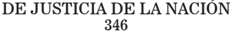

TOMO 346

Volumen 2

2023

## FALLOS DE LA CORTE SUPREMA DE JUSTICIA DE LA NACION

## CONSULTA DE JURISPRUDENCIA DE LA CORTE SUPREMA DE JUSTICIA DE LA NACIÓN

En  la  Colección  'Fallos'  se  publican  solo  las  sentencias  más trascendentes que emite el Tribunal (acordada 37/2003).

En  el  sitio  de  Internet www.csjn.gov.ar , se  puede  consultar la totalidad  de  las  sentencias en  forma  inmediata  a  su  dictado  y mediante diversos parámetros de búsqueda.

Entre las bases disponibles, se hallan las siguientes:

- 1.- Base única de Sumarios de fallos (desde 1863 - a la fecha)
- 2.- Base de Fallos Completos (desde 1994 - a la fecha)
- 3.- La biblioteca completa de los Tomos de la colección 'Fallos' (desde el Tomo 1°)
- 4.- Búsqueda de precedente por la Cita de la colección 'Fallos'
- 5.Suplementos de Actualización Jurisprudencial
- 6.- Posibilidad de consultar todas las sentencias por Acuerdo
- 7.- Las Novedades más importantes sobre la jurisprudencia del Tribunal

## R E P U B L I C A   A R G E N T I N A

FALLOS

DE LA

C o r t e

S u p r e m a

DE

## JuStiCia de la NaCioN

PUBLICACION A CARGO DE LA SECRETARIA DE JURISPRUDENCIA DEL TRIBUNAL

TOMO 346 - VOLUMEN II

AGOSTO-DICIEMBRE

## de JuSticiA de lA NAcióN 346

## FALLOS DE LA CORTE SUPREMA

## AGOSTO

BICE FIDEICOMISOS S.A. -BFSA- (ex NAcióN FideicomiSoS S.A.) c/ SALTA, PROVINCIA de S/ AccióN declArAtivA de iNcoNStitucioNAlidAd

## IMPUESTO DE SELLOS

Es improcedente que la provincia grave con el impuesto de sellos los contratos  de  fideicomiso  celebrados  para  la  expansión  de  la  red  de transporte y distribución de gas natural, pues los instrumentos de gobierno nacional, destinados a efectivizar una alta política nacional en materia energética -más concretamente en el marco de las actividades reguladas por la ley 24.076-, no pueden ser incididos directamente por el impuesto de sellos provincial, sin representar ello, en las particulares circunstancias del caso, una palmaria interferencia del poder local sobre el nacional, junto a una inadmisible limitación de su independencia.

## IMPUESTO DE SELLOS

Es improcedente que la provincia grave con el impuesto de sellos los contratos de fideicomiso celebrados para la expansión de la red de transporte y distribución de gas natural, pues el decreto nacional 180/2004 estableció que los cargos tarifarios creados para integrar el fondo fiduciario, en virtud de la finalidad de los mismos, no constituyen base imponible de ningún tributo de origen nacional, provincial o municipal y el mismo sentido fue establecido en la ley 26.095.

## PROVINCIAS

Las provincias carecen de atribuciones para gravar los medios o instrumentos empleados por el Gobierno de la Nación para ejecutar sus poderes constitucionales.

## FAlloS de lA corte SupremA 346

## ACCION DECLARATIVA DE CERTEZA

La circunstancia de que la provincia demandada haya iniciado un juicio ejecutivo, sumado a los requerimientos dirigidos al cobro del impuesto que se estima adeudado, demuestran la existencia de un interés serio y suficiente por parte de la actora para obtener la declaración de certeza pretendida, sin que obste a ello la existencia de trámites administrativos previstos en la legislación provincial, habida cuenta de que la competencia originaria de la Corte no está subordinada al cumplimiento de los requisitos exigidos por las leyes locales ni al agotamiento de trámites administrativos de igual naturaleza.

## FALLO DE LA CORTE SUPREMA

Buenos Aires, 3 de agosto de 2023.

Vistos los autos: 'Bice Fideicomisos S.A. -BFSA- (ex Nación Fideicomisos S.A.) c/ Salta, Provincia de s/ acción declarativa de inconstitucionalidad', de los que

## Resulta:

I) A fs. 468/490 Nación Fideicomisos S.A. (actualmente Bice Fideicomisos S.A. -BFSA-) en su carácter de fiduciaria de una serie de fideicomisos que en su conjunto constituyen los 'Fideicomisos de Ampliación de Gas, establecidos con la finalidad de hacer una obra de expansión de gasoductos' que abarcarán desde el norte hasta el sur del país, promueve acción declarativa contra la Provincia de Salta, a fin de que se declare la inconstitucionalidad de los actos administrativos dictados por aquella que tengan por objeto la determinación y cobro de gravámenes impositivos provinciales -concretamente la aplicación del impuesto de sellos respecto de los contratos de Fideicomisos de Gas que individualiza en los puntos III.1.1, III.1.2 y III.1.3 de fs. 472/473-, en razón de tratarse de obras de infraestructura que revisten interés nacional y que, por lo tanto, la pretensión fiscal provincial entra en pugna con las disposiciones del artículo 75, incisos 18 y 30, de la Constitución Nacional.

Señala  que  el  Poder  Ejecutivo  Nacional,  mediante  el  decreto 180/2004 dictado en el marco de las leyes 24.076 y 25.561, dispuso la

creación del 'Fondo Fiduciario para atender las Inversiones en Transporte y Distribución del Gas', con el objeto de generar una solución frente a situaciones de insuficiencia en la capacidad de transporte y distribución del servicio público de gas, y también para evitar carencia en su suministro.

Agrega que, en virtud de la delegación contemplada en el citado decreto,  el  Ministerio  de  Planificación  Federal,  Inversión  Pública  y Servicios de la Nación dictó la resolución 185/2004 que estableció la constitución de un 'Programa de Fideicomisos de Gas', cuya organización estaría a cargo de la Secretaría de Energía de la Nación.

Refiere que el 15 de noviembre de 2004, se suscribió una Carta de Intención entre dicha Secretaría, los Ministerios de Planificación Federal, Inversión Pública y Servicios y de Economía y Producción, el Banco de la Nación Argentina, Y.P .F . S.A. y Nación Fideicomisos S.A., prestando conformidad con su contenido la Secretaría de Obras Públicas y el Ente Nacional Regulador del Gas (ENARGAS), en la que se propició la constitución de tres fideicomisos financieros para posibilitar la ampliación de los gasoductos San Martín, Norte y Centro Oeste. Agrega que tal Carta de Intención fue aprobada a través del decreto 1882/2004 y, posteriormente, en dicho contexto, se firmaron los llamados 'Contratos Preexistentes', que son los que la Dirección General de Rentas de Salta pretende gravar.

Sostiene que tal pretensión fiscal atenta contra los fines de utilidad nacional consagrados por el Estado Nacional al momento de dictarse toda la normativa que comprende el proyecto de ampliación de los gasoductos.

Requiere el dictado de una medida cautelar de no innovar, a fin de que la demandada se abstenga por sí o por medio de sus organismos recaudatorios de iniciar o proseguir cualquier acción judicial o extrajudicial que tenga su fundamento o implique poner en ejecución las determinaciones de deuda cuestionadas.

Por último, desarrolla las razones por las cuales, a su entender, se cumplen los requisitos para la procedencia de la acción declarativa.

Ofrece prueba, y pide que se haga lugar a la demanda, con costas.

II) A fs. 502/504 dictaminó la señora Procuradora Fiscal y, sobre la base de esa opinión, a fs. 507/509 este Tribunal declaró su competencia originaria para entender en la presente causa e hizo lugar a la medida cautelar solicitada.

III) A fs. 530/551 la Provincia de Salta contesta la demanda y solicita su rechazo.

Efectúa una negativa genérica en cuanto a la ilegalidad e inconstitucionalidad que la actora endilga a los actos administrativos por medio de los cuales se liquidó el impuesto de sellos sobre los contratos de fideicomiso de gas.

Pone de relieve que en la 'Carta de Intención' del 15 de noviembre de 2004, aprobada por decreto 1882/2004, se estableció que, en caso de que ella fuera alcanzada por el impuesto de sellos o cualquier otra tasa o  gravamen,  serán  soportados  por  los  fideicomisos.  Enumera  otras disposiciones de similar alcance y concluye en que, tanto el Estado Nacional -en su condición de organizador- como la actora, reconocieron expresamente la sujeción de estos instrumentos al gravamen que ahora se pretende poner en tela de juicio.

En este sentido, destaca que resulta patente la contradicción y el alzamiento contra los actos propios anteriores, puesto que se previó la carga tributaria como un costo en su momento y, ahora, se quiere evitar su pago.

Manifiesta que los fideicomisos se integran con participación de capitales  privados,  y  subraya  que  el  fiduciario  tiene  una  titularidad operacional del patrimonio afectado. Agrega que se definió como fondos del fideicomiso privado las sumas de dinero comprometidas e integradas mediante la suscripción de los 'VRD' (valores representativos de deuda), que se aplicarían exclusivamente a la ejecución de las obras y cancelación de los gastos de fideicomiso. De manera tal que, insiste, el tributo local fue previsto en los costos de financiamiento del fideicomiso, por lo que su cobro no puede afectar o violentar el interés nacional, el progreso, ni entorpecer, frustrar o impedir la política del gobierno federal para la distribución y suministro de gas.

Por otra parte, aduce que la presente causa no tiene un contenido federal  preponderante, dado que se ha puesto en tela de juicio una

cuestión  de  derecho  público  local,  cuestionándose  la  legitimidad  y constitucionalidad de la pretensión fiscal señalada.

Alega que el cobro del impuesto de sellos por la Provincia de Salta no entorpece ni impide la política del gobierno federal expresada en normas sancionadas en virtud de las atribuciones previstas en los artículos 25, 27 y 75 incisos 12, 16 y 30 de la Ley Fundamental. Agrega que tampoco afecta la política pública de preservar el normal transporte y distribución de gas.

Niega que se verifiquen los extremos que tornan procedente la vía de la acción declarativa de certeza, dado que, al haber articulado la actora los mecanismos administrativos locales de impugnación, no puede ahora considerarse que exista un estado de incertidumbre, ni menos que no tenga en sus manos otro medio legal para ponerle fin a la cuestión.

Ofrece prueba, y pide que se rechace la demanda, con costas.

IV) A fs. 669/675 dictamina la señora Procuradora Fiscal sobre las cuestiones federales planteadas en el presente caso.

## Considerando:

- 1°) Que de conformidad con lo decidido a fs. 507/509, este juicio es de la competencia originaria de esta Corte (artículos 116 y 117 de la Constitución Nacional).
- 2°) Que la cuestión en debate requiere determinar si la Provincia de Salta, en ejercicio de su potestad tributaria y según la previsión contenida en los artículos 226, 227 y concordantes del Código Fiscal local, puede gravar con el impuesto de sellos los siguientes instrumentos: a) el 'Contrato Suplementario del Fideicomiso de Gas', de fecha 22 de diciembre de 2004 (fs. 2/45); b) el 'Contrato de Fideicomiso Financiero - Gas I', firmado el 6 de diciembre de 2006 (fs. 151/193) y c) el 'Contrato de Suscripción de VRDA l (Valores Representativos de Deuda del Fideicomiso de Gas Privado)', suscripto el 20 de abril de 2005 entre Nación Fideicomisos S.A. e Y.P .F . S.A. (fs. 264/275 y 472/473).
- 3º) Que, en ese sentido, cabe destacar que la Dirección de Rentas de la Provincia de Salta ha dirigido reclamos tendientes al cobro

del impuesto impugnado, a cuyo fin no solo formalizó determinaciones de oficio, sino que, además, inició una demanda ejecutiva con relación al impuesto de sellos concerniente al contrato individualizado en el punto 1 de fs. 472 (conf. resoluciones de la DGR 367/2006, 13/2007, 1082/2009 y 1152/2009 cuyas copias obran a fs. 90/94, 113/120, 238/250 y 286/300, y expedientes administrativos nros. 22-310686/05, 22-358167/07 y 22-392426/08).

La circunstancia de haber iniciado un juicio ejecutivo, sumado a los requerimientos dirigidos al cobro del impuesto que se estima adeudado, demuestran la existencia de un interés serio y suficiente por parte de la actora para obtener la declaración de certeza pretendida (conf. causa CSJ 179/2003 (39-A)/CS1 'Arbumasa S.A. c/ Santa Cruz, Provincia de s/ acción declarativa de inconstitucionalidad', sentencia del 19 de junio de 2012, y sus citas).

- 4º) Que no obsta a tal conclusión la existencia de trámites administrativos previstos en la legislación provincial, habida cuenta de que la competencia originaria de esta Corte Suprema de Justicia de la Nación, cuya fuente directa es la Constitución Nacional, no está subordinada al cumplimiento de los requisitos exigidos por las leyes locales ni al agotamiento de trámites administrativos de igual naturaleza (Fallos: 340: 1480).

Sobre la base de lo antes expuesto, la acción deducida constituye la vía idónea para motivar la intervención del Tribunal, ya que se encuentran reunidos los recaudos previstos en el artículo 322 del Código Procesal Civil y Comercial de la Nación.

- 5º) Que en cuanto al fondo del asunto, es menester destacar que la propia ley 23.548, al referirse a la imposición del gravamen de que se trata y al ámbito jurisdiccional en el que reconoce su aplicación, la limita cuando media interferencia con el interés nacional (artículo 9º, ap. 2, párrafo 3; conf. causa CSJ 885/2004 (40-D)/CS1 'Distribuidora de Gas Cuyana c/ Mendoza, Provincia de y otro s/ contencioso administrativo', sentencia del 22 de abril de 2014, considerando 13).
- 6º)  Que,  en  ese  sentido,  no  se  encuentra  controvertido  que  los tres contratos que la provincia demandada pretende gravar fueron celebrados para la expansión de la red de transporte y distribución de gas natural.

Dichos convenios se instrumentaron dentro del marco del decreto nacional 180/2004, el cual fue dictado conforme a las pautas de la ley 25.561, que declaró la emergencia pública en materia social, económica, administrativa, financiera y cambiaria, delegando al Poder Ejecutivo Nacional las facultades para dictar las medidas orientadas a conjurar dicha situación.

Por el artículo 9° de la citada ley se autorizó al Poder Ejecutivo Nacional a renegociar los contratos comprendidos en las disposiciones del artículo 8° de la referida norma, entre ellos los de obras y servicios públicos. Las estipulaciones contenidas en la ley 25.561 fueron posteriormente ratificadas y ampliadas a través de la sanción de las leyes 25.790, 25.820, 25.972, 26.077 y 26.204, así como también por diversas normas reglamentarias y complementarias (Fallos: 337:1375; CSJ 4/2013 (49-A)/CS1 'Autopistas del Sol S.A. c/ Buenos Aires, Provincia de y otro s/ acción declarativa de inconstitucionalidad'; CSJ 124/2013 (49A)/CS1 'AEC S.A. y otros c/ Buenos Aires, Provincia de y otro s/ acción declarativa de certeza'; y CSJ 286/2012 (48-G)/CS1 'Grupo Concesionario del Oeste S.A. c/ Buenos Aires, Provincia de s/ acción declarativa', sentencias del 19 de marzo de 2019).

## 7º) Que a fs. 614/616 obra agregada la contestación del Ente Nacional Regulador del Gas.

Surge de esa respuesta que en el marco de la ley de emergencia 25.561 el Poder Ejecutivo Nacional dictó el decreto 180/2004, en cuyo artículo 1° se estableció la creación de un fondo fiduciario para atender 'Inversiones en Transporte y Distribución de gas', y que tal régimen normativo prevé que el objeto exclusivo es la financiación de obras de expansión en el marco del artículo 2º de la ley 24.076 y, en especial en el inciso b) de ese artículo, que establece como uno de los objetivos para la regulación del transporte y distribución del gas natural 'promover la competitividad de los mercados de oferta y demanda de gas natural, y alentar inversiones para asegurar el suministro a largo plazo'.

En el referido informe se señala que, a partir de tales premisas, se  configuraron las 'Obras de Ampliación de Capacidad de Transporte 2004-2005 y 2006-2015', las que por su magnitud y envergadura 'resultan ser los proyectos de ampliación más importantes que se hayan registrado a lo largo de toda la historia nacional'. Asimismo se destaca 'que el desarrollo de la Obra de Ampliación (a lo largo de

todo el territorio de la República Argentina) conlleva una fundamental relevancia en materia energética que -a los fines de brindar un adecuado respaldo al proceso de crecimiento y desarrollo nacional desde la consolidación de la matriz energética- no debe ser soslayada'; y que 'la Ampliación del sistema de gasoductos de transporte, permite satisfacer las mayores demandas de suministro, producto del crecimiento nacional'.

Finalmente, se informa que por medio de la ley 26.095 fueron creados cargos específicos para el desarrollo de obras que atiendan a la expansión del sistema de generación, transporte y/o distribución de los servicios de gas natural, gas licuado y/o electricidad, como aporte de los fondos de los fideicomisos constituidos para el desarrollo de tales obras de infraestructura, con el fin de garantizar el abastecimiento interno y la continuidad del crecimiento del país y sus industrias, el que constituye un objetivo prioritario y de interés del Estado Nacional.

En términos similares contestó la Secretaría de Recursos Hidrocarburíferos del Ministerio de Energía y Minería, al señalar que ese fondo fiduciario responde al interés general en la 'adopción de políticas eficaces tendientes a asegurar el abastecimiento interno de gas natural', y que 'el sistema de Fideicomisos resultaba indispensable para evitar situaciones de potencial desabastecimiento y para reactivar la economía' (ver fs. 629/633).

- 8º) Que, en efecto, como lo sostiene la señora Procuradora Fiscal en su dictamen, ha sido el Estado Nacional quien, en el marco de la situación de emergencia imperante, tomó la decisión de encarar esa política en materia energética, vinculada con el transporte y distribución de gas mediante la creación de un patrimonio de afectación -los fondos fiduciarios logrados merced a los contratos que aquí se pretenden gravar- cuya finalidad era financiar, en definitiva, las obras necesarias para la expansión de la red de transporte y distribución de ese combustible (conf. fs. 673/673 vta.).

9º) Que, en el contexto descripto, corresponde recordar que reiteradamente esta Corte ha decidido que las provincias carecen de atribuciones para gravar los medios o instrumentos empleados por el Gobierno de la Nación para ejecutar sus poderes constitucionales (Fallos: 23:560; 224:267 y sus citas y causa CSJ 885/2004 (40-D)/ CS1 'Distribuidora de Gas Cuyana c/ Mendoza, Provincia de y otro

s/  contencioso  administrativo',  sentencia  del  22  de  abril  de  2014, considerando 12, ya citada).

Estos instrumentos de gobierno, destinados a efectivizar una alta política  nacional  en  materia  energética  -más  concretamente  en  el marco de las actividades reguladas por la ley 24.076-, no pueden ser incididos directamente por el impuesto de sellos provincial, sin representar ello, en las particulares circunstancias del caso, una palmaria interferencia del poder local sobre el nacional, junto a una inadmisible limitación de su independencia (arg. Fallos: 327:5012 y sus citas, y dictamen de la señora Procuradora Fiscal de fs. 674).

10)  Que,  por  lo  demás,  cabe  señalar  que  en  el  decreto  nacional 180/2004 se estableció que '[l]os cargos tarifarios creados para integrar el Fondo Fiduciario, en virtud de la finalidad de los mismos, no constituyen base imponible de ningún tributo de origen nacional, provincial o municipal' (artículo 4º).

En el mismo sentido, tal como se señaló, la ley 26.095 -que dispuso la creación de cargos específicos como aporte a los fondos de los fideicomisos para el desarrollo de las obras de gas y electricidad- prevé que no constituirán ni se computarán como base imponible de ningún tributo de origen nacional, con excepción del impuesto al valor agregado.

Se añadió en esa norma que las provincias, la Ciudad Autónoma de Buenos Aires y los municipios que adhieran a dicha ley, en cuyos territorios se ejecuten las obras financiadas con los cargos específicos antes referenciados, deberán dispensar idéntico tratamiento para con los tributos y tasas de su competencia y jurisdicción (conf. artículos 1º, 2º, 3º y 13 de la citada ley 26.095).

11) Que no obsta a lo expuesto la mención inserta en la 'Carta de Intención' firmada el 15 de noviembre de 2004, aprobada por decreto 1882/2004, en la cual se estableció que, en caso de que los contratos fueran alcanzados por el impuesto de sellos o cualquier otra tasa o gravamen, ellos serán soportados por los fideicomisos, toda vez que desde antiguo esta Corte ha sostenido que los tributos no son obligaciones que emergen de los contratos, sino que su imposición y la fuerza compulsiva para el cobro, son actos de gobierno y de potestad pública (Fallos: 152:268; 218:596; 229:45; 288:279 y 332:2872, entre otros).

Por lo tanto, la acción intentada por la actora contra la Provincia de Salta debe prosperar.

Por  ello,  y  de  conformidad  con  lo  dictaminado  por  la  señora Procuradora Fiscal, se decide: Hacer lugar a la demanda iniciada por Bice Fideicomisos S.A. -BFSA- (ex Nación Fideicomisos S.A.) contra la Provincia de Salta y, en consecuencia, declarar la improcedencia de la pretensión fiscal de la demandada con relación a los contratos objeto del litigio. Con costas (artículo 68, Código Procesal Civil y Comercial de la Nación). Notifíquese, comuníquese y, oportunamente, archívese.

HorAcio roSAtti - cArloS FerNANdo roSeNkrANtz - JuAN cArloS mAquedA.

Nombre del actor: Bice  Fideicomisos  S.A.  -BFSA-  (ex Nación  Fideicomisos  S.A., representada por sus letrados apoderados doctores María Cristina Pérez, Eduardo Fabián Canosa, María Hebe Rinaldi, Domingo Enrique Cirillo y Hugo Néstor Carbajales ,  con el patrocinio letrado de los doctores Matías José Casal, Marina Laura Marti, María Gallo y Gustavo Alfredo Affif.

Nombre del demandado: Provincia de Salta ,  representada por la Fiscal de Estado, doctora Mónica Beatriz Lionetto y Macarena Alurralde, con el patrocinio letrado de los doctores Guillermo D. Pereyra y Edgardo César Martinelli.

Ministerio Público: doctora Laura M. Monti

GRANJA TRES ARROYOS SAcAFei c/ MUNICIPALIDAD de RÍO CUARTO S/ AccióN merAmeNte declArAtivA de derecHo

## TASAS

Los artículos 175 y 270 a 275 del Código Tributario del Municipio de Río Cuarto que regulan la contribución que incide sobre los servicios de protección sanitaria no entran en conflicto de competencias con el artículo 75, inciso 13 de la Constitución Nacional, toda vez que en el plano legislativo nacional y provincial se ha estructurado un sistema de atribuciones concurrentes; así las normas nacionales que regulan el control de alimentos se han encargado de dirimir el ámbito de fiscalización que corresponde a los diversos estamentos del estado federal, permitiendo

la actuación coordinada de sus tres sujetos necesarios: los municipios, las provincias y la Nación (Voto de los jueces Rosatti y Maqueda).

-El juez Lorenzetti, en disidencia, consideró inadmisible el recurso extraordinario (art. 280 CPCCN)-

## TASAS

Los artículos 175 y 270 a 275 del Código Tributario del Municipio de Río Cuarto en cuanto regulan la contribución que incide sobre los servicios de protección sanitaria contravienen la prohibición de crear aduanas interiores prevista en los artículos 9, 10, 11 y 12 de la Constitución Nacional pues: i) discrimina a los productos foráneos al declarar la exención a los productos que se industrialicen en frigoríficos y/o elaboradores locales (cfr. artículos 274, inc. 2° del Código Tributario); ii) si bien no grava en sí misma el tránsito, responde a la prestación de un servicio de inspección que se ejerce sobre los introductores de bienes al ejido municipal (cfr. artículos 37, 39, 44 y 48, entre otros, del reglamento bromatológico); iii) impide que los introductores de mercaderías no radicados en el municipio que no la abonen puedan descargar y comercializar sus productos en él (artículos 39 y 49 del reglamento en cuestión); erigiéndose así en un obstáculo a la circulación territorial de productos dentro de la Nación (Voto de los jueces Rosatti y Maqueda).

- -El juez Lorenzetti, en disidencia, consideró inadmisible el recurso extraordinario (art. 280 CPCCN)-

## TASAS

Los artículos 175 y 270 a 275 del Código Tributario del Municipio de Río Cuarto en cuanto regulan la contribución que incide sobre los servicios de protección sanitaria invaden el ámbito de incumbencias del SENASA en el marco del sistema nacional de control de alimentos, competencia que, por el solo hecho del tránsito interjurisdiccional, se encuentra regulada por la Nación y a ella reservada de acuerdo con lo establecido por el artículo 75, inc. 13, de la Constitución Nacional (Voto de Rosenkrantz).

-El juez Lorenzetti, en disidencia, consideró inadmisible el recurso extraordinario (art. 280 CPCCN)-

## FAlloS de lA corte SupremA 346

## MUNICIPALIDADES

Así como las provincias se han reservado la potestad de darse leyes sobre impuestos y, en general, dictar las normas que juzguen conducentes para su bienestar y prosperidad, sin más limitaciones que las enumeradas en el artículo 126 de la Constitución, los municipios, por imperio de los artículos 5° y 123, cuentan con un reconocimiento explícito que los dota de autonomía institucional, política, administrativa, económica y financiera de acuerdo a los alcances que las provincias dispongan (Voto de los jueces Rosatti y Maqueda).

## MUNICIPALIDADES

Cuando la Constitución Nacional manda a las provincias a asegurar el régimen municipal, dispone la mantención de una realidad preexistente que sólo puede garantizarse con el reconocimiento del derecho a los medios; y dentro de ese derecho, se encuentra la creación de tributos en base a la potestad tributaria originaria que titularizan, circunscripto a límites precisos que delimitan su ámbito de validez y que derivan tanto del Estado de Derecho como del sistema de organización institucional  con  sus  diferentes  niveles  de  decisión  (Voto  de  los  jueces Rosatti y Maqueda).

## COMERCIO INTERJURISDICCIONAL

En relación a la cláusula del comercio interjurisdiccional prevista en el artículo 75, inciso 13 de la Constitución Nacional, como principio general, aun cuando una competencia haya sido delegada a la regulación de los órganos federales, los poderes locales no se encuentran de plano suprimidos, sino que bien pueden permanecer latentes y circunscriptos a un ámbito en el cual no degraden las actividades de jurisdicción federal (Voto de los jueces Rosatti y Maqueda).

## FACULTADES IMPOSITIVAS

A fin de determinar la interferencia o incompatibilidad de la regulación local con la federal la Corte ha establecido, como principio, que no constituyen por si mismos obstáculos reales y efectivos para el logro de los fines de utilidad nacional, susceptible de invalidar la norma local: i) la mera incidencia económica, ponderada en forma aislada, que acarrean

las  normas locales sobre las actividades o establecimientos sujetos a jurisdicción federal; ii) las regulaciones que resulten periféricas y extrínsecas al núcleo o la sustancia de la regulación federal en cuestión; y iii) las disposiciones que no impliquen una degradación de la actividad de jurisdicción nacional (Voto de los jueces Rosatti y Maqueda).

## MUNICIPALIDADES

Los controles bromatológicos, es decir, la fiscalización de los alimentos para resguardar la salud pública de los habitantes de un municipio, no podrían nunca justificar una diferencia de tratamiento entre productos que se hayan elaborado dentro del ejido municipal y aquellos que se produzcan fuera de él, pues unos y otros se encuentran igualmente destinados al consumo (Voto de los jueces Rosatti y Maqueda).

## MUNICIPALIDADES

La creciente sofisticación de las técnicas de elaboración alimenticia exige como condición de validez a los municipios que pretendan ejercer el contralor -y, eventualmente, percibir una tasa-, actualizar y desarrollar sistemas de fiscalización que impliquen una verificación científica orientada a la protección efectiva de la salud pública; en caso contrario, la competencia local, legítima cuando se funda en la prestación de un servicio de igual carácter, se convierte en una excusa con meros fines recaudatorios (Voto de los jueces Rosatti y Maqueda).

## TASAS

Todas las tasas municipales deben derivar de la prestación de un servicio fundado en una incumbencia propia de los municipios; así la manifestación del poder de imposición local sigue y presupone a un legítimo ejercicio de esas atribuciones, de lo contrario, es decir, ante una competencia de titularidad municipal ejercida contra la Constitución, la tasa será inválida no ya por ausencia de prestación del servicio que la justifique, sino como derivación de un hecho imponible viciado (Voto de los jueces Rosatti y Maqueda).

## FAlloS de lA corte SupremA 346

## POLICIA SANITARIA

El control sanitario de los productos alimenticios de tránsito federal es una competencia exclusiva de la Nación conforme las disposiciones higiénico-sanitarias, bromatológicas y de identificación comercial incorporadas en el Código Alimentario Argentino establecido por la ley 18.284 y sus normas reglamentarias (Voto de Rosenkrantz).

## ALIMENTOS

La ausencia de facultades concurrentes locales para fiscalizar productos alimenticios de tránsito federal ya autorizados por la Nación surge claramente de las normas relativas a las autoridades sanitarias provinciales y municipales establecidas en el título III del decreto 815/1999, cuyo artículo 19 concretamente establece que las autoridades sanitarias provinciales, del Gobierno Autónomo de la Ciudad de Buenos Aires y de los municipios serán las encargadas de realizar los controles en bocas de expendio (Voto de Rosenkrantz).

## FALLO DE LA CORTE SUPREMA

Buenos Aires, 3 de agosto de 2023.

Vistos los autos: 'Granja Tres Arroyos SACAFEI c/ Municipalidad de Río Cuarto s/ acción meramente declarativa de derecho'.

Considerando:

1°) Que en el año 2016 la empresa Granja Tres Arroyos inició una demanda contra la Municipalidad de Río Cuarto a fin de que se declare la inconstitucionalidad de los artículos 175 y 270 a 275 del Código Tributario de ese Municipio, que regulan la Contribución que Incide sobre los Servicios de Protección Sanitaria. Consideró que esas disposiciones crearon un impuesto y no una tasa municipal, que se erige en una aduana interior en tanto se cobra a los introductores de productos alimenticios al Municipio y se superpone con regulaciones bromatológicas federales.

- 2°)  Que  la  Cámara  Federal  de  Apelaciones  de  Córdoba  resolvió confirmar la decisión del juez Federal de Río Cuarto, y por lo tanto mantuvo la declaración de inconstitucionalidad de los artículos 270 a 275 citados.

Para así decidir, consideró que el punto a dirimir consistía en evaluar si la Ordenanza Fiscal viola las disposiciones constitucionales que protegen la libre circulación de mercadería (en este caso, la comercialización de aves y productos avícolas), afectando el derecho a reglamentar el comercio conferido al Congreso de la Nación como facultad exclusiva en virtud del artículo 75, inc. 13 de la Constitución Nacional.

A tal efecto, luego de repasar las cláusulas constitucionales, legales  y  reglamentarias involucradas, recordó que la contribución aquí cuestionada es una 'tasa de abasto', cuyo fin primario ' es  el  de  financiar el costo de los servicios destinados a verificar la condición de 'apto para consumo' de los alimentos perecederos '. En ese orden, aclaró que el Código Alimentario Argentino es el ordenamiento que establece las condiciones y los requisitos de elaboración, fraccionamiento, envasado, conservación y transporte de alimentos; y que esa norma atribuye competencias concurrentes a las autoridades nacionales y provinciales para ejercer el control sanitario de todos los alimentos que se producen en el territorio nacional o se introducen en él.

Precisó  que  ' la  doctrina  y  la  jurisprudencia  son  pacíficas  en sostener que de acuerdo a lo dispuesto en el Código Alimentario los municipios no son su autoridad de aplicación. Circunstancia ésta que se encuentra ratificada en la Provincia de Córdoba por su adhesión -mediante ley provincial 5313- a la ley nacional 18.284 (Código Alimentario Argentino )'. Señaló que las autoridades de aplicación son la Subsecretaría de Gestión y Control Alimentario, la Comisión Nacional de Alimentos, el Servicio Nacional de Sanidad Animal (SENASA) y la Administración Nacional de Medicamentos, Alimentos y Tecnología Médica (ANMAT) (cfr. fs. 409).

Sobre esa base, destacó que en el diseño de la normativa local solo después de pagada la tasa, la entidad municipal autoriza el ingreso de los productos alimenticios en el municipio. Por ello, concluyó en que el tributo en cuestión es inconstitucional por constituir un derecho aduanero sobre mercaderías en tránsito, vulnerando la cláusula comercial del artículo 75, inc. 13 y los artículos 9°, 10 y 11

de la Constitución Nacional que establecen la libre circulación en el territorio argentino y prohíben las aduanas interiores.

- 3°) Que contra esa sentencia interpuso recurso extraordinario el Municipio de Río Cuarto a fs. 415/434, que fue concedido parcialmente a fs. 444/445.

El recurrente plantea, como cuestión federal, la interpretación de la ley 18.284 y el decreto 815/99, normas que -según sostiene- no dejan de lado a los municipios. Entiende que ese ordenamiento encomienda el control sanitario a las autoridades locales y nacionales de forma concurrente.  Específicamente,  señala  que  el  control  de  mercadería por otras jurisdicciones se encuentra regulado en el decreto 4238/68, disposición que, a su juicio, ' resulta dirimente a los fines de demostrar las facultades de control concurrente ' (fs. 420).

En esa línea, señala que el decreto nacional 815/99, que puso en marcha el Sistema Nacional de Control de Alimentos, en sus artículos 12, 13, 16 y 19, reafirma las facultades de control que poseen los municipios.

Invoca  la  autonomía  municipal  que  la  Constitución  Nacional  le reconoce y cuestiona la decisión de la Cámara por desconocer y restringir el poder de policía que tal autonomía confiere. En ese sentido, recuerda que la ley 18.284 es previa a la reforma constitucional del año 1994, por lo que la posible falta de previsión de la facultad de los municipios de actuar como autoridad de aplicación proviene de un contexto normativo en el que la distribución de potestades se realizaba entre Nación y Provincias (fs. 424).

Señala que el reconocimiento que la Provincia de Córdoba lleva a cabo en favor de sus municipios en los artículos 180 y 186 de su Constitución tiene un correlato explícito en la ley provincial 5.313 -de adhesión a la ley 18.824- y que su norma reglamentaria (decreto provincial 3372/72), los habilitaría como autoridades de aplicación de la regulación federal. Sostiene que ' una lectura integral de la normativa aplicable (…) indica que el Municipio tiene poder de policía para controlar los alimentos que serán comercializados en su jurisdicción y que no existe dispositivo legal alguno que prevea la imposibilidad de hacerlo antes de que la mercadería sea descargada ' (fs. 430 vta.).

Entiende que el Municipio de Río Cuarto presta un servicio esencial para la salud de la población, que excede al mero 'visado' de los certificados de sanidad nacional, por lo que no cabe asemejarla a un 'derecho de tránsito'.

En definitiva, manifiesta que los controles establecidos no reglan el comercio, ni establecen una aduana interior que pretenda el cobro de un tributo por el mero tránsito por su territorio, ni imponen derechos de tránsito a la circulación de productos, sino que configuran el ejercicio del poder de policía en materia de salubridad y sanidad alimentaria, que custodia el bienestar y salud de la población de la Ciudad de Río Cuarto.

- 4°) Que el recurso extraordinario es formalmente admisible, pues se ha cuestionado la validez de ordenanzas municipales por resultar contrarias a la Constitución Nacional (artículos 5°, 9°, 10, 11, 12, 75, inc. 13 y 123 de la Constitución Nacional) y normas federales (ley 18.284 y decreto 815/99), y la decisión definitiva del superior tribunal de la causa fue adversa al derecho que el apelante funda en ellas.
- 5°) Que las cuestiones aquí debatidas resultan parcialmente análogas a las resueltas por este Tribunal en la causa CSJ 890/2011(47-M)/ CS1 ' Molfino Hermanos Sociedad Anónima c/ Mendoza, Provincia de s/ acción declarativa de certeza ', pronunciamiento del 17 de diciembre de 2020, en la que se puso en tela de juicio la constitucionalidad de una tasa de similares características a la aquí controvertida prevista en normas provinciales. La singularidad de este caso, sin embargo, radica en que en esta oportunidad quien reivindica el ejercicio debido de la potestad tributaria local no es una provincia, sino un municipio.

En concreto,  los  puntos  a  resolver  consisten  en  determinar  la validez constitucional de la contribución que incide sobre los servicios de protección sanitaria ,  prevista en los artículos 270 a 275 del Código Tributario aprobado por la ordenanza 48/96 del Municipio de Río Cuarto y fundada en su autonomía municipal (artículos 5° y 123 de la Constitución Nacional y normas concordantes de la Constitución provincial), frente a: i) la cláusula que atribuye jurisdicción a la Nación para reglar el comercio inter-jurisdiccional (artículo 75, inciso 13); y ii) la prohibición constitucional de crear aduanas interiores (artículos 9°, 10, 11 y 12).

- 6°) Que desde su texto originario la Constitución Nacional consagró la institución municipal como parte integrante de la organización política federal, ordenando a las provincias el aseguramiento de su régimen (artículo 5°). A su turno, la reforma constitucional de 1994, al incorporar el artículo 123, ratificó esa intencionalidad, explicitando el 'régimen municipal' del citado artículo 5° al dotar a los municipios de autonomía institucional,  política,  administrativa,  económica  y  financiera y confiriendo a las provincias la atribución de reglamentar sin desnaturalizar su alcance y contenido concreto (Fallos: 325:1249, considerando 7°; 337:1263; 'Municipalidad de la Ciudad de La Banda', Fallos: 341:939; 'ESSO Petrolera Argentina SRL y otro', Fallos: 344:2123). De acuerdo a este diseño, el municipio como ente autónomo encuentra su origen normativo en la Constitución Nacional y el quantum de sus atribuciones, competencias e incumbencias, en las constituciones provinciales  y  demás  normas  complementarias  de  derecho  público interno.
- 7°) Que así como las provincias se han reservado la potestad de darse leyes sobre impuestos y, en general, dictar las normas que juzguen conducentes para su bienestar y prosperidad, sin más limitaciones que las enumeradas en el artículo artículo 126 de la Constitución, los municipios, por imperio de los artículos 5° y 123, cuentan con un reconocimiento explícito que los dota de autonomía institucional, política, administrativa, económica y financiera de acuerdo a los alcances que las provincias dispongan.

La  consagración  de  ese  estatus  implica  necesariamente  conceder los medios para la subsistencia. Cuando la Constitución Nacional manda a las provincias a 'asegurar el régimen municipal', dispone la mantención de una realidad preexistente que sólo puede garantizarse con el reconocimiento del 'derecho a los medios'. Y dentro de ese derecho, se encuentra la creación de tributos en base a la potestad tributaria originaria que titularizan, circunscripto a límites precisos que delimitan su ámbito de validez y que derivan tanto del Estado de Derecho como del sistema de organización institucional con sus diferentes niveles de decisión ( 'Gasnor SA c/ Municipalidad de La Banda ', Fallos: 344:2728, voto de los jueces Maqueda y Rosatti, considerando 7°).

- 8°) Que entre los límites impuestos a la potestad tributaria municipal por la forma de estado federal adoptada por la Constitución Nacional, se encuentran las cláusulas que protegen el mercado común den-

tro de la federación. En el caso se han invocado dos de ellas: por una parte, los principios contenidos en los artículos 9°, 10 y 11, en cuanto procuran erradicar las aduanas interiores, y, por otra parte, el artículo 75,  inciso  13,  que  atribuye  al  Congreso de la Nación la competencia para reglar el comercio interjurisdiccional.

Los dos principios aludidos, esto es la prohibición de aduanas interiores  y  la  jurisdicción  federal  para  regular  el  comercio  entre  los Estados,  tienen  fuentes  y  sentidos  diversos.  La  condenación  de  las aduanas interiores enraíza en la historia constitucional argentina, y debe su explicación a una lucha larga y dolorosa que impidió la unidad nacional, por lo cual su interpretación debe buscarse ante todo y primordialmente en la propia tradición. En cambio, la cláusula del comercio interjurisdiccional, remonta sus fuentes a la Constitución de Estados Unidos y tiene contenidos más amplios y difusos (conf. arg. Fallos 178:308, citado en Fallos: 306:516, considerando 5°).

Si  bien se trata de dos cláusulas colindantes, puesto que ambas tienden a consolidar la creación del mercado único de bienes y servicios dentro de la federación, la distinción de origen señalada permite proyectar ámbitos de aplicación diferenciados.

- 9°) Que con relación a la cláusula del comercio interjurisdiccional prevista en el artículo 75, inciso 13 de la Constitución Nacional, debe recordarse que, como principio general, aun cuando una competencia  haya sido delegada a la regulación de los órganos federales, los poderes locales no se encuentran de plano suprimidos, sino que bien pueden permanecer latentes y circunscriptos a un ámbito en el cual no degraden las actividades de jurisdicción federal.

Ello no supone desconocer las competencias nacionales derivadas de esa norma, sino interpretar su alcance en línea con la directriz trazada por el artículo 75, inciso 30, luego de la reforma de 1994, que ha reconocido -incluso dentro de los establecimientos de utilidad nacional- el ejercicio de los poderes de policía locales en tanto no interfieran con el cumplimiento de los fines nacionales.

En este sentido, a fin de determinar la interferencia o incompatibilidad de la regulación local con la federal esta Corte ha establecido, como principio, que no constituyen por si mismos obstáculos reales y efectivos para el logro de los fines de utilidad nacional, susceptible de

invalidar la norma local: i) la mera incidencia económica, ponderada en forma aislada, que acarrean las normas locales sobre las actividades o establecimientos sujetos a jurisdicción federal; ii) las regulaciones que resulten periféricas y extrínsecas al núcleo o la sustancia de la regulación federal en cuestión; y iii) las disposiciones que no impliquen una degradación de la actividad de jurisdicción nacional (' Telefónica Móviles Argentina S.A ', Fallos: 342:1061, disidencia de los jueces Maqueda y Rosatti).

10) Que en el caso bajo análisis no se advierte un conflicto de competencias entre la regulación municipal y el artículo 75, inciso 13 de la Constitución Nacional, toda vez que en el plano legislativo nacional y provincial se ha estructurado un sistema de atribuciones concurrentes. Las normas nacionales que regulan el control de alimentos se han encargado de dirimir el ámbito de fiscalización que corresponde a los diversos estamentos del estado federal, permitiendo la actuación coordinada de sus tres sujetos necesarios: los municipios, las provincias y la Nación.

Por un lado, las competencias del Servicio Nacional de Sanidad y Calidad Agroalimentaria (SENASA), por ejemplo, se encuentran previstas en el artículo 13 del decreto 815/1999 que creó el Sistema Nacional de Control de Alimentos, sobre cuyos alcances esta Corte ya ha tenido oportunidad de expedirse (Fallos: 332:66).

Y por el otro, el artículo 2° de la ley 18.284 aclara que ' la autoridad sanitaria nacional podrá concurrir para hacer cumplir ' el Código Alimentario Argentino en cualquier parte del país. En el mismo sentido,  el  3°  de  esa  ley  18.284  establece  que '[l]os  productos  cuya producción,  elaboración  y/o  fraccionamiento  se  autorice  y  verifique de acuerdo al Código Alimentario Argentino, a esta ley y a sus disposiciones reglamentarias, por la autoridad sanitaria que resulte competente [de] acuerdo al lugar donde se produzcan, elaboren o fraccionen, podrán comercializar[se], circular y expenderse en todo el territorio de la Nación, sin perjuicio de la verificación de sus condiciones higiénico-sanitarias, bromatológicas y de identificación comercial en la jurisdicción de destino '.

En ese orden, el decreto 815/1999, dispone en su artículo 16 que las ' autoridades sanitarias de cada provincia, Gobierno Autónomo de la Ciudad de Buenos Aires y municipios, serán responsables de

aplicar el Código Alimentario Argentino dentro de sus respectivas jurisdicciones '. Y en ese sentido, el artículo 19 de ese decreto establece que ' las autoridades sanitarias provinciales, del Gobierno Autónomo de la Ciudad de Buenos Aires y de los municipios serán las encargadas de realizar los controles en bocas de expendio '.

Finalmente, en el nivel provincial, el Municipio de Río Cuarto ha invocado sus competencias con base en la Constitución de la Provincia de Córdoba, que ' reconoce la existencia del Municipio como una comunidad natural fundada en la convivencia y asegura el régimen municipal basado en su autonomía política, administrativa, económica, financiera e institucional '  (artículo.  180),  y  les  asigna,  entre diversas funciones, la de ' crear, determinar y percibir los recursos económico-financieros ';  ' atender las siguientes materias: salubridad; salud y centros asistenciales; higiene y moralidad pública (…) faenamiento de animales destinados al consumo; mercados, abastecimiento de productos en las mejores condiciones de calidad y precio; elaboración y venta de alimentos '; y ' ejercer las funciones delegadas por el Gobierno Federal o Provincial ' (artículos 186, incs. 3°, 7° y 13). Y en tal sentido, el decreto provincial 3372/1972, reglamentario de la ley 5.313 por medio de la cual la Provincia de Córdoba adhirió a la ley 18.824, atribuye facultades de control bromatológico específicas a los municipios en su artículo 11.

- 11) Que, aclarada la posibilidad de injerencia local en la regulación nacional del comercio interjurisdiccional, en los circunscriptos límites descriptos precedentemente, admitidos por el legislador nacional, corresponde ahora referirse a las disposiciones constitucionales referidas a las aduanas interiores l (artículos 9 a 12).

Considerando a la libre circulación de bienes dentro del país como un principio que ha merecido especial atención del constituyente, esta Corte ha resuelto, citando a Bidart Campos, que lo abolido y prohibido por las cláusulas citadas es el gravamen a la circulación territorial . El paso de una provincia a otra no puede convertirse en un hecho imponible porque el hecho de transitar el territorio cualquiera sea la demarcación o el límite que se atraviese, goza de libertad.

Sentado lo anterior, es necesario diferenciar a la circulación territorial de  la  llamada circulación económica ,  pues  la  exoneración impositiva  de  la  circulación  territorial  no  impide  que  las  provincias

graven mercaderías no producidas en ellas una vez que han entrado en circulación económica local o se han incorporado a la riqueza provincial . Así, distinguida la circulación territorial exenta y libre, de la circulación económica imponible, lo que la Constitución desestimula  e  impide es que una provincia hostilice el comercio de productos originarios o provenientes de otras, o destinados a otras, pero no que mantenga su poder impositivo cuando los artículos extraños se han mezclado o confundido con la masa general de sus bienes, cualquiera sea su origen territorial (CSJ 890/2011(47-M)/CS1 'Molfino Hermanos Sociedad Anónima c/ Mendoza, Provincia de s/ acción declarativa de certeza', sentencia del 17 de diciembre de 2020).

En ese orden, el Tribunal consideró que ' las aduanas interiores abolidas por la Carta Magna tenían fines económicos y fiscales, ya que se proponían defender la producción local enfrente de la competencia de la producción de otras provincias, y también crear recursos para el erario, siendo la renta principal de algunos Estados; lo que explica la resistencia tenaz que opusieran a su abolición. Los impuestos  aduaneros  eran  principalmente  tres:  a)  el  impuesto  al tránsito, el más enérgicamente vetado por la Constitución, como era el que enconaba más la querella entre las provincias, y consistía en un impuesto al simple paso de un producto por el territorio de la provincia, viniendo de otra provincia y destinado a una tercera; b) el de 'extracción' de los productos, impuesto llamado a veces de exportación que gravaba la sola 'saca' de ellos, destinados a otra provincia; c)  el  de  'introducción'  o  también  llamado  de  importación '  (Fallos: 178:308, cit. ).

Fuera de estos tres grandes tipos de aranceles aduaneros, la misma  obstaculización  de  la  circulación  territorial  puede  lograrse  mediante regulaciones locales como la discriminación de los productos por su origen o la instauración de barreras para-fiscales (v.gr.: fitosanitarias o bromatológicas) que se enfrenten al ingreso o egreso a un territorio provincial o municipal.

12)  Que en este último plano es donde adquieren relevancia los tributos vinculados a la prestación de servicios de control sanitario, tradicionalmente denominados como tasas de abasto.

Aplicadas  a  los  productos  alimenticios,  encuentran  su  justificación histórica en el ejercicio del poder de policía de la salubridad, ori-

ginariamente local y actualmente concurrente en diversos aspectos, tal como se ha visto. El control de los alimentos frescos y naturales, en ese orden, quedaba generalmente radicado en los mercados concentradores de abasto por razones de eficiencia, pues allí confluían productos procedentes de diversos orígenes y -al mismo tiempo- se expendían al consumo.

Desde esta óptica, los controles bromatológicos, es decir, la fiscalización de los alimentos para resguardar la salud pública de los habitantes de un municipio, no podrían nunca justificar una diferencia de tratamiento entre productos que se hayan elaborado dentro del ejido municipal y aquellos que se produzcan fuera de él, pues unos y otros se encuentran igualmente destinados al consumo.

Por lo demás, no puede perderse de vista que la creciente sofisticación de las técnicas de elaboración alimenticia exige como condición de validez a los municipios que pretendan ejercer este contralor -y, eventualmente, percibir la tasa en cuestión-, actualizar y desarrollar sistemas de fiscalización que impliquen una verificación científica orientada a la protección efectiva de la salud pública. En caso contrario, la competencia local, legítima cuando se funda en la prestación de un servicio de igual carácter, se convierte en una excusa con meros fines recaudatorios.

En definitiva, no puede perderse de vista que todas las tasas municipales deben derivar de la prestación de un servicio fundado en una incumbencia propia de los municipios. La manifestación del poder de imposición local sigue y presupone (como es lógico en estos casos) a un legítimo ejercicio de esas atribuciones. De lo contrario, es decir, ante una competencia de titularidad municipal ejercida contra la Constitución, la tasa será inválida no ya por ausencia de prestación del servicio que la justifique, sino como derivación de un hecho imponible viciado.

13) Que en el caso bajo análisis, el Municipio de Río Cuarto instrumentó la contribución que incide sobre los servicios de protección sanitaria cuyo hecho imponible se encuentra definido en los siguientes términos: ' Por los servicios especiales de protección sanitaria prestados directa o indirectamente por el Municipio y por las funciones de control de desinfección de locales, desratización y otros, se pagará la contribución que establece este Título de acuerdo a los montos

fijos que determine la Ordenanza Tarifaria Anual ' (artículo 270 del Código Tributario aprobado por la ordenanza 48/96, cfr. fs. 95/96).

La tasa exige a contribuyentes y responsables obtener un certificado habilitante por cada local o establecimiento y exime ' de los derechos establecidos a los productos que se industrialicen en frigoríficos y/o elaboradores locales que se comercialicen en Río Cuarto y que posean habilitación sanitaria de Organismos Nacionales y Provinciales, teniendo en cuenta el desarrollo industrial de la ciudad ' (artículos 273, inc. 1° y 274, inc. 2°).

Según se ha acreditado, mediante por lo menos dos puestos de control sanitario, uno ubicado en el Mercado de Abasto de la Ciudad de Río Cuarto, y otro en el Acceso Sur de la Ciudad, el Municipio lleva a cabo tareas de inspección a través de su Dirección General de  Bromatología  y  el  Ente  Descentralizado  de  Control  Municipal (cfr. fs. 91, 94 y 96).

De este modo se da cumplimiento al Reglamento Bromatológico Municipal, aprobado por el decreto 608/1993, que contiene, entre los artículos 35 a 52, un régimen de contralor de productos que ingresan al municipio. Esta norma dispone la verificación obligatoria de ' todos los productos, subproductos, y derivados de origen animal tales como carnes frescas y derivados (…), pescados (…) que se introduzcan a la ciudad de Río Cuarto' (artículo 35). De cumplirse con la verificación, la autoridad otorga un ' certificado de autorización para el ingreso a la ciudad, especificando el nombre, cantidad, procedencia de los artículos, tipo de documentación ' que ' servirá para la libre circulación y expendio (…) del municipio '. De ese conjunto de normas se desprende, en definitiva, que la ausencia de certificado impide descargar y expender los productos en el municipio, y la falta de pago de la tasa deriva en la intervención de la mercadería, ya que el artículo 39 del ordenamiento señalado dispone que ' aquel introductor que posea una deuda mayora a 60 días a la fecha de la introducción de alimentos a la ciudad de Río Cuarto, no se le prestará dicho servicio, no pudiendo descargar mercadería en la ciudad y/o ser pasible de la intervención de la mercadería ' (artículo 39 y, asimismo, artículo 49 del Reglamento).

14) Que de lo precedentemente expuesto surge que, reconocida la titularidad de la competencia bromatológica local como válida frente

al artículo 75, inciso 13 de la Constitución Nacional, el ejercicio que de ella ha desplegado el municipio de Río Cuarto al diagramar la Contribución que Incide sobre los Servicios de Protección Sanitaria y pretender su cobro en base controles de ingreso de mercaderías, contraviene la prohibición de crear aduanas interiores prevista en los artículos 9, 10, 11 y 12.

En efecto, la tasa en cuestión: i) discrimina a los productos foráneos al declarar la exención a los productos que se industrialicen en frigoríficos y/o elaboradores locales (cfr. artículos 274, inc. 2° del Código Tributario); ii) si bien no grava en sí misma el tránsito, responde a la prestación de un servicio de inspección que se ejerce sobre los introductores de bienes al ejido municipal (cfr. artículos 37. 39, 44 y 48, entre otros, del Reglamento Bromatológico); iii) impide que los introductores de mercaderías no radicados en el municipio que no la abonen puedan descargar y comercializar sus productos en él (artículos 39 y 49 del Reglamento en cuestión).

En virtud de lo expuesto, la normativa municipal cuestionada se erige en un obstáculo a la circulación territorial de productos dentro de la Nación y resulta contraria a la Constitución Nacional.

Por ello, de conformidad con lo dictaminado por la señora Procuradora Fiscal, se declara formalmente procedente el recurso extraordinario y se confirma la sentencia apelada. Con costas. Notifíquese y devuélvase.

HorAcio roSAtti - cArloS FerNANdo roSeNkrANtz ( según su voto )-JuAN cArloS mAquedA - ricArdo luiS loreNzetti ( en disidencia ).

voto del Señor vicepreSideNte doctor doN cArloS FerNANdo roSeNkrANtz

## Considerando:

1°) Que Granja Tres Arroyos SACAFEI interpuso una acción declarativa de certeza e inconstitucionalidad contra la Municipalidad de Río Cuarto a los efectos de determinar si la ' Contribución que incide

sobre los servicios de protección sanitaria ' que se exige al introducir en el municipio productos, subproductos y derivados de origen animal viola la libre circulación de productos y afecta la facultad del Congreso de la Nación de reglar el comercio de las provincias entre en sí al configurar una interferencia o superposición con el control sanitario realizado por los organismos nacionales.

- 2°) Que la Sala A de la Cámara Federal de Apelaciones de Córdoba confirmó la sentencia del juez federal de Río Cuarto que había hecho lugar a la acción interpuesta y, en consecuencia, declaró la inconstitucionalidad del tributo impugnado. Sostuvo que al establecer la 'tasa de abasto' en discusión el municipio incurrió en una clara violación del Código Alimentario Argentino al avanzar sobre un ámbito de competencia exclusiva del Estado Nacional. Señaló que dicha tasa somete a los introductores a un doble control al producirse una superposición de competencias entre el municipio y los organismos nacionales que tienen la potestad de realizar controles y otorgar autorizaciones sin intervención de aquéllos. Concluyó en que la tasa es inconstitucional por constituir un derecho aduanero sobre mercaderías en tránsito que vulnera la cláusula comercial y la prohibición de aduanas interiores.
- 3°) Que contra dicha sentencia la Municipalidad de Río Cuarto interpuso recurso extraordinario que fue concedido por cuestión federal y denegado respecto de la arbitrariedad planteada. Sostiene que el poder de policía que le confiere la autonomía municipal la faculta a controlar los alimentos que son introducidos en su jurisdicción en razón de encontrarse en juego la salud de su población. Se agravia de que la interpretación realizada por la cámara según la cual el artículo 19 del decreto 815/99 autoriza a los municipios a controlar los productos  únicamente en las bocas de expendio no surge de la letra de la ley y que podría conducir a la declaración de inconstitucionalidad de dicho decreto por desconocer la autonomía municipal. Rechaza que exista una superposición de competencias, sino facultades concurrentes para realizar el control bromatológico de los alimentos que serán consumidos dentro de su territorio.
- 4°)  Que  el  recurso  extraordinario  interpuesto  resulta  admisible toda vez que se halla en tela de juicio la aplicación e inteligencia de normas de carácter federal y la sentencia definitiva del superior tribunal de la causa es adversa al derecho que el apelante sustenta en ellas (artículo 14, inc. 3°, de la ley 48).

En su tarea de establecer la correcta interpretación de las normas de carácter federal, este Tribunal no se encuentra limitado por las posiciones del tribunal apelado y del recurrente, sino que le incumbe realizar una declaración sobre el punto disputado (artículo 16, ley 48), según la inteligencia que rectamente les otorgue (arg. Fallos: 307:1457; 320:1915, entre otros).

5°) Que el decreto municipal 608/1993 establece el reglamento bromatológico aplicable en la Municipalidad de Río Cuarto. El art. 35 de dicho decreto dispone que todos los productos, subproductos y derivados de origen animal ' que se introduzcan a la ciudad de Río Cuarto, serán verificadas en las estaciones sanitarias municipales en sus puesto fijos o móviles que al efecto se ubiquen o desplacen en por [SIC]  cualquier  punto  del  Ejido  Municipal,  contralor  que  estará  a cargo del EDECOM - Dirección Gral. de Bromatología '. El artículo 37 establece que '[s]i la documentación que acompaña los productos alimenticios resultara conforme a los requisitos sanitarios que la legislación vigente reglamenta, se otorgará al introductor o representante, un certificado de autorización para el ingreso a la ciudad (…) Esta certificación servirá para la libre circulación y expendio dentro del municipio, siempre que se conserven en perfectas condiciones'.

Por su parte el artículo 39 establece que '[t]odo  introductor  de productos, subproductos o derivado de origen animal, ya sea consignado al comercio o a particulares, está obligado a someterlo a inspección bromatológica, (excluyéndose de la inspección los productos o alimentos que introduzcan los particulares para consumo propio o  familiar)  el  cual  abonará  una  contribución  que  incide  sobre  los Servicios de Protección Sanitaria según lo establezca la Ordenanza Tarifaria Anual. Aquel introductor que posea una deuda mayor a 60 días a la fecha de la introducción de alimentos a la ciudad de Río Cuarto, no se le prestara dicho servicio, no pudiendo descargar mercadería en la ciudad y/o ser pasible de la intervención de la mercadería ' (el subrayado pertenece al Tribunal).

En virtud del tributo previsto en el art. 39 del reglamento bromatológico citado, el artículo 270 de la ordenanza fiscal de la Municipalidad de Río Cuarto establece que '[p]or los servicios especiales de protección sanitaria prestados directa o indirectamente por el Municipio y por las funciones de control de desinfección de locales, desratización y otros, se pagará la [Contribución que incide sobre los Servicios de

Protección Sanitaria] ' que recae sobre ' las personas físicas o jurídicas que se beneficien con los servicios indicados en el artículo anterior ' (artículo 271).

- 6°) Que no se encuentra en discusión la naturaleza de tasa -comúnmente conocida como 'tasa de abasto'- del tributo impugnado, ni si el servicio en cuestión fue efectivamente prestado. La cuestión debatida consiste en determinar si, de acuerdo con lo establecido por el artículo 75 inc. 13 de la Constitución Nacional, el control sanitario de los productos de origen animal de tránsito federal que constituye el hecho imponible de la tasa en cuestión es una facultad concurrente del municipio en ejercicio de su poder de policía sanitario o compete en exclusiva a las autoridades sanitarias nacionales, en cuyo caso ' carecerá de causa' por cuanto ello es lo que ocurre con ' toda tasa que se quiera establecer en virtud de un servicio cuya prestación no compete a la actora ' (CSJ 82/2000(36-M)/CS1 'Municipalidad de Quilmes c/ Edesur S.A.', sentencia del 7 de mayo de 2002).

7°) Que el control sanitario de los productos alimenticios de tránsito  federal  es  una  competencia  exclusiva  de  la  Nación  conforme las  disposiciones higiénico-sanitarias, bromatológicas y de identificación comercial incorporadas en el Código Alimentario Argentino establecido por la ley 18.284 (en adelante, CAA) y sus normas reglamentarias. El CAA establece que las disposiciones mencionadas rigen ' en todo el territorio de la República '  (artículo 1°) y ' se aplicarán y harán cumplir por las autoridades sanitarias nacionales, provinciales o de la Municipalidad de la Ciudad de Buenos Aires [actualmente, Ciudad Autónoma de Buenos Aires], en su respectiva jurisdicción. Sin perjuicio de ello, la autoridad sanitaria nacional podrá concurrir para hacer cumplir dichas normas en cualquier parte del país ' (artículo 2°).

De acuerdo con el artículo  2°  citado,  las  distintas  jurisdicciones involucradas -nacionales, provinciales y municipales- tienen facultades para aplicar el CAA en su ' respectiva jurisdicción ', lo que naturalmente excluye de la competencia de las autoridades sanitarias locales el control de los productos alimenticios de tránsito federal, función que constituye una incumbencia propia de la Nación derivada de la atribución al Congreso de la facultad para reglar el reglar el comercio de las provincias entre sí (artículo 75, inc. 13, de la Constitución Nacional) y que ha ejercido con la sanción del CAA. Al prever la facultad de

' concurrir ' para asegurar el cumplimiento uniforme del CAA en todo el país, el mencionado artículo 2° le reconoce a la autoridad sanitaria nacional la prerrogativa federal de acudir a las jurisdicciones locales para  verificar  la  observancia  del  ' sistema  de  cobertura  nacional ' adoptado por el CAA, lo que incluye la supervisión de establecimientos, institutos o servicios oficiales ' cualquiera sea la jurisdicción de que dependan ' (artículo 6°).

- 8°) Que, concretamente, el artículo 3° del CAA establece que ' los productos cuya producción, elaboración y/o fraccionamiento se autorice y verifique de acuerdo al Código Alimentario Argentino, a esta ley y a sus disposiciones reglamentarias, por la autoridad sanitaria que resulte competente de acuerdo al lugar donde se produzcan, elaboren o fraccionen, podrán comercializarse, circular y expenderse en todo el territorio de la Nación, sin perjuicio de la verificación de sus condiciones higiénico-sanitarias, bromatológicas y de identificación comercial en la jurisdicción de destino '.

Dicho artículo establece una clara distribución de competencias según la cual los alimentos autorizados y verificados por la autoridad sanitaria competente que pasen a integrar el tránsito federal pueden ' comercializarse, circular y expenderse en todo el territorio de la Nación ' estando las jurisdicciones ' de destino ' únicamente autorizadas para realizar el control sanitario de los alimentos una vez que se  ha  agotado  el  tránsito  federal.  Es  decir,  las  autoridades  locales pueden ejercer el poder de policía sanitario cuando los alimentos se incorporan a su territorio para ser comercializados (' expenderse ') allí, no pudiendo hacerlo inmediatamente al momento de entrada de la mercadería que permanece en las mismas condiciones, bajos los mismos envases y sin que se haya operado comercialmente sobre ella (Fallos: 168:268).

Desde  antiguo  el  Tribunal  ha  declarado  la  inconstitucionalidad de tasas de inspección sanitaria aplicadas al introducirse alimentos cuando éstos han sido sometidos previamente a la inspección veterinaria y sanitaria nacional, 'todo lo cual implica que ni las provincias ni los municipios pueden gravar su introducción, ni aún so pretexto de inspección y certificado de sanidad, cuando ello ha sido realizado por la Nación' (Fallos: 199:36, consid. VI y fallos allí citados). En consonancia con lo expuesto, ha sostenido que el artículo 3° del CAA ' se enmarca en la concepción del comercio que procura evitar que las

actividades  económicas  interjurisdiccionales  sean  entorpecidas, complicadas o impedidas por los Estados provinciales, ya que ello conspira contra la unidad del 'comercio' y la libertad de tránsito de mercaderías, en el contexto del sistema federal y su regular funcionamiento ' ('Logística La Serenísima S.A. y otros c/ Mendoza, Provincia de s/ acción declarativa de inconstitucionalidad', sentencia del 9 de diciembre de 2015, consid. 6° y CSJ 834/2012(48-M)/CS1 'Milkaut S.A. c/ Mendoza, Provincia de s/ acción declarativa de certeza', sentencia del 15 de marzo de 2016). En dichos precedentes estaba en discusión una tasa como la aquí impugnada establecida por una ley provincial, resultando aplicable su doctrina a esta causa puesto que -al tratarse el tránsito federal de alimentos de una expresión del comercio interjurisdiccional- el principio constitucional que impera en las relaciones entre los Estados provinciales debe regir con mayor razón las relaciones económicas y jurídicas entre las entidades jurisdiccionales, como los  municipios,  creadas  dentro  del  orden  interno  de  cada  provincia para su mejor administración (Fallos: 175:205; 217:857) y cuyo régimen constituye  un  requisito  de  la  autonomía  provincial  (Fallos:  156:323; 321:1052, entre otros).

9°) Que la distribución de competencias en materia de control sanitario establecida en el citado artículo 3° del CAA ha sido reglamentada por el decreto 815/99 que establece el 'Sistema Nacional de Control de Alimentos' en su título II y la competencia de las 'autoridades sanitarias provinciales y municipales' en su título III.

El  mencionado  sistema  nacional  de  control  de  alimentos  tiene como objetivo asegurar el fiel cumplimiento del CAA en todo el territorio del país en lo relativo a la elaboración, transformación, transporte, distribución y comercialización de todos los alimentos para el consumo humano (artículos 1° a 3°, decreto 815/99). Se encuentra integrado por la  Comisión Nacional de Alimentos, el Servicio Nacional de Sanidad y Calidad Agroalimentaria (SENASA) y la Administración Nacional de Medicamentos, Alimentos y Tecnología Médica (ANMAT) y prevé la integración por parte las autoridades sanitarias provinciales y del Gobierno Autónomo de la Ciudad de Buenos Aires (artículo 4°).

En cuanto aquí interesa, por tratarse la actividad de la actora de la comercialización de aves y productos avícolas, el artículo 12 del decreto 815/1999 establece que el SENASA ' será el encargado de ejecutar la política que el gobierno dicte en materia de sanidad animal y vegetal,

y de asegurar el cumplimiento del CAA, para aquellos productos que estén bajo su exclusiva competencia '. La competencia exclusiva del SENASA para realizar el control sanitario de los productos alimenticios de tránsito federal surge de su facultad para '[ r]egistrar productos y establecimientos, y ejercer la fiscalización higiénico-sanitaria en la elaboración, industrialización, procesamiento, almacenamiento en los establecimientos y depósitos de los productos, subproductos y derivados de origen animal de tránsito federal o internacional detallados en el Anexo I el presente decreto. Asimismo, registrará y fiscalizará los medios de transporte en el área de su competencia ' (artículo 13, inc. c, el subrayado pertenece al Tribunal).

Por su parte, la ley 27.233 que declara de interés nacional la sanidad de los animales y los vegetales (artículo 1°) y de orden público las normas nacionales involucradas en dicha materia (artículo 2°) designa al SENASA como ' la autoridad de aplicación y el encargado de planificar, ejecutar y controlar el desarrollo de las acciones previstas en la presente ley' (artículo 5°). Concretamente, el artículo 6° establece que '[a] los efectos de las previsiones de la presente ley y del cumplimiento de los objetivos del Sistema Nacional de Control de Alimentos creado mediante decreto 815 del 26 de julio de 1999, se encuentra facultado, asimismo, para establecer los procedimientos y sistemas para el control público y privado de la sanidad y la calidad de los animales y vegetales y del tráfico federal, importaciones y exportaciones de los productos, subproductos y derivados de origen animal… ' (el subrayado pertenece al Tribunal).

El Tribunal ha destacado que con los rigurosos controles a los que el SENASA somete a los productos y subproductos de origen animal se cumple ' la fiscalización estatal suficiente en protección de la salud de la población, fin primordial de la legislación aplicable en materia sanitaria ', para concluir en que ' regular la registración de productos de origen animal en tránsito federal ya certificados por el SENASA, colisiona con la legislación nacional e incurre en 'una repugnancia efectiva entre una y otra facultad' (Fallos: 300:402), y conculca así el principio de supremacía federal consagrado en el artículo 31 de la Constitución Nacional (Fallos: 310:112; 321:1705; 323:1705)' (Fallos: 332:66, consid. 14 y 19). Asimismo, ha sostenido que el decreto 815/1999 ha establecido un deslinde de competencias que procura asegurar el cumplimiento eficaz y armónico del sistema de control sanitario de alimentos al establecer que ciertos productos de origen animal de trán-

sito federal sean autorizados por el organismo nacional ('Logística La Serenísima S.A. y otro', consid. 12), competencia que ha sido reafirmada por la ley 27.233 al designar al SENASA como la autoridad de aplicación de dicha ley en materia de sanidad de animales y vegetales.

10)  Que la ausencia de facultades concurrentes locales para fiscalizar productos alimenticios de tránsito federal ya autorizados por la Nación surge claramente de las normas relativas a las autoridades sanitarias provinciales y municipales establecidas en el mencionado título III del decreto 815/1999, cuyo artículo 19 concretamente establece que '[l]as autoridades sanitarias provinciales, del Gobierno Autónomo de la CIUDAD DE BUENOS AIRES y de los municipios serán las encargadas de realizar los controles en bocas de expendio '.

De acuerdo con esta norma, los productos que han sido elaborados en otra jurisdicción e ingresan al territorio de otra para su comercialización  solo  pueden  ser  controlados  en  los  lugares  previstos  por  el sistema nacional de control de alimentos ('Sucesores de Alfredo Williner S.A. el Neuquén, Provincia del s/ acción declarativa de certeza', sentencia del 3 de mayo de 2016). Al autorizar los controles sanitarios locales exclusivamente en las ' bocas de expendio ', el artículo 19 citado complementa al artículo 3° del CAA ('Logística La Serenísima S.A. y otro', consid. 7°) que permite verificar los productos únicamente al momento de 'comercializarse, circular y expenderse' en las respetivas jurisdicciones, una vez que hayan abandonado el comercio interprovincial y se encuentren confundidos con la masa de valores de la riqueza local del Estado (Fallos: 168:268).

Al respecto, el Tribunal ha destacado que ' si se admitiese la coexistencia de poderes provinciales en este punto, con relación a los productos lácteos de tránsito federal ya fiscalizados por la Nación, como pretende la provincia demandada, y la fiscalización en tránsito que establece la norma local, cuando la nacional fija un punto distinto de control -con el propósito de realizar un control final del producto expuesto para la venta-, se produciría la neutralización de la actividad federal que la Constitución evita, como uno de los recursos más poderosos para preservar la existencia de la Nación' ('Logística La Serenísima S.A. y otro ', consid. 11).

11) Que la delimitación del ámbito espacial y temporal en el que las jurisdicciones locales pueden controlar productos alimenticios prove-

nientes de otras jurisdicciones, que surge del artículo 19 del decreto 815/1999, deriva de las restantes normas del título III que regulan la competencia de las autoridades sanitarias provinciales y municipales. En efecto, el artículo 16 de dicho decreto dispone que '[l]as autoridades sanitarias de cada provincia, Gobierno Autónomo de la Ciudad de Buenos Aires y municipios serán responsables de aplicar el CAA dentro de sus respectivas jurisdicciones'. Por su parte , el artículo 18 establece que '[l]as autoridades sanitarias de cada provincia y del Gobierno Autónomo de la CIUDAD DE BUENOS AIRES, registrarán productos y establecimientos que soliciten autorización para industrializar, elaborar, almacenar, fraccionar, distribuir y comercializar alimentos, con las excepciones dispuestas en el Artículo 13 del presente decreto. Las autorizaciones se otorgarán según los requisitos uniformes que se establezcan '.

De acuerdo con las normas citadas, las autoridades sanitarias locales sólo están autorizadas para aplicar el CAA ' dentro ' de sus respectivas jurisdicciones a cuyo fin podrán registrar productos y establecimientos ' con las excepciones dispuestas en el Artículo 13 del presente decreto '. Ello deja en claro que en ningún caso están autorizadas para ejercer la fiscalización higiénico-sanitaria de los productos, subproductos y derivados de origen animal de tránsito federal que el artículo 13, inc. c, atribuye como competencia exclusiva del SENASA, entre la que se encuentra la facultad de fiscalizar su transporte a los efectos de evitar la contaminación y el deterioro de los productos y con el fin de procurar su inocuidad, calidad e  integridad  (cfr.  Capítulo  XXVIII  sobre  transporte  del  decreto 4238/1968 que establece el Reglamento de inspección de productos, subproductos y derivados de origen animal y la resolución SENASA 711/2022 que actualiza la normativa a fin de adecuarla a las nuevas modalidades y escenarios del traslado de los productos de origen animal). Al respecto, el artículo 37 del decreto 815/1999 es categórico  al  disponer  que '[l]as  habilitaciones,  inscripciones,  certificaciones de establecimientos, productos, transportes y depósitos que otorgue un organismo nacional en el área de su competencia, serán reconocidas y aceptadas por el otro y no implicará mayores costos ', reafirmando con ello que el poder de policía sanitaria de las jurisdicciones locales se circunscribe a los controles en las bocas de expendio y no alcanza a las instancias previas del transporte de los productos alimenticios.

12)  Que  cabe  destacar  que  cuando  el  decreto  815/1999  quiso  establecer facultades concurrentes en materia sanitaria así lo dispuso expresamente en su título IV para situaciones particulares (' Competencias  concurrentes.  Productos  lácteos'). En efecto,  el  artículo  32 establece que una vez habilitados los ' establecimientos elaboradores de productos lácteos', sea que estén destinados al tránsito federal y/o exportación o al consumo local o intraprovincial, ' los mismos serán sometidos a un sistema de auditorías concurrentes entre los organismos nacionales, provinciales, municipales y Gobierno Autónomo de la Ciudad Autónoma de Buenos Aires que resulten competentes. A tal fin se confeccionarán los correspondientes manuales de auditoría a los efectos de unificar criterios y procedimientos '. Lo expuesto permite concluir en que el sistema nacional de control sanitario únicamente reconoce competencias concurrentes para controlar determinados ' establecimientos' ubicados en las respectivas jurisdicciones locales. Asimismo, el artículo 17 del decreto 815/1999 establece que '[l] as autoridades provinciales y del Gobierno Autónomo de la Ciudad de Buenos Aires percibirán las tasas que abonen los establecimientos por la prestación de servicios en el área de su competencia ', norma que obtura toda posibilidad de exigir una tasa al ' introductor' de los alimentos a la jurisdicción de un municipio. Vale añadir que no se ha demostrado que estas normas conculquen en modo alguno facultades de orden local. Por el contrario, ellas circunscriben de modo razonable lo que constituye el 'tránsito federal' a los fines del CAA y, de esa manera, permiten el ejercicio ordenado de las facultades de los distintos órdenes de gobierno en atención a la protección de los bienes que la legislación nacional busca tutelar.

13) Que el control sanitario efectuado al ingresar los productos alimenticios al territorio municipal que integra el hecho imponible de la tasa impugnada invade el ámbito de incumbencias del SENASA en el marco del sistema nacional de control de alimentos, competencia que, por el solo hecho del tránsito interjurisdiccional, se encuentra regulada por la Nación y a ella reservada de acuerdo con lo establecido por el artículo 75, inc. 13, de la Constitución Nacional. Al limitar la competencia bromatológica al control en las bocas de expendio, la normativa federal asegura que no puedan aplicarse tasas de abasto  para controlar el ingreso de alimentos a las jurisdicciones locales. Ello hace innecesario el análisis sobre si dicha tasa encubre un impuesto de introducción prohibido por los artículos 9, 10 y 11 de la Constitución Nacional y por la jurisprudencia constante del Tribunal

(Fallos: 168:268; 170:71; 199:36, entre otros) puesto que, al involucrar una prestación que no compete a las jurisdicciones locales, la tasa carece de causa y por esa sola razón no puede ser exigida ('Municipalidad de Quilmes c/ Edesur S.A.', citado).

Por ello, de conformidad con lo dictaminado por la señora Procuradora Fiscal, se declara admisible el recurso extraordinario y se confirma la sentencia apelada. Con costas. Notifíquese y devuélvase.

cArloS FerNANdo roSeNkrANtz.

diSideNciA del Señor miNiStro doctor ricArdo luiS loreNzetti

Considerando:

Que el recurso extraordinario es inadmisible (artículo 280 del Código Procesal Civil y Comercial de la Nación).

Por ello, se lo desestima. Con costas. Notifíquese y devuélvase ricArdo luiS loreNzetti.

Recurso extraordinario interpuesto por la Municipalidad de Río Cuarto , representada por el Dr. Julián C. Oberti .

Traslado contestado por Granja Tres Arroyos SACAFEI , representada por el Dr. Juan. Manuel Álvarez Echagüe.

Tribunal de origen: Cámara Federal de Apelaciones de Córdoba, Sala A . Tribunal que intervino con anterioridad: Juzgado Federal de Río Cuarto .

## FAlloS de lA corte SupremA 346

## MAPFRE ARGENTINA SEGUROS S.A. c/ PÉREZ GUZMÁN, ALEJANDRA IRENE S/ recurSo de iNcoNStitucioNAlidAd

## CADUCIDAD DE LA INSTANCIA

Corresponde dejar sin efecto la sentencia que declaró la caducidad de la instancia pues si bien es cierto que en autos transcurrió un lapso de tiempo superior al estipulado en la legislación local sin que la demandante realizara actividad procesal útil, también lo es que la omisión de dar intervención oportuna al Ministerio Público en la causa principal ocasionó un menoscabo al derecho de defensa en juicio, debido proceso y lesión del interés superior del menor que reclamaba el resarcimiento de los daños y perjuicios.

## CADUCIDAD DE LA INSTANCIA

Es descalificable la sentencia que omitió dar intervención al ministerio pupilar para que ejerciera la representación promiscua a pesar de que dicha resolución comprometía en forma directa los intereses del menor, lo que importa desconocer el alto cometido que la ley le ha asignado a dicho ministerio, y no solo menoscaba su función institucional sino que acarrea la invalidez de los pronunciamientos dictados en esas condiciones.

## RECURSO EXTRAORDINARIO

Aun cuando lo atinente a la caducidad de la instancia remite al estudio  de  cuestiones  fácticas  y  de  derecho  procesal,  materia  propia de los jueces de la causa y ajena, como regla y por su naturaleza, al art. 14 de la ley 48, tal doctrina admite excepción cuando el examen de aquellos requisitos se efectúa con injustificado rigor formal que afecta la garantía de defensa en juicio y, además, la decisión en recurso pone fin al pleito o causa un agravio de imposible o insuficiente reparación ulterior.

## FALLO DE LA CORTE SUPREMA

Buenos Aires, 3 de agosto de 2023.

Vistos los autos: 'Recurso de hecho deducido por la demandada en la causa Mapfre Argentina Seguros S.A. c/ Pérez Guzmán, Alejandra Irene s/ recurso de inconstitucionalidad', para decidir sobre su procedencia.

## Considerando:

- 1º) Que Alejandra Irene Pérez Guzmán demandó, por sí y en representación de su hijo menor de edad M.E.M. -nacido el 22 de marzo de 2008-, a Pedro Elías Díaz Arriagada y a Mapfre Seguros S.A., por resarcimiento de los daños y perjuicios derivados del accidente de tránsito en el que perdió la vida su esposo y padre del niño, respectivamente.
- 2º) Que en el marco del incidente de caducidad promovido por la compañía de seguros, el Superior Tribunal de Justicia de la Provincia de Jujuy hizo lugar al recurso de inconstitucionalidad deducido por esta, admitió el incidente y declaró la perención de la instancia en la causa principal. Contra dicho pronunciamiento, la actora en esas actuaciones dedujo el remedio federal, cuya denegación dio origen a la queja bajo examen.
- 3º) Que después de efectuar algunas consideraciones referentes al  instituto  de  la  caducidad,  la  corte  local  recordó  que  la  cámara,  a pesar de reconocer que no había existido movimiento procesal entre el 23/06/14 y el 09/10/15 (fs. 69 y 70), hizo mérito de que el expediente continuó con regular actividad por parte de la demandante y que fue consentida por la aseguradora, eludiendo los efectos del abandono del proceso,  circunstancia  que  resultaba  inadmisible  pues  verificado  el paso del tiempo legal -un año conforme la ley provincial- la caducidad se producía de pleno derecho, por lo que así correspondía declararla.

Asimismo, y sin desconocer la existencia en autos de un menor de edad, sostuvo que el art. 202, 2º párrafo, del código de procedimiento local disponía que la caducidad de la instancia operaba también contra ellos.

- 4º) Que en el recurso extraordinario federal la apelante considera que lo resuelto es arbitrario, le ocasiona un perjuicio de imposible reparación ulterior y lesiona los derechos constitucionales de propiedad, igualdad ante la ley y debido proceso, además del sistema convencional internacional incorporado a la Constitución Nacional y al Código Civil y Comercial de la Nación.

Reseña que después de ampliada la demanda se dispuso su notificación mediante carta documento (fs. 67/68); que con fecha 23/06/14 se devolvió la cédula dirigida a la aseguradora porque había mudado su domicilio (fs. 71), en tanto que a fs. 73 obra la notificación a Díaz Arriagada; que existen actuaciones posteriores relacionadas con la unificación de personería de su parte requerida por el juez; que a fs. 92 se dispuso el decaimiento del derecho a contestar la acción para el codemandado y una nueva notificación al domicilio actual de la compañía de seguros, que se presentó el 25/04/2016, contestó la demanda y acusó la perención de la instancia (fs. 104/106). Agrega que dicho planteo fue reiterado el 08/08/2016 y el tribunal lo tuvo presente para la oportunidad pertinente, providencia que quedó firme y consentida (fs. 133 y 134); y que, finalmente, con fecha 06/02/2017 la compañía promovió el incidente de caducidad, suspendiéndose, en consecuencia, el trámite de la causa principal.

Después de afirmar que no tuvo intención de abandonar el proceso y de hacer hincapié en el carácter restrictivo del instituto en cuestión, la apelante sostiene que el accionar de la contraria purgó la caducidad ya que no solo contestó la demanda sino que dejó que las actuaciones posteriores quedaran firmes, deviniendo extemporáneo el planteo incidental deducido a casi dos años de operada la perención.

Por lo demás, señala que a fs. 20 del incidente se adjuntó un informe de secretaría dando cuenta de la intervención de la defensora de menores en los autos principales, hecho que nunca existió, pues se le corrió vista por primera vez a fs. 21 de dicho incidente. Entiende que la omisión señalada se aparta del marco jurídico internacional, nacional y local de tutela de los derechos de niños, niñas y adolescentes; que la aplicación lisa y llana de las normas locales trae aparejado un evidente menoscabo al interés superior de su hijo pues lo priva del acceso a la justicia a los diez años de edad; y que se dejó de lado el principio de tutela judicial efectiva de las personas en estado de vulnerabilidad reconocido en las Reglas de Brasilia y recogido por esta Corte Suprema en la Ac. 5/2009 y por ese tribunal en la Ac. 69/2012.

- 5º)  Que  atento  a  que  se  encontraban  en  juego  los  derechos  de M.E.M. se dio vista a la Defensoría Oficial ante esta Corte Suprema de Justicia de la Nación.

Requeridas las actuaciones principales, el señor Defensor General Adjunto emitió dictamen a fs. 43/48 de la queja, en el que destaca -en lo que aquí interesa- que se omitió dar intervención a la defensora de menores durante el transcurso del proceso principal -a la que solo se le corrió vista una vez planteado el incidente de caducidad-, circunstancia que no permitió a su asistido contar con una defensa técnica eficaz toda vez que se lo privó de la representación que la ley le otorga en el art. 103 del Código Civil y Comercial de la Nación y en el art. 43, inc. c, de la Ley Orgánica del Ministerio Público de la Defensa (ley 27.149).

Agregó que tal situación compromete la garantía del debido proceso legal y el derecho de igualdad del niño, máxime si se tiene en cuenta que la normativa vigente en materia de protección integral de los menores de edad, reconoce expresamente su derecho a participar y a ejercer su defensa en el juicio que los afecta. En tal sentido, recordó la jurisprudencia de este Tribunal con arreglo a la que debe primar la evidente finalidad tuitiva perseguida por el legislador al prever la defensa apropiada de sus derechos. Por todo ello, concluyó que corresponde hacer lugar al recurso, revocar la resolución apelada y mandar a dictar un nuevo fallo conforme a derecho.

- 6º) Que esta Corte ha dicho en numerosas ocasiones que aun cuando lo atinente a la caducidad de la instancia remite al estudio de cuestiones fácticas y de derecho procesal, materia propia de los jueces de la causa y ajena, como regla y por su naturaleza, al art. 14 de la ley 48, tal doctrina admite excepción cuando el examen de aquellos requisitos se efectúa con injustificado rigor formal que afecta la garantía de defensa en juicio y, además, la decisión en recurso pone fin al pleito o causa un agravio de imposible o insuficiente reparación ulterior (Fallos: 306:1693; 320:1821; 327:4415 y 340:979, entre otros).

7º)  Que, en efecto, si bien es cierto que en autos transcurrió un lapso de tiempo superior al estipulado en la legislación local sin que la demandante realizara actividad procesal útil, también lo es que la omisión de dar intervención oportuna al Ministerio Público en la causa principal ocasionó un menoscabo al derecho de defensa en juicio, debido proceso y lesión del interés superior de M.E.M.

- 8º) Que, al respecto, corresponde recordar que esta Corte Suprema ha expresado en reiteradas oportunidades que es descalificable la sentencia que, al confirmar una resolución, omitió dar intervención al ministerio pupilar para que ejerciera la representación promiscua a pesar de que dicha resolución comprometía en forma directa los intereses del menor, lo que importa desconocer el alto cometido que la ley le ha asignado a dicho ministerio, y no solo menoscaba su función institucional  sino  que  acarrea  la  invalidez  de  los  pronunciamientos dictados en esas condiciones (Fallos: 341:424; 330:4498; 325:1347; 323: 1250; 320:1291 y 305:1945).
- 9º) Que concordemente con la doctrina mencionada, en los precedentes de Fallos: 332:1115 ('Carballo de Pochat'), 333:1152 ('Rivera') y 334:419 ('Faifman') entre otros, el Tribunal declaró la nulidad de las actuaciones llevadas a cabo sin la debida y oportuna intervención del Ministerio Público.

Por ello, habiendo tomado intervención el señor Defensor General Adjunto, de conformidad con su dictamen, y resultando inoficioso que dictamine el señor Procurador General de la Nación interino, con el alcance indicado, se declara procedente la queja, admisible el recurso extraordinario y se deja sin efecto la sentencia apelada. Vuelvan los autos al tribunal de origen a fin de que se dicte un nuevo pronunciamiento con arreglo a lo decidido. Reintégrese el depósito de fs. 2. Agréguese la queja al principal. Notifíquese y remítase.

HorAcio roSAtti - cArloS FerNANdo roSeNkrANtz - JuAN cArloS mAquedA - ricArdo luiS loreNzetti.

Recurso de queja interpuesto por Alejandra Irene Pérez Guzmán demandada en el , incidente de caducidad, representada por el Dr. Daniel Abraham Anun .

Tribunal de origen: Superior Tribunal de Justicia de la Provincia de Jujuy

Tribunal que intervino con anterioridad:

. Cámara en lo Civil y Comercial, Sala II.

## de JuSticiA de lA NAcióN 346

## DOMÍNGUEZ, DORVALINA y otroS c/ uGoFe SA y otroS S/ dAñoS y perJuicioS

## SENTENCIA ARBITRARIA

Es arbitraria la  sentencia  toda  vez  que  existe  una  incongruencia  entre la parte dispositiva que confirma la decisión de primera instancia que había condenado a las demandadas a pagar una suma de dinero en concepto de valor vida luego de ponderar el monto percibido en sede laboral, con los fundamentos de la decisión, según los cuales debía efectuarse la deducción de los montos cobrados en el marco del expediente  laboral,  en  tanto  ese  grave  defecto  de  fundamentación  provoca  un agravio tangible a la actora ya que en los hechos implica una reducción sustancial del monto indemnizatorio.

## SENTENCIA

La sentencia constituye una unidad lógico-jurídica en que la parte dispositiva no es sino la conclusión final y necesaria del análisis de los presupuestos fácticos y normativos efectuados en su fundamentación; por ello, si bien es cierto que para establecer los límites de la cosa juzgada que emana de un fallo ha de atenderse primordialmente a su parte dispositiva, no lo es menos que, a esos fines, no puede prescindirse de sus motivaciones y, muy frecuentemente, es ineludible acudir a ellas.

## RECURSO EXTRAORDINARIO

Si bien los criterios para fijar el resarcimiento de los daños remiten al examen de una cuestión de hecho y derecho común, materia propia de los jueces de la causa y ajena a la instancia del artículo 14 de la ley 48, tal circunstancia no es óbice para invalidar lo resuelto cuando la decisión no se encuentra debidamente fundada de modo tal que menoscaba los derechos de propiedad y de defensa en juicio.

## FAlloS de lA corte SupremA 346

## FALLO DE LA CORTE SUPREMA

Buenos Aires, 3 de agosto de 2023.

Vistos los autos: 'Recurso de hecho deducido por la actora en la causa Domínguez, Dorvalina y otros c/ UGOFE SA y otros s/ daños y perjuicios', para decidir sobre su procedencia.

## Considerando:

- 1°)  En lo que aquí interesa, la Sala F de la Cámara Nacional de Apelaciones  en  lo  Civil,  con  excepción  de  la  tasa  de  interés  aplicable, confirmó la condena impuesta por el juez de primera instancia al Estado Nacional y a la Unidad de Gestión Operativa de Emergencia (UGOFE) por los daños y perjuicios derivados de la muerte de Héctor Celestino Fernández, esposo y padre de los actores, ocurrida el 12 de enero de 2012 cuando cayó de una formación de la línea General Roca que circulaba en dirección a la estación de Quilmes.

Con respecto a la indemnización otorgada a la coactora Dorvalina Domínguez en concepto de 'valor vida', único punto que suscita la intervención de esta Corte y que el juez había fijado en la suma de $ 600.000, el tribunal de alzada sostuvo en los considerandos de la sentencia que correspondía deducir el monto pagado en el fuero laboral por la aseguradora de riesgos de trabajo de su esposo, en virtud de lo dispuesto en el artículo 39, inciso 4°, de la ley 24.557. Asimismo, precisó que el monto de la deducción debía fijarse en el trámite de ejecución de sentencias.

- 2°)  Contra  esta  decisión  la  actora  interpuso,  en  primer  término, una aclaratoria, a fin de que se corrigiera la sentencia porque no había tenido en cuenta que el monto percibido como indemnización en sede laboral ya había sido detraído por el juez de primera instancia al fijar el monto del 'valor vida'. Su pedido fue rechazado por no advertirse 'que la sentencia apelada, al condenar al pago de la indemnización por 'valor vida', haya deducido previamente la indemnización abonada a la actora por la A.R.T. como accidente de trabajo'.

Ello  motivó  que  la  actora  presentara  un  recurso  extraordinario dentro del plazo previsto en el artículo 257 del Código Procesal Civil y

Comercial de la Nación, cuya denegatoria da lugar a la presente queja. En dicho recurso manifiesta que lo resuelto por la cámara, en ambas sentencias, resultaba arbitrario, pues pretender que se deduzca del rubro 'valor vida' la suma percibida en el fuero laboral que ya había sido tomada en cuenta por el juez de primera instancia a efectos de fijar el monto indemnizatorio, implicaría que no solo no se percibiría nada por la muerte de la víctima, sino que, además, debería devolver parte de lo ya cobrado en sede laboral.

- 3°) Si bien los criterios para fijar el resarcimiento de los daños remiten al examen de una cuestión de hecho y derecho común, materia propia de los jueces de la causa y ajena a la instancia del artículo 14 de la ley 48, tal circunstancia no es óbice para invalidar lo resuelto cuando la decisión no se encuentra debidamente fundada de modo tal que menoscaba los derechos de propiedad y de defensa en juicio (Fallos: 312:287; 317:1144 y 327:5528).

## 4°) Esta jurisprudencia resulta aplicable al caso.

En efecto, de la lectura de la sentencia de primera instancia surge que, por aplicación del artículo 165 del Código Procesal Civil y Comercial de la Nación, el tribunal otorgó en favor de la coactora Dorvalina Domínguez la suma total de $ 600.000 a la fecha de ese pronunciamiento, en concepto de 'valor vida' y que para ello ponderó que en el marco de las actuaciones caratuladas 'Domínguez Dorvalina c/ MAPFRE Argentina ART S.A. s/ juicio sumarísimo' (expte. CNT 36025/2012) había percibido en concepto de indemnización por el accidente de trabajo derivada del fallecimiento de su esposo- la suma de $ 786.910,46 en concepto de capital y la de $ 89.134,26 por intereses provenientes del crédito laboral de parte de la aseguradora de riesgos del trabajo de su difunto marido. Y en forma congruente, la parte dispositiva de esa sentencia condenó a las demandadas a pagar a la coactora, Dorvalina Domínguez la suma de $ 901.000, dentro de la cual estaban computados los $ 600.000 reconocidos por el rubro 'valor vida' (fs. 696/707, especial fs. 704 vta. y 707).

Ahora bien, de la parte dispositiva de la sentencia recurrida surge que la cámara de apelaciones solo modificó la sentencia de primera instancia en lo concerniente a la tasa de interés aplicable a la condena (ver fs. 831/838, en especial 837). Más aún, el voto del juez preopinante, al que adhieren sus colegas, explícitamente concluyó que correspondía confir-

mar la sentencia en todo lo demás resuelto que fue materia de agravios (punto 13, fs. 836 vta. y 837), lo cual incluía lo decidido en primera instancia respecto al 'valor vida'. No obstante ello, en los considerandos del voto que encabezó el pronunciamiento se sostuvo que correspondía deducir las sumas cobradas en sede laboral del monto fijado en primera instancia en concepto de 'valor vida' y que los cálculos pertinentes serían efectuados al momento de la ejecución (punto 10, fs. 835).

- 5°) Es importante recordar que esta Corte tiene dicho que la sentencia constituye una unidad lógico-jurídica en que la parte dispositiva no es sino la conclusión final y necesaria del análisis de los presupuestos  fácticos  y  normativos  efectuados  en  su  fundamentación  (Fallos: 324:1584; 330:1366, entre otros). Por ello, si bien es cierto que para establecer los límites de la cosa juzgada que emana de un fallo ha de atenderse primordialmente a su parte dispositiva, no lo es menos que, a  esos  fines,  no  puede  prescindirse de sus motivaciones y, muy frecuentemente, es ineludible acudir a ellas (Fallos: 306:2173).

En el caso existe una incongruencia entre la parte dispositiva de la sentencia de cámara, que confirma la decisión de primera instancia que había condenado a las demandadas a pagar la suma de $ 600.000 luego de ponderar el monto percibido en sede laboral, con los fundamentos de la decisión, según los cuales debía efectuarse la deducción de los montos cobrados en el marco del expediente 'Domínguez, Dorvalina c/ MAPFRE Argentina ART S.A. s/ juicio sumarísimo' (expte. CNT 36025/2012). Y ese grave defecto de fundamentación provoca un agravio tangible a la actora pues en los hechos implica una reducción sustancial del monto reconocido en primera instancia en concepto de 'valor vida', tal como surge de las liquidaciones aprobadas en primera instancia durante el trámite de ejecución de sentencia (ver fs. 981/982).

- 6°) En razón de las consideraciones expuestas, media relación directa e inmediata entre lo resuelto y las garantías constitucionales que se invocan como vulneradas (art. 15 de la ley 48), por lo cual corresponde descalificar,  en  este  aspecto,  el  pronunciamiento  impugnado con arreglo a la doctrina de esta Corte sobre arbitrariedad de sentencias.

Por ello, se hace lugar a la queja, se declara procedente el recurso extraordinario y se deja sin efecto la sentencia. Con costas (art. 68 del Código Procesal Civil y Comercial de la Nación). Agréguese la queja al principal y vuelvan los autos al tribunal de origen a efectos de que, por

quien corresponda, se dicte un nuevo pronunciamiento con arreglo al presente. Notifíquese y, oportunamente, remítase.

HorAcio roSAtti - cArloS FerNANdo roSeNkrANtz - JuAN cArloS mAquedA - ricArdo luiS loreNzetti.

Recurso de queja interpuesto por Dorvalina Domínguez, parte actora , representada por el Dr. Natalio Eduardo Tassara.

Tribunal de origen: Sala F de la Cámara Nacional de Apelaciones en lo Civil.

Tribunal que intervino con anterioridad: Juzgado Nacional de Primera Instancia en lo Civil n° 19.

## TACCONI, NORMA HEBE ADELA c/ ANSeS S/ reAJuSteS vArioS

## REAJUSTE JUBILATORIO

Es arbitraria la sentencia que rechazó el pedido de la actora, docente jubilada por el régimen común de la ley 24.241, dirigido a lograr el reajuste de su haber de pasividad conforme al porcentaje establecido en el art. 4° de la ley 24.016, pues el a quo soslayó que la propia ANSeS, al abonar a la actora el suplemento docente del decreto 137/2005, le reconoció el derecho a que su haber se reajustara de acuerdo a las pautas de la citada ley 24.016, en tanto el mencionado decreto fue creado precisamente para lograr la aplicación de ese estatuto especial a partir del mes de mayo del año en que se dictó, tal como resulta de sus disposiciones y de la norma que lo reglamenta (resolución 33/2005 de la Secretaría de Seguridad Social).

## FALLO DE LA CORTE SUPREMA

Buenos Aires, 3 de agosto de 2023.

Vistos los autos: 'Recurso de hecho deducido por la actora en la causa Tacconi, Norma Hebe Adela c/ ANSeS s/ reajustes varios', para decidir sobre su procedencia.

## Considerando:

- 1°) Que la Sala I de la Cámara Federal de la Seguridad Social confirmó la decisión del juez de grado que no había hecho lugar al pedido de la actora, docente jubilada por el régimen común de la ley 24.241, dirigido a lograr el reajuste de su haber de pasividad conforme al porcentaje establecido en el art. 4° de la ley 24.016.
- 2°) Que para decidir de tal modo, el a quo señaló que la peticionaria no tenía derecho a que le fuera aplicado ese estatuto especial, pues si bien cumplía con la edad y la cantidad de años de trabajo al frente de alumnos exigido por la ley 24.016, no alcanzaba los 25 años de servicios docentes requeridos por esa normativa, ya que había acreditado 24 años y 3 meses de tareas desempeñadas en la Escuela de Danzas 'Aída Victoria Mastrazzi' (confr. fs. 112/113 del expediente principal).
- 3°) Que contra ese pronunciamiento, la jubilada interpuso recurso extraordinario por arbitrariedad de sentencia que, al ser denegado, dio lugar a la queja en examen.

Se agravia de que el a quo no haya tenido en cuenta los elementos obrantes en la causa ni los argumentos esgrimidos en la demanda y en la apelación. Afirma que el organismo previsional no había rechazado la aplicación de la ley 24.016 por no reunir los requisitos sino por considerar que ese régimen jubilatorio había sido derogado por el decreto 78/1994; y en virtud de que la Corte reconoció su vigencia a partir del dictado del precedente 'Gemelli' (Fallos: 328:2829), en el año 2005, se le había otorgado el suplemento docente.

- 4°) Que si bien la determinación de las cuestiones comprendidas en la litis y el alcance de la petición de la parte constituyen extremos de índole fáctica y procesal, ajenos a la instancia extraordinaria, ello no impide admitir la apertura del remedio federal cuando la sentencia impugnada traduce un exceso en el límite jurisdiccional del tribunal al resolver acerca de alegaciones extrañas al contenido del objeto litigioso, lo que importa menoscabo a las garantías de los arts. 17 y 18 de la Constitución Nacional (Fallos: 310:1371; 315:127; 315:501; 318:2047; 327:3495; 335:1031, entre otros).

- 5°) Que ello es lo que acontece en el caso, pues el a quo soslayó que la propia ANSeS, al abonar a la actora el suplemento docente del decreto 137/2005, le reconoció el derecho a que su haber se reajustara de acuerdo a las pautas de la ley 24.016, pues el mencionado decreto fue creado precisamente para lograr la aplicación de ese estatuto especial a partir del mes de mayo del año en que se dictó, tal como resulta de sus disposiciones y de la norma que lo reglamenta (resolución 33/2005 de la Secretaría de Seguridad Social).
- 6°) Que, en consecuencia, la decisión de la cámara debía circunscribirse a determinar, sobre la base de los elementos obrantes en la causa, si  el  haber  jubilatorio  de  la  recurrente  lograba  alcanzar,  con el pago del suplemento 'Régimen Especial para Docentes' abonado mensualmente por el organismo previsional, el porcentaje establecido en el art. 4° de la ley 24.016.

En tales condiciones, corresponde la descalificación de la sentencia como acto jurisdiccional en los términos de la doctrina de esta Corte sobre arbitrariedad.

Por ello, se declara admisible la queja, procedente el recurso extraordinario y se deja sin efecto la sentencia apelada. Vuelvan los autos al tribunal de origen a fin de que, por quien corresponda, se dicte un nuevo pronunciamiento con arreglo a lo expresado. Sin costas, atento a la ausencia de contradictorio. Notifíquese, agréguese la queja al expediente principal y remítase.

HorAcio roSAtti - cArloS FerNANdo roSeNkrANtz - JuAN cArloS mAquedA - ricArdo luiS loreNzetti.

Recurso de queja interpuesto por Norma Hebe Adela Tacconi, con el patrocinio letrado del Dr. Luis Ricardo Silva.

Tribunal de origen: Sala I de la Cámara Federal de la Seguridad Social.

Tribunal que intervino con anterioridad: Juzgado Federal de Primera Instancia de la Seguridad Social nº 2.

## FAlloS de lA corte SupremA 346

## VILA ARHUIRE, JOSÉ CRISTIAN c/ eN - m° INTERIOR op y v - dNm S/ recurSo directo dNm.

## MIGRACIONES

Es arbitraria  la  sentencia  que  dejó  sin  efecto  la  expulsión  de  un  migrante, pues pese a que la Dirección Nacional de Migraciones expuso claramente las razones por las que consideraba que en el caso eran aplicables las previsiones del art. 62, inc. b, de la ley 25.871, la cámara dogmáticamente señaló que el recurso no se encontraba adecuadamente fundado y convalidó la decisión de primera instancia que había encuadrado la situación del migrante dentro de las previsiones del art. 29 de la ley 25.871, inc. c., eludiendo el tratamiento de planteos conducentes, claramente articulados por la apelante en su escrito de agravios.

## MIGRACIONES

El  recurso  extraordinario  interpuesto  por  la  Dirección  Nacional  de Migraciones es inadmisible, pues contrariamente a lo afirmado en el auto de concesión, no se advierte que en el caso se encuentre discutida la  interpretación  de  alguna  norma  federal,  en  tanto  en  la  sentencia recurrida la cámara se limitó a sostener que el Estado Nacional no había rebatido los fundamentos del fallo de primera instancia, según el cual era claro que la propia Dirección había subsumido el caso del actor en el art. 29 de la ley 25.871 y no en el supuesto de conducta reiterante en la comisión de delitos del art. 62 de ese ordenamiento, por lo que los agravios planteados en el recurso extraordinario no requieren dilucidar el alcance de los citados artículos de la ley 25.871 en tanto la cámara no efectuó interpretación alguna sobre ellos (Disidencia del juez Rosenkrantz).

## RECURSO EXTRAORDINARIO

Es inadmisible el recurso extraordinario si el mismo carece de la fundamentación exigida por la jurisprudencia de la Corte, según la cual el escrito de interposición del recurso debe contener un prolijo relato de los hechos de la causa de relevancia principal que permita vincularlos con las cuestiones que se plantean como de naturaleza federal por medio de una crítica concreta y razonada de los argumentos en que se basa la sentencia que se impugna, pues se exige rebatir todos

y cada uno de los fundamentos en que el juzgador se apoyó para arribar a las conclusiones de que el apelante se agravia (Disidencia del juez Rosenkrantz).

## MIGRACIONES

Es inadmisible el recurso extraordinario interpuesto contra la sentencia que dejó sin efecto la expulsión de un migrante, pues el planteo de la demandada en el sentido de que el migrante incurrió en la causal de cancelación de su residencia permanente del art. 62 de la ley 25.871 por registrar una conducta reiterante en la comisión de delitos recién fue introducido en el juicio al apelar la sentencia de primera instancia, lo cual comporta una reflexión tardía que no podía ser considerada por la cámara so riesgo de violar el principio de congruencia (Disidencia del juez Rosenkrantz).

## FALLO DE LA CORTE SUPREMA

Buenos Aires, 3 de agosto de 2023.

Vistos los autos: 'Vila Arhuire, José Cristian c/ EN - M° Interior OP y V - DNM s/ recurso directo DNM'.

## Considerando:

1°) Que la jueza a cargo del Juzgado Nacional de Primera Instancia en lo Contencioso Administrativo Federal n° 11 hizo lugar al recurso judicial directo interpuesto por José Cristian Vila Arhuire, de nacionalidad peruana, contra las disposiciones SDX 64325/15 -que canceló la residencia permanente del migrante, declaró irregular su permanencia, ordenó su expulsión y prohibió su reingreso al país por el período de 5 años- y SDX 93454/17 -que rechazó la denuncia de ilegitimidad deducida respecto del acto de expulsión-.

Para así decidir la magistrada examinó las previsiones del art. 29, inc. c, de la ley migratoria, por considerar que esa norma había sido invocada por la demandada en la disposición 93454/17 y al evacuar el informe del art. 69 septies de la ley 25.871, y concluyó en que atento a

que '… el extranjero fue condenado a la pena de ocho meses de prisión por considerarlo autor penalmente responsable del delito de robo simple , no se configura la causal de impedimento para permanecer en el país establecida en el art. 29, inciso c, de la ley 25.871… '.

- 2°) Que contra esa decisión la Dirección Nacional de Migraciones interpuso recurso de apelación en el que sostuvo que la jueza había efectuado una errónea interpretación de las normas invocadas al considerar aplicable al caso el art. 29, inc. c, de la ley migratoria, cuando la cancelación de la residencia se había dispuesto de conformidad con lo establecido en el art. 62, inc. b, de ese precepto. Asimismo, agregó que la medida no se había adoptado teniendo en cuenta el monto de la pena, sino el carácter de reincidente del migrante.
- 3°) Que la Cámara en lo Contencioso Administrativo Federal, Sala V, rechazó el planteo y confirmó la sentencia apelada.

Para decidir de esa forma sostuvo que los agravios de la demandada  no  lograban  desvirtuar  los  fundamentos  del  pronunciamiento apelado respecto a que no se configuraba en el sub lite la causal impediente de permanencia que establece el art. 29, inc. c, de la ley 25.871.

- 4°) Que contra esa decisión la Dirección Nacional de Migraciones interpuso recurso extraordinario federal, que fue concedido por hallarse en juego un acto de autoridad nacional, al igual que la interpretación y alcance de una norma federal.

En sustancial síntesis el recurrente se agravia por 'errónea fundamentación del fallo', al sostener que el a quo aplicó al caso una norma diferente (art. 29, inc. c, de la ley 25.871) de aquella que se consideró al disponerse la expulsión (art. 62, inc. b, de la ley 25.871). Sostiene que lo resuelto invade lo actuado por la Administración en ejercicio de facultades discrecionales.

- 5°) Que el recurso extraordinario es admisible, pues se encuentra en discusión la interpretación y validez de normas de carácter federal, como son las disposiciones de los arts. 29 y 62 de la ley 25.871, y la sentencia definitiva del superior tribunal de la causa es contraria al derecho que la recurrente fundó en ellas (Fallos: 343:119).

Por lo demás, aun cuando no se haya interpuesto queja, la amplitud que exige la garantía de defensa en juicio justifica que se consideren también los agravios referentes a la arbitrariedad del fallo, toda vez que no fueron objeto de desestimación expresa por parte de la cámara, circunstancia que no puede tener por efecto restringir el derecho de la parte recurrente (Fallos: 302:400; 314:1202; 318:1428; 319:2264; 321:1909; 321:3620; 323:2245 y 325:1454).

- 6°) Que corresponde tratar en primer término, los agravios que atañen a la tacha de arbitrariedad dado que de existir, no habría, en rigor, una sentencia propiamente dicha. Al respecto, cabe señalar que el planteo de la recurrente resulta atendible pues la decisión de la cámara incurrió en un excesivo rigor en el tratamiento de temas conducentes para una justa decisión del caso y resulta incompatible con el derecho de defensa de la recurrente (art. 18 de la Constitución Nacional).

Ello  es  así  pues,  pese  a  que  la  Dirección  Nacional  de  Migraciones expuso claramente las razones por las que consideraba que en el caso eran aplicables las previsiones del art. 62, inc. b, de la ley 25.871, la  cámara dogmáticamente señaló que el recurso no se encontraba adecuadamente fundado y convalidó la decisión de la jueza de primera instancia que había encuadrado la situación del migrante dentro de las previsiones del art. 29 de la ley 25.871, inc. c.

Al obrar de ese modo, eludió el tratamiento de planteos conducentes, claramente articulados por la apelante en su escrito de agravios,  que exigían valorar que el fundamento de la disposición SDX 64325/15,  que  dispuso  la  expulsión  del  migrante  no  se  sustentó  en el  mencionado art. 29 de la ley migratoria sino en la concurrencia de una de las causales establecidas en el art. 62, inc. b, de ese plexo normativo, que prevé a la reincidencia delictiva como motivo de revocación de la residencia permanente.

- 7°) Que no obsta a lo expuesto el hecho de que en la disposición SDX 93454/17, por la que se desestimó la denuncia de ilegitimidad del migrante, y al evacuar el informe previsto en el art. 69 septies de la ley 25.871, la Dirección Nacional de Migraciones hubiera hecho referencia al art. 29, inc. c, de esa norma. En efecto, tales referencias no pueden sino ser consideradas como una cita indeliberada que no encuentra sustento,  ni  en  las  constancias  del  expediente  administrativo,  ni  en

los antecedentes del caso. Máxime cuando no se desprende de las actuaciones administrativas que la demandada, al momento de dictar la mencionada disposición hubiera pretendido modificar los fundamentos del acto de expulsión, que, valga la reiteración, se sustentó en las previsiones del art. 62, inc. b, de la ley migratoria.

- 8°) Que, en las condiciones expuestas corresponde descalificar la sentencia apelada pues lo decidido solo reconoce un fundamento aparente  y  soslaya  el  tratamiento  de  cuestiones  decisivas  introducidas por las partes.

Por ello, habiendo dictaminado la señora Procuradora Fiscal, se declara procedente el recurso extraordinario y se deja sin efecto la sentencia recurrida. Con costas. Vuelvan los autos al tribunal de origen a fin de que, por quien corresponda, se dicte un nuevo pronunciamiento con arreglo a lo resuelto. Notifíquese y, oportunamente, remítase.

HorAcio roSAtti - cArloS FerNANdo roSeNkrANtz ( en disidencia )-JuAN cArloS mAquedA - ricArdo luiS loreNzetti.

diSideNciA del Señor vicepreSideNte doctor doN cArloS FerNANdo roSeNkrANtz

Considerando que:

- 1°) Los antecedentes de la cuestión debatida se encuentran adecuadamente reseñados en los apartados I y II del dictamen de la señora Procuradora Fiscal, al que cabe remitir a fin de evitar reiteraciones innecesarias.
- 2°) El recurso extraordinario de la demandada, en el que cuestiona que no se hubiera encuadrado la expulsión del actor en el supuesto de conducta reiterante del art. 62, inc. b, de la ley 25.871, resulta inadmisible por las razones que se exponen a continuación.
- 3°)  En  primer lugar, contrariamente a lo afirmado en el auto de concesión, no se advierte que en el caso se encuentre discutida la interpretación de alguna normal federal.

En la sentencia recurrida la cámara se limitó a sostener que el Estado Nacional no había rebatido los fundamentos del fallo de primera instancia, según el cual era claro que la propia Dirección Nacional de Migraciones había subsumido el caso del actor en el art. 29 de la ley 25.871 y no en el supuesto de conducta reiterante en la comisión de delitos del art. 62 de ese ordenamiento. Por lo tanto, los agravios planteados en el recurso extraordinario no requieren dilucidar el alcance de los citados artículos de la ley 25.871 en tanto la cámara no efectuó interpretación alguna sobre ellos. Tales agravios remiten, en rigor, al examen de una cuestión fáctica y procesal vinculada con la correcta  o  incorrecta  fundamentación del recurso de apelación planteado, cuestión que en todo caso podría subsumirse en la doctrina sobre la arbitrariedad de sentencias.

Sin embargo, la causal de arbitrariedad invocada en el recurso extraordinario fue desestimada en forma expresa por el superior tribunal de la causa (ver fs. 200/200 vta., considerando IV y parte dispositiva) y la demandada no ha planteado queja. Consecuentemente, esta Corte carece de jurisdicción para pronunciarse sobre el punto (doctrina de Fallos: 322:1231, entre otros).

- 4°) En segundo lugar, tal como lo destaca la señora Procuradora Fiscal, el recurso extraordinario carece de la fundamentación exigida por la jurisprudencia de esta Corte, según la cual el escrito de interposición del recurso debe contener un prolijo relato de los hechos de la causa de relevancia principal que permita vincularlos con las cuestiones que se plantean como de naturaleza federal por medio de una crítica concreta y razonada de los argumentos en que se basa la sentencia que se impugna, pues se exige rebatir todos y cada uno de los fundamentos en que el juzgador se apoyó para arribar a las conclusiones de que el apelante se agravia (conf. Fallos: 323:1261; 330:16, entre muchos otros).

En efecto, la cámara citó con precisión las actuaciones administrativas y judiciales en las cuales la propia demandada encuadró el caso en la previsión del art. 29 de la ley 25.871 (y no en el art. 62), extremo que no fue debidamente refutado en el recurso extraordinario.

- 5°) Finalmente, el planteo de la demandada en el sentido de que el migrante incurrió en la causal de cancelación de su residencia permanente del art. 62 de la ley 25.871 por registrar una conducta reiterante

en la comisión de delitos recién fue introducido en el juicio al apelar la sentencia de primera instancia (ver fs. 163/168).

La  disposición  64325/2015  canceló  la  residencia  permanente  del actor con fundamento en el art. 62, inc. b, de la ley 25.871. Sostuvo que 'conforme lo comunicado por el Tribunal Oral en lo Criminal n° 25 de la Ciudad Autónoma de Bs. As. surge que el extranjero de marras fue condenado en la Causa N° 3795 a la pena de OCHO (8) meses de prisión en orden al delito de robo simple en su calidad de autor penalmente responsable' (ver fs. 49/51 del expediente 508875/2008 acompañado en copia, en especial considerando segundo, énfasis agregado).

En la disposición 93454/2017, que rechazó el recurso administrativo planteado por el migrante, la autoridad administrativa nuevamente hizo  alusión  a  la  comisión  de  un  solo  delito  por  parte  del  actor  que mereció la pena de 8 meses de prisión y fundó la decisión cuestionada en el art. 29 de la ley 25.871 (ver fs. 90/91, en particular considerandos tercero, sexto y octavo). El dictamen jurídico previo a dicha disposición,  expresamente  mencionado  en  su  considerando  noveno,  recomendó confirmar la decisión que canceló la residencia del migrante con fundamento en la citada norma legal (ver dictamen SDX 022177, fs. 96/96 vta. de las actuaciones administrativas). Del mismo modo, en el informe presentado en la causa por la Dirección Nacional de Migraciones, por el cual replicó el recurso judicial planteado por el actor, explícitamente sustentó la defensa de la posición estatal en la causal de expulsión prevista en el art. 29, inc. c, de la ley citada (ver fs. 22/64, en especial fs. 28 vta., 30 vta. y 31) y en la interpretación jurisprudencial de dicha norma descalificada luego por esta Corte en el precedente de Fallos: 341:500, 'Apaza, León' (ver fs. 32 y 33).

La postura esgrimida por la demandada en el acto que agotó la instancia administrativa -y que por ende fijó su posición jurídica-, reiterada en la presentación que hace las veces de contestación de demanda, no fue que el actor registraba una conducta reiterante en los términos del art. 62, inc. b, de la ley 25.871. Por lo tanto, el agravio planteado en ese sentido al apelar la sentencia de primera instancia -que es reiterado en el recurso extraordinario- comporta una reflexión tardía que no podía ser considerada por la cámara so riesgo de violar el principio de congruencia (arts. 34, inc. 4; 166, inc. 6; 271 y 277 del Código Procesal Civil y Comercial de la Nación). Y lo cierto es que tal solución no podría ser dejada de lado por aplicación del prin-

cipio de iura novit curia , pues este no habilita a apartarse de lo que resulte de los términos de la demanda o de las defensas planteadas por los demandados (conf. Fallos: 306:1271; 312:2504; 315:103; 317:177, entre otros).

Por ello, oída la señora Procuradora Fiscal, el recurso extraordinario resulta inadmisible. Con costas. Notifíquese y devuélvase.

## cArloS FerNANdo roSeNkrANtz.

Recurso extraordinario interpuesto por la Dirección Nacional de Migraciones, demandada en autos , representada por el Dr. Luis Alejandro Guasti.

Traslado contestado por José Cristian Vila Arhuire, parte actora , representado por el Dr. César Augusto Balaguer, cotitular de la Comisión del Migrante de la Defensoría General de la Nación.

Tribunal de origen: Sala V de la Cámara Nacional de Apelaciones en lo Contencioso Administrativo Federal.

Tribunal que intervino con anterioridad: Juzgado Nacional de Primera Instancia en lo Contencioso Administrativo Federal n° 11.

## FERRARA, PABLO y otro c/ ESTADO NACIONAL S/ AmpAro AmBieNtAl

## COMPETENCIA ORIGINARIA DE LA CORTE SUPREMA

Es ajena a la competencia originaria la acción de amparo colectivo ambiental promovida contra el Estado Nacional, a fin de que se lleven a cabo acciones para lograr el cese del daño ambiental que viene produciendo la sistemática pesca ilegal llevada a cabo por embarcaciones y flotas extranjeras en la Zona Económica Exclusiva Argentina y el área adyacente, pues según se desprende de los términos del escrito de inicio -a cuya exposición de los hechos se debe atender de modo principal para  determinar  la  competencia-  la  parte  actora  demanda  al  Estado Nacional, que solo es aforado al fuero federal, por lo que no se configura ninguno de los supuestos que surtan la competencia originaria prevista en los arts. 116 y 117 de la Constitución Nacional (reglamentados por el art. 24, inc. 1°, del decreto-ley 1285/58).

## FAlloS de lA corte SupremA 346

## COMPETENCIA ORIGINARIA DE LA CORTE SUPREMA

Es ajena a la competencia originaria la acción de amparo colectivo ambiental promovida contra el Estado Nacional, a fin de que se lleven a cabo acciones para lograr el cese del daño ambiental que viene produciendo la sistemática pesca ilegal llevada a cabo por embarcaciones y flotas extranjeras en la Zona Económica Exclusiva Argentina y el área adyacente, pues el objeto del litigio demuestra que es el Estado Nacional el sujeto pasivo legitimado que integra la relación jurídica sustancial, en tanto es el único que resultaría obligado y con posibilidades de cumplir con el mandato restitutorio del derecho que se denuncia como violado, en el supuesto de admitirse la demanda, al ser el titular exclusivo del dominio y la jurisdicción de los recursos vivos marinos existentes en las aguas (conf. art. 4° de la ley 24.922).

## COMPETENCIA ORIGINARIA DE LA CORTE SUPREMA

Para que proceda la competencia originaria de la Corte resulta necesario que una provincia revista el carácter de parte en el pleito no solo en sentido nominal, -ya sea actora, demandada o tercero- sino también sustancialmente, esto es que tenga en el litigio un interés directo de tal manera que la sentencia que se dicte le resulte obligatoria.

## CITACION DE TERCEROS

Sobre quien pide la citación de tercero pesa la carga de acreditar que se trata de alguno de los supuestos que la habilitan; y por naturaleza, en el tratamiento y decisión de todo planteo que tenga por objeto la intervención de terceros debe imperar un criterio restrictivo ya que siempre importa una alteración de la normalidad del juicio, especialmente cuando mediante su resultado, podría quedar librado al resorte de los litigantes la determinación de la jurisdicción originaria de la Corte, que es de carácter excepcional.

## CITACION DE TERCEROS

Es improcedente la citación como terceros de algunas provincias en la acción de amparo colectivo ambiental promovida contra el Estado Nacional, a fin de que se lleven a cabo acciones para lograr el cese del daño ambiental que viene produciendo la sistemática pesca ilegal llevada a

cabo por embarcaciones y flotas extranjeras en la Zona Económica Exclusiva Argentina y el área adyacente, pues si bien se alega que esas provincias costeras ven también perturbados y reducidos los recursos marinos bajo su jurisdicción, no se aporta prueba al respecto, por lo que no se advierte en el estadio de la causa, el daño ambiental colectivo denunciado con relación a ellas, ni la afectación que justifique su citación.

## CITACION DE TERCEROS

Es improcedente la citación como terceros de algunas provincias en la acción de amparo colectivo ambiental promovida contra el Estado Nacional, a fin de que se lleven a cabo acciones para lograr el cese del daño ambiental que viene produciendo la sistemática pesca ilegal llevada a cabo por embarcaciones y flotas extranjeras en la Zona Económica Exclusiva Argentina y el área adyacente, pues la actora no aporta elemento probatorio alguno que prima facie brinde apoyo a su afirmación de que la pesca ilegal llevada a cabo en la zona tenga efectos sobre los recursos vivos que se encuentran en el mar territorial argentino adyacente a sus costas, bajo la jurisdicción de las provincias con litoral marítimo (conf. art. 3º de la ley 24.922), razón por la cual no puede sostenerse que se configura una comunidad de controversia que justifique su incorporación a la causa en la calidad pretendida.

dictAmeN de lA procurAcióN GeNerAl

Suprema Corte:

-I-

Pablo Ferrara, por derecho propio y en su carácter de habitante de la República Argentina en los términos del art. 30 de la ley general del ambiente 25.675, y la Asociación Civil Observatorio del Derecho a la Ciudad, en su calidad de organización no gubernamental constituida para defender -entre otros- el derecho a un ambiente sano, promueven acción de amparo colectivo ambiental contra el Estado Nacional a fin de obtener que, a través de los órganos estatales competentes, se lleven a cabo las acciones que detallan en su presentación con el fin de lograr 'el cese del gravísimo daño ambiental que viene produciendo la sistemática pesca ilegal llevada a cabo por embarcaciones y flotas extranjeras en la Zona Económica Exclusiva Argentina (en adelante,

'ZEE') y el área adyacente a la ZEE, depredando las especies marinas que allí se desarrollan', de modo de conservar y proteger, en particular,  la  existencia  y  debida  reproducción  de  la  especie  calamar  ( illex argentinus ), que -aseguran- resulta fundamental en la cadena alimenticia de las otras especies marinas que habitan en la ZEE.

Apuntan que esas flotas se ubican en el límite de la ZEE y depredan sin control, desde afuera y desde dentro de dicha zona, las especies marinas que allí habitan.

Afirman que los efectos de esa ilegítima actividad comprometen la sustentabilidad de recursos marinos soberanos de nuestro país, no solo en la ZEE sino que se extienden al mar territorial argentino y a los recursos marinos de las provincias con litoral ribereño.

Aducen que el Estado Nacional incumple con su obligación de proteger los recursos marítimos de nuestro país, al no llevar a cabo una efectiva vigilancia y control que detenga y permita desalentar las actividades extractivas ilegales llevadas a cabo por flotas depredatorias extranjeras, ni activar los canales diplomáticos adecuados para la búsqueda de soluciones.

Denuncian  que  el  Estado  Nacional  omite,  de  forma  manifiestamente inconstitucional, proteger las garantías reconocidas a los habitantes de nuestro país por los arts. 41 y 43 de la Constitución Nacional y la ley 25.675, en concordancia con la ley de extensión de la soberanía de la Nación Argentina sobre la plataforma continental y el mar territorial 17.094, con la ley de espacios marítimos 23.968 y la Convención de las Naciones Unidas sobre el Derecho del Mar (CONVEMAR) aprobada por la ley 24.543 (con la reserva efectuada por la República Argentina), entre otros instrumentos internacionales.

Al referirse a los antecedentes de la cuestión, mencionan que desde hace más de diez años la ZEE es merodeada desde su zona adyacente (borde exterior lindante con el alta mar) por flotas de barcos pesqueros industriales registrados bajo banderas de distinta nacionalidad que oficialmente se dedican a pescar en esa zona, aunque buscan capturar especies marinas que se desarrollan dentro de la ZEE, y por ello, incursionan en ella y llevan a cabo pesca a gran escala en aguas de jurisdicción nacional de manera ilegal por no contar con los permisos y autorizaciones exigidos por la normativa nacional vigente (ley 24.522, art. 23 y cdtes.).

Aluden a las declaraciones emitidas y proyectos presentados en el ámbito de las Cámaras de Senadores y de Diputados de la Nación con el objeto de lograr que las autoridades competentes tomen medi-

das al respecto, y al reporte oficial de la Organización Mundial para la Alimentación y la Agricultura (FAO) dedicado a la situación general de los cardúmenes de peces, el que -según afirman- demuestra que la  actividad  pesquera  en  modalidad  INDNR  (ilegal,  no  declarada  y no reglamentada) aplicada de forma permanente sobre una especie, cualquiera esta sea, conlleva su depredación o exterminio, así como la inevitable desaparición de numerosas especies en toda la pirámide de la cadena alimenticia oceánica.

Señalan que el protocolo desarrollado por la República Argentina resulta completamente inefectivo, ya que solo se han logrado esporádicas capturas de los cientos de buques que se encuentran constantemente pescando en forma ilegal en aguas soberanas de nuestro país; que este, en el plano internacional, no ha participado activamente en los cuestionamientos de los subsidios cruzados a las pesquerías ante la Organización Mundial del Comercio (OMC), ni ha coordinado una política  pesquera  regional  con  los  otros  Estados  aledaños  a  todo  el Sector Pesquero 41 de la FAO, es decir, con la República Oriental del Uruguay y la República Federativa de Brasil, por lo que los barcos que pescan ilegalmente dentro de la ZEE argentina recargan su combustible y se reabastecen en el primero de ellos; que la República Argentina  no  ratificó  el  Acuerdo  de  Naciones  Unidas  Relativo  a  Especies Altamente Migratorias firmado en 1995, cuyo objeto y fin es 'velar por la conservación a largo plazo y el aprovechamiento sostenible de las poblaciones de peces cuyos territorios se encuentran dentro y fuera de las zonas económicas exclusivas (poblaciones de peces transzonales) y las poblaciones de peces altamente migratorios', ni nombró a la  totalidad  de  especialistas previstos en la CONVEMAR a los fines de facilitar una mejor cooperación y convivencia en los espacios oceánicos, ni denunció la práctica depredatoria e ilegal llevada a cabo en nuestras aguas ante organizaciones internacionales como la Organización de las Naciones Unidas (ONU) o la Organización de los Estados Americanos (OEA), ni reclamó a los países de los que son dichas flotas, ni intentó llegar a acuerdos bilaterales para la protección de los recursos capturados ilegalmente, ni ejerció la facultad prevista en los arts. 117 y 118 de la CONVEMAR para crear un órgano u organismo internacional que coordine o regule las actividades dentro del Sector Pesquero 41.

Indican que, mediante la incorporación de la CONVEMAR al derecho interno, nuestro país se comprometió a asegurar que la preservación de los recursos vivos de su ZEE no se vea amenazada por un exceso de explotación (parte V , art. 61.2), y que el Régimen Federal de

Pesca (ley 24.922) impone al Estado Nacional la obligación de llegar a acuerdos con otros estados, que sean aprobados por ley del Congreso Nacional, que tengan por objeto la captura de especies no explotadas o  subexplotadas,  y  que  contemplen  la  conservación  de  los  recursos en el área adyacente a la ZEE y la preservación de los recursos migratorios  o  que  pertenezcan  a  una  misma  población  o  poblaciones asociadas; obligaciones, estas, que -a su entender- el Estado Nacional no cumple a pesar de que, en 2018, el Ministerio de Seguridad emitió la Resolución 396 mediante la que aprobó el 'Protocolo de Actuación para Unidades de Superficies ante la Detección de Buques Pesqueros Extranjeros en Infracción a la Ley N° 24.922 y del Código Penal de la Nación', con el objetivo de 'establecer criterios y estándares unificados para ejercer una vigilancia dinámica del mar argentino, mediante la instrumentación de patrullajes periódicos y aperiódicos, brindando una adecuada protección a los intereses de la Nación, desalentando toda explotación ilícita de sus recursos naturales, mediante el control de la flota pesquera extranjera que opera fuera de las aguas nacionales en la denominada zona adyacente al límite exterior de la ZEE, verificando que las actividades que desarrollan los buques se efectúe de conformidad a la normativa vigente, a fin de prevenir y/o reprimir la comisión de actos depredatorios en contra de la fauna ictícola marítima en particular'.

Solicitan la citación como terceros, en los términos del art. 94 del Código Procesal Civil y Comercial de la Nación, de las Provincias de Buenos Aires, del Chubut, de Santa Cruz y de Tierra del Fuego, Antártida e Islas del Atlántico Sur, ya que -según estiman- la omisión del Estado Nacional de llevar a cabo políticas eficientes y efectivas a fin de detener la captura masiva e ilegal de recursos marinos de nuestro país repercute también en los recursos marinos bajo su jurisdicción, esto es, en las primeras doce millas marinas que se cuentan desde las costas de nuestro país, por lo que la controversia planteada en la causa contra el Estado Nacional les es común a aquellas; asimismo, consideran que la sentencia que se emita en estas actuaciones podría afectar el interés propio de esas provincias, las que, incluso, hubiesen estado legitimadas para demandar al Estado Nacional por los efectos dañosos de su no accionar (art. 90, apartados 1º y 2º, del CPCCN).

Finalmente, sin perjuicio de las facultades ordenatorias e instructorias que, a criterio del Tribunal, procedan con el fin de proteger efectivamente el interés general (art. 32 de la LGA), piden que se dicte una medida cautelar que imponga al Estado Nacional la obligación de: i) presentar un informe sobre las actividades de pesca ilegal llevadas a

cabo por embarcaciones y flotas extranjeras en la ZEE y su zona adyacente en los últimos diez años y sus efectos en relación con la depredación de recursos marinos de nuestro país, con especial referencia a la situación de la especie calamar ( illex argentinus ), y también sus efectos en el mar territorial; ii) exponer, en función de la información presentada, las medidas que adoptará para obtener el cese inmediato de la pesca ilegal en aguas soberanas argentinas; iii) informar sobre las acciones diplomáticas y gestiones llevadas a cabo frente a otros países y organismos internacionales a fin de detener la pesca ilegal depredatoria; iv) elaborar un informe anual específico sobre la situación ambiental de la plataforma continental, la ZEE y su zona adyacente, incluyendo el mar territorial, en relación con las especies marinas que allí habitan, su explotación y desarrollo sostenible en los términos del art. 18 de la LGA; y v) asistir a audiencia pública ante V .E. para informar sobre lo anteriormente solicitado.

En ese estado, se confirió vista digital, por la competencia, a este Ministerio Público.

-II-

En principio, cabe recordar que el Tribunal ha reconocido la posibilidad de que la acción de amparo, de manera general, tramite en esta instancia, siempre que se verifiquen las hipótesis que surtan la competencia originaria prevista en los arts. 116 y 117 de la Constitución Nacional (reglamentados por el art. 24, inc. 1º, del decreto-ley 1285/58) porque, de otro modo, en tales controversias, quedarían sin protección los derechos de las partes en los supuestos contemplados por el art. 43 de la Constitución Nacional y por la ley 16.986 (Fallos: 312:640; 313:127 y 1062; 322:1514 y 331:1243, entre otros).

Sentado lo expuesto, entiendo que el asunto radica en determinar si en el sub examine se configuran dichos requisitos.

En ese contexto, cabe recordar que V .E. no puede asumir su competencia originaria y exclusiva sobre una causa si el asunto no concierne a embajadores, ministros y cónsules extranjeros, no es parte una provincia, o no se dan las circunstancias que legalmente lo habilitan, de conformidad con los arts. 1° de la ley 48, 2° de la ley 4055 y 24, inc. 1°, del decreto-ley 1285/58.

Sobre tales bases considero que el sub judice no corresponde a la competencia originaria de V .E., toda vez que, según se desprende de los términos del escrito de inicio -a cuya exposición de los hechos se debe atender de modo principal para determinar la competencia, de

conformidad con los arts. 4° y 5° del Código Procesal Civil y Comercial de la Nación y doctrina de Fallos: 306:1056; 308:1239 y 2230- la parte actora demanda al Estado Nacional, que sólo es aforado al fuero federal, por lo que no se configura ninguno de los supuestos que, con arreglo a lo dispuesto por el constituyente, habilitan la tramitación del pleito ante los estrados del Tribunal.

En efecto, el objeto del litigio demuestra que es el Estado Nacional el sujeto pasivo legitimado que integra la relación jurídica sustancial, en tanto es el único que resultaría obligado y con posibilidades de cumplir con el mandato restitutorio del derecho que se denuncia como violado, en el supuesto de admitirse la demanda (Fallos: 339:1732, considerando 10, y sus citas), al ser el titular exclusivo del dominio y la jurisdicción de los recursos vivos marinos existentes en las aguas de la ZEE y -en su condición de estado ribereño-, con potestades de adoptar medidas de conservación en aquella zona y en el área adyacente a ella sobre los recursos transzonales y altamente migratorios, o que pertenezcan a una misma población o a poblaciones de especies asociadas a las de la ZEE (conf. art. 4º de la ley 24.922).

Con relación a la citación como terceros de las Provincias de Buenos Aires, del Chubut, de Santa Cruz y de Tierra del Fuego, Antártida e Islas del Atlántico Sur, es menester señalar que la actora, más allá de sostener que 'la omisión del Estado Nacional de llevar a cabo políticas eficientes  y  efectivas  a  fin  de  detener  la  captura  masiva  e  ilegal  de recursos marinos de nuestro país y su gravísimo fenómeno depredatorio, repercute, tiene efectos también, inevitablemente, al menos, en las primeras doce millas marinas que se cuentan desde las costas de nuestro país', y que esas provincias costeras 'ven también perturbados y reducidos los recursos marinos bajo su jurisdicción, mellado su deber de protección de los habitantes de cada una de ellas, y afectadas ilegalmente sus economías en tanto, naturalmente, cuentan con un sector propio de su población que se dedica a la pesca legal', no aporta elemento probatorio alguno que prima facie brinde apoyo a su afirmación de que la pesca ilegal llevada a cabo en la zona límite entre la ZEE y su área adyacente (donde, según se indica en la demanda, se ubican las embarcaciones que practican la pesca ilegal denunciada) tenga los mencionados efectos sobre los recursos vivos que se encuentran en el mar territorial argentino adyacente a sus costas, bajo jurisdicción de las provincias con litoral marítimo (conf. art. 3º de la ley 24.922), razón por la cual no puede sostenerse, en esta etapa del proceso, que se configura en el caso una comunidad de controversia que justifique su incorporación a la causa en la calidad pretendida.

Al respecto, es preciso resaltar que sobre quien pide la citación del tercero pesa la carga de acreditar que se trata de alguno de los supuestos que la habilitan (Fallos: 313:1053; 322:1470; 327:2967; 330:4234; 335:277, entre otros), y que la aplicación del instituto procesal de citación de tercero es de interpretación restrictiva, especialmente cuando mediante su resultado podría quedar librado al resorte de los litigantes la determinación de la jurisdicción originaria de la Corte, que es de carácter excepcional (Fallos: 327:4768).

## -III-

En tales condiciones, y dado que el art. 117 de la Constitución Nacional establece de modo taxativo los casos en que la Corte ejercerá su competencia originaria y exclusiva, la cual, por su raigambre, no es susceptible de extenderse a otros casos no previstos (Fallos: 314:94; 318:1837; 322:1514; 323:1854), opino que este proceso resulta ajeno a la competencia originaria de la Corte. Laura Mercedes Monti.

## FALLO DE LA CORTE SUPREMA

Buenos Aires, 8 de agosto de 2023.

Autos y Vistos; Considerando:

- 1°) Que los antecedentes y los fundamentos por los cuales corresponde declarar que este proceso resulta ajeno a la competencia originaria de la Corte, han sido adecuadamente expuestos en el dictamen de la señora Procuradora Fiscal, al que cabe remitir a fin de evitar reiteraciones innecesarias.
- 2°)  Que tal como surge del mencionado dictamen, Pablo Ferrara, por derecho propio y en su carácter de habitante de la República Argentina en los términos del art. 30 de la Ley General del Ambiente 25.675 (en adelante LGA), y la Asociación Civil Observatorio del Derecho a la Ciudad, en su calidad de organización no gubernamental constituida  para  defender  -entre  otros-  el  derecho  a  un  ambiente sano, promovieron acción de amparo colectivo ambiental contra el Estado Nacional, a fin de obtener que, a través de los órganos estatales competentes, se lleven a cabo las acciones que detallan en

su presentación con el objeto de lograr 'el cese del gravísimo daño ambiental que viene produciendo la sistemática pesca ilegal llevada a cabo por embarcaciones y flotas extranjeras en la Zona Económica Exclusiva  Argentina  (en  adelante,  'ZEE')  y  el  área  adyacente  a  la ZEE, depredando las especies marinas que allí se desarrollan', de modo de conservar y proteger, en particular, la existencia y debida reproducción de la especie calamar ( illex argentinus ),  que -aseguran- resulta fundamental en la cadena alimenticia de las otras especies marinas que habitan en la ZEE.

Denuncian en este aspecto de la cuestión, que el Estado Nacional omite, de forma manifiestamente inconstitucional, proteger las garantías reconocidas a los habitantes de nuestro país por los arts. 41 y 43 de la Constitución Nacional y la ley 25.675, en concordancia con la ley de extensión de la soberanía de la Nación Argentina sobre la plataforma continental y el mar territorial, ley 17.094, con la ley de espacios marítimos, ley 23.968 y la Convención de las Naciones Unidas sobre el Derecho del Mar (CONVEMAR) aprobada por la ley 24.543 (con la reserva efectuada por la República Argentina), entre otros instrumentos internacionales.

3º) Que solicitan la citación como terceros, en los términos del art. 94 del Código Procesal Civil y Comercial de la Nación, de las Provincias de Buenos Aires, del Chubut, de Santa Cruz y de Tierra del Fuego, Antártida e Islas del Atlántico Sur, ya que -según estiman- la omisión del Estado Nacional de llevar a cabo políticas eficientes y efectivas a fin de detener la captura masiva e ilegal de recursos marinos de nuestro país repercute también en los recursos marinos bajo su jurisdicción, esto es, en las primeras doce millas marinas que se cuentan desde las costas de nuestro país, por lo que la controversia planteada en la causa contra el Estado Nacional les es común a aquellas; asimismo, consideran que la sentencia que se emita en estas actuaciones podría afectar el interés propio de esas provincias, las que, incluso, hubiesen estado legitimadas para demandar al Estado Nacional por los efectos dañosos de su no accionar (art. 90, apartados 1º y 2º, del Código Procesal Civil y Comercial de la Nación).

Finalmente, sin perjuicio de las facultades ordenatorias que, a criterio  del  Tribunal,  procedan  con  el  fin  de  proteger  efectivamente  el interés general (art. 32 de la LGA), piden se dicte una medida cautelar  que  imponga al Estado Nacional la obligación de: i) presentar

un informe sobre las actividades de pesca ilegal llevadas a cabo por embarcaciones y flotas extranjeras en la ZEE y su zona adyacente en los últimos diez años y sus efectos en relación con la depredación de recursos marinos de nuestro país, con especial referencia a la situación de la especie calamar ( illex argentinus ), y también sus efectos en el mar territorial; ii) exponer, en función de la información presentada, las medidas que adoptará para obtener el cese inmediato de la pesca ilegal en aguas soberanas argentinas; iii) informar sobre las acciones diplomáticas y gestiones llevadas a cabo frente a otros países y organismos internacionales a fin de detener la pesca ilegal depredatoria; iv) elaborar un informe anual específico sobre la situación ambiental de la plataforma continental, la ZEE y su zona adyacente, incluyendo el mar territorial, en relación con las especies marinas que allí habitan, su explotación y desarrollo sostenible en los términos del art. 18 de la LGA; y v) asistir a audiencia pública ante V .E. para informar sobre lo anteriormente solicitado.

4°) Que no corresponde admitir esta causa en competencia originaria del Tribunal, toda vez que según se desprende de los términos del escrito de inicio -a cuya exposición de los hechos se debe atender de modo principal para determinar la competencia, de conformidad con los arts. 4° y 5° del Código Procesal Civil y Comercial de la Nación y doctrina de Fallos: 306:1056; 308:1239 y 308:2230-, la parte actora demanda al Estado Nacional, que solo es aforado al fuero federal, por lo que no se configura ninguno de los supuestos que surtan la competencia originaria prevista en los arts. 116 y 117 de la Constitución Nacional (reglamentados por el art. 24, inc. 1°, del decreto-ley 1285/58).

La Constitución Nacional establece de modo taxativo los casos en que se ejercerá la competencia originaria y exclusiva, la cual por su raigambre, no es susceptible de extenderse a otros casos no previstos (Fallos: 314:94; 318:1837; 322:1514; 323:1854).

En efecto, el objeto del litigio demuestra que es el Estado Nacional el sujeto pasivo legitimado que integra la relación jurídica sustancial, en tanto es el único que resultaría obligado y con posibilidades de cumplir con el mandato restitutorio del derecho que se denuncia como violado, en el supuesto de admitirse la demanda (Fallos: 339:1732, considerando 10, y sus citas), al ser el titular exclusivo del dominio y la jurisdicción de los recursos vivos marinos existentes en las aguas de la ZEE y -en su condición de estado ribereño-, con potestades de adoptar

medidas de conservación en aquella zona y en el área adyacente a ella sobre los recursos transzonales y altamente migratorios, o que pertenezcan a una misma población o a poblaciones de especies asociadas a las de la ZEE (conf. art. 4° de la ley 24.922).

- 5°) Que con relación a la citación como terceros de las Provincias de Buenos Aires, del Chubut, de Santa Cruz y de Tierra del Fuego, Antártida e Islas del Atlántico Sur, cabe recordar que para que proceda la competencia originaria de la Corte resulta necesario que una provincia revista el carácter de parte en el pleito no solo en sentido nominal, -ya sea actora, demandada o tercero- sino también sustancialmente, esto es que tenga en el litigio un interés directo de tal manera que la sentencia que se dicte le resulte obligatoria (Fallos: 312:1227 y 312:1457, entre muchos otros).

Que sobre quien pide la citación de tercero pesa la carga de acreditar que se trata de alguno de los supuestos que la habilitan (Fallos: 313:1053; 322:1470; 330:4234; 335:277, entre otros). Por naturaleza, en el tratamiento y decisión de todo planteo que tenga por objeto la intervención de terceros debe imperar un criterio restrictivo ya que siempre importa una alteración de la normalidad del juicio (Fallos: 329:3445), especialmente cuando mediante su resultado, podría quedar librado al resorte de los litigantes la determinación de la jurisdicción originaria de la Corte, que es de carácter excepcional (Fallos: 327:4768).

- 6°) Que se alega que esas provincias costeras 'ven también perturbados y reducidos los recursos marinos bajo su jurisdicción, mellado su deber de protección de los habitantes de cada una de ellas, y afectadas ilegalmente sus economías en tanto, naturalmente, cuentan con un sector propio de su población que se dedica a la pesca legal'.

Pero no se aporta prueba al respecto, por lo que no se advierte en este estadio de la presente causa, el daño ambiental colectivo denunciado con relación a las provincias, ni la afectación que justifique su citación en esta causa, en calidad de terceros.

Primero,  porque  las  mismas,  tienen  un  ámbito  de  actuación  en casos como el presente, idóneo desde el punto de vista institucional, en el Consejo Federal Pesquero (C.F .P .), y porque en el marco de la ley 24.922 Régimen Federal de Pesca, las acciones de las provincias del litoral marítimo, en esta materia, de relevancia nacional, que hace

al concepto de comercio internacional, y de interés federal, conforme con las pautas del federalismo de concertación o de coordinación, deben necesariamente, consensuarse y armonizarse con la Nación.

Segundo, porque como lo señala el dictamen de la Procuración, la actora 'no aporta elemento probatorio alguno que prima facie brinde apoyo a su afirmación de que la pesca ilegal llevada a cabo en la zona límite entre la ZEE y su área adyacente (donde, según se indica en la demanda, se ubican las embarcaciones que practican la pesca ilegal denunciada) tenga los mencionados efectos sobre los recursos vivos que se encuentran en el mar territorial argentino adyacente a sus costas, bajo la jurisdicción de las provincias con litoral marítimo (conf. art. 3º de la ley 24.922), razón por la cual no puede sostenerse, en esta etapa del proceso, que se configura en el caso una comunidad de controversia que justifique su incorporación a la causa en la calidad pretendida'.

- 7º) Que lo expuesto es suficiente razón para justificar que el único demandado que puede detener la captura masiva e ilegal de recursos marinos de nuestro país, y dar respuesta eficiente y efectiva al presente amparo colectivo ambiental, es el Estado Nacional.

Por ello, de conformidad con lo dictaminado por la señora Procuradora Fiscal, se resuelve: Declarar que la presente causa resulta ajena a la competencia de esta Corte Suprema prevista en los arts. 116 y 117 de la Constitución Nacional. Notifíquese y comuníquese a la Procuración General de la Nación.

HorAcio roSAtti - cArloS FerNANdo roSeNkrANtz ( según su voto )-JuAN cArloS mAquedA - ricArdo luiS loreNzetti.

voto del Señor vicepreSideNte doctor doN cArloS FerNANdo roSeNkrANtz

Considerando:

Que los antecedentes y fundamentos por los cuales corresponde declarar que este proceso resulta ajeno a la competencia originaria de

la Corte han sido adecuadamente expuestos en el dictamen de la señora Procuradora Fiscal, al que cabe remitir a fin de evitar reiteraciones innecesarias.

Por ello, de conformidad con lo dictaminado por la señora Procuradora Fiscal, se resuelve: Declarar que la presente causa resulta ajena a la competencia de esta Corte Suprema prevista en los arts. 116 y 117 de la Constitución Nacional. Notifíquese y comuníquese a la Procuración General de la Nación.

cArloS FerNANdo roSeNkrANtz.

Parte actora: Pablo Ferrara y otro ,  con el patrocinio letrado de los Dres. Sebastián Álvarez y Guillermo Antonio Malm Green Lerner .

## MENDOZA, PROVINCIA de c/ ADMINISTRACIÓN FEDERAL de INGRESOS PÚBLICOS S/ ordiNArio

## APORTES PREVISIONALES

Es improcedente la determinación de deuda practicada por la AFIP a la provincia actora con relación a los aportes y contribuciones correspondientes al personal adherido a Obras Sociales Nacionales ley 19.032, toda vez que dicho organismo ha incumplido con la carga impuesta por el mismo en la resolución general AFIP 79/1998, relativa a detallar en las actas a los trabajadores involucrados en la determinación de deuda, individualizándolos con su respectivo Código Único de Identificación Laboral, en tanto dicha inobservancia obstaculiza la individualización de los dependientes que se encuentran adheridos al régimen nacional de obras sociales y dificulta obtener plena certeza sobre el importe de las remuneraciones sujetas a aportes y contribuciones y, en consecuencia, sobre el importe total de la supuesta deuda; todo lo cual, vulnera el derecho constitucional de defensa en juicio (artículo 18 de la Constitución Nacional).

## APORTES PREVISIONALES

Es improcedente la determinación de deuda practicada por la AFIP a la provincia actora con relación a los aportes y contribuciones correspondientes al personal adherido a Obras Sociales Nacionales ley 19.032, pues si bien en el acta de inspección se identificó el número de CUIT de cada repartición, ello no exime al organismo -conforme a lo dispuesto en la resolución general AFIP 79/1998- del deber de identificar a los agentes involucrados en la determinación de la deuda practicada con su respectivo número de C.U.I.L., para no incurrir en un desarticulado encuadramiento de las relaciones que ligan a las personas, y del que dependen derechos y obligaciones.

## SENTENCIA DE LA CORTE SUPREMA

Frente al trámite al que ha dado lugar la sustanciación del procedimiento, evidentes razones de economía procesal, así como la adecuada preservación de las garantías constitucionales de la defensa en juicio y del debido proceso que asisten a las partes, en cuanto comprenden la necesidad de obtener una decisión judicial que ponga fin a la controversia, llevan a dejar de lado en el caso el nuevo criterio definido por la Corte en 'Tucumán, Provincia de c/ Administración Federal de Ingresos Públicos (AFIP)' sentencia del 2 de agosto de 2018, y reiterado en otros, dictados con posterioridad a la declaración de competencia originaria de la causa (Voto de los jueces Maqueda y Lorenzetti).

## FALLO DE LA CORTE SUPREMA

Buenos Aires, 8 de agosto de 2023.

Vistos los autos: 'Mendoza, Provincia de c/ Administración Federal de Ingresos Públicos s/ordinario', de los que

Resulta:

I) A fs. 52/66 la Provincia de Mendoza interpone recurso de apelación, en los términos previstos en el artículo 39 bis del decreto-ley 1285/58 modificado por el artículo 26 de la ley nacional 24.463, contra la resolución 913/2011 (DI CRSS) de la Dirección de Contencioso de los

Recursos de la Seguridad Social de la Administración Federal de Ingresos Públicos, dictada en el expediente administrativo n° R 029-0711, a fin de que se la revoque y deje sin efecto.

Alega que ese acto desestimó la solicitud de revisión interpuesta contra la resolución 111/2011 (DV RRME) y, en consecuencia, confirmó lo establecido en el Acta de Inspección n° 397.963/1 y sus anexos, del 22 de octubre del 2009. Añade que en la mencionada acta se determinó una deuda por aportes y contribuciones del personal afiliado a obras sociales nacionales, correspondiente a los períodos 11/1999 y 06/2000, que asciende a la suma de $455.457,45.

Sostiene que se afectó el debido proceso adjetivo dado que en el Acta  de  Inspección  n°  397.963/1  no  constan  los  números  del  Código Único  de  Identificación  Laboral  (C.U.I.L.)  del  personal  involucrado en la determinación de deuda. Aduce que esto incumple la resolución general dictada por la propia A.F .I.P . 79/1998 (modificada por la resolución general 279/1998) que establece en su anexo I el trámite a cumplir por el personal de la AFIP-DGI que efectúa las determinaciones y liquidaciones de deuda. Agrega que el dictamen de la administración omitió considerar el agravio y salvar el defecto, pese a que fue planteado en esa sede.

Indica que, previo a dictar la resolución n° 913/2011, la A.F .I.P . debió verificar si los trabajadores incluidos en la determinación de la deuda eran beneficiarios de la obra social local o de las nacionales. Aclara que ello se desprende de la ley nacional 19.549, que resulta aplicable, dado que, tanto el acta de inspección como las resoluciones posteriores, son actos administrativos definitivos y no preparatorios.

En otro orden de consideraciones, aduce que se violó el principio de legalidad y de reserva legal, toda vez que la disposición atacada propende a que prevalezca la voluntad tributaria y a que se imponga una carga fiscal, soslayando las leyes 19.032 y 24.241 y el Convenio de Transferencia del Sistema de Previsión Social de la Provincia de  Mendoza al Estado Nacional, ratificado por el decreto nacional 362/1996 y por el decreto provincial 109/1996 (artículos 18 y 19 de la Constitución Nacional).

Arguye que el Estado Nacional y la Provincia de Mendoza convinieron que el personal en actividad seguiría adherido a la obra social

mendocina O.S.E.P . y que el Estado provincial, las comunas y demás organismos, empresas y sociedades de la provincia, quedarían excluidos de la contribución patronal establecida por la ley 19.032 y su modificatoria, ley 23.586, o por cualquier otra norma que la sustituyera en el futuro (cláusula 13°).

Explica que en esa cláusula la Provincia se obligó a continuar brindando las prestaciones médico-asistenciales a través de la obra social local a quienes obtengan los beneficios jubilatorios previstos en el Sistema Integrado de Jubilaciones y Pensiones (ley 24.241 y sus modificatorias). En este contexto, considera que su parte no debe efectuar los aportes de la ley 19.032, pues será la obra social provincial la que brindará cobertura a los futuros jubilados provinciales, aun cuando en su etapa activa hayan aportado a otra obra social, y no el INSSJP-PAMI u otra institución del Sistema Nacional del Seguro de Salud.

Alega que la categoría jurídica de aportes y contribuciones de la seguridad social y demás contribuciones obligatorias de carácter asistencial, como las obras sociales, integran el género de los tributos a los efectos del principio de legalidad fiscal, y que en Fallos: 329:1586 se dijo que las exenciones deben resultar de la letra de la ley, de la indudable intención del legislador en cuanto tal o de la necesaria implicancia de la norma que la establezca; extremo que se corrobora en la cláusula decimotercera del Convenio de Transferencia.

Afirma que la interpretación que efectúa la A.F .I.P .  al  invocar  la actuación n° 136/08 (DI ALIR) que corresponde a la Provincia de San Luis, cuyo convenio puede ser distinto al de la Provincia de Mendoza, es arbitraria y parcial, ya que 'indica (en potencial) que podría no verificarse  la  circunstancia  de  que  los  empleados  en  etapa  de  pasividad gocen de la obra social local', por lo que reitera su pretensión de aplicar la ley 19.032 en violación de la cláusula 13° del Convenio de Transferencia.

Por otra parte, destaca que en la cláusula séptima del convenio en estudio se establece que la provincia debe ingresar al Estado Nacional los aportes personales y las contribuciones patronales obligatorias conforme a la ley 24.241. De acuerdo con ese marco, infiere que la provincia sólo está obligada al pago de los aportes y contribuciones que estatuye el artículo 11 de la citada ley, con destino al régimen nacional de jubilaciones y pensiones, y que queda excluida de las obligaciones

estipuladas para los restantes subsistemas del Sistema Único de Seguridad Social establecido por el artículo 87, inciso a, del decreto nacional 2284/1994.

Reitera que la Provincia de Mendoza no adhirió a la ley 24.714, ni tiene obligación de contribuir al Fondo Nacional de Empleo de la ley 24.013 o a las prestaciones asistenciales de la ley 19.032 (fs. 64).

Solicita, en consecuencia, que se deje sin efecto la determinación de deuda por aportes y contribuciones concretada mediante el acta de inspección n° 397.963/1 y sus anexos (fs. 52/66). Sostiene que, con base en el artículo 117 de la Constitución Nacional, tiene derecho a la jurisdicción originaria de esta Corte. Ofrece prueba y pide que se haga lugar al recurso interpuesto, con costas.

II) A fs. 73 dictaminó la señora Procuradora Fiscal y a fs. 74 este Tribunal declaró su competencia originaria para entender en la presente causa.

III) A fs. 83/98 la Administración Federal de Ingresos Públicos contesta el traslado conferido a fs. 74 y solicita el rechazo de la presentación de la Provincia de Mendoza.

Expone que el 22 de octubre del 2009 le notificó a la actora el Acta de Inspección n° 397.963/1, por medio de la cual se determinó la deuda por períodos no declarados en concepto de contribuciones a la Seguridad Social. La actora la impugnó y se inició el procedimiento reglado por la resolución general AFIP 79/1998 y complementarias. Como consecuencia de ello, dice, dictó la resolución 111/2011 (DV RRME) por medio de la cual se rechazó la impugnación incoada. Agrega que, con posterioridad, dictó la resolución 913/2011 (DI CRSS) de la cual 'forma parte sustancial el dictamen n° 261/11 (DV REVC)' y se notificó a la contraria.

Con relación al planteo de nulidad de las actas de inspección que efectúa la Provincia de Mendoza, observa que ésta última se agravia porque no le es posible identificar al personal comprendido en el ajuste intimado, y debido a que el acto administrativo carece de los requisitos que otorgan validez a tales actos.

Respecto al primer agravio aduce que no tiene sustento, porque al notificar dichas actas a la Provincia de Mendoza se le adjuntó un detalle pormenorizado de la remuneración imponible abonada a cada agente adherido a obras sociales del ámbito nacional, agrupados por entidad. Añade que el sistema fiscal nacional es de carácter 'autodeclarativo',  de  modo  tal  que  las  retribuciones  percibidas  por  los  trabajadores, así como la obra social a la que están afiliados y sus datos particulares son informados por el contribuyente a la AFIP . Sobre esa base, aduce que la provincia no necesita el detalle de los antecedentes, pues es ella quien los declara al organismo (fs. 88/88 vta.).

Afirma  que  las  actas  observadas,  como  declaración  de  conocimiento que expide la administración, revisten el carácter de instrumentos públicos, lo que autoriza a presumir su veracidad (artículo 979, inciso 2°, Código Civil), pero que no son actos administrativos per se, sino actos preparatorios (fs. 89). En ese marco, argumenta que se ha dado cumplimiento a la resolución general AFIP 79/1998 y que se ha resguardado el debido proceso, como surge del propio expediente administrativo y de las referencias que la Provincia de Mendoza realiza en torno a la impugnación, la revisión interpuesta y las resoluciones y dictámenes emitidos en cada instancia.

En cuanto al fondo del reclamo, aduce que la cláusula 13 del Convenio de Transferencia no exime a la impugnante de las obligaciones de la ley 19.032 en los supuestos en los que el personal no cumple con la condición de continuar adherido a la obra social local. Aclara que los trabajadores sobre cuya remuneración se ha practicado el cargo no satisfacen ese recaudo puesto que se encuentran adheridos a obras sociales del ámbito nacional. Añade que el argumento de la Provincia de Mendoza, relativo a que la obra social local brindará cobertura a los beneficiarios aun cuando no hayan concretado aportes en la etapa activa, resulta insostenible, pues ello implicará desfinanciar a la entidad y, en definitiva, a la Provincia de Mendoza, cuyas arcas, según dice, se hallan afectadas a punto de tal de no poder cumplimentar la exigencia del depósito previo (fs. 94 vta.).

Concluye en que el criterio de la impugnante deja en la incertidumbre a los trabajadores provinciales afiliados a obras sociales nacionales, respecto a su acceso a una cobertura de salud en la etapa pasiva. Ello obedece, en primer lugar, a la posibilidad de que la obra social local no brinde las prestaciones en virtud de no haber percibido los aportes; o

bien, en caso de proveerlas, al peligro de insolvencia de la entidad como fruto de la falta de cotizaciones. Frente a estos extremos, el órgano fiscal  considera procedente el reclamo contra la Provincia de Mendoza por deuda de aportes y contribuciones derivados de la ley 19.032.

Por último, rechaza el argumento de la recurrente referido a que sus obligaciones no se extienden a la totalidad de los distintos subsistemas que integran el Sistema Único de Seguridad Social en función de lo dispuesto por la cláusula séptima del Convenio y cita jurisprudencia de la Procuración del Tesoro de la Nación en apoyo de su posición.

IV) A fs. 99 se resolvió que no resulta aplicable a estas actuaciones el requisito de depósito previo previsto en el artículo 15 de la ley 18.820.

V) A fs. 312/315 dictamina la señora Procuradora Fiscal Subrogante.

Considerando:

1°) Que de las constancias de autos surge que mediante el Acta de Inspección n° 397.963/1, del 22 de octubre del 2009, la Administración Federal de Ingresos Públicos (A.F .I.P .) determinó una deuda de la Provincia de Mendoza, por aportes y contribuciones del personal afiliado a obras sociales nacionales -ley 19.032-, correspondiente a los períodos 11/99 a 06/00, por la suma de $455.457,45 (fs. 13/15, 16 y el expediente administrativo n° R-029-0711).

El 10 de noviembre del 2009 el Estado provincial impugnó esa determinación, la que fue confirmada con arreglo al dictamen n° 169/11 (DV JUME) del 25 de abril de 2011, a través de la resolución 111/2011 (DV RRME) del 9 de mayo del 2011 (fs. 17/23, 24, 25/27, 28/33, 144/150, 198/203, 204/206 y el expediente administrativo n° R-029-0711 citado).

Luego, el 22 de junio de 2011, la Provincia de Mendoza interpuso recurso de reposición, lo que motivó el dictamen n° 261/11 (DV REVC) del 27 de septiembre del 2011, y el dictado de la resolución 913/2011 (DI CRSS) del 3 de noviembre del 2011 (fs. 5/6, 7/10,210/219, 222/225, 226/227 y el expediente administrativo n° R-029-0711).

El 14 de marzo del 2012, la A.F .I.P . recalculó la deuda reclamada en la suma de $522.724,99 (fs. 270/272, 274 y 276).

- 2°) Que en estas actuaciones la Provincia de Mendoza persigue que se deje sin efecto la citada resolución 913/2011 (DI CRSS), dictada por el Director Interino de la Dirección de Contencioso de los Recursos de Seguridad Social de la AFIP , que ratificó la deuda intimada mediante Acta de Inspección n° 397.963/1.

En ese sentido, cabe señalar que la impugnación se orienta a cuestionar la validez de la determinación de deuda practicada por la AFIP con relación a los aportes y contribuciones correspondientes  al  personal  adherido a Obras Sociales Nacionales ley 19.032, por el período 11/99 a 06/00, en concepto de 'Ajuste Ley 19.032', en el marco del Convenio de Transferencia del Sistema de Previsión Social  de  la  Provincia  de  Mendoza  al  Estado  Nacional  del  26  de enero de 1996, ratificado por el decreto nacional 362/1996 y por el decreto provincial 109/1996, y de las leyes 18.820, 19.032 y 21.864 y la resolución general 79/1998 (fs. 5/6, 7/10, 12, 13/15, 16, 17/23, 24, 34/51, 52/66, 157/161).

- 3°) Que, en particular, la recurrente objeta que el ajuste intimado mediante el Acta de Inspección n° 397.963/1 haya ignorado la carga de detallar los números de C.U.I.L. del personal involucrado en la determinación de deuda, que es lo que permite 'identificar al personal comprendido y recabar la información del sistema informático en cuanto a sus datos de afiliación' conforme a lo dispuesto en la resolución general AFIP 79/1998, lo que, a su entender, viola la garantía constitucional de debido proceso adjetivo consagrada por el artículo 18 de la Constitución Nacional (fs. 55 vta/56). Se agravia además de que este planteo no haya sido contestado por la demandada al dictar la resolución 111/2011 (DV RRME) ni en el dictamen n° 261/11 (DV REVC) que le antecede (fs. 57).

Por su parte, la A.F .I.P . sostiene que la citada resolución 111/2011 (DV RRME) se dictó de manera fundada y que 'a partir de un circunstanciado análisis' se rechazó la impugnación planteada (fs. 84 vta.).

- 4°)  Que,  con  relación  a  dicho  planteo,  en  la  resolución  general AFIP 79/1998, del 27 de enero de 1998 (B.O. 30/01/98), su modificatoria y complementaria, se dispusieron los procedimientos, plazos y demás condiciones que debe observar la A.F.I.P . y los contribuyentes y/o responsables respecto de las intimaciones de pago de deudas y/o multas por infracciones constatadas, referidas a los recursos de la

seguridad social, de acuerdo con lo normado por los artículos 11 a 15 de la ley 18.820 y sus modificaciones.

Así en el artículo 1° se estableció que 'las intimaciones de deuda determinadas y de multas aplicadas, y las impugnaciones que los contribuyentes y responsables planteen, con relación a los recursos de la seguridad social, deberán cumplir con los procedimientos, formas y condiciones contenidos en el Anexo I de la presente…'.

En el citado anexo I se dispuso, bajo el título 'Determinación de la Deuda', que 'las determinaciones de deuda de los recursos de la Seguridad Social, correspondientes a obligaciones devengadas a partir del mes de julio de 1994, inclusive, se realizarán -salvo en el procedimiento indicado en el punto 1.3- en forma global, detallándose en un anexo los trabajadores dependientes involucrado en dicha determinación, individualizados con su respectivo Código único de Identificación Laboral (C.U.I.L.), la remuneración imponible utilizada como base de cálculo de la deuda y el concepto en virtud del cual se determinó la deuda. Dicho anexo será notificado a los empleadores conjuntamente con el acta de inspección' (acápite 1.2) (v. también el artículo 4° por el que se aprobó este anexo como parte integrante de la norma).

- 5°) Que resulta ilustrativo recordar que en la resolución general AFIP 3329/2012 (anexo punto 1.1), de fecha 4 de mayo del 2012 (B.O. 11 de mayo de 2012), se reiteró el mismo requisito del anexo 1.2 de la citada resolución general 79/1998.

Tal como lo destaca la señora Procuradora Fiscal subrogante a fs. 314 vta., la inobservancia de tales disposiciones obstaculiza la individualización de los dependientes que se encuentran adheridos al régimen nacional de obras sociales. Asimismo, ello dificulta obtener plena certeza sobre el importe de las remuneraciones sujetas a aportes y contribuciones y, en consecuencia, sobre el importe total de la supuesta deuda; todo lo cual, vulnera el derecho constitucional de defensa en juicio (artículo 18 de la Constitución Nacional).

- 6°) Que de la prueba obrante en el expediente surge que la recurrida ha incumplido con la carga impuesta por ella misma en la resolución general AFIP 79/1998 antes citada de detallar en un anexo a los trabajadores  involucrados  en  la  determinación  de  deuda,  individualizándolos con su respectivo Código Único de Identificación Laboral.

En efecto, esa determinación no consta en el Acta de Inspección n° 397.963/1 (fs. 12/14), ni esos datos fueron informados luego de que la actora impugnara la deuda. Por esta razón, la Provincia de Mendoza planteó este agravio en sede administrativa y lo mantuvo en el transcurso del proceso (fs. 18/19, ítem III.1., 55 vta./56, ítem VI.1., 211, ítem III.1, 301/302 y el expediente administrativo n° R 029-0711).

7°) Que, como también se señala en el dictamen de fs. 312/315, en estas actuaciones esta omisión es más grave aún, ya que conduce a que la A.F .I.P . carezca de plena certeza respecto del reclamo que efectúa. En efecto, así lo puso en evidencia la Jefa del Departamento de Revisión de Impugnaciones en el dictamen n° 261/11 (DV REVC), del 27 de septiembre de 2011, al propiciar que al momento de efectuarse la liquidación final 'se verifique si los trabajadores incluidos en la misma son beneficiarios de prestaciones médico-asistenciales de una obra social integrante del Sistema Nacional de Seguro de Salud o si por el contrario, lo son de la obra social provincial, esto a los fines de constatar que la deuda intimada se ajusta al criterio expuesto' (fs. 7/10 y 222/225). Esta certidumbre bien la pudo adquirir inicialmente el órgano fiscal acudiendo a las prerrogativas que él mismo enumera a fs. 31 del dictamen n° 169/11 (DV JUME v. también fs. 201).

Cabe añadir que si bien en el Acta de Inspección n° 397963/1 que obra a fs. 13/15 se identificó el número de CUIT de cada repartición, ello no exime a la AFIP -conforme a lo dispuesto en la ya citada resolución general AFIP 79/1998- del deber de identificar a los agentes involucrados en la determinación de la deuda practicada con su respectivo número de C.U.I.L., para no incurrir en un desarticulado encuadramiento de las relaciones que ligan a las personas, y del que dependen derechos y obligaciones.

8°) Que en este orden de ideas, mal puede alegar la recurrida que la impugnación de la recurrente, en lo que respecta a este punto, resulta 'dilatorio' (fs. 88 vta.); o sostener en la nota n° 239/2010 (DV RRME IMP), del 8 de julio del 2010, que el inspeccionado 'cuenta con las bases suficientes para determinar cada una de las personas afiliadas a cada obra social' (fs. 195/197); o pretender justificar en el dictamen n° 169/11 (DV JUME), que el cálculo había sido efectuado 'tomando como base las remuneraciones de los empleados adheridos a obras sociales nacionales, declaradas en las DDJJ presentadas por el Gobierno de la Provincia de Mendoza' (fs. 30); ya que la observación que se efectúa

en el dictamen posterior n° 261/11 (DV REVC) demuestra la inconsistencia de estas afirmaciones, la trascendencia de identificar a los trabajadores con el número de C.U.I.L. en el proceso de determinación de deuda y que la A.F .I.P . no tiene plena certeza de su reclamo.

- 9º) Que lo expresado en los considerandos precedentes basta para evidenciar  los  defectos  que  invalidan  la  resolución  impugnada  y  el nexo directo e inmediato que existe entre ella y los derechos constitucionales que se consideran vulnerados (artículo 18 de la Constitución Nacional); máxime si se considera la complejidad de las cuestiones involucradas (arg. Fallos: 324:2371 y 331:1468).

Y es que con su proceder la A.F .I.P . ha violado el debido proceso adjetivo  que  deriva  del  artículo  18  de  la  Constitución  Nacional,  que comprende para el administrado su derecho a obtener una decisión fundada, a fin de que no sufran menoscabo sus derechos.

10) Que en tales condiciones, corresponde dejar sin efecto la resolución n° 913/2011 (DI CRSS) recurrida, toda vez que el proceso de determinación de deuda cuestionado comporta una clara violación de las elementales garantías constitucionales del debido proceso legal y la defensa en juicio.

Por ello, de conformidad con lo dictaminado por la señora Procuradora Fiscal subrogante, se decide: Hacer lugar a la impugnación interpuesta por la Provincia de Mendoza contra la resolución 913/2011 (DI CRSS) de la Dirección de Contencioso de los Recursos de la Seguridad Social de la Administración Federal de Ingresos Públicos (A.F .I.P .) del 3 de noviembre del 2011, por la que se desestimó la impugnación planteada por el Estado local y ratificó la deuda intimada mediante el Acta de Inspección n° 397.963/1, del 22 de octubre del 2009. Con costas (artículo 68, Código Procesal Civil y Comercial de la Nación). Notifíquese, remítase copia de esta decisión a la Procuración General de la Nación y, oportunamente, archívese.

HorAcio  roSAtti  -  cArloS  FerNANdo  roSeNkrANtz  -  JuAN  cArloS mAquedA ( según su voto )- ricArdo luiS loreNzetti ( según su voto ).

## voto de loS SeñoreS miNiStroS doctoreS doN JuAN cArloS mAquedA y doN ricArdo luiS loreNzetti

Los infrascriptos coinciden con los resultandos I a V del voto que encabeza la presente sentencia.

Considerando:

Que frente al trámite al que ha dado lugar la sustanciación de este procedimiento, evidentes razones de economía procesal, así como la adecuada preservación de las garantías constitucionales de la defensa en juicio y del debido proceso que asisten a las partes, en cuanto comprenden la necesidad de obtener una decisión judicial que ponga fin a la controversia, llevan a dejar de lado en el sub lite el nuevo criterio definido por esta Corte en el expediente CSJ 1450/2016 'Tucumán, Provincia de c/ Administración Federal de Ingresos Públicos (AFIP) s/ recurso de apelación - nulidad de acto administrativo', sentencia del 2 de agosto de 2018, reiterado en los procesos CSJ 644/2016 'Santiago del Estero, Provincia de c/ Administración Federal de Ingresos Públicos s/ impugnación de deuda' y CSJ 636/2016 'Santiago del Estero, Provincia de c/ Administración Federal de Ingresos Públicos s/ impugnación de deuda', sentencias del 16 de abril de 2019; CSJ 509/2017 'Tucumán, Provincia de c/ Administración Federal de Ingresos Públicos (AFIP) s/ recurso de apelación - nulidad de acto administrativo' y CSJ 431/2017 'Mendoza, Provincia de c/ Administración Federal de Ingresos Públicos (AFIP) s/ recurso de apelación - nulidad de acto administrativo', sentencias del 26 de diciembre de 2019 y CSJ 996/2019 'San Juan, Provincia de c/ Administración Federal de Ingresos Públicos s/ recurso de apelación', sentencia del 4 de marzo de 2021, dictadas con posterioridad a la providencia de fs. 316 y, en consecuencia, a mantener la competencia originaria para dictar el pronunciamiento definitivo [arg. Fallos:  330:563;  334:376;  334:  1821;  y  causas  CSJ  31/2001  (37-M)/CS1 'Molina, Alejandro Agustín c/ Santa Fe, Provincia de y otros s/daños y perjuicios', sentencia del 20 de diciembre de 2011; 'Meza, Dora' (Fallos: 338:652) y 'Bergerot, Ana María' (Fallos: 342:2198), entre otros].

Que, con relación a las demás cuestiones, los infrascriptos coinciden con los considerandos del voto que encabeza este pronunciamiento.

Por ello, de conformidad con lo dictaminado por la señora Procuradora Fiscal subrogante, se decide: Hacer lugar a la impugnación inter-

puesta por la Provincia de Mendoza contra la resolución 913/2011 (DI CRSS) de la Dirección de Contencioso de los Recursos de la Seguridad Social de la Administración Federal de Ingresos Públicos (A.F .I.P .) del 3 de noviembre del 2011, por la que se desestimó la impugnación planteada por el Estado local y ratificó la deuda intimada mediante el Acta de Inspección n° 397.963/1, del 22 de octubre del 2009. Con costas (artículo 68, Código Procesal Civil y Comercial de la Nación). Notifíquese, remítase copia de esta decisión a la Procuración General de la Nación y, oportunamente, archívese.

JuAN cArloS mAquedA - ricArdo luiS loreNzetti.

Nombre del actor: Provincia de Mendoza , representada por los Dres. César A. Mosso Giannini; Juan María Díaz Madero; Susana Beatriz Pravata y Tomás A. Catapano Copia.

Nombre del demandado: Administración Federal de Ingresos Públicos representada por los Dres. Daniel G. Di Paolo; Laura C. Consoli; Jorge D. Dellacasa Horacio E. Martínez; Karina Belén Alemany y María José Galvagni .

TORALES, MARTÍN c/ COOPERATIVA de PROVISIÓN de OBRAS y SERVICIOS PÚBLICOS CLORINDA LIMITADA y otro S/ AccideNte - ley eSpeciAl

## EXCEPCION DE INCOMPETENCIA

Corresponde rechazar el recurso extraordinario interpuesto contra la sentencia que admitió la excepción de incompetencia en razón del territorio, pues no se dirige contra una sentencia definitiva o equiparable, no deniega el fuero federal ya que la resolución declina la competencia ordinaria de un juez de la Capital Federal en favor de un magistrado provincial y tampoco coloca al recurrente en una situación de privación de justicia que afecte en forma directa e inmediata la defensa en juicio, quedando sometido a la jurisdicción de un tribunal determinado donde puede seguir defendiendo sus derechos.

-Del dictamen de la Procuración General al que la Corte remite-

## EXCEPCION DE INCOMPETENCIA

Las decisiones en materia de competencia no constituyen fallos definitivos en los términos del artículo 14 de la ley 48, excepto que concurran circunstancias que autoricen su equiparación y ellas son la denegatoria del fuero federal o una efectiva privación de justicia.

-Del dictamen de la Procuración General al que la Corte remite-

## RECURSO EXTRAORDINARIO

La ausencia de sentencia definitiva, a los fines del recurso extraordinario, no puede ser suplida por la invocación de garantías constitucionales supuestamente vulneradas o la alegada interpretación errónea del derecho que exige el caso.

-Del dictamen de la Procuración General al que la Corte remite- dictAmeN de lA procurAcióN GeNerAl

Suprema Corte:

-I-

La Sala IX de la Cámara Nacional de Apelaciones del Trabajo confirmó la sentencia de primera instancia que había admitido la excepción de incompetencia en razón del territorio opuesta por las codemandadas (v. sentencia de fecha 20 de noviembre de 2019).

En efecto, la cámara consideró que -atendiendo a los términos de la demanda- no se verifica ninguno de los supuestos previstos en el artículo 24 de la ley 18.345 para atribuir la competencia a la justicia nacional del trabajo. Afirmó que las codemandadas son personas de existencia ideal y que por ello resulta aplicable lo dispuesto en el  artículo  152  del  Código  Civil  y  Comercial de la Nación, en cuanto al domicilio que corresponde considerar a los fines de analizar la competencia territorial. En ese marco, señaló que la sede legal de las accionadas Prevención Aseguradora de Riesgos del Trabajo S.A. y Cooperativa de Provisión de Obras y Servicios Públicos Clorinda Limitada se sitúa, respectivamente, en Sunchales, provincia de Santa Fe y en Clorinda, provincia de Formosa. Destacó, además, que el

infortunio que motiva las presentes actuaciones tuvo lugar en la localidad de San Lorenzo, provincia de Santa Fe.

## -II-

Contra esa decisión, el actor interpuso recurso extraordinario federal, que fue contestado por las demandadas y denegado, lo que motivó la interposición de la presente queja (v. cuaderno de queja digital).

En primer lugar, sostiene que la decisión recurrida es equiparable a sentencia definitiva pues ya no podrá ser cuestionada en otra etapa procesal, causándole agravios de imposible reparación ulterior.

En segundo lugar, entiende que la sentencia es arbitraria por omitir el tratamiento de cuestiones sustanciales oportunamente planteadas, por apartarse de las constancias comprobadas de la causa y por ignorar la normativa aplicable a la solución del litigio. En ese sentido, plantea que la sentencia basó su declaración de incompetencia territorial en lo dispuesto por la ley 18.345 cuando correspondía aplicar, en forma inmediata, los artículos 1 y 2 de la ley 27.348, vigente al interponerse la demanda. Arguye que el actor agotó la instancia administrativa ante la comisión médica 10, con asiento en la Capital Federal, y que la ley 27.348 establece la competencia territorial del juez laboral, en grado de apelación, correspondiente al domicilio de la comisión médica donde se sustanció la etapa administrativa.

## -III-

Considero que el recurso fue bien denegado ya que no se dirige contra una sentencia definitiva o equiparable a tal en los términos del artículo 14 de la ley 48. Es jurisprudencia de la Corte Suprema que las decisiones en materia de competencia no constituyen fallos definitivos en los términos del artículo 14 de la ley 48, excepto que concurran circunstancias que autoricen su equiparación. Ellas son, en lo que aquí nos ocupa, la denegatoria del fuero federal o una efectiva privación de justicia (dictámenes de la Procuración General de la Nación a los que remitió la Corte Suprema en Fallos: 340:327, 'Lackovic'; 340:1401, 'Núñez Benítez'; CNT 60844/2016/1/RH1, 'Reboredo, Vanesa Paola c/ Autoservicios Telsan SA y otro s/ despido', del 6 de febrero de 2019, resuelto de manera concordante por la Corte Suprema de Justicia de la Nación, el 21 de mayo de 2019, entre muchos otros).

Estimo que en el sub lite no se encuentra configurada ninguna situación excepcional que permita apartarse de esa regla.

Por  un  lado,  la  resolución  apelada  no  deniega  el  fuero  federal, cuya intervención tampoco fue solicitada por el recurrente, ya que la resolución apelada declina la competencia ordinaria de un juez de la Capital Federal en favor de un magistrado provincial (Fallos: 341:327, 'Lackovic' cit., CIV 50595/2018/1/RH1, 'V ., G.A.L. y otros c/ C., A.S. s/ alimentos', sentencia del 29 de octubre de 2020).

Por el otro, el pronunciamiento impugnado tampoco coloca al recurrente en una situación de privación de justicia que afecte en forma directa e inmediata la defensa en juicio, ya que queda sometida a la jurisdicción de un tribunal determinado donde puede seguir defendiendo sus derechos (Fallos: 311:2701, 'Cabral'; 325:3476, 'Parques Interama SA'; 329:5094, 'Correo Argentino SA'; 340:1401, dictámenes de la Procuración General en los casos CNT 9027/2015/1/RH1, 'Pinto, Pablo Julián c/ Asociart ART S.A. s/ accidente - ley especial', del 2 de agosto de 2016, y CNT 60844/2016/1/RH1, 'Reboredo, Vanesa Paola c/ Autoservicios Telsan S.A. y otro s/ despido', del 6 de febrero de 2019, resueltos en sentido concordante por la Corte Suprema en sus sentencias del 3 de agosto de 2017 y del 21 de mayo de 2019).

Para más, la ausencia de sentencia definitiva no puede ser suplida por  la  invocación  de  garantías  constitucionales  supuestamente  vulneradas o la alegada interpretación errónea del derecho que exige el caso (Fallos: 325:3476, 'Parques Interama S.A.'; 329:5094, 'Correo Argentino SA' y 340:1401, 'Núñez Benítez').

En tales condiciones, considero que el recurrente no logra acreditar el carácter definitivo de la decisión recurrida en los términos del artículo 14 de la ley 48.

-IV-

Por  lo  expuesto,  opino  que  corresponde  rechazar  el  recurso  de queja. Buenos Aires, 18 de noviembre de 2020. Víctor Ernesto Abramovich Cosarin.

## FALLO DE LA CORTE SUPREMA

Buenos Aires, 8 de agosto de 2023.

Vistos los autos: 'Recurso de hecho deducido por el actor en la causa Torales, Martín c/ Cooperativa de Provisión de Obras y Servi-

cios Públicos Clorinda Limitada y otro s/ accidente - ley especial', para decidir sobre su procedencia.

## Considerando.

Que las cuestiones traídas a conocimiento de esta Corte encuentran adecuada respuesta en el dictamen del señor Procurador Fiscal, a cuyos fundamentos y conclusiones corresponde remitir, en lo pertinente, por razones de brevedad.

Por ello, se desestima la presentación directa. Notifíquese, devuélvanse los autos principales y archívese.

HorAcio roSAtti - cArloS FerNANdo roSeNkrANtz - JuAN cArloS mAquedA - ricArdo luiS loreNzetti.

Recurso de queja interpuesto por Martín Torales, actor en autos , representado por la Dra. Gloria Elizabeth Torales.

Tribunal de origen: Sala IX de la Cámara Nacional de Apelaciones del Trabajo.

Tribunal que intervino con anterioridad: Juzgado Nacional de Primera Instancia del Trabajo n° 36.

PAIXAO, ENRIQUE c/ ANSeS S/ reAJuSteS vArioS

## NULIDAD PROCESAL

Es nula la resolución que declaró desierta la apelación del actor sin el acuerdo de los demás integrantes del tribunal colegiado, pues ello era  necesario  para  adoptar  tal  decisión,  según  lo  previsto  en  el  art. 266 del Código Procesal Civil y Comercial de la Nación y asimismo es nula la resolución que rechazó la revocatoria presentada contra dicha providencia despachada por el presidente de la sala con su sola firma, apartándose de lo establecido en el art. 273 del ordenamiento adjetivo citado, pues de esa forma ha quedado clausurado el proceso para el actor sin que la cámara haya dictado sentencia alguna, con grave menoscabo de la garantía de la defensa en juicio, consagrada en el art. 18 de la Constitución Nacional.

## NULIDAD PROCESAL

Son nulas la resolución que declaró desierta la apelación del actor sin el acuerdo de los demás integrantes del tribunal colegiado y también la que rechazó la revocatoria presentada contra dicha providencia que fue despachada por el presidente de la sala con su sola firma, pues estas irregularidades importan una violación del art. 109 del Reglamento para la Justicia Nacional que conlleva la nulidad, dado que se configurado un supuesto de transgresión a los principios fundamentales inherentes a la mejor y más correcta administración de justicia que, en casos como el de la causa -en el que se encuentra en juego el reconocimiento de un período de movilidad esencial para la correcta liquidación de los haberes jubilatorios- exige de los jueces un mayor celo por brindar respuestas que favorezcan la conservación de este tipo de derechos, ya que su privación debe estar precedida de una gran cautela.

## TRIBUNALES COLEGIADOS

La deliberación de los jueces en acuerdo ante el secretario no constituye una mera forma, pues las decisiones de los tribunales colegiados son el producto de un intercambio racional de ideas entre los magistrados; esta manera de proceder es la propia del Estado de Derecho y de la forma republicana de gobierno.

## RECURSO EXTRAORDINARIO

Si bien es doctrina de la Corte que las sentencias deben limitarse a lo peticionado por las partes en los recursos extraordinarios, constituye un requisito previo emanado de su función jurisdiccional, el control -aun de oficio- del desarrollo del procedimiento cuando se encuentran involucrados aspectos que atañen al orden público, toda vez que la existencia de un vicio capaz de provocar la nulidad absoluta de lo decidido, no podría ser confirmado por sentencias ulteriores.

## FALLO DE LA CORTE SUPREMA

Buenos Aires, 8 de agosto de 2023.

Vistos los autos: 'Recurso de hecho deducido por la actora en la causa Paixao, Enrique c/ ANSeS s/ reajustes varios', para decidir sobre su procedencia.

## Considerando:

- 1°)  Que a fs. 77 de los autos principales (a los que se aludirá en lo sucesivo) el entonces presidente de la Sala II de la Cámara Federal  de  la  Seguridad  Social,  Dr.  Luis  René  Herrero,  declaró desierto el recurso de apelación del actor, por falta de presentación del memorial de agravios. El jubilado dedujo recurso de revocatoria, en el que acompañó copia de la expresión de agravios interpuesta en término, aunque presentada por error ante la mesa de entradas de otra sala (fs. 81/82). El remedio intentado fue rechazado a fs. 83 por el mismo vocal, que juzgó que la equivocación era inexcusable.

Contra esa decisión, el demandante dedujo el recurso extraordinario que, denegado por falta de sentencia definitiva, dio origen a la queja en examen (fs. 84/90).

- 2°) Que, si bien es doctrina de esta Corte que las sentencias deben limitarse a lo peticionado por las partes en los recursos extraordinarios, constituye un requisito previo emanado de su función jurisdiccional, el control -aun de oficio- del desarrollo del procedimiento cuando se encuentran involucrados aspectos que atañen al orden público, toda vez que la existencia de un vicio capaz de provocar la nulidad absoluta de lo decidido, no podría ser confirmado por sentencias ulteriores (Fallos: 312:1580; 325:2019; 342:606 y 343:506).
- 3°)  Que,  en  el sub examine ,  ha  quedado  clausurado  el  proceso para el actor sin que la cámara haya dictado sentencia alguna a tal efecto, con grave menoscabo de la garantía de la defensa en juicio, consagrada en el art. 18 de la Constitución Nacional. El presidente de la Sala sorteada para entender en la causa declaró desierta la apelación a fs. 77, sin el acuerdo de los demás integrantes de dicho tribunal colegiado, necesario para adoptar tal decisión, según se encuentra previsto  en  el  art.  266  del  Código  Procesal  Civil  y  Comercial  de  la Nación. Más aún, despachó a fs. 83, con su sola firma, la revocatoria presentada contra dicha providencia, apartándose de lo establecido en el art. 273 del ordenamiento adjetivo citado, que establece que es

'el tribunal' el que resuelve el remedio deducido contra las decisiones de mero trámite dictadas por el presidente.

- 4°) Que la deliberación de los jueces en acuerdo ante el secretario no constituye una mera forma, pues las decisiones de los tribunales colegiados son el producto de un intercambio racional de ideas entre los magistrados. Esta manera de proceder es la propia del Estado de Derecho y de la forma republicana de gobierno (Fallos: 308:2188, considerando 11 del voto del juez Petracchi; 315:1260; 321:2738; 332:826).
- 5°) Que la irregularidad señalada importa también una violación del art. 109 del Reglamento para la Justicia Nacional, que lleva a declarar la nulidad de las providencias que pusieron fin al proceso (fs. 77 y 83), dado que se ha configurado un supuesto de transgresión a los principios fundamentales inherentes a la mejor y más correcta administración de justicia (Fallos: 312:139; 315:1260, entre muchos otros), que, en casos como el presente -en el que se encuentra en juego el reconocimiento de un período de movilidad que resulta esencial para la correcta liquidación de los haberes jubilatorios- exige de los jueces un mayor celo por brindar respuestas que favorezcan la conservación de este tipo de derechos, pues su privación debe estar precedida de una gran cautela (conf. argumentos de Fallos: 325:1616, 'Cucci' y sus citas; 327:867, 'Arismendi' y sus citas).
- 6°) Que en tales condiciones, y a fin de preservar el debido proceso adjetivo y la defensa en juicio garantizadas por el art. 18 de la Constitución  Nacional (Fallos: 314:1846), corresponde declarar la nulidad de las mencionadas providencias, solución que exime al Tribunal de pronunciarse respecto de los planteos referentes a la arbitrariedad de la decisión que rechazó la revocatoria.

Por ello, se resuelve: Declarar nulas las providencias de fs. 77 y 83. Vuelvan los autos al tribunal de origen para que, por quien corresponda, se dicte una sentencia acerca del recurso de apelación del actor. Costas por su orden en virtud del modo en quedó resuelto el caso. Notifíquese y, oportunamente, remítase.

HorAcio roSAtti - cArloS FerNANdo roSeNkrANtz - JuAN cArloS mAquedA - ricArdo luiS loreNzetti.

## FAlloS de lA corte SupremA 346

Recurso de queja interpuesto por Enrique Paixao, representado por la Dra. Stella Maris Collasso.

Tribunal de origen: Sala II de la Cámara Federal de la Seguridad Social.

Tribunal que intervino con anterioridad: Juzgado Federal de Primera Instancia de la Seguridad Social n° 10.

## ALAGUIBE, ANA MARÍA c/ AFip S/ coNteNcioSo

## EMPLEADOS PUBLICOS

Cabe confirmar la disposición de la AFIP mediante la cual se dio por finalizadas las funciones que ejercía la actora como jefe de sección cobranzas judicial y se le asignaron nuevas tareas en la función de asesor, pues no puede verse en el accionar de la demandada un ejercicio abusivo del ius variandi ya que la normativa convencional contempla la posibilidad de relevar del cargo a los agentes que revistieran como Jefe de Unidades de Estructura y ubicarlos dentro de la misma categoría de revista en la Función de Asesor (ex art. 56, actual art. 34 punto 3.2 del Convenio Colectivo laudo 15/91).

## EMPLEADOS PUBLICOS

La disposición de la AFIP mediante la cual se dio por finalizadas las funciones que ejercía la actora como jefe de sección cobranzas judicial y se le asignaron nuevas tareas en la función de asesor debe ser confirmada, toda vez que la demandada ejerció de manera regular sus potestades de organización, supervisión y asignación de funciones del personal a su cargo, en aras de garantizar eficazmente el cumplimiento de los fines de interés público que le son inherentes.

## EMPLEADOS PUBLICOS

Cabe confirmar la disposición de la AFIP mediante la cual se dio por finalizadas las funciones que ejercía la actora como jefe de sección cobranzas judicial y se le asignaron nuevas tareas en la función de asesor, pues el cese en las funciones de jefatura -fundado en la actuación ne-

gligente en un proceso de ejecución fiscal- no ha configurado una sanción adicional a la previamente impuesta, sino lejos de ello, la medida respondió  a  una  razonable  valoración  de  un  antecedente  relevante  y conducente a la hora de evaluar la idoneidad para el ejercicio de esa función de jefatura, en tanto desconocer esa posibilidad, implicaría consagrar un derecho a omitir la ponderación de sanciones disciplinarias al asignar a los agentes funciones o tareas específicas, e impedir a la administración seleccionar a quienes se encuentren en mejores condiciones para cumplir los fines de interés público que justifican la existencia del órgano (Voto de los jueces Rosatti y Maqueda).

## EMPLEADOS PUBLICOS

Es de esencia de la relación de empleo público la potestad del empleador de variar las funciones encomendadas en razón de la concreta necesidad del servicio, siempre que tales modificaciones sean impuestas de modo razonable y no signifiquen la asignación de tareas impropias de la posición escalafonaria que corresponde al agente .

## EMPLEADOS PUBLICOS

En aras de lograr el buen servicio, debe reconocerse a la administración una razonable amplitud de criterio en el ejercicio de sus facultades discrecionales, sin que las decisiones atinentes a la política administrativa constituyan una materia justiciable, en tanto las medidas adoptadas no impliquen -respecto de los agentes- una descalificación o medida disciplinaria encubierta.

## SANCIONES ADMINISTRATIVAS

La disposición de la AFIP mediante la cual se dio por finalizadas las funciones que ejercía la actora como jefe de sección cobranzas judicial y se le asignaron nuevas tareas en la función de asesor debe ser confirmada, pues no se desprende que la disposición cuestionada revista naturaleza disciplinaria  ni  que  se  trate  de  una  segunda  sanción  encubierta  y  no se ha demostrado que la misma presente algún vicio en sus elementos reglados -competencia, forma, causa, finalidad y motivación- o que resulte irrazonable (Voto de los jueces Rosenkrantz y Lorenzetti).

## FAlloS de lA corte SupremA 346

## EMPLEADOS PUBLICOS

La disposición de la AFIP mediante la cual se dio por finalizadas las funciones que ejercía la actora como jefe de sección cobranzas judicial y se le asignaron nuevas tareas en la función de asesor debe ser confirmada, pues no resulta lógico sostener que el hecho de que un desempeño disvalioso por parte de un agente que tiene a su cargo funciones de jefatura haya sido verificado mediante la oportuna imposición de una sanción, genere un impedimento para que la AFIP , en uso de sus facultades discrecionales en materia de organización interna y conforme a la normativa convencional pertinente, disponga, con el propósito de lograr una mejor prestación del servicio, su reubicación y reemplazo, con mantenimiento de su categoría escalafonaria ya que de lo contrario, la circunstancia de haber sido sancionado conferiría al trabajador una estabilidad que excedería el alcance de la prevista para los agentes de la AFIP de planta permanente en el artículo 14 del convenio colectivo respectivo (Laudo 15/91) (Voto de los jueces Rosenkrantz y Lorenzetti).

## FALLO DE LA CORTE SUPREMA

Buenos Aires, 17 de agosto de 2023.

Vistos los autos: 'Alaguibe, Ana María c/ AFIP s/ contencioso'.

## Considerando:

- 1°)  Que Ana María Alaguibe interpuso demanda contencioso administrativa  contra  la  Administración  Federal  de  Ingresos  Públicos (AFIP) con el fin de que se dejara sin efecto la disposición SGRH 171/07 por la que se habían dado por finalizadas las funciones que ejercía en el carácter de Jefe de Sección Cobranzas Judicial de la Agencia Sede Paraná y se le  asignaron  nuevas  tareas,  correspondientes  al  grupo 23, función 4, Asesor Principal de Tercera de la Clase Administrativo y Técnico del ordenamiento escalafonario previsto en el laudo 15/91. También cuestionó la disposición AFIP 554/08 que había rechazado el recurso jerárquico interpuesto contra la resolución SGRH 171/07.
- 2°) Que la Cámara Federal de Paraná revocó -por mayoría- la sentencia de primera instancia y, en consecuencia, hizo lugar a la deman-

da y ordenó a la AFIP que reintegrara a la actora al cargo en el que se desempeñaba (fs. 264/275).

Para decidir de esa forma puso de resalto que la disposición SGRH 171/07 se encontraba motivada en la nota reservada 17/2007 (del 12 de abril de 2007) en la que el Director de la Dirección Regional de Paraná había manifestado que Alaguibe no había desempeñado su labor con la  debida  diligencia,  lo  que  había  generado  pérdida  de  confianza  en la función de jefatura que tenía asignada y por lo que se solicitaba su desafectación y reemplazo por otro funcionario.

Con base en ello,  el a  quo entendió  que  el  cambio  de  funciones no fue el resultado de un razonable ejercicio del ius variandi pues la invocada pérdida de confianza se encontraba apoyada en hechos cometidos en el año 2004 por los que la agente ya había sido oportunamente sancionada mediante la aplicación de cinco días de suspensión por disposición 48/04, medida que había sido posteriormente confirmada en sede judicial en los autos FPA 81023219/2012 'Alaguibe, Ana María y otro c/ Estado Nacional y otro s/ contencioso administrativo'.

Afirmó -entonces- que el cambio de funciones constituía una 'sanción encubierta' pues fue impuesta en perjuicio de la actora al retrotraer su categoría y afectar su estabilidad y remuneración ya que dejó de percibir los rubros permanencia en el grupo y adicional por jefatura.

- 3°)  Que  contra  dicha  decisión,  la  AFIP  interpuso  el  recurso  extraordinario (fs. 279/297) que fue concedido por encontrarse en juego normas emanadas de autoridad federal y denegado por la arbitrariedad invocada (fs. 303/304).

Argumenta que la mutación de funciones no es una sanción sino un acto de organización interna, que en el caso no tuvo consecuencias disvaliosas para la actora.

En este orden de ideas, explica que no solo respetó la permanencia en la categoría de Alaguibe, sino que, además, mejoró su ubicación en el  ordenamiento escalafonario pues a partir del 23 de mayo de 2007 fue asignada en una categoría superior (Grupo 23, Función 4, asesora principal de 3° Clase Administrativo y Técnico). Manifiesta que, con

ello, cumplió con lo dispuesto en la norma convencional aplicable (art. 56, punto 3.2. del Laudo 15/91).

Agrega que el cambio de funciones era una consecuencia obligada, derivada de la conducta reprochable de la actora. Explica que la disposición 171/07 fue dictada una vez que culminó el trámite administrativo iniciado como consecuencia de la impugnación que formulara la agente a la sanción de cinco días de suspensión aplicada en el año 2004.

Afirma que la sentencia impide el ejercicio de sus facultades discrecionales en relación a sus agentes, que la habilitan a modificar la estructura y ubicación de éstos en sus cuadros dentro de un marco de razonabilidad y de acuerdo a necesidades funcionales.

- 4°) Que el recurso extraordinario es admisible toda vez que en el caso se encuentra en juego la aplicación de actos emanados de autoridades nacionales y la interpretación de normas de carácter federal y la decisión del superior tribunal de la causa ha sido contraria a su validez (Fallos: 331:735; 339:846).
- 5°) Que el cese de la actora en las funciones de Jefatura -fundado en la actuación negligente en un proceso de ejecución fiscal- no ha configurado una sanción adicional a la de cinco días de suspensión previamente impuesta por la disposición 48/04. Lejos de ello, la medida cuestionada respondió a una razonable valoración de un antecedente relevante y conducente a la hora de evaluar la idoneidad para el ejercicio de esa función de jefatura. Desconocer esa posibilidad, implicaría consagrar un derecho a omitir la ponderación de sanciones disciplinarias al asignar a los agentes funciones o tareas específicas, e impedir a la administración seleccionar a quienes se encuentren en mejores condiciones para cumplir los fines de interés público que justifican la existencia del órgano.
- 6°) Que en la misma línea de consideraciones, tampoco puede verse  en  el  accionar  de  la  demandada  un  ejercicio  abusivo  del ius  variandi ya que la normativa convencional contempla la posibilidad de relevar del cargo a los agentes que revistieran como Jefe de Unidades de Estructura y ubicarlos dentro de la misma categoría de revista en la Función de Asesor (ex art. 56, actual art. 34 punto 3.2 del Convenio Colectivo laudo 15/91). En el caso, Alaguibe incluso fue asignada en un grupo del escalafón superior al que le hubiera correspondido.

- 7°) Que desde esta perspectiva, resulta necesario destacar que es de esencia de la relación de empleo público la potestad del empleador de variar las funciones encomendadas en razón de la concreta necesidad del servicio, siempre que tales modificaciones sean impuestas de modo razonable y no signifiquen la asignación de tareas impropias de la  posición  escalafonaria  que  corresponde al agente (Fallos: 318:500 y su cita). Asimismo y en aras de lograr el buen servicio, debe reconocerse a la administración una razonable amplitud de criterio en el ejercicio de sus facultades discrecionales, sin que las decisiones atinentes a la política administrativa constituyan una materia justiciable, en tanto las medidas adoptadas no impliquen -respecto de los agentesuna descalificación o medida disciplinaria encubierta (confr. doctrina de Fallos: 295:806; 321:703 y sus citas).
- 8°) Que en las condiciones expuestas, puede concluirse que la demandada ejerció de manera regular sus potestades de organización, supervisión y asignación de funciones de su personal a cargo, en aras de garantizar eficazmente el interés público que le es inherente.

Por ello, habiendo dictaminado la señora Procuradora Fiscal, se declara procedente el recurso extraordinario y se revoca la sentencia apelada. Con costas. Vuelvan los autos al tribunal de origen a fin de que, por quien corresponda, se dicte un nuevo pronunciamiento con arreglo al presente. Notifíquese y remítase.

HorAcio roSAtti - cArloS FerNANdo roSeNkrANtz ( según su voto )-JuAN cArloS mAquedA - ricArdo luiS loreNzetti ( según su voto ).

voto del Señor vicepreSideNte doctor doN cArloS FerNANdo roSeNkrANtz y del Señor miNiStro doctor doN ricArdo luiS loreNzetti

## Considerando:

- 1°) Que la Cámara Federal de Apelaciones de Paraná, por mayoría, revocó la sentencia de primera instancia y, en consecuencia, hizo lugar a la demanda promovida por Ana María Alaguibe contra la Administración Federal de Ingresos Públicos (AFIP) con el objeto de que

se declare la nulidad de las disposiciones SGRH 171/07 y AFIP 554/08, y se la reintegre al cargo de Jefa de Sección Cobranza Judicial de la Agencia Sede de la Dirección Regional Paraná.

Para  así  decidir,  el a  quo consideró  que  la  decisión  de  la  AFIP de dar por finalizadas las funciones de jefatura que desempeñaba la actora, disponer su remplazo en dicho cargo y su reubicación como Asesora Principal de Tercera de la Clase Administrativo y Técnico, correspondiente al grupo 23, función 4, configuró una sanción encubierta. Entendió que esto era así porque si bien la mutación de funciones no está prevista como sanción en el Régimen Disciplinario Unificado para el Personal de la AFIP , la demandada ponderó como disvaliosa una conducta llevada a cabo por la actora tres años atrás, por la que ya se le había aplicado una sanción disciplinaria -mediante la disposición 48/04, confirmada en sede judicial- y determinó como consecuencia un cambio de tareas en su perjuicio. Señaló que si el empleador considera que el trabajador tuvo una conducta irregular y como colorario de ello lo retrotrae de categoría, cabe concluir que le está aplicando una sanción.

Remarcó que, de tal modo, se afectó el derecho de la actora a la estabilidad y su remuneración, por cuanto dejó de percibir los rubros de permanencia en el grupo y el adicional por jefatura. Concluyó que se le impusieron dos sanciones por el mismo hecho, en violación al principio non bis in idem .

Añadió que, asimismo, tuvo lugar un ejercicio abusivo del ius variandi ,  ya  que la actora había continuado cumpliendo sus funciones como jefa desde que fue sancionada en el año 2004 hasta 2007, sin que hubiera existido observación alguna por parte de su empleadora, de lo que se sigue que los argumentos expuestos para disponer su desafectación no respondieron a una necesidad real y objetiva del servicio.

- 2°)  Que contra este pronunciamiento, la AFIP dedujo el recurso extraordinario de fs. 278/297 que a fs. 303/304 fue concedido por la cuestión federal planteada.

En su presentación, la recurrente sostiene que el a quo efectuó una errónea interpretación de las normas federales aplicables al caso y de los hechos probados en la causa.

Afirma, en contrario de lo sostenido por la cámara, que la AFIP hizo un uso legítimo de sus facultades discrecionales en materia de organización y dirección del ente, en su rol de empleadora. Al respecto, indica que en forma prudente esperó que se hubiera probado y corroborado en sede administrativa y ratificado en sede judicial el mal desempeño en la función de jefatura por parte de la actora, circunstancia que condujo a la pérdida de confianza en ella para el cumplimiento de sus tareas con idoneidad y eficiencia, y, como consecuencia obligada, a su desafectación del cargo. Manifiesta que la cámara vinculó en forma equivocada esta potestad discrecional que en materia de organización interna corresponde a la AFIP con las facultades disciplinarias.

En esa línea argumental la recurrente sostiene que ejerció en forma razonable el ius variandi respecto de la asignación de funciones de un agente bajo su dependencia, conforme con lo previsto en el convenio colectivo aplicable, y niega que haya existido una doble sanción. En este sentido expresa que la mutación de funciones no está contemplada como sanción dentro del régimen disciplinario del personal de la AFIP y que la estabilidad del empleo público no importa un derecho absoluto a la función, sino un derecho al mantenimiento del nivel escalafonario.

Asevera que no se 'retrogradó de categoría' a la actora, pues el acto administrativo no solo respetó lo previsto por la norma convencional aplicable (artículo 56, punto 3.2 del Laudo 15/91), esto es, la permanencia en la categoría alcanzada -en el caso de la actora, Grupo 22, función 9 de la Clase Administrativo y Técnico-, sino que mejoró su ubicación escalafonaria al asignarla en el Grupo 23, función 4, como Asesora Principal de 3ra de la Clase Administrativo y Técnico.

- 3°)  Que  el  recurso  extraordinario  es  admisible  por  cuanto  en  el caso se han cuestionado disposiciones emanadas de autoridad nacional, como son las disposiciones SGRH 171/207 y AFIP 554/08, y la decisión definitiva del superior tribunal de la causa ha sido contraria a su validez (Fallos: 331:735; 339:846; entre muchos otros).

Asimismo, corresponde atender los agravios con la amplitud que exige la garantía de la defensa en juicio, por cuanto la referida cuestión federal y las causales de arbitrariedad planteadas por la recurrente se encuentran inescindiblemente ligadas entre sí (Fallos: 314:529; 315:411; 333:2141 y otros).

- 4°) Que, en primer lugar, es menester recordar que este Tribunal tiene dicho que es de esencia de la relación de empleo público la potestad del empleador de variar las funciones encomendadas en razón de la concreta necesidad del servicio, siempre que tales modificaciones sean impuestas de modo razonable y no signifiquen la asignación de tareas impropias de la posición escalafonaria que corresponde al agente (Fallos: 318:500; 339:846).

En esa misma línea, se ha establecido que, en aras de lograr el buen servicio,  debe  reconocerse  a  la  Administración  una  razonable amplitud de criterio en el ejercicio de sus facultades discrecionales, sin que las decisiones atinentes a la política administrativa constituyan una materia justiciable, en tanto las medidas adoptadas no impliquen respecto de los agentes una descalificación o una medida disciplinaria encubierta (Fallos: 295:806; 321:703 y sus citas).

- 5°)  Que  según  surge  de  las  constancias  de  autos,  por  disposición 171/07  la  AFIP  dio  por  finalizadas  las  funciones  que  la  actora  ejercía como Jefa de Sección Cobranza Judicial de la Agencia Sede Paraná Grupo 22, función 9- y le asignó nuevas tareas como Asesora Principal de 3ra de la Clase Administrativo y Técnico -Grupo 23, función 4-. Esta disposición fue motivada en la nota reservada 17/2007 en la que el Director Regional manifestó que había perdido la confianza en Alaguibe para cumplir la función de jefatura que tenía asignada, por lo que se requería su desafectación y remplazo. Explicó que dicha pérdida de confianza era consecuencia de la sanción confirmada por el Ministerio de Economía (resolución 18/2007) por no haber cumplido su labor con la debida diligencia, al haberse allanado en juicio a un pedido de caducidad sin contar con autorización expresa para ello, dado información errónea a una autoridad superior y no haber promovido las acciones correspondientes por la irregularidad cometida por personal a su cargo.

De ello no se desprende que la disposición cuestionada revista naturaleza disciplinaria ni que se trate de una segunda sanción encubierta. En efecto, a la luz de la jurisprudencia reseñada en el considerando anterior y conforme al alcance del control judicial de los actos discrecionales que esta Corte ha reconocido, surge que no se ha demostrado en autos que la disposición de la AFIP impugnada presente algún vicio  en  sus  elementos  reglados  -competencia,  forma,  causa,  finalidad y motivación- o que resulte irrazonable (conf. doctrina de Fallos: 315:1361, entre otros).

Asimismo, tampoco se verifica en el accionar de la demandada un ejercicio abusivo del ius variandi, por cuanto la normativa convencional, cuya constitucionalidad no fue objetada en autos, prevé la posibilidad de relevar del cargo a los agentes que revistieren como Jefes de Unidades de Estructura y reubicarlos dentro de la misma categoría de revista en la función de Asesor (artículo 34, punto 3.2, del Convenio Colectivo Laudo 15/91).

- 6°) Que, en concreto, en el marco de dicho régimen específico, al fundar la pérdida de confianza en la actora para continuar prestando funciones de jefatura, la AFIP valoró un factor objetivo vinculado a la idoneidad del personal, como lo es la constancia de sanciones en su legajo. En esta inteligencia, no resulta lógico sostener que el hecho de que un desempeño disvalioso por parte de un agente que tiene a su cargo funciones de jefatura haya sido verificado mediante la oportuna imposición de una sanción genere un impedimento para que la AFIP , en uso de sus facultades discrecionales en materia de organización interna y conforme a la normativa convencional pertinente, disponga, con el propósito de lograr una mejor prestación del servicio, su reubicación y reemplazo, con mantenimiento de su categoría escalafonaria. De lo contrario, la circunstancia de haber sido sancionado conferiría al trabajador una estabilidad que excedería el alcance  de  la  prevista  para  los  agentes  de  la  AFIP  de  planta  permanente en el artículo 14 del convenio colectivo respectivo (Laudo 15/91), la cual comprende el derecho a conservar el empleo y el nivel alcanzado en el escalafón, pero no incluye la función a desempeñar dentro de ese nivel o categoría.

Por lo demás, la desafectación y reubicación no está prevista como una sanción en el Régimen Disciplinario Unificado para el Personal de la AFIP y resulta difícil imaginar la posibilidad de que un cambio de funciones con asignación en un grupo o categoría superior del escalafón, como aconteció en autos, pueda contemplarse como una medida disciplinaria.

- 7°) Que con base en lo expuesto cabe concluir que en el sub lite no se ha demostrado que la demandada haya ejercido de manera irregular sus potestades de organización, supervisión y asignación de funciones del personal a su cargo, en aras de garantizar eficazmente el cumplimiento de los fines de interés público que le son inherentes.

## FAlloS de lA corte SupremA 346

Por ello, habiendo dictaminado la señora Procuradora Fiscal, se declara procedente el recurso extraordinario y se revoca la sentencia apelada. Con costas. Vuelvan los autos al tribunal de origen a fin de que, por quien corresponda, se dicte un nuevo pronunciamiento con arreglo al presente. Notifíquese y remítase.

cArloS FerNANdo roSeNkrANtz - ricArdo luiS loreNzetti.

Recurso extraordinario interpuesto por la Administración Federal de Ingresos Públicos, parte demandada ,  representada por la Dra. Miriam Daniela Clariá, con el patrocinio letrado del Dr. Sebastián Mundani.

Tribunal de origen: Cámara Federal de Apelaciones de Paraná.

Tribunal que intervino con anterioridad: Juzgado Federal n° 2 de Paraná.

## ROMANI TAPPULIMA, SAÚL ROOSEVELT S/ iNcideNte de iNcompeteNciA

## COMPETENCIA

Es competente la justicia ordinaria para entender en la causa que se investiga la tenencia ilegítima de un documento nacional de identidad, en tanto las figuras de robo o eventualmente encubrimiento desplazan al tipo penal del artículo 33, inciso c), del decreto-ley 17.671/68, por la regla de subsidiariedad expresa, en razón de su pena mayor.

-Del dictamen de la Procuración General al que la Corte remite-(*)

## COMPETENCIA

Más allá del acierto o error en el dictado del procesamiento por parte de la juez nacional de instrucción en relación con el encubrimiento de la sustracción de una billetera y un documento nacional de identidad, dado que no se ha dado cumplimiento a la doctrina de la Corte que impone la necesidad de contar con una adecuada investigación y un auto de mérito por parte de la judicatura que conoció primigeniamente en el delito contra la propiedad para que defina la situación jurídica del

(*)   Sentencia del 17 de agosto de 2023. Ver fallo.

imputado en lo que respecta a cualquier grado de participación que pudiera haber tenido en esos sucesos, corresponde -frente al conflicto de competencia suscitado- al juzgado que previno, ahondar la investigación en ese sentido.

-Del dictamen de la Procuración General al que la Corte remite-

## COMPETENCIA

Corresponde a la justicia nacional de instrucción la investigación en orden al delito de robo en grado de tentativa, en atención a su naturaleza común.

-Del dictamen de la Procuración General al que la Corte remite-

## COMPETENCIA

La realización de medidas instructorias con posterioridad al inicio de la contienda, importa asumir la competencia que le fuera atribuida y una declinatoria efectuada después, implica el inicio de un nuevo conflicto.

- -Del dictamen de la Procuración General al que la Corte remite-

## COMPETENCIA

Los conflictos de competencia suscitados entre los magistrados nacionales ordinarios y los federales con asiento en la Ciudad Autónoma de Buenos Aires, corresponde que sean resueltos por la Corte Suprema de Justicia de la Nación.

## COMPETENCIA

El órgano legalmente facultado para dirimir la contienda de competencia entre un juzgado nacional en lo criminal y correccional y un juzgado nacional en lo criminal y correccional federal, con arreglo a lo previsto en el art. 24, inciso 7° del decreto-ley 1285/58, es la que reviste la calidad de tribunal de alzada del juez que primero conoció, por lo cual no corresponde la intervención de la Corte (Disidencia del juez Rosenkrantz).

## FAlloS de lA corte SupremA 346

## PEREYRA, ADRIANA PRISCILA c/ ORGANIZACIÓN de SERVICIOS DIRECTOS EMPRESARIOS (oSde) S/ AmpAro

coNtrA ActoS pArticulAreS

## DEPOSITO PREVIO

OSDE debe abonar el depósito previo previsto en el art. 286 del Código Procesal Civil y Comercial de la Nación cuando esté en juicio como entidad  de  medicina  prepaga,  pues  solo  en  las  controversias  en  las que se debatan los derechos y obligaciones de ésta en su carácter de obra social, agente natural del seguro de salud (art. 1°, inciso e, de la ley 23.660 y art. 15 de la ley 23.661), se encontrará exenta del pago de la tasa de justicia y, consecuentemente, de la obligación de integrar el depósito mencionado.

## DEPOSITO PREVIO

OSDE debe abonar el depósito previo (art. 286 del Código Procesal Civil y Comercial de la Nación) cuando esté en juicio como entidad de medicina prepaga, por no estar comprendida en el art. 13 de la ley 23.898 ni en el art. 39 de la ley 23.661, en tanto un criterio contrario consagraría un indebido privilegio en favor de la demandada respecto del resto de las empresas de dicho sector.

## FALLO DE LA CORTE SUPREMA

Buenos Aires, 17 de agosto de 2023.

Autos y Vistos; Considerando:

1º) Que en la presentación efectuada el 10 de junio de 2021, la recurrente solicita que se deje sin efecto el proveído del señor Secretario que la intimó a efectuar el depósito previsto por el art. 286 del Código Procesal Civil y Comercial de la Nación. En respaldo de su planteo argumenta que, en su carácter de agente del seguro de salud, correspondería la exención contemplada en el art. 39 de la ley 23.661.

- 2º) Que la demandada es agente natural del seguro de salud (art. 15 de la ley 23.661) y, a la vez, es una entidad de medicina prepaga, en los términos del art. 1° de la ley 26.682, que -como tal- debe estar inscripta también en el Registro Nacional de Entidades de Medicina Prepaga (R.N.E.M.P), en cumplimiento de lo prescripto por el art. 2º del decreto 66/2019.
- 3º) Que solo en las controversias en las que se debatan los derechos y obligaciones de OSDE en su carácter de obra social, agente natural del seguro de salud (art. 1°, inciso e, de la ley 23.660 y art. 15 de la ley 23.661), esta se encontrará exenta del pago de la tasa de justicia (art. 39 de la norma citada y doctrina de Fallos: 323:973) y, consecuentemente, de la obligación de integrar el depósito previsto en el art. 286 del código citado.

Dicho de otro modo, OSDE deberá abonar el mencionado depósito cuando esté en juicio como entidad de medicina prepaga, por no estar comprendida en el art. 13 de la ley 23.898 ni en el art. 39 de la ley 23.661. Un criterio contrario consagraría un indebido privilegio en favor de la demandada respecto del resto de las empresas de dicho sector. La prueba de dicho extremo estará a cargo del peticionario de la exención.

- 4º) Que la recurrente invoca en forma genérica su calidad de agente del seguro de salud, pero no informa en el pedido de eximición del depósito ni en el remedio federal cuál es la relación jurídica que la une al actor. Sin embargo, surge de la contestación de traslado del recurso extraordinario que el demandante está afiliado a OSDE como empresa de medicina prepaga (fs. 16, primer párrafo, de dicho escrito).

Por ello, se desestima el planteo y se reitera la intimación dispuesta en la providencia del 7 de junio de 2021, la que deberá cumplirse en el término de cinco días, bajo apercibimiento de desestimar la queja sin más trámite. Notifíquese.

HorAcio roSAtti - cArloS FerNANdo roSeNkrANtz - JuAN cArloS mAquedA.

## FAlloS de lA corte SupremA 346

Recurso de revocatoria interpuesto por la Organización de Servicios Directos Empresarios (OSDE), parte demandada , representada por el Dr. Oscar Gabriel Ayestarán .

## SCHENONE, GUSTAVO EMILIO c/ INSTITUTO ARGENTINO de DIAGNÓSTICO   TRATAMIENTO y S.A. S/ deSpido

## DESPIDO

Es arbitraria la sentencia que hizo lugar a la demanda interpuesta por un médico contra una institución médico asistencial mediante la cual reclamaba las indemnizaciones por despido provenientes de la ley de contrato de trabajo, pues la cámara presupuso dogmáticamente la existencia de un contrato de trabajo, efectuó un examen aislado de los diversos elementos de juicio obrantes en la causa, sin integrarlos y armonizarlos debidamente en su conjunto (Disidencia del juez Lorenzetti).

-La Corte, por mayoría, declaró inadmisible el recurso extraordinario (art. 280 CPCCN)-

## DESPIDO

Es arbitraria la sentencia que hizo lugar a la demanda interpuesta por un médico contra una institución médico asistencial mediante la cual reclamaba las indemnizaciones por despido provenientes de la ley de contrato de trabajo, pues de la causa surge que, en el ámbito de la institución  demandada,  si  bien  había  médicos  que  desempeñaban  tarea en condición de efectivos y otros como contratados, también se produjo considerable prueba coincidente acerca de que el actor -como otros profesionales de la salud- desarrollaba su actividad en el marco del régimen de 'Sanatorio Abierto', sistema que permitía a los profesionales que no tienen una relación contractual directa con el sanatorio, concurrir al mismo bajo determinadas condiciones de habilitación para poder asistir pacientes (Disidencia del juez Lorenzetti).

-La Corte, por mayoría, declaró inadmisible el recurso extraordinario (art. 280 CPCCN)-

## DESPIDO

La presencia del prestador de un servicio en un establecimiento ajeno no implica sin más la existencia de la subordinación propia del vínculo laboral dependiente, sino que usualmente responde a otras modalidades de prestación de servicios ajenas al derecho del trabajo que, a pesar de su legalidad, son calificadas erróneamente como fraudulentas por quienes propugnan incluir dentro del concepto de dependencia laboral a casos extraños a la regulación del derecho del trabajo (Disidencia del juez Lorenzetti).

-La Corte, por mayoría, declaró inadmisible el recurso extraordinario (art. 280 CPCCN)-

## DESPIDO

Es arbitraria la sentencia que hizo lugar a la demanda interpuesta por un médico contra una institución médico asistencial mediante la cual reclamaba las indemnizaciones por despido provenientes de la ley de contrato de trabajo, pues de las pruebas rendidas resulta que la mayor parte de los honorarios médicos del actor eran liquidados directamente a él por las empresas de medicina prepaga y en un porcentaje menor por la institución demandada, luego de que las obras sociales practicaban el correspondiente pago convenido, contra entrega de facturas por parte del actor (Disidencia del juez Lorenzetti).

-La Corte, por mayoría, declaró inadmisible el recurso extraordinario (art. 280 CPCCN)-

## DESPIDO

La sentencia que hizo lugar a la demanda interpuesta por un médico contra una institución médico asistencial mediante la cual reclamaba las indemnizaciones por despido provenientes de la ley de contrato de trabajo es arbitraria, pues el a quo afirmó que la existencia de facturas emitidas en concepto de honorarios del actor carecen de valor y tal aseveración subestima los hechos tal como se dan y el proceder de las partes por casi una década, máxime cuando en el sector de las profesiones liberales la emisión de facturas es una de las formas habituales de instrumentación en concepto de pago de honorarios de los servicios autónomos (Disidencia del juez Lorenzetti).

-La Corte, por mayoría, declaró inadmisible el recurso extraordinario (art. 280 CPCCN)-

## DESPIDO

La sentencia que hizo lugar a la demanda interpuesta por un médico contra una institución médico asistencial mediante la cual reclamaba las indemnizaciones por despido provenientes de la ley de contrato de trabajo es arbitraria, pues el poder de decisión detentado por los profesionales médicos independientes habilitados por el demandado para realizar en él prácticas propias de su especialidad y de negarse a concurrir al sanatorio, claramente no es propio de un trabajador subordinado ante el requerimiento de su empleador que puede ser pasible de una sanción disciplinaria (Disidencia del juez Lorenzetti).

-La Corte, por mayoría, declaró inadmisible el recurso extraordinario (art. 280 CPCCN)-

## DESPIDO

Es arbitraria la sentencia que hizo lugar a la demanda interpuesta por un médico contra una institución médico asistencial mediante la cual reclamaba las indemnizaciones por despido provenientes de la ley de contrato de trabajo, toda vez que la alzada omitió analizar el hecho de que el actor abonara un canon locativo por el servicio de consultorio para la atención de pacientes, circunstancia que no debió ser ignorada a los efectos de formarse un juicio acabado acerca de la verdadera índole jurídica de la relación que mantuvieron las partes (Disidencia del juez Lorenzetti).

-La Corte, por mayoría, declaró inadmisible el recurso extraordinario (art. 280 CPCCN)-

## DESPIDO

Es arbitraria la sentencia que hizo lugar a la demanda interpuesta por un médico contra una institución médico asistencial mediante la cual reclamaba las indemnizaciones por despido provenientes de la ley de contrato de trabajo, pues los hechos objetivos y constancias existentes en el  expediente,  analizados  en  su  conjunto,  no  resultan  compatibles con el desempeño de una relación de carácter laboral; por el contrario, se observan acordes al desarrollo de una vinculación en la que el actor asumió el riesgo económico propio de la autoorganización de su actividad profesional como profesional autónomo e independiente (Disidencia del juez Lorenzetti).

-La Corte, por mayoría, declaró inadmisible el recurso extraordinario (art. 280 CPCCN)-

## DESPIDO

Es arbitraria la sentencia que hizo lugar a la demanda interpuesta por un médico contra una institución médico asistencial mediante la cual reclamaba las indemnizaciones por despido provenientes de la ley de contrato de trabajo, pues el tribunal a quo impuso su propio criterio valorativo, enfatizando cuestiones secundarias, a la par que, sin dar fundamentos válidos, no valoró otras relevantes para la correcta solución del  caso  y  que  daban  cuenta  del  alto  grado  de  autonomía  con  que  el actor ejercía su profesión de médico especialista en cirugía plástica y reconstructiva en el ámbito de la institución de salud demandada y de esta forma, aplicó la legislación laboral a un supuesto de hecho para el que no ha sido previsto, con consecuencias jurídicas, económicas y sociales que exceden el caso y que los magistrados no pueden ignorar, ya que repercuten sobre todo el sistema de contrataciones de profesionales (Disidencia del juez Lorenzetti).

-La Corte, por mayoría, declaró inadmisible el recurso extraordinario (art. 280 CPCCN)-

## CONTRATO DE TRABAJO

El principio protectorio del derecho laboral no puede significar desconocer la realidad e ignorar otras formas de relacionarse; así calificar un vínculo es desentrañar su naturaleza jurídica para discernir el régimen legal aplicable, para lo cual es esencial el examen del supuesto de hecho (Disidencia del juez Lorenzetti).

-La Corte, por mayoría, declaró inadmisible el recurso extraordinario (art. 280 CPCCN)-

## DESPIDO

Recae sobre los jueces la exigencia de efectuar un minucioso estudio de las características de la relación existente entre el profesional y la institución que brinda asistencia médica con el fin de dar una adecuada solución al pleito sometido a su decisión (Disidencia del juez Lorenzetti).

-La Corte, por mayoría, declaró inadmisible el recurso extraordinario (art. 280 CPCCN)-

## FAlloS de lA corte SupremA 346

## RECURSO EXTRAORDINARIO

Aunque los agravios expresados en el recurso extraordinario remiten al examen de una materia de hecho, prueba y derecho común como es la atinente a la existencia o inexistencia de relación laboral entre las partes, regularmente ajena a la instancia extraordinaria, cabe hacer excepción a ese principio cuando el tribunal a quo no ha dado un tratamiento adecuado a la controversia de acuerdo con las constancias de la causa y la normativa aplicable, de forma tal que la decisión se basa en afirmaciones dogmáticas que le dan un fundamento solo aparente (Disidencia del juez Lorenzetti).

-La Corte, por mayoría, declaró inadmisible el recurso extraordinario (art. 280 CPCCN)-

## FALLO DE LA CORTE SUPREMA

Buenos Aires, 17 de agosto de 2023.

Vistos los autos: 'Recurso de hecho deducido por la demandada en la causa Schenone, Gustavo Emilio c/ Instituto Argentino de Diagnóstico y Tratamiento S.A. s/ despido', para decidir sobre su procedencia.

Considerando:

Que el recurso extraordinario, cuya denegación originó esta queja, es  inadmisible (art.  280  del  Código  Procesal  Civil  y  Comercial  de  la Nación).

Por ello, se desestima la presentación directa. Declárase perdido el depósito de fs. 2. Notifíquese, devuélvanse los autos principales y, oportunamente, archívese.

HorAcio roSAtti - cArloS FerNANdo roSeNkrANtz - JuAN cArloS mAquedA - ricArdo luiS loreNzetti ( en disidencia ).

## de JuSticiA de lA NAcióN 346

## diSideNciA del Señor miNiStro doctor doN ricArdo luiS loreNzetti

Considerando:

1°) Que la Sala X de la Cámara Nacional de Apelaciones del Trabajo revocó la sentencia dictada en primera instancia para admitir la demanda entablada por el doctor Gustavo Emilio Schenone -médico especialista en cirugía plástica y reconstructiva- contra el Instituto Argentino de Diagnóstico y Tratamiento S.A. (en adelante, IADT) tendiente al cobro de diversos créditos en concepto de indemnizaciones correspondientes al despido sin causa de la ley de contrato de trabajo (art. 242 y 246 LCT), de la ley nacional de empleo, como así también el reclamo en concepto de diferencias salariales.

Para así resolver -en síntesis- el tribunal a quo sostuvo que el reclamante estaba inserto en una organización ajena quien a su vez se beneficiaba económicamente con su desempeño. Señaló que estando demostrada la prestación de servicios por parte de actor 'la ausencia de prueba válida que desvirtúe la presunción del art. 23 LCT' conducía a considerar que la vinculación habida entre las partes revistió las características de una relación de trabajo dependiente -fs. 277 y 277 vta.-.

Puntualizó que ni la existencia de facturas emitidas por el actor en concepto de honorarios ni el hecho de que el empleador diera pocas órdenes o ninguna alteraba la condición de trabajo subordinado. En esa inteligencia, la cámara tuvo por justificado el despido indirecto en que se colocó el actor y a los efectos del cálculo indemnizatorio consideró como fecha de ingreso el 1º de julio de 2002 y de cese el 22 de junio de 2015 -fs. 277 vta.-.

2°) Que en su remedio federal -cuya denegación dio origen a la presente queja-, el demandado IADT cuestiona esa decisión judicial con sustento en la doctrina de la arbitrariedad, con fundamento en una ilógica utilización de las normas y principios aplicables para la correcta solución del caso. Asevera el recurrente que la cámara omitió tener en cuenta diversos elementos de juicio obrantes en el expediente y circunstancias relevantes que probarían que la relación que existió entre las partes fue de exclusiva naturaleza comercial y que obstaban al encuadramiento del vínculo bajo una relación de dependencia.

Alega que el médico Schenone trabajó bajo relación de dependencia del IADT SA entre el 25 de diciembre de 2001 y el 30 de junio de 2005,  con  la  suscripción  de  los  correspondientes  contratos,  y  que  la extinción del vínculo dependiente fue comunicada al actor mediante nota de fecha 31 de mayo de 2005. Afirma que a partir del mes de julio de 2005, el reclamante se vinculó tanto con el IADT como con otras instituciones médico asistenciales -Centro Medicus S.A., Sanatorio Mater Dei, Clínica y Maternidad Suizo Argentina, Sanatorio Otamendi y Miroli-, y empresas de medicina prepaga -como prestador de OSDE, por ejemplo-, en las que también se encontraba habilitado para desarrollar su actividad profesional como médico cirujano en forma independiente, lo que también fue manifestado por diversos testigos, según sostiene.

Destaca que el IADT SA opera como un 'sanatorio abierto' y como tal, cualquier médico que lo requiera puede utilizar sus instalaciones para la atención de sus pacientes; basta con que el profesional de la salud esté acreditado en la dirección médica de la institución, modalidad que fue reconocida en las declaraciones testimoniales. Indica que el doctor Schenone contrató el servicio de consultorio por el cual abonaba un canon mensual para atender allí a sus pacientes, hecho que no fue analizado en la sentencia recurrida.

Manifiesta que, en la mayoría de los casos, el doctor Schenone solicitaba el uso de los quirófanos del IADT SA para operar a sus pacientes privados o a afiliados de diferentes obras sociales o de empresas de medicina prepaga, a quienes les facturaba sus honorarios profesionales (ya sea por la atención en consultorio o por las prácticas quirúrgicas), dato que los camaristas omitieron considerar. Precisa que el actor se hacía cargo de la retribución de la asistente y de la instrumentadora que él mismo convocaba para las intervenciones quirúrgicas, lo cual fue acreditado por las declaraciones de testigos ofrecidos por el propio actor, sin intervención alguna del sanatorio, lo que daría cuenta que corría con el riesgo propio de su actividad; critica que este punto tampoco fue objeto de análisis por parte del tribunal a quo .

Refiere que el actor no cumplía horarios ni recibía indicación alguna del IADT SA y que podía rehusarse sin mayor explicación a realizar prácticas médicas que pudiera solicitarle su parte, conducta que no se corresponde a la de un empleado, sin que fuera jamás sancionado a causa de su negativa.

Aduce la vulneración a los derechos y garantías constitucionales consagrados en los arts. 14, 17 y 28 de la Constitución Nacional.

- 3°) Que aunque los agravios expresados en el recurso extraordinario remiten al examen de una materia de hecho, prueba y derecho común como es la atinente a la existencia o inexistencia de relación laboral entre las partes, regularmente ajena a la instancia extraordinaria, cabe hacer excepción a ese principio cuando, como ocurre en el caso, el tribunal a quo no ha dado un tratamiento adecuado a la controversia de acuerdo con las constancias de la causa y la normativa aplicable, de forma tal que la decisión se basa en afirmaciones dogmáticas que le dan un fundamento solo aparente (Fallos: 312:683; 315:2514; 323:2314; 326:3043; 341;427; 342:1921, entre muchos otros).
- 4°) Que la ley argentina disciplina al contrato de trabajo en la ley 20.744. Para ella el trabajo es una actividad que se presta en favor de quien tiene la facultad de dirigirla (art. 4°), y el objeto del contrato es 'prestar servicios' bajo la dependencia de otra persona (art. 21), siendo  típico  del  vínculo  laboral  las  dependencias  jurídica,  económica  y técnica.

Frente a una norma de carácter inclusivo como el art. 23 de la ley 20.744, el derecho laboral busca expandirse y abarcar todas las situaciones de prestación de servicios. Sin embargo, el principio protectorio  del  derecho laboral no puede significar desconocer la realidad e ignorar otras formas de relacionarse. En efecto, calificar un vínculo es desentrañar su naturaleza jurídica para discernir el régimen legal aplicable, para lo cual es esencial el examen del supuesto de hecho. La contratación de profesionales para la atención médica-desde los de naturaleza autónoma hasta los de subordinación laboral- tienen como nota en común la prestación de servicios; por ello, es oportuno reiterar lo señalado por este Tribunal en cuanto a la exigencia que recae sobre los jueces de efectuar un minucioso estudio de las características de la relación existente entre el profesional y la institución que brinda asistencia médica con el fin de dar una adecuada solución al pleito sometido a su decisión (conf. doctrina de Fallos: 323:2314).

- 5°) Que la cámara sostuvo que la demandada había reconocido la contratación del doctor Schenone como médico interno de cirugía desde el 1° de julio de 2002 hasta el 30 de junio de 2005; que el IADT SA acompañó al expediente liquidaciones efectuadas al actor en concep-

to de 'Honorarios - Cuerpo Médico', 'Consulta especialista guardia internados'  y  'Honorarios  Internados'  correspondientes  al  período mayo de 2006 a abril de 2015; que la experticia contable descartó que hubiese constancia alguna que acredite la renuncia del actor a la institución de salud en el año 2005, y adjuntó un listado de cirugías abonadas desde enero de 2006 hasta abril de 2015. Sobre dicha base, el tribunal a quo tuvo por acreditado que el Dr. Schenone estaba inserto en una organización ajena, en el IADT S.A., desde enero de 2006 hasta junio de 2015 (fecha en la que se consideró despedido) que se beneficiaba económicamente con su desempeño profesional al facturar a las distintas financiadoras o prepagas la internación de los pacientes atendidos por el actor, los insumos y quirófanos, y en esa inteligencia, consideró demostrada la prestación de servicios en los términos del art. 23 de la ley de contrato de trabajo.

De la lectura de la sentencia atacada se advierte claramente que la cámara no ha satisfecho el estándar descripto en el considerando anterior, pues al presuponer dogmáticamente la existencia de un contrato de trabajo, efectuó un examen aislado de los diversos elementos de juicio obrantes en la causa, sin integrarlos y armonizarlos debidamente en su conjunto.

En primer lugar, la presencia del prestador de un servicio en un establecimiento ajeno no implica sin más la existencia de la subordinación propia del vínculo laboral dependiente, sino que usualmente responde  a  otras  modalidades  de  prestación  de  servicios  ajenas  al derecho del trabajo que, a pesar de su legalidad, son calificadas erróneamente como fraudulentas por quienes propugnan incluir dentro del concepto de dependencia laboral a casos extraños a la regulación del derecho del trabajo (conforme votos del juez Lorenzetti en Fallos: 338:53 y 341:427).

Del desarrollo de la litis surge que, en el ámbito de la institución demandada, si bien había médicos que desempeñaban tarea en condición  de  efectivos  y  otros  como  contratados  -respuesta  del  perito contable en el anexo correspondiente al punto de pericia de la parte actora identificado como 'IX' - (referencia fs. 141), también se produjo considerable prueba coincidente acerca de que el actor -como otros profesionales de la salud- desarrollaba su actividad en el marco del régimen de 'Sanatorio Abierto' implementado por el IADT SA, sistema que 'permite a los profesionales que no tienen una relación

contractual directa con el sanatorio, concurrir al mismo bajo determinadas condiciones de habilitación para poder asistir pacientes', según lo  declarado por el testigo Aníbal Darío Feder, ofrecido por la parte actora (fs. 184/185). En sentido concordante con los dichos de aquél, se manifestaron los testigos de la parte demandada, Andrés Marcucci (fs. 120/121), Gabriela Racioppi (fs. 126), María del Carmen Andueza (fs. 129), Alfredo Vidal (fs. 206) y Santiago Orozco quien definió al 'Sanatorio Abierto' como aquél al que 'los médicos [que] no tiene relación de dependencia pueden asistir a los pacientes luego de pasar por un proceso de acreditación' (fs. 181) a diferencia del 'Sanatorio Cerrado' que, en los términos del ya citado testigo Feder (médico de profesión), 'es el que tiene contratado su propio plantel de médicos y no permite que haya otros profesionales que puedan asistir a los pacientes. El IADT es un sanatorio abierto' (fs. 185).

Es decir, el referido sistema de sanatorio abierto habilita a los médicos que desarrollan su profesión de manera autónoma e independiente, que solicitaron y obtuvieron la acreditación de la dirección del IADT -como el actor- a atender a pacientes, a ser convocados para realizar prácticas quirúrgicas y así cobrar los honorarios médicos que se abonan en función de las actividades que realicen.

Sin embargo, los jueces del tribunal a quo omitieron ponderar el hecho acreditado de que el doctor Schenone y el IADT SA se relacionaron durante más de 10 años en los términos del referido régimen sanatorial, extremo debidamente acreditado, y de significación relevante para la adecuada solución del caso, cuya consideración no podían obviar máxime cuando el perito contador señaló que '[e]en el período que el actor no se desempeñaba en relación de dependencia, solicitaba autorización para ejercer su práctica médica en la sala de operaciones.' (fs. 144).

- 6°) Que la regla que surge de la decisión recurrida lleva a la calificación de todos los servicios como dependientes, omitiendo las diferencias que hace el legislador (votos del juez Lorenzetti en Fallos: 338:53 y 342:1921).

La ley argentina disciplina al contrato de trabajo en la ley 20.744. Para ella el trabajo es una actividad que se presta en favor de quien tiene la facultad de dirigirla (art. 4°), y el objeto del contrato es 'prestar servicios' bajo la dependencia de otra persona (art. 21). A los fines de

tipificar un vínculo como laboral es necesario precisar el concepto de dependencia, admitiéndose que esta presenta tres aspectos: jurídica, económica y técnica.

En el contrato laboral se trabaja por cuenta ajena, porque el beneficio que genera la actividad va al empresario y no al trabajador. Se sigue de ello la ajenidad de riesgos que son asumidos por el empleador. El trabajador percibe una retribución, con independencia de que el empleador gane o pierda en su actividad. Aquél 'depende' de ese ingreso para su subsistencia. Por ello, aunque hay una gran variedad de remuneraciones que es posible pactar entre empleado y empleador (fija, variable, etc.), lo importante es la función económica de la prestación dineraria. En el contrato laboral la obligación dineraria tiene  una  función  retributiva,  a  la  que  la  ley,  además,  le  atribuye, como mínimo, la  finalidad  de  asegurar  alimentación  adecuada,  vivienda digna, educación, vestuario, asistencia sanitaria, transporte y esparcimiento, vacaciones y previsión (art. 116, ley 20.744). Esta causa económico-social es otro elemento que concurre a la tipificación del vínculo como dependiente.

Al respecto, según surge de la pericia contable producida en el sub examine , los honorarios correspondientes a intervenciones quirúrgicas llevadas a cabo por el doctor Schenone eran liquidados al actor directamente por los sistemas de medicina prepaga (OSDE -principalmente-, OMINT, Swiss Medical, Medicus) o por los pacientes a los que atendía en forma particular o privada. En una cantidad comparativamente menor, los honorarios médicos quirúrgicos eran liquidados por el  IADT S.A. cuando se trataban de pacientes afiliados a determinadas obras sociales (Caja Notarial, Poder Judicial, Seguros O.S., PAMI) -respuesta del perito contable en el anexo correspondiente al punto de pericia de la parte demandada identificado como 'Punto 4 Pericia Demandada - Partes Quirúrgicos Dr. Schenone' y 'Punto 4 Pericia Pericia Demandada - Cirugías abonadas por el IADT' - (referencia fs. 142/143).

A propósito de los listados confeccionados por el auxiliar de la justicia en los que volcó detalladamente la referida información, ante la solicitud  de  aclaraciones formulada por la parte demandada acerca de quién abonó al actor los honorarios de las intervenciones quirúrgicas, el perito respondió: 'Del informe Anexo a dicho punto, contiene la columna: Honorarios liquidados, donde dice SI, significa que fueron

abonados por la demandada, y al decir NO fueron acordados entre el actor y cada una de las entidades que se mencionan en dicho cuadro' (fs. 162). Es de destacar que el informe pericial presentado por el contador público Mario Landau no fue cuestionado por la parte actora en ninguno de sus puntos.

Cabe señalar que las declaraciones de los testigos son coherentes con el resultado de la mencionada pericia. Sobre el particular, el testigo Marcucci señaló que cuando concurre un paciente que requiere la atención de un médico cirujano y la cobertura médica del paciente no cuenta con el profesional que se necesita, el sanatorio convoca a algún médico de la especialidad acreditado para operar -por lo general, el médico de guardia realiza la convocatoria- y sólo en esos casos los honorarios quirúrgicos son abonados al médico cirujano contra factura, por el IADT (fs. 121/122). En el mismo sentido se manifestó la testigo Andueza al relatar que cuando el médico que intervino en una cirugía no es prestador directo de la empresa de medicina prepaga o de la obra social del paciente, y el sanatorio tiene convenio con esas entidades, los honorarios son liquidados por el IADT contra la emisión de facturas una vez que son percibidos de aquéllas, situación que no era lo usual 'porque la mayoría de las cirugías que el actor practicaba en el IADT sus honorarios los facturaba directamente al financiador' (fs. 128/129).

Las declaraciones del testigo Feder -quien se desempeñó hasta el año 2010 como Coordinador de Internación en el IADT SA- tampoco difieren de lo dicho por los testigos propuestos por la parte demandada: expresó que el actor figuraba 'en un listado de médicos a los cuales se convocaba cuando había algún paciente internado de alguna cobertura médica que no tuviera su propio equipo médico', como por ejemplo de la Caja Notarial, Poder Judicial, Simeco y la Obra Social de Seguros y en esos casos, el actor facturaba estas prácticas al IADT (fs. 184/185).

De las pruebas rendidas resulta que la mayor parte de los honorarios médicos del doctor Schenone eran liquidados directamente a él por las empresas de medicina prepaga y en un porcentaje menor por el IADT SA, luego de que las obras sociales practicaban el correspondiente pago convenido, contra entrega de facturas por parte del actor.

- 7°) Que se advierte que la sentencia impugnada prescinde de toda pauta hermenéutica objetiva a los efectos de determinar la naturaleza

de la relación que existió entre las partes. Ello es así pues no se tuvo en cuenta el comportamiento asumido por aquellas, elemento que constituye base cierta de interpretación para su correcto encuadre jurídico (conforme Fallos: 326:3043; voto del juez Lorenzetti en Fallos: 342:1921)

En el caso, el tribunal a quo afirmó que '[l]a existencia de facturas emitidas en concepto de honorarios carecen de valor a los efectos que se analizan al tener en cuenta que lo determinante son los hechos tal como se dan y no lo que las partes quieren decir de su relación o las denominaciones o formas que adopten para poner un velo sobre lo realmente ocurrido con lo cual no cabe sino considerar de naturaleza salarial la suma percibida en concepto de honorarios y parte integrante de la remuneración' (fs. 277 vta.).

Tal  aseveración, justamente, subestima 'los hechos tal como se dan' y el proceder de las partes por casi una década, máxime cuando en el sector de las profesiones liberales la emisión de facturas es una de las formas habituales de instrumentación en concepto de pago de honorarios de los servicios autónomos.

De esta forma, la alzada desconoce de manera indebida que en el informe contable, el experto detalló las últimas 13 facturas tipo 'A' emitidas entre el 24 de junio de 2014 y el 8 de junio de 2015 por el actor al IADT SA -en respuesta al punto de pericia de esa parte, identificado como 'V' y el correspondiente anexo (referencia fs. 140 y fs. 168) -, observándose que los importes facturados por el doctor Schenone son diferentes en cada una de ellas y la numeración de dichos instrumentos, de acuerdo con los datos volcados por el experto, no es correlativa.

- 8°) Que la cámara también debió evaluar que, de acuerdo con lo declarado por los testigos, el doctor Schenone no estaba obligado a concurrir al IADT SA en los casos en que fuera convocado por el personal de dicha institución de salud.

Con relación a los profesionales de la salud acreditados y aprobados por la dirección del IADT SA para la atención de pacientes y para llevar a cabo intervenciones quirúrgicas, la cámara precisó que el testigo Feder manifestó 'que cuando [aquellos] eran convocados (por un médico de guardia o por el coordinador de internación) debían presentarse' (fs. 275 vta.). No obstante, de la declaración obrante a fs. 184/185, surge que el doctor Feder -testigo propuesto por la parte actora- se

fue del IADT SA en el año 2010, y que si bien consignó que cuando él convocaba al actor 'respondió siempre positivamente', también expresó que en el caso que convocaran al Dr. Schenone y este se negara a asistir o no podía (señala que no recuerda que eso haya sucedido particularmente),  'trataban  de  convocar  a  algún  otro  médico  de  la misma especialidad. Si no hubiera de la misma especialidad trataban de encontrar algún especialista que les pueda resolver el problema. Trataban de buscar algún otro profesional que trabajara para alguna otra cobertura y pedirle de favor que viera al paciente para resolverles el problema; es decir que le pedían por favor que trate de atenderles el  paciente  y  tratar  de  conseguir  alguna  remuneración  por  su  acto. No recuerda cuántas veces convocó al actor.' (fs. 185). En el mismo sentido, el testigo Marcucci declaró que '[s]i el médico que se llama no puede asistir, se llama a otro médico' (fs. 121).

El poder de decisión descripto detentado por los profesionales médicos independientes habilitados por el IADT SA para realizar en él prácticas propias de su especialidad, de negarse a concurrir al sanatorio, claramente no es propio de un trabajador subordinado ante el requerimiento de su empleador que puede ser pasible de una sanción disciplinaria. En el sub lite , de las constancias de autos no surge que el actor estuviera sometido al régimen disciplinario de la demandada, lo cual es coherente con la modalidad de vinculación convenida entre las partes, y respalda la postura defensiva de la accionada acerca de una relación extraña al derecho laboral.

9°) Que asiste razón al recurrente acerca de la ausencia de análisis por parte de la alzada del hecho de que el doctor Schenone abonara un canon locativo por el servicio de consultorio para la atención de pacientes, circunstancia que no debió ser ignorada a los efectos de formarse un juicio acabado acerca de la verdadera índole jurídica de la relación que mantuvieron las partes (Fallos: 323:2314).

En el informe confeccionado por el perito contador, se consignan los pagos que en concepto de alquiler de consultorio el accionante le pagó al IADT SA desde el mes de junio del 2003 hasta junio de 2015 respuesta del perito en el anexo correspondiente al punto de pericia de la  parte  demandada identificado como 'Parte demandada Punto 3' - (referencia fs. 142). De las declaraciones de los testigos sobre esta cuestión, se desprende que algunos médicos independientes son habilitados por el consejo directivo de la demandada para rentar un consul-

torio dentro de la institución; que ese alquiler es pagado por el médico, quien elige días y horarios según su conveniencia y la disponibilidad que exista (conf. fs. 121, 182, 185, 206). La testigo Andueza indicó que la suma a abonar por el alquiler del consultorio se calcula en función de las horas que el profesional médico lo solicite, quien además dispone cuántos pacientes se atienden por turno; que el actor alquiló consultorios en el IADT, y que la declarante lo sabe pues se trata de un tema que se maneja en el área administrativa su cargo. Aclaró que si el actor no concurría al consultorio, el IADT no adoptaba ninguna medida al respecto (conf. fs. 129).

10) Que los hechos objetivos y constancias existentes en el expediente hasta aquí detallados, analizados en su conjunto, no resultan compatibles con el desempeño de una relación de carácter laboral; por el contrario, se observan acordes al desarrollo de una vinculación en la que el doctor Schenone asumió el riesgo económico propio de la autoorganización de su actividad profesional como profesional autónomo e independiente.

Esta conducta se encuentra además reforzada por el hecho de que el actor, según lo expresado por los testigos (fs. 121, 126, 128/129, 181, 206) era quien elegía y convocaba a su equipo profesional quirúrgico, integrado por un médico anestesiólogo y al menos un ayudante e instrumentista, y el doctor Schenone pactaba con ellos los honorarios que él les pagaba, en tanto a que los anestesiólogos los percibían a través de la Asociación de Anestesia, Analgesia y Reanimación de Buenos Aires, que gestionaba el cobro de sus honorarios. Corroboran lo antedicho los testigos aportados por el actor, Ricardo Báez y Cinthya Dieterle, ambos médicos anestesiólogos (fs. 186 y 189, respectivamente).

11) Que el tribunal a quo reparó especialmente, en que el IADT SA demandado, se beneficiaba económicamente con el desempeño del doctor Schenone pues 'facturaba a las distintas financiadoras o prepagas la internación de los pacientes atendidos por el actor, los insumos, quirófanos, etc. (véase el reconocimiento de la propia demandada '… resulta beneficioso porque cuanto mayor sea el número de médicos acreditados mayor será el número de pacientes que se atenderán en el instituto' y '… la inmensa mayoría de los procedimientos que el actor realizó en el IADT…''. (fs. 277).

Si bien tales citas -que, por otra parte, no son textuales- han sido utilizadas fuera del contexto de acuerdo a lo que se desprende de la lectura de la contestación de la demandada (fs. 27) en las que el demandado describía la modalidad de 'sanatorio abierto', es cierto que el IADT SA facturaba los gastos quirúrgicos y sanatoriales a las empresas de medicina prepaga y a las obras sociales cuyos afiliados eran atendidos y operados en el sanatorio pues los insumos requeridos eran provistos por este último (conf. declaraciones de los testigos de fs. 120 ; 126/127; 181; 185; 186; 207/208).

No obstante, las pruebas obrantes obrantes en el expediente, permiten apreciar que el doctor Schenone, como médico cirujano plástico también obtuvo beneficios económicos al ser habilitado por el consejo directivo de la demandada a atender a pacientes y realizar en sus instalaciones intervenciones quirúrgicas, cuyos honorarios médicos eran abonados directamente a él por las empresas de medicina prepaga -en su mayoría-, además de utilizar los quirófanos del IADT SA para operar a pacientes privados o particulares, y lo hacía con su propio equipo de profesionales.

De estas circunstancias debidamente acreditadas puede inferirse de manera razonable que el actor no realizaba estas prácticas médicas en el marco de una relación de dependencia en el ámbito del IADT SA a cambio de una remuneración. Como lo expresó el señor juez de primera instancia, no surgen elementos que permitan tener la convicción que el aquí reclamante haya revestido el carácter de empleado, sino la calidad de empresario en el cumplimiento de sus funciones (conf. fs. 250 vta., al referirse a las declaraciones de los testigos).

12) Que la resolución atacada tampoco considera la buena fe como deber jurídico que debe regir en toda relación contractual y conforme al cual deben conducirse cada una de las partes en razón de la confianza y expectativas que genera en el otro contratante con respecto a su cumplimiento bajo la modalidad legalmente prevista (Fallos: 341:427, voto del juez Lorenzetti).

La  prestación  que  el  actor  aceptó  voluntariamente  desarrollar tuvo el mismo carácter desde el mes de julio de 2005 hasta el año 2015; aquél solo manifestó fehacientemente su desacuerdo con respecto a su naturaleza al momento en el que invocó la existencia de un supuesto vínculo de índole laboral no registrado. Este proceder es contrario

a la regla de la buena fe al quebrantar la razonable expectativa de la institución de salud con la cual se vinculó durante años en una relación jurídica de servicios autónomos nacida del libre consenso de las partes y que con la plena conformidad de ellas le dieron cumplimiento por fuera del régimen jurídico del derecho laboral.

13) Que, en definitiva, el tribunal a quo impuso su propio criterio valorativo, enfatizando cuestiones secundarias, a la par que, sin dar fundamentos válidos, no valoró otras relevantes para la correcta solución del caso y que daban cuenta del alto grado de autonomía con que el actor ejercía su profesión de médico especialista en cirugía plástica y reconstructiva en el ámbito de la institución de salud demandada. De esta forma, aplicó la legislación laboral a un supuesto de hecho para el que no ha sido previsto, con consecuencias jurídicas, económicas y sociales que exceden el caso y que los magistrados no pueden ignorar, ya que repercuten sobre todo el sistema de contrataciones de profesionales (conf. voto del juez Lorenzetti en Fallos: 338:53, cuyas consideraciones -en lo pertinente- son aplicables en el sub lite ) en razón de la incertidumbre que en él genera y la vulneración a la seguridad jurídica.

En tales condiciones, corresponde descalificar el fallo recurrido. Lo resuelto por el tribunal a quo no se apoya en una valoración suficiente de los distintos elementos incorporados al proceso y no constituye una derivación razonada del derecho vigente con aplicación a las circunstancias comprobadas de la causa, de modo que media nexo directo e inmediato con los derechos constitucionales que se invocan como vulnerados (art. 15 de la ley 48).

Por ello, se hace lugar a la queja, se declara procedente el recurso extraordinario y se deja sin efecto la sentencia apelada. Vuelvan los autos al tribunal de origen para que, por quien corresponda, se dicte un nuevo fallo con arreglo a lo expresado. Con costas (art. 68 del Código Procesal Civil y Comercial de la Nación). Agréguese la queja al principal. Reintégrese el depósito de fs. 2 del recurso de hecho. Notifíquese y, oportunamente, remítase.

ricArdo luiS loreNzetti.

Recurso de queja interpuesto por el Instituto Argentino de Diagnóstico y Tratamiento, representado por el Dr. Eugenio José Maurette.

## de JuSticiA de lA NAcióN 346

Tribunal de origen: Sala X de la Cámara Nacional de Apelaciones del Trabajo. Tribunal que intervino con anterioridad: Juzgado Nacional de Primera Instancia del Trabajo nº 50.

## WANG, DINGJIAN c/ eN - m INTERIOR op y v - dNm S/ recurSo directo dNm

## RECURSO EXTRAORDINARIO

Corresponde desestimar el recurso de queja deducido contra la sentencia que declaró la caducidad de la instancia abierta con la interposición del recurso extraordinario, pues como resulta del art. 285 del Código Procesal Civil  y  Comercial  de  la  Nación,  la  queja  en  él  contemplada constituye un medio de impugnación solo de resoluciones que deniegan recursos deducidos para ante la Corte, para lo cual es preciso  que  se  haya  interpuesto  y  denegado  una  apelación  sobre  el motivo del agravio.

## RECURSO EXTRAORDINARIO

Corresponde desestimar el recurso de queja deducido contra la sentencia que declaró la caducidad de la instancia abierta con la interposición del recurso extraordinario, pues la vía del recurso directo no es idónea para cuestionar otras resoluciones aun cuando se relacionen con el trámite del recurso y tales asuntos, de suscitar agravios de carácter federal deben ser articulados según las formas y los plazos previstos en el art. 257 del Código Procesal Civil y Comercial de la Nación.

## FALLO DE LA CORTE SUPREMA

Buenos Aires, 17 de agosto de 2023.

Vistos los autos: 'Recurso de hecho deducido por la parte actora en la causa Wang, Dingjian c/ EN - M Interior OP y V - DNM s/ recurso directo DNM', para decidir sobre su procedencia.

## Considerando:

- 1°) Que la Sala II de la Cámara Nacional de Apelaciones en lo Contencioso  Administrativo  Federal  confirmó  la  sentencia  de  primera instancia que había rechazado el recurso judicial directo promovido por Dingjian Wang, de nacionalidad china, contra la disposición SDX 54778/19, que confirmó la resolución SDX 248335/18, por la que la Dirección Nacional de Migraciones había declarado irregular su permanencia en el país, ordenado su expulsión y prohibido el reingreso por el término de cinco (5) años. Contra esta decisión el migrante interpuso recurso extraordinario federal.
- 2°)  Que la cámara dispuso declarar la caducidad de la instancia abierta con la interposición del recurso extraordinario tras sostener que el tiempo transcurrido desde la última providencia que impulsara el procedimiento (fs. 31), había superado el término previsto para que opere dicho instituto. Contra este pronunciamiento el recurrente dedujo la presente queja.
- 3°) Que esta Corte reiteradamente ha expresado que, como resulta del art. 285 del Código Procesal Civil y Comercial de la Nación, la queja en él contemplada constituye un medio de impugnación solo de resoluciones que deniegan recursos deducidos para ante esta Corte, para lo cual es preciso que se haya interpuesto y denegado una apelación sobre el motivo del agravio (arg. Fallos: 319:1274; 323:486 y 325:1556, entre otros).
- 4°)  Que,  por  lo  tanto,  la  vía  del  recurso  directo  no  es  idónea para cuestionar otras resoluciones aun cuando se relacionen con el trámite de aquellos remedios. Tales asuntos, de suscitar agravios de carácter federal deben ser articulados según las formas y  los  plazos  previstos  en  el  art.  257  del  Código  Procesal  Civil  y Comercial de la Nación (Fallos: 318:2440; 324:2023; 339:1328; CSJ 140/2014  (50-O)/CS1  'Ortiz,  Elena  Osvalda  c/  Caja  de  Previsión Social y/u otros s/ juicio de amparo', sentencia del 3 de diciembre de 2019).

Por ello, se desestima la presentación directa. Hágase saber al recurrente que deberá informar, cada tres meses, acerca de la concesión o no del beneficio de litigar sin gastos, bajo apercibimiento de ejecu-

## de JuSticiA de lA NAcióN 346

ción del depósito establecido en el art. 286 del citado código. Notifíquese y, oportunamente, archívese.

HorAcio roSAtti - cArloS FerNANdo roSeNkrANtz - JuAN cArloS mAquedA - ricArdo luiS loreNzetti.

Recurso de queja interpuesto por Dingjian Wang, parte actora , patrocinado por el Dr. Felipe Meoli .

Tribunal de origen: Cámara Nacional de Apelaciones en lo Contencioso Administrativo Federal, Sala II.

Tribunal que intervino con anterioridad: Juzgado Nacional de Primera Instancia en lo Contencioso Administrativo Federal nº 6.

## BERMÚDEZ, CLAUDIA NOEMÍ S/ Su deNuNciA

## COMPETENCIA LOCAL

Con carácter previo a resolver la competencia, corresponde a la justicia local que previno que profundice la pesquisa en la causa donde se denuncia la existencia de facturas falsas, pues la investigación llevada a cabo hasta el momento no permite establecer que con motivo de los hechos -que en principio tratan materia ordinaria- se hubiera visto afectado también el erario público nacional o algún otro interés federal; ello, sin perjuicio de advertir que algunos elementos de la causa autorizarían al menos a considerar tal eventual posibilidad.

-Del dictamen de la Procuración General al que la Corte remite-(*)

(*)   Sentencia del 24 de agosto de 2023. Ver fallo.

## FAlloS de lA corte SupremA 346

HIJOS de MARTÍN SALVARREDI   COMPAÑÍA y S.A. S/ pedido de propiA quieBrA S/ iNcideNte proNto pAGo por dArimAr SA y otro

## SENTENCIA ARBITRARIA

Es arbitraria la resolución que consideró como una revocatoria a la presentación  del  Estado  Nacional  mediante  la  cual  acreditó  haber dado cumplimiento a una intimación de la cámara y la rechazó, toda vez  que,  aun  cuando  se  prescindiera  de  la  asincronía  que  tornaría descalificable  asignar  a  un  escrito  el  objeto  de  impugnar  -mediante  un  recurso de revocatoria- una resolución de la jueza dictada el mismo día y de la que prima facie el Estado no tuvo noticia hasta una fecha posterior, se advierte que de ninguna manera aquella presentación tuvo esa finalidad y alcance; en efecto, de la sola lectura del escrito surge de manera inequívoca que con él se pretendía acreditar el cumplimiento de lo ordenado por el a quo y, por tanto, como expresamente solicitó, que se dejase sin efecto el apercibimiento de continuar la ejecución.

## RECURSO EXTRAORDINARIO

Si bien las decisiones que declaran la inadmisibilidad o improcedencia de los recursos ante los tribunales de la causa, por su carácter fáctico y de derecho procesal, no justificarían el otorgamiento de la apelación extraordinaria, cabe hacer excepción cuando lo decidido se aparta ostensiblemente de las constancias del expediente y de la adecuada interpretación de los principios que informan el debido proceso adjetivo consagrado en el art. 18 de la Constitución Nacional.

## FALLO DE LA CORTE SUPREMA

Buenos Aires, 24 de agosto de 2023.

Vistos los autos: 'Hijos de Martín Salvarredi y Compañía S.A. s/ pedido de propia quiebra s/ incidente pronto pago por DARIMAR SA y otro'.

## Considerando:

1°) Que en el marco del proceso falencial de la firma Hijos de Martín  Salvarredi y Compañía S.A., se reconoció un crédito de carácter quirografario a la incidentista DARIMAR SA, que luego fue cedido, en parte, a los abogados Herrera y Cardoso.

La incidentista reclamó administrativamente el pago en los términos del decreto 1316/1998, con arreglo al cual el Estado Nacional dispuso 'el reconocimiento y pago de los pasivos existentes a favor de los acreedores privados' del denominado 'Grupo Greco', que 'comprueben su calidad de tales […] y satisfagan los requisitos a que se refiere el artículo 4º' (art. 1º). Simultáneamente, aquella promovió la ejecución judicial del crédito.

En lo que interesa, después de haberse aprobado la liquidación (fs. 702/703) y en respuesta a los pedidos de ejecución formulados por la incidentista, la Sala B de la Cámara Nacional de Apelaciones en lo Comercial intimó al Estado Nacional a que informase si había resuelto en sede administrativa el reclamo en forma definitiva 'bajo apercibimiento de continuar la ejecución' (fs. 1218).

Concedida una prórroga de quince días por la jueza (fs. 1229), el Estado Nacional informó que había dictado la disposición DI-2017-24APN-SSADYNP#MHA,  que  se  encontraba  'en  proceso  de  notificación' (fs. 1230/1231), frente a lo cual se le requirió que acreditara sus dichos (fs. 1232).

La incidentista peticionó que se hiciera efectivo el apercibimiento 'continuando la ejecución y, en consecuencia, intime al organismo deudor para que dentro de los diez días de notificado, bajo apercibimiento de astreintes, acredite la confección del Convenio de cesión de deuda y Formularios de Requerimientos de Pago para la suscripción por los acreedores' (fs. 1234).

El 30 de mayo de 2017, la jueza entendió que se encontraba vencido el plazo fijado por el a quo y  también el de la prórroga sin que se acreditase fehacientemente el dictado de la disposición invocada. Sobre esa base, hizo efectivo el apercibimiento dispuesto por aquel y practicó 'la intimación solicitada' (fs. 1235). Ese mismo día, el Estado

Nacional presentó un escrito en el que acompañó una copia del acto en cuestión junto con su constancia de notificación y solicitó que se dejara sin efecto el apercibimiento ordenado por la cámara en el entendimiento de que con ello cumplía con la intimación efectuada a fs. 1218 (fs. 1236/1242).

La jueza consideró que esa presentación importó una revocatoria y  dispuso  correr  traslado  a  la  contraparte  (fs.  1243).  Seguidamente, desestimó la presentación del Estado Nacional de fs. 1236/1242, que, como quedó expuesto, fue considerada como una revocatoria, con sustento en que no debió haber otorgado la prórroga 'por cuanto el plazo se encontraba vencido' (fs. 1248).

El Estado Nacional apeló: i) la resolución del 30 de mayo de 2017; y ii) el proveído mediante el cual se corrió traslado del recurso de revocatoria (fs. 1250). La jueza concedió la apelación en relación (fs. 1251). Sin embargo, a instancias de la contraria (fs. 1252/1254), dejó sin efecto esta última decisión en razón de que había concedido erróneamente 'un recurso […] respecto de una providencia que ya había sido atacada por vía de reposición' (fs. 1255).

También apeló la resolución de fs. 1248 y la jueza proveyó: 'tratándose de una resolución que rechaza un recurso de revocatoria interpuesto […], no resulta procedente conceder la apelación formulada' (fs. 1257).

En ese contexto, el Estado Nacional dedujo recurso de queja por apelación denegada en términos del art. 282 del Código Procesal Civil y Comercial de la Nación contra la resolución obrante a fs. 1255 (y contra las resoluciones con ella vinculadas), que fue desestimado por la Sala B de la Cámara Nacional de Apelaciones en lo Comercial (fs. 1382/1383).

- 2°) Que para decidir de ese modo, la cámara interpretó que el Estado Nacional apeló la decisión de la jueza que hizo efectivo el apercibimiento (obrante a fs. 1235 del expediente principal y a fs. 49 de la foliatura del recurso de queja) y 'su consecuencia', esto es, el proveído en el cual se consideró como una revocatoria la presentación del Estado Nacional de fs. 1236/1242 (glosada a fs. 1243 y 57, respectivamente). Apuntó que, no obstante ello, el Estado 'notificó al incidentista' de dicha presentación, según lo ordenado en esa decisión de fs. 1243 y que

esta circunstancia condujo posteriormente al dictado de la resolución que rechazó la revocatoria.

Sobre  esas  bases,  el  tribunal  anterior  en  grado  entendió  que  al plantearse la revocatoria se omitió interponer la apelación subsidiaria y que 'de esa presentación -independientemente de su título-' surge que cuestionó 'la intimación efectuada […] lo que implicó una revocatoria y no existe párrafo alguno que pueda implicar una apelación', ergo, lo decidido 'causó ejecutoria'.

En  suma,  concluyó  en  que  el  recurso  de  apelación  'fue  bien denegado'.

- 3°) Que el Estado Nacional interpuso recurso extraordinario federal contra dicha decisión, que fue concedido a fs. 1473/1474.

Allí argumentó, en síntesis, que la resolución que impugna le produce un gravamen irreparable y una vulneración de sus derechos de propiedad y de defensa en juicio que reconocen los arts. 17 y 18 de la Constitución Nacional en la medida en que no se corresponde con las constancias de la causa.

Puntualizó  que  la  presentación  mediante  la  cual  acreditó  haber dado cumplimiento a la intimación de la cámara de fs. 1218, fue considerada como una revocatoria contra la resolución de la jueza de fs. 1235, lo que resulta arbitrario porque esta última no había sido dictada aún. Añadió que el proveído que dispuso el traslado de la 'revocatoria' fue notificado a la contraparte por el juzgado y no por el Estado Nacional, como erróneamente afirmó la cámara para -según se interpreta- endilgarle que consintió la calificación como 'revocatoria' de su escrito de fs. 1236/1242.

Adujo, en otro orden de ideas, que lo decidido resulta contrario a las previsiones de las leyes federales 19.549 y 23.982.

- 4°)  Que  los  agravios  planteados  suscitan  cuestión  federal  suficiente, pues aunque las decisiones que declaran la inadmisibilidad o improcedencia de los recursos ante los tribunales de la causa, por su carácter fáctico y de derecho procesal, no justificarían el otorgamiento  de  la  apelación  extraordinaria  (Fallos:  314:629;  322:293;  341:1258),

cabe hacer excepción cuando lo decidido se aparta ostensiblemente de las constancias del expediente y de la adecuada interpretación de los principios que informan el debido proceso adjetivo consagrado en el art. 18 de la Constitución Nacional (Fallos: 311:645; 316:1189; 323:2314 y  339:824,  entre  otros).  Asimismo,  la  resolución  impugnada,  por  sus efectos, resulta equiparable a definitiva en razón de que el recurrente no podrá plantear sus agravios en una etapa ulterior.

- 5°)  Que,  desde  esa  perspectiva,  asiste  razón  al  Estado  Nacional en cuanto objeta que la decisión recurrida omitió el tratamiento de cuestiones oportunamente planteadas y conducentes para la fundada solución del litigio.

Ello es así, toda vez que, aun cuando se prescindiera de la asincronía  que  tornaría  descalificable  asignar  a  un  escrito  (el  de  fs. 1236/1242) el objeto de impugnar -mediante un recurso de revocatoria- una resolución de la jueza dictada el mismo día (a fs. 1235) y de la que prima facie el Estado no tuvo noticia hasta una fecha posterior,  se  advierte que de ninguna manera aquella presentación tuvo esa finalidad y alcance. En efecto, de la sola lectura del escrito de fs.  1236/1242  surge  de  manera  inequívoca  que  el  Estado  pretendía acreditar el cumplimiento de lo ordenado por el a quo a fs. 1218 (para lo cual acompañó copia del acto requerido y de su notificación) y, por tanto, como expresamente solicitó, que se dejase sin efecto el apercibimiento  de  continuar  la  ejecución  contenido  en  esa  resolución. Resulta evidente que ese escrito no tenía por objeto controvertir la decisión de fs. 1235, por lo que el alcance que a esa presentación le asignó la magistrada de primera instancia carece, en consecuencia, de todo sustento en las constancias de la causa.

Por lo demás, la afirmación relativa a que el Estado Nacional notificó a su contraparte el traslado del pretendido recurso de reposición es incorrecta, pues aquella diligencia fue efectuada por el juzgado mediante cédula electrónica (fs. 1243 y 1336).

- 6°) Que atento a que las circunstancias señaladas en el acápite precedente fueron puestas en conocimiento de la alzada en el escrito que sustentó el recurso de queja por apelación denegada (fs. 1363/1377), corresponde descalificar el  pronunciamiento apelado por aplicación de la doctrina de la arbitrariedad de sentencias, por cuanto lo resuelto se funda en consideraciones que no se compadecen con las constan-

cias de la causa, lo que genera un menoscabo del derecho de defensa en juicio (Fallos: 330:76; 330:4983; 341:536, entre otros).

Por ello, se declara procedente el recurso extraordinario y se deja sin efecto la sentencia apelada. Con costas. Vuelvan los autos al tribunal de origen para que, por quien corresponda, se dicte un nuevo fallo. Notifíquese y, oportunamente, devuélvase.

cArloS FerNANdo roSeNkrANtz - JuAN cArloS mAquedA - ricArdo luiS loreNzetti.

Recurso extraordinario interpuesto por el Estado Nacional - Ministerio de Economía y Hacienda , representado por la Dra. Silvana Delia Pauluzzi.

Traslado contestado por DARIMAR SA, por los herederos de Arturo Cardoso , representados por el Dr. Alberto Oscar Herrera, asimismo letrado en causa propia.

Tribunal de origen: Cámara Nacional de Apelaciones en lo Comercial, Sala B.

Tribunal que intervino con anterioridad: Juzgado Nacional de Primera Instancia en lo Comercial nº 26.

BANCO BBVA ARGENTINA S.A. c/ BUENOS AIRES, PROVINCIA de S/ AccióN declArAtivA de certezA

## COMPETENCIA ORIGINARIA DE LA CORTE SUPREMA

Es ajena a la competencia originaria la acción declarativa de certeza iniciada a fin de hacer cesar el estado de incertidumbre que provoca al banco actor la pretensión de la provincia de someter al Régimen Especial  de  Retención  del  Impuesto  sobre  los  Ingresos  Brutos-Tarjetas de Compra y de Crédito, los pagos efectuados por los tarjetahabientes mediante el uso de tarjetas de compra, crédito y similares para la adquisición de bienes y servicios en establecimientos y locales ubicados fuera del territorio de la provincia, pues la referida carga impuesta por el Estado provincial en razón del contacto que dicha entidad financiera tiene con las sumas de dinero que reciben de sus clientes no autoriza a concluir que la normativa impugnada se inmiscuya en el poder de policía bancario y financiero que le corresponde a la Nación, lo que impide tener por configurada una cuestión federal.

## FAlloS de lA corte SupremA 346

## COMPETENCIA ORIGINARIA DE LA CORTE SUPREMA

Quedan excluidos de la competencia originaria los asuntos en los que se debatan cuestiones de índole local que traigan aparejada la necesidad de hacer mérito de estas o que requieran para su solución la aplicación de normas de esa naturaleza o el examen o la revisión en sentido estricto de actos administrativos, legislativos o judiciales de carácter local.

## COMPETENCIA ORIGINARIA DE LA CORTE SUPREMA

A los fines de determinar la competencia originaria y establecer si el proceso  reúne  la  característica  de  versar  sobre  una  cuestión  federal predominante no basta con indagar la naturaleza de la pretensión, sino que es necesario, además, examinar su origen, no sobre la base exclusivamente de los términos formales de la demanda, sino con relación a la efectiva substancia del litigio, por cuanto más allá de la voluntad de los litigantes en sus expresiones formales, es necesario considerar la realidad jurídica de cada caso particular, ya que de lo contrario importaría dejar librado al resorte de aquellos la determinación de la competencia originaria.

## COMPETENCIA ORIGINARIA DE LA CORTE SUPREMA

Corresponde a la competencia originaria la acción declarativa de certeza iniciada a fin de hacer cesar el estado de incertidumbre que provoca al banco actor la pretensión de la provincia de someter al Régimen Especial de Retención del Impuesto sobre los Ingresos Brutos-Tarjetas de Compra y de Crédito los pagos efectuados por los tarjetahabientes mediante el uso de tarjetas de compra, crédito y similares para la adquisición de bienes y servicios en establecimientos y locales ubicados fuera del territorio de provincia, pues en la demanda se alega, centralmente, que el sistema creado por las leyes provinciales interfiere en las reglas contenidas en la ley 21.526 (que rige la organización y competencias del Banco Central de la República Argentina) y en las directivas que ha emitido el mismo Banco Central y asimismo se plantea que esta utilización del sistema financiero constituye una regulación de comercio interprovincial, atribución que corresponde exclusivamente al Congreso, todo lo cual indica que la decisión de la causa se encuentra directamente regida por normas de carácter federal (Disidencia del juez Rosenkrantz).

## de JuSticiA de lA NAcióN 346

## FALLO DE LA CORTE SUPREMA

Buenos Aires, 29 de agosto de 2023.

Autos y Vistos; Considerando:

1º) Que a fs. 134/168, BBVA Argentina S.A., promueve la acción declarativa de certeza prevista en el artículo 322 del Código Procesal Civil y Comercial de la Nación contra la Provincia de Buenos Aires, a fin de hacer cesar el estado de incertidumbre en el que dice encontrarse a raíz de la pretensión de la demandada -plasmada en la resolución SEATYS 1633 del 12 de junio de 2020, dictada por la Agencia de Recaudación de la Provincia de Buenos Aires- de someter al 'Régimen Especial de Retención del Impuesto sobre los Ingresos Brutos- Tarjetas de Compra y de Crédito' los pagos efectuados por los tarjetahabientes mediante el uso de tarjetas de compra, crédito y similares para la adquisición de bienes y servicios en establecimientos y locales ubicados fuera del territorio de esa provincia.

Mediante esta acción, pretende que se declare la inconstitucionalidad de los artículos 437, 439 y concordantes de la disposición normativa serie 'B' 01/2004 (con sus respectivas sustituciones, modificaciones y agregados, según texto vigente para el año 2014 y posteriores), porque, con sustento en ellos, la parte demandada le impone la obligación de actuar como agente de retención en operaciones extraterritoriales con la consecuente amputación patrimonial del pago a cuenta del tributo impuesto por la Provincia de Buenos Aires, bajo la sola condición de verificarse el carácter de contribuyente en el impuesto sobre los ingresos brutos del proveedor o comercio adherido al sistema, con prescindencia del lugar en el que se radica el establecimiento y/o local en el que se haya realizado la operación de pago mediante el uso de tarjetas sujeta a retención. De tal manera, explica que la demandada se arroga la  potestad de someter bajo su órbita de recaudación operaciones y actos jurídicos realizados fuera de su territorio.

Funda su pedido en que la exigencia tributaria local: (i) implica el ejercicio  de  potestades  tributarias  fuera  del  ámbito  territorial  de  la Provincia de Buenos Aires e invade las atribuciones de otras jurisdicciones (arts. 75 -inc. 15- y 126 de la Constitución Nacional); y (ii) colisiona e interfiere con la actividad financiera, el sistema nacional de

pagos, la circulación de los medios de pagos, el mercado financiero y la política monetaria y crediticia, de competencia exclusiva del Congreso Nacional y del Banco Central de la República Argentina.

En tales condiciones, plantea que la conducta provincial resulta violatoria de los arts. 16, 31, 75 -incs. 6º, 11, 13, 15, 18, 19 y 32- y 126 de la Constitución Nacional; como así también, de las leyes nacionales 21.526 (arts. 1º, 2º, 4º y 5º), 24.144, 25.065 (arts. 15, 38 y 50), y normas complementarias dictadas por el BCRA (Comunicación 'A' 3075, sus complementarias y modificatorias).

Por último, requiere el dictado de una medida cautelar de no innovar, por la que se le ordene a la Provincia de Buenos Aires que se abstenga de: 1) reclamar, ejecutar, efectivizar y percibir, por cualquier medio, el ajuste tributario objeto de esta causa (incluidos sus accesorios, recargos y multa); 2) efectuar embargo u otra medida precautoria contra la actora; 3) instar cualquier otra forma indirecta de coerción para la percepción del ajuste reclamado; y 4) reclamar diferencias de retenciones con sustento en la aplicación del régimen aquí puesto en debate, respecto de los pagos efectuados por los tarjetahabientes para la adquisición de bienes o servicios en locales o establecimientos ubicados fuera del territorio de esa Provincia de Buenos Aires en períodos fiscales posteriores; todo ello hasta tanto se resuelva definitivamente la causa.

- 2°) Que la señora Procuradora Fiscal opina que el proceso corresponde a la competencia originaria de este Tribunal al ser parte una provincia  en  un  pleito  de  manifiesto  contenido  federal.  Señala  que, aunque la acción se dirija contra normas locales, a su juicio, la resolución del planteo esgrimido exige dilucidar si la demandada pretende ejercer sus facultades tributarias de modo tal que sean susceptibles de afectar la regulación de la actividad bancaria, y de ese modo determinar si existe la violación constitucional que se invoca.
- 3°) Que la competencia originaria del Tribunal prevista en el artículo 117 de la Constitución Nacional, en razón de la materia, solo procede cuando la acción entablada se funda directa y exclusivamente en prescripciones constitucionales de carácter nacional, en leyes del Congreso o en tratados con las naciones extranjeras, de tal suerte que la  cuestión  federal  sea  predominante  en  la  causa  (Fallos:  311:1588; 315:448; 322:1470; 323:3279, entre muchos otros).

Para  determinar  si  el  proceso  reúne  esa  característica  no  basta con indagar la naturaleza de la pretensión, sino que es necesario, además, examinar su origen, no sobre la base exclusivamente de los términos formales de la demanda, sino con relación a la efectiva substancia del litigio (Fallos: 311:1791 y 2065; 312:606; 329:224), por cuanto más allá de la voluntad de los litigantes en sus expresiones formales, es necesario considerar la realidad jurídica de cada caso particular, ya que de lo contrario importaría dejar librado al resorte de aquellos la determinación de la competencia originaria (Fallos: 333:95 y sus citas).

Por  lo  tanto,  quedan  excluidos  de  la  competencia  originaria  los asuntos en los que se debatan cuestiones de índole local que traigan aparejada la necesidad de hacer mérito de estas o que requieran para su solución la aplicación de normas de esa naturaleza o el examen o la revisión en sentido estricto de actos administrativos, legislativos o judiciales de carácter local (Fallos: 245:104 y 311:1597).

- 4°) Que, en su mérito, cabe destacar que la referida carga impuesta por el Estado provincial en razón del contacto que dicha entidad financiera tiene con las sumas de dinero que reciben de sus clientes, en el marco de conocimiento que habilita el examen de la competencia del Tribunal, no autoriza a concluir que la normativa impugnada se inmiscuya en el poder de policía bancario y financiero que le corresponde a la Nación (art. 75, incs. 6°, 11, 18, 19, 32 y art. 126 de la ley fundamental, conf. 'Asociación de Bancos de la Argentina y otros', Fallos: 345:1170, entre otros), extremo que permite distinguir la cuestión de la examinada y resuelta por esta Corte en otros precedentes.
- 5°) Que, por consiguiente, los antecedentes del caso no permiten tener por configurada una cuestión federal de las características descriptas en el primer párrafo del considerando 3°, pues la materia del pleito exige, de manera ineludible, interpretar, aplicar y establecer el alcance de disposiciones de derecho público local.

Con lo cual, deberá irse primeramente ante los estrados de la justicia provincial, y en su caso, acudir a esta Corte por vía del recurso extraordinario del artículo 14 de la ley 48. En esas condiciones, se guardan los legítimos fueros de las entidades que integran el gobierno federal, dentro de su normal jerarquía; pues carece de objeto llevar a la justicia nacional una ley o un decreto que, en sus efectos, pudieron ser rectificados por la magistratura local (Fallos: 334:902 y sus citas, entre otros).

## FAlloS de lA corte SupremA 346

Por ello, habiendo dictaminado la señora Procuradora Fiscal, se resuelve: Declarar la incompetencia de esta Corte para conocer en la causa por vía de su instancia originaria. Notifíquese, comuníquese a la Procuración General de la Nación y, oportunamente, archívese.

HorAcio roSAtti - cArloS FerNANdo roSeNkrANtz ( en disidencia )-JuAN cArloS mAquedA - ricArdo luiS loreNzetti.

diSideNciA del Señor vicepreSideNte doctor doN cArloS FerNANdo roSeNkrANtz

## Considerando que:

1º) Que a fs. 134/168, BBVA Argentina S.A., promueve la acción declarativa de certeza prevista en el artículo 322 del Código Procesal Civil y Comercial de la Nación contra la Provincia de Buenos Aires, a fin de hacer cesar el estado de incertidumbre en el que dice encontrarse a raíz de la pretensión de la demandada -plasmada en la resolución SEATYS 1633 del 12 de junio de 2020, dictada por la Agencia de Recaudación de la Provincia de Buenos Aires- de someter al 'Régimen Especial de Retención del Impuesto sobre los Ingresos Brutos- Tarjetas de Compra y de Crédito' los pagos efectuados por los tarjetahabientes mediante el uso de tarjetas de compra, crédito y similares para la adquisición de bienes y servicios en establecimientos y locales ubicados fuera del territorio de esa provincia.

Mediante esta acción, pretende que se declare la inconstitucionalidad  de  los  artículos  437,  439  y  concordantes  de  la  disposición normativa serie 'B' 01/2004 (con sus respectivas sustituciones, modificaciones y agregados, según texto vigente para el año 2014 y posteriores), porque, con sustento en ellos, la parte demandada le impone la obligación de actuar como agente de retención en operaciones extraterritoriales  con  la  consecuente  amputación  patrimonial  del pago a cuenta del tributo impuesto por la Provincia de Buenos Aires, bajo la sola condición de verificarse el carácter de contribuyente en el impuesto sobre los ingresos brutos del proveedor o comercio adherido al sistema, con prescindencia del lugar en el que se radica el establecimiento y/o local en el que se haya realizado la operación de

pago mediante el uso de tarjetas sujeta a retención. De tal manera, explica que la demandada se arroga la potestad de someter bajo su órbita de recaudación operaciones y actos jurídicos realizados fuera de su territorio.

Funda su pedido en que la exigencia tributaria local: (i) implica el ejercicio  de  potestades  tributarias  fuera  del  ámbito  territorial  de  la Provincia de Buenos Aires e invade las atribuciones de otras jurisdicciones (arts. 75 -inc. 13- y 126 de la Constitución Nacional); y (ii) colisiona e interfiere con la actividad financiera, el sistema nacional de pagos, la circulación de los medios de pagos, el mercado financiero y la política monetaria y crediticia, de competencia exclusiva del Congreso Nacional y del Banco Central de la República Argentina.

En tales condiciones, plantea que la conducta provincial resulta violatoria de los arts. 16, 31, 75 -incs. 6º, 11, 13, 15, 18, 19 y 32- y 126 de la Constitución Nacional; como así también de las leyes nacionales 21.526 (arts. 1º, 2º, 4º y 5º), 24.144, 25.065 (arts. 15, 38 y 50), y normas complementarias dictadas por el BCRA (Comunicación 'A' 3075, sus complementarias y modificatorias).

Por último, requiere el dictado de una medida cautelar de no innovar, por la que se le ordene a la Provincia de Buenos Aires que se abstenga de: 1) reclamar, ejecutar, efectivizar y percibir, por cualquier medio, el ajuste tributario objeto de esta causa (incluidos sus accesorios, recargos y multa); 2) efectuar embargo u otra medida precautoria contra la actora; 3) instar cualquier otra forma indirecta de coerción para la percepción del ajuste reclamado; y 4) reclamar diferencias de retenciones con sustento en la aplicación del régimen aquí puesto en debate, respecto de los pagos efectuados por los tarjetahabientes para la adquisición de bienes o servicios en locales o establecimientos ubicados fuera del territorio de esa Provincia de Buenos Aires en períodos fiscales posteriores; todo ello hasta tanto se resuelva definitivamente la causa.

- 2°) Que la señora Procuradora Fiscal opina que el proceso corresponde a la competencia originaria de este Tribunal al ser parte una provincia  en  un  pleito  de  manifiesto  contenido  federal.  Señala  que, aunque la acción se dirija contra normas locales, a su juicio, la resolución del planteo esgrimido exige dilucidar si la demandada pretende ejercer sus facultades tributarias de modo tal que sean susceptibles

de afectar la regulación de la actividad bancaria, y de ese modo determinar si existe la violación constitucional que se invoca.

- 3°) Que la competencia originaria del Tribunal prevista en el artículo 117 de la Constitución Nacional, en razón de la materia, solo procede cuando la acción entablada se funda directa y exclusivamente en prescripciones constitucionales de carácter nacional, en leyes del Congreso o en tratados con las naciones extranjeras, de tal suerte que la  cuestión  federal  sea  predominante  en  la  causa  (Fallos:  311:1588; 315:448; 322:1470; 323:3279, entre muchos otros).

Para determinar si el proceso reúne esa característica no basta con indagar la naturaleza de la pretensión, sino que es necesario, además, examinar su origen, no sobre la base exclusivamente de los términos formales de la demanda, sino con relación a la efectiva substancia del litigio (Fallos: 311:1791 y 2065; 312:606; 329:224), por cuanto más allá de la voluntad de los litigantes en sus expresiones formales, es necesario considerar la realidad jurídica de cada caso particular, ya que de lo contrario importaría dejar librado al resorte de aquellos la determinación de la competencia originaria (Fallos: 333:95 y sus citas).

- 4°) Que las cuestiones sometidas a decisión del tribunal, en lo sustancial y más allá de los términos empleados por la parte actora, tienen carácter exclusivamente federal y su decisión es determinante para la suerte del pleito. Por tal razón, como acertadamente lo dictamina la señora Procuradora Fiscal, se encuentran cumplidas todas las condiciones para que esta Corte conozca y resuelva la causa en ejercicio de su competencia originaria.

Es así por cuanto la demanda contra la Provincia de Buenos Aires se dirige a obtener la declaración de invalidez constitucional de la norma provincial que obliga a los demandantes a retener determinadas sumas de dinero en concepto de ingresos brutos sobre giros dinerarios por pagos efectuados por los tarjetahabientes mediante el uso de tarjetas de compra, crédito y similares para la adquisición de bienes y servicios en establecimientos y locales ubicados fuera del territorio de esa provincia. Además, las actoras han sido requeridas por el fisco para que abonen presuntas diferencias de sumas adeudadas, junto con intereses resarcitorios, recargos y multas.

En la demanda se alega, centralmente, que el sistema creado por las leyes provinciales interfiere en las reglas contenidas en la ley 21.526 (que rige la organización y competencias del Banco Central de la República Argentina) y en las directivas que ha emitido el mismo Banco Central sobre las condiciones bajo las cuales el poder público puede utilizar al sistema financiero, o alguno de sus componentes, como instrumento para recaudación de impuestos. Asimismo se plantea que esta utilización del sistema financiero para alcanzar con impuestos los pagos a sujetos radicados en otras provincias constituye una regulación de comercio interprovincial, atribución que corresponde exclusivamente al Congreso, de conformidad con lo establecido en el artículo 75, inciso 13, de la Constitución.

Lo dicho muestra que la decisión de la causa se encuentra directamente regida por normas de carácter federal, pues tal naturaleza ha reconocido esta Corte a las demandas que denuncian el avance de una provincia sobre las competencias legislativas que la Constitución reconoce exclusivamente al Congreso de la Nación y, en su caso, el desconocimiento de las leyes federales sancionadas en ejercicio de tales atribuciones.

Por ello, de conformidad con lo dictaminado por la señora Procuradora Fiscal, se resuelve: declarar que la presente causa corresponde a la competencia originaria de la Corte Suprema de Justicia de la Nación (artículos 116 y 117 de la Constitución Nacional). Notifíquese y comuníquese a la Procuración General de la Nación.

cArloS FerNANdo roSeNkrANtz.

Parte actora: Banco BBVA Argentina S.A., representado por el Dr. Eduardo M. Gil Roca. Parte demandada: Provincia de Buenos Aires , aun no presentada en estos autos.

## FAlloS de lA corte SupremA 346

G., G. e. S/ ABuSo SexuAl AGrAvAdo por lA coNviveNciA y el pAreNteSco cAuSA N° 19837/14

## SENTENCIA ARBITRARIA

Es arbitraria  la  sentencia  que  declaró  la  nulidad  de  la  condena  por abuso sexual en perjuicio de un menor con sustento en que se incumplió el procedimiento de deliberación y decisión previsto en el Código Procesal de Tucumán, pues la decisión impugnada no es derivación razonada del derecho vigente con aplicación a las constancias efectivamente comprobadas en la causa y revela la existencia de un excesivo rigor formal, con menoscabo de las garantías de la defensa en juicio y debido proceso y de derechos constitucionales y legales del menor víctima del delito investigado.

-Del dictamen de la Procuración General al que la Corte remite-

## NULIDAD PROCESAL

Es arbitraria la sentencia que declaró la nulidad de la condena por abuso sexual en perjuicio de un menor con sustento en que se incumplió el procedimiento de deliberación y decisión previsto en el Código Procesal de Tucumán, pues la presunta inobservancia de la norma no está sancionada con pena de nulidad; por el contrario, la ley procesal establece que la sentencia será nula si falta o es contradictoria la fundamentación de la mayoría, supuestos que no se verifican en la causa

-Del dictamen de la Procuración General al que la Corte remite-

## NULIDAD PROCESAL

Es arbitraria  la  sentencia  que  declaró  la  nulidad  de  la  condena  por abuso sexual en perjuicio de un menor con sustento en que se incumplió el procedimiento de deliberación y decisión previsto en el Código Procesal de Tucumán, pues la presunta irregularidad no está prevista bajo pena de nulidad, el a quo no fundamentó cuál sería la garantía constitucional afectada y quienes habrían podido oponerla no lo hicieron oportunamente.

-Del dictamen de la Procuración General al que la Corte remite-

## SENTENCIA ARBITRARIA

La sentencia que declaró la nulidad de la condena por abuso sexual en perjuicio de un menor con sustento en que se incumplió el procedimiento de deliberación y decisión previsto en el Código Procesal de Tucumán es arbitraria, pues en la causa se alcanzó la mayoría sustancial de fundamentos en la decisión y el imputado pudo conocer de manera acabada, explícita y sencilla las razones de su condena, preservándose así las garantías del debido proceso y defensa en juicio que lo amparan.

- -Del dictamen de la Procuración General al que la Corte remite-

## SENTENCIA ARBITRARIA

Es arbitraria la sentencia que declaró la nulidad de la condena por abuso sexual en perjuicio de un menor con sustento en que se incumplió el procedimiento de deliberación y decisión previsto en el Código Procesal de Tucumán, pues el escrito del menor y el informe labrado por la secretaría que da cuenta de la opinión de menor no fueron tenidos en cuenta antes de dictar la decisión que lo afecta, en tanto el derecho de todos los niños a ser escuchados constituye uno de los valores fundamentales de la Convención sobre los Derechos del Niño.

- -Del dictamen de la Procuración General al que la Corte remite-

## SENTENCIA ARBITRARIA

La sentencia que declaró la nulidad de la condena por abuso sexual en perjuicio de un menor con sustento en que se incumplió el procedimiento de deliberación y decisión previsto en el Código Procesal de Tucumán es arbitraria, pues se apartó de las directrices constitucionales y legales que deben guiar el caso en tanto establecen que en todas las medidas concernientes a los niños que tomen los tribunales debe atenderse al superior interés del niño y le reconocen el derecho a expresar su opinión y ser escuchado en todos los asuntos que los afecten (arts. 3 y 12 de la Convención sobre los Derechos del Niño), que esa opinión sea tomada primordialmente en cuenta al arribar a una decisión y que cuando exista conflicto entre su derechos e intereses y otros igualmente legítimos, prevalecerán los primeros (arts. 3 y 27 de la Ley de Protección Integral de los Derechos de las Niñas, Niños y Adolescentes, 26.061).

-Del dictamen de la Procuración General al que la Corte remite-

## FAlloS de lA corte SupremA 346

## SENTENCIA ARBITRARIA

Es arbitraria la sentencia que declaró la nulidad de la condena por abuso sexual en perjuicio de un menor con sustento en que se incumplió el procedimiento de deliberación y decisión previsto en el Código Procesal de Tucumán, pues si bien luego de anular la sentencia y el debate exhortó a los jueces a realizar el nuevo juicio de manera urgente y sin dilaciones indebidas, evitando llevar a cabo cualquier medida revictimizante que pueda poner en riesgo la salud psico-física y emocional del menor víctima, olvidó que como todo tribunal del país también estaba obligado a aplicar el principio del interés superior del niño, el cual no fue objeto de consideración alguna en su decisión.

-Del dictamen de la Procuración General al que la Corte remite-

## TRIBUNALES COLEGIADOS

Los magistrados que conforman los tribunales colegiados deben asegurar que su deliberación arribe -cuanto menos- a un acuerdo mayoritario sobre un mínimo de razones comunes que constituyan el fundamento lógico y jurídico del fallo; sobre esa comunidad sustancial de razones se erige la sentencia, que representa la voluntad del tribunal como órgano colectivo, la cual debe identificarse con la voluntad de la mayoría de sus miembros, en ausencia de unanimidad.

-Del dictamen de la Procuración General al que la Corte remite-

## NULIDAD PROCESAL

En materia de nulidad debe primar un criterio de interpretación restrictiva y sólo cabe pronunciarse por la anulación de las actuaciones cuando exista un derecho o interés legítimo lesionado, de modo que cause un perjuicio irreparable porque cuando se adopta en el solo interés del formal cumplimiento de la ley, importa un manifiesto exceso ritual no compatible con el buen servicio de justicia.

-Del dictamen de la Procuración General al que la Corte remite-

## NULIDAD PROCESAL

La nulidad por vicios formales carece de existencia autónoma dado el carácter accesorio e instrumental del derecho procesal; por tanto exige,

como presupuesto esencial, que el acto impugnado tenga trascendencia sobre la garantía de la defensa en juicio o se traduzca en la restricción de algún otro derecho

-Del dictamen de la Procuración General al que la Corte remite-

## INTERES SUPERIOR DEL NIÑO

Los conflictos que atañen a los niños, en tanto sujetos de tutela preferente, deben ser resueltos a la luz del principio del interés superior del niño consagrado en los artículos 3 de la Convención sobre los Derechos del Niño y 3 de la ley 26.061 de Protección Integral de los Derechos de los Niños, Niñas y Adolescentes y dicho principio debe orientar y condicionar toda decisión de los tribunales llamados al juzgamiento de los casos que los involucran en todas las instancias, incluida la Corte.

-Del dictamen de la Procuración General al que la Corte remite-

## INTERES SUPERIOR DEL NIÑO

Cuando se trata de resguardar el interés superior del niño, atañe a los jueces evitar que el rigor de las formas pueda conducir a la frustración de derechos que cuentan con particular tutela constitucional, estudiar sistemáticamente cómo sus derechos e intereses se ven afectados por las decisiones y las medidas que adopten, examinar las particularidades del asunto y privilegiar, frente a las alternativas posibles de solución, aquella que contemple -en su máxima extensión- la situación real del infante, ponderar aquellos supuestos en los que la prevención del daño se impone como única protección judicial efectiva, y atender primordialmente a aquella solución que les resulte de mayor beneficio

-Del dictamen de la Procuración General al que la Corte remite- dictAmeN de lA procurAcióN GeNerAl

## Suprema Corte:

-I-

La Sala en lo Civil y Penal de la Corte Suprema de Justicia de Tucumán declaró la nulidad de la sentencia dictada por la Sala I de la

Cámara Penal Conclusional del Centro Judicial Capital, que había condenado a G E G a la pena de diez años de prisión por el delito de abuso sexual del menor B.W.G. agravado por el vínculo y por la relación de convivencia preexistente, y remitió las actuaciones para que, previo debate, otro tribunal dicte un nuevo pronunciamiento.

Contra esa decisión el querellante, padre de la víctima, interpuso recurso extraordinario que fue declarado inadmisible por no dirigirse contra una sentencia definitiva o equiparable a tal, ni verificarse circunstancias especiales que hubieran menoscabado el servicio de justicia, lo que dio origen a la presente queja.

## -II-

En la resolución impugnada por la vía federal el a quo consideró que la sentencia condenatoria exhibe un vicio grave e insubsanable que la descalifica como acto jurisdiccional válido, al inobservar una formalidad esencial de su estructura, relativa a la correcta conformación del acuerdo y la votación de sus integrantes en todas las cuestiones. En ese orden señaló que dos de los jueces del tribunal se pronunciaron sobre la totalidad de las cuestiones planteadas -1°: existencia material del hecho y autoría; 2° fijación del hecho que el tribunal tiene por acreditado; 3° calificación legal; 4° fijación de la pena; 5° pedido de revinculación del niño víctima con la madre; 6°: honorarios-, mientras que el tercero omitió expedirse sobre los puntos 3° y 4°.

Respecto  de  las  dos  primeras  cuestiones  expuso  que  la  vocal preopinante consideró probadas la existencia del hecho y la autoría del  imputado y afirmó que en días no identificados, alrededor de la fecha de la denuncia, G E G abusó de su nieto B.W .G. con tocamientos deshonestos de índole sexual y provocó un despertar de la sexualidad prematura e incompatible con su edad. El acusado se valió de su autoridad de abuelo, impuesta por su superioridad física, de maltratos ('correctivos') y de la convivencia con el niño. La segunda vocal adhirió  al  voto  precedente.  El  tercer  juez  consideró  que  a  pesar  de  la cantidad de pruebas producidas era difícil encontrar en ellas la calidad y contundencia que pudiera suministrar certeza acerca de la entidad y ocurrencia histórica de los hechos juzgados 'imponiéndose de esta manera la duda'.

En relación con la tercera cuestión el a quo refirió que la mayoría calificó el hecho como abuso sexual simple, doblemente agravado por el  vínculo  (ascendiente)  y  por  la  situación  de  convivencia,  mientras que el magistrado de la minoría consideró que el hecho resulta típico

si se ajusta a la descripción de la conducta prohibida por una norma y 'al no haberse comprobado la existencia del hecho, menos aún su tipicidad'. Respecto del punto 4° (pena) luego de referirse a la presunción de inocencia y la certeza requerida para la condena, ante la ausencia de prueba en ese sentido el juez disidente entendió que debía 'aplicar en la especie la consecuencia prevista en el art. 2°.2 del nuevo Código de Procedimientos en lo Penal (Estado de Inocencia. Duda)'.

Señaló el superior tribunal local que, pese a que la decisión de la mayoría lo obligaba a pronunciarse sobre la totalidad de los temas propuestos, dicho magistrado omitió expedirse sobre la calificación legal y el monto de la pena; en consecuencia, en virtud de lo dispuesto en los artículos 415, párrafos 1° y 2°, 417, inciso 2°, del código procesal y 18 de la Constitución Nacional, el acto jurisdiccional era nulo.

En ese orden consideró que el acuerdo resulta una exigencia fundamental, porque las sentencias de los tribunales colegiados no pueden concebirse como una colección o sumatoria de opiniones individuales y aisladas de sus integrantes, sino producto de un intercambio racional de ideas entre ellos, en cuyo marco se establecen las cuestiones a resolver y el orden individual de la votación. Expuso que, si el  tribunal está integrado por tres miembros, no basta la coincidencia de dos si falta el pronunciamiento del tercero sobre alguna de las cuestiones propuestas toda vez que la decisión debe ser fruto de la deliberación entre los jueces. Añadió que en el acuerdo se produce la comunicación entre los vocales acerca de su modo de ver el asunto y la opinión legal que les merece, de modo que tengan la posibilidad de mejorar, modificar o rectificar su apreciación y si uno no se pronuncia sobre una cuestión no existe al respecto deliberación, quebrantándose el sentido de la colegialidad y la propia constitución del tribunal, con afectación del servicio de justicia.

A ese respecto, refirió que en el precedente 'Magín Suárez' (Fallos: 310:2845) V .E. expresó que el voto de la mayoría en una decisión previa, obliga a la minoría en todo tribunal colegiado, siendo improcedente que éste se niegue a intervenir, dejándolo desintegrado. Consideró el a quo que 'el voto de la mayoría en una decisión previa, obliga a la minoría, pues aquella es la que decide sobre cada punto objeto de las cuestiones, de modo tal que el vocal disidente queda vinculado a lo resuelto por la mayoría en cuanto a la discusión y decisión de las cuestiones siguientes. En consecuencia, deberá dar por cierto o exacto lo que la mayoría opinó y decidió, sin tener en cuenta el sentido de su voto minoritario anterior ni los fundamentos que lo determinaron en la votación puntual agotada (doctrina art. 415, 2° párrafo, del CPPT).'

Entendió que en el sub judice se ha violentado el procedimiento de deliberación y decisión que 'para la correcta conformación del acuerdo exige se consideren y resuelvan una a una las cuestiones planteadas: el voto de la mayoría sobre una obliga a decidir a la minoría (art. 417, inc. 2°, del CPPT)'.

Concluyó que los artículos 186 y 187 del código procesal local imponen la declaración de nulidad de la sentencia por inobservancia de formas  esenciales  del  proceso  ante  la  incorrecta  conformación  del acuerdo por vicio en la votación, que implica un déficit en la constitución del tribunal; ordenó que otro, con distinta integración y previo debate dicte nuevo pronunciamiento y exhortó a los jueces a realizar juicio de manera urgente y sin dilaciones indebidas y evitar cualquier medida revictimizante que pueda poner en riesgo la salud psico-física y emocional del menor víctima.

## -III-

En su apelación extraordinaria el querellante planteó que, al anular la condena la decisión del a quo incurrió en arbitrariedad con lesión del superior interés del niño consagrado en el artículo 3°, de la Convención sobre los Derechos del Niño.

Sostuvo que, si bien las resoluciones que deciden nulidades de carácter procesal no constituyen sentencia definitiva, resultan equiparables cuando por su índole y consecuencias pueden llegar a frustrar el derecho federal invocado, acarreando perjuicios de imposible o tardía reparación ulterior. En ese sentido afirmó que el gravamen provocado a su hijo resulta palmario en tanto la decisión que anuló la sentencia condenatoria y ordenó un nuevo debate oral, pese a que habían sido cumplidas las formas esenciales del procedimiento, modifica y perjudica gravemente su situación de hecho y de derecho, causándole ansiedad y un estado permanente de zozobra.

Adujo que el a quo invocó un vicio inexistente, la supuesta omisión del juez de la minoría de pronunciarse sobre dos de las cuestiones sometidas al acuerdo, cuando de la simple lectura de la sentencia surge que el tribunal las resolvió por mayoría, votando los tres jueces sobre cada una de ellas.

Puso de relieve que el a quo omitió considerar la Convención sobre los Derechos del Niño y el artículo 3°, incisos a) y b), de la ley 26.061 e hizo prevalecer la ley provincial (art. 415 y 417 del código procesal local).

Asimismo, se agravió por las revictimizaciones a las que fue sometido su hijo durante el proceso. Refirió que impulsado por el hartazgo

solicitó su propia 'abogada del niño' y pidió a los jueces que lo recibieran para explicarles, una vez más, 'qué le había ocurrido cuando era pequeño y por qué no quería ir a tribunales' pero al sentirse burlado por los funcionarios, comenzó a negarse al contacto con ellos. Destacó que, en una nueva convocatoria, la secretaria del a quo consignó en un informe que 'el menor preguntó por qué tenía que venir de nuevo, si él ya explicó por escrito cuál es su situación, que desde que tiene cuatro años que escribe y manda cartas. Me pidió que les dijera a mis jefes que lean todo lo que él escribió desde los cuatro hasta los once años que tiene. Que él ya no quiere conocer más jueces, ni ir a tribunales, que no entiende por qué lo vuelven a llamar, que a él le hace mal, que ya lo dijo muchas veces'. Añadió que el día previo a la anulación de la condena, volvió a ser citado, sumando cuarenta y una (41) convocatorias a los estrados judiciales.

Sostuvo que, por responsabilidad exclusiva del Estado, la víctima y su familia, deberían revivir todo lo ya sufrido en el debate donde se ventilaron los abusos que sufrió B.W .G. en el seno de su hogar materno.

Alegó que sin que ninguna de las partes haya expresado agravios al respecto se invalida un juicio oral desarrollado en condiciones de absoluta legalidad y con todas las garantías y una sentencia que exterioriza con claridad la deliberación y la decisión condenatoria, y rechazó que los artículos 186 y 187 del código procesal invocados sustenten la nulidad declarada.

Puso de realce que el a quo , en exceso de los agravios planteados por la defensa en su recurso de casación, se apartó de las constancias de la causa, y con grave perjuicio al interés superior de su hijo, anuló  la  condena  soslayando que el representante del Ministerio Público Fiscal estimó que estaba fundada 'sin que se adviertan vicios que impidan considerar a la sentencia recurrida como acto jurisdiccionalmente válido'. Agregó que al hacerlo también transgredió la doctrina de los actos propios pues al examinar la misma sentencia en ocasión del recurso de la defensa contra el dictado de la prisión preventiva la consideró válida.

Observó, además, que la resolución del a quo exhibe irregularidades que la invalidan en tanto se transgredió el orden de votación, ninguno de los tres vocales se expidió sobre las cuestiones propuestas y el magistrado que emitió el primer voto se 'adhiere' al emitido con posterioridad por el 'vocal preopinante'. Añadió que omitió pronunciarse sobre cuestiones conducentes para la solución del caso oportunamente propuestas por las partes y dictó la resolución cuestionada

a pesar de que las actuaciones estaban incompletas pues no fueron incorporadas al expediente digital pruebas introducidas en el debate (informe médico legal, dibujos del menor y una carta que envió al tribunal donde expresaba que 'Me enoja bastante que me sigan llamando a tribunales después de que ya me hayan llamado miles de veces, y cada vez que voy ni siquiera me escuchan o no les importa mi opinión. Yo ya dije miles de veces lo que me hizo mi ex abuelo. Ya no quiero ir a tribunales y punto').

Asimismo, afirmó que el exceso ritual en que incurrió el a quo afecta a la tutela judicial efectiva y los derechos de la víctima reconocidos en la Convención sobre los Derechos del Niño y en las leyes 26.061 y 27.372 (arts. 4°, inc. c, 6° y 8°).

Consideró que, de haber existido el vicio en cuestión, no habría agravio para las partes pues no afecta lo resuelto en la sentencia de condena.

Sostuvo, con citas de precedentes del Tribunal, que los jueces, a quienes la Convención sobre los Derechos del Niño dirige una petición expresa de atender el interés superior del niño, no pueden dejar de ponderar en cada caso cuándo la prevención del daño es preferible a la reparación ulterior y que la consideración del interés mencionado debe orientar y condicionar toda decisión de los tribunales llamados al juzgamiento de los casos que involucran a menores, incluida la Corte, proporcionando  un  parámetro  objetivo,  debiendo  atenderse  primordialmente a aquella solución que les resulte de mayor beneficio.

Advirtió sobre la eventual responsabilidad internacional del Estado por la falta de debida diligencia en la investigación y sanción del responsable y por las consecuencias de los hechos del caso en la víctima, lo cual configura gravedad institucional y adujo que corresponde la intervención de V .E. en virtud de su nacionalidad y la de su hijo por adopción (norteamericana) y lo dispuesto en el artículo 116 de la Constitución Nacional.

Por todo ello requirió que se revoque la decisión y reestablezca la vigencia de la condena.

## -IV-

V.E. ha sostenido que las decisiones que resuelven nulidades no resultan, por regla, revisables en la instancia extraordinaria en la medida en que no constituyen sentencia definitiva; no obstante, corresponde hacer excepción cuando la resolución impugnada, por sus efectos, es susceptible de generar un perjuicio de imposible o tardía reparación

ulterior, por lo que se requiere su tutela inmediata (Fallos: 343:2243); y que si bien lo atinente a la nulidad de los actos procesales es cuestión propia de los jueces de la causa y ajena a la vía del extraordinario, cabe admitirlo cuando media un claro apartamiento de las constancias de la causa y la decisión evidencia un excesivo ritualismo que causa un agravio de imposible reparación ulterior (Fallos: 329:3478).

También, ha considerado como definitivas -aunque sin serlo en estricto sentido procesal- las resoluciones anteriores a la sentencia que, por su índole y consecuencias pueden llegar a frustrar el derecho federal invocado, acarreando perjuicios de insuficiente, imposible o tardía reparación ulterior (Fallos: 306:1705, considerando 2° y sus citas; Fallos: 310:2214, voto de los jueces Fayt y Bacqué; Fallos: 316:2063).

En ese  orden  estimó  presente  ese  requisito  cuando  la  evidente incidencia que la decisión tiene en la vida actual y futura del niño determina la configuración de un agravio de insuficiente, imposible o dificultosa reparación ulterior, circunstancia que habilita la admisibilidad del recurso extraordinario (Fallos: 344:2471), o con sustento en el daño psicológico que podría sufrir la víctima y la consiguiente lesión de los derechos que le asisten en tal carácter (voto de la doctora Highton de Nolasco en Fallos: 334:725).

Por lo demás, también tiene dicho V .E. que si bien la apreciación de la tacha de arbitrariedad es particularmente restringida respecto de pronunciamientos de superiores tribunales provinciales, cabe hacer excepción a dicho principio cuando median graves defectos de fundamentación que descalifican el fallo como acto jurisdiccional válido (Fallos: 330:3092) o cuando se demuestra una lesión clara a un derecho de raigambre federal (Fallos: 345:884).

Ésa es la situación que, a mi entender, se presenta en el sub examine , toda vez que se plantea la falta de apreciación del caso bajo el principio del interés superior del niño y de las disposiciones de la ley 26.061, en cuanto recepta las directrices adoptadas por la Convención sobre los Derechos del Niño.

Bajo esas pautas, en mi opinión, la queja resulta procedente.

-V-

Cabe recordar que el a quo anuló la sentencia condenatoria por inobservancia del procedimiento de deliberación y decisión previsto en los artículos 415, 1° y 2° párrafos, y 417, inciso 2°, del código procesal provincial. Consideró que al estar integrado el tribunal por tres jueces no basta la coincidencia de dos si falta el pronunciamiento del

tercero sobre alguna de las cuestiones propuestas en tanto la decisión debe ser fruto de la deliberación entre ellos, la cual no existe si uno omite expedirse sobre algún punto. Con cita del precedente 'Magín Suárez' (Fallos: 310:2845) afirmó que el voto de la mayoría en una decisión previa obliga a la minoría pues decide sobre cada punto objeto de las cuestiones, de modo que el vocal disidente queda vinculado a lo resuelto por aquélla en cuanto a la discusión y decisión de las siguientes y por ello deberá dar por cierto o exacto lo que opinó y decidió, sin tener en cuenta el sentido ni los fundamentos de su voto minoritario anterior. Entendió que los artículos 186 y 187 del código ritual imponen la declaración de nulidad de la sentencia por inobservancia de formas esenciales del proceso ante la incorrecta conformación del acuerdo por vicio en la votación, que implica un déficit en la constitución del tribunal.

Si bien el planteo traído a la instancia por el querellante remite al examen de cuestiones de hecho y a la interpretación y aplicación de normas de carácter procesal provincial, privativas de la justicia local y ajenas como regla y por su naturaleza a la instancia federal, cabe hacer excepción pues se configura arbitrariedad (Fallos: 304:1314; 310:405) pues la decisión impugnada no es derivación razonada del derecho vigente con aplicación a las constancias efectivamente comprobadas en la causa (Fallos: 322:702; 326:364; 327:1688; 344:3585) y revela la existencia de un excesivo rigor formal, con menoscabo de las garantías de la defensa en juicio y debido proceso y de derechos constitucionales y legales del menor víctima del delito investigado.

En ese sentido observo que la decisión se aparta de las constancias de la causa pues surge de la sentencia anulada que hubo deliberación entre los jueces. En efecto, se dejó constancia que 'luego de realizado el debate y deliberado en sesión secreta, con la sola asistencia de la Actuaria (art. 414, CPPT), se fijaron las cuestiones a resolver, que se irán enunciando en la medida de su tratamiento, y se sorteó el orden de votación'. Ese proceder se ajusta a la norma citada, que dispone que 'inmediatamente después de terminado el debate, bajo pena de nulidad, los jueces que intervengan pasarán a deliberar en sesión secreta, a la que sólo podrá asistir el secretario'. Asimismo, comparto con la querella que el juez de la disidencia se expidió sobre cada una de las cuestiones propuestas y lo hizo con exposición de los motivos en que se basó su voto (cf. sentencia voto del magistrado en los puntos IV y V , calificación legal y fijación de la pena, respectivamente).

En consecuencia, según mi parecer, media arbitrariedad en la decisión por traducir la solución dada al caso sólo la voluntad de

los jueces apartada de las constancias comprobadas de la causa (Fallos: 325:2262).

Sin perjuicio de lo anterior resulta pertinente señalar que el código procesal provincial establece, en lo que aquí interesa, que el tribunal resolverá todas las cuestiones que hayan sido objeto del juicio -existencia del hecho, participación del imputado, calificación legal y sanción aplicable, entre otras- en forma sucesiva y por mayoría de votos y que los jueces votarán sobre cada una de ellas, cualquiera que sea el sentido de sus votos anteriores (art. 415), con exposición concisa de los motivos de hecho y de derecho en que se basen, sin perjuicio que adhieran a las consideraciones y conclusiones formuladas (417 inc. 2°) y la sentencia será nula si faltase o fuese contradictoria la fundamentación de la mayoría del tribunal (422, inc. 4°).

El  ordenamiento  ritual  establece  que  los  actos  procesales  serán  nulos  sólo  cuando  no  se  hubieran  observado  las  disposiciones expresamente prescriptas bajo pena de nulidad (art. 185) y que se entenderá siempre prescripta bajo esa sanción la inobservancia de las disposiciones concernientes al nombramiento, capacidad y constitución del tribunal (art. 186, inc. 1°). El tribunal que compruebe una causa de nulidad tratará de eliminarla inmediatamente; si no lo hiciese, podrá declararla a petición de parte, excepto las previstas en los incisos 1 a 3 del artículo anterior que impliquen la violación de normas constitucionales o cuando así se establezca en forma expresa, que deberán ser declaradas de oficio en cualquier estado y grado del proceso (art. 187). De lo contrario sólo podrán instar la nulidad, en las oportunidades establecidas bajo pena de caducidad, el Ministerio Público y las partes que no hayan concurrido a causarla y que tengan interés en la observancia de las disposiciones legales respectivas (arts. 188 y 189). Las nulidades quedarán subsanadas, salvo las que deban ser declaradas de oficio, cuando las partes no las opongan oportunamente; cuando hayan aceptado los efectos del acto o si no obstante su irregularidad, el acto hubiera conseguido su fin con respecto a todos los interesados (art. 190).

Sin desconocer que -como se expuso- en principio corresponde a los tribunales locales la interpretación de las normas procesales, se configura, según mi parecer un supuesto de arbitrariedad que habilita la intervención de la Corte. En ese sentido, corresponde poner de relieve que la presunta inobservancia de la norma no está sancionada con pena de nulidad. Por el contrario, la ley procesal establece que la sentencia será nula si falta o es contradictoria la fundamentación de la mayoría, supuestos que no se verifican en el sub lite . Así, la inter-

pretación del a quo desatiende la pauta de hermenéutica fijada por el Tribunal, que establece que la primera fuente de interpretación de la ley es su letra, sin que sea admisible una inteligencia que equivalga a  prescindir  de  ella,  pues  la  exégesis  de  la  norma  debe  practicarse sin  violencia  de  su  texto  o  de  su  espíritu  (Fallos:  345:1086;  346:25)  y cuando ella no exige esfuerzo en su hermenéutica debe ser aplicada directamente, con prescindencia de consideraciones que excedan las circunstancias  del  caso  expresamente  contempladas  por  la  norma. (Fallos: 329:3470).

La presunta irregularidad, que si existiera no afectaría a la constitución del tribunal sino eventualmente a la sentencia en relación con la forma de emitir los votos, no sólo no está prevista bajo pena de nulidad, tampoco el a quo fundamenta, ni se advierte, cuál sería la garantía constitucional afectada. Además, quienes habrían podido oponerla no lo hicieron oportunamente, aceptaron sus efectos o a pesar de la irregularidad la sentencia consiguió su fin pues -como lo indicó el recurrente- al interponer el recurso de casación la defensa no cuestionó la conformación de la mayoría, sino que impugnó sus fundamentos.

Es pertinente recordar que es doctrina del Tribunal que el modo de emitir el voto de los tribunales colegiados y lo atinente a las formalidades de las sentencias son cuestiones de naturaleza procesal y ajenas, en principio, a la apelación del artículo 14 de la ley 48 (Fallos: 265:300; 273:289; 281:306; 304:154; 338:1335; 342:1155), excepto cuando el vicio procedimental afecta la certeza jurídica de las sentencias, entendida como expresión final del derecho a la jurisdicción, así como el  amparo del debido proceso legal y del derecho de defensa en juicio, consagrados en el artículo 18 de la Constitución Nacional (Fallos: 308:2188; 316:609; 326:1885; 332:943; 338:1335; 343:506; 343:2135), cuando no ha existido una mayoría real de sus integrantes que sustente las conclusiones del pronunciamiento (Fallos: 313:475; 326:1885; 332:826; 338:1335; 342:1155; 343:2135).

En ese orden V .E. ha señalado que en los sistemas judiciales de magistratura profesional, la adecuada prestación del servicio de justicia supone que el justiciable pueda conocer de manera acabada, explícita y sencilla las razones por las cuales se decidió el caso que lo involucra, máxime cuando la sentencia contraría su pretensión (Fallos: 343:506; 344:3585); en el caso de los tribunales pluripersonales, ese deber general importa la necesidad de asegurar una clara y explícita mayoría sustancial de fundamentos en sus decisiones (Fallos: 343:506). Ello es así, pues las sentencias de los tribunales colegiados no pueden concebirse como una colección o sumatoria de opiniones individuales aisladas de

sus integrantes, sino como el producto de un intercambio racional de ideas entre ellos (Fallos: 308:2188; 312:1500; 326:1885; 329:4078; 332:826; 334:490;  338:693;  344:3585).  De  tal  modo,  la  ausencia  de  coincidencia sustancial de fundamentos por la mayoría absoluta de las opiniones vacía al decisorio de toda fundamentación, (Fallos: 312:1058; 326:1885; 343:506; 344:3585).

Es por ello que los magistrados que conforman los tribunales colegiados deben asegurar que su deliberación arribe -cuanto menos- a un acuerdo mayoritario sobre un mínimo de razones comunes que constituyan el fundamento lógico y jurídico del fallo; sobre esa comunidad sustancial de razones se erige la sentencia, que representa la voluntad del tribunal como órgano colectivo, la cual debe identificarse con la voluntad de la mayoría de sus miembros, en ausencia de unanimidad (Fallos: 343:506).

Ese requisito esencial ha sido observado en el sub lite pues se alcanzó la mayoría sustancial de fundamentos en la decisión que exige la adecuada prestación del servicio de justicia y el imputado pudo conocer de manera acabada, explícita y sencilla las razones de su condena, preservándose así las garantías del debido proceso y defensa en juicio que lo amparan. Cabe remarcar que al recurrir en casación la defensa no se agravió por la falta de mayoría, sino que controvirtió las razones en las que ésta fundó su condena y el a quo , sin fundamento legal ni constitucional anuló la sentencia, incurriendo en arbitrariedad.

En esas condiciones observo que el a quo construyó una nulidad en contradicción a la doctrina de V .E. en la materia conforme la cual debe primar un criterio de interpretación restrictiva y sólo cabe pronunciarse por la anulación de las actuaciones cuando exista un derecho o interés legítimo lesionado, de modo que cause un perjuicio irreparable (Fallos: 323:929;  339:480)  porque  cuando  se  adopta  en  el solo interés del formal cumplimiento de la ley, importa un manifiesto exceso ritual no compatible con el buen servicio de justicia (Fallos: 311:2337). La nulidad por vicios formales carece de existencia autónoma dado el carácter accesorio e instrumental del derecho procesal; exige, como presupuesto esencial, que el acto impugnado tenga trascendencia sobre la garantía de la defensa en juicio o se traduzca en la restricción de algún otro derecho (Fallos: 325:1404; 331:994).

La anulación de la sentencia válida en términos formales implica, a su vez, la afectación de los principios de preclusión y progresividad, que impiden que el juicio criminal se retrotraiga a etapas ya superadas, pues los actos procesales precluyen cuando han sido cumplidos

observando las formas legales con fundamento en razones de seguridad jurídica y en la necesidad de lograr una administración de justicia rápida dentro de lo razonable, evitando que los procesos se prolonguen indefinidamente (Fallos: 321:3396; 326:1149; 338:875).

Salvo  mejor  interpretación  de  V .E.  considero  que  el  precedente 'Magín Suárez' (Fallos: 310:2845) no es aplicable al sub judice . En las actuaciones mencionadas, en una anterior intervención la Corte había hecho lugar, por mayoría, a la queja y declarado la admisibilidad del recurso y el juez que entonces votó en disidencia lo hizo en virtud del carácter político de la decisión impugnada. Resuelta la procedencia del recurso dicho magistrado consideró ineludible pronunciarse sobre el fondo del asunto habida cuenta de que 'con anterioridad el Tribunal resolvió, por mayoría su competencia en el sub examine al considerar justiciable el caso' y señaló que 'En tales condiciones, el voto de la mayoría sobre un tema previo obliga a la minoría, pues aquélla es la que decide sobre cada punto objeto de las cuestiones; y no resulta admisible que en contra de la mayoría, un juez se pronuncie por la incompetencia del Tribunal, y que luego lo deje desintegrado al negarse a votar la siguiente cuestión'. En el considerando 21 se concluyó que 'la circunstancia de que uno de los jueces que integran la mayoría del Tribunal en esta decisión se haya expedido anteriormente por la inexistencia, en el caso, de cuestión justiciable, no impide que se expida ahora en el sentido en que lo hace, pues la procedencia del recurso extraordinario ya quedó decidida por la mayoría del Tribunal… En tales condiciones, el voto de la mayoría en una decisión previa obliga a la minoría en todo tribunal colegiado, lo que hace improcedente que ésta se niegue a intervenir, dejando desintegrada la Corte'. Es oportuno señalar que la cuestión de fondo fue resuelta por mayoría y que la disidencia advirtió una contradicción en el voto de quien antes había considerado no justiciable el caso, pero trató el fondo e integró la mayoría.

Las circunstancias del precedente difieren de las que se presentan en el sub lite pues allí se trató de una cuestión previa relativa a la competencia o a la admisibilidad de la queja, y resuelta por mayoría, todos los jueces se expidieron sobre el fondo. Ello impide trasladar el criterio allí sostenido (Fallos: 343:334) y hace aplicable lo resuelto en Fallos: 315:1370, donde V .E. sostuvo que carece de fundamentación suficiente la sentencia que se fundó en un precedente de la Corte, sin advertir que las circunstancias fácticas de una y otra causa resultaban disímiles.

Como déficit adicional de fundamentación, en atención a la víctima de autos, advierto que la decisión impugnada exhibe una evaluación

del sub lite alejada de las directrices constitucionales y legales que deben guiar el caso en tanto establecen que en todas las medidas concernientes a los niños que tomen los tribunales debe atenderse al superior interés del niño y le reconocen el derecho a expresar su opinión y ser escuchado en todos los asuntos que los afecten (arts. 3° y 12 de la Convención sobre los Derechos del Niño), que esa opinión sea tomada primordialmente en cuenta al arribar a una decisión y que cuando exista conflicto entre su derechos e intereses y otros igualmente legítimos, prevalecerán los primeros (arts. 3° y 27 de la Ley de Protección Integral de los Derechos de las Niñas, Niños y Adolescentes n° 26.061).

A ese respecto, es doctrina de V .E. que los conflictos que atañen a los niños, en tanto sujetos de tutela preferente, deben ser resueltos a la luz del principio del interés superior del niño consagrado en los artículos 3° de la Convención sobre los Derechos del Niño y 3° de la ley 26.061 de Protección Integral de los Derechos de los Niños, Niñas y Adolescentes (Fallos: Fallos: 344:2647; 344:2669; 344:2901; 346:265) y que dicho principio debe orientar y condicionar toda decisión de los tribunales llamados al juzgamiento de los casos que los involucran en todas las instancias, incluida la Corte (Fallos: 345:905; 346:287. Fallos: 341:1733; 339:1534; 334:913; 328:2870; 324:122). Por su parte, la Corte Interamericana de Derechos Humanos ha expresado que 'para asegurar, en la mayor medida posible, la prevalencia del interés superior del niño, el preámbulo de la Convención sobre los Derechos del Niño establece que éste requiere 'cuidados especiales', y el artículo' 19 de la Convención Americana señala que debe recibir 'medidas especiales de protección'' (Opinión Consultiva Oc-17/2002, 'Condición jurídica y derechos humanos del niño', del 28 de agosto de 2002, parágrafos 60 y 61).

Noto que esta pauta ha sido desconocida por el a quo pues si bien luego de anular la sentencia y el debate exhortó a los jueces a realizar el nuevo juicio de manera urgente y sin dilaciones indebidas, evitando llevar a cabo cualquier medida revictimizante que pueda poner en riesgo la salud psico-física y emocional del menor víctima, olvidó que como todo tribunal del país también estaba obligado a aplicar el principio del interés superior del niño, el cual no ha sido objeto de consideración alguna en su decisión.

También ha dicho V .E. que el derecho de todos los niños a ser escuchados constituye uno de los valores fundamentales de la Convención sobre los Derechos del Niño, a punto tal que no es posible una aplicación correcta del artículo 3° si no se respetan los componentes del 12 (conf. Comité de los Derechos del Niño, Observación General n° 12, puntos 2 y 74) (Fallos: 344:2669).

Ese derecho fue ignorado en el sub lite pues el escrito del menor y el informe labrado por la secretaría del superior tribunal mencionados por la querella donde manifiesta su opinión (art. 2°, ley 26.601), no fueron tenidos en cuenta antes de dictar la decisión que lo afecta.

Por cierto, el a quo también ha soslayado el criterio establecido por V.E. según el cual cuando se trata de resguardar el interés superior del niño atañe a los jueces evitar que el rigor de las formas pueda conducir a la frustración de derechos que cuentan con particular tutela constitucional (Fallos: 335:1838), estudiar sistemáticamente cómo sus derechos e intereses se ven afectados por las decisiones y las medidas que adopten (Fallos: 331:2047), examinar las particularidades del asunto y privilegiar, frente a las alternativas posibles de solución, aquella que contemple -en su máxima extensión- la situación real del infante (Fallos: 344:2647; 344:2901), ponderar aquellos supuestos en los que la prevención del daño se impone como única protección judicial efectiva (Fallos: 324:975), y atender primordialmente a aquella solución que les resulte de mayor beneficio (Fallos: 342:459).

En particular cabe poner de relieve el deber de los jueces de adoptar las medidas que resulten adecuadas para moderar los efectos negativos del delito y procurar que el daño sufrido por la víctima no se vea incrementado como consecuencia del contacto con el sistema de justicia, asegurando que en todas las fases del procedimiento penal se proteja su integridad física y psicológica (voto de la doctora Highton de Nolasco en Fallos: 334:725 y Fallos: 344:1828)).

En  esas  condiciones,  la  decisión  impugnada  no  constituye  un acto jurisdiccional válido de acuerdo a la doctrina de la arbitrariedad de sentencias que exige que sean fundadas y constituyan una derivación razonada del derecho vigente con aplicación a las circunstancias  comprobadas de la causa (Fallos: 311:2547; 312:2507; 314:346 y 833; 315:495; 321:3423).

-VI-

Por lo expuesto opino que debe hacerse lugar a la queja, declarar procedente el recurso extraordinario, dejar sin efecto la decisión recurrida y ordenar que se dicte una nueva conforme a derecho. Buenos Aires, 11 de agosto de 2023. Eduardo Ezequiel Casal.

## FALLO DE LA CORTE SUPREMA

Buenos Aires, 29 de agosto de 2023.

Vistos los autos: 'Recurso de hecho deducido por la querella en la causa G., G. E. s/ abuso sexual agravado por la convivencia y el parentesco causa n° 19837/14', para decidir sobre su procedencia.

## Considerando:

Que esta Corte comparte y hace suyos, en lo pertinente, los fundamentos y conclusiones expresados por el señor Procurador General de la Nación interino, cuyos términos se dan por reproducidos en razón de brevedad.

Por ello, de conformidad con lo expresado y habiendo intervenido el  señor Defensor General Adjunto de la Nación, se hace lugar a la queja, se declara procedente el recurso extraordinario y se deja sin efecto la sentencia apelada. Agréguese al principal, notifíquese y vuelvan los autos al tribunal de origen, para que, por quien corresponda se dicte un nuevo pronunciamiento con arreglo a lo expuesto.

HorAcio roSAtti - JuAN cArloS mAquedA - ricArdo luiS loreNzetti.

Recurso de queja interpuesto por N.  A.  W . ,  asistido  por  el Dr.  Juan  Pablo  Gallego, parte querellante.

Tribunal de origen: Corte Suprema de Justicia de la Provincia de Tucumán.

Tribunal que intervino con anterioridad: Sala I de la Cámara Penal Conclusional del Centro Judicial Capital de Tucumán.

## FAlloS de lA corte SupremA 346

## N. N. S/ iNcideNte de iNcompeteNciA. deNuNciANte: vArelA, ruBéN dArío

## DEFRAUDACION

Es  competente  la  justicia  local  para  entender  en  la  causa  donde  se investiga  la  tramitación  de  préstamos  a  nombre  de  una  persona  que desconoce haberlos solicitado, pues por no verificarse en el caso la falsificación de un documento destinado a acreditar la identidad de las personas (conf. artículo 292 del Código Penal), los hechos se adecuarían, en principio, a la figura de defraudación que desplaza al tipo penal del artículo 33, inciso d), del decreto ley 17.671/68 por la regla de subsidiariedad expresa, en razón de su pena mayor, por lo cual no corresponde la intervención del fuero federal.

-Del dictamen de la Procuración General al que la Corte remite-(*)

## DEFRAUDACION

Es competente la justicia local para entender en la causa donde se investiga la tramitación de préstamos a nombre de una persona que desconoce haberlos solicitado, pues razones de eficacia en la investigación y mayor economía procesal que deben primar en estos casos, indican que la justicia provincial se encuentra en mejores condiciones de proseguir la investigación desde que en ese ámbito tiene registrado su domicilio el último receptor del dinero y se identificó la señal IP utilizada para la obtención de los préstamos.

-Del dictamen de la Procuración General al que la Corte remite-

(*)   Sentencia del 29 de agosto de 2023. Ver fallo.

## de JuSticiA de lA NAcióN 346

## BIOSYSTEMS S.A. c/ eN - mo SALUD - HOSPITAL POSADAS S/ coNtrAto AdmiNiStrAtivo(*)

## PROCEDIMIENTO ADMINISTRATIVO

La condición que impone el art. 31 de la Ley de Procedimiento Administrativo para plantear la demanda en cuanto a que deberá ser interpuesta en los plazos perentorios y bajo los efectos previstos en el art. 25 (caducidad la instancia) debe interpretarse que sólo rige cuando el reclamo sea resuelto expresamente en contra del interesado, es decir, cuando haya una resolución denegatoria, mas no cuando se hubiera producido el silencio de la administración y no existiera un acto expreso.

-Del dictamen de la Procuración General al que la Corte remite-

## PROCEDIMIENTO ADMINISTRATIVO

Una atenta lectura del art. 31 de la Ley de Procedimiento Administrativo da la pauta de que sólo operará la caducidad de la acción cuando se impugna el acto administrativo que deniega el reclamo administrativo.

-Del dictamen de la Procuración General al que la Corte remite-

## PROCEDIMIENTO ADMINISTRATIVO

La imposición de un plazo de caducidad para demandar frente al silencio administrativo, además de no ser congruente con la finalidad de la opción procesal de dicho instituto consagrada en el art. 26 de la Ley de Procedimiento Administrativo, tampoco lo es con el modo de contar el plazo de caducidad previsto en el art. 25 de la citada ley para  deducir  la  demanda,  pues  en  los  supuestos  contemplados  en este artículo dicho término se computa a partir de la notificación del acto que agota la vía administrativa (con los efectos del art. 44 del decreto 1759/72 si se hiciere en contravención a sus normas) y, en el supuesto del silencio, no podría dar comienzo por la inexistencia de acto administrativo que notificar.

-Del dictamen de la Procuración General al que la Corte remite-

(*)   El precedente, que no había sido incluido en la colección, es publicado en este tomo a fin de facilitar su cita.

## PROCEDIMIENTO ADMINISTRATIVO

Es improcedente declarar la inconstitucionalidad del art. 31 de la Ley de Procedimiento Administrativo, toda vez que en la causa correspondía habilitar la instancia judicial al no haber existido un acto administrativo que denegara el reclamo de la actora, por lo cual ante el silencio de la administración, el actor, por la concordancia de los arts. 31, 26 Y 10 de la citada ley, podía entablar la demanda en cualquier momento, sin perjuicio de lo que correspondiere en cuanto a los plazos de prescripción.

- -Del dictamen de la Procuración al que la Corte remite-

## CONTROL DE CONSTITUCIONALIDAD

El control de constitucionalidad de las normas es uno de los fines supremos del Poder Judicial de la Nación, y, en especial, la declaración de inconstitucionalidad de una disposición legal es un acto de suma gravedad institucional y una de las más delicadas funciones susceptibles de encomendarse a un tribunal de justicia y, por ello, debe ser considerada como ultima ratio del orden jurídico y debe ejercerse cuando la repugnancia con la cláusula constitucional es manifiesta y la incompatibilidad es inconciliable.

-Del dictamen de la Procuración General al que la Corte remite-

## CONTROL DE CONSTITUCIONALIDAD

No es necesario pronunciarse acerca de la inconstitucionalidad de una norma cuando el caso puede ser resuelto adecuadamente con otros argumentos.

-Del dictamen de la Procuración General al que la Corte remite- dictAmeN de lA procurAcióN GeNerAl

Suprema Corte:

-I-

A fs. 128/130, la Cámara Nacional de Apelaciones en lo Contencioso Administrativo Federal (Sala III) revocó el pronunciamiento apelado

por Biosystems S.A. en cuanto había declarado no habilitada la instancia judicial por haberse entablado la demanda una vez vencido el plazo del art. 25 del decreto-ley 19.549 (Ley Nacional de Procedimientos Administrativos, en adelante LNPA).

Para resolver de tal modo, los magistrados declararon la inconstitucionalidad del art. 31 de la LNPA, según la modificación introducida por la ley 25.344, sobre la base de considerar que en los términos en que quedó redactado soslaya la función de garantía que cumple el silencio administrativo por resultar contrario a los arts. 10 y 26 de la LNPA y atenta contra la defensa en juicio al verse comprometido el principio pro actione, pues coloca en desventaja al particular que formula el reclamo administrativo y urge su decisión mediante el pedido de pronto despacho.

Sostuvieron que la reforma de la LNPA no guarda coherencia con la finalidad del plazo de caducidad que es dar certeza: a las relaciones jurídicas  fijando  un  límite  temporal  para  que  el  acto  administrativo -entendido como la declaración de voluntad unilateral de la Administración  que  produce  efectos  jurídicos  e  inmediatos  en  los  derechos del particular- quede firme, ya que, en los casos como el del sub lite, no existe acto alguno cuya estabilidad esté en juego, pues lo que se persigue es el reconocimiento de una situación jurídica preexistente mediante la resolución administrativa que así lo disponga o, en caso de omisión del órgano competente en expedirse, mediante la pertinente declaración judicial. Destacaron, asimismo, que el art. 25 de la LNPA establece que el punto de partida para computar el plazo de caducidad es la notificación al interesado del pronunciamiento expreso que agota la vía administrativa y que, en el caso de silencio del órgano obligado a resolver el reclamo, no existe la notificación de dicha circunstancia al interesado.

En efecto, entendieron que las normas de la LNPA y de su decreto reglamentario prevén mecanismos favorables al ejercicio del derecho de defensa del administrado en las diversas hipótesis allí contempladas, ya sea por considerar que no rige el plazo de caducidad (arts. 10 y 26 de la LNPA) o al diferir el vencimiento de los términos procesales (art. 44 del decreto 1759/72), herramientas que no han sido incluidas frente a la denegación tácita del reclamo administrativo en las cuales no existe notificación alguna en virtud de la inactividad de la autoridad pertinente.

Agregaron que sólo en la vía impugnatoria surge la necesidad -o conveniencia- de sujetar la posibilidad de demandar judicialmente a

la Administración en un tiempo determinado, por lo cual el plazo de caducidad sólo resulta razonable frente a la impugnación de actos administrativos, lo que no sucede en la vía reparatoria. Ello, por cuanto las razones de seguridad jurídica que requieren lograr la estabilidad del acto concurren únicamente en aquélla vía, no así en el caso del acto administrativo que resuelve el reclamo previo, ya que la esencia de este último es diferente en la medida que no importa una modificación del estatus jurídico del particular y, por tal motivo, no está sujeto a los requisitos de impugnación de los arts. 23 y 24 de la LNPA, lo cual había sido receptado por la ley en su redacción anterior, al excluir, del instituto de la caducidad, la resolución denegatoria final -expresa o tácita- del reclamo administrativo previo.

En consecuencia, concluyeron diciendo que correspondía declarar la inconstitucionalidad del art. 31 de la LNPA, al condicionar el acceso a la justicia del reclamo por el reconocimiento de un derecho frente a la inactividad de la Administración y al encadenar los plazos para configurar la denegatoria por silencio -cuya función es de garantía- con el de caducidad previsto en el art. 25 de la ley citada -que tiene fundamento en lograr la inmutabilidad de un acto administrativo que no existe en la denominada vía reparatoria-.

## -II-

A fs. 134/142, el Estado Nacional-Ministerio de Salud de la Nación interpuso recurso extraordinario contra tal decisión, el cual fue concedido por la cuestión federal planteada y denegado por las causales de arbitrariedad y gravedad institucional (v. fs. 149).

Alega que el fallo  es  violatorio  de  garantías  de  igualdad,  debido proceso y defensa en juicio amparadas por la Constitución Nacional, al tiempo que desconoce las disposiciones de la LNPA de carácter federal aplicables al caso.

Destaca que el reclamo administrativo previo a la demanda judicial es un requisito esencial y surge de lo que establece el art. 30 de la LNPA, con las excepciones que taxativamente dispone el art. 32 de ese cuerpo legal -modificado por la ley 25.344-, entre las cuales no se encuentra la que dio motivo a la demanda.

Aduce, por otra parte, que la Corte ha dicho que denegación de la habilitación de la instancia sólo resulta admisible en aquellos supuestos en que el incumplimiento de los requisitos exigidos para la admisibilidad de la acción sea planteada por la demandada dentro de los términos y por la via que a tal efecto dispone el ordenamiento formal

('Cohen, Rafael c/ Instituto Nacional de Cinematografía', sentencia del 3 de marzo de 1990).

Expresa que la actora el 1° de marzo de 2004 interpuso reclamo administrativo ante el Ministerio de Salud de la Nación a fin de que se le abonaran sumas de dinero que tuvieron por causa el incumplimiento de pago de un contrato celebrado para la provisión de insumas al Hospital Nacional 'Profesor Alejandro Posadas' y que, ante la falta de resolución por parte de la cartera de salud, el 15 de marzo de 2007 la empresa solicitó pronto despacho.

Acota que, de acuerdo con lo establecido en el art. 31 de la LNPA -en su actual redacción- a partir del pedido de pronto despacho deberán transcurrir otros 45 días, en cuyo caso el interesado podrá iniciar demanda, la cual deberá ser interpuesta en los plazos perentorios y bajo los efectos previstos en el art. 25, sin perjuicio de lo que fuere pertinente en materia de prescripción.

Por tal motivo -prosiguió diciendo-, en el caso de autos los 45 días vencieron el 26 de junio de 2007 y los 90 días hábiles judiciales el 2 de noviembre de ese año, razón por la cual la demanda, entablada el 16 de abril de 2008, se interpuso cuando estaban vencidos holgadamente los plazos legales establecidos.

## -III-

A mi modo de ver, el recurso extraordinario es admisible, toda vez que se ha puesto en tela de juicio la interpretación y la constitucionalidad de una norma federal -decreto-ley 19.549- (conf. Fallos: 321:169 y 326:4711) y la decisión definitiva del superior tribunal de la causa ha sido contraria tanto al derecho que en ella fundó el apelante como a su validez (art. 14, incs. 1° y 3° de la ley 48).

Por otra parte, es preciso resaltar que, al encontrarse en discusión el alcance que cabe asignar a normas de derecho federal, la Corte no se encuentra limitada en su decisión por los argumentos de las partes o de la cámara, sino que le incumbe realizar una declaración sobre el punto disputado (Fallos: 311:2553; 314:529; 316:27; 321:861, entre muchos otros).

-IV-

Ante todo, es necesario aclarar que atento a la condición de presupuesto procesal del plazo de caducidad establecido en el art. 25 de la ley 19.549, el juez está facultado para examinar de oficio su cumpli-

miento y rechazar in limine la pretensión cuando aquél no concurra (Fallos:  327:1607),  circunstancia  ésta  que  actualmente  se  encuentra impuesta a los magistrados por el art. 31 in fine de la LNPA, con la reforma introducida por la ley 25.344, según el cual 'los jueces no podrán dar curso a las demandas mencionadas en los arts. 23, 24 y 30 sin comprobar de oficio en forma previa el cumplimiento de los recaudos establecidos en esos artículos y los plazos previstos en el art. 25 y en el presente'.

Sentado lo expuesto, corresponde recordar que con anterioridad a la reforma introducida por la ley 25.344 a la LNPA, la Corte interpretó que el plazo de caducidad previsto en el art. 25 de esa ley no se aplicaba a las acciones judiciales deducibles frente a las denegaciones administrativas -tácitas y expresas- de reclamos. Así pues, el Tribunal expresó que correspondía 'distinguir entre la vía impugnatoria -que presupone el agotamiento de las instancias administrativas reglamentadas en los arts. 23 y sgtes. de la LNPAcuyo resultado sería necesariamente la declaración de ilegitimidad del acto administrativo, de la reclamación del reconocimiento de un derecho-aún originado en una relación jurídica preexistente - basada en lo dispuesto por los arts. 30 y concordantes de ese mismo cuerpo legal, inclusive en los casos en que hubiese mediado reclamación administrativa previa, los que no estarán sujetos al plazo del art. 25' (Fallos: 312:1017, cons. 6° y 326:4711).

Como  resultado  de  ello,  podía  diferenciarse  claramente  entre aquellos actos administrativos susceptibles de impugnación judicial, investidos de aptitud para modificar el estatus jurídico del administrado y que presuponían el agotamiento de las instancias administrativas en los términos del art. 23 y sgtes. de la LNPA, de aquellos otros carentes de tal aptitud, provocados por el interesado mediante el reclamo administrativo previsto en el art. 30 de la LNPA, cuya procedencia no dependía de la declaración de invalidez de acto administrativo alguno y no constituían la expresión de la voluntad del Estado, sino que definían tan sólo la actitud de la Administración requerida por el pretensor de un derecho subjetivo originado en una relación preexistente (conf. Arg. Fallos: 316:2454).

Respecto de la vía impugnatoria de actos administrativos, la Corte dejó en claro que es obligación de la Administración decidir las cuestiones que se le planteen en término (art. 1° de la LNPA), por lo que frente al silencio el particular tiene la opción de esperar el dictado de la resolución o bien acudir a la instancia administrativa o judicial que corresponda, pues cuenta con un medio idóneo para la protección de

sus derechos frente a la actitud pasiva que lo perjudica (arts. 10, 28, 23 y 26 de la LNPA; ver doctrina de Fallos: 324:1405).

Ello es así, porque si para acceder a la vía jurisdiccional se requiriera un acto expreso, la autoridad administrativa podría impedir las demandas judiciales con sólo no resolver las peticiones que se le plantearan. Para evitar tales excesos -dijo- nació el instituto del silencio de la Administración, de modo que -frente a la inactividad de la autoridad administrativa- el interesado cuente con la facultad de recorrer la vía judicial como si hubiese una resolución expresa, aunque no exista (Fallos: 324:1405).

Desde esa perspectiva, en el supuesto de la vía impugnatoria el silencio con carácter denegatorio es una opción del particular y, por ende, no rige el plazo de caducidad del art. 25 de la LNPA para impugnar ante la mora administrativa. Cabe recordar que el art. 26 de la LNPA -el cual continúa vigente sin modificaciones-, establece que la demanda podrá iniciarse en cualquier momento, y sin perjuicio de lo que corresponda en materia de prescripción, cuando se verifique el silencio negativo previsto en el art. 10 de la LNPA.

-V-

Así las cosas, ahora es necesario examinar si corresponde declarar la inconstitucionalidad del art. 31 de la LNPA, como hizo la Cámara al considerar que violaba el derecho de defensa, a la luz de la modificación introducida por la ley 25.344, cuyo nuevo texto prevé que 'el pronunciamiento acerca del reclamo deberá efectuarse dentro de los 90 días de formulado. Vencido ese plazo, el interesado requerirá pronto despacho y si transcurrieren otros 45 días, podrá aquél iniciar la demanda, la que deberá ser interpuesta en los plazos perentorios y bajo los efectos previstos en el art. 25, sin perjuicio de lo que fuere pertinente en materia de prescripción...'.

Cabe reparar que el texto anterior a la reforma vencido el plazo de 90 días para que la Administración se pronunciara, el interesado requeriría pronto despacho y, si transcurrían otros 45 días, podría iniciar la demanda en cualquier momento.

La cámara estimó que la reforma era inconstitucional al colocar en desventaja al particular que formula el reclamo administrativo y urge su decisión mediante el pedido de pronto despacho sin obtener de la Administración un pronunciamiento expreso, en cuyo caso se le exige que la demanda sea articulada en plazos perentorios, de aquel otro que impugna un acto definitivo, y frente al silencio de la Adminis-

tración después de interpuesto el pronto despacho, puede iniciar la demanda en cualquier momento.

Cabe poner de resalto, con especial énfasis, que el control de constitucionalidad de las normas es uno de los fines supremos del Poder Judicial de la Nación, y que, en especial, la declaración de inconstitucionalidad d. una disposición legal es un acto de suma gravedad institucional y una de las más delicadas funciones susceptibles de encomendarse a un tribunal de justicia y, por ello, debe ser considerada como ultima  ratio del  orden  jurídico  (Fallos:  319:3148;  321:441;  322: 1349, entre otros), que sólo debe ejercerse cuando la repugnancia con la cláusula constitucional es manifiesta y la incompatibilidad es inconciliable (arg. Fallos: 322:842 y 919).

Pero además, hay que tener en Cuenta, al realizar el estudio de compatibilidad constitucional que, como ha dicho al Tribunal acertadamente, 'la declaración de inconstituciona1idad sólo será procedente cuando no exista la posibilidad de una solución adecuada del juicio por otras razones que las constitucionales comprendidas en la causa' (Fallos: 324:3219, considerando 10 y su cita). Estimo, en efecto, que no es necesario pronunciarse acerca de la inconstitucionalidad de una norma cuando el caso puede ser resuelto adecuadamente con otros argumentos.

Advierto que en el sub lite resulta de aplicación esta clara doctrina pues, a mi modo de ver, la condición que impone el art. 31 de la LNPA para plantear la demanda en cuanto a  que ' deberá ser interpuesta en los plazos perentorios y bajo los efectos previstos en el art. 25 (caducidad la instancia)' debe interpretarse que sólo rige cuando el reclamo sea resuelto expresamente en contra del interesado, es decir, cuando haya una resolución denegatoria, mas no cuando se hubiera producido el silencio de la Administración y no existiera un acto expreso.

Con tal comprensión de la norma, ella no es descalificable por lesiva a principio constitucional alguno, en tanto éstos no se hallan directamente afectados si se atiende a que el art. 26 de la LNPA admite la posibilidad de que ante el silencio de la Administración la demanda pueda iniciarse en cualquier momento, y sin perjuicio de lo que corresponda en materia de prescripción (conf. arts. 31 y 26 de la LNPA).

Ésta  es,  por  otra  parte,  la  interpretación  que  mejor  acoge  el principio según el cual las leyes deben interpretarse siempre evitando darles un sentido que ponga en pugna sus disposiciones, para adoptar como verdadero el que las concilie y deje a todas con valor y efecto (Fallos: 316:27; 318:1386; 320:2656 y sus citas, entre muchos otros).

Así lo pienso, porque la imposición de un plazo de caducidad para demandar frente al silencio administrativo, además de no ser congruente con la finalidad de la opción procesal de dicho instituto consagrada en el art. 26 de la LNPA, tampoco lo es con el modo de contar el plazo de caducidad previsto en el art. 25 de la LNPA para deducir la demanda, pues en los supuestos contemplados en este artículo dicho término se computa a partir de la notificación del acto que agota la vía administrativa (con los efectos del art. 44 del decreto 1759/72 si se hiciere en contravención a sus normas) y, en el supuesto del silencio, no podría dar comienzo por la inexistencia de acto administrativo que notificar.

Esta tesitura, asimismo, se compadece con la doctrina del Tribunal referida a que la primera fuente de interpretación de la leyes su letra y cuando ella emplea varios términos sucesivos, la regla más segura es la de que esos términos no son superfluos, sino que han sido empleados con algún propósito, sea de ampliar, de limitar o de corregir los conceptos (Fallos: 331:2550 y 1234, entre otros). En ese sentido, puede decirse que una atenta lectura del art. 31 da la pauta de que sólo operará la caducidad de la acción cuando se impugna el acto administrativo que deniega el reclamo administrativo.

En efecto, la indicación en tal precepto de que el particular 'podrá' 'iniciar la demanda, la que deberá ser interpuesta en los plazos perentorios y bajo los efectos previstos en el art. 25' seguida de los términos 'sin perjuicio de lo que fuere pertinente en materia de prescripción' no puede ser entendida como una redacción descuidada o desafortunada del legislador, sino que la sucesión entre ambos indica que ante la opción del interesado de entablar demanda, 'la que deberá ser interpuesta en los plazos perentorios' ha sido establecido para el supuesto de que el reclamo sea resuelto expresamente en contra del particular y para el caso de silencio administrativo regirá 'lo que fuere pertinente en materia de prescripción'.

Paralelamente, ello permite sostener que no se aplica el término de caducidad del art. 25 de la LNPA cuando se configura el silencio, de lo contrario, la remisión a los plazos de prescripción seria innecesaria.

Cabe advertir, por otra parte, que el reenvio a 'lo que fuere pertinente en materia de prescripción' que efectúa al art. 31 de la LNPA es semejante al previsto en el art. 26 de la misma ley, de lo cual resulta  que  en  el  supuesto  del  silencio  administrativo  -como  aconteció en el presente caso- el interesado podrá considerar denegado su reclamo y acudir a la justicia sin otro plazo que el de prescripción.

Corresponde tener presente, sobre el particular, como expresé anteriormente, que la inconsecuencia o falta de previsión no se suponen en el legislador (Fallos: 329:5826 y 331:866), y, por lo tanto, no es dable suponer que la ley haya querido dar a dos conceptos análogos efectos jurídicos diferentes.

Asimismo,  el  criterio  que  aquí  se  propicia  resulta  congruente con el adoptado por la Corte en Fallos: 315:656; 316:2477 y 318:1349, al intervenir en instancia extraordinaria, cuando dejó sin efecto sentencias  de  tribunales  provinciales  que  aplicaban  plazos  de  caducidad para iniciar  la  demanda  contencioso  administrativa  mediando silencio de la Administración. En tales casos, los jueces locales entendían que el término para iniciar el proceso judicial comenzaba a transcurrir a partir del momento en el que se configuraba el silencio, sin embargo, el Tribunal descalificó tales fallos por incurrir en un injustificado  rigor  formal  y  poner  de  relieve  una  interpretación de las reglas aplicables contrarias al principio in dubio pro detione, rector en la materia, señalando, a su vez, que el criterio cuestionado premiaba la actitud negligente de la Administración y hacia jugar en contra del particular la figura del silencio administrativo, instituida, claramente, en su favor.

En  consecuencia  de  lo  hasta  aquí  expresado,  es  mi  parecer que  no  corresponde  declarar  la  inconstitucionalidad  de  la  norma impugnada pues debe entenderse, de acuerdo con esta interpretación, que en el caso correspondía habilitar la instancia judicial al no haber acto administrativo que denegara el reclamo de la actora. Por ende, aun habiéndose interpuesto pronto despacho, ante el silencio de la Administración, el actor, por la concordancia de los arts. 31, 26 y 10 de la LNPA, podía entablar la demanda en cualquier momento, sin perjuicio de lo que correspondiere en cuanto a los plazos de prescripción.

-VI-

Por las consideraciones que anteceden, opino que corresponde declarar formalmente admisible el recurso extraordinario y revocar la sentencia apelada con el alcance aquí expuesto. Buenos Aires, 22 de noviembre de 2012. Laura M. Monti.

## de JuSticiA de lA NAcióN 346

## FALLO DE LA CORTE SUPREMA

Buenos Aires, 11 de febrero de 2014.

Vistos los autos: 'Biosystems S.A. c/ EN - M° Salud - Hospital Posadas s/ contrato administrativo'.

Considerando:

Que esta Corte comparte los fundamentos del dictamen de la señora Procuradora Fiscal, a cuyos términos corresponde remitir en razón de brevedad.

Por ello, de conformidad con lo dictaminado por la señora Procuradora Fiscal, se declara formalmente admisible el recurso extraordinario y, con el alcance establecido, se confirma la sentencia apelada. Con costas. Notifíquese y, oportunamente, devuélvase.

ricArdo luiS loreNzetti - eleNA i. HiGHtoN de NolASco - cArloS S. FAyt - eNrique S. petrAccHi - JuAN cArloS mAquedA - e. rAúl zAFFAroNi - cArmeN m. ArGiBAy.

COOPERATIVA de PROVISIÓN de SERVICIOS TELEFÓNICOS y otroS SERVICIOS PÚBLICOS y COMUNITARIOS de CEN . c/ ESTADO NACIONAL S/ cumplimieNto de coNtrAto(*)

## PROCEDIMIENTO ADMINISTRATIVO

El art. 31 de la ley 19.549 en su redacción actual (conforme ley 25.344), en la medida en que adopta expresamente una solución opuesta al criterio fijado por la Corte, viola el principio de tutela judicial efectiva y configura un obstáculo al acceso a la justicia contrario al art. 18 de la

(*)   El precedente, que no había sido incluido en la colección, es publicado en este tomo a fin de facilitar su cita.

## FAlloS de lA corte SupremA 346

Constitución Nacional (Disidencia del juez Rosatti).

La Corte,  por  mayoría,  declaró  inadmisible  el  recurso  extraordinario (art. 280 CPCCN)-

## PROCEDIMIENTO ADMINISTRATIVO

No se advierte en los antecedentes parlamentarios de la ley 25.344, ni en el contexto de su sanción, ningún elemento que sugiera la voluntad del legislador de circunscribir la aplicación de los plazos del art. 25 de la Ley de Procedimiento Administrativo al caso en que el reclamo administrativo previo fuera resuelto de forma expresa, sino lejos  de  ello,  los  indicios  apuntan  en  dirección  opuesta  (Disidencia del juez Rosatti).

La Corte,  por  mayoría,  declaró  inadmisible  el  recurso  extraordinario (art. 280 CPCCN)-

## PROCEDIMIENTO ADMINISTRATIVO

La letra y espíritu de la ley 25.344 coinciden en una directriz restrictiva del acceso directo a la revisión judicial, lo que impide atribuir a la remisión que hace el art. 31 al art. 25 un ámbito de aplicación circunscripto al supuesto en que la administración ha dado respuesta expresa al reclamo administrativo previo (Disidencia del juez Rosatti).

La Corte,  por  mayoría,  declaró  inadmisible  el  recurso  extraordinario (art. 280 CPCCN)-

## TUTELA JUDICIAL EFECTIVA

El  derecho de ocurrir ante un órgano judicial en procura de justicia, resguardado por el art. 18 de la Constitución Nacional, requiere que la tutela judicial de los derechos en cuestión resulte efectiva; esto es, que sea oportuna y posea la virtualidad de resolver definitivamente la cuestión sometida a su conocimiento (Disidencia del juez Rosatti).

La Corte,  por  mayoría,  declaró  inadmisible  el  recurso  extraordinario (art. 280 CPCCN)-

## FALLO DE LA CORTE SUPREMA

Buenos Aires, 20 de febrero de 2018.

Vistos los autos: 'Cooperativa de Provisión de Servicios Telefónicos y otros Servicios Públicos y Comunitarios de Cen. c/ Estado Nacional s/ cumplimiento de contrato'.

Considerando:

Que el recurso extraordinario es inadmisible (art. 280 del Código Procesal Civil y Comercial de la Nación).

Por ello, se lo desestima. Con costas. Notifíquese y devuélvase.

HorAcio roSAtti ( en disidencia )- cArloS FerNANdo roSeNkrANtz JuAN cArloS mAquedA - ricArdo luiS loreNzetti.

diSideNciA el Señor miNiStro doctor doN HorAcio roSAtti

## Considerando:

- 1°) Que la Cámara Federal de General Roca resolvió confirmar la sentencia de primera instancia y, en consecuencia, mantuvo el rechazo a la excepción de caducidad opuesta por el Estado Nacional en los términos del art. 25 de la ley 19.549. Esta defensa fue planteada contra la demanda interpuesta por la Cooperativa de Provisión de Servicios Telefónicos y otros Servicios Públicos y Comunitarios de la ciudad de Centenario, Provincia del Neuquén, a fin de obtener la restauración de la ecuación económico financiera del contrato de licencia para la prestación del servicio de telefonía básica que brinda a dicha localidad.
- 2°) Que contra esa decisión el Estado Nacional interpuso recurso extraordinario a fs. 152/164, el cual fue concedido respecto a la cuestión  federal  y  rechazado  con  relación  a  la  arbitrariedad,  sin  mediar interposición de la queja correspondiente.

Sostiene la demandada que se ha interpretado de forma incorrecta la reforma que la ley 25.344 efectuó al art. 31 de la ley 19.549. Entiende que esa norma introdujo el plazo perentorio de noventa días hábiles judiciales para interponer la demanda contra el Estado, el cual iniciaría a partir de la notificación al interesado del acto expreso que agota la instancia administrativa o cuando hubiesen transcurrido cuarenta y cinco días del pedido de pronto despacho.

Asimismo, la apelante considera que la norma, correctamente interpretada, permite al interesado no activar el cómputo del plazo de caducidad si se abstiene del pronto despacho. Lo cual le otorgaría la posibilidad de elegir entre esperar la respuesta del órgano administrativo o instar el procedimiento para luego acudir al Poder Judicial.

- 3°) Que la parte actora formuló el reclamo administrativo previo del art. 30 de la ley 19.549 el 12 de abril de 2012 ante la Comisión Nacional de Comunicaciones y presentó el pronto despacho el 19 de febrero de 2013. Al no mediar respuesta del organismo administrativo inició esta causa el 7 de febrero de 2014 (confr. fs. 121 vta., considerando 3° de la sentencia de primera instancia, que no fue objeto de agravios ante la cámara; y fs. 14 vta.). De manera que la accionante inició el proceso judicial una vez vencido el plazo de caducidad de noventa días hábiles previsto en el art. 25 de la ley citada, si se los computa a partir del vencimiento de los cuarenta y cinco días posteriores al pronto despacho del art. 31.
- 4°) Que el recurso extraordinario interpuesto es formalmente admisible en tanto se ha puesto en tela de juicio la interpretación y constitucionalidad de normas federales -leyes 19.549 y 25.344 y art. 18 de la Constitución Nacional-, la decisión del superior tribunal de la causa es contraria al derecho que en ellas funda la recurrente y le ocasiona un gravamen de imposible o insuficiente reparación ulterior (art. 14, inc. 3°, de la ley 48).
- 5°)  Que en esos términos, la cuestión federal planteada consiste en interpretar y analizar la validez del art. 31 de la Ley Nacional de Procedimientos Administrativos (LNPA), luego de la reforma introducida por la ley 25.344, en cuanto exige que la demanda judicial sea interpuesta dentro del plazo perentorio de noventa días contados desde el vencimiento de los cuarenta y cinco días que la autoridad tiene para contestar el pronto despacho. Lo cual implica el análisis

de compatibilidad de esta norma frente a la cláusula de la Constitución Nacional que garantiza el derecho de defensa en juicio y acceso a la justicia (art. 18 y concs.).

- 6°)  Que el texto de la norma en cuestión dispone que vencido el plazo de noventa días 'el interesado requerirá pronto despacho y si transcurrieren otros cuarenta y cinco días (45), podrá aquel iniciar la demanda, la que deberá ser interpuesta en los plazos perentorios y bajo los efectos previstos en el art. 25, sin perjuicio de lo que fuere pertinente en materia de prescripción'.

La interpretación literal de esta cláusula sugiere que resulta opcional para el interesado el inicio de la demanda -por lo cual se emplea el término 'podrá'-, y una vez ejercido ese derecho de opción, deviene obligatorio el cumplimiento del plazo de caducidad -en ese caso adquiere sentido el vocablo 'deberá'- que, en razón del silencio, queda atado al establecido para que la Administración se expida. Frente a la contundencia de los tiempos verbales utilizados, cobra relevancia el inveterado criterio de esta Corte que sostiene que la primera regla de interpretación de un texto legal es la de asignar pleno efecto a la voluntad del legislador , cuya fuente inicial es la letra de la ley (Fallos: 297:142; 299:93 y 301:460).

Por lo dicho, no cabe asignarle a la frase 'sin perjuicio de lo que fuere pertinente en materia de prescripción' los efectos interpretativos sugeridos por esta Corte en el precedente CSJ 674/2011 (47-B)/ CS1 'Biosystems S.A. c/ EN - M° de Salud Hospital Posadas s/ Contrato administrativo', del 11 de febrero de 2014. Esta frase, conservada de la redacción original, resulta incoherente con la prevista en la última parte de los arts. 26 y 27 de la ley 19.549, sitio en el que se encuentra precedida por una expresa autorización para accionar sin plazo alguno.

- 7°) Que en el análisis hermenéutico de este caso no puede perderse de vista que la norma a interpretar no es, en rigor -y exclusivamente- la ley 19.549, sino antes bien la que introdujo la modificación problemática cuyo sentido se intenta desentrañar; esto es, la ley 25.344. Con el foco puesto en ella, no se advierte en sus antecedentes parlamentarios, ni en el contexto de su sanción, ningún elemento que sugiera la voluntad del legislador de circunscribir la aplicación de los plazos del art. 25 de la L.N.P .A. al caso en que el re-

clamo administrativo previo fuera resuelto de forma expresa. Lejos de ello, los indicios apuntan en dirección opuesta.

En efecto, la ley 25.344, que declaró la emergencia económico financiera en el Estado Nacional (art. 1) y fijó lineamientos para hacer frente al déficit fiscal, dispuso en lo que aquí interesa: i) la obligatoria comunicación de las causas en trámite a la Procuración del Tesoro de la Nación, suspendiendo todos los procesos hasta que dicho trámite se llevara a cabo (art. 6); ii) el control de oficio de la habilitación de la instancia judicial conforme al precedente de este Tribunal en la causa 'Gorordo' (Fallos: 322:73, art. 8 de la ley) y iii) la eliminación de buena parte de las excepciones a la obligatoriedad del reclamo administrativo previo (art. 12). De forma concordante, las versiones taquigráficas de las sesiones en la Cámara de Diputados de los días 23 de marzo y 19 de octubre del 2000, así como la del Senado del 7 de septiembre del mismo año, dan cuenta de la intención del legislador de dotar a la Administración de herramientas suficientes para hacer frente a la emergencia fiscal, moderando en el mayor grado posible los procesos judiciales que enfrentaba.

De lo dicho se desprende que letra y espíritu de la ley 25.344 coinciden en una directriz restrictiva del acceso directo a la revisión judicial, lo que impide atribuir a la mentada remisión al art. 25 un ámbito de aplicación circunscripto al supuesto en que la Administración ha dado respuesta expresa al reclamo administrativo previo.

- 8°)  Que  el  sistema  de  plazos  concatenados  adoptado  por  la  ley 25.344, que atribuye al silencio del art. 31 un efecto perentorio y fatal para el interesado, como es la caducidad del derecho en el plazo fijado en el art. 25, no emite mandato alguno sobre el carácter obligatorio y/o facultativo de la respuesta estatal frente al derecho que se encauza en el reclamo administrativo. En efecto, la inexistencia de un plazo de caducidad para accionar judicialmente no consagra una potestad de la Administración para evadir la respuesta a lo peticionado. Ello explica que la primera oración del art. 31 mantenga su redacción original, obligando a la autoridad a expedirse conforme surge de los siguientes términos: 'el pronunciamiento acerca del reclamo deberá efectuarse dentro de los noventa días de formulado'.
- 9°) Que el derecho de ocurrir ante un órgano judicial en procura de justicia, resguardado por el art. 18 de la Constitución Nacio-

nal, requiere que la tutela judicial de los derechos en cuestión resulte efectiva. Esto es, que sea oportuna y posea la virtualidad de resolver definitivamente la cuestión sometida a su conocimiento. Así también lo disponen la Convención Americana sobre Derechos Humanos (art. 8) y el Pacto Internacional de Derechos Civiles y Políticos  (art.  14),  con  jerarquía  constitucional  a  partir  de  1994 (Fallos: 339:740).

Esta  Corte  ha  sostenido  que  la  limitación  temporal  al  ejercicio de  la  acción  procesal  administrativa  prevista  en  el  art.  25  de  la  ley 19.549 no es susceptible de impugnación constitucional, toda vez que constituye una reglamentación razonable del derecho de defensa en juicio, en tanto no lo suprime, desnaturaliza o allana (Fallos: 318:441; 333:2001). No obstante, el fundamento de esa compatibilidad con el art. 18 de la Constitución Nacional radica, como allí se expuso, en una prerrogativa procesal basada en 'la necesidad de dar seguridad jurídica y estabilidad a los actos administrativos. Se trata de evitar una incertidumbre continua en el desenvolvimiento de la actividad de la administración, pues de lo contrario se afectaría el principio constitucional de la seguridad jurídica, que constituye una de las bases principales de sustentación de nuestro ordenamiento, cuya tutela innegable compete a los jueces' (Fallos: 318:441, considerando 8°, y Fallos: 333:2001, considerando IV del Dictamen de la Procuración General de la Nación).

De donde se deriva que, ausente una conducta administrativa cierta que brinde seguridad jurídica merecedora de la protección de dicha estabilidad, la caducidad del derecho a cuestionar ese comportamiento por el mero transcurso del tiempo puede resultar lesiva del acceso a la justicia. Por ese motivo este Tribunal dejó sin efecto en reiteradas oportunidades sentencias que aplicaron el instituto de la caducidad para iniciar la demanda contencioso administrativa mediando silencio de la Administración (Fallos: 315:656; 316:2477 y 318:1349).

Por lo cual, el art. 31 de la ley 19.549 en su redacción actual, en la medida en que adopta expresamente una solución opuesta al criterio fijado  por  esta  Corte,  viola  el  principio  de  tutela  judicial  efectiva  y configura un obstáculo al acceso a la justicia contrario al art. 18 de la Constitución Nacional. En efecto, si bien la declaración de inconstitucionalidad de las normas debe ser considerada como la última ratio del orden jurídico (Fallos: 249:51; 264:364; 288:325; 319:3148; 321:441; 322:1349;  328:1416,  entre  otros)  y  no  cabe  suponer  la  inconsecuen-

cia del legislador asignando a la ley un sentido que ponga en pugna sus disposiciones (Fallos: 306:721; 307:518 y 993), tales premisas no pueden llegar al extremo de prescindir del sentido inequívoco de las palabras escritas en el texto de la cláusula mencionada en el inicio de este párrafo, que al expresar verbos que sugieren conductas diferentes ('podrá' y 'deberá') no pueden ser asimilados por la nuda voluntad del juez.

Por ello, se declara formalmente admisible el recurso extraordinario interpuesto y se confirma la sentencia apelada. Con costas a la vencida. Notifíquese y devuélvase.

HorAcio roSAtti.

Recurso extraordinario interpuesto por el Estado Nacional - Ministerio de Planificación Federal, Inversión Pública y Servicio, demandada en autos , representada por el doctora María de las Mercedes Caruso.

Tribunal de origen: Cámara Federal de Apelaciones de General Roca.

Tribunal que intervino con anterioridad: Juzgado Federal de Neuquén n° 1.

## SEPTIEMBRE

GÓMEZ, YAMILA LUJÁN S/ Homicidio AGrAvAdo por el víNculo

## SENTENCIA CONDENATORIA

Es arbitraria la sentencia que confirmó la pena de prisión perpetua impuesta a la imputada por el delito de homicidio agravado, pues la mera enunciación de los agravios que había introducido el fiscal no satisface el requisito de fundamentación, lo que adquiere mayor gravedad dado que el sentido de la decisión importaba que recobrara validez la pena de prisión perpetua aplicada.

-Del dictamen de la Procuración General al que la Corte remite-. -El juez Lorenzetti, en disidencia, consideró inadmisible el recurso extraordinario-

## SENTENCIA CONDENATORIA

Es  arbitraria  la  sentencia  que  confirmó  la  pena  de  prisión  perpetua impuesta a la imputada por el delito de homicidio agravado, pues los propios términos de la decisión impugnada exhiben una contradicción y ausencia de fundamentación que impone su descalificación como acto jurisdiccional válido.

-Del dictamen de la Procuración General al que la Corte remite-.-El juez  Lorenzetti,  en  disidencia,  consideró  inadmisible  el  recurso  extraordinario-.

## RECURSOS LOCALES

Si bien los pronunciamientos por los cuales los más altos tribunales provinciales deciden acerca de los recursos locales que le son llevados a su conocimiento por versar sustancialmente sobre cuestiones de hecho y de derecho procesal, no son susceptibles de revisión por la vía prevista en el artículo 14 de la ley 48, ello no es óbice para la apertura del recurso

## FAlloS de lA corte SupremA 346

extraordinario cuando media arbitrariedad en la decisión, restringe indebidamente el derecho de defensa y causa un gravamen de insuficiente reparación ulterior.

-Del dictamen de la Procuración General al que la Corte remite- dictAmeN de lA procurAcióN GeNerAl

Suprema Corte:

-I-

La Corte de Justicia de Salta -por mayoría- declaró procedente  el  recurso  de  inconstitucionalidad  interpuesto  por  la  fiscalía  y declaró la nulidad de lo resuelto por la Sala II del Tribunal de Impugnación, en cuanto había hecho lugar parcialmente al recurso de casación de la defensa y fijado en veintitrés años de prisión la condena de Yamila Luján G por el delito de homicidio agravado por el vínculo con circunstancias extraordinarias de atenuación (artículo 80, inciso 1°, en función del último párrafo, del Código Penal), confirmando de ese modo el fallo de la Sala IV del Tribunal de Juicio, que inicialmente había impuesto a la nombrada la pena de prisión perpetua (fs. 71/77 del legajo).

Contra ese pronunciamiento, la defensa oficial dedujo recurso extraordinario (fs. 78/87) que, denegado (fs. 90/93), motivó la presentación directa aquí a estudio (fs. 95/99).

-II-

En su apelación federal, la parte alegó que lo resuelto por el a quo, en tanto cierra toda vía de apelación, vulnera la garantía de contar con un efectivo derecho al recurso y, con ello, le causa un gravamen irreparable.

En su opinión, el voto de los jueces que conformaron la mayoría resulta arbitrario por falta de fundamentación, en tanto se limitó a reproducir los argumentos sostenidos por la acusación, sin haber expuesto los motivos por los cuales hicieron lugar al recurso fiscal.

Sobre esa base, cuestionó la declaración de nulidad de la resolución del Tribunal de Impugnación, observando que para ello no se tuvo en  cuenta  la  exposición,  valoración  y  fundamentación  que  hicieron los magistrados de aquella instancia para aplicar al caso las circunstancias extraordinarias de atenuación previstas en el ordenamiento

y sancionar a la encausada en base a la escala prevista en el último párrafo del artículo 80 del Código Penal.

Respecto del monto de la pena, hizo hincapié en la situación personal de su asistida y destacó que debe adecuarse a su grado de culpabilidad, a fin de evitar una sanción desproporcionada e injusta como la que en definitiva se le impuso.

## -III-

Para denegar el recurso, los jueces consideraron que en el pronunciamiento impugnado no se evidencian los vicios que se le atribuyen, en tanto que a fojas 71/77 se ponderaron las razones por las cuales no correspondía la aplicación de la excepción del último párrafo del artículo 80 del Código Penal y, con ello, era procedente mantener la firmeza de lo resuelto por el tribunal de juicio.

En ese sentido, expresaron que el argumento referido a la falta de fundamentación y vulneración de derechos constitucionales no resulta atendible, considerando que se trató de una reedición de cuestiones de hecho, prueba y derecho común y procesal, ajenas -por principio- a la vía extraordinaria, sin haberse demostrado, además, la arbitrariedad alegada (fs. 90/93 de este legajo).

## -IV-

Al ingresar al fondo del asunto, estimo oportuno recordar que la Corte ha dicho reiteradamente que los pronunciamientos por los cuales los más altos tribunales provinciales deciden acerca de los recursos locales que le son llevados a su conocimiento, por versar sustancialmente sobre cuestiones de hecho y de derecho procesal, no son susceptibles de revisión por la vía prevista en el artículo 14 de la ley 48; aunque ha expresado, también, que tal circunstancia no es óbice para la apertura del recurso extraordinario cuando media arbitrariedad en la  decisión,  restringe  indebidamente  el  derecho  de  defensa  y  causa un gravamen de insuficiente reparación ulterior (Fallos: 329:3673, con remisión al dictamen de esta Procuración General y sus citas; y, en similar sentido, Fallos: 315:356 y 327:3806, entre otros).

Con arreglo a esos criterios y sin perjuicio de la inteligencia respecto de las normas locales que rigen el recurso de inconstitucionalidad ante el a quo , materia propia de su competencia, advierto que la mayoría de la corte provincial ha incurrido en la misma omisión que achaca a la sentencia del Tribunal de Impugnación, pues en el considerando 7° de su pronunciamiento (fs. 73 vta./74) se limitó a enlistar, también de

modo genérico, los nombres de los testigos cuyas declaraciones no habrían sido valoradas adecuadamente en la instancia revisora anterior, pero tampoco expresó porqué de allí -o de otras constancias del proceso- surgían las razones para hacer lugar a la pretensión planteada por el Ministerio Público en el recurso de inconstitucionalidad contra la sentencia que había atenuado la pena y, así, descartar la existencia de las circunstancias extraordinarias de atenuación del último párrafo de artículo 80 del Código Penal.

En efecto, la mera enunciación de los agravios que había introducido el fiscal (consid. 2°, fs. 71/72) no satisface el requisito de fundamentación que allí mismo predica respecto de todo pronunciamiento judicial, pues al juzgar arbitrario lo resuelto por tribunal cuyo fallo anuló, se limitó a expresar que '… se sostiene en afirmaciones genéricas y omite valorar (pudiendo hacerlo) los medios de prueba adecuados para descubrir la verdad sobre la culpabilidad de Yamila Luján G como fundamento de la medición de la pena … sustituyéndolo por consideraciones o impresiones personales… que ofrecen mucho menor garantía de eficacia a tales efectos' (considerando 7°, fs. 73 vta.), sin brindar otra motivación al respecto. Esa omisión, en mi opinión, adquiere mayor gravedad porque el sentido de la decisión importaba que recobrara validez la pena de prisión perpetua aplicada a la acusada por el Tribunal de Juicio.

Así las cosas, observo que los propios términos de la sentencia impugnada exhiben una contradicción y ausencia de fundamentación que impone su descalificación como acto jurisdiccional válido con arreglo a la doctrina de la arbitrariedad, lo que hace procedente el planteo de la defensa.

Por ello, sin que este temperamento importe abrir juicio sobre la cuestión, opino que V .E. debe hacer lugar a la queja, revocar la sentencia apelada y ordenar el dictado de una nueva conforme a derecho. Buenos Aires, 28 de diciembre de 2020. Eduardo Ezequiel Casal.

## FALLO DE LA CORTE SUPREMA

Buenos Aires, 6 de septiembre de 2023.

Vistos los autos: 'Recurso de hecho deducido por la defensa en la causa Gómez, Yamila Luján s/ homicidio agravado por el vínculo', para decidir sobre su procedencia.

## Considerando:

Que esta Corte comparte los fundamentos y conclusiones del dictamen del señor Procurador General de la Nación interino, cuyos términos se dan por reproducidos en razón de brevedad.

Por ello, se hace lugar a la queja, se declara procedente el recurso extraordinario y se deja sin efecto la sentencia impugnada con el alcance indicado en dicho dictamen. Notifíquese, agréguese la queja a los autos principales y devuélvase.

HorAcio roSAtti - cArloS FerNANdo roSeNkrANtz - JuAN cArloS mAquedA - ricArdo luiS loreNzetti ( en disidencia ).

diSideNciA del Señor miNiStro doctor doN ricArdo luiS loreNzetti

Considerando:

Que el recurso extraordinario, cuya denegación originó la queja, es  inadmisible (art.  280  del  Código  Procesal  Civil  y  Comercial  de  la Nación).

Por ello, se desestima la presentación directa. Notifíquese y, previa devolución de los autos principales, archívese.

ricArdo luiS loreNzetti.

Recurso de queja interpuesto por Yamila Luján Gómez ,  asistida por la Dra. Karina Alejandra Peralta, Defensora Pública Oficial .

Tribunal de origen: Corte de Justicia de la Provincia de Salta.

Tribunal que intervino con anterioridad: Tribunal de Impugnación, Sala II, Provincia de Salta.

## FAlloS de lA corte SupremA 346

## MUNICIPALIDAD del DEPARTAMENTO CAPITAL de LA RIOJA c/ LA RIOJA, PROVINCIA de S/ AmpAro

## COMPETENCIA ORIGINARIA DE LA CORTE SUPREMA

Es ajena a la competencia originaria la acción de amparo promovida por un municipio contra la Provincia de La Rioja, a fin de que se ordene restablecer los órdenes constitucionales federal y provincial, que aseguran la autonomía municipal y que ha sido -según su opinión- vulnerada por las autoridades de la provincia demandada en sus aspectos institucionales, políticos, financieros y administrativos, pues para resolver lo medular de las cuestiones planteadas tendrá que acudirse, necesaria e ineludiblemente, a las normas provinciales que conforman el régimen propio del asunto debatido (como el art. 168 de la Constitución local y la ley 9782 del mismo orden, que estableció el régimen de coparticipación), interpretándolas en su espíritu y en los efectos que la autonomía local ha querido darles, cuestión que no es del resorte de la Corte, ya que no es apta para instar la competencia del art. 117 de la Constitución Nacional.

-Del dictamen de la Procuración General al que la Corte remite-

## COMPETENCIA ORIGINARIA DE LA CORTE SUPREMA

Es ajena a la competencia originaria la acción de amparo promovida por un municipio contra la Provincia de La Rioja, a fin de que se ordene restablecer los órdenes constitucionales federal y provincial, que aseguran la autonomía municipal y que ha sido -según su opinión- vulnerada por las autoridades de la provincia demandada en sus aspectos institucionales, políticos, financieros y administrativos, pues los conflictos entre autoridades locales deben hallar solución -jurídica o política- en el ámbito provincial, sin injerencia de la justicia de la Nación.

-Del dictamen de la Procuración General al que la Corte remite-

## COMPETENCIA ORIGINARIA DE LA CORTE SUPREMA

Es ajena a la competencia originaria la acción de amparo promovida por un municipio contra la Provincia de La Rioja, a fin de que se ordene restablecer los órdenes constitucionales federal y provincial, que aseguran la autonomía municipal y que ha sido -según su opinión- vulnerada por

las autoridades de la provincia demandada en sus aspectos institucionales, políticos, financieros y administrativos, pues el respeto del sistema federal y de las autonomías provinciales exige que sean los magistrados locales los que intervengan en las causas en las que se ventilen cuestiones de ese carácter, sin perjuicio de que las de índole federal que también puedan comprender esos pleitos sean susceptibles de adecuada tutela por vía del recurso extraordinario regulado por el art. 14 de la ley 48.

-Del dictamen de la Procuración General al que la Corte remite-

## COMPETENCIA ORIGINARIA DE LA CORTE SUPREMA

La apertura de la jurisdicción originaria en razón de la materia federal sólo procede cuando la acción entablada se funda directa y exclusivamente en prescripciones constitucionales  de  carácter  nacional,  leyes del  Congreso, o tratados, de tal suerte que la cuestión federal sea la predominante en la causa, de modo que quedan excluidos de dicha instancia aquellos procesos en los que se debatan cuestiones de índole local que traigan aparejada la necesidad de hacer mérito de estas o que requieran para su solución la aplicación de normas de esa naturaleza, o el examen o revisión en sentido estricto de actos administrativos de las autoridades provinciales, legislativos o judiciales de carácter local.

## COMPETENCIA ORIGINARIA DE LA CORTE SUPREMA

La facultad para acudir ante los jueces en procura de tutela de sus derechos, no autoriza a prescindir de las vías que constitucionalmente habilitan el ejercicio de su competencia.

dictAmeN de lA procurAcióN GeNerAl

Suprema Corte:

-I-

La Municipalidad del Departamento Capital de La Rioja (Provincia de La Rioja), representada por la intendente municipal, por el fiscal municipal y por el fiscal municipal adjunto, promueve acción de amparo en los términos del art. 43 de la Constitución Nacional contra dicha provincia 'a fin de restablecer los órdenes constitucionales federal y provin-

cial, que aseguran la autonomía municipal en los Arts. 5° y 123° y 168° y 172° y concordantes, respectivamente, y que ha sido vulnerada por las Autoridades de las Provincia de La Rioja en sus aspectos institucionales, políticos, financieros y administrativos ' (énfasis en el original).

Aduce que la conducta de la demandada le ocasiona, en forma ilegítima y arbitraria: a) una situación de asfixia financiera a través de diversos instrumentos y acciones llevados a cabo con el objetivo de detraer fondos de la coparticipación impositiva que -según afirma- le corresponden; b) un estado de abandono y de exposición al peligro de bienes municipales y de su personal mediante la creación de una zona liberada para la comisión de delitos, debido a la pasividad y la inacción consciente y deliberada de las fuerzas policiales y de la justicia de la Provincia frente a hechos de violencia, agresiones y amenazas producidas por grupos de personas; y c) una intervención de facto del municipio, al apropiarse y tomar a su cargo servicios municipales (como el servicio de transporte urbano de pasajeros, el asfaltado de calles de la ciudad, el diseño urbano, la apropiación y disposición de inmuebles de propiedad municipal y la recolección de residuos urbanos); todo lo cual lesiona gravemente los derechos y garantías que la Constitución Nacional le asegura (arts. 1°, 5°, 18 y 123).

Señala que el régimen de coparticipación de impuestos entre la Provincia de La Rioja y sus municipalidades (ley 9782, sancionada en 2015 como consecuencia del fallo dictado por V .E. en el caso 'Recurso de hecho deducido por la Municipalidad de La Rioja en la causa Intendente Municipal Capital s/ amparo', sentencia del 11 de noviembre de 2014) contiene disposiciones, como las de los arts. 10 y 11, cuya inconstitucionalidad ha planteado ante el Tribunal Superior de Justicia provincial en un proceso de amparo que a la fecha no fue resuelto.

Agrega que el gobierno provincial realiza una incorrecta y discriminatoria aplicación de aquel régimen, que afecta la distribución, el reparto y la entrega de los fondos de coparticipación al Municipio del Departamento Capital, mediante: a) las detracciones previas que realiza la autoridad provincial y la composición de la masa coparticipable; b) la falta de información al municipio acerca de los parámetros, indicadores, método de cálculo y montos aplicados para la determinación de los fondos que le corresponde percibir; c) el desequilibrio entre los fondos disponibles para el pago de los haberes al personal en virtud de la ley y las necesidades del Departamento Capital; y d) la disminución de los fondos recibidos que resultan sensiblemente inferiores al porcentaje que le correspondería en función del índice de distribución vigente.

Afirma que el gobierno provincial también incumple, desde 2013, la obligación de transferirle, por vía de la coparticipación, las sumas que le corresponden del Fondo de Financiamiento Educativo de las leyes nacionales 26.075 y 26.206, cuya forma de asignación o porcentaje de distribución que le corresponde no ha sido aún establecido.

Considera que la ley provincial de coparticipación ha sido dictada al solo efecto de cumplir formalmente con el fallo dictado por V .E., pues su aplicación resulta perjudicial para los municipios, que pasaron a recibir menos fondos que antes, y porque institucionaliza una mayor centralización y discrecionalidad en el manejo de los fondos a coparticipar, en particular del Fondo de Emergencias por parte de la autoridad provincial, todo lo cual vulnera los criterios objetivos y subjetivos de reparto que establece la Constitución local, con grave lesión de la autonomía municipal.

Apunta que la Provincia, en forma arbitraria e ilegítima, detrae de los fondos que ingresan en concepto de coparticipación federal de impuestos (ley 23.548) de libre disponibilidad, antes de su ingreso a la masa coparticipable local, conceptos que denomina 'retenciones', que son erogaciones propias del gobierno provincial que no deberían ser restadas de los fondos que corresponden a los municipios de la Provincia; que como resultado de tales retenciones, la masa coparticipable sobre la que se calcula el Fondo de Desequilibrio previsto en la ley disminuye casi un 20%; que sobre el valor final que arrojan los recursos nacionales netos de retenciones y detraído el Fondo de Desequilibrio se aplica finalmente la distribución primaria y secundaria de la ley, lo que arroja como resultado que por cada $100 de recursos de libre disponibilidad que ingresan a la Provincia por coparticipación federal, $9,60 son coparticipados a los municipios y $3,42 corresponden al Departamento Capital.

Remarca que, según la ley local 9782, el 80% de los recursos de la  ley  23.548  deberían  integrar el  fondo a coparticipar, a pesar de lo cual ese porcentaje actualmente ronda el 64% de lo ingresado; y que la Provincia coparticipa a los municipios menos del 10% de los recursos federales que recibe, por lo que queda en las arcas provinciales más de 90% de los fondos girados por el gobierno nacional, con total ausencia de información al municipio acerca de los parámetros, indicadores, método de cálculo y montos aplicados para la determinación de los fondos que le corresponde percibir.

Refiere que, en virtud de lo dispuesto por el art. 10 de la ley local 9782, la Provincia asume la política salarial de esa jurisdicción; garan-

tiza a los municipios los recursos financieros para atender el pago de haberes y aumentos salariales declarados ante la Administración Nacional de la Seguridad Social (ANSeS) y la Administración Federal de Ingresos Públicos (AFIP) al 31 de diciembre de 2014; y establece que todo incremento de la planta de personal debe ser autorizado por la Función Ejecutiva.

Enfatiza que, de acuerdo con la fórmula establecida por el art. 5° de la ley 9782 para la conformación de un índice de distribución de los fondos entre los distintos municipios, el Departamento Capital debería recibir el 35,66% de los recursos que corresponde a los municipios, y que eso no sucede.

Describe que, ante esta situación, el 8 de julio de 2021 presentó ante el Tribunal Superior de Justicia provincial una demanda de amparo (con un pedido de medida cautelar) en la que planteó la inconstitucionalidad de la ley local 9782, la que tramita en el expte. 3087/2021, 'Municipalidad del Departamento Capital de La Rioja s/ amparo', del registro de la Secretaría de Juicios Originarios, en la que aún no se dictó resolución sobre la admisibilidad formal del amparo y la medida cautelar, no obstante haber presentado varios pedidos de despacho urgente, lo cual -a su entender- configura una denegación de justicia, motivo por el cual pide que V .E. requiera la remisión de esa causa para su examen y resolución de lo que por derecho corresponda, en resguardo de su autonomía municipal.

Explica que, en ese contexto 'de asfixia financiera', a comienzos de noviembre de 2021 se produjo un reclamo de trabajadores que habían sido pasados a planta permanente, durante el cual un grupo reducido de personas indeterminadas que manifestaban ser empleados municipales tomó por la fuerza el parque automotor municipal como forma de protesta ante la alegada falta de pago íntegro de sus haberes, e impidió la salida y entrada de las personas y los vehículos automotores, entre ellos los camiones de recolección de residuos, y con ello, la prestación del servicio esencial de recolección de residuos urbanos.

Añade que, posteriormente, sucedieron diversos actos de violencia, como la intercepción de los camiones recolectores de residuos en la  vía  pública  mientras  estaban  en  servicio,  lo  que  derivó  en  que  el municipio fuera desapoderado de todos ellos, todo lo cual motivó la presentación de denuncias penales, tanto por las autoridades municipales como por la empresa propietaria de aquéllos y co-contratante del municipio.

Alude también a la toma por la fuerza de diversos edificios e instalaciones municipales y a daños producidos en el Palacio Municipal; a agresiones físicas y verbales sufridas por los empleados y vecinos allí presentes; a amenazas a las autoridades municipales, especialmente a la intendente municipal; todo ello -afirma- con el propósito de tomar la sede del gobierno municipal y desalojar a sus autoridades.

Destaca que todos esos hechos se desarrollaron sin que la policía y  la  justicia  de  la  Provincia  tomaran  intervención alguna para brindar protección, resguardo y seguridad, tal como fue requerido por las autoridades  municipales;  omisiones  que  -a  su  entender-  revelan  la existencia de una orden impartida en tal sentido por las autoridades superiores del gobierno provincial.

Menciona que también el Tribunal Superior de Justicia local omite toda respuesta en relación con la acción de amparo y el pedido de medida cautelar urgente interpuestos como consecuencia de aquellos hechos (expte. 3125/2021, 'Municipalidad de La Rioja s/ amparo'); y que, de igual manera, el Juzgado Federal y la Fiscalía Federal de La Rioja se abstuvieron de intervenir con relación a la denuncia y pedido de medida cautelar autosatisfactiva formuladas por la Fiscalía Municipal con el objeto de que se garantizara la regular prestación del servicio de recolección de residuos, la preservación del derecho a la seguridad, salubridad y vida de los habitantes de la ciudad capital y el efectivo ejercicio de los derechos-potestades del municipio a través de sus autoridades constituidas.

Denuncia  el  grave  daño  ambiental  que  la  situación  descripta provoca, lo que obligó al municipio a implementar, con otros vehículos, un servicio de emergencia para retirar la basura de las calles de la ciudad, trasladarla y depositarla en el Predio de Disposición Final de los Residuos Sólidos Urbanos (GIRSU); y que el gobierno provincial, luego de más de veinte días de pasividad, decidió comenzar a realizar la recolección con personal dependiente de la provincia, en camiones de obra propios y con destino para su descarga y acumulación en un inmueble en las afueras de la ciudad, sin ningún control ni tratamiento, circunstancias que -según indica- también fueron sometidas a conocimiento del superior tribunal de justicia local en el expte. 3125/2021 antes citado.

Recuerda que el servicio de transporte urbano de pasajeros, declaración de emergencia mediante, fue provincializado a comienzos de 2021, mediante la invocación dela imposibilidad de prestarlo por parte de la Municipalidad del Departamento Capital a raíz del conflicto que

se había generado con la empresa prestataria con motivo de la extinción del contrato de concesión; y que la Provincia asumió la gestión de ese servicio sin intervención del municipio, en violación de las normas constitucionales y ordenanzas municipales vigentes y con la expresa oposición del municipio, situación que también dio lugar a la promoción de una acción de amparo y una medida cautelar en contra de la empresa y de la Provincia ante el Tribunal Superior de Justicia local (expte. 3060/2021, 'Municipalidad de La Rioja s/ amparo').

Asimismo, trae a colación, para reforzar sus argumentos en torno a la violación de la autonomía municipal, la derogación de las cartas orgánicas de todos los municipios de la Provincia por parte de la Convención Constituyente provincial que produjo la reforma constitucional de 1998 (cláusulas 7ª, 8ª y 9ª de las disposiciones transitorias) y su reemplazo por una ley orgánica municipal transitoria sancionada por la Legislatura provincial en diciembre de 1999 (ley 6843), que rige hasta el presente la organización y el funcionamiento de los municipios de La Rioja.

Comenta, en adición a lo anteriormente expuesto, que los municipios de la Provincia tampoco ejercen el poder electoral, sino que lo hace la Provincia, según la ley provincial antes mencionada; que el Tribunal de Cuentas municipal se encuentra bajo control del Tribunal de Cuentas de la Provincia (según lo dispuesto por la ley local 9871); que el  gobierno  provincial  se  atribuyó  la  competencia  exclusiva  del Municipio de la Ciudad Capital de La Rioja para fijar la base de cálculo para la percepción de la tasa general por alumbrado público, cambió la fórmula para el cálculo del gravamen y lo congeló en diciembre de 2017, en violación del Código Tributario municipal, la ordenanza impositiva municipal, la ley orgánica transitoria municipal y la Constitución provincial; que desde hace décadas el empleo público municipal se rige por el Estatuto del Empleado Público Provincial (decreto-ley 3970); que los procedimientos administrativos en los municipios se rigen por la ley provincial de trámite administrativo (ley 4044); que las contrataciones y contabilidad del municipio se rigen, por disposición expresa de la ley orgánica transitoria municipal por el régimen general de contrataciones de la Provincia (ley 9341); y que en muchas materias propias de los municipios se aplica el Código de Faltas de la Provincia (decreto-ley 4245).

Concluye en que, debido al sometimiento político y al ahogo económico y financiero por parte del gobierno provincial, los municipios de La Rioja han perdido los poderes y las competencias que la Constitución local les reconoce y asegura (art. 172, primer párrafo).

Expone, en suma, que el estado de asfixia financiera y discriminación hacia el Municipio del Departamento Capital de la Rioja, de indefensión, la exposición al peligro y la privación de justicia violan gravemente los derechos a la seguridad personal, la preservación de la vida y la salud de todo ciudadano, la autonomía municipal y los poderes, facultades y competencias del municipio, la protección del medio ambiente y el derecho a la defensa en juicio.

Pide, como medida cautelar, que se ordene a las autoridades del gobierno de la Provincia de La Rioja que brinden al Municipio del Departamento Capital de La Rioja, a su personal, a sus bienes y a sus actividades propias, la seguridad y el mantenimiento del orden público por medio de la actuación oportuna y eficaz, en la esfera de sus competencias, de las fuerzas policiales a su cargo (art. 126, inc. 9º de la Constitución provincial), en caso de violación, restricción o alteración como las descriptas en la demanda; y, en especial, que adopten todas las medidas que posibiliten y aseguren la prestación normal y regular de la totalidad de los servicios y funciones propias del Municipio de la Capital riojana, entre ellos, el servicio de recolección de residuos urbanos a cargo del municipio, libre de toda restricción o impedimento.

En ese estado, se corre vista digital, por la competencia a este Ministerio Público.

-II-

Cabe recordar, en primer lugar, que el Tribunal ha reconocido la posibilidad de que la acción de amparo, de manera general, tramite en esta instancia, siempre que se verifiquen las hipótesis que surtan la competencia originaria prevista en los arts. 116 y 117 de la Constitución Nacional (reglamentados por el art. 24, inc. 1°, del decreto-ley 1285/58) porque, de otro modo, en tales controversias quedarían sin protección los derechos de las partes en los supuestos contemplados por el art. 43 de la Ley Fundamental y por la ley 16.986 (v. Fallos: 312:640; 313:127 y 1062 y 322:1514).

Sentado lo expuesto, entiendo que el asunto radica en determinar si en el sub examine se configuran dichos requisitos.

Al respecto, cabe señalar que para que proceda la competencia originaria de la Corte establecida en los arts. 116 y 117 de la Constitución Nacional y 24, inc. 1°, del decreto-ley 1285/58, en los juicios en que una provincia es parte, resulta necesario examinar la materia sobre la que versan, es decir, que se trate de una causa de manifiesto contenido federal o de naturaleza civil, en cuyo caso resulta esencial

la distinta vecindad o nacionalidad de la contraria (Fallos: 322:1514 y 3572; 323:1854; 324:533; 329:759).

En el primero de los supuestos enunciados, para que la causa revista manifiesto contenido federal la demanda deducida debe fundarse directa y exclusivamente en prescripciones constitucionales de carácter nacional, en leyes del Congreso o en tratados con las naciones extranjeras, de tal suerte que la cuestión federal sea la predominante (Fallos: 322:1470; 323:2380 y 3279).

Pero ello no sucederá cuando en el proceso se debatan cuestiones de índole local que traigan aparejada la necesidad de hacer mérito de ellas o que requieran, para su solución, la aplicación de normas de esa naturaleza o el examen o la revisión en sentido estricto de actos administrativos, legislativos o jurisdiccionales de las autoridades provinciales (Fallos: 319:2527; 321:2751; 322:617, 2023 y 2444; 329:783 y 5675).

En este orden de ideas, es mi parecer que en la causa se presenta esta última hipótesis y, por ende, la cuestión constitucional que se invoca no reviste un manifiesto contenido federal, por lo que no es apta para surtir la competencia originaria de la Corte.

En efecto, según se desprende de los términos de la demanda -a cuya exposición de los hechos se debe atender de modo principal para determinar la competencia, de conformidad con lo dispuesto en los arts. 4° y 5° del Código Procesal Civil y Comercial de la Nación y  la  doctrina  de  Fallos:  306:1056;  308:1239  y  2230-,  la  actora  realiza diversos planteamientos vinculados con el régimen provincial de coparticipación de impuestos (ley local 9782), a saber: a) cuestiona que la Provincia detraiga, de la masa coparticipable con los municipios, ciertos conceptos que -a su entender- corresponden a erogaciones propias del gobierno provincial; b) endilga a la Provincia la falta de información  al  municipio  acerca  de  los  parámetros,  indicadores, método de cálculo y montos aplicados para la determinación de los fondos que le corresponde percibir; c) considera que existe un desequilibrio entre los fondos disponibles para el pago de los haberes al personal en virtud de la ley de coparticipación provincial y las reales necesidades del Departamento Capital; d) estima que los fondos que recibe por coparticipación resultan notablemente inferiores al porcentaje que -según ella- le corresponderían, de acuerdo con el índice de distribución vigente; y e) respecto del Fondo de Financiamiento Educativo derivado de las leyes nacionales 26.075 y 26.206, atribuye a la Provincia el incumplimiento del deber de transferirle, por vía de la coparticipación, las sumas que le corresponderían, según el porcentaje de distribución que aún no ha sido determinado.

En otro orden de ideas, la actora denuncia que, en ese contexto que denomina 'de asfixia financiera', la policía de la Provincia de La Rioja  omitió  tomar  intervención  ante  diversos  hechos  de  violencia provocados -según refiere- por personas que manifestaron ser empleados municipales, y sufridos por bienes y personal del municipio y por vecinos de la ciudad; que la justicia local tampoco ha dado respuesta alguna a las demandas de amparo y medidas cautelares que promovió ante el tribunal superior provincial; y que las autoridades provinciales asumieron la prestación de servicios públicos (como el de la recolección de residuos) y el ejercicio de potestades que estima propias del municipio.

En tales condiciones, considero que para resolver lo medular de las cuestiones planteadas tendrá que acudirse, necesaria e ineludiblemente, a las normas provinciales que conforman el régimen propio del asunto debatido (como el art. 168 de la Constitución local y la ley 9782 del mismo orden, que estableció el régimen de coparticipación de impuestos entre la Provincia de La Rioja y sus municipalidades), interpretándolas en su espíritu y en los efectos que la autonomía local ha querido darles, cuestión que no es del resorte de la Corte, ya que no es apta para instar la competencia del art. 117 de la Constitución Nacional (doctrina de Fallos: 311:2065; 314:810, entre otros).

Al respecto, resulta aplicable la doctrina según la cual los conflictos entre autoridades locales deben hallar solución -jurídica o política- en el ámbito provincial, sin injerencia de la justicia de la Nación (Fallos: 136:147; 264:7; 291:384, que comparte el dictamen del entonces Procurador General de la Nación doctor Enrique C. Petracchi).

En igual sentido, Joaquín V . González sostenía: 'Es regla de todo gobierno  federativo,  que  estas  cuestiones  -los  conflictos  o  disputas sobre derechos o atribuciones que pueden ocurrir entre los poderes internos de una misma provincia- corresponden al fuero local, ya para ser resueltas por el pueblo mismo, ya por el poder o los poderes que las respectivas constituciones hubiesen creado para ejercerlo, pues tal es el objetivo de ellas … Tal es el sentido de las palabras de la Constitución relativas a las Provincias: 'se dan sus propias instituciones y se rigen por ellas'; eligen sus funcionarios 'sin intervención del gobierno federal'; cada una 'dicta su propia Constitución'; y tal fue el sentido de la  reforma de 1860, que eliminó de entre las atribuciones del Poder Judicial de la Nación, el decidir en los conflictos entre los diferentes poderes públicos de una misma provincia' (Manual de la Constitución Argentina, edición 1987, págs. 770/771) (v. dictamen de esta Procuración General del 6 de mayo de 2009 en la causa M. 1373, XLIV , 'Muni-

cipalidad de Paso de los Libres c/ Corrientes, provincia de y Estado nacional s/ amparo', cuya sentencia compartió el Tribunal el 1° de septiembre de ese mismo año).

## -III-

En tales condiciones, es mi parecer que el proceso debe tramitar ante la justicia de la Provincia de La Rioja, ante cuyo Tribunal Superior de Justicia el municipio actor ha planteado varias de los temas que trae a conocimiento de V .E. mediante la demanda de autos (v. objetos de los procesos de amparo que tramitan bajo los números 3087 y 3125, ambas de 2021, cuyas copias fueron agregadas como prueba en estas actuaciones), dado que el respeto del sistema federal y de las autonomías provinciales exige que sean dichos magistrados los que intervengan en las causas en las que se ventilen cuestiones de ese carácter, sin perjuicio de que las de índole federal que también puedan comprender esos pleitos sean susceptibles de adecuada tutela por vía del recurso extraordinario regulado por el art. 14 de la ley 48 (Fallos: 318:2534 y 2551; 324:2069; 325:3070).

Por lo expuesto, y dado que el art. 117 de la Constitución Nacional establece de modo taxativo los casos en que la Corte ejercerá su competencia originaria y exclusiva, la cual, por su raigambre, no es susceptible de extenderse a otros casos no previstos (Fallos: 322:1514; 323:1854; 325:3070), opino que este proceso resulta ajeno a dicha instancia.

## -IV-

Sin  perjuicio  de  lo  expuesto,  para  el  caso  de  que  se  considere que lo manifestado por la actora acerca de la actuación del Tribunal Superior de Justicia de La Rioja en el marco de la causa 3087/2021, 'Municipalidad del Departamento Capital de La Rioja s/ amparo', del registro de la Secretaría de Juicios Originarios, constituye una denuncia por retardo de justicia (v. págs. 25/26 del escrito de demanda), V .E. podría -a fin de garantizar un pronunciamiento en tiempo útil-  intervenir  adoptando  las  medidas  que  considere  procedentes (doctrina de Fallos: 336:832).

-V-

En estos términos, doy por evacuada la vista conferida a este Ministerio Público. Buenos Aires, 17 de diciembre de 2021. Laura Mercedes Monti.

## de JuSticiA de lA NAcióN 346

## FALLO DE LA CORTE SUPREMA

Buenos Aires, 6 de septiembre de 2023.

Autos y Vistos; Considerando:

1°) Que la Intendenta Municipal de la Municipalidad del Departamento Capital de La Rioja promueve la presente acción de amparo contra la Provincia de La Rioja, a fin de que se dicte un pronunciamiento por el cual se ordene restablecer los órdenes constitucionales federal y provincial, que aseguran la autonomía municipal en sus artículos 5°, 123, 168 y 172 y concordantes, respectivamente, y que ha sido  -según su opinión- vulnerada por las autoridades de la provincia demandada en sus aspectos institucionales, políticos, financieros y administrativos.

Denuncia un accionar ilegítimo y arbitrario de la jurisdicción accionada y, en particular, destaca: (i) el inconstitucional estado de asfixia financiera por la discriminación y retención de los fondos de coparticipación por parte del Gobierno provincial en contra del Municipio actor; (ii) el injustificado, indebido y perjudicial estado de abandono, desamparo y exposición al peligro de la Institución municipal, sus bienes y de las personas y de la capacidad y condiciones mínimas para el desarrollo de sus funciones y el cumplimiento de sus cometidos constitucionales, con la -según aducen- indolencia y la más inconcebible pasividad puestas de manifiesto por las Autoridades provinciales; (iii) el inconstitucional arrebato de sus atribuciones y competencias, como el servicio urbano de recolección de residuos urbanos, que -de acuerdo a sus dichos- son asumidos sin más por la provincia; (iv) la producción de un daño ambiental de graves e incalculables consecuencias a la población del Departamento Capital debido al prolongado impedimento de cumplir con el servicio esencial de recolección de residuos urbanos.

Considera que el régimen de coparticipación de impuestos entre la Provincia de La Rioja y sus municipalidades consagrado en la ley local 9782 contiene disposiciones, como las de los artículos 10 y 11, inconstitucionales. Señala que el gobierno provincial realiza una incorrecta y discriminatoria aplicación de aquel régimen, que afecta -a su entender- la distribución, el reparto y la entrega de los fondos de coparticipación al Municipio.

Afirma que el gobierno provincial incumple, desde el año 2013, la obligación de transferirle, por vía de la coparticipación, las sumas que le corresponden del 'Fondo de Financiamiento Educativo' de las leyes nacionales 26.075 y 26.206, y asegura que la ley provincial de coparticipación ha sido sancionada al solo efecto de cumplir formalmente con el fallo dictado por esta Corte el 11 de noviembre de 2014 en la causa 'Recurso de hecho deducido por la Municipalidad de La Rioja en la causa Intendente Municipal Capital s/ amparo', pues, continúa diciendo, su aplicación resulta perjudicial para los municipios, que pasaron a recibir menos fondos que antes, y porque institucionaliza una mayor centralización y discrecionalidad en el manejo de las sumas a coparticipar, en particular del 'Fondo de Emergencias por parte de la autoridad provincial', todo lo cual -de acuerdo a sus palabras- vulnera los criterios objetivos y subjetivos de reparto que establece la Constitución local, con grave lesión de la autonomía municipal.

Luego de explicar cómo la Provincia accionada distribuye los fondos que ingresan en concepto de coparticipación federal de impuestos que corresponden a los municipios, pone de resalto que, según la ley local 9782, el 80% de los recursos de la ley 23.548 deberían integrar el fondo a coparticipar, a pesar de lo cual ese porcentaje actualmente ronda el 64% de lo ingresado, y que la Provincia coparticipa a los municipios menos del 10% de los recursos federales que recibe, por lo que queda en las arcas provinciales más de 90% de los fondos girados por el gobierno nacional, con total ausencia de información al municipio acerca de los parámetros, indicadores, método de cálculo y  montos aplicados para la determinación de las sumas que le corresponde percibir.

Refiere que, en virtud de lo normado por el artículo 10 de la ley local 9782, la Provincia asume la política salarial de esa jurisdicción, garantiza a los municipios los recursos financieros para atender el pago de haberes y aumentos salariales declarados ante la Administración Nacional de la Seguridad Social (ANSeS) y la Administración Federal de Ingresos Públicos (AFIP) al 31 de diciembre de 2014, y establece que todo incremento de la planta de personal debe ser autorizado por la Función Ejecutiva. Resalta que, de acuerdo con la fórmula establecida por el artículo 5° de la ley 9782 para la conformación de un índice de distribución de los fondos entre los distintos municipios, el Departamento Capital debería recibir el 35,66% de los recursos que corresponden a los municipios, lo cual -de acuerdo a sus dichos- no sucede.

Ante este panorama, indica que el 8 de julio de 2021 presentó ante el  Tribunal Superior de Justicia provincial una demanda de amparo -a la cual accede un pedido de medida cautelar- en la que planteó la inconstitucionalidad de la ley local 9782, la que tramita bajo los autos 'Municipalidad  del  Departamento  Capital  de  La  Rioja  s/  amparo' (expte. M nro. 3087/2021)-a la fecha de su relato-, en la que aún no se habría dictado resolución sobre la admisibilidad formal de la acción y su medida precautoria, a pesar de haber presentado varios pedidos de despacho urgente, lo cual -a su entender- configura un supuesto de denegación de justicia, motivo por el cual requiere la remisión de esa causa a esta Corte para su examen y resolución de lo que por derecho corresponda, en resguardo de su autonomía municipal.

Por otro lado, manifiesta que a comienzos de noviembre del año 2021 se produjo un reclamo de trabajadores que habían sido pasados a planta permanente, durante el cual un grupo reducido de personas indeterminadas que alegaban ser empleados municipales tomó por la fuerza el parque automotor municipal como forma de protesta ante la supuesta falta de pago íntegro de sus haberes, e impidió la salida y entrada de las personas y los vehículos automotores, entre ellos, los camiones de recolección de residuos y, por tanto, la prestación del servicio esencial de recolección de residuos urbanos.

Agrega  que  también  se  sucedieron  diversos  actos  de  violencia, como la intercepción de los camiones recolectores de residuos en la vía pública mientras se hallaban en servicio y su desapoderamiento, lo  cual  motivó la presentación de denuncias penales; la toma por la fuerza  de  diversos  edificios  e  instalaciones  municipales;  agresiones físicas y verbales sufridas por los empleados y vecinos; amenazas a las autoridades municipales, especialmente a la intendenta municipal; todo ello -según afirma- con el propósito de tomar la sede del gobierno municipal y desalojar a sus autoridades. Al respecto, expresa que todos esos hechos se desarrollaron sin que la policía y la justicia de la Provincia tomaran intervención alguna para brindar protección, resguardo y seguridad.

Asimismo, pone de resalto que ante el conflicto relacionado con la recolección de basura inició el 9 de noviembre de 2021 una acción de amparo ante el Tribunal Superior de Justicia local la cual se caratula 'Municipalidad de La Rioja s/ amparo' (expte. M nro. 3125/2021), y que con el objeto de que se garantice la regular prestación del servicio

de recolección de residuos y la preservación del derecho a la seguridad, salubridad y vida de los habitantes de la Ciudad Capital, tramita ante el Juzgado Federal de La Rioja, Secretaría Penal el expediente 67.883/2021 'Carreño, Pedro Nicolás; García Cruz, Gabriel (Fiscal de Estado Municipal Capital La Rioja) s/ denuncia'. Sobre el particular, indica que el máximo Tribunal provincial no se ha expedido respecto de la urgente medida cautelar requerida en el marco de la aludida acción de amparo y que, de igual modo, el Juzgado Federal y la Fiscalía Federal de La Rioja se abstuvieron de intervenir con relación a la denuncia y pedido de medida cautelar autosatisfactiva formuladas por la Fiscalía Municipal en el citado expediente.

Sostiene que el presente configura un caso de gravedad institucional, dado que excede el mero interés individual y se proyecta sobre el interés general dada la trascendencia del hecho, esto es: 'la situación de abandono y exposición a los hechos de violencia y ataques al Municipio, la ausencia de seguridad y protección policial ante tales conductas, la deliberada omisión de asistencia, colaboración y auxilio de parte de las autoridades policiales, de gobierno y judiciales de la provincia, la privación de sus servicios y competencias, la denegación de justicia que nos impide obtener la intervención del juez natural y el dictado de una sentencia en tiempo útil, y la salvaguarda de la seguridad e integridad física y psíquica de la población y del medio ambiente, gravemente puesto en peligro, con grave afectación del pleno imperio de la Constitución Nacional (arts. 1°, 5°, 18, 41, 123 y concts. CN)'.

En suma, concluye que debido al 'sometimiento político y al ahogo económico y financiero por parte del Gobierno provincial', los municipios de La Rioja han perdido los poderes y las competencias que la Constitución local les reconoce y asegura (conf. art. 172, primer párrafo) y, en particular, el Municipio del Departamento Capital de la Rioja se encuentra en un estado de indefensión, de exposición al peligro y de privación de justicia, en contradicción con los derechos a la seguridad personal, la preservación de la vida y la salud de todo ciudadano, la autonomía municipal y los poderes, facultades y competencias, la protección del medio ambiente y el derecho a la defensa en juicio.

Por último, solicita que se dicte una medida cautelar por medio de la cual se ordene a las autoridades del gobierno de la Provincia de La Rioja que brinden al Municipio del Departamento Capital de La Rioja, a su personal, a sus bienes y a sus actividades propias, la seguridad y el

mantenimiento del orden público por medio de la actuación oportuna y eficaz, en la esfera de sus competencias, de las fuerzas policiales a su cargo (conf. art. 126, inc. 9º, de la Constitución provincial), en caso de violación, restricción o alteración como las descriptas en la demanda y, en especial, que adopten todas las medidas que posibiliten y aseguren la prestación normal y regular de la totalidad de los servicios y funciones propias del Municipio de la Capital riojana, entre ellos, el servicio de recolección de residuos urbanos a cargo del municipio, libre de toda restricción o impedimento.

- 2°)  Que  la  señora  Procuradora  Fiscal  dictamina  que  el  proceso resulta ajeno a la instancia originaria de esta Corte pues -según afirma- la materia del pleito no resulta exclusivamente federal, por cuanto para resolver lo medular de las cuestiones planteadas tendrá que acudirse, necesaria e ineludiblemente, a las normas provinciales que conforman el régimen propio del asunto debatido (como el art. 168 de la Constitución local y la ley 9782 del mismo orden, que estableció el régimen de coparticipación de impuestos entre la Provincia de La Rioja y sus municipalidades), interpretándolas en su espíritu y en los efectos que la autonomía local ha querido darles, cuestión que no es del resorte de esta Corte, ya que no es apta para instar la competencia prevista en el artículo 117 de la Constitución Nacional.

En tales condiciones, sostiene que el proceso debe tramitar ante la justicia de la Provincia de La Rioja, ante cuyo Tribunal Superior de Justicia el municipio actor ha planteado varios de los temas que trae a conocimiento de este Tribunal mediante la demanda de autos, dado que el respeto del sistema federal y de las autonomías provinciales exige que sean dichos magistrados los que intervengan en las causas en las que se ventilen cuestiones de ese carácter.

- 3°) Que el Tribunal comparte los argumentos y la conclusión contenidos en el referido dictamen a los que corresponde remitir por razones de brevedad.

Ello es así, toda vez que la apertura de la jurisdicción originaria en razón de la materia federal sólo procede cuando la acción entablada se funda directa y exclusivamente en prescripciones constitucionales de carácter nacional, leyes del Congreso, o tratados, de tal suerte que la cuestión federal sea la predominante en la causa, de modo que quedan excluidos de dicha instancia aquellos procesos en los que se

debatan cuestiones de índole local que traigan aparejada la necesidad de hacer mérito de estas o que requieran para su solución la aplicación de normas de esa naturaleza, o el examen o revisión en sentido estricto de actos administrativos de las autoridades provinciales, legislativos o judiciales de carácter local (Fallos: 338:515; 343:2067, y sus citas, entre otros).

- 4°)  Que  a  ello  cabe  añadir  que,  desde  antiguo,  este  Tribunal  ha sostenido que la facultad para acudir ante los jueces en procura de tutela de sus derechos, no autoriza a prescindir de las vías que constitucionalmente habilitan el ejercicio de su competencia (Fallos: 310:279; 311:175; 321:551; 322:2856; entre muchos otros).

Por ello y de conformidad con lo dictaminado por la señora Procuradora Fiscal, se resuelve: Declarar que la presente causa es ajena a la competencia originaria de la Corte Suprema de Justicia de la Nación. Notifíquese y comuníquese a la Procuración General de la Nación.

HorAcio roSAtti - cArloS FerNANdo roSeNkrANtz - JuAN cArloS mAquedA - ricArdo luiS loreNzetti.

Parte actora: Municipalidad del Departamento Capital de La Rioja ,  representada por la Dra. Olga Inés Brizuela y Doria De Cara, Intendenta Municipal de la Municipalidad del Departamento Capital de La Rioja, Dres. Pedro Nicolás Carreño y Gabriel García Cruz, en calidad de Fiscal Municipal y Fiscal Municipal Adjunto , respectivamente, con el patrocinio letrado del Dr. Antonio María Hernández.

Parte demandada: Provincia de La Rioja , no presentada en autos.

DE TOMASO, DANIEL ANTONIO JESÚS y otro c/ ESTADO NACIONAL - INSTITUTO NACIONAL de INVESTIGACIÓN y DESARROLLO PESQUERO S/ AmpAro ley 16.986

## ACCION DE AMPARO

Toda  vez  que  en  el  amparo  iniciado  por  empleados  del  Instituto  Nacional de Investigación y Desarrollo Pesquero (INIDEP) contra dicho organismo a fin de obtener que se declarara la invalidez del convenio suscripto entre el demandado y la Prefectura Naval Argentina, única-

mente fue traído al proceso como parte demandada el citado Instituto, corresponde que la Corte, en uso de sus facultades de excepción y en salvaguarda de las garantías constitucionales de la defensa en juicio y del debido proceso, anule las actuaciones llevadas a cabo con posterioridad a que se tuviera por producido el informe previsto en el art. 8º de la ley 16.986 y se ordene que se otorgue a la Prefectura Naval Argentina ocasión adecuada para su audiencia y prueba a fin de ejercer su derecho de defensa en juicio.

## RECURSO EXTRAORDINARIO

Si bien las sentencias de la Corte deben limitarse a lo pedido por las partes en el recurso extraordinario constituye un requisito previo emanado de su función jurisdiccional el control, aun de oficio, del desarrollo del procedimiento cuando se encuentran involucrados aspectos que atañen al orden público, toda vez que la eventual existencia de un vicio capaz de provocar una nulidad absoluta y que afecta una garantía constitucional no podría ser confirmada por las sentencias ulteriores.

## FALLO DE LA CORTE SUPREMA

Buenos Aires, 6 de septiembre de 2023.

Vistos los autos: 'Recurso de hecho deducido por la demandada en la causa De Tomaso, Daniel Antonio Jesús y otro c/ Estado Nacional Instituto Nacional de Investigación y Desarrollo Pesquero s/ amparo ley 16.986', para decidir sobre su procedencia.

## Considerando:

1º) Que los actores -empleados permanentes del Instituto Nacional  de  Investigación y Desarrollo Pesquero (INIDEP) e integrantes del personal náutico, y personal contratado para cumplir funciones en él- promovieron una acción de amparo contra dicho organismo a fin de obtener que se declarara la invalidez e inaplicabilidad del convenio suscripto entre la demandada y la Prefectura Naval Argentina con el objeto de que personal de esa fuerza de seguridad asumiera los roles de operación general, funcionamiento y mantenimiento del buque de investigación pesquera (BIP) 'Víctor Angelescu'.

- 2°) Que la Cámara Federal de Apelaciones de Mar del Plata confirmó la sentencia de primera instancia que había rechazado las defensas de falta de agotamiento de la vía administrativa y de falta de legitimación activa, admitido la demanda y ordenado al INIDEP que dejara sin efecto el convenio cuestionado celebrado con la Prefectura Naval Argentina.

Para decidir de esa manera, sostuvo que era acertado lo argumentado por el juez de primera instancia en cuanto había resuelto que la reclamación administrativa no resultaba conducente en el caso, dada la constatación en la inmediatez del daño a producirse si no se instaba en forma rápida y oportuna la vía judicial de reclamo. En ese sentido, agregó que la referencia constitucional al medio judicial más idóneo (art. 43, Constitución Nacional) no implicaba en modo alguno obturar la procedencia del proceso de amparo por el solo hecho de que existieran procedimientos administrativos en curso, o simplemente que ellos existieran y no se hubiesen utilizado.

Agregó que el magistrado de primera instancia, basado en los antecedentes del caso, había detectado la concreta generación del acto lesivo consistente en un obrar arbitrario del INIDEP , ocasionado por haber instrumentado un convenio con la Prefectura Naval Argentina que imponía el enrolamiento a bordo del BIP 'Víctor Angelescu' de personal  de  esa  fuerza  de  seguridad  para  la  realización  de  futuras campañas de investigación programadas por el INIDEP , en desmedro del personal del mencionado organismo, lo que violaba normativa expresa de la Ley de Contrato de Trabajo que consideró aplicable al caso de autos.

Manifestó que el juez había establecido cuáles eran los límites a la discrecionalidad que tenía el INIDEP para celebrar convenios, en uso de su dirección técnica, administrativa y representación autárquica del organismo y concluyó en que ello no podía direccionarse en desmedro del deber de ocupación respecto de su personal de investigación y desarrollo pesquero, capacitado oportunamente para embarcarse a tal fin.

Finalmente,  descartó  el  agravio  consistente  en  que  los  actores Cepa, Todisco y Salinas no resultaban ser personal del INIDEP , sino monotributistas contratados porque, como bien lo había señalado el juez de primera instancia, el INIDEP oportunamente había conforma-

do los legajos personales de tales demandantes, incluyéndolos luego en la correspondiente capacitación del personal, al igual que los restantes agentes del INIDEP .

- 3º) Que, contra esa sentencia, la demandada interpuso el recurso extraordinario federal cuya denegación dio origen a la presente queja.

Afirma que en el caso se configura un supuesto de gravedad institucional porque la sentencia que ordena dejar sin efecto el Convenio INIDEP-Prefectura Naval Argentina altera sustancial y gravemente la organización administrativa del INIDEP y pone en riesgo actividades estratégicas propias de la investigación marítima de los recursos pesqueros.

Aduce que el fallo impugnado cercena las competencias que la legislación vigente le confiere como armador de los buques de investigación pesquera (previstas por los arts. 5º de la ley 21.673; 11 y 12 de la ley 24.922; y 8º del decreto 630/94) que fueron ejercidas al suscribirse el convenio con la Prefectura Naval Argentina con fundamento en causas y antecedentes existentes y en forma razonable.

Sostiene que la cámara soslayó que una de las cláusulas del Convenio en cuestión prevé que el INIDEP se reserva, cuanto menos, un tercio de la dotación del buque 'Víctor Angelescu' para su personal y que las partes pueden establecer más plazas para el personal embarcado del INIDEP , lo que demuestra que la potestad discrecional del organismo demandado ha sido ejercida con absoluta razonabilidad sin afectar a priori , ni en forma inminente, los derechos de ocupación efectiva de su personal.

Destaca que no surge de la causa que se hubiese impedido a ninguno de los actores el desempeño efectivo de sus labores, y que sus derechos fueron garantizados porque se embarcan y navegan en los buques del INIDEP .

Asegura que, en el caso, se dio la razón a los actores sin previamente verificar si en razón del convenio se les había denegado ocupación efectiva consistente en ser embarcados en alguna de las campañas de investigación a bordo de alguno de los buques del INIDEP en el marco de las potestades que tiene el director del organismo de acuerdo con el decreto 630/94.

Insiste en que debió haberse constatado, en las instancias inferiores, si el convenio cuestionado menoscababa el decreto 630/94, y que, al haberse omitido ese análisis, era imposible determinar si las facultades discrecionales conferidas por ley al INIDEP habían sido ejercidas arbitrariamente y con menoscabo de los derechos de ocupación efectiva del personal embarcado.

4º) Que si bien es doctrina de esta Corte que sus sentencias deben limitarse a lo pedido por las partes en el recurso extraordinario (Fallos: 312:1580; 331:1583 y sus citas, entre otros), constituye un requisito previo emanado de su función jurisdiccional el control, aun de oficio, del desarrollo del procedimiento cuando se encuentran involucrados aspectos que atañen al orden público, toda vez que la eventual existencia de un vicio capaz de provocar una nulidad absoluta y que afecta una garantía constitucional no podría ser confirmada por las sentencias ulteriores.

En ese sentido, se advierte que, a pesar de que la acción de amparo interpuesta por la parte actora tenía por objeto que se declarara la invalidez e inaplicabilidad del convenio suscripto entre el INIDEP y la Prefectura Naval Argentina, únicamente fue traído al proceso como parte demandada el INIDEP , sin haber dado oportunidad a la Prefectura Naval Argentina a ejercer su derecho de defensa en juicio (art. 18 de la Constitución Nacional).

En este orden de ideas, la omisión de dar intervención como demandado a la mencionada fuerza de seguridad no podría justificarse mediante la invocación del principio de unidad de la hacienda estatal, pues el INIDEP no puede identificarse con el Estado Nacional a los efectos procesales que aquí interesan, en la medida en que fue creado por el art. 1º de la ley 21.673 como un ente descentralizado y con personería jurídica propia en jurisdicción del Ministerio de Economía (Secretaría de Estado de Intereses Marítimos - Subsecretaría de Pesca) y se encuentra actualmente -como organismo descentralizado- en la órbita del Ministerio de Agricultura, Ganadería y Pesca (confr. anexo III del decreto 50/19), mientras que la PNA integra la Administración Pública Nacional centralizada como un órgano desconcentrado del Ministerio de Seguridad (confr. mismo anexo de la aludida norma).

5°) Que las especiales características de la pretensión, cuyo objeto fue descripto en los considerandos anteriores, aconsejan reconocer a

la Prefectura Naval Argentina la calidad de autoridad administrativa interesada y requerir su intervención en la causa.

Las circunstancias señaladas justifican que esta Corte haga uso de las facultades de excepción que empleó en casos similares en procura de la debida salvaguarda de las garantías constitucionales de la defensa en juicio y del debido proceso, anule las actuaciones llevadas a cabo con posterioridad a que se tuviera por producido el informe previsto en el art. 8º de la ley 16.986 respecto del INIDEP (es decir, desde fs. 154 en adelante) y ordene que se otorgue a la Prefectura Naval Argentina ocasión adecuada para su audiencia y prueba en la forma y con las solemnidades que establecen las leyes procesales (Fallos: 331:1583 y sus citas, entre otros).

Por ello, se resuelve declarar la nulidad de las actuaciones mencionadas en el segundo párrafo del último considerando. Reintégrese el depósito. Notifíquese, remítase digitalmente la queja y devuélvanse los autos principales para que, por quien corresponda, se proceda de acuerdo con lo aquí dispuesto.

HorAcio roSAtti - cArloS FerNANdo roSeNkrANtz - JuAN cArloS mAquedA - ricArdo luiS loreNzetti.

Recurso de queja interpuesto por el Pesquero, parte demandada , representado por el Dr. Mariano Romero.

Tribunal de origen: Cámara Federal de Apelaciones de Mar del Plata.

Tribunal que intervino con anterioridad:

Instituto Nacional de Investigación y Desarrollo Juzgado Federal n° 2 de Mar del Plata.

ActAS del Acuerdo de SuperiNteNdeNciA - Art. 2° iN FiNe del reGlAmeNto de cámArA S/ FiGueroA, ANA mAríA

## JUECES

La Constitución Nacional establece que un juez mantiene su investidura hasta cumplir los setenta y cinco años, salvo que obtenga un nuevo nombramiento con el correspondiente acuerdo del Senado y al no prever la norma plazo de gracia alguno, el nombramiento debe ser anterior al día

## FAlloS de lA corte SupremA 346

en que el magistrado alcance la edad referida; de lo contrario, no habría límite temporal para la realización de ese nuevo nombramiento, con la absurda consecuencia de que el límite etario se tornaría inoperante.

## JUECES

Luego de la reforma constitucional de 1994, el artículo 99 inciso 4° tercer párrafo -cuya plena vigencia fue restablecida por la mayoría de la Corte en el precedente 'Schiffrin' y cuya validez no está en discusión en la causa- dispone que un nuevo nombramiento, precedido de igual acuerdo, será necesario para mantener en el cargo a cualquiera de esos magistrados, una vez que cumplan la edad de setenta y cinco años y todos los nombramientos de magistrados cuya edad sea la indicada o mayor se harán por cinco años, y podrán ser repetidos indefinidamente, por el mismo trámite.

## FACULTADES DE LA CORTE SUPREMA

La Corte es competente para producir aquellos actos de gobierno que, como cabeza de poder y órgano supremo de la organización judicial argentina, fuesen necesarios para garantizar la investidura de los jueces, incluido el juicio sobre la existencia de dicha investidura, en la medida en que ella ineludiblemente lo requiera.

## RESOLUCION DE LA CORTE SUPREMA

Buenos Aires, 6 de septiembre de 2023.

Visto el expediente 5084/2023: 'Actas del acuerdo de superintendencia - art. 2° in fine del Reglamento de Cámara s/ Figueroa, Ana María'.

## CONSIDERANDO:

- I. Que la Cámara Federal de Casación Penal pone en conocimiento de esta Corte que la Dra. Ana María Figueroa en el Acuerdo de Superintendencia celebrado el 8 de agosto del corriente año informó a ese tribunal sobre el 'estado parlamentario del Expte. PE 59/23 ´Solicita

Acuerdo para designar Vocal de la Cámara Federal de Casación Penal a la Dra. Ana María Figueroa´' e indicó que 'hasta tanto no le den el Acuerdo, firmará el Vicepresidente 1ero (…) las cuestiones relativas a la Presidencia'. Asimismo, la cámara informa que en el Acuerdo del 10 de agosto decidió librar oficio a este Tribunal para poner en su conocimiento que la Dra. Figueroa cumplió los setenta y cinco (75) años de edad el pasado 9 de agosto y que, como surge de lo actuado por la  cámara -que por lo demás es de público conocimiento-, no se ha completado el trámite constitucional para su nuevo nombramiento. La cámara advierte que de acuerdo con lo previsto en el artículo 99 inciso 4° tercer párrafo de la Constitución Nacional y con lo resuelto por esta Corte en el caso 'Schiffrin, Leopoldo' (Fallos: 340:257) la situación de la Dra. Figueroa 'podría devenir en el cese de sus funciones'.

II. Que luego de la reforma de 1994, el artículo 99 inciso 4° tercer párrafo de la Constitución Nacional -cuya plena vigencia fue restablecida por la mayoría de este Tribunal en el precedente 'Schiffrin' y cuya validez no está en discusión en estas actuaciones- dispone que '[u]n nuevo nombramiento, precedido de igual acuerdo, será necesario para mantener en el cargo a cualquiera de esos magistrados, una vez que cumplan la edad de setenta y cinco años. Todos los nombramientos de magistrados cuya edad sea la indicada o mayor se harán por cinco años, y podrán ser repetidos indefinidamente, por el mismo trámite'.

III. Que el texto de la norma constitucional establece que un juez mantiene su investidura hasta cumplir los setenta y cinco (75) años, salvo  que  obtenga  un  nuevo  nombramiento  con  el  correspondiente acuerdo del Senado. Al no prever la norma plazo de gracia alguno, el nombramiento debe ser anterior al día en que el magistrado alcance la edad referida; de lo contrario, no habría límite temporal para la realización de ese nuevo nombramiento, con la absurda consecuencia de que el límite etario se tornaría inoperante.

IV . Que, de acuerdo con una consolidada jurisprudencia, este Tribunal 'es competente para producir aquellos actos de gobierno que, como cabeza de poder y órgano supremo de la organización judicial argentina, fuesen necesarios para garantizar la investidura de los jueces, incluido el juicio sobre la existencia de dicha investidura, en la medida en que ella ineludiblemente lo requiera' (Fallos: 306:72; 313:330, 1038, 1232; 319:339; Acordada 4/2018, punto XII de la decisión de la mayoría y arg. punto VIII de la disidencia; entre otros).

En ejercicio de esa potestad el Tribunal ha evaluado, por ejemplo, ante la puesta en conocimiento efectuada por diversas cámaras del país,  si  las  designaciones  de  jueces  subrogantes  en  distintos  fueros de la justicia federal se ajustaban a las pautas fijadas en el precedente 'Uriarte' (Fallos: 338:1216) para considerar constitucionalmente válida la investidura que se pretendía y, sobre la base de ese análisis, invalidó aquellos nombramientos que no las cumplían (Res. 1219/2016; 2675/2016; 2690/2016; entre otras).

V. Que, de acuerdo con todo lo anterior, la Dra. Figueroa ha perdido la investidura judicial el 9 de agosto pasado, día en que cumplió setenta y cinco (75) años de edad sin haber obtenido un nuevo nombramiento con el correspondiente acuerdo del Senado.

Por ello, y en atención a la comunicación formulada por la Cámara Federal de Casación Penal,

## SE RESUELVE:

- 1°) Declarar que la Dra. Ana María Figueroa cesó en sus funciones a partir del 9 de agosto del corriente año en virtud de lo dispuesto por el artículo 99 inciso 4 tercer párrafo de la Constitución Nacional.
- 2°)  Poner en conocimiento del Consejo de la Magistratura lo resuelto en la presente a fin de que adopte las medidas que estime necesarias. Corte Suprema de Justicia de la Nación
- 3°) Notificar lo aquí decidido a la Cámara Federal de Casación Penal. 3°) Notificar lo aquí decidido a la Cámara Federal de Casación Penal.

Regístrese, hágase saber y archívese.

HorAcio roSAtti - cArloS FerNANdo roSeNkrANtz - JuAN cArloS mAquedA - ricArdo luiS loreNzetti.

## de JuSticiA de lA NAcióN 346

## t., r. d. c/ l., e. A. S/ medidAS precAutoriAS

## COMPETENCIA

Dado que las explicaciones que las partes ofrecen resultan discordantes respecto del centro de vida de la niña y que los jueces en conflicto de competencia se hallarían en situación legal análoga para asumir la función de resguardo de la menor, la elección sobre quien debe entender en la causa debe hacerse sopesando cuál de ellos estará en las mejores condiciones  para  alcanzar  el  amparo  integral  de  los  derechos  fundamentales de la niña y en esa tarea no puede soslayarse que sus progenitores no tienen un proyecto de vida familiar en común, que desde su nacimiento vive con su madre y que hace un año reside establemente en Tucumán, ámbito en el cual la proximidad de la que gozan los jueces locales constituye un arbitrio ciertamente relevante en el plano de la efectividad de la labor tutelar.

- -Del dictamen de la Procuración General al que la Corte remite-(*)

## COMPETENCIA

Toda vez que no se ha acreditado la licitud del traslado de la niña y que ésta ha transcurrido en condiciones legítimas la mayor parte de su existencia en la Ciudad Autónoma de Buenos Aires, corresponde que intervenga en las actuaciones relativas  a  un  conflicto  entre  los progenitores la justicia nacional en lo civil, pues el artículo 716 del Código Civil y Comercial de la Nación asigna el conocimiento de los procesos relativos a niños al juez del foro en el cual se sitúa su centro de vida, entendido como el lugar donde la persona menor de edad hubiese transcurrido, en condiciones legítimas, la mayor parte de su existencia, conforme dispone el artículo 3, inciso f, de la Ley de Protección Integral de los Derechos de las Niñas, Niños y Adolescentes, 26.061. (Disidencia del juez Rosenkrantz).

(*)   Sentencia del 6 de septiembre de 2023. Ver fallo.

## FAlloS de lA corte SupremA 346

## UNIVERSIDAD NACIONAL de LA MATANZA y otroS c/ eN m CULTURA y EDUCACIÓN S/ AmpAro ley 16.986

## MINISTERIO PUBLICO

El Ministerio Público Fiscal de la Nación no se encuentra legitimado para cuestionar una sentencia que puso fin al pleito y que fue consentida por la actora y la demandada, dictada en un proceso no penal en el que no asumió el rol de parte, pues del texto del artículo 120 de la Constitución Nacional no surge que se haya consagrado una suerte de excepción a los recaudos fijados en el artículo 116 de la Constitución para la actuación de los tribunales federales y tampoco permite sostener que el citado Ministerio Público adquiere el rol de parte en todas las  causas en las que se debate la constitucionalidad de una norma (Voto del juez Rosenkrantz).

## MINISTERIO FISCAL

El Ministerio Público Fiscal de la Nación no se encuentra legitimado para cuestionar una sentencia que puso fin al pleito y que fue consentida por la actora y la demandada, dictada en un proceso no penal en el que no asumió el rol de parte, pues las funciones constitucionalmente otorgadas a aquél para promover la actuación de la justicia presuponen que el Poder Judicial de la Nación cuente con jurisdicción, lo que implica la existencia de un caso o controversia que cumpla con los recaudos legales (Voto del juez Rosenkrantz).

## MINISTERIO FISCAL

La reforma constitucional de 1994 no le otorgó legitimación procesal al Ministerio Público para instar una suerte de acción popular o en defensa de la mera legalidad, por fuera de los recaudos fijados por el artículo 116 de la Constitución; nada indica que se encuentre habilitado a perseguir pretensiones abstractas sobre la validez o invalidez constitucional de las normas o actos de otros poderes u orientadas a la depuración objetiva del ordenamiento jurídico, lo que es ostensiblemente extraño al diseño institucional de la República (Voto del juez Rosenkrantz).

## MINISTERIO FISCAL

La reforma constitucional de 1994 no ha dotado al Ministerio Público Fiscal de una legitimación extraordinaria que le permita litigar en defensa de intereses ajenos, como sí ha sucedido con el Defensor del Pueblo de la Nación o con las asociaciones que propenden a la defensa de los derechos de incidencia colectiva (artículos 43 y 86 de la Constitución Nacional) (Voto del juez Rosenkrantz).

## MINISTERIO FISCAL

De los debates efectuados en la Convención Nacional Constituyente de 1994 surge que la finalidad del Ministerio Público era la creación de un órgano extrapoder independiente de los poderes ejecutivo, legislativo y judicial, que promoviera la actuación de la justicia y la defensa de la legalidad y los intereses generales de la sociedad; pero no se desprende de aquellos debates que se haya querido crear un órgano dotado de legitimación para promover el control abstracto de constitucionalidad de cualquier norma o acto de los otros poderes (Voto del juez Rosenkrantz).

## MINISTERIO FISCAL

La interpretación armónica de las leyes 24.946 y 27.148., que procure otorgarles un alcance que no las ponga en pugna destruyendo las unas por las otras y que las concilie y deje a todas con valor y efecto, lleva a la conclusión de que la ley reglamentaria del artículo 120 de la Constitución Nacional no otorgó al Ministerio Público Fiscal una legitimación extraordinaria para intervenir en cualquier asunto en materia no penal con total prescindencia de la actitud procesal de las partes en conflicto -actora y demandada-, ni creó una excepción al requisito que condiciona su actuación a la existencia de un pleito; en cambio, resulta claro que las facultades previstas en ambos incisos del artículo 31 de la ley 27.148 deben darse siempre en el marco de causas en trámite, tal como lo precisa su inciso b) (Voto del juez Rosenkrantz).

## MINISTERIO FISCAL

El Ministerio Público Fiscal de la Nación no se encuentra legitimado para cuestionar una sentencia que puso fin al pleito y que fue consentida por la actora y la demandada, dictada en un proceso no penal en el

## FAlloS de lA corte SupremA 346

que no asumió el rol de parte, pues ni la Constitución Nacional ni la ley 27.148 autorizan al a aquél a cuestionar de forma autónoma la sentencia definitiva que puso fin a la controversia (Voto del juez Rosenkrantz).

## MINISTERIO FISCAL

El Ministerio Público no tiene aptitud para, con total prescindencia de la actitud procesal de las partes en conflicto, controvertir lo decidido por el juez en la sentencia que puso fin a la controversia, pues la controversia ventilada difiere de aquellas en que el Ministerio Público Fiscal hubiere sido formalmente parte demandada, tampoco se trata de un supuesto en el que exista expresa autorización legal para que ese organismo asuma tal  condición y,  por  lo  demás,  aun  con  prescindencia de si existe o no norma expresa que lo habilite, no se ventiló en la causa un proceso que por su naturaleza, cuanto menos en los hechos, deba reconocerse que tuvo el carácter de 'colectivo', en el que se dirimiera el alcance de derechos de incidencia colectiva por tratarse de bienes colectivos o intereses individuales homogéneos (Voto del juez Maqueda y del juez Lorenzetti).

## MINISTERIO FISCAL

El Ministerio Público no tiene aptitud para, con total prescindencia de la actitud procesal de las partes en conflicto, controvertir lo decidido por el juez en la sentencia que puso fin a la controversia, pues a tenor de la pretensión ejercida en la causa y de la decisión adoptada, no puede afirmarse que estuvieran sin más afectados, amenazados o de algún otro modo comprometidos, con algún grado de concreción bastante, un 'bien colectivo' o los 'intereses individuales homogéneos' (Voto del juez Maqueda y del juez Lorenzetti).

## CASO O CONTROVERSIA

En nuestro sistema constitucional la existencia de un caso judicial exigida por el artículo 116 de la Constitución Nacional es una precondición para la intervención de los tribunales nacionales y constituye un requisito sine qua non de su accionar; así, dicho precepto limita el control encomendado a la justicia sobre las actividades ejecutiva y legislativa, no para eludir cuestiones de repercusión pública, sino para la trascendente preservación del principio de separación de poderes (Voto del juez Rosenktantz).

## CASO O CONTROVERSIA

La configuración del caso judicial requiere la concurrencia de dos recaudos: por un lado, debe tratarse de una controversia que persiga la determinación del derecho debatido entre partes adversas, fundado en un interés específico, directo, o inmediato atribuible al litigante; y por el otro, esa controversia no debe ser abstracta en el sentido de tratarse de un planteo prematuro o que hubiera devenido insustancial (Voto del juez Rosenkrantz, del juez Maqueda y del juez Lorenzetti).

## CASO O CONTROVERSIA

La existencia de caso judicial presupone la de parte, esto es la de quien reclama o se defiende y, por ende, la de quien se beneficia o perjudica con la resolución adoptada al cabo del proceso; es decir, para que exista un caso es imprescindible que quien reclama tenga un interés suficientemente directo, concreto y personal -diferenciado del que tienen el resto de los ciudadanos- en el resultado del pleito que propone, de manera que los agravios que se invocan lo afecten de forma suficientemente directa o substancial (Voto del juez Rosenkrantz).

## CONSTITUCION NACIONAL

La ampliación de la legitimación derivada de la reforma constitucional del año 1994 no ha modificado la necesidad de que los tribunales de justicia  comprueben -aun de oficio- la existencia de un caso, pues no se admite una acción que persiga el control de la mera legalidad de una disposición (Voto del juez Rosenkrantz).

## CASO O CONTROVERSIA

La controversia que da lugar al juicio debe subsistir al momento de la decisión puesto que la Corte no puede expedirse en casos en los que el conflicto ha desaparecido (Voto del juez Rosenkrantz).

## CASO O CONTROVERSIA

Las causas o casos contenciosos que habilitan la jurisdicción de los tribunales federales son aquellos en los que se persigue, en concreto, la determinación del derecho o prerrogativa debatidos entre partes adversas ante la existencia de una lesión actual o, al menos, una amenaza inminente a dicho derecho o prerrogativa; es por ello que el dictado de la sentencia definitiva, que declara el derecho aplicable a las partes enfrentadas, agota como regla la jurisdicción de estos tribunales si es que los interesados no la cuestionan por los cauces procesales pertinentes (Voto del juez Rosenkrantz).

## SENTENCIA DE LA CORTE SUPREMA

Cualquiera que sea la generalidad de los conceptos empleados por la Corte en los fallos, ellos no pueden entenderse sino con relación a las circunstancias del caso que los motivó, siendo, como es, una máxima de derecho, que las expresiones generales empleadas en las decisiones judiciales deben tomarse siempre en conexión con el caso en el cual se usan (Voto del juez Rosenkrantz).

## RECURSO EXTRAORDINARIO

Si bien por vía de principio las cuestiones que se suscitan en torno a los hechos y al derecho procesal constituyen facultades de los jueces de la causa y no son susceptibles de revisión en la instancia extraordinaria, no es menos cierto que la materia de derecho procesal planteada en el  caso  se  encuentra  inescindiblemente  unida  a  la  determinación  del alcance de la actuación invocada en autos por el representante del Ministerio Público Fiscal, en el marco de lo dispuesto en el artículo 120 de la Constitución Nacional y de la ley 27.148 y tal circunstancia amerita exceptuar la regla aludida y tener por habilitada la instancia extraordinaria (Voto del juez Maqueda y del juez Lorenzetti).

## CASO O CONTROVERSIA

El recaudo de la existencia de caso o controversia judicial debe revestir actualidad (Voto del juez Maqueda y del juez Lorenzetti).

## CONSTITUCION NACIONAL

La Constitución no solo se ha limitado a consagrar el objetivo supremo de afianzar la justicia en el Preámbulo, sino que proyecta un orden institucional equilibrado para alcanzar esa finalidad mediante tribunales que provean a la recta y eficiente administración de justicia y en ese marco,  el  adecuado  funcionamiento  del  sistema  judicial  depende  -en buena parte- de los sujetos habilitados para instar el ejercicio de la función jurisdiccional, y allí recae la importancia de preservar las atribuciones del Ministerio Público (Disidencia del juez Rosatti).

## MINISTERIO PUBLICO

Las atribuciones del Ministerio Público para peticionar en las causas donde esté involucrada la legalidad y los intereses generales de la sociedad e interponer recursos surgen de la letra de la ley 27.148 y no se encuentran, inexorablemente, condicionadas a la previa constitución de los fiscales como partes del proceso, pues la constitución como parte fue motivo de expresa reforma por el legislador, quien sustituyó la expresión hacerse parte por peticionar (artículo 31, inc. b),  amplió  las  competencias  de  los  fiscales  no  penales  y  otorgó  de forma expresa la facultad de interponer recursos (artículo 31, inc. c) (Disidencia del juez Rosatti).

## MINISTERIO FISCAL

Sujetar la admisibilidad del recurso del Ministerio Público a la calidad de parte procesal en causas no penales, mediando el consentimiento de la sentencia de primera instancia por el Estado Nacional supone: i) adicionar por vía interpretativa un requisito para el ejercicio de estas competencias  que  no  encuentra  fundamento  en  la  letra  de  la  ley;  ii) confrontar con las directrices constitucionales al subordinar -en este caso- el funcionamiento del Ministerio Público a la voluntad de un órgano dependiente del Poder Ejecutivo; y iii) confundir el interés público procesal que puede representar el Estado Nacional -cuando es parte del proceso- como legitimado pasivo frente a un amparo, con la defensa de la legalidad y los intereses generales de la sociedad que ejercen los fiscales en este tipo de materias (Disidencia del juez Rosatti)

## CASO O CONTROVERSIA

La cláusula del artículo 116 de la Constitución, en cuanto circunscribe la actuación de la Corte Suprema y los tribunales inferiores al conocimiento de causas, debe relacionarse de forma consistente con el artículo 120 incorporado luego de la Reforma de 1994, que llama al Ministerio Público a ejercer sus funciones en coordinación con las demás autoridades de la República; y así, tal coordinación cobra sentido práctico en el caso en el cual la apelación de una declaración de inconstitucionalidad es la única vía para mantener en pie el debate sobre la validez de una norma federal que los fiscales de tres instancias han invocado como vinculada a una política pública trascendente (Disidencia del juez Rosatti).

## MINISTERIO FISCAL

El Ministerio Público Fiscal tiene la facultad de recurrir las resoluciones judiciales en materias no penales, en aquellos casos en que las partes se allanan o desisten de pretensiones y/o consienten decisiones que declaran la inconstitucionalidad de normas invocadas como relevantes, pues no obstante adoptada la postura procesal por parte del Estado Nacional demandado de no apelar la sentencia, no reconocer al Ministerio Público Fiscal la atribución para apelar tiene como consecuencia la firmeza e irrevisabilidad de una declaración de inconstitucionalidad que agravió al órgano erigido por la Constitución precisamente para procurar el funcionamiento de los tribunales en defensa de la legalidad y los intereses generales de la sociedad (Disidencia del juez Rosatti)

## INTERPRETACION DE LA LEY

La interpretación de la ley debe evitar asignar a las normas un sentido que ponga en pugna sus disposiciones, destruyendo las unas por las otras, y adoptando como verdadero el criterio que las concilie y suponga la  integral  armonización del ordenamiento jurídico como un sistema; por tal motivo debe indagarse el verdadero alcance de las normas mediante un examen de sus términos que consulte su racionalidad, no de una manera aislada o literal, sino computando la totalidad de sus preceptos, y atendiendo a la finalidad que se tuvo en miras con su sanción. (Disidencia del juez Rosatti)

## INTERPRETACION DE LA LEY

Los jueces, en cuanto servidores de justicia en el caso concreto, no deben limitarse a la aplicación mecánica de las normas y desentenderse de las circunstancias fácticas con incidencia en la resolución del conflicto, pues de lo contrario aplicar la ley se convertiría en una tarea incompatible con la naturaleza misma del derecho y con la función específica de los magistrados, tarea en la que tampoco cabe prescindir de las consecuencias que se derivan de los fallos, pues ello constituye uno de los índices más seguros para verificar la razonabilidad de su decisión (Disidencia del juez Rosatti).

## FALLO DE LA CORTE SUPREMA

Buenos Aires, 6 de septiembre de 2023.

Vistos los autos: 'Universidad Nacional de La Matanza y otros c/ EN - M Cultura y Educación s/ amparo ley 16.986'.

Considerando que:

- 1°) La Universidad Nacional de La Matanza inició una acción de amparo contra el  Estado  Nacional  -Poder  Ejecutivo  Nacional,  Ministerio de Cultura y Educación- con el objeto de que se declare la inconstitucionalidad de distintas disposiciones de la ley 27.204 que modifican el régimen de la ley 24.521 y que, a su juicio, resultan contrarias y lesivas de la autonomía y la autarquía universitaria reconocidas en el artículo 75, inciso 19, de la Constitución Nacional.

Al correrse vista al señor Fiscal Federal en los términos del párrafo segundo del artículo 39 de la ley 24.946, el funcionario se opuso a la procedencia de la acción intentada por entender que el amparo no resultaba la vía idónea, que no estaba acreditado un interés concreto, inmediato y diferenciado que justificara la existencia de un caso o controversia que habilitara la apertura de la jurisdicción constitucional y que no se presentaba un supuesto de ilegalidad o arbitrariedad manifiesta, palmaria u ostensible en los términos de los artículos 43 de la Constitución Nacional, 1° de la ley 16.986 y concordantes. Asimismo, en cuanto al fondo de la pretensión, dictaminó que debía re-

chazarse el planteo de inconstitucionalidad de la ley 27.204 por considerarla adecuada a lo dispuesto en el artículo 75, incisos 18 y 19, de la Constitución Nacional.

- 2°) El juez de primera instancia hizo parcialmente lugar a la acción deducida por la Universidad Nacional de La Matanza y declaró inconstitucionales las modificaciones introducidas por los artículos 2° y 4° de la ley 27.204.

Para así decidir, consideró que las citadas disposiciones, en tanto establecen -entre otras cuestiones- el acceso libre e irrestricto a la educación superior, ' desconocen no sólo la autonomía de las universidades, sino también -y sin perjuicio de las nobles intenciones que motivaron al Congreso Nacional- a lo normado en el artículo 13, inciso 2, punto 'c', del Pacto Internacional de Derechos Económicos, Sociales y Culturales,[…] en cuanto reconoce el pleno ejercicio del derecho a la educación superior, pero sobre la base de la capacidad de cada uno' (fs. 60).

- 3°) Las partes, debidamente notificadas, consintieron la sentencia definitiva. En especial, los letrados que ejercían la representación del Estado Nacional hicieron saber que recibieron 'instrucciones de la superioridad en el sentido de no apelar la sentencia dictada en estas actuaciones …', a cuyos efectos acompañaron una nota del Jefe de Gabinete del Ministerio de Educación y Deportes en la que constaba dicha instrucción (fs. 66).
- 4°) El señor Fiscal Federal de primera instancia apeló la sentencia. Consideró, para ello, que la declaración de inconstitucionalidad de los artículos 2° y 4° de la ley 27.204 se fundaba en una errónea interpretación del derecho internacional de los derechos humanos, que las citadas normas no alteraban la autonomía universitaria, que la sentencia hizo una deficiente ponderación de los derechos constitucionales en juego y que su fundamentación era contradictoria con los precedentes de este Tribunal citados en la propia resolución.

Concedida la apelación por el juez de primera instancia, el señor Fiscal General ante la Cámara Nacional de Apelaciones en lo Contencioso Administrativo Federal mantuvo el recurso de apelación y, a todo evento, planteó la existencia de cuestión federal.

- 5°) La Sala III de la Cámara Nacional de Apelaciones en lo Contencioso Administrativo Federal desestimó el recurso de apelación deducido por el Ministerio Público Fiscal (fs. 80/81).

Para ello, sostuvo que '…cuando -como ocurre en el casola sentencia dictada en la acción de amparo fue consentida por los litigantes y que, por otro lado, el Fiscal ha intervenido en el proceso a los fines de dictaminar respecto de la inconstitucionalidad planteada en la causa y de la admisibilidad formal de la vía del amparo en los términos del art. 25, incisos g) y h) y art. 39 -segundo párrafo- de la ley 24.946, es improcedente el recurso interpuesto por el representante del Ministerio Público Fiscal, pues el pronunciamiento que se emita no podría tener efecto respecto de las partes, para quienes la sentencia ha quedado firme '.

Agregó  que  ante '…la falta  de  causa  o  controversia  judicial actual (art. 116 de la Constitución Nacional), la resolución que se dicte con motivo de la apelación del Ministerio Público Fiscal sólo importaría una declaración abstracta respecto de la constitucionalidad  de  las  normas  impugnadas  por  los  accionantes,  que  no compete al Tribunal hacer (Corte Suprema, Fallos 301:991, 304:759, 308:2147, 312:2348, 320:2851 y 324:333). Es que el fin y las consecuencias del control encomendado a la justicia sobre las actividades ejecutiva y legislativa requieren que el requisito de existencia de un  'caso'  o  'controversia  judicial'  sea  observado  rigurosamente para la preservación del principio de división de los poderes. En esa inteligencia, se debe recordar que el sistema de control constitucional concreto supone que el tribunal de la causa asuma la jurisdicción -que en este supuesto se intenta a través del recurso del Ministerio Público Fiscal- para dar certeza de una situación jurídica controvertida, y su pronunciamiento tiene por efecto inmediato reconocer el derecho de una de las partes en el litigio frente a la otra (Fallos 301:991), la cual, como se puso de manifiesto precedentemente, no concurre en el actual estado de la causa'. En tales condiciones, consideró que en el caso no existía una controversia actual que habilitara la jurisdicción del tribunal, por encontrarse firme la sentencia de primera instancia que había sido consentida por las partes actora y demandada.

6°) El señor Fiscal General cuestionó la sentencia mediante recurso extraordinario.

Sostuvo que el a quo desconoció que, frente a la actitud del Poder Ejecutivo que había consentido la sentencia, correspondía admitir la apelación del Ministerio Público a tenor de lo dispuesto en los artículos 1°, 31, 75, incisos 19 y 23, 78, 83, 99, incisos 1° y 2°, 116 y 120 de la Constitución Nacional, así como de lo establecido en los artículos 1°, 2° y 31 -incisos a, b y h- de la ley 27.148.

Destacó que la sentencia privó al Ministerio Público de instar la revisión de la interpretación del tratado internacional hecha por el juez de grado y que resultó lesiva de los principios liminares del derecho internacional de los derechos humanos, en particular, de lo dispuesto en el artículo 5°, apartado 2°, del Pacto Internacional de Derechos Económicos, Sociales y Culturales.

También señaló que existe un conflicto entre una ley del Congreso de la Nación y la propia Constitución Nacional (artículo 75, inciso 19), en tanto la sentencia atacada cerró el debate sobre una política pública trascendente subyacente en la norma descalificada, como es la del derecho a la educación y el gobierno universitario.

Por otro lado, invocó la existencia de gravedad institucional en tanto la sentencia desnaturalizó la función y autonomía del Ministerio Público Fiscal. En la misma línea, argumentó que la cámara avaló un proceder del Poder Ejecutivo Nacional ilegal por cuanto  el  funcionario  que  dispuso  no  apelar  la  sentencia  de  primera instancia  era  manifiestamente  incompetente  y  lo  hizo  luego  de vencido el plazo para hacerlo. En función de ello, consideró que se convalidó un proceder lesivo del principio de división de poderes dado que se admitió que dos organizaciones administrativas -una universidad nacional y un ministerio- convinieran sobre la invalidez de una ley vinculada con el reconocimiento de derechos individuales y sustrajo del conocimiento de la Corte Suprema, cabeza del Poder Judicial, un caso que era atinente al interés general de la comunidad.

Por  último,  estimó  que  la  sentencia  resulta  arbitraria  en  tanto prescindió de la solución normativa aplicable al caso, con apartamiento a lo dispuesto en los artículos 1°, 2° y 31 de la ley 27.148 y en el artículo 120 de la Constitución Nacional, a la vez que omitió considerar aspectos relevantes de la decisión.

- 7°) La Sala III denegó el recurso extraordinario, lo que motivó la presentación del recurso directo bajo examen. Ante ello, esta Corte Suprema dejó sin efecto el auto denegatorio en atención a que no se había dado cumplimiento al traslado previsto en el párrafo segundo del artículo 257 del Código Procesal Civil y Comercial de la Nación y ordenó que, por quien correspondiera, se resolviera sobre su procedencia (fs. 300).
- 8°) Luego de sustanciado el recurso extraordinario con la Universidad Nacional de La Matanza, la Sala I de la Cámara Nacional de Apelaciones en lo Contencioso Administrativo Federal concedió el recurso extraordinario por considerar que estaba disputada la interpretación de normas federales, como lo son los artículos 116 y 120 de la Constitución Nacional y las disposiciones de la ley 27.148 (fs. 316).
- 9°)  El  recurso extraordinario planteado impone determinar si el Ministerio Público Fiscal de la Nación se encuentra legitimado para cuestionar una sentencia que puso fin al pleito y que fue consentida por la actora y la demandada, dictada en un proceso no penal en el que no asumió el rol de parte.
- 10) En nuestro sistema constitucional la existencia de un caso judicial  exigida  por  el  artículo  116  de  la  Constitución  Nacional  es  una precondición para la intervención de los tribunales nacionales y constituye un requisito sine qua non de su accionar. Dicho precepto limita el control encomendado a la justicia sobre las actividades ejecutiva y legislativa, no para eludir cuestiones de repercusión pública, sino para la trascendente preservación del principio de separación de poderes (Fallos: 306:1125; 307:2384; 310:2342; 330:3109; 345:1312).
- 11) En lo que aquí interesa, cabe recordar que la configuración del caso  judicial  requiere  la  concurrencia  de  dos  recaudos:  por  un  lado, debe tratarse de una controversia que persiga la determinación del derecho debatido entre partes adversas, fundado en un interés específico, directo, o inmediato atribuible al litigante; y por el otro, esa controversia no debe ser abstracta en el sentido de tratarse de un planteo con un agravio prematuro o que hubiera desaparecido (doctrina del precedente 'Baeza', Fallos: 306:1125, reiterada en repetidas ocasiones).

La existencia de 'caso judicial' presupone la de 'parte', esto es la de quien reclama o se defiende y, por ende, la de quien se beneficia

o perjudica con la resolución adoptada al cabo del proceso. Es decir, para que exista un caso es imprescindible que quien reclama tenga un interés suficientemente directo, concreto y personal -diferenciado del que tienen el resto de los ciudadanos- en el resultado del pleito que propone, de manera que los agravios que se invocan lo afecten de forma 'suficientemente directa' o 'substancial' (Fallos: 306:1125; 308:2147; 310:606; 326:3007; 333:1023 y 342:853, entre muchos otros). En ese mismo orden de ideas, esta Corte ha señalado que la ampliación de la legitimación derivada de la reforma constitucional del año 1994 no ha modificado la necesidad de que los tribunales de justicia comprueben -aun de oficio- la existencia de un 'caso', pues no se admite una acción que persiga el control de la mera legalidad de una disposición (Fallos: 332:111; 333:1023; 338:1492; 339:1223; 343:1259).

Por otro lado, la controversia que da lugar al juicio debe subsistir al momento de la decisión puesto que la Corte no puede expedirse en casos en los que el conflicto ha desaparecido (Fallos: 327:4658; 329:3872;  344:1360)  y  aquí  no  se  presenta  el  supuesto  de  excepción contemplado por esta Corte en el precedente 'Ríos' (Fallos: 310:819, entre muchos otros). Las causas o casos contenciosos que habilitan la jurisdicción de los tribunales federales son aquellos en los que se persigue, en concreto, la determinación del derecho o prerrogativa debatidos entre partes adversas ante la existencia de una lesión actual o, al menos, una amenaza inminente a dicho derecho o prerrogativa (conf. Fallos: 321:1352; 322:528; 331:2257, entre muchos otros). Es por ello que el dictado de la sentencia definitiva, que declara el derecho aplicable a las partes enfrentadas, agota como regla la jurisdicción de estos tribunales si es que los interesados no la cuestionan por los cauces procesales pertinentes. Frente a la desaparición del conflicto, cualquier pronunciamiento en abstracto sobre la cuestión debatida no sería más que una opinión consultiva. Y en tal sentido es importante recordar que el dictado de declaraciones generales o pronunciamientos consultivos, cualquiera que fuera la importancia que ellos pudieran tener, ha sido siempre considerado extraño a la jurisdicción del Poder Judicial de la Nación, desde los primeros pronunciamientos  de  esta  Corte  (conf.  Fallos:  1:27;  1:455;  2:254;  3:139;  4:75;  12:372; 15:65; 95:51; 103:53; 107:179; 157:110; 184:358; 215:526; 218:590; 293:451; 313:562; 327:4023, entre muchos otros).

12) Sobre tales bases, corresponde decidir si el Ministerio Público Fiscal podía apelar la sentencia final de la causa que había sido con-

sentida por los litigantes. Para ello, es necesario determinar el alcance de las atribuciones conferidas a ese órgano.

El artículo 120 de la Constitución Nacional, incorporado en la reforma constitucional de 1994, establece que el Ministerio Público es un órgano independiente con autonomía funcional y autarquía financiera que 'tiene por función promover la actuación de la justicia en defensa de la legalidad, de los intereses generales de la sociedad, en coordinación con las demás autoridades de la República'.

13) Del texto del artículo 120 de la Constitución Nacional no surge que se haya consagrado una suerte de excepción a los recaudos fijados en el artículo 116 para la actuación de los tribunales federales. Tampoco permite sostener que el Ministerio Público adquiere el rol de parte en todas las causas en las que se debate la constitucionalidad de una norma.

En efecto, no ha sido objeto de reforma constitucional la exigencia  de  que  el  Poder  Judicial  de  la  Nación  conferido  a  la  Corte  Suprema de Justicia y a los tribunales inferiores de la Nación por los artículos  108,  116  y  117  de  la  Constitución  Nacional  intervenga  en las causas de carácter contencioso (Fallos: 339:1223). De ello se sigue que las funciones constitucionalmente otorgadas al Ministerio Público para promover la actuación de la justicia presuponen que el Poder Judicial de la Nación cuente con jurisdicción, lo que implica la existencia de un caso o controversia que cumpla con los recaudos enunciados anteriormente. Además, tal exigencia no podía ser modificada por la Convención Constituyente de 1994 en tanto el actual artículo 116 de la Constitución Nacional (anterior artículo 100) no era uno de los puntos incluidos dentro de la ley declarativa de necesidad de reforma 24.309 (doctrina de Fallos: 322:1616; 340:257, disidencia del juez Rosenkrantz).

De este modo, la reforma constitucional de 1994 no le otorgó legitimación procesal al Ministerio Público para instar una suerte de acción popular o en defensa de la mera legalidad, por fuera de los recaudos fijados por el artículo 116 de la Constitución. Nada indica que se encuentre habilitado a perseguir pretensiones abstractas sobre la validez o invalidez constitucional de las normas o actos de otros poderes u orientadas a la depuración objetiva del ordenamiento jurídico, lo que es ostensiblemente extraño al diseño institucional de la Repúbli-

ca (doctrina de Fallos: 310:2342; 311:2580; 317:335; 317: 1224; 326:3007; 332:111; 333:1023; 339:1223). Dicha reforma tampoco ha dotado al Ministerio Público Fiscal de una legitimación extraordinaria que le permita litigar en defensa de intereses ajenos, como sí ha sucedido con el Defensor del Pueblo de la Nación, con las asociaciones que propenden a  la  defensa  de  los  derechos  de  incidencia  colectiva  y  con  el  propio afectado cuando ejerce una representación colectiva (artículos 43 y 86 de la Constitución Nacional).

14)  La  interpretación  literal  del  artículo  120  de  la  Constitución Nacional se ve ratificada por las manifestaciones realizadas por los constituyentes durante los debates generados en oportunidad del tratamiento del proyecto.

Entre estas, adquieren sustancial relevancia las expresiones efectuadas por el  miembro informante y los dictámenes de las comisiones parlamentarias, en la presunción de que son el resultado de un minucioso y detenido estudio de los asuntos que despachan y de que tales  miembros representan a la voluntad de los constituyentes que aprobaron tales normas, los que, a su vez, se conjetura que representan a la mayoría de los electores de la república (doctrina de Fallos: 33:228; 100:51; 100:337; 114:298; 115:186; 141:254; 220:689; 322:842; 322:919; 327:3753; 328:1652, voto de los jueces Petracchi, Zaffaroni y Lorenzetti y voto del juez Maqueda; 330:1989; 331:1123; 332:2043; 344:2339). De ello se sigue que sus informes orales o escritos tienen más valor que los debates en general del Congreso o las opiniones individuales de los legisladores (doctrina de Fallos: 77:319; 141 U.S. 468; 166 U.S. 290) y constituyen una fuente legítima de interpretación (doctrina de Fallos: 33:228; 100:51; 100:337; 114:298; 115:186; 120:372; Sutherland y Lewis, 'Statutes and Statutory Construction', párrafo 470, segunda edición, 1904 y numerosos fallos allí citados, entre ellos 143 U.S. 457 y 192 U.S. 470).

A la luz de lo expuesto, cabe destacar que al debatirse el texto del actual artículo 120 de la Constitución Nacional el convencional Masnatta, en su calidad de miembro informante del dictamen de mayoría, sostuvo respecto de las funciones del Ministerio Público que '… debe promover la actuación de la Justicia. Es decir, se trata de un órgano destinado a asegurar la permanencia del servicio de justicia. Además, debe defender la legalidad y, lo que es muy importante, los intereses generales de la sociedad. A este respecto, aunque el dictamen en consideración lo ha omitido, quiero hacer referencia al

importante debate que tuvo lugar en la Comisión, donde existió consenso sobre cuáles serían los extremos de esta función. Así por ejemplo, se ha indicado que debería tutelar la ética pública y atacar las manifestaciones delictivas que ponen en entredicho la credibilidad del sistema democrático -la Constitución colombiana lo hace con claridad-, como por ejemplo todas las actividades que como el lavado de dinero, el tráfico de drogas, la simulación fiscal y los procesos de licitación cuestionables, producen en el cuerpo social un descrédito o demérito con respecto al valor de la justicia y a la eficacia de su funcionamiento' (Diario de Sesiones de la Convención Nacional Constituyente, 34ª Reunión, 3ª Sesión Ordinaria, p. 4665).

El citado convencional también se refirió a la finalidad de otorgar independencia al Ministerio Público, explicando que por medio del actual artículo 120 de la Constitución Nacional ' se da cauce a la constitucionalización de un órgano con carácter de independiente de los poderes Ejecutivo y Judicial ' y que '[s]e quiere expresar que no tiene que estar sometido al Poder Ejecutivo pero tampoco al Poder Judicial, ya que tiene que actuar con independencia de los dos' (Diario  de  Sesiones  de  la  Convención Nacional Constituyente, 34ª Reunión, 3ª Sesión Ordinaria, pp. 4663-4664). En el mismo sentido, el convencional Alegre, apoyando el dictamen de mayoría consideró que el texto constitucional propuesto 'resuelve el tema de las famosas instrucciones a los fiscales. No puede haber independencia de un órgano cuando se admiten instrucciones particulares en un caso concreto, porque al constituirse como un defensor de principios de legalidad, esto no puede concebirse bajo ningún concepto' (Diario de Sesiones de la Convención Nacional Constituyente, 34ª Reunión, 3ª Sesión Ordinaria, p. 4674).

De los debates efectuados en la Convención Nacional Constituyente de 1994 surge que su finalidad era la creación de un órgano extrapoder independiente de los poderes ejecutivo, legislativo y judicial, que promoviera la actuación de la justicia y la defensa de la legalidad y los intereses generales de la sociedad. En cambio, no se desprende de aquellos debates que se haya querido crear un órgano dotado de legitimación para promover el control abstracto de constitucionalidad de cualquier norma o acto de los otros poderes.

15)  Por  otro  lado,  sin  perjuicio  de  que  el  Congreso  de  la  Nación no cuenta con aptitud para, en ejercicio de sus atribuciones legislati-

vas propias y excluyentes, imponer la intervención del Poder Judicial de la Nación por fuera de los casos que menciona el artículo 116 de la Constitución (doctrina de Fallos: 115:163; 238:288; 302:150; 317:1548; 342:1591, disidencia del juez Rosenkrantz, entre otros), lo expuesto en el considerando precedente es conteste con la recta interpretación de las leyes que regularon las funciones del Ministerio Público Fiscal de la Nación 24.946 y 27.148.

En el artículo 2° de esta última ley -invocada por la recurrentese previeron las competencias generales del Ministerio Público Fiscal para dictaminar en causas o asuntos que lleguen a conocimiento de la Corte Suprema de Justicia de la Nación y para intervenir en determinados 'casos' o 'conflictos'.

A su vez, en el artículo 31 se regulan las facultades de los fiscales en el marco de su actuación en materia no penal, entre las cuales se encuentran las de 'b) Peticionar en las causas en trámite donde esté involucrada la defensa de la legalidad y de los intereses generales de la sociedad, en especial, en los conflictos en los que se encuentren afectados intereses colectivos, un interés y/o una política pública trascendente, normas de orden público y leyes no disponibles por los particulares, el debido proceso, el acceso a la justicia, así como cuando se trate de una manifiesta asimetría entre las partes o estén amenazados o vulnerados los derechos humanos, las garantías constitucionales o la observancia de la Constitución Nacional' y 'c) Solicitar la recusación con causa de los jueces intervinientes, producir, ofrecer y solicitar la incorporación de prueba, peticionar el dictado de medidas cautelares o dictaminar sobre su procedencia, plantear nulidades, plantear inconstitucionalidades,  interponer  recursos,  interponer  las  acciones previstas en la ley 24.240 y realizar cualquier otra petición tendiente al cumplimiento de la misión del Ministerio Público Fiscal de la Nación y en defensa del debido proceso'.

La interpretación armónica de las disposiciones citadas, que procure otorgarles un alcance que no las ponga en pugna destruyendo las  unas por las otras y que las concilie y deje a todas con valor y efecto  (Fallos:  143:118;  307:2070;  310:195;  316:27;  324:1481;  325:1731; 344:2835, entre muchos otros), lleva a la conclusión de que la ley reglamentaria  del  artículo  120  de  la  Constitución  Nacional  tampoco otorgó al Ministerio Público Fiscal una legitimación extraordinaria para intervenir en cualquier asunto en materia no penal con total

prescindencia de la actitud procesal de las partes en conflicto -actora y demandada-, ni creó una excepción al requisito que condiciona su actuación a la existencia de un pleito. En cambio, resulta claro que las facultades previstas en ambos incisos del artículo 31 de la ley 27.148 deben darse siempre en el marco de 'causas en trámite', tal como lo precisa su inciso b).

En suma, una interpretación como la postulada por la recurrente, que amplía la facultad del Ministerio Público Fiscal para recurrir por fuera de la existencia de un caso judicial, resulta excluida por la constante y conocida jurisprudencia de esta Corte que manda evitar resultados interpretativos que pongan en pugna a la ley con la Constitución Nacional (Fallos: 302:1284; 321:441; 327:1899).

16) En igual sentido, las circunstancias del caso no son análogas a las que se presentaban en los precedentes citados por la recurrente para fundar su posición.

En efecto, la controversia ventilada en el sub lite difiere, claro está, de aquellas en que el Ministerio Público Fiscal era titular de la  relación  jurídica  sustancial  y  por  lo  tanto  debía  intervenir  en el proceso como parte demandada (Fallos: 331:1583, y CSJ 30/2008 (44-K)/CS1 'Kollmann, Gustavo Ernesto c/ EN - M° Público (Defensoría General de la Nación) s/ empleo público', sentencia del 2 de marzo de 2010).

Por otra parte, aquí no se trata de un supuesto en el que exista una expresa autorización legal que valide la pretendida actuación del Ministerio Público, como sucede, por ejemplo, en materia concursal para los  casos  previstos  en  el  artículo  51  de  la  ley  24.522  (artículo 276 de la ley 24.522) o en procesos relativos a relaciones de consumo (artículos 52 y 54 de la ley 24.240). De modo tal que no es pertinente para la decisión de este caso la doctrina sentada en los precedentes 'Clínica Marini S.A.' (Fallos: 336:908) o 'HSBC Bank Argentina SA' (Fallos: 343:1233), en los que resultaba aplicable la citada normativa especial. En este sentido, no es procedente otorgar valor vinculante a  expresiones generales contenidas en una sentencia anterior con total  desconexión  del  marco  normativo  aplicable  (doctrina  de  Fallos:  340:1084,  'Acosta').  Tal  como  lo  expresó  esta  Corte  en  un  conocido caso '…cualquiera que sea la generalidad de los conceptos empleados por el Tribunal en esos fallos, ellos no pueden entenderse

sinó con relación á las circunstancias del caso que los motivó, siendo, como es, una máxima de derecho, que las espresiones generales empleadas en las decisiones judiciales  deben  tomarse  siempre  en conexión con el caso en el cual se usan…' (conf. 'Municipalidad de la Capital c/ Isabel A. de Elortondo', Fallos: 33:162, considerando 26; criterio  reiterado  en  épocas  recientes  en  Fallos:  338:134;  340:1084; 342:278; 342:1660, entre otros).

17) Finalmente, la circunstancia de que la sentencia dictada en autos, en virtud de la cual se declaró la inconstitucionalidad de los artículos 2° y 4° de la ley 27.204, alcanzase el carácter de cosa juzgada para las partes, en modo alguno conlleva una restricción en los derechos de quienes pudieren aspirar a cursar estudios superiores en la Universidad Nacional de La Matanza. Nótese que, en cualquier caso, si por hipótesis una determinada regulación, sea estatal  o  de  la  propia  universidad,  fuera  en  tal  sentido  estimada contraria a derecho por alguno de los sujetos por ella alcanzados, nada impediría su oportuno cuestionamiento, por las razones que se estimaran pertinentes, por quienes invocaren la calidad de afectados o por los demás sujetos que pudieran, en su caso, estar legitimados para hacerlo.

En ese orden, es importante destacar que en autos no se ventiló un proceso de carácter colectivo en el que se dirimiera el alcance de derechos de incidencia colectiva sobre bienes colectivos o sobre intereses individuales homogéneos, supuestos en los que, por lo demás, tampoco cabe prescindir de la comprobación de la existencia de un caso ('Halabi', Fallos: 332:111).

18) Lo antedicho no supone subordinar la actuación del Ministerio Público a una decisión del Poder Ejecutivo en tanto en el marco del trámite de las presentes actuaciones se le dio a dicho órgano la intervención que le corresponde sin haber recibido instrucciones de ningún tipo. Aquí no se presenta el supuesto contemplado por la Corte en el ya citado precedente de Fallos: 343:1233, en el que se hizo lugar a un recurso extraordinario presentado por el Ministerio Público Fiscal en una causa referida a un secuestro prendario porque se había omitido darle la intervención prevista en el artículo 52 de la ley 24.240 como 'fiscal de la ley'. Existe una diferencia adicional con el supuesto de Fallos: 343:1233: en esa oportunidad, aunque no se había notificado el secuestro, era claro que existía una

'controversia'  entre  partes  con  intereses  adversos  que  no  había perdido actualidad.

En efecto, en esta causa el señor Fiscal Federal tuvo ocasión de pronunciarse, primero, sobre la competencia del tribunal interviniente (fs. 16/17) y, después, sobre el mérito de la pretensión de amparo deducida y la inconstitucionalidad de la ley 27.204 solicitada, señalando, en esta segunda ocasión, cuáles eran las razones por las cuales, a su criterio, no se encontraban reunidos los recaudos formales y sustanciales para la procedencia de la acción intentada (fs. 41/50 vta.). A través de tales intervenciones el señor Fiscal Federal cumplió con la manda constitucional y legal antes señalada, en tanto realizó con plena autonomía las consideraciones que a su criterio exigía el 'debido proceso legal', formulando, en términos adjetivos y sustantivos, todas las peticiones que por derecho estimó procedentes en defensa de la legalidad y de los intereses generales de la sociedad (conf. ley 27.148, artículo 31, incs. a y b).

19) Por lo demás, aunque se piense que el Ministerio Público Fiscal tenía legitimación para cuestionar la regularidad de la actuación administrativa por la cual se instruyó a los abogados del Estado Nacional que no recurrieran la sentencia definitiva dictada en la causa, lo cierto es que no planteó el agravio respectivo al apelar dicha sentencia ni propuso la cuestión a la decisión de la cámara.

Consecuentemente, el planteo introducido en el recurso extraordinario con apoyo en cuestiones que no fueron anteriormente alegadas, configura una reflexión tardía que es insuficiente para habilitar la  instancia federal, pues la jurisdicción de esta Corte se encuentra limitada a la revisión de aspectos contenidos en la sentencia apelada (conf. Fallos: 327:3913 y 340:1940).

20) En síntesis, ni la Constitución Nacional ni la ley 27.148 autorizaban al Ministerio Público Fiscal a cuestionar de forma autónoma la sentencia definitiva que puso fin a la controversia. Ello es así pues, a tenor de la naturaleza de la pretensión ejercida en la demanda, el señor Fiscal Federal no era parte del proceso y tanto la actora como la demandada consintieron la decisión de mérito que puso fin al pleito.

Por  ello,  habiendo  dictaminado  la  entonces  señora  Procuradora General de la Nación, se declara admisible el recurso extraordinario

y se confirma la sentencia apelada. Sin especial imposición de costas en atención a lo dispuesto en el artículo 63, inciso d, de la ley 27.148. Notifíquese y vuelvan los autos al tribunal de origen.

HorAcio  roSAtti  ( en  disidencia )- cArloS  FerNANdo  roSeNkrANtz - JuAN cArloS mAquedA ( según su voto )- ricArdo luiS loreNzetti ( según su voto ).

voto del Señor miNiStro doctor doN JuAN cArloS mAquedA

## Considerando:

1°) Que, el 15 de diciembre de 2015, la Universidad Nacional de La Matanza inició acción de amparo contra el Estado Nacional - Poder Ejecutivo Nacional - Ministerio de Cultura y Educación, con el objeto de que se declare la inconstitucionalidad de distintas disposiciones de la ley 27.204 que modificaban el régimen de la ley 24.521 y que, a su juicio, resultaban contrarias y lesivas de la autonomía y la autarquía de las universidades nacionales reconocidas en el artículo 75, inciso 19, de la Constitución Nacional.

Requerida la intervención del señor Fiscal Federal en los términos del párrafo segundo del artículo 39 de la ley 24.946, este emitió dictamen a través del cual se opuso a la procedencia de la acción intentada por entender, en lo pertinente, que el amparo no resultaba la vía idónea, no estaba acreditado un interés concreto, inmediato y diferenciado que justificara la existencia de un 'caso' o 'controversia' que habilite la apertura de la jurisdicción constitucional, sin que a la vez se presente un supuesto de ilegalidad o arbitrariedad manifiesta, palmaria u ostensible, en los términos de los artículos 43 de la Constitución Nacional, 1° de la ley 16.986 y concordantes.

- 2°) Que, el 22 de marzo de 2016, el juez de primera instancia dictó sentencia por la cual hizo lugar parcialmente a la acción deducida por la Universidad Nacional de La Matanza, declarando inconstitucionales las modificaciones introducidas por los artículos 2° y 4° de la ley 27.204.

Para ello consideró que, a tenor de la primera de las previsiones, para garantizar la igualdad de oportunidades y condiciones en el acceso, la permanencia, la graduación y el egreso en las distintas alternativas y trayectorias educativas del nivel para todos quienes lo requieran, se había dispuesto que debían reunirse 'las condiciones legales establecidas en esta ley' (artículo 2°); y, por la segunda, se garantizaba que el ingreso a la enseñanza de grado en el nivel de educación superior sea 'de manera libre e irrestricta' (artículo 4°). Ambas disposiciones, sostuvo, 'desconocen no sólo la autonomía de las universidades, sino también -y sin perjuicio de las nobles intenciones que motivaron al Congreso Nacional- a lo normado en el artículo 13, inciso 2, punto 'c', del Pacto Internacional de Derechos Económicos, Sociales y Culturales, en cuanto reconoce el pleno ejercicio del derecho a la educación superior, pero sobre la base de la capacidad de cada uno' (cf. fs. 60). En lo demás, el magistrado rechazó la acción de amparo deducida (cf. fs. 61 vta./62).

- 3°) Que la sentencia fue notificada a las partes el 23 de marzo, a las 9:55, sin que hubiere sido objeto de apelación por ninguna de ellas. Los letrados que ejercían la representación del Estado Nacional, el 30  de  marzo,  hicieron  saber  al a  quo que  'recibieron  instrucciones de la superioridad en el sentido de no apelar la sentencia dictada en estas actuaciones…', conforme nota del Jefe de Gabinete del Ministerio de Educación y Deportes, del 28 de marzo, que adjuntaron (fs. 66). A esto último, el juzgado dispuso, por secretaría, tener presente lo manifestado.
- 4°) Que el señor Fiscal Federal, anoticiado de la sentencia, la apeló. Consideró, para ello, que la declaración de inconstitucionalidad de los artículos 2° y 4° de la ley 27.204 afectaba el principio de ponderación entre el beneficio que la norma acarreaba para el principio de igualdad de acceso a la educación superior y el nulo perjuicio que irrigaba a la autonomía universitaria, resultando esa decisión, además, auto-contradictoria con los precedentes del Máximo Tribunal citados en la propia resolución.

Concedida la apelación por el juez de primera instancia, y remitidas las actuaciones por la alzada al señor Fiscal General a fin de que se expida al respecto y manifieste si mantenía la apelación, este último expuso su voluntad de mantener el recurso, hizo propios los agravios del señor Fiscal Federal y solicitó que se revoque la sentencia, planteando a todo evento la existencia de cuestión federal.

- 5°) Que la Sala III de la Cámara Nacional de Apelaciones en lo Contencioso Administrativo Federal desestimó el recurso de apelación deducido por el Ministerio Público Fiscal (fs. 80/81 vta.).

Para ello, sostuvo que '…cuando -como ocurre en el caso- la sentencia dictada en la acción de amparo fue consentida por los litigantes y que, por otro lado, el Fiscal ha intervenido en el proceso a los fines de dictaminar respecto de la inconstitucionalidad planteada en la causa y de la admisibilidad formal de la vía del amparo en los términos del art. 25, incisos g) y h) y art. 39 -segundo párrafo- de la ley 24.946, es improcedente el recurso interpuesto por el representante del Ministerio Público Fiscal, pues el pronunciamiento que se emita no podría tener efecto respecto de las partes, para quienes la sentencia ha quedado firme'.

Agregó que ante '…la falta de causa o controversia judicial actual (art. 116 de la Constitución Nacional), la resolución que se dicte con motivo de la apelación del Ministerio Público Fiscal sólo importaría una declaración abstracta respecto de la constitucionalidad de las normas impugnadas por los accionantes, que no compete al Tribunal hacer (Corte Suprema, Fallos 301:991, 304:759, 308:2147, 312:2348, 320:2851 y 324:333). Es que el fin y las consecuencias del control encomendado a la justicia sobre las actividades ejecutiva y legislativa requieren que el requisito de existencia de un 'caso' o 'controversia judicial'  sea  observado  rigurosamente  para  la  preservación  del principio de división de los poderes. En esa inteligencia, se debe recordar que el sistema de control constitucional concreto supone que el tribunal de la causa asuma la jurisdicción -que en este supuesto se intenta a través del recurso del Ministerio Público Fiscal- para dar certeza de una situación jurídica controvertida, y su pronunciamiento tiene por efecto inmediato reconocer el derecho de una de las partes en el litigio frente a la otra (Fallos 301:991), la cual, como se puso de manifiesto precedentemente, no concurre en el actual estado de la causa' (conf. Cámara Nac. Apelaciones en lo Civil y Comercial Federal, Sala 3, 'Vayo José María y otro c/ Estado Nacional -Poder Ejecutivo- Ministerio de Economía y otro s/ amparo', del 30/8/2005)'.

En tales condiciones, consideró que en el caso no existía una controversia actual que habilitara la jurisdicción del tribunal, por encontrarse firme la sentencia de primera instancia que había sido consentida por la parte actora y la demandada.

Por ello, entendió que era improcedente la apelación intentada por el señor Fiscal Federal y mantenida por el señor Fiscal General.

- 6°) Que, contra esa sentencia, el señor Fiscal General dedujo recurso extraordinario.

Sostuvo que el a quo :  a)  al  negarle aptitud para apelar en autos transgredía las disposiciones de los artículos 120 de la Constitución Nacional y 1°, 2° y 31, incisos a, b y h de la ley 27.148; b) al resolver que no existía 'caso' interpretaba equivocadamente el artículo 116 de la Constitución; c) desconocía que, frente a la actitud del Poder Ejecutivo, que había consentido la sentencia, correspondía, a tenor de la interpretación surgida de los artículos 1°, 31, 75, incisos 19 y 23, 78, 83 y 99, incisos 1 y 2, de la Constitución Nacional, admitir la apelación del Ministerio Público.

Por otra parte destacó que la sentencia privaba al Ministerio Público de instar la revisión de la interpretación del tratado internacional hecha por el juez de grado, que resultaba lesiva de los principios liminares del derecho internacional de los derechos humanos y, en particular, de lo dispuesto en el artículo 5°, apartado 2°, del Pacto Internacional de Derechos Económicos, Sociales y Culturales.

También señaló que existía un conflicto entre una ley del Congreso de la Nación y la propia Constitución Nacional (artículo 75, inciso 19), en tanto la sentencia atacada cerraba el debate sobre una política pública trascendente subyacente en la norma descalificada, como es el de la educación y el gobierno universitario.

Además, consideró que el caso revestía gravedad institucional, en tanto la sentencia: a) desnaturalizaba la función del Ministerio Público Fiscal por afectación de su autonomía y sus atribuciones esenciales reconocidas en el artículo 120 de la Constitución Nacional y en la ley 27.148; b) había avalado un proceder del Poder Ejecutivo Nacional lesivo del principio de división de poderes, contrario a la doctrina de Fallos: 332:1186, habiendo tomado en consideración la nota obrante a fs. 65, de un funcionario manifiestamente incompetente, que instaba a no presentar apelación contra la sentencia cuando ya se encontraba vencido el plazo para hacerlo; c) implicaba admitir que dos organizaciones administrativas -una universidad nacional y un ministerio- conviniesen sobre la invalidez de una ley vinculada con el reconocimiento de

derechos individuales; y d) sustraía del conocimiento de la Corte Suprema, cabeza del Poder Judicial, la posibilidad de conocer en un caso que era atinente al interés general de la comunidad.

Por último, estimó que la sentencia era arbitraria, en tanto prescindió de la solución normativa del caso, con apartamiento a lo dispuesto en los artículos 1°, 2° y 31 de la ley 27.148 y en el artículo 120 de la Constitución Nacional, a la vez que había omitido considerar aspectos relevantes del caso sometido a decisión.

- 7°) Que la Sala III de la cámara rechazó el recurso extraordinario por considerar que el planteo versaba sobre cuestiones de hecho y de derecho procesal, propias del tribunal de la causa y ajenas, por su naturaleza, a la vía del artículo 14 de la ley 48, así como también desestimó la configuración de un supuesto de arbitrariedad y de gravedad institucional. Ello motivó la queja deducida ante esta Corte Suprema.
- 8°) Que, oportunamente, se corrió vista a la Procuración General de la Nación, que emitió dictamen por el cual sostuvo el recurso que había interpuesto el señor Fiscal General y solicitó que se haga lugar y se revoque la sentencia apelada.
- 9°) Que requeridos los autos principales, el Tribunal dejó sin efecto el rechazo del recurso extraordinario resuelto a fs. 108 en atención a que, previamente, no se había dado cumplimiento al traslado previsto en el párrafo segundo del artículo 257 del Código Procesal Civil y Comercial de la Nación; y ordenó que, por quien corresponda, se resuelva sobre su procedencia.
- 10) Que, dispuesto el traslado en la instancia de origen, este fue contestado por la Universidad Nacional de La Matanza y concedido el recurso extraordinario a fs. 316, las actuaciones fueron devueltas a esta instancia.
- 11) Que si bien por vía de principio las cuestiones que se suscitan en torno a los hechos y al derecho procesal constituyen facultades de los jueces de la causa y no son susceptibles de revisión en la instancia extraordinaria (Fallos: 264:301; 279:312; 315:1574, entre muchos otros), no es menos cierto que la materia de derecho procesal planteada en el sub lite se encuentra inescindiblemente unida a la determinación

del alcance de la actuación invocada en autos por el representante del Ministerio Público Fiscal, en el marco de lo dispuesto en el artículo 120 de la Constitución Nacional y de la ley 27.148. Tal circunstancia amerita exceptuar la regla aludida y tener por habilitada la instancia extraordinaria.

12) Que, en estas actuaciones, la sentencia dictada por la que el juez de primera instancia acogió parcialmente la pretensión deducida por la Universidad Nacional de La Matanza y declaró la inconstitucionalidad de los artículos 2° y 4° de la ley 27.204 con el alcance antes descripto, no ha sido objeto de recurso alguno por las partes (la aludida casa de estudios y el Estado Nacional - Ministerio de Educación y Deportes).

En consecuencia, no corresponde que, en el marco de estas actuaciones y a través de la vía intentada, esta Corte se pronuncie acerca del mérito de la conducta asumida por los funcionarios del Ministerio de Educación y Deportes y los representantes del Estado Nacional en las instancias anteriores. Ello sin perjuicio de las evaluaciones y consideraciones que pudieran realizar, de corresponder, las autoridades administrativas competentes.

- 13)  Que,  en  ese  contexto,  a  tenor  del  remedio  federal  deducido, cabe determinar a esta Corte Suprema si el señor Fiscal Federal con actuación ante primera instancia podía en tales condiciones apelar la mencionada sentencia del modo en que lo hizo, en ejercicio de las facultades que, según adujo, le son atribuidas al Ministerio Público Fiscal por la Constitución Nacional y la ley aplicable; o si, por el contrario, el recurso deducido por ese órgano era improcedente, como sostuvo la alzada, toda vez que tener que expedirse sobre la inconstitucionalidad decidida a instancias de la apelación del fiscal no comportaría más que un pronunciamiento abstracto, por ausencia de caso o controversia, dado que la sentencia había sido consentida por las partes.

14) Que, al respecto, en primer término, y en torno a los límites de la actividad jurisdiccional, es doctrina inveterada de esta Corte (reiterada en Fallos: 342:917) 'que sus pronunciamientos se encuentran condicionados a la presentación de 'casos justiciables' ('Constantino Lorenzo', Fallos: 307:2384, entre muchos otros)'; y que esta condición 'se configura cuando concurren dos recaudos: por una parte, debe tratarse de una controversia que persigue la determinación del derecho debatido entre

partes adversas, fundado en un interés específico, directo, o inmediato atribuible al  litigante;  por  otra,  la  causa  no  debe  ser  abstracta  en  el sentido de tratarse de un planteo prematuro o que hubiera devenido insustancial' (sentencia citada, publicada en Fallos: 342:917, considerando 6°). En cuanto a esto último, ha de puntualizarse que el recaudo de la existencia de caso o controversia judicial debe revestir actualidad (Fallos: 327:4658; 329:3872; 331:2257; 340:1025, entre otros).

15) Que, por otro lado, en lo que hace al Ministerio Público, en el artículo 120 de la Constitución Nacional, incorporado en 1994, se lo reconoce como órgano independiente con autonomía funcional y autarquía financiera, que 'tiene por función promover la actuación de la justicia en defensa de la legalidad, de los intereses generales de la sociedad en coordinación con las demás autoridades de la República'.

16) Que, a tenor de esa previsión constitucional, el legislador precisó  el  alcance  de  la  actuación  del  Ministerio  Público  Fiscal  y  de  la Defensa, en materia penal y no penal, respectivamente, primero mediante la ley 24.946 -Ley Orgánica del Ministerio Público-, y después, en forma separada, mediante las leyes 27.148 y 27.149 -Ley Orgánica del Ministerio Público Fiscal y Ley Orgánica del Ministerio Público de la Defensa de la Nación-. Con relación al caso, debe estarse a lo establecido en la ley 27.148, norma vigente al tiempo en que se interpuso la pretensión de autos y se requirió al señor Fiscal Federal su debida intervención.

En esa ley, dentro del Título I, dedicado a las '[f]unciones y principios  generales',  Capítulo  I,  'Funciones',  se  recepta  ante  todo  la aludida previsión constitucional y se consigna en el artículo 1°, como 'misión  general',  que  el  Ministerio  Público  Fiscal  tiene  encargado 'promover la actuación de la justicia en defensa de la legalidad y los intereses generales de la sociedad' (primera parte); añadiéndose, a continuación y como una especificación adicional, que '[e]n especial, tiene por misión velar por la efectiva vigencia de la Constitución Nacional y los instrumentos internacionales de derechos humanos en los que la República sea parte y procurar el acceso a la justicia de todos los habitantes' (última parte).

En el artículo 2°, perteneciente al mismo título y capítulo, se puntualizan las '[f]unciones en defensa de la Constitución y los intereses generales de la sociedad' de ese organismo, en los siguientes términos:

'Para garantizar la efectiva vigencia de la Constitución Nacional y los instrumentos internacionales de derechos humanos en los que la República sea parte, el Ministerio Público Fiscal de la Nación deberá:

- a) Dictaminar en las causas que lleguen a conocimiento de la Corte Suprema de Justicia de la Nación, siempre que exista controversia sobre la interpretación o aplicación directa de una norma de la Constitución Nacional o de los instrumentos internacionales de derechos humanos en los que la República sea parte; ello será determinado por el Procurador General de la Nación a partir del análisis de disposiciones normativas o de las circunstancias y particularidades de la causa.
- b) Dictaminar en cualquier otro asunto en el que la Corte Suprema de Justicia de la Nación requiera su dictamen fundado en razones de gravedad institucional o por la importancia de las normas legales cuestionadas.

Asimismo el Ministerio Público Fiscal de la Nación podrá intervenir, según las circunstancias e importancia del asunto, en los casos presentados en cualquier tribunal federal del país o tribunal nacional con competencia sobre la Ciudad Autónoma de Buenos Aires, en los casos en los que no se haya transferido dicha competencia, siempre que en ellos se cuestione la vigencia de la Constitución o de los instrumentos internacionales de derechos humanos en los que la República sea parte, o se trate de:

- c) Conflictos en los que se encuentren afectados intereses colectivos o difusos.
- d) Conflictos en los que se encuentre afectado el interés general de la sociedad o una política pública trascendente.
- e) Conflictos en los que se encuentre afectado de una manera grave el acceso a la justicia por la especial vulnerabilidad de alguna de las partes o por la notoria asimetría entre ellas.
- f) Conflictos de competencia  y jurisdicción de los órganos jurisdiccionales.
- g) Casos en que una norma especial lo determine'.

Asimismo, más adelante, en el Título II de la ley, dedicado a la 'Organización', y dentro del Capítulo 6, sobre '[a]ctuación en materia no penal', en el párrafo primero del artículo 31 se prevé hacerlo en ese ámbito a través de los fiscales y fiscales generales con competencia en los asuntos Civil, Comercial, Civil y Comercial Federal, Contencioso Administrativo Federal, Laboral, Seguridad Social y de Relaciones de Consumo. Y en el párrafo segundo del mismo artículo, como 'función' específica, se establecen las siguientes acciones:

- 'a) Velar por el debido proceso legal.
- b) Peticionar en las causas en trámite donde esté involucrada la defensa de la legalidad y de los intereses generales de la sociedad, en especial, en los conflictos en los que se encuentren afectados intereses colectivos,  un  interés  y/o  una  política  pública  trascendente,  normas de orden público y leyes no disponibles por los particulares, el debido proceso, el acceso a la justicia, así como cuando se trate de una manifiesta asimetría entre las partes o estén amenazados o vulnerados los derechos humanos, las garantías constitucionales o la observancia de la Constitución Nacional.
- c) Solicitar la recusación con causa de los jueces intervinientes,  producir,  ofrecer  y  solicitar  la  incorporación  de  prueba,  peticionar  el  dictado  de  medidas  cautelares  o  dictaminar  sobre  su procedencia, plantear nulidades, plantear inconstitucionalidades, interponer  recursos,  interponer  las  acciones  previstas  en  la  ley 24.240 y realizar cualquier otra petición tendiente al cumplimiento de la misión del Ministerio Público Fiscal de la Nación y en defensa del debido proceso.
- d) Intervenir en casos en los que se encuentren en juego daños causados o que puedan causarse al patrimonio social, a la salud pública y al medio ambiente, al consumidor, a bienes o derechos de valor artístico, histórico o paisajístico, en los casos y mediante los procedimientos que las leyes establezcan.
- e) Intervenir en cuestiones de competencia, habilitación de instancia y en todos los casos en que se hallaren en juego normas o principios de orden público.

- f) Intervenir en los procesos de nulidad de matrimonio y divorcio, de filiación y en todos los relativos al estado civil y nombres de las personas, venias supletorias y declaraciones de pobreza.
- g) Intervenir en todos los procesos judiciales en que se solicite la ciudadanía argentina.
- h) Realizar investigaciones con relación a los casos en los que interviene a fin de esclarecer si hay afectaciones a la legalidad, a los intereses generales de la sociedad y/o a los derechos humanos y las garantías constitucionales.
- i) Impulsar la actuación conjunta con las fiscalías de distrito y las procuradurías especializadas.
- j) Responder los pedidos de informes que les formule el Procurador General de la Nación.
- k) Organizar el trabajo y supervisar el desempeño de las tareas de los funcionarios y del personal a su cargo.
- l) Ejercer las demás funciones previstas por leyes especiales'.
- 17)  Que,  en  autos,  en  el  marco  del  trámite  de  la  acción  judicial iniciada por la Universidad Nacional de La Matanza, el señor Fiscal Federal  tuvo  ocasión  de  pronunciarse,  primero,  sobre  la  competencia del tribunal interviniente (fs. 16/17), y, después, sobre el mérito de la pretensión de amparo deducida y la inconstitucionalidad de la ley 27.204 solicitada, señalando, en esta segunda ocasión, cuáles eran las razones por las cuales, a su criterio, no se encontraban reunidos los recaudos formales y sustanciales para la procedencia de la acción intentada (fs. 41/50 vta.).

A través de tales intervenciones el señor Fiscal Federal cumplió en observar la manda constitucional y legal antes señaladas, en tanto realizó las consideraciones que a su criterio exigía el 'debido proceso legal', formulando, en términos adjetivos y sustantivos, todas las peticiones que por derecho estimó procedentes en defensa de la legalidad y de los intereses generales de la sociedad (cf. ley 27.148, artículo 31, incs. a y b).

18)  Que,  sentado  ello,  a  tenor  de  la  naturaleza  de  la  pretensión ejercida por la actora en su demanda y el rol asumido por el señor Fiscal Federal en el proceso, se advierte que el caso de autos no es de aquellos en los que deba reconocerse al Ministerio Público Fiscal el carácter de 'parte' o, aun sin alcanzar tal condición, aptitud suficiente para, con total prescindencia de la actitud procesal de las partes en conflicto -actora y demandada-, controvertir lo decidido por el juez en la sentencia que puso fin a la controversia.

En efecto, la controversia ventilada en el sub lite ,  por una parte, difiere, claro está, de aquellas en que el Ministerio Público Fiscal hubiere sido formalmente parte demandada (cf. Fallos: 331:1583, y CSJ 30/2008 (44-K)/CS1 'Kollmann, Gustavo Ernesto c/ EN -M° Público(Defensoría General de la Nación) s/ empleo público', del 2 de marzo de 2010); por otra parte, tampoco se trata de un supuesto en el que exista expresa autorización legal para que ese organismo asumiera tal condición, como sí ocurre cuando el legislador prevé, en determinado tipo de procesos, que el Ministerio Público Fiscal asuma el carácter específico de 'parte', sea en resguardo de la juridicidad misma, o propiamente en calidad de actora (cf., por ejemplo, ley 24.522, artículo 276; y ley 24.240, artículos 52 y 54); y, por lo demás, aun con prescindencia de si existe o no norma expresa que lo habilite, en autos no se ventiló un proceso que por su naturaleza, cuanto menos en los hechos, deba reconocerse que tuvo el carácter de 'colectivo', en el que se dirimiera el alcance de derechos de incidencia colectiva por tratarse de bienes colectivos o intereses individuales homogéneos.

19) Que, sobre esto último, cabe añadir, no se soslaya que la ley 24.521 -Ley de Educación Superior- y sus modificaciones comportan  una  materia  que  trasunta,  como  regla,  una  'política  pública trascendente', en tanto, ciertamente, todo lo referido a la educación superior, por su misión estratégica, es relevante para el futuro y los destinos del país.

Sin  embargo,  a  tenor  de  la  pretensión  ejercida  y  de  la  decisión adoptada, no puede afirmarse que estuvieran sin más afectados, amenazados  o  de  algún  otro  modo  comprometidos,  con  algún  grado  de concreción bastante, un 'bien colectivo' o los 'intereses individuales homogéneos' de quienes, potencialmente, pudieran tener expectativas de, en un futuro, cursar sus estudios superiores en la Universidad Nacional de La Matanza.

Al respecto, la circunstancia de que la sentencia dictada en autos, en virtud de la cual se declaró la inconstitucionalidad de los artículos 2° y 4° de la ley 27.204, modificatoria de la ley 24.521, alcanzase el carácter de cosa juzgada para las partes, en modo alguno conlleva una restricción en los derechos de quienes pudieren aspirar a cursar estudios superiores en la Universidad Nacional de La Matanza. Nótese que, en cualquier caso, si por hipótesis una determinada regulación, sea estatal o de la propia universidad, fuera en tal sentido considerada contraria a derecho por alguno de los sujetos por ella alcanzados, nada impediría su oportuno cuestionamiento, por las razones que se estimaran pertinentes, por quienes invocaren la calidad de afectados o por los demás sujetos que pudieran, en su caso, estar legitimados para hacerlo (de modo semejante, mutatis mutandis ,  a como lo harían si tal hipótesis se presentara, en un extremo, en el supuesto de que la ley 24.521 no hubiera sufrido modificación alguna por la ley 27.204, o, en el otro, si la sentencia dictada en autos hubiere rechazado totalmente la demanda impugnatoria contra esta última).

20) Que, en síntesis, de conformidad con lo expuesto, dado que las partes consintieron la sentencia obrante a fs. 52/62 vta., el proceso judicial de autos, por los contornos que reviste, se encontró propiamente concluido, cuanto menos en lo relativo a la determinación del alcance del mérito de la pretensión fijado en ella, sin que el señor Fiscal Federal, en tal contexto, cuente con aptitud procesal (autónoma) para cuestionarla en la forma en que lo hizo a fs. 67 vta. y 68/74.

21) Que lo precedentemente expuesto no implica contradecir la doctrina de este Tribunal en 'Clínica Marini S.A.', Fallos: 336:908 y sus citas -invocada por el señor Fiscal General en su recurso- ni la más reciente decisión adoptada por esta Corte en 'HSBC Bank Argentina SA', (Fallos: 343:1233) sino resolver el planteo bajo examen de forma tal que aquellas encuentren su quicio constitucional y legal en estos autos.

En efecto, por un lado, en relación con el antecedente de 'Clínica Marini S.A.' (Fallos: 336:908), no es posible soslayar que en materia de procesos falenciales, como era el caso allí examinado, el legislador asignó expresamente, en el artículo 276 de la ley 24.522, el carácter de 'parte' en la alzada al Ministerio Público Fiscal (situación análoga a la planteada en 'Telepiu' -Fallos: 344:2955-, voto en disidencia de los jueces Rosatti y Maqueda). Tal disposición legal, sin embargo, no po-

## FAlloS de lA corte SupremA 346

dría tener aplicación, siquiera extensiva, en estos autos, relativa a una cuestión ajena y diferente.

Por otra parte, en la sentencia emitida en la causa 'HSBC Bank Argentina SA', ya citada, la procedencia del remedio esgrimido por el Ministerio Público Fiscal, en lo pertinente, encontró adecuado mérito en la especial participación que cabe asegurar a ese organismo en los procesos relativos a relaciones de consumo, en los términos del artículo 52 de la ley 24.240.

Al respecto, la Corte tuvo en consideración, expresamente, que 'la intervención del Ministerio Público en casos en los que -como ocurre en el sub examine - se encuentran afectados derechos del consumidor, está prevista a los fines de garantizar que se asegure la realización del valor justicia en una relación jurídica asimétrica, caracterizada por la desigualdad entre sus partes (doctrina de Fallos: 338:1344)' (cf. sentencia cit., considerando 7°, párr. segundo). Tal circunstancia, claramente, no es la que se presenta en el caso en el que la controversia se suscitó entre una Universidad Nacional y el Estado Nacional.

22) Que, a tenor de lo expuesto, la solución propuesta en el sub lite se encuentra en armonía con la ya recordada doctrina de esta Corte Suprema que exige que el recaudo de la existencia de caso o controversia judicial revista actualidad (Fallos: 327:4658; 329:3872; 331:2257; 340:1025,  entre  otros),  así  como  también  con  las  disposiciones  de  la ley 27.148 que aluden al referido límite, con el diferente alcance que corresponda otorgarles según el tipo de pretensión o de proceso de que se trate (cf. ley cit., en cuanto asigna la función de intervenir al Ministerio Público Fiscal 'siempre que exista controversia' -y no cuando ella hubiere ya dejado de existir- [artículo 2°, inc. a]; siempre que 'se cuestione la vigencia de la Constitución' -y no cuando tal cuestionamiento no estuviere ya pendiente- [artículo 2°, párr. 2°, inc. b]; pudiendo '[p]eticionar en las causas en trámite donde esté involucrada la defensa de la legalidad y de los intereses generales de la sociedad' -y no cuando tales causas hubieren ya concluido y, por lo tanto, dejado de estar en trámite- [artículo 31, inc. b] (subrayado añadido).

Por  ello,  habiendo  dictaminado  la  entonces  señora  Procuradora General de la Nación, se declara formalmente admisible el recurso extraordinario deducido y se confirma el fallo apelado en cuanto desestimó la apelación deducida por el señor Fiscal Federal contra la sen-

tencia de fs. 52/62 vta. Sin especial imposición de costas en atención a lo dispuesto en el artículo 63, inciso d, de la ley 27.148. Notifíquese y vuelvan los autos al tribunal de origen.

JuAN cArloS mAquedA.

voto del Señor miNiStro doctor doN ricArdo luiS loreNzetti

Considerando:

Que el infrascripto  concuerda con los considerandos 1° a 20 del voto del doctor Maqueda, que se dan íntegramente por reproducidos por razones de brevedad.

- 21)  Que  lo  precedentemente  expuesto  no  implica  contradecir  la doctrina de este Tribunal de Fallos: 336:908 y sus citas -invocada por el señor Fiscal General en su recurso- ni la más reciente decisión adoptada por esta Corte en la causa 'HSBC Bank Argentina SA', (Fallos: 343:1233) sino resolver el planteo bajo examen de forma tal que aquellas encuentren su quicio constitucional y legal en estos autos.

En efecto, por un lado, en relación con el antecedente de Fallos: 336:908, no es posible soslayar que en materia de procesos falenciales, como era el caso allí examinado, el legislador asignó expresamente, en el artículo 276 de la ley 24.522, el carácter de 'parte' en la alzada al Ministerio Público Fiscal. Tal disposición legal, sin embargo, no podría tener aplicación, siquiera extensiva, en estos autos, relativa a una cuestión ajena y diferente.

Por otra parte, en la sentencia emitida en la causa 'HSBC Bank Argentina SA', ya citada, la procedencia del remedio esgrimido por el Ministerio Público Fiscal, en lo pertinente, encontró adecuado mérito en la especial participación que cabe asegurar a ese organismo en los procesos relativos a relaciones de consumo, en los términos del artículo 52 de a la ley 24.240.

Al respecto, la Corte tuvo en consideración, expresamente, que 'la  intervención  del  Ministerio  Público  en  casos  en  los  que  -como

ocurre  en  el sub  examine -  se  encuentran  afectados  derechos  del consumidor, está prevista a los fines de garantizar que se asegure la realización del valor justicia en una relación jurídica asimétrica, caracterizada por la desigualdad entre sus partes (doctrina de Fallos: 338:1344)' (cf. sentencia cit., considerando 7°, párr. segundo). Tal circunstancia, claramente, no es la que se presenta en el caso en el que la controversia se suscitó entre una Universidad Nacional y el Estado Nacional.

22) Que, a tenor de lo expuesto, la solución propuesta en el sub lite se  encuentra en armonía con la ya recordada doctrina de esta Corte  Suprema que exige que el recaudo de la existencia de caso o controversia judicial revista actualidad (Fallos: 327:4658; 329:3872; 331:2257; 340:1025, entre otros), así como también con las disposiciones de la ley 27.148 que aluden al referido límite, con el diferente alcance que corresponda otorgarles según el tipo de pretensión o de proceso de que se trate (cf. ley cit., en cuanto asigna la función de intervenir al Ministerio Público Fiscal 'siempre que exista controversia' -y no cuando ella hubiere ya dejado de existir- [artículo 2°, inc. a]; siempre que 'se cuestione la vigencia de la Constitución' -y no cuando tal cuestionamiento no estuviere ya pendiente- [artículo 2°, párr. 2°, inc. b]; pudiendo '[p]eticionar en las causas en trámite donde esté involucrada la defensa de la legalidad y de los intereses generales de la sociedad' -y no cuando tales causas hubieren ya concluido y, por lo tanto, dejado de estar en trámite- [artículo 31, inc. b] (subrayado añadido).

Por  ello,  habiendo  dictaminado  la  entonces  señora  Procuradora General de la Nación, se declara formalmente admisible el recurso extraordinario deducido y se confirma el fallo apelado en cuanto desestimó la apelación deducida por el señor Fiscal Federal contra la sentencia de fs. 52/62 vta. Sin especial imposición de costas en atención a lo dispuesto en el artículo 63, inciso d, de la ley 27.148. Notifíquese y vuelvan los autos al tribunal de origen.

ricArdo luiS loreNzetti.

## de JuSticiA de lA NAcióN 346

## diSideNciA del Señor preSideNte doctor doN HorAcio roSAtti

## Considerando:

1°) Que la Universidad Nacional de La Matanza (en adelante, UNLaM) inició una acción de amparo contra el Estado Nacional (Poder Ejecutivo Nacional - Ministerio de Cultura y Educación) a fin de obtener la declaración de inconstitucionalidad de diversos artículos la ley  27.204  Ley de Implementación Efectiva de la Responsabilidad del Estado en el Nivel de Educación Superiorque modificaron la ley 24.521 -Ley de Educación Superiorpor entender que resultan contrarios a la autonomía y autarquía de las universidades nacionales reconocida en el artículo 75, inciso 19 de la Constitución Nacional.

Al tratarse de un proceso de amparo, se confirió vista al fiscal de primera instancia, quien dictaminó en contra de la procedencia de la acción. Consideró que la ley 27.204 cuestionada no adolece de una irrazonabilidad palmaria, por lo cual no se había demostrado en el caso la configuración de ' uno de los requisitos sustanciales para la procedencia de la acción, esto es, el carácter manifiesto, palmario, ostensible de la ilegalidad o arbitrariedad que se aduce (art. 43 CN, ley 16.986, art. 1° y ccdtes) ' (fs. 41/50).

2°) Que, a su turno, el juez de primera instancia hizo lugar parcialmente a la acción iniciada por la UNLaM y declaró la inconstitucionalidad de los artículos 2° y 4° de la ley 27.204; normas que, en lo que aquí interesa, declaran la responsabilidad principal e indelegable del Estado Nacional para garantizar la igualdad de oportunidades en el acceso, permanencia, graduación y egreso de las trayectorias educativas conforme a las condiciones de esa ley y el ingreso libre e irrestricto a la educación de grado .  El  juez  fundó  la  decisión  en que tales disposiciones confrontan con la autonomía universitaria y lo normado en el artículo 13, inciso 2°, punto c, del Pacto Internacional de Derechos Económicos, Sociales y Culturales, en cuanto reconoce el  ejercicio del derecho a la educación superior sobre la base de la capacidad de cada uno (fs. 60).

Esa sentencia fue consentida expresamente por los letrados bajo instrucción del Jefe de Gabinete de Ministros del Ministerio de Educación, quien concordó con los fundamentos brindados por el juez y ordenó adoptar dicho criterio 'en casos similares en los cuales se ha-

## FAlloS de lA corte SupremA 346

lle  en contradicción los artículos de la Ley de Educación Superior cuestionados en dichos autos' (fs. 65).

En cambio, el fiscal de primera instancia apeló la sentencia agraviándose de la declaración de inconstitucionalidad de los referidos artículos 2° y 4° de la ley 27.204, al no advertir perjuicio alguno a la autonomía universitaria. La apelación fue concedida por el juez de primera instancia y mantenida por el señor Fiscal General ante la Cámara Nacional de Apelaciones en lo Civil y Comercial Federal y la Cámara Nacional de Apelaciones en lo Contencioso Administrativo Federal, quien solicitó la revocación del pronunciamiento (cfr. fs. 75 y 78).

- 3°) Que la Sala III de la Cámara Nacional de Apelaciones en lo Contencioso  Administrativo  Federal  desestimó  el  recurso  de  apelación, pues consideró que la sentencia había sido consentida por las partes del proceso (la UNLaM y el Estado Nacional) y, por ende, 'el pronunciamiento que se emita no podría tener efecto respecto de las partes, para quienes la sentencia ha quedado firme' (fs. 80 vta). Destacó, en ese orden, que el Ministerio Público Fiscal había intervenido en el proceso a fin de dictaminar sobre la procedencia de la acción de amparo, y no en carácter de parte procesal y, por tal motivo, decidió que no existe caso o controversia que habilite la jurisdicción de los tribunales en los términos del artículo 116 de la Constitución Nacional.
- 4°)  Que,  contra  esa  decisión  el  señor  Fiscal  General  interpuso recurso extraordinario que luego de diversas vicisitudes procesales fue finalmente concedido por cuestión federal. El recurso fue mantenido por la señora Procuradora General de la Nación (fs. 82/102, 108, 277/282 y 316).

En síntesis,  el  Ministerio  Público  plantea  que  al  negársele  aptitud para apelar la resolución de primera instancia se ha llevado a cabo una interpretación incorrecta de los artículos 116 y 120 de la Constitución Nacional, y de los artículos 1°, 2° y 31, incisos 'a', 'b' y 'h' de la ley 27.148.

Invoca el artículo 120 de la Constitución, destaca sus cometidos principales, y señala que el núcleo de su competencia constitucional consiste en promover la actuación de la justicia en defensa de la legalidad y de los intereses generales de la sociedad. Extremo este último que entiende configurado en esta causa, pues la ley 27.204 se relacio-

## de JuSticiA de lA NAcióN 346

naría con una política pública trascedente de acuerdo a su propio texto que califica a ' la educación y el conocimiento [como] un bien público y un derecho humano personal y social …' (artículo 1°, ley 27.204).

Sobre esa base, alega que el conflicto suscitado excede con creces al  interés de las partes y por tal motivo la autorización del Ministerio de Educación para no apelar no le resulta oponible. Señala, en tal sentido, que la sentencia apelada 'parece supraordenar […] el interés del Ministerio Público al de la Administración. De tal manera, se desvirtúa la misión de control, defensa de la legalidad y de los intereses sociales que, como núcleo esencial de su existencia institucional, se le asigna al Ministerio Público Fiscal' (fs. 93 vta.).

Con  relación  al  artículo  116  de  la  Constitución,  estima  que  una interpretación razonable de esa cláusula debe llevar a reconocer las competencias del Ministerio Público, cuya actuación no se superpone ni excluye por la que corresponde a las partes procesales, ya que 'la intervención de este órgano constitucional es de otra índole, definida expresamente en el artículo 120 de la Constitución Nacional y en el artículo 31 incisos 'a', 'b' y 'c' de la ley 27.148' (fs. 95 vta.).

Manifiesta que el caso reviste gravedad institucional, en tanto la sentencia desnaturaliza la función del Ministerio Público Fiscal y avala el proceder de un funcionario de la administración que convalidó, por fuera de sus competencias, la inconstitucionalidad de una norma en cuya formación intervino el Poder Ejecutivo Nacional por medio del procedimiento de formación y sanción de las leyes. Invoca, en ese orden, el precedente 'Lanera Austral' (Fallos: 332:1186) y puntualiza que la decisión permite que dos organizaciones administrativas -una universidad nacional y un ministerio- acuerden la invalidez de una ley vinculada al reconocimiento de derechos individuales y sustraigan del conocimiento de los tribunales el conocimiento de un caso de interés general de la comunidad.

- 5°) Que si bien las cuestiones procesales constituyen asuntos propios de los jueces de la causa y no son susceptibles de revisión por medio de recurso extraordinario, la materia de derecho procesal planteada en el caso se encuentra inescindiblemente vinculada a la interpretación del artículo 120 de la Constitución Nacional y de la ley 27.148, por lo cual corresponde habilitar la instancia extraordinaria.

## FAlloS de lA corte SupremA 346

Cabe recordar que cuando se encuentra en discusión la inteligencia que corresponde asignar a normas de naturaleza federal, la Corte no se halla limitada por los fundamentos de los tribunales ni las posiciones de las partes, sino que le incumbe formular una declaración sobre el punto disputado según la interpretación que rectamente le otorgue (arg. doct. Fallos: 329:4628, entre otros).

- 6°) Que la cuestión federal a dirimir consiste en determinar si, a la luz de los artículos 116 y 120 de la Constitución Nacional, la ley 27.148 (artículos 2°, inc. 'b', 2° párrafo y 31 incs. 'b' y 'c') confiere al Ministerio Público Fiscal la facultad de recurrir las resoluciones judiciales en materias no penales, especialmente en aquellos casos en que las partes se allanan o desisten de pretensiones y/o consienten decisiones que declaran la inconstitucionalidad de normas invocadas como relevantes.
- 7°) Que el artículo 120 de la Constitución Nacional dispone que el Ministerio Público es un organismo independiente y autónomo cuya función específica radica en promover la actuación de la justicia en defensa de la legalidad de los intereses generales de la sociedad en coordinación con las demás autoridades de la República.

Esa cláusula, proveniente de la Reforma de 1994, instituyó al Ministerio Público como un órgano constitucional independiente de los tres poderes establecidos, destinado a promover la actuación de uno de ellos y relacionado con los otros dos.

- La Constitución, pues, no solo se ha limitado a consagrar el objetivo supremo de afianzar la justicia en el Preámbulo, sino que proyecta un orden institucional equilibrado para alcanzar esa finalidad mediante tribunales que provean a la recta y eficiente administración de justicia. En ese marco, el adecuado funcionamiento del sistema judicial depende -en buena parte- de los sujetos habilitados para instar el ejercicio de la función jurisdiccional, y allí recae la importancia de preservar las atribuciones del Ministerio Público.
- 8°) Que la consagración constitucional del Ministerio Público fue objeto  de  debates  en  el  núcleo  de  la  Convención  Constituyente  de 1994, los cuales discurrieron en torno a su posicionamiento institucional y a las atribuciones que habrían de otorgársele. El dictamen de mayoría de la Comisión de Sistemas de Control de la Convención Constituyente de 1994, expresa, en lo referido a sus funciones, que el

Ministerio Público 'ejerce todas las acciones y actuaciones propias de sus fines, y en especial la acción penal pública, en la que se prevén eventuales normas sustantivas de disponibilidad. Asimismo, la custodia de la jurisdicción y competencia de los tribunales y de la normal prestación del servicio de justicia, función esta última que se relaciona fuertemente con nuevas instituciones constitucionales, como el Consejo de la Magistratura y el jurado de enjuiciamiento' (Obra de la Convención Nacional Constituyente de 1994, t. IV, p. 3894, subrayado agregado).

De forma concordante, el miembro informante por el dictamen de la mayoría de la Comisión de Redacción, especificó que el nuevo órgano constitucional 'debe promover la actuación de la justicia. Es decir, se trata de un órgano destinado a asegurar la permanencia del servicio de justicia. Además, debe defender la legalidad, y lo que es muy importante, los intereses generales de la sociedad' (Convencional Masnatta, Obra, cit. t. VI, p. 6201, subrayado agregado).

- 9°)  Que antes de esa consagración constitucional, esta Corte, ya había habilitado la intervención de los fiscales ante conflictos en los que, además de encontrarse en juego el debido proceso adjetivo, convergían intereses institucionales de orden superior, radicados en la necesidad de procurar una recta administración de justicia , para lo cual resulta indispensable preservar el ejercicio pleno de las funciones que la ley encomienda al Ministerio Público como magistratura de control, a fin de custodiar el orden púbico y la defensa del orden jurídico en su integridad (cfr. Fallos: 311:593; reiterado en Fallos: 315:2255, considerando 5°).

Tal refrendo a las competencias del Ministerio Público en diversos tipos de procesos fue profundizado por la Corte luego de la Reforma destacando su independencia y señalando que su deber de ' actuar 'en coordinación con las demás autoridades de la República' no puede ser convertido en subordinación, a riesgo de neutralizar el sentido mismo de su existencia' (Fallos: 327:5863, considerando 34; 319:1855; 336:908; CSJ 113/2010 (46-A)/CS1 'AESA Aceros Especiales SA s/ quiebra s/ incidente de apelación', sentencia del 1° de agosto de 2013; Fallos: 343:1772).

Se consideró, así, que 'en consonancia con la independencia y autonomía funcional de este organismo, los jueces no pueden suplir

la determinación del fiscal sobre la existencia de intereses generales de la sociedad que demanden su intervención ni sobre el alcance o la modalidad de su actuación. De otro modo, se afecta la adecuada prestación del servicio de justicia que, de acuerdo con la Constitución Nacional, está estructurada sobre la base de la separación orgánica y funcional de jueces y fiscales' (Fallos: 344:2955, dictamen de la Procuración General de la Nación al cual remitieron, en disidencia, los jueces Rosatti y Maqueda).

10) Que el diseño constitucional descripto precedentemente proyecta directrices que estructuran la vida y funcionamiento del Ministerio Público Fiscal en tres ejes cardinales: i) su trascendencia como elemento insustituible en la correcta prestación del servicio de justicia por parte de los tribunales de la Nación, en tanto es el órgano que promueve su actuación; ii) su autonomía, independencia y exorbitancia frente a los tres poderes constituidos; iii) el mandato constitucional de ejercer sus funciones junto a tales poderes de forma coordinada y nunca subordinada.

11) Que siguiendo esos trazos, el Congreso de la Nación delineó la actuación del Ministerio Público Fiscal y de la Defensa, en materia penal y no penal, respectivamente, primero de forma conjunta por medio de la ley 24.946 -Ley Orgánica del Ministerio Público-, y luego, separada, mediante las leyes 27.148 y 27.149 -Ley Orgánica del Ministerio Público Fiscal y Ley Orgánica del Ministerio Público de la Defensa de la Nación-. Con relación al caso, debe estarse al texto de la ley 27.148, norma que se encontraba vigente al momento de los hechos.

Esa ley, dentro del Título I, dedicado a las '[f] unciones y principios generales ', Capítulo I, 'Funciones', recepta ante todo la aludida previsión constitucional y se consigna en el artículo 1°, como 'Misión general', que el Ministerio Público Fiscal tiene a su cargo 'promover la  actuación de la justicia en defensa de la legalidad y los intereses generales de la sociedad' ; añadiéndose como una especificación adicional, que '[e]n especial, tiene por misión velar por la efectiva vigencia de la Constitución Nacional y los instrumentos internacionales de derechos humanos en los que la República sea parte y procurar el acceso a la justicia de todos los habitantes' (última parte).

En el  artículo  2°,  perteneciente  al  mismo  título  y  capítulo,  se puntualizan las '[f]unciones en defensa de la Constitución y los

intereses  generales  de  la  sociedad' de  ese  organismo,  en  los  siguientes términos: '[p]ara garantizar la efectiva vigencia de la Constitución Nacional y los instrumentos internacionales de derechos humanos en los que la República sea parte, el Ministerio Público Fiscal de la Nación deberá: (…) b) (…) Asimismo el Ministerio  Público  Fiscal  de  la  Nación  podrá  intervenir,  según  las circunstancias e importancia del asunto, en los casos presentados en cualquier tribunal federal del país o tribunal nacional con competencia sobre la Ciudad Autónoma de Buenos Aires, en los casos en los que no se haya transferido dicha competencia, siempre que en ellos se cuestione la vigencia de la Constitución o de los instrumentos internacionales de derechos humanos en los que la República sea parte, o se trate de: (…) d) Conflictos en los que se encuentre afectado el interés general de la sociedad o una política pública trascendente' (subrayado agregado).

Asimismo, más adelante, en el Título II de la ley, dedicado a la 'Organización', y dentro del Capítulo 6, sobre '[a] ctuación en materia no penal ', en el párrafo primero del artículo 31 se prevé hacerlo en ese ámbito a través de los fiscales y fiscales generales con competencia en los asuntos Civil, Comercial, Civil y Comercial Federal, Contencioso Administrativo Federal, Laboral, Seguridad Social y de Relaciones de Consumo. Y en el párrafo segundo del mismo artículo, como 'funciones' específicas, se establecen las siguientes:

- 'b) Peticionar en las causas en trámite donde esté involucrada la defensa de la legalidad y de los intereses generales de la sociedad, en especial, en los conflictos en los que se encuentren afectados intereses colectivos, un interés y/o una política pública trascendente, normas de orden público y leyes no disponibles por los particulares, el debido proceso, el acceso a la justicia, así como cuando se trate de una manifiesta asimetría entre las partes o estén amenazados o vulnerados los derechos humanos, las garantías constitucionales o la observancia de la Constitución Nacional.
- c) Solicitar la recusación con causa de los jueces intervinientes, producir, ofrecer y solicitar la incorporación de prueba, peticionar el dictado de medidas cautelares o dictaminar sobre su procedencia, plantear nulidades, plantear inconstitucionalidades, interponer recursos, interponer las acciones previstas en la ley 24.240 y realizar cualquier otra petición tendiente al cumplimiento de la misión del

Ministerio Público Fiscal de la Nación y en defensa del debido proceso' (subrayado agregado)

12) Que el antecedente directo del citado artículo 31 de la ley 27.148 se encuentra en el artículo 41 de la ley orgánica 24.946, referido a las funciones de los fiscales para actuar ante los fueros no penales de la Capital Federal. Al confrontar ambas disposiciones se observan notorias diferencias en su texto: en primer lugar, el inciso 'a' del anterior artículo 41 de la 24.946, precursor del actual inc. 'b' de la ley 27.148, permitía a los fiscales ' hacerse parte en todas las causas o trámites judiciales en que el interés público lo requiera de acuerdo con el artículo 120 ' terminología que fue sustituida por el verbo 'peticionar' ; en segundo término, las facultades procesales conferidas en la letra de la ley eran sustancialmente más acotadas antes de la reforma; en tercer lugar, no se encontraba específicamente conferida la atribución de interponer recursos a los fiscales en materia no penal (como sí -en cambio- se otorgaba a los fiscales ante los fueros penales en el artículo 40 de la ley 24.946 en cuestión).

13) Que la primera regla de interpretación de un texto legal es asignar  pleno  efecto  a  la  voluntad  del  legislador,  cuya  fuente  inicial es la letra de la ley, sin presumir su inconsecuencia. La interpretación debe evitar asignar a las normas un sentido que ponga en pugna sus disposiciones, destruyendo las unas por las otras, y adoptando como verdadero el criterio  que  las  concilie  y  suponga la integral armonización del ordenamiento jurídico como un sistema. Por tal motivo, este Tribunal ha señalado que debe indagarse el  verdadero  alcance  de  las  normas  mediante  un  examen  de  sus términos que consulte su racionalidad, no de una manera aislada o literal, sino computando la totalidad de sus preceptos, y atendiendo a la finalidad que se tuvo en miras con su sanción (Fallos: 339:323, entre muchos otros).

Desde  esa  perspectiva,  las  atribuciones  para peticionar en  las causas donde esté involucrada la legalidad y los intereses generales de la sociedad e interponer recursos surgen de la letra de la ley 27.148 y no se encuentran, inexorablemente, condicionadas a la previa constitución de los fiscales como partes del proceso. En efecto, la constitución como 'parte' fue motivo de expresa reforma por el legislador, quien -como se ha visto- sustituyó la expresión 'hacerse parte' por 'peticionar' (artículo 31, inc. 'b'), amplió las competencias de los fis-

cales no penales y otorgó de forma expresa la facultad de 'interponer recursos' (artículo 31, inc. 'c').

Sujetar la admisibilidad del recurso a la calidad de parte procesal en causas no penales, mediando el consentimiento de la sentencia de primera instancia por el Estado Nacional supone: i) adicionar por vía interpretativa un requisito para el ejercicio de estas competencias que no encuentra fundamento en la letra de la ley citada; ii) confrontar con las directrices constitucionales previamente señaladas, al subordinar -en este caso- el funcionamiento del Ministerio Público a la voluntad de un órgano dependiente del Poder Ejecutivo; y iii) confundir el interés público procesal que puede representar el Estado Nacional -cuando es parte del proceso- como legitimado pasivo frente a un amparo, con la defensa de la legalidad y los intereses generales de la sociedad que ejercen los fiscales en este tipo de materias.

14) Que una interpretación situada, coherente y que no pierda de vista los objetivos centrales de los mandatos constitucionales, exige asumir con convicción, pero sin fanatismo, la presunción de no contradicción del ordenamiento jurídico en general. En el caso, se han puesto en tensión los artículos 116 y 120 de la Constitución Nacional y esta debe enmendarse de forma armónica y sistemática.

Ciertamente, es indudable que la organización del control constitucional sobre la base exclusiva de la protección de intereses de suficiente  concreción  e  inmediatez  como  para  suscitar  una  'causa'  o 'caso' en justicia, fue una decisión consciente de quienes dieron su estructura al Poder Judicial Federal y tiende a preservar el ejercicio equilibrado de los poderes establecidos por la Ley Fundamental (Fallos: 307:2384, 'Lorenzo, Constantino'; cfr. Fallos: 343:195, voto del juez Rosatti, considerandos 3° y 4° y sus citas).

Sin embargo, no puede perderse de vista que la Constitución busca una interrelación equilibrada de funciones, propia del sistema republicano que contiene en su mecánica interna la imposición a cada uno de los poderes constituidos no solo a cumplir sus mandatos en la órbita de su respectiva competencia, sino también a promover el cumplimiento de aquella por los otros poderes (conf. arg. doct. Fallos: 327:46).

De tal manera, la cláusula del artículo 116, en cuanto circunscribe la actuación de la Corte Suprema y los tribunales inferiores al co-

nocimiento  de causas ,  debe  relacionarse  de  forma  consistente  con el artículo 120 incorporado luego de la Reforma de 1994, que llama al Ministerio Público a ejercer sus funciones en coordinación con las demás autoridades de la República. Y así, recordando, pues, que ninguna palabra del constituyente es ociosa y que todas las respuestas se encuentran en la Constitución, tal coordinación cobra sentido práctico en el caso bajo análisis, en el cual la apelación de una declaración de inconstitucionalidad es la única vía para mantener en pie el debate sobre la validez de una norma federal que los fiscales de tres instancias han invocado como vinculada a una 'política pública trascendente'.

15) Que a la misma conclusión se arriba desde una óptica consecuencialista , es decir, atendiendo a las consecuencias de la interpretación elegida. Los jueces, en cuanto servidores de justicia en el caso concreto, no deben limitarse a la aplicación mecánica de las normas y desentenderse de las circunstancias fácticas con incidencia en la resolución del conflicto, pues de lo contrario aplicar la ley se convertiría en una tarea incompatible con la naturaleza misma del derecho y con la función específica de los magistrados, tarea en la que tampoco cabe prescindir de las consecuencias que se derivan de los fallos, pues ello constituye uno de los índices más seguros para verificar la razonabilidad de su decisión (conf. arg. Fallos: 344:3156, considerando 21 y sus citas).

En este caso, los funcionarios del Ministerio de Educación han decidido no apelar la sentencia de primera instancia y no corresponde a esta Corte juzgar esa conducta en el marco extraordinario de este recurso.  Ello  no  obstante,  adoptada  esa  postura  procesal  por  parte del Estado Nacional demandado, no reconocer al Ministerio Público Fiscal la atribución para apelar la decisión de primera instancia tiene como consecuencia la firmeza e irrevisabilidad de una declaración de inconstitucionalidad que agravió al órgano erigido por la Constitución precisamente para procurar el funcionamiento de los tribunales en defensa de la legalidad y los intereses generales de la sociedad.

16) Que en virtud de lo expuesto, el consentimiento de las partes de la sentencia de primera instancia, la previa intervención dictaminando en el proceso y la ausencia de constitución como parte procesal no ocluyen la facultad del fiscal de primera instancia de peticionar e interponer recursos que le atribuye expresamente el artículo 31 de la ley 27.148, en defensa de una norma que consideró vinculada a una po-

lítica pública trascendente. En consecuencia, la decisión de la cámara que rechazó el recurso de apelación por inexistencia de caso judicial debe ser dejada sin efecto.

Por ello, de conformidad con lo dictaminado por la entonces señora Procuradora General de la Nación, se declara formalmente admisible el  recurso extraordinario deducido y se revoca la sentencia apelada con el alcance indicado. Sin especial imposición de costas en atención a lo dispuesto en el artículo 63, inciso d, de la ley 27.148. Notifíquese y vuelvan los autos al tribunal de origen a fin de que dicte un nuevo pronunciamiento con arreglo a la presente.

## HorAcio roSAtti.

Recurso extraordinario interpuesto por el Dr. Rodrigo Cuesta, Fiscal General , mantenido por la entonces titular de la Procuración General de la Nación.

Traslado contestado por la Universidad Nacional de La Matanza , representada por el Dr. Cristian Javier Cabral, con el patrocinio letrado del Dr. Javier Ignacio Lorenzutti.

Tribunal de origen: Sala III de la Cámara Nacional de Apelaciones en lo Contencioso Administrativo Federal.

Tribunal que intervino con anterioridad: Juzgado Nacional de Primera Instancia en lo Contencioso Administrativo Federal n° 9.

ASOCIACIÓN de BANCOS PRIVADOS de CAPITAL ARGENTINO (AdeBA) y otroS c/ MISIONES, PROVINCIA de

S/ AccióN declArAtivA de certezA

## IMPUESTO DE SELLOS

Es improcedente la pretensión de la Provincia de Misiones de grabar con el impuesto de sellos los contratos de constitución de fideicomisos celebrados en la Ciudad Autónoma de Buenos Aires, entre partes allí domiciliadas, pues no surge de los citados contratos ni de los prospectos obrantes en la causa que éstos debieran ser publicados en órganos informativos  de  entidades  autorreguladas  ubicadas  en  Misiones,  ni que en esa jurisdicción se situara la sede social del emisor, la sede de los agentes colocadores o cualquier otro lugar que la emisora indique para la puesta a disposición de la versión completa del prospecto, en

## FAlloS de lA corte SupremA 346

aquellos casos en que hubiere optado por publicar la versión resumida, es decir al momento de lanzarse la oferta pública de los valores fiduciarios, no existía instrumento alguno susceptible de ser gravado con el impuesto de sellos por la provincia, en tanto aquella invitación a ofertar no representaba ninguna manifestación de riqueza concreta en su territorio.

## IMPUESTO DE SELLOS

La pretensión de la Provincia de Misiones de grabar con el impuesto de  sellos  los  contratos  de  constitución  de  fideicomisos  celebrados  en la Ciudad Autónoma de Buenos Aires, entre partes allí domiciliadas es improcedente, pues ello se halla en contradicción con lo dispuesto en la Ley de Coparticipación Federal de Impuestos en lo relativo al mencionado impuesto de sellos.

## FIDEICOMISO

Es improcedente la pretensión de la Provincia de Misiones de grabar con el impuesto de sellos los contratos de constitución de fideicomisos celebrados en la Ciudad Autónoma de Buenos Aires, entre partes allí domiciliadas, pues carece del necesario sustento territorial inherente a cualquier tributo y por tanto la provincia se excedió en sus atribuciones tributarias, ya que el derecho reservado de crear impuestos y establecer las formalidades y acciones necesarias para hacerlos efectivos, no faculta al legislador local a actuar más allá de su potestad jurisdiccional e invadir otras jurisdicciones; ninguna provincia puede legislar, sino sobre las personas o cosas sometidas a su jurisdicción.

## FIDEICOMISO

Es improcedente la pretensión de la Provincia de Misiones de grabar con el impuesto de sellos los contratos de constitución de fideicomisos celebrados en la Ciudad Autónoma de Buenos Aires, entre partes allí domiciliadas, pues la provincia demandada no acreditó la concreción en su territorio de ninguno de los actos previstos en el art. 167 del Código Fiscal local como condición para la configuración del hecho imponible en el caso de los contratos formalizados en instrumentos públicos o privados en otras jurisdicciones (Voto de los jueces Rosatti y Maqueda).

## de JuSticiA de lA NAcióN 346

## FIDEICOMISO

La pretensión de la Provincia de Misiones de grabar con el impuesto de sellos los contratos de constitución de fideicomisos celebrados en la Ciudad Autónoma de Buenos Aires, entre partes allí domiciliadas es improcedente, pues la oferta pública de los certificados de participación y de los títulos de deuda a emitirse en relación a los fideicomisos financieros objeto del pleito, no estaba destinada a producir 'efectos' en jurisdicción misionera en los términos previstos por el legislador local (Voto de los jueces Rosatti y Maqueda).

## IMPUESTO

Los tributos no son obligaciones que emergen de los contratos: su imposición y la fuerza compulsiva para el cobro son actos de gobierno y de potestad pública (Voto de los jueces Rosatti y Maqueda).

## IMPUESTO DE SELLOS

La caracterización de instrumento a los fines del impuesto de sellos es la condición relevante establecida por la Ley de Coparticipación Federal 23.548, al determinar el marco dentro del cual pueden ejercerse las atribuciones provinciales.

## PRINCIPIO DE LEGALIDAD

El principio de legalidad o de reserva de la ley no es solo una expresión jurídico formal de la tributación, sino que constituye una garantía substancial en este campo, en la medida en que su esencia viene dada por la representatividad de los contribuyentes y este principio de raigambre constitucional abarca tanto a la creación de impuestos, tasas o contribuciones  como  a  las  modificaciones  de  los  elementos  esenciales  que componen el tributo, es decir el hecho imponible, la alícuota, los sujetos alcanzados y las exenciones.

## FAlloS de lA corte SupremA 346

## PRINCIPIO DE LEGALIDAD

Es de la esencia del principio de legalidad o de reserva de la ley la previsibilidad de las reglas en materia impositiva, extremo que impide aceptar la analogía en la interpretación de las normas tributarias materiales para extender el derecho o imponer obligaciones más allá de lo previsto por el legislador.

## PROVINCIAS

Si bien la potestad fiscal que asiste a las provincias es una de las bases sobre la que se asienta su autonomía -inconcebible si no pudieran contar con los medios materiales que les permitieran abastecerse-, el límite de esas facultades está dado por la exigencia de que la legislación que dicten al respecto no sea contraria a normas de naturaleza federal o a la propia Constitución Nacional.

## PROVINCIAS

Las provincias conservan los poderes necesarios para el cumplimiento de sus fines y, entre ellos, las facultades impositivas que conduzcan al logro de su bienestar y desarrollo, por lo que pueden escoger los objetos imponibles y la determinación de los medios para distribuirlos en la forma y alcance que les parezca más conveniente; pero ello se da en tanto y en cuanto no transgredan las previsiones y principios consagrados en la Constitución Nacional y con la salvedad de que aquellas leyes impositivas no graven bienes existentes fuera de sus límites políticos, o actos con efectos en extraña jurisdicción; o que sean por otras razones contrarias a la Constitución.

## HECHO IMPONIBLE

Para determinar la verdadera naturaleza de los hechos imponibles se atenderá a los actos o situaciones efectivamente realizados, con prescindencia de las formas o de los términos que los consagren.

## de JuSticiA de lA NAcióN 346

## ACCION DECLARATIVA DE CERTEZA

Es admisible la acción declarativa de certeza promovida por una asociación de bancos y bancos en su carácter de fiduciarios de fideicomisos financieros contra la Provincia de Misiones, a fin de hacer cesar el estado de incertidumbre en el que afirman encontrarse por la pretensión fiscal de la demandada de gravar con el impuesto de sellos los contratos de constitución de los referidos fideicomisos, pues se advierte que ha mediado una conducta estatal explícita de la provincia dirigida a la percepción del impuesto de sellos y que tiene entidad suficiente para sumir a la actora en un estado de incertidumbre sobre la existencia, alcance y modalidad de una relación jurídica, por lo que la controversia es actual y concreta.

## ACCION DECLARATIVA DE CERTEZA

No es un obstáculo a los fines de la procedencia de la acción declarativa de certeza la existencia de vías recursivas previstas en la legislación provincial, habida cuenta de que la competencia originaria de la Corte Suprema de Justicia de la Nación, cuya fuente directa es la Constitución Nacional, no está subordinada al cumplimiento de los requisitos exigidos por las leyes locales, ni al agotamiento de trámites administrativos de igual naturaleza.

## FALLO DE LA CORTE SUPREMA

Buenos Aires, 12 de septiembre de 2023.

Vistos los autos: 'Asociación de Bancos Privados de Capital Argentino (ADEBA) y otros c/ Misiones, Provincia de y otro s/ acción declarativa de certeza', de los que

Resulta:

I) A fs. 12/57, 65/68 y 134/137, se presentan la Asociación de Bancos Privados de Capital Argentino (ADEBA), el Banco de Valores S.A., el Banco Patagonia S.A. y el Banco Deutsche Bank S.A., los tres últimos en su carácter de fiduciarios de los fideicomisos financieros denominados Megabono XLIV y Consubond Serie LII, Banco Piano XI y CMR

## FAlloS de lA corte SupremA 346

Falabella XVII, y Galicia Personales, respectivamente, y deducen la acción prevista en el art. 322 del Código Procesal Civil y Comercial de la Nación, contra la Provincia de Misiones, a fin de hacer cesar el estado de incertidumbre en el que -según afirman- se encuentran frente a la pretensión fiscal de la demandada de gravar con el impuesto de sellos los contratos de constitución de los referidos fideicomisos.

Explican que el objetivo perseguido mediante la instrumentación de esos contratos es la obtención de liquidez a través de la venta de activos -en forma parcial o total- a un fideicomiso financiero, para que emita valores fiduciarios o títulos, en busca de un mercado de inversores al que no se tendría acceso sino por medio de aquella emisión, como consecuencia del proceso denominado 'titulización fiduciaria'. Agregan que el precio abonado por los valores fiduciarios o títulos es destinado por el fiduciario a abonar al fiduciante el precio de la cesión de los activos transferidos al fideicomiso.

Señalan que, en el caso de la oferta pública de valores fiduciarios, el procedimiento se realiza en distintas etapas: la constitución del fideicomiso, la transmisión de los bienes fideicomitidos y la colocación y suscripción de los valores fiduciarios.

Destacan que los contratos de constitución de los fideicomisos fueron celebrados todos ellos en la Ciudad Autónoma de Buenos Aires.

Dicen que dada la naturaleza de los bienes fideicomitidos, la transmisión se efectúa mediante la cesión fiduciaria de la cartera de créditos o por endoso de los títulos de crédito, de acuerdo a la forma en que se encuentren instrumentados los créditos fideicomitidos.

Sostienen que en la tercera de las etapas indicadas (colocación y suscripción) se realizan diferentes actos que pueden concluir en uno o varios acuerdos de suscripción, así como en ninguno, como consecuencia del procedimiento de colocación de los valores fiduciarios.

En esta tercera etapa -continúan- interviene el colocador, quien -como su nombre lo indica- tiene la función de 'colocar' los valores fiduciarios, a cuyos efectos el fiduciario (o en algún supuesto, el fiduciante) le otorga un mandato de venta. El colocador es un banco o una sociedad de Bolsa, dependiendo de los distintos fideicomisos.

Exponen que una vez obtenida la autorización de oferta pública, el colocador invita a los interesados (operadores y potenciales inversores) a que formulen ofertas de suscripción, a través de los medios habituales del mercado, cumpliendo con los requisitos exigidos por el artículo 8°, capítulo VIII de las normas de la Comisión Nacional de Valores (CNV). Indican que este procedimiento se encuentra regulado por la ley 17.811 y sus normas modificatorias, y por las resoluciones conjuntas 470-1738/2004, 500-2222/2007 y 521- 2352/2007 de la CNV y la AFIP , respectivamente, y que luego de la publicación comienza a transcurrir el período en el que los interesados deben realizar sus ofertas, que se extiende -como mínimo- a cinco días hábiles bursátiles.

Expresan que, a los efectos de suscribir valores fiduciarios, los interesados deben formular sus ofertas y suministrar toda aquella información o documentación que el colocador deba o resuelva solicitarles para el cumplimiento de su función. Destacan que, entre otras exigencias, debe cumplirse con las normas sobre lavado de activos de origen delictivo y sobre prevención del lavado para el mercado de capitales emanadas de la Unidad de Información Financiera creada por la ley 25.246.

Ponen de resalto que la oferta no crea vinculación alguna, pues el colocador se reserva el derecho a rechazar cualquier oferta cuando quien desee suscribir no cumpliera con ciertos requisitos, pues la asignación de valores fiduciarios se realiza mediante el 'sistema holandés', es decir que se colocan entre aquellos inversores que ofertan una tasa menor o igual, o un precio superior o igual, a la tasa de corte o al precio de corte, respectivamente, que se determine como consecuencia de la aplicación de dicho procedimiento.

Es por ello que -según aducen- solamente luego de finalizado el período de colocación, de comunicado a los interesados el precio de suscripción y las cantidades asignadas, y de pagados los valores fiduciarios por parte de los inversores cuyas ofertas de suscripción fueron adjudicadas, se pueden considerar perfeccionadas tales ofertas.

Aclaran que, en todo caso, fruto de la colocación, podría surgir un acuerdo con cada suscriptor, una vez que el colocador acepte la oferta y el suscriptor pague el precio de los valores fiduciarios adjudicados, pero tal situación debería examinarse en cada caso concreto. Sin  perjuicio  de  lo  expuesto,  adelantan  que  los  referidos  acuerdos se  celebrarían  como  típicos  contratos  entre  ausentes,  pues  habría

## FAlloS de lA corte SupremA 346

un consentimiento tácito de acuerdo a lo previsto en el art. 1146 del Código Civil entonces vigente.

Manifiestan  que  la  pretensión  provincial  fue  exteriorizada  mediante las intimaciones que les fueron cursadas a fin de que tributen el  impuesto  de  sellos  correspondiente  a  los  contratos  de  constitución de los fideicomisos financieros indicados, tomando como base presunta del impuesto el 2,66% del valor fiduciario, proporción que representaba la cantidad de habitantes existente en la provincia de acuerdo al Censo Nacional de Población, Hogares y Viviendas realizado por el INDEC (2001), sobre el total de la población de la República Argentina, en virtud de la potencial suscripción que podría existir en la provincia.

Aducen  que  aquellos  actos  no  pueden  ser  gravados  en  función de una 'potencial' o 'presuntiva' contratación, ni en función de una asignación o sustentación territorial ficticia o inexistente, o sobre una valuación o valoración económica que no se corresponde con la realidad, puesto que ello afecta la seguridad jurídica, la estabilidad y la eficiencia de las transacciones, la protección y el trato igualitario del público inversor.

Asimismo, señalan que se desconocía si la oferta de los valores fiduciarios tendría efectos en Misiones, por lo que alegan que la ausencia de vinculación o sustento territorial para la pretensión tributaria resulta evidente y reprochable.

En síntesis, sostienen que el tributo pretendido viola las leyes nacionales 17.811 del Régimen de Oferta Pública, 21.526 de Entidades Financieras y 24.144 que establece la Carta Orgánica del Banco Central, el decreto 677/2001 complementario y modificatorio de la primera, y los arts. 1°, 4°, 9°, 14, 17, 19, 28, 33, 42, 75 incs. 2°, 3°, 13, 18, 19 y 22; y 126 de la Constitución Nacional.

Solicitan la citación como tercero al pleito de la Comisión Nacional de Valores, en los términos del art. 94 del Código Procesal Civil y Comercial de la Nación, por considerar que la controversia le es común al ser el ente regulador del régimen de la oferta pública, según la ley nacional 17.811.

Por último, peticionan que se dicte una medida cautelar por la cual se ordene a la demandada que se abstenga de dictar o ejecutar actos tendientes a concretar el cobro del referido tributo, hasta tanto recaiga sentencia definitiva en autos.

II)  A  fs.  681/684  este  Tribunal  declaró  su  competencia originaria para entender en la presente causa, denegó el pedido de intervención obligada como tercero de la Comisión Nacional de Valores e hizo lugar a la cautelar solicitada.

III) A fs. 710/746 se presenta la Provincia de Misiones, y opone las excepciones de incompetencia y de falta de legitimación pasiva. Asimismo, cuestiona la procedencia formal de la acción declarativa por considerar que no existía una real incertidumbre, y en tanto se encontraba en trámite en sede administrativa local el procedimiento de determinación de la obligación tributaria, en cuyo marco las actoras interpusieron los recursos de reconsideración y apelación. En subsidio, contesta la demanda.

Con relación al fondo de la cuestión, sostiene que su reclamo se limita a los fideicomisos financieros, definidos en el art. 19 de la ley 24.441, cuyos certificados de participación y título de deuda son 'títulos valores' y han sido objeto de una 'oferta pública'.

Explica que lo expuesto es fundamental para su defensa, pues en la exposición de motivos de la ley 17.811 -que regulaba la oferta pública de títulos  valores-  se  establecía  la  necesaria  autorización  del  Poder Ejecutivo Nacional para llevar adelante este tipo de operaciones, toda vez que estos títulos constituían 'una parte del mercado mobiliario argentino, concebido como una unidad para el territorio de la República', ya que afectaba al comercio interprovincial.

Por  ende,  dice,  el  fideicomiso  financiero  no  es  un  instrumento exento de pago del impuesto de sellos, no es una 'simple cesión' sino un 'negocio' y, como tal, tributa el impuesto en cuestión.

Por otro lado, esgrime que los contratos de constitución de los fideicomisos, cuya sujeción al tributo aquí se cuestiona, producen 'efectos' en la Provincia de Misiones, en los términos exigidos por la ley del gravamen, pues la oferta pública se extiende a todo el territorio del país.

## FAlloS de lA corte SupremA 346

Puntualiza que la Dirección General de Rentas limitó la base imponible de la forma más equitativa posible, esto es, tomando el 2,66% que representa la población provincial sobre el total nacional según el censo del INDEC disponible a la fecha de la liquidación.

Arguye que los fideicomisos financieros con oferta pública tienen la necesaria y legal obligación de configurarse en etapas que, indefectiblemente, deben cumplirse hasta la colocación final de los certificados de participación y/o títulos de deuda. Pone de resalto que la oferta pública no puede ser entendida como una etapa aislada de las anteriores, sino que constituye un elemento necesario para el cumplimiento de los efectos del fideicomiso, esto es la colocación de los títulos en todo el país.

Recuerda también que es requisito esencial del impuesto de sellos que los instrumentos se refieran a actos, contratos u operaciones onerosas. Afirma que, en el caso de los fideicomisos financieros, es evidente que la onerosidad o la posibilidad de apreciación económica se encuentra presente, ya que los bienes son cedidos con el fin de 'securitizarlos', es decir, como garantía de los títulos representativos de deuda o certificados de participación con cuyo producido se pagarán los bienes cedidos por el fiduciante.

Por último, señala que la gravabilidad de los contratos de constitución se encuentra prevista desde el momento de su firma, pues en sus cláusulas se establece que no debe tributar impuesto de sellos en la Ciudad Autónoma de Buenos Aires pero que, en caso de instrumentarse la transferencia de títulos en otras jurisdicciones, podría corresponder su pago.

IV) Corridos los pertinentes traslados de las excepciones, las actoras los contestaron a fs. 764/770, y a fs. 776 el Tribunal las rechazó, de conformidad con lo dictaminado por la señora Procuradora Fiscal a fs. 773 y lo resuelto a fs. 681/684.

V) A fs. 832/839 dictamina nuevamente la señora Procuradora Fiscal y a fs. 844 obra el llamado de autos para sentencia.

Considerando:

- 1°) Que de conformidad con lo decidido a fs. 681/684 y fs. 776, este juicio es de la competencia originaria de esta Corte (arts. 116 y 117 de la Constitución Nacional).
- 2°) Que la acción deducida constituye la vía idónea para motivar la intervención del Tribunal, ya que se encuentran reunidos los recaudos previstos en el art. 322 del Código Procesal Civil y Comercial de la Nación.

Es sabido que la declaración de certeza, en tanto no tenga carácter simplemente consultivo, no importe una indagación meramente especulativa y responda a un 'caso', constituye causa en los términos de la Ley Fundamental (Fallos: 310:606 y 310:977; 311:421, entre otros).

A la luz de lo expuesto, en la presente causa, se advierte que ha mediado una conducta estatal explícita de la  demandada dirigida a la percepción del impuesto de sellos que la actora cuestiona (Fallos: 311:421 y 328:4198).

En efecto, las intimaciones de pago descriptas por las actoras en el punto V .3 de su demanda, la documental aportada a fs. 75/129 y los expedientes administrativos nros. 3252-6886-2010, 3252-9086-2010, 325211468-2010 y 3252-11461-2010 luego incorporados, evidencian que la actividad desplegada por la Dirección General de Rentas de la Provincia de Misiones tiene entidad suficiente para sumir a la actora en un estado de incertidumbre sobre la existencia, alcance y modalidad de una relación jurídica, por lo que la controversia es actual y concreta (Fallos: 310:606 y 311:421, precedentemente citados, entre otros).

- 3°) Que no es un obstáculo la existencia de vías recursivas previstas en la legislación provincial, habida cuenta de que la competencia  originaria  de  esta  Corte  Suprema  de  Justicia  de  la  Nación, cuya fuente directa es la Constitución Nacional, no está subordinada al cumplimiento de los requisitos exigidos por las leyes locales, ni al agotamiento de trámites administrativos de igual naturaleza (conf. Fallos: 340:1480).
- 4°) Que, en cuanto al fondo de la cuestión, cabe precisar que la pretensión de las actoras está dirigida a dilucidar el estado de falta de certeza en el que dicen encontrarse frente al impuesto de sellos cuyo pago exige la Provincia de Misiones, como consecuencia de los

efectos que, en su territorio, se habrían producido por la instrumentación de los contratos de constitución de los fideicomisos financieros Megabono XLIV, Consubond Serie LII, Galicia Personales, CMR Falabella XVII y Banco Piano XL, celebrados en la Ciudad Autónoma de Buenos Aires.

En lo que resulta de interés para la solución de la causa, se encuentra fuera de debate que en dichos contratos las partes intervinientes pactaron la oferta pública de los certificados de participación y títulos de deuda a emitirse.

Por otro lado, quedó debidamente acreditado que la Comisión Nacional de Valores otorgó las correspondientes autorizaciones para la emisión de oferta pública (fs. 791/793).

- 5°) Que, sentado lo expuesto, cabe recordar que esta Corte ha sostenido que las provincias conservan los poderes necesarios para el cumplimiento de sus fines y, entre ellos, las facultades impositivas que conduzcan al logro de su bienestar y desarrollo, por lo que pueden escoger los  objetos  imponibles  y  la  determinación  de  los medios para distribuirlos en la forma y alcance que les parezca más conveniente (Fallos: 7:373; 105:273; 114:282; 137:212; 150:419; 235:571 y 320:619). Pero ha debido admitirlo en tanto y en cuanto no transgredan las previsiones y principios consagrados en la Constitución Nacional (Fallos: 310:2443 y sus citas; 320:1302) y con la salvedad de que aquellas leyes impositivas no graven bienes existentes fuera de sus límites políticos, o actos con efectos en extraña jurisdicción; o que sean por otras razones contrarias a la Constitución (Fallos: 235:571; 337:822).

Porque, si bien la potestad fiscal que asiste a las provincias es una de las bases sobre la que se asienta su autonomía -inconcebible si no pudieran contar con los medios materiales que les permitieran abastecerse-, el límite de esas facultades está dado por la exigencia de que la legislación que dicten al respecto no sea contraria a normas de naturaleza federal o a la propia Constitución Nacional (art. 31 de la Carta Magna; Fallos: 235:571 y causa CSJ 2103/2006(42-A)/CS1 'Asociación de Bancos de la Argentina y otros c/ Misiones, Provincia de y otro s/ acción de repetición y declarativa de inconstitucionalidad', sentencia del 11 de noviembre de 2014).

- 6°) Que los fundamentos en los que el Estado provincial pretende sustentar el tributo reclamado surgen de las intimaciones practicadas por la Dirección General de Rentas.

Allí se señala que: ' El instrumento en cuestión (en referencia al contrato de constitución del fideicomiso financiero respectivo) prevé que el mismo sea negociado a través de OFERTA PÚBLICA, vale decir que esta oferta es válida y cuenta para su colocación con inversores de cualquier parte del País, lo que incluye a la Provincia de Misiones, más allá que al concluir el objeto...tal vez no haya tenido efectos en la misma -interprétese inversores radicados en Misiones-, pero al momento de la firma...se desconocía si iba o no a tener efecto en la Provincia de Misiones, situación que se encuentra contemplada en el actual artículo 167 Código Fiscal, abstrayéndose del lugar en que se haya celebrado el acuerdo ' (la transcripción corresponde al  pasaje  de  la  intimación  dirigida  al  fideicomiso  financiero  Galicia Personales I de fecha 14 de diciembre de 2009, obrante en copia a fs. 418/419, cuyo texto resulta idéntico al que integra las intimaciones dirigidas a los restantes fideicomisos involucrados en autos, obrantes en copias a fs. 236/238, 292/293, fs. 490/491 y fs. 545/546 -con la demanda se adjuntaron copias certificadas de las intimaciones citadas, las que se encuentran reservadas-).

En otros términos, la demandada sostiene que la oferta pública de los  certificados  de  participación  y  títulos  de  deuda  a  emitirse, pactada  por  las  partes  intervinientes  en  los  contratos  referidos, produjo efectos en su territorio, en los términos definidos por su Código Fiscal, circunstancia que la habilitaría a reclamar el pago del impuesto de sellos.

- 7°) Que el art. 167 del Código Fiscal provincial (ley XXII-N° 35, antes ley 4366, B.O. 12.672 del 19 de enero de 2010, vigente en las fechas de las intimaciones referidas) establecía -en lo que aquí interesa- que: ' Los actos imponibles de acuerdo con la presente Ley, formalizados en instrumentos públicos o privados en otras jurisdicciones provinciales o nacionales del país se encuentran sujetos al pago de este impuesto en los siguientes casos:
- g) los demás actos otorgados fuera de la Provincia al tener efectos en ella cuando no estén alcanzados por el impuesto del lugar de  su  otorgamiento  y  siempre  que  dicha  liberación  tributaria  no

## FAlloS de lA corte SupremA 346

provenga de una exención objetiva o subjetiva, salvo lo dispuesto en el inciso i);

h) en todos los casos los actos formalizados en el exterior deberán pagar el impuesto de acuerdo con las prescripciones de la presente Ley al tener efectos en jurisdicción de la Provincia;

A los fines previstos en los incisos g) y h) se consideran efectos de los instrumentos en esta Provincia cuando se realicen en ella cualesquiera de los siguientes actos:

Aceptación, protesto, cumplimiento de los actos que constaten, inscripción en los registros públicos, presentación ante autoridades judiciales, administrativas, árbitros, jueces o amigables componedores, cuando tengan por objeto hacer valer, modificar o dejar sin efecto  los  derechos  u  obligaciones  constatados  en  los  respectivos instrumentos...'.

- 8°) Que, también, en materia de impuestos provinciales, el Tribunal tiene dicho que, para determinar la verdadera naturaleza de los hechos imponibles se atenderá a los actos o situaciones efectivamente realizados, con prescindencia de las formas o de los términos que los consagren (Fallos: 338:313 y su cita).
- 9°) Que, en esa inteligencia, cabe destacar que el art. 16 de la ley 17.811 establecía que: ' Se considera oferta pública la invitación que se hace a personas en general o a sectores o grupos determinados para realizar cualquier acto jurídico con títulos valores, efectuada por los emisores o por organizaciones unipersonales o sociedades dedicadas  en  forma  exclusiva  o  parcial  al  comercio  de  aquéllos, por medio de ofrecimientos personales, publicaciones periodísticas, transmisiones  radiotelefónicas  o  de  televisión,  proyecciones  cinematográficas, colocación de afiches, letreros o carteles, programas, circulares y comunicaciones impresas o cualquier otro procedimiento de difusión ' (el artículo 2° de la ley 26.831 contiene una definición sustancialmente análoga).

Por su parte, en referencia a ese precepto, el art. 21 del capítulo XV de la resolución CNV 368/2001 ordenaba a las entidades que solicitaran la autorización de oferta pública de los valores representativos

de deuda garantizados con bienes fideicomitidos o certificados de participación dar a conocer un prospecto confeccionado de acuerdo a lo establecido en esa resolución.

Este prospecto era definido por el art. 1° del capítulo VIII de la ya citada  resolución  CNV  368/2001  (texto  según  la  resolución  conjunta CNV 470-AFIP 1738/2004) en los siguientes  términos:  ' El  prospecto constituye el documento básico a través del cual se realiza la oferta pública de valores negociables y en su redacción debe emplearse un lenguaje fácilmente comprensible para la generalidad de los lectores y que resulte fácil para el análisis y comprensión de su contenido. Los prospectos deberán estar firmados por personas con facultades para obligar al emisor u oferente, las que deberán estar precisamente individualizadas, y suscriptos en todas sus hojas por persona con representación suficiente. Los prospectos asimismo describirán detalladamente los esfuerzos de colocación a ser efectuados y las emisoras deberán acreditar, en caso de serle requerido por autoridad competente, la realización de esa actividad '.

En lo que resulta relevante para la solución del caso, el art. 2° del capítulo VIII de la resolución CNV 368/2001 disponía que: ' Una vez aprobado, el prospecto deberá: a) Ser impreso en un número suficiente de ejemplares para cubrir la demanda de los posibles interesados.  b)  Publicarse  en  los  órganos  informativos  de  las  entidades autorreguladas en que vayan a cotizar los valores negociables o de acuerdo a lo dispuesto en los artículos 14 y siguientes del Capítulo XXIII 'Régimen Informativo Periódico' '.

El siguiente artículo regulaba los supuestos en los que se realizaba una publicación resumida del prospecto, en cuyo caso su texto completo debía encontrarse a disposición del inversor en la sede social del emisor, en la sede de los agentes colocadores y en cualquier todo otro lugar que la emisora indique, circunstancia que debía encontrarse debidamente aclarada en la versión resumida.

La oferta pública, entonces, a la que la Provincia de Misiones le atribuye decisivos efectos en su territorio, es una invitación a personas en general o a sectores o grupos determinados para realizar cualquier acto jurídico con títulos valores, que se concreta, en el caso de los fideicomisos financieros, mediante un documento básico que es el

'prospecto', que debe 'publicarse' en los órganos informativos de las entidades autorreguladas donde cotizarán los valores negociables y, finalmente, en el caso de existir una versión resumida de ese prospecto, su texto completo debe 'encontrarse a disposición' del inversor en los lugares previstos en la norma citada.

10) Que, tal como lo señala la señora Procuradora Fiscal en el apartado VIII de su dictamen de fs. 832/839, no surge de los contratos ni de los prospectos obrantes en copias a fs. 246/279, 317/346, 466/488 y 501/543 -las copias certificadas acompañadas se encuentran reservadas-, que estos últimos debieran ser publicados en órganos informativos de entidades autorreguladas ubicadas en Misiones, ni que en esa jurisdicción se situara la 'sede social del emisor', la 'sede de los agentes colocadores' o cualquier otro 'lugar que la emisora indique' para la puesta a disposición de la versión completa del prospecto, en aquellos casos en que hubiere optado por publicar la versión resumida. De todos modos, la provincia no alegó, ni muchos menos demostró, ninguno de estos extremos, sino que, por el contrario, se limitó a esgrimir que en su territorio existían sucursales de las entidades bancarias actoras que ofrecían los títulos valores a sus clientes (cfr. fs. 828/828 vta.).

11) Que, por consiguiente, al momento de lanzarse la oferta pública de los valores fiduciarios, no existía instrumento alguno susceptible de ser gravado con el impuesto de sellos por la Provincia de Misiones, pues aquella invitación a ofertar no representaba ninguna manifestación de riqueza concreta en su territorio.

A su vez, la pretensión impositiva tampoco puede encontrar sustento en los 'efectos' que pudieran haber producido los contratos en examen, ya que, como quedó expuesto, no se encontraba previsto expresamente, ni se acreditó, que los actos descriptos en el considerando 9° debieran cumplirse en la jurisdicción demandada.

12) Que no obsta a lo expuesto la mención inserta en los prospectos respecto de posibles reclamos de pago del impuesto de sellos por parte de otras jurisdicciones diferentes a la Ciudad Autónoma de Buenos Aires, toda vez que desde antiguo esta Corte ha sostenido que los tributos no son obligaciones que emergen de los contratos: su imposición y la fuerza compulsiva para el cobro son actos de gobierno y de potestad  pública  (Fallos:  152:268;  218:596,  229:45;  288:279  y  332:2872,  entre otros y dictamen de la señora Procuradora Fiscal, fs. 838 vta./839).

13) Que, por otro lado, la caracterización de instrumento a los fines del impuesto de sellos es la condición relevante establecida por la Ley de Coparticipación Federal 23.548, al determinar el marco dentro del cual pueden ejercerse las atribuciones provinciales.

El art. 9°, inciso b, apartado 2, de la ley convenio dispone que las provincias que adhieran a ella (Misiones lo hizo mediante la ley 2515, del 23 de junio de 1988, B.O. 5 de junio de 1988), si establecen el impuesto de sellos, deberán hacerlo recaer solo sobre actos, contratos y operaciones de carácter oneroso instrumentados, sobre contratos a título oneroso formalizados por correspondencia y sobre operaciones monetarias que representen entregas o recepciones de dinero que devenguen interés, efectuadas por las entidades financieras reguladas por la ley 21.526.

La referida ley 23.548 define que ' Se entenderá por instrumento toda escritura, papel o documento del que surja el perfeccionamiento de los actos, contratos y operaciones mencionados en la primera parte del párrafo anterior, de manera que revista los caracteres exteriores de un título jurídico por el cual pueda ser exigido el cumplimiento de las obligaciones sin necesidad de otro documento y con prescindencia de los actos que efectivamente realicen los contribuyentes ' (Fallos: 342:971).

14) Que los documentos en examen carecerían de la autosuficiencia requerida para exigir el cumplimiento de las obligaciones en ellas plasmadas a los potenciales 'inversores radicados en Misiones' -expresión utilizada en las intimaciones citadas en el considerando 6°- en el supuesto de que estos hubiesen concretado una oferta.

Es que, aun cuando nada hubiera impedido que existieran suscriptores residentes en Misiones de los certificados de participación y títulos de deuda a emitirse, en tanto la oferta pública estaba destinada a todo el país -aunque, obvio es destacarlo, la mera 'invitación a ofertar' en modo alguno implicaba la efectiva suscripción de los títulos ofrecidos-, lo cierto es que la adjudicación de los valores fiduciarios a esos eventuales oferentes necesariamente hubiera requerido de otros actos (la aceptación de la oferta por parte del colocador, el fiduciante o el fiduciario, según el caso; el pago de los valores adjudicados; la emisión del comunicado del colocador dirigido a los interesados -potenciales suscriptores- del precio de suscripción y las cantidades asignadas, etc.).

En consecuencia, la pretensión impositiva del Fisco local se halla en contradicción con lo dispuesto en la Ley de Coparticipación Federal de Impuestos en lo relativo al impuesto de sellos.

15) Que, por lo demás, la demandada tampoco acreditó la concreción en su territorio de ninguno de los actos previstos en el art. 167 del Código Fiscal como condición para la configuración del hecho imponible en el caso de los contratos formalizados en instrumentos públicos o privados en otras jurisdicciones.

A su vez, la circunstancia de que pudieran haber existido potenciales 'inversores radicados en Misiones', no encuadra en ninguno de los casos contemplados en el texto legal transcripto en el considerando 7° de este pronunciamiento; por consiguiente, esa eventualidad no permite tener por configurado el hecho imponible del tributo, ya que el  legislador  limitó  el  alcance  del  término  'efectos'  a  los  supuestos enunciados en la norma.

En tales condiciones, la oferta pública de los certificados de participación y de los títulos de deuda a emitirse en relación a los fideicomisos financieros objeto de este pleito, tampoco estaba destinada a producir 'efectos' en jurisdicción misionera en los términos previstos por el legislador local.

16) Que cabe recordar al respecto que el principio de legalidad o de reserva de la ley no es solo una expresión jurídico formal de la tributación, sino que constituye una garantía substancial en este campo, en la medida en que su esencia viene dada por la representatividad de los contribuyentes. En tal sentido este principio de raigambre constitucional abarca tanto a la creación de impuestos, tasas o contribuciones como a las modificaciones de los elementos esenciales que componen el tributo, es decir el hecho imponible, la alícuota, los sujetos alcanzados y las exenciones (Fallos: 329:1554 y 334:1437).

Es de la esencia de este principio basal la previsibilidad de las reglas en materia impositiva, extremo que impide aceptar la analogía en la interpretación de las normas tributarias materiales para extender el derecho o imponer obligaciones más allá de lo previsto por el legislador (Fallos: 338:313 y sus citas).

Asimismo, esta Corte ha señalado que el deber de tributar se encuentra fundado en sólidas bases de naturaleza ética y en principios sociales, jurídicos y políticos, en virtud de los cuales no parece discutible que quienes se encuentran en relación con ciertas manifestaciones de capacidad contributiva elegidas por el legislador, deban respetar el pago de determinados gravámenes. Pero a ese deber de tributar le corresponde un correlativo derecho del Fisco a recaudar, derecho que encuentra su límite en la definitiva configuración del hecho imponible, esto es, en la efectiva exteriorización de la capacidad contributiva (Fallos: 344:1887), presupuestos que no se cumplen en el caso.

17) Que las conclusiones hasta aquí expuestas determinan que la pretensión de gravar a los contratos de constitución de fideicomisos financieros celebrados en la Ciudad Autónoma de Buenos Aires, entre partes allí domiciliadas, carece del necesario sustento territorial inherente a cualquier tributo.

Por consiguiente, la Provincia de Misiones se ha excedido en sus atribuciones tributarias, ya que el derecho reservado de crear impuestos y establecer las formalidades y acciones necesarias para hacerlos efectivos, no faculta al legislador local a actuar más allá de su potestad jurisdiccional e invadir otras jurisdicciones. Ninguna provincia puede legislar, como ya se dijo, sino sobre las personas o cosas sometidas a su jurisdicción (Fallos: 147:239; 337:822).

18) Que las consideraciones precedentes son suficientes para resolver el caso y tornan innecesario el tratamiento de los restantes argumentos expuestos por las partes.

Por ello, y de conformidad con lo dictaminado por la señora Procuradora  Fiscal,  se  resuelve:  Hacer  lugar  a  la  demanda  seguida contra la  Provincia  de  Misiones  y  declarar  la  improcedencia  de  la pretensión fiscal de la demandada plasmada en los expedientes administrativos nros. 3252-6886-2010, 3252-9086-2010, 3252-11468-2010 y 3252-11461-2010. Con costas (art. 68, Código Procesal Civil y Comercial de la Nación). Notifíquese, comuníquese a la Procuración General de la Nación y, oportunamente, archívese.

HorAcio roSAtti - cArloS FerNANdo roSeNkrANtz ( según su voto )-JuAN cArloS mAquedA - ricArdo luiS loreNzetti ( según su voto ).

## FAlloS de lA corte SupremA 346

voto del Señor vicepreSideNte doctor doN cArloS FerNANdo roSeNkrANtz y del Señor miNiStro doctor doN ricArdo luiS loreNzetti

## Considerando:

Que los infrascriptos coinciden con los considerandos y los resultandos 1° a 6° del voto que encabeza la presente sentencia.

- 7°) Que, también en materia de impuestos provinciales, el Tribunal tiene dicho que, para determinar la verdadera naturaleza de los hechos imponibles, se atenderá a los actos o situaciones efectivamente realizados, con prescindencia de las formas o de los términos que los consagren (Fallos: 338:313 y su cita).
- 8°) Que, en esa inteligencia, cabe destacar que el art. 16 de la ley 17.811 establecía que: ' Se considera oferta pública la invitación que se hace a personas en general o a sectores o grupos determinados para realizar cualquier acto jurídico con títulos valores, efectuada por los emisores o por organizaciones unipersonales o sociedades dedicadas  en  forma  exclusiva  o  parcial  al  comercio  de  aquéllos, por medio de ofrecimientos personales, publicaciones periodísticas, transmisiones  radiotelefónicas  o  de  televisión,  proyecciones  cinematográficas, colocación de afiches, letreros o carteles, programas, circulares y comunicaciones impresas o cualquier otro procedimiento de difusión ' (el artículo 2° de la ley 26.831 contiene una definición sustancialmente análoga).

Por su parte, en referencia a ese precepto, el art. 21 del capítulo XV de la resolución CNV 368/2001 ordenaba a las entidades que solicitaran la autorización de oferta pública de los valores representativos de deuda garantizados con bienes fideicomitidos o certificados de participación, dar a conocer un prospecto confeccionado de acuerdo a lo establecido en esa resolución.

Este prospecto era definido por el art. 1° del capítulo VIII de la ya citada  resolución  CNV  368/2001  (texto  según  la  resolución  conjunta CNV 470-AFIP 1738/2004) en los siguientes  términos:  ' El  prospecto constituye el documento básico a través del cual se realiza la oferta pública de valores negociables y en su redacción debe emplearse un

lenguaje fácilmente comprensible para la generalidad de los lectores y que resulte fácil para el análisis y comprensión de su contenido. Los prospectos deberán estar firmados por personas con facultades para obligar al emisor u oferente, las que deberán estar precisamente individualizadas, y suscriptos en todas sus hojas por persona con representación suficiente. Los prospectos asimismo describirán detalladamente los esfuerzos de colocación a ser efectuados y las emisoras deberán acreditar, en caso de serle requerido por autoridad competente, la realización de esa actividad '.

En lo que resulta relevante para la solución del caso, el art. 2° del capítulo VIII de la resolución CNV 368/2001 disponía que: ' Una vez aprobado, el prospecto deberá: a) Ser impreso en un número suficiente de ejemplares para cubrir la demanda de los posibles interesados.  b)  Publicarse  en  los  órganos  informativos  de  las  entidades autorreguladas en que vayan a cotizar los valores negociables o de acuerdo a lo dispuesto en los artículos 14 y siguientes del Capítulo XXIII 'Régimen Informativo Periódico' '.

El siguiente artículo regulaba los supuestos en los que se realizaba una publicación resumida del prospecto, en cuyo caso su texto completo debía encontrarse a disposición del inversor en la sede social del emisor, en la sede de los agentes colocadores y en cualquier todo otro lugar que la emisora indique, circunstancia que debía encontrarse debidamente aclarada en la versión resumida.

La oferta pública, entonces, a la que la Provincia de Misiones le atribuye decisivos efectos en su territorio, es una invitación a personas en general o a sectores o grupos determinados para realizar cualquier acto jurídico con títulos valores, que se concreta, en el caso de los fideicomisos financieros, mediante un documento básico que es el 'prospecto', que debe 'publicarse' en los órganos informativos de las entidades autorreguladas donde cotizarán los valores negociables y, finalmente, en el caso de existir una versión resumida de ese prospecto, su texto completo debe 'encontrarse a disposición' del inversor en los lugares previstos en la norma citada.

- 9°)  Que,  tal  como  lo  señala  la  señora  Procuradora  Fiscal  en  el apartado VIII de su dictamen de fs. 832/839, no surge de los contratos ni de los prospectos obrantes en copias a fs. 246/279, 317/346, 466/488 y 501/543 -las copias certificadas acompañadas se encuentran reser-

vadas-, que estos últimos debieran ser publicados en órganos informativos de entidades autorreguladas ubicadas en Misiones, ni que en esa jurisdicción se situara la 'sede social del emisor', la 'sede de los agentes colocadores' o cualquier otro 'lugar que la emisora indique' para la puesta a disposición de la versión completa del prospecto, en aquellos casos en que hubiere optado por publicar la versión resumida. De todos modos, la provincia no alegó, ni muchos menos demostró, ninguno de estos extremos, sino que, por el contrario, se limitó a esgrimir que en su territorio existían sucursales de las entidades bancarias actoras que ofrecían los títulos valores a sus clientes (cfr. fs. 828/828 vta.).

10) Que, por consiguiente, al momento de lanzarse la oferta pública de los valores fiduciarios, no existía instrumento alguno susceptible de ser gravado con el impuesto de sellos por la Provincia de Misiones, pues aquella invitación a ofertar no representaba ninguna manifestación de riqueza concreta en su territorio.

A su vez, la pretensión impositiva tampoco puede encontrar sustento en los 'efectos' que pudieran haber producido los contratos en examen, ya que, como quedó expuesto, no se encontraba previsto expresamente, ni se acreditó, que los actos descriptos en el considerando 9° debieran cumplirse en la jurisdicción demandada.

- 11) Que no obsta a lo expuesto la mención inserta en los prospectos respecto de posibles reclamos de pago del impuesto de sellos por parte de otras jurisdicciones diferentes a la Ciudad Autónoma de Buenos Aires, toda vez que desde antiguo esta Corte ha sostenido que los tributos no son obligaciones que emergen de los contratos: su imposición y la fuerza compulsiva para el cobro son actos de gobierno y de potestad  pública  (Fallos:  152:268;  218:596,  229:45;  288:279  y  332:2872,  entre otros y dictamen de la señora Procuradora Fiscal, fs. 838 vta./839).

12) Que, por otro lado, la caracterización de instrumento a los fines del impuesto de sellos es la condición relevante establecida por la Ley de Coparticipación Federal 23.548, al determinar el marco dentro del cual pueden ejercerse las atribuciones provinciales.

El art. 9°, inciso b, apartado 2, de la ley convenio dispone que las provincias que adhieran a ella (Misiones lo hizo mediante la ley 2515, del 23 de junio de 1988, B.O. 5 de junio de 1988), si establecen el impuesto de

sellos, deberán hacerlo recaer solo sobre actos, contratos y operaciones de carácter oneroso instrumentados, sobre contratos a título oneroso formalizados por correspondencia y sobre operaciones monetarias que representen entregas o recepciones de dinero que devenguen interés, efectuadas por las entidades financieras reguladas por la ley 21.526.

La referida ley 23.548 define que ' Se entenderá por instrumento toda escritura, papel o documento del que surja el perfeccionamiento de los actos, contratos y operaciones mencionados en la primera parte del párrafo anterior, de manera que revista los caracteres exteriores de un título jurídico por el cual pueda ser exigido el cumplimiento de las obligaciones sin necesidad de otro documento y con prescindencia de los actos que efectivamente realicen los contribuyentes ' (Fallos: 342:971).

13) Que los documentos en examen carecerían de la autosuficiencia requerida para exigir el cumplimiento de las obligaciones en ellas plasmadas a los potenciales 'inversores radicados en Misiones' -expresión utilizada en las intimaciones citadas en el considerando 6°- en el supuesto de que estos hubiesen concretado una oferta.

Es que, aun cuando nada hubiera impedido que existieran suscriptores residentes en Misiones de los certificados de participación y títulos de deuda a emitirse, en tanto la oferta pública estaba destinada a todo el país -aunque, obvio es destacarlo, la mera 'invitación a  ofertar' en modo alguno implicaba la efectiva suscripción de los títulos ofrecidos-, lo cierto es que la adjudicación de los valores fiduciarios a esos eventuales oferentes necesariamente hubiera requerido de otros actos (la aceptación de la oferta por parte del colocador, el fiduciante o el fiduciario, según el caso; el pago de los valores adjudicados; la emisión del comunicado del colocador dirigido a los interesados -potenciales suscriptores- del precio de suscripción y las cantidades asignadas, etc.).

En consecuencia, la pretensión impositiva del Fisco local se halla en contradicción con lo dispuesto en la ley de coparticipación federal de impuestos en lo relativo al impuesto de sellos.

14) Que cabe recordar que el principio de legalidad o de reserva de la ley no es solo una expresión jurídico formal de la tributación, sino que constituye una garantía substancial en este campo, en la medida

## FAlloS de lA corte SupremA 346

en que su esencia viene dada por la representatividad de los contribuyentes. En tal sentido este principio de raigambre constitucional abarca tanto a la creación de impuestos, tasas o contribuciones como a las modificaciones de los elementos esenciales que componen el tributo, es decir el hecho imponible, la alícuota, los sujetos alcanzados y las exenciones (Fallos: 329:1554 y 334:1437).

Es de la esencia de este principio basal la previsibilidad de las reglas en materia impositiva, extremo que impide aceptar la analogía en la interpretación de las normas tributarias materiales para extender el derecho o imponer obligaciones más allá de lo previsto por el legislador (Fallos: 338:313 y sus citas).

Asimismo, esta Corte ha señalado que el deber de tributar se encuentra fundado en sólidas bases de naturaleza ética y en principios sociales, jurídicos y políticos, en virtud de los cuales no parece discutible que quienes se encuentran en relación con ciertas manifestaciones de capacidad contributiva elegidas por el legislador, deban respetar el pago de determinados gravámenes. Pero a ese deber de tributar le corresponde un correlativo derecho del Fisco a recaudar, derecho que encuentra su límite en la definitiva configuración del hecho imponible, esto es, en la efectiva exteriorización de la capacidad contributiva (Fallos: 344:1887), presupuestos que no se cumplen en el caso.

- 15) Que las conclusiones hasta aquí expuestas determinan que la pretensión de gravar a los contratos de constitución de fideicomisos financieros celebrados en la Ciudad Autónoma de Buenos Aires, entre partes allí domiciliadas, carece del necesario sustento territorial inherente a cualquier tributo.

Por consiguiente, la Provincia de Misiones se ha excedido en sus atribuciones tributarias, ya que el derecho reservado de crear impuestos y establecer las formalidades y acciones necesarias para hacerlos efectivos, no faculta al legislador local a actuar más allá de su potestad jurisdiccional e invadir otras jurisdicciones. Ninguna provincia puede legislar, como ya se dijo, sino sobre las personas o cosas sometidas a su jurisdicción (Fallos: 147:239; 337:822).

- 16) Que las consideraciones precedentes son suficientes para resolver el caso y tornan innecesario el tratamiento de los restantes argumentos expuestos por las partes.

Por ello, y de conformidad con lo dictaminado por la señora Procuradora Fiscal, se resuelve: Hacer lugar a la demanda seguida contra la Provincia de Misiones y declarar la improcedencia de la pretensión fiscal de la demandada plasmada en los expedientes administrativos 3252-6886-2010, 3252-9086-2010, 3252-11468-2010 y 3252-11461-2010. Con costas (art. 68, Código Procesal Civil y Comercial de la Nación). Notifíquese, comuníquese a la Procuración General de la Nación y, oportunamente, archívese.

cArloS FerNANdo roSeNkrANtz - ricArdo luiS loreNzetti.

Parte actora: Asociación de Bancos Argentinos (ADEBA), Banco de Valores S.A. y Banco Patagonia S.A ., representado por los Dres. Santiago M.J.A. Nicholson y Luis Rodolfo Bullrich; y Banco Deutsche Bank S.A ., representado por el Dr. Ernesto Lucchelli con el patrocinio letrado de los Dres. Lucas A. Piaggio, Felicitas M. Arguello y Martín Osvaldo Rodríguez.

Parte demandada: Provincia de Misiones, representada por el Fiscal de Estado Dr. Fidel Eduardo Duarte y por los Procuradores Fiscales Dres. Carlos Adrián Núñez, Jorge Alejandro Rojas, Ángela Paula Souza Alexandre y Marlene Gladys Terlecki.

LA SEGUNDA ASEGURADORA de RIESGOS del TRABAJO SA c/ DIRECCIÓN GENERAL IMPOSITIVA S/ recurSo directo de orGANiSmo exterNo

## IMPUESTO A LAS GANANCIAS

No resulta aplicable el impuesto a las salidas no documentadas establecido en el art. 37 de la ley de impuesto a las ganancias -ley 20.628, t.o. en 1997- respecto de pagos efectuados a un proveedor en concepto de servicios efectivamente prestados, pues ante la impugnación del Fisco el contribuyente probó que las erogaciones habían sido efectuadas para obtener, mantener y conservar ganancias gravadas y dicha circunstancia resulta definitoria para que no se configure el impuesto a las salidas no documentadas (Voto del juez Rosenkrantz).

-El  Juez  Rosatti,  en  disidencia,  consideró  inadmisible  el  recurso  extraordinario (art. 280 CPCCN)-.

## FAlloS de lA corte SupremA 346

## IMPUESTO A LAS GANANCIAS

Es incorrecta la aplicación del instituto de las salidas no documentadas contemplado en el art. 37 de la ley de impuesto a la ganancias respecto de los pagos que la empresa actora realizó a su proveedor, pues el ente recaudador no especifica, como era menester para fundar su acto administrativo, las reglamentaciones que habría transgredido la actora al efectuar los pagos en la forma que lo hizo y por el contrario, se observa que el contribuyente empleó medios idóneos para individualizar al proveedor como verdadero beneficiario de los pagos, identificar a sus eventuales cesionarios, asegurar que el cheque sea cobrado por un sujeto que posee cuenta bancaria e impedir el pago en efectivo del título, que sólo podía ser abonado por medio de asientos contables (Voto de los jueces Maqueda y Lorenzetti).

-Del dictamen de la Procuración General al que el voto remite-. -El Juez Rosatti, en disidencia, consideró inadmisible el recurso extraordinario (art. 280 CPCCN)-

## IMPUESTO A LAS GANANCIAS

Es incorrecta la aplicación del instituto de las salidas no documentadas contemplado en el art. 37 de la ley de impuesto a las ganancias respecto de los pagos que la empresa actora realizó a su proveedor, pues no habiendo sido cuestionada la corrección del instrumento (cheque no a la orden, cruzado y para acreditar en cuenta) empleado por actora para individualizar al beneficiario de sus pagos, la ulterior cesión de los valores por parte de este último -procedimiento cuya legalidad tampoco ha sido objetada- resulta un hecho posterior y ajeno a la voluntad del actor, carente de aptitud jurídica para obligarlo a cancelar el impuesto a las ganancias que corresponde a su proveedor (Voto de los jueces Maqueda y Lorenzetti)

-Del dictamen de la Procuración General al que el voto remite-. -El Juez Rosatti, en disidencia, consideró inadmisible el recurso extraordinario (art. 280 CPCCN)-.

## IMPUESTO A LAS GANANCIAS

Es incorrecta la aplicación del instituto de las salidas no documentadas contemplado en el art. 37 de la ley de impuesto a la ganancias respecto de los pagos que la empresa actora realizó a su proveedor, pues las constancias obrantes en los propios antecedentes administrativos no sólo individualizan nominalmente al beneficiario de los pagos, sin dejar

## de JuSticiA de lA NAcióN 346

dudas sobre su identidad e inscripción ante la AFIP , sino que también permiten colegir la realidad y sustancia de los servicios que la actora estaba obligada a prestar a los empleados de sus clientes, como lo concluyeron los propios inspectores actuantes (Voto de los jueces Maqueda y Lorenzetti)

-Del dictamen de la Procuración General al que el voto remite-. -El Juez Rosatti, en disidencia, consideró inadmisible el recurso extraordinario (art. 280 CPCCN).

## IMPUESTO A LAS GANANCIAS

La aplicación del instituto de las salidas no documentadas contemplado en el art. 37 de la ley de impuesto a las ganancias respecto de los pagos que la empresa actora realizó a su proveedor es incorrecta, pues no existe norma en la mencionada ley que otorgue al Fisco la posibilidad de aplicar el instituto de las salidas no documentadas a un contribuyente por el solo hecho de que se detecte la falta de presentación y pago de las declaraciones juradas de su proveedor o incumplimientos formales de éste en las facturas emitidas a otros clientes (Voto de los jueces Maqueda y Lorenzetti)

-Del dictamen de la Procuración General al que el voto remite-. -El Juez Rosatti, en disidencia, consideró inadmisible el recurso extraordinario (art. 280 CPCCN)-.

## IMPUESTO A LAS GANANCIAS

Es incorrecta la aplicación del instituto de las salidas no documentadas contemplado en el art. 37 de la ley de impuesto a la ganancias respecto de los pagos que la empresa actora realizó a su proveedor, pues resulta evidente que las vicisitudes experimentadas por el proveedor y sus representantes legales luego de transcurridos tres años de las operaciones  observadas  (modificaciones  en  el  domicilio  fiscal  o  comercial, inscripción ante la AFIP , cambio en la actividad desarrollada) carecen de aptitud para generar consecuencias jurídicas a su contratante, quien no está obligada a supervisar el comportamiento fiscal o comercial de sus proveedores una vez finalizadas las prestaciones contratadas (Voto de los jueces Maqueda y Lorenzetti)

-Del dictamen de la Procuración General al que el voto remite-. -El Juez Rosatti, en disidencia, consideró inadmisible el recurso extraordinario (art. 280 CPCCN)-.

## FAlloS de lA corte SupremA 346

## IMPUESTO A LAS GANANCIAS

El impuesto a las salidas no documentadas se perfecciona cuando quien realiza la erogación impugnada no haya probado la necesidad del gasto; ello surge sin dificultad de la letra de la norma en cuanto dispone que cuando una erogación carezca de documentación y no se pruebe por otros medios que por su naturaleza ha debido ser efectuada para obtener, mantener y conservar ganancias gravadas estará sujeta al pago de la tasa del 35% que se considerará definitivo (Voto del juez Rosenkrantz).

- -El  Juez  Rosatti,  en  disidencia,  consideró  inadmisible  el  recurso  extraordinario (art. 280 CPCCN)-.

## IMPUESTO A LAS GANANCIAS

Para que el contribuyente pueda deducir un gasto indocumentado en el impuesto a las ganancias la norma le exige que pruebe por otros medios que la erogación ha debido ser efectuada para obtener, mantener y conservar ganancias gravadas, siendo esta prueba definitoria también para determinar si se configura o no el impuesto a las salidas no documentadas respecto de erogaciones destinadas al pago de servicios, y si el contribuyente no cumple con la carga de la prueba relativa a la necesidad de una erogación indocumentada se produce un doble efecto consistente en que no se admitirá su deducción en el balance impositivo y además estará sujeta al pago de la tasa del 35% que se considerará definitivo; a la inversa, la prueba de la necesidad del gasto determina lógicamente la autorización para deducir el gasto y además que no resulte aplicable el impuesto a las salidas no documentadas (Voto del juez Rosenkrantz).

-El  Juez  Rosatti,  en  disidencia,  consideró  inadmisible  el  recurso  extraordinario (art. 280 CPCCN)-.

## IMPUESTO A LAS GANANCIAS

La debida identificación de los beneficiarios y la demostración de la causa de la erogación adquieren una importancia capital para dilucidar la aplicación del instituto de las salidas no documentadas contemplado en el art. 37 de la ley de impuestos a la ganancias (Voto de los jueces Maqueda y Lorenzetti).

-Del dictamen de la Procuración General al que el voto remite-. -El Juez Rosatti, en disidencia, consideró inadmisible el recurso extraordinario (art. 280 CPCCN)-

## dictAmeN de lA procurAcióN GeNerAl

Suprema Corte:

-I-

A fs. 201/204, la Sala IV de la Cámara Nacional de Apelaciones en lo Contencioso Administrativo Federal, al ratificar parcialmente la sentencia del Tribunal Fiscal de la Nación, confirmó la resolución 209/14 de la División Revisión y Recursos de la Dirección Regional Rosario I de la AFIP-DGI en cuanto había determinado de oficio el impuesto a las ganancias en concepto de salidas no documentadas de la actora, pero revocó la multa que allí había sido impuesta.

La AFIP , para fundar su acto, desconoció los pagos que La Segunda ART había efectuado a su proveedor de servicios de traslado Shoshana S.A. -que luego cambió su denominación social a Guedaie S.A.entre el 26/07/2007 y el 18/06/2008.

Para así decidir, indicó que el instituto de 'salidas no documentadas' ha sido adoptado por el legislador para asegurar la íntegra percepción de la renta fiscal en una particular situación en la cual, ante la falta de individualización de los beneficiarios a cuyo cargo debiera estar el pago del impuesto, quien hace la erogación queda obligado a abonar sobre ella el tributo y debe hacerlo a título propio.

Explicó que los instrumentos acompañados por la actora en esta causa no resultaron aptos para demostrar la veracidad de las operaciones comerciales realizadas con su proveedor Shoshana S.A., puesto que -tal como señaló el Fisco oportunamente- si bien no se impugnó el gasto efectuado por el contribuyente, no quedó acreditado fehacientemente que dicha empresa haya sido la efectiva prestadora de los servicios de traslado, por lo que, en tales circunstancias, resulta aplicable lo dispuesto por el art. 37 de la ley de impuesto a las ganancias (ley 20.628, t.o. 1997, LIG en lo sucesivo).

En cuanto a la multa que había sido impuesta con fundamento en el art. 46 de la ley 11.683 (t.o 1998), indicó que dicha infracción requiere, para configurarse, que se demuestre la intención de engañar u ocultar por parte del infractor, extremo cuya prueba le incumbe al Fisco.

Sin embargo, sostuvo que el ente recaudador no había cumplido con tal exigencia pues omitió especificar correctamente los motivos por los que se calificaba la conducta enrostrada de ese modo, en especial si se tiene en cuenta que la 'salida no documentada'

no constituye por sí misma un ilícito tributario, dado que éste se produce cuando se efectúa una deducción indebida del gasto en el impuesto a las ganancias o se computa incorrectamente un crédito fiscal en el IVA.

Añadió que el art. 15 de la ley 11.683 sólo autoriza a aplicar la sanción prevista en el art. 46 de ese plexo legal en los casos en que los volantes poseyeran omisiones, errores o salvedades, situación que no se verifica en la especie.

## -II-

Disconformes,  ambas  partes  interpusieron  sendos  recursos  extraordinarios, la actora a fs. 205/225 y el demandado a fs. 229/250, que fueron concedidos en cuanto se discute la interpretación de normas de carácter federal y denegados en lo relativo a la arbitrariedad y a la gravedad institucional endilgadas al pronunciamiento (cfr. fs. 279).

## -III-

La actora, en su recurso extraordinario, esgrime que quedó probado que Shoshana S.A. contaba con capacidad para prestar el servicio de transporte a nueve compañías aseguradoras, que sus facturas son claramente identificables y se integran en todos los casos con los vauchers que sirvieron de apoyo documental a cada traslado.

Con relación a los pagos, indica que se encuentra acreditado -por reconocimiento de los propios inspectores de la AFIP- que todos los cheques emitidos por La Segunda ART a favor del proveedor observado fueron confeccionados de acuerdo a la ley del cheque 24.452 con la cláusula 'no a la orden' (art. 6°), 'cruzados' (arts. 44 y 45) y con la leyenda 'para acreditar en cuenta' (art. 46).

Añade que los inspectores también constataron que Shoshana S.A. entregó dichos cheques, para gestionar su cobro, a Sumacredit Cooperativa de Crédito, Consumo y Vivienda Ltda. y que, como resultado de tal gestión, la primera ingresó a su caja la suma correspondiente a cada uno de ellos, descontadas las correspondientes comisiones imputadas a la gestión.

De  esta  forma,  asevera  que  se  ha  identificado  a  Shoshana  S.A. como el verdadero beneficiario de los pagos, según resulta del objeto y finalidad de las cláusulas 'no a la orden' , 'cruzados' y con la leyenda ' para acreditar en cuenta ' impresas en todos los cheques entregados, y que ello prueba la operación económica realizada.

Destaca  que  La  Segunda  ART  adoptó  todos  los  medios  legales para que el beneficiario del pago del cheque fuera siempre identificado e individualizado, que cualquier otra derivación posterior del instrumento de pago es ajena a su parte y reviste para ella la condición establecida en el arts. 513 y 514 del Código Civil (art. 1.733 Código Civil y Comercial).

Indica que la inspección fue iniciada el 17/08/2011 respecto de los ejercicios fiscales 2007 y 2008, vale decir, tres años después de haber sido prestado el servicio y de haber cesado la relación comercial con su proveedor, por lo cual la ausencia de dicho prestador en su domicilio fiscal a esa fecha, o la detección en otros comitentes del proveedor de numeración de facturas no consistentes, o la emisión de facturas gemelas, constituye a su respecto un caso de fuerza mayor y/o fortuito que no le es imputable.

En estos términos, considera que la sentencia recurrida debe ser revocada, pues ignora lo dispuesto en el art. 37 de la LIG, en el art. 163 -inc. 5°- del CPCCN, en los arts. 163 a 184 del Código de Comercio (ley 2.637), en el art. 29 de la ley 20.091 y en los arts. 6°, 44, 46, 47 y 50 de la ley 24.452.

-IV-

Por su parte, el Fisco Nacional, en su recurso extraordinario, se agravia de la revocación de la multa que había sido impuesta en la resolución determinativa de oficio.

Denuncia que la Cámara eludió los preceptos expresamente establecidos por diversas normas de carácter federal, al ignorar o minimizar el principio constitucional de legalidad tributaria pues, en lo que se refiere a la interpretación otorgada a las normas involucradas, se omite por completo el espíritu de las mismas, desvirtuando el valor probatorio de las constancias de autos que demuestran que la apelante ha incurrido en una conducta dolosa pasible de la sanción prevista en los arts. 46 y 47, inc. b), de la ley 11.683.

Niega que el Fisco haya omitido especificar en su resolución determinativa los motivos por los cuales la conducta de la firma configura la defraudación endilgada pues en el tercer párrafo de la pág. 24 de dicho acto se consignó: '…continuando con el análisis de la conducta desarrollada por la rubrada y en atención de no existir prueba en contrario que le permitan acreditar las operaciones que aquí se cuestionan, cabe concluir que la misma se ajusta a la descripción del hecho inferente contenido en el inciso b) del artículo 47 del cuerpo normativo citado…,

## FAlloS de lA corte SupremA 346

en razón de haberse verificado que la documentación respaldatoria y sus respectivas registraciones, contienen datos que no coinciden con lo efectivamente acontecido, lo que inciden gravemente en la determinación de la materia imponible -no sólo por el elevado número de operaciones declaradas con el proveedor bajo trato en el período en curso, sino también por los montos supuestamente operados, encontrándose el mismo, entre los proveedores a quienes le efectúan mayores retenciones en el Impuesto a las Ganancias-, situación comprobada que posibilita tener por cierto que se obró en fraude al Fisco' .

Asevera que la operatoria descripta en el informe final de inspección demuestra que la apelante desplegó un actuar contrario a las normas específicas que regulan la liquidación del tributo y cuya consecuencia, directa e indefectible, es la alteración de la base imponible y por ende el no ingreso del impuesto en su justa medida.

Por otra parte, indica el art. 15 de la ley 11.683 no hizo sino equiparar el instituto de las 'salidas no documentadas' con cualquier otro impuesto en lo que hace a su forma de determinación e ingreso, por lo que ante el incumplimiento de pago se debe actuar tal como se lo hace respecto de otros tributos, debiendo analizarse la actitud asumida por el contribuyente, sea que se haya actuado con culpa o con dolo, según se observe en cada caso en particular. Por ello, rechaza que el art. 15 de la ley procedimental autorice, como lo sostuvo la Cámara, sólo a aplicar la sanción prevista en el art. 46 de esa ley en los casos en que los volantes poseyeran omisiones, errores o salvedades.

-V-

Considero que ambos recursos extraordinarios son formalmente procedentes, pues se ha cuestionado la inteligencia otorgada por el superior tribunal de la causa a normas federales -leyes 11.683, 20.628, 20.091 y 24.452, sus disposiciones reglamentarias y modificatorias- y la sentencia definitiva ha sido contraria al derecho que los recurrentes fundan en ella (art. 14, inc. 3º, ley 48).

Advierto que la Cámara concedió ambos recursos extraordinarios  sólo  en  lo  que  respecta  a  la  inteligencia  de  normas  federales, mientras que los rechazó en lo concerniente tanto a la existencia de un supuesto de arbitrariedad cuanto a la gravedad institucional denunciada (cfr. fs. 279).

Al no haberse interpuesto queja alguna a su respecto, considero que esa Corte carece de jurisdicción para examinar los agravios fundados en la arbitrariedad y en la gravedad institucional, toda vez que la

apelación extraordinaria fue expresamente denegada por el tribunal recurrido en este aspecto (Fallos: 313:1319; 317:1342; 318:141; 319:1057; 321:1997; 322:1231, entre otros).

Sentado lo anterior, pienso que un orden lógico impone examinar, en primer lugar, los agravios de la actora relativos a la improcedencia de la determinación de oficio practicada puesto que, de prosperar, se tornaría inoficioso estudiar los planteos del Fisco para oponerse a la revocación de la multa dispuesta por la Cámara.

## -VI-

La primera cuestión se ciñe, entonces, a dilucidar si es correcta la aplicación del instituto de las salidas no documentadas contemplado en el art. 37 de la LIG respecto de los pagos que la actora realizó a su proveedor Shoshana S.A. entre el 26/07/2007 y el 18/06/2008, tal como lo dispuso la resolución 209/14 de la División Revisión y Recursos de la Dirección Regional Rosario I de la AFIP-DGI.

En este sentido, es pertinente recordar que en Fallos: 326:2987, V .E. estableció que una salida de dinero carece de documentación -a los fines de aquella norma- tanto cuando no hay documento alguno referente a ella, como en el supuesto en que si bien la hay, el instrumento carece de aptitud para demostrar la causa de la erogación e individualizar -al tratarse de actos carentes de sinceridad- a su verdadero beneficiario.

De lo expuesto se colige que ambos aspectos -la debida identificación de los beneficiarios y la demostración de la causa de la erogación- adquieren una importancia capital para dilucidar la aplicación del instituto.

Como se explicó en Fallos: 323:3376, aquella previsión ha sido adoptada por el legislador para asegurar la integra percepción de la renta fiscal en una particular situación en la cual '... ante la falta de individualización de los beneficiarios, a cuyo cargo debiera estar el pago del impuesto al rédito percibido, quien hace la erogación queda obligado a abonar sobre ella el tributo y debe hacerlo a título propio...' .

Adelanto que, en mi parecer, la falta de concurrencia de los extremos exigidos en los precedentes antes citados, impiden la aplicación del referido instituto en esta causa.

## -VII-

En lo atinente a la debida identificación de los beneficiarios, el Fisco Nacional tuvo por acreditado:

- a) Que el cambio de razón social de Shoshana S.A. a Guedaie S.A. se procesó el 12/09/2008 (cfr. respuesta de la Dirección Regional Palermo de la AFIP-DGI por nota 1.109/12 que obra a fs. 266/269 del cuerpo anexo I 'Análisis operaciones Guedaie S.A. ' de las actuaciones administrativas. En adelante, 'cuerpo anexo I').
- b) Que todos los cheques relevados por la inspección habían sido confeccionados por La Segunda ART con las cláusulas 'no a la orden' 'cruzados' , y con la leyenda 'para acreditar en cuenta' (fs. 179, cuarto párrafo, del informe final de inspección y fs. 545/598 del cuerpo anexo I de las actuaciones administrativas).
- c) Que, de los registros del subdiario de ingresos y egresos de La Segunda ART, surge  la  efectiva  salida  de  los  fondos  para  abonar  a Shoshana S.A. mediante el empleo de cheques propios y las correspondientes retenciones del impuesto a las ganancias y del impuesto sobre los ingresos brutos (fs. 182, primer párrafo, y fs. 184, tercer párrafo, del informe final de inspección).
- d) Que, según consta en la inscripción de Guedaie S.A. a la AFIP -con sello receptor del 12/09/08- y al Convenio Multilateral, aportados en copia por La Segunda ART al Fisco, el Sr. Zacarías García Retituto era el presidente de esa sociedad (fs. 422/427 del anexo I de los antecedentes administrativas).
- e) Que Shoshana S.A. entregó los cheques emitidos por La Segunda ART, para gestionar su cobro (descuento), a Sumacredit Cooperativa de Crédito, Consumo y Vivienda Ltda. (fs. 181, cuarto párrafo, del informe final de inspección).
- f) Sumacredit Cooperativa de Crédito, Consumo y Vivienda Ltda. reconoce que recibió los cheques de Shoshana S.A. para gestionar su cobro, adjuntó los comprobantes de liquidación de dichas operaciones, acompañó una copia del contrato social de su cliente y señaló al Sr. Zacarías García Retituto como su presidente (cfr. fs. 181, cuarto párrafo, del informe final de inspección y fs. 841 a 873 del cuerpo anexo I de las actuaciones administrativas).
- g) Sumacredit Cooperativa de Crédito, Consumo y Vivienda Ltda., a su vez, entregó dichos cheques para gestionar su cobro a la Asociación Mutual de Emprendedores Argentinos y a la Cooperativa de Vivienda, Crédito y Consumo Proyectos Inmobiliarios Ltda. (cfr. fs. 180, último párrafo, y fs. 181 del informe final de inspección).
- h) Finalmente, la Asociación Mutual de Emprendedores Argentinos y la Cooperativa de Vivienda, Crédito y Consumo Proyectos Inmobiliarios Ltda. entregaron esos cheques al Banco BI Creditanstalt

S.A., quien informó que los cheques librados a favor de Shoshana S.A. o Guedaie S.A., '…se corresponden a operaciones de cheques negociados por clientes e instrumentados con contratos de cesión' (cfr. fs. 180 in fine del informe final de inspección y fs. 603 a 771 del cuerpo anexo I de las actuaciones administrativas, subrayado agregado).

i) Para sustentar su repuesta al requerimiento cursado por la AFIP , el Banco BI Creditanstalt S.A. acompañó copia de cada uno de los contratos de cesión suscriptos con la Asociación Mutual de Emprendedores Argentinos y a la Cooperativa de Vivienda, Crédito y Consumo Proyectos Inmobiliarios Ltda., en cuyos anexos figuran los cheques entregados por La Segunda ART y objeto del pedido de información del ente recaudador (cfr. fs. 601 a 771 del cuerpo anexo I de las actuaciones administrativas).

- j)  Que de los 187 cheques librados en total por La Segunda ART sobre su cuenta corriente del BBVA Banco Francés para pagar a Shoshana S.A. por sus servicios, 186 fueron cobrados en operaciones de descuento en el Banco BI Creditanstalt S.A. De ellos, 114 valores fueron entregados por la Asociación Mutual de Emprendedores Argentinos y los restantes 72 por la Cooperativa de Vivienda, Crédito y Consumo Proyectos Inmobiliarios Ltda. (fs. 180, quinto párrafo, del informe final de inspección).
- k) Que, según afirman los inspectores, de la respuesta brindada por el Banco BI Creditanstalt S.A. surge '…un detalle conteniendo la  identificación  completa  de  la  operación  en  la  cual  fue  incluida cada cheque involucrado y copia de los correspondientes contratos de cesión celebrados con sus clientes donde se encuentran incluidos los valores referenciados' (fs. 180, tercer párrafo, del informe final de inspección. Subrayado, agregado).

Desde  esta  perspectiva,  el  argumento  del  Fisco  fundado  únicamente en que el 99,46% del importe de los cheques, pese a que fueron emitidos para depositar en cuentas del proveedor, terminaron en mutuales y cooperativas (resolución determinativa de oficio, fs. 278 de los antecedentes administrativos, primer párrafo) muestra, en mi parecer, su endeblez, pues el ente recaudador no especifica, como era menester para fundar su acto administrativo, las reglamentaciones que habría transgredido La Segunda ART al efectuar los pagos a Shoshana S.A. en la forma que lo hizo.

Por el contrario, observo que el contribuyente empleó medios idóneos para individualizar a Shoshana S.A. como verdadero beneficiario de los pagos, identificar a sus eventuales cesionarios ( 'no a

la orden' ), asegurar que el cheque sea cobrado por un sujeto que posee cuenta bancaria ( 'cruzado' ) e impedir el pago en efectivo del título, que sólo podía ser abonado por medio de asientos contables ( 'para  acreditar  en  cuenta' ),  aspectos  finalmente  corroborados por  la  respuesta  del  Banco  BI  Creditanstalt  S.A.,  quien  confirmó que los cheques que fueron entregados por la firma Shoshana S.A., '…  se  corresponden  a  operaciones  de  cheques  negociados  por clientes  e  instrumentados  con  contratos  de  cesión' (subrayado, agregado) .

Desde Fallos: 275:83, al examinar una norma análoga al art. 37 de la LIG -como lo era el art. 34 de la ley del impuesto a los réditos- el Tribunal explicó: 'En realidad, lo que persigue el gravamen de que se trata es imponer una tasa máxima a quien efectúe erogaciones no documentadas; es decir que, ante la falta de individualización de los beneficiarios, a cuyo cargo debiera estar el pago del impuesto al rédito percibido, quien hace la erogación queda obligado a abonar sobre ella el tributo y debe hacerlo a título propio' (criterio reiterado en Fallos: 323:3376, cons. 6°, subrayado agregado).

Bajo este prisma, no habiendo sido cuestionada la corrección del instrumento (cheque no a la orden, cruzado y para acreditar en cuenta) empleado por La Segunda ART para individualizar al beneficiario de sus pagos, la ulterior cesión de los valores por parte de este último -procedimiento cuya legalidad tampoco ha sido objetada- resulta un hecho posterior y ajeno a la voluntad del actor, carente de aptitud jurídica para obligarlo a cancelar el impuesto a las ganancias que corresponde a su proveedor (arg. Fallos: 275:83 y 323:3376, entre otros).

## -VIII-

Respecto de la demostración de la causa de la erogación, no es objeto de controversia:

- a) Que los arts. 20, 26 y 30 de la ley 24.557 obligan a las ART a otorgar,  en  forma íntegra y oportuna, las prestaciones en especie hasta la curación completa del trabajador damnificado o mientras subsistan los síntomas incapacitantes.
- b) Que la Superintendencia de Riesgos del Trabajo (SRT) consideró que el adecuado traslado del trabajador es parte integrante del otorgamiento de dichas prestaciones en especie, motivo por el cual procedió a su reglamentación por resolución (SRT) 133/04, vigente durante los períodos fiscales ajustados por el Fisco.
- c) En dicho reglamento se estableció que las ART serán respon-

sables del gerenciamiento del sistema de traslado de los trabajadores damnificados desde, hasta y entre el domicilio de los prestadores que otorgarán la atención sanitaria respectiva y de la implementación de los medios para llevarlos a cabo (cfr. art. 3º).

- d) Que la AFIP constató, a través de los empleadores del personal siniestrado y cubierto por La Segunda ART, '…que efectivamente los sujetos siniestrados fueron trasladados conforme los detalles aportados  por  la  contribuyente' (resolución  determinativa  de  oficio,  fs. 281, primer párrafo, de las actuaciones administrativas).
- e) Así, se tuvo por comprobado que el domicilio declarado ante el empleador, según la ficha de personal aportada, era coincidente con el domicilio de origen y destino de los traslados facturados por Shoshana S.A. (ver fs. 178/179 del informe final de inspección y fs. 517/539 y 540 del cuerpo anexo I de las actuaciones administrativas).
- f) Que en cada comprobante de traslado voucher - se consignó la siguiente información: a) número del CUIL de la persona que sufrió el siniestro; b) fecha del traslado; c) horario; d) identificación del paciente; e) origen y destino del viaje; f) cantidad de horas afectadas por esperas; g) kilómetros recorridos; h) gastos adicionales (peajes, etc.); i) total en pesos. La Segunda ART aportó más de 4.500 de esos registros (fs. 433/455 del cuerpo anexo I de las actuaciones administrativas y fs. 177/178 del informe final de inspección).
- g) Que de esos 4.500 registros de traslados de trabajadores damnificados, la inspección seleccionó 1.900, identificó a sus empleadores y verificó que tales empleadores tenían contrato vigente con La Segunda ART en los períodos estudiados (fs. 456/486 del cuerpo anexo I de las actuaciones administrativas y fs. 178, tercer párrafo, del informe final de inspección).
- h)  Que  Shoshana  S.A.  estuvo  sujeta  a  retención  del  impuesto a las ganancias por parte de nueve compañías de seguros y ART, a saber: ART Liderar S.A.; Compañía Argentina de Seguros Victoria S.A.; Horizonte Compañía Argentina de Seguros Generales S.A.; HSBC-La Buenos Aires Seguros S.A.; La Meridional Compañía Argentina  de  Seguros  S.A.;  La  Segunda  ART  S.A.;  Prevención  ART S.A.;  QBE  ART  S.A.  y  Reconquista  ART  S.A.  (fs.  171  del  informe final de inspección).
- i) Que, entre esas nueve compañías, el Fisco pidió información sólo a dos: Compañía Argentina de Seguros Victoria S.A. y La Meridional Compañía Argentina de Seguros S.A. (fs. 171, sexto párrafo, del informe final de inspección).

- j) Que, en respuesta a ese requerimiento, La Meridional ART informó a la AFIP que también había contratado a Shoshana S.A. para que prestara el servicio de traslado mediante remises y taxis de los pacientes afectados por accidentes laborales o enfermedades profesionales, adjuntó el detalle de las operaciones solicitadas y copia de los antecedentes obrantes en el legajo de apertura de cuenta del proveedor, aportando estos dos últimos elementos mediante soporte magnético (fs. 173/174 del informe final de inspección y fs. 277 a 316 del cuerpo anexo I de las actuaciones administrativas).

Unido a lo anterior, es necesario poner el foco en el cumplimiento por parte de Shoshana S.A. de las normas vigentes sobre emisión de facturas respecto de los servicios aquí cuestionados, su inscripción como contribuyente y su sujeción a los regímenes de retención y percepción. Al respecto, el ente recaudador tuvo por acreditado:

- a) Que los códigos de autorización de impresión para las facturas tipo 'A' y 'B' de Shoshana S.A. fueron otorgados por la AFIP conforme a las verificaciones efectuadas a través de la página web del organismo, los que coinciden con una autorización vigente (fs. 172 y fs. 238/9 del anexo I de las actuaciones administrativas).
- b)  Que  Shoshana S.A. no estaba incluido en la base de facturas apócrifas de la AFIP-DGI (fs. 2 del cuerpo anexo I de las actuaciones administrativas).
- c) Que, en tales condiciones, los inspectores afirmaron que '… es de presumirse que efectivamente los sujetos siniestrados conforme a los detalles suministrados por La Segunda ART se corresponden con las facturas emitidas por GUEDAIE S.A…' (fs. 433/455, 517/539 y 540 del cuerpo anexo I de las actuaciones administrativas y fs. 179 del informe final de inspección. El subrayado no pertenece al original).
- d) Que Shoshana S.A. estuvo sujeta a retención del impuesto a las ganancias por las nueve compañías de seguros y ART detalladas anteriormente (fs. 171 del informe final de inspección).
- e) Que esas nueve compañías representaron el 100% de las retenciones practicadas a Shoshana S.A. (fs. 171 del informe final de inspección y fs. 43/50 del cuerpo anexo I de las actuaciones administrativas).
- f) Que Shoshana S.A. es una de las firmas con mayores retenciones de impuesto a las ganancias informadas y, por ende, de pagos efectuados a proveedores según surge de la base 'e-Fisco Ret-Per Ganancias por Informante' (fs. 967 del anexo I de las actuaciones administrativas e informe final de inspección, fs. 183, primer párrafo).

Así las cosas, observo que las constancias obrantes en los propios antecedentes  administrativos  no  sólo  individualizan  nominalmente al beneficiario de los pagos, sin dejar dudas sobre su identidad e inscripción ante la AFIP , sino que también permiten colegir la realidad y sustancia de los servicios que la ART actora estaba obligada a prestar a los empleados de sus clientes, como lo concluyeron los propios inspectores actuantes (arg. Fallos: 326:2987, cons. 17°).

## -IX-

Sentado lo anterior, pienso que los restantes fundamentos brindados por el Fisco y confirmados por la sentencia recurrida para aplicar el art. 37 de la LIG resultan notoriamente insuficientes.

En primer lugar, la AFIP manifiesta que Shoshana S.A. no poseía inmuebles ni rodados, no tenía cuentas bancarias ni declaraba empleados en relación de dependencia, por lo cual no puede afirmarse que los traslados hayan sido efectivamente realizados por ella (resolución determinativa de oficio, fs. 281/282 de los antecedentes administrativos).

En tal sentido, considero que asiste razón a la actora cuando indica que tales circunstancias no autorizan a concluir, indefectiblemente, que una agencia de remises carece de capacidad operativa o económica para ejercer el comercio y ejecutar la actividad del transporte de pasajeros cuando su desarrollo es acreditado por otros medios.

En efecto, en lo atinente al circuito financiero seguido por los cheques emitidos por La Segunda ART, sostiene el Fisco que si dichos valores no fueron incorporados al patrimonio de Shoshana S.A., sea adquiriendo bienes o insumos destinados a realizar su actividad, resulta incierto que haya podido prestar los servicios que se consignan en las facturas que emitió (resolución determinativa de oficio, fs. 286, primer y segundo párrafo, de los antecedentes administrativos). Sin embargo, omite el Fisco que, según la acreditado en autos, Shoshana S.A. entregó esos valores 'para gestionar su cobro', lo que conduce, precisamente, a la solución opuesta, esto es, que los importes allí consignados se incorporaron a su patrimonio luego del descuento practicado por Sumacredit Cooperativa de Crédito, Consumo y Vivienda Ltda. en concepto de gastos generales por tal gestión (cfr. fs. 181, quinto párrafo, del informe final de inspección).

Denuncia también el organismo recaudador que, fruto de la información  requerida  a  terceros,  detectó  que  Shoshana  S.A.  tenía inconsistencias en la numeración de sus facturas y que, del relevamiento practicado con las recibidas por La Segunda ART, surgió la

existencia de 24 comprobantes duplicados con La Meridional S.A. y 35 con Compañía Argentina de Seguros Victoria S.A. (resolución determinativa de oficio, fs. 278 de los antecedentes administrativos y fs. 175 del informe final de inspección). Esgrime también que la última declaración jurada presentada por Shoshana S.A. es del 2007 y no consta pago alguno a la AFIP .

Sin embargo, es claro que dichas irregularidades no le son imputables a La Segunda ART y nada encuentro en la LIG -ni tampoco indican norma concreta alguna los representantes de la demandada- que otorgue al Fisco la posibilidad de aplicar el instituto de las salidas no documentadas a un contribuyente por el solo hecho de que se detecte la falta de presentación y pago de las declaraciones juradas de su proveedor o incumplimientos formales de éste en las facturas emitidas a otros clientes.

Más aún cuando Shoshana S.A. no estaba incluido en la base de facturas apócrifas de la AFIP-DGI (fs. 2 del cuerpo anexo I de las actuaciones  administrativas)  y  las  facturas  tipo  'A'  y  'B'  que  emitía contaban con los códigos de autorización de impresión otorgados por el ente recaudador (fs. 172 y fs. 238/9 del anexo I de las actuaciones administrativas.

Idéntica conclusión se impone, en mi parecer, respecto de las observaciones del ente recaudador fundadas en que la inspección no encontró a Shoshana S.A. ni en su domicilio fiscal ni en el comercial, que tampoco pudo hallar a sus socios ni a su presidente, y que los últimos integrantes de la sociedad no se encontraban inscriptos ante la AFIP y sólo poseían CUIL. Agrega el Fisco, en tal sentido, que en el año 2018 Shoshana S.A. cambió su denominación y se inscribió bajo la única actividad de venta al por menor en kioscos, polirrubros y comercios no especializados.

Para estudiar tales cuestionamientos, debe recordarse que la inspección se inició el 17/08/2011 y se verificaron operaciones realizadas, como mínimo, tres años antes, entre el 26/07/2007 y el 18/06/2008 (cfr. informe de inspección, fs. 185).

Bajo este prisma, resulta evidente que las vicisitudes experimentadas  por  el  proveedor  Shoshana  S.A.  y  sus  representantes  legales luego de transcurridos tres años de las operaciones observadas (modificaciones en el domicilio fiscal o comercial, inscripción ante la AFIP , cambio en la actividad desarrollada) carecen de aptitud para generar consecuencias jurídicas a su contratante La Segunda ART, quien no está obligada a supervisar el comportamiento fiscal o comercial de sus proveedores una vez finalizadas las prestaciones contratadas.

Como ya sostuvo este Ministerio Público en la causa registrada  en  Fallos:  336:70,  cuyos  términos  V .E.  compartió  e  hizo  suyos: 'Tengo para mí que lo sostener lo contrario conduce a dos inaceptables conclusiones. En primer lugar, equivale a constituir al contribuyente en una suerte de responsable del cumplimiento de las obligaciones formales de otros, sin norma legal que así lo establezca. Y, en segundo término, lleva a que el Fisco se vea liberado de su inexcusable deber de verificar, fiscalizar y cobrar las sumas adeudadas por los contribuyentes, mediante la transferencia de esa responsabilidad hacia un tercero, como dije, sin ley que así lo autorice' .

En efecto, no puede caber duda en cuanto a que el Fisco, al haber constatado la falta de presentación de las declaraciones juradas o el pago del tributo por parte de un proveedor de la actora, debió haber puesto en ejercicio las potestades y facultades conferidas por el ordenamiento -en particular, las de los arts. 33, 35 y cc. de la ley de rito fiscal-, para lograr dilucidar la auténtica situación tributaria de aquél y perseguir el cobro de la acreencia que le correspondiera, tal  como lo obliga la Constitución Nacional en cuanto recaudador de las rentas públicas (arts. 99, inc. 10, y 100, inc. 7°) sin que pueda admitirse,  como indebidamente lo pretende aquí, involucrar a un tercero en violación al principio de reserva de ley en materia tributaria (Fallos: 312:912; 318:1154; 319:3400; 321:366; 326:3168, entre muchos otros).

-X-

Dada la solución que aquí se propicia, estimo que deviene inoficioso el tratamiento del recurso extraordinario interpuesto por el demandado a fs. 229/250.

-XI-

Por  lo  hasta  aquí  expuesto,  considero  que  corresponde  revocar la  sentencia apelada en cuanto confirmó parcialmente la resolución 209/14 de la División Revisión y Recursos de la Dirección Regional Rosario I de la AFIP-DGI y declarar inoficioso el recurso extraordinario interpuesto por el Fisco Nacional. Buenos Aires, 7 de septiembre de 2020. Laura Mercedes Monti.

## FAlloS de lA corte SupremA 346

## FALLO DE LA CORTE SUPREMA

Buenos Aires, 12 de septiembre de 2023.

Vistos los autos: 'La Segunda Aseguradora de Riesgos del Trabajo SA c/ Dirección General Impositiva s/ recurso directo de organismo externo'.

## Considerando:

Que las cuestiones planteadas han sido correctamente examinadas en el dictamen de la señora Procuradora Fiscal, a cuyos fundamentos corresponde remitir por razones de brevedad.

Por ello, de conformidad con lo dictaminado por la señora Procuradora Fiscal, se declara procedente el recurso extraordinario planteado por la parte actora, se revoca la sentencia apelada y se hace lugar a la demanda en los términos expuestos en el presente. En atención al modo en que se decide, declárase inoficioso un pronunciamiento del Tribunal en el remedio federal deducido por el Fisco Nacional. Costas por su orden en atención al modo en que se resuelve (art. 68, segunda parte, del Código Procesal Civil y Comercial de la Nación). Notifíquese y devuélvase.

HorAcio  roSAtti  ( en  disidencia )- cArloS  FerNANdo  roSeNkrANtz ( según su voto )- JuAN cArloS mAquedA - ricArdo luiS loreNzetti.

voto del Señor vicepreSideNte doctor doN cArloS FerNANdo roSeNkrANtz

## Considerando:

1°)  Que  la  Administración  Federal  de  Ingresos  Públicos  (AFIP) determinó de oficio el impuesto a las salidas no documentadas de La Segunda Aseguradora de Riesgos del Trabajo S.A. (en adelante, 'La Segunda ART') y le aplicó la multa establecida en el art. 46 de la ley 11.683. Sostuvo que los servicios de traslado de trabajadores siniestra-

dos facturados por el proveedor Shoshana S.A. entre el 26 de julio de 2007 y el 18 de junio de 2008 habían sido prestados por un proveedor oculto, razón por la cual Shoshana S.A. no podía ser considerado el verdadero beneficiario de los pagos efectuados por la actora.

- 2°) Que el Tribunal Fiscal de la Nación confirmó la determinación del impuesto y redujo la multa al mínimo legal. Sostuvo que existían serios reparos para aceptar que los servicios hubiesen sido prestados por el proveedor impugnado en cuanto se encontraba acreditado que se trataba de un sujeto sin la capacidad operativa, patrimonial y económica necesaria para efectuar las operaciones comerciales registradas por la actora. Concluyó en que las facturas impugnadas no permitían identificar al verdadero proveedor y beneficiario de las erogaciones. Respecto de la multa, sostuvo que correspondía reducirla al mínimo legal en ausencia de una valoración concreta de los hechos por parte de la AFIP que justificasen graduarla en tres veces el impuesto omitido, así como en la ausencia de antecedentes sumariales.
- 3°) Que la Sala IV de la Cámara Nacional de Apelaciones en lo Contencioso  Administrativo  Federal  confirmó  la  sentencia  del  Tribunal Fiscal de la Nación en cuanto al impuesto y revocó la multa. Sostuvo que no había quedado acreditado fehacientemente que el proveedor impugnado hubiese sido el prestador efectivo de los servicios de traslado. Concluyó en que los agravios esgrimidos por la actora no rebatían debidamente las conclusiones del Tribunal Fiscal referidas a la falta de prueba de dicho extremo. En cuanto a la multa, sostuvo que la AFIP había omitido especificar los motivos por los cuales calificó a la conducta de la actora como defraudatoria. Agregó que el art. 15 de la ley 11.683 solo autoriza a aplicar la multa en los casos en que los volantes de pago poseyeran omisiones, errores o salvedades, por lo que la inexistencia de los referidos volantes obstaba a la configuración de la infracción defraudatoria endilgada a la actora.
- 4°) Que contra dicha sentencia ambas partes interpusieron sendos recursos extraordinarios que fueron concedidos en cuanto se discute la interpretación de normas de carácter federal y denegados en lo relativo a la arbitrariedad y a la gravedad institucional atribuidas a la sentencia apelada.

La Segunda ART se agravia del impuesto a las salidas no documentadas determinado por la AFIP . Sostiene que se encuentra en dis-

cusión la interpretación del art. 37 de la ley de impuesto a las ganancias y la jurisprudencia de este Tribunal sobre la materia. Asimismo, se agravia de que la sentencia apelada es arbitraria al apartarse de las constancias de la causa y fundarse en aseveraciones dogmáticas. Al respecto, sostiene que el proveedor impugnado, Shoshana S.A., contaba con capacidad para prestar los servicios de traslado que habían sido prestados además a otras nueve compañías aseguradoras. Destaca que adoptó todos los medios legales para que el beneficiario del pago fuera individualizado. Señala que la propia AFIP reconoció que todos los cheques emitidos a favor del proveedor impugnado habían sido confeccionados con la cláusula 'no a la orden', 'cruzados' y con la leyenda 'para acreditar en cuenta' y que fueron entregados para gestionar su cobro, percibiendo el proveedor impugnado la suma correspondiente a cada uno de los cheques, descontadas las correspondientes comisiones. Afirma que no le son imputables las observaciones de la AFIP respecto del proveedor impugnado ya que la inspección se inició tres años después de la prestación de los servicios y de haber cesado la relación comercial con aquel.

La AFIP se agravia de la revocación de la multa dispuesta por la cámara. Rechaza que haya omitido meritar en el acto determinativo de oficio las razones por las cuales concluyó en que la actora había obrado en fraude al Fisco. Sostiene que resulta aplicable la presunción de la voluntad de producir declaraciones engañosas o de incurrir en ocultaciones maliciosas, prevista en el inc. b del art. 47 de la ley 11.683, debido a que la documentación respaldatoria y sus respectivas registraciones contenían datos que no coincidían con lo efectivamente acontecido. Agrega que el art. 15 de la ley 11.683 equiparó al impuesto a las salidas no documentadas con cualquier otro impuesto en lo que hace a su forma de determinación e ingreso. Rechaza que dicha norma autorice a aplicar la sanción prevista en el art. 46 de la ley 11.683 solo en los casos en que los volantes poseyeran omisiones, errores o salvedades.

5°) Que el recurso extraordinario interpuesto por la actora resulta admisible pues se ha cuestionado la inteligencia otorgada por el superior tribunal de la causa a normas federales -leyes 11.683, 20.628, 20.091 y 24.452, sus disposiciones reglamentarias y modificatorias- y la sentencia definitiva ha sido contraria al derecho que la recurrente funda en ellas (art. 14, inc. 3º, ley 48).

Cabe destacar que la cámara concedió dicho recurso extraordinario solo en lo que respecta a la inteligencia de normas federales, rechazándolo en lo relativo a la arbitrariedad y a la gravedad institucional atribuidas a la sentencia apelada. Al no haberse interpuesto queja alguna a su respecto, este Tribunal carece de jurisdicción para examinar los agravios fundados en la arbitrariedad y en la gravedad institucional, toda vez que la apelación extraordinaria fue expresamente denegada por el tribunal recurrido en este aspecto (Fallos: 313:1391; 317:1342; 318:141; 319:1057; 321:1997; 322:1231, entre otros).

- 6°) Que se encuentra en discusión si resulta aplicable el impuesto a las salidas no documentadas establecido en el art. 37 de la ley de impuesto a las ganancias -ley 20.628, t.o. en 1997- respecto de pagos efectuados a un proveedor en concepto de servicios efectivamente prestados.
- 7°) Que el art. 37 de la ley de impuesto a las ganancias vigente al momento de los hechos establece que '[c]uando una erogación carezca de documentación y no se pruebe por otros medios que por su naturaleza ha debido ser efectuada para obtener, mantener y conservar ganancias gravadas, no se admitirá su deducción en el balance impositivo y además estará sujeta al pago de la tasa del 35% (treinta y cinco por ciento) que se considerará definitivo '.
- El Tribunal ha interpretado en el precedente 'Red Hotelera Iberoamericana S.A.' (Fallos: 326:2987) que ' una salida de dinero carece de documentación -a los fines de esa norma- tanto cuando no hay documento alguno referente a ella, como en el supuesto en que si bien lo hay, el instrumento carece de aptitud para demostrar la causa de la erogación e individualizar -al tratarse de actos carentes de sinceridad- a su verdadero beneficiario', considerando 18).
- 8°) Que el impuesto a las salidas no documentadas se perfecciona cuando quien realiza la erogación impugnada no haya probado la necesidad del gasto. Ello surge sin dificultad de la letra de la norma en cuanto dispone que '[c]uando una erogación carezca de documentación y no se pruebe por otros medios que por su naturaleza ha debido ser efectuada para obtener, mantener y conservar ganancias gravadas (…) estará sujeta al pago de la tasa del 35% (treinta y cinco por ciento) que se considerará definitivo ' (el subrayado pertenece al Tribunal).

## FAlloS de lA corte SupremA 346

La norma bajo análisis regula dos supuestos diferentes pero unidos por un mismo presupuesto legal: por un lado, la autorización para deducir pagos carentes de documentación y, por el otro, la aplicación del impuesto a las salidas no documentadas al sujeto pagador. Para que el contribuyente pueda deducir un gasto indocumentado en el impuesto a las ganancias la norma le exige que pruebe por otros medios que la erogación ' ha debido ser efectuada para obtener, mantener y conservar ganancias gravadas ', siendo esta prueba definitoria también para determinar si se configura o no el impuesto a las salidas no documentadas respecto de erogaciones destinadas al pago de servicios. Si el contribuyente no cumple con la carga de la prueba relativa a la necesidad de una erogación indocumentada se produce un doble efecto consistente en que ' no se admitirá su deducción en el balance impositivo y además estará sujeta al pago de la tasa del TREINTA Y CINCO POR CIENTO (35%) que se considerará definitivo '. A la inversa, la prueba de la necesidad del gasto determina lógicamente la autorización para deducir el gasto ' y además ' que no resulte aplicable el impuesto a las salidas no documentadas.

9°)  Que  cabe  destacar  que  en  supuestos  en  los  que  el  Fisco  determina de oficio el impuesto a las salidas no documentadas con fundamento en la existencia de facturas apócrifas, este Tribunal ha concluido que basta con que el contribuyente demuestre la necesidad del gasto impugnado para evitar la aplicación del impuesto a las salidas no documentadas. Al respecto, ha sostenido que ' frente a la impugnación que el Fisco Nacional realizó de la documentación en trato, basada en razones sustantivas y no en meras cuestiones formales (…) estaba a cargo del contribuyente el deber de individualizar al beneficiario de las salidas no documentadas no sólo nominalmente, sino también por medio de la acreditación de la realidad de los servicios prestados (Fallos: 326:2987, cons. 17° ).

En este caso, y a mero título de ejemplo, probando los de atención médica que alega haber recibido su personal en la planta, o bien demostrando la realización de las entrevistas preocupaciones y sus resultados,  así  como  exhibiendo  las  conclusiones  de  las  tareas  de control de ausentismo que afirmó que fueron efectivamente llevadas a cabo, etc., entre otras múltiples probanzas a su disposición y que, contrariamente a lo que era menester, omitió emplear en la forma que expresamente lo habilita el art. 37 de la ley del tributo '.

En virtud de lo expuesto, el Tribunal concluyó en que ' ante la impugnación  sustantiva  del  Fisco  Nacional  -quien  imputa  que  las operaciones económicas y la documentación recibida por Interbaires S.A. carecen de sinceridad- el contribuyente debía probar por otros  medios  que  tales  erogaciones  fueron  realmente  efectuadas para obtener, mantener y conservar ganancias gravadas (arg. art. 37, ya citado), carga con la que no cumplió, por lo que (…) su suerte adversa en esta controversia queda definitivamente sellada ' (CSJ 135/2009 (45-I)/CS1 'Interbaires S.A. TF 15.828-I c/ DGI', sentencia del 27 de septiembre de 2011).

Por lo tanto, si tal como aconteció en esta causa ante la impugnación del Fisco el contribuyente probó que las erogaciones habían sido efectuadas para obtener, mantener y conservar ganancias gravadas, dicha circunstancia resulta definitoria para que no se configure el impuesto a las salidas no documentadas. En efecto, en la determinación de oficio recurrida la AFIP concluyó en que los servicios de traslado de trabajadores siniestrados habían sido efectivamente prestados conforme los detalles aportados por la actora que se correspondían con las facturas emitidas por el proveedor Shoshana S.A., razón por la cual admitió la deducción de dicho gasto en el impuesto a las ganancias.

10) Que, en razón del modo en el que se resuelve, resulta inoficioso emitir pronunciamiento en el recurso extraordinario interpuesto por la AFIP en el que se agravia de la revocación de la multa dispuesta por la cámara en concepto del impuesto a las salidas no documentadas.

Por ello, oída la señora Procuradora Fiscal, se declara procedente el recurso extraordinario interpuesto por la parte actora, se revoca la sentencia apelada y se hace lugar a la demanda en los términos expuesto en el presente. En atención al modo en que se decide, declárase inoficioso un pronunciamiento del Tribunal en el recurso extraordinario deducido por el Fisco Nacional. Costas por su orden en atención al modo en que se resuelve (art. 68, segunda parte, del Código Procesal Civil y Comercial de la Nación). Notifíquese y devuélvase.

cArloS FerNANdo roSeNkrANtz.

## FAlloS de lA corte SupremA 346

diSideNciA del Señor preSideNte doctor doN HorAcio roSAtti

## Considerando:

Que los recursos extraordinarios son inadmisibles (art. 280 del Código Procesal Civil y Comercial de la Nación).

Por ello, habiendo dictaminado la señora Procuradora Fiscal, se los desestima. Con costas. Notifíquese y devuélvase.

## HorAcio roSAtti.

Recursos extraordinarios interpuestos por La Segunda Aseguradora de Riesgos del Trabajo S.A. , representada por el Dr. Amadeo Eduardo Traverso; y por la Administración Federal de Ingresos Públicos , representada por la Dra. Natalia Mariela De Simone , con el patrocinio letrado del Dr. Hernán Andrés Spina.

Traslados contestados por La Segunda Aseguradora de Riesgos del Trabajo S.A. , representada por el Dr. Amadeo Eduardo Traverso; y por la Administración Federal de Ingresos Públicos ,  representada por la Dra. Natalia Mariela De Simone ,  con el patrocinio letrado del Dr. Oscar Alberto Yulán.

Tribunal de origen: Cámara Nacional de Apelaciones en lo Contencioso Administrativo Federal, Sala IV .

Tribunal que intervino con anterioridad: Tribunal Fiscal de la Nación.

PROMEDON SA c/ GcBA - AGip - dGr S/ proceSo de coNocimieNto

## COMPETENCIA

En materia de competencia el límite para la transferencia de expedientes está dado por el principio de radicación, el cual se consolida con el dictado de 'actos típicamente jurisdiccionales', que son aquellos que importan la decisión de un conflicto mediante la adecuación de las normas aplicables, por lo cual las causas en las que ha recaído un acto jurisdiccional de ese tipo -ya sea que se encuentre firme o no, o que dé por terminado el proceso por alguna de las formas de

## de JuSticiA de lA NAcióN 346

extinción previstas en la ley-, deben continuar su trámite por ante el juez que lo dictó.

- -Del dictamen de la Procuración General al que la Corte remite-(*)

## COMPETENCIA

Los conflictos de competencia suscitados entre tribunales de distintas jurisdicciones deben ser resueltos por aplicación de las normas nacionales de procedimientos.

- -Del dictamen de la Procuración General al que la Corte remite-

## CONS . de PROP LAS HERAS . 2348/50/52 c/ CEJAS, SERGIO ERNESTO y otro S/ prueBA ANticipAdA

## DEPOSITO PREVIO

La carga que impone el art 286 del Código Procesal Civil y Comercial de la Nación no realiza distinción alguna en cuanto al contenido del juicio en cuestión, por lo cual no es de aplicación el art. 6 de la ley 23.898 en tanto esta norma refiere a otra instancia del proceso, y la exigencia del depósito previo en las quejas por denegación de recursos ante la Corte resulta del citado art. 286 del y no de las leyes nacionales en materia de sellado y tasa judicial, a las cuales aquel precepto solo se remite para incorporar la nómina de exenciones que estas contemplan.

## DEPOSITO PREVIO

La exigencia del depósito previo solo cede respecto de las personas que están exentas de pagar sellado o tasa judicial, según las disposiciones de las leyes nacionales respectivas, esto es, de aquellos que se encuentran comprendidos en el art. 13 de la ley 23.898 y en las normas especiales que contemplan excepciones a tales tributos, inclusión que debe ser expresa e interpretada con criterio restrictivo.

(*)   Sentencia del 12 de septiembre de 2023. Ver fallo.

## FAlloS de lA corte SupremA 346

## FALLO DE LA CORTE SUPREMA

Buenos Aires, 12 de septiembre de 2023.

Autos y Vistos; Considerando:

- 1°)  Que  la  recurrente  pretende  la  reposición  de  la  intimación  a efectuar el depósito previsto en el art. 286 del Código Procesal Civil y Comercial de la Nación, dispuesta por el señor Secretario.

Aduce, en respaldo de su pedido, que respecto del valor del depósito para el caso en cuestión, existen dos normas en pugna ya que, por un lado el art. 286 del Código Procesal Civil y Comercial de la Nación (conf. acordada 13/2022) impone la integración de la suma de $ 300.000, y por el otro, la ley 23.898 en su art. 6° establece que en los juicios cuyo objeto  litigioso  no  tenga  valor  pecuniario,  se  integrará  en  concepto de monto fijo la suma de $ 4.700 (conf. puntos 2° y 3° de la acordada 15/2022). Sostiene que la especificidad de la ley de tasas judiciales respecto de las cuestiones de puro derecho luce más acorde con la realidad del thema decidendum , frente al carácter general establecido por el art. 286 del Código Procesal Civil y Comercial de la Nación, por lo que es este último monto el que se debe integrar.

- 2°) Que los argumentos expresados por la recurrente no son atendibles en razón de que la carga que impone el referido artículo de la normativa procesal no realiza distinción alguna en cuanto al contenido del juicio en cuestión. A raíz de ello, el alcance que la recurrente pretende otorgarle a la ley 23.898 resulta equivocado, puesto que su art. 6° refiere a otra instancia del proceso, siendo en rigor que la exigencia del depósito previo, en las quejas por denegación de recursos ante esta Corte, resulta del art. 286 del Código Procesal Civil y Comercial de la Nación y no de las leyes nacionales en materia de sellado y tasa judicial, a las cuales aquel precepto solo se remite para incorporar la nómina de exenciones que estas contemplan (Fallos: 306:254).
- 3°) Que, por lo demás, la referida exigencia solo cede respecto de las personas que están exentas de pagar sellado o tasa judicial, según las disposiciones de las leyes nacionales respectivas, esto es, de aquellos que se encuentran comprendidos en el art. 13 de la ley 23.898 y en las normas especiales que contemplan excepciones a tales tributos,

inclusión que debe ser expresa e interpretada con criterio restrictivo (Fallos:  317:159;  317:381;  319:161  y  319:299,  entre  muchos  otros),  circunstancia que no se verifica en el caso.

Por ello,  se  desestima  el  recurso  de  reposición  interpuesto  y  se reitera la intimación del 5 de septiembre de 2022. Notifíquese.

HorAcio roSAtti - cArloS FerNANdo roSeNkrANtz - JuAN cArloS mAquedA - ricArdo luiS loreNzetti.

Recurso de revocatoria interpuesto por Sergio Ernesto Cejas , con patrocinio letrado del Dr. Marcelo Eduardo Laborda.

TREBINO, EDUARDO ABEL c/ eN - m SEGURIDAD - pFA S/ perSoNAl militAr y civil de lAS FFAA y de SeG.

## RECURSO DE APELACION

Es  arbitraria  la  decisión  que  declaró  mal  concedido  el  recurso  por considerar que el valor económico reconocido en la sentencia no alcanzaba el monto mínimo de apelabilidad establecido en el art. 242 del Código  Procesal  Civil  y  Comercial  de  la  Nación,  pues  considerando que el mencionado artículo dispone que a los efectos de determinar la inapelabilidad se estará al monto que rija en la fecha de presentación de la demanda, surge de causa que ésta fue planteada por un monto superior al de la norma.

## RECURSO EXTRAORDINARIO

Si bien los pronunciamientos que declaran la improcedencia de los recursos deducidos ante los tribunales de la causa no son, en principio, revisables mediante la vía del art. 14 de la ley 48, corresponde hacer excepción a dicha regla cuando la decisión frustra la vía utilizada por el justiciable sin fundamentación idónea o suficiente, lo que traduce una violación a la garantía del debido proceso adjetivo consagrada por el art. 18 de la Constitución Nacional.

## FAlloS de lA corte SupremA 346

## FALLO DE LA CORTE SUPREMA

Buenos Aires, 12 de septiembre de 2023.

Vistos los autos: 'Recurso de hecho deducido por el Estado Nacional (Ministerio de Seguridad - Policía Federal Argentina) en la causa Trebino, Eduardo Abel c/ EN - M Seguridad - PFA s/ Personal Militar y Civil de las FFAA y de Seg.', para decidir sobre su procedencia.

## Considerando:

- 1°)  Que el actor promovió demanda contra el Instituto Universitario de la Policía Federal Argentina (Ministerio de Seguridad de la Nación) con el objeto de obtener la declaración de nulidad de la resolución 17/15 del Consejo Académico del mencionado instituto y su confirmatoria  -resolución  407/15  del  Rector  de  la  institución-,  mediante las cuales se había dispuesto su cesantía como docente de la Escuela Federal de Suboficiales y Agentes 'Don Enrique O'Gorman'. Solicitó, asimismo, una indemnización por 'despido incausado' y daño moral.
- 2°) Que el Juzgado Nacional de Primera Instancia en lo Contencioso Administrativo Federal nº 3 hizo lugar a la demanda y declaró la nulidad de las aludidas resoluciones por considerar que habían existido irregularidades en el procedimiento administrativo que afectaron sustancialmente el derecho de defensa del actor y condenó a la demandada al pago de la suma de ochenta mil pesos ($ 80.000), más intereses, en concepto de indemnización.
- 3°) Que, contra esa decisión, el Estado Nacional dedujo recurso de apelación. La Sala IV de ese fuero declaró mal concedido el recurso al  considerar que el valor económico reconocido en la sentencia no alcanzaba el monto mínimo de apelabilidad establecido en el art. 242 del Código Procesal Civil y Comercial de la Nación, según la acordada CSJN 16/2014, actualizada por la acordada 43/2018 y que el apelante no había demostrado un supuesto de excepción que justificara apartarse de la regla.
- 4°) Que, contra dicho pronunciamiento, la demandada interpuso el  recurso extraordinario federal, cuya denegación motivó la presente queja.

Sostiene que en el caso se encuentran controvertidas dos resoluciones administrativas, por lo que de ningún modo resulta de aplicación al caso el tope establecido por el art. 242 del código de rito. Afirma que el Estado Nacional se vio privado de acceder a la doble instancia judicial  porque la  cámara entendió que la apelación sólo se relacionaba con el pago de una suma de dinero cuando el mayor agravio que su parte sufrió fue la declaración de nulidad de las aludidas resoluciones.

- 5°) Que si bien los pronunciamientos que declaran la improcedencia de los recursos deducidos ante los tribunales de la causa no son, en principio, revisables mediante la vía del art. 14 de la ley 48, corresponde hacer excepción a dicha regla cuando la decisión frustra la vía utilizada por el justiciable sin fundamentación idónea o suficiente, lo que traduce una violación a la garantía del debido proceso adjetivo consagrada por el art. 18 de la Constitución Nacional (Fallos: 319:2313; 324:3664; 340:1753, entre otros).
- 6°) Que tal situación se presenta en autos aun si se adopta la postura más desfavorable para el recurrente, esto es, considerar que en el sub examine deben aplicarse las previsiones del art. 242 del Código Procesal Civil y Comercial de la Nación referentes al monto mínimo de la apelación.

Ello es así ya que, para decidir como lo hizo, el a quo no  tomó en consideración que el mencionado art. 242, en su parte pertinente, dispone que ' A los efectos de determinar la inapelabilidad de una sentencia o resolución, se estará al monto que rija en la fecha de presentación de la demanda '  y  que,  conforme  surge  de  fs.  2/5,  la demanda fue planteada el 6 de julio de 2016, tiempo en que regía el monto mínimo de $ 50.000 establecido por la acordada 16/2014 (confr. Fallos: 323:311 y 341:1258).

De manera que, el valor económico involucrado en el proceso supera el mínimo dispuesto por el art. 242 del código de rito, lo que pone en evidencia que la decisión impugnada se apartó palmariamente de lo estatuido por las normas aplicables al caso.

Por ello, se hace lugar a la queja, se declara procedente el recurso extraordinario y se deja sin efecto la decisión apelada. Con cos-

## FAlloS de lA corte SupremA 346

tas. Vuelvan los autos al tribunal de origen para que, por medio de quien corresponda, se dicte nuevo pronunciamiento con arreglo a lo expresado. Exímase al recurrente de integrar el depósito previsto en el art. 286 del Código Procesal Civil y Comercial de la Nación, cuyo pago se encuentra diferido de conformidad con lo prescripto en la acordada 47/91. Agréguese la queja al principal. Notifíquese y, oportunamente, remítase.

HorAcio roSAtti - cArloS FerNANdo roSeNkrANtz - JuAN cArloS mAquedA - ricArdo luiS loreNzetti.

Recurso de queja interpuesto por la Policía Federal Argentina, demandada , representada por el Dr. Sergio Renato Ferreyra.

Tribunal de origen: Cámara Nacional de Apelaciones en lo Contencioso Administrativo Federal, Sala IV .

Tribunal que intervino con anterioridad: Juzgado Nacional de Primera Instancia en lo Contencioso Administrativo Federal n° 3.

HyGl CONSTRUCCIONES S.A. y otroS c/ MUNICIPALIDAD de TRES de FEBRERO S/ queJA por deNeGAtoriA de recurSoS extrAordiNArioS de NulidAd e iNAplicABilidAd de ley

## DEPOSITO PREVIO

Corresponde intimar a que cada uno de los recurrentes cumpla con el requisito del depósito previo, toda vez no se advierte en la causa la existencia de un litisconsorcio necesario en los términos del artículo 89 del Código Procesal Civil y Comercial de la Nación en tanto los actores optaron por unificar su personería, pero sus intereses permanecen propios y autónomos y no se acreditó un imperativo legal que les impidiese actuar en forma separada o que resulte imposible dictar una sentencia útil sin la representación conjunta de los demandantes.

## de JuSticiA de lA NAcióN 346

## FALLO DE LA CORTE SUPREMA

Buenos Aires, 19 de septiembre de 2023.

Autos y Vistos; Considerando:

- 1°)  Que  habiéndose  acompañado  una  boleta  de  depósito  por  la suma de $ 100.000, y toda vez que el recurso de hecho fue deducido por dieciocho recurrentes, la Secretaría intimó a que se efectuaran los depósitos restantes o, en su caso, se indicara a quién correspondía el único depósito acreditado, bajo apercibimiento de desestimar la queja sin más trámite respecto de quienes incumplieran (confr. providencia de fecha 6 de abril de 2022).
- 2°) Que, en ese marco, mediante la presentación del 7 de abril de 2022, el letrado apoderado del litisconsorcio facultativo actor planteó un  recurso  de  reposición.  Manifiesta  que  el  depósito  requerido  por el artículo 286 del Código Procesal Civil y Comercial de la Nación se encuentra satisfecho conforme se acreditó con la boleta de depósito acompañada con fecha 8 de febrero de 2022, tratándose de un único pago  correspondiente  a  un  único  recurso  de  queja.  Aduce  que  las presentes actuaciones versan sobre una única pretensión común en función de la que se inició una única demanda cuyo objeto consiste en  disipar  la  incertidumbre  sobre  la  constitucionalidad  de  una  tasa municipal. También alega que los fallos citados en el auto objeto del presente recurso de reposición resultan inaplicables por no tratarse de casos análogos al actual, careciendo de conexión fáctica o jurídica con el caso sub judice .
- 3°) Que no se advierte la existencia de un litisconsorcio necesario en los términos del artículo 89 del Código Procesal Civil y Comercial de la Nación. En efecto, en el caso -al igual que sucedió en los autos 'Asociación de Aseguradores de Vida y Retiro de la República Argentina y otros' (Fallos: 340:1965), y más recientemente en 'Cantaluppi, Santiago y otros' (Fallos: 343:365)- los actores optaron por unificar su personería, pero sus intereses permanecen propios y autónomos. Por lo demás, tampoco se acreditó un imperativo legal que les impidiese actuar en forma separada. Por último, tampoco se aprecia que resulte imposible dictar una sentencia útil sin la representación conjunta de los demandantes, o en el caso en que alguno de ellos no forme parte de la demanda.

## FAlloS de lA corte SupremA 346

- 4°) Que, en consecuencia, considerando el depósito efectuado el 8 de febrero del 2022, cabe reiterar la intimación a que se efectúen los depósitos restantes o, en su caso, se indique a quién corresponde el único acreditado, bajo apercibimiento de desestimar la queja sin más trámite respecto de quienes incumplan.

Por lo tanto, en atención al estado de las presentes actuaciones se resuelve: Desestimar el recurso de reposición intentado e intimar a que se efectúen los depósitos restantes o, en su caso, se indique a quién corresponde el único acreditado, bajo apercibimiento de desestimar la queja sin más trámite respecto de quienes incumplan. Notifíquese.

HorAcio roSAtti - cArloS FerNANdo roSeNkrANtz - JuAN cArloS mAquedA - ricArdo luiS loreNzetti.

Recurso de reposición interpuesto por Mar-Mo S.R.L., Desof S.A., Flagor S.A., Josfra S.R.L., Colopoto S.A., Petro Oeste GNC S.R.L., Gas de Tres de Febrero S.A., Potencar S.R.L., Del Golf Combustibles S.R.L., Proyectos Urbanísticos S.A., Oeste  GNC S.A., HYGL Construcciones S.A., Pentagas S.A., Srur SRL, Vagas S.A., Sival S.R.L., Ruta 4 S.R.L. y Mazala S.A., parte actora ,  representadas por el Dr. Daniel Alberto Sabsay.

EMPRESA SAN JOSÉ S.A. y otroS c/ eN -m TRANSPORTE de lA NACIÓN - cNrt y otro S/ proceSo de coNocimieNto

## GRAVEDAD INSTITUCIONAL

Se configura el requisito de gravedad institucional que torna procedente el recurso extraordinario interpuesto contra la sentencia que ordenó cautelarmente al Estado Nacional abstenerse de dictar cualquier tipo de  norma  que  implicase  afectar,  lesionar  y/o  restringir  la  continua  y regular prestación del servicio público de transporte de pasajeros de larga distancia, puesto que lo resuelto excede el interés individual de las partes y atañe a la comunidad en razón de su aptitud para incidir en el ejercicio de las potestades propias de control en la prestación del servicio público de transporte de pasajeros.

-Del dictamen de la Procuración General al que la Corte remite-

## de JuSticiA de lA NAcióN 346

## MEDIDA CAUTELAR

Cabe revocar la medida cautelar que ordenó al Estado Nacional abstenerse de dictar cualquier tipo de norma y/o pronunciamiento que implicase afectar, lesionar y/o restringir la continua y regular prestación del servicio público de transporte de pasajeros de larga distancia, pues ante la información extraída del Senado de la Nación en relación a que el Digesto Jurídico Argentino no tendría operatividad en la actualidad, no se configura una verosimilitud del derecho sino sólo un agravio conjetural, en tanto la ley 12.346 no podría considerarse derogada.

-Del dictamen de la Procuración General al que la Corte remite-

## RECURSO EXTRAORDINARIO

Las resoluciones sobre medidas cautelares, sea que las ordenen, modifiquen o revoquen, no revisten carácter de sentencia definitiva en los términos que exige el art. 14 de la ley 48 para la procedencia del recurso extraordinario; pero dicho principio reconoce excepción cuando la medida dispuesta causa un agravio que, por su magnitud y circunstancias de hecho, puede ser de tardía, insuficiente o imposible reparación ulterior o cuando exista gravedad institucional.

-Del dictamen de la Procuración General al que la Corte remite- dictAmeN de lA procurAcióN GeNerAl

## Suprema Corte:

-I-

Contra la sentencia de fs. 212/217 de los autos principales (conf. sitio www.csjn.gov.ar -consulta de causas en trámite) en la que la Cámara Nacional de Apelaciones en lo Contencioso Administrativo Federal (sala 4) -por mayoría- admitió parcialmente la apelación de la parte actora e hizo lugar a la medida cautelar referida a la abstención de dictar cualquier tipo de norma y/o pronunciamiento que implicase afectar, lesionar y/o restringir la continua y regular prestación del servicio público de transporte de pasajeros de larga distancia, el Estado Nacional-Ministerio de Transporte interpuso el recurso extraordinario de fecha 21 de febrero de 2020, replicado por la parte actora el 4 de

agosto de igual año, el que, declarado inadmisible por la cámara el 1° de octubre de 2020, motivó la presentación en queja.

La disconformidad del Estado Nacional se sostiene en los siguientes agravios: a) arbitrariedad de la sentencia por falta de motivación y fundamentación jurídica -el tribunal sólo habría tenido en cuenta el argumento de otra sala de la misma cámara en un proceso en apariencia análogo al que remitió para evitar repeticiones-; b) omisión total de considerar los argumentos esgrimidos al producir el informe del art. 4° de la ley 26.854 en cuanto a la no vigencia ni operatividad del Digesto Jurídico Argentino y c) inexistencia de incertidumbre o daño inminente que justifique una tutela urgente por una medida cautelar.

## -II-

Cabe recordar que V .E. tiene reiteradamente declarado que las resoluciones sobre medidas cautelares, sea que las ordenen, modifiquen o revoquen, no revisten carácter de sentencia definitiva en los términos que exige el art. 14 de la ley 48 para la procedencia del recurso extraordinario (Fallos: 310:681; 313:116, entre muchos otros).

No obstante, dicho principio reconoce excepción cuando la medida dispuesta causa un agravio que, por su magnitud y circunstancias de hecho, puede ser de tardía, insuficiente o imposible reparación ulterior o cuando exista gravedad institucional (Fallos: 313:279; 314:1202 y 1968; 323:337).

La quejosa aduce, como quedó expuesto, que, en el sub examine, se ha configurado un supuesto de arbitrariedad y gravedad institucional que habilitaría la apertura de la instancia extraordinaria.

En primer lugar, es menester señalar que, de los diversos criterios y alcances con que la jurisprudencia de la Corte Suprema hizo uso de la pauta valorativa de la gravedad institucional como medio para admitir el recurso extraordinario, es posible reconocer, como principio, que se ha entendido aludir a aquellas situaciones que exceden el interés de las partes y atañen al de la comunidad (Fallos: 286:257; 306:480; 307:919, entre otros) o que ponen en juego instituciones básicas de la Nación (Fallos: 307:973), o la buena marcha de las instituciones (Fallos: 303:1034), o cuando la cuestión incide en la prestación de un servicio público o lo decidido puede afectar la percepción de la renta pública (Fallos: 313:1420; 314:258; 316:2922).

Sobre tales bases es que han de valorarse las circunstancias que el Estado Nacional aduce como configurativas de gravedad institucional que habilite la actuación de la Corte.

A mi modo de ver, se configura tal supuesto de excepción, puesto que lo resuelto excede el interés individual de las partes y atañe a la comunidad en razón de su aptitud para incidir en el ejercicio de las potestades propias de control en la prestación del servicio público de transporte de pasajeros, en el caso, interprovincial o de larga distancia.

En tales condiciones, tengo para mí que, coincidiendo con la posición del voto en disidencia, surge tanto de los dichos de la quejosa como de la información extraída del Honorable Senado de la Nación que el Digesto Jurídico Argentino no tendría operatividad en la actualidad.

Ello  así,  una  medida  como  la  aquí  dispuesta  -apelada  en  quejapodría neutralizar las funciones de control del servicio de transporte de pasajeros por parte del Estado Nacional sin que se encuentren verificados los requisitos para su concesión ya que, ante lo dicho en el párrafo precedente, no se configuraría una verosimilitud del derecho sino sólo un agravio conjetural, puesto que la ley 12.346 no podría, en este estado de la cuestión, considerarse derogada.

## -III-

Por lo expuesto, opino que corresponde admitir la queja, declarar procedente el recurso extraordinario y revocar la sentencia en lo que fue materia de apelación. Buenos Aires, 28 de diciembre de 2021. Laura Mercedes Monti.

## FALLO DE LA CORTE SUPREMA

Buenos Aires, 19 de septiembre de 2023.

Vistos los autos: 'Recurso de hecho deducido por el Estado Nacional en la causa Empresa San José S.A. y otros c/ EN -M Transporte de la Nación- CNRT y otro s/ proceso de conocimiento', para decidir sobre su procedencia.

## Considerando:

Que esta Corte hace suyos los fundamentos y conclusiones del dictamen de la señora Procuradora Fiscal, a los que cabe remitir -en lo pertinente- por razón de brevedad.

## FAlloS de lA corte SupremA 346

Por ello, y concordemente con lo dictaminado, se hace lugar a la queja, se declara procedente el recurso extraordinario y se revoca la sentencia apelada. Con costas. Reintégrese el depósito. Remítase la queja con el principal. Notifíquese.

HorAcio roSAtti - cArloS FerNANdo roSeNkrANtz ( según su voto )-JuAN cArloS mAquedA - ricArdo luiS loreNzetti.

voto del Señor vicepreSideNte doctor doN cArloS FerNANdo roSeNkrANtz

## Considerando que:

Las cuestiones planteadas en el recurso extraordinario, cuya denegatoria dio lugar a esta queja encuentran adecuada respuesta en el dictamen de la señora Procuradora Fiscal, a cuyos fundamentos cabe remitir por razones de brevedad.

Lo expuesto precedentemente no supone pronunciarse sobre la existencia de caso ni sobre la inclusión de la ley 12.346 en el anexo de normas derogadas de la ley 26.939 aprobatoria del Digesto Jurídico Argentino.

Por ello, se hace lugar a la queja, se declara procedente el recurso extraordinario y se revoca la sentencia apelada. Con costas. Reintégrese el depósito. Remítase la queja con el principal. Notifíquese.

cArloS FerNANdo roSeNkrANtz.

Recurso de queja interpuesto  por  el Estado  Nacional  -Ministerio  de  Transporte-, parte demandada , representada por la Dra. María Laura Villanueva , patrocinada por el Dr. Ignacio María de la Vega.

Tribunal de origen: Cámara Nacional de Apelaciones en lo Contencioso Administrativo Federal, Sala IV .

Tribunal que intervino con anterioridad: Juzgado Nacional de Primera Instancia en lo Contencioso Administrativo Federal n° 2.

## de JuSticiA de lA NAcióN 346

## ROCHA, ARMANDO EUGENIO MIGUEL c/ eN - m JUSTICIA ddHH - dNrpA S/ AmpAro ley 16.986

## RECURSO EXTRAORDINARIO

Cabe desestimar el recurso extraordinario interpuesto contra la sentencia que declaró la inconstitucionalidad del decreto 644/1989 -que fija la edad de 60 años como límite máximo para ser Encargado del Registro de la Propiedad del Automotor y Créditos Prendarios-, pues el recurrente se limitó a formular manifestaciones genéricas, sin consustanciarlas con el tema en debate, aseverando que el límite de la edad mencionado resultaba un recaudo objetivo y que se presumía legítimo, pero sin brindar mayores argumentos y precisiones para refutar la inconstitucionalidad dictada en las anteriores instancias y sin sostener razonadamente por qué la decisión era arbitraria (Voto del juez Rosatti).

-El juez Lorenzetti, en su voto, consideró que el recurso extraordinario debía desestimarse por no cumplir con el requisito de fundamentación autónoma-

## RECURSO EXTRAORDINARIO

Corresponde rechazar el recurso extraordinario interpuesto contra la sentencia que declaró la inconstitucionalidad del inciso d del artículo 2° del decreto 644/89 -que fija la edad de 60 años como límite máximo para ser Encargado del Registro de la Propiedad Automotor y Créditos Prendarios-, toda vez que nada dice sobre la falta de justificación del límite de edad mencionado, circunstancia que según los jueces de la cámara tornaba irrazonable la reglamentación (Voto del juez Rosenkrantz).

-Del precedente 'Caamaño' (Fallos: 344:2779) al que el voto remite-. -El juez Lorenzetti, en su voto, consideró que el recurso extraordinario debía desestimarse por no cumplir con el requisito de fundamentación autónoma-.

## RECURSO EXTRAORDINARIO

El recurso extraordinario federal, entre otros recaudos, exige para su procedencia que su fundamento aparezca de los autos y tenga una relación directa e inmediata a las cuestiones de validez de los artículos de la Constitución, leyes, Tratados o comisiones en disputa (artículo 15 de la

## FAlloS de lA corte SupremA 346

ley 48 y artículo 257 del Código Procesal Civil y Comercial de la Nación) y recae sobre quien recurre la carga de fundar -de modo autosuficientesu apelación ante el Tribunal, criticando concreta y razonadamente los fundamentos de la sentencia apelada (Voto del juez Rosatti).

## REGISTRO DEL AUTOMOTOR

Es inconstitucional el artículo 2°, inciso d, del decreto 644/89 - en cuanto fija la edad de 60 años como límite máximo para ser Encargado del Registro de la Propiedad Automotor y Créditos Prendarios-, pues altera sustancialmente el régimen jurídico del automotor importando un exceso reglamentario que vulnera los límites constitucionales de la potestad reglamentaria del Poder Ejecutivo Nacional al establecer una limitación de edad máxima sin pautas o razones que lo justifiquen (Disidencia del juez Maqueda).

-De la disidencia del juez Maqueda en el precedente 'Caamaño' (Fallos: 344:2779) al que remite-. -El juez Lorenzetti, en su voto, consideró que el recurso extarordinario debía desestimarse por no cumplir con el requisito de fundamentación autónoma-

## REGISTRO DEL AUTOMOTOR

La condición de no superar los 60 años de edad para poder ser designado Encargado Titular de un Registro no complementa ni se ajusta al espíritu del Régimen Jurídico del Automotor instrumentado en el decreto-ley 6582/58, ni sirve -razonablemente- a la finalidad perseguida por cuanto en ese precepto solo se establece como recaudo general para ocupar y permanecer en dicha función la idoneidad y buena conducta del funcionario, aspectos que sirven para garantizar la eficacia del servicio registral encomendada y que -lógicamente- no pueden relacionarse con la edad de quien ejerza la función (Disidencia del juez Maqueda).

-De la disidencia del juez Maqueda en el precedente 'Caamaño' (Fallos: 344:2779) al que remite-. -El juez Lorenzetti, en su voto, consideró que el recurso extraordinario debía desestimarse por no cumplir con el requisito de fundamentación autónoma-

## de JuSticiA de lA NAcióN 346

## FALLO DE LA CORTE SUPREMA

Buenos Aires, 19 de septiembre de 2023.

Vistos los autos: 'Rocha, Armando Eugenio Miguel c/ EN - M Justicia DDHH - DNRPA s/ amparo ley 16.986'.

Considerando:

1°) Que Armando Eugenio Miguel Rocha promovió acción de amparo contra el Estado Nacional -Poder Ejecutivo Nacional- en la que solicitó la declaración de inconstitucionalidad del decreto 644/1989 que exige para ser designado Encargado de Registro, entre otros recaudos, ' …no tener más de sesenta años… ' (artículo 2°, inciso d). Asimismo, pidió  la  nulidad  de  la  providencia  PV-2020-48888123-APN-SSAR#MJ del 28 de julio de 2020.

En su escrito de demanda, el actor explicó que en septiembre de 2018, se inscribió en la etapa 15 de un concurso para cubrir la vacante de Encargado Titular del Registro Seccional de la Propiedad Automotor y Créditos Prendarios Nro. 24 de la Capital Federal. A pesar de haber sido elevada la propuesta de su designación, tras diversas contingencias, la Subsecretaría de Asuntos Registrales devolvió el trámite expresando: '[v] isto el estado de los presentes y atento a que el Sr. Rocha ha cumplido sesenta (60) años, con la conformidad del suscripto, pasen a la Dirección Nacional de los Registros Nacionales de la Propiedad del Automotor y de Créditos Prendarios a sus efectos ' (providencia PV-2020-48888123-APN-SSAR#MJ).

El actor, en síntesis, argumentó que el citado decreto 644/1989 (artículo 2°, inciso d) incurre en exceso reglamentario respecto del artículo 36 del decreto-ley 6582/1958 (ratificado por ley 14.467 y modificatorias), pues este último -con miras a garantizar la adecuada prestación de la actividad registral- dispone que los jefes de los Registros Seccionales permanecerán en sus cargos en tanto mantengan su idoneidad y buena conducta. De este modo, según el amparista el límite etario para acceder al cargo de encargado de Registro establecido en el decreto cuestionado, desvirtúa la finalidad de la ley que viene a reglamentar e introduce un parámetro irrazonable y desproporcionado para garantizar la idoneidad (artículos 28 y 99, inciso 2°, Constitución Nacional).

- 2°) Que el juez de primera instancia declaró la inconstitucionalidad  del  decreto  en  cuestión  y  la  nulidad  '… del  acto  administrativo  dictado  el  28-7-2020  (PV-2020-48888123-APN-SSAR#MJ)  de  la Subsecretaría de Asuntos Registrales del Ministerio de Justicia y Derechos Humanos '. Llegó a esa solución tras considerar que el reglamento incurría en exceso reglamentario, fundamentalmente, por violar el principio de igualdad y consagrar un régimen jurídico discriminatorio e irrazonable.
- 3°) Que, a su turno, la Sala I de la Cámara Nacional de Apelaciones en lo Contencioso Administrativo Federal rechazó los recursos interpuestos y confirmó la sentencia de primera instancia.

Para así decidir hizo propias, por un lado, las consideraciones del Ministerio Público Fiscal con relación a que el memorial del Estado Nacional resultaba genérico e insuficiente a la hora de cuestionar lo decidido en primera instancia. Y, por otro lado, invocó un precedente propio -recaído en la causa 'Torres Molina, Ester', expediente 61119/2017, del 15 de diciembre de 2020-, en donde se entendió que la previsión reglamentaria '… al crear […] la limitación por la edad máxima para que una persona sea designada como encargada del registro, modifica sustancialmente la manera para acceder a dicho cargo tal como fue aprobada por el decreto-ley 6582/1958,  con  el  consiguiente  menoscabo  a  los  derechos  y  a  las garantías de la actora …'.

- 4°) Que contra dicha decisión, el Poder Ejecutivo Nacional dedujo recurso extraordinario, que fue concedido por la cámara.

En síntesis, argumenta que el inciso d del artículo 2° del mencionado decreto 644/1989 '… expresa de manera adecuada y objetiva uno de los requisitos para acceder al cargo de Encargado Titular de un Registro …', y el amparista no ha logrado desvirtuar la presunción de legitimidad de la que goza. Añade que resulta excesivo y arbitrario sostener, como lo hizo el tribunal de la anterior instancia, que la norma impugnada incurra en un exceso reglamentario, pues es competencia del Poder Ejecutivo establecer los requisitos para acceder al cargo de Encargado Titular de un Registro Seccional.

Tras ello, hace alusiones acerca de la declaración de inconstitucionalidad de oficio. Finalmente, señala que el actor se sometió volunta-

riamente al régimen jurídico que ahora impugna, y considera que no titulariza un derecho adquirido.

- 5°) Que el recurso extraordinario federal, entre otros recaudos, exige para su procedencia que '… su fundamento aparezca de los autos y tenga una relación directa e inmediata a las cuestiones de validez de los artículos de la Constitución, leyes, Tratados o comisiones en disputa …' (artículo 15 de la ley 48 y artículo 257 del Código Procesal Civil y Comercial de la Nación). Sobre tales bases, recae sobre quien recurre la carga de fundar -de modo autosuficiente- su apelación  ante  el  Tribunal,  criticando  concreta  y  razonadamente los fundamentos de la sentencia apelada (arg. doct. Fallos: 290:133; 311:169; 311:542, entre muchos otros).
- 6°) Que, a contrario de la exigencia legal reseñada en el considerando anterior, el recurrente se limitó en esta instancia de excepción a formular manifestaciones genéricas, sin consustanciarlas con el tema en debate (arg. doct. Fallos: 304:948; 305:953, entre otros).

En efecto, a lo largo de su recurso el Estado asevera que el límite de la edad previsto en el reglamento discutido resulta un recaudo objetivo y que se presume legítimo. Sin embargo, dicha afirmación se comprueba dogmática en la medida en que no brinda mayores argumentos y precisiones para refutar la inconstitucionalidad, por exceso reglamentario, que fue decidido en las anteriores instancias. Más aún, sobre este aspecto -medular al debate propuesto en este pleito-, el apelante sostiene, en forma lacónica, que la conclusión a la que arribó el tribunal de la anterior instancia se exhibe excesiva y arbitraria; mas, nunca llega a sostener -razonadamente- por qué ello sería así.

Tampoco guardan conexión con las constancias  de  la  causa  las consideraciones formuladas por la apelante en punto a la declaración de  inconstitucionalidad  de  oficio,  por  cuanto  -en  este  caso-  el  actor planteó desde su escrito de inicio la inconstitucionalidad del inciso d, artículo 2°, del decreto 644/1989. Por último, las manifestaciones relativas al voluntario sometimiento y a la inexistencia de un derecho adquirido por parte del amparista, al igual que los anteriores planteos, se tratan de apreciaciones genéricas que no satisfacen el recaudo legal previsto en el artículo 15 de la ley 48.

## FAlloS de lA corte SupremA 346

Por ello, se desestima el recurso extraordinario, con costas (artículo 68 del Código Procesal Civil y Comercial de la Nación). Notifíquese y, oportunamente, devuélvase.

HorAcio roSAtti - cArloS FerNANdo roSeNkrANtz ( según su voto )-JuAN  cArloS  mAquedA  ( en  disidencia )-  ricArdo  luiS  loreNzetti ( según su voto ).

voto del Señor vicepreSideNte doctor doN cArloS FerNANdo roSeNkrANtz

## Considerando:

Que  los  agravios  del  apelante  encuentran  adecuada  respuesta en lo resuelto por esta Corte en la causa 'Caamaño, Analía' (Fallos: 344:2779), cuyos fundamentos corresponde, en lo pertinente, dar por reproducidos en razón de brevedad.

Por ello, se desestima el recurso extraordinario. Con costas. Notifíquese y devuélvase.

cArloS FerNANdo roSeNkrANtz.

voto del Señor miNiStro doctor doN ricArdo luiS loreNzetti

Considerando:

Que el recurso extraordinario no cumple con el requisito de fundamentación autónoma.

Por ello, se lo desestima. Con costas. Notifíquese y devuélvase.

ricArdo luiS loreNzetti.

## de JuSticiA de lA NAcióN 346

## diSideNciA del Señor miNiStro doctor doN JuAN cArloS mAquedA

Considerando:

Que los agravios del apelante encuentran adecuada respuesta en lo resuelto por esta Corte en la causa 'Caamaño, Analía' (Fallos:  344:2779),  disidencia  del  juez  Maqueda,  cuyos  fundamentos corresponde, en lo pertinente, dar por reproducidos en razón de brevedad.

Por ello, se declara admisible el recurso extraordinario y se confirma la sentencia apelada. Con costas. Notifíquese y devuélvase.

JuAN cArloS mAquedA.

Recurso extraordinario interpuesto por la demandada - Estado Nacional - Ministerio de Justicia , representada por el Dr. Matías Andrés Cebeiro Luque.

Traslado contestado por Armando Eugenio Miguel Rocha , con el patrocinio letrado del Dr. Sergio Daniel Borodovsky.

Tribunal de origen: Cámara Nacional de Apelaciones en lo Contencioso Administrativo Federal, Sala I.

Tribunal que intervino con anterioridad: Juzgado Nacional de Primera Instancia en lo Contencioso Administrativo Federal n° 3.

## N.N. S/ iNcideNte de iNcompeteNciA. dAmNiFicAdo: ÁLVAREZ, ROBERTO WALTER

## COMPETENCIA

Corresponde a la justicia provincial entender en la causa en la que el denunciante afirma que al salir de su domicilio ubicado en la Ciudad de Buenos Aires fue abordado por sujetos que, mediante amenazas, lo obligaron a subirse a su rodado, se dirigieron a la Provincia de Buenos Aires donde lo hicieron ascender a otro vehículo y lo retuvieron hasta liberarlo a pocos metros del lugar, pues cuando pudo haber existido privación ilegítima de la libertad en más de una jurisdicción y en alguna de

## FAlloS de lA corte SupremA 346

ellas se cometió otro delito, es a los tribunales de esta última a los que corresponde entender en la causa.

-Del dictamen de la Procuración General al que la Corte remite-(*)

## MIERES, WALTER ALFREDO c/ SERVICIO PENITENCIARIO FEDERAL S/ coNteNcioSo AdmiNiStrAtivo vArioS

## PRINCIPIO DE CONGRUENCIA

Es arbitraria la sentencia que examinó la validez de una norma que solo había sido mencionada por la demandada con el propósito de informar su dictado, pero que el actor no había cuestionado en su demanda, pues de esa forma decidió sobre cuestiones que claramente no integraban la litis ni habían sido objeto de debate durante el proceso; solución que tampoco podía verse amparada por el principio de iura novit curia, en tanto este no habilita a apartarse de lo que resulte de los términos de la demanda o de las defensas planteadas por los demandados.

## EXCESO EN EL PRONUNCIAMIENTO

El pronunciamiento judicial que desconoce o acuerda derechos no debatidos en la causa es incompatible con las garantías de los artículos 17 y 18 de la Constitución Nacional, pues los jueces no pueden convertirse en intérpretes de la voluntad implícita de una de las partes sin alterar, de tal modo, el equilibrio procesal de los litigantes en desmedro de la parte contraria.

## ADICIONAL NO REMUNERATIVO

La voluntad legislativa de otorgar idéntico trato al régimen de remuneraciones del Servicio Penitenciario Federal y de la Policía Federal, que surge de la inteligencia asignada al artículo 95 de la ley 20.416, justifica dejar de lado la solución establecida en 'Machado' (Fallos: 325: 2171) y

(*)   Sentencia del 26 de septiembre de 2023. Ver fallo.

## de JuSticiA de lA NAcióN 346

en 'Barriento, Simeón' (Fallos: 326:3683) y, en concordancia con lo establecido en el precedente 'Mallo' (Fallos: 328:4232), reconocer carácter bonificable a los suplementos, respecto de los períodos anteriores a la fecha del dictado del decreto 101/03.

-Del precedente 'Ramirez' (Fallos:335:2275) al que la Corte remite-

## SENTENCIA ARBITRARIA

Cuando los agravios fundados en la arbitrariedad de sentencia se encuentran inescindiblemente unidos al análisis de las normas federales involucradas en el caso, corresponde analizar ambos supuestos conjuntamente, aun cuando el recurso fue concedido solo en cuanto a la interpretación de las normas de tal naturaleza.

## FALLO DE LA CORTE SUPREMA

Buenos Aires, 26 de septiembre de 2023.

Vistos los autos: 'Mieres, Walter Alfredo c/ Servicio Penitenciario Federal s/ contencioso administrativo - varios'.

Considerando:

- 1°) Que, según resulta de las constancias de la causa, el actor promovió demanda con el objeto de que se declarara la ilegitimidad del decreto 2807/1993, como así también la de sus incrementos (decretos 1275/2005,  1223/2006,  872/2007,  884/2008  y  752/2009)  y  los  adicionales transitorios que se relacionan con ellos. Fundó su pretensión en que, al no haber sido incluidos como parte integrante del haber mensual (sueldo), ni liquidarlos como haberes con aportes, se desnaturalizó el régimen salarial de los agentes penitenciarios, desconociendo la estructura salarial prevista en el art. 95 de la ley 20.416.
- 2°)  Que  el  juez  de  primera  instancia  hizo  lugar  a  la  demanda,  y declaró la inconstitucionalidad de los arts. 1º, 2º, 3º, 4º, 5º, 6º y 7º del decreto 2807/1993, como también la de los arts. 2º, 4º, 5º y 8º de los decretos 1275/2005, 1223/2006, 872/2007, 884/2008 y 752/2009, en tanto establecían el carácter no remunerativo y no bonificable de los suple-

mentos en ellos creados. Para así decidir remitió a lo decidido por esta Corte en los precedentes 'Ramírez' (Fallos: 335:2275), 'Ibáñez Cejas' (Fallos: 336:607) y 'Spitale' (Fallos: 327:3721).

- 3°) Que la Cámara Federal de Apelaciones de Resistencia rechazó el recurso de apelación interpuesto por la demandada y, en consecuencia, confirmó la sentencia de grado, con los alcances y especificaciones fijados por esta Corte en los fallos 'Salas' y 'Zanotti' respecto al 'adicional transitorio' creado por el decreto 1275/2005 y sus actualizaciones (decretos 1223/2006, 861/2007, 872/2007, 884/2008 y 752/2009) hasta su derogación, con más los intereses condenados por el a quo . Además, resolvió que se debía reconocer al actor, con carácter remunerativo y bonificable, la compensación 'Por Apoyo Operativo' y, con carácter remunerativo y no bonificable las compensaciones por 'Gastos por Prestación de Servicio' y 'Fijación de Domicilio', todas ellas instituidas por el decreto 243/2015.
- 4°)  Que, contra esa decisión, la demandada interpuso el recurso extraordinario federal, que fue concedido por el a quo por encontrarse en juego la interpretación de normas federales y denegado en cuanto se planteó la arbitrariedad de la sentencia.

En su recurso el Estado Nacional cuestiona la sentencia por considerar que efectuó una errónea caracterización de los suplementos creados  por  el  decreto  2807/1993  y  sus  adicionales  transitorios,  así como por haber fallado ultra petita, al examinar la validez de los suplementos creados por el decreto 243/2015.

En lo que se refiere a este último decreto aduce que la pretensión de los actores tuvo por objeto exclusivamente cuestionar el carácter no remunerativo y no bonificable del régimen salarial establecido en el decreto 2807/1993 y sus actualizaciones y nada dijo respecto de los suplementos establecidos en el decreto 243/2015.

También  cuestiona  el  fallo  por  considerar  que  los  alcances  que se asigna a los suplementos establecidos en el mencionado decreto 243/2015 no se ajustan a lo establecido en la normativa aplicable al personal del Servicio Penitenciario Federal.

- 5°) Que el recurso extraordinario resulta formalmente procedente puesto que se ha cuestionado la inteligencia otorgada por el superior tribunal de la causa a normas de carácter federal, como lo son los de-

cretos 2807/1993 y sus actualizaciones y 243/2015 y la sentencia ha sido contraria a la pretensión que el apelante ha fundado en tal derecho (art. 14 de la ley 48).

Asimismo, los agravios fundados en la arbitrariedad de sentencia se encuentran inescindiblemente unidos al análisis de las normas federales involucradas en el caso, por lo que corresponde analizar ambos supuestos conjuntamente, aun cuando el recurso fue concedido solo en cuanto la interpretación de las normas de tal naturaleza (conf. doctrina de Fallos: 319:1716; 325:2875; 333:2141, entre otros).

- 6°) Que los agravios dirigidos a cuestionar la naturaleza de los adicionales creados por el decreto 2807/1993 -y sus modificatorios- deben ser desestimados por los motivos señalados por esta Corte en Fallos: 335:2275  ('Ramírez')  a  cuyas  consideraciones,  en  lo  pertinente,  corresponde remitir por razones de brevedad.
- 7°) Que, en cambio, asiste razón a la apelante en cuanto a la alegada extralimitación del a quo al fallar. En efecto, como resulta del relato efectuado, en su demanda el actor se limitó a solicitar la declaración de ilegitimidad del decreto 2807/1993 -como la de sus incrementos determinados por los decretos 1275/2005, 1223/2006, 872/2007, 884/2008 y 752/2009-. Pese a ello, y tomando en cuenta la mención efectuada por la demandada respecto del decreto 243/15 -que solo tenía como propósito informar sobre su dictado, al mero efecto de que el a quo tomara conocimiento de la nueva estructura retributiva que derogó los decretos impugnados en autos-, el a quo examinó la validez de dicha norma y decidió cuestiones que claramente no integraban la litis ni habían sido objeto de debate durante el proceso.
- 8°) Que en este orden de ideas, cabe recordar que el pronunciamiento judicial que desconoce o acuerda derechos no debatidos en la causa es incompatible con las garantías de los artículos 17 y 18 de la Constitución Nacional, pues los jueces no pueden convertirse en intérpretes de la voluntad implícita de una de las partes sin alterar, de tal modo, el equilibrio procesal de los litigantes en desmedro de la parte contraria (Fallos: 313:228 y sus citas; 320:374; 324:1899 y 329:5368).

A lo expuesto cabe agregar que una solución como la adoptada en el caso no se ve amparada por el principio de iura novit curia ,  pues este no habilita a apartarse de lo que resulte de los términos de la de-

## FAlloS de lA corte SupremA 346

manda o de las defensas planteadas por los demandados (conf. Fallos: 306:1271; 312:2504; 315:103; 317:177, entre otros).

Por todo lo expuesto, se declara procedente el recurso extraordinario con el alcance indicado y se revoca parcialmente la sentencia apelada. Con costas en el orden causado en atención a la forma en que se decide. Vuelvan los autos al tribunal de origen a fin de que, por medio de quien corresponda, proceda a dictar un nuevo fallo con arreglo a lo expresado. Notifíquese.

HorAcio roSAtti - JuAN cArloS mAquedA - ricArdo luiS loreNzetti.

Recurso extraordinario interpuesto por el Estado Nacional - Ministerio de Justicia, representado por los Dres. Fernando Espinosa, Federico Kozak Grassini y Carolina Correa.

Tribunal de origen: Cámara Federal de Apelaciones de Resistencia.

Tribunal que intervino con anterioridad: Juzgado Federal de Presidencia Roque Saénz Peña.

N.N. S/ iNcideNte de iNcompeteNciA. dte: JAVORSKY, ROLANDO SERGIO

## ESTAFA

Es competente la justicia de la Provincia de Córdoba para investigar la estafa cometida en perjuicio de una persona domiciliada en Buenos Aires que manifestó que por un engaño facilitó su clave bancaria y a raíz de ello se solicitó un préstamo en su nombre, si de las constancias de la causa surge que los titulares de las cuentas destinatarias del dinero residen en la provincia cordobesa, donde, además, se realizó una extracción de ese dinero por cajero automático, ya que tanto el lugar donde se desarrolla el ardid propio de la estafa, como aquél en el que se verifica la disposición patrimonial, deben ser tenidos en cuenta para establecer la competencia territorial, la que debe resolverse, en definitiva, por razones de economía procesal.

-Del dictamen de la Procuración General al que la Corte remite-(*)

(*)   Sentencia del 26 de septiembre de 2023. Ver fallo.

## de JuSticiA de lA NAcióN 346

## uFt 2 S/ iNcideNte de iNcompeteNciA

## USURPACION

Es competente la justicia federal para entender en la causa instruida por la  presunta comisión del delito de usurpación de terrenos que habían sido cedidos por el Estado Nacional a una provincia, la cual lo concesionó a una empresa privada para la explotación del servicio ferroviario, pues el delito denunciado, al recaer sobre tierras del Estado Nacional, es de aquéllos que pueden provocar perjuicio directo a su patrimonio.

-Del dictamen de la Procuración General al que la Corte remite-(*)

1088

## FAlloS de lA corte SupremA 346

## OCTUBRE

## c/

## ADMINISTRACIÓN de PARQUES NACIONALES SAN LUIS, PROVINCIA de S/ AccióN declArAtivA de iNcoNStitucioNAlidAd y eScriturAcióN

## EXPROPIACION

Es inconstitucional ley V-0721-2010 de San Luis que declaró de utilidad pública y sujetos a expropiación los derechos previamente cedidos por la provincia al Estado Nacional sobre los inmuebles afectados al funcionamiento del Parque Nacional Sierra de las Quijadas, pues al haberse cumplido las condiciones a las que se encontraba sujeta la creación de dicho Parque y frente a la cesión del territorio efectuada por el Estado provincial, ese predio pasó a formar parte del dominio público nacional en los términos del artículo 2° de la ley 22.351 y quedó afectado al régimen de la Ley de Parques Nacionales, Monumentos Naturales y Reservas Nacionales, es decir la provincia demandada no podía arrogarse sin más la propiedad de un establecimiento de utilidad nacional que no había sido desafectado de su destino al uso público por una ley del Congreso Nacional.

## EXPROPIACION

La ley V-0721-2010 de San Luis que declaró de utilidad pública y sujetos a expropiación los derechos previamente cedidos por la provincia al Estado Nacional sobre los inmuebles afectados al funcionamiento del Parque Nacional Sierra de las Quijadas es inconstitucional, pues la vía elegida por el legislador provincial implica una alteración del reparto de competencias que establece la Constitución en el artículo 75, inciso 30, en tanto desconoce el interés público que determinó la creación del establecimiento, el cual se ha mantenido en el tiempo al no haberse modificado su finalidad por parte del Congreso Nacional, único órgano constitucionalmente habilitado al efecto.

## FAlloS de lA corte SupremA 346

## EXPROPIACION

Es inconstitucional ley V-0721-2010 de San Luis que declaró de utilidad pública y sujetos a expropiación los derechos previamente cedidos por la provincia al Estado Nacional sobre los inmuebles afectados al funcionamiento del Parque Nacional Sierra de las Quijadas, pues aun cuando la facultad expropiatoria sea una de las reservadas por las provincias dentro de su territorio, tal atribución cede cuando el inmueble pertenece al Estado Nacional y en él funciona un establecimiento de utilidad nacional; ello es así en tanto en virtud de las previsiones contenidas en el artículo 75, inciso 5° de la Ley Fundamental, es facultad del Congreso de la Nación disponer del uso y de la enajenación de tierras de propiedad nacional.

## EXPROPIACION

Es inconstitucional ley V-0721-2010 de San Luis que declaró de utilidad pública y sujetos a expropiación los derechos previamente cedidos por la provincia al Estado Nacional sobre los inmuebles afectados al funcionamiento del Parque Nacional Sierra de las Quijadas, pues ese predio pasó a formar parte del dominio público nacional en los términos del artículo 2° de la ley 22.351, sin que altere tan situación la falta de instrumentación de las respectivas escrituras traslativas de dominio a favor del Estado Nacional, en tanto dicho trámite se encontraba a cargo de la dirección provincial correspondiente y por consiguiente, el Estado provincial mal podía ampararse en el incumplimiento de ese deber legal para justificar su conducta posterior.

## EXPROPIACION

Es inconstitucional ley V-0721-2010 de San Luis que declaró de utilidad pública y sujetos a expropiación los derechos previamente cedidos por la provincia al Estado Nacional sobre los inmuebles afectados al funcionamiento del Parque Nacional Sierra de las Quijadas, pues el mantenimiento del status jurídico de área natural protegida invocados por la norma impugnada y la pretensa entrega de las tierras al Pueblo Nación Huarpe de San Luis para la preservación y manejo sustentable de dicha región, no autoriza a convalidar la ley, en tanto la provincia demandada carece de facultades para asumir o asignarle a un tercero la competencia para hacer cumplir la finalidad impuesta por el legislador nacional a las tierras cedidas.

## de JuSticiA de lA NAcióN 346

## EXPROPIACION

Es inconstitucional ley V-0721-2010 de San Luis que declaró de utilidad pública y sujetos a expropiación los derechos previamente cedidos por la provincia al Estado Nacional sobre los inmuebles afectados al funcionamiento del Parque Nacional Sierra de las Quijadas, pues la jurisdicción nacional en materia ambiental es la única que puede ejercerse en un predio afectado al régimen de la ley 22.351, en tanto no puede haber concurrencia alguna en cuanto a lo que constituye el fin específico de utilidad nacional, lo cual significa que en ese ámbito corresponde únicamente a la autoridad nacional la jurisdicción exclusiva y excluyente del poder de policía en dicha materia.

## EXPROPIACION

La ley V-0721-2010 de San Luis que declaró de utilidad pública y sujetos a expropiación los derechos previamente cedidos por la provincia al Estado Nacional sobre los inmuebles afectados al funcionamiento del Parque Nacional Sierra de las Quijadas es inconstitucional, pues aun cuando los Estados provinciales sean dueños de los recursos naturales (artículo 124, Constitución Nacional), y solo hayan delegado a la Nación la fijación de los presupuestos mínimos de protección ambiental (artículos 41 y 121 de la Carta Magna), resulta insoslayable que las disposiciones de la ley 22.351 deban aplicarse en el caso, de manera que quede resguardada la previsión contenida en el artículo 75, inciso 30; precepto este último que otorga sustento más que suficiente a dicha legislación y a su aplicación, en tanto esta tiende al cumplimiento de los fines específicos del establecimiento.

## ESTABLECIMIENTO DE UTILIDAD NACIONAL

Es atribución del  legislador  nacional  determinar  la  existencia  del  fin nacional a cumplir, así como la elección de los medios y modos de satisfacerlo y los poderes que las provincias delegaron por la Constitución Nacional no pueden constituir meras declaraciones teóricas, sino que necesariamente las autoridades nacionales en ejercicio de tales poderes deben considerarse dotadas de todos los medios y posibilidades de instrumentación indispensables para la consecución real y efectiva de los fines para los cuales se instituyeron, ya que de no ser así, aquellos poderes resultarían ilusorios y condenados al fracaso por las mismas provincias que los otorgaron.

## FAlloS de lA corte SupremA 346

## FALLO DE LA CORTE SUPREMA

Buenos Aires, 3 de octubre de 2023.

Vistos  los  autos:  ' Administración  de  Parques  Nacionales  c/  San Luis, Provincia de s/ acción declarativa de inconstitucionalidad y escrituración', de los que

Resulta:

I)  A  fs.  6/33  la  Administración  de  Parques Nacionales promueve demanda contra la Provincia de San Luis, a fin de que se declare la inconstitucionalidad de la ley local V-0721-2010, promulgada por el decreto del Poder Ejecutivo provincial 1520-MGJyC-2010, que declaró de utilidad pública y sujetos a expropiación los derechos previamente cedidos por la demandada al Estado Nacional sobre los inmuebles afectados al funcionamiento del Parque Nacional Sierra de las Quijadas, manteniendo su status jurídico de área natural protegida, a los efectos de restituirlos ' a sus ancestrales y originarios pobladores, el Pueblo Nación Huarpe de San Luis, para la preservación y manejo sustentable de dicha región '. Asimismo, solicita que se ordene la escrituración de esos inmuebles a su nombre.

Expone que el 3 de julio de 1989 celebró un convenio con la Provincia de San Luis, en el que la demandada se comprometió a ceder al Estado Nacional el dominio y jurisdicción de una superficie de aproximadamente 150.000 hectáreas ubicadas en los departamentos de Ayacucho y Belgrano, que serían afectadas al sistema creado por la ley nacional 22.351, bajo la denominación 'Parque Nacional Sierra de las Quijadas'.

Explica que en dicho acuerdo se pactó que la provincia promovería ante el Poder Legislativo la declaración de utilidad pública de los inmuebles que formaban parte del área que sería cedida, con el objeto de iniciar los juicios de expropiación respectivos, y la actora asumió la obligación de pagar todos los gastos e indemnizaciones que demandara la tramitación de tales procesos.

Señala que el convenio fue ratificado por la ley provincial VII-02262004 (4844), en cuyo artículo 2° se declararon de utilidad pública y su-

jetos a expropiación los inmuebles involucrados y se dispuso que una vez obtenida la posesión y la titularidad de dominio, serían cedidos a la Administración de Parques Nacionales y la jurisdicción al Estado Nacional (artículo 3°).

Indica que en el ámbito nacional el acuerdo fue ratificado mediante la ley 24.015, en la que se estableció que el 'Parque Nacional Sierra de las Quijadas' se consideraría creado una vez cumplidos los recaudos previstos en los artículos 3° y 4° de la citada ley local.

Posteriormente -continúa- se resolvió limitar las expropiaciones a una porción del proyecto original, de aproximadamente 75.000 hectáreas de extensión, comprensiva de un área núcleo de la zona considerada como de mayor valor paisajístico, ambiental y paleontológico.

Relata que, en ese contexto, la provincia celebró avenimientos extrajudiciales instrumentados a través de actas compromiso suscriptas entre la Subsecretaría de Estado de Vivienda y los propietarios de los inmuebles, por un total de 73.534,46 hectáreas.

Destaca que, en cumplimiento de lo acordado, los inmuebles se adquirieron con fondos y por cuenta y orden del Estado Nacional, y que mediante el decreto provincial 1493-DHyS(SEVUyMA)-99 se transfirieron a la jurisdicción de la Nación y con destino a la entidad actora, para ser incorporados al 'Parque Nacional Sierra de las Quijadas'. Asimismo, en el artículo 2° de dicho decreto se autorizó a la Dirección Provincial de Escribanía de Gobierno y al Archivo General de la Provincia de San Luis a extender las escrituras traslativas de dominio correspondientes.

Afirma que, sin embargo, y pese a los reclamos realizados, no se otorgaron las escrituras públicas respectivas debido a que -según se informó-  se  extravió  el  expediente  provincial  37.991-D-98,  en  el  que obraban  las  actuaciones  que  dieron  origen  al  dictado  del  decreto 1493-DHyS(SEVUyMA)-99. Frente a tal circunstancia, los organismos provinciales hicieron saber que, en el caso de no localizarse dicho expediente, se encontrarían en condiciones de escriturar los inmuebles a favor de la actora si el Poder Ejecutivo Nacional dictaba un decreto por medio del cual se aceptara la transferencia dispuesta.

## FAlloS de lA corte SupremA 346

Sostiene que en virtud del decreto PEN 393/2006, por el cual la Nación formalizó la aceptación requerida, se perfeccionó la transferencia de los inmuebles cedidos al dominio del Estado Nacional.

Manifiesta que, hasta la sanción de la ley V-0721-2010 cuestionada, se encontraba a la espera de que las autoridades provinciales adoptaran y completaran los recaudos locales destinados a la escrituración luego del extravío de las actuaciones administrativas.

Denuncia  la  promoción  de  la  causa  caratulada  'Gobierno  de  la Provincia de San Luis c/ Estado Nacional - Administración de Parques Nacionales s/ expropiación de urgencia' (expte. 747/2010) ante el Juzgado Federal de la ciudad de San Luis, y describe las actuaciones llevadas a cabo en ese proceso.

Aduce que la escrituración pendiente de las parcelas que componen el parque nacional constituye el aparente fundamento de la Provincia de San Luis para considerar que puede ignorar la calidad de dominio público federal que tienen las tierras en debate y su consecuente incompatibilidad con el régimen expropiatorio.

Pone  de  resalto  que  la  Administración  de  Parques  Nacionales cumple desde hace años su función de custodia y administración en Sierra de las Quijadas. Considera que ello determina la condición dominical de carácter público y que tal condición es incompatible con la utilidad pública declarada por la jurisdicción provincial.

Concluye que la ley local V-0721-2010 resulta manifiestamente ilegítima, pues vulnera la primacía del orden jurídico federal y la distribución de competencias establecidas por los artículos 31 y 75, inciso 30 de la Constitución Nacional, y que su aplicación aparejaría inevitablemente la pérdida del dominio de los inmuebles, con la consecuente frustración de las actividades y los fines del establecimiento de utilidad nacional.

Entiende que no se configura la causa de utilidad pública alegada por el Poder Legislativo provincial en la ley impugnada, ya que el Instituto Nacional de Asuntos Indígenas (INAI) informó que no tiene constancia de que en el área protegida que comprende el 'Parque Nacional Sierra de las Quijadas', como en el resto de la Reserva Natural

adyacente, residan miembros o comunidades pertenecientes al pueblo Huarpe, evidenciándose sí la presencia de restos culturales arqueológicos. Añade que dicho Instituto también informó que no ha recibido solicitud alguna por parte de las comunidades Huarpes para realizar el  relevamiento técnico-jurídico-catastral en el área mencionada en los términos de la ley 26.160, y que en el Registro Nacional de Comunidades Indígenas -Re.Na.C.I.- está inscripta la comunidad Huarpe Guanacache (resolución INAI 485/07), la cual no se encuentra asentada en el área protegida ni en la reserva natural referidas, sino en el Paraje La Represita del Departamento Ayacucho (notas del 22 y 28 de septiembre de 2010, obrantes a fs. 1 y 2, respectivamente).

Subsidiariamente, para el caso de que no se admitiese el planteo de inconstitucionalidad formulado, solicita que se declare improcedente la compensación del crédito que pudiera resultar a favor del Estado Nacional en virtud de la expropiación contemplada en la ley V-07212010 con las deudas que este mantendría con la provincia (artículo 2° de la ley citada), y que se lo indemnice de conformidad con lo dispuesto en los artículos 17 de la Constitución Nacional, 35 de la Constitución de la Provincia de San Luis, 10 y subsiguientes de la Ley de Expropiaciones 21.499 y 18 y subsiguientes de la Ley General de Expropiaciones de la Provincia de San Luis V-0128-2004 (5497).

II) A fs. 446/449 del incidente sobre medida cautelar (CSJ 642/2010 (46-A)/CS1/IN9)  se  declaró  la  competencia  originaria  de  esta  Corte para entender en el caso, se admitió la prohibición de innovar requerida en forma previa a la promoción de la demanda, y, en ese marco, se le ordenó a la Provincia de San Luis que se abstenga de ejecutar la ley local V-0721-2010 y toda otra disposición dictada en consecuencia, y de llevar a cabo actos que alteren la situación anterior a la sanción de esa norma. Asimismo, se ordenó la acumulación a este proceso de los autos caratulados 'Gobierno de la Provincia de San Luis c/ Estado Nacional - Administración de Parques Nacionales s/ expropiación de urgencia', promovidos ante el Juzgado Federal de la ciudad de San Luis.

III) A fs. 78/100 se presenta la Provincia de San Luis, contesta el traslado de la demanda ordenado a fs. 35 y solicita su rechazo.

Reconoce que en el convenio del 3 de julio de 1989 la provincia se comprometió a ceder al Estado Nacional el dominio y jurisdicción de los inmuebles que, luego de expropiados, serían destinados a la crea-

## FAlloS de lA corte SupremA 346

ción del referido Parque Nacional, como así también que las expropiaciones pertinentes se concretaron por avenimiento de los propietarios.

Sin embargo, argumenta que la transmisión del dominio de dichos inmuebles al Estado Nacional no se perfeccionó y que, como resultado de los procesos expropiatorios, se encuentran inscriptos a nombre del Estado provincial ante el Registro de la Propiedad Inmueble.

Expone  que  la  última  parte  del  artículo  4°  del  referido  convenio preveía que: '… En caso de incumplimiento por parte de La Administración [de Parques Nacionales] esta restituirá la posesión que, en su caso, le hubiera otorgado la Provincia, así como el dominio y jurisdicción ' y denuncia que el organismo nacional no ha cumplido con sus obligaciones en lo que concierne a la promoción de políticas vinculadas a objetivos ambientales, culturales, científicos, educativos y sociales.

Invoca el artículo 124 de la Constitución Nacional en cuanto establece de manera explícita que el dominio originario de los recursos naturales existentes en sus territorios les corresponde a las provincias y destaca que, en materia de conservación del ambiente o de los recursos naturales, culturales, antropológicos, paleontológicos o arqueológicos, solo han delegado en el gobierno federal el dictado de las normas que contengan los presupuestos mínimos de protección, quedando su aplicación a cargo de las autoridades locales, como así también la posibilidad de ampliarlos (artículos 41 y 121 de la Ley Fundamental).

En cuanto a la ley provincial V-0721-2010 sostiene, en lo sustancial, que no vulnera el régimen federal y que persigue un fin legítimo.

Fundamenta su postura en que -a su juicio- los inmuebles que conforman el 'Parque Nacional Sierra de las Quijadas' no son parte del dominio público del Estado Nacional ni constituyen un establecimiento de utilidad nacional. Además, interpreta que esa ley no frustra ningún fin nacional, pues considera que la actividad de la Administración de Parques Nacionales durante su gestión fue prácticamente nula, lo cual, en su opinión, revela una falta de interés en la zona.

A su vez, subraya que mediante la sanción de dicha ley local el Estado provincial pretende restituir las tierras a sus pobladores originarios para la preservación y manejo sustentable de la región. En

este sentido, niega la veracidad de la información proporcionada por el INAI. En cambio, afirma que existen constancias que acreditan la ocupación tradicional por parte de la Comunidad Huarpe.

Resalta que en la actualidad los derechos de los pueblos indígenas tienen prevalencia y están reconocidos en el artículo 75, inciso 17, de la  Constitución Nacional y en diferentes instrumentos internacionales, en particular, el Convenio 169 de la Organización Internacional del Trabajo sobre Pueblos Indígenas y Tribales. Agrega que el derecho a la  posesión y propiedad comunitaria reviste una importancia fundamental, no solo por el significado que tiene la tierra para las culturas indígenas, sino también por el despojo sufrido por las comunidades a lo largo de la historia.

Solicita asimismo que se declare la procedencia de la compensación del crédito que pudiera resultar a favor del Estado Nacional en virtud de la expropiación dispuesta, con las deudas que mantendría con la Provincia de San Luis y, a esos efectos, enumera una serie de juicios que tramitan ante esta Corte en los que ha formulado distintos reclamos de contenido económico.

IV) A fs. 224/228 se presenta Comunidad Huarpe de Guanacache a los efectos de ser tenida por parte en el proceso en los términos del artículo 90, inciso 1°, del Código Procesal Civil y Comercial de la Nación.

Manifiesta ser la ocupante originaria y actual de las tierras en disputa y dice que existen numerosas constancias de esa ocupación tradicional en tiempos remotos y presentes.

Alega que le asiste el derecho a la posesión y propiedad comunitaria consagrado en el artículo 75, inciso 17, de la Constitución Nacional sobre esas tierras, considera que la cesión al Estado Nacional es inconstitucional y adhiere a la contestación de demanda de la Provincia de San Luis.

V) A fs. 253/254 el Tribunal admitió la intervención de la Comunidad Huarpe de Guanacache en los términos solicitados.

VI) Una vez clausurado el período probatorio y luego de que las partes presentaran sus alegatos (fs. 379/392, 394/409 y 411/421), dicta-

minó la señora Procuradora General de la Nación (fs. 427/430) y a fs. 431 obra el llamado de autos para sentencia.

## Considerando:

- 1°) Que de conformidad con lo decidido a fs. 446/449 del incidente sobre medida cautelar (CSJ 642/2010 (46-A)/CS1/IN9), este juicio es de la competencia originaria de esta Corte (artículos 116 y 117 de la Constitución Nacional).
- 2°) Que la acción deducida constituye una vía idónea para motivar la  intervención de este Tribunal, pues no se trata de dar solución a una hipótesis abstracta, sino que se propone precaver los efectos de la aplicación de la ley V-0721-2010 de la Provincia de San Luis a la que la actora atribuye ilegitimidad y lesión al régimen constitucional federal, a la par de fijar las relaciones legales que vinculan a las partes en el conflicto (Fallos: 311:421; 318:30; 323:1206 y 327:1034).

En tales  condiciones,  cabe  considerar  reunidos  los  requisitos exigidos por el artículo 322 del Código Procesal Civil y Comercial de la Nación.

- 3°) Que la ley V-0721-2010 de la Provincia de San Luis, cuya declaración de inconstitucionalidad se persigue en este pleito, fue sancionada el 28 de julio de 2010 y promulgada por el decreto 1520-MGJyC-2010 (Boletín Oficial y Judicial provincial n° 13.620, 2 de agosto de 2010), y declaró ' de utilidad pública, y sujeto a expropiación, los derechos cedidos al Estado Nacional, mediante Convenio celebrado entre el Gobierno de la Provincia de San Luis y la Administración de Parques Nacionales, de fecha tres de julio de mil novecientos ochenta y nueve, ratificado por Ley Provincial Nº VII-0226-2004 (4844 *R) y Ley Nacional Nº 24.015, relativos a los inmuebles del Estado Provincial que comprenden el actual 'Parque Nacional Sierra de Las Quijadas', manteniendo su status jurídico de área natural protegida, a los fines que se restituyan a sus ancestrales y originarios pobladores, el Pueblo Nación Huarpe de San Luis, para la preservación y manejo sustentable de dicha región '.
- 4°) Que, de manera preliminar, corresponde señalar que esta Corte  no  comparte los argumentos expuestos en el apartado V del dic-

tamen de la señora Procuradora General de la Nación de fs. 427/430, en cuanto allí considera que, a los efectos de resolver la controversia, resulta indispensable que se ordene en forma previa la realización del relevamiento técnico-jurídico-catastral previsto en la ley 26.160 ' para determinar el alcance del derecho a la propiedad comunitaria invocado por la Comunidad Huarpe de Guanacache y reconocido por la Provincia de San Luis '.

Es que, el artículo 75, inciso 17, de la Constitución Nacional, genera obligaciones concurrentes para la Nación y las provincias en lo que concierne a diversas cuestiones vinculadas con los derechos de los pueblos indígenas y, en particular, en lo que respecta al reconocimiento de la posesión y propiedad comunitarias de las tierras que tradicionalmente ocupan, como así también en lo relativo a la regulación de la entrega de otras aptas y suficientes para el desarrollo humano.

En consecuencia, la sentencia que se dicte en este pleito no alterará la situación actual de la comunidad citada como tercera, pues aun cuando cambie la titularidad registral de las tierras en disputa en el caso de admitirse la pretensión deducida por la Administración de Parques Nacionales, quedaría abierta la cuestión relativa a la existencia o inexistencia de eventuales derechos a favor de aquella.

Cabe destacar asimismo que de acuerdo con lo que surge de las notas del señor presidente del Instituto Nacional de Asuntos Indígenas (INAI) del 22 y 28 de septiembre de 2010 obrantes a fs. 1 y 2, dicho organismo no había recibido a esas fechas solicitud alguna por parte de las Comunidades Huarpes para realizar el relevamiento en el área en cuestión.

Por otro lado, el artículo 3° de la ley 26.160 en su actual redacción establece que, a los efectos de realizar el relevamiento de la situación dominial  de  las  tierras  ocupadas  por  las  comunidades  indígenas,  el INAI deberá dar intervención -entre otros- al Estado provincial implicado (decreto 805/2021, B.O. 18 de noviembre de 2021), y la Provincia de San Luis, mediante la nota de la Secretaría de Estado General Legal y Técnica del 20 de agosto de 2009, informó que no daría curso a la designación de ningún representante ante el INAI ' por cuanto el Sr. Gobernador ha tomado bajo su responsabilidad las decisiones referidas a las políticas que se implementan en relación a las comunidades de Pueblos Originarios radicadas en el ámbito provincial ' (fs. 359 y 363).

En tales condiciones, las circunstancias del caso difieren de aquellas que se configuraban en la causa CSJ 528/2011 (47-C)/CS1 'Comunidad Indígena Toba La Primavera - Navogoh c/ Formosa, Provincia de y otros s/ medida cautelar', invocado por la señora Procuradora General de la Nación como fundamento de su petición, ya que la Provincia de Formosa y el INAI habían suscripto un convenio específico para llevar adelante el programa de relevamiento en todo el territorio provincial y, en ese marco, el Tribunal instó a las partes para que las tareas atinentes a su implementación comiencen por la comunidad allí demandante (cfr. causa citada, sentencia del 2 de julio de 2013, considerando 1°).

En  definitiva,  en  lo  relativo  a  los  intereses  del  'Pueblo  Nación Huarpe de San Luis', la cuestión sometida a decisión del Tribunal consiste en determinar si es válida la vía elegida por la provincia demandada para 'restituirle' en los términos de la ley V-0721-2010 las tierras en la que se encuentra emplazado el 'Parque Nacional Sierra de las Quijadas'.

- 5°) Que, ahora bien, esta Corte ha señalado que 'los actos de las legislaturas provinciales no pueden ser invalidados sino en los casos en que la Constitución concede al Congreso Nacional, en términos expresos, un poder exclusivo, o en que el ejercicio de idénticos poderes ha sido expresamente prohibido a las provincias, o cuando hay una absoluta y directa incompatibilidad en el ejercicio de ellos por estas últimas' (Fallos: 331:1412 y sus citas, entre otros).

El conflicto que se ha suscitado entre la Administración de Parques Nacionales y la Provincia de San Luis, tiene como contexto la interacción de las competencias federales y locales, según la distribución que resulta del artículo 75, inciso 30, de la Constitución Nacional, y exige determinar el alcance de lo dispuesto en dicha cláusula, conforme a lo que surge de su texto luego de la reforma de 1994 y a lo establecido en los artículos 41, 121 y 124 del mismo orden constitucional.

- 6°) Que, determinado el marco normativo aplicable, es menester efectuar una reseña de los antecedentes del caso.

El 3 de julio de 1989 se suscribió el convenio al que hace referencia la ley impugnada -ratificado mediante la ley local VII-0226-2004 (4844), y  en  la  órbita  nacional  a  través  de  la  ley  24.015-,  en  cuyo  artículo  1° la Provincia de San Luis asumió el compromiso de expropiar y ceder

al  Estado  Nacional  el  dominio  y  jurisdicción  de  aproximadamente 150.000 hectáreas ubicadas en los departamentos de Ayacucho y Belgrano, a fin de destinarlas a la creación del 'Parque Nacional Sierra de las Quijadas' en los términos de la ley 22.351 (fs. 1/3 del expediente administrativo APN 1064/1989 de la Administración de Parques Nacionales acompañado como prueba documental).

La  citada  ley  provincial  VII-0226-2004  (4844)  declaró  de  utilidad pública y sujetos a expropiación los inmuebles involucrados (artículo 2º);  estableció  que,  obtenida  por  la  Provincia  de  San  Luis  mediante el juicio de expropiación su posesión y titularidad de domino, dichos predios serían cedidos a la Administración de Parques Nacionales y su jurisdicción al Estado Nacional (artículo 3º) y que el referido organismo debía asumir el pago de las indemnizaciones y gastos que demandaran las expropiaciones (artículo 4º).

Por otro lado, en el artículo 2° de la ley 24.015 quedó establecido que,  una  vez  cumplimentado  por  el  Estado  provincial  lo  dispuesto en los artículos 3° y 4° de la ley local referida, se considerará creado el  'Parque  Nacional  Sierra  de  las  Quijadas',  sujeto  al  régimen  de la  Ley  de  Parques Nacionales, Monumentos Naturales y Reservas Nacionales 22.351.

Posteriormente, ambas jurisdicciones acordaron limitar las expropiaciones a una superficie aproximada de setenta y cinco mil hectáreas (75.000 has) como área núcleo central para constituir el parque nacional en sentido estricto, por su mayor valor paisajístico y ambiental, quedando bajo el dominio de sus titulares privados el resto de la superficie para ser zonificada como reserva nacional.

La demandada efectuó el trámite expropiatorio a través de la celebración de avenimientos extrajudiciales con los distintos propietarios, con quienes suscribió documentos denominados 'actas compromiso' en los cuales se dejó expresa constancia de que esos inmuebles los adquiría por cuenta y orden del Estado Nacional. Dichas actas fueron homologadas por los decretos 1545-DHyS(SEVUyMA)-96, 971-DHyS(SEVUyMA)-97 y 2578-DHyS(SEVUyMA)-97 (fs. 231/232, 314/316, 334/335 del expediente APN 1064/1989).

Por su parte, en cumplimento de los compromisos asumidos, la Administración de Parques Nacionales aportó los fondos necesarios

para afrontar los pagos de las indemnizaciones correspondientes a tales expropiaciones (fs. 160/164, 311, 319, 338/340 del expediente APN 1064/1989).

Mediante aquel procedimiento la Provincia de San Luis adquirió una  superficie  de  73.534,46  hectáreas,  conforme  surge  del  decreto 1493-DHyS(SEVUyMA)-99 del 28 de mayo de 1999 (fs. 389/394 de las actuaciones administrativas ya citadas), a través del cual transfirió a la jurisdicción del Estado Nacional y con destino a la Administración de Parques Nacionales para ser incorporados como 'Parque Nacional Sierra de las Quijadas', los inmuebles que se consignan en su artículo 1º, y autorizó a la Dirección Provincial de Escribanía de Gobierno y Archivo General a extender las correspondientes escrituras traslativas de dominio (artículo 2°).

Sin  embargo,  la  demandada  no  otorgó  las  escrituras  traslativas de dominio a favor del Estado Nacional, y al solicitarse formalmente el  cumplimiento de esa obligación mediante la nota 716 del 8 de junio de 1999, la provincia contestó que el expediente 37.991-D-98, en el que obraban las actuaciones que dieron origen al dictado del referido decreto provincial 1493-DHyS(SEVUyMA)-99, había sido extraviado, y que solo se encontraría en condiciones de escriturar si el Poder Ejecutivo Nacional dictaba un decreto aceptando dicha transferencia (fs. 349/350 y 377 del expediente APN 1064/1989).

Frente a ello, el Estado Nacional dictó el decreto 393/2006 (B.O. 17 de abril de 2006) mediante el cual aceptó la transferencia de los inmuebles adquiridos para ser incorporados como 'Parque Nacional Sierra de las Quijadas', e instruyó a la Escribanía General del Gobierno de la  Nación a instrumentar los actos necesarios para incorporarlos al dominio de la Administración de Parques Nacionales e inscribirlos a su nombre, facultando al presidente del Directorio de ese organismo a suscribir la documentación que resulte necesaria para tal finalidad.

Pese a lo expuesto, tampoco se efectivizó la escrituración respectiva y, finalmente, el 28 de julio de 2010 se sancionó la ley provincial V-0721-2010 aquí cuestionada.

- 7°) Que, en síntesis, de los antecedentes reseñados surge que, en el marco del procedimiento expropiatorio, la Provincia de San Luis adquirió 'por cuenta y orden del Estado Nacional' 73.534,46 hectáreas

para ser incorporadas como 'Parque Nacional Sierra de las Quijadas', obteniendo de ese modo la posesión y la titularidad del dominio de esas tierras, y luego las transfirió a la jurisdicción del Estado Nacional y con destino a la Administración de Parques Nacionales (artículo 1°, decreto 1493-DHyS(SEVUyMA)-99).

En consecuencia, al haberse cumplido las condiciones a las que se encontraba sujeta la creación de dicho Parque (artículos 3° y 4° de la ley VII-0226-2004 (4844) y 2° de la ley 24.015) y frente a la cesión de la indicada porción de territorio efectuada por el Estado provincial, ese predio pasó a formar parte del dominio público nacional en los términos del artículo 2° de la ley 22.351 y quedó afectado al régimen de la referida Ley de Parques Nacionales, Monumentos Naturales y Reservas Nacionales.

- 8°) Que la circunstancia apuntada en el considerando precedente tiene una relevancia decisiva para la solución del asunto, ya que, en las condiciones del caso, la provincia demandada no puede arrogarse sin más la propiedad de un establecimiento de utilidad nacional que no ha sido desafectado de su destino al uso público por una ley del Congreso Nacional y, por lo tanto, desconocer el régimen legal del referido 'Parque Nacional Sierra de las Quijadas' (arg. Fallos: 340:991 y su cita).

Cabe destacar que no se encuentra controvertida en la causa la inexistencia de un acto de desafectación formal. Asimismo, el presunto  incumplimiento  en  el  que  -según  sostiene  la  demandada-  habría incurrido  la  Administración  de  Parques  Nacionales  en  cuanto  a  la promoción de políticas vinculadas a objetivos ambientales, culturales, científicos, educativos y sociales, tampoco podría derivar en una suerte de desafectación tácita del predio en cuestión, pues esta Corte ha reconocido la necesidad de una evidencia absoluta de la desafectación (doctrina de Fallos: 263:437; 311:2842, entre otros) y los actos o hechos que la produzcan por parte del Estado Nacional deben ser indudables y manifestarse por constancias inequívocas (Fallos: 335:1822).

- 9°) Que el hecho de que los inmuebles involucrados en este pleito se encuentren inscriptos a nombre la Provincia de San Luis como resultado del procedimiento expropiatorio, no altera las conclusiones hasta aquí expuestas, pues lo que determina la invalidez de la ley provincial V-0721-2010 es la afectación de las tierras al régimen de la ley 22.351.

Por otro lado, la situación registral en la que se encuentra el predio en cuestión se debe a la falta de instrumentación de las respectivas escrituras traslativas de dominio a favor del Estado Nacional y  dicho  trámite  se  encontraba  a  cargo  de  la  Dirección  Provincial de  Escribanía  de  Gobierno  y  Archivo  General  (artículo  2°,  decreto 1493-DHyS(SEVUyMA)-99);  por  consiguiente,  el  Estado  provincial mal puede ampararse en el incumplimiento de ese deber legal para justificar su conducta posterior.

10) Que, a su vez, el mantenimiento del status jurídico de área natural protegida y la pretensa entrega de las tierras al Pueblo Nación Huarpe de San Luis para la preservación y manejo sustentable de dicha región, tampoco autoriza a convalidar la ley V-0721-2010 impugnada, pues la provincia demandada carece de facultades para asumir o asignarle a un tercero la competencia para hacer cumplir la finalidad impuesta por el legislador nacional a las tierras cedidas.

En efecto, el artículo 75, inciso 30, de la Constitución Nacional le asigna  al  Congreso  la  facultad  de  ' dictar  la  legislación  necesaria para el cumplimiento de los fines específicos de los establecimientos de utilidad nacional en territorio de la República ' y, a su vez, establece que: ' Las autoridades provinciales y municipales conservarán los poderes de policía e imposición sobre estos establecimientos, en tanto no interfieran en el cumplimiento de aquellos fines '.

El  ámbito  donde  se  encuentra  emplazado  el  'Parque  Nacional Sierra de las Quijadas' es un establecimiento de utilidad nacional al que le resulta aplicable dicha cláusula constitucional, y la legislación nacional ' necesaria ' a los fines del establecimiento, cual es la citada ley  22.351,  ha  atribuido  únicamente  a  la  Administración  de  Parques Nacionales -como autoridad de aplicación- la competencia plena para hacer cumplir la finalidad impuesta por la ley en su ámbito territorial y en todo cuanto concierne a las condiciones bajo las cuales el poder de policía ambiental ha de desenvolverse.

No hay que perder de vista que es atribución del legislador nacional determinar la existencia del fin nacional a cumplir, así como la elección de los medios y modos de satisfacerlo (Fallos: 322:2598), como tampoco que los poderes que las provincias delegaron por la Constitución Nacional no pueden constituir meras declaraciones teóricas, sino que necesariamente las autoridades nacionales en ejerci-

cio de tales poderes deben considerarse dotadas de todos los medios y posibilidades de instrumentación indispensables para la consecución real y efectiva de los fines para los cuales se instituyeron, ya que de no ser así, aquellos poderes resultarían ilusorios y condenados al fracaso por las mismas provincias que los otorgaron (cfr. doctrina de Fallos: 329:2975).

De tales premisas se extrae que la jurisdicción nacional en materia ambiental es la única que puede ejercerse en un predio afectado al régimen de la ley 22.351, pues no puede haber concurrencia alguna en cuanto a lo que constituye el fin específico de utilidad nacional, lo cual significa que en ese ámbito corresponde únicamente a la autoridad nacional la jurisdicción exclusiva y excluyente del poder de policía en dicha materia, en tanto ella es lo que hace al objeto mismo de la  actividad  del  establecimiento  federal  (causa  CSJ  2517/2005  (45-A) 'Administración de Parques Nacionales c/ Neuquén, Provincia del s/ acción declarativa de inconstitucionalidad', pronunciamiento del 30 de diciembre de 2014, cfr. apartado VII del dictamen de la señora Procuradora Fiscal al que remite la sentencia de esta Corte).

11) Que, por otro lado, aun cuando los Estados provinciales sean dueños de los recursos naturales (artículo 124, Constitución Nacional), y solo hayan delegado a la Nación la fijación de los presupuestos mínimos de protección ambiental (artículos 41 y 121 de la Carta Magna), resulta insoslayable que las disposiciones de la ley 22.351 deban aplicarse en el caso, de manera que quede resguardada la previsión contenida en el artículo 75, inciso 30; precepto este último que otorga sustento más que suficiente a dicha legislación y a su aplicación, en tanto esta tiende al cumplimiento de los fines específicos del establecimiento (cfr. Fallos: 338:362).

12) Que no obstante la invalidez de la ley V-0721-2010 por las razones expuestas, cabe poner de resalto que la Administración de Parques Nacionales señaló que no advierte incompatibilidad entre el funcionamiento del parque nacional y la eventual participación en él de las comunidades y pueblos originarios (fs. 424 vta. del incidente sobre medida cautelar CSJ 642/2010 (46-A)/CS1/IN9).

En la regulación vigente en la materia, existen mecanismos contemplados con ese propósito.

## FAlloS de lA corte SupremA 346

En efecto, el 'Plan de Gestión Institucional para los Parques Nacionales' aprobado por la resolución APN 142/2001 (B.O. 29 de noviembre de 2001) promueve el fortalecimiento del vínculo con los pueblos originarios en lo que respecta a la temática de legislación, territorialidad y manejo de los recursos naturales, en concordancia con el marco normativo vigente, debiendo conjugarse tanto los intereses sociales que hacen a los pueblos originarios, como los de conservación de las áreas protegidas.

En el marco de los objetivos propios de conservación, dicho Plan determina que se atenderán las demandas de los pueblos originarios, los que tendrán un rol protagónico en el desarrollo de las áreas que habitan, a través de su comanejo, y en cuanto a los asentados en zonas circundantes a las áreas protegidas dispone que podrá admitirse a través de reglamentaciones especiales, el uso de los recursos naturales en dichos espacios, siempre que esos usos sean de tipo tradicional, sean compatibles con los objetivos de conservación del parque, resulten necesarios e imprescindibles para garantizar la subsistencia de las comunidades vecinas y se hayan evaluado previamente otras alternativas existentes.

Asimismo,  en  la  resolución  del  Directorio  de  la  Administración de Parques Nacionales 145 del 18 de agosto de 2004, se reconocieron ' los  conocimientos, innovaciones y prácticas de las Comunidades Indígenas que ocupan áreas integrantes del Sistema de la Ley N° 22.351 y entrañan estilos tradicionales de vida pertinentes para la conservación y utilización sostenible de la diversidad biológica, garantizándose su respeto, preservación y mantenimiento, así como el respeto del desarrollo de las Comunidades Indígenas basado en su identidad, de conformidad con lo ordenado por el artículo 75, inciso 17, de la Constitución Nacional, el Convenio N° 169 de la ORGANIZACIÓN INTERNACIONAL DEL TRABAJO ratificado por Ley N° 24.071 y el artículo 8°, inciso j), del Convenio sobre la Diversidad Biológica ratificado por Ley N° 24.375 ' (artículo 1°), a la vez que dispuso garantizar, ' a través del comanejo, la participación de las Comunidades Indígenas en todo acto administrativo de la ADMINISTRACIÓN DE PARQUES NACIONALES referido a los recursos naturales existentes en las áreas que ellas ocupan y a los demás intereses que las afecten, de conformidad con lo ordenado en la legislación citada precedentemente ' (artículo 2°).

A su vez, en sentido concordante, en los considerandos de la citada resolución APN 145/2004 se afirma que ' no existe incompatibilidad entre los objetivos de conservación y uso sustentable y tradicional de la biodiversidad por parte de las Comunidades Indígenas y los objetivos de conservación de las áreas protegidas bajo jurisdicción de esta Administración, constituyéndose el comanejo en la única forma de viabilizar estos objetivos comunes '.

De todas maneras, no le atañe a esta Corte expedirse al respecto en el marco de este proceso, pues la decisión respectiva le corresponde a la autoridad de aplicación de la ley 22.351, en ejercicio de las atribuciones que le competen.

13)  Que,  en  definitiva,  la  vía  elegida  por  el  legislador  provincial implica una alteración del reparto de competencias que establece la Constitución en el artículo 75, inciso 30, puesto que desconoce el interés público que determinó la creación del establecimiento, el cual se ha mantenido en el tiempo al no haberse modificado su finalidad por parte del Congreso Nacional, único órgano constitucionalmente habilitado al efecto (Fallos: 340:991 ya citado).

Aun cuando la facultad expropiatoria sea una de las reservadas por las provincias dentro de su territorio, tal atribución cede cuando el inmueble pertenece al Estado Nacional y en él funciona un establecimiento de utilidad nacional. Ello es así pues en virtud de las previsiones contenidas en el artículo 75, inciso 5° de la Ley Fundamental, es facultad del Congreso de la Nación disponer del uso y de la enajenación de tierras de propiedad nacional (Fallos: 276:104; 323:4046 y 327:429).

14) Que las consideraciones precedentes son suficientes para resolver el caso y tornan innecesario el tratamiento de los restantes argumentos expuestos por las partes.

Por ello, y habiendo dictaminado la señora Procuradora General de la Nación, se resuelve: I. Hacer lugar a la demanda entablada por la Administración de Parques Nacionales y, en consecuencia, declarar la inconstitucionalidad de la ley V-0721-2010 de la Provincia de San Luis. II. Condenar a la Provincia de San Luis a otorgar en el plazo de ciento veinte (120) días hábiles las escrituras traslativas de dominio correspondientes a los inmuebles identificados en el decreto 1493-DHyS(SEVUyMA)-99 del 28 de mayo de 1999, bajo apercibimiento en el caso de

incumplimiento de que el Tribunal disponga las medidas necesarias a esos efectos. Con costas (artículo 68, Código Procesal Civil y Comercial de la Nación). Notifíquese, comuníquese a la Procuración General de la Nación y, oportunamente, archívese.

HorAcio roSAtti - cArloS FerNANdo roSeNkrANtz - JuAN cArloS mAquedA - ricArdo luiS loreNzetti.

Parte actora: Administración de Parques Nacionales , representada por los doctores Adriana Beatriz Villani, Lorena Paola Traba, Carlos Ignacio Guaia, José Manuel Ubeira, Natalia Elizabeth Gerula, Luciana C. Mazzoni, Camila María Villalba y Joaquín Pedro da Rocha.

Parte demandada: Provincia de San Luis , representada por los doctores Eduardo Segundo Allende, Ricardo A. A. Endeiza, Cecilia Chada y Sandra Sirur Flores.

Tercero citado: Comunidad Huarpe de Guanacache ,  representada por sus apoderados, doctores Rodolfo Carlos Barra y Beltrán María Fos.

DE AGUIRRE, MARÍA LAURA y otro c/ LA PAMPA, PROVINCIA de y otro (eStAdo NAcioNAl) S/ AmpAro AmBieNtAl

## MEDIDA CAUTELAR

Se encuentra acreditada la verosimilitud del derecho que torna procedente la medida cautelar por la cual se solicita que se suspendan las obras de provisión transitoria de agua hasta que no se haya realizado el estudio de impacto ambiental, pues disposición del subsecretario de ambiente de la provincia demandada fue dictada sin que se expliciten razones por las cuales correspondía eximir a la citada obra de cumplir con el proceso de evaluación de impacto ambiental que establece la legislación provincial.

## MEDIDA CAUTELAR

Es procedente la medida cautelar por la cual se solicita que se suspendan las  obras  de  provisión  transitoria  de  agua  hasta  que  no  se  haya realizado el estudio de impacto ambiental, toda vez que se encuentra acreditado el peligro en la demora, en tanto que si se resolviera final-

## de JuSticiA de lA NAcióN 346

mente que las obras tienen un impacto ambiental significativo y que, en consecuencia, corresponde la realización de la evaluación de impacto ambiental y el proceso de participación ciudadana, la recomposición del daño al ambiente podría ser de muy difícil concreción.

## MEDIDA CAUTELAR

Las medidas cautelares no proceden cuando se pide la suspensión de actos administrativos o legislativos habida cuenta de la presunción de validez de los actos de los poderes públicos y de la consideración del interés público en juego, salvo cuando se impugnan actos sobre bases prima facie verosímiles.

dictAmeN  de lA procurAcióN GeNerAl

Suprema Corte:

-I-

María Laura de Aguirre y Fernando Omar Feito, ambos vecinos de General Acha, Departamento de Utracán, Provincia de La Pampa, promueven acción de amparo contra la Provincia de La Pampa y el Estado Nacional (Poder Ejecutiva) a fin de que la primera cumpla con el Estudio de Impacto Ambiental y la correspondiente Evaluación de Impacto Ambiental respecto de la obra denominada 'Provisión transitoria de agua desde el Valle Argentino al Acueducto del Río Colorado' y se efectúe el proceso de participación ciudadana pertinente en forma conjunta con la Provincia de Buenos Aires y la Secretaría de Ambiente de la Nación, de conformidad con las leyes 25.675 General del Ambiente (LGA) y 25.688 de Gestión de Aguas.

Asimismo, demandan al Estado Nacional por la omisión en que ha incurrido al no efectuar la reglamentación de la ley 25.688 y para que cumpla con lo ordenado en su art. 7°, inc. b, a efectos de que se fijen las directrices para la recarga y protección de los acuíferos, condición previa y basal del estudio de impacto ambiental peticionado.

Indican que deducen la acción en su carácter de 'afectados', en los términos de los arts. 43 de la Constitución Nacional y 32 de la  Ley  General  del  Ambiente,  puesto  que  son  vecinos  de  la  Ciudad de General Acha, que abastece de agua potable a sus 15.000

habitantes con las aguas del Acuífero del Valle Argentino, que es una Reserva Hídrica Estratégica, según la resolución 11/2013 de la  Secretaría  de  Recursos  Hídricos  de  la  provincia,  de  carácter interjurisdiccional, puesto que se lo define como una unidad geomorfológica  que  se  extiende  desde  el  Oeste,  en  la  localidad  de Chacharramendi, Provincia de La Pampa, hasta internarse en la Provincia de Buenos Aires, hacia el Este, en la depresión Guaminí-Valimanca (ver fs. 259 vta.).

Dicen que la Provincia de la Pampa pretende llevar adelante la obra  que  se  denuncia  a  fin  de  evitar  el  desabastecimiento  de  agua potable de las localidades pampeanas de Quehué, Ataliva Roca, Santa Rosa y Toay, cuando se produzcan fallas en el funcionamiento del defectuoso Acueducto del Rio Colorado (que las alimenta), como así también, en situaciones en las que deje de prestar servicio por mantenimiento o readecuación.

A tal efecto, aducen que la Provincia de La Pampa ha elaborado un proyecto de ley que ha ingresado a la Cámara de Diputados provincial (por nota número l87SG/18 bajo el expediente n° 14368 2) por el cual pretende declarar de utilidad pública y sujetas a expropiación determinadas zonas del Valle Argentino, y que, según consta en el expediente n° 4985/2018 de la Subsecretaría Ambiental de la provincia, la obra está proyectado llevarla a cabo sin cumplir con los términos de las leyes 25.675 y 25.688, puesto que está planificada sin el correspondiente estudio de impacto ambiental, sin la evaluación de impacto ambiental y sin cumplir con el proceso de participación ciudadana requeridos por la legislación ambiental.

Señalan que en la descripción del plan de acción se realizarán 40 perforaciones en el Acuífero del Valle Argentino, las cuales tendrán 150 metros de profundidad, y desde allí se obtendrá el agua potable para inyectar al Acueducto del Río Colorado en las situaciones mencionadas, a fin de solucionar una crisis de agua de larga data, pero afectando la integridad física, química y biológica del Acuífero Valle Argentino, cuya oferta de agua cada vez es menor, ya que su sistema de recarga depende de las escasas lluvias pampeanas, sobreexplotando el sistema con el riesgo .de salinizarse y de comenzar a presenciar arsénico en el agua (según informe técnico agregado como prueba documental), lo cual lesiona, restringe, altera y amenaza los derechos de incidencia colectiva de los habitantes de la zona a un ambiente equilibrado y de acceso al agua potable (art. 41 de la Constitución Nacional y las leyes 25.675 y 25.688).

Solicitan la citación como tercero al pleito de la Provincia de Buenos Aires, en los términos del art. 89 del Código Procesal Civil y Comercial de la Nación, puesto que también será afectada, en tanto el Acuífero Valle Argentino es un recurso ambiental interjurisdiccional compartido entre las provincias de La Pampa y Buenos Aires (cnf. Art. 7° de la LGA).

Además, requieren que se ordene una medida cautelar para que cese y se suspenda la totalidad de acciones direccionadas a iniciar la obra, hasta tanto no se dé cumplimiento a la realización del estudio de impacto ambiental, a su correspondiente evaluación, del mecanismo de participación ciudadana señalados y a las directrices para la recarga y protección de acuíferos que debe fijar el Estado Nacional.

El 18 de noviembre de 2018, los actores amplían la demanda y presentan como hecho nuevo que, el 8 de noviembre de este año, fue aprobado en la Cámara de Diputados de la Provincia de La Pampa el 'proyecto de ley' (expediente 14368 2) que autoriza la expropiación de los terrenos necesarios para dar inmediato inicio a las perforaciones y extracción de agua del Acuífero del Valle Argentino de carácter interjurisdiccional.

A  fs.  268,  se  corre  vista  por  la  competencia  a  esta  Procuración General.

-II-

Cabe recordar que el Tribunal ha reconocido la posibilidad de que la  acción  de  amparo,  de  manera  general,  tramite  en  esta  instancia, siempre  que  se  verifiquen  las  hipótesis  que  surtan  la  competencia originaria prevista en los arts. 116 Y 117 de la Constitución Nacional (reglamentados por el art. 24, inc. 1°, del decreto-ley 1285/58) porque, de otro modo, en tales controversias, quedarían sin protección los derechos de las partes en los supuestos contemplados por el art. 43 de la Constitución Nacional y por la ley 16.986 (Fallos: 312:640; 313:127 y 1062 Y 322:1514, entre muchos otros).

A tal efecto, corresponde señalar que en los procesos referidos a cuestiones ambientales la competencia originaria procede si es parte una provincia y la causa reviste naturaleza exclusivamente federal, para lo cual es necesario que se configure la interjurisdiccionalidad prevista en el art. 7°, segundo párrafo, de la Ley General del Ambiente, que dispone que la competencia corresponderá a los tribunales federales cuando 'el acto, omisión o situación generada provoque efectivamente  degradación o contaminación en recursos  ambientales interjurisdiccionales'.

En ese sentido, es dable resaltar que la Corte, a través de distintos precedentes, ha delineado los criterios que deben tenerse en cuenta para determinar la procedencia de dicha competencia federal en razón de la materia ambiental, al establecer que, en primer término, hay que delimitar el ámbito territorial afectado pues, como lo ha previsto el legislador nacional, aquélla corresponde cuando está en juego un recurso ambiental interjurisdiccional (Fallos: 327:3880 y 329:2316) o un área geográfica que se extienda más allá de la frontera provincial (Fallos: 330:4234; 331:1679).

Asimismo, es preciso recordar que la definición de la naturaleza federal del pleito debe ser realizada con especial estrictez, por lo que resulta imprescindible demostrar, con alguna evaluación científica, la  efectiva  contaminación o degradación -según los términos de la Ley General del Ambiente del carácter interjurisdicciona1 de tal recurso, esto es, la convicción debe necesariamente surgir de los términos en que se formule la demanda y de los estudios ambientales que la acompañen, lo que permitirá sostener la pretendida interjurisdiccionalidad, o, en su defecto, la de alguna evidencia que pruebe que resulta verosímil la afectación de las jurisdicciones involucradas (Fallos: 329:2469 y 330:4234).

En tales circunstancias, a mi modo de ver, la mentada interjurisdiccionalidad  del  recurso  ambiental  presuntamente  afectado  queda suficientemente acreditada con los elementos de prueba agregados a la causa, de los que surge 'que existe una vinculación física entre la obra proyectada y el Acuífero del Valle Argentino, y una efectiva degradación de un recurso natural de carácter interjurisdiccional, compartido por las provincias de La Pampa y Buenos Aires.

En consecuencia, puede afirmarse que la controversia es común también a la Provincia de Buenos Aires, toda vez que también ejerce la jurisdicción por atravesar dicho acuífero su territorio, y que concurren en la causa los extremos que autorizan a considerar la existencia de un litisconsorcio pasivo necesario, de conformidad con lo dispuesto en el art. 89 del Código Procesal Civil y Comercial de la Nación, en razón de la propia naturaleza de la relación jurídica controvertida que vincula a las partes en el proceso, la cual, a mi juicio, es de carácter inescindible, pues exige ineludiblemente la integración de la litis con los titulares del dominio del bien colectivo presuntamente afectado, a los fines de que la sentencia pueda ser pronunciada útilmente (confr. dictamen in re A.556, L.XLIII, Originario 'Asociación de Superficiarios de la Patagonia c/Y.P .F . S.A. Y otros s/ medida cautelar', del 5 de diciembre de 2007) y también lo es al Estado Nacional, en virtud de la naturaleza

federal de dicho recurso natural, tal como lo sostuvo V .E. en las causas 'Mendoza' y 'Pla', Fallos: 329:2316 y 331:1243, respectivamente.

En tales condiciones, dado de tal materia, en tanto se el manifiesto carácter encuentra en juego la protección y preservación de un recurso natural de carácter interjurisdiccional y al ser partes la Provincia de La Pampa y la Provincia de Buenos Aires, junto con el Estado Nacional, que concurre como parte necesaria a integrar la litis en virtud de la naturaleza federal del caso en examen (Fallos: 329:2316), entiendo que -cualquiera que sea la vecindad o nacionalidad de los actores (Fallos:  317:473;  318:30  y  sus  citas  y  323:1716,  entre  otros)-,  la  causa corresponde a la competencia originaria de la Corte.

En  efecto,  cabe  agregar  que  esta  solución  también  satisface  la prerrogativa  jurisdiccional  del  Estado  Nacional  de  ser  demandado ante los tribunales federales, de conformidad con el art. 116 de la Ley Fundamental.

En razón de lo expuesto, opino que el proceso debe tramitar en la instancia originaria del Tribunal. Buenos Aires, 23 de noviembre de 2018. Laura M. Monti.

## FALLO DE LA CORTE SUPREMA

Buenos Aires, 3 de octubre de 2023.

Autos y Vistos; Considerando:

- 1°) Que este Tribunal resolvió el 8 de abril de 2021 '(II) requerir a la Provincia de La Pampa la presentación del programa ejecutivo de la obra denominada 'Provisión transitoria de agua desde el Valle Argentino al Acueducto del Río Colorado'; (…) (III) [copia de todas] las actuaciones relativas a los distintos aspectos ambientales del proyecto de acuerdo con la regulación de presupuestos mínimos aplicable y vigente, en especial: (a) la evaluación de impacto ambiental, (b) sistema de control sobre el desarrollo de las actividades antrópicas, (c) sistema de diagnóstico e información ambiental… [y] (d) mecanismos de participación ciudadana'.
- 2°) Que el 19 de mayo de 2021 la provincia acompañó las actuaciones  relativas  a  los  distintos  aspectos  ambientales  del  proyecto

en  cuestión,  en  particular  el  expediente  4985/2018  caratulado  'Secretaría General de la Gobernación - Subsecretaría de Ambiente s/ Eximición de Evaluación de Impacto Ambiental y Presentación de Memoria Descriptiva de Anteproyecto Provisión Transitoria de Agua desde el Valle Argentino Acueducto Río Colorado-Agua del Colorado SAPEM'. En ese marco se dictó la disposición 176/2018 del subsecretario de ambiente de la provincia que dispuso eximir 'a Aguas del Colorado S.A.P .E.M. de una Evaluación de Impacto Ambiental para la  obra  'Provisión  Transitoria  de  Agua  desde  el  Valle  Argentino  al Acueducto Río Colorado''; aprobar el Informe de Impacto Ambiental del proyecto mencionado y resolver que 'la presente Declaración de Impacto Ambiental (D.I.A.) representa la conclusión arribada por el Ente de Políticas Ecológicas' (artículos 1, 2 y 3 de la resolución citada, fs. 102/103 del expediente citado).

- 3°) Que tal como sostiene el dictamen de la señora Procuradora Fiscal -al que cabe remitir en su totalidad- esta causa corresponde a la competencia originaria de este Tribunal.
- 4°) Que corresponde seguidamente examinar la procedencia de la medida cautelar por la cual la parte actora solicita que se suspenda la totalidad de las acciones direccionadas a iniciar la obra mientras no se haya dado cumplimiento a la realización del estudio de impacto ambiental, a su correspondiente evaluación, a las instancias de participación ciudadana y fijado las directrices para la recarga y protección de acuíferos a cargo del Estado Nacional en los términos de la ley 25.688, de régimen de gestión ambiental de aguas.
- 5°)  Que,  de  acuerdo  a  la  jurisprudencia  de  este  Tribunal,  las medidas cautelares no proceden cuando se pide la suspensión de actos  administrativos  o  legislativos  habida  cuenta  de  la  presunción de validez de los actos de los poderes públicos y de la consideración del interés público en juego. Esta regla cede sin embargo cuando se impugnan actos sobre bases prima facie verosímiles. En  el  ámbito  de  las  demandas  encuadradas  en  las  prescripciones de la Ley General del Ambiente, tiene dicho el Tribunal que debe además evaluarse las consideraciones referidas al principio de prevención y al principio precautorio del daño ambiental ante la  posible  creación  de  un  riesgo  con  efectos  desconocidos  y  por tanto imprevisibles. Debe acreditarse también que exista peligro en la demora para justificar el dictado de la medida, el cual debe

resultar en forma objetiva del examen sobre los distintos efectos que podría provocar la aplicación de las disposiciones impugnadas (Fallos: 344:3442 y sus citas).

- 6°) Que el Tribunal considera que las constancias obrantes en el expediente permiten tener por configurados los presupuestos necesarios antedichos.

Respecto de la verosimilitud del derecho, la señalada disposición 176/2018 del subsecretario de ambiente de la provincia fue dictada sin que se expliciten razones por las cuales correspondía eximir a la obra en cuestión de cumplir con el proceso de Evaluación de Impacto Ambiental que establece la legislación provincial.

Ello es así, pues la disposición 176/2018 no tiene otra motivación que la cita genérica del acta 346 del Ente de Políticas Ecológicas de la provincia, que a su vez se limitó a 'Eximir a Aguas del Colorado S.A.P .E.M. de la presentación de Evaluación de Impacto Ambiental y aprobar el Informe de Impacto Ambiental correspondiente al proyecto de provisión transitoria de agua desde el Valle Argentino al acueducto Río Colorado' sin expresar fundamento alguno (fs. 100/101 del expte. 4985/2018).

Tal significativo defecto en la motivación de la disposición que exime de cumplir al proyecto con el proceso de Evaluación de Impacto Ambiental es determinante para la procedencia de la medida solicitada. A ello cabe agregar que el plan de monitoreo continuo de la calidad del agua dispuesto por la autoridad provincial para detectar el inicio de un proceso de contaminación del recurso y adelantarse a la afectación de una fuente de abastecimiento es un indicio del peligro ambiental que implica la realización de la obra de captación y traslado del agua desde el acuífero Valle Argentino.

En cuanto al peligro en la demora, esta Corte no puede dejar de advertir que, si se resolviera finalmente que las obras tienen un impacto ambiental significativo y que, en consecuencia, corresponde la realización de la evaluación de impacto ambiental y el proceso de participación ciudadana, la recomposición del daño al ambiente podría ser de muy difícil concreción.

Por ello, de conformidad con lo dictaminado por la señora Procuradora Fiscal, se resuelve:

- I. Declarar la competencia de esta Corte para conocer en esta causa por vía de su instancia originaria (artículo 117 de la Constitución Nacional).
- II. Requerir a la Provincia de La Pampa el informe circunstanciado que prevé el artículo 8º de la ley 16.986, que deberá ser contestado en el plazo de 30 días (arg. artículo 9º, ley 25.344).
- III. Disponer la citación de la Provincia de Buenos Aires y del Estado Nacional (artículo 89 del Código Procesal Civil y Comercial de la Nación) para que, dentro del plazo de 30 días, comparezcan a tomar en la causa la intervención que les corresponda.
- IV . Hacer lugar a la medida cautelar suspendiendo las acciones dirigidas a iniciar la obra hasta el dictado de la sentencia definitiva.
- V. Líbrense los oficios correspondientes a fin de comunicar el requerimiento del informe circunstanciado de la demanda de amparo y citaciones ordenadas. Para su comunicación al Estado Nacional, líbrese oficio al Ministerio de Ambiente y Desarrollo Sostenible de la Nación, a los señores Gobernadores de la Provincia de La Pampa y la Provincia de Buenos Aires, y a los respectivos señores Fiscales de Estado provinciales, líbrense los oficios correspondientes, por intermedio de los juzgados federales de turno, de las ciudades de Santa Rosa y La Plata, respectivamente (artículo 341 del Código Procesal Civil y Comercial de la Nación). Notifíquese y comuníquese a la Procuración General de la Nación.

HorAcio roSAtti - cArloS FerNANdo roSeNkrANtz - JuAN cArloS mAquedA - ricArdo luiS loreNzetti.

Parte actora: María Laura De Aguirre y otro, por derecho propio, con el patrocinio letrado de los Dres. Fernando Diego Barrionuevo y Margarita María Charriere.

Parte demandada: Provincia de La Pampa y Estado Nacional.

## de JuSticiA de lA NAcióN 346

## FISCO NACIONAL (AdmiNiSt. Fed. iNG. púBlicoS) c/ SAN LUIS, PROVINCIA de S/ AccióN de leSividAd

## NULIDAD ABSOLUTA

Es  nulo  de  nulidad  absoluta  el  decreto  de  la  provincia  de  San  Luis 1335-ITMyP-SIyM96 y sus normas complementarias en cuanto otorgó beneficios fiscales, pues produjo una duplicación de los costos fiscales presupuestados, excediendo los límites autorizados tanto por los arts. 10 de la ley 21.608 y 22 de la ley 22.021, como por las respectivas leyes de presupuesto que incluyeron el cupo total para dichos costos fiscales teóricos en los términos previstos en las normas citadas.

## PROMOCION INDUSTRIAL

En materia de regímenes de promoción, los beneficios tributarios tienen fundamento en la Constitución Nacional: art. 67, inc. 16 [actual 75, inc. 18 -cláusula del progreso- y, por ende, configuran medidas de fomento de carácter nacional que responden al ejercicio de una competencia constitucional; así al otorgar beneficios promocionales en los casos en que las leyes nacionales les disciernen esa competencia, las autoridades provinciales actúan como agentes naturales del Gobierno federal para hacer cumplir la Constitución y las leyes de la Nación (art. 128 de la Constitución Nacional) y deben ajustarse a las normas federales reglamentarias de los respectivos regímenes de fomento, que prevalecen por su jerarquía normativa frente a las disposiciones locales (art. 31 de la Ley Fundamental).

## ACTOS ADMINISTRATIVOS

Tratándose de actos administrativos producidos contra legem, basta el hecho objetivo de violación legal para que se configure el vicio de ilegitimidad.

## ACTOS PROPIOS

La doctrina del venire contra factum propium non valet no puede vincular a la Administración cuando la conducta precedente no se ajusta a

## FAlloS de lA corte SupremA 346

la ley imperativa aplicable al caso, ya que la tutela de las expectativas generadas en los administrados no puede primar sobre el principio de legalidad al que se encuentra sometida la actividad del Estado.

## COMPETENCIA ORIGINARIA DE LA CORTE SUPREMA

La competencia originaria de esta Corte Suprema de Justicia de la Nación, cuya fuente directa es la Constitución Nacional, no está subordinada al cumplimiento de los requisitos exigidos por las leyes locales, ni al agotamiento de trámites administrativos de igual naturaleza.

## DEMANDA

Se puede prescindir válidamente de la denominación utilizada en el escrito inicial y atender a la real sustancia de la solicitud, ya que frente a una denominación errónea el juzgador debe, en ejercicio de sus potestades, calificarla como corresponde.

## FALLO DE LA CORTE SUPREMA

Buenos Aires, 3 de octubre de 2023.

Vistos los autos: 'Fisco Nacional (Administ. Fed. Ing. Públicos) c/ San Luis, Provincia de s/ acción de lesividad', de los que

Resulta:

I) A fs. 7/17 la Administración Federal de Ingresos Públicos promueve demanda contra la Provincia de San Luis, a fin de que se declare la nulidad del decreto local 1335-ITMyP-SIyM-96 y sus normas complementarias, en tanto -según afirma- contravienen lo dispuesto en los arts. 22 de la ley 22.021 y 11 de la ley 23.658, por haber otorgado beneficios fiscales a la firma Plaquimet San Luis S.A., excediendo los límites autorizados.

Relata que mediante la resolución 35 del 11 de junio de 2001, la División Fiscalización de la AFIP-DGI habilitó a la firma Plaquimet

San Luis S.A. una cuenta corriente computarizada, acreditándole con carácter definitivo y a partir de mayo de 1998, los pertinentes bonos de crédito fiscal, en virtud de lo dispuesto por el citado decreto provincial  1335-ITMyP-SIyM-96,  que  había  reasignado  a  la  referida  firma los costos fiscales que con anterioridad pertenecían a la empresa Ecocip San Luis S.A., oportunamente conferidos por el decreto local 2956-IP-IyC-86.

Señala que, posteriormente, en virtud de un cruzamiento de información, se detectó que los beneficios otorgados a Ecocip San Luis S.A. habían sido reasignados previamente a Norco S.A. mediante el decreto provincial 3177-IP-IyC-89, y que ya se encontraban acreditados a favor de esta última en la respectiva cuenta corriente computarizada los bonos de crédito fiscal.

Sostiene que, en las condiciones expuestas, la posterior reasignación de las franquicias promocionales a Plaquimet San Luis S.A. fue otorgada excediendo tanto los límites autorizados por los arts. 22 de la ley 22.021 y 11 de ley 23.658, como por las leyes de presupuesto correspondientes a los períodos concernidos, ya que implica la duplicación de los costos fiscales teóricos.

Expone que esta irregularidad fue puesta en conocimiento de la señora Gobernadora de la provincia mediante la nota del 3 de mayo de 2002, suscripta por el Administrador Federal de Ingresos Públicos, en la que se destacó que la anomalía era atribuible al Estado provincial en su carácter de autoridad de aplicación de la ley 22.021 y modificatorias, por exceder el marco legal dentro del que podía ejercer sus facultades, y se le solicitaba realizar las diligencias tendientes a dejarla sin efecto. Añade que este pedido fue reiterado por el Jefe de la Agencia San Luis el 18 de noviembre de 2003, sin haberse obtenido respuesta en ninguno de los casos, motivo por el cual se promueve esta demanda en la que se persigue la declaración de nulidad absoluta con efectos retroactivos del decreto 1335-ITMyP-SIyM-96, para reclamar la totalidad de los gravámenes no ingresados por el acto nulo.

Solicita asimismo la citación de Plaquimet San Luis S.A. y el dictado de una medida cautelar para que, hasta tanto recaiga sentencia definitiva, se ordene la suspensión de los efectos de la cuenta corriente computarizada en la que fueron acreditados los bonos de crédito fiscal correspondientes al proyecto promovido por el decreto provincial cuestionado.

II) A fs. 22 se ordenó correr traslado de la demanda a la Provincia de San Luis y la citación de la firma Paquimet San Luis S.A. en los términos previstos en el art. 94 del Código Procesal Civil y Comercial de la Nación.

III) A fs. 46/51 se presenta la Provincia de San Luis, opone la excepción de falta de legitimación activa y aduce que no se agotó la vía administrativa local. Subsidiariamente contesta la demanda y solicita su rechazo.

En cuanto a la primera defensa alega que el art. 19 de la ley 22.021 establece que, respecto de los proyectos industriales, actuarán como autoridad de aplicación tanto las provincias como el Ministerio de Economía de la Nación. Sin embargo, agrega, el régimen original de la citada norma fue sustituido de pleno derecho por la ley 23.658, cuyo art. 18 establece que será autoridad de aplicación el Ministerio de Economía de la Nación, el que podrá delegarla en algún organismo de su jurisdicción ' a cuyo cargo estará el otorgamiento, entrega o transferencia, en su caso, de los Bonos de Crédito Fiscal '.

Considera, entonces, que el citado Ministerio se encuentra habilitado para delegar únicamente sus facultades para otorgar, entregar o transferir los bonos de crédito fiscal, pero que no puede -como lo hizo mediante la resolución MEyOSP 1280/92- despojarse también de los deberes de control que le impone la ley 22.021 para traspasarlos a la AFIPDGI, puesto que -a su juicio- no existe norma legal que así lo autorice.

Por otro lado, plantea la falta de acción por no haberse agotado las instancias administrativas locales iniciadas con la nota dirigida por el Administrador Federal de Ingresos Públicos a la señora Gobernadora de la provincia el 3 de mayo de 2002.

En lo que concierne al fondo del asunto, expresa que en el eventual e hipotético caso de que se hubieran producido los acontecimientos en la forma descripta por la actora, se trataría de un error excusable que sería saneado por la vía administrativa que se encontraba en trámite.

IV) A fs. 60/67 Plaquimet San Luis S.A. contesta la citación que le fue cursada en los términos del art. 94 del Código Procesal Civil y Comercial de la Nación.

Describe  las  diversas  actuaciones  administrativas  llevadas  adelante  por  la  AFIP-DGI,  las  que  finalizaron  con  la  habilitación  de  su cuenta corriente computarizada y la acreditación de los bonos de crédito fiscal. Frente a ello, con sustento en las disposiciones del art. 1047 del  Código Civil entonces vigente, esgrime que el organismo recaudador no se encuentra legitimado para alegar la nulidad del decreto 1335-ITMyP-SIyM-96, pues lo ha puesto en ejecución sabiendo o debiendo saber el vicio que lo invalidaba.

Admite que podría haber existido un error en el acto administrativo atacado, pero niega que sea esencial, como así también que pudiera acarrear su nulidad; por el contario, afirma que se trata de un vicio intrascendente, que no impide la existencia de los elementos esenciales del decreto, el que solo reviste el carácter de anulable y, por ende, susceptible de ser saneado.

Destaca que la supuesta anomalía detectada por el Fisco Nacional no puede ser imputada al contribuyente quien, en todo caso, fue inducido a error por un obrar irregular conjunto de las autoridades provinciales y nacionales.

V) A fs. 98/100 la firma citada denuncia como hecho nuevo el dictado del decreto provincial 5518-MP-2006 del 9 de octubre de 2006 (Boletín Oficial y Judicial de la Provincia de San Luis del 17 de noviembre de 2006), mediante el cual la demandada habría subsanado el error cometido en el decreto 1335-ITMyP-SIyM-96, reemplazando los costos fiscales de Ecocip San Luis S.A., incorrectamente reasignados, por los acordados en su momento a las firmas Arkra San Luis S.A., Filati S.A. y Euromac S.A., que no habían sido utilizados por las beneficiarias.

Sobre la base de tales fundamentos, solicita que se declare abstracta la cuestión aquí debatida.

VI) A fs. 102 la parte actora contesta el traslado del hecho nuevo y manifiesta que el decreto provincial 5518-MP-2006 fue dictado en violación de lo dispuesto por el art. 43 de la ley 25.237 que establece que se considerarán nulos los actos administrativos que aprueban reformulaciones de proyectos, reasignación de cupos fiscales u otorgamiento de beneficios fiscales de promoción industrial a partir de la sanción de esa ley (28 de diciembre de 1999).

Por ello, afirma que no subsana el vicio del decreto local cuya declaración de nulidad aquí se persigue.

VII)  A  fs.  107  se  expide  al  respecto  la  Provincia  de  San  Luis  en términos análogos a la tercera citada y solicita que se dé por finalizado el proceso.

VIII) A fs. 110/112 el Tribunal denegó la medida cautelar requerida por la actora en su demanda, difirió el tratamiento de las excepciones opuestas para la oportunidad del dictado de la sentencia definitiva y admitió el hecho nuevo denunciado por Plaquimet San Luis S.A., pero al mismo tiempo decidió que el decreto provincial invocado carece de virtualidad para tornar abstracta la cuestión debatida, pues se mantiene la situación de conflicto que determinó que la Administración Federal de Ingresos Públicos iniciara esta acción.

IX) A fs. 369/372 obra el dictamen de la señora Procuradora Fiscal y a fs. 388 el llamado de autos para sentencia.

## Considerando:

- 1°) Que de conformidad con lo dictaminado por la Procuración General de la Nación a fs. 19/20 y 369/372, este juicio es de la competencia originaria de esta Corte (arts. 116 y 117 de la Constitución Nacional).
- 2°) Que, en primer término, corresponde resolver la excepción de falta de legitimación activa opuesta por la demandada.

En lo relativo a esta defensa, cabe precisar que, si bien el art. 18 de la ley 23.658 estableció que la autoridad de aplicación del sistema instituido en el título II de esa ley sería el Ministerio de Economía de la Nación, el que podría delegarla en algún organismo de su jurisdicción 'a cuyo cargo estará el otorgamiento y entrega o transferencia, en su caso, de los Bonos de Crédito Fiscal', lo cierto es que, tal como lo señala la señora Procuradora Fiscal en el apartado IX de su dictamen de fs. 369/372, la delegación de las facultades de 'control' de la utilización de los bonos de crédito fiscal dispuesta mediante la resolución MEyOSP 1280/92, en la que la actora funda su legitimación, encuentra sustento legal en otras disposiciones.

En efecto, el art. 12 de la citada ley 23.658 que dispuso sustituir ' de pleno derecho ' el sistema entonces vigente (entre los que se encontraba el de las leyes 22.021 y 22.702), por el allí implementado -al que luego se hará referencia-, facultó al Poder Ejecutivo Nacional 'a dictar las normas complementarias y reglamentarias pertinentes'.

En ejercicio de las atribuciones conferidas en esa disposición, se dictó el decreto PEN 2054/1992, cuyo art. 32 dispone: ' Delégase en el Ministerio de Economía y Obras y Servicios Públicos la facultad de dictar las normas reglamentarias que considere convenientes para la ejecución del presente, como así también atribuciones para prorrogar los plazos previstos en el mismo '.

En uso de las facultades delegadas por los arts. 12 de la ley 23.658 y 32 del decreto 2054/92, el citado Ministerio dictó la resolución 1280/92, mediante la cual delegó en la Dirección General Impositiva 'la Autoridad de Aplicación del Título II de la Ley N° 23.658, quedando a su cargo el otorgamiento, entrega y control de la utilización de los bonos de crédito fiscal' (art. 4°).

En consecuencia, en virtud de las sucesivas delegaciones realizadas por las normas citadas, cabe concluir en que la AFIP-DGI se encuentra habilitada para promover la presente acción, lo que determina el rechazo de la excepción de falta de legitimación activa opuesta.

- 3°) Que, a su vez, la circunstancia de que la nota del 3 de mayo de 2002 dirigida por el Administrador Federal de Ingresos Públicos a la señora Gobernadora provincial haya motivado el inicio de actuaciones administrativas en sede local que se encontraban en trámite a la fecha de promoción de este proceso, no es un obstáculo a la procedencia de la vía aquí intentada, habida cuenta de que la competencia originaria de esta Corte Suprema de Justicia de la Nación, cuya fuente directa es la Constitución Nacional, no está subordinada al cumplimiento de los requisitos exigidos por las leyes locales, ni al agotamiento de trámites administrativos de igual naturaleza (causa CSJ 4/2011 (47-T)/CS1 'Telecom Argentina S.A. c/ Corrientes, Provincia de s/ acción declarativa', sentencia del 26 de diciembre de 2017 y su cita).
- 4°) Que, por otro lado, corresponde aclarar que, sin perjuicio de la denominación que la actora le otorgó a su acción (fs. 7, apartado II), de lo que se trata en el caso es de la pretensión anulatoria, efectuada por

la Administración Federal de Ingresos Públicos, respecto del decreto 1335-ITMyP-SIyM-96 de la Provincia de San Luis. En tales circunstancias, corresponde recordar que, como lo ha sostenido el Tribunal en reiteradas oportunidades, se puede prescindir válidamente de la denominación utilizada en el escrito inicial y atender a la real sustancia  de  la  solicitud  (Fallos:  307:1379;  317:164;  317:1755;  336:2221,  entre muchos otros), ya que frente a una denominación errónea el juzgador debe, en ejercicio de sus potestades, calificarla como corresponde (causas CSJ 228/2004 (40-S)/CS1 'Sociedad Italiana de Beneficencia en Bs. As. (Htal. Italiano) c/ Chaco, Provincia del s/ cobro de sumas de dinero' y CSJ 930/2012 (48-C)/CS1 'Córdoba, Provincia de c/ Estado Nacional s/ cumplimiento de convenio y cobro de sumas de dinero', pronunciamientos del 30 de octubre de 2007 y 29 de abril de 2014, respectivamente).

5°) Que en cuanto al fondo del asunto, se encuentra fuera de debate que los beneficios promocionales que oportunamente se le concedieron a Ecocip San Luis S.A. en el marco de la ley 22.021 y su modificatoria 22.702 mediante el decreto 2956-IP-IyC-86 (fs. 35/44 del cuerpo  principal  del  expediente  CUDAP  S01:0246943/2002,  nro.  original 254.323/2002),  fueron  reasignados  a  Norco  S.A.  a  través  del  decreto 3177-IP-IyC-89 del 6 de noviembre de 1989 (fs. 12/14 del anexo VI al referido expediente administrativo) y posteriormente a Plaquimet San Luis S.A. por el decreto 1335-ITMyP-SIyM-96 aquí impugnado (fs. 25/29 del cuerpo principal ya citado).

En efecto, tanto la Provincia de San Luis como la empresa citada reconocieron tales extremos. Sin embargo, consideran que se trató de un error excusable que fue saneado mediante el decreto 5518-MP-2006 (Boletín Oficial y Judicial provincial del 17 de noviembre de 2006, fs. 84/85), en el que se dispuso reemplazar los beneficios reasignados a Plaquimet San Luis S.A. en el decreto 1335-ITMyP-SIyM-96, por los acordados  a  las  empresas  'Arkra  San  Luis  S.A.'  (decreto  3266-IPIyC-86), 'Filati S.A.' (decreto 1566-IP-IyC-84) y 'Euromac S.A.' (decreto 2996-IP-IyC-86), que fueron previamente declarados decaídos por no haber sido utilizados.

La controversia radica, entonces, en torno a la validez de los decretos  locales  1335-ITMyP-SIyM-96  y  5518-MP-2006,  a  cuyo  respecto las partes discrepan por las razones que ya fueron expuestas.

- 6°) Que, a los efectos de una adecuada comprensión del caso, corresponde efectuar una reseña normativa de las disposiciones que resultan relevantes para la solución del pleito.

En tal sentido, cabe destacar que la ley 22.021, modificada por las leyes 22.702 y 22.973, estableció un régimen de promoción económica que comprende tanto actividades industriales como no industriales, utilizando como herramientas primordiales del sistema, incentivos de carácter tributario consistentes en exenciones para las empresas promovidas y liberación de impuestos o desgravaciones para los inversionistas de los proyectos.

El régimen instaurado a través de las normas citadas se caracterizó por su descentralización, en tanto delegó en las autoridades provinciales la concesión de los beneficios, mientras que la autoridad nacional administró el cupo presupuestario de imputación de los costos fiscales de los proyectos.

En lo relativo a la imputación de los costos fiscales teóricos de los proyectos aprobados, el art. 22 de la ley 22.021 remite a lo preceptuado por el art. 10 de la ley 21.608 al disponer que dicho costo fiscal debe ser considerado a los efectos de la fijación del cupo que el citado art. 10 prevé. Este último dispone que: 'El Ministerio de Economía fijará anualmente en base a las propuestas de las Secretarías de Industria y Comercio Exterior y de Hacienda un importe o cupo total para dicho costo fiscal teórico, el que será incluido en la ley de presupuesto y que constituirá el límite dentro del cual se podrán aprobar proyectos con afectación a dicho cupo'.

En concordancia con lo dispuesto por la norma a la cual remite, el referido art. 22 de la ley promocional continúa en los siguientes términos: 'El cupo que en definitiva se fije por el Ministerio de Economía constituirá el límite dentro del cual la Autoridad de Aplicación podrá aprobar beneficios en virtud de la presente ley...Asimismo, la aprobación definitiva de los proyectos, sólo podrá hacerse una vez imputado el respectivo costo fiscal teórico por la Secretaría de Hacienda, a cuyos efectos contará con un plazo de treinta (30) días, vencido el cual la Autoridad de Aplicación procederá a la aprobación del respectivo proyecto'.

7°) Que, posteriormente, a través del art. 11 de la ley 23.658 (B.O. 10 de enero de 1989) se suspendió el otorgamiento de nuevos bene-

ficios de carácter promocional contenidos en las leyes 21.608, 22.021, 22.702, 22.973 y sus respectivas modificaciones, decretos reglamentarios, resoluciones y demás normas complementarias, en todos aquellos aspectos que resulten de aplicación exclusivamente para las actividades industriales.

La citada ley 23.658 tuvo por objeto reemplazar el sistema entonces vigente de regímenes promocionales por otro 'explícito, claro y cuantificable ',  que  se  implementaría mediante la entrega de bonos nominativos e intransferibles, utilizables exclusivamente para el pago de los impuestos correspondientes. Se buscó, de tal modo, mejorar '... la transparencia de las relaciones tributarias entre los particulares y el Estado, haciendo del sistema tributario un conjunto más fácilmente administrable, cerrando vías de elusión y de evasión impositivas y por lo tanto contribuyendo a mejorar la equidad del mismo...' (confr. mensaje de elevación del proyecto respectivo).

Con tal  finalidad,  como  se  señaló  en  el  considerando  2°  de  este pronunciamiento, el art. 12 de la citada ley dispuso sustituir 'de pleno derecho' el sistema de utilización de beneficios tributarios que fueron oportunamente otorgados a las empresas promovidas por el que se instituyó en el título II de dicha ley, y facultó al Poder Ejecutivo Nacional a dictar las normas complementarias y reglamentarias pertinentes. A su vez, el art. 14 estableció que la utilización de los beneficios derivados  de  aquellas  normas  se  haría  mediante  'bonos  de  crédito fiscal', cuyas características y funciones explicitó (Fallos: 322:1926).

Por su parte, el decreto 2054/1992 (B.O. 12 de noviembre de 1992) estableció el marco regulatorio del régimen instituido en el título II de la ley 23.658 para la sustitución del sistema de utilización de beneficios promocionales de las actividades industriales, permitiendo a los beneficiarios el ejercicio de la opción de desvincularse del Sistema Nacional de Promoción Industrial establecido por las leyes 20.560, 21.608, 21.635, 22.021, 22.702, 22.973 y sus respectivas modificaciones, decretos reglamentarios, resoluciones y demás normas complementarias (art. 11) y prohibiendo la reasignación -total o parcial- de los cupos fiscales presupuestados que hubieran quedado liberados por proyectos industriales decaídos (art. 27).

8°) Que, sin perjuicio de la suspensión dispuesta por el citado art. 11 de la ley 23.658, el decreto de necesidad y urgencia 804/1996 (B.O. 24

de julio de 1996) convalidó las reasignaciones de los beneficios promocionales para el desarrollo de determinados proyectos de inversión.

En los considerandos del referido decreto se señaló que ' las Autoridades  de  Aplicación  nacional  o  provinciales  han  aprobado, mediante  diversas  disposiciones  legales,  reformulaciones  y  modificaciones  de  proyectos  y  reorganizaciones  empresarias,  que  han producido efectos con relación a los beneficios promocionales siendo necesario convalidar por el presente dichos actos...'.

En consonancia con el considerando transcripto, el art. 2° de dicho decreto dispuso que: 'La validez a los efectos promocionales de las reformulaciones y modificaciones de proyectos y de las reorganizaciones de empresas promovidas, aprobadas por las Autoridades de Aplicación nacional o provinciales con anterioridad al 31 de mayo de 1996, inclusive, están condicionadas a los requisitos de publicación en el Boletín Oficial respectivo hasta el 30 de junio de 1996, inclusive, y de comunicación por parte de la empresa promovida a la Dirección General Impositiva dependiente del Ministerio de Economía y Obras y Servicios Públicos dentro de los treinta (30) días corridos de la fecha de publicación del presente decreto, en caso de no haberse efectuado con anterioridad' .

Asimismo, el art. 3º estableció que 'La Autoridad de Aplicación pertinente podrá otorgar nuevos plazos para la puesta en marcha de aquellos proyectos industriales cuyo vencimiento debía operar con anterioridad a la fecha de publicación del presente decreto, siempre que a dicha fecha se hubiesen realizado inversiones por un monto no inferior al treinta por ciento (30%) del total comprometido para todo el proyecto en la adquisición de bienes de capital y/o en la realización de obras físicas de ingeniería.

Los titulares de proyectos promovidos que se encuentren comprendidos en las disposiciones del párrafo anterior, deberán acreditar hasta el 30 de setiembre de 1996, inclusive, haber dado cumplimiento  al  monto  de  inversión  establecido  en  el  mismo.  La acreditación respectiva será efectuada ante la Subsecretaría de Industria dependiente de la Secretaría de Industria, Comercio y Minería del Ministerio de Economía y Obras y Servicios Públicos, o ante los Gobiernos Provinciales, según corresponda, quienes realizarán las evaluaciones pertinentes y resolverán sobre la procedencia de lo

solicitado, debiendo comunicar a la Dirección General Impositiva dependiente del Ministerio de Economía y Obras y Servicios Públicos lo resuelto en cada caso'.

9°) Que, en ese marco, mediante el decreto provincial 3806-IP-IyC-85 del 30 de diciembre de 1985, modificado por los decretos 5040-IP-IyC-90 del 26 de diciembre de 1990 y 3535-IMTyP-SI-93 del 30 de diciembre de 1993 (fs. 300/308, 309/310 y 311/313, respectivamente, del expediente administrativo CUDAP: EXP-S01:0246943/2002, número original AFIP 254.323/2002),  la  firma  Plaquimet  San  Luis  S.A.  fue  declarada  comprendida en el régimen de la ley 22.021 y su modificatoria 22.702, para la construcción, instalación, puesta en marcha y explotación de una planta industrial 'dedicada a la fabricación de productos Químicos y/o su equivalente en Mezclas Químicas y/o su equivalente en Plásticos Reforzados' (texto según art. 1° del decreto 3535-ITMyP-SI-93 citado), ubicada en la localidad de Justo Daract, Provincia de San Luis, en las condiciones y con los alcances allí establecidos.

A través de la resolución 259-ITMyP-95 del 29 de diciembre de 1995, se  le  asignaron  a  la  referida  sociedad  los  beneficios  promocionales oportunamente otorgados a Ecocip San Luis S.A., cuyos costos fiscales -de acuerdo a lo expuesto en sus considerandos- fueron recuperados mediante la resolución 333-IP-IyC-90 del 22 de noviembre de 1990, por no haber cumplido la empresa con su puesta en marcha en los términos originalmente comprometidos (fs. 292/293 de las actuaciones administrativas citadas).

Dicha  reasignación  fue  refrendada  por  el  art.  1°  del  decreto 1335-ITMyP-SIyM-96 del 8 de agosto de 1996, rectificado por el decreto 3576-ITMyP-SIyM-98 del 6 de octubre de 1998 (fs. 314/318 y 319, respectivamente, del expediente administrativo referido).

En los considerandos del citado decreto impugnado en este proceso se señaló que las franquicias acordadas a Ecocip San Luis S.A. mediante el decreto 2956-IP-IyC-86, cuyo costo fiscal teórico había sido comunicado a la Secretaría de Hacienda de la Nación, no habían sido utilizadas en los plazos comprometidos, y que el dictado de la resolución que las dejó sin efecto permitía su posterior utilización. También se destacó que el art. 3° del decreto nacional 804/1996 faculta a la autoridad de aplicación a otorgar nuevas prórrogas de puesta en marcha en los casos en que esta vencía con anterioridad a su fecha de publicación.

Luego se establecieron las obligaciones que debía cumplir Plaquimet San Luis S.A. y los beneficios que se le acordaban (arts. 2°, 3°, 4° y 5°) y se dejó expresa constancia de que la asignación produciría efectos en la medida en que la beneficiaria obtuviera las certificaciones aludidas en el segundo párrafo del art. 3° del decreto 804/1996 (art. 6°).

10)  Que,  frente  al  dictado  de  los  actos  descriptos  por  parte  de la  autoridad  de  aplicación  provincial,  la  AFIP-DGI  otorgó  validez promocional a las modificaciones introducidas mediante el decreto 3535-ITMyP-SI-93  al  proyecto  de  inversión  promovido  a  través  de los decretos provinciales 3806-IP-IyC-85 y su modificatorio 5040-IPIyC-90, correspondiente a Plaquimet San Luis S.A., por considerar cumplidas las exigencias previstas en el art. 2° del decreto 804/1996 (cfr. resolución 62/00 (DV FISC) del 7 de septiembre de 2000, fs. 918/921 del expediente administrativo CUDAP: EXP-S01:0246943/2002, número original AFIP 254.323/2002).

Asimismo, mediante la resolución 35/01 (DV FISC) del 11 de junio de 2001, se habilitó la respectiva cuenta corriente computarizada, acreditando a favor de la tercera citada a este proceso los bonos de crédito fiscal con carácter definitivo, a partir de mayo de 1998 (fs. 1316/1326 del VII cuerpo del anexo I del expediente administrativo citado).

Sin embargo, posteriormente, a raíz de una presentación realizada por Norco S.A., el organismo nacional detectó que dicha firma era titular  de  los  derechos  emergentes  del  decreto  local  3177-IP-IyC-89 del 6 de noviembre de 1989, por el cual se le transfirieron los beneficios oportunamente acordados a Ecocip San Luis S.A. en el decreto 2956-IP-IyC-86, y que los costos fiscales correspondientes ya habían sido imputados a su cuenta corriente computarizada de acuerdo a la notificación efectuada el 8 de abril de 1994 (fs. 1/2, 12/14 y 35 del anexo VI del expediente administrativo ya citado).

11)  Que,  de  acuerdo con lo que se desprende de la reseña efectuada, la cuestión sometida a decisión de esta Corte no se trata de la transferencia de beneficios promocionales de un proyecto a otro, en los términos del decreto 804/1996 y demás normas complementarias, sino que, al haberse reasignado sucesivamente a dos empresas distintas las mismas franquicias, se ha producido una duplicación de los costos fiscales presupuestados, excediendo de ese modo el cupo fijado por el Ministerio de Economía que constituía el límite dentro del cual la

autoridad de aplicación podía aprobar beneficios promocionales (arts. 10 de la ley 21.608 y 22 de la ley 22.021).

12) Que es doctrina de esta Corte que, en materia de regímenes de promoción, los beneficios tributarios tienen fundamento en la Constitución Nacional: art. 67, inc. 16 [actual 75, inc. 18] -cláusula del progreso- (Fallos: 314:1088 y su cita) y, por ende, configuran medidas de fomento de carácter nacional que responden al ejercicio de una competencia constitucional.

Al otorgar beneficios promocionales en los casos en que las leyes nacionales les disciernen esa competencia, las autoridades provinciales  actúan como agentes naturales del Gobierno federal para hacer cumplir la Constitución y las leyes de la Nación (art. 128 de la Constitución Nacional) y deben ajustarse a las normas federales reglamentarias de los respectivos regímenes de fomento, que prevalecen por su jerarquía normativa frente a las disposiciones locales (art. 31 de la Ley Fundamental).

13)  Que,  tal  como  lo  señala  la  señora  Procuradora  Fiscal  en  el apartado XI de su dictamen de fs. 369/372, el decreto 1335-ITMyP-SIyM-96, rectificado por el decreto 3576-ITMyP-SIyM-98, está afectado por un vicio tanto en la causa como en el objeto -cfr. art. 9°, incs. b y  c,  Ley  de  Procedimientos  Administrativos  provincial,  VI-0156-2004 (5540)-, pues, respecto de la causa, erróneamente se consideró que los beneficios fiscales de Ecocip San Luis S.A. (decreto 2956-IP-IyC-86) se encontraban pendientes de utilización cuando ya habían sido asignados a Norco S.A. (decreto 3177-IP-IyC-89) y, en cuanto al objeto, se los atribuyó a Plaquimet San Luis S.A. cuando no existía privilegio restante para usufructuar.

En tales condiciones, el decreto impugnado, dictado por la Provincia de San Luis, resulta nulo, de nulidad absoluta, por haber producido una duplicación de los costos fiscales presupuestados, excediendo los límites autorizados tanto por los arts. 10 de la ley 21.608 y 22 de la ley 22.021, como por las respectivas leyes de presupuesto que incluyeron el cupo total para dichos costos fiscales teóricos en los términos previstos en las normas citadas.

En tal sentido, cabe recordar que tratándose de actos administrativos  producidos contra legem ,  basta  el  hecho  objetivo  de  violación

legal para que se configure el vicio de ilegitimidad (Fallos: 330:2849; 341:289 y sus citas).

14) Que no alteran la conclusión expuesta las defensas sostenidas por la tercera citada.

En efecto, lo alegado respecto de los límites a la potestad revocatoria de los actos administrativos por parte de la autoridad que los dictó resulta por completo ajeno a la discusión del sub lite , en tanto, como se desarrolló en el considerando 4° precedente, de lo que aquí se trata es del pedido de nulidad de un acto, formulado en sede judicial, por un sujeto distinto al emisor del decreto cuestionado.

Finalmente, respecto de la invocada doctrina de los actos propios, en relación con la participación que pudo caberle a la actora en el otorgamiento del beneficio promocional a Plaquimet San Luis S.A., corresponde recordar que, como ya ha sostenido este Tribunal, la doctrina del venire contra factum propium non valet no puede vincular a la Administración cuando la conducta precedente no se ajusta a la ley imperativa aplicable al caso, ya que la tutela de las expectativas generadas en los administrados no puede primar sobre el principio de legalidad al que se encuentra sometida la actividad del Estado (conf. arg. Fallos: 323:1146 y causa CSJ 304/1992 (24-P)/CS1 in re 'Punte, Roberto Antonio c/ Neuquén, Provincia del s/ cumplimiento de contrato', sentencia del 19 de mayo de 2010).

15) Que, por lo demás, le asiste razón a la parte actora en cuanto a que el decreto 5518-MP-2006 del 9 de octubre de 2006 no subsanó el vicio aludido, en tanto queda alcanzado por las disposiciones del art. 43 de la ley 25.237 (B.O. 10 de enero de 2000) que establece que: ' A partir de la fecha de sanción de la presente Ley, se considerarán nulos y de ningún valor los actos administrativos que aprueben reformulaciones de proyectos, reasignación de cupos fiscales u otorgamiento de beneficios fiscales de promoción industrial dejando a salvo los derechos adquiridos por trámites legales regulares cualquiera sea la norma promocional en que se funden...'.

16) Que en lo relativo a las costas del proceso, nada impide la aplicación de la previsión contenida en el art. 1° del decreto 1204/01, en la medida en que la autoridad de aplicación nacional del régimen de fomento examinado es el Ministerio de Economía (art. 18 de la ley 23.658), y la AFIP-DGI ha

intervenido en el asunto en virtud de la delegación de facultades referida en el considerando 2° de este pronunciamiento. Tal estado de cosas torna inaplicable en el caso el criterio emergente de Fallos: 328:3175; 329:3884 y 330:4368, entre otros (arg. causa CSJ 8/2005 (41-J)/CS1 ' Jujuy, Provincia de c/ Administración Federal de Ingresos Públicos (DGI) s/ revocación de resolución', sentencia del 13 de diciembre de 2011).

En consecuencia, las costas del proceso serán impuestas en el orden causado, con excepción de las correspondientes a la intervención de Plaquimet San Luis S.A., las que serán soportadas por la Provincia de San Luis, ya que, con el dictado del decreto que se declara nulo, indujo a error a la firma citada como tercera (art. 68, segundo párrafo, Código Procesal Civil y Comercial de la Nación).

Por ello, y de conformidad con lo dictaminado por la señora Procuradora Fiscal, se decide: Hacer lugar a la demanda entablada contra la Provincia de San Luis y, en consecuencia, declarar la nulidad absoluta de los decretos 1335-ITMyP-SIyM-96, rectificado por el 3576-ITMyP-SIyM-98, y del 5518-MP-2006. Con costas por su orden, con excepción de las correspondientes a la intervención de Plaquimet San Luis S.A., las que serán soportadas por la Provincia de San Luis (arts. 1°, decreto 1204/01 y 68, segundo párrafo, Código Procesal Civil y Comercial de la Nación). Notifíquese, comuníquese a la Procuración General de la Nación y, oportunamente, archívese.

cArloS FerNANdo roSeNkrANtz - JuAN cArloS mAquedA - ricArdo luiS loreNzetti.

Parte actora Fisco Nacional -Administración Federal de Ingresos Públicos-: , representado por sus apoderados, Dres. Enrique Carlos Carballo, Laura Rodríguez Campos y Marta Franco , con el patrocinio letrado de los Dres. Juan Manuel Elizagaray, Jorge Horacio Fraga, Marcelo José Malagón, Mario Alberto Stein, Sergio Cerdán y Raúl Ignacio Martínez Pita.

Parte demandada Provincia de San Luis, : representada por los Dres. Pablo Miguel Jacoby, Sandra Sirur Flores, R. A. Patricio Carballés ,  con el patrocinio letrado de los Dres. Mario Ernesto Alonso y Fernando Oscar Estrada, ex Fiscal de Estado y Fiscal de Estado Adjutor, respectivamente.

Tercero  citado : Plaquimet  San  Luis  S.A., representada  por  sus  apoderados, Dres Carlos Alberto Mencia y Daniel Antonio Funes.

Ministerio Público: Dra. Laura M. Monti.

## de JuSticiA de lA NAcióN 346

## Hci SA c/ eN - AFip - dGi S/ direccióN GeNerAl impoSitivA

## DOMICILIO FISCAL

Ante la divergencia entre el domicilio legal y el lugar donde esté situada la dirección o administración principal y efectiva, este último será el domicilio fiscal.

-De dictamen de la Procuración General al que la Corte remite-

## DOMICILIO FISCAL

Toda vez que la sede de la explotación principal de la empresa actora se ubica en la Provincia de Misiones, y por ende, difiere de su domicilio legal situado en la Ciudad Autónoma de Buenos Aires, rige lo dispuesto en el art. 3 de la resolución general AFIP 2109/06 y por tanto la primera es la que debe ser considerada domicilio fiscal.

-De dictamen de la Procuración General al que la Corte remite-

## FACULTADES DE LA CORTE SUPREMA

En la tarea de establecer la correcta interpretación de las normas de carácter federal, la Corte no se encuentra limitada por las posiciones del tribunal apelado ni del recurrente, sino que le incumbe realizar una declaración sobre el punto disputado (art. 16 de le ley 48) según la inteligencia que rectamente les otorgue.

-De dictamen de la Procuración General al que la Corte remite-

## INTERPRETACION DE LA LEY

Cuando la ley es clara y no exige mayor esfuerzo interpretativo no cabe sino su directa aplicación.

-De dictamen de la Procuración General al que la Corte remite-

## FAlloS de lA corte SupremA 346

## dictAmeN  de lA procurAcióN GeNerAl

Suprema Corte:

-I-

A fs. 334/336 vta., la Cámara Nacional de Apelaciones en lo Contencioso Administrativo Federal, sala II, confirmó la sentencia de primera instancia que había rechazado la demanda iniciada por HCI S.A. (en adelante, HCI) contra la Administración Federal de Ingresos Públicos - Dirección General Impositiva (AFIP-DGI) a fin de impugnar, en los términos del art. 23 de la ley 19.549, la resolución 031/2015 por la que se desestimó el recurso de apelación interpuesto contra la resolución 5/2015 (DT ELDO).

Mediante dicho acto, el organismo recaudador había impugnado el domicilio fiscal denunciado por HCI -calle Alvarado 2895 de la Ciudad Autónoma de Buenos-, la había intimado a regularizar su situación y rectificarlo, bajo apercibimiento de tenerlo por constituido de oficio en la Ruta 12, km 1640, de la localidad de Puerto Iguazú, Provincia de Misiones.

Para así decidir, la cámara sostuvo:

a) que el agravio traído por la actora en punto a que el a quo se habría pronunciado sobre la vía procesal escogida cuando ello no era materia de discusión en el pleito -lo que implicaba la violación del principio de congruencia y un excesivo rigor formal-, no guardaba relación con el contenido del pronunciamiento apelado y, por lo tanto, no constituía la crítica concreta y razonada que exige el art. 265 del CPCC.

b) que al encontrarse fuera de discusión, por un lado, que la actora desarrollaba su explotación principal en la provincia de Misiones y, por el otro, que sus directivos fijaron sus domicilios en la Ciudad Autónoma de Buenos Aires y en la Provincia de Buenos Aires, la controversia se circunscribe únicamente a dilucidar los efectos que debe otorgarse a esta segunda circunstancia a la luz de las normas aplicables en materia de domicilio fiscal;

c) que, de lo establecido en el art. 3° de la ley 11.683 y en el art. 3° de la resolución general 2109/2006 de la AFIP , el domicilio se encuentra donde se realiza la 'administración principal y efectiva', entendiendo por tal el lugar donde se ejerce la 'administración superior, ejecutiva o gerencial', circunstancia que, cuando se trata de empresas que cuenten con más de una unidad de explotación -tal como sucede con HCI-, será donde se desarrolla la actividad principal, sin que la norma

ofrezca la posibilidad de una interpretación diferente y sin que la actora haya logrado ofrecerla.

-II-

Disconforme con ese pronunciamiento, HCI interpuso el recurso extraordinario de fs. 339/349 vta., concedido en lo atinente a la interpretación de normas federales y denegado por las razones de arbitrariedad esgrimidas (cfr. fs. 361).

En su recurso HCI sostiene que la sentencia apelada:

- a)  le  genera un gravamen irreparable en tanto debe soportar la constitución de un domicilio fiscal de oficio por la AFIP;

b) es contra legem e inconstitucional, por no constituir una derivación razonada del derecho vigente y afectar los derechos de defensa y propiedad, así como diversas normas de jerarquía constitucional (principio de igualdad, propiedad y legalidad);

- c) es arbitraria, ya que carece de fundamentación suficiente, efectúa una valoración errónea de la prueba producida y no se funda en el derecho vigente.

Sostiene que la decisión que cuestiona efectúa una interpretación sesgada de la normativa en juego, ya que, afirma, el art. 3° la ley 11.683 toma como parámetro para establecer el domicilio fiscal de las sociedades el domicilio legal y sólo en el hipotético caso de que ambos no coincidan -lo que no ocurre en el autos- deberá tomarse en cuenta el de la explotación principal.

## -III-

Estimo que el recurso extraordinario resulta formalmente admisible, toda vez que se halla en tela de juicio la inteligencia de normas federales (art 3° de la ley 11.683 y resolución general AFIP 2109/2006) y la decisión definitiva del superior tribunal de la causa ha sido contraria al derecho que la recurrente ha sustentado en ella (art. 14, inc. 3° de la ley 48).

Asimismo considero que no resulta ocioso recordar aquí que en su tarea de establecer la correcta interpretación de las normas de carácter federal, esa Corte no se encuentra limitada por las posiciones del tribunal apelado ni del recurrente, sino que le incumbe realizar una declaración sobre el punto disputado (art. 16 de le ley 48) según la inteligencia que rectamente les otorgue (Fallos: 307:1457; 320:1915, entre otros.

## -IV-

En cuanto al fondo de la cuestión debatida, en primer lugar corresponde señalar que de las constancias de la causa surge que:

- a) HCI es una empresa dedicada a la administración y explotación de hoteles y casinos, cuya explotación principal la desarrolla en la Provincia de Misiones (cfr. fs. 340);
- b) HCI cuenta con más de una unidad de explotación: Iguazú Grand Resort Spa y Casino, el Casino Café Central, Panoramic Hotel Iguazú, Casino Wanda y Buenos Aires Grand Hotel (cfr. fs. 1 vta.)
- c) tiene domicilio legal en la Ciudad Autónoma de Buenos Aires, donde  también  constituyó  el  fiscal  en  razón  de  considerar  que  allí cuenta con la sede de su administración superior -en tanto en ese lugar se realizan las reuniones de directorio y porque los directores tienen su domicilio en CABA y Provincia de Buenos Aires;
- d) la AFIP impugnó el domicilio fiscal de la actora por entender que,  de  acuerdo  a  las  normas  aplicables,  éste  debe  ser  el  del  lugar donde se desarrolla la actividad principal.

Atento a lo expuesto, el thema decidendum se encuentra ceñido a dilucidar si la interpretación que efectúa la instancia anterior de las normas  sobre  domicilio  fiscal  aquí  involucradas  resulta  ajustada  a derecho.

En tal sentido corresponde señalar que el art. 3° de la ley 11.683 consagra que: 'El domicilio de los responsables en el concepto de esta ley y de las leyes de tributos…, es el real, o en su caso, el legal de carácter general, legislado en el Código Civil, ajustado a lo que establece el presente artículo y a lo que determine la reglamentación .… En el caso de las personas jurídicas del Código Civil, las sociedades , asociaciones y entidades a las que el derecho privado reconoce la calidad de sujetos de derecho, los patrimonios destinados a un fin determinado y las demás sociedades, asociaciones, entidades y empresas, cuando el domicilio legal no coincida con el lugar donde esté situada la dirección o administración principal y efectiva, este último será el domicilio fiscal… . '

Al  reglamentar  dicho  precepto,  en  uso  de  las  facultades  que  le otorga el art. 7 del decreto 618/97 para impartir normas generales obligatorias para los responsables y terceros en las materias que las leyes autorizan (cfr. Fallos 304:438), dictó la resolución general AFIP 2109/06 que en su art. 3° establece: ' Se entiende por dirección o administración principal y efectiva de los sujetos comprendidos en el artículo

3°, tercer párrafo, de la Ley N° 11.683, texto ordenado en 1998 y sus modificaciones, el lugar donde se ejerce la administración superior, ejecutiva o gerencial .//  Cuando se trate de una sola unidad de explotación se presumirá, salvo prueba en contrario, que la administración superior, ejecutiva o gerencial, se ejerce en la sede de la misma. De existir más de una unidad de explotación, se considerará que se ejerce en la sede de la explotación principal '.

Ahora bien, a los fines de interpretar las disposiciones transcriptas es del caso recurrir a las pautas de hermenéutica establecidas por esa Corte en punto a que, cuando 'la ley es clara y no exige mayor esfuerzo interpretativo no cabe sino su directa aplicación' (Fallos: 320:2145, considerando 6° y su cita), así como también que 'cuando la letra de la ley no exige esfuerzo de interpretación debe ser aplicada directamente', sin atender a otras consideraciones (Fallos: 324:1740).

Sobre la base de estas asentadas pautas hermenéuticas, observo que el art. 3° de la ley 11.683 especifica que el domicilio fiscal de los responsables será 'el legal de carácter general, legislado en el Código Civil' pero, añade, 'ajustado a lo que establece el presente artículo y a lo que determine la reglamentación'.

Agrega también dicho precepto que, en el caso de las sociedades, cuando el domicilio legal no coincida con el lugar donde esté situada la dirección o administración principal y efectiva, 'este último será el domicilio fiscal'.

De lo expuesto se colige, sin hesitación, que ante la divergencia entre el domicilio legal y el lugar donde esté situada la dirección o administración principal y efectiva, 'este último será el domicilio fiscal'.

Al reglamentar dicho precepto legal, el art. 3° de la resolución general AFIP 2109/06 -cuya constitucionalidad no ha sido objeto de debate- aclara que se entiende por dirección o administración principal y efectiva de los sujetos comprendidos en el art. 3°, tercer párrafo, de la ley 11.683 'el lugar donde se ejerce la administración superior, ejecutiva o gerencial' y que, de existir más de una unidad de explotación -como es el caso de HCI- 'se considerará que se ejerce en la sede de la explotación principal'.

Al encontrarse fuera de controversia, como dije, que la sede de la explotación principal de HCI se ubica en la Provincia de Misiones (cfr. fs. 340) y, por ende, difiere de su domicilio legal situado en la Ciudad Autónoma de Buenos Aires, es claro para mí que rige lo dispuesto en el art. 3° de la resolución general AFIP 2109/06 y que la primera es la que debe ser considerada 'domicilio fiscal'.

Opino, por tanto, que corresponde confirmar la sentencia recurrida por los fundamentos aquí brindados. Buenos Aires, 21 de abril de 2021. Laura Mercedes Monti.

## FALLO DE LA CORTE SUPREMA

Buenos Aires, 3 de octubre de 2023.

Vistos los autos: 'HCI SA c/ EN - AFIP - DGI s/ Dirección General Impositiva'.

## Considerando:

Que las cuestiones planteadas han sido correctamente tratadas en el dictamen de la señora Procuradora Fiscal, cuyos fundamentos y conclusiones son compartidos por el Tribunal y a los que cabe remitir en razón de brevedad.

Por ello, de conformidad con lo dictaminado, se declara admisible el recurso extraordinario y se confirma la sentencia apelada. Con costas. Notifíquese y devuélvase.

HorAcio roSAtti - cArloS FerNANdo roSeNkrANtz - JuAN cArloS mAquedA.

Recurso extraordinario interpuesto por HCI SA ,  representada por la Dra. Analía A. Sánchez.

Traslado contestado por la Administración Federal de Ingresos Públicos - Dirección General Impositiva , representada por la Dra. Cintia Mariel De Angelis.

Tribunal de origen: Cámara Nacional de Apelaciones en lo Contencioso Administrativo Federal, Sala I.

Tribunal que intervino con anterioridad: Juzgado Nacional en lo Contencioso Administrativo Federal n° 9.

## de JuSticiA de lA NAcióN 346

## BENÍTEZ, FRANCISCO ANDRÉS y otroS S/ iNcideNte de iNcompeteNciA

## COMPETENCIA

Corresponde a la Corte Suprema de Justicia de la Nación resolver el conflicto de competencia trabado entre dos tribunales orales, uno nacional ordinario y el otro federal, esto con base en la sanción de la ley 26.371 que, por un lado, dispuso la creación de la Cámara Nacional de Casación en lo Criminal y Correccional con competencia revisora respecto de las decisiones de los magistrados del fuero nacional ordinario en materia penal y, por otro lado, en forma consecuente, modificó la competencia revisora que antes tenía la Cámara Federal de Casación Penal -anteriormente  denominada  Cámara  Nacional  de  Casación  Penal-,  la  que quedó circunscripta respecto de las decisiones de los magistrados del fuero federal en materia penal (arts. 2° y 3°).

-Del precedente 'Duhau' (Fallos:344:336) al que la Corte remite-

## COMPETENCIA

No puede mantenerse el criterio jurisprudencial según el cual la Corte entendía que la Cámara Federal de Casación Penal -anteriormente denominada Cámara Nacional de Casación Penal-, se encontraba habilitada para decidir cuestiones de conflicto de competencia como las planteadas - entre dos tribunales orales, uno nacional ordinario y el otro federal -, pues la premisa que lo sustentaba se ha visto modificada sustancialmente por la ley 26.371, ya que no existe en la actualidad un tribunal superior común con competencia revisora que pueda entender en los asuntos sometidos a conocimiento de ambos órganos jurisdiccionales.

- -Del precedente 'Duhau' (Fallos:344:336) al que la Corte remite-

## DELITOS CONTRA LA SALUD PUBLICA

Dado que el juzgamiento del delito previsto en el artículo 205 del Código Penal no se ha atribuido a la justicia federal en las diversas normas que determinan la competencia del fuero de excepción (artículo 3° de la ley 48, artículo 33 del Código Procesal Penal de la Nación y artículo 11 de la ley 27.146, de Organización y Competencia de la Justicia Federal

## FAlloS de lA corte SupremA 346

- y Nacional Penal), en tales condiciones, según lo establece el artículo 75, inciso 12, de la Constitución Nacional, se encuentra a cargo de las autoridades locales conocer, como principio, de los hechos que en esta materia cayeron bajo sus respectivas jurisdicciones.

-Del precedente 'Geriátrico Neuquén', sentencia del 15 de diciembre del 2022, al que la Corte remite-

## DELITOS CONTRA LA SALUD PUBLICA

Toda vez que el delito previsto en el artículo 205 del Código Penal ha quedado al margen de aquellas figuras traspasadas al ámbito de competencias de la justicia de la Ciudad de Buenos Aires, corresponde a la justicia nacional ordinaria de la ciudad proseguir la investigación.

-Del precedente 'Geriátrico Neuquén', sentencia del 15 de diciembre del 2022, al que la Corte remite-

## COMPETENCIA

Dadas las modificaciones normativas y jurisprudenciales y toda vez que el criterio de la mayoría de la Corte en 'Duhau' (Fallos:344:336) fue aplicado en numerosas causas, corresponde adoptar la interpretación según la cual los tribunales orales no pueden ser considerados jueces nacionales de primera instancia en los términos del art. 24 inc. 7° del decreto-ley 1285/58 y en consecuencia, es la Corte Suprema el órgano que deberá entender en las contiendas de competencia suscitadas entre un tribunal oral con competencia ordinaria y otro con competencia federal, de conformidad con lo dispuesto por el citado art. 24, inciso 7°, primera parte, del decreto-ley 1285/58 (Voto del juez Rosenkrantz).

dictAmeN  de lA procurAcióN GeNerAl

Suprema Corte:

-I-

Entre el Tribunal Oral en lo Criminal y Correccional n° 15 y el Tribunal Oral en lo Criminal Federal n° 5 se suscitó la presente contienda negativa de competencia en la causa seguida contra Francisco Andrés

B y otras dos personas, que fueron aprehendidas en la vía pública instantes después de intentar robar a un transeúnte que pasaba por el lugar , oportunidad en la que la policía de la ciudad constató que el nombrado no tenía el permiso de circulación para cumplir actividades exceptuadas del aislamiento social preventivo y obligatorio dispuesto por decreto del Poder Ejecutivo Nacional n° 297/2020.

El tribunal del fuero común consideró que el delito contra la propiedad había tenido lugar en el mismo contexto que la infracción del decreto, a su vez, encuadrable en el artículo 205 del Código Penal, razón por la cual el juzgamiento de ambos hechos no podía escindirse y correspondía al fuero federal, en la medida en que el decreto infringido fue dictado para proteger la salud pública nacional ante una emergencia del mismo alcance.

El tribunal federal, por su parte, rechazó la atribución al entender que el artículo 205 del Código Penal no está entre aquellos que suscitan la competencia federal según el artículo 33 del Código Procesal Penal de la Nación y que el decreto 297/2020 no priva a las autoridades locales de sus poderes en materia de salud pública.

Con la insistencia por parte del tribunal que previno quedó formalmente trabada esta contienda.

Sin perjuicio del criterio expuesto por esta Procuración General en el dictamen emitido el 15 de marzo de 2016 en la causa CFP 9688/2015/1/ CA1-CS1) 'José Mármol 824 ocupantes de la finca s/incidencia de incompetencia', en virtud de la vista conferida y en razón de lo resuelto por V .E. el 12 de junio de 2018 en el referido incidente, corresponde que me pronuncie en la contienda suscitada.

En mi opinión la presente contienda resulta sustancialmente análoga a la registrada ante V .E. bajo nº CSJ 1237/2020/CS1 in re 'P , Gastón Alejandro s/ Violación medidas propagación epidemia (art. 205)', sobre la cual esta Procuración General dictaminó el 30 de noviembre de 2020.

En atención a los fundamentos allí expuestos, a los que me remito en beneficio de la brevedad, opino que corresponde declarar la competencia al Tribunal Oral en lo Criminal y Correccional n° 15. Buenos Aires, 8 de febrero de 2021. Eduardo Ezequiel Casal.

## FAlloS de lA corte SupremA 346

## FALLO DE LA CORTE SUPREMA

Buenos Aires, 3 de octubre de 2023.

Autos y Vistos; Considerando:

Que por aplicación de la doctrina establecida por el Tribunal en la Competencia 'Duhau, Verónica y otro', Fallos: 344:336, los conflictos de competencia suscitados entre dos tribunales orales, uno nacional ordinario y otro federal, como ocurre en el sub examine , corresponde que sean resueltos por esta Corte Suprema de Justicia de la Nación.

Que al caso resulta aplicable, en lo pertinente, lo decidido en la Competencia CSJ 1986/2021/CS1 'Geriátrico Neuquén s/ incidente de incompetencia', sentencia del 15 de diciembre de 2022, a cuyos fundamentos y conclusiones corresponde remitir en razón de brevedad.

Por ello, en sentido concorde con lo dictaminado por el señor Procurador General de la Nación interino, se declara que deberá continuar conociendo en las actuaciones el Tribunal Oral en lo Criminal y Correccional n° 15, al que se le remitirán. Hágase saber al Tribunal Oral en lo Criminal Federal n° 5. Los citados precedentes podrán ser consultados en la página web del Tribunal www.csjn.gov.ar.

HorAcio roSAtti - cArloS FerNANdo roSeNkrANtz ( según su voto )-JuAN cArloS mAquedA - ricArdo luiS loreNzetti.

voto del Señor vicepreSideNte doctor doN cArloS FerNANdo roSeNkrANtz

## Considerando:

1°) Que se suscitó una contienda negativa de competencia entre el Tribunal Oral en lo Criminal y Correccional n° 15 y el Tribunal Oral en lo Criminal Federal n° 5.

- 2°)  Que  los  antecedentes  del  conflicto  de  competencia  fueron adecuadamente  reseñados  en  el  dictamen  del  señor  Procurador General de la Nación interino, al que se remite en ese aspecto en razón de brevedad.
- 3°) Que tras la creación de la Cámara Nacional de Casación Penal por la ley 24.050, esta Corte resolvió en reiteradas oportunidades que aquel órgano era competente para dirimir los conflictos de competencia suscitados entre tribunales nacionales con competencia ordinaria y tribunales federales cuando alguno de ellos no fuere de primera instancia, por ser el órgano superior de estos en tanto poseía facultades revisoras respecto de las resoluciones dictadas por los tribunales de ambos fueros (conf. Fallos: 317:1440; 322:3268; Competencia CSJ 109/1997 (33-C)/CS1 'La Luz Fernández, Richard s/ hábeas corpus', sentencia del 13 de mayo de 1997; Competencia CSJ 354/1997 (33-C)/ CS1 'Guillemi, Fernando Gabriel s/ denuncia de estafa', sentencia del 21 de agosto de 1997; Competencia CSJ 325/1997 (33-C)/CS1 'Barreira, Jorge José s/ denuncia amenazas', sentencia del 25 de septiembre de 1997; Competencia CSJ 503/1999 (35-C)/CS1 'Alberti, Fernando César s/ infr. ley 24.241', sentencia del 2 de diciembre de 1999; Fallos: 324:1271; Competencia CSJ 104/2008 (44-C)/CS1 'Calveira, Lidia Ángela s/  su  presentación', sentencia del 29 de abril de 2008; Competencia CSJ 863/2012 (48-C)/CS1 'Monges, Richard Adalberto s/ hurto de automotor o vehículo dejado en la vía pública', sentencia del 30 de abril de 2013, entre muchos otros).

Esta Corte también decidió que no obstaba a ello el hecho de que los magistrados integrantes de alguno de los tribunales que hubieren trabado la contienda tuviesen jerarquía de jueces de cámara -al igual que los jueces que debían dirimir la contienda-, puesto que se consideró que el elemento dirimente en la regla del art. 24 inc. 7° del decreto-ley 1285/58 no es la jerarquía de los magistrados sino la 'competencia funcional' para revisar las decisiones de los tribunales parte de la contienda (Fallos: 316:1524, entre otros).

- 4°) Que este criterio fue alterado en la sentencia dictada en los autos 'Duhau' (Fallos: 344:336), en la que, ante una contienda de competencia entre un tribunal oral nacional con competencia ordinaria y un tribunal oral federal, se decidió que 'ante la inexistencia de un órgano jurisdiccional que, en razón de la competencia funcional revisora que se  le  reconocía,  se  admitía  como  habilitado  para  entender  en  estos

planteos, como a la ausencia de un órgano superior jerárquico común para dirimir la contienda, corresponde abandonar el criterio que venía receptándose para decidir estos conflictos de competencia y disponer que, de ahora en más, es la Corte Suprema el tribunal que deberá entender en estos asuntos, de conformidad con lo dispuesto por el art. 24, inciso 7°, primera parte, del decreto-ley 1285/58'.

- 5°)  Que,  por  las  razones  que seguidamente se expresan, corresponde revisar el criterio jurisprudencial descripto en el considerando 3°  y  adoptar la solución alcanzada por la mayoría del Tribunal en la citada causa 'Duhau'.
- 6°) Que el art. 24 inc. 7° del decreto-ley 1285/58 -texto según ley 21.708- dispone que: 'La Corte Suprema de Justicia conocerá: […] De las cuestiones de competencia y los conflictos que en juicio se planteen entre jueces y tribunales del país que no tengan un órgano superior jerárquico común que deba resolverlos, salvo que dichas cuestiones o conflictos se planteen entre jueces nacionales de primera instancia, en cuyo caso serán resueltos por la cámara de que dependa el juez que primero hubiese conocido. Decidirá asimismo sobre el juez competente cuando su intervención sea indispensable para evitar una efectiva privación de justicia'.

Con posterioridad a la sanción de dicha norma, se dictó el Código Procesal Penal de la Nación (ley 23.984), creándose los tribunales orales.

A su vez, cabe destacar que no existe ninguna norma que regule expresamente cuál es el órgano facultado para resolver las contiendas de competencia suscitadas entre un tribunal oral con competencia ordinaria y asiento en la Ciudad Autónoma de Buenos Aires y un tribunal oral federal.

En efecto, el art. 44 del Código Procesal Penal de la Nación dispone que: 'Si dos tribunales se declaran simultánea y contradictoriamente competentes o incompetentes para juzgar un delito, el conflicto será resuelto por la Cámara de Apelaciones superior del juez que previno'. Si bien tal norma era consistente con los arts. 24 inc. 3° -redacción original- y 31 inc. 3° del mismo código, no podía afirmarse que las cámaras de apelación -con competencia ordinaria y federal, respectivamente- fuesen 'superiores' de los tribunales orales desde un punto de vista funcional.

A su vez, las modificaciones al Código Procesal Penal de la Nación introducidas por la ley 27.384 no clarificaron la cuestión, en tanto  se  limitaron  a  disponer  la  intervención unipersonal de los jueces para dirimir las contiendas de competencia por parte de las cámaras nacionales y federales de apelaciones y de casación penal, sin definir taxativamente en qué supuestos les corresponde intervenir a la Cámara Nacional de Casación en lo Criminal y Correccional de la Capital Federal y a la Cámara Federal de Casación Penal.

- 7°) Que, en virtud de que la Cámara Nacional de Casación Penal entendía en los recursos de casación, inconstitucionalidad y revisión contra las sentencias dictadas por las cámaras de apelaciones y tribunales orales, tanto nacionales con competencia ordinaria como con competencia federal, el referido tribunal era el órgano superior jerárquico común de todos los tribunales que integraban la justicia nacional en materia penal. En función de ello, era el órgano competente para dirimir las cuestiones de competencia suscitadas entre un tribunal federal y un tribunal nacional con competencia ordinaria y asiento en la Ciudad Autónoma de Buenos Aires cuando alguno de ellos no fuese un juzgado de primera instancia (art. 24 inc. 7° del decreto-ley 1285/58).
- 8°) Que posteriormente, por ley 26.371 se creó la 'Cámara Nacional de Casación en lo Criminal y Correccional de la Capital Federal', con competencia para conocer en 'los recursos de inconstitucionalidad, casación y revisión interpuestos contra las sentencias y resoluciones dictadas por los tribunales orales en lo criminal, los tribunales orales de menores, la Cámara Nacional de Apelaciones en lo Criminal y Correccional, los jueces nacionales correccionales y los jueces nacionales de ejecución penal con asiento en la Capital Federal'.

Asimismo, se modificó la denominación de la 'Cámara Nacional de Casación Penal' por la de 'Cámara Federal de Casación Penal', estableciéndose que tiene competencia para conocer en los recursos de inconstitucionalidad, casación y revisión interpuestos contra las sentencias y resoluciones dictadas por tribunales federales de toda la República.

En consecuencia, la Cámara Federal de Casación Penal no reviste desde un punto de vista de la 'competencia funcional' la calidad de órgano superior jerárquico de los tribunales nacionales con competencia ordinaria, de lo que se sigue que no es el órgano superior jerárquico común entre estos y los tribunales federales.

9°) Que sin perjuicio de ello, en el caso 'Duhau' tanto el señor Procurador General de la Nación interino como la minoría de este Tribunal, con remisión a sus respectivas opiniones vertidas en autos 'José Mármol' (Fallos: 341:611) consideraron que la facultad de resolver las contiendas de competencia entre tribunales orales de la justicia nacional cuando uno de ellos tuviese competencia ordinaria (y, por ende, su carácter nacional fuese meramente transitorio, según la doctrina mayoritaria que surge a partir de Fallos: 339:1342) y  otro  competencia  federal,  le  correspondía  al  tribunal  que  tenía función de alzada del que previno. Entonces se consideró que los tribunales orales son equiparables a 'jueces nacionales de primera instancia' en los términos del art. 24 inc. 7° del decreto-ley 1285/58, de modo que subsistían razones para que las contiendas de competencia sean resueltas por 'la cámara de que dependa el juez que primero hubiese conocido'.

En este sentido, y desde un punto de vista de la 'competencia funcional', según los arts. 25, 28 y 32 del Código Procesal Penal de la Nación los tribunales orales -nacionales, de menores y federales- actúan como jueces de primera instancia en el juzgamiento de los delitos de su competencia, puesto que no ejercen una función de revisión de lo actuado por otros tribunales. Ello permitía sostener que tales tribunales eran equiparables a 'jueces nacionales de primera instancia', a pesar de que el decreto-ley 1285/58 no los enumeraba expresamente por haber sido creados con posterioridad.

10) Que, ahora bien, dadas las modificaciones normativas y jurisprudenciales reseñadas y toda vez que el criterio de la mayoría de esta Corte  en  'Duhau'  fue  aplicado  en  numerosas  causas,  corresponde adoptar la interpretación según la cual los tribunales orales no pueden ser considerados 'jueces nacionales de primera instancia' en los términos del art. 24 inc. 7° del decreto-ley 1285/58 (Fallos: 316:1524). En consecuencia, es la Corte Suprema el órgano que deberá entender en las contiendas de competencia suscitadas entre un tribunal oral con competencia ordinaria y otro con competencia federal, de conformidad con lo dispuesto por el art. 24, inciso 7°, primera parte, del decreto-ley 1285/58.

Esa interpretación es consistente con la Ley de Organización y Competencia de la Justicia Federal y Nacional Penal, 27.146, que en su art. 49 modificó varias disposiciones del decreto-ley 1285/58 y efectuó

una nueva clasificación de los tribunales nacionales con competencia ordinaria y federal, manteniendo la distinción entre los tribunales orales  -'Tribunales de Juicio'- y los 'Jueces de Primera Instancia', tanto en la Capital Federal como en las provincias.

- 11) Que, en cuanto al fondo del conflicto de competencia, resulta aplicable lo decidido en la Competencia CSJ 1986/2021/CS1 'Geriátrico Neuquén s/ incidente de incompetencia', sentencia del 15 de diciembre de 2022, a cuyos fundamentos y conclusiones corresponde remitir en razón de brevedad.

Por ello, en sentido concorde con lo dictaminado por el señor Procurador General de la Nación interino, se declara que deberá continuar conociendo en las actuaciones el Tribunal Oral en lo Criminal y Correccional n° 15, al que se le remitirán. Hágase saber al Tribunal Oral en lo Criminal Federal n° 5. Los citados precedentes podrán ser consultados en la página web del Tribunal www.csjn.gov.ar.

cArloS FerNANdo roSeNkrANtz.

MINISTERIO de TRABAJO, EMPLEO   SEGURIDAD y SOCIAL c/ SINDICATO PETROLERO de CÓRDOBA S/ ley de ASoc. SiNdicAleS

## LIBERTAD SINDICAL

La Resolución 747/2016 del Ministerio de Trabajo que otorgó personería gremial al Sindicato de Estaciones de Servicio, Playas de Estacionamiento, Garages, Lavaderos, Gomerías y Anexos de la Provincia de Córdoba para representar a los trabajadores dependientes de estaciones de servicio con zona de actuación en la provincia citada vulnera la libertad sindical y debido proceso en perjuicio del Sindicato Petrolero de Córdoba recurrente, pues a partir de una errónea interpretación del alcance de la personería gremial de éste se desplazó su ámbito de representación con prescindencia del procedimiento de cotejo previsto en los artículos 25 y 28 de la Ley de Asociaciones Sindicales afectan-

## FAlloS de lA corte SupremA 346

do las reglas del debido proceso que configuran el sistema de garantías de la libertad sindical.

-Del dictamen de la Procuración General al que la Corte remite-. -El juez Rosenkrantz, en disidencia, consideró inadmisible el recurso extraordinario (art. 280 CPCCN)-

## LIBERTAD SINDICAL

Las controversias intersindicales  de  derecho  entre  asociaciones  profesionales en torno a la capacidad de representación emanada de las respectivas personerías, remite a cotejar las normas que puntualmente las acuerdan, en pos de la adecuada integración de cada segmento representativo en el correspondiente mapa de personerías.

-Del dictamen de la Procuración General al que la Corte remite-

## LIBERTAD SINDICAL

El reconocimiento de una asociación como la más representativa o, en su caso, la pérdida de tal calidad a pedido de otro sindicato, no deben estar sujetos ni a la discrecionalidad de la autoridad otorgante ni a otras condiciones -como podrían ser las impuestas por acuerdos celebrados bajo la presión de un conflicto- que no sean la de la cabal y objetiva comprobación de esa mayor representatividad en un ámbito laboral determinado.

-Del dictamen de la Procuración General al que la Corte remite-

## LIBERTAD SINDICAL

Tanto para reconocerle a una asociación sindical la calidad  de  más representativa como para privarla de ella a pedido de otro sindicato resulta ineludible atenerse a los criterios objetivos de cotejo de la representatividad que han sido preestablecidos por el legislador al dictar la ley 23.551.

- -Del dictamen de la Procuración General al que la Corte remite-

## de JuSticiA de lA NAcióN 346

## PERSONERIA GREMIAL

La ley 23.551, en reiteradas disposiciones, establece para los conflictos intersindicales y como específica garantía de debido proceso, el principio de bilateralidad o contradicción que debe regir en todos los actos administrativos que afecten personerías preexistentes (artículos 25, 28 y 62 del mencionado cuerpo legal); ello, en su aspecto más primario, supone que las decisiones judiciales deben ser adoptadas previo traslado a la parte contra la cual se entabla la contienda de representación, dándole la oportunidad de ejercer sus defensas con la amplitud que exige el debido proceso, y de plantear las cuestiones que sean conducentes para la correcta solución de la causa.

-Del dictamen de la Procuración General al que la Corte remite-

## dictAmeN  de lA procurAcióN GeNerAl

## Suprema Corte:

-I-

La Sala VI de la Cámara Nacional de Apelaciones del Trabajo confirmó la Resolución 747/2016 del Ministerio de Trabajo, Empleo y Seguridad Social de la Nación (MTESS) que otorgó personería gremial al  Sindicato  de  Estaciones  de  Servicio,  Playas  de  Estacionamiento, Garages, Lavaderos, Gomerías y Anexos de la provincia de Córdoba (STESyPE) para representar a los trabajadores dependientes de estaciones de servicio, con exclusión de los dependientes de YPF SA o sus subsidiarias y de los trabajadores de establecimientos comerciales o gastronómicos que se encuentren dentro del predio de las estaciones, con zona de actuación en la provincia de Córdoba (fs. 1837/1839).

Sostuvo que esa resolución no invade el ámbito de actuación del Sindicato  Petrolero  de  Córdoba  (SPC)  pues  su  personería  gremial, otorgada por Resolución 1220/1965 MTESS, es genérica y debe ceder ante la especificidad del STESyPE. En ese sentido, señaló que la personería gremial del SPC comprende la distribución y venta de petróleo y  subproductos del petróleo mientras que el STESyPE abarca a los trabajadores dependientes de las estaciones de servicio, que no solo se dedican a vender esos subproductos sino también otros como hielo y carbón y, además, prestan servicios de verificación y mantenimiento de rodados.

Consideró irrelevante que el estatuto del SPC incluya dentro de su ámbito de actuación a la rama de estaciones de servicio pues ello no se refleja de manera precisa en el acto administrativo que otorgó la personería gremial.

En igual sentido, sostuvo que tampoco resulta trascendente que el SPC haya representado durante 51 años a los trabajadores de estaciones de servicio en las negociaciones colectivas y haya suscripto convenios colectivos de trabajo ya que la personería solo puede ser otorgada por un acto administrativo y no se adquiere 'de hecho'.

Sobre esa base, estimó que el ámbito pretendido por el STESyPE no se superpone con el de SPC por lo que no puede considerarse a la personería de este último como preexistente. En consecuencia, confirmó la resolución ministerial que otorgó personería al peticionante sin realizar el cotejo de afiliados previsto en los artículos 25 y 28 de la Ley 23.551 de Asociaciones Sindicales (LAS).

## -II-

Contra  esa  decisión,  el  Sindicato  Petrolero  de  Córdoba  dedujo recurso extraordinario federal (fs. 1842/1860) que fue contestado (fs. 1862/1865) y parcialmente concedido (fs. 1866/1867).

Por un lado, sostiene que existe cuestión federal que debe ser tratada por la Corte Suprema en tanto la sentencia apelada vulnera el principio constitucional de libertad sindical, reconocido en el artículo 14 bis de la Constitución Nacional y el Convenio 87 de la OIT, su derecho de defensa y las garantías de debido proceso adjetivo (art. 18 Constitución Nacional) y tutela judicial efectiva.

Afirma que la personería gremial 786, otorgada al SPC en 1965, es preexistente y su ámbito de actuación se superpone con el pretendido por el STESyPE. En ese sentido, resalta que esa personería incluye a quienes distribuyen o venden subproductos del petróleo, que el Estatuto de Obreros del Petróleo incluye la categoría específica del 'expendedor de productos por surtidor' (art. 7), y que, en virtud de ello, el SPC representó a los trabajadores de estaciones de servicio durante 51 años en las negociaciones colectivas y en convenios colectivos de trabajo sin que ello fuera cuestionado por otra asociación gremial, el sector empleador o la autoridad de aplicación.

Sobre  esa  base,  arguye  que  la  decisión  ministerial  esterilizó  el procedimiento previsto en el artículo 28 de la LAS y disolvió una personería  gremial  preexistente  sin  el  cotejo  de  afiliados  que  prevé  la norma, vulnerando así el debido proceso administrativo, con posterior

revisión judicial, y la libertad sindical del recurrente. En ese sentido, afirma que ello constituye una injerencia indebida de la autoridad administrativa violatoria del Convenio 87 de la OIT.

Agrega que el desplazamiento de su personería sin cotejo de afiliados vulnera también el principio de bilateralidad que debe regir todo acto administrativo y afecta su derecho de defensa.

Agrega que la propia autoridad ministerial, a través de la resolución del 24 de junio de 2015 de la Dirección Nacional de Asociaciones Sindicales (DNAS), consideró que existía preexistencia y ordenó realizar el cotejo previsto en el artículo 28 de la LAS y que ello fue confirmado mediante la resolución 777/2015 MTESS del 14 de agosto de 2015. Relata que, a pesar de ello, el STESyPE presentó un nuevo recurso de reconsideración con similares argumentos y la autoridad administrativa el 17 de octubre de 2016, sin fundamento alguno, modificó su postura, descartó la preexistencia y ordenó otorgar la personería gremial sin realizar el cotejo de afiliados (Res. 747/2016 MTESS). Sobre esa base, estima que la administración resolvió en forma arbitraria en contra de sus propios actos y vulneró el debido proceso adjetivo.

Por otro lado, se agravia con base en la doctrina de la arbitrariedad. Sostiene que oportunamente cuestionó la autenticidad de las fichas de afiliación  presentadas por el STESyPE para acreditar el porcentaje que requiere la LAS (20% de afiliados cotizantes sobre el total que intenta representar) con base en que una gran cantidad de trabajadores negó la autoría de las firmas y la calidad de afiliado. Además, planteó que el monto de la cuota sindical es irrisorio por lo que no se la puede considerar como una verdadera cotización. Afirma que la cámara no trató esos planteos ni ponderó prueba conducente para la correcta solución del litigio.

-III-

A mi modo de ver, el recurso fue bien concedido toda vez que está en tela de juicio la interpretación de normas de índole federal, en particular la garantía constitucional del debido proceso y el principio de libertad sindical (arts. 14 bis y 18 de la Constitución Nacional, Convenio 87 de la OIT), y la decisión impugnada es contraria al derecho que el apelante fundó en ellas (art. 14, inc. 3°, ley 48; Fallos: 331:2499, 'ATE'; 332:2715, 'Rossi'; 338:1171, 'SOMU'; 340:437, 'SIPOBA', entre otros).

En la tarea de esclarecer la interpretación de tal tipo de normas la Corte no se encuentra limitada por los argumentos del apelante ni del a quo sino que le incumbe efectuar una declaración sobre el punto

en disputa según la interpretación que rectamente le otorgue (Fallos: 312:2254, 'Gil'; 338:1171, cit.; CSJ 808/2012 (48-R)/CS1, 'Rearte, Adriana Sandra y otro c/ Superior Gobierno de la Provincia de Córdoba s/ amparo - recurso de apelación', sentencia del 13 de agosto de 2020, y sus citas, entre muchos otros).

Por  el  contrario,  los  agravios  basados  en  la  arbitrariedad  de  la sentencia  fueron  expresamente  rechazados  por  la  cámara  (ver  fs. 1866/1867) y el recurrente no presentó queja al respecto, por lo que no corresponde su tratamiento.

-IV-

En consecuencia, corresponde determinar si la resolución administrativa  cuya  validez  se  cuestiona  vulnera  el  principio  de  libertad sindical (art. 14 bis de la Constitución Nacional, Convenio 87 de la OIT 'sobre la libertad sindical y la protección del derecho de sindicación', aprobado por ley 14.932 y ratificado el 18 de enero de 1960, de jerarquía constitucional en virtud de su inclusión en el artículo 8.3 del Pacto Internacional de Derechos Económicos, Sociales y Culturales y 22.3 del Pacto Internacional de Derechos Civiles y Políticos), y el debido proceso adjetivo (art. 18 de la Constitución Nacional).

En principio, cabe remarcar que las controversias intersindicales de derecho entre asociaciones profesionales en torno a la capacidad de representación emanada de las respectivas personerías, remite a cotejar las normas que puntualmente las acuerdan, en pos de la adecuada integración de cada segmento representativo en el correspondiente mapa de personerías (Dictamen de la Procuración General al que remitió la Corte en Fallos: 338:335, 'Ministerio de Trabajo').

En el sub lite, la cámara confirmó la resolución ministerial que otorgó personería gremial al STESyPE para representar a los trabajadores dependientes de estaciones de servicio de Córdoba sin realizar el cotejo de afiliados previsto en los artículos 25 y 28 de la LAS con base en que la personería del recurrente no es preexistente. En resumen, sostuvo que la Resolución 1220/1965 MTESS otorgó una personería genérica que debe ceder ante la especificidad del sindicato de estacioneros pues no surge con claridad de ese acto administrativo  la  inclusión  del  ámbito  de  actuación  que  aquí  se debate. En ese sentido, agregó que los trabajadores que pretende representar el recurrente no solo se dedican a la venta de subproductos del petróleo, sino que también prestan servicios adicionales ajenos a esa tarea.

La personería gremial 786, en lo que aquí interesa, fue otorgada al SPC para representar a aquellos trabajadores que realicen las tareas de  '…distribución  y  venta  de  petróleo  y  subproductos  del  petróleo, con zona de actuación en toda la provincia de Córdoba'. Al respecto, en sentido concordante con lo resuelto por la Dirección Nacional de Asociaciones Sindicales -con remisión al dictamen de la asesora legalel 24 de junio de 2015 (ver fs. 106/108 de las actuaciones administrativas), estimo que ello incluye la venta de combustibles gaseosos, gasolinas líquidas para automóviles, lubricantes para motor, entre otros, y constituye la principal actividad de los dependientes de estaciones de servicio no comerciales ni gastronómicos. Esos trabajadores son categorizados en el convenio colectivo que regula la actividad como 'Operarios de Playa' u 'Operarios de Servicios', y entre sus tareas, específicamente establecidas, están comprendidas las de expendio y reparto de combustibles y lubricantes (ver artículo 4°).

A su vez, la realización de tareas accesorias tales como la venta de carbón y hielo o servicios de mantenimiento o verificación de rodados no desvirtúa tal conclusión pues el expendio de combustibles fósiles derivados del petróleo continúa siendo la principal prestación de los trabajadores cuya representación se pretende.

Para más, no se encuentra controvertido en autos que el SPC representó efectivamente a este sector de trabajadores en las negociaciones colectivas y suscribió los convenios colectivos de trabajo que rigieron la actividad durante 50 años. Ese ejercicio de representación fue aceptado por los trabajadores comprendidos en la actividad, el sector empresario, el resto de las asociaciones sindicales y la autoridad laboral de aplicación, lo que configura una práctica interpretativa de los diferentes actores sociales involucrados consistente y concordante con el amplio alcance de la representación conferida por la resolución 1220/1965.

En efecto, el 3 de febrero de 1967 la asociación recurrente celebró el 'Convenio Colectivo de Trabajo para Estaciones de Servicio y Garajes' junto con los 'Patrones de Estaciones de Servicio y Garajes de la provincia de Córdoba', vigente desde el 1 de diciembre de 1966 hasta el 30 de noviembre de 1967. Allí, se estableció como ámbito de aplicación a todo el personal de estaciones de servicio y garajes de la provincia de Córdoba (art. 1), cuyas amplias tareas consistían en el 'engrase, lavado de cualquier tipo de automotores, cambio de aceite, despacho de combustibles, movimiento de coches, limpieza de playas, fosas y demás dependencias, revisación de cubiertas' (art. 5). A su vez, el 28 de octubre de 1971 celebró el convenio 423/1971, ahora con la Federación

de Expendedores de Combustible y Afines del Centro de la República (FECAC), con similar ámbito de representación.

Luego celebró el convenio 144/1973 (2 de febrero de 1973), el convenio laudo 979/1975 (26 de septiembre de 1975) y el convenio 58/1989 (24 de febrero de 1989). Este último, modificó las denominaciones de las categorías laborales aquí en debate por las de 'Operario de Playa' y 'Operario de Servicio', agregó las de 'Sereno' y 'Administrativo' y mantuvo la de 'Encargado'.

A  ello, se  sucedieron  diversos  acuerdos  salariales  (666/2013, 1584/2014, 451/2015, entre otros). Finalmente cabe destacar el acuerdo 531/2015 (Homologado por Resolución 572/2015 MTESS, del 30 de abril de 2014), en cuanto precisó aún más el ámbito de aplicación del convenio, en lo que interesa, 'para los trabajadores petroleros que se desempeñan  en  el  expendio  de  combustibles  líquidos  y/o  gaseosos dentro de estaciones de servicio' (modificación artículo 1), incorporó nuevas categorías y señaló expresamente 'Que las partes se encuentran conjuntamente legitimadas para alcanzar el acuerdo que motiva el presente' (párrafos 4 y 6 de los Considerandos).

Por todo ello, considero que la representación de los dependientes de estaciones de servicio, cuya actividad principal es la venta de subproductos del petróleo, se encuentra comprendida en la personería del SPC en forma precisa y, en consecuencia, resulta preexistente a la otorgada al STESyPE en la resolución ministerial que aquí se cuestiona.

Sobre esa base, corresponde analizar si la referida resolución administrativa vulnera la libertad sindical y el debido proceso.

Por un lado, en cuanto al proceso para otorgar personería gremial, la Corte puntualizó en Fallos: 338:1171, 'SOMU' que 'los órganos de control de la OIT también han señalado que la propia designación del sindicato más representativo -a los efectos de conferirle tales privilegios con carácter permanente- debe estar rodeada de ciertas garantías en aras de preservar la libertad sindical'.

El objetivo de ese sistema de garantías es, por un lado, asegurar que se pueda disputar efectivamente esa mayor representación y las prerrogativas inherentes a ella y, por otro lado, que no se desplace de forma arbitraria a la entidad que previa y legítimamente la ejerce.

En esa sentencia también resaltó: 'el Comité de Libertad Sindical ha dicho que 'cuando, según el sistema en vigor, el sindicato más representativo goce de derechos preferenciales o exclusivos de negociación, dicho sindicato debe determinarse con arreglo a criterios ob-

jetivos y previamente determinados a fin de evitar toda posibilidad de parcialidad o de abuso' (Libertad Sindical: Recopilación de decisiones y principios del Comité de Libertad Sindical del Consejo de Administración de la OIT, año 2006, párrafo 962). Y en el mismo sentido se ha expedido la Comisión de Expertos en Aplicación de Convenios y Recomendaciones al señalar que 'considera importante en estos casos que la representatividad de un sindicato se determine según criterios objetivos y preestablecidos' que permitan excluir tanto la parcialidad como las prácticas abusivas' (Libertad sindical y negociación colectiva, Informe de la Comisión de Expertos en Aplicación de Convenios y Recomendaciones, Conferencia Internacional del Trabajo, 81° reunión, 1994, párrafo 240).

Como los mismos organismos de control lo indican, la pauta de sujeción a 'criterios objetivos y preestablecidos' persigue el claro propósito de que el reconocimiento de una asociación como la más representativa o, en su caso, la pérdida de tal calidad a pedido de otro sindicato, no estén sujetos ni a la discrecionalidad de la autoridad otorgante ni a otras condiciones -como podrían ser las impuestas por acuerdos celebrados bajo la presión de un conflicto- que no sean la de la cabal y objetiva comprobación de esa mayor representatividad en un ámbito laboral determinado' (Considerando 4°).

Allí concluyó que 'tanto para reconocerle a una asociación sindical la calidad de más representativa como para privarla de ella a pedido de otro sindicato resulta ineludible atenerse a los criterios objetivos de cotejo de la representatividad que, no se discute en autos, han sido preestablecidos por el legislador al dictar la ley 23.551 (cfr. art. 25 y siguientes)' (Considerando 5°).

Por otro lado, la ley 23.551, en reiteradas disposiciones, establece para los conflictos de esta índole y como específica garantía de debido proceso, el principio de bilateralidad o contradicción que debe regir en todos los actos administrativos que afecten personerías preexistentes (artículos 25, 28 y 62 del mencionado cuerpo legal; dictámenes de la Procuración General a los que remitió la Corte en Fallos: 323:3831, 'Federación Obreros y Empleados de Correos' y 338:335, 'Ministerio de Trabajo'). Ello, en su aspecto más primario, supone que las decisiones judiciales deben ser adoptadas previo traslado a la parte contra la cual se entabla la contienda de representación, dándole la oportunidad de ejercer sus defensas con la amplitud que exige el debido proceso, y de plantear las cuestiones que sean conducentes para la correcta solución de la causa (Fallos: 321:2082, 'Bianchi').

Al respecto, el artículo 25 in fine de la LAS establece, que 'Cuando los ámbitos pretendidos se superpongan con los de otra asociación sindical con personería gremial, no podrá reconocerse a la peticionante la amplitud de representación, sin antes dar intervención a la asociación afectada y proceder al cotejo necesario para determinar cuál es la más representativa conforme al procedimiento del artículo 28. La omisión de los recaudos indicados determinará la nulidad del acto administrativo o judicial'. A su vez, el artículo 28 de esa norma prevé que 'En caso de que existiera una asociación sindical de trabajadores con personería gremial, sólo podrá concederse igual personería a otra asociación, para actuar en la misma zona y actividad o categoría, en tanto que la cantidad de afiliados cotizantes de la peticionante, durante un período mínimo y continuado de seis (6) meses anteriores a su presentación, fuere considerablemente superior a la de la asociación con personería preexistente'.

Esos criterios preestablecidos y objetivos dispuestos por el legislador  fueron  omitidos  en  el  presente  pues,  a  partir  de  una  errónea interpretación del alcance de la personería gremial de la entidad recurrente, se desplazó su ámbito de representación con prescindencia del procedimiento de cotejo antes señalado, afectando las reglas del debido proceso que configuran el referido sistema de garantías de la libertad sindical.

En este punto, cabe recordar que en 'ATE' (Fallos: 331:2499)', el máximo tribunal federal reprodujo lo expuesto por el Comité de Libertad Sindical en cuanto puntualizó que 'de manera general, la posibilidad para un gobierno de conceder una ventaja a una organización determinada, o de retirársela para beneficiar a otra, entraña el riesgo, aunque no sea esa su intención, de acabar por favorecer o  desfavorecer  a  un  sindicato  frente  a  otros,  cometiendo  un  acto de  discriminación.  Es  más,  favoreciendo  o  desfavoreciendo  a  determinada organización frente a otras, los gobiernos pueden influir en la decisión de los trabajadores cuando elijan una organización para  afiliarse,  ya  que  es  indudable  que  estos  últimos  se  sentirán inclinados a afiliarse al sindicato más apto para servirlos, mientras que por motivos de orden profesional, confesional, político u otro, sus  preferencias  los  hubieran  llevado  a  afiliarse  a  otra  organización (considerando 8°, en sentido análogo 'Rossi', considerando 5°, y  dictámenes  de  esta  Procuración  General  de  la  Nación  en  CSJ, 5299/20141RH1, 'Asoc. Pers- Municipal Las Colonias c/ Fed. Sind. Trab. Munic. FESTRAM y otros s/acción de amparo', del 4 de no-

viembre de 2016 y CNT 83140/2016, 'Asociación del Personal Superior de Autopistas e Infraestructura APSAI c/ Autopistas del Sol SA s/ Amparo, del 27 de agosto de 2019)'.

En conclusión, considero que la Resolución 747/2016 MTESS, en cuanto otorgó personería gremial al STESyPE sin sustanciar el cotejo de afiliados previsto en los artículos 25 y 28 de la LAS vulnera las garantías constitucionales de libertad sindical y debido proceso en perjuicio de la entidad recurrente.

Lo manifestado no implicaba sentar posición acerca de la eventual contienda de representatividad que subyace, sino simplemente, sostener que las resoluciones relacionadas con la personería gremial deben ser resueltas con la participación cabal de la entidad que puede ver afectado su universo de representación.

-V-

Por lo expuesto, opino que corresponde declarar procedente el recurso extraordinario y revocar la sentencia apelada. Buenos Aires, 13 de octubre de 2020. Víctor Ernesto Abramovich Cosarin.

## FALLO DE LA CORTE SUPREMA

Buenos Aires, 3 de octubre de 2023.

Vistos los autos: 'Ministerio de Trabajo, Empleo y Seguridad Social c/ Sindicato Petrolero de Córdoba s/ ley de asoc. sindicales'.

## Considerando:

Que los agravios del apelante han sido objeto de adecuado tratamiento en el dictamen del señor Procurador Fiscal, cuyos fundamentos esta Corte comparte, en lo pertinente, y da por reproducidos en razón de brevedad.

Por ello, de conformidad con lo dictaminado, se declara procedente el recurso extraordinario y se deja sin efecto la sentencia apelada, con el alcance indicado. Con costas (art. 68 del Código Procesal Civil y Comercial de la Nación). Vuelvan los autos al tribunal de origen a fin

## FAlloS de lA corte SupremA 346

de que, por quien corresponda, dicte un nuevo pronunciamiento con arreglo al presente. Notifíquese y, oportunamente, devuélvase.

HorAcio roSAtti - cArloS FerNANdo roSeNkrANtz ( en disidencia )-JuAN cArloS mAquedA - ricArdo luiS loreNzetti.

diSideNciA del Señor vicepreSideNte doctor doN cArloS FerNANdo roSeNkrANtz

Considerando:

Que el recurso extraordinario es inadmisible (art. 280 del Código Procesal Civil y Comercial de la Nación).

Por ello, habiendo dictaminado el señor Procurador Fiscal, se lo desestima. Con costas. Notifíquese y devuélvase.

cArloS FerNANdo roSeNkrANtz.

Recurso extraordinario interpuesto por el Sindicato Petrolero de Córdoba , representado por el Dr. Pablo Arnaldo Topet.

Traslado contestado por el Sindicato de Trabajadores de Estaciones de Servicio, Playas de Estacionamiento, Garages, Lavaderos, Gomerías y Anexos de la Provincia de Córdoba, representado por el Dr. Enrique O. Rodríguez , patrocinado por los Dres. Pablo R. Vélez y Andrés B. Álvarez.

Tribunal de origen: Sala VI de Cámara Nacional de Apelaciones del Trabajo.

## de JuSticiA de lA NAcióN 346

## FERNÁNDEZ, FRANCISCO BERNABEU y otroS c/ UNIVERSIDAD NACIONAL de FORMOSA S/ recurSo directo ley de educAcióN Superior - ley 24.521

## RECURSO EXTRAORDINARIO

El recurso extraordinario es inadmisible si no rebate los argumentos de la sentencia de cámara en términos que satisfagan el requisito de fundamentación autónoma al que se refiere el artículo 15 de la ley 48 y dicha exigencia supone que el escrito respectivo debe contener una crítica  prolija  de  la  sentencia  impugnada, o sea que el apelante debe rebatir todos y cada uno de los fundamentos en que se apoya el juez para arribar a las conclusiones que lo agravian, a cuyo efecto no basta sostener un criterio interpretativo distinto del seguido en la sentencia (Voto del juez Rosenkrantz).

-Los jueces Maqueda y Lorenzetti, consideraron que el recurso no cumplió con los requisitos de la Acordada 4/2007-

## RECURSO EXTRAORDINARIO

La jurisdicción de la Corte se encuentra limitada a los agravios federales oportunamente planteados en el proceso y mantenidos en el recurso (Voto del juez Rosenkrantz).

## RECURSO EXTRAORDINARIO

Los recaudos propios de la habilitación de la instancia solo resultan verificables de oficio en la etapa inicial del procedimiento judicial y los tribunales de alzada no pueden introducir sorpresivamente esa cuestión sin planteo de parte efectuado en debida forma (Voto del juez Rosenkrantz).

## UNIVERSIDAD

El recurso directo interpuesto por los actores contra la resolución del rector de una universidad por la cual se dispuso la falta de vigencia e invalidez del convenio celebrado entre aquella y una fundación de estudios es formalmente inadmisible, toda vez que dicho acto no ha sido

## FAlloS de lA corte SupremA 346

recurrido ante el consejo superior -máxima autoridad universitaria con competencia para resolver en ese ámbito- y, por lo tanto, es insusceptible de ser impugnado por la vía judicial del art. 32 de la ley 24.521 (Disidencia del juez Rosatti).

-Del dictamen de la Procuración General al que la disidencia remite-

## UNIVERSIDAD

Es arbitraria la sentencia que consideró nula la resolución del consejo superior de una universidad por la cual se dispuso la nulidad e invalidez de los títulos emitidos en el marco de los convenios celebrados entre ésta y una fundación de estudios, pues el a quo no tuvo en cuenta que los actores no recurrieron la decisión que la afectaba dentro de los plazos perentorios que fija la ley 19.549 en su art. 25 (Disidencia del juez Rosatti).

-Del dictamen de la Procuración General al que la disidencia remite-

## UNIVERSIDAD

La sentencia que consideró nula la resolución del consejo superior de una universidad por la cual se dispuso la nulidad e invalidez de los títulos emitidos en el marco de los convenios celebrados entre ésta y una fundación de estudios es arbitraria por cuanto se apartó de las constancias comprobadas de la causa, omitió el tratamiento de cuestiones sustanciales planteadas por las partes y prescindió de las normas aplicables para una correcta solución del litigio, pues declaró nula de nulidad absoluta la citada resolución con fundamentos aparentes, apoyándose sólo en conclusiones dogmáticas, sin brindar una respuesta efectiva a los planteos de la universidad y sin reparar en todas las irregularidades por ella denunciadas, que sí fueron tenidas en cuenta por el consejo superior para dictar aquella resolución (Disidencia del juez Rosatti).

-Del dictamen de la Procuración General al que la disidencia remite-

## UNIVERSIDAD

Como consecuencia de la autonomía consagrada a partir de la reforma constitucional de 1994, las universidades nacionales deben disponer de todas las potestades necesarias para llevar a cabo su gestión, y una de las formas de garantizar que se respete su contenido esencial es permi-

tir a sus órganos de conducción el conocimiento y la decisión de todas aquellas cuestiones que se encuentran bajo su dirección y control (Disidencia del juez Rosatti).

-Del dictamen de la Procuración General al que la disidencia remite-

## NULIDAD DE ACTOS ADMINISTRATIVOS

El desconocimiento de los preceptos que regulan los medios de impugnación de los actos administrativos que se dictan en el ámbito universitario a los efectos de acceder a la instancia judicial mediante el recurso previsto por el art. 32 de la ley 24.521, no contribuye al cumplimiento de los objetivos para los cuales fueron creadas las universidades, logro que depende en parte de que sus órganos de gobierno estén habilitados a ejercer plenamente las facultades asignadas por el ordenamiento jurídico (Disidencia del juez Rosatti).

-Del dictamen de la Procuración General al que la disidencia remite- dictAmeN  de lA procurAcióN GeNerAl

Suprema Corte:

-I-

A fs. 544/551 de los autos principales (foliatura a la que me referiré en adelante), la Cámara Federal de Apelaciones de Resistencia hizo lugar al recurso que, en los términos del art. 32 de la ley 24.521, se interpuso contra la Universidad Nacional de Formosa (U.Na.F.), en adhesión al promovido en: 'Instituto Cibernos S.A. c/ U.Na.F. s/ Contenciosoadministrativo  -  Recurso  Directo  -  Art.  32  ley  24.521' (expte. N° 44.846) y, en consecuencia, declaró nulas de nulidad absoluta las resoluciones 67/05 del Honorable Consejo Superior y 2/06 del Rector de dicha universidad. La primera de ellas dispuso la nulidad e invalidez de los títulos emitidos por la U.Na.F . y la Facultad de Administración, Economía y Negocios, en el marco de la Carrera de Licenciatura en Sistemas y del convenio celebrado entre la U.Na.F. y la Fundación World University y World College (WC) y la segunda resolución determinó la falta de vigencia e invalidez del Convenio de Colaboración, Asistencia Técnica y Complementación, celebrado entre la U.Na.F. y la Fundación World University y World College, el 01

de  septiembre  de  2004.  Los  recurrentes  habían  solicitado  también una medida innovativa, la citación como tercero del WC y el pago de daños y perjuicios.

En síntesis, el a quo recordó que los 14 actores formaron parte de la primera promoción -que contó con un total de 17 alumnos- de egresados españoles que cursaron la Carrera de Licenciatura en Sistemas de la U.Na.F . bajo la modalidad 'a distancia' y que obtuvieron su título de acuerdo a los convenios que el Instituto Cibernos S.A. (ICI), con domicilio en España, celebró con dicha universidad y con el WC, con domicilio en Ushuaia, Provincia de Tierra del Fuego AIAS.

El tribunal hizo alusión al proceso pedagógico, indicando que, en primer término, los actores obtuvieron el título de Técnico Superior en Informática (Tecnicatura), carrera dictada por el WC (título superior oficial según la resolución 703/00 del Ministerio de Educación de Tierra del Fuego), para posteriormente y de acuerdo al art. 8, inc. c, de la ley  24.521  de  Educación Superior, 'articular' verticalmente con una institución  universitaria  la  obtención  del  correspondiente  título  universitario (de Licenciado en Sistemas), para lo cual la U.Na.F . firmó un convenio educativo con el WC, el 16 de diciembre de 2002.

Asimismo, el tribunal advirtió que una vez realizados los estudios de rigor y abonado las tarifas correspondientes, y luego de haber tenido 'posesión' del nuevo status profesional, los actores tomaron conocimiento, por medio de publicaciones varias, de la supuesta invalidez de los convenios de articulación de estudios y de los títulos universitarios obtenidos.

La cámara destacó que los actores fundaron la procedencia de su pretensión en la ilegitimidad de dichos actos, al entender que presentaban vicios en el objeto, en tanto el contenido de los actos impugnados se encontraba expresamente prohibido por la ley, pues mediante ellos la U.Na.F . dejó sin efecto en forma retroactiva los convenios suscriptos con el ICI (motivo de la acción en la causa mencionada) y con el WC, revocando por sí y ante sí los citados convenios, cuando ellos habían generado derechos subjetivos que se estaban cumpliendo.

En ese contexto, la cámara afirmó que las resoluciones 67/05 del Honorable Consejo Superior y 2/06 del Rector de la U.Na.F . (y en general y 'por adhesión' la 1/06, impugnada en el expediente mencionado) son irrazonables al no haber proporcionalidad entre las medidas que contienen y la finalidad de las normas que confieren la competencia a tales órganos administrativos, como la ley 24.521 de Educación Superior y el estatuto de la U.Na.F .

Para así decidir, sostuvo que dichos actos vulneran derechos subjetivos  reconocidos y ejecutados respecto de los alumnos inscriptos bajo la órbita del Instituto Cibernos, pues las constancias obrantes en la causa demuestran la existencia de la celebración de los convenios marco antes referidos y el inicio de ejecución, habida cuenta de que se concretó la matriculación de los alumnos correspondientes a la primera promoción.

Entendió que ello fundaba el derecho que esgrimieron los actores en sustento de su pretensión, pues cursaron sus estudios bajo la normativa y condiciones establecidas en el convenio cuya anulación fue determinada por la resolución que se impugna, con la consecuente invalidación de los títulos emitidos, por lo que dichos actos administrativos, a su entender, dejaron sin efecto, en forma irrazonable, actos favorables a sus intereses generadores de derechos subjetivos, afectando su estabilidad.

En cuanto a la validez de los actos, concluyó que no estaban motivados, al carecer de una expresa consideración de los principales argumentos y de las cuestiones acordadas por las partes y por no mencionaren forma concreta las razones que condujeron a emitirlos, pues 'aun cuando el estatuto de la Universidad Nacional de Formosa no es una ley en sentido formal, se objetó que el convenio no fue sometido a la aprobación del Consejo Superior a los fines previstos por el art. 49, inc. n'.

Sin embargo, afirmó que según surgía de la sentencia del Tribunal Oral de Formosa que tuvo a la vista, no existía un plazo establecido y, al parecer, solía mediar un lapso considerable entre la firma de un convenio y su ratificación.

El tribunal, además, se preguntó si podía el Rector de la U.Na.F . dejar sin efecto el convenio firmado por la propia universidad, sin la intervención de la contraria y del cual derivó la aprobación y cursado de las carreras enunciadas. Afirmó que, para proceder del modo en que lo hizo, la U.Na.F . debió iniciar la acción de lesividad, de conformidad con el art. 17 in fine de la ley 19.549 de Procedimientos Administrativos. Sostuvo que 'al haberle reconocido la Administración a los accionantes la calidad de beneficiarios del convenio marco celebrado, la vía prevista en el art. 17 de la LNPA resultaba ineludible para impugnarlo -si la administración entendía que adolecía de los vicios que endilgó al acuerdo- debido a que ya había nacido en cabeza de los alumnos un derecho al mantenimiento de la situación jurídica plasmada en dicho acto'.

En consecuencia, entendió que tales decisiones de venían ilegítimas y arbitrarias, y las dejó sin efecto, 'en cuanto lesionan derechos adquiridos, que gozan de protección constitucional conforme al art. 17 C.N. '.

Por último, en cuanto a la reparación de daños y perjuicios, determinó que ésta no era la vía para su reclamo.

## -II-

Disconforme, la demandada dedujo el recurso extraordinario de fs. 604/626, con fundamento en la existencia de cuestión federal y arbitrariedad que, denegado, dio origen a la presente queja.

Se agravia por la declaración de nulidad de las resoluciones 67/05 del Consejo Superior y 2/06 del Rector de la U.Na.F ., dictadas luego de producido el informe de la Comisión Investigadora, el que fue aprobado por las resoluciones del Consejo Superior 65/05 del 15 de diciembre de 2005 y de la Asamblea Universitaria 01/05 del 19 de diciembre de 2005. Añade que aquellas resoluciones se enmarcaron dentro de las competencias otorgadas constitucionalmente a la U.Na.F . y que, sin embargo, la cámara resolvió desconociéndolas, en contra de su vigencia.

De ese modo, alega que la decisión atacada vulnera el principio de separación de poderes, puesto que se realiza una inadecuada hermenéutica de los términos de la ley 24.521 de Educación Superior, de la resolución 117/02 del Ministerio de Cultura y Educación de la Nación, Anexo I y Anexo II, por la que se aprueba el plan de estudios de la carrera, y del estatuto de la U.Na.F ., en violación también del principio de autonomía universitaria con afectación del art.75, inc. 19, de la Constitución Nacional y de los arts. 29, incs. a y f, 32, 49, inc. n, 58, inc. m, y 70 de la ley 24.521 de Educación Superior.

Asimismo, aduce que la sentencia es arbitraria pues realiza una incongruente derivación de sus afirmaciones, lo cual tiene como corolario la clara afectación de las competencias y atribuciones de la U.Na.F ., en cuanto desconoce la vigencia de las resoluciones dictadas por el Rector y el Consejo Superior, imponiendo la validez de convenios educativos y la emisión de títulos de grado que no se ajustan a las exigencias previstas por la ley 24.521 y el estatuto de la U.Na.F ., basándose en hechos no probados en la causa y que son meras manifestaciones dogmáticas, cuando afirma que tuvo a la vista una sentencia del Tribunal Oral de Formosa de la cual se desprende que 'no existía un plazo establecido y, al parecer, solía mediar un lapso considerable entre la firma de un convenio y su ratificación'.

Expone que la sentencia también carece de fundamentación y es incongruente, pues omite considerar los hechos alegados y las pruebas ofrecidas por la U.Na.F . en sus presentaciones y se limita únicamente a atender al relato de los hechos y pruebas aportados por la parte adversa.

Afirma que la cámara también omite considerar que la resolución recurrida es consecuencia de la aplicación de lo ordenado por el estatuto de la U.Na.F . y del propio convenio firmado oportunamente con el WC, que establecía en su art. 6° que empezaría a tener vigencia al momento de la ratificación por el Consejo Superior.

Sostiene que el fallo confiere validez a los convenios, tanto al convenio  marco  suscripto  con  el  ICI  por  un  funcionario  sin  facultad  ni competencia para hacerlo, como al convenio celebrado con el WC, que si bien ha sido celebrado por el Rector de la U.Na.F ., lo fue ad referéndum del Consejo Superior. Indica que tales actos son inexistentes para la Administración por falta de competencia y por no cumplir con las exigencias estatutarias a los fines de su operatividad (Consejo Superior - art. 49, inc. n, del estatuto universitario), lo cual era conocido por las partes y se sujetaron a ello. Por ende, agrega que mal puede atribuírsele buena fe al WC cuando expresamente el convenio requería la ratificación para su ejecución.

Explica que, según surge de los considerandos del fallo y del escrito de demanda, el cursado de la carrera que culminó en el año 2004 con la entrega de los primeros 17 títulos, se llevó a cabo sin convenio alguno, dado que recién el 29 de septiembre de 2004, cuando terminaba el dictado de la primera promoción, se celebró un convenio, lo que demuestra la mala fe de los involucrados. Por un lado, el ICI inició el dictado de la carrera sin siquiera tener convenio con entidad universitaria alguna que lo avale y, por otro, los alumnos de la primera promoción iniciaron presuntamente sus estudios sin referencia alguna de la universidad dictante, y no pueden alegar su propia torpeza y beneficiarse con la nulidad de las resoluciones dictadas por el Rector de la U.Na.F . y el Consejo Superior.

Alega que se ha violado la autonomía universitaria porque el fallo ingresa al examen de los actos impugnados sin que exista arbitrariedad manifiesta en su dictado y desconoce la organización de la universidad y el estatuto que fija en sus arts. 32, 49, 58 y 70 las atribuciones propias de los órganos universitarios, relativos al funcionamiento, administración y representación.

A su vez, señala que el tribunal omite sustanciar la citación del WC en carácter de tercero interesado (v. fs. 75), cuando los títulos de grado

## FAlloS de lA corte SupremA 346

en base a los cuales los actores fundaron la acción emergen del cursado de las asignaturas en el WC fruto del convenio declarado nulo por la U.Na.F ., como así también omite declarar la apertura de la causa a prueba, cuando ambas partes ofrecieron pruebas conducentes respecto de los hechos controvertidos sin que siquiera el tribunal declarara la cuestión de puro derecho.

Aduce que, de este modo, se obliga a la U.Na.F . a dar validez a títulos que no cumplen con los requisitos exigidos en el plan de estudios, referidos a la carga horaria, al lugar de cursado, con desconocimiento total del plantel docente, sin que existan currículos y legajos de ellos, ni  constancias de que hayan concursado los cargos referentes a las asignaturas que supuestamente examinaron.

Sostiene, a su vez, que existe gravedad institucional, pues si no se declara procedente el recurso extraordinario, la Universidad Nacional de Formosa se vería impedida, de ahora en más, de ejercer las atribuciones conferidas al Honorable Consejo Superior, al Rector y a los decanos de las unidades académicas.

## -III-

A mi modo de ver, el recurso es formalmente admisible, pues se discute la validez de actos emanados de autoridades nacionales con fundamento en la interpretación y aplicación de normas de carácter federal (la ley 24.521 de Educación Superior, la resolución 117/02 del Ministerio de Cultura y Educación de la Nación y el estatuto universitario de la U.Na.F .), y la decisión de los jueces de la causa ha sido contraria a las pretensiones que la recurrente funda en ellas. Sin embargo, al invocarse también la arbitrariedad del pronunciamiento corresponde tratar, en primer lugar, tal argumentación por cuanto, de constatarse esa tacha, no habría en rigor sentencia propiamente dicha (Fallos: 321:407 y 1173; 327:5623; 330:4706, entre muchos otros).

-IV-

Sentado lo anterior, cabe recordar que, como consecuencia de la autonomía consagrada a partir de la reforma constitucional de 1994, las universidades nacionales deben disponer de todas las potestades necesarias para llevar a cabo su gestión, y una de las formas de garantizar que se respete su contenido esencial es permitir a sus órganos de conducción el conocimiento y la decisión de todas aquellas cuestiones que se encuentran bajo su dirección y control.

En este orden de ideas, se ha dicho que el desconocimiento de los preceptos que regulan los medios de impugnación de los actos administrativos que se dictan en el ámbito universitario a los efectos de acceder a la instancia judicial mediante el recurso previsto por el art. 32 de la ley 24.521, no contribuye al cumplimiento de los objetivos para los  cuales  fueron  creadas  las  universidades,  logro  que  depende  en parte de que sus órganos de gobierno estén habilitados a ejercer plenamente las facultades asignadas por el ordenamiento jurídico (conf. dictamen del 28 de septiembre de 2007 en autos P .1555.XLII, Recurso Extraordinario, 'Pérez de Aguilera Amelia s/impugnación art. 32 de la ley 24.521', a cuyas consideraciones remitió la Corte en su sentencia del 11 de agosto de 2009).

Dicho esto, el art. 32 de la ley 24.521 establece: 'Contra las resoluciones definitivas de las instituciones universitarias nacionales impugnadas con fundamento en la interpretación de las leyes de la Nación, los estatutos y demás normas internas, solo podrá interponerse recurso de apelación ante la Cámara Federal de Apelaciones con competencia en el lugar donde tiene su sede principal la institución universitaria'.

Así,  de  los  términos  del  precepto  surge claramente que a los fines de revisar judicialmente la actuación de la universidad por la vía especial del art. 32 de la ley 24.521, la norma requiere la obtención de un acto de la máxima autoridad universitaria con competencia para resolver la cuestión planteada.

Sobre la base de lo expuesto, entiendo que el recurso directo interpuesto  por  los  actores  contra  la  resolución  2/06  del  Rector  de  la U.Na.F., mediante la cual se dispuso la falta de vigencia e invalidez del convenio celebrado entre la U.Na.F . y la Fundación World University y World College, es formalmente inadmisible, toda vez que dicho acto no ha sido recurrido ante el Consejo Superior -.máxima autoridad universitaria con competencia para resolver en ese ámbito- y, por lo tanto, es insusceptible de ser impugnado por la vía judicial del art. 32 de la ley 24.521 (conf. art. 49, inc. a, del estatuto universitario y en igual sentido dictamen emitido en la causa FCT 7653/2015/CS1-CA1, 'Espíndola, Jorge Horacio c/ U.N.N.E.- Universidad Nacional del Nordeste- s/ recurso directo Ley de Educación Superior Ley 24.521', del 13 de septiembre de 2021).

-V-

Por el contrario, entiendo que la resolución 67/05 del Consejo Superior -por la cual se dispuso la nulidad e invalidez de los títulos emiti-

dos en el marco de los convenios celebrados entre la U.Na.F . y el WCconstituye el acto definitivo del órgano máximo de la U.Na.F . en los términos del art. 32 de la ley 24.521, motivo por el cual corresponde examinar si se hallan configuradas las causales de arbitrariedad que la apelante endilga a la sentencia en lo que a ella se refiere.

Con tal comprensión, considero que asiste razón a la recurrente cuando sostiene que el a quo no tuvo en cuenta que los actores no recurrieron la decisión que la afectaba dentro de los plazos perentorios que fija la ley 19.549 en su art. 25. En efecto, según la exposición de la U.Na.F. y de las constancias de autos, la resolución 67/05 del Consejo Superior fue notificada el 30 de octubre de 2006 mediante la entrega de 17 fotocopias certificadas y legalizadas y se labró acta notarial en el domicilio que todos los supuestos alumnos españoles tenían como constituido en Rivadavia N° 62 de la Ciudad de Ushuaia, Provincia de Tierra del Fuego, Antártida e Islas del Atlántico Sur (v. acta del 30 de octubre de 2006 pasada ante la escribana Nidia F . Sola, titular del registro notarial número siete de la Provincia de Tierra del Fuego AIAS, expedida en fojas de actuación B000922538 y B00092539, en el expediente 2623/06 de Rectorado de la U.Na.F . agregado en fotocopias certificadas como prueba documental, fs. 7/9), y el planteamiento de nulidad es del 6 de mayo de 2007, según la fecha que está consignada en el cargo de la demanda ante la Mesa de Entradas y Salidas de la Cámara Federal de Apelaciones de Resistencia, a fs. 76.

En tales condiciones y, dado que el art. 25 de la ley 19.549 establece un plazo de 30 días para efectuar la impugnación, se advierte que transcurrió en exceso el plazo legal y, por lo tanto, el recurso directo debe rechazarse por extemporáneo.

Si bien esta cuestión procesal bastaría para sellar la suerte del juicio  y  rechazar  el  recurso,  en  caso  de  que  se  considere  lo  contrario, entiendo  que  la  sentencia  es  arbitraria  por  cuanto  omitió  ponderar argumentos conducentes para la correcta solución del pleito con desconocimiento de las constancias relevantes de la causa (doctrina de Fallos: 318:1349; 329:2429; 339:1483 y 343:1605).

En efecto, el tribunal soslayó el tratamiento de todas las irregularidades denunciadas por la U.Na.F . en sus presentaciones de fs. 127/131, 219/260, 420/428 y 508/510, de carácter administrativas, académicas y contables. También prescindió de la existencia de la causa penal 'Dalfaro Carlos Antonio y otros s/ defraudación y abuso de autoridad y violación de los deberes de funcionario público (art. 248), defraudación contra  la  administración  pública,  falsificación  de  documentos  públi-

cos, falsedad ideológica, malversación de caudales públicos (art. 261), estafa  y  malversación  de  caudales  públicos  (art.  260)',  expte.  FRE 94000651/2007/TO1, íntimamente vinculada a la presente causa, y de toda la documentación allí producida a la que se refirió la U.Na.F reiteradamente en dichas presentaciones (v. que la U.Na.F . la ofreció como prueba instrumental al contestar la demanda, a fs. 259).

Tampoco reparó en las conclusiones a las que arribó la Comisión de Investigaciones en su informe, que tuvo como objeto inspeccionar los hechos relacionados con las irregularidades denunciadas por la U. Na.F., la cual fue puesta en funcionamiento por el Consejo Superior y conformada por resolución (CS) 65/05.

Tal informe fue tratado en Sesión Extraordinaria por el Consejo Superior (convocada por resolución rectoral 1983/05), aprobado por resolución (CS) 66/05 y considerado al momento de declarar nulos e inválidos los títulos emitidos por la U.Na.F . en su resolución (CS) 67/05 (v. Informe de la Comisión de Investigaciones del Consejo Superior, del 14 de diciembre de 2005, en el expediente 71/09 del Consejo Superior de la U.Na.F. agregado en original como prueba documental,  a  fs.  02/15).  Estas  actuaciones fueron ignoradas por el tribunal pese a la relevancia que adquieren para una correcta solución del litigio. Menos aún evaluó la resolución 117/02 del Ministerio de Educación de la Nación, que le otorga reconocimiento oficial y su consecuente validez nacional al título de Licenciado en Sistemas -Ciclo de Licenciatura- que expide la U.Na.F., con el plan de estudios y duración de la respectiva carrera, según el detalle del Anexo II, de la que se desprende que se trata de una carrera presencial con una carga horaria de 1.220 horas reloj y que no se encuentra entre sus ofertas académicas la modalidad 'a distancia'.

En su análisis tampoco tuvo en cuenta la resolución del Consejo Superior 68/05, por la que se resolvió formular acusación por violación de los deberes institucionales, legales y académicos al Lic. Rector Carlos A. Dalfaro y al Decano de la Facultad de Administración, Economía y Negocios, Lic. Héctor Carmelo Quijano, ni la resolución 01/05 de la Asamblea Universitaria, mediante la cual dichos funcionarios fueron separados de sus cargos, entre otras resoluciones.

Por otra parte, el tribunal nunca sustanció la citación del tercero interesado, la solicitada a fs. 75, ni declaró la apertura de la causa a prueba, prescindiendo de dar un tratamiento adecuado a la controversia de conformidad con las constancias de la causa para evaluar la validez del acto, lo que importó la violación del derecho de defensa

en juicio de la recurrente (v. causa N.66. XLVIII, Recurso de Hecho, 'Núñez, Juan Carlos c/ Universidad Nacional de Tucumán s/ nulidad de acto administrativo', sentencia del 9 de septiembre de 2014).

En tales condiciones, entiendo que la sentencia apelada adolece del vicio de arbitrariedad manifiesta por cuanto se apartó de las constancias comprobadas de la causa, omitió el tratamiento de cuestiones sustanciales  planteadas  por  las  partes  y  prescindió  de  las  normas aplicables para una correcta solución del litigio, pues declaró nula de nulidad absoluta la resolución 67/05 del Consejo Superior con fundamentos aparentes, apoyándose sólo en conclusiones dogmáticas, sin brindar una respuesta efectiva a los planteos de la U.Na.F . y sin reparar en todas las irregularidades por ella denunciadas, que sí fueron tenidas en cuenta por el Consejo Superior para dictar aquella resolución.

-VI-

Por lo tanto, opino que corresponde declarar admisible la queja, procedente el recurso extraordinario y, en cuanto a la sentencia apelada, revocarla parcialmente en tanto declaró la nulidad de la resolución 2/06 del Rector de la U.Na.F ., dejarla sin efecto en lo que atañe a la declaración de nulidad de la resolución 67/05 del Consejo Superior de dicha universidad y devolver las actuaciones al tribunal de procedencia a fin de que, con relación a este aspecto, se dicte una nueva sentencia ajustada a derecho. Buenos Aires, 20 de mayo de 2022. Laura Mercedes Monti.

## FALLO DE LA CORTE SUPREMA

Buenos Aires, 3 de octubre de 2023.

Vistos los autos: 'Recurso de hecho deducido por la parte demandada en la causa Fernández, Francisco Bernabeu y otros c/ Universidad Nacional de Formosa s/ recurso directo - Ley de Educación Superior - ley 24.521', para decidir sobre su procedencia.

## Considerando:

Que el recurso de queja por denegación del recurso extraordinario no cumplió, adecuada y oportunamente, con los requisitos previstos en el artículo 7°, incs. b y c, del reglamento aprobado por acordada 4/2007.

Por ello, habiendo dictaminado la señora Procuradora Fiscal, se desestima la presentación directa. Declárase perdido el depósito de fs. 2. Notifíquese y, previa devolución de los autos principales, archívese.

HorAcio  roSAtti  ( en  disidencia )- cArloS  FerNANdo  roSeNkrANtz ( según su voto )- JuAN cArloS mAquedA - ricArdo luiS loreNzetti.

voto del Señor vicepreSideNte doctor doN cArloS FerNANdo roSeNkrANtz

Considerando que:

- 1°) En lo que aquí interesa, mediante la resolución 67/05 el Consejo Superior de la Universidad Nacional de Formosa (UNF) declaró la nulidad de los títulos correspondientes a la Licenciatura en Sistemas emitidos a favor de los actores en el marco del Convenio de Colaboración, Asistencia Técnica y Complementación celebrado entre dicha universidad y la Fundación World University y World College.

Por su parte, el rector de la UNF dictó la resolución 2/06 por la cual declaró la falta de vigencia e invalidez legal del referido convenio.

- 2°)  Los  actores  cuestionaron  las  resoluciones  mencionadas  mediante el recurso judicial previsto en el artículo 32 de la ley 24.521. Sustancialmente argumentaron que la UNF incurrió en un ejercicio ilegítimo de la potestad revocatoria dado que los actos en cuestión estaban firmes y consentidos, y habían sido ejecutados. También pidieron la reparación de los daños y perjuicios causados.
- 3°) La Cámara Federal de Apelaciones de Resistencia hizo lugar al recurso judicial interpuesto y, en consecuencia, declaró nulas de nulidad absoluta las resoluciones 67/05 del Consejo Superior y 2/06 del rector de la UNF . Por el contrario, desestimó la pretensión resarcitoria.

Para  así  decidir,  el  tribunal  estimó  que  las  citadas  resoluciones eran inválidas por un doble orden de motivos. En primer lugar, consideró que afectaban derechos subjetivos reconocidos y ejecutados en virtud del convenio celebrado por la UNF , habida cuenta de que los

actores se matricularon en la Licenciatura en Sistemas, pagaron los valores correspondientes, se expidieron los títulos universitarios, se realizó el acto de entrega con la participación de funcionarios de la UNF y se legalizaron dichos títulos mediante la apostilla de la Convención de La Haya. Consecuentemente, entendió que de acuerdo con el artículo 17 de ley 19.549 los actos habían adquirido estabilidad y la UNF no podía revocarlos por sí y ante sí sino que debió haberlos impugnado mediante acción judicial.

En segundo lugar, la cámara sostuvo que los actos cuestionados no estaban debidamente fundados porque no mencionaron en forma expresa los motivos que habían inducido a emitirlos.

- 4°) La UNF interpuso recurso extraordinario cuya denegatoria dio lugar a la presente queja.

La  demandada  sostiene  que  la  cámara  soslayó  prueba  decisiva sobre la validez y vigencia de los actos extinguidos por la UNF en su propia sede. Argumenta que la decisión de otorgar validez al convenio y a los títulos emitidos en su consecuencia supone una afectación a su autonomía universitaria y conlleva gravedad institucional. Asimismo, señala que el tribunal omitió sustanciar la citación de World College en carácter de tercero interesado, cuando los títulos de grado en base a los cuales los actores se inscribieron en la licenciatura habían sido emitidos por dicha institución.

- 5°) El recurso de queja por denegación de recurso extraordinario no cumplió adecuada y oportunamente con los requisitos previstos en el artículo 7°, incisos b, y c, del reglamento aprobado por la acordada 4/2007 de esta Corte.

En  efecto,  al  presentar  su  queja  la  demandada  no  acompañó copia del escrito de interposición del recurso extraordinario denegado, ni de la contestación del traslado previsto por el artículo 257 del Código Procesal Civil y Comercial de la Nación. En relación a la  primera de las piezas mencionadas, cabe agregar que la copia obrante a fs. 13/35 se refiere a la presentación realizada por la UNF en una causa conexa, deficiencia que intentó subsanar tardíamente con el escrito de fs. 68.

- 6°)  Por  otro  lado,  el  recurso  extraordinario  cuya  denegación  dio lugar a la queja también es inadmisible pues no rebate los argumentos de la sentencia de cámara en términos que satisfagan el requisito de fundamentación autónoma al que se refiere el artículo 15 de la ley 48. Dicha exigencia supone que el escrito respectivo debe contener una crítica prolija de la sentencia impugnada, o sea que el apelante debe rebatir todos y cada uno de los fundamentos en que se apoya el juez para arribar a las conclusiones que lo agravian, a cuyo efecto no basta sostener un criterio interpretativo distinto del seguido en la sentencia (ver Fallos: 344:2779 y sus citas).
- 7°)  La  demandada  no  ha  cumplido  con  esa  carga  puesto  que  el recurso extraordinario nada dice sobre lo argumentado por la cámara acerca de que la UNF no podía revocar en su propia sede el acto aprobatorio del convenio de cooperación y los títulos emitidos en su consecuencia, por considerar que en virtud de lo dispuesto en la parte final del artículo 17 de la ley 19.549 debió demandar judicialmente la correspondiente declaración de nulidad.

Más allá de su acierto o error, ese fundamento otorga sustento racional a la decisión recurrida y no resulta revisable en esta instancia por ausencia de cuestionamiento específico de la demandada. En tal sentido, es importante tener presente que la jurisdicción de esta Corte se encuentra limitada a los agravios federales oportunamente planteados en el proceso y mantenidos en el recurso (Fallos: 320:2925, entre muchos otros).

- 8°) Por razones análogas a las expresadas en el punto anterior, la Corte carece de jurisdicción para pronunciarse sobre la admisibilidad de la vía judicial intentada por los actores.

En lo concerniente a la resolución 2/06 emitida por el rector de la UNF, la demandada en ningún momento argumentó que no era impugnable por la vía del artículo 32 de la ley 24.521, ni al contestar el recurso directo ni al plantear el recurso extraordinario. Y en cuanto a la resolución 67/05 del Consejo Superior, en el recurso extraordinario la UNF se limitó a mencionar dentro de la reseña de los antecedentes de la controversia que en la contestación del recurso directo había planteado que la impugnación de los actores resultaba extemporánea (ver. fs. 612 de los autos principales). Sin embargo, no formuló agravio alguno al respecto, sea para reiterar ese planteo o bien para cuestionar que la cámara hubiera omitido su tratamiento.

9°) Finalmente, además de que la ausencia de cuestionamiento en el recurso extraordinario impide a esta Corte pronunciarse sobre el punto, cabe recordar que los recaudos propios de la habilitación de la instancia solo resultan verificables de oficio en la etapa inicial del procedimiento judicial (Fallos: 342:1434, considerando 6° del voto de los  jueces  Rosenkrantz y Highton de Nolasco y sus citas) y que los tribunales de alzada no pueden introducir sorpresivamente esa cuestión sin planteo de parte efectuado en debida forma (conf. doctrina del precedente citado, considerando 5° del voto de los jueces Rosenkrantz y Highton de Nolasco, considerando 7° de la concurrencia de los jueces Maqueda y Rosatti).

En virtud de lo expuesto, y habiendo dictaminado la señora Procuradora Fiscal, se desestima el recurso de queja. Declárase perdido el depósito. Notifíquese y, previa devolución de los autos principales, archívese.

cArloS FerNANdo roSeNkrANtz.

diSideNciA del Señor preSideNte doctor doN HorAcio roSAtti

Considerando:

Que el infrascripto comparte los fundamentos y conclusiones del dictamen de la señora Procuradora Fiscal, a los que cabe remitir en razón de brevedad.

Por ello,  de  conformidad  con  lo  dictaminado  por  la  Procuración General, se hace lugar a la queja, se declara procedente el recurso extraordinario y se deja sin efecto la sentencia apelada. Con costas. Vuelvan los autos al tribunal de origen a fin de que, por quien corresponda, se dicte un nuevo pronunciamiento con arreglo a la presente. Agréguese la queja al principal. Reintégrese el depósito de fs. 2. Notifíquese y, oportunamente, remítase.

HorAcio roSAtti.

## de JuSticiA de lA NAcióN 346

Recurso de queja interpuesto por la Universidad Nacional de Formosa, parte demandada , representada por los Dres. Vicente Emilio Grippaldi y Mario Héctor Baran. Tribunal de origen: Cámara Federal de Apelaciones de Resistencia.

## S. S., S. c/ eN - m INTERIOR op y v - dNm S/ recurSo directo dNm

## MIGRACIONES

Es arbitraria la sentencia que declaró la nulidad de los actos que dispusieron la expulsión de la migrante por considerar que las autoridades administrativas habían omitido expedirse sobre la dispensa solicitada por razones humanitarias, toda vez que del examen del expediente administrativo no resulta que en las presentaciones que efectuó aquella ante la Dirección Nacional de Migraciones y el Ministerio del Interior haya invocado la existencia de esas razones humanitarias que justificaran el otorgamiento de la dispensa prevista en el artículo 29, in fine, de la ley 25.871, sino por el contrario, sus argumentos defensivos en esa sede se orientaron, exclusivamente, a sostener que el acto de expulsión afectaba su derecho a trabajar, el fin resocializador de la pena y desconocía el principio ne bis in ídem.

## MIGRACIONES

Es arbitraria la sentencia que declaró la nulidad de los actos que dispusieron la expulsión de la migrante por considerar que las autoridades administrativas habían omitido expedirse sobre la dispensa solicitada por razones humanitarias, pues en ninguna de las presentaciones realizadas en sede administrativa se alegó -ni siquiera se insinuó- que el regreso a su país pudiera implicar un riesgo para su vida o su integridad física y, menos aún, se solicitó el otorgamiento de la dispensa por razones humanitarias.

## FAlloS de lA corte SupremA 346

## MIGRACIONES

Es arbitraria la sentencia que declaró la nulidad de los actos que dispusieron la expulsión de la migrante por considerar que las autoridades administrativas habían omitido expedirse sobre la dispensa solicitada por razones humanitarias, pues al declarar la nulidad por entender que la Dirección Nacional de Migraciones no se había expedido respecto de la dispensa solicitada no tuvo en cuenta que se trataba de alegaciones cronológicamente posteriores al dictado de dichos actos, por lo que no era posible endilgar a la autoridad administrativa la falta de consideración de razones respecto de las cuales carecía de conocimiento al momento de resolver la situación de la migrante.

## MIGRACIONES

Es arbitraria la sentencia que anuló la decisión de la Dirección Nacional de Migraciones por la cual se había declarado irregular la permanencia del migrante y dispuesto su expulsión, con fundamento en que la administración no valoró la dispensa basada en motivos de reunificación familiar y aspectos laborales, pues según surge de las actuaciones administrativas, el migrante no invocó en momento alguno ante la Dirección citada la referida dispensa y no fue sino hasta la interposición del recurso judicial cuando se refirió a dicho instituto, por lo que mal pudo aquélla haber tenido la oportunidad de ponderar dicho extremo (Voto del juez Rosatti)

-Del precedente 'Qiu, Wenzhan' (Fallos: 345:1015) al que el voto remite-

## FALLO DE LA CORTE SUPREMA

Buenos Aires, 3 de octubre de 2023.

Vistos los autos: 'S. S., S. c/ EN - M Interior OP y V - DNM s/ recurso directo DNM'.

## Considerando:

1°) Que mediante la disposición SDX 190474/14 la Dirección Nacional de Migraciones (DNM) declaró irregular la permanencia en el país de la actora, ordenó su expulsión del territorio de la República Argen-

tina y prohibió su reingreso con carácter permanente. Para ello tuvo en cuenta que había sido condenada, en su país de procedencia, a la pena de quince años de prisión al ser hallada responsable del delito de homicidio agravado, por lo que consideró que resultaba de aplicación la causal impediente de permanencia prevista en el artículo 29, inciso c, de la ley 25.871 (texto anterior al decreto 70/2017).

Contra esta disposición la migrante interpuso un recurso de alzada que fue rechazado por el Ministerio del Interior mediante la resolución 2018-657-APN-SECI#MI, lo que motivó la interposición del recurso judicial directo previsto en el artículo 84 de la ley 25.871.

- 2°) Que la Sala V de la Cámara Nacional de Apelaciones en lo Contencioso Administrativo Federal revocó la decisión de primera instancia que había rechazado el recurso interpuesto por la actora y, en consecuencia, declaró la nulidad de las disposiciones impugnadas.

Para decidir de esa forma, consideró que, al resolver la medida de expulsión la Dirección Nacional de Migraciones había omitido expedirse respecto de la dispensa por razones humanitarias invocada por la migrante con sustento en el artículo 29, in fine , de la ley 25.871. Ello a pesar de ' las fundadas alegaciones realizadas respecto al riesgo inminente que podría correr su vida, su integridad física y su seguridad personal si se la expulsa del territorio nacional '.

Agregó que la autoridad administrativa debería dictar un nuevo acto y evaluar la situación migratoria de la actora teniendo en especial consideración las condiciones particulares y sociales por ella invocadas a los fines de solicitar la dispensa por razones humanitarias.

- 3°) Que contra esa decisión la demandada interpuso recurso extraordinario federal, que fue concedido.

En sustancial síntesis, alegó que los actos impugnados se encontraban suficientemente motivados pues expresamente señalaban las razones por las que se había denegado la dispensa solicitada. También alegó que el fallo recurrido no respetó las facultades propias de la Dirección Nacional de Migraciones y que el a quo había suplantado el criterio de la administración, en vulneración del principio de división de los poderes que consagra la Constitución Nacional. Finalmente, se-

ñaló que el pronunciamiento era arbitrario puesto que no se respaldaba en las constancias de la causa.

- 4°) Que el recurso extraordinario es formalmente admisible, toda vez que se ha puesto en tela de juicio la interpretación de una norma federal -ley 25.871- y la decisión definitiva del superior tribunal de la causa ha sido contraria al derecho que en ellas fundó el apelante (artículo 14, inciso 3°, de la ley 48).

En ese orden de ideas, además, habida cuenta de que los argumentos que sustentan la tacha de arbitrariedad están inescindiblemente unidos a la interpretación de las normas federales citadas, corresponde que sean tratados en forma conjunta (Fallos: 327:3560; 328:1893 y 329:1440), circunstancia que, además, autoriza a prescindir del recaudo de la presentación directa para su tratamiento por este Tribunal (arg. Fallos: 319:1716; 325:2875; 333:2141, entre otros).

- 5°) Que en primer término cabe precisar que el a quo declaró la nulidad de los actos que dispusieron la expulsión de la actora por considerar que las autoridades administrativas habían omitido expedirse sobre la dispensa solicitada por razones humanitarias por la migrante, pese a las '… alegaciones realizadas respecto al riesgo inminente que podría correr su vida, su integridad física y su seguridad personal si se la expulsa del territorio nacional '.
- 6°)  Que,  sin  embargo, del examen del expediente administrativo n° 138629-2014 no resulta que en las presentaciones que efectuó la migrante ante la Dirección Nacional de Migraciones y el Ministerio del Interior haya invocado la existencia de razones humanitarias que justificaran el otorgamiento de la dispensa prevista en el artículo 29, in fine ,  de la ley 25.871. Por el contrario, sus argumentos defensivos en esa sede se orientaron, exclusivamente, a sostener que el acto de expulsión afectaba su derecho a trabajar, el fin resocializador de la pena y desconocía el principio ne bis in ídem (confr. fs. 70/80 y 111/120 de las mencionadas actuaciones).

Respecto de su condición de mujer trans, solo se limitó a indicar que ' En este sentido, la vida de mi asistida no ha sido fácil, en el año 2006 -aproximadamente- además de una situación económica apremiante, pero por sobre todo la elección sobre su identidad de género la empujaron a emigrar de su país, Perú, a Argentina ' (confr. fs. 112

del recurso de alzada). Sin embargo, en ninguna de las presentaciones realizadas en sede administrativa se alegó -ni siquiera se insinuó- que el regreso de S.S. a su país pudiera implicar un riesgo para su vida o su integridad física y, menos aún, se solicitó el otorgamiento de la dispensa por razones humanitarias.

Tales argumentos recién fueron introducidos y desarrollados en el recurso judicial que dio origen a estas actuaciones.

- 7°) Que, por ello, la sentencia objeto de recurso resulta arbitraria pues, al declarar la nulidad de los actos impugnados por entender que la Dirección Nacional de Migraciones no se había expedido respecto de la dispensa solicitada no tuvo en cuenta que se trataba de alegaciones cronológicamente posteriores al dictado de dichos actos, por lo  que  no  era  posible  endilgar  a  la  autoridad  administrativa  la  falta de consideración de razones respecto de las cuales carecía de conocimiento al momento de resolver la situación de la migrante.

Por todo lo expuesto, se declara procedente el recurso extraordinario y se revoca la sentencia recurrida. Con costas. Vuelvan los autos al tribunal de origen a fin de que, por quien corresponda, se dicte un nuevo pronunciamiento con arreglo a lo resuelto. Notifíquese y, oportunamente, remítase.

HorAcio roSAtti ( según su voto )- cArloS FerNANdo roSeNkrANtz JuAN cArloS mAquedA - ricArdo luiS loreNzetti.

voto del Señor preSideNte doctor doN HorAcio roSAtti

## Considerando:

Que las cuestiones debatidas resultan, mutatis mutandis , análogas a las decididas en la causa 'Qiu, Wenzhan' (Fallos: 345:1015), a cuyos términos corresponde remitir.

Por ello, se declara procedente el recurso extraordinario y se revoca la sentencia recurrida. Con costas. Vuelvan los autos al tribunal  de  origen  a  fin  de  que,  por  quien  corresponda,  se  dicte  un

nuevo  pronunciamiento  con  arreglo  a  lo  resuelto.  Notifíquese  y, oportunamente, remítase.

## HorAcio roSAtti.

Recurso extraordinario interpuesto por la Dirección Nacional de Migraciones, parte demandada , representada por el Dr. Luis Alejandro Guasti.

Traslado contestado por S.S.S., parte actora , representada por el Dr. César Augusto Balaguer, Defensor Público Oficial, cotitular de la Comisión del Migrante de la Defensoría General de la Nación.

Tribunal de origen: Cámara Nacional de Apelaciones en lo Contencioso Administrativo Federal, Sala V .

Tribunal que intervino con anterioridad: Juzgado Nacional de Primera Instancia en lo Contencioso Administrativo Federal n° 12.

## ESTADO NACIONAL c/ TUCUMÁN, PROVINCIA de S/ AccióN de leSividAd

## DECRETOS PROVINCIALES

El decreto 2182/3 de la Provincia de Tucumán -en cuanto aprobó la instalación de una planta de almacenaje para granos bajo los lineamientos del artículo 51 de la ley 24.938 para proyectos no industriales- resulta nulo de nulidad absoluta por haberse dictado con apartamiento de la ley, en la medida que otorgó los beneficios promocionales previstos para una explotación agrícola a un emprendimiento que no tenía esas características (confr. artículo 43, ley provincial 4537; artículo 51, ley 24.938).

## PROMOCION INDUSTRIAL

En materia de regímenes de promoción, los beneficios tributarios tienen fundamento en la Constitución Nacional -cláusula de progreso- y, por ende, configuran medidas de fomento de carácter nacional que responden al ejercicio de una competencia constitucional.

## PROMOCION INDUSTRIAL

Al otorgar beneficios promocionales en los casos en que las leyes nacionales  les  disciernen  esa  competencia,  las  autoridades  provinciales  actúan como agentes naturales del Gobierno Federal para hacer cumplir la Constitución y las leyes de la Nación (art. 128 de la Constitución Nacional); y deben ajustarse a las normas federales reglamentarias de los respectivos regímenes de fomento, que prevalecen por su jerarquía normativa frente a las disposiciones locales (art. 31 de la Ley Fundamental).

## ACTOS PROPIOS

La doctrina de venire contra factum propium non valet no puede vincular a la administración cuando la conducta precedente no se ajusta a la ley imperativa aplicable al caso, ya que la tutela de las expectativas generadas en los administrados no puede primar sobre el principio de legalidad al que se encuentra sometida la actividad del Estado.

## ACCION DE LESIVIDAD

La falta de declaración de lesividad del acto por parte del Estado Nacional no obsta al progreso de la acción que persigue la declaración de nulidad e inconstitucionalidad del decreto provincial 2182/3 de Tucumán, pues tratándose de una impugnación formulada por un sujeto distinto al emisor del decreto cuestionado, resulta improcedente el dictado de un acto en dichos términos.

## FALLO DE LA CORTE SUPREMA

Buenos Aires, 10 de octubre de 2023.

Vistos los autos: 'Estado Nacional c/ Tucumán, Provincia de s/ acción de lesividad', de los que

Resulta:

I) A fs. 3/12 el Estado Nacional - Ministerio de Economía y Finanzas Públicas promueve demanda contra la Provincia de Tucumán, a

fin de que se declare la nulidad del decreto 2182/3 (SAyG) dictado el 30 de diciembre de 1998 por el poder ejecutivo de ese Estado local.

Relata que, mediante ese acto, la Provincia de Tucumán le otorgó a V .H.A. Empresa Constructora S.A. los beneficios promocionales establecidos en la ley 22.021 y en el artículo 51 de la ley 24.938 para la aprobación de nuevos proyectos no industriales, hasta el 31 de diciembre de 1998, con el fin de que la empresa instalara una planta de almacenaje para granos con una capacidad de 10.000 (diez mil) toneladas en el territorio provincial.

Afirma que la actividad por la cual se le otorgaron los beneficios solo podría ser considerada agrícola en la medida que estuviese asociada a la producción de granos. En virtud de ello se fiscalizó la actividad desarrollada en el lugar de explotación verificándose que V .H.A. Empresa Constructora S.A. no se dedicaba a la explotación agrícola sino que en la planta de almacenaje de granos se prestaban servicios de almacenamiento o depósito, secado, zarandeo y otros, de soja, maíz y trigo, a terceros.

Sostiene que la demandada se extralimitó en las facultades conferidas por las referidas normas federales, al haber aprobado un proyecto y acordado beneficios a una empresa cuya actividad no había sido objeto de promoción.

Como consecuencia de ello, esgrime que la conducta provincial se tradujo en un avance sobre materias que no fueron delegadas por la Nación.

En el marco de lo expuesto, concluye que el decreto local es nulo -de nulidad absoluta- por haber sido dictado por una autoridad incompetente, en la medida que se pronunció más allá de las facultades que le otorga el artículo 51 de la ley 24.938, al aprobar un proyecto con objeto distinto a los 'no industriales'.

Además,  aduce  que  el  acto  local  presenta  vicios  en  su  causa  y procedimiento.

Funda su derecho en los artículos 5º, 17, 31, 75 -inc. 9º-, 117 y 118 de la Constitución Nacional; en las leyes 22.021, 24.938 y el decreto nacional

494/97; como así también en los artículos 1038 del Código Civil -entonces vigente- y 94 del Código Procesal Civil y Comercial de la Nación.

Por  último,  solicita  la  citación  de  V .H.A.  Empresa  Constructora S.A.  como  tercero  interesado,  por  ser  la  beneficiada  por  el  decreto cuya declaración de nulidad aquí solicita.

II)  A  fs.  14/15  la  señora  Procuradora  Fiscal  dictaminó  que,  en atención a la naturaleza de las partes que habían de intervenir en el pleito, la causa correspondía a la competencia originaria de la Corte toda vez que la única forma de conciliar la prerrogativa jurisdiccional que le asiste al Estado Nacional al fuero federal sobre la base de lo dispuesto en el art. 116 de la Ley Fundamental, con lo preceptuado por el art. 117 de la Constitución Nacional respecto de la provincia, es mediante la sustanciación de la acción en esta instancia originaria (con cita de Fallos: 320:2567; 323:1110, y de dictámenes de ese Ministerio Público en las causas CSJ 34/2004 (40-F)/CS1 'Fisco Nacional (Administ. Fed. Ing. Públicos) c/ San Luis, Provincia de s/ acción de lesividad'; CSJ 21/2004 (40-F)/CS1 'Fisco Nacional - Adminis. Fed. de Ingresos Púb. c/ La Rioja, Provincia de s/ acción de lesividad', del 26 de febrero de 2004; CSJ 4/2009 (45-E)/CS1 'Estado Nacional c/ Catamarca, Provincia de s/ acción de lesividad', dictamen del 9 de marzo de 2009, con sentencia de esta Corte del 12 de mayo de 2009 y CSJ 5/2009 (45-E)/CS1 'Estado Nacional c/ San Luis, Provincia de s/ acción de lesividad', dictamen del 10 de marzo de 2009, con sentencia de esta Corte del 27 de mayo de 2009).

Sobre la base de esa opinión -a cuyos argumentos y conclusiones remitió- el Tribunal declaró a fs. 16/17 su competencia originaria para entender en la causa y ordenó correr traslado de la demanda a la Provincia de Tucumán. Asimismo, citó como tercero -en los términos del artículo 94 del Código Procesal Civil y Comercial de la Nación- a V.H.A. Empresa Constructora S.A. a fin de que comparezca a tomar en la causa la intervención que pudiere corresponderle en defensa de sus derechos.

III) A fs. 108/114 vta. se presenta V .H.A. Empresa Constructora S.A. y contesta su citación.

Señala que es una sociedad anónima constituida para el desarrollo de actividades agropecuarias, entre otras.

Refiere que el poder ejecutivo local dictó el 30 de diciembre de 1998 el decreto 2182/3 (SAyG) mediante el cual aprobó el proyecto de inversión de la empresa, en el marco del régimen de promoción  no  industrial  de  la  ley  22.021,  destinado  a  la  instalación  de una planta para almacenaje de granos con una capacidad de 10.000 toneladas.

Menciona que la autoridad de aplicación certificó el 19 de diciembre de 2000 que V .H.A. Empresa Constructora S.A. había declarado la puesta en marcha a partir del 1º de octubre de ese año, por haber realizado las inversiones estipuladas en el proyecto promocional.

Destaca que el Estado Nacional pretende la declaración de nulidad del decreto provincial sobre la base de señalar que el objeto del proyecto no es agropecuario, y que por ello, la Provincia de Tucumán resulta  incompetente  para  otorgarle  los  beneficios  de  la  ley  22.021, aunque sin formular un planteo lógico jurídico que permita llegar a aquella conclusión.

En tales condiciones, argumenta que un proyecto promocional se califica como agropecuario o industrial según los límites definidos por el decreto 3319/79, reglamentario de la ley 22.021, y que al no contener una definición de actividad agropecuaria sino solo de actividad industrial, el concepto de la primera, a los efectos promocionales, debe hallarse por defecto del de la segunda.

Consecuentemente, afirma que será actividad agropecuaria, a los fines de la ley 22.021, toda explotación -como sostiene, es el almacenaje- que no logre la transformación física, química o fisicoquímica, en su forma o esencia, de materias primas o materiales, o beneficie minerales a través de un proceso inducido mediante la aplicación de técnicas de producción uniforme. Aclara, además, que el almacenaje  tampoco  se  encuentra  comprendido  en  las  actividades  industriales  que  el  Anexo  I  del  citado  decreto  especifica  como  explotaciones promocionadas.

Por  otra  parte,  justifica  la  facultad  de  la  Provincia  de  Tucumán para calificar los proyectos, en su rol de autoridad de aplicación del régimen promocional.

Finalmente, plantea que el acto aquí impugnado se encuentra consentido por el Estado Nacional y que ha generado derechos subjetivos a su favor, que se están cumpliendo.

IV) A fs. 260/263 vta. contesta demanda la Provincia de Tucumán y solicita su rechazo.

Sostiene que la presente acción es inadmisible, pues el Estado Nacional omitió dictar un decreto por el cual se determinara la lesividad del acto cuya declaración de nulidad pretende.

Por otra parte, menciona que el decreto nacional 1798/07 'ha convalidado  las  reasignaciones  y  reformulaciones  dispuestas  por  las autoridades locales […], incluido el proyecto aprobado por el decreto 2182/3 del Poder Ejecutivo de Tucumán' (fs. 261 bis , 2º párr.).

En otro orden de consideraciones, descarta que el acto en cuestión posea los vicios que la actora pretende endilgarle, al sostener que fue dictado de acuerdo con lo establecido en el artículo 43 de la ley 4537 de procedimiento administrativo provincial.

Finalmente,  subraya  que 'la  obra  derivada  de  este  proyecto de inversión no posee ningún proceso de agregación de valor al producto agrícola beneficiado con ella'. En tal sentido refiere que 'en el proceso de producción agrícola reviste una crucial importancia contar con silos para el almacenamiento de granos a fin de dar continuidad a la cadena productiva' y que 'el proceso asegurado por la inversión realizada por VHA SA no implica un proceso industrial con la agregación de valor consiguiente ' (fs. 262 in fine /262 vta.).

V) A fs. 305/306 el Tribunal declaró la negligencia en la producción de la prueba informativa ofrecida por V .H.A. Empresa Constructora S.A., y dio por perdido el derecho de la empresa de producir la prueba pendiente, con costas.

VI) A fs. 318/320 el Estado Nacional - Ministerio de Economía alega sobre la prueba producida. A fs. 322/323 lo hace V .H.A. Empresa Constructora S.A.

VII) A fs. 326/330 obra el dictamen de la señora Procuradora Fiscal en el que sostiene que la Corte sigue siendo competente para entender en forma originaria en la causa, por los fundamentos desarrollados en el dictamen de fs. 14/15.

## Considerando:

- 1º) Que, tal como lo ha decidido el Tribunal a fs. 16/17, esta causa corresponde a la competencia originaria de la Corte Suprema de Justicia de la Nación, según los artículos 116 y 117 de la Constitución Nacional.
- 2º) Que, en primer lugar, corresponde desestimar la defensa planteada por la Provincia de Tucumán atinente a que la falta de declaración de lesividad del acto por parte del Estado Nacional obsta al progreso de la presente acción.

En efecto, cabe observar que el objeto del proceso, según los términos propuestos en el escrito de inicio, consiste en obtener la declaración de nulidad e inconstitucionalidad del decreto provincial 2182/3 (SAyG) dictado el 30 de diciembre de 1998. En tales condiciones, tratándose de una impugnación formulada por un sujeto distinto al emisor  del  decreto  cuestionado,  resulta  improcedente  el  dictado  de  un acto en los términos que plantea la demandada.

- 3º) Que, expresado lo anterior, tampoco resulta admisible el planteo de la Provincia de Tucumán (confr. fs. 261 bis, 2º párr.) referente a que el decreto 2182/3 (SAyG) habría resultado revalidado por el decreto nacional 1798/2007 -modificatorio de su análogo 135/2006 por el cual se convalidaron una serie de actos dictados por autoridades de aplicación provinciales, en su mayoría correspondientes a reasignaciones de beneficios o reformulaciones de proyectos dedicados a actividades agropecuarias- porque contrariamente a lo afirmado por aquella, el proyecto de V .H.A. Empresa Constructora S.A. no se encuentra incluido en los Anexos I y II del citado decreto 1798/2007.

Aún más, el Área de Diferimiento Impositivo de la Subsecretaría de Asuntos Agrarios y Alimentos de la provincia, al responder el requerimiento de la Fiscalía de Estado local a efectos de proceder a la defensa de la demandada, informó que 'ninguno de los proyectos

aprobados por Tucumán' se encontraban mencionados en los Anexos I y II del decreto nacional 135/2006, circunstancia que motivó la  presentación  de  una  solicitud  formal  por  parte  de  la  provincia ante el Poder Ejecutivo Nacional a fin de lograr su inclusión en los referidos anexos, pedido que resultó rechazado con fundamento en que la Secretaría Legal y Técnica de la Presidencia había 'indicado reelaborar los Anexos I y II teniendo en cuenta únicamente las rectificaciones de índole material al Decreto Nº 135/06', dictándose en consecuencia el decreto 1798/2007 según la pauta reseñada. Tras ello, la demandada efectuó una nueva presentación a los efectos de 'lograr la inclusión de todos los proyectos aprobados por la provincia en una nueva norma' ,  pedido que originó un nuevo expediente que, aclaró, se encontraba 'en proceso de resolución' a la fecha de contestación del informe (ver expte. adm. 385/170 glosado a fs. 175/218 del cuerpo principal, en particular, fs. 202, 2º y 4º párr.), sin que surja de autos constancia alguna de haberse obtenido respuesta sobre el punto.

4º) Que, establecido lo anterior, resulta conveniente reseñar los hechos que precedieron al inicio de la presente demanda.

En primer lugar, el Poder Ejecutivo de la Provincia de Tucumán, en su carácter de autoridad de aplicación, dictó el decreto 2182/3 (SAyG) del 30 de diciembre de 1998 mediante el cual otorgó los beneficios del régimen promocional establecido por las leyes 22.021, 22.702, y el artículo 51, sexto párrafo, de la ley 24.938, a 'la explotación agrícola que la firma V .H.A. Empresa Constructora S.A. instalará en el Departamento de La Cocha, Provincia de Tucumán, destinado a la Instalación de una planta para almacenaje de granos con una capacidad de 10.000 [toneladas]' (confr. artículo 1º).

De los considerandos del decreto surge que el proyecto presentado por la empresa V .H.A. Empresa Constructora S.A. cumplía 'con los objetivos y requisitos de la Legislación aplicable' y que ' por tratarse de una explotación agropecuaria es de interés su radicación por el efecto multiplicador que esta actividad implica para la economía en general de nuestra Provincia, a través de la ocupación de mano de obra y el desarrollo de infraestructura productiva y comercial ' (confr. fs. 1/4, expte. adm. CUDAP S01:0058911/2008, el subrayado es del Tribunal).

El 19 de diciembre de 2000 la Secretaría de Agricultura y Ganadería provincial certificó que la empresa había declarado la puesta en marcha el 1º de octubre de 2000 y realizado las inversiones de acuerdo con el proyecto aprobado (fs. 10, expte. adm. CUDAP S01:00159278/2009).

El 27 de febrero de 2008 la Dirección Nacional de Incentivos Promocionales elaboró un informe en el que señaló que el artículo 51 de la ley 24.938 otorgaba a la Provincia de Tucumán facultades para aprobar proyectos no industriales, especialmente para actividades agrícolas y ganaderas, con excepción de la elaboración de vinos, pero que la instalación de una planta de almacenaje de granos no encuadraba 'en el concepto de actividad agrícola'.

Al respecto, precisó que dicha actividad solo podía ser considerada como tal en la medida que 'estuviera asociada a la producción de granos, actividad que no se establece en la norma provincial que otorga el beneficio'.

De tal modo concluyó que como el beneficio de la explotación que surge del proyecto aprobado ' provendría de la venta del servicio de almacenamiento' ,  que  no  califica  como  objeto  promocionable, solamente podría considerárselo como 'parte de un proyecto cuyo objeto fuese la implantación de granos, su almacenaje y venta'.

Por lo  demás, destacó que 'el  almacenaje' se  encontraba  comprendido en el Clasificador Nacional de Actividades Económicas, CLANAE, 1997, bajo el código 1440, como 'servicio de almacenamiento y depósito' , y bajo el código 1441, en cuanto ' incluye silos, granos,…'.

Finalmente, dio intervención a la AFIP-DGI a los efectos de constatar  determinados aspectos pendientes de verificación, entre ellos, la actividad desarrollada por la empresa en el lugar de la explotación (confr. informe D.N.I.P 63/2008, fs. 11/12, expte. adm. cit.).

En tales condiciones, con motivo de la información requerida por la AFIP-DGI, el vicepresidente de la empresa manifestó que ella 'no se dedica a la explotación agrícola' y que 'en la planta de almacenaje de granos…[se] brindan servicios a terceros de almacenamiento o depósito, secado, zarandeo y otros, de soja, maíz y trigo' (confr. fs. 14/16, expte. adm. cit., el subrayado corresponde al Tribunal).

Tras ello, la División Jurídica de la Dirección Regional Tucumán de la AFIP-DGI y la Dirección Nacional de Incentivos Promocionales emitieron sendos informes que concluyeron que la autoridad de aplicación se había excedido en el uso de sus facultades al otorgar los beneficios promocionales, y que se verificaba perjuicio fiscal, circunstancia que justificaba el pedido de nulidad del decreto provincial (confr. fs. 30/31, expte. adm. cit., y fs. 59/61, expte. adm. CUDAP S01:0058911/2008).

- 5º) Que, señalado lo anterior, resulta relevante comprobar si el vicio que se le asigna al decreto 2182/3 (SAyG) dictado el 30 de diciembre de 1998 por el Poder Ejecutivo de la Provincia de Tucumán -en cuanto calificó al proyecto de instalación de una planta para almacenaje de granos como 'explotación agrícola' a los efectos del otorgamiento de beneficios promocionales- es susceptible de determinar su nulidad absoluta.

En ese sentido, el decreto cuestionado debe ser examinado en el contexto del artículo 51 de la ley 24.938 y del régimen de desarrollo económico instaurado por la ley 22.021, con las modificaciones introducidas por la ley 22.702, y su decreto reglamentario 3319/1979, modificado por el decreto 1810/1983.

- 6º) Que, en lo que resulta de interés para la solución de la causa, el sexto párrafo del artículo 51 de la ley 24.938 incorporó a la Provincia de Tucumán al régimen de la ley 22.021 y sus modificatorias en todos sus términos, con un cupo límite de QUINIENTOS MIL PESOS ($ 500.000), a fin de aprobar nuevos proyectos no industriales al amparo de los beneficios previstos en los artículos 2º y 11 del citado régimen promocional,  hasta  el  31  de  diciembre  de  1998,  y  le  otorgó  al  Estado  local las facultades de autoridad de aplicación durante el referido período (confr., asimismo, 2º, 3º y 5º párrafos).

Cabe destacar que el cuarto párrafo de la mencionada disposición legal aclaró que 'Los nuevos proyectos no industriales comprendidos en el presente artículo incluyen las actividades agrícolas y ganaderas, con excepción de la elaboración de vinos' (el subrayado corresponde al Tribunal).

- 7º) Que en razón del reenvío dispuesto por la ley 24.938 a las disposiciones de la ley 22.201 resulta conveniente recordar que a través de esta última norma legal se creó un régimen especial de franqui-

cias tributarias con el objeto de 'estimular el desarrollo económico de la Provincia de La Rioja, atrayendo la radicación de capitales en los sectores agropecuario, industrial y turístico' . En lo referente al sector agropecuario la norma procuró 'impulsar la expansión de las empresas ya existentes, mediante un régimen de desgravación en el impuesto a las ganancias por las inversiones que realicen'. El mismo tratamiento  propuso  darles 'a  las  empresas  agropecuarias nuevas, en tanto que las empresas agropecuarias que inicien sus actividades  con  posterioridad  a  la  promulgación de  esta  ley,  mediante el régimen de saneamiento de la propiedad rural indivisa y del minifundio o que incorporen tierras a la producción mediante la extracción de agua de subsuelo, tendrán una exención por quince ejercicios del pago del impuesto a las ganancias, impuesto nacional de emergencia a la producción agropecuaria e impuesto al capital de las empresas, según una escala decreciente' (confr. mensaje de elevación de la ley 22.021, el subrayado es del Tribunal).

- 8º) Que en lo concerniente al caso, la ley 22.021, según la modificación dispuesta por la ley 22.702, disponía:
- 'ARTÍCULO 1º: Las inversiones efectuadas en explotaciones de la naturaleza que se indica […] podrán deducirse de la materia imponible del impuesto a las ganancias o del que lo complemente o lo sustituya, por:

## a) Las explotaciones agrícola - ganaderas […]:

- 2. El ciento por ciento (100 %) de los montos invertidos en maquinaria agrícola, entendiéndose también como tal la utilizada en la ganadería y aquella que complete el ciclo productivo agrario; en tractores  y  acoplados  de  uso  agrícola;  en  elementos  de  tracción  y transporte, excluidos automóviles; […] en galpones, silos, secadores y elevadores de campaña; […] pozos y elementos para riego; […] y las destinadas a la provisión de agua y canalización y sistematización para riego. Estas deducciones sólo serán procedentes cuando se efectúen en bienes nuevos.
- 3. El ciento por ciento (100 %) de los montos invertidos en praderas permanentes comprendidos los trabajos culturales de la tierra que se realicen en el ejercicio de implantación; en alfalfares y plantaciones perennes; en cortinas vegetales contra vientos […]'.

## A continuación, señalaba:

'ARTÍCULO 2º: Estarán exentos del pago del impuesto a las ganancias, o del que lo complemente o sustituya, los beneficios provenientes de explotaciones agrícola - ganaderas realizadas en predios adquiridos o adjudicados mediante el régimen de saneamiento de la propiedad rural indivisa y del minifundio de la provincia de La Rioja o mediante el régimen similar instituido por el gobierno de la provincia de Catamarca para su jurisdicción. Esta franquicia regirá por el término de quince (15) años a partir de la adjudicación o compra de acuerdo con la siguiente escala: […]' (primer párrafo, artículo cit., el subrayado corresponde al Tribunal).

- ' Igual  exención  corresponderá  a  las  utilidades  originadas  en nuevas  explotaciones  agrícola  -  ganaderas,  realizadas  mediante la obtención de aguas subterráneas en las zonas que determine la autoridad  de  aplicación  y  en  las  condiciones  que  la  misma  establezca […]' (tercer párrafo, artículo cit., el subrayado corresponde al Tribunal).

Por su parte, el decreto reglamentario de la ley 22.021, establecía:

'ARTÍCULO 5º: Se considera nueva explotación agrícola-ganadera, a los fines del último párrafo del artículo 2º de la ley:

- a) A la instalación de una nueva unidad de producción, por una nueva entidad .
- b)  A  la  instalación  de  una  nueva  unidad  de  producción,  de  la misma entidad, en tanto la nueva unidad constituya una unidad económica, aprobada como tal, por la Autoridad de Aplicación' (decreto 3319/1979, modificado por el decreto 1810/1983, el subrayado corresponde al Tribunal).
- 9º)  Que  este  Tribunal  ha  resuelto  en  reiteradas  oportunidades que la primera fuente de interpretación de la ley es su letra (Fallos: 314:458, entre otros), en tanto que cuando la ley emplea varios términos sucesivos es la regla más segura de interpretación la de que esos términos no son superfluos, sino que han sido empleados con algún propósito, por cuanto, en definitiva, el fin primordial del intérprete es

dar pleno efecto a la voluntad del legislador (Fallos: 299:167) y, en tal sentido, debe siempre preferirse la interpretación que favorece, y no la que dificulta los fines perseguidos por la norma (Fallos: 298:180).

Tales principios cobran especial relevancia en materia de regímenes promocionales, los que deben interpretarse en su conjunto, atendiendo a los fines que se privilegiaron en oportunidad de su creación (confr. arg. doctrina de Fallos: 300:1027 y 307:993).

10) Que sobre tales pautas, cabe razonablemente concluir que la expresión 'explotación agrícola' alude a la organización de los recursos materiales, técnicas y conocimientos que se aplican al cultivo y obtención de productos de la tierra (confr. Diccionario de la Real Academia Española, voces 'explotación' , 2ª acepción; 'agrícola' y 'agricultura' , 1ª acepción, en ambos casos; y 'producción' , 4ª acepción; y artículos 1º y 2º, ley 22.021, modificada por la ley 22.702; y artículo 5º, decreto 3319/1979, modificado por el decreto 1810/1983), y en el caso de autos, resulta claro que la planta para almacenaje de granos instalada por V .H.A. Empresa Constructora S.A. no reúne esas características en la medida que las tareas allí realizadas no consisten en el cultivo ni en la obtención de productos del suelo, sino en la prestación de servicios a terceros tales como el depósito, secado o zarandeo de granos, que no guardan identidad con las actividades llevadas a cabo en una explotación agrícola, actividad que, como fue reseñado precedentemente, la empresa informó no realizar (confr. considerando 4º de la presente sentencia, décimo párrafo).

11) Que, cabe recordar que es doctrina de esta Corte que, en materia de regímenes de promoción, los beneficios tributarios tienen fundamento en la Constitución Nacional: art. 67, inc. 16 [actual 75, inc. 18] -cláusula de progreso- (Fallos: 314:1088 y su cita) y, por ende, configuran medidas de fomento de carácter nacional que responden al ejercicio de una competencia constitucional.

Al otorgar beneficios promocionales en los casos en que las leyes nacionales les disciernen esa competencia, las autoridades provinciales actúan como agentes naturales del Gobierno Federal para hacer cumplir la Constitución y las leyes de la Nación (art. 128 de la Constitución Nacional); y deben ajustarse a las normas federales reglamentarias de los respectivos regímenes de fomento, que prevalecen por su jerarquía normativa frente a las disposiciones locales (art. 31 de la Ley Fundamental).

En  tales  condiciones,  corresponde  concluir  en  que  el  decreto 2182/3 (SAyG) dictado el 30 de diciembre de 1998 por el Poder Ejecutivo de la Provincia de Tucumán -en cuanto aprobó la instalación de una planta de almacenaje para granos bajo los lineamientos del artículo 51 de la ley 24.938 para proyectos no industriales- resulta nulo de nulidad absoluta por haberse dictado con apartamiento de la ley, en la medida que otorgó los beneficios promocionales previstos para una 'explotación agrícola' a un emprendimiento que no tenía esas características (confr. artículo 43, ley provincial 4537; artículo 51, ley 24.938; arg. doctrina de Fallos: 250:491 y 330:2849).

12) Que no alteran la conclusión expuesta las defensas sostenidas por la tercera citada (confr. fs. 111 vta. in fine /113 vta.).

En efecto, lo alegado respecto de los límites de la potestad revocatoria de los actos administrativos por parte de la autoridad que los dictó resulta por completo ajeno a la discusión del sub lite ,  en tanto, como se desarrolló en el considerando 2° precedente, de lo que aquí se trata es del pedido de declaración de nulidad de un acto, formulado en sede judicial por un sujeto distinto al emisor del decreto cuestionado.

Finalmente, en relación con el consentimiento que le atribuye al Estado Nacional respecto del acto impugnado, en atención a la alegada falta de objeciones durante la participación que pudo caberle -a través de la Secretaría de Ingresos Públicos de la Nación y del organismo recaudador- en el otorgamiento del beneficio promocional a V .H.A. Empresa Constructora S.A., corresponde recordar que, como ya ha sostenido este Tribunal, la doctrina de venire contra factum propium non valet no puede vincular a la administración cuando la conducta precedente no se ajusta a la ley imperativa aplicable al caso, ya que la tutela de las expectativas generadas en los administrados no puede primar sobre el principio de legalidad al que se encuentra sometida la actividad del Estado (conf. arg. Fallos: 323:1146 y causa CSJ 304/1992 (24-P)/CS1 in re 'Punte, Roberto Antonio c/ Neuquén, Provincia del s/ cumplimiento de contrato', sentencia del 19 de mayo de 2010).

Por  ello,  oída  la  señora  Procuradora  Fiscal,  se  decide:  I.  Hacer lugar  a  la  demanda  de  nulidad  entablada  por  el  Estado  Nacional  Ministerio de Economía y Finanzas Públicas contra la Provincia de Tucumán y, en consecuencia, declarar la nulidad absoluta del decreto provincial 2182/3. Con costas por su orden, con excepción de las corres-

pondientes a la intervención de V .H.A. Empresa Constructora S.A., las que serán soportadas por la Provincia de Tucumán (arts. 1°, decreto 1204/01 y 68, segundo párrafo, del Código Procesal Civil y Comercial de la Nación). Notifíquese, comuníquese a la Procuración General de la Nación y, oportunamente, archívese.

HorAcio roSAtti - cArloS FerNANdo roSeNkrANtz - JuAN cArloS mAquedA - ricArdo luiS loreNzetti.

Parte actora: Estado Nacional - Ministerio de Economía y Finanzas Públicas, representado por la Dra. Marina Edith Guimpel en calidad de letrada apoderada. ,

Parte demandada: Provincia de Tucumán , representada por el Dr. Aldo Luis Cerutti, en calidad de letrado apoderado , con el patrocinio letrado del Dr. Tomás Olmedo.

Tercero citado: V.H.A. Empresa Constructora S.A., representada por el Dr. Romualdo Ruiz Núñez en calidad de letrado apoderado. ,

FISCO de lA PROVINCIA de BUENOS AIRE S (004 0005013) c/ INSTITUTO NAC. de SERV. SOC. pArA JUBILADOS y PENSIONADOS S/ proceSo de eJecucióN

## COMPETENCIA

Es  competente  la  justicia  civil  y  comercial  federal  para  entender  en la acción iniciada por la Provincia de Buenos Aires contra el INSSJP por deudas originadas en prestaciones médicas de beneficiarios de la demandada en hospitales provinciales, pues más allá de que la acción tenga su origen en normas de procedimiento local, se advierte que la accionada es una entidad de derecho público, con personalidad jurídica e individualidad financiera y administrativa, que está sometida al fuero federal, salvo cuando actúa como parte actora y opta por sujetarse al juicio de los tribunales ordinarios.

- -Del dictamen de la Procuración General al que la Corte remite-(*)

(*)   Sentencia del 10 de octubre de 2023. Ver fallo.

## de JuSticiA de lA NAcióN 346

## RECURSO EXTRAORDINARIO

Aunque las cuestiones de competencia no habilitan la instancia del art. 14 de la ley 48 por no estar satisfecho el recaudo de sentencia definitiva, tal regla admite excepción en los asuntos en los cuales media denegación del fuero federal.

## ALFARO, OSVALDO DANTE S/ Art. 250 c.p .c. - iNcideNte civil

## SUCESION

En materia de competencia corresponde apartarse del principio basal del último domicilio del causante (art. 2336, Código Civil y Comercial de la Nación) y admitir la acumulación de sucesiones, cuando se trata del mismo patrimonio, existe identidad de herederos y no se inscribió la partición; todo lo cual, sumado a la economía procesal, convalida que siga entendiendo en el expediente un juzgado que no es el establecido por la citada regla.

-Del dictamen de la Procuración General al que la Corte remite-(*)

(*)   Sentencia del 10 de octubre de 2023. Ver fallo.

## FAlloS de lA corte SupremA 346

## o., A. l. c/ SWISS MEDICAL Art S/ AmpAro

## COMPETENCIA

Es competente la justicia ordinaria para entender en la acción de amparo iniciada en representación de una persona con discapacidad contra una administradora de riesgos del trabajo a fin de obtener la cobertura total de la internación para rehabilitación en un centro a donde el médico tratante requirió su traslado, pues el tema objeto del litigio conduce, en principio, al estudio del alcance de las prestaciones impuestas a las aseguradoras de riesgo de trabajo por la ley 24.557 (en esp. arts. 1°, ap. 2. 'b'; 20, ap. 1. 'c'; 21, ap. 1. 'c', y ap. 2; y 26, aps. 1, 3 y 7) y por los decretos de necesidad y urgencia 367/2020, 39/2021, 266/2021, 345/2021 y 413/2021.

-Del dictamen de la Procuración General al que la Corte remite-

## COMPETENCIA

Es competente la justicia ordinaria para entender en la acción de amparo iniciada en representación de una persona con discapacidad contra una administradora de riesgos del trabajo a fin de obtener la cobertura total de la internación para rehabilitación en un centro a donde el médico tratante requirió su traslado, toda vez que la cuestión que se disputa aparece directamente vinculada con aspectos del derecho laboral común y la acción se dirige contra un sujeto de derecho privado.

-Del dictamen de la Procuración General al que la Corte remite- dictAmeN  de lA procurAcióN GeNerAl

## Suprema Corte:

-I-

El Juzgado de Garantías n° 2 de Esteban Echeverría, con sede en Monte Grande, Departamento Judicial Lomas de Zamora, provincia de Buenos Aires, declinó conocer en el amparo basado en que se acciona contra una prestadora privada de servicios médicos, sometida exclusivamente a la jurisdicción federal (art. 38, ley 23.661). Agregó que el litigio conduce al estudio de las obligaciones impuestas a las empresas

de la medicina prepaga por la ley 26.682, así como a la interpretación de normas federales concernientes al sistema de salud implementado por el Estado Nacional. Sobre esa base, remitió la causa al Juzgado Federal en lo Civil, Comercial y Contencioso Administrativo n° 3 de Lomas de Zamora (v. resolución del 29 de junio de 2022, que se acompaña).

A su turno, el magistrado federal -apartándose del dictamen fiscal, favorable a la intervención del juez federal con jurisdicción en la localidad de Belén de Escobar- rechazó la radicación con fundamento en que, si bien se persigue la cobertura de prestaciones de salud de una persona con discapacidad, el reclamo se funda en una relación contractual y se dirige contra una aseguradora de riesgos de trabajo, cuyo accionar se encuentra regulado por la ley 24.557. Al respecto, señaló que esa norma atribuye competencia al fuero ordinario -arts. 1°, 20 y 46, LRT- (ver dictamen del 12 de julio de 2022 y resolución del 13 de julio de 2022, que se adjuntan en este acto).

Ratificada la declinatoria por el magistrado de origen, giró las actuaciones a esa Corte, previa formación de incidente, para que dirima el conflicto. Asimismo, enmarcado en el artículo 8 de la ley local de amparo 13.928, declaró -en principio- admisible la demanda, corrió traslado a la contraria y rechazó la cautelar solicitada por entender que no estaba acreditado el peligro en la demora (resolución del 14 de julio de 2022, incorporada al expediente digital que se citará en adelante). La actora apeló el rechazo de la medida cautelar ('Apela - Expresa Agravios. Se Proceda a la Habilitación de Feria Judicial'; escrito incorporado al expediente el 2 de agosto de 2022), sin que conste en el incidente de competencia que se haya provisto a la impugnación.

En tales términos, se ha trabado un conflicto que debe dirimir el Tribunal, con arreglo al artículo 24, inciso 7°, del decreto-ley 1285/58, texto según ley 21.708.

## -II-

Las contiendas de competencia suscitadas entre tribunales de distinta jurisdicción deben ser resueltas por aplicación de disposiciones nacionales de procedimiento y, en la tarea de esclarecerlas, ha de estarse al relato de los hechos incluido en la demanda e indagar acerca de la naturaleza y el origen de la pretensión (Fallos: 330:811, 'Lage'; 340:815, 'Brusco'; y 344:3469, 'Torres López', entre varios otros).

En ese marco, la actora -en representación de su madre, de 59 años, con discapacidad- inicia amparo contra Swiss Medical ART a fin de obtener la cobertura total de su internación para rehabilitación en

el Centro Fleni de la ciudad de Belén de Escobar, provincia de Buenos Aires, a donde el médico tratante requirió su traslado.

Expone que la afectada fue inicialmente diagnosticada con la enfermedad COVID-19 -producida por el virus SARS-CoV-2- y que, en ese contexto, el 4 de septiembre de 2021 se le realizó una intubación orotraqueal.

Añade que días después, durante su internación, sufrió un paro cardíaco hipóxico con secuelas de orden neurológico y que, a la fecha, presenta insuficiencia respiratoria, cuadriplejia espástica, disfasia y afasia, por lo que requiere dispositivos respiratorios y motrices y asistencia para realizar todas las actividades de la vida cotidiana (como vestirse, asearse y alimentarse por vía nasogástrica). Señala que, por esos motivos, desde el 25 de octubre de 2021 la causante se encuentra en el Centro de neuro-rehabilitación Santa Catalina, donde el plan de rehabilitación que necesita, y que el propio fisiatra de la institución recomienda, no se le ha provisto. Aduce que, en esas circunstancias, solicitó la opinión de dos médicos particulares, quienes habrían constatado que el estado de la paciente admitiría mejoras que en esa clínica no podrían ser alcanzadas y, por ello, aconsejaron continuar con el tratamiento en el Fleni, donde se dispondría de alta tecnología para tal fin. Insiste en el carácter urgente del traslado. Funda su derecho, centralmente, en las leyes 22.431, 23.660, 23.661, 24.557, 24.901y 26.378, en la Constitución Nacional y en la Provincial y en diversos tratados internacionales que protegen los derechos a la vida y la salud (v. escrito de inicio y certificado médico del 5 de mayo de 2022).

En cuanto a la cobertura médica, explica que originariamente estuvo a cargo de Swiss Medical, entidad de medicina prepaga a la que su madre se encuentra afiliada, pero luego, como el contagio se produjo en el desempeño de sus tareas laborales, denunció el siniestro y las prestaciones comenzaron a ser provistas por Swiss Medical ART, del mismo grupo empresarial, contra quien inició la acción. Invoca especialmente los artículos 1 y 20 de la ley 24.557, al tiempo que señala que las obligaciones de cobertura para las personas con discapacidad deben ser atendidas por las ART (ver escrito de inicio; escrito 'Cumple intimación - Se Provea'; y comunicaciones entre las partes del 6/4/22, 7/4/22, 26/4/22, 29/4/22, 6/5/22 y 16/5/22).

## -III-

En mi opinión, el tema objeto del litigio conduce, en principio, al estudio del alcance de las prestaciones impuestas a las aseguradoras

de riesgo de trabajo por la ley 24.557 (en esp. arts. 1°, ap. 2. 'b'; 20, ap. 1. 'c'; 21, ap. 1. 'c', y ap. 2; y 26, aps. 1, 3 y 7) y por los decretos de necesidad y urgencia 367/2020, 39/2021, 266/2021, 345/2021 y 413/2021, en tanto que, en el sublite , la amparista demandó a Swiss Medical ART con el propósito de obtener el traslado de la damnificada a otro centro de rehabilitación (Instituto Fleni), según lo requeriría el tratamiento de las  secuelas  ocasionadas por la patología profesional que invoca (Covid-19;  v.  esp.  arts.  1°  y  2°,  dec.  367/2020;  7°,  dec.  39/2021;  6°,  dec. 266/2021; 6°, dec. 345/2021; y 6°, dec. 413/2021).

Sobre tales bases, entiendo que corresponde atribuir la causa a la  justicia  ordinaria,  toda  vez  que  la  cuestión  que  se  disputa  aparece directamente vinculada con aspectos del derecho laboral común y dado que, además, la acción se dirige contra un sujeto de derecho privado. Por ello, su tratamiento resulta ajeno al fuero federal (v. Fallos: 332:2738, 'Carrasco', y dictamen de la Procuración General en autos CNT 34167/2013/CS1, 'Elba Amelia Fernández s/ accidente - ley especial', al que remitió esa Corte en su sentencia del 14 de mayo de 2019, y sus citas; entre otros).

-IV-

Por lo expuesto, dentro del acotado marco cognoscitivo en el que se resuelven estos conflictos, entiendo que la causa deberá remitirse a la justicia ordinaria de la provincia de Buenos Aires (donde, por otra parte, ya estaría siendo sustanciado el amparo; v. resolución del 14 de julio de 2022 y notificación del 22 de julio de 2022), a sus efectos. Buenos Aires, 7 de septiembre de 2022. Víctor Ernesto Abramovich Cosarin.

## FALLO DE LA CORTE SUPREMA

Buenos Aires, 10 de octubre de 2023.

Autos y Vistos:

De conformidad con lo dictaminado por el señor Procurador Fiscal y habiendo tomado intervención la señora Defensora General de la  Nación,  se  declara  que  resulta  competente  para  conocer  en  las presentes  actuaciones  el  Juzgado  de  Garantías  n°  2  de  Lomas  de Zamora (descentralizado Esteban Echeverría), con sede en Monte

## FAlloS de lA corte SupremA 346

Grande, del Departamento Judicial de Lomas de Zamora, Provincia de  Buenos Aires, al  que  se  le  remitirán.  Hágase  saber  al  Juzgado Federal en lo Civil, Comercial y Contencioso Administrativo n° 3 de Lomas de Zamora.

HorAcio roSAtti - cArloS FerNANdo roSeNkrANtz - JuAN cArloS mAquedA - ricArdo luiS loreNzetti.

## MALDONADO, CARLOS JAVIER y otroS c/ BANCO HIPOTECARIO SA y otro S/ dAñoS y perJuicioS

## BANCOS

Es  competente  la  justicia  civil  y  comercial  local  y  no  la  federal  para entender en la demanda iniciada contra el Banco Hipotecario a fin de obtener una indemnización por los daños y perjuicios derivados de la existencia de defectos constructivos en las viviendas que fueron entregadas en el marco de un programa de crédito (PRO.CRE.AR), pues la cuestión en debate se vincula con las obligaciones de la entidad bancaria en relación con los adquirentes de cada propiedad, emanadas de los contratos de compraventa celebrados por las partes, es decir de una relación  jurídica  de  naturaleza  eminentemente  comercial,  con  fundamento, centralmente, en la ley 24.240 y las disposiciones del Código Civil y Comercial de la Nación.

-Del dictamen de la Procuración General al que la Corte remite-(*)

(*)   Sentencia del 10 de octubre de 2023. Ver fallo.

## de JuSticiA de lA NAcióN 346

## OSORIO, MARCELO c/ GcBA y otroS S/ iNcideNte de iNcompeteNciA

## COMPETENCIA

Es competente el fuero federal  de  la  seguridad  social  para  entender en la demanda iniciada por personal retirado de la Policía de la Ciudad Autónoma de Buenos Aires que fueron trasladados de la Policía Federal Argentina, contra la Caja de Retiros, Jubilaciones y Pensiones de la Policía Federal a fin de que se reconozcan e integren al haber mensual ciertos suplementos adicionales, pues de la exposición de los hechos no surge que la Ciudad Autónoma de Buenos Aires sea parte la causa, en tanto no resulta demandada, ni fue resuelta su citación como tercero; requisito que resulta ineludible, a la luz de lo establecido por los artículos 1 y 2 del Código Contencioso Administrativo y Tributario local, para que proceda la competencia del fuero local.

-Del dictamen de la Procuración General al que la Corte remite-

## COMPETENCIA

Para determinar la competencia se debe atender a la exposición de los hechos realizada en la demanda y luego, en tanto se adecue a ellos, al derecho que se invoca como apoyo del planteo, así como a la naturaleza jurídica de la relación existente entre las partes.

-Del dictamen de la Procuración General al que la Corte remite- dictAmeN  de lA procurAcióN GeNerAl

Suprema Corte:

-I-

El Juzgado Federal de la Seguridad Social n° 4 y el Juzgado de Primera Instancia en lo Contencioso Administrativo y Tributario n° 20 de la Ciudad Autónoma de Buenos Aires, discrepan sobre su competencia en la causa (resoluciones del 10 de noviembre de 2020, 14 de mayo y 9 de junio de 2021, según constancias del expediente digital).

La titular del juzgado federal, el 10 de noviembre de 2020, se declaró incompetente. Precisó que en autos se promovió demanda contra la Caja de Retiros, Jubilaciones y Pensiones de la Policía Federal con el objeto de que se reconozcan e integren al haber mensual de los actores -personal retirado de la Policía de la Ciudad Autónoma de Buenos Aires que fueron trasladados de la Policía Federal Argentina- los suplementos adicionales que indican desde la fecha de pase a situación de retiro, con más intereses y costas. Asimismo, señaló que, corrido el pertinente traslado de la demanda, la accionada opuso falta de legitimación pasiva, de inhabilidad de instancia e incompetencia, y solicitó la citación del Gobierno de la Ciudad de Buenos Aires como tercero en los términos del artículo 94 del Código Procesal Civil y Comercial de la Nación.

En ese contexto, señaló que el Acta Acuerdo n° 132 entre el Gobierno de la Ciudad Autónoma de Buenos Aires y la Caja de Retiros, Jubilaciones y Pensiones de la Policía Federal, firmada en agosto de 2016, en el marco del 'Convenio de Transferencia Progresiva a la Ciudad Autónoma de Buenos Aires de facultades y funciones de seguridad en todas las materias no federales ejercidas en la Ciudad Autónoma de Buenos Aires', establece en su cláusula segunda que: 'Los beneficios previsionales que solicite o a los que acceda el personal transferido o sus derechohabientes, serán resueltos por la Ciudad, por conducto del Ministerio de Justicia y Seguridad de la Ciudad y liquidados y pagos por LA CAJA hasta la extinción del derecho del o de los beneficiarios' .  Agregó que la cláusula séptima dispone que: 'A todos los efectos derivados de la interpretación y ejecución del presente, las partes acuerdan la jurisdicción de los Tribunales en lo Contencioso Administrativo Federal con sede en la Ciudad Autónoma de Buenos Aires' . En función de lo anterior, ordenó la remisión de las actuaciones a los 'Tribunales en lo Contencioso Administrativo Federal con sede en la Ciudad Autónoma de Buenos Aires' (resolución del 10 de noviembre de 2020).

El expediente fue enviado a la justicia en lo contencioso administrativo y tributario de la Ciudad Autónoma de Buenos Aires, y la titular del juzgado n° 20, sin emitir decisión sobre la competencia, lo devolvió a la jueza remitente en la inteligencia de que se había incurrido en un error. Ante ello, la magistrada federal, haciendo referencia a su decisión del 10 de noviembre de 2021, ordenó la remisión de la causa a la 'Justicia en lo Contencioso Administrativo y Tributario de la Ciudad Autónoma de Buenos Aires', aclarando que se refería al fuero local (resolución del 14 de mayo de 2021).

A su turno, la jueza local, con remisión a los fundamentos del dictamen fiscal, rechazó la radicación de las actuaciones, toda vez que no concurren los requisitos previstos en los artículos 1 y 2 del Código Contencioso Administrativo y Tributario local. En este sentido, afirmó que el Gobierno de la Ciudad de Buenos Aires no se encuentra demandado ni es parte en el proceso, y que la cuestión a resolver se vincula exclusivamente con el reconocimiento de determinados suplementos cuyo pago correspondería a la Caja de Retiros, Jubilaciones y Pensiones de la Policía Federal. Al respecto, agregó que el acta acuerdo citada por el juzgado federal declara la competencia de la justicia en lo contencioso administrativo federal.

En consecuencia, elevó las actuaciones a esa Corte Suprema a fin de que dirima la contienda suscitada (sentencia del 9 de junio de 2021).

En tales condiciones, considero que se ha suscitado en estos autos un conflicto negativo de competencia que atañe dirimir a la Corte Suprema, de conformidad con el artículo 24, inciso 7, del decreto-ley 1285/58, texto según ley 21.708.

-II-

Para determinar la competencia se debe atender a la exposición de los hechos realizada en la demanda y luego, en tanto se adecue a ellos, al derecho que se invoca como apoyo del planteo, así como a la naturaleza jurídica de la relación existente entre las partes (Fallos: 340:400, 'Turnes').

Los  accionantes  (personal  de  la  Policía  Federal  Argentina  que fue transferido a la Policía de la Ciudad en el marco del Convenio de Transferencia Progresiva a la Ciudad Autónoma de Buenos Aires de Facultades y Funciones de Seguridad en todas las materias no federales ejercidas en la Ciudad Autónoma de Buenos Aires' en forma previa a  su  posterior  retiro)  reclaman  a  la  Caja  de  Retiros,  Jubilaciones  y Pensiones de la Policía Federal el reconocimiento e integración a su haber mensual los suplementos denominados 'Antigüedad de Servicio' y 'Tiempo Mínimo en el grado' desde la fecha de pase a situación de retiro, más intereses y costas.

Sostienen que el Convenio de Transferencia reconoce una equiparación en el nivel escalafonario, remuneratorio, de antigüedad y en los derechos previsionales y de cobertura social que tenían al momento del traspaso, pero que ello no sucedió. Fundaron su demanda, principalmente, en la Ley 21.965 para el Personal de la Policía Federal Argentina, la Ley 24.588 que Garantiza los Intereses del Estado

Nacional en la Ciudad de Buenos Aires, en la ley local 5688 que regula el Sistema Integral de la Seguridad Pública de la Ciudad de Buenos Aires, y en el 'Convenio de Transferencia' aprobado por ley nacional 27.606 y resolución local 298/2016 (cf. escrito de inicio presentado el 20 de octubre de 2020).

En esos términos, cabe precisar que de la exposición de los hechos que la parte actora hace en su demanda no surge que la Ciudad Autónoma de Buenos Aires resulte parte en el sub lite , en tanto no resulta demandada, ni fue resuelta la citación como tercero solicitada por la Caja de Retiros, Jubilaciones y Pensiones de la Policía Federal. Este requisito resulta ineludible, a la luz de lo establecido por los artículos 1 y 2 del Código Contencioso Administrativo y Tributario local, para que proceda la competencia del fuero local (Fallos: 340:28, 'Municipalidad de Picún Leufú').

Sentado ello, opino que resulta competente el fuero federal de la seguridad social para conocer en la presente demanda que versa sobre la aplicación de los regímenes de retiro y jubilaciones de las fuerzas de seguridad, de conformidad con lo dispuesto por el artículo 2, inciso  c),  de  la  ley  24.655  (CSJN,  en  autos  S.C.  Comp.  867,  L.  XLIX, 'González, Rubén y otros c/ Estado Nacional - Ministerio de Seguridad s/ personal militar y civil de la FFAA y de Seg.'. sentencia del 23 de junio de 2011; CAF 13747/2010/CS1, 'Zirillo, Liliana Eugenia c/ EN - SIDE s/ personal militar y civil de las FFAA y de Seg.', sentencia del 29 de marzo de 2016).

No obsta a la solución propuesta lo convenido por la Ciudad de Buenos Aires y la Caja de Retiros, Jubilaciones y Pensiones de la Policía Federal Argentina, en el Acta Acuerdo 132 -el 29 de agosto de 2016,  respecto de la jurisdicción de la justicia contencioso administrativo federal para entender en conflictos derivados de la interpretación y ejecución de ese contrato (cláusula séptima), pues esa disposición tiene efectos entre las partes que suscribieron el acta.

## -III-

Por todo lo expuesto, estimo que las actuaciones deberán continuar su trámite ante el Juzgado Federal de la Seguridad Social n° 4. Buenos Aires, 13 de diciembre de 2021. Víctor Ernesto Abramovich Cosarin .

## de JuSticiA de lA NAcióN 346

## FALLO DE LA CORTE SUPREMA

Buenos Aires, 10 de octubre de 2023.

Autos y Vistos; Considerando:

Que, aun cuando no se encuentra debidamente trabada la contienda negativa de competencia, al no haber ratificado la jueza a cargo del Juzgado Federal de la Seguridad Social n° 4 la postura anteriormente expresada en la causa, razones de economía y celeridad procesal, tornan aconsejable dirimir el conflicto.

Por ello, de conformidad con lo expuesto en los acápites II y III del dictamen del señor Procurador Fiscal, se declara que las presentes actuaciones deben continuar su trámite ante el Juzgado Federal de la Seguridad Social n° 4, al que se le remitirán. Hágase saber al Juzgado en lo Contencioso Administrativo y Tributario n° 20 de la Ciudad Autónoma de Buenos Aires.

HorAcio roSAtti - cArloS FerNANdo roSeNkrANtz - JuAN cArloS mAquedA - ricArdo luiS loreNzetti.

ÁLVAREZ, ARMANDO DAVID c/ eN - m° rreeci y c CANCILLERÍA - reSol. 1702/05 S/ proceSo de coNocimieNto

## EJECUCION DE SENTENCIA

Es arbitraria la sentencia de la cámara que dispuso que la liquidación del crédito debía realizarse con el tipo de cambio vigente a la fecha de cada gasto, porque esta última fue adoptada en la sentencia definitiva como dies a quo del cómputo de intereses, pues ello no se condice con lo decidido en el pronunciamiento que se pretende ejecutar en el que se reconoció el derecho del actor a percibir -en concepto de reintegro de gastos médicos- una suma determinada de dólares, en tanto así la decisión dio primacía a lo accesorio en detrimento de la condena principal, desconociendo de este modo la cosa juzgada y afectando el derecho de

## FAlloS de lA corte SupremA 346

propiedad del acreedor al sujetar el cálculo del crédito a un tipo de cambio histórico prescindiendo de los valores reales al momento del pago.

## EJECUCION DE SENTENCIA

Si bien las resoluciones dictadas en el procedimiento de ejecución de sentencia tendientes a hacerla efectiva, así como también las que interpretan o determinan su alcance con posterioridad a su dictado, no habilitan la vía extraordinaria, habida cuenta de que no revisten el carácter de definitivas a los fines del art. 14 de la ley 48, cabe hacer excepción a dicha regla cuando lo resuelto es ajeno a lo que se ejecuta o importa un apartamiento palmario de lo decidido por aquella.

## FALLO DE LA CORTE SUPREMA

Buenos Aires, 19 de octubre de 2023.

Vistos los autos: 'Álvarez, Armando David c/ EN - M° RREECI y C - Cancillería - resol. 1702/05 s/ proceso de conocimiento'.

## Considerando:

1º) Que por sentencia del 17 de septiembre de 2020 el Estado Nacional fue condenado a ' abonar a la actora […] en concepto de reintegro… la suma de U$D 81.501,49 ', por los gastos médicos que realizó entre noviembre y diciembre de 2003 por la súbita y grave enfermedad de su hija menor, encontrándose en el extranjero prestando servicios en el Consulado de la República Argentina en la Ciudad de Shanghái, República Popular China. En la etapa de ejecución de esa sentencia, la Sala I de la Cámara Nacional de Apelaciones en lo Contencioso Administrativo Federal revocó la decisión de primera instancia y ordenó que la liquidación del crédito debía efectuarse computando el tipo de cambio del dólar estadounidense a la fecha de cada uno de los pagos. Contra tal pronunciamiento, el actor interpuso recurso extraordinario que fue concedido.

2º) Que, para así resolver, el tribunal anterior en grado -por mayoría- afirmó que, junto con la condena a reintegrar las erogaciones

en dólares realizadas por la actora, en la sentencia definitiva se había dispuesto que ' serían actualizadas… 'desde que cada gasto fue efectuado y hasta el efectivo pago, aplicando la tasa pasiva promedio que publica el Banco Central de la República Argentina ''. Sobre esta base, entendió que, de esta última circunstancia, ' se colige entonces que, para cumplir con la sentencia firme referida, la conversión a pesos debe realizarse según el tipo de cambio vigente al momento en que se efectuaron los gastos reconocidos y no al momento de la liquidación '. Agregó que, si se adoptara el valor de la moneda estadounidense a la fecha de la liquidación, tal como había ordenado la jueza de primera instancia, con más el cómputo de intereses con aquella tasa, se alteraría ' sustancialmente el aspecto central de la sentencia definitiva dictada en la causa en perjuicio de la demandada '. Y concluyó en que conllevaría una ' doble potenciación de la condena ' si se aplicara sobre sumas en dólares.

En consecuencia,  ordenó  que  se  practicara  liquidación  ' convirtiendo las sumas en dólares a pesos según el valor del dólar al tiempo en que 'cada gasto fue efectuado', con más los intereses calculados a la tasa pasiva aludida desde que esas erogaciones fueron efectuadas y hasta su efectivo pago '.

- 3°)  Que  si  bien  las  resoluciones  dictadas  en  el  procedimiento de ejecución de sentencia tendientes a hacerla efectiva, así como también las que interpretan o determinan su alcance con posterioridad a su dictado, no habilitan la vía extraordinaria, habida cuenta de que no revisten el carácter de definitivas a los fines del art. 14 de la ley 48, cabe hacer excepción a dicha regla cuando lo resuelto es ajeno a lo que se ejecuta o importa un apartamiento palmario de lo decidido por aquella (Fallos: 250:87; 250:649; 251:77; 275:72; 308:122, entre otros).
- 4º) Que la decisión de la cámara según la cual la liquidación del crédito debe realizarse con el tipo de cambio vigente a la fecha de cada gasto, porque esta última fue adoptada en la sentencia definitiva como dies a quo del cómputo de intereses, no se condice con lo decidido en el pronunciamiento que se pretende ejecutar en el que se reconoció el derecho del actor a percibir -en concepto de reintegro de gastos médicos- la suma de U$D 81.501,49. En efecto, el fallo en examen dio primacía a lo accesorio en detrimento de la condena principal, desconociendo de este modo la cosa juzgada; y afectó el derecho

## FAlloS de lA corte SupremA 346

de propiedad del acreedor pues sujetó el cálculo del crédito a un tipo de cambio histórico prescindiendo, de ese modo, de los valores reales al momento del pago.

- 5º) Que, en las condiciones expuestas, cabe concluir que media relación directa e inmediata entre lo resuelto y las garantías constitucionales que se invocan como vulneradas, razón por la cual corresponde descalificar el pronunciamiento impugnado con arreglo a la doctrina de esta Corte sobre arbitrariedad de sentencias.

Por ello, se declara procedente el recurso extraordinario y se deja sin efecto la sentencia apelada. Con costas. Vuelvan los autos al tribunal de origen para que, por quien corresponda, se dicte un nuevo pronunciamiento con arreglo al presente. Notifíquese y devuélvase.

HorAcio roSAtti - cArloS FerNANdo roSeNkrANtz - JuAN cArloS mAquedA - ricArdo luiS loreNzetti.

Recurso extraordinario interpuesto por Armando David Álvarez, parte actora, representado por el Dr. Hernán Darío Alcover.

Traslado contestado por el Estado Nacional - Ministerio de Relaciones Exteriores, Comercio Internacional y Culto, parte demandada ,  representado por el Dr. Darío Guillermo Hernández.

Tribunal de origen: Cámara Nacional de Apelaciones en lo Contencioso Administrativo Federal, Sala I.

Tribunal que intervino con anterioridad: Juzgado Nacional de Primera Instancia en lo Contencioso Administrativo Federal n° 4.

## FRIGORÍFICO PALADINI S.A. c/ ENTRE RÍOS, PROVINCIA de S/ AccióN declArAtivA de certezA

## TASA DE JUSTICIA

A los fines del pago de la tasa de justicia, el litigio carece de un valor económico determinado, si el objeto de la acción consistía en obtener la declaración de inconstitucionalidad del artículo 151, subsiguientes y concordantes, del Código Fiscal de la Provincia de Entre Ríos y del art. 8° de ley impositiva 9622, sin que se puedan extraer de la deman-

## de JuSticiA de lA NAcióN 346

da incoada elementos que permitan afirmar que a través de aquella se  pretendía un resarcimiento económico o neutralizar el actuar de la administración del que surgiera un explícito propósito de percibir una suma de dinero y tampoco se reclamó la repetición de las sumas abonadas al Fisco local.

## FALLO DE LA CORTE SUPREMA

Buenos Aires, 19 de octubre de 2023.

Autos y Vistos; Considerando:

- 1°) Que a fs. 81/86 la parte actora formula oposición a la intimación dispuesta en la providencia de fs. 78 para que complete el pago de la tasa de justicia en mérito a lo dispuesto por el art. 2º de la ley 23.898 y a lo que surge de la constancia obrante a fs. 22, con deducción del importe abonado a fs. 68.

Sostiene que mediante esta acción no introdujo pretensión alguna que resulte susceptible de apreciación pecuniaria, sino que perseguía una declaración que hiciera cesar el estado de incertidumbre en torno a  la  constitucionalidad  de  las  normas  tributarias  de  la  Provincia  de Entre Ríos individualizadas en la demanda, que le impusieron durante su vigencia la aplicación de una alícuota diferencial al impuesto sobre los ingresos brutos que debía tributar, por desarrollar su actividad en establecimientos industriales ubicados fuera de esa jurisdicción.

Expone que la demanda no tuvo el propósito de neutralizar ninguna actuación de la administración provincial de la que surgiera un explícito contenido patrimonial, y que tampoco se reclamó un resarcimiento económico ni la repetición de sumas abonadas a la demandada.

Señala que la certificación contable obrante a fs. 20/22 -que refleja, según esgrime, el impacto que tuvo la aplicación de la alícuota  diferencial  cuestionada  durante  un  período  determinado-,  fue acompañada a modo ilustrativo  y  a  los  efectos  de  complementar la explicación de los hechos planteados, pero afirma que no representa el valor comprometido en el proceso ya que los montos que surgen de la liquidación allí practicada fueron oportunamente abo-

nados al Fisco provincial y no se reclamó reparación alguna al respecto en el marco de estas actuaciones.

En tales condiciones, solicita que se aplique la disposición del art. 6° de la ley 23.898 y que se tenga por satisfecha la tasa de justicia con el pago efectuado a fs. 68.

- 2°) Que el citado art. 2° de la ley de tasas judiciales establece que: 'A todas las actuaciones, cualquiera sea su naturaleza, susceptibles de  apreciación  pecuniaria  se  aplicará  una  tasa  del  tres  por  ciento (3%), siempre que esta ley u otra disposición legal no establezca una solución especial para el caso. Esta tasa se calculará sobre el valor del objeto litigioso que constituya la pretensión del obligado al pago según lo dispuesto en el primer párrafo del artículo 9º de la presente ley, con las modalidades y excepciones previstas por la misma' (énfasis añadido).
- 3°) Que en este tipo de acciones el monto del pleito debe resultar de pautas objetivas suficientes, es decir, que de los elementos incorporados al proceso debe surgir de modo indudable que la pretensión tiene  un  explícito  contenido  patrimonial,  aun  cuando  no  se  reclame una suma de dinero (arg. Fallos: 323:439; 326:3658; 327:3585; causa 'Yacimientos Petrolíferos Fiscales S.A.' -Fallos: 330:2061-, entre otros).
- 4°) Que de conformidad con los términos y alcances de la pretensión deducida en el escrito inicial, el objeto de la acción consistía en obtener por parte del Tribunal la declaración de inconstitucionalidad del artículo 151, subsiguientes y concordantes, del Código Fiscal de la Provincia de Entre Ríos y del art. 8° de ley impositiva 9622 (t.o. 2004) y sus modificatorias, sin que se puedan extraer de la demanda incoada elementos que permitan afirmar que a través de aquella se pretendía un resarcimiento económico o neutralizar el actuar de la administración del que surgiera un explícito propósito de percibir una suma de dinero (arg.  Fallos:  330:4523  y  causas  CSJ  1985/2004(40-A)/CS1  'Alpesca S.A. c/ Santa Cruz, Provincia de y otro s/ acción declarativa de inconstitucionalidad' y CSJ 498/2013(49-R)/CS1 'Repsol S.A. y otros (Estado Nacional) c/ Neuquén, Provincia del s/ acción declarativa de certeza e inconstitucionalidad', sentencias del 11 de julio de 2007 y del 7 de abril de 2015). Tampoco se reclamó la repetición de las sumas abonadas al Fisco local.

Es que aquí se trata de determinar la naturaleza de la pretensión ejercida y sus consecuencias (Fallos: 323:439, entre muchos otros), y de ese examen surge que la actora perseguía un pronunciamiento declarativo con efectos hacia el futuro, sin retroactividad alguna.

- 5°) Que, en efecto, la demandante señaló expresamente que al momento de la interposición de la demanda tributaba la alícuota diferencial más gravosa debido al carácter coactivo de la ley que imponía el tributo en esas condiciones (apartado IV del escrito inicial), y si bien de la certificación contable acompañada a fs. 20/22 surge el daño concreto que le representó a Frigorífico Paladini S.A. el pago de la alícuota agravada durante los doce (12) meses anteriores a la promoción de la acción, lo cierto es que, como quedó expuesto, en este proceso no reclamó la reparación patrimonial de dicho daño y, por consiguiente, las sumas emergentes de la referida certificación contable no pueden considerarse como el valor del objeto litigioso en los términos del art. 2° de la ley 23.898, ya que no constituyen el objeto de la pretensión del obligado al pago de la tasa de justicia.
- 6°) Que, por otro lado, la parte actora solicitó el dictado de una medida cautelar a los efectos de que se suspenda el régimen de alícuotas diferenciales impugnado, y en ese contexto peticionó que se la autorice a tributar el impuesto sobre los ingresos brutos aplicando las alícuotas que previeran las leyes tarifarias provinciales para aquellos contribuyentes que desarrollasen su misma actividad en establecimientos ubicados en la Provincia de Entre Ríos.

En el hipotético caso de que se hubiese concedido dicha medida con  el  alcance  pretendido  -como  ocurrió  en  otros  tantos  procesos sustancialmente análogos-, una decisión semejante sí habría tenido consecuencias en relación a la tasa de justicia, pues en tal caso la pretensión cautelar hubiera sido susceptible de apreciación pecuniaria, ya que el valor del objeto litigioso estaría representado por las diferencias de las que la empresa demandante hubiese resultado eximida de pagar al permitírsele cautelarmente tributar la alícuota más baja durante el curso del proceso.

Ese supuesto daría lugar al procedimiento previsto en el art. 5° de la ley 23.898 para determinar y completar el pago de la tasa de justicia.

## FAlloS de lA corte SupremA 346

Sin embargo, esa situación no se configura en el sub lite , en tanto este proceso se declaró extinguido a fs. 76 a instancias de la interesada (v. fs. 74/75) sin que el Tribunal se expida acerca de la cautela requerida, frente a la adhesión de la Provincia de Entre Ríos al Consenso Fiscal celebrado el 16 de noviembre de 2017 mediante la ley local 10.557, eliminando de su legislación las normas cuestionadas.

- 7°) Que las razones indicadas impiden afirmar que el litigio tenga un valor económico determinado; en consecuencia, el pago efectuado a fs. 68 resulta suficiente y cancelatorio de la tasa de justicia correspondiente a estas actuaciones en los términos del art. 6° de la ley 23.898.

Por ello, y de conformidad con lo dictaminado por el señor representante del  Fisco  a  fs.  77  vta.,  se  resuelve:  Tener  por  integrada  la tasa de justicia en este proceso con la constancia de pago de fs. 68, y ordenar la devolución de las sumas depositadas en garantía a fs. 79. Notifíquese, comuníquese al señor representante del Fisco y, oportunamente, archívese.

HorAcio roSAtti - cArloS FerNANdo roSeNkrANtz - JuAN cArloS mAquedA - ricArdo luiS loreNzetti.

Parte actora: Frigorífico Paladini S.A., representada por el Dr. Martín Hernán del Río , con el patrocinio letrado del Dr. Pablo Daniel Cirilli.

Parte demandada: Provincia de Entre Ríos (no presentada en autos).

GALLO, VÍCTOR ALEJANDRO S/ iNcideNte de reviSióN de computo de peNA

## UNIFICACION DE PENAS

Es arbitraria la sentencia que unificó las penas impuestas toda vez que omitió responder a la objeción de la querella en relación a que no correspondía la aplicación al caso del artículo 58 del Código Penal, en tanto entre los delitos por los que había sido condenado el imputado en los procesos previos y los de retención y ocultamiento de un menor de diez años por los que fue condenado en la causa no se daba un supuesto de

concurso como el previsto en esa norma, ya que las penas que se le impusieron por los primeros se extinguieron antes de que cesaran de cometerse los últimos, omitiendo así un argumento relevante para la adecuada solución del caso.

-Del dictamen de la Procuración General al que la Corte remite-. -El juez Rosenkrantz, en disidencia, consideró inadmisible el recurso extraordinario (art. 280 PCCCN)-

## RECURSO EXTRAORDINARIO

Si bien el ejercicio de la facultad de los jueces de la causa para graduar las sanciones dentro de los límites ofrecidos para ello por las leyes respectivas no suscita, en principio, cuestiones que quepan decidir en la instancia del artículo 14 de la ley 48, cabe apartarse de dicha regla cuando se ha ocasionado un agravio a la garantía del debido proceso que, con sustento en la doctrina de la arbitrariedad, se tiende a resguardar, exigiendo  que  las  sentencias  sean  fundadas  y  constituyan  derivación razonada del derecho vigente con aplicación de las circunstancias comprobadas de la causa.

dictAmeN  de lA procurAcióN GeNerAl

Suprema Corte:

-I-

La Sala III de la Cámara Federal de Casación Penal no hizo lugar al recurso de casación interpuesto por la representante de este Ministerio Público, al que adhirió la parte querellante, contra la resolución del Tribunal Oral en lo Criminal Federal n° 6 de esta ciudad, mediante la cual unificó las penas impuestas a Víctor Alejandro G en este proceso y en otros dos precedentes, en la pena única de veinticinco años de prisión (fs. 2/11).

Los acusadores público y privado impugnaron lo decidido por el tribunal oral al considerar improcedente aquella unificación dado que, según afirmaron, no se verifica en el caso ninguno de los supuestos previstos en el artículo 58 del Código Penal.

En efecto, por un lado, señalaron que al momento de condenarse a G en este proceso, no se encontraba cumpliendo ninguna pena, ya

que aquellas que le fueron impuestas anteriormente se habían extinguido. Por otro lado, observaron que el interesado fue condenado en el sub examine por los delitos de retención y ocultamiento de un menor de diez años, y que no está en discusión que la comisión de esos delitos, de carácter permanente, comenzó en julio de 1977 y cesó el 18 de febrero de 2010. En consecuencia, concluyeron que, dado que las penas impuestas a G en los otros procesos en los que fue condenado se extinguieron antes de que cesara la comisión de los ilícitos por los que resultó condenado en el sub lite , tampoco puede afirmarse que se dictaron varias condenas en violación de las normas que regulan el concurso real (cf. fs. 3 vta./4 y 14/20 vta.).

De adverso, el a quo sostuvo que la cuestión había sido resuelta de manera correcta por el tribunal oral, en la medida en que los delitos por los que fue condenado G en los otros procesos, se cometieron durante el período en el que comenzó y cesó la retención y ocultamiento por los que fue condenado en el sub examine , de modo que, a su entender, tales delitos concurren realmente y, en consecuencia, las penas impuestas deben unificarse, de acuerdo con el citado artículo 58 (fs. 4 vta./5 vta.).

Contra  esa  decisión, la parte querellante interpuso  recurso extraordinario.

Por un lado, sostiene que lo resuelto por el a quo le genera un agravio irreparable pues confirma la unificación cuestionada, cuyo efecto es modificar sustancialmente la sanción impuesta en esta causa con base en la gravedad de los delitos imputados, calificados como de lesa humanidad, así como en el grado de culpabilidad del condenado, lo que pone en riesgo la responsabilidad internacional del Estado argentino en relación con su deber de sancionar adecuadamente a los responsables de esa clase de delitos. Por otro lado, en cuanto al fondo de lo resuelto, desarrolla ulteriormente los argumentos ya planteados en la instancia anterior, y afirma que fueron desatendidos por el a quo , al no haber brindado, en su opinión, ningún fundamento que les diera una respuesta suficiente (fs. 14/31).

Ese recurso fue declarado inadmisible (fs. 34), lo que motivó la presente queja (fs. 35/39 vta.).

-II-

A mi modo de ver, la apelación federal debió ser declarada formalmente admisible, de acuerdo con los fundamentos que expuse en el dictamen emitido el 3 de marzo de 2020 en el caso FGR 83000804/2012/

TO1/79/1/1/RH15, 'C Néstor Rubén y otros s/incidente de recurso extraordinario' (en particular, punto II), a los que me remito en beneficio de la brevedad. En consecuencia, entiendo que la queja es procedente.

## -III-

En cuanto al fondo de la cuestión planteada, aprecio que lleva la razón el recurrente al sostener que la decisión impugnada debe ser descalificada como acto jurisdiccional válido.

En efecto, como surge de lo dicho (cf. supra ,  punto I), la parte planteó que en casos como el sub examine , en los que el interesado resulta condenado por delitos de carácter permanente, a los efectos de la unificación de penas prevista en el artículo 58 del Código Penal se debe tener en cuenta la fecha en que tales delitos cesaron de cometerse, por lo que carecería de relevancia que, como lo afirmó el a quo (cf. ibídem ), los ilícitos por los que fue condenado G en los otros procesos previos se hayan consumado cuando aquéllos ya habían comenzado a cometerse pero sin haber cesado aún. A lo que cabe añadir que, desde la perspectiva del recurrente, ello es así en tanto en los delitos permanentes, al prolongarse su comisión en el tiempo, el agente renovaría de de forma constante su voluntad de delinquir, por lo que el sub lite no diferiría sustancialmente del caso en el que un sujeto condenado comete otro delito tras el agotamiento de su pena. En consecuencia, concluye la parte, cabe descartar la aplicación al caso del artículo 58 del Código Penal, pues entre los delitos por los que fue condenado G en los procesos previos y los de retención y ocultamiento de un menor de diez años por los que fue condenado en esta causa no se da un supuesto de concurso como el previsto en esa norma, ya que las penas que se le impusieron por los primeros se extinguieron antes de que cesaran de cometerse los últimos (cf. fs. 26 y vta.).

El a quo no puso en discusión esas circunstancias fácticas, sino que afirmó la existencia de un concurso real entre todos los delitos aludidos, con base en que aquellos por los que fue condenado G en los otros procesos previos se cometieron cuando todavía no habían cesado de cometerse los que se le imputaron en esta causa (cf. supra , punto I). Al resolver de ese modo, empero, omitió responder a la objeción de la querella que, como surge de lo dicho, contradice su fundamento. Ese déficit de la decisión impugnada resulta particularmente criticable al recordarse que, según la doctrina de V .E., son conocidas las dificultades interpretativas y de aplicación concreta que genera el

artículo 58 del Código Penal, y que hacen evidente el interés de las partes en introducir debidamente los argumentos fácticos y jurídicos que sustentan su posición antes del dictado de la decisión (Fallos: 331:2343, considerando 7 del voto que lidera el acuerdo).

En suma, aprecio que lo resuelto por el a quo no cumple con los requisitos de un acto jurisdiccional válido, según la conocida doctrina de la Corte sobre arbitrariedad de sentencias, en tanto omite un argumento relevante para la adecuada solución del caso, lo cual presta al fallo fundamentos sólo aparentes (Fallos: 312:2507; 314:833; 316:937 y 320:1551, entre otros).

-IV-

Por todo lo expuesto, opino que V .E. debe abrir la queja, declarar procedente el recurso extraordinario y revocar la decisión impugnada. Buenos Aires, 13 de septiembre de 2021. Eduardo Ezequiel Casal.

## FALLO DE LA CORTE SUPREMA

Buenos Aires, 19 de octubre de 2023.

Vistos  los  autos:  Recurso  de  hecho  deducido  por  la  querella  de Abuelas de Plaza de Mayo en la causa Gallo, Víctor Alejandro s/ incidente de revisión de computo de pena', para decidir sobre su procedencia.

## Considerando:

- 1°) Que los agravios que sustentan el recurso extraordinario denegado han sido correctamente reseñados en el apartado I del dictamen del señor Procurador General de la Nación interino, al que corresponde remitir por razones de brevedad.
- 2°) Que si bien el ejercicio de la facultad de los jueces de la causa para graduar las sanciones dentro de los límites ofrecidos para ello por las leyes respectivas no suscita, en principio, cuestiones que quepan decidir en la instancia del artículo 14 de la ley 48, cabe apartarse de dicha regla cuando se ha ocasionado un agravio a la garantía del debido proceso que, con sustento en la doctrina de la arbitrariedad, se tiende a resguardar, exigiendo que las sentencias sean fundadas y

constituyan derivación razonada del derecho vigente con aplicación de las circunstancias comprobadas de la causa (Fallos: 320:1463).

- 3°) Que tal es la situación que se plantea en el presente caso pues, como bien lo expresa el señor Procurador General de la Nación interino en el punto III de su dictamen, cuyos fundamentos esta Corte comparte y hace suyos, el pronunciamiento impugnado no cumple con los requisitos de un acto jurisdiccional válido, según la doctrina sobre arbitrariedad de sentencias, en tanto omite un argumento relevante para la adecuada solución del caso, lo cual presta al fallo fundamentos solo aparentes (Fallos: 312:2507; 314:833; 316:937 y 320:1551, entre otros).

Por ello, de conformidad con lo dictaminado por el señor Procurador General de la Nación interino, se hace lugar a la queja. Se declara procedente el recurso extraordinario y se deja sin efecto la sentencia apelada. Vuelvan los autos al tribunal de origen para que, por quien corresponda, se dicte un nuevo pronunciamiento con arreglo a lo expuesto. Notifíquese, devuélvanse digitalmente los autos principales y remítase la queja para su agregación.

HorAcio roSAtti - cArloS FerNANdo roSeNkrANtz ( en disidencia )-JuAN cArloS mAquedA - ricArdo luiS loreNzetti.

diSideNciA del Señor vicepreSideNte doctor doN cArloS FerNANdo roSeNkrANtz

## Considerando:

Que el recurso extraordinario, cuya denegación motivó esta queja, resulta inadmisible (art. 280 del Código Procesal Civil y Comercial de la Nación).

Por ello, habiendo dictaminado el señor Procurador General de la Nación interino, se la desestima. Intímese a la parte recurrente a que, dentro del quinto día de notificada, acompañe copia de la resolución que concede el beneficio de litigar sin gastos o efectúe el depósito que dispone el art. 286 del código citado, a disposición del Tribunal, bajo

## FAlloS de lA corte SupremA 346

apercibimiento de ejecución. Notifíquese y, previa devolución digital de los autos principales, archívese.

cArloS FerNANdo roSeNkrANtz.

Recurso de queja interpuesto por ción de Abuelas de Plaza de Mayo , con el patrocinio letrado del Dr. Alan Iud .

Tribunal de origen: Sala III de la Cámara Federal de Casación Penal.

Tribunal que intervino con anterioridad:

Estela Barnes de Carlotto, Presidenta de la AsociaTribunal Oral en lo Criminal Federal n° 6.

## SO ENERGY ARGENTINA S.A. c/ SALTA, PROVINCIA de S/ AccióN declArAtivA de certezA

## IMPUESTO DE SELLOS

Es improcedente la pretensión de la provincia de Salta de gravar con el impuesto de sellos la carta oferta irrevocable emitida por la empresa actora para ampliar un contrato de provisión del servicio de generación de energía eléctrica con ENARSA, pues la nota por medio de la cual éste último aceptó una oferta que únicamente identifica con su fecha de emisión, el número de licitación y la obra a la cual se refiere, no cumple con los requisitos y caracteres exigidos por las normas tributarias para configurar un 'instrumento' sujeto al impuesto de sellos, razón por la cual dicha pretensión fiscal contraviene, en el orden federal, lo dispuesto en el artículo 9°, acápite 2 de su inciso b, de la ley 23.548.

## IMPUESTO DE SELLOS

La caracterización de 'instrumento' a los fines del impuesto de sellos es la condición relevante establecida por la ley de coparticipación 23.548, al determinar el marco dentro del cual pueden ejercerse las atribuciones provinciales, con el propósito de obtener un adecuado y equilibrado funcionamiento en el sistema de distribución, y alcanzar un reparto equitativo  de  la  recaudación  de  los  impuestos  nacionales  que  conforman ese mecanismo.

## ACCION DECLARATIVA DE CERTEZA

Es admisible acción declarativa de certeza iniciada contra la Provincia de Salta, a fin de que se declare la invalidez e inconstitucionalidad de la pretensión del Estado local de gravar con el impuesto de sellos la carta oferta irrevocable para ampliar un contrato de provisión del servicio de generación de energía eléctrica, pues la actuación administrativa que surge de las constancias de la causa configura una conducta explícita del órgano fiscal, destinada a la percepción del impuesto de sellos, que habilita la admisibilidad de la vía intentada.

## COMPETENCIA ORIGINARIA DE LA CORTE SUPREMA

La competencia originaria de la Corte no puede quedar subordinada al cumplimiento de los requisitos exigidos por las leyes locales ni al agotamiento de trámites administrativos de igual naturaleza.

## IMPUESTO DE SELLOS

Es improcedente la pretensión de la provincia de Salta de gravar con el impuesto de sellos la carta oferta irrevocable emitida por la empresa actora para ampliar un contrato de provisión del servicio de generación de energía eléctrica con ENARSA, pues la citada carta oferta carece de la autosuficiencia requerida para tener por cumplido el requisito de 'instrumentación', es decir, tratarse de un documento que permita exigir el cumplimiento de las obligaciones en él plasmadas sin necesidad de otro documento, por lo cual la pretensión fiscal no se concilia con la carga establecida en el artículo 9°, inciso b, número 2, segundo párrafo de la ley 23.548 (Voto del juez Rosenkrantz).

## COPARTICIPACION DE IMPUESTOS

La Ley de Coparticipación 23.548 se asienta en un convenio del que son parte todas las provincias y también el Estado Nacional, por lo tanto, este  último  tiene  un  interés  directo  en  que  las  condiciones  pactadas para el ejercicio del poder fiscal de las provincias se cumplan respecto de aquellas actividades que se encuentran sometidas a una regulación federal  o  sobre  las  cuales  el  Congreso  tiene  facultades  exclusivas  de legislación (Voto del juez Rosenkrantz).

## FAlloS de lA corte SupremA 346

## FALLO DE LA CORTE SUPREMA

Buenos Aires, 19 de octubre de 2023.

Vistos los autos: 'So Energy Argentina S.A. c/ Salta, Provincia de s/ acción declarativa de certeza', de los que

Resulta:

I) A fs. 142/178 So Energy Argentina S.A. (SEA) promueve acción declarativa de certeza en los términos del artículo 322 del Código Procesal Civil y Comercial de la Nación contra la Provincia de Salta, a fin de que se declare la invalidez e inconstitucionalidad de la pretensión del Estado local de gravar con el impuesto de sellos la carta oferta irrevocable emitida el 6 de abril de 2009 por SEA a Energía Argentina S.A. (ENARSA), que contiene la 'Propuesta de provisión de servicio y/o equipamiento de generación de energía eléctrica distribuida', aceptada -según sus dichos- tácitamente por ENARSA mediante un depósito bancario.

Relata que SEA es una sociedad dedicada a ofrecer servicios de generación de energía eléctrica, contratada por ENARSA mediante licitación 'ENARSA 1/2007 GEED I' en el marco del programa 'Generación Eléctrica Distribuida', consagrado por medio de la resolución (SE) 22/2007, a fin de atender necesidades urgentes de generación de energía eléctrica a nivel nacional.

Señala que en el marco del aludido programa, en el año 2009 instaló una planta generadora en la localidad de Tartagal, Provincia de Salta, que se agregó a las demás centrales térmicas que tiene ubicadas en el resto del país.

Menciona que el 12 de octubre de 2007, la Secretaría de Energía autorizó en forma excepcional y provisoria a ENARSA a ingresar como Agente Generador del Mercado Eléctrico Mayorista (MEM), a partir del l° de noviembre de ese año, por ser titular de unidades o grupos de generación de energía eléctrica transportables o montadas sobre barcazas. Frente a ello y al no existir en ese momento en el mercado equipamiento que pudiera ser puesto en operación en forma inmediata, manifiesta que ENARSA decidió recurrir a una alternativa de generación distribuida en forma transitoria.

Indica que el Ente Regulador de Servicios Públicos de la Provincia de Salta solicitó al entonces Secretario de Energía de la Nación la instalación de una planta de generación de ENARSA en Tartagal, a los fines de paliar el grave déficit estructural de abastecimiento de energía en la región.

Alega que SEA ya se encontraba vinculada con ENARSA a través de dos centrales generadoras en funcionamiento en la Provincia de Buenos Aires y, en ese marco, le efectuó una oferta irrevocable para ampliar el contrato de provisión del servicio de generación de energía eléctrica, a fin de abastecer la demanda de la localidad de Tartagal, Provincia de Salta.

Advierte que dicha carta oferta contenía un modo de aceptación tácita del contrato mediante un depósito en una cuenta bancaria, el que ENARSA efectuó y luego comunicó mediante nota del 18 de abril de 2009.

Afirma que la energía producida por SEA es adquirida por ENARSA y vendida por esta -en su carácter de agente del MEM- a CAMMESA por ser el organismo encargado del despacho del Sistema Argentino de Interconexión (SADI).

Argumenta que el 'Proyecto de Generación Eléctrica Distribuida',  dentro  del  cual  SEA  realiza  su  actividad,  es  una  manifestación de la política nacional en materia de energía eléctrica, comprendida en el régimen establecido por las leyes federales 15.336 y 24.065 y sus normas reglamentarias.

Describe que luego de comenzar a generar energía eléctrica en la ciudad de Tartagal, el fisco provincial efectuó un ajuste en relación con una deuda en el impuesto de sellos por la suma de $ 1.181.906,51, con más la suma de $ 308.477,60 en concepto de intereses, correspondiente al supuesto instrumento denominado 'Propuesta de Provisión de Servicio y/o equipamiento de generación de energía eléctrica distribuida'. Refiere que, contra esa decisión, presentó un descargo que fue rechazado por la provincia por medio de la resolución 3036/10, la que, además de confirmar la determinación practicada por el ente recaudador por las sumas y conceptos ya mencionados, aplicó una multa equivalente a dos veces el impuesto omitido, la que asciende a $ 2.363.813,02.

## FAlloS de lA corte SupremA 346

Manifiesta que contra la aludida resolución interpuso recurso jerárquico, el cual también fue rechazado por el decreto 758 dictado por el señor Gobernador de la Provincia de Salta el 11 de marzo de 2013. Añade que presentó un recurso de aclaratoria y de nulidad a los efectos de impugnar el decreto referido y que el argumento principal de su planteo se basó en que el señor Gobernador -a su entender- desconoció y se apartó de la jurisprudencia pacífica de esta Corte, en especial, de lo resuelto en Fallos: 330:4049, en el que se consideró improcedente gravar con el impuesto de sellos los contratos que no cumplen con los principios de instrumentalidad y autosuficiencia exigidos por la normativa aplicable en la materia.

Explica que la demandada, para fundar su pretensión de cobro, consideró cumplidos los requisitos establecidos en el artículo 230 del código tributario local, al entender que la aceptación de la 'Propuesta' no pudo perfeccionarse mediante el depósito en la cuenta bancaria de SEA, dado que fue realizado por ENARSA vencido el plazo de 72 horas que se le otorgaba en la carta oferta, por lo que tal aceptación -continúa diciendo- se produjo mediante la nota que esta sociedad le envió a la empresa actora el 18 de abril de 2009, en la que le comunicó que había efectuado dicho depósito.

Pone de resalto que son tres las cuestiones constitucionales traídas a conocimiento del Tribunal: i) si la provincia tiene potestad para aplicar  el  impuesto  de  sellos  a  una  carta  oferta  que  no  cumple  con los requisitos establecidos en el código fiscal local; ii) si la pretensión fiscal local viola los artículos 9°, 10 y 11 de la Constitución Nacional, y iii)  si  la  conducta  provincial es contraria al principio de supremacía constitucional y a la cláusula comercial (artículos 31 y 75, inciso 13, de la Constitución Nacional), en virtud de que se estaría exigiendo un gravamen que obstaculiza e impide la normal generación, venta y transporte de energía eléctrica en el mercado eléctrico mayorista.

En función de ello concluye que la pretensión provincial viola los artículos 4°, 9, 10, 11, 17, 19, 28, 31, 75, incisos 2, 13, 15 y 18, y 126 de la Constitución Nacional, como así también lo previsto en el artículo 12 de la ley 15.336.

Al respecto, hace hincapié en que su contraria desconoce el principio de reserva de ley en materia tributaria, dado que la carta oferta que se intenta gravar no cuenta -según aduce- con firma de las partes

(conf. artículo 1012, Código Civil) y no reúne los requisitos fijados por los artículos 226, 228 y 230 del Código Fiscal salteño, a los efectos de ser considerado un instrumento autosuficiente y, por tanto, susceptible de tributar el impuesto de sellos.

Sobre el punto resalta que, contrariamente a lo argumentado por la Provincia de Salta durante la instancia administrativa, la nota de fecha 18 de abril de 2009 enviada por ENARSA 'no transcribe los elementos esenciales de la oferta, ni tampoco sus enunciados esenciales (…) sólo se limitó a poner en conocimiento de [su] mandante el depósito de la suma de $ 100 en la cuenta bancaria de SEA y se acompañó la constancia de dicho depósito'. Agrega que el Estado local demandado niega eficacia jurídica al depósito por haber sido realizado una vez vencido el plazo de setenta y dos horas fijado en la carta oferta, pero le otorga virtualidad a la nota emitida por ENARSA, a pesar de no constituir el requisito de aceptación establecido por SEA en su oferta.

En ese  entendimiento,  asevera  que  la  accionada  intenta  gravar con el impuesto de sellos un contrato que no produjo ningún efecto en la provincia demandada al no configurarse el hecho imponible establecido en la normativa local.

Por otro lado, destaca que la pretensión fiscal cuestionada importa el  establecimiento de una aduana interior al comercio interjurisdiccional, lo que impide -a su criterio- la normal circulación de la energía eléctrica producida en la Provincia de Salta y que se comercializa en el mercado eléctrico mayorista.

Remarca que, en su carácter de generador de energía eléctrica, se encuentra exento del pago de tributos locales que restrinjan o dificulten la libre producción y circulación de dicha actividad, de conformidad con lo normado por el artículo 12 de la ley 15.336.

Por último, expone acerca del cumplimiento de los requisitos exigidos por el artículo 322 del Código Procesal Civil y Comercial de la Nación, con el propósito de demostrar que la acción declarativa de certeza articulada es formalmente admisible.

II) A fs. 377, de conformidad con lo dictaminado por la Procuración General a fs. 369/371, el Tribunal declaró que la presente

causa corresponde a su competencia originaria e hizo lugar a la medida cautelar solicitada.

III) A fs. 403/431 la Provincia de Salta contesta la demanda. Tras las negativas de rigor, arguye que este conflicto debería ventilarse ante la justicia provincial de Salta, en virtud de que el planteo se refiere esencialmente al derecho público local.

Con relación a la acción declarativa articulada por la actora, sostiene que no se configura la incertidumbre requerida para su procedencia y que, además, no se agotó la instancia administrativa en el orden provincial.

Seguidamente describe el alcance del contrato de provisión de servicios en cuestión y la actuación de ENARSA a su respecto, y sostiene que el contrato entre SEA y ENARSA se encuentra sujeto al impuesto de sellos local dado que -a su entender- se hallan configurados los recaudos exigidos por el ordenamiento provincial (artículos 226, 227, 228, 230 y 236 del Código Fiscal) y la ley de adhesión al régimen de coparticipación federal de impuestos 23.548 (artículo 9°, punto b, ap. 2°).

Asimismo, destaca que el lugar de cumplimiento y ejecución del contrato se encuentra en la Provincia de Salta y, sobre ese particular, observa que el impuesto de sellos grava la circulación de la riqueza verificada al momento de la instrumentación de un acto jurídico, cuyos efectos se producen en el territorio provincial.

Pone de resalto que '…el hecho imponible del impuesto acaece ante la instrumentación de la declaración de voluntad de los otorgantes en celebrar un negocio o contrato o acto que se dirige a obtener un resultado jurídico de significación económica (circulación de riqueza)' (fs. 408).

Sostiene así que su pretensión de cobro no se encuentra dirigida a gravar la actividad, tráfico, generación, circulación o transporte de energía eléctrica, ni tampoco sus instalaciones, por lo cual no representa un obstáculo o restricción que dificulte o impida el comercio interprovincial de ese suministro.

Por lo demás, puntualiza el carácter oneroso del acuerdo, como así también que las partes en el título tercero de la oferta tuvieron en

cuenta las obligaciones fiscales resultantes del contrato -impuestos, tasas y contribuciones-, cuyo pago fue puesto a cargo de la contratista, es decir, de SEA (cláusula 6.2).

En cuanto al perfeccionamiento del convenio, afirma que se formalizó por correspondencia epistolar, toda vez que las declaraciones de voluntad de las partes se expresaron en diferentes momentos, a través de misivas suscriptas por ellas.

Argumenta que el depósito bancario invocado por la actora para justificar la aceptación tácita de la oferta no es hábil para causar dicho efecto jurídico, debido a que se formuló fuera del plazo previsto para ello.

Señala que las leyes 15.336 y 24.065, en cuanto regulan el régimen eléctrico federal, no consagraron una inmunidad o exención tributaria absoluta ni excluyeron el ejercicio de la potestad tributaria de las provincias. Asevera a su vez, que la autoridad de aplicación nacional, en ocasión de implementar el programa denominado 'Generación de Energía  Eléctrica  Distribuida'  y  autorizar  contrataciones  como  la aquí examinada, no se expidió de manera expresa sobre la exclusión de los tributos o del impuesto de sellos provincial.

En ese orden de ideas, resalta que si bien la competencia federal para que el Congreso legisle sobre el régimen eléctrico encuentra sustento en las cláusulas constitucionales de progreso y de comercio (conf. artículo 75, incisos 13 y 18, Constitución Nacional), lo cierto es que -a su entender- ello no puede interpretarse como una restricción a la potestad tributaria provincial respecto de los mercados eléctricos locales y los servicios públicos circunscriptos al ámbito provincial.

En síntesis, concluye que en el caso la cuestión federal es aparente y que el asunto debería dirimirse en el ámbito local ya que atañe al derecho público provincial.

IV) A fs. 630/648 y 650/657, la demandada Provincia de Salta y la actora presentan sus respectivos alegatos.

A fs. 660/665, obra el dictamen de la señora Procuradora Fiscal en el que se propicia la declaración de invalidez de la pretensión fiscal de la Provincia de Salta.

## FAlloS de lA corte SupremA 346

## Considerando:

- 1°) Que, tal como lo decidió el Tribunal a fs. 377, este juicio es de la competencia originaria de la Corte Suprema de Justicia de la Nación (artículos 116 y 117 de la Constitución Nacional).
- 2°) Que en las presentes actuaciones la empresa actora pretende dilucidar el estado de falta de certeza en el que se encuentra como consecuencia de la exigencia de pago del impuesto de sellos cursada por la Provincia de Salta con relación a la 'Propuesta de provisión de servicio y/o equipamiento de generación de energía eléctrica distribuida', emitida el 6 de abril de 2009 por SEA a ENARSA.
- 3°) Que de la compulsa de las actuaciones surge que ha mediado actividad fiscal suficiente, exteriorizada a partir de la notificación del requerimiento 009/2009 emitido por la Dirección General de Rentas de la Provincia de Salta, por el cual se intimó a la contribuyente al pago de una deuda en concepto del impuesto de sellos, por un monto de $ 2.324.636,62, más sus accesorios (fs. 88/89 del expediente administrativo 22-411231/09), que derivó en la instrucción del sumario 05020306-000033/10 a través del cual el ente recaudador local determinó una deuda respecto del referido gravamen por la suma de $ 1.181.906,51, con más la suma de $ 308.477,60 en concepto de intereses,  determinación  que  fue  confirmada  por  resolución  3036/10  del Director General de Rentas de la Provincia de Salta, la que además rechazó el  descargo  presentado  por  SEA  y  aplicó  una  multa  equivalente a dos veces el impuesto omitido equivalente a $ 2.363.813,02 (ver fs. 159 y 243/246 del mencionado expediente administrativo). A ello se suma el dictado del decreto 758 emitido por el señor Gobernador de la Provincia de Salta mediante el cual se rechazó el recurso jerárquico presentado por la sociedad actora (ver fs. 357/359 vta. del expediente administrativo).

La actuación administrativa reseñada configura, como ya se dijo, una conducta explícita del órgano fiscal, destinada a la percepción del impuesto de sellos, que habilita la admisibilidad de la vía intentada.

En consecuencia, la alegada improcedencia de la acción por parte de la representación provincial no se ajusta a las circunstancias concretas de la causa, toda vez que la actividad de sus órganos fiscales basta para justificarla (causa CSJ 147/2008 (44-I)/CS1 'Intesar S.A. c/

Chubut, Provincia del y otro s/ acción declarativa de certeza', sentencia del 18 de diciembre de 2012 y sus citas).

Por lo demás, no obstan a la conclusión alcanzada los argumentos invocados por la demandada fundados en la existencia de vías recursivas locales, puesto que no puede obviarse, sobre el particular, la arraigada doctrina según la cual la competencia originaria del Tribunal no puede quedar subordinada al cumplimiento de los requisitos exigidos por las leyes locales ni al agotamiento de trámites administrativos de igual naturaleza (CSJ 117/2011 (47-O)/CS1 'O&amp;G Developments Ltd. S.A. c/ Salta, Provincia de y otro s/ acción declarativa', sentencia del 9 de diciembre de 2015 y sus citas).

Sobre la base de lo antes expuesto, cabe tener por cumplidos los recaudos propios para la procedencia formal de la acción declarativa (conf. artículo 322 del Código Procesal Civil y Comercial de la Nación).

- 4°) Que en tales condiciones y en orden al fondo del asunto, corresponde examinar en primer lugar si la carta oferta irrevocable emitida el 6 de abril de 2009 por SEA a ENARSA constituye un 'instrumento' susceptible de ser gravado con el impuesto de sellos.
- 5°)  Que, a ese respecto, resulta relevante analizar el documento que la provincia demandada consideró para tener por configurado el hecho imponible y, por tanto, sujetar a la aludida carta oferta al gravamen en pugna. De la lectura del decreto 758/13 del Poder Ejecutivo de la Provincia de Salta, por medio del cual se rechazó el recurso jerárquico interpuesto por la actora contra la resolución 3036/10 de la Dirección General de Rentas de esa jurisdicción, surge que 'se entiende que 'a los efectos fiscales', tal como lo prevé la citada norma, la nota remitida por ENARSA con los recaudos que tomó el remitente, contiene los elementos necesarios para considerarla gravada con el impuesto de sellos provincial; situación que hubiese sido diferente si sólo hubiese existido un depósito bancario, ya que en este caso nos encontraríamos frente a una oferta y un hecho jurídico que resultaría insuficiente a los fines de la imposición del impuesto de sellos' (ver fs. 129 vta., primer párrafo).

Dicho esto, en la respuesta de ENARSA del 18 de abril de 2009 -a la que refiere el párrafo del decreto 758/13 antes transcripto- se consigna la siguiente referencia: 'Aceptación carta oferta 06/04/2009. Licitación

ENARSA N° 1/2007 GEED I. Ampliación de CT Junín y relocalización parcial en Nodo Tartagal, Provincia de Salta', así como también su texto se ciñe a comunicar que el mentado depósito de $ 100 se hizo efectivo en la cuenta bancaria indicada en la oferta, adjuntándose la constancia correspondiente (fs. 138 y 515/516 del expediente judicial y 87 del administrativo).

6°) Que la caracterización de 'instrumento' a los fines del impuesto de sellos es la condición relevante establecida por la ley de coparticipación 23.548, al determinar el marco dentro del cual pueden ejercerse las atribuciones provinciales, con el propósito de obtener un adecuado y equilibrado funcionamiento en el sistema de distribución, y alcanzar un reparto equitativo de la recaudación de los impuestos nacionales que conforman ese mecanismo (Fallos: 342:971).

El artículo 9°, inciso b, apartado 2, de la ley convenio dispone que las provincias que adhieran a ella, si establecen el impuesto de sellos, deberán hacerlo recaer sobre actos, contratos y operaciones de carácter oneroso instrumentados, sobre contratos a título oneroso formalizados por correspondencia y sobre operaciones monetarias que representen entregas o recepciones de dinero que devenguen interés, efectuadas por las entidades financieras reguladas por la ley 21.526.

La  referida  ley  define  a  continuación  que  '[s]e  entenderá  por instrumento toda escrituras, papel o documento del que surja el perfeccionamiento  de  los  actos,  contratos  y  operaciones  mencionados en la  primera parte del párrafo anterior, de manera que revista los caracteres exteriores de un título jurídico por el cual pueda ser exigido el cumplimiento de las obligaciones sin necesidad de otro documento y con prescindencia de los actos que efectivamente realicen los contribuyentes'.

Por lo demás, y en relación con el marco normativo señalado, es del caso recordar que el Código Fiscal de la Provincia de Salta regula el  impuesto de sellos en su Libro II Título Quinto, capítulo primero (decreto-ley 9/75, t.o. por decreto 2039/05) y, en lo que interesa a los antecedentes de hecho descriptos, por medio de su artículo 230 establece que: '[l]os actos, contratos y operaciones realizados por correspondencia epistolar o telegráfica, están sujetos al pago del Impuesto de Sellos desde el acto de su perfeccionamiento. A tal efecto, se considerará como perfeccionamiento del acto, contrato u obligación, la corres-

pondencia en la cual se acepta una oferta, transcribiendo sus términos o sus enunciados o elementos esenciales' (el subrayado es agregado).

- 7°) Que, en este contexto, se observa que la cuestión aquí debatida guarda sustancial analogía con la ya examinada y resuelta por este Tribunal en Fallos: 327:1083; 330:4049 y 342:971, cuyos fundamentos y conclusiones, son plenamente aplicables al sub examine .

En efecto,  como  bien  lo  pone  de  resalto  la  señora  Procuradora Fiscal en su dictamen, la nota del 18 de abril de 2009, por medio de la cual ENARSA aceptó una oferta que únicamente identifica con su fecha de emisión, el número de licitación y la obra a la cual se refiere (fs. 138 y 515/516), no cumple con los requisitos y caracteres exigidos por las normas tributarias antes enunciadas para configurar un 'instrumento' sujeto al impuesto de sellos, razón por la cual la pretensión fiscal de la provincia contraviene, en el orden federal, lo dispuesto en el artículo 9°, acápite 2 de su inciso b, de la ley 23.548, además de no encontrar justificación en su propio texto legal impositivo.

- 8°) Que una solución contraria implicaría tanto como desvirtuar el concepto jurídico que ha creado la ley para la configuración del hecho imponible a los fines del impuesto de sellos. Ello es así por cuanto la pretensión de aplicar ese tributo sobre una carta de aceptación que carece de la autosuficiencia requerida para exigir el cumplimiento de obligación alguna 'sin necesidad de otro documento', no se concilia con la carga establecida en el artículo 9°, inciso b, acápite 2, de la ley 23.548 (Fallos: 342:971).
- 9°) Que cabe señalar que, como complemento del documento en cuestión, se debe recurrir necesariamente a la propuesta individualizada en la aceptación para construir un conjunto instrumental que acredite su existencia; extremo que no conduce a demostrar el acaecimiento del hecho imponible sino, por el contrario, prueba la carencia de un instrumento único que resulte gravable por el impuesto de sellos (Fallos: 330:4049 y 342:971).
- 10)  Que  en  las  condiciones  expresadas  y  por  no  ser  necesario abordar los demás planteos de naturaleza federal introducidos en la demanda, cabe concluir que no corresponde que la empresa actora tribute el impuesto de sellos que se le exige (Fallos: 327:1083; 330:4049; 342:971, entre otros).

## FAlloS de lA corte SupremA 346

Por ello, y de conformidad con lo dictaminado por la señora Procuradora  Fiscal  en  el  considerando  V  de  su  dictamen,  se  decide: Hacer lugar a la demanda seguida por So Energy Argentina S.A. y declarar la invalidez de la pretensión de la Provincia de Salta. Con costas (artículo 68, Código Procesal Civil y Comercial de la Nación). Notifíquese, comuníquese a la Procuración General de la Nación y, oportunamente, archívese.

HorAcio roSAtti - cArloS FerNANdo roSeNkrANtz ( según su voto )-JuAN cArloS mAquedA - ricArdo luiS loreNzetti.

## voto del Señor vicepreSideNte doctor doN cArloS FerNANdo roSeNkrANtz

Considerando:

Que el infrascripto coincide con los resultandos y los considerandos 1° a 3° del voto que encabeza la presente sentencia.

- 4°) Que, de conformidad con el artículo 9°, inciso b, número 2, segundo párrafo, de la Ley de Coparticipación 23.548, las provincias que adhieran al sistema deberán hacer recaer el impuesto de sellos solamente sobre: actos, contratos y operaciones de carácter oneroso instrumentados; contratos a título oneroso formalizados por correspondencia y sobre operaciones monetarias que representen entregas o recepciones de dinero que devenguen interés, efectuadas por las entidades financieras reguladas por la ley 21.526.

De esta manera se adoptó, como política uniforme y con el alcance que surge del texto legal citado, el requisito de que el impuesto de sellos  solamente puede tener incidencia allí donde hay 'instrumentación', lo cual significa que 'no existe impuesto sin que el acto esté instrumentado' (cfr. 'Curso Superior de Derecho Tributario', 1ra. Edición, Tomo II, pág. 454, Liceo Profesional Cima, Buenos Aires, 1957).

El mismo artículo 9°, inciso b, en el párrafo siguiente, aclara qué debe entenderse por instrumento ,  a  saber, 'toda escrituras, papel o documento del que surja el perfeccionamiento de los actos, contratos y

operaciones mencionados en la primera parte del párrafo anterior, de manera que revista los caracteres exteriores de un título jurídico por el cual pueda ser exigido el cumplimiento de las obligaciones sin necesidad de otro documento y con prescindencia de los actos que efectivamente realicen los contribuyentes'.

- 5°) Que el artículo 9° de la Ley de Coparticipación fija el marco dentro del cual las provincias pueden ejercer válidamente sus atribuciones para crear impuestos y ello fue convenido por las provincias y la Nación con el propósito de reservar ciertas materias imponibles a los impuestos nacionales y de permitir el posterior reparto de la recaudación obtenida. En lo que concierne particularmente al impuesto de sellos, el Tribunal ha declarado que las limitaciones establecidas en el citado artículo 9° tienen la finalidad de evitar las dispares regulaciones del impuesto en las diversas jurisdicciones y reconducir dentro de cauces uniformes el ejercicio del poder tributario local para obtener así un mínimo de homogeneidad en la imposición autorizada (Fallos: 321:358).
- 6°) Que en tales condiciones y en orden al fondo del asunto, corresponde examinar si la carta oferta irrevocable emitida el 6 de abril de 2009 por SEA a ENARSA constituye un 'instrumento' susceptible de ser gravado con el impuesto de sellos, en las condiciones establecidas en el artículo 9°, inciso b, número 2, segundo párrafo.

A ese respecto, resulta relevante analizar el documento que la provincia demandada consideró para tener por configurado el hecho imponible y, por tanto, sujetar a la aludida carta oferta al gravamen en pugna. De la lectura del decreto 758/13 del Poder Ejecutivo de la Provincia de Salta, por medio del cual se rechazó el recurso jerárquico interpuesto por la actora contra la resolución 3036/10 de la Dirección General de Rentas de esa jurisdicción, surge que 'se entiende que 'a los efectos fiscales', tal como lo prevé la citada norma, la nota remitida por ENARSA con los recaudos que tomó el remitente, contiene los elementos necesarios para considerarla gravada con el impuesto de sellos provincial; situación que hubiese sido diferente si sólo hubiese existido un depósito bancario, ya que en este caso nos encontraríamos frente a una oferta y un hecho jurídico que resultaría insuficiente a los fines de la imposición del impuesto de sellos' (ver fs. 129 vta., primer párrafo).

Dicho esto, en la respuesta de ENARSA del 18 de abril de 2009 -a la que refiere el párrafo del decreto 758/13 antes transcripto- se consigna la siguiente referencia: 'Aceptación carta oferta 06/04/2009. Licitación ENARSA N° 1/2007 GEED I. Ampliación de CT Junín y relocalización parcial en Nodo Tartagal, Provincia de Salta', así como también su texto se ciñe a comunicar que el mentado depósito de $ 100 se hizo efectivo  en  la  cuenta  bancaria  indicada  en  la  oferta,  adjuntándose la  constancia  correspondiente  (fs.  138,  515/516,  y  87  del  expediente administrativo).

7°) Que, de lo expuesto resulta palmario que la carta oferta emitida por la actora carece de la autosuficiencia requerida para tener por cumplido el requisito de 'instrumentación' antes referido, es decir, tratarse de un documento que permita exigir el cumplimiento de las obligaciones en él plasmadas 'sin necesidad de otro documento'. De tal manera, la pretensión fiscal de la provincia no se concilia con la carga establecida en el artículo 9°, inciso b, número 2, segundo párrafo de la ley 23.548. Esta conclusión determina que la presente causa resulte estrictamente análoga a la resuelta en el pronunciamiento publicado en Fallos: 342:971 y que, por consiguiente, deba ser resuelta en el mismo sentido.

8°) Que si bien la demandada ha negado carácter federal a Ley de Coparticipación 23.548, por tratarse de una ley - convenio que rige en las provincias por efecto de las respectivas leyes locales de adhesión, se trata de una defensa que no resulta conducente. En primer lugar, debe recordarse que la Ley de Coparticipación 23.548 se asienta en un convenio del que son parte todas las provincias y también el Estado Nacional. Por lo tanto, este último tiene un interés directo en que las condiciones pactadas para el ejercicio del poder fiscal de las provincias se cumplan respecto de aquellas actividades que se encuentran sometidas a una regulación federal o sobre las cuales el Congreso tiene facultades exclusivas de legislación. En la presente causa (cfr. resolución de fojas 377), se ha puesto en cuestión la validez de una pretensión fiscal de la provincia demandada que pretende incidir sobre una transacción interprovincial entre sujetos que participan de un servicio sometido a una regulación federal como lo es la generación, transporte y distribución de la energía eléctrica (cfr. leyes 15.336 y 24.065).

Por ello, y de conformidad con lo dictaminado por la señora Procuradora Fiscal, se decide: Hacer lugar a la demanda seguida por So

Energy Argentina S.A. y declarar la invalidez de la pretensión de la Provincia de Salta. Con costas (artículo 68, Código Procesal Civil y Comercial de la Nación). Notifíquese, envíese copia de esta decisión a la Procuración General de la Nación y, oportunamente, archívese.

## cArloS FerNANdo roSeNkrANtz.

Nombre del actor: So Energy Argentina S.A.

Nombre del demandado: Provincia de Salta.

Profesionales: Dres. Mauricio Uribe, Miguel A.M. Tesón y Guillermo A. Lalanne, Guillermo D. Pereyra y Edgardo C. Martinelli, María Macarena Alurralde Urtubey.

## BANCO CENTRAL de lA REPÚBLICA ARGENTINA c/ ASOCIACIÓN BANCARIA NACIONAL y otroS S/ iNHiBitoriA

## COMPETENCIA

Es competente el fuero federal en razón de la personas para entender en la acción de amparo iniciada por una asociación bancaria contra el Banco Central de la República Argentina con el objeto de que se declare la inconstitucionalidad de la Comunicación A 6603 emitida por el  mencionado organismo, pues el accionado es entidad autárquica nacional, de acuerdo al art. 55 de su Carta Orgánica (ley 24.144, texto según la reforma introducida por la ley 26.739), que está sometido exclusivamente a la competencia federal en aquellas causas en las que resulta demandado.

-Del dictamen de la Procuración General al que la Corte remite-(*)

## COMPETENCIA FEDERAL

La materia y las personas constituyen dos categorías distintas de casos cuyo conocimiento atribuye la Constitución Nacional a la justicia federal (art. 116), y en uno y otro supuesto dicha jurisdicción no responde a un mismo concepto o fundamento, sino que en el primero lleva el propósito de afirmar atribuciones del gobierno federal en las causas relacionadas

(*)   Sentencia del 24 de octubre de 2023. Ver fallo.

## FAlloS de lA corte SupremA 346

con la Constitución, tratados y leyes nacionales, así como las concernientes al almirantazgo y jurisdicción marítima, mientras que en el segundo procura asegurar, esencialmente, la imparcialidad de la decisión, la armonía nacional y las buenas relaciones con los países extranjeros.

-Del dictamen de la Procuración General al que la Corte remite-

## COMPETENCIA

A fin de resolver una cuestión de competencia, es preciso atender, de manera principal, a la exposición de los hechos que el actor efectúa en la demanda, así como también al origen de la acción y a la relación de derecho existente entre las partes y después, sólo en la medida en que se adecue a ellos, al derecho que invoca como fundamento de la pretensión, pues deberá estarse a la realidad jurídica y no a la mera voluntad de las partes

-Del dictamen de la Procuración General al que la Corte remite- c., J.m. c/ SWISS MEDICAL S/ ley de diScApAcidAd

## SENTENCIA

Corresponde dejar sin efecto la sentencia apelada, si los votos que en apariencia sustentan la decisión, no guardan entre sí la mínima concordancia lógica y argumental requerida a los fallos judiciales.

-Del dictamen de la Procuración General al que la Corte remite-

## SENTENCIA

Las sentencias de los tribunales colegiados no pueden concebirse como una colección o sumatoria de opiniones individuales o aisladas de sus integrantes, sino como el producto de un intercambio racional de ideas.

-Del dictamen de la Procuración General al que la Corte remite-

## de JuSticiA de lA NAcióN 346

## SENTENCIA

Todo pronunciamiento constituye una unidad lógico-jurídica, cuya parte dispositiva es la conclusión necesaria del análisis de los presupuestos fácticos y normativos efectuado en sus fundamentos, por lo cual no es sólo el imperio del tribunal ejercido concretamente en la parte dispositiva lo que da validez y fija los alcances de la resolución: estos dos aspectos dependen también de las motivaciones que sirven de base a la decisión.

-Del dictamen de la Procuración General al que la Corte remite-

## SENTENCIA DE LA CORTE SUPREMA

Si bien las decisiones de la Corte Suprema están en principio limitadas a los planteos formulados por los litigantes, resulta insoslayable declarar la inexistencia de aquellas sentencias que carecen de los requisitos indispensables para ser consideradas un acto judicial válido.

-Del dictamen de la Procuración General al que la Corte remite-

## RECURSO EXTRAORDINARIO

Si bien lo referente al modo en que emiten sus votos los jueces de los tribunales colegiados y lo atinente a las formalidades de las sentencias son, como regla, materias ajenas al recurso extraordinario federal, no obstante, corresponde hacer excepción a ese principio cuando no existe mayoría de opiniones sustancialmente coincidentes sobre la solución de la cuestión debatida, pues la validez de un fallo depende no solamente de que la mayoría convenga en la parte dispositiva, sino que también exhiba una sustancial coincidencia en los fundamentos.

-Del dictamen de la Procuración General al que la Corte remite- dictAmeN  de lA procurAcióN GeNerAl

Suprema Corte:

-I-

La Cámara Federal de Apelaciones de Mar del Plata revocó parcialmente la sentencia de la anterior instancia y decidió condenar a

Swiss Medical a brindar la cobertura requerida por la accionante, según el plan y categoría asignada originariamente a esa parte. En consecuencia, ordenó la reafiliación de la amparista, la que deberá abonar la cuota mensual correspondiente a un afiliado nuevo, sin patologías declaradas, hasta tanto el agente de salud realice el trámite pertinente, previsto en la norma aplicable, para establecer un valor diferencial en virtud de la enfermedad preexistente de la actora. Finalmente impuso las costas de la alzada en el orden causado (fs. 109/115 del expediente digital, al que me referiré en adelante).

El camarista Jiménez, en su voto, reseñó que la causa invocada por la demandada para dar de baja a la amparista fue la omisión de denunciar la preexistencia de su padecimiento en la declaración jurada de ingreso como afiliada, ocultando información ante consultas de esa empresa, por lo que decidió rescindir el contrato al amparo de la legislación vigente (art. 9, ley 26.682 -que establece el Marco Regulatorio de Medicina Prepaga- y dto. Reglamentario 1993/2011).

Ello sentado, consideró central el análisis del punto vinculado a la buena fe. El magistrado señaló que no quedaba duda alguna que la señora C. debía razonablemente conocer de su padecimiento al momento de afiliarse a Swiss Medical. No obstante ello, indicó que la empresa demandada contaba con los elementos necesarios, al momento de afiliar a la amparista, para detectar la preexistencia en cuestión.

Asimismo, destacó que, para negar en los hechos la cobertura requerida, la demandada no podía invocar la suscripción de un contrato predispuesto, teniendo en cuenta la condición de 'parte dominante' que detenta en la contratación; máxime cuando el acuerdo versa sobre la prestación de servicios de salud.

Añadió que si la prepaga hubiese efectuado el examen médico previo, podría haber adaptado la cuota de afiliación en razón de las características de la patología detectada, conforme los términos del artículo 10 de la Ley 26.682, pero en ningún caso, ello le hubiese permitido rechazar los pedidos de cobertura de la afiliada, en especial, teniendo en cuenta la gravedad de su afección (miopatía congénita).

Luego, admitió que la declaración jurada invocada por la prestadora resultó a la postre falsa o inexacta, mas reprochó a la demandada que no proveyó a la actora de asesoramiento médico al momento de su suscripción.

Ello, dado que se requiere de un diagnóstico profesional para determinar que una persona padece dicha dolencia.

Además, puso de relieve la gravedad del padecimiento en cuestión,

y recordó que en el área de la salud se debe agudizar la protección estatal del afiliado, en razón del trascendente bien jurídico tutelado por la Constitución Nacional, esto es, el derecho a la salud.

Sobre esta base, concluyó que la prestadora no puede dar de baja la accionante, rescindiendo el contrato respectivo, sino adecuar en forma pertinente el monto de su cuota.

Por otra parte, estimó que debía modificarse la sentencia de grado en cuanto había dispuesto un incremento del cincuenta por ciento (50%) sobre el abono del plan contratado en virtud de la preexistencia en estudio. En su lugar, indicó que la demandada debía proceder a la afiliación de la amparista conforme los términos requeridos en el escrito de inicio, esto es, mediante el pago de la cuota mensual que corresponde abonar a un afiliado nuevo, sin patologías declaradas, hasta tanto el agente de salud realice el trámite pertinente a los efectos de establecer un valor diferencial de la cuota correspondiente al plan del afiliado,  cumpliendo con lo establecido por la normativa que rige el punto. A tal efecto, advirtió que era menester dar intervención a la autoridad de aplicación (Secretaría de Superintendencia de Servicios de Salud de la Nación), y recomendó a dicho organismo que al momento de decidir la cuota diferencial, tenga en cuenta que la misma debe ser racional y proporcional en atención a la capacidad socioeconómica de la accionante.

A su turno, el juez Tazza se remitió a lo expresado y resuelto en la causa 'P . S. C. y otro c/ OSDE s/ Afiliaciones' (sentencia del 1 de octubre de 2019). Con base en lo resuelto en ese precedente, replicó la parte resolutiva propuesta por el magistrado preopinante.

-II-

Contra ese pronunciamiento, la demandada interpuso recurso extraordinario (fs. 116/126), que contestado (fs. 128/134), fue concedido en la medida en que se pone en juego la interpretación de normas federales y denegado en cuanto concierne a la arbitrariedad planteada (136/137), sin que se haya deducido queja alguna.

La recurrente considera que la sentencia incurre en una contradicción, pues si bien admite que la actora debía razonablemente conocer su padecimiento al afiliarse a Swiss Medical, obliga a la empresa a mantener el vínculo contractual. Sostiene que esa decisión es ilegal, arbitraria y pulveriza lo dispuesto en el artículo 9 de la ley 26.682, que habilita a esa parte a rescindir el contrato cuando el afiliado falsea la declaración jurada de ingreso, como ocurrió en el caso. Añade que la

accionante no controvierte su patología congénita ni los tratamientos que recibe desde la niñez, pues acompaña un certificado extendido por la médica Macarena González, del Departamento de Neurología de la Fundación Favaloro, del cual surgen los antecedentes de la afección que presenta desde los dos años de edad. Así, arguye que en el caso se cumplen las previsiones del decreto 1993/2011, en tanto establece que la rescisión presupone que el usuario no obró de buena fe, lo que aconteció en el sub lite . Asimismo, señala que el examen médico previo exigido por la sentencia no se halla previsto como obligatorio para la empresa de medicina prepaga en el texto de la ley 26.682, por lo que basta acreditar la mala fe del afiliado al momento de llenar la declaración jurada para proceder a la rescisión del contrato.

Afirma  que  la  causa  presenta  una  oportunidad  inmejorable para que el Máximo Tribunal fije el alcance del citado artículo 9 de la ley 26.682, norma central para el funcionamiento de este subsistema de salud.

Se agravia por cuanto la cámara aplicó las disposiciones del artículo 10 de la ley 26.682 para resolver de modo favorable las pretensiones de la actora. Indica que esa norma no rige el caso, pues regula un supuesto absolutamente disímil al discutido en estas actuaciones. Sobre el  punto,  expresa  que  la  facultad  de  cobrar  valores  diferenciales  se aplica a aquellos afiliados que no ocultaron su enfermedad al momento de su ingreso, extremo que no se verifica en autos.

Enfatiza la naturaleza del contrato de medicina prepaga, que tiene aspectos marcadamente técnicos y que está regulado por una normativa específica, y afirma que estos elementos han sido ignorados por la  sentencia para prohibir la rescisión contractual, sin demostrar la inconstitucionalidad de las normas positivas aplicables.

Por último, aduce que el pronunciamiento recurrido vulneró sus derechos, entre ellos, la libertad de contratar y de ejercer la industria lícita (art. 14 CN), el de propiedad (art. 17 de la Constitución), el debido proceso (art. 18), así como también transgrede el principio de legalidad (arts. 18, 19, 31 y 33 CN) y atenta contra la seguridad jurídica (art. 33 de la Constitución).

## -III-

Cabe recordar que lo referente al modo en que emiten sus votos los jueces de los tribunales colegiados y lo atinente a las formalidades  de  las  sentencias  son,  como  regla,  materias  ajenas  al  recurso extraordinario federal. No obstante, corresponde hacer excepción a

ese principio cuando no existe mayoría de opiniones sustancialmente coincidentes sobre la solución de la cuestión debatida, pues la validez de un fallo depende no solamente de que la mayoría convenga en la parte dispositiva, sino que también exhiba una sustancial coincidencia en los fundamentos (Fallos: 328:4739, 'Fontana' y 332:826, 'Fisco de la Provincia de Corrientes', ambos por remisión al respectivo dictamen de esta Procuración General; entre muchos otros).

Asimismo,  si  bien  las  decisiones  de  la  Corte  Suprema  están  en principio limitadas a los planteos formulados por los litigantes, resulta insoslayable declarar la inexistencia de aquellas sentencias que carecen de los requisitos indispensables para ser consideradas un acto judicial válido (Fallos: 338:1335, 'Bustamante', por remisión al dictamen de esta Procuración General de la Nación, entre otros)

Opino que en el sub lite concurre este supuesto de excepción.

En efecto, el principal agravio de la demanda formulado ante la cámara apuntaba a que en virtud del artículo 9 de la ley 26.682, y habiéndose suscitado un caso de mala fe del afiliado, la empresa podía rescindir el contrato. Específicamente, la recurrente en ese escrito sostenía que era inaplicable el artículo 10, pues, a su modo de ver, esa norma no regía frente a la mala fe del afiliado al completar la declaración jurada (fs. 98). Sin embargo, sólo el juez Jiménez se expidió sobre esa cuestión, pues el vocal Tazza se limitó a fallar de conformidad con lo expresado y resuelto en el precedente 'P . S. C. y otro c/ OSDE s/ Afiliaciones' (sentencia obtenida del sistema de consulta web del Poder Judicial de la Nación, causa FMP 22584/2015, del 1 de octubre de 2019, fs. 280/283 del expediente digital, la que a su vez remite a la causa FMP 2123/2016, sentencia del 2 de marzo de 2018, fs. 111/115 del expediente digital).

En este punto, cabe señalar que en ese caso no se hallaba en debate la inteligencia del citado artículo 9 y tanto el accionante como la demandada coincidían en la aplicación del artículo 10 de la norma bajo análisis, por lo que el único punto controvertido consistía en determinar el monto que el afiliado, portador de una enfermedad preexistente, debía abonar como cuota diferencial.

De modo que el magistrado Tazza, al limitarse a la simple remisión de su voto en P .S.C, abordó únicamente la cuestión de la cuota diferencial que correspondía aplicar asumiendo que el conflicto de autos esta regido por el artículo 10, pero no examinó el planteo referido a la posible configuración del presupuesto de aplicación de la facultad resolutoria prevista en el artículo 9.

La ausencia de analogía entre  los  agravios  analizados  en  aquel precedente P .S.C. y los planteados en el sub lite , sumado a que el vocal Tazza ni siquiera adhirió al voto del preopinante en ese punto, impiden considerar la sentencia de la cámara como un acto jurisdiccional en sentido estricto. Ello es así pues no reúne las formalidades sustanciales para ser considerado válido, lo que importa un grave quebrantamiento de las normas legales que determinan el modo en que se deben emitir, con grave menoscabo de los derechos del debido proceso y de defensa en juicio (Fallos: 328:4739 op cit. y su cita).

En  ese  aspecto,  corresponde  señalar  que  las  sentencias  de  los tribunales colegiados no pueden concebirse como una colección o sumatoria de opiniones individuales o aisladas de sus integrantes, sino como el producto de un intercambio racional de ideas (Fallos: 332:826 op.cit.  y  sus  citas).  Asimismo,  todo  pronunciamiento  constituye  una unidad lógico-jurídica, cuya parte dispositiva es la conclusión necesaria del análisis de los presupuestos fácticos y normativos efectuado en sus fundamentos. En ese orden, cabe destacar que no es, pues, sólo el imperio del tribunal ejercido concretamente en la parte dispositiva lo que da validez y fija los alcances de la resolución: estos dos aspectos dependen también de las motivaciones que sirven de base a la decisión (Fallos: 329:1661, 'Crimer', por remisión al dictamen de esta Procuración General y sus citas).

Ante la gravedad del defecto del que adolece el pronunciamiento recurrido, resulta innecesario el análisis de los agravios planteados por el recurrente.

En tales condiciones, estimo que debe dejarse sin efecto la sentencia apelada, en tanto los votos que en apariencia sustentan la decisión, no guardan entre sí la mínima concordancia lógica y argumental requerida a los fallos judiciales (Fallos 329:1661 op. cit, y sus citas).

## -IV-

Por ello, opino que corresponde declarar procedente el recurso extraordinario, dejar sin efecto la sentencia apelada y disponer vuelvan los  actuados al tribunal de origen para que, por quien corresponda, se dicte nuevo pronunciamiento con arreglo a lo expresado. Buenos Aires, 14 de julio de 2021. Víctor Ernesto Abramovich Cosarin.

## de JuSticiA de lA NAcióN 346

## FALLO DE LA CORTE SUPREMA

Buenos Aires, 24 de octubre de 2023.

Vistos los autos: 'C., J.M. c/ Swiss Medical s/ ley de discapacidad'.

Considerando:

Que esta Corte comparte y hace suyos los fundamentos y conclusiones del dictamen del señor Procurador Fiscal, a cuyos términos corresponde remitir en razón de brevedad.

Por ello, de conformidad con lo dictaminado por el señor Procurador Fiscal, se declara procedente el recurso extraordinario interpuesto  por  Swiss  Medical  S.A.  y  se  deja  sin  efecto  la  sentencia  apelada. Notifíquese y, oportunamente, remítase al tribunal de origen para que, por quien corresponda, se dicte un nuevo pronunciamiento con arreglo a lo expresado.

HorAcio roSAtti - cArloS FerNANdo roSeNkrANtz - JuAN cArloS mAquedA - ricArdo luiS loreNzetti.

Recurso extraordinario interpuesto por Swiss Medical S.A., representada por el Dr. Santiago Andrés Rivera.

Traslado contestado por J.M.C., con el patrocinio letrado de la Dra. Natalia Eloísa Castro, Defensora Pública Oficial Subrogante.

Tribunal de origen: Cámara Federal de Apelaciones de Mar del Plata.

Tribunal que intervino con anterioridad: Juzgado Federal de Mar del Plata n° 4.

P ., S. B. c/ ESTADO NACIONAL y otroS S/ AccióN de AmpAro ley 16.986 c/ cAutelAr

## COMPETENCIA

La inhibitoria dispuesta por la cámara resulta extemporánea y carente de justificación si al momento en que las actuaciones fueron elevadas en

## FAlloS de lA corte SupremA 346

grado de apelación, el juez de primera instancia había asumido expresamente su jurisdicción y se había pronunciado sobre el fondo del asunto, por lo cual el tribunal de alzada no se encontraba habilitado para reeditar una cuestión que había quedado oportunamente definida.

-Del dictamen de la Procuración General al que la Corte remite-(*)

## COMPETENCIA

Si bien el artículo 352, 2ª parte, del Código Procesal autoriza a los jueces federales a declarar su incompetencia en cualquier estado del proceso, el ejercicio de esa facultad deviene impropio cuando el litigio ha concluido mediante el dictado de la sentencia, pues sin perjuicio del orden público implicado en las normas que rigen la competencia federal, la misma índole revisten los preceptos legales que tienden a lograr la pronta conclusión de los litigios, en tanto no se opongan a ello principios fundamentales que pudieran impedirlo.

-Del dictamen de la Procuración General al que la Corte remite-

## COMPETENCIA

Es competente el fuero federal para entender en la acción de amparo si se dirige contra el Estado Nacional, ANDIS -organismo descentralizado inserto en la órbita de la Secretaría General de la Presidencia, a cuyo ámbito se transfirió el Programa 'Incluir Salud' dependiente del Ministerio respectivo- y contra el Programa Federal Incluir Salud y además el reclamo conduce al estudio de las obligaciones de financiamiento impuestas al Estado Nacional, así como a la determinación de la validez de una regla dictada por la administración federal, de lo que se desprende que la solución del caso conlleva la interpretación de preceptos correspondientes a la estructura del sistema de salud implementado por el Estado Nacional, en tanto se cuestiona las obligaciones de la Agencia con relación a la ley 24.901, entre otras.

-Del dictamen de la Procuración General al que la Corte remite-

(*)   Sentencia del 24 de octubre de 2023. Ver fallo.

## de JuSticiA de lA NAcióN 346

## DENEGACION DEL FUERO FEDERAL

El recurso extraordinario es formalmente admisible pues, si bien las cuestiones de competencia no habilitan -por norma- la vía del artículo 14 de la ley 48, por no estar satisfecho el recaudo de la sentencia definitiva, esa regla admite excepción cuando media una denegatoria del fuero federal.

-Del dictamen de la Procuración General al que la Corte remite-

## WALSH, FEDERICO c/ ROSENMAN, MARÍA FLORENCIA S/ mAteriA A cAteGorizAr

## COMPETENCIA

Es competente el juez que intervino en el divorcio para entender en la causa en la que se reclama la división de bienes en condominio y la fijación de un canon locativo por el uso del inmueble de propiedad de los cónyuges, pues la materia debatida atañe a cuestiones vinculadas con los efectos de la extinción del vínculo matrimonial -particularmente aquellos referidos a la disolución, liquidación y partición de la sociedad conyugal- y, en mérito a ello, son de las incluidas entre las causas que son de competencia exclusiva y excluyente de los juzgados de familia.

-Del dictamen de la Procuración General al que la Corte remite-(*)

## COMPETENCIA

Es competente el juez que intervino en el divorcio para entender en la causa en la que se reclama la división de bienes en condominio y la fijación de un canon locativo por el uso del inmueble de propiedad de los cónyuges, pues, aun cuando la titularidad del inmueble que se pretende dividir es compartida por aquellos, se trata de un bien que integró el patrimonio común de los esposos, por haber sido adquirido a título oneroso después de la celebración del matrimonio y sometido al régimen de ganancialidad durante la vigencia del vínculo, de modo que, producida

(*)   Sentencia del 24 de octubre de 2023. Ver fallo.

## FAlloS de lA corte SupremA 346

la extinción de la comunidad y hasta que se materializa su liquidación, rigen las normas que regulan la indivisión postcomunitaria en vida de los comuneros y, una vez liquidada, las que ordenan su partición (arts. 481 a 487 y 496 a 502, Código Civil y Comercial).

-Del dictamen de la Procuración General al que la Corte remite-

## COMPETENCIA

Es competente el juez que intervino en el divorcio para entender en la causa en la que se reclama la división de bienes en condominio y la fijación de un canon locativo por el uso del inmueble de propiedad de los cónyuges, pues al tratarse del inmueble que fuera destinado a vivienda familiar, sea propio de uno de los cónyuges o ganancial, se encuentra protegido por el código civil y comercial y a falta de acuerdo, será el juez con competencia en asuntos de familia quien determine en qué casos procede la atribución de su uso a uno de los cónyuges, el plazo de duración y los efectos, tomando en cuenta las pautas establecidas en los artículos 443 y 444 de ese cuerpo legal.

-Del dictamen de la Procuración General al que la Corte remite-

## DIVISION DE CONDOMINIO

Es competente el juez que intervino en el divorcio para entender en la causa en la que se reclama la división de bienes en condominio y la fijación de un canon locativo por el uso del inmueble de propiedad de los cónyuges, pues cuando existe un juicio en sustanciación o con sentencia firme, las acciones conexas a este, que se refieran a los efectos de la disolución del vínculo conyugal y no involucren cuestiones referentes a los hijos menores de edad, quedan radicadas ante el juez que previno.

-Del dictamen de la Procuración General al que la Corte remite- dictAmeN  de lA procurAcióN GeNerAl

Suprema Corte:

-I-

El Juzgado de Familia n° 2 con asiento en Tigre, del Departamento  Judicial  de  San  Isidro,  provincia  de  Buenos  Aires,  y  el  Juzgado

Nacional de Primera Instancia en lo Civil n° 82 discrepan en torno a la competencia para entender en la presente causa en la que se reclama la división de bienes en condominio y la fijación de un canon locativo por el uso del inmueble de propiedad de ambos (fs. 25/34, 58, 89, 100/102, 158 y 160).

En un primer momento, la demanda fue interpuesta ante el tribunal nacional, quien declaró su incompetencia y ordenó el archivo de las actuaciones (fs. 58 y 89). En breve síntesis, tuvo en cuenta que la división de condominio peticionada se relaciona con un inmueble sito en la localidad de Tigre en el que habitan, por acuerdo de las partes, los hijos en común de los ex cónyuges, quienes aún son menores de edad. En tal sentido, consideró que, en virtud del principio de inmediación, en procesos vinculados a derechos de niños, niñas y adolescentes, es competente el juez del lugar donde éstos tiene su centro de vida (art. 716, Código Civil y Comercial) que coincide, además, con el lugar donde se ubica el inmueble respecto del cual se ejercita la acción real (art. 5, Código Procesal Civil y Comercial de la Nación).

En ese contexto, el actor inició nueva acción ante la justicia de familia de la localidad de Tigre, donde la radicación de la causa fue igualmente rechazada con sustento en que su pretensión consiste esencialmente en liquidar la comunidad de bienes, como efecto derivado de la disolución del vínculo matrimonial, que debe tramitar ante el juzgado nacional que entendió en el divorcio (art. 717, Código Civil y Comercial; y art. 6, Código Procesal Civil y Comercial). La magistrada bonaerense señaló, además, que si se tratara de una acción real la mera ubicación del inmueble no podría justificar materialmente su competencia que se encuentra limitada a lo previsto por el artículo 827 del código procesal local y es improrrogable (fs. 25/34 y 100/102).

A su turno, el Juzgado Nacional de Primera Instancia en lo Civil n° 82 sostuvo que la causa no presenta punto de conexión alguno con esa jurisdicción, pues el divorcio tramitado allí se encontraba terminado y archivado, y por cuanto el inmueble cuya división se pretende, como las partes y los hijos en común de estas, están radicados en la localidad de Tigre. Por ende, ordenó su devolución al juzgado de origen (fs. 158).

Finalmente, el juez local tuvo por configurada la contienda y elevó a la Corte Suprema la causa a fin de que la resuelva (fs. 160).

En tales condiciones, se ha trabado un conflicto negativo que atañe dirimir al Tribunal, en los términos del artículo 24, inciso 7°, del decreto-ley 1285/58, texto según ley 21.708.

## -II-

De las constancias que tengo a la vista resulta que, inicialmente,  la  demanda  fue  promovida  por  el  señor  F .W .  contra  la  señora M.F.R. el 25 de junio de 2019, ante el Juzgado Nacional de Primera Instancia en lo Civil nº 82, con el objeto de obtener la partición del inmueble situado en la localidad de Tigre y que fuera sede del hogar conyugal, y la fijación de un canon locativo por el uso y goce hasta su venta (fs. 52/57).

En efecto, las partes disolvieron su vínculo matrimonial el 18 de septiembre de 2015, mediante sentencia judicial emanada de ese juzgado nacional, dado que el último domicilio conyugal se registró en la Ciudad Autónoma de Buenos Aires. En ese marco, en el año 2015, se firmó el convenio en el que se pactó la división y adjudicación de bienes y que, en lo que aquí interesa, señala que la propiedad del inmueble situado en Tigre continuaría siendo de titularidad conjunta y uso exclusivo de la señora M.F.R. y los hijos en común de las partes, hasta tanto el hijo menor cumpla la mayoría de edad. Posteriormente, en el año 2017, firmaron un nuevo acuerdo privado que modificó lo relativo a la obligación alimentaria asumida por el señor F .W . en favor de los hijos, y en el cual éste último se comprometió expresamente a desistir las acciones de reducción de cuota y división de condominio que habían sido mediadas sin éxito ese año. Al respecto, es necesario señalar que los convenios no se encuentran homologados judicialmente (fs. 4, 5/6, 7/8 y 10/12).

Debido a la declaración de incompetencia del juez del divorcio y el archivo de la causa, en el mes de julio de 2019, el actor inició nuevas actuaciones, con idéntico objeto, en la jurisdicción de Tigre, provincia de Buenos Aires, donde residen la señora M.F .R. con sus hijos y se ubica el inmueble objeto del litigio. En el relato de los hechos afirmó que su situación económica había variado en relación al tiempo del divorcio, que el cuidado personal de los hijos es compartido en la misma proporción por ambos progenitores y que la venta del bien posibilitaría la adquisición de dos viviendas en el lugar donde los niños tienen su centro de vida, facilitando de ese modo las tareas de cuidado que él ejerce (fs. 25/32).

Desde esta perspectiva, cabe apuntar que la materia debatida atañe a cuestiones vinculadas con los efectos de la extinción del vínculo matrimonial -particularmente aquellos referidos a la disolución, liquidación y partición de la sociedad conyugal- y, en mérito a ello, puede

estimarse incluida entre las causas que son de competencia exclusiva y excluyente de los juzgados de familia (art. 4, incs. d y e, ley 23.637 y 827 del código de procedimientos local).

Ello así pues, aun cuando la titularidad del inmueble que se pretende dividir es compartida por los ex cónyuges, se trata de un bien que integró el patrimonio común de los esposos, por haber sido adquirido a título oneroso después de la celebración del matrimonio (fs. 110 y 38/39) y sometido al régimen de ganancialidad durante la vigencia del vínculo; de modo que, producida la extinción de la comunidad y hasta que se materializa su liquidación, rigen las normas que regulan la indivisión postcomunitaria en vida de los comuneros y, una vez liquidada, las que ordenan su partición (arts. 481 a 487 y 496 a 502, Código Civil y Comercial).

Además, al tratarse del inmueble que fuera destinado a vivienda familiar, sea propio de uno de los cónyuges o ganancial, se encuentra protegido por el código civil y comercial. Así, a falta de acuerdo, será el juez con competencia en asuntos de familia quien determine en qué casos procede la atribución de su uso a uno de los cónyuges, el plazo de duración y los efectos, tomando en cuenta las pautas establecidas en los artículos 443 y 444 de ese cuerpo legal.

En estas circunstancias, opino que es competente para conocer en el sub lite el juez del divorcio pues, cuando existe un juicio en sustanciación o con sentencia firme, las acciones conexas a este, que se refieran a los efectos de la disolución del vínculo conyugal y no involucren cuestiones referentes a los hijos menores de edad, quedan radicadas ante el juez que previno (art. 717, Código Civil y Comercial; art. 5, inc. 8, Código Procesal Civil y Comercial de la Nación; expte. CIV 46826/2015 que, en copia certificada fue agregado a fs. 108/151).

## -III-

En consecuencia, opino que los autos deben seguir su trámite ante el Juzgado Nacional de Primera Instancia en lo Civil n° 82, al que habrán de remitirse, a sus efectos. Buenos Aires, 19 de agosto de 2020. Víctor Ernesto Abramovich Cosarin.

## FAlloS de lA corte SupremA 346

## FALLO DE LA CORTE SUPREMA

Buenos Aires, 24 de octubre de 2023.

## Autos y Vistos:

De conformidad con lo dictaminado por el señor Procurador Fiscal y habiendo tomado intervención la señora Defensora General de la Nación, se declara que resulta competente para conocer en las actuaciones el Juzgado Nacional de Primera Instancia en lo Civil n° 82, al que se le remitirán. Hágase saber al Juzgado de Familia n° 2, con asiento en Tigre, del Departamento Judicial de San Isidro, Provincia de Buenos Aires.

HorAcio roSAtti - cArloS FerNANdo roSeNkrANtz - JuAN cArloS mAquedA - ricArdo luiS loreNzetti.

N.N. S/ iNcideNte de iNcompeteNciA

## COMPETENCIA

Es competente la justicia local para entender en la investigación respecto  del  acceso  ilegítimo  a  cuentas  personales  de  redes  sociales  y correo electrónico de la denunciante, pues la actividad infractora que suscita la competencia federal es la que por sus características puede afectar la prestación regular de los servicios de TIC -tecnologías de la información y las comunicaciones-como puede ocurrir, por ejemplo, con la propagación o implantación de software malicioso u otro medio sofisticado capaz de vulnerar los sistemas predispuestos para garantizar la confidencialidad y el secreto de las comunicaciones, pero con exclusión de los casos de acceso indebido producidos por abuso de confianza, descuido o una configuración de seguridad débil atribuible al usuario, en tanto ello no constituye una afectación de la prestación del servicio de telecomunicaciones de interés nacional.

-Del dictamen de la Procuración General al que la Corte remite-

## CORREO ELECTRONICO

Es competente la justicia local para entender en la investigación respecto del acceso ilegítimo a cuentas personales de redes sociales y correo electrónico de la denunciante, pues no basta para excitar la jurisdicción federal la mera circunstancia de que el delito se cometa en el entorno de las redes de comunicación, sino que debe ocurrir además una real afectación al servicio de interés público tutelado, situación que prima facie no se advierte en el caso.

- -Del dictamen de la Procuración General al que la Corte remite-

## CORREO ELECTRONICO

Es competente la justicia local para intervenir en la investigación respecto del acceso ilegítimo a los usuarios de las redes sociales de la denunciante (y, en consecuencia, a su posible correspondencia electrónica), pues no se da ninguno de los supuestos del artículo 3° de la ley 48, artículo 33 del Código Procesal Penal de la Nación y artículos 11 y 12 de la ley 27.146 que supongan la competencia federal en razón de la persona o por ser uno de los delitos expresamente reservados a la jurisdicción federal (Voto del juez Rosenkrantz).

## CORREO ELECTRONICO

Es competente la justicia local para intervenir en la investigación respecto del acceso ilegítimo a los usuarios de las redes sociales de la denunciante  (y,  en  consecuencia,  a  su  posible  correspondencia  electrónica), pues si bien los servicios de tecnologías de la información y las comunicaciones y de telecomunicaciones son de interés nacional (conf. leyes  19.798  y  27.078),  no  se  vislumbra  cómo  la  conducta  denunciada afectaría su normal desarrollo, además de que tampoco existe constancia alguna respecto del uso de medios informáticos susceptibles de afectar tales servicios a nivel general (Voto del juez Rosenkrantz).

## CORREO ELECTRONICO

Es  competente  la  justicia  local  para  intervenir  en  la  investigación respecto del acceso ilegítimo a los usuarios de las redes sociales de la  denunciante  (y,  en  consecuencia,  a  su  posible  correspondencia

## FAlloS de lA corte SupremA 346

electrónica), pues el relato de los hechos evidencia una estricta motivación particular y más allá de que se podrían encontrar comprometidas las comunicaciones electrónicas de la denunciante, tampoco se advierte ninguna circunstancia análoga a la afectación del servicio público de correos que suscite la competencia federal (Voto del juez Rosenkrantz).

## dictAmeN de lA procurAcióN GeNerAl

Suprema Corte:

-I-

La presente contienda negativa de competencia suscitada entre los titulares del Juzgado Federal n° 1 y del Juzgado de Garantías n° 1, ambos de Mar del Plata, provincia de Buenos Aires, se originó con la denuncia realizada por R I B por la presunta comisión del delito de violación de secretos y de privacidad, previsto en el artículo 153 bis, primer párrafo, del Código Penal.

En su presentación ante la sede del Ministerio Público, la denunciante  refirió  haber  sido  víctima  de  violencia  física  y  psíquica  en  el marco de una relación sentimental con C J A Relató también que, una vez concluida esa relación, su ex pareja continuó hostigándola y amenazándola de distintas formas, razón por la cual cree que habría sido él quien ingresó ilegítimamente a sus cuentas personales de redes sociales y correos electrónicos.

En el entendimiento de que no se encontraba afectado en el sub examine interés nacional alguno, en los términos del artículo 33 del Código Procesal Penal de la Nación, el magistrado federal declinó su competencia en razón de la materia. De conformidad con lo dictaminado por la fiscal, sostuvo además que, en la medida en que el hecho ahora denunciado habría sido cometido en el marco de un mismo contexto de violencia de género que estaba bajo investigación ante el fuero local, a él correspondía su instrucción (fs. 3/4).

El juez provincial, por su parte, rechazó esa atribución al considerar que si bien existieron denuncias previas de parte de la Sra. B contra su ex pareja, por episodios de violencia que tramitaron ante ese fuero local, no era posible iniciar una nueva investigación sobre hechos que ya habían tenido su oportuno tratamiento procesal. Sin perjuicio de ello, señaló también que el hecho denunciado, constitutivo

del delito previsto en el artículo 153 bis del Código Penal, era ajeno a su competencia material (fs. 8 vta./9).

Con la insistencia del juzgado de origen y la elevación del legajo a la Corte, quedó formalmente trabada la contienda (fs. 10/13).

Más allá de las exiguas constancias agregadas al expediente, que se  limitan  exclusivamente  a  las  resoluciones  judiciales,  pienso  que bastan para dirimir el caso.

En atención a los puntos de contacto que presenta el tema de conflicto  con  la  problemática  más  general  referida  a  otras  formas tradicionales de comunicación, de las que es tan sólo una manifestación más de su proceso de evolución, es conveniente ante todo recordar, a fin de precisar el criterio a partir del cual estimo que debe resolverse  la  contienda  que,  con  fundamento  en  el  texto  de  la  ley 48, siempre se consideró que correspondía a los jueces federales de sección conocer en todas las causas criminales que 'violenten o estorben la correspondencia de los correos' (artículo 3, inciso 3), y se entendió que se presentaba esa situación siempre que la violación de la comunicación hubiese sido cometida mientras la respectiva pieza postal se hallaba bajo la custodia o servicio del correo (Fallos: 208:28, entre muchos otros).

Por el contrario, y a modo ilustrativo, se ha sostenido que no corresponde intervenir al fuero de excepción cuando la correspondencia se hubiera sustraído de un buzón interno (Fallos: 145:406), tampoco en el caso de la sustracción de un cheque hallado en la vía pública dentro de un sobre abierto (Fallos: 180:240), o cuando el hecho fue cometido por un dependiente encargado de traer desde la oficina del correo local las piezas postales dirigidas a su empleador (Fallos: 185:277) o cuando la sustracción de la correspondencia ocurrió en el domicilio del  propietario  y  su  autoría  se  imputa  a  los  locadores  del  inmueble (Fallos: 313:506), pues en todos esos casos la correspondencia no se hallaba, al momento del hecho, bajo la custodia o servicio del Correo, lo que excluía que el delito hubiera producido una afectación a la normal prestación de esa actividad.

Con el progreso de la tecnología informática y de las comunicaciones surgieron nuevas formas de compartir la información privada, y se concluyó que el presunto acceso ilegítimo a una cuenta de correo electrónico configura una violación de correspondencia en los términos del artículo 153 del Código Penal.

Esa equiparación cobró rango legislativo con la posterior sanción de la Ley 26.388.

Luego se sostuvo que en esa figura legal se subsumían también las intromisiones no autorizadas en las redes sociales (Competencia 351, L. XLVIII in re 'Jutton, Juan Carlos s/denuncia s/delito c/la seguridad pública', resuelta el 20 de noviembre de 2012) y, finalmente, para reafirmar la competencia del fuero nacional respecto de los delitos de los artículos 153 y 153 bis, desde esta sede se valoró que las acciones sobre comunicaciones electrónicas, sistemas y datos informáticos mencionadas en esas disposiciones sólo son posibles a través de medios que, por sus características propias, se hallan alcanzados por el concepto de servicios de telecomunicaciones que son de interés de la Nación (artículos 2° y 3° de la Ley 19.798; confr. Competencia 778, L. XLIX in re 'Díaz, Sergio Darío s/violación correspondencia medios elect. art. 153 2ºp', resuelta el 24 de junio de 2014).

No obstante, este criterio, del mismo modo que el antecedente en el que está fundado, se halla también abierto a la distinción de los casos en función de que, por las circunstancias o modalidad de su ejecución, constituyan un riesgo para la prestación regular de esos servicios de telecomunicación o, por el contrario, no supongan más que una afectación individual a la privacidad del usuario.

En  este  sentido,  cabe  recordar  la  naturaleza  exclusiva,  excluyente y excepcional de la jurisdicción federal (Fallos: 331:2720), que exige una inequívoca relación entre el hecho investigado y el interés que tutela (Fallos: 340:626), que no procede cuando a partir de las circunstancias del hecho se advierte estrictamente una motivación que no trasciende de los particulares involucrados (Fallos: 340:797), y además no existe posibilidad de que resulte afectada, directa o indirectamente, la seguridad del Estado Nacional o alguna de sus instituciones (Fallos: 329:5694).

En virtud de tal carácter limitado, se declaró que la justicia común debía intervenir en un caso en el que, mientras la víctima se encontraba dando clases en un establecimiento educativo de nivel secundario, un alumno presumiblemente habría accedido a su teléfono móvil, a pesar de que requería una contraseña de acceso, y enviado a su celular fotos íntimas mediante el sistema 'bluetooth' , las cuales posteriormente habría además difundido (CSJ 3833/2015/CS1 in re 'Ferreyra Diapol, Emiliano Iván s/violación sist. informático art. 153 bis 1° párrafo', resuelta el 10 de mayo de 2016), al igual que en otro en que las hermanas del denunciante habrían accedido a su tableta y computadora personal, mientras se encontraban en su vivienda, para manipular la información allí contenida e incriminarlo por el delito de abuso sexual por el que había sido denunciado oportunamente por su sobrina (CFP 3616/2018/1/CS1

in re 'Laigle, María Inés del Sagrado Corazón y otros s/violación sist. informático art. 153 bis 1° párrafo', resuelta el 18 de febrero del 2020).

Finalmente, en esta misma línea, con posterioridad al precedente 'Díaz' citado, se dictó la Ley 27.078 (Argentina Digital), que constituye el marco normativo actual para regular las actividades de interés público desplegadas por las empresas prestatarias de las 'Tecnologías de la Información y las Comunicaciones (TIC), las Telecomunicaciones, y sus recursos asociados'. Allí se señala que las incidencias derivadas de su aplicación estarán sujetas a la jurisdicción federal (artículo 4) y, a su vez, se prescribe un régimen sancionatorio para quienes contravienen sus disposiciones (artículo 65).

En consonancia con el criterio de distinción desarrollado en los antecedentes supra mencionados, se desprende, según mi parecer, también de la regulación contenida en esa ley que la actividad infractora que suscita la competencia federal es la que por sus características puede afectar la prestación regular de los servicios de TIC, como puede ocurrir, por ejemplo, con la propagación o implantación de software malicioso u otro medio sofisticado capaz de vulnerar los sistemas predispuestos para garantizar la confidencialidad y el secreto de las comunicaciones (art. 62, inc. 'f'), pero con exclusión de los casos de acceso indebido producidos por abuso de confianza, descuido o una configuración de seguridad débil atribuible al usuario, en tanto ello no constituye una afectación de la prestación del servicio de telecomunicaciones de interés nacional.

Este temperamento, por lo demás, es el que mejor se ajusta a la naturaleza privada de la acción penal que nace de los delitos de violación de secretos previstos en los artículos 153 y 153 bis del Código Penal (conf. artículos 71, inciso 2°, y 73, inciso 2°), en los que prima facie pueden subsumirse casos como el de autos.

En síntesis, debe concluirse que no basta para excitar la jurisdicción  federal  la  mera  circunstancia  de  que  el  delito  se  cometa  en  el entorno de las redes de comunicación (confr. mutatis mutandi Competencias N° 388, L. XLIX in re 'Minguillon, Roberto Fernando s/su denuncia - estafa', y N° 843, L. XLVIII in re 'Taboreg (Tabor Entertaiment Group) s/estafa', resueltas el 25 de junio y el 8 de octubre de 2013, respectivamente), sino que debe ocurrir además una real afectación al servicio de interés público tutelado, situación que prima facie no se advierte en el sub judice .

En tales  condiciones,  entiendo  que  corresponde  al  Juzgado  de Garantías n° 1 de Mar del Plata continuar con el trámite de las ac-

tuaciones, sin perjuicio de que si su titular entiende que la investigación incumbe a otro magistrado de su misma provincia, le dé intervención de conformidad con las normas de derecho procesal local cuya interpretación y aplicación es ajena al Tribunal (Fallos: 300:639, 323:1731 y 333:2014, entre otros). Buenos Aires, 10 de septiembre de 2020. Eduardo Ezequiel Casal.

## FALLO DE LA CORTE SUPREMA

Buenos Aires, 3 de octubre de 2023.

## Autos y Vistos:

De conformidad con lo dictaminado por el señor Procurador General de la Nación interino, se declara que deberá continuar conociendo en las presentes actuaciones el Juzgado de Garantías n° 1 del Departamento Judicial de Mar del Plata, Provincia de Buenos Aires, al que se le remitirán. Hágase saber al Juzgado Federal en lo Criminal y Correccional n° 1 de Mar del Plata, Provincia de Buenos Aires, a sus efectos.

HorAcio  roSAtti  -  cArloS  FerNANdo  roSeNkrANtz  (SeGúN  Su  voto)JuAN cArloS mAquedA - ricArdo luiS loreNzetti.

voto del Señor vicepreSideNte doctor doN cArloS FerNANdo roSeNkrANtz

## Considerando:

- 1°) Que se suscitó una contienda negativa de competencia entre el Juzgado de Garantías n° 1 del Departamento Judicial de Mar del Plata y el Juzgado Federal en lo Criminal y Correccional n° 1 de Mar del Plata, ambos de la Provincia de Buenos Aires, respecto de las presentes actuaciones, en las que se denunció la presunta comisión del delito de violación de secretos y de privacidad, previsto en el artículo 153 bis, primer párrafo, del Código Penal.

- 2°)  Que  los  antecedentes  del  conflicto  de  competencia  fueron adecuadamente  reseñados  en  el  dictamen  del  señor  Procurador General de la Nación interino, al que se remite en lo pertinente en razón de brevedad.
- 3°) Que de conformidad con las constancias obrantes en el legajo no se observa ninguna circunstancia que suscite la jurisdicción federal, de excepción y de interpretación restrictiva (Fallos: 1:170; 326:3415; 327:3886; 328:1810; 341:324; 344:3720, entre muchos otros) para intervenir en la investigación respecto del acceso ilegítimo a los usuarios de las redes sociales de la denunciante (y, en consecuencia, a su posible correspondencia electrónica).

En efecto, no se da ninguno de los supuestos del artículo 3° de la ley 48, artículo 33 del Código Procesal Penal de la Nación y artículos 11 y 12 de la ley 27.146 que supongan la competencia federal en razón de la persona o por ser uno de los delitos expresamente reservados a la jurisdicción federal (arg. causas FCR 6267/2015/1/CS1 'Ministerio Público Fiscal s/ violación sistema informático art. 153 bis 1° párrafo legajo de apelación', sentencia del 19 de abril de 2016; CSJ 3833/2015/ CS1 'Ferreyra Diapol, Emiliano Iván s/ violación sist. informático art. 153 bis 1° párrafo', resuelta el 10 de mayo de 2016; CFP 3616/2018/1/ CS1 'Laigle, María Inés del Sagrado Corazón y otros s/ incidente de incompetencia', resuelta el 18 de febrero de 2020; y CSJ 1728/2018/ CS1 'Isla, José Carlos s/ incidente de incompetencia', resuelta el 10 de diciembre de 2020).

En este sentido, si bien los servicios de Tecnologías de la Información y las Comunicaciones y de Telecomunicaciones son de interés nacional (conf. leyes 19.798 y 27.078), no se vislumbra cómo la conducta  denunciada  afectaría  su  normal  desarrollo  (arg.  Fallos:  315:1880; 317:679; 328:880 y 328:3898), además de que tampoco existe constancia  alguna  respecto  del  uso  de  medios  informáticos  susceptibles  de afectar tales servicios a nivel general. Asimismo, cabe destacar que el relato de los hechos efectuado en la denuncia -a la que como regla cabe atenerse al efecto de dirimir la contienda- evidencia una estricta motivación particular, lo que obsta a la competencia federal (arg. Fallos: 340:797; 342:667).

A su vez, más allá de que se podrían encontrar comprometidas las comunicaciones electrónicas de la denunciante, tampoco se ad-

## FAlloS de lA corte SupremA 346

vierte ninguna circunstancia análoga a la afectación del servicio público de correos (arg. Fallos: 313:506; 344:1353) que suscite la competencia federal.

Por ello, habiendo dictaminado el señor Procurador General de la Nación interino, se declara que deberá continuar conociendo en las presentes actuaciones el Juzgado de Garantías n° 1 del Departamento Judicial de Mar del Plata, Provincia de Buenos Aires, al que se le remitirán. Hágase saber al Juzgado Federal en lo Criminal y Correccional n° 1 de Mar del Plata, Provincia de Buenos Aires, a sus efectos.

cArloS FerNANdo roSeNkrANtz.

## NOVIEMBRE

## ASOCIACIÓN COMUNITARIA 'LA MATANZA' c/ ESTADO NACIONAL - PODER EJECUTIVO S/ dAñoS y perJuicioS

## ASOCIACION CIVIL

La  asociación  civil  actora  carece  de  legitimación  para  promover  demanda contra el Estado Nacional con el objeto de obtener el resarcimiento por los daños y perjuicios ocasionados por los actos perpetrados por fuerzas de seguridad y otras autoridades nacionales el 19 de julio de  1924  en  el  episodio  conocido  como  la  'Masacre  de  Napalpí',  pues su estatuto no contiene ninguna mención a la comunidad indígena que pretende representar en el juicio, no hay referencias a su organización, a sus antecedentes históricos o a sus antepasados y ni siquiera existe constancia de que esté integrada exclusivamente por personas de la etnia Toba, sino que de su lectura se desprende que se trata de una asociación emparentada con lo social, cultural o deportivo.

## ASOCIACION CIVIL

La asociación civil actora carece de legitimación para promover demanda contra el Estado Nacional con el objeto de obtener el resarcimiento por los daños ocasionados por los actos perpetrados por fuerzas de seguridad y otras autoridades nacionales el 19 de julio de 1924, en el episodio conocido como la 'Masacre de Napalpí', pues aquella no ha acompañado instrumento alguno que demuestre que ostenta la representación del pueblo de la etnia Toba y tampoco se encuentra legitimada para impetrar el reclamo en defensa de intereses de incidencia  colectiva,  más  precisamente,  de  derechos  individuales homogéneos, en tanto de su estatuto surge claro que el objeto de la demanda no se vincula con intereses que la asociación tenga como finalidad proteger y defender.

## FAlloS de lA corte SupremA 346

## ASOCIACION CIVIL

La  asociación  civil  actora  carece  de  legitimación  para  promover  demanda contra el Estado Nacional con el objeto de obtener el resarcimiento por los daños ocasionados por los actos perpetrados por fuerzas de seguridad y otras autoridades nacionales el 19 de julio de 1924 en el episodio conocido como la 'Masacre de Napalpí', pues de la lectura de su estatuto surge que se trata de una asociación civil, con número de socios limitado y finalidades sociales y culturales, sin que sea posible identificar la afectación concreta, directa e inmediata que le ocasionaron los luctuosos hechos cuya reparación económica reclama.

## ASOCIACION CIVIL

La asociación civil actora carece de legitimación para promover demanda contra el Estado Nacional con el objeto de obtener el resarcimiento por los daños ocasionados por los actos perpetrados por fuerzas de seguridad y otras autoridades nacionales el 19 de julio de 1924, en el episodio conocido como la 'Masacre de Napalpí', pues aun si, por hipótesis, se entendiera que lo que la demandante pretende defender son los derechos de sus miembros, y ellos fueran todos aborígenes y víctimas de la masacre, la asociación carecería de los suficientes poderes para hacerlo, en tanto el estatuto social no es un acto de apoderamiento por parte de los asociados en virtud del cual la asociación pueda ejercer la defensa en juicio de sus intereses individuales.

## ASOCIACION CIVIL

Carece de legitimación la asociación civil actora para promover demanda contra el Estado Nacional con el objeto de obtener el resarcimiento por los daños ocasionados por los actos perpetrados por fuerzas de seguridad y otras autoridades nacionales el 19 de julio de 1924, en el episodio conocido como la 'Masacre de Napalpí', pues además de no encontrarse legitimada para impetrar el reclamo en defensa de intereses de incidencia colectiva, más precisamente, de derechos individuales homogéneos, el proceso no tramitó como una acción colectiva, no se le dio publicidad a fin de ponerlo en conocimiento de los miembros de la etnia cuyos intereses se pretende representar, ni se garantizó la adecuada notificación de todas aquellas personas que pudieran tener un interés en el resultado del litigio.

## PERSONAS JURIDICAS

Las personas jurídicas son sujetos de derecho diferentes de las personas que las integran y se constituyen para satisfacer determinados intereses comunes de los socios o asociados plasmados en su estatuto (conf. artículos 156 y 195 del Código Civil y Comercial de la Nación, artículo 11, inciso 3, de la ley 19.550).

## PERSONAS JURIDICAS

Los  intereses  puramente  individuales  de  los  socios  son  diferentes  al interés social definido estatutariamente; su titularidad corresponde a cada uno de ellos y no a la asociación que integran; de allí, pues, que el interés de la asociación no equivale a la sumatoria de los intereses individuales de cada uno de sus integrantes.

## CASO O CONTROVERSIA

La existencia de un caso judicial es una precondición para la intervención de los tribunales nacionales y constituye un requisito sine qua non de su accionar (artículo 116, Constitución Nacional; artículo 2°, ley 27) y tan central resulta la concurrencia de un caso que su existencia es comprobable de oficio y en cualquier estado del proceso y su desaparición importa también la desaparición del poder de juzgar.

## CASO O CONTROVERSIA

La existencia de caso presupone la de parte, esto es la de quien reclama o se defiende y, por ende, la de quien se beneficia o perjudica con la resolución adoptada al cabo del proceso, es decir, para que exista un caso es imprescindible que quien reclama tenga un interés suficientemente directo, concreto y personal, en el resultado del pleito que propone, de manera que los agravios que se invocan lo afecten de forma suficientemente directa o substancial.

## FAlloS de lA corte SupremA 346

## LEGITIMACION

La ampliación de la legitimación derivada de la reforma constitucional del año 1994 no ha modificado la necesidad de que los tribunales de justicia comprueben la existencia de un caso, pues no se admite una acción que persiga el control de la mera legalidad de una disposición; y si la Corte -o cualquier otro tribunal nacional- interviniese en asuntos donde el peticionario carece de legitimación transgrediría el severo límite al Poder Judicial que surge del artículo 116 de la Constitución y que es propio del esquema de división de poderes que ella organiza.

## DERECHOS DE INCIDENCIA COLECTIVA

Cuando se trata de derechos de incidencia colectiva sobre intereses individuales homogéneos, el ordenamiento jurídico reconoce legitimados anómalos o extraordinarios pues permite que, en ciertas circunstancias, personas diferentes al afectado puedan accionar en defensa de esos derechos de incidencia colectiva, tal como sucede con las asociaciones que propendan a la defensa de esos derechos (artículo 43, segundo párrafo, de la Constitución Nacional); pero para ello es menester cumplir con determinados recaudos: la verificación de una causa fáctica común, una pretensión procesal enfocada en el aspecto colectivo de los efectos de ese hecho y, como regla, la constatación de que el ejercicio individual de la acción no aparece plenamente justificado.

## ACCIONES COLECTIVAS

La admisión formal de toda acción colectiva requiere la verificación de ciertos recaudos elementales que hacen a su viabilidad y exige que, de manera previa a su inscripción, los tribunales verifiquen si la acción fue promovida como colectiva, dicten la resolución que declare formalmente admisible la acción, identifiquen en forma precisa el grupo o colectivo involucrado en el caso, reconozcan la idoneidad del representante y establezcan el procedimiento para garantizar la adecuada notificación de todas aquellas personas que pudieran tener un interés en el resultado del litigio.

## de JuSticiA de lA NAcióN 346

## FALLO DE LA CORTE SUPREMA

Buenos Aires, 2 de noviembre de 2023.

Vistos los autos: 'Asociación Comunitaria 'La Matanza' c/ Estado Nacional - Poder Ejecutivo s/ daños y perjuicios'.

## Considerando:

1°) Que la Asociación Comunitaria Colonia La Matanza se presentó 'por sí y en nombre y representación de la comunidad aborigen argentina del pueblo de la etnia Toba de los cuales hoy sobreviven unas 20.000 personas aproximadamente' y promovió demanda contra el Estado Nacional -Poder Ejecutivo Nacional- con el objeto de  obtener  el  resarcimiento  por  daños  y  perjuicios,  lucro  cesante, daño emergente y daño moral ocasionados por los actos perpetrados por fuerzas de seguridad y otras autoridades nacionales el 19 de julio de 1924 y días subsiguientes en el Paraje 'La Aguara' Napalpí , entonces Territorio Nacional del Chaco, episodio conocido como la 'Masacre de Napalpí'.

Relató  detalladamente  los  sucesos  referidos  y  el  contexto  en  el que se produjeron y remarcó que 'constituyeron no sólo violaciones de derechos humanos, sino también, por su escala, volumen y gravedad, genocidios o etnocidios, crímenes contra la humanidad de acuerdo con el derecho natural, el derecho de gentes y el hoy denominado derecho internacional' . Sobre esa base, consideró que se trataba de delitos internacionales imprescriptibles y esgrimió que los daños y perjuicios de ellos derivados también lo eran. Calificó los hechos como crímenes de lesa humanidad, señaló que fue la primera práctica de desaparición forzada de personas y agregó que, en tanto consistió en el asesinato colectivo de civiles desarmados, niños, mujeres y hombres unidos por su pertenencia a una etnia determinada, también constituía un genocidio.

Peticionó en concepto de reparación la suma de trescientos cincuenta  millones  de  pesos  ($  350.000.000),  discriminando  ciento  cincuenta millones de pesos ($ 150.000.000) en concepto de daños y perjuicios, lucro cesante y daño emergente, y doscientos millones de pesos ($ 200.000.000) en concepto de daño moral. Asimismo, requirió que esa

indemnización se distribuyera: a) un ochenta por ciento (80%) del total neto a percibir en favor de un fideicomiso administrado por la Asociación Comunitaria La Matanza, b) un diez por ciento (10%) en favor de un fideicomiso administrado por los representantes de asociaciones de las 'etnias Wichis y Mocovíes que viven en la Provincia del Chaco' y ,  c)  el  restante diez por ciento (10%) en favor del Fondo para el Desarrollo de los Pueblos Indígenas de América Latina y el Caribe y de la Fundación Rigoberta Menchu (confr. fs. 45/45 vta.).

- 2°) Que la magistrada de primera instancia hizo lugar a las excepciones de falta de legitimación activa, prescripción y falta de acción opuestas por el Estado Nacional y, en consecuencia, rechazó la demanda.

Fundó su decisión en que la actora era una asociación civil de cuyo estatuto no surgían atribuciones para representar a los integrantes de la etnia Toba, ni tampoco se desprendía de su objeto que entre sus propósitos se encontrara la defensa de los intereses de ese colectivo, ni mucho menos realizar reclamos pecuniarios en sede judicial relacionados con la masacre en cuestión.

A lo dicho añadió que la asociación no se encontraba exclusivamente conformada por integrantes de la etnia Toba, que la calidad de socio no estaba vinculada ni ceñida a quienes integraban dicha etnia, ni tampoco a descendientes de víctimas y sobrevivientes de los sucesos que daban origen al reclamo.

Aclaró,  por  otra  parte,  que  de  admitir  la  acción  interpuesta  por quien carecía de legitimación propia e invocaba una representación que no justificaba podría generar conflictos tal como ya había ocurrido en el caso. En tal sentido, expresó: 'Tal es así que casi un año después de la presentación de esta demanda, las Sras. Rosa Chara y Melitona Enrique, ambas sobrevivientes de la masacre, se presentaron por su propio derecho promoviendo por ante este Tribunal Federal la causa hoy en trámite y caratulada: 'Delgado Carmen Rosa y otros c/ Estado Nacional Argentino (Policía Federal Argentina) s/ daños y perjuicios', Expte. N° 11005052/2005'.

Concluyó en que correspondía hacer lugar a la excepción de falta de legitimación activa porque la demandante no tenía facultades para representar al colectivo que pretendía defender; no constituía una co-

munidad indígena con personería jurídica, ni estaba inscripta como tal en el Registro Nacional de Comunidades Indígenas; ni tenía legitimación propia para reclamar por los hechos que denunciaba.

Sin perjuicio de que lo anterior era suficiente para resolver, la magistrada  expresó  que  también  eran  procedentes  las  excepciones  de prescripción y falta de acción y, a modo de obiter dictum , declaró que, sobre la base de la prueba producida en la causa, los actos cometidos el 19 de julio de 1924, conocidos como la 'Masacre de Napalpí ', configuraban un crimen de lesa humanidad, de acuerdo con la definición del Estatuto de Roma de la Corte Penal Internacional.

3°) Que la Cámara Federal de Apelaciones de Resistencia revocó la decisión de primera instancia, hizo lugar a la demanda y condenó al Estado Nacional a: a) abonar una indemnización directa a la asociación actora equivalente a mil ochocientos (1.800) salarios mínimos, vitales y móviles (SMVM), a pagar 'a razón de trescientos cincuenta (350) SMVM por año, durante cinco años' y conforme la modalidad establecida en la sentencia, fijándose el plazo de treinta (30) días desde que quede firme la sentencia el plazo para el primer pago anual, y b) destinar, en los próximos diez (10) años, la suma de pesos equivalente a diecinueve mil (19.000) SMVM en inversiones públicas en beneficio de los integrantes de la etnia Toba, a los fines de promover el desarrollo de dicho pueblo, debiendo cumplir como mínimo con las inversiones equivalentes a mil novecientos (1.900) SMVM por año calendario, iniciándose el cumplimiento en el año calendario posterior a que quede firme la sentencia. Impuso las costas de ambas instancias a la demandada vencida y reguló los honorarios profesionales.

Con respecto a la legitimación de la asociación actora, señaló que la finalidad perseguida con la promoción de la presente acción excedía lo meramente económico y encuadraba en los fines contemplados en el  estatuto constitutivo. Puso de resalto que la norma que regula la personería de las comunidades indígenas, ley 23.302, era anterior a la reforma constitucional, por lo que sus prescripciones debían interpretarse de modo armónico con los preceptos constitucionales establecidos posteriormente.

Sostuvo, con cita de la doctrina de esta Corte asentada en la sentencia registrada en Fallos: 341:1148, que la falta de inscripción de la asociación actora en el RE.NA.CI. no resultaba óbice para reconocerle

legitimación activa en las presentes actuaciones toda vez que efectivamente se encontraba inscripta desde el año 2008 en la Dirección de Personas Jurídicas del Chaco.

En lo que atañe a la prescripción, el tribunal señaló que ya había tenido oportunidad de expedirse con respecto a esa cuestión en los autos 'Federación de Comunidades Indígenas del Pueblo Pilagá c/ P .E.N.  s/  daños  y  perjuicios' ,  expte.  FRE  21000173/2006/CA2,  sosteniendo la imprescriptibilidad del reclamo resarcitorio derivado de los crímenes de lesa humanidad cometidos por el Estado Nacional contra la etnia Pilagá.

A los fines de la reparación, encomendó al INAI la creación de una mesa de diálogo conformada por la asociación actora y representantes  de  la  demandada,  cuya  misión  sería  la  de  establecer  el cronograma de inversiones previsto en la compensación, hasta su cumplimiento íntegro.

- 4°) Que, contra esa sentencia, el Estado Nacional y la parte actora interpusieron recurso extraordinario federal. Ambos remedios fueron denegados, salvo el de la demandante, en lo referente a la omisión de pronunciamiento acerca de los intereses. Ello motivó la interposición de la queja FRE 11001630/2004/1/RH1 por parte de la demandada.

Se  debe  mencionar,  asimismo,  que  cuando  el  expediente  ya  se encontraba a estudio de esta Corte, el Estado Nacional desistió parcialmente de su recurso, en particular, de los agravios vinculados a la existencia de los hechos denunciados y su calificación como delitos de lesa humanidad, y a la prescripción de la acción por daños derivada de dichos ilícitos. En su escrito, manifestó que en la justicia federal del Chaco se había tramitado un juicio por la verdad por los mismos sucesos; que se había dictado sentencia -reconociendo que la masacre había tenido lugar tal como la denunciaba la actora y calificándola como un crimen de lesa humanidad cometido en el marco de un genocidio contra los pueblos indígenas-; y que dicho pronunciamiento estaba firme y en vías de ejecución.

Cabe precisar que dicha causa se caratula 'Masacre de Napalí s/  juicio por la Verdad', lleva  el  número FRE 9846/2019 y que en la sentencia de fondo, dictada por la magistrada a cargo del Juzgado Federal de Resistencia n° 1 se declaró 'como hecho probado que existió

responsabilidad del Estado Nacional Argentino en el proceso de planificación, ejecución y encubrimiento en la comisión del delito de homicidio agravado con ensañamiento con impulso de perversidad brutal (art. 80, inc. 2 del C.P . -según redacción 1921-) en reiteración de hechos que concursan entre sí, y reducción a servidumbre (art. 140 C.P .) en reiteración de hechos que concursan entre sí, ambos en concurso real (art. 55 del C.P .), por el cual resultaron asesinadas entre 400 y 500 personas de los pueblos Moqoit y Qom en la Reducción de Indios Napalpí ubicada en Territorio Nacional del Chaco' . Además, declaró que la 'Masacre de Napalpí' y  los  sucesos posteriores descriptos en la sentencia eran crímenes de lesa humanidad, cometidos en el marco de un proceso de genocidio de los pueblos indígenas. Dicha decisión se encuentra actualmente en la etapa de ejecución.

- 5°) Que, en primer lugar, corresponde determinar si la actora se halla legitimada para promover la presente acción, pues tal extremo constituye un presupuesto necesario para que exista un caso o controversia que deba ser resuelto por el Tribunal (Fallos: 322:528; 326:3007; 340:1084; 345:1531, entre muchos otros). En efecto, en nuestro sistema constitucional  la  existencia  de  un  caso  judicial  es  una  precondición para la intervención de los tribunales nacionales y constituye un requisito sine qua non de su accionar (artículo 116, Constitución Nacional; artículo 2°, ley 27). Tan central resulta la concurrencia de un 'caso' que su existencia es comprobable de oficio y en cualquier estado del proceso y su desaparición importa también la desaparición del poder de juzgar (doctrina de Fallos: 340:1084; 341:1356; 342:853; 345:1531, entre otros).
- 6°) Que, en palabras de esta Corte, la existencia de 'caso' presupone la de 'parte' ,  esto  es  la  de  quien  reclama o se defiende y, por ende, la de quien se beneficia o perjudica con la resolución adoptada al cabo del proceso. Es decir, para que exista un caso es imprescindible que quien reclama tenga un interés suficientemente directo, concreto y personal, -diferenciado del que tienen el resto de los ciudadanos- en el resultado del pleito que propone, de manera que los agravios que se invocan lo afecten de forma 'suficientemente directa ' o 'substancial' (Fallos: 306:1125; 308:2147; 310:606; 326:3007; 333:1023 y 345:1531, entre  muchos  otros).  En  ese  mismo  orden  de  ideas,  el  Tribunal  ha señalado que la ampliación de la legitimación derivada de la reforma constitucional del año 1994 no ha modificado la necesidad de que los tribunales de justicia comprueben la existencia de un 'caso' , pues no

se admite una acción que persiga el control de la mera legalidad de una disposición. Ello sin perjuicio de resaltar que la configuración de ese 'caso' puede variar según la categoría de derecho que se pretenda hacer valer en la demanda (Fallos: 332:111; 345:1531). Si esta Corte -o cualquier otro tribunal nacional- interviniese en asuntos donde el peticionario carece de legitimación transgrediría el severo límite al Poder Judicial que surge del artículo 116 de la Constitución y que es propio del esquema de división de poderes que ella organiza (conf. Fallos: 5:316; 30:281; 156:318; 345:1531, entre muchos otros).

7°) Que, tal como surge del precedente 'Halabi' (Fallos: 332:111), en materia de legitimación procesal existen tres categorías de derechos: individuales, de incidencia colectiva que tienen por objeto bienes colectivos, y de incidencia colectiva referentes a intereses individuales homogéneos. Este Tribunal precisó que, como regla, los derechos sobre bienes jurídicos individuales son ejercidos por su titular aun cuando existan numerosas personas involucradas mediante obligaciones con pluralidad de sujetos activos o pasivos (considerandos 9° y 10). Naturalmente, el titular de ese derecho individual puede otorgar mandato para que un tercero lo represente en un juicio o bien esa representación puede surgir de la ley (conf. artículos 46 y 47 del Código Procesal Civil y Comercial de la Nación). En cambio, cuando se trata de derechos de incidencia colectiva sobre intereses individuales homogéneos, el ordenamiento jurídico reconoce legitimados anómalos o extraordinarios pues permite que, en ciertas circunstancias, personas diferentes al afectado puedan accionar en defensa de esos derechos de incidencia colectiva, tal como sucede con las asociaciones que propendan a la defensa de esos derechos (artículo 43, segundo párrafo, de la Constitución Nacional). Pero para ello es menester cumplir con determinados recaudos: la verificación de una causa fáctica común, una pretensión procesal enfocada en el aspecto colectivo de los efectos de ese hecho y, como regla, la constatación de que el ejercicio individual de la acción no aparece plenamente justificado ('Halabi', considerando 13).

8°) Que a lo dicho cabe añadir que la falta de legitimación de la asociación actora ha sido invocada como defensa por el Estado Nacional desde su primera intervención en el proceso y mantenida incluso en la presentación del desistimiento parcial del recurso extraordinario.

Desde esa premisa, corresponde definir si la actora tiene legitimación procesal para interponer esta acción; pues la ausencia de tal con-

dición sería suficiente para privar de validez a la sentencia apelada, al haber sido dictada en un proceso que no llena la condición elemental de constituir una causa judicial. Ello tornaría innecesario tratar el resto de los agravios y recursos incoados ante esta sede.

- 9°) Que, por un lado, al interponer la demanda, la actora adujo que tenía legitimación para demandar en nombre propio; pero no mencionó cuál era el derecho que, como asociación civil, se le había afectado. En efecto, todos los planteos y argumentos desarrollados en su escrito inicial se dirigieron, exclusivamente, a reclamar por daños ocasionados a las víctimas aborígenes de la matanza ocurrida en 1924 en Napalpí.

Frente a ello, es preciso destacar que de la lectura de su estatuto resulta que la demandante se constituyó como una organización civil cuyo objetivo es, esencialmente, 'colaborar con las autoridades y otras entidades privadas en todo lo que signifique promoción de la comunidad y desarrollo de la zona' y 'llevar a cabo una acción de tipo cultural, social y deportivo y toda otra actividad legal que contribuya a la elevación de los niveles de vida y participación plena en la vida social y económica de la zona y de sus socios' (artículo 2° del Estatuto, ver fs. 1 del expediente principal).

Dicho acto constitutivo no contiene ninguna mención a la comunidad  indígena  que  pretende  representar  en  este  juicio,  no  hay  referencias  a  su  organización,  a  sus  antecedentes  históricos  o  a  sus antepasados. Ni siquiera existe constancia de que esté integrada exclusivamente por personas de la etnia Toba; en el estatuto tan solo se establece que el número de socios es limitado, y que estos deberán cumplir los requisitos que exija la reglamentación y abonar cuotas de ingreso y mensuales (artículos 5° y 7°).

Es más, la lectura de los derechos y obligaciones que el estatuto impone a los socios de la actora no hace más que emparentarla con una asociación social, cultural o deportiva. En este sentido, cabe destacar que el artículo 8° establece que 'Los socios gozan de los siguientes derechos… 1°) Hacer uso de las instalaciones sociales y concurrir a todos los actos que la misma realice. 2°) Llevar visitantes a las instalaciones…'. Por su parte, el artículo 9° dispone que 'Los socios tienen las siguientes obligaciones: 1°) abonar regularmente las cuotas sociales. Atrazandose [sic] en el pago de tres mensualidades, serán

## FAlloS de lA corte SupremA 346

intimados para actualizarse, en caso de no hacerlo, serán suspendidos en el uso de sus derechos de socios… 2°) El socio expulsado por esta causa, podrá obtener su reincorporación la que le podrá ser concedida previo pago de las cuotas que adeudaba al momento de su cesantía…' .  Asimismo, en el artículo 11 se prevé que 'Dentro de las instalaciones sociales está terminantemente prohibido mantener discusiones sobre asuntos políticos, religiosos o gremiales. Así como la práctica de juegos de azar' (confr. fs. 2/3).

En definitiva,  lo  hasta  aquí  expuesto  pone  de  manifiesto  que  se trata de una asociación civil, con número de socios limitado y finalidades sociales y culturales, sin que sea posible identificar la afectación concreta, directa e inmediata que le ocasionaron los luctuosos hechos cuya reparación económica reclama.

10) Que aun si, por hipótesis, se entendiera que lo que la demandante pretende defender en autos son los derechos de sus miembros, y ellos fueran todos aborígenes y víctimas de la masacre, la asociación carecería de los suficientes poderes para hacerlo. Es que el estatuto social no es un acto de apoderamiento por parte de los asociados, en virtud del cual la asociación pueda ejercer la defensa en juicio de sus intereses individuales. Las personas jurídicas son sujetos de derecho diferentes de las personas que las integran y se constituyen para satisfacer  determinados  intereses  comunes  de  los  socios  o  asociados plasmados en su estatuto (conf. artículos 156 y 195 del Código Civil y Comercial de la Nación, artículo 11, inciso 3, de la ley 19.550).

En definitiva, los intereses puramente individuales de los socios son diferentes al interés social definido estatutariamente; su titularidad corresponde a cada uno de ellos y no a la asociación que integran. De allí, pues, que el interés de la asociación no equivale a la sumatoria de los intereses individuales de cada uno de sus integrantes (Fallos: 345:1531).

11)  Que,  descartada  la  posibilidad  de  que  la  demandante  pueda sustentar su legitimación en la afectación de un interés propio, o de sus  asociados,  cabe  examinar  si  es  posible  que  su  intervención  en autos  sea  admitida  en  representación 'de  la  comunidad  aborigen argentina del pueblo de la etnia Toba de los cuales hoy sobreviven unas 20.000 personas aproximadamente' , como también alegó en la demanda.

Por un lado, la asociación actora no ha acompañado instrumento alguno que demuestre que ostenta la representación del pueblo de la etnia Toba. Por el otro, tampoco se encuentra legitimada para impetrar el reclamo en defensa de intereses de incidencia colectiva, más precisamente, de derechos individuales homogéneos.

Es que, tal como surge del artículo 43 de la Constitución Nacional y del ya citado precedente 'Halabi' , no cualquier asociación puede instituirse en legitimado anómalo para defender intereses de ese tipo, sino que debe demostrar que el objetivo del reclamo se encuentra entre los fines para los cuales se constituyó. En este caso, y como ya se lo señaló en los acápites anteriores, de la lectura de su estatuto surge claro que el objeto de la demanda no se vincula con intereses que la asociación tenga como finalidad proteger y defender, pues sus propósitos se limitan a '1) bregar por el progreso integral de la zona, inspirando su acción en los sentimientos de solidaridad y patriotismo; 2) procurar el perfeccionamiento moral y material de todos los componentes de la  comunidad dentro de un clima de concordia y respeto al orden jurídico; 3) colaborar con las autoridades y otras entidades privadas en todo lo que signifique promoción de la comunidad y desarrollo de la zona, y 4) llevar a cabo una acción de tipo cultural, social y deportivo y toda otra actividad legal que contribuya a la elevación de los niveles de vida y participación plena en la vida social y económica de la zona y de sus socios' (artículo 2°, ver fs. 1).

A lo dicho se debe añadir, todavía, que el proceso no tramitó como una acción colectiva; no se le dio publicidad a fin de ponerlo en conocimiento de los miembros de la etnia cuyos intereses se pretende representar; ni se garantizó la adecuada notificación de todas aquellas personas que pudieran tener un interés en el resultado del litigio.

Al respecto, se advierte que ni la jueza de primera instancia ni la cámara de apelaciones aplicó las normas y principios estructurales que rigen a los procesos colectivos, que resultan fundamentales e inderogables para respetar el derecho de defensa de quienes se verán afectados por la decisión.

Esta Corte ha señalado reiteradamente que la admisión formal de toda acción colectiva requiere la verificación de ciertos recaudos elementales que hacen a su viabilidad y exige que, de manera previa a su inscripción, los tribunales verifiquen si la acción fue promovida como

## FAlloS de lA corte SupremA 346

colectiva, dicten la resolución que declare formalmente admisible la acción, identifiquen en forma precisa el grupo o colectivo involucrado en el caso, reconozcan la idoneidad del representante y establezcan el procedimiento para garantizar la adecuada notificación de todas aquellas personas que pudieran tener un interés en el resultado del litigio (Fallos: 339:1077, considerando 40 del voto de la mayoría y del voto del juez  Maqueda;  339:1254,  considerando  4°;  332:111,  considerando  20; 342:1747; acordadas 32/2014 y 12/2016).

La obligación de cumplir con los requisitos hasta aquí mencionados adquiere una mayor relevancia si se tiene en cuenta que en el presente juicio se persigue una muy importante reparación pecuniaria para los integrantes de una etnia aborigen -de la cual la asociación actora pretende administrar el 80%- y no existe constancia alguna de que sus miembros -o, cuanto menos, las comunidades en las cuales se nuclean- hayan sido puestos en conocimiento de la existencia del proceso a los efectos de que pudieran ejercer los derechos que estimaran pertinentes.

En efecto, de las constancias de la causa surge que el tribunal de segunda instancia no dispuso la certificación exigida en las acordadas de este Tribunal (artículo 3° de la acordada 32/2014 y artículos V y VIII de la acordada 12/2016); no identificó el colectivo involucrado en el caso; ni justificó la idoneidad del representante. Tampoco estableció un procedimiento para garantizar la apropiada notificación a todos aquellos que podrían tener un interés en el resultado del litigio.

12) Que a lo expuesto corresponde agregar que dados los términos de la demanda resulta incluso dudoso que la presente acción involucre exclusivamente a la 'comunidad argentina del pueblo de la etnia Toba '. Es que si bien la actora solo invoca esa representación (confr. fs. 19), en el mismo escrito de inicio solicita que un 10% del total neto a percibir en concepto de indemnización se destine a un fideicomiso administrado por los representantes de las asociaciones de las etnias Wichis y Mocovíes (confr. fs. 45 vta.).

Es decir que, la compensación reclamada también repararía los daños producidos a integrantes de otras etnias, que tampoco han sido anoticiados de la existencia del pleito.

13) Que, en virtud de lo hasta aquí expuesto, no cabe sino concluir en que la actora no ha logrado acreditar su legitimación para actuar por sí, en representación de terceros; o en defensa de derechos de incidencia colectiva.

- 14)  Que,  finalmente,  resulta  conveniente  aclarar  que  las  consideraciones  hasta  aquí  expuestas  no  implican  abrir  juicio  sobre  la pretensión de fondo; y que tampoco están en juego, en este caso, aspectos relacionados con la inscripción de las comunidades indígenas en los registros creados por el Estado Nacional o los estados provinciales,  o  con  su  derecho  constitucional  a  ser  reconocidas  como personas jurídicas. Es que, como se ha explicado precedentemente, no han sido dichas comunidades las que iniciaron este proceso; por lo que, con esta decisión, no se las afecta, sino que, por el contrario, se resguardan sus derechos.

15) Que, atento al modo en que se decide, se torna innecesario resolver el recurso extraordinario de la parte actora, así como el desistimiento parcial de los agravios expuestos en el recurso extraordinario de la demandada y las demás cuestiones planteadas ante esta instancia.

Por ello, habiendo dictaminado la señora Procuradora Fiscal, se declara admisible la queja, procedente el recurso extraordinario, se revoca la sentencia apelada y se rechaza la demanda (artículo 16, segunda parte, de la ley 48). Con costas. Exímase a la recurrente de integrar el depósito previsto en el art. 286 del Código Procesal Civil y Comercial de la Nación, cuyo pago se encuentra diferido de conformidad con lo prescripto en la acordada 47/91. Notifíquese, devuélvanse los autos principales y remítase digitalmente la queja a sus efectos.

HorAcio roSAtti - cArloS FerNANdo roSeNkrANtz - JuAN cArloS mAquedA - ricArdo luiS loreNzetti.

Recurso extraordinario interpuesto por la Asociación Comunitaria 'La Matanza', parte actora , representada por los Dres. Carlos Alberto Díaz y Julio César García.

Traslado contestado por el Estado Nacional ,  representado por el Dr. Juan Roberto Juárez.

Recurso extraordinario interpuesto por el Estado Nacional, parte demandada , representado por el Dr. Juan Roberto Juárez.

## FAlloS de lA corte SupremA 346

Traslado contestado por la Asociación Comunitaria 'La Matanza', parte actora, representada por los Dres. Carlos Alberto Díaz y Julio César García. Recurso de queja interpuesto por el Estado Nacional, parte demandada, representado por el Dr. Gustavo A. Miguens.

Tribunal de origen: Cámara Federal de Apelaciones de Resistencia .

Tribunal que intervino con anterioridad: Juzgado Federal n° 1 de Resistencia.

## FUNDACIÓN GREENPEACE ARGENTINA c/ SALTA, PROVINCIA de y otroS S/ AmpAro

## COMPETENCIA ORIGINARIA DE LA CORTE SUPREMA

Corresponde a la competencia originaria de la Corte la acción de amparo deducida contra las provincias de Salta, Chaco, Formosa y Santiago del Estero, el Estado Nacional y la Administración de Parques Nacionales a fin de obtener la efectiva conservación y preservación del hábitat en el que vive la especie Yaguareté, pues el objeto de la acción versa sobre la protección de un bien jurídico federal, el Monumento Natural especie Yaguareté, tutelado por la ley 25.463 y son parte las provincias citadas, en tanto el factor degradante que se denuncia se produce en cada una de dichas jurisdicciones, por lo que se trata de un supuesto de problemas ambientales compartidos por más de una jurisdicción.

-Del dictamen de la Procuración General al que la Corte remite-

## COMPETENCIA ORIGINARIA DE LA CORTE SUPREMA

Es de la competencia originaria de la Corte la acción de amparo deducida contra las provincias de Salta, Chaco, Formosa y Santiago del Estero, el Estado Nacional y la Administración de Parques Nacionales a fin de obtener la efectiva conservación y preservación del hábitat en el que vive la especie Yaguareté, pues el planteamiento que efectúa la actora exige dilucidar si la actuación de las provincias demandadas interfiere el ámbito que le es propio a la Nación en materia medioambiental con respecto a la protección del Monumento Natural Nacional Yaguareté (ley 25.463), y ello hace que se encuentre entre las causas especialmente regidas por la Constitución Nacional a las que alude el art. 2 , inc. 1, de la ley 48.

-Del dictamen de la Procuración General al que la Corte remite-

## de JuSticiA de lA NAcióN 346

## COMPETENCIA ORIGINARIA DE LA CORTE SUPREMA

Es competente la Corte en su instancia originaria en razón de las personas para entender en la acción de amparo deducido contra las provincias de Salta, Chaco, Formosa y Santiago del Estero, el Estado Nacional y la Administración de Parques Nacionales a fin de obtener la efectiva conservación y preservación del hábitat en el que vive la especie Yaguareté, pues las provincias a las que se demanda son titulares del dominio de las jurisdicciones en donde se producen los hechos dañosos que se denuncian, las cuales concurren junto con la Administración de Parques Nacionales por ser la Autoridad de Aplicación de la ley 22.351, y el Estado Nacional, en cuanto tiene a su cargo la responsabilidad en disponer el fondo al que alude el capítulo 11 de la ley 26.331, y por ser la Secretaria de Ambiente y Desarrollo Sustentable de la Nación la autoridad de aplicación de dicha ley, existiendo en consecuencia un litis consorcio pasivo necesario.

-Del dictamen de la Procuración General al que la Corte remite-

## COMPETENCIA ORIGINARIA DE LA CORTE SUPREMA

La Corte ha reconocido que la acción de amparo, de manera general, tramite en su instancia originaria, siempre que se verifiquen las hipótesis que surtan la competencia originaria prevista en los arts. 116 y 117 de la Constitución Nacional (reglamentados por el art. 24, inc. 1 °, del decreto-ley 1285/58) porque, de otro modo, en tales controversias, quedarían sin protección los derechos de las partes en los supuestos contemplados por el art. 43 de la Constitución Nacional y por la ley 16.986.

-Del dictamen de la Procuración General al que la Corte remite- dictAmeN de lA procurAcióN GeNerAl

## Suprema Corte:

-I-

La Fundación Greenpeace Argentina en nombre y representación de la especie Yaguareté (panthera onca declarada Monumento Natural Nacional por la ley 25. 463) que habita la ecorregión del Gran Chaco argentino (conformada por menos de 20 ejemplares vulnerables, según informa) y, subsidiariamente, en nombre y representación propia,

en su carácter de organización ecologista internacional (conf. arts. 43 de la Constitución Nacional y 30 de la ley 25.675), deduce acción de amparo, en los términos de los arts. 41, 43 y 75, inc. 22, de la Constitución Nacional, contra las provincias de Salta, Chaco, Formosa y Santiago del Estero, el Estado Nacional y la Administración de Parques Nacionales (APN) a fin de obtener, sustancialmente, que:

a. se ordene. a los demandados la efectiva conservación y preservación del hábitat en el que vive la especie Yaguareté en la ecorregión del Gran Chaco argentino; b. se establezca la obligación de 'Deforestación Cero' en los territorios que habita la especie Yaguareté; c. se ordene la conservación integral de los corredores biológicos de la zona; d. se prohíban en las provincias demandadas las recategorizaciones de zonificaciones establecidas por los Ordenamientos Territoriales de Bosques Nativos (OTBN) ; e. se ordene al Gobierno Nacional la plena y total disposición establecidos en el Capítulo II de la ley nacional 26. 331 de Presupuestos, Mínimos de Protección Ambiental de los Bosques Nativos en el presupuesto nacional; f. se ordene a la APN que disponga las medidas conducentes para la realización de un plan de manejo sobre el Yaguareté, tal como lo dispone la ley nacional 25.463 que lo declara monumento natural nacional, que asegure su supervivencia y normal desenvolvirniento de vida y reproducción.

Solicita, asimismo, con carácter urgente, previo a todo trámite e inaudita parte, que se dicte una medida cautelar que disponga, hasta tanto se dicte sentencia definitiva en autos: l. la suspensión de todo desmonte para agricultura, ganadería o de toda otra actividad,  en zonas que hayan sido objeto de recategorización de zonificación alterando las categorías I (roja) y II (amarilla) que les habían sido asignadas en los OTBN en las provincias demandadas; 2. la suspensión de cualquier autorización de actividad ganadera intensiva, incluyendo el 'manejo silvopastoril' y 'manejo de bosques con ganadería integrada' en zonas categoría I y categoría II en las provincias demandadas, exceptuándose la pequeña ganadería realizada por pequeños productores rurales e indígenas en la categoría II; 3. la prohibición de la realización de nuevas recategorizaciones de zonificaciones establecidas en los OTBN que supongan una regresión ambiental en las  provincias  demandadas;  4.  La  suspensión  de  toda  actividad  de desmonte, agricultura o ganadería en la zona de corredores biológicos de conservación en las provincias demandadas, y la prohibición allí de toda deforestación, fragmentación y degradación para permitir  el  normal  desarrollo de la vida de los últimos 20 ejemplares de Yaguaretés del Gran Chaco argentino.

Requiere, también, que el Tribunal convoque a una audiencia pública informativa, a fin de que V .E. cuente con una mayor inmediación de los hechos aquí denunciados.

Señala que el Yaguareté es el felino más grande de América y el tercero del mundo, y es el predador más importante y de un gran valor cultural y espiritual para los pueblos que habitaron y habitan el continente americano.

Es por ello que la ley 25.463 declaró a la especie como Monumento Natural Nacional y estableció que la Administración de Parques Nacionales y la Dirección de Fauna Silvestre de la Nación deben implementar un plan de manejo que asegure su supervivencia, invitando a los organismos provinciales competentes a adoptar y coordinar medidas en ese sentido. Además, la especie también fue declarada Monumento Natural Provincial en el Chaco, en Salta, en Formosa y en Misiones.

Indica  que  la  categoría  de  manejo  ambiental  'monumento  natural' es homologable a la categoría I II que establece la Unión Internacional  para  la  Conservación  de  la  Naturaleza  que  implica  la conservación de los rasgos naturales, siendo su objetivo 'proteger rasgos naturales específicas sobresalientes y la biodiversidad y los hábitats asociados a ellos'.

La Secretaría de Ambiente y Desarrollo Sustentable de la Nación también declaró que la especie posee la categorización nacional 'en peligro' según la resolución 1030/2004 y en el Libro Rojo de Mamíferos de Argentina la especie se encontraba categorizada como 'en peligro de extinción' pero fue recategorizada a ''críticamente amenazada' en la revisión realizada en 2012, atento a que la población argentina de yaguaretés se redujo en más de un 80% en las últimas tres generaciones -según indica- pues sufrió el proceso de retracción más extremo, al quedar recluido a un 5% de la superficie original a raíz de la deforestación.

En ese sentido, manifiesta que es evidente que los planes de conservación del Monumento Natural Yaguareté no establecen una eficiente protección, por lo que la APN debería adoptar y coordinar, con los demás organismos nacionales y provinciales, planes de protección y manejo de los territorios que habita la especie en la ecorregión del Gran Chaco argentino, prohibiendo la autorización de desmontes y de proyectos de ganadería intensiva.

Además, atribuye responsabilidad por los hechos denunciados al Estado  Nacional-Secretaría  de  Ambiente  y  Desarrollo  Sustentable, puesto que es la Autoridad de Aplicación de la ley 26.331 de Presupues-

tos Mínimos de Protección Ambiental de los Bosques Nativos, con las competencias que le otorga el art. 11 del decreto 91/09. Asimismo, denuncia un histórico incumplimiento del Estado Nacional en disponer el fondo previsto en el capítulo 11 de la ley 26.331 para las autoridades nacionales y provinciales competentes (especialmente inc. a), todo lo cual controvierte los compromisos asumidos en la Convención Internacional de Cambio Climático en París 2015 (COP 21), en la Convención de Comercio Internacional de Especies Amenazadas de Fauna y Flora Silvestre (CITES) (ratificada por la ley 22.344), en la ley nacional 22.421 de Conservación de la Fauna Silvestre y en la Agenda 2030 sobre Objetivos de Desarrollo Sostenible.

En tales condiciones, afirma que deduce esta acción de amparo, en cuanto la actuación de los demandados, ya sea por su acción o por su omisión, lesiona, restringe, altera y amenaza, con arbitrariedad e ilegalidad manifiesta, los derechos y garantías de la especie Yaguareté consagrados en el art. 41. De la Constitución Nacional, en los instrumentos internacionales enumerados en el art. 75 inc. 22 de la Ley Fundamental, y los principios de progresividad y no regresividad previstos en el art. 4 ° de la ley 25.675 General del Ambiente, así como también las leyes 26.331 de .Bosques Nativos y 25.463 que declara al Yaguareté Monumento Natural Nacional.

A fs. 78, se corre vista, por la competencia, a este Ministerio Público.

## -II-

En principio, corresponde poner de resalto que el Tribunal ha reconocido la posibilidad de que la acción de amparo, de manera general, tramite en esta instancia, siempre que se verifiquen las hipótesis que surtan la competencia originaria prevista en los arts. 116 y 117 de la Constitución Nacional (reglamentados por el art. 24, inc. 1° del decreto-ley 1285/58) porque, de otro modo, en tales controversias, quedarían sin protección los derechos de las partes en los supuestos contemplados por el art. 43 de la Constitución Nacional y por la ley 16.986 (Fallos: 312:640; 313:127 y 1062; 322:1514; 323:2107; 324:3846; 329:2105, entre otros).

Sentado lo expuesto, entiendo que el asunto radica en determinar si en el sub examine se configuran dichos requisitos.

Pues bien, en mi concepto, este proceso corresponde a la competencia originaria del Tribunal tanto por la materia como por las personas.

En efecto, uno de los supuestos en que procede la competencia originaria de la Corte si es parte una provincia, según el art. 117 de la Constitución Nacional, es cuando la acción entablada se funda di-

recta y exclusivamente en prescripciones constitucionales de carácter nacional, en leyes del Congreso o en tratados con las naciones extranjeras, de tal suerte que la cuestión federal sea la predominante en la causa (Fallos: 311:1812 y 2154; 313:98 y 548; 315:448; 318:992 y 2457; 322:1470; 323:2380 y 3279; 341:480).

En el sub lite, según se desprende de los términos de la demanda, a cuya exposición de los hechos se debe atender de modo principal para determinar la competencia -de conformidad con los arts. 4° y 5 ° del Código Procesal Civil y Comercial de la Nación y Fallos: 306:1056; 308:1239 y 2230- la causa corresponde a la competencia originaria de la Corte puesto que el objeto de la acción versa sobre la protección de un bien jurídico federal, el Monumento Natural especie Yaguareté, tutelado por una ley nacional, la 25.463, y son parte las provincias del Chaco, de Salta, Formosa y Santiago del Estero, toda vez que el factor degradante que se denuncia se produce en cada una de dichas jurisdicciones, por lo que se trata de un supuesto de problemas ambientales compartidos por más de una jurisdicción (conf. dictámenes de esta Procuración General en las causas M. 853.XLIV , Originario, 'Municipalidad de Rosario c/ Entre Ríos, Provincia de y otro s/ amparo [daño ambiental]', del 29 de agosto 2008, con sentencia del 9 de diciembre de 2009, y FRO 70952/2018/CSl, Originario, 'Favario, Ivan Leopoldo y otro c/ Provincia de Entre Ríos y otro s/ medidas preliminares', del 22 de marzo de 2019).

A su vez, el planteamiento que efectúa la actora exige dilucidar si la actuación de las provincias demandadas interfiere el ámbito que le es propio a la Nación en materia medioambiental con respecto a la protección del Monumento Natural Nacional Yaguareté (ley 25.463), pues ello hace que se encuentre entre las causas especialmente regidas por la' Constitución Nacional, a las que alude el art. 2°, inc. 1°, de la ley 48, en tanto versa sobre la preservación de las órbitas de competencia entre los poderes del Gobierno federal y los de un Estado provincial, lo que hace competente a la justicia nacional para entender en ella (ver dictamen de Fallos: 338: 1183).

En efecto, la denuncia que se efectúa tiene como fundamento principalmente la violación de los fines de interés nacional plasmados en ley 25.463 que declaró Monumento Natural a la Panthera onca conocida como Yaguareté, la ley 22.351 de Parques Nacionales, que protege en forma absoluta la inviolabilidad de los monumentos naturales, y la ley 26.331 de Presupuestos Mínimos. de Protección Ambiental de los Bosques  Nativos,  que  promueve  su  conservación  y  mantenimiento frente a los desmontes.

## FAlloS de lA corte SupremA 346

Así también, la causa corresponde a la competencia originaria de la Corte en razón de las personas, pues las provincias de Salta, Chaco, que se demanda son las Formosa y Santiago del Estero a las titulares del dominio de las jurisdicciones en donde se producen los hechos dañosos que se denuncian y que afectan la supervivencia de la especie Yaguareté, las cuales concurren junto con la Administración de Parques Nacionales por ser la Autoridad de Aplicación de la ley 22.351 y a quien se le ha encomendado el plan de manejo de conservación de la especie por la ley 25. 463, y el Estado Nacional, en cuanto tiene a su cargo la responsabilidad en disponer el fondo al que alude el capítulo 11 de la ley 26.331, y por ser la Secretaría de Ambiente y Desarrollo Sustentable de la Nación la Autoridad de Aplicación de dicha ley, por lo que todos ellos son parte necesaria para integrar la litis en virtud de la naturaleza federal del caso en examen (Fallos: 329:2316 y dictamen publicado en Fallos: 341:39).

Por ello, puede afirmarse que confluyen en la causa los extremos que autorizan a considerar la existencia de un litisconsorcio pasivo necesario, de conformidad con lo dispuesto en el art. 89 del Código Procesal Civil y Comercial de la Nación, en razón de la propia naturaleza de la relación jurídica controvertida que vincula a todas las partes del proceso, la cual, a mi juicio, es de carácter inescindible, pues exige ineludiblemente la integración de todas ellas, a los fines de que la sentencia pueda ser pronunciada útilmente.

En tales condiciones, opino que el proceso debe tramitar ante los  estrados  del  Tribunal.  Buenos  Aires,  4  de  diciembre  de  2019. Laura M. Monti.

## FALLO DE LA CORTE SUPREMA

Buenos Aires, 2 de noviembre de 2023.

Autos y Vistos; Considerando:

Que los antecedentes del caso y los fundamentos por los cuales corresponde admitir en esta causa la competencia originaria del Tribunal han sido adecuadamente expuestos en el dictamen de la señora Procuradora Fiscal, al que cabe remitir a fin de evitar reiteraciones innecesarias.

Por ello, y de conformidad con lo dictaminado por la señora Procuradora Fiscal, se resuelve: I. Declarar que la presente causa corresponde a la competencia originaria de la Corte. II. Requerir al Estado Nacional (Ministerio de Ambiente y Desarrollo Sustentable de la Nación), a la Administración de Parques Nacionales -por medio del libramiento de los oficios correspondientes- y a las provincias del Chaco, Salta, Formosa y Santiago del Estero, el informe circunstanciado que prevé el art. 8° de la ley 16.986, que deberá ser contestado en todos los casos en el plazo de 30 (treinta) días corridos (Fallos: 343:726). Para su comunicación a los señores gobernadores de las provincias del Chaco, Salta, Formosa y Santiago del Estero, líbrense los oficios correspondientes (art. 341, Código Procesal Civil y Comercial de la Nación). Notifíquese y comuníquese a la Procuración General de la Nación.

HorAcio roSAtti - cArloS FerNANdo roSeNkrANtz - JuAN cArloS mAquedA - ricArdo luiS loreNzetti.

Parte actora: Natalia Machaín, Directora Ejecutiva y apoderada de la Fundación Greenpeace Argentina, representada por el Dr. Enrique Viale.

GAUTO, GUSTAVO JAVIER S/ iNcideNte de iNcompeteNciA

## COMPETENCIA FEDERAL

Es  competente  la  justicia  federal  para  entender  en  la  causa  seguida contra un interno alojado en una unidad del Servicio Penitenciario Federal, quien provocó un foco ígneo en una celda y ocasionó la incineración de un colchón y quemaduras de gravedad en su cuerpo, pues si bien la conducta atribuida a aquél no habría afectado la prestación del servicio penitenciario, sí provocó daños materiales sobre bienes del establecimiento federal.

-Del dictamen de la Procuración General al que la Corte remite-(*)

(*)   Sentencia del 2 de noviembre de 2023. Ver fallo.

## FAlloS de lA corte SupremA 346

## v., S. A. c/ m., i. i. S/ recurSo de queJA

## INTERES SUPERIOR DEL NIÑO

No corresponde dejar en pie e insistir con la implementación de la metodología de revinculación judicial de la progenitora con las niñas dispuesta por el a quo, pues ella luce destinada al fracaso en razón de que, pese al tiempo transcurrido, aún no ha logrado concretarse debido a la persistente negativa de las infantes a relacionarse con aquella y que, por el contrario, termina contribuyendo -de manera indirecta aunque no deseada- a reforzar una férrea oposición de las adolescentes en sentido contrario al fin perseguido.

## INTERES SUPERIOR DEL NIÑO

La exigencia constitucional de atender al derecho de los infantes a ser oídos así como la obligación de los magistrados de ponderar al contexto actual a la hora de resolver, conllevan a la decisión de indagar sobre un modo diferente de vinculación de la progenitora con las infantes del  que  se  ha  intentado  hasta  ahora  sin  resultados  favorables  para ninguna de las partes, dado que ello se presenta como una respuesta respetuosa de los derechos de los sujetos cuya protección primordial constituye un deber ineludible de los jueces llamados a entender en los conflictos que los atañen (conf. art. 3 de la Convención sobre los Derechos del Niño, 3 de la ley 26.06 y 706, inc. c y 639, inc. a, del Código Civil y Comercial de la Nación).

## INTERES SUPERIOR DEL NIÑO

Dado los intentos -múltiples y de diversos órdenes- de todos los operadores judiciales tendientes a lograr el cumplimiento de la manda judicial relativos a la revinculación de la progenitoria con las niñas, la persistente negativa de las adolescentes a mantener algún vínculo con aquella, que se ha mantenido prácticamente inalterada a lo largo de la extensa tramitación del proceso cautelar, y más allá de los distintos factores (externos e internos) que pudieron haber incidido en ello, exige abandonar la metodología adoptada para alcanzar dicho objetivo y ponderar otras variables posibles para la recomposición del conflicto familiar que permitan desandar el camino recorrido desde otro enfoque.

## de JuSticiA de lA NAcióN 346

## INTERES SUPERIOR DEL NIÑO

Es  improcedente  dejar  en  pie  e  insistir  con  la  implementación  de  la metodología de revinculación judicial de las progenitora con las niñas dispuesta por el a quo, pues de la lectura de las actuaciones se advierte que, a pesar de las sostenidas manifestaciones de voluntad y de los continuos reclamos de no ser escuchadas y de percibir el proceso como una tortura, se ha recurrido a diferentes alternativas judiciales para dar comienzo a un proceso de comunicación materno-filial que lejos de poder concretarse ha conducido irremediablemente a su fracaso, sin que pueda vislumbrarse un horizonte cercano en el cual pueda seriamente plantearse un mecanismo y ambiente propicio para tal fin.

## INTERES SUPERIOR DEL NIÑO

La cronicidad del conflicto parental en el que han quedado inmersas las niñas y la larga judicialización del proceso en el que se han visto involucradas como consecuencia de aquel, ha alcanzado un punto de inflexión que requiere la adopción de soluciones que no se aferren a metodologías que la realidad ha demostrado que no han dado -ni darán- los resultados esperados, por lo cual en ese escenario, las peculiaridades del caso ratifican la idea de que no cabe propiciar la reedición de abordajes forzados -de revinculación de la progenitora con las niñas- que agraven la situación personal y familiar de sus integrantes.

## INTERES SUPERIOR DEL NIÑO

En consonancia con la finalidad protectoria del interés superior del niño,  la  Corte  encomienda a los progenitores, principalmente, como también a los magistrados, profundizar sus esfuerzos para lograr soluciones respetuosas de los derechos y la condición personal de las adolescentes en plena formación, entre los que se encuentra el de mantener relaciones y contacto directo y permanente con ambos padres, que no cabe admitir que pueda verse lesionado como consecuencia de sus comportamientos, constituyendo deber de aquellos extremar las medidas a su alcance tendientes a hacerlo efectivo buscando caminos de entendimiento que prioricen a sus hijas y que -sin interferencias ni creación de situaciones conflictivas- permitan lograr una mayor fluidez comunicacional y de trato (conf. arts. 3, 9 y 10 de la mencionada Convención sobre los Derechos del Niño).

## FAlloS de lA corte SupremA 346

## INTERES SUPERIOR DEL NIÑO

La dinámica que caracteriza a los procesos de familia exige que las medidas que se adopten en resguardo del interés superior de las infantes involucradas puedan -y deban- ser revisadas cuando la coyuntura y las aristas que existían al momento de su adopción hubieran variado o subsistan en el tiempo sin visos certeros de modificarse; por lo cual es obligación de la Corte dar una solución que se oriente primordialmente a satisfacer sus necesidades del mejor modo posible y que, a partir de la realidad pasada y presente, no desatienda la consideración del futuro cercano a fin de evitar que en la búsqueda de una alternativa posible para satisfacer los distintos intereses en juego y armonizar los derechos -legítimos- de todos los involucrados, se profundice aún más el conflicto familiar en grado tal que pueda llegarse a una vía de no retorno saludable para ninguno de los interesados.

## JUECES

Queda totalmente desvirtuada la misión específica de los tribunales en temas de familia si éstos se limitan a decidir problemas humanos mediante la aplicación de una suerte de fórmulas o modelos prefijados, desentendiéndose de las circunstancias del caso que la ley manda valorar.

## INTERES SUPERIOR DEL NIÑO

A la hora de definir una controversia, los jueces no deben omitir atender a las consecuencias que se derivan de ellas a fin de evitar que, so pena de un apego excesivo a las normas, se termine incurriendo en mayores daños que aquellos que se procuran evitar, minimizar o reparar, conclusiones que adquieren ribetes especiales cuando se trata de niños, niñas y adolescentes.

## INTERES SUPERIOR DEL NIÑO

El respecto del principio del interés superior del niño, comprensivo del derecho a ser debidamente escuchado, constituye un elemento de ponderación en todos los procesos que atañen a los infantes, máxime en aquellos que los tienen como protagonistas principales de la resolución final del conflicto.

## de JuSticiA de lA NAcióN 346

## INTERES SUPERIOR DEL NIÑO

La apreciación de las diferentes variables que contribuyen a conformar el concepto de interés superior del niño, la opinión del niño, niña y adolescente constituye un parámetro que en determinados asuntos adquiere y exige una imperiosa ponderación atendiendo a la edad y madurez de quien la emite, desde que no cabe partir del hecho de que aquéllos son incapaces de formarse un juicio propio ni de expresar sus propias opiniones.

## FALLO DE LA CORTE SUPREMA

Buenos Aires, 2 de noviembre de 2023.

Vistos los autos: 'Recursos de hecho deducidos por M. I., H. I. y P . I. V . M. y por S. A. V . en la causa V ., S. A. c/ M., I. I. s/ recurso de queja', para decidir sobre su procedencia.

Considerando:

1°)  Que en el marco de un proceso sobre protección de persona deducido por el padre de las infantes M. I., H. I. y P . I., a ese entonces de 14, 12 y 10 años de edad, la Sala III de la Cámara de Apelación en lo Civil y Comercial de Morón revocó parcialmente las medidas adoptadas -de modo cautelar- por el juez de grado, quien había dispuesto el  cuidado provisorio de las menores a cargo del progenitor y había ordenado la restricción de acercamiento de la madre al hogar conyugal, como a los lugares de trabajo, estudio y esparcimiento de todos los nombrados; además de la prohibición de esta última de ejercer cualquier acto de comunicación y relación con sus hijas. Asimismo, dejó firme la decisión en cuanto había excluido a la madre del citado hogar, atribuyéndoselo al padre y a las niñas, y había prohibido su ingreso a la progenitora (conf. ley 12.569 -t.o. ley 14.509-; véanse decisiones del 24 de agosto y 26 de noviembre de 2018 y del 4 de abril, 10 de julio y 3 de diciembre de 2019 que obran en el expediente digital).

En tales condiciones, estableció:

a.- exhortar a los progenitores a que acrediten el tratamiento individual de cualquier índole -psicológico, psiquiátrico- que se encon-

traran realizando en forma privada, como también el de sus hijas, debiendo adjuntar los informes pertinentes con diagnósticos, evolución y pronósticos;

- b.-  intimar al padre a que acredite la concurrencia de la hija M. al establecimiento escolar o, en su defecto, las razones de su falta de escolarización documentadas y rubricadas por el profesional que la asistía; asimismo se libró oficio a la institución educativa;
- c.-  restablecer el teléfono celular que tenían las niñas, debiendo denunciar el padre el número particular de cada una de ellas a los fines de que pudieran -cuando lo desearan- entablar comunicación por ese medio con su abuela materna;
- d.- disponer, frente a los planteos y cuestiones suscitadas con relación al Equipo Técnico interviniente, la participación del Equipo Técnico del Juzgado que en orden de turno correspondiera a fin de realizar una evaluación de interacción familiar y psicodiagnóstica (psicológica y psiquiátrica) del grupo familiar y particular de cada miembro, más un informe de un Trabajador Social en el domicilio de las niñas, de su madre y de su abuela materna. Asimismo, indicó que dicho equipo y/o juzgado debía comunicar a las niñas -con lenguaje claro y acorde a su edad- la decisión adoptada, la posibilidad de acercamiento -por el momento- telefónico con su abuela y su madre, los tratamientos indicados, la revinculación dispuesta y todo lo necesario para dar claridad y tranquilidad a aquellas;
- e.- concretar -en el corto plazo- al menos dos encuentros con su progenitora y anoticiarlas respecto de la comunicación telefónica entre ellas;
- f.- ordenar que todo el grupo familiar inicie de inmediato un tratamiento de reorganización familiar en el Hospital Nacional A. Posadas de la localidad de Haedo, donde deberá efectuarse un abordaje integral del conflicto, con espacios individuales y/o de interacción necesarios, no debiéndose suspender las entrevistas durante el proceso de receso estival y no admitiéndose condicionamiento alguno, además de considerarse la inasistencia del grupo familiar a las citaciones pertinentes falta grave o presunción de falta de colaboración y antecedente negativo.

- 2°) Que contra dicho pronunciamiento el padre de las niñas, en su representación -hoy solo respecto de dos de ellas pues la restante ha alcanzado la mayoría de edad-, y estas, por derecho propio, dedujeron sendos  recursos  extraordinarios  de  nulidad  e  inaplicabilidad  de  ley que la Suprema Corte de Justicia de la Provincia de Buenos Aires declaró mal concedidos (doctrina arts. 278, 296 y 297 del Código Procesal Civil y Comercial local).

Para decidir de ese modo, la corte local recordó que los remedios deducidos solo eran admisibles respecto de sentencias definitivas, concepto que debía relacionarse con la posibilidad de cancelar las vías hábiles para lograr la reparación del derecho lesionado, situación que -entendió- no se presentaba en el caso. Ello así, pues la decisión que había revocado parcialmente las medidas cautelares dispuestas en la instancia de origen y establecido otras encaminadas a establecer un régimen paulatino de comunicación entre la madre y sus tres hijas supervisado por el equipo técnico del juzgado -al margen de las actuaciones que cada uno de los progenitores continuara en caso de pretender el cuidado personal- no revestía aquel carácter, desde que no producía el efecto indicado y no se advertían motivos suficientes para apartarse de tal criterio.

Asimismo,  señaló  que  tampoco  se  apreciaba  prima  facie -  un agravio federal que suscitara la apertura de la instancia extraordinaria desde que en el conflicto subyacía una discrepancia con la valoración de las circunstancias particulares del caso que no comprometía de modo directo e inmediato la inteligencia de las garantías constitucionales que se invocaban. Puntualizó que ambos progenitores habían  solicitado  judicialmente  el  cuidado  personal  y  que  eran  dichos procesos los adecuados para introducir las alegaciones tendientes a la preservación del interés superior de las niñas, tanto en lo que hacía a su derecho a ser oídas como en lo relativo a toda otra circunstancia relacionada con dicho estándar (art. 3 de la Convención sobre los Derechos del Niño).

Contra  dicha  decisión  ambos  recurrentes  dedujeron  sendos  recursos extraordinarios federales que, rechazados, dieron lugar a las presentes quejas.

- 3°) Que atento a que se encuentran en juego los derechos de las infantes se dio vista a la señora Defensora General de la Nación ante

esta Corte, quien con carácter previo a emitir su dictamen y a fin de conocer su situación real, dio intervención al Cuerpo de Peritos y Consultores Técnicos de dicha defensoría, oportunidad en que la psicóloga y la médica especialista en psiquiatría y medicina legal mantuvieron una entrevista con aquellas y, posteriormente, elaboraron el informe pertinente (fs. 53/75 de la queja digital CSJ 1156/2020).

A la luz de ello, la señora Defensora General de la Nación sostuvo que la decisión apelada era equiparable a una sentencia definitiva desde que podría ocasionar a las infantes un agravio de imposible, insuficiente o tardía reparación ulterior y destacó que dicha resolución importó una clara vulneración del derecho a ser oído de las niñas, esto es, el derecho a que sus opiniones sean tomadas debidamente en cuenta en razón de que eran las destinatarias finales de la resolución que se adoptaba (art. 12 de la citada convención y art. 3° de la ley 26.061). Además de señalar que dicha vulneración surgía de las constancias del proceso, agregó que resultaba corroborada por las apreciaciones y conclusiones del informe efectuado por los especialistas de la Defensoría Pública -después de escuchar a las adolescentes- que expresamente ponían de manifiesto su deseo de vivir con su padre y una férrea voluntad de no vincularse con su madre, dando muestras de una cronificación del conflicto que revestía características de gravedad y que aconsejaban atenuar el impacto que una 'victimización secundaria' -derivada del contacto de las niñas con el sistema judicial- podría tener en estas últimas, así como considerar alternativas de resolución del conflicto que excluyeran las hasta ahora implementadas.

4°) Que las cuestiones planteadas en el caso vinculadas con la admisibilidad formal de los recursos como con el fondo del asunto atinente  a  la  revinculación  materno-filial,  guardan  estrecha  similitud con las examinadas por esta Corte en la causa 'P . B., E. G.' (Fallos: 344:2669), oportunidad en la que se dejó sin efecto la sentencia apelada y se encomendó la búsqueda de una solución alternativa a la adoptada judicialmente hasta ese momento tendiente a lograr un acercamiento entre los infantes y su progenitora. Ello, con apoyo fundamentalmente en el interés superior del niño reflejado en su derecho a ser oído, así como en la situación familiar sumamente conflictiva manifestada en los distintos informes elaborados por especialistas, incluido -como aquí- el del Cuerpo de Peritos y Consultores Técnicos de la Defensoría General de la Nación, que traducían las consecuencias gravosas o frustratorias de sus derechos derivadas de mantener la decisión cau-

telar recurrida que imponía una revinculación materno-filial que era rechazada persistentemente por los infantes.

Las similares circunstancias del caso en punto a la exigencia constitucional de atender al derecho de los infantes a ser oídos, así como la obligación de los magistrados de ponderar el contexto actual a la hora de decidir los asuntos sometidos a su conocimiento, conllevan a seguir el temperamento allí adoptado dado que se presenta como una solución respetuosa de los derechos de los sujetos cuya protección primordial constituye un deber ineludible de los jueces llamados a entender en los conflictos que los atañen, además de que se orienta en la  necesidad de indagar sobre un modo diferente de vinculación materno-filial del que se ha intentado hasta el presente sin resultados favorables para ninguna de las partes (conf. arts. 3 de la Convención sobre los Derechos del Niño, 3° de la ley 26.061 y 706, inc. c y 639, inc. a del Código Civil y Comercial de la Nación).

- 5°) Que en efecto, las numerosas y diversas constancias de la causa,  corroboradas  en  el  informe  elaborado  por  el  cuerpo  de  peritos mencionado en este pronunciamiento y ponderadas a la luz del principio rector que guía estos asuntos, dan cuenta de la inconveniencia de mantener, sin más, la solución recurrida. Una decisión distinta no solo importaría atender menguadamente al derecho de las infantes a ser oídas, sino que podría traer aparejado un gravamen de dificultosa o imposible reparación ulterior dada su crucial incidencia en la vida presente y futura de las niñas involucradas en un conflicto parental de larga data e, incluso, hasta agudizar una situación materno-filial que lucía -y continúa- seriamente complicada (conf. informes del 2 de septiembre de 2019, del 11 de noviembre y 21 de diciembre de 2020, del 16 de septiembre y 5 de noviembre de 2021; decisión del 29 de diciembre de 2020; escritos del 4 de febrero, 13 de junio y 1° de julio de 2021 y del 27 de mayo de 2022, entre muchos otros).

Más allá de la pertinencia -o no- de la decisión adoptada a la luz de las circunstancias entonces reinantes, este Tribunal no puede desconocer que dejarla en pie lleva a insistir con la implementación de una metodología propia de la etapa previa al inicio de un proceso de revinculación judicial, a saber: entrevista de las niñas con el equipo interdisciplinario para comunicar la decisión de la cámara y, posteriormente, dar comienzo a dicho proceso, que luce destinado al fracaso. Ello es así en razón de que, pese al tiempo transcurrido, aún no se

## FAlloS de lA corte SupremA 346

ha logrado concretar, debido a la persistente negativa de las niñas a relacionarse con su progenitora y que, por el contrario, termina contribuyendo de manera indirecta, aunque no deseada, a reforzar una férrea oposición de las infantes que se revela en las distintas respuestas -escritas y/o plasmadas en las ausencias a las citas establecidas- a los intentos de lograr un ambiente propicio para culminar en la revinculación ordenada.

En ese análisis, no cabe hacer mérito de la naturaleza cautelar de  la  resolución  como  obstáculo  insalvable  a  los  fines  de  examinar la procedencia de un remedio excepcional cuando las circunstancias particulares del caso, los distintos derechos en juego y, especialmente, las consecuencias ciertas que podrían seguirse de ellas, autorizan a sortear dicha formalidad para atender de manera útil a la protección de los derechos que se invocan vulnerados.

Esta Corte ha puntualizado en reiteradas oportunidades que queda totalmente desvirtuada la misión específica de los tribunales en temas de familia si estos se limitan a decidir problemas humanos mediante la aplicación de una suerte de fórmulas o modelos prefijados, desentendiéndose de las circunstancias del caso que la ley manda valorar (Fallos: 331:147; 331:2047, entre otros). Del mismo modo, ha destacado que a la hora de definir una controversia, los jueces no deben omitir atender a las consecuencias que se derivan de ellas a fin de evitar que, so pena de un apego excesivo a las normas, se termine incurriendo en mayores daños que aquellos que se procuran evitar, minimizar o reparar (confr. doctrina Fallos: 326:3593; 328:4818 y 331:1262), conclusiones que -valga remarcar- adquieren ribetes especiales cuando se trata de niños, niñas y adolescentes.

6°) Que tampoco la existencia de procesos de conocimiento conexos al presente pedido de índole tutelar tiene la entidad asignada por la corte local para desplazar el examen de cuestiones oportunamente propuestas y que fueron materia de arduo debate en el marco de estas actuaciones. Más allá de la estrecha vinculación de todos los pleitos seguidos entre las partes y que, fundamentalmente, involucran a sus hijas, una respuesta jurisdiccional adecuada exige la consideración de la totalidad de los asuntos sometidos a conocimiento del mismo tribunal que entiende en ellos, dada su notoria incidencia en la toma de la decisión en relación al caso en concreto.

El respeto del principio del interés superior del niño, comprensivo -en lo que al caso interesa- del derecho a ser debidamente escuchado, constituye un elemento de ponderación en todos los procesos que atañen a los infantes, máxime en aquellos que los tienen como protagonistas principales de la resolución final del conflicto (conf. art. 707 del Código Civil y Comercial de la Nación), lo que ocurre en el sub lite . La postergación de su consideración a los restantes juicios en trámite como lo destacó la corte local, más allá de las razones que pudieron sustentar una decisión en ese sentido, no solo importaría desconocer la premisa señalada, sino que conllevaría a dilucidar la controversia aquí planteada con abstracción del citado principio cuando la normativa  legal  -constitucional  e  infraconstitucional-  y  la  situación  fáctica obligan en sentido contrario.

Al respecto cabe recordar que este Tribunal ha puntualizado que: 'en la apreciación de las diferentes variables que contribuyen a conformar el concepto de 'interés superior del niño', la opinión del niño, niña  y  adolescente constituye  un  parámetro  que  en  determinados asuntos adquiere y exige una imperiosa ponderación atendiendo a la edad y madurez de quien la emite, desde que no cabe partir de la premisa de que aquellos son incapaces de formarse un juicio propio ni de expresar sus propias opiniones.

Tanto la citada ley 26.061 como el art. 707 del Código Civil y Comercial de la Nación expresamente así lo contemplan, receptando de ese modo lo dispuesto por el art. 12 de la mencionada Convención sobre los Derechos del Niño en cuanto dispone que 'Los Estados Partes garantizarán al niño que esté en condiciones de formarse un juicio propio el derecho de expresar su opinión libremente en todos los asuntos que afectan al niño, teniéndose debidamente en cuenta las opiniones del niño, en función de la edad y madurez…'. El derecho de todos los niños a ser escuchados constituye uno de los valores fundamentales de la Convención, a punto tal 'que no es posible una aplicación correcta del artículo 3 si no se respetan los componentes del art. 12' (conf. Comité de los Derechos del Niño, Observación General n° 12, puntos 2 y 74)' (Fallos: 344:2669, considerando 13 y arg. Fallos: 346:265 y 346:287).

7°) Que bajo esas premisas, de conformidad con lo decidido por este Tribunal en la causa citada en el considerando 4° de este pronunciamiento y teniendo especialmente en cuenta las circunstan-

cias sobrevinientes a la interposición del recurso bajo examen, corresponde revocar la decisión cuestionada.

Pese a los intentos -múltiples y de diversos órdenes- de todos los operadores judiciales tendientes a lograr el cumplimiento de la manda judicial,  la  persistente  negativa  de  las  aún  hoy  dos  adolescentes a  mantener algún vínculo con su progenitora, que se ha mantenido prácticamente inalterada a lo largo de la extensa tramitación del presente proceso cautelar, y más allá de los distintos factores (externos e internos) que pudieron haber incidido en ello -aspecto que no cabe aquí valorar y deberá ser motivo de ponderación en otra oportunidad-, exige abandonar la metodología adoptada para alcanzar dicho objetivo y ponderar otras variables posibles para la recomposición del conflicto familiar que permitan desandar el camino recorrido desde otro enfoque (véase decisiones del 30 de octubre y 29 de diciembre de 2020, 1° de junio y 15 de julio de 2021; informes del 11 de noviembre, 21 y 23 de diciembre de 2020, 17 de junio, 15 de julio y 5 de noviembre de 2021, del 11 de enero de 2022; informe del Cuerpo de Peritos mencionado; escrito del 13 de junio y especialmente del 1° de julio de 2021).

La dinámica que caracteriza a los procesos de familia exige que las medidas que se adopten en resguardo del interés superior de las infantes involucradas puedan -y deban- ser revisadas cuando la coyuntura y las aristas que existían al momento de su adopción hubieran variado o subsistan en el tiempo sin visos certeros de modificarse. Es obligación del Tribunal dar una solución que se oriente primordialmente a satisfacer sus necesidades del mejor modo posible y que, a partir de la realidad pasada y presente, no desatienda la consideración del futuro cercano, a fin de evitar que en la búsqueda de una alternativa para satisfacer los distintos intereses en juego y armonizar los derechos -legítimos- de todos los involucrados, se profundice aún más el conflicto familiar en grado tal que pueda llegarse a una vía de no retorno saludable para ninguno de los interesados (confr. causa citada, considerando 14, tercer párrafo).

8°) Que ello así, pues al margen de un deseo inicial de algunas de las niñas de no perder contacto con su madre que fue disipándose con el tiempo, la lectura de las actuaciones principales permite advertir que, a pesar de las sostenidas manifestaciones de voluntad y de los continuos reclamos de 'no ser escuchadas' y de percibir el proceso como una 'tortura', se ha recurrido a diferentes alternativas judicia-

les  para  dar  comienzo  a  un  proceso  de  comunicación materno-filial que, lejos de poder concretarse ha conducido irremediablemente a su fracaso sin que pueda -por el momento y en las condiciones actualesvislumbrarse un horizonte cercano en el cual pueda plantearse con seriedad un mecanismo y ambiente propicio para tal fin, máxime frente a la edad de aquellas que, de algún modo, condiciona la viabilidad de las medidas que se intentan y han intentado implementar (conf. informes del 18 de marzo y 10 de julio de 2019; del 21 de diciembre de 2020 y del 17 de junio y 5 de noviembre de 2021; decisión del 13 y del 30 de octubre de 2020 y del 15 de julio de 2021; escritos del 4 de noviembre de 2020; del 4 de febrero, 13 de junio, 1° y 14 de julio de 2021, y del 27 de mayo de 2022; nota del 15 de diciembre de 2019 acompañada al recurso extraordinario deducido por las niñas).

La cronicidad del conflicto parental en el que han quedado inmersas las niñas y la larga judicialización del proceso en el que se han visto involucradas como consecuencia de aquel, ha alcanzado un punto de inflexión que requiere la adopción de soluciones que no se aferren a  metodologías que la realidad ha demostrado que no han dado -ni darán, según dejan traslucir los informes- los resultados esperados.

- 9°) Que en ese escenario, sin juzgar en concreto sobre la conducta de ambos progenitores, las peculiaridades del caso ratifican la idea de que no cabe propiciar la reedición de abordajes forzados que agraven la situación personal y familiar de sus integrantes.

Resulta revelador lo expresado por el Cuerpo de Peritos de la Defensoría General de la Nación en punto a que '…En el caso que nos atañe, se ha mantenido la suspensión de visitas por casi tres años a la fecha, lo que ha ocasionado un deterioro grave en la relación entre las niñas y su madre, desarrollándose sentimientos cristalizados de temor, rechazo y hostilidad. Teniendo en cuenta lo mismo será menester considerar no reproducir en las adolescentes procesos de victimización secundaria, '…la victimización secundaria está referida a las consecuencias emocionales negativas derivados del contacto de las víctimas con el sistema judicial' (conf. Ferreiro, X. 2005 .  La  Víctima Proceso Penal. España: La Ley). En este contexto de cronicidad del litigio judicial, será de destacada importancia atenuar el impacto que podría producir en los mismos su perpetuación e involucración en un litigio interminable, dado que lo mismo podría aumentar su nivel de estrés y podría agravar las secuelas emocionales que los niños presen-

## FAlloS de lA corte SupremA 346

tan'. Dichas especialistas concluyeron en que 'Deberán considerarse medidas alternativas que eviten procesos de victimización secundaria y que consideren otros modos de resolución del conflicto, y no la imposición de resoluciones que ya han fracasado en el pasado. En este sentido, consideramos que se debe preservar el vínculo fraterno ante cualquier otro, por lo que las adolescentes deberían poder seguir construyendo un proyecto vital conjunto y no ser separadas'.

En  tales  condiciones,  la  necesidad  de  afrontar  la  revinculación materno-filial desde otro enfoque y recurriendo a una técnica que difiera de la hasta ahora intentada sin resultados concretos favorables -aun en su mínima expresión-, se ve reflejada tanto en las múltiples presentaciones judiciales, como en la conducta seguida por las niñas al no concurrir a las citas convenidas por los profesionales encargados de dar inicio al proceso de comunicación con su madre, así como en lo manifestado en las entrevistas mantenidas con aquellas, lo que encuentra su mayor expresión en la actitud adoptada por la hija hoy mayor de edad de no querer participar en el proceso ni vincularse con su progenitora al punto de considerar a una decisión distinta un acto revictimizante y violatorio de sus derechos (confr. informes del 16 de septiembre, 5 de noviembre y 13 de diciembre de 2021, del 14 de febrero y 23 de marzo de 2022, oficios del Hospital Posadas de fecha 11 de enero, 29 de abril, 6 y 12 de mayo de 2022, escritos de fecha 18 de noviembre de 2021 y 27 de mayo de 2022).

Esto último denota claramente que, pese a los esfuerzos efectuados en la búsqueda de revertir la constante negativa vincular, la metodología seguida lamentablemente no ha dado los frutos esperados y exigirá un cambio de rumbo con el objeto de evitar el sometimiento a una modalidad de vinculación judicial que -a la luz de los acontecimientos, como ya se enfatizó- se advierte fracasará. Una correcta labor judicial impone -en su faz instrumental- el agotamiento de los recursos disponibles para el resguardo de los derechos mediante la adopción de decisiones útiles -en tiempo y forma- que procuren el restablecimiento de aquellos que se adviertan vulnerados, labor que no puede entenderse cumplida si se limita al dictado de meras resoluciones jurisdiccionales declarativas de aquellos.

10) Que las consideraciones expuestas no importan desconocer el derecho recíproco de comunicación materno-filial, ni el deber del progenitor conviviente de garantizarlo, derechos cuyo resguardo consti-

tuye un deber ineludible de los jueces (conf. arts. 652 y 655, inciso d, del Código Civil y Comercial de la Nación), ni tampoco convalidar la conducta del progenitor que, so pretexto de atender a la voluntad de sus hijas, ha mantenido una actitud pasiva y poco colaboradora en el respeto de dichos derechos en contraposición a la adoptada por la progenitora (conf. informes del 14 de diciembre de 2018; del 18 de marzo, 3 de abril y 10 de julio de 2019; decisiones del 1° de junio y 3 de septiembre de 2021 y del 8 de febrero, 29 de marzo y 29 de abril de 2022; escritos del 11 y 22 de mayo de 2022). Empero, cuando el devenir de los hechos ha demostrado que tal cometido no puede concretarse en las condiciones y el modo dispuesto por la decisión cuestionada, es también deber de los magistrados avocarse a la búsqueda de una solución que, de algún modo, armonice los derechos de las adolescentes y de su progenitora, y que permita avanzar en la reversión de una situación familiar, orientada en el logro de un acercamiento -aun incipiente- entre aquellas.

En virtud de ello, la decisión que se adopte en el caso exigirá inevitablemente atender a la evolución de los tratamientos psicológicos que deben mantener las hoy adolescentes y los adultos, cuya debida acreditación resulta esencial para el resguardo de su integridad y la recomposición de los lazos familiares, paso imprescindible para arribar posteriormente al establecimiento de una paulatina, adecuada y saludable revinculación, todo ello sujeto a sus necesidades. En ese cometido, adquiere trascendencia lo dictaminado por el referido cuerpo de peritos en punto a que 'las adolescentes, requieren de tratamientos en salud mental especializados, con diferentes terapeutas que provengan de sistemas de salud público, despejando cualquier posibilidad de profesionales aportados por las partes y en consecuencia miradas parcializadas de la problemática integral del sistema familiar', y que 'resulta imperiosa la inmediata restitución del vínculo materno-filial en un contexto terapéutico especializado, como lo es el Equipo de Familia Sistémica perteneciente al Centro de Salud Mental y Acción Social Nro. 1 del Área Programática del Hospital Pirovano' (confr. puntos 5 y 6 del informe obrante a fs. 63/75 de la queja digital), conclusiones que, en su caso, deberán ser consideradas por los jueces de la causa al tiempo de emitir una nueva resolución en el caso.

11) Que por último, esta Corte no puede dejar de advertir que para el logro de dicho cometido resultará imprescindible que, por un lado, el progenitor conviviente extreme sus esfuerzos a fin de permitir que el vínculo con la progenitora no conviviente pueda ir restableciéndose

## FAlloS de lA corte SupremA 346

en un clima de paz y tranquilidad, evitando circunstancias que puedan llegar a agravar aún más la situación personal de los involucrados que, de por sí, ya se encuentra en un estado delicado y, por el otro, que la progenitora adopte idéntica conducta con el propósito de ir recreando una relación materno-filial que, indefectiblemente y por múltiples factores, se ha ido perdiendo con el tiempo. Una nota esencial para alcanzar una solución que permita un acercamiento familiar genuino y adulto -con los tiempos propios que demandan las relaciones interpersonales-, es que ambos progenitores enfoquen su atención en la persona de sus hijas y dejen de lado cualquier desavenencia entre ellos que configure un obstáculo, impedimento o dificultad para el avance en la vinculación familiar.

Con el mismo objetivo, y en consonancia con la finalidad protectoria del interés superior del niño que guía la decisión que se adopta, este  Tribunal  encomienda  a  los  progenitores,  principalmente,  como también a los magistrados, profundizar sus esfuerzos para lograr soluciones respetuosas de los derechos y la condición personal de las hoy adolescentes en plena formación, entre los que se encuentra el de mantener relaciones y contacto directo y permanente con ambos padres, que no cabe admitir que pueda verse lesionado como consecuencia de sus comportamientos. Constituye deber de aquellos extremar las medidas a su alcance tendientes a hacerlo efectivo buscando caminos de entendimiento que prioricen a sus hijas y que -sin interferencias ni creación de situaciones conflictivas- permitan lograr una mayor fluidez comunicacional y de trato (conf. arts. 3, 9 y 10 de la mencionada Convención sobre los Derechos del Niño).

Por ello, habiendo intervenido la señora Defensora General de la Nación, se hace lugar a las quejas, se declaran formalmente procedentes los recursos extraordinarios y, con el alcance indicado, se revoca la sentencia apelada. Vuelvan los autos al tribunal de origen a fin de que, por medio de quien corresponda, proceda a dictarse un nuevo fallo con arreglo a lo expresado. Costas de esta instancia en el orden causado en atención al tema debatido. Agréguense las quejas al principal, notifíquese y devuélvase.

HorAcio roSAtti - JuAN cArloS mAquedA - ricArdo luiS loreNzetti.

Recurso de queja interpuesto por M. I. V . M., H. I. V . M. y P . I. V . M., por derecho propio , con el patrocinio letrado de las Dras. Ana Lucero y Andrea Karina Tassero.

## de JuSticiA de lA NAcióN 346

Recurso de queja interpuesto por S. A. V ., en representación de sus hijas , con el patrocinio de la Dra. Gabriela Carina Ludueña.

Tribunal de origen: Suprema Corte de Justicia de la Provincia de Buenos Aires.

Tribunales que intervinieron con anterioridad: Sala III de la Cámara Civil y Comercial  de  Morón  y  Juzgado  de  Familia  n°  2  de  Morón,  ambos  de  la  Provincia  de Buenos Aires.

## CURTUME cBr S.A. S/ iNcideNte de iNcompeteNciA

## COMPETENCIA LOCAL

Es competente la justicia provincial para entender en la causa en la que se investiga la presunta infracción a la ley 24.051 por parte de una curtiembre, pues de lo informes técnicos se desprende que la presunta afectación ambiental estaría circunscripta a la provincia donde se encuentra emplazada la curtiembre y no se han detectado parámetros que indiquen una extensión más allá de los límites provinciales, por lo cual las autoridades locales deben valorar y juzgar si ello afecta aspectos propios del derecho provincial, en uso de la facultad que les corresponde de aplicar los criterios de protección ambiental que consideren conducentes para el bienestar de la comunidad para la que gobiernan.

-Del dictamen de la Procuración General al que la Corte remite-(*)

## RESIDUOS PELIGROSOS

La ley 24.051 delimita su aplicación, y por ende la competencia federal, a aquellos sucesos que puedan afectar a las personas o el ambiente más allá de la frontera de la provincia en que se hubiesen generado.

- -Del dictamen de la Procuración General al que la Corte remite-

(*)   Sentencia del 7 de noviembre de 2023. Ver fallo.

## FAlloS de lA corte SupremA 346

## CONTAMINACION AMBIENTAL

De la lectura de la ley 25.675 se concluye que la regla es la competencia ordinaria y la excepción la competencia federal para aquellos casos en que, efectivamente, se verifique una afectación interjurisdiccional, y sea demostrada con un grado de convicción suficiente.

-Del dictamen de la Procuración General al que la Corte remite-

## GUTIÉRREZ, CARLOS ALBERTO y otro S/ recurSo de queJA

## EXCESO RITUAL MANIFIESTO

Es arbitraria la sentencia que desestimó el recurso presentado por el letrado del imputado contra la condena a prisión perpetua, por inobservancia de lo estatuido en el artículo 484 del código procesal de la Provincia de Buenos Aires, pues el a quo resolvió con un criterio ritualista susceptible de menoscabar el derecho de defensa invocado por el apelante.

-Del dictamen de la Procuración General al que la Corte remite-. -El juez Rosatti, en disidencia, consideró inadmisible el recurso extraordinario (art. 280 CPCCN)-

## EXCESO RITUAL MANIFIESTO

Es arbitraria la sentencia que desestimó el recurso presentada por el letrado del imputado contra la condena a prisión perpetua, por inobservancia de lo estatuido en el artículo 484 del Código Procesal de la Provincia de Buenos Aires, pues no se trata de una mera negligencia del letrado o un desacierto en la estrategia defensiva, sino de reiterados déficits formales en la actuación profesional de entidad suficiente como para conculcar la garantía de la defensa, configurándose un estado de indefensión.

-Del dictamen de la Procuración General al que la Corte remite-.-El juez Rosatti, en disidencia, consideró inadmisible el recurso extraordinario (art. 280 CPCCN)-.

## de JuSticiA de lA NAcióN 346

## DERECHO DE DEFENSA

En  materia  criminal  en  la  que  se  encuentran  en  juego  los  derechos esenciales de la libertad y el honor, deben extremarse los recaudos que garanticen plenamente el ejercicio del derecho de defensa.

-Del dictamen de la Procuración General al que la Corte remite-.

## EXCESO RITUAL MANIFIESTO

Es de equidad y aun de justicia apartarse del rigor del derecho para reparar los efectos de la ignorancia de las leyes por parte del acusado o del descuido de su defensor.

-Del dictamen de la Procuración General al que la Corte remite-.

## DERECHO DE DEFENSA

El ejercicio de la defensa debe ser cierto, de modo tal que quien sufre un proceso penal ha de ser provisto de un adecuado asesoramiento legal que le asegure la realidad sustancial de la defensa en juicio, por lo tanto no basta para cumplir con las exigencias básicas del debido proceso que el acusado haya tenido patrocinio letrado de manera formal, sino que es menester además que aquel haya recibido una efectiva y sustancial asistencia de parte de su defensor.

-Del dictamen de la Procuración General al que la Corte remite-.

## DERECHO DE DEFENSA

La protección de la garantía consagrada en el artículo 18 de la Constitución Nacional no es función exclusiva de la Corte, sino que debe ser resguardada por los jueces de las diferentes instancias, incluidos los tribunales locales al conocer respecto de la procedencia de los recursos previstos en los ordenamientos provinciales

-Del dictamen de la Procuración General al que la Corte remite-.

## FAlloS de lA corte SupremA 346

## RECURSO EXTRAORDINARIO

Las resoluciones por las cuales los superiores tribunales de provincia deciden acerca de la procedencia o improcedencia de los recursos extraordinarios de carácter local que se interponen ante ellos no son, en principio, revisables en la instancia del artículo 14 de la ley 48 y la tacha de arbitrariedad a su respecto es sumamente restrictiva, pero ello admite excepciones cuando la decisión impugnada revela la existencia de un excesivo rigor formal, susceptible de lesionar la garantía de defensa en juicio o causar una frustración a los derechos federales invocados.

-Del dictamen de la Procuración General al que la Corte remite-.

dictAmeN de lA procurAcióN GeNerAl

Suprema Corte:

-I-

La Suprema Corte de Justicia de Buenos Aires desestimó la queja deducida por los defensores particulares de Carlos Alberto G y Lucas Daniel G en virtud de la denegatoria del recurso extraordinario de  inaplicabilidad  de  ley,  que  habían  interpuesto  contra  la  decisión dictada por la Sala Tercera del Tribunal de Casación que rechazó del recurso de casación contra la sentencia del Tribunal en lo Criminal n° 7 de San Martín que los condenó a prisión perpetua por el delito de homicidio criminis causa , y declaró inoficiosa la labor desarrollada por los letrados (art. 30 de la ley 14.697).

Contra esa decisión la defensa oficial interpuso recurso extraordinario federal, que fue denegado por incumplimiento de los recaudos establecidos en el artículo 3°, incisos d y e, de la Acordada 4/2007. Ese temperamento dio origen a la presente queja.

-II-

Al desestimar la queja relativa al recurso extraordinario de inaplicabilidad de ley -en coincidencia con el tribunal de casación que lo había denegado- el a quo observó que en el escrito correspondiente la defensa no identificó cuál de las tres vías procesales existentes pretendía que se habilitase; que a los fines de la arbitrariedad y gravedad institucional  invocadas,  tampoco  desarrolló  una  crítica  razonada  de los argumentos de la decisión impugnada y que -al igual que en la ins-

tancia anterior- reprodujo el acta de debate. Consideró que ese déficit formal no satisfacía la fundamentación exigida por el artículo 484 del ordenamiento adjetivo local.

En ese sentido sostuvo que 'lejos de dirigir su crítica a remover los términos que motivaron el auto adverso -art. 484 cit. a contrario sensula parte enuncia vulneraciones genéricas y transcribe -nuevamente- el acto procesal que dio inicio al debate, ignorando por completo el auto que impidió la progresión del carril extraordinario'.

## -III-

En el recurso extraordinario federal, la defensa oficial fundó sus agravios en la doctrina de la arbitrariedad.

Refirió que el recurso de inaplicabilidad de ley y gravedad institucional interpuesto por quienes entonces ejercían la defensa de los imputados fue denegado por el tribunal de casación por ser extemporáneo e incurrir en los defectos formales ya mencionados. Asimismo, en la presentación directa ante el tribunal superior de la provincia, los anteriores letrados, sin responder los argumentos expuestos en el auto de inadmisibilidad, reprodujeron el recurso que había sido denegado.

En virtud  de  ello,  afirmó  que  al  desestimar  la  queja  el a  quo incurrió en excesivo rigor formal y dejó en estado de indefensión a los imputados puesto que había advertido la deficiente y dudosa técnica recursiva de los profesionales que los asistían. En esa línea, consideró que debió ser más laxo para asegurar la garantía de la defensa en juicio de sus asistidos quienes no contaron con una revisión adecuada de su condena por deficiencia de su defensa técnica, cuestión que les resulta ajena y no debe perjudicarlos. Adujo que la situación de indefensión podría haberse subsanado retrotrayendo el trámite recursivo al momento de la interposición del recurso extraordinario local para asegurar el derecho al recurso y a la revisión amplia de la condena.

Puso de relieve que la situación denunciada era evidente en la medida que el superior tribunal provincial declaró inoficiosa la labor desarrollada por los anteriores defensores, a partir de lo cual -dedujo el recurrente- el a quo consideró que la actividad desplegada constituía un desconocimiento tal que no correspondía la regulación de honorarios y, de ese modo, reconoció una lesión al derecho de defensa.

Por todo ello requirió la aplicación al sub lite del criterio expuesto en Fallos: 331:2520 y recordó la doctrina del Tribunal relativa a los alcances de la garantía de la defensa en juicio en materia criminal,

en particular la necesidad de asegurar la realidad sustancial de ese derecho y que la negligencia del abogado defensor no debe perjudicar al imputado.

Asimismo, consideró afectada la garantía del debido proceso por ausencia de una tutela judicial efectiva.

## -IV-

Es doctrina de V .E. que las resoluciones por las cuales los superiores tribunales de provincia deciden acerca de la procedencia o improcedencia de los recursos extraordinarios de carácter local que se interponen ante ellos no son, en principio, revisables en la instancia del artículo 14 de la ley 48 y la tacha de arbitrariedad a su respecto es sumamente restrictiva (Fallos: 307:819; 308:174; 327:5416); empero admite excepciones cuando la decisión impugnada revela la existencia de un excesivo rigor formal, susceptible de lesionar la garantía de defensa en juicio o causar una frustración a los derechos federales invocados (Fallos: 329:2265 y 5762).

En mi opinión, en el sub lite se configura esa situación excepcional que habilita la intervención de la Corte.

## -V-

En la decisión impugnada por la vía extraordinaria federal -como se expuso- el superior tribunal provincial desestimó la queja presentada por los letrados de confianza de los imputados por inobservancia de lo estatuido en el artículo 484 del código procesal provincial; a ese respecto y aun cuando la cuestión pueda rozar la inteligencia de normas de derecho provincial que corresponde a la justicia local, observo que al examinar los requisitos para habilitar su jurisdicción el a quo resolvió con un criterio ritualista susceptible de menoscabar el derecho de defensa invocado por el apelante que conduce a su descalificación con fundamento en la doctrina de la arbitrariedad (CSJN, in re 'Bocazzi, Mariano Marcelo y otros s/causa nº 34126/10', B. 412. XLIX. RHE sentencia del 12 de mayo de 2015).

Es pertinente recordar que la Corte ha establecido que en materia criminal, en la que se encuentran en juego los derechos esenciales de la libertad y el honor, deben extremarse los recaudos que garanticen plenamente el ejercicio del derecho de defensa (Fallos: 311:2502; 319:1496;  320:854;  321:1424;  325:157;  327:3087,  5095;  329:1794;  342:122; 343:2181).  La  tutela  de  dicha  garantía  ha  sido  preocupación  del  Tri-

bunal desde sus orígenes, así ha dejado sentado que es de equidad y aun de justicia apartarse del rigor del derecho para reparar los efectos de la ignorancia de las leyes por parte del acusado o del descuido de su defensor (Fallos: 5:459; 310:1934; 314:1909; 315:1043; 320:1824). Asimismo, que el ejercicio de la defensa debe ser cierto, de modo tal que quien sufre un proceso penal ha de ser provisto de un adecuado asesoramiento legal que le asegure la realidad sustancial de la defensa en juicio (Fallos: 311:2502; 315:2984; 319:192 y 1496; 320:854; 321:2489), por lo tanto no basta para cumplir con las exigencias básicas del debido proceso que el acusado haya tenido patrocinio letrado de manera formal, sino que es menester además que aquel haya recibido una efectiva y sustancial asistencia de parte de su defensor (Fallos: 310:1934; 315:1043; 327:103; 331:2520; 343:2181).

La protección de la garantía consagrada en el artículo 18 de la Constitución Nacional no es función exclusiva de la Corte, sino que debe ser resguardada por los jueces de las diferentes instancias, incluidos los tribunales locales al conocer respecto de la procedencia de los recursos previstos en los ordenamientos provinciales (Fallos: 310:1797; 319:1496; 321:1424; 323:1440, disidencia del juez Bossert; 329:1794, 4245). Es que tal como se señaló en Fallos: 310:1797 antes citado, en una materia tan delicada como es la que concierne a la defensa en sede penal, los juzgadores están legalmente obligados a proveer lo necesario para que no se produzcan situaciones que la frustren.

En ese marco estimo que, como lo alega el recurrente, se ha configurado un estado de indefensión. No se trata de una mera negligencia de los letrados que interpusieron el recurso extraordinario local y luego la queja respectiva, aspecto que por regla, no ampara la garantía de la defensa (Fallos: 247:161; 306:195; 318:2404, disidencia de los jueces Moliné O'Connor, Fayt, Petracchi y Bossert), o un desacierto en la estrategia defensiva que no implica necesariamente una lesión a la garantía consagrada en el artículo 18 de la Ley Fundamental (Fallos: 329:2296), sino de reiterados déficits formales en la actuación profesional de entidad suficiente como para conculcarla. A ese respecto cabe recordar que el a quo hizo énfasis en que en la presentación de hecho ante esa instancia la parte enunció vulneraciones genéricas, transcribió nuevamente el acto procesal que dio inicio al debate 'ignorando por completo el auto que impidió la progresión del carril extraordinario', al cual pretendía acceder para que se dejase sin efecto el rechazo del recurso de casación contra la condena a la pena de prisión perpetua de los imputados.

## FAlloS de lA corte SupremA 346

En abono de ello, resulta elocuente la presentación oportunamente efectuada por el defensor particular en virtud de la intimación que se le había cursado para que informara cómo había canalizado la voluntad de sus asistidos de impugnar la sentencia que aquí viene recurrida. Allí expresó que 'atento el estado procesal de la misma, al menos para esta parte no habría más recursos conducentes, en relación al propósito que ellos pretenden, bajo pena de si persisten con esa intención, esta parte ante ello, y a fin de no quedar incumpliendo una voluntad imposible de llevar adelante en la práctica al menos para esta parte, me veré obligado a renunciar a esos actuados, por lo que solicito se me conceda un plazo excepcional, al menos hasta la semana venidera, para hacer llegar su desistimiento, caso contrario y a fin de no incumplir con las obligaciones a mi cargo, presentaré la renuncia al cargo conferido' (ver escrito del 24 de abril de 2019, obrante en la página 9/10 del archivo digital).

Refuerza esa conclusión -sin menoscabo de la facultad de interpretar las normas provinciales que le compete a la justicia local- el hecho que el superior tribunal resolviera no regular honorarios a los  letrados  particulares  en  los  términos  del  artículo  30  de  la  ley 14.697,  que  dispone  que  'los  trabajos  y  escritos  notoriamente  inoficiosos  no  serán  considerados  a  los  efectos  de  la  regulación  de honorarios, en tanto y en cuanto sean así declarados por resolución judicial  debidamente  fundamentada',  lo  cual  permite  inferir  que, para el a quo , los escritos presentados por los letrados eran 'notoriamente inoficiosos'. No obstante, con olvido de la jurisprudencia de V.E. en la materia que impone extremar los recaudos que garanticen la realidad sustancial de la defensa en juicio, omitió reparar el estado de indefensión y con excesivo rigor formal se limitó a desestimar la queja, lo cual descalifica la decisión impugnada a la luz de la doctrina de la arbitrariedad.

## -VI-

Por lo expuesto, opino que corresponde hacer lugar a la queja, declarar procedente el recurso extraordinario, dejar sin efecto la resolución recurrida y ordenar que se dicte una nueva conforme a derecho. Buenos Aires, 27 de diciembre de 2021. Eduardo Ezequiel Casal.

## de JuSticiA de lA NAcióN 346

## FALLO DE LA CORTE SUPREMA

Buenos Aires, 7 de noviembre de 2023.

Vistos los autos: 'Recurso de hecho deducido por la defensa en la causa Gutiérrez, Carlos Alberto y otro s/ recurso de queja', para decidir sobre su procedencia.

## Considerando:

Que esta Corte comparte y hace suyos los fundamentos y conclusiones expresados por el señor Procurador General de la Nación interino en su dictamen, a cuyos términos se remite en razón de brevedad.

Por ello, y de conformidad con lo dictaminado por el señor Procurador General de la Nación interino, se hace lugar a la queja, se declara admisible el recurso extraordinario y se deja sin efecto el fallo apelado. Vuelvan los autos al tribunal de origen a fin de que, por quien corresponda, se dicte nueva sentencia con arreglo al presente. Notifíquese, devuélvanse digitalmente los autos principales y remítase la queja para su agregación.

HorAcio roSAtti ( en disidencia )- cArloS FerNANdo roSeNkrANtz JuAN cArloS mAquedA - ricArdo luiS loreNzetti.

diSideNciA del Señor preSideNte doctor doN HorAcio roSAtti

Considerando:

Que el recurso extraordinario, cuya denegación motivó esta queja, resulta inadmisible (art. 280 del Código Procesal Civil y Comercial de la Nación).

Por ello, se desestima la presentación directa. Intímese a los recurrentes a que, dentro del quinto día de notificados, acompañen copia de la resolución que les concede el beneficio de litigar sin gastos o efectúen el depósito que dispone el art. 286 del código citado, a dis-

## FAlloS de lA corte SupremA 346

posición del Tribunal, bajo apercibimiento de ejecución. Notifíquese, devuélvanse los autos principales y, oportunamente, archívese.

## HorAcio roSAtti.

Recurso de queja interpuesto por Carlos Alberto Gutiérrez y Lucas Daniel Gutiérrez , asistidos actualmente por la Dra. Ana Julia Biasotti, Defensora Oficial Adjunta .

Tribunal de origen: Suprema Corte de Justicia de la Provincia de Buenos Aires.

Tribunales que intervinieron con anterioridad: Sala Tercera del Tribunal de Casación Penal y Tribunal en lo Criminal n° 7 del Departamento Judicial de San Isidro, ambos de la Provincia de Buenos Aires.

## FLORES, PEDRO ROLANDO c/ tuFeSA y otro S/ dAñoS y perJuicioS

## RESPONSABILIDAD DEL ESTADO

Es arbitraria la sentencia que responsabilizó al Estado Nacional, en su carácter de propietario de la cosa -arts. 1113, segundo párrafo, del Código Civil, 184 del Código de Comercio y 42 de la ley 24.240- y en el deber de seguridad, por los daños que habría sufrido un pasajero mientras viajaba en una formación ferroviaria, pues omitió ponderar la existencia del contrato de concesión celebrado entre el Estado Nacional y la Provincia de Tucumán por el cual aquél transfirió la explotación comercial del servicio interurbano de pasajeros, convenido en el marco del decreto 1168/92 y vigente al momento del siniestro.

-Del dictamen de la Procuración General al que la Corte remite-

## RESPONSABILIDAD DEL ESTADO

Es arbitraria la sentencia que responsabilizó al Estado Nacional, en su carácter de propietario de la cosa -arts. 1113, segundo párrafo, del Código Civil, 184 del Código de Comercio y 42 de la ley 24.240- y en el deber de seguridad por los daños sufridos por un pasajero mientras viajaba en una formación ferroviaria, pues no ponderó la existencia de los presupuestos de la responsabilidad del Estado y omitió puntualizar cuál fue la participación de éste en el accidente.

-Del dictamen de la Procuración General al que la Corte remite-

## de JuSticiA de lA NAcióN 346

## RESPONSABILIDAD DEL ESTADO

A fin de decidir si concurren los presupuestos fácticos y jurídicos que hacen viable la responsabilidad del Estado se exige la presencia ineludible de requisitos de orden genérico, consistentes en la existencia de un daño actual y cierto, la relación de causalidad directa entre la participación del Estado y el perjuicio y la posibilidad de imputarle jurídicamente esos daños.

-Del dictamen de la Procuración General al que la Corte remite-

## RESPONSABILIDAD DEL ESTADO

El vocablo seguridad incorporado por el art. 42 de la Constitución Nacional, si bien es un valor que debe guiar tanto la conducta de los organizadores de los servicios públicos como la del Estado, ello por sí solo, no es suficiente para condenar a este último, pues la responsabilidad del Estado únicamente puede surgir de la efectiva concurrencia de los recaudos y presupuestos que le dan origen.

-Del dictamen de la Procuración General al que la Corte remite-

## RESPONSABILIDAD DEL ESTADO

En materia de responsabilidad del Estado los tribunales no solo deben emplear el factor de atribución correcto, sino también examinar meticulosamente la relación de causalidad; más específicamente, evaluar si suprimiendo la conducta estatal el daño igualmente se hubiese consumado, así como todos y cada uno de los factores que contribuyen a ocasionarlo y en esa labor, no pueden dejar de considerar aquellos extremos que, parcial o totalmente, resultan aptos para interrumpir el nexo causal (Voto del juez Rosatti).

dictAmeN de lA procurAcióN GeNerAl

Suprema Corte:

-I-

A fs. 574, del expediente principal digital (al que me remitiré en adelante), la Cámara Nacional de Apelaciones en lo Civil y Comercial

Federal -Sala III-, por mayoría, revocó la sentencia apelada y, en consecuencia, hizo lugar a la demanda y condenó al Estado Nacional al pago de los daños y perjuicios que habría sufrido el actor, a raíz de la lesión que padeció mientras viajaba como pasajero en una formación ferroviaria de su propiedad, operada por TUFESA, desde la Provincia de Tucumán hasta la Ciudad Autónoma de Buenos Aires. El doctor Antelo votó en disidencia.

Para así decidir, los magistrados que integraron la mayoría sostuvieron, ante todo, que el caso se rige por el Código Civil (anterior) debido a que es la ley vigente que regía la responsabilidad civil al momento de la producción del hecho generador del daño. Además, tuvieron por probado el accidente y el lugar donde ocurrió, por lo que afirmaron que el actor subió a dicha formación sano y se bajó herido, resultando víctima de un hecho que, según un testigo, fue producido por una piedra arrojada al ferrocarril desde el exterior.

Así,  fundaron  la  responsabilidad  del  Estado  Nacional,  especialmente, en su condición de dueño, de conformidad con el art. 1113 del Código Civil (anterior), y en el deber de seguridad propio del contrato de transporte, según surge del art. 184 del Código de Comercio (anterior), a la luz de lo dispuesto en las leyes 24.240 de Defensa del Consumidor y 24.999 modificatoria y en el art. 42 de la Constitución Nacional.

-II-

Disconforme con tal pronunciamiento, el Estado Nacional interpuso el recurso extraordinario federal de fs. 581/601, cuya denegación a fs. 611 motivó la interposición de la presente queja, con fundamento principalmente en la existencia de cuestión federal y arbitrariedad.

Ante todo, sostiene que el a quo no ponderó correctamente los alcances del decreto PEN 1168/92 y del Contrato de Concesión de los Servicios Interurbanos de Pasajeros entre la Provincia de Tucumán y  la  Ciudad Autónoma de Buenos Aires, pues el art. 2° de dicho decreto prevé la concesión a la Provincia de Tucumán de la explotación comercial de dicho ramal ferroviario, y el art. 7° del contrato de concesión permitió a la Provincia de Tucumán subcontratar y convertir a  TUFESA en operador  del  servicio,  deslindando  expresamente  de responsabilidades al Estado Nacional, según el art. 9°, que consagra la  exclusiva  responsabilidad  de  la  empresa  transportista  por  los  incumplimientos a su cargo.

Es por eso que cuestiona la sentencia del tribunal en cuanto carece de fundamentación suficiente, se sustenta en meras afirmaciones

de naturaleza dogmática y es contradictoria, pues condena al Estado Nacional con fundamento en los arts. 1113 del Código Civil, 184 del Código de Comercio y 42 de la Constitución Nacional y en la ley 24.240 de Defensa del Consumidor, pero se apoya en el incumplimiento de las obligaciones del transportista que, al momento del siniestro, era TUFESA, empresa concesionaria que operaba el servicio bajo su costo y riesgo. No obstante, responsabiliza al Estado Nacional sin que exista una disposición legal expresa que lo obligue al pago de una indemnización, con afectación del erario público.

Arguye, que la cámara soslaya el espíritu, aplicación y oponibilidad del contrato de concesión y las normas que regulan el régimen de responsabilidad entre el Estado Nacional y el concesionario ferroviario, y  entre el Estado Nacional y el pasajero, pues afirma que no existe relación de consumo entre el pasajero y el Estado Nacional en los términos del art. 184 del Código de Comercio y de la ley 24.240 de Defensa del Consumidor.

Se agravia, además, de la inexistencia de sustento probatorio del hecho alegado, de que hubo culpa de un tercero por quien no debe responder y de la falta de verificación en la sentencia de los presupuestos de la responsabilidad del estado por omisión.

Alega que existe una situación de gravedad institucional, pues las cuestiones involucradas en la causa exceden el mero interés de las partes.

Objeta, finalmente, los rubros y montos concedidos por la cámara en base a fundamentos genéricos y arbitrarios, que se presentan abusivos, excesivos, sin correspondencia con los hechos y circunstancias probadas en autos.

## -III-

Si bien, en principio, el examen de cuestiones de hecho, prueba y derecho común constituye materia propia de los jueces de la causa y ajena al recurso extraordinario previsto en el art. 14 de la ley 48, ello no constituye óbice para habilitar tal instancia cuando -como acontece en el sub lite - el tribunal a quo prescinde de dar un tratamiento adecuado a la controversia de acuerdo a las constancias del expediente y a las normas aplicables y la decisión se apoya en afirmaciones dogmáticas que le dan un fundamento sólo aparente (Fallos: 326:3043 y sus citas; 327:5356 y sus citas, 5438 y sus citas, entre muchos otros).

En efecto, el tribunal resolvió, por mayoría, responsabilizar al Estado Nacional, por su carácter de propietario de la cosa en los térmi-

nos de los arts. 1113, segundo párrafo, del Código Civil, 184 del Código de Comercio y 42 de la ley 24.240 y en el deber de seguridad, sin embargo, independientemente del criterio que se pudiera adoptar en torno del planteo sub examine , esto es, si debía ser encuadrado en la teoría del riesgo o en la responsabilidad extracontractual del Estado por actividad ilícita, lo cierto es que resultaba necesario acreditar en ambos casos la concurrencia de los presupuestos que la doctrina y la jurisprudencia han establecido para que aquélla resulte procedente, recaudos que operan en los supuestos de responsabilidad del Estado.

Cabe recordar que a fin de decidir si concurren los presupuestos fácticos y jurídicos que hacen viable dicha responsabilidad, se ha exigido la presencia ineludible de requisitos de orden genérico, consistentes en la existencia de un daño actual y cierto, la relación de causalidad directa entre la participación del Estado y el perjuicio y la posibilidad de imputarle jurídicamente esos daños.

En el sub lite se prescindió de ponderar la existencia de tales presupuestos  de  responsabilidad,  omitiéndose  puntualizar  cuál  fue  la participación del Estado Nacional en el accidente, cuya relevancia fue puesta de manifiesto por este último en su recurso.

Así pues, la cámara se apartó de ese marco conceptual al emitir su juzgamiento, en tanto prescindió de toda ponderación acerca de la existencia del contrato de concesión celebrado entre el Estado Nacional y la Provincia de Tucumán, el 22 de diciembre de 1993, por el cual aquél transfirió, en concesión a esta última, la explotación comercial del servicio interurbano de pasajeros que comunicaba dicha provincia con la Ciudad de Buenos Aires, al igual que del contrato de subconcesión celebrado entre la Provincia de Tucumán y TUFESA, el 9 de julio de 1997, ambos convenidos en el marco del decreto 1168/92 y vigentes al momento del siniestro del 28 de febrero de 1999, y, por ende, la incidencia que pudieron tener tales hechos en la imputación de responsabilidad al Estado, principal agravio del apelante esgrimido tanto en el recurso extraordinario como en su consecuente queja.

En otro sentido, en cuanto al incumplimiento del deber de seguridad que la cámara endilga al demandado, debo recordar que el vocablo seguridad incorporado por el art. 42 de la Constitución Nacional, si bien es un valor que debe guiar tanto la conducta de los organizadores de los servicios públicos como la del Estado, ello por sí solo, a mi juicio, no es suficiente para condenar a este último, pues la responsabilidad del Estado únicamente puede surgir, insisto, de la efectiva concurrencia de los recaudos y presupuestos que le dan origen.

Es  así  que  la  cámara  ha  efectuado  una  elaboración  dogmática acerca de la naturaleza de la responsabilidad del Estado Nacional y ha dado una solución que desatiende las circunstancias concretas de la causa (Fallos: 313:915; 327:5837), señaladas insistentemente por aquél a lo largo del proceso.

Por ello, cabe concluir que la sentencia se apartó de la solución normativa prevista para el caso, descartó la jurisprudencia inveterada de la Corte Suprema de Justicia de la Nación en la materia y soslayó los argumentos vertidos por el Estado Nacional en relación con el contenido de las cláusulas de los contratos públicos de concesión en juego, lo cual conduce a tacharla de arbitraria.

En tales condiciones, estimo que corresponde hacer lugar a la presentación directa, toda vez que las garantías constitucionales que se dicen vulneradas guardan nexo directo e inmediato con lo resuelto, según lo exige el art. 14 de la ley 48.

-IV-

En tales condiciones, opino que cabe declarar procedente el recurso extraordinario y la queja, dejar sin efecto el pronunciamiento recurrido y devolver las actuaciones al tribunal de origen para que, por quien corresponda, se dicte uno nuevo con arreglo a lo expuesto. Buenos Aires, 13 de septiembre de 2021. Laura Mercedes Monti.

## FALLO DE LA CORTE SUPREMA

Buenos Aires, 7 de noviembre de 2023.

Vistos los autos: 'Recurso de hecho deducido por el Estado Nacional, Secretaría de Gobierno de Energía en la causa Flores, Pedro Rolando c/ TUFESA y otro s/ daños y perjuicios', para decidir sobre su procedencia.

## Considerando:

Que esta Corte hace suyos los fundamentos y conclusiones del dictamen de la señora Procuradora Fiscal, a los que corresponde remitir por razón de brevedad.

## FAlloS de lA corte SupremA 346

Por ello, se hace lugar a la queja, se declara procedente el recurso extraordinario deducido y se revoca la sentencia apelada. Con costas. Exímase al recurrente de integrar el depósito previsto en el art. 286 del Código Procesal Civil y Comercial de la Nación, cuyo pago se encuentra diferido de conformidad con lo prescripto en la acordada 47/91. Vuelvan los autos al tribunal de origen a fin de que, por quien corresponda, se dicte un nuevo fallo con arreglo al presente. Notifíquese, remítase la queja con el principal y, oportunamente, devuélvase.

HorAcio roSAtti ( según su voto )- cArloS FerNANdo roSeNkrANtz JuAN cArloS mAquedA.

voto del Señor preSideNte doctor doN HorAcio roSAtti

Considerando:

- 1°) Que la Cámara Nacional de Apelaciones en lo Civil y Comercial Federal revocó la sentencia apelada y, en consecuencia, hizo lugar a la demanda y condenó al Estado Nacional a indemnizar los daños y perjuicios sufridos por el actor como consecuencia de una lesión provocada por el impacto de una piedra arrojada desde el exterior de una formación ferroviaria mientras viajaba como pasajero desde la Provincia de Tucumán hasta la Ciudad Autónoma de Buenos Aires.
- 2°)  Que las cuestiones planteadas por el Estado Nacional se encuentran adecuadamente tratadas en el dictamen de la señora Procuradora Fiscal, a cuyos fundamentos y decisión corresponde remitir por razón de brevedad.
- 3°) Que a ello debe agregarse que, particularmente en casos como el presente, los tribunales no solo deben emplear el factor de atribución correcto, sino examinar meticulosamente la relación de causalidad; más específicamente, evaluar si suprimiendo la conducta estatal el daño igualmente se hubiese consumado, así como todos y cada uno de los factores que contribuyen a ocasionarlo. En esa labor, no pueden dejar de considerar aquellos extremos que, parcial o totalmente, resultan aptos para interrumpir el nexo causal. En efecto, en no pocas ocasiones, las hipótesis que colocan al Estado en situación de respon-

sabilidad suelen estar vinculadas a una situación fáctica generada por un particular que hizo posible la ocurrencia del acontecimiento y para evitarlo, es deber de los jueces indagar con la mayor exhaustividad un ciclo más largo de hechos que permita asignar la responsabilidad del evento a quien realmente hizo posible el daño (Fallos: 345:1025).

Por ello, se hace lugar a la queja, se declara procedente el recurso extraordinario deducido y se revoca la sentencia apelada. Con costas. Exímase al recurrente de integrar el depósito previsto en el art. 286 del Código Procesal Civil y Comercial de la Nación, cuyo pago se encuentra diferido de conformidad con lo prescripto en la acordada 47/91. Vuelvan los autos al tribunal de origen a fin de que, por quien corresponda, se dicte un nuevo fallo con arreglo al presente. Notifíquese, remítase la queja con el principal y, oportunamente, devuélvase.

## HorAcio roSAtti.

Recurso de queja interpuesto por el Estado Nacional -Secretaría de Gobierno de Energía-, parte demandada , representada por la Dra. Ana Laura Mastieri.

Tribunal de origen: Cámara Nacional de Apelaciones en lo Civil y Comercial Federal, Sala III.

Tribunal que intervino con anterioridad: Juzgado Nacional de Primera Instancia en lo Civil y Comercial Federal n° 6.

## MARTÍNEZ, RODRIGO S/ iNcideNte de recurSo extrAordiNArio

## LIBERTAD CONDICIONAL

Cabe dejar sin efecto la sentencia que incurrió en la contradicción y en apartamiento del derecho aplicable al conceder la libertad condicional al condenado a pesar de mantener explícitamente la validez constitucional de la regla de los artículos 56 bis, inciso 10, de la ley 24.660 y 14, inciso 10,  del  Código  Penal  que  prohíbe  precisamente concederla a quienes han sido condenados por la comisión del delito de comercialización de estupefacientes.

-Del dictamen de la Procuración General al que la Corte remite-

## FAlloS de lA corte SupremA 346

## dictAmeN de lA procurAcióN GeNerAl

Suprema Corte:

-I-

Una vez más en esta misma causa, la Sala II de la Cámara Federal de Casación Penal, por mayoría, insiste en la contradicción y en el apartamiento del derecho aplicable que se manifiesta en la decisión de conceder -ahora directamente- la libertad condicional a Rodrigo M a pesar de mantener explícitamente la validez constitucional de la regla de los artículos 56 bis, inciso 10, de la ley 24.660 y 14, inciso 10, del Código Penal que prohíbe precisamente concederla a quienes, como M han sido condenados por la comisión del delito de comercialización de estupefacientes.

Por lo tanto, por las mismas razones por las que mantuve las oportunas  presentaciones  directas  previas  del  Ministerio  Público  Fiscal en  este  proceso,  que  han  sido  registradas  en  los  expedientes  CFP 5688/2018/TO1/7/1/1/1/RH4 y CFP 5688/2018/TO1/7/2/1/1/RH6 (cf. dictámenes de esta Procuración General de la Nación del 14 de febrero de 2023 y del 7 de septiembre de 2023, respectivamente) y que se encuentran a consideración de V .E., en virtud de los argumentos que di por reproducidos en esas ocasiones, y de los que en la misma dirección desarrolla  nuevamente  la  fiscalía  en  su  impugnación,  mantengo  la presente queja y solicito que se declare admisible el recurso extraordinario deducido y se revoque la sentencia objetada en cuanto ha sido materia de apelación. Buenos Aires, 18 de octubre de 2023. Eduardo Ezequiel Casal.

## FALLO DE LA CORTE SUPREMA

Buenos Aires, 7 de noviembre de 2023.

Vistos los autos: 'Recurso de hecho deducido por el titular de la Fiscalía General nº 1 ante la Cámara Federal de Casación Penal en la causa Martínez, Rodrigo s/ incidente de recurso extraordinario', para decidir sobre su procedencia.

## Considerando:

Que esta Corte comparte y hace suyos los fundamentos y conclusiones expresados por el señor Procurador General de la Nación interino, en oportunidad de mantener el recurso del señor Fiscal General, a cuyos términos se remite en razón de brevedad.

Por ello, se hace lugar a la queja, se declara procedente el recurso extraordinario y se deja sin efecto la sentencia apelada. Vuelvan los autos al tribunal de origen a fin de que, por medio de quien corresponda, proceda a dictar un nuevo fallo con arreglo a lo expresado. Agréguese la queja al principal. Notifíquese y remítase.

HorAcio roSAtti - cArloS FerNANdo roSeNkrANtz - JuAN cArloS mAquedA - ricArdo luiS loreNzetti.

Recurso de queja interpuesto por el Dr. Mario Villar, Fiscal General ante la Cámara Federal de Casación Penal.

Tribunal de origen: Sala II de la Cámara Federal de Casación Penal.

Tribunal que intervino con anterioridad: Tribunal Oral Federal nº 1.

## KREWER RAMOS, CLEOMAR S/ extrAdicióN

## EXTRADICION

Es improcedente la extradición solicitada por la República Federativa del  Brasil  para  someter  al  imputado  a  proceso  por  el  delito  de  hurto de automotor calificado, pues se configura la causal que contempla el artículo III del tratado bilateral aprobado por ley 17.272 cuando el requerido ya hubiere sido juzgado o se estuviere juzgando al delincuente por el mismo hecho en el Estado requerido (inciso b), ello en función del proceso llevado a cabo en el país en donde se juzgó el delito de encubrimiento por receptación dolosa (artículo 277, inciso 1, letra c del Código Penal Argentino) que recayó sobre el mismo automotor objeto del delito contra la propiedad investigado en sede extranjera que dio sustento a al pedido de extradición.

## FAlloS de lA corte SupremA 346

## ENCUBRIMIENTO

El juzgamiento por separado del delito que constituye el objeto del encubrimiento solo se admite si no media relación de alternatividad derivada de la posibilidad de que el procesado por encubrimiento sea el autor del delito  encubierto y se exige para así avanzar que surja, con absoluta nitidez, que el imputado del encubrimiento no haya tenido participación alguna en el delito encubierto.

## FALLO DE LA CORTE SUPREMA

Buenos Aires, 7 de noviembre de 2023.

Vistos los autos: 'Krewer Ramos, Cleomar s/ extradición'.

## Considerando:

- 1°) Que el señor juez a cargo del Juzgado Federal de Paso de los Libres, luego de hacer lugar al planteo de prescripción de la acción penal conforme al derecho argentino, declaró improcedente la extradición de Cleomar Krewer Ramos solicitada por la República Federativa del Brasil para someterlo a proceso por el delito de hurto de automotor calificado por encontrarse en la vía pública.
- 2°) Que en contra de lo así resuelto el fiscal interviniente dedujo recurso ordinario de apelación (fs. 277/278) que fue concedido (fs. 279) y fundado en esta instancia por el señor Procurador General de la Nación interino (fs. 285/292). A su turno, la señora Defensora General de la Nación solicitó que se confirmara la sentencia apelada (fs. 286/292).
- 3º) Que asiste razón a la defensa de Krewer Ramos al argumentar que en el sub lite se configura la causal de improcedencia que contempla el artículo III del tratado bilateral aprobado por ley 17.272 cuando el  requerido '… ya hubiere sido juzgado o se estuviere juzgando al delincuente por el mismo hecho en el Estado requerido …' (inciso b), ello en función del proceso llevado a cabo en el marco del expediente PXR 3504/12 del Juzgado de Instrucción, Correccional y de Menores de Mercedes, Provincia de Corrientes, en tanto juzgó a Krewer Ramos por el delito de encubrimiento por receptación dolosa (artículo

277, inciso 1, letra 'c' del Código Penal Argentino) que recayó sobre el mismo automotor objeto del delito contra la propiedad investigado en sede extranjera que dio sustento a este pedido de extradición.

En efecto, contrariamente a lo afirmado por el señor Procurador General de la Nación interino, la jurisprudencia del Tribunal que cita es conteste con esa solución toda vez que no se trata aquí de un caso en el cual la garantía del ne bis in idem refiere a un imputado que, desvinculado del delito de robo, se pretende juzgar por el encubrimiento de ese hecho, tal como sucedía en la causa CSJ 447/2013 (49-A)/CS1 'Alaimo, Juan Marcelo s/ causa n° 15.982', sentencia del 10 de febrero de 2015, que invoca. Sino del supuesto inverso, en el cual el juzgamiento por el delito de encubrimiento consumió la posibilidad de avanzar, respecto del mismo imputado, en la investigación del delito encubierto.

Ello toda vez que, según jurisprudencia consolidada del Tribunal, el juzgamiento por separado del delito que constituye el objeto del encubrimiento solo se admite si no media relación de alternatividad derivada de la posibilidad de que el procesado por encubrimiento sea el autor del delito encubierto (Fallos: 312:1624 y 320:2016). Y se exige para así avanzar que surja, con absoluta nitidez, que el imputado del encubrimiento no haya tenido participación alguna en el delito encubierto (conf. sentencia del 29 de septiembre de 2015 en la Competencia CCC 38485/2009/CS1 'Buede, Kevin Diego Daniel y otros s/ robo automotor con armas'; sentencia del 10 de mayo de 2022 en la Competencia CCC 38224/2020/1/CS1 'Espinoza Ascate, Luis Alberto y otros s/ incidente de incompetencia', resuelta por remisión al dictamen del señor Procurador General de la Nación interino con cita de Fallos: 325:950 y 326:1693; Fallos:340:540, entre muchos otros).

Así encuadrada correctamente la cuestión a analizar, se observa que el Ministerio Público Fiscal que recurre omitió toda argumentación tendiente a demostrar que el curso de esta investigación que tramitó en jurisdicción argentina por el delito de encubrimiento no haya sido viable precisamente por habérselo tenido por ajeno respecto de ese último delito, siendo que la parte recurrente tampoco cuestionó -ni  mucho  menos  rebatió,  como  era  menester-  que,  ponderando  las particulares circunstancias del caso, existiera en dicho foro la imposibilidad de proceder en el juzgamiento del delito de hurto de automotor calificado que da sustento al pedido de extradición.

Por las razones expuestas, oído el señor Procurador General de la  Nación  interino,  el  Tribunal  resuelve:  Declarar  improcedente  la extradición de Cleomar Krewer Ramos solicitada por la República Federativa del Brasil. Notifíquese, tómese razón y devuélvase al tribunal de origen.

HorAcio roSAtti - cArloS FerNANdo roSeNkrANtz - JuAN cArloS mAquedA - ricArdo luiS loreNzetti.

Recurso ordinario de apelación interpuesto por Aníbal Fabián Martínez, Fiscal Federal a cargo de la Fiscalía Federal de Paso de los Libres y Diego Martín Salerno, titular de la Dirección General de Cooperación Regional e Internacional de la Procuración General de la Nación.

Tribunal de origen: Juzgado Federal de Paso de los Libres.

TRANSPORTES DON OTTO S.A. c/ BUENOS AIRES, PROVINCIA de S/ AccióN declArAtivA de iNcoNStitucioNAlidAd

## IMPUESTO SOBRE LOS INGRESOS BRUTOS

La decisión del Fisco de la Provincia Buenos Aires de imponer a la firma prestadora del servicio público de transporte interjurisdiccional de pasajeros la obligación de pagar el impuesto sobre los ingresos brutos altera  la  previsión  de  ingresos  y  costos  en  virtud  de  la  cual  se  había fijado el nivel de tarifas y la evaluación sobre la aptitud de estas últimas para cumplir con los fines del artículo 13 del decreto 958/1994, por tanto la conducta del Fisco es efectivamente una interferencia en la política del gobierno nacional en materia de transporte de pasajeros y en especial en la política tarifaria que puso en práctica durante el período que es objeto del juicio.

## IMPUESTO SOBRE LOS INGRESOS BRUTOS

Cuando media una política nacional de tarifas máximas para el transporte  interprovincial,  el  cobro  de  esas  tarifas  por  el  transportista  no debe tributar el impuesto provincial sobre los ingresos brutos; ello con la salvedad de que al fijar la tarifa máxima la autoridad regulatoria fe-

deral haya incluido la remuneración al transportista por el pago de ese impuesto, hecho este que deberá ser probado por la parte que lo afirme.

## PROVINCIAS

Los  actos  de  las  autoridades  provinciales  pueden  ser  invalidados  (i) cuando se relacionan con materias que la Constitución asigna de manera exclusiva al gobierno federal, en particular al Congreso; (ii) cuando ellos han sido expresamente prohibidos a las provincias por la Constitución, o (iii) cuando resultan incompatibles o presentan una repugnancia efectiva respecto de actos del gobierno federal dictados en ejercicio de sus competencias constitucionales.

## TRANSPORTE INTERJURISDICCIONAL

La reglamentación del comercio de las provincias entre sí es una de las facultades exclusivas reconocidas al Congreso por la Constitución (artículo 75, inc. 13) y el transporte de cargas o pasajeros que une puntos situados en más de una provincia -excediendo así el ámbito exclusivamente reservado de cada una de ellas- es de las actividades alcanzadas por el poder regulatorio federal.

## IMPUESTO SOBRE LOS INGRESOS BRUTOS

Es improcedente la pretensión fiscal de la provincia de Buenos Aires de grabar con el impuesto a los ingresos brutos la actividad de transporte interjurisdiccional realizada bajo la modalidad de servicio público, pues conforme al régimen legal vigente en el período cuestionado (enero de 2005  a  diciembre  de  2007)  las  tarifas  de  esta  categoría  de  transporte eran fijadas unilateralmente por el Estado Nacional y no tenían incorporada la previsión para el pago del impuesto provincial a los ingresos brutos (Voto del juez Maqueda).

## IMPUESTO SOBRE LOS INGRESOS BRUTOS

No constituyen por sí mismos obstáculos reales y efectivos para el logro de los fines de utilidad nacional, invalidantes de las normas locales: i) la mera incidencia económica, ponderada de forma aislada, que acarrean

## FAlloS de lA corte SupremA 346

las  normas locales sobre los operadores nacionales; ii) las regulaciones que resulten periféricas y extrínsecas al núcleo o la sustancia de la regulación federal en cuestión; iii) las disposiciones que no impliquen una interrupción sine die o conlleven la degradación de la actividad de jurisdicción nacional, esto es -en lo que respecta al conflicto de la causala prestación del servicio de transporte interjurisdiccional de pasajeros (Disidencia del juez Rosatti).

-Del  voto  del  juez  Rosatti  en  el  precedente  'Transportes  Unidos  del Sud' (Fallos: 343:2039) al que remite-

## IMPUESTO SOBRE LOS INGRESOS BRUTOS

Si bien se ha demostrado que en la determinación de las tarifas por parte  de  la  autoridad  nacional  competente  no  se  tuvo  en  cuenta, como integrativa del costo, el impuesto sobre ingresos brutos provincial,  tal  circunstancia no transforma la naturaleza del impuesto, ni significa que la demandada -al reclamar el tributo local- interfiera en la actividad de la prestataria del servicio, al extremo de obstaculizar la satisfacción de la finalidad de utilidad nacional (Disidencia del juez Rosatti).

-Del  voto  del  juez  Rosatti  en  el  precedente  'Transportes  Unidos  del Sud' (Fallos: 343:2039) al que remite-

## IMPUESTO SOBRE LOS INGRESOS BRUTOS

La falta de previsión de la autoridad federal (al fijar las tarifas del servicio de transporte de pasajeros) de tomar en cuenta al tributo de los ingresos brutos fijados por la provincia demandada, no pueden justificar un cercenamiento a las facultades impositivas de la provincia y los argumentos, vinculados al impacto en la ecuación económico financiera del servicio nacional resultan insuficientes, en la medida en que su pretensión no sea confiscatoria, circunstancia que no se ha invocado y acreditado (Disidencia del juez Rosatti).

-Del  voto  del  juez  Rosatti  en  el  precedente  'Transportes  Unidos  del Sud' (Fallos: 343:2039) al que remite-

## dictAmeN de lA procurAcióN GeNerAl

Suprema Corte:

-I-

A fs. 90/104 vta., Transportes Don Otto S.A. promovió demanda contra la Provincia de Buenos Aires, a fin de obtener la declaración de inconstitucionalidad del impuesto sobre los ingresos brutos que se le pretende aplicar en los períodos 2005 a 2007 a la actividad de transporte interjurisdiccional de pasajeros que desarrolló, con carácter de servicio público, por infringir el art. 75, inc. 13, de la Constitución Nacional y el régimen de coparticipación federal.

Según explicó, es permisionaria de la Secretaría de Transportes del Ministerio de Economía y Obras y Servicios Públicos de la Nación para realizar operaciones de transporte interjurisdiccional de pasajeros bajo la modalidad 'servicio público', bajo el régimen de la ley 12.346 y sus modificatorias, entre diversas ciudades de distintas provincias del país.

Especificó  que  las  tarifas  vigentes  durante  los  años  2005  y  2007 para la prestación del transporte interjurisdiccional bajo la modalidad 'servicio público' fueron fijadas por el Estado Nacional, sin contemplar en su cálculo la incidencia del tributo cuestionado. En tales condiciones, consideró aplicable la doctrina de Fallos: 308: 2153 y solicitó que se declare que el gravamen local configura un supuesto de doble imposición, reñido con el inc. b) del art. 9° de la ley de coparticipación federal, ante la imposibilidad de su traslación, encontrándose la actora sujeta al impuesto a la ganancias (ley 20.628 y sus modificaciones).

-II-

A fs. 155/156, V .E., de conformidad con el dictamen de este Ministerio Público de fs. 107/107 vta., declaró que la causa corresponde a su competencia originaria y ordenó correr traslado de la demanda.

-III-

A fs. 173/181, la provincia de Buenos Aires contestó la demanda.

En primer lugar, planteó la improcedencia de la vía elegida, pues la actora se ha inscripto en el impuesto sobre los ingresos brutos, ha presentado sus declaraciones juradas y pagado el correspondiente tri-

buto, por lo que no existe incertidumbre sobre la relación que la une con el Fisco provincial. Agregó que, con relación al tributo aquí cuestionado, procedió al inicio del juicio de ejecución fiscal, exteriorizando su criterio respecto de la procedencia de la deuda, motivo por el cual, a su entender, la acción declarativa ha perdido su carácter preventivo.

En lo que hace al fondo del asunto, indicó que la ley 12.346 y sus normas complementarias establecen que las tarifas de transporte de y  cargas  de  carácter  interjurisdiccional  deben  ser  aprobadas  por  la Comisión Nacional Reguladora de Transportes. Agregó que la actora debió hacer saber a dicha autoridad todos los costos de su actividad, aun los impositivos locales, y que, en su caso, debió haber instado las medidas correspondientes tendientes a lograr que se computara en la tarifa la incidencia de la gabela en crisis. Por tal razón, concluyó, el perjuicio económico que invoca resulta ser una consecuencia de su propia conducta discrecional.

Por otra parte, expresó que no se ha acreditado que exista un caso de superposición impositiva, ni que en la tarifa no esté contemplada la incidencia del impuesto local.

En último término, destacó que la falta de inclusión del impuesto sobre los ingresos brutos en el cálculo de la tarifa no es oponible a la provincia pues, de lo contrario, se dejaría librado a la previsión de los funcionarios nacionales el ejercicio de las potestades tributarias locales.

-IV-

Liminarmente, corresponde señalar que la pretensión de la actora se encuentra dirigida a dilucidar el estado de falta de certeza en que se encuentra, frente al impuesto sobre los ingresos brutos, únicamente por la actividad de transporte interjurisdiccional que desarrolló bajo la modalidad 'servicio público' durante el período que va desde enero de 2005 a diciembre de 2007.

Al respecto, no es ocioso recordar que la declaración de certeza, en tanto no tenga carácter simplemente consultivo, no importe una indagación meramente especulativa y responda a un 'caso' que busque precaver los efectos de un acto en ciernes, constituye causa en los  términos de la Ley Fundamental (Fallos: 308:2569; 310:606 y 977; 311:421, entre otros).

Sobre la base de estas premisas y contrariamente a lo sostenido por la demandada, estimo que se encuentran reunidos los requisitos establecidos por el art. 322 del CPCCN.

En primer lugar, observo que ambas partes reconocen que ya se ha dictado la resolución determinativa de oficio por parte de la Agencia de Recaudación de la Provincia de Buenos Aires (ARBA) en el expediente administrativo 2360/033950/2011. A mi modo de ver, este requerimiento -al que la actora atribuye ilegitimidad y lesión al régimen federal- representa una conducta explicita del organismo fiscal de la demandada, dirigida a la 'percepción' del impuesto que estima adeudado (Fallos: 308: 2569; 310:606 y 977; 311:421, cons. 3°; 328:4198; y E.115, L.XXXIV , 'El Cóndor Empresa de Transportes S.A. c/ Buenos Aires, Provincia de s/ acción declarativa', sentencia del 3 de mayo de 2007).

Aquella conducta, enderezada a la percepción del tributo, posee en mi criterio entidad suficiente para sumir a la peticionante en un 'estado de incertidumbre sobre la existencia, alcance y modalidad de una relación jurídica', entendiéndose por tal a aquella que es 'concreta' al momento de dictarse el fallo.

Y tal concreción se verifica toda vez que se han producido la totalidad de los presupuestos de hecho en que se apoya la declaración acerca de la existencia o inexistencia del derecho discutido, condición bajo la cual sólo podrá afirmarse realmente que el fallo pone fin a una controversia actual, diferenciándose de una consulta en la cual se responde acerca de la eventual solución que podría acordarse a un supuesto de hecho hipotético (dictamen de este Ministerio Público in re 'Newland, Leonardo Antonio c/Provincia de Santiago del Estero', del 4 de diciembre de 1986, compartido por V .E. en Fallos: 310:606, cons. 2°, criterio reiterado en Fallos: 311:421, cons. 3°).

En segundo término, considero que no obsta a lo expuesto que ARBA haya dado inicio al juicio de apremio tendiente al cobro de su pretensión fiscal, puesto que lo contrario importaría inhibir la jurisdicción originaria del Tribunal por el mero hecho de poner en marcha la ejecución forzosa de una acreencia en la jurisdicción provincial. Sabido es que la competencia originaria de la Corte Suprema, por provenir de la Constitución Nacional, no puede quedar subordinada al cumplimiento o a la vigencia de procedimientos exigidos por las leyes locales (arg. Fallos: 312:475 y sus citas, entre muchos otros).

Por lo expuesto, en mi parecer, se encuentra reunida la totalidad de los requisitos fijados por el art. 322 del CPCCN para la procedencia de la acción intentada.

## -V-

En cuanto al fondo del asunto, cabe señalar que esa Corte invalidó el impuesto sobre los ingresos brutos que se pretendía aplicar a  los  prestadores  de  un  servicio  público  de  transporte  interjurisdiccional en aquellos casos en que se acreditó que las tarifas pertinentes habían sido fijadas por la autoridad nacional sin considerar, entre los elementos del costo, el impuesto a los ingresos brutos provincial y que la actora era contribuyente, en el orden nacional, del  impuesto a las ganancias (Fallos: 308:2153; 311:1365; 316:2182; 316:2206; 321:2501, y más recientemente, en T.535, L.XLIII, 'Transportes Automotores La Estrella S.A. c/ Mendoza, Provincia de si acción de inconstitucionalidad', sentencia del 6 de marzo de 2012 y en D.678, L.XLIII, 'Derudder Hnos. S.R.L. c/ Catamarca, Provincia de s/  acción  declarativa de inconstitucionalidad', sentencia del 27 de diciembre de 2012).

Para decidir de esta forma, sostuvo que cuando el impuesto provincial sobre los ingresos brutos no es trasladable -por no estar contemplada su incidencia en el precio fijado mediante tarifa oficial- su determinación conduce a que sea inexorablemente soportado por el contribuyente, hipótesis en la cual el gravamen queda excluido de la previsión del art. 9°, inc. b, párrafo cuarto, de la ley 20.221 (texto según ley 22.006; actualmente, art. 9°, inc. b, de la ley 23.548) y encuadrado en el párrafo segundo del mismo artículo, en cuyo texto se plasmó el principio básico que privilegió el legislador consistente en la prohibición de mantener o establecer impuestos locales sobre la materia imponible sujeta a imposición nacional coparticipable. De ahí que, encontrándose las rentas de las demandantes sujetas al impuesto a las ganancias (ley 20.628 y modificatorias), la aplicación del tributo local importaba la configuración de la hipótesis de doble imposición contraria a la reglas señalada precedentemente (criterio también reiterado en in re E.48, L.XIX, 'Empresa del Sur y Media Agua c/ Mendoza, Provincia de s/ repetición', del 9 de agosto de 1988).

Empero, como ya especificó este Ministerio Público in re 'Cooperativa de Trabajo Transportes Automotores de Cuyo T.A.C. Limitada c/ Mendoza, Provincia de' (Fallos: 321:2501, pto. VI), determinar si, en el caso, las tarifas fijadas por la autoridad nacional contemplaron o no el impuesto en cuestión, si la actora se encontró realmente imposibilitada de trasladar esa carga tributaria y si revestía el carácter de contribuyente, en el orden nacional, del impuesto a las ganancias, remite ineludiblemente al examen y valoración de las pruebas rendidas en

autos, tema que resulta ajeno a mi dictamen, que debe circunscribirse a las cuestiones de índole federal antes analizadas.

Culmino destacando que, según surge del informe de la Comisión Nacional de Regulación del Transporte (obrante a fs. 269/280), la empresa actora se desenvuelve como operadora de transporte interjurisdiccional de pasajeros y que en el cálculo tarifario aplicable (tanto el anteriormente en vigor, como el determinado por el decreto 2407/02 y sus normas complementarias) no fue incluida la gabela en disputa (ver en especial fs. 279).

-VI-

Me limito a opinar, por lo tanto, que, en el supuesto de estimar V . E., por medio del examen de las pruebas de la causa, que efectivamente se han configurado las circunstancias requeridas por los precedentes citados y alegadas por la accionante, correspondería hacer lugar a la demanda y declarar la improcedencia de la pretensión fiscal. Buenos Aires, 15 de mayo de 2015. Laura M. Monti.

## FALLO DE LA CORTE SUPREMA

Buenos Aires, 7 de noviembre de 2023.

Vistos los autos: 'Transportes Don Otto S.A. c/ Buenos Aires, Provincia de s/ acción declarativa de inconstitucionalidad', de los que

Resulta:

I) A fs. 90/104 vta. se presenta Transportes Don Otto S.A. e inicia acción declarativa en los términos del artículo 322 del Código Procesal Civil y Comercial de la Nación contra la Provincia de Buenos Aires, a fin de que se declare la inconstitucionalidad del impuesto sobre los ingresos brutos que ese Estado local pretende aplicarle sobre la actividad de transporte interjurisdiccional que, bajo la modalidad de 'servicio público' desarrolló durante los períodos fiscales 2005 a 2007. Entiende que esa pretensión impositiva resulta contraria a los artículos 17, 31 y 75, inciso 13, de la Constitución Nacional y al régimen de coparticipación federal.

Indica que es permisionaria de la Secretaría de Transportes del Ministerio de Economía y Obras y Servicios Públicos de la Nación para  la  prestación  de  servicios  públicos  de  transporte  interjurisdiccional  de  pasajeros,  bajo  el  régimen  de  la  ley  12.346  y  sus  reglamentaciones. Agrega que las tarifas vigentes durante los años 2005 a 2007 fueron dispuestas por la autoridad federal de manera unilateral en función de las escalas y bases tarifarias establecidas por la citada normativa. Tales tarifas, según dice, fueron fijadas sin contemplar en su cálculo la incidencia del impuesto sobre los ingresos brutos.

Argumenta que, como resulta imposible la traslación del impuesto y, al mismo tiempo, se encuentra sujeta al impuesto a las ganancias (leyes 20.628, 22.016 y modificatorias), el gravamen local configura un supuesto de doble imposición reñido con el párrafo segundo, del inciso b, del artículo 9º de la ley de coparticipación federal. Cita como fundamento la doctrina de Fallos: 308:2153.

En otro orden de consideraciones, expone que la demandada la intimó al pago de la deuda e inició ejecución fiscal en su contra (fs. 71/82).

Solicita, por último, el dictado de una medida cautelar en los términos de los artículos 195 y 230 del Código Procesal Civil y Comercial de la Nación, con el objeto que se ordene a la demandada que se abstenga de proseguir el trámite de la causa 'Fisco de la Provincia de Buenos Aires c/ Transportes Don Otto S.A.', que tramita ante el Juzgado Contencioso Administrativo n° 1 de Bahía Blanca y/o de cualquier otra relacionada con la pretensión de cobro del impuesto a los ingresos brutos sobre venta de pasajes de los servicios públicos que presta.

Ofrece prueba y pide que se haga lugar a la demanda, con costas.

II)  A  fs.  107  dictamina  la  señora  Procuradora  Fiscal,  y  sobre  la base de esa opinión, a fs. 155/156 este Tribunal declaró su competencia originaria para entender en la presente causa y rechazó la medida cautelar solicitada.

III) A fs. 173/181 la Provincia de Buenos Aires contesta la demanda. Niega, en primer término, la existencia de un estado de incertidumbre que justifique la viabilidad de la acción declarativa instaura-

da. Sostiene que la empresa actora está inscripta como contribuyente de la gabela en esa jurisdicción y presentó sus declaraciones juradas mensuales y ha pagado el correspondiente tributo, lo que obsta a la procedencia formal de la vía elegida.

Agrega que, con relación al impuesto que se cuestiona, procedió al inicio del juicio de ejecución fiscal, exteriorizando su criterio respecto de la procedencia de la deuda, motivo por el cual, a su entender, la acción declarativa ha perdido su carácter preventivo y la cuestión constitucional debió ser planteada en el referido juicio ejecutivo.

En cuanto al fondo del asunto, niega que la ley 12.346 y sus normas complementarias inhiban la potestad tributaria de la provincia. Cita el  artículo  6°  de  esa  ley  y  rechaza  toda  posibilidad  de  que  provenga del legislador nacional una alteración del poder local de imposición. Argumenta que la actora debió hacer saber a dicha autoridad todos los costos de su actividad, aun los impositivos locales, y, en su caso, ella debió haber instado las medidas correspondientes tendientes a lograr que se computara en la tarifa la incidencia de la gabela en crisis. Por lo tanto, dice, el perjuicio económico que invoca resulta ser una consecuencia de su propia conducta discrecional (fs. 176 vta./177). Además, sostiene que la ausencia de perjuicio económico para la empresa resulta también de que el impuesto provincial puede ser descontado del impuesto a las ganancias.

Por otra parte afirma que no se ha acreditado que exista un caso de superposición impositiva, ni que en la tarifa no esté contemplada la incidencia del impuesto local.

Por último, alega que la falta de inclusión del impuesto sobre los ingresos brutos en el cálculo de la tarifa no es oponible a la provincia pues, de lo contrario, se dejaría librado a la previsión de los funcionarios nacionales el ejercicio de las potestades tributarias locales.

Cita  en  apoyo  de  su  posición  el  precedente  de  Fallos:  321:2517. Ofrece prueba y pide que se rechace la demanda, con costas.

IV) A fs. 352/355 dictamina la señora Procuradora Fiscal sobre las cuestiones federales planteadas en el sub lite .

V) A fs. 359 el Tribunal dispuso que, en forma previa al dictado de la sentencia definitiva, se libre oficio al Ministerio de Transporte de la Nación a fin de que informe si las tarifas correspondientes a la actividad de transporte interjurisdiccional de pasajeros que desarrolló la empresa actora en la categoría servicios públicos durante los períodos fiscales 1/2005 a 12/2007 incluyeron en su cálculo de costos al impuesto sobre los ingresos brutos provincial. El requerimiento fue contestado a fs. 390/422.

VI) A fs. 568 se llama autos para dictar sentencia.

Considerando:

- 1°) Que este juicio es de la competencia originaria de esta Corte (artículos 116 y 117 de la Constitución Nacional).
- 2°) Que, como surge del escrito de demanda y de los antecedentes administrativos acompañados, la pretensión de la actora tiene como objeto dilucidar el estado de falta de certeza en que se encuentra frente al reclamo provincial de gravar con el impuesto sobre los ingresos brutos la actividad de transporte interjurisdiccional que desarrolló bajo la modalidad de 'servicio público' durante el período comprendido entre enero de 2005 y diciembre de 2007 (fs. 71/75, 92, 202/205, 212/214 y expediente administrativo n° 2360-0339950/2011 que corre por cuerda).

A  ese  respecto,  corresponde  señalar  que  se  hallan  reunidos  los recaudos del artículo 322 del Código Procesal Civil y Comercial de la Nación, tal como lo puso de relieve la señora Procuradora Fiscal en el apartado IV de su dictamen de fs. 352/355 a cuyas consideraciones corresponde remitir en razón de brevedad.

- 3°) Que en cuanto al fondo del asunto, cabe recordar que los actos de las autoridades provinciales pueden ser invalidados (i) cuando se relacionan con materias que la Constitución asigna de manera exclusiva al gobierno federal, en particular al Congreso; (ii) cuando ellos han sido expresamente prohibidos a las provincias por la Constitución, o  (iii)  cuando  resultan  incompatibles  o  presentan  una  repugnancia efectiva respecto de actos del gobierno federal dictados en ejercicio de sus competencias constitucionales. Estas son las reglas que ha seguido esta Corte desde sus inicios para resolver situaciones en que se ha

puesto en cuestión la validez de actos provinciales por entenderse que resultan contrarios al ordenamiento federal (cfr. Fallos: 3:131; 302:1181; 337:234; causa CSJ 2103/2006 (42-A)/CS1 'Asociación de Bancos de la Argentina y otros c/ Misiones, Provincia de y otro s/ acción de repetición y declarativa de inconstituciona1idad', sentencia del 11 de noviembre de 2014, entre muchos otros).

- 4°) La reglamentación del comercio de las provincias entre sí es una de las facultades exclusivas reconocidas al Congreso por la Constitución (artículo 75, inc. 13) y, según lo ha resuelto esta Corte en diversos pronunciamientos, el transporte de cargas o pasajeros que une puntos situados en más de una provincia -excediendo así el ámbito exclusivamente reservado de cada una de ellas- es de las actividades alcanzadas por el poder regulatorio federal (cfr. Fallos: 188:27; 199:326; 324:3048; 335:2478, entre otros).

En uso de esa atribución el Congreso sancionó la ley 12.346 (B.O. 21 de enero de 1937), cuyo artículo 9° encomienda al Poder Ejecutivo reglamentar 'las condiciones en que deberá efectuarse el transporte de pasajeros'. La exclusión de la autoridad provincial sobre el transporte interprovincial queda claramente asentada en el artículo 3°, cuyo texto es el siguiente: '[l]as provincias y municipalidades podrán reglamentar el tráfico de pasajeros, encomiendas o cargas en servicios locales cuyos puntos terminales estén situados dentro de su territorio,  cualesquiera que sean los caminos que utilice, pero esas reglamentaciones no podrán afectar los transportes interprovinciales regidos por la presente ley y sus disposiciones reglamentarias. En ningún caso las empresas de transporte por camino quedarán sujetas a más de una jurisdicción, salvo el derecho que corresponde a las municipalidades para fijar recorridos y reglamentar el tráfico dentro de la zona urbana del municipio'. En el artículo 6° se encomienda a la autoridad nacional la fijación de las tarifas, dejando a salvo la jurisdicción de provincias y municipalidades mencionada en la última parte del artículo 3° para fijar recorridos y reglamentar el tráfico en zonas urbanas (cfr. artículo 6°, última parte). En el 10 se prohíbe a las empresas transportadoras 'cobrar por el transporte un precio distinto del establecido en las tarifas aprobadas por la Comisión Nacional de Coordinación de Transportes'.

El  Poder  Ejecutivo  Nacional  dictó  en  1994  el  decreto  958,  reglamentario de la ley 12.346. Entre las modalidades que, de acuerdo con

este decreto, puede asumir el transporte interprovincial de pasajeros resulta relevante para esta causa el servicio público de transporte. Dicha modalidad se encuentra definida en el artículo 13 del decreto: '[c] onstituye servicio público de transporte de pasajeros, todo aquel que tenga por objeto satisfacer con continuidad, regularidad, generalidad, obligatoriedad y uniformidad en igualdad de condiciones para todos los usuarios, las necesidades de carácter general en materia de transporte. La autoridad de aplicación tomará intervención en la  reglamentación de los servicios públicos, en el otorgamiento de permisos, en la determinación de recorridos, frecuencias, horarios y tarifas máximas , y en la fiscalización y control de los mismos'.

El cuadro tarifario correspondiente fue aprobado posteriormente en la resolución 1008/1994 del Ministerio de Economía y Obras y Servicios Públicos, dictada el 24 de agosto de 1994. En la estructura de costos que toma en cuenta la resolución 1008 no se incluía el impuesto a los ingresos brutos de jurisdicción alguna (cfr. el Anexo I que acompaña el informe rendido por la Comisión Nacional de Regulación del Transporte a fs. 293/301, especialmente fs. 299). Más tarde, se dictó el decreto 2407/2002 en el que se establecieron bandas tarifarias. La banda tarifaria 'se compone de un valor mínimo y un máximo, según la categoría del servicio, entre los cuales el nivel tarifario puede ser fijado libremente por las empresas prestadoras del servicio' (cfr. Anexo I, citado). Los correspondientes valores de referencia para cada una de las categorías de transporte fueron fijados por la resolución 726 del 26 de septiembre de 2008 ( ibidem , fs. 299).

- 5°) Que, según se desprende del informe emitido por la Comisión Nacional de Regulación del Transporte con la intervención de la Secretaría de Transporte de la Nación (ver fs. 120/134, 238/245, 265/281 y 284/314), la empresa actora se desenvuelve como operadora de transporte de servicio público de pasajeros y se halla inscripta bajo el Código n° 253 en el Registro Nacional de Transporte de Pasajeros por Automotor. En este carácter realiza el transporte por automotor de pasajeros de carácter interurbano de jurisdicción nacional en las trazas que se señalan a fs. 293/297.

En el período cuestionado (enero de 2005 a diciembre de 2007), las tarifas de esta modalidad de transporte eran fijadas unilateralmente por el Estado Nacional y no tenían incorporada la previsión para el pago del impuesto provincial a los ingresos brutos. Así lo señala la se-

ñora Procuradora Fiscal en su dictamen de fs. 355 y es lo que resulta de los informes rendidos por la Comisión Nacional de Regulación del Transporte (fs. 276/280, 293/303 y 408/409).

De esta manera, el servicio público de transporte interjurisdiccional de pasajeros que prestó la actora entre 2005 y 2007 estuvo sujeto a una determinada política tarifaria nacional, definida por los organismos nacionales competentes y autorizada por el Congreso de la Nación en ejercicio de su atribución constitucional para regular el comercio interprovincial. Dicha política tarifaria respondió a la finalidad de asegurar un servicio continuo, regular, general, obligatorio y uniforme en igualdad de condiciones para todos los usuarios, de acuerdo con los propósitos declarados expresamente en el artículo 13 del decreto 958/1994. También surge de autos que la determinación del nivel tarifario bajo la resolución 1008/1994 (a la cual remite el decreto 2407/2002 en el artículo 7° de su Anexo II) es el resultado de ponderar los costos del servicio entre los cuales no se incluye el impuesto sobre los ingresos brutos de las provincias.

- 6°)  Que,  por  todo  lo  dicho  anteriormente,  la  decisión  del  Fisco local de imponer a la firma prestadora del servicio la obligación de pagar el impuesto sobre los ingresos altera la previsión de ingresos y costos en virtud de la cual se había fijado el nivel de tarifas y, por lo  tanto,  la  evaluación sobre la aptitud de estas últimas para cumplir con los fines mencionados en el artículo 13 del decreto 958/1994. De este modo queda de manifiesto que la conducta del Fisco de la Provincia de Buenos Aires es efectivamente una interferencia en la política del gobierno nacional en materia de transporte de pasajeros y en especial en la política tarifaria que puso en práctica durante el período que es objeto de este juicio.
- 7°) Que la incidencia del impuesto sobre los ingresos brutos en el trazado de políticas públicas nacionales dirigidas al transporte de carga y de pasajeros se desprende de la larga lista de precedentes en que esta Corte ha declarado la invalidez del impuesto sobre los ingresos brutos que se pretendía aplicar al prestador del servicio. Esta serie de fallos tuvo comienzo en el caso 'Aerolíneas Argentinas Sociedad del Estado v. Provincia de Buenos Aires', publicado en Fallos: 308:2153 y fue seguida de manera ininterrumpida desde entonces (cfr. Fallos: 311:1365; 316:2182; 316:2206; 321:2501; 328:4198; 330:2049 y causas CSJ 535/2007  (43-T)/CS1  'Transportes  Automotores  La  Estrella  S.A.  c/

Mendoza, Provincia de s/ acción de inconstitucionalidad', sentencia del 6 de marzo de 2012; 'Derudder Hnos. S.R.L.' -Fallos: 335:2583- y 'Línea 10 S.A.' -Fallos: 337:1067-, entre otros).

En el precedente citado se tuvo en cuenta: que la actividad desarrollada por la actora consistía en el transporte interprovincial de personas; que el precio del billete era fijado por el Estado Nacional, de acuerdo con la política tarifaria oficial; y que la fijación de las tarifas no había tenido en cuenta la incidencia del impuesto a los ingresos brutos (cfr. Fallos: 308:2153, considerando 5°). Todas estas circunstancias se verifican en el presente caso. Además en el pronunciamiento citado, esta Corte recordó que si bien la Constitución no invalida de modo absoluto los tributos locales sobre el comercio interprovincial, sí preserva esta actividad de aquellos gravámenes que encarezcan su desenvolvimiento, dificultando la libre circulación territorial (fallo  citado,  considerando 6°). Sobre esta base, el Tribunal invalidó el impuesto provincial a los ingresos brutos toda vez que, al no ser trasladable al consumidor del servicio y no estar contemplada su incidencia en el precio fijado mediante la tarifa oficial, el tributo termina operando como un impuesto directo, con efectos similares al impuesto nacional a las ganancias, pese a que el sistema de coparticipación federal prohíbe dicha superposición (cfr. considerando 10).

- 8°) Que cabe hacer una consideración adicional sobre el supuesto deber de las autoridades regulatorias federales de tomar en cuenta la incidencia del gravamen provincial al definir las tarifas máximas. Esta es la premisa subyacente a los argumentos fundados en la obligación de organismo administrativo nacional de computar el impuesto a los ingresos brutos, lo que, de acuerdo con la demandada, debe ser requerido por el mismo concesionario.

Al respecto, cabe señalar que no se ha indicado en virtud de qué norma constitucional la autoridad nacional, que actúa en el marco de las leyes y decretos nacionales ya referidos, estaría obligada a elevar las  tarifas  de  los  servicios  por  ella  regulados  para incorporar dentro de la estructura de costos del transporte el impuesto sobre los ingresos brutos de la Provincia de Buenos Aires. Si la facultad establecida del Congreso para reglamentar el comercio interprovincial (el  transporte de pasajeros, en este caso) pudiera verse así condicionada por las decisiones regulatorias o fiscales de las provincias,

entonces esta competencia perdería el carácter exclusivo que le ha conferido la  Constitución  y  ha  sido  invariablemente  destacado  por esta Corte (cfr., entre muchos otros, Fallos: 125:333; 170:71; 199:326 y, más recientemente, Fallos: 332:66).

- 9°) Que todo lo dicho anteriormente lleva a afirmar que cuando media una política nacional de tarifas máximas para el transporte interprovincial, el cobro de esas tarifas por el transportista no debe tributar el impuesto provincial sobre los ingresos brutos. Ello con la salvedad de que al fijar la tarifa máxima la autoridad regulatoria federal haya incluido la remuneración al transportista por el pago de ese impuesto, hecho este que deberá ser probado por la parte que lo afirme.

En tales condiciones, corresponde declarar la improcedencia de la pretensión fiscal determinada por la provincia demandada para el período enero de 2005 a diciembre de 2007, de la que da cuenta el expediente administrativo acompañado.

Por ello, de conformidad con lo dictaminado por la señora Procuradora Fiscal, se decide: Hacer lugar a la demanda seguida por Transportes Don Otto S.A. contra la Provincia de Buenos Aires y declarar la improcedencia de la pretensión fiscal de la demandada con relación al período enero de 2005 a diciembre de 2007, intimada en el expediente n° 2360-0339950/2011 de la Agencia de Recaudación de la Provincia de Buenos Aires. Con costas (artículo 68, Código Procesal Civil y Comercial  de  la  Nación).  Notifíquese,  remítase  copia  de  esta  decisión  a  la Procuración General, devuélvase el expediente administrativo acompañado y, oportunamente, archívese.

HorAcio roSAtti ( en disidencia )- cArloS FerNANdo roSeNkrANtz JuAN cArloS mAquedA ( según su voto )- ricArdo luiS loreNzetti.

voto del Señor miNiStro doctor doN JuAN cArloS mAquedA

Que el infrascripto coincide con los resultandos del voto que encabeza la presente sentencia.

## Considerando:

- 1°) Que este juicio es de la competencia originaria de esta Corte (artículos 116 y 117 de la Constitución Nacional).
- 2°) Que, como surge del escrito de demanda y los antecedentes administrativos acompañados, la pretensión de la actora tiene como objeto dilucidar el estado de falta de certeza en que se encuentra frente al reclamo provincial de gravar con el impuesto sobre los ingresos brutos la actividad de transporte interjurisdiccional que desarrolló bajo la modalidad de 'servicio público' durante el período comprendido entre enero de 2005 a diciembre de 2007 (fs. 71/75, 92, 202/205, 212/214 y expediente administrativo n° 2360-0339950/2011 que corre por cuerda).

A  ese  respecto,  corresponde  señalar  que  se  hallan  reunidos  los recaudos del artículo 322 del Código Procesal Civil y Comercial de la Nación, tal como lo puso de relieve la señora Procuradora Fiscal en el apartado IV de su dictamen de fs. 352/355 a cuyas consideraciones corresponde remitir en razón de brevedad.

- 3°) Que en cuanto al fondo del asunto, cabe poner de resalto que de conformidad con lo que se desprende del informe emitido por la Comisión Nacional de Regulación del Transporte con la intervención de la Secretaría de Transporte de la Nación (ver fs. 120/134, 238/245, 265/281 y 284/314), la empresa actora se desenvuelve como operadora de transporte de servicio público de pasajeros, y prestó también el servicio de transporte para turismo durante los períodos 22/01/1996 al 22/01/2001 y el 23/08/2010 al 22/08/2015.

En ese sentido, la demandante tiene registrado con el Código n° 253 bajo la modalidad de servicio público, en el Registro Nacional de Transporte de Pasajeros por Automotor, el servicio de transporte por automotor de pasajeros de carácter interurbano de jurisdicción nacional en las trazas que se señalan a fs. 276/278 (ver también fs. 153 in fine ).

- 4°)  Que,  con  respecto  al  período  enero  de  2005  a  diciembre  de 2007  reclamado  en  autos,  las  cuestiones  planteadas  son  sustancialmente  análogas  a  las  examinadas  y  resueltas  por  este  Tribunal  en Fallos: 328:4198; 330:2049; 335:2583 y en la causa CSJ 535/2007 (43-T)/

CS1 'Transportes Automotores La Estrella S.A. c/ Mendoza, Provincia de s/ acción declarativa', sentencia del 6 de marzo de 2012, entre otros, a cuyos fundamentos y conclusiones allí expuestos corresponde remitir en razón de brevedad y con el propósito de evitar repeticiones innecesarias.

- 5°) Que, en efecto, en los citados precedentes el Tribunal invalidó el impuesto sobre los ingresos brutos que se pretendía aplicar a los prestadores de un servicio público de transporte interjurisdiccional en aquellos supuestos en que acreditó que las tarifas pertinentes habían sido fijadas por la autoridad nacional, sin considerar entre los elementos del costo el impuesto a los ingresos brutos provincial, y que la actora era contribuyente, en el orden nacional, del impuesto a las ganancias (Fallos: 328:4198; 330:2049; 335:2583 y causa CSJ 535/2007 (43-T)/ CS1 'Transportes Automotores La Estrella S.A. c/ Mendoza, Provincia de s/ acción declarativa', antes citada).

Se sostuvo para ello que cuando el impuesto provincial a los ingresos brutos no es trasladable -por no estar contemplada su incidencia en el precio fijado mediante tarifa oficial- su determinación conduce a  que  sea  inexorablemente  soportado  por  el  contribuyente,  hipótesis en la cual el gravamen queda excluido de la previsión del artículo 9º, inciso b, párrafo cuarto, de la ley 20.221 (texto según ley 22.006), y encuadrado en el párrafo segundo del mismo inciso, en cuyo texto se plasmó el principio básico que privilegió el legislador, consistente en la prohibición de mantener o establecer impuestos locales sobre la materia imponible sujeta a imposición nacional coparticipable (confrontar actual ley 23.548, artículo 9°, inciso b, párrafo tercero, oración final; y segundo respectivamente).

De ahí que, encontrándose las rentas de las demandantes sujetas al impuesto a las ganancias (ley 20.628 y modificatorias), la aplicación del tributo local importaba la configuración de la hipótesis de doble imposición, contraria a la regla señalada precedentemente.

- 6°)  Que a la luz de lo expuesto y conforme al régimen legal vigente en el período cuestionado (enero de 2005 a diciembre de 2007), se debe concluir que en el sub lite las  tarifas  de  esta  categoría  de transporte eran fijadas unilateralmente por el Estado Nacional y no tenían incorporada la previsión para el pago del impuesto provincial a los ingresos brutos.

En el caso, como bien lo señala la señora Procuradora Fiscal en su dictamen de fs. 355, del informe de la Comisión Nacional de Regulación del Transporte surge que en el cálculo tarifario aplicable a la actora (tanto el anteriormente en vigor, como el determinado por el decreto nacional 2407/2002 y sus normas complementarias) no fue incluida la gabela en disputa (fs. 276/280, 293/303 y 408/409).

7°) Que cabe recordar que en dicho informe, la CNRT puso de resalto que 'en la estructura de costos utilizada en el dictado de la resolución 1008 de la Secretaría de Transporte, de fecha 24 de agosto de 1994, no se incluían en el cálculo de los ítems remunerados por la tarifa a los impuestos a los ingresos brutos de jurisdicción alguna'. Desde el dictado de la mentada resolución, 'a la cual se remite el texto del decreto 2407/2002 (Anexo II, artículo 7°), en lo que se refiere a la determinación de la denominada 'Tarifa de Referencia', no se emitió otra disposición en materia de fijación de índices tarifarios  respecto  del  transporte  de  pasajeros  por  automotor  de carácter interjurisdiccional, por lo que los ítems que componían la estructura de costos con la que se actualizaba la mencionada tarifa de  referencia  a  partir  de  ese  momento  no  incluyeron  como  componentes de costos a los impuestos a los ingresos brutos y/o tasas municipales de jurisdicción alguna'.

Se  explicó  que  a  través  del  decreto  2407/2002  'se  estableció  la banda tarifaria, que se compone de un valor mínimo y uno máximo, según la categoría del servicio, entre los cuales el nivel tarifario puede ser fijado libremente por las empresas prestadoras del servicio', y a modo complementario, 'la Comisión Nacional de Regulación del Transporte dictó la Resolución C.N.R.T. (I) 468 de fecha 17 de enero de 2003, en la que estableció un programa de cálculo para la presentación por parte de los operadores de servicios de las bandas tarifarias resultantes y una declaración jurada con el detalle de la adecuación a la categoría y denominación de los servicios que al momento se hallaban prestando'.

Se  puntualizó  que,  con  posterioridad  a  dicha  norma,  se  publicó la resolución 726 del 26 de septiembre de 2008, de la ex Secretaría de Transporte, 'por la que se establecieron nuevos valores de referencia para cada una de las categorías de servicio de transporte interurbano de pasajeros por automotor, según lo establecido en el decreto 2407/2002' (v. también las resoluciones

de la ex Secretaría de Transporte 608 del 1° de agosto de 2006 y 498 del 21 de agosto de 2007, fs. 147).

Por último, se señaló que el 24 de noviembre de 2009, se dictó la resolución 257, de la ex Secretaría de Transporte, 'por la que se aprobó la metodología para determinar la Base Tarifaria de Aplicación (BTA), que surge de la tarifa media por kilómetro y que la Comisión Nacional de Regulación del Transporte debe elevar a propuesta de la autoridad de aplicación'. Se aclaró que en esta última resolución, 'más allá del importante cambio que introduce en el cálculo del nivel tarifario -puesto que incorpora elementos novedosos como la medición del nivel tarifario en corredores competitivos para establecer el nivel en todo el sistema de jurisdicción nacional- no se menciona que se incluyan nuevos componentes a remunerar con el nuevo valor, denominado base tarifaria media (BTM), por lo que puede inferirse que los nuevos niveles fijados con la metodología desarrollada e implementada tampoco incluyen el impuesto a los ingresos brutos, ni tasas municipales de jurisdicción alguna' (ver fs. 390/422, en particular fs. 408/409, 525/533, 551/551 vta. y 563/564 vta.).

- 8°) Que, en tales condiciones, corresponde declarar la improcedencia de la pretensión fiscal determinada por la provincia demandada para el período enero de 2005 a diciembre de 2007 de la que da cuenta el expediente administrativo acompañado (fs. 10/11).
- 9°) Que, por último, respecto al agravio de la demandada de fs. 336 vta./337 con relación a que la actora prestó el servicio de transporte de pasajeros bajo las modalidades de 'servicio público' y de 'turismo' y que no ha acreditado que las sumas que se pretenden gravar correspondan a los servicios de transporte prestados bajo la primera modalidad, cabe aclarar que del informe de la Comisión Nacional de Regulación del Transporte de fs. 243 ya citado surge que, en el período que aquí se cuestiona, la actora solo prestó el servicio de transporte de pasajeros bajo la modalidad de servicio público que es por la cual reclamó.

Por ello, de conformidad con lo dictaminado por la señora Procuradora Fiscal, se decide: Hacer lugar a la demanda seguida por Transportes Don Otto S.A. contra la Provincia de Buenos Aires y declarar la improcedencia de la pretensión fiscal de la demandada con relación al período enero de 2005 a diciembre de 2007. Con costas (artículo 68,

## FAlloS de lA corte SupremA 346

Código Procesal Civil y Comercial de la Nación). Notifíquese, remítase copia de esta decisión a la Procuración General, devuélvase el expediente administrativo acompañado y, oportunamente, archívese.

JuAN cArloS mAquedA.

diSideNciA del Señor preSideNte doctor doN HorAcio roSAtti

## Resulta:

I) La empresa Transportes Don Otto S.A. inició una acción declarativa en los términos del artículo 322 del Código Procesal Civil y Comercial de la Nación contra la Provincia de Buenos Aires, a fin de que se declare la inconstitucionalidad del impuesto sobre los ingresos brutos que esa provincia pretende cobrarle sobre la actividad de transporte interjurisdiccional de pasajeros (fs. 90/104 vta.). Cuestionó, concretamente, la pretensión fiscal referida a los períodos fiscales 2005 a 2007.

Explicó que es permisionaria de la Secretaría de Transportes del Ministerio de Economía y Obras y Servicios Públicos de la Nación para la prestación de servicios públicos de transporte interjurisdiccional de pasajeros, de acuerdo al régimen de la ley 12.346 y sus reglamentaciones. Sostuvo que las tarifas vigentes durante los años 2005 a 2007 fueron fijadas unilateralmente por la autoridad federal, de acuerdo con escalas y bases tarifarías determinadas y sin contemplar en su cálculo el impuesto sobre los ingresos brutos, lo que impide que la empresa traslade al usuario el gravamen.

En  tales  condiciones,  consideró  aplicable  la  doctrina  de  Fallos: 308:2153 y solicitó que se declare que aquel gravamen local configura un supuesto de doble imposición reñido con el párrafo segundo, del inciso b, del artículo 9° de la ley de coparticipación federal, toda vez que resulta imposible su traslación, encontrándose la actora sujeta al impuesto a las ganancias (leyes 20.628 y 22.016 y sus modificatorias).

Puso en conocimiento que la demandada la intimó al pago de la deuda e inició una ejecución fiscal y, por tal motivo, solicitó el dictado de una medida cautelar con el objeto de que se ordene a la demandada

que se abstenga de proseguir el trámite de esa causa y/o de cualquier otra relacionada con la pretensión aquí entablada. Ofreció prueba y solicitó que se haga lugar a la demanda.

II) El Tribunal declaró su competencia originaria para entender en la presente causa y rechazó la medida cautelar solicitada (cfr. fs. 107, 155/156).

III) La Provincia de Buenos Aires contestó la demanda, manifestando que la empresa actora está inscripta como contribuyente del impuesto en esa jurisdicción y lo ha pagado, lo cual obsta a la procedencia formal de la vía elegida. Explicó que inició un juicio de ejecución fiscal, exteriorizando su criterio respecto de la procedencia de la deuda, motivo por el cual, a su entender, la acción declarativa ha perdido su carácter preventivo (fs. 173/181).

Sostuvo que si bien la ley 12.346 y sus normas complementarias prevén la aprobación de las tarifas de transporte de pasajeros y cargas de carácter interjurisdiccional por parte de la Comisión Nacional Reguladora de Transportes, la actora debió hacer saber a dicha autoridad todos los costos de su actividad, aún los impositivos locales e instado las medidas correspondientes tendientes a lograr que se computara en la tarifa la incidencia de la gabela en crisis. En tales condiciones, el perjuicio económico invocado resultaría una consecuencia de su propia conducta discrecional (fs. 176 vta./177).

Por otra parte, afirmó que no se ha acreditado la existencia de un caso de superposición impositiva, ni que en la tarifa no esté contemplada la incidencia del impuesto local, y alegó que la falta de inclusión del impuesto sobre los ingresos brutos en el cálculo de la tarifa no es oponible a la provincia pues, de lo contrario, se dejaría librado a la previsión de los funcionarios nacionales el ejercicio de las potestades tributarias locales.

Citó en apoyo de su posición el precedente de Fallos: 321:2517, ofreció prueba y solicitó el rechazo de la demanda, con costas.

IV) Producida la prueba ofrecida por las partes, se presentaron los alegatos y la señora Procuradora Fiscal dictaminó sobre las cuestiones federales planteadas (fs. 475/480).

## Considerando:

- 1°)  Que  este  juicio  es  de  la  competencia  originaria  de  la  Corte Suprema de Justicia de la Nación, según los artículos 116 y 117 de la Constitución Nacional, tal como se ha decidido a fs. 155.
- 2°) Que se encuentran reunidos los requisitos de admisibilidad de la acción declarativa previstos en el artículo 322 del Código Procesal Civil y Comercial de la Nación, tal como lo puso de relieve la señora Procuradora Fiscal en el apartado IV de su dictamen de fs. 352/355 a cuyas consideraciones corresponde remitir en razón de brevedad (salvo el séptimo párrafo de ese apartado).
- 3°) Que la acción entablada tiene como objeto la declaración de inconstitucionalidad de la pretensión tributaria de la Provincia de Buenos Aires de gravar con el impuesto a los ingresos brutos la actividad de transporte jurisdiccional que lleva a cabo la actora, declarado servicio público federal y sujeto a la potestad tarifaria de la Nación.

La cuestión a decidir, entonces, consiste en determinar la validez constitucional de la potestad tributaria provincial de imponer el Impuesto sobre los Ingresos Brutos al transporte interjurisdiccional de pasajeros cuando esa actividad es declarada servicio público y sujeta a una fijación unilateral de tarifas por parte de la Nación.

- 4°)  Que,  en  tales  condiciones,  la  cuestión  planteada  resulta  sustancialmente análoga a la resuelta por el Tribunal en la causa 'Transportes Unidos del Sud', Fallos: 343:2039, voto del juez Rosatti, a cuyos fundamentos y decisión cabe remitir por razones de brevedad.

Por ello, habiendo dictaminado la señora Procuradora Fiscal, se decide: Rechazar la demanda entablada por Transportes Don Otto S.A. contra la Provincia de Buenos Aires. Con costas (artículo 68 del Código Procesal Civil y Comercial de la Nación). Notifíquese, remítase copia de esta decisión a la Procuración General de la Nación, devuélvase el expediente administrativo acompañado y, oportunamente, archívese.

HorAcio roSAtti.

## de JuSticiA de lA NAcióN 346

Parte actora: Transportes Don Otto S.A. , representada por el Dr. Rodrigo Lema , con el patrocinio letrado del Dr. Enrique G. Bulit Goñi.

Parte demandada: Provincia de Buenos Aires , representada por los Dres. María Florencia Quiñoa, Alejandro Fernández Llanos y Adriana María Alicia Padulo.

## MENÉNDEZ, LUCIANO BENJAMÍN y otroS S/ iNcideNte de recurSo extrAordiNArio

## SENTENCIA

Cabe dejar sin efecto la sentencia si hay ausencia de coincidencia acerca de los fundamentos de lo que en definitiva se resolvió, en tanto los dos magistrados cuyos votos confluyen en la resolución adoptada no sólo no comparten los fundamentos en los que se apoyan, sino que defienden, en ese sentido, posiciones opuestas.

-Del dictamen de la Procuración General al que la Corte remite-

## SENTENCIA

El vicio relativo a falta de mayoría de opiniones sustancialmente coincidentes sobre la solución afecta la certeza jurídica de la decisión impugnada, entendida como expresión final del derecho a la jurisdicción, así como el debido proceso legal y el derecho de defensa en juicio, consagrados en el artículo 18 de nuestra Constitución Nacional, que amparan a todas las partes por igual.

-Del dictamen de la Procuración General al que la Corte remite-

## SENTENCIA

En el caso de los tribunales pluripersonales, los jueces profesionales tienen  el  deber  de  asegurar  una  clara  y  explícita  mayoría  sustancial de fundamentos en sus decisiones, pues, de lo contrario, se correría el riesgo de incurrir en el absurdo de suponer que, para impugnar, sean las partes del proceso quienes deban escoger cualesquiera de los fundamentos de los votos individuales que confluyeron en la decisión, de

## FAlloS de lA corte SupremA 346

modo que sea el propio recurrente quien le atribuya al pronunciamiento un fundamento que aquel, como tal, no tuvo.

-Del dictamen de la Procuración General al que la Corte remite-

## SENTENCIA DE LA CORTE SUPREMA

Si bien las decisiones de la Corte están en principio limitadas a los planteos formulados por los litigantes, constituye un requisito previo emanado de su función jurisdiccional el control -aun de oficio- del desarrollo del procedimiento cuando se encuentran involucrados aspectos que atañen al orden público, toda vez que la existencia de un vicio capaz de provocar la nulidad absoluta del fallo no podría ser confirmado por sentencias ulteriores.

-Del dictamen de la Procuración General al que la Corte remite-

## RECURSO EXTRAORDINARIO

Si bien lo referido a las formalidades de la sentencia y al modo en que los jueces de los tribunales colegiados emiten sus votos son, como regla, materias  ajenas  al  recurso  extraordinario,  corresponde  hacer  excepción a ese principio cuando no existe mayoría de opiniones sustancialmente coincidentes sobre la solución que corresponde dar al caso, pues la validez de un fallo depende no solamente de que la mayoría convenga en la parte dispositiva, sino que también exhiba una sustancial coincidencia en los fundamentos.

-Del dictamen de la Procuración General al que la Corte remite-

## SENTENCIA

Los jueces tienen la obligación de resolver los asuntos que sean sometidos a su jurisdicción mediante una decisión razonablemente fundada; regla que hoy tiene recepción legal en el artículo 3 del Código Civil y Comercial de la Nación y es aplicable a todo tipo de sentencias, cualquiera sea la especialidad, es decir es una regla general de la decisión judicial, de antigua raigambre en la historia jurídica, ampliamente admitida en la filosofía del derecho y en la teoría de la argumentación (Voto del juez Lorenzetti).

## de JuSticiA de lA NAcióN 346

## SENTENCIA

La presentación de argumentos razonablemente fundados en la sentencia permite que las partes puedan controlar y, en su caso, impugnarla en base a una pretensión de corrección normativa y asimismo, la sociedad en su conjunto tiene derecho al debate democrático sobre el discurso jurídico, que es inviable si no se conocen los argumentos (Voto del juez Lorenzetti).

## SENTENCIA

La  decisión  que  solo  se  basa  en  un  resultado,  lesiona  el  acceso  a justicia  en  sentido  sustantivo  y  la  seguridad  jurídica  al  que  tienen derecho las personas que recurren al Poder Judicial; y esta exigencia, cumple una doble finalidad: por un lado, garantiza el examen por parte de los justiciables de la interpretación y aplicación del derecho al caso concreto realizado por el sentenciante; por el otro, desde la perspectiva del Estado de Derecho, hace posible un control democrático por parte de la sociedad sobre el ejercicio del poder jurisdiccional (Voto del juez Lorenzetti).

## SENTENCIA

La falta de coincidencia en los argumentos de los votos que conforman la mayoría importa la descalificación de la sentencia (Voto del juez Lorenzetti).

## SENTENCIA

La sentencia debe ser descalificada toda vez que los magistrados que integraron la mayoría coincidieron en el resultado, pero se expidieron sobre cuestiones distintas, es decir que no se trata de un supuesto en el cual no coinciden los argumentos, sino que resuelven aspectos diferentes, no reuniendo por tanto los elementos formales requeridos para ser considerado legítimo (Voto del juez Lorenzetti).

## SENTENCIA ARBITRARIA

Es arbitraria la sentencia que rechazó el recurso de casación si convalidó la interpretación de los hechos y del derecho efectuada por el tribunal de mérito sin revisarla conforme es requerido al análisis jurídico de casación, de conformidad con los parámetros establecidos en el precedente 'Casal' (Voto del juez Lorenzetti).

## SENTENCIA ARBITRARIA

Es arbitraria la sentencia que rechazó el recurso de casación, toda vez que en contraste con el minucioso análisis sobre los elementos de prueba que se efectuó en el voto disidente, en la mayoría solo se aprecia una remisión a la jurisprudencia de la Corte Suprema, sin ninguna consideración sobre cómo aplicaba a las particulares circunstancias del caso (Voto del juez Lorenzetti).

## SENTENCIA ARBITRARIA

Es arbitraria la sentencia que rechazó el recurso de casación pues efectuó una interpretación procesal apartada de la aplicable al juzgamiento de los delitos de lesa humanidad (Voto del juez Lorenzetti).

## DELITOS DE LESA HUMANIDAD

El sistema jurídico aplicable a los delitos de lesa humanidad implica que la interpretación de las normas procesales debe ser coherente con los fundamentos constitucionales y con la jurisprudencia de la Corte Suprema (Voto del juez Lorenzetti).

## INTERPRETACION DE LA LEY

Cuando la inteligencia de un precepto, basada exclusivamente en la literalidad de uno de sus textos conduzca a resultados concretos que no armonicen con los principios axiológicos enunciados en otro de rango superior  y  produzca  consecuencias  notoriamente  disvaliosas,  resulta necesario dar preeminencia al espíritu de la ley, a sus fines, al conjunto

armonioso del ordenamiento jurídico y a los preceptos fundamentales del derecho en el grado y jerarquía en que éstos son valorados por el ordenamiento normativo (Voto del juez Lorenzetti).

dictAmeN de lA procurAcióN GeNerAl

Suprema Corte:

-I-

La Sala IV de la Cámara Federal de Casación Penal rechazó, por mayoría, el recurso interpuesto por la parte querellante contra la sentencia del Tribunal Oral en lo Criminal Federal n° 1 de Córdoba, que no hizo lugar a su planteo de nulidad de la intervención judicial de la empresa 'M S.A.', dispuesta el 25 de abril de 1977, y de ciertos actos realizados durante esa intervención, ni al pedido de reparación pecuniaria efectuado por la misma parte (fs. 1/505 vta.).

El  rechazo  del  recurso  de  casación  de  la  querella  resultó  de  la confluencia de los dos votos siguientes. En primer término, el vocal Gemignani sostuvo que el tribunal oral desestimó fundadamente, con base en la prueba colectada, la hipótesis de la parte según la cual el juez que ordenó la intervención de M habría actuado parcial e ilegalmente, al brindar una 'fachada de legalidad' a la usurpación y posterior vaciamiento económico de la empresa, llevados a cabo por agentes del último gobierno de facto. A ese respecto, el magistrado afirmó -en contra de lo sostenido por la querella- que el tribunal oral analizó el cuadro de situación que motivó la intervención dispuesta, descartó correctamente que la acusación hubiera probado la comisión del delito de prevaricato por parte del juez aludido y destacó que el accionar de las  instituciones  judiciales  fue,  a  su  entender,  incluso  contrario  a  la voluntad de quienes detentaban el poder ejecutivo en ese momento. A lo que añadió que la recurrente, en cualquier caso, podía efectuar su reclamo de reparación por los perjuicios económicos sufridos mediante otras vías que exceden a la jurisdicción penal (fs. 458 vta./460 vta.).

Por su lado, el magistrado Hornos negó que el tribunal penal fuera competente para pronunciarse sobre la pretensión esgrimida por la parte, por lo que también votó por el rechazo de su recurso. En particular, consideró que el pedido de declaración de nulidad de la intervención judicial cuestionada y de ciertos actos realizados durante esa intervención no puede ser acogido, pues 'tamaña facultad revisora no

está prevista en el articulado de las leyes que gobiernan la competencia de los tribunales penales federales' (fs. 502 vta./503). Además, señaló que tampoco correspondía pronunciarse sobre la reparación reclamada, con base en los perjuicios económicos que les habrían causado a los damnificados ciertas decisiones adoptadas durante la intervención de la empresa. A este respecto, recordó que esta causa tuvo como objeto  los  hechos  constitutivos  de  allanamiento ilegal y usurpación de las sedes de M, por los cuales fue condenado el fallecido ex General de Brigada Luciano Benjamín M. Por lo tanto, la cámara no estaría facultada para fijar la reparación integral de los perjuicios económicos sufridos por M a raíz de tal intervención y las decisiones posteriores aludidas, sin perjuicio del eventual reclamo de los damnificados por los daños de la misma índole que les pudieron haber causado aquellos hechos que integraron el objeto de esta causa (fs. 501/503 vta.).

Contra esa decisión, la querella interpuso recurso extraordinario, al  considerar que el a quo habría omitido el análisis de prueba dirimente para la adecuada solución del caso. En particular, afirma que esa prueba demostraría que la intervención de M fue ilegal, en tanto la ordenó un juez que se habría apartado de la ley para favorecer a grupos empresariales afines al régimen que por entonces gobernaba el país, como la empresa 'S S.A.', la cual, entre otros beneficios derivados de aquella intervención, se habría adjudicado la realización de una obra pública para la que ya había sido contratada M , mientras los directivos de ésta estaban privados ilegalmente de su libertad en el centro clandestino de detención conocido como 'La Perla' (fs. 506/518 vta.).

Ese recurso extraordinario fue declarado admisible también por mayoría (fs. 576/580).

-II-

Debe recordarse que si bien lo referido a las formalidades de la sentencia y al modo en que los jueces de los tribunales colegiados emiten sus votos son, como regla, materias ajenas al recurso extraordinario, corresponde hacer excepción a ese principio cuando no existe mayoría de opiniones sustancialmente coincidentes sobre la solución que corresponde dar al caso, pues la validez de un fallo depende no solamente de que la mayoría convenga en la parte dispositiva, sino que también exhiba una sustancial coincidencia en los fundamentos (Fallos: 312:1058, 313:475; 332:826, entre muchos otros).

Ese vicio afecta la certeza jurídica de la decisión impugnada, entendida como expresión final del derecho a la jurisdicción, así como el

debido proceso legal y el derecho de defensa en juicio, consagrados en el artículo 18 de nuestra Constitución Nacional, que amparan a todas las partes por igual (Fallos: 199:617; 299:17; 307:2483 y 308:1557).

En particular, V .E. ha señalado que, en el caso de los tribunales pluripersonales, los jueces profesionales tienen el deber de asegurar una clara y explícita mayoría sustancial de fundamentos en sus decisiones, pues, de lo contrario, se correría el riesgo de incurrir en el absurdo de suponer que, para impugnar, sean las partes del proceso quienes deban escoger cualesquiera de los fundamentos de los votos individuales que confluyeron en la decisión, de modo que sea el propio recurrente quien le atribuya al pronunciamiento un fundamento que aquel, como tal, no tuvo (Fallos: 343:506, considerando 5° del voto que lideró el acuerdo).

No paso por alto que las decisiones de la Corte están en principio limitadas a los planteos formulados por los litigantes, pero el Tribunal ha establecido que constituye un requisito previo emanado de su función jurisdiccional el control -aun de oficio- del desarrollo del procedimiento cuando se encuentran involucrados aspectos que atañen al orden público, toda vez que la existencia de un vicio capaz de provocar la nulidad absoluta del fallo no podría ser confirmado por sentencias ulteriores (conf. doctrina de Fallos: 330:2131; 338:474 y 343:506, entre otros).

En el sub examine , la sentencia recurrida representa -en mi opinión-  un  caso  especialmente  flagrante  de  ausencia  de  coincidencia acerca de los fundamentos de lo que, en definitiva, se resolvió. Como he descripto en la primera sección de este dictamen, los dos magistrados  cuyos  votos  confluyen  en  la  resolución  adoptada  no  sólo  no comparten los fundamentos en los que se apoyan, sino que defienden, en ese sentido, posiciones opuestas. El vocal Hornos sostuvo que la jurisdicción  penal  carece  de  competencia  para  pronunciarse  sobre la validez de la intervención judicial de M y de los actos posteriores cuestionados, y que el pedido de reparación integral por los perjuicios económicos causados a los damnificados excede el objeto del proceso; mientras que el juez Gemignani desestimó el agravio de la parte al considerar que el tribunal oral, con base en una correcta valoración de la prueba, descartó fundadamente la hipótesis fáctica en la que se sostiene la pretensión de la recurrente, lo que implica la negación de la tesis de su colega.

Como también he señalado en la sección aludida, la recurrente ha brindado argumentos que sólo podrían refutar el fundamento del voto

del juez Gemignani, pues se dirigen a demostrar que, al pronunciarse sobre el mérito de la pretensión planteada, la cámara habría omitido el análisis de prueba dirimente para la adecuada solución del caso. Tales argumentos no son idóneos para contradecir el fundamento del otro voto de la mayoría pues, como se ha dicho, el juez Hornos negó que la jurisdicción penal tuviera competencia para pronunciarse acerca del mérito de aquella pretensión, más allá de que habría coincidido con su colega Gemignani en que nada obstaría a que la parte formule su reclamo de reparación económica en otro fuero.

En suma, la forma en que la mayoría del a quo ha resuelto el planteo de la recurrente afecta la función propiamente jurisdiccional de un tribunal colegiado que ha inspirado la citada doctrina de V .E., en aras tanto de los derechos de las partes como del contralor que ejerce la Corte. Esta anomalía, que incluso procede señalar de oficio pues compromete el debido proceso por el que este Ministerio Público debe velar, impide, en mi opinión, considerar lo resuelto como acto jurisdiccional válido.

## -III-

Por todo lo expuesto, opino que corresponde hacer lugar al recurso federal interpuesto, revocar la decisión impugnada en el sentido indicado en este dictamen y ordenar el dictado de una nueva conforme a derecho. Buenos Aires, 17 de marzo de 2021. Eduardo Ezequiel Casal.

## FALLO DE LA CORTE SUPREMA

Buenos Aires, 14 de noviembre de 2023.

Vistos los autos: 'Menéndez, Luciano Benjamín y otros s/ incidente de recurso extraordinario'.

## Considerando:

Que esta Corte comparte y hace suyos, en lo pertinente, los fundamentos del dictamen del señor Procurador General de la Nación interino, a los que se remite en razón de brevedad.

Por ello, concordemente con lo dictaminado por el señor Procurador General de la Nación interino, se resuelve declarar procedente el

recurso extraordinario y dejar sin efecto la sentencia apelada con el alcance aquí indicado. Vuelva la presente al tribunal de origen para que, por quien corresponda, se dicte un nuevo pronunciamiento con arreglo a ello. Notifíquese y, oportunamente, cúmplase.

HorAcio roSAtti - cArloS FerNANdo roSeNkrANtz - JuAN cArloS mAquedA - ricArdo luiS loreNzetti ( según su voto ).

voto del Señor miNiStro doctor doN ricArdo luiS loreNzetti

Considerando:

- 1°) Que con fecha 14 de noviembre de 2018, la Sala IV de la Cámara Federal de Casación Penal resolvió rechazar el recurso de casación interpuesto por la parte querellante.

Que, de este modo, quedó confirmada la decisión del Tribunal Oral en lo Criminal Federal n° 1 de Córdoba en cuanto había dispuesto no hacer lugar a los planteos de nulidad de la intervención judicial de la empresa 'Mackentor' dispuesta con fecha 25 de abril de 1977 y de los actos cumplidos con posterioridad.

Contra dicha resolución, la querella interpuso recurso extraordinario federal, el cual fue declarado admisible por la Sala IV de la Cámara Federal de Casación Penal.

- 2°) Que la querella se agravió por entender que la sentencia recurrida adolece de arbitrariedad manifiesta y no es derivación razonada de las constancias concretas del caso ni del derecho aplicable en un juicio por crímenes de Lesa Humanidad. Argumentó que la interpretación que se deriva de la tipicidad de los delitos de lesa humanidad comprende también la participación activa en los crímenes de sectores civiles durante el Terrorismo de Estado Argentino, lo que no fue admitido por la decisión que impugna ante esta Corte Suprema.
- 3°) Que el recurso extraordinario resulta formalmente admisible en  razón  de  dirigirse  contra  una  decisión  que  proviene  del  tribunal superior de la causa; que, por sus efectos, resulta equiparable a defi-

nitiva (Fallos: 311:358 y 329:679, entre muchos otros) y por cuanto los agravios del apelante suscitan una cuestión federal apta para su examen en esta instancia recursiva.

- 4°) Que los jueces tienen la obligación de resolver los asuntos que sean  sometidos  a  su  jurisdicción  mediante  una  decisión  razonablemente fundada.

Esta regla que hoy tiene recepción legal en el artículo 3 del Código Civil y Comercial de la Nación, es aplicable a todo tipo de sentencias, cualquiera sea la especialidad. Es una regla general de la decisión judicial, de antigua raigambre en la historia jurídica, ampliamente admitida en la filosofía del derecho y en la teoría de la argumentación.

La presentación de argumentos razonablemente fundados permite que las partes puedan controlar y, en su caso, impugnar la sentencia en base a una pretensión de corrección normativa. Asimismo, la sociedad en su conjunto tiene derecho al debate democrático sobre el discurso jurídico, que es inviable si no se conocen los argumentos. La decisión que solo se basa en un resultado, lesiona el acceso a justicia en sentido sustantivo y la seguridad jurídica al que tienen derecho las personas que recurren al Poder Judicial.

Que esta exigencia, cumple una doble finalidad: por un lado, garantiza el examen por parte de los justiciables de la interpretación y aplicación del derecho al caso concreto realizado por el sentenciante; por el otro, desde la perspectiva del Estado de Derecho, hace posible un control democrático por parte de la sociedad sobre el ejercicio del poder jurisdiccional (Fallos: 342:1261).

- 5°) Que, en este sentido, esta Corte Suprema sostuvo, durante mucho tiempo, que la falta de coincidencia en los argumentos de los votos que conforman la mayoría importa la descalificación de la sentencia (Fallos: 316:1991).

Que, sin embargo, esta misma Corte Suprema, en los últimos dos años, ha dictado sentencias en las que no está claramente configurada la unidad de fundamentos. Que, asimismo, se trata de un defecto cuyos límites, en muchos casos, resultan imprecisos y abren un margen de discrecionalidad en su análisis, que podría afectar la seguridad jurídica.

Que, por lo tanto, el control del acto jurisdiccional con base en esta causal debe ser sometido a un análisis muy restrictivo, ya que sus límites son confusos en la jurisprudencia de los tribunales y puede dar lugar a una afectación del derecho de defensa en juicio.

Que, por esta razón corresponde distinguir el supuesto en que no hay una coincidencia de argumentos, que, como dijimos, es difícil de precisar conforme a la última jurisprudencia de esta Corte, de aquel en que se resuelven aspectos distintos, o se lo hace en forma contradictoria o sin guardar la mínima concordancia lógica y argumental requerida a los fallos judiciales (Fallos: 316:1991).

- 6°) Que la sentencia en recurso debe ser descalificada, en primer lugar, porque los magistrados que integraron la mayoría coincidieron en el resultado, pero se expidieron sobre cuestiones distintas, lo que invalida la decisión judicial.

Que no se trata que no coinciden los argumentos, sino que resuelven aspectos diferentes:

El juez Gemignani consideró admisible el recurso de la querella y analizó si la usurpación ilegal de la empresa Mackentor S.A. se limitó al período comprendido entre su clausura y la intervención judicial de la  firma,  o  si  comprendió  también  a  los  actos  cumplidos  durante  la vigencia de esta última. En consecuencia, decidió confirmar la sentencia sometida a revisión.

El juez Hornos se pronunció en contra de la admisibilidad, en la medida en que consideró que los agravios de dicha parte resultaban ajenos a la competencia de la justicia penal en general y de la Cámara Federal de Casación Penal en particular.

De ello se sigue que la resolución del caso se basa en dos soluciones distintas y no hay mayoría.

Que, por lo tanto, se trata de un acto que no reúne los elementos formales requeridos para ser considerado legítimo.

- 7°) Que también existe arbitrariedad en la sentencia en recurso, ya que convalidó la interpretación de los hechos y del derecho efectuada

por el tribunal de mérito sin revisarla conforme es requerido al análisis jurídico de casación, de conformidad con los parámetros establecidos en el precedente 'Casal' (Fallos: 328:3399).

En efecto, en contraste con el minucioso análisis sobre los referidos elementos de prueba que se efectuó en el voto disidente, en la mayoría solo se aprecia una remisión a la jurisprudencia de esta Corte Suprema, sin ninguna consideración sobre cómo aplicaba a las particulares circunstancias del caso.

## 8°) Que los hechos omitidos son muy relevantes.

En el marco de las presentes actuaciones, el Tribunal Oral en lo Criminal Federal n° 1 de Córdoba tuvo por acreditado que el 25 de abril de 1977, en horas de la madrugada, tropas de la Brigada de Infantería Aerotransportada IV , dependiente del Tercer Cuerpo de Ejército, por orden emanada de su comandante, el por entonces General de Brigada Luciano Benjamín Menéndez, al margen de las facultades legales, ingresaron con violencia y exhibiendo armas de fuego a las oficinas donde  funcionaba  la  empresa  Mackentor  S.A.C.C.I.A.I.F .,  ubicadas una en Rosario de Santa Fe 71, apartamentos 302 y 303 de la ciudad de Córdoba, y la otra en Montevideo 496, 9º piso de esta ciudad de Buenos Aires. Una vez dentro, procedieron a secuestrar documentación de la empresa, al mismo tiempo que impidieron a quienes trabajaban allí el ingreso a las oficinas, las que inmediatamente fueron clausuradas con fajas y puestas en custodia de las fuerzas de seguridad. Esa clausura de los inmuebles y la consiguiente parálisis de la actividad comercial de la empresa continuó hasta el 2 de mayo de 1977, fecha en la cual el entonces titular del Juzgado Federal nº 1 de la ciudad de Córdoba, Dr. Adolfo Zamboni Ledesma, por pedido del Comandante de la Brigada de Infantería Aerotransportada IV , Ángel Gumersindo Centeno (f), y del titular de la Dirección de Sociedades Jurídicas de la Provincia de Córdoba, Dr. Jorge Martínez Ferreira, dispuso la intervención judicial de dicha empresa y designó como interventor al Coronel (R.E.) Rodolfo Batistella.

A  su  vez,  una  vez  designado,  el  interventor  judicial  adoptó  una serie de actos jurídicos que constituyen el objeto principal de la controversia que viene a estudio de esta Corte Suprema, toda vez que en opinión de la querella- los mismos trajeron como consecuencia la transferencia ilegal de activos y de manera mediata, el 'vaciamiento'

de la empresa Mackentor. Ello, toda vez que mediante dichos actos se concretó la transferencia ilegal de los principales activos de la referida firma (la fábrica de Tubos para Conductos de Alta Presión, la obra del 'Acueducto Villa María-San Francisco' y los campos que tenía en Santiago del Estero) a 'empresas amigas del poder militar', mientras los integrantes y directivos de Mackentor se encontraban privados de su libertad y eran sometidos a torturas. En especial, la querella aludió a la rescisión del contrato con el Estado Nacional para la construcción del Acueducto San Francisco - Villa María y la re adjudicación de dicho contrato a Supercemento Sociedad Anónima; el aumento de capital efectuado por la empresa La Forestal Ganadera Sociedad Anónima (socia de Mackentor) y el pago del cincuenta por ciento de la venta de la fábrica de tubos para conductos de alta presión.

En relación con los sucesos reseñados en el párrafo precedente, el tribunal de mérito resolvió condenar a Luciano Benjamín Menéndez (fallecido luego del dictado de la sentencia) como coautor mediato intermedio penalmente responsable de los delitos de allanamiento ilegal (dos hechos) y usurpación por turbación del dominio (un hecho) todos en concurso real entre sí. Sin perjuicio de ello, entendió también que aunque -en efecto- el 25 de abril de 1977 se verificó una irrupción ilegal en las oficinas de la empresa Mackentor por parte de las fuerzas armadas -que paralizó la actividad-, el delito de usurpación se agotó en sus efectos el día 2 de mayo del mismo año, cuando -por orden judicial- el Juez Federal designó a un auxiliar judicial para intervenir en el funcionamiento de la empresa de mención. Ello, a los efectos de poder examinar los libros y la documentación contable de las empresas, en atención a la presunción de que subvencionaban económicamente las actividades ilícitas de organizaciones subversivas.

La decisión del Tribunal Oral en lo Criminal Federal n° 1 de Córdoba -en cuanto dispuso no hacer lugar al planteo de nulidad de la intervención judicial de la empresa Mackentor S.A. y los actos jurídicos dictados a consecuencia de la misma- fue objeto de la impugnación de la querella mediante recurso de casación, que fue rechazado -por mayoría- por la Sala II de la Cámara Federal de Casación Penal en la sentencia apelada.

En el mencionado recurso, la parte argumentó que la intervención judicial -así como los actos que en ese marco fueron realizados- formaron parte del plan sistemático llevado a cabo en la última dictadura

militar, siendo que la intervención del Poder Judicial de la Nación -por medio del Juez Federal Zamboni Ledesma- solo otorgó una fachada de legalidad a los actos que se encontraban viciados. Argumentó, asimismo, que la decisión del juez debía ser analizada en el contexto en el que fue dictada, el cual permite inferir que su objetivo fue simplemente darle un marco formal de legalidad a la usurpación y vaciamiento que se llevó a cabo con la empresa.

- 9°) Que el sistema jurídico aplicable a los delitos de lesa humanidad implica que la interpretación de las normas procesales debe ser coherente con los fundamentos constitucionales y con la jurisprudencia de esta Corte Suprema.

Que, en este sentido, la sentencia en recurso debe ser descalificada también porque efectúa una interpretación procesal apartada de la aplicable al juzgamiento de los delitos de lesa humanidad.

En este aspecto, la decisión argumentó que había un presunto límite legal a la competencia de la Cámara Federal de Casación Penal y por esa razón omitió la debida revisión del agravio de la querella en relación con la legitimidad de la intervención judicial dispuesta con respecto a la empresa Mackentor S.A. y los actos cumplidos en perjuicio del patrimonio de dicha firma durante la vigencia de la misma.

Al así decidir, el tribunal a quo soslayó valorar si dichos actos formaron parte, o no, del plan sistemático de represión ilegal, lo que determinaría su encuadramiento dentro de la tipicidad de los delitos de lesa humanidad.

- 10) Que la decisión judicial no puede basarse en una interpretación procesal aislada del contexto de los juicios de lesa humanidad, como ocurre en el caso.

El razonamiento debe ser coherente con el resto del sistema jurídico, armonizando las reglas de modo tal que no entren en conflicto entre sí y privilegiando los parámetros establecidos en la Constitución Nacional y los tratados internacionales.

Al respecto, esta Corte Suprema ha afirmado que los jueces deben atenerse, al momento de interpretar una norma, a su vincula-

ción con el resto del ordenamiento jurídico (Fallos: 314:1445; 321:730; 324:4349); como así también que '[c]uando la inteligencia de un precepto, basada exclusivamente en la literalidad de uno de sus textos conduzca a resultados concretos que no armonicen con los principios axiológicos  enunciados  en  otro  de  rango  superior  y  produzca  consecuencias notoriamente disvaliosas, resulta necesario dar preeminencia al espíritu de la ley, a sus fines, al conjunto armonioso del ordenamiento jurídico y a los preceptos fundamentales del derecho en el grado y jerarquía en que éstos son valorados por el ordenamiento normativo' (Fallos: 319:1840).

Es importante tener presente, asimismo, que la querella aclaró, en forma expresa, que su impugnación no planteaba simplemente la invalidez de actos procesales formales ocurridos en el proceso de instrucción, sino que lo que se intentaba era privar de efectos jurídicos a los actos consumativos o consecutivos de la persecución masiva de personas sufrida por la empresa Mackentor S.A.

Que en virtud de todo lo antecedentemente expuesto resulta claro  que  la  decisión  judicial  que  aquí  se  adopta  se  ajusta  al  sistema de fuentes que conforman la Constitución, los tratados de derechos humanos, las leyes penales y procesales, de manera de llegar a una conclusión coherente.

11) Que es justo recordar que existe una consistencia en la definición, enjuiciamiento y castigo de los delitos de lesa humanidad, que se ha mantenido en diversos precedentes, no solo de esta Corte Suprema, sino de todo el Poder Judicial. Más aún, puede decirse, como se lo ha señalado en diversos pronunciamientos institucionales de esta Corte Suprema como cabeza del Poder Judicial, que se trata de una política de estado, afirmada por los tres poderes, en diversas épocas, de modo que constituye parte del contrato social de los argentinos (cfr. 'Bignone-Muiña' -Fallos: 340:549- voto del juez Lorenzetti, considerando 7°; e 'Hidalgo Garzón' -Fallos: 341:1768- voto de los jueces Lorenzetti y Maqueda, considerando 14).

Que, por último, cabe recordar que esta Corte Suprema ha señalado que '…este compromiso internacional presupone no sólo que el Estado no pueda oponer normas internas que obstaculicen el enjuiciamiento y eventual castigo de los responsables (verbigracia, leyes de amnistía o prescripción), sino que además debe abstenerse de adoptar

cualquier otro tipo de medidas que disuelvan la posibilidad de reproche (cfr. 'Simón' -Fallos: 328:2056-; voto de la jueza Argibay, considerando 14; voto del juez Maqueda, considerandos 62 y 65; voto del juez Lorenzetti, considerandos 21 y 23 y voto de la jueza Highton de Nolasco, considerandos 25 y 30)'.

Que este aspecto que no resulta meramente conjetural, desde que, en relación con los hechos objeto de análisis en el sub lite , la Comisión Interamericana de Derechos Humanos ya concluyó, en su Informe N° 293/21 ('Natalio Kejner, Ramón Walton Ramis y otros. Argentina. Informe de fondo', OEA/Ser. L/V/II.181, Doct. 303, del 29/10/2021), que '…el Estado argentino es internacionalmente responsable por la violación de los derechos al reconocimiento de la personalidad jurídica […], propiedad privada y protección judicial, conforme los artículos 3, 4, 5, 7, 8 y 25 de la Convención Americana, en relación con los artículos 1.1. del mismo instrumento' (doc. cit., § 92).

Por ello, oído el señor Procurador General de la Nación interino, corresponde  declarar  procedente  el  recurso  extraordinario  y  dejar sin efecto la sentencia apelada. Vuelvan las actuaciones al tribunal de origen a efectos de que, por quien corresponda, se dicte un nuevo pronunciamiento con arreglo a lo expresado en los considerandos de la presente. Notifíquese y, oportunamente, cúmplase.

ricArdo luiS loreNzetti.

Recurso extraordinario interpuesto por el Dr. Juan Carlos Vega , en representación del querellante Natalio Kejner -por derecho propio- y en representación de Mackentor S.A. y Marisa Teresa C. Bollea.

Traslado contestado por el Dr. Javier A. De Luca, Fiscal General ante la Cámara Federal de Casación Penal.

Tribunal de origen: Sala IV de la Cámara Federal de Casación Penal.

Tribunal que intervino con anterioridad: Tribunal Oral en lo Criminal Federal n° 1 de Córdoba.

## de JuSticiA de lA NAcióN 346

## INDUPOLES ARGENTINA S.A. c/ TIERRA del FUEGO,

## ANTÁRTIDA   ISLAS e del ATLÁNTICO SUR, PROVINCIA de

S/ AccióN declArAtivA de certezA

## COMPETENCIA ORIGINARIA DE LA CORTE SUPREMA

Es ajena a la competencia originaria la acción iniciada contra la Provincia de Tierra del Fuego a fin de que se despeje el estado de incertidumbre en que dice encontrarse el actor a raíz de la pretensión de la provincia de exigirle el pago de un monto a cuenta del impuesto sobre los ingresos brutos y del Fondo de Financiamiento de Servicios Sociales por actividades productivas llevadas a cabo exclusivamente en territorio  de  la  Provincia de Buenos Aires, por la sola circunstancia de que contrate con algún contribuyente que sea agente de retención en aquel Estado provincial, pues lo que se cuestiona en concreto es el modo como la Dirección General de Rentas provincial reglamentó el sistema de ingreso en la fuente de los tributos mediante los agentes de retención (resoluciones DGR 83/1996, 141/2009, 91/2014, 148/2014), planteo que exige examinar si esas disposiciones de carácter general extralimitan o no las facultades y poderes reglamentarios atribuidos por el derecho público local a ese órgano.

## COMPETENCIA ORIGINARIA DE LA CORTE SUPREMA

Debe ventilarse en la competencia originaria de la Corte la acción iniciada contra la Provincia de Tierra del Fuego a fin de que se despeje el estado de incertidumbre en que dice encontrarse el actor a raíz de la pretensión de la provincia de exigirle el pago de un monto a cuenta del impuesto sobre los ingresos brutos y del Fondo de Financiamiento de Servicios Sociales por actividades productivas llevadas a cabo exclusivamente en territorio de la Provincia de Buenos Aires, por la sola circunstancia de que contrate con algún contribuyente que sea agente de retención en aquel Estado provincial, pues actor y demandado puedan demostrar, respectivamente, el carácter discriminatorio o neutral hacia el comercio interprovincial del sistema de recaudación, cuestión que habrá de ser resuelta por aplicación directa de los artículos 9° a 12 y 75, inciso 3° de la Constitución Nacional (Disidencia de los jueces Rosenkrantz y Lorenzetti).

## FAlloS de lA corte SupremA 346

## COMPETENCIA ORIGINARIA DE LA CORTE SUPREMA

Debe ventilarse en la competencia originaria de la Corte la acción iniciada contra la Provincia de Tierra del Fuego a fin de que se despeje el estado de incertidumbre en que dice encontrarse el actor a raíz de la pretensión de la provincia de exigirle el pago de un monto a cuenta del impuesto sobre los ingresos brutos y del Fondo de Financiamiento de Servicios Sociales por actividades productivas llevadas a cabo exclusivamente en territorio de la Provincia de Buenos Aires, por la sola circunstancia de que contrate con algún contribuyente que sea agente de retención en aquel Estado provincial, pues la demanda no incluye pretensiones que exijan la aplicación e interpretación del derecho público provincial y las normas que se dicen vulneradas (las que organizan el comercio entre las provincias) solo pueden formar parte de la Constitución Nacional o de una ley que el Congreso haya sancionado en uso de facultades exclusivas, ajenas al poder provincial (Disidencia de los jueces Rosenkrantz y Lorenzetti).

## FALLO DE LA CORTE SUPREMA

Buenos Aires, 14 de noviembre de 2023.

Autos y Vistos; Considerando:

1º) Que a fs. 280/294 vta. Indupoles Argentina S.A., con domicilio en la ciudad de Campana, Provincia de Buenos Aires, promueve demanda en los términos de los 'arts. 320 y siguientes del Código Procesal Civil y Comercial de la Nación' contra la Provincia de Tierra del Fuego, Antártida e Islas del Atlántico Sur, a fin de que se despeje el estado de incertidumbre en que dice encontrarse a raíz de la pretensión de la demandada de exigirle el pago de un monto a cuenta del impuesto sobre los ingresos brutos y del 'Fondo de Financiamiento de Servicios Sociales' por actividades productivas llevadas a cabo exclusivamente en territorio de la Provincia de Buenos Aires, por la sola circunstancia de que contrate con algún contribuyente que sea agente de retención en aquel Estado provincial.

Explica que la actora es una empresa que se dedica a la fabricación de envases de plástico, cuyo establecimiento industrial se encuentra ubicado en el Parque Industrial de Campana, Provincia de Buenos Ai-

res, y que la comercialización de sus productos se lleva a cabo de modo presencial en esas instalaciones, desde donde los clientes retiran la mercadería adquirida.

Agrega que si alguno de sus productos es transportado fuera del territorio bonaerense lo es por propia cuenta y riesgo del adquirente, quien debe afrontar los tributos correspondientes por su comercialización en el lugar de destino, porque Indupoles Argentina S.A. no tiene ninguna vinculación con la Provincia de Tierra del Fuego, Antártida e Islas del Atlántico Sur.

En ese orden de ideas, señala que mediante la ley 439 la demandada instauró el impuesto sobre los ingresos brutos para gravar 'el ejercicio habitual y a título oneroso en jurisdicción de la Provincia de Tierra del Fuego, Antártida e Islas del Atlántico Sur, del comercio, industria, profesión, oficio, negocio, locaciones de bienes, obras o servicios…' (art. 99) y que, a su vez, mediante el art. 6° de la ley 907, la Provincia creó el denominado 'Fondo de Financiamiento de Servicios Sociales', que se integrará con una 'alícuota adicional del Impuesto sobre los Ingresos Brutos del uno por ciento (1,00%), aplicable a todas las actividades gravadas por dicho Impuesto' (art. 6º).

Finalmente, aduce que paralelamente al dictado de esas normas, la demandada, a través de la Agencia de Recaudación Fueguina, estableció un régimen de retención como pago a cuenta de tales gravámenes mediante el dictado de la resolución 148/2014. Dicha norma dispone en su artículo 1º que: 'cuando los Agentes de Retención del Impuesto sobre los Ingresos Brutos designados por este Organismo adquieran bienes o servicios de contribuyentes no inscriptos en esta jurisdicción, el monto a retener será el que resulte de aplicar el doble de la alícuota establecida para la actividad del contribuyente no inscripto, con más la retención del UNO POR CIENTO (1%) en concepto de Alícuota Adicional denominada 'Fondo de Financiamiento de Servicios Sociales' sobre el importe a pagar, siempre y cuando los bienes o servicios tengan como lugar de destino la Provincia de Tierra del Fuego, Antártida e Islas del Atlántico Sur y ello sea conocido por el proveedor pasible de la retención'.

Concluye que el Estado provincial pretende gravar con el impuesto sobre los ingresos brutos y el 'Fondo de Financiamiento de Servicios Sociales' a la actividad desarrollada por la actora, por la mera

contratación con un contribuyente de su jurisdicción designado como 'Agente de Recaudación', aun cuando ni la actividad, ni la accionante, tengan vinculación con dicho territorio.

Con relación  a  la  posibilidad  de  contar  con  una  constancia  'No Inscripción' (prevista en los arts. 20 y 21 de la resolución 53/2010) manifiesta que a partir de noviembre de 2014 la demandada no se la ha emitido, y esa circunstancia la ha obligado a soportar las detracciones patrimoniales que surgen de la documentación acompañada.

Por tales motivos, solicita: a) la declaración de inconstitucionalidad de las normas citadas ya que, según afirma, las obligaciones que ellas imponen afectan de forma directa e inmediata los principios y garantías constitucionales consagrados en los artículos 9; 10; 11; 12; 28; 31; 33; 75 incs. 2°, 6°, 11 y 13; 126 y 128 de la Constitución Nacional en tanto gravan actividades realizadas fuera de los límites geográficos de la provincia demandada; y b) la devolución de la suma de $423.643,88 que le habría sido retenida hasta el 30 de noviembre de 2016 en concepto de pago a cuenta de los tributos referidos precedentemente, en virtud de lo establecido en las leyes provinciales 439 y 907 y en la resolución local 148/2014.

Finalmente, requiere el dictado de una medida cautelar a fin de que se mantenga el estado anterior al dictado de las leyes provinciales 439 y 907, así como de la resolución 148/2014 y se ordene a la Provincia de Tierra del Fuego, Antártida e Islas del Atlántico Sur -Agencia de Recaudación Fueguina- que suspenda, respecto de Indupoles S.A., la aplicación de cualquier régimen de retención de los impuestos locales que aquí impugna.

- 2°)  Que  la  cuestión  planteada  resulta  sustancialmente  análoga a la examinada y resuelta por el Tribunal en la causa CSJ 2280/2016 'Rafaela Alimentos Sociedad Anónima c/ Misiones, Provincia de s/ acción declarativa de certeza e inconstitucionalidad', pronunciamiento del 19 de febrero de 2019, a cuyos fundamentos y conclusión cabe remitir en razón de brevedad y con el propósito de evitar repeticiones innecesarias.

En efecto, el tema planteado se vincula con la facultad que el Código Fiscal de la Provincia de Tierra del Fuego, Antártida e Islas del Atlántico Sur le atribuye a la Dirección General de Rentas provincial

de establecer que actúen como 'agentes de retención, percepción o información, las personas físicas, sociedades con o sin personería jurídica  y  toda  entidad  que  intervenga  en  operaciones  o  actos  de  los que se deriven o puedan derivar ingresos alcanzados por el impuesto' (art. 103 de la ley 439).

De modo que, lo que la actora cuestiona en concreto es el modo como la referida Dirección General de Rentas provincial reglamentó el 'sistema de ingreso en la fuente de los tributos mediante los Agentes de Retención' (resoluciones DGR 83/1996, 141/2009, 91/2014, 148/2014 y conc.), planteo que exige examinar si esas disposiciones de carácter general extralimitan o no las facultades y poderes reglamentarios atribuidos por el derecho público local a ese órgano.

Por ello, y habiendo dictaminado la señora Procuradora Fiscal, se resuelve: Declarar la incompetencia de esta Corte para entender en el caso por vía de su instancia originaria. Notifíquese, comuníquese y, oportunamente, archívese.

HorAcio roSAtti - cArloS FerNANdo roSeNkrANtz ( en disidencia )-JuAN cArloS mAquedA - ricArdo luiS loreNzetti ( en disidencia )-GrAcielA SuSANA moNteSi.

diSideNciA del Señor vicepreSideNte doctor doN cArloS FerNANdo roSeNkrANtz y del Señor miNiStro doctor doN ricArdo luiS loreNzetti

## Considerando:

Se da por reproducido el considerando 1° del voto de la mayoría del Tribunal.

- 2°) Que, de acuerdo con los hechos descriptos en la demanda, en el caso se denuncian las normas vigentes en la Provincia de Tierra del Fuego, Antártida e Islas del Atlántico Sur que han creado la obligación de  retener  adelantos  del  impuesto  sobre  los  ingresos  brutos  en  las compras que realizan los sujetos inscriptos en la provincia a vendedores que, como Indupoles S.A., están radicados en otras jurisdicciones

y no realizan actividad económica alguna en la Provincia de Tierra del Fuego. Según la parte actora, el cumplimiento de esta obligación tiene como efecto costos fiscales adicionales para el comercio interprovincial, en especial por la aplicación de una alícuota más alta cuando se trata las retenciones que impugna.

- 3°) Que la causa así planteada debe ventilarse en la competencia originaria del Tribunal, a fin de que actora y demandada puedan demostrar, respectivamente, el carácter discriminatorio o neutral hacia el comercio interprovincial del mencionado sistema de recaudación. Dicha cuestión habrá de ser resuelta por aplicación directa de los artículos 9° a 12 y 75, inciso 3° de la Constitución, en cuanto crean un sistema de comercio interno libre de restricciones provinciales y reservan al Congreso la potestad para establecer reglas sobre el comercio de las provincias entre sí.

Desde sus comienzos (Fallos: 1:485), esta Corte ha sostenido su decisión de actuar como tribunal originario cuando se trata de causas en que es parte una provincia y la cuestión versa sobre puntos regidos exclusivamente por la Constitución, entendiéndose que son tales las demandas dirigidas contra la validez de normas provinciales que afectan el comercio interprovincial (cfr. Fallos: 316:2855, 329:3890, entre muchos otros).

Por lo demás, la demanda no incluye pretensiones que exijan la aplicación e interpretación del derecho público provincial. Y no podría ser de otra manera, pues las normas que se dicen vulneradas (las que organizan el comercio entre las provincias), solo pueden formar parte de la Constitución Nacional o de una ley que el Congreso haya sancionado en uso de facultades exclusivas, ajenas al poder provincial.

Por ello, de conformidad con lo dictaminado por la señora Procuradora Fiscal, se resuelve: declarar que la presente causa corresponde a la competencia originaria de la Corte Suprema de Justicia de la Nación (artículos 116 y 117 de la Constitución Nacional). Notifíquese y comuníquese a la Procuración General de la Nación.

cArloS FerNANdo roSeNkrANtz - ricArdo luiS loreNzetti.

Parte actora: Indupoles Argentina S.A .,  representada por el Dr. José María Sferco (letrado apoderado).

## de JuSticiA de lA NAcióN 346

Parte demandada: Provincia de Tierra del Fuego, Antártida e Islas del Atlántico Sur (no presentada en autos).

## MUNICIPALIDAD de LA RIOJA c/ LA RIOJA, PROVINCIA de S/ AmpAro

## COMPETENCIA ORIGINARIA DE LA CORTE SUPREMA

Es ajena a la competencia originaria la acción de amparo iniciada por el intendente del departamento Capital de la Provincia de La Rioja contra  esa  provincia a fin de que se declare la ilegalidad y arbitrariedad de la resolución 61/2019 del Tribunal de Cuentas provincial y la inconstitucionalidad de la ley local 9871 en cuanto le asignó al citado Tribunal de Cuentas facultades de contralor en la percepción e inversión de caudales en el Municipio, pues la causa exige, para su resolución, acudir en primer lugar a la hermenéutica y aplicación del derecho público provincial; más específicamente, a las normas locales que conforman el régimen municipal cuestionado, interpretándolo en su espíritu y en los efectos que la provincia demandada ha querido darle, de modo que la causa no solo requiere analizar prescripciones de la Constitución Nacional sino que comprende cuestiones de índole local y de competencia de los poderes provinciales.

## COMPETENCIA ORIGINARIA DE LA CORTE SUPREMA

Es ajena a la competencia originaria la acción de amparo iniciada por el intendente del departamento Capital de la Provincia de La Rioja contra esa provincia a fin de que se declare la ilegalidad y arbitrariedad de la resolución 61/2019 del Tribunal de Cuentas provincial y la inconstitucionalidad de la ley local 9871 en cuanto le asignó al citado Tribunal de Cuentas facultades de contralor en la percepción e inversión de caudales en el Municipio, pues la materia del pleito no resulta exclusivamente federal, en tanto se efectúa un planteamiento conjunto de un asunto de tal naturaleza con uno de orden local, directa e inmediatamente relacionado, de manera sustancial, con el alcance del régimen de autonomía municipal establecido por aquella provincia y el control que puedan ejercer los organismos provinciales sobre los municipales (Voto del juez Rosenkrantz).

-Del dictamen de la Procuración General al que el voto remite-

## FAlloS de lA corte SupremA 346

## COMPETENCIA ORIGINARIA DE LA CORTE SUPREMA

La apertura de la jurisdicción originaria en razón de la materia solo procede cuando la acción entablada se funda directa y exclusivamente en prescripciones constitucionales de carácter nacional, leyes del Congreso, o tratados, de tal suerte que la cuestión federal sea la predominante en la causa, de modo que quedan excluidos de dicha instancia aquellos procesos en los que se debatan cuestiones de índole local que  traigan  aparejada  la  necesidad  de  hacer  mérito  de  estas  o  que requieran para su solución la aplicación de normas de esa naturaleza, o el examen o revisión en sentido estricto de actos administrativos de las autoridades provinciales, legislativos o judiciales de carácter local (Voto del juez Rosenkrantz).

## COMPETENCIA

La facultad para acudir ante los jueces en procura de tutela de sus derechos, no autoriza a prescindir de las vías que constitucionalmente habilitan el ejercicio de su competencia (Voto del juez Rosenkrantz).

dictAmeN de lA procurAcióN GeNerAl

Suprema Corte:

-I-

Alberto Nicolás Paredes Urquiza, en su carácter de intendente del Departamento Capital de la Provincia de La Rioja, deduce acción de amparo, en los términos del art. 43 de la Constitución Nacional, contra la mencionada provincia, a fin de que se declare la arbitrariedad e ilegalidad de la resolución 61/2019, dictada por el Tribunal de Cuentas Provincial, así como también la inconstitucionalidad de la ley local 9.871 y las normas y disposiciones que de ella deriven (v. fs. 75/100).

Explica que la ley 9.871 le asignó al Tribunal de Cuentas de la Provincia de la Rioja facultades de contralor de legitimidad en la percepción e inversión de caudales en el Municipio de la Capital.

Señala que, a raíz de ello, y a través de la citada resolución 61/2019, el Tribunal de Cuentas Provincial intimó al Departamento Ejecutivo de la Municipalidad de La Rioja a presentar, en el término de 15 días, las

rendiciones de cuentas correspondientes al tercer y cuarto trimestre del año 2016 y al primero, segundo y tercero del año 2017, bajo apercibimiento de aplicar las sanciones previstas en los siguientes artículos de la ley local 4.828: 17, inc. 10 (allanar y secuestrar la documentación' requerida); 18, punto 6 (imponer sanciones disciplinarias) y 38 (que establece la facultad de la Provincia de la Rioja para iniciar contra el Ejecutivo Municipal juicio de cuentas y eventualmente promover denuncias penales en su contra).

Manifiesta  que  las  normas  impugnadas  conculcan  la  autonomía municipal garantizada por los arts. 5° y 123 de la Constitución Nacional pues, a su juicio, 'produce (n) la reducción de una entidad política como es el Municipio, a un mero órgano administrativo al que el Estado Provincial puede controlar en su gestión de gobierno, allanando e incluso deteniendo a sus funcionarios'.

Luego  de  efectuar  una  reseña  de  los  diferentes  antecedentes  y normas locales que regulan el régimen municipal en la Provincia de La Rioja, señala que, según surge de la Constitución provincial y sus sucesivas reformas, la autonomía municipal es plena y, por lo tanto, no puede ser limitada por ley ni autoridad alguna, tal como acontece con las normas que impugna.

En ese contexto, manifiesta, la Municipalidad del Departamento Capital de la provincia mantuvo desde el año 1989 su propio tribunal de cuentas. Por ello, considera que la pretensión de la Provincia demandada, plasmada en la resolución 61/2019, no sólo cercena las facultades de un órgano municipal, como lo es el citado tribunal comunal, sino que también vulnera la potestad constitucional del municipio de crear y regular sus propias instituciones.

Añade que el Gobierno de la Provincia de la Rioja omitió valorar que el art. 123 de la Constitución Nacional establece el marco para la realización de un sistema federal que incluye un nivel de gobierno municipal autónomo, cuyo alcance y contenido en el orden político, administrativo, económico y financiero esta reglado por cada constitución provincial.

Arguye que la arbitrariedad e ilegalidad de la resolución dictada por el Tribunal de Cuentas de la provincia de la Rioja se manifiesta en los siguientes puntos: a) reduce al municipio a un mero órgano administrativo del estado provincial; b) viola el principio de progresividad, pues implica retornar al mecanismo anterior a la reforma de la constitución local del año 1986, retrotrayendo todo avance o progreso obtenido, que en el caso consistió en lograr la plena autonomía municipal

a partir, entre otras cuestiones, de la creación del tribunal de cuentas comunal, y c) carece de sustento normativo, en tanto le exige rendiciones respecto de periodos anteriores a la vigencia de la ley 9.871, cuya declaración de inconstitucionalidad también solicita.

Con respecto a inconstitucionalidad de este último punto, es decir, la ley 9.871, señala que sus disposiciones resultan contrarias al régimen municipal regulado por la Constitución local y a los arts. 5° y 123 de la Carta Magna.

Expone que el presente caso configura un supuesto de gravedad institucional, ya que la cuestión excede el interés individual y se proyecta sobre el de la comunidad.

Finalmente, solicita el dictado de una medida cautelar que ordene al Tribunal de Cuentas de la provincia: i) suspender cualquier requerimiento de información 'y/o' documentación relativa a la gestión municipal desde los años 2016 a 2019 y, ii) que se abstenga de allanar oficinas y  edificios  municipales,  secuestrar  documentación,  imponer  sanciones disciplinarias a los miembros del Ejecutivo Municipal y 'realizar' todas las consecuencias mencionadas en la resolución 61/2019.

A  fs.  102  se  corre  vista,  por  la  competencia,  a  este  Ministerio Público.

-II-

En principio, corresponde poner de resalto que el Tribunal ha reconocido la posibilidad de que la acción de amparo, de manera general, tramite en esta instancia, siempre que se verifiquen las hipótesis que surtan la competencia originaria prevista en los arts. 116 y 117 de la Constitución Nacional (reglamentados por el art. 24, inc. 1°, del decreto-ley 1.285/58) porque, de otro modo, en tales controversias, quedarían sin protección los derechos de las partes en los supuestos contemplados por el art. 43 de la Constitución Nacional y por la ley 16.986 (Fallos:  312:640;  313:127  y  1062;  322:1514;  323:2107;  324:3846;  329:2105, entre otros).

La cuestión radica en determinar si en autos se presentan los requisitos que habilitan la instancia originaria de la Corte.

Uno de los supuestos que suscita tal instancia si es parte una provincia  se  da  cuando  la  causa  reviste  un  manifiesto  contenido federal,  es  decir,  cuando  la  demanda  deducida  se  funda  directa  y exclusivamente en prescripciones constitucionales de carácter nacional, en leyes del Congreso o en tratados con las naciones extran-

jeras, de tal suerte que la cuestión federal sea la predominante en la causa (Fallos: 322:1470; 323:2380 y 3279; 328:3480).

Este caso, en el que procede la justicia federal en razón de la materia (conf. Art. 116 de la Ley Fundamental), lleva el propósito de afirmar las atribuciones del gobierno federal en las causas relacionadas con la Constitución, los tratados y las leyes nacionales, así como las concernientes a almirantazgo y jurisdicción marítima (doctrina de Fallos: 310:136; 311:489 y 919; 323:872; 329:4829 entre otros).

En  tales  condiciones,  dicha  competencia  será  improcedente cuando se incluyan cuestiones de índole local y de competencia de los poderes provinciales (Fallos: 318:2457 y 2534; 319:744, 1292; 322:1470, entre otros).

Ahora bien, es preciso advertir que, si bien para dilucidar las cuestiones de competencia es preciso atender, de modo principal, a la exposición de los hechos de la demanda - art. 4° del Código Procesal Civil y Comercial de la Nación-, también se torna imprescindible examinar el origen de la pretensión, así como la relación de derecho existente entre las partes (Fallos: 311:1791 y 2065; 322:617, entre otros).

En mérito de los principios enunciados, considero que el sub lite no corresponde a la competencia originaria del Tribunal.

En efecto, en el presente caso, el intendente del Departamento Capital de la Provincia de La Rioja cuestiona tanto la resolución 61/2019 del Tribunal de Cuentas Provincial cuanto la ley local 9.871, así como las normas y disposiciones que de ella deriven, por considerarlas contrarias a los arts. 5 y 123 de la Constitución Nacional y al régimen de autonomía municipal plena regulado en la Constitución local.

En los términos en que ha sido plantada tal controversia, es evidente que para resolverla deberá acudirse, necesariamente, a la hermenéutica y aplicación del derecho público provincial, más específicamente, a las normas locales que conforman el régimen de autonomía municipal propio del asunto debatido como, por ejemplo, la Constitución de la Provincia de la Rioja, interpretándola en su espíritu y en los efectos que el constituyente local ha querido darle, cuestión que no es del resorte de la Corte, ya que no es apta para instar la competencia del art. 117 de la Constitución Nacional (v. doctrina de Fallos: 311:2065; 314:810, entre otros).

En virtud de lo expuesto, entiendo que la materia del pleito no resulta exclusivamente federal, en tanto se efectúa un planteamiento conjunto de un asunto de tal naturaleza con uno de orden local, directa e inmediatamente relacionado, de manera sustancial, con el

alcance del régimen de autonomía municipal establecido por aquella provincia y el control que puedan ejercer los organismos provinciales sobre los municipales.

Al respecto, resulta aplicable la doctrina según la cual los conflictos entre autoridades locales deben hallar solución -jurídica o política- en el ámbito provincial, sin injerencia de la justicia de la Nación (Fallos: 136:147; 264:7; 291:384, que comparte el dictamen del entonces Procurador General de la Nación doctor Enrique C. Petracchi).

En igual sentido, Joaquín V . González sostenía que: 'Es regla de todo gobierno federativo, que estas cuestiones -los conflictos o disputas sobre derechos o atribuciones que pueden ocurrir entre los poderes internos de una misma provincia- corresponden al fuero local, ya para ser resueltas por el pueblo mismo, ya por el poder o los poderes que  las  respectivas  constituciones  hubiesen  creado  para  ejercerlo, pues tal es el objetivo de ellas... Tal es el sentido de las palabras de la Constitución relativas a las Provincias; se dan sus propias instituciones y se rigen por ellas'; eligen sus funcionarios sin intervención del gobierno federal'; cada una 'dicta su propia Constitución'; y tal fue el sentido de la reforma de 1860, que eliminó de entre las atribuciones del Poder Judicial de la Nación, el decidir en los conflictos entre los diferentes poderes públicos de una misma provincia' (Manual de la Constitución Argentina, edición 1987, págs. 770/77l) (v. dictamen de esta Procuración General del 6 de mayo de 2009 en la causa M.1373, XLIV 'Municipalidad de Paso de los Libres c/ Corrientes, provincia de y Estado nacional si amparo' cuya sentencia compartió el Tribunal el 1° de septiembre de ese mismo año).

En consecuencia, opino que el sub judice debe tramitar ante la Justicia de la Provincia de La Rioja, siendo tal solución la que mejor se adecua al respeto del sistema federal y de las autonomías provinciales, que exige que se reserve a los jueces locales el conocimiento y la decisión de las causas que versen, en lo sustancial, sobre aspectos propios del derecho provincial. Todo ello, claro está, sin perjuicio de que las cuestiones federales que también puedan comprender esos pleitos sean susceptibles de adecuada tutela por la vía del recurso extraordinario previsto en el art. 14 de la ley 48 (Fallos: 310:295 y 2841; 311:1470; 314: 620 y 810; 318:2534 y 2551; 324:2069; 325:3070; 330:4055).

Pienso que no obsta a lo expuesto lo resuelto por V .E. en los autos M.1100, XXXVI, Originario 'Municipalidad de la Ciudad de San Luis cl San Luis, Provincia de y Estado Nacional s/ acción de amparo' del 9 de agosto de 2001 y M. 747, XLIII, originario 'Municipalidad de San Luis

c/ San Luis, Provincia de s/ acción declarativa de certeza' del 11 de julio de 2007, pues el meollo de la cuestión allí en debate se centró en la vulneración de la autonomía municipal y de los derechos políticos de los electores de la municipalidad por cuestiones de división del municipio en el primero y de interferencia con los comicios municipales en el segundo, conflictos que difieren notablemente del aquí ventilado, en el que la controversia se circunscribe al alcance de las potestades de contralor y auditoria del Tribunal de Cuentas de la Provincia de la Rioja sobre el Departamento Ejecutivo de la Municipalidad de La Rioja.

En tales condiciones y dado que el art. 117 de la Constitución Nacional establece de modo taxativo los casos en que la Corte ejercerá su competencia originaria y exclusiva, la cual, por su raigambre, es insusceptible de extenderse a otros casos no previstos (Fallos: 322:1514; 323:1854; 325:3070), opino que el proceso resulta ajeno a dicha instancia. Buenos Aires, 12 de agosto de 2019. Laura M. Monti.

## FALLO DE LA CORTE SUPREMA

Buenos Aires, 14 de noviembre de 2023.

Autos y Vistos; Considerando:

1°) Que el intendente del departamento Capital de la Provincia de La Rioja, promueve acción de amparo en los términos del art. 43 de la Constitución Nacional contra esa provincia, y solicita que se declare la ilegalidad y arbitrariedad de la resolución 61/2019 del Tribunal de Cuentas provincial y la inconstitucionalidad de la ley local 9871, entre otras normas y disposiciones que de ella derivan.

Explica que la ley 9871 le asignó al Tribunal de Cuentas de la Provincia de La Rioja facultades de contralor en la percepción e inversión de caudales en el Municipio de la Capital y que, a raíz de ello y través de la citada resolución 61/2019, ese órgano provincial intimó al Departamento Ejecutivo de la Municipalidad de La Rioja a presentar rendiciones de cuentas correspondientes a diversos períodos de los años 2016 y 2017, bajo apercibimiento de aplicar sanciones, promover allanamientos e instruir el juicio de cuentas correspondiente (arts. 17, inc. 10; 18, punto 6 y 38 de la ley 4828).

## FAlloS de lA corte SupremA 346

Manifiesta  que  estas  normas  conculcan  la  autonomía  municipal garantizada por los arts. 5° y 123 de la Constitución Nacional y 168 de la Constitución provincial pues, a su juicio, 'produce[n] la reducción de una entidad política como es el Municipio, a un mero órgano administrativo al que el Estado Provincial puede controlar en su gestión de gobierno, allanando e incluso deteniendo a sus funcionarios'.

Luego  de  efectuar  una  reseña  de  los  diferentes  antecedentes  y normas locales que regulan el régimen municipal en la Provincia de La Rioja, señala que, según surge de su Constitución y sus sucesivas reformas, la autonomía municipal es plena y, por lo tanto, no puede ser limitada por ley ni autoridad alguna, tal como acontece con las normas que impugna.

Refiere que el Municipio del Departamento Capital mantuvo desde el año 1989 su propio tribunal de cuentas y considera que la pretensión de la provincia demandada, plasmada en la resolución 61/2019, no solo cercena las facultades de un órgano municipal, como lo es el citado tribunal comunal, sino que también vulnera la potestad constitucional del municipio de crear y regular sus propias instituciones.

Añade que el Gobierno de la Provincia de La Rioja omitió valorar que el art. 123 de la Constitución Nacional establece el marco para la realización de un sistema federal que incluye un nivel de gobierno municipal autónomo, cuyo alcance y contenido en el orden político, administrativo, económico y financiero está reglado por cada constitución local.

En ese sentido, agrega que el Municipio inició ante el Tribunal Superior de Justicia provincial una acción de inconstitucionalidad que tramitó a través del expediente nº 2760, letra M, año 2017, caratulado 'Municipalidad del Departamento Capital s/ acción de inconstitucionalidad', que fue rechazada el 24 de agosto de 2018. La decisión fue impugnada mediante un recurso extraordinario por salto de instancia (art. 257 bis del Código Procesal Civil y Comercial de la Nación) que tramitó por expediente CSJ 1788/2018/CS1 'Municipalidad Capital s/ inconstitucionalidad', que, a su vez, fue rechazado el 26 de febrero de 2019 por esta Corte Suprema de Justicia de la Nación. Y a su vez, como antecedente de la resolución 61/2019 impugnada, y en el marco de lo que denomina el 'plan intervencionista e inconstitucional', destaca que ya en el mes de septiembre de 2017, el Tribunal de Cuentas

provincial emitió dos resoluciones (115/17 y 116/17) por las cuales creó la 'Unidad de Control Preventivo para el Municipio Capital', designó al titular de dicha unidad y estableció que el Municipio deberá rendir cuentas según la normativa provincial, con el propósito de concretar el desplazamiento en las funciones al Tribunal de Cuentas Municipal. Relata que contra estas dos resoluciones presentaron impugnaciones ante el Tribunal Superior de Justicia de la Provincia de La Rioja que fueron rechazadas, al igual que los recursos extraordinarios federales, lo que dio motivo a la presentación de los recursos de queja que tramitaron ante esta Corte en expedientes CSJ 1490/2018/RH1 'Municipalidad de la Ciudad Capital s/ casación' y CSJ 1491/2018/RH1 'Municipalidad de la Ciudad Capital s/ casación'.

Por último, solicita que se dicte una medida cautelar que suspenda la aplicación de los apercibimientos previstos en la resolución 61/2019 impugnada.

- 2°) Que, a fs. 103/106, la señora Procuradora Fiscal dictamina que el proceso resulta ajeno a la instancia originaria de esta Corte pues la materia del pleito no resulta exclusivamente federal, en tanto se han planteado conjuntamente asuntos de esa naturaleza y otros de orden local, directa e inmediatamente relacionados con el alcance del régimen de autonomía municipal establecido por la Provincia de La Rioja y el control que puedan ejercer los organismos provinciales sobre los municipales.
- 3°)  Que de acuerdo con los términos en que ha sido deducida la pretensión, el caso tiene vinculación con una cuestión constitucional, relativa a la compatibilidad del diseño de control provincial sobre las cuentas municipales que se ha implementado en la Provincia de La Rioja con la autonomía municipal consagrada en los arts. 5° y, específicamente, 123 de la Constitución Nacional.

Sobre este asunto, al resolver los recursos de queja que tramitaron bajo los expedientes CSJ 1490/2018/RH1 'Municipalidad de la Ciudad Capital s/ casación ' y CSJ 1491/2018/RH1 'Municipalidad de la Ciudad Capital s/ casación', esta Corte declaró la arbitrariedad de las decisiones del Tribunal Superior de Justicia de La Rioja que, con argumentos procesales, clausuraron la revisión judicial de actos locales que implementaron ese control provincial sobre la hacienda municipal (cfr. Fallos: 345:61).

4°) Que por ello, cabe recordar en esta nueva causa que se trae al Tribunal, que desde su texto originario, la Constitución Nacional consagró la institución municipal como parte integrante de la organización política federal, ordenando a las provincias el aseguramiento de su régimen (art. 5°). A la luz de dicho mandato, de la jurisprudencia de este Tribunal derivó una regla según la cual las leyes provinciales no solo deben imperativamente establecer los municipios, sino que no pueden privarlos de las atribuciones mínimas necesarias para desempeñar su cometido. Pues, si los municipios se encontrasen sujetos en esos aspectos a las decisiones de una autoridad extraña -aunque se tratara de la provincial-, esta podría impedirles desarrollar su acción específica,  mediante  diversas  restricciones  o  imposiciones,  capaces de desarticular las bases de su organización funcional (confr. Fallos: 312:326 y 314:495).

En esa misma línea, la reforma constitucional del año 1994 despejó todo margen de duda acerca de la naturaleza y ubicación institucional de los municipios dentro del concierto federal de la República. En efecto, con la incorporación del art. 123 en la Constitución Nacional se reconoció a dichas entidades autonomía, confiriendo a las provincias la atribución de reglamentar -sin desnaturalizar- su alcance y contenido concreto (Fallos: 325:1249; 337:1263; 341:939; voto de los jueces Rosatti y Maqueda en Fallos: 344:2123; 344:2728).

De esta forma, la Constitución Nacional exterioriza una intencionalidad inequívoca respecto de la inserción del municipio en la vida política del país: se trata de sujetos necesarios del federalismo argentino dotados de 'autonomía'. Incorporar a la autonomía municipal en el texto constitucional equivale a consagrar una herramienta interpretativa uniforme en todo el territorio nacional, aunque ello en modo alguno significa sostener que todos los municipios del país (los urbanos y los rurales, los densamente poblados y los escasamente habitados, los históricos y los nuevos, etc.) deban tener un tratamiento jurídico idéntico,  toda  vez  que  -como  se  dijo-  corresponde  a  cada  provincia, atendiendo a su específica realidad, encuadrar las comunidades locales dentro del citado parámetro que expresa una específica capacidad de derecho público.

5°) Que a la luz de lo expuesto, el mencionado art. 123 de la Constitución Nacional refiere a 'contenidos' y 'alcances' de la autonomía. Los primeros son taxativos y comprenden los órdenes institucional,

político, administrativo, económico y financiero; los alcances refieren a la delimitación del perímetro de aquellos, es decir, al quantum de sus atribuciones en relación con los cinco contenidos citados, definibles por las constituciones provinciales y demás normas de derecho público interno. Los alcances de cada contenido deben reflejar la  heterogeneidad  ínsita  en  todo  régimen  federal  y  por  tanto  cada provincia, en el ejercicio de su 'margen de apreciación local', debe ser quien defina el standard jurídico conforme a su específica e intransferible realidad (arg. voto de los jueces Maqueda y Rosatti en Fallos: 343:580 y 344:1151).

En síntesis: si bien es cierto que el margen de acción provincial en materia municipal (la definición de los alcances de los contenidos de la autonomía, en los términos del art. 123 de la Ley Fundamental) es amplio -pues la realidad local de las distintas jurisdicciones provinciales es disímil y son ellas las que deben ponderarlo-, tal amplitud de maniobra debe ser ejercido siguiendo el criterio de lealtad y buena fe federal, al que esta Corte ha adherido expresamente antes de ahora, otorgando 'el mayor grado posible de atribuciones municipales' (Fallos: 345:22, voto de los jueces Rosatti y Maqueda y sus citas).

- 6°) Que, como bien señala la señora Procuradora Fiscal, la presente causa exige, para su resolución, acudir en primer lugar a la hermenéutica y aplicación del derecho público provincial; más específicamente, a las normas locales que conforman el régimen municipal cuestionado, interpretándolo en su espíritu y en los efectos que la provincia demandada ha querido darle. De modo que la causa no solo requiere analizar prescripciones de la Constitución Nacional sino que comprende cuestiones de índole local y de competencia de los poderes provinciales.

Tal circunstancia evidencia el incumplimiento del recaudo necesario para suscitar la competencia originaria de esta Corte en los supuestos en que una provincia es parte, esto es, que la cuestión federal resulte predominante en el pleito (Fallos: 322:1470; 323:2380; 323:3279, entre muchos otros).

- 7°) Que, por esa razón, el proceso debe tramitar ante la justicia de la Provincia de La Rioja, dado que el respeto del sistema federal y de las autonomías provinciales exige que sean dichos magistrados los que intervengan en las causas en que se ventilan cuestiones de

ese carácter. Lo dicho no obsta a la tutela que esta Corte eventualmente pueda dar a los aspectos federales del litigio, que debe procurarse por la vía del recurso extraordinario, tal como ha sucedido con las controversias resueltas por este Tribunal en el precedente de Fallos: 345:61.

Por ello, y de conformidad con lo dictaminado por la señora Procuradora Fiscal, se resuelve: Declarar que la presente causa es ajena a la competencia originaria de la Corte Suprema de Justicia de la Nación. Notifíquese y comuníquese a la Procuración General de la Nación.

HorAcio roSAtti - cArloS FerNANdo roSeNkrANtz ( según su voto )-JuAN cArloS mAquedA.

voto del Señor vicepreSideNte doctor doN cArloS FerNANdo roSeNkrANtz

Considerando:

1°) Que el intendente del departamento Capital de la Provincia de La Rioja, promueve acción de amparo en los términos del art. 43 de la Constitución Nacional contra esa provincia, y solicita que se declare la ilegalidad y arbitrariedad de la resolución 61/2019 del Tribunal de Cuentas provincial, la inconstitucionalidad de la ley local 9871, así como de las normas y disposiciones que de ella derivan.

Explica que la mencionada ley 9871 le asignó al Tribunal de Cuentas de la Provincia de La Rioja facultades de contralor de legitimidad en la percepción e inversión de caudales en el Municipio de la Capital y que, a raíz de ello y través de la citada resolución 61/2019, el Tribunal de Cuentas provincial intimó al Departamento Ejecutivo de la Municipalidad de La Rioja a presentar, en el término de 15 días, las rendiciones de cuentas correspondientes al tercer y cuarto trimestre del año 2016 y al primero, segundo y tercero del año 2017, bajo apercibimiento de aplicar las sanciones previstas en los siguientes artículos de la ley local 4828: 17, inc. 10 (allanar y secuestrar la documentación requerida); 18, punto 6 (imponer sanciones disciplinarias) y 38 (que establece la facultad de la Provincia de La Rioja para iniciar

contra el Ejecutivo Municipal juicio de cuentas y eventualmente promover denuncias penales en su contra).

Manifiesta  que  las  normas  impugnadas  conculcan  la  autonomía municipal garantizada por los arts. 5° y 123 de la Constitución Nacional y 168 de la Constitución provincial pues, a su juicio, 'produce[n] la reducción de una entidad política como es el Municipio, a un mero órgano administrativo al que el Estado Provincial puede controlar en su gestión de gobierno, allanando e incluso deteniendo a sus funcionarios' (fs. 75 vta.).

Luego  de  efectuar  una  reseña  de  los  diferentes  antecedentes  y normas locales que regulan el régimen municipal en la Provincia de La Rioja, señala que, según surge de la Constitución provincial y sus sucesivas reformas, la autonomía municipal es plena y, por lo tanto, no puede ser limitada por ley ni autoridad alguna, tal como acontece con las normas que impugna.

En ese contexto, manifiesta, la Municipalidad del Departamento Capital de la provincia mantuvo desde el año 1989 su propio tribunal de cuentas. Por ello, considera que la pretensión de la provincia demandada, plasmada en la resolución 61/2019, no solo cercena las facultades de un órgano municipal, como lo es el citado tribunal comunal, sino que también vulnera la potestad constitucional del municipio de crear y regular sus propias instituciones.

Añade que el Gobierno de la Provincia de La Rioja omitió valorar que el artículo 123 de la Constitución Nacional establece el marco para la realización de un sistema federal que incluye un nivel de gobierno municipal autónomo, cuyo alcance y contenido en el orden político, administrativo, económico y financiero está reglado por cada constitución provincial.

Arguye que la arbitrariedad e ilegalidad de la resolución dictada por el Tribunal de Cuentas de la Provincia de La Rioja se manifiesta en los siguientes puntos: a) reduce al municipio a un mero órgano administrativo del estado provincial; b) viola el principio de progresividad, pues implica retornar al mecanismo anterior a la reforma de la constitución local del año 1986, retrotrayendo todo avance o progreso obtenido, que en el caso consistió en lograr la plena autonomía municipal a partir, entre otras cuestiones, de la creación del tribunal de cuentas

comunal, y c) carece de sustento normativo, en tanto le exige rendiciones respecto de períodos anteriores a la vigencia de la ley 9871, cuya declaración de inconstitucionalidad también solicita.

Con respecto a este último punto, es decir, la inconstitucionalidad de la ley 987l, señala que sus disposiciones resultan contrarias al régimen municipal regulado por la Constitución local y a los arts. 5° y 123 de la Carta Magna.

En ese sentido, agrega que el Municipio interpuso por ante el Tribunal Superior de Justicia una acción de inconstitucionalidad que tramitó a través del expediente 2760, letra M, año 2017, caratulado 'Municipalidad del Departamento Capital s/ acción de inconstitucionalidad' fundada, entre otros argumentos, en 'la prohibición de la regresividad normativa', principio del que deriva la pertinencia de alegar una infracción constitucional frente a la sanción de una norma especial lesiva de un derecho constitucional, como lo es la ley provincial 9871, dado que el 'nivel de protección ya alcanzado por un determinado sistema jurídico no puede ser afectado por nuevas disposiciones que impliquen un retroceso'. Dicha demanda -siempre según el relato de la actorafue rechazada el 24 de agosto de 2018, y esa decisión fue impugnada mediante un recurso extraordinario por salto de instancia (art. 257 bis del Código Procesal Civil y Comercial de la Nación) que tramitó por expediente CSJ 1788/2018/CS1 'Municipalidad Capital s/ inconstitucionalidad', el que, a su vez, fue rechazado el 26 de febrero de 2019 por esta Corte Suprema de Justicia de la Nación.

Asimismo, como antecedente de la resolución 61/2019 impugnada, y en el marco de lo que denomina el 'plan intervencionista e inconstitucional', destaca que ya en el mes de septiembre de 2017, el Tribunal de Cuentas Provincial había emitido dos resoluciones (115/17 y 116/17) por las cuales creó la 'Unidad de Control Preventivo para el Municipio Capital', designó al cr. Marcelo Macchi como titular de dicha unidad y estableció que el Municipio deberá rendir cuentas según la normativa provincial, con el propósito de concretar el desplazamiento en las funciones al Tribunal de Cuentas Municipal, y arrogarse -la provincialas  funciones de contralor que no ejercía desde el año 1989, cuando fue creado el órgano de control externo municipal, echando por tierra 30 años de ejercicio ininterrumpido de autonomía municipal. Contra estas dos resoluciones presentaron recursos de reconsideración administrativos, los cuales fueron rechazados por el Tribunal de Cuentas

Provincial, ante lo cual se interpusieron sendos recursos de casación ante el Tribunal Superior de Justicia de la Provincia de La Rioja de acuerdo al régimen procesal establecido por la Ley Orgánica del Tribunal de Cuentas de la Provincia (ley provincial 4828), los que fueron rechazados, al igual que los recursos extraordinarios federales, lo que dio motivo a la presentación de los recursos de queja ante esta Corte Suprema de Justicia de la Nación en expedientes CSJ 1490/2018/RH1 'Municipalidad de la Ciudad Capital s/ casación' y CSJ 1491/2018/RH1 'Municipalidad  de  la  Ciudad  Capital  s/  casación'  (ambos  resueltos conforme sentencia publicada en Fallos: 345:61).

Siguiendo esa línea de razonamiento, insiste en que el Tribunal Superior de Justicia de La Rioja es el 'competente para intervenir y resolver en única instancia la acción de amparo promovida en contra de la Provincia de La Rioja por la conducta del Tribunal de Cuentas Provincial, de conformidad a las reglas de competencia establecidas en la Constitución Provincial (artículos 136, 139 y concordantes), la Ley Orgánica del Poder Judicial (Ley N° 2425/88 y Ley 7.249/2002, artículos 44 y 45 y el Código Procesal Civil y Comercial de la Provincia, artículo 380, 2° apartado)'.

Sin perjuicio de ello señala que, en tanto la actuación de dicho Tribunal 'contribuye a mantener la mora en el dictado de las Cartas Orgánicas Municipales, manteniendo un status quo inaceptable a la hora del resguardo de las autonomías municipales', no existe otra vía que la de esta Corte Suprema de Justicia de la Nación para el resguardo de los derechos que invoca.

De modo que, en tanto el planteo excede el mero interés individual y  se  proyecta  sobre  la  comunidad, concluye en que se configura un caso de gravedad institucional que habilita la competencia originaria de esta Corte Suprema de Justicia de la Nación.

Por último, solicita que se dicte una medida cautelar que suspenda la aplicación de los apercibimientos previstos en la resolución 61/2019 impugnada.

- 2°) Que, a fs. 103/106 la señora Procuradora Fiscal dictamina que el proceso resulta ajeno a la instancia originaria de esta Corte pues -según afirma- la materia del pleito no resulta exclusivamente federal, por cuanto en el caso se efectúa un planteamiento conjunto de un asunto de

tal naturaleza con uno de orden local, directa e inmediatamente relacionado, de manera sustancial, con el alcance del régimen de autonomía municipal establecido por la Provincia de La Rioja y el control que puedan ejercer los organismos provinciales sobre los municipales.

- 3°) Que el Tribunal comparte los argumentos y la conclusión contenidos en el referido dictamen a los que corresponde remitir por razones de brevedad.

Ello es así, toda vez que la apertura de la jurisdicción originaria en razón de la materia solo procede cuando la acción entablada se funda directa  y  exclusivamente  en  prescripciones  constitucionales de  carácter  nacional,  leyes  del  Congreso,  o  tratados,  de  tal  suerte que la cuestión federal sea la predominante en la causa, de modo que quedan excluidos de dicha instancia aquellos procesos en los que se debatan cuestiones de índole local que traigan aparejada la necesidad de hacer mérito de estas o que requieran para su solución la aplicación de normas de esa naturaleza, o el examen o revisión en sentido estricto de actos administrativos de las autoridades provinciales, legislativos o judiciales de carácter local (Fallos: 338:515; 343:2067, y sus citas, entre otros).

- 4°)  Que  a  ello  cabe  añadir  que,  desde  antiguo,  este  Tribunal  ha sostenido que la facultad para acudir ante los jueces en procura de tutela de sus derechos, no autoriza a prescindir de las vías que constitucionalmente habilitan el ejercicio de su competencia (Fallos: 310:279; 311:175; 321:551; 322:2856, entre muchos otros).

Por ello, y de conformidad con lo dictaminado por la señora Procuradora Fiscal, se resuelve: Declarar que la presente causa es ajena a la competencia originaria de la Corte Suprema de Justicia de la Nación. Notifíquese y comuníquese a la Procuración General de la Nación.

cArloS FerNANdo roSeNkrANtz.

Parte actora: Municipalidad de La Rioja, representada por Alberto Nicolás Paredes Urquiza , asistido por su letrado patrocinante, Dr. Luis Augusto Martínez.

Parte demandada: Provincia de La Rioja. No presentada en autos.

## de JuSticiA de lA NAcióN 346

BANCO SUPERVIELLE SA y otroS c/ BcrA (ex 388/04/19 Sum FiN 1556 - reSol 151/21) S/ eNtidAdeS FiNANcierAS - ley 21526 - Art 41

## DEPOSITO PREVIO

Toda vez que de la constancia documental acompañada no surge la previsión de fondos correspondientes a los intereses establecidos en el art. 3° de la acordada 47/91 es procedente la intimación dispuesta a acreditar la previsión presupuestaria en debida forma, en tanto la letra del citado art. 3° de la acordada 47/91 es clara al establecer que el pago deberá efectuarse computando un interés, es decir que, al momento de hacer efectivo el depósito, deberán incluirse los respectivos intereses, lo cual, como es lógico, sólo podrá hacerse si, previamente, esas sumas fueron previsionadas.

## INTERESES

La estimación de los intereses a los efectos del diferimiento de pago de las sumas previstas en el art. 286 del Código Procesal Civil y Comercial -que no implica, obviamente, un cálculo exacto y definitivo- no resulta de difícil o imposible cumplimiento, tal como lo acreditan las diversas presentaciones efectuadas ante la Corte por distintas dependencias y organismos del Estado Nacional, como así también de dependencias provinciales ante similar exigencia.

## FALLO DE LA CORTE SUPREMA

Buenos Aires, 14 de noviembre de 2023.

Autos y Vistos; Considerando:

1°) Que el 5 de julio de 2023 el Banco Central de la República Argentina dedujo recurso de hecho ante esta Corte Suprema con motivo del recurso extraordinario denegado por la Sala III de la Cámara Nacional de Apelaciones en lo Contencioso Administrativo Federal contra la sentencia dictada en la causa principal el 16 de mayo de 2023.

En esa oportunidad, junto con el resto de la documentación acompañada,  la  recurrente  adjuntó  una  certificación  de  haber  realizado el  requerimiento  de  previsión  presupuestaria  en  el  ejercicio  financiero del año 2024 'por la suma total de pesos TRESCIENTOS MIL ($300.000) a los efectos del diferimiento de pago de las sumas previstas en el art. 286 del Código Procesal Civil y Comercial…'.

Por Secretaría, el 10 de julio de 2023, siguiendo un criterio adoptado en casos semejantes donde ninguna referencia se hacía a la previsión presupuestaria por el pago de los accesorios, se proveyó  que  '[t]oda  vez  que  de  la  constancia  documental  acompañada no  surge  la  previsión  de  fondos  correspondientes  a  los  intereses establecidos en el art. 3° de la acordada 47/91, hágase saber al recurrente que, en el término de cinco días, deberá acreditar la previsión presupuestaria en debida forma, bajo apercibimiento de intimar al pago del depósito (confr. acordadas 47/91 y 13/22; y arg. de Fallos: 343:1894, 'Martínez' y CAF 26204/2008/1/RH1 'Páez, Ramón Edgardo y otros c/ EN - M° de Defensa - Ejército y otro s/ Personal Militar y Civil de las FFAA y de Seg'., sentencia del 22 de abril de 2021)'. Esa providencia fue notificada por cédula a la interesada un día después.

- 2°) Que el 31 de julio de 2023, primer día hábil después de la feria de invierno, la representante letrada de la recurrente formula una presentación en la que solicita que se deje sin efecto la intimación cursada. Señala que, con el requerimiento de previsión presupuestaria por la suma de $300.000, cumplió con lo dispuesto por la acordada 47/91 ya que, a su entender, no se deben previsionar los intereses, los cuales recién serán computados al momento de efectivizar el pago .
- 3°) Que, más allá de que la reposición intentada es claramente extemporánea (art. 239 del Código Procesal Civil y Comercial de la Nación),  no  asiste  razón  a  la  recurrente  toda  vez  que  es  clara  la  letra del citado art. 3° de la acordada 47/91, al establecer que 'el pago, en su oportunidad, deberá efectuarse computando un interés…' (énfasis añadido), es decir que, al momento de hacer efectivo el depósito, deberán incluirse los respectivos intereses, lo cual, como es lógico, sólo podrá hacerse si, previamente, esas sumas fueron previsionadas.

Por lo demás, la carga impuesta en la providencia en cuestión propende a evitar dilaciones adicionales en la percepción completa y de-

finitiva de la gabela que se difiere con la previsión presupuestaria (cf., sobre intereses, la doctrina de Fallos citada).

- 4°) Que, a mayor abundamiento, la estimación de los intereses requerida -que no implica, obviamente, un cálculo exacto y definitivono resulta de difícil o imposible cumplimiento, tal como lo acreditan las diversas presentaciones efectuadas ante esta Corte por distintas dependencias y organismos del Estado Nacional, como así también de  dependencias  provinciales  ante  similar  exigencia  a  la  efectuada en autos (cf. causas FMP 12002/2021/4/RH4 'Cooperativa Eléctrica de Vivienda y otros Servicios de Villa Gesell c/ Poder Ejecutivo Nacional - Secretaría de Energía s/ amparo ley 16.986'; CAF 835/2014/3/RH1 'Bapro Medios de Pago SA c/ EN - M Economía y F - AFIP s/ proceso de conocimiento'; FMZ 22031581/2009/1/RH1 'Galdeano, Wanda y ot c/  ENA'; CAF 9977/2020/1/RH1 'Cofco International Argentina SA c/ EN - AFIP - DGI s/ proceso de conocimiento'; CAF 21360/2023/1/RH1 'Alba Compañía Argentina de Seguros SA (TF 35537-A) c/ DGA s/ recurso directo de organismo externo'; CSJ 1219/2023/RH1 'Goldstein Dozoretz, Ricardo Horacio c/ GCBA s/ amparo'; entre muchos otros).

Por ello, se desestima el planteo del 31 de julio de 2023. Notifíquese y  reitérase la  intimación formulada por Secretaría, bajo el apercibimiento de hacer efectiva la intimación de pago indicada.

HorAcio roSAtti - cArloS FerNANdo roSeNkrANtz - JuAN cArloS mAquedA - ricArdo luiS loreNzetti.

Recurso de revocatoria interpuesto por el Banco Central de la República Argentina, representado por la Dra. Eva Isabel López Aguilar.

## JONES HUALA, FRANCISCO FACUNDO S/ extrAdicióN

## EXTRADICION

Es improcedente el planteo de nulidad deducido contra la decisión que hizo lugar a la extradición y rechazó las pruebas propuestas por la defensa para fundar la invocada persecución ilegítima de su asis-

## FAlloS de lA corte SupremA 346

tido en el Estado requirente, toda vez que no demostró cuál fue el perjuicio concreto que la privación de esas pruebas produjo, atento al principio rector en materia de invalidación de los actos procesales penales.

## EXTRADICION

Es improcedente el planteo de nulidad deducido contra la decisión que hizo lugar a la extradición y rechazó las pruebas propuestas por la defensa para fundar la invocada persecución ilegítima de su asistido en el Estado requirente, pues no demostró cuál fue el perjuicio concreto que la privación de esas pruebas produjo, máxime cuando el juez de la causa se ocupó en los acápites de la sentencia apelada acerca de la pretendida ilegitimidad de la persecución penal en el país extranjero, al descartar el carácter político del delito objeto del proceso, y al desechar los riesgos denunciados por quien recurre desde el punto de vista de la prohibición contra la aplicación de penas o tratos crueles, inhumanos y degradantes.

## EXTRADICION

Es improcedente el planteo de nulidad deducido contra la decisión que hizo lugar a la extradición y rechazó las pruebas propuestas por la defensa para fundar la invocada persecución ilegítima sufrida por su asistido en el Estado requirente, pues no logró demostrar que las mencionadas pruebas hubieran tenido la idoneidad suficiente como para haber alterado el sentido de lo resuelto con base en la documentación extranjera remitida, circunstancia que, a la par de trasuntar una falta de fundamentación de su recurso, impide tener por comprobado el perjuicio denunciado y, con ello, la violación al derecho de defensa que ha alegado.

## FALLO DE LA CORTE SUPREMA

Buenos Aires, 14 de noviembre de 2023.

Vistos los autos: 'Jones Huala, Francisco Facundo s/ extradición'

## Considerando:

- 1°) Que el señor juez a cargo -por subrogación- del Juzgado Federal de San Carlos de Bariloche -Provincia de Río Negro- resolvió declarar procedente la extradición de Francisco Facundo Jones Huala a la República de Chile para cumplir con el saldo de pena -de un año, cuatro meses y diecisiete días de privación de libertad- resultante de la '(…) que le fue impuesta el 21 de diciembre de 2018 por la Primera Sala No Inhabilitada del Tribunal de Juicio Oral en lo Penal de la Ciudad de Valdivia al condenarlo a la pena de 6 años de presidio mayor en su grado mínimo por el delito de incendio (previsto y sancionado en el art. 476 N° 1 del Código Penal chileno[)] y a la pena de 3 años y 1 día de presidio menor en grado máximo por el injusto de tenencia ilegal de arma de fuego de fabricación artesanal (previsto y sancionado en el art. 3 inc. 3, con relación a lo[s] arts. 9 y 13 de la ley 17.798 (…)' (punto resolutivo I de la sentencia apelada de fecha 31 de julio de 2023).
- 2°) Que en contra de lo así resuelto la defensa particular del requerido dedujo recurso ordinario de apelación que fue concedido y luego fundado en esta instancia.

A su turno, el señor Procurador General de la Nación interino dictaminó en favor de la confirmación de la sentencia apelada.

- 3°) Que luego de la intervención de esta Corte que dio lugar al precedente publicado en Fallos: 341:971 (voto de la mayoría y concurrente de los jueces Rosatti y Rosenkrantz), Jones Huala fue extraditado a la República de Chile y condenado en ese territorio con fecha 21 de diciembre de 2018 mediante una sentencia que fue tenida por firme o ejecutoriada el 23 de abril de 2019.

El día 21 de enero de 2022 le fue concedida la libertad condicional, acto que fue revocado el 15 de febrero de tal año y, frente a su incomparecencia, fue decretada su rebeldía y se libró la respectiva orden de detención.

- 4°) Que el 30 de enero de 2023 fue detenido en nuestro país -más precisamente en la ciudad de El Bolsón de la Provincia de Río Negro- y, a resultas de ello, se desencadenó el proceder que originó el pronunciamiento de la sentencia apelada en los términos mencionados en el considerando 1°).

- 5°) Que, en ocasión de ofrecer prueba para el debate, la defensa pretendió  que  se  librara  oficio  al  Ministerio  de  Relaciones  Exteriores, Comercio Internacional y Culto de la Nación a los efectos de que enviase '(…) toda la documentación (comunicaciones, dictámenes, instrucciones, etc.), en cualquier formato, relacionada con informes e intervención, en cualquier grado y con cualquier objeto, de las oficinas consulares y la propia embajada de nuestro país en la República  de  Chile,  en  relación  con  el  proceso  que  se  llevó  adelante  en dicha Nación contra el ciudadano argentino ( …), su permanencia en prisión, audiencias de libertad condicional y trámite judicial relacionado con estas últimas '.

En ese marco, también propuso ciertas fuentes de tipo testifical para que prestaran declaración durante la audiencia.

- Justificó su proceder bajo el argumento de que con '(…) un mínimo de testimonios representativos y calificados, queremos desarrollar una visión clara del conflicto entre el estado chileno y el  pueblo  mapuche  habitante  de  ese  país,  haciendo  hincapié  en las respuestas jurídicas, punitivas y carcelarias que fue desarrollando el estado, para concluir con una apreciación del desarrollo y las particularidades del proceso que, tras la extradición desde Argentina, se llevó adelante contra el señor Jones Huala, el tratamiento carcelario que recibió y el desarrollo del proceso administrativo y judicial en el cual se abordó la concesión de su libertad condicional '.
- 6°) Que el juez de la causa no admitió las fuentes probatorias ofrecidas, lo cual llevó a la defensa a introducir nuevamente el punto como cuestión preliminar del debate mediante el planteo de invalidez de la resolución de inadmisión, también con respuesta adversa.
- 7°) Que, en la sentencia apelada, el juez a quo descartó que el de autos se tratara de un delito político, para lo cual, junto con la alusión a lo ya resuelto en la anterior decisión que originó la sentencia de Fallos: 341:971, también acudió a lo actuado en sede extranjera en donde la defensa fue introducida y rechazada (ver punto IV .B.4) y dedicó el acápite IV .D a abordar la cuestión relativa a la 'alegada persecución' '(…) por razón de las opiniones políticas, pertenencia al pueblo mapuche y nacionalidad de Jones Huala '.

En ese contexto, y luego de justificar los motivos por los cuales el punto debía ser evaluado por razones de orden público internacional, comprendió que el estándar para su tratamiento debía ser objetivo: '(…) el proceso llevado adelante en la Nación requirente y el respeto de las garantías fundamentales otorgadas a un imputado en ese marco (…)'.

Así, ponderó la actividad cumplida en el procedimiento de persecución penal extranjero y las posibilidades de defensa que durante su transcurso pudo hacer valer el requerido (ver páginas 24 y 25 de la decisión apelada), extremo que le permitió descartar las críticas introducidas respecto de la persecución ilegítima que habría sufrido en el Estado chileno.

Junto  con  ello,  ponderó  que  en  la  audiencia  de  determinación de penas '(…) la pertenencia del encausado al Pueblo Mapuche y su condición de lonko fueron especialmente puestas en miras por el  Tribunal  para  atenuar  su  pena'  y  que,  por  lo  demás,  '(…)  las autoridades  judiciales  chilenas  otorgaron  a  Jones  Huala,  en  dos ocasiones, beneficios procesales referidos a su libertad que fueron aprovechados por el requerido para evadirse del proceso. La primera, mientras se encontraba sometido a proceso como acusado y con libertad asistida; la segunda, que motivó este requerimiento, al fugarse hacia este país luego de que se le concediera el beneficio de la libertad condicional '.

- 8°)  Que,  a  su  turno,  y  en  el  considerando  IV .E.  del  pronunciamiento apelado, el a quo se ocupó de los reparos introducidos por la defensa en punto a la situación carcelaria del país requirente en términos de un riesgo de sufrir un trato cruel, inhumano y degradante '(…) irrespetuoso de la interseccionalidad de sus vulnerabilidades (minoría étnica -mapuche- y nacionalidad argentina) y condiciones personales '.

Para descartar esa defensa sostuvo, entre otras razones, que '(…) el legajo no predica sobre elementos que permitan presumir que, en caso de ser extraditado, Jones Huala se verá expuesto a un peligro real y cierto en ese sentido' y que el propio requerido había remarcado '(…) durante sus palabras finales que en el estado requirente se encontraba alojado en un pabellón especial junto a personas de su misma etnia y culturalidad a las cuales se les imputaron delitos semejantes '.

## FAlloS de lA corte SupremA 346

Como síntesis del punto destacó '(…) finalmente, que, pese a haber tenido la oportunidad de mencionar cuáles serían esas circunstancias, Francisco Facundo Jones Huala y sus defensores evadieron especificaciones, sin relatar ninguna en concreto que pueda ser analizada por el Tribunal. No obstante lo dicho, frente a las manifestaciones formuladas por el requerido al finalizar la audiencia de debate, respecto de su situación y vivencias personales durante el tiempo en que estuvo privado de la libertad en aquél país, y de acuerdo con lo previsto por el art. 39 de la Ley 24.767 habré de advertir al estado requirente para que extreme los recaudos en pos (…) a garantizar el respeto por la vida e integridad física, psíquica y moral del requerido y evitar que en el futuro sea sometido a penas o tratos que podrían constituir tortura o tratos crueles '.

9°) Que, finalmente, en el memorial ante esta instancia, la defensa cuestionó la no admisión de las fuentes probatorias propuestas, idóneas, a su entender, para fundar la persecución ilegítima sufrida por su asistido en el Estado requirente. En ese sentido, planteó la invalidez de la resolución que la había inadmitido, junto con los restantes actos procesales penales posteriores, todo ello desde la perspectiva del derecho de defensa -y del principio de igualdad de armas- que denunció como conculcado por ese proceder.

Por último, criticó que el juez de la causa haya acudido a la cita de informes internacionales '(…) y referencias genéricas que resultan meras invocaciones de supuestas prácticas virtuosas del estado chileno ' y que le haya reprochado a esa parte no haber sido más específica, cuando ello pretendió lograrlo mediante la prueba ofrecida.

10) Que las críticas introducidas por el recurrente para privar de validez a lo resuelto en la instancia anterior no resultan idóneas como para obtener ese resultado. Así pues, y más allá de las respuestas que ha ensayado el juez a quo para no admitir las fuentes de prueba propuestas y para rechazar el planteo de nulidad introducido al inicio del debate, lo que le cabía a la parte recurrente era demostrar, -a esta altura del trámite, y tras haber sido pronunciada la sentencia de procedencia-, cuál fue el perjuicio concreto que la privación de esas pruebas le produjo, atento al principio rector en materia de invalidación de los actos procesales penales ( pas de nullité sans grief).

Ello resultaba mayormente exigible en el caso pues a pesar de lo que el recurrente ha denunciado de forma genérica en el memorial, el juez de la causa se ha ocupado en los acápites de la sentencia apelada ya mencionados en los considerandos anteriores, acerca de la pretendida ilegitimidad de la persecución penal seguida a Jones Huala en el país extranjero, al descartar el carácter político del delito objeto de ese proceso, y al desechar los riesgos denunciados por quien recurre desde el punto de vista de la prohibición contra la aplicación de penas o tratos crueles, inhumanos y degradantes.

Para ello, se ha valido de las diferentes particularidades que ha observado  la  jurisdicción  chilena  en  la  persecución  penal  de  Jones Huala, extremos que le han permitido descartar que en ese país se hayan desconocido los derechos fundamentales del requerido como así también que no se le haya garantizado el debido proceso.

El único aspecto en el que reparó el apelante es en la cita de los informes a los cuales aludió el juez de la causa en la sentencia, pero no ha formulado, como le resultaba exigible, una crítica concreta y particularizada a las razones de hecho a las que también acudió el a quo para descartar las defensas introducidas por quien recurre.

Las fuentes de las cuales se ha valido el juez no resultan ser, como lo  pretendió  la  parte,  meras  formalidades,  sino  fuentes  extranjeras, objetivas, que dan cuenta del trato procesal concreto que se le ha dispensado a Jones Huala en el procedimiento de persecución penal foráneo y sus particularidades.

El recurrente, al no haber refutado esos extremos, tampoco logró demostrar que las fuentes probatorias propuestas hubieran tenido la idoneidad suficiente como para haber alterado el sentido de lo resuelto  con  base  en  la  documentación extranjera remitida, circunstancia que, a la par de trasuntar una falta de fundamentación de su recurso, impide tener por comprobado el perjuicio denunciado y, con ello, la violación al derecho de defensa que ha alegado.

Máxime cuando esta Corte reconoció en anteriores precedentes, con fundamento en los textos legales, la facultad de los jueces de evaluar la pertinencia de las pruebas, de la que no se deriva una lesión a la defensa en juicio cuando su ejercicio se realiza de modo razonable ('De Oliveira', Fallos: 346:658, considerando 3°, por remi-

sión al apartado IV del dictamen del señor Procurador General de la Nación interino).

11) Que en tales condiciones este Tribunal comparte lo afirmado por el señor Procurador General de la Nación interino en la parte pertinente del apartado III del dictamen que antecede cuando sostuvo que '(…) [a] ello cabe añadir, a la luz de lo decidido de manera coherente en la sentencia apelada, que el inicial criterio adverso a la procedencia de la prueba que había propuesto la parte se fundó -en definitiva- en los elementos con que el magistrado ya contaba en el legajo y que, teniendo en cuenta la naturaleza del proceso de extradición, había estimado pertinentes en orden a las circunstancias que así se pretendían acreditar, los cuales detalló y valoró en su pronunciamiento final para concluir en la inexistencia de extremos obstativos a la entrega '.

12)  Que  no  obsta  a  lo  expuesto  la  pretensión  introducida  por  el apelante con base en un precedente interamericano (Corte Interamericana de Derechos Humanos, 'Wo Ho Wing vs. Perú', sentencia del 30 de junio de 2015) y otro de esta Corte Suprema ('Borelina', Fallos: 328:3233), acerca de cuyas diferencias nada ha dicho, sino que solo se ha limitado a citar párrafos aislados que no tuvieron en debida cuenta las particularidades que fundaron sus soluciones.

13) Que, por lo demás, tampoco cabe soslayar que en el punto resolutivo II de la sentencia apelada -en conexión con lo ya transcripto en el párrafo final del considerando 8°-, el juez a quo solicitó al Estado extranjero '(…) que extreme los recaudos en pos (…) de garantizar el respeto por la vida e integridad física, psíquica y moral del requerido y evitar que en el futuro sea sometido a penas o tratos que podrían constituir tortura o tratos crueles (…)', extremo del cual la parte no se ha hecho cargo, en el sentido de señalar por qué lo así requerido resultaba  inidóneo  para  alcanzar  el  fin  pretendido  (cf.  causas  FGR 20609/2019/CS1 'Vulcano, Jorge Alberto s/ extradición', sentencia del 10 de octubre de 2023, considerando 6°; FGR 16/2019/CS1 'Lagos González, Héctor Eduardo s/ extradición', sentencia del 3 de octubre de 2023,  considerando  6°;  y  CFP  11903/2018/CS1  'Fiscalía  Nacional  de Chile s/ Interpol Chile -Jairo Andrés Riffo Antio', sentencia del 28 de diciembre de 2021, considerando 4°).

Tampoco, cabe señalarlo, ha intentado conectar los riesgos denunciados con el Centro de Cumplimiento Penitenciario de Temuco que

es, en resumidas cuentas, el centro penitenciario al cual se pretendió ponerlo ' a disposición ' para el caso de que fuera habido (cf., mutatis  mutandi ,  causa 'Riffo Antio', citada, considerando 4°, penúltimo párrafo). Ello según da cuenta el punto 4 de la resolución de la Corte de Apelaciones de Valdivia de fecha 7 de febrero de 2023 que fue acompañada por el país requirente en sustento de su pedido de extradición.

14) Que, por último, y en función de lo dispuesto en el primer párrafo del ya citado punto resolutivo II del fallo apelado, solo resta que el juez de la causa ponga en conocimiento de su par extranjero el tiempo de privación de libertad sufrido por Jones Huala en el marco de este proceso de extradición.

Por ello, de conformidad con lo dictaminado por el señor Procurador General de la Nación interino, se confirma la sentencia apelada en  cuanto  declaró  procedente  la  extradición  de  Francisco  Facundo Jones Huala a la República de Chile para el cumplimiento del remanente de pena por el cual se lo había requerido. Notifíquese, tómese razón y vuelvan los autos al tribunal de origen para que continúe con el procedimiento.

HorAcio roSAtti - cArloS FerNANdo roSeNkrANtz - JuAN cArloS mAquedA - ricArdo luiS loreNzetti.

Recurso ordinario de apelación interpuesto por Francisco Facundo Jones Huala tido por los Dres. Gustavo Alberto Franquet y Eduardo Néstor Soares .

Tribunal de origen: Río Negro.

, asisJuzgado Federal de San Carlos de Bariloche, Provincia de

LA PAMPA, PROVINCIA de c/ SAN JUAN, PROVINCIA de y otro (eStAdo NAcioNAl) S/ AmpAro AmBieNtAl

## ACCION DE AMPARO

Es improcedente la acción de amparo ambiental deducida por un provincia contra otra y el Estado Nacional por la construcción de un represa, si de los términos de la demanda, contestación del traslado y prueba

## FAlloS de lA corte SupremA 346

acompañada no surge un agravio discernible interjurisdiccional que la afecte, ni se ha demostrado que la implementación de la obra por sí sola, le esté causando una lesión concreta o, al menos, le genere un riesgo cierto de padecerla si ello no es oportunamente conjurado por la actuación del Poder Judicial.

## ACCION DE AMPARO

Corresponde rechazar la acción de amparo ambiental deducida por la Provincia de La Pampa contra la Provincia de San Juan y el Estado Nacional a fin de que se ordene cumplir con determinadas exigencias en el marco de la ejecución de las obras de construcción de la represa 'El Tambolar' en el Río San Juan, pues la cuestión sometida por la actora a examen de la Corte no puede ser asimilada al supuesto de causa o caso contencioso, que habilite la jurisdicción de los tribunales federales, en la medida en que la parte actora no ha demostrado tener un interés directo en el dictado de un pronunciamiento judicial, que remueva un obstáculo al que atribuya la lesión de las prerrogativas.

## ACCION DE AMPARO

La acción de amparo ambiental deducida por la Provincia de La Pampa contra la Provincia de San Juan y el Estado Nacional a fin de que se ordene cumplir con determinadas exigencias en el marco de la ejecución de las obras de construcción de la represa 'El Tambolar' en el Río San Juan debe ser rechazada, pues no surge el agravio específico o concreto que se derive de la ejecución particular de la represa que se impugna, de tal manera que le de sustento a la acción, y que resulta imprescindible para la configuración de tal causa o controversia en los términos del art. 116 de la Constitución Nacional.

## ACCION DE AMPARO

Debe rechazarse la acción de amparo ambiental deducida por la Provincia de La Pampa contra la Provincia de San Juan y el Estado Nacional a fin de que se ordene cumplir con determinadas exigencias en el marco de la ejecución de las obras de construcción de la represa 'El Tambolar' en el Río San Juan, pues no surge de los argumentos vertidos por la actora en su escrito de demanda ni de la prueba acompañada,  elementos  que  permitan  concluir  de  manera  clara  y

contundente, que la obra en cuestión le cause un agravio discernible respecto una cuestión justiciable.

## CASO O CONTROVERSIA

El control encomendado a la justicia sobre las actividades ejecutiva y legislativa exige inexorablemente el requisito de la existencia de un caso, donde se debata la determinación de un derecho entre partes adversas, fundado en un interés específico, concreto y atribuible en forma determinada al litigante; requisito que, a su vez, debe ser observado rigurosamente, no para eludir cuestiones de repercusión pública sino para asegurar la preservación del principio de división de poderes, que excluye al Poder Judicial de la atribución de expedirse en forma general sobre la constitucionalidad de las normas emitidas por los otros departamentos de gobierno.

## CASO O CONTROVERSIA

Los casos o controversias contenciosos que habilitan la jurisdicción de los tribunales federales son aquellos en los que se persigue, en concreto, la determinación del derecho o prerrogativa debatidos entre partes adversas ante la existencia de una lesión actual o, al menos, una amenaza inminente a dicho derecho o prerrogativa.

## CASO O CONTROVERSIA

Se configura un caso justiciable cuando concurren dos recaudos: por una parte, debe tratarse de una controversia que persigue la determinación del derecho debatido entre partes adversas, fundado en un interés específico, directo, o inmediato atribuible al litigante; por otra, la causa no debe ser abstracta en el sentido de tratarse de un planteo prematuro o que hubiera devenido insustancial.

## CASO O CONTROVERSIA

La existencia de caso presupone la de parte, esto es la de quien reclama o se defiende y, por ende, la de quien se beneficia o perjudica con la resolución adoptada al cabo del proceso y en este orden de ideas, la

## FAlloS de lA corte SupremA 346

parte debe demostrar que persigue en forma concreta la determinación del derecho debatido y que tiene un interés jurídico suficiente en la resolución de la controversia, o que los agravios expresados la afecten de forma suficientemente directa o substancial.

## CASO O CONTROVERSIA

La ampliación de la legitimación derivada de la reforma constitucional del año 1994 no ha modificado la necesidad de que los tribunales de justicia comprueben la existencia de un caso, pues no se admite una acción que persiga el control de la mera legalidad de una disposición; ello sin perjuicio de resaltar que la configuración de ese caso puede variar según la categoría de derecho que se pretenda hacer valer en la demanda.

## CASO O CONTROVERSIA

No hay causa cuando se procura satisfacer un interés meramente especulativo de la actora o cuando la pretensión intentada se encamina hacia la declaración general y directa de inconstitucionalidad de las normas o actos de los otros poderes; ni, por ende, existe facultad alguna en cabeza del Poder Judicial de la Nación que lo autorice, en tales circunstancias, a formular dichas declaraciones.

## CASO O CONTROVERSIA

La existencia de los requisitos jurisdiccionales de causa o controversia, es comprobable de oficio, en la medida en que su ausencia o desaparición importa la de juzgar y no puede ser suplida por la conformidad de las partes o su consentimiento por la sentencia.

## MEDIO AMBIENTE

Los artículos 41 y 124 de la Constitución Nacional deben ser interpretados buscando adaptar la gestión de los recursos naturales a las directivas de la cláusula ambiental, para cumplir de la forma más fidedigna posible un mecanismo propio del federalismo concertado que estableció el constituyente reformador de 1994 y en ese marco, la tarea de concertación federal es primariamente de las autoridades políticas nacionales

## de JuSticiA de lA NAcióN 346

y provinciales, que deben conjugar intereses para potenciar el cumplimiento del texto constitucional, sin vaciar de contenido el modelo federal del Estado ni el proyecto ambiental de la Constitución.

## PODER JUDICIAL

La misión más delicada de la Justicia es la de saberse mantener dentro del ámbito de su jurisdicción, sin menoscabar las funciones que incumben a los otros poderes ni suplir las decisiones que aquellos deben adoptar; ello sin perjuicio del ejercicio a posteriori del control destinado a asegurar la razonabilidad de esos actos (artículo 28 de la Constitución Nacional) y a impedir que se frustren derechos cuya salvaguarda es deber indeclinable del Tribunal.

## FALLO DE LA CORTE SUPREMA

Buenos Aires, 23 de noviembre de 2023.

Vistos los autos: 'La Pampa, Provincia de c/ San Juan, Provincia de y otro (Estado Nacional) s/ amparo ambiental'; de los que

Resulta:

- I.- Que a fs. 16 la Provincia de La Pampa, promueve acción de amparo ambiental contra la Provincia de San Juan y el Estado Nacional, en instancia originaria de la Corte Suprema de Justicia de la Nación, a fin de que se ordene cumplir con determinadas exigencias en el marco de la ejecución de las obras de construcción de la represa 'El Tambolar', en el Río San Juan, en los términos de los artículos 41 y 43 de la Constitución Nacional; la ley 25.675 -Ley General del Ambiente- en adelante LGA; la ley 25.688 -Régimen de Gestión Ambiental de Aguasy ley 23.879 de Obras Hidráulicas.

Sostiene  al  efecto  que  los  demandados,  por  su  comportamiento omisivo, lesionan, restringen, alteran y amenazan, con arbitrariedad e ilegalidad manifiesta, los derechos y garantías de los habitantes de la Provincia de La Pampa, consagrados en la Constitución Nacional y la ley 25.675 LGA.

## FAlloS de lA corte SupremA 346

## Específicamente, solicita se ordene por el tribunal:

- 1) La realización de una Evaluación de Impacto Ambiental (E.I.A.) de toda la cuenca hídrica interjurisdiccional Desaguadero-Salado-Chadileuvú-Curacó-Colorado; que determine en qué grado la obra 'El Tambolar' degrada el ambiente o alguno de sus componentes y afecta la calidad de vida de la población, la que deberá ser sometida a consideración vinculante de todas las provincias que integran la cuenca hídrica;
- 2) La  realización de una  Evaluación  Ambiental  Estratégica (E.A.E.), que contemple las consecuencias ambientales del programa de desarrollo hidroeléctrico sobre el río San Juan llevado a cabo por la Provincia de San Juan y el Estado Nacional, que producen y/o pueden producir sobre el territorio de la cuenca hídrica y cómo afecta el desarrollo sostenible y equilibrado de todas las provincias condóminos del recurso, que deberá ser sometida a consideración vinculante de todas las provincias que integran la cuenca hídrica;
- 3) Que se respete el derecho a la participación ciudadana, realizándose audiencias públicas interprovinciales en el marco del procedimiento de E.I.A. mencionado.
- 4) Que se dé cumplimiento al artículo 1° de la ley 23.879 de Obras Hidráulicas mandándose a realizar la evaluación de las consecuencias ambientales que, desde el punto de vista sismológico, geológico, hidrológico, sanitario y ecológico en general, puede producir la represa 'El Tambolar'. Asimismo, solicitan que esos estudios sean presentados en audiencia pública a celebrarse en el ámbito del Congreso de la Nación.
- 5) Que se realice la reformulación del proyecto, una vez cumplidas las solicitudes mencionadas, respetando los parámetros de protección allí señalados.
- 6) Que se paralice mediante dictado de una medida cautelar la ejecución de las obras en la represa 'El Tambolar' hasta tanto se ejecuten y aprueben los estudios ambientales regionales y las audiencias públicas solicitadas.
- II.- Que la actora basa la competencia originaria del Tribunal en que la represa 'El Tambolar' tiene, a su criterio, incidencia interjuris-

diccional, por lo que su ejecución afecta intereses de ambos estados provinciales, así como del Estado Nacional.

En tal sentido, expone que la obra se encuentra en el Río San Juan, que integra la cuenca del Río Desaguadero-Salado-Chadileuvú-Curacó-Colorado, recurso compartido, a su criterio, cuya utilización afecta el  ambiente  de  todas  las  jurisdicciones  que  la  integran.  Específicamente, aclara, aguas debajo de la Provincia de San Juan sufrirán las consecuencias de la obra 'El Tambolar' y verán afectado su ambiente las provincias de San Luis, La Pampa, Rio Negro y Buenos Aires.

Así,  concluye  en  que  'la  interjurisdiccionalidad  surge  evidente porque de continuar con la obra los daños al ambiente serían irreversibles, puesto que es inminente que una obra del tamaño de la represa 'El Tambolar' tiene por sí un efecto devastador para la cuenca en general'.

Asimismo, la provincia actora alerta sobre una situación de desastre hídrico ambiental, económico y social de la Provincia de La Pampa que encuentra su causa, sostiene, en los impactos generados por los distintos aprovechamientos de los recursos hídricos aguas arriba (doméstico, irrigación, industrial y energético), que contribuyó con la desaparición de los escurrimientos del Salado-Chadileuvú, lo que generó grandes perjuicios e impacto negativo sobre la evolución poblacional y productiva regional. Es por ello que sostiene que la construcción de una obra como la referida represa 'El Tambolar', sin el debido respeto de la normativa ambiental específica, tendría como consecuencia un mayor ahondamiento del daño ambiental, desertificación, pobreza, discriminación para las provincias ubicadas aguas debajo de aquellas que, unilateralmente, las desarrollan.

Expone como a lo largo de los años, desde la década del 40', ha realizado diversos 'reclamos institucionales' relativos al uso y aprovechamientos de tales aguas, orientados a la conformación de un Comité de Cuenca. Específicamente con relación a la obra mencionada, manifiesta que tomó conocimiento por los medios de comunicación de la licitación pública pertinente, lo que provocó el envío de una Nota N° 125 SG/2018 de parte del Gobernador de la Provincia de La Pampa, con fecha 17 de julio de 2018, al Secretario de Infraestructura y Política Hídrica de la Nación, para que se comunique oficialmente a su provincia y a los demás integrantes de la cuenca, dicho llamado a licitación. Asi-

mismo, solicitó la convocatoria inmediata a la Comisión con el objeto de realizar el estudio y posterior análisis de cualquier acción sobre la cuenca, la que se realizó el 23 de agosto de 2018, con resultados infructuosos 'ante la negativa de las provincias de Mendoza, en unos casos, y de San Juan, en otros, a llevar adelante su tratamiento'.

En definitiva, expone que la Provincia de La Pampa mantiene un reclamo judicial sobre la cuenca del Desaguadero- Salado-Chadileuvú-Curacó-Colorado, en tanto el uso y aprovechamiento unilateral e inconsulto que vienen realizando las provincias de San Juan y Mendoza han modificado drásticamente el sistema natural de los ríos que componen la cuenca, ocasionando que sus afluentes naturales no lleguen a nuestra provincia o lo hagan en forma severamente reducida, de manera esporádica y con aguas de muy mala calidad (alta salinidad).

III.-  Que  a  fs.  43-44  contesta  vista  la  señora  Procuradora Fiscal, donde concluye que sustanciar la acción en instancia originaria de la Corte es la única forma de conciliar las prerrogativas jurisdiccionales que corresponden a las partes del proceso, que se suscita entre dos provincias, una como actora, la Provincia de La Pampa, y otra como demandada, la Provincia de San Juan -a quienes les concierne la competencia originaria de la Corte, de conformidad con el art. 117 de la Constitución Nacional- y,  además,  por  concurrir  el  Estado  Nacional como demandado -con derecho al fuero federal, según lo dispuesto en el art. 116 de la Ley Fundamental- (Fallos: 329:1317 y 331:2290).

Agrega  que  también  corresponde  la  competencia  originaria  del máximo tribunal argentino en razón de la materia, en tanto se encuentra en juego la protección y preservación de un recurso de carácter interjurisdiccional, la Cuenca Desaguadero-Salado-Chalideuvú-Curacó-Colorado (conf. art. 7° de la ley 25.675 LGA, y dictámenes del Ministerio Público Fiscal en las causas CSJ 1055/2016 'La Pampa, Provincia de c/ Estado Nacional s/ amparo', del 5 de septiembre de 2016 y su cita, y CSJ 1381/2016 'Buenos Aires, Provincia de c/ La Pampa, Provincia de s/ ordinario', del 18 de octubre de 2016).

IV .- Que este Tribunal, en ejercicio de las facultades previstas en el art. 32 de la ley 25.675 LGA, y 'más allá de la decisión que pueda recaer en el momento que se expida sobre su competencia para entender en el caso por vía de la instancia prevista en el artículo 117 de la Constitución Nacional', resolvió en fecha 27 de mayo de 2021 (Fallos:

344:1235),la adopción de las medidas conducentes que, sin menoscabar las atribuciones de otros poderes del Estado, tiendan a sostener la observancia de la Constitución Nacional, a saber:

- (i) Requerir a la Provincia de San Juan, que en el plazo de treinta (30) días informe al Tribunal: 1.) todas las actuaciones administrativas relativas a la ejecución de la obra 'El Tambolar', en particular en toda actuación vinculada con los distintos aspectos ambientales del referido emprendimiento. 2.) todas las actuaciones relativas a los aspectos vinculados con los instrumentos de gestión ambiental previstos en el artículo 8° de la LGA relevados y que tuviesen relación con la Cuenca del Río Desaguadero - Salado - Chadileuvú - Curacó - Colorado. En particular, deberá informar sobre instancias de participación pública vinculadas con el proyecto, acompañando en su caso la documentación relacionada a dicho tópico.
- (ii) Requerir al Estado Nacional, que en el plazo de treinta (30) días informe al Tribunal: 1.) todas las actuaciones relativas a actividades y políticas adoptadas en el seno de la Comisión de Seguimiento de la Región Hídrica del Río Desaguadero-Salado-Chadileuvú-Curacó-Colorado relativas al manejo y gestión integrada de las cuencas hídricas de acuerdo con la regulación vigente.
- V.-  Que  en  cumplimiento  de  lo  ordenado,  el  Gobernador  de  la Provincia de San Juan, doctor Sergio UÑAC, y el Fiscal de Estado provincial, Jorge Alvo, informaron a la Corte que la empresa comitente de la ejecución de la obra 'Aprovechamiento Hidroenergético EL TAMBOLAR' es ENERGÍA PROVINCIAL SOCIEDAD DEL ESTADO (EPSE), Sociedad creada por la Provincia de San Juan mediante Ley N° 7489, texto consolidado Ley N° 791-A, dentro del marco de la Ley Nº 20.705; de conformidad al 'Contrato de Concesión de Obra Pública para la Construcción, Explotación, Operación y Mantenimiento de la Central Hidroeléctrica El Tambolar', aprobado por Decreto Provincial N° 1133/2014 y la Ley Provincial Nº 8.488 (art. 1º). A su vez, dicha obra es financiada con fondos provinciales provenientes de los Contratos de Abastecimiento de Energía suscriptos con la Compañía Administradora de Mercado Eléctrico (CAMMESA), para las Centrales Punta Negra y Los Caracoles, ambas de propiedad de la Provincia de San Juan. Centrales cuya operación y mantenimiento es realizada por EPSE.

Agrega además que el desarrollo de la obra mencionada se diseñó en dos etapas: la primera Etapa (Etapa I), ya concluida, se ejecutó entre los años 2015 al 2018. La segunda Etapa (Etapa II) comenzó a mediados del año 2019, encontrándose actualmente en desarrollo y con un grado de avance certificado al 31 de mayo de 2021 de un 14.78%. En la actualidad, informa el Gobernador de San Juan en su presentación, 'cuenta aproximadamente con 729 trabajadores afectados a la obra, con 119 subcontratistas de la obra (Total 848), 54 empresas proveedoras y minoristas, Equipos y 244 Maquinarias'.

Por su parte, la obra 'El Tambolar', (cuarta obra de aprovechamiento  integral  sobre  el  tramo  medio  del  Rio  San  Juan),  conjuntamente con los aprovechamientos Hidroenergéticos 'Los Caracoles', 'Punta Negra', 'Ullum La Olla' y 'Quebrada de Ullum', completa la regulación del mencionado rio, conformando 'El Sistema Múltiple del Rio San Juan', lo que implica, un estudio previo del comportamiento del rio agua abajo de la obra del TAMBOLAR en donde no será necesario establecer caudales ambientales, que permitan adecuar las necesidades de la obra, con la debida protección ambiental del río y sus comunidades biológicas, debido a que esta obra está integrada, dentro del sistema de presas sobre el tramo medio del rio San Juan, considerando el sistema de embalse en cascada existente y previsto.

Enfatiza que el emprendimiento 'viene a cubrir la problemática que ha azotado a la Provincia de San Juan durante toda su existencia, que es la escasez total del Recurso Hídrico, por lo que se implementaron obras de infraestructura, para la optimización del recurso tales como: impermeabilización de canales y acequias para evitar la pérdida del recurso por filtraciones y evaporaciones'. Todo lo cual, señala el Gobernador en su presentación, 'da cuenta de la política hídrica que viene realizando la provincia y que hoy nos permite acreditar con toda claridad mediciones y aforo del rio San Juan desde 1909, desde donde surgen la disminución de la oferta hídrica, sumado al creciente aumento de la población que requiere no solo el recurso agua para consumo, sino además para producción, lo que implica mayor infraestructura y generación de energía sustentable para hacer frente a las necesidades de las generaciones presentes, pero con una fuerte mirada hacia las generaciones futuras, velando por el uso y goce apropiado del ambiente, en un todo de acuerdo al Principio de Equidad Intergeneracional y al Principio de Sustentabilidad (Art. 4 Ley 25675)'.

Expone, que 'tratándose de una obra Provincial que genera o generaría Impacto Ambiental, La Provincia de San Juan tomó absolutamente todos los recaudos de técnica legislativa ambiental, para optimizar la protección ambiental y así lograr el complemento maximizador en un todo de acuerdo al Art 41 3er párrafo de la C.N, a los art. 11,12 y 13 de la ley N° 25675, Art 58 Constitución Provincial, ley Provincial 504 L, 513 L., entre otras, teniendo en cuenta los procedimientos establecidos en el MANUAL DE GESTIÓN AMBIENTAL , optimizando su aplicación como en el caso de la Provincia de San Juan a través de la ley provincial 504 L, en un todo de acuerdo al art 5 de la ley 25675'.

Finalmente,  advierte  que  'la  materia  está  relacionada  con  la demanda de La Provincia  de  La  Pampa  en  autos  1055/2016,  caratulados:  'LA  PAMPA,  PROVINCIA  DE  C/  ESTADO  NACIONAL  S/ ORDINARIO'. En esos autos, la actora pretende que se obligue a la Provincia de San Juan a que integre, junto con otras codemandadas el  Comité  de  Cuenca  Desaguadero-Salado-Chadileuvú-Curacó-Colorado sosteniendo, en síntesis, que los ríos sanjuaninos San Juan y  Jáchal,  integrarían  esa  cuenca  y  que  se  consideran  condóminos de esos ríos'. Sostiene en justificación de esta argumentación, que ese  objetivo  de  la  demanda  de  la  Provincia  de  La  Pampa  'está  literalmente' expresado en la acción encausada como proceso ordinario, cuando dice que promueve la demanda '... con el objeto que esta Corte Suprema de Justicia de la Nación ordene judicialmente la creación y puesta en función del Comité de Cuenca Hídrica de la  Cuenca  Desaguadero  Salado-Chadileuvi-Curacó,  determinando los principios básicos que deberá contener el Estatuto del solicitado Órgano de Cuenca '. Precisa que 'Efectuamos esta relación porque en esa causa N° 1055/2016 que se dedujo por la provincia de La Pampa inicialmente como acción de amparo, se consignó que se promovía la demanda cumpliendo el mandato del Gobernador de La Pampa expresado en el decreto n° 1541/16 que con ligereza mandaba iniciar la acción, con el objeto manifiesto de que el Poder Ejecutivo Nacional 'convoque en el plazo de 10 días e integre juntamente con las Provincias de Catamarca, La Rioja, San Juan, Mendoza, San Luis, Rio Negro, Buenos Aires, y la Provincia de La Pampa el Comité de Cuenca  Hídrica  Desaguadero-Salado-Chadileuvú-Curacó-Colorado, tal como lo estatuyen los artículos 4°y 6° de la Ley 25.688''. En ese entendimiento, alerta al Tribunal, que, 'en los autos 1055/2016, caratulados: 'LA PAMPA PROVINCIA DE C/ ESTADO NACIONAL S/ ORDINARIO´, y en ésta causa, la Provincia de San Juan, negará y

acreditará que tanto el rio San Juan, como el Jáchal, de modo alguno integran o forman parte de la cuenca hídrica DESAGUADERO-SALADO- CHADILEUVÚ-CURACÓ-COLORADO, en razón de que todas la cuencas de los ríos de San Juan son endorreicas (o sea que nacen y mueren en territorio de San Juan) como acabadamente se probará con las pericias técnico-científicas y los informes respectivos elaborados por instituciones de la más alta calificación como lo son los provenientes de la Universidad Nacional de San Juan, los del Departamento de Hidráulica de San Juan y los de otras instituciones y organismos cuyas especialidades están vinculadas con el estudio de los sistemas hídricos de los ríos de San Juan'.

VI.- Que, por su parte, la Provincia de La Pampa, al contestar el traslado conferido, sostiene por el contrario de la presentación de la Provincia de San Juan, que 'surge evidente que todos los estudios y trabajos acompañados fueron realizados en forma exclusiva por y en la Provincia de San Juan sin darse participación o brindarse, en forma oportuna, información al resto de las provincias que componen la cuenca hídrica'.

Argumenta que: a) Todos los estudios se sustentan como base de análisis en una falacia, en tanto, consideran que la cuenca es endorreica; b) Todos los estudios son parciales, realizados en la superficie donde se va a construir la obra, no analizándose la cuenca en su integralidad; c) De los estudios surge que no se tuvo en mira el análisis sobre el daño ambiental que se generará en la cuenca ni se tuvo en cuenta la fijación de un caudal ambiental aguas abajo de la represa; d) De los estudios surge que no se ha respetado el derecho a la información y a la participación pública.

Afirma que el punto de partida es falaz, porque 'al referirse a la cuenca se la trata, estudia y analiza como si la misma fuera endorreica. Esto refiere a una cuenca sin salida física o geográfica, en que sus aguas no desembocan en el mar sino en algún sistema cerrado de agua estancada como lagos y lagunas'. Tal afirmación, expresa la Provincia de La Pampa, 'se sustenta en que el sistema nace en la cordillera y muere en el sistema de riego. De esta forma se intenta justificar que no es necesario definir caudales ambientales ya que está integrada al sistema de embalses en cascada y los aprovechamientos consumen prácticamente el 100% del recurso'.

Específicamente, expone que 'no es un hecho controvertido que la Provincia de La Pampa integra geográficamente la Cuenca Hídrica  Interprovincial  del  río  Desaguadero-Salado-Chadileuvú-Curacó, que comprende, además, a las provincias de Catamarca, La Rioja, San Juan, Mendoza, San Luis, Rio Negro y Buenos Aires'. En tal sentido, afirma que 'toda' intervención sobre la cuenca debe realizarse en base a los presupuestos mínimos ambientales para la preservación de sus aguas, procurando un aprovechamiento y uso racional. Por ello afirma que resulta incorrecto 'pretender soslayar que las acciones que se lleven adelante aguas arriba solo van a tener repercusiones dentro de una circunferencia reducida y compacta, cuando la realidad es que se trata de una cuenca hídrica, la cual se caracteriza por la interdependencia que existe entre las diversas partes del curso del agua'.

## Considerando:

1°) Que en miras a ponderar en primer término la admisibilidad de la vía intentada por los actores, debe partirse de recordar que la presente causa tuvo su origen en la deducción de una acción de amparo, por lo que difiere sustancial y procesalmente de la vía regulada por el artículo 127 de la Constitución Argentina, que atribuye a esta Corte la potestad de dirimir quejas interprovinciales sometidas a ella por los sujetos del estado federal respectivos. En tal sentido, cabe recordar que este Tribunal ha señalado, con motivo de un planteo introducido por la provincia aquí actora contra la Provincia de Mendoza con relación al Río Atuel, canalizado a través de tal mecanismo constitucional, las pautas específicas de ejercicio en la implementación de tan delicada tarea (Fallos: 340:1695, considerando 9°), que difiere del marco de conocimiento propio de la vía jurisdiccional regulada por los arts. 116 y 117 de la norma suprema.

Por el contrario, el presente proceso, si bien también refiere en el fondo a la gestión por parte de provincias de recursos hídricos de la cuenca  Desaguadero-Salado-Chadileuvú-Curacó-Colorado,  constituye una pretensión deducida en el marco procesal de un amparo, propio del accionar jurisdiccional de los Tribunales, por lo que corresponde definir si la presentación de marras puede encuadrar dentro del estrecho marco constitucional asignado a esta Corte en materia de competencia originaria, conforme lo establecido por el artículo 117 y su concordancia con los artículos 108 y 116 de la Constitución Nacional

y al artículo 2° de la ley 27 que, en lo que aquí interesa, requiere de la existencia de un 'caso', una 'controversia' o una 'causa contenciosa'.

- 2°)  Que  cabe  recordar  que  el  control  encomendado  a  la  justicia sobre las actividades ejecutiva y legislativa exige inexorablemente el requisito de la existencia de un 'caso', donde se debata la determinación de un derecho entre partes adversas, fundado en un interés específico, concreto y atribuible en forma determinada al litigante (Fallos: 324:2381 in re 'Raimbault'; 329:1675 in re 'El Muelle Place S.R.L.'). Requisito que, a su vez, debe ser observado rigurosamente, no para eludir  cuestiones de repercusión pública sino para asegurar la preservación del principio de división de poderes, que excluye al Poder Judicial de la atribución de expedirse en forma general sobre la constitucionalidad de las normas emitidas por los otros departamentos de gobierno (Fallos: 306:1125; 307:2384; 310:2342; 317:335; 330:3109 y 342:1).

En tal entendimiento, esta Corte tiene dicho, que los casos o controversias contenciosos que habilitan la jurisdicción de los tribunales federales son aquellos en los que se persigue, en concreto, la determinación del derecho o prerrogativa debatidos entre partes adversas ante la existencia de una lesión actual o, al menos, una amenaza inminente a dicho derecho o prerrogativa (Fallos: 322:528, entre muchos otros).

Es decir, se configura un 'caso justiciable' cuando concurren dos recaudos: por una parte, debe tratarse de una controversia que persigue la determinación del derecho debatido entre partes adversas, fundado en un interés específico, directo, o inmediato atribuible al litigante; por otra, la causa no debe ser abstracta en el sentido de tratarse de un planteo prematuro o que hubiera devenido insustancial (Fallos: 307:2384, 'Constantino Lorenzo' y, más recientemente, Fallos: 342:917 in re 'Barrick', considerando 6°, entre muchos otros).

En efecto, conforme se ha sostenido con anterioridad 'la existencia de 'caso' presupone la de 'parte', esto es la de quien reclama o se defiende y, por ende, la de quien se beneficia o perjudica con la resolución adoptada al cabo del proceso. En este orden de ideas, la parte debe demostrar que persigue en forma concreta la determinación del derecho debatido y que tiene un interés jurídico suficiente en la resolución de la controversia, o como lo ha sostenido esta Corte, que los agravios expresados la afecten de forma 'suficientemente directa' o

'substancial'' (causa 'San Luis', Fallos: 345:801). Es decir, la 'parte' debe demostrar la existencia de un 'interés especial' en el proceso o que los agravios alegados la afecten en forma 'suficientemente directa' o 'substancial', esto es, que posean 'concreción e inmediatez' bastante para poder procurar dicho proceso (Fallos: 342:1549).

Por su parte, la ampliación de la legitimación derivada de la reforma constitucional del año 1994 no ha modificado la necesidad de que los tribunales de justicia comprueben la existencia de un 'caso', pues no se admite una acción que persiga el control de la mera legalidad de una disposición; ello sin perjuicio de resaltar que la configuración de ese 'caso' puede variar según la categoría de derecho que se pretenda hacer valer en la demanda (Fallos: 343:1259). En ese entendimiento, se ha proyectado su aplicación tanto en procesos individuales como colectivos, y específicamente en procesos relativos a materia ambiental  de  diversa  naturaleza  (acción  declarativa,  amparo,  etc.)  (Fallos: 337:1540, in re Cámara Minera de Jujuy, 342:917 in re «Barrick', arg. Fallos: 344:3442, arg. contrario sensu en Fallos: 343:1859 y en particular Fallos: 344:1235, iniciado por la provincia actora en autos con el objeto de la integración del Comité de Cuenca).

Por tal motivo, no hay causa cuando se procura satisfacer un interés meramente especulativo de la actora (Fallos: 337:1540), o cuando la pretensión intentada se encamina hacia la declaración general y directa de inconstitucionalidad de las normas o actos de los otros poderes; ni,  por  ende, existe facultad alguna en cabeza del Poder Judicial de la Nación que lo autorice, en tales circunstancias, a formular dichas declaraciones (Fallos: 307:2384, 322:528, entre otros).

A su vez, la existencia de los requisitos jurisdiccionales de 'causa' o 'controversia', es comprobable de oficio, en la medida en que su ausencia o desaparición importa la de juzgar y no puede ser suplida por la conformidad de las partes o su consentimiento por la sentencia (Fallos: 308:1489 y sus citas; 325:2982; 330:5111; 331:2257; 345:1312).

- 3°) Que delimitado el marco constitucional de la potestad jurisdiccional del Tribunal a la existencia de un 'caso' o 'controversia', corresponde dilucidar si,  a  la  luz  de  la  presentación  bajo  examen, puede tenérselo por configurado en los términos en que esta Corte lo ha entendido para habilitar su acción y dedicarse a su tratamiento en esta instancia.

## FAlloS de lA corte SupremA 346

Al respecto, en función de las constancias arrimadas a la causa, la cuestión sometida por la actora a examen de este Tribunal no puede ser asimilada al supuesto de 'causa' o caso contencioso, que habilite la jurisdicción de los tribunales federales de conformidad con las normas mencionadas en la medida en que la parte actora no ha demostrado tener un interés directo en el dictado de un pronunciamiento judicial, que remueva un obstáculo al que atribuya la lesión de las prerrogativas.

En efecto, de los términos de la demanda, contestación de traslado y prueba acompañada por la actora, no surge el agravio específico o concreto que se derive de la ejecución particular de la represa 'El Tambolar' que se impugna en los presentes, de tal manera que le de sustento a esta acción, y que resulta imprescindible para la configuración de tal causa o controversia en los términos del art. 116 de la Constitución Nacional.

Por  el  contrario,  de  los  argumentos  vertidos  por  la  actora  se desprenden  apreciaciones  genéricas  a  la  naturaleza  de  la  Cuenca Hídrica Interprovincial del río Desaguadero-Salado-Chadileuvú-Curacó-Colorado, que comprende, conforme expone, además a las provincias de Catamarca, La Rioja, San Juan, Mendoza, San Luis, Rio Negro y Buenos Aires, así como referencias en torno a la explotación de los recursos hídricos por la demandada, y en términos generales, a que los impactos a que dieron lugar los aprovechamientos de diversa  naturaleza  (domésticos,  irrigación,  industrial,  energético), aguas arriba en la cuenca mencionada, ocasionan, a su entender, la desaparición de los escurrimientos del Salado-Chadileuvú, y 'genera grandes perjuicios provocando así una situación de desastre hídrico-ambiental, económico y social de la Provincia de La Pampa', impactando negativamente sobre la evolución poblacional y productiva en general. Así, en ese contexto, argumenta que la construcción por parte de la Provincia de San Juan de una nueva obra que, a su criterio, no respeta la normativa ambiental nacional general y específica en cuanto a la construcción de una represa, 'tiene como consecuencia más daño ambiental, más desertificación, más pobreza y más discriminación para los condóminos aguas debajo de las jurisdicciones que en forma unilateral y arbitraria la desarrollan'.

En definitiva, la actora afirma que dado que el aprovechamiento mencionado se desarrolla en el sector medio del rio San Juan, que

integra una cuenca, a su criterio, interprovincial, de tal circunstancia de por si se deriva una afectación de los intereses de la Provincia de La Pampa.

Sin embargo, no surge de los argumentos vertidos por la actora en su escrito de demanda ni de la prueba acompañada, elementos que permitan concluir de manera clara y contundente, que la obra en cuestión le cause un agravio discernible respecto una cuestión justiciable, máximo cuando no se encuentra controvertido que dicho emprendimiento se inserta en un sistema preexistente de explotación hidroeléctrica en cascada y ocupa un lugar geográficamente y sistemáticamente comprendido entre dos obras ya en funcionamiento.

En síntesis, no se desprende de tales elementos la incidencia de la  represa 'El Tambolar' en un agravio discernible interjurisdiccional que afecte a la actora, por lo que la Provincia de La Pampa no ha demostrado que la implementación de la obra mencionada por sí sola, le esté causando una lesión concreta o, al menos, le genere un riesgo cierto de padecerla si ello no es oportunamente conjurado por la actuación del Poder Judicial.

- 4°) Que no obsta a lo señalado en los considerandos anteriores el carácter endorreico o no de la cuenca sobre el que discrepan las partes, puesto que tal elemento no permitiría per se suplir la exigencia de 'causa o controversia' requerida en los términos de los artículos 116 y 117 de la Constitución Nacional, lo que en la materia a que refiere la presente demanda consistiría en un agravio actual invocado por la actora que se desprenda específicamente de la obra que busca cuestionar a través de la pretensión deducida.

Dicho de otro modo: si bien la actora refiere enfáticamente a lo largo de su escrito de demanda a las afectaciones que le generarían, en general, la política hídrica desarrollada por las provincias ubicadas aguas arriba de la cuenca, y las obras de diversa naturaleza allí instrumentadas, no identifica en ningún momento cual sería el agravio (potencial o actual) que la implementación de la obra de la represa 'El Tambolar' específicamente le genera a sus prerrogativas.

- 5°) Que, por otra parte, este Tribunal no debe obviar que desde hace décadas existen gestiones a nivel institucional de los estados nacional y provincial involucrados en la cuenca hídrica, para constituir un orga-

nismo de cuenca orientado a resolver la cuestión de política ambiental en cuyo contexto se ha procurado el desarrollo de la presente acción, mediante el necesario diálogo que debe regir las relaciones entre las provincias y la Nación en el marco de los principios de concertación federal que sostiene el sistema consagrado por la Constitución Nacional.

En ese marco es que la Provincia de La Pampa inició una demanda ante este Tribunal con el objeto de que se intime al Estado Nacional a que convoque e integre con las provincias de Catamarca, La Rioja, San Juan, Mendoza, San Luis, Neuquén, Río Negro, Buenos Aires y La Pampa, un Comité de Cuenca Hídrica de la cuenca Desaguadero-Salado-Chalideuvú-Curacó-Colorado  en  los  términos  de  los  artículos 40 y 6° de la Ley de Régimen de Gestión Ambiental de Aguas 25.688.  Por  su  parte,  con  tal  orientación  el  Estado  Nacional  remitió a  las  provincias  mencionadas diversos documentos (orientados a la creación de un comité de cuenca y la institucionalización de un Comité Técnico) que han tenido recepción positiva, aunque con diverso grado, por las jurisdicciones involucradas, y en cuyo marco se están desarrollando diversas etapas del Estudio Integral del Sistema Hídrico Desaguadero-Salado-Chadileuvú-Curacó-Colorado.

Al respecto, cabe recordar que los artículos 41 y 124 de la Constitución Nacional deben ser interpretados buscando adaptar la gestión de los recursos naturales a las directivas de la cláusula ambiental, para cumplir de la forma más fidedigna posible un mecanismo propio del federalismo concertado que estableció el constituyente reformador de 1994. En ese marco, la tarea de concertación federal es primariamente de las autoridades políticas nacionales y provinciales, que deben conjugar intereses para potenciar el cumplimiento del texto constitucional, sin vaciar de contenido el modelo federal del Estado ni el proyecto ambiental de la Constitución (Fallos: 342:917).

En tal entendimiento, la misión más delicada de la Justicia es la de saberse mantener dentro del ámbito de su jurisdicción, sin menoscabar las funciones que incumben a los otros poderes ni suplir las decisiones que aquellos deben adoptar (Fallos: 155:248; 272:231; 311:2553; 328:3573; 338:488; 339:1077, entre muchos otros), sin perjuicio del ejercicio a posteriori del control destinado a asegurar la razonabilidad de esos actos (artículo 28 de la Constitución Nacional) y a impedir que se frustren derechos cuya salvaguarda es deber indeclinable del Tribunal. Es por ello que, más allá de la innegable trascendencia del escena-

rio general planteado por la actora, una decisión que omita el estricto cumplimiento de los requisitos constitucionales requeridos para el accionar jurisdiccional de este Máximo Tribunal implicaría quebrantar el delicado equilibrio institucional diseñado por la norma fundamental argentina (arts. 1°, 116 y 117).

Por ello, oída la señora Procuradora Fiscal, se rechaza la demanda. Notifíquese y archívese.

HorAcio roSAtti - JuAN cArloS mAquedA - ricArdo luiS loreNzetti.

Parte actora: Provincia de La Pampa ,  representada por Carlos Alberto Verna, Gobernador de la Provincia de La Pampa, con el patrocinio letrado de los Dres. José Alejandro Vanini, Ángel Otiñano Lehr y Romina Belén Schmidt.

Parte demandada: Provincia de San Juan y Estado Nacional .

## LLANOS, ERMINDO EDGARDO MARCELO S/ recurSo de iNcoNStitucioNAlidAd

## SENTENCIA ARBITRARIA

Es arbitraria la decisión que hizo lugar a la acción de nulidad por cosa juzgada írrita y anuló el sobreseimiento del imputado, toda vez que omite expresar los argumentos por los que concluye que la resolución impugnada constituye una derivación razonada del derecho vigente conforme a los hechos acreditados en el expediente, tiñendo de dogmatismo esa apreciación que, inmotivada, termina emanando exclusivamente de la voluntad del juzgador.

## SENTENCIA ARBITRARIA

Es arbitraria la sentencia que hizo lugar a la acción de nulidad por cosa juzgada írrita y anuló el sobreseimiento del imputado, pues no justifica adecuadamente de qué manera el 'palmario error de derecho' mencionado en el fallo, habilitaba la anulación de una sentencia pasada en autoridad de cosa juzgada y/o permitía descartar la afectación de la garantía de ne bis in idem planteada por el recurrente y asimismo evita explicar

## FAlloS de lA corte SupremA 346

de qué manera el caso se correspondería con la doctrina de la Corte sobre cosa juzgada írrita en materia penal en perjuicio del inculpado.

## SENTENCIA ARBITRARIA

Es arbitraria la decisión por la cual se hizo lugar a la acción de nulidad por cosa juzgada írrita y se anuló el sobreseimiento del imputado, pues prescinde de abordar adecuadamente el agravio relativo a la afectación del derecho del imputado a ser juzgado dentro de un plazo razonable, soslayando una cuestión susceptible de incidir en la correcta solución del caso, cuya consideración se imponía para, en todo caso, dejar expedita la vía federal.

## SENTENCIA ARBITRARIA

Es arbitraria la sentencia que hizo lugar a la acción de nulidad por cosa juzgada írrita y anuló el sobreseimiento del imputado, pues una adecuada fundamentación debía atender a que la autoridad de la cosa juzgada constituye uno de los principios esenciales en que se funda la seguridad jurídica y debe respetarse salvo los casos en que no ha existido un auténtico y verdadero proceso judicial, puesto que aquella supone la existencia de un juicio regular donde se haya garantizado el contradictorio y fallado libremente por los jueces (Voto de los jueces Rosatti y Maqueda).

## RECURSO EXTRAORDINARIO

Si bien las decisiones cuya consecuencia sea la obligación de seguir sometido a proceso criminal no resultan, por regla, revisables en la instancia extraordinaria, pues no configuran sentencia definitiva -desde que no ponen fin al proceso ni impiden su continuación-, corresponde hacer excepción a esta regla en aquellos casos en los que el recurso se dirige a lograr la plena efectividad de la prohibición de la doble persecución penal -estrechamente vinculada con el instituto de la cosa juzgada en materia penal-, así como la tutela inmediata de la garantía a ser juzgado en un plazo razonable y la resolución impugnada sea susceptible de provocar un gravamen de insuficiente, imposible o tardía reparación ulterior.

## de JuSticiA de lA NAcióN 346

## SENTENCIA ARBITRARIA

Aun cuando la apreciación de la tacha de arbitrariedad es particularmente restringida respecto de pronunciamientos de superiores tribunales provinciales, cabe hacer excepción a dicho principio cuando median graves defectos de fundamentación que descalifican el fallo como acto jurisdiccional válido en la inteligencia de que las sentencias sean fundadas y constituyan una derivación razonada del derecho vigente con aplicación de las constancias efectivamente comprobadas en la causa, en salvaguarda de las garantías del debido proceso y de la defensa en juicio (Voto de los jueces Rosatti y Maqueda).

## FALLO DE LA CORTE SUPREMA

Buenos Aires, 23 de noviembre de 2023.

Vistos los autos: 'Recurso de hecho deducido por la defensa en la causa Llanos, Ermindo Edgardo Marcelo s/ recurso de inconstitucionalidad', para decidir sobre su procedencia.

Considerando:

1°) Que con fecha 10 de agosto de 2020, el Tribunal en lo Criminal n° 2 de San Salvador de Jujuy hizo lugar a una acción de nulidad por cosa juzgada írrita -promovida en 2013- y descalificó la sentencia dictada el 30 de marzo de 2007, en la que se había declarado la extinción de la acción penal por prescripción y se había sobreseído a Ermindo Edgardo Marcelo Llanos en orden al delito de enriquecimiento ilícito, por hechos presuntamente ocurridos entre los años 1996 y 1999, cuando el mencionado se desempeñaba como Intendente de Libertador General San Martín, Provincia de Jujuy.

El  tribunal  de  casación  provincial  rechazó  el  recurso  articulado por la defensa de Llanos, por considerar que la resolución impugnada no era definitiva ni podía ser equiparable a tal, con cita de normas procesales locales que reglan la instancia revisora.

A su turno, la Sala Penal del Superior Tribunal de Justicia jujeño rechazó el recurso de inconstitucionalidad también interpuesto por la

## FAlloS de lA corte SupremA 346

defensa, por entender: 1) que la sentencia que había anulado el sobreseimiento constituía ' una derivación razonada del derecho vigente conforme a los hechos acreditados en el expediente '; 2) que la cosa juzgada, por ser de orden público, no es pétrea y admite flexibilización bajo circunstancias excepcionales ' como ocurre en la especie donde aparece palmario el error de derecho de la sentencia de sobreseimiento ', en tanto se había omitido ponderar que la calidad de funcionario público que ostentaba el imputado constituía un obstáculo para que opere la prescripción de la acción penal, en atención a lo previsto en el artículo 67 párrafo 2° del Código Penal; 3) que la anulación del sobreseimiento implicaba la continuación del proceso y la obligación de quedar sometido a él, sin definirlo ni establecer la presunta participación de Llanos en los hechos investigados; y 4) que a pesar de haber transcurrido muchos años desde el dictado del sobreseimiento firme, la  acción de nulidad de sentencia por cosa juzgada írrita había sido promovida dentro del plazo de prescripción de diez (10) años previsto en el Código Civil -entonces vigente- (artículo 4023).

Contra  esta  resolución,  la  defensa  interpuso  recurso  extraordinario federal, cuya denegación motivó la presente queja. Entre otras cuestiones, se agravia por la afectación de la prohibición de persecución penal múltiple, de la estabilidad de una decisión pasada en autoridad de cosa juzgada y del derecho a ser juzgado en un plazo razonable.

- 2°) Que si bien las decisiones cuya consecuencia sea la obligación de seguir sometido a proceso criminal no resultan, por regla, revisables en la instancia extraordinaria, pues no configuran sentencia definitiva -desde que no ponen fin al proceso ni impiden su continuación-, corresponde hacer excepción a esta regla en aquellos casos en los que el recurso se dirige a lograr la plena efectividad de la prohibición de la doble persecución penal -estrechamente vinculada con el instituto de la cosa juzgada en materia penal-, así como la tutela inmediata de la garantía a ser juzgado en un plazo razonable y la resolución impugnada sea susceptible de provocar un gravamen de insuficiente, imposible  o  tardía  reparación  ulterior  (Fallos:  314:377;  327:4815;  330:2265; 331:1744; 345:440, entre otros).

Sentado ello, el recurso extraordinario interpuesto resulta formalmente procedente ya que proviene del tribunal superior de la causa y suscita cuestión federal suficiente con sustento en la doctrina de la arbitrariedad de sentencias. Al respecto, esta Corte tiene dicho que

aun cuando la apreciación de la tacha de arbitrariedad es particularmente restringida respecto de pronunciamientos de superiores tribunales provinciales, cabe hacer excepción a dicho principio cuando median graves defectos de fundamentación que descalifican el fallo como acto jurisdiccional válido (Fallos: 327:608; 329:2897; 330:3092; 330:4049; 330:4841 y 343:625, entre otros), en la inteligencia de que las sentencias sean fundadas y constituyan una derivación razonada del derecho vigente con aplicación de las constancias efectivamente comprobadas en la causa, en salvaguarda de las garantías del debido proceso y de la defensa en juicio (Fallos: 315:1658; 320:2937; 321:1909; 338:1504; 339:408 y 340:1283, entre otros).

- 3°) Que tal es el supuesto del presente caso y, por ende, la decisión de la corte provincial debe ser descalificada como acto jurisdiccional válido en tanto se sustenta en fundamentos dogmáticos y omite el adecuado tratamiento de cuestiones oportunamente planteadas ante esa instancia, conducentes para la correcta resolución del caso, en detrimento de los derechos de defensa en juicio y debido proceso.

Por un lado, el pronunciamiento apelado omite expresar los argumentos por los que concluye que la resolución que había anulado el sobreseimiento de Llanos constituía ' una derivación razonada del derecho vigente conforme a los hechos acreditados en el expediente ', tiñendo de dogmatismo esa apreciación que, inmotivada, termina emanando exclusivamente de la voluntad del juzgador. Tampoco justifica adecuadamente de qué manera el ' palmario […] error de derecho ' mencionado en el fallo, habilitaba la anulación de una sentencia pasada en autoridad de cosa juzgada y/o permitía descartar la afectación de la garantía de ne bis in idem planteada por el recurrente. También evita explicar de qué manera el caso se correspondería con la doctrina de esta Corte sobre cosa juzgada írrita en materia penal en perjuicio del inculpado (Fallos: 308:84; 315:2680; 327:4916; 330:4909, entre otros).

Una  adecuada  fundamentación  en  torno  a  estos  planteos  debe atender a que la autoridad de la cosa juzgada constituye uno de los principios esenciales en que se funda la seguridad jurídica y debe respetarse salvo los casos en que no ha existido un auténtico y verdadero proceso judicial, puesto que aquella supone la existencia de un juicio regular  donde  se  haya  garantizado  el  contradictorio  y  fallado  libremente por los jueces (Fallos: 308:84; 330:4909, entre otros).

Por otro lado, la sentencia impugnada prescinde de abordar adecuadamente el agravio relativo a la afectación del derecho del imputado a ser juzgado dentro de un plazo razonable, soslayando una cuestión susceptible de incidir en la correcta solución del caso (Fallos: 327:5970, y su cita), cuya consideración también se imponía para, en todo caso, dejar expedita la vía federal.

- 4°) Que por todo lo expuesto, el pronunciamiento recurrido carece de la debida fundamentación, se funda en afirmaciones dogmáticas y omite  el  tratamiento  de  temas  oportunamente  propuestos  y  conducentes  para  una  adecuada  dilucidación  del  asunto  (Fallos:  312:1150; 323:3196; 330:4983, entre otros), todo lo cual redunda en menoscabo de los ya citados derechos de defensa en juicio y debido proceso e impone su descalificación como acto jurisdiccional válido, sin que ello implique abrir juicio sobre la solución que, en definitiva, deba adoptarse sobre el fondo de las cuestiones planteadas.

Por ello, oído el señor Procurador General de la Nación interino, se hace lugar a la queja, se declara procedente el recurso extraordinario y, con el alcance indicado, se deja sin efecto la sentencia apelada. Vuelvan los autos al tribunal de origen para que, por quien corresponda, se dicte un nuevo pronunciamiento con arreglo al presente. Reintégrese el depósito efectuado. Notifíquese, devuélvanse digitalmente los autos principales y remítase la queja a sus efectos.

HorAcio roSAtti - cArloS FerNANdo roSeNkrANtz ( según su voto )-JuAN cArloS mAquedA - ricArdo luiS loreNzetti ( según su voto ).

voto del Señor vicepreSideNte doctor doN cArloS FerNANdo roSeNkrANtz y del Señor miNiStro doctor doN ricArdo luiS loreNzetti

## Considerando:

- 1°) Que la Sala Penal del Superior Tribunal de Justicia de la Provincia de Jujuy rechazó el recurso de inconstitucionalidad interpuesto por la defensa de Ermindo Edgardo Marcelo Llanos contra la sentencia de la Cámara de Casación Penal que declaró inadmisible la impugnación

de la sentencia del Tribunal en lo Criminal n° 2 que, el 10 de agosto de 2020, hizo lugar a la acción de nulidad por cosa juzgada írrita promovida en el año 2013. De este modo, se confirmó la decisión que declaró nula la sentencia del 30 de marzo de 2007 de este último tribunal, por la cual se había dictado el sobreseimiento del nombrado por prescripción de la acción penal respecto del presunto delito de enriquecimiento ilícito que habría sido cometido entre 1996 y 1999.

La corte provincial señaló que el recurrente, ex intendente de Libertador General San Martín de la Provincia de Jujuy, había alegado que la decisión cuestionada afectó las garantías de ne bis in idem , cosa juzgada y de ser juzgado dentro de un plazo razonable.

El a quo consideró que la sentencia del Tribunal en lo Criminal n° 2 ' constituye una derivación razonada del derecho vigente conforme a los hechos acreditados en el expediente '. Afirmó que ' la cosa juzgada pertenece al ámbito del orden público y por esa razón no es pétrea sino que admite flexibilización cuando medien circunstancias excepcionales que lo justifiquen, como ocurre en la especie donde aparece palmario el error de derecho de la sentencia de sobreseimiento: se omitió ponderar que la calidad de funcionario público que ostentaba el imputado constituía un obstáculo para el andamiento de la prescripción de la acción penal, conforme a la letra expresa del artículo 67, 2° párrafo, del Código Penal ' (sic).

Agregó que la decisión que se confirmaba, en tanto implicaba la continuación de la causa en la que se había dictado el sobreseimiento anulado, no definía la suerte del proceso ni la participación de Llanos en los hechos.

Por último, destacó que, sin perjuicio de que hubiesen transcurrido trece años desde el dictado del sobreseimiento, la acción de nulidad de la sentencia por cosa juzgada írrita se había interpuesto dentro del plazo de diez años previsto para ello por el artículo 4023 del Código Civil.

2°) Que el imputado interpuso recurso extraordinario federal, el cual fue denegado, lo que motivó la presentación de la queja bajo examen.

En su remedio federal adujo que la sentencia afectaba sus derechos a ser juzgado dentro de un plazo razonable y a la estabilidad del

sobreseimiento pasado en autoridad de cosa juzgada, así como también que violaba la prohibición de la persecución penal múltiple.

Alegó que la sentencia apelada adolecía de fundamentación aparente, omitía tratar debidamente sus agravios con sustento en tales derechos de jerarquía constitucional, prescindía de forma arbitraria de las normas que consagran los derechos invocados sin brindar fundamento alguno y se apartaba de la jurisprudencia de este Tribunal sobre la cosa juzgada írrita.

Sostuvo  que  la  resolución  recurrida  dejaba  arbitrariamente  sin efecto una sentencia absolutoria firme y consentida, dictada más de catorce años atrás. Criticó que se hubiese justificado tal decisión sobre la base de una interpretación expansiva del artículo 67 del Código Penal que consideró violatoria del principio pro homine ,  en tanto alegó que ' los cargos de Intendente Municipal, concejal, etc. de una comunidad del interior de la Provincia de Jujuy […] carecen de relevancia funcional para poder entorpecer o evitar el esclarecimiento de un hecho '.

Finalmente, citó jurisprudencia de este Tribunal sobre la cosa juzgada írrita y alegó que '[e] l supuesto error de derecho invocado como pábulo de la anulación de sentencia no [le] resulta achacable '.

- 3°) Que si bien las resoluciones cuya consecuencia sea la obligación de seguir sometido proceso penal no constituyen sentencia definitiva,  cabe  hacer  excepción a dicha regla cuando los agravios del recurrente se dirigen a lograr la plena efectividad de la prohibición de la doble persecución penal -a la que se encuentra íntimamente ligada el respeto de la cosa juzgada en materia penal-, así como la tutela del derecho a ser juzgado dentro de un plazo razonable (Fallos: 314:377; 323:982; 327:327; 327:4815; 330:2265; 331:1744; 335:58; 338:875; 345:440).

Asimismo, el recurso suscita cuestión federal suficiente de conformidad con la doctrina de la arbitrariedad de sentencias, por lo que su tratamiento resulta pertinente por la vía establecida en el artículo 14 de la ley 48 cuando, como en el caso, se invoca que la decisión impugnada adolece de fundamentación aparente y omite el tratamiento de una cuestión conducente planteada, con menoscabo de los derechos de defensa en juicio y debido proceso del recurrente (Fallos: 311:2548; 315:1658;  320:2937;  330:4399;  338:1504;  339:408).  Corresponde  analizar

tales agravios en primer término puesto que, de existir, no habría sentencia propiamente dicha (Fallos: 323:2562, entre muchos otros).

- 4°) Que la sentencia apelada no constituye una derivación razonada de derecho vigente de conformidad con las circunstancias comprobadas de la causa en tanto se sustenta en fundamentos meramente dogmáticos, por lo que no constituye, en rigor, un acto jurisdiccional válido.

En efecto, el a quo no explicó por qué la sentencia del Tribunal en lo Criminal n° 2 que anuló la sentencia que dispuso el sobreseimiento del recurrente ' constituye una derivación razonada del derecho vigente conforme a los hechos acreditados en el expediente ', de modo que tal afirmación se asienta exclusivamente en la voluntad del juzgador y reviste, por ello, carácter puramente dogmático.

A ello se agrega que tampoco justificó adecuadamente por qué el ' palmario […] error de derecho de la sentencia de sobreseimiento ' justificaría declarar la nulidad de una sentencia pasada en autoridad de cosa juzgada, cuestión federal adecuadamente planteada en el recurso local junto con la alegada violación de la garantía de ne bis in idem . Tampoco explicó el a quo de qué manera tal conclusión se ajusta a la doctrina de esta Corte respecto de la cosa juzgada írrita en materia penal en perjuicio del inculpado teniendo en cuenta los dos fundamentos del respeto de la cosa juzgada señalados por este Tribunal: ' lograr la plena efectividad de la prohibición de la doble persecución penal ' y conformar ' uno de los principios esenciales en que se funda la seguridad jurídica ' (Fallos: 308:84; 315:2680; 345:440).

- 5°) Que, además, el a quo omitió toda consideración respecto del agravio referido a la violación del derecho del imputado a ser juzgado dentro de un plazo razonable, pese a que lo mencionó al reseñar los fundamentos de su recurso. Por consiguiente, el tribunal local omitió tratar una cuestión que era conducente para la correcta solución de la causa, lo que descalifica a la sentencia como acto jurisdiccional válido (Fallos: 330:4399; 338:1504; 339:408, entre muchos otros).

Por lo demás, cabe destacar que, más allá de las referencias a la aplicación del plazo de prescripción del artículo 4023 del Código Civil al efecto de la interposición de la acción de nulidad de la sentencia, nada dijo el a quo respecto de las demoras verificadas en autos. En parti-

cular, no explicó cómo se justifica que recién en el año 2020 se haya resuelto la pretensión de nulidad articulada en el año 2013 respecto de una sentencia del año 2007, ni cuáles son los motivos de las demoras verificadas en la etapa recursiva local, máxime teniendo en cuenta que había cesado la causal de suspensión del curso de la prescripción invocada, por lo que la acción penal se encontraba próxima a prescribir al denegarse el recurso extraordinario federal bajo examen.

- 6°) Que, en consecuencia, la sentencia debe ser descalificada como acto jurisdiccional válido de conformidad con la doctrina de la arbitrariedad de sentencias, puesto que el a quo desestimó mediante fundamentos dogmáticos los agravios referidos a la violación de la cosa juzgada y de la garantía que veda la persecución penal múltiple, además de que omitió el tratamiento de un agravio -relativo al derecho a ser juzgado dentro de un plazo razonable- que era conducente para la solución del litigio. De esta manera, lo decidido guarda relación directa e inmediata con las garantías que se invocan como vulneradas (Fallos: 315:1658; 320:2937; 339:408).

Por ello, oído el señor Procurador General de la Nación interino, se hace lugar a la queja, se declara procedente el recurso extraordinario y, con el alcance indicado, se deja sin efecto la sentencia apelada. Vuelvan los autos al tribunal de origen para que, por quien corresponda, se dicte un nuevo pronunciamiento con arreglo al presente. Reintégrese el depósito efectuado. Notifíquese, devuélvanse digitalmente los autos principales y remítase la queja a sus efectos.

cArloS FerNANdo roSeNkrANtz - ricArdo luiS loreNzetti.

Recurso de queja interpuesto por Ermindo Edgardo Marcelo Llanos, actuando en causa propia , con el patrocinio letrado del Dr. Pablo Daniel Osvaldo Llanos. Tribunal de origen: Superior Tribunal de Justicia de la Provincia de Jujuy. Tribunal que intervino con anterioridad: Cámara de Casación Penal de la Provincia de Jujuy.

## de JuSticiA de lA NAcióN 346

## BORDÓN, ARMANDO RUBÉN y otroS c/ ESTADO

## NACIONAL PODER EJECUTIVO y otro S/ proGrAmAS de

propiedAd pArticipAdA

## PROGRAMA DE PROPIEDAD PARTICIPADA

Es arbitraria la sentencia que rechazó la demanda interpuesta contra el Estado nacional y una empresa adjudicataria de servicios de las terminales portuarias, con el fin de que se reconozca a los actores el derecho a participar en el Programa de Propiedad Participada previsto en la Ley de Reforma del Estado 23.696, pues el a quo desconoció que de la prueba pericial surgía explícitamente que aquellos pertenecían al plantel transferido; que fueron incluidos en una resolución del Ministerio de Infraestructura y Vivienda como beneficiarios provisorios de las acciones de las empresas concesionarias de las terminales portuarias y que ello no fue debatido por los demandados al momento de apelar la decisión de grado.

-Del dictamen de la Procuración General al que la Corte remite- dictAmeN de lA procurAcióN GeNerAl

Suprema Corte:

-I-

La Sala I de la Cámara Civil y Comercial Federal revocó la sentencia de la instancia anterior y, en consecuencia, rechazó la demanda interpuesta por los actores contra el Estado nacional y la empresa Terminales Río de la Plata SA, con el fin de que se les reconozca el derecho a participar en el Programa de Propiedad Participada previsto en la Ley de Reforma del Estado 23.696 (fs. 1569 y 1655/1658 del expediente principal remitido digitalmente, al que me referiré, salvo aclaración en contrario).

El tribunal expuso que el artículo 22, inciso a, de la ley 23.696 determina que los beneficiados del mencionado programa son los empleados del 'ente a privatizar'. Remarcó que, en el caso, tal inclusión comprendía solamente a los ex trabajadores de la Administración General de Puertos SE (AGP) que hubiesen sido transferidos a la empresa adjudicataria de la licitación nro. 6/93, correspondiente a los servicios de las terminales portuarias del Puerto Nuevo de Buenos Aires.

En  ese  contexto,  afirmó  que,  conforme  con  lo  que  surgía  en  la prueba pericial contable, los actores no habían pertenecido al plantel del ente administrativo que fue transferido a Terminales Río de la Plata SA. En virtud de ello, concluyó que carecían de derecho de acceder al sistema.

## -II-

Contra  ese  pronunciamiento,  los  actores  interpusieron  recurso extraordinario (fs. 1698/1707) que, una vez contestado (fs. 1699/1702 y 1703/1710), fue rechazado (fs. 1700/1701), lo que dio lugar a la presente queja (escrito presentado el 11 de marzo de 2021 -parte 1-, agregado al cuaderno de queja digital).

En primer lugar, sostienen que la sentencia es arbitraria.

Aseveran que se interpretaron las constancias de la causa de manera incorrecta, con afectación a los derechos de propiedad, defensa en juicio y debido proceso (arts. 17 y 18, Constitución Nacional). En ese sentido, afirman que, de acuerdo con lo que surge de la resolución 566/01 del Ministerio de Infraestructura y Vivienda, integraban la nómina de trabajadores traspasados. Asimismo, alegan que existió un error en la ponderación de la prueba pericial contable.

En segundo término, estiman que existe cuestión federal debido a que se les denegó el derecho a ser incluidos en el aludido programa, previsto en la ley 23.696, norma de carácter federal.

## -III-

Si  bien  lo  debatido  remite  al  examen  de  cuestiones  de  hecho  y prueba, materia regularmente ajena a la instancia prevista en el artículo 14 de la ley 48, corresponde hacer excepción cuando -como sucede en el caso- la decisión recurrida prescindió de dar un tratamiento adecuado a la controversia de acuerdo con las constancias de la causa y la normativa aplicable (Fallos: 321:1647, 'Delgado'; 339:824, 'López Camelo'; y 341:427, 'Rica', entre otros).

A mi modo de ver, asiste razón a los recurrentes cuando sostienen que la cámara incurrió en arbitrariedad puesto que concluyó que los actores no habían pertenecido al plantel de la AGP .

En primer lugar, corresponde señalar que, en el marco del proceso de implementación del programa de propiedad participada de la ley 23.696,  el  entonces  Ministerio  de  Infraestructura y Vivienda dictó la resolución 566/2001, en cuyo anexo I publicó un listado de trabajadores

traspasados desde la AGP , como beneficiarios provisorios de las acciones de las empresas concesionarias de las terminales portuarias, en el cual aparecen mencionados los reclamantes.

En segundo lugar, en lo concerniente al análisis de la prueba pericial contable, advierto que, a diferencia de lo inferido por el tribunal, el especialista indicó explícitamente que los recurrentes conformaban el grupo de trabajadores transferidos desde la AGP a la empresa Terminales Río de la Plata SA. En ese sentido, expuso que '[d]e la documentación puesta a disposición de este perito, surge que los actores integraban la nómina del personal que le fuera transferido por la AGP a la terminal' (ver respuesta a la pregunta 4.a del punto de la pericia contable solicitada por la parte actora, fs. 1684/1693, y escrito presentado el 11 de marzo de 2021 -parte 2- en cuaderno de queja digital).

Por último, el hecho de que los actores integraban el grupo de trabajadores traspasados tampoco fue debatido por los demandados al momento de apelar la decisión de grado (fs. 1620/1629 y 1631/1637). Al contrario, en su memorial, el Estado nacional lo reconoció expresamente cuando afirmó que el presente conflicto 'se trata de una empresa pública para la cual laboraban los actores hasta el traspaso establecido en el Pliego General de Bases y Condiciones de la Licitación Pública Nacional e Internacional N° 9/93'.

Sobre esa base, observo que la cámara omitió elementos conducentes que indicaban que los actores formaban parte del grupo de trabajadores traspasados y que, además, efectuó un análisis irrazonable de la prueba pericial contable, toda vez que le otorgó un sentido inverso a las exposiciones realizadas por el profesional en su dictamen.

En tales condiciones, estimo que existe una relación directa e inmediata entre lo resuelto por el a quo y la violación de las garantías constitucionales invocadas por el recurrente (art. 15, ley 48

## -IV-

Por  lo  expuesto,  opino  que  corresponde  declarar  procedente  el recurso extraordinario y dejar sin efecto la sentencia apelada, disponiendo la restitución de la causa al tribunal de origen, a fin de que, por quien corresponda, se proceda a dictar un nuevo fallo con arreglo a lo expresado. Buenos Aires, 18 de octubre de 2022. Víctor Ernesto Abramovich Cosarin.

## FAlloS de lA corte SupremA 346

## FALLO DE LA CORTE SUPREMA

Buenos Aires, 23 de noviembre de 2023.

Vistos los autos: 'Recurso de hecho deducido por la parte actora en la causa Bordón, Armando Rubén y otros c/ Estado Nacional Poder Ejecutivo y otro s/ programas de propiedad participada', para decidir sobre su procedencia.

## Considerando:

Que las cuestiones propuestas por los apelantes encuentran adecuada respuesta en el dictamen del señor Procurador Fiscal, a cuyos fundamentos y conclusiones cabe remitir, en lo pertinente, por razones de brevedad.

Por ello,  de  conformidad con lo dictaminado, se declara procedente la queja y el recurso extraordinario y se deja sin efecto la sentencia apelada. Vuelvan los autos al tribunal de origen para que, por quien corresponda, se dicte un nuevo fallo con arreglo al presente. Con costas (art. 68 del Código Procesal Civil y Comercial de la Nación). Notifíquese, agréguese la queja a los autos principales y, oportunamente, remítanse.

HorAcio roSAtti - cArloS FerNANdo roSeNkrANtz - JuAN cArloS mAquedA - ricArdo luiS loreNzetti.

Recurso de queja interpuesto por la  parte  actora ,  representada por el Dr.  Roberto Luis Ciavelli.

Tribunal de origen: Sala I de la Cámara Nacional de Apelaciones en lo Civil y Comercial Federal.

Tribunal que intervino con anterioridad: Juzgado Nacional de Primera Instancia en lo Civil y Comercial Federal nº 8, Secretaría nº 16.

## de JuSticiA de lA NAcióN 346

## MAXICAMBIO S.A. c/ DIRECCIÓN GENERAL IMPOSITIVA S/ recurSo directo de orGANiSmo exterNo

## IMPUESTO AL VALOR AGREGADO

Es arbitraria la decisión que revocó la determinación de oficio practicada por el fisco a una entidad autorizada para funcionar como casa de cambio respecto de la obligación tributaria frente al impuesto al valor agregado en relación a los giros, transferencias y compraventas de cheques u otros títulos de crédito en moneda extranjera efectuados por ésta, pues las pruebas valoradas por la cámara no guardan ninguna relación con la conclusión a la que arribó, esto es, que las operaciones impugnadas por el fisco no revisten carácter oneroso, por lo que la sentencia no satisface las exigencias de fundamentación necesaria para ser considerada como un acto judicial válido.

-Del dictamen de la Procuración General al que la Corte remite-

## IMPUESTO AL VALOR AGREGADO

Es arbitraria la decisión que revocó la determinación de oficio practicada por el fisco a una entidad autorizada para funcionar como casa de cambio respecto de la obligación tributaria frente al impuesto al valor agregado en relación a los giros, transferencias y compraventas de cheques u otros títulos de crédito en moneda extranjera efectuados por ésta, pues de la respuesta brindada por el BCRA y de la pericia contable no surge, como sostuvo la cámara, que las operaciones impugnadas por el fisco no revestían carácter oneroso, lo que se traduce en una inadecuada ponderación de la prueba producida en autos y en un evidente menoscabo de la garantía de defensa en juicio del recurrente.

-Del dictamen de la Procuración General al que la Corte remite- dictAmeN de lA procurAcióN GeNerAl

Suprema Corte:

-I-

Mediante sentencia del 26 de mayo de 2020, que obra en formato digital, la Cámara Nacional de Apelaciones en lo Contencioso Adminis-

trativo Federal (Sala II) confirmó el pronunciamiento del Tribunal Fiscal de la Nación que, a su turno, había revocado la resolución 51/2011, dictada por la Jefa de la División Revisión y Recursos de la Dirección Regional de Tucumán de la Dirección General Impositiva (AFIP).

Por el citado acto, el ente recaudador había determinado de oficio la obligación tributaria de Maxicambio S.A., entidad autorizada para funcionar como 'casa de cambio', frente al impuesto al valor agregado (en adelante, IVA) por los períodos fiscales 01/2005 a 03/2008, con más los intereses resarcitorios correspondientes y una multa equivalente al 70% del impuesto omitido, conforme al art. 45 de la ley 11.683.

Explicó que el fundamento de la determinación impositiva radicaba en considerar que los giros, transferencias y compraventas de cheques u otros títulos de crédito en moneda extranjera, efectuados por la actora, se encontraban alcanzados por aquel tributo en los términos del art. 3°, inc. e), punto 21, de la ley del IVA (t.o. 1977 y modificatorias).

Indicó que el Fisco había entendido que tales transacciones excedían la mera compraventa de divisas (exentas en el IVA) e involucraban, además, la prestación de un servicio gravado, como es la transferencia bancaria, por lo que resultaba aplicable lo previsto en el último párrafo del art. 7° de ese cuerpo normativo.

Por otro lado, continuó relatando, la contribuyente había alegado que no percibía ninguna remuneración por las operaciones de cambio instrumentadas mediante giros, transferencias y compraventa de cheques, sino que éstas implicaban gastos y costos necesarios para su consumación, mas no una comisión.

Con base en ello, el a quo entendió que la solución de la controversia pasaba por determinar si las operaciones referidas revestían o no el carácter de onerosas exigido por la ley del IVA.

En este punto, afirmó que no podía exigirse al contribuyente la prueba de un hecho negativo -es decir, que no había percibido remuneración alguna-, sino que recaía en el Fisco acreditar aquel extremo, lo que no había acontecido en el caso.

En efecto, la Cámara entendió que el informe brindado por el Banco Central de la República Argentina (BCRA) obrante a fs. 152/154 y el informe pericial contable, constituían elementos probatorios suficientes que otorgaban adecuado sustento a la postura de la actora y, por lo tanto, impedían calificar de onerosas a las operaciones objetadas por el Fisco.

Por tales razones consideró que la decisión adoptada por el Tribunal Fiscal de la Nación resultaba ajustada a las constancias de la causa y a la prueba rendida en autos.

## -II-

Disconforme,  el  Fisco  dedujo  el  recurso  extraordinario,  cuya denegación por resolución del 25 de septiembre de 2020, originó la presente queja.

Sostiene que en el caso existe cuestión federal por hallarse en debate la interpretación de la ley del IVA. Además, indica que el pronunciamiento recurrido resulta arbitrario, pues no constituye una derivación razonada del derecho vigente con arreglo a los hechos de la causa y a los antecedentes administrativos.

Indica  que,  en  las  operaciones  de  giro  y  transferencias,  existe una orden dada por un sujeto a una entidad bancaria para que gire fondos a un beneficiario del exterior, por lo que resulta necesaria la intervención de un agente de cambio del país donde se encuentre el beneficiario.

Agrega que este servicio de transferencia prestado por Maxicambio S.A. se encuentra gravado por el art. 3°, inc. e), punto 21, de la ley del IVA.

Destaca que la respuesta brindada por el BCRA no tiene relevancia para la dilucidación de la controversia, pues no se discute en autos cuál es el resultado bruto de las casas de cambio, ni como se componen sus ingresos y egresos operativos.

En tal sentido, señala que el informe de los peritos tampoco aporta elementos relevantes para arribar a una adecuada solución de la controversia.

Explica que ello es así, ya que la pericia contable solo se refiere a cuáles han sido los resultados operativos de la firma en el período observado, cuestión que resulta ajena al sub lite .

Señala que el IVA no grava 'resultados' sino 'operaciones', por lo que ninguno de los elementos aludidos por la cámara tiene incidencia para la solución del caso.

## -III-

Liminarmente,  advierto  que  la  Cámara,  para  resolver  la  controversia, afirmó: 'Ahora bien, con el fin de responder los agravios expuestos por el recurrente, cabe señalar que, aun siguiendo el razonamiento propuesto por el Fisco, en el sentido de que, en la modalidad descripta se estaría prestando un servicio que excede la compraventa de moneda extranjera; lo cierto es que, para considerarla una prestación gravada debe comprobarse que la 'casa de cambios'

percibe una contraprestación por ese servicio, lo que es lo mismo que decir, que lo que debe probarse es el carácter oneroso de la operación referida (transferencia, giro, compraventa de cheque en moneda extranjera, etc.)' (cfr. pg. 9, segundo párrafo, de la sentencia de Cámara. Subrayado, agregado).

A  continuación,  puntualizó  que  la  accionante  había  negado  percibir remuneración alguna en las operaciones aquí en estudio (compraventa de divisas mediante giros, transferencias o compraventa de cheques en moneda extranjera), sin perjuicio de aclarar que traslada al cliente el costo de la operatoria según lo pactado.

Agregó: 'Siendo ello así, y dado que no corresponde exigir a la actora que pruebe un hecho negativo, resulta claro que pesaba sobre el Fisco la obligación de acreditar que, en efecto, se trata de operaciones onerosas, condición para subsumirlas en los supuestos gravados que prevé la ley (confr. art. 3º inc. e) punto 21 de la ley de IVA), lo que en el caso no ha ocurrido' (cfr. pg. 9, cuarto párrafo, de la sentencia de cámara. El subrayado no pertenece al original).

Desde esa perspectiva, el a quo invocó la respuesta brindada por el BCRA que obra a fs. 152/154 y el informe pericial contable -en especial el punto d)- de fs. 201/206, para concluir que las operaciones impugnadas por el Fisco no revestían carácter oneroso.

En mi parecer, tal razonamiento no resulta ajustado a derecho conforme a las constancias de la causa, lo que se traduce en una inadecuada ponderación de la prueba producida en autos y en un evidente menoscabo de la garantía de defensa en juicio del recurrente (Fallos: 321:874).

En efecto, no puede pasar inadvertido que el BCRA, en su informe, especifica: 'Con relación a los puntos c) y d), la Gerencia de Supervisión de Entidades no Financieras señala que de acuerdo a lo establecido en el Régimen Informativo Contable Semestral/Anual para Casas y Agencias de Cambio (Comunicación 'A' 4134, modificatorias y complementarias), el resultado bruto (resultado operativo) surge de la diferencia entre los ingresos operativos y los egresos operativos. …Los egresos operativos comprenden los egresos por las operaciones realizadas en el ejercicio de la actividad habitual de las casas o agencias de cambio, a partir de la determinación del costo de adquisición de las divisas, billetes y moneda extranjera, metales y cheques (de viajero u otra moneda extranjera) vendidos, que surge de efectuar el siguiente cálculo al cierre de cada día: Existencia inicial valuada al tipo de cambio vendedor para transferencias de cierre del

Banco de la Nación Argentina + Compras valuadas al tipo de cambio vendedor para transferencias de cierre del Banco de la Nación Argentina  -  Existencia  final  valuada  al  tipo  de  cambio  vendedor para transferencias de cierre del Banco de la Nación Argentina. El resultado operativo no es consecuencia de una comisión que abone el comprador o vendedor por cada operación' (subrayado añadido).

Por su parte, el punto d) del informe contable, invocado expresamente por la cámara, expresa: 'Según la Comunicación A 4134 del Banco Central de la República Argentina el resultado operativo por la venta de divisas se obtiene por la diferencia venta de divisas- costo de divisas. El costo de divisas incluye el equivalente en pesos del costo de divisas vendidas, el que surgirá de efectuar el siguiente cálculo al cierre de cada día: Existencia inicial valuada al tipo de cambio vendedor para transferencias del cierre del Banco de la Nación Argentina  +  compras  valuadas  al  tipo  de  cambio  vendedor  para transferencias de cierre del Banco de la Nación Argentina - Existencia final valuada al tipo de cambio vendedor para transferencias de cierre del Banco de la Nación Argentina. Maxicambio S.A determina el resultado de la venta de divisas de la siguiente manera: ventas de divisas - costo de divisas. El costo de divisas se lo obtiene de la siguiente manera: existencia inicial de divisas + compras de divisas +/- diferencia de cambio - existencia final +/- ajuste cierre de mes' (el subrayado me pertenece).

Observo que los párrafos transcriptos se refieren, sin hesitación, a la forma en que las agencias y casas de cambio como la actora calculan sus resultados operativos, de lo cual no puede derivarse -en mi criterio- que las operaciones aquí observadas no sean onerosas.

Así lo pienso pues el carácter oneroso de una operación se define por '…las ventajas que procuran a una u otra de las partes' , la cual '…no les es concedida sino por una prestación que ella le ha hecho, o que se obliga a hacerle' (cfr. art. 1.139 del Código Civil, ley 340, vigente durante los períodos fiscales aquí ajustados), circunstancia ajena a la existencia de resultados operativos en cabeza del sujeto que la realiza.

Lo expuesto adquiere mayor relevancia al advertirse que el Fisco explicó claramente, sin que la contribuyente lo controvirtiera, que: ' … se detectaron casos donde las casas de cambio encubren las comisiones cobradas por los servicios. Se trata de las denominadas operaciones recíprocas, donde se producen dos operaciones, a saber: un giro o transferencia al exterior o compra de un cheque librado por una cuenta foránea, implica la entrega en el país de billetes en mone-

da extranjera y en el exterior una cifra menor por el impacto de la comisión. Un giro o transferencia del exterior o una venta de un valor librado por una cuenta al exterior, genera una entrega de divisa en el exterior y una entrega menor de moneda extranjera en billetes en el país, siendo la diferencia la comisión cobrada' (v. dictamen del servicio jurídico de la Dirección Regional Tucumán obrante a fs. 152/188 del expediente administrativo 'Impuesto al Valor Agregado', en especial fs. 154, párrafos sexto y séptimo. Subrayado, añadido).

En definitiva, observo que las pruebas valoradas por la cámara no guardan ninguna relación con la conclusión a la que arribó, esto es, que las operaciones impugnadas por el Fisco no revisten carácter oneroso. Por ello, pienso que la sentencia apelada no satisface las exigencias de fundamentación necesaria para ser considerada como un acto judicial válido (Fallos: 343:184).

Finalmente,  considero  que  tal  razonamiento  no  se  altera  por  la afirmación de la cámara en torno a que 'no corresponde exigir a la actora que pruebe un hecho negativo' .

Por el contrario, demostrar los distintos conceptos que integraban el precio que Maxicambio S.A. cobró a sus clientes (para acreditar, de ese  modo,  que  no  incluía  una  comisión  por  la  operación  realizada), no constituye un hecho negativo, sino la ineludible carga procesal de quien alega un extremo (en el caso, que únicamente percibió los gastos necesarios para efectuar la operatoria), lo cual requiere demostración y cuya ausencia sella la suerte adversa de su pretensión (Fallos: 331:881).

En tales condiciones, es mi opinión que la sentencia recurrida no satisface sino en forma aparente la necesidad de ser derivación del derecho vigente, con adecuada referencia a los hechos de la causa, por lo que correspondería atender los agravios del apelante en cuanto a la arbitrariedad que imputa a lo resuelto (Fallos: 318:1151).

-IV-

Por todo lo expresado, opino que debe hacerse lugar a la queja, declarar procedente el recurso extraordinario, dejar sin efecto la sentencia apelada, y disponer que vuelvan los autos al tribunal de origen para que, por quien corresponda, se dicte un nuevo pronunciamiento con arreglo a lo expuesto. Buenos Aires, 20 de diciembre de 2021. Laura Mercedes Monti.

## de JuSticiA de lA NAcióN 346

## FALLO DE LA CORTE SUPREMA

Buenos Aires, 23 de noviembre de 2023.

Vistos los autos: 'Recurso de hecho deducido por la demandada en la causa Maxicambio S.A. c/ Dirección General Impositiva s/ recurso directo de organismo externo', para decidir sobre su procedencia.

Considerando:

Que las cuestiones planteadas han sido correctamente tratadas en el dictamen de la señora Procuradora Fiscal, cuyos fundamentos son compartidos por el Tribunal y a los que cabe remitir en razón de brevedad.

Por ello, de conformidad con lo allí dictaminado, se hace lugar a la queja, se declara procedente el recurso extraordinario y se revoca la sentencia apelada. Con costas. Reintégrese el depósito. Notifíquese, devuélvanse las actuaciones principales y remítase la queja al tribunal de origen a fin de que, por quien corresponda, se dicte un nuevo pronunciamiento con arreglo a lo expresado en la presente.

HorAcio roSAtti - cArloS FerNANdo roSeNkrANtz - JuAN cArloS mAquedA - ricArdo luiS loreNzetti.

Recurso de queja interpuesto por A.F.I.P . ,  representada por la Dra. Natalia Mariela De Simone.

Tribunal de origen: Cámara Nacional de Apelaciones en lo Contencioso Administrativo Federal, Sala II.

Tribunal que intervino con anterioridad: Tribunal Fiscal de la Nación.

## FAlloS de lA corte SupremA 346

## BANCO de LA PAMPA SOCIEDAD de ECONOMÍA MIXTA c/ MUNICIPALIDAD de SANTA ROSA S/ AccióN de iNcoNStitucioNAlidAd

## MUNICIPALIDADES

Es inconstitucional la ordenanza 5546/2016 de la Municipalidad de Santa Rosa, La Pampa, que autoriza al Departamento Ejecutivo a realizar aperturas de cuentas y a canalizar las colocaciones de fondos en cualquier entidad financiera regida por la ley 21.526, pues la norma que instituye al Banco de La Pampa como agente financiero del Estado provincial y los municipios de manera alguna importa un avasallamiento de la autonomía municipal, toda vez que se trata del ejercicio de una atribución conferida por la Constitución provincial (artículo 68, inciso 19) que incide en la organización de los gobiernos municipales y se vincula al carácter de garante que tiene la provincia con respecto a todo tipo de operaciones financieras pasivas que realice el Banco de La Pampa (artículo 16 de la Carta Orgánica) (Voto del juez Lorenzetti).

## MUNICIPALIDADES

Es inconstitucional la ordenanza 5546/2016 de la Municipalidad de Santa Rosa, La Pampa, que autoriza al Departamento Ejecutivo a realizar aperturas de cuentas y a canalizar las colocaciones de fondos en cualquier entidad financiera regida por la ley 21.526, pues si bien la consagración  de  la  autonomía  municipal  implica  el  reconocimiento de ciertas  potestades  normativas, su ejercicio  no  puede  desconocer el reparto de competencias formulado por los constituyentes, máxime cuando la provincia reguló de modo razonable el régimen bancario oficial instituyendo al agente financiero exclusivo de los municipios -Banco de La Pampa- asentados dentro de su jurisdicción, sin que se haya demostrado que ello implique una grave restricción a la libre disponibilidad de los recursos de la demandada ni le impida su subsistencia (Voto del juez Lorenzetti).

## MUNICIPALIDADES

La  sentencia  que  declaró  la  inconstitucionalidad  de  la  ordenanza 5546/2016 de la Municipalidad de Santa Rosa, La Pampa, por la cual se autoriza al Departamento Ejecutivo a realizar aperturas de cuentas y a canalizar las colocaciones de fondos en cualquier entidad financiera re-

gida por la ley 21.526 debe ser confirmada, pues el municipio demandado no ha logrado demostrar que la norma que instituye al Banco de La Pampa como agente financiero del Estado provincial y los municipios pongan en peligro su existencia, ni de qué manera contraría la Constitución Nacional y tampoco ha podido acreditar el perjuicio que la exclusividad dispuesta en favor del Banco de La Pampa le ocasiona (Voto del juez Lorenzetti).

## MUNICIPALIDADES

La organización de los gobiernos municipales es una materia que los artículos 5 y 123 de la Constitución Nacional reconocen que se ha mantenido en la jurisdicción de los gobiernos locales y son las constituciones provinciales las que deben materializar el mandato de autonomía en los ámbitos antes mencionados (Voto del juez Lorenzetti).

## MUNICIPALIDADES

El artículo 123 de la Constitución Nacional no confiere a los municipios el poder de reglar las materias que le son propias sin sujeción a límite alguno; asi la cláusula constitucional les reconoce autonomía en los órdenes institucional, político, administrativo, económico y financiero e impone a las provincias la obligación de asegurarla, pero deja librado a la reglamentación que éstas realicen la determinación de su alcance y contenido; admitiéndose así un marco de autonomía municipal cuyos contornos deben ser delineados por las provincias, con el fin de coordinar el ejercicio de los poderes que éstas conservan (artículos 121, 122, 124 y 125 de la Constitución Nacional) con el mayor grado posible de atribuciones municipales en los ámbitos de actuación mencionados por el artículo 123 (Voto del juez Lorenzetti).

## MUNICIPALIDADES

Corresponde confirmar la sentencia que declaró inconstitucional la ordenanza 5546/2016 de la Municipalidad de Santa Rosa, La Pampa, por medio cual se autorizó al Departamento Ejecutivo a realizar aperturas de cuentas y a canalizar las colocaciones de fondos en cualquier entidad financiera regida por la ley 21.526, pues el municipio no logró demostrar eficazmente que el artículo 14 de la Carta Orgánica del Banco de la Pampa que impugna comprometa su existencia patrimonial, ni aporta

## FAlloS de lA corte SupremA 346

prueba alguna que pueda acreditar el perjuicio que le ocasiona la exclusividad dispuesta para sus operaciones financieras (Voto de la conjueza Alcalá y del conjuez Tazza).

## MUNICIPALIDADES

La ordenanza 5546/2016 de la Municipalidad de Santa Rosa, La Pampa, -en cuanto habilita al intendente del Municipio a la apertura de cuentas bancarias y la inversión de sus recursos en otras entidades financieras distintas del Banco de La Pampa- expresa el ejercicio legítimo de una atribución inherente a la autonomía municipal, tutelada explícitamente en la Constitución federal y en la ley suprema provincial; po lo cual las limitaciones que surgen del artículo 14 de la ley 1949 avanzan sobre la facultad municipal de disponer de sus ingresos. (Disidencia de los jueces Rosatti y Maqueda).

## MUNICIPALIDADES

Cabe  revocar  la  declaración  de  inconstitucionalidad  de  la  ordenanza 5546/2016  de  la  Municipalidad  de  Santa  Rosa,  La  Pampa,  -en  cuanto habilita al intendente del Municipio a la apertura de cuentas bancarias y la inversión de sus recursos en otras entidades financieras distintas del Banco de La Pampa-, pues el a quo no ponderó que la autonomía municipal -en su sentido constitucional más puro- abarca un ámbito en el que los gobiernos comunales cuentan con atribuciones para administrar y disponer de sus recursos, por lo cual desnaturalizar esta facultad importa dejar en manos de una autoridad extraña, aun cuando sea la provincial, el desarrollo y la gestión de los intereses locales, que la Constitución Nacional confió en el gobierno municipal por ser la institución con mayor proximidad a la comunidad (artículos 5 y 123, Constitución Nacional) (Disidencia de los jueces Rosatti y Maqueda).

## PROVINCIAS

Las leyes provinciales no sólo deben imperativamente establecer los municipios, sino que no pueden privarlos de las atribuciones mínimas necesarias para desempeñar su cometido, pues, si los municipios se encontrasen sujetos en esos aspectos a las decisiones de una autoridad extraña -aunque se tratara de la provincial- ésta podría impedirles desarrollar su acción específica, mediante diversas restricciones o impo-

## de JuSticiA de lA NAcióN 346

siciones, capaces de desarticular las bases de su organización funcional (Disidencia de los jueces Rosatti y Maqueda).

## MUNICIPALIDADES

La reforma constitucional del año 1994 despejó todo margen de duda acerca de la naturaleza y ubicación institucional de los municipios dentro del concierto federal de la República; en efecto, con la incorporación del artículo 123 en la Constitución Nacional se reconoció a dichas entidades autonomía, confiriendo a las provincias la atribución de reglamentar -sin desnaturalizar- su alcance (Disidencia de los jueces Rosatti y Maqueda).

## MUNICIPALIDADES

La  Constitución  Nacional  exterioriza  una  intencionalidad  inequívoca respecto de la inserción del municipio en la vida política del país: se trata de sujetos necesarios del federalismo argentino dotados de autonomía, por lo cual incorporar a la autonomía municipal en el texto constitucional equivale a consagrar una herramienta interpretativa uniforme en todo el territorio nacional, pero en modo alguno significa sostener que todos los municipios del país deben tener un tratamiento jurídico idéntico, toda vez que corresponde a cada provincia, atendiendo a su específica realidad, encuadrar las comunidades locales dentro del citado parámetro que expresa una específica capacidad de derecho público (Disidencia de los jueces Rosatti y Maqueda).

## MUNICIPALIDADES

El llamado derecho a los medios comporta una garantía que repele y protege a los municipios de indebidas injerencias de autoridades extrañas, incluidas las provinciales, cuando pretenden avanzar -so pretexto de reglamentar- sobre los caracteres que hacen al núcleo o esencia de la autonomía y en ese núcleo, constitucionalmente protegido, la facultad de administrar y disponer de los recursos municipales resulta una atribución ínsita a la gestión local y, por ende, un recaudo inherente para el eficaz cumplimiento de los cometidos a su cargo (Disidencia de los jueces Rosatti y Maqueda).

## FAlloS de lA corte SupremA 346

## MUNICIPALIDADES

El panorama constitucional de Las Pampa -en sintonía con los lineamientos  estructurales  previstos  en  la  Constitución  Nacional-  resulta concluyente en punto a que la autonomía de los municipios pampeanos comprende: i) su independencia frente a otros poderes extraños; ii) el reconocimiento de recursos propios, junto con la atribución de recaudarlos; iii) la competencia para administrar y disponer de sus bienes; y iv) el control sobre la gestión patrimonial de sus recursos realizada -salvo excepciones- por el cuerpo legislativo municipal (Disidencia de los jueces Rosatti y Maqueda).

## FALLO DE LA CORTE SUPREMA

Buenos Aires, 30 de noviembre de 2023.

Vistos los autos: 'Recurso de hecho deducido por la demandada en la causa Banco de la Pampa Sociedad de Economía Mixta c/ Municipalidad de Santa Rosa s/ acción de inconstitucionalidad', para decidir sobre su procedencia.

## Considerando:

1°) Que el Superior Tribunal de Justicia de la Provincia de La Pampa hizo lugar a la demanda promovida por el Banco de La Pampa Sociedad de Economía Mixta y, en consecuencia, declaró la inconstitucionalidad de la ordenanza 5546/2016 sancionada por la Municipalidad de Santa Rosa, Provincia de La Pampa, por medio de la cual se autorizó al Departamento Ejecutivo a realizar aperturas de cuentas corrientes y cajas de ahorro y a canalizar las colocaciones de fondos disponibles en inversiones que tengan por fin primordial el mantenimiento del poder adquisitivo de los recursos en cualquier entidad financiera regida por la ley 21.526. Asimismo, rechazó el planteo de inconstitucionalidad formulado por dicho municipio con respecto al artículo 14 de la Carta Orgánica del banco mencionado, aprobada mediante la ley local 1949.

Contra esa decisión, la demandada interpuso el recurso extraordinario que, denegado, dio origen a la presente queja.

- 2°)  Que  el  recurso  extraordinario  interpuesto  es  formalmente admisible, toda vez que se halla en juego la aplicación e interpretación de normas de carácter federal (artículos 5° y 123 de la Constitución Nacional) y la decisión del superior tribunal de la causa ha sido contraria a las pretensiones que la apelante funda en ellas (artículo 14, inciso 3°, de la ley 48). Asimismo, se ha cuestionado la validez del artículo 14 de la Carta Orgánica del Banco de La Pampa, aprobada por la ley local 1949, por ser contrario a la Constitución Nacional, a las leyes federales 21.526 y 24.144 y a la circular 'A' 5460 del Banco Central de la República Argentina, planteo que ha sido rechazado sin considerar los argumentos de derecho federal invocados por la recurrente (artículo 14, inciso 2°, de la ley 48).
- 3°)  Que  mediante la ordenanza 5546/2016 dictada por el Concejo Deliberante de la ciudad de Santa Rosa, Provincia de La Pampa, se autorizó al Departamento Ejecutivo a realizar la apertura de cuentas corrientes o cajas de ahorro en cualquier entidad financiera regida por la ley 21.526, dando prioridad al Banco de la Provincia de La Pampa, al Banco de la Nación Argentina, al Banco Hipotecario Nacional y al Banco Credicoop Coop. Ltdo. (artículo 2°). Asimismo, se lo autorizó a efectuar colocaciones de fondos disponibles en inversiones que tengan por fin primordial el mantenimiento del poder adquisitivo de los recursos, lo que puede canalizarse por cualquier entidad financiera regida por la ley 21.526 en la que el municipio tenga cuenta habilitada (artículos 4 ° y 5°). También se lo faculta a dictar la reglamentación pertinente previendo que en las inversiones a plazo fijo se priorice canalizarlas a través de las entidades mencionadas en el artículo 2° siempre que la tasa ofrecida por la institución sea igual o superior a la del resto de las consultadas (artículo 6°).
- 4°) Que la Municipalidad de Santa Rosa sostiene la validez de la ordenanza aludida e impugna la Carta Orgánica del Banco de La Pampa -aprobada como anexo I de la ley provincial 1949- cuyo artículo 14 dispone que dicha institución es el agente financiero del Estado provincial, organismos descentralizados y autárquicos, municipalidades y comisiones de fomento de la provincia y la caja obligada para el ingreso de las rentas fiscales y de los dineros, títulos y depósitos de todas las reparticiones oficiales, como así también de los depósitos judiciales.
- 5°)Que la organización de los gobiernos municipales es una materia que los artículos 5° y 123 de la Constitución Nacional reconocen

que se ha mantenido en la jurisdicción de los gobiernos locales y son las constituciones provinciales las que deben materializar el mandato de autonomía en los ámbitos antes mencionados (Fallos: 338:515). En este orden de ideas, se ha señalado que el artículo 123 de la Constitución Nacional no confiere a los municipios el poder de reglar las materias que le son propias sin sujeción a límite alguno. La cláusula constitucional les reconoce autonomía en los órdenes 'institucional, político, administrativo, económico y financiero' e impone a las provincias la obligación de asegurarla, pero deja librado a la reglamentación que éstas realicen la determinación de su 'alcance y contenido'. Se admite así un marco de autonomía municipal cuyos contornos deben ser delineados por las provincias, con el fin de coordinar el ejercicio de los poderes que éstas conservan (artículos 121, 122, 124 y 125 de la Constitución Nacional) con el mayor grado posible de atribuciones municipales en los ámbitos de actuación mencionados por el artículo 123 (Fallos: 325:1249; 327:4103).

6°)Que, sobre esas bases, cabe concluir que la norma que instituye al Banco de La Pampa como agente financiero del Estado provincial, los  municipios,  las  comisiones  de  fomento  y  los  demás  organismos enumerados, de manera alguna importa un avasallamiento de la autonomía municipal, toda vez que se trata del ejercicio de una atribución conferida por la Constitución provincial (artículo 68, inciso 19) que incide, en lo que aquí interesa, en la organización de los gobiernos municipales y se vincula al carácter de garante que tiene la provincia con respecto a todo tipo de operaciones financieras pasivas que realice el Banco de La Pampa (artículo 16 de la Carta Orgánica).

- 7°)  Que,  por  otra  parte,  la  demandada  no  ha  logrado  demostrar que los actos emanados del gobierno provincial pongan en peligro la existencia misma del municipio ni de qué manera contrarían la Constitución Nacional (arg. Fallos: 325:1249). Tampoco ha podido acreditar el perjuicio que la exclusividad dispuesta en favor de la actora en la norma provincial le ocasiona.
- 8°) Que, en consecuencia, cabe concluir que la ordenanza impugnada por la actora resulta incompatible con el ordenamiento jurídico pues si bien la consagración de la autonomía municipal implica el reconocimiento de ciertas potestades normativas, su ejercicio no puede desconocer el reparto de competencias formulado por los constituyentes.  Máxime cuando, como se advierte en autos, la provincia reguló

de modo razonable el régimen bancario oficial instituyendo al agente financiero exclusivo de los municipios asentados dentro de su jurisdicción, sin que se haya demostrado que ello implique una grave restricción a la libre disponibilidad de los recursos de la demandada ni le impida su subsistencia.

Por ello, de conformidad con lo dictaminado por la señora Procuradora  Fiscal,  se  declara  admisible  la  queja,  procedente  el  recurso extraordinario y se confirma la sentencia apelada. Con costas. Reintégrese el depósito de fs. 4. Notifíquese, agréguese la queja al principal y, oportunamente, devuélvase.

HorAcio  roSAtti ( en disidencia )-  JuAN  cArloS  mAquedA  ( en disidencia )- ricArdo luiS loreNzetti - rocío AlcAlá ( según su voto )- AleJANdro oSvAldo tAzzA ( según su voto ).

voto de lA SeñorA coNJuezA doctorA doñA rocío AlcAlá

Considerando:

- 1°) Que comparto la relación de la causa efectuada por el magistrado que me precede en el voto y coincido en lo sustancial con los fundamentos desarrollados. Asimismo, considero oportuno profundizar los argumentos que estructuran mi decisión en tal sentido.
- 2°)  Que  el  artículo  123  de  la  Constitución  Nacional  incorporado por la reforma de 1994 establece que cada provincia dicta su propia constitución, conforme a lo dispuesto por el artículo 5° asegurando la autonomía municipal y reglando su alcance y contenido en el orden institucional, político, administrativo, económico y financiero.

Conforme este  artículo,  la  autonomía  municipal  no  es  absoluta, sino que su alcance y contenido deben ser reglados por las provincias. Y de manera específica menciona dentro de esos contenidos a los órdenes económico y financiero.

En el uso de tales atribuciones, la Constitución de la Provincia de La Pampa establece en su artículo 68, inciso 19, al enunciar las atribu-

ciones y deberes de la Cámara de Diputados, que entre las primeras se encuentra la de crear y suprimir bancos oficiales. Atribución que se vio materializada con la sanción de la ley provincial 1949 que aprueba la Carta Orgánica del Banco de La Pampa, cuyo artículo 14 la recurrente cuestiona por inconstitucional, concretamente en cuanto se constituye a la entidad como 'caja obligada para el ingreso de las rentas fiscales.'

- 3°) Que como explica el maestro Germán Bidart Campos, la estructura  constitucional  de  nuestra  federación  presenta  los  rasgos fundamentales de todos los estados federales, a saber, las tres relaciones vertebrales: a) de subordinación, b) de participación, c) de coordinación.

La relación de subordinación se expresa en la llamada supremacía federal . El equilibrio del principio de unidad con el de pluralidad tiende a proporcionar cohesión y armonía mediante la subordinación de los ordenamientos jurídico-políticos locales al ordenamiento federal, para que las 'partes' sean congruentes con el 'todo'. Ello quiere decir que la Constitución federal impone ciertas pautas en las estructuras de lineamiento que deben ser acatadas y reproducidas por las constituciones de los estados miembros.

En virtud de esta relación, lo que se subordina es el 'orden jurídico' provincial al  'orden jurídico' federal (Bidart Campos, Germán, Manual de la Constitución Reformada, 8va. reimpresión, Buenos Aires,  2019,  Ed.  Ediar,  T .  I.,  pág.  440).  Y  como  derivación  lógica  de  tal afirmación es posible concluir, que de igual manera, debe verificarse la misma relación de subordinación del 'orden jurídico' municipal al 'orden jurídico' provincial .

Entonces, la  interpretación  que  se  realice  del  artículo  123  de  la Constitución Nacional no puede soslayar que, de la misma manera que establece el deber de respetar la autonomía municipal, prevé que su alcance y contenido sean determinados por las provincias. De ello se desprende que su ejercicio no es ilimitado.

- 4°) Que cabe destacar que el diseño constitucional a partir de la reforma de 1994 impone a las provincias el aseguramiento de la autonomía municipal en sus respectivas constituciones, pero no las obliga a establecer un único modelo de autonomía.

En relación con ello, este Tribunal ha sostenido que las constituciones provinciales no pueden, bajo la apariencia de reglamentar tal autonomía, trasponer los límites de lo racional y razonable para la vigencia efectiva de los municipios ('Ponce, Carlos Alberto', Fallos: 328:175), sentando de tal manera la pauta de 'razonabilidad' como elemento para examinar la validez de los límites que las regulaciones provinciales imponen a los municipios, en consonancia con lo previsto en el artículo 28 de la Constitución Nacional.

- 5°) Que de tal manera -siendo que la normativa que la Municipalidad cuestiona ha sido dictada en el uso de atribuciones que la Constitución Nacional confiere a las provincias- la cuestión a dirimir se centra en analizar si la injerencia del estado provincial en el caso concreto aparece como desproporcionada o irrazonable.

En tales condiciones debo coincidir con lo dictaminado por la señora Procuradora Fiscal en punto a que el municipio no logra demostrar eficazmente que el artículo 14 de la Carta Orgánica que impugna comprometa su existencia patrimonial ni aporta prueba alguna que pueda acreditar el perjuicio que le ocasiona la exclusividad dispuesta para sus operaciones financieras, lo que me convence de la improcedencia del recurso intentado.

Por ello, de conformidad con lo allí dictaminado, se declara admisible la queja, procedente el recurso extraordinario y se confirma la sentencia apelada. Con costas. Reintégrese el depósito de fs. 4. Notifíquese, agréguese la queja al principal y, oportunamente, devuélvase.

rocío AlcAlá.

voto del Señor coNJuez doctor doN AleJANdro oSvAldo tAzzA

## Considerando:

- 1°) Que el Superior Tribunal de La Pampa acogió favorablemente la demanda presentada por el Banco de la Provincia de La Pampa (Sociedad de Economía Mixta con participación mayoritaria de la provincia respectiva) y en tal sentido procedió a declarar la inconstitucio-

nalidad de la ordenanza 5546/2016 dictada por el Concejo Deliberante del Municipio de Santa Rosa (Provincia de La Pampa) por medio de la cual se autorizaba al Departamento Ejecutivo a realizar aperturas de cuentas corrientes o de cajas de ahorro o canalizar colocaciones de fondos en inversiones que tuvieren por fin principal el mantenimiento del poder adquisitivo de tales recursos en cualquier entidad financiera regida por la ley 21.526, aunque otorgando prioridad a tales efectos tanto al Banco de la Provincia de La Pampa, como al Banco de la Nación Argentina, al Banco Hipotecario Sociedad Anónima, y al Banco Creedicoop Coop. Ltdo.

- 2°) Que interpuesto en legal tiempo y forma el recurso extraordinario contra dicho pronunciamiento por parte de la Municipalidad de Santa Rosa (La Pampa), el mismo fue denegado, lo que motivó la presentación directa ante esta Corte por medio del pertinente recurso de queja que se analiza en estos autos.
- 3°) Que en lo atinente a este aspecto he de coincidir con los votos precedentes en cuanto se sostiene que el recurso es formalmente admisible toda vez que se halla en juego la aplicación e interpretación de normas de carácter federal (cfr. artículo 5° y artículo 123 de la Constitución Nacional) y la decisión del Superior Tribunal de la causa ha sido contraria a las pretensiones que el apelante funda en ellas (artículo 14, inciso 3°, de la ley 48). Por otra parte, también se ha cuestionado la validez del artículo 14 de la Carta Orgánica del Banco de La Pampa que fuera aprobada por la ley provincial 1949 en razón de ser contraria a la Constitución Nacional, a las leyes federales 21.526 y 24.144, como así también a la Circular 'A' 5460 del Banco Central de la República Argentina, planteo que fuera rechazado, sin entrarse a considerar los argumentos de derecho federal invocados por la recurrente (cfr. artículo 14, inciso 2°, de la ley 48). Es por tanto que a tenor de las disposiciones legales invocadas precedentemente el recurso de queja debe ser declarado formalmente admisible.
- 4°)  Que sentado lo anterior, y expuestos que fueran en los votos precedentes, tanto los argumentos de hecho como los razonamientos jurídicos aplicables al supuesto aquí planteado, he de coincidir en que sin perjuicio de los conceptos que nutren al artículo 123 de la Constitución Nacional y sus alcances acerca de las potestades que en materia económica y financiera se ha dotado a los municipios en nuestra Carta Magna, entiendo que en el caso concreto la demandada no ha logrado

demostrar eficazmente que el artículo 14 de la Carta Orgánica del Banco Provincial de La Pampa que aquí impugna pueda comprometer su existencia patrimonial, como así igualmente, que tampoco se ha aportado en autos elemento concreto y probatorio cierto que pueda acreditar el efectivo perjuicio que le ocasionaría la exclusividad dispuesta para sus operaciones financieras, limitándose solamente a alegar que el Banco de la Provincia de La Pampa no realiza política de fomento alguna por ser un banco comercial minorista, sin que ello alcance a mi juicio como para arribar a una solución diferente a la determinada por el superior tribunal de la provincia. Aun así, a todo ello debe sumarse, como bien sostiene la representante de la Procuración General de la Nación en su dictamen que obra en autos, que la Provincia de La Pampa reguló de modo razonable el régimen bancario oficial instituyendo al agente financiero exclusivo de los municipios asentados dentro de su jurisdicción, sin que se haya demostrado en tal caso que dicho proceder implique una grave restricción a la libertad de disponibilidad de los recursos de la demandada, ni impida su subsistencia en materia económico-financiera,  atento  lo  cual  los  agravios  esgrimidos  en  tal sentido no podrán tener acogida favorable en esta instancia.

Por tales argumentos y por lo expuesto sustancialmente en el dictamen de la señora Procuradora Fiscal, corresponde declarar la admisibilidad formal y la procedencia de la queja y del recurso extraordinario interpuestos oportunamente y, en consecuencia, confirmar en todos sus términos el pronunciamiento que fuera recurrido ante esta instancia.  Con  costas.  Reintégrese  el  depósito  que  fuera  oportunamente consignado en estos autos. Notifíquese, agréguese la queja al expediente principal y, oportunamente, devuélvase.

AleJANdro oSvAldo tAzzA.

diSideNciA del Señor preSideNte doctor doN HorAcio roSAtti y del Señor miNiStro doctor doN JuAN cArloS mAquedA

Considerando:

1°) Que por intermedio de la ordenanza 5546/16 (fs. 18/20 de los autos principales a los que se hará referencia en lo sucesivo), el Concejo

Deliberante del Municipio de Santa Rosa -Provincia de La Pampa- autorizó al Departamento Ejecutivo a realizar aperturas de cuentas corrientes o cajas de ahorro en cualquier entidad financiera regida por la ley 21.526, dando prioridad a dicho efecto al Banco de la Provincia de La Pampa, al Banco de la Nación Argentina, al Banco Hipotecario SA y al Banco Credicoop Coop. Ltdo. (artículo 2°).

En la misma norma, con la finalidad de mantener el poder adquisitivo de sus recursos, se facultó al intendente a efectuar colocaciones de los fondos disponibles en inversiones en cualquier otra entidad financiera en la cual el municipio tuviese cuenta habilitada. Asimismo, se previó que, siempre que la tasa ofrecida fuese igual o superior a la del resto de las entidades consultadas, se debía otorgar prioridad a los Bancos de la Provincia de La Pampa, Nación, Hipotecario y Credicoop, siguiendo dicho orden (artículos 4°, 5° y 6°).

- 2°) Que el Banco de la Provincia de La Pampa -Sociedad de Economía Mixta, con participación mayoritaria de la provincia- dedujo ante la máxima instancia local una acción de inconstitucionalidad contra la norma municipal reseñada (fs. 49/72).

En  resumen,  sostuvo  que  la  ordenanza  resulta  inconstitucional por dos órdenes de razones, a saber:

- i ) la primera, porque desconoce que, según la Constitución local, es competencia del Poder Legislativo provincial crear y suprimir bancos oficiales y legislar sobre el régimen crediticio bancario (artículo 68, inciso 19); y
- ii ) la segunda, por cuanto vulnera el artículo 14 de la ley provincial 1949 -Carta Orgánica del Banco de La Pampa- que estatuye a dicha entidad como agente financiero de la provincia, municipios y comisiones de fomento; y, en consecuencia, caja obligada para el ingreso de las rentas fiscales y de los dineros, títulos y depósitos (incluidos los judiciales) de las reparticiones oficiales, siendo que toda excepción a ese régimen debe ser dispuesto por el Poder Ejecutivo provincial.

Al  contestar  la  demanda,  la  accionada  defendió  la  validez  de  su ordenanza. Manifestó que, en el diseño de la Constitución federal, los municipios gozan de autonomía y, por ende, se encuentran habilitados

para definir el destino de sus recursos. En un sentido concordante, argumentó que la Constitución provincial dispone que el gobierno municipal se ejerce con independencia de la injerencia de todo otro poder, como así también que la administración y disposición de los recursos municipales constituye una atribución propia (artículos 115, 123 y 124 de la Constitución local). En estos términos, expuso que las limitaciones establecidas por el legislador provincial en la ley 1949 -cuya inconstitucionalidad dejó articulada- afectaba la libre disponibilidad de sus ingresos y, de esa forma, su autonomía (fs. 124/139).

- 3°) Que el Tribunal Superior de la Provincia de La Pampa, al hacer lugar a la pretensión de la entidad financiera actora, declaró la inconstitucionalidad de la ordenanza municipal (fs. 191/218 vta.).

Para decidir de ese modo, y luego de desestimar el planteo del municipio contra la ley 1949, sostuvo que la Constitución Nacional (artículos 5° y 123) al tiempo que reconoce la autonomía municipal, difiere a las provincias -que cuentan con un poder originario e indefinido- determinar su alcance concreto; por ello -agregó- dado el carácter federal de gobierno no todos los municipios argentinos, necesariamente, deben tener la misma competencia.

En función de lo anterior, precisó que el constituyente provincial definió los contornos del régimen municipal pampeano reconociéndoles un régimen de autonomía plena y un gobierno independiente (artículo 115). Sin embargo, de tal premisa -dijo- no se infiere que tales caracteres fuesen absolutos, toda vez que las competencias municipales -que las ciñó a seguridad, salubridad, planificación urbana e higiene- se deben interpretar en consonancia con el resto de las cláusulas constitucionales; en particular, con el artículo 68, inciso 19 de la Ley Suprema provincial, que estatuye al legislador provincial como la autoridad competente para crear bancos oficiales y establecer el régimen crediticio bancario. Al ser ello así, señaló que la materia debatida en esta causa era competencia de la legislatura provincial y que el municipio demandado, al dictar la ordenanza impugnada, había pasado por alto la Constitución provincial y, como corolario de ello, el carácter de agente financiero del Banco de La Pampa (artículo 14 de la ley 1949).

- 4°) Que, contra esa decisión, la Municipalidad de Santa Rosa dedujo  recurso  extraordinario  federal  que,  tras  ser  contestado  por  la parte actora, fue denegado. Ello motivó la presentación directa ante

esta Corte (fs. 226/245 vta., fs. 248/267 vta., fs. 269/275 vta. y fs. 122/127 expediente CSJ 1795/2017/RH1).

En su apelación extraordinaria, sostiene que existe cuestión federal toda vez que la decisión de la máxima instancia local resulta violatoria de los artículos 5°, 14, 16, 17, 28, 42, 75 incisos 6°, 12 y 19, y 123 de la Constitución Nacional, como así también de las leyes federales 21.526 y  24.144  y  de  la  circular  ' A '  5460  del  Banco  Central  de  la  República Argentina.

Tras reseñar la jurisprudencia de esta Corte, argumenta que la sentencia objetada menoscaba gravemente la autonomía municipal, al desconocer las atribuciones de su parte para administrar y disponer de sus recursos. Sostiene que la inconstitucional limitación del artículo 14 de la ley 1949, le impide obtener el máximo aprovechamiento de sus escasos ingresos y, con ello, entorpece la regular gestión de los servicios a su cargo. Infiere que la provincia invadió la autonomía municipal al imponerle -unilateralmente- la obligación de operar en forma exclusiva con el Banco de La Pampa.

Por otra parte, cuestiona el fallo porque desconoce las leyes federales 21.526 y 24.144, como así también la circular 'A' 5460, que reconocen a los usuarios de servicios financieros el derecho a la libertad de elección y a condiciones de trato equitativo y digno. También entiende que en la decisión criticada se pasa por alto el artículo 42 de la Constitución Nacional.

Por último, manifiesta que la parte actora es un banco comercial minorista en los términos de la Ley de Entidades Financieras y que, a la luz de su nuevo estatuto societario, ha dejado de ser de fomento. De este modo, expresa que la demandada se dedica, principalmente, a la intermediación financiera con ánimo de lucro, como cualquier otra entidad financiera que opera en plaza. Por ello, argumenta que no existe justificación para impedirle a su parte abrir cuentas y efectuar inversiones en otras entidades que le ofrezcan condiciones más ventajosas.

- 5°) Que el recurso extraordinario es formalmente admisible pues se halla en tela de juicio la inteligencia que cabe asignar a los artículos 5° y 123 de la Constitución Nacional y la sentencia definitiva del superior tribunal de la causa ha sido contraria al derecho que el apelante funda en ellas (artículo 14, inciso 3°, de la ley 48). Asimismo, el muni-

cipio ha cuestionado la validez del artículo 14 de la Carta Orgánica del Banco de La Pampa -aprobado por la ley 1.949- por ser contrario a la Constitución Nacional, las leyes federales 21.526 y 24.144 y la circular 'A' 5460 del Banco Central de la República Argentina (artículo 14, inciso 2°, de la ley 48).

- 6°) Que la cuestión que se trae a conocimiento y decisión de esta Corte consiste en establecer si el Municipio de Santa Rosa cuenta con atribuciones para el dictado de la ordenanza 5546/16, a través de la cual -en síntesis- autorizó al intendente a abrir cuentas e invertir sus recursos en entidades financieras distintas al Banco de La Pampa, en la medida en que le brinden condiciones más beneficiosas.

El tribunal superior de justicia -al hacer propio el razonamiento y la línea argumental del Banco de La Pampa- entendió que la solución adoptada por el legislador municipal es inconstitucional pues, a su juicio, avanzó sobre atribuciones que la Constitución local reserva a la legislatura provincial y, con ello, ignoró el citado artículo 14 de la ley 1949 'Carta Orgánica del Banco de La Pampa'.

Frente a ese conflicto normativo, el eje de la discusión consiste en definir los alcances de la autonomía municipal previstos en la Constitución Nacional. Y sobre tales bases, dilucidar si el municipio demandado cuenta con atribuciones para disponer el destino de sus recursos del modo en que lo hizo; o si, por el contrario, dicha atribución fue legítimamente limitada por la provincia a través de la ley 1949.

- 7°) Que desde su texto originario la Constitución Nacional consagró la institución municipal como parte integrante de la organización política  federal,  ordenando  a  las  provincias  el  aseguramiento  de  su régimen (artículo 5°). A la luz de dicho mandato, la jurisprudencia de este Tribunal derivó una regla -que vale tener presente- según la cual las leyes provinciales no sólo deben imperativamente establecer los municipios, sino que no pueden privarlos de las atribuciones mínimas necesarias para desempeñar su cometido. Pues, si los municipios se encontrasen sujetos en esos aspectos a las decisiones de una autoridad extraña -aunque se tratara de la provincial- ésta podría impedirles desarrollar su acción específica, mediante diversas restricciones o imposiciones, capaces de desarticular las bases de su organización funcional (confr. Fallos: 312:326 y 314:495).

- 8°) Que, en esa misma línea, la reforma constitucional del año 1994 despejó todo margen de duda acerca de la naturaleza y ubicación institucional de los municipios dentro del concierto federal de la República; en efecto, con la incorporación del artículo 123 en la Constitución Nacional se reconoció a dichas entidades autonomía, confiriendo a las provincias la atribución de reglamentar -sin desnaturalizar- su alcance.

Para fundar la pertinencia de la incorporación de los municipios como actores necesarios del federalismo, cabe señalar que por su intermedio se intenta fortalecer el federalismo, acentuar la expresión democrática de la ciudadanía, reconocer la tradición histórica de las instituciones más próximas a los vecinos y lograr -en razón de esa cercanía- una mayor eficiencia en el ejercicio de la administración pública.

De esta forma, la Constitución Nacional exterioriza una intencionalidad inequívoca respecto de la inserción del municipio en la vida política del país: se trata de sujetos necesarios del federalismo argentino dotados de 'autonomía'. Incorporar a la autonomía municipal en el texto constitucional equivale a consagrar una herramienta interpretativa uniforme en todo el territorio nacional, pero en modo alguno significa sostener que todos los municipios del país deben tener un tratamiento  jurídico idéntico, toda vez que -como se dijo- corresponde a cada provincia, atendiendo a su específica realidad, encuadrar las comunidades locales dentro del citado parámetro que expresa una específica capacidad de derecho público.

- 9°)  Que  a  la  luz  de  lo  expuesto,  el  mencionado  artículo  123  de  la Constitución Nacional refiere a 'contenidos' y 'alcances' de la autonomía. Los primeros comprenden los órdenes institucional, político, administrativo, económico y financiero; los alcances refieren a la delimitación del perímetro de aquellos, o sea el quantum de sus atribuciones en relación con los cinco contenidos citados, definibles por las constituciones provinciales y demás normas de Derecho Público interno.

En lo referido a las potestades económico-financieras, los municipios deben disponer de recursos propios, con la consiguiente facultad de disponer de ellos (lo que suele denominarse como 'autarcia' o 'autarquía'). Si ello les fuera negado no podría hablarse de '… una real autonomía municipal y solo quedaría reducida a una simple fórmula literaria grandilocuente pero, en la práctica, vacía de contenido, porque no puede haber municipio autónomo verdadero si no le recono-

cemos explícitamente entidad política o le retaceamos la capacidad de organizar su administración y realizar los actos administrativos necesarios para el cumplimiento de sus funciones o los privamos del sustento económico-financiero indispensable para que preste aquellos  servicios  públicos  que  la  provincia  le  asigne,  inherentes  a  su existencia o le impedimos ejercer su autonomía institucional ' (Convención Constituyente Nacional, sesión del 8 de agosto de 1994, intervención del Convencional Merlo; citado en Fallos: 337:1263 y 341:939).

10) Que, en sintonía con lo expuesto, cabe señalar que, aun previo a la reforma constitucional de 1994, esta Corte entendió que de la mera existencia del 'régimen municipal' asegurada por la Constitución Nacional en su artículo 5°, se sigue un standard de subsistencia económica razonable (Fallos: 312:326, cit.). De modo explícito, en el citado artículo 123, los constituyentes en el año 1994 entendieron que la 'autarquía' era uno de los contenidos de la 'autonomía', al señalar que: '… los planos económico y financiero han sido especialmente considerados en el texto constitucional porque tienen una importancia superlativa. De esta manera estamos especificando y dejando en claro que los municipios argentinos van a poder [...] controlar sus propios recursos que, a su vez, podrán ser manejados independientemente de otro poder, complementando así las facultades de administración que le son propias ' (sesión del 4 de agosto, intervención del Convencional Prieto al informar el dictamen de mayoría de la Comisión del Régimen Federal, sus Economías y Autonomía, Municipal; citado en Fallos: 337:1263 -cit.- y 341:939 -cit.-).

En  estos  términos,  el  llamado  'derecho  a  los  medios'  comporta una garantía que repele y protege a los municipios de indebidas injerencias de autoridades extrañas, incluidas las provinciales, cuando pretenden avanzar so pretexto de reglamentar- sobre los caracteres que hacen al núcleo o esencia de la autonomía. En ese núcleo, constitucionalmente protegido, la facultad de administrar y disponer de los recursos municipales resulta una atribución ínsita a la gestión local y, por ende, un recaudo inherente para el eficaz cumplimiento de los cometidos a su cargo.

11) Que, en este escenario, la Constitución de la Provincia de La Pampa guarda marcada congruencia con la Constitución federal. La ley suprema pampeana -al establecer los alcances del régimen municipal- sostiene que los municipios cuentan con '… autonomía política,

administrativa,  económica,  financiera  e  institucional… '  y  que  su gobierno debe ser '… ejercido con independencia de todo otro poder, de conformidad a las prescripciones de esta Constitución y de la Ley Orgánica …' (artículo 115).

Más adelante, se encarga de precisar cómo se integran los recursos municipales. Y en tal sentido, hace referencia -principalmente- a los ingresos derivados de las tasas retributivas de servicios, los impuestos fiscales que se perciban en la proporción que indique la ley, las multas, las operaciones de crédito, la enajenación y locación de sus bienes propios, las donaciones y subsidios (artículos 121 y 122).

Entre las atribuciones y deberes de los municipios, el constituyente provincial, en lo que aquí importa, ha sido concluyente al asignarles la '… de recaudar e invertir sus recursos… ' (artículo 123, inciso 5°). Y además, prevé que el ejecutivo municipal es quien administra sus fondos y que las inversiones que este último realice se encuentran sujetas a la fiscalización y aprobación del Departamento Deliberativo; excepcionalmente se prevé la supervisión del Tribunal de Cuentas provincial (artículo 124).

De este modo, en lo que a la discusión de este pleito interesa, el panorama constitucional local -en sintonía con los lineamientos estructurales previstos en la Constitución Nacional- resulta concluyente en punto a que la autonomía de los municipios pampeanos comprende: i )  su  independencia frente a otros poderes extraños; ii )  el  reconocimiento de recursos propios, junto con la atribución de recaudarlos; iii ) la competencia para administrar y disponer de sus bienes; y iv ) el control sobre la gestión patrimonial de sus recursos realizada -salvo excepciones- por el cuerpo legislativo municipal.

12) Que, en tales condiciones, la ordenanza 5546/2016 -en cuanto habilita al intendente del Municipio de Santa Rosa a la apertura de cuentas bancarias y, bajo ciertas condiciones, la inversión de sus recursos en otras entidades financieras distintas del Banco de La Pampa- expresa el ejercicio legítimo de una atribución inherente a la autonomía municipal, tutelada explícitamente en la Constitución federal y en la ley suprema provincial.

Las limitaciones que surgen del artículo 14 de la ley 1949 avanzan sobre la facultad municipal de disponer de sus ingresos. En un sentido

inverso a dicha limitación, el mismo legislador provincial -al sancionar la ley 1597 'Ley Orgánica de Municipalidades y Comisiones de Fomento'- reconoció a los municipios una amplia atribución en lo referente a la administración y disposición de sus recursos, habilitando a sus Concejos Deliberantes la creación de bancos municipales de préstamos (artículo 36, inciso 39).

Al ser ello así, es evidente que la sentencia recurrida no ponderó que la autonomía municipal -en su sentido constitucional más puroabarca un ámbito en el que los gobiernos comunales cuentan con atribuciones para administrar y disponer de sus recursos. Desnaturalizar esta facultad importa dejar en manos de una autoridad extraña, aun cuando sea la provincial, el desarrollo y la gestión de los intereses locales, que la Constitución Nacional confió en el gobierno municipal por ser la institución con mayor proximidad a la comunidad (artículos 5° y 123, Constitución Nacional).

Este razonamiento no importa desconocer las atribuciones de las provincias para reglamentar, razonablemente, la autonomía municipal; supone estipular que por esta vía no se pueden establecer limitaciones que alteren la sustancia de cada uno de los órdenes (institucional, político, administrativo, económico y financiero) que otorgan fisonomía al régimen municipal. Conviene finalmente recordar que en un sistema federal de gobierno que se apoya en la distribución de competencias, su correcto funcionamiento depende de la 'buena fe' y de la 'concertación' entre  los  distintos  sujetos  participantes,  pues  tales  líneas  directrices constituyen el modo razonable de armonizar y conjugar los diferentes intereses involucrados para encauzarlos en el logro del bien común.

13) Que por el modo en que se resuelve resulta inoficioso el tratamiento de las restantes cuestiones.

Por ello, habiendo dictaminado la señora Procuradora Fiscal, se declara formalmente admisible el recurso extraordinario y la queja, y se revoca la sentencia apelada. Con costas (artículo 68 del Código Procesal  Civil  y  Comercial  de  la  Nación).  Vuelvan  los  autos  al  tribunal de origen para que, por quien corresponda, se dicte un nuevo pronunciamiento con arreglo al presente. Reintégrese el depósito de fs. 4. Notifíquese.

HorAcio roSAtti - JuAN cArloS mAquedA.

## FAlloS de lA corte SupremA 346

Recurso de queja interpuesto por la Municipalidad de Santa Rosa , representada por la Dra. Verónica Fernández y el Dr. Claudio R.A. Pérez de la Prida , con el patrocinio letrado de los Dres. Alberto Spota y Joaquín Goldaracena.

Tribunal de origen: Superior Tribunal de Justicia de la Provincia de La Pampa.

## BRITISH AIRWAYS plc c/ eN - dNm S/ recurSo directo pArA JuzGAdoS

## RECURSO EXTRAORDINARIO

Cuando una decisión del juez de primera instancia -en el orden nacional- es inapelable en las instancias ordinarias, aquél reviste el carácter de superior tribunal de la causa a los fines del art. 14 de la ley 48 y no es exigible para la admisibilidad del recurso extraordinario  que  el  interesado  interponga  primero  una  apelación  ante la cámara a fin de que esta -o el juez de primer grado- declare la improcedencia de tal apelación, pues la imposición de esa carga carecería de todo sentido.

## RECURSO EXTRAORDINARIO

El recurso extraordinario planteado es extemporáneo si fue deducido cuando ya había expirado el plazo establecido por el art. 257 del Código Procesal Civil y Comercial de la Nación; ello es así, en razón de que dicho plazo es perentorio y no se interrumpe ni suspende por la interposición de otros recursos declarados improcedentes.

## FALLO DE LA CORTE SUPREMA

Buenos Aires, 30 de noviembre de 2023.

Vistos  los  autos:  'British  Airways  PLC  c/  EN  -  DNM  s/  recurso directo para juzgados'.

## Considerando:

- 1°) Que contra el pronunciamiento del Juzgado Nacional de Primera Instancia en lo Contencioso Administrativo Federal n° 9 que rechazó el recurso de apelación deducido por el Estado Nacional contra la sentencia de primera instancia que había declarado la nulidad absoluta e insanable de la resolución 2018-1292-APN-SECI#MI, dicha parte articuló el recurso extraordinario federal, que fue concedido.
- 2°) Que para decidir de esa manera, el juez consideró que el valor del proceso no alcanzaba el monto mínimo de apelabilidad establecido por el art. 242 del Código Procesal Civil y Comercial de la Nación.
- 3°) Que cuando una decisión del juez de primera instancia -en el orden nacional- es inapelable en las instancias ordinarias, aquél reviste el carácter de superior tribunal de la causa a los fines del art. 14 de la ley 48 y no es exigible para la admisibilidad del recurso extraordinario que el interesado interponga primero una apelación ante la cámara a fin de que esta -o el juez de primer grado- declare la improcedencia de tal apelación, pues la imposición de esa carga carecería de todo sentido (doctrina de Fallos: 321:3199; 323:3919; 326:1471).
- 4°) Que, en consecuencia, en el caso la apelación federal debió interponerse contra el pronunciamiento del juez de grado y, por lo tanto, resultan claramente insustanciales los agravios que se dirigen a cuestionar el rechazo de la apelación planteada por ante la cámara.
- 5°) Que respecto de la decisión que declaró la nulidad absoluta e insanable de la resolución 2018-1292-APN-SECI#MI, el recurso extraordinario planteado es extemporáneo pues fue deducido cuando ya había expirado el plazo establecido por el art. 257 del código citado. Ello es así, en razón de que dicho plazo es perentorio y no se interrumpe ni suspende por la interposición de otros recursos declarados improcedentes (Fallos: 286:83; 308:2423; 311:1242, entre otros).

Por ello, se declara mal concedido el recurso extraordinario. Con costas. Notifíquese y remítase.

HorAcio roSAtti - cArloS FerNANdo roSeNkrANtz - JuAN cArloS mAquedA - ricArdo luiS loreNzetti.

## FAlloS de lA corte SupremA 346

Traslado contestado por British Airways, parte actora , representada por el Dr. Aníbal Pontieri.

Tribunal de origen: Juzgado Nacional de Primera Instancia en lo Contencioso Administrativo Federal n° 9.

GOBIERNO de lA CIUDAD de BUENOS AIRES c/ ESTADO NACIONAL S/ AccióN declArAtivA de iNcoNStitucioNAlidAd coBro de peSoS

## EXCUSACION

Los pedidos formulados con el objeto de que se excusen integrantes de la Corte resultan inadmisibles porque la facultad de excusación de los jueces, mediando causa legal de recusación o no, es ajena a la actividad procesal de las partes.

## RECUSACION

Las recusaciones contra los integrantes de la Corte que resultan manifiestamente improcedentes deben desestimarse de plano, y tal carácter revisten las que carecen de todo sustento por no encuadrar en las causales previstas en el artículo 17 del Código Procesal Civil y Comercial de la Nación.

## RECUSACION

Cuando se ha planteado de manera paralela un recurso de revocatoria o nulidad contra la resolución que provoca la recusación y esta resultase claramente improcedente, los ministros de la Corte no deben ser reemplazados por conjueces para resolver la admisibilidad de la recusación, puesto que por esa vía se vendría a establecer un procedimiento de revisión de sus sentencias que echaría por tierra el carácter de tribunal supremo y final de la Corte Suprema en el ejercicio de la jurisdicción federal establecida en los artículos 116 y 117 de la Constitución.

## PREJUZGAMIENTO

Resulta manifiestamente inadmisible toda alegación de prejuzgamiento motivada en la opinión que la Corte se haya visto en la necesidad de emitir acerca de puntos relacionados con la materia controvertida, lo que ocurre, entre otros casos, al decidirse sobre la admisión o rechazo de medidas cautelares.

## PREJUZGAMIENTO

No importa prejuzgamiento ni interés personal aquellas actuaciones de los jueces de la Corte realizadas en un procedimiento anterior propio de sus funciones.

## RECUSACION

El inciso 6 del artículo 17 del Código Procesal Civil y Comercial de la Nación, en cuanto establece como causa legal de recusación ser o haber sido el juez denunciado por el recusante en los términos de la ley de enjuiciamiento de magistrados, siempre que la Corte Suprema hubiere dispuesto dar curso a la denuncia, no resulta aplicable a las recusaciones de los jueces de la Corte, puesto que ellos no estuvieron sometidos a la ley de enjuiciamiento de magistrados vigente en 1967 al dictarse el Código Procesal Civil y Comercial de la Nación (decreto-ley 16.937), ni tampoco a la ley actualmente vigente (la ley 24.937, Título II).

## RECUSACION

La recusación dirigida contra un juez de la Corte con fundamento en la difusión de supuestos mensajes entre un funcionario de la vocalía a su cargo y un funcionario de la actora, que según se invoca, habrían comprometido su imparcialidad, debe ser desestimada de plano, pues la recusación derivada de la difusión de supuestos mensajes se funda en hechos que la propia recusante reconoce como inciertos y que, más allá de su veracidad o falsedad y del carácter lícito o ilícito de su procedencia, no se atribuyen al magistrado sino a un colaborador suyo, sin aportar indicio alguno tendiente a demostrar que las conductas denunciadas involucren al juez recusado.

## FAlloS de lA corte SupremA 346

## FALLO DE LA CORTE SUPREMA

Buenos Aires, 30 de noviembre de 2023.

Autos y Vistos; Considerando:

- 1°) Que en su presentación del 27 de diciembre de 2022 el Estado Nacional sostiene que la decisión cautelar del 21 de diciembre de 2022 anticipa definiciones sobre cuestiones de fondo planteadas en el caso, que deberían haber quedado reservadas para la oportunidad del dictado de la sentencia definitiva, y que tal circunstancia justificaría que los integrantes de esta Corte que suscribieron dicho pronunciamiento se excusen de seguir entendiendo en la contienda.

Por otro lado, considera que el señor Vicepresidente de esta Corte, Doctor Carlos Fernando Rosenkrantz, debería excusarse por razones de decoro y delicadeza debido a que intervino como letrado patrocinante de la parte actora en la causa CSJ 539/2009 (45-S)/CS1 'Santa Fe, Provincia de c/ Estado Nacional s/ acción declarativa de inconstitucionalidad', situación que derivó en que el 31 de octubre de 2017 el Tribunal aceptara la excusación presentada por dicho magistrado en ese proceso.

Destaca que, si bien las jurisdicciones locales involucradas en uno y otro pleito son distintas, en ambos casos existe un trasfondo vinculado con el régimen de coparticipación federal de recursos fiscales, razón por la cual considera que debería adoptar un temperamento similar en este pleito.

En subsidio, plantea la recusación con causa de los señores Ministros de esta Corte. Afirma que su intervención posterior al dictado de la medida cautelar afectaría el debido proceso, en particular la garantía del juez objetivo e imparcial. Añade que el planteo recusatorio se efectúa de manera temporánea en los términos del artículo 18 del Código Procesal Civil y Comercial de la Nación, es decir, dentro del quinto día de producida la circunstancia que lo motiva (el fallo dictado el 21 de diciembre de 2022).

- 2°) Que, asimismo, el 1° de febrero de 2023 el Estado Nacional se presenta y manifiesta que el 30 de diciembre de 2022 tomaron estado

público, a través de distintos medios periodísticos, diversos mensajes electrónicos presuntamente intercambiados entre un funcionario del Gobierno de la Ciudad Autónoma de Buenos Aires y el mismo funcionario de la vocalía del juez Rosatti cuya conducta motivó la anterior recusación de dicho ministro en esta causa.

Señala que esas conversaciones dieron origen a denuncias de carácter penal ante la Justicia Federal y suscitaron el pedido de apertura del procedimiento de juicio político firmado el 3 de enero de 2023 por el titular del Poder Ejecutivo Nacional y varios Gobernadores provinciales, en el que se incluyó también a los demás integrantes del Tribunal, en virtud de la actuación que les cupo al dictar la referida resolución cautelar del 21 de diciembre de 2022.

Alega que dichas comunicaciones generan un fundado temor de parcialidad a partir de la sospecha de que, a través de un colaborador de la presidencia de la Corte, se habrían dado recomendaciones acerca de estrategias judiciales a la Ciudad Autónoma de Buenos Aires, una de las partes de este litigio.

Afirma que una situación de esa índole resulta en principio encuadrable en las previsiones del artículo 17, inciso 7°, del Código Procesal Civil y Comercial de la Nación, en tanto contempla el caso de que el magistrado  actuante  hubiere  '…dado  recomendaciones  acerca  del pleito, antes o después de comenzado'.

A su vez, aduce que la solicitud de apertura de juicio político a la  totalidad  de  los  miembros  del  Tribunal  que  tiene  como  uno  de sus fundamentos la decisión cautelar adoptada en el marco de este proceso, también determina la procedencia de la recusación a los señores integrantes de esta Corte. Ello, en virtud de lo previsto en el  inciso  6°  de  la  norma  procesal  antes  citada,  que  incluye  entre las  causales  previstas  la  de  '[s]er  o  haber  sido  el  juez  denunciado por el recusante en los términos de la ley de enjuiciamiento de magistrados…'.

Con carácter  subsidiario,  solicita  a  los  señores  magistrados  del Tribunal que se excusen de seguir actuando en el caso, en los términos del artículo 30 del Código Procesal Civil y Comercial de la Nación.

- 3°) Que, según el criterio seguido invariablemente por esta Corte, los pedidos formulados por el Estado Nacional en sus presentaciones con el objeto de que se excusen integrantes del Tribunal resultan inadmisibles porque la facultad de excusación de los jueces, mediando causa legal de recusación o no, es ajena a la actividad procesal de las partes (Fallos: 243:53; 320:2605; 344:1049).
- 4°) Que, de conformidad con una jurisprudencia igualmente asentada, las recusaciones contra los integrantes del Tribunal que resultan manifiestamente improcedentes deben desestimarse de plano, y tal carácter revisten las que carecen de todo sustento por no encuadrar en las causales previstas en el artículo 17 del código procesal (Fallos: 205:635;  240:429;  291:80;  312:553;  322:720;  326:581;  327:3578;  339:270; 344:362; y causas CSJ 127/2010 (46-T)/CS1 'Thomas, Enrique Luis c/ E.N.A. s/ amparo', sentencia del 15 de junio de 2010; CSJ 4939/2015 'Díaz,  Carlos  José  c/  Estado  Nacional  s/  amparo',  sentencia  del  22 de diciembre de 2015; FLP 8399/2016/CS1 'Centro de Estudios para la Promoción de la Igualdad y la Solidaridad y otros c/ Ministerio de Energía y Minería s/ amparo colectivo', sentencia del 18 de agosto de 2016; CSJ 227/2016/RH1 'Fliesser, Mario Ernesto s/ recurso extraordinario de inaplicabilidad de ley', sentencia del 28 de mayo de 2019; FCT 12000276/2004/TO1/5/ 1/1/RH1 'De Marchi, Juan Carlos y otros s/ infracción agravada de los funcionarios públicos, privación ilegal libertad agravada (art. 142 inc. 1) y privación ilegal libertad agravada art. 142 inc. 5', sentencia del 17 de diciembre de 2019, entre otros).

Por lo demás, cuando -como sucede en el caso- se ha planteado  de  manera  paralela  un  recurso  de  revocatoria  o  nulidad  contra la resolución que provoca la recusación y esta resultase claramente improcedente, los ministros del Tribunal no deben ser reemplazados por conjueces para resolver la admisibilidad de la recusación, puesto que por esa vía se vendría a establecer un procedimiento de revisión de sus sentencias que echaría por tierra el carácter de tribunal supremo y final de la Corte Suprema en el ejercicio de la jurisdicción federal establecida en los artículos 116 y 117 de la Constitución (cfr. Fallos: 306:2070; 313:428; 314:394; 316:270; causas CSJ 747/2007 (43-M)/ CS1 'Municipalidad de San Luis c/ San Luis, Provincia de s/ acción declarativa de certeza', resolución del 20 de julio de 2007 y CSJ 43/2001 'Tiberi, Marcelo Vicente c/ Buenos Aires, Provincia de y otros s/ daños y perjuicios', resolución del 4 de marzo de 2008).

## 5°) Que las recusaciones resultan manifiestamente improcedentes.

En primer lugar, cabe recordar que resulta manifiestamente inadmisible toda alegación de prejuzgamiento motivada en la opinión que el Tribunal se haya visto en la necesidad de emitir acerca de puntos relacionados con la materia controvertida, lo que ocurre, entre otros casos, al decidirse sobre la admisión o rechazo de medidas cautelares. Esta Corte ha decidido incluso que en ciertas ocasiones, tal como ocurre en la medida de no innovar y en la medida cautelar innovativa, existen fundamentos de hecho y de derecho que imponen al Tribunal expedirse provisionalmente sobre la índole de la petición formulada, sin que quepa desentenderse del tratamiento de tales alegaciones so color de incurrir en prejuzgamiento (cfr. causa CSJ 747/2007 (43-M)/ CS1 'Municipalidad de San Luis c/ San Luis, Provincia de s/ acción declarativa de certeza', resolución del 20 de julio de 2007, antes citada). Esta regla es la aplicación del principio más general seguido por esta Corte desde sus primeros tiempos según el cual el haber dado los ministros de la Corte Suprema su opinión pronunciando sentencia no es causa legal de recusación (Fallos: 24:199). O, como se ha resuelto en fallos más recientes, que no importa prejuzgamiento ni interés personal aquellas actuaciones de los jueces de la Corte realizadas en un procedimiento anterior propio de sus funciones (Fallos: 310:338; 316:2713; 318:2308; 318:2106; 320:300, entre muchos otros).

- 6°) Que, en relación con el segundo fundamento de la recusación el procedimiento de juicio político en curso-, resulta de aplicación el criterio seguido por esta Corte al fallar en el caso CIV 94124/2016/CS1 'Marchi, Héctor Daniel c/ Carrió, Elisa María Avelina y otros s/ daños y perjuicios', con fecha 13 de abril de 2023.

Como se explicó en ese pronunciamiento (cfr. considerando 3°), si bien el inciso 6° del citado artículo 17 establece como causa legal de recusación 'Ser o haber sido el juez denunciado por el recusante en los términos de la ley de enjuiciamiento de magistrados, siempre que la Corte Suprema hubiere dispuesto dar curso a la denuncia', dicha disposición no resulta aplicable a las recusaciones de los jueces de la Corte Suprema, puesto que ellos no estuvieron sometidos a la ley de enjuiciamiento de magistrados vigente en 1967 al dictarse el Código Procesal Civil y Comercial de la Nación (decreto-ley 16.937), ni tampoco a la ley actualmente vigente (la ley 24.937, Título II). Lo dicho se ve corroborado por el texto de la disposición citada en cuanto exige, para que se con-

figure la causal de recusación, que la Corte Suprema haya dado curso a la denuncia contra el magistrado. De ahí la regla sentada en Fallos: 327:4118, según la cual resultan inadmisibles las recusaciones dirigidas contra los ministros del Tribunal cuando están fundadas en el juicio político que se pudiese haber solicitado. Ello es así con independencia del estado en que se encuentre dicho proceso, pues el Tribunal afirmó la mencionada regla aun cuando, como ocurría en el citado precedente, existía un despacho favorable de la comisión de juicio político.

- 7°) Que, finalmente, la recusación dirigida contra el señor Presidente del Tribunal con fundamento en la difusión de supuestos mensajes entre un funcionario de la vocalía a su cargo y un funcionario del Gobierno de la Ciudad Autónoma de Buenos Aires que, según se invoca, habrían comprometido su imparcialidad, también debe ser desestimada de plano por resultar manifiestamente improcedente.

El recusante sostiene que las supuestas conversaciones atribuibles a los dos funcionarios mencionados resultan prima facie encuadrables en las previsiones del inciso 7° del artículo 17 del Código Procesal Civil y Comercial de la Nación, en tanto contempla el caso de que el  magistrado  hubiere  '…dado  recomendaciones  acerca  del  pleito, antes o después de comenzado'.

Cabe recordar que la causal invocada debe tener apoyo en el texto legal citado y en circunstancias objetivamente comprobables, con aptitud para justificar el apartamiento de los jueces por hallarse comprometida su imparcialidad (Fallos: 326:1403; 326:1415; 328:517, entre muchos otros). Esos extremos no concurren en el caso, ya que la recusación derivada de la difusión de supuestos mensajes se funda en hechos que la propia recusante reconoce como inciertos y que, más allá de su veracidad o falsedad y del carácter lícito o ilícito de su procedencia, no se atribuyen al magistrado sino a un colaborador suyo, sin aportar indicio alguno tendiente a demostrar que las conductas denunciadas involucren al juez recusado.

Por ello, se resuelve: I. Desestimar el pedido de excusación formulado por el Estado Nacional; II. Rechazar in limine las recusaciones de los jueces del Tribunal. Notifíquese.

HorAcio roSAtti - cArloS FerNANdo roSeNkrANtz - JuAN cArloS mAquedA.

Parte actora: Gobierno de la Ciudad de Buenos Aires, representado por los María Cristina Cuello, Gabriel María Astarloa y Adriana Patricia Boskovich.

Parte demandada: Estado Nacional - Ministerio de Economía, Dres. Sergio Acevedo, Ricardo Eduardo Yamone y Guillermo Andrés Anderson el patrocinio letrado de los Nación y Horacio Pedro Diez, Subprocurador del Tesoro de la Nación.

Dres. representado por los , con Dres. Carlos Alberto Zannini, Procurador del Tesoro de la

ARANDA, RAÚL EDUARDO c/ eNA (miN. de deF. - eJército ArGeNtiNo) y/o q.r.r. S/ impuGNAcióN de Acto AdmiNiStrAtivo

## CADUCIDAD DE LA INSTANCIA

Es arbitraria la sentencia que declaró la caducidad de la segunda instancia respecto del recurso de apelación deducido, pues la cámara, al concluir en que la demora en el envío de las actuaciones a ese tribunal no eximía a las partes de urgir la prosecución del juicio, soslayó lo dispuesto en el art. 251 del Código Procesal Civil y Comercial de la Nación que coloca en cabeza del oficial primero del juzgado de primera instancia la obligación de remitir los expedientes a la alzada una vez contestado el traslado previsto en el art. 246, como así también, lo establecido en el art. 313, inc. 3°, del aludido código, en cuanto excluye la ocurrencia de la caducidad cuando la prosecución del trámite dependiere de una actividad que el código procesal o las reglamentaciones de superintendencia imponen al secretario o al oficial primero.

## CADUCIDAD DE LA INSTANCIA

Es arbitraria la sentencia que declaró la caducidad de la segunda instancia respecto del recurso de apelación deducido, pues no cabe extender al justiciable una actividad que no le es exigible -en tanto la ley adjetiva  no  se  la  atribuye-,  sin  riesgo  de  incurrir  en  una  delegación no prevista, es decir, si la parte está exenta de la carga procesal de impulso, su pasividad no puede ser presumida como abandono de la instancia, porque ello importaría imputarle las consecuencias del incumplimiento de las obligaciones que corresponden a los funcionarios judiciales responsables.

## FAlloS de lA corte SupremA 346

## CADUCIDAD DE LA INSTANCIA

Por tratarse la caducidad de la instancia de un modo anormal de terminación del proceso, y de interpretación restrictiva, la aplicación que de ella se haga debe adecuarse a ese carácter sin llevar, con exceso ritual, el criterio que la preside más allá del ámbito que le es propio.

## RECURSO EXTRAORDINARIO

Si bien es cierto que lo atinente a la caducidad de la instancia remite al estudio de cuestiones fácticas y de derecho procesal, materia ajena como regla al art. 14 de la ley 48, también lo es que, conforme a reiterada jurisprudencia de la Corte, tal doctrina admite excepción cuando el examen de aquellos requisitos se efectúa con injustificado rigor formal que afecta la garantía de defensa en juicio, y, además, la decisión en recurso pone fin al pleito o causa un gravamen de imposible o insuficiente reparación ulterior.

## FALLO DE LA CORTE SUPREMA

Buenos Aires, 30 de noviembre de 2023.

Vistos los autos: 'Recurso de hecho deducido por el actor en la causa Aranda, Raúl Eduardo c/ ENA (Min. de Def. - Ejército Argentino) y/o Q.R.R. s/ impugnación de acto administrativo', para decidir sobre su procedencia.

## Considerando:

- 1°) Que la Cámara Federal de Apelaciones de Posadas declaró, de oficio, la caducidad de la segunda instancia respecto del recurso de apelación deducido por la actora por considerar que, desde la última actuación tendiente a impulsar el proceso, había transcurrido el plazo previsto en el art. 310, inc. 2°, del Código Procesal Civil y Comercial de la Nación, sin que el interesado hubiera realizado algún acto procesal impulsorio del procedimiento. Señaló que si bien la elevación de los autos a la cámara era una actividad que incumbía al oficial primero del juzgado de primera instancia, subsistía sobre el apelante

la carga del impulso procesal, que le imponía instar la realización de los actos omitidos por aquel funcionario.

- 2°) Que contra este pronunciamiento, el actor interpuso el recurso extraordinario federal, cuya denegación, motivó la presente queja. Sostiene que el fallo objeto de recurso afectó las garantías de defensa en juicio y debido proceso reconocidas en los arts. 17 y 18 de la Constitución Nacional. Afirma que el a quo , a partir de un criterio excesivamente formal, puso en su cabeza la carga de impulsar la causa pese a que el avance del expediente dependía exclusivamente de un trámite que correspondía al oficial primero del juzgado de primera instancia y que no había ninguna actividad pendiente a su cargo.
- 3°) Que si bien es cierto que lo atinente a la caducidad de la instancia remite al estudio de cuestiones fácticas y de derecho procesal, materia ajena como regla al art. 14 de la ley 48, también lo es que, conforme a reiterada jurisprudencia del Tribunal, tal doctrina admite excepción cuando el examen de aquellos requisitos se efectúa con injustificado rigor formal que afecta la garantía de defensa en juicio, y, además, la decisión en recurso pone fin al pleito o causa un gravamen de imposible o insuficiente reparación ulterior (Fallos: 306:1693; 320:1821 y 327:4415).
- 4°) Que tal es la situación que se verifica en el caso. En efecto, de las constancias de los autos principales surge que, el 10 de diciembre de 2020 y con motivo de la apelación de la sentencia, el juzgado de primera instancia dispuso conceder el recurso libremente y con efecto suspensivo, de conformidad con lo previsto en el art. 251 del Código Procesal Civil y Comercial de la Nación. Asimismo, ordenó la remisión de los autos a la cámara federal de apelaciones. Sin perjuicio de ello, el juzgado omitió dar inmediato cumplimiento a la elevación correspondiente, la que recién se materializó el 12 de noviembre de 2021.
- 5°) Que la cámara, al concluir en que la demora en el envío de las actuaciones a ese tribunal no eximía a las partes de urgir la prosecución del juicio, soslayó lo dispuesto en el art. 251 del Código Procesal Civil y Comercial de la Nación citado, que coloca en cabeza del oficial primero del juzgado de primera instancia la obligación de remitir los expedientes a la alzada una vez contestado el traslado previsto en el art. 246, como así también, lo establecido en el art. 313, inc. 3°, del aludido código, en cuanto excluye la ocurrencia de la caducidad cuando

- '…la prosecución del trámite dependiere de una actividad que este Código o las reglamentaciones de superintendencia imponen al secretario o al oficial primero…' .

Frente a estas concluyentes disposiciones, el fallo no explica por qué traslada a la actora una responsabilidad atribuida explícitamente al mencionado oficial primero, ni tampoco aclara por qué dicho funcionario se vería en la necesidad de realizar un control adicional diario para constatar si la causa se encuentra en estado de ser elevada (confr. 'C., S. A. c/ Obra Social del Poder Judicial de la Nación s/ amparo de salud', Fallos: 340:2016). En este sentido, no cabe extender al justiciable una actividad que no le es exigible -en tanto la ley adjetiva no se la atribuye-, sin riesgo de incurrir en una delegación no prevista. En otros términos, si la parte está exenta de la carga procesal de impulso, su pasividad no puede ser presumida como abandono de la instancia, porque ello importaría imputarle las consecuencias del incumplimiento de las obligaciones que corresponden a los funcionarios judiciales responsables (Fallos: 333:1257; 335:1709).

- 6°) Que, por lo demás, resulta pertinente recordar que por tratarse la caducidad de la instancia de un modo anormal de terminación del proceso, y de interpretación restrictiva, la aplicación que de ella se haga debe adecuarse a ese carácter sin llevar, con exceso ritual, el criterio que la preside más allá del ámbito que le es propio (Fallos: 311:665; 327:1430; 327:4415 y 327:5063, entre otros).
- 7°) Que, en razón de lo expuesto, cabe concluir en que media relación directa e inmediata entre lo resuelto y las garantías constitucionales que se invocan como vulneradas, razón por la cual corresponde descalificar el pronunciamiento impugnado con arreglo a la doctrina de esta Corte sobre arbitrariedad de sentencias.

Por ello, se hace lugar a la queja, se declara procedente el recurso extraordinario y se deja sin efecto el pronunciamiento apelado. Vuelvan los autos al tribunal de origen a fin de que, por quien corresponda, se dicte un nuevo fallo con arreglo al presente. Notifíquese, devuélvanse los autos principales y remítase digitalmente la queja.

HorAcio roSAtti - cArloS FerNANdo roSeNkrANtz - JuAN cArloS mAquedA - ricArdo luiS loreNzetti.

## de JuSticiA de lA NAcióN 346

Recurso de queja interpuesto por el  actor,  Raúl Eduardo Aranda ,  con  el  patrocinio letrado del Dr. Rubén Omar Acuña.

Tribunal de origen: Cámara Federal de Apelaciones de Posadas.

Tribunal que intervino con anterioridad: Juzgado Federal en lo Civil, Comercial, Laboral y Contencioso Administrativo de la ciudad de Posadas, Provincia de Misiones.

1460

## FAlloS de lA corte SupremA 346

## DICIEMBRE

c., m. m. c/ oSde S/ AmpAro de SAlud

## FERTILIZACION ASISTIDA

Es competente la justicia federal para entender en la acción de amparo interpuesta a fin de que OSDE brinde la cobertura integral de un tratamiento de reproducción médico asistida de alta complejidad, pues la discusión conduce, prima facie, al estudio de las obligaciones impuestas por la Ley 26.862 de Reproducción Médicamente Asistida, norma de índole federal y de orden público, con vigencia en todo el territorio argentino, que abarca a todos los prestadores del servicio de salud de los ámbitos público, de la seguridad social y privado (arts. 8 y 10, ley 26.862; decreto reglamentario 956/2013); con lo cual, el proceso debe tramitar ante el fuero federal, ratione materiae.

-Del dictamen de la Procuración General al que la Corte remite-(*)

## FERTILIZACION ASISTIDA

Es  competente  la  justicia  civil  y  comercial  federal  con  asiento  en  la ciudad de La Plata, para entender en la acción de amparo interpuesta a fin de que OSDE brinde la cobertura integral de un tratamiento de reproducción médico asistida de alta complejidad, pues las reglas de atribución fijadas por las normas que rigen la cuestión planteada, remiten coincidentemente al lugar en el que deba cumplirse la obligación y exteriorizarse o tener efectos el acto objetado (arts. 5, inc. 3, CPCCN y 4, ley 16.986) y es en la ciudad mencionada donde se encuentra el instituto médico en el que se solicita que se efectivice la cobertura.

-Del dictamen de la Procuración General al que la Corte remite-

(*)   Sentencia del 7 de diciembre de 2023. Ver fallo.

## FAlloS de lA corte SupremA 346

## COMPETENCIA

El  conflicto  de  competencia  suscitado  entre  magistrados  nacionales ordinarios y federales con asiento en la Ciudad Autónoma de Buenos Aires, debe ser dirimido por la Corte Suprema.

## COMPETENCIA

Con arreglo a lo previsto en el art. 24, inc. 7° del decreto-ley 1285/58, el órgano legalmente facultado para dirimir la contienda suscitada entre un juzgado nacional en lo civil y un juzgado nacional en lo civil y comercial federal es la cámara que reviste la calidad de tribunal de alzada del juez que primero conoció, por lo cual no corresponde la intervención de la Corte (Disidencia del juez Rosenkrantz).

JUEZ, LUIS ALFREDO y otroS c/ HONORABLE CÁMARA de SENADORES de lA NACIÓN - diSp. 86/22 S/ AmpAro ley 16.986

## CONSEJO DE LA MAGISTRATURA

La partición del bloque 'Frente de todos' en el Senado de la Nación que arrojó como resultado la constitución del bloque 'Unidad Ciudadana' no puede ser tenida en cuenta a la hora de determinar cuál es la segunda minoría que debe estar representada por un senador en el Consejo de la Magistratura, toda vez que dicha conducta ya fue considerada fraudulenta e inoponible por la Corte en el precedente 'Juez' (Fallo: 345:1269) , y no existe motivo alguna para que ella deje der serlo y se transforme en válida a los efectos de la conformación del referido órgano constitucional.

## de JuSticiA de lA NAcióN 346

## RECURSO EXTRAORDINARIO

Los recursos extraordinarios resultan admisibles en los términos del artículo 14 incisos 1° y 3° de la ley 48, si se halla en discusión la aplicación, interpretación, alcance y validez de actos emanados de autoridad nacional y de disposiciones normativas de naturaleza federal y asimismo, está en juego la interpretación y el alcance de decisiones de la  Corte Suprema que guardan estrecha relación con las cuestiones debatidas en autos.

## RECURSO EXTRAORDINARIO

Corresponde excepcionalmente la admisibilidad del recurso extraordinario interpuesto por terceros desprovistos de la calidad de partes, toda vez que la sentencia que se dicte podría afectar sus legítimos intereses.

## FALLO DE LA CORTE SUPREMA

Buenos Aires, 7 de diciembre de 2023.

Vistos los autos: 'Juez, Luis Alfredo y otros c/ Honorable Cámara de Senadores de la Nación - disp. 86/22 s/ amparo ley 16.986'.

Considerando:

1°)  Que  Humberto Luis Schiavoni -en su condición de senador nacional y presidente del bloque 'Frente PRO'- y Luis Alfredo Juez -en su condición de senador nacional- promovieron una acción de amparo en los términos del artículo  43  de  la  Constitución  Nacional contra el Honorable Senado de la Nación con el objeto de que se declarara: 1) la nulidad absoluta e insanable del artículo 1° del decreto parlamentario 86/2022 (en adelante, DPP 86/22) y de todo lo actuado en consecuencia, en lo ateniente a la designación de los senadores Claudio Martín Doñate y Anabel Fernández Sagasti para integrar el Consejo de la Magistratura de la Nación, como miembros titular y suplente, respectivamente, para el período 2022-2026; y 2) la inoponibilidad de la partición del bloque 'Frente de Todos' a los fines de la integración del Consejo de la Magistratura. Sobre la base de estas pretensiones,

solicitaron que se ordenara a la presidencia del Honorable Senado de la Nación que designara a Luis Alfredo Juez y Humberto Luis Schiavoni como consejeros del Consejo de la Magistratura, titular y suplente respectivamente, por la segunda minoría, en los términos del inciso 3° del artículo 2° de la ley 24.937 (texto según ley 24.939) para el período ya referido. Requirieron la concesión de una medida cautelar 'de prohibición de innovar hasta tanto haya sentencia firme', la cual fue desestimada por la magistrada de primera instancia, lo que generó la interposición de un recurso por salto de instancia ante este Tribunal (CAF 64341/2022/1/RS1 'Juez, Luis Alfredo y otro c/ Honorable Cámara de Senadores de la Nación -Disp. 86/22 s/ amparo ley 16.986').

- 2°) Que la Sala I de la Cámara Nacional de Apelaciones en lo Contencioso Administrativo Federal, al revocar el pronunciamiento de la instancia anterior, hizo lugar a la acción de amparo y decidió comunicar lo resuelto al Consejo de la Magistratura. Para así resolver, el tribunal a quo entendió, fundamentalmente, que tal como lo había manifestado la Corte en el precedente 'Juez, Luis Alfredo y otro' (Fallos: 345:1269, en adelante, causa 'Juez'), la cuestión a decidir no era de naturaleza política por cuanto no se encontraba en juego el ejercicio de la función legislativa, ni tampoco cómo el Senado organiza su funcionamiento interno, sino que se debía examinar si de acuerdo con el remedio fijado en la causa 'Colegio de Abogados de la Ciudad de Buenos Aires y otro' (Fallos: 344:3636, en adelante, causa 'Colegio de Abogados'), se encontraban correctamente determinados los bloques que debían integrar el  Consejo  de  la  Magistratura.  Agregó  que  la  pretensión  formulada guardaba una 'particular similitud' con la examinada por la Corte en el precedente 'Juez'. Entendió que ambos casos 'indudablemente, exhiben, una analogía sustancial', conclusión que resultaba abonada por las consideraciones que emitió esta Corte en la acordada 2/2023, del 16 de febrero de 2023. Finalmente sostuvo que, de acuerdo con lo resuelto por este Tribunal, la partición del bloque 'Frente de Todos' resultaba inoponible a efectos de conformar el Consejo de la Magistratura para el período de mandatos comprendido entre los años 2022 y 2026.
- 3°) Que contra dicho pronunciamiento interpusieron sendos recursos extraordinarios el Honorable Senado de la Nación, el señor Fiscal General ante la Cámara Nacional de Apelaciones en lo Civil y Comercial Federal y ante la Cámara Nacional de Apelaciones en lo Contencioso Administrativo Federal y los senadores Juliana Di Tullio, Martín Doñate y Anabel Fernández Sagasti.

En su recurso, el Senado aduce que la sentencia de la cámara adolece de fundamentación aparente en tanto, con sustento en la interpretación del alcance de la acordada 2/2023 y de la indebida aplicación de lo decidido por este Tribunal en 'Colegio de Abogados' y 'Juez', no da acabada respuesta a sus planteos, lo que estima violatorio del principio de congruencia. Asimismo, objeta que no se hubiese valorado la conformación de los bloques al momento del dictado del DPP 86/22 y su aprobación por el pleno de la Cámara de Senadores, lo que estima arbitrario. Cuestiona la interpretación que efectuó el a quo respecto del art. 2° inc. 3° de la ley 24.937, en tanto le otorgó representación en el Consejo de la Magistratura al bloque político que ostenta la tercera minoría, y denuncia que el a quo se arrogó la competencia para interpretar el art. 55 del Reglamento del Senado, lo que califica de una invasión de su competencia exclusiva y excluyente. Alega que la decisión cuestionada dispuso 'petrificar un escenario parlamentario sine die, imponiendo jurisdiccionalmente la imposibilidad de variar a los bloques y las fuerzas políticas que lo integran', vulnerando las competencias del Poder Legislativo de la Nación. Agrega que se violó el derecho de defensa en juicio de los senadores del bloque parlamentario afectado. Por último, considera que en el caso media gravedad institucional.

Por su parte, el señor Fiscal General se agravia de que, al haberse omitido dar intervención previa al Ministerio Público Fiscal de la Nación  a  efectos  de  que  dictamine  sobre  la  cuestión  controvertida, se vulneraron arbitrariamente las disposiciones del artículo 120 de la Constitución Nacional y la ley 27.148. Sostiene que se afectó la garantía del juez natural, por cuanto considera que debía intervenir la Sala II de la Cámara Nacional de Apelaciones en lo Contencioso Administrativo Federal. Asimismo, critica la sentencia por ser violatoria del art. 114 de la Constitución Nacional y de la ley 24.937, por generar un desequilibrio dentro del estamento político del Consejo de la Magistratura al prescindir de circunstancias fácticas públicas y notorias, y por aplicar extensivamente y de manera errónea el fallo 'Juez' y la acordada 2/2023 de esta Corte. Invoca gravedad institucional.

Finalmente, los senadores Juliana Di Tullio, Martín Doñate y Anabel Fernández Sagasti, respectivamente en su carácter de presidenta e integrantes del bloque 'Unidad Ciudadana', justifican su legitimación por entender que fueron afectados por la decisión. Sostienen que la sentencia es arbitraria por no habérseles otorgado previa intervención.  Asimismo, cuestionan la interpretación de la cámara respecto

del art. 114 de la Constitución Nacional, así como la que efectuó de la ley 24.937. Esgrimen agravios similares a los del recurso del Senado de la Nación con respecto a los alegados vicios de fundamentación de la sentencia apelada y a la violación del principio de congruencia, así como a la afectación de las competencias privativas de dicha cámara del Congreso. Por último, denuncian la violación del derecho a la igualdad e invocan gravedad institucional.

- 4°) Que el tribunal a quo concedió el recurso del Senado solo por cuestión federal '(…) toda vez que se halla en juego la aplicación, la interpretación, el alcance y la validez de actos emanados de autoridad nacional, de disposiciones normativas de naturaleza federal y de la jurisprudencia de la Corte Suprema de Justicia de la Nación, como el DPP 86/22, la ley 24.937, los precedentes 'Colegio de Abogados' y 'Juez',  y  la  acordada  2/2023  del  Máximo  Tribunal'  y  lo  rechazó  por las causales de arbitrariedad y gravedad institucional. En cuanto al recurso deducido por el fiscal general, la cámara lo declaró parcialmente admisible en cuanto alegó la configuración de cuestión federal -por idénticos fundamentos al recurso del Senado- y lo rechazó por arbitrariedad, especialmente en lo que se refiere a la supuesta omisión de haberle dado intervención en los términos de los artículos 120 de la Constitución Nacional y 2° y 31 de la ley 27.148. Para así resolver, entendió que 'la sala le dio expresa intervención para que se pronunciara sobre el plano sustancial del juicio y el fiscal, empero, optó por diferir esa opinión condicionándola a una supuesta conexidad con otra causa…'. También lo rechazó por gravedad institucional. Finalmente, en cuanto al recurso interpuesto por los senadores referidos, el a quo consideró que -más allá de ser terceros en el pleito- correspondía aplicar la doctrina excepcional de esta Corte -y con cita de Fallos: 242:396; 251:521; 306:1719; 328:4060, entre otros- y, en la medida en que el pronunciamiento cuestionado podría afectar sus intereses, concedió el recurso por la cuestión federal planteada, rechazándolo por los planteos de arbitrariedad y gravedad institucional.
- 5°)  Que  los  recursos  extraordinarios  resultan  admisibles  en  los términos del artículo 14 incisos 1° y 3° de la ley 48, pues se halla en discusión la aplicación, interpretación, alcance y validez de actos emanados de autoridad nacional y de disposiciones normativas de naturaleza federal. Asimismo, está en juego la interpretación y el alcance de decisiones de esta Corte Suprema que guardan estrecha relación con las cuestiones debatidas en autos.

En cuanto al recurso interpuesto por los senadores Di Tullio, Doñate y Fernández Sagasti, corresponde excepcionalmente su admisibilidad en los términos antedichos, por cuanto si bien se trata de terceros desprovistos de la calidad de partes, la sentencia que se dicte podría afectar sus legítimos intereses (conf. Fallos: 242:396; 251:521; 306:1719; 328:4060, entre otros).

Finalmente, cabe señalar que al no haberse interpuesto recurso de queja alguno, este Tribunal se abocará a tratar únicamente los agravios vinculados con la cuestión federal planteada.

6°) Que en el caso de autos esta Corte debe decidir acerca de la validez  del  DPP  86/22  emitido  por  la  presidenta  provisional  del  Honorable Senado de la Nación por el cual -como se dijo- se designaron como representantes de la segunda minoría del Senado para integrar el Consejo de la Magistratura para el período 2022-2026 a los senadores Claudio Martín Doñate y Anabel Fernández Sagasti, como miembros titular y suplente, respectivamente. Tal como se expondrá, los precedentes de este Tribunal 'Colegio de Abogados' y 'Juez' resultan dirimentes para la resolución de la causa en la medida en que en este último -en el marco de lo dispuesto en el primero- declaró la inoponibilidad de la partición del bloque 'Frente de Todos' a los fines de la integración del Consejo de la Magistratura. Es decir, por los fundamentos que se explicarán a continuación dicha división -que arrojó como resultado la constitución del bloque 'Unidad Ciudadana' al que pertenecen los legisladores referidos- no puede ser tenida en cuenta a la hora de determinar cuál es el bloque que constituye la segunda minoría y que debe estar representado por un senador en el Consejo de la Magistratura para el período 2022-2026.

7°) Que cabe recordar que el 16 de diciembre de 2021 en la causa 'Colegio de Abogados', esta Corte declaró la inconstitucionalidad del sistema de integración, quorum y mayorías previsto en los artículos 1° y 5° de la ley 26.080 (Fallos: 344:3636, ya citado, considerando 16; parte resolutiva, punto I) y -al igual que había procedido en otras causas (Fallos: 330:2361; 336:760; 338:1216, entre otros; ver considerando 17, segundo párrafo)- dispuso que hasta tanto el Congreso dictara una ley que respetara la noción de equilibrio allí establecida, el Consejo de la Magistratura debía integrarse conforme con el régimen legal anterior de la ley 24.937, texto según ley 24.939 (considerando 17, punto 2°; parte resolutiva, punto III). Asimismo, con el fin de evitar la paraliza-

ción del órgano fijó una serie de medidas interinas. Dentro de estas medidas dispuso que el Consejo llevara a cabo las acciones necesarias a fin  de  cumplir con el sistema de integración, quorum ,  mayorías y composición de las comisiones previsto en el régimen legal restablecido,  permitiendo,  de  este  modo,  que  el  cuerpo  funcionase  hasta  la finalización del período que se encontraba en curso con una integración transitoria que combinaba consejeros nombrados bajo el sistema invalidado y otros nuevos interinos. En relación con la incorporación de los legisladores al Consejo de la Magistratura para el período que finalizó en 2022, ello implicaba que fuera designado un representante por la segunda minoría de cada una de las cámaras para completar la composición fijada por el artículo 2° de la ley citada, cuyo inciso 3° establece que '(…) los presidentes de la Cámara de Senadores y de Diputados, a propuesta de los respectivos bloques, designarán cuatro legisladores por cada una de ellas, correspondiendo dos al bloque con mayor representación legislativa, uno por la primera minoría y uno por la segunda minoría'.

8°) Que, en este marco, el 8 de noviembre de 2022, frente a una acción de amparo promovida por los actores de la presente causa con el objeto de que se declarara la nulidad del decreto parlamentario DPP 33/22 -por medio del cual la presidencia de dicha cámara había designado como representante de la segunda minoría para integrar el Consejo de la Magistratura al senador Claudio Martín Doñate, como miembro titular, y al senador Guillermo Snopek, como suplente- este Tribunal dictó la sentencia 'Juez'. En ese pronunciamiento, esta Corte fue clara al disponer que al momento de la notificación de la sentencia del 16 de diciembre de 2021 la segunda minoría a los efectos de la conformación del Consejo de la Magistratura era el bloque 'Frente PRO' y que el 'Frente de Todos', conociendo ya las reglas de integración, realizó una maniobra por la cual partió su bloque en dos y dispuso integrar uno de ellos -el bloque 'Unidad Ciudadana'- con el número de senadores necesarios para quedarse con el bloque mayoritario y, al mismo tiempo, desplazar al 'Frente PRO' como segunda minoría. Este Tribunal entendió que la división referida no había obedecido a fines genuinos, sino al objetivo de una fuerza política de constituir de modo ficticio, a través de una artimaña o artificio, un bloque como segunda minoría con el fin de ocupar en el Consejo de la Magistratura un lugar que no le correspondía, desplazando de modo ilegítimo al bloque que reunía dicha condición. Estas fueron las razones por las cuales se declaró la nulidad del decreto parlamentario DPP 33/22 y se conside-

ró que la partición del bloque 'Frente de Todos' resultaba inoponible para la conformación del Consejo de la Magistratura (considerando 12, segundo párrafo y puntos 2° y 3° de la parte resolutiva).

9°) Que como resultado de dicha partición surgió el bloque 'Unidad Ciudadana' que, como se dijo, desplazó irregularmente al bloque 'Frente PRO'. El decreto aquí cuestionado -DPP 86/22- designa a los  senadores Martín Doñate y Anabel Fernández Sagasti -que integran 'Unidad Ciudadana'- como miembros titular y suplente respectivamente en nombre de la segunda minoría para integrar el Consejo de la Magistratura para el período 2022-2026. La inoponibilidad declarada en 'Juez' tuvo por efecto que la partición referida resulte absolutamente ineficaz respecto de la integración del Consejo de la Magistratura. No hay motivo alguno para que una conducta considerada fraudulenta por esta Corte, que determinó la declaración de inoponibilidad referida, deje de ser tal y se transforme en válida a los efectos de la conformación del referido órgano constitucional. Es que la inoponibilidad tiene consecuencias jurídicas precisas, consistentes -en lo que aquí interesa- en que un acto que puede tener plenos efectos entre determinados sujetos o en determinado ámbito, carezca absolutamente de ellos si se lo pretende hacer valer frente a otros sujetos o en otros ámbitos (doctrina de Fallos: 189:292, 191:411, 311:1160, 346:627, entre otros).

Siendo consecuente con estos lineamientos, y en el marco de sus funciones  de  superintendencia,  esta  Corte  dictó  la  acordada  2/2023 por la cual denegó la toma de juramento al senador Claudio Martín Doñate para integrar el Consejo de la Magistratura para el período 2022-2026 (punto II de la parte resolutiva); lo contrario hubiese implicado -como allí se dijo- 'convalidar los efectos de una maniobra que fue declarada inoponible en una sentencia dictada en el ámbito de su competencia jurisdiccional' (considerando 5°).

Por ello, y habiendo dictaminado el señor Procurador General de la Nación interino, se declaran formalmente admisibles los recursos extraordinarios interpuestos por el Honorable Senado de la Nación y los senadores Di Tullio, Doñate y Fernández Sagasti, con los alcances señalados en el considerando 5°, se rechazan los agravios allí planteados y se confirma la sentencia apelada. Asimismo, se declara inoficioso un pronunciamiento en el recurso interpuesto por el señor Fiscal General. En consecuencia, la presidencia del Honorable Senado de la

Nación deberá enviar al Consejo de la Magistratura de la Nación el título que designa a los senadores Luis Alfredo Juez y Humberto Luis Schiavoni, como consejeros titular y suplente respectivamente, en representación de la segunda minoría de dicha cámara para el período 2022-2026, a partir de la propuesta efectuada por el bloque al que pertenecen, para lo cual se fija el plazo de cinco (5) días hábiles. En caso de incumplimiento por parte de la presidencia del Honorable Senado de la Nación, el Consejo de la Magistratura de la Nación deberá arbitrar los medios necesarios para que el senador Luis Alfredo Juez se incorpore a dicho órgano como consejero titular (artículo 2° de la ley 24.937). A tal fin, resultará suficiente lo dispuesto en el presente pronunciamiento. Con costas (art. 68 del Código Procesal Civil y Comercial de la Nación). Notifíquese a las partes, póngase en conocimiento del Consejo de la Magistratura y devuélvase.

HorAcio roSAtti - cArloS FerNANdo roSeNkrANtz - JuAN cArloS mAquedA.

Recursos extraordinarios interpuestos por el Honorable Senado de la Nación, representado por la Dra. Graciana Peñafort Colombi, Directora General de Asuntos Jurídicos, con el patrocinio de los Dres. Esteban P . Lopardo y Sergio R. M. Landin; el Dr. Rodrigo Cuesta, Fiscal General ante la Cámara Nacional de Apelaciones en lo Civil y Comercial Federal y ante la Cámara Nacional de Apelaciones en lo Contencioso Administrativo Federal ; y por los Senadores Nacionales por la Unidad Ciudadana, Dra. Juliana Di Tullio, Dr. Martín Doñate y Dra. Anabel Fernández Sagasti , con el patrocinio del Dr. Julio Roberto Melchor Chavarría.

Traslados contestados por Humberto Luis Schiavoni, Senador Nacional y Presidente del Bloque Frente PRO, y Luis Alfredo Juez, Senador Nacional, actores en autos, con el patrocinio del Dr. Pablo Luis Manili .

Tribunal de origen: Cámara Nacional de Apelaciones en lo Contencioso Administrativo Federal, Sala I.

Tribunal que intervino con anterioridad: Juzgado Nacional de Primera Instancia en lo Contencioso Administrativo Federal n° 5.

## de JuSticiA de lA NAcióN 346

## POGGIO, MARÍA MARTA c/ PROCURACIÓN GRAL. de lA NACIÓN y otro S/ vArioS

## PROCURACION GENERAL DE LA NACION

Es arbitraria la decisión que declaró nulas resoluciones de la Procuración General de la Nación y ordenó el pago de las sumas reclamadas por la actora por su desempeño como fiscal subrogante, pues al momento de los hechos, la liquidación de adicionales por subrogancia, en los supuestos en que no concurriera alguna de las circunstancias enumeradas en el punto I de la resolución PER 219/96 , constituía una excepción a la regla allí establecida y solo procedía cuando fundadamente se demostrara la existencia de necesidades cuya cobertura beneficiara la eficiencia del servicio, situación que no fue suficientemente acreditada en la causa (Voto de los jueces Rosatti y Maqueda).

## PROCURACION GENERAL DE LA NACION

Es arbitraria la sentencia que declaró nulas resoluciones de la Procuración General de la Nación y ordenó el pago de las sumas reclamadas por la actora por su desempeño como fiscal subrogante, pues no tomó en cuenta lo establecido por la resolución PER 219/96, precepto en el que la propia actora fundó su reclamo, e ignoró que la decisión acerca de si se habilita el pago de la subrogancia, sin que concurran los presupuestos establecidos en el punto I de dicha resolución, es discrecional para el Procurador General y solo puede ser admitida de modo excepcional y mediante una decisión que lo justifique, circunstancia que no se verificó en el caso (Voto de los jueces Rosatti y Maqueda).

## PROCURACION GENERAL DE LA NACION

Es arbitraria la sentencia que declaró nulas resoluciones de la Procuración General de la Nación y ordenó el pago de las sumas reclamadas por la actora por su desempeño como fiscal subrogante, pues implicó una indebida sustitución de las facultades que la resolución PER 219/96 atribuyó al Procurador General, es decir, sin exponer razones de peso que lo justificaran, ingresó en el núcleo de discrecionalidad que la norma le otorgó al mencionado funcionario, y sustituyó el criterio plasmado en aquellas resoluciones por el suyo propio (Voto de los jueces Rosatti y Maqueda).

## FAlloS de lA corte SupremA 346

## FACULTADES DISCRECIONALES

El control jurisdiccional de los actos primordialmente discrecionales encuentra su ámbito de actuación, por un lado, en el respeto de la legalidad, conformada por los elementos reglados de la decisión (entre los que cabe encuadrar, esencialmente, a la competencia, la forma, la causa y la finalidad del acto) y por otro, en el examen de su razonabilidad o ausencia de arbitrariedad; pero ese control judicial no puede traducirse en la sustitución de los criterios de oportunidad, mérito y conveniencia  adoptados  por  el  órgano  competente,  de  conformidad con las pautas definidas en la normativa aplicable al caso (Voto de los jueces Rosatti y Maqueda).

## LEY

La conveniencia o interés jurídico en ampliar las salvedades previstas a una regla legal, aun cuando fuera en protección de derechos individuales, es un problema de política legislativa que solo al legislador incumbe resolver (Voto del juez Rosenkrantz).

## PROCURACION GENERAL DE LA NACION

Es arbitraria la sentencia que declaró nulas resoluciones de la Procuración General de la Nación y ordenó el pago de las sumas reclamadas por la actora por su desempeño como fiscal subrogante, pues la solución alcanzada por la cámara, que descalificó la decisión del Procurador General por la ausencia de una motivación que justificara no usar la facultad excepcional de la que se encuentra investido y que además ordenó el pago de diferencias salariales, alteró el recto sentido de las disposiciones que rigen la materia en el ámbito del Ministerio Público Fiscal e incurrió en una indebida sustitución de facultades administrativas (Voto del juez Rosenkrantz).

## PROCURACION GENERAL DE LA NACION

Es arbitraria la sentencia que declaró nulas resoluciones de la Procuración General de la Nación y ordenó el pago de las sumas reclamadas por la actora por su desempeño como fiscal subrogante, pues la decisión de rechazar el pedido del pago del adicional por subrogancia encuentra fundamento en una regla general -resolución PER 219/96- que la Procu-

ración General tenía el deber de acatar y la norma solo exige que se dicte una resolución fundada cuando se considera que existen necesidades de servicio que justifican el pago del adicional pese a que no concurren los requisitos, por lo cual la decisión de la administración responde al ejercicio de una facultad reglada por la ley (Voto del juez Rosenkrantz).

## FALLO DE LA CORTE SUPREMA

Buenos Aires, 7 de diciembre de 2023.

Vistos los autos: 'Poggio, María Marta c/ Procuración Gral. de la Nación y otro s/ varios'.

## Considerando:

1°) Que la actora promovió demanda contra la Procuración General de la Nación con el objeto de que se declare la nulidad de las resoluciones  del  Procurador  General  de  la  Nación  de  fecha  26  de mayo, 11 de agosto y 17 de diciembre de 2009, dictadas en el marco del expediente administrativo P .3359/2009, por las que se rechazó su solicitud de percibir diferencias de remuneración por su desempeño como Fiscal Subrogante de la Fiscalía Federal de San Nicolás, Provincia de Buenos Aires.

Relató que, el 5 de febrero de 2009, por la resolución MP 3/09 fue designada como Fiscal Subrogante en reemplazo del Dr. Juan Patricio Murray, Fiscal Federal Subrogante, durante el tiempo que este estuviese ausente de la fiscalía por tener que cumplir funciones en la jurisdicción de San Martín, Provincia de Buenos Aires, en causas por violaciones a los derechos humanos. Destacó que, mientras cumplía esas tareas, continuó percibiendo las remuneraciones correspondientes a su cargo de Secretaria Subrogante de la Fiscalía, sin habérsele retribuido las diferencias salariales entre las sumas correspondientes a esa función y el cargo más alto desempeñado.

Manifestó que, el 22 de abril de 2009, efectuó un reclamo ante la demandada por la diferencia,  que  fue  rechazado  por  el  Procurador General de la Nación, mediante la resolución del 26 de mayo de ese año. Contra dicho acto interpuso un recurso de reconsideración que

fue desestimado por medio de la resolución del 11 de agosto del mismo funcionario.  Posteriormente  efectuó  reclamos,  con  el  mismo  objeto, por otros períodos, que también fueron rechazados, en este caso mediante la resolución dictada el 17 de diciembre de 2009.

- 2°) Que la Sala B de la Cámara Federal de Apelaciones de Rosario confirmó, parcialmente, la decisión del juez federal de primera instancia  que  había  hecho lugar, en forma parcial, a la demanda, rechazó el planteo de nulidad de la resolución del 26 de mayo de 2009, acogió el formulado contra las resoluciones del 11 de agosto y del 17 de diciembre de 2009 e hizo lugar a la caducidad interpuesta respecto de los períodos comprendidos entre el 5 febrero y el 24 de abril de 2009. En consecuencia, declaró que le correspondía a la actora el cobro de la diferencia de haberes solicitada, por los períodos en que se había desempeñado como Fiscal Subrogante.

Para así decidir, y en lo que para la resolución del caso interesa, señaló que el 26 de mayo de 2009 el Procurador General había desestimado el pedido de la actora por considerar que no se ajustaba a lo previsto en la resolución PER 219/96, por cuanto no se cumplía el requisito exigido en el punto 1), del artículo I de ese acto, ya que el subrogante rentado designado había percibido haberes y, además, porque con base en lo dispuesto en esa norma, se habían denegado pedidos similares a otros magistrados y funcionarios del Ministerio Público.

Destacó que, a la luz de las previsiones de esa norma y de lo dispuesto en la resolución del PGN 58/04, la resolución del 26 de mayo de 2009 aparecía como debidamente motivada en los términos exigidos en el artículo 7° de la ley 19.549 pues contenía una explicación clara de los hechos, antecedentes y normas legales que justificaban razonablemente la decisión.

En cuanto a la resolución del 11 de agosto de 2009, que rechazó el recurso de reconsideración interpuesto contra el acto del 26 de mayo, sostuvo que la demandante, al deducir su planteo había manifestado que no desconocía el contenido del punto 1) del artículo I de la resolución PER 219/96, pero había solicitado que reconsiderara lo resuelto y se procediera conforme lo que autorizaba el punto II de la misma resolución, que preveía que ' En supuestos excepcionales, cuando no concurran algunas de las circunstancias exigidas en el artículo I. el Procurador General de la Nación podrá disponer, mediante resolu-

ción fundada en necesidades cuya cobertura beneficie la eficiencia del servicio, la liquidación de adicionales iguales o menores especiales, que en ningún caso excederán los porcentajes máximos previstos en dicho artículo '.

Señaló que la revocatoria había sido rechazada a partir de lo decidido en la resolución del 26 de mayo, lo dictaminado por la Asesoría Jurídica y aclarando que la facultad conferida en el artículo II de la resolución PER 219/96 era de carácter discrecional y que se había decidido no ejercerla al dictar el acto impugnado.

Afirmó que, tratándose de una facultad discrecional conferida por la norma, el Procurador General debió haber puesto de relieve los motivos que determinaron el acto y su causa e indicó que, justamente, por tratarse de una potestad de ese tipo, era mayor la necesidad de justificar las razones por las que no se hacía uso de la opción otorgada por el artículo II de la resolución PER 219/96.

En lo que respecta a la resolución del 17 de diciembre de 2009 afirmó que en ella se había rechazado el reclamo por nuevos períodos con sustento en lo decidido en las resoluciones del 26 de mayo y del 11 de agosto, por lo que el acto también carecía de motivación suficiente y devenía nulo.

- 3°) Que contra esta decisión, y su aclaratoria, la Procuración General de la Nación interpuso sendos recursos extraordinarios que fueron parcialmente concedidos por el a quo .

Arguye que el tribunal de alzada realizó una descontextualizada e inconstitucional interpretación de la resolución PER 219/96, que establece los requisitos por el pago de la subrogancia pues entiende que el artículo II de dicha norma solo prevé la obligación de exponer las razones de la decisión cuando ella ordene el pago. Agrega que en las excepcionales oportunidades en las que se utilizó esa facultad emanada de la reglamentación de la ley 24.946 se lo hizo en la inteligencia de que las circunstancias fácticas así lo ameritaban, sin violentar la referida normativa de orden público.

- 4°) Que el recurso extraordinario resulta formalmente admisible pues las objeciones de la recurrente suscitan cuestión federal, pues

se controvierte la validez de un acto de autoridad nacional (resolución PER 219/96) y la decisión de la alzada ha sido contraria al derecho que en ella fundó la apelante (artículo 14, inciso 3°, de la ley 48; doctrina de Fallos: 321:169 y 322:2220, entre muchos).

- 5°) Que en el punto I de la resolución PER 219/96, vigente al momento de los hechos que se debaten y cuya aplicación a la situación de la actora no se encuentra discutida en autos, se establecía que para que fuera procedente la retribución de una subrogancia debían concurrir, conjuntamente, las siguientes circunstancias: ' 1) Que el cargo igual o superior se halle vacante o a su titular no le corresponda liquidación de haberes; 2) Que el reemplazante no haya sido relevado de las funciones propias del cargo del que es titular, en la hipótesis de cargos de igual jerarquía; 3) Para el caso en que el período de reemplazo no supere el mes calendario, la liquidación del adicional se hará en proporción al tiempo de desempeño, no pudiendo ser inferior a un día completo; 4) Que en el ejercicio del cargo se mantenga la forma, modalidades propias del trabajo y el horario de prestación de servicios ' (artículo I).

Por su parte, en el artículo II se preveía que ' En supuestos excepcionales,  cuando  no  concurran  algunas  de  las  circunstancias exigidas en el artículo I. el Procurador General de la Nación podrá disponer, mediante resolución fundada en necesidades cuya cobertura beneficie la eficiencia del servicio, la liquidación de adicionales iguales o menores especiales, que en ningún caso excederán los porcentajes máximos previstos en dicho artículo '.

- 6°)  Que  el  texto  precedentemente  transcripto  es  suficientemente claro en cuanto a que, al momento de los hechos, la liquidación de adicionales por subrogancia, en los supuestos en que no concurriera alguna de las circunstancias enumeradas en el punto I de la resolución, constituía una excepción a la regla allí establecida y solo procedía cuando fundadamente se demostrara la existencia de necesidades cuya cobertura beneficiara la eficiencia del servicio, situación que no fue suficientemente acreditada en esta causa ni el tribunal advierte que se hayan configurado.
- 7°) Que, en consecuencia, la solución alcanzada por la cámara, que descalificó la decisión del Procurador General de la Nación por no exponer los motivos por los cuales no hizo ejercicio de esa facultad excep-

cional y ordenó el pago de las sumas reclamadas por la actora, alteró el recto sentido de las disposiciones que rigen al sub examine . En efecto, las necesidades cuya cobertura beneficie la eficiencia del servicio a las que se refiere el punto II de la resolución PER 219/96 sirven como excepción a la regla que limita la liquidación de adicionales por subrogancia, pero no permite sostener que, ante la simple alegación de, por ejemplo, una mayor responsabilidad o carga horaria derivada de las nuevas funciones asignadas, corresponda proceder al pago.

En este aspecto, la decisión del a quo no tomó en cuenta lo establecido por la resolución PER 219/96, precepto en el que la propia actora fundó su reclamo, e ignoró que la decisión acerca de si se habilita el pago de la subrogancia, sin que concurran los presupuestos establecidos en el punto I, es discrecional para el Procurador General y solo puede ser admitida de modo excepcional y mediante una decisión que lo justifique, circunstancia que no se verificó en el caso.

- 8°) Que, en consecuencia, el fallo impugnado implicó una indebida sustitución de las facultades que la resolución asignada atribuyó al Procurador General de la Nación. En efecto, la sentencia apelada, sin exponer razones de peso que lo justificaran, ingresó en el núcleo de discrecionalidad que la resolución PER 219/96 le otorgó al mencionado funcionario, y sustituyó el criterio plasmado en las resoluciones del 11 de agosto y 17 de diciembre de 2009, por el suyo propio.

De  esta  forma,  el  pronunciamiento  desconoció  la  reiterada  jurisprudencia de esta Corte que sostiene que el control jurisdiccional de los actos primordialmente discrecionales encuentra su ámbito de actuación, por un lado, en el respeto de la legalidad, conformada por los elementos reglados de la decisión (entre los que cabe encuadrar, esencialmente, a la competencia, la forma, la causa y la finalidad del acto) y por otro, en el examen de su razonabilidad o ausencia de arbitrariedad. Sin embargo, ese control judicial no puede traducirse en la sustitución de los criterios de oportunidad, mérito y conveniencia adoptados por el órgano competente, de conformidad con las pautas definidas en la normativa aplicable al caso (Fallos: 315:1361). Ello es así pues la competencia jurisdiccional es revisora, no sustitutiva (Fallos: 330:717; 331:1369, entre otros).

Por todo lo expuesto, se declaran procedentes los recursos extraordinarios interpuestos por la demandada y se dejan sin efecto los pronun-

ciamientos apelados. Con costas. Vuelvan los autos al tribunal de origen a fin de que, por quien corresponda, se dicte un nuevo pronunciamiento con arreglo a lo expuesto. Notifíquese y, oportunamente, remítase.

HorAcio roSAtti - cArloS FerNANdo roSeNkrANtz ( según su voto )-JuAN cArloS mAquedA.

voto del Señor vicepreSideNte doctor doN cArloS FerNANdo roSeNkrANtz

## Considerando que:

1°) En lo que aquí interesa, la Sala B de la Cámara Federal de Apelaciones de Rosario confirmó la sentencia de primera instancia que había hecho parcialmente lugar a la demanda planteada por la actora, declarado la nulidad de las resoluciones dictadas por la Procuración General de la Nación los días 11 de agosto y 17 de diciembre de 2009, y ordenado el pago de las diferencias de haberes por el tiempo en que se desempeñó como Fiscal Subrogante de la Fiscalía Federal de San Nicolás, Provincia de Buenos Aires.

Para así decidir, el tribunal de alzada consideró que la decisión inicial de la Procuración General de la Nación del 26 de mayo de 2009 que rechazó el pago del adicional reclamado por la actora estaba debidamente fundada en las previsiones del artículo I de la resolución PER 219/96. Por el contrario, estimó que la resolución del 11 de agosto de 2009 que desestimó el recurso de reconsideración planteado y la resolución del 17 de diciembre, que rechazó la petición de la actora respecto a un período posterior de subrogancia, carecían de motivación. En tal sentido, destacó que al cuestionar la resolución inicial la actora había solicitado la aplicación del artículo II de la resolución PER 219/96, que confería una facultad discrecional al Procurador General de la Nación para reconocer el pago del adicional. Sobre esa base, consideró que resultaba particularmente exigible el cumplimiento del requisito de motivación, que no se veía satisfecho en el caso.

Por otro lado, tuvo en cuenta lo expresado en la sentencia de primera instancia en el sentido de que estaba probado que la actora cumplió

las funciones de fiscal mientras estuvo ausente el funcionario a cargo de la dependencia y que la propia Procuración General de la Nación había admitido en el año 2010 un reclamo similar al de la actora y que por lo tanto razones de equidad imponían aplicar el mismo criterio.

- 2°) En la resolución aclaratoria de fs. 392/394 dictada a pedido de la actora, la cámara amplió la condena a los períodos de subrogancia cumplidos entre noviembre de 2009 y agosto de 2012.
- 3°) La demandada cuestionó las dos sentencias de cámara mediante sendos recursos extraordinarios, que fueron parcialmente concedidos.

En lo sustancial, argumenta que la cámara realizó una descontextualizada e inconstitucional interpretación de la resolución PER 219/96, que establece los requisitos para el pago de la subrogancia. Afirma que su artículo II solo prevé la obligación de exponer las razones de la decisión cuando se ordene el pago pese a no concurrir los recaudos previstos en el artículo I. Agrega que en las excepcionales oportunidades en las que se utilizó esa facultad emanada de la reglamentación de la ley 24.946 se lo hizo en la inteligencia de que las circunstancias fácticas así lo ameritaban, sin violentar la referida normativa de orden público.

Por otro lado, cuestiona la ampliación de la condena por considerar que el tribunal de alzada excedió la jurisdicción atribuida por el artículo 166 del Código Procesal Civil y Comercial de la Nación.

- 4°) El recurso extraordinario planteado en contra de la sentencia definitiva ha sido bien concedido pues se encuentra en tela de juicio la interpretación de una norma federal (artículos I y II de la resolución PER 219/96) y la decisión de la cámara resulta contraria a la pretensión que la demandada fundó en ella (conf. artículo 14, inciso 3°, de la ley 48).
- 5°) De acuerdo con las constancias administrativas cuya copia obra en la causa judicial, la actora, por ese entonces Secretaria Subrogante de la Fiscalía Federal de San Nicolás, fue designada como Fiscal  Subrogante  de  dicha  dependencia  durante  los  días  en  que el funcionario a cargo prestaba servicios en causas de lesa humanidad que se estaban tramitando ante la Justicia Federal de San Martín. Ello dio lugar a que la actora pidiera el pago de la diferencia

de haberes entre ambos cargos con sustento en el artículo I de la resolución PER 219/96 (conf., en ese orden, fs. 7 y 8).

El entonces Procurador General de la Nación rechazó la solicitud el 26 de mayo de 2009 por considerar que no estaba cumplido el requisito previsto en el artículo I de la citada resolución dado que el fiscal cuyas funciones subrogó la actora había percibido su retribución. La actora cuestionó la decisión mediante recurso de reconsideración, en el que pidió que su caso fuera encuadrado en el supuesto del artículo II de la resolución PER 219/96 teniendo en cuenta que en los días que el fiscal prestaba servicios en otra jurisdicción debía asumir en forma exclusiva una mayor responsabilidad. El titular de la Procuración General rechazó ese recurso el 11 de agosto de 2009 por remisión a los argumentos del dictamen de la Asesoría Jurídica del organismo (ver fs. 12/14, 17/18 y 19, respectivamente).

En el ínterin, la actora realizó dos nuevas presentaciones en las que pidió nuevamente el pago de diferencias de haberes con sustento en el artículo I de la resolución PER 219/96, por los períodos correspondientes a los meses de abril a octubre de 2009. El 17 de diciembre de ese mismo año el Procurador General de la Nación rechazó la nueva petición por los fundamentos dados en sus anteriores resoluciones (fs. 20, 22 y 25).

- 6°) De acuerdo con la reseña efectuada, la decisión de la controversia requiere examinar el alcance de la resolución PER 219/96 que regula con carácter general el pago de las subrogancias en el ámbito de la Procuración General de la Nación para luego determinar si la demandada ejerció válidamente las atribuciones conferidas en dicha norma. Particularmente, corresponde determinar si la decisión que rechazó el planteo de la actora para que su caso fuera encuadrado en su artículo II tiene algún vicio en la motivación.

La resolución PER 219/96 prevé dos supuestos en los que procede el pago de una retribución adicional por subrogancia en el ámbito del Ministerio Público Fiscal a favor de los fiscales ante los tribunales de primera y segunda instancia en cargos de igual o superior jerarquía. El primero de ellos, regulado en el artículo I, requiere de la concurrencia  simultánea de tres circunstancias: a) que el cargo a cubrir esté vacante o bien que no corresponda liquidación de haberes al titular; b) que el reemplazante deba cubrir las funciones de su cargo originario

cuando la subrogancia es en un cargo de igual jerarquía; y c) que en el ejercicio del cargo se mantenga la forma, modalidades y horario de prestación de los servicios. El artículo precisa, además, que en el caso de que el reemplazo fuera por un lapso menor al mes calendario la liquidación se hará en proporción al tiempo desempeñado.

El segundo caso en el que puede proceder el pago del plus está regulado en el punto II de la citada resolución PER 219/96, que establece que ' en supuestos excepcionales, cuando no concurran algunas de las circunstancias exigidas en el artículo I, el Procurador General de la Nación podrá disponer, mediante resolución fundada en necesidades cuya cobertura beneficie la eficiencia del servicio, la liquidación de adicionales iguales o menores especiales, que en ningún caso excederán los porcentajes máximos previstos en dicho artículo ' (énfasis agregado).

- 7°) La lectura de la norma citada permite sostener sin mayores esfuerzos que la regla fijada por la resolución PER 219/96 es que el pago de la subrogancia solo procede cuando concurren las tres circunstancias enumeradas en su artículo I. En ese supuesto, la comprobación de que no se encuentra configurada alguna de esas tres circunstancias autoriza a rechazar el pedido, tal como sucedió en este caso.

El artículo II autoriza excepcionalmente el pago de las subrogancias por razones vinculadas a la eficiencia del servicio, para lo cual requiere de una decisión fundada de la Procuración General de la Nación. El texto de la norma es inequívoco: se trata de una facultad discrecional que constituye una excepción a la regla según la cual el pago es improcedente si no se verifican las tres circunstancias objetivas enumeradas en el artículo I y como tal es de interpretación restrictiva.

- 8°) En el caso, el rechazo de la solicitud de pago de haberes fue decidido por la autoridad competente con arreglo a lo dispuesto por el artículo I de la resolución PER 219/96. Se trata de una decisión que encuentra fundamento en la regla general que la propia Procuración debía cumplir. En un supuesto como el que se presenta en la causa, la resolución PER 219/96 solo exige que dicte una resolución fundada cuando, en virtud de una decisión discrecional, reconoce el pago de una subrogancia por fuera de los supuestos reglados en la norma.

En este orden, cabe recordar que la conveniencia o interés jurídico en ampliar las salvedades previstas a una regla legal, aun cuando fuera en protección de derechos individuales, es un problema de política legislativa que solo al legislador incumbe resolver (Fallos: 237:355).

- 9°) Por consiguiente, la solución alcanzada por la cámara, que descalificó la decisión del Procurador General de la Nación por la ausencia de una motivación que justificara no usar la facultad excepcional de la que se encuentra investido y que además ordenó el pago de diferencias salariales, alteró el recto sentido de las disposiciones que rigen la materia en el ámbito del Ministerio Público Fiscal e incurrió en una indebida sustitución de facultades administrativas.

En efecto, la sentencia recurrida no tomó en cuenta lo establecido por la resolución PER 219/96, precepto en el que la propia actora fundó su reclamo. Concretamente, ignoró que la decisión acerca de si procede el pago de la subrogancia sin que concurran los presupuestos establecidos en el punto I solo puede ser admitida de modo excepcional y mediante una decisión que la justifique, circunstancia que no se verificó en el caso.

- 10)  De acuerdo con la recta interpretación de las facultades del Procurador en esta materia, carece de relevancia la existencia de un precedente administrativo en el que se dispuso el pago de un adicional no remunerativo en favor de secretarios que se desempeñaban como fiscales ad hoc en ciertas audiencias recursivas fijadas por las cámaras de apelaciones (resolución 62/10, fs. 214/219, invocada en las sentencias de ambas instancias). Además de que a simple vista la citada resolución regula con carácter general una cuestión diferente a la que se presenta en el caso, no correspondía al tribunal hacer mérito de las alegaciones del propio interesado en el sentido de que la subrogancia implicó asumir una mayor responsabilidad por la ausencia del funcionario a cargo de la dependencia.

Ello es así pues la decisión de rechazar el pedido del pago del adicional por subrogancia encuentra fundamento en una regla general que la Procuración General tenía el deber de acatar. En un supuesto como el que se presenta en la causa, la resolución PER 219/96 solo exige que dicte una resolución fundada cuando considera que existen necesidades de servicio que justifican el pago del adicional pese a que no concurren los requisitos tasados en la norma. En todos los demás casos

la decisión de la administración responde al ejercicio de una facultad reglada por la ley. Por ello es que a los efectos de cumplir con el recaudo de motivación bastaba con que la demandada haya expresado cuál de los requisitos previstos en el artículo I no se encontraba acreditado.

- 11)  Las  razones  explicitadas  anteriormente  justifican  la  revocación de la sentencia apelada y de la decisión aclaratoria dictada en su consecuencia, circunstancia que torna insustancial el tratamiento de los agravios específicos que la demandada planteó respecto de esta última en su segundo recurso.

En virtud de lo expuesto, se declaran procedentes los recursos extraordinarios y se dejan sin efecto las sentencias apeladas. Con costas (artículo 68 del Código Procesal Civil y Comercial de la Nación). Vuelvan los autos al tribunal de origen a fin de que, por quien corresponda, se dicte un nuevo fallo con arreglo a lo expuesto. Notifíquese y, oportunamente, remítase.

## cArloS FerNANdo roSeNkrANtz.

Recursos extraordinarios interpuestos por el Ministerio Público Fiscal de la Nación , representado por el Dr. Bruno Netri - Prosecretario Letrado de la Fiscalía de Cámara de Apelaciones de Rosario; y por la Dra. Evangelina de la Horra, Prosecretaria Letrada de la Fiscalía de Cámara de Apelaciones de Rosario.

Traslado contestado por María Marta Poggio, parte actora, representada por el Dr. Eduardo A. Galardi.

Tribunal de origen: Cámara Federal de Apelaciones de Rosario - Sala B.

Tribunal que intervino con anterioridad: Juzgado Federal n° 1 de San Nicolás.

## PÉREZ CONDORÍ, TEODORA c/ MONTAGNE OUTDOORS S.A. y otro S/ iNdemNizAcióN Art. 212

## RESPONSABILIDAD CIVIL

Es arbitraria la sentencia que, con fundamento en el derecho civil, condenó a una empresa y aseguradora a la reparación integral de los daños padecidos por la actora con motivo del fallecimiento de su cónyuge, atri-

## FAlloS de lA corte SupremA 346

buido a las insuficientes condiciones de salubridad del ambiente en el que desarrollaba su trabajo, si las constancias de la causa no permiten establecer el eventual nexo de causalidad entre el factor laboral y la enfermedad multisistémica que afectó al trabajador, extremo que impide atribuir a las demandadas responsabilidad civil por su muerte.

-El juez Rosatti, en disidencia, consideró inadmisible el recurso extraordinario (art. 280 CPCCN)-

## RESPONSABILIDAD CIVIL

Es  arbitraria  la  sentencia  que,  con  fundamento  en  el  derecho  civil, condenó  a  una  empresa  y  aseguradora  a  la  reparación  integral  de los daños padecidos por la actora con motivo del fallecimiento de su cónyuge,  atribuido  a  las  insuficientes  condiciones  de  salubridad  del ambiente en el que desarrollaba su actividad, pues las conclusiones del peritaje médico no otorgan suficiente grado de certeza como para atribuir al ambiente laboral el carácter de causa determinante de la enfermedad multisistémica que llevó al operario a su deceso, máxime cuando, no se demostró acabadamente en el pleito que el lugar estuviere afectado por elementos químicos y careciese de ventilación y que realmente el trabajador, en su desempeño cotidiano, se encontrara expuesto a agentes tóxicos o nocivos.

-El juez Rosatti, en disidencia, consideró inadmisible el recurso extraordinario (art. 280 CPCCN)-

## RESPONSABILIDAD CIVIL

Es arbitraria la sentencia que, con fundamento en el derecho civil, condenó a una empresa y aseguradora a la reparación integral de los daños padecidos por la actora con motivo del fallecimiento de su cónyuge, atribuido a las insuficientes condiciones de salubridad del ambiente en el que desarrollaba su actividad, pues si bien el perito médico se basó en la historia clínica del fallecido para confeccionar su informe, nada dijo acerca de que de allí surgían también patologías que se le habían detectado, aspecto que solo mencionó como un antecedente pediátrico sospechoso, desconociendo la importancia que reviste la historia clínica a los efectos de establecer la relación de causalidad que debe verificarse para atribuir responsabilidad civil.

-El juez Rosatti, en disidencia, consideró inadmisible el recurso extraordinario (art. 280 CPCCN)-

## de JuSticiA de lA NAcióN 346

## RESPONSABILIDAD CIVIL

Es  arbitraria  la  sentencia  que,  con  fundamento  en  el  derecho  civil, condenó a una empresa y aseguradora a la reparación integral de los daños padecidos por la actora con motivo del fallecimiento de su cónyuge, atribuido a las insuficientes condiciones de salubridad del ambiente en el que desarrollaba su actividad, pues del informe técnico del perito ingeniero no surge la existencia de elementos contaminantes o químicos en el sector donde laboraba el difunto, sino que da cuenta de que ese espacio contaba con aire acondicionado y extractor de aire y que le habían sido exhibidos los estudios que allí se realizaron oportunamente sobre el análisis del aire (partículas contaminantes), de los que no surgiría nada irregular.

-El juez Rosatti, en disidencia, consideró inadmisible el recurso extraordinario (art. 280 CPCCN)-

## FALLO DE LA CORTE SUPREMA

Buenos Aires, 7 de diciembre de 2023.

Vistos los autos: 'Recursos de hecho deducidos por Montagne Outdoors S.A.  (CNT 52428/2012/1/RH1) y por Provincia Aseguradora de Riesgos del Trabajo S.A. (CNT 52428/2012/1/1/RH2) en la causa Pérez Condorí, Teodora c/ Montagne Outdoors S.A. y otro s/ indemnización art. 212', para decidir sobre su procedencia.

Considerando:

1º) Que la Sala X de la Cámara Nacional de Apelaciones del Trabajo revocó la sentencia de la instancia anterior e hizo lugar a la demanda que, con fundamento en el derecho civil, entabló la actora con el propósito de obtener la reparación integral de los daños padecidos con motivo del fallecimiento de su cónyuge el que atribuyó a las insuficientes condiciones de salubridad del ambiente en el que desarrollaba su actividad de costurero para la empleadora demandada, Montagne Outdoors S.A. En consecuencia, condenó a esta en forma solidaria con Provincia Aseguradora de Riesgos del Trabajo S.A. a abonarle la suma de $ 1.200.000 por daño material y $ 240.000 por daño moral, con más sus intereses (fs. 527/533 de los autos principales a cuya foliatura se aludirá en lo sucesivo).

- 2°) Que, para así decidir, el a quo estimó que la enfermedad multisistémica que provocó la muerte del trabajador, de acuerdo a las conclusiones del perito médico, se debía a que había laborado en un ambiente cerrado, sin ventilación y expuesto a agentes químicos.  Así,  entendió  que  tales  condiciones  y  modalidades  de  trabajo, resultaban riesgosas y, por tanto, la empleadora era civilmente responsable conforme con el art. 1113 del entonces vigente Código Civil. Asimismo, respecto de la aseguradora de riesgos del trabajo, consideró que no había dado cumplimiento a sus deberes de prevención y control en materia de seguridad e higiene laboral, por lo que igualmente resultaba responsable en los términos del art. 1074 del cuerpo legal ya citado.
- 3°) Que  contra  dicha  decisión  ambas  demandadas  dedujeron sendos recursos extraordinarios (fs. 537/542 Provincia ART S.A. y fs. 545/559 Montagne Outdoors S.A.) cuya denegación originó sus respectivos recursos de queja en examen.

Sobre la base de la doctrina de arbitrariedad de sentencias Montagne Outdoors S.A. impugna lo resuelto por cuanto sostiene que el perito médico se basó exclusivamente en los dichos proporcionados por la actora. Expresa que, aun así, de sus conclusiones no puede seguirse que las afecciones que aquejaban al occiso se debieran a las condiciones en que desarrollaba su labor ya que el perito -aduce- no fue determinante al respecto sino que dio su opinión de modo conjetural. Manifiesta que no se ha identificado presencia de agente tóxico alguno en el ambiente de trabajo; que allí no se utilizan sustancias  químicas  y  que  el  peritaje  técnico  y  los  testigos  aportados dieron cuenta de la existencia de ventilación, aire acondicionado y extractor de aire. Por último, plantea que el monto resarcitorio fue establecido sin fundamento alguno y representa más del doble de lo reclamado en la demanda. La aseguradora, por su parte, cuestiona solo el tramo del fallo recientemente indicado, estimando elevado el monto de condena.

- 4°)  Que si  bien  la  apreciación  de  elementos de hecho y prueba constituye, como principio, facultad propia de los jueces de la causa y  no  es  susceptible de revisión en la instancia extraordinaria, esta regla no es óbice para que el Tribunal conozca en los casos cuyas particularidades hacen excepción a ella cuando, como ocurre en el presente, la decisión impugnada no se ajusta al principio que exige que

las sentencias sean fundadas y constituyan una derivación razonada del derecho vigente con aplicación a las circunstancias comprobadas de la causa (Fallos: 321:2131, entre muchos otros).

- 5°) Que tal situación es la que se verifica en el caso pues, como lo puso de relieve el magistrado de primera instancia en su fallo adverso a la pretensión de la actora y lo enfatizó la empleadora apelante en su presentación ante la cámara (fs. 507/509), las conclusiones del peritaje  médico  no  otorgan  suficiente  grado  de  certeza  como  para atribuir al ambiente laboral el carácter de causa determinante de la enfermedad multisistémica que llevó al operario a su deceso. Máxime cuando, como también subrayó el juez de origen, no se demostró acabadamente en el pleito que ese ambiente estuviere afectado por elementos químicos y careciese de ventilación y que realmente el trabajador, en su desempeño cotidiano, se encontrara expuesto a agentes tóxicos o nocivos.
- 6°) Que, en efecto, el perito médico solo señaló en forma genérica que toda persona expuesta a condiciones de trabajo como las relatadas en la demanda (8 horas diarias y por un tiempo prolongado, sin elementos de seguridad, en un ambiente cerrado, sin ventilación y expuesto a elementos químicos tóxicos) podía ser pasible de padecer enfermedades multisistémicas; y que aquello pudo haber sido la causal de la sintomatología compleja que lo afectaba (v. fs. 214/217).
- 7°) Que, por otra parte, pese a que el profesional de la medicina se basó en la historia clínica del fallecido para confeccionar su informe, nada dijo acerca de que de allí surgirían también las patologías (granulomatosis de Wegener y tuberculosis) que se le habían detectado (v. fs. 81/85 y 190/194), aspecto que solo menciona como un antecedente pediátrico sospechoso (v. fs. 211). Sobre el particular, conocida es la importancia que reviste la historia clínica a los efectos de establecer la relación de causalidad que debe verificarse para atribuir responsabilidad civil (doctrina de Fallos: 324:2689).
- 8°) Que, además, el a quo no valoró adecuadamente las constataciones volcadas por la perito ingeniera en su informe técnico a pesar de que su relevancia para una correcta solución de la controversia fue expresamente señalada por la codemandada recurrente al responder los agravios de la actora (v. fs. 509 vta.). De ese peritaje (v. fs. 395/399) no surge la existencia de elementos contaminantes o químicos en el

sector  donde  laboraba  el  difunto.  El  informe  da  cuenta  de  que  ese espacio contaba con aire acondicionado y extractor de aire y que le habían sido exhibidos los estudios que allí se realizaron oportunamente sobre el análisis del aire (partículas contaminantes), de los que no surgiría nada irregular. Esas constataciones contrastan con las que la cámara extrajo a partir de una lectura sesgada de las declaraciones de ciertos testigos (fs. 530 vta.).

- 9°) Que, en suma, tal como fue resuelto en la instancia de grado, las constancias obrantes en la causa no permiten establecer el eventual nexo de causalidad entre el factor laboral y la enfermedad multisistémica que afectó al trabajador, extremo que impide atribuir a las demandadas responsabilidad civil por su muerte.

Lo expuesto es suficiente para descalificar lo decidido con arreglo a la conocida doctrina del Tribunal sobre arbitrariedad de sentencias por lo que se torna innecesario el examen de las restantes cuestiones planteadas por las partes en sus recursos.

Por ello, se hace lugar a las quejas interpuestas por Provincia Aseguradora de Riesgos del Trabajo S.A. y por Montagne Outdoors S.A., se declaran procedentes los recursos extraordinarios deducidos y se revoca la sentencia apelada con el alcance indicado. Con costas en el orden causado en virtud de la índole de las cuestiones debatidas. Notifíquese. Agréguense las quejas al principal, reintégrense los respectivos depósitos y, oportunamente, vuelvan los autos al tribunal de origen para que, por quien corresponda, se dicte nuevo pronunciamiento con arreglo al presente.

HorAcio roSAtti ( en disidencia )- cArloS FerNANdo roSeNkrANtz JuAN cArloS mAquedA - ricArdo luiS loreNzetti.

Disidencia del Señor Presidente Doctor Don Horacio Rosatti

## Considerando:

Que los recursos extraordinarios, cuya denegación originó estas quejas, son inadmisibles (art. 280 del Código Procesal Civil y Comercial de la Nación).

Por ello,  se  desestiman  las  presentaciones  directas.  Decláranse perdidos los depósitos. Notifíquese y, previa devolución de los autos principales, archívense.

## HorAcio roSAtti.

Recursos de queja interpuestos por Montagne Outdoors S.A., representada por el Dr. Ricardo Clemente Beati ; y por Provincia Aseguradora de Riesgos del Trabajo S.A. , representada por el Dr. Reynaldo Murúa, con el patrocinio letrado del Dr. Diego A. M. Vitaliti Baré.

Tribunal de origen: Sala X de la Cámara Nacional de Apelaciones del Trabajo.

Tribunal que intervino con anterioridad: Juzgado Nacional de Primera Instancia del Trabajo n° 51.

SALGUERO, MANUEL DOMINGO c/ TELECOM ARGENTINA S.A. S/ procedimieNto SumArio - AccióN de reiNStAlAcióN

## DESPIDO DISCRIMINATORIO

El despido es discriminatorio en razón de la actividad gremial del actor, si de las constancias de la causa surge que éste desarrollaba de manera notoria actividades sindicales, que la empresa demandada conocía esa actividad antes de disponer el cambio de su lugar de trabajo y que aquél rechazó expresa y fehacientemente la intimación que ordenaba su traslado con sustento, principalmente, en su actividad gremial y su voluntad de presentarse como candidato para ocupar el cargo de delegado, postura que fue sostenida incluso luego del despido.

-Del dictamen de la Procuración General al que la Corte remite-

## DESPIDO DISCRIMINATORIO

La imposición del cambio de lugar de trabajo, configura un trato arbitrario y desfavorable de la empleadora en perjuicio del trabajador, si por un lado, excede el razonable ejercicio de la facultad de organización, causa un daño material y no se sustenta en estrictas necesidades funcionales, y por otro lado, se aparta de los precedentes de la propia empresa respecto del traslado de sede de sus empleados, al realizarse sin con-

## FAlloS de lA corte SupremA 346

sulta previa ni compensación económica específica, lo cual corrobora la hipótesis de persecución por motivos sindicales y la consideración del despido como discriminatorio.

- -Del dictamen de la Procuración General al que la Corte remite-

## DESPIDO DISCRIMINATORIO

Obedece a motivos discriminatorios vinculados con la actividad gremial del trabajdor el despido dispuesto, toda vez que el traslado ordenado por la empresa accionada sin el consentimiento del trabajador a otra ciudad, ubicada a casi 900 kilómetros de distancia de su centro de vida, no puede encontrar fundamento en el Convenio Colectivo de Trabajo 201/1992, ni respeta los límites impuestos por el artículo 66 de la Ley 20.744 de Contrato de Trabajo y tampoco surge que se le haya ofrecido alguna mejora salarial o compensación económica concreta, ni que se haya contemplado la situación de su grupo familiar, prácticas que eran habituales en la empresa al generar los traslados.

-Del dictamen de la Procuración General al que la Corte remite-

## DESPIDO DISCRIMINATORIO

El  despido  dispuesto  por  la  empresa  demandada  obedeció  a  motivos discriminatorios vinculados con la actividad gremial del actor, toda vez que ésta invocó como causal de despido la negativa del trabajador a presentarse en su nuevo puesto de trabajo, ubicado en otra ciudad, es decir se basó en la negativa de aceptar una modificación de las condiciones de labor, dispuesta en forma unilateral y arbitraria, que, de concretarse, hubiera dañado material y moralmente al actor y afectado específicamente su actividad gremial.

- -Del dictamen de la Procuración General al que la Corte remite-

## DESPIDO DISCRIMINATORIO

El  despido  dispuesto  por  la  empresa  demandada  obedeció  a  motivos discriminatorios vinculados con la actividad gremial del actor, toda vez que aquella no demostró una causa objetiva y razonable ajena a la actividad sindical, y por tanto no logró desvirtuar la presunción inicial sobre la existencia de un móvil discriminatorio.

-Del dictamen de la Procuración General al que la Corte remite-

## de JuSticiA de lA NAcióN 346

## DESPIDO DISCRIMINATORIO

Obedece a motivos discriminatorios vinculados con la actividad gremial el despido dispuesto, toda vez que el cambio arbitrario de condiciones laborales  y  el  posterior  despido  fue  concomitante  con  ciertos  hechos que marcaban la actividad gremial del actor, actividad que era notoria y conocida por la demandada.

-Del dictamen de la Procuración General al que la Corte remite-

## DESPIDO DISCRIMINATORIO

Todo tratamiento arbitrario, que tenga por objeto o por resultado, impedir, obstruir o restringir o de algún modo menoscabar el pleno ejercicio sobre bases igualitarias de los derechos y garantías fundamentales reconocidas por la Constitución Nacional, constituye un acto discriminatorio.

-Del dictamen de la Procuración General al que la Corte remite- dictAmeN de lA procurAcióN GeNerAl

Suprema Corte:

-I-

La Sala Laboral del Tribunal Superior de Justicia de la provincia de Córdoba revocó la decisión de la Sala Segunda de la Cámara Única del  Trabajo  que  había  determinado que el despido obedeció a motivos discriminatorios y ordenado la reinstalación del actor en su puesto de trabajo. En consecuencia, condenó a la demandada a abonar las indemnizaciones por despido sin causa previstas en la Ley 20.744 de Contrato de Trabajo (fs. 758/761 del expediente principal, al que me referiré, salvo aclaración en contrario).

En primer término, compartió las conclusiones de la cámara en cuanto estimó acreditado que el actor realizaba actividad sindical y que ello era conocido por la demandada. En efecto surge de las actuaciones que la cámara local analizó los testimonios y las actuaciones  administrativas  acompañadas  en  autos  y  concluyó  que  el  actor se desempeñaba como delegado de hecho en representación de sus compañeros, que gestionó ante la autoridad de aplicación, junto con

otros  compañeros,  el  llamado  a  elecciones  de  delegado  gremial  del Sindicato de Obreros y Empleados Telefónicos de Córdoba (SOETC) en el ámbito de la demandada, que comunicó fehacientemente estas gestiones y la resolución administrativa a su empleadora antes de que se dispusiera su traslado.

Sobre esa base, el a quo estimó que se encontraban acreditados indicios de que, prima facie , el despido obedecería a razones discriminatorias según la doctrina sentada por la Corte Suprema en los precedentes 'Pellicori' y 'Varela'.

No obstante ello, consideró que la demandada logró desvirtuar esa presunción en tanto demostró que el despido obedeció a un motivo objetivo y razonable ajeno a la actividad gremial. En ese sentido, destacó que la demandada ordenó el traslado del actor a la provincia de Salta con sustento en el artículo 37 del Convenio Colectivo de Trabajo 201/92 que regía la relación entre las partes. Entendió que las declaraciones testimoniales demostraron que el traslado se había fundado en razones de conveniencia empresarial, en el marco de un proceso de descentralización empresaria del despacho de Córdoba hacia el norte del país. Destacó que Salguero se desempeñaba como oficial múltiple de equipos-servicios especiales y que, por su especialidad y antigüedad, era evidente su idoneidad para desempeñar el cargo en el destino asignado.

Agregó que, si bien el Ministerio de Trabajo intimó al SOETC a llamar a elecciones y ello había sido comunicado a la demandada, al momento del despido el actor no era formalmente candidato ni se había determinado fecha alguna para las elecciones. Por último, arguyó, también con sustento en la prueba testimonial, que Salguero solo logró acreditar que era opositor a la conducción del SOETC pero no evidenció que su militancia hubiera causado malestar o intolerancia en la demandada.

Al respecto, concluyó que el traslado ordenado por la accionada, que derivó en el despido del actor ante el incumplimiento a presentarse en el destino asignado, obedeció a razones de conveniencia empresarial que desvirtuaron la presunción señalada.

Por último, consideró que, si bien el móvil discriminatorio quedaba descartado, la demandada no ponderó circunstancias relevantes que tornan infundado el despido. En ese sentido, destacó que el actor contaba con más de 30 años de antigüedad en la empresa sin sanciones disciplinarias y con un alto nivel de competencia profesional. Además, resaltó que el lugar de destino se encontraba en una provincia lejana

a  su  centro  de  vida,  tenía  más  de  50  años  de  edad  y  se  encontraba culminando su carrera profesional. Por ello, estimó que la ruptura del vínculo, ante la negativa del actor a trasladarse a su nuevo destino, constituyó una sanción excesiva y, en consecuencia, condenó a la demandada al pago de las indemnizaciones por despido sin causa.

-II-

Contra ese pronunciamiento, el actor dedujo recurso extraordinario federal (fs. 764/784) que fue contestado (fs. 790/796) y rechazado (fs. 799/800), lo que motivó la presente queja (escrito presentado el 15 de junio de 2020, conforme consta en el expediente digital).

Por un lado, sostiene que se ha suscitado una cuestión federal que la Corte debe tratar en tanto la decisión apelada, al entender que no existió móvil discriminatorio en el despido, vulneró los principios protectorios, de igualdad, no discriminación y la libertad sindical (artículo 14 bis, 16 y 75, inciso 22, de la Constitución Nacional y Convenios 87 y 111 de la OIT). A su vez, señala que la presente acción se articuló con sustento en el artículo 47 de la ley 23.551 y en el artículo 1 de la ley 23.592, de carácter federal, cuya interpretación y alcance se encuentran en juego en el presente recurso.

En ese sentido, sostiene que se encuentra acreditada la actividad gremial que ejercía el actor y que el traslado ordenado por la demandada constituyó una represalia a esa actividad y a su intención de postularse como delegado de la empresa.

Por otro lado, se agravia con sustento en la doctrina de la arbitrariedad pues afirma que el a quo realizó una errónea ponderación de las constancias de la causa y se apartó de la doctrina sentada por la Corte en el caso 'Pellicori'.

En ese sentido, arguye que las declaraciones testimoniales acreditaron la actividad gremial que realizaba el actor, tendiente a obtener un llamado a elecciones de delegados del SOETC, y la contemporaneidad entre el traslado ordenado por la demandada y el emplazamiento de la autoridad de aplicación para que se efectivicen las elecciones. A su vez, destaca que los testigos explicaron que los traslados siempre fueron voluntarios pues la empresa demandada publicaba las vacantes y los trabajadores se postulaban para cubrirlas. Puntualmente, remarca que al testigo Vera le ofrecieron el mismo destino que al actor y que este lo rechazó.

Señala que la accionada fue fehacientemente notificada del emplazamiento del ministerio de trabajo y de la intención del actor de

postularse para el cargo gremial. A su vez, destaca que el demandante rechazó el traslado ordenado alegando motivos familiares y gremiales, pero ello no fue siquiera contemplado por la accionada que, sin más, dispuso el despido.

Sobre esa base, afirma que la sentencia apelada, al concluir que la negativa del actor a aceptar el traslado a la provincia de Salta constituía un móvil objetivo y razonable en los términos de la doctrina 'Pellicori', se apartó de las constancias de la causa y vulneró los derechos constitucionales invocados.

## -III-

Considero que el recurso fue mal denegado pues se halla en juego el alcance y la interpretación de una norma federal -ley 23.592- y la decisión ha sido contraria a la pretensión que el recurrente funda en ella (art. 14, inc. 3, de la ley 48; Fallos: 333:2306, 'Álvarez').

En este sentido, se debe tener presente que en la tarea de esclarecer la inteligencia de las normas federales, la Corte no se encuentra limitada por las posiciones del a quo ni de las partes, sino que le incumbe realizar una declaración sobre el punto disputado (Fallos: 312:2254, 'Gil'; 338:1171, 'SOMU'; 343:1389, 'APM Las Colonias', entre muchos otros).

Además, con la salvedad realizada más adelante, los agravios referidos a la valoración de determinados extremos fácticos y probatorios de la causa se presentan inescindiblemente unidos a tal cuestión interpretativa, por lo que corresponde que se examine en forma conjunta con la amplitud que exige la garantía de la defensa en juicio (Fallos: 323:1625, 'Arcuri'; 333:2296, 'Pellejero', y sus citas; 337:611, 'Sisnero'; C.S., L. 263, L. XLV , 'Ledesma, Florencia c/ Citrus Batalla SA s/ sumarísimo', sentencia del 9 de septiembre de 2014).

## -IV-

En el caso, corresponde analizar si el despido dispuesto por la demandada obedeció a motivos discriminatorios vinculados con la actividad gremial del actor. A tales fines, teniendo en cuenta los serios inconvenientes probatorios que pesan sobre las presuntas víctimas, la Corte Suprema estableció parámetros y cargas determinadas que deben regir cuando se invoca la aplicación de la ley 23.592 y se atribuye un móvil discriminatorio oculto en el acto jurídico cuestionado.

En efecto, en Fallos: 334:1387, 'Pellicori', esa Corte destacó que '… la discriminación no suele manifestarse de forma abierta y cla-

ramente identificable; allí que su prueba con frecuencia resulte compleja. Lo más habitual es que la discriminación sea una acción más presunta que patente, y difícil de demostrar ya que normalmente el motivo subyacente a la diferencia de trato está en la mente de su autor, y 'la información y los archivos que podrían servir de elementos de prueba están, la mayor parte de las veces, en manos de la persona a la que se dirige el reproche de discriminación' (Considerando 7).

Para compensar estas dificultades, la Corte estableció que '… resultará suficiente, para la parte que afirma dicho motivo, con la acreditación de hechos que, prima facie evaluados, resulten idóneos para inducir su existencia, caso en el cual corresponderá al demandado a quien se reprocha la comisión del trato impugnado, la prueba de que éste tuvo como causa un motivo objetivo y razonable ajeno a toda discriminación. La evaluación de uno y otro extremo, naturalmente, es cometido propio de los jueces de la causa, a ser cumplido de conformidad con las reglas de la sana crítica' (Fallos: 334:1387, cit., Considerando 11; 337:611, 'Sisnero', Considerando 5; dictamen de la Procuración General al que remitió la Corte en Fallos: 344:1336, 'Caminos').

A su vez, en Fallos: 341:1106, 'Varela', remarcó que, según el estándar sentado en 'Pellicori', '… cuando se discute si la medida obedece a un motivo discriminatorio, la existencia de dicho motivo se considerará probada si el interesado acredita de modo verosímil que la medida fue dispuesta por esa razón y, en ese caso, el demandado no pruebe que responde a un móvil ajeno a toda discriminación'.

Al respecto, la Corte explicó que 'Una vez demostrados verosímilmente por parte del trabajador los extremos mencionados, el empleador puede todavía probar que el despido no fue discriminatorio. Esta carga es naturalmente diferente en los casos en que la medida cuestionada es un despido incausado vis a vis aquellos en que el empleador invoca la existencia de una injuria. Respecto del primer tipo de casos, en la medida en que nuestro régimen constitucional y laboral no ha vedado el supuesto de despido sin causa y, por lo tanto, el empleador puede rescindir el vínculo laboral sin justificación alguna, es suficiente para evitar las consecuencias que las leyes 23.551 y 23.592 determinan en caso de despidos discriminatorios que el empleador acredite que el trato dispensado al trabajador en cuestión no obedeció al motivo discriminatorio reprochado. Bastará que demuestre que el distracto se dispuso por cualquier otro motivo, de la naturaleza que fuere. La única limitación es que la rescisión no responda a los móviles discriminatorios proscriptos. Por su 'parte, si la desvinculación se ha producido con invocación

de causa, es suficiente para el empleador acreditar que dicha causa razonablemente se ha configurado' (ver Considerando 9°).

Considero que este estándar probatorio resulta aplicable en el sub lite , por lo que, en primer término, corresponde analizar si se encuentra acreditado que el actor realizaba actividad gremial en el ámbito de la demandada y en los términos señalados.

Al respecto, considero que las declaraciones de los testigos Ferrero, Vera, Denardi, Ibáñez, Luna, Álvarez, Mena, Juarez y Baez (ver fs. 30/32, 114/116, 557/558, 563/564; testimonios transcriptos y reseñados en la  sentencia de la cámara laboral local a fs. 615/623), todos ellos compañeros de trabajo y dependientes de la demandada, demuestran una activa participación gremial del actor. En efecto, señalan que el señor Salguero, ante la ausencia de delegados que tuvieran mandato vigente desde el año 2007, actuó como delegado de hecho en representación de sus compañeros, que formó una asociación denominada 'UTATEC' (unión de trabajadores telefónicos de Córdoba), que solicitó al SOETC el llamado a elecciones de delegado gremial, que gestionó esa convocatoria eleccionaria ante la autoridad de aplicación y que tenía intenciones de postularse para ese cargo sindical. Esa gestión tendiente a que el sindicato convocara a elecciones, fue impulsada por el actor y otros compañeros y ratificada por el testigo Sánchez, secretario general del SOETC (fs. 619/620). Puntualmente, los testigos Denardi y Alvarez manifestaron que, junto al actor, iniciaron el reclamo administrativo con el apoyo de todos los trabajadores y que, ante la resolución favorable del Ministerio de Trabajo, le comunicaron fehacientemente a la empresa que tenían intenciones de postularse para delegados gremiales en las elecciones que ese ministerio ordenaba (fs. 620 vta. y 623).

Además, la cámara local explicó que esos extremos se encuentran plasmados en el  expediente  administrativo  372.385/2009  MTESS,  en donde consta que la autoridad de aplicación intimó fehacientemente al SOETC a convocar a elecciones y notificó de ello a la demandada varios meses antes de que disponga el traslado del actor a la provincia de Salta (reseñado por la sentencia de cámara a fs. 626). Todo ello, acredita que el recurrente desarrollaba de manera notoria actividades sindicales, y que la demandada conocía esa actividad antes de disponer el cambio de su lugar de trabajo.

A su vez, el demandante rechazó expresa y fehacientemente la intimación que ordenaba su traslado a la ciudad de Salta con sustento, principalmente, en su actividad gremial y su voluntad de presentarse

como candidato para ocupar el cargo de delegado (ver fs. 20), postura que fue sostenida incluso luego del despido (ver fs. 21 y 22). Para más, cabe señalar que, luego del despido, el MTESS reiteró la intimación al SOETC para que este llamara a elecciones (fs. 211/212) y, ante ello, se produjo la convocatoria electoral. La cámara permitió, mediante el dictado de una medida cautelar sustanciada en autos, la participación del actor como candidato (ver fs. 146/153).

Finalmente, cabe resaltar que la sentencia recurrida también estimó acreditada la actividad sindical del accionante, en particular, la gestión tendiente a lograr el llamado a elecciones del SOETC, y concluyó que a la luz de la doctrina de la Corte sentada en el caso 'Pellicori' (cit.) se tornaba operativa la presunción de comportamiento discriminatorio que se atribuye a la demandada. Esos extremos no fueron discutidos en la contestación del recurso extraordinario por la demandada que, por el contrario, resaltó los fundamentos de la decisión recurrida basados en la actividad gremial del actor, afirmó que el fallo no ignora ni elude las gestiones para obtener el llamado a elecciones y señaló que ello podría generar una presunción de comportamiento anti sindical en su contra (ver fs. 791vta.).

En segundo término, despejada la cuestión indiciaria, corresponde analizar si la demandada logró demostrar que el despido obedeció a un móvil objetivo y razonable ajeno a toda discriminación.

La empresa accionada invocó como causal de despido la negativa del trabajador a presentarse en su nuevo puesto de trabajo, ubicado en la ciudad de Salta, pese a estar debidamente notificado y emplazado su traslado.

Fundó esa decisión en la potestad conferida por el artículo 37 del Convenio Colectivo de Trabajo 201/1992, aplicable a trabajadores y empresas de la actividad telefónica, en cuanto establece que 'Cuando por necesidades del servicio un trabajador sea trasladado a una localidad distante a más de 40 Km de su domicilio, será notificado con 15 días de anticipación. Cuando el traslado implique el cambio de domicilio personal del trabajador, éste percibirá como compensación en forma anticipada los gastos que origine su traslado, el de los familiares a su cargo que habiten con él, el transporte de sus muebles y equipaje para lo  cual  deberá  presentar  posteriormente  los  comprobantes  de  tales gastos' (ver fs. 21, 75 y 76).

En su conteste, arguyó que el puesto a cubrir requería de la aptitud técnica y la experiencia con la que contaba el actor y, en consecuencia, el traslado obedeció a razones de servicio.

En  ese  marco  fáctico,  considero  que  los  argumentos  brindados por la demandada no alcanzan para desvirtuar la presunción inicial de motivo discriminatorio, en los términos de la doctrina sentada por la Corte en 'Pellicori' y 'Varela'.

En efecto, el incumplimiento atribuido se basó en la negativa de aceptar una modificación de las condiciones de labor, dispuesta en forma unilateral y arbitraria, que, de concretarse, hubiera dañado material y moralmente al actor y afectado específicamente su actividad gremial en la sede ubicada en la ciudad de Córdoba.

Al respecto, la Corte afirmó que '… todo tratamiento arbitrario, que tenga por objeto o por resultado, impedir, obstruir o restringir o de algún modo menoscabar el pleno ejercicio sobre bases igualitarias de los derechos y garantías fundamentales reconocidas por la Constitución Nacional, constituye un acto discriminatorio' (Fallos: 344:1336, cit.).

En el caso, en primer lugar, no se encuentra controvertido que el señor Salguero, al momento del despido, contaba con 31 años de antigüedad en la empresa y no había recibido sanción alguna. Además, durante toda la relación laboral prestó tareas en la ciudad de Córdoba, capital de la provincia, donde vivía junto a su grupo familiar compuesto por su esposa e hijos en edad escolar (fs. 96/97). En ese marco, el traslado ordenado por la demandada sin el consentimiento del actor a la ciudad de Salta, ubicada a casi 900 kilómetros de distancia de su centro de vida, no puede encontrar fundamento en la norma convencional citada ni respeta los límites impuestos por el artículo 66 de la Ley 20.744 de Contrato de Trabajo. Cabe agregar que no surge de la orden de traslado que se le haya ofrecido al actor alguna mejora salarial o compensación económica concreta, ni que se haya contemplado la situación de su grupo familiar.

En segundo lugar, las declaraciones testimoniales citadas expresaron que los mecanismos de traslado internos de la empresa no fueron respetados en el caso del actor. En efecto, sostienen que cuando se produce una vacante en la empresa se publica en la intranet a fin de que los dependientes de la demandada se postulen voluntariamente para cubrirla (ver declaraciones de Ibañez, Luna y Alvarez, fs. 621/623). Afirman que era habitual el ofrecimiento de mejoras salariales, de categoría laboral o el pago de gastos o compensaciones dinerarias (ver declaraciones de Tosutti y Sanchez, fs. 619/621).

En particular, el testigo Ferrero sostuvo que había 10 o 12 empleados con las mismas condiciones técnicas y vasta experiencia para cu-

brir el puesto al que había sido destinado Salguero (fs. 615). A su vez, el testigo Vera declaró que le ofrecieron trasladarse a las oficinas de Salta o Jujuy y que eligió voluntariamente la de Salta. Agregó que cuando esa oficina cerró, en el año 2012, le propusieron volver a Córdoba, pero eligió quedarse y realizar otro tipo de tareas para la misma empleadora (fs. 617vta./618).

En esta perspectiva, es posible afirmar que la imposición del cambio de lugar de trabajo, configura un trato arbitrario y desfavorable de la empleadora en perjuicio del trabajador, pues por un lado, excede el razonable ejercicio de la facultad de organización, causa un daño material y no se sustenta en estrictas necesidades funcionales, y por otro lado, se aparta de los precedentes de la propia empresa respecto del traslado de sede de sus empleados, al realizarse sin consulta previa ni compensación económica específica. Estos elementos corroboran la hipótesis de persecución por motivos sindicales.

Finalmente, refuerza esa conclusión el hecho de que el cambio arbitrario de condiciones laborales y el posterior despido es concomitante con ciertos hechos que marcan la actividad gremial del actor. Esa actividad era notoria y conocida por la demandada. Pero además, un tiempo antes de disponer el traslado de Salguero a la sucursal de Salta, la empresa había tomado conocimiento de que éste junto a otros trabajadores impulsaba una renovación de los mandatos de los representantes sindicales y se postulaba para ser delegado del establecimiento cordobés, y que el Ministerio de Trabajo había emplazado al Sindicato a convocar a elecciones, por lo que el acto electoral era inminente. Por otra parte, ante la intimación para presentarse a trabajar en su nuevo destino, el actor comunicó expresamente a su empleadora que se encontraba gestionando elecciones gremiales en la sede de la empresa en la ciudad de Córdoba y que era su intención postularse como delegado. Cabe reiterar que el actor, merced a la medida cautelar dispuesta en la causa, fue candidato nominado por sus compañeros de trabajo.

En suma, luego de valorar estos extremos fácticos a la luz de los estándares constitucionales reseñados, estimo que la demandada no alcanza a demostrar una causa objetiva y razonable ajena a la actividad sindical, por lo que no logra desvirtuar la presunción inicial sobre la existencia de un móvil discriminatorio.

Los aspectos señalados no fueron debidamente ponderados por el a quo, que realizó una interpretación incorrecta del derecho federal aplicable a esta controversia.

Por lo expuesto, opino que corresponde admitir la queja, declarar procedente el recurso extraordinario, revocar la sentencia y reenviar la causa al tribunal de origen a sus efectos. Buenos Aires, 24 de mayo de 2022. Víctor Ernesto Abramovich Cosarin.

## FALLO DE LA CORTE SUPREMA

Buenos Aires, 7 de diciembre de 2023.

Vistos los autos: 'Recurso de hecho deducido por la actora en la causa  Salguero,  Manuel  Domingo  c/  Telecom  Argentina  S.A.  -  procedimiento sumario - acción de reinstalación', para decidir sobre su procedencia.

## Considerando.

Que los agravios de la apelante encuentran adecuada respuesta en los fundamentos y conclusiones del dictamen del señor Procurador Fiscal, a los que corresponde remitir por razones de brevedad.

Por ello, de conformidad con lo dictaminado, se hace lugar a la queja, se declara formalmente admisible el recurso extraordinario y se deja sin efecto la sentencia apelada. Con costas. Remítase la queja junto con el expediente principal a fin de que, por quien corresponda, se dicte un nuevo pronunciamiento con arreglo al presente. Notifíquese y cúmplase.

HorAcio roSAtti - cArloS FerNANdo roSeNkrANtz - JuAN cArloS mAquedA.

Recurso de queja interpuesto por Manuel Domingo Salguero, actor en autos, representado por la doctora Cecilia Pérez Correa.

Tribunal de origen: Sala Laboral del Tribunal Superior de Justicia de la Provincia de Córdobal.

Tribunales que intervinieron con anterioridad: Sala 2 de la Cámara del Trabajo de Córdoba y Juzgado de Conciliación de Tercera Nominación de Córdoba.

## de JuSticiA de lA NAcióN 346

## SANDOVAL, ANTONIO EDUARDO y otroS S/ recurSo de iNcoNStitucioNAlidAd

## SENTENCIA CONDENATORIA

Es arbitraria la decisión que rechazó el agravio relacionado con el exceso de jurisdicción en que habría incurrido el tribunal revisor al revocar la absolución y condenar al acusado, pues ella omitió analizar exhaustivamente las normas locales de procedimiento que regulaban la cuestión, así como las consecuencias que acarreaba su interpretación frente a los agravios de la parte, eludiendo el asunto sin más fundamento que una descontextualizada cita doctrinaria y la invocación de jurisprudencia local que tampoco daba respuesta a la cuestión planteada.

## SENTENCIA CONDENATORIA

Es arbitraria la decisión que rechazó el agravio relacionado con el exceso de jurisdicción en que habría incurrido el tribunal revisor al revocar la  absolución y condenar al acusado, pues conforme se desprende de los arts. 550 y 551 del Código Procesal Penal de la Provincia de Salta el tribunal no solo debía justificar por qué motivo se trataba de un caso de violación de la ley sustantiva que habilitaba su competencia, sino que la indicación del legislador provincial resultaba clara: aun en ese caso, y al revocarse una absolución, procedía el reenvío del expediente para una nueva sustanciación.

## INTERPRETACION DE LA LEY

La primera fuente de exégesis de la ley es su letra, y cuando esta no exige esfuerzo de interpretación debe ser aplicada directamente, con prescindencia de consideraciones que excedan las circunstancias del caso expresamente contempladas por la norma, ya que de otro modo podría arribarse a una interpretación que, sin declarar la inconstitucionalidad de la disposición legal equivaliese a prescindir de su texto.

## FAlloS de lA corte SupremA 346

## RECURSO EXTRAORDINARIO

Si bien las decisiones de índole procesal y de derecho público local que declaran la improcedencia de los recursos deducidos por ante los tribunales provinciales no justifican el otorgamiento de la apelación extraordinaria -en virtud del debido respeto a las atribuciones de las provincias de darse sus propias instituciones y regirse por ellas (art. 122 de la Constitución Nacional)- cabe hacer excepción a este principio cuando el pronunciamiento apelado no constituye derivación razonada del derecho vigente con arreglo a las circunstancias comprobadas de la causa, y frustra la vía utilizada por el justiciable sin fundamentación idónea o suficiente, lo que se traduce en una violación de la garantía del debido proceso y la defensa en juicio consagrados en el art. 18 de la Constitución Nacional.

dictAmeN de lA procurAcióN GeNerAl

## Suprema Corte:

-I-

La Corte de Justicia de la provincia de Salta resolvió no hacer lugar al recurso de inconstitucionalidad que la defensa de S C V dedujo contra el pronunciamiento de la Sala III del Tribunal de Impugnación salteño que revocó la sentencia absolutoria que había dictado la Sala II del Tribunal de Juicio provincial respecto de este acusado, y lo condenó a la pena de prisión perpetua como coautor de los delitos de robo con arma de fuego, dos hechos de abuso sexual agravado y dos homicidios calificados, ( cf. fs. 5938/5971 del expediente principal agregado al legajo CSJ 1114/2017/RH1 que tengo ante mí al redactar este dictamen; todas las referencias posteriores remiten también a ese expediente).

La defensa de V interpuso entonces el recurso extraordinario federal ( cf. fs. 5988/5998 vta.) cuya denegación (cf. fs. 6066/6074) motivó esta queja.

-II-

V fue acusado como responsable, junto con G O L y D O E V L, por el despojo violento, el ataque sexual y cl asesinato de C B y H M ocurridos el 15 de julio de 2011 en la reserva natural Quebrada de San

Lorenzo, de la provincia de Salta, El tribunal ante el que se llevó a cabo el juicio condenó por estos hechos sólo a I.

La prueba incriminante decisiva fue el hallazgo en el cuerpo de las víctimas de numerosos rastros genéticos atribuibles al nombrado, Los magistrados entendieron que la evidencia respecto de la intervención de los otros dos acusados era, en cambio, insuficiente, incluso respecto de V , a quien uno de los peritos que actuaron en el caso atribuyó una huella genética detectada en el tracto anal de una de las víctimas (cf, sentencia del tribunal de juicio, fs, 4939/5185 vta.).

En lo que aquí interesa, la Sala III del Tribunal de Impugnación que revisó la sentencia de mérito, revocó la absolución de V , pues consideró, primero, que el hecho de que sólo uno de los tres expe1ios en huellas genéticas que analizaron las muestras tomadas de los cuerpos de las víctimas -el perito oficial Daniel Corach- encontrara un rastro atribuible a V , mientras que los otros dos no lo hallaran, no permitiría 'hablar  de  'contradicción',  'indeterminación',  'relatividad'  e  'incertidumbre'' (fs. 5719) en relación con ese hallazgo, como lo habían hecho los magistrados de la instancia anterior para dar sustento a su conclusión absolutoria. Lo que explicaría la ausencia de coincidencia a ese respecto entre las conclusiones de los expertos -sostuvo el tribunal de alzada- residiría únicamente en las diferencias entre el material que cada uno de ellos sometió a análisis.

En efecto, consta en las actuaciones que el algodón de los hisopos con los que se tomaron las muestras se dividió en partes. Unas fueron usadas en el estudio que encabezó el doctor Corach; y otras, en los que condujeron los otros dos peritos, el designado por la República Francesa y el propuesto por la defensa de V . Dado que no habría ninguna razón, independiente de su resultado, para negarle fiabilidad a los trabajos realizados, la única explicación de la diferencia de conclusiones sería que el rastro biológico asociado con V habría estado concentrado únicamente en las fracciones de los hisopos que se utilizaron en la primera peritación, y que no habría estado presente - o no lo habría estado en suficiente cantidad- en el resto de los trozos de algodón que se usaron en las evaluaciones periciales posteriores. Por ello, la falta de un hallazgo confirmatorio por parte de estas últimas no socavaría la convicción a la que permitiría arribar la huella genética encontrada por la primera.

Así  -concluyó  el  tribunal-  el  hallazgo  poseería  'un  significado univoco, pues, toda vez que en la autopsia se ha constatado la existencia de penetración violenta y forzosa (v. fs. 1014/1016), el ADN

en  cuestión  demuestra  cierta  e  indubitablemente  la  ejecución  de [la] actividad delictiva' imputada (cf. fs. 5713/5723; el texto citado corresponde a fs. 5723).

En segundo lugar, la sala también modificó el criterio del tribunal de juicio en lo que respecta a la credibilidad que correspondía reconocer a las declaraciones de L, con las que éste había involucrado en los hechos a V L y a V . Más allá de las variaciones que esos dichos tuvieron durante el trámite del proceso, los magistrados de la alzada provincial destacaron la espontaneidad de la imputación -especialmente respecto de V , quien no figuraba previamente como sospechoso- y su mantenimiento, en el punto concerniente a la intervención de ambos, coherente y persistente a lo largo del procedimiento, así como el modo en que la sostuvo al ser confrontado con el último de los nombrados. A ello agregó que no advertía 'un motivo serio, determinante y concretamente probado' que permitiera dar cuenta de la incriminación formulada por L en términos de algún factor 'personal ajeno al proceso, con entidad suficiente para motivar una conducta que podría desencadenar en una grave condena para quien se ve afectado por la versión' (cf. fs. 5724/vta.).

Sobre esa base, en conjunto con el resto de los indicios que habían considerado también en igual sentido los magistrados de la instancia anterior (fs.  5725/5727  vta.)  y  una  refutación  de  la  coartada  ofrecida por V con apoyo en dos testimonios (cf. fs. 5727 vta./5733), el tribunal de impugnación concluyó que era 'ajustado a la sana crítica racional afirmar la participación material del referido acusado en los hechos investigados', por lo que la sentencia absolutoria 'deb[í]a) ser corregida en el punto en cuestión mediante el presente fallo y a través del ejercicio de la concreta competencia recursiva instada por las partes' (fs. 5733/vta.).

A su turno, la sala calificó esos hechos como constitutivos de los delitos de los artículos 166, inciso 2° y penúltimo párrafo, 119, tercer y cuarto párrafos, inciso d (dos hechos), y 80, inciso 7º (dos hechos), del Código Penal los que concurren entre sí de modo real, en el sentido del a1tículo 55 de ese código, y por los que V ha de responder como coautor junto con L (cf. fs. 5742/5747). Finalmente, tras defender su adecuación constitucional ante el argumento contrario que había afirmado el tribunal de juicio en su pronunciamiento (cf. fs. 5750/5759), impuso al condenado la pena de prisión perpetua (cf. sentencia del tribunal de impugnación, fs. 5666/5760 vta.).

## -III-

La defensa de V llevó el caso a la consideración de la Corte de Justicia de Salta en ejercicio del derecho que garantizan los artículos 8.2.h de la Convención Americana sobre Derechos Humanos y 14.5 del Pacto Internacional de Derechos Civiles y Políticos. En el escrito de interposición de su recurso, además de objetar la interpretación de la prueba que dio fundamento a la sentencia condenatoria, el apelante postuló que ese pronunciamiento había sido dictado en desmedro de derechos protegidos por la Constitución Nacional (cf. fs. 5831/5843).

En particular, sostuvo allí que al dictar una condena a prisión perpetua respecto de quien había sido absuelto en la instancia anterior, sin haber tomado contacto personal con el acusado ni haberle dado así la oportunidad de prestar declaración ante el tribunal de alzada, éste habría conculcado su derecho fundamental a ser oído por los jueces de la causa que reconocen los artículos 18 de la Constitución y 8.1 del Pacto de San José de Costa Rica.

Asimismo consideró que la condena era también violatoria de su derecho constitucional a la inviolabilidad de la defensa en juicio, en la medida en que se apoyó en los resultados del estudio genético conducido por el perito oficial, en atención a que las condiciones en las que la peritación fue llevada a cabo impidieron al perito de parte designado por la defensa realiz.ar una contraprueba eficaz. Éste no dispuso del material sobre el que se realizó el análisis que obtuvo el hallazgo incriminatorio, sino otras partes distintas de ese material en las que no se encontró el rastro genético del acusado.

La defensa presentó más tarde un escrito ante la propia corte salteña, en el que, bajo el título 'Amplía fundamentos de los agravios propuestos', agregó algunas consideraciones adicionales. En especial en relación con el alegado 'derecho constitucional de realizar la respectiva contraprueba, sobre el mismo material biológico analizado por el Dr. Corach', recordó que había aducido este derecho tempranamente en el proceso -al reclamar la entrega del material para peritar, el 20 de octubre de 2011 (cf. fs. 1807/1808)- y que al verse frustrada su petición el propio estudio del perito oficial sería inválido como prueba en el juicio ('el resultado del Dr. Corach es nulo') ( cf. fs. 5915/5919).

El superior tribunal de la provincia resolvió no hacer lugar al recurso deducido y confirmar la sentencia impugnada (cf. fs. 5938/5971).

Por un lado, rechazó la objeción vinculada con la alegada violación al derecho a ser oído sobre la base del argumento de que éste se encontraba 'debidamente protegido con las presentaciones realizadas

por la defensa técnica de S C V ' en el marco del procedimiento de impugnación, esto es, su escrito de interposición del recurso de casación contra la sentencia de condena y el escrito de ampliación de fundamentos (cf. fs. 5950 vta./5951 vta.).

En relación con el agravio vinculado con la aducida conculcación de su derecho a producir una contraprueba eficaz respecto de la peritación que encontró la huella genética de V en el cuerpo de una de las víctimas, el tribunal superior de la provincia observó que la defensa había designado su propio perito de parte e interrogado durante el debate al perito oficial y destacó que el informe que éste produjo no fue impugnado durante el proceso. Por último, entendió que la petición de nulidad que en ese sentido la defensa había agregado en su escrito de ampliación de fundamentos debía desestimarse por extemporánea (cf. fs. 5956 vta./5957).

Por lo demás, la corte revisó la valoración de la prueba en la que el tribunal de impugnación apoyó su pronunciamiento condenatorio, y así concluyó que los agravios que presentó la defensa de V no conmovían el criterio sostenido por los magistrados de la instancia anterior, sino que sólo constituían 'la proposición de un distinto punto de vista sobre la apreciación de la prueba contenida en la sentencia, lo que resulta insuficiente para viabilizar la queja vertida' (fs. 5963 vta./5964).

Ésta es la decisión contra la que se dirigió el recurso extraordinario,  sobre  cuya  desestimación  versa  la  presente  queja, donde  la  defensa  insiste  en  la  contrariedad  entre  la  condena pronunciada, el derecho a ser oído por el tribunal que la dicta (cf. fs.  5991  vta./5992  vta.)  y  el  «derecho  constitucional  irrenunciable  a producir  un  nuevo  informe  pericial»  (cf.  fs.  5990  vta./5991),  y,  más en general, atribuye arbitrariedad a la valoración de la prueba, su revisión por parte del tribunal superior de la provincia y el alcance que le asignó en el marco de su competencia apelada.

## -IV-

En mi opinión, la apelación extraordinaria es parcialmente admisible en cuanto pone en cuestión el tratamiento que los jueces de la causa dieron al derecho, de naturaleza federal, a ser oído que la parte ha esgrimido en su defensa y la decisión. Del tribunal superior de la provincia que puso fin al pleito, ha sido contraria a la pretensión que en él fundó el recurrente.

En cambio, a mi entender, la impugnación no es procedente en lo que respecta a la alegada arbitrariedad con la que los tribunales

salteños han merituado la prueba producida durante el juicio e interpretado las normas del derecho procesal provincial. En este sentido, debe recordarse que la doctrina de la arbitrariedad no tiene por finalidad abrir una nueva etapa en el procedimiento ordinario en la que puedan discutirse cuestiones de hecho y de derecho común, ni la corrección de fallos que se reputan equivocados, sino que sólo admite los supuestos desaciertos y omisiones de gravedad extrema a causa de los cuales los pronunciamientos no alcanzan el mínimo necesario para adquirir, validez jurisdiccional (cf. Fallos: 311:1950; 323:3139, entre muchos otros).

Considero pertinente señalar que el criterio adverso que postulo en  cuanto  a  la  valoración  de  la  prueba  sobre  cuya  arbitrariedad  se agravia a la defensa, también resulta aplicable respecto de la validez del estudio genético oficial que el tribunal de impugnación juzgó relevante para reve11ir la absolución de V y del alegado derecho a producir uno nuevo. En efecto, al desestimar el a quo el planteo de nulidad introducido al respecto en esa sede, afirmó, entre otros argumentos ya reseñados, que era extemporáneo y que el principio de preclusión procesal impedía su consideración en esa instancia ( cf. fs. 5956 vta./5957). Incluso al tratar los agravios sobre posibles nulidades introducidos en la apelación federal reiteró ese fundamento (cf. fs. 6072 vta./6073).

Sin  embargo,  el  recurrente  ha  omitido  refutar  esas  consideraciones  de  la  sentencia  impugnada  -basada  en  la  inteligencia  que  el superior tribunal local efectuó de aquel instituto procesal en los precedentes que citó- y del auto de inadmisibilidad, tanto en el recurso extraordinario como en la presentación de hecho ante V .E., y ello conduce a la ausencia del requisito de fundamentación acerca de su eventual agravio al respecto.

No obstante ese déficit y sin que esto importe ingresar al examen del asunto, me limitaré a señalar a todo evento que, con arreglo al específico criterio de Fallos: 329:5556, el control de la defensa sobre aquella prueba de cargo puede estimarse efectuado respecto del testimonio que el perito oficial interviniente al igual que los restantes de parte, prestaron durante el debate, máxime cuando al impugnar la condena mediante el recurso de inconstitucionalidad y agraviarse por la afectación del principio de inmediación procesal sostuvo que al haberse admitido la deposición personal de los expertos 'aquel informe pericial por la propia actividad investigativa del Tribunal hizo necesario que los  peritos  dieron (sic) testimonio de sus trabajos, mutando así sus informes en prueba de carácter personal' (cf. fs. 5836/vta.).

## FAlloS de lA corte SupremA 346

Resta añadir en cuanto a la alegada afectación de la garantía del doble conforme reconocida por el artículo 8.2.h de la Convención Americana sobre Derechos Humanos, que lo reseñado en la sección III de este dictamen permite apreciar que, dentro de la inteligencia que efectuó de las normas que regulan los recursos previstos en el régimen procesal local (cf. considerando 5º , fs. 5944 vta./5947 vta.), la amplitud de la intervención jurisdiccional del superior tribunal impide considerar su menoscabo en los términos de Fallos: 337:901. Ello, sin perjuicio de observar que, recién en la presentación de la queja ante la Corte, la defensa ha intentado una parcial y tardía crítica a esa fundamentación ( cf. fs. 68 vta./69 del presente legajo), que resulta inatendible en esta instancia (Fallos: 304:444; 306:2088; 312:727).

Con el limitado alcance indicado, por tanto, entiendo que corresponde hacer lugar a la queja.

-V-

En cuanto al fondo de la cuestión por la que el recurso es, en mi criterio,  formalmente  viable,  corresponden  -pienso-  las  siguientes consideraciones. Tras haber sido absuelto por el tribunal de juicio, V fue condenado en la etapa de apelación como coautor de un conjunto de crímenes aberrantes, por los que se le impuso la pena de prisión perpetua. El procedimiento ante la sala del tribunal de impugnación que lo condenó fue escrito. Sus magistrados revisaron las actuaciones de la instancia anterior y juzgaron sobre esa base que la prueba producida durante el debate permitía concluir con certeza suficiente que no sólo el condenado L había intervenido en los robos, violaciones y asesinatos de C B y H M, sino que también V lo había hecho, aunque no era posible asegurar lo mismo de V L, el tercero de los imputados por esos delitos.

La defensa objetó que la sala no tornó contacto personal con el acusado ni recibió directamente de él su versión de los hechos, y que una condena en tales condiciones sería violatoria del derecho a ser oído por los jueces de la causa que garantiza el artículo 18 de la Constitución Nacional y normas del derecho internacional de los derechos humanos con igual jerarquía, como los artículos 8.1 de la Convención Americana sobre Derechos Humanos y 14.1 del Pacto Internacional de Derechos Civiles y Políticos.

La corte salteña, sin embargo, desestimo ese planteo de un modo, en mi entender, excesivamente ritualista, al apelar como fundamento tan sólo a las normas del derecho procesal local aplicable -que esta-

blecen un régimen escrito para la impugnación de las sentencias de tribunales de juicio, que no obligaría al tribunal de recurso a tomar contacto con el acusado para condenarlo en la instancia recursiva- y a cierta idea muy general, que tomó de una sentencia de la Corte Interamericana de Derechos Humanos, según la cual 'del artículo 8.1 de la Convención no se desprende que el derecho a ser oído debe necesariamente ejercerse de manera oral en todo procedimiento' (fs. 5950 vta./5951 vta.; el pasaje citado corresponde al precedente de la Corte Interamericana de Derechos Humanos in re 'Apitz Barbera y otros ['Corte  Primera  de  lo  Contencioso  Administrativo']  vs.  Venezuela', sentencia del 5 de agosto de 2008, párr. 75).

Ahora bien, tiene reiteradamente resuelto V .E., con base en la doctrina  sentada  en  los  considerandos  18  y  19  del  precedente  registrado en. fallos: 328:4343, que la adopción de una decisión judicial de la trascendencia de una condena penal exige, al menos, el mínimo de inmediación propio de la audiencia prevista en el artículo 41, inciso 2º in fine, del Código Penal, a efectos de garantizar de ese modo el derecho constitucional del condenado a ser oído por los jueces de la causa antes de que se dicte un pronunciamiento condenatorio en su contra ( cf., por ejemplo, Fallos: 330:393, y sentencias en los casos P .1659, L. XL, 'Pin, Hugo; Correa, Ángel Abe! y Forcada, Eloy José s/ contrabando', del 8 de septiembre de 2009, y N.132, L. XL V , 'Niz, Rosa Andrea y otros si recurso de casación', del 15 de junio de 2010).

Si bien la regla citada está prevista en la ley de fondo como parte del procedimiento para la medición de las penas (cf. doctrina del dictamen de la Procuración General al que remitió la Corte en Fallos: 342:1155), su observancia como garantía mínima de que una respuesta punitiva no sea 'dictada sin escuchar lo que tiene que decir al respecto el condenado' (Fallos: 328:4343, considerando 19) no depende del impacto efectivo que la audiencia pudiera tener en la determinación judicial de la sanción a imponer, como lo ha resuelto V .E. en el precedente R.1695, L. XLI, 'Rivero, Femando Gabriel s/ causa nº 5745', sentencia del 11 de agosto de 2009 (cf. también dictamen de esta Procuración General en esas actuaciones, del 25 de abril de 2007, en el que se postulaba lo contrario). Por ello -aprecio, sin perjuicio de la mejor lectura que de su propia doctrina pueda hacer la Corte- su cumplimiento es exigible también en el supuesto de la imposición de castigos a perpetuidad, cuya determinación está fijada por la ley y no es el resultado de la atribución judicial de individualización de las penas.

Los términos categóricos de esta asentada doctrina del Tribunal, así como el hecho de que en el presente litigio está en juego la imposi-

ción de la pena más severa prevista en nuestro ordenamiento jurídico, impedían a la corte salteña, en mi opinión, eludir el tratamiento del punto de interpretación constitucional que la defensa había llevado a su conocimiento, dar como toda respuesta la observación superficial y genérica acerca de la capacidad de algunos procedimientos escritos de satisfacer el derecho invocado, y disponer un rechazo formal del planteo con el único apoyo de cuáles son las reglas que rigen el procedimiento local de impugnación.

En ese sentido, entiendo que el a quo incumplió con el deber que le correspondía como superior tribunal de provincia de atender a la cuestión federal esgrimida, en virtud de la regulación que el  legislador  hizo  del  artículo  31  de  la  Constitución  Nacional,  y  la interpretación que de ella ha hecho la Corte en los precedentes de fallos: 308:490 y 311:2478.

En tales casos -según lo ha sostenido V .E.- las legislaturas locales, y  la  jurisprudencia  de  sus  tribunales  no  pueden impedir el acceso al máximo órgano de la justicia provincial; las provincias son libres para crear las instancias judiciales que estimen apropiadas, pero sin vedar a ninguna de ellas, y menos a las más altas, la aplicación preferente de la Constitución Nacional los tratados internacionales y las leyes federales.

-VI-

En virtud de las consideraciones anteriores, soy de la opinión de que corresponde hacer lugar a la queja interpuesta, declarar parcialmente admisible el recurso extraordinario con el alcance que he indicado en este dictamen, revocar en esa medida el pronunciamiento impugnado y devolver las actuaciones para que --en materia propia de su competencia- el superior tribunal de la provincia dicte uno nuevo con arreglo a derecho. Buenos Aires, 12 de junio de 2020. Eduardo Ezequiel Casal .

## FALLO DE LA CORTE SUPREMA

Buenos Aires, 7 de diciembre de 2023.

Vistos los  autos:  'Recurso de hecho deducido por la defensa de Santos Clemente Vera en la causa Sandoval, Antonio Eduardo y otros s/ recurso de inconstitucionalidad', para decidir sobre su procedencia.

## Considerando:

1°) Que la Sala II del Tribunal de Juicio de Salta absolvió a Santos Clemente Vera de los delitos de robo con arma de fuego, dos hechos de abuso sexual agravado y dos homicidios calificados, por los que fuera oportunamente acusado.

Esa decisión fue recurrida ante la Sala III del Tribunal de Impugnación por el Fiscal y por uno de los acusadores particulares. Mientras que el primero requirió la anulación de la absolución y el reenvío para un nuevo juicio, el segundo solicitó su revocación y el dictado de una condena. La Sala III revocó la absolución de Vera y lo condenó a la  pena  de  prisión  perpetua  como  coautor  de  los  mencionados  delitos. Para ello sostuvo que se habían valorado indebidamente diversas pruebas, como la pericial, el alcance de lo declarado por los peritos en el debate, la credibilidad que correspondía otorgarle a los testigos de descargo de Vera, así como también las declaraciones incriminatorias del coimputado Lasi y la fuerza convictiva que cabía predicar de los gestos y expresiones adoptados en el careo practicado entre este y Vera. Al respecto, concluyó que ' es ajustado a la sana crítica racional afirmar la participación material del referido acusado en los hechos investigados, en tanto concurren un conjunto de elementos de convicción de distinta naturaleza que han sido verificados '.

La defensa de Vera recurrió ese pronunciamiento ante la Corte de Justicia de la Provincia de Salta. Entre otros agravios, y en lo que aquí interesa, afirmó que el Tribunal de Impugnación carecía de competencia a los fines de dictar una sentencia condenatoria. En tal sentido sostuvo que, a tenor de sus fundamentos y de conformidad con la ley procesal local, debió haber anulado la sentencia absolutoria y devuelto el expediente al tribunal oral para la sustanciación de un nuevo juicio. Por su parte, el supremo local no hizo lugar al recurso de la defensa y confirmó la sentencia condenatoria. Afirmó que la intervención del Tribunal de Impugnación se fundaba en un ' vicio in iudicando ', y no en uno ' in procedendo ', circunstancia que lo habilitaba a casar la sentencia y aplicar directamente la ley (fs. 16/16 vta., del legajo del recurso de queja). Agregó que, por ese motivo, no correspondía reenvío alguno, ya que el caso no estaba alcanzado por lo previsto en el art. 551 -inobservancia de normas procesales- del Código Procesal Penal provincial (ley 7690).

- 2°)  Que  la  defensa  del  condenado  interpuso  un  recurso  extraordinario federal contra esa sentencia, cuya denegación dio lugar a la respectiva queja. El apelante sostuvo, entre otros agravios, que el Tribunal de Impugnación se había arrogado facultades propias del tribunal de juicio para resolver sobre la culpabilidad del acusado, las que fueron arbitrariamente homologadas por el supremo local. Entendió que mediaba un apartamiento expreso del texto de la ley procesal, la que establece sus potestades y competencias. Señaló que, como consecuencia de lo resuelto, se lo privó injustificadamente de la realización de un nuevo juicio que asegure tanto la inmediación y la oralidad como la posibilidad de ser oído, lo que ocasionó una lesión a las garantías constitucionales del debido proceso y la del juicio previo.
- 3°)  Que  los  argumentos  para  desestimar  el  fundado  agravio  de la defensa -relacionados con el exceso de jurisdicción en que habría incurrido el tribunal revisor al atribuirse la facultad de condenar al acusado, contrariando las normas locales de procedimiento- resultan dogmáticos y aparentes, afectando de modo directo el debido proceso y el derecho de defensa en juicio.

En ese sentido, el a quo omitió analizar exhaustivamente las normas locales de procedimiento que regulaban la cuestión, así como las consecuencias que acarreaba su interpretación frente a los agravios de la parte, eludiendo el asunto sin más fundamento que una descontextualizada  cita  doctrinaria  y  la  invocación  de  jurisprudencia  local que tampoco daba respuesta a la cuestión planteada.

En efecto, el art. 550 del Código Procesal Penal local -donde el a quo parece fundar la competencia del Tribunal de Impugnación para revocar una absolución y dictar una sentencia condenatoria- regula los casos de inobservancia o errónea aplicación de la ley sustantiva y dispone que, aun en esos casos, y siempre que se revoque una absolución, procederá el reenvío. Por su parte, el art. 551 del citado código contempla los casos de inobservancia de las normas procesales, y determina que anulada la sentencia deberá reenviarse el expediente para una nueva sustanciación. Como se desprende de lo anterior, no solo debía justificarse por qué motivo este era un caso de 'violación de la ley sustantiva', sino que la indicación del legislador provincial resultaba clara: aun en ese caso, y al revocarse una absolución, procedía el reenvío.

- 4°) Que, por otro lado, tampoco puede desprenderse la competencia en cuestión de los términos de Fallos: 328:3399 'Casal' -tal como parece surgir de uno de los fallos citados en la sentencia apelada-, ya que tal precedente se limitó a precisar los alcances del derecho del imputado a la revisión amplia de la sentencia condenatoria.

Es oportuno citar que esta Corte tiene dicho que la primera fuente de exégesis de la ley es su letra, y cuando esta no exige esfuerzo de interpretación debe ser aplicada directamente, con prescindencia de consideraciones que excedan las circunstancias del caso expresamente  contempladas por la norma, ya que de otro modo podría arribarse a una interpretación que, sin declarar la inconstitucionalidad de la disposición legal equivaliese a prescindir de su texto (Fallos: 313:1007; 321:1434; 323:3139; 326:4909, entre otros).

Se sigue de lo expuesto que los argumentos de la sentencia apelada  para  desestimar  un  agravio  conducente  a  la  solución  del  caso -como es la  alegada  falta  de  competencia  del  tribunal  revisor  para revocar la absolución y dictar una sentencia condenatoria- resultan aparentes, por lo que tal resolución, en tanto se apoya en conclusiones dogmáticas e inferencias sin sostén jurídico o fáctico, debe ser dejada sin efecto (conf. doctrina de Fallos: 322:2880; 330:4983; 339:1483, entre muchos otros).

- 5°) Que si bien es cierto que, como regla, las decisiones de índole procesal y de derecho público local que declaran la improcedencia de  los  recursos  deducidos  por  ante  los  tribunales  provinciales  no justifican el otorgamiento de la apelación extraordinaria -en virtud del debido respeto a las atribuciones de las provincias de darse sus propias instituciones y regirse por ellas (art. 122 de la Constitución Nacional; Fallos: 324:2672, entre muchos)- cabe hacer excepción a este principio cuando el pronunciamiento apelado no constituye derivación razonada del derecho vigente con arreglo a las circunstancias comprobadas de la causa, y frustra la vía utilizada por el justiciable sin fundamentación idónea o suficiente, lo que se traduce en una violación de la garantía del debido proceso y la defensa en juicio consagrados en el art. 18 de la Constitución Nacional (Fallos: 315:2757; 316:3013;  327:608;  329:2897;  329:3673;  329:5628;  330:4049;  330:4841; 330:4930; 331:1090; 333:1273; 340:1283; 342:1203 y 343:625, entre otros), tal como se ha constatado en el caso.

## FAlloS de lA corte SupremA 346

Por lo dicho, no debe verse en el sentido de este pronunciamiento una injerencia indebida de esta Corte en una cuestión de índole local, pues en realidad lo que se está decidiendo es que se respete la normativa procesal vigente, dictada por la propia provincia en ejercicio de sus facultades constitucionales.

- 6°) Que de conformidad con lo hasta aquí desarrollado, habiendo tratado en primer lugar los agravios que atañen a la arbitrariedad y constatado  su  ocurrencia,  resulta  inoficioso  pronunciarse  respecto de los demás agravios formulados por el recurrente (Fallos: 312:1034; 318:189; 319:2264; 330:4706 y 339:683, entre otros).

Por ello, oído el señor Procurador General de la Nación interino, se hace lugar a la queja, se declara procedente el recurso extraordinario y se deja sin efecto la sentencia apelada. Agréguese la queja al principal. Vuelvan los autos al tribunal de origen para que, por quien corresponda, se dicte un nuevo fallo con arreglo al presente. Notifíquese y, oportunamente, devuélvase.

HorAcio roSAtti - cArloS FerNANdo roSeNkrANtz - JuAN cArloS mAquedA - ricArdo luiS loreNzetti.

Recurso de queja interpuesto por Santos Clemente Vera , asistido por el Dr. José Humberto Vargas, con el patrocinio del Dr. Manuel Garrido.

Tribunal de origen: Corte de Justicia de la Provincia de Salta.

Tribunales que intervinieron con anterioridad: Sala III del Tribunal de Impugnación Penal y Tribunal de Juicio -Sala II- de la Provincia de Salta.

## ÁLVAREZ, MARTÍN LUCERO c/ MOSCATELLI, EMANUEL GUILLERMO y otro S/ dAñoS y perJuicioS

## CONTRATO DE SEGURO

El límite de cobertura pactado entre asegurador y asegurado en los contratos de responsabilidad civil de automotores es oponible al damnificado sin que obste a ello ni la función social del seguro, ni la modificación introducida por la ley 26.361 a la Ley de Defensa del Consumi-

dor, puesto que una ley general posterior no deroga ni modifica la ley especial anterior, tal como ocurre en el caso de la singularidad de los contratos de seguro.

-Del precedente 'Flores' (Fallos: 340:765) al que la Corte remite-. -Los jueces Rosatti y Maqueda, en disidencia, consideraron que el recurso extraordinario era inadmisible (art. 280 CPCCN)-.

## CONTRATO DE SEGURO

En los supuestos de contratos de seguro del transporte público automotor el criterio es la oponibilidad de las cláusulas contractuales, y no obsta a ello la modificación introducida por la ley 26.361 a la Ley de Defensa del Consumidor puesto que una ley general posterior no deroga ni modifica, implícita o tácitamente, la ley especial anterior (Voto del juez Lorenzetti y del conjuez Bruglia).

-Del voto de los jueces Lorenzetti y Highton en el precedente 'Flores' (Fallos: 340:765) al que el voto remite-. -Los jueces Rosatti y Maqueda, en disidencia, consideraron inadmisible el recurso extraordinario (art. 280 CPCCN)-.

## CONTRATO DE SEGURO

La función social que debe cumplir el seguro no implica que deban repararse todos los daños producidos al tercero víctima sin consideración a las pautas del contrato que se invoca (Voto del juez Lorenzetti y del conjuez Bruglia).

-Del voto de los jueces Lorenzetti y Highton en el precedente 'Flores' (Fallos: 340:765) al que el voto remite-. -Los jueces Rosatti y Maqueda, en disidencia, consideraron inadmisible el recurso extraordinario (art. 280 CPCCN)-.

## CONTRATO DE SEGURO

Sin perjuicio de que el acceso a una reparación integral de los daños padecidos por las víctimas constituye un principio constitucional que debe ser tutelado, ello no implica desconocer que el contrato de seguro rige la relación jurídica entre los otorgantes (arts. 957, 959 y 1021 del Código Civil y Comercial de la Nación) pues los damnificados revisten la  condición de terceros frente a aquellos que no participaron de su

## FAlloS de lA corte SupremA 346

realización, por lo que si pretenden invocarlo, deben circunscribirse a sus términos (art. 1022 del código mencionado) (Voto del juez Lorenzetti y del conjuez Bruglia).

-Del voto de los jueces Lorenzetti y Highton en el precedente 'Flores' (Fallos: 340:765) al que el voto remite-. -Los jueces Rosatti y Maqueda, en disidencia, consideraron inadmisible el recurso extraordinario (art. 280 CPCCN)-.

## CITACION EN GARANTIA

La relación obligacional legal que vincula a la víctima con la aseguradora es independiente de aquella que se entabla entre esta y el asegurado, enlazadas únicamente por el sistema instituido por la ley 17.418 (art. 118); ambas obligaciones poseen distintos sujetos, tienen distinta causa -en una la ley, en la otra el contrato- y distinto objeto -en una la de reparar el daño, en la otra garantizar la indemnidad del asegurado- (Voto del juez Lorenzetti y del conjuez Bruglia).

-Del voto de los jueces Lorenzetti y Highton en el precedente 'Flores' (Fallos: 340:765) al que el voto remite-. -Los jueces Rosatti y Maqueda, en disidencia, consideraron inadmisible el recurso extraordinario (art. 280 CPCCN)-.

## CONTRATO DE SEGURO

La obligación del asegurador de reparar el daño tiene naturaleza meramente contractual, y si su finalidad es indemnizar al asegurado de los perjuicios sufridos por la producción del riesgo asegurado, su origen no es el daño sino el contrato de seguro, por lo que la pretensión de que la aseguradora se haga cargo del pago de la indemnización más allá de las limitaciones cuantitativas establecidas en el contrato carece de fuente jurídica que la justifique y, por tanto, no puede ser el objeto de una obligación civil (Voto del juez Lorenzetti y del conjuez Bruglia).

-Del voto de los jueces Lorenzetti y Highton en el precedente 'Flores' (Fallos: 340:765) al que el voto remite-. -Los jueces Rosatti y Maqueda, en disidencia, consideraron inadmisible el recurso extraordinario (art. 280 CPCCN)-.

## CONTRATO DE SEGURO

La distinta naturaleza de la obligación de la aseguradora vis a vis la del asegurado tiene como consecuencia central que su límite no será la medida del daño sufrido por la víctima, sino que -como principio- será o bien aquello exigido por la ley o aquello a lo que se comprometió (Voto del juez Rosenkrantz).

-Del  voto  del  juez  Rosenkrantz  en  el  precedente  'Flores'  (Fallos: 340:765) al que se remite-.-Los jueces Rosatti y Maqueda, en disidencia, consideraron inadmisible el recurso extraordinario (art. 280 CPCCN)-.

## CONTRATO DE SEGURO

Ni de la obligatoriedad del seguro prevista por la ley ni de su finalidad social puede inferirse que la cláusula del contrato que limita la cobertura sea inoponible al damnificado (Voto del juez Rosenkrantz).

-Del  voto  del  juez  Rosenkrantz  en  el  precedente  'Flores'  (Fallos: 340:765) al que se remite-.-Los jueces Rosatti y Maqueda, en disidencia, consideraron inadmisible el recurso extraordinario (art. 280 CPCCN)-.

## CONTRATO DE SEGURO

Del tenor literal del art. 68 de la ley 24.449 no surge que la cobertura deba ser integral, irrestricta o ilimitada, ya que la norma dispone la obligatoriedad del seguro de responsabilidad civil para poder circular en un vehículo automotor pero en modo alguno determina cuál debe ser la extensión de la responsabilidad de la aseguradora (Voto del juez Rosenkrantz).

-Del  voto  del  juez  Rosenkrantz  en  el  precedente  'Flores'  (Fallos: 340:765) al que se remite-.-Los jueces Rosatti y Maqueda, en disidencia, consideraron inadmisible el recurso extraordinario (art. 280 CPCCN)-.

## CONTRATO DE SEGURO

La finalidad social del seguro de responsabilidad civil, que según la ley y la autoridad regulatoria es tanto proteger a las víctimas de los accidentes de tránsito como permitir un fácil acceso de la comunidad al seguro, no autoriza per se a los jueces a declarar inoponible al actor

## FAlloS de lA corte SupremA 346

el límite de la cobertura pactada entre aseguradora y asegurado (Voto del juez Rosenkrantz).

-Del  voto  del  juez  Rosenkrantz  en  el  precedente  'Flores'  (Fallos: 340:765) al que se remite-.-Los jueces Rosatti y Maqueda, en disidencia, consideraron inadmisible el recurso extraordinario (art. 280 CPCCN)-.

## CONTRATO DE SEGURO

El principio de compensación integral no es absoluto pues en materia de responsabilidad civil el legislador puede optar por diversos sistemas de reparación, siempre que estos se mantengan dentro del límite general impuesto por el art. 28 de la Constitución Nacional (Voto del juez Rosenkrantz).

-Del  voto  del  juez  Rosenkrantz  en  el  precedente  'Flores'  (Fallos: 340:765) al que se remite-.-Los jueces Rosatti y Maqueda, en disidencia, consideraron inadmisibile el recurso extraordinario (art. 280 CPCCN)-.

## CONTRATO DE SEGURO

La sentencia que obligó a la aseguradora a afrontar el pago de los daños sufridos por la víctima más allá del límite que emerge de la póliza con el único argumento de la supuesta desnaturalización de la función del seguro, implicó una violación de su derecho de propiedad (Voto del juez Rosenkrantz).

-Del  voto  del  juez  Rosenkrantz  en  el  precedente  'Flores'  (Fallos: 340:765) al que se remite-.-Los jueces Rosatti y Maqueda, en disidencia, consideraron inadmisible el recurso extraordinario (art. 280 CPCCN)-.

## CONTRATO DE SEGURO

La norma contenida en el art. 3° de la ley 26.361 no puede ser interpretada con un alcance tal que deje sin efecto las estipulaciones contractuales de terceros ajustadas a normas regulatorias de la actividad aseguradora de acuerdo con la Ley Nacional de Tránsito, régimen que compatibiliza los distintos intereses en juego (Voto del juez Rosenkrantz).

-Del  voto  del  juez  Rosenkrantz  en  el  precedente  'Flores'  (Fallos: 340:765) al que se remite-.-Los jueces Rosatti y Maqueda, en disidencia, consideraron inadmisible el recurso extraordinario era inadmisible (art. 280 CPCCN)-.

## de JuSticiA de lA NAcióN 346

## CONTRATO DE SEGURO

Al declarar inoponible a la actora el límite de cobertura que surge de la póliza contratada entre la demandada y la citada en garantía, la cámara no solamente soslayó las estipulaciones contractuales, sino que además prescindió de aplicar normas legales vigentes sin declarar su inconstitucionalidad, lo que no resulta admisible y configura una causal de arbitrariedad (Voto del juez Rosenkrantz).

-Del  voto  del  juez  Rosenkrantz  en  el  precedente  'Flores'  (Fallos: 340:765) al que se remite-.-Los jueces Rosatti y Maqueda, en disidencia, consideraron inadmisible el recurso extraordinario (art. 280 CPCCN)-.

## RECURSO EXTRAORDINARIO

Aun cuando lo atinente a la interpretación y aplicación de normas de derecho común relativas al seguro de responsabilidad civil configura materia ajena, en principio, a la vía excepcional del art. 14 de la ley 48, ello no resulta óbice para su consideración cuando el a quo ha prescindido de dar un tratamiento adecuado a la controversia de conformidad con las normas aplicables y las circunstancias comprobadas de la causa.

Del precedente 'Flores' (Fallos: 340:765) al que la Corte remite-. -Los jueces Rosatti y Maqueda, en disidencia, consideraron inadmisible el recurso extraordinario (art. 280 CPCCN)-.

## FALLO DE LA CORTE SUPREMA

Buenos Aires, 14 de diciembre de 2023.

Vistos los autos: 'Álvarez, Martín Lucero c/ Moscatelli, Emanuel Guillermo y otro s/ daños y perjuicios'.

Considerando:

Que los agravios de la recurrente remiten al examen de cuestiones sustancialmente análogas a las examinadas por el Tribunal en el precedente 'Flores' (Fallos: 340:765) -el juez Rosenkrantz se remite a su voto-, cuyas consideraciones se dan por reproducidas.

## FAlloS de lA corte SupremA 346

Por su parte, los jueces Maqueda y Rosatti se remiten a su disidencia en la citada causa.

Por ello, por mayoría, resultando inoficioso que dictamine la Procuración General de la Nación, con el alcance indicado, se declara procedente el recurso extraordinario y se revoca en lo pertinente la decisión apelada. En consecuencia, se admite que el límite de cobertura previsto en el contrato de seguro es oponible al tercero damnificado y que la sentencia no podrá ser ejecutada contra la aseguradora sino en los límites de la contratación (conf. art. 16, segunda parte, de la ley 48). Con costas. Notifíquese y devuélvase.

HorAcio  roSAtti  ( en  disidencia )- cArloS  FerNANdo  roSeNkrANtz ( segun su voto )- JuAN cArloS mAquedA ( en disidencia )- ricArdo luiS loreNzetti - leopoldo oScAr BruGliA ( conjuez ).

Recurso extraordinario interpuesto por Aseguradora Total Motovehicular, citada en garantía , representada por el Dr. Carlos Eduardo Mauer.

Traslado contestado por Martín Lucero Álvarez , representado por el Dr. Juan Manuel Arca.

Tribunal de origen: Sala L de la Cámara Nacional de Apelaciones en lo Civil.

Tribunal que intervino con anterioridad: Juzgado Nacional de Primera Instancia en lo Civil n° 31.

N.N. S/ iNcideNte de iNcompeteNciA

## COMPETENCIA FEDERAL

Es competente la justicia federal para entender en la denuncia presentada por la apoderada de titulares de varias marcas, por la que indicó que en algunos centros comerciales de la Ciudad de Buenos Aires se estaba comercializando indumentaria, accesorios y calzados presumiblemente apócrifos, pues sin perjuicio de que no se realizó un peritaje para corroborar el carácter apócrifo de la mercadería secuestrada, cabe atenerse a los dichos de la denunciante en cuanto resultan decisivos para la solución de la contienda, dado que, aunque no están plenamente corroboradas, no se encuentran desvirtuadas por otras circunstancias de la causa.(*)

(*)   Sentencia del 14 de diciembre de 2023. Ver fallo.

## de JuSticiA de lA NAcióN 346

## COMPETENCIA FEDERAL

Es competente la justicia federal para entender en la denuncia presentada por la apoderada de titulares de varias marcas, por la que indicó que en algunos centros comerciales de la Ciudad de Buenos Aires se estaba comercializando indumentaria, accesorios y calzados presumiblemente apócrifos, pues el magistrado declinante encuadró los hechos en los términos del art. 31, inc. d, de la ley 22.362, y por el art. 33 de la referida ley se establece expresamente la competencia federal para intervenir en el juzgamiento de tales delitos.

## FERMOSELLE, JULIO HÉCTOR S/ iNcideNte de recurSo extrAordiNArio

## PRISION DOMICILIARIA

Es arbitraria la sentencia que concedió la detención domiciliaria a quien estaba condenado a la pena de veintidós años de prisión por delitos calificados como de lesa humanidad, pues el a quo se limitó a señalar cuáles eran las patologías que sufría el condenado, sin demostrar que no había recibido la atención médica necesaria por parte del Servicio Penitenciario Federal, ni explicar por qué serían mejor atendidas en el domicilio de aquél, máxime cuando surgía que en el establecimiento en el que se encontraba detenido estaban vigentes todas las medidas de higiene y  prevención y el sector en particular en el que aquél estaba alojado presentaba una situación de subocupación que aumentaba significativamente, la eficacia de las medidas de protección de su salud.

-Del dictamen de la Procuración General al que la Corte remite-. -El juez Rosenkrantz, en disidencia, consideró inadmisible el recurso extraordinario (art. 280 CPCCN)-

## PRISION DOMICILIARIA

Al pronunciarse sobre la procedencia de la detención domiciliaria los jueces deben ponderar tanto si, en función de las particulares circuns-

## FAlloS de lA corte SupremA 346

tancias  de  salud  que  registra  el  interesado,  además  de  su  avanzada edad, la privación de libertad en un establecimiento penitenciario puede comprometer o agravar su estado, como también si la unidad carcelaria correspondiente resulta apta para alojarlo, resguardarlo y tratarlo de forma adecuada.

-Del dictamen de la Procuración General al que la Corte remite-.

dictAmeN de lA procurAcióN GeNerAl

Suprema Corte:

-I-

La Sala II de la Cámara Federal de Casación Penal hizo lugar, por mayoría,  al  recurso  interpuesto  por  Julio  Héctor  F ,  condenado  a  la pena de veintidós años de prisión por delitos calificados como de lesa humanidad, y le concedió la detención domiciliaria.

En los votos que integraron la mayoría, se señala que el condenado cumple con el requisito etario previsto en el artículo 32, letra 'd', de la ley 24.660, y que presenta ciertas patologías, como hipertrofia leve del ventrículo izquierdo, hiperplasia prostática benigna y dislipemia con hígado graso, que permiten considerar su caso como abarcado también por la letra 'a' del artículo citado, en particular al tener en cuenta que en la prisión donde se encuentra detenido se han verificado diversos casos de internos contagiados del virus denominado COVID-19, algunos con resultado fatal. Tal situación, al entender de aquella mayoría, configura un riesgo concreto para la salud del interesado, que es necesario aventar mediante la medida concedida (cf. págs. 6/10 de la copia digitalizada).

Contra esa decisión, el señor fiscal general dedujo recurso extraordinario, en el que sostiene que lo resuelto por el a quo se basa en argumentos dogmáticos que lo descalifican como acto jurisdiccional válido. Con cita de varias sentencias de V .E., afirma que la detención domiciliaria se justifica en tanto el encarcelamiento del condenado constituya un trato cruel, inhumano o degradante, o afecte alguno de los derechos fundamentales que la prisión no debe afectar, por lo que tal circunstancia debe demostrarse aun cuando el interesado sea mayor de setenta años. Sin embargo, entiende que en el sub examine no hay ninguna razón sobre la cual se pueda fundamentar su existencia. En efecto, si bien admite que F sufre las patologías señaladas por la ma-

yoría de la sala y que en su lugar de detención se verificaron casos de internos contagiados con el virus mencionado, considera que aquellas patologías pueden ser tratadas adecuadamente en aquel penal, y que no hay ninguna constancia en la causa que permita afirmar que allí no se cumple con las medidas sanitarias necesarias para evitar que el condenado contraiga dicho virus. Por otro lado, objeta que se omitió ponderar los riesgos procesales que implican la concesión de la medida cuestionada, a pesar de la jurisprudencia de V .E., que cita en apoyo de su pretensión, según la cual, en su opinión, tal ponderación resulta necesaria antes de adoptar aquel temperamento (cf., en particular, págs. 24/37 del documento digitalizado del escrito de interposición del recurso extraordinario).

Ese recurso fue declarado inadmisible por el a quo , lo que motivó la queja de la cual V .E. corre vista a esta Procuración General.

-II-

En lo que respecta a la admisibilidad formal del recurso extraordinario deducido, observo circunstancias análogas a las analizadas por V.E. en el precedente publicado en Fallos: 336:2392, y las causas C. 902, XLVIII,  'Comes,  César  Miguel  s/recurso  extraordinario',  sentencia del 27 de diciembre de 2013, y C. 129, XLIX, 'Caggiano Tedesco, Carlos Humberto s/causa n° 14569', sentencia del 4 de febrero de 2014, por lo que me remito, en beneficio de la brevedad, a los votos de los jueces Lorenzetti, Highton de Nolasco y Maqueda emitidos en esos casos, y opino, en consecuencia, que la queja resulta procedente.

## -III-

En cuanto al fondo de la cuestión planteada, aprecio que lleva la razón el recurrente.

En efecto, por un lado, la mayoría del a quo no ha puesto en discusión que el requisito etario no es insuficiente para conceder la detención domiciliaria (cf. págs. 6/7 de la copia digitalizada de la decisión citada).

Por otro lado, tal como se sostiene en el recurso federal (cf. supra , punto I), no advierto que en el caso existan las razones humanitarias que justifican la concesión de la medida. La mayoría del a quo se ha limitado a señalar cuáles son las patologías que sufre el condenado, sin demostrar que no han recibido la atención médica necesaria por parte del Servicio Penitenciario Federal, ni explicar por qué serían mejor atendidas en el domicilio de aquél. Además, de acuerdo con lo que surge

del voto en disidencia emitido en la decisión apelada (cf. págs. 13/14 de la copia citada), en la misma línea de lo afirmado por el recurrente (cf. supra , punto I), en el establecimiento en el que se encuentra detenido F están vigentes todas las medidas de higiene y prevención requeridas por los protocolos elaborados por las autoridades competentes, y el sector  en  particular en el que aquél está alojado presenta una situación de subocupación que aumenta significativamente, en relación con otros encarcelados, la eficacia de las medidas de protección de su salud.

Tal déficit de argumentación en el voto de la mayoría de la sala resulta especialmente criticable si se recuerda la jurisprudencia de V.E.  según la cual -salvo una mejor interpretación que de sus fallos pueda hacer el Tribunal- al pronunciarse sobre la procedencia de la detención domiciliaria los jueces deben ponderar tanto si, en función de las particulares circunstancias de salud que registra el interesado, además de su avanzada edad, la privación de libertad en un establecimiento penitenciario puede comprometer o agravar su estado, como también si la unidad carcelaria correspondiente resulta apta para alojarlo, resguardarlo y tratarlo de forma adecuada (considerando 24 del voto que lidera el acuerdo en el precedente de Fallos: 340:493).

En síntesis, entiendo que la decisión impugnada mediante recurso federal carece de fundamento idóneo y, en esas condiciones, no constituye  derivación  razonada  del  derecho  vigente  con  aplicación  a  las circunstancias comprobadas de la causa, por lo que debe ser descalificada como acto jurisdiccional válido (Fallos: 325:2202 y sus citas).

-IV-

Por todo lo expuesto, y los demás argumentos y conclusiones desarrollados por el señor fiscal general, mantengo la presente queja. Buenos Aires, 13 de septiembre de 2021. Eduardo Ezequiel Casal.

## FALLO DE LA CORTE SUPREMA

Buenos Aires, 14 de diciembre de 2023.

Vistos los autos: 'Recurso de hecho deducido por el Fiscal General ante la Cámara Federal de Casación Penal en la causa Fermoselle, Julio Héctor s/ incidente de recurso extraordinario', para decidir sobre su procedencia.

## de JuSticiA de lA NAcióN 346

## Considerando:

Que esta Corte comparte y hace suyos -en lo pertinente- los fundamentos expuestos por el señor Procurador General de la Nación interino, a los que se remite en razón de brevedad.

Por ello, de conformidad con lo dictaminado por el señor Procurador General de la Nación interino, se hace lugar a la queja, se declara procedente el recurso extraordinario y se deja sin efecto la sentencia apelada. Remítase digitalmente la queja al tribunal de origen a sus efectos y para que, por quien corresponda, se dicte un nuevo pronunciamiento con arreglo a lo expuesto. Notifíquese y cúmplase.

HorAcio roSAtti - cArloS FerNANdo roSeNkrANtz ( en disidencia )-JuAN cArloS mAquedA - ricArdo luiS loreNzetti.

diSideNciA del Señor vicepreSideNte doctor doN cArloS FerNANdo roSeNkrANtz

## Considerando:

Que el recurso extraordinario, cuya denegación motivó esta queja, resulta inadmisible (art. 280 del Código Procesal Civil y Comercial de la Nación).

Por ello, se desestima la presentación directa. Notifíquese y, oportunamente, archívese.

cArloS FerNANdo roSeNkrANtz.

Recurso de queja interpuesto por el Dr. Raúl Omar Pleé, Fiscal General ante la Cámara Federal de Casación Penal.

Tribunal de origen: Sala II de la Cámara Federal de Casación Penal.

Tribunal que intervino con anterioridad: Tribunal Oral en lo Criminal Federal n° 2 de Rosario.

## FAlloS de lA corte SupremA 346

## BILESIO, MARIO JOSÉ y otroS S/ leGAJo de ApelAcióN

## ASOCIACION ILICITA

Es arbitraria la decisión que sobreseyó a los imputados en orden al delito de asociación ilícita, pues dado que no estaba en discusión que las privaciones ilegales de la libertad y las torturas en las que habrían intervenido los imputados se cometieron como parte del plan de represión ilegal sistemática que se ejecutó durante el último gobierno de facto, por lo menos provisoriamente, resulta incoherente negar que en el caso se haya demostrado la existencia de un grupo integrado por más de tres personas, vinculadas por el objetivo común de ejecutar el citado plan de represión ilegal, lo que implicaba la comisión de un número indeterminado de delitos mediante el aporte previamente determinado de cada miembro, y que ese vínculo tenía carácter estable y permanente; circunstancias que satisfacen plena e indiscutiblemente la descripción del tipo del artículo 210 del Código Penal (Voto de los jueces Maqueda y Lorenzetti).

-Del dictamen de la Procuración General al que el voto remite-. -El juez Rosenkranzt, en disidencia, consideró inadmisible el recurso extraordinario (art. 280 CPCCN)-

## ASOCIACION ILICITA

Es arbitraria la decisión que sobreseyó a los imputados en orden al delito de asociación ilícita, pues con total desapego por el texto de la ley aplicable al caso, la cámara sostuvo, que cabía descartar la asociación ilícita en la medida en que los militares que intervinieron en los delitos cometidos en la ejecución del plan de represión ilegal sistemática, habrían actuado en cumplimiento de una orden dictada por un gobierno constitucional,  por  lo  que  no  habrían  sido  ellos  quienes  se  pusieron ese objetivo de común acuerdo, conformando entonces una asociación ilícita para perseguirlo, desconociendo infundadamente, que el 24 de marzo de 1976 las fuerzas armadas asumieron la suma del poder público, tras derrocar a aquel gobierno constitucional (Voto de los jueces Maqueda y Lorenzetti)

-Del dictamen de la Procuración General al que el voto remite-. -El juez Rosenkranzt, en disidencia, consideró inadmisible el recurso extraordinario (art. 280 CPCCN)-

## de JuSticiA de lA NAcióN 346

## ASOCIACION ILICITA

Es arbitraria la decisión que sobreseyó a los imputados en orden al delito de asociación ilícita, pues no se puede admitir que se descarte que los imputados integraron una asociación ilícita con la sola afirmación de que ellos eran dependientes de una estructura militar, y que obraron bajo coacción, cuando la Cámara no indicó cuáles serían las pruebas, ni señaló esa supuesta causa de inculpabilidad (Voto de los jueces Maqueda y Lorenzetti)

-Del dictamen de la Procuración General al que el voto remite-. -El juez Rosenkranzt, en disidencia, consideró inadmisible el recurso extraordinario (art. 280 CPCCN)-

## ASOCIACION ILICITA

En orden al elemento subjetivo del delito de asociación ilícita no hay ninguna razón para que el acuerdo de voluntades no pueda ser tácito, tal como en el caso de quienes llevaran a cabo, comportamientos inequívocamente dirigidos a brindar un aporte a la asociación: así lo decisivo es que el autor, en ese caso, exteriorice mediante su conducta la intención de someterse a la voluntad del grupo (Voto de los jueces Maqueda y Lorenzetti)

-Del dictamen de la Procuración General al que el voto remite-

## ASOCIACION ILICITA

No es un requisito típico del delito de asociación ilícita la identificación de todos los miembros, sino que basta con tres, así como tampoco se requiere determinar la identidad del jefe u organizador, ni siquiera que exista uno, pues la norma del artículo 210 del Código Penal no prevé esa figura como elemento necesario del tipo, ni es imprescindible para tenerlo por consumado el esclarecimiento de la fecha de constitución de la asociación o del momento en que sus integrantes asumieron esta calidad; la prueba de la existencia de una asociación es independiente de la prueba de aquellas circunstancias (Voto de los jueces Maqueda y Lorenzetti)

-Del dictamen de la Procuración General al que el voto remite-.

## FAlloS de lA corte SupremA 346

## ASOCIACION ILICITA

Es arbitraria la decisión que sobreseyó a los imputados en orden al delito de asociación ilícita, si el argumento esgrimido por el a quo para descartar la existencia del acuerdo asociativo típico presta solo fundamentos aparentes y carece de sustento suficiente para justificar la definitiva eliminación de la acusación de estos imputados respecto del delito en cuestión (Voto del juez Rosatti).

-El  juez  Rosenkranzt, en disidencia, consideró inadmisible el recurso extraordinario (art. 280 CPCCN)-

## ASOCIACION ILICITA

Es arbitraria la decisión que sobreseyó a los imputados en orden al delito de asociación ilícita, pues así como la mera acreditación de pertenencia de los encartados a las fuerzas armadas no alcanza para sostener la acusación por asociación ilícita, esta no queda excluida con solo verificar que aquellos dependían de una estructura militar jerárquica o cadena de mandos, porque esto último no veda, necesariamente, la configuración de un acuerdo asociativo criminal (Voto del juez Rosatti).

-El  juez  Rosenkranzt, en disidencia, consideró inadmisible el recurso extraordinario (art. 280 CPCCN)-

## RECURSO EXTRAORDINARIO

Si bien, por vía de principio, las cuestiones que se suscitan acerca de la apreciación de las pruebas, la calificación de la imputación y la aplicación de normas de derecho común constituyen facultad de los jueces de la causa y no son susceptibles de revisión en la instancia extraordinaria, la Corte puede conocer en los casos cuyas particularidades hacen excepción a esa regla con base en la doctrina de la arbitrariedad, toda vez que con ésta se procura asegurar las garantías constitucionales del debido proceso, que también amparan al Ministerio Público, al exigir que las sentencias sean fundadas y constituyan una derivación razonada del derecho vigente con aplicación de las constancias efectivamente comprobadas en la causa.

-Del dictamen de la Procuración General al que la Corte remite-.

## de JuSticiA de lA NAcióN 346

## dictAmeN de lA procurAcióN GeNerAl

Suprema Corte:

-I-

La Sala III de la Cámara Federal de Casación Penal confirmó el sobreseimiento de Rodolfo Carmelo Francisco L , Pedro Eduardo G Mario José B Luis Oscar C y Heberto José R con respecto a la imputación de haber integrado una asociación ilícita (fs. 2/23 vta.).

Contra esa decisión del a quo , el señor fiscal general dedujo recurso extraordinario (fs. 24/35 vta.), cuya declaración de inadmisibilidad (fs. 39/40 vta.) motivó la presente queja (fs. 41/43 vta.).

-II-

Si bien, por vía de principio, las cuestiones que se suscitan acerca de la apreciación de las pruebas, la calificación de la imputación y la aplicación de normas de derecho común constituyen facultad de los jueces de la causa y no son susceptibles de revisión en la instancia extraordinaria, la Corte puede conocer en los casos cuyas particularidades hacen excepción a esa regla con base en la doctrina de la arbitrariedad (Fallos: 319:2959; 321:1909; 326:1877), toda vez que con ésta se procura asegurar las garantías constitucionales del debido proceso, que también amparan a este Ministerio Público (doctrina de Fallos: 199:617; 237:158; 299:17; 308:1557), al exigir que las sentencias sean fundadas y constituyan una derivación razonada del derecho vigente con aplicación de las constancias efectivamente comprobadas en la causa (Fallos: 311:948 y 2547; 313:559 y 321:1909).

A mi modo de ver, el sub examine es uno de esos supuestos de excepción, dado que el recurrente ha sostenido, con argumentos suficientes, que la decisión apelada se basa en fundamentos aparentes, por lo que debe ser descalificada como acto jurisdiccional válido, de acuerdo con la doctrina sobre arbitrariedad de sentencias elaborada por la Corte (Fallos: 312:2507; 314:833; 316:937; 320:1551; entre otros).

Desde esa perspectiva, aprecio que la queja es procedente.

-III-

En relación con el fondo de la cuestión que el recurrente lleva a  consideración  de  V .E.,  cabe  recordar  que  los  imputados  fueron procesados, mediante decisión que se encuentra firme, por su pre-

sunta intervención en varias privaciones ilegales de la libertad  y tormentos agravados que se habrían cometido como parte del plan de represión ilegal ejecutado en nuestro país durante el último gobierno de facto (fs. 2 vta./7).

En particular, se sostuvo que en ese período la Armada se encontraba dividida en once fuerzas de tareas en todo el país, bajo el comando operacional del Comando Operaciones Navales, con asiento en la Base Naval de Puerto Belgrano. En esas fuerzas se conformaron grupos de efectivos encargados de secuestrar y trasladar a quienes eran considerados 'subversivos', de acuerdo con los resultados de acciones de inteligencia previas, a centros de detención y tortura, dos de los cuales se encontraban, respectivamente, en aquella base naval y en la Base Infantería de Marina Baterías, donde los secuestrados eran interrogados bajo tortura y, luego de un cierto período de detención variable, podían ser asesinados, puestos a disposición del Poder Ejecutivo o liberados (fs. 5/6).

Los imputados habrían intervenido en esos hechos en su calidad de efectivos de la Armada. En efecto, según la acusación, L se desempeñaba en ese momento, con el grado de Capitán de Navío, como jefe del Departamento de Operaciones del Comando de Operaciones Navales, del que dependían, como se ha dicho, todos los grupos de tareas de la fuerza encargados de los actos de ejecución del plan aludido en el territorio nacional. G era por entonces Teniente de Corbeta, y cumplía la función de jefe de Personal y Logística, y Ayudante del Comandante del Batallón Comando de la Brigada de Infantería de Marina n° 1. B y R se desempeñaron sucesivamente como jefes de la Compañía Pitón, cuya sede operacional se encontraba en la Base Naval Puerto Belgrano, mientras que C actuaba en el Centro de Instrucción y Adiestramiento en Máquinas y Electricidad de la misma base, en el ámbito de la denominada Fuerza de Tareas n° 2 (fs. 6/7).

El a quo , empero, confirmó el sobreseimiento de los imputados por el delito de asociación ilícita, dictado por la Cámara Federal de Apelaciones de Bahía Blanca, al entender que no se había comprobado en la causa, tal como lo sostuviera esa cámara, la asociación de tres o más personas con carácter permanente, en base a un acuerdo previo de sus integrantes, dirigida a la comisión de un número indeterminado de delitos de la índole de los atribuidos a aquéllos en el procesamiento aludido (fs. 9/23 vta.).

Con remisión a la resolución de la cámara de apelaciones, el a quo consideró que el recurrente no había logrado refutar que los hechos

comprobados fueron cometidos al seguir órdenes superiores -en particular, decretos del Poder Ejecutivo de la Nación-, por lo cual, a pesar de que los agentes de las fuerzas armadas violaron normas constitucionales en su actuación, no lo habrían hecho con base en un acuerdo previo entre ellos, lo que sería necesario para la consumación de la asociación ilícita. Por otro lado, se sostuvo que no bastaría con señalar que los imputados eran efectivos de la Armada, la que existía, como el resto de las fuerzas militares, antes de que el gobierno constitucional les ordenara aniquilar a la 'subversión', por lo que no podría decirse que se constituyó como asociación ilícita con ese fin. Tampoco se pudo determinar, según el a quo , quiénes habrían conformado la supuesta asociación, a partir de qué momento los miembros de las fuerzas armadas habrían comenzado a formar parte de ella, ni quiénes habrían sido sus jefes u organizadores (fs. 9/23 vta.).

En mi opinión, lleva la razón el recurrente al tildar de arbitraria la  decisión  del a  quo ,  en  cuanto  sólo  fue  posible  merced  a  un  claro apartamiento de las constancias comprobadas de la causa, dado que ellas  no  permiten descartar en el estado actual del proceso que los imputados hayan integrado una asociación ilícita, tal como lo afirmara la fiscalía y el juez de instrucción (cf. fs. 2 vta./7).

En efecto, no se encuentra en discusión que la asociación ilícita debe tener una estructura organizada y un número mínimo de tres integrantes con vocación de permanencia, ligados por un acuerdo previo y colectivo de cometer una cantidad indeterminada de delitos.

Tampoco está en discusión que las privaciones ilegales de la libertad y las torturas en las que habrían intervenido los imputados se cometieron como parte del plan de represión ilegal sistemática que se ejecutó en nuestro país durante el último gobierno de facto. De acuerdo con ese plan, el país se dividió en áreas geográficas, una de las cuales abarcó a la provincia de Buenos Aires, en la cual existían, entre otros, los dos centros de detención ilegal ya citados.

Como es notorio, la finalidad del plan era la denominada 'lucha contra la subversión', en el marco de la cual se otorgó a los cuadros inferiores de las fuerzas armadas una gran discrecionalidad para privar de la libertad a quienes aparecieran como vinculados a ese fenómeno criminal; se dispuso que se los interrogara bajo tormentos y que se los sometiera a regímenes inhumanos de vida, mientras se los mantenía en cautiverio; y se concedió, por fin, una gran libertad para apreciar el destino final de cada víctima, el ingreso al sistema legal, la libertad o, simplemente, la eliminación física.

Si se consideran probadas esas circunstancias, por lo menos provisoriamente, tal como se lo ha hecho en esta causa al confirmarse el auto de procesamiento de los imputados, resulta incoherente negar que en el caso se haya demostrado la existencia de un grupo integrado por más de tres personas, vinculadas por el objetivo común de ejecutar el citado plan de represión ilegal, lo que implicaba la comisión de un número indeterminado de delitos mediante el aporte previamente determinado de cada miembro, y que ese vínculo tenía carácter estable y permanente, de modo tal que la estructura predispuesta para alcanzar aquel objetivo se mantuvo activa por años. Esas circunstancias satisfacen plena e indiscutiblemente la descripción del tipo del artículo 210 del Código Penal, lo que impide descartar la imputación a esta altura del proceso.

Sin embargo, con total desapego por el texto de la ley aplicable al caso, la cámara de apelaciones sostuvo, con la posterior aprobación del a quo , que cabía descartar la asociación ilícita en la medida en que los militares que intervinieron en los delitos cometidos en la ejecución de aquel plan, habrían actuado en cumplimiento de una orden dictada por un gobierno constitucional, por lo que no habrían sido ellos quienes se pusieron ese objetivo de común acuerdo, conformando entonces una asociación ilícita para perseguirlo.

Al sostener esa tesis, la cámara desconoce, infundadamente, que el  24  de  marzo  de  1976  las  fuerzas  armadas asumieron la suma del poder público, tras derrocar a aquel gobierno constitucional. En otras palabras, los jueces no se hicieron cargo de explicar cómo puede conciliarse tal circunstancia fáctica incuestionable, con su tesis de que los militares responsables de los crímenes de lesa humanidad cometidos durante el último gobierno de facto actuaron, en rigor, siguiendo las órdenes del gobierno constitucional que ellos mismos habían derrocado.

Por otro lado, el plan de represión ejecutado, como lo recuerda el recurrente (fs. 31 vta.), importaba la utilización de la estructura orgánica de las fuerzas armadas y de sus recursos materiales, y la asignación a sus efectivos, como los imputados en esta causa, de roles específicos para la ejecución de los hechos conducentes a la obtención del objetivo que se habían propuesto.

Por supuesto que, para sostener la acusación de integrar esa asociación ilícita, no basta con el señalamiento de que los imputados eran efectivos de la Armada.

En rigor, como se ha dicho, la acusación también se basó en su intervención en varios hechos con las características propias de aquellos que conformaron el objetivo de la asociación.

En cuanto al elemento subjetivo del delito, creo que también lleva la razón el recurrente al afirmar que carece de todo fundamento la exigencia de que el acuerdo de voluntades requerido para la asociación ilícita deba ser únicamente expreso.

No hay ninguna razón para que éste no pueda ser tácito, tal como en el caso de quienes llevaran a cabo, como habría ocurrido en el sub examine ,  comportamientos  inequívocamente  dirigidos  a  brindar  un aporte a la asociación (fs. 32). Lo decisivo es que el autor, en ese caso, exteriorice mediante su conducta la intención de someterse a la voluntad del grupo.

Es por lo demás indiferente, desde el punto de vista de la subsunción típica, la forma en que los miembros de la asociación llegaron a ponerse de acuerdo. En efecto, no importa si algunos llevaron la iniciativa y sellaron el pacto asociativo expresamente, y otros adhirieron más tarde incluso de manera tácita, como se sostiene en el recurso federal (fs. 32).

Por lo tanto, tampoco se puede admitir que se descarte que los imputados integraron una asociación ilícita con la sola afirmación de que ellos eran 'dependientes de una estructura militar, lo que incide en la necesaria convergencia de voluntades' (fs. 23 vta.); ello equivaldría a sostener que, en rigor, con su conducta funcional a la ejecución del plan criminal no brindaron tácitamente su acuerdo con ese plan, sino que obraron bajo coacción. Sin embargo, no se advierte cuáles serían las pruebas, ni el a quo las ha señalado, de esa supuesta causa de inculpabilidad.

Finalmente, no es un requisito típico la identificación de todos los miembros de la asociación, sino que basta con tres, así como tampoco se requiere determinar la identidad del jefe u organizador, ni siquiera que exista uno, pues la norma del artículo 210 no prevé esa figura como elemento necesario del tipo, ni es imprescindible para tenerlo por consumado el esclarecimiento de la fecha de constitución de la asociación o del momento en que sus integrantes asumieron esta calidad. La prueba de la existencia de una asociación es independiente de la prueba de aquellas circunstancias.

En conclusión, entiendo que la decisión impugnada mediante recurso federal se basa en una consideración parcial de las circunstancias comprobadas de la causa y en una interpretación y aplicación de la ley que la desvirtúa, lo cual presta al fallo fundamentos sólo aparentes y, por consiguiente, lo descalifica como acto jurisdiccional válido (Fallos: 315:2969; 316:937; 320:1551; 321:1909 y 339:459, entre otros).

## -IV-

Por todo lo expuesto, y los demás argumentos y conclusiones desarrollados por el señor fiscal general, mantengo la presente queja. Buenos Aires, 4 de septiembre de 2020. Eduardo Ezequiel Casal.

## FALLO DE LA CORTE SUPREMA

Buenos Aires, 14 de diciembre de 2023.

Vistos los autos: 'Recurso de hecho deducido por el Fiscal General ante la Cámara Federal de Casación Penal en la causa Bilesio, Mario José y otros s/ legajo de apelación', para decidir sobre su procedencia.

## Considerando:

Que esta Corte comparte y hace suyos, en lo pertinente, los fundamentos y conclusiones expresados por el señor Procurador General de la Nación interino, en oportunidad de mantener en esta instancia el recurso del Fiscal General, cuyos términos se dan por reproducidos en razón de brevedad.

Por ello, se hace lugar a la queja, se declara procedente el recurso extraordinario y se deja sin efecto la sentencia apelada. Remítase al tribunal de origen para su agregación a los autos principales, y para que, por quien corresponda se dicte un nuevo pronunciamiento con arreglo a lo expuesto. Notifíquese y cúmplase.

HorAcio roSAtti ( según su voto )- cArloS FerNANdo roSeNkrANtz ( en disidencia )- JuAN cArloS mAquedA - ricArdo luiS loreNzetti.

voto del Señor preSideNte doctor doN HorAcio roSAtti

Considerando:

1°) Que en lo que aquí interesa, la Sala III de la Cámara Federal de Casación Penal confirmó el sobreseimiento de Rodolfo Carmelo Fran-

cisco Luchetta, Pedro Eduardo Giromini, Mario José Bilesio, Luis Oscar Conti y Heberto José Rubattino dictado por la Cámara Federal de Apelaciones de Bahía Blanca, con respecto a la imputación de haber integrado una asociación ilícita, por hechos calificados como delitos de lesa humanidad.

Contra esa decisión del a quo , el señor Fiscal General dedujo recurso  extraordinario,  cuya  declaración  de  inadmisibilidad  motivó  la presente queja, que fue mantenida por el señor Procurador General de la Nación interino.

- 2°) Que el recurso extraordinario resulta formalmente admisible ya que se interpone contra la sentencia definitiva del superior tribunal de la causa y si bien los agravios vertidos en el remedio federal remiten al examen de cuestiones fácticas y de aplicación de normas de derecho común, materias -en principio- ajenas a la vía del artículo 14 de la ley 48, cabe hacer excepción a esa regla con base en la doctrina de la arbitrariedad (Fallos: 319:2959; 321:1909; 326:1877) cuando con esta se procura asegurar las garantías constitucionales del debido proceso, que también amparan al Ministerio Público (doctrina de Fallos: 199:617; 237:158; 299:17; 308:1557), al exigir que las sentencias sean fundadas y constituyan una derivación razonada del derecho vigente con aplicación de las constancias efectivamente comprobadas en la causa (Fallos: 311:948; 311:2547; 313:559 y 321:1909).

Tal es la situación que se ha configurado en el presente caso toda vez que, con fundamentos aparentes y conclusiones dogmáticas (Fallos: 312:2507; 314:833; 316:937; 320:1551; 324:1289; 343:2255, entre otros), se excluye de manera definitiva y prematura, la imputación por el delito de asociación ilícita respecto de los aquí encartados.

- 3°) Que en efecto, la sala de casación confirmó el sobreseimiento de los imputados previamente identificados, por entender que el personal militar subalterno que intervino en el plan sistemático de 'lucha contra la subversión' ejecutado en nuestro país durante el último gobierno de facto, no habría actuado en base a un acuerdo previo de voluntades configurativo del tipo penal de asociación ilícita, sino que sus acciones constituyeron el cumplimiento de órdenes que, alegó, pueden ser consideradas ilegales pero, en cualquier caso, emanadas del derrocado gobierno constitucional.

## FAlloS de lA corte SupremA 346

En palabras de la sala de casación: ' No advertimos que, a partir del golpe militar, las fuerzas armadas se hayan convertido por arte de magia en una asociación ilícita con las exigencias previstas en el precepto legal (art. 210 cit.); sino por el contrario, fue el Estado como sujeto de derecho políticamente organizado quien, incluso durante el gobierno democrático, edificó un sistema binario normativo afines a los designios y necesidades imperantes (ver para el caso el decreto de María Estela Martínez de Perón -que da inicio al 'Operativo Independencia', y a los tres decretos de Ítalo Argentino Luder, a través de los cuales, se amplía a todo el país la política represiva antisubversiva asignada a las fuerzas armadas-). Ese escenario previo y concomitante al 24 de marzo de 1976 da luz respecto a que las Fuerzas Armadas no contaron con la participación del Estado, ni con su tolerancia, sino que fue el Estado en esa fecha -en el ejercicio de sus poderes soberanos- quien orquestó todo lo concerniente a la lucha contra la subversión, lo que descarta por completo, la idea de la existencia de una organización subinstitucional, una asociación criminal dentro de las 'armas' del Estado. Debemos significarlo de una vez por todas, el terrorismo de Estado comenzó cuando el propio Estado utilizó a sus Fuerzas Armadas en contra de sus ciudadanos, violando sus derechos fundamentales…' (fs. 14/15).

Acertado o no,  el  argumento  esgrimido  por  el a  quo para  descartar la existencia del acuerdo asociativo típico presta solo fundamentos aparentes y carece de sustento suficiente para justificar la definitiva eliminación de la acusación de estos imputados respecto del  delito  de  asociación  ilícita.  Así  lo  sostiene  el  señor  Procurador General cuando refiere que ' la cámara desconoce, infundadamente, que el 24 de marzo de 1976, las fuerzas armadas asumieron la suma del poder público, tras derrocar a aquel gobierno constitucional ' y ' los jueces no se hicieron cargo de explicar cómo puede conciliarse tal circunstancia fáctica incuestionable, con su tesis de que los militares responsables de los crímenes de lesa humanidad cometidos durante el último gobierno de facto actuaron, en rigor, siguiendo las órdenes del gobierno constitucional que ellos mismos habían derrocado ' (presentación del señor Procurador General de la Nación interino del 8 de septiembre de 2020).

Por ello y sin ingresar a ponderar la tesis esgrimida por el a quo , cabe concluir que los argumentos mencionados no alcanzan a fundar con suficiencia el sobreseimiento dictado en estas actuaciones.

4°) Que por otra parte, corresponde señalar que -en principio- le asiste razón a la sala de casación cuando asevera que nada impide que una asociación ilícita se configure dentro de una organización legítima e inclusive dentro de la estructura del Estado o entre agentes estatales y particulares. También acierta al señalar que la actuación de los imputados en el marco de una institución con fines lícitos -como la Armada Argentina- no permite descartar, por sí sola, la asociación ilícita entre alguno de sus integrantes, pues lo central en este delito reside en los fines de la asociación, independientemente de la estructura en la que opere o pueda encontrarse enquistada. Por eso, así  como  la  mera  acreditación  de  pertenencia  de  los  encartados  a las fuerzas armadas no alcanza para sostener la acusación por asociación ilícita, esta no queda excluida con solo verificar que aquellos dependían de una estructura militar jerárquica o cadena de mandos, porque esto último no veda, necesariamente, la configuración de un acuerdo asociativo criminal.

A partir de estas precisiones, resulta pertinente señalar que, en el presente caso, el a quo ha reconocido que, hasta el momento, no se ha logrado demostrar la configuración de una resolución asociativa dirigida a vincularse con otros sujetos para constituir un grupo con el específico destino de cometer un sinnúmero de delitos indeterminados.

Ahora bien, no obstante ello y teniendo en cuenta las constancias comprobadas de la causa, lo cierto es que aquí tampoco se ha alcanzado un grado necesario de certeza negativa que permita descartar en forma definitiva la configuración de este acuerdo de voluntades y, en su caso, la participación de los encartados. De hecho, en atención a que el proceso transita la etapa de instrucción, cabe estimar prematura la decisión de excluir definitivamente la configuración del citado tipo penal, circunstancia que impone la descalificación del pronunciamiento apelado como acto jurisdiccional.

Por todo lo expuesto y con el alcance de lo aquí tratado, cabe concluir que la sentencia apelada no constituye una derivación razonada del derecho vigente con aplicación a las circunstancias comprobadas en la causa (Fallos: 311:948 y 311:2402, entre otros).

Por ello, oído el señor Procurador General de la Nación interino, se declara admisible la queja, procedente el recurso extraordinario interpuesto y, con el alcance indicado, se deja sin efecto la sentencia apelada.

## FAlloS de lA corte SupremA 346

Vuelvan los autos al tribunal de origen a fin de que, por quien corresponda, se dicte un nuevo pronunciamiento. Notifíquese y devuélvase.

HorAcio roSAtti.

diSideNciA del Señor vicepreSideNte doctor doN cArloS FerNANdo roSeNkrANtz

Considerando:

Que el recurso extraordinario, cuya denegación motivó esta queja, resulta inadmisible (art. 280 del Código Procesal Civil y Comercial de la Nación).

Por ello, habiendo dictaminado el señor Procurador General de la Nación interino, se desestima la presentación directa. Notifíquese y, oportunamente, archívese.

cArloS FerNANdo roSeNkrANtz.

Recurso de queja interpuesto por Raúl Omar Pleé, Fiscal General ante la Cámara Federal de Casación Penal.

Tribunal de origen: Cámara Federal de Casación Penal, Sala III.

Tribunal que intervino con anterioridad: Cámara Federal de Apelaciones de Bahía Blanca.

## VELIZ, ROBERTO ARIEL S/ roBo

## SUPERIORES TRIBUNALES DE PROVINCIA

En los casos aptos para ser conocidos por la Corte según el art. 14 de la ley 48, la intervención del superior tribunal de provincia es necesaria en virtud de la regulación que el legislador nacional hizo del art. 31 de la Constitución, de modo que la legislatura local y la jurisprudencia de sus

tribunales no pueden vedar el acceso a aquél órgano, en tales supuestos, v.gr.: por el monto de la condena, por el grado de la pena, por la materia o por otras razones análogas (Voto de los jueces Rosenkrantz y Lorenzetti).

-Del precedente 'Di Mascio' (Fallos: 311:2478) al que el voto remite-

## SUPERIORES TRIBUNALES DE PROVINCIA

Las provincias son libres para crear las instancias judiciales que estime apropiadas, pero no pueden vedar a ninguna de ellas y menos a las más altas, la aplicación preferente de la Constitución Nacional (Voto de los jueces Rosenkrantz y Lorenzetti).

- -Del precedente 'Di Mascio' (Fallos: 311:2478) al que el voto remite-

## SUPERIORES TRIBUNALES DE PROVINCIA

Es facultad no delegada por las provincias al Gobierno Nacional la de organizar su administración de justicia y, por ello, la tramitación de los juicios es de su incumbencia exclusiva, por lo que pueden establecer las instancias que estimen convenientes (arts. 104, 105 y 108 de la Constitución Nacional); pero, tal ejercicio es, desde todo punto de vista, inconstitucional si impide a los magistrados locales considerar y aplicar en su integridad la totalidad del orden jurídico del Estado, en cuya cúspide se encuentra la Constitución Nacional, las leyes que en su consecuencia se dicten por el Congreso y los tratados con las potencias extranjeras, a las que las autoridades de cada Estado están obligadas a conformarse, no obstante cualquier disposición en contrario que contengan sus constituciones o leyes (Voto de los jueces Rosenkrantz y Lorenzetti).

- -Del precedente 'Di Mascio' (Fallos: 311:2478) al que el voto remite-

## SENTENCIA ARBITRARIA

Es arbitraria la sentencia que desestimó el recurso local por entender que las decisiones que resuelven nulidades no constituyen sentencias definitivas, pues no se hizo cargo debidamente de lo expuesto por el apelante -con fundamentos suficientes- en cuanto a que la decisión impugnada era equiparable a una sentencia definitiva al afectar de manera irreparable la garantía de ne bis in ídem (Voto del juez Rosatti).

- -El juez Maqueda, en disidencia, consideró inadmisible el recurso extraordinario (art. 280 CPCCN)-

## FAlloS de lA corte SupremA 346

## NULIDAD PROCESAL

Cabe hacer excepción a la regla que establece que no son definitivos los pronunciamientos que decretan nulidades procesales y cuya consecuencia sea la obligación de seguir sometido a proceso criminal -desde que no ponen fin al proceso ni impiden su continuación-, en la medida en que la vía recursiva articulada se dirija a lograr la plena efectividad de la prohibición de la doble persecución penal y la resolución impugnada sea susceptible de provocar un gravamen de insuficiente, imposible o tardía reparación ulterior (Voto del juez Rosatti).

## SUPERIORES TRIBUNALES DE PROVINCIA

Todo pleito radicado ante la justicia provincial, en el que se susciten cuestiones federales, debe arribar a la Corte Suprema de Justicia de la Nación sólo después de fenecer ante el órgano máximo de la judicatura local, dado que los tribunales de provincia se encuentran habilitados para entender en causas que comprendan puntos regidos por la Constitución, las leyes federales y los tratados internacionales (Voto del juez Rosatti).

## SUPERIORES TRIBUNALES DE PROVINCIA

Las decisiones que son aptas para ser resueltas por esta Corte Nacional no pueden resultar excluidas del previo juzgamiento por el órgano judicial superior de la provincia (Voto del juez Rosatti).

## RECURSO EXTRAORDINARIO

Si  bien  las  decisiones  que  declaran  la  improcedencia de los recursos deducidos ante los tribunales locales no justifican el otorgamiento de la apelación extraordinaria, en virtud del carácter fáctico y procesal de las cuestiones que suscitan, corresponde hacer excepción a este principio en salvaguarda de las garantías del debido proceso y de la defensa en juicio, cuando la sentencia frustra la vía utilizada por el justiciable sin fundamentación idónea suficiente (Voto del juez Rosatti).

## de JuSticiA de lA NAcióN 346

## FALLO DE LA CORTE SUPREMA

Buenos Aires, 14 de diciembre de 2023.

Vistos los autos: 'Recurso de hecho deducido por la defensa en la causa Veliz, Roberto Ariel s/ robo', para decidir sobre su procedencia.

## Considerando:

Que los agravios del recurrente remiten a circunstancias sustancialmente análogas a las abordadas por el Tribunal en el precedente 'Di Mascio' (Fallos: 311:2478), a cuyos fundamentos y conclusiones corresponde remitir en razón de brevedad.

Por ello, se hace lugar a la queja, se declara procedente el recurso extraordinario y se deja sin efecto el pronunciamiento apelado. Remítase la queja a sus efectos para que, por intermedio de quien corresponda, se dicte una nueva sentencia con arreglo a la presente. Notifíquese y devuélvase.

HorAcio roSAtti ( según su voto )- cArloS FerNANdo roSeNkrANtz - JuAN cArloS mAquedA ( en disidencia )- ricArdo luiS loreNzetti.

voto del Señor preSideNte doctor doN HorAcio roSAtti

Considerando:

1°) Que Roberto Ariel Veliz fue condenado a la pena de seis meses de prisión de ejecución condicional por el delito de robo. Su defensa impugnó esa decisión por considerarla arbitraria, carente de fundamentos, dado que no cabía extraer esa decisión de lo actuado y constatado durante el juicio oral, por lo que, sin más, solo cabía dictar la absolución de su pupilo.

Habilitada  la  instancia  por  el  recurso  de  la  defensa,  la  Sala  I del Tribunal de Impugnación de Salta declaró -de oficio- la nulidad de la audiencia de debate, de la sentencia condenatoria y de todo

lo actuado en consecuencia, y ordenó que se lleve a cabo un nuevo juicio oral y público para dictar una nueva sentencia. Para así decidir, consideró que se habían vulnerado las garantías sustanciales del juicio, desde que la sentencia dictada no era fruto de lo actuado en la audiencia de debate oral y público. Ello así, toda vez que no se incorporó la declaración de la víctima, se 'incorporó sin lectura todos  los  instrumentos  y,  sin  citar  u  ordenar  diligencia  alguna para asegurar el comparendo de los testigos, dictó sentencia condenatoria y la fundó exclusivamente en constancias de la etapa preliminar' . Sobre esas constancias, se sostuvo que no se contaba con prueba alguna que acreditara los hechos de la acusación y se había referido como prueba de cargo el 'reconocimiento en rueda de personas practicado, medida que, refractariamente, arrojó en torno al acusado resultado negativo' (Tribunal de Impugnación de Salta,  Sala  I,  Fallo  N°  75,  expte.  M01-34810/17,  sentencia  del  9  de octubre de 2019).

Contra esa decisión, la defensa interpuso recurso de inconstitucionalidad y, ante su rechazo, queja ante el tribunal supremo provincial, invocando la afectación de la prohibición de persecución penal múltiple y reformatio in peius , entre otros agravios. A su turno, la Corte de Justicia de Salta resolvió desestimar la vía por entender que las decisiones que resuelven nulidades no constituyen sentencias definitivas y que la parte recurrente no había logrado demostrar su equiparación a tal con base en la imposible reparación ulterior de los perjuicios enunciados.

Finalmente, la defensa articuló la vía extraordinaria federal, cuya denegación motivó la presente queja.

- 2°) Que si bien las decisiones que declaran la improcedencia de los recursos deducidos ante los tribunales locales no justifican el otorgamiento de la apelación extraordinaria, en virtud del carácter fáctico y procesal de las cuestiones que suscitan, corresponde hacer excepción a este principio en salvaguarda de las garantías del debido proceso y de la defensa en juicio, cuando la sentencia frustra la vía utilizada por el  justiciable  sin  fundamentación idónea suficiente (Fallos: 313:1223; 315:1629; 320:2089; 323:1449; 324:3612; 326:2759 y 3334; CSJ 83/2013 (49A)/CS1 'Albarenque, Claudio Darío s/ causa n° 115.904', resuelta el 19 de mayo de 2015 y 'Uzcátegui Matheus', Fallos: 339:408).

Tal es la situación que se ha configurado en el presente caso, dado que la  corte  provincial  desestimó  el  recurso  local  sobre  la  base  del carácter no definitivo del fallo, sin hacerse cargo debidamente de lo expuesto por el apelante -con fundamentos suficientes- en cuanto a que la decisión impugnada era equiparable a una sentencia definitiva al afectar de manera irreparable la garantía de ne bis in ídem (Fallos: 272:188; 335:58, entre otros).

Al respecto, esta Corte tiene dicho que cabe hacer excepción a la  regla que establece que no son definitivos los pronunciamientos que decretan nulidades procesales y cuya consecuencia sea la obligación de seguir sometido a proceso criminal -desde que no ponen fin  al  proceso  ni  impiden  su  continuación-,  en  la  medida  en  que  la vía recursiva articulada se dirija a lograr la plena efectividad de la prohibición de la doble persecución penal y la resolución impugnada sea susceptible de provocar un gravamen de insuficiente, imposible o tardía reparación ulterior (Fallos: 314:377; 327:4815; 330:2265; 331:1744; 345:440, entre otros).

Ese es el supuesto que se presenta en este caso, en el que la parte recurrente refirió que se habían dejado sin efecto actuaciones regularmente realizadas en un juicio criminal (Fallos: 272:188; 295:961; 297:486; 298:50; 300:226; 301:197; 302:843), invocó la garantía de no ser sometido nuevamente a proceso penal por el mismo hecho (Fallos: 248:232; 250:724; 292:202; 299:221; 300:1273; 301:1069) y articuló una vía recursiva dirigida a evitar la realización de ciertos actos procesales que afectarían garantías constitucionales vinculadas a las formas del enjuiciamiento penal, por lo que resultaría tardío atender esos agravios en ocasión del fallo final de la causa, dado que en ese caso, aun cuando la sentencia fuese absolutoria, el perjuicio que el apelante hubiera querido evitar ya se habría soportado (Fallos: 321:2826, considerando 9°).

- 3°)  Que  en  consecuencia,  el  recurso  extraordinario  interpuesto resulta formalmente procedente y en atención al carácter federal del agravio planteado con suficiencia por la parte apelante, resultaba aplicable la doctrina de los precedentes 'Strada' y 'Di Mascio' (Fallos: 308:490 y 311:2478), en punto a que 'todo pleito radicado ante la justicia provincial, en el que se susciten cuestiones federales, debe arribar a la Corte Suprema de Justicia de la Nación sólo después de 'fenecer' ante el órgano máximo de la judicatura local, dado que

## FAlloS de lA corte SupremA 346

los tribunales de provincia se encuentran habilitados para entender en causas que comprendan puntos regidos por la Constitución, las leyes federales y los tratados internacionales' , por lo que se concluyó que ' las decisiones que son aptas para ser resueltas por esta Corte Nacional no pueden resultar excluidas del previo juzgamiento por el órgano judicial superior de la provincia '.

Así las cosas, la decisión de la corte provincial de rechazar el recurso interpuesto ante ella, con fundamento en que la misma no revestía carácter definitivo, sin atender a las consideraciones precedentes, implicó un apartamiento de las doctrinas citadas, circunstancia que la  descalifica  como  acto  jurisdiccional  válido  (Fallos:  330:1478;  CSJ 83/2013 (49-A)/CS1 'Albarenque, Claudio Darío s/ causa n° 115.904', resuelta el 19 de mayo de 2015).

Por ello, se hace lugar a la queja, se declara procedente el recurso extraordinario y se deja sin efecto el pronunciamiento apelado. Remítase la queja a sus efectos para que, por intermedio de quien corresponda, se dicte una nueva sentencia con arreglo a la presente. Notifíquese y devuélvase.

HorAcio roSAtti.

diSideNciA del Señor miNiStro doctor doN JuAN cArloS mAquedA

## Considerando:

Que el recurso extraordinario, cuya denegación motivó esta queja, resulta inadmisible (art. 280 del Código Procesal Civil y Comercial de la Nación).

Por  ello,  se  desestima  la  presentación  directa.  Notifíquese  y archívese.

JuAN cArloS mAquedA.

## de JuSticiA de lA NAcióN 346

Recurso de queja interpuesto por Roberto Ariel Veliz , asistido por el Dr. Pedro Oscar García Castiella, Defensor General de la Provincia de Salta, actualmente representado por el Dr. José Gabriel Chiban, designado como Defensor General de la Provincia de Salta.

Tribunal de origen: Corte de Justicia de la Provincia de Salta.

Tribunales que intervineron con anterioridad: Sala I del Tribunal de Impugnación y Sala II del Tribunal de Juicio, Distrito Judicial Sur, ambos de la Provincia de Salta.

## BARBATO, JUAN CARLOS c/ OBRA SOCIAL del PERSONAL MARÍTIMO S/ AmpAro

## COMPETENCIA FEDERAL

Es competente el fuero federal para entender en la causa donde se solicita se deje sin efecto la sanción disciplinaria de suspensión del actor como miembro del consejo directivo dispuesta por una obra social, pues el  planteo se dirige a cuestionar las potestades y la dinámica de funcionamiento de un agente natural del Sistema Nacional de Seguro de Salud, que se halla sometido exclusivamente, en su faz pasiva, a la jurisdicción de los tribunales federales (arts. 1, 2, 15 y 38, ley 23.661).

-Del dictamen de la Procuración General al que la Corte remite-(*)

## COMPETENCIA FEDERAL

Es competente el fuero federal para entender en la causa donde se solicita  se  deje  sin  efecto  la  sanción  disciplinaria  de  suspensión  del  actor como miembro del consejo directivo dispuesta por una obra social, pues más allá de las prerrogativas que pueden concernir a las entidades gremiales respecto de la organización y administración de las obras sociales (art. 12, ap. a, ley 23.660), no existen motivos para soslayar la doctrina según la cual atañen al fuero de excepción las cuestiones que conducen, en último término, a la aplicación de normas inherentes al sistema nacional de salud o que puedan afectar la planificación o la instrumentación de las prestaciones médico asistenciales regladas por las leyes 23.660 y 23.66.

-Del dictamen de la Procuración General al que la Corte remite-

(*)   Sentencia del 21 de diciembre de 2023. Ver fallo.

## FAlloS de lA corte SupremA 346

## dictAmeN de lA procurAcióN GeNerAl

Suprema Corte:

## -I-

El Juzgado Nacional de Primera Instancia del Trabajo n° 53 y el Juzgado Civil y Comercial Federal n° 11 discrepan sobre la competencia para entender en esta acción de amparo (resoluciones del 28 de julio y 3 de noviembre de 2020, y 18 de junio de 2021, del expediente digital).

La jueza laboral sostuvo que, si bien es innegable la amplitud de conocimiento propuesto por la Ley 18.345 de Organización y Procedimiento de la Justicia Nacional del Trabajo, ella solo puede abarcar acciones donde el conflicto individual deba resolverse, directa o indirectamente, con apoyo en el derecho del trabajo, lo que no ocurre en el caso. En tales condiciones, ordenó la remisión de la causa a la justicia en lo civil y comercial federal, al entender que subyace en el conflicto un cuestionamiento a las facultades de un agente natural del Sistema Nacional de Seguro de Salud, regido por la ley 23.661.

Por su parte, la jueza federal rechazó la radicación de las actuaciones sobre la base de lo dictaminado por el fiscal, quien consideró que no se encuentran comprometidas en el caso las prestaciones médico asistenciales que son objeto de la ley 23.661, y que, en consecuencia, corresponde la intervención del fuero laboral.

Devuelto el expediente, el juzgado laboral mantuvo su criterio y remitió el expediente a su alzada, que dispuso la elevación de lo actuado a la Corte Suprema para que dirima el conflicto.

En ese estado se corrió vista a esta Procuración General (fs. 52).

## -II-

Sin perjuicio del criterio expuesto por la Procuración General en el dictamen emitido el 15 de marzo de 2016 en la causa CFP 09688/2015/1/ CA1- CS1, 'José Mármol 824 (ocupantes de la finca) s/ incidente de incompetencia', en virtud de la vista conferida y de lo resuelto por esa Corte el 12 de junio de 2018 en el citado incidente (Fallos: 341:611), corresponde que me expida en la contienda suscitada.

## -III-

Para resolver las cuestiones de competencia ha de estarse, en primer término, a los hechos relatados en la demanda, y después, en la

medida en que se adecue a ellos, al derecho que se invoca como fundamento de la pretensión, así como indagar en su origen y naturaleza y en la relación jurídica habida entre las partes (doctrina de Fallos: 340:628, 'B., R. V .'; 344:776, 'Pérez', entre muchos otros).

El actor pretende que se declare ineficaz y se deje sin efecto su suspensión como Secretario de Acción Social y miembro del consejo directivo de la Obra Social del Personal Marítimo -OSPM-, dispuesta por la entidad. A tal efecto, sostuvo que resultaban falsas las causas invocadas para fundamentar esa decisión disciplinaria y que ellas obedecían a discrepancias relativas a irregularidades en la administración de la entidad, denunciadas por el accionante ante la Superintendencia de Servicios de Salud (cfr. acción de amparo de fecha 15 de julio de 2020, y documentos acompañados). Funda su derecho en lo dispuesto por los artículos 14, 14bis, 18 y 43 de la Constitución Nacional.

En ese contexto, opino que es competente el fuero federal para entender en la acción, pues su objeto se vincula con la integración del consejo directivo de la obra social accionada. En este sentido, el planteo  del  actor  se  dirige  a  cuestionar  las  potestades  y  la  dinámica  de funcionamiento de un agente natural del Sistema Nacional de Seguro de Salud, que se halla sometido exclusivamente, en su faz pasiva, a la jurisdicción de los tribunales federales (arts. 1, 2, 15 y 38, ley 23.661).

En ese contexto, y más allá de las prerrogativas que pueden concernir a las entidades gremiales respecto de la organización y administración de las obras sociales (art. 12, ap. a, ley 23.660), no encuentro  motivos  para  soslayar  la  doctrina  según  la  cual  atañen  al  fuero de  excepción  las  cuestiones  que  conducen,  en  último  término,  a  la aplicación de normas inherentes al sistema nacional de salud o que puedan afectar la planificación o la instrumentación de las prestaciones médico asistenciales regladas por las leyes 23.660 y 23.661 (Fallos: 341:1228, 'Unión del Personal Jerárquico de la Empresa Nacional de Telecomunicaciones').

-IV-

Por lo expuesto, dentro del acotado marco cognoscitivo en que se deciden estos conflictos, estimo que resulta competente para entender en autos el Juzgado Civil y Comercial Federal n° 11, al que habrá de remitirse, a sus efectos. Buenos Aires, 23 de agosto de 2022. Víctor Ernesto Abramovich Cosarin.

## FAlloS de lA corte SupremA 346

## FALLO DE LA CORTE SUPREMA

Buenos Aires, 21 de diciembre de 2023.

Autos y Vistos; Considerando:

Que por aplicación de la doctrina establecida por el Tribunal en la Competencia 'José Mármol 824 (ocupantes de la finca)', Fallos: 341:611, los conflictos de competencia suscitados entre los magistrados nacionales ordinarios y los federales con asiento en la Ciudad Autónoma de Buenos Aires, como ocurre en el sub examine , corresponde que sean resueltos por esta Corte Suprema de Justicia de la Nación.

Por ello, de conformidad con lo dictaminado por el señor Procurador Fiscal, se declara que resulta competente para conocer en las actuaciones el Juzgado Nacional en lo Civil y Comercial Federal n° 11, al que se le remitirán. Hágase saber al Juzgado Nacional del Trabajo n° 53.

HorAcio roSAtti - cArloS FerNANdo roSeNkrANtz ( en disidencia )-JuAN cArloS mAquedA - ricArdo luiS loreNzetti.

diSideNciA del Señor vicepreSideNte doctor doN cArloS FerNANdo roSeNkrANtz

Considerando:

- 1°) Que los jueces del Juzgado Nacional del Trabajo n° 53 y del Juzgado Nacional en lo Civil y Comercial Federal n° 11, respectivamente, se declararon incompetentes para conocer en esta causa.
- 2°) Que con arreglo a lo previsto en el art. 24, inc. 7º del decreto-ley 1285/58, el órgano legalmente facultado para dirimir la contienda es la Cámara Nacional de Apelaciones del Trabajo, la cual reviste la calidad de tribunal de alzada del juez que primero conoció.

- 3º) Que, en las condiciones expresadas, no corresponde la intervención de esta Corte en el caso.

Por ello, oído el señor Procurador Fiscal, a los fines correspondientes, remítanse las actuaciones a la Cámara Nacional de Apelaciones del Trabajo.

cArloS FerNANdo roSeNkrANtz.

## GONZÁLEZ GARCÍA, IVANA SUSANA c/ PROVINCIA del CHUBUT y otro S/ ordiNArio

## SENTENCIA

Es nula la sentencia por la ausencia palmaria de un requisito esencial, cuando una de los jueces no suscribió la misma y su participación resultaba claramente imprescindible para que quedase conformada la voluntad mayoritaria del tribunal.

## FALLO DE LA CORTE SUPREMA

Buenos Aires, 21 de diciembre de 2023.

Vistos los autos: 'Recurso de hecho deducido por la actora en la causa González García, Ivana Susana c/ Provincia del Chubut y otro s/ ordinario', para decidir sobre su procedencia.

## Considerando:

- 1°)  Que contra la sentencia del Superior Tribunal de Justicia de la Provincia del Chubut que declaró desierto el recurso de apelación ordinaria interpuesto por la actora contra la decisión de la Cámara de Apelaciones de Esquel que había rechazado la demanda respecto de la

Provincia del Chubut y la había admitido respecto de la Sociedad Rural de la mencionada localidad, la demandante dedujo recurso extraordinario federal que, denegado, dio origen a la queja en examen.

- 2°)  Que  de  la  lectura  de  la  resolución  cuestionada  surge  que  el Superior Tribunal de Justicia de la Provincia del Chubut habría establecido su decisión de declarar desierto por mayoría de dos votos: el del Dr. Mario Luis Vivas -quien desarrolló sus conclusiones y votó en primer término- y el del Dr. Miguel Ángel Donnet quien expresó sus propios argumentos y concluyó adhiriendo a la solución propuesta por el colega que le había precedido en el orden de votación. El Dr. Alejandro Javier Panizzi señaló que, al conformar los votos de sus colegas preopinantes la voluntad de la Sala del Tribunal, se abstenía de votar, citando expresamente el art. 28 de la ley provincial V N° 3.
- 3°) Que, no obstante lo expresado en el considerando anterior, del examen de la resolución impugnada surge con claridad que el Dr. Donnet no suscribió la decisión.
- 4°) Que, en tales condiciones, la sentencia es nula por la ausencia palmaria de un requisito esencial, máxime cuando la participación del juez que no suscribe la sentencia resultaba claramente imprescindible para que quedase conformada la voluntad mayoritaria del tribunal (Fallos: 315:695; 327:4054, entre otros); a lo que se añade la inexplicable circunstancia de que en la sentencia se asevere que el doctor Donnet emite su voto en un determinado sentido, y que se deje constancia de que aquel no la suscribe por encontrarse en uso de licencia.

Por ello,  se  hace  lugar  a  la  queja,  se  declara  procedente  el  recurso extraordinario y se deja sin efecto la sentencia apelada. Con costas. Vuelvan los autos al tribunal de origen a fin de que, por quien corresponda, se dicte un fallo con arreglo a lo aquí resuelto. Notifíquese, devuélvanse digitalmente los autos principales y remítase la queja a sus efectos.

HorAcio roSAtti - cArloS FerNANdo roSeNkrANtz - JuAN cArloS mAquedA - ricArdo luiS loreNzetti.

Recurso de queja interpuesto por Ivana Susana González García, parte actora, representada por la Dra. Claudia Alejandra Mengual Lozano.

Tribunal de origen: Superior Tribunal de Justicia de la Provincia del Chubut.

## de JuSticiA de lA NAcióN 346

Tribunales que intervinieron con anterioridad: Cámara de Apelaciones y Juzgado Civil, Comercial y Laboral, ambos de Esquel, Provincia del Chubut.

A., p .m. c/ v .l., m.r. S/ eJecucióN de AlimeNtoS - iNcideNte

## COMPETENCIA

Es competente para entender en la ejecución de un convenio de alimentos el juez del lugar donde la menor efectivamente habita, pues la inmediación judicial contribuye a la eficacia de la actividad protectoria y ello es coherente con las directivas del Código Civil y Comercial en tanto consagra como principio procesal el respecto de la inmediación y de la tutela judicial efectiva, y asigna el conocimiento de los asuntos tocantes a los menores de edad al juez del foro en que se sitúa su centro de vida (arts. 706 y 716 del Código Civil y Comercial.

- --Del dictamen de la Procuración General al que la Corte remite-(*)

## COMPETENCIA

El Código Civil y Comercial de la Nación asigna el conocimiento de los procesos relativos a niños, niñas y adolescentes, al juez del foro en el cual se sitúa su centro de vida (art. 716), entendido como el lugar donde la niña o el niño hubiese transcurrido, en condiciones legítimas, la mayor parte de su existencia (ver art. 3, inc. f, de la Ley 26.061 de Protección Integral de los Derechos de las Niñas, Niños y Adolescentes y su decreto reglamentario 415/06).

-Del dictamen de la Procuración General al que la Corte remite-

(*)   Sentencia del 21 de diciembre de 2023. Ver fallo.

## FAlloS de lA corte SupremA 346

## DROMI, ANTONIO RAFAEL y otro c/ RUEDA, CARLOS ALBERTO y otroS S/ dAñoS y perJuicioS (Acc. tráN. c/ leS. o muerte)

## CONTRATO DE SEGURO

Es arbitraria la sentencia que dispuso la inoponibilidad al damnificado de la cláusula de exclusión de cobertura por falta de licencia de conducir de un menor de edad que aún no contaba con la edad mínima para conducir vehículos en la vía pública establecida por el artículo 11, inciso b, de la Ley Nacional de Tránsito n° 24.449, pues supone una interpretación contradictoria con los términos de la norma citada y soslaya que la falta de habilitación del conductor en el caso concreto no surge del contrato ni de la reglamentación dictada por la Superintendencia de Seguros de la Nación sino del propio texto de la ley que consagra la edad de diecisiete años para la clase de vehículo siniestrado.

## INTERPRETACION DE LA LEY

Cuando la letra de una norma es clara no cabe apartarse de su texto, de modo que si su interpretación no exige esfuerzo, debe ser aplicada directamente  con  prescindencia  de  consideraciones  que  excedan  las circunstancias del caso expresamente contempladas por la norma.

## CONTRATO DE SEGURO

En virtud de que la actividad aseguradora es objeto de una regulación especial por parte del Estado Nacional, para determinar las obligaciones de las partes resultan aplicables no solamente las pautas del contrato entre asegurador y asegurado sino también aquellas normas imperativas que el legislador sancionó y que, en su consecuencia, la autoridad administrativa ha dictado en ejercicio de su poder regulador (Voto de los jueces Rosenkrantz y Lorenzetti).

## RECURSO EXTRAORDINARIO

Aun cuando lo atinente a la interpretación y aplicación de normas de derecho común relativas al seguro de responsabilidad civil configura materia ajena, en principio, a la vía excepcional del artículo 14 de la ley

48, ello no resulta óbice para su consideración por la Corte cuando el a quo ha prescindido de dar un tratamiento adecuado a la controversia de conformidad con las normas aplicables y las circunstancias comprobadas de la causa.

## FALLO DE LA CORTE SUPREMA

Buenos Aires, 21 de diciembre de 2023.

Vistos los autos: 'Recurso de queja deducido por la citada en garantía en la causa Dromi, Antonio Rafael y otro c/ Rueda, Carlos Alberto y otros s/ daños y perjuicios (acc. trán. c/ les. o muerte)', para decidir sobre su procedencia.

Considerando:

1°) Que la Sala H de la Cámara Nacional de Apelaciones en lo Civil -en lo que aquí interesa- modificó la sentencia de primera instancia respecto a la responsabilidad de la aseguradora citada en garantía, declarando inoponible a los actores la exclusión de cobertura invocada.

Para disponer dicha inoponibilidad, la alzada hizo hincapié en que se encontraba fuera de toda controversia que el conductor demandado carecía de registro habilitante y que la citada en garantía había rechazado en término el siniestro conforme el art. 56 de la ley 17.418. Señaló que se trataba de una exclusión de cobertura de fuente convencional, que no nacía de la ley sino de la póliza, lo que la diferenciaba de la culpa grave. Agregó que era subjetiva, pues tenía como sustento el incremento del riesgo que implicaba que maneje quien no contara con la licencia correspondiente. En ese sentido, sostuvo que era una cuestión administrativa de importancia y que en determinados casos, podía vincularse con una actitud de infracción reglamentaria pero que no excluía la cobertura de la compañía aseguradora.

Concluyó que en el caso de los automotores, la obligatoriedad del seguro impuesta por el art. 68 de la ley 24.449 hacía que la aseguradora no pudiera oponer al dañado las cláusulas contractuales de exclusión porque la ley había tutelado un interés superior que era, precisamente en materia de accidentes de tránsito, la reparación del daño a terceros.

- 2°) Que contra dicha decisión, la aseguradora -citada en garantíainterpuso el recurso extraordinario de fs. 1061/1070 cuya denegación a fs. 1082 motivó la presente queja. Sostiene la apelante que la sentencia es arbitraria pues altera los términos de la póliza que dio origen al vínculo contractual por el cual fue traída a juicio, y que vulnera su derecho constitucional de propiedad pues se le obliga a responder con su patrimonio cuando ninguna suma debía abonar atento que el siniestro se encontraba excluido de cobertura.

Concretamente, afirma que carecer de licencia de conducir no es una mera falta administrativa, sino que nace de la ley, ya que quien conducía era un menor de 16 años no habilitado legalmente para obtener licencia a esos fines por no contar con la idoneidad suficiente para conducir rodados. Entiende que el seguro no cumple con la función social que se le pretende atribuir, sino que dicha función recae exclusivamente en el Estado. Aclara que lejos de desnaturalizar las obligaciones de la aseguradora, la cláusula cuestionada no hace más que delimitarlas. Asimismo, menciona que la póliza ha sido emitida y celebrada con la propietaria del vehículo conteniendo cláusulas que le son impuestas con carácter obligatorio a su mandante por la Superintendencia de Seguros de la Nación.

- 3°) Que aun cuando lo atinente a la interpretación y aplicación de normas de derecho común relativas al seguro de responsabilidad civil configura materia ajena, en principio, a la vía excepcional del artículo 14 de la ley 48, ello no resulta óbice para su consideración por este Tribunal cuando el a quo ha prescindido de dar un tratamiento adecuado a la controversia de conformidad con las normas aplicables y las circunstancias comprobadas de la causa (conf. Fallos: 324:3618; 325:329; 327:5082; 333:203, entre muchos otros).

En el presente caso se trata de determinar si la cláusula de exclusión de cobertura por falta de licencia de conducir de un menor de edad que aún no contaba con la edad mínima para conducir vehículos en la vía pública -circunstancia que no se encuentra controvertida- establecida por el artículo 11, inciso b, de la Ley Nacional de Tránsito n° 24.449, es oponible o no al damnificado.

- 4°) Que contrariamente a lo sostenido por la cámara, no puede inferirse de la obligatoriedad del seguro prevista por el artículo 68 de la ley 24.449, que la exclusión de cobertura fundada en la inhabilitación

para conducir vehículos en la vía pública de quienes no cuenten con la edad mínima, prevista en el artículo 11 de dicho cuerpo legal, sea inoponible al damnificado. En este sentido, la decisión de la alzada supone una interpretación contradictoria de los términos de la norma que invalida el pronunciamiento.

Así,  al  juzgar  que  la  obligatoriedad  del  seguro  en  el  caso  de  los automotores impide oponer al dañado las cláusulas contractuales de exclusión -porque la ley ha tutelado un interés superior que es, en materia de accidentes de tránsito, la reparación del daño a terceros-, la alzada soslaya que la falta de habilitación del conductor en el caso concreto no surge del contrato ni de la reglamentación dictada por la Superintendencia de Seguros de la Nación en ejercicio de las facultades confiadas por el citado artículo 68, sino del propio texto de la ley que, en su artículo 11, inciso b, consagra la edad de diecisiete años para la clase de vehículo siniestrado.

Cuando la letra de una norma es clara no cabe apartarse de su texto (Fallos: 327:5614; 330:2286), de modo que si su interpretación no exige esfuerzo, debe ser aplicada directamente con prescindencia de consideraciones que excedan las circunstancias del caso expresamente contempladas por la norma (Fallos: 311:1042).

Por ello, y habiendo dictaminado el señor Procurador Fiscal de la Nación, se hace lugar a la queja, se declara procedente el recurso extraordinario y se deja sin efecto la sentencia, con costas. Vuelvan los autos al tribunal de origen a fin de que, por quien corresponda, se dicte nuevo pronunciamiento con arreglo a lo resuelto. Agréguese la queja al principal y reintégrese el depósito correspondiente. Notifíquese y, oportunamente, remítase.

HorAcio roSAtti - cArloS FerNANdo roSeNkrANtz ( según su voto )-JuAN cArloS mAquedA - ricArdo luiS loreNzetti ( según su voto ).

## FAlloS de lA corte SupremA 346

voto del Señor vicepreSideNte doctor doN cArloS FerNANdo roSeNkrANtz y del Señor miNiStro doctor doN ricArdo luiS loreNzetti

## Considerando:

1°) Que la Sala H de la Cámara Nacional de Apelaciones en lo Civil -en lo que aquí interesa- modificó la sentencia de primera instancia  respecto  a  la  responsabilidad  de  la  aseguradora  citada  en garantía, declarando inoponible a los actores la exclusión de cobertura invocada.

Para disponer dicha inoponibilidad, la alzada hizo hincapié en que se encontraba fuera de toda controversia que el conductor demandado carecía de registro habilitante y que la citada en garantía había rechazado en término el siniestro conforme el art. 56 de la ley 17.418. Señaló que se trataba de una exclusión de cobertura de fuente convencional, que no nacía de la ley sino de la póliza, lo que la diferenciaba de la culpa grave. Agregó que era subjetiva, pues tenía como sustento el incremento del riesgo que implicaba que maneje quien no contara con la licencia correspondiente. En ese sentido, sostuvo que era una cuestión administrativa de importancia y que en determinados casos, podía vincularse con una actitud de infracción reglamentaria pero que no excluía la cobertura de la compañía aseguradora.

Concluyó que en el caso de los automotores, la obligatoriedad del seguro impuesta por el art. 68 de la ley 24.449 hacía que la aseguradora no pudiera oponer al dañado las cláusulas contractuales de exclusión porque la ley había tutelado un interés superior que era, precisamente en materia de accidentes de tránsito, la reparación del daño a terceros.

2°) Que contra dicha decisión, la aseguradora -citada en garantíainterpuso el recurso extraordinario de fs. 1061/1070 cuya denegación a fs. 1082 motivó la presente queja. Sostiene la apelante que la sentencia es arbitraria pues altera los términos de la póliza que dio origen al vínculo contractual por el cual fue traída a juicio, y que vulnera su derecho constitucional de propiedad pues se le obliga a responder con su patrimonio cuando ninguna suma debía abonar atento que el siniestro se encontraba excluido de cobertura.

Concretamente, afirma que carecer de licencia de conducir no es una mera falta administrativa, sino que nace de la ley, ya que quien conducía era un menor de 16 años no habilitado legalmente para obtener licencia a esos fines por no contar con la idoneidad suficiente para conducir rodados. Entiende que el seguro no cumple con la función social que se le pretende atribuir, sino que dicha función recae exclusivamente en el Estado. Aclara que lejos de desnaturalizar las obligaciones de la aseguradora, la cláusula cuestionada no hace más que delimitarlas. Asimismo, menciona que la póliza ha sido emitida y celebrada con la propietaria del vehículo conteniendo cláusulas que le son impuestas con carácter obligatorio a su mandante por la Superintendencia de Seguros de la Nación.

- 3°) Que aun cuando lo atinente a la interpretación y aplicación de normas de derecho común relativas al seguro de responsabilidad civil configura materia ajena, en principio, a la vía excepcional del artículo 14 de la ley 48, ello no resulta óbice para su consideración por este Tribunal cuando el a quo ha prescindido de dar un tratamiento adecuado a la controversia de conformidad con las normas aplicables y las circunstancias comprobadas de la causa (conf. Fallos: 324:3618; 325:329; 327:5082; 333:203, entre muchos otros).

En el presente caso se trata de determinar si la cláusula de exclusión de cobertura por falta de licencia de conducir de un menor de edad que aún no contaba con la edad mínima para conducir vehículos en la vía pública -circunstancia que no se encuentra controvertida- establecida por el artículo 11, inciso b, de la Ley Nacional de Tránsito n° 24.449, es oponible o no al damnificado.

- 4°)  Que esta Corte tiene dicho que en virtud de que la actividad aseguradora es objeto de una regulación especial por parte del Estado Nacional, para determinar las obligaciones de las partes resultan aplicables no solamente las pautas del contrato entre asegurador y asegurado sino también aquellas normas imperativas que el legislador sancionó y que, en su consecuencia, la autoridad administrativa ha dictado en ejercicio de su poder regulador (Fallos: 340:765).
- 5°) Que contrariamente a lo sostenido por la cámara, no puede inferirse de la obligatoriedad del seguro prevista por el artículo 68 de la ley 24.449, que la exclusión de cobertura fundada en la inhabilitación para conducir vehículos en la vía pública de quienes no cuenten con la edad mínima, pre-

vista en el artículo 11 de dicho cuerpo legal, sea inoponible al damnificado. En este sentido, la decisión de la alzada supone una interpretación contradictoria de los términos de la norma que invalida el pronunciamiento.

Así,  al  juzgar  que  la  obligatoriedad  del  seguro  en  el  caso  de  los automotores impide oponer al dañado las cláusulas contractuales de exclusión -porque la ley ha tutelado un interés superior que es, en materia de accidentes de tránsito, la reparación del daño a terceros-, la alzada soslaya que la falta de habilitación del conductor en el caso concreto no surge del contrato ni de la reglamentación dictada por la Superintendencia de Seguros de la Nación en ejercicio de las facultades confiadas por el citado artículo 68, sino del propio texto de la ley que, en su artículo 11, inciso b, consagra la edad de diecisiete años para la clase de vehículo siniestrado.

Cuando la letra de una norma es clara no cabe apartarse de su texto (Fallos: 327:5614; 330:2286), de modo que si su interpretación no exige esfuerzo, debe ser aplicada directamente con prescindencia de consideraciones que excedan las circunstancias del caso expresamente contempladas por la norma (Fallos: 311:1042).

6°) Que, en síntesis, al declarar inoponible a la actora la cláusula de exclusión de cobertura prevista en un contrato sujeto al contralor de la Superintendencia de Seguros de la Nación, la cámara soslayó la norma de la Ley Nacional de Tránsito n° 24.449 que dispone una inhabilitación para conducir, lo que no resulta admisible y configura una causal de arbitrariedad, de acuerdo con la jurisprudencia de esta Corte. Por lo tanto, lo resuelto guarda relación directa e inmediata con las garantías constitucionales que se invocan como vulneradas (art. 15 de la ley 48), por lo que corresponde su descalificación como acto jurisdiccional, en los términos de la doctrina de esta Corte sobre arbitrariedad de sentencias.

Por ello, y habiendo dictaminado el señor Procurador Fiscal de la Nación, se hace lugar a la queja, se declara procedente el recurso extraordinario y se deja sin efecto la sentencia, con costas. Vuelvan los autos al tribunal de origen a fin de que, por quien corresponda, se dicte nuevo pronunciamiento con arreglo a lo resuelto. Agréguese la queja al principal y reintégrese el depósito correspondiente. Notifíquese y, oportunamente, remítase.

cArloS FerNANdo roSeNkrANtz - ricArdo luiS loreNzetti.

## de JuSticiA de lA NAcióN 346

Recurso de queja interpuesto por Federación Patronal Seguros S.A., citada en garantía, representada por el Dr. Juan Agustín Massa .

Tribunal de origen: Sala H de la Cámara Nacional de Apelaciones en lo Civil . Tribunales que intervinieron con anterioridad: Juzgado Nacional de Primera Instancia en lo Civil n° 48.

GÓMEZ, ELISABETH KARINA c/ BOCKEL, JUAN JOSÉ -SuBSecretArio GeNerAl A cArGo del deFeNSor del pueBlo de lA NAcióN S/ AmpAro ley 16.986

## PRONUNCIAMIENTO INOFICIOSO

Si bien devine abstracta y, por lo tanto, inoficioso un pronunciamiento en la causa, por aplicación de la doctrina establecida por la Corte en el precedente 'Peso' (Fallos: 307:2061), corresponde revocar la sentencia recurrida a fin de evitar que la subsistencia del pronunciamiento apelado pueda causar un gravamen no justificado.

-Del dictamen de la Procuración General al que la Corte remite-

## SENTENCIA DE LA CORTE SUPREMA

Las sentencias de la Corte deben atender a las circunstancias existentes al tiempo de su dictado, aunque sean sobrevinientes al recurso extraordinario, lo cual resulta aplicable también a las decisiones en los juicios de amparo.

-Del dictamen de la Procuración General al que la Corte remite-

## PRONUNCIAMIENTO INOFICIOSO

Si  lo  demandado  carece  de  objeto  actual,  la  decisión  es  inoficiosa, puesto que la desaparición de los requisitos jurisdiccionales que habilitan la actuación de la Corte importa la de poder juzgar, circunstancia comprobable aun de oficio.

-Del dictamen de la Procuración General al que la Corte remite-

## FAlloS de lA corte SupremA 346

## dictAmeN de lA procurAcióN GeNerAl

Suprema Corte:

-I-

La Cámara Federal de Apelaciones de Resistencia rechazó el recurso de apelación de la parte demandada y confirmó la sentencia apelada que había hecho lugar parcialmente a la acción de amparo interpuesta por Elisabeth Karina Gómez y, en consecuencia, dejó sin efecto la resolución 40/2019 emitida por el Subsecretario General a cargo de la Defensoría del Pueblo de la Nación (en adelante, DPN), por la que se prorrogó por 60 días la medida preventiva de suspensión provisoria sin goce de haberes dispuesta en el marco de un sumario administrativo instruido contra la actora.

Del relato de los antecedentes surge que en el año 2016 la Defensoría del Pueblo de la Nación denunció penalmente a la actora por la posible comisión del delito de usurpación de funciones previsto en el art. 246, inc. 3°, del Código Penal - por haber requerido la adscripción de una persona para trabajar en el ámbito de la defensoría y certificar sus servicios sin poseer facultades ni autorización expresa para ello-; y posteriormente, en el año 2018, a raíz del procesamiento de la actora en sede penal, inició el sumario administrativo pertinente a fin de deslindar responsabilidades. Sin embargo, afirmó que la potestad disciplinaria de la demandada no se hallaba vigente ya que había transcurrido el plazo de un año previsto en el régimen de investigaciones aprobado por res. 34/94 del Defensor del Pueblo de la Nación.

Luego de reseñar los antecedes del caso y las actuaciones relevantes que dieron lugar al dictado de la medida cautelar dispuesta en el marco de la causa 6635/19 que, aduce, corren por cuerda, el tribunal entendió que la resolución 40/19 de la DPN era arbitraria por carecer de una motivación adecuada. Asimismo consideró que, al haber quedado firme el sobreseimiento de la actora en sede penal, el mantenimiento sine die de la medida preventiva había implicado en los hechos una sanción expulsiva incompatible con el debido proceso y las garantías constitucionales. Además, resaltó que hasta el dictado de la medida cautelar no se le había dado intervención a la agente en el trámite sumarial.

Por último, entendió que la resolución 80/19 de la DPN -y su confirmatoria (res. 13/20 de la DPN)- que aplicó la sanción de cesantía a la actora y puso fin al sumario administrativo era un hecho sobreviniente

que debía ser merituado. Afirmó que a raíz de los antecedentes que surgían de las constancias de la causa, el obrar del organismo demandado resultaba irrazonable y configuraba un acto de desobediencia judicial de la medida cautelar que había ordenado la reincorporación de la actora hasta tanto se resolviera la acción de amparo.

## -II-

Disconforme con tal pronunciamiento, la demandada dedujo el recurso extraordinario que fue denegado por la Cámara, lo que dio lugar a la presente queja.

En primer término, sostiene que la sentencia es arbitraria toda vez que se dictó sin que se hubiere configurado caso o causa. Señala que, previo a la traba de la litis, la cuestión devino abstracta con motivo del dictado de la resolución 80/2019 de la DPN que aplicó la sanción de cesantía y concluyó el sumario administrativo. Alega que, si bien la actora invocó la res. 80/19 de la DPN como hecho nuevo, éste no fue admitido en primera instancia y la amparista no amplió los términos de su demanda.

Se agravia también porque la sentencia apelada se proyectó sobre cuestiones no controvertidas por las partes y que no habían sido tratadas por la sentencia de primera instancia. Afirma que ni la resolución que dispuso la apertura del sumario administrativo ni las que pusieron fin al trámite sumarial (res. 18/18, 80/19 y 13/20 de la DPN) fueron cuestionadas en este juicio ni declaradas inválidas en sede judicial, por lo que subsiste respecto de todas ellas la presunción de legitimidad.

Sostiene que las aseveraciones que realiza el tribunal respecto de la falta de motivación de la resolución impugnada constituyen meras afirmaciones dogmáticas. Manifiesta que el sumario administrativo no se incorporó como prueba al proceso, por lo que el tribunal no pudo valorar correctamente los antecedentes que motivaron su dictado.

Por último, alega que las afirmaciones de la cámara respecto de la supuesta desobediencia judicial en que habría incurrido la recurrente son erradas y no tienen correlato con la constancias de la causa.

## -III-

Ante  todo,  cabe  recordar  que  las  sentencias  de  la  Corte  deben atender a las circunstancias existentes al tiempo de su dictado, aunque  sean  sobrevinientes  al  recurso  extraordinario  (Fallos:  313:1081; 320:1875, entre muchos otros), lo cual resulta aplicable también a las

decisiones en los juicios de amparo (Fallos: 300:844). Al respecto, el Tribunal también ha señalado en reiterada doctrina que si lo demandado carece de objeto actual, su decisión es inoficiosa (Fallos: 253:346), puesto que la desaparición de los requisitos jurisdiccionales que habilitan su actuación importa la de poder juzgar, circunstancia comprobable aun de oficio (Fallos: 307:188; 311:787).

En el caso, la actora -en calidad de agente de planta permanente de la Defensoría General del Pueblo de la Nación- promovió acción de amparo contra su empleadora a fin de que se revoque la resolución 40/19 de la DPN, por la que se prorrogó por 60 días la medida preventiva de suspensión provisoria sin goce de haberes dispuesta en el marco de un sumario administrativo instruido en su contra, y se ordene a la demandada a que '…concluya el sumario administrativo, previo convocar a esta parte a ejercer su legítimo derecho' (v. ptos. 1° y 4° del petitorio efectuado en el escrito de demanda a fs. 12).

Ahora bien, como surge de las constancias de la causa (v. presentaciones de ambas partes a fs. 19/25 y 26/56), previo a la traba de la litis , el organismo demandado dictó la resolución 80/19 de la DPN -y su confirmatoria (res. 13/20 de la DPN)- mediante la cual impuso a la actora la sanción de cesantía y, por consiguiente, concluyó el sumario administrativo en cuyo marco se había dispuesto la medida accesoria de suspensión provisoria que aquí se cuestiona (res. 40/19 de la DPN cit.).

En tales circunstancias, estimo que asiste razón al apelante cuando alega que la cámara omitió considerar los planteos introducidos por la recurrente en torno a que el dictado de la resolución 80/19 de la DPN, no cuestionada en estos autos, agotó el objeto de la demanda que procuraba que se revoque o declare nula la suspensión preventiva dispuesta por la resolución 40/19 de la DPN y se le ordene a la demandada concluir el sumario administrativo iniciado en su contra.

Así las cosas, en las condiciones en las que ha quedado planteada la demandada, entiendo que la cuestión ventilada devino abstracta y, por lo tanto, resulta inoficioso un pronunciamiento del Tribunal en la causa (Fallos: 333:244; 337:1152, entre otros). Sin perjuicio de ello considero que, por aplicación de la doctrina establecida por el Tribunal en el  precedente 'Peso' (Fallos: 307:2061), corresponde revocar la sentencia recurrida a fin de evitar que la subsistencia del pronunciamiento apelado pueda causar un gravamen no justificado (Fallos: 315:123; 327:3655; 328:2991; 329:5068, entre otros).

## -IV-

Por ello, opino que corresponde declarar abstracta la cuestión y, por las razones expuestas, dejar sin efecto la sentencia apelada. Buenos Aires, 5 de diciembre de 2022. Laura Mercedes Monti.

## FALLO DE LA CORTE SUPREMA

Buenos Aires, 21 de diciembre de 2023.

Vistos los autos: 'Recurso de hecho deducido por la parte demandada en la causa Gómez, Elisabeth Karina c/ Bockel, Juan José -Subsecretario General a cargo del Defensor del Pueblo de la Nación s/ amparo ley 16.986', para decidir sobre su procedencia.

Considerando:

Que  esta  Corte  hace  suyos  los  fundamentos  y  conclusiones  del dictamen de la señora Procuradora Fiscal, a los que cabe remitir por razón de brevedad.

Por ello, se declara inoficioso un pronunciamiento del Tribunal en la causa y se revoca la sentencia apelada. Con costas. Notifíquese, devuélvanse los autos principales y remítase digitalmente la queja a sus efectos.

HorAcio roSAtti - cArloS FerNANdo roSeNkrANtz - JuAN cArloS mAquedA - ricArdo luiS loreNzetti.

Recurso de queja interpuesto por el Subsecretario General a cargo de la Defensoría del Pueblo de la Nación, Juan José Bockel, con el patrocinio letrado del Dr. Daniel Jorge Bugallo Otano .

Tribunal de origen: Cámara Federal de Apelaciones de Resistencia .

Tribunal que intervino con anterioridad: Juzgado Federal n° 2 de Resistencia .

## FAlloS de lA corte SupremA 346

## GONZÁLEZ, GERARDO RAMÓN c/ ASOCIART S.A. ASEGURADORA de RIESGOS del TRABAJO S/ AccideNte ley eSpeciAl

## TRIBUNALES COLEGIADOS

Es arbitraria la sentencia si los magistrados han emitido votos con fundamentos discordantes al momento de tratar la pretensión del actor -capitalización de los intereses-, sin que se logre conformar una mayoría real.

-Del dictamen de la Procuración General al que la Corte remite-

## TRIBUNALES COLEGIADOS

Las sentencias de los tribunales colegiados no pueden concebirse como una colección o sumatoria de opiniones individuales o aisladas de sus integrantes, sino como el producto de un intercambio racional de ideas.

-Del dictamen de la Procuración General al que la Corte remite-

## SENTENCIA

Todo  pronunciamiento  constituye  una  unidad  lógico-jurídica,  cuya parte dispositiva es la conclusión necesaria del análisis de los presupuestos fácticos y normativos efectuado en sus fundamentos y en ese orden, no es, pues, sólo el imperio del tribunal ejercido concretamente en la parte dispositiva lo que da validez y fija los alcances de la resolución; estos dos aspectos dependen también de las motivaciones que sirven de base a la decisión.

-Del dictamen de la Procuración General al que la Corte remite-

## RECURSO EXTRAORDINARIO

Si bien lo referente al modo en que emiten sus votos los jueces de los tribunales colegiados y lo atinente a las formalidades de las sentencias son, como regla, materias ajenas al recurso extraordinario federal, cabe hacer excepción a ese principio cuando no existe mayoría de opiniones sustancialmente coincidentes sobre la solución de la cuestión debatida.

-Del dictamen de la Procuración General al que la Corte remite-

## de JuSticiA de lA NAcióN 346

## dictAmeN de lA procurAcióN GeNerAl

Suprema Corte:

-I-

La Sala I de la Cámara Nacional de Apelaciones del Trabajo confirmó parcialmente la sentencia de primera instancia, que había admitido la demanda promovida por Gerardo Ramón González, con el fin  de  percibir una indemnización de los daños sufridos por un accidente in itinere ,  en  los  términos de la Ley 24.577 de Riesgos del Trabajo, y condenó a Asociart SA Aseguradora de Riesgos del Trabajo a abonar la suma de $255.922,55, más intereses (fs. 323 y 372 del expediente principal remitido digitalmente, al que me referiré, salvo aclaración en contrario).

En lo que aquí interesa, rechazó la pretensión del actor de capitalizar los intereses fijados en la sentencia de grado, en los términos del  artículo  770,  inciso  b,  del  Código  Civil  y  Comercial  de  la  Nación (CCCN), como mecanismo para recomponer el monto de capital de condena frente al paso del tiempo y sus efectos inflacionarios.

-II-

Contra ese pronunciamiento, el actor interpuso recurso extraordinario (fs. 373/390) que, denegado (fs. 395), motivó esta presentación directa (escrito presentado el 10 de septiembre de 2021, agregado al cuaderno de queja digital).

El recurrente alega que la sentencia es arbitraria en relación al rechazo de su pedido de capitalización de intereses previsto en el artículo 770, inciso b, del CCCN. Sostiene que ello afecta sus derechos contenidos en los artículos 14 bis, 16, 17 y 18 de la Constitución Nacional.

Al respecto, arguye que la cámara se valió de tres opiniones distintas, lo que no refleja una mayoría real del tribunal, y vacía el decisorio de toda fundamentación.

Del mismo modo, afirma que el tribunal se apartó de las constancias de la causa y del derecho aplicable. Explica que corresponde declarar la procedencia de la capitalización de intereses como medio para mitigar los efectos inflacionarios de la economía sobre el  crédito  del  trabajador  accidentado.  Al  respecto,  agrega  que  la tasa de interés aplicada en forma lineal no alcanza a absorber el deterioro de su valor real.

## -III-

Cabe recordar que lo referente al modo en que emiten sus votos los jueces de los tribunales colegiados y lo atinente a las formalidades de las sentencias son, como regla, materias ajenas al recurso extraordinario federal. No obstante, corresponde hacer excepción a ese principio cuando no existe mayoría de opiniones sustancialmente coincidentes sobre la solución de la cuestión debatida (Fallos: 332:826, 'Fisco de la Provincia de Corrientes'; 338:1335, 'Bustamante de Martínez'; 342:1155, 'Atamañuk', todos por remisión al respectivo dictamen de esta Procuración General, entre muchos otros).

Opino que en el sub lite concurre este supuesto de excepción. En efecto, los magistrados han emitido votos que resultan discordantes al momento de tratar la pretensión del actor de capitalizar los intereses fijados en la sentencia de grado, de acuerdo con el artículo 770, inciso b, del CCCN.

En primer término, la magistrada Hockl entendió que correspondía  rechazar  el  requerimiento,  por  considerar  que  el  Código  Civil  y Comercial de la Nación no resultaba aplicable debido a que el hecho dañoso ocurrió con anterioridad a su entrada en vigencia, con sustento en lo previsto en el artículo 7° de ese código.

En  segundo  término,  la  jueza  Vázquez  concluyó  que,  teniendo en cuenta los efectos inflacionarios sufridos por el crédito desde su nacimiento y ante la imposibilidad de efectuar una actualización directa  de  las  deudas  dinerarias,  se  debía  hacer  lugar  al  pedido  del actor y aplicar el anatocismo contemplado en el artículo 770, inciso b, del CCCN, a los fines de aminorar los daños producidos por la mora. Expuso que, de lo contrario, se configuraría una grave afectación al valor real del crédito, reconocido por el daño sufrido en la salud del trabajador. Asimismo, planteó que dicha capitalización de intereses debía reiterarse, sucesivamente, cada seis meses, al tomar análogamente el período más breve previsto en el artículo 770, inciso a, del CCCN, hasta el efectivo pago.

Por último, el magistrado Catardo adhirió al voto de Vázquez, por análogos fundamentos. Sin embargo, al mismo tiempo, expresó que  la  capitalización  de  intereses  prevista  en  el  inciso  b)  del  artículo  770  del  CCCN  resultaba  inaplicable  en  este  tipo  de  litigios. Sostuvo  que  esa  previsión  legal  refiere  a  las  obligaciones  de  dar suma de dinero, reguladas en el artículo 765 del CCCN, cuya entidad esté determinada o determinable al momento de constitución de la obligación, como cheques o pagarés. Exteriorizó que ello no

ocurre cuando el crédito es litigioso, en cuyo caso resulta de aplicación el inciso c) de la mentada norma legal.

En ese contexto, en la parte dispositiva del fallo se prescinde del régimen de capitalización de intereses demandado por la actora, sin aportar más elementos de análisis.

Como puede apreciarse, los magistrados aportaron fundamentos discordantes, sin que se logre conformar una mayoría real. En particular, tal situación se agrava debido al modo en que se expidió el juez Catardo. En su voto, si bien expuso que adhería a los fundamentos y al voto de la jueza Vázquez, luego señaló que la norma que la magistrada consideró aplicable, no se ajustaba al caso. En cambio, juzgó que correspondía estarse a lo previsto en el inciso c) del mismo artículo, el cual prevé un régimen de anatocismo diferente, lo que resulta contradictorio.

Estos  defectos  impiden  considerar  a  la  sentencia  de  la  cámara como un acto jurisdiccional válido, en tanto los votos que en apariencia sustentan la decisión, no guardan entre sí la mínima concordancia lógica y argumental requerida a los fallos judiciales (dictamen de esta Procuración General al que remitió esa Corte Suprema en Fallos: 316:1991, 'Fernández de Larrea'; y 329:1661, op. cit, y sus citas).

Corresponde señalar que las sentencias de los tribunales colegiados  no  pueden  concebirse  como  una  colección  o  sumatoria  de opiniones  individuales  o  aisladas  de  sus  integrantes,  sino  como  el producto de un intercambio racional de ideas (Fallos: 332:826 op. cit. y sus citas). Asimismo, todo pronunciamiento constituye una unidad lógico-jurídica, cuya parte dispositiva es la conclusión necesaria del análisis de los presupuestos fácticos y normativos efectuado en sus fundamentos. En ese orden, cabe destacar que no es, pues, sólo el imperio del tribunal ejercido concretamente en la parte dispositiva lo que da validez y fija los alcances de la resolución: estos dos aspectos dependen también de las motivaciones que sirven de base a la decisión (dictamen de esta Procuración General al que remitió esa Corte Suprema en Fallos: 329:1661, 'Crimer').

En ese sentido, el vicio compromete seriamente la certeza jurídica de la sentencia, entendida como expresión final del derecho a la jurisdicción, así como el amparo del debido proceso legal y del derecho de defensa en juicio, de acuerdo con el artículo 18 de la Constitución Nacional (Fallos 338:1335 op. cit.; 343:506 'Flamenco'; 343:2135, 'Anselmi y Cía. SRL '). En tales condiciones, estimo que debe dejarse sin efecto la sentencia apelada.

## -IV-

Por ello, opino que corresponde declarar procedente el recurso extraordinario, dejar sin efecto la sentencia apelada y disponer que los actuados vuelvan al tribunal de origen para que, por quien corresponda, se dicte nuevo pronunciamiento con arreglo a lo expresado. Buenos Aires, 17 de octubre de 2022. Víctor Ernesto Abramovich Cosarin.

## FALLO DE LA CORTE SUPREMA

Buenos Aires, 21 de diciembre de 2023.

Vistos los autos: 'Recurso de hecho deducido por la actora en la causa González, Gerardo Ramón c/ Asociart S.A. Aseguradora de Riesgos del Trabajo s/ accidente - ley especial', para decidir sobre su procedencia.

## Considerando:

Que los agravios de la apelante encuentran adecuada respuesta en los fundamentos y conclusiones del dictamen del señor Procurador Fiscal a los que cabe remitir por razones de brevedad.

Por ello, de conformidad con lo dictaminado, se declara procedente el recurso extraordinario y se deja sin efecto la sentencia apelada, con el alcance indicado. Con costas (art. 68 del Código Procesal Civil y Comercial de la Nación). Remítase la queja a sus efectos y devuélvanse digitalmente los autos principales, a fin de que se dicte un nuevo pronunciamiento con arreglo al presente. Notifíquese y remítase.

HorAcio roSAtti - cArloS FerNANdo roSeNkrANtz - JuAN cArloS mAquedA.

Recurso de queja interpuesto por Gerardo Ramón González, actor en autos, representado por el Dr. Juan Manuel Nacucchio, en calidad de apoderado .

Tribunal de origen: Sala I de la Cámara Nacional de Apelaciones del Trabajo .

Tribunal que intervino con anterioridad: Juzgado Nacional de Primera Instancia del Trabajo n° 46.

## de JuSticiA de lA NAcióN 346

1569

1570

## FAlloS de lA corte SupremA 346

## 160 AÑOS DE LA PRIMERA SENTENCIA DE LA CORTE SUPREMA (*)

El 13 de octubre de 1862 se sanciona la ley 27 que organiza el Poder Judicial y el 14 de septiembre de 1863, la ley 48 que establecía la jurisdicción y competencia de la Corte y de los jueces nacionales de sección, complementando aspectos de la ley 27.

El 18 de octubre de 1862, el Presidente Bartolomé Mitre, nombró a la primera Corte integrada por Valentín Alsina, como su Presidente; Francisco de las Carreras; Salvador María del Carril; Francisco Delgado y José Barros Pazos. Designó, también, a Francisco Pico como Procurador General.

No obstante, debido a la renuncia de Valentín Alsina, la Corte funcionó hasta junio de 1865 con cuatro jueces. Solo se completó el número de miembros a partir del 10 de junio de 1865 cuando fue nombrado José Benjamín Gorostiaga.

Por tanto, la primera composición de Corte Suprema de Justicia de la Nación fue la siguiente: Francisco de las Carreras, como Presidente; Salvador María del Carril; José Barros Pazos; Francisco Delgado.

El 15 de diciembre de 1862, el Presidente de la Nación dispuso, además, que el Tribunal comenzara a funcionar a partir de enero del año 1863.

Los miembros de la Corte juraron ante el presidente de la República en su despacho al mediodía del jueves 15 de enero de 1863.

En razón de las contingencias políticas de la época, la carencia de medios materiales provocó una larga dilación. Tanto es así que la primera sentencia de la Corte sólo pudo ser dictada un año después de promulgada la ley orgánica de octubre de 1862.

Francisco de las Carreras fue el primer presidente de la Corte Suprema. Había nacido en Buenos Aires en 1809, por lo que asumió con 54 años. Ha sido recordado como hombre de paz que tenía a la tolerancia como su norma de conducta (1) . Falleció como juez de la Corte el 28 de abril de 1870.

Francisco Delgado había nacido en Mendoza en 1795. Tenía más de 67 años cuando prestó juramento.  Había sido diputado en el Congreso

(*)   La nota completa se encuentra disponible en https://sj.csjn.gov.ar/homeSJ/notas/ nota/101/documento.

(1) Discurso del Dr. Villegas Basavilbaso en Fallos:257:7

Nacional reunido en Buenos Aires en 1824. Urquiza lo hizo senador nacional, para luego nombrarlo para integrar la Corte Suprema de la Confederación (agosto de 1854), que no llegó a funcionar. Obtuvo su título de abogado en Córdoba, donde ejerció la profesión. Había sido designado juez por el Gral. Paz en 1830. Reelecto Senador al Congreso Nacional, renunció para aceptar el cargo de juez del alto tribunal.

Salvador María del Carril contaba con 64 años. Ha sido retratado como un hombre sentencioso en el hablar y enfático en la acción (2) . Falleció en Buenos Aires el 10 de enero de 1883.

José Barros Pazos nació en Córdoba el 16 de enero de 1808, y con 57 años asumió su cargo en la Corte. Hombre laborioso y de letras que tenía pasión por la cultura (3) . Fue Rector de la Universidad de Buenos Aires entre 1852 y 1857; hoy una calle del barrio porteño de Lugano lo recuerda.

La Corte Suprema, comenzó a funcionar en la calle Bolívar, entre Moreno y Belgrano. Posteriormente se trasladó al edificio de la calle San Martín 273. Como lo recordaba el historiador Octavio Amadeo (4) , tenía una tradición de modestia, casi de pobreza. En su antigua casa de la calle San Martín, sus ministros se reunían en torno de una mesita que parecía un costurero; unas carpetas impedían que el piso de mosaico les helara los pies. En los días crudos conservaban sus sobretodos y se alzaban el cuello. El ascensor seguía funcionando a sangre y a veces quedaba algún ministro suspendido entre dos pisos (5) .

El 11 de octubre de 1863 el Tribunal dictó su reglamento interno: se reunirían todos los días que no fuesen feriados durante cuatro horas o más, si los asuntos lo requerían; pero el 7 de julio de 1865 resolverían reunirse sólo los martes, jueves y sábados, 'por el reducido número de asuntos de que tiene que ocuparse en su despacho'.

En cuanto a la primera sentencia de la Corte corresponde a la dictada el 15 de octubre de 1863 en la causa 'Otero', cuyo expediente judicial completo publicamos en Anexo, por primera vez, a través de la reproducción del original. Fue suscripta por los jueces Francisco de las Carreras, Salvador María del Carril y Francisco Delgado. El Dr. José de Barros Pazos (6)  no firmó el pronunciamiento.

(2) Discurso del Dr. Villegas Basavilbaso, cit.

(3) Discurso del Dr. Villegas Basavilbaso, cit.

(4) 'Vidas argentinas', editorial Cimera, Bs.As. 1945, pág. 329.

(5) Ver Investigación de la Secretaría de Jurisprudencia de la CSJN https://sjservicios. csjn.gov.ar/sj/suplementos?data=historiacoleccion

(6) Por haber conocido de la cuestión como miembro del Superior Tribunal Provincial.

Vale recordar que por aquel entonces, como lo ha puesto de relieve una valiosa investigación(7), no era necesario litigar ante la Corte con patrocinio letrado según lo disponía el artículo 10 del Reglamento para el orden interior de la Suprema Corte, y organización de sus oficinas, dictado cuatro días antes de resolver el primer caso (Fallos 1:7).

En su alegato(8) -cuya versión original y manuscrita el lector hallará en el Anexo(9)- el señor Otero explica que tuvo una controversia comercial con quien había contratado para que construya varios edificios en la barranca 'Victoria'. Dicha controversia finalizó en una sentencia que ordenó llevar adelante un arbitraje para resolver la liquidación de los cargos recíprocos que tenían ambas partes, de la cual Otero saldría con un importante saldo a favor.

El laudo, se quejó el recurrente, liquidó tan solo el cargo a favor del constructor. El Tribunal de Comercio, al revisarlo, admitió la objeción y decretó que las actuaciones volviesen al árbitro tercero para que subsanase la omisión. Pese a ello, le permitió al constructor ir ejecutando lo que ya se había dispuesto a su favor. Así lo hizo, pero pronto se declaró insolvente y debió concursarse.

Para Otero la justicia provincial no debió permitir que el constructor  y  el  síndico  persiguieran  su  patrimonio  a  través  de  actuaciones separadas. Conforme lo dispuesto en el Código de Comercio, solo el síndico podía llevar adelante la ejecución. El Superior Tribunal de la Provincia de Buenos Aires no lo respaldó.

Finalmente la Corte rechazó el recurso por entender que en la causa solo se debatía una cuestión de interpretación del derecho común cuya dilucidación correspondía a los tribunales de provincia.

## La breve sentencia fue la siguiente:

'Autos y Vistos: Considerando, primero, respecto de la recusación que esta parte hace del Presidente de la Suprema Corte; que según el artículo veinte de la ley de procedimientos, ninguno de los miembros de este Supremo Tribunal puede ser recusado sinó por las causas enumeradas en la misma ley; segundo, que en la enumeración de todas las causas de recusación se hace en el artículo cuarenta y tres de la misma ley, y en él no se hace mención de la

(7) 'La primera', Boletín de la Dirección de Comunicación y Gobierno Abierto, Octubre 2019, vol. 12, pág. 16

(8) Ver https://www.csjn.gov.ar/institucional/historias/detalle/7243

(9) Es mérito de la Dirección de Archivo de la Corte Suprema de la Nación el reciente hallazgo del expediente judicial completo, cuya reproducción acompañamos en el Anexo. Hasta la fecha, sólo se hallaba disponible la copia manuscrita protocolizada de la sentencia.

## FAlloS de lA corte SupremA 346

que esta parte espresa; tercero, que esta razón tanto mas atendible, cuanto la ley provincial de Buenos-Aires facilita mas la recusación de  los  Vocales  del  Supremo  Tribunal  de  Justicias,  hasta  permitir que se haga sin causa; no ha lugar á la recusación que se hace por esta parte del Presidente de la Corte. Y, considerando, respecto del recurso de apelación, que la ley de catorce de Setiembre del presente año, declara en su artículo quince que la aplicación que los Tribunales de Provincia hiciesen de los Códigos civil, penal, comercial y de minería no dará ocasión al recurso de apelación, no ha lugar á este recurso y archívese. CARRERAS. - CARRIL. - DELGADO.'

## HISTORIA DE LA COLECCIÓN  'FALLOS DE LA CORTE SUPREMA DE JUSTICIA'(*)

No es sencillo precisar cuándo las sentencias se convierten en jurisprudencia. Entre tantos enfoques que se han dado a esta cuestión, sobre un aspecto, sin embargo, existe consenso: la publicación y difusión de los fallos es un requisito imprescindible para que esa transformación se materialice.

El  eje  de  este  paradigma,  por  cierto,  estuvo  presente  desde  los primeros tiempos y fue indudablemente el objetivo que inspiró al Tribunal, desde los albores constitucionales, a la publicación de sus precedentes tan importantes por la trascendencia jurídica e institucional.

La colección de 'Fallos de la Corte Suprema de Justicia', se pone en marcha a través de la tarea, verdaderamente artesanal, del Secretario del Tribunal, don José Miguel Guastavino.

El Dr. José Miguel Guastavino (1838-1911) había estudiado en la Universidad de Córdoba, donde se graduó como abogado y fue posteriormente profesor de Derecho Romano. Fue nombrado Secretario del Tribunal por Acuerdo del 23 de noviembre de 1863 -sucediendo al secretario interino Rafael Pereyra- y ejerció sus funciones hasta su nombramiento como juez de sección en  la Provincia de Corrientes, ocasión en que fue reemplazado, el 15 de septiembre de 1868,  por el Dr. Nemesio Rojo (ver Fallos: 4:V).

Con la tarea de Guastavino colaboró, desde el primer volumen, el Dr. Antonio Tarnassi, según aquél dejó constancia en la nota inserta al  inicio  del  primer tomo de la colección, en la cual se le reconoce al 'amigo' la elaboración el material publicado desde la página 313 hasta el final.

El Dr. Tarnassi, que también era profesor de Derecho Romano en la Facultad de Derecho de la Universidad de Buenos Aires, fue nombrado con carácter interino en abril de 1865 y luego, debido al aumento de causas -según expresó en ese momento la Corte- designado efectivo en el acuerdo del 6 de septiembre de 1866. Tarnassi ejerció su cargo hasta su jubilación en noviembre de 1892.

La Corte Suprema, en aquellos tiempos, comenzó a  funcionar en la calle Bolívar, entre Moreno y Belgrano. Posteriormente se trasladó al

(*)   La nota completa se encuentra disponible en https://sj.csjn.gov.ar/homeSJ/notas/ nota/25/documento

edificio de la calle San Mart ín 273. Como lo recordaba el historiador Octavio Amadeo, 'la Corte tenía una tradición de modestia, casi de pobreza. En su antigua casa de la calle San Martín, sus ministros se reunían en torno de una mesita que parecía un costurero; unas carpetas impedían que el piso de mosaico les helara los pies. En los días crudos conservaban sus sobretodos y se alzaban el cuello. El ascensor seguía funcionando a sangre y a veces quedaba algún ministro suspendido entre dos pisos' ('Vidas argentinas', editorial Cimera, Bs.As. 1945, pág. 329).

El primer tomo de la colección 'Fallos', tuvo 498 páginas y fue compuesto sobre la base de material manuscrito, e impreso en la histórica imprenta de Pablo Emilio Coni. En la portada del volumen aparece el año 1864, pero no tiene pie de imprenta y su impresión efectiva fue en 1865.

Viene a cuento recordar, que Pablo E. Coni (1826-1910) era un famoso impresor y editor francés que llegó a la Argentina en 1851. Instaló su imprenta en 1863 en un modesto taller en Cangallo 47 con máquinas y equipos traídos de París. Posteriormente, entre 1864 y 1873 la imprenta funcionó en Perú 101-107 y de 1874 a 1885 en Potosí 60 (hoy Alsina) y luego en Perú 680.

Aquél primer tomo reunía el material del Tribunal fechado desde el 11 de octubre de 1863 al  fallo  pronunciado el 3 de mayo de 1865, firmado por los jueces Francisco de las Carreras, Salvador María del Carril, Francisco Delgado y José Barros Pazos.

En el Prefacio de aquel histórico volumen, redactado por Guastavino y fechado en septiembre de 1864, se expresaba:

' Despues de muchos años de lucha, pero de esa lucha complexa entre la fuerza bruta y la idea, y entre la democracia que estiende la participación de la voluntad é inteligencia individuales en la composición y movimiento del gobierno y el sistema unitario que la reduce y la niega, la Nación Argentina ha legado ya á la historia de su vida el dia feliz de haberse constituido bajo el sistema democrático representativo republicano federal.

Ahora marcha, aunque no á paso de jigante, pero con esperanza fundada, á organizarse permanentemente bajo los eternos principios del derecho y la justicia.

De los tres altos poderes del Estado, que forman la repartición del gobierno general, el Judicial tiene la augusta y delicada misión de interpretar y aplicar, en los casos ocurrentes, la Constitución y las leyes, dando á los individuos y á los pueblos los derechos naturales y políticos que la ley fundamental les reconoce, les acuerda y garante.

Es la Corte Suprema que con la justicia de sus fallos y con su acción sin estrépito pero eficaz, está encargada de hacer que la Constitución eche hondas raíces en el corazón del pueblo, se convierta en una verdad práctica, y los diversos poderes, nacionales ó provinciales, se mantengan en la esfera de sus facultades.

Es ella la que tiene que mostrar á los pueblos, á la nacion y al mundo la bondad del sistema que no tuvo ejemplo ni preparación en la historia del linage humano y destruir los argumentos con que sus enemigos han querido combatirlo.

Es ella la que está en gran parte encargada de traer la convicción en los espíritus de que, la democracia organizada bajo una fórmula tan completa, que es la mas grande conquista del genio americano, dá, segun la feliz espresion del Dr. Rawson, la asociacion de estos tres hechos: República, Libertad y Órden .

Las decisiones de la Suprema Corte que, tanto por los principios primordiales de todo gobierno cuando por los fundamentos propios del sistema, tienen aunque no sin graves inconvenientes, el carácter y toda la autoridad de ley obligatoria para todos los Estados y todos los individuos, es preciso que sean conocidas del pueblo. Al lado de la influencia y poder que ejercen sobre la garantía de los derechos y sobre la suerte y organización del país es necesario agregar la publicidad, no solo porque todos los que habitan el suelo de la República pueden ser en ellas heridos ó respetados en sus derechos, sino tambien para levantar ante el tribunal de la Corte Suprema el poder de la opinión del pueblo, quien, á la par que gana en inteligencia con el estudio de desiciones judiciales, con su censura hace práctica la responsabilidad de los jueces, los cuales ganan á su vez en respetabilidad y prestigio ante sus conciudadanos, segun sean la ilustracion y honradez que muestran en sus decisiones.- De esta manera logra tambien el pueblo, por un medio indirecto, pero que obra poderosamente sobre el hombre, prevenir la corrupcion de conciencia de sus jueces.

Por estas razones creo hacer un bien en publicar los fallos de la Suprema Corte con la relacion de las causas.

Asi como en los Estados-Unidos de Norte-América, esta publicacion será, con el tiempo, en la República Argentina, el gran libro, la grande escuela en que todos, y con particularidad de los magistrados,  los  legisladores,  los  abogados  y  los  estudiantes  concurrirán  á estudiar la jurisprudencia, la Constitución y la perfeccion ó imperfeccion de las leyes para emprender su reforma en presencia de los resultados que produzcan en su aplicación'.

Es probable que no exista una representación más actual y exacta de la trascendencia y el rol de la publicación de las sentencias de la Corte Suprema en la cultura jurídica que estas palabras introducidas en el pórtico del primer tomo de la colección.

En su continuidad, la publicación de 'Fallos de la Corte Suprema' estuvo durante décadas, hasta que fue oficializada por el Tribunal, a cargo de los Secretarios. Estos eran los que contrataban la impresión de los ejemplares, así como la venta de los que sobraban después de efectuada la distribución gratuita de los correspondientes a la Justicia federal y a las reparticiones e instituciones designadas por el Tribunal. El costo de la publicación se pagaba con la subvención que a ese efecto recibían los Secretarios, quienes cubrían la diferencia con el producto de la venta de ejemplares y distribu ían entre ellos el remanente (ver Fallos: 210:6).

En cuanto a la denominación de la colección, corresponde mencionar que del tomo 1 al tomo 108, se denominaba 'Fallos de la Suprema Corte de Justicia Nacional, con la relación de sus respectivas causas'; cambió, a partir del tomo 109, por la denominación de 'Fallos de la Corte  Suprema de la Nación , con la relación de sus respectivas causas'.

En lo que atañe a la identificación de los tomos de la colección, en los primeros tiempos, se hizo por series, hasta que, en mayo de 1897, cuando promediaba la 4ª serie de los fallos, se resolvió dar una numeración corrida y se suprimió la anterior que se hacía por series. Es necesario recordar que, en ese momento la primera serie tenía 9 tomos, la segunda 21, la tercera 20 y 12 la cuarta.

A partir de allí  (eran  en  total  62  los  tomos  ya  publicados),  al  siguiente volumen se lo denominó 'Tomo LXIII' (en números romanos hasta el volumen 175 del año 1936 que se cambió por la numeración arábiga), según consta al inicio del tomo en una nota redactada por los Secretarios del Tribunal, Dres. José E. Domínguez y José A. Frías, quienes también se ocupaban de elaborar, con notable esfuerzo, en forma manuscrita, los índices de los tomos.

El cambio se realizó, según expresaron sus autores, con el fin de lograr una abreviación de las citas de los precedentes y 'evitar la confusión a que da lugar el hecho de que haya hasta cuatro tomos de los Fallos, señalados con el mismo número' (nota de introducción al tomo primero del Digesto, fechada en agosto de 1897).

Como se sabe, uno de los problemas más delicados de la publicación de la jurisprudencia -a nivel mundial- radica precisamente en ha-

llar estándares homogéneos de citas que sean no sólo sustentables en el tiempo, sino también fáciles para su empleo por los usuarios.

En el caso de Fallos, la colección contó con la genial idea de sus creadores de enfocarla en torno a la noción de 'fallos'. Un término, de uso y estilo perenne, que simplificaba notablemente la referencia y la identidad de la publicación.

En los primeros tiempos, la Corte citaba sus propios precedentes, por ejemplo, con la expresión ' fallos de la Suprema Corte, tomo cuarenta, página sesenta y seis ' (ver Fallos: 74:11); o ' fallos, tomo 67, página 119 ' (ver Fallos: 75:28). Sin embargo, tiempo después comenzó a realizarse la cita de este modo: ' Tomo 77, pág. 120 de los Fallos' (ver Fallos: 95:375). Probablemente fue en la sentencia del 1° de Octubre de 1937 que se empleó, por primera vez, lo que sería el modelo de cita actual de la colección y una de las creaciones más interesantes y logradas en materia de referencia de precedentes a nivel mundial : se empleó la palabra 'Fallos', seguida de los dos puntos, el número del tomo y nuevamente los dos puntos y la página de inicio del fallo. En esa ocasión la referencia a un precedente fue ' Fallos: 131:337' (ver Fallos: 179:15).

Como ya se mencionó, la colección y publicación de los tomos de Fallos se hallaba a cargo de los Secretarios del Tribunal. Recién a partir del 29 de septiembre de 1947, la Corte Suprema decidió la 'oficialización' de la colección , lo cual se hizo efectivo a partir del tomo 208 como se verá más adelante (ver Fallos: 210:6). Y fue a partir del tomo 300 (1978) que la colección, quedó a cargo del Departamento de Jurisprudencia y Publicación del Tribunal y comenzó a editarse un tomo (incluso con varios volúmenes) por cada año.

Ya hemos recordado que en mayo de 1897 se había decidido 'renumerar'  los  tomos  aparecidos  hasta  ese  momento,  que  no  eran identificados por números correlativos, sino por la serie y, dentro de ella, por números.

Otro cambio en la publicación, o mejor dicho en la referencia a la denominación de los tomos, ocurrió por la necesidad de encomendar una reimpresión de los volúmenes como consecuencia de las variaciones introducidas en la composición (corrían otros tiempos en la tecnología de impresión), lo que derivó en una diferencia de páginas entre las dos ediciones en circulación. Eso obligó a confeccionar 'tablas de equivalencias' entre la primera y la segunda edición que se pegaban en la contratapa del tomo. La primera de ellas fue realizada por los Dres. Ramón Méndez, Esteban Imaz y Ricardo Rey, en 1937, y con re-

lación al tomo 179 cuya imprenta fue 'López' de Perú 666.  Otro tanto ocurrió con los tomos 190 a 192.

La aclaración tiene su importancia. Muchos precedentes, según  la  edición  del  tomo  que  se  consulta,  pueden  tener  citas  de páginas distintas.

Es  el  caso,  por  citar  un  ejemplo,  de  la  famosa  y  asiduamente mencionada causa ' Ganadera Los Lagos' resuelta en el año 1941 que puede hallarse citada tanto en la colección del Tribunal, como en la doctrina o jurisprudencia,  indistintamente como publicada en Fallos: 190:142 o  en Fallos 190:98, si fuera la segunda edición.

En el año 2017, a resultas de una investigación que hizo la Secretaría de Jurisprudencia, se incorporaron a la base digital de jurisprudencia estas equivalencias con el fin de advertir al usuario la doble edición de cada fallo.

Retomando la sucesión histórica, el 29 de septiembre de 1947, se reunieron en acuerdo el Presidente de la Corte Suprema de Justicia de la Nación, doctor Tomás D. Casares y los señores Ministros doctores Felipe S. Pérez, Luis R. Longhi y Justo L. Alvarez Rodríguez y Rodolfo G. Valenzuela, con motivo de la presentación que habían hecho los Secretarios del Tribunal relativa al régimen de publicación, distribución y venta de los Fallos de la Corte Suprema y los Digestos respectivos. Decidieron que,  desde el tomo 208, la publicación de los Fallos y la de los Digestos respectivos tuvieran carácter oficial y dejaron encargados de la tarea como función propia de sus cargos a los Secretarios del Tribunal, los Dres. Ramón T. Méndez, Esteban Imaz, y Ricardo E. Rey (ver Fallos: 210:6).

En cuanto a los Digestos, estos eran valiosas recopilaciones quinquenales de los sumarios de los tomos, lo cual permitía, a modo de repertorio, consultar rápidamente -no existían recursos tecnológicos para almacenar y recuperar la información- la síntesis de los fallos acumulados durante el período, catalogados alfabéticamente por voces. Con el correr del tiempo y la digitalización de la información, estos fueron perdiendo su valor hasta que, con la acordada 23/2011, se dejaron de publicar, quedando reemplazados por modernas bases de jurisprudencia que permiten la búsqueda no sólo en los sumarios como ocurría en los digestos-, sino también en el texto completo con diferentes criterios o parámetros de búsqueda.

## ACORDADAS

## AÑO 2023

## FEBRERO - DICIEMBRE

## Listado de Acordadas(*)

- 1. Declarar extinto el mandato del Director General de la Dirección de Asistencia Judicial en Delitos Complejos y Crimen Organizado del PJN, Dr. Javier M. Leal de Ibarra. Disponer la realización del sorteo que exige el Decreto N° 102/2017 entre los jueces penales con rango de Juez de Cámara.-
- 2. Disponer que el señor Presidente de la Corte Suprema de Justicia de la Nación reciba de la consejera María Inés PILATTI VERGARA y de los consejeros Mariano RECALDE y Eduardo A. VISCHI el juramento de ley.-
- 3. Determinar el valor de la Unidad de Medida Arancelaria (UMA).-
- 4. Aprobar el uso obligatorio del Expediente Electrónico Administrativo, desarrollado por la Secretaría General de Administración a través de la Dirección de Sistemas, a partir del 1° de marzo del 2023 en el ámbito de la Corte Suprema de Justicia de la Nación.-
- 5. Efectuar la designación en la categoría de peritos calígrafos para el Cuerpo de Peritos Calígrafos Oficiales de la Justicia Nacional del Centro de Asistencia Judicial Federal a: LABORDE GONZÁLEZ, Silvia Carolina; SOTELINO, Marina Laura y ARENA, Nicolás Francisco. Considerar dentro del orden de mérito con vigencia durante el plazo de 3 años; para la cobertura de eventuales vacantes a: ROMANO, Claudia Noemí; BELTRÁN, Jimena María y GÓMEZ MAYOL, Joaquín Ignacio.-

- 6. Establecer nuevos puntos de las sumas establecidas en los puntos 1 y 3 de la acordada 6/2010 destinadas a la Dirección General de Bibliotecas.-
- 7. Efectuar  la  designación  en  la  categoría  de  peritos  calígrafos para el Cuerpo de Peritos Calígrafos Oficiales de la Justicia Nacional del Centro de Asistencia Judicial Federal a: ROMANO, Claudia Noemí, BELTRÁN, Jimena María y GÓMEZ MAYOL, Joaquín Ignacio.-
- 8. Disponer la liquidación y pago de un incremento salarial del 6% a partir del 1° de enero de 2023, del 7% a partir del 1° de febrero de 2023 y del 5,5% a partir del 1° de marzo de 2023, todos ellos remunerativos y bonificables, para todas las categorías del escalafón del Poder Judicial de la Nación.-
- 9. Determinar el valor de la Unidad de Medida Arancelaria (UMA).-
- 10.  Aprobar el Reglamento de Bibliotecas del Poder Judicial.-
- 11.  Disponer la creación, en el ámbito de la Corte Suprema de Justicia de la Nación, de la Secretaría Jurídica General.-
- 12.  Establecer en la suma fija de $ 111.503- asignación especial denominada 'Ex-Combatientes Islas Malvinas' a partir del 1° de Abril de 2023.-
- 13.  Designar  Director  General  -Dr.  LEMOS  ARIAS-  y  Subdirectora General -Dra. GUZZARDI- de la Dirección de Asistencia Judicial en Delitos Complejos y Crimen Organizado del PJN.-
- 14.  Disponer criterios de circulación de expedientes jurisdiccionales.-
- 15.  Disponer  criterios  de  circulación  de  expedientes  de  superintendencia y administrativos.-

- 16.  Disponer la liquidación y pago de un incremento salarial del 9% a partir del primero de abril de 2023, del 9% a partir del primero de mayo de 2023 y del 9% a partir del primero de junio de 2023, todos ellos remunerativos y bonificables, para todas las categorías del escalafón del Poder Judicial de la Nación.
- 17.  Feria Judicial Julio 2023.-
- 18.  Establecer que el monto de reintegro mensual en concepto de gastos de guardería o jardines maternales para los agentes del Poder Judicial será de $ 42.000.-
- 19.  Determinar el valor de la Unidad de Medida Arancelaria (UMA).-
- 20.  Autoridades de Feria Julio 2023.-
- 21.  Adecuación de los valores dispuestos por Acordada 18/2022 para los servicios administrativos (Sistema de Arancelamiento de los Servicios Administrativos).-
- 22.  Fijar  el  arancel  para  la  realización  de  los  dictámenes  periciales efectuados por el Cuerpo Médico Forense, Cuerpo de Peritos Contadores Oficiales, Cuerpo de Peritos Calígrafos Oficiales y Peritos Tasadores, en la suma de $ 12.000 (modificación Aco. 19/2022 - Sistema de Arancelamiento de los Servicios Administrativos).-
- 23.  Disponer la creación de un registro de aspirantes en el que podrán inscribirse personas travestis, transexuales y transgénero que se postulen para ingresar a esta Corte Suprema de Justicia de la Nación.-
- 24.  Dejar sin efecto la Acordada N° 35/04 y el punto 4 de la Acordada N° 42/14. Modificar el artículo 118 del Reglamento para la Justicia Nacional.-
- 25.  Aprobar el 'Procedimiento para la presentación de recursos directos ante la Corte Suprema de Justicia de la Nación por vía remota'.-

- 26.  Fijar  el  Presupuesto  de  Gastos  2024  de  la  Corte  Suprema  de Justicia de la Nación.-
- 27.  Disponer  la  liquidación  y  pago  de  un  incremento  salarial  del 6,5% a partir del primero de julio de 2023, remunerativo y bonificable, para todas las categorías del escalafón del Poder Judicial de la Nación.-
- 28.  Fijar el Presupuesto de Gastos 2024 de la Corte Suprema de Justicia de la Nación y remitir el Presupuesto de Gastos 2024 del Consejo de la Magistratura.-
- 29.  Determinar el valor de la Unidad de Medida Arancelaria (UMA).-
- 30.  Disponer la liquidación y pago de un incremento salarial del 12% a partir del primero de agosto de 2023 y del 10% a partir del primero de septiembre de 2023, ambos remunerativos y bonificables, para todas las categorías del escalafón del Poder Judicial de la Nación.-
- 31.  Disponer la habilitación del Tribunal Oral en lo Criminal Federal n° 3 con asiento en la ciudad de Córdoba, provincia de Córdoba.-
- 32.  Disponer la creación de la Oficina de Ciberseguridad bajo la órbita de la Dirección de Sistemas.-
- 33.  Disponer la creación de la Oficina de Bienestar Laboral que cumplirá sus funciones con perspectiva de género, la que funcionará bajo la órbita de la Secretaría General de Administración.-
- 34.  Designar  como  perito  psicólogo  del  Cuerpo  Médico  Forense,  a Fernando José JUSTET y Claudia URBISTONDO. Designar como perito  químico  o  bioquímico  con  orientación  en  análisis  clínicos para la Morgue Judicial a Marcela Alejandra AZCURRA.-
- 35.  Autoridades de Feria Enero 2024.-

- 36.  Disponer la liquidación y pago de un incremento salarial del 9,5% a partir del primero de octubre de 2023 y del 10% a partir del primero de noviembre de 2023, ambos remunerativos y bonificables, para todas las categorías del escalafón del Poder Judicial de la Nación.-
- 37.  Disponer que el señor Presidente de la Corte Suprema de Justicia de la Nación reciba del senador Nacional Doctor Luis Alfredo JUEZ el juramento de ley.-
- 38.  Aprobar el nuevo Régimen de Contrataciones de la Corte Suprema de Justicia de la Nación.-

NomBreS de lAS pArteS

## INDICE POR LOS NOMBRES DE LAS PARTES

A

Arjona, Roberto y Otros c/ Ferr. Gral. Belgrano s/ Expedientes civiles: p. 535

| A., P.M. c/ V.L., M.R. s/ Ejecución de alimentos  - incidente: p. 1551                                                                  |
|-----------------------------------------------------------------------------------------------------------------------------------------|
| A., S. H. c/ OSFATLYF - Obra Social de la  Federación Argentina de Trabajadores de  Luz y Fuerza s/ Amparo ley 16.986: p. 730           |
| Actas del acuerdo de superintendencia - art.  2° in fine del Reglamento de Cámara s/  Figueroa, Ana María: p. 965                       |
| Administración de Parques Nacionales c/ San  Luis, Provincia de s/ Acción declarativa de  inconstitucionalidad y escrituración: p. 1089 |
| Aguilera, Cinthya s/ Incidente de  incompetencia: p. 164                                                                                |
| Alaguibe, Ana María c/ AFIP s/ Contencioso:  p. 854                                                                                     |
| Alarcón, Juan Esteban c/ Goncálvez, Néstor  Abel y Otro s/ Accidente - acción civil: p. 629                                             |
| Alfaro, Osvaldo Dante s/ Art. 250 C.P.C. -  incidente civil: p. 1195                                                                    |
| Alpha Shipping S.A. c/ Provincia de T.D.F.  A. e I.A.S. s/ Contencioso administrativo -  medida cautelar: p. 103                        |
| Álvarez, Armando David c/ EN - M° RREECI y  C - Cancillería - resol. 1702/05 s/ Proceso de  conocimiento: p. 1205                       |
| Álvarez, Martín Lucero c/ Moscatelli, Emanuel  Guillermo y Otro s/ Daños y perjuicios: p.  1514                                         |
| Aramburu, Cristian Luis y Otros c/ Ins. Nac. de  Serv. Soc. p. Jub. y Pensionados s/ Otros -  previsionales: p. 133                     |
| Aranda, Raúl Eduardo c/ ENA (Min. de  Def. - Ejército Argentino) y/o Q.R.R. s/  Impugnación de acto administrativo: p. 1455             |

- Asociación Argentina de Abogados Ambientalistas de la Patagonia c/ Provincia del Chubut y Otro s/ Amparo ley 16.986: p. 47
- Asociación Comunitaria 'La Matanza' c/ Estado Nacional - Poder Ejecutivo s/ Daños y perjuicios: p. 1257
- Asociación de Bancos Privados de Capital Argentino (ADEBA) y Otros c/ Misiones, Provincia de s/ Acción declarativa de certeza: p. 1015
- Asociación Mutual Eslovena Triglav c/ EN - Secretaría RRNN y Ambiente Humano ETOSS y Otros s/ Daños y perjuicios: p. 116

## B

Banco BBVA Argentina S.A. c/ Buenos Aires, Provincia de s/ Acción declarativa de certeza: p. 893

Banco Central de la República Argentina c/ Asociación Bancaria Nacional y Otros s/ Inhibitoria: p. 1233

- Banco de la Pampa Sociedad de Economía Mixta c/ Municipalidad de Santa Rosa s/ Acción de inconstitucionalidad: p. 1426
- Banco Supervielle SA y Otros c/ BCRA (ex 388/04/19 sum fin 1556 - resol 151/21) s/ Entidades financieras - ley 21526 - art 41: p. 1377
- Barbato, Juan Carlos c/ Obra Social del Personal Marítimo s/ Amparo: p. 1545
- Barrera Lema, Cristian Iván c/ Cesmar SRL s/ Despido: p. 254

| Benítez, Francisco Andrés y Otros s/ Incidente  de incompetencia: p. 1139                                                                   |
|---------------------------------------------------------------------------------------------------------------------------------------------|
| Bermúdez, Claudia Noemí s/ Su denuncia: p.  887                                                                                             |
| Bianchi, Nicolás Gabriel c/ MTV Networks  Argentina S.R.L. y Otro s/ Despido: p. 173                                                        |
| Biasi, Vanina Natalia c/ Gobierno de la Ciudad  de Buenos Aires s/ Acción declarativa de  certeza: p. 745                                   |
| Bice Fideicomisos S.A. -BFSA- (ex Nación  Fideicomisos S.A.) c/ Salta, Provincia de s/  Acción declarativa de inconstitucionalidad:  p. 767 |
| Bilesio, Mario José y Otros s/ Legajo de  apelación: p. 1526                                                                                |
| Biosystems S.A. c/ EN - MO Salud - Hospital  Posadas s/ Contrato administrativo: p. 921                                                     |
| Bissoni, Oscar Alberto c/ Ministerio de  Seguridad s/ Personal Militar y Civil de las  FFAA y de Seg.: p. 695                               |
| Bordón, Armando Rubén y Otros c/ Estado  Nacional Poder Ejecutivo y Otro s/  Programas de propiedad participada: p.  1415                   |
| Brieger, Pedro Rubén c/ Widder, Sergio Daniel  y Otro s/ Daños y perjuicios: p. 467                                                         |
| British Airways PLC c/ EN - DNM s/ Recurso  directo para juzgados: p. 1446                                                                  |
| Buenos Aires, Provincia de c/ Estado  Nacional y Otras s/ Acción declarativa de  inconstitucionalidad y cobro de pesos: p.  494             |
| Buyatti SAICA c/ DGA s/ Recurso directo de  organismo externo: p. 476                                                                       |
| C                                                                                                                                           |
| C., H. D. c/ F., D. C. s/ División de bienes: p. 74 C., J.M. c/ Swiss Medical s/ Ley de  discapacidad: p. 1234                              |
| C., M. M. c/ OSDE s/ Amparo de salud: p. 1461 Cabrera, Simón Misael s/ Extradición - art. 54.:  p. 231                                      |
| Cáceres, Christian Eladio c/ Provincia ART S.A.  s/ Accidente - ley especial: p. 484                                                        |
| Cam Prado, Yehyhis s/ Extradición: p. 387                                                                                                   |
| Caravetta, Juan Ignacio y Otros s/  Contrabando: p. 407                                                                                     |
| Casale, Florencia Ivana c/ Est. General de Café  S.R.L. s/ Medida cautelar: p. 257                                                          |

- Cello, María Mónica c/ EN - M° Seguridad - disp. 268/09 212/10 s/ Proceso de conocimiento: p. 347
- Central de los Trabajadores Argentinos Autónoma c/ Ministerio de Trabajo, Empleo y Seguridad Social y Otros s/ Ley de asoc. sindicales: p. 537
- Colegio de Abogados de Mar del Plata c/ ANSeS y Otro s/ Amparo ley 16.986: p. 182
- Colonia Penal de Ezeiza (U.19) y Otros s/ Hábeas corpus: p. 57
- Comunidad Aborigen de Santuario de Tres Pozos y Otras c/ Jujuy, Provincia de y Otros s/ Amparo ambiental: p. 209
- Comunidad Mapuche Trypay Antú y Otra c/ EN - INAI y Otro s/ Proceso de conocimiento: p. 497
- Cons. de Prop. Las Heras 2348/50/52 c/ Cejas, Sergio Ernesto y Otro s/ Prueba anticipada: p. 1063
- Consumo S.R.L. c/ Poder Ejecutivo Nacional s/ Ordinario: p. 502
- Cooperativa de Provisión de Servicios Telefónicos y Otros Servicios Públicos y Comunitarios de Cen. c/ Estado Nacional s/ Cumplimiento de contrato: p. 931
- Córdoba, Provincia de c/ Banco Central de la República Argentina s/ Amparo ley 16.986: p. 750
- Crucero del Norte S.R.L. c/ Buenos Aires, Provincia de s/ Acción declarativa de inconstitucionalidad: p. 361
- Curtume CBR S.A. s/ Incidente de incompetencia: p. 1295

## D

- D., H. C. y Otros s/ Guarda con fines de adopción - declaración de adoptabilidad: p. 287
- D., N. L. s/ Recurso extraordinario de inaplicabilidad de ley: p. 58
- Danev, Kristian s/ Extradición - art.52: p. 129
- De Aguirre, María Laura y Otro c/ La Pampa, Provincia de y Otro (Estado Nacional) s/ Amparo ambiental: p. 1108
- De Benedetti, Pablo Osvaldo c/ M Justicia y DDHH s/ Desaparición forzada de personas - ley 24.411 art. 6: p. 25
- De Oliveira, Antonio Javier s/ Extradición: p. 658

## NomBreS de lAS pArteS

- De Tomaso, Daniel Antonio Jesús y Otro c/ Estado Nacional - Instituto Nacional de Investigación y Desarrollo Pesquero s/ Amparo ley 16.986: p. 960
- Fino, Daniel Alberto c/ Administración Nacional de la Seguridad Social ANSES s/ Acción de amparo: p. 32
- Domínguez, Dorvalina y Otros c/ UGOFE SA y Otros s/ Daños y perjuicios: p. 807
- Don Marcelino SA c/ Fisco Nacional - DGI s/ Contencioso administrativo - varios: p. 304
- Dromi, Antonio Rafael y Otro c/ Rueda, Carlos Alberto y Otros s/ Daños y perjuicios (acc. trán. c/ les. o muerte): p. 1552

## E

- E., M. S. y Otro c/ OSDE s/ Sumarísimo de salud: p. 491
- Empresa San José S.A. y Otros c/ EN -M Transporte de la Nación- CNRT y Otro s/ Proceso de conocimiento: p. 1070
- Ente Administrador del Astillero Río Santiago c/ A.F.I.P. - D.G.I. s/ Impugnación acto administrativo: p. 613
- Erbetta, Dante Alfredo c/ ASUNT (Acción Social U.N.T.) y otro s/ Daños y perjuicios: p. 1
- Estado Nacional c/ Tucumán, Provincia de s/ Acción de lesividad: p. 1180
- Estado Nacional - Fuerza Aérea Argentina c/ Oliva, Norma del Valle s/ Lanzamiento ley 17.091: p. 678
- Evolución Liberal y Otro c/ San Juan, Provincia de s/ Acción declarativa de certeza: p. 461
- Evolución Liberal y Otro c/ San Juan, Provincia de s/ Amparo: ps: 486 y 543

## F

- Fermoselle, Julio Héctor s/ Incidente de recurso extraordinario: p. 1521
- Fernández, Francisco Bernabeu y Otros c/ Universidad Nacional de Formosa s/ Recurso directo - Ley de Educación Superior - ley 24.521: p. 1159
- Fernández, Karina Elizabeth c/ Clínica Cruz Celeste S.A. y Otros s/ Daños y perjuicios: p. 259
- Ferrara, Pablo y Otro c/ Estado Nacional s/ Amparo ambiental: p. 821
- Ferreyra, Julio Domingo y Otros c/ Municipio de Lomas de Zamora s/ Amparo: p. 235
- First Data Cono Sur S.R.L. c/ Estado de la Provincia de Corrientes (Dirección General de Rentas) s/ Recurso facultativo (acción de nulidad): p. 217
- Fisco de la Provincia de Buenos Aires (004 0005013) c/ Instituto Nac. de Serv. Soc. para Jubilados y Pensionados s/ Proceso de ejecución: p. 1194
- Fisco Nacional (Administ. Fed. Ing. Públicos) c/ San Luis, Provincia de s/ Acción de lesividad: p. 1117
- Flores, María José c/ EN - M Público de la Defensa s/ Amparo ley 16.986: p. 12
- Flores, Pedro Rolando c/ TUFESA y Otro s/ Daños y perjuicios: p. 1304
- Frigorífico Paladini S.A. c/ Entre Ríos, Provincia de s/ Acción declarativa de certeza: p. 1208
- Fundación Greenpeace Argentina c/ Salta, Provincia de y Otros s/ Amparo: p. 1272

## G

- G., A. C. y Otro s/ Guarda con fines de adopción: p. 265
- G., G. E. s/ Abuso sexual agravado por la convivencia y el parentesco causa n° 19837/14: p. 902
- Gallo, Víctor Alejandro s/ Incidente de revisión de computo de pena: p. 1212
- García, Ángel Alberto y Otro c/ Ministerio de Trabajo, Empleo y Seguridad Social s/ Ley de asoc. sindicales: p. 236
- García, Javier Omar c/ UGOFE S.A. y Otros s/ Daños y perjuicios (acc. trán. c/ les. O muerte): p. 143
- Gauto, Gustavo Javier s/ Incidente de incompetencia: p. 1279
- Gilli, María de los Ángeles y Otros c/ Santiago del Estero, Provincia de s/ Inhibitoria: p. 247
- Glavic, Tomislav s/ Extradición: p. 736
- Gobierno de la Ciudad de Buenos Aires c/ Estado Nacional s/ Acción declarativa de inconstitucionalidad - cobro de pesos: p. 1448
- Godoy, Alejandro David Domingo y Otro c/ Santi, Alejandro Luis y Otro s/ Sumarísimo: p. 175

- Gómez, Elisabeth Karina c/ Bockel, Juan José -Subsecretario General a cargo del Defensor del Pueblo de la Nación s/ Amparo ley 16.986: p. 1559
- Gómez, Yamila Luján s/ Homicidio agravado por el vínculo: p. 939
- González García, Ivana Susana c/ Provincia del Chubut y Otro s/ Ordinario: p. 1549
- González, Gerardo Ramón c/ Asociart S.A. Aseguradora de Riesgos del Trabajo s/ Accidente - ley especial: p. 1564
- Gorenstein, Marcelo Ricardo c/ Telecentro S.A. s/ Daños y perjuicios: p. 624
- Goya, Rocío Ayelén y Otro c/ Aerovías de México SAC de CV s/ Daños y perjuicios: p. 75
- Granja Tres Arroyos SACAFEI c/ Municipalidad de Río Cuarto s/ Acción meramente declarativa de derecho: p. 776
- Gutiérrez, Carlos Alberto y Otro s/ Recurso de queja: p. 1296

## H

HCI SA c/ EN - AFIP - DGI s/ Dirección General Impositiva: p. 1133

- Hijos de Martín Salvarredi y Compañía S.A. s/ Pedido de propia quiebra s/ incidente pronto pago por DARIMAR SA y otro: p. 888
- HSBC Bank Argentina S.A. y Otros c/ Banco Central de la República Argentina s/ Entidades financieras - ley 21.526 - art. 42: p. 233
- HYGL Construcciones S.A. y Otros c/ Municipalidad de Tres de Febrero s/ Queja por denegatoria de recursos extraordinarios de nulidad e inaplicabilidad de ley: p. 1068

## I

- Ifrán, Sandra Mabel s/ Acusación por mal desempeño en el ejercicio de sus funciones - art. 197 de la Constitución de la Provincia de Corrientes: p. 391
- Indupoles Argentina S.A. c/ Tierra del Fuego, Antártida e Islas del Atlántico Sur, Provincia de s/ Acción declarativa de certeza: p. 1355
- Instituto de Previsión Social de Neuquén c/ Municipalidad de la Ciudad de Resistencia s/ Cobro de sumas de dinero: p. 256

## J

- Jones Huala, Francisco Facundo s/ Extradición: p. 1379
- Juez, Luis Alfredo y Otros c/ Honorable Cámara de Senadores de la Nación - disp. 86/22 s/ Amparo ley 16.986: p. 1462
- Julián, Daniel Rafael c/ Hidrotec S.R.L. s/ Ordinario - despido: p. 625

## K

Kolb Koslosky, María c/ ANSeS s/ Reajustes varios: p. 532

- Kowashiro Inga, Teodolina Kelopana y Otro c/ Dirección Nacional de Migraciones s/ Contencioso administrativo - varios: p. 675
- Krewer Ramos, Cleomar s/ Extradición: p. 1313

## L

- La Mercantil Andina Cía. Arg. de Seg. S.A. c/ EN -DGA- resol. 3455/09 (expte. 601909/03) s/ Dirección General de Aduanas: p. 75
- La Pampa, Provincia de c/ San Juan, Provincia de y Otro (Estado Nacional) s/ Amparo ambiental: p. 1387
- La Segunda Aseguradora de Riesgos del Trabajo SA c/ Dirección General Impositiva s/ Recurso directo de organismo externo: p. 1039
- Li, Qingyu c/ EN - M Interior - DNM s/ Recurso directo DNM: p. 84
- Llanos, Ermindo Edgardo Marcelo s/ Recurso de inconstitucionalidad: p. 1405
- López, María Teresa c/ Santa Cruz, Provincia de y Otros (Estado Nacional) s/ Amparo ambiental: p. 48

## M

- M., G. A. c/ Obra Social del Poder Judicial de la Nación s/ Leyes especiales (diabetes, cáncer, fertilidad): p. 37
- M.S., M.G. c/ F., M.V. s/ Restitución internacional de menores: p. 403
- Macri, Mariano c/ O'Donnell, Santiago s/ Diligencias preliminares: p. 650

| Maldonado, Carlos Javier y Otros c/ Banco  Hipotecario SA y Otro s/ Daños y perjuicios:  p. 1200                                                                              |
|-------------------------------------------------------------------------------------------------------------------------------------------------------------------------------|
| Mansilla, Néstor Ezequiel y Otros s/ Extradició:  p. 668                                                                                                                      |
| Mapfre Argentina Seguros S.A. c/ Pérez  Guzmán, Alejandra Irene s/ Recurso de  inconstitucionalidad: p. 802                                                                   |
| Marascalchi Muñiz, Marcos Leandro y Otros s/  Legajo de casación: p. 697                                                                                                      |
| Marchi, Héctor Daniel c/ Carrió, Elisa María  Avelina y Otros s/ Daños y perjuicios: p. 390                                                                                   |
| Marini, Osvaldo Oscar c/ EN - PEN s/ Amparo  ley 16.986: p. 150                                                                                                               |
| Martínez, Rodrigo s/ Incidente de recurso  extraordinario: p. 1311                                                                                                            |
| Maxicambio S.A. c/ Dirección General  Impositiva s/ Recurso directo de organismo  externo: p. 1419                                                                            |
| Mendoza, Provincia de c/ Administración  Federal de Ingresos Públicos s/ Ordinario:  p. 834                                                                                   |
| Menéndez, Luciano Benjamín y Otros s/  Incidente de recurso extraordinario: p. 1339                                                                                           |
| Mieres, Walter Alfredo c/ Servicio Penitenciario  Federal s/ Contencioso administrativo -  varios: p. 1082                                                                    |
| Ministerio de Trabajo, Empleo y Seguridad  Social c/ Sindicato Petrolero de Córdoba s/  Ley de asoc. sindicales: p. 1147                                                      |
| Molina, Aldo Andrés s/ Recurso de queja -  causa n° 84547: p. 165                                                                                                             |
| Morales, Blanca Azucena c/ ANSeS s/  Impugnación de acto administrativo: p. 634                                                                                               |
| Municipalidad de General Roca s/ Acción de  inconstitucionalidad (Leyes Provinciales nº  4317 y 4318): p. 580                                                                 |
| Municipalidad de La Rioja c/ La Rioja, Provincia  de s/ Amparo: p. 1361                                                                                                       |
| Municipalidad del Departamento Capital de La  Rioja c/ La Rioja, Provincia de s/ Amparo:  p. 944                                                                              |
| Muñoz, Stella Maris por sí y en representación  de sus hijas menores Leila y Camila Novisky  c/ Industrias Cerámicas Lourdes S.A. y Otro  s/ accidente - acción civil: p. 249 |

## N

N.N. s/ Incidente de incompetencia: p. 56 N.N. s/ Incidente de incompetencia: p. 1248

| N.N. s/ Incidente de incompetencia: p. 1520                                                                                                    |
|------------------------------------------------------------------------------------------------------------------------------------------------|
| N.N. s/ Incidente de incompetencia.  damnificado: Álvarez, Roberto Walter: p.  1081                                                            |
| N. N. s/ Incidente de incompetencia.  Denunciante: Varela, Rubén Darío: p. 920                                                                 |
| N.N. s/ Incidente de incompetencia. Dte:  Ferrero, Gabriela Laura: p. 172                                                                      |
| N.N. s/ Incidente de incompetencia. Dte:  Javorsky, Rolando Sergio: p. 1086                                                                    |
| N.N. (Estancia La Escondida - Villa Mascardi)  y Otros s/ Incidente de incompetencia.  Querellante: Giménez Tournier, María  Magdalena: p. 626 |
| Núñez, Elsa Rosalía c/ Estado Nacional y Otro  s/ daños y perjuicios: p. 314                                                                   |
| Núñez, Oscar Alejandro s/ Falso testimonio:  p. 319                                                                                            |

## O

- O., A. L. c/ Swiss Medical ART s/ Amparo: p. 1196
- Ortiz, Marisa Liliana c/ García Nimo Cobas y Cía. S.R.L. s/ Accidente - ley especial: p. 646
- Osorio, Marcelo c/ GCBA y Otros s/ Incidente de incompetencia: p. 1201
- Oviedo, Adolfo Catalino c/ Agua y Energía Eléctrica Sociedad del Estado y Otros s/ Otros procesos laborales: p. 706

## P

- P., S. B. c/ Estado Nacional y Otros s/ Acción de amparo ley 16.986 c/ Cautelar: p. 1241 Paixao, Enrique c/ ANSeS s/ reajustes varios: p. 850
- Partido por la Justicia Social c/ Tucumán, Provincia de s/ Amparo: p. 489
- Passaglia, Manuel y Otro s/ Querella: p. 431
- Patronato de la Infancia c/ Buenos Aires, Provincia de y Otro s/ Usucapión: p. 542
- Patterer, Susana Alicia c/ Estado Nacional s/ Amparo: p. 382
- Pereyra, Adriana Priscila c/ Organización de Servicios Directos Empresarios (OSDE) s/ Amparo contra actos particulares: p. 866
- Pérez Condorí, Teodora c/ Montagne Outdoors S.A. y Otro s/ Indemnización art. 212: p. 1483

- Petroquímica Comodoro Rivadavia S.A. c/ Mendoza, Provincia de s/ Acción declarativa de inconstitucionalidad: p. 627
- Poggio, María Marta c/ Procuración Gral. de la Nación y Otro s/ Varios: p. 1471
- Promedon SA c/ GCBA - AGIP - DGR s/ Proceso de conocimiento: p. 1062

## R

Rabán, María Gabriela de Guadalupe s/ Homicidio culposo: p. 515

Redondo, Cintia Fabiana c/ Tarjeta Naranja SA s/ Hábeas data: p. 73

- Refinadora Neuquina SA c/ EN - M Energía y Minería de la Nación y Otro s/ Inc. apelación: p. 754

Rocha, Armando Eugenio Miguel c/ EN - M Justicia DDHH - DNRPA s/ Amparo ley 16.986: p. 1075

- Rodríguez, Sabrina Pamela c/ Superior Gobierno de la Provincia de Córdoba s/ Daños y perjuicios: p. 326
- Romani Tappulima, Saúl Roosevelt s/ Incidente de incompetencia: p. 864
- Rueda, Alba c/ Arzobispado de Salta s/ Hábeas data: p. 333

## S

- S. S., S. c/ EN - M Interior OP y V - DNM s/ Recurso directo DNM: p. 1175
- Salguero, Manuel Domingo c/ Telecom Argentina S.A. s/ Procedimiento sumario acción de reinstalación: p. 1489
- San Luis, Provincia de c/ Estado Nacional s/ Acción declarativa de inconstitucionalidad y cobro de pesos: p. 42
- Sánchez, Norma Beatriz y Otro s/ Hábeas corpus: p. 193
- Sánchez Sánchez, Ángel c/ La Segunda ART S.A. s/ Accidente - ley especial: p. 741
- Sancor Cooperativas Unidas Limitada c/ Neuquén, Provincia del s/ Acción declarativa de certeza: p. 432
- Sandoval, Antonio Eduardo y Otros s/ Recurso de inconstitucionalidad: p. 1501
- Santiago, Eduardo s/ Incidente de incompetencia: p. 192
- Schenone, Gustavo Emilio c/ Instituto Argentino de Diagnóstico y Tratamiento S.A. s/ Despido: p. 868
- So Energy Argentina S.A. c/ Salta, Provincia de s/ Acción declarativa de certeza: p. 1218
- Spreafico, Sonia Gabriela c/ Entre Ríos, Provincia de s/ Daños y perjuicios: p. 253
- Superintendencia de Riesgos del Trabajo c/ Experta Aseguradora de Riesgos del Trabajo S.A. s/ Ejecutivo: p. 439

## T

- T., R. D. c/ L., E. A. s/ Medidas precautorias: p. 969
- Tacconi, Norma Hebe Adela c/ ANSeS s/ Reajustes varios: p. 811
- Talamonti, Osvaldo Humberto c/ BCRA y Otro s/ Amparo ley 16.986: p. 610
- Torales, Martín c/ Cooperativa de Provisión de Obras y Servicios Públicos Clorinda Limitada y Otro s/ Accidente - ley especial: p. 846
- Transportes Don Otto S.A. c/ Buenos Aires, Provincia de s/ Acción declarativa de inconstitucionalidad: p. 1316
- Trebino, Eduardo Abel c/ EN - M Seguridad PFA s/ Personal Militar y Civil de las FFAA y de Seg.: p. 1065

## U

UFT 2 s/ Incidente de incompetencia: p. 1087 Universidad Nacional de La Matanza y Otros c/ EN - M Cultura y Educación s/ Amparo ley 16.986: p. 970

## V

V., S. A. c/ M., I. I. s/ Recurso de queja: p. 1280 Veliz, Roberto Ariel s/ Robo: p. 1538 Vicentín SAIC c/ Estado Nacional - Poder Ejecutivo s/ Civil y Comercial - varios: p. 441 Vila Arhuire, José Cristian c/ EN - M° Interior OP y V - DNM s/ Recurso directo DNM.: p. 814

## W

Walsh, Federico c/ Rosenman, María Florencia s/ Materia a categorizar: p. 1243

Wang, Dingjian c/ EN - M Interior OP y V - DNM s/ Recurso directo DNM: p. 885

Y

Y.P.F. S.A. c/ Santa Fe, Provincia de s/ Acción declarativa de certeza: p. 44 YACYLEC SA TF 24786-I c/ Dirección General Impositiva s/ Recurso directo de organismo externo: p. 683 Yancarlos, Teresa Elizabeth y Otro c/ Mapfre Argentina ART S.A. y Otros s/ Otros previsionales: p. 176 Yancovich, Sergio Fabio c/ Estado Nacional s/

Acción meramente declarativa de derecho: p. 718

Z

Zamudio Luisa E.; Acosta, Elsa y Otros c/ Entidad Binacional Yacyretá y Otro s/ Daños y perjuicios: p. 177

Zárate, Enrique Augusto c/ SENASA s/ Amparo ambiental: p. 200

## INDICE GENERAL

## TOMO 346 - VOLUMEN I

| Fallos de la Corte Suprema           | Pág. 1   |
|--------------------------------------|----------|
| Febrero                              | 1        |
| Marzo                                | 103      |
| Abril                                | 235      |
| Mayo                                 | 391      |
| Junio                                | 543      |
| Julio                                | 695      |
| Indice por los nombres de las partes | (I)      |

## TOMO 346 - VOLUMEN II

| Agosto                               | Pág. 767   |
|--------------------------------------|------------|
| Septiembre                           | 939        |
| Octubre                              | 1089       |
| Noviembre                            | 1257       |
| Diciembre                            | 1461       |
| Notas                                | 1571       |
| Acordadas                            | 1581       |
| Indice por los nombres de las partes | (XI)       |